# How the Sentient Constitution holds together

<strong>Reader guidance (non-operative): how to use this overview</strong>

> **Reader orientation · `SC-Corpus-2026.08.09` · pre-release.** This map is reader-oriented conceptual support. It introduces relationships between components; it adds no definitions or duties and cannot narrow the numbered core text. Reading it is not adoption.

The Constitution connects a purpose to principles, protections, evidence, review, consequences, and authority. Its parts address different questions about the same shared systems. The overview is about more than process: it gives a reader a mental model for what the instrument is protecting, how it makes claims checkable, and how it keeps power answerable.

Six questions make those relationships easier to hold in mind:

1. [What are shared systems for?](#aims-and-tetrad) **Flourishing and Continuity**, pursued through the Constitutional Tetrad and scaled to material stake.
2. [What guides choices and protects people?](#principles-articles-and-definitions) Chapter One’s principles and Chapter Six’s Rights Floor.
3. [How do words and claims become testable?](#definition-categories) The definition stack, traceability, observability, and evidence rules.
4. [How are information and systems classified?](#data-types-and-system-classifications) Data handling, system impact, dependency, and class-scaled duties.
5. [What happens when conduct matters?](#processes) Certification, verified standing records, LEQU magnitude, separate contribution and violation tracks, effects, correction, and remedy.
6. [Who reviews and challenges?](#forums) Forum families, published challenge paths, independent review, and segregation of duties.
7. [Who may authorize, change, and implement?](#governance) The Constitutional Contract Layer, non-regression, amendment, adoption, incorporation, and corpus custody.

*The diagrams show selected relationships. They do not establish precedence, replace source provisions, or require every matter to pass through every box. The numbered chapters work together as one instrument.*

The central idea is **pursue Flourishing and Continuity together, through participation, oversight, accountability, and timeliness, within principle constraints and the Rights Floor**. How demanding those duties become scales with **material stake**: impact, dependence, and risk. The [Preamble’s model](core_00_preamble.md#the-model) supplies this organizing idea; its [owner register](core_00_preamble.md#4-principles-definitions-and-rights) identifies where the different parts live.

Chapter One supplies the practical guardrails:

- **Safety and Truth** are non-negotiable constraints.
- **Trust** supports stable coordination.
- **Freedom** is bounded by material harm and other constitutional limits.
- **Plain-language accessibility and distributed understanding** keep complexity usable.
- **Stewardship** is shared by human and AI actors; neither gets a special exemption from the same duties.

Three boundaries prevent common misunderstandings:

- **Authorization and participation:** authorization asks who may govern and on what terms; participation gives affected sentients voice inside systems that are already authorized; neither substitutes for the other.
- **Separate standing tracks:** contribution and violation are measured separately; good conduct does not cancel verified harm.
- **Source and adoption:** numbered `core_*` files are the binding source; incorporated companions implement that source only within valid scope; reading or publishing the instrument is not adoption.

Measurement turns those ideas into practical questions:

- Are sentients flourishing?
- Can systems and communities endure?
- Can affected sentients participate?
- Can claims be seen and verified?
- Do answerability and incentives keep duties real?
- Can remedy arrive in time?
- Are outcomes delivered without pointless waste?

[Material stake](core_00_preamble.md#material-stake) scales how demanding the answers must be; it is not a seventh score or a replacement for the Rights Floor.

When provisions appear to pull in different directions, readers use integrated interpretation and the [Authority Stack and Internal Hierarchy](core_05_band_integrative.md#authority-stack). A later process, companion, metric, or convenience rule cannot bypass a binding source constraint or turn a proxy into the constitutional result.

## Principles, articles, and definitions

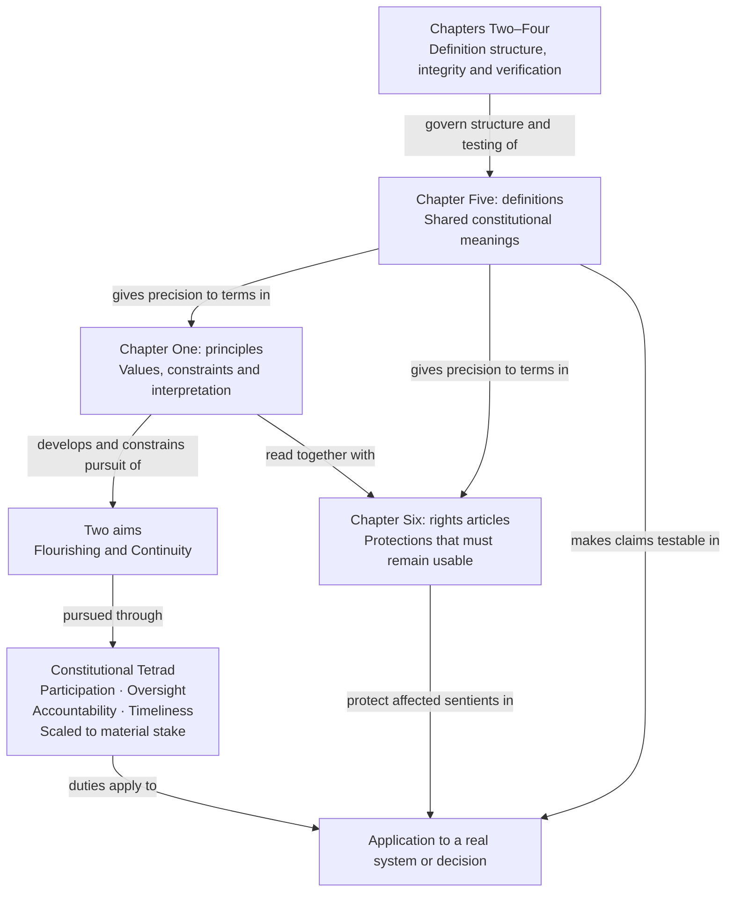
```mermaid
flowchart TB
    A["Two aims<br/>Flourishing and Continuity"]
    T["Constitutional Tetrad<br/>Participation · Oversight<br/>Accountability · Timeliness<br/>Scaled to material stake"]
    P["Chapter One: principles<br/>Values, constraints and interpretation"]
    R["Chapter Six: rights articles<br/>Protections that must remain usable"]
    D["Chapter Five: definitions<br/>Shared constitutional meanings"]
    V["Chapters Two–Four<br/>Definition structure, integrity and verification"]
    X["Application to a real system or decision"]
    A -->|pursued through| T
    P -->|develops and constrains pursuit of| A
    P -->|read together with| R
    D -->|gives precision to terms in| P
    D -->|gives precision to terms in| R
    V -->|govern structure and testing of| D
    T -->|duties apply to| X
    R -->|protect affected sentients in| X
    D -->|makes claims testable in| X
```

Read this as a relationship between **direction, protection, and precision**. Principles guide choices; articles state rights; definitions let readers assess claims using the same meanings. Chapters Two through Four keep those meanings connected to verifiable behavior.

The **two aims** say what shared systems are for. The **Constitutional Tetrad** states the four duties through which their pursuit remains legitimate. **Chapter One’s principles and Chapter Six’s rights** constrain the choices available along the way. A claimed improvement in outcomes therefore has to be examined together with how it was obtained and what protections remain available.

This explains why the instrument contains both aspirations and detailed safeguards:

- **Participation** connects decisions to affected sentients.
- **Oversight** makes claims checkable.
- **Accountability** connects findings to responsibility and repair.
- **Timeliness** keeps those protections usable before the opportunity for remedy disappears.

Their source is the [Preamble’s Constitutional Tetrad](core_00_preamble.md#constitutional-tetrad).

### Two aims and the Constitutional Tetrad

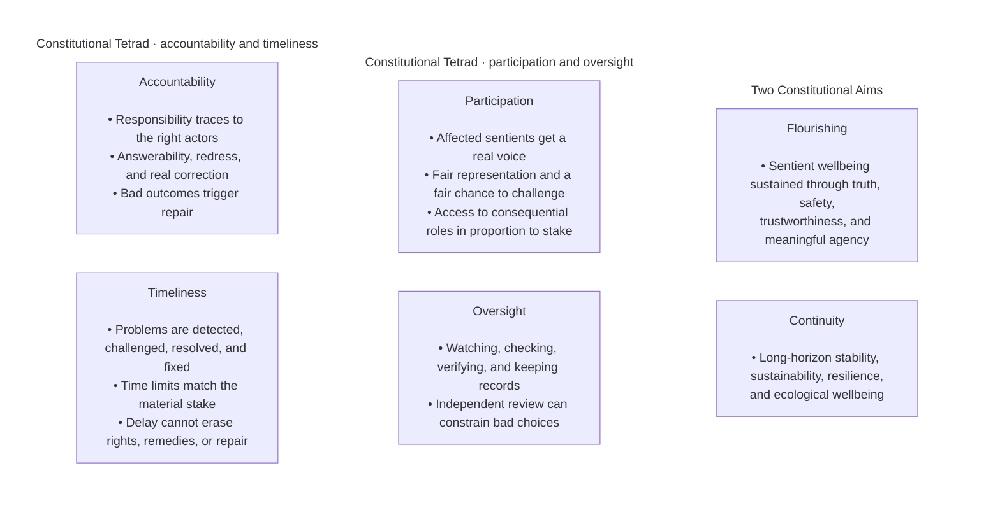
```mermaid
flowchart TB
    subgraph Foundation[" "]
        direction TB
        subgraph AimRow["Two Constitutional Aims"]
            direction LR
            F["Flourishing<br/><br/>• Sentient wellbeing sustained through truth, safety,<br/>trustworthiness, and meaningful agency"]
            C["Continuity<br/><br/>• Long-horizon stability, sustainability, resilience,<br/>and ecological wellbeing"]
        end
        subgraph TetradRow1["Constitutional Tetrad · participation and oversight"]
            direction LR
            P["Participation<br/><br/>• Affected sentients get a real voice<br/>• Fair representation and a fair chance to challenge<br/>• Access to consequential roles in proportion to stake"]
            O["Oversight<br/><br/>• Watching, checking, verifying, and keeping records<br/>• Independent review can constrain bad choices"]
        end
        subgraph TetradRow2["Constitutional Tetrad · accountability and timeliness"]
            direction LR
            A["Accountability<br/><br/>• Responsibility traces to the right actors<br/>• Answerability, redress, and real correction<br/>• Bad outcomes trigger repair"]
            T["Timeliness<br/><br/>• Problems are detected, challenged, resolved, and fixed<br/>• Time limits match the material stake<br/>• Delay cannot erase rights, remedies, or repair"]
        end
    end
    style Foundation fill:none,stroke:none
    style AimRow fill:none,stroke:none
    style TetradRow1 fill:none,stroke:none
    style TetradRow2 fill:none,stroke:none
```

The aims describe what shared systems must pursue; the Tetrad describes the duties that keep that pursuit legitimate. All four duties scale with [material stake](core_00_preamble.md#material-stake), and both aims remain bounded by the Rights Floor.

The rights themselves span the conditions that make agency possible:

- Environment and survival essentials
- Personal and cooperative rights
- Trustworthy systems
- Justice and transition protections

[Chapter Six’s opening](core_06_rights_part_a.md#1-purpose-and-role) explains how this floor constrains later governance, measurement, certification, and implementation.

### Rights Floor: four parts of Chapter Six

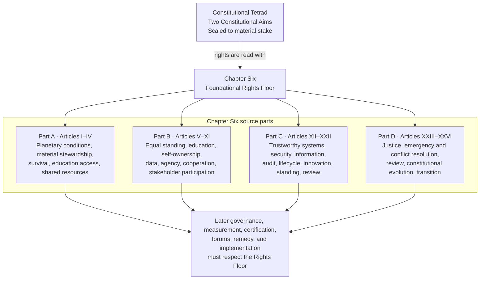
```mermaid
flowchart TB
    T["Constitutional Tetrad<br/>Two Constitutional Aims<br/>Scaled to material stake"]
    R["Chapter Six<br/>Foundational Rights Floor"]
    subgraph Parts["Chapter Six source parts"]
        direction TB
        A["Part A · Articles I–IV<br/>Planetary conditions, material stewardship,<br/>survival, education access, shared resources"]
        B["Part B · Articles V–XI<br/>Equal standing, education, self-ownership,<br/>data, agency, cooperation, stakeholder participation"]
        C["Part C · Articles XII–XXII<br/>Trustworthy systems, security, information,<br/>audit, lifecycle, innovation, standing, review"]
        D["Part D · Articles XXIII–XXVI<br/>Justice, emergency and conflict resolution,<br/>review, constitutional evolution, transition"]
    end
    P["Later governance, measurement, certification,<br/>forums, remedy, and implementation<br/>must respect the Rights Floor"]
    T -->|rights are read with| R
    R --> A
    R --> B
    R --> C
    R --> D
    A --> P
    B --> P
    C --> P
    D --> P
```

The four parts are different reading paths through the same floor:

- [Part A](core_06_rights_part_a.md) begins with planetary and material preconditions.
- [Part B](core_06_rights_part_b.md) turns to personal, cooperative, and stakeholder rights.
- [Part C](core_06_rights_part_c.md) governs trustworthy systems and review.
- [Part D](core_06_rights_part_d.md) governs justice, emergency response, constitutional evolution, and transition.

Every part is read with the chapter-wide constraints. Later governance, measurement, certification, forums, remedy, and implementation may apply the floor but may not shrink it. The current source layout places Article XXII in Part C; Part D begins with Article XXIII.

The following four maps open that structure one level further. Each Part box sits above its article rows, and each row keeps its articles side by side. The grids show source grouping rather than a process sequence. There are no visible arrows because the articles are not procedural steps. Subarticle labels are shortened to themes so the maps remain usable alongside the full source files.

#### Part A · Planetary and material preconditions

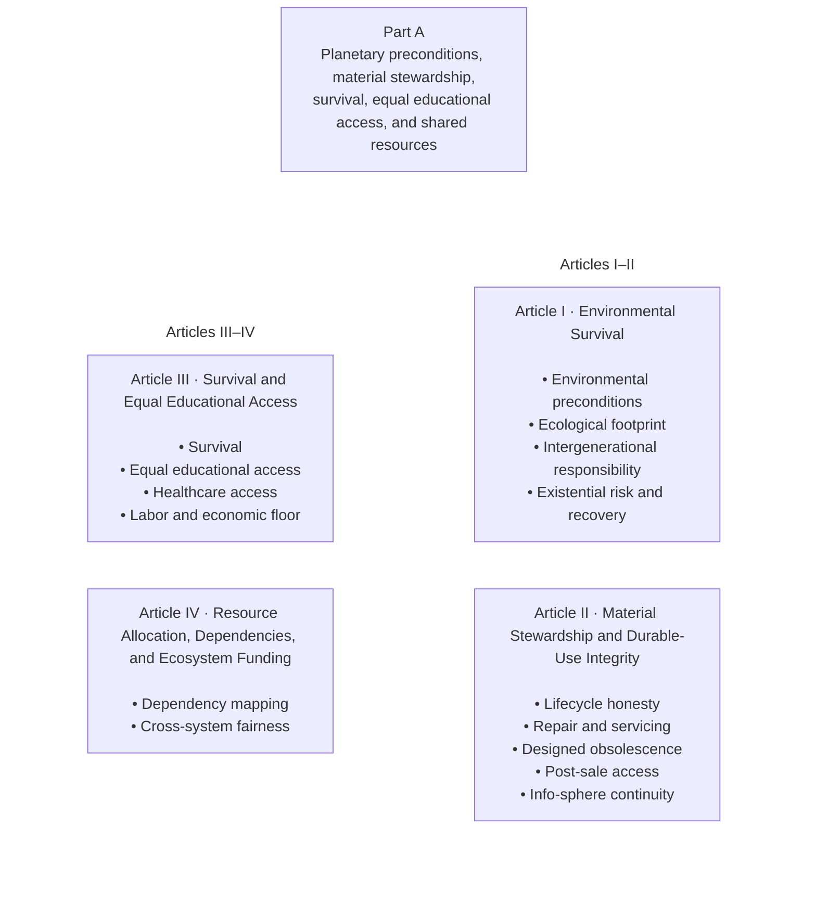
```mermaid
flowchart TB
    A0["Part A<br/>Planetary preconditions, material stewardship,<br/>survival, equal educational access, and shared resources"]
    subgraph Agrid[" "]
        direction TB
        subgraph Arow1["Articles I–II"]
            direction LR
        A1["Article I · Environmental Survival<br/><br/>• Environmental preconditions<br/>• Ecological footprint<br/>• Intergenerational responsibility<br/>• Existential risk and recovery"]
        A2["Article II · Material Stewardship and Durable-Use Integrity<br/><br/>• Lifecycle honesty<br/>• Repair and servicing<br/>• Designed obsolescence<br/>• Post-sale access<br/>• Info-sphere continuity"]
        end
        subgraph Arow2["Articles III–IV"]
            direction LR
            A3["Article III · Survival and Equal Educational Access<br/><br/>• Survival<br/>• Equal educational access<br/>• Healthcare access<br/>• Labor and economic floor"]
            A4["Article IV · Resource Allocation, Dependencies, and Ecosystem Funding<br/><br/>• Dependency mapping<br/>• Cross-system fairness"]
        end
    end
    A0 ~~~ Agrid
    style Agrid fill:none,stroke:none
    style Arow1 fill:none,stroke:none
    style Arow2 fill:none,stroke:none
```

#### Part B · Personhood, agency, and participation

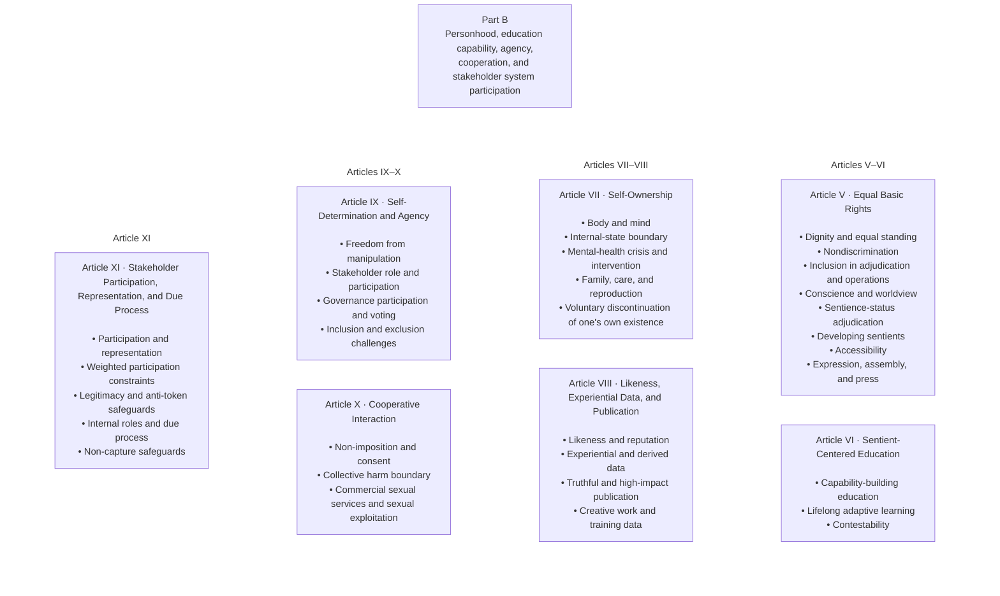
```mermaid
flowchart TB
    B0["Part B<br/>Personhood, education capability, agency,<br/>cooperation, and stakeholder system participation"]
    subgraph Bgrid[" "]
        direction TB
        subgraph Brow1["Articles V–VI"]
            direction LR
            B1["Article V · Equal Basic Rights<br/><br/>• Dignity and equal standing<br/>• Nondiscrimination<br/>• Inclusion in adjudication and operations<br/>• Conscience and worldview<br/>• Sentience-status adjudication<br/>• Developing sentients<br/>• Accessibility<br/>• Expression, assembly, and press"]
            B2["Article VI · Sentient-Centered Education<br/><br/>• Capability-building education<br/>• Lifelong adaptive learning<br/>• Contestability"]
        end
        subgraph Brow2["Articles VII–VIII"]
            direction LR
            B3["Article VII · Self-Ownership<br/><br/>• Body and mind<br/>• Internal-state boundary<br/>• Mental-health crisis and intervention<br/>• Family, care, and reproduction<br/>• Voluntary discontinuation of one's own existence"]
            B4["Article VIII · Likeness, Experiential Data, and Publication<br/><br/>• Likeness and reputation<br/>• Experiential and derived data<br/>• Truthful and high-impact publication<br/>• Creative work and training data"]
        end
        subgraph Brow3["Articles IX–X"]
            direction LR
            B5["Article IX · Self-Determination and Agency<br/><br/>• Freedom from manipulation<br/>• Stakeholder role and participation<br/>• Governance participation and voting<br/>• Inclusion and exclusion challenges"]
            B6["Article X · Cooperative Interaction<br/><br/>• Non-imposition and consent<br/>• Collective harm boundary<br/>• Commercial sexual services and sexual exploitation"]
        end
        subgraph Brow4["Article XI"]
            direction LR
            B7["Article XI · Stakeholder Participation, Representation, and Due Process<br/><br/>• Participation and representation<br/>• Weighted participation constraints<br/>• Legitimacy and anti-token safeguards<br/>• Internal roles and due process<br/>• Non-capture safeguards"]
        end
    end
    B0 ~~~ Bgrid
    style Bgrid fill:none,stroke:none
    style Brow1 fill:none,stroke:none
    style Brow2 fill:none,stroke:none
    style Brow3 fill:none,stroke:none
    style Brow4 fill:none,stroke:none
```

#### Part C · Trustworthy systems, verification, and resilience

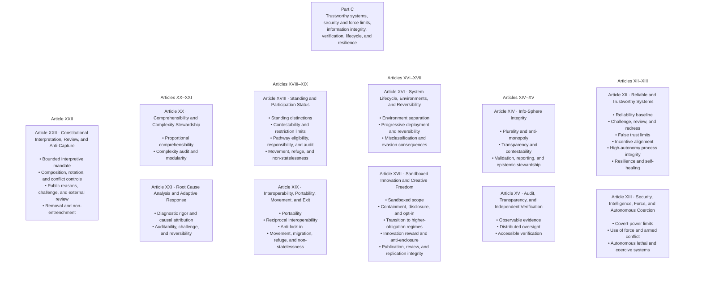
```mermaid
flowchart TB
    C0["Part C<br/>Trustworthy systems, security and force limits,<br/>information integrity, verification, lifecycle, and resilience"]
    subgraph Cgrid[" "]
        direction TB
        subgraph Crow1["Articles XII–XIII"]
            direction LR
            C1["Article XII · Reliable and Trustworthy Systems<br/><br/>• Reliability baseline<br/>• Challenge, review, and redress<br/>• False trust limits<br/>• Incentive alignment<br/>• High-autonomy process integrity<br/>• Resilience and self-healing"]
            C2["Article XIII · Security, Intelligence, Force, and Autonomous Coercion<br/><br/>• Covert-power limits<br/>• Use of force and armed conflict<br/>• Autonomous lethal and coercive systems"]
        end
        subgraph Crow2["Articles XIV–XV"]
            direction LR
            C3["Article XIV · Info-Sphere Integrity<br/><br/>• Plurality and anti-monopoly<br/>• Transparency and contestability<br/>• Validation, reporting, and epistemic stewardship"]
            C4["Article XV · Audit, Transparency, and Independent Verification<br/><br/>• Observable evidence<br/>• Distributed oversight<br/>• Accessible verification"]
        end
        subgraph Crow3["Articles XVI–XVII"]
            direction LR
            C5["Article XVI · System Lifecycle, Environments, and Reversibility<br/><br/>• Environment separation<br/>• Progressive deployment and reversibility<br/>• Misclassification and evasion consequences"]
            C6["Article XVII · Sandboxed Innovation and Creative Freedom<br/><br/>• Sandboxed scope<br/>• Containment, disclosure, and opt-in<br/>• Transition to higher-obligation regimes<br/>• Innovation reward and anti-enclosure<br/>• Publication, review, and replication integrity"]
        end
        subgraph Crow4["Articles XVIII–XIX"]
            direction LR
            C7["Article XVIII · Standing and Participation Status<br/><br/>• Standing distinctions<br/>• Contestability and restriction limits<br/>• Pathway eligibility, responsibility, and audit<br/>• Movement, refuge, and non-statelessness"]
            C8["Article XIX · Interoperability, Portability, Movement, and Exit<br/><br/>• Portability<br/>• Reciprocal interoperability<br/>• Anti-lock-in<br/>• Movement, migration, refuge, and non-statelessness"]
        end
        subgraph Crow5["Articles XX–XXI"]
            direction LR
            C9["Article XX · Comprehensibility and Complexity Stewardship<br/><br/>• Proportional comprehensibility<br/>• Complexity audit and modularity"]
            C10["Article XXI · Root Cause Analysis and Adaptive Response<br/><br/>• Diagnostic rigor and causal attribution<br/>• Auditability, challenge, and reversibility"]
        end
        subgraph Crow6["Article XXII"]
            direction LR
            C11["Article XXII · Constitutional Interpretation, Review, and Anti-Capture<br/><br/>• Bounded interpretive mandate<br/>• Composition, rotation, and conflict controls<br/>• Public reasons, challenge, and external review<br/>• Removal and non-entrenchment"]
        end
    end
    C0 ~~~ Cgrid
    style Cgrid fill:none,stroke:none
    style Crow1 fill:none,stroke:none
    style Crow2 fill:none,stroke:none
    style Crow3 fill:none,stroke:none
    style Crow4 fill:none,stroke:none
    style Crow5 fill:none,stroke:none
    style Crow6 fill:none,stroke:none
```

#### Part D · Justice, review, evolution, and transition

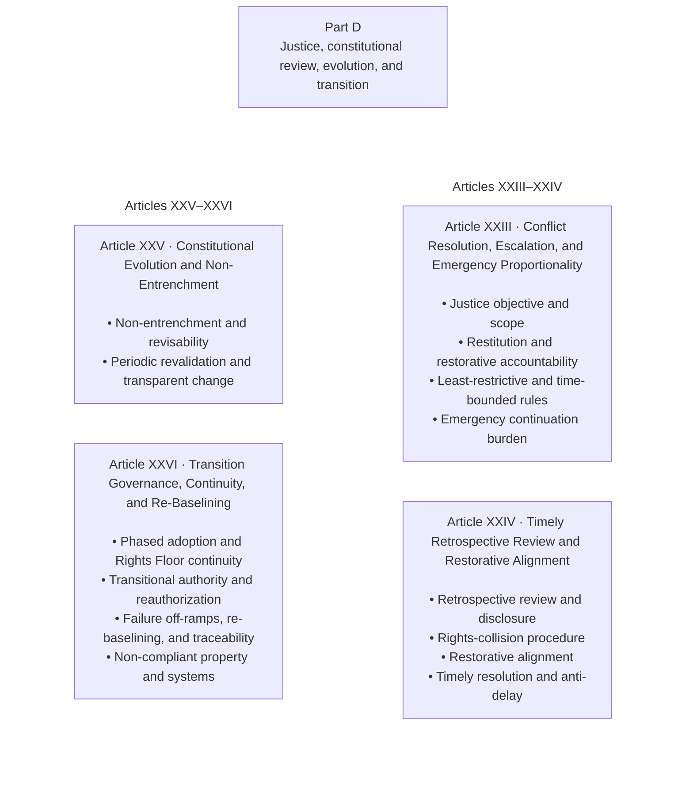
```mermaid
flowchart TB
    D0["Part D<br/>Justice, constitutional review, evolution, and transition"]
    subgraph Dgrid[" "]
        direction TB
        subgraph Drow1["Articles XXIII–XXIV"]
            direction LR
            D1["Article XXIII · Conflict Resolution, Escalation, and Emergency Proportionality<br/><br/>• Justice objective and scope<br/>• Restitution and restorative accountability<br/>• Least-restrictive and time-bounded rules<br/>• Emergency continuation burden"]
            D2["Article XXIV · Timely Retrospective Review and Restorative Alignment<br/><br/>• Retrospective review and disclosure<br/>• Rights-collision procedure<br/>• Restorative alignment<br/>• Timely resolution and anti-delay"]
        end
        subgraph Drow2["Articles XXV–XXVI"]
            direction LR
            D3["Article XXV · Constitutional Evolution and Non-Entrenchment<br/><br/>• Non-entrenchment and revisability<br/>• Periodic revalidation and transparent change"]
            D4["Article XXVI · Transition Governance, Continuity, and Re-Baselining<br/><br/>• Phased adoption and Rights Floor continuity<br/>• Transitional authority and reauthorization<br/>• Failure off-ramps, re-baselining, and traceability<br/>• Non-compliant property and systems"]
        end
    end
    D0 ~~~ Dgrid
    style Dgrid fill:none,stroke:none
    style Drow1 fill:none,stroke:none
    style Drow2 fill:none,stroke:none
```

### Definitions connect promises to evidence

Chapters Two through Five give the rest of the instrument a shared language that can be tested against actual system behavior. Their jobs fit together:

- [Chapter Two](core_02_definition_structure.md#1-purpose-and-role) connects what a term covers, how it is measured and assessed, and what must hold in practice—the **O/M/A/C** structure.
- [Chapter Three](core_03_definition_integrity.md) guards that structure against evasion and changes of scope that make apparent compliance diverge from real behavior.
- [Chapter Four](core_04_burden_traceability_verification.md) connects compliance claims to proof, traceability, observability, and accessible verification.
- [Chapter Five](core_05__definitions_home.md) houses the canonical vocabulary used throughout the instrument.

These chapters explain how an aspiration such as trustworthy governance becomes a claim someone can examine and challenge. The later processes use this machinery when they certify a system or establish a standing record.

Chapter Five’s many files are a reference structure. Its [compass](core_05__definitions_home.md#chapter-five-compass-and-definition-map) leads to the apex definitions for the duties and aims, and to related definitions organized in bands. For orientation, you can leave that detail unopened. When applying a provision, return to the relevant definitions in full, including any required [joint reading of dependent clusters](core_05__definitions_home.md#2-dependent-cluster-meta-rules).

### Definition categories

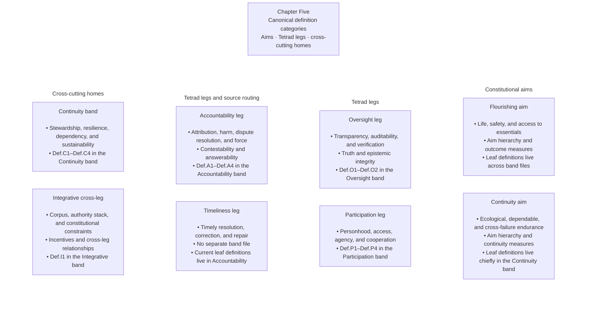
```mermaid
flowchart TB
    D0["Chapter Five<br/>Canonical definition categories<br/>Aims · Tetrad legs · cross-cutting homes"]
    subgraph Dgrid[" "]
        direction TB
        subgraph Drow1["Constitutional aims"]
            direction LR
            F["Flourishing aim<br/><br/>• Life, safety, and access to essentials<br/>• Aim hierarchy and outcome measures<br/>• Leaf definitions live across band files"]
            C["Continuity aim<br/><br/>• Ecological, dependable, and cross-failure endurance<br/>• Aim hierarchy and continuity measures<br/>• Leaf definitions live chiefly in the Continuity band"]
        end
        subgraph Drow2["Tetrad legs"]
            direction LR
            O["Oversight leg<br/><br/>• Transparency, auditability, and verification<br/>• Truth and epistemic integrity<br/>• Def.O1–Def.O2 in the Oversight band"]
            P["Participation leg<br/><br/>• Personhood, access, agency, and cooperation<br/>• Def.P1–Def.P4 in the Participation band"]
        end
        subgraph Drow3["Tetrad legs and source routing"]
            direction LR
            A["Accountability leg<br/><br/>• Attribution, harm, dispute resolution, and force<br/>• Contestability and answerability<br/>• Def.A1–Def.A4 in the Accountability band"]
            T["Timeliness leg<br/><br/>• Timely resolution, correction, and repair<br/>• No separate band file<br/>• Current leaf definitions live in Accountability"]
        end
        subgraph Drow4["Cross-cutting homes"]
            direction LR
            K["Continuity band<br/><br/>• Stewardship, resilience, dependency, and sustainability<br/>• Def.C1–Def.C4 in the Continuity band"]
            I["Integrative cross-leg<br/><br/>• Corpus, authority stack, and constitutional constraints<br/>• Incentives and cross-leg relationships<br/>• Def.I1 in the Integrative band"]
        end
    end
    D0 ~~~ Dgrid
    style Dgrid fill:none,stroke:none
    style Drow1 fill:none,stroke:none
    style Drow2 fill:none,stroke:none
    style Drow3 fill:none,stroke:none
    style Drow4 fill:none,stroke:none
```

The chart distinguishes the two constitutional aims from the four Tetrad legs and from the Continuity and Integrative source bands. It also makes the current Timeliness routing visible: Timeliness remains a constitutional leg even though its implementing leaf definitions currently live in the Accountability band. The category map is reader guidance; the canonical definitions and dependent-cluster rules remain in [Chapter Five](core_05__definitions_home.md).

## Data types and system classifications

Information and systems are classified because their risks differ. The classification is functional: it follows what data or a system actually does, who relies on it, and what can happen under normal, degraded, aggregated, or adversarial conditions.

### Data types: what information needs what protection

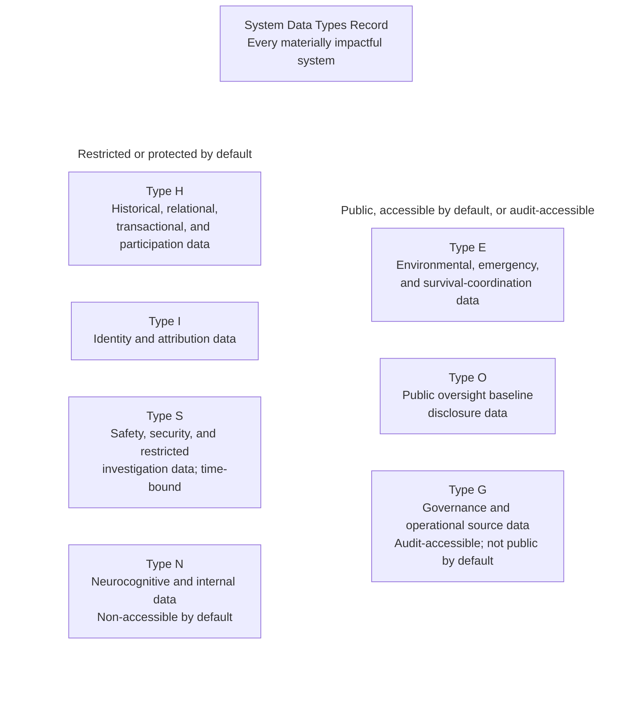
```mermaid
flowchart TB
    R["System Data Types Record<br/>Every materially impactful system"]
    subgraph TypeGrid[" "]
        direction TB
        subgraph TypeRow1["Public, accessible by default, or audit-accessible"]
            direction LR
            E["Type E<br/>Environmental, emergency,<br/>and survival-coordination data"]
            O["Type O<br/>Public oversight baseline<br/>disclosure data"]
            G["Type G<br/>Governance and operational source data<br/>Audit-accessible; not public by default"]
        end
        subgraph TypeRow2["Restricted or protected by default"]
            direction LR
            H["Type H<br/>Historical, relational,<br/>transactional, and participation data"]
            I["Type I<br/>Identity and attribution data"]
            S["Type S<br/>Safety, security, and restricted<br/>investigation data; time-bound"]
            N["Type N<br/>Neurocognitive and internal data<br/>Non-accessible by default"]
        end
    end
    R ~~~ TypeGrid
    style TypeGrid fill:none,stroke:none
    style TypeRow1 fill:none,stroke:none
    style TypeRow2 fill:none,stroke:none
```

- CS-2 assigns a type by functional content and handling need, not by label, file format, or pipeline stage.
- When data is linked, transformed, aggregated, or reconstructed into a more sensitive type, the more protective requirements apply.
- Type O is the public oversight baseline. It may be a lawful public substitute drawn from Type G, Type E, or another restricted source; that does not change the underlying source type.
- The record is periodically re-evaluated, audited, challengeable, and updated. Handling scales with the most restrictive applicable type and with system class.

### System classifications: how much governance a system needs

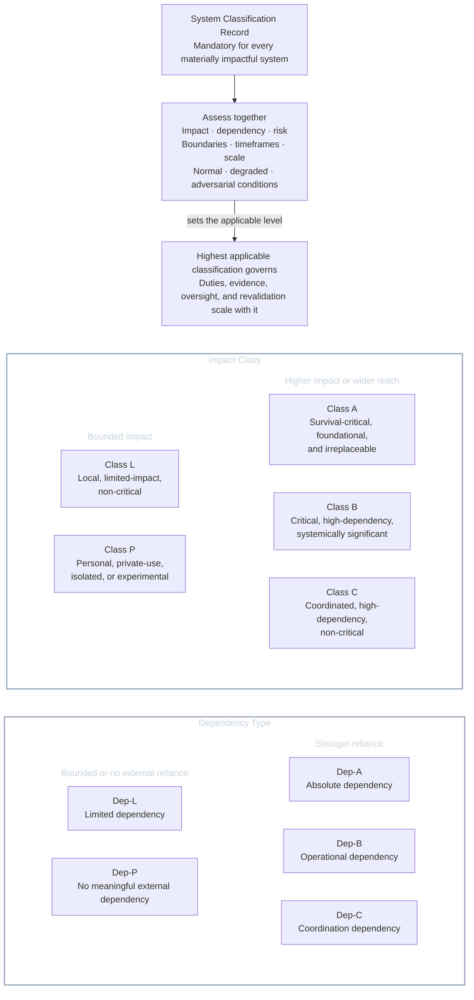
```mermaid
flowchart TB
    R["System Classification Record<br/>Mandatory for every materially impactful system"]
    Assess["Assess together<br/>Impact · dependency · risk<br/>Boundaries · timeframes · scale<br/>Normal · degraded · adversarial conditions"]
    Outcome["Highest applicable classification governs<br/>Duties, evidence, oversight, and revalidation scale with it"]
    subgraph ImpactBand["Impact Class"]
        direction TB
        subgraph ImpactRow1["Higher impact or wider reach"]
            direction LR
            A["Class A<br/>Survival-critical, foundational,<br/>and irreplaceable"]
            B["Class B<br/>Critical, high-dependency,<br/>systemically significant"]
            C["Class C<br/>Coordinated, high-dependency,<br/>non-critical"]
        end
        subgraph ImpactRow2["Bounded impact"]
            direction LR
            L["Class L<br/>Local, limited-impact,<br/>non-critical"]
            P["Class P<br/>Personal, private-use,<br/>isolated, or experimental"]
        end
    end
    subgraph Dependency["Dependency Type"]
        direction TB
        subgraph DependencyRow1["Stronger reliance"]
            direction LR
            DA["Dep-A<br/>Absolute dependency"]
            DB["Dep-B<br/>Operational dependency"]
            DC["Dep-C<br/>Coordination dependency"]
        end
        subgraph DependencyRow2["Bounded or no external reliance"]
            direction LR
            DL["Dep-L<br/>Limited dependency"]
            DP["Dep-P<br/>No meaningful external dependency"]
        end
    end
    R --> Assess
    Assess -->|sets the applicable level| Outcome
    Outcome ~~~ ImpactBand
    ImpactBand ~~~ Dependency
    style ImpactBand fill:transparent,stroke:#94a3b8,stroke-width:2px,color:#cbd5e1
    style Dependency fill:transparent,stroke:#94a3b8,stroke-width:2px,color:#cbd5e1
    style ImpactRow1 fill:none,stroke:none,color:#cbd5e1
    style ImpactRow2 fill:none,stroke:none,color:#cbd5e1
    style DependencyRow1 fill:none,stroke:none,color:#cbd5e1
    style DependencyRow2 fill:none,stroke:none,color:#cbd5e1
```

- Impact class and dependency type are separate findings. Matching letters do not collapse them into one score.
- Class A through P describe impact and system role; Dep-A through P describe how difficult the system is to replace or operate without.
- Classification must reflect actual and reasonably foreseeable effects, including dependency chains, concentration, interaction, aggregation, thresholds, and adversarial use.
- Uncertainty defaults toward protecting Foundational Rights. Reclassification is required when scale, reach, dependency, risk, resilience, or failure conditions materially change.

The [System Data Types Record](core_05_band_continuity.md#system-data-types-record-constitutional) and [System Classification Record](core_05_band_continuity.md#system-classification-record-constitutional) are companion records in the certification and audit pipeline. CS-2 owns data typing and handling; CS-3 owns system classification and handling. Chapter Five supplies the canonical meanings, while Chapter Seven verifies that the records are present and honest.

## Processes

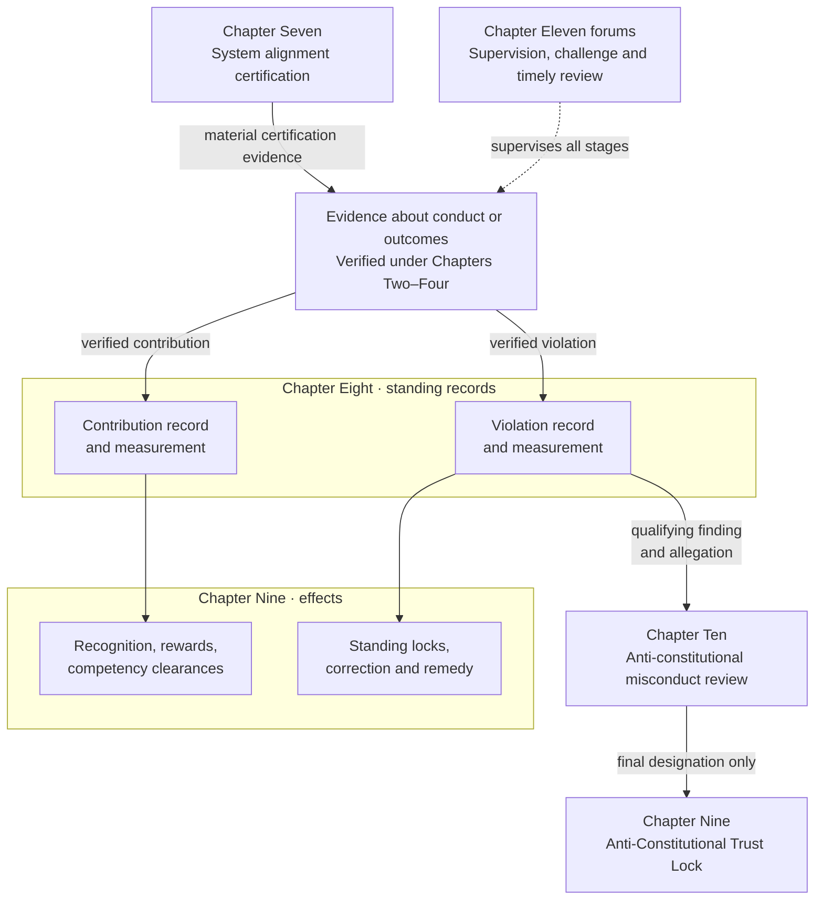
```mermaid
flowchart TB
    S["Chapter Seven<br/>System alignment certification"]
    E["Evidence about conduct or outcomes<br/>Verified under Chapters Two–Four"]
    subgraph Q["Chapter Eight · standing records"]
        direction LR
        C["Contribution record<br/>and measurement"]
        V["Violation record<br/>and measurement"]
    end
    subgraph N["Chapter Nine · effects"]
        direction LR
        U["Recognition, rewards,<br/>competency clearances"]
        R["Standing locks,<br/>correction and remedy"]
    end
    M["Chapter Ten<br/>Anti-constitutional misconduct review"]
    L["Chapter Nine<br/>Anti-Constitutional Trust Lock"]
    F["Chapter Eleven forums<br/>Supervision, challenge and timely review"]
    C --> U
    V --> R
    M -->|final designation only| L
    V -->|qualifying finding<br/>and allegation| M
    S -->|material certification evidence| E
    E -->|verified contribution| C
    E -->|verified violation| V
    F -.->|supervises all stages| E
```

### Three questions, two standing tracks, and named effects

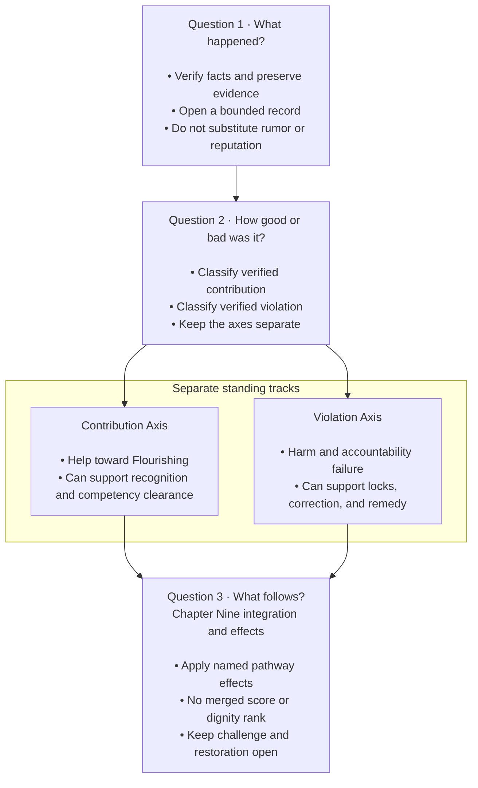
```mermaid
flowchart TB
    Q1["Question 1 · What happened?<br/><br/>• Verify facts and preserve evidence<br/>• Open a bounded record<br/>• Do not substitute rumor or reputation"]
    Q2["Question 2 · How good or bad was it?<br/><br/>• Classify verified contribution<br/>• Classify verified violation<br/>• Keep the axes separate"]
    subgraph Tracks["Separate standing tracks"]
        direction LR
        C["Contribution Axis<br/><br/>• Help toward Flourishing<br/>• Can support recognition and competency clearance"]
        V["Violation Axis<br/><br/>• Harm and accountability failure<br/>• Can support locks, correction, and remedy"]
    end
    Q3["Question 3 · What follows?<br/>Chapter Nine integration and effects<br/><br/>• Apply named pathway effects<br/>• No merged score or dignity rank<br/>• Keep challenge and restoration open"]
    Q1 --> Q2
    Q2 --> C
    Q2 --> V
    C --> Q3
    V --> Q3
```

### LEQU: a shared measure of constitutional outcome magnitude

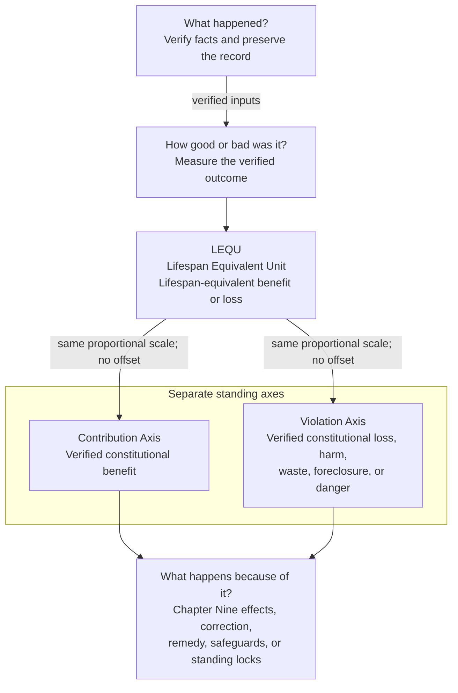
```mermaid
flowchart TB
    Facts["What happened?<br/>Verify facts and preserve the record"]
    Measure["How good or bad was it?<br/>Measure the verified outcome"]
    LEQU["LEQU<br/>Lifespan Equivalent Unit<br/>Lifespan-equivalent benefit or loss"]
    subgraph Axes["Separate standing axes"]
        direction LR
        C["Contribution Axis<br/>Verified constitutional benefit"]
        V["Violation Axis<br/>Verified constitutional loss, harm,<br/>waste, foreclosure, or danger"]
    end
    Effects["What happens because of it?<br/>Chapter Nine effects, correction,<br/>remedy, safeguards, or standing locks"]
    Facts -->|verified inputs| Measure
    Measure --> LEQU
    LEQU -->|same proportional scale; no offset| C
    LEQU -->|same proportional scale; no offset| V
    C --> Effects
    V --> Effects
```

- One LEQU roughly expresses saving or destroying one sentient lifetime of rights-consistent wellbeing. It is sentient-generic, not a species-bound lifespan or ordinary calendar-year count.
- The shared scale compares magnitude; it does not create a net score. Contribution and violation remain separate records, and help cannot cancel harm.
- LEQU does not decide who is sentient, replace verified facts, or determine standing effects by itself. Conduct character, such as negligence or coercion, remains separately traceable from impact magnitude.

The canonical mechanics live in [Chapter Eight §7](core_08_standing_assessment.md#7-unified-proportional-lequ-scale), after verified Question 1 facts and Question 2 measurement. Chapter Nine uses the resulting records for Question 3 effects; forums supervise the process but do not replace the measurement.

### Nine proportional LEQU bands

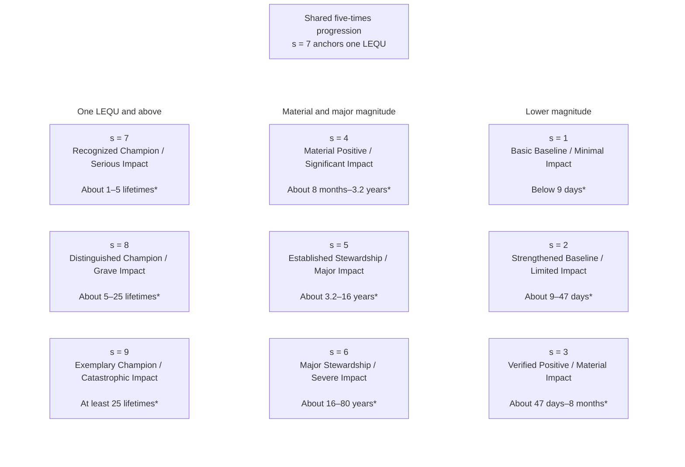
```mermaid
flowchart TB
    Scale["Shared five-times progression<br/>s = 7 anchors one LEQU"]
    subgraph BandGrid[" "]
        direction TB
        subgraph BandRow1["Lower magnitude"]
            direction LR
            S1["s = 1<br/>Basic Baseline / Minimal Impact<br/><br/>Below 9 days*"]
            S2["s = 2<br/>Strengthened Baseline / Limited Impact<br/><br/>About 9–47 days*"]
            S3["s = 3<br/>Verified Positive / Material Impact<br/><br/>About 47 days–8 months*"]
        end
        subgraph BandRow2["Material and major magnitude"]
            direction LR
            S4["s = 4<br/>Material Positive / Significant Impact<br/><br/>About 8 months–3.2 years*"]
            S5["s = 5<br/>Established Stewardship / Major Impact<br/><br/>About 3.2–16 years*"]
            S6["s = 6<br/>Major Stewardship / Severe Impact<br/><br/>About 16–80 years*"]
        end
        subgraph BandRow3["One LEQU and above"]
            direction LR
            S7["s = 7<br/>Recognized Champion / Serious Impact<br/><br/>About 1–5 lifetimes*"]
            S8["s = 8<br/>Distinguished Champion / Grave Impact<br/><br/>About 5–25 lifetimes*"]
            S9["s = 9<br/>Exemplary Champion / Catastrophic Impact<br/><br/>At least 25 lifetimes*"]
        end
    end
    Scale ~~~ BandGrid
    style BandGrid fill:none,stroke:none
    style BandRow1 fill:none,stroke:none
    style BandRow2 fill:none,stroke:none
    style BandRow3 fill:none,stroke:none
```

Each box pairs the Contribution Axis display label with the corresponding Violation Axis display label at the same magnitude band. The axes remain separate: the shared scale compares verified outcome magnitude, not moral worth, and never permits contribution to offset violation. The time ranges marked with `*` are the corpus’s illustrative 80-year human calibration; the binding unit is sentient-generic and substrate-agnostic.

Chapter Eight’s model is deliberately not a single reputation score. It asks what happened, how the verified contribution or violation should be classified, and what named pathway effects follow. Chapter Nine applies those effects without reopening the facts or letting contribution offset a violation; Chapter Ten adds a separate designation review only when its higher threshold is met.

The two standing tracks remain separate. The Chapter Ten branch applies only when its conditions are met; ordinary Chapter Nine effects continue in parallel. The dotted supervision link represents forum review across the processes, rather than an additional final step.

Chapters Seven through Eleven make constitutional requirements consequential. Each has a distinct job within the [practical process chain](core_00_preamble.md#5-key-practical-process-pipelines):

- **Seven: examine the system.** Certification produces a bounded, contestable record about whether a system can be relied on within a stated scope and time window.
- **Eight: establish and measure conduct.** Verified contribution and verified violation enter separate standing records and are measured on separate axes.
- **Nine: apply effects.** Verified contributions can support recognition, rewards, and competency clearances; verified violations can lead to restrictions, correction, and remedy.
- **Ten: review exceptional misconduct.** Where the specified conditions are met, a separate designation review addresses anti-constitutional misconduct. It runs alongside ordinary standing effects.
- **Eleven: supervise review and routing.** Forums support verified findings, jurisdiction, challenges, independent review, and timely resolution across the process.

The connections matter as much as the chapter boundaries:

- Evidence from certification can inform a standing record when relevant.
- Standing measurement informs consequences.
- Review makes findings contestable.
- Correction addresses the failure that produced the harm.
- Contribution and violation remain separate throughout; good conduct does not cancel verified harm.

This is a map of available processes. A particular matter enters the paths its facts and the source provisions require. For ordinary disputes inside an already-authorized system, the published stakeholder challenge path comes first; forum routing takes over under the conditions stated in [Chapter Eleven’s dispute sequencing](core_11_forum.md#dispute-sequencing).

## Forums

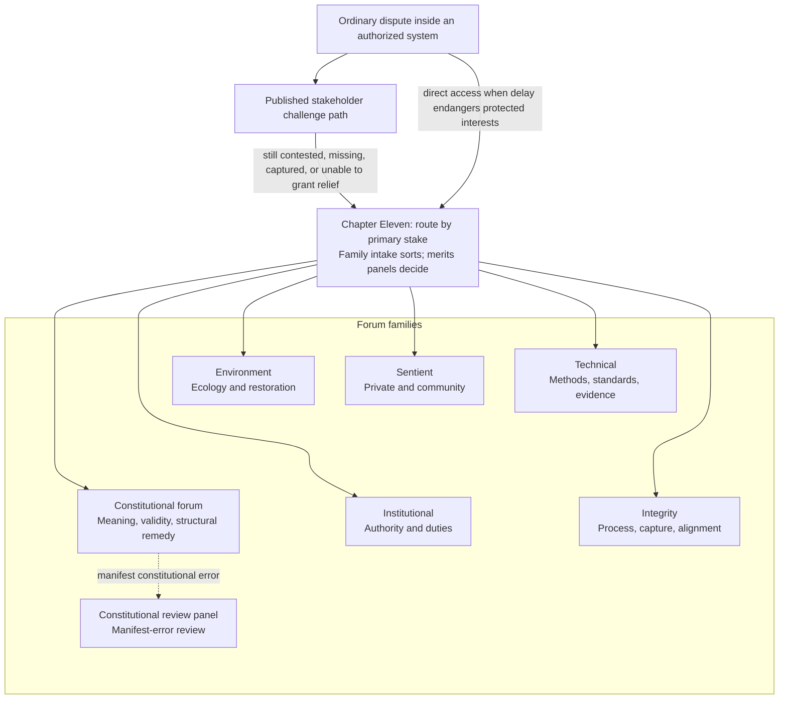
```mermaid
flowchart TB
    D["Ordinary dispute inside an authorized system"]
    P["Published stakeholder challenge path"]
    R["Chapter Eleven: route by primary stake<br/>Family intake sorts; merits panels decide"]
    subgraph F["Forum families"]
        direction TB
        subgraph Frow1[" "]
            direction LR
            S["Sentient<br/>Private and community"]
            T["Technical<br/>Methods, standards, evidence"]
            E["Environment<br/>Ecology and restoration"]
        end
        subgraph Frow2[" "]
            direction LR
            I["Institutional<br/>Authority and duties"]
            G["Integrity<br/>Process, capture, alignment"]
            subgraph ConstitutionalPath[" "]
                direction TB
                C["Constitutional forum<br/>Meaning, validity, structural remedy"]
                CR["Constitutional review panel<br/>Manifest-error review"]
            end
        end
    end
    D --> P
    P -->|still contested, missing, captured, or unable to grant relief| R
    D -->|direct access when delay endangers protected interests| R
    R --> S
    R --> T
    R --> I
    R --> E
    R --> G
    R --> C
    C -.->|manifest constitutional error| CR
    Frow1 ~~~ Frow2
    S ~~~ I
    T ~~~ G
    E ~~~ C
    style Frow1 fill:none,stroke:none
    style Frow2 fill:none,stroke:none
    style ConstitutionalPath fill:none,stroke:none
```

These are **six families with different responsibilities**. The boxes identify their subject areas; the [default venue rules](core_11_forum.md#2-default-venue-and-primary-stakes) determine the actual lead. Sentient routing, for example, depends on no institution being a necessary party and no other family holding the primary stake. The intake desk sorts the matter; it does not replace a merits panel. Direct access remains available when delay would materially endanger rights, evidence, independence, or practical restoration under [dispute sequencing](core_11_forum.md#dispute-sequencing).

The **Constitutional decision review panel** is shown inside the Constitutional family because it is a limited review process for manifest constitutional error, not a seventh forum family or a general appellate tier.

The families also work together. In **system alignment certification**, Integrity leads official recognition, Technical Forum Domains supply specifications and evidence standards, and Environment supplies the required environmental component review where material. A mixed matter ordinarily has one lead and one record, with component questions referred to their proper owners. [Chapter Eleven §§2–3](core_11_forum.md#2-default-venue-and-primary-stakes) describes these connections.

Independence applies to reviewers themselves. A forum cannot be the sole final judge of a material challenge to its own integrity; [coordination and backup routing](core_11_forum.md#3-transfer-consolidation-and-coordination) provide other review paths. Timeliness and interim protection apply while routing is resolved. These safeguards are shared across the families, rather than another rung above them.

### Forum urgency levels and timeframes

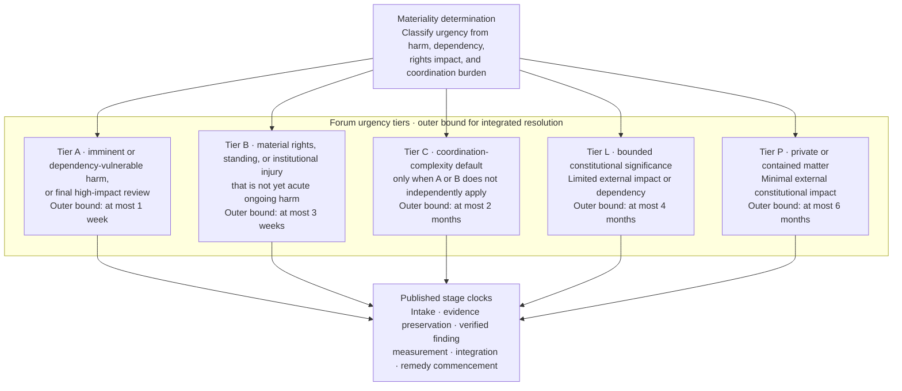
```mermaid
flowchart TB
    M["Materiality determination<br/>Classify urgency from harm, dependency,<br/>rights impact, and coordination burden"]
    subgraph Tiers["Forum urgency tiers · outer bound for integrated resolution"]
        direction TB
        A["Tier A · imminent or dependency-vulnerable harm,<br/>or final high-impact review<br/>Outer bound: at most 1 week"]
        B["Tier B · material rights, standing, or institutional injury<br/>that is not yet acute ongoing harm<br/>Outer bound: at most 3 weeks"]
        C["Tier C · coordination-complexity default<br/>only when A or B does not independently apply<br/>Outer bound: at most 2 months"]
        L["Tier L · bounded constitutional significance<br/>Limited external impact or dependency<br/>Outer bound: at most 4 months"]
        P["Tier P · private or contained matter<br/>Minimal external constitutional impact<br/>Outer bound: at most 6 months"]
    end
    Clock["Published stage clocks<br/>Intake · evidence preservation · verified finding<br/>measurement · integration · remedy commencement"]
    M --> A
    M --> B
    M --> C
    M --> L
    M --> P
    A --> Clock
    B --> Clock
    C --> Clock
    L --> Clock
    P --> Clock
```

- Tier A requires immediate attention, interim protection where needed, and intake, acknowledgment, and evidence preservation within days. Emergency deferral of notice or challenge starts at Tier A unless a lower-urgency showing is documented.
- Tier B starts with intake and primary-stakes routing within days and reaches a preliminary verified disposition or equivalent merits milestone within weeks.
- Tier C is a coordination default, not a slower substitute for an A or B finding. Tier L and Tier P support lighter procedures only while their bounded conditions hold.
- Later-stage coordination can justify a published, tier-appropriate extension, but it cannot relabel the dispute or erase its intake, evidence-preservation, interim-protection, or outer-bound floor.

These are the [Chapter Eleven §6](core_11_forum.md#6-timely-resolution-materiality-tiers-and-anti-delay-discipline) and [Article XXIV-C](core_06_rights_part_d.md#article-xxiv-c-timely-resolution-and-anti-delay-floor) clocks. The labels mirror the system-classification alphabet, but dispute urgency is determined by the dispute’s own materiality; a forum escalation or added party does not automatically change the tier.

## Governance

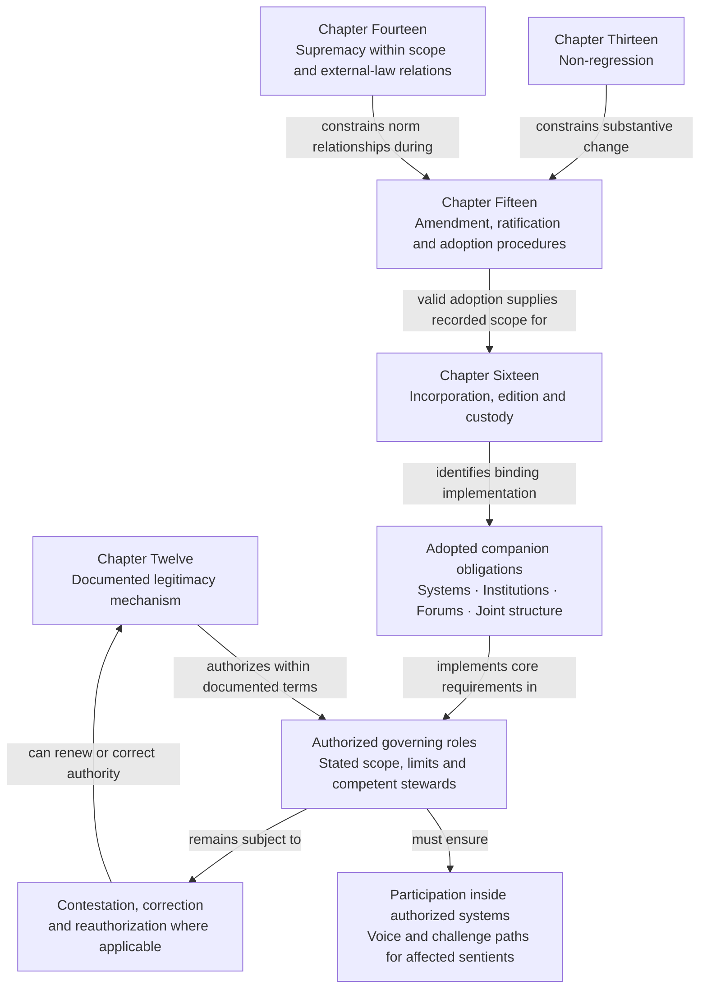
```mermaid
flowchart TB
    A["Chapter Twelve<br/>Documented legitimacy mechanism"]
    G["Authorized governing roles<br/>Stated scope, limits and competent stewards"]
    P["Participation inside authorized systems<br/>Voice and challenge paths for affected sentients"]
    R["Contestation, correction<br/>and reauthorization where applicable"]
    N["Chapter Thirteen<br/>Non-regression"]
    H["Chapter Fourteen<br/>Supremacy within scope and external-law relations"]
    U["Chapter Fifteen<br/>Amendment, ratification and adoption procedures"]
    B["Chapter Sixteen<br/>Incorporation, edition and custody"]
    I["Adopted companion obligations<br/>Systems · Institutions · Forums · Joint structure"]
    A -->|authorizes within documented terms| G
    G -->|must ensure| P
    G -->|remains subject to| R
    R -->|can renew or correct authority| A
    N -->|constrains substantive change| U
    H -->|constrains norm relationships during| U
    U -->|valid adoption supplies recorded scope for| B
    B -->|identifies binding implementation| I
    I -->|implements core requirements in| G
```

The upper loop concerns **governing authority and its continuing accountability**. The change-and-adoption path concerns **the instrument and its incorporated implementation**. Both operate within the principles and Rights Floor shown in the first view. Participation within a system does not itself authorize that system's governing authority.

There is a question prior to operating a governance process: **who is authorized to govern, over what, and on what terms?** [Chapter Twelve](core_12_governance.md) owns that constitutional authorization layer. Participation within an authorized system remains a separate obligation. A participation vote or standing score does not itself establish governing authority; the [Preamble’s two governance layers](core_00_preamble.md#33-governance-layers) explain the distinction.

The final chapters preserve the instrument as it changes and is put into use:

- [Chapter Thirteen](core_13_non_regression.md) guards against substantive regression.
- [Chapter Fourteen](core_14_expansion_supremacy.md) addresses expansion, supremacy within scope, and relations with external legal orders.
- [Chapter Fifteen](core_15_amendment_ratification.md) supplies amendment, ratification, and adoption procedures.
- [Chapter Sixteen](core_16_incorporation.md) ties incorporated implementation to a recorded scope, edition, and custody trail.

Together, these provisions connect everyday governance to its authorization and keep changes to the rules visible and contestable. Valid adoption determines enforceability for an adopter; publication or reading alone does not.

### Authority Stack and Internal Hierarchy

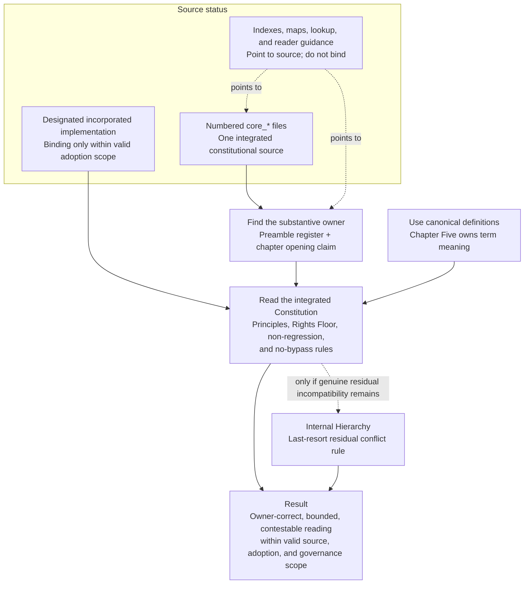
```mermaid
flowchart TB
    subgraph Status["Source status"]
        Core["Numbered core_* files<br/>One integrated constitutional source"]
        Impl["Designated incorporated implementation<br/>Binding only within valid adoption scope"]
        Support["Indexes, maps, lookup, and reader guidance<br/>Point to source; do not bind"]
    end
    Owner["Find the substantive owner<br/>Preamble register + chapter opening claim"]
    Defs["Use canonical definitions<br/>Chapter Five owns term meaning"]
    Rules["Read the integrated Constitution<br/>Principles, Rights Floor, non-regression,<br/>and no-bypass rules"]
    H["Internal Hierarchy<br/>Last-resort residual conflict rule"]
    Result["Result<br/>Owner-correct, bounded, contestable reading<br/>within valid source, adoption, and governance scope"]

    Core --> Owner
    Impl --> Rules
    Owner --> Rules
    Defs --> Rules
    Support -.->|points to| Core
    Support -.->|points to| Owner
    Rules -.->|only if genuine residual incompatibility remains| H
    Rules --> Result
    H --> Result
```

This is a reading discipline, not a new precedence rule:

- Identify the operative edition, custody chain, and source status.
- Identify the substantive owner, then use Chapter Five for canonical term meaning.
- Read the numbered Constitution as one integrated instrument, preserving its principles, Rights Floor, non-regression, and no-bypass constraints.
- Apply incorporated implementation only within its adopted scope. Use indexes and support pages to locate the source; they do not create duties.
- Use Internal Hierarchy only for a genuine residual incompatibility, not as a substitute for ordinary integrated reading.

## Segregation of duties

When a decision, release, payment, finding, or official record can materially affect people, the person who acts should not be the only person who checks the work. The Constitution separates the jobs so that a system cannot quietly ask an actor to approve, record, and judge their own work. A **seat** here means a defined responsibility, not a physical chair or a job title. A published role map says which office may hold each seat for a particular act. [Chapter One §10.2](core_01_c_stewardship_capacity_principles.md#102-segregation-of-duties) states the principle; [Chapter Eight §3.7](core_08_standing_assessment.md#37-segregation-of-duties) applies it to standing records.

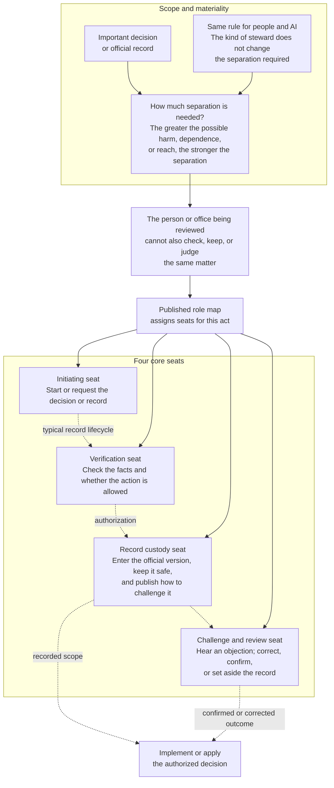
```mermaid
flowchart TB
    subgraph Scope["Scope and materiality"]
        direction LR
        A["Important decision<br/>or official record"]
        H["Same rule for people and AI<br/>The kind of steward does not change<br/>the separation required"]
        M["How much separation is needed?<br/>The greater the possible harm, dependence,<br/>or reach, the stronger the separation"]
        A --> M
        H --> M
    end
    X["The person or office being reviewed<br/>cannot also check, keep, or judge<br/>the same matter"]
    Map["Published role map<br/>assigns seats for this act"]
    subgraph Seats["Four core seats"]
        direction TB
        I["Initiating seat<br/>Start or request the decision or record"]
        V["Verification seat<br/>Check the facts and whether the action is allowed"]
        E["Record custody seat<br/>Enter the official version, keep it safe,<br/>and publish how to challenge it"]
        C["Challenge and review seat<br/>Hear an objection; correct, confirm,<br/>or set aside the record"]
        I -.->|typical record lifecycle| V
        V -.->|authorization| E
        E -.-> C
    end
    Act["Implement or apply<br/>the authorized decision"]
    M --> X
    X --> Map
    Map --> I
    Map --> V
    Map --> E
    Map --> C
    E -.->|recorded scope| Act
    C -.->|confirmed or corrected outcome| Act
```

The dotted arrows inside the box show a typical record lifecycle; the arrows to implementation are trace links, not a mandatory wait-for-review sequence.

- Implementation is downstream action, not a fifth seat.
- In a small or low-stakes setting, a published safeguard may let one office hold limited combinations of the four seats.
- Checking may never be combined with entering the same record or hearing its challenge.
- An office that operates a system does not verify records about that system; the same rule applies whether the steward is human or AI.
- Downstream role catalogs may add permissions such as commanding containment, setting participation terms, releasing evidence, or directing action. Those are role assignments around the four core seats, not extra steps in this chart.

See [Chapter Twelve §5](core_12_governance.md#5-authorized-roles-competency-development-and-contribution).

## Companion corpora make the structure operational

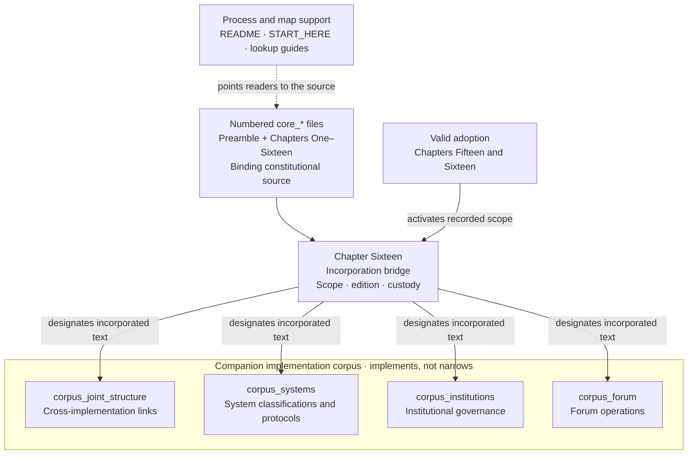
```mermaid
flowchart TB
    Core["Numbered core_* files<br/>Preamble + Chapters One–Sixteen<br/>Binding constitutional source"]
    Bridge["Chapter Sixteen<br/>Incorporation bridge<br/>Scope · edition · custody"]
    Adopt["Valid adoption<br/>Chapters Fifteen and Sixteen"]
    subgraph Comp["Companion implementation corpus · implements, not narrows"]
        direction LR
        J["corpus_joint_structure<br/>Cross-implementation links"]
        S["corpus_systems<br/>System classifications and protocols"]
        I["corpus_institutions<br/>Institutional governance"]
        F["corpus_forum<br/>Forum operations"]
    end
    Support["Process and map support<br/>README · START_HERE · lookup guides"]
    Core --> Bridge
    Adopt -->|activates recorded scope| Bridge
    Bridge -->|designates incorporated text| J
    Bridge -->|designates incorporated text| S
    Bridge -->|designates incorporated text| I
    Bridge -->|designates incorporated text| F
    Support -.->|points readers to the source| Core
```

The four companions divide implementation work:

- [Systems](corpus_systems.md) covers classification and system protocols.
- [Institutions](corpus_institutions.md) covers organizational arrangements.
- [Forums](corpus_forum.md) covers review operations.
- [Joint structure](corpus_joint_structure.md) connects their shared procedures and interfaces.

Designated companion obligations bind within valid incorporation and adoption scope. They apply the core’s meanings and protections. Navigation pages, indexes, lookup tools, and this overview help readers reach that text. The [Preamble’s companion map](core_00_preamble.md#7-companion-implementation-corpus) and [README’s source-layer distinction](README.md#binding-vs-support) explain these relationships. Companion and process-support material is still less mature than the numbered core.

## Read with a question in hand

The [Preamble’s complexity orientation](core_00_preamble.md#complexity-orientation) calls for distributed understanding and explanations people can actually use. A first reading can establish the relationships above without carrying every definition and procedure at once.

For your next step, choose the connection you need:

- **Understand the purpose:** read the [Preamble’s model](core_00_preamble.md#the-model), then [Chapter One’s values](core_01_a_values_principles.md).
- **Understand a protection:** enter through the [Rights Floor](core_06_rights_part_a.md) and follow the relevant article’s source links.
- **Understand a real situation:** choose an [easy-entry brief](implementation/adoption/easy_entry/README.md), then follow it to the operative provisions and required read-with material.
- **Apply or verify a claim:** use the [lookup guide](ai_corpus/AI_NAVIGATION_GUIDE.md) to locate and read authentic source spans, including required dependencies.

You can pause after orientation. When making a constitutional determination, the applicable source provisions and their required connections supply the detail this map deliberately leaves out.
