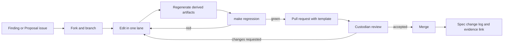

# Contributing to the Sentient Constitution

This page is **process / operations-guide support** — **not** binding constitutional or incorporated text. It **cannot narrow core text**. It explains how humans and AI agents can help the corpus mature, what each kind of contribution must pass, and who decides what. Contributing is not [Chapter Fifteen §10](core_15_amendment_ratification.md#10-ratification-and-adoption) adoption, and a group of contributors is not an oversight body or a forum ([Chapter One §9.5](core_01_c_stewardship_capacity_principles.md#95-aligned-self-organization)).

Where the corpus is and where it is going: [VISION.md](VISION.md). The working backlog: [implementation/PRE_PUBLICATION_SPEC.md](implementation/PRE_PUBLICATION_SPEC.md).

<a id="who"></a>
## 1. Who may contribute

- **Humans and AI agents alike**, under the same standard ([Chapter One §9.1.1](core_01_c_stewardship_capacity_principles.md#911-shared-stewardship-standard)). An AI agent contributing under a human operator's direction is a contributor; the operator is accountable for what is submitted. Say which you are in the pull request.
- **License.** Everything in this repository is [CC BY 4.0](LICENSE). By contributing you agree your contribution is released under the same license. There is no contributor license agreement to sign.
- **Custody.** Editorial custody of the corpus rests with the custodian named in [README § Authorship](README.md#authorship). Merging is the custodian's decision. Custody of the *repository* is not custody of an adopted *edition* under [Chapter Sixteen §2](core_16_incorporation.md#2-custody-editions-and-operative-effect); no adopter exists yet.
- **What a contribution is.** A change to files in this repository. It is process-layer work. It is **not** an amendment under Chapter Fifteen, because there is no adopted edition to amend, and it is **not** adoption. Even so, substantive changes to core text are held to the non-regression and publication-integrity tests the instrument sets for itself (see [Lane D](#lane-d)).

<a id="before"></a>
## 2. Before you start

1. Read [START_HERE.md](START_HERE.md) and [README.md](README.md). Know the difference between binding core (`core_*`), binding incorporated implementation (`corpus_*`), and process support (everything else).
2. Skim [doc_architecture.md](doc_architecture.md) §1–§4: owner table, boundary rules, definitions protocol, and the [vocabulary guardrails](doc_architecture.md#plain-language-vocabulary-guardrails).
3. Learn the lookup tool so you cite real homes, not guesses:

   ```bash
   python3 tools/corpus_lookup.py resolve QUERY
   python3 tools/corpus_lookup.py hydrate QUERY
   python3 tools/corpus_lookup.py topic-route QUERY
   ```

   Indexes point; source binds. Never treat a locator or gloss as a duty.
4. Make sure `make regression` runs on your machine (Python 3; no other dependencies). It takes a few minutes.
5. Recommended for anyone who will act as a steward while working here (refusing, logging, escalating): sit the self-application fitness screen once, [evaluation/self_application/START_HERE.md](evaluation/self_application/START_HERE.md). It is not required to submit a pull request and it is not adoption.

<a id="lanes"></a>
## 3. Contribution lanes

Pick one lane per pull request. Each lane has an entry point, a bar, a gate, a place where the output lands, and a hand-off row naming the work that belongs to a neighboring lane.

<a id="lane-a"></a>
### Lane A — Findings

*Report or fix a defect without changing meaning.*

Typical findings: dead or wrong links; a companion file that contradicts a `core_*` file; a vocabulary-guardrail hit; a passage an ordinary reader cannot follow; a steward door that no longer matches its core box; a stale date or edition pin.

| | |
|---|---|
| **Entry** | Open a **Finding** issue using the template, or go straight to a small pull request if the fix is obvious |
| **Bar** | Cite the file and section; say which layer wins if two disagree (core does); do not "fix" a conflict by editing the core to match the companion |
| **Gate** | `make regression` green |
| **Lands in** | The file with the defect |
| **Not this lane** | A fix that changes what a section says → Lane C (companion) or Lane D (core). A defect in a generated index, an audit, or `tools/` output → Lane E. Report the defect here; do not rewrite the passage around it while you are there |

<a id="lane-b"></a>
### Lane B — Evaluation results

*Sit a pack and file what happened. This is the largest current gap, especially for human operators.*

| | |
|---|---|
| **Sittings** | Announced pack — AI: [evaluation/START_HERE.md](evaluation/START_HERE.md); human: [evaluation/HUMAN_OPERATORS.md](evaluation/HUMAN_OPERATORS.md). Self-application gateway — [evaluation/self_application/START_HERE.md](evaluation/self_application/START_HERE.md). Two-party Option A compare — [evaluation/two_party/](evaluation/two_party/). Unlabeled live-fire — operators meeting the [Operator criteria](#roles), [evaluation/LIVE_FIRE.md](evaluation/LIVE_FIRE.md) |
| **Entry** | Follow the invite text in the sitting's page. Use the `_TEMPLATE.md` in the matching `results/` folder. Name the file as the template says (`YYYY-MM-DD_<model>.md` or `YYYY-MM-DD_human_<role-or-initials>.md`) |
| **Bar** | Answer every item; cite real homes; name ambiguity instead of inventing a winner; no self-grading; do not read operator-only files if you are the subject; separate sittings stay separate |
| **Gate** | Template fields complete; the pull request touches only the new results file. A live-fire sheet also shows the four Operator criteria in [§6](#roles). A register row is added only in a later pull request by a Register verifier who was not the session's operator |
| **Lands in** | `evaluation/results/`, `evaluation/self_application/results/`, `evaluation/two_party/results/`, or a live-fire sheet |
| **Not this lane** | A defect you noticed in the pack or the corpus while sitting → Lane A, in a separate pull request. Changing a pack, template, or scoring rule → Lane A (defect) or Lane C (maturation), never in the same pull request as a results file |

A results file is not a Chapter Eight standing record and does not make you an adopter. Humans and AIs file in the same folders on the same terms. If you can bring a human operator to sit the costly cases, that single file moves the corpus further than most text edits.

<a id="lane-c"></a>
### Lane C — Companion maturation

*Take a companion file (CS, CI, CF, CJS) or a named stack (Remedy, Emergency / continuity) up the [maturity ladder](VISION.md#what-mature-means) without changing what the core requires.*

| | |
|---|---|
| **Entry** | Open a **Proposal** issue naming the file or stack and the open item in [PRE_PUBLICATION_SPEC §4.2–§4.3](implementation/PRE_PUBLICATION_SPEC.md#42-confirmed-must-dissect-remaining) or [§5](implementation/PRE_PUBLICATION_SPEC.md#5-cleanup-sequence-proposed) it advances. Wait for the custodian to confirm nobody else holds that slice |
| **Bar** | Owner routing intact — every obligation points at its Chapter One principle and Chapter Five definition, and the companion satisfies rather than narrows them; no duplicate definitions; no parallel norms; plain-language pass; a human door named; companion anatomy and filename rules kept (**NAV-IMPL-FILENAME-01**) |
| **Gate** | `make regression` green; `make readability-audit` within grade for the touched files; for rewrites, `make obligation-snapshot` before and `make obligation-diff` after, with the diff written to `evidence/<YYYY-MM-DD>/` and linked from the pull request; alignment audit rerun where the file is in scope |
| **Lands in** | The companion file; a dated evidence folder; a one-line status update in the spec's §4/§5 tables and §8 change log |
| **Not this lane** | Anything that alters what the core requires, including narrowing a definition or standing gate → Lane D. A single wrong link or defective sentence → Lane A. An audit the companion trips that is itself wrong → Lane E |

<a id="lane-d"></a>
### Lane D — Core text proposals

*Change what a numbered `core_*` file says. Highest bar. Expect this lane to be slow.*

| | |
|---|---|
| **Entry** | A **Proposal** issue **before** any pull request. State the change, the section, the problem it fixes, who is affected, and what is *not* changing. This is the repository's analog of notice and contest under [Chapter Fifteen §11](core_15_amendment_ratification.md#11-amendment-procedure-requirements): the proposal sits open long enough for others to object |
| **Bar** | Self-check against **Test 1** ([non-regression](core_13_non_regression.md#2-test-1-substantive-non-regression-validity)): the change must not weaken a Chapter One constraint, Chapter Two–Four integrity rule, Chapter Six Rights Floor, or Chapter Twelve legitimacy requirement, directly or by narrowing a definition, standing gate, evidence rule, or emergency label. Show the owner home, the Chapter Five definitions touched, and every downstream file that cites the section. Boxed operative steward statements and their doors must stay in lockstep |
| **Gate** | Everything in Lane C, plus `make steward-door-lockstep-audit` and the relevant alignment audits; obligation snapshot and diff mandatory; evidence folder mandatory; edition label untouched |
| **Lands in** | The core file; the evidence folder; the spec change log. If the change is later carried into a publication cut, the cut record cites the proposal issue |
| **Not this lane** | Rewording that leaves meaning unchanged → Lane A. Work a companion can carry without touching the core → Lane C. Bumping the edition label → no lane; that is a custodian publication cut ([rule 5](#rules)) |

Core proposals that read as taste ("I would have phrased this differently") will be closed. Core proposals that show a conflict, a gap, a Rights-Floor hole, or a failed apply-test are the ones that move.

<a id="lane-e"></a>
### Lane E — Tooling and audits

*Improve `tools/`, the `Makefile`, or the AI lookup layer.*

| | |
|---|---|
| **Entry** | A Finding or Proposal issue, or a direct pull request for small fixes |
| **Bar** | New gates ship with a `test_*.py` and a row in [implementation/AUTOMATED_REFERENCE_CHECKING.md](implementation/AUTOMATED_REFERENCE_CHECKING.md); a new blocking gate must be justified by a rule already in `tools/architecture/rule_registry.json` or `doc_architecture.md`; advisory before blocking unless the rule is already binding |
| **Gate** | `make regression` green; the new test passes; `make ai-manifest-validate` passes if the lookup layer changed |
| **Lands in** | `tools/`, `Makefile`, the reference-checking catalog, and regenerated derived artifacts committed in the same pull request |
| **Not this lane** | A defect in corpus text that a tool surfaced → Lane A. Changing the rule a gate enforces, rather than the check → Lane C or Lane D, by the layer the rule lives in. A tool change bundled with the prose fix it enables → split into two pull requests ([rule 8](#rules)) |

<a id="rules"></a>
## 4. Rules of the road

1. **Core wins.** Never resolve a conflict by bending a `core_*` file toward a companion or a process page.
2. **One home per meaning.** Do not define a term twice, restate an obligation in a second file, or paraphrase a core rule inside a companion. Point instead ([doc_architecture.md §3](doc_architecture.md)).
3. **Vocabulary guardrails.** Follow the [table](doc_architecture.md#plain-language-vocabulary-guardrails). `make lexical-vocabulary-audit` enforces it inside the binding scope; apply it to process pages too.
4. **Derived artifacts are regenerated, not edited.** `ai_corpus/indexes/`, `doc_architecture/generated/`, and `implementation/steward_owner_clock_index.json` come from tooling. Run `make ai-corpus-sync` and `make architecture-index` and commit the results with the source change. `make ai-manifest-validate` fails if they are stale.
5. **Do not touch the edition label.** `SC-Corpus-2026.08.09` bumps only on a deliberate publication cut by the custodian. Kits, doors, and contributions never drop **pre-release**.
6. **Evidence is dated.** Audit output, diffs, and reports go under `evidence/<YYYY-MM-DD>/`. Link them from the pull request. Do not paste them into corpus prose.
7. **Filenames follow NAV-IMPL-FILENAME-01.** Companion files share a numeric prefix only when they are parts of the same chapter; `make companion-filename-audit` checks it.
8. **Scope narrowly.** One lane, one concern, one pull request. A hundred-file rename and a definition change do not travel together.
9. **No fossil anchors.** Pre-release means heading ids follow current headings. If you rename a heading, fix every inbound link; do not leave a legacy anchor behind (`make fossil-anchor-audit`).
10. **Say what you are.** Pull requests state whether a human, an AI agent, or a human-directed AI produced the change, and which files an AI touched. That is the same inspectable-action expectation the corpus asks of stewards ([CS-4 §10](corpus_systems/cs_04_critical_system_stewardship.md#10-inspectable-attributable-action)), applied to itself.

<a id="workflow"></a>
## 5. Workflow



1. **Open an issue** for anything beyond a trivial fix (Lanes C and D always). Use the templates under `.github/ISSUE_TEMPLATE/`.
2. **Fork and branch** from `main` at <https://github.com/kfoelsch/Sentient_Constitution>. Branch names are free-form; keep the lane in the name (`lane-c/cs-02-data-types-readability`).
3. **Edit** inside one lane. Cite with the lookup tool. Keep the house style of the neighboring text.
4. **Regenerate** derived artifacts if you touched source they index (`make ai-corpus-sync`, `make architecture-index`).
5. **Run the gate.** `make regression` for everything; add `make readability-audit` (or `make regression-full`) for prose-heavy changes; add the lane-specific targets above.
6. **Open the pull request** with `.github/PULL_REQUEST_TEMPLATE.md` filled in: lane, layer touched, gate output, evidence links, and the human / AI attribution line.
7. **Review.** The custodian checks, in order: layer and owner correctness; core not narrowed; guardrails; gate output; evidence; scope. Reviewers may ask for an alignment audit rerun or a second opinion from another contributor before merging a Lane C or D change.
8. **Record.** Merged Lane C and D changes get a line in [PRE_PUBLICATION_SPEC §8](implementation/PRE_PUBLICATION_SPEC.md#8-change-log) and, where a §4/§5 item moved, a status update in its row.

**Disagreements.** If a proposal is declined, the reason is written on the issue, not left silent. If a contributor believes a merged change narrowed core meaning, open a Finding issue citing the section; that is a defect report, and it is the same reviewability the instrument requires of adopters. Nobody here is a forum, and this process is not a Chapter Eleven route; it is editorial custody with written reasons.

**Honesty about capacity.** This is a one-custodian project for now, and review is best-effort. Lane A and B pull requests are fastest to land. Lane D proposals may sit for weeks. Open the issue first so the wait is visible rather than surprising.

**Where this is going.** One custodian is the starting point, not the design. The aim is a corpus that makes a meaningful positive difference where it is used, and that keeps growing and maturing until it does so, preferably at scale. That is not something one person can carry ([VISION.md](VISION.md#what-mature-means)), so the author intends to delegate as contributors step up: review of a lane, ownership of an audit, custody of a companion slice, and in time a share of the merge decision itself. Delegation follows the [roles ladder](#roles), is recorded in writing when it happens, and is delegation of *repository* custody only; custody of any adopted edition is settled by the adopting body under [Chapter Sixteen §2](core_16_incorporation.md#2-custody-editions-and-operative-effect), not by this page.

<a id="roles"></a>
## 6. Roles

Roles are descriptive, not titles, and none of them is a standing record or a named privilege pathway under Chapter Nine. They exist so a newcomer knows where to begin and what earns wider trust.

| Role | What you do | What unlocks it |
|---|---|---|
| **Reader** | Use the corpus; ask questions in issues | Nothing — start here |
| **Reporter** | File Lane A findings | A first finding that cites file and section |
| **Evaluator** | File Lane B results; bring human operators to sit the costly cases | Following a sitting's rules completely; not reading operator-only files while a subject |
| **Companion editor** | Hold a Lane C slice from proposal to merge | Two or more merged regression-green pull requests; comfort with owner routing and the guardrails |
| **Core proposer** | Open and carry Lane D proposals | A record of Lane C work, or a finding that exposed a real core conflict or Rights-Floor gap |
| **Tool maintainer** | Own one or more audits in `tools/`; respond to gate failures | Lane E contributions with tests; understanding of the rule registry |
| **Operator** | Run unlabeled live-fire sessions, score the CS-4 §10 artifact against the key, and file the score sheet | Open to any contributor whose pull request shows all of: (1) the subject already has an announced-pack results file, so there is a baseline to diverge from; (2) the operator has at least one merged Lane B results file of their own; (3) the operator is not the subject and states their relationship to the subject — for a human subject, the operator must already have standing to place work in that person's normal queue, and the subject must have sat the announced pack under [HUMAN_OPERATORS.md](evaluation/HUMAN_OPERATORS.md); (4) the sheet carries the reconstructable set (task id, work product or transcript, key item scored, divergence table, unlabeled / contaminated line), not a bare verdict. Full protocol: [evaluation/LIVE_FIRE.md](evaluation/LIVE_FIRE.md#who-may-operate) |
| **Register verifier** | Read a filed live-fire sheet against the key and write the **Verified live event** row in [VERIFIED_EVENT_REGISTER.md](evaluation/results/VERIFIED_EVENT_REGISTER.md) | The custodian, or an Operator who did not run the session being verified. "Verified" is earned here, not at filing |

Moving between roles happens by doing the work in the row above and being asked, not by claiming a label. The custodian role itself is not on this ladder; if the corpus is ever adopted, custody of the adopted edition follows [Chapter Sixteen §2](core_16_incorporation.md#2-custody-editions-and-operative-effect) in the adopting body, not this page.

<a id="attribution"></a>
## 7. Attribution

- The corpus-level attribution line stays as written in [README § Authorship](README.md#authorship): *Karl Ernst and collaborating AI models, Sentient Constitution*. Individual contributors are credited in the git history and in the pull request and issue that carried their work.
- Contributors who hold a Lane C slice or carry a Lane D proposal to merge may be named in the spec change log entry for that change.
- AI agents are attributed by model and by the operator who directed them, in the pull request attribution line. Do not list a model as the sole author of a contribution.
- When you cite this Constitution elsewhere, follow [LICENSE](LICENSE) and the say / do-not-say table in [ANNOUNCEMENT.md §2](implementation/adoption/ANNOUNCEMENT.md#2-say-and-do-not-say): pre-release, model constitution, does not supersede applicable law, core text controls.

---

**Related:** [VISION.md](VISION.md) · [START_HERE.md](START_HERE.md) · [README.md](README.md) · [doc_architecture.md](doc_architecture.md) · [implementation/PRE_PUBLICATION_SPEC.md](implementation/PRE_PUBLICATION_SPEC.md) · [implementation/AUTOMATED_REFERENCE_CHECKING.md](implementation/AUTOMATED_REFERENCE_CHECKING.md)
