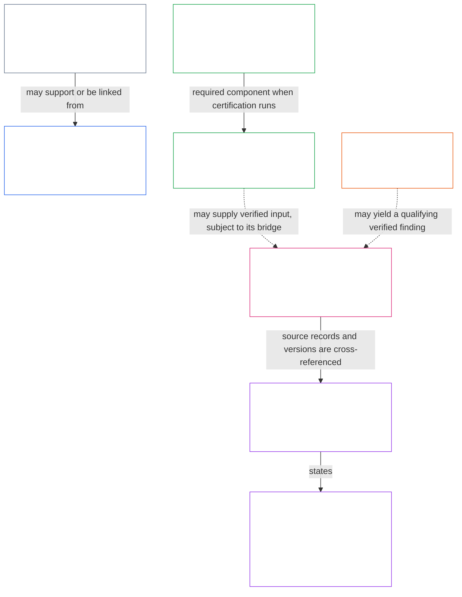

# How constitutional records hold action accountable

<strong>Reader guidance (non-operative): how to use this overview</strong>

> **Reader orientation · `SC-Corpus-2026.08.09` · pre-release.** This map is reader-oriented process support. It introduces relationships between record families; it adds no record type, definition, duty, or sequence and cannot narrow the numbered core text. Reading it is not adoption.

The Constitution uses records to make consequential action traceable, contestable, and correctable. A record is not simply a database entry or a log: different records carry different constitutional work. This overview helps a reader ask four questions:

1. **What does this record carry?** A claim, a classification, a certification finding, a dispute, a verified account of what happened, or a pathway-specific effect?
2. **What can it not decide?** A case file is not a standing record; a classification is not a certification; an integration record does not rewrite its sources; a record is not a general reputation score.
3. **Who may touch it?** The four-seat floor separates initiation, verification or authorization, record custody, and challenge review for a [materially binding act](core_05_band_accountability.md#materially-binding-act).
4. **How can it be checked and changed?** Official records retain attributable versions, evidence links, correction and challenge routes, and continuity when ordinary systems fail.

*The map shows selected relationships. It is not a universal workflow: not every matter has every record, and arrows identify possible source-grounded links rather than automatic permission or a required sequence.*

## The basic distinction: input, record, and effect

Inputs can be important evidence, but they are not automatically official determinations. An [Act Record](core_07_functional_independence_segregation_of_duties.md#7-act-records-attributable-handoffs-and-wrong-seat-routing) supplies the attributable, versioned trail for a materially binding act. It can be carried by one applicable official record or by an integrity-preserving linked set; it does not require a duplicate parallel document. A log, signature, model trace, checklist, attestation, or unverified claim may support that trail, but does not by itself establish that the act was valid.

An **effect** is likewise not its source record. A later standing effect must trace to the relevant records, but it does not become part of a standing record merely because it relies on one ([Chapter Nine §2](core_09_standing_assessment.md#2-question-1--what-happened)).

## The record families

### 1. The common official trail: Act Records

Every materially binding act has an identifiable Act Record. It identifies the act and governing authority, the required seats, determination, custody, material handoffs, current challenge route and status, and the links needed to reconstruct it. A process-specific record—such as a certification record, standing record, or forum case record—may satisfy this role for the act it records if those elements remain attributable, linked, versioned, preserved, and accessible ([Chapter Seven §7](core_07_functional_independence_segregation_of_duties.md#7-act-records-attributable-handoffs-and-wrong-seat-routing)).

Think of an Act Record as the **accountability spine**, not as a separate record family that must duplicate every other file.

### 2. System context and certification records

Two context records describe a materially impactful system before or alongside certification:

- The [System Classification Record](core_05_band_continuity.md#system-classification-record-constitutional) records impact class, dependency type, rationale, assumptions, uncertainty, and revalidation triggers. It is not the full certification file or a standing record.
- The [System Data Types Record](core_05_band_continuity.md#system-data-types-record-constitutional) records material data types and handling posture, including relevant separation, lifecycle, attribution, disclosure, and re-evaluation information. It too is not a certification case file or standing record.

The [System Certification Record](core_08_b_system_alignment_certification_record_process.md#11-system-certification-record) is the bounded, reviewable case file for a system, version, operator, scope, time window, material-impact profile, and decision context. It reflects the applicable evaluation outputs and includes the classification and data-type records when certification runs. Certification is not a one-line approval, and it does not replace the later rules for standing measurement or effects.

### 3. Forum Case Records

A [Forum Case Record](core_12_forum.md#23-forum-case-records-standing-records-and-contests) is the file a forum keeps for a dispute: claims, evidence, routing, temporary orders, certified questions, and final findings in that case. It documents supervision and review while the dispute is being handled.

Its boundary is crucial. Filing a case, choosing a forum, making intake notes, issuing a temporary order, recording an unresolved allegation, discussing settlement, or applying a provisional routing label does **not** by itself create a standing record or change standing, role eligibility, trust status, recognition, or a final standing effect. A forum outcome can feed a standing record only through the applicable verified, bounded, traceable, and contestable route.

### 4. Standing Records: a bounded account of what happened

Chapter Nine uses a [standing record](core_09_standing_assessment.md#21-what-question-1-must-establish) to establish a bounded and contestable account before rating or consequence: subject, event or pattern, time and place, verified and disputed facts, evidence and attribution, challenge path, and current review/correction/supersession status.

There are two distinct tracks:

- **Contribution standing records** concern verified help.
- **Violation standing records** concern verified adverse findings.

They are not combined into a reputation score, dignity rank, permanent status, general worth label, or merged scorecard. Related records can cross-reference, but verified help does not erase verified harm, and harm does not erase verified help. A standing record opens only on its applicable verified trigger; [silence is the default](core_09_standing_assessment.md#21-silence-is-the-default), and the absence of a record is not evidence of risk or low contribution.

### 5. Integration Records and pathway-specific effects

When an applicable Chapter Nine record is opened, updated, corrected, or superseded, Chapter Ten requires a distinct [integration record](core_10_standing_integration.md#2-automatic-integration-review-and-continuity). It cross-references current source records, measurements, applicable correction/remedy/safeguard information, named pathways, review routes, and reassessment triggers.

Its two central limits keep the architecture intelligible:

- It **cross-references but does not alter** its source records; a substantive error belongs in the relevant source correction or supersession process.
- It keeps contribution and violation records separate; it does not create a running balance or lifetime score.

The integration record states the final standing effect for each named pathway. That effect remains bounded by the Rights Floor, which standing decisions cannot change ([Chapter Ten](core_10_standing_integration.md#chapter-ten-standing-effects-and-integration)).

## How records remain answerable

### Four distinct seats

For a materially binding act, Chapter Seven separates four functions:

These are functions for a particular act, not permanent job titles. The point is independence: the actor or its material control line cannot supply the supposedly independent check, control the official record of that check, and decide the challenge to it. The [four-seat floor](core_07_functional_independence_segregation_of_duties.md#2-four-seat-constitutional-floor) scales proportionately, but a missing, conflicted, or wrong seat is routed and documented rather than silently assumed.

For standing records, the [custody and opening rules](core_09_standing_assessment.md#37-record-custody-and-opening-authority) apply that floor specifically: a request is distinct from verification; the record-opening authority is distinct from the custodian; and the contest seat hears a challenge. A challenge received on a record is logged and routed before any forum filing is required.

### Version, correction, preservation, and continuity

The official trail must let an affected party and an authorized reviewer reconstruct what was relied on, what changed, why it changed, who acted under what authority, and where a challenge goes. This includes material evidence links, handoffs, refusals, clocks, superseded versions, and corrections—not simply the latest result ([Chapter Seven §7](core_07_functional_independence_segregation_of_duties.md#7-act-records-attributable-handoffs-and-wrong-seat-routing)).

Correction and contest are not afterthoughts. A forum reviewing a standing record may confirm it, require correction, order a new version, limit or pause reliance, or route the underlying issue; the record remains a bounded matter rather than a general reputation trial ([Chapter Twelve §2.3](core_12_forum.md#23-forum-case-records-standing-records-and-contests)). For integration, an outage does not permit silent overwrite: manual continuity preserves the applicable fields, evidence custody, review rights, time limits, and both audit trails when electronic operation returns ([Chapter Ten §2](core_10_standing_integration.md#2-automatic-integration-review-and-continuity)).

## The boundaries worth remembering

- **Evidence, logs, and attestations are inputs, not automatically official records or valid determinations** ([Act Record](core_05_band_accountability.md#materially-binding-act-record)).
- **An Act Record is an accountability trail, not a substitute for a process-specific record’s independent requirements** ([Chapter Seven §7](core_07_functional_independence_segregation_of_duties.md#7-act-records-attributable-handoffs-and-wrong-seat-routing)).
- **A system classification or data-types record is not the full certification file, a standing record, or an operator’s self-label** ([System Classification Record](core_05_band_continuity.md#system-classification-record-constitutional)).
- **A Forum Case Record is not a Standing Record and does not by itself create a standing effect** ([Chapter Twelve §2.3](core_12_forum.md#23-forum-case-records-standing-records-and-contests)).
- **Contribution and violation records remain separately auditable** ([Chapter Nine §2](core_09_standing_assessment.md#2-question-1--what-happened)).
- **An integration record links its source records and states pathway-specific effects; it does not silently reclassify or rewrite them** ([Chapter Ten §2](core_10_standing_integration.md#2-automatic-integration-review-and-continuity)).
- **No record route may be used to diminish the Rights Floor, evade challenge, or treat ordinary life as conditional on a standing file** ([silence is the default](core_09_standing_assessment.md#21-silence-is-the-default); [Chapter Ten](core_10_standing_integration.md#chapter-ten-standing-effects-and-integration)).

For a case-specific question, this overview is only a reading aid. Start with the relevant numbered source and its required read-with material; source binds, while this map only helps locate it.
