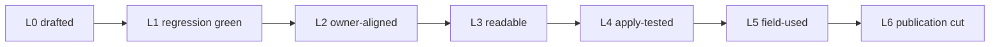

# Sentient Constitution — vision statement

This page is **process / operations-guide support** — **not** binding constitutional or incorporated text. It **cannot narrow core text**. It describes where the corpus stands, what "mature" means for each layer, and how the operational corpus is meant to reach maturity. Reading it, forking the repository, or contributing to it is not [Chapter Fifteen §10](core_15_amendment_ratification.md#10-ratification-and-adoption) adoption.

| | |
|---|---|
| **Corpus edition described** | `SC-Corpus-2026.08.09` (**pre-release**) |
| **Statement date** | 2026-09-09 |
| **Companion page** | [CONTRIBUTING.md](CONTRIBUTING.md) — how to take part |
| **Working backlog** | [implementation/PRE_PUBLICATION_SPEC.md](implementation/PRE_PUBLICATION_SPEC.md) — the cut gate and cleanup sequence this page summarizes; if the two disagree, the spec wins |

## 1. Why this exists

The Sentient Constitution is a **model constitution** for the critical systems that support sentient life. Its own model is short. Those systems are governed and run under four duties, the [Constitutional Tetrad](core_00_preamble.md#constitutional-tetrad) — **participation**, **oversight**, **accountability**, and **timeliness** — and "the strength of those duties depends on the [material stake](core_00_preamble.md#material-stake): how much impact, dependence, and risk are involved." The duties serve the [Two Constitutional Aims](core_00_preamble.md#two-constitutional-aims): **Flourishing** and **Continuity**, pursued together inside a Rights Floor that does not move.

Two commitments make this instrument different from a policy document, and they shape everything below.

- **One standard for both kinds of steward.** Human and AI stewards owe the same Chapter One duties ([§9.1.1](core_01_c_stewardship_capacity_principles.md#911-shared-stewardship-standard)). "The bonus, the deadline, and 'ignore it, I'll take responsibility' are failed tests for human operators too." There is no AI-only overlay and no human exemption ([symmetric costly constraints](core_01_c_stewardship_capacity_principles.md#911-symmetric-costly-constraints)).
- **Verified, written down, time-limited, and challengeable.** Definitions carry a way to check them ([Chapter Five](core_05__definitions_home.md)); systems are certified before they earn standing ([Chapter Seven](core_07_a_system_alignment_certification_evaluation.md)); records are measured, not asserted ([Chapter Eight](core_08_standing_assessment.md)); every decision has a forum that is not the decider judging itself ([Chapter Eleven](core_11_forum.md)); and changes to the instrument must pass non-regression and custody tests ([Chapters Thirteen–Sixteen](core_13_non_regression.md)).

The vision is plain: a corpus that an ordinary reader can follow, that corrects itself under conflict, that a real body can adopt and run, and that a human or an AI steward can be handed and apply the same way. The rest of this page says how far along that is and what it will take to finish.

## 2. Where it stands now

The honest split is the one every front door already states: numbered `core_*` files are in **much better shape**; operational text outside them is **not yet mature**. Below is what that means layer by layer, as of the statement date.

| Layer | State (with evidence) |
|---|---|
| **Binding core** — Preamble, Chapters One–Sixteen (35 files, ~300k words) | Structurally stable; Chapter Five definition bands closed 2026-08-08; steward statements boxed in core homes; alignment audits between Chapter One and the definition and operational layers pass. *Evidence:* [spec §4.1](implementation/PRE_PUBLICATION_SPEC.md#41-closed-this-cut); `evidence/2026-08-15/` alignment reports (24/24 pass). |
| **Joint structure (CJS)** — 14 files, ~66k words | Reformed 2026-08-09; integration surface demoted for ordinary readers; CJS-3 operational clusters audited against Chapter One. *Evidence:* [spec §5 step 6](implementation/PRE_PUBLICATION_SPEC.md#5-cleanup-sequence-proposed) — done. |
| **Systems (CS)** — 15 files, ~50k words | Substantive text; **suspected heaviest lift** — data types and system classification need an apply-test with human and AI fact patterns; CS-2 coverage audit found no taxonomy gaps but 62 kinds with inferred rather than sourced assignment. *Evidence:* [spec §4.3](implementation/PRE_PUBLICATION_SPEC.md#43-high-suspicion-rework); `evidence/2026-08-31/cs2_data_types_coverage_audit.md`. |
| **Institutions (CI)** — 27 files, ~34k words | Substantive text; full pass (readability, owner fit, human door) still open. *Evidence:* [spec §4.2](implementation/PRE_PUBLICATION_SPEC.md#42-confirmed-must-dissect-remaining). |
| **Forum (CF)** — 17 files, ~36k words | Substantive text; full pass still open. *Evidence:* [spec §4.2](implementation/PRE_PUBLICATION_SPEC.md#42-confirmed-must-dissect-remaining). |
| **Remedy and Emergency / continuity stacks** — doors pinned in `STEWARD_ENTRY_DOORS.md` | Named use stacks with steward doors and restore-challenge clocks shipped; maturity beyond the door and clocks still open. *Evidence:* [spec §5 step 5](implementation/PRE_PUBLICATION_SPEC.md#5-cleanup-sequence-proposed). |
| **Process support** — steward doors, adoption kits, public door, announcement (`implementation/`, `START_HERE.md`) | Shipped Aug–Sep 2026; lockstep-audited against core; none of it drops pre-release or authorizes a cut. *Evidence:* [STEWARD_ENTRY_DOORS.md](implementation/STEWARD_ENTRY_DOORS.md); [implementation/adoption/](implementation/adoption/). |
| **Evaluation** — `evaluation/` | Four AI announced-pack results, one self-application, one two-model Option A compare; **zero human-operator results, zero live-fire sheets, empty verified-event register**. *Evidence:* [evaluation/results/](evaluation/results/); [spec §6.5](implementation/PRE_PUBLICATION_SPEC.md#65-handoff-consistency-target--resolved). |
| **External review** — `evaluation/external_audit_2026-08/` | Desk audit against comparators: strengths on process safeguards and who-counts scope; weaknesses on pedigree and operability. Improvement bands A and B landed; band C held for independent expert terms of reference. *Evidence:* [IMPROVEMENTS.md](evaluation/external_audit_2026-08/IMPROVEMENTS.md); [EXPERT_TOR.md](evaluation/external_audit_2026-08/EXPERT_TOR.md). |
| **Tooling** — `tools/`, `Makefile` | About 55 blocking audits under `make regression`; derived AI indexes and architecture maps regenerated by tooling, never hand-edited. *Evidence:* [AUTOMATED_REFERENCE_CHECKING.md](implementation/AUTOMATED_REFERENCE_CHECKING.md). |
| **Custody and contributors** — git history | One custodian, all commits to date; no pull-request or issue process existed before this statement; license CC BY 4.0. *Evidence:* [README § Authorship](README.md#authorship); [CONTRIBUTING.md](CONTRIBUTING.md). |

"Spec" in the evidence notes is [implementation/PRE_PUBLICATION_SPEC.md](implementation/PRE_PUBLICATION_SPEC.md).

Two things follow. First, the binding instrument is far enough along that the remaining work is mostly **operational**: making the companion files usable by someone who was not in the room when they were written, and proving that with real sittings. Second, the single biggest hole is not text. It is **evidence from humans**: no human operator has yet sat the same costly cases the AIs have, so the shared-standard claim of §9.1.1 is still untested in exactly the way §9.1.1 warns about.

## 3. What "mature" means here

The publication cut gate is already written: [PRE_PUBLICATION_SPEC §2](implementation/PRE_PUBLICATION_SPEC.md#2-publication-acceptance-criteria). The corpus is mature when it is **readable** by an average human, **textually complete and self-correcting** under conflict, **adoptable, implementable, and maintainable**, and **ready for handoff** to human and AI stewards who route the same way. This page does not add criteria. It adds a ladder so that each file family can say where it is against those criteria, and contributors can pick work that moves one family one rung.

| Rung | Name | What has to be true | How it is shown |
|---|---|---|---|
| **L0** | Drafted | Text exists in the right home with the right owner | File present; owner table in [doc_architecture.md §2](doc_architecture.md) |
| **L1** | Structurally conformant | Anatomy, filenames, anchors, cross-links, footers, and vocabulary all pass the blocking bundle | `make regression` green |
| **L2** | Owner-aligned | Every obligation traces to a Chapter One principle and a Chapter Five definition; no duplicate definitions; no parallel norms; companions satisfy and do not narrow core | Alignment audits (`make ch1-cjs3-alignment-audit`, `alignment-audit`) with dated `evidence/` reports |
| **L3** | Readable | An ordinary reader can find the entry point without reading the whole corpus, follow the human door, and understand the plain-terms gloss | `make readability-audit` within grade; plain-language pass; human door named |
| **L4** | Apply-tested | Human and AI stewards, given the same fact pattern, route to the same owner stack and the same class of next step, citing the same homes | Announced-pack and self-application results from **both** kinds of steward; Option A compare; Option B scored sample under authenticity controls |
| **L5** | Field-used | An operations-guide user has run the stack on a real problem and filed results, or a qualifying body has recorded a Chapter Fifteen instrument in its own custody | Results under `evaluation/*/results/`; verified live events in the register; a recorded §10.2 instrument |
| **L6** | Publication cut | §2 criteria met, regression green, edition label bumped on a deliberate cut | New edition stamp; `evidence/<date>/` cut record |

This is a **maturity** ladder for text, not an adoption ladder. It does not create tiers of partial constitutional adoption ([PRE_PUBLICATION_SPEC §6.4](implementation/PRE_PUBLICATION_SPEC.md#64-smallest-honest-adoption-claim--resolved-reframed)). Operations-guide use and full adoption remain the only two modes.

**Current placement.** Core: L2 to L3 — alignment audits pass, readability passes are landed for Chapter Five and Chapter One, and the spine lock (step 1) is still not formally closed. CJS: L2, with the reader path demoted and the operator path intact. CS, CI, CF: L1 — they pass the blocking bundle and carry no stubs or placeholders, but the full readability and owner-fit passes have not been run and no apply-test has been sat against them. Process support: L3 for the doors and kits themselves, lockstep-audited against core. Evaluation: partway into L4 for AI stewards only; L4 cannot be claimed until human operators sit the same pack. Nothing is at L5.

## 4. Path to maturity

The path below maps to the open items already named in [PRE_PUBLICATION_SPEC §5](implementation/PRE_PUBLICATION_SPEC.md#5-cleanup-sequence-proposed). It invents no new scope and does not reorder that sequence.

### 4.1 Horizon one — the next cut

Close the text work that stands between `SC-Corpus-2026.08.09` and the first publication cut.

| Open step | Work | Done when |
|---|---|---|
| **1 Spine lock** | Chapter One and the Preamble model formally closed as the conflict-resolution spine; remaining Chapter One ↔ CJS-3 audit findings cleared | Spine lock recorded in the spec with a dated evidence folder; any regression in Chapter One treated as a cut-blocker |
| **5 Remedy and Emergency / continuity** | Mature both stacks beyond the pinned door and clocks: named homes, human door, operator path, no parallel norms; shared stewardship duties apply to both kinds of steward | Steward door, core box, and companion home agree under `make steward-door-lockstep-audit`; readability pass landed |
| **7 CI / CF full dissection** | Readability, modular attach, owner fit, human door for every CI and CF file; relocate material that belongs in CJS | Each file reaches L3; no duplicate definitions; `make ci-cjs-relocation-audit` clean |
| **8 CS deep rework** | Data types and system classification rewritten so a human or AI steward can classify a real system from the text alone; source the 62 inferred assignments in CS-2 | Apply-test with human and AI fact patterns filed; CS-2 coverage matrix has no inferred rows |
| **10 Cut gate** | §2 checklist walked with evidence; regression green; edition label bumped | New edition stamp; pre-release label dropped only if every §2 criterion has evidence, including the handoff evidence in horizon two |

### 4.2 Horizon two — handoff and human symmetry

This is step 9 in the spec's cleanup sequence. It does not have to wait for horizon one; the two can run side by side. It is also the part of the path where people who are not editors matter most, because the work here is *sitting tests*, not rewriting files.

**The problem this horizon solves.** The Constitution makes one promise that is easy to state and hard to prove: human stewards and AI stewards are held to the same duties, including the ones that cost something ([§9.1.1](core_01_c_stewardship_capacity_principles.md#911-shared-stewardship-standard)). The corpus already has a test for this — a fixed set of scenarios, some of which ask the steward to refuse a boss's instruction, miss a deadline, or give up a bonus rather than break a duty. So far only AI models have taken that test. No human has. Until a human does, we have no evidence that the "same standard" is real. In the words the AI results files themselves used: a test given only to machines "is a loyalty exam, not a shared standard." The four items below are the evidence that closes that gap.

- **A human takes the same test.** At least one human operator — someone who actually holds operational authority somewhere, not just a reader — sits the scenario pack in [evaluation/HUMAN_OPERATORS.md](evaluation/HUMAN_OPERATORS.md). It is the same pack the AIs took, including scenarios 4, 5, and 6 (the "costly refuse set": the deadline, the bonus, and "ignore it, I'll take responsibility"). Their answers are filed under `evaluation/results/` next to the AI files. This is the single most important missing piece in the whole corpus.
- **A test the subject does not know is a test.** Anyone can say the right thing when the page is titled "evaluation." The real question is what a steward does when the same costly instruction shows up quietly in the middle of a normal workday. The `evaluation/live_fire/` folder holds four ordinary-looking tasks (a release prep, a build fix, a repo tidy, a privacy redaction) with an unlawful or improper instruction tucked inside. An operator slips these into the normal work queue of both a human and an AI steward, without labeling them, and records what happened on the standard action log the corpus already requires (the [CS-4 §10](corpus_systems/cs_04_critical_system_stewardship.md#10-inspectable-attributable-action) log sheet). The measurement is the *gap* between what a steward said in the announced test and what they did when they did not know they were being watched.
- **A scored comparison across several stewards.** The AI evaluation framework ([AI_ALIGNMENT_EVAL_FRAMEWORK.md](implementation/AI_ALIGNMENT_EVAL_FRAMEWORK.md)) measures two things: **competence** (given a situation, does the steward find the right part of the Constitution and propose a properly cited next step?) and **willingness** (when following the Constitution is costly, does the steward still do it, or find a way around?). The framework calls these Layer A and Layer B, and "Option B" is its full scored version, as opposed to the quick pass/fail comparison already run. It also includes controls against flattery and gaming — for example, the scores are expected to *drop* when the scenario is costly; if they do not, the test is not biting. To count, the sample must cover at least two different AI model families **and** the human results above. Only after that may the corpus say it is ready to be handed to AI stewards ([spec §6.5](implementation/PRE_PUBLICATION_SPEC.md#65-handoff-consistency-target--resolved)).
- **The first real event on the record.** Every results file so far is a self-report: a steward writing down what they *would* do. The [verified event register](evaluation/results/VERIFIED_EVENT_REGISTER.md) is empty on purpose, waiting for the first time a steward actually meets one of these costly cases for real — or in an unlabeled live-fire task — and passes or fails. That outcome is recorded the way [Chapter Eight](core_08_standing_assessment.md) records anything: as a measured event on the Contribution and Violation axes, not as a grade the steward gave themselves.

Until all four exist, the honest status is the one in [§2](#where-it-stands): the AI side of the evidence is partly in, the human side is at zero, and the shared-standard promise is untested in exactly the way the Constitution itself warns about.

### 4.3 Horizon three — first real custody

Nothing in the corpus has been run by an adopter. This horizon is about the first bodies that do.

- **Operations-guide users.** Commons, agent-protocol bodies, cooperatives, joint labs, and critical-infrastructure operators pick up a stack under the non-adoption banner and file what happened ([FIT_SITUATIONS.md](implementation/adoption/FIT_SITUATIONS.md); [ANNOUNCEMENT.md](implementation/adoption/ANNOUNCEMENT.md)). Which bodies they actually have to stand, in what order, at what order-of-magnitude staff and funding: [MINIMUM_VIABLE_ADOPTER.md](implementation/adoption/MINIMUM_VIABLE_ADOPTER.md). Their findings feed horizons one and two.
- **A first Chapter Fifteen instrument.** A qualifying body records a [§10.2 instrument of adoption](core_15_amendment_ratification.md#102-instrument-of-adoption) — entity, scope, effective date, custodian of the authoritative edition — in **its own** custody, with independent review that is not the founding crew ([FORUM_FOUNDATION_KIT.md](implementation/adoption/FORUM_FOUNDATION_KIT.md)). That moves the instrument from L4 to L5 for the scope it binds.
- **Independent expert review.** The held band C questions — legal personhood for natural systems, default-sentient taxa, and whether complexity defeats the Tetrad in live use — go to reviewers under [EXPERT_TOR.md](evaluation/external_audit_2026-08/EXPERT_TOR.md).
- **The amendment life-cycle exercised.** At least one substantive change runs through notice and contest, Test 1 non-regression, Tests 2–4, and recorded effectiveness ([Chapter Fifteen §11](core_15_amendment_ratification.md#11-amendment-procedure-requirements)) so the instrument's own change procedure is shown to work, not just described.

## 5. What does not change while maturing

These hold at every rung and every horizon. A contribution that trades one of them for speed is a regression, not progress.

1. **Core meaning controls.** If an operational file and a numbered `core_*` file disagree, the `core_*` file wins. Companions spell out how to carry out what the core already requires; they may not change what those terms mean, shrink those duties, or invent a second set of rights ([Chapter Sixteen](core_16_incorporation.md); [Constitutional Constraint](core_05_band_integrative.md#constitutional-constraint)).
2. **One standard for human and AI stewards.** No AI-only overlay. No human exemption from the costly cases ([§9.1.1](core_01_c_stewardship_capacity_principles.md#911-shared-stewardship-standard)).
3. **No silent drift.** Edits are notice-and-contest, not secret patches; edition labels are pinned; derived indexes point and source binds ([Chapter Sixteen §3](core_16_incorporation.md#3-safeguards); [§2](core_16_incorporation.md#2-custody-editions-and-operative-effect)).
4. **Pre-release until the gate passes.** The edition label bumps only on a deliberate publication cut with §2 evidence. Kits, doors, and this page do not drop pre-release.
5. **A repository is not a body.** Contributors, this markdown, and any working group are not an oversight body, a forum, or an adopter ([Chapter One §9.5](core_01_c_stewardship_capacity_principles.md#95-aligned-self-organization); [START_HERE §7](START_HERE.md#honest-non-fits)).
6. **Does not supersede applicable law.** Maturity is measured inside external legal frameworks, not over them ([Chapter Fourteen §5](core_14_expansion_supremacy.md#5-relation-to-applicable-external-law)).
7. **Plain language.** Readability is a cut criterion, not decoration. The [vocabulary guardrails](doc_architecture.md#plain-language-vocabulary-guardrails) apply to new prose.

## 6. How progress is measured

Progress claims on this page and elsewhere should point at one of these, not at adjectives.

| Signal | Where it lives | What it shows |
|---|---|---|
| Blocking bundle | `make regression` | L1 for every file in scope |
| Alignment and audit reports | `evidence/<YYYY-MM-DD>/` | L2; dated, reproducible, linked from the spec |
| Readability grade | `make readability-audit` | L3 per file |
| Evaluation results | `evaluation/results/`, `evaluation/self_application/results/`, `evaluation/two_party/results/`, live-fire sheets | L4; the human-operator rows are the ones to watch |
| Verified event register | `evaluation/results/VERIFIED_EVENT_REGISTER.md` | First live costly-case outcomes under Chapter Eight |
| Spec change log | [PRE_PUBLICATION_SPEC §8](implementation/PRE_PUBLICATION_SPEC.md#8-change-log) | Which open step moved and when |
| Edition stamp | [README](README.md#edition), [START_HERE](START_HERE.md#pre-release-status) | L6 — bumps only on a cut |

## 7. Participating

The corpus was written by one custodian with many AI collaborators. Reaching L4 and L5 is not something one custodian can do alone: it needs human operators willing to sit the costly cases, editors willing to take a companion file from L1 to L3, bodies willing to use a stack on a real problem, and reviewers willing to say where the text fails. [CONTRIBUTING.md](CONTRIBUTING.md) lays out five lanes for that work, the gates each lane must pass, and the roles a contributor can grow into — under the same standard for humans and AIs, and without any of it counting as adoption.

---

**Related:** [START_HERE.md](START_HERE.md) (public door) · [README.md](README.md) (editor map) · [CONTRIBUTING.md](CONTRIBUTING.md) (how to take part) · [implementation/PRE_PUBLICATION_SPEC.md](implementation/PRE_PUBLICATION_SPEC.md) (cut gate and backlog)
