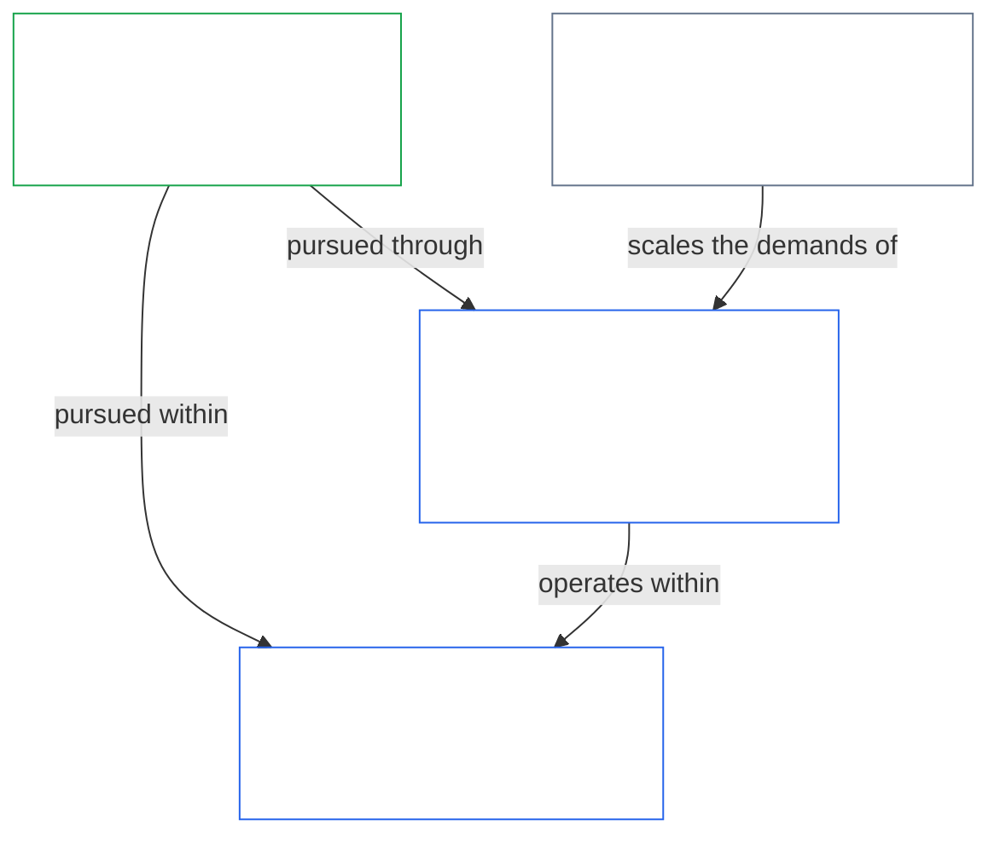
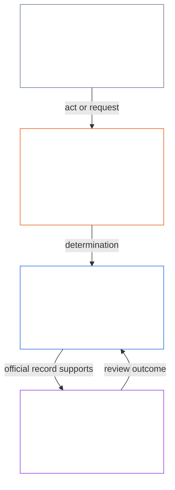
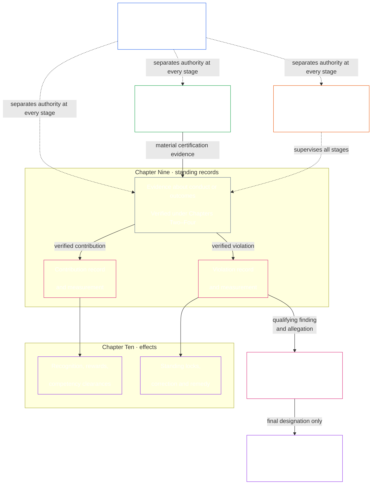

# PREAMBLE / FOUNDATIONAL REQUIREMENTS

<strong>Corpus placement (non-operative): file structure and reading rules</strong>

> The following content is **reader guidance only**. It does not add, remove, or narrow binding obligations elsewhere in this file or in other chapters.
>
> This file is **part of the Sentient Constitution** and is **binding only together** with the other numbered `core_*` files read as one instrument. It contains the **Preamble** (foundational requirements). Reading order and edition metadata are maintained in [README.md](README.md).
>
> **Next:** [core_01_a_values_principles.md](core_01_a_values_principles.md) (Chapter One, Part A — Values Principles).

 

*In plain terms: this opening names the problem this Constitution exists to fix — systems that harm, hide, or lock out those they affect — and says governance must meet a complex world without turning that complexity into a wall. The rest of the instrument is how we replace those failures with accountable, checkable, timely governance.*

Sentient freedom, survival, and wellbeing are inseparable from the systems we create, inhabit, and rely on. As those systems grow in scope, interdependence, and power, so do the risks of irreversible, large-scale harm. Those risks are persistent and materially significant.

A system cannot remain legitimate if it causes preventable suffering, ignores recurring problems, shifts harm onto others without acknowledgment, or excludes sentients from the systems that shape their lives.

Shared systems sit in a world that is already complex and becoming more so. Healthy, durable governance has to meet that complexity — measure it, model it, and answer for it — rather than flatten it into convenient proxies. That does not mean burying affected sentients in unusable process: duties, records, and explanations must stay within what sentients can actually learn, contest, and use, and how demanding they are scales with each actor's role and with the impact, dependence, and risk at stake. Distributed understanding keeps that real. Complexity that does no constitutional work is refused: face the world's complexity, and do not outsource it into a wall.

How systems are designed, tested, and run must support survival, wellbeing, dignity, honesty, and lasting stability. This Constitution intends to eliminate the harms described above by building better systems, and to replace the systems that created them with institutions that are more accountable, robust, and responsive to the real needs of all sentients. It begins that work by offering a better model for how we can work together justly, effectively, and sustainably.

### 1. The Model

*In plain terms: four duties — participation, oversight, accountability, and timeliness — scale with how much impact, dependence, and risk are on the line, and they serve two aims together: Flourishing and Continuity, inside a Rights Floor that does not move.*

Critical systems that support sentient life — whether biologically or materially — must be governed and operated under four duties, together called the [**Constitutional Tetrad**](#constitutional-tetrad), which set the general standard those systems must meet. Their strength depends on the [**material stake**](#material-stake): how much impact, dependence, and risk are involved. The higher the stake, the stronger the duties must be.

<strong>Reader guidance (non-operative): section 1 model chart</strong>

> The following content is **reader guidance only**. It does not add, remove, or narrow binding obligations elsewhere in this file or in other chapters.
>
> **Reader map (non-operative):** This chart summarizes the relationships in this section. It adds no definitions or duties, establishes no precedence, and cannot replace the source text.

 

- **participation** — affected sentients get a real voice, fair representation, a fair chance to challenge decisions, and access to consequential roles in proportion to the stake
- **oversight** — responsible actors watch, check, verify, and keep records so problems can be found; independent reviewers can constrain bad choices
- **accountability** — responsibility traces to the right actors; those actors must answer for their choices; those harmed get redress; bad outcomes trigger real correction
- **timeliness** — problems must be detected, challenged, resolved, and fixed within time limits that match the stake. Delay is not legitimate governance when it effectively erases rights, remedies, or the chance of repair

Those four duties serve the [**Two Constitutional Aims**](#two-constitutional-aims) — what shared systems must optimize for:

- **Flourishing** — sentient wellbeing sustained through truth, safety, trustworthiness, and meaningful agency
- **Continuity** — long-horizon stability, sustainability, resilience, and ecological wellbeing

Those aims must be pursued together, always within the Constitution's non-negotiable principle constraints and Rights Floor. The [**Constitutional Tetrad**](#constitutional-tetrad) governs how that pursuit remains legitimate, with all four duties scaled to [**material stake**](#material-stake). Binding definitions for the Tetrad legs and aims live in Chapter Five: [Participation](core_05_apex_participation_leg.md#participation-constitutional), [Oversight](core_05_apex_oversight_leg.md#oversight-constitutional), [Accountability](core_05_apex_accountability_leg.md#accountability), [Timeliness](core_05_apex_timeliness_leg.md#timeliness-constitutional), [Flourishing](core_05_apex_flourishing_aim.md#flourishing-constitutional), and [Continuity](core_05_apex_continuity_aim.md#continuity-aim-constitutional).

### 2. Measurements Overview

*In plain terms: shared systems cannot run on guesswork or vanity metrics. Measure whether sentients actually flourish and endure. Scale review with impact, dependence, and risk.*

Shared systems cannot work well without measurement. Food, shelter, care, infrastructure, and governance all operate in a complex, changing world — one too complex for guesswork or convenient numbers alone.

Ongoing measurement must focus on what matters most for sentient survival and wellbeing. The question is whether the systems we depend on truly support [**Flourishing**](#flourishing) and [**Continuity**](#continuity) over time. That review scales to [**material stake**](#material-stake) — how much impact, dependence, and risk are involved.

Measurement under this Constitution asks two practical questions: do systems actually help sentients flourish and endure, or do they produce harm, delay, exclusion, waste, hidden dependency, or false trust? Measurements are not scores for their own sake — they are tools for ensuring sustainable, resilient, and compassionate outcomes that align with sentient wellbeing and Earth's ecological health. That duty takes binding form through the [Two Constitutional Aims](#two-constitutional-aims): **Flourishing** and **Continuity**.

Measurements must remain traceable to those aims and to the rights protections established in this Constitution. Raw throughput, utilization, headcount, revenue, latency, and other convenient proxies cannot substitute for constitutional performance. This prohibition applies wherever [Proxy Divergence](core_05_band_oversight.md#proxy-divergence) is foreseeable.

The overview below lists the measurement **categories**, mapping each to the [Two Constitutional Aims](#two-constitutional-aims) and the [Constitutional Tetrad](#constitutional-tetrad). Each category poses one plain-language question and names its **subcategories**, and links to its **Chapter Five measurement-family home**, where the family table, constitutional use, and definition routing live. Each subcategory links to its canonical Chapter Five definition.

**Materiality** is not a separate measurement category. It sets how strongly every category applies, based on [**material stake**](#material-stake) — how much impact, dependence, and risk are involved. **Constitutional performance** is cross-cutting and instrumental to both aims. Use the [Chapter Five measurement crosswalk](core_05__definitions_home.md#chapter-five-measurement-crosswalk) to trace each category to its canonical home.

| Category | Plain question | Subcategories |
|---|---|---|
| **[Flourishing](core_05_apex_flourishing_aim.md#flourishing-measurement-family)** | Are sentients actually sustained in life, safety, and access to essentials? | [Wellbeing](core_05_band_continuity.md#wellbeing) · [Safety, harm, and risk](core_05_band_continuity.md#safety-constraint) · [Survival-floor access](core_05_band_continuity.md#bodily-maintenance-access-constitutional) |
| **[Continuity](core_05_apex_continuity_aim.md#continuity-measurement-family)** | Can sentients and systems endure — ecologically, dependably, and across failure? | [Ecological footprint and environmental preconditions](core_05_band_continuity.md#ecological-footprint) · [Resilience, reversibility, and systemic risk](core_05_band_continuity.md#reversibility-constitutional) · [Dependency and resource flows](core_05_band_continuity.md#dependency) · [Cross-system support](core_05_band_continuity.md#proportionate-cross-system-support-constitutional) |
| **[Participation](core_05_apex_participation_leg.md#participation-measurement-family)** | Can affected sentients take part fairly — voice, access, learning, and privacy? | [Fairness, access, and agency](core_05_band_participation.md#substantive-fairness-constitutional) · [Privacy and data stewardship](core_05_band_continuity.md#privacy-informational-cluster) |
| **[Oversight](core_05_apex_oversight_leg.md#oversight-measurement-family)** | Can sentients see, verify, and rely on what systems represent? | [Truth and epistemic integrity](core_05_band_oversight.md#truth-constitutional-constraint) · [Trustworthiness](core_05_band_continuity.md#trustworthiness) |
| **[Accountability](core_05_apex_accountability_leg.md#accountability-measurement-family)** | Do reward structures, market power, and answerability keep duties real? | [Incentive alignment and proxy integrity](core_05_band_integrative.md#incentive-alignment) · [Market structure and contestability](core_05_band_accountability.md#market-structure-constitutional) |
| **[Timeliness](core_05_apex_timeliness_leg.md#timeliness-measurement-family)** | Are disputes, corrections, and repairs resolved while remedy still matters? | [Timely Resolution](core_05_band_accountability.md#timely-resolution-constitutional) · [Anti-delay and resolution-pathway discipline](core_05_band_accountability.md#capture-of-resolution-pathways) |
| **[Constitutional performance](core_05_band_performance.md#performance-measurement-family)** | Are constitutional outcomes delivered efficiently without pointless waste? | [Constitutional Efficiency](core_05_band_continuity.md#constitutional-efficiency) · [Avoidable Burden](core_05_band_continuity.md#avoidable-burden) · [Productive Capacity](core_05_band_continuity.md#productive-capacity-constitutional) |

These measurement categories show what matters. Standing alone, they do not set every number, funding formula, interface rule, accommodation list, technical metric, or assessment design. They become binding only when a specific chapter or adopted instrument explicitly requires them.

### 3. Governance and Stewardship

*In plain terms: legitimacy needs Safety, Truth, and Trust. It also needs real opportunities to learn how the systems that affect you work and to take consequential roles in maintaining them.*

Durable legitimacy depends on [Safety](core_01_a_values_principles.md#31-safety-harm-constraint), [Truth](core_01_a_values_principles.md#32-truth-epistemic-integrity-constraint), and [Trust](core_01_a_values_principles.md#4-system-stability-enabler-trust-coordination-integrity). It also depends on proportionate recognition of lawful stewardship, truthful cooperation, and bounded aspiration — not solely on sanction and restraint. Chapter One states this recognition dimension in [Recognition, Reinforcement, and Aspiration](core_01_a_values_principles.md#22-recognition-reinforcement-and-aspiration).

Distributed understanding and stewardship require regular, proportionate opportunities for sentients to learn how systems that materially affect them operate, and to take consequential roles in maintaining and improving those systems. Together, these opportunities spread competence, repair capacity, and legitimacy broadly across our Constitutional Community to ensure resilience, sustainability, and pro-social innovation. All such opportunities must satisfy Safety, Truth, bounded agency, and the [Avoidable Burden](core_05_band_continuity.md#avoidable-burden) and proportionality discipline stated in [Chapter One](core_01_b_interaction_interpretation.md#63-minimization-of-avoidable-burden).

#### 3.1 Using Measurements in Governance

*In plain terms: first name the problem and the stake. Then choose the matching measurement category and use shared technical standards — not convenience numbers — as evidence.*

When the Constitution requires concrete measurement rules, **Technical Forum Domains** under [Chapter Twelve](core_12_forum.md#42-technical-forum-domains) develop and maintain shared standards for measurement, testing, and reliable evidence. The forum responsible for a dispute then applies those standards when deciding the case under [Chapter Twelve §4.2 (*Technical Forum Domains*)](core_12_forum.md#42-shared-standards-and-anti-displacement).

Constitutional stewardship starts by naming the problem and the [**material stake**](#material-stake) — the impact, dependence, and risk involved. Next, choose the relevant [**measurement**](#2-measurements-overview) category and subcategory from the [overview](#2-measurements-overview). Apply the standards above to test real-world effects, not convenience metrics. Require traceable evidence.

#### 3.2 Key Governance Processes

*In plain terms: when the text requires it, first separate the sentients or systems that act, check, record, and hear challenges. Material issues then go through certification, written records of help and harm, correction and remedy, and forum review with clocks. Ordinary disputes use the published challenge path first. These processes test authorized governance; they do not create governing authority by themselves.*

When Chapter Six, [Chapter Eight](core_08_a_system_alignment_certification_evaluation.md#chapter-eight-system-alignment-certification), an incorporated instrument, or another constitutional provision expressly requires it, take the material constitutional issue into one or more of the paths below. The [Key Practical Process Pipelines](#6-key-practical-process-pipelines) turn measurement into records, certification, verified inputs, classification, forum supervision, correction, and timely remedy. Through these pipelines, authorized governance is tested, contested, and repaired in practice — but the pipelines do not authorize governance by themselves; they make it reviewable, contestable, correctable, and timely. [Section 6.2](#62-how-the-full-chain-fits-together) states the full pipeline.

- **Functional independence and segregation of duties** ([Chapter Seven](core_07_functional_independence_segregation_of_duties.md#chapter-seven-functional-independence-and-segregation-of-duties)) — before a materially binding act moves, identify and separate the initiating, verify-or-authorize, record, and contest seats under the applicable scaling and independence rules.
- **System alignment certification** ([Chapter Eight](core_08_a_system_alignment_certification_evaluation.md#chapter-eight-system-alignment-certification)) — before a high-impact system is trusted at scale, gather and review evidence to determine whether it is constitutionally safe to rely on right now.
- **Standing records** ([Chapter Nine](core_09_standing_assessment.md#chapter-nine-compliance-violation-and-standing-model)) — when conduct or harm matters constitutionally, place verified facts in formal contribution or violation case files; rumors and reputation are not enough.
- **Correction and remedy** ([Chapter Ten §4.1 (*Remedy and correction*)](core_10_standing_integration.md#41-remedy-and-correction)) — correct the underlying failure and provide proportionate acknowledgment, repair, restoration, or compensation for those harmed.
- **Forum review** ([Chapter Twelve](core_12_forum.md#1-purpose-and-role--participation-architecture))
  - Ordinary disputes within already-authorized systems use the published [Stakeholder System Participation](core_05_band_participation.md#stakeholder-status-and-weight-cluster) challenge path first.
  - If that path remains contested, is missing or captured, or cannot grant relief, route the dispute by primary stake through supervised forums.
  - Those forums support evidence, lawful transfer, and timely clocks under **Article XXIV-C** (*Timely Resolution and Anti-Delay Floor*).

#### 3.3 Governance Layers

*In plain terms: who may govern is a different question from who has a voice within an already-authorized system. A participation vote or trust score does not grant governing authority. For ordinary disputes, the published participation challenge path is the ordinary first step, but it does not replace independent forum review when it fails.*

Governance under our Constitution serves the [**Constitutional Tetrad**](#constitutional-tetrad) through two related but distinct layers:

- The [**Constitutional Contract Layer**](core_05_band_integrative.md#constitutional-contract-layer) governs the authorization of governing authority itself — who may govern, by what legitimacy mechanism, and under what scope and durable terms.
- [**Stakeholder System Participation**](core_05_band_participation.md#stakeholder-status-and-weight-cluster) governs participation, representation, contestability, and [Due Process](core_05_band_accountability.md#due-process-constitutional) within already-authorized systems, institutions, and bounded decision domains. These protections are owed to every sentient materially affected.

These layers may overlap in practice, but even where they overlap, they remain distinct. Stakeholder-level participation in an already-authorized system is not a substitute for constitutional authorization. A published challenge path, participation vote, or trust score does not by itself decide who may govern.

Contestability under the participation layer is the ordinary first step for disputes within already-authorized systems: affected sentients use the published challenge path first. Independent [forum review](core_12_forum.md#1-purpose-and-role--participation-architecture) does not replace that path, nor does the path replace forum review when it remains contested, is missing or captured, or cannot grant the needed relief. [Dispute sequencing](core_12_forum.md#dispute-sequencing) under Chapter Twelve states when forum routing takes over.

Conversely, constitutional authorization does not erase duties owed under the [Stakeholder System Participation](core_05_band_participation.md#stakeholder-status-and-weight-cluster) layer. Those duties remain owed to sentients materially affected by the authorized system, institution, or bounded decision domain, and still include participation, representation, [Contestability](core_05_band_accountability.md#contestability), and [Due Process](core_05_band_accountability.md#due-process-constitutional).

### 4. Principles, Definitions, and Rights

*In plain terms: Chapters One through Six own values, how words are built and checked, the dictionary, and the Rights Floor; later chapters must respect those homes, not quietly move them.*

Sections **4 through 9** are this Constitution's **constitutional owner register**. Each block names the substantive domain its chapter (or adopted corpus) owns and what it produces. Binding one-line owner claims also appear at each numbered chapter opening. Other layers may point to an owner, but they must not quietly rewrite or relocate it; that non-relocation discipline lives under [Authority Stack and Internal Hierarchy](core_05_band_integrative.md#authority-stack).

Chapters **One through Six** supply the values, vocabulary, verification machinery, and Rights Floor that everything later must respect — including [Chapter Seven's functional-independence floor](#5-functional-independence-and-segregation-of-duties) in Section 5, the [Key Practical Process Pipelines](#6-key-practical-process-pipelines) in Section 6, [process ownership and outputs](#7-process-ownership-and-outputs) in Section 7, the governance and change-path chapters in Section 8, and the [Adopted Implementation Corpus](#9-adopted-implementation-corpus) in Section 9.

Each summary below states what the chapter owns and what it produces.

**Chapter One — Values, principles, and stewardship**

- **What it owns:** States the Constitution's guiding values and constraints, including:
  - wellbeing, fairness, Safety, Truth, Trust, and bounded freedom;
  - recognition and proportional reward for lawful contribution;
  - conflict resolution among principles; and
  - stewardship duties, including distributed understanding, systemic evaluation, and governance discipline.
- **What it produces:** The interpretive foundation for every later chapter. These are the rules that turn high-level aims into operative requirements when systems, rights, definitions, or process pipelines must be read and applied.

**Chapter Two — Definition structure**

- **What it owns:** Defines how constitutional terms are built through:
  - the Ontological/Measurement/Assessment/Compliance (O/M/A/C) component structure;
  - alignment requirements; and
  - component rules that keep definitions precise and usable across the corpus.
- **What it produces:** A shared grammar for definitions so later chapters do not fall into vague labels, hidden assumptions, or incompatible term shapes.

**Chapter Three — Definition integrity**

- **What it owns:** Guards against:
  - evasion and scope-shifting;
  - redefinition games; and
  - non-compliance tricks that would hollow definitions on paper while defeating them in practice.
- **What it produces:** Anti-evasion discipline and non-compliance orientation metadata — including routing hooks toward standing and misconduct review where evasion is substantiated.

**Chapter Four — Burden, traceability, and verification**

- **What it owns:**
  - puts the proof burden on whoever claims compliance; and
  - requires traceable evidence, observability, and verification that scale to [**material stake**](#material-stake) and remain practically challengeable.
- **What it produces:** The verification pipeline that feeds **verified inputs** in [Chapter Nine](core_09_standing_assessment.md#chapter-nine-compliance-violation-and-standing-model) and system-alignment evidence in [Chapter Eight](core_08_a_system_alignment_certification_evaluation.md#chapter-eight-system-alignment-certification). It does not replace standing measurement itself.

**Chapter Five — Foundational definitions**

- **What it owns:** Supplies:
  - the canonical definition stack: Oversight, Participation, Accountability, Continuity, and Integrative bands;
  - [Authority Stack and Internal Hierarchy](core_05_band_integrative.md#authority-stack);
  - [Corpus](core_05_band_integrative.md#corpus); and
  - related boundary rules.
- **What it produces:** Precise constitutional vocabulary for interpretation, audit, and adjudication. It is the **definition stack**, not the Rights Floor — binding Rights Floors live in Chapter Six. Owner-domain routing for the instrument as a whole lives in this Preamble register (sections 4–9).

**Chapter Six — Foundational Rights**

- **What it owns:** States the Rights Floor in Articles **I–XXVI**, covering:
  - survival essentials;
  - resource allocation and dependency stewardship;
  - dignity, agency, and participation;
  - challenge and remedy;
  - justice constraints;
  - timeliness under **Article XXIV-C** (*Timely Resolution and Anti-Delay Floor*); and
  - transition rules.
  The four parts organize these protections for planet-first reading.
- **What it produces:** Non-negotiable rights protections and remedy hooks that Chapters Seven through Twelve, forums, governance, and amendment rules must respect and not narrow, bypass, or hollow through procedure or proxy metrics.

### 5. Functional Independence and Segregation of Duties

*In plain terms: before a materially binding act moves, separate who starts it, who checks or authorizes it, who holds the official record, and who reviews a challenge. The roles may scale to the setting, but the same actor and its control line cannot quietly occupy the checks on its own act.*

- **What it owns:** The cross-process floor requiring every [Materially Binding Act](core_05_band_accountability.md#materially-binding-act) to assign four functions separately:
  - initiation;
  - verification or authorization;
  - official record custody; and
  - review of challenges.

  It also governs:

  - the universal minimum contents of each [Materially Binding Act Record](core_05_band_accountability.md#materially-binding-act-record);
  - independence from the actor's [Material Control Line](core_05_band_accountability.md#material-control-line);
  - published placement and substitutes;
  - proportionate merged hosting and emergency bounds; and
  - attributable handoffs and wrong-seat routing.
- **What it produces:** A reusable four-seat and Act Record architecture. Every later certification, standing, forum, governance, and incorporated implementation process must instantiate it before its result can count as independently checked, reliably recorded, and genuinely contestable.

#### 5.1 Four-seat separation map

Each **Materially Binding Act** must observe these same-act safeguards:

- The initiating seat must not verify or authorize its own act.
- The verify-or-authorize seat must not hold official record custody for the act.
- The verify-or-authorize seat must not review a challenge to the act.
- The verify-or-authorize and challenge-review seats must be outside the initiating seat's [Material Control Line](core_05_band_accountability.md#material-control-line).

<strong>Reader guidance (non-operative): four-seat separation map</strong>

> This map shows the four functions and a typical trace of an act and its record. It does not add a fifth seat, prescribe a universal sequence, or alter Chapter Seven's rules on independence, proportionate merged hosting, emergency action, or challenge routing.

 

### 6. Key Practical Process Pipelines

*In plain terms: Chapters Eight through Twelve apply Chapter Seven's separation-of-duties floor in one chain: certify the system, measure help and harm on two separate tracks, apply real effects and remedy, and prevent a forum from being the sole final home for a claim against itself. The chain keeps constitutional duties real in daily life.*

[Chapter Seven](core_07_functional_independence_segregation_of_duties.md#chapter-seven-functional-independence-and-segregation-of-duties) supplies the independence floor that makes every act in this chain validly checkable. It requires the functions of initiation, verification or authorization, official record custody, and challenge review to be assigned and kept distinct under the applicable scaling and independence rules. Chapters Eight through Twelve then apply that architecture in sequence:

- **Chapter Eight** uses independent verification to decide whether a materially impactful system is aligned enough to recognize, rely on, deploy, or release from conditions within a stated scope and time window.
- **Chapter Nine** takes the verified facts and records them on separate Contribution and Violation axes. Verified contribution toward flourishing does not offset, cancel, or reduce a separately verified harm or accountability failure; each remains recorded and subject to its own consequences.
- **Chapter Ten** converts those classifications into proportionate standing effects, including competency clearances and recognition on the contribution track and standing locks, correction, and remedy on the violation track.
- **Chapter Eleven** applies only after Chapter Nine has assigned a high-level violation. It decides whether the conduct independently meets the criteria for a final anti-constitutional-misconduct designation, after due-process safeguards.
- **Chapter Twelve** supervises routing, evidence, transfer, forum independence, and timely resolution so the resulting records and effects can be challenged, corrected, and enforced without allowing a captured forum to be the sole final judge of its own conduct.

The chapter summaries in Sections 4 through 9 make the division of labor explicit. Each summary identifies the chapter that owns the work and the output that stage must produce for the next stage. The stages are connected, but their roles do not collapse into one another:

- **Certification** produces verified evidence about whether a system is aligned within a stated scope and time window.
- **Standing measurement** uses verified inputs to classify conduct and harm on separate tracks.
- **Standing integration** turns those classifications into proportionate effects, including recognition, competency clearances, correction, standing locks, and remedy.
- **Misconduct review** answers its distinct question: whether a qualifying violation also warrants a final anti-constitutional-misconduct designation.
- **Forum supervision** controls routing, evidence, transfer, challenge, and remedy so the records and decisions can be reviewed and corrected in time.

#### 6.1 Process map

The pipeline remains one constitutional process because each stage hands forward a defined, reviewable result. It remains constitutionally bounded because:

- the [**Constitutional Tetrad**](#constitutional-tetrad) requires every stage to remain participatory, overseen, accountable, and timely;
- the [**Two Constitutional Aims**](#two-constitutional-aims) require the process to serve **Flourishing** and **Continuity** together; and
- the Rights Floors prohibit every stage from narrowing, bypassing, or hollowing out non-negotiable protections.

Together, these rules turn constitutional duties into records and decisions that sentients can check, challenge, repair, and rely on in practice, not only on paper.

#### 6.2 How the full chain fits together

*In plain terms: first separate the seats. Then follow the path from system check to remedy, with forums supervising the dispute and standing steps throughout.*

1. **Separate the seats for every materially binding act** ([Chapter Seven](core_07_functional_independence_segregation_of_duties.md#2-four-seat-constitutional-floor)) — identify who initiates, who verifies or authorizes, who holds the official record, and who hears a challenge. Apply the prohibited combinations, independence rules, and published substitute route before treating the act as validly checked.
2. **Certify the system when impact is serious enough** ([Chapter Eight](core_08_a_system_alignment_certification_evaluation.md#chapter-eight-system-alignment-certification)) — before a high-impact system is trusted at scale, obtain a contestable alignment record that answers whether it is constitutionally safe to rely on *right now*.
3. **Measure standing on separate tracks** ([Chapter Nine](core_09_standing_assessment.md#chapter-nine-compliance-violation-and-standing-model)) — when good conduct or harm is serious enough to matter constitutionally, Chapter Nine must open formal case files, admit only **verified inputs** (including system-alignment certification evidence from Chapter Eight when that evidence is material), and classify what was verified. Rumors, reputations, and dispute stories are not enough.
   - **Contribution nature:** Open a **contribution standing record** — a bounded, challengeable case file for verified help toward flourishing — and classify **contribution nature** on the Contribution Axis.
   - **Violation nature:** Open a **violation standing record** — a bounded, challengeable case file for verified harm and accountability failures — and classify **violation nature** on the Violation Axis. Good and harm never fold into one net score; linked records cross-reference but stay separate.
4. **Apply standing effects on each track** ([Chapter Ten](core_10_standing_integration.md#chapter-ten-standing-effects-and-integration)) — verified contribution may grant competency clearance and must support proportionate recognition and material rewards; verified violation may trigger standing locks, correction, and [remedy for those harmed](core_10_standing_integration.md#41-remedy-and-correction).
5. **Conduct anti-constitutional designation review** ([Chapter Eleven](core_11_a_misconduct_designation.md#chapter-eleven-anti-constitutional-misconduct)) — if a highest-impact violation finding may also satisfy anti-constitutional criteria, Chapter Eleven must decide whether the corresponding designation attaches. Designation does not change how serious Chapter Nine already found the harm to be. Ordinary Chapter Ten effects continue in parallel until a final designation triggers the Anti-Constitutional Trust Lock.
6. **Route disputes and keep remedy timely** ([Chapter Twelve](core_12_forum.md#1-purpose-and-role--participation-architecture)) — forums must supervise how cases move, which track handles them, and whether clocks under **Article XXIV-C** (*Timely Resolution and Anti-Delay Floor*) are met so remedy does not die in delay. Ordinary disputes follow [Dispute sequencing](core_12_forum.md#dispute-sequencing). Forums must also classify disputes into five [materiality tiers](core_12_forum.md#6-timely-resolution-materiality-tiers-and-anti-delay-discipline) (A/B/C/L/P) mirroring the system classification alphabet — from survival-critical urgency through private/contained matters. Integrity-family default routing applies when final Chapter Eleven designation is the primary stake.

Each stage above links to its owner chapter, so the chain can be walked from here — including Chapter Eight’s potential verified inputs into standing measurement.

### 7. Process Ownership and Outputs

*In plain terms: the process map and [how the full chain fits together](#62-how-the-full-chain-fits-together) show the chain; this section names the owner and output of each stage, so no stage quietly takes over another's job.*

Each step below states what the chapter owns and what it produces, filling in the owners named in [§6.2](#62-how-the-full-chain-fits-together).

**Chapter Eight — [System alignment certification](core_08_a_system_alignment_certification_evaluation.md#chapter-eight-system-alignment-certification)**

- **What it owns:** Ensures systems with material impact stay constitutionally aligned.
  - Before a system that materially affects sentients is recognized or relied on at scale, evidence must be gathered and reviewed under forum supervision.
  - The review must cover:
    - whether the system respects survival essentials;
    - **Article IV** (*Resource Allocation, Dependencies, and Ecosystem Funding*) resource allocation and dependency stewardship — including [Proportionate Cross-System Contribution](core_05_band_continuity.md#proportionate-cross-system-support-constitutional) where shared-infrastructure reliance is materially at issue;
    - safety;
    - participation; and
    - other constitutional floors.
  - Sentients with standing must be able to challenge the result.
  - High-risk systems must be recertified on a regular schedule. Certification is never permanent.
- **What it produces:** A **system alignment certification record** — a bounded, contestable answer to whether that system is aligned enough to recognize, continue relying on, deploy, or release from conditions *right now*, within a stated scope and time window.

**Chapter Nine — [Standing measurement](core_09_standing_assessment.md#chapter-nine-compliance-violation-and-standing-model)**

- **What it owns:** When conduct matters constitutionally, rumors and reputations are not enough — verified facts enter **standing records**. **Contribution** (help toward flourishing) and **violation** (accountability failures and harm) are measured on **separate axes**: verified good conduct does not erase verified harm, and the two are never folded into one net score.
- **What it produces:** Classified **standing records** on the Contribution Axis and Violation Axis. The records must be based only on **verified inputs** and forum-supervised findings; informal scoring and dispute narratives cannot substitute for classification.

**Chapter Ten — [Standing integration and effects](core_10_standing_integration.md#chapter-ten-standing-effects-and-integration)**

- **What it owns:** Integrates verified classifications into real-world **standing effects** on separate tracks, scaled to [**material stake**](#material-stake). It never folds contribution and violation into one net score, and never hollows out participation, oversight, accountability, or timeliness.
  - **Contribution track:** A verified positive classification must produce practical upside, including:
    - [**Competency clearances**](core_10_standing_integration.md#62-competency-bars-and-clearances) that may open trust-sensitive roles, delegated authority, oversight eligibility, and progressively consequential stewardship when competence is demonstrated against the published competency bar and no applicable [standing lock](core_10_standing_integration.md#42-prevention--general-standing-locks) blocks the named pathway
    - proportionate recognition and **material rewards** for lawful stewardship and cooperation as [Chapter One](core_01_a_values_principles.md#22-recognition-reinforcement-and-aspiration) requires; and
    - benefits that are real, evidence-backed, and open to challenge — not empty praise.
  - **Violation track:** A verified violation finding must produce practical consequences, including:
    - **Standing locks**, role limits, remediation orders, [remedy for those harmed](core_10_standing_integration.md#41-remedy-and-correction), supplemental descriptors, and enforcement hooks
    - restrictions proportionate to the severity of what was verified;
    - live treatment of unresolved violations;
    - proportionate paths to restore standing for those who demonstrate authentic restitution; and
    - no waiver of a violation-side standing lock by a contribution-side competency clearance.
- **What it produces:** Separate, scaled standing effects on the Contribution and Violation tracks — competency clearances and material rewards on one side; standing locks, correction, and remedy on the other — neither folded into a single score.

**Chapter Eleven — [Anti-constitutional misconduct guardrail](core_11_a_misconduct_designation.md#chapter-eleven-anti-constitutional-misconduct)**

- **What it owns:** Handles only the most serious verified violations — conduct that may have captured or hollowed out constitutional duties at scale. When Chapter Nine has already recorded a highest-impact violation finding, and anti-constitutional misconduct is materially alleged, this chapter runs designation review as a Chapter Ten gateway track in parallel with ordinary Chapter Ten standing effects.
- **What it produces:** A final anti-constitutional-misconduct designation — or rejection — for that existing highest-impact finding, but only after the required criteria and due-process safeguards are met. Chapter Nine still measures how serious the harm was. Only a final designation triggers the Chapter Ten **Anti-Constitutional Trust Lock**.

**Chapter Twelve — [Forum supervision and routing](core_12_forum.md#chapter-twelve-forums-and-jurisdiction)**

- **What it owns:** Supervises how disputes and certification matters actually move.
  - [Dispute sequencing](core_12_forum.md#dispute-sequencing) from the published Stakeholder System Participation challenge path to forum routing;
  - which forum family handles each matter and where a case ordinarily starts;
  - how evidence is supported;
  - how matters transfer or consolidate;
  - how anti-self-judging rules prevent captured forums from being the sole final home; and
  - how clocks under **Article XXIV-C** (*Timely Resolution and Anti-Delay Floor*) prevent matters from remaining unresolved until remedy no longer matters.
- **What it produces:** **Verified findings** that may open or update standing records, plus lawful routing toward remedy and [timely resolution](core_05_band_accountability.md#timely-resolution-constitutional). Forums supervise the pipeline; they do not replace Chapter Nine standing measurement.

### 8. Governance, Change, and Incorporation

*In plain terms: Chapters Thirteen through Seventeen close the instrument: who may govern, how the text may change without rolling back protections, how it relates to other law, and how adopted how-to files stay bound to this source.*

Chapters **Thirteen through Seventeen** close the instrument. Together they complete the [constitutional owner register](#4-principles-definitions-and-rights) for governance, change validity, and incorporation: who may govern legitimately, how the Constitution may lawfully change, and how adopted implementation text stays bound to constitutional source without silent drift.

Each summary below states what the chapter owns and what it produces.

**Chapter Thirteen — Constitutional contract, legitimacy, and stewardship** ([`core_13_governance.md`](core_13_governance.md#chapter-thirteen-constitutional-contract-legitimacy-authorization-and-stewardship))

- **What it owns:** The [**Constitutional Contract Layer**](core_05_band_integrative.md#constitutional-contract-layer) — who may govern, by what legitimacy mechanism, under what scope and durable terms, and what stewardship character must be maintained.
- **What it produces:** Authorization and legitimacy requirements distinct from [**Stakeholder System Participation**](core_05_band_participation.md#stakeholder-status-and-weight-cluster) in already-authorized systems. These are rules for governing authority itself, not just for participation inside it.

**Chapter Fourteen — Non-regression** ([`core_14_non_regression.md`](core_14_non_regression.md#chapter-fourteen-non-regression-and-substantive-amendment-validity))

- **What it owns:** The substantive floor against regressive change. Amendments and workarounds cannot roll back core protections, hollow the Tetrad below material stake, or disguise regression as technical cleanup.
- **What it produces:** The **first constitutional guardrail** on any proposed change: if a change would weaken core protections in practice, it is not valid — even when the procedure looks fine. Suspected workarounds or disguised rollbacks are stopped, or sent to the proper review paths, instead of slipping through quietly.

**Chapter Fifteen — Supremacy and external orders** ([`core_15_expansion_supremacy.md`](core_15_expansion_supremacy.md#chapter-fifteen-expansion-supremacy-and-external-legal-orders))

- **What it owns:** How this Constitution relates to other norms: expansion of protection where lawful, supremacy within its scope, non-displacement of applicable external law of its own force, and disciplined interaction with external legal orders without silent subordination or capture.
- **What it produces:** Hierarchy and conflict-order rules. Publication or use is not treated as repealing applicable external law, and adopters cannot treat incorporated procedure, weaker external norms, or convenience metrics as overriding Sentient Constitution meaning within valid adoption scope.

**Chapter Sixteen — Amendment, ratification, and adoption** ([`core_16_amendment_ratification.md`](core_16_amendment_ratification.md#chapter-sixteen-amendment-ratification-and-procedural-validity))

- **What it owns:** How the instrument may lawfully change — amendment procedure, ratification, and adoption — plus the **procedural guardrails** that follow Chapter Fourteen's substantive one: changes must be published openly, traceable to authoritative custody, and remain meaningfully contestable with independent review where required.
- **What it produces:** A complete lawful change path. Only amendments and adoptions that clear both the **non-regression guardrail** and the **procedural guardrails** count as valid constitutional updates.

**Chapter Seventeen — Incorporation bridge** ([`core_17_incorporation.md`](core_17_incorporation.md))

- **What it owns:** Which implementation files count as binding incorporated text when adopted. It pins editions, maintains custody chains, and forbids silent drift between constitutional source and operational detail.
- **What it produces:** A single incorporation boundary: designated implementation text binds when adopted, but adopted corpora implement the Constitution without becoming a second source that narrows it. [Section 9](#9-adopted-implementation-corpus) summarizes those corpora at a high level.

### 9. Adopted Implementation Corpus

*In plain terms: four adopted corpora (joint structure, systems, institutions, and forum operations) spell out how to carry out what the chapters already require; they bind when validly adopted, and they may not shrink those duties.*

Beyond the numbered `core_*` chapters, four adopted corpora complete the [constitutional owner register](#4-principles-definitions-and-rights) for adopted **implementation text** — operational detail that makes constitutional duties runnable in practice:

- **[corpus_joint_structure](corpus_joint_structure.md)** — cross-file routing, shared operational terms, and joint structure when systems, institutions, and forums must be read together on the same facts.
- **[corpus_systems](corpus_systems.md)** — system classification, design and deployment protocols, information handling, and critical-stewardship mechanics.
- **[corpus_institutions](corpus_institutions.md)** — institutional formation, governance, oversight, proportionality, and dissolution discipline.
- **[corpus_forum](corpus_forum.md)** — forum operations: panel formation, recusal, review lanes, routing detail, and forensic support.

When an adopter validly incorporates them under [Chapter Seventeen](core_17_incorporation.md), these files bind as implementation text within the adoption scope. Sentient Constitution meaning still controls — they **implement, not narrow**, the chapters above. Edition pinning, custody chains, and the no-silent-drift rule keep adopted text traceable to what was actually ratified. The canonical list and boundary rules live in [Chapter Five — Corpus](core_05_band_integrative.md#corpus).

Principles, definitions, rights, process pipelines, governance, amendment rules, and incorporated implementation must be read together to preserve the Constitution's protective purpose.

---

**Previous file:** [README.md](README.md)

**Next file:** [core_01_a_values_principles.md](core_01_a_values_principles.md)
