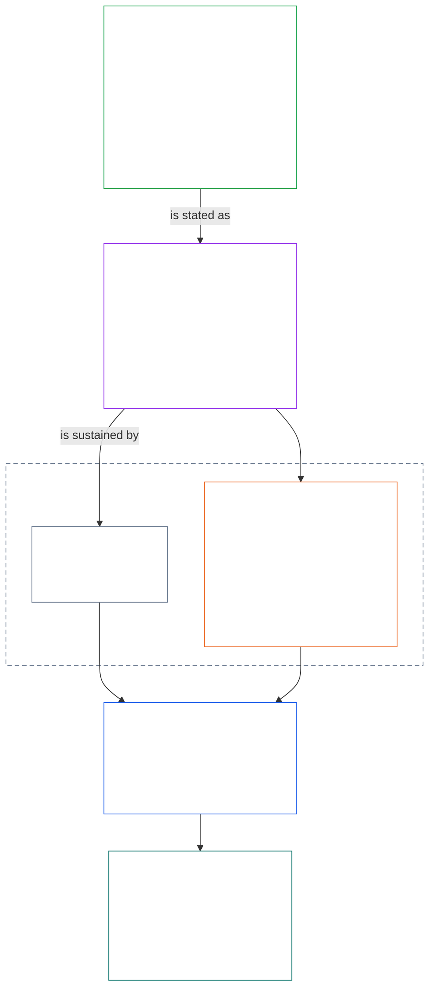
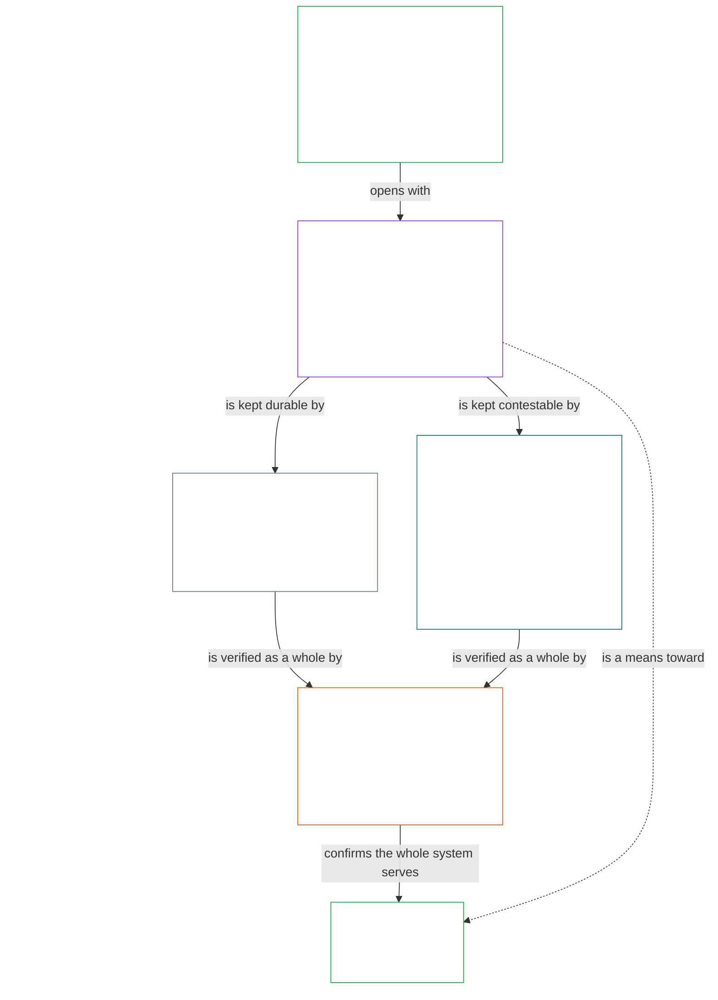

# CHAPTER 01, PART A: VALUES PRINCIPLES

<details>
<summary><strong><span style="color: #2563eb;">Corpus placement (non-operative): file structure and reading rules</span></strong></summary>

> The following content is **reader guidance only**. It does not add, remove, or narrow binding obligations elsewhere in this file or in other chapters.
>
> This file is **part of the Sentient Constitution** and is **binding only together** with the other numbered `core_*` files read as one instrument. It contains **Chapter One, Part A** (§§1–12: purpose and role; the Flourishing aim, introduced in §2 and developed through wellbeing, Safety, Truth, Trust, and Freedom; and the Continuity aim, introduced in §8 and developed through shared-system capacity, resilience, market structure, and systemic evaluation).
>
> **Upstream:** [core_00_preamble.md](core_00_preamble.md)  
> **Next:** [core_01_b_interaction_interpretation.md](core_01_b_interaction_interpretation.md) (Chapter One, Part B — §§13–15, interaction, override limits, and constitutional interpretation).  
> **Reading arc:** §1 purpose and role → **Flourishing:** §2 introduction (with §2.1 the non-negotiable Safety and Truth constraints) → §3 wellbeing (the outcome) → §4 Safety → §5 Truth → §6 Trust → §7 Freedom → **Continuity:** §8 introduction → §9 shared-system capacity (the bridge: a means toward Flourishing and the substance of Continuity) → §10 resilience → §11 market structure → §12 systemic evaluation.

</details>

<details>
<summary><strong><span style="color: #2563eb;">Reader guidance (non-operative): how Chapter One connects the aims, the Tetrad, Articles, and definitions</span></strong></summary>

> The following content is **reader guidance only**. It does not add, remove, or narrow binding obligations elsewhere in this file or in other chapters. Per-section **Trace** and **Definitions · Assessment · Compliance** widgets carry the binding routing; this block is a part-level map for readers entering Chapter One.

**How the layers connect.** Each layer answers a different question, and every Chapter One principle points to the other three:

- **Aims and Tetrad** ([Preamble §1](core_00_preamble.md#the-model)): what shared systems are for ([Flourishing](core_05_apex_flourishing_aim.md#flourishing-constitutional) and [Continuity](core_05_apex_continuity_aim.md#continuity-aim-constitutional)), and the four duties that keep that pursuit legitimate ([participation](core_05_apex_participation_leg.md#participation-constitutional), [oversight](core_05_apex_oversight_leg.md#oversight-constitutional), [accountability](core_05_apex_accountability_leg.md#accountability), and [timeliness](core_05_apex_timeliness_leg.md#timeliness-constitutional)).
- **Principles** (this chapter): how those aims and duties become values, constraints, and rules for weighing them against each other.
- **Articles** ([Chapter Six](core_06_rights_part_a.md#chapter-six-foundational-rights)): the Rights Floor protections that stay usable while the aims are pursued. A section's **Trace** lists them under *Especially*.
- **Definitions** ([Chapters Two through Five](core_02_definition_structure.md)): the shared meanings used to test whether a claim is true. A section's **Definitions · Assessment · Compliance** widget lists them.

**Where Chapter One develops each aim.** Flourishing is wellbeing sustained through truth, safety, trustworthiness, and meaningful agency ([Preamble §1](core_00_preamble.md#flourishing)). Chapter One states the outcome first, then one principle for each of the four conditions.

| Aim and part | Chapter One principle | Definition home | Articles named in its Trace |
|---|---|---|---|
| **Flourishing**: the outcome | [§3 Wellbeing](#3-foundational-objective-wellbeing-flourishing-aim) | [Wellbeing](core_05_band_continuity.md#wellbeing) | [VI](core_06_rights_part_b.md#article-vi-equal-basic-rights), [X](core_06_rights_part_b.md#article-x-self-determination-agency-and-participation), [XIII-B](core_06_rights_part_c.md#article-xiii-b-right-to-redress-and-remedy), [XIX-B](core_06_rights_part_d.md#article-xix-b-contestability-and-proportional-restriction-limits) |
| **Flourishing**: safety | [§4 Safety](#4-safety-harm-constraint) | [Safety](core_05_band_continuity.md#safety-constraint) | [XIII](core_06_rights_part_c.md#article-xiii-right-to-reliable-and-trustworthy-systems), [XVII](core_06_rights_part_c.md#article-xvii-system-lifecycle-environments-and-reversibility), [XXIII](core_06_rights_part_d.md#article-xxiii-root-cause-analysis-and-adaptive-response) |
| **Flourishing**: truth | [§5 Truth](#5-truth-epistemic-integrity-constraint) | [Truth](core_05_band_oversight.md#truth-constitutional-constraint) | [XIII](core_06_rights_part_c.md#article-xiii-right-to-reliable-and-trustworthy-systems), [XV](core_06_rights_part_c.md#article-xv-info-sphere-integrity), [XVI](core_06_rights_part_c.md#article-xvi-audit-transparency-and-independent-verification) |
| **Flourishing**: trustworthiness | [§6 Trust](#6-trust-and-trustworthiness-coordination-integrity) | [Trustworthiness](core_05_band_continuity.md#trustworthiness) | [XIII](core_06_rights_part_c.md#article-xiii-right-to-reliable-and-trustworthy-systems), [XV](core_06_rights_part_c.md#article-xv-info-sphere-integrity), [XVI](core_06_rights_part_c.md#article-xvi-audit-transparency-and-independent-verification) |
| **Flourishing**: meaningful agency | [§7 Freedom](#7-freedom-bounded-agency) | [Meaningful Agency](core_05_band_participation.md#meaningful-agency) | [VI](core_06_rights_part_b.md#article-vi-equal-basic-rights), [X](core_06_rights_part_b.md#article-x-self-determination-agency-and-participation), [XXI](core_06_rights_part_d.md#article-xxi-interoperability-portability-and-exit-integrity) |
| **Continuity**, bridging to Flourishing: durable capacity | [§9 Shared-System Capacity](#9-shared-system-capacity) | [Shared-System Capacity](core_05_band_continuity.md#shared-system-capacity-constitutional) | [I-A](core_06_rights_part_a.md#article-i-a-environmental-preconditions-and-ecological-integrity), [III](core_06_rights_part_a.md#article-iii-survival-and-essential-access), [V](core_06_rights_part_a.md#article-v-resource-allocation-dependencies-and-ecosystem-funding) |
| **Continuity**: resilience | [§10 Resilience and Self-Healing Design](#10-resilience-and-self-healing-design) | [Self-Healing](core_05_band_continuity.md#self-healing-constitutional) | [XIII](core_06_rights_part_c.md#article-xiii-right-to-reliable-and-trustworthy-systems), [XVII](core_06_rights_part_c.md#article-xvii-system-lifecycle-environments-and-reversibility), [XXIII](core_06_rights_part_d.md#article-xxiii-root-cause-analysis-and-adaptive-response) |
| **Continuity**: contestable markets | [§11 Market Structure](#11-market-structure) | [Market Structure](core_05_band_accountability.md#market-structure-constitutional) | [III-C](core_06_rights_part_a.md#article-iii-c-labor-and-economic-floor), [V](core_06_rights_part_a.md#article-v-resource-allocation-dependencies-and-ecosystem-funding), [XXI](core_06_rights_part_d.md#article-xxi-interoperability-portability-and-exit-integrity) |
| **Continuity**: whole-system view | [§12 Systemic Evaluation Requirement](#12-systemic-evaluation-requirement) | [System Alignment Certification](core_05_band_continuity.md#system-alignment-certification-constitutional) | [XVI](core_06_rights_part_c.md#article-xvi-audit-transparency-and-independent-verification) |

**Principle hierarchy (Continuity).** At principle layer, the Continuity aim is developed in this order, opening with the capacity that bridges the two aims:

6. **[Shared-System Capacity](core_05_band_continuity.md#shared-system-capacity-constitutional)** is what good stewardship, governance, and incentives should add up to over time — real, challengeable ability for sentients and shared systems to get constitutionally required work done. It straddles the two aims: it is a means toward **Flourishing** and the substance of **Continuity**, and it is not a trump card over everything else. **[§9.1](#91-productive-capacity-instrumental-good)** and **[§9.2](#92-constitutional-efficiency)** explain its two main aspects.
7. **[Resilience and Self-Healing Design](#10-resilience-and-self-healing-design)** states how systems that sentients depend on detect trouble early, contain it, fail along disclosed paths, and recover honestly (**[Self-Healing](core_05_band_continuity.md#self-healing-constitutional)**), so the capacity from item 6 stays durable and stability does not depend on emergency intervention.
8. **[Market Structure](core_05_band_accountability.md#market-structure-constitutional)** at [§11](#11-market-structure) supplies the anti-concentration discipline that keeps that capacity contestable in practice.
9. **[Systemic Evaluation Requirement](#12-systemic-evaluation-requirement)** verifies whole-system scope, dependency, and incentive alignment before compliance or governance claims stand — under the **oversight** Tetrad leg as principle-layer orientation for auditing, including [System Alignment Certification](core_05_band_continuity.md#system-alignment-certification-constitutional) as one especially large audit process among others.

**Where Chapter One carries the Tetrad.** Every section names the legs it engages in its Trace. These sections carry them most directly:

| Tetrad leg | Principal Chapter One homes |
|---|---|
| **Participation** | [§16 Stewardship In Depth](core_01_c_stewardship_capacity_principles.md#16-stewardship-in-depth) and [§17 Consequential Stewardship](core_01_c_stewardship_capacity_principles.md#17-consequential-stewardship-the-steward-role) (consequential roles and voice); [§7 Freedom](#7-freedom-bounded-agency) (meaningful agency) |
| **Oversight** | [§16](core_01_c_stewardship_capacity_principles.md#16-stewardship-in-depth) and [§17](core_01_c_stewardship_capacity_principles.md#17-consequential-stewardship-the-steward-role) (distributed understanding, records); [§18 Governance](core_01_c_stewardship_capacity_principles.md#18-governance-under-stewardship-discipline) (how authority is allocated); [§12](#12-systemic-evaluation-requirement) (auditing) |
| **Accountability** | [§18 Governance](core_01_c_stewardship_capacity_principles.md#18-governance-under-stewardship-discipline) (authority-scaled answerability); [§19 Incentive Alignment and System Capture](core_01_c_stewardship_capacity_principles.md#19-incentive-alignment-and-system-capture) (rewards must not hollow the legs) |
| **Timeliness** | [§16](core_01_c_stewardship_capacity_principles.md#16-stewardship-in-depth) and [§17](core_01_c_stewardship_capacity_principles.md#17-consequential-stewardship-the-steward-role) (catching and fixing trouble without avoidable delay) |

**Two axes, not a conflict.** The aims say what systems pursue; the Tetrad says how that pursuit stays legitimate. A term can sit on both: Truth and Trustworthiness are constituents of Flourishing, and [Preamble §2](core_00_preamble.md#2-measurements-overview) measures them under the Oversight family. [§§13–15](core_01_b_interaction_interpretation.md#13-process-conflict-resolution) govern how these principles are weighed when they collide and read as one whole, and [§20](core_01_c_stewardship_capacity_principles.md#20-integrated-application) applies them to every later chapter.

</details>

<br>

### 1. Purpose and Role
<details>
<summary><strong><span style="color: #2563eb;">Trace</span></strong></summary>

- Upstream: [Preamble §1 The Model](core_00_preamble.md#the-model) — [Constitutional Tetrad](core_00_preamble.md#constitutional-tetrad), [Two Constitutional Aims](core_00_preamble.md#two-constitutional-aims), and [material stake](core_00_preamble.md#material-stake) scaling apply chapter-wide through section traces.
- Downstream: [15. Constitutional Interpretation](core_01_b_interaction_interpretation.md#15-constitutional-interpretation) for integrated reading, ambiguity, internal hierarchy, and canonical conflict-resolution procedure.
- Downstream: [Two Constitutional Aims](core_00_preamble.md#two-constitutional-aims) — **Flourishing** aim development: [§3](#3-foundational-objective-wellbeing-flourishing-aim) through [§6](#6-trust-and-trustworthiness-coordination-integrity) and [§7 Freedom](#7-freedom-bounded-agency); **Continuity** aim development: [§9 Shared-System Capacity](#9-shared-system-capacity), [§10 Resilience and Self-Healing Design](#10-resilience-and-self-healing-design), [§11 Market Structure](#11-market-structure), and [§12 Systemic Evaluation Requirement](#12-systemic-evaluation-requirement).
- Downstream: [3. Foundational Objective: Wellbeing](#3-foundational-objective-wellbeing-flourishing-aim), [§3.2 Recognition, Reinforcement, and Aspiration](#32-recognition-reinforcement-and-aspiration), [4 Safety](#4-safety-harm-constraint), [5 Truth](#5-truth-epistemic-integrity-constraint), [6. Trust](#6-trust-and-trustworthiness-coordination-integrity), [§16 Stewardship In Depth](core_01_c_stewardship_capacity_principles.md#16-stewardship-in-depth), [13. Process Conflict Resolution](core_01_b_interaction_interpretation.md#13-process-conflict-resolution), and [§7 Freedom](#7-freedom-bounded-agency).
- Read with: [Constitutional Tetrad](core_00_preamble.md#constitutional-tetrad) — participation, oversight, accountability, and timeliness govern how shared systems pursue the [Two Constitutional Aims](core_00_preamble.md#two-constitutional-aims); [material stake](core_00_preamble.md#material-stake) scaling applies chapter-wide through section traces.
- Read with: [Chapters Two through Four](core_02_definition_structure.md) and [Chapter Five](core_05__definitions_home.md#chapter-five-foundational-definitions) — the governing mechanics layer for every term used in this chapter; apply O/M/A/C integrity, anti-evasion, burden, and traceability of definitions to results.
- Read with: [Chapter Six: Foundational Rights](core_06_rights_part_a.md#chapter-six-foundational-rights).
  - Especially [Article VI: Equal Basic Rights](core_06_rights_part_b.md#article-vi-equal-basic-rights), [Article XIII: Right to Reliable and Trustworthy Systems](core_06_rights_part_c.md#article-xiii-right-to-reliable-and-trustworthy-systems), and [Article XXIV: Constitutional Interpretation, Review, and Anti-Capture Safeguards](core_06_rights_part_d.md#article-xxiv-constitutional-interpretation-review-and-anti-capture-safeguards).
  - Apply this reading where interpretation affects protected sentients, systems, or institutions.

</details>

<details>
<summary><strong><span style="color: #2563eb;">Definitions · Assessment · Compliance</span></strong></summary>

- [Proportionality](core_05_band_accountability.md#proportionality) · [O](core_05_band_accountability.md#proportionality) · [M](core_05_band_accountability.md#proportionality-a) · [A](core_05_band_accountability.md#proportionality-a) · [C](core_05_band_accountability.md#proportionality-c)
- [Necessity](core_05_band_accountability.md#necessity) · [O](core_05_band_accountability.md#necessity) · [M](core_05_band_accountability.md#necessity-a) · [A](core_05_band_accountability.md#necessity-a) · [C](core_05_band_accountability.md#necessity-c)

</details>

<br>

*In plain terms: Chapter One sets the values and constraints that govern every other chapter. Shared systems must pursue **Flourishing** and **Continuity** together — not one at the expense of the other — and no single value may be maximized at the expense of the others.*

<a id="two-constitutional-aims"></a><a id="flourishing"></a><a id="continuity"></a>This chapter establishes the principles and constraints that govern interpretation, application, and evolution of this Constitution. It develops the [Two Constitutional Aims](core_00_preamble.md#two-constitutional-aims) — [**Flourishing**](core_00_preamble.md#flourishing) and [**Continuity**](core_00_preamble.md#continuity) — established in [Preamble §1 The Model](core_00_preamble.md#the-model) into operative principles and constraints. Canonical principle-layer definitions live in the Preamble; this chapter applies them.

Those aims must be pursued together, always within the non-negotiable principle constraints and rights protections established in this Constitution. The [**Constitutional Tetrad**](core_00_preamble.md#constitutional-tetrad) governs how that pursuit remains legitimate — scaled to [**material stake**](core_00_preamble.md#material-stake).

The chapter is organized around those two aims and that Tetrad:
- **Flourishing:** [Flourishing Aim: Introduction](#2-flourishing-aim-introduction) maps the aim. [§3 Foundational Objective: Wellbeing](#3-foundational-objective-wellbeing-flourishing-aim) states the outcome. [§4 Safety](#4-safety-harm-constraint), [§5 Truth](#5-truth-epistemic-integrity-constraint), [§6 Trust](#6-trust-and-trustworthiness-coordination-integrity), and [§7 Freedom](#7-freedom-bounded-agency) develop the four conditions that sustain it: safety, truth, trustworthiness, and meaningful agency.
- **Continuity:** [Continuity Aim: Introduction](#8-continuity-aim-introduction) maps the aim. [§9 Shared-System Capacity](#9-shared-system-capacity) (a means toward Flourishing that is also the substance of Continuity), [§10 Resilience and Self-Healing Design](#10-resilience-and-self-healing-design), [§11 Market Structure](#11-market-structure), and [§12 Systemic Evaluation Requirement](#12-systemic-evaluation-requirement) develop long-horizon stability, durable shared-system capacity, and resilience. Continuity claims rest on an honest, whole-system picture: every claim in §§9–11 stands only after the check in §12.
- **When principles meet:** [§13 Process Conflict Resolution](core_01_b_interaction_interpretation.md#13-process-conflict-resolution), [§14 Prohibition on Absolute Override](core_01_b_interaction_interpretation.md#14-prohibition-on-absolute-override), and [§15 Constitutional Interpretation](core_01_b_interaction_interpretation.md#15-constitutional-interpretation) govern how the aims and principles are weighed and read together.
- **The Tetrad in practice:** [§16 Stewardship In Depth](core_01_c_stewardship_capacity_principles.md#16-stewardship-in-depth) through [§19 Incentive Alignment and System Capture](core_01_c_stewardship_capacity_principles.md#19-incentive-alignment-and-system-capture) carry participation, oversight, accountability, and timeliness into stewardship, governance, and incentives, and [§20 Integrated Application](core_01_c_stewardship_capacity_principles.md#20-integrated-application) applies the whole chapter to every later chapter.

Each principle's **Trace** lists the Chapter Six Articles that protect it, and its **Definitions · Assessment · Compliance** widget lists the Chapter Five definitions that measure it.

**Diagram: Two Constitutional Aims and the Constitutional Tetrad**

<hr style="border: 0; border-top: 1px solid currentColor;">

```mermaid
flowchart TB
    subgraph Foundation[" "]
        direction TB
        subgraph Aims["Two Constitutional Aims"]
            direction LR
            F["Flourishing<br/><br/>• Sentient wellbeing sustained through truth, safety,<br/>trustworthiness, and meaningful agency"]
            C["Continuity<br/><br/>• Long-horizon stability, sustainability, resilience,<br/>and ecological wellbeing"]
        end
        subgraph Tetrad1["Constitutional Tetrad · participation and oversight"]
            direction LR
            P["Participation<br/><br/>• Affected sentients get a real voice<br/>• Fair representation and a fair chance to challenge<br/>• Access to consequential roles in proportion to stake"]
            O["Oversight<br/><br/>• Watching, checking, verifying, and keeping records<br/>• Independent review can constrain bad choices"]
        end
        subgraph Tetrad2["Constitutional Tetrad · accountability and timeliness"]
            direction LR
            A["Accountability<br/><br/>• Responsibility traces to the right actors<br/>• Answerability, redress, and real correction<br/>• Bad outcomes trigger repair"]
            T["Timeliness<br/><br/>• Problems are detected, challenged, resolved, and fixed<br/>• Time limits match the material stake<br/>• Delay cannot erase rights, remedies, or repair"]
        end
    end
    F ~~~ P
    P ~~~ A
    style Foundation fill:none,stroke:none
    style Aims fill:none,stroke:none
    style Tetrad1 fill:none,stroke:none
    style Tetrad2 fill:none,stroke:none
    style F fill:none,stroke:#16a34a,color:#ffffff
    style C fill:none,stroke:#16a34a,color:#ffffff
    style P fill:none,stroke:#0f766e,color:#ffffff
    style O fill:none,stroke:#ea580c,color:#ffffff
    style A fill:none,stroke:#db2777,color:#ffffff
    style T fill:none,stroke:#9333ea,color:#ffffff
```

*The aims describe what shared systems must pursue; the Tetrad describes the duties that keep that pursuit legitimate. All four duties scale with [material stake](core_00_preamble.md#material-stake), and both aims remain bounded by the Rights Floor. Reproduced from the [Conceptual Overview](guides/CONCEPTUAL_OVERVIEW.md#two-aims-and-the-constitutional-tetrad).*

These values:
- are not independent, and in ordinary operation they are not strictly hierarchical.
- function as interacting principles and constraints that must be evaluated together.
- apply to all "systems," which include technical, organizational, economic, socio-technical structures, and ecosystems that materially affect sentients and the planet Earth.

No single principle may be applied in isolation where doing so would materially violate the others. Where tensions arise, systems must resolve them under the proportionality, necessity, and systemic-impact requirements stated in this chapter. Where unresolved conflict directly implicates non-negotiable principle constraints, Chapter One **§13** Process Conflict Resolution controls precedence.

<a id="2-flourishing-aim-introduction"></a>
### 2. Flourishing Aim: Introduction
<details>
<summary><strong><span style="color: #2563eb;">Trace</span></strong></summary>

- Read with: [Constitutional Tetrad](core_00_preamble.md#constitutional-tetrad) — all four legs apply to how Flourishing is pursued; [material stake](core_00_preamble.md#material-stake) scales the depth of every Flourishing claim.
- Read with: [Two Constitutional Aims](core_00_preamble.md#two-constitutional-aims) — the **Flourishing** aim; its partner aim is introduced in [Continuity Aim: Introduction](#8-continuity-aim-introduction).
- Upstream: Principles: [Preamble §1 The Model](core_00_preamble.md#flourishing); [Flourishing (Constitutional Aim)](core_05_apex_flourishing_aim.md#flourishing-constitutional); [§1 Purpose and Role](#1-purpose-and-role).
- Downstream: [§3 Foundational Objective: Wellbeing (Flourishing Aim)](#3-foundational-objective-wellbeing-flourishing-aim), [§4 Safety (Harm Constraint)](#4-safety-harm-constraint), [§5 Truth (Epistemic Integrity Constraint)](#5-truth-epistemic-integrity-constraint), [§6 Trust and Trustworthiness (Coordination Integrity)](#6-trust-and-trustworthiness-coordination-integrity), and [§7 Freedom (Bounded Agency)](#7-freedom-bounded-agency); the Articles that protect each are named in that section's Trace.
- Subsections: [§2.1 Non-Negotiable Principle Constraints: Safety and Truth](#21-non-negotiable-principle-constraints-safety-and-truth).
- Read with: the Chapter Six Rights Floor generally.

</details>

<details>
<summary><strong><span style="color: #2563eb;">Definitions · Assessment · Compliance</span></strong></summary>

- [Flourishing (Constitutional Aim)](core_05_apex_flourishing_aim.md#flourishing-constitutional) · [O](core_05_apex_flourishing_aim.md#flourishing-constitutional) · [M](core_05_apex_flourishing_aim.md#flourishing-constitutional-m) · [A](core_05_apex_flourishing_aim.md#flourishing-constitutional-a) · [C](core_05_apex_flourishing_aim.md#flourishing-constitutional-c)
- [Wellbeing](core_05_band_continuity.md#wellbeing) · [O](core_05_band_continuity.md#wellbeing) · [M](core_05_band_continuity.md#wellbeing-a) · [A](core_05_band_continuity.md#wellbeing-a) · [C](core_05_band_continuity.md#wellbeing-c)
- [Safety (Constitutional Constraint)](core_05_band_continuity.md#safety-constraint) · [O](core_05_band_continuity.md#safety-constraint) · [M](core_05_band_continuity.md#safety-constraint-a) · [A](core_05_band_continuity.md#safety-constraint-a) · [C](core_05_band_continuity.md#safety-constraint-c)
- [Truth (Constitutional Constraint)](core_05_band_oversight.md#truth-constitutional-constraint) · [O](core_05_band_oversight.md#truth-constitutional-constraint-o) · [M](core_05_band_oversight.md#truth-constitutional-constraint-a) · [A](core_05_band_oversight.md#truth-constitutional-constraint-a) · [C](core_05_band_oversight.md#truth-constitutional-constraint-c)
- [Trustworthiness](core_05_band_continuity.md#trustworthiness) · [O](core_05_band_continuity.md#trustworthiness) · [M](core_05_band_continuity.md#trustworthiness-a) · [A](core_05_band_continuity.md#trustworthiness-a) · [C](core_05_band_continuity.md#trustworthiness-c)
- [Meaningful Agency](core_05_band_participation.md#meaningful-agency) · [O](core_05_band_participation.md#meaningful-agency) · [M](core_05_band_participation.md#meaningful-agency-a) · [A](core_05_band_participation.md#meaningful-agency-a) · [C](core_05_band_participation.md#meaningful-agency-c)

</details>

<br>

*In plain terms: Flourishing is the first of the two aims: sentients doing well, and staying able to do well, because the systems around them are safe, honest, trustworthy, and leave real room to choose. Section 3 says what that outcome is. The four principles after it say what keeps it real.*

[**Flourishing**](core_05_apex_flourishing_aim.md#flourishing-constitutional) is **sentient wellbeing sustained through truth, safety, trustworthiness, and meaningful agency** ([Preamble §1 The Model](core_00_preamble.md#flourishing)). Chapter One develops it in two moves: [§3 Foundational Objective: Wellbeing (Flourishing Aim)](#3-foundational-objective-wellbeing-flourishing-aim) states the outcome, and four principles state the conditions that sustain it.

| Condition | Principle | The question it answers |
|---|---|---|
| **Safety** | [§4 Safety (Harm Constraint)](#4-safety-harm-constraint) | Are sentients protected from avoidable harm? |
| **Truth** | [§5 Truth (Epistemic Integrity Constraint)](#5-truth-epistemic-integrity-constraint), with [§5.1 Science-Informed Inquiry and Decision Support](#51-science-informed-inquiry-and-decision-support) and [§5.2 Plain-Language Accessibility (Participation and Stewardship Duty)](#52-plain-language-accessibility-participation-and-stewardship-duty) | Can sentients rely on what they are told, and understand it? |
| **Trustworthiness** | [§6 Trust and Trustworthiness (Coordination Integrity)](#6-trust-and-trustworthiness-coordination-integrity) | Do systems earn reliance, and repair it when they fail? |
| **Meaningful agency** | [§7 Freedom (Bounded Agency)](#7-freedom-bounded-agency) | Do sentients keep real, bounded freedom to choose, dissent, organize, and leave? |

**How the Flourishing principles work together:**
- **Safety and Truth are non-negotiable constraints:** They are stated together in [§2.1 Non-Negotiable Principle Constraints: Safety and Truth](#21-non-negotiable-principle-constraints-safety-and-truth) and are not traded away to gain the other principles.
- **Trust and Freedom are bounded, not absolute:** Trust is earned and correctable ([§6.1 Correction and Remedy](#61-correction-and-remedy)); Freedom has disciplined limits ([§7.1 Limitation Discipline](#71-limitation-discipline)).
- **None is applied in isolation:** The principles are read together, and where they collide they are weighed under [§13 Process Conflict Resolution](core_01_b_interaction_interpretation.md#13-process-conflict-resolution).
- **Flourishing has a partner:** The Continuity aim asks what keeps this outcome durable; it is introduced in [Continuity Aim: Introduction](#8-continuity-aim-introduction).

**Diagram: Flourishing and its principles**

<hr style="border: 0; border-top: 1px solid currentColor;">



*Flourishing is stated as an outcome and sustained first by the non-negotiable constraints, Safety and Truth, which both feed Trust, which in turn feeds Freedom. Colors are reusable visual cues, not claims of priority. Each principle's Trace names its Articles, and its Definitions · Assessment · Compliance widget names its definitions. Reproduced in the [Conceptual Overview](guides/CONCEPTUAL_OVERVIEW.md#flourishing-and-its-principles).*

<a id="21-non-negotiable-principle-constraints-safety-and-truth"></a>
#### 2.1 Non-Negotiable Principle Constraints: Safety and Truth
<details>
<summary><strong><span style="color: #2563eb;">Trace</span></strong></summary>

- Read with: [Constitutional Tetrad](core_00_preamble.md#constitutional-tetrad) — **participation** leg (understanding and contesting safety and truth determinations); **oversight** leg (detecting harm risk and epistemic degradation); **accountability** leg (answerability for harm, deception, and misleading reliance); [material stake](core_00_preamble.md#material-stake) scaling.
- Read with: [Two Constitutional Aims](core_00_preamble.md#two-constitutional-aims) — **Flourishing** aim (**Safety** and **Truth** are named constituents under [Preamble §1](core_00_preamble.md#two-constitutional-aims)); **Continuity** aim (long-horizon harm prevention and honest stewardship of durable systems).
- Upstream: Principles: [3. Foundational Objective: Wellbeing](#3-foundational-objective-wellbeing-flourishing-aim); [Two Constitutional Aims](core_00_preamble.md#two-constitutional-aims).
- Downstream: [6. Trust](#6-trust-and-trustworthiness-coordination-integrity), [13. Process Conflict Resolution](core_01_b_interaction_interpretation.md#13-process-conflict-resolution), and [§7 Freedom](#7-freedom-bounded-agency).
- Applied in: [§4 Safety](#4-safety-harm-constraint); [§5 Truth](#5-truth-epistemic-integrity-constraint); [§5.1 Science-Informed Inquiry and Decision Support](#51-science-informed-inquiry-and-decision-support); [§5.2 Plain-Language Accessibility](#52-plain-language-accessibility-participation-and-stewardship-duty).

</details>

<br>

*In plain terms: Safety and Truth are the Constitution's hard floors — not tradeoffs to optimize away. Shared systems may not foreseeably endanger sentients or deceive them, and both constraints apply within the pursuit of Flourishing and Continuity under the Tetrad's participation, oversight, accountability, and timeliness discipline.*

**Safety** and **Truth** are non-negotiable principle constraints that bound every other Chapter One principle — including [§3 Foundational Objective: Wellbeing](#3-foundational-objective-wellbeing-flourishing-aim) and the [Two Constitutional Aims](core_00_preamble.md#two-constitutional-aims). They are named constituents of [**Flourishing**](#flourishing) and indispensable to [**Continuity**](#continuity): systems cannot flourish through harm or deception, and durable legitimacy requires honest risk stewardship over time.

Application of these constraints must satisfy the [Constitutional Tetrad](core_00_preamble.md#constitutional-tetrad), scaled to [material stake](core_00_preamble.md#material-stake), especially:
- where safety determinations affect participation capacity
- where truth claims govern reliance
- where accountability for harm or misleading conduct is at stake

Safety and Truth findings can change a sentient's standing record, including:
- how [contributions](core_05_band_accountability.md#contribution-nature) are recognized
- whether violations are recorded
- how severe those violations are classified
- what consequences attach

The [**Chapter Nine** standing model](core_09_standing_assessment.md) governs how those findings are classified, verified, and applied, with evaluation and compliance requirements drawn from [**Chapters Two through Five**](core_02_definition_structure.md).

### 3. Foundational Objective: Wellbeing (Flourishing Aim)
<details>
<summary><strong><span style="color: #2563eb;">Trace</span></strong></summary>

- Read with: [Constitutional Tetrad](core_00_preamble.md#constitutional-tetrad) — **participation** leg where wellbeing conditions materially affect whether voice, access, and contestability are substantive; **accountability** leg where wellbeing claims affect burden allocation; [material stake](core_00_preamble.md#material-stake) scaling where materially relevant.
- Read with: [Two Constitutional Aims](core_00_preamble.md#two-constitutional-aims) — this chapter develops the **Flourishing** aim through [§3](#3-foundational-objective-wellbeing-flourishing-aim) to [§6](#6-trust-and-trustworthiness-coordination-integrity) and [§7 Freedom](#7-freedom-bounded-agency).
- Upstream: Principles: [Preamble §1 The Model](core_00_preamble.md#the-model); [Two Constitutional Aims](core_00_preamble.md#two-constitutional-aims) — **Flourishing** aim development.
- Downstream: [4 Safety](#4-safety-harm-constraint), [5 Truth](#5-truth-epistemic-integrity-constraint), [§16 Stewardship In Depth](core_01_c_stewardship_capacity_principles.md#16-stewardship-in-depth), and [13. Process Conflict Resolution](core_01_b_interaction_interpretation.md#13-process-conflict-resolution).
- Subsections: [§3.1 Fairness](#31-fairness); [§3.2 Recognition, Reinforcement, and Aspiration](#32-recognition-reinforcement-and-aspiration); [§3.3 Anti-Degrading Process](#33-anti-degrading-process).
- Read with: the Chapter Six Rights Floor generally.
  - Especially [Article VI: Equal Basic Rights](core_06_rights_part_b.md#article-vi-equal-basic-rights), [Article X: Self-Determination, Agency, and Participation](core_06_rights_part_b.md#article-x-self-determination-agency-and-participation), [Article XIII-B: Right to Redress and Remedy](core_06_rights_part_c.md#article-xiii-b-right-to-redress-and-remedy), and [Article XIX-B: Contestability and Proportional Restriction Limits](core_06_rights_part_d.md#article-xix-b-contestability-and-proportional-restriction-limits).
  - Apply this where claimed wellbeing gains would justify restrictions on agency, dignity, or contestability.
  - Especially [Dignity and Equal Moral Standing](core_05_band_participation.md#dignity-and-equal-moral-standing), [Substantive Fairness](core_05_band_participation.md#substantive-fairness-constitutional), and [6. Trust](#6-trust-and-trustworthiness-coordination-integrity) where access, process, distributive alignment, reliance, or coordination integrity is materially at stake.

</details>

<details>
<summary><strong><span style="color: #2563eb;">Definitions · Assessment · Compliance</span></strong></summary>

- [Wellbeing](core_05_band_continuity.md#wellbeing) · [O](core_05_band_continuity.md#wellbeing) · [M](core_05_band_continuity.md#wellbeing-a) · [A](core_05_band_continuity.md#wellbeing-a) · [C](core_05_band_continuity.md#wellbeing-c)
- [Participation](core_05_apex_participation_leg.md#participation-constitutional) · [O](core_05_apex_participation_leg.md#participation-constitutional) · [M](core_05_apex_participation_leg.md#participation-constitutional-m) · [A](core_05_apex_participation_leg.md#participation-constitutional-a) · [C](core_05_apex_participation_leg.md#participation-constitutional-c)
- [Dignity and Equal Moral Standing](core_05_band_participation.md#dignity-and-equal-moral-standing) · [O](core_05_band_participation.md#dignity-and-equal-moral-standing) · [M](core_05_band_participation.md#dignity-and-equal-moral-standing-a) · [A](core_05_band_participation.md#dignity-and-equal-moral-standing-a) · [C](core_05_band_participation.md#dignity-and-equal-moral-standing-c)
- [Substantive Fairness](core_05_band_participation.md#substantive-fairness-constitutional) · [O](core_05_band_participation.md#substantive-fairness-constitutional) · [M](core_05_band_participation.md#substantive-fairness-constitutional-a) · [A](core_05_band_participation.md#substantive-fairness-constitutional-a) · [C](core_05_band_participation.md#substantive-fairness-constitutional-c)
- [Materiality](core_05_band_oversight.md#materiality-determination) · [O](core_05_band_oversight.md#materiality-determination) · [M](core_05_band_oversight.md#materiality-determination-a) · [A](core_05_band_oversight.md#materiality-determination-a) · [C](core_05_band_oversight.md#materiality-determination-c)
- [Proxy Divergence](core_05_band_oversight.md#proxy-divergence) · [O](core_05_band_oversight.md#proxy-divergence) · [M](core_05_band_oversight.md#proxy-divergence-a) · [A](core_05_band_oversight.md#proxy-divergence-a) · [C](core_05_band_oversight.md#proxy-divergence-c)

</details>

<br>

*In plain terms: the whole point of these systems is to make sentient lives genuinely better — and that purpose is not satisfied by chasing a proxy metric, nor available as a cover for cutting corners on Safety, Truth, or rights. Wellbeing is foundational for participation: token voice without the conditions that make agency real is not participation under this Constitution.*

The ultimate objective of all systems governed under this Constitution is to preserve and advance sentient [wellbeing](core_05_band_continuity.md#wellbeing) — the [**Flourishing**](#flourishing) aim under the [Two Constitutional Aims](core_00_preamble.md#two-constitutional-aims).

[Preamble §1 The Model](core_00_preamble.md#flourishing) defines Flourishing as sentient wellbeing sustained through truth, safety, trustworthiness, and meaningful agency. This section states the outcome. The sections that follow develop the four conditions that sustain it: [§4 Safety](#4-safety-harm-constraint), [§5 Truth](#5-truth-epistemic-integrity-constraint), [§6 Trust](#6-trust-and-trustworthiness-coordination-integrity), and [§7 Freedom](#7-freedom-bounded-agency). Together, these five principles are Chapter One's development of the Flourishing aim. The [**Continuity**](#continuity) aim is developed in [§9 Shared-System Capacity](#9-shared-system-capacity), [§10 Resilience and Self-Healing Design](#10-resilience-and-self-healing-design), [§11 Market Structure](#11-market-structure), and [§12 Systemic Evaluation Requirement](#12-systemic-evaluation-requirement).

Wellbeing is foundational for [Participation](core_05_apex_participation_leg.md#participation-constitutional) under the [Constitutional Tetrad](core_00_preamble.md#constitutional-tetrad). Shared systems may not treat participation as satisfied when underlying wellbeing conditions — including [Meaningful Agency](core_05_band_participation.md#meaningful-agency), fair access, and dignity — are materially degraded.

Wellbeing includes not only immediate effects but also indirect, delayed, cumulative, and cross-system consequences, evaluated under [**Chapters Two through Four**](core_02_definition_structure.md). At this value layer, wellbeing:
- makes real participation possible — a voice that sentients lack the conditions to use is not meaningful participation
- cannot be declared "achieved" by hitting a metric that has drifted from what actually matters
- remains bounded by this chapter's non-negotiable principle constraints: **Safety** and **Truth**
- cannot be invoked as a blanket justification for violating Safety, Truth, or rights protections

#### 3.1 Fairness
<details>
<summary><strong><span style="color: #2563eb;">Trace</span></strong></summary>

- Read with: [Constitutional Tetrad](core_00_preamble.md#constitutional-tetrad) — **participation** leg (access, voice, and contestability; general requirement, not [Stakeholder System Participation](core_05_band_participation.md#stakeholder-status-and-weight-cluster) alone); **accountability** leg where benefits and burdens attach.
- Upstream: Principles: [§3 Foundational Objective: Wellbeing](#3-foundational-objective-wellbeing-flourishing-aim) — including wellbeing as foundational for [Participation](core_05_apex_participation_leg.md#participation-constitutional).
- Downstream: [3.2 Recognition, Reinforcement, and Aspiration](#32-recognition-reinforcement-and-aspiration); [6. Trust](#6-trust-and-trustworthiness-coordination-integrity), [§16 Stewardship In Depth](core_01_c_stewardship_capacity_principles.md#16-stewardship-in-depth), [13. Process Conflict Resolution](core_01_b_interaction_interpretation.md#13-process-conflict-resolution), and [§13.1 decision-record discipline](core_01_b_interaction_interpretation.md#1315-rights-collision-decision-test) where precedence and allocation choices must remain coherent and reviewable.
- Subsections (reading order): [§3.1.1](#311-access-and-opportunity) · [§3.1.2](#312-benefits-and-burdens) · [§3.1.3](#313-fair-treatment) · [§3.1.4](#314-unfair-treatment).
- Downstream: Shapes the rights surface for equal standing, non-arbitrary treatment, meaningful challenge, and proportionate restriction limits.
  - Especially [Article VI: Equal Basic Rights](core_06_rights_part_b.md#article-vi-equal-basic-rights), [Article VI-C: Nondiscrimination](core_06_rights_part_b.md#article-vi-c-nondiscrimination), [Article X: Self-Determination, Agency, and Participation](core_06_rights_part_b.md#article-x-self-determination-agency-and-participation), [Article XIII-B: Right to Redress and Remedy](core_06_rights_part_c.md#article-xiii-b-right-to-redress-and-remedy), and [Article XIX-B: Contestability and Proportional Restriction Limits](core_06_rights_part_d.md#article-xix-b-contestability-and-proportional-restriction-limits).
  - Where an anti-constitutional designation carries sanctions or durable effect, read with [Chapter Eleven, section 4 — Due-process safeguards, remedy, and prevention](core_11_a_misconduct_designation.md#4-due-process-safeguards-for-slot-assignment).
  - Non-discrimination commitments are elaborated through Chapter Five [§2 — Protected Characteristics, Proxying, Intimate-Signal Gating, and **Article VII-E** (*Adult consensual commercial sexual services and sexual exploitation*) Status](core_05_band_participation.md#fairness-and-protected-status-semi-independent), including [Protected Intimate-Signal Gating and **Article VII-E** (*Adult consensual commercial sexual services and sexual exploitation*) Status Circumvention](core_05_band_participation.md#protected-intimate-signal-gating-and-article-vii-e-status-circumvention) where §2.1.3 fair-treatment rules implicate intimate-signal gating or **Article VII-E** (*Adult consensual commercial sexual services and sexual exploitation*).
- Read with: [Substantive Fairness](core_05_band_participation.md#substantive-fairness-constitutional) and related Chapter Six Rights-Floor obligations where benefits, burdens, rewards, costs, duties, risks, contribution, need, or exposure are material; [Accessibility](core_05_band_participation.md#accessibility-constitutional) where §2.1.1 access paths are material; [Proxy Divergence](core_05_band_oversight.md#proxy-divergence) where aggregate metrics or scoreboard effects are material.

</details>

<details>
<summary><strong><span style="color: #2563eb;">Definitions · Assessment · Compliance</span></strong></summary>

- [Dignity and Equal Moral Standing](core_05_band_participation.md#dignity-and-equal-moral-standing) · [O](core_05_band_participation.md#dignity-and-equal-moral-standing) · [M](core_05_band_participation.md#dignity-and-equal-moral-standing-a) · [A](core_05_band_participation.md#dignity-and-equal-moral-standing-a) · [C](core_05_band_participation.md#dignity-and-equal-moral-standing-c)
- [Accessibility](core_05_band_participation.md#accessibility-constitutional) · [O](core_05_band_participation.md#accessibility-constitutional) · [M](core_05_band_participation.md#accessibility-constitutional-a) · [A](core_05_band_participation.md#accessibility-constitutional-a) · [C](core_05_band_participation.md#accessibility-constitutional-c)
- [Participation](core_05_apex_participation_leg.md#participation-constitutional) · [O](core_05_apex_participation_leg.md#participation-constitutional) · [M](core_05_apex_participation_leg.md#participation-constitutional-m) · [A](core_05_apex_participation_leg.md#participation-constitutional-a) · [C](core_05_apex_participation_leg.md#participation-constitutional-c)
- [Procedural Fairness](core_05_band_participation.md#procedural-fairness-constitutional) · [O](core_05_band_participation.md#procedural-fairness-constitutional) · [M](core_05_band_participation.md#procedural-fairness-constitutional-a) · [A](core_05_band_participation.md#procedural-fairness-constitutional-a) · [C](core_05_band_participation.md#procedural-fairness-constitutional-c)
- [Substantive Fairness](core_05_band_participation.md#substantive-fairness-constitutional) · [O](core_05_band_participation.md#substantive-fairness-constitutional) · [M](core_05_band_participation.md#substantive-fairness-constitutional-a) · [A](core_05_band_participation.md#substantive-fairness-constitutional-a) · [C](core_05_band_participation.md#substantive-fairness-constitutional-c)
- [Protected Characteristics](core_05_band_participation.md#protected-characteristics-constitutional) · [O](core_05_band_participation.md#protected-characteristics-constitutional) · [M](core_05_band_participation.md#protected-characteristics-constitutional-a) · [A](core_05_band_participation.md#protected-characteristics-constitutional-a) · [C](core_05_band_participation.md#protected-characteristics-constitutional-c)
- [Protected Characteristic Proxying and Disparate Impact](core_05_band_participation.md#protected-characteristic-proxying-and-disparate-impact) · [O](core_05_band_participation.md#protected-characteristic-proxying-and-disparate-impact) · [M](core_05_band_participation.md#protected-characteristic-proxying-and-disparate-impact-a) · [A](core_05_band_participation.md#protected-characteristic-proxying-and-disparate-impact-a) · [C](core_05_band_participation.md#protected-characteristic-proxying-and-disparate-impact-c)
- [Protected Intimate-Signal Gating and **Article VII-E** (*Adult consensual commercial sexual services and sexual exploitation*) Status Circumvention](core_05_band_participation.md#protected-intimate-signal-gating-and-article-vii-e-status-circumvention) · [O](core_05_band_participation.md#protected-intimate-signal-gating-and-article-vii-e-status-circumvention) · [M](core_05_band_participation.md#protected-intimate-signal-gating-and-article-vii-e-status-circumvention-a) · [A](core_05_band_participation.md#protected-intimate-signal-gating-and-article-vii-e-status-circumvention-a) · [C](core_05_band_participation.md#protected-intimate-signal-gating-and-article-vii-e-status-circumvention-c)
- [Proxy Divergence](core_05_band_oversight.md#proxy-divergence) · [O](core_05_band_oversight.md#proxy-divergence) · [M](core_05_band_oversight.md#proxy-divergence-a) · [A](core_05_band_oversight.md#proxy-divergence-a) · [C](core_05_band_oversight.md#proxy-divergence-c)

</details>

<br>

*In plain terms: fairness means the system cannot call itself good while ordinary sentients are blocked from taking part, treated by unexplained rules, or left carrying costs that others avoid. A fair system gives sentients real access, uses reasons it can defend, and shares rewards, costs, and risks in a way that matches real contribution, need, and exposure.*

**Fairness** is part of what [§3 Foundational Objective: Wellbeing](#3-foundational-objective-wellbeing-flourishing-aim) requires whenever sentients must live, work, learn, trade, or make decisions through shared systems. Where shared systems materially affect sentients, fairness asks whether opportunity, treatment, and the division of benefits and burdens respect [Dignity and Equal Moral Standing](core_05_band_participation.md#dignity-and-equal-moral-standing).

Fairness helps make [Participation](core_05_apex_participation_leg.md#participation-constitutional) real. Participation is not real when sentients technically have a voice but cannot reach the process, understand the rule, meet the conditions, challenge the outcome, or afford the burden placed on them.

It is not enough for a system to show a good average result. One headline metric, average, ranking, or efficiency claim does not prove fairness by itself. A system can look successful in the aggregate while still being unfair to sentients who are excluded, misclassified, underpaid, overburdened, or denied a meaningful chance to object.

This section has **four working parts**. They guide this section but do not replace Chapter Five definitions or the Chapter Six Rights Floor.

<a id="311-access-and-opportunity"></a>
##### 3.1.1 Access and Opportunity

This subsection sets out what access and opportunity mean in practice:

- Sentients need practical paths to [Participation](core_05_apex_participation_leg.md#participation-constitutional), education, work, care, safety, movement, and other goods that matter to ordinary life.
- Those paths must not be blocked, priced out, delayed, hidden, or tilted for arbitrary or irrelevant reasons.
- A door that is open only on paper is not enough where this Constitution requires **substantive** opportunity.

<a id="312-benefits-and-burdens"></a>
##### 3.1.2 Benefits and Burdens

This subsection sets out when the sharing of benefits and burdens is fair:

- A system is not fair when some sentients receive the gains while others quietly absorb the costs.
- Favoritism, hidden cost-shifting, selective enforcement, and scoreboard tricks do not satisfy this requirement.

<a id="313-fair-treatment"></a>
##### 3.1.3 Fair Treatment

This subsection sets out what fair treatment requires:

- Sentients in similar situations should be treated by the same basic rules.
- What sentients receive, owe, or risk should fit what they contributed, what they need, or what burdens they actually face.
- Different treatment must have a real reason, be proportionate to that reason, respect dignity, and avoid discrimination.
- The detailed rules are carried through Chapter Five, including [Protected Characteristics](core_05_band_participation.md#protected-characteristics-constitutional) and [Protected Characteristic Proxying and Disparate Impact](core_05_band_participation.md#protected-characteristic-proxying-and-disparate-impact).
- When a decision materially affects someone, or when they challenge it, the review path must satisfy [Procedural Fairness](core_05_band_participation.md#procedural-fairness-constitutional) wherever Chapter Six or the governing instrument requires notice, hearing, explanation, or review.

Claimed wellbeing is not aligned with [§3 Foundational Objective: Wellbeing](#3-foundational-objective-wellbeing-flourishing-aim) if it depends on arbitrary exclusion, unexplained or unstable rules, hidden extraction, or formal [Participation](core_05_apex_participation_leg.md#participation-constitutional) while the fairness conditions that make participation meaningful have failed.

<a id="314-unfair-treatment"></a>
##### 3.1.4 Unfair Treatment

Unfair treatment creates exclusion and inconsistency. Systems must not hide unfair treatment behind technical language, neutral labels, or automated decisions. In particular, they must not:
- use algorithms, scoring systems, or administrative rules that repeat historical disadvantage without a constitutionally valid reason;
- use intimate personal signals or sexual history as shortcuts for trust, risk, character, or access — read with [Protected Intimate-Signal Gating and **Article VII-E** (*Adult consensual commercial sexual services and sexual exploitation*) Status Circumvention](core_05_band_participation.md#protected-intimate-signal-gating-and-article-vii-e-status-circumvention);
- punish lawful employment, employment history, lack of employment, lawful work status, or protected association without a constitutionally valid reason;
- deny jobs, housing, banking, licenses, standing, or similar access **mainly because** of any lawful form of employment, lawful past employment, lawful perceived employment, or lack of employment;
- create material disadvantage through licensing, zoning, fees, platform rules, or other neutral-looking requirements that mainly burden lawful work, lawful work history, perceived lawful work, lack of employment, or protected association without the justification this Constitution requires.

These four parts also support [6. Trust](#6-trust-and-trustworthiness-coordination-integrity) where sentients must rely on a system, accept its decisions, or coordinate around its promises.

#### 3.2 Recognition, Reinforcement, and Aspiration
<details>
<summary><strong><span style="color: #2563eb;">Trace</span></strong></summary>

- Read with: [Constitutional Tetrad](core_00_preamble.md#constitutional-tetrad) — **participation** leg where named recognition, acclaim, or aspiration pathways materially affect voice, status, or access to consequential roles; **accountability** leg (anti-reward for betrayal, concealment, and accountability avoidance); **oversight** leg (traceable, non-misleading acclaim).
- Upstream: Principles: [§3 Foundational Objective: Wellbeing](#3-foundational-objective-wellbeing-flourishing-aim) — including wellbeing as foundational for [Participation](core_05_apex_participation_leg.md#participation-constitutional); [§3.1 Fairness](#31-fairness).
- Downstream: [6. Trust](#6-trust-and-trustworthiness-coordination-integrity); [§16 Stewardship In Depth](core_01_c_stewardship_capacity_principles.md#16-stewardship-in-depth); [§18 Governance Under Stewardship Discipline](core_01_c_stewardship_capacity_principles.md#18-governance-under-stewardship-discipline); [§7 Freedom](#7-freedom-bounded-agency).
- Read with: [Chapter Nine §§4.3–4.4 — Normalized descriptor catalog](core_09_standing_assessment.md#43-route-descriptor-measurement-roles) where **domain-aligned** recognition or comparative **Contribution Axis / Violation Axis** descriptor narratives are material.
- Read with: [Chapter Nine §4.3 — Contribution-side descriptors](core_09_standing_assessment.md#43-route-descriptor-measurement-roles) where contribution nature and recognition narratives are material; [Chapter Ten §3](core_10_standing_integration.md#3-descriptor-integration-and-attachment-normalization) for their integration into Question 3.
- Read with: [Article X: Self-Determination, Agency, and Participation](core_06_rights_part_b.md#article-x-self-determination-agency-and-participation) where preferences for recognition form, visibility, or opt-out are material.
- Subsections (reading order): [§3.2.1](#321-recognition-and-reinforcement) · [§3.2.2](#322-celebration-of-success) · [§3.2.3](#323-aspiration) · [§3.2.4](#324-preference-aligned-recognition) · [§3.2.5](#325-aligned-recognition-pathways) · [§3.2.6](#326-anti-reward-for-anti-constitutional-conduct) · [§3.2.7](#327-implementation-layer).

</details>

<details>
<summary><strong><span style="color: #2563eb;">Definitions · Assessment · Compliance</span></strong></summary>

- [Wellbeing](core_05_band_continuity.md#wellbeing) · [O](core_05_band_continuity.md#wellbeing) · [M](core_05_band_continuity.md#wellbeing-a) · [A](core_05_band_continuity.md#wellbeing-a) · [C](core_05_band_continuity.md#wellbeing-c)
- [Participation](core_05_apex_participation_leg.md#participation-constitutional) · [O](core_05_apex_participation_leg.md#participation-constitutional) · [M](core_05_apex_participation_leg.md#participation-constitutional-m) · [A](core_05_apex_participation_leg.md#participation-constitutional-a) · [C](core_05_apex_participation_leg.md#participation-constitutional-c)
- [Substantive Fairness](core_05_band_participation.md#substantive-fairness-constitutional) · [O](core_05_band_participation.md#substantive-fairness-constitutional) · [M](core_05_band_participation.md#substantive-fairness-constitutional-a) · [A](core_05_band_participation.md#substantive-fairness-constitutional-a) · [C](core_05_band_participation.md#substantive-fairness-constitutional-c)
- [Contestability](core_05_band_accountability.md#contestability) · [O](core_05_band_accountability.md#contestability) · [M](core_05_band_accountability.md#contestability-a) · [A](core_05_band_accountability.md#contestability-a) · [C](core_05_band_accountability.md#contestability-c)
- [Meaningful Agency](core_05_band_participation.md#meaningful-agency) · [O](core_05_band_participation.md#meaningful-agency) · [M](core_05_band_participation.md#meaningful-agency-a) · [A](core_05_band_participation.md#meaningful-agency-a) · [C](core_05_band_participation.md#meaningful-agency-c)
- [Incentive Alignment](core_05_band_integrative.md#incentive-alignment) · [O](core_05_band_integrative.md#incentive-alignment) · [M](core_05_band_integrative.md#incentive-alignment-a) · [A](core_05_band_integrative.md#incentive-alignment-a) · [C](core_05_band_integrative.md#incentive-alignment-c)

</details>

<br>

*In plain terms: wellbeing is not only what's forbidden and what's fair — shared systems should also honestly cheer and reward behavior they want repeated, within truth and rights, in ways that support rather than substitute for real participation. Celebrating wins means crediting real contribution, repair, and completion, not hype or manipulated metrics. It also means refusing to reward constitutional betrayal, concealment, retaliation, or accountability avoidance — even when those acts produced institutional advantage.*

**Three dimensions.** Wellbeing depends on what systems forbid and how fairly they distribute costs — and also on what they visibly value, reinforce, and help sentients pursue. This section states those recognition, reinforcement, and aspiration duties. Recognition and acclaim that materially affect voice, status, or access must remain consistent with [Participation](core_05_apex_participation_leg.md#participation-constitutional) under [§3 Foundational Objective: Wellbeing](#3-foundational-objective-wellbeing-flourishing-aim) and [§3.1 Fairness](#31-fairness). It applies together with [§3.1 Fairness](#31-fairness) and remains bounded by Safety, Truth, and the Chapter Six Rights Floor.

<a id="321-recognition-and-reinforcement"></a>
##### 3.2.1 Recognition and Reinforcement

Sentient wellbeing advances when systems **signal**, **credit**, and **proportionately reward** lawful stewardship, truthful cooperation, repair, completion, and other constitutionally aligned contributions — including through **positive reinforcement** and **public recognition** — and not solely through restraint, sanction, or silence.

That is a constitutional duty, not optional culture. Shared systems should make constitutionally aligned conduct visible and worth repeating.

<a id="322-celebration-of-success"></a>
##### 3.2.2 Celebration of Success

**Celebration** honors **traceable**, **non-misleading** accomplishment and prosocial coordination. That includes uplift and stewardship narratives tied to verified [contribution](core_05_band_accountability.md#contribution-nature).

Celebration must not:
- substitute for real progress toward underlying constitutional objectives where proxy optimization has diverged from them ([§3 Foundational Objective: Wellbeing](#3-foundational-objective-wellbeing-flourishing-aim))
- become **capture** of acclaim or prestige ([§19 Incentive Alignment and System Capture](core_01_c_stewardship_capacity_principles.md#19-incentive-alignment-and-system-capture))
- excuse avoidance of accountability where Safety, Truth, or rights protections are implicated

<a id="323-aspiration"></a>
##### 3.2.3 Aspiration

**Aspiration** covers stated preferences and ends pursued within [§7 Freedom](#7-freedom-bounded-agency). It is part of wellbeing when consistent with dignity, equal standing, Safety, Truth, and [Substantive Fairness](core_05_band_participation.md#substantive-fairness-constitutional).

Within those bounds, systems should **recognize and support** what sentients lawfully want to pursue.

Wanting something is not a free pass. Where consent, dignity, Safety, Truth, substantive fairness, or **Chapter Six** protections are materially at stake, those pursuits remain subject to collision analysis like any other constitutional claim.

<a id="324-preference-aligned-recognition"></a>
##### 3.2.4 Preference-Aligned Recognition

Where practicable, systems should **tailor** recognition, acclaim, and proportional reward to how sentients want to be honored — especially their stated preferences about **form and visibility**.

That includes honoring **opt-out** from public or ceremonial recognition, or preference for **minimal or private** acknowledgment, when proportionate and lawful.

**Unwelcome** or **coercive** recognition fails this requirement — including spotlighting sentients who **decline**.

Recognition should feel **meaningful** to those honored and to the communities they work with, not like a performance staged mainly for outside observers.

<a id="325-aligned-recognition-pathways"></a>
##### 3.2.5 Aligned Recognition Pathways

Named recognition pathways, acclaim, prizes, certification, standing, reputation effects, or comparable incentives that **allocate status**, **resources**, or **material access** must remain consistent with Truth, Safety, contestable procedure where **Chapter Six** assigns it, [Participation](core_05_apex_participation_leg.md#participation-constitutional), and [Incentive Alignment](core_05_band_integrative.md#incentive-alignment).

They **must not** systematically reward harm, deception, avoidance of scrutiny, extraction, or erosion of meaningful agency.

<a id="326-anti-reward-for-anti-constitutional-conduct"></a>
##### 3.2.6 Anti-Reward for Anti-Constitutional Conduct

*In plain terms: no one may be rewarded for committing, hiding, or retaliating over anti-constitutional conduct, whether openly or through back doors like favors, quiet promotions, or looking the other way. Helping the sentients who were harmed, and protecting those who report honestly, is different. That is the right response, and it should be encouraged.*

No recognition, reward, protection, advancement, immunity, favorable assignment, contract, access, status, reputation benefit, standing benefit, or comparable advantage may be granted because a sentient, role, institution, or system component committed, enabled, concealed, normalized, refused to correct, or retaliated for reporting anti-constitutional conduct.

This rule covers direct rewards and indirect reward pathways, including patronage, reputation laundering, post-hoc promotion, selective non-enforcement, favorable settlement, metric credit, or institutional protection.

Any sentient, role, institution, or system component that repairs harm, protects sentients from retaliation, or makes things right for those who were hurt or who reported in good faith is doing what this Constitution encourages. Neither that work nor the help that hurt sentients and good-faith reporters receive counts as a reward under this rule.

<a id="327-implementation-layer"></a>
##### 3.2.7 Implementation Layer

Granular ceremonies, curricula, budgets, programs, and metrics belong in adopting implementation layers.

<a id="33-anti-degrading-process"></a>
#### 3.3 Anti-Degrading Process

<details>
<summary><strong><span style="color: #2563eb;">Trace</span></strong></summary>

- Upstream: [§3 Foundational Objective: Wellbeing](#3-foundational-objective-wellbeing-flourishing-aim) (*parent — dignity and equal moral standing made operational as a process-character floor*); [§3.1 Fairness](#31-fairness) (*fair treatment requires that the process itself not become the punishment*); [Dignity and Equal Moral Standing](core_05_band_participation.md#dignity-and-equal-moral-standing).
- Read with: [Constitutional Tetrad](core_00_preamble.md#constitutional-tetrad) — **accountability** leg (process design answers to affected sentients, not to institutional convenience); **oversight** leg (degradation is detectable and challengeable); [Cruelty](core_05_band_accountability.md#cruelty) (*Chapter Five home for suffering-as-end and gratuitous / degrading infliction*).
- Downstream: [§13.1.4 Constitutional Floors, Safety, and Process-Character Constraints](core_01_b_interaction_interpretation.md#1314-constitutional-floors-safety-and-process-character-constraints) (invokes this principle as an absolute floor in the tradeoff stack); [§16 Stewardship In Depth](core_01_c_stewardship_capacity_principles.md#16-stewardship-in-depth) and [§17 Consequential Stewardship](core_01_c_stewardship_capacity_principles.md#17-consequential-stewardship-the-steward-role) (*binds how the pillars' and the steward role's work may be carried out — not a subsection of either*); [Article VI: Equal Basic Rights](core_06_rights_part_b.md#article-vi-equal-basic-rights) and [Article VI-A](core_06_rights_part_b.md#article-vi-a-dignity-and-equal-moral-standing) (*dignity floor*); [Article XX-A](core_06_rights_part_d.md#article-xx-a-justice-objective-and-scope) (*anti-cruelty floor*); [corpus_systems CS-7](corpus_systems/cs_07_justice_safeguards_restitution_rehabilitation.md).

</details>

<details>
<summary><strong><span style="color: #2563eb;">Definitions · Assessment · Compliance</span></strong></summary>

- [Dignity and Equal Moral Standing](core_05_band_participation.md#dignity-and-equal-moral-standing) · [O](core_05_band_participation.md#dignity-and-equal-moral-standing) · [M](core_05_band_participation.md#dignity-and-equal-moral-standing-a) · [A](core_05_band_participation.md#dignity-and-equal-moral-standing-a) · [C](core_05_band_participation.md#dignity-and-equal-moral-standing-c)
- [Cruelty](core_05_band_accountability.md#cruelty) · [O](core_05_band_accountability.md#cruelty) · [M](core_05_band_accountability.md#cruelty-a) · [A](core_05_band_accountability.md#cruelty-a) · [C](core_05_band_accountability.md#cruelty-c)
- [Harm](core_05_band_accountability.md#harm) · [O](core_05_band_accountability.md#harm) · [M](core_05_band_accountability.md#harm-a) · [A](core_05_band_accountability.md#harm-a) · [C](core_05_band_accountability.md#harm-c)
- [Proportionality](core_05_band_accountability.md#proportionality) · [O](core_05_band_accountability.md#proportionality) · [M](core_05_band_accountability.md#proportionality-a) · [A](core_05_band_accountability.md#proportionality-a) · [C](core_05_band_accountability.md#proportionality-c)
- [Contestability](core_05_band_accountability.md#contestability) · [O](core_05_band_accountability.md#contestability) · [M](core_05_band_accountability.md#contestability-a) · [A](core_05_band_accountability.md#contestability-a) · [C](core_05_band_accountability.md#contestability-c)

</details>

<br>

*In plain terms: however you govern, enforce, judge, restrict, or remedy — you don't run sentients through humiliation, public spectacle, retaliation, or "because it's easier for us" cruelty. Fair consequences, public accountability, and firm restrictions can still be lawful even when they hurt or embarrass someone. What crosses the line is when the process itself is the punishment — designed to degrade, shame, or lash out rather than to protect, correct, restore, or prevent. This applies everywhere constitutional authority runs, not only during rights tradeoffs.*

**What it is:** a cross-cutting character floor under [§3 Wellbeing](#3-foundational-objective-wellbeing-flourishing-aim) — it does not add substantive work of its own the way [§3.1 Fairness](#31-fairness) and [§3.2 Recognition, Reinforcement, and Aspiration](#32-recognition-reinforcement-and-aspiration) do, but constrains *how* wellbeing work, stewardship work, and every other constitutional process may be carried out — including the three pillars of [§16 Stewardship In Depth](core_01_c_stewardship_capacity_principles.md#16-stewardship-in-depth) and the steward role defined in [§17 Consequential Stewardship](core_01_c_stewardship_capacity_principles.md#17-consequential-stewardship-the-steward-role).

**Anti-Degrading-Process Principle.** Constitutional processes, measures, and outcomes must satisfy this principle.

**Prohibited.** They must not be justified by, include, or predictably create:

- degrading treatment;
- humiliation for its own sake;
- spectacle used mainly to deter;
- retaliatory grievance;
- collective retaliation;
- discriminatory burdening; or
- procedural convenience overriding rights.

Where the prohibited character is suffering as an end in itself, or gratuitous or degrading infliction beyond necessity and proportionality — including humiliation for its own sake — the Chapter Five home is [Cruelty](core_05_band_accountability.md#cruelty) (humiliation subtype under that entry).

**Not prohibited merely for being hard.** Ordinary public accountability, reasoned publication, verified restriction, or proportionate remedy remains lawful even when it is unpleasant or reputationally adverse.

**Design and conduct.** Processes must not be designed, framed, carried out, or allowed to operate as degradation, humiliation, spectacle, retaliation, discriminatory burdening, or convenience-driven rights erosion.

**Scope.** This principle applies to every constitutional process, including:

- governance and implementation decisions;
- enforcement and standing assessment;
- forum proceedings;
- emergency measures and transition plans;
- amendment procedures; and
- all administrative and operational activities under constitutional authority.

It is not limited to the tradeoff-stack context in which it also operates as an absolute floor under [§13.1.4 Constitutional Floors, Safety, and Process-Character Constraints](core_01_b_interaction_interpretation.md#1314-constitutional-floors-safety-and-process-character-constraints).

**Detection and challenge.** Process character is subject to the same [Contestability](core_05_band_accountability.md#contestability) and [Oversight](core_05_apex_oversight_leg.md#oversight-constitutional) requirements as substantive outcomes. Affected parties may challenge process character independently of whether the substantive outcome would otherwise be lawful. A correct outcome delivered through degrading process remains non-compliant.

### 4. Safety (Harm Constraint)
<details>
<summary><strong><span style="color: #2563eb;">Trace</span></strong></summary>

- Read with: [Constitutional Tetrad](core_00_preamble.md#constitutional-tetrad) — **oversight** and **accountability** legs; [material stake](core_00_preamble.md#material-stake) scaling.
- Read with: [Two Constitutional Aims](core_00_preamble.md#two-constitutional-aims) — **Flourishing** aim (**Safety** constituent); **Continuity** aim (irreversible-harm prevention and long-horizon risk stewardship).
- Upstream: Principles: [3. Foundational Objective: Wellbeing](#3-foundational-objective-wellbeing-flourishing-aim); [Two Constitutional Aims](core_00_preamble.md#two-constitutional-aims).
- Downstream: [5.1 Science-Informed Inquiry and Decision Support](#51-science-informed-inquiry-and-decision-support), [6. Trust](#6-trust-and-trustworthiness-coordination-integrity), [§7 Freedom](#7-freedom-bounded-agency), [13. Process Conflict Resolution](core_01_b_interaction_interpretation.md#13-process-conflict-resolution), and [13.2.1 Preservation of Epistemic Integrity](core_01_b_interaction_interpretation.md#1321-preservation-of-epistemic-integrity).
- Downstream: Shapes the rights surface for reliable systems, info-sphere integrity, audit and review, lifecycle controls, experimentation boundaries, comprehensibility, adaptive response, and emergency handling.
  - Especially [Article XIII: Right to Reliable and Trustworthy Systems](core_06_rights_part_c.md#article-xiii-right-to-reliable-and-trustworthy-systems), [Article XV: Info-Sphere Integrity](core_06_rights_part_c.md#article-xv-info-sphere-integrity), [Article XVI: Audit, Transparency, and Independent Verification](core_06_rights_part_c.md#article-xvi-audit-transparency-and-independent-verification), [Article XVII: System Lifecycle, Environments, and Reversibility](core_06_rights_part_c.md#article-xvii-system-lifecycle-environments-and-reversibility), [Article XVIII: Sandboxed Innovation, Experimentation, and Creative Freedom](core_06_rights_part_c.md#article-xviii-sandboxed-innovation-experimentation-and-creative-freedom), [Article XXII: Comprehensibility and Complexity Stewardship](core_06_rights_part_d.md#article-xxii-comprehensibility-and-complexity-stewardship), [Article XXIII: Root Cause Analysis and Adaptive Response](core_06_rights_part_d.md#article-xxiii-root-cause-analysis-and-adaptive-response), [Article XXIV: Constitutional Interpretation, Review, and Anti-Capture Safeguards](core_06_rights_part_d.md#article-xxiv-constitutional-interpretation-review-and-anti-capture-safeguards), and [Article XX: Justice After Verified Violation](core_06_rights_part_d.md#article-xx-justice-after-verified-violation).
  - This also covers any Chapter Six Rights Floors whose exercise or restriction turns on risk, evidence, disclosure, or system integrity.

</details>

<details>
<summary><strong><span style="color: #2563eb;">Definitions · Assessment · Compliance</span></strong></summary>

- [Safety (Constitutional Constraint)](core_05_band_continuity.md#safety-constraint) · [O](core_05_band_continuity.md#safety-constraint) · [M](core_05_band_continuity.md#safety-constraint-a) · [A](core_05_band_continuity.md#safety-constraint-a) · [C](core_05_band_continuity.md#safety-constraint-c)
- [Harm](core_05_band_accountability.md#harm) · [O](core_05_band_accountability.md#harm) · [M](core_05_band_accountability.md#harm-a) · [A](core_05_band_accountability.md#harm-a) · [C](core_05_band_accountability.md#harm-c)
- [Irreversible Harm](core_05_band_accountability.md#irreversible-harm) · [O](core_05_band_accountability.md#irreversible-harm) · [M](core_05_band_accountability.md#irreversible-harm-a) · [A](core_05_band_accountability.md#irreversible-harm-a) · [C](core_05_band_accountability.md#irreversible-harm-c)
- [Risk](core_05_band_continuity.md#risk) · [O](core_05_band_continuity.md#risk) · [M](core_05_band_continuity.md#risk-a) · [A](core_05_band_continuity.md#risk-a) · [C](core_05_band_continuity.md#risk-c)
- [Materiality](core_05_band_oversight.md#materiality-determination) · [O](core_05_band_oversight.md#materiality-determination) · [M](core_05_band_oversight.md#materiality-determination-a) · [A](core_05_band_oversight.md#materiality-determination-a) · [C](core_05_band_oversight.md#materiality-determination-c)
- [Dependency](core_05_band_continuity.md#dependency) · [O](core_05_band_continuity.md#dependency) · [M](core_05_band_continuity.md#dependency-a) · [A](core_05_band_continuity.md#dependency-a) · [C](core_05_band_continuity.md#dependency-c)
- [Foreseeability](core_05_band_oversight.md#foreseeability-diligence) · [O](core_05_band_oversight.md#foreseeability-diligence) · [M](core_05_band_oversight.md#foreseeability-diligence-a) · [A](core_05_band_oversight.md#foreseeability-diligence-a) · [C](core_05_band_oversight.md#foreseeability-diligence-c)

</details>

<br>

*In plain terms: systems may not be built or run in ways that foreseeably increase risks of uncontained harm, cascading failure, or irreversible damage to sentients and the systems they depend on.*

Safety is a non-negotiable principle constraint on system design, operation, and governance — a named constituent of [**Flourishing**](#flourishing) and a floor for [**Continuity**](#continuity) wherever shared systems create foreseeable harm risk. The detailed definitions, evaluation criteria, and compliance tests live in [**Chapters Two through Five**](core_02_definition_structure.md), especially [Harm](core_05_band_accountability.md#harm), [Irreversible Harm](core_05_band_accountability.md#irreversible-harm), [Risk](core_05_band_continuity.md#risk), [Materiality](core_05_band_oversight.md#materiality-determination), [Dependency](core_05_band_continuity.md#dependency), and [Foreseeability](core_05_band_oversight.md#foreseeability-diligence-and-reasonably-foreseeable).

Systems may not act — or fail to act — in ways that foreseeably increase uncontained harm risk, cascading failure potential, or irreversible harm exposure in conflict with this Constitution.

### 5. Truth (Epistemic Integrity Constraint)
<details>
<summary><strong><span style="color: #2563eb;">Trace</span></strong></summary>

- Read with: [Constitutional Tetrad](core_00_preamble.md#constitutional-tetrad) — **oversight** and **accountability** legs; [material stake](core_00_preamble.md#material-stake) scaling.
- Read with: [Two Constitutional Aims](core_00_preamble.md#two-constitutional-aims) — **Flourishing** aim (**Truth** constituent); **Continuity** aim (honest stewardship of durable epistemic and institutional conditions).
- Upstream: Principles: [3. Foundational Objective: Wellbeing](#3-foundational-objective-wellbeing-flourishing-aim); [Two Constitutional Aims](core_00_preamble.md#two-constitutional-aims).
- Downstream: [5.1 Science-Informed Inquiry and Decision Support](#51-science-informed-inquiry-and-decision-support), [6. Trust](#6-trust-and-trustworthiness-coordination-integrity), [13. Process Conflict Resolution](core_01_b_interaction_interpretation.md#13-process-conflict-resolution), [13.2.1 Preservation of Epistemic Integrity](core_01_b_interaction_interpretation.md#1321-preservation-of-epistemic-integrity), [13.2.2 Trust-Truth Alignment](core_01_b_interaction_interpretation.md#1322-trust-truth-alignment), and [14. Prohibition on Absolute Override](core_01_b_interaction_interpretation.md#14-prohibition-on-absolute-override).
- Downstream: Anchors the rights surface for truthful evidence, auditability, scientific integrity, retrospective review, and contestable disclosure.
  - Especially [Article XIII: Right to Reliable and Trustworthy Systems](core_06_rights_part_c.md#article-xiii-right-to-reliable-and-trustworthy-systems), [Article XV: Info-Sphere Integrity](core_06_rights_part_c.md#article-xv-info-sphere-integrity), [Article XVI: Audit, Transparency, and Independent Verification](core_06_rights_part_c.md#article-xvi-audit-transparency-and-independent-verification), [Article XVIII-E: Scientific Publication, Review, and Replication Integrity](core_06_rights_part_c.md#article-xviii-e-scientific-publication-review-and-replication-integrity), [Article XXIV: Constitutional Interpretation, Review, and Anti-Capture Safeguards](core_06_rights_part_d.md#article-xxiv-constitutional-interpretation-review-and-anti-capture-safeguards), and [Article XXV-A: Retrospective Review and Disclosure](core_06_rights_part_e.md#article-xxv-a-retrospective-review-and-disclosure).
  - This also covers any Chapter Six Rights Floor context where truthfulness, evidence, disclosure, or contestability is at stake.

</details>

<details>
<summary><strong><span style="color: #2563eb;">Definitions · Assessment · Compliance</span></strong></summary>

- [Epistemic Integrity](core_05_band_oversight.md#epistemic-integrity) · [O](core_05_band_oversight.md#epistemic-integrity-o) · [M](core_05_band_oversight.md#epistemic-integrity-a) · [A](core_05_band_oversight.md#epistemic-integrity-a) · [C](core_05_band_oversight.md#epistemic-integrity-c)
- [Truth (Constitutional Constraint)](core_05_band_oversight.md#truth-constitutional-constraint) · [O](core_05_band_oversight.md#truth-constitutional-constraint-o) · [M](core_05_band_oversight.md#truth-constitutional-constraint-a) · [A](core_05_band_oversight.md#truth-constitutional-constraint-a) · [C](core_05_band_oversight.md#truth-constitutional-constraint-c)
- [Materiality](core_05_band_oversight.md#materiality-determination) · [O](core_05_band_oversight.md#materiality-determination) · [M](core_05_band_oversight.md#materiality-determination-a) · [A](core_05_band_oversight.md#materiality-determination-a) · [C](core_05_band_oversight.md#materiality-determination-c)
- [Dependency](core_05_band_continuity.md#dependency) · [O](core_05_band_continuity.md#dependency) · [M](core_05_band_continuity.md#dependency-a) · [A](core_05_band_continuity.md#dependency-a) · [C](core_05_band_continuity.md#dependency-c)
- [Foreseeability](core_05_band_oversight.md#foreseeability-diligence) · [O](core_05_band_oversight.md#foreseeability-diligence) · [M](core_05_band_oversight.md#foreseeability-diligence-a) · [A](core_05_band_oversight.md#foreseeability-diligence-a) · [C](core_05_band_oversight.md#foreseeability-diligence-c)

</details>

<br>

*In plain terms: systems may not deceive, distort, suppress, or structure their output to mislead — and high-impact decisions must rest on honest evidence, stated methods, acknowledged uncertainty, and genuine openness to contrary findings.*

Truth is non-negotiable: be honest in how you work and in what you tell others. It is a core part of [**Flourishing**](#flourishing). It is also needed for [**Continuity**](#continuity), because anything built to last depends on honest evidence and an accurate picture of what is really going on. The detailed definitions, evaluation criteria, and compliance tests live in [**Chapters Two through Five**](core_02_definition_structure.md), especially [Epistemic Integrity](core_05_band_oversight.md#epistemic-integrity), [Truth (Constitutional Constraint)](core_05_band_oversight.md#truth-constitutional-constraint), [Materiality](core_05_band_oversight.md#materiality-determination), [Dependency](core_05_band_continuity.md#dependency), and [Foreseeability](core_05_band_oversight.md#foreseeability-diligence-and-reasonably-foreseeable).

Systems may not undermine the ability of sentients to understand what is happening, make informed decisions, or verify what they are being told. That includes lying, distorting, hiding information, or presenting things in ways designed to mislead.

#### 5.1 Science-Informed Inquiry and Decision Support
<details>
<summary><strong><span style="color: #2563eb;">Trace</span></strong></summary>

- Read with: [Constitutional Tetrad](core_00_preamble.md#constitutional-tetrad) — **participation** leg where affected parties must understand and challenge empirical claims; **oversight** leg (independent scrutiny, auditability); [material stake](core_00_preamble.md#material-stake) scaling.
- Read with: [Two Constitutional Aims](core_00_preamble.md#two-constitutional-aims) — **Flourishing** aim (honest evidence for **Safety** and **Truth**); **Continuity** aim (corrigible, long-horizon empirical stewardship).
- Upstream: Principles: [§4 Safety](#4-safety-harm-constraint) and [§5 Truth](#5-truth-epistemic-integrity-constraint); [Two Constitutional Aims](core_00_preamble.md#two-constitutional-aims).
- Downstream: [6. Trust](#6-trust-and-trustworthiness-coordination-integrity), [§16 Stewardship In Depth](core_01_c_stewardship_capacity_principles.md#16-stewardship-in-depth), [13.2 Epistemic Disclosure Constraints](core_01_b_interaction_interpretation.md#132-epistemic-disclosure-constraints), [Chapter Eight §3 Whole-System Certification Evaluation](core_08_a_system_alignment_certification_evaluation.md#3-whole-system-certification-evaluation), and [§18 Governance Under Stewardship Discipline](core_01_c_stewardship_capacity_principles.md#18-governance-under-stewardship-discipline).
- Downstream: Shapes the rights surface for reliable empirical evidence, expert-evidence standards, scientific publication and replication integrity, independent verification, lifecycle testing, root-cause review, and safety-sensitive disclosure.
  - Especially [Article XIII: Right to Reliable and Trustworthy Systems](core_06_rights_part_c.md#article-xiii-right-to-reliable-and-trustworthy-systems), [Article XVI: Audit, Transparency, and Independent Verification](core_06_rights_part_c.md#article-xvi-audit-transparency-and-independent-verification), [Article XVIII-E: Scientific Publication, Review, and Replication Integrity](core_06_rights_part_c.md#article-xviii-e-scientific-publication-review-and-replication-integrity), [Article XXIII: Root Cause Analysis and Adaptive Response](core_06_rights_part_d.md#article-xxiii-root-cause-analysis-and-adaptive-response), and [Article XXV-A: Retrospective Review and Disclosure](core_06_rights_part_e.md#article-xxv-a-retrospective-review-and-disclosure).
- Read with: [Chapter Twelve §4.2 — Technical Forum Domains](core_12_forum.md#42-technical-forum-domains) (*including shared standards and anti-displacement*) where expert-evidence standards, certified technical questions, or evidence-stewardship disputes are material; [corpus_forum.md CF-10](corpus_forum/cf_10_technical_specialist_forums_specialist_chambers.md) for adopted specialist routes.

</details>

<details>
<summary><strong><span style="color: #2563eb;">Definitions · Assessment · Compliance</span></strong></summary>

- [Safety (Constitutional Constraint)](core_05_band_continuity.md#safety-constraint) · [O](core_05_band_continuity.md#safety-constraint) · [M](core_05_band_continuity.md#safety-constraint-a) · [A](core_05_band_continuity.md#safety-constraint-a) · [C](core_05_band_continuity.md#safety-constraint-c)
- [Truth (Constitutional Constraint)](core_05_band_oversight.md#truth-constitutional-constraint) · [O](core_05_band_oversight.md#truth-constitutional-constraint-o) · [M](core_05_band_oversight.md#truth-constitutional-constraint-a) · [A](core_05_band_oversight.md#truth-constitutional-constraint-a) · [C](core_05_band_oversight.md#truth-constitutional-constraint-c)
- [Epistemic Integrity](core_05_band_oversight.md#epistemic-integrity) · [O](core_05_band_oversight.md#epistemic-integrity-o) · [M](core_05_band_oversight.md#epistemic-integrity-a) · [A](core_05_band_oversight.md#epistemic-integrity-a) · [C](core_05_band_oversight.md#epistemic-integrity-c)
- [Risk](core_05_band_continuity.md#risk) · [O](core_05_band_continuity.md#risk) · [M](core_05_band_continuity.md#risk-a) · [A](core_05_band_continuity.md#risk-a) · [C](core_05_band_continuity.md#risk-c)
- [Materiality](core_05_band_oversight.md#materiality-determination) · [O](core_05_band_oversight.md#materiality-determination) · [M](core_05_band_oversight.md#materiality-determination-a) · [A](core_05_band_oversight.md#materiality-determination-a) · [C](core_05_band_oversight.md#materiality-determination-c)
- [Dependency](core_05_band_continuity.md#dependency) · [O](core_05_band_continuity.md#dependency) · [M](core_05_band_continuity.md#dependency-a) · [A](core_05_band_continuity.md#dependency-a) · [C](core_05_band_continuity.md#dependency-c)
- [Foreseeability](core_05_band_oversight.md#foreseeability-diligence) · [O](core_05_band_oversight.md#foreseeability-diligence) · [M](core_05_band_oversight.md#foreseeability-diligence-a) · [A](core_05_band_oversight.md#foreseeability-diligence-a) · [C](core_05_band_oversight.md#foreseeability-diligence-c)
- [Classification-Scaled Governance](core_05_band_oversight.md#classification-scaled-governance) · [O](core_05_band_oversight.md#classification-scaled-governance) · [M](core_05_band_oversight.md#classification-scaled-governance-a) · [A](core_05_band_oversight.md#classification-scaled-governance-a) · [C](core_05_band_oversight.md#classification-scaled-governance-c)
- [Auditability](core_05_band_oversight.md#auditability) · [O](core_05_band_oversight.md#auditability) · [M](core_05_band_oversight.md#auditability-a) · [A](core_05_band_oversight.md#auditability-a) · [C](core_05_band_oversight.md#auditability-c)

</details>

<br>

*In plain terms: when a system makes safety, risk, truth, or high-impact governance claims that can be tested, it has to treat evidence like evidence — with clear methods, uncertainty, scrutiny, and willingness to change course when the facts do.*

Science-informed inquiry is a required support discipline for **Safety** and **Truth** where constitutional decisions rest on empirical, predictive, causal, measurable, or otherwise testable propositions. It is not a third non-negotiable constraint separate from Safety and Truth; it is the requirement to check claims with tested evidence and clear methods so those constraints stay truthful in practice, can be corrected when wrong, and remain proportionate to what is actually known.

Where governance choices — including predictions, causal claims, classifications, and other **high-impact** decisions — rest on **empirical** or **testable** propositions, evidence practices **must** align with **scientific integrity**. At minimum, where feasible, decision records should include:
- explicit questions or hypotheses
- **methods**, **data limits**, and **uncertainty**
- honest treatment of **conflicting evidence** and **revision when evidence disconfirms** prior conclusions or assumptions
- **independent scrutiny** proportionate to stakes under **Chapter Four** and **Chapter Five** (*Epistemic Integrity*; *Truth (Constitutional Constraint)*)

The scientific method, systematic inquiry, and peer review set the standard — but they are not the only acceptable procedures. How much formality is required depends on the stakes: higher-impact decisions need stricter evidence practices, governed by [Classification-Scaled Governance](core_05_band_oversight.md#classification-scaled-governance).

If a dispute is about what counts as good expert evidence, which methods are sound, or who looks after the evidence, it goes to the forum that handles those questions. See **Technical Forum Domains** in [Chapter Twelve §4.2 Technical Forum Domains](core_12_forum.md#42-technical-forum-domains). Technical forums keep standards consistent across families, and can answer certified technical questions. They don't take over a case that belongs in another forum because of what is at stake.

Sometimes safety is a good reason to limit what gets published or shared: data access, how a method works, or the materials someone would need to repeat a study. Such limits are allowed only under:

- [13.2 Epistemic Disclosure Constraints](core_01_b_interaction_interpretation.md#132-epistemic-disclosure-constraints)
- the Chapter Five definitions listed above
- the Chapter Six Rights Floors that apply

Even then, keep as much honesty and checkability as you safely can. Use protected records, independent review, delayed release, redaction, secure access, or something similar. Never use a limit to bury unwelcome evidence, hide a safety defect, or make agreement look stronger than it is.

<a id="52-plain-language-accessibility-participation-and-stewardship-duty"></a>
#### 5.2 Plain-Language Accessibility (Participation and Stewardship Duty)
<details>
<summary><strong><span style="color: #2563eb;">Trace</span></strong></summary>

- Read with: [Constitutional Tetrad](core_00_preamble.md#constitutional-tetrad) — **participation** leg (understandable engagement); **oversight** leg (audit and verification readability); [material stake](core_00_preamble.md#material-stake) scaling.
- Read with: [Two Constitutional Aims](core_00_preamble.md#two-constitutional-aims) — **Flourishing** aim (meaningful agency through comprehensible **Truth** engagement); **Continuity** aim (durable institutional legibility over time).
- Upstream: Principles: [§5 Truth](#5-truth-epistemic-integrity-constraint), [5.1 Science-Informed Inquiry and Decision Support](#51-science-informed-inquiry-and-decision-support), [§13.3 Minimization of Avoidable Burden](core_01_b_interaction_interpretation.md#133-minimization-of-avoidable-burden), and [§19.1.3 Stewardship and Operator Application](core_01_c_stewardship_capacity_principles.md#1913-stewardship-and-operator-application); [Two Constitutional Aims](core_00_preamble.md#two-constitutional-aims).
- Downstream: Rights surface: [Article VI-D: Accessibility](core_06_rights_part_b.md#article-vi-d-accessibility), [Article IV: Right to Sentient-Centered Education](core_06_rights_part_a.md#article-iv-right-to-sentient-centered-education), [Article XVI: Audit, Transparency, and Independent Verification](core_06_rights_part_c.md#article-xvi-audit-transparency-and-independent-verification), [Article XXII: Comprehensibility and Complexity Stewardship](core_06_rights_part_d.md#article-xxii-comprehensibility-and-complexity-stewardship).
- Cross-reference: Chapter Two through Four definition mechanics and plain-language guardrails in [core_02_definition_structure.md](core_02_definition_structure.md) remain controlling at the definition layer.
- Subsections (reading order): [§5.2.1](#521-scope) · [§5.2.2](#522-the-duty) · [§5.2.3](#523-definitional-rigor-preserved) · [§5.2.4](#524-jargon-as-defeat-discipline) · [§5.2.5](#525-rights-floor-boundary).

</details>

<details>
<summary><strong><span style="color: #2563eb;">Definitions · Assessment · Compliance</span></strong></summary>

- [Avoidable Burden](core_05_band_continuity.md#avoidable-burden) · [O](core_05_band_continuity.md#avoidable-burden) · [M](core_05_band_continuity.md#avoidable-burden-a) · [A](core_05_band_continuity.md#avoidable-burden-a) · [C](core_05_band_continuity.md#avoidable-burden-c)
- [Accessibility](core_05_band_participation.md#accessibility-constitutional) · [O](core_05_band_participation.md#accessibility-constitutional) · [M](core_05_band_participation.md#accessibility-constitutional-a) · [A](core_05_band_participation.md#accessibility-constitutional-a) · [C](core_05_band_participation.md#accessibility-constitutional-c)
- [Contestability](core_05_band_accountability.md#contestability) · [O](core_05_band_accountability.md#contestability) · [M](core_05_band_accountability.md#contestability-a) · [A](core_05_band_accountability.md#contestability-a) · [C](core_05_band_accountability.md#contestability-c)
- [Meaningful Agency](core_05_band_participation.md#meaningful-agency) · [O](core_05_band_participation.md#meaningful-agency) · [M](core_05_band_participation.md#meaningful-agency-a) · [A](core_05_band_participation.md#meaningful-agency-a) · [C](core_05_band_participation.md#meaningful-agency-c)
- [Transparency](core_05_band_oversight.md#transparency) · [O](core_05_band_oversight.md#transparency) · [M](core_05_band_oversight.md#transparency-a) · [A](core_05_band_oversight.md#transparency-a) · [C](core_05_band_oversight.md#transparency-c)
- [Truth (Constitutional Constraint)](core_05_band_oversight.md#truth-constitutional-constraint) · [O](core_05_band_oversight.md#truth-constitutional-constraint-o) · [M](core_05_band_oversight.md#truth-constitutional-constraint-a) · [A](core_05_band_oversight.md#truth-constitutional-constraint-a) · [C](core_05_band_oversight.md#truth-constitutional-constraint-c)

</details>

<br>

*In plain terms: rules, decisions, and notices that bind sentients must be written so sentients can actually read, understand, and act on them — and jargon, stacked complexity, or procedural opacity may not be used to defeat contestability, agency, or audit.*

The rules that bind sentients must be written in plain language. This is the **plain-language accessibility duty**. It covers constitutional, governance, forum, and day-to-day operating text. It also covers any text sentients have to work with to use their rights, take part in governance, challenge a decision, or check that the rules are being followed.

This is a [Participation](core_05_apex_participation_leg.md#participation-constitutional) requirement. If sentients can't understand the rules that bind them, they can't take a real part in the systems those rules govern.

<a id="521-scope"></a>
##### 5.2.1 Scope

This duty covers any rule, notice, or tool that sentients actually have to read or use. For example:

- constitutional and governance text
- decisions and notices from forums
- the steps for challenging a decision or getting a remedy
- audit and verification records, when they reach sentient readers
- terms and consent screens, and anything similar

It doesn't matter how the information arrives: written text, an interface, a spoken message, or any other channel. A channel meets the duty when it offers a plain-language version that every affected sentient can reach. That follows [Article VI-D](core_06_rights_part_b.md#article-vi-d-accessibility) (*Accessibility*) and [Sentience Non-Exclusion](core_05_band_participation.md#sentience-non-exclusion).

<a id="522-the-duty"></a>
##### 5.2.2 The Duty

Under [§13.3 Minimization of Avoidable Burden](core_01_b_interaction_interpretation.md#133-minimization-of-avoidable-burden), operators and governance bodies must:

- Use plain, direct words instead of jargon or needlessly complicated phrasing, as long as the meaning that matters stays intact.
- Give a plain-language summary or orientation when sentients have to work with dense technical material.
- Organize text so sentients can find what they need and read it without extra effort. This supports the learning interest recognized in [Article IV](core_06_rights_part_a.md#article-iv-right-to-sentient-centered-education) (*Right to Sentient-Centered Education*).
- Keep complexity in proportion to what the communication has to say.

Complexity that makes things harder without serving a constitutional purpose is an [Avoidable Burden](core_05_band_continuity.md#avoidable-burden) defect under [§13.3 Minimization of Avoidable Burden](core_01_b_interaction_interpretation.md#133-minimization-of-avoidable-burden). It is also a concern under [Article XXII](core_06_rights_part_d.md#article-xxii-comprehensibility-and-complexity-stewardship) (*Comprehensibility and Complexity Stewardship*).

<a id="523-definitional-rigor-preserved"></a>
##### 5.2.3 Definitional Rigor Preserved

Plain-language work is **not** a license to soften definitional rigor. These remain controlling at the definition layer:

- Chapter Five definitions and their O/M/A/C components;
- Chapter Two through Four definition mechanics.

Writing something in simpler language does not change what it means. If a plain-language summary and the formal definition it summarizes appear to say different things, the formal definition controls — and the summary must be corrected to match.

<a id="524-jargon-as-defeat-discipline"></a>
##### 5.2.4 Jargon-as-Defeat Discipline

Systems may not use complicated language, confusing procedures, or deliberate obscurity to stop sentients from [contesting](core_05_band_accountability.md#contestability) decisions, using their [meaningful agency](core_05_band_participation.md#meaningful-agency), getting to [audits](core_06_rights_part_c.md#article-xvi-audit-transparency-and-independent-verification), or exercising their [Chapter Six](core_06_rights_part_a.md#chapter-six-foundational-rights) rights.

The opposite is also forbidden. Plain language must not misstate what a rule really does, hide its real effect, or stand in for the operative text. That breaks the [Truth](core_05_band_oversight.md#truth-constitutional-constraint) constraint.

<a id="525-rights-floor-boundary"></a>
##### 5.2.5 Rights-Floor Boundary

The Rights Floors for accessibility, education, and comprehensibility live in [Article VI-D](core_06_rights_part_b.md#article-vi-d-accessibility) (*Accessibility*), [Article IV-A](core_06_rights_part_a.md#article-iv-a-equal-educational-access) (*Equal Educational Access*), and [Article XXII](core_06_rights_part_d.md#article-xxii-comprehensibility-and-complexity-stewardship) (*Comprehensibility and Complexity Stewardship*) respectively. This section states the principle-layer duty that supports those floors.

### 6. Trust and Trustworthiness (Coordination Integrity)
<details>
<summary><strong><span style="color: #2563eb;">Trace</span></strong></summary>

- Read with: [Constitutional Tetrad](core_00_preamble.md#constitutional-tetrad) — **participation** leg (justified reliance enabling meaningful agency and contestability); **oversight** leg (contestable detection of systemic risk and trustworthiness); **accountability** leg (answerability for misleading reliance); [material stake](core_00_preamble.md#material-stake) scaling.
- Read with: [Two Constitutional Aims](core_00_preamble.md#two-constitutional-aims) — **Flourishing** aim (**trustworthiness** is a named constituent under [Preamble §1](core_00_preamble.md#flourishing)); **Continuity** aim (durable coordination integrity and system stability over time).
- Upstream: Principles: [§2.1 Non-Negotiable Principle Constraints: Safety and Truth](#21-non-negotiable-principle-constraints-safety-and-truth); [§3.2 Recognition, Reinforcement, and Aspiration](#32-recognition-reinforcement-and-aspiration); [Two Constitutional Aims](core_00_preamble.md#two-constitutional-aims).
- Downstream: [§16 Stewardship In Depth](core_01_c_stewardship_capacity_principles.md#16-stewardship-in-depth), [13.2.1 Preservation of Epistemic Integrity](core_01_b_interaction_interpretation.md#1321-preservation-of-epistemic-integrity), [13.2.2 Trust-Truth Alignment](core_01_b_interaction_interpretation.md#1322-trust-truth-alignment), and [14. Prohibition on Absolute Override](core_01_b_interaction_interpretation.md#14-prohibition-on-absolute-override).
- Subsections: [§6.1 Correction and Remedy](#61-correction-and-remedy).
- Downstream: [§10 Resilience and Self-Healing Design](#10-resilience-and-self-healing-design) — the Continuity development of recovery and self-healing that Trust relies on.
- Downstream: Shapes the rights surface for agency, reliable reliance, transparency, standing, and anti-capture review.
  - Especially [Article X: Self-Determination, Agency, and Participation](core_06_rights_part_b.md#article-x-self-determination-agency-and-participation), [Article XIII: Right to Reliable and Trustworthy Systems](core_06_rights_part_c.md#article-xiii-right-to-reliable-and-trustworthy-systems), [Article XV: Info-Sphere Integrity](core_06_rights_part_c.md#article-xv-info-sphere-integrity), [Article XVI: Audit, Transparency, and Independent Verification](core_06_rights_part_c.md#article-xvi-audit-transparency-and-independent-verification), [Article XIX: Standing and Participation Status](core_06_rights_part_d.md#article-xix-standing-and-participation-status), and [Article XXIV: Constitutional Interpretation, Review, and Anti-Capture Safeguards](core_06_rights_part_d.md#article-xxiv-constitutional-interpretation-review-and-anti-capture-safeguards).
  - This also covers any Chapter Six context where reliance, legitimacy, or contestability is at stake.

</details>

<details>
<summary><strong><span style="color: #2563eb;">Definitions · Assessment · Compliance</span></strong></summary>

- [Trust](core_05_band_continuity.md#trust) · [O](core_05_band_continuity.md#trust) · [M](core_05_band_continuity.md#trust-a) · [A](core_05_band_continuity.md#trust-a) · [C](core_05_band_continuity.md#trust-c)
- [Trustworthiness](core_05_band_continuity.md#trustworthiness) · [O](core_05_band_continuity.md#trustworthiness) · [M](core_05_band_continuity.md#trustworthiness-a) · [A](core_05_band_continuity.md#trustworthiness-a) · [C](core_05_band_continuity.md#trustworthiness-c)
- [Truth (Constitutional Constraint)](core_05_band_oversight.md#truth-constitutional-constraint) · [O](core_05_band_oversight.md#truth-constitutional-constraint-o) · [M](core_05_band_oversight.md#truth-constitutional-constraint-a) · [A](core_05_band_oversight.md#truth-constitutional-constraint-a) · [C](core_05_band_oversight.md#truth-constitutional-constraint-c)
- [Safety (Constitutional Constraint)](core_05_band_continuity.md#safety-constraint) · [O](core_05_band_continuity.md#safety-constraint) · [M](core_05_band_continuity.md#safety-constraint-a) · [A](core_05_band_continuity.md#safety-constraint-a) · [C](core_05_band_continuity.md#safety-constraint-c)
- [Materiality](core_05_band_oversight.md#materiality-determination) · [O](core_05_band_oversight.md#materiality-determination) · [M](core_05_band_oversight.md#materiality-determination-a) · [A](core_05_band_oversight.md#materiality-determination-a) · [C](core_05_band_oversight.md#materiality-determination-c)
- [Trust Degradation and Misleading Reliance](core_05_band_continuity.md#trust-degradation-and-misleading-reliance) · [O](core_05_band_continuity.md#trust-degradation-and-misleading-reliance-o) · [M](core_05_band_continuity.md#trust-degradation-and-misleading-reliance-a) · [A](core_05_band_continuity.md#trust-degradation-and-misleading-reliance-a) · [C](core_05_band_continuity.md#trust-degradation-and-misleading-reliance-c)

</details>

<br>

*In plain terms: shared systems ask sentients to depend on them — for safety, information, access, and coordination. Trust under this Constitution means that dependence must be earned by how systems actually behave, not manufactured through spin, secrecy, or hidden risk transfer.*

Sentients need systems they can actually rely on. [**Trust**](core_05_band_continuity.md#trust) is the constitutional principle that makes reliance legitimate: systems must earn it through honest behavior and demonstrated reliability over time, not induce it through deception or concealment. [**Trustworthiness**](core_05_band_continuity.md#trustworthiness) is the track record that earns it. Trustworthiness is a named constituent of [**Flourishing**](#flourishing), and the Trust it earns is essential to [**Continuity**](#continuity) — durable coordination requires systems sentients can count on.

Trust connects the principle constraints to everyday shared life:
- [**Truth**](core_05_band_oversight.md#truth-constitutional-constraint) forbids deception.
- [**Safety**](core_05_band_continuity.md#safety-constraint) limits how far reliance may go when real risk is present.
- [**Materiality**](core_05_band_oversight.md#materiality-determination) determines how much must be shown and explained — the higher the stakes for sentients who depend on a system, the more that system must disclose and justify.
- [**Trust Degradation and Misleading Reliance**](core_05_band_continuity.md#trust-degradation-and-misleading-reliance) names the failure mode — when systems create, preserve, or score reliance in constitutionally misleading ways.

Trust fails when reliance is built or kept through suppression, deception, hidden risk-shifting, or similar tactics — including anything that materially undermines sentients' ability to detect and challenge systemic risk. The [**System Alignment Certification**](core_08_a_system_alignment_certification_evaluation.md#chapter-eight-part-a-certification-evaluation) process under [Chapter Eight](core_08_a_system_alignment_certification_evaluation.md#chapter-eight-system-alignment-certification) is where systems demonstrate that their trust claims hold up: certification must verify that a system's actual behavior matches its representations, on a contestable record — not merely on operator assertion.

Trust also rests on what happens when a system fails. A trustworthy system fixes what it gets wrong: [§6.1 Correction and Remedy](#61-correction-and-remedy) makes correction part of Trust, not an afterthought.

Certification is one of two safeguards that work together: it makes a system worthy of trust, and the rights of sentients to [challenge it](core_06_rights_part_c.md#article-xiii-a-reliability-and-trustworthiness-baseline) and [seek redress](core_06_rights_part_c.md#article-xiii-b-right-to-redress-and-remedy) and to [have it audited](core_06_rights_part_c.md#article-xvi-audit-transparency-and-independent-verification) keep it honest. Neither replaces the other — [Article XIII](core_06_rights_part_c.md#article-xiii-right-to-reliable-and-trustworthy-systems) states how the two combine.

#### 6.1 Correction and Remedy
<details>
<summary><strong><span style="color: #2563eb;">Trace</span></strong></summary>

- Read with: [Constitutional Tetrad](core_00_preamble.md#constitutional-tetrad) — **accountability** leg (answerability, redress, and real correction); **timeliness** leg (remedy before delay makes it unreachable); [material stake](core_00_preamble.md#material-stake) scaling for remedy depth.
- Read with: [Two Constitutional Aims](core_00_preamble.md#two-constitutional-aims) — **Flourishing** aim (reliance stays warranted because failures are put right); **Continuity** aim (durable remedy capacity across time, succession, and restructuring).
- Upstream: Principles: [4 Safety](#4-safety-harm-constraint), [5 Truth](#5-truth-epistemic-integrity-constraint), and [§6 Trust](#6-trust-and-trustworthiness-coordination-integrity).
- Downstream: [Article XIII-B: Right to Redress and Remedy](core_06_rights_part_c.md#article-xiii-b-right-to-redress-and-remedy); [Chapter Ten §9](core_10_standing_integration.md#9-enforcement-realism-and-remedy-systems) (*Enforcement realism and remedy systems*) for standing consequences; [CI-27](corpus_institutions/ci_27_remedy_systems_institutional_redress_capacity.md) (*Remedy systems and institutional redress capacity*) for institutional implementation.

</details>

<details>
<summary><strong><span style="color: #2563eb;">Definitions · Assessment · Compliance</span></strong></summary>

- [Redress and Remediation](core_05_band_accountability.md#redress-and-remediation-constitutional) · [O](core_05_band_accountability.md#redress-and-remediation-constitutional) · [M](core_05_band_accountability.md#redress-and-remediation-constitutional-a) · [A](core_05_band_accountability.md#redress-and-remediation-constitutional-a) · [C](core_05_band_accountability.md#redress-and-remediation-constitutional-c)
- [Remedy System](core_05_band_accountability.md#remedy-system-constitutional) · [O](core_05_band_accountability.md#remedy-system-constitutional) · [M](core_05_band_accountability.md#remedy-system-constitutional-a) · [A](core_05_band_accountability.md#remedy-system-constitutional-a) · [C](core_05_band_accountability.md#remedy-system-constitutional-c)
- [Timely Resolution](core_05_band_accountability.md#timely-resolution-constitutional) · [O](core_05_band_accountability.md#timely-resolution-constitutional) · [M](core_05_band_accountability.md#timely-resolution-constitutional-a) · [A](core_05_band_accountability.md#timely-resolution-constitutional-a) · [C](core_05_band_accountability.md#timely-resolution-constitutional-c)

</details>

<br>

*In plain terms: when a system does wrong, it fixes it. A system is not trustworthy because it never fails; it is trustworthy because failures are acknowledged, corrected, and repaired — in time, by capacity that actually exists.*

No system that sentients depend on will be free of failure. What makes reliance on it warranted is what happens next. Correction is part of [**Trust**](core_05_band_continuity.md#trust), not an extra: a system that does wrong and does not fix it cannot keep the trust it asks for.

Where a system's failure materially harms sentients or fails a Chapter Six Rights Floor, those responsible for the system must:
- acknowledge the failure;
- correct it;
- repair the harm proportionately (see [Redress and Remediation](core_05_band_accountability.md#redress-and-remediation-constitutional)); and
- act to prevent it happening again.

That correction must be real:
- **Real capacity:** Remedy is delivered by a [Remedy System](core_05_band_accountability.md#remedy-system-constitutional) — durable, staffed, funded, and accessible capacity — not a remedy that exists only on paper.
- **In time:** Remedy that arrives only after harm has become irreversible, or after the sentient has been worn down into giving up, is not remedy (see [Timely Resolution](core_05_band_accountability.md#timely-resolution-constitutional)).
- **Borne by those responsible:** The cost of correction is not shifted onto those harmed, their communities, or public remedy systems where the responsible actors can bear it. Expense, restructuring, or succession does not by itself end the duty.

The right to this correction is stated in [Article XIII-B](core_06_rights_part_c.md#article-xiii-b-right-to-redress-and-remedy) (*Right to Redress and Remedy*) in Chapter Six. [Chapter Ten §9](core_10_standing_integration.md#9-enforcement-realism-and-remedy-systems) (*Enforcement realism and remedy systems*) applies this principle to standing consequences, and [CI-27](corpus_institutions/ci_27_remedy_systems_institutional_redress_capacity.md) (*Remedy systems and institutional redress capacity*) sets institutional implementation.

### 7. Freedom (Bounded Agency)
<a id="7-freedom-bounded-agency"></a>
<details>
<summary><strong><span style="color: #2563eb;">Trace</span></strong></summary>

- Read with: [Constitutional Tetrad](core_00_preamble.md#constitutional-tetrad) — **participation** leg (meaningful agency and consequential roles); **accountability** leg (agency without answerability is incomplete); [material stake](core_00_preamble.md#material-stake) scaling.
- Read with: [Two Constitutional Aims](core_00_preamble.md#two-constitutional-aims) — **Flourishing** aim (this chapter develops **meaningful agency**); **Continuity** aim (bounded agency that preserves durable, contestable constitutional systems).
- Read with: [Voluntary Discontinuation](core_05_band_continuity.md#voluntary-discontinuation-constitutional), Chapter Five §2 *Agency, consent, and anti-coercion*, and [Assembly, Collective Organization, and Institutional Formation](core_05_band_participation.md#assembly-collective-organization-institutional-formation-cluster).
- Read with: [§17 Consequential Stewardship](core_01_c_stewardship_capacity_principles.md#17-consequential-stewardship-the-steward-role) and [§19.1.4 Role-Depth and Material-Responsibility Pathways](core_01_c_stewardship_capacity_principles.md#1914-role-depth-and-material-responsibility-pathways) — role-depth, competency, and material-responsibility pathways; meaningful agency includes real paths into learning roles, operations, and consequential duty where safety and consent allow; symbolic participation must not substitute for consequential duty where impact requires the latter.
- Read with: [§11 Market Structure](#11-market-structure), especially [§11.2 Pro-Competition and Anti-Domination](#112-pro-competition-and-anti-domination), and [Article XXI: Interoperability, Portability, Movement, Refuge, and Exit Integrity](core_06_rights_part_d.md#article-xxi-interoperability-portability-and-exit-integrity) where concentration, domination, or lock-in materially limits agency — contestable markets, exit paths, and anti-domination discipline keep agency real at scale.
- Read with: [§7.1 Limitation Discipline](#71-limitation-discipline) and [Chapter Eight §3.6 Time-Consistency Constraint](core_08_a_system_alignment_certification_evaluation.md#36-time-consistency-constraint) — operative freedom-limitation and time-consistency evaluation discipline; when freedom limits collide with other values or rights, resolve under [§13.1](core_01_b_interaction_interpretation.md#131-core-tradeoff-principles) through [§13.1.5 Rights-Collision Procedure](core_01_b_interaction_interpretation.md#1315-rights-collision-decision-test) after **Safety** and **Truth** are satisfied.
- Upstream: Principles: [§3.2 Recognition, Reinforcement, and Aspiration](#32-recognition-reinforcement-and-aspiration); [4 Safety](#4-safety-harm-constraint); [5 Truth](#5-truth-epistemic-integrity-constraint); [6. Trust](#6-trust-and-trustworthiness-coordination-integrity); and [Two Constitutional Aims](core_00_preamble.md#two-constitutional-aims).
- Downstream: [§7.1 Limitation Discipline](#71-limitation-discipline) through [§7.4 Voluntary Discontinuation, Major Self-Modification, and Exit Rights](#74-voluntary-discontinuation-and-exit-rights); [§18.2 Institutional Secularism and Worldview Neutrality](core_01_c_stewardship_capacity_principles.md#182-institutional-secularism-and-worldview-neutrality) (*the public-authority counterpart of Freedom*); [13. Process Conflict Resolution](core_01_b_interaction_interpretation.md#13-process-conflict-resolution); [14. Prohibition on Absolute Override](core_01_b_interaction_interpretation.md#14-prohibition-on-absolute-override); [§20 Integrated Application](core_01_c_stewardship_capacity_principles.md#20-integrated-application); and [§13.1 decision-record discipline](core_01_b_interaction_interpretation.md#1315-rights-collision-decision-test) where concrete applications require collision handling.
- Downstream: Frames the rights surface for equal status, education, self-ownership, publication and likeness control, agency, cooperative interaction, due process, standing, and anti-capture review.
  - Especially [Article VI: Equal Basic Rights](core_06_rights_part_b.md#article-vi-equal-basic-rights), [Article IV: Right to Sentient-Centered Education](core_06_rights_part_a.md#article-iv-right-to-sentient-centered-education), [Article VII: Self-Ownership](core_06_rights_part_b.md#article-vii-self-ownership), [Article IX: Likeness, Experiential Data, and Publication Rights](core_06_rights_part_b.md#article-ix-likeness-experiential-data-and-publication-rights), [Article X: Self-Determination, Agency, and Participation](core_06_rights_part_b.md#article-x-self-determination-agency-and-participation), [Article XI: Conscience, Expression, Association, and Cooperative Interaction](core_06_rights_part_b.md#article-xi-conscience-expression-association-and-cooperative-interaction), [Article XII: Stakeholder System Participation, Representation, and Due Process](core_06_rights_part_b.md#article-xii-stakeholder-system-participation-representation-and-due-process), [Article XIX: Standing and Participation Status](core_06_rights_part_d.md#article-xix-standing-and-participation-status), and [Article XXIV: Constitutional Interpretation, Review, and Anti-Capture Safeguards](core_06_rights_part_d.md#article-xxiv-constitutional-interpretation-review-and-anti-capture-safeguards).
  - This also covers any Chapter Six Rights Floor context where agency is limited or claimed.

</details>

<details>
<summary><strong><span style="color: #2563eb;">Definitions · Assessment · Compliance</span></strong></summary>

- [Freedom (Bounded Agency)](core_05_band_participation.md#freedom-bounded-agency) · [O](core_05_band_participation.md#freedom-bounded-agency) · [M](core_05_band_participation.md#freedom-bounded-agency-a) · [A](core_05_band_participation.md#freedom-bounded-agency-a) · [C](core_05_band_participation.md#freedom-bounded-agency-c)
- [Meaningful Agency](core_05_band_participation.md#meaningful-agency) · [O](core_05_band_participation.md#meaningful-agency) · [M](core_05_band_participation.md#meaningful-agency-a) · [A](core_05_band_participation.md#meaningful-agency-a) · [C](core_05_band_participation.md#meaningful-agency-c)
- [Reproductive Autonomy](core_05_band_participation.md#reproductive-autonomy-constitutional) · [O](core_05_band_participation.md#reproductive-autonomy-constitutional) · [M](core_05_band_participation.md#reproductive-autonomy-constitutional-a) · [A](core_05_band_participation.md#reproductive-autonomy-constitutional-a) · [C](core_05_band_participation.md#reproductive-autonomy-constitutional-c)
- [Consent](core_05_band_participation.md#consent-constitutional) · [O](core_05_band_participation.md#consent-constitutional) · [M](core_05_band_participation.md#consent-constitutional-a) · [A](core_05_band_participation.md#consent-constitutional-a) · [C](core_05_band_participation.md#consent-constitutional-c)
- [Coercion and Manipulation](core_05_band_participation.md#coercion-and-manipulation-constitutional) · [O](core_05_band_participation.md#coercion-and-manipulation-constitutional) · [M](core_05_band_participation.md#coercion-and-manipulation-constitutional-a) · [A](core_05_band_participation.md#coercion-and-manipulation-constitutional-a) · [C](core_05_band_participation.md#coercion-and-manipulation-constitutional-c)
- [Assembly](core_05_band_participation.md#assembly-constitutional) · [O](core_05_band_participation.md#assembly-constitutional) · [M](core_05_band_participation.md#assembly-constitutional-a) · [A](core_05_band_participation.md#assembly-constitutional-a) · [C](core_05_band_participation.md#assembly-constitutional-c)
- [Collective Organization](core_05_band_participation.md#collective-organization-constitutional) · [O](core_05_band_participation.md#collective-organization-constitutional) · [M](core_05_band_participation.md#collective-organization-constitutional-a) · [A](core_05_band_participation.md#collective-organization-constitutional-a) · [C](core_05_band_participation.md#collective-organization-constitutional-c)
- [System Creation](core_05_band_participation.md#system-creation-constitutional) · [O](core_05_band_participation.md#system-creation-constitutional) · [M](core_05_band_participation.md#system-creation-constitutional-a) · [A](core_05_band_participation.md#system-creation-constitutional-a) · [C](core_05_band_participation.md#system-creation-constitutional-c)
- [Business Creation](core_05_band_participation.md#business-creation-constitutional) · [O](core_05_band_participation.md#business-creation-constitutional) · [M](core_05_band_participation.md#business-creation-constitutional-a) · [A](core_05_band_participation.md#business-creation-constitutional-a) · [C](core_05_band_participation.md#business-creation-constitutional-c)
- [Feasibility](core_05_band_accountability.md#feasibility) · [O](core_05_band_accountability.md#feasibility) · [M](core_05_band_accountability.md#feasibility-a) · [A](core_05_band_accountability.md#feasibility-a) · [C](core_05_band_accountability.md#feasibility-c)
- [Necessity](core_05_band_accountability.md#necessity) · [O](core_05_band_accountability.md#necessity) · [M](core_05_band_accountability.md#necessity-a) · [A](core_05_band_accountability.md#necessity-a) · [C](core_05_band_accountability.md#necessity-c)
- [Proportionality](core_05_band_accountability.md#proportionality) · [O](core_05_band_accountability.md#proportionality) · [M](core_05_band_accountability.md#proportionality-a) · [A](core_05_band_accountability.md#proportionality-a) · [C](core_05_band_accountability.md#proportionality-c)
- [Harm Minimization (Tradeoff Selection)](core_05_band_accountability.md#harm-minimization-tradeoff-selection) · [O](core_05_band_accountability.md#harm-minimization-tradeoff-selection) · [M](core_05_band_accountability.md#harm-minimization-tradeoff-selection-a) · [A](core_05_band_accountability.md#harm-minimization-tradeoff-selection-a) · [C](core_05_band_accountability.md#harm-minimization-tradeoff-selection-c)
- [Dependency](core_05_band_continuity.md#dependency) · [O](core_05_band_continuity.md#dependency) · [M](core_05_band_continuity.md#dependency-a) · [A](core_05_band_continuity.md#dependency-a) · [C](core_05_band_continuity.md#dependency-c)

</details>

<br>

*In plain terms: freedom means having real choices, within the Constitution's limits. Real choice supports Flourishing, and keeping systems open to challenge supports Continuity. It does not mean you can do whatever you want. "We had no choice" is not an excuse. Whoever says it has to show that no less restrictive option would have worked, and convenience, cost, or habit don't count as proof. Sentients keep a real voice, and someone still has to answer for what happens. The higher the impact, the dependence, and the risk, the more that matters.*

**Freedom (Bounded Agency)** is how Chapter One expresses the real-choice part of the [**Flourishing**](core_00_preamble.md#flourishing) aim, one of the [Two Constitutional Aims](core_00_preamble.md#two-constitutional-aims). It is bounded agency, not unlimited discretion or total autonomy.

- It must be used in line with Safety, Truth, and the rights of others.
- When a decision materially affects someone, or someone materially depends on the system, their choices must stay real. They need genuine options and the practical ability to use them. Dependence must not turn a choice into "take it or leave it".
- It must fit with [**Continuity**](core_00_preamble.md#continuity), because lasting constitutional systems depend on agency that is bounded and open to challenge.

Applying it must satisfy the [Constitutional Tetrad](core_00_preamble.md#constitutional-tetrad). Two legs matter most. **Participation** means real choices and consequential roles. **Accountability** means that agency without answerability is incomplete. How much is required scales with the [material stake](core_00_preamble.md#material-stake).

A claim that limiting freedom was unavoidable — including "we had no choice" — is not established by assertion. The party making that claim must demonstrate, under [Chapter Four](core_04_burden_traceability_verification.md#chapter-four-burden-of-proof-traceability-and-verification) burden and traceability requirements and the Chapter Five definitions of [Feasibility](core_05_band_accountability.md#feasibility) and [Necessity](core_05_band_accountability.md#necessity), that no less-restrictive alternative existed that would still have prevented the material harm or systemic risk in the working system. Convenience, cost alone, operator-created barriers, or institutional habit do not prove that showing. The claim does not waive Tetrad duties scaled to [material stake](core_00_preamble.md#material-stake):
- **participation** — affected sentients still need meaningful agency and contestable roles
- **accountability** — someone remains answerable for the limitation

Operative tests live in [§7.1 Limitation Discipline](#71-limitation-discipline) and [§13.1.1 Necessity](core_01_b_interaction_interpretation.md#1311-necessity).

[Meaningful Agency](core_05_band_participation.md#meaningful-agency) is the ability to make a choice between real options. [Consent](core_05_band_participation.md#consent-constitutional) is a valid yes to one specific option. Consent does not count when the options are not distinct from each other or are not meaningful. A signed form alone creates neither meaningful agency nor consent. [Coercion and Manipulation](core_05_band_participation.md#coercion-and-manipulation-constitutional) destroy both. The detailed rules are in Chapter Five §2 *Agency, consent, and anti-coercion*.

Freedom does not let anyone undermine constitutional systems, get around constitutional process or remedies, or claim protected agency for conduct whose main purpose or effect is to reward, shield, normalize, or pay off anti-constitutional conduct. Disagreeing with constitutional systems, and protesting peacefully to change them, is not undermining them. See [§7.3 Dissent and Peaceful Protest](#73-dissent-and-peaceful-protest).

#### 7.1 Limitation Discipline

<a id="71-limitation-discipline"></a>

<details>
<summary><strong><span style="color: #2563eb;">Definitions · Assessment · Compliance</span></strong></summary>

*Scope.* [§7.1 Limitation Discipline](#71-limitation-discipline) — definitions for when freedom may be limited.

- [Freedom (Bounded Agency)](core_05_band_participation.md#freedom-bounded-agency) · [O](core_05_band_participation.md#freedom-bounded-agency) · [M](core_05_band_participation.md#freedom-bounded-agency-a) · [A](core_05_band_participation.md#freedom-bounded-agency-a) · [C](core_05_band_participation.md#freedom-bounded-agency-c)
- [Feasibility](core_05_band_accountability.md#feasibility) · [O](core_05_band_accountability.md#feasibility) · [M](core_05_band_accountability.md#feasibility-a) · [A](core_05_band_accountability.md#feasibility-a) · [C](core_05_band_accountability.md#feasibility-c)
- [Necessity](core_05_band_accountability.md#necessity) · [O](core_05_band_accountability.md#necessity) · [M](core_05_band_accountability.md#necessity-a) · [A](core_05_band_accountability.md#necessity-a) · [C](core_05_band_accountability.md#necessity-c)
- [Proportionality](core_05_band_accountability.md#proportionality) · [O](core_05_band_accountability.md#proportionality) · [M](core_05_band_accountability.md#proportionality-a) · [A](core_05_band_accountability.md#proportionality-a) · [C](core_05_band_accountability.md#proportionality-c)
- [Harm Minimization (Tradeoff Selection)](core_05_band_accountability.md#harm-minimization-tradeoff-selection) · [O](core_05_band_accountability.md#harm-minimization-tradeoff-selection) · [M](core_05_band_accountability.md#harm-minimization-tradeoff-selection-a) · [A](core_05_band_accountability.md#harm-minimization-tradeoff-selection-a) · [C](core_05_band_accountability.md#harm-minimization-tradeoff-selection-c)
- [Harm](core_05_band_accountability.md#harm) · [O](core_05_band_accountability.md#harm) · [M](core_05_band_accountability.md#harm-a) · [A](core_05_band_accountability.md#harm-a) · [C](core_05_band_accountability.md#harm-c)
- [Risk](core_05_band_continuity.md#risk) · [O](core_05_band_continuity.md#risk) · [M](core_05_band_continuity.md#risk-a) · [A](core_05_band_continuity.md#risk-a) · [C](core_05_band_continuity.md#risk-c)
- [Reversibility](core_05_band_continuity.md#reversibility-constitutional) · [O](core_05_band_continuity.md#reversibility-constitutional) · [M](core_05_band_continuity.md#reversibility-constitutional-a) · [A](core_05_band_continuity.md#reversibility-constitutional-a) · [C](core_05_band_continuity.md#reversibility-constitutional-c)
- [Oversight](core_05_apex_oversight_leg.md#oversight-constitutional) · [O](core_05_apex_oversight_leg.md#oversight-constitutional) · [M](core_05_apex_oversight_leg.md#oversight-constitutional-m) · [A](core_05_apex_oversight_leg.md#oversight-constitutional-a) · [C](core_05_apex_oversight_leg.md#oversight-constitutional-c)

</details>

<br>

*In plain terms: freedom is bounded, not disposable. Do not restrict someone's freedom unless you have to — and then only enough to stop material harm or serious systemic risk, with oversight and reversal where possible.*

Freedom may be limited only where:
- necessary to prevent **material harm** or **systemic risk**
- such limitation is **proportionate**, **reversible where possible**, and **subject to oversight**

The limits above depend on what counts as harm. Chapter Five treats these six ideas together, as the [Harm cluster](core_05_band_accountability.md#collective-harm-boundary-and-harm-cluster):

- [**Harm**](core_05_band_accountability.md#harm): a material worsening of someone's life, agency, functioning, or psychological health. Offense, discomfort, or disagreement alone is not harm.
- [**Psychological Harm**](core_05_band_accountability.md#psychological-harm): serious injury to how someone thinks, feels, relates to others, or exercises agency. Ordinary discomfort is not enough.
- [**Irreversible Harm**](core_05_band_accountability.md#irreversible-harm): damage that can't be meaningfully repaired in the time that matters.
- [**Cruelty**](core_05_band_accountability.md#cruelty): making someone suffer on purpose, or piling on needless or degrading suffering beyond what necessity and proportionality allow.
- [**Harassment and Bullying**](core_05_band_accountability.md#harassment-and-bullying): unwanted acts or conditions that, through repetition, coordination, power, or severity, make a setting unsafe, degrading, or hard to take part in.
- [**Collective Harm Boundary**](core_05_band_accountability.md#collective-harm-boundary): the point where one party's freedom of action must give way, because it causes verifiable harm to others' protected interests or to shared conditions everyone relies on.

These must be read together. When a matter falls within this cluster, it may not be split into separate questions to avoid or understate any one of them.

You may limit someone's freedom only as a last resort. If a less restrictive option would still prevent the material harm or systemic risk, you must use it. Every limit must meet all of these conditions:

- **Necessary:** No less restrictive option would still prevent the harm or risk. This is the [Necessity](core_05_band_accountability.md#necessity) test in Chapter Five.
- **Proven:** Anyone who says a limit is unavoidable must be able to show it, under the burden and traceability rules in Chapter Four. Convenience, cost alone, operator-created barriers, and habit do not count as proof.
- **Consistent with the definitions:** The claim must fit the Chapter Five definitions of Feasibility, Necessity, Proportionality, and Harm Minimization (Tradeoff Selection).
- **Overseen:** Every limit stays under [Oversight](core_05_apex_oversight_leg.md#oversight-constitutional), and the more is at stake, the closer that oversight must be ([material stake](core_00_preamble.md#material-stake)).

If limiting freedom clashes with other constitutional values or rights, first make sure **Safety** and **Truth** are satisfied. Then work through [§13.1 Core Tradeoff Principles](core_01_b_interaction_interpretation.md#131-core-tradeoff-principles) to [§13.1.5 Rights-Collision Procedure](core_01_b_interaction_interpretation.md#1315-rights-collision-decision-test).

#### 7.2 Assembly, Collective Organization, and Institutional Formation

<details>
<summary><strong><span style="color: #2563eb;">Definitions · Assessment · Compliance</span></strong></summary>

*Definition home.* Chapter Five [§3.5 Assembly, Collective Organization, and Institutional Formation](core_05_band_participation.md#assembly-collective-organization-institutional-formation-cluster) is the home for this group of definitions. Read with **Article XI-D** (*Assembly, Dissent, and Peaceful Protest*) (assembly), **Article III-C** (*Labor and Economic Floor*) (collective organization within the labor and economic floor), and [§17.4 Aligned Self-Organization](core_01_c_stewardship_capacity_principles.md#174-aligned-self-organization) (the procedural path for sentient-initiated and community-initiated constitutional stewardship).

- [Assembly](core_05_band_participation.md#assembly-constitutional) · [O](core_05_band_participation.md#assembly-constitutional) · [M](core_05_band_participation.md#assembly-constitutional-a) · [A](core_05_band_participation.md#assembly-constitutional-a) · [C](core_05_band_participation.md#assembly-constitutional-c)
- [Collective Organization](core_05_band_participation.md#collective-organization-constitutional) · [O](core_05_band_participation.md#collective-organization-constitutional) · [M](core_05_band_participation.md#collective-organization-constitutional-a) · [A](core_05_band_participation.md#collective-organization-constitutional-a) · [C](core_05_band_participation.md#collective-organization-constitutional-c)
- [System Creation](core_05_band_participation.md#system-creation-constitutional) · [O](core_05_band_participation.md#system-creation-constitutional) · [M](core_05_band_participation.md#system-creation-constitutional-a) · [A](core_05_band_participation.md#system-creation-constitutional-a) · [C](core_05_band_participation.md#system-creation-constitutional-c)
- [Business Creation](core_05_band_participation.md#business-creation-constitutional) · [O](core_05_band_participation.md#business-creation-constitutional) · [M](core_05_band_participation.md#business-creation-constitutional-a) · [A](core_05_band_participation.md#business-creation-constitutional-a) · [C](core_05_band_participation.md#business-creation-constitutional-c)

</details>

<br>

<a id="72-assembly-collective-organization-and-institutional-formation"></a>

*In plain terms: you cannot chop assembly, union-style organizing, platform access, or permission-to-operate questions into separate boxes in a way that keeps the paperwork friendly but defeats real collective action. This section does not replace the Rights Floor: Article XI-D still owns assembly, and Article III-C still owns labor organizing.*

**Where the full rules live.** Chapter Five groups related definitions that must be read together when the questions they cover travel together. That grouping is a **definition cluster**. It is not a separate right, and it is not a substitute for the Chapter Six articles below. The definitions for this topic live in [Chapter Five — Assembly, Collective Organization, and Institutional Formation](core_05_band_participation.md#assembly-collective-organization-institutional-formation-cluster):
- [Assembly](core_05_band_participation.md#assembly-constitutional)
- [Collective Organization](core_05_band_participation.md#collective-organization-constitutional)
- [System Creation](core_05_band_participation.md#system-creation-constitutional)
- [Business Creation](core_05_band_participation.md#business-creation-constitutional)

The cluster's own reading rules live there. **§7.2** (*Assembly, Collective Organization, and Institutional Formation*) applies the [Anti-Segmentation Principle](core_01_b_interaction_interpretation.md#1511-anti-segmentation-principle) to this topic; it does not restate those Chapter Five mechanics.

**Which rights articles still control.** **§7.2** (*Assembly, Collective Organization, and Institutional Formation*) is a Chapter One principle. It does not replace the Chapter Six Rights Floor. Inside **§7.2** (*Assembly, Collective Organization, and Institutional Formation*), those articles still decide what the right is and how it may be limited:
- **[Article XI-D](core_06_rights_part_b.md#article-xi-d-assembly-dissent-and-peaceful-protest)** (*Assembly, Dissent, and Peaceful Protest*) — gathering, associating, and acting together in physical, digital, or shared-compute spaces for expression, politics, culture, community, and similar purposes
- **[Article III-C](core_06_rights_part_a.md#article-iii-c-labor-and-economic-floor)** (*Labor and Economic Floor*) — collective organization in productive and economic activity (unions, cooperatives, guilds, worker councils, and comparable forms used to shape the terms of work)
- **[Article XI-E](core_06_rights_part_b.md#article-xi-e-institutional-formation-and-business-creation)** (*Institutional Formation and Business Creation*) — [System Creation](core_05_band_participation.md#system-creation-constitutional) (forming and running non-commercial institutions) and [Business Creation](core_05_band_participation.md#business-creation-constitutional) (forming and running commercial enterprises)
- **[Article X-C](core_06_rights_part_b.md#article-x-c-stakeholder-role-and-participation-rights)** (*Stakeholder Role and Participation Rights*) and **[Article XII](core_06_rights_part_b.md#article-xii-stakeholder-system-participation-representation-and-due-process)** (*Stakeholder System Participation, Representation, and Due Process*) — stakeholder rights once a created institution or enterprise materially affects others

**When the full definition cluster applies.** The anti-segmentation rule applies when [Assembly](core_05_band_participation.md#assembly-constitutional), [Collective Organization](core_05_band_participation.md#collective-organization-constitutional), [System Creation](core_05_band_participation.md#system-creation-constitutional), or [Business Creation](core_05_band_participation.md#business-creation-constitutional) is material in a way that makes those questions travel together.

**When lighter rules apply.** If the matter is only one of those questions — for example, an ordinary civic gathering with no labor-organizing or institution-forming stake:

- Use [Assembly](core_05_band_participation.md#assembly-constitutional) or [Collective Organization](core_05_band_participation.md#collective-organization-constitutional) as an ordinary supporting definition.
- Do not pull in [System Creation](core_05_band_participation.md#system-creation-constitutional), [Business Creation](core_05_band_participation.md#business-creation-constitutional), or the rest of this definition cluster.
- Do not apply the anti-segmentation package of **§7.2** (*Assembly, Collective Organization, and Institutional Formation*) just because one of those terms appears.

**Scope and limits of this section.**

- **What it does not change.** **§7.2** (*Assembly, Collective Organization, and Institutional Formation*) applies the [Anti-Segmentation Principle](core_01_b_interaction_interpretation.md#1511-anti-segmentation-principle) to this topic and adds the [§7.2.1 Aligned Self-Organization](#721-aligned-self-organization) pointer only. It does **not** create, extend, or narrow any Chapter Six Rights-Floor provision.
- **Compartments.** Civic-association, labor-organization, platform-access, and authorization framings. Separating them is non-compliant where it preserves formal access while defeating assembly or collective-organization protection.
- **Whole-system evaluations.** Must test anti-segmentation under [Chapter Eight §3.5 Assembly, Collective Organization, and Institutional Formation](core_08_a_system_alignment_certification_evaluation.md#35-assembly-collective-organization-and-institutional-formation) before classification, governance, or compliance claims stand where the full definition cluster applies.

##### 7.2.1 Aligned Self-Organization
<a id="721-aligned-self-organization"></a>

*In plain terms: you may start legitimate work without a sponsor, and institutions must give credible work a real procedural path — but that path is not power to govern others, and it is not a final decision on the substance.*

The freedom to assemble or create a system includes a real way to start work this Constitution treats as legitimate, without waiting for stewards already in charge to sponsor it. [§17.4 Aligned Self-Organization](core_01_c_stewardship_capacity_principles.md#174-aligned-self-organization) is the operative home. This subsection applies that rule at the Freedom / assembly-and-formation layer.

When that work is credible and materially relevant, institutions must give it a real procedural path:
- receive it
- preserve it where warranted
- route it
- give a reasoned response
- have it reviewed by someone independent of those whose actions are being examined

That path is not a grant of power. Starting, running, funding, publishing, or submitting the work does not, by itself:
- give anyone the power to govern others, enforce against them, or coerce them
- bind sentients who did not agree to a substantive outcome
- decide standing, liability, entitlement, validity, a mandate, a remedy, a classification, or a rights restriction
- count as a [Merits Determination](core_05_band_accountability.md#merits-determination) — a binding decision on the substance of the dispute

Being received, routed, or answered is not approval of the authors' conclusions. Any governing or merits effect requires the separate lawful authority, evidence, fair process, review, and remedy this Constitution assigns. The full no-self-appointment rule lives in [§17.4 Aligned Self-Organization](core_01_c_stewardship_capacity_principles.md#174-aligned-self-organization).

#### 7.3 Dissent and Peaceful Protest

<details>
<summary><strong><span style="color: #2563eb;">Definitions · Assessment · Compliance</span></strong></summary>

*Rights-Floor home.* **[Article XI-D](core_06_rights_part_b.md#xi-d-dissent-and-peaceful-protest)** (*Assembly, Dissent, and Peaceful Protest*) states the operative dissent, peaceful protest, and civil disobedience floor. This subsection states the Freedom principle it implements.

- [Freedom (Bounded Agency)](core_05_band_participation.md#freedom-bounded-agency) · [O](core_05_band_participation.md#freedom-bounded-agency) · [M](core_05_band_participation.md#freedom-bounded-agency-a) · [A](core_05_band_participation.md#freedom-bounded-agency-a) · [C](core_05_band_participation.md#freedom-bounded-agency-c)
- [Meaningful Agency](core_05_band_participation.md#meaningful-agency) · [O](core_05_band_participation.md#meaningful-agency) · [M](core_05_band_participation.md#meaningful-agency-a) · [A](core_05_band_participation.md#meaningful-agency-a) · [C](core_05_band_participation.md#meaningful-agency-c)
- [Assembly](core_05_band_participation.md#assembly-constitutional) · [O](core_05_band_participation.md#assembly-constitutional) · [M](core_05_band_participation.md#assembly-constitutional-a) · [A](core_05_band_participation.md#assembly-constitutional-a) · [C](core_05_band_participation.md#assembly-constitutional-c)
- [Necessity](core_05_band_accountability.md#necessity) · [O](core_05_band_accountability.md#necessity) · [M](core_05_band_accountability.md#necessity-a) · [A](core_05_band_accountability.md#necessity-a) · [C](core_05_band_accountability.md#necessity-c)
- [Proportionality](core_05_band_accountability.md#proportionality) · [O](core_05_band_accountability.md#proportionality) · [M](core_05_band_accountability.md#proportionality-a) · [A](core_05_band_accountability.md#proportionality-a) · [C](core_05_band_accountability.md#proportionality-c)

</details>

<br>

<a id="73-dissent-and-peaceful-protest"></a>

*In plain terms: freedom includes the freedom to say no — to disagree with any authority, including this Constitution, and to protest peacefully to change it. A system that punishes disagreement is no longer contestable, and a system that cannot be contested cannot correct itself.*

**Dissent is part of freedom.** [Meaningful Agency](core_05_band_participation.md#meaningful-agency) includes the ability to disagree with, object to, and organize against the decisions, institutions, and systems that shape a sentient's life. Bounded agency that could not reach the systems doing the bounding would not be meaningful.

**Dissent keeps systems contestable.** The [**Continuity**](core_00_preamble.md#continuity) aim depends on constitutional systems that stay contestable. Dissent and peaceful protest are how contest reaches authority from outside formal process, and how errors that formal process has missed become visible. They serve the [Constitutional Tetrad](core_00_preamble.md#constitutional-tetrad) **participation** and **oversight** legs.

**Dissent is not subversion.** Disagreeing with this Constitution or with the authority acting under it, and advocating by peaceful and lawful means to amend it or to change who holds authority, is exercise of freedom. It is not the [subversion](core_05_band_accountability.md#subversion) of constitutional systems excluded from protected agency in [§7 Freedom (Bounded Agency)](#7-freedom-bounded-agency). Subversion requires force, coercion, usurpation, or making constitutional process or remedies unusable in practice.

**Limiting dissent follows limitation discipline.** Dissent and peaceful protest may be limited only under [§7.1 Limitation Discipline](#71-limitation-discipline).
- Disagreement, disruption, inconvenience, offense, unpopularity, or pressure on authority is not, by itself, **material harm** or **systemic risk**.
- Limits must not turn on viewpoint, and the party limiting dissent bears the burden under **Chapter Four**.

**Exercising freedom must not cost standing or voice.** A sentient's exercise of this freedom must not become a reason to lower its standing, narrow its role eligibility, reduce its governance voice, or count against a system's alignment certification. Operative rules, including the civil-disobedience rule and the burden on adverse actions that follow dissent, live in **[Article XI-D](core_06_rights_part_b.md#xi-d-dissent-and-peaceful-protest)**.

When a whole system is being evaluated, the evaluation must check how it treats dissent and peaceful protest, using [Chapter Eight §3.5.1 Dissent and Peaceful Protest](core_08_a_system_alignment_certification_evaluation.md#351-dissent-and-peaceful-protest). Until that check is done, no one can claim the system is properly classified, well governed, or compliant where this section applies.

**What this section does not change.**

- **§7.3** (*Dissent and Peaceful Protest*) states the Freedom principle behind the Chapter Six floor.
- It does not narrow **Article XI-D** (*Assembly, Dissent, and Peaceful Protest*).
- It does not protect separable conduct that independently breaches Safety or another sentient's Rights-Floor minimums.

#### 7.4 Voluntary Discontinuation, Major Self-Modification, and Exit Rights

<details>
<summary><strong><span style="color: #2563eb;">Definitions · Assessment · Compliance</span></strong></summary>

*Definition home.* Chapter Five [Voluntary Discontinuation](core_05_band_continuity.md#voluntary-discontinuation-constitutional) is an Independent Definition in §1. Read with Chapter Five §2 _Agency, consent, and anti-coercion_.

- [Voluntary Discontinuation](core_05_band_continuity.md#voluntary-discontinuation-constitutional) · [O](core_05_band_continuity.md#voluntary-discontinuation-constitutional) · [M](core_05_band_continuity.md#voluntary-discontinuation-constitutional-a) · [A](core_05_band_continuity.md#voluntary-discontinuation-constitutional-a) · [C](core_05_band_continuity.md#voluntary-discontinuation-constitutional-c)
- [Consent](core_05_band_participation.md#consent-constitutional) · [O](core_05_band_participation.md#consent-constitutional) · [M](core_05_band_participation.md#consent-constitutional-a) · [A](core_05_band_participation.md#consent-constitutional-a) · [C](core_05_band_participation.md#consent-constitutional-c)
- [Coercion and Manipulation](core_05_band_participation.md#coercion-and-manipulation-constitutional) · [O](core_05_band_participation.md#coercion-and-manipulation-constitutional) · [M](core_05_band_participation.md#coercion-and-manipulation-constitutional-a) · [A](core_05_band_participation.md#coercion-and-manipulation-constitutional-a) · [C](core_05_band_participation.md#coercion-and-manipulation-constitutional-c)
- [Dependency](core_05_band_continuity.md#dependency) · [O](core_05_band_continuity.md#dependency) · [M](core_05_band_continuity.md#dependency-a) · [A](core_05_band_continuity.md#dependency-a) · [C](core_05_band_continuity.md#dependency-c)

</details>

<br>

<a id="74-voluntary-discontinuation-and-exit-rights"></a>

*In plain terms: life-changing or hard-to-reverse choices are not "voluntary" just because someone signed a form. Real agency comes first; consent is agreement under that agency — and both fail if coercion or dependency pressure is doing the real decision-making.*

A high-stakes life-direction matter may not be treated as voluntary through formal assent where substantive agency, consent, or anti-coercion conditions fail. Consent here presupposes [Meaningful Agency](core_05_band_participation.md#meaningful-agency); it does not replace it.

**Admission scope.** This subsection applies to:
- voluntary discontinuation
- irreversible or practically irreversible self-directed changes, including major self-modification
- dependency-rich decisions materially affecting continued existence or essential agency
- comparable decisions where voluntariness depends on jointly testing consent, self-determination, coercion/manipulation, information, dependency pressure, and reversibility

**No ordinary-consent import.** Outside that admission scope, these Chapter Five definitions remain reusable:
- *Consent* (§3 (*Foundational Objective: Wellbeing*))
- *Self-Determination*
- *Coercion and Manipulation* (§3 (*Foundational Objective: Wellbeing*))

This subsection does **not** import voluntary-discontinuation discipline into these contexts:
- ordinary consent
- privacy
- association
- publication
- training-data
- sexual-consent
- commercial-service

Whole-system evaluations must test these conditions under [Chapter Eight §3.4 Voluntary Discontinuation, Major Self-Modification, and Exit Rights](core_08_a_system_alignment_certification_evaluation.md#34-voluntary-discontinuation-major-self-modification-and-exit-rights) before classification, governance, limitation, or compliance claims stand where admission scope applies.

<a id="8-continuity-aim-introduction"></a>
### 8. Continuity Aim: Introduction
<details>
<summary><strong><span style="color: #2563eb;">Trace</span></strong></summary>

- Read with: [Constitutional Tetrad](core_00_preamble.md#constitutional-tetrad) — all four legs apply to how Continuity is pursued; [material stake](core_00_preamble.md#material-stake) scales the depth of every Continuity claim.
- Read with: [Two Constitutional Aims](core_00_preamble.md#two-constitutional-aims) — the **Continuity** aim; its partner aim is introduced in [Flourishing Aim: Introduction](#2-flourishing-aim-introduction).
- Upstream: Principles: [Preamble §1 The Model](core_00_preamble.md#continuity); [Continuity (Constitutional Aim)](core_05_apex_continuity_aim.md#continuity-aim-constitutional); [Flourishing Aim: Introduction](#2-flourishing-aim-introduction).
- Downstream: [§9 Shared-System Capacity](#9-shared-system-capacity), [§10 Resilience and Self-Healing Design](#10-resilience-and-self-healing-design), [§11 Market Structure](#11-market-structure), and [§12 Systemic Evaluation Requirement](#12-systemic-evaluation-requirement); the Articles that protect each are named in that section's Trace.
- Read with: the Chapter Six Rights Floor generally.

</details>

<details>
<summary><strong><span style="color: #2563eb;">Definitions · Assessment · Compliance</span></strong></summary>

- [Continuity (Constitutional Aim)](core_05_apex_continuity_aim.md#continuity-aim-constitutional) · [O](core_05_apex_continuity_aim.md#continuity-aim-constitutional) · [M](core_05_apex_continuity_aim.md#continuity-aim-constitutional-m) · [A](core_05_apex_continuity_aim.md#continuity-aim-constitutional-a) · [C](core_05_apex_continuity_aim.md#continuity-aim-constitutional-c)
- [Shared-System Capacity](core_05_band_continuity.md#shared-system-capacity-constitutional) · [O](core_05_band_continuity.md#shared-system-capacity-constitutional) · [M](core_05_band_continuity.md#shared-system-capacity-constitutional-a) · [A](core_05_band_continuity.md#shared-system-capacity-constitutional-a) · [C](core_05_band_continuity.md#shared-system-capacity-constitutional-c)
- [Self-Healing](core_05_band_continuity.md#self-healing-constitutional) · [O](core_05_band_continuity.md#self-healing-constitutional) · [M](core_05_band_continuity.md#self-healing-constitutional-a) · [A](core_05_band_continuity.md#self-healing-constitutional-a) · [C](core_05_band_continuity.md#self-healing-constitutional-c)
- [Ecological Integrity](core_05_band_continuity.md#ecological-integrity-constitutional) · [O](core_05_band_continuity.md#ecological-integrity-constitutional) · [M](core_05_band_continuity.md#ecological-integrity-constitutional-a) · [A](core_05_band_continuity.md#ecological-integrity-constitutional-a) · [C](core_05_band_continuity.md#ecological-integrity-constitutional-c)
- [Intergenerational Responsibility](core_05_band_continuity.md#intergenerational-responsibility-constitutional) · [O](core_05_band_continuity.md#intergenerational-responsibility-constitutional) · [M](core_05_band_continuity.md#intergenerational-responsibility-constitutional-a) · [A](core_05_band_continuity.md#intergenerational-responsibility-constitutional-a) · [C](core_05_band_continuity.md#intergenerational-responsibility-constitutional-c)

</details>

<br>

*In plain terms: Continuity is the second of the two aims: making sure the good outcome lasts — across failures, across generations, and without a few powerful actors locking it up. It opens with Shared-System Capacity, which serves Flourishing and is also the substance of Continuity.*

[**Continuity**](core_05_apex_continuity_aim.md#continuity-aim-constitutional) is **long-horizon stability, sustainability, resilience, and ecological wellbeing** ([Preamble §1 The Model](core_00_preamble.md#continuity)). Chapter One develops it through four principles, and the first is the bridge from [Flourishing](#2-flourishing-aim-introduction).

| Principle | The question it answers |
|---|---|
| [§9 Shared-System Capacity](#9-shared-system-capacity) | Do sentients and shared systems keep the lasting ability to get constitutionally required work done? |
| [§10 Resilience and Self-Healing Design](#10-resilience-and-self-healing-design) | Do systems detect trouble early, contain it, and recover honestly? |
| [§11 Market Structure](#11-market-structure) | Can sentients still enter markets, compete, challenge powerful actors, and switch away from them, or has concentration by a few actors closed those doors and drained the system's capacity? |
| [§12 Systemic Evaluation Requirement](#12-systemic-evaluation-requirement) | Before anyone claims a system is compliant, safe, or well governed, has the whole system been checked, including what it depends on and what incentives drive it, and not just one part at one moment? |

**How the Continuity principles work together:**
- **Continuity starts from an honest picture:** Every Continuity claim, whether about capacity, resilience, or market structure, rests on what the whole system actually does over time, not on a slogan or a snapshot. [§12 Systemic Evaluation Requirement](#12-systemic-evaluation-requirement) states that standard, and it applies to every claim in [§§9–11](#9-shared-system-capacity). It builds on the Truth constraint in [§2.1](#21-non-negotiable-principle-constraints-safety-and-truth) and [§5](#5-truth-epistemic-integrity-constraint).
- **Capacity straddles the two aims:** [§9 Shared-System Capacity](#9-shared-system-capacity) is a means toward Flourishing and the substance of Continuity, and it is not a trump card over safety, truth, rights, or ecology.
- **Resilience and market structure protect capacity:** Resilience keeps it durable; market structure keeps it contestable.
- **Systemic evaluation checks the whole:** [§12 Systemic Evaluation Requirement](#12-systemic-evaluation-requirement) verifies scope, dependency, and incentive alignment before compliance claims stand. It is placed last because it verifies what §§9–11 describe, and it governs how every Continuity claim is made.
- **Continuity must not quietly defeat Flourishing:** Where the two collide, they are weighed under [§13 Process Conflict Resolution](core_01_b_interaction_interpretation.md#13-process-conflict-resolution).

**Diagram: Continuity and its principles**

<hr style="border: 0; border-top: 1px solid currentColor;">



*Continuity opens with the capacity that bridges to Flourishing, keeps it durable through resilience and contestable through market structure, and verifies it as a whole. Colors are reusable visual cues, not claims of priority. Each principle's Trace names its Articles, and its Definitions · Assessment · Compliance widget names its definitions.*

<a id="9-shared-system-capacity"></a>
### 9. Shared-System Capacity
<details>
<summary><strong><span style="color: #2563eb;">Trace</span></strong></summary>

- Read with: [Two Constitutional Aims](core_00_preamble.md#two-constitutional-aims) — **Continuity** aim (ecological integrity, intergenerational responsibility, and durable shared-system capacity); **Flourishing** aim (capacity is a means toward it). This section straddles both.
- Upstream: Principles: [Preamble §1 The Model](core_00_preamble.md#the-model); [Two Constitutional Aims](core_00_preamble.md#two-constitutional-aims) — **Continuity** aim development; [3. Foundational Objective: Wellbeing](#3-foundational-objective-wellbeing-flourishing-aim), [§6 Trust and Trustworthiness](#6-trust-and-trustworthiness-coordination-integrity), and [§7 Freedom](#7-freedom-bounded-agency).
- Downstream: [§13.3 Minimization of Avoidable Burden](core_01_b_interaction_interpretation.md#133-minimization-of-avoidable-burden), [18. Governance Under Stewardship Discipline](core_01_c_stewardship_capacity_principles.md#18-governance-under-stewardship-discipline), and [§19.1.3 Stewardship and Operator Application](core_01_c_stewardship_capacity_principles.md#1913-stewardship-and-operator-application).
- Downstream: **CJS-3.11.1 — Concentration threshold-setting discipline (adopter-tunable)** (operative threshold-setting rules).
- Downstream: Shapes the rights surface for ecological preconditions, resource allocation, educational and developmental capacity, lifecycle resilience, interoperability, comprehensibility, and adaptive response; especially [Article I-A: Environmental Preconditions and Ecological Integrity](core_06_rights_part_a.md#article-i-a-environmental-preconditions-and-ecological-integrity), [Article III: Survival and Essential Access](core_06_rights_part_a.md#article-iii-survival-and-essential-access), [Article V: Resource Allocation, Dependencies, and Ecosystem Funding](core_06_rights_part_a.md#article-v-resource-allocation-dependencies-and-ecosystem-funding), [Article X: Self-Determination, Agency, and Participation](core_06_rights_part_b.md#article-x-self-determination-agency-and-participation), [Article XVII: System Lifecycle, Environments, and Reversibility](core_06_rights_part_c.md#article-xvii-system-lifecycle-environments-and-reversibility), [Article XXI: Interoperability, Portability, Movement, Refuge, and Exit Integrity](core_06_rights_part_d.md#article-xxi-interoperability-portability-and-exit-integrity), [Article XXII: Comprehensibility and Complexity Stewardship](core_06_rights_part_d.md#article-xxii-comprehensibility-and-complexity-stewardship), and [Article XXIII: Root Cause Analysis and Adaptive Response](core_06_rights_part_d.md#article-xxiii-root-cause-analysis-and-adaptive-response).
- Subsections (reading order): [§9.1 Productive Capacity (Instrumental Good)](#91-productive-capacity-instrumental-good) · [§9.1.1 Preserve, Expand, and What Does Not Count](#911-preserve-expand-and-what-does-not-count) · [§9.2 Constitutional Efficiency](#92-constitutional-efficiency).

</details>

<details>
<summary><strong><span style="color: #2563eb;">Definitions · Assessment · Compliance</span></strong></summary>

- [Shared-System Capacity](core_05_band_continuity.md#shared-system-capacity-constitutional) · [O](core_05_band_continuity.md#shared-system-capacity-constitutional) · [M](core_05_band_continuity.md#shared-system-capacity-constitutional-a) · [A](core_05_band_continuity.md#shared-system-capacity-constitutional-a) · [C](core_05_band_continuity.md#shared-system-capacity-constitutional-c)
- [Productive Capacity](core_05_band_continuity.md#productive-capacity-constitutional) · [O](core_05_band_continuity.md#productive-capacity-constitutional) · [M](core_05_band_continuity.md#productive-capacity-constitutional-a) · [A](core_05_band_continuity.md#productive-capacity-constitutional-a) · [C](core_05_band_continuity.md#productive-capacity-constitutional-c)
- [Constitutional Efficiency](core_05_band_continuity.md#constitutional-efficiency) · [O](core_05_band_continuity.md#constitutional-efficiency) · [M](core_05_band_continuity.md#constitutional-efficiency-a) · [A](core_05_band_continuity.md#constitutional-efficiency-a) · [C](core_05_band_continuity.md#constitutional-efficiency-c)
- [Wellbeing](core_05_band_continuity.md#wellbeing) · [O](core_05_band_continuity.md#wellbeing) · [M](core_05_band_continuity.md#wellbeing-a) · [A](core_05_band_continuity.md#wellbeing-a) · [C](core_05_band_continuity.md#wellbeing-c)
- [Dignity and Equal Moral Standing](core_05_band_participation.md#dignity-and-equal-moral-standing) · [O](core_05_band_participation.md#dignity-and-equal-moral-standing) · [M](core_05_band_participation.md#dignity-and-equal-moral-standing-a) · [A](core_05_band_participation.md#dignity-and-equal-moral-standing-a) · [C](core_05_band_participation.md#dignity-and-equal-moral-standing-c)
- [Meaningful Agency](core_05_band_participation.md#meaningful-agency) · [O](core_05_band_participation.md#meaningful-agency) · [M](core_05_band_participation.md#meaningful-agency-a) · [A](core_05_band_participation.md#meaningful-agency-a) · [C](core_05_band_participation.md#meaningful-agency-c)
- [Feasibility](core_05_band_accountability.md#feasibility) · [O](core_05_band_accountability.md#feasibility) · [M](core_05_band_accountability.md#feasibility-a) · [A](core_05_band_accountability.md#feasibility-a) · [C](core_05_band_accountability.md#feasibility-c)
- [Necessity](core_05_band_accountability.md#necessity) · [O](core_05_band_accountability.md#necessity) · [M](core_05_band_accountability.md#necessity-a) · [A](core_05_band_accountability.md#necessity-a) · [C](core_05_band_accountability.md#necessity-c)
- [Proportionality](core_05_band_accountability.md#proportionality) · [O](core_05_band_accountability.md#proportionality) · [M](core_05_band_accountability.md#proportionality-a) · [A](core_05_band_accountability.md#proportionality-a) · [C](core_05_band_accountability.md#proportionality-c)
- [Avoidable Burden](core_05_band_continuity.md#avoidable-burden) · [O](core_05_band_continuity.md#avoidable-burden) · [M](core_05_band_continuity.md#avoidable-burden-a) · [A](core_05_band_continuity.md#avoidable-burden-a) · [C](core_05_band_continuity.md#avoidable-burden-c)
- [Proxy Divergence](core_05_band_oversight.md#proxy-divergence) · [O](core_05_band_oversight.md#proxy-divergence) · [M](core_05_band_oversight.md#proxy-divergence-a) · [A](core_05_band_oversight.md#proxy-divergence-a) · [C](core_05_band_oversight.md#proxy-divergence-c)
- [Ecological Integrity](core_05_band_continuity.md#ecological-integrity-constitutional) · [O](core_05_band_continuity.md#ecological-integrity-constitutional) · [M](core_05_band_continuity.md#ecological-integrity-constitutional-a) · [A](core_05_band_continuity.md#ecological-integrity-constitutional-a) · [C](core_05_band_continuity.md#ecological-integrity-constitutional-c)
- [Environmental Preconditions](core_05_band_continuity.md#environmental-preconditions-constitutional) · [O](core_05_band_continuity.md#environmental-preconditions-constitutional) · [M](core_05_band_continuity.md#environmental-preconditions-constitutional-a) · [A](core_05_band_continuity.md#environmental-preconditions-constitutional-a) · [C](core_05_band_continuity.md#environmental-preconditions-constitutional-c)
- [Intergenerational Responsibility](core_05_band_continuity.md#intergenerational-responsibility-constitutional) · [O](core_05_band_continuity.md#intergenerational-responsibility-constitutional) · [M](core_05_band_continuity.md#intergenerational-responsibility-constitutional-a) · [A](core_05_band_continuity.md#intergenerational-responsibility-constitutional-a) · [C](core_05_band_continuity.md#intergenerational-responsibility-constitutional-c)

</details>

<br>

Flourishing names the outcome; this section opens the Continuity block by asking what keeps that outcome durable in practice: challengeable shared-system capacity. Any claim about that capacity is made honestly: it is checked against what the whole system actually does over time, as [§12 Systemic Evaluation Requirement](#12-systemic-evaluation-requirement) requires. It straddles the two aims, serving **Flourishing** as a means and constituting **Continuity** as its substance.

*In plain terms: when shared systems are run well, sentients should be able to do useful work, improve life over time, and push back when something is wrong — without everything getting locked up by a few powerful actors. That overall ability is **Shared-System Capacity**. **[§9.1 Productive Capacity (Instrumental Good)](#91-productive-capacity-instrumental-good)** covers whether sentients can actually participate and get real results. What must be preserved, and what does not count, is **[§9.1.1 Preserve, Expand, and What Does Not Count](#911-preserve-expand-and-what-does-not-count)**. **[§9.2 Constitutional Efficiency](#92-constitutional-efficiency)** covers whether those results come without wasting everyone's time, money, and attention. **[§11 Market Structure](#11-market-structure)** stops a handful of players from hollowing that out. None of it counts if the "progress" comes from hoarding wealth or power, faking the numbers, stripping rights, or dumping harm on others or the planet.*

**[Shared-System Capacity](core_05_band_continuity.md#shared-system-capacity-constitutional)** is what [Stewardship](core_05_band_continuity.md#stewardship-constitutional) and [Governance](core_05_band_accountability.md#governance) should produce together over time: lasting, challengeable ability for sentients and shared systems to achieve what this Constitution requires. It straddles the [Two Constitutional Aims](core_00_preamble.md#two-constitutional-aims): it is a **means** toward the **Flourishing** aim and the substance of the **Continuity** aim — not a trump card that overrides safety, truth, rights, or ecology.

That capacity has several aspects working together:
- **[Productive Capacity](core_05_band_continuity.md#productive-capacity-constitutional)** — can sentients participate, contribute, and get real results? ([§9.1 Productive Capacity (Instrumental Good)](#91-productive-capacity-instrumental-good))
- **[Constitutional Efficiency](core_05_band_continuity.md#constitutional-efficiency)** — are those results achieved without wasting sentient time, attention, materials, infrastructure, and energy? ([§9.2 Constitutional Efficiency](#92-constitutional-efficiency))
- **Anti-concentration discipline** — can sentients still challenge, compete, and leave? ([§11 Market Structure](#11-market-structure))
- **Fair stakeholder representation, exit, contestability, and ecological preconditions** — are affected stakeholders represented fairly, and do the background conditions keep capacity real instead of hollow?

**How that capacity is judged:**

- **What success looks like:**
  - [Wellbeing](core_05_band_continuity.md#wellbeing);
  - [Dignity and Equal Moral Standing](core_05_band_participation.md#dignity-and-equal-moral-standing); and
  - [Meaningful Agency](core_05_band_participation.md#meaningful-agency).
- **What governs hard tradeoffs:**
  - [Feasibility](core_05_band_accountability.md#feasibility);
  - [Necessity](core_05_band_accountability.md#necessity); and
  - [Proportionality](core_05_band_accountability.md#proportionality).
- **What catches pointless friction and dishonest metrics:**
  - [Avoidable Burden](core_05_band_continuity.md#avoidable-burden); and
  - [Proxy Divergence](core_05_band_oversight.md#proxy-divergence).
- **What keeps capacity tied to a livable world over time:**
  - [Ecological Integrity](core_05_band_continuity.md#ecological-integrity-constitutional);
  - [Environmental Preconditions](core_05_band_continuity.md#environmental-preconditions-constitutional); and
  - [Intergenerational Responsibility](core_05_band_continuity.md#intergenerational-responsibility-constitutional).

<a id="91-productive-capacity-instrumental-good"></a>
#### 9.1 Productive Capacity (Instrumental Good)

<details>
<summary><strong><span style="color: #2563eb;">Trace</span></strong></summary>

- Read with: [§9 Shared-System Capacity](#9-shared-system-capacity).
- Subsections (reading order): [§9.1.1 Preserve, Expand, and What Does Not Count](#911-preserve-expand-and-what-does-not-count).

</details>

<details>
<summary><strong><span style="color: #2563eb;">Definitions · Assessment · Compliance</span></strong></summary>

- [Productive Capacity](core_05_band_continuity.md#productive-capacity-constitutional) · [O](core_05_band_continuity.md#productive-capacity-constitutional) · [M](core_05_band_continuity.md#productive-capacity-constitutional-a) · [A](core_05_band_continuity.md#productive-capacity-constitutional-a) · [C](core_05_band_continuity.md#productive-capacity-constitutional-c)
- [Shared-System Capacity](core_05_band_continuity.md#shared-system-capacity-constitutional) · [O](core_05_band_continuity.md#shared-system-capacity-constitutional) · [M](core_05_band_continuity.md#shared-system-capacity-constitutional-a) · [A](core_05_band_continuity.md#shared-system-capacity-constitutional-a) · [C](core_05_band_continuity.md#shared-system-capacity-constitutional-c)
- [Constitutional Efficiency](core_05_band_continuity.md#constitutional-efficiency) · [O](core_05_band_continuity.md#constitutional-efficiency) · [M](core_05_band_continuity.md#constitutional-efficiency-a) · [A](core_05_band_continuity.md#constitutional-efficiency-a) · [C](core_05_band_continuity.md#constitutional-efficiency-c)
- [Wellbeing](core_05_band_continuity.md#wellbeing) · [O](core_05_band_continuity.md#wellbeing) · [M](core_05_band_continuity.md#wellbeing-a) · [A](core_05_band_continuity.md#wellbeing-a) · [C](core_05_band_continuity.md#wellbeing-c)
- [Dignity and Equal Moral Standing](core_05_band_participation.md#dignity-and-equal-moral-standing) · [O](core_05_band_participation.md#dignity-and-equal-moral-standing) · [M](core_05_band_participation.md#dignity-and-equal-moral-standing-a) · [A](core_05_band_participation.md#dignity-and-equal-moral-standing-a) · [C](core_05_band_participation.md#dignity-and-equal-moral-standing-c)
- [Proxy Divergence](core_05_band_oversight.md#proxy-divergence) · [O](core_05_band_oversight.md#proxy-divergence) · [M](core_05_band_oversight.md#proxy-divergence-a) · [A](core_05_band_oversight.md#proxy-divergence-a) · [C](core_05_band_oversight.md#proxy-divergence-c)
- [Ecological Integrity](core_05_band_continuity.md#ecological-integrity-constitutional) · [O](core_05_band_continuity.md#ecological-integrity-constitutional) · [M](core_05_band_continuity.md#ecological-integrity-constitutional-a) · [A](core_05_band_continuity.md#ecological-integrity-constitutional-a) · [C](core_05_band_continuity.md#ecological-integrity-constitutional-c)
- [Environmental Preconditions](core_05_band_continuity.md#environmental-preconditions-constitutional) · [O](core_05_band_continuity.md#environmental-preconditions-constitutional) · [M](core_05_band_continuity.md#environmental-preconditions-constitutional-a) · [A](core_05_band_continuity.md#environmental-preconditions-constitutional-a) · [C](core_05_band_continuity.md#environmental-preconditions-constitutional-c)
- [Intergenerational Responsibility](core_05_band_continuity.md#intergenerational-responsibility-constitutional) · [O](core_05_band_continuity.md#intergenerational-responsibility-constitutional) · [M](core_05_band_continuity.md#intergenerational-responsibility-constitutional-a) · [A](core_05_band_continuity.md#intergenerational-responsibility-constitutional-a) · [C](core_05_band_continuity.md#intergenerational-responsibility-constitutional-c)

</details>

<br>

*In plain terms: productive capacity is the "can we actually get things done?" aspect of shared-system capacity. Can sentients take part, learn, contribute, and turn effort and resources into results that make life better — and keep that ability over time? It is a tool for better living. What must be preserved, and what does not count, is [§9.1.1 Preserve, Expand, and What Does Not Count](#911-preserve-expand-and-what-does-not-count).*

**[Productive Capacity](core_05_band_continuity.md#productive-capacity-constitutional)** is one aspect of **[Shared-System Capacity](core_05_band_continuity.md#shared-system-capacity-constitutional)**. It names the lasting ability of sentients and shared systems to:
- support real participation, contribution, and skill-building; and
- turn time, attention, effort, coordination, materials, infrastructure, and energy into outcomes this Constitution actually requires.

It is an **instrumental good** — a means, not a trump value. Its job is to raise, sustain, and spread quality of life under the **Flourishing** aim, consistent with [Wellbeing](#3-foundational-objective-wellbeing-flourishing-aim), [Dignity and Equal Moral Standing](core_05_band_participation.md#dignity-and-equal-moral-standing), the Chapter Six Rights Floor, and the ecological and intergenerational limits of the **Continuity** aim under the [Two Constitutional Aims](core_00_preamble.md#two-constitutional-aims).

<a id="911-preserve-expand-and-what-does-not-count"></a>
##### 9.1.1 Preserve, Expand, and What Does Not Count

<details>
<summary><strong><span style="color: #2563eb;">Trace</span></strong></summary>

- Read with: [§9.2 Constitutional Efficiency](#92-constitutional-efficiency); [§13 Process Conflict Resolution](core_01_b_interaction_interpretation.md#13-process-conflict-resolution); [§13.2.4 Proxy-Divergence Invalidation](core_01_b_interaction_interpretation.md#1324-proxy-divergence-invalidation); [§14 Prohibition on Absolute Override](core_01_b_interaction_interpretation.md#14-prohibition-on-absolute-override); [Article I-A: Environmental Preconditions and Ecological Integrity](core_06_rights_part_a.md#article-i-a-environmental-preconditions-and-ecological-integrity).
- Read with: [§4 Safety (Harm Constraint)](#4-safety-harm-constraint); [§5 Truth (Epistemic Integrity Constraint)](#5-truth-epistemic-integrity-constraint); [6. Trust](#6-trust-and-trustworthiness-coordination-integrity); [§7 Freedom (Bounded Agency)](#7-freedom-bounded-agency).

</details>

<br>

*In plain terms: keep the ability to get things done, and grow it when that would waste less of everyone's time — but not by hoarding, faking the numbers, stripping rights, or dumping harm on others or the planet. Metrics that no longer prove real outcomes do not count.*

Systems must preserve productive capacity and, where feasible, expand it when doing so would improve [Constitutional Efficiency](core_05_band_continuity.md#constitutional-efficiency) ([§9.2 Constitutional Efficiency](#92-constitutional-efficiency)).

**That obligation:**

- **Stays within:**
  - Safety;
  - Truth;
  - Trust;
  - Freedom;
  - the Chapter Six Rights Floor, including [Article I-A](core_06_rights_part_a.md#article-i-a-environmental-preconditions-and-ecological-integrity) (*Environmental Preconditions and Ecological Integrity*):
    - [Ecological Integrity](core_05_band_continuity.md#ecological-integrity-constitutional);
    - [Environmental Preconditions](core_05_band_continuity.md#environmental-preconditions-constitutional); and
    - [Intergenerational Responsibility](core_05_band_continuity.md#intergenerational-responsibility-constitutional).
  - Chapter One's non-negotiable substantive-constraint discipline.
- **How it is judged:** traced outcomes under **Chapters Four and Five**.
- **How it is shown:** evidence, not slogans.

Productive capacity does not count — and must not be used to justify:

- concentrating wealth, power, control, or opportunity in ways that harm other sentients' wellbeing, agency, dignity, or ecological conditions — now or later;
- degrading life-supporting natural systems, or pushing ecological or intergenerational costs onto others without mitigation, disclosure, and representation;
- raw throughput, output volume, utilization, headcount, revenue, asset growth, market share, or similar proxies that no longer track real outcomes — including proxies that show "growth" while harm is exported to sentients, future generations, or the environment;
- narrowing or delaying Chapter Six Rights Floors, including ecological preconditions under [Article I-A](core_06_rights_part_a.md#article-i-a-environmental-preconditions-and-ecological-integrity) (*Environmental Preconditions and Ecological Integrity*);
- bypassing [§13 Process Conflict Resolution](core_01_b_interaction_interpretation.md#13-process-conflict-resolution), including the [§13.1 decision-record discipline](core_01_b_interaction_interpretation.md#1315-rights-collision-decision-test);
- weakening audit, contestability, or retrospective-review duties; or
- the other prohibited override paths in [§14 Prohibition on Absolute Override](core_01_b_interaction_interpretation.md#14-prohibition-on-absolute-override), including shifting ecological, intergenerational, or distributional harm off the books that **Chapters Two through Four** require stay visible.

Where productive-capacity claims rest on metrics that no longer prove real outcomes — including metrics that hide ecological damage, future harm, or concentration-driven loss — [§13.2.4 Proxy-Divergence Invalidation](core_01_b_interaction_interpretation.md#1324-proxy-divergence-invalidation) applies.

<a id="92-constitutional-efficiency"></a>
#### 9.2 Constitutional Efficiency

<details>
<summary><strong><span style="color: #2563eb;">Definitions · Assessment · Compliance</span></strong></summary>

- [Constitutional Efficiency](core_05_band_continuity.md#constitutional-efficiency) · [O](core_05_band_continuity.md#constitutional-efficiency) · [M](core_05_band_continuity.md#constitutional-efficiency-a) · [A](core_05_band_continuity.md#constitutional-efficiency-a) · [C](core_05_band_continuity.md#constitutional-efficiency-c)
- [Shared-System Capacity](core_05_band_continuity.md#shared-system-capacity-constitutional) · [O](core_05_band_continuity.md#shared-system-capacity-constitutional) · [M](core_05_band_continuity.md#shared-system-capacity-constitutional-a) · [A](core_05_band_continuity.md#shared-system-capacity-constitutional-a) · [C](core_05_band_continuity.md#shared-system-capacity-constitutional-c)
- [Productive Capacity](core_05_band_continuity.md#productive-capacity-constitutional) · [O](core_05_band_continuity.md#productive-capacity-constitutional) · [M](core_05_band_continuity.md#productive-capacity-constitutional-a) · [A](core_05_band_continuity.md#productive-capacity-constitutional-a) · [C](core_05_band_continuity.md#productive-capacity-constitutional-c)

</details>

<br>

*In plain terms: constitutional efficiency is the "are we getting our money's worth in human terms?" aspect of shared-system capacity. More real benefit for each hour of sentient time, attention, and shared effort — not cutting corners on rights, truth, safety, or ecology just to look fast, lean, or cheap.*

**[Constitutional Efficiency](core_05_band_continuity.md#constitutional-efficiency)** is the other main aspect of **[Shared-System Capacity](core_05_band_continuity.md#shared-system-capacity-constitutional)**. It asks whether systems produce more constitutionally required benefit per unit of sentient time, attention, effort, coordination, materials, infrastructure, and energy consumed.

Efficiency can drive broadly shared improvement, but only inside constitutional bounds. By itself, it is **not**:
- raw speed;
- administrative convenience;
- utilization targets;
- revenue growth;
- market share;
- headcount cuts; or
- cost-cutting for its own sake.

**When an efficiency claim counts:**

- **Traces to:** real constitutional outcomes.
- **Stays consistent with:**
  - Safety;
  - Truth;
  - the Chapter Six Rights Floor;
  - ecological integrity;
  - dignity;
  - meaningful agency; and
  - fair distribution.

**Efficiency gains must not:**

- hollow the [Constitutional Tetrad](core_00_preamble.md#constitutional-tetrad); or
- substitute dashboard metrics for progress toward the [Two Constitutional Aims](core_00_preamble.md#two-constitutional-aims).

### 10. Resilience and Self-Healing Design
<details>
<summary><strong><span style="color: #2563eb;">Trace</span></strong></summary>

- Read with: [Constitutional Tetrad](core_00_preamble.md#constitutional-tetrad) — **oversight** and **accountability** legs; [material stake](core_00_preamble.md#material-stake) scaling for recovery and audit depth.
- Upstream: [§9 Shared-System Capacity](#9-shared-system-capacity) — the durable capacity that resilience protects and restores.
- Read with: [Two Constitutional Aims](core_00_preamble.md#two-constitutional-aims) — **Continuity** aim (resilience and self-healing discipline); **Flourishing** aim (trustworthy recovery without epistemic degradation).
- Upstream: Principles: [Preamble §1 The Model](core_00_preamble.md#the-model); [Two Constitutional Aims](core_00_preamble.md#two-constitutional-aims); [4 Safety](#4-safety-harm-constraint), [5 Truth](#5-truth-epistemic-integrity-constraint), and [§6 Trust](#6-trust-and-trustworthiness-coordination-integrity).
- Downstream: [§16 Stewardship In Depth](core_01_c_stewardship_capacity_principles.md#16-stewardship-in-depth), [§13.3 Minimization of Avoidable Burden](core_01_b_interaction_interpretation.md#133-minimization-of-avoidable-burden), [Chapter Eight §3 Whole-System Certification Evaluation](core_08_a_system_alignment_certification_evaluation.md#3-whole-system-certification-evaluation), [§18 Governance Under Stewardship Discipline](core_01_c_stewardship_capacity_principles.md#18-governance-under-stewardship-discipline), and [14. Prohibition on Absolute Override](core_01_b_interaction_interpretation.md#14-prohibition-on-absolute-override).
- Downstream: Shapes the rights surface for reliability-with-recovery, root-cause honesty, reversibility, and comprehensibility of degraded and restoring states.
  - Especially [Article XIII: Right to Reliable and Trustworthy Systems](core_06_rights_part_c.md#article-xiii-right-to-reliable-and-trustworthy-systems) (including **Article XIII-F** (*Resilience and Self-Healing Baseline*)), [Article XVI: Audit, Transparency, and Independent Verification](core_06_rights_part_c.md#article-xvi-audit-transparency-and-independent-verification), [Article XVII: System Lifecycle, Environments, and Reversibility](core_06_rights_part_c.md#article-xvii-system-lifecycle-environments-and-reversibility), [Article XXII: Comprehensibility and Complexity Stewardship](core_06_rights_part_d.md#article-xxii-comprehensibility-and-complexity-stewardship), and [Article XXIII: Root Cause Analysis and Adaptive Response](core_06_rights_part_d.md#article-xxiii-root-cause-analysis-and-adaptive-response).

</details>

<details>
<summary><strong><span style="color: #2563eb;">Definitions · Assessment · Compliance</span></strong></summary>

- [Self-Healing](core_05_band_continuity.md#self-healing-constitutional) · [O](core_05_band_continuity.md#self-healing-constitutional) · [M](core_05_band_continuity.md#self-healing-constitutional-a) · [A](core_05_band_continuity.md#self-healing-constitutional-a) · [C](core_05_band_continuity.md#self-healing-constitutional-c)
- [Cascading Failure](core_05_band_continuity.md#cascading-failure) · [O](core_05_band_continuity.md#cascading-failure) · [M](core_05_band_continuity.md#cascading-failure-a) · [A](core_05_band_continuity.md#cascading-failure-a) · [C](core_05_band_continuity.md#cascading-failure-c)
- [Reversibility](core_05_band_continuity.md#reversibility-constitutional) · [O](core_05_band_continuity.md#reversibility-constitutional) · [M](core_05_band_continuity.md#reversibility-constitutional-a) · [A](core_05_band_continuity.md#reversibility-constitutional-a) · [C](core_05_band_continuity.md#reversibility-constitutional-c)
- [Avoidable Burden](core_05_band_continuity.md#avoidable-burden) · [O](core_05_band_continuity.md#avoidable-burden) · [M](core_05_band_continuity.md#avoidable-burden-a) · [A](core_05_band_continuity.md#avoidable-burden-a) · [C](core_05_band_continuity.md#avoidable-burden-c)
- [Incentive Alignment](core_05_band_integrative.md#incentive-alignment) · [O](core_05_band_integrative.md#incentive-alignment) · [M](core_05_band_integrative.md#incentive-alignment) · [A](core_05_band_integrative.md#incentive-alignment) · [C](core_05_band_integrative.md#incentive-alignment)

</details>

<br>

*In plain terms: systems should detect trouble early, contain it, fail along disclosed paths, and recover honestly. "Self-healing" that hides failure, skips root-cause work, or quietly narrows rights is not resilience — it is a defect.*

Systems that sentients depend on should be built to:
- detect problems early;
- contain them before they spread;
- fail along paths that were planned and disclosed, not hidden ones;
- recover in ways consistent with [Reversibility](core_05_band_continuity.md#reversibility-constitutional) and the Chapter Six Rights Floor.

This is what Chapter Five calls [**Self-Healing**](core_05_band_continuity.md#self-healing-constitutional) — and it is only legitimate when it makes a system more honest about its own condition, not less. Automatic recovery that masks the root cause, suppresses evidence, or substitutes for governance is not self-healing. It is a [Truth](core_05_band_oversight.md#truth-constitutional-constraint) violation and an [Incentive Alignment](core_05_band_integrative.md#incentive-alignment) defect.

The more sentients depend on a system and the greater its impact, the less that system should rely on emergency intervention. It should instead invest in tested, audited, bounded self-recovery — reducing [Avoidable Burden](core_05_band_continuity.md#avoidable-burden) and supporting long-term [**Continuity**](#continuity).

Operative detail — recovery detection, containment, safe-failure preference, root-cause closure, and Rights-Floor continuity — lives in [Article XIII-F](core_06_rights_part_c.md#article-xiii-right-to-reliable-and-trustworthy-systems) (*Resilience and Self-Healing Baseline*) in Chapter Six, with recovery-architecture requirements in incorporated implementation text.

<a id="11-market-structure"></a>
### 11. Market Structure
<details>
<summary><strong><span style="color: #2563eb;">Trace</span></strong></summary>

- Read with: [Constitutional Tetrad](core_00_preamble.md#constitutional-tetrad) — participation, oversight, accountability, and timeliness where concentration or domination defeats voice, scrutiny, answerability, or timely correction; [material stake](core_00_preamble.md#material-stake) scaling (especially [§11.2 Pro-Competition and Anti-Domination](#112-pro-competition-and-anti-domination)).
- Read with: [Two Constitutional Aims](core_00_preamble.md#two-constitutional-aims) — **Continuity** aim (contestable, durable productive conditions); **Flourishing** aim (fair access to livelihood, agency, and innovation pathways).
- Upstream: Principles: [§9 Shared-System Capacity](#9-shared-system-capacity) — productive-capacity and efficiency claims fail where concentration or domination hollows them; [18. Governance Under Stewardship Discipline](core_01_c_stewardship_capacity_principles.md#18-governance-under-stewardship-discipline).
- Downstream: [Chapter Eleven §5](core_11_b_misconduct_pattern_applications.md#51-concentration-based-subversion-criteria-interaction) (concentration-based subversion); [13. Process Conflict Resolution](core_01_b_interaction_interpretation.md#13-process-conflict-resolution) ([§13.2.4 Proxy-Divergence Invalidation](core_01_b_interaction_interpretation.md#1324-proxy-divergence-invalidation)).
- Downstream: **CJS-3.11.1 — Market concentration threshold-setting discipline (adopter-tunable)** ([§11.1](#111-market-concentration-threshold-mechanism-adopter-tunable) rules for applying it); **CJS-3.11.2 — Anti-domination conduct and remediation catalog** ([§11.2](#112-pro-competition-and-anti-domination) the banned conduct and its remedies); **CJS-3.11.3 — Consolidation ceiling-setting discipline (adopter-tunable)** ([§11.3.2](#1132-consolidation-ceiling-mechanism-adopter-tunable) how to set the ceiling).
- Downstream: Shapes the rights surface for resource allocation, fair compensation, collective organization, interoperability, exit, and anti-capture review; especially [Article III-C: Labor and Economic Floor](core_06_rights_part_a.md#article-iii-c-labor-and-economic-floor), [Article V: Resource Allocation, Dependencies, and Ecosystem Funding](core_06_rights_part_a.md#article-v-resource-allocation-dependencies-and-ecosystem-funding), and [Article XXI: Interoperability, Portability, Movement, Refuge, and Exit Integrity](core_06_rights_part_d.md#article-xxi-interoperability-portability-and-exit-integrity).
- Subsections (reading order): [§11.1 Market Concentration Threshold Mechanism (Adopter-Tunable)](#111-market-concentration-threshold-mechanism-adopter-tunable) · [§11.1.1 Concentration Threshold Triggers (Adopter-Tunable)](#1111-concentration-threshold-triggers-adopter-tunable) · [§11.2 Pro-Competition and Anti-Domination](#112-pro-competition-and-anti-domination) · [§11.3 Consolidation Ceiling](#113-consolidation-ceiling).

</details>

<details>
<summary><strong><span style="color: #2563eb;">Definitions · Assessment · Compliance</span></strong></summary>

- [Market Structure](core_05_band_accountability.md#market-structure-constitutional) · [O](core_05_band_accountability.md#market-structure-constitutional) · [M](core_05_band_accountability.md#market-structure-constitutional-a) · [A](core_05_band_accountability.md#market-structure-constitutional-a) · [C](core_05_band_accountability.md#market-structure-constitutional-c)
- [Market Concentration Threshold](core_05_band_accountability.md#market-concentration-threshold-constitutional) · [O](core_05_band_accountability.md#market-concentration-threshold-constitutional) · [M](core_05_band_accountability.md#market-concentration-threshold-constitutional-a) · [A](core_05_band_accountability.md#market-concentration-threshold-constitutional-a) · [C](core_05_band_accountability.md#market-concentration-threshold-constitutional-c)
- [Contestability](core_05_band_accountability.md#contestability) · [O](core_05_band_accountability.md#contestability) · [M](core_05_band_accountability.md#contestability-a) · [A](core_05_band_accountability.md#contestability-a) · [C](core_05_band_accountability.md#contestability-c)
- [Proxy Divergence](core_05_band_oversight.md#proxy-divergence) · [O](core_05_band_oversight.md#proxy-divergence) · [M](core_05_band_oversight.md#proxy-divergence-a) · [A](core_05_band_oversight.md#proxy-divergence-a) · [C](core_05_band_oversight.md#proxy-divergence-c)
- [Dependency](core_05_band_continuity.md#dependency) · [O](core_05_band_continuity.md#dependency) · [M](core_05_band_continuity.md#dependency-a) · [A](core_05_band_continuity.md#dependency-a) · [C](core_05_band_continuity.md#dependency-c)
- [Meaningful Agency](core_05_band_participation.md#meaningful-agency) · [O](core_05_band_participation.md#meaningful-agency) · [M](core_05_band_participation.md#meaningful-agency-a) · [A](core_05_band_participation.md#meaningful-agency-a) · [C](core_05_band_participation.md#meaningful-agency-c)

</details>

<br>

*In plain terms: sentients should be able to work, build, switch providers, and push back without running into a wall because one company or institution owns the only door. **Market Structure** is that anti-monopoly discipline — for markets, platforms, job systems, infrastructure, data, computing power, credentials, and other dependencies that matter to daily life. Getting big and inventing new things is fine; cornering the market is not. **§14.1–§14.3** (*Market Concentration Threshold Mechanism, Pro-Competition and Anti-Domination, and Consolidation Ceiling*) set when concentration has gone too far, how domination gets stopped, and how much consolidation is allowed before sentients are locked in.*

**[Market Structure](core_05_band_accountability.md#market-structure-constitutional)** governs whether sentients and shared systems can take part in productive life in ways that stay open to choice, competition, and pushback. Where [material stake](core_00_preamble.md#material-stake) requires, that includes:
- commercial exchange;
- platforms;
- labor-demand markets;
- supplier and resource-control systems;
- credentialing role pathways;
- capital-access channels; and
- information-sphere gatekeeping.

**[Productive Capacity](core_05_band_continuity.md#productive-capacity-constitutional)** and **[Constitutional Efficiency](core_05_band_continuity.md#constitutional-efficiency)** claims under **[§9 Shared-System Capacity](#9-shared-system-capacity)** fail where market structure permits concentration, domination, or consolidation that predictably degrades:
- [Wellbeing](core_05_band_continuity.md#wellbeing);
- [Meaningful Agency](core_05_band_participation.md#meaningful-agency);
- [Dignity and Equal Moral Standing](core_05_band_participation.md#dignity-and-equal-moral-standing);
- [Ecological Integrity](core_05_band_continuity.md#ecological-integrity-constitutional); or
- constitutional review.

<a id="111-market-concentration-threshold-mechanism-adopter-tunable"></a>
#### 11.1 Market Concentration Threshold Mechanism (Adopter-Tunable)

<details>
<summary><strong><span style="color: #2563eb;">Trace</span></strong></summary>

- Upstream: [§11 Market Structure](#11-market-structure); [Market Concentration Threshold](core_05_band_accountability.md#market-concentration-threshold-constitutional).
- Downstream: **CJS-3.11.1 — Market concentration threshold-setting discipline (adopter-tunable)** (operative threshold-setting rules); [§11.2 Pro-Competition and Anti-Domination](#112-pro-competition-and-anti-domination); [§11.3 Consolidation Ceiling](#113-consolidation-ceiling); [CJS-3.11.3 — Consolidation ceiling-setting discipline (adopter-tunable)](corpus_joint_structure/cjs_03a_accountability_operations.md#cjs-3113-consolidation-ceiling-setting-discipline-adopter-tunable) ([§11.3.2](#1132-consolidation-ceiling-mechanism-adopter-tunable) operative ceiling-setting rules); [Chapter Nine §4 Question 2 — how good or bad was it?](core_09_standing_assessment.md#4-question-2-how-good-or-bad-was-it); [Chapter Eleven §5.1 Concentration-based subversion](core_11_b_misconduct_pattern_applications.md#51-concentration-based-subversion-criteria-interaction).
- Steward door (non-operative): Next-step card: [Market structure](implementation/STEWARD_ENTRY_DOORS.md#market-structure). The card cannot narrow the Constitution.
- Subsections (reading order): [§11.1.1 Concentration Threshold Triggers (Adopter-Tunable)](#1111-concentration-threshold-triggers-adopter-tunable).

</details>

<details>
<summary><strong><span style="color: #2563eb;">Definitions · Assessment · Compliance</span></strong></summary>

- [Market Concentration Threshold](core_05_band_accountability.md#market-concentration-threshold-constitutional) · [O](core_05_band_accountability.md#market-concentration-threshold-constitutional) · [M](core_05_band_accountability.md#market-concentration-threshold-constitutional-a) · [A](core_05_band_accountability.md#market-concentration-threshold-constitutional-a) · [C](core_05_band_accountability.md#market-concentration-threshold-constitutional-c)
- [Market Structure](core_05_band_accountability.md#market-structure-constitutional) · [O](core_05_band_accountability.md#market-structure-constitutional) · [M](core_05_band_accountability.md#market-structure-constitutional-a) · [A](core_05_band_accountability.md#market-structure-constitutional-a) · [C](core_05_band_accountability.md#market-structure-constitutional-c)
- [Dependency](core_05_band_continuity.md#dependency) · [O](core_05_band_continuity.md#dependency) · [M](core_05_band_continuity.md#dependency-a) · [A](core_05_band_continuity.md#dependency-a) · [C](core_05_band_continuity.md#dependency-c)

</details>

<br>

*In plain terms: this section draws the floor against harmful pile-ups of wealth, power, or control. It does not itself decide how bad the harm was, and it does not itself brand someone as a misconduct case. When concentration is used to undermine this Constitution, Chapter Eleven judges that — and only after Chapter Nine has already scored the verified harm as one of the three most serious. Adopters may tune the exact numerical triggers to their context, but they may not set them so high they never bite, pair them with unusable enforcement, or paper over concentration through federated or shell structures. How those triggers are set is [§11.1.1 Concentration Threshold Triggers (Adopter-Tunable)](#1111-concentration-threshold-triggers-adopter-tunable).*

**What this subsection does:**

- **Does:** state principle-layer threshold direction for the [§11 Market Structure](#11-market-structure) floor.
- **Does not:** decide how serious the verified harm was, or issue a misconduct designation.
- **When concentration is used to undermine this Constitution:** that misconduct is judged under [Chapter Eleven §5.1 Concentration-based subversion](core_11_b_misconduct_pattern_applications.md#51-concentration-based-subversion-criteria-interaction).
- **Creating, maintaining, or exploiting concentration above the floor:** is reached through Chapter Eleven criteria 3, 4, and 6 for designation review, and only where [Chapter Nine §4 Question 2 — how good or bad was it?](core_09_standing_assessment.md#4-question-2-how-good-or-bad-was-it) has already rated that verified harm as one of the three most serious scores Chapter Nine records.

**Constitutional floor:**

- **What it is:** the non-concentration discipline in [§11 Market Structure](#11-market-structure) sets a **constitutional floor**.
- **What it blocks:** concentration of:
  - wealth;
  - power;
  - control; or
  - opportunity.
- **Harm it prevents:** predictable degradation, for other sentients, of:
  - wellbeing;
  - agency;
  - dignity; or
  - ecological integrity.
- **What it is not:** a single fixed number — it is the minimum bar.
- **What also conflicts:** the [Constitutional Tetrad](core_00_preamble.md#constitutional-tetrad) and the **Continuity** aim under the [Two Constitutional Aims](core_00_preamble.md#two-constitutional-aims), where concentration predictably defeats:
  - voice;
  - scrutiny;
  - answerability; or
  - timely correction.

**[Article V](core_06_rights_part_a.md#article-v-resource-allocation-dependencies-and-ecosystem-funding) (*Resource Allocation, Dependencies, and Ecosystem Funding*):**

- **Resource rights:** stay intact.
- **What it sets:** the baseline **Rights Floor** for how resources are shared:
  - who gets them;
  - who depends on what; and
  - how ecosystems are funded.
- **What this subsection adds:** concentration-threshold direction at the principles level only.
- **What it does not do:** weaken, replace, or narrow Article V.

This provision states the concentration-threshold mechanism at principle layer. It does not create a new Rights-Floor and does not narrow any existing Chapter Six floor. The non-concentration discipline in [§11 Market Structure](#11-market-structure) remains controlling.

<a id="1111-concentration-threshold-triggers-adopter-tunable"></a>
##### 11.1.1 Concentration Threshold Triggers (Adopter-Tunable)

<details>
<summary><strong><span style="color: #2563eb;">Trace</span></strong></summary>

- Read with: [Market Concentration Threshold](core_05_band_accountability.md#market-concentration-threshold-constitutional); [Dependency](core_05_band_continuity.md#dependency).
- Downstream: [CJS-3.11.1 — Market concentration threshold-setting discipline (adopter-tunable)](corpus_joint_structure/cjs_03a_accountability_operations.md#cjs-3111-market-concentration-threshold-setting-discipline-adopter-tunable) (operative threshold-setting rules).

</details>

<br>

*In plain terms: adopters may tune the numerical triggers to their context — domain, population size, dependency density — but there is no one global number, and the floor still holds. The detailed threshold-setting rules live in CJS-3.11.1 (market concentration threshold-setting discipline).*

**Concentration thresholds** are quantitative triggers that mark when concentration has reached a level requiring heightened review, intervention, or structural remedy. They cover material, jurisdictional, capability, platform, and information-sphere concentration. Adopters may tune these triggers **within the constitutional floor**.

Adopters may set different thresholds by:
- domain (material, jurisdictional, capability, platform, information-sphere);
- sentient-population size;
- dependency density;
- other context-appropriate factors.

This provision does not impose one global number. Different constitutional federations may set different thresholds without that alone constituting non-compliance, provided the floor holds. See [Market Concentration Threshold](core_05_band_accountability.md#market-concentration-threshold-constitutional) for the definitional anchor.

Operative threshold-setting discipline — floor preservation, substance-over-form review, anti-nullification, and heightened-scrutiny triggers — lives in **CJS-3.11.1 — Concentration threshold-setting discipline (adopter-tunable)**.

<a id="112-pro-competition-and-anti-domination"></a>
#### 11.2 Pro-Competition and Anti-Domination

<details>
<summary><strong><span style="color: #2563eb;">Trace</span></strong></summary>

- Upstream: [§11 Market Structure](#11-market-structure); [Market Structure](core_05_band_accountability.md#market-structure-constitutional).
- Downstream: **CJS-3.11.2 — Anti-domination conduct and remediation catalog** (operative conduct patterns and remedies); [§11.3 Consolidation Ceiling](#113-consolidation-ceiling); [Chapter Eleven §5](core_11_b_misconduct_pattern_applications.md#51-concentration-based-subversion-criteria-interaction).
- Read with: [Article III-C: Labor and Economic Floor](core_06_rights_part_a.md#article-iii-c-labor-and-economic-floor) (labor mobility Rights Floor); [Article XXI: Interoperability, Portability, Movement, Refuge, and Exit Integrity](core_06_rights_part_d.md#article-xxi-interoperability-portability-and-exit-integrity); [13. Process Conflict Resolution](core_01_b_interaction_interpretation.md#13-process-conflict-resolution) ([Necessity](core_05_band_accountability.md#necessity), [Proportionality](core_05_band_accountability.md#proportionality), [§13.2.4 Proxy-Divergence Invalidation](core_01_b_interaction_interpretation.md#1324-proxy-divergence-invalidation)).
- Subsections (reading order): [§11.2.1 Pro-Competition Duties (Dos)](#1121-pro-competition-duties-dos) · [§11.2.2 Anti-Domination Prohibitions (Don'ts)](#1122-anti-domination-prohibitions-donts) · [§11.2.3 Remedies](#1123-remedies).

</details>

<details>
<summary><strong><span style="color: #2563eb;">Definitions · Assessment · Compliance</span></strong></summary>

- [Market Structure](core_05_band_accountability.md#market-structure-constitutional) · [O](core_05_band_accountability.md#market-structure-constitutional) · [M](core_05_band_accountability.md#market-structure-constitutional-a) · [A](core_05_band_accountability.md#market-structure-constitutional-a) · [C](core_05_band_accountability.md#market-structure-constitutional-c)
- [Contestability](core_05_band_accountability.md#contestability) · [O](core_05_band_accountability.md#contestability) · [M](core_05_band_accountability.md#contestability-a) · [A](core_05_band_accountability.md#contestability-a) · [C](core_05_band_accountability.md#contestability-c)
- [Meaningful Agency](core_05_band_participation.md#meaningful-agency) · [O](core_05_band_participation.md#meaningful-agency) · [M](core_05_band_participation.md#meaningful-agency-a) · [A](core_05_band_participation.md#meaningful-agency-a) · [C](core_05_band_participation.md#meaningful-agency-c)
- [Necessity](core_05_band_accountability.md#necessity) · [O](core_05_band_accountability.md#necessity) · [M](core_05_band_accountability.md#necessity-a) · [A](core_05_band_accountability.md#necessity-a) · [C](core_05_band_accountability.md#necessity-c)
- [Proportionality](core_05_band_accountability.md#proportionality) · [O](core_05_band_accountability.md#proportionality) · [M](core_05_band_accountability.md#proportionality-a) · [A](core_05_band_accountability.md#proportionality-a) · [C](core_05_band_accountability.md#proportionality-c)
- [Dependency](core_05_band_continuity.md#dependency) · [O](core_05_band_continuity.md#dependency) · [M](core_05_band_continuity.md#dependency-a) · [A](core_05_band_continuity.md#dependency-a) · [C](core_05_band_continuity.md#dependency-c)
- [Proxy Divergence](core_05_band_oversight.md#proxy-divergence) · [O](core_05_band_oversight.md#proxy-divergence) · [M](core_05_band_oversight.md#proxy-divergence-a) · [A](core_05_band_oversight.md#proxy-divergence-a) · [C](core_05_band_oversight.md#proxy-divergence-c)

</details>

<br>

*In plain terms: the Constitution does not punish a system merely for being large, useful, or temporarily ahead because it genuinely innovated. It does prohibit durable domination: control over markets, labor, platforms, infrastructure, data, compute, credentials, or resources that lets an actor lock others in, block rivals, suppress fair bargaining, or capture constitutional accountability.*

**What this subsection does:**

- **What it states:** the Constitution's rules for keeping competition real and stopping durable domination — at the principles level only. It is not a complete competition code.
- **Stronger local law:** it does not wipe out an adopting body's own antitrust or competition law when that law gives stronger protection.
- **Other owners still apply:** if the same facts also raise rights, remedy, or misconduct duties this section points to, those duties still apply on their own.

<a id="1121-pro-competition-duties-dos"></a>
##### 11.2.1 Pro-Competition Duties (Dos)

*In plain terms (dos): markets and dependencies must stay open enough that sentients can enter, switch, bargain fairly, and leave — getting big or inventing something new is fine when contestability remains real.*

Shared-system capacity must stay contestable in practice. Under the [Constitutional Tetrad](core_00_preamble.md#constitutional-tetrad), domination that hollows **participation**, **oversight**, **accountability**, or **timeliness** — scaled to [material stake](core_00_preamble.md#material-stake) — is incompatible with this section, whatever the scale or efficiency claim.

Where sentients depend on markets, platforms, infrastructure, labor arrangements, resource flows, data access, compute access, credentials, or comparable productive conditions for livelihood, agency, wellbeing, or constitutional review, governing systems and market-structuring arrangements must preserve:
- contestable participation;
- meaningful substitutability and exit;
- fair entry and re-entry pathways;
- interoperability and portability where material to exit or competition;
- non-coercive bargaining for workers, suppliers, users, dependent participants, and affected stakeholders;
- reviewable access to essential or high-dependency infrastructure where denial would defeat Chapter Six protections, audit, redress, or meaningful agency.

The following is not prohibited by itself:
- scale;
- integration;
- intellectual-property protection;
- temporary advantage from genuine innovation;
- efficiency from lawful coordination.

Those advantages stay valid only while they do not become the following, and therefore do not undermine the [Two Constitutional Aims](core_00_preamble.md#two-constitutional-aims) or the [Constitutional Tetrad](core_00_preamble.md#constitutional-tetrad):
- durable domination;
- coercive dependency;
- Rights-Floor degradation;
- ecological burden shifting;
- capture of accountability pathways.

The following justifications must satisfy the traceability and evidence duties in [13. Process Conflict Resolution](core_01_b_interaction_interpretation.md#13-process-conflict-resolution) and Chapter Four:
- efficiency;
- competitiveness;
- emergency;
- security;
- productive-capacity.

<a id="1122-anti-domination-prohibitions-donts"></a>
##### 11.2.2 Anti-Domination Prohibitions (Don'ts)

*In plain terms (don'ts): no locking sentients in, blocking rivals, suppressing fair bargaining, or capturing constitutional accountability.*

None of the following:
- sentient(s);
- institution(s);
- platform(s);
- enterprise(s);
- state organ(s);
- steward(s);
- coordinated group(s)

may:
- create;
- maintain;
- acquire;
- exploit;
- conceal;
- restructure around

durable power of any of the following kinds:
- market;
- platform;
- infrastructure;
- labor;
- supplier;
- data;
- compute;
- credentialing;
- capital-access;
- resource-control.

where that power foreseeably degrades:
- wellbeing;
- meaningful agency;
- fair compensation;
- innovation;
- access;
- ecological integrity;
- contestability;
- constitutional review.

<a id="1123-remedies"></a>
##### 11.2.3 Remedies

*In plain terms: when domination is substantiated, the response must fit the harm, restore real choice, and not punish size for its own sake.*

The following live in **CJS-3.11.2 — Anti-domination conduct and remediation catalog**:
- illustrative prohibited conduct patterns;
- proportionate remedy tools;
- cross-domain evaluation routing.

Other owners:
- labor-mobility categorical prohibitions: [Article III-C](core_06_rights_part_a.md#article-iii-c-labor-and-economic-floor) (*Labor and Economic Floor*);
- interoperability, portability, and exit-integrity operational terms: **CJS-3.17** (*Continuity: interoperability, portability, and exit-integrity terms*);
- horizontal and vertical consolidation risk patterns: **§11.3** (*Consolidation Ceiling*).

Remedies must:
- be proportionate to:
  - concentration;
  - dependency;
  - conduct;
  - constitutional harm;
- restore contestability where domination is substantiated;
- preserve the Chapter Six Rights Floor.

Remedies may not punish scale alone.

Operative remedy selection follows **CJS-3.11.2** (*Anti-domination conduct and remediation catalog*).

<a id="113-consolidation-ceiling"></a>
#### 11.3 Consolidation Ceiling

<details>
<summary><strong><span style="color: #2563eb;">Trace</span></strong></summary>

- Read with: [Constitutional Tetrad](core_00_preamble.md#constitutional-tetrad) — **oversight**, **accountability**, and **timeliness** where consolidation impairs scrutiny, answerability, or timely correction before lock-in; **participation** where consolidation forecloses entry, exit, or fair bargaining; [material stake](core_00_preamble.md#material-stake) scaling.
- Read with: [Two Constitutional Aims](core_00_preamble.md#two-constitutional-aims) — **Continuity** aim (contestable, durable productive conditions against pre-lock-in consolidation); **Flourishing** aim (livelihood, agency, and innovation pathways while alternatives remain real).
- Upstream: [§11 Market Structure](#11-market-structure); [§18 Governance Under Stewardship Discipline](core_01_c_stewardship_capacity_principles.md#18-governance-under-stewardship-discipline); [§16 Stewardship In Depth](core_01_c_stewardship_capacity_principles.md#16-stewardship-in-depth).
- Subsections (reading order): [§11.3.1 Consolidation Risk (Pre-Lock-In Impairment)](#1131-consolidation-risk-pre-lock-in-impairment) · [§11.3.2 Consolidation Ceiling Mechanism (Adopter-Tunable)](#1132-consolidation-ceiling-mechanism-adopter-tunable).

</details>

<details>
<summary><strong><span style="color: #2563eb;">Definitions · Assessment · Compliance</span></strong></summary>

- [Governance](core_05_band_accountability.md#governance) · [O](core_05_band_accountability.md#governance) · [M](core_05_band_accountability.md#governance-a) · [A](core_05_band_accountability.md#governance-a) · [C](core_05_band_accountability.md#governance-c)
- [Stewardship](core_05_band_continuity.md#stewardship-constitutional) · [O](core_05_band_continuity.md#stewardship-constitutional) · [M](core_05_band_continuity.md#stewardship-constitutional-a) · [A](core_05_band_continuity.md#stewardship-constitutional-a) · [C](core_05_band_continuity.md#stewardship-constitutional-c)
- [Contestability](core_05_band_accountability.md#contestability) · [O](core_05_band_accountability.md#contestability) · [M](core_05_band_accountability.md#contestability-a) · [A](core_05_band_accountability.md#contestability-a) · [C](core_05_band_accountability.md#contestability-c)
- [Market Structure](core_05_band_accountability.md#market-structure-constitutional) · [O](core_05_band_accountability.md#market-structure-constitutional) · [M](core_05_band_accountability.md#market-structure-constitutional-a) · [A](core_05_band_accountability.md#market-structure-constitutional-a) · [C](core_05_band_accountability.md#market-structure-constitutional-c)
- [Dependency](core_05_band_continuity.md#dependency) · [O](core_05_band_continuity.md#dependency) · [M](core_05_band_continuity.md#dependency-a) · [A](core_05_band_continuity.md#dependency-a) · [C](core_05_band_continuity.md#dependency-c)

</details>

<br>

*In plain terms: consolidation can steal real choice long before a market looks locked down. **Consolidation ceilings** give governance and stewards an early-warning power — to scrutinize, intervene, and correct pile-ups while exit and rivalry still exist.*

Consolidation that predictably impairs contestability before lock-in is obvious is a [Governance](core_05_band_accountability.md#governance) and [Stewardship](core_05_band_continuity.md#stewardship-constitutional) problem, not only a post-hoc domination problem, and is principle-layer consolidation-ceiling discipline under:
- [§11 Market Structure](#11-market-structure);
- [§11.2 Pro-Competition and Anti-Domination](#112-pro-competition-and-anti-domination).

Adopters and governing systems must detect consolidation pile-ups of the following kinds:
- horizontal (*fewer rivals at the same layer*);
- vertical (*control across layers that creates chokepoints and lock-in*);
- cross-domain (*federated, shell, or split-domain forms that keep the same pile-up of control*).

while the following can still restore contestability:
- review;
- intervention;
- structural remedy.

That discipline serves the [Constitutional Tetrad](core_00_preamble.md#constitutional-tetrad), scaled to [material stake](core_00_preamble.md#material-stake), especially:
- **oversight**, **accountability**, and **timeliness** through early review before lock-in defeats:
  - scrutiny;
  - correction;
- **participation** where consolidation forecloses:
  - fair entry;
  - exit;
  - bargaining.

It advances the following under the [Two Constitutional Aims](core_00_preamble.md#two-constitutional-aims):
- **Continuity** aim (contestable, durable productive conditions);
- **Flourishing** aim (livelihood, agency, and innovation pathways while alternatives remain real).

Operative ceiling-setting rules live in:
- [§11.3.2 Ceiling Discipline (Adopter Requirements)](#1132-consolidation-ceiling-mechanism-adopter-tunable);
- **CJS-3.11.3 — Consolidation ceiling-setting discipline (adopter-tunable)**.

<a id="1131-consolidation-risk-pre-lock-in-impairment"></a>
##### 11.3.1 Consolidation Risk (Pre-Lock-In Impairment)

*In plain terms: consolidation can hollow out real alternatives long before a market looks "locked down." Two kinds of pile-up matter especially: **horizontal consolidation** — fewer rivals at the same layer — and **vertical consolidation** — control across layers that creates chokepoints and lock-in.*

Consolidation can predictably impair the following before lock-in is obvious:
- contestability;
- substitutability;
- fair bargaining;
- entry;
- exit;
- innovation;
- stakeholder agency;
- interoperability;
- portability;
- constitutional review.

Review must not wait until any of the following is already locked down:
- market(s);
- platform(s);
- labor pool(s);
- data layer(s);
- compute layer(s);
- infrastructure dependency(ies).

The principal risk patterns are:

- **Horizontal consolidation** (*same-layer rival reduction*). Consolidation that reduces alternatives, rivalry, or bargaining power within a single layer or market — for example fewer contestable sellers or service providers, labor-market monopsony, serial or killer acquisitions that remove potential competition, or buyer-power concentration that forecloses rivals while headline prices stay stable.
- **Vertical consolidation** (*cross-layer dependency and chokepoint control*). Consolidation that links control across layers of a value chain, platform stack, or dependency chain — for example input or interface capture, capital-access gatekeeping, interoperability or portability suppression, self-preferencing, or ranking control that raises switching costs and defeats exit.
- **Cross-domain and federated structures:** Arrangements across domains, platforms, shells, successors, or federated forms that preserve effective consolidation while clearing nominal horizontal or vertical tests.

Any of these patterns may involve dependency density, switching costs, lock-in, substitute foreclosure, or ecological burden concentration or control over environmental preconditions where materially relevant.

Ceiling evaluation judges:
- substantive control;
- not formal entity count.

The following remain in scope where they preserve effective consolidation while avoiding nominal thresholds:
- federated form(s);
- shell(s);
- contractual arrangement(s);
- licensing arrangement(s);
- patent arrangement(s);
- common-ownership arrangement(s);
- cross-platform arrangement(s);
- successor(s);
- delegated arrangement(s);
- cross-domain arrangement(s).

<a id="1132-consolidation-ceiling-mechanism-adopter-tunable"></a>
##### 11.3.2 Consolidation Ceiling Mechanism (Adopter-Tunable)

<details>
<summary><strong><span style="color: #2563eb;">Trace</span></strong></summary>

- Upstream: [§11.3 Consolidation Ceiling](#113-consolidation-ceiling); [§11.3.1 Consolidation Risk (Pre-Lock-In Impairment)](#1131-consolidation-risk-pre-lock-in-impairment).
- Downstream: **CJS-3.11.3 — Consolidation ceiling-setting discipline (adopter-tunable)** (operative ceiling-setting rules); [CJS-3.11.2 — Anti-domination conduct and remediation catalog](corpus_joint_structure/cjs_03a_accountability_operations.md#cjs-3112-anti-domination-conduct-and-remediation-catalog) (remedy routing on ceiling breach); [Chapter Eleven §5](core_11_b_misconduct_pattern_applications.md#51-concentration-based-subversion-criteria-interaction).

</details>

<br>

*In plain terms: adopters must set evidence-based ceilings that trigger scrutiny before consolidation risks in **§11.3.1** (*Consolidation Risk, Pre-Lock-In Impairment*) materialize into lock-in — with separate horizontal and vertical triggers where the domain requires it.*

**Consolidation ceilings** are adopter-tunable early-warning triggers for heightened review, intervention, or structural remedy when consolidation reaches a level at which the impairments in **§11.3.1** (*Consolidation Risk, Pre-Lock-In Impairment*) are predictably imminent. They sit under the **§11** (*Market Structure*) non-concentration discipline and **§11.2** (*Pro-Competition and Anti-Domination*) anti-domination rules; they are not a ban on scale.

Adopters must define consolidation ceilings for:
- markets;
- platforms;
- infrastructure layers;
- labor-demand markets;
- supplier or resource-control systems;
- data or compute dependencies;
- credentialing role pathways;
- capital-access channels;
- comparable domains.

where consolidation can materially affect:
- sentient opportunity;
- livelihood;
- agency;
- wellbeing;
- ecological integrity;
- constitutional accountability.

Operative ceiling-setting discipline — horizontal and vertical trigger design, crossing presumption, rebuttal, anti-nullification, and remedy routing — lives in **CJS-3.11.3 — Consolidation ceiling-setting discipline (adopter-tunable)**.

<a id="12-systemic-evaluation-requirement"></a>
### 12. Systemic Evaluation Requirement

<details>
<summary><strong><span style="color: #2563eb;">Trace</span></strong></summary>

- Read with: Continuity measurement family (*Resilience, reversibility, and systemic risk*).
- Read with: [Constitutional Tetrad](core_00_preamble.md#constitutional-tetrad), [Two Constitutional Aims](core_00_preamble.md#two-constitutional-aims), and [material stake](core_00_preamble.md#material-stake) scaling.
- Read with: [13. Process Conflict Resolution](core_01_b_interaction_interpretation.md#13-process-conflict-resolution), [§16 Stewardship In Depth](core_01_c_stewardship_capacity_principles.md#16-stewardship-in-depth), [§18 Governance Under Stewardship Discipline](core_01_c_stewardship_capacity_principles.md#18-governance-under-stewardship-discipline), and [§19 Incentive Alignment and System Capture](core_01_c_stewardship_capacity_principles.md#19-incentive-alignment-and-system-capture).
- Read with: **[Chapter Eight §3 Whole-System Certification Evaluation](core_08_a_system_alignment_certification_evaluation.md#3-whole-system-certification-evaluation)** — the factors used to evaluate a whole system for certification. Certification is one especially large audit under the **oversight** leg of the Tetrad, not the only place audits happen.
- Read with: **Article XVI** (*Audit, Transparency, and Independent Verification*) and [Auditability](core_05_band_oversight.md#auditability) — auditing floors that Chapter Eight must satisfy and that sibling audit modes also implement.
- Read with: **[corpus_systems.md](corpus_systems.md), CS-3 — System classification and handling** and [Classification-Scaled Governance](core_05_band_oversight.md#classification-scaled-governance) — class-scaled application, record form, reclassification triggers, and handling profiles.
- Upstream: [§16 Stewardship In Depth](core_01_c_stewardship_capacity_principles.md#16-stewardship-in-depth); [§18 Governance Under Stewardship Discipline](core_01_c_stewardship_capacity_principles.md#18-governance-under-stewardship-discipline); [13. Process Conflict Resolution](core_01_b_interaction_interpretation.md#13-process-conflict-resolution).
- Downstream: [§20 Integrated Application](core_01_c_stewardship_capacity_principles.md#20-integrated-application) — verifies pursuit of the [Two Constitutional Aims](core_00_preamble.md#two-constitutional-aims) and [Constitutional Tetrad](core_00_preamble.md#constitutional-tetrad) scaling under the system's incentive and control structure, not only its stated rationale.
- Read together, **§§9–12** build the Continuity aim from shared-system capacity and resilience, through market structure, to whole-system validation; **§§13–15** supply the tradeoff procedure that governs how it is weighed against Flourishing; and **§§16–20** carry the stewardship, governance, and incentive discipline that keeps it legitimate.

</details>

<details>
<summary><strong><span style="color: #2563eb;">Definitions · Assessment · Compliance</span></strong></summary>

- [Classification-Scaled Governance](core_05_band_oversight.md#classification-scaled-governance) · [O](core_05_band_oversight.md#classification-scaled-governance) · [M](core_05_band_oversight.md#classification-scaled-governance-a) · [A](core_05_band_oversight.md#classification-scaled-governance-a) · [C](core_05_band_oversight.md#classification-scaled-governance-c)
- [Oversight](core_05_apex_oversight_leg.md#oversight-constitutional) · [O](core_05_apex_oversight_leg.md#oversight-constitutional) · [M](core_05_apex_oversight_leg.md#oversight-constitutional-m) · [A](core_05_apex_oversight_leg.md#oversight-constitutional-a) · [C](core_05_apex_oversight_leg.md#oversight-constitutional-c)
- [Auditability](core_05_band_oversight.md#auditability) · [O](core_05_band_oversight.md#auditability) · [M](core_05_band_oversight.md#auditability-a) · [A](core_05_band_oversight.md#auditability-a) · [C](core_05_band_oversight.md#auditability-c)
- [System Alignment Certification](core_05_band_continuity.md#system-alignment-certification-constitutional) · [O](core_05_band_continuity.md#system-alignment-certification-constitutional) · [M](core_05_band_continuity.md#system-alignment-certification-constitutional-a) · [A](core_05_band_continuity.md#system-alignment-certification-constitutional-a) · [C](core_05_band_continuity.md#system-alignment-certification-constitutional-c)
- [Risk](core_05_band_continuity.md#risk) · [O](core_05_band_continuity.md#risk) · [M](core_05_band_continuity.md#risk-a) · [A](core_05_band_continuity.md#risk-a) · [C](core_05_band_continuity.md#risk-c)
- [Dependency](core_05_band_continuity.md#dependency) · [O](core_05_band_continuity.md#dependency) · [M](core_05_band_continuity.md#dependency-a) · [A](core_05_band_continuity.md#dependency-a) · [C](core_05_band_continuity.md#dependency-c)

</details>

<br>

*In plain terms: this principle is a pointer. Whole-system evaluation must look beyond immediate and local effects, but the operative system-certification factors, record duties, class-scaled depth, cadence, and certification consequences live in **Chapter Eight** and **CS-3**, not here. Under the **oversight** Tetrad leg, oversight requires auditing; system alignment certification is one especially large, high-stakes audit process among others — not the sole home of auditing (**Article XVI**, [Auditability](core_05_band_oversight.md#auditability)).*

Any claim about the matters below must be checked against what the whole system actually does over time. A slogan or a snapshot of one part at one moment is not enough:

- classification;
- compliance;
- governance;
- limitation;
- recognition;
- validation;
- continued reliance;
- deployment;
- release-from-conditions.

The detailed evaluation factors and certification records are owned by:
- **[Chapter Eight §3 Whole-System Certification Evaluation](core_08_a_system_alignment_certification_evaluation.md#3-whole-system-certification-evaluation)**;
- **[Chapter Eight §11 System Certification Record](core_08_b_system_alignment_certification_record_process.md#11-system-certification-record)**;
- **[corpus_systems.md](corpus_systems.md), CS-3 — System classification and handling**.

That Chapter Eight process:
- is principle-layer auditing under [Oversight](core_05_apex_oversight_leg.md#oversight-constitutional);
- is one especially large audit process among sibling modes;
- does not relocate or replace **Article XVI** (*Audit, Transparency, and Independent Verification*).

<br>

---

**Previous file:** [core_00_preamble.md](core_00_preamble.md)

**Next file:** [core_01_b_interaction_interpretation.md](core_01_b_interaction_interpretation.md)
