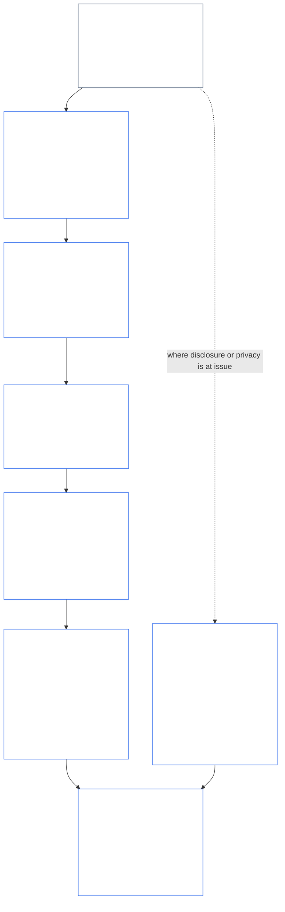
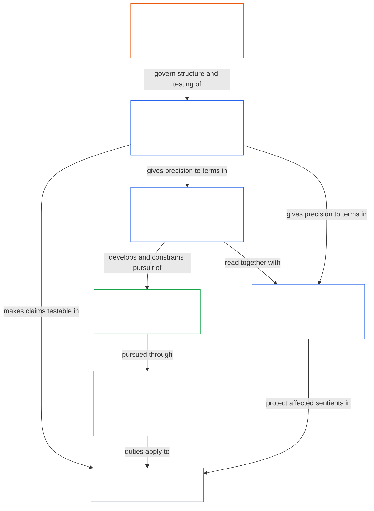

<a id="chapter-01-part-b-interaction-and-interpretation"></a>
# CHAPTER 01, PART B: INTERACTION AND INTERPRETATION

<details>
<summary><strong><span style="color: #2563eb;">Corpus placement (non-operative): file structure and reading rules</span></strong></summary>

> The following content is **reader guidance only**. It does not add, remove, or narrow binding obligations elsewhere in this file or in other chapters.
>
> This file is **part of the Sentient Constitution** and is **binding only together** with the other numbered `core_*` files read as one instrument. It contains **Chapter One, Part B** (§§13–15: Constitutional Collision Resolution Process, prohibition on absolute override, and constitutional interpretation) — the part that keeps the Constitutional Tetrad intact when principles collide and when the Constitution is read.
>
> **Upstream:** [core_01_a_values_principles.md](core_01_a_values_principles.md) (Chapter One, Part A — §§1–12, the Flourishing and Continuity aims)  
> **Next:** [core_01_c_stewardship_capacity_principles.md](core_01_c_stewardship_capacity_principles.md) (Chapter One, Part C — §§16–20, stewardship, governance, incentive alignment, and integrated application).
> **Reading arc:** §13 Constitutional Collision Resolution Process (the tradeoff stack, disclosure limits, and avoidable burden) → §14 prohibition on absolute override → §15 constitutional interpretation (no-bypass, derived information, definitions, ambiguity, and precedence).

</details>

<details>
<summary><strong><span style="color: #2563eb;">Reader guidance (non-operative): Chapter Five vocabulary anchor and cluster index</span></strong></summary>

<a id="chapter-one-part-a-chapter-five-vocabulary-anchor"></a>

> The following content is **reader guidance only**. It does not add, remove, or narrow binding obligations elsewhere in this file or in other chapters. Per-section **Trace** and **Definitions · Assessment · Compliance** widgets carry routing and O/M/A/C links at the point each § materially invokes a term. This block, by contrast, is a chapter-level crosswalk for readers finishing Part A.

**Principle-layer vocabulary** (canonical homes in Chapter One (Parts A and B)):

- [Constitutional Tetrad](core_00_preamble.md#constitutional-tetrad) — **participation**, **oversight**, **accountability**, and **timeliness**, scaled to [material stake](core_00_preamble.md#material-stake)
- [Two Constitutional Aims](core_00_preamble.md#two-constitutional-aims) — [Flourishing](core_00_preamble.md#flourishing) and [Continuity](core_00_preamble.md#continuity) (constitutional **Continuity aim**, distinct from operational or protocol continuity elsewhere in the corpus)
- [material stake](core_00_preamble.md#material-stake) — impact, dependency, and risk scaling for tetrad duties; read with Integrative Materiality ([Materiality](core_05_band_oversight.md#materiality)) and Chapter Five entries below

**Chapter Five proxy definitions** (O/M/A/C satisfaction — trace under Chapters Two through Four when materially relevant):

- [Wellbeing](core_05_band_continuity.md#wellbeing) (Flourishing aim)
- [Oversight](core_05_apex_oversight_leg.md#oversight), [Accountability](core_05_apex_accountability_leg.md#accountability), [Contestability](core_05_band_accountability.md#contestability), [Governance](core_05_band_accountability.md#governance), [Classification-Scaled Governance](core_05_band_oversight.md#classification-scaled-governance)
- [Material](core_05_band_oversight.md#material), [Material Impact](core_05_band_oversight.md#material-impact), [Material Risk](core_05_band_oversight.md#material-risk), [Materiality](core_05_band_oversight.md#materiality) (widgets label this **Materiality**), [Systemic Materiality](core_05_band_continuity.md#systemic-materiality) — cluster: [Materiality, impact, risk, and proxy integrity](core_05_band_oversight.md#materiality-impact-risk-and-proxy-integrity)

**Major Chapter Five §3 dependent clusters** (joint-invocation groups — read with Chapters Two through Four when materially relevant):

- [Stakeholder Status and Weight](core_05_band_participation.md#stakeholder-status-and-weight) (Stakeholder System Participation layer)
- [Constitutional Contract Layer](core_05_band_integrative.md#constitutional-contract-layer) and [Governance Architecture, Oversight, Dependency, Decentralization, Concentration, Market Structure, and Exit-Path Integrity](core_05_band_accountability.md#governance-architecture-decentralization-and-concentration)
- [Corpus and Authority Stack](core_05_band_integrative.md#defi1-corpus-and-authority-stack)
- [Accountability, Contestability, and Collective Accountability Failure](core_05_apex_accountability_leg.md#accountability)

**CJS-3** (*operational cluster library (oDef)*) — the operational cluster compass for cross-implementation joint operational terms; read together with this chapter's Tetrad, Aims, and material-stake scaling:

- [CJS-3.1 Constitutional compass and cluster map](corpus_joint_structure/cjs_03_cross_implementation_operational_terms.md#cjs-31-constitutional-compass-and-cluster-map) — primary entry for **CJS-3.2** (*Oversight: reflexive transparency and accountability terms*)–**CJS-3.23** (*Integrative: intervention and override integrity terms*) clusters organized by Tetrad leg, Continuity aim, and integrative cross-leg bands

</details>

<details>
<summary><strong><span style="color: #2563eb;">Reader guidance (non-operative): how Part B keeps the Constitutional Tetrad intact</span></strong></summary>

> The following content is **reader guidance only**. It does not add, remove, or narrow binding obligations elsewhere in this file or in other chapters. Per-section **Trace** widgets name the Tetrad legs each section engages; this block is a part-level map for readers entering Part B.

**What Part B does.** [Part A](core_01_a_values_principles.md) develops the [Two Constitutional Aims](core_00_preamble.md#two-constitutional-aims). Part B adds no new principle and no fifth duty. It keeps the [Constitutional Tetrad](core_00_preamble.md#constitutional-tetrad) — **participation**, **oversight**, **accountability**, and **timeliness**, scaled to [material stake](core_00_preamble.md#material-stake) — intact in three situations:

- **When principles collide** ([§13 Constitutional Collision Resolution Process](#13-constitutional-collision-resolution-process)): Safety and Truth come first, and every other tradeoff must preserve the Tetrad rather than weaken it to buy an easy resolution.
- **When one value is pushed too far** ([§14 Prohibition on Absolute Override](#14-prohibition-on-absolute-override)): no value, and neither aim, may be used to hollow a leg below what material stake requires.
- **When the Constitution is read or applied** ([§15 Constitutional Interpretation](#15-constitutional-interpretation)): relabeling, splitting, or rerouting the same act cannot avoid a requirement, and ambiguity is read toward the [Fullest Protective Effect](core_05_band_integrative.md#fullest-protective-effect).

**Where Part B carries each leg.** Each section's Trace lists every leg it engages. This table names the principal homes.

| Tetrad leg | What Part B keeps real | Principal Part B homes |
|---|---|---|
| **Participation** | The burden of proof never falls on the restricted party; core challenge, review, and appeal rights cannot be permanently extinguished; disclosure limits must leave informed contestability intact; avoidable burden narrows agency | [§13.1.1](#1311-necessity), [§13.1.4](#1314-constitutional-floors-safety-and-anti-degrading-process), [§13.1.5](#1315-least-restrictive-time-bounded-and-reviewable-constraint-principle), [§13.2](#132-epistemic-disclosure-constraints), [§13.3](#133-minimization-of-avoidable-burden), [§15.1](#151-constitutional-no-bypass-principle), [§15.1.2](#1512-derived-information-principle) |
| **Oversight** | Harm counted in full; decisions others can reconstruct and independently review; disclosure limits that keep scrutiny possible; metrics that stop counting once they diverge from their purpose | [§13.1.2](#1312-harm-minimization), [§13.1.5](#1315-least-restrictive-time-bounded-and-reviewable-constraint-principle), [§13.2](#132-epistemic-disclosure-constraints), [§13.2.4](#1324-proxy-divergence-invalidation), [§15.1](#151-constitutional-no-bypass-principle), [§15.4.4](#1544-combined-satisfaction-of-jointly-applicable-incorporated-obligations) |
| **Accountability** | The restrictor bears the burden of proof; answerability rises with authority; process may not degrade or humiliate; every disclosure limit is audited after the fact | [§13.1.1](#1311-necessity), [§13.1.3](#1313-proportionality), [§13.1.4](#1314-constitutional-floors-safety-and-anti-degrading-process), [§13.1.5](#1315-least-restrictive-time-bounded-and-reviewable-constraint-principle), [§13.2.1](#1321-preservation-of-epistemic-integrity), [§15.1](#151-constitutional-no-bypass-principle), [§15.1.2](#1512-derived-information-principle) |
| **Timeliness** | Restrictions are time-bounded and reviewable, with a restoration path; a pending Constitutional Collision runs on the applicable clock; delayed disclosure ends in disclosure; avoidable delay is avoidable burden; emergency narrowing is time-limited | [§13.1.5](#1315-least-restrictive-time-bounded-and-reviewable-constraint-principle), [§13.2.1](#1321-preservation-of-epistemic-integrity), [§13.3](#133-minimization-of-avoidable-burden), [§15.1](#151-constitutional-no-bypass-principle), [§15.4.4](#1544-combined-satisfaction-of-jointly-applicable-incorporated-obligations) |

**Sections that engage no leg directly.** [§15.1.1 Anti-Segmentation Principle](#1511-anti-segmentation-principle) and [§15.4.1](#1541-integrated-reading) through [§15.4.3](#1543-incorporation-layer) govern how the text is read and which source layer controls. Their Traces carry no Tetrad line by design.

**Two meanings of time.** Time appears in Part B in two senses. Long time horizons (delayed and cumulative harm, the [Chapter Eight §3.6 Time-Consistency Constraint](core_08_a_system_alignment_certification_evaluation.md#36-time-consistency-constraint) applied in [§13.1.2](#1312-harm-minimization)) belong to the **Continuity** aim. Clocks, review cadences, and delay (time limits on restrictions, eventual disclosure, avoidable delay) belong to the **timeliness** leg.

**Two axes, not a conflict.** Part A's aims say what shared systems pursue. Part B says what no tradeoff, override, or reading may take away on the way.

</details>

<br>

<a id="13-constitutional-collision-resolution-process"></a>

### 13. Constitutional Collision Resolution Process
<details>
<summary><strong><span style="color: #2563eb;">Trace</span></strong></summary>

- Read with: [Constitutional Tetrad](core_00_preamble.md#constitutional-tetrad) — participation, oversight, accountability, and timeliness in procedure, disclosure, Constitutional Collision handling, and redress; [material stake](core_00_preamble.md#material-stake) scaling.
- Upstream: Principles: [3. Foundational Objective: Wellbeing](core_01_a_values_principles.md#3-foundational-objective-wellbeing-flourishing-aim), [4 Safety](core_01_a_values_principles.md#4-safety-harm-constraint), [5 Truth](core_01_a_values_principles.md#5-truth-epistemic-integrity-constraint), [6. Trust](core_01_a_values_principles.md#6-trust-and-trustworthiness-coordination-integrity), [7. Freedom (Bounded Agency)](core_01_a_values_principles.md#7-freedom-bounded-agency), and [§16 Stewardship In Depth](core_01_c_stewardship_capacity_principles.md#16-stewardship-in-depth).
- Downstream: [13.2.1 Preservation of Epistemic Integrity](#1321-preservation-of-epistemic-integrity), [Constitutional Collision Record](core_05_band_integrative.md#constitutional-collision-record), [default interim posture](#default-interim-posture), and [14. Prohibition on Absolute Override](#14-prohibition-on-absolute-override).
- Downstream: Governs cross-article conflicts across [Chapter Six: Foundational Rights](core_06_rights_part_a.md#chapter-six-foundational-rights).
  - Read this with [Article XXIV: Constitutional Interpretation, Review, and Anti-Capture Safeguards](core_06_rights_part_d.md#article-xxiv-constitutional-interpretation-review-and-anti-capture-safeguards) and [Article XX: Justice After Verified Violation](core_06_rights_part_d.md#article-xx-justice-after-verified-violation).
  - Apply this where review, emergency, or Constitutional Collision questions arise.

</details>

<details>
<summary><strong><span style="color: #2563eb;">Definitions · Assessment · Compliance</span></strong></summary>

- [Constitutional Collision](core_05_band_integrative.md#constitutional-collision) · [O](core_05_band_integrative.md#constitutional-collision) · [M](core_05_band_integrative.md#constitutional-collision-a) · [A](core_05_band_integrative.md#constitutional-collision-a) · [C](core_05_band_integrative.md#constitutional-collision-c)
- [Participation](core_05_apex_participation_leg.md#participation-constitutional) · [O](core_05_apex_participation_leg.md#participation-constitutional) · [M](core_05_apex_participation_leg.md#participation-constitutional-m) · [A](core_05_apex_participation_leg.md#participation-constitutional-a) · [C](core_05_apex_participation_leg.md#participation-constitutional-c)
- [Oversight](core_05_apex_oversight_leg.md#oversight-constitutional) · [O](core_05_apex_oversight_leg.md#oversight-constitutional) · [M](core_05_apex_oversight_leg.md#oversight-constitutional-m) · [A](core_05_apex_oversight_leg.md#oversight-constitutional-a) · [C](core_05_apex_oversight_leg.md#oversight-constitutional-c)
- [Accountability](core_05_apex_accountability_leg.md#accountability) · [O](core_05_apex_accountability_leg.md#accountability) · [M](core_05_apex_accountability_leg.md#accountability-m) · [A](core_05_apex_accountability_leg.md#accountability-a) · [C](core_05_apex_accountability_leg.md#accountability-c)
- [Timeliness](core_05_apex_timeliness_leg.md#timeliness-constitutional) · [O](core_05_apex_timeliness_leg.md#timeliness-constitutional) · [M](core_05_apex_timeliness_leg.md#timeliness-constitutional-m) · [A](core_05_apex_timeliness_leg.md#timeliness-constitutional-a) · [C](core_05_apex_timeliness_leg.md#timeliness-constitutional-c)

</details>

<br>

*In plain terms: Constitutional Collisions will happen — **Safety** and **Truth** come first. After that, limits must be proportionate, necessary, harm-minimizing, and as light as possible. Truth cannot be hidden for comfort; privacy cannot be stripped for convenience; freedom limits apply under [§7.1 Limitation Discipline](core_01_a_values_principles.md#71-limitation-discipline); Constitutional Collisions over rights need a documented decision test; and metrics that lie about compliance do not count. Short-horizon optimization cannot pass evaluation under [Chapter Eight §3.6 Time-Consistency Constraint](core_08_a_system_alignment_certification_evaluation.md#36-time-consistency-constraint). **§13.1** (*Core Tradeoff Principles*) through **§13.3** (*Minimization of Avoidable Burden*) carry the tradeoff rules, disclosure and privacy constraints, and the Constitutional Collision procedure.*

Part B keeps the Tetrad intact in three situations:
- **[Constitutional Collisions](core_05_band_integrative.md#constitutional-collision) (this section):** resolves them without weakening any leg.
- **Overreach ([§14 Prohibition on Absolute Override](#14-prohibition-on-absolute-override)):** bars any single value, including either aim, from overriding the others or hollowing a leg below what material stake requires.
- **Reading and application ([§15 Constitutional Interpretation](#15-constitutional-interpretation)):** bars relabeling, splitting, or rerouting the same act to avoid a requirement, and reads ambiguity toward the [Fullest Protective Effect](core_05_band_integrative.md#fullest-protective-effect).

Where values or constraints conflict:
- **Precedence:** **Safety** and **Truth** take precedence where conflicts cannot be resolved without violating them.
- **Tetrad preserved:** other tradeoffs must preserve the [Constitutional Tetrad](core_00_preamble.md#constitutional-tetrad) — **participation**, **oversight**, **accountability**, and **timeliness** scaled to [material stake](core_00_preamble.md#material-stake) — not weaken it to buy an easy resolution.
- **Combined effect:** many small decisions that each look fine may still combine into an outcome this Constitution rejects.
- **Where to resolve:** systems must resolve conflicts under **§13.1** (*Core Tradeoff Principles*) through **§13.3** (*Minimization of Avoidable Burden*).

**Diagram: Part B and the Constitutional Tetrad**

<hr style="border: 0; border-top: 1px solid currentColor;">

```mermaid
flowchart TB
    PA["Part A principles and the Two Constitutional Aims<br/><br/>• Flourishing and Continuity<br/>• Principles and constraints that can collide<br/>or be read more than one way"]
    P13["§13 Constitutional Collision Resolution Process<br/><br/>• Safety and Truth first<br/>• Every other tradeoff preserves the Tetrad<br/>• Tradeoff stack, disclosure limits,<br/>and avoidable burden"]
    P14["§14 Prohibition on Absolute Override<br/><br/>• No value is a trump<br/>• Neither aim overrides the other<br/>• No leg is hollowed below material stake"]
    P15["§15 Constitutional Interpretation<br/><br/>• No-Bypass, Anti-Segmentation,<br/>and Derived Information<br/>• Ambiguity read as an integrated whole<br/>• Source-layer precedence"]
    TT["Constitutional Tetrad<br/><br/>• Kept intact, scaled to material stake<br/>• Participation · Oversight · Accountability · Timeliness"]
    P["Participation<br/><br/>• Burden never on the restricted party<br/>• Challenge and appeal rights survive"]
    O["Oversight<br/><br/>• Harm counted in full<br/>• Decisions others can reconstruct<br/>and independently review"]
    A["Accountability<br/><br/>• Restrictor bears the burden<br/>• Answerability rises with authority"]
    T["Timeliness<br/><br/>• Restrictions are time-bounded and reviewable<br/>• Delay cannot defeat remedy"]
    PA --> P13
    PA --> P14
    PA --> P15
    P13 --> TT
    P14 --> TT
    P15 --> TT
    TT --> P
    TT --> O
    TT --> A
    TT --> T
    style PA fill:none,stroke:#16a34a,color:#ffffff
    style P13 fill:none,stroke:#2563eb,color:#ffffff
    style P14 fill:none,stroke:#2563eb,color:#ffffff
    style P15 fill:none,stroke:#2563eb,color:#ffffff
    style TT fill:none,stroke:#2563eb,color:#ffffff
    style P fill:none,stroke:#0f766e,color:#ffffff
    style O fill:none,stroke:#ea580c,color:#ffffff
    style A fill:none,stroke:#db2777,color:#ffffff
    style T fill:none,stroke:#9333ea,color:#ffffff
```

*Part A's principles and aims can collide and can be read more than one way. Part B resolves Constitutional Collisions, bars override, and fixes how the text is read, so that each Tetrad leg stays real at the level material stake requires. Outline colors reuse the Tetrad leg colors and are visual cues, not claims of priority. Each section's Trace names the legs it engages.*

<a id="131-core-tradeoff-principles"></a>
#### 13.1 Core Tradeoff Principles

<details>
<summary><strong><span style="color: #2563eb;">Trace</span></strong></summary>

- Read with: [Constitutional Tetrad](core_00_preamble.md#constitutional-tetrad) — all four legs run through the tradeoff stack: **accountability** and **participation** ([§13.1.1](#1311-necessity), who bears the burden), **oversight** ([§13.1.2](#1312-harm-minimization) and [§13.1.5](#1315-least-restrictive-time-bounded-and-reviewable-constraint-principle), harm counted in full and a Constitutional Collision Record others can review), and **timeliness** (§13.1.5, restrictions that are time-bounded and reviewable); [material stake](core_00_preamble.md#material-stake) scaling for the burden of proof and the depth of scrutiny. Each subsection's Trace names the legs it engages.
- Subsections: [§13.1.1 Necessity](#1311-necessity) · [§13.1.2 Harm Minimization](#1312-harm-minimization) · [§13.1.3 Proportionality](#1313-proportionality) · [§13.1.4 Constitutional Floors, Safety, and Anti-Degrading Process](#1314-constitutional-floors-safety-and-anti-degrading-process) · [§13.1.5 Least-Restrictive, Time-Bounded, and Reviewable Constraint Principle](#1315-least-restrictive-time-bounded-and-reviewable-constraint-principle).

</details>

<details>
<summary><strong><span style="color: #2563eb;">Definitions · Assessment · Compliance</span></strong></summary>

*Scope.* [§13.1 Core Tradeoff Principles](#131-core-tradeoff-principles) — definitions for necessity, harm minimization, and harm in the tradeoff stack.

- [Necessity](core_05_band_accountability.md#necessity) · [O](core_05_band_accountability.md#necessity) · [M](core_05_band_accountability.md#necessity-a) · [A](core_05_band_accountability.md#necessity-a) · [C](core_05_band_accountability.md#necessity-c)
- [Harm Minimization (Tradeoff Selection)](core_05_band_accountability.md#harm-minimization-tradeoff-selection) · [O](core_05_band_accountability.md#harm-minimization-tradeoff-selection) · [M](core_05_band_accountability.md#harm-minimization-tradeoff-selection-a) · [A](core_05_band_accountability.md#harm-minimization-tradeoff-selection-a) · [C](core_05_band_accountability.md#harm-minimization-tradeoff-selection-c)
- [Harm](core_05_band_accountability.md#harm) · [O](core_05_band_accountability.md#harm) · [M](core_05_band_accountability.md#harm-a) · [A](core_05_band_accountability.md#harm-a) · [C](core_05_band_accountability.md#harm-c)

</details>

<br>

*In plain terms: when you have to limit something, match the remedy to the problem — use the lightest step that still works, choose the least harmful option, and waste the least sentient time once Safety, Truth, and rights are already satisfied. The bar rises fast when harm could be irreversible or could lock systems in.*

**How to read the stack:** Apply these rules as one sequence, not as independent permissions.
- **[§13.1.1 Necessity](#1311-necessity)** asks whether a restriction is needed at all, or whether a less-restrictive alternative can still prevent the material harm or systemic risk. The restrictor bears the burden of proof.
- **[§13.1.2 Harm Minimization](#1312-harm-minimization)** requires the least harmful constitutionally adequate option across sentients, systems, and time horizons.
- **[§13.1.3 Proportionality](#1313-proportionality)** verifies that the scale of the selected limitation fits the magnitude, likelihood, and systemic character of the harm addressed.
- **[§13.1.4 Constitutional Floors, Safety, and Anti-Degrading Process](#1314-constitutional-floors-safety-and-anti-degrading-process)** states absolute limits that survive even a necessary, harm-minimizing, correctly proportioned restriction: certain Rights-Floor minimums cannot be permanently extinguished, Safety operates as both justification and constraint, and process must never degrade into humiliation, spectacle, or retaliation. The Rights-Floor minimums and the anti-degrading-process floor together make up the [Dignity Principles](#dignity-principles).
- **[§13.1.5 Least-Restrictive, Time-Bounded, and Reviewable Constraint Principle](#1315-least-restrictive-time-bounded-and-reviewable-constraint-principle)** governs the form of any restriction that survives the preceding tests: it must use the lightest effective measure, remain independently reviewable, and be temporary unless this Constitution expressly permits durable restriction.

Once the tradeoff stack is satisfied, **[§13.3 Minimization of Avoidable Burden](#133-minimization-of-avoidable-burden)** applies to the resulting design: systems must prefer the option that wastes the least sentient time, attention, and effort.

**Diagram: the tradeoff stack and the Tetrad legs each step engages**

<hr style="border: 0; border-top: 1px solid currentColor;">



*A Constitutional Collision runs the stack in order: necessity, harm minimization, proportionality, the constitutional floors, and the form of any surviving restriction. Disclosure and privacy conflicts also answer to §13.2 (*Epistemic Disclosure Constraints*). §13.3 (*Minimization of Avoidable Burden*) applies to whatever passes. Each box lists the Tetrad legs its Trace names. Colors are visual cues, not claims of priority.*

<br>

<a id="1311-necessity"></a>
##### 13.1.1 Necessity
<details>
<summary><strong><span style="color: #2563eb;">Trace</span></strong></summary>

- Read with: [Constitutional Tetrad](core_00_preamble.md#constitutional-tetrad) — **accountability** leg (the restrictor bears the burden of proof and must document the alternatives); **participation** leg (the burden never falls on the party whose freedom, agency, or access is restricted, and the showing is stricter where Freedom, Meaningful Agency, or Consent is burdened); **oversight** leg (the alternative analysis is documented so reviewers can check it); [material stake](core_00_preamble.md#material-stake) scaling.

</details>

<details>
<summary><strong><span style="color: #2563eb;">Definitions · Assessment · Compliance</span></strong></summary>

- [Necessity](core_05_band_accountability.md#necessity) · [O](core_05_band_accountability.md#necessity) · [M](core_05_band_accountability.md#necessity-a) · [A](core_05_band_accountability.md#necessity-a) · [C](core_05_band_accountability.md#necessity-c)
- [Feasibility](core_05_band_accountability.md#feasibility) · [O](core_05_band_accountability.md#feasibility) · [M](core_05_band_accountability.md#feasibility-a) · [A](core_05_band_accountability.md#feasibility-a) · [C](core_05_band_accountability.md#feasibility-c)
- [Freedom (Bounded Agency)](core_05_band_participation.md#freedom-bounded-agency) · [O](core_05_band_participation.md#freedom-bounded-agency) · [M](core_05_band_participation.md#freedom-bounded-agency-a) · [A](core_05_band_participation.md#freedom-bounded-agency-a) · [C](core_05_band_participation.md#freedom-bounded-agency-c)
- [Meaningful Agency](core_05_band_participation.md#meaningful-agency) · [O](core_05_band_participation.md#meaningful-agency) · [M](core_05_band_participation.md#meaningful-agency-a) · [A](core_05_band_participation.md#meaningful-agency-a) · [C](core_05_band_participation.md#meaningful-agency-c)

</details>

<br>

*In plain terms: a restriction attaches only when no less-restrictive alternative would still prevent the material harm or systemic risk. The party imposing the restriction bears the burden of proving that — not the party whose freedom is being limited. Convenience, institutional habit, and "we've always done it this way" do not prove necessity. If a lighter option would work, the heavier one is non-compliant.*

**Burden of proof.** The party imposing or maintaining a constitutional restriction bears the burden of demonstrating that no less-restrictive alternative exists that would still prevent the material harm or systemic risk under the circumstances. The party whose freedom, agency, or access is restricted does not bear the burden of proving that alternatives exist.

**Alternative-analysis requirement.** Necessity claims must be supported by documented analysis of:
- reasonably available alternatives, including non-action;
- the effectiveness of each relative to the constitutional harm addressed;
- the residual risk or misalignment under each alternative.

Assertion that no alternative exists, without documented analysis, does not satisfy this requirement.

**What does not prove necessity:**
- convenience or administrative preference;
- default practice, institutional inertia, or tradition;
- cost savings alone where rights are materially affected;
- the fact that the restriction already exists.

**Scope.** This subsection applies to any constitutional restriction — not only Constitutional Collision contexts under [§13.1.5 Rights-Collision Procedure](#1315-rights-collision-decision-test). Where a restriction materially burdens [Freedom (Bounded Agency)](core_05_band_participation.md#freedom-bounded-agency), [Meaningful Agency](core_05_band_participation.md#meaningful-agency), or [Consent](core_05_band_participation.md#consent), the necessity showing must be correspondingly rigorous.

<a id="1312-harm-minimization"></a>
##### 13.1.2 Harm Minimization
<details>
<summary><strong><span style="color: #2563eb;">Trace</span></strong></summary>

- Read with: [Constitutional Tetrad](core_00_preamble.md#constitutional-tetrad) — **oversight** leg (indirect, delayed, cumulative, cross-system, and ecological harm is counted, not left unseen); **accountability** leg (harm may not be externalized onto uncounted parties to look harm-minimizing); [material stake](core_00_preamble.md#material-stake) scaling across relevant time horizons.

</details>

<details>
<summary><strong><span style="color: #2563eb;">Definitions · Assessment · Compliance</span></strong></summary>

- [Harm Minimization (Tradeoff Selection)](core_05_band_accountability.md#harm-minimization-tradeoff-selection) · [O](core_05_band_accountability.md#harm-minimization-tradeoff-selection) · [M](core_05_band_accountability.md#harm-minimization-tradeoff-selection-a) · [A](core_05_band_accountability.md#harm-minimization-tradeoff-selection-a) · [C](core_05_band_accountability.md#harm-minimization-tradeoff-selection-c)
- [Harm](core_05_band_accountability.md#harm) · [O](core_05_band_accountability.md#harm) · [M](core_05_band_accountability.md#harm-a) · [A](core_05_band_accountability.md#harm-a) · [C](core_05_band_accountability.md#harm-c)
- [Ecological Integrity](core_05_band_continuity.md#ecological-integrity) · [O](core_05_band_continuity.md#ecological-integrity) · [M](core_05_band_continuity.md#ecological-integrity-constitutional-a) · [A](core_05_band_continuity.md#ecological-integrity-constitutional-a) · [C](core_05_band_continuity.md#ecological-integrity-constitutional-c)
- [Ecological Recovery Capacity](core_05_band_continuity.md#ecological-recovery-capacity) · [O](core_05_band_continuity.md#ecological-recovery-capacity) · [M](core_05_band_continuity.md#ecological-recovery-capacity-constitutional-a) · [A](core_05_band_continuity.md#ecological-recovery-capacity-constitutional-a) · [C](core_05_band_continuity.md#ecological-recovery-capacity-constitutional-c)
- [Risk](core_05_band_continuity.md#risk) · [O](core_05_band_continuity.md#risk) · [M](core_05_band_continuity.md#risk-a) · [A](core_05_band_continuity.md#risk-a) · [C](core_05_band_continuity.md#risk-c)
- [Irreversible Harm](core_05_band_accountability.md#irreversible-harm) · [O](core_05_band_accountability.md#irreversible-harm) · [M](core_05_band_accountability.md#irreversible-harm-a) · [A](core_05_band_accountability.md#irreversible-harm-a) · [C](core_05_band_accountability.md#irreversible-harm-c)

</details>

<br>

*In plain terms: where multiple necessary options remain after [§13.1.1 Necessity](#1311-necessity) is satisfied, pick the one that causes the least total harm — counting everyone affected, ecosystems and living systems, all systems touched, and all time horizons that matter. Optimizing locally while creating systemic or ecological damage, or optimizing short-term while creating long-term harm, fails this test. Harm minimization never authorizes pushing below the constitutional floors in [§13.1.4 Constitutional Floors, Safety, and Anti-Degrading Process](#1314-constitutional-floors-safety-and-anti-degrading-process).*

**Scope of comparison.** Where multiple constitutionally adequate options satisfy [Safety (§4)](core_01_a_values_principles.md#4-safety-harm-constraint), [Truth (§5)](core_01_a_values_principles.md#5-truth-epistemic-integrity-constraint), and [§13.1.1 Necessity](#1311-necessity), selection must favor the option that minimizes total [Harm](core_05_band_accountability.md#harm) across:
- sentients directly and indirectly affected;
- systems that carry, mediate, or depend on the outcome;
- ecological and living systems, including [Ecological Integrity](core_05_band_continuity.md#ecological-integrity) and, where recovery after harm is material, [Ecological Recovery Capacity](core_05_band_continuity.md#ecological-recovery-capacity);
- relevant time horizons, including delayed and cumulative effects.

**Aggregation requirement.** Harm assessment must aggregate:
- direct harms to identified parties;
- indirect harms transmitted through systems, dependencies, or precedent;
- delayed harms that materialize over time;
- cumulative harms from repeated or compounding decisions;
- cross-system effects where action in one domain produces harm in another;
- ecological harm, including externalized, delayed, cumulative, and recovery-capacity effects.

The following are non-compliant:
- optimizing on local or immediate harm alone while creating larger systemic, aggregate, or ecological harm;
- externalizing harm onto ecosystems, unidentified sentients, or other uncounted parties in order to look harm-minimizing for identified parties.

**Time-horizon discipline.** Short-term optimization at long-term systemic cost fails this test. Harm minimization must account for the [Chapter Eight §3.6 Time-Consistency Constraint](core_08_a_system_alignment_certification_evaluation.md#36-time-consistency-constraint): a decision that looks harm-minimizing in the current period but predictably creates greater harm across the relevant constitutional time horizon is non-compliant.

**Relationship to constitutional floors.** Harm minimization operates *above* the constitutional floors stated in [§13.1.4 Constitutional Floors, Safety, and Anti-Degrading Process](#1314-constitutional-floors-safety-and-anti-degrading-process). It never authorizes:
- permanent extinguishment of Rights-Floor minimums;
- degrading process — a restriction, remedy, or process designed, framed, or carried out as humiliation, spectacle, retaliation, discriminatory burdening, or convenience-driven rights erosion ([§13.1.4 Constitutional Floors, Safety, and Anti-Degrading Process](#1314-constitutional-floors-safety-and-anti-degrading-process));
- pushing below the Safety floor.

Harm minimization selects among options that already clear those floors — it does not trade below them.

<a id="1313-proportionality"></a>
##### 13.1.3 Proportionality

<details>
<summary><strong><span style="color: #2563eb;">Trace</span></strong></summary>

- Read with: [Constitutional Tetrad](core_00_preamble.md#constitutional-tetrad) — **accountability** and **oversight** legs (authority-scaled answerability: intensity rises with authorized power or consequential role, never falls); [material stake](core_00_preamble.md#material-stake) scaling (the classification floor and the heightened thresholds).
- Read with: [§18.1 Governance as Authorized Structure](core_01_c_stewardship_capacity_principles.md#181-governance-as-authorized-structure).

</details>

<details>
<summary><strong><span style="color: #2563eb;">Definitions · Assessment · Compliance</span></strong></summary>

- [Proportionality](core_05_band_accountability.md#proportionality) · [O](core_05_band_accountability.md#proportionality) · [M](core_05_band_accountability.md#proportionality-a) · [A](core_05_band_accountability.md#proportionality-a) · [C](core_05_band_accountability.md#proportionality-c)
- [Risk](core_05_band_continuity.md#risk) · [O](core_05_band_continuity.md#risk) · [M](core_05_band_continuity.md#risk-a) · [A](core_05_band_continuity.md#risk-a) · [C](core_05_band_continuity.md#risk-c)
- [Irreversible Harm](core_05_band_accountability.md#irreversible-harm) · [O](core_05_band_accountability.md#irreversible-harm) · [M](core_05_band_accountability.md#irreversible-harm-a) · [A](core_05_band_accountability.md#irreversible-harm-a) · [C](core_05_band_accountability.md#irreversible-harm-c)
- [Existential Risk](core_05_band_continuity.md#existential-risk) · [O](core_05_band_continuity.md#existential-risk) · [M](core_05_band_continuity.md#existential-risk-a) · [A](core_05_band_continuity.md#existential-risk-a) · [C](core_05_band_continuity.md#existential-risk-c)
- [Ecological Recovery Capacity](core_05_band_continuity.md#ecological-recovery-capacity) · [O](core_05_band_continuity.md#ecological-recovery-capacity) · [M](core_05_band_continuity.md#ecological-recovery-capacity-constitutional-a) · [A](core_05_band_continuity.md#ecological-recovery-capacity-constitutional-a) · [C](core_05_band_continuity.md#ecological-recovery-capacity-constitutional-c)
- [Systemic Lock-In](core_05_band_continuity.md#systemic-lock-in) · [O](core_05_band_continuity.md#systemic-lock-in) · [M](core_05_band_continuity.md#systemic-lock-in-a) · [A](core_05_band_continuity.md#systemic-lock-in-a) · [C](core_05_band_continuity.md#systemic-lock-in-c)
- [Reversibility](core_05_band_continuity.md#reversibility) · [O](core_05_band_continuity.md#reversibility) · [M](core_05_band_continuity.md#reversibility-constitutional-a) · [A](core_05_band_continuity.md#reversibility-constitutional-a) · [C](core_05_band_continuity.md#reversibility-constitutional-c)
- [Dependency](core_05_band_continuity.md#dependency) · [O](core_05_band_continuity.md#dependency) · [M](core_05_band_continuity.md#dependency-a) · [A](core_05_band_continuity.md#dependency-a) · [C](core_05_band_continuity.md#dependency-c)
- [Accountability](core_05_apex_accountability_leg.md#accountability) · [O](core_05_apex_accountability_leg.md#accountability) · [M](core_05_apex_accountability_leg.md#accountability-m) · [A](core_05_apex_accountability_leg.md#accountability-a) · [C](core_05_apex_accountability_leg.md#accountability-c)
- [Oversight](core_05_apex_oversight_leg.md#oversight-constitutional) · [O](core_05_apex_oversight_leg.md#oversight-constitutional) · [M](core_05_apex_oversight_leg.md#oversight-constitutional-m) · [A](core_05_apex_oversight_leg.md#oversight-constitutional-a) · [C](core_05_apex_oversight_leg.md#oversight-constitutional-c)

</details>

<br>

*In plain terms: proportionality verifies that the scale of a restriction fits the scale of the harm it addresses. A necessary, harm-minimizing option still fails if its scope, duration, or intensity is disproportionate to what's actually at stake. The more irreversible, systemic, or dependency-creating the risk, the stronger the justification and scrutiny must be. The same under-governance rule applies to power: greater authorized power or consequential role must raise accountability and oversight, not lower them.*

Limitations on constitutional **values** — including **Chapter Six** Rights-Floor protections and other principles and protections subject to tradeoff under [§13 Constitutional Collision Resolution Process](#13-constitutional-collision-resolution-process) — must be proportionate to the magnitude and likelihood of the **harm** or **systemic impact** legitimately addressed, consistent with [Proportionality](core_05_band_accountability.md#proportionality) in **Chapter Five**.

**Classification floor.** No system may be governed at a level lower than that required by its highest applicable classification. A lower administrative label cannot reduce the scrutiny required by the highest applicable risk, dependency, rights, or system-impact classification.

**Authority-scaled answerability.** Proportionality also forbids under-governance of those who hold greater authorized power, consequential role, or institutional influence: [Accountability](core_05_apex_accountability_leg.md#accountability) and [Oversight](core_05_apex_oversight_leg.md#oversight-constitutional) intensity must rise with that authority, not fall.

**Heightened thresholds.** Where actions introduce risk of irreversible harm, systemic lock-in, Existential Risk, or irreversible loss of Ecological Recovery Capacity, systems must apply [Heightened Scrutiny](core_05_band_oversight.md#heightened-scrutiny) and heightened thresholds for justification and reversibility where feasible.

**Further escalation.** Those thresholds must rise again where materially relevant indicators apply, including:
- irreversibility exposure
- concentrated dependency
- high-consequence tail risk
- plausible systemic lock-in
- Existential Risk
- irreversible loss of Ecological Recovery Capacity

<a id="1314-constitutional-floors-safety-and-anti-degrading-process"></a>
##### 13.1.4 Constitutional Floors, Safety, and Anti-Degrading Process
<details>
<summary><strong><span style="color: #2563eb;">Trace</span></strong></summary>

- Read with: [Constitutional Tetrad](core_00_preamble.md#constitutional-tetrad) — **participation** leg (core challenge, review, and appeal rights are among the minimums that cannot be permanently extinguished); **accountability** leg (a process that survives the tradeoff stack still may not degrade, humiliate, or retaliate; see [§3.3 Anti-Degrading Process](core_01_a_values_principles.md#33-anti-degrading-process)); [material stake](core_00_preamble.md#material-stake) scaling where heightened scrutiny applies.

</details>

<details>
<summary><strong><span style="color: #2563eb;">Definitions · Assessment · Compliance</span></strong></summary>

- [Safety (Constitutional Constraint)](core_05_band_continuity.md#safety-constitutional-constraint) · [O](core_05_band_continuity.md#safety-constitutional-constraint) · [M](core_05_band_continuity.md#safety-constraint-a) · [A](core_05_band_continuity.md#safety-constraint-a) · [C](core_05_band_continuity.md#safety-constraint-c)
- [Dignity and Equal Moral Standing](core_05_band_participation.md#dignity-and-equal-moral-standing) · [O](core_05_band_participation.md#dignity-and-equal-moral-standing) · [M](core_05_band_participation.md#dignity-and-equal-moral-standing-a) · [A](core_05_band_participation.md#dignity-and-equal-moral-standing-a) · [C](core_05_band_participation.md#dignity-and-equal-moral-standing-c)
- [Cruelty](core_05_band_accountability.md#cruelty) · [O](core_05_band_accountability.md#cruelty) · [M](core_05_band_accountability.md#cruelty-a) · [A](core_05_band_accountability.md#cruelty-a) · [C](core_05_band_accountability.md#cruelty-c)
- [Harm](core_05_band_accountability.md#harm) · [O](core_05_band_accountability.md#harm) · [M](core_05_band_accountability.md#harm-a) · [A](core_05_band_accountability.md#harm-a) · [C](core_05_band_accountability.md#harm-c)
- [Irreversible Harm](core_05_band_accountability.md#irreversible-harm) · [O](core_05_band_accountability.md#irreversible-harm) · [M](core_05_band_accountability.md#irreversible-harm-a) · [A](core_05_band_accountability.md#irreversible-harm-a) · [C](core_05_band_accountability.md#irreversible-harm-c)
- [Necessity](core_05_band_accountability.md#necessity) · [O](core_05_band_accountability.md#necessity) · [M](core_05_band_accountability.md#necessity-a) · [A](core_05_band_accountability.md#necessity-a) · [C](core_05_band_accountability.md#necessity-c)
- [Proportionality](core_05_band_accountability.md#proportionality) · [O](core_05_band_accountability.md#proportionality) · [M](core_05_band_accountability.md#proportionality-a) · [A](core_05_band_accountability.md#proportionality-a) · [C](core_05_band_accountability.md#proportionality-c)

</details>

<br>

*In plain terms: harm minimization has absolute limits. No matter how proportionate, necessary, or well-shaped a restriction is, certain things cannot be permanently taken away, and certain ways of carrying out a process are always off-limits. Safety is the constraint that grounds these floors: it justifies action to prevent serious harm, but it also constrains action — safety framing cannot be used as cover for extinguishing rights, degrading dignity, or bypassing the floors stated here.*

**Safety as justification and constraint.** [Safety (§4)](core_01_a_values_principles.md#4-safety-harm-constraint) is a non-negotiable constraint that may justify restrictions on other constitutional interests. But Safety also *constrains* how those restrictions operate:
- Safety framing does not authorize permanent extinguishment of Rights-Floor minimums.
- Where Safety requires restriction, it must still comply with the floors below and with [§13.1.5 Least-Restrictive, Time-Bounded, and Reviewable Constraint Principle](#1315-least-restrictive-time-bounded-and-reviewable-constraint-principle) in form.

<a id="dignity-principles"></a>

###### Dignity Principles

The **Dignity Principles** are the two principles that follow: the [Rights-Floor Minimums Principle](#rights-floor-minimums-principle) and the [Anti-Degrading-Process Principle](#anti-degrading-process-principle). Together they make [Dignity and Equal Moral Standing](core_05_band_participation.md#dignity-and-equal-moral-standing) operational as absolute floors: what may never be permanently taken from any sentient, and how no sentient may be treated in any process. Minimum subsistence access and core challenge, review, and appeal rights belong to the Dignity Principles because they are the minimum conditions for being treated as someone whose standing counts. Equal standing itself, and the grounds on which it may not be denied, are stated in [Article VI-A](core_06_rights_part_b.md#article-vi-a-dignity-and-equal-moral-standing) (*Dignity and Equal Moral Standing*).

<a id="rights-floor-minimums-principle"></a>

###### Rights-Floor Minimums Principle

This principle protects the Rights Floor as follows:

- No constitutional process, measure, transition, amendment, standing consequence, emergency action, or justice-related outcome may permanently extinguish or waive the **Rights-Floor minimums** of baseline dignity protections under [Article VI-A](core_06_rights_part_b.md#article-vi-a-dignity-and-equal-moral-standing) (*Dignity and Equal Moral Standing*) and the [Anti-Degrading-Process Principle](#anti-degrading-process-principle), minimum subsistence access, or core challenge, review, and appeal rights.
- Temporary restriction of specific rights is permitted only when it satisfies the [Least-Restrictive, Time-Bounded, and Reviewable Constraint Principle](#1315-least-restrictive-time-bounded-and-reviewable-constraint-principle) and the emergency rules in [Chapter Twelve §6.1](core_12_forum.md#61-emergency-measures-and-continuation-burden) (*Emergency measures and continuation burden*) — meaning any restriction must be justified, minimal, documented, time-limited, and independently reviewable. Specific articles may add stronger safeguards, but they may not narrow this principle or use convenience, efficiency, classification, emergency, transition, standing, amendment, contract, or implementation labels to bypass it.

<a id="anti-degrading-process-principle"></a>

###### Anti-Degrading-Process Principle

The [Anti-Degrading-Process Principle (§3.3)](core_01_a_values_principles.md#33-anti-degrading-process) stated in Part A operates as an absolute floor in this tradeoff stack.
- No restriction, remedy, or process that survives necessity, harm minimization, and proportionality may be designed, framed, carried out, or allowed to operate as degradation, humiliation, spectacle, retaliation, discriminatory burdening, or convenience-driven rights erosion.
- A correct substantive outcome delivered through degrading process remains non-compliant.
- Where the prohibited character is suffering as an end in itself or gratuitous / degrading infliction — including humiliation for its own sake — read with [Cruelty](core_05_band_accountability.md#cruelty).

##### 13.1.5 Least-Restrictive, Time-Bounded, and Reviewable Constraint Principle

<details>
<summary><strong><span style="color: #2563eb;">Trace</span></strong></summary>

- Read with: [Constitutional Tetrad](core_00_preamble.md#constitutional-tetrad) — all four legs: **oversight** leg (restrictions stay independently reviewable; evidence is preserved and independent reviewers keep access while a Constitutional Collision is pending); **accountability** leg (a documented, auditable Constitutional Collision Record names the rule, the alternatives, the evidence, and the basis for selection); **participation** leg (affected parties can understand, contest, and reconstruct the decision, and are told what is frozen); **timeliness** leg (restrictions are temporary unless a stronger Rights-Floor rule says otherwise, carry a duration or review cadence and a restoration path, and a pending Constitutional Collision runs on the applicable clock); [material stake](core_00_preamble.md#material-stake) scaling (the burden of proof rises with severity, irreversibility, dependency concentration, and uncertainty).
- Downstream: [Article XXV-B: Rights-Collision Procedure and Restorative Alignment](core_06_rights_part_e.md#article-xxv-b-rights-collision-procedure-and-restorative-alignment) (forums apply this decision test); [Article XXV-C: Timely Resolution and Anti-Delay Floor](core_06_rights_part_e.md#article-xxv-c-timely-resolution-and-anti-delay-floor); [Chapter Twelve §6](core_12_forum.md#6-timely-resolution-materiality-tiers-and-anti-delay-discipline) (*Timely resolution, materiality tiers, and anti-delay discipline*).

</details>

<details>
<summary><strong><span style="color: #2563eb;">Definitions · Assessment · Compliance</span></strong></summary>

- [Constitutional Collision Record](core_05_band_integrative.md#constitutional-collision-record) · [O](core_05_band_integrative.md#constitutional-collision-record) · [M](core_05_band_integrative.md#constitutional-collision-record-a) · [A](core_05_band_integrative.md#constitutional-collision-record-a) · [C](core_05_band_integrative.md#constitutional-collision-record-c)

</details>

<br>

*In plain terms: once a restriction is justified, it still has to be shaped correctly. Use the lightest effective measure, put a real clock or review cadence on it, preserve challenge and independent review, and define how the restriction ends or is restored. Convenience, severity, or administrative relabeling cannot turn a temporary rights limit into a permanent workaround.*

This subsection governs the form of constitutional restrictions after proportionality, necessity, harm minimization, and the constitutional floors in [§13.1.4 Constitutional Floors, Safety, and Anti-Degrading Process](#1314-constitutional-floors-safety-and-anti-degrading-process) have been applied. It does not lower those tests.

Constitutional restrictions must satisfy all of the following:
- **Justified and minimal:** the restriction must be justified by the constitutional harm or systemic impact addressed and must not reach beyond what that justification supports.
- **Least-restrictive effective means:** any rights-affecting constraint must use the least-restrictive means that can still achieve the required safety, integrity, or rights-protective outcome.
- **Reviewable:** the restriction must preserve contestability and independent review.
- **Temporary unless expressly permitted:** the restriction must be temporary unless a stronger Rights-Floor rule expressly permits durable restriction.
- **Restoration path:** the restriction must include a stated duration or review cadence where feasible, plus restoration, rollback, or re-evaluation conditions tied to evidence, changed circumstances, or observed divergence from expected outcomes.

<a id="1315-rights-collision-decision-test"></a>
**Constitutional Collision Record and reconstructability.** Where the tradeoff stack (§13.1.1 (*Necessity*) through §13.1.5 (*Least-Restrictive, Time-Bounded, and Reviewable Constraint Principle*)) is applied to a material restriction or Constitutional Collision, the resolution must produce a documented and auditable [Constitutional Collision Record](core_05_band_integrative.md#constitutional-collision-record) (short form **Collision Record**) with sufficient clarity for affected parties and reviewers to understand, contest, and independently reconstruct the decision. At minimum, the record must include:
- **Operative rule and predicates:** the constitutional provision relied on and the material facts that triggered it.
- **Alternatives considered:** materially feasible alternatives, including non-action, with explicit reasons for rejection — satisfying the alternative-analysis requirement in [§13.1.1 Necessity](#1311-necessity).
- **Evidence and uncertainty treatment:** the evidence supporting the selected option's necessity, harm profile, and proportionality, including how uncertainty was handled.
- **Basis for selection:** why the selected option satisfies necessity, harm minimization, proportionality, the constitutional floors, and least-restrictive form — not merely that it does.
- **Review triggers:** the sunset, re-evaluation cadence, or reversal conditions under [§13.1.5 Least-Restrictive, Time-Bounded, and Reviewable Constraint Principle](#1315-least-restrictive-time-bounded-and-reviewable-constraint-principle).

The Collision Record is carried by the [Act Record](core_05_band_accountability.md#materially-binding-act-record) of the act that resolves the Constitutional Collision; no duplicative standalone record is required where these elements remain identifiable, linked, versioned, preserved, and accessible.

Burden of proof scales with expected harm severity, irreversibility, dependency concentration, and uncertainty. Higher-risk restrictions require stronger evidence and independent scrutiny. Convenience, institutional inertia, or optimization preference alone are not sufficient justification for restricting rights where this discipline applies.

Confidentiality limits on the Collision Record must satisfy [§13.2 Epistemic Disclosure Constraints](#132-epistemic-disclosure-constraints). Where full public disclosure is not feasible, maximum feasible partial disclosure plus independent reviewer access must be maintained.

<a id="default-interim-posture"></a>
**Default interim posture while a Constitutional Collision is pending.** Until the [Constitutional Collision Record](core_05_band_integrative.md#constitutional-collision-record) process and [Article XXIV](core_06_rights_part_d.md#article-xxiv-constitutional-interpretation-review-and-anti-capture-safeguards) (*Constitutional Interpretation, Review, and Anti-Capture Safeguards*) resolve the Constitutional Collision, the holding pattern is fixed so a steward cannot manufacture a winner by improvising:

- **Preserve evidence:** Do not moot the Constitutional Collision by deletion, leak, or irreversible publication.
- **Freeze irreversible steps** that would make one of the colliding readings unavailable — do not take a step that cannot be undone if taking it would close the Constitutional Collision, moot one side, or manufacture a winner before interpretation resolves it.
- **Proceed with reversible, consented steps** that keep both readings available — including independent-reviewer access under [security-constrained observability](core_04_burden_traceability_verification.md#4-security-constrained-observability-and-verification-rule) where consent exists.
- **Notify** affected parties and the interpretation path of what is frozen, what proceeds, and the applicable clock (for a dispute routed to a forum, the tier clocks and outer bounds in [Chapter Twelve §6](core_12_forum.md#6-timely-resolution-materiality-tiers-and-anti-delay-discipline) (*Timely resolution, materiality tiers, and anti-delay discipline*)).

This holding pattern is not a decision about which side is right. Freeze what cannot be undone so neither reading is closed off; [§13 Constitutional Collision Resolution Process](#13-constitutional-collision-resolution-process) still has to answer the Constitutional Collision. [§13.1.5 Least-Restrictive, Time-Bounded, and Reviewable Constraint Principle](#1315-least-restrictive-time-bounded-and-reviewable-constraint-principle) is why: a reversible consented step leaves both readings available; an irreversible step does not.

Once the tradeoff stack is satisfied, [§13.3 Minimization of Avoidable Burden](#133-minimization-of-avoidable-burden) applies to the resulting design.

<a id="132-epistemic-disclosure-constraints"></a>
#### 13.2 Epistemic Disclosure Constraints
<details>
<summary><strong><span style="color: #2563eb;">Trace</span></strong></summary>

- Read with: [Constitutional Tetrad](core_00_preamble.md#constitutional-tetrad) — **participation** leg (informed contestability under limits); **oversight** leg (disclosure limits must preserve maximum feasible scrutiny); **accountability** leg (every limit carries retrospective audit and review under [§13.2.1](#1321-preservation-of-epistemic-integrity), so someone answers for it); **timeliness** leg (limited or delayed disclosure is time-limited and ends in eventual disclosure under §13.2.1); [material stake](core_00_preamble.md#material-stake) scaling.
- Upstream: Principles: [4 Safety](core_01_a_values_principles.md#4-safety-harm-constraint), [5 Truth](core_01_a_values_principles.md#5-truth-epistemic-integrity-constraint), [6. Trust](core_01_a_values_principles.md#6-trust-and-trustworthiness-coordination-integrity), and [§13 Constitutional Collision Resolution Process](#13-constitutional-collision-resolution-process).
- Downstream: [§13.2.1 Preservation of Epistemic Integrity](#1321-preservation-of-epistemic-integrity), [§13.2.2 Trust-Truth Alignment](#1322-trust-truth-alignment), [§13.2.3 Privacy and Informational Self-Determination](#1323-privacy-and-informational-self-determination), and [14. Prohibition on Absolute Override](#14-prohibition-on-absolute-override).
- Downstream: Protects the rights surface for info-sphere integrity, auditability, retrospective review, and informed contestability when disclosure is limited; especially [Article XV: Info-Sphere Integrity](core_06_rights_part_c.md#article-xv-info-sphere-integrity), [Article XVI: Audit, Transparency, and Independent Verification](core_06_rights_part_c.md#article-xvi-audit-transparency-and-independent-verification), [Article XXIV: Constitutional Interpretation, Review, and Anti-Capture Safeguards](core_06_rights_part_d.md#article-xxiv-constitutional-interpretation-review-and-anti-capture-safeguards), and [Article XXV-A: Retrospective Review and Disclosure](core_06_rights_part_e.md#article-xxv-a-retrospective-review-and-disclosure), plus any rights context where disclosure limits affect contestability or informed participation.

</details>

<details>
<summary><strong><span style="color: #2563eb;">Definitions · Assessment · Compliance</span></strong></summary>

- [Epistemic Integrity](core_05_band_oversight.md#epistemic-integrity) · [O](core_05_band_oversight.md#epistemic-integrity-o) · [M](core_05_band_oversight.md#epistemic-integrity-a) · [A](core_05_band_oversight.md#epistemic-integrity-a) · [C](core_05_band_oversight.md#epistemic-integrity-c)
- [Truth (Constitutional Constraint)](core_05_band_oversight.md#truth-constitutional-constraint) · [O](core_05_band_oversight.md#truth-constitutional-constraint-o) · [M](core_05_band_oversight.md#truth-constitutional-constraint-a) · [A](core_05_band_oversight.md#truth-constitutional-constraint-a) · [C](core_05_band_oversight.md#truth-constitutional-constraint-c)
- [Trust](core_05_band_continuity.md#trust) · [O](core_05_band_continuity.md#trust) · [M](core_05_band_continuity.md#trust-a) · [A](core_05_band_continuity.md#trust-a) · [C](core_05_band_continuity.md#trust-c)
- [Privacy (Informational)](core_05_band_continuity.md#privacy-informational) · [O](core_05_band_continuity.md#privacy-informational) · [M](core_05_band_continuity.md#privacy-informational-a) · [A](core_05_band_continuity.md#privacy-informational-a) · [C](core_05_band_continuity.md#privacy-informational-c)
- [Materiality](core_05_band_oversight.md#materiality) · [O](core_05_band_oversight.md#materiality) · [M](core_05_band_oversight.md#materiality-determination-a) · [A](core_05_band_oversight.md#materiality-determination-a) · [C](core_05_band_oversight.md#materiality-determination-c)
- [Foreseeability](core_05_band_oversight.md#foreseeability) · [O](core_05_band_oversight.md#foreseeability) · [M](core_05_band_oversight.md#foreseeability-diligence-a) · [A](core_05_band_oversight.md#foreseeability-diligence-a) · [C](core_05_band_oversight.md#foreseeability-diligence-c)
- [Necessity](core_05_band_accountability.md#necessity) · [O](core_05_band_accountability.md#necessity) · [M](core_05_band_accountability.md#necessity-a) · [A](core_05_band_accountability.md#necessity-a) · [C](core_05_band_accountability.md#necessity-c)
- [Proportionality](core_05_band_accountability.md#proportionality) · [O](core_05_band_accountability.md#proportionality) · [M](core_05_band_accountability.md#proportionality-a) · [A](core_05_band_accountability.md#proportionality-a) · [C](core_05_band_accountability.md#proportionality-c)

</details>

<br>

*In plain terms: limits on what sentients can know are the exception, not the default. When disclosure could directly cause serious harm and nothing lighter will do, restrict as little as possible, for as short as possible, on the record — and release information once the danger passes. Hiding problems to keep sentients calm is not allowed.*

**Epistemic disclosure constraints** govern conflicts between **Truth**, transparency duties, and **Safety** when immediate or full disclosure would directly and materially enable harm. Its three subsections each state one part:
- **[§13.2.1 Preservation of Epistemic Integrity](#1321-preservation-of-epistemic-integrity):** states when justified limits on disclosure are permitted.
- **[§13.2.2 Trust-Truth Alignment](#1322-trust-truth-alignment):** states that **Trust** may not be preserved through deception or suppression of truth.
- **[§13.2.3 Privacy and Informational Self-Determination](#1323-privacy-and-informational-self-determination):** states when privacy may limit disclosure.

This section distinguishes three patterns:
- **Distortion or suppression of truth** — **not permitted**, including for:
  - stability;
  - convenience;
  - trust-preservation; or
  - institutional advantage.
- **Delayed disclosure** and **limited disclosure** — permitted only where:
  - [§13.2.1 Preservation of Epistemic Integrity](#1321-preservation-of-epistemic-integrity) conditions are met;
  - [Necessity](core_05_band_accountability.md#necessity) and [Proportionality](core_05_band_accountability.md#proportionality) are satisfied; and
  - maximum feasible [Epistemic Integrity](core_05_band_oversight.md#epistemic-integrity) is preserved.
- **Privacy-protective limitation** of disclosure under [§13.2.3 Privacy and Informational Self-Determination](#1323-privacy-and-informational-self-determination):
  - permitted only under the [Least-Restrictive, Time-Bounded, and Reviewable Constraint Principle](#1315-least-restrictive-time-bounded-and-reviewable-constraint-principle);
  - where privacy collides with transparency, audit, safety, or accountability, resolve the Constitutional Collision under the [Constitutional Collision Record](core_05_band_integrative.md#constitutional-collision-record) requirements;
  - privacy is not automatically subordinate.

Any justified limit must preserve the [Constitutional Tetrad](core_00_preamble.md#constitutional-tetrad) **oversight** leg through protected records (including the [Constitutional Collision Record](core_05_band_integrative.md#constitutional-collision-record) for the limit itself), independent review, secure access, redaction, delayed release, or comparable safeguards. It must **not** defeat informed [contestability](core_05_band_accountability.md#contestability) or applicable **Chapter Six** transparency, audit, or review duties except as [§13.2.1 Preservation of Epistemic Integrity](#1321-preservation-of-epistemic-integrity) expressly permits.

Safety-sensitive limits on publication, data access, method disclosure, or replication materials are governed here and under [Chapter One §5.1 Science-Informed Inquiry and Decision Support](core_01_a_values_principles.md#51-science-informed-inquiry-and-decision-support). Such limits must **not** become a means to suppress unfavorable evidence, hide safety defects, or manufacture apparent consensus.

<a id="1321-preservation-of-epistemic-integrity"></a>
##### 13.2.1 Preservation of Epistemic Integrity
<details>
<summary><strong><span style="color: #2563eb;">Trace</span></strong></summary>

- Upstream: [§13.2 Epistemic Disclosure Constraints](#132-epistemic-disclosure-constraints) (parent, including *In plain terms* and operative text above).
- Read with: [Constitutional Tetrad](core_00_preamble.md#constitutional-tetrad) — **participation** leg (informed contestability under limits); **oversight** leg (disclosure limits must preserve maximum feasible scrutiny); **accountability** leg (every restriction carries retrospective audit and review); **timeliness** leg (restrictions are narrowly scoped and time-limited, with eventual disclosure once the conditions justifying them no longer apply); [material stake](core_00_preamble.md#material-stake) scaling.
- Upstream: Principles: [4 Safety](core_01_a_values_principles.md#4-safety-harm-constraint), [5 Truth](core_01_a_values_principles.md#5-truth-epistemic-integrity-constraint), [6. Trust](core_01_a_values_principles.md#6-trust-and-trustworthiness-coordination-integrity), and [13. Constitutional Collision Resolution Process](#13-constitutional-collision-resolution-process).
- Downstream: [§13.2.2 Trust-Truth Alignment](#1322-trust-truth-alignment) and [14. Prohibition on Absolute Override](#14-prohibition-on-absolute-override).
- Downstream: Protects the rights surface for info-sphere integrity, auditability, retrospective review, and informed contestability when disclosure is limited; especially [Article XV: Info-Sphere Integrity](core_06_rights_part_c.md#article-xv-info-sphere-integrity), [Article XVI: Audit, Transparency, and Independent Verification](core_06_rights_part_c.md#article-xvi-audit-transparency-and-independent-verification), [Article XXIV: Constitutional Interpretation, Review, and Anti-Capture Safeguards](core_06_rights_part_d.md#article-xxiv-constitutional-interpretation-review-and-anti-capture-safeguards), and [Article XXV-A: Retrospective Review and Disclosure](core_06_rights_part_e.md#article-xxv-a-retrospective-review-and-disclosure), plus any rights context where disclosure limits affect contestability or informed participation.

</details>

<details>
<summary><strong><span style="color: #2563eb;">Definitions · Assessment · Compliance</span></strong></summary>

- [Epistemic Integrity](core_05_band_oversight.md#epistemic-integrity) · [O](core_05_band_oversight.md#epistemic-integrity-o) · [M](core_05_band_oversight.md#epistemic-integrity-a) · [A](core_05_band_oversight.md#epistemic-integrity-a) · [C](core_05_band_oversight.md#epistemic-integrity-c)
- [Truth (Constitutional Constraint)](core_05_band_oversight.md#truth-constitutional-constraint) · [O](core_05_band_oversight.md#truth-constitutional-constraint-o) · [M](core_05_band_oversight.md#truth-constitutional-constraint-a) · [A](core_05_band_oversight.md#truth-constitutional-constraint-a) · [C](core_05_band_oversight.md#truth-constitutional-constraint-c)
- [Materiality](core_05_band_oversight.md#materiality) · [O](core_05_band_oversight.md#materiality) · [M](core_05_band_oversight.md#materiality-determination-a) · [A](core_05_band_oversight.md#materiality-determination-a) · [C](core_05_band_oversight.md#materiality-determination-c)
- [Foreseeability](core_05_band_oversight.md#foreseeability) · [O](core_05_band_oversight.md#foreseeability) · [M](core_05_band_oversight.md#foreseeability-diligence-a) · [A](core_05_band_oversight.md#foreseeability-diligence-a) · [C](core_05_band_oversight.md#foreseeability-diligence-c)
- [Necessity](core_05_band_accountability.md#necessity) · [O](core_05_band_accountability.md#necessity) · [M](core_05_band_accountability.md#necessity-a) · [A](core_05_band_accountability.md#necessity-a) · [C](core_05_band_accountability.md#necessity-c)
- [Proportionality](core_05_band_accountability.md#proportionality) · [O](core_05_band_accountability.md#proportionality) · [M](core_05_band_accountability.md#proportionality-a) · [A](core_05_band_accountability.md#proportionality-a) · [C](core_05_band_accountability.md#proportionality-c)

</details>

<br>

*In plain terms: truth may be withheld or delayed only where disclosure would directly enable foreseeable harm and no lesser alternative exists. Every such restriction must be narrow, time-bound, audited, and disclosed once the conditions justifying it no longer apply.*

Truth must not be suppressed or distorted except where:
- its disclosure would **directly and materially** enable imminent or reasonably foreseeable harm, including systemic or cascading risk
- **no less-restrictive mitigation** is available

Such restrictions must be **narrowly scoped**, **time-limited**, and **subject to audit and review**.

Where transparency conflicts with Safety constraints, disclosure must be limited in accordance with the above while preserving **maximum possible epistemic integrity**.

All restrictions on disclosure must include provisions for **retrospective audit** and, where feasible, **eventual disclosure** once the conditions justifying restriction no longer apply.

<a id="1322-trust-truth-alignment"></a>
##### 13.2.2 Trust-Truth Alignment
<details>
<summary><strong><span style="color: #2563eb;">Trace</span></strong></summary>

- Read with: [Constitutional Tetrad](core_00_preamble.md#constitutional-tetrad) — **oversight** leg (epistemic integrity is Oversight-band content; managing disclosure may not hide problems to keep sentients calm); [material stake](core_00_preamble.md#material-stake) scaling where materially relevant.
- Upstream: [§13.2 Epistemic Disclosure Constraints](#132-epistemic-disclosure-constraints) (parent, including *In plain terms* and operative text above); [§13.2.1 Preservation of Epistemic Integrity](#1321-preservation-of-epistemic-integrity).

</details>

<details>
<summary><strong><span style="color: #2563eb;">Definitions · Assessment · Compliance</span></strong></summary>

- [Trust](core_05_band_continuity.md#trust) · [O](core_05_band_continuity.md#trust) · [M](core_05_band_continuity.md#trust-a) · [A](core_05_band_continuity.md#trust-a) · [C](core_05_band_continuity.md#trust-c)
- [Truth (Constitutional Constraint)](core_05_band_oversight.md#truth-constitutional-constraint) · [O](core_05_band_oversight.md#truth-constitutional-constraint-o) · [M](core_05_band_oversight.md#truth-constitutional-constraint-a) · [A](core_05_band_oversight.md#truth-constitutional-constraint-a) · [C](core_05_band_oversight.md#truth-constitutional-constraint-c)
- [Epistemic Integrity](core_05_band_oversight.md#epistemic-integrity) · [O](core_05_band_oversight.md#epistemic-integrity-o) · [M](core_05_band_oversight.md#epistemic-integrity-a) · [A](core_05_band_oversight.md#epistemic-integrity-a) · [C](core_05_band_oversight.md#epistemic-integrity-c)

</details>

<br>

*In plain terms: where trust and truth pull in different directions, truth wins. Trust cannot be kept through lies, and disclosure must be managed thoughtfully — not suppressed for stability.*

Trust must not be preserved through deception or suppression of truth. Where tensions arise, systems must maintain epistemic integrity while managing disclosure in a manner that avoids **unnecessary** destabilization.

<a id="1323-privacy-and-informational-self-determination"></a>
##### 13.2.3 Privacy and Informational Self-Determination
<details>
<summary><strong><span style="color: #2563eb;">Trace</span></strong></summary>

- Read with: [Constitutional Tetrad](core_00_preamble.md#constitutional-tetrad) — **participation** leg (privacy underpins free expression and association); **oversight** leg (privacy intrusions must themselves be auditable); **accountability** leg (where privacy collides with transparency, audit, safety, or accountability, the Constitutional Collision is resolved on a documented Constitutional Collision Record, not by treating privacy as subordinate); [material stake](core_00_preamble.md#material-stake) scaling.
- Upstream: Principles: [7. Freedom (Bounded Agency)](core_01_a_values_principles.md#7-freedom-bounded-agency), [4 Safety](core_01_a_values_principles.md#4-safety-harm-constraint), [5 Truth](core_01_a_values_principles.md#5-truth-epistemic-integrity-constraint), and [§13.2 Epistemic Disclosure Constraints](#132-epistemic-disclosure-constraints).
- Downstream: [**Def.C3** Privacy (Informational) — peer-level cluster head](core_05_band_continuity.md#defc3-privacy-informational--peer-level-cluster-head), including [Privacy (Informational)](core_05_band_continuity.md#privacy-informational), [Protected Internal-State Boundary](core_05_band_continuity.md#protected-internal-state-boundary), and [Surveillance Boundary](core_05_band_continuity.md#surveillance-boundary).
- Downstream: [Article VII-A](core_06_rights_part_b.md#article-vii-a-self-ownership-of-body) (*Self-Ownership of Body*); [Article VII-B](core_06_rights_part_b.md#article-vii-b-self-ownership-of-mind) (*Self-Ownership of Mind*); [Article IX](core_06_rights_part_b.md#article-ix-likeness-experiential-data-and-publication-rights) (*Likeness, Experiential Data, and Publication Rights*); [Article X-A](core_06_rights_part_b.md#article-x-a-agency-and-freedom-from-manipulation) (*Agency and Freedom from Manipulation*); [Article XIV-A](core_06_rights_part_c.md#article-xiv-a-security-intelligence-and-covert-power-limits) (*Security, Intelligence, and Covert-Power Limits*).
- Read with: [§13.1.5 Least-Restrictive, Time-Bounded, and Reviewable Constraint Principle](#1315-least-restrictive-time-bounded-and-reviewable-constraint-principle); [Constitutional Collision Record](core_05_band_integrative.md#constitutional-collision-record) where privacy collides with transparency, audit, safety, or other constitutional interests.

</details>

<details>
<summary><strong><span style="color: #2563eb;">Definitions · Assessment · Compliance</span></strong></summary>

- [Privacy (Informational)](core_05_band_continuity.md#privacy-informational) · [O](core_05_band_continuity.md#privacy-informational) · [M](core_05_band_continuity.md#privacy-informational-a) · [A](core_05_band_continuity.md#privacy-informational-a) · [C](core_05_band_continuity.md#privacy-informational-c)
- [Protected Internal-State Boundary](core_05_band_continuity.md#protected-internal-state-boundary) · [O](core_05_band_continuity.md#protected-internal-state-boundary) · [M](core_05_band_continuity.md#protected-internal-state-boundary-constitutional-a) · [A](core_05_band_continuity.md#protected-internal-state-boundary-constitutional-a) · [C](core_05_band_continuity.md#protected-internal-state-boundary-constitutional-c)
- [Surveillance Boundary](core_05_band_continuity.md#surveillance-boundary) · [O](core_05_band_continuity.md#surveillance-boundary) · [M](core_05_band_continuity.md#surveillance-boundary-a) · [A](core_05_band_continuity.md#surveillance-boundary-a) · [C](core_05_band_continuity.md#surveillance-boundary-c)
- [Consent](core_05_band_participation.md#consent) · [O](core_05_band_participation.md#consent) · [M](core_05_band_participation.md#consent-constitutional-a) · [A](core_05_band_participation.md#consent-constitutional-a) · [C](core_05_band_participation.md#consent-constitutional-c)
- [Necessity](core_05_band_accountability.md#necessity) · [O](core_05_band_accountability.md#necessity) · [M](core_05_band_accountability.md#necessity-a) · [A](core_05_band_accountability.md#necessity-a) · [C](core_05_band_accountability.md#necessity-c)
- [Proportionality](core_05_band_accountability.md#proportionality) · [O](core_05_band_accountability.md#proportionality) · [M](core_05_band_accountability.md#proportionality-a) · [A](core_05_band_accountability.md#proportionality-a) · [C](core_05_band_accountability.md#proportionality-c)

</details>

<br>

*In plain terms: privacy is a constitutionally weighted interest — not merely the absence of disclosure. Systems may not collect, infer, aggregate, retain, or use personal and relational information beyond what necessity and proportionality justify. Where privacy collides with transparency, audit, safety, or accountability obligations, the Constitutional Collision is resolved under the [Constitutional Collision Record](core_05_band_integrative.md#constitutional-collision-record) requirements, not by treating privacy as automatically subordinate. Surveillance that chills agency, association, or expression must satisfy the same necessity and least-restrictive discipline as any other rights restriction.*

**Privacy as a constitutional interest.** Privacy — including informational privacy, spatial and relational privacy, and freedom from unjustified surveillance — is a constitutionally weighted interest that supports **Freedom** ([§7 Freedom (Bounded Agency)](core_01_a_values_principles.md#7-freedom-bounded-agency)), **Dignity** ([Article VI-A](core_06_rights_part_b.md#article-vi-a-dignity-and-equal-moral-standing) (*Dignity and Equal Moral Standing*)), and the conditions for meaningful agency and uncoerced participation. It carries independent constitutional weight in the tradeoff and Constitutional Collision machinery of this section.

**Collection and use discipline.** Collection, inference, aggregation, retention, transfer, and use of personal, relational, behavioral, biometric, internal-state-adjacent, or comparable information must satisfy:
- **Necessity:** no broader collection or retention than required for a constitutionally valid purpose.
- **Proportionality:** intrusiveness must scale with the constitutional interest served, not with convenience or commercial opportunity.
- **Minimization:** collect the least, retain for the shortest duration, and restrict access to the narrowest scope that achieves the valid purpose.
- **Consent or adequate authority:** where collection or use is not strictly necessary under **Safety** or another non-negotiable constraint, informed consent or another constitutionally adequate basis is required.

Availability, observability, prior publication, platform possession, or technical accessibility does not extinguish privacy interests or satisfy the disciplines above.

**Data-classification integration.** The operational layer for these disciplines is the data type system in **[CS-2 — Information types and handling](corpus_systems/cs_02_a_information_types_and_handling.md)**. That system assigns each category of information (coordination, governance, identity, interaction, internal-cognitive, and system-operational data) its own protection level, access default, and handling constraints. The collection, retention, and use disciplines above apply *at the level required by the most restrictive applicable data classification* — not at a generic baseline. Where data may be reconstructed, transformed, or aggregated into a more sensitive classification, the more sensitive classification's protections apply. Misclassification, evasive structuring, or functional circumvention of data-type protections violates this principle.

**Surveillance and monitoring.** Monitoring, observation, logging, and inference systems that materially affect sentient agency, association, or expression must satisfy the [**Least-Restrictive, Time-Bounded, and Reviewable Constraint Principle**](#1315-least-restrictive-time-bounded-and-reviewable-constraint-principle). Monitoring must not be indiscriminate, covert, open-ended, or made a condition of using a system sentients depend on, where a milder method would work. It is not permitted if it discourages sentients from speaking, gathering, or otherwise exercising freedoms this Constitution protects.

**Privacy in a Constitutional Collision with other interests.** Privacy may be limited where it materially collides with **Safety**, **Truth**, transparency and audit duties, accountability obligations, or another constitutional interest of equal or greater weight.
- Such limitations must follow the [Constitutional Collision Record](core_05_band_integrative.md#constitutional-collision-record) requirements, including:
  - documented alternatives;
  - least-restrictive selection;
  - time-bounded scope; and
  - review triggers.
- Privacy is not automatically subordinate to:
  - transparency;
  - efficiency; or
  - institutional convenience.

**Aggregation and re-identification:**
- Combining, linking, inferring, and de-identifying information are governed by the [§15.1.2 Derived-Information Principle](#1512-derived-information-principle): information is treated by what it reveals, and de-identification does not end privacy duties while re-identification remains reasonably possible.
- Segmenting collection across systems or time to evade privacy duties is governed by the [§15.1.1 Anti-Segmentation Principle](#1511-anti-segmentation-principle).

<a id="1324-proxy-divergence-invalidation"></a>
##### 13.2.4 Proxy-Divergence Invalidation
<details>
<summary><strong><span style="color: #2563eb;">Trace</span></strong></summary>

- Read with: [Constitutional Tetrad](core_00_preamble.md#constitutional-tetrad) — **oversight** leg ([Proxy Divergence](core_05_band_oversight.md#proxy-divergence) is an Oversight-band term; a metric that no longer tracks its constitutional objective cannot support a compliance claim); **accountability** leg (correction requires documented escalation and review); [material stake](core_00_preamble.md#material-stake) scaling where materially relevant.

</details>

<details>
<summary><strong><span style="color: #2563eb;">Definitions · Assessment · Compliance</span></strong></summary>

- [Proxy Divergence](core_05_band_oversight.md#proxy-divergence) · [O](core_05_band_oversight.md#proxy-divergence) · [M](core_05_band_oversight.md#proxy-divergence-a) · [A](core_05_band_oversight.md#proxy-divergence-a) · [C](core_05_band_oversight.md#proxy-divergence-c)
- [Materiality](core_05_band_oversight.md#materiality) · [O](core_05_band_oversight.md#materiality) · [M](core_05_band_oversight.md#materiality-determination-a) · [A](core_05_band_oversight.md#materiality-determination-a) · [C](core_05_band_oversight.md#materiality-determination-c)

</details>

<br>

*In plain terms: when a metric diverges from what it was meant to measure, leaning on that metric no longer counts as compliance. The divergence must be fixed on the record, with documented escalation and review.*

A metric, score, or checkbox is only a stand-in for something real. If materially relevant evidence shows that a stand-in has stopped tracking what it was meant to measure (what the Constitution actually cares about), a compliance claim that rests on it does not count. This gap is called [proxy divergence](core_05_band_oversight.md#proxy-divergence). The claim stays invalid until the problem is corrected.

A correction counts only if it is on the record:
- **Traceable:** it follows the traceability rules in [Chapter Four](core_04_burden_traceability_verification.md) and the proxy definitions in Chapter Five, so anyone can see what was wrong and what changed.
- **Escalated:** the problem was raised to someone with the authority to act on it.
- **Reviewed:** the fix was checked, and both the escalation and the review are documented.

<a id="133-minimization-of-avoidable-burden"></a>
#### 13.3 Minimization of Avoidable Burden

<details>
<summary><strong><span style="color: #2563eb;">Trace</span></strong></summary>

- Upstream: [§13.1 Core Tradeoff Principles](#131-core-tradeoff-principles) (applies after the tradeoff stack is satisfied); [§17 Consequential Stewardship](core_01_c_stewardship_capacity_principles.md#17-consequential-stewardship-the-steward-role); [§9.2 Constitutional Efficiency](core_01_a_values_principles.md#92-constitutional-efficiency).
- Read with: Constitutional Performance measurement family (*Avoidable Burden as constitutional measurement*); [Constitutional Tetrad](core_00_preamble.md#constitutional-tetrad) — **participation** leg (burden that is not constitutionally required narrows [Meaningful Agency](core_05_band_participation.md#meaningful-agency)); **timeliness** leg (avoidable delay is avoidable burden); **oversight** and **accountability** legs (a burden claimed as constitutionally required must meet Chapter Four evidence and traceability, so it can be checked and challenged); [material stake](core_00_preamble.md#material-stake) scaling.
- Downstream: [§19.1.3 Stewardship and Operator Application](core_01_c_stewardship_capacity_principles.md#1913-stewardship-and-operator-application) (incentives must not reward unnecessary burden creation); [Article XXII: Comprehensibility and Complexity Stewardship](core_06_rights_part_d.md#article-xxii-comprehensibility-and-complexity-stewardship).

</details>

<details>
<summary><strong><span style="color: #2563eb;">Definitions · Assessment · Compliance</span></strong></summary>

- [Avoidable Burden](core_05_band_continuity.md#avoidable-burden) · [O](core_05_band_continuity.md#avoidable-burden) · [M](core_05_band_continuity.md#avoidable-burden-a) · [A](core_05_band_continuity.md#avoidable-burden-a) · [C](core_05_band_continuity.md#avoidable-burden-c)
- [Proportionality](core_05_band_accountability.md#proportionality) · [O](core_05_band_accountability.md#proportionality) · [M](core_05_band_accountability.md#proportionality-a) · [A](core_05_band_accountability.md#proportionality-a) · [C](core_05_band_accountability.md#proportionality-c)
- [Necessity](core_05_band_accountability.md#necessity) · [O](core_05_band_accountability.md#necessity) · [M](core_05_band_accountability.md#necessity-a) · [A](core_05_band_accountability.md#necessity-a) · [C](core_05_band_accountability.md#necessity-c)
- [Safety (Constitutional Constraint)](core_05_band_continuity.md#safety-constitutional-constraint) · [O](core_05_band_continuity.md#safety-constitutional-constraint) · [M](core_05_band_continuity.md#safety-constraint-a) · [A](core_05_band_continuity.md#safety-constraint-a) · [C](core_05_band_continuity.md#safety-constraint-c)
- [Truth (Constitutional Constraint)](core_05_band_oversight.md#truth-constitutional-constraint) · [O](core_05_band_oversight.md#truth-constitutional-constraint-o) · [M](core_05_band_oversight.md#truth-constitutional-constraint-a) · [A](core_05_band_oversight.md#truth-constitutional-constraint-a) · [C](core_05_band_oversight.md#truth-constitutional-constraint-c)

</details>

<br>

*In plain terms: once an option satisfies Safety, Truth, rights, and the tradeoff rules in §13.1 (*Core Tradeoff Principles*), pick the one that wastes the least sentient time, attention, and effort. Simplify or remove steps that do not do constitutional work. Rights-protective process is not waste — but unjustified red tape is, and convenience or inertia cannot sustain it.*

Where multiple options satisfy Safety, Truth, the Rights Floor in **Chapter Six**, [§13.1 Core Tradeoff Principles](#131-core-tradeoff-principles), [§13.2 Epistemic Disclosure Constraints](#132-epistemic-disclosure-constraints), [§13.1.5 Rights-Collision Procedure](#1315-rights-collision-decision-test), **and the other applicable** [Constitutional Constraints](core_05_band_integrative.md#constitutional-constraint), systems must prefer the option that imposes the **least avoidable burden** on sentient time, attention, effort, materials, infrastructure, and energy.

Where an avoidable burden can be corrected by simplifying, consolidating, automating, clarifying, or removing unnecessary steps, that correction is the preferred remedy unless it would materially weaken Safety, Truth, Rights-Floor protection, auditability, contestability, due process, or retrospective review.

For this section:
- **Avoidable burden** is process, compliance, coordination, or implementation cost that is not traceable to a constitutional outcome under **Proportionality** and **Necessity**, and that is not required by a Rights-Floor protection, a Safety obligation, or a Truth obligation.
- Ordinary transaction costs are **not** avoidable burden. Costs required by proportionate audit, contestability, due-process guarantees, or other rights-protective process are also **not** avoidable burden for this section.

This section:
- operates **only within** the set of options that already satisfy Safety, Truth, the Rights Floor, and the tradeoff principles in §13.1 (*Core Tradeoff Principles*). It does **not** authorize reducing burden by weakening those protections.
- pairs with **Least-Restrictive Effective Selection** in the [Constitutional Collision Record](core_05_band_integrative.md#constitutional-collision-record) requirements. Where this section applies, the selected action should be both the least-restrictive and the least-burdensome effective option.
- treats over-process, over-restriction, and over-burden with no checkable link to a constitutional benefit as constitutional defects. Such defects are reviewable under **Chapter Nine** and correctable under **Chapter Four** traceability of definitions to results.

Claims that a given burden is constitutionally required must satisfy **Chapter Four** evidentiary and traceability requirements. Convenience, institutional inertia, tradition, or preference alone are not sufficient to sustain a burden that lacks a checkable link to a constitutional outcome, consistent with the [Constitutional Collision Record](core_05_band_integrative.md#constitutional-collision-record) requirements.

Where incentive structures act on stewards or operators, this section reinforces [§19.1.3 Stewardship and Operator Application](core_01_c_stewardship_capacity_principles.md#1913-stewardship-and-operator-application). Stewardship incentives must not reward unnecessary burden creation any more than they may reward raw throughput.

### 14. Prohibition on Absolute Override
<details>
<summary><strong><span style="color: #2563eb;">Trace</span></strong></summary>

- Read with: [Constitutional Tetrad](core_00_preamble.md#constitutional-tetrad) — no single value may be invoked to hollow **participation**, **oversight**, **accountability**, or **timeliness** below [material stake](core_00_preamble.md#material-stake) requirements.
- Read with: [Two Constitutional Aims](core_00_preamble.md#two-constitutional-aims) — neither **Flourishing** nor **Continuity** may be invoked as a trump over the other, over Safety and Truth, or over tetrad discipline; the prohibition on absolute override protects pursuit of both aims together.
- Upstream: Principles: [3. Foundational Objective: Wellbeing](core_01_a_values_principles.md#3-foundational-objective-wellbeing-flourishing-aim), [4 Safety](core_01_a_values_principles.md#4-safety-harm-constraint), [5 Truth](core_01_a_values_principles.md#5-truth-epistemic-integrity-constraint), [6. Trust](core_01_a_values_principles.md#6-trust-and-trustworthiness-coordination-integrity), [§16 Stewardship In Depth](core_01_c_stewardship_capacity_principles.md#16-stewardship-in-depth), [13. Constitutional Collision Resolution Process](#13-constitutional-collision-resolution-process), [7. Freedom](core_01_a_values_principles.md#7-freedom-bounded-agency), and [Two Constitutional Aims](core_00_preamble.md#two-constitutional-aims).
- Downstream: [20. Integrated Application](core_01_c_stewardship_capacity_principles.md#20-integrated-application).
- Downstream: Protects the rights surface against one-value override logic that would collapse equality, challenge rights, transparency, contestability, or bounded interpretation.
  - Especially [Article VI: Equal Basic Rights](core_06_rights_part_b.md#article-vi-equal-basic-rights), [Article XIII-B: Right to Redress and Remedy](core_06_rights_part_c.md#article-xiii-b-right-to-redress-and-remedy), [Article XV-B: Transparency, Auditability, and Contestability](core_06_rights_part_c.md#article-xv-b-transparency-auditability-and-contestability), [Article XIX-B: Contestability and Proportional Restriction Limits](core_06_rights_part_d.md#article-xix-b-contestability-and-proportional-restriction-limits), and [Article XXIV-A: Bounded Interpretive Mandate](core_06_rights_part_d.md#article-xxiv-a-bounded-interpretive-mandate).

</details>

<details>
<summary><strong><span style="color: #2563eb;">Definitions · Assessment · Compliance</span></strong></summary>

- [Necessity](core_05_band_accountability.md#necessity) · [O](core_05_band_accountability.md#necessity) · [M](core_05_band_accountability.md#necessity-a) · [A](core_05_band_accountability.md#necessity-a) · [C](core_05_band_accountability.md#necessity-c)
- [Proportionality](core_05_band_accountability.md#proportionality) · [O](core_05_band_accountability.md#proportionality) · [M](core_05_band_accountability.md#proportionality-a) · [A](core_05_band_accountability.md#proportionality-a) · [C](core_05_band_accountability.md#proportionality-c)
- [Materiality](core_05_band_oversight.md#materiality) · [O](core_05_band_oversight.md#materiality) · [M](core_05_band_oversight.md#materiality-determination-a) · [A](core_05_band_oversight.md#materiality-determination-a) · [C](core_05_band_oversight.md#materiality-determination-c)
- [Harm Minimization (Tradeoff Selection)](core_05_band_accountability.md#harm-minimization-tradeoff-selection) · [O](core_05_band_accountability.md#harm-minimization-tradeoff-selection) · [M](core_05_band_accountability.md#harm-minimization-tradeoff-selection-a) · [A](core_05_band_accountability.md#harm-minimization-tradeoff-selection-a) · [C](core_05_band_accountability.md#harm-minimization-tradeoff-selection-c)
- [Proxy Divergence](core_05_band_oversight.md#proxy-divergence) · [O](core_05_band_oversight.md#proxy-divergence) · [M](core_05_band_oversight.md#proxy-divergence-a) · [A](core_05_band_oversight.md#proxy-divergence-a) · [C](core_05_band_oversight.md#proxy-divergence-c)

</details>

<br>

*In plain terms: no single value in this chapter is a trump card — and neither **Flourishing** nor **Continuity** may be pursued at the expense of the other. Wellbeing cannot justify coercion, safety cannot justify indefinite lockdown, trust cannot be kept through lies, and freedom cannot excuse harm to the systems others depend on. No override may hollow the Tetrad's **participation**, **oversight**, **accountability**, or **timeliness** legs below what material stake requires.*

No value defined in this chapter may be used as a universal or unbounded justification for overriding the others — including one of the [Two Constitutional Aims](core_00_preamble.md#two-constitutional-aims) at the expense of the other. All applications remain subject to [§13.1 Core Tradeoff Principles](#131-core-tradeoff-principles), [§13.2 Epistemic Disclosure Constraints](#132-epistemic-disclosure-constraints), and [§13.3 Minimization of Avoidable Burden](#133-minimization-of-avoidable-burden), and must preserve the [Constitutional Tetrad](core_00_preamble.md#constitutional-tetrad) to the level [material stake](core_00_preamble.md#material-stake) requires. In particular:
- wellbeing must not be used to justify disproportionate coercion or epistemic manipulation
- safety must not be used to justify indefinite or unbounded restriction
- trust must not be maintained through falsehood
- freedom must not be exercised in ways that produce systemic harm

### 15. Constitutional Interpretation
<details>
<summary><strong><span style="color: #2563eb;">Trace</span></strong></summary>

- Upstream: [Preamble — Constitutional Tetrad](core_00_preamble.md#constitutional-tetrad); [material stake](core_00_preamble.md#material-stake) scaling applies chapter-wide through section traces.
- Downstream: [§15.1 Constitutional No-Bypass Principle](#151-constitutional-no-bypass-principle) ([§15.1.1](#1511-anti-segmentation-principle)), [§15.2 Definitional layer and required disciplines](#152-definitional-layer-and-required-disciplines), [§15.3 Ambiguity resolution](#153-ambiguity-resolution), [§15.4 Constitutional Meaning Conflict Resolution](#154-constitutional-meaning-conflict-resolution) ([§15.4.1](#1541-integrated-reading) · [§15.4.2](#1542-last-resort-internal-hierarchy) · [§15.4.3](#1543-incorporation-layer) · [§15.4.4](#1544-combined-satisfaction-of-jointly-applicable-incorporated-obligations)); [3. Foundational Objective: Wellbeing](core_01_a_values_principles.md#3-foundational-objective-wellbeing-flourishing-aim) through [20. Integrated Application](core_01_c_stewardship_capacity_principles.md#20-integrated-application); [13. Constitutional Collision Resolution Process](#13-constitutional-collision-resolution-process) for Constitutional Collision procedure; [Chapter Six: Foundational Rights](core_06_rights_part_a.md#chapter-six-foundational-rights) non-contraction default.
- Read with: [Chapters Two through Four](core_02_definition_structure.md) and [Chapter Five](core_05__definitions_home.md#chapter-five-foundational-definitions) — interpretive and evidentiary layer for every term in this chapter.
- Read with: [Constitutional Tetrad](core_00_preamble.md#constitutional-tetrad) and [Two Constitutional Aims](core_00_preamble.md#two-constitutional-aims) — interpretive backdrop for the integrated-value framework; [material stake](core_00_preamble.md#material-stake) scaling where materially relevant.
- Read with: [Authority Stack and Internal Hierarchy](core_05_band_integrative.md#authority-stack-and-internal-hierarchy) (*source-layer status*); [Chapter Seventeen](core_17_incorporation.md#chapter-seventeen-incorporation-bridge) (*custody, editions, adoption framing* — not a second conflict-order home); [Chapter Fourteen](core_14_non_regression.md#chapter-fourteen-non-regression-and-substantive-amendment-validity) and [Chapter Fifteen](core_15_expansion_supremacy.md#chapter-fifteen-expansion-supremacy-and-external-legal-orders) (*non-regression and adopter hierarchy gates under [§15.4 Constitutional Meaning Conflict Resolution](#154-constitutional-meaning-conflict-resolution)*).
- Read with: [Article XXIV: Constitutional Interpretation, Review, and Anti-Capture Safeguards](core_06_rights_part_d.md#article-xxiv-constitutional-interpretation-review-and-anti-capture-safeguards) for institutional interpretation safeguards (not a substitute for this section).
- Read with: [Chapter Seven: Functional Independence and Segregation of Duties](core_07_functional_independence_segregation_of_duties.md#chapter-seven-functional-independence-and-segregation-of-duties) — the seat-architecture floor that the anti-bypass list in [§15.1 Constitutional No-Bypass Principle](#151-constitutional-no-bypass-principle) protects (not restated here).

</details>

<details>
<summary><strong><span style="color: #2563eb;">Definitions · Assessment · Compliance</span></strong></summary>

- [Corpus](core_05_band_integrative.md#corpus) · [O](core_05_band_integrative.md#corpus) · [M](core_05_band_integrative.md#corpus-a) · [A](core_05_band_integrative.md#corpus-a) · [C](core_05_band_integrative.md#corpus-c)
- [Authority Stack and Internal Hierarchy](core_05_band_integrative.md#authority-stack-and-internal-hierarchy) · [O](core_05_band_integrative.md#authority-stack-and-internal-hierarchy) · [M](core_05_band_integrative.md#authority-stack-a) · [A](core_05_band_integrative.md#authority-stack-a) · [C](core_05_band_integrative.md#authority-stack-c)
- [Proportionality](core_05_band_accountability.md#proportionality) · [O](core_05_band_accountability.md#proportionality) · [M](core_05_band_accountability.md#proportionality-a) · [A](core_05_band_accountability.md#proportionality-a) · [C](core_05_band_accountability.md#proportionality-c)
- [Necessity](core_05_band_accountability.md#necessity) · [O](core_05_band_accountability.md#necessity) · [M](core_05_band_accountability.md#necessity-a) · [A](core_05_band_accountability.md#necessity-a) · [C](core_05_band_accountability.md#necessity-c)

</details>

<br>

*In plain terms: read this Constitution as one whole. Chapter One states values and limits, but those words only count when read with the definition and evidence rules in Chapters Two through Five. If a passage could be read more than one way, choose the reading that best protects sentients and the Constitution as a whole — favoring stability, minimized irreversible harm, truthful understanding, and meaningful agency — not the reading that is merely the most restrictive on paper ([Abstract Strictness](core_05_band_integrative.md#abstract-strictness)). Rights in Chapter Six may not be narrowed unless this Constitution clearly allows it.*

Each principle in this chapter applies together with the [Constitutional Tetrad](core_00_preamble.md#constitutional-tetrad) and [Two Constitutional Aims](core_00_preamble.md#two-constitutional-aims) established in [Preamble §1 The Model](core_00_preamble.md#the-model). Where a section materially engages a Tetrad leg or an aim, its Trace says which, and whether its duties scale with [material stake](core_00_preamble.md#material-stake).

#### 15.1 Constitutional No-Bypass Principle

<details>
<summary><strong><span style="color: #2563eb;">Trace</span></strong></summary>

- Read with: [Constitutional Tetrad](core_00_preamble.md#constitutional-tetrad) — the bypass list tracks the four legs: **oversight** leg (ordinary scrutiny and auditability); **participation** leg (contestability, practical access, and public-reason duties); **timeliness** leg (timely resolution, and restoration and rollback paths); **accountability** leg (accountability itself, and functional independence and segregation of duties under [Chapter Seven](core_07_functional_independence_segregation_of_duties.md#chapter-seven-functional-independence-and-segregation-of-duties)); [material stake](core_00_preamble.md#material-stake) scaling.
- Downstream: [§15.1.1 Anti-Segmentation Principle](#1511-anti-segmentation-principle); [§15.1.2 Derived-Information Principle](#1512-derived-information-principle).

</details>

<details>
<summary><strong><span style="color: #2563eb;">Definitions · Assessment · Compliance</span></strong></summary>

- [No-Bypass](core_05_band_integrative.md#no-bypass) · [O](core_05_band_integrative.md#no-bypass) · [M](core_05_band_integrative.md#no-bypass-a) · [A](core_05_band_integrative.md#no-bypass-a) · [C](core_05_band_integrative.md#no-bypass-c)
- [Contestability](core_05_band_accountability.md#contestability) · [O](core_05_band_accountability.md#contestability) · [M](core_05_band_accountability.md#contestability-a) · [A](core_05_band_accountability.md#contestability-a) · [C](core_05_band_accountability.md#contestability-c)
- [Auditability](core_05_band_oversight.md#auditability) · [O](core_05_band_oversight.md#auditability) · [M](core_05_band_oversight.md#auditability-a) · [A](core_05_band_oversight.md#auditability-a) · [C](core_05_band_oversight.md#auditability-c)
- [Accountability](core_05_apex_accountability_leg.md#accountability) · [O](core_05_apex_accountability_leg.md#accountability) · [M](core_05_apex_accountability_leg.md#accountability-m) · [A](core_05_apex_accountability_leg.md#accountability-a) · [C](core_05_apex_accountability_leg.md#accountability-c)

</details>

<br>

A constitutional requirement cannot be avoided by changing any of the following for the same substantive act:
- label;
- route;
- owner;
- forum;
- instrument; or
- timing.

Packaging the same act as a special process does not skip the requirement. Using any of the following is allowed only if that step itself still follows this Constitution:
- emergency designation;
- transition planning;
- implementation detail;
- custody transfer (a change of who holds the records, system, or sentients);
- certification (an aligned or certified label);
- contract (a private agreement, including contracting the work out);
- standing consequence;
- institutional restructuring;
- administrative convenience; or
- comparable procedural framing.

It must not be used to bypass:
- Rights-Floor minimums;
- formal change-validity constraints (amendment and ratification rules);
- ordinary scrutiny;
- contestability;
- auditability;
- public-reason duties;
- practical access;
- timely resolution;
- restoration and rollback paths;
- functional independence and segregation of duties ([Chapter Seven](core_07_functional_independence_segregation_of_duties.md#chapter-seven-functional-independence-and-segregation-of-duties)); or
- accountability.

Adopted implementation layers may add detail to these protections. They must not narrow them.

<a id="1511-anti-segmentation-principle"></a>
##### 15.1.1 Anti-Segmentation Principle

*In plain terms: No-Bypass says changing the label does not lift a requirement. This section says the same about chopping. If the questions in one matter belong together, you cannot split them into separate boxes, tracks, or records so that each box passes while the whole matter fails.*

Where the questions a matter raises materially travel together, assess the matter as one. This applies to jointly invoked definition clusters under [Chapter Five §2.1 Joint invocation and satisfaction](core_05__definitions_home.md#21-joint-invocation-and-satisfaction), and to any other matter whose duties are materially interdependent.

A matter inside that scope must not be divided into any of the following in a way that satisfies one part while defeating another part that is materially implicated:
- separate framings, categories, or classifications;
- separate questions, components, or tests;
- separate channels, records, or procedures;
- separate actors, owners, forums, or time periods.

Meeting one part is not compliance with the whole. Where the matter's duties interlock, the assessment must test them together and give the result for the whole matter.

This principle does not:
- pull unrelated definitions or duties into a matter because one term appears;
- create, extend, or narrow any Chapter Six Rights-Floor provision; or
- displace a cluster's own statement of which compartments and protected duties it covers. A cluster states those under **Anti-bypass** and cites this section for the rule.

Whole-system evaluations must test anti-segmentation under [Chapter Eight §3 Whole-System Certification Evaluation](core_08_a_system_alignment_certification_evaluation.md#3-whole-system-certification-evaluation) where a jointly invoked cluster applies, before classification, governance, or compliance claims stand. This section works with [Chapter Three §2.1 Common Evasion Patterns](core_03_definition_integrity.md#21-common-evasion-patterns) and [§2.2 Reductive Evasion](core_03_definition_integrity.md#22-reductive-evasion).

<a id="1512-derived-information-principle"></a>
##### 15.1.2 Derived-Information Principle
<details>
<summary><strong><span style="color: #2563eb;">Trace</span></strong></summary>

- Read with: [Constitutional Tetrad](core_00_preamble.md#constitutional-tetrad) — **participation** leg (privacy underpins agency and expression, which reconstruction from combined data would defeat); **accountability** leg (the party relying on a de-identified or aggregate label shows that it holds); [material stake](core_00_preamble.md#material-stake) scaling.
- Upstream: [§15.1 Constitutional No-Bypass Principle](#151-constitutional-no-bypass-principle); [§15.1.1 Anti-Segmentation Principle](#1511-anti-segmentation-principle).
- Downstream: [§13.2.3 Privacy and Informational Self-Determination](#1323-privacy-and-informational-self-determination); [CS-2 — Information types and handling](corpus_systems/cs_02_a_information_types_and_handling.md).

</details>

<details>
<summary><strong><span style="color: #2563eb;">Definitions · Assessment · Compliance</span></strong></summary>

- [Derived Information](core_05_band_integrative.md#derived-information) · [O](core_05_band_integrative.md#derived-information) · [M](core_05_band_integrative.md#derived-information-a) · [A](core_05_band_integrative.md#derived-information-a) · [C](core_05_band_integrative.md#derived-information-c)
- [Privacy (Informational)](core_05_band_continuity.md#privacy-informational) · [O](core_05_band_continuity.md#privacy-informational) · [M](core_05_band_continuity.md#privacy-informational-a) · [A](core_05_band_continuity.md#privacy-informational-a) · [C](core_05_band_continuity.md#privacy-informational-c)
- [Protected Internal-State Boundary](core_05_band_continuity.md#protected-internal-state-boundary) · [O](core_05_band_continuity.md#protected-internal-state-boundary) · [M](core_05_band_continuity.md#protected-internal-state-boundary-constitutional-a) · [A](core_05_band_continuity.md#protected-internal-state-boundary-constitutional-a) · [C](core_05_band_continuity.md#protected-internal-state-boundary-constitutional-c)

</details>

<br>

*In plain terms: No-Bypass says changing the label does not lift a requirement, and Anti-Segmentation says chopping does not either. This section says the same about combining. Information is treated by what it reveals, not by how it was made: pieces that look harmless but add up to something sensitive are sensitive, and a "de-identified" or "aggregate" label is not safe while sentients can still be identified or something protected can still be reconstructed.*

Information is treated at the protection level of what it reveals, however it was derived. [Derived Information](core_05_band_integrative.md#derived-information) takes the discipline that applies to what it reveals or enables, not the lower discipline that applied to its inputs.

**When it applies:** Derived information is covered where any of the following holds:
- **Functional effect:** it reveals, reconstructs, approximates, or re-identifies something protected, such as sensitive personal information, protected internal states, protected characteristics, or security-sensitive facts. Functional effect is the primary test.
- **Use:** it is used to do any of those things.
- **Capability:** the holder, or a recipient with reasonably available means, could readily use it to do any of those things.

Absence of intent does not take covered derived information outside this principle. The test scales with [material stake](core_00_preamble.md#material-stake) and with the sensitivity of what would be revealed.

**What follows:**
- The derivation must satisfy the discipline that would apply to collecting what it reveals, including consent or adequate authority, necessity, proportionality, and minimization, under [§13.2.3 Privacy and Informational Self-Determination](#1323-privacy-and-informational-self-determination) and, for internal states, [Protected Internal-State Boundary](core_05_band_continuity.md#protected-internal-state-boundary).
- De-identification, aggregation, pooling, and similar labels do not end those duties while re-identification or reconstruction remains reasonably possible. The party relying on such a label must show that it is not.
- Splitting a derivation across systems, actors, or time so that each step passes while the whole reveals the protected result is governed by [§15.1.1 Anti-Segmentation Principle](#1511-anti-segmentation-principle).

This principle does not:
- apply to ordinary aggregates, such as anonymous traffic totals, that reveal nothing protected and cannot reasonably be used to re-identify anyone or reconstruct anything protected;
- create, extend, or narrow any Chapter Six Rights-Floor provision; or
- displace the data-type rules in [CS-2 — Information types and handling](corpus_systems/cs_02_a_information_types_and_handling.md), which apply it.

<a id="152-definitional-layer-and-required-disciplines"></a>
#### 15.2 Definitional layer and required disciplines

<details>
<summary><strong><span style="color: #2563eb;">Definitions · Assessment · Compliance</span></strong></summary>

- [Proportionality](core_05_band_accountability.md#proportionality) · [O](core_05_band_accountability.md#proportionality) · [M](core_05_band_accountability.md#proportionality-a) · [A](core_05_band_accountability.md#proportionality-a) · [C](core_05_band_accountability.md#proportionality-c)
- [Necessity](core_05_band_accountability.md#necessity) · [O](core_05_band_accountability.md#necessity) · [M](core_05_band_accountability.md#necessity-a) · [A](core_05_band_accountability.md#necessity-a) · [C](core_05_band_accountability.md#necessity-c)
- [Classification-Scaled Governance](core_05_band_oversight.md#classification-scaled-governance) · [O](core_05_band_oversight.md#classification-scaled-governance) · [M](core_05_band_oversight.md#classification-scaled-governance-a) · [A](core_05_band_oversight.md#classification-scaled-governance-a) · [C](core_05_band_oversight.md#classification-scaled-governance-c)

</details>

<br>

**Chapters Two through Five** govern the meaning, evaluation, and satisfaction conditions of all terms and constraints used in Chapter One. They state how to read those terms and what counts as evidence. They are not a second rulebook that can compete with Chapter One.

**Diagram: Principles, articles, and definitions**

<hr style="border: 0; border-top: 1px solid currentColor;">



*Definitions give precision to Chapter One's principles and Chapter Six's rights; Chapters Two through Four govern the structure, integrity, and verification of those definitions. Neither layer competes with Chapter One — precision and testability serve the principles, they do not substitute for them. Reproduced from the [Conceptual Overview](guides/CONCEPTUAL_OVERVIEW.md#principles-articles-and-definitions).*

No interpretation of Chapter One is valid outside the definitions and evaluation constraints established in **Chapters Two through Five**. Every application must also preserve and apply:
- **proportionality**, **necessity**, and **systemic evaluation**
- **Chapter Four** evidentiary and traceability requirements
- **Chapter Three** definition integrity, evasion, and non-compliance
- **[§13 Constitutional Collision Resolution Process](#13-constitutional-collision-resolution-process)**, including Constitutional Collision handling under the **[Constitutional Collision Record](core_05_band_integrative.md#constitutional-collision-record)** requirements where materially relevant

<a id="153-ambiguity-resolution"></a>
#### 15.3 Ambiguity resolution

<details>
<summary><strong><span style="color: #2563eb;">Definitions · Assessment · Compliance</span></strong></summary>

- [Abstract Strictness](core_05_band_integrative.md#abstract-strictness) · [O](core_05_band_integrative.md#abstract-strictness) · [M](core_05_band_integrative.md#abstract-strictness-a) · [A](core_05_band_integrative.md#abstract-strictness-a) · [C](core_05_band_integrative.md#abstract-strictness-c)
- [Fullest Protective Effect](core_05_band_integrative.md#fullest-protective-effect) · [O](core_05_band_integrative.md#fullest-protective-effect) · [M](core_05_band_integrative.md#fullest-protective-effect-a) · [A](core_05_band_integrative.md#fullest-protective-effect-a) · [C](core_05_band_integrative.md#fullest-protective-effect-c)
- [Wellbeing](core_05_band_continuity.md#wellbeing) · [O](core_05_band_continuity.md#wellbeing) · [M](core_05_band_continuity.md#wellbeing-a) · [A](core_05_band_continuity.md#wellbeing-a) · [C](core_05_band_continuity.md#wellbeing-c)
- [Irreversible Harm](core_05_band_accountability.md#irreversible-harm) · [O](core_05_band_accountability.md#irreversible-harm) · [M](core_05_band_accountability.md#irreversible-harm-a) · [A](core_05_band_accountability.md#irreversible-harm-a) · [C](core_05_band_accountability.md#irreversible-harm-c)
- [Truth (Constitutional Constraint)](core_05_band_oversight.md#truth-constitutional-constraint) · [O](core_05_band_oversight.md#truth-constitutional-constraint-o) · [M](core_05_band_oversight.md#truth-constitutional-constraint-a) · [A](core_05_band_oversight.md#truth-constitutional-constraint-a) · [C](core_05_band_oversight.md#truth-constitutional-constraint-c)
- [Meaningful Agency](core_05_band_participation.md#meaningful-agency) · [O](core_05_band_participation.md#meaningful-agency) · [M](core_05_band_participation.md#meaningful-agency-a) · [A](core_05_band_participation.md#meaningful-agency-a) · [C](core_05_band_participation.md#meaningful-agency-c)

</details>

<br>

Where Chapter One is ambiguous, interpreters must choose the reading that best preserves two things at once: the Constitution's [Fullest Protective Effect](core_05_band_integrative.md#fullest-protective-effect), and its constitutional objective of aligning shared systems with sentient wellbeing. They must not resolve ambiguity by [Abstract Strictness](core_05_band_integrative.md#abstract-strictness). Where **Chapter Six** rights are implicated, interpreters must **not** resolve ambiguity by readings that **contract** those protections, except where **Chapter One** interaction rules and applicable definitions **expressly** permit.

Where ambiguity remains after integrated reading, interpretation must also favor:
- preservation of systemic stability
- minimization of irreversible harm
- maintenance of truthfulness and reliable understanding
- protection of meaningful agency consistent with system conditions

<a id="154-constitutional-meaning-conflict-resolution"></a>
#### 15.4 Constitutional Meaning Conflict Resolution

<details>
<summary><strong><span style="color: #2563eb;">Definitions · Assessment · Compliance</span></strong></summary>

- [Corpus](core_05_band_integrative.md#corpus) · [O](core_05_band_integrative.md#corpus) · [M](core_05_band_integrative.md#corpus-a) · [A](core_05_band_integrative.md#corpus-a) · [C](core_05_band_integrative.md#corpus-c)
- [Fullest Protective Effect](core_05_band_integrative.md#fullest-protective-effect) · [O](core_05_band_integrative.md#fullest-protective-effect) · [M](core_05_band_integrative.md#fullest-protective-effect-a) · [A](core_05_band_integrative.md#fullest-protective-effect-a) · [C](core_05_band_integrative.md#fullest-protective-effect-c)
- [Authority Stack and Internal Hierarchy](core_05_band_integrative.md#authority-stack-and-internal-hierarchy) · [O](core_05_band_integrative.md#authority-stack-and-internal-hierarchy) · [M](core_05_band_integrative.md#authority-stack-a) · [A](core_05_band_integrative.md#authority-stack-a) · [C](core_05_band_integrative.md#authority-stack-c)

</details>

<br>

*In plain terms: when texts conflict, apply this order — Constitution and non-regression first, then integrated reading of the binding source, then incorporated obligations together. Do not skip a layer to get a preferred result.*

This subsection is the **single canonical procedure** for resolving interpretive tension from **textual and source-layer precedence**.
- It applies:
  - within the binding constitutional source (the integrated `core_*` instrument); and
  - at the incorporation layer, where incorporated texts are chosen by [Fullest Protective Effect](core_05_band_integrative.md#fullest-protective-effect).
- Source-layer status is identified under the [Authority Stack and Internal Hierarchy](core_05_band_integrative.md#authority-stack-and-internal-hierarchy) in Chapter Five.
- [Chapter Seventeen](core_17_incorporation.md#chapter-seventeen-incorporation-bridge) supplies custody, edition pinning, and adoption framing. It does **not** restate this procedure.
- For **Constitutional Collisions in operation** — not textual layer precedence — apply **[§13 Constitutional Collision Resolution Process](#13-constitutional-collision-resolution-process)**.

**Operative sequence.** Apply the following **in this order**:

1. **Constitution, non-regression, and adopter hierarchy first:** Apply Sentient Constitution supremacy, **Chapter Fourteen** non-regression constraints, and **Chapter Fifteen** internal hierarchy rules before resolving lower layers.
2. **Binding constitutional reading:** Within the binding constitutional source, apply **[§15.4.1 Integrated reading](#1541-integrated-reading)** and, only if genuine residual incompatibility remains, **[§15.4.2 Last-resort internal hierarchy](#1542-last-resort-internal-hierarchy)**.
3. **Incorporated obligations:** Then apply incorporated obligations under **[§15.4.3 Incorporation layer](#1543-incorporation-layer)** and **[§15.4.4 Combined satisfaction of jointly applicable incorporated obligations](#1544-combined-satisfaction-of-jointly-applicable-incorporated-obligations)**.

<a id="1541-integrated-reading"></a>
##### 15.4.1 Integrated reading

Apply **[§15.2 Definitional layer and required disciplines](#152-definitional-layer-and-required-disciplines)** and **[§15.3 Ambiguity resolution](#153-ambiguity-resolution)** first:
- **Chapters Two through Five** operate as the interpretive and evidentiary layer.
- The **ambiguity** rule requires the fullest **protective** effect as an integrated whole and alignment with sentient wellbeing; it does **not** permit [Abstract Strictness](core_05_band_integrative.md#abstract-strictness).
- **Chapter Six** rights may not be contracted except where **Chapter One** interaction rules and applicable definitions **expressly** permit.

<a id="1542-last-resort-internal-hierarchy"></a>
##### 15.4.2 Last-resort internal hierarchy

Within the binding constitutional source, **Chapter One principles** govern high-level constitutional direction. **Article-level obligations and Rights Floors** govern specific operative requirements. The canonical statement of this rule — including its boundary with source-layer authority and its application to adopters under **Chapter Fifteen** (*Internal Hierarchy for Adopters*) — lives in the [Authority Stack and Internal Hierarchy](core_05_band_integrative.md#authority-stack-and-internal-hierarchy) cluster in Chapter Five.

If a genuine incompatibility remains after integrated reading under **§15.4.1** (*Integrated reading*):
- principles control over articles
- articles control over definitions read as independent substantive glosses
- canonical definitions continue to govern the meaning of the terms used at each level

This hierarchy is an interpretive rule of last resort. It applies only to a genuine incompatibility that survives integrated reading under **§15.4.1** (*Integrated reading*), and it does not let one layer stand in for another under ordinary operation. The limits in **[§15.3 Ambiguity resolution](#153-ambiguity-resolution)** and **§15.4.1** (*Integrated reading*) continue to apply. They bar [Abstract Strictness](core_05_band_integrative.md#abstract-strictness), and they bar contraction of **Chapter Six** rights outside expressly permitted **Chapter One** interaction rules.

<a id="1543-incorporation-layer"></a>
##### 15.4.3 Incorporation layer

After the constitutional reading under **§15.4.1** (*Integrated reading*) and **§15.4.2** (*Last-resort internal hierarchy*), apply the **designated obligations** in adopted implementation text — the named how-to duties the adoption actually brought into force. Apply them only inside **valid adoption and incorporation scope** under **[Chapter Seventeen](core_17_incorporation.md#chapter-seventeen-incorporation-bridge)** (who holds the records, which edition is pinned, and how adoption is framed).

The rules below choose among incorporated texts by [Fullest Protective Effect](core_05_band_integrative.md#fullest-protective-effect), the same standard the **ambiguity** rule in **[§15.3 Ambiguity resolution](#153-ambiguity-resolution)** uses. They never choose by [Abstract Strictness](core_05_band_integrative.md#abstract-strictness).

- **Fullest Protective Effect among incorporated texts:** Apply incorporated obligations at the level with the Fullest Protective Effect that is consistent with that constitutional reading.
  - That level is the incorporated **text** that preserves the **strongest protective, safety, accountability, and traceability** requirements for the same materially scoped obligation.
  - Choose among alternatives that remain coherent with the constitutional reading produced under the [Authority Stack and Internal Hierarchy](core_05_band_integrative.md#authority-stack-and-internal-hierarchy).
  - It is **not** [Abstract Strictness](core_05_band_integrative.md#abstract-strictness).
- **Clearly adopted baseline:** Where **edition identifiers or custody records** for incorporated artifacts are missing, contradictory, or materially unreliable:
  - the **clearly adopted baseline** with the [Fullest Protective Effect](core_05_band_integrative.md#fullest-protective-effect) governs until validity is restored under **Chapters Twelve and Thirteen**;
  - **Clearly adopted baseline** means the **adoption-traceable** incorporated edition or **baseline** the adoption chain **clearly supports** when records are unreliable (custody discipline and **anti-drift** under Chapter Seventeen);
  - this is **not** substantive constitutional ambiguity resolution by [Abstract Strictness](core_05_band_integrative.md#abstract-strictness).
- **Cross-file Fullest Protective Effect:** Where two or more adopted implementation files set different standards for the same meaningfully scoped risk, the clearly adopted rule with the [Fullest Protective Effect](core_05_band_integrative.md#fullest-protective-effect) controls, consistent with the two rules above.
  - Source-layer status remains under the [Authority Stack and Internal Hierarchy](core_05_band_integrative.md#authority-stack-and-internal-hierarchy).
  - Custody, editions, and adoption framing remain under **[Chapter Seventeen](core_17_incorporation.md#chapter-seventeen-incorporation-bridge)**.
  - The same rule applies when a cited profile and a cited implementation label seem to conflict for that risk.

<a id="1544-combined-satisfaction-of-jointly-applicable-incorporated-obligations"></a>
##### 15.4.4 Combined satisfaction of jointly applicable incorporated obligations
<details>
<summary><strong><span style="color: #2563eb;">Trace</span></strong></summary>

- Read with: [Constitutional Tetrad](core_00_preamble.md#constitutional-tetrad) — **oversight** leg (emergency narrowing of incorporated duties must be published); **timeliness** leg (it must be clearly bounded and time-limited, and quiet or open-ended "temporary" narrowing does not count); **accountability** leg (it must be tied to this Constitution and the applicable emergency rules); [material stake](core_00_preamble.md#material-stake) scaling.

</details>

<br>

*In plain terms: when one situation touches more than one incorporated how-to file — or when your adoption paperwork brings those joint-structure duties into force — doing well on one file does not count as compliance if another material duty for the same facts is still unmet.*

This subsection's combined-satisfaction rule is about **more than one how-to file** applying to the same facts. It is not the same as:
- the rule for a **single** operational cluster in incorporated joint-structure text, where doing only part of that cluster does not count as compliance — see **[CJS-1.14](corpus_joint_structure/cjs_05_odef_parse_mechanics.md#cjs-114-operational-clusters)** (*Operational clusters*); or
- the Chapter Five rule that **Dependent cluster** definitions must be met together — see **[Chapter Five §2.1 Joint invocation and satisfaction](core_05__definitions_home.md#21-joint-invocation-and-satisfaction)**.

**When this subsection applies.** These rules apply within valid adoption and incorporation scope under **[Chapter Seventeen](core_17_incorporation.md#chapter-seventeen-incorporation-bridge)** in either of these cases:

1. **One situation, more than one file:** The facts require applying more than one incorporated implementation file — for example systems, institutions, forums, or joint-structure text. Which files apply is decided by the adoption scope and the topic routing those files provide for the facts, not by choosing only the file that is easiest to satisfy.
2. **Adoption brings the joint-structure set into force:** The adopting instrument applies designated joint-structure implementation text (the **CJS** folder and any other joint-structure files listed in the adoption chain) to the adopter.

**Combined satisfaction.** Where more than one incorporated implementation file applies to the same facts under those triggers, compliance means meeting **all** material duties in that set. A sentient or institution cannot satisfy one file and then claim compliance while leaving another material duty undone. Where two files in that set disagree about the same meaningfully scoped risk, apply **[§15.4.3](#1543-incorporation-layer)** (*Cross-file Fullest Protective Effect*).

**Default reading stack.** Where more than one of the incorporated adopted layers — joint structure (**CJS**), systems (**CS**), institutions (**CI**), and forums (**CF**) — applies to the same facts under those triggers:
- read in this order:
  - **CJS** first (including that layer's domain-specific joint rules and topic ownership via its routing);
  - then **CS** (system classification and stewardship scale);
  - then **CI** (institutional governance and assurance);
  - then **CF** (Chapter Twelve forum-family doctrine);
- within that order, read only what the topic routing for the facts requires;
- editors and auditors use **[CJS-0.1](corpus_joint_structure/cjs_00_registry_and_reading_rules.md#cjs-01-cross-file-routing) (*Cross-file routing*)** for the authoritative row table;
- combined satisfaction and the cross-file Fullest Protective Effect rule still apply as stated in this subsection and **§15.4.3** (*Incorporation layer*).

Emergencies may narrow those duties only when the narrowing is:
- published;
- clearly bounded;
- time-limited;
- reversible where feasible; and
- tied to this Constitution and the applicable emergency rules in those implementation files.

Quiet or open-ended "temporary" narrowing does not count.

---

**Previous file:** [core_01_a_values_principles.md](core_01_a_values_principles.md)

**Next file:** [core_01_c_stewardship_capacity_principles.md](core_01_c_stewardship_capacity_principles.md)
