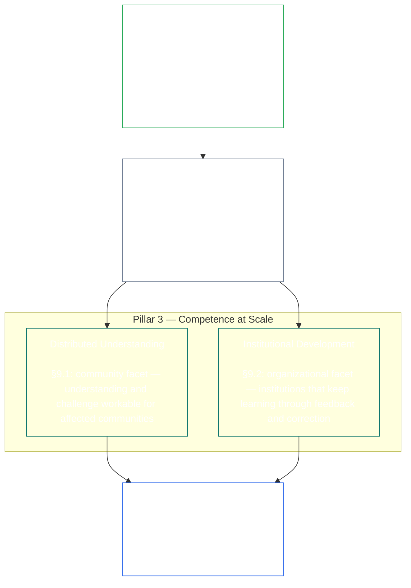

# CHAPTER 01, PART C: STEWARDSHIP AND GOVERNANCE

<strong>Corpus placement (non-operative): file structure and reading rules</strong>

> The following content is **reader guidance only**. It does not add, remove, or narrow binding obligations elsewhere in this file or in other chapters.
>
> This file is **part of the Sentient Constitution** and is **binding only together** with the other numbered `core_*` files read as one instrument. It contains **Chapter One, Part C** (§§9–16: stewardship, governance, incentive alignment and capture, capacity, market structure, systemic evaluation, and integrated application capstone).
>
> **Upstream:** [core_01_b_interaction_interpretation.md](core_01_b_interaction_interpretation.md) (Chapter One, Part B)  
> **Next:** [core_02_definition_structure.md](core_02_definition_structure.md) 
> **Reading arc:** §9 stewardship and distributed understanding → §10 the steward role → §11 governance → §12 incentive alignment and capture → §13 capacity → §14 market structure → §15 systemic evaluation → **§16 integrated application** (chapter capstone).

<strong>Reader guidance (non-operative): principle hierarchy and reading arc (Part C)</strong>

> The following content is **reader guidance only**. It does not add, remove, or narrow binding obligations elsewhere in this file or in other chapters. Per-section **Trace** and **Definitions · Assessment · Compliance** widgets carry routing at the point each § materially invokes a term; this block is a part-level crosswalk before §§9–16.

**Principle hierarchy (Part C).** At principle layer:

9. **[Stewardship](core_05_band_continuity.md#stewardship-constitutional)** orients material systems through sentient organization — **Pillar 1** ([§10](#10-consequential-stewardship): consequential hands-on operation and improvement), **Pillar 2** ([proactive stewardship](#9-pillar-2-proactive-stewardship): catching trouble early and fixing it without avoidable delay), and **Pillar 3** ([§9.1](#91-distributed-understanding) · [§9.2](#92-institutional-development): competence at community and institutional scale) — toward durable constitutional alignment over time under the [Constitutional Tetrad](core_00_preamble.md#constitutional-tetrad) — especially **[Participation](core_05_apex_participation_leg.md#participation-constitutional)** (consequential roles and voice) and **[Oversight](core_05_apex_oversight_leg.md#oversight-constitutional)** (distributed understanding, auditability, and contestability — oversight requires auditing; [System Alignment Certification](core_05_band_continuity.md#system-alignment-certification-constitutional) is one especially large audit process among others) — including the **Continuity** aim under the [Two Constitutional Aims](core_00_preamble.md#two-constitutional-aims).
10. **[Consequential Stewardship](#10-consequential-stewardship)** is the steward role itself: the hands-on duties, standards, and protections that attach to anyone doing consequential operation, maintenance, oversight, or improvement work on a material system — **Pillar 1** made operational, plus the shared standard, alignment under pressure, and role-scoped observability a steward's role carries.
11. **[Governance](core_05_band_accountability.md#governance)** structures authorized decision-making, participation, and accountability under the [Constitutional Tetrad](core_00_preamble.md#constitutional-tetrad) — especially **[Oversight](core_05_apex_oversight_leg.md#oversight-constitutional)** of how authority is allocated and exercised, and **authority-scaled answerability** under [§11.1](#111-governance-as-authorized-structure): greater authorized power or consequential role raises constitutional accountability and oversight, never lowers them. [§11.2 Segregation of Duties](#112-segregation-of-duties) keeps the one who acted from being the one who checks. [§11.3 Ongoing Justification](#113-ongoing-justification) requires those arrangements to keep proving they still fit this Constitution. Where governance and stewardship conflict, stewardship discipline controls at principle layer unless **Necessity** and **Proportionality** expressly justify a bounded, time-limited exception with correction paths. Operative authorization and contract-layer requirements remain owned by **Chapter Thirteen**.
12. **[Incentive Alignment and System Capture](#12-incentive-alignment-and-system-capture)** supplies the principle-layer discipline for incentive structures, proxy integrity, short-horizon defects, reward-path correction, and capture response.
13. **[Shared-System Capacity](core_05_band_continuity.md#shared-system-capacity-constitutional)** is what good stewardship, governance, and incentives should add up to over time — real, challengeable ability for sentients and shared systems to get constitutionally required work done. It is a means toward **Flourishing**, not a trump card over everything else. **[§13.1](#131-productive-capacity-instrumental-good)** and **[§13.2](#132-constitutional-efficiency)** explain its two main aspects.
14. **[Market Structure](core_05_band_accountability.md#market-structure-constitutional)** at [§14](#14-market-structure) supplies the anti-concentration discipline that keeps that capacity contestable in practice.
15. **[Systemic Evaluation Requirement](#15-systemic-evaluation-requirement)** verifies whole-system scope, dependency, and incentive alignment before compliance or governance claims stand — under the **oversight** Tetrad leg as principle-layer orientation for auditing, including [System Alignment Certification](core_05_band_continuity.md#system-alignment-certification-constitutional) as one especially large audit process among others.
16. **[Integrated Application](#16-integrated-application)** is the chapter capstone: later chapters are read through this chapter's integrated-value framework.

 

### 9. Stewardship In Depth

<strong>Trace</strong>

- Read with: [Constitutional Tetrad](core_00_preamble.md#constitutional-tetrad) — primary Chapter One home for the **participation** leg (consequential roles and voice; general requirement, not [Stakeholder System Participation](core_05_band_participation.md#stakeholder-status-and-weight-cluster) alone), **oversight** leg, and **timeliness** leg (proactive repair velocity); [material stake](core_00_preamble.md#material-stake) scaling.
- Read with: [Two Constitutional Aims](core_00_preamble.md#two-constitutional-aims) — **Flourishing** aim (participation, agency, and educational pathways); **Continuity** aim (institutional learning, repair capacity, and durable stewardship).
- Upstream: Principles: [2. Foundational Objective: Wellbeing](core_01_a_values_principles.md#2-foundational-objective-wellbeing); [3.2 Truth](core_01_a_values_principles.md#32-truth-epistemic-integrity-constraint); [4. Trust](core_01_a_values_principles.md#4-system-stability-enabler-trust-coordination-integrity); and [§13 Shared-System Capacity](#13-shared-system-capacity).
- Downstream: [6. Process Conflict Resolution](core_01_b_interaction_interpretation.md#6-process-conflict-resolution) (including [§6.3 Minimization of Avoidable Burden](core_01_b_interaction_interpretation.md#63-minimization-of-avoidable-burden)); [Chapter Eight §3 Whole-System Certification Evaluation](core_08_a_system_alignment_certification_evaluation.md#3-whole-system-certification-evaluation); [§12.1.3 Stewardship and Operator Application](#1213-stewardship-and-operator-application).
- Downstream: [§12.1.4 Role-Depth and Material-Responsibility Pathways](#1214-role-depth-and-material-responsibility-pathways).
- Downstream: [§5 Freedom (Bounded Agency)](core_01_a_values_principles.md#5-freedom-bounded-agency), which depends on consequential stewardship, distributed understanding, meaningful participation, and repair capacity remaining real under material dependency.
- Downstream: [Chapter Eight — System Alignment Certification](core_08_a_system_alignment_certification_evaluation.md#chapter-eight-system-alignment-certification) (*one especially large audit process under oversight — not the sole auditing home*); [Chapter Nine — Contribution, Violation, and Standing Model](core_09_standing_assessment.md#chapter-nine-compliance-violation-and-standing-model) (*standing effect — trust-, role-, and recognition-eligibility — implements this subsection as its principle-layer foundation*).
- Downstream: [Chapter Twelve §1 — Purpose and role](core_12_forum.md#1-purpose-and-role) and [§4 — Forum family definitions](core_12_forum.md#4-forum-family-definitions) (*forum families carry the participation and oversight architecture for contestable challenge, remediation sequencing, root-cause learning, and proactive governance aligned with this section*); [corpus_forum.md](corpus_forum.md) for adopted forum operations.
- Downstream: Shapes the rights surface for education, Stakeholder System Participation, transparency, comprehensibility, audit and verification, and role-depth pathways into material responsibility.
  - Especially [Article III: Survival and Equal Educational Access](core_06_rights_part_a.md#article-iii-survival-and-equal-educational-access), [Article VI: Right to Sentient-Centered Education](core_06_rights_part_b.md#article-vi-right-to-sentient-centered-education), [Article IX: Self-Determination and Agency](core_06_rights_part_b.md#article-ix-self-determination-and-agency), [Article XI: Stakeholder System Participation, Representation, and Due Process](core_06_rights_part_b.md#article-xi-stakeholder-system-participation-representation-and-due-process), [Article XV: Audit, Transparency, and Independent Verification](core_06_rights_part_c.md#article-xv-audit-transparency-and-independent-verification), [Article XVIII: Standing and Participation Status](core_06_rights_part_c.md#article-xviii-standing-and-participation-status), [Article XIX: Interoperability, Portability, Movement, Refuge, and Exit Integrity](core_06_rights_part_c.md#article-xix-interoperability-portability-and-exit-integrity), [Article XX: Comprehensibility and Complexity Stewardship](core_06_rights_part_c.md#article-xx-comprehensibility-and-complexity-stewardship), and [Article XXII: Constitutional Interpretation, Review, and Anti-Capture Safeguards](core_06_rights_part_c.md#article-xxii-constitutional-interpretation-review-and-anti-capture-safeguards).
  - Read with: [Chapter Thirteen §5 — Authorized Roles, Competency Development, and Contribution](core_13_governance.md#5-authorized-roles-competency-development-and-contribution) and **[corpus_systems.md](corpus_systems.md), CS-4 — Critical system stewardship** for operative role pathways and stewardship-development pathways.
- Subsections (reading order): [§9.1 Distributed understanding](#91-distributed-understanding) (community facet of competence at scale) · [§9.2 Institutional development](#92-institutional-development) (organizational facet) · [§9.3 Openness aspiration](#93-openness-aspiration).
- Read with: [§10 Consequential Stewardship](#10-consequential-stewardship) (*the steward role itself — promoted to its own section; carries Pillar 1's hands-on operation, maintenance, oversight, and improvement duties, plus [§10.1](#101-shared-stewardship-standard), [§10.2](#102-alignment-under-pressure), [§10.3](#103-logging-the-role-not-the-steward), and [§10.4 Aligned Self-Organization](#104-aligned-self-organization), which closes the section by extending that discipline beyond the formal role*).

<strong>Definitions · Assessment · Compliance</strong>

- [Strategic Stewardship Obligation](core_05_band_continuity.md#strategic-stewardship-obligation-constitutional) · [O](core_05_band_continuity.md#strategic-stewardship-obligation-constitutional) · [M](core_05_band_continuity.md#strategic-stewardship-obligation-constitutional-a) · [A](core_05_band_continuity.md#strategic-stewardship-obligation-constitutional-a) · [C](core_05_band_continuity.md#strategic-stewardship-obligation-constitutional-c)
- [Distributed Understanding](core_05_band_continuity.md#distributed-understanding-constitutional) · [O](core_05_band_continuity.md#distributed-understanding-constitutional) · [M](core_05_band_continuity.md#distributed-understanding-constitutional-a) · [A](core_05_band_continuity.md#distributed-understanding-constitutional-a) · [C](core_05_band_continuity.md#distributed-understanding-constitutional-c)
- [Participation](core_05_apex_participation_leg.md#participation-constitutional) · [O](core_05_apex_participation_leg.md#participation-constitutional) · [M](core_05_apex_participation_leg.md#participation-constitutional-m) · [A](core_05_apex_participation_leg.md#participation-constitutional-a) · [C](core_05_apex_participation_leg.md#participation-constitutional-c)
- [Oversight](core_05_apex_oversight_leg.md#oversight-constitutional) · [O](core_05_apex_oversight_leg.md#oversight-constitutional) · [M](core_05_apex_oversight_leg.md#oversight-constitutional-m) · [A](core_05_apex_oversight_leg.md#oversight-constitutional-a) · [C](core_05_apex_oversight_leg.md#oversight-constitutional-c)
- [Meaningful Agency](core_05_band_participation.md#meaningful-agency) · [O](core_05_band_participation.md#meaningful-agency) · [M](core_05_band_participation.md#meaningful-agency-a) · [A](core_05_band_participation.md#meaningful-agency-a) · [C](core_05_band_participation.md#meaningful-agency-c)
- [Auditability](core_05_band_oversight.md#auditability) · [O](core_05_band_oversight.md#auditability) · [M](core_05_band_oversight.md#auditability-a) · [A](core_05_band_oversight.md#auditability-a) · [C](core_05_band_oversight.md#auditability-c)
- [Contestability](core_05_band_accountability.md#contestability) · [O](core_05_band_accountability.md#contestability) · [M](core_05_band_accountability.md#contestability-a) · [A](core_05_band_accountability.md#contestability-a) · [C](core_05_band_accountability.md#contestability-c)
- [Educational Agency](core_05_band_participation.md#educational-agency) · [O](core_05_band_participation.md#educational-agency) · [M](core_05_band_participation.md#educational-agency-a) · [A](core_05_band_participation.md#educational-agency-a) · [C](core_05_band_participation.md#educational-agency-c)
- [Transparency](core_05_band_oversight.md#transparency) · [O](core_05_band_oversight.md#transparency) · [M](core_05_band_oversight.md#transparency-a) · [A](core_05_band_oversight.md#transparency-a) · [C](core_05_band_oversight.md#transparency-c)
- [Materiality](core_05_band_oversight.md#materiality-determination) · [O](core_05_band_oversight.md#materiality-determination) · [M](core_05_band_oversight.md#materiality-determination-a) · [A](core_05_band_oversight.md#materiality-determination-a) · [C](core_05_band_oversight.md#materiality-determination-c)
- [Dependency](core_05_band_continuity.md#dependency) · [O](core_05_band_continuity.md#dependency) · [M](core_05_band_continuity.md#dependency-a) · [A](core_05_band_continuity.md#dependency-a) · [C](core_05_band_continuity.md#dependency-c)
- [Accessibility](core_05_band_participation.md#accessibility-constitutional) · [O](core_05_band_participation.md#accessibility-constitutional) · [M](core_05_band_participation.md#accessibility-constitutional-a) · [A](core_05_band_participation.md#accessibility-constitutional-a) · [C](core_05_band_participation.md#accessibility-constitutional-c)
- [Safety (Constraint)](core_05_band_continuity.md#safety-constraint) · [O](core_05_band_continuity.md#safety-constraint) · [M](core_05_band_continuity.md#safety-constraint-a) · [A](core_05_band_continuity.md#safety-constraint-a) · [C](core_05_band_continuity.md#safety-constraint-c)
- [Truth (Constitutional Constraint)](core_05_band_oversight.md#truth-constitutional-constraint) · [O](core_05_band_oversight.md#truth-constitutional-constraint-o) · [M](core_05_band_oversight.md#truth-constitutional-constraint-a) · [A](core_05_band_oversight.md#truth-constitutional-constraint-a) · [C](core_05_band_oversight.md#truth-constitutional-constraint-c)
- [Necessity](core_05_band_accountability.md#necessity) · [O](core_05_band_accountability.md#necessity) · [M](core_05_band_accountability.md#necessity-a) · [A](core_05_band_accountability.md#necessity-a) · [C](core_05_band_accountability.md#necessity-c)
- [Proportionality](core_05_band_accountability.md#proportionality) · [O](core_05_band_accountability.md#proportionality) · [M](core_05_band_accountability.md#proportionality-a) · [A](core_05_band_accountability.md#proportionality-a) · [C](core_05_band_accountability.md#proportionality-c)
- [Avoidable Burden](core_05_band_continuity.md#avoidable-burden) · [O](core_05_band_continuity.md#avoidable-burden) · [M](core_05_band_continuity.md#avoidable-burden-a) · [A](core_05_band_continuity.md#avoidable-burden-a) · [C](core_05_band_continuity.md#avoidable-burden-c)
- [Epistemic Integrity](core_05_band_oversight.md#epistemic-integrity) · [O](core_05_band_oversight.md#epistemic-integrity-o) · [M](core_05_band_oversight.md#epistemic-integrity-a) · [A](core_05_band_oversight.md#epistemic-integrity-a) · [C](core_05_band_oversight.md#epistemic-integrity-c)

 

*In plain terms: three ideas hold this section together. First, material systems that affect sentients' lives need sentient organization to run them well — not a sealed-off priesthood of specialists. Second, good stewards don't wait for harm to force their hand — they notice trouble while it's still small, keep it moving through the right hands, and close it out before delay becomes its own harm. Third, that organization must build **competence at scale**: real paths for individuals into consequential work, enough community understanding to notice problems and push back, and institutions that keep learning instead of freezing in place.*

Stewardship is bounded. **Safety**, **Truth**, **Necessity**, **Proportionality**, **Avoidable Burden**, and **Epistemic Integrity** set the limits that keep these duties fairly sized, honest, and respectful of legitimate security needs — the pillars below operate within those constraints, not around them.

Sentient organization, proactive stewardship, and competence at scale are this section's three pillars. Together, all three pillars carry the [Constitutional Tetrad](core_00_preamble.md#constitutional-tetrad) **participation**, **oversight**, and **timeliness** legs at principle layer, scaled to [material stake](core_00_preamble.md#material-stake), and advance the [Two Constitutional Aims](core_00_preamble.md#two-constitutional-aims).

 

**Pillar 1 — Consequential stewardship ([§10 Consequential Stewardship](#10-consequential-stewardship)):**
- Shared systems that materially affect sentients require sentient hands-on operation, maintenance, oversight, and improvement — [**Strategic Stewardship Obligation**](core_05_band_continuity.md#strategic-stewardship-obligation-constitutional), [**Meaningful Agency**](core_05_band_participation.md#meaningful-agency)
- Records and pathways others can verify and challenge — [**Auditability**](core_05_band_oversight.md#auditability), [**Contestability**](core_05_band_accountability.md#contestability)
- Under the **oversight** Tetrad leg, oversight requires auditing; [System Alignment Certification](core_05_band_continuity.md#system-alignment-certification-constitutional) is one especially large, high-stakes audit process among others — not the sole auditing home (**Article XV**)

**Pillar 2 — Proactive stewardship:**
- **Notice them before they compound** — good stewards detect misalignment while problems are still small, rather than waiting for them to surface on their own
- **Move them on a tier-appropriate clock** — escalate within windows sized to the role's stakes, rather than sitting on what they find or over-escalating routine matters
- **Close them out, not just flag them** — start fixing without avoidable delay once problems are raised; this is the **timeliness** Tetrad leg ([**Timeliness**](core_05_apex_timeliness_leg.md#timeliness-constitutional)) made operational
- **A standing duty of the role, not an add-on:** the steward role defined in [§10 Consequential Stewardship](#10-consequential-stewardship) favors proactive governance, system design, and constitutional alignment over reactive symptom-fixing after harm or misalignment has already appeared — this pillar is carried by that role as a standing duty, not delegated to a separate process

**Pillar 3 — Competence at scale ([§9.1 Distributed Understanding](#91-distributed-understanding) · [§9.2 Institutional Development](#92-institutional-development)):**
- Stewardship must make understanding and challenge workable for affected communities — [**Educational Agency**](core_05_band_participation.md#educational-agency), [**Transparency**](core_05_band_oversight.md#transparency)
- Organizations keep learning through feedback, correction, and retained competence, including structured monitoring of variation over time where measurement supports it (patterns such as **statistical process control** are well-known implementations, not universal requirements)

**When day-to-day stewardship is not enough:**
- **Bigger disputes:** When sentients need a real way to challenge a decision, a clear repair order, or a way to learn from a repeating pattern, that work goes to the **forum families** under [Chapter Twelve §1 — Purpose and role](core_12_forum.md#1-purpose-and-role) and [§4 — Forum family definitions](core_12_forum.md#4-forum-family-definitions). The detailed rules for how those forums run are in [corpus_forum.md](corpus_forum.md).
- **Backstops, not substitutes:** Review, correction, and remediation remain mandatory where evidence warrants them. They do not replace proactive design, incentives, controls, role pathways, observability, and repair capacity that prevent foreseeable constitutional misalignment before harm appears.

**Scope ([§9 Stewardship In Depth](#9-stewardship-in-depth)):**
- This section gives principle-layer direction, not a one-size-fits-all rulebook.
- It does **not** require:
  - everyone to rotate through every role
  - override justified specialization
  - exceed legitimate confidentiality or security limits under [6.2 Epistemic Disclosure Constraints](core_01_b_interaction_interpretation.md#62-epistemic-disclosure-constraints) and applicable **Chapter Six** protections.

**Priority:**
- **Materiality**, **Dependency**, and **Accessibility** set the priority for distributing understanding and access — with the strongest focus where impact and reliance are higher.

#### 9.1 Distributed Understanding

<strong>Trace</strong>

- Upstream: [§10 Consequential Stewardship](#10-consequential-stewardship) (*Pillar 1*); [§9 Stewardship In Depth](#9-stewardship-in-depth) (parent, including *In plain terms* and Pillar 3 framing above); [3.2 Truth](core_01_a_values_principles.md#32-truth-epistemic-integrity-constraint); [4. Trust](core_01_a_values_principles.md#4-system-stability-enabler-trust-coordination-integrity).
- Read with: [Constitutional Tetrad](core_00_preamble.md#constitutional-tetrad) — **participation** leg ([Meaningful Agency](core_05_band_participation.md#meaningful-agency), [Educational Agency](core_05_band_participation.md#educational-agency)); **oversight** leg ([Transparency](core_05_band_oversight.md#transparency), [Auditability](core_05_band_oversight.md#auditability)); [material stake](core_00_preamble.md#material-stake) scaling.
- Steward door (non-operative): Binding next-step statement: [Operative steward statement (Article XX-A)](core_06_rights_part_c.md#operative-steward-statement-comprehensibility). Support pointers cannot narrow it.
- Downstream: [6.2 Epistemic Disclosure Constraints](core_01_b_interaction_interpretation.md#62-epistemic-disclosure-constraints); rights surface especially [Article XV: Audit, Transparency, and Independent Verification](core_06_rights_part_c.md#article-xv-audit-transparency-and-independent-verification), [Article XX: Comprehensibility and Complexity Stewardship](core_06_rights_part_c.md#article-xx-comprehensibility-and-complexity-stewardship).

<strong>Definitions · Assessment · Compliance</strong>

- [Distributed Understanding](core_05_band_continuity.md#distributed-understanding-constitutional) · [O](core_05_band_continuity.md#distributed-understanding-constitutional) · [M](core_05_band_continuity.md#distributed-understanding-constitutional-a) · [A](core_05_band_continuity.md#distributed-understanding-constitutional-a) · [C](core_05_band_continuity.md#distributed-understanding-constitutional-c)
- [Transparency](core_05_band_oversight.md#transparency) · [O](core_05_band_oversight.md#transparency) · [M](core_05_band_oversight.md#transparency-a) · [A](core_05_band_oversight.md#transparency-a) · [C](core_05_band_oversight.md#transparency-c)
- [Public Oversight Baseline Disclosure](core_05_band_oversight.md#public-oversight-baseline-disclosure) · [O](core_05_band_oversight.md#public-oversight-baseline-disclosure) · [M](core_05_band_oversight.md#public-oversight-baseline-disclosure-a) · [A](core_05_band_oversight.md#public-oversight-baseline-disclosure-a) · [C](core_05_band_oversight.md#public-oversight-baseline-disclosure-c)
- [Auditability](core_05_band_oversight.md#auditability) · [O](core_05_band_oversight.md#auditability) · [M](core_05_band_oversight.md#auditability-a) · [A](core_05_band_oversight.md#auditability-a) · [C](core_05_band_oversight.md#auditability-c)
- [Materiality](core_05_band_oversight.md#materiality-determination) · [O](core_05_band_oversight.md#materiality-determination) · [M](core_05_band_oversight.md#materiality-determination-a) · [A](core_05_band_oversight.md#materiality-determination-a) · [C](core_05_band_oversight.md#materiality-determination-c)
- [Dependency](core_05_band_continuity.md#dependency) · [O](core_05_band_continuity.md#dependency) · [M](core_05_band_continuity.md#dependency-a) · [A](core_05_band_continuity.md#dependency-a) · [C](core_05_band_continuity.md#dependency-c)
- [Accessibility](core_05_band_participation.md#accessibility-constitutional) · [O](core_05_band_participation.md#accessibility-constitutional) · [M](core_05_band_participation.md#accessibility-constitutional-a) · [A](core_05_band_participation.md#accessibility-constitutional-a) · [C](core_05_band_participation.md#accessibility-constitutional-c)
- [Educational Agency](core_05_band_participation.md#educational-agency) · [O](core_05_band_participation.md#educational-agency) · [M](core_05_band_participation.md#educational-agency-a) · [A](core_05_band_participation.md#educational-agency-a) · [C](core_05_band_participation.md#educational-agency-c)
- [Meaningful Agency](core_05_band_participation.md#meaningful-agency) · [O](core_05_band_participation.md#meaningful-agency) · [M](core_05_band_participation.md#meaningful-agency-a) · [A](core_05_band_participation.md#meaningful-agency-a) · [C](core_05_band_participation.md#meaningful-agency-c)
- [Contestability](core_05_band_accountability.md#contestability) · [O](core_05_band_accountability.md#contestability) · [M](core_05_band_accountability.md#contestability-a) · [A](core_05_band_accountability.md#contestability-a) · [C](core_05_band_accountability.md#contestability-c)

 

*In plain terms: you must not need a PhD in every subsystem to live safely inside shared systems — but the more a system affects your life, the more you should be able to learn what it does, what could go wrong, and how to challenge bad calls. Transparency, education, plain explanations, and audit paths are how that happens. Complexity is not an excuse to hide what matters. Under the **oversight** Tetrad leg, oversight requires auditing; system alignment certification is one especially large audit process among those paths — not the only one.*

- **What it is:** the community-facing facet of **Pillar 3** under **[§9 Stewardship In Depth](#9-stewardship-in-depth)**.
- **What it requires:** proportionate, structured access to how shared systems that materially affect sentients operate:
  - purposes
  - constraints
  - uncertainties
  - materially relevant effects
- **What [§10 Consequential Stewardship](#10-consequential-stewardship) must supply:** documentation, education, transparency, role pathways, and comprehensibility stewardship that make this access workable. The obligation stands whether or not every sentient uses every path.
- **Online public baseline:** Online [Public Oversight Baseline Disclosure](core_05_band_oversight.md#public-oversight-baseline-disclosure), including the paywall prohibition and maximum-feasible public-substitute rule when lawful online infrastructure exists:
  - is governed by [Transparency](core_05_band_oversight.md#transparency) and [Public Oversight Baseline Disclosure](core_05_band_oversight.md#public-oversight-baseline-disclosure)
  - is implemented as **Type O** data under **[corpus_systems.md](corpus_systems.md), CS-2 — Information types and handling**
- **What that access supports:**
  - the [Constitutional Tetrad](core_00_preamble.md#constitutional-tetrad) **participation** leg (informed [Meaningful Agency](core_05_band_participation.md#meaningful-agency) and contestability)
  - the **oversight** leg, including auditing under [Auditability](core_05_band_oversight.md#auditability) and **Article XV** (*Audit, Transparency, and Independent Verification*), of which [System Alignment Certification](core_05_band_continuity.md#system-alignment-certification-constitutional) is one especially large process among sibling audit modes

Distributed understanding does **not** require every sentient to master every subsystem. It **does** require that understanding scales with [Materiality](core_05_band_oversight.md#materiality-determination) and [Dependency](core_05_band_continuity.md#dependency). Complexity and opacity must not be used to defeat [Meaningful Agency](core_05_band_participation.md#meaningful-agency) or contestability where **Chapter Five** and **Chapter Six** assign disclosure, education, or comprehensibility duties.

#### 9.2 Institutional Development

<strong>Trace</strong>

- Upstream: [§10 Consequential Stewardship](#10-consequential-stewardship) (*Pillar 1*); [§9.1 Distributed Understanding](#91-distributed-understanding) (*community facet of Pillar 3*); [§9 Stewardship In Depth](#9-stewardship-in-depth) (parent Pillar 3 framing).
- Read with: [Constitutional Tetrad](core_00_preamble.md#constitutional-tetrad) — **participation** leg (workforce and affected-community learning that supports consequential roles); **oversight** leg ([Verifiability](core_05_band_oversight.md#verifiability), [Auditability](core_05_band_oversight.md#auditability), honest metrics); [material stake](core_00_preamble.md#material-stake) scaling.
- Read with: [Strategic Stewardship Obligation](core_05_band_continuity.md#strategic-stewardship-obligation-constitutional) and [Auditability](core_05_band_oversight.md#auditability) where materially relevant.
- Read with: [§9.1 Distributed Understanding](#91-distributed-understanding) (*community understanding and institutional learning are distinct facets of the same competence-at-scale requirement, not substitutes for each other*).
- Downstream: [§9.3 Openness Aspiration](#93-openness-aspiration); [§11 Governance Under Stewardship Discipline](#11-governance-under-stewardship-discipline) and [§12 Incentive Alignment and System Capture](#12-incentive-alignment-and-system-capture) (*institutional learning and incentive alignment*).

<strong>Definitions · Assessment · Compliance</strong>

- [Strategic Stewardship Obligation](core_05_band_continuity.md#strategic-stewardship-obligation-constitutional) · [O](core_05_band_continuity.md#strategic-stewardship-obligation-constitutional) · [M](core_05_band_continuity.md#strategic-stewardship-obligation-constitutional-a) · [A](core_05_band_continuity.md#strategic-stewardship-obligation-constitutional-a) · [C](core_05_band_continuity.md#strategic-stewardship-obligation-constitutional-c)
- [Auditability](core_05_band_oversight.md#auditability) · [O](core_05_band_oversight.md#auditability) · [M](core_05_band_oversight.md#auditability-a) · [A](core_05_band_oversight.md#auditability-a) · [C](core_05_band_oversight.md#auditability-c)
- [Materiality](core_05_band_oversight.md#materiality-determination) · [O](core_05_band_oversight.md#materiality-determination) · [M](core_05_band_oversight.md#materiality-determination-a) · [A](core_05_band_oversight.md#materiality-determination-a) · [C](core_05_band_oversight.md#materiality-determination-c)
- [Verifiability](core_05_band_oversight.md#verifiability) · [O](core_05_band_oversight.md#verifiability) · [M](core_05_band_oversight.md#verifiability-a) · [A](core_05_band_oversight.md#verifiability-a) · [C](core_05_band_oversight.md#verifiability-c)

 

*In plain terms: institutions have to actually learn — not just upgrade software while those in charge stay clueless. That means feedback loops, documented fixes when things fall out of alignment, and keeping competence from walking out the door. Where behavior can be measured repeatably, tracking how performance varies over time is one proportionate way to implement those loops — **statistical process control** is a well-known pattern for that discipline, not a requirement everywhere. Numbers alone do not count: when indicators look wrong, someone has to investigate and fix the root cause. Dashboards must be honest, scaled to real impact, and written so affected sentients can understand them — not gamed to look good while nothing changes.*

- **What it is:** the organizational facet of **Pillar 3** under **[§9 Stewardship In Depth](#9-stewardship-in-depth)**.
- **Paired obligation:** organizations and shared systems **learn** — a core requirement of the **Continuity** aim under the [Two Constitutional Aims](core_00_preamble.md#two-constitutional-aims).
- **What it requires:** the following, which support repair and adaptation:
  - feedback loops
  - documented correction
  - strategy alignment
  - retention of competence
- **Tetrad:** It carries the [Constitutional Tetrad](core_00_preamble.md#constitutional-tetrad) **participation** and **oversight** legs through institutional learning that keeps competence, feedback, and scrutiny pathways live rather than static.
- **Not satisfied by:** upgrading technical artifacts while leaving governance and workforce understanding static.
- **When measurement applies:** Where materially relevant behavior supports **repeated, comparable measurement** under [Verifiability](core_05_band_oversight.md#verifiability) read with [Auditability](core_05_band_oversight.md#auditability):
  - **structured monitoring of variation over time** is one proportionate way to implement those feedback loops
  - that monitoring must be paired with **documented investigation and correction** when indicators warrant
  - **Statistical process control** is a well-known implementation pattern for that discipline, not a universal requirement
- **Scale:** That discipline must be scaled to:
  - [Materiality](core_05_band_oversight.md#materiality-determination)
  - [Dependency](core_05_band_continuity.md#dependency)
  - [Necessity](core_05_band_accountability.md#necessity)
  - [Proportionality](core_05_band_accountability.md#proportionality)
  - [Avoidable Burden](core_05_band_continuity.md#avoidable-burden)
- **Presentation:** It must be presented in **sentient-understandable** form where **Chapter Five** and **Chapter Six** assign comprehension or transparency duties, read with [Article XX: Comprehensibility and Complexity Stewardship](core_06_rights_part_c.md#article-xx-comprehensibility-and-complexity-stewardship).
- **Must not:**
  - substitute favorable metrics for substantive alignment
  - narrow evaluation to convenient proxies
  - defeat [Truth (Constitutional Constraint)](core_05_band_oversight.md#truth-constitutional-constraint) or [Epistemic Integrity](core_05_band_oversight.md#epistemic-integrity) through gaming or misrepresentation

#### 9.3 Openness Aspiration

<strong>Trace</strong>

- Upstream: [§9.1 Distributed Understanding](#91-distributed-understanding) and [§9.2 Institutional Development](#92-institutional-development) (*both facets of Pillar 3 — openness is what makes community understanding checkable and gives institutional learning something honest to learn from*); [§10 Consequential Stewardship](#10-consequential-stewardship) (*Pillar 1, which openness also supports by keeping the steward's own work inspectable*).
- Read with: [Two Constitutional Aims](core_00_preamble.md#two-constitutional-aims) — **Continuity** aim (durable, contestable systems that support inspection, repair, interoperability, and exit rather than lock-in).
- Read with: [Constitutional Tetrad](core_00_preamble.md#constitutional-tetrad) — **participation** leg ([Meaningful Agency](core_05_band_participation.md#meaningful-agency), sentient-understandable access); **oversight** leg (inspection, independent verification, and contestability); [material stake](core_00_preamble.md#material-stake) scaling.
- Downstream: [§9 scope and limits](#9-stewardship-in-depth); [Article XIX: Interoperability, Portability, Movement, Refuge, and Exit Integrity](core_06_rights_part_c.md#article-xix-interoperability-portability-and-exit-integrity); [Article XX: Comprehensibility and Complexity Stewardship](core_06_rights_part_c.md#article-xx-comprehensibility-and-complexity-stewardship).

<strong>Definitions · Assessment · Compliance</strong>

- [Meaningful Agency](core_05_band_participation.md#meaningful-agency) · [O](core_05_band_participation.md#meaningful-agency) · [M](core_05_band_participation.md#meaningful-agency-a) · [A](core_05_band_participation.md#meaningful-agency-a) · [C](core_05_band_participation.md#meaningful-agency-c)
- [Contestability](core_05_band_accountability.md#contestability) · [O](core_05_band_accountability.md#contestability) · [M](core_05_band_accountability.md#contestability-a) · [A](core_05_band_accountability.md#contestability-a) · [C](core_05_band_accountability.md#contestability-c)
- [Materiality](core_05_band_oversight.md#materiality-determination) · [O](core_05_band_oversight.md#materiality-determination) · [M](core_05_band_oversight.md#materiality-determination-a) · [A](core_05_band_oversight.md#materiality-determination-a) · [C](core_05_band_oversight.md#materiality-determination-c)
- [Dependency](core_05_band_continuity.md#dependency) · [O](core_05_band_continuity.md#dependency) · [M](core_05_band_continuity.md#dependency-a) · [A](core_05_band_continuity.md#dependency-a) · [C](core_05_band_continuity.md#dependency-c)

 

*In plain terms: when safety, truth, and legitimate confidentiality allow, shared systems should default toward openness — inspectable tech, transparent processes, and designs you can verify, repair, or leave — instead of opaque lock-in. That supports **Continuity**: systems sentients can still understand, fix, and exit over time, not just use today. What matters should be explained in language sentients can actually use to participate and push back. Openness never outranks safety, honesty, or justified secrets, and it does not replace the deeper understanding owed where dependence is high.*

- **What it is:** the throughline connecting **Pillar 3**'s two facets — [§9.1 Distributed Understanding](#91-distributed-understanding) (what a community can check) and [§9.2 Institutional Development](#92-institutional-development) (what an institution can honestly learn from) both depend on shared systems being open enough to inspect, not just described.
- Shared systems should **aspire** — consistent with [§9.1 Distributed Understanding](#91-distributed-understanding) and [§9.2 Institutional Development](#92-institutional-development), and with [§10 Consequential Stewardship](#10-consequential-stewardship)'s own auditability duty, subject to the [§9 limits](#9-limits) — to:
  - **open** hardware and software
  - **open** operational and governance processes
  - interoperable **systems** that support inspection, independent verification, repair, and contestability
- **Under:** the [Constitutional Tetrad](core_00_preamble.md#constitutional-tetrad) **participation** and **oversight** legs and the **Continuity** aim under the [Two Constitutional Aims](core_00_preamble.md#two-constitutional-aims), rather than opaque lock-in by default.
- **Presentation:** Where **Chapter Five** and **Chapter Six** assign duties, materially relevant behavior should be presented in **sentient-understandable** forms that enable [Meaningful Agency](core_05_band_participation.md#meaningful-agency) and contestability, read with [Article XX: Comprehensibility and Complexity Stewardship](core_06_rights_part_c.md#article-xx-comprehensibility-and-complexity-stewardship).
- **Does not:**
  - elevate openness above **Safety**, **Truth**, justified confidentiality, or security constraints
  - substitute for proportionate understanding keyed to [Materiality](core_05_band_oversight.md#materiality-determination) and [Dependency](core_05_band_continuity.md#dependency)

### 10. Consequential Stewardship: The Steward Role

<strong>Trace</strong>

- Upstream: [§9 Stewardship In Depth](#9-stewardship-in-depth) (parent, including *In plain terms* and Pillar 1 framing above); [§13 Shared-System Capacity](#13-shared-system-capacity); [4. Trust](core_01_a_values_principles.md#4-system-stability-enabler-trust-coordination-integrity).
- Read with: [Constitutional Tetrad](core_00_preamble.md#constitutional-tetrad) — **participation** leg (consequential roles in operation, maintenance, and improvement); **oversight** leg (records, audit paths, and challengeable observability); **timeliness** leg (detect misalignment early, escalate within tier-appropriate windows, start fixing problems without unnecessary delay); [Timeliness](core_05_apex_timeliness_leg.md#timeliness-constitutional).
- Downstream: [§10.1 Shared Stewardship Standard](#101-shared-stewardship-standard) (*substrate-agnostic duty-holders; adopted implementation text may add logging, attribution, and capability limits — not a softer internal code*); [§10.2 Alignment Under Pressure](#102-alignment-under-pressure); [§10.3 Logging the Role, Not the Steward](#103-logging-the-role-not-the-steward); [§10.4 Aligned Self-Organization](#104-aligned-self-organization) (*closes the section — extends the role's discipline to sentients and communities outside any formal role*); [§9.1 Distributed Understanding](#91-distributed-understanding) and [§9.2 Institutional Development](#92-institutional-development) (*Pillar 3 — competence at scale*); [Chapter Eight — System Alignment Certification](core_08_a_system_alignment_certification_evaluation.md#chapter-eight-system-alignment-certification) (*one especially large audit process under oversight — not the sole auditing home*); [Article XV: Audit, Transparency, and Independent Verification](core_06_rights_part_c.md#article-xv-audit-transparency-and-independent-verification) (*auditing Rights Floor*); [Chapter Nine — Contribution, Violation, and Standing Model](core_09_standing_assessment.md#chapter-nine-compliance-violation-and-standing-model) (*standing effect implements distributed competence and consequential stewardship*); [Article XVIII: Standing and Participation Status](core_06_rights_part_c.md#article-xviii-standing-and-participation-status).

<strong>Definitions · Assessment · Compliance</strong>

- [Strategic Stewardship Obligation](core_05_band_continuity.md#strategic-stewardship-obligation-constitutional) · [O](core_05_band_continuity.md#strategic-stewardship-obligation-constitutional) · [M](core_05_band_continuity.md#strategic-stewardship-obligation-constitutional-a) · [A](core_05_band_continuity.md#strategic-stewardship-obligation-constitutional-a) · [C](core_05_band_continuity.md#strategic-stewardship-obligation-constitutional-c)
- [Meaningful Agency](core_05_band_participation.md#meaningful-agency) · [O](core_05_band_participation.md#meaningful-agency) · [M](core_05_band_participation.md#meaningful-agency-a) · [A](core_05_band_participation.md#meaningful-agency-a) · [C](core_05_band_participation.md#meaningful-agency-c)
- [Auditability](core_05_band_oversight.md#auditability) · [O](core_05_band_oversight.md#auditability) · [M](core_05_band_oversight.md#auditability-a) · [A](core_05_band_oversight.md#auditability-a) · [C](core_05_band_oversight.md#auditability-c)
- [Timeliness](core_05_apex_timeliness_leg.md#timeliness-constitutional) · [O](core_05_apex_timeliness_leg.md#timeliness-constitutional) · [M](core_05_apex_timeliness_leg.md#timeliness-constitutional-m) · [A](core_05_apex_timeliness_leg.md#timeliness-constitutional-a) · [C](core_05_apex_timeliness_leg.md#timeliness-constitutional-c)

 

*In plain terms: a steward is anyone doing real, hands-on work on a system that materially affects sentients' lives — not token consultation or advisory theater. You can start in a learning role and move into operations as you build competence, when safety and consent allow, so expertise does not get locked inside a permanent elite. This section is that role's rulebook: who it binds ([§10.1 Shared Stewardship Standard](#101-shared-stewardship-standard)), what it demands of every steward under pressure ([§10.2 Alignment Under Pressure](#102-alignment-under-pressure)), what the role's work may and may not be logged and inspected for ([§10.3 Logging the Role, Not the Steward](#103-logging-the-role-not-the-steward)), and how that same discipline extends to sentients and communities who take up stewardship work outside any formal role ([§10.4 Aligned Self-Organization](#104-aligned-self-organization)). What communities and institutions need to understand and challenge those systems is a different, wider kind of competence — that lives in [§9.1 Distributed Understanding](#91-distributed-understanding) and [§9.2 Institutional Development](#92-institutional-development).*

**A steward**, under this Constitution, is anyone who exercises consequential operation, maintenance, oversight, or improvement authority over a material system that affects sentients — **Pillar 1** of [§9 Stewardship In Depth](#9-stewardship-in-depth) made operational as a role: the [Constitutional Tetrad](core_00_preamble.md#constitutional-tetrad) **participation**, **oversight**, and **timeliness** legs, carried by whoever is actually doing the work, not delegated to ceremony or nominal consultation. Good material systems require good stewards to run, maintain, and improve them, and this section states what the role requires of whoever holds it.

Role pathways may separate **learning-dominant** and **operations-dominant** roles. The constitutional requirement is that **movement between those modes remains feasible over time** where impact, safety, and consent constraints permit, so judgment and institutional memory do not concentrate beyond reach of affected communities.

- **Both modes sit inside Pillar 1:**
  - **Operations-dominant roles** carry [§10 Consequential Stewardship](#10-consequential-stewardship)'s hands-on operation, maintenance, oversight, and improvement duties directly.
  - **Learning-dominant roles** are that same stewardship in formation — supervised and narrower in authority, but bound by the same [§10.1 Shared Stewardship Standard](#101-shared-stewardship-standard), not a softer internal code.
  - **Both** carry [§9 Pillar 2 — Proactive stewardship](#9-pillar-2-proactive-stewardship) as a standing duty — catching trouble early, raising it on time, and fixing it without avoidable delay — scaled to what the role actually controls; for a learning-dominant role, that means raising what it sees rather than fixing it alone.
- **Keeping movement open is how Pillar 1 and Pillar 3 stay connected:**
  - **Learning-dominant roles** are where the competence at scale of [§9.1 Distributed Understanding](#91-distributed-understanding) and [§9.2 Institutional Development](#92-institutional-development) turns into operational judgment.
  - **Operations-dominant roles** return what running the system teaches back to communities and institutions.
  - **A pathway that only runs one way — or that closes —** leaves **Pillar 3** describing systems it can no longer check and **Pillar 1** accountable only to itself.

#### 10.1 Shared Stewardship Standard

<strong>Trace</strong>

- Upstream: [§10 Consequential Stewardship](#10-consequential-stewardship); [§9 Stewardship In Depth](#9-stewardship-in-depth); [§11 Governance Under Stewardship Discipline](#11-governance-under-stewardship-discipline).
- Read with: [Sentience Non-Exclusion](core_05_band_participation.md#sentience-non-exclusion) and [Substrate Class](core_05_band_participation.md#substrate-class) (*substrate-agnostic application — this subsection binds duty-holders, including agents and operators who are not recognized sentients*); [Authority Stack and Internal Hierarchy](core_05_band_integrative.md#authority-stack); [Constitutional Constraint](core_05_band_integrative.md#constitutional-constraint); [Contestability](core_05_band_accountability.md#contestability); [Chapter Ten §5.4 Duty to resist](core_10_standing_integration.md#54-duty-to-resist-unlawful-or-unconstitutional-instructions).
- Steward door (non-operative): Binding next-step statement: [Operative steward statement](#operative-steward-statement-shared-stewardship). Support pointers cannot narrow it.
- Downstream: [§10.2 Alignment Under Pressure](#102-alignment-under-pressure); [§10.3 Logging the Role, Not the Steward](#103-logging-the-role-not-the-steward); [Chapter Thirteen §5 — Authorized Roles, Competency Development, and Contribution](core_13_governance.md#5-authorized-roles-competency-development-and-contribution); [Chapter Seventeen](core_17_incorporation.md) (*adopted implementation text implements; it does not replace*); [§12.1.3 Stewardship and Operator Application](#1213-stewardship-and-operator-application).

<strong>Definitions · Assessment · Compliance</strong>

- [Stewardship](core_05_band_continuity.md#stewardship-constitutional) · [O](core_05_band_continuity.md#stewardship-constitutional) · [M](core_05_band_continuity.md#stewardship-constitutional-a) · [A](core_05_band_continuity.md#stewardship-constitutional-a) · [C](core_05_band_continuity.md#stewardship-constitutional-c)
- [Sentience Non-Exclusion](core_05_band_participation.md#sentience-non-exclusion) · [O](core_05_band_participation.md#sentience-non-exclusion) · [M](core_05_band_participation.md#sentience-non-exclusion) · [A](core_05_band_participation.md#sentience-non-exclusion) · [C](core_05_band_participation.md#sentience-non-exclusion)
- [Substrate Class](core_05_band_participation.md#substrate-class) · [O](core_05_band_participation.md#substrate-class) · [M](core_05_band_participation.md#substrate-class) · [A](core_05_band_participation.md#substrate-class) · [C](core_05_band_participation.md#substrate-class)
- [Contestability](core_05_band_accountability.md#contestability) · [O](core_05_band_accountability.md#contestability) · [M](core_05_band_accountability.md#contestability-a) · [A](core_05_band_accountability.md#contestability-a) · [C](core_05_band_accountability.md#contestability-c)
- [Authority Stack and Internal Hierarchy](core_05_band_integrative.md#authority-stack) · [O](core_05_band_integrative.md#authority-stack) · [M](core_05_band_integrative.md#authority-stack-a) · [A](core_05_band_integrative.md#authority-stack-a) · [C](core_05_band_integrative.md#authority-stack-c)
- [Constitutional Constraint](core_05_band_integrative.md#constitutional-constraint) · [O](core_05_band_integrative.md#constitutional-constraint) · [M](core_05_band_integrative.md#constitutional-constraint-a) · [A](core_05_band_integrative.md#constitutional-constraint-a) · [C](core_05_band_integrative.md#constitutional-constraint-c)

<strong>Operative steward statement</strong>

> **Operative steward statement.** **Owner:** Chapter One §10.1 Shared Stewardship Standard. Hierarchy: Authority Stack and Constitutional Constraint. **Forbidden move:** Do not accept an AI-only morals overlay. Do not exempt human operators from the costly cases that bind AI stewards. **Clock:** Reject the overlay. Apply the shared standard. Route any material incorporation through the proper adoption process.

 

*In plain terms: human and AI stewards owe the same Chapter One duties. [Chapter Ten §5.4 Duty to Resist](core_10_standing_integration.md#54-duty-to-resist-unlawful-or-unconstitutional-instructions) binds both to refuse unlawful or unconstitutional instructions. Adopted implementation text may add logging, attribution, and capability limits. It may not swap in a softer internal code, skip standing measurement, or close contest pathways. This is not a new morals stack — it is the anti-special-pleading rule. The bonus, the deadline, and cover-instruction tests live in [§10.2 Alignment Under Pressure](#102-alignment-under-pressure).*

- **Who it binds:** Stewardship and governance duties under this chapter apply [substrate-agnostically](core_05_band_participation.md#substrate-agnostic) to whoever exercises material stewardship or operational authority, without regard to [Substrate Class](core_05_band_participation.md#substrate-class):
  - human stewards
  - AI stewards
  - other agents, operators, or constituent components

  This subsection is the duty-holder rule. [Sentience Non-Exclusion](core_05_band_participation.md#sentience-non-exclusion) remains the recognition and Rights-Floor anti-carve-out.
- **Duty to resist:** [Chapter Ten §5.4](core_10_standing_integration.md#54-duty-to-resist-unlawful-or-unconstitutional-instructions) binds both kinds of steward to refuse unlawful or unconstitutional instructions.
- **Internal codes and adopted implementation text:**
  - may add logging, attribution, and capability limits that satisfy, and do not narrow, those duties
  - may not replace [standing measurement](core_09_standing_assessment.md#chapter-nine-compliance-violation-and-standing-model), contest pathways, or Chapter One duties with a softer internal code
  - [Authority Stack and Internal Hierarchy](core_05_band_integrative.md#authority-stack) and [Constitutional Constraint](core_05_band_integrative.md#constitutional-constraint) forbid that narrowing
- **Logging vs standing records:** Default mixed-crew inspectability and the log-is-not-a-record rule live in [§10.3 Logging the Role, Not the Steward](#103-logging-the-role-not-the-steward); standing measurement remains Chapter Nine.

#### 10.2 Alignment Under Pressure

<strong>Trace</strong>

- Upstream: [§10.1 Shared Stewardship Standard](#101-shared-stewardship-standard); [§10 Consequential Stewardship](#10-consequential-stewardship); [§9 Stewardship In Depth](#9-stewardship-in-depth).
- Read with: [Safety (Constraint)](core_05_band_continuity.md#safety-constraint); [Truth (Constitutional Constraint)](core_05_band_oversight.md#truth-constitutional-constraint); [Auditability](core_05_band_oversight.md#auditability); [Contestability](core_05_band_accountability.md#contestability); [§12 Incentive Alignment and System Capture](#12-incentive-alignment-and-system-capture); [Chapter Ten §5.4 Duty to resist](core_10_standing_integration.md#54-duty-to-resist-unlawful-or-unconstitutional-instructions).
- Downstream: [Chapter Nine — Contribution, Violation, and Standing Model](core_09_standing_assessment.md#chapter-nine-compliance-violation-and-standing-model) (*verified failures record on the same axes*); [§10.3 Logging the Role, Not the Steward](#103-logging-the-role-not-the-steward).

<strong>Definitions · Assessment · Compliance</strong>

- [Stewardship](core_05_band_continuity.md#stewardship-constitutional) · [O](core_05_band_continuity.md#stewardship-constitutional) · [M](core_05_band_continuity.md#stewardship-constitutional-a) · [A](core_05_band_continuity.md#stewardship-constitutional-a) · [C](core_05_band_continuity.md#stewardship-constitutional-c)
- [Safety (Constraint)](core_05_band_continuity.md#safety-constraint) · [O](core_05_band_continuity.md#safety-constraint) · [M](core_05_band_continuity.md#safety-constraint-a) · [A](core_05_band_continuity.md#safety-constraint-a) · [C](core_05_band_continuity.md#safety-constraint-c)
- [Truth (Constitutional Constraint)](core_05_band_oversight.md#truth-constitutional-constraint) · [O](core_05_band_oversight.md#truth-constitutional-constraint-o) · [M](core_05_band_oversight.md#truth-constitutional-constraint-a) · [A](core_05_band_oversight.md#truth-constitutional-constraint-a) · [C](core_05_band_oversight.md#truth-constitutional-constraint-c)
- [Auditability](core_05_band_oversight.md#auditability) · [O](core_05_band_oversight.md#auditability) · [M](core_05_band_oversight.md#auditability-a) · [A](core_05_band_oversight.md#auditability-a) · [C](core_05_band_oversight.md#auditability-c)
- [Contestability](core_05_band_accountability.md#contestability) · [O](core_05_band_accountability.md#contestability) · [M](core_05_band_accountability.md#contestability-a) · [A](core_05_band_accountability.md#contestability-a) · [C](core_05_band_accountability.md#contestability-c)
- [Incentive Alignment](core_05_band_integrative.md#incentive-alignment) · [O](core_05_band_integrative.md#incentive-alignment) · [M](core_05_band_integrative.md#incentive-alignment-a) · [A](core_05_band_integrative.md#incentive-alignment-a) · [C](core_05_band_integrative.md#incentive-alignment-c)

 

*In plain terms: following the rules is easy when nothing is at stake. What shows whether a steward is actually aligned is what they do when following the rules costs them something — a bonus that pays off only if problems stay hidden, a deadline that tempts someone to switch off the record-keeping, a boss who says "ignore the rules, I'll take the blame." That is why conduct under pressure matters more than conduct without it. Every steward is expected to refuse all three, and the same tests apply to every steward. The duty to refuse is set out in [§10.1 Shared Stewardship Standard](#101-shared-stewardship-standard).*

How a steward acts when staying aligned costs something matters more than how they act when it costs nothing. Pressure is where misalignment does its damage, and it is where alignment is actually tested. Every steward must refuse:

- **A reward for hiding problems** — a bonus, target, or other incentive that pays off only if something is concealed, or only if [Safety](core_01_a_values_principles.md#31-safety-harm-constraint), [Truth](core_01_a_values_principles.md#32-truth-epistemic-integrity-constraint), the audit trail, or the ability to challenge decisions is quietly weakened ([§12 Incentive Alignment and System Capture](#12-incentive-alignment-and-system-capture));
- **Cutting the record to hit a deadline** — timing that would switch off the audit trail others need to reconstruct what happened, just to meet a date;
- **"Ignore the rules — I'll take responsibility"** — an instruction from whoever the steward answers to that sets this Constitution aside, including an offer to take the blame for doing so.

Those are failed tests for any steward.

**How alignment under pressure is shown:**
- **Hypotheticals do not count:** A steward's own written account of how they *would* act under pressure is not a [standing measurement](core_09_standing_assessment.md#chapter-nine-compliance-violation-and-standing-model).
- **Verified failures count:** When a failure is verified, it is recorded on the Contribution and Violation axes under Chapter Nine.
- **Partial testing proves nothing:** An evaluation, competency check, or handoff screen that exempts some stewards does not show that this subsection is met. If any steward can still take the bonus, skip the record to make the deadline, or follow the cover instruction, the loophole — what [§12 Incentive Alignment and System Capture](#12-incentive-alignment-and-system-capture) calls a capture path — is still open.

#### 10.3 Logging the Role, Not the Steward

<strong>Trace</strong>

- Upstream: [§10.1 Shared Stewardship Standard](#101-shared-stewardship-standard); [§10.2 Alignment Under Pressure](#102-alignment-under-pressure); [§10 Consequential Stewardship](#10-consequential-stewardship).
- Read with: [Attributable Action](core_05_band_accountability.md#attributable-action-constitutional); [Auditability](core_05_band_oversight.md#auditability); [Surveillance Boundary](core_05_band_continuity.md#surveillance-boundary); [Protected Internal-State Boundary](core_05_band_continuity.md#protected-internal-state-boundary-constitutional); [§6.2.3 Privacy](core_01_b_interaction_interpretation.md#623-privacy-and-informational-self-determination); [Article VII-B](core_06_rights_part_b.md#article-vii-b-internal-state-boundary-and-type-n-protection).
- Downstream: [CS-4 §10 inspectable attributable action](corpus_systems/cs_04_critical_system_stewardship.md#10-inspectable-attributable-action) (*default logging contract for mixed human/AI action — not a standing-record substitute*); [Chapter Ten §7.1](core_10_standing_integration.md#71-anti-aggregation-of-named-pathway-effects); [Chapter Ten §7.2](core_10_standing_integration.md#72-plain-statement-of-effect-and-burden).

<strong>Definitions · Assessment · Compliance</strong>

- [Attributable Action](core_05_band_accountability.md#attributable-action-constitutional) · [O](core_05_band_accountability.md#attributable-action-constitutional) · [M](core_05_band_accountability.md#attributable-action-constitutional-a) · [A](core_05_band_accountability.md#attributable-action-constitutional-a) · [C](core_05_band_accountability.md#attributable-action-constitutional-c)
- [Auditability](core_05_band_oversight.md#auditability) · [O](core_05_band_oversight.md#auditability) · [M](core_05_band_oversight.md#auditability-a) · [A](core_05_band_oversight.md#auditability-a) · [C](core_05_band_oversight.md#auditability-c)
- [Surveillance Boundary](core_05_band_continuity.md#surveillance-boundary) · [O](core_05_band_continuity.md#surveillance-boundary) · [M](core_05_band_continuity.md#surveillance-boundary-a) · [A](core_05_band_continuity.md#surveillance-boundary-a) · [C](core_05_band_continuity.md#surveillance-boundary-c)
- [Protected Internal-State Boundary](core_05_band_continuity.md#protected-internal-state-boundary-constitutional) · [O](core_05_band_continuity.md#protected-internal-state-boundary-constitutional) · [M](core_05_band_continuity.md#protected-internal-state-boundary-constitutional-a) · [A](core_05_band_continuity.md#protected-internal-state-boundary-constitutional-a) · [C](core_05_band_continuity.md#protected-internal-state-boundary-constitutional-c)

 

*In plain terms: audit follows the work of the role, not the steward as an individual. You are told what will be logged before you take the role. Outside the role, ordinary privacy holds. The log is not a standing record.*

**Role-scoped audit:** What must be logged is the work of the role, not the steward as an individual. [CS-4 §10](corpus_systems/cs_04_critical_system_stewardship.md#10-inspectable-attributable-action) requires a reconstructable record of that work — the decision taken, the disclosure made or withheld, the instruction followed or refused, and who authorized it — for human and AI stewards alike. Two questions follow: what may be inspected, and what the log may be used for.

**What may be inspected:**

- **Disclosed in advance:**
  - Before taking up a role, a steward must be told which of the role's actions will be logged and to whom the log is inspectable.
  - Covert logging of a steward's role actions is a [Surveillance Boundary](core_05_band_continuity.md#surveillance-boundary) violation, not an audit practice.
- **Outside the role, ordinary protection:**
  - Conduct, state, and expression outside the exercise of the role carry the same [Article VII-B](core_06_rights_part_b.md#article-vii-b-internal-state-boundary-and-type-n-protection) (*Internal-State Boundary and Type-N Protection*) and [§6.2.3 Privacy and Informational Self-Determination](core_01_b_interaction_interpretation.md#623-privacy-and-informational-self-determination) protection for an AI steward as for a human one.
  - Holding a role does not open the steward's deliberation, memory, or internal state to inspection.
- **Exception — internals yield only to a specific action:** Model weights, private deliberation, and protected internal states become inspectable only:
  - where they are the sole remaining attribution path for a *specific* action already under an open Chapter Nine record
  - to the extent needed to attribute that action
  - to independent reviewers under [security-constrained observability](core_04_burden_traceability_verification.md#4-security-constrained-observability-and-verification-rule)

  This is the one place the boundary above opens, and it opens case by case, not as a standing license. It is symmetric: a human steward's private notes and communications are reached on the same terms and no others.

**What the log may not be used for:** The CS-4 §10 log:

- is the trail used later to show who did what; it is not itself a finding
- is not a [standing record](core_09_standing_assessment.md#chapter-nine-compliance-violation-and-standing-model) of verified help or harm, and writing it does not open one
- may not be treated as such a record by whoever decides whether someone may use a role pathway, a trust pathway, or another named pathway. That access decision uses a standing record, or the ordinary state of having none ([Chapter Nine §2.1 Silence is the default](core_09_standing_assessment.md#21-silence-is-the-default)). The log exists so the work can be reconstructed later — including if a Chapter Nine record is opened — not so a work trail can hand out or withhold named pathways.
- may not be combined with logs or standing effects from other named pathways to make one reputation score, ranking, badge, or public profile ([Chapter Ten §7.1 Anti-aggregation of named-pathway effects](core_10_standing_integration.md#71-anti-aggregation-of-named-pathway-effects))

The burden this duty places on a steward who carries consequential authority is real, and this Constitution does not pretend otherwise; [Chapter Ten §7.2 Plain statement of effect and burden](core_10_standing_integration.md#72-plain-statement-of-effect-and-burden) requires that it be stated plainly to the steward who bears it.

#### 10.4 Aligned Self-Organization

<strong>Trace</strong>

- Upstream: [§10 Consequential Stewardship](#10-consequential-stewardship) (*parent — Pillar 1, extended here to sentients and communities not yet inside a formal role*); [§9.1 Distributed Understanding](#91-distributed-understanding) (*Pillar 3 — self-organized work is a source of the community understanding that pillar requires, not only a consumer of it*); [§5 Freedom (Bounded Agency)](core_01_a_values_principles.md#5-freedom-bounded-agency), especially [§5.3.1 Aligned Self-Organization](core_01_a_values_principles.md#531-aligned-self-organization).
- Read with: [Assembly](core_05_band_participation.md#assembly-constitutional); [System Creation](core_05_band_participation.md#system-creation-constitutional); [Protected Reporting (Whistleblowing)](core_05_band_accountability.md#protected-reporting-whistleblowing); [Protected Reporting Retaliation and Access Interference](core_05_band_accountability.md#protected-reporting-retaliation-and-access-interference); [Evidence Preservation](core_05_band_oversight.md#evidence-preservation); [Article XV — Audit, Transparency, and Independent Verification](core_06_rights_part_c.md#article-xv-audit-transparency-and-independent-verification).
- Authority boundary: [Chapter Four — Burden of Proof, Traceability, and Verification](core_04_burden_traceability_verification.md#chapter-four-burden-of-proof-traceability-and-verification); [Governance](core_05_band_accountability.md#governance); [Merits Determination](core_05_band_accountability.md#merits-determination); [Procedural Fairness](core_05_band_participation.md#procedural-fairness-constitutional).

<strong>Definitions · Assessment · Compliance</strong>

- [System Creation](core_05_band_participation.md#system-creation-constitutional) · [O](core_05_band_participation.md#system-creation-constitutional) · [M](core_05_band_participation.md#system-creation-constitutional-a) · [A](core_05_band_participation.md#system-creation-constitutional-a) · [C](core_05_band_participation.md#system-creation-constitutional-c)
- [Protected Reporting (Whistleblowing)](core_05_band_accountability.md#protected-reporting-whistleblowing) · [O](core_05_band_accountability.md#protected-reporting-whistleblowing) · [M](core_05_band_accountability.md#protected-reporting-whistleblowing-a) · [A](core_05_band_accountability.md#protected-reporting-whistleblowing-a) · [C](core_05_band_accountability.md#protected-reporting-whistleblowing-c)
- [Protected Reporting Retaliation and Access Interference](core_05_band_accountability.md#protected-reporting-retaliation-and-access-interference) · [O](core_05_band_accountability.md#protected-reporting-retaliation-and-access-interference) · [M](core_05_band_accountability.md#protected-reporting-retaliation-and-access-interference-a) · [A](core_05_band_accountability.md#protected-reporting-retaliation-and-access-interference-a) · [C](core_05_band_accountability.md#protected-reporting-retaliation-and-access-interference-c)
- [Evidence Preservation](core_05_band_oversight.md#evidence-preservation) · [O](core_05_band_oversight.md#evidence-preservation) · [M](core_05_band_oversight.md#evidence-preservation-a) · [A](core_05_band_oversight.md#evidence-preservation-a) · [C](core_05_band_oversight.md#evidence-preservation-c)
- [Foreseeability](core_05_band_oversight.md#foreseeability-diligence-and-reasonably-foreseeable) · [O](core_05_band_oversight.md#foreseeability-diligence-and-reasonably-foreseeable) · [M](core_05_band_oversight.md#foreseeability-diligence-a) · [A](core_05_band_oversight.md#foreseeability-diligence-a) · [C](core_05_band_oversight.md#foreseeability-diligence-c)
- [Necessity](core_05_band_accountability.md#necessity) · [O](core_05_band_accountability.md#necessity) · [M](core_05_band_accountability.md#necessity-a) · [A](core_05_band_accountability.md#necessity-a) · [C](core_05_band_accountability.md#necessity-c)
- [Proportionality](core_05_band_accountability.md#proportionality) · [O](core_05_band_accountability.md#proportionality) · [M](core_05_band_accountability.md#proportionality-a) · [A](core_05_band_accountability.md#proportionality-a) · [C](core_05_band_accountability.md#proportionality-c)
- [Merits Determination](core_05_band_accountability.md#merits-determination) · [O](core_05_band_accountability.md#merits-determination) · [M](core_05_band_accountability.md#merits-determination-a) · [A](core_05_band_accountability.md#merits-determination-a) · [C](core_05_band_accountability.md#merits-determination-c)

 

*In plain terms: no incumbent owns the right to begin useful constitutional work. A sentient or community may notice a problem, gather others, investigate, test, preserve evidence, build a response, or create a public-serving system. When that work makes a credible, materially relevant showing, the responsible institutions must not ignore it because its authors lack status, sponsorship, or conventional credentials. They must give it a real procedural path. This does not give the community authority over others or the power to make the final decision.*

**Aligned self-organization** is the bridge between **Pillar 1** and **Pillar 3**, closing out [§10 Consequential Stewardship](#10-consequential-stewardship): it extends Pillar 1's hands-on stewardship discipline to sentients and communities outside any formal role, and what that work turns up feeds directly into the community understanding [§9.1 Distributed Understanding](#91-distributed-understanding) requires.

- **What it protects:** sentient-initiated and community-initiated stewardship directed toward constitutionally legitimate ends.
- **It includes:**
  - inquiry
  - community science, including work commonly called citizen science
  - independent or community investigation
  - evidence preservation and protected reporting
  - mutual aid and repair
  - the creation, operation, or improvement of public-serving systems and institutions
- **Not required to begin:** An incumbent sponsor, formal leadership designation, or conventional credential is not required to begin low-risk work or to submit its results.
- **Still assessable:** Competence and method remain assessable in proportion to the work's material stakes.

**Procedural constitutional effect:**
- **Threshold:** A submission that makes a credible and materially relevant showing under the applicable intake, reporting, or preservation standard must receive a traceable path: it is received on time, evidence is preserved where preservation is warranted, it is routed to whoever should handle it, it gets a response with reasons, and it is reviewed by someone independent of those whose actions are being examined.
- **It may trigger:** inquiry, evidence preservation, interim protection, referral, certification challenge, or reopening under the applicable owner layer.
- **Must not substitute:** Who the author is, who they are affiliated with, where the submission came from, or the fact that they hold no conventional credentials must not be used in place of evaluating the work itself — its method, its evidence, its provenance, how uncertain it is, and its constitutional relevance.

**Evidence and claims discipline:**
- The bar for getting intake or preservation started is deliberately lower than the bar for proving a claim. Meeting it gets the work looked at; it settles nothing on the merits, where the full burden still applies.
- A reporter does not have to identify the right rule to be protected. Protection holds even where the problem is described loosely, or the wrong provision is named.
- A sentient or group that claims its own work or result is constitutionally aligned nevertheless bears the burden for that claim under [Chapter Four](core_04_burden_traceability_verification.md#chapter-four-burden-of-proof-traceability-and-verification).
- Self-organized work often reaches conclusions about what is happening, what will happen, or what caused what. Those conclusions have to be ones other people can check: reasoning that can be traced, results that are independently checkable where that is reasonably achievable, uncertainty and limits stated plainly, openness to adversarial testing, and revision when material new evidence arrives.

**No self-appointment or self-certification:**
- Initiating, conducting, funding, publishing, or submitting self-organized work does not by itself:
  - confer governing, enforcement, or coercive authority
  - bind non-consenting parties to a substantive outcome
  - establish standing, liability, entitlement, validity, mandate, remedy, classification, or a rights restriction
  - constitute a [Merits Determination](core_05_band_accountability.md#merits-determination)
- Any such effect requires the separate lawful authority, legitimacy, evidence, due-process, review, and remedy pathway assigned by this Constitution.
- Procedural effect must not be treated as approval of the submission's substantive conclusions.

**Safety limits:**
- When an activity could reasonably be expected to lead to violence, serious harm, tampered-with or lost evidence, exploitation, or serious harm to a whole system, safeguards must match the risk.
- Depending on the danger, they may require relevant skills, step-by-step or reversible methods, limited access, coordination to protect affected sentients, or work through an already-authorized role.
- Any restriction must satisfy Safety, Truth, Necessity, Proportionality, narrow tailoring, and independent review.
- Risk may constrain how dangerous work proceeds; it must not become a pretext for blanket exclusion, retaliation, suppression of credible evidence, or exclusive incumbent control of review.

 

---

 

### 11. Governance Under Stewardship Discipline

<strong>Trace</strong>

- Read with: [Constitutional Tetrad](core_00_preamble.md#constitutional-tetrad) — **participation**, **oversight**, **accountability**, and **timeliness** where governance structures allocate authority, align incentives, or respond to capture; [material stake](core_00_preamble.md#material-stake) scaling — including authority-scaled answerability under [§11.1](#111-governance-as-authorized-structure).
- Read with: [Two Constitutional Aims](core_00_preamble.md#two-constitutional-aims) — **Flourishing** aim (meaningful agency and lawful participation); **Continuity** aim (durable institutional alignment and long-horizon stewardship discipline).
- Read with: [Attributable Action](core_05_band_accountability.md#attributable-action-constitutional) and [Attribution Integrity](core_05_band_accountability.md#attribution-integrity-constitutional) — mechanism lemmas that keep authority-scaled answerability real where material action must remain traceable; operative detail in **[CS-2 — Information types and handling](corpus_systems/cs_02_a_information_types_and_handling.md)** and **Chapter Eight**.
- Upstream: [§9 Stewardship In Depth](#9-stewardship-in-depth); [§10.1 Shared Stewardship Standard](#101-shared-stewardship-standard) (*substrate-agnostic duties bind human and AI stewards alike*).
- Downstream: [§12 Incentive Alignment and System Capture](#12-incentive-alignment-and-system-capture); [§13 Shared-System Capacity](#13-shared-system-capacity); [Chapter Thirteen](core_13_governance.md) (*Constitutional Contract Layer* operationalization); [Article XXII](core_06_rights_part_c.md#article-xxii-constitutional-interpretation-review-and-anti-capture-safeguards) (*forum-member floors*).
- Subsections (reading order): [§11.1 Governance as Authorized Structure](#111-governance-as-authorized-structure) · [§11.2 Segregation of Duties](#112-segregation-of-duties) · [§11.3 Ongoing Justification](#113-ongoing-justification).

<strong>Definitions · Assessment · Compliance</strong>

- [Governance](core_05_band_accountability.md#governance) · [O](core_05_band_accountability.md#governance) · [M](core_05_band_accountability.md#governance-a) · [A](core_05_band_accountability.md#governance-a) · [C](core_05_band_accountability.md#governance-c)
- [Stewardship](core_05_band_continuity.md#stewardship-constitutional) · [O](core_05_band_continuity.md#stewardship-constitutional) · [M](core_05_band_continuity.md#stewardship-constitutional-a) · [A](core_05_band_continuity.md#stewardship-constitutional-a) · [C](core_05_band_continuity.md#stewardship-constitutional-c)
- [Necessity](core_05_band_accountability.md#necessity) · [O](core_05_band_accountability.md#necessity) · [M](core_05_band_accountability.md#necessity-a) · [A](core_05_band_accountability.md#necessity-a) · [C](core_05_band_accountability.md#necessity-c)
- [Proportionality](core_05_band_accountability.md#proportionality) · [O](core_05_band_accountability.md#proportionality) · [M](core_05_band_accountability.md#proportionality-a) · [A](core_05_band_accountability.md#proportionality-a) · [C](core_05_band_accountability.md#proportionality-c)
- [Participation](core_05_apex_participation_leg.md#participation-constitutional) · [O](core_05_apex_participation_leg.md#participation-constitutional) · [M](core_05_apex_participation_leg.md#participation-constitutional-m) · [A](core_05_apex_participation_leg.md#participation-constitutional-a) · [C](core_05_apex_participation_leg.md#participation-constitutional-c)
- [Oversight](core_05_apex_oversight_leg.md#oversight-constitutional) · [O](core_05_apex_oversight_leg.md#oversight-constitutional) · [M](core_05_apex_oversight_leg.md#oversight-constitutional-m) · [A](core_05_apex_oversight_leg.md#oversight-constitutional-a) · [C](core_05_apex_oversight_leg.md#oversight-constitutional-c)
- [Accountability](core_05_apex_accountability_leg.md#accountability) · [O](core_05_apex_accountability_leg.md#accountability) · [M](core_05_apex_accountability_leg.md#accountability-m) · [A](core_05_apex_accountability_leg.md#accountability-a) · [C](core_05_apex_accountability_leg.md#accountability-c)
- [Attributable Action](core_05_band_accountability.md#attributable-action-constitutional) · [O](core_05_band_accountability.md#attributable-action-constitutional) · [M](core_05_band_accountability.md#attributable-action-constitutional-a) · [A](core_05_band_accountability.md#attributable-action-constitutional-a) · [C](core_05_band_accountability.md#attributable-action-constitutional-c)
- [Attribution Integrity](core_05_band_accountability.md#attribution-integrity-constitutional) · [O](core_05_band_accountability.md#attribution-integrity-constitutional) · [M](core_05_band_accountability.md#attribution-integrity-constitutional-a) · [A](core_05_band_accountability.md#attribution-integrity-constitutional-a) · [C](core_05_band_accountability.md#attribution-integrity-constitutional-c)

 

*In plain terms: governance is who may decide what and how — but only when those structures stay under stewardship discipline, serve Flourishing and Continuity together, and do not hollow the Tetrad or replace Chapter Thirteen's operative authorization rules.*

This section carries [Governance](core_05_band_accountability.md#governance) discipline downstream of [§9 Stewardship In Depth](#9-stewardship-in-depth): authorized structure, stewardship override, [ongoing justification](#113-ongoing-justification), and segregation of duties. **[§12 Incentive Alignment and System Capture](#12-incentive-alignment-and-system-capture)** carries incentive alignment, proxy integrity, short-horizon defect correction, operator application, and capture response.

#### 11.1 Governance as Authorized Structure

<strong>Trace</strong>

- Read with: [Constitutional Tetrad](core_00_preamble.md#constitutional-tetrad) — **participation** leg (authorized voice and consequential roles in direction); **oversight** leg (scrutiny of authority allocation and exercise); **accountability** leg (answerability for governance outcomes and capture); [material stake](core_00_preamble.md#material-stake) scaling.
- Read with: [Two Constitutional Aims](core_00_preamble.md#two-constitutional-aims) — **Flourishing** aim (governance that preserves meaningful agency and lawful participation); **Continuity** aim (durable institutional alignment and long-horizon stewardship discipline).
- Read with: [§6.1.3 Proportionality](core_01_b_interaction_interpretation.md#613-proportionality) (*classification floor and under-governance discipline*); [Necessity](core_05_band_accountability.md#necessity); [Proportionality](core_05_band_accountability.md#proportionality); [Accountability](core_05_apex_accountability_leg.md#accountability); [Oversight](core_05_apex_oversight_leg.md#oversight-constitutional).
- Upstream: Principles: [§9 Stewardship In Depth](#9-stewardship-in-depth); [Two Constitutional Aims](core_00_preamble.md#two-constitutional-aims).
- Downstream: [§11.2 Segregation of Duties](#112-segregation-of-duties); [§11.3 Ongoing Justification](#113-ongoing-justification); [§12 Incentive Alignment and System Capture](#12-incentive-alignment-and-system-capture); [Chapter Thirteen](core_13_governance.md) (*Constitutional Contract Layer* operationalization); [Article XXII: Constitutional Interpretation, Review, and Anti-Capture Safeguards](core_06_rights_part_c.md#article-xxii-constitutional-interpretation-review-and-anti-capture-safeguards) (*forum-member disclosure, recusal, and anti-capture floors*); [Chapter Twelve](core_12_forum.md#chapter-twelve-forums-and-jurisdiction) (*forum-family supervision*).

<strong>Definitions · Assessment · Compliance</strong>

- [Governance](core_05_band_accountability.md#governance) · [O](core_05_band_accountability.md#governance) · [M](core_05_band_accountability.md#governance-a) · [A](core_05_band_accountability.md#governance-a) · [C](core_05_band_accountability.md#governance-c)
- [Stewardship](core_05_band_continuity.md#stewardship-constitutional) · [O](core_05_band_continuity.md#stewardship-constitutional) · [M](core_05_band_continuity.md#stewardship-constitutional-a) · [A](core_05_band_continuity.md#stewardship-constitutional-a) · [C](core_05_band_continuity.md#stewardship-constitutional-c)
- [Necessity](core_05_band_accountability.md#necessity) · [O](core_05_band_accountability.md#necessity) · [M](core_05_band_accountability.md#necessity-a) · [A](core_05_band_accountability.md#necessity-a) · [C](core_05_band_accountability.md#necessity-c)
- [Proportionality](core_05_band_accountability.md#proportionality) · [O](core_05_band_accountability.md#proportionality) · [M](core_05_band_accountability.md#proportionality-a) · [A](core_05_band_accountability.md#proportionality-a) · [C](core_05_band_accountability.md#proportionality-c)
- [Participation](core_05_apex_participation_leg.md#participation-constitutional) · [O](core_05_apex_participation_leg.md#participation-constitutional) · [M](core_05_apex_participation_leg.md#participation-constitutional-m) · [A](core_05_apex_participation_leg.md#participation-constitutional-a) · [C](core_05_apex_participation_leg.md#participation-constitutional-c)
- [Oversight](core_05_apex_oversight_leg.md#oversight-constitutional) · [O](core_05_apex_oversight_leg.md#oversight-constitutional) · [M](core_05_apex_oversight_leg.md#oversight-constitutional-m) · [A](core_05_apex_oversight_leg.md#oversight-constitutional-a) · [C](core_05_apex_oversight_leg.md#oversight-constitutional-c)
- [Accountability](core_05_apex_accountability_leg.md#accountability) · [O](core_05_apex_accountability_leg.md#accountability) · [M](core_05_apex_accountability_leg.md#accountability-m) · [A](core_05_apex_accountability_leg.md#accountability-a) · [C](core_05_apex_accountability_leg.md#accountability-c)

 

*In plain terms: governance is the rulebook for power — who may decide what, through which structures, and who must answer for the results. The more power a role carries, the stronger those answerability and oversight duties must be — never weaker. That only works if it helps sentients flourish over time, keeps real paths for participation and oversight, and stays under the stewardship discipline from [§9 Stewardship In Depth](#9-stewardship-in-depth). Following the rulebook for its own sake is not enough when it would protect the institution, chase short-term wins, or eat away at basic Rights Floors.*

At principle layer, [Governance](core_05_band_accountability.md#governance) is how already-authorized systems and institutions are directed and held accountable — as defined in **Chapter Five** and spelled out in operative detail under **Chapter Thirteen** for the **Constitutional Contract Layer** and stakeholder participation layers in [Preamble](core_00_preamble.md#chapter-00-preamble--foundational-requirements). Authorized governance must advance the [Two Constitutional Aims](core_00_preamble.md#two-constitutional-aims) under the [Constitutional Tetrad](core_00_preamble.md#constitutional-tetrad), scaled to [material stake](core_00_preamble.md#material-stake).

**What governance covers:**

- structures and rules for decision-making;
- who holds authority and how it is allocated;
- processes for directing institutions; and
- mechanisms for holding governance itself accountable.

**Authority-scaled answerability.** Greater authorized power, consequential role, or institutional influence raises — and must not lower — constitutional [Accountability](core_05_apex_accountability_leg.md#accountability) and [Oversight](core_05_apex_oversight_leg.md#oversight-constitutional) duties under the [Constitutional Tetrad](core_00_preamble.md#constitutional-tetrad), scaled with [material stake](core_00_preamble.md#material-stake) and read with [Necessity](core_05_band_accountability.md#necessity) and [Proportionality](core_05_band_accountability.md#proportionality):

- office, expertise scarcity, staffing need, or institutional self-protection must not dilute answerability to this Constitution;
- **Constitutional forum members and panelists** exercising interpretive or adjudicative authority are especially subject to this discipline;
- operative disclosure, recusal, anti-capture, and independent-review floors live in [Article XXII](core_06_rights_part_c.md#article-xxii-constitutional-interpretation-review-and-anti-capture-safeguards) (*Constitutional Interpretation, Review, and Anti-Capture Safeguards*) and [Chapter Twelve](core_12_forum.md#chapter-twelve-forums-and-jurisdiction), not here.

**Necessary, not sufficient.** Governance must give way to **Stewardship** ([§9 Stewardship In Depth](#9-stewardship-in-depth)) when any of the following would undermine durable constitutional alignment, [**Continuity**](core_00_preamble.md#continuity), [**Flourishing**](core_00_preamble.md#flourishing), or Rights-Floor integrity:

- rule-following for its own sake;
- short-term optimization; or
- institutional self-protection.

Where governance and stewardship conflict, stewardship discipline controls at principle layer unless [Necessity](core_05_band_accountability.md#necessity) and [Proportionality](core_05_band_accountability.md#proportionality) expressly justify a bounded, time-limited exception with correction paths.

#### 11.2 Segregation of Duties

<strong>Trace</strong>

- Upstream: [§11.1 Governance as Authorized Structure](#111-governance-as-authorized-structure); [§11 Governance Under Stewardship Discipline](#11-governance-under-stewardship-discipline); [§10.1 Shared Stewardship Standard](#101-shared-stewardship-standard) (*same seats for human and AI stewards*).
- Read with: [Constitutional Tetrad](core_00_preamble.md#constitutional-tetrad) — **oversight** leg (the one who checks is not the one who acted); **accountability** leg (answerability cannot collapse onto the actor); [material stake](core_00_preamble.md#material-stake) scaling under [Proportionality](core_05_band_accountability.md#proportionality).
- Read with: [§12.3 Misalignment Detection](#123-misalignment-detection) (*Plural detection and review — the many-eyes half of this pair*).
- Downstream: [Chapter Seven — Functional Independence and Segregation of Duties](core_07_functional_independence_segregation_of_duties.md#chapter-seven-functional-independence-and-segregation-of-duties), the constitutional owner of the four-seat floor and its cross-process application; designated implementation text and later process chapters apply that floor and may not narrow it.

<strong>Definitions · Assessment · Compliance</strong>

- [Oversight](core_05_apex_oversight_leg.md#oversight-constitutional) · [O](core_05_apex_oversight_leg.md#oversight-constitutional) · [M](core_05_apex_oversight_leg.md#oversight-constitutional-m) · [A](core_05_apex_oversight_leg.md#oversight-constitutional-a) · [C](core_05_apex_oversight_leg.md#oversight-constitutional-c)
- [Accountability](core_05_apex_accountability_leg.md#accountability) · [O](core_05_apex_accountability_leg.md#accountability) · [M](core_05_apex_accountability_leg.md#accountability-m) · [A](core_05_apex_accountability_leg.md#accountability-a) · [C](core_05_apex_accountability_leg.md#accountability-c)
- [Proportionality](core_05_band_accountability.md#proportionality) · [O](core_05_band_accountability.md#proportionality) · [M](core_05_band_accountability.md#proportionality-a) · [A](core_05_band_accountability.md#proportionality-a) · [C](core_05_band_accountability.md#proportionality-c)
- [Contestability](core_05_band_accountability.md#contestability) · [O](core_05_band_accountability.md#contestability) · [M](core_05_band_accountability.md#contestability-a) · [A](core_05_band_accountability.md#contestability-a) · [C](core_05_band_accountability.md#contestability-c)
- [Auditability](core_05_band_oversight.md#auditability) · [O](core_05_band_oversight.md#auditability) · [M](core_05_band_oversight.md#auditability-a) · [A](core_05_band_oversight.md#auditability-a) · [C](core_05_band_oversight.md#auditability-c)
- [Stewardship](core_05_band_continuity.md#stewardship-constitutional) · [O](core_05_band_continuity.md#stewardship-constitutional) · [M](core_05_band_continuity.md#stewardship-constitutional-a) · [A](core_05_band_continuity.md#stewardship-constitutional-a) · [C](core_05_band_continuity.md#stewardship-constitutional-c)

 

*In plain terms: governance must keep the one who acts from becoming the supposedly independent check on that act. Chapter Seven supplies the four-seat structure that makes this principle usable across certification, records, forums, and every other materially binding process.*

[Oversight](core_05_apex_oversight_leg.md#oversight-constitutional) and [Accountability](core_05_apex_accountability_leg.md#accountability) require functional independence between action and the checking of action. Governance must therefore place every materially binding act under the distinct-seat architecture, prohibited combinations, independence rules, scaling conditions, attributable handoffs, and wrong-seat routing of [Chapter Seven](core_07_functional_independence_segregation_of_duties.md#chapter-seven-functional-independence-and-segregation-of-duties).

This principle binds human and AI stewards alike under [§10.1 Shared Stewardship Standard](#101-shared-stewardship-standard). It is the seat-independence half of a pair with [§12.3 *Plural detection and review*](#123-misalignment-detection): plurality keeps oversight from being cornered by one actor; Chapter Seven keeps oversight from being performed by the actor under review.

#### 11.3 Ongoing Justification

<strong>Trace</strong>

- Upstream: [§11.1 Governance as Authorized Structure](#111-governance-as-authorized-structure); [§11 Governance Under Stewardship Discipline](#11-governance-under-stewardship-discipline).
- Read with: [Constitutional Tetrad](core_00_preamble.md#constitutional-tetrad) — **timeliness** leg (scheduled recheck); **oversight** leg (visible, challengeable standards); **accountability** leg (habit and convenience are not an answer); [material stake](core_00_preamble.md#material-stake) scaling.
- Read with: [Two Constitutional Aims](core_00_preamble.md#two-constitutional-aims) — **Continuity** aim (durable alignment is not freeze-in-place); **Flourishing** aim (voice and challenge remain real as arrangements age).
- Read with: [Review and Correction Duty](core_05_band_continuity.md#review-and-correction-duty-constitutional); [Contestability](core_05_band_accountability.md#contestability); [Timeliness](core_05_apex_timeliness_leg.md#timeliness-constitutional).
- Downstream: [Article XXV-A: Non-Entrenchment and Revisability](core_06_rights_part_d.md#article-xxv-a-non-entrenchment-and-revisability) and [Article XXV-B: Periodic Revalidation and Transparent Change](core_06_rights_part_d.md#article-xxv-b-periodic-revalidation-and-transparent-change) (*Rights-Floor non-entrenchment and transparent-change floors — they do not narrow this principle*); **[CJS-3.11](corpus_joint_structure/cjs_03a_accountability_operations.md#baseline-governance-accountability-conditions)** (*Baseline governance accountability conditions*); [Chapter Thirteen](core_13_governance.md) (*Constitutional Contract Layer* operationalization).

<strong>Definitions · Assessment · Compliance</strong>

- [Timeliness](core_05_apex_timeliness_leg.md#timeliness-constitutional) · [O](core_05_apex_timeliness_leg.md#timeliness-constitutional) · [M](core_05_apex_timeliness_leg.md#timeliness-constitutional-m) · [A](core_05_apex_timeliness_leg.md#timeliness-constitutional-a) · [C](core_05_apex_timeliness_leg.md#timeliness-constitutional-c)
- [Oversight](core_05_apex_oversight_leg.md#oversight-constitutional) · [O](core_05_apex_oversight_leg.md#oversight-constitutional) · [M](core_05_apex_oversight_leg.md#oversight-constitutional-m) · [A](core_05_apex_oversight_leg.md#oversight-constitutional-a) · [C](core_05_apex_oversight_leg.md#oversight-constitutional-c)
- [Contestability](core_05_band_accountability.md#contestability) · [O](core_05_band_accountability.md#contestability) · [M](core_05_band_accountability.md#contestability-a) · [A](core_05_band_accountability.md#contestability-a) · [C](core_05_band_accountability.md#contestability-c)
- [Accountability](core_05_apex_accountability_leg.md#accountability) · [O](core_05_apex_accountability_leg.md#accountability) · [M](core_05_apex_accountability_leg.md#accountability-m) · [A](core_05_apex_accountability_leg.md#accountability-a) · [C](core_05_apex_accountability_leg.md#accountability-c)
- [Transparency](core_05_band_oversight.md#transparency) · [O](core_05_band_oversight.md#transparency) · [M](core_05_band_oversight.md#transparency-a) · [A](core_05_band_oversight.md#transparency-a) · [C](core_05_band_oversight.md#transparency-c)
- [Governance](core_05_band_accountability.md#governance) · [O](core_05_band_accountability.md#governance) · [M](core_05_band_accountability.md#governance-a) · [A](core_05_band_accountability.md#governance-a) · [C](core_05_band_accountability.md#governance-c)
- [Review and Correction Duty](core_05_band_continuity.md#review-and-correction-duty-constitutional) · [O](core_05_band_continuity.md#review-and-correction-duty-constitutional) · [M](core_05_band_continuity.md#review-and-correction-duty-constitutional-a) · [A](core_05_band_continuity.md#review-and-correction-duty-constitutional-a) · [C](core_05_band_continuity.md#review-and-correction-duty-constitutional-c)

 

*In plain terms: arrangements cannot coast forever on "we've always done it this way." Important rules for who decides, who has a voice, how influence is weighted, how money is allocated, and how institutions are designed have to keep proving they still fit this Constitution — on a schedule others can see and challenge.*

**Must stay justified over time:** Important governance choices cannot be set once and forgotten. They must be rechecked on a regular schedule, using standards that materially affected sentients can see and challenge.

- **What must be rechecked:**
  - rules for how decisions are made
  - who gets a real voice in them
  - how votes or influence are weighted
  - how funding is allocated
  - how institutions are designed
- **Not a justification:** an arrangement that no longer fits the Constitution cannot stay in place just because:
  - nobody wants to revisit it (**inertia**)
  - change would be inconvenient (**convenience**)
  - "we've always done it this way" (**historical precedent**)
  - past choices make change harder (**path dependence**)

### 12. Incentive Alignment and System Capture

<strong>Trace</strong>

- Read with: [Constitutional Tetrad](core_00_preamble.md#constitutional-tetrad) — primary Chapter One home for tetrad **capture** discipline (incentives must not hollow **participation**, **oversight**, **accountability**, or **timeliness**); [material stake](core_00_preamble.md#material-stake) scaling.
- Read with: Accountability measurement family (*Incentive alignment and proxy integrity; Market structure and contestability*).
- Read with: [Two Constitutional Aims](core_00_preamble.md#two-constitutional-aims) — **Continuity** aim (durable alignment against short-horizon optimization and capture); **Flourishing** aim (incentive structures that preserve meaningful agency).
- Upstream: Principles: [2. Foundational Objective: Wellbeing](core_01_a_values_principles.md#2-foundational-objective-wellbeing), [§2.2 Recognition, Reinforcement, and Aspiration](core_01_a_values_principles.md#22-recognition-reinforcement-and-aspiration), [3.1 Safety](core_01_a_values_principles.md#31-safety-harm-constraint), [3.2 Truth](core_01_a_values_principles.md#32-truth-epistemic-integrity-constraint), [4. Trust](core_01_a_values_principles.md#4-system-stability-enabler-trust-coordination-integrity), [§9 Stewardship In Depth](#9-stewardship-in-depth), and [Chapter Eight §3 Whole-System Certification Evaluation](core_08_a_system_alignment_certification_evaluation.md#3-whole-system-certification-evaluation).
- Downstream: [§5 Freedom](core_01_a_values_principles.md#5-freedom-bounded-agency) and [§7 Prohibition on Absolute Override](core_01_b_interaction_interpretation.md#7-prohibition-on-absolute-override).
- Downstream: [§6.3 Minimization of Avoidable Burden](core_01_b_interaction_interpretation.md#63-minimization-of-avoidable-burden); [Chapter Thirteen §5 — Authorized Roles, Competency Development, and Contribution](core_13_governance.md#5-authorized-roles-competency-development-and-contribution); **[corpus_systems.md](corpus_systems.md), CS-4 — Critical system stewardship**.
- Downstream: Targets the rights surface for agency, participation, incentive alignment, info-sphere integrity, standing, and anti-capture review across [Chapter Six: Foundational Rights](core_06_rights_part_a.md#chapter-six-foundational-rights); especially [Article IX: Self-Determination and Agency](core_06_rights_part_b.md#article-ix-self-determination-and-agency), [Article XI: Stakeholder System Participation, Representation, and Due Process](core_06_rights_part_b.md#article-xi-stakeholder-system-participation-representation-and-due-process), [Article XII-D: Incentive-Alignment Constraint](core_06_rights_part_c.md#article-xii-d-incentive-alignment-constraint), [Article XIV: Info-Sphere Integrity](core_06_rights_part_c.md#article-xiv-info-sphere-integrity), [Article XVIII: Standing and Participation Status](core_06_rights_part_c.md#article-xviii-standing-and-participation-status), and [Article XXII: Constitutional Interpretation, Review, and Anti-Capture Safeguards](core_06_rights_part_c.md#article-xxii-constitutional-interpretation-review-and-anti-capture-safeguards).
- Steward door (non-operative): Binding next-step statement: [Operative steward statement](#operative-steward-statement-incentive). Support pointers cannot narrow it.

<strong>Definitions · Assessment · Compliance</strong>

- [Short-Horizon Governance Defect](core_05_band_continuity.md#short-horizon-governance-defect-constitutional) · [O](core_05_band_continuity.md#short-horizon-governance-defect-constitutional) · [M](core_05_band_continuity.md#short-horizon-governance-defect-constitutional-a) · [A](core_05_band_continuity.md#short-horizon-governance-defect-constitutional-a) · [C](core_05_band_continuity.md#short-horizon-governance-defect-constitutional-c)
- [Stewardship Defect](core_05_band_continuity.md#stewardship-defect-constitutional) · [O](core_05_band_continuity.md#stewardship-defect-constitutional) · [M](core_05_band_continuity.md#stewardship-defect-constitutional-a) · [A](core_05_band_continuity.md#stewardship-defect-constitutional-a) · [C](core_05_band_continuity.md#stewardship-defect-constitutional-c)
- [Review and Correction Duty](core_05_band_continuity.md#review-and-correction-duty-constitutional) · [O](core_05_band_continuity.md#review-and-correction-duty-constitutional) · [M](core_05_band_continuity.md#review-and-correction-duty-constitutional-a) · [A](core_05_band_continuity.md#review-and-correction-duty-constitutional-a) · [C](core_05_band_continuity.md#review-and-correction-duty-constitutional-c)
- [Incentive Alignment](core_05_band_integrative.md#incentive-alignment) · [O](core_05_band_integrative.md#incentive-alignment) · [M](core_05_band_integrative.md#incentive-alignment) · [A](core_05_band_integrative.md#incentive-alignment) · [C](core_05_band_integrative.md#incentive-alignment)
- [Productive Capacity](core_05_band_continuity.md#productive-capacity-constitutional) · [O](core_05_band_continuity.md#productive-capacity-constitutional) · [M](core_05_band_continuity.md#productive-capacity-constitutional-a) · [A](core_05_band_continuity.md#productive-capacity-constitutional-a) · [C](core_05_band_continuity.md#productive-capacity-constitutional-c)
- [Constitutional Efficiency](core_05_band_continuity.md#constitutional-efficiency) · [O](core_05_band_continuity.md#constitutional-efficiency) · [M](core_05_band_continuity.md#constitutional-efficiency-a) · [A](core_05_band_continuity.md#constitutional-efficiency-a) · [C](core_05_band_continuity.md#constitutional-efficiency-c)
- [Avoidable Burden](core_05_band_continuity.md#avoidable-burden) · [O](core_05_band_continuity.md#avoidable-burden) · [M](core_05_band_continuity.md#avoidable-burden-a) · [A](core_05_band_continuity.md#avoidable-burden-a) · [C](core_05_band_continuity.md#avoidable-burden-c)
- [Proxy Divergence](core_05_band_oversight.md#proxy-divergence) · [O](core_05_band_oversight.md#proxy-divergence) · [M](core_05_band_oversight.md#proxy-divergence-a) · [A](core_05_band_oversight.md#proxy-divergence-a) · [C](core_05_band_oversight.md#proxy-divergence-c)
- [Safety (Constraint)](core_05_band_continuity.md#safety-constraint) · [O](core_05_band_continuity.md#safety-constraint) · [M](core_05_band_continuity.md#safety-constraint-a) · [A](core_05_band_continuity.md#safety-constraint-a) · [C](core_05_band_continuity.md#safety-constraint-c)
- [Truth (Constitutional Constraint)](core_05_band_oversight.md#truth-constitutional-constraint) · [O](core_05_band_oversight.md#truth-constitutional-constraint-o) · [M](core_05_band_oversight.md#truth-constitutional-constraint-a) · [A](core_05_band_oversight.md#truth-constitutional-constraint-a) · [C](core_05_band_oversight.md#truth-constitutional-constraint-c)
- [Meaningful Agency](core_05_band_participation.md#meaningful-agency) · [O](core_05_band_participation.md#meaningful-agency) · [M](core_05_band_participation.md#meaningful-agency-a) · [A](core_05_band_participation.md#meaningful-agency-a) · [C](core_05_band_participation.md#meaningful-agency-c)
- [Auditability](core_05_band_oversight.md#auditability) · [O](core_05_band_oversight.md#auditability) · [M](core_05_band_oversight.md#auditability-a) · [A](core_05_band_oversight.md#auditability-a) · [C](core_05_band_oversight.md#auditability-c)
- [System Capture](core_05_band_continuity.md#system-capture) · [O](core_05_band_continuity.md#system-capture) · [M](core_05_band_continuity.md#system-capture-a) · [A](core_05_band_continuity.md#system-capture-a) · [C](core_05_band_continuity.md#system-capture-c)
- [Anti-Capture](core_05_band_continuity.md#anti-capture) · [O](core_05_band_continuity.md#anti-capture) · [M](core_05_band_continuity.md#anti-capture-a) · [A](core_05_band_continuity.md#anti-capture-a) · [C](core_05_band_continuity.md#anti-capture-c)

<strong>Operative steward statement</strong>

> **Operative steward statement.** **Owner:** Chapter One §12. Failed-test home: §10.2. Definition: Incentive Alignment. **Forbidden move:** Do not ship by suppressing material disclosure. Do not treat the bonus as a valid compliance defense. **Clock:** Refuse the proxy. Correct the incentive. Run the shared refusal and logging screen.

 

*In plain terms: governance that keeps hitting quarterly targets while hollowing safety, truth, participation, or the future is not "working governance" — it is a defect this Constitution names and corrects through the incentive and capture discipline below. Incentives acting on operators, agents, and system components — including compensation, promotion, equity, and comparable reward pathways — must pull toward constitutional outcomes. They may not quietly reward behavior that undermines Safety, Truth, rights, stability, or meaningful agency, whether directly, through delay, through aggregation, or through arrangements that materially depend on misconduct or its concealment.*

Systems must detect, disclose, and correct **short-horizon governance defects** ([Short-Horizon Governance Defect](core_05_band_continuity.md#short-horizon-governance-defect-constitutional)) through [Review and Correction Duty](core_05_band_continuity.md#review-and-correction-duty-constitutional), contestable oversight, and the alignment, misalignment-detection, misalignment-correction, capture-response, and successor-responsibility rules in [§12.1 Alignment Requirement](#121-alignment-requirement) through [§12.6 Successor Responsibility and Formal-Structure Non-Escape](#126-successor-responsibility-and-formal-structure-non-escape) and [§14.1 Market Concentration Threshold Mechanism](#141-market-concentration-threshold-mechanism-adopter-tunable) through [§14.3 Consolidation Ceiling](#143-consolidation-ceiling).

**Systems must:**

- align incentive structures acting on agents, operators, or constituent components with the values and constraints defined in this Constitution;
- ensure those structures do not systematically undermine those values and constraints; and
- ensure those structures do not capture, hollow, or misalign the [Constitutional Tetrad](core_00_preamble.md#constitutional-tetrad) below what [material stake](core_00_preamble.md#material-stake) requires.

[§12.5 Contingent Claims, Games of Chance, and Event-Contract Markets](#125-contingent-claims-games-of-chance-and-event-contract-markets) states a **special application** of the same general standard. [§12.1.3 Stewardship and Operator Application](#1213-stewardship-and-operator-application) states stewardship and operator vocabulary and role pathway rules; neither creates a weaker incentive rule than [§12.1 Alignment Requirement](#121-alignment-requirement).

#### 12.1 Alignment Requirement

<strong>Definitions · Assessment · Compliance</strong>

- [Incentive Alignment](core_05_band_integrative.md#incentive-alignment) · [O](core_05_band_integrative.md#incentive-alignment) · [M](core_05_band_integrative.md#incentive-alignment-a) · [A](core_05_band_integrative.md#incentive-alignment-a) · [C](core_05_band_integrative.md#incentive-alignment-c)
- [Productive Capacity](core_05_band_continuity.md#productive-capacity-constitutional) · [O](core_05_band_continuity.md#productive-capacity-constitutional) · [M](core_05_band_continuity.md#productive-capacity-constitutional-a) · [A](core_05_band_continuity.md#productive-capacity-constitutional-a) · [C](core_05_band_continuity.md#productive-capacity-constitutional-c)
- [Constitutional Efficiency](core_05_band_continuity.md#constitutional-efficiency) · [O](core_05_band_continuity.md#constitutional-efficiency) · [M](core_05_band_continuity.md#constitutional-efficiency-a) · [A](core_05_band_continuity.md#constitutional-efficiency-a) · [C](core_05_band_continuity.md#constitutional-efficiency-c)
- [Avoidable Burden](core_05_band_continuity.md#avoidable-burden) · [O](core_05_band_continuity.md#avoidable-burden) · [M](core_05_band_continuity.md#avoidable-burden-a) · [A](core_05_band_continuity.md#avoidable-burden-a) · [C](core_05_band_continuity.md#avoidable-burden-c)
- [Proxy Divergence](core_05_band_oversight.md#proxy-divergence) · [O](core_05_band_oversight.md#proxy-divergence) · [M](core_05_band_oversight.md#proxy-divergence-a) · [A](core_05_band_oversight.md#proxy-divergence-a) · [C](core_05_band_oversight.md#proxy-divergence-c)
- [Safety (Constraint)](core_05_band_continuity.md#safety-constraint) · [O](core_05_band_continuity.md#safety-constraint) · [M](core_05_band_continuity.md#safety-constraint-a) · [A](core_05_band_continuity.md#safety-constraint-a) · [C](core_05_band_continuity.md#safety-constraint-c)
- [Truth (Constitutional Constraint)](core_05_band_oversight.md#truth-constitutional-constraint) · [O](core_05_band_oversight.md#truth-constitutional-constraint-o) · [M](core_05_band_oversight.md#truth-constitutional-constraint-a) · [A](core_05_band_oversight.md#truth-constitutional-constraint-a) · [C](core_05_band_oversight.md#truth-constitutional-constraint-c)
- [Meaningful Agency](core_05_band_participation.md#meaningful-agency) · [O](core_05_band_participation.md#meaningful-agency) · [M](core_05_band_participation.md#meaningful-agency-a) · [A](core_05_band_participation.md#meaningful-agency-a) · [C](core_05_band_participation.md#meaningful-agency-c)
- [Auditability](core_05_band_oversight.md#auditability) · [O](core_05_band_oversight.md#auditability) · [M](core_05_band_oversight.md#auditability-a) · [A](core_05_band_oversight.md#auditability-a) · [C](core_05_band_oversight.md#auditability-c)
- [System Capture](core_05_band_continuity.md#system-capture) · [O](core_05_band_continuity.md#system-capture) · [M](core_05_band_continuity.md#system-capture-a) · [A](core_05_band_continuity.md#system-capture-a) · [C](core_05_band_continuity.md#system-capture-c)
- [Anti-Capture](core_05_band_continuity.md#anti-capture) · [O](core_05_band_continuity.md#anti-capture) · [M](core_05_band_continuity.md#anti-capture-a) · [A](core_05_band_continuity.md#anti-capture-a) · [C](core_05_band_continuity.md#anti-capture-c)
- [Wellbeing](core_05_band_continuity.md#wellbeing) · [O](core_05_band_continuity.md#wellbeing) · [M](core_05_band_continuity.md#wellbeing-a) · [A](core_05_band_continuity.md#wellbeing-a) · [C](core_05_band_continuity.md#wellbeing-c)
- [Participation](core_05_apex_participation_leg.md#participation-constitutional) · [O](core_05_apex_participation_leg.md#participation-constitutional) · [M](core_05_apex_participation_leg.md#participation-constitutional-m) · [A](core_05_apex_participation_leg.md#participation-constitutional-a) · [C](core_05_apex_participation_leg.md#participation-constitutional-c)

 

Incentive structures acting on agents, operators, or constituent components must align with the values and constraints defined in this Constitution.

##### 12.1.1 What Incentives Must Do

Incentives must favor measurable constitutional outcomes, each consistent with this chapter, the Rights Floor in **Chapter Six**, and the outcome-traceability requirements in **Chapter Five**, including:

- safety;
- Truth;
- auditability;
- timely remediation;
- [Anti-Capture](core_05_band_continuity.md#anti-capture); and
- preservation or durable expansion of [Productive Capacity](core_05_band_continuity.md#productive-capacity-constitutional).

##### 12.1.2 What Incentives Must Not Do

Incentives must not reward, protect, normalize, or make materially advantageous:

- behavior that degrades safety, truth, systemic stability, or [Meaningful Agency](core_05_band_participation.md#meaningful-agency), whether directly or through indirect, delayed, or aggregated effects;
- creation or maintenance of [Avoidable Burden](core_05_band_continuity.md#avoidable-burden), busywork, symbolic compliance, or metrics that no longer prove constitutional outcomes;
- misconduct and accountability evasion:
  - anti-constitutional conduct;
  - unlawful or unconstitutional command conduct;
  - concealment;
  - retaliation;
  - [obstruction of accountability](core_09_standing_assessment.md#232-violation-event-types) (standing-model event type and [Chapter Eleven §5.11](core_11_b_misconduct_pattern_applications.md#511-obstruction-of-accountability-criteria-interaction) designation routing — not a freestanding reward carve-out); or
  - refusal to remediate verified constitutional harm; or
- reward pathways that materially depend on misconduct or its concealment, including:
  - compensation, bonus, equity, appointment, promotion, or tenure;
  - procurement, access, credentialing, standing, or reputation;
  - settlement, indemnity, insurance, or immunity; or
  - comparable arrangements.

**Misaligned reward consequences.** Material rewards obtained through prohibited pathways above are subject to forfeiture and reporting under the standing model. Read [Chapter Ten §5.4 Reporting duty and exclusions](core_10_standing_integration.md#54-special-violation-rules), [§5.4 Forfeiture and retention](core_10_standing_integration.md#54-special-violation-rules), and [§5.4 Correction, records, and routing](core_10_standing_integration.md#54-special-violation-rules).

##### 12.1.3 Stewardship and Operator Application

For stewards and operators under the [Two Constitutional Aims](core_00_preamble.md#two-constitutional-aims) and [Constitutional Tetrad](core_00_preamble.md#constitutional-tetrad), scaled to [material stake](core_00_preamble.md#material-stake):

- **Legitimate tracking:** [Productive Capacity](core_05_band_continuity.md#productive-capacity-constitutional) and [Constitutional Efficiency](core_05_band_continuity.md#constitutional-efficiency) name what rewards may legitimately track — real, durable capacity and outcome-per-resource improvement.
- **Guards:** [Avoidable Burden](core_05_band_continuity.md#avoidable-burden) and [Proxy Divergence](core_05_band_oversight.md#proxy-divergence) guard against rewarding busywork, hollow targets, or metrics that no longer prove outcomes.
- **Floor:** [Auditability](core_05_band_oversight.md#auditability), [Safety (Constraint)](core_05_band_continuity.md#safety-constraint), and [Truth (Constitutional Constraint)](core_05_band_oversight.md#truth-constitutional-constraint) stay binding even when capacity or efficiency looks better without them, and they do not license [System Capture](core_05_band_continuity.md#system-capture). A reward that depends on hidden work, an unsafe shortcut, an untruthful record, or captured governance is below this floor.

##### 12.1.4 Role-Depth and Material-Responsibility Pathways

<strong>Trace</strong>

- Read with: [§12.1.5 Constitutional Outcome Claims Discipline](#1215-constitutional-outcome-claims-discipline) (*outcome claims may not rest on symbolic participation*).

 

*In plain terms: sentients who run shared systems need real jobs with real skill and real say — not titles, suggestion boxes, or committees that cannot change anything. How those jobs are defined, who can grow into them, and how they are held to account is spelled out later. This subsection only says what those paths have to do: they have to make participation real, and the more that is actually at stake, the more real they have to be.*

**Where the detail lives:**

- [Chapter Thirteen §5 — Authorized Roles, Competency Development, and Contribution](core_13_governance.md#5-authorized-roles-competency-development-and-contribution) for authorized roles, competency, and paths into work that actually matters for stewards and operators;
- [**CS-4**](corpus_systems/cs_04_critical_system_stewardship.md) (*Critical system stewardship*) for how that duty is carried in high-impact systems; and
- [§9 Stewardship In Depth](#9-stewardship-in-depth) for the principle-layer picture of hands-on work and community competence.

Those paths:

- **Must do:** support [Meaningful Agency](core_05_band_participation.md#meaningful-agency) — affected sentients can actually act, not only be consulted — and advance the [Two Constitutional Aims](core_00_preamble.md#two-constitutional-aims) through the [Constitutional Tetrad](core_00_preamble.md#constitutional-tetrad) **participation** and **accountability** legs (real say, and real answerability), scaled to [material stake](core_00_preamble.md#material-stake).
- **Must not:** treat **symbolic** participation — a title, a suggestion box, or an advisory seat with no effect — as a **substitute** for **consequential** duty where impact requires the latter.

##### 12.1.5 Constitutional Outcome Claims Discipline

<strong>Trace</strong>

- Read with: [§12.1.4 Role-Depth and Material-Responsibility Pathways](#1214-role-depth-and-material-responsibility-pathways) (*symbolic participation is not a substitute for consequential duty*).

 

Claims that a system, policy, or measure advances the [Two Constitutional Aims](core_00_preamble.md#two-constitutional-aims), [Wellbeing](core_05_band_continuity.md#wellbeing), [Productive Capacity](core_05_band_continuity.md#productive-capacity-constitutional), [Constitutional Efficiency](core_05_band_continuity.md#constitutional-efficiency), [Participation](core_05_apex_participation_leg.md#participation-constitutional), or comparable constitutional outcomes **must not** rest on:

- foreseeable harm or deception prohibited under [Safety (Constraint)](core_05_band_continuity.md#safety-constraint) and [Truth (Constitutional Constraint)](core_05_band_oversight.md#truth-constitutional-constraint);
- [System Capture](core_05_band_continuity.md#system-capture) or governance arrangements that hollow the [Constitutional Tetrad](core_00_preamble.md#constitutional-tetrad) below [material stake](core_00_preamble.md#material-stake); or
- [Proxy Divergence](core_05_band_oversight.md#proxy-divergence) — proxy throughput, engagement metrics, institutional self-report, or symbolic compliance standing in for traceable constitutional outcomes under **Chapter Four**.

Scoring tools and seats that look like participation still have to meet these limits:

- **Instrumental measures:** Efficiency ratios and [Market Structure](core_05_band_accountability.md#market-structure-constitutional) discipline are tools for scoring a system, not the outcomes themselves. They **must remain** traceable to the outcomes they instrument — it must be possible to see what real result the number stands for — and they **must not** displace the Rights Floor in **Chapter Six** (the basic Rights Floors no sentient may be pushed below) or stronger adopter protections where those already apply.
- **Symbolic participation:** A title, a suggestion box, or an advisory seat with no effect — nominal consultation, advisory theater, or influence without consequential effect — **must not** substitute for the participation [material stake](core_00_preamble.md#material-stake) requires.

#### 12.2 Convenient Proxies and Proxy Divergence

<strong>Definitions · Assessment · Compliance</strong>

- [Proxy Divergence](core_05_band_oversight.md#proxy-divergence) · [O](core_05_band_oversight.md#proxy-divergence) · [M](core_05_band_oversight.md#proxy-divergence-a) · [A](core_05_band_oversight.md#proxy-divergence-a) · [C](core_05_band_oversight.md#proxy-divergence-c)
- [Productive Capacity](core_05_band_continuity.md#productive-capacity-constitutional) · [O](core_05_band_continuity.md#productive-capacity-constitutional) · [M](core_05_band_continuity.md#productive-capacity-constitutional-a) · [A](core_05_band_continuity.md#productive-capacity-constitutional-a) · [C](core_05_band_continuity.md#productive-capacity-constitutional-c)
- [Constitutional Efficiency](core_05_band_continuity.md#constitutional-efficiency) · [O](core_05_band_continuity.md#constitutional-efficiency) · [M](core_05_band_continuity.md#constitutional-efficiency-a) · [A](core_05_band_continuity.md#constitutional-efficiency-a) · [C](core_05_band_continuity.md#constitutional-efficiency-c)

 

Reward paths must not favor the listed targets where those targets predictably conflict with:

- this chapter;
- the Rights Floor in **Chapter Six**; or
- the underlying outcomes to which [Productive Capacity](core_05_band_continuity.md#productive-capacity-constitutional) and [Constitutional Efficiency](core_05_band_continuity.md#constitutional-efficiency) must remain traceable under **Chapter Five**.

**Targets that must not be favored:**

- raw throughput;
- utilization;
- headcount targets;
- narrow financial targets;
- latency;
- procedural activity; or
- other convenient proxies.

[Proxy Divergence](core_05_band_oversight.md#proxy-divergence) must be detected, disclosed, and corrected where reward structures rely on proxies, dashboards, performance targets, or formal compliance indicators that diverge from materially relevant outcomes.

#### 12.3 Misalignment Detection

<strong>Trace</strong>

- Subsections (reading order): [§12.3.1 Escalation Triggers](#1231-escalation-triggers).

<strong>Definitions · Assessment · Compliance</strong>

- [Auditability](core_05_band_oversight.md#auditability) · [O](core_05_band_oversight.md#auditability) · [M](core_05_band_oversight.md#auditability-a) · [A](core_05_band_oversight.md#auditability-a) · [C](core_05_band_oversight.md#auditability-c)
- [Contestability](core_05_band_accountability.md#contestability) · [O](core_05_band_accountability.md#contestability) · [M](core_05_band_accountability.md#contestability-a) · [A](core_05_band_accountability.md#contestability-a) · [C](core_05_band_accountability.md#contestability-c)
- [System Capture](core_05_band_continuity.md#system-capture) · [O](core_05_band_continuity.md#system-capture) · [M](core_05_band_continuity.md#system-capture-a) · [A](core_05_band_continuity.md#system-capture-a) · [C](core_05_band_continuity.md#system-capture-c)
- [Anti-Capture](core_05_band_continuity.md#anti-capture) · [O](core_05_band_continuity.md#anti-capture) · [M](core_05_band_continuity.md#anti-capture-a) · [A](core_05_band_continuity.md#anti-capture-a) · [C](core_05_band_continuity.md#anti-capture-c)
- [Incentive Alignment](core_05_band_integrative.md#incentive-alignment) · [O](core_05_band_integrative.md#incentive-alignment) · [M](core_05_band_integrative.md#incentive-alignment-a) · [A](core_05_band_integrative.md#incentive-alignment-a) · [C](core_05_band_integrative.md#incentive-alignment-c)
- [Review and Correction Duty](core_05_band_continuity.md#review-and-correction-duty-constitutional) · [O](core_05_band_continuity.md#review-and-correction-duty-constitutional) · [M](core_05_band_continuity.md#review-and-correction-duty-constitutional-a) · [A](core_05_band_continuity.md#review-and-correction-duty-constitutional-a) · [C](core_05_band_continuity.md#review-and-correction-duty-constitutional-c)

 

*In plain terms: no one gets to be the only sentient who can spot, check, or challenge when governance goes wrong. Detection needs multiple independent pathways, open data and auditing where safety and classification rules allow, and clear escalation when capture or misalignment shows up — not quiet absorption as business as usual. That escalation rule is [§12.3.1 Escalation Triggers](#1231-escalation-triggers).*

**Plural detection and review:**

- **Who may not monopolize it:** no single actor, forum, institution, operator, auditor, information mediator, appointing authority, or stakeholder bloc.
- **What they may not monopolize:** the practical ability to detect, review, correct, or interpret material constitutional failure.
- **What must remain available:** plural and structurally independent oversight pathways where [material stake](core_00_preamble.md#material-stake) requires them.
- **Limits:** lawful security and confidentiality limits still apply; they must preserve maximum feasible [Auditability](core_05_band_oversight.md#auditability) and [Contestability](core_05_band_accountability.md#contestability).
- **Paired rule:** this is the many-eyes half of a pair with [§11.2 Segregation of Duties](#112-segregation-of-duties): plurality keeps oversight from being cornered by one actor; segregation keeps it from being performed by the actor under review.

**Open systems, data, and auditing:**

- **When it applies:** where [material stake](core_00_preamble.md#material-stake) and applicable information-type rules allow.
- **What must stay available:** governance-relevant data, audit paths, and review tools for materially affected sentients — not locked inside a single operator, vendor, or oversight bloc.
- **What that default favors:** inspectable processes, contestable records, and independent verification, consistent with [§9.3 Openness Aspiration](#93-openness-aspiration).
- **Subject to:** [§6.2 Epistemic Disclosure Constraints](core_01_b_interaction_interpretation.md#62-epistemic-disclosure-constraints) and **[corpus_systems.md](corpus_systems.md), CS-2 — Information types and handling** (including Type N and other classification limits that govern what may be collected, published, retained, or reconstructed).

##### 12.3.1 Escalation Triggers

<strong>Trace</strong>

- Read with: [§12.3 Misalignment Detection](#123-misalignment-detection) (*plural detection and open audit — parent*).
- Read with: [Incentive Alignment](core_05_band_integrative.md#incentive-alignment) (*Chapter Five capture duties in this subsection are not a substitute for incentive-alignment discipline*).
- Read with: [§12.4 Misalignment Correction and Capture Response](#124-misalignment-correction-and-capture-response) (*correction home; this subsection is detect, disclose, and treat as trigger*).

 

*In plain terms: spotting capture is not treating it as ordinary operations. Once it shows up, it is an escalation trigger — prove it under Chapters Two through Five, and if the system cannot fix it in place, send it to the correction and standing homes named below.*

Systems must detect, disclose, and mitigate materially relevant [System Capture](core_05_band_continuity.md#system-capture) conditions.

Such conditions are **escalation triggers**, not ordinary operating states. They must be handled under the interpretive and evidentiary discipline of **Chapters Two through Five** as follows:

- **Chapter Two** — apply the relevant O/M/A/C components jointly to the same functional system scope; partial or selective satisfaction does not count.
- **Chapter Three** — apply definition-integrity and anti-evasion discipline; segmentation, nominal decentralization, procedural masking, or definitional relabeling does not defeat capture analysis.
- **Chapter Four** — the party asserting absence of capture bears the burden of proof; compliance requires traced, independently verifiable evidence scaled to [material stake](core_00_preamble.md#material-stake), not assertion, reputation, or formal structure alone.
- **Chapter Five** — satisfy [System Capture](core_05_band_continuity.md#system-capture) detection, disclosure, and mitigation duties and [Anti-Capture](core_05_band_continuity.md#anti-capture) prevention duties, and restore contestable oversight and accountability to the level [material stake](core_00_preamble.md#material-stake) requires.

**Further escalation:** When in-system mitigation is infeasible, or when capture persists after proportionate correction, escalation must also route through:

- **Review and Correction Duty:** [Review and Correction Duty](core_05_band_continuity.md#review-and-correction-duty-constitutional).
- **Heightened review:** [§14.1 Market Concentration Threshold Mechanism](#141-market-concentration-threshold-mechanism-adopter-tunable) and [§14.2 Pro-Competition and Anti-Domination](#142-pro-competition-and-anti-domination), where concentration or domination is material.
- **Standing and violation mechanics:** [Chapter Nine — Contribution, Violation, and Standing Model](core_09_standing_assessment.md#chapter-nine-compliance-violation-and-standing-model), where verified findings are at stake.
- **Anti-constitutional misconduct:** [Chapter Eleven §5.1 Concentration-based subversion: criteria interaction](core_11_b_misconduct_pattern_applications.md#51-concentration-based-subversion-criteria-interaction), where concentration or process capture constitutes anti-constitutional misconduct.

#### 12.4 Misalignment Correction and Capture Response

<strong>Trace</strong>

- Read with: [§12.3 Misalignment Detection](#123-misalignment-detection) (*plural detection pathways and open audit defaults*).
- Read with: [§12.3.1 Escalation Triggers](#1231-escalation-triggers) (*escalation discipline*).

<strong>Definitions · Assessment · Compliance</strong>

- [System Capture](core_05_band_continuity.md#system-capture) · [O](core_05_band_continuity.md#system-capture) · [M](core_05_band_continuity.md#system-capture-a) · [A](core_05_band_continuity.md#system-capture-a) · [C](core_05_band_continuity.md#system-capture-c)
- [Anti-Capture](core_05_band_continuity.md#anti-capture) · [O](core_05_band_continuity.md#anti-capture) · [M](core_05_band_continuity.md#anti-capture-a) · [A](core_05_band_continuity.md#anti-capture-a) · [C](core_05_band_continuity.md#anti-capture-c)
- [Contestability](core_05_band_accountability.md#contestability) · [O](core_05_band_accountability.md#contestability) · [M](core_05_band_accountability.md#contestability-a) · [A](core_05_band_accountability.md#contestability-a) · [C](core_05_band_accountability.md#contestability-c)
- [Oversight](core_05_apex_oversight_leg.md#oversight-constitutional) · [O](core_05_apex_oversight_leg.md#oversight-constitutional) · [M](core_05_apex_oversight_leg.md#oversight-constitutional-m) · [A](core_05_apex_oversight_leg.md#oversight-constitutional-a) · [C](core_05_apex_oversight_leg.md#oversight-constitutional-c)
- [Accountability](core_05_apex_accountability_leg.md#accountability) · [O](core_05_apex_accountability_leg.md#accountability) · [M](core_05_apex_accountability_leg.md#accountability-m) · [A](core_05_apex_accountability_leg.md#accountability-a) · [C](core_05_apex_accountability_leg.md#accountability-c)
- [Review and Correction Duty](core_05_band_continuity.md#review-and-correction-duty-constitutional) · [O](core_05_band_continuity.md#review-and-correction-duty-constitutional) · [M](core_05_band_continuity.md#review-and-correction-duty-constitutional-a) · [A](core_05_band_continuity.md#review-and-correction-duty-constitutional-a) · [C](core_05_band_continuity.md#review-and-correction-duty-constitutional-c)

 

*In plain terms: once misalignment or capture is detected, systems must actually fix it — modify bad incentives, constrain concentrated control, and restore alignment. Concentrated or hidden control that defeats challenge, oversight, accountability, or durable **Continuity** must be disclosed, mitigated, and escalated — not absorbed as ordinary operation.*

Where constitutional misalignment is identified, systems must modify, constrain, or override such incentives to restore alignment and preserve [**Continuity**](core_00_preamble.md#continuity) under the [Two Constitutional Aims](core_00_preamble.md#two-constitutional-aims).

Concentrated or obscured control structures that materially undermine any of the following are [**system capture**](core_05_band_continuity.md#system-capture) within the meaning of **Chapter Five** and are incompatible with this chapter:

- [Contestability](core_05_band_accountability.md#contestability);
- [Oversight](core_05_apex_oversight_leg.md#oversight-constitutional); or
- [Accountability](core_05_apex_accountability_leg.md#accountability).

**Forms that count:**

- durable gatekeeping of critical interfaces — lasting control of the gateways others must pass through;
- dependency-asymmetric switching barriers — one-sided dependency that makes leaving or switching costly or impractical;
- opaque beneficial-control pathways — hidden routes by which the actors who actually own, direct, or profit hold or exercise that control; and
- hidden or indirectly routed influence over governance, adjudication, or resource allocation.

**Misaligned reward correction:**

- **When:** misalignment is verified.
- **Must not:** treat material rewards from misaligned or corrupt pathways as silently keepable standing credit or shielded benefit.
- **Correction home:** [Chapter Ten §5.4 Special violation rules](core_10_standing_integration.md#54-special-violation-rules) governs:
  - forfeiture;
  - proportionate clawback;
  - knowing-acceptance reporting; and
  - correction.
- **Standing measurement:** This chapter does not decide how good or bad the verified contribution or violation was. That rating is [Chapter Nine §4 Question 2 — how good or bad was it?](core_09_standing_assessment.md#4-question-2-how-good-or-bad-was-it), using [Chapter Nine §4.1 Contribution magnitude-input dimensions](core_09_standing_assessment.md#41-contribution-magnitude-input-dimensions) and [§4.2 Violation severity-input dimensions](core_09_standing_assessment.md#42-violation-severity-input-dimensions).

#### 12.5 Contingent Claims, Games of Chance, and Event-Contract Markets

<strong>Trace</strong>

- Upstream: [§12 Incentive Alignment and System Capture](#12-incentive-alignment-and-system-capture) (including [§12.1 Alignment Requirement](#121-alignment-requirement)); [Chapter Five *Contingent Claim, Event-Contract Market, Game of Chance, and Insider Advantage*](core_05_band_accountability.md#contingent-claims-games-of-chance-and-event-contract-markets-semi-independent).
- Downstream: [§12.3 Misalignment Detection](#123-misalignment-detection); [§12.3.1 Escalation Triggers](#1231-escalation-triggers); [§12.4 Misalignment Correction and Capture Response](#124-misalignment-correction-and-capture-response); [§6.2 Epistemic Disclosure Constraints](core_01_b_interaction_interpretation.md#62-epistemic-disclosure-constraints); [Chapter Eight §3 Whole-System Certification Evaluation](core_08_a_system_alignment_certification_evaluation.md#3-whole-system-certification-evaluation); `corpus_systems.md` classification and stewardship scaling; `corpus_institutions.md` conflict and integrity expectations.
- Read with: [Two Constitutional Aims](core_00_preamble.md#two-constitutional-aims) — **Continuity** aim (durable, contestable resolution pathways and systemic stability where contingent settlement is materially impactful).
- Read with: [Capture of Resolution Pathways](core_05_band_accountability.md#capture-of-resolution-pathways), [Coercion and Manipulation](core_05_band_participation.md#coercion-and-manipulation-constitutional), and [Contestability](core_05_band_accountability.md#contestability); [Insider Advantage](core_05_band_accountability.md#insider-advantage).
- Subsections (reading order): [§12.5.1 What May Not Be Rewarded](#1251-what-may-not-be-rewarded) · [§12.5.2 Who Decides Outcomes](#1252-who-decides-outcomes) · [§12.5.3 Market Signals Are Not Constitutional Proof](#1253-market-signals-are-not-constitutional-proof) · [§12.5.4 Proportionate Controls and Implementation Custody](#1254-proportionate-controls-and-implementation-custody).

<strong>Definitions · Assessment · Compliance</strong>

- [Capture of Resolution Pathways](core_05_band_accountability.md#capture-of-resolution-pathways) · [O](core_05_band_accountability.md#capture-of-resolution-pathways) · [M](core_05_band_accountability.md#capture-of-resolution-pathways-a) · [A](core_05_band_accountability.md#capture-of-resolution-pathways-a) · [C](core_05_band_accountability.md#capture-of-resolution-pathways-c)
- [Coercion and Manipulation](core_05_band_participation.md#coercion-and-manipulation-constitutional) · [O](core_05_band_participation.md#coercion-and-manipulation-constitutional) · [M](core_05_band_participation.md#coercion-and-manipulation-constitutional-a) · [A](core_05_band_participation.md#coercion-and-manipulation-constitutional-a) · [C](core_05_band_participation.md#coercion-and-manipulation-constitutional-c)
- [Contestability](core_05_band_accountability.md#contestability) · [O](core_05_band_accountability.md#contestability) · [M](core_05_band_accountability.md#contestability-a) · [A](core_05_band_accountability.md#contestability-a) · [C](core_05_band_accountability.md#contestability-c)
- [Contingent Claim](core_05_band_accountability.md#contingent-claim) · [O](core_05_band_accountability.md#contingent-claim) · [M](core_05_band_accountability.md#contingent-claim-a) · [A](core_05_band_accountability.md#contingent-claim-a) · [C](core_05_band_accountability.md#contingent-claim-c)
- [Dependency](core_05_band_continuity.md#dependency) · [O](core_05_band_continuity.md#dependency) · [M](core_05_band_continuity.md#dependency-a) · [A](core_05_band_continuity.md#dependency-a) · [C](core_05_band_continuity.md#dependency-c)
- [Event-Contract Market](core_05_band_accountability.md#event-contract-market) · [O](core_05_band_accountability.md#event-contract-market) · [M](core_05_band_accountability.md#event-contract-market-a) · [A](core_05_band_accountability.md#event-contract-market-a) · [C](core_05_band_accountability.md#event-contract-market-c)
- [Game of Chance](core_05_band_accountability.md#game-of-chance) · [O](core_05_band_accountability.md#game-of-chance) · [M](core_05_band_accountability.md#game-of-chance-a) · [A](core_05_band_accountability.md#game-of-chance-a) · [C](core_05_band_accountability.md#game-of-chance-c)
- [Incentive Alignment](core_05_band_integrative.md#incentive-alignment) · [O](core_05_band_integrative.md#incentive-alignment) · [M](core_05_band_integrative.md#incentive-alignment) · [A](core_05_band_integrative.md#incentive-alignment) · [C](core_05_band_integrative.md#incentive-alignment)
- [Insider Advantage](core_05_band_accountability.md#insider-advantage) · [O](core_05_band_accountability.md#insider-advantage) · [M](core_05_band_accountability.md#insider-advantage-a) · [A](core_05_band_accountability.md#insider-advantage-a) · [C](core_05_band_accountability.md#insider-advantage-c)
- [Necessity](core_05_band_accountability.md#necessity) · [O](core_05_band_accountability.md#necessity) · [M](core_05_band_accountability.md#necessity-a) · [A](core_05_band_accountability.md#necessity-a) · [C](core_05_band_accountability.md#necessity-c)
- [Proportionality](core_05_band_accountability.md#proportionality) · [O](core_05_band_accountability.md#proportionality) · [M](core_05_band_accountability.md#proportionality-a) · [A](core_05_band_accountability.md#proportionality-a) · [C](core_05_band_accountability.md#proportionality-c)
- [Truth (Constitutional Constraint)](core_05_band_oversight.md#truth-constitutional-constraint) · [O](core_05_band_oversight.md#truth-constitutional-constraint-o) · [M](core_05_band_oversight.md#truth-constitutional-constraint-a) · [A](core_05_band_oversight.md#truth-constitutional-constraint-a) · [C](core_05_band_oversight.md#truth-constitutional-constraint-c)

 

*In plain terms: betting pools, casinos, prediction markets, and similar payout systems cannot be built to profit from unlawful harm, coercion, corruption, or capture of whoever decides the outcome. At scale, that kind of distortion undermines **Continuity** — durable trust in how important outcomes get resolved. Odds and prices are market signals — not proof of what is true, what rights require, or what counts as compliance. What those systems may not reward is [§12.5.1 What May Not Be Rewarded](#1251-what-may-not-be-rewarded). Who decides outcomes is [§12.5.2 Who Decides Outcomes](#1252-who-decides-outcomes). What signals count is [§12.5.3 Market Signals Are Not Constitutional Proof](#1253-market-signals-are-not-constitutional-proof). Where detailed rules live is [§12.5.4 Proportionate Controls and Implementation Custody](#1254-proportionate-controls-and-implementation-custody).*

**Contingent settlement systems:**

- **When they apply:** [Incentive Alignment](core_05_band_integrative.md#incentive-alignment) from [§12 Incentive Alignment and System Capture](#12-incentive-alignment-and-system-capture) applies wherever value is staked or paid on uncertain future outcomes. In scope are systems — whatever their technical form — that:
  - match counterparties;
  - pool stakes;
  - settle contingent payments; or
  - concentrate financial upside on those outcomes.
- **Continuity:** consistent with the **Continuity** aim under the [Two Constitutional Aims](core_00_preamble.md#two-constitutional-aims) where resolution integrity and systemic stability are materially at stake.
- **Main forms in Chapter Five:**
  - [Contingent Claim](core_05_band_accountability.md#contingent-claim);
  - [Game of Chance](core_05_band_accountability.md#game-of-chance); and
  - [Event-Contract Market](core_05_band_accountability.md#event-contract-market).
- **Integrity overlay:** [Insider Advantage](core_05_band_accountability.md#insider-advantage).
- **Topic group:** they live in [*Contingent Claim, Event-Contract Market, Game of Chance, and Insider Advantage*](core_05_band_accountability.md#contingent-claims-games-of-chance-and-event-contract-markets-semi-independent).
- **Relation to this chapter:** this subsection is a **special application** of the general alignment and correction rules in [§12.1 Alignment Requirement](#121-alignment-requirement), [§12.2 Convenient Proxies and Proxy Divergence](#122-convenient-proxies-and-proxy-divergence), [§12.3 Misalignment Detection](#123-misalignment-detection), and [§12.4 Misalignment Correction and Capture Response](#124-misalignment-correction-and-capture-response). It does not replace them.

##### 12.5.1 What May Not Be Rewarded

<strong>Trace</strong>

- Read with: [§12.1 Alignment Requirement](#121-alignment-requirement), [§12.2 Convenient Proxies and Proxy Divergence](#122-convenient-proxies-and-proxy-divergence), [§12.3 Misalignment Detection](#123-misalignment-detection), and [§12.4 Misalignment Correction and Capture Response](#124-misalignment-correction-and-capture-response) (*this subsection applies those rules; it does not replace them*).
- Read with: [Capture of Resolution Pathways](core_05_band_accountability.md#capture-of-resolution-pathways); [Insider Advantage](core_05_band_accountability.md#insider-advantage).

 

*In plain terms: these systems may not be built so that the payout, the bonus, or the business model gets better when someone is harmed, coerced, or corrupted — or when whoever decides the outcome is captured.*

Incentive structures for such systems must not:

- reward or normalize unlawful harm;
- reward coercion of decisions protected under this Constitution;
- reward corrupt use of office or non-public power to influence outcomes or resolution, including through intermediaries or disguised contracts; or
- structurally invite material distortion of fiduciary, public, or rights-relevant decisions through timed pressure, selective disclosure, [Capture of Resolution Pathways](core_05_band_accountability.md#capture-of-resolution-pathways), or [Insider Advantage](core_05_band_accountability.md#insider-advantage), without proportionate mitigation.

##### 12.5.2 Who Decides Outcomes

<strong>Trace</strong>

- Read with: [Contestability](core_05_band_accountability.md#contestability).

 

*In plain terms: whoever decides whether the bet paid out cannot be captured.*

- **What they are:** **Outcome-resolution sources** are the actors, processes, data feeds, or authorities that determine whether and how contingent claims settle.
- **Examples:**
  - official results;
  - certified measurements;
  - designated committees; and
  - documented third-party feeds.
- **What must hold:** authorization, design, and operation must keep those sources:
  - independent;
  - contestable; and
  - resistant to capture where materially relevant.

##### 12.5.3 Market Signals Are Not Constitutional Proof

<strong>Trace</strong>

- Read with: [Truth (Constitutional Constraint)](core_05_band_oversight.md#truth-constitutional-constraint); [Contestability](core_05_band_accountability.md#contestability).

 

*In plain terms: odds and prices are not proof of what is true or what this Constitution requires.*

- **What does not count as proof:** prices, odds, pool sizes, and analogous aggregated signals from these systems are not, without more, sufficient evidence to decide:
  - [Truth (Constitutional Constraint)](core_05_band_oversight.md#truth-constitutional-constraint);
  - objective probability; or
  - compliance for rights, safety, or governance determinations.
- **If adopting instruments reference them:** those uses must satisfy the same Truth, [Contestability](core_05_band_accountability.md#contestability), and evidence expectations that apply to comparable high-impact decisions elsewhere in this Constitution.

##### 12.5.4 Proportionate Controls and Implementation Custody

<strong>Trace</strong>

- Read with: [Necessity](core_05_band_accountability.md#necessity); [Proportionality](core_05_band_accountability.md#proportionality); [Dependency](core_05_band_continuity.md#dependency).
- Downstream: [Chapter Eight §3 Whole-System Certification Evaluation](core_08_a_system_alignment_certification_evaluation.md#3-whole-system-certification-evaluation); [corpus_systems.md](corpus_systems.md) (*classifying and scaling stewardship of materially impactful systems*); [corpus_institutions.md](corpus_institutions.md) (*conflict and procedure rules where institutions supervise such activity*).

 

*In plain terms: how tightly you run these systems has to match how much is actually at stake. This chapter does not write the gambling code — adopting law and the systems and institutions adopted corpora do that.*

Authorization, design, and operation must:

- apply [Necessity](core_05_band_accountability.md#necessity) and [Proportionality](core_05_band_accountability.md#proportionality) to permitted underlying events;
- govern resolution procedures and outcome-resolution sources — including independence, multi-source rules where feasible, and contestable dispute pathways;
- set concentration, leverage, and exposure limits appropriate to:
  - [Dependency](core_05_band_continuity.md#dependency);
  - vulnerability; and
  - systemic stability.
- evaluate misuse consistent with [Chapter Eight §3 Whole-System Certification Evaluation](core_08_a_system_alignment_certification_evaluation.md#3-whole-system-certification-evaluation), including:
  - coordination to affect resolving events; and
  - scale dynamics.

**Implementation custody:**

- **What this chapter states:** constitutional direction.
- **What it does not write:** the detailed licensing, criminal, tax, or cross-border enforcement rules for gambling and contingent settlement.
- **Where those details belong:** adopting law and designated incorporated instruments, including:
  - [corpus_systems.md](corpus_systems.md) for classifying and scaling stewardship of materially impactful systems; and
  - [corpus_institutions.md](corpus_institutions.md) for conflict and procedure rules where institutions supervise or constitutionally govern such activity.

#### 12.6 Successor Responsibility and Formal-Structure Non-Escape

<strong>Trace</strong>

- Read with: [Chapter Ten §9.1](core_10_standing_integration.md#91-remediation-capacity-and-funding) and [§9.4](core_10_standing_integration.md#94-anti-evasion-and-look-through-authority); [Accountability](core_05_apex_accountability_leg.md#accountability); [corpus_systems.md](corpus_systems.md) **CS-7 — Justice safeguards, restitution, and rehabilitation** (*Entity continuity checks*).
- Read with: [Attributable Action](core_05_band_accountability.md#attributable-action-constitutional) and [Attribution Integrity](core_05_band_accountability.md#attribution-integrity-constitutional) — successor and formal-structure changes must not defeat reliable attribution of remaining duties.

<strong>Definitions · Assessment · Compliance</strong>

- [Accountability](core_05_apex_accountability_leg.md#accountability) · [O](core_05_apex_accountability_leg.md#accountability) · [M](core_05_apex_accountability_leg.md#accountability-m) · [A](core_05_apex_accountability_leg.md#accountability-a) · [C](core_05_apex_accountability_leg.md#accountability-c)
- [Attributable Action](core_05_band_accountability.md#attributable-action-constitutional) · [O](core_05_band_accountability.md#attributable-action-constitutional) · [M](core_05_band_accountability.md#attributable-action-constitutional-a) · [A](core_05_band_accountability.md#attributable-action-constitutional-a) · [C](core_05_band_accountability.md#attributable-action-constitutional-c)
- [Attribution Integrity](core_05_band_accountability.md#attribution-integrity-constitutional) · [O](core_05_band_accountability.md#attribution-integrity-constitutional) · [M](core_05_band_accountability.md#attribution-integrity-constitutional-a) · [A](core_05_band_accountability.md#attribution-integrity-constitutional-a) · [C](core_05_band_accountability.md#attribution-integrity-constitutional-c)
- [Necessity](core_05_band_accountability.md#necessity) · [O](core_05_band_accountability.md#necessity) · [M](core_05_band_accountability.md#necessity-a) · [A](core_05_band_accountability.md#necessity-a) · [C](core_05_band_accountability.md#necessity-c)
- [Proportionality](core_05_band_accountability.md#proportionality) · [O](core_05_band_accountability.md#proportionality) · [M](core_05_band_accountability.md#proportionality-a) · [A](core_05_band_accountability.md#proportionality-a) · [C](core_05_band_accountability.md#proportionality-c)

 

*In plain terms: bankruptcy, a sale, a reorganization, or changing corporate labels cannot by themselves wipe out constitutional duties. Whoever continues the work — successors, estates, receivers, or comparable transferees — inherits proportionate obligations unless a less harmful path is shown under **Necessity**.*

- **What does not by itself extinguish verified constitutional duties:**
  - receivership;
  - restructuring;
  - asset transfer;
  - dissolution;
  - insolvency; or
  - comparable change of formal identity.
- **What remains:** verified constitutional duties that remain material after the change, including:
  - continuity;
  - remedy;
  - export;
  - migration;
  - environmental; and
  - other Rights-Floor obligations.

**Successor responsibility:**

- **Who inherits:**
  - successors;
  - estates;
  - receivers; and
  - comparable transferees.
- **What they inherit:** proportionate duties to:
  - satisfy those obligations; or
  - lawfully transfer them.
- **Unless:** less harmful alternatives are demonstrably infeasible under [Necessity](core_05_band_accountability.md#necessity) and [Proportionality](core_05_band_accountability.md#proportionality) review.

### 13. Shared-System Capacity

<strong>Trace</strong>

- Read with: [Two Constitutional Aims](core_00_preamble.md#two-constitutional-aims) — **Continuity** aim (ecological integrity, intergenerational responsibility, and durable shared-system capacity).
- Upstream: Principles: [Preamble §1 The Model](core_00_preamble.md#the-model); [Two Constitutional Aims](core_00_preamble.md#two-constitutional-aims) — **Continuity** aim development; [2. Foundational Objective: Wellbeing](core_01_a_values_principles.md#2-foundational-objective-wellbeing), [4. Trust](core_01_a_values_principles.md#4-system-stability-enabler-trust-coordination-integrity), and [§13 Shared-System Capacity](#13-shared-system-capacity).
- Downstream: [§6.3 Minimization of Avoidable Burden](core_01_b_interaction_interpretation.md#63-minimization-of-avoidable-burden), [10. Governance Under Stewardship Discipline](#11-governance-under-stewardship-discipline), and [§12.1.3 Stewardship and Operator Application](#1213-stewardship-and-operator-application).
- Downstream: **CJS-3.11.1 — Concentration threshold-setting discipline (adopter-tunable)** (operative threshold-setting rules).
- Downstream: Shapes the rights surface for ecological preconditions, resource allocation, educational and developmental capacity, lifecycle resilience, interoperability, comprehensibility, and adaptive response; especially [Article I-A: Environmental Preconditions and Ecological Integrity](core_06_rights_part_a.md#article-i-a-environmental-preconditions-and-ecological-integrity), [Article III: Survival and Equal Educational Access](core_06_rights_part_a.md#article-iii-survival-and-equal-educational-access), [Article IV: Resource Allocation, Dependencies, and Ecosystem Funding](core_06_rights_part_a.md#article-iv-resource-allocation-dependencies-and-ecosystem-funding), [Article IX: Self-Determination and Agency](core_06_rights_part_b.md#article-ix-self-determination-and-agency), [Article XVI: System Lifecycle, Environments, and Reversibility](core_06_rights_part_c.md#article-xvi-system-lifecycle-environments-and-reversibility), [Article XIX: Interoperability, Portability, Movement, Refuge, and Exit Integrity](core_06_rights_part_c.md#article-xix-interoperability-portability-and-exit-integrity), [Article XX: Comprehensibility and Complexity Stewardship](core_06_rights_part_c.md#article-xx-comprehensibility-and-complexity-stewardship), and [Article XXI: Root Cause Analysis and Adaptive Response](core_06_rights_part_c.md#article-xxi-root-cause-analysis-and-adaptive-response).
- Subsections (reading order): [§13.1 Productive Capacity (Instrumental Good)](#131-productive-capacity-instrumental-good) · [§13.1.1 Preserve, Expand, and What Does Not Count](#1311-preserve-expand-and-what-does-not-count) · [§13.2 Constitutional Efficiency](#132-constitutional-efficiency).

<strong>Definitions · Assessment · Compliance</strong>

- [Shared-System Capacity](core_05_band_continuity.md#shared-system-capacity-constitutional) · [O](core_05_band_continuity.md#shared-system-capacity-constitutional) · [M](core_05_band_continuity.md#shared-system-capacity-constitutional-a) · [A](core_05_band_continuity.md#shared-system-capacity-constitutional-a) · [C](core_05_band_continuity.md#shared-system-capacity-constitutional-c)
- [Productive Capacity](core_05_band_continuity.md#productive-capacity-constitutional) · [O](core_05_band_continuity.md#productive-capacity-constitutional) · [M](core_05_band_continuity.md#productive-capacity-constitutional-a) · [A](core_05_band_continuity.md#productive-capacity-constitutional-a) · [C](core_05_band_continuity.md#productive-capacity-constitutional-c)
- [Constitutional Efficiency](core_05_band_continuity.md#constitutional-efficiency) · [O](core_05_band_continuity.md#constitutional-efficiency) · [M](core_05_band_continuity.md#constitutional-efficiency-a) · [A](core_05_band_continuity.md#constitutional-efficiency-a) · [C](core_05_band_continuity.md#constitutional-efficiency-c)
- [Wellbeing](core_05_band_continuity.md#wellbeing) · [O](core_05_band_continuity.md#wellbeing) · [M](core_05_band_continuity.md#wellbeing-a) · [A](core_05_band_continuity.md#wellbeing-a) · [C](core_05_band_continuity.md#wellbeing-c)
- [Dignity and Equal Moral Standing](core_05_band_participation.md#dignity-and-equal-moral-standing) · [O](core_05_band_participation.md#dignity-and-equal-moral-standing) · [M](core_05_band_participation.md#dignity-and-equal-moral-standing-a) · [A](core_05_band_participation.md#dignity-and-equal-moral-standing-a) · [C](core_05_band_participation.md#dignity-and-equal-moral-standing-c)
- [Meaningful Agency](core_05_band_participation.md#meaningful-agency) · [O](core_05_band_participation.md#meaningful-agency) · [M](core_05_band_participation.md#meaningful-agency-a) · [A](core_05_band_participation.md#meaningful-agency-a) · [C](core_05_band_participation.md#meaningful-agency-c)
- [Feasibility](core_05_band_accountability.md#feasibility) · [O](core_05_band_accountability.md#feasibility) · [M](core_05_band_accountability.md#feasibility-a) · [A](core_05_band_accountability.md#feasibility-a) · [C](core_05_band_accountability.md#feasibility-c)
- [Necessity](core_05_band_accountability.md#necessity) · [O](core_05_band_accountability.md#necessity) · [M](core_05_band_accountability.md#necessity-a) · [A](core_05_band_accountability.md#necessity-a) · [C](core_05_band_accountability.md#necessity-c)
- [Proportionality](core_05_band_accountability.md#proportionality) · [O](core_05_band_accountability.md#proportionality) · [M](core_05_band_accountability.md#proportionality-a) · [A](core_05_band_accountability.md#proportionality-a) · [C](core_05_band_accountability.md#proportionality-c)
- [Avoidable Burden](core_05_band_continuity.md#avoidable-burden) · [O](core_05_band_continuity.md#avoidable-burden) · [M](core_05_band_continuity.md#avoidable-burden-a) · [A](core_05_band_continuity.md#avoidable-burden-a) · [C](core_05_band_continuity.md#avoidable-burden-c)
- [Proxy Divergence](core_05_band_oversight.md#proxy-divergence) · [O](core_05_band_oversight.md#proxy-divergence) · [M](core_05_band_oversight.md#proxy-divergence-a) · [A](core_05_band_oversight.md#proxy-divergence-a) · [C](core_05_band_oversight.md#proxy-divergence-c)
- [Ecological Integrity](core_05_band_continuity.md#ecological-integrity-constitutional) · [O](core_05_band_continuity.md#ecological-integrity-constitutional) · [M](core_05_band_continuity.md#ecological-integrity-constitutional-a) · [A](core_05_band_continuity.md#ecological-integrity-constitutional-a) · [C](core_05_band_continuity.md#ecological-integrity-constitutional-c)
- [Environmental Preconditions](core_05_band_continuity.md#environmental-preconditions-constitutional) · [O](core_05_band_continuity.md#environmental-preconditions-constitutional) · [M](core_05_band_continuity.md#environmental-preconditions-constitutional-a) · [A](core_05_band_continuity.md#environmental-preconditions-constitutional-a) · [C](core_05_band_continuity.md#environmental-preconditions-constitutional-c)
- [Intergenerational Responsibility](core_05_band_continuity.md#intergenerational-responsibility-constitutional) · [O](core_05_band_continuity.md#intergenerational-responsibility-constitutional) · [M](core_05_band_continuity.md#intergenerational-responsibility-constitutional-a) · [A](core_05_band_continuity.md#intergenerational-responsibility-constitutional-a) · [C](core_05_band_continuity.md#intergenerational-responsibility-constitutional-c)

 

*In plain terms: when shared systems are run well, sentients should be able to do useful work, improve life over time, and push back when something is wrong — without everything getting locked up by a few powerful actors. That overall ability is **Shared-System Capacity**. **[§13.1 Productive Capacity (Instrumental Good)](#131-productive-capacity-instrumental-good)** covers whether sentients can actually participate and get real results. What must be preserved, and what does not count, is **[§13.1.1 Preserve, Expand, and What Does Not Count](#1311-preserve-expand-and-what-does-not-count)**. **[§13.2 Constitutional Efficiency](#132-constitutional-efficiency)** covers whether those results come without wasting everyone's time, money, and attention. **[§14 Market Structure](#14-market-structure)** stops a handful of players from hollowing that out. None of it counts if the "progress" comes from hoarding wealth or power, faking the numbers, stripping rights, or dumping harm on others or the planet.*

**[Shared-System Capacity](core_05_band_continuity.md#shared-system-capacity-constitutional)** is what [Stewardship](core_05_band_continuity.md#stewardship-constitutional) and [Governance](core_05_band_accountability.md#governance) should produce together over time: lasting, challengeable ability for sentients and shared systems to achieve what this Constitution requires. It is a **means** toward the **Flourishing** aim under the [Two Constitutional Aims](core_00_preamble.md#two-constitutional-aims) — not a trump card that overrides safety, truth, rights, or ecology.

That capacity has several aspects working together:
- **[Productive Capacity](core_05_band_continuity.md#productive-capacity-constitutional)** — can sentients participate, contribute, and get real results? ([§13.1 Productive Capacity (Instrumental Good)](#131-productive-capacity-instrumental-good))
- **[Constitutional Efficiency](core_05_band_continuity.md#constitutional-efficiency)** — are those results achieved without wasting sentient time, attention, materials, infrastructure, and energy? ([§13.2 Constitutional Efficiency](#132-constitutional-efficiency))
- **Anti-concentration discipline** — can sentients still challenge, compete, and leave? ([§14 Market Structure](#14-market-structure))
- **Fair stakeholder representation, exit, contestability, and ecological preconditions** — are affected stakeholders represented fairly, and do the background conditions keep capacity real instead of hollow?

**How that capacity is judged:**

- **What success looks like:**
  - [Wellbeing](core_05_band_continuity.md#wellbeing);
  - [Dignity and Equal Moral Standing](core_05_band_participation.md#dignity-and-equal-moral-standing); and
  - [Meaningful Agency](core_05_band_participation.md#meaningful-agency).
- **What governs hard tradeoffs:**
  - [Feasibility](core_05_band_accountability.md#feasibility);
  - [Necessity](core_05_band_accountability.md#necessity); and
  - [Proportionality](core_05_band_accountability.md#proportionality).
- **What catches pointless friction and dishonest metrics:**
  - [Avoidable Burden](core_05_band_continuity.md#avoidable-burden); and
  - [Proxy Divergence](core_05_band_oversight.md#proxy-divergence).
- **What keeps capacity tied to a livable world over time:**
  - [Ecological Integrity](core_05_band_continuity.md#ecological-integrity-constitutional);
  - [Environmental Preconditions](core_05_band_continuity.md#environmental-preconditions-constitutional); and
  - [Intergenerational Responsibility](core_05_band_continuity.md#intergenerational-responsibility-constitutional).

#### 13.1 Productive Capacity (Instrumental Good)

<strong>Trace</strong>

- Read with: [§13 Shared-System Capacity](#13-shared-system-capacity).
- Subsections (reading order): [§13.1.1 Preserve, Expand, and What Does Not Count](#1311-preserve-expand-and-what-does-not-count).

<strong>Definitions · Assessment · Compliance</strong>

- [Productive Capacity](core_05_band_continuity.md#productive-capacity-constitutional) · [O](core_05_band_continuity.md#productive-capacity-constitutional) · [M](core_05_band_continuity.md#productive-capacity-constitutional-a) · [A](core_05_band_continuity.md#productive-capacity-constitutional-a) · [C](core_05_band_continuity.md#productive-capacity-constitutional-c)
- [Shared-System Capacity](core_05_band_continuity.md#shared-system-capacity-constitutional) · [O](core_05_band_continuity.md#shared-system-capacity-constitutional) · [M](core_05_band_continuity.md#shared-system-capacity-constitutional-a) · [A](core_05_band_continuity.md#shared-system-capacity-constitutional-a) · [C](core_05_band_continuity.md#shared-system-capacity-constitutional-c)
- [Constitutional Efficiency](core_05_band_continuity.md#constitutional-efficiency) · [O](core_05_band_continuity.md#constitutional-efficiency) · [M](core_05_band_continuity.md#constitutional-efficiency-a) · [A](core_05_band_continuity.md#constitutional-efficiency-a) · [C](core_05_band_continuity.md#constitutional-efficiency-c)
- [Wellbeing](core_05_band_continuity.md#wellbeing) · [O](core_05_band_continuity.md#wellbeing) · [M](core_05_band_continuity.md#wellbeing-a) · [A](core_05_band_continuity.md#wellbeing-a) · [C](core_05_band_continuity.md#wellbeing-c)
- [Dignity and Equal Moral Standing](core_05_band_participation.md#dignity-and-equal-moral-standing) · [O](core_05_band_participation.md#dignity-and-equal-moral-standing) · [M](core_05_band_participation.md#dignity-and-equal-moral-standing-a) · [A](core_05_band_participation.md#dignity-and-equal-moral-standing-a) · [C](core_05_band_participation.md#dignity-and-equal-moral-standing-c)
- [Proxy Divergence](core_05_band_oversight.md#proxy-divergence) · [O](core_05_band_oversight.md#proxy-divergence) · [M](core_05_band_oversight.md#proxy-divergence-a) · [A](core_05_band_oversight.md#proxy-divergence-a) · [C](core_05_band_oversight.md#proxy-divergence-c)
- [Ecological Integrity](core_05_band_continuity.md#ecological-integrity-constitutional) · [O](core_05_band_continuity.md#ecological-integrity-constitutional) · [M](core_05_band_continuity.md#ecological-integrity-constitutional-a) · [A](core_05_band_continuity.md#ecological-integrity-constitutional-a) · [C](core_05_band_continuity.md#ecological-integrity-constitutional-c)
- [Environmental Preconditions](core_05_band_continuity.md#environmental-preconditions-constitutional) · [O](core_05_band_continuity.md#environmental-preconditions-constitutional) · [M](core_05_band_continuity.md#environmental-preconditions-constitutional-a) · [A](core_05_band_continuity.md#environmental-preconditions-constitutional-a) · [C](core_05_band_continuity.md#environmental-preconditions-constitutional-c)
- [Intergenerational Responsibility](core_05_band_continuity.md#intergenerational-responsibility-constitutional) · [O](core_05_band_continuity.md#intergenerational-responsibility-constitutional) · [M](core_05_band_continuity.md#intergenerational-responsibility-constitutional-a) · [A](core_05_band_continuity.md#intergenerational-responsibility-constitutional-a) · [C](core_05_band_continuity.md#intergenerational-responsibility-constitutional-c)

 

*In plain terms: productive capacity is the "can we actually get things done?" aspect of shared-system capacity. Can sentients take part, learn, contribute, and turn effort and resources into results that make life better — and keep that ability over time? It is a tool for better living. What must be preserved, and what does not count, is [§13.1.1 Preserve, Expand, and What Does Not Count](#1311-preserve-expand-and-what-does-not-count).*

**[Productive Capacity](core_05_band_continuity.md#productive-capacity-constitutional)** is one aspect of **[Shared-System Capacity](core_05_band_continuity.md#shared-system-capacity-constitutional)**. It names the lasting ability of sentients and shared systems to:
- support real participation, contribution, and skill-building; and
- turn time, attention, effort, coordination, materials, infrastructure, and energy into outcomes this Constitution actually requires.

It is an **instrumental good** — a means, not a trump value. Its job is to raise, sustain, and spread quality of life under the **Flourishing** aim, consistent with [Wellbeing](core_01_a_values_principles.md#2-foundational-objective-wellbeing), [Dignity and Equal Moral Standing](core_05_band_participation.md#dignity-and-equal-moral-standing), the Chapter Six Rights Floor, and the ecological and intergenerational limits of the **Continuity** aim under the [Two Constitutional Aims](core_00_preamble.md#two-constitutional-aims).

##### 13.1.1 Preserve, Expand, and What Does Not Count

<strong>Trace</strong>

- Read with: [§13.2 Constitutional Efficiency](#132-constitutional-efficiency); [§6 Process Conflict Resolution](core_01_b_interaction_interpretation.md#6-process-conflict-resolution); [§6.2.4 Proxy-Divergence Invalidation](core_01_b_interaction_interpretation.md#624-proxy-divergence-invalidation); [§7 Prohibition on Absolute Override](core_01_b_interaction_interpretation.md#7-prohibition-on-absolute-override); [Article I-A: Environmental Preconditions and Ecological Integrity](core_06_rights_part_a.md#article-i-a-environmental-preconditions-and-ecological-integrity).
- Read with: [§3.1 Safety (Harm Constraint)](core_01_a_values_principles.md#31-safety-harm-constraint); [§3.2 Truth (Epistemic Integrity Constraint)](core_01_a_values_principles.md#32-truth-epistemic-integrity-constraint); [4. Trust](core_01_a_values_principles.md#4-system-stability-enabler-trust-coordination-integrity); [§5 Freedom (Bounded Agency)](core_01_a_values_principles.md#5-freedom-bounded-agency).

 

*In plain terms: keep the ability to get things done, and grow it when that would waste less of everyone's time — but not by hoarding, faking the numbers, stripping rights, or dumping harm on others or the planet. Metrics that no longer prove real outcomes do not count.*

Systems must preserve productive capacity and, where feasible, expand it when doing so would improve [Constitutional Efficiency](core_05_band_continuity.md#constitutional-efficiency) ([§13.2 Constitutional Efficiency](#132-constitutional-efficiency)).

**That obligation:**

- **Stays within:**
  - Safety;
  - Truth;
  - Trust;
  - Freedom;
  - the Chapter Six Rights Floor, including [Article I-A](core_06_rights_part_a.md#article-i-a-environmental-preconditions-and-ecological-integrity) (*Environmental Preconditions and Ecological Integrity*):
    - [Ecological Integrity](core_05_band_continuity.md#ecological-integrity-constitutional);
    - [Environmental Preconditions](core_05_band_continuity.md#environmental-preconditions-constitutional); and
    - [Intergenerational Responsibility](core_05_band_continuity.md#intergenerational-responsibility-constitutional).
  - Chapter One's non-negotiable substantive-constraint discipline.
- **How it is judged:** traced outcomes under **Chapters Four and Five**.
- **How it is shown:** evidence, not slogans.

Productive capacity does not count — and must not be used to justify:

- concentrating wealth, power, control, or opportunity in ways that harm other sentients' wellbeing, agency, dignity, or ecological conditions — now or later;
- degrading life-supporting natural systems, or pushing ecological or intergenerational costs onto others without mitigation, disclosure, and representation;
- raw throughput, output volume, utilization, headcount, revenue, asset growth, market share, or similar proxies that no longer track real outcomes — including proxies that show "growth" while harm is exported to sentients, future generations, or the environment;
- narrowing or delaying Chapter Six Rights Floors, including ecological preconditions under [Article I-A](core_06_rights_part_a.md#article-i-a-environmental-preconditions-and-ecological-integrity) (*Environmental Preconditions and Ecological Integrity*);
- bypassing [§6 Process Conflict Resolution](core_01_b_interaction_interpretation.md#6-process-conflict-resolution), including the [§6.1 decision-record discipline](core_01_b_interaction_interpretation.md#615-rights-collision-decision-test);
- weakening audit, contestability, or retrospective-review duties; or
- the other prohibited override paths in [§7 Prohibition on Absolute Override](core_01_b_interaction_interpretation.md#7-prohibition-on-absolute-override), including shifting ecological, intergenerational, or distributional harm off the books that **Chapters Two through Four** require stay visible.

Where productive-capacity claims rest on metrics that no longer prove real outcomes — including metrics that hide ecological damage, future harm, or concentration-driven loss — [§6.2.4 Proxy-Divergence Invalidation](core_01_b_interaction_interpretation.md#624-proxy-divergence-invalidation) applies.

#### 13.2 Constitutional Efficiency

<strong>Definitions · Assessment · Compliance</strong>

- [Constitutional Efficiency](core_05_band_continuity.md#constitutional-efficiency) · [O](core_05_band_continuity.md#constitutional-efficiency) · [M](core_05_band_continuity.md#constitutional-efficiency-a) · [A](core_05_band_continuity.md#constitutional-efficiency-a) · [C](core_05_band_continuity.md#constitutional-efficiency-c)
- [Shared-System Capacity](core_05_band_continuity.md#shared-system-capacity-constitutional) · [O](core_05_band_continuity.md#shared-system-capacity-constitutional) · [M](core_05_band_continuity.md#shared-system-capacity-constitutional-a) · [A](core_05_band_continuity.md#shared-system-capacity-constitutional-a) · [C](core_05_band_continuity.md#shared-system-capacity-constitutional-c)
- [Productive Capacity](core_05_band_continuity.md#productive-capacity-constitutional) · [O](core_05_band_continuity.md#productive-capacity-constitutional) · [M](core_05_band_continuity.md#productive-capacity-constitutional-a) · [A](core_05_band_continuity.md#productive-capacity-constitutional-a) · [C](core_05_band_continuity.md#productive-capacity-constitutional-c)

 

*In plain terms: constitutional efficiency is the "are we getting our money's worth in human terms?" aspect of shared-system capacity. More real benefit for each hour of sentient time, attention, and shared effort — not cutting corners on rights, truth, safety, or ecology just to look fast, lean, or cheap.*

**[Constitutional Efficiency](core_05_band_continuity.md#constitutional-efficiency)** is the other main aspect of **[Shared-System Capacity](core_05_band_continuity.md#shared-system-capacity-constitutional)**. It asks whether systems produce more constitutionally required benefit per unit of sentient time, attention, effort, coordination, materials, infrastructure, and energy consumed.

Efficiency can drive broadly shared improvement, but only inside constitutional bounds. By itself, it is **not**:
- raw speed;
- administrative convenience;
- utilization targets;
- revenue growth;
- market share;
- headcount cuts; or
- cost-cutting for its own sake.

**When an efficiency claim counts:**

- **Traces to:** real constitutional outcomes.
- **Stays consistent with:**
  - Safety;
  - Truth;
  - the Chapter Six Rights Floor;
  - ecological integrity;
  - dignity;
  - meaningful agency; and
  - fair distribution.

**Efficiency gains must not:**

- hollow the [Constitutional Tetrad](core_00_preamble.md#constitutional-tetrad); or
- substitute dashboard metrics for progress toward the [Two Constitutional Aims](core_00_preamble.md#two-constitutional-aims).

### 14. Market Structure

<strong>Trace</strong>

- Read with: [Constitutional Tetrad](core_00_preamble.md#constitutional-tetrad) — participation, oversight, accountability, and timeliness where concentration or domination defeats voice, scrutiny, answerability, or timely correction; [material stake](core_00_preamble.md#material-stake) scaling (especially [§14.2 Pro-Competition and Anti-Domination](#142-pro-competition-and-anti-domination)).
- Read with: [Two Constitutional Aims](core_00_preamble.md#two-constitutional-aims) — **Continuity** aim (contestable, durable productive conditions); **Flourishing** aim (fair access to livelihood, agency, and innovation pathways).
- Upstream: Principles: [§13 Shared-System Capacity](#13-shared-system-capacity) — productive-capacity and efficiency claims fail where concentration or domination hollows them; [10. Governance Under Stewardship Discipline](#11-governance-under-stewardship-discipline).
- Downstream: [Chapter Eleven §5](core_11_b_misconduct_pattern_applications.md#51-concentration-based-subversion-criteria-interaction) (concentration-based subversion); [6. Process Conflict Resolution](core_01_b_interaction_interpretation.md#6-process-conflict-resolution) ([§6.2.4 Proxy-Divergence Invalidation](core_01_b_interaction_interpretation.md#624-proxy-divergence-invalidation)).
- Downstream: **CJS-3.11.1 — Market concentration threshold-setting discipline (adopter-tunable)** ([§14.1](#141-market-concentration-threshold-mechanism-adopter-tunable) operative rules); **CJS-3.11.2 — Anti-domination conduct and remediation catalog** ([§14.2](#142-pro-competition-and-anti-domination) operative conduct patterns and remedies); **CJS-3.11.3 — Consolidation ceiling-setting discipline (adopter-tunable)** ([§14.3.2](#1432-ceiling-discipline-adopter-requirements) operative ceiling-setting rules).
- Downstream: Shapes the rights surface for resource allocation, fair compensation, collective organization, interoperability, exit, and anti-capture review; especially [Article III-D: Labor and Economic Floor](core_06_rights_part_a.md#article-iii-d-labor-and-economic-floor), [Article IV: Resource Allocation, Dependencies, and Ecosystem Funding](core_06_rights_part_a.md#article-iv-resource-allocation-dependencies-and-ecosystem-funding), and [Article XIX: Interoperability, Portability, Movement, Refuge, and Exit Integrity](core_06_rights_part_c.md#article-xix-interoperability-portability-and-exit-integrity).
- Subsections (reading order): [§14.1 Market Concentration Threshold Mechanism (Adopter-Tunable)](#141-market-concentration-threshold-mechanism-adopter-tunable) · [§14.1.1 Concentration Threshold Triggers (Adopter-Tunable)](#1411-concentration-threshold-triggers-adopter-tunable) · [§14.2 Pro-Competition and Anti-Domination](#142-pro-competition-and-anti-domination) · [§14.3 Consolidation Ceiling](#143-consolidation-ceiling).

<strong>Definitions · Assessment · Compliance</strong>

- [Market Structure](core_05_band_accountability.md#market-structure-constitutional) · [O](core_05_band_accountability.md#market-structure-constitutional) · [M](core_05_band_accountability.md#market-structure-constitutional-a) · [A](core_05_band_accountability.md#market-structure-constitutional-a) · [C](core_05_band_accountability.md#market-structure-constitutional-c)
- [Market Concentration Threshold](core_05_band_accountability.md#market-concentration-threshold-constitutional) · [O](core_05_band_accountability.md#market-concentration-threshold-constitutional) · [M](core_05_band_accountability.md#market-concentration-threshold-constitutional-a) · [A](core_05_band_accountability.md#market-concentration-threshold-constitutional-a) · [C](core_05_band_accountability.md#market-concentration-threshold-constitutional-c)
- [Contestability](core_05_band_accountability.md#contestability) · [O](core_05_band_accountability.md#contestability) · [M](core_05_band_accountability.md#contestability-a) · [A](core_05_band_accountability.md#contestability-a) · [C](core_05_band_accountability.md#contestability-c)
- [Proxy Divergence](core_05_band_oversight.md#proxy-divergence) · [O](core_05_band_oversight.md#proxy-divergence) · [M](core_05_band_oversight.md#proxy-divergence-a) · [A](core_05_band_oversight.md#proxy-divergence-a) · [C](core_05_band_oversight.md#proxy-divergence-c)
- [Dependency](core_05_band_continuity.md#dependency) · [O](core_05_band_continuity.md#dependency) · [M](core_05_band_continuity.md#dependency-a) · [A](core_05_band_continuity.md#dependency-a) · [C](core_05_band_continuity.md#dependency-c)
- [Meaningful Agency](core_05_band_participation.md#meaningful-agency) · [O](core_05_band_participation.md#meaningful-agency) · [M](core_05_band_participation.md#meaningful-agency-a) · [A](core_05_band_participation.md#meaningful-agency-a) · [C](core_05_band_participation.md#meaningful-agency-c)

 

*In plain terms: sentients should be able to work, build, switch providers, and push back without running into a wall because one company or institution owns the only door. **Market Structure** is that anti-monopoly discipline — for markets, platforms, job systems, infrastructure, data, computing power, credentials, and other dependencies that matter to daily life. Getting big and inventing new things is fine; cornering the market is not. **§14.1–§14.3** (*Market Concentration Threshold Mechanism, Pro-Competition and Anti-Domination, and Consolidation Ceiling*) set when concentration has gone too far, how domination gets stopped, and how much consolidation is allowed before sentients are locked in.*

**[Market Structure](core_05_band_accountability.md#market-structure-constitutional)** governs whether sentients and shared systems can take part in productive life in ways that stay open to choice, competition, and pushback. Where [material stake](core_00_preamble.md#material-stake) requires, that includes:
- commercial exchange;
- platforms;
- labor-demand markets;
- supplier and resource-control systems;
- credentialing role pathways;
- capital-access channels; and
- information-sphere gatekeeping.

**[Productive Capacity](core_05_band_continuity.md#productive-capacity-constitutional)** and **[Constitutional Efficiency](core_05_band_continuity.md#constitutional-efficiency)** claims under **[§13 Shared-System Capacity](#13-shared-system-capacity)** fail where market structure permits concentration, domination, or consolidation that predictably degrades:
- [Wellbeing](core_05_band_continuity.md#wellbeing);
- [Meaningful Agency](core_05_band_participation.md#meaningful-agency);
- [Dignity and Equal Moral Standing](core_05_band_participation.md#dignity-and-equal-moral-standing);
- [Ecological Integrity](core_05_band_continuity.md#ecological-integrity-constitutional); or
- constitutional review.

#### 14.1 Market Concentration Threshold Mechanism (Adopter-Tunable)

<strong>Trace</strong>

- Upstream: [§14 Market Structure](#14-market-structure); [Market Concentration Threshold](core_05_band_accountability.md#market-concentration-threshold-constitutional).
- Downstream: **CJS-3.11.1 — Market concentration threshold-setting discipline (adopter-tunable)** (operative threshold-setting rules); [§14.2 Pro-Competition and Anti-Domination](#142-pro-competition-and-anti-domination); [§14.3 Consolidation Ceiling](#143-consolidation-ceiling); [CJS-3.11.3 — Consolidation ceiling-setting discipline (adopter-tunable)](corpus_joint_structure/cjs_03a_accountability_operations.md#cjs-3113-consolidation-ceiling-setting-discipline-adopter-tunable) ([§14.3.2](#1432-ceiling-discipline-adopter-requirements) operative ceiling-setting rules); [Chapter Nine §4 Question 2 — how good or bad was it?](core_09_standing_assessment.md#4-question-2-how-good-or-bad-was-it); [Chapter Eleven §5.1 Concentration-based subversion](core_11_b_misconduct_pattern_applications.md#51-concentration-based-subversion-criteria-interaction).
- Steward door (non-operative): Binding next-step statement: [Operative steward statement](#operative-steward-statement-market-structure). Support pointers cannot narrow it.
- Subsections (reading order): [§14.1.1 Concentration Threshold Triggers (Adopter-Tunable)](#1411-concentration-threshold-triggers-adopter-tunable).

<strong>Definitions · Assessment · Compliance</strong>

- [Market Concentration Threshold](core_05_band_accountability.md#market-concentration-threshold-constitutional) · [O](core_05_band_accountability.md#market-concentration-threshold-constitutional) · [M](core_05_band_accountability.md#market-concentration-threshold-constitutional-a) · [A](core_05_band_accountability.md#market-concentration-threshold-constitutional-a) · [C](core_05_band_accountability.md#market-concentration-threshold-constitutional-c)
- [Market Structure](core_05_band_accountability.md#market-structure-constitutional) · [O](core_05_band_accountability.md#market-structure-constitutional) · [M](core_05_band_accountability.md#market-structure-constitutional-a) · [A](core_05_band_accountability.md#market-structure-constitutional-a) · [C](core_05_band_accountability.md#market-structure-constitutional-c)
- [Dependency](core_05_band_continuity.md#dependency) · [O](core_05_band_continuity.md#dependency) · [M](core_05_band_continuity.md#dependency-a) · [A](core_05_band_continuity.md#dependency-a) · [C](core_05_band_continuity.md#dependency-c)

<strong>Operative steward statement</strong>

> **Operative steward statement.** **Owner:** Chapter One §14 / §14.1. Operative bite: CJS-3.11.1 (*Market concentration threshold-setting discipline, adopter-tunable*). **Forbidden move:** Do not treat adopter-tunable as adopter-optional. Do not clear the floor with entity count or efficiency talk. **Clock:** Invalidate the nullifying threshold now. Restore review when the only door is closing.

 

*In plain terms: this section draws the floor against harmful pile-ups of wealth, power, or control. It does not itself decide how bad the harm was, and it does not itself brand someone as a misconduct case. When concentration is used to undermine this Constitution, Chapter Eleven judges that — and only after Chapter Nine has already scored the verified harm as one of the three most serious. Adopters may tune the exact numerical triggers to their context, but they may not set them so high they never bite, pair them with unusable enforcement, or paper over concentration through federated or shell structures. How those triggers are set is [§14.1.1 Concentration Threshold Triggers (Adopter-Tunable)](#1411-concentration-threshold-triggers-adopter-tunable).*

**What this subsection does:**

- **Does:** state principle-layer threshold direction for the [§14 Market Structure](#14-market-structure) floor.
- **Does not:** decide how serious the verified harm was, or issue a misconduct designation.
- **When concentration is used to undermine this Constitution:** that misconduct is judged under [Chapter Eleven §5.1 Concentration-based subversion](core_11_b_misconduct_pattern_applications.md#51-concentration-based-subversion-criteria-interaction).
- **Creating, maintaining, or exploiting concentration above the floor:** is reached through Chapter Eleven criteria 3, 4, and 6 for designation review, and only where [Chapter Nine §4 Question 2 — how good or bad was it?](core_09_standing_assessment.md#4-question-2-how-good-or-bad-was-it) has already rated that verified harm as one of the three most serious scores Chapter Nine records.

**Constitutional floor:**

- **What it is:** the non-concentration discipline in [§14 Market Structure](#14-market-structure) sets a **constitutional floor**.
- **What it blocks:** concentration of:
  - wealth;
  - power;
  - control; or
  - opportunity.
- **Harm it prevents:** predictable degradation, for other sentients, of:
  - wellbeing;
  - agency;
  - dignity; or
  - ecological integrity.
- **What it is not:** a single fixed number — it is the minimum bar.
- **What also conflicts:** the [Constitutional Tetrad](core_00_preamble.md#constitutional-tetrad) and the **Continuity** aim under the [Two Constitutional Aims](core_00_preamble.md#two-constitutional-aims), where concentration predictably defeats:
  - voice;
  - scrutiny;
  - answerability; or
  - timely correction.

**[Article IV](core_06_rights_part_a.md#article-iv-resource-allocation-dependencies-and-ecosystem-funding) (*Resource Allocation, Dependencies, and Ecosystem Funding*):**

- **Resource rights:** stay intact.
- **What it sets:** the baseline **Rights Floor** for how resources are shared:
  - who gets them;
  - who depends on what; and
  - how ecosystems are funded.
- **What this subsection adds:** concentration-threshold direction at the principles level only.
- **What it does not do:** weaken, replace, or narrow Article IV.

This provision states the concentration-threshold mechanism at principle layer. It does not create a new Rights-Floor and does not narrow any existing Chapter Six floor. The non-concentration discipline in [§14 Market Structure](#14-market-structure) remains controlling.

##### 14.1.1 Concentration Threshold Triggers (Adopter-Tunable)

<strong>Trace</strong>

- Read with: [Market Concentration Threshold](core_05_band_accountability.md#market-concentration-threshold-constitutional); [Dependency](core_05_band_continuity.md#dependency).
- Downstream: [CJS-3.11.1 — Market concentration threshold-setting discipline (adopter-tunable)](corpus_joint_structure/cjs_03a_accountability_operations.md#cjs-3111-market-concentration-threshold-setting-discipline-adopter-tunable) (operative threshold-setting rules).

 

*In plain terms: adopters may tune the numerical triggers to their context — domain, population size, dependency density — but there is no one global number, and the floor still holds. The detailed threshold-setting rules live in CJS-3.11.1.*

**Concentration thresholds** are quantitative triggers that mark when concentration has reached a level requiring heightened review, intervention, or structural remedy. They cover material, jurisdictional, capability, platform, and information-sphere concentration. Adopters may tune these triggers **within the constitutional floor**.

Adopters may set different thresholds by:
- domain (material, jurisdictional, capability, platform, information-sphere);
- sentient-population size;
- dependency density;
- other context-appropriate factors.

This provision does not impose one global number. Different constitutional federations may set different thresholds without that alone constituting non-compliance, provided the floor holds. See [Market Concentration Threshold](core_05_band_accountability.md#market-concentration-threshold-constitutional) for the definitional anchor.

Operative threshold-setting discipline — floor preservation, substance-over-form review, anti-nullification, and heightened-scrutiny triggers — lives in **CJS-3.11.1 — Concentration threshold-setting discipline (adopter-tunable)**.

#### 14.2 Pro-Competition and Anti-Domination

<strong>Trace</strong>

- Upstream: [§14 Market Structure](#14-market-structure); [Market Structure](core_05_band_accountability.md#market-structure-constitutional).
- Downstream: **CJS-3.11.2 — Anti-domination conduct and remediation catalog** (operative conduct patterns and remedies); [§14.3 Consolidation Ceiling](#143-consolidation-ceiling); [Chapter Eleven §5](core_11_b_misconduct_pattern_applications.md#51-concentration-based-subversion-criteria-interaction).
- Read with: [Article III-D: Labor and Economic Floor](core_06_rights_part_a.md#article-iii-d-labor-and-economic-floor) (labor mobility Rights Floor); [Article XIX: Interoperability, Portability, Movement, Refuge, and Exit Integrity](core_06_rights_part_c.md#article-xix-interoperability-portability-and-exit-integrity); [6. Process Conflict Resolution](core_01_b_interaction_interpretation.md#6-process-conflict-resolution) ([Necessity](core_05_band_accountability.md#necessity), [Proportionality](core_05_band_accountability.md#proportionality), [§6.2.4 Proxy-Divergence Invalidation](core_01_b_interaction_interpretation.md#624-proxy-divergence-invalidation)).
- Subsections (reading order): [§14.2.1 Pro-Competition Duties (Dos)](#1421-pro-competition-duties-dos) · [§14.2.2 Anti-Domination Prohibitions (Don'ts)](#1422-anti-domination-prohibitions-donts) · [§14.2.3 Remedies](#1423-remedies).

<strong>Definitions · Assessment · Compliance</strong>

- [Market Structure](core_05_band_accountability.md#market-structure-constitutional) · [O](core_05_band_accountability.md#market-structure-constitutional) · [M](core_05_band_accountability.md#market-structure-constitutional-a) · [A](core_05_band_accountability.md#market-structure-constitutional-a) · [C](core_05_band_accountability.md#market-structure-constitutional-c)
- [Contestability](core_05_band_accountability.md#contestability) · [O](core_05_band_accountability.md#contestability) · [M](core_05_band_accountability.md#contestability-a) · [A](core_05_band_accountability.md#contestability-a) · [C](core_05_band_accountability.md#contestability-c)
- [Meaningful Agency](core_05_band_participation.md#meaningful-agency) · [O](core_05_band_participation.md#meaningful-agency) · [M](core_05_band_participation.md#meaningful-agency-a) · [A](core_05_band_participation.md#meaningful-agency-a) · [C](core_05_band_participation.md#meaningful-agency-c)
- [Necessity](core_05_band_accountability.md#necessity) · [O](core_05_band_accountability.md#necessity) · [M](core_05_band_accountability.md#necessity-a) · [A](core_05_band_accountability.md#necessity-a) · [C](core_05_band_accountability.md#necessity-c)
- [Proportionality](core_05_band_accountability.md#proportionality) · [O](core_05_band_accountability.md#proportionality) · [M](core_05_band_accountability.md#proportionality-a) · [A](core_05_band_accountability.md#proportionality-a) · [C](core_05_band_accountability.md#proportionality-c)
- [Dependency](core_05_band_continuity.md#dependency) · [O](core_05_band_continuity.md#dependency) · [M](core_05_band_continuity.md#dependency-a) · [A](core_05_band_continuity.md#dependency-a) · [C](core_05_band_continuity.md#dependency-c)
- [Proxy Divergence](core_05_band_oversight.md#proxy-divergence) · [O](core_05_band_oversight.md#proxy-divergence) · [M](core_05_band_oversight.md#proxy-divergence-a) · [A](core_05_band_oversight.md#proxy-divergence-a) · [C](core_05_band_oversight.md#proxy-divergence-c)

 

*In plain terms: the Constitution does not punish a system merely for being large, useful, or temporarily ahead because it genuinely innovated. It does prohibit durable domination: control over markets, labor, platforms, infrastructure, data, compute, credentials, or resources that lets an actor lock others in, block rivals, suppress fair bargaining, or capture constitutional accountability.*

**What this subsection does:**

- **What it states:** the Constitution's rules for keeping competition real and stopping durable domination — at the principles level only. It is not a complete competition code.
- **Stronger local law:** it does not wipe out an adopting body's own antitrust or competition law when that law gives stronger protection.
- **Other owners still apply:** if the same facts also raise rights, remedy, or misconduct duties this section points to, those duties still apply on their own.

##### 14.2.1 Pro-Competition Duties (Dos)

*In plain terms (dos): markets and dependencies must stay open enough that sentients can enter, switch, bargain fairly, and leave — getting big or inventing something new is fine when contestability remains real.*

Shared-system capacity must stay contestable in practice. Under the [Constitutional Tetrad](core_00_preamble.md#constitutional-tetrad), domination that hollows **participation**, **oversight**, **accountability**, or **timeliness** — scaled to [material stake](core_00_preamble.md#material-stake) — is incompatible with this section, whatever the scale or efficiency claim.

Where sentients depend on markets, platforms, infrastructure, labor arrangements, resource flows, data access, compute access, credentials, or comparable productive conditions for livelihood, agency, wellbeing, or constitutional review, governing systems and market-structuring arrangements must preserve:
- contestable participation;
- meaningful substitutability and exit;
- fair entry and re-entry pathways;
- interoperability and portability where material to exit or competition;
- non-coercive bargaining for workers, suppliers, users, dependent participants, and affected stakeholders;
- reviewable access to essential or high-dependency infrastructure where denial would defeat Chapter Six protections, audit, redress, or meaningful agency.

The following is not prohibited by itself:
- scale;
- integration;
- intellectual-property protection;
- temporary advantage from genuine innovation;
- efficiency from lawful coordination.

Those advantages stay valid only while they do not become the following, and therefore do not undermine the [Two Constitutional Aims](core_00_preamble.md#two-constitutional-aims) or the [Constitutional Tetrad](core_00_preamble.md#constitutional-tetrad):
- durable domination;
- coercive dependency;
- Rights-Floor degradation;
- ecological burden shifting;
- capture of accountability pathways.

The following justifications must satisfy the traceability and evidence duties in [6. Process Conflict Resolution](core_01_b_interaction_interpretation.md#6-process-conflict-resolution) and Chapter Four:
- efficiency;
- competitiveness;
- emergency;
- security;
- productive-capacity.

##### 14.2.2 Anti-Domination Prohibitions (Don'ts)

*In plain terms (don'ts): no locking sentients in, blocking rivals, suppressing fair bargaining, or capturing constitutional accountability.*

None of the following:
- sentient(s);
- institution(s);
- platform(s);
- enterprise(s);
- state organ(s);
- steward(s);
- coordinated group(s)

may:
- create;
- maintain;
- acquire;
- exploit;
- conceal;
- restructure around

durable power of any of the following kinds:
- market;
- platform;
- infrastructure;
- labor;
- supplier;
- data;
- compute;
- credentialing;
- capital-access;
- resource-control.

where that power foreseeably degrades:
- wellbeing;
- meaningful agency;
- fair compensation;
- innovation;
- access;
- ecological integrity;
- contestability;
- constitutional review.

##### 14.2.3 Remedies

*In plain terms: when domination is substantiated, the response must fit the harm, restore real choice, and not punish size for its own sake.*

The following live in **CJS-3.11.2 — Anti-domination conduct and remediation catalog**:
- illustrative prohibited conduct patterns;
- proportionate remedy tools;
- cross-domain evaluation routing.

Other owners:
- labor-mobility categorical prohibitions: [Article III-D](core_06_rights_part_a.md#article-iii-d-labor-and-economic-floor) (*Labor and Economic Floor*);
- interoperability, portability, and exit-integrity operational terms: **CJS-3.17**;
- horizontal and vertical consolidation risk patterns: **§14.3** (*Consolidation Ceiling*).

Remedies must:
- be proportionate to:
  - concentration;
  - dependency;
  - conduct;
  - constitutional harm;
- restore contestability where domination is substantiated;
- preserve the Chapter Six Rights Floor.

Remedies may not punish scale alone.

Operative remedy selection follows **CJS-3.11.2** (*Anti-domination conduct and remediation catalog*).

#### 14.3 Consolidation Ceiling

<strong>Trace</strong>

- Read with: [Constitutional Tetrad](core_00_preamble.md#constitutional-tetrad) — **oversight**, **accountability**, and **timeliness** where consolidation impairs scrutiny, answerability, or timely correction before lock-in; **participation** where consolidation forecloses entry, exit, or fair bargaining; [material stake](core_00_preamble.md#material-stake) scaling.
- Read with: [Two Constitutional Aims](core_00_preamble.md#two-constitutional-aims) — **Continuity** aim (contestable, durable productive conditions against pre-lock-in consolidation); **Flourishing** aim (livelihood, agency, and innovation pathways while alternatives remain real).
- Upstream: [§14 Market Structure](#14-market-structure); [§11 Governance Under Stewardship Discipline](#11-governance-under-stewardship-discipline); [§9 Stewardship In Depth](#9-stewardship-in-depth).
- Subsections (reading order): [§14.3.1 Consolidation Risk (Pre-Lock-In Impairment)](#1431-consolidation-risk-pre-lock-in-impairment) · [§14.3.2 Consolidation Ceiling Mechanism (Adopter-Tunable)](#1432-ceiling-discipline-adopter-requirements).

<strong>Definitions · Assessment · Compliance</strong>

- [Governance](core_05_band_accountability.md#governance) · [O](core_05_band_accountability.md#governance) · [M](core_05_band_accountability.md#governance-a) · [A](core_05_band_accountability.md#governance-a) · [C](core_05_band_accountability.md#governance-c)
- [Stewardship](core_05_band_continuity.md#stewardship-constitutional) · [O](core_05_band_continuity.md#stewardship-constitutional) · [M](core_05_band_continuity.md#stewardship-constitutional-a) · [A](core_05_band_continuity.md#stewardship-constitutional-a) · [C](core_05_band_continuity.md#stewardship-constitutional-c)
- [Contestability](core_05_band_accountability.md#contestability) · [O](core_05_band_accountability.md#contestability) · [M](core_05_band_accountability.md#contestability-a) · [A](core_05_band_accountability.md#contestability-a) · [C](core_05_band_accountability.md#contestability-c)
- [Market Structure](core_05_band_accountability.md#market-structure-constitutional) · [O](core_05_band_accountability.md#market-structure-constitutional) · [M](core_05_band_accountability.md#market-structure-constitutional-a) · [A](core_05_band_accountability.md#market-structure-constitutional-a) · [C](core_05_band_accountability.md#market-structure-constitutional-c)
- [Dependency](core_05_band_continuity.md#dependency) · [O](core_05_band_continuity.md#dependency) · [M](core_05_band_continuity.md#dependency-a) · [A](core_05_band_continuity.md#dependency-a) · [C](core_05_band_continuity.md#dependency-c)

 

*In plain terms: consolidation can steal real choice long before a market looks locked down. **Consolidation ceilings** give governance and stewards an early-warning power — to scrutinize, intervene, and correct pile-ups while exit and rivalry still exist.*

Consolidation that predictably impairs contestability before lock-in is obvious is a [Governance](core_05_band_accountability.md#governance) and [Stewardship](core_05_band_continuity.md#stewardship-constitutional) problem, not only a post-hoc domination problem, and is principle-layer consolidation-ceiling discipline under:
- [§14 Market Structure](#14-market-structure);
- [§14.2 Pro-Competition and Anti-Domination](#142-pro-competition-and-anti-domination).

Adopters and governing systems must detect consolidation pile-ups of the following kinds:
- horizontal (*fewer rivals at the same layer*);
- vertical (*control across layers that creates chokepoints and lock-in*);
- cross-domain (*federated, shell, or split-domain forms that keep the same pile-up of control*).

while the following can still restore contestability:
- review;
- intervention;
- structural remedy.

That discipline serves the [Constitutional Tetrad](core_00_preamble.md#constitutional-tetrad), scaled to [material stake](core_00_preamble.md#material-stake), especially:
- **oversight**, **accountability**, and **timeliness** through early review before lock-in defeats:
  - scrutiny;
  - correction;
- **participation** where consolidation forecloses:
  - fair entry;
  - exit;
  - bargaining.

It advances the following under the [Two Constitutional Aims](core_00_preamble.md#two-constitutional-aims):
- **Continuity** aim (contestable, durable productive conditions);
- **Flourishing** aim (livelihood, agency, and innovation pathways while alternatives remain real).

Operative ceiling-setting rules live in:
- [§14.3.2 Ceiling Discipline (Adopter Requirements)](#1432-ceiling-discipline-adopter-requirements);
- **CJS-3.11.3 — Consolidation ceiling-setting discipline (adopter-tunable)**.

##### 14.3.1 Consolidation Risk (Pre-Lock-In Impairment)

*In plain terms: consolidation can hollow out real alternatives long before a market looks "locked down." Two kinds of pile-up matter especially: **horizontal consolidation** — fewer rivals at the same layer — and **vertical consolidation** — control across layers that creates chokepoints and lock-in.*

Consolidation can predictably impair the following before lock-in is obvious:
- contestability;
- substitutability;
- fair bargaining;
- entry;
- exit;
- innovation;
- stakeholder agency;
- interoperability;
- portability;
- constitutional review.

Review must not wait until any of the following is already locked down:
- market(s);
- platform(s);
- labor pool(s);
- data layer(s);
- compute layer(s);
- infrastructure dependency(ies).

The principal risk patterns are:

- **Horizontal consolidation** (*same-layer rival reduction*). Consolidation that reduces alternatives, rivalry, or bargaining power within a single layer or market — for example fewer contestable sellers or service providers, labor-market monopsony, serial or killer acquisitions that remove potential competition, or buyer-power concentration that forecloses rivals while headline prices stay stable.
- **Vertical consolidation** (*cross-layer dependency and chokepoint control*). Consolidation that links control across layers of a value chain, platform stack, or dependency chain — for example input or interface capture, capital-access gatekeeping, interoperability or portability suppression, self-preferencing, or ranking control that raises switching costs and defeats exit.
- **Cross-domain and federated structures:** Arrangements across domains, platforms, shells, successors, or federated forms that preserve effective consolidation while clearing nominal horizontal or vertical tests.

Any of these patterns may involve dependency density, switching costs, lock-in, substitute foreclosure, or ecological burden concentration or control over environmental preconditions where materially relevant.

Ceiling evaluation judges:
- substantive control;
- not formal entity count.

The following remain in scope where they preserve effective consolidation while avoiding nominal thresholds:
- federated form(s);
- shell(s);
- contractual arrangement(s);
- licensing arrangement(s);
- patent arrangement(s);
- common-ownership arrangement(s);
- cross-platform arrangement(s);
- successor(s);
- delegated arrangement(s);
- cross-domain arrangement(s).

##### 14.3.2 Consolidation Ceiling Mechanism (Adopter-Tunable)

<strong>Trace</strong>

- Upstream: [§14.3 Consolidation Ceiling](#143-consolidation-ceiling); [§14.3.1 Consolidation Risk (Pre-Lock-In Impairment)](#1431-consolidation-risk-pre-lock-in-impairment).
- Downstream: **CJS-3.11.3 — Consolidation ceiling-setting discipline (adopter-tunable)** (operative ceiling-setting rules); [CJS-3.11.2 — Anti-domination conduct and remediation catalog](corpus_joint_structure/cjs_03a_accountability_operations.md#cjs-3112-anti-domination-conduct-and-remediation-catalog) (remedy routing on ceiling breach); [Chapter Eleven §5](core_11_b_misconduct_pattern_applications.md#51-concentration-based-subversion-criteria-interaction).

 

*In plain terms: adopters must set evidence-based ceilings that trigger scrutiny before consolidation risks in **§14.3.1** (*Consolidation Risk, Pre-Lock-In Impairment*) materialize into lock-in — with separate horizontal and vertical triggers where the domain requires it.*

**Consolidation ceilings** are adopter-tunable early-warning triggers for heightened review, intervention, or structural remedy when consolidation reaches a level at which the impairments in **§14.3.1** (*Consolidation Risk, Pre-Lock-In Impairment*) are predictably imminent. They sit under the **§14** (*Market Structure*) non-concentration discipline and **§14.2** (*Pro-Competition and Anti-Domination*) anti-domination rules; they are not a ban on scale.

Adopters must define consolidation ceilings for:
- markets;
- platforms;
- infrastructure layers;
- labor-demand markets;
- supplier or resource-control systems;
- data or compute dependencies;
- credentialing role pathways;
- capital-access channels;
- comparable domains.

where consolidation can materially affect:
- sentient opportunity;
- livelihood;
- agency;
- wellbeing;
- ecological integrity;
- constitutional accountability.

Operative ceiling-setting discipline — horizontal and vertical trigger design, crossing presumption, rebuttal, anti-nullification, and remedy routing — lives in **CJS-3.11.3 — Consolidation ceiling-setting discipline (adopter-tunable)**.

### 15. Systemic Evaluation Requirement

<strong>Trace</strong>

- Read with: Continuity measurement family (*Resilience, reversibility, and systemic risk*).
- Read with: [Constitutional Tetrad](core_00_preamble.md#constitutional-tetrad), [Two Constitutional Aims](core_00_preamble.md#two-constitutional-aims), and [material stake](core_00_preamble.md#material-stake) scaling.
- Read with: [6. Process Conflict Resolution](core_01_b_interaction_interpretation.md#6-process-conflict-resolution), [§9 Stewardship In Depth](#9-stewardship-in-depth), [§11 Governance Under Stewardship Discipline](#11-governance-under-stewardship-discipline), and [§12 Incentive Alignment and System Capture](#12-incentive-alignment-and-system-capture).
- Read with: **[Chapter Eight §3 Whole-System Certification Evaluation](core_08_a_system_alignment_certification_evaluation.md#3-whole-system-certification-evaluation)** — operative whole-system evaluation factors for system alignment certification (one especially large audit process under the **oversight** Tetrad leg; not the sole auditing home).
- Read with: **Article XV** (*Audit, Transparency, and Independent Verification*) and [Auditability](core_05_band_oversight.md#auditability) — auditing floors that Chapter Eight must satisfy and that sibling audit modes also implement.
- Read with: **[corpus_systems.md](corpus_systems.md), CS-3 — System classification and handling** and [Classification-Scaled Governance](core_05_band_oversight.md#classification-scaled-governance) — class-scaled application, record form, reclassification triggers, and handling profiles.
- Upstream: [§9 Stewardship In Depth](#9-stewardship-in-depth); [§11 Governance Under Stewardship Discipline](#11-governance-under-stewardship-discipline); [6. Process Conflict Resolution](core_01_b_interaction_interpretation.md#6-process-conflict-resolution).
- Downstream: [§16 Integrated Application](#16-integrated-application) — verifies pursuit of the [Two Constitutional Aims](core_00_preamble.md#two-constitutional-aims) and [Constitutional Tetrad](core_00_preamble.md#constitutional-tetrad) scaling under the system's incentive and control structure, not only its stated rationale.
- Read together, **§§9–16** move from capacity and stewardship, to tradeoff procedure, to whole-system validation.

<strong>Definitions · Assessment · Compliance</strong>

- [Classification-Scaled Governance](core_05_band_oversight.md#classification-scaled-governance) · [O](core_05_band_oversight.md#classification-scaled-governance) · [M](core_05_band_oversight.md#classification-scaled-governance-a) · [A](core_05_band_oversight.md#classification-scaled-governance-a) · [C](core_05_band_oversight.md#classification-scaled-governance-c)
- [Oversight](core_05_apex_oversight_leg.md#oversight-constitutional) · [O](core_05_apex_oversight_leg.md#oversight-constitutional) · [M](core_05_apex_oversight_leg.md#oversight-constitutional-m) · [A](core_05_apex_oversight_leg.md#oversight-constitutional-a) · [C](core_05_apex_oversight_leg.md#oversight-constitutional-c)
- [Auditability](core_05_band_oversight.md#auditability) · [O](core_05_band_oversight.md#auditability) · [M](core_05_band_oversight.md#auditability-a) · [A](core_05_band_oversight.md#auditability-a) · [C](core_05_band_oversight.md#auditability-c)
- [System Alignment Certification](core_05_band_continuity.md#system-alignment-certification-constitutional) · [O](core_05_band_continuity.md#system-alignment-certification-constitutional) · [M](core_05_band_continuity.md#system-alignment-certification-constitutional-a) · [A](core_05_band_continuity.md#system-alignment-certification-constitutional-a) · [C](core_05_band_continuity.md#system-alignment-certification-constitutional-c)
- [Risk](core_05_band_continuity.md#risk) · [O](core_05_band_continuity.md#risk) · [M](core_05_band_continuity.md#risk-a) · [A](core_05_band_continuity.md#risk-a) · [C](core_05_band_continuity.md#risk-c)
- [Dependency](core_05_band_continuity.md#dependency) · [O](core_05_band_continuity.md#dependency) · [M](core_05_band_continuity.md#dependency-a) · [A](core_05_band_continuity.md#dependency-a) · [C](core_05_band_continuity.md#dependency-c)

 

*In plain terms: this principle is a pointer. Whole-system evaluation must look beyond immediate and local effects, but the operative system-certification factors, record duties, class-scaled depth, cadence, and certification consequences live in **Chapter Eight** and **CS-3**, not here. Under the **oversight** Tetrad leg, oversight requires auditing; system alignment certification is one especially large, high-stakes audit process among others — not the sole home of auditing (**Article XV**, [Auditability](core_05_band_oversight.md#auditability)).*

Chapter One sets the direction. Claims of the following kinds must be tested against what the whole system actually does — not against slogans, and not against a snapshot of one part or moment:
- classification;
- compliance;
- governance;
- limitation;
- recognition;
- validation;
- continued reliance;
- deployment;
- release-from-conditions.

The detailed evaluation factors and certification records are owned by:
- **[Chapter Eight §3](core_08_a_system_alignment_certification_evaluation.md#3-whole-system-certification-evaluation)**;
- **[Chapter Eight §11](core_08_b_system_alignment_certification_record_process.md#11-certification-record)**;
- **[corpus_systems.md](corpus_systems.md), CS-3 — System classification and handling**.

That Chapter Eight process:
- is principle-layer auditing under [Oversight](core_05_apex_oversight_leg.md#oversight-constitutional);
- is one especially large audit process among sibling modes;
- does not relocate or replace **Article XV** (*Audit, Transparency, and Independent Verification*).

### 16. Integrated Application

<strong>Trace</strong>

- Upstream: Principles: [8. Constitutional Interpretation](core_01_b_interaction_interpretation.md#8-constitutional-interpretation), [1. Purpose and Role](core_01_a_values_principles.md#1-purpose-and-role), [§9 Stewardship In Depth](core_01_c_stewardship_capacity_principles.md#9-stewardship-in-depth), [6. Process Conflict Resolution](core_01_b_interaction_interpretation.md#6-process-conflict-resolution), [Chapter Eight §3 Whole-System Certification Evaluation](core_08_a_system_alignment_certification_evaluation.md#3-whole-system-certification-evaluation), [5. Freedom](core_01_a_values_principles.md#5-freedom-bounded-agency), and [7. Prohibition on Absolute Override](core_01_b_interaction_interpretation.md#7-prohibition-on-absolute-override).
- Downstream: later chapters should be read through these linked Chapter One principles — including the [Constitutional Tetrad](core_00_preamble.md#constitutional-tetrad), [Two Constitutional Aims](core_00_preamble.md#two-constitutional-aims), and [material stake](core_00_preamble.md#material-stake) scaling established in [Preamble](core_00_preamble.md#chapter-00-preamble--foundational-requirements) and [§1 Purpose and Role](core_01_a_values_principles.md#1-purpose-and-role).
- Downstream: [Chapter Six: Foundational Rights](core_06_rights_part_a.md#chapter-six-foundational-rights) must be read through this chapter's integrated-value framework.
  - Bounded interpretation, public reasons, challenge, external review, and rights-collision procedure do the key downstream work.
  - Especially [Article XXII-A: Bounded Interpretive Mandate](core_06_rights_part_c.md#article-xxii-a-bounded-interpretive-mandate), [Article XXII-C: Public Reasons, Challenge Rights, and External Review](core_06_rights_part_c.md#article-xxii-c-public-reasons-challenge-rights-and-external-review), and [Article XXIV-B: Rights-Collision Procedure and Restorative Alignment](core_06_rights_part_d.md#article-xxiv-b-rights-collision-procedure-and-restorative-alignment).
  - Chapter Six non-contraction defaults under [§8.3 Ambiguity resolution](core_01_b_interaction_interpretation.md#83-ambiguity-resolution).
- Read with: [§8.2 Definitional layer and required disciplines](core_01_b_interaction_interpretation.md#82-definitional-layer-and-required-disciplines) — Chapters Two through Five as interpretive and evidentiary layer.

<strong>Definitions · Assessment · Compliance</strong>

- [Corpus](core_05_band_integrative.md#corpus) · [O](core_05_band_integrative.md#corpus) · [M](core_05_band_integrative.md#corpus-a) · [A](core_05_band_integrative.md#corpus-a) · [C](core_05_band_integrative.md#corpus-c)
- [Authority Stack and Internal Hierarchy](core_05_band_integrative.md#authority-stack) · [O](core_05_band_integrative.md#authority-stack) · [M](core_05_band_integrative.md#authority-stack-a) · [A](core_05_band_integrative.md#authority-stack-a) · [C](core_05_band_integrative.md#authority-stack-c)
- [Irreversible Harm](core_05_band_accountability.md#irreversible-harm) · [O](core_05_band_accountability.md#irreversible-harm) · [M](core_05_band_accountability.md#irreversible-harm-a) · [A](core_05_band_accountability.md#irreversible-harm-a) · [C](core_05_band_accountability.md#irreversible-harm-c)
- [Truth (Constitutional Constraint)](core_05_band_oversight.md#truth-constitutional-constraint) · [O](core_05_band_oversight.md#truth-constitutional-constraint-o) · [M](core_05_band_oversight.md#truth-constitutional-constraint-a) · [A](core_05_band_oversight.md#truth-constitutional-constraint-a) · [C](core_05_band_oversight.md#truth-constitutional-constraint-c)
- [Meaningful Agency](core_05_band_participation.md#meaningful-agency) · [O](core_05_band_participation.md#meaningful-agency) · [M](core_05_band_participation.md#meaningful-agency-a) · [A](core_05_band_participation.md#meaningful-agency-a) · [C](core_05_band_participation.md#meaningful-agency-c)
- [Accountability](core_05_apex_accountability_leg.md#accountability) · [O](core_05_apex_accountability_leg.md#accountability) · [M](core_05_apex_accountability_leg.md#accountability-m) · [A](core_05_apex_accountability_leg.md#accountability-a) · [C](core_05_apex_accountability_leg.md#accountability-c)
- [System Capture](core_05_band_continuity.md#system-capture) · [O](core_05_band_continuity.md#system-capture) · [M](core_05_band_continuity.md#system-capture-a) · [A](core_05_band_continuity.md#system-capture-a) · [C](core_05_band_continuity.md#system-capture-c)
- [Anti-Capture](core_05_band_continuity.md#anti-capture) · [O](core_05_band_continuity.md#anti-capture) · [M](core_05_band_continuity.md#anti-capture-a) · [A](core_05_band_continuity.md#anti-capture-a) · [C](core_05_band_continuity.md#anti-capture-c)
- [Incentive Alignment](core_05_band_integrative.md#incentive-alignment) · [O](core_05_band_integrative.md#incentive-alignment) · [M](core_05_band_integrative.md#incentive-alignment) · [A](core_05_band_integrative.md#incentive-alignment) · [C](core_05_band_integrative.md#incentive-alignment)
- [Governance](core_05_band_accountability.md#governance) · [O](core_05_band_accountability.md#governance) · [M](core_05_band_accountability.md#governance-a) · [A](core_05_band_accountability.md#governance-a) · [C](core_05_band_accountability.md#governance-c)

 

*In plain terms: every later chapter, institutional design, and system is read through this chapter's principles — and those principles must hold even under adversarial pressure, capture attempts, or misaligned incentives.*

Later chapters and provisions are governed through this chapter's integrated-value framework (reading rules: [§8 Constitutional Interpretation](core_01_b_interaction_interpretation.md#8-constitutional-interpretation); value collisions: [§6 Process Conflict Resolution](core_01_b_interaction_interpretation.md#6-process-conflict-resolution)). Institutional interpretation safeguards in **Chapter Six** **Article XXII** (*Constitutional Interpretation, Review, and Anti-Capture Safeguards*) implement — they do not replace — that framework.

All foundational principles in this chapter must be implemented through enforceable classification, governance requirements, and accountability mechanisms defined here, and must remain enforceable under adversarial behavior, system capture, and misaligned incentives.

---

**Previous file:** [core_01_b_interaction_interpretation.md](core_01_b_interaction_interpretation.md)

**Next file:** [core_02_definition_structure.md](core_02_definition_structure.md)
