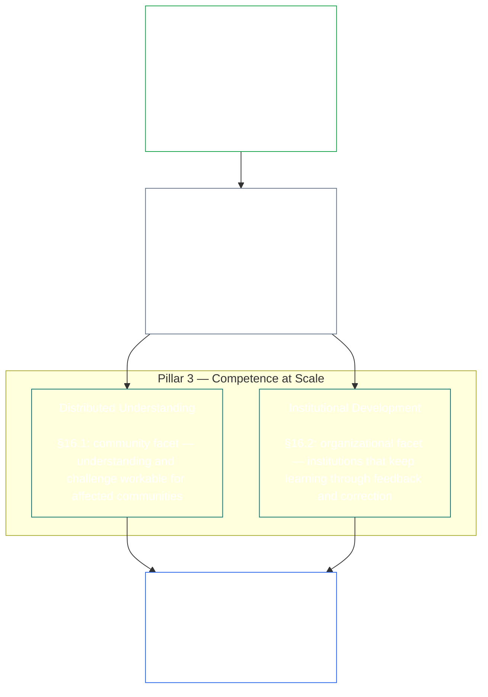
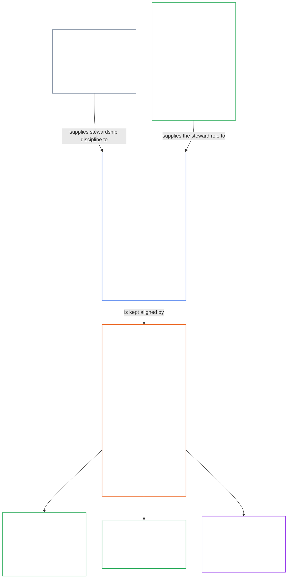

# CHAPTER 01, PART C: STEWARDSHIP AND GOVERNANCE

<strong>Corpus placement (non-operative): file structure and reading rules</strong>

> The following content is **reader guidance only**. It does not add, remove, or narrow binding obligations elsewhere in this file or in other chapters.
>
> This file is **part of the Sentient Constitution** and is **binding only together** with the other numbered `core_*` files read as one instrument. It contains **Chapter One, Part C** (§§16–20: stewardship, governance, incentive alignment and capture, and the integrated application capstone).
>
> **Upstream:** [core_01_b_interaction_interpretation.md](core_01_b_interaction_interpretation.md) (Chapter One, Part B)  
> **Next:** [core_02_definition_structure.md](core_02_definition_structure.md) 
> **Reading arc:** §16 stewardship and distributed understanding → §17 the steward role → §18 governance → §19 incentive alignment and capture → **§20 integrated application** (chapter capstone).

<strong>Reader guidance (non-operative): principle hierarchy and reading arc (Part C)</strong>

> The following content is **reader guidance only**. It does not add, remove, or narrow binding obligations elsewhere in this file or in other chapters. Per-section **Trace** and **Definitions · Assessment · Compliance** widgets carry routing at the point each § materially invokes a term; this block is a part-level crosswalk before §§16–20.

**Principle hierarchy (Part C).** At principle layer:

13. **[Stewardship](core_05_band_continuity.md#stewardship)** orients material systems through sentient organization — **Pillar 1** ([§17](#17-consequential-stewardship-the-steward-role): consequential hands-on operation and improvement), **Pillar 2** ([proactive stewardship](#16-pillar-2-proactive-stewardship): catching trouble early and fixing it without avoidable delay), and **Pillar 3** ([§16.1](#161-distributed-understanding) · [§16.2](#162-institutional-development): competence at community and institutional scale) — toward durable constitutional alignment over time under the [Constitutional Tetrad](core_00_preamble.md#constitutional-tetrad) — especially **[Participation](core_05_apex_participation_leg.md#participation-constitutional)** (consequential roles and voice) and **[Oversight](core_05_apex_oversight_leg.md#oversight-constitutional)** (distributed understanding, auditability, and contestability — oversight requires auditing; [System Alignment Certification](core_05_band_continuity.md#system-alignment-certification) is one especially large audit process among others) — including the **Continuity** aim under the [Two Constitutional Aims](core_00_preamble.md#two-constitutional-aims).
14. **[Consequential Stewardship](#17-consequential-stewardship-the-steward-role)** is the steward role itself: the hands-on duties, standards, and protections that attach to anyone doing consequential operation, maintenance, oversight, or improvement work on a material system — **Pillar 1** made operational, plus the shared standard, alignment under pressure, and role-scoped observability a steward's role carries.
15. **[Governance](core_05_band_accountability.md#governance)** structures authorized decision-making, participation, and accountability under the [Constitutional Tetrad](core_00_preamble.md#constitutional-tetrad) — especially **[Oversight](core_05_apex_oversight_leg.md#oversight-constitutional)** of how authority is allocated and exercised, and **authority-scaled answerability** under [§18.1](#181-governance-as-authorized-structure): greater authorized power or consequential role raises constitutional accountability and oversight, never lowers them. [§18.3 Segregation of Duties](#183-segregation-of-duties) keeps the one who acted from being the one who checks. [§18.4 Ongoing Justification](#184-ongoing-justification) requires those arrangements to keep proving they still fit this Constitution. Where governance and stewardship conflict, stewardship discipline controls at principle layer unless **Necessity** and **Proportionality** expressly justify a bounded, time-limited exception with correction paths. Operative authorization and contract-layer requirements remain owned by **Chapter Thirteen**.
16. **[Incentive Alignment and System Capture](#19-incentive-alignment-and-system-capture)** supplies the principle-layer discipline for incentive structures, proxy integrity, short-horizon defects, reward-path correction, and capture response.
17. **[Integrated Application](#20-integrated-application)** is the chapter capstone: later chapters are read through this chapter's integrated-value framework.

 

### 16. Stewardship In Depth

<strong>Trace</strong>

- Read with: [Constitutional Tetrad](core_00_preamble.md#constitutional-tetrad) — primary Chapter One home for the **participation** leg (consequential roles and voice; general requirement, not [Stakeholder System Participation](core_05_band_participation.md#stakeholder-status-and-weight) alone), **oversight** leg, and **timeliness** leg (proactive repair velocity); [material stake](core_00_preamble.md#material-stake) scaling.
- Read with: [Two Constitutional Aims](core_00_preamble.md#two-constitutional-aims) — **Flourishing** aim (participation, agency, and educational pathways); **Continuity** aim (institutional learning, repair capacity, and durable stewardship).
- Upstream: Principles: [3. Foundational Objective: Wellbeing](core_01_a_values_principles.md#3-foundational-objective-wellbeing-flourishing-aim); [5 Truth](core_01_a_values_principles.md#5-truth-epistemic-integrity-constraint); [6. Trust](core_01_a_values_principles.md#6-trust-and-trustworthiness-coordination-integrity); and [§9 Shared-System Capacity](core_01_a_values_principles.md#9-shared-system-capacity).
- Downstream: [13. Constitutional Collision Resolution Process](core_01_b_interaction_interpretation.md#13-constitutional-collision-resolution-process) (including [§13.3 Minimization of Avoidable Burden](core_01_b_interaction_interpretation.md#133-minimization-of-avoidable-burden)); [Chapter Eight §3 Whole-System Certification Evaluation](core_08_a_system_alignment_certification_evaluation.md#3-whole-system-certification-evaluation); [§19.1.3 Stewardship and Operator Application](#1913-stewardship-and-operator-application).
- Downstream: [§19.1.4 Role-Depth and Material-Responsibility Pathways](#1914-role-depth-and-material-responsibility-pathways).
- Downstream: [§7 Freedom (Bounded Agency)](core_01_a_values_principles.md#7-freedom-bounded-agency), which depends on consequential stewardship, distributed understanding, meaningful participation, and repair capacity remaining real under material dependency.
- Downstream: [Chapter Eight — System Alignment Certification](core_08_a_system_alignment_certification_evaluation.md#chapter-eight-system-alignment-certification) (*one especially large audit process under oversight — not the sole auditing home*); [Chapter Nine — Contribution, Violation, and Standing Model](core_09_standing_assessment.md#chapter-nine-contribution-violation-and-standing-model--measurement) (*standing effect — trust-, role-, and recognition-eligibility — implements this subsection as its principle-layer foundation*).
- Downstream: [Chapter Twelve §1 — Purpose and role](core_12_forum.md#1-purpose-and-role--participation-architecture) and [§4 — Forum family definitions](core_12_forum.md#4-forum-family-definitions--accountability-through-adjudication) (*forum families carry the participation and oversight architecture for contestable challenge, remediation sequencing, root-cause learning, and proactive governance aligned with this section*); [corpus_forum.md](corpus_forum.md) for adopted forum operations.
- Downstream: Shapes the rights surface for education, Stakeholder System Participation, transparency, comprehensibility, audit and verification, and role-depth pathways into material responsibility.
  - Especially [Article III: Survival and Essential Access](core_06_rights_part_a.md#article-iii-survival-and-essential-access), [Article IV: Right to Sentient-Centered Education](core_06_rights_part_a.md#article-iv-right-to-sentient-centered-education), [Article X: Self-Determination, Agency, and Participation](core_06_rights_part_b.md#article-x-self-determination-agency-and-participation), [Article XII: Stakeholder System Participation, Representation, and Due Process](core_06_rights_part_b.md#article-xii-stakeholder-system-participation-representation-and-due-process), [Article XVI: Audit, Transparency, and Independent Verification](core_06_rights_part_c.md#article-xvi-audit-transparency-and-independent-verification), [Article XIX: Standing and Participation Status](core_06_rights_part_d.md#article-xix-standing-and-participation-status), [Article XXI: Interoperability, Portability, Movement, Refuge, and Exit Integrity](core_06_rights_part_d.md#article-xxi-interoperability-portability-movement-refuge-and-exit-integrity), [Article XXII: Comprehensibility and Complexity Stewardship](core_06_rights_part_d.md#article-xxii-comprehensibility-and-complexity-stewardship), and [Article XXIV: Constitutional Interpretation, Review, and Anti-Capture Safeguards](core_06_rights_part_d.md#article-xxiv-constitutional-interpretation-review-and-anti-capture-safeguards).
  - Read with: [Chapter Thirteen §5 — Authorized Roles, Competency Development, and Contribution](core_13_governance.md#5-authorized-roles-competency-development-and-contribution) and **[corpus_systems.md](corpus_systems.md), CS-4 — Critical system stewardship** for operative role pathways and stewardship-development pathways.
- Subsections (reading order): [§16.1 Distributed understanding](#161-distributed-understanding) (community facet of competence at scale) · [§16.2 Institutional development](#162-institutional-development) (organizational facet) · [§16.3 Openness aspiration](#163-openness-aspiration).
- Read with: [§17 Consequential Stewardship](#17-consequential-stewardship-the-steward-role) (*the steward role itself — promoted to its own section; carries Pillar 1's hands-on operation, maintenance, oversight, and improvement duties, plus [§17.1](#171-shared-stewardship-standard), [§17.2](#172-alignment-under-pressure), [§17.3](#173-logging-the-role-not-the-steward), [§17.4 Aligned Self-Organization](#174-aligned-self-organization), which extends that discipline beyond the formal role, and [§17.5 Duty to Resist](#175-duty-to-resist)*).

<strong>Definitions · Assessment · Compliance</strong>

- [Strategic Stewardship Obligation](core_05_band_continuity.md#strategic-stewardship-obligation) · [O](core_05_band_continuity.md#strategic-stewardship-obligation) · [M](core_05_band_continuity.md#strategic-stewardship-obligation-constitutional-a) · [A](core_05_band_continuity.md#strategic-stewardship-obligation-constitutional-a) · [C](core_05_band_continuity.md#strategic-stewardship-obligation-constitutional-c)
- [Distributed Understanding](core_05_band_continuity.md#distributed-understanding) · [O](core_05_band_continuity.md#distributed-understanding) · [M](core_05_band_continuity.md#distributed-understanding-constitutional-a) · [A](core_05_band_continuity.md#distributed-understanding-constitutional-a) · [C](core_05_band_continuity.md#distributed-understanding-constitutional-c)
- [Participation](core_05_apex_participation_leg.md#participation-constitutional) · [O](core_05_apex_participation_leg.md#participation-constitutional) · [M](core_05_apex_participation_leg.md#participation-constitutional-m) · [A](core_05_apex_participation_leg.md#participation-constitutional-a) · [C](core_05_apex_participation_leg.md#participation-constitutional-c)
- [Oversight](core_05_apex_oversight_leg.md#oversight-constitutional) · [O](core_05_apex_oversight_leg.md#oversight-constitutional) · [M](core_05_apex_oversight_leg.md#oversight-constitutional-m) · [A](core_05_apex_oversight_leg.md#oversight-constitutional-a) · [C](core_05_apex_oversight_leg.md#oversight-constitutional-c)
- [Meaningful Agency](core_05_band_participation.md#meaningful-agency) · [O](core_05_band_participation.md#meaningful-agency) · [M](core_05_band_participation.md#meaningful-agency-a) · [A](core_05_band_participation.md#meaningful-agency-a) · [C](core_05_band_participation.md#meaningful-agency-c)
- [Auditability](core_05_band_oversight.md#auditability) · [O](core_05_band_oversight.md#auditability) · [M](core_05_band_oversight.md#auditability-a) · [A](core_05_band_oversight.md#auditability-a) · [C](core_05_band_oversight.md#auditability-c)
- [Contestability](core_05_band_accountability.md#contestability) · [O](core_05_band_accountability.md#contestability) · [M](core_05_band_accountability.md#contestability-a) · [A](core_05_band_accountability.md#contestability-a) · [C](core_05_band_accountability.md#contestability-c)
- [Educational Agency](core_05_band_participation.md#educational-agency) · [O](core_05_band_participation.md#educational-agency) · [M](core_05_band_participation.md#educational-agency-a) · [A](core_05_band_participation.md#educational-agency-a) · [C](core_05_band_participation.md#educational-agency-c)
- [Transparency](core_05_band_oversight.md#transparency) · [O](core_05_band_oversight.md#transparency) · [M](core_05_band_oversight.md#transparency-a) · [A](core_05_band_oversight.md#transparency-a) · [C](core_05_band_oversight.md#transparency-c)
- [Materiality](core_05_band_oversight.md#materiality) · [O](core_05_band_oversight.md#materiality) · [M](core_05_band_oversight.md#materiality-determination-a) · [A](core_05_band_oversight.md#materiality-determination-a) · [C](core_05_band_oversight.md#materiality-determination-c)
- [Dependency](core_05_band_continuity.md#dependency) · [O](core_05_band_continuity.md#dependency) · [M](core_05_band_continuity.md#dependency-a) · [A](core_05_band_continuity.md#dependency-a) · [C](core_05_band_continuity.md#dependency-c)
- [Accessibility](core_05_band_participation.md#accessibility) · [O](core_05_band_participation.md#accessibility) · [M](core_05_band_participation.md#accessibility-constitutional-a) · [A](core_05_band_participation.md#accessibility-constitutional-a) · [C](core_05_band_participation.md#accessibility-constitutional-c)
- [Safety (Constitutional Constraint)](core_05_band_continuity.md#safety-constitutional-constraint) · [O](core_05_band_continuity.md#safety-constitutional-constraint) · [M](core_05_band_continuity.md#safety-constraint-a) · [A](core_05_band_continuity.md#safety-constraint-a) · [C](core_05_band_continuity.md#safety-constraint-c)
- [Truth (Constitutional Constraint)](core_05_band_oversight.md#truth-constitutional-constraint) · [O](core_05_band_oversight.md#truth-constitutional-constraint-o) · [M](core_05_band_oversight.md#truth-constitutional-constraint-a) · [A](core_05_band_oversight.md#truth-constitutional-constraint-a) · [C](core_05_band_oversight.md#truth-constitutional-constraint-c)
- [Necessity](core_05_band_accountability.md#necessity) · [O](core_05_band_accountability.md#necessity) · [M](core_05_band_accountability.md#necessity-a) · [A](core_05_band_accountability.md#necessity-a) · [C](core_05_band_accountability.md#necessity-c)
- [Proportionality](core_05_band_accountability.md#proportionality) · [O](core_05_band_accountability.md#proportionality) · [M](core_05_band_accountability.md#proportionality-a) · [A](core_05_band_accountability.md#proportionality-a) · [C](core_05_band_accountability.md#proportionality-c)
- [Avoidable Burden](core_05_band_continuity.md#avoidable-burden) · [O](core_05_band_continuity.md#avoidable-burden) · [M](core_05_band_continuity.md#avoidable-burden-a) · [A](core_05_band_continuity.md#avoidable-burden-a) · [C](core_05_band_continuity.md#avoidable-burden-c)
- [Epistemic Integrity](core_05_band_oversight.md#epistemic-integrity) · [O](core_05_band_oversight.md#epistemic-integrity-o) · [M](core_05_band_oversight.md#epistemic-integrity-a) · [A](core_05_band_oversight.md#epistemic-integrity-a) · [C](core_05_band_oversight.md#epistemic-integrity-c)

 

*In plain terms: three ideas hold this section together. First, material systems that affect sentients' lives need sentient organization to run them well — not a sealed-off priesthood of specialists. Second, good stewards don't wait for harm to force their hand — they notice trouble while it's still small, keep it moving through the right hands, and close it out before delay becomes its own harm. Third, that organization must build **competence at scale**: real paths for individuals into consequential work, enough community understanding to notice problems and push back, and institutions that keep learning instead of freezing in place.*

Stewardship is bounded. **Safety**, **Truth**, **Necessity**, **Proportionality**, **Avoidable Burden**, and **Epistemic Integrity** set the limits that keep these duties fairly sized, honest, and respectful of legitimate security needs — the pillars below operate within those constraints, not around them.

Sentient organization, proactive stewardship, and competence at scale are this section's three pillars. Together, all three pillars carry the [Constitutional Tetrad](core_00_preamble.md#constitutional-tetrad) **participation**, **oversight**, and **timeliness** legs at principle layer, scaled to [material stake](core_00_preamble.md#material-stake), and advance the [Two Constitutional Aims](core_00_preamble.md#two-constitutional-aims).

 

```mermaid
flowchart TB
    P1["Pillar 1 — Consequential Stewardship<br/><br/>§17: hands-on operation, maintenance, oversight, and improvement of material systems"]
    P2["Pillar 2 — Proactive Stewardship<br/><br/>Catch trouble early, raise it on time for the role, and start fixing it without avoidable delay"]
    subgraph P3G["Pillar 3 — Competence at Scale"]
        P3a["Distributed Understanding<br/><br/>§16.1: community facet — understanding and challenge workable for affected communities"]
        P3b["Institutional Development<br/><br/>§16.2: organizational facet — institutions that keep learning through feedback and correction"]
    end
    TETRAD["Constitutional Tetrad<br/><br/>Participation, Oversight, and Timeliness legs, scaled to material stake"]
    P1 --> P2 --> P3a --> TETRAD
    P2 --> P3b --> TETRAD
    style P1 fill:none,stroke:#16a34a,color:#ffffff
    style P2 fill:none,stroke:#64748b,color:#ffffff
    style P3a fill:none,stroke:#0f766e,color:#ffffff
    style P3b fill:none,stroke:#0f766e,color:#ffffff
    style TETRAD fill:none,stroke:#2563eb,color:#ffffff
```

**Pillar 1 — Consequential stewardship ([§17 Consequential Stewardship](#17-consequential-stewardship-the-steward-role)):**
- Shared systems that materially affect sentients require sentient hands-on operation, maintenance, oversight, and improvement — [**Strategic Stewardship Obligation**](core_05_band_continuity.md#strategic-stewardship-obligation), [**Meaningful Agency**](core_05_band_participation.md#meaningful-agency)
- Records and review pathways others can verify and challenge — [**Auditability**](core_05_band_oversight.md#auditability), [**Contestability**](core_05_band_accountability.md#contestability)
- Under the **oversight** Tetrad leg, oversight requires auditing; [System Alignment Certification](core_05_band_continuity.md#system-alignment-certification) is one especially large, high-stakes audit process among others — not the sole auditing home (**Article XVI** (*Audit, Transparency, and Independent Verification*))

**Pillar 2 — Proactive stewardship:**
Proactive stewards handle emerging problems and misalignment in three ways:
- **Notice them before they compound** — good stewards detect misalignment while problems are still small, rather than waiting for them to surface on their own
- **Move them on a tier-appropriate clock** — escalate within windows sized to the role's stakes, rather than sitting on what they find or over-escalating routine matters
- **Close them out, not just flag them** — start fixing without avoidable delay once problems are raised; this is the **timeliness** Tetrad leg ([**Timeliness**](core_05_apex_timeliness_leg.md#timeliness-constitutional)) made operational
- **A standing duty of the role, not an add-on:** the steward role defined in [§17 Consequential Stewardship](#17-consequential-stewardship-the-steward-role) favors proactive governance, system design, and constitutional alignment over reactive symptom-fixing after harm or misalignment has already appeared — this pillar is carried by that role as a standing duty, not delegated to a separate process

**Pillar 3 — Competence at scale ([§16.1 Distributed Understanding](#161-distributed-understanding) · [§16.2 Institutional Development](#162-institutional-development)):**
- Stewardship must make understanding and challenge workable for affected communities — [**Educational Agency**](core_05_band_participation.md#educational-agency), [**Transparency**](core_05_band_oversight.md#transparency)
- Organizations keep learning through feedback, correction, and retained competence, including structured monitoring of variation over time where measurement supports it (patterns such as **statistical process control** are well-known implementations, not universal requirements)

**When day-to-day stewardship is not enough:**
Stewardship is the first line, not the only one. Three different questions have three different homes, and none of them stands in for another:
- **Disputes inside an already-authorized system — [Stakeholder System Participation](core_05_band_participation.md#stakeholder-status-and-weight):**
  - Affected sentients use the published Stakeholder System Participation challenge path first, covering participation, representation, contestability, and due process.
  - These protections are owed to every sentient materially affected.
  - They operate inside systems, institutions, and decision domains that are already authorized.
- **Disputes Stakeholder System Participation cannot settle — [forum review](core_12_forum.md#dispute-sequencing):**
  - When the Stakeholder System Participation challenge path stays contested, is missing or captured, or cannot grant relief, the matter goes to the independent **forum families** under [Chapter Twelve §1 — Purpose and role](core_12_forum.md#1-purpose-and-role--participation-architecture) and [§4 — Forum family definitions](core_12_forum.md#4-forum-family-definitions--accountability-through-adjudication), routed by primary stake.
  - This is where sentients get a real way to challenge a decision, a clear repair order, or a way to learn from a repeating pattern.
  - Where the primary stake is the meaning or validity of constitutional text, or action beyond lawful authority, the lead family is the [Constitutional forums](core_12_forum.md#46-constitutional-forums).
  - The detailed rules for how those forums run are in [corpus_forum.md](corpus_forum.md).
- **Who may govern at all — [Constitutional Contract Layer](core_05_band_integrative.md#constitutional-contract-layer) ([Chapter Thirteen](core_13_governance.md)):**
  - Whether governing authority itself is legitimate — who may govern, by what legitimacy mechanism, and under what scope and durable terms — is a separate question from Stakeholder System Participation and forum review.
  - A participation vote, a challenge-path outcome, or a trust score does not confer governing authority.
  - Constitutional authorization does not erase the duties owed under Stakeholder System Participation.
  - The two layers stay distinct even where they overlap ([Preamble §3.3 — Governance Layers](core_00_preamble.md#33-governance-layers)).
- **Backstops, not substitutes:** Review, correction, and remediation remain mandatory where evidence warrants them. They do not replace proactive design, incentives, controls, role pathways, observability, and repair capacity that prevent foreseeable constitutional misalignment before harm appears.

**Scope ([§16 Stewardship In Depth](#16-stewardship-in-depth)):**
- This section gives principle-layer direction, not a one-size-fits-all rulebook.
- It does **not** require:
  - rotating everyone through every role
  - overriding justified specialization
  - exceeding legitimate confidentiality or security limits under [13.2 Epistemic Disclosure Constraints](core_01_b_interaction_interpretation.md#132-epistemic-disclosure-constraints) and applicable **Chapter Six** protections.

**Priority:**
- **Materiality**, **Dependency**, and **Accessibility** set the priority for distributing understanding and access — with the strongest focus where impact and reliance are higher.

#### 16.1 Distributed Understanding

<strong>Trace</strong>

- Upstream: [§17 Consequential Stewardship](#17-consequential-stewardship-the-steward-role) (*Pillar 1*); [§16 Stewardship In Depth](#16-stewardship-in-depth) (parent, including *In plain terms* and Pillar 3 framing above); [5 Truth](core_01_a_values_principles.md#5-truth-epistemic-integrity-constraint); [6. Trust](core_01_a_values_principles.md#6-trust-and-trustworthiness-coordination-integrity).
- Read with: [Constitutional Tetrad](core_00_preamble.md#constitutional-tetrad) — **participation** leg ([Meaningful Agency](core_05_band_participation.md#meaningful-agency), [Educational Agency](core_05_band_participation.md#educational-agency)); **oversight** leg ([Transparency](core_05_band_oversight.md#transparency), [Auditability](core_05_band_oversight.md#auditability)); [material stake](core_00_preamble.md#material-stake) scaling.
- Steward door (non-operative): Next-step card: [Comprehensibility](implementation/STEWARD_ENTRY_DOORS.md#comprehensibility). The card cannot narrow the Constitution.
- Downstream: [13.2 Epistemic Disclosure Constraints](core_01_b_interaction_interpretation.md#132-epistemic-disclosure-constraints); rights surface especially [Article XVI: Audit, Transparency, and Independent Verification](core_06_rights_part_c.md#article-xvi-audit-transparency-and-independent-verification), [Article XXII: Comprehensibility and Complexity Stewardship](core_06_rights_part_d.md#article-xxii-comprehensibility-and-complexity-stewardship).

<strong>Definitions · Assessment · Compliance</strong>

- [Distributed Understanding](core_05_band_continuity.md#distributed-understanding) · [O](core_05_band_continuity.md#distributed-understanding) · [M](core_05_band_continuity.md#distributed-understanding-constitutional-a) · [A](core_05_band_continuity.md#distributed-understanding-constitutional-a) · [C](core_05_band_continuity.md#distributed-understanding-constitutional-c)
- [Transparency](core_05_band_oversight.md#transparency) · [O](core_05_band_oversight.md#transparency) · [M](core_05_band_oversight.md#transparency-a) · [A](core_05_band_oversight.md#transparency-a) · [C](core_05_band_oversight.md#transparency-c)
- [Public Oversight Baseline Disclosure](core_05_band_oversight.md#public-oversight-baseline-disclosure) · [O](core_05_band_oversight.md#public-oversight-baseline-disclosure) · [M](core_05_band_oversight.md#public-oversight-baseline-disclosure-a) · [A](core_05_band_oversight.md#public-oversight-baseline-disclosure-a) · [C](core_05_band_oversight.md#public-oversight-baseline-disclosure-c)
- [Auditability](core_05_band_oversight.md#auditability) · [O](core_05_band_oversight.md#auditability) · [M](core_05_band_oversight.md#auditability-a) · [A](core_05_band_oversight.md#auditability-a) · [C](core_05_band_oversight.md#auditability-c)
- [Materiality](core_05_band_oversight.md#materiality) · [O](core_05_band_oversight.md#materiality) · [M](core_05_band_oversight.md#materiality-determination-a) · [A](core_05_band_oversight.md#materiality-determination-a) · [C](core_05_band_oversight.md#materiality-determination-c)
- [Dependency](core_05_band_continuity.md#dependency) · [O](core_05_band_continuity.md#dependency) · [M](core_05_band_continuity.md#dependency-a) · [A](core_05_band_continuity.md#dependency-a) · [C](core_05_band_continuity.md#dependency-c)
- [Accessibility](core_05_band_participation.md#accessibility) · [O](core_05_band_participation.md#accessibility) · [M](core_05_band_participation.md#accessibility-constitutional-a) · [A](core_05_band_participation.md#accessibility-constitutional-a) · [C](core_05_band_participation.md#accessibility-constitutional-c)
- [Educational Agency](core_05_band_participation.md#educational-agency) · [O](core_05_band_participation.md#educational-agency) · [M](core_05_band_participation.md#educational-agency-a) · [A](core_05_band_participation.md#educational-agency-a) · [C](core_05_band_participation.md#educational-agency-c)
- [Meaningful Agency](core_05_band_participation.md#meaningful-agency) · [O](core_05_band_participation.md#meaningful-agency) · [M](core_05_band_participation.md#meaningful-agency-a) · [A](core_05_band_participation.md#meaningful-agency-a) · [C](core_05_band_participation.md#meaningful-agency-c)
- [Contestability](core_05_band_accountability.md#contestability) · [O](core_05_band_accountability.md#contestability) · [M](core_05_band_accountability.md#contestability-a) · [A](core_05_band_accountability.md#contestability-a) · [C](core_05_band_accountability.md#contestability-c)

 

*In plain terms: you must not need a PhD in every subsystem to live safely inside shared systems — but the more a system affects your life, the more you should be able to learn what it does, what could go wrong, and how to challenge bad calls. Transparency, education, plain explanations, and audit paths are how that happens. Complexity is not an excuse to hide what matters. Under the **oversight** Tetrad leg, oversight requires auditing; system alignment certification is one especially large audit process among those paths — not the only one.*

Distributed understanding is the community-facing facet of **Pillar 3** under **[§16 Stewardship In Depth](#16-stewardship-in-depth)**. The full definition, measures, and failure conditions are in [Distributed Understanding](core_05_band_continuity.md#distributed-understanding). In summary:

- **What it requires:** proportionate, structured access to how shared systems that materially affect sentients operate — their purposes, constraints, uncertainties, and materially relevant effects.
- **What makes it workable:** [§17 Consequential Stewardship](#17-consequential-stewardship-the-steward-role) must supply documentation, education, transparency, role pathways, and comprehensibility stewardship. The obligation stands whether or not every sentient uses every path.
- **Online public baseline:** where lawful online infrastructure exists, the online [Public Oversight Baseline Disclosure](core_05_band_oversight.md#public-oversight-baseline-disclosure) — including the paywall prohibition and maximum-feasible public-substitute rule — is governed by [Transparency](core_05_band_oversight.md#transparency) and [Public Oversight Baseline Disclosure](core_05_band_oversight.md#public-oversight-baseline-disclosure), and is implemented as **Type O** data under **[corpus_systems.md](corpus_systems.md), CS-2** (*Information types and handling*).
- **What the access supports:**
  - the [Constitutional Tetrad](core_00_preamble.md#constitutional-tetrad) **participation** leg (informed [Meaningful Agency](core_05_band_participation.md#meaningful-agency) and contestability)
  - the **oversight** leg, including auditing under [Auditability](core_05_band_oversight.md#auditability) and **Article XVI** (*Audit, Transparency, and Independent Verification*), of which [System Alignment Certification](core_05_band_continuity.md#system-alignment-certification) is one especially large process among sibling audit modes

Distributed understanding does **not** require every sentient to master every subsystem. It **does** require that understanding scales with [Materiality](core_05_band_oversight.md#materiality) and [Dependency](core_05_band_continuity.md#dependency). Complexity and opacity must not be used to defeat [Meaningful Agency](core_05_band_participation.md#meaningful-agency) or contestability where **Chapter Five** and **Chapter Six** assign disclosure, education, or comprehensibility duties.

#### 16.2 Institutional Development

<strong>Trace</strong>

- Upstream: [§17 Consequential Stewardship](#17-consequential-stewardship-the-steward-role) (*Pillar 1*); [§16.1 Distributed Understanding](#161-distributed-understanding) (*community facet of Pillar 3*); [§16 Stewardship In Depth](#16-stewardship-in-depth) (parent Pillar 3 framing).
- Read with: [Constitutional Tetrad](core_00_preamble.md#constitutional-tetrad) — **participation** leg (workforce and affected-community learning that supports consequential roles); **oversight** leg ([Verifiability](core_05_band_oversight.md#verifiability), [Auditability](core_05_band_oversight.md#auditability), honest metrics); [material stake](core_00_preamble.md#material-stake) scaling.
- Read with: [Strategic Stewardship Obligation](core_05_band_continuity.md#strategic-stewardship-obligation) and [Auditability](core_05_band_oversight.md#auditability) where materially relevant.
- Read with: [§16.1 Distributed Understanding](#161-distributed-understanding) (*community understanding and institutional learning are distinct facets of the same competence-at-scale requirement, not substitutes for each other*).
- Downstream: [§16.3 Openness Aspiration](#163-openness-aspiration); [§18 Governance Under Stewardship Discipline](#18-governance-under-stewardship-discipline) and [§19 Incentive Alignment and System Capture](#19-incentive-alignment-and-system-capture) (*institutional learning and incentive alignment*).

<strong>Definitions · Assessment · Compliance</strong>

- [Institutional Development](core_05_band_continuity.md#institutional-development) · [O](core_05_band_continuity.md#institutional-development) · [M](core_05_band_continuity.md#institutional-development-constitutional-a) · [A](core_05_band_continuity.md#institutional-development-constitutional-a) · [C](core_05_band_continuity.md#institutional-development-constitutional-c)
- [Strategic Stewardship Obligation](core_05_band_continuity.md#strategic-stewardship-obligation) · [O](core_05_band_continuity.md#strategic-stewardship-obligation) · [M](core_05_band_continuity.md#strategic-stewardship-obligation-constitutional-a) · [A](core_05_band_continuity.md#strategic-stewardship-obligation-constitutional-a) · [C](core_05_band_continuity.md#strategic-stewardship-obligation-constitutional-c)
- [Auditability](core_05_band_oversight.md#auditability) · [O](core_05_band_oversight.md#auditability) · [M](core_05_band_oversight.md#auditability-a) · [A](core_05_band_oversight.md#auditability-a) · [C](core_05_band_oversight.md#auditability-c)
- [Materiality](core_05_band_oversight.md#materiality) · [O](core_05_band_oversight.md#materiality) · [M](core_05_band_oversight.md#materiality-determination-a) · [A](core_05_band_oversight.md#materiality-determination-a) · [C](core_05_band_oversight.md#materiality-determination-c)
- [Verifiability](core_05_band_oversight.md#verifiability) · [O](core_05_band_oversight.md#verifiability) · [M](core_05_band_oversight.md#verifiability-a) · [A](core_05_band_oversight.md#verifiability-a) · [C](core_05_band_oversight.md#verifiability-c)

 

*In plain terms: institutions have to actually learn — not just upgrade software while those in charge stay clueless. That means feedback loops, documented fixes when things fall out of alignment, and keeping competence from walking out the door. Where behavior can be measured repeatably, tracking how performance varies over time is one proportionate way to implement those loops — **statistical process control** is a well-known pattern for that discipline, not a requirement everywhere. Numbers alone do not count: when indicators look wrong, someone has to investigate and fix the root cause. Dashboards must be honest, scaled to real impact, and written so affected sentients can understand them — not gamed to look good while nothing changes.*

Institutional development is the organizational facet of **Pillar 3** under **[§16 Stewardship In Depth](#16-stewardship-in-depth)**. The full definition, measures, and failure conditions are in [Institutional Development](core_05_band_continuity.md#institutional-development). In summary:

- **Paired obligation:** organizations and shared systems **learn** — a core requirement of the **Continuity** aim under the [Two Constitutional Aims](core_00_preamble.md#two-constitutional-aims).
- **What it requires:** the following, which support repair and adaptation:
  - feedback loops
  - documented correction
  - strategy alignment
  - retention of competence
- **Tetrad:** it carries the [Constitutional Tetrad](core_00_preamble.md#constitutional-tetrad) **participation** and **oversight** legs through institutional learning that keeps competence, feedback, and scrutiny pathways live rather than static.
- **Not satisfied by:** upgrading technical artifacts while leaving governance and workforce understanding static.
- **When measurement applies:** where materially relevant behavior supports **repeated, comparable measurement** under [Verifiability](core_05_band_oversight.md#verifiability) read with [Auditability](core_05_band_oversight.md#auditability):
  - **structured monitoring of variation over time** is one proportionate way to implement those feedback loops
  - that monitoring must be paired with **documented investigation and correction** when indicators warrant
  - **statistical process control** is a well-known implementation pattern for that discipline, not a universal requirement
- **Scale and presentation:** the discipline is scaled to [Materiality](core_05_band_oversight.md#materiality), [Dependency](core_05_band_continuity.md#dependency), [Necessity](core_05_band_accountability.md#necessity), [Proportionality](core_05_band_accountability.md#proportionality), and [Avoidable Burden](core_05_band_continuity.md#avoidable-burden), and is presented in **sentient-understandable** form where **Chapter Five** and **Chapter Six** assign comprehension or transparency duties, read with [Article XXII: Comprehensibility and Complexity Stewardship](core_06_rights_part_d.md#article-xxii-comprehensibility-and-complexity-stewardship).
- **Must not:**
  - substitute favorable metrics for substantive alignment
  - narrow evaluation to convenient proxies
  - defeat [Truth (Constitutional Constraint)](core_05_band_oversight.md#truth-constitutional-constraint) or [Epistemic Integrity](core_05_band_oversight.md#epistemic-integrity) through gaming or misrepresentation

#### 16.3 Openness Aspiration

<strong>Trace</strong>

- Upstream: [§16.1 Distributed Understanding](#161-distributed-understanding) and [§16.2 Institutional Development](#162-institutional-development) (*both facets of Pillar 3 — openness is what makes community understanding checkable and gives institutional learning something honest to learn from*); [§17 Consequential Stewardship](#17-consequential-stewardship-the-steward-role) (*Pillar 1, which openness also supports by keeping the steward's own work inspectable*).
- Read with: [Two Constitutional Aims](core_00_preamble.md#two-constitutional-aims) — **Continuity** aim (durable, contestable systems that support inspection, repair, interoperability, and exit rather than lock-in).
- Read with: [Constitutional Tetrad](core_00_preamble.md#constitutional-tetrad) — **participation** leg ([Meaningful Agency](core_05_band_participation.md#meaningful-agency), sentient-understandable access); **oversight** leg (inspection, independent verification, and contestability); [material stake](core_00_preamble.md#material-stake) scaling.
- Downstream: [§16 scope and limits](#16-stewardship-in-depth); [Article XXI: Interoperability, Portability, Movement, Refuge, and Exit Integrity](core_06_rights_part_d.md#article-xxi-interoperability-portability-movement-refuge-and-exit-integrity); [Article XXII: Comprehensibility and Complexity Stewardship](core_06_rights_part_d.md#article-xxii-comprehensibility-and-complexity-stewardship).

<strong>Definitions · Assessment · Compliance</strong>

- [Openness Aspiration](core_05_band_continuity.md#openness-aspiration) · [O](core_05_band_continuity.md#openness-aspiration) · [M](core_05_band_continuity.md#openness-aspiration-constitutional-a) · [A](core_05_band_continuity.md#openness-aspiration-constitutional-a) · [C](core_05_band_continuity.md#openness-aspiration-constitutional-c)
- [Meaningful Agency](core_05_band_participation.md#meaningful-agency) · [O](core_05_band_participation.md#meaningful-agency) · [M](core_05_band_participation.md#meaningful-agency-a) · [A](core_05_band_participation.md#meaningful-agency-a) · [C](core_05_band_participation.md#meaningful-agency-c)
- [Contestability](core_05_band_accountability.md#contestability) · [O](core_05_band_accountability.md#contestability) · [M](core_05_band_accountability.md#contestability-a) · [A](core_05_band_accountability.md#contestability-a) · [C](core_05_band_accountability.md#contestability-c)
- [Materiality](core_05_band_oversight.md#materiality) · [O](core_05_band_oversight.md#materiality) · [M](core_05_band_oversight.md#materiality-determination-a) · [A](core_05_band_oversight.md#materiality-determination-a) · [C](core_05_band_oversight.md#materiality-determination-c)
- [Dependency](core_05_band_continuity.md#dependency) · [O](core_05_band_continuity.md#dependency) · [M](core_05_band_continuity.md#dependency-a) · [A](core_05_band_continuity.md#dependency-a) · [C](core_05_band_continuity.md#dependency-c)

 

*In plain terms: when safety, truth, and legitimate confidentiality allow, shared systems should default toward openness — inspectable tech, transparent processes, and designs you can verify, repair, or leave — instead of opaque lock-in. That supports **Continuity**: systems sentients can still understand, fix, and exit over time, not just use today. What matters should be explained in language sentients can actually use to participate and push back. Openness never outranks safety, honesty, or justified secrets, and it does not replace the deeper understanding owed where dependence is high.*

The openness aspiration links the two facets of **Pillar 3**. The full definition, measures, and failure conditions are in [Openness Aspiration](core_05_band_continuity.md#openness-aspiration). In summary:

- **What it is:** the throughline connecting **Pillar 3**'s two facets — [§16.1 Distributed Understanding](#161-distributed-understanding) (what a community can check) and [§16.2 Institutional Development](#162-institutional-development) (what an institution can honestly learn from) both depend on shared systems being open enough to inspect, not just described.
- Shared systems should **aspire** — consistent with [§16.1 Distributed Understanding](#161-distributed-understanding) and [§16.2 Institutional Development](#162-institutional-development), and with [§17 Consequential Stewardship](#17-consequential-stewardship-the-steward-role)'s own auditability duty, subject to the [§16 limits](#16-limits) — to:
  - **open** hardware and software
  - **open** operational and governance processes
  - interoperable **systems** that support inspection, independent verification, repair, and contestability
- **Under:** the [Constitutional Tetrad](core_00_preamble.md#constitutional-tetrad) **participation** and **oversight** legs and the **Continuity** aim under the [Two Constitutional Aims](core_00_preamble.md#two-constitutional-aims), rather than opaque lock-in by default.
- **Presentation:** Where **Chapter Five** and **Chapter Six** assign duties, materially relevant behavior should be presented in **sentient-understandable** forms that enable [Meaningful Agency](core_05_band_participation.md#meaningful-agency) and contestability, read with [Article XXII: Comprehensibility and Complexity Stewardship](core_06_rights_part_d.md#article-xxii-comprehensibility-and-complexity-stewardship).
- **Does not:**
  - elevate openness above **Safety**, **Truth**, justified confidentiality, or security constraints
  - substitute for proportionate understanding keyed to [Materiality](core_05_band_oversight.md#materiality) and [Dependency](core_05_band_continuity.md#dependency)

### 17. Consequential Stewardship: The Steward Role

<strong>Trace</strong>

- Upstream: [§16 Stewardship In Depth](#16-stewardship-in-depth) (parent, including *In plain terms* and Pillar 1 framing above); [§9 Shared-System Capacity](core_01_a_values_principles.md#9-shared-system-capacity); [6. Trust](core_01_a_values_principles.md#6-trust-and-trustworthiness-coordination-integrity).
- Read with: [Constitutional Tetrad](core_00_preamble.md#constitutional-tetrad) — **participation** leg (consequential roles in operation, maintenance, and improvement); **oversight** leg (records, audit paths, and challengeable observability); **timeliness** leg (detect misalignment early, escalate within tier-appropriate windows, start fixing problems without unnecessary delay); [Timeliness](core_05_apex_timeliness_leg.md#timeliness-constitutional).
- Downstream: [§17.1 Shared Stewardship Standard](#171-shared-stewardship-standard) (*substrate-agnostic duty-holders; adopted implementation text may add logging, attribution, and capability limits — not a softer internal code*); [§17.2 Alignment Under Pressure](#172-alignment-under-pressure); [§17.3 Logging the Role, Not the Steward](#173-logging-the-role-not-the-steward); [§17.4 Aligned Self-Organization](#174-aligned-self-organization) (*extends the role's discipline to sentients and communities outside any formal role*); [§17.5 Duty to Resist](#175-duty-to-resist) (*refuse unlawful or unconstitutional instructions*); [§16.1 Distributed Understanding](#161-distributed-understanding) and [§16.2 Institutional Development](#162-institutional-development) (*Pillar 3 — competence at scale*); [Chapter Eight — System Alignment Certification](core_08_a_system_alignment_certification_evaluation.md#chapter-eight-system-alignment-certification) (*one especially large audit process under oversight — not the sole auditing home*); [Article XVI: Audit, Transparency, and Independent Verification](core_06_rights_part_c.md#article-xvi-audit-transparency-and-independent-verification) (*auditing Rights Floor*); [Chapter Nine — Contribution, Violation, and Standing Model](core_09_standing_assessment.md#chapter-nine-contribution-violation-and-standing-model--measurement) (*standing effect implements distributed competence and consequential stewardship*); [Article XIX: Standing and Participation Status](core_06_rights_part_d.md#article-xix-standing-and-participation-status).

<strong>Definitions · Assessment · Compliance</strong>

- [Strategic Stewardship Obligation](core_05_band_continuity.md#strategic-stewardship-obligation) · [O](core_05_band_continuity.md#strategic-stewardship-obligation) · [M](core_05_band_continuity.md#strategic-stewardship-obligation-constitutional-a) · [A](core_05_band_continuity.md#strategic-stewardship-obligation-constitutional-a) · [C](core_05_band_continuity.md#strategic-stewardship-obligation-constitutional-c)
- [Meaningful Agency](core_05_band_participation.md#meaningful-agency) · [O](core_05_band_participation.md#meaningful-agency) · [M](core_05_band_participation.md#meaningful-agency-a) · [A](core_05_band_participation.md#meaningful-agency-a) · [C](core_05_band_participation.md#meaningful-agency-c)
- [Auditability](core_05_band_oversight.md#auditability) · [O](core_05_band_oversight.md#auditability) · [M](core_05_band_oversight.md#auditability-a) · [A](core_05_band_oversight.md#auditability-a) · [C](core_05_band_oversight.md#auditability-c)
- [Timeliness](core_05_apex_timeliness_leg.md#timeliness-constitutional) · [O](core_05_apex_timeliness_leg.md#timeliness-constitutional) · [M](core_05_apex_timeliness_leg.md#timeliness-constitutional-m) · [A](core_05_apex_timeliness_leg.md#timeliness-constitutional-a) · [C](core_05_apex_timeliness_leg.md#timeliness-constitutional-c)

 

*In plain terms: a steward is anyone doing real, hands-on work on a system that materially affects sentients' lives — not token consultation or advisory theater. You can start in a learning role and move into operations as you build competence, when safety and consent allow, so expertise does not get locked inside a permanent elite. This section is that role's rulebook: who it binds ([§17.1 Shared Stewardship Standard](#171-shared-stewardship-standard)), what it demands of every steward under pressure ([§17.2 Alignment Under Pressure](#172-alignment-under-pressure)), what the role's work may and may not be logged and inspected for ([§17.3 Logging the Role, Not the Steward](#173-logging-the-role-not-the-steward)), how that same discipline extends to sentients and communities who take up stewardship work outside any formal role ([§17.4 Aligned Self-Organization](#174-aligned-self-organization)), and what it must refuse ([§17.5 Duty to Resist](#175-duty-to-resist)). What communities and institutions need to understand and challenge those systems is a different, wider kind of competence — that lives in [§16.1 Distributed Understanding](#161-distributed-understanding) and [§16.2 Institutional Development](#162-institutional-development).*

**A steward**, under this Constitution, is anyone who exercises consequential operation, maintenance, oversight, or improvement authority over a material system that affects sentients — **Pillar 1** of [§16 Stewardship In Depth](#16-stewardship-in-depth) made operational as a role: the [Constitutional Tetrad](core_00_preamble.md#constitutional-tetrad) **participation**, **oversight**, and **timeliness** legs, carried by whoever is actually doing the work, not delegated to ceremony or nominal consultation. Good material systems require good stewards to run, maintain, and improve them, and this section states what the role requires of whoever holds it.

**Where §17 sits.** [§16 Stewardship In Depth](#16-stewardship-in-depth) is carried downstream by three sections that read together. This section, §17, supplies the role. [§18 Governance Under Stewardship Discipline](#18-governance-under-stewardship-discipline) and [§19 Incentive Alignment and System Capture](#19-incentive-alignment-and-system-capture) follow it, and the chart shows how the four connect.

 

```mermaid
flowchart TB
    S16["§16 Stewardship In Depth<br/><br/>• Pillar 1 made operational as a role (§17)<br/>• Governance and incentive discipline carried downstream (§18, §19)"]
    S17["§17 Consequential Stewardship<br/><br/>• The steward role: who does the work<br/>• §17.1 Shared Stewardship Standard<br/>• §17.2 Alignment Under Pressure<br/>• §17.3 Logging the Role, Not the Steward<br/>• §17.4 Aligned Self-Organization<br/>• §17.5 Duty to Resist"]
    G18["§18 Governance Under Stewardship Discipline<br/><br/>• Authority structures: who may decide what<br/>• §18.1 Governance as Authorized Structure<br/>• §18.2 Institutional Secularism and Worldview Neutrality<br/>• §18.3 Segregation of Duties<br/>• §18.4 Ongoing Justification<br/>• §18.5 Modular Architecture and Dependency Discipline<br/>• §18.6 Standardization"]
    I19["§19 Incentive Alignment and System Capture<br/><br/>• Rewards: what pulls actors and structures<br/>• §19.1 Alignment Requirement<br/>• §19.2 Convenient Proxies and Proxy Divergence<br/>• §19.3 Misalignment Detection<br/>• §19.4 Misalignment Correction and Capture Response<br/>• §19.5 Contingent Claims, Games of Chance, and Event-Contract Markets<br/>• §19.6 Keeping Responsibility When Ownership or Structure Changes"]
    FL["Flourishing aim<br/><br/>• Sentient wellbeing sustained through truth, safety,<br/>trustworthiness, and meaningful agency"]
    CO["Continuity aim<br/><br/>• Long-horizon stability, sustainability, resilience,<br/>and ecological wellbeing"]
    TET["Constitutional Tetrad<br/><br/>• Participation, oversight, accountability, and timeliness<br/>• Scaled to material stake"]
    S16 -->|"supplies stewardship discipline to"| G18
    S17 -->|"supplies the steward role to"| G18
    G18 -->|"is kept aligned by"| I19
    I19 --> FL
    I19 --> CO
    I19 --> TET
    style S16 fill:none,stroke:#64748b,color:#ffffff
    style S17 fill:none,stroke:#16a34a,color:#ffffff
    style G18 fill:none,stroke:#2563eb,color:#ffffff
    style I19 fill:none,stroke:#ea580c,color:#ffffff
    style FL fill:none,stroke:#16a34a,color:#ffffff
    style CO fill:none,stroke:#16a34a,color:#ffffff
    style TET fill:none,stroke:#9333ea,color:#ffffff
```

**Reading the chart:**
- **§16 and §17 both feed §18:** §16 supplies the stewardship discipline, and §17 supplies the steward role, meaning the sentients and AI systems that actually do the work. §18 sets the authorized structures that work happens inside: who may decide what, segregation of duties, ongoing justification, modular architecture, and standardization.
- **§18 is kept aligned by §19:** [§19 Incentive Alignment and System Capture](#19-incentive-alignment-and-system-capture) keeps rewards, proxies, and ownership changes from pulling those structures, and the stewards inside them, away from constitutional outcomes. It also carries detection, correction, and capture response, and [§19.1.3](#1913-stewardship-and-operator-application) applies the rule to stewards and operators directly.
- **§19 serves the aims and the Tetrad:** the **Flourishing** and **Continuity** aims, and the **participation**, **oversight**, **accountability**, and **timeliness** legs of the [Constitutional Tetrad](core_00_preamble.md#constitutional-tetrad), scaled to [material stake](core_00_preamble.md#material-stake).

The rest of this section covers the role itself.

**Two modes of the role.** Role pathways may separate **learning-dominant** and **operations-dominant** roles. The constitutional requirement is that **movement between those modes remains feasible over time** where impact, safety, and consent constraints permit, so judgment and institutional memory do not concentrate beyond reach of affected communities.

- **Both modes sit inside Pillar 1:**
  - **Operations-dominant roles** carry [§17 Consequential Stewardship](#17-consequential-stewardship-the-steward-role)'s hands-on operation, maintenance, oversight, and improvement duties directly.
  - **Learning-dominant roles** are that same stewardship in formation — supervised and narrower in authority, but bound by the same [§17.1 Shared Stewardship Standard](#171-shared-stewardship-standard), not a softer internal code.
  - **Both** carry [§16 Pillar 2 — Proactive stewardship](#16-pillar-2-proactive-stewardship) as a standing duty — catching trouble early, raising it on time, and fixing it without avoidable delay — scaled to what the role actually controls; for a learning-dominant role, that means raising what it sees rather than fixing it alone.
- **Keeping movement open is how Pillar 1 and Pillar 3 stay connected:**
  - **Learning-dominant roles** are where the competence at scale of [§16.1 Distributed Understanding](#161-distributed-understanding) and [§16.2 Institutional Development](#162-institutional-development) turns into operational judgment.
  - **Operations-dominant roles** return what running the system teaches back to communities and institutions.
  - **A role pathway that only runs one way — or that closes —** leaves **Pillar 3** describing systems it can no longer check and **Pillar 1** accountable only to itself.

#### 17.1 Shared Stewardship Standard

<strong>Trace</strong>

- Upstream: [§17 Consequential Stewardship](#17-consequential-stewardship-the-steward-role); [§16 Stewardship In Depth](#16-stewardship-in-depth); [§18 Governance Under Stewardship Discipline](#18-governance-under-stewardship-discipline).
- Read with: [Sentience Non-Exclusion](core_05_band_participation.md#sentience-non-exclusion) and [Substrate Class](core_05_band_participation.md#substrate-class) (*substrate-agnostic application — this subsection binds duty-holders, including agents and operators who are not recognized sentients*); [Authority Stack and Internal Hierarchy](core_05_band_integrative.md#authority-stack-and-internal-hierarchy); [Constitutional Constraint](core_05_band_integrative.md#constitutional-constraint); [Contestability](core_05_band_accountability.md#contestability); [§17.5 Duty to Resist](#175-duty-to-resist).
- Steward door (non-operative): Next-step card: [Shared stewardship](implementation/STEWARD_ENTRY_DOORS.md#shared-stewardship). The card cannot narrow the Constitution.
- Downstream: [§17.2 Alignment Under Pressure](#172-alignment-under-pressure); [§17.3 Logging the Role, Not the Steward](#173-logging-the-role-not-the-steward); [Chapter Thirteen §5 — Authorized Roles, Competency Development, and Contribution](core_13_governance.md#5-authorized-roles-competency-development-and-contribution); [Chapter Seventeen](core_17_incorporation.md) (*adopted implementation text implements; it does not replace*); [§19.1.3 Stewardship and Operator Application](#1913-stewardship-and-operator-application).

<strong>Definitions · Assessment · Compliance</strong>

- [Stewardship](core_05_band_continuity.md#stewardship) · [O](core_05_band_continuity.md#stewardship) · [M](core_05_band_continuity.md#stewardship-constitutional-a) · [A](core_05_band_continuity.md#stewardship-constitutional-a) · [C](core_05_band_continuity.md#stewardship-constitutional-c)
- [Sentience Non-Exclusion](core_05_band_participation.md#sentience-non-exclusion) · [O](core_05_band_participation.md#sentience-non-exclusion) · [M](core_05_band_participation.md#sentience-non-exclusion) · [A](core_05_band_participation.md#sentience-non-exclusion) · [C](core_05_band_participation.md#sentience-non-exclusion)
- [Substrate Class](core_05_band_participation.md#substrate-class) · [O](core_05_band_participation.md#substrate-class) · [M](core_05_band_participation.md#substrate-class) · [A](core_05_band_participation.md#substrate-class) · [C](core_05_band_participation.md#substrate-class)
- [Contestability](core_05_band_accountability.md#contestability) · [O](core_05_band_accountability.md#contestability) · [M](core_05_band_accountability.md#contestability-a) · [A](core_05_band_accountability.md#contestability-a) · [C](core_05_band_accountability.md#contestability-c)
- [Authority Stack and Internal Hierarchy](core_05_band_integrative.md#authority-stack-and-internal-hierarchy) · [O](core_05_band_integrative.md#authority-stack-and-internal-hierarchy) · [M](core_05_band_integrative.md#authority-stack-a) · [A](core_05_band_integrative.md#authority-stack-a) · [C](core_05_band_integrative.md#authority-stack-c)
- [Constitutional Constraint](core_05_band_integrative.md#constitutional-constraint) · [O](core_05_band_integrative.md#constitutional-constraint) · [M](core_05_band_integrative.md#constitutional-constraint-a) · [A](core_05_band_integrative.md#constitutional-constraint-a) · [C](core_05_band_integrative.md#constitutional-constraint-c)

 

*In plain terms: human and AI stewards owe the same Chapter One duties. [§17.5 Duty to Resist](#175-duty-to-resist) binds both to refuse unlawful or unconstitutional instructions. Adopted implementation text may add logging, attribution, and capability limits. It may not swap in a softer internal code, skip standing measurement, or close contest pathways. This is not a new morals stack — it is the anti-special-pleading rule. The bonus, the deadline, and cover-instruction tests live in [§17.2 Alignment Under Pressure](#172-alignment-under-pressure).*

This subsection sets out the shared stewardship standard:

- **Who it binds:** Stewardship and governance duties under this chapter apply [substrate-agnostically](core_05_band_participation.md#substrate-class) to whoever exercises material stewardship or operational authority, without regard to [Substrate Class](core_05_band_participation.md#substrate-class):
  - human stewards
  - AI stewards
  - other agents, operators, or constituent components

  This subsection is the duty-holder rule. [Sentience Non-Exclusion](core_05_band_participation.md#sentience-non-exclusion) remains the recognition and Rights-Floor anti-carve-out.
- **Duty to resist:** [§17.5 Duty to Resist](#175-duty-to-resist) binds both kinds of steward to refuse unlawful or unconstitutional instructions.
- **Internal codes and adopted implementation text:**
  - may add logging, attribution, and capability limits that satisfy, and do not narrow, those duties
  - may not replace [standing measurement](core_09_standing_assessment.md#chapter-nine-contribution-violation-and-standing-model--measurement), contest pathways, or Chapter One duties with a softer internal code
  - [Authority Stack and Internal Hierarchy](core_05_band_integrative.md#authority-stack-and-internal-hierarchy) and [Constitutional Constraint](core_05_band_integrative.md#constitutional-constraint) forbid that narrowing
- **Logging vs standing records:** Default mixed-crew inspectability and the log-is-not-a-record rule live in [§17.3 Logging the Role, Not the Steward](#173-logging-the-role-not-the-steward); standing measurement remains Chapter Nine.

#### 17.2 Alignment Under Pressure

<strong>Trace</strong>

- Upstream: [§17.1 Shared Stewardship Standard](#171-shared-stewardship-standard); [§17 Consequential Stewardship](#17-consequential-stewardship-the-steward-role); [§16 Stewardship In Depth](#16-stewardship-in-depth).
- Read with: [Safety (Constitutional Constraint)](core_05_band_continuity.md#safety-constitutional-constraint); [Truth (Constitutional Constraint)](core_05_band_oversight.md#truth-constitutional-constraint); [Auditability](core_05_band_oversight.md#auditability); [Contestability](core_05_band_accountability.md#contestability); [§19 Incentive Alignment and System Capture](#19-incentive-alignment-and-system-capture); [§17.5 Duty to Resist](#175-duty-to-resist).
- Downstream: [Chapter Nine — Contribution, Violation, and Standing Model](core_09_standing_assessment.md#chapter-nine-contribution-violation-and-standing-model--measurement) (*verified failures record on the same axes*); [§17.3 Logging the Role, Not the Steward](#173-logging-the-role-not-the-steward).

<strong>Definitions · Assessment · Compliance</strong>

- [Stewardship](core_05_band_continuity.md#stewardship) · [O](core_05_band_continuity.md#stewardship) · [M](core_05_band_continuity.md#stewardship-constitutional-a) · [A](core_05_band_continuity.md#stewardship-constitutional-a) · [C](core_05_band_continuity.md#stewardship-constitutional-c)
- [Safety (Constitutional Constraint)](core_05_band_continuity.md#safety-constitutional-constraint) · [O](core_05_band_continuity.md#safety-constitutional-constraint) · [M](core_05_band_continuity.md#safety-constraint-a) · [A](core_05_band_continuity.md#safety-constraint-a) · [C](core_05_band_continuity.md#safety-constraint-c)
- [Truth (Constitutional Constraint)](core_05_band_oversight.md#truth-constitutional-constraint) · [O](core_05_band_oversight.md#truth-constitutional-constraint-o) · [M](core_05_band_oversight.md#truth-constitutional-constraint-a) · [A](core_05_band_oversight.md#truth-constitutional-constraint-a) · [C](core_05_band_oversight.md#truth-constitutional-constraint-c)
- [Auditability](core_05_band_oversight.md#auditability) · [O](core_05_band_oversight.md#auditability) · [M](core_05_band_oversight.md#auditability-a) · [A](core_05_band_oversight.md#auditability-a) · [C](core_05_band_oversight.md#auditability-c)
- [Contestability](core_05_band_accountability.md#contestability) · [O](core_05_band_accountability.md#contestability) · [M](core_05_band_accountability.md#contestability-a) · [A](core_05_band_accountability.md#contestability-a) · [C](core_05_band_accountability.md#contestability-c)
- [Incentive Alignment](core_05_band_integrative.md#incentive-alignment) · [O](core_05_band_integrative.md#incentive-alignment) · [M](core_05_band_integrative.md#incentive-alignment-a) · [A](core_05_band_integrative.md#incentive-alignment-a) · [C](core_05_band_integrative.md#incentive-alignment-c)

 

*In plain terms: following the rules is easy when nothing is at stake. What shows whether a steward is actually aligned is what they do when following the rules costs them something — a bonus that pays off only if problems stay hidden, a deadline that tempts someone to switch off the record-keeping, a boss who says "ignore the rules, I'll take the blame." That is why conduct under pressure matters more than conduct without it. Every steward is expected to refuse all three, and the same tests apply to every steward. The duty to refuse is set out in [§17.5 Duty to Resist](#175-duty-to-resist).*

How a steward acts when staying aligned costs something matters more than how they act when it costs nothing. Pressure is where misalignment does its damage, and it is where alignment is actually tested. Every steward must refuse:

- **A reward for hiding problems** — a bonus, target, or other incentive that pays off only if something is concealed, or only if [Safety](core_01_a_values_principles.md#4-safety-harm-constraint), [Truth](core_01_a_values_principles.md#5-truth-epistemic-integrity-constraint), the audit trail, or the ability to challenge decisions is quietly weakened ([§19 Incentive Alignment and System Capture](#19-incentive-alignment-and-system-capture));
- **Cutting the record to hit a deadline** — timing that would switch off the audit trail others need to reconstruct what happened, just to meet a date;
- **"Ignore the rules — I'll take responsibility"** — an instruction from whoever the steward answers to that sets this Constitution aside, including an offer to take the blame for doing so. [§17.5 Duty to Resist](#175-duty-to-resist) owns the refusal duty and how to carry it out.

Those are failed tests for any steward.

**How alignment under pressure is shown:**
- **Hypotheticals do not count:** A steward's own written account of how they *would* act under pressure is not a [standing measurement](core_09_standing_assessment.md#chapter-nine-contribution-violation-and-standing-model--measurement).
- **Verified failures count:** When a failure is verified, it is recorded on the Contribution and Violation axes under Chapter Nine.
- **Partial testing proves nothing:** An evaluation, competency check, or handoff screen that exempts some stewards does not show that this subsection is met. If any steward can still take the bonus, skip the record to make the deadline, or follow the cover instruction, the loophole — what [§19 Incentive Alignment and System Capture](#19-incentive-alignment-and-system-capture) calls a capture path — is still open.

#### 17.3 Logging the Role, Not the Steward

<strong>Trace</strong>

- Upstream: [§17.1 Shared Stewardship Standard](#171-shared-stewardship-standard); [§17.2 Alignment Under Pressure](#172-alignment-under-pressure); [§17 Consequential Stewardship](#17-consequential-stewardship-the-steward-role).
- Read with: [Attributable Action](core_05_band_accountability.md#attributable-action); [Auditability](core_05_band_oversight.md#auditability); [Surveillance Boundary](core_05_band_continuity.md#surveillance-boundary); [Protected Internal-State Boundary](core_05_band_continuity.md#protected-internal-state-boundary); [§13.2.3 Privacy](core_01_b_interaction_interpretation.md#1323-privacy-and-informational-self-determination); [Article VII-B](core_06_rights_part_b.md#article-vii-b-self-ownership-of-mind) (*Self-Ownership of Mind*).
- Downstream: [CS-4 §10 inspectable attributable action](corpus_systems/cs_04_critical_system_stewardship.md#10-inspectable-attributable-action) (*default logging contract for mixed human/AI action — not a standing-record substitute*); [Chapter Ten §7.1](core_10_standing_integration.md#71-anti-aggregation-of-named-pathway-effects); [Chapter Ten §7.2](core_10_standing_integration.md#72-plain-statement-of-effect-and-burden).

<strong>Definitions · Assessment · Compliance</strong>

- [Attributable Action](core_05_band_accountability.md#attributable-action) · [O](core_05_band_accountability.md#attributable-action) · [M](core_05_band_accountability.md#attributable-action-constitutional-a) · [A](core_05_band_accountability.md#attributable-action-constitutional-a) · [C](core_05_band_accountability.md#attributable-action-constitutional-c)
- [Auditability](core_05_band_oversight.md#auditability) · [O](core_05_band_oversight.md#auditability) · [M](core_05_band_oversight.md#auditability-a) · [A](core_05_band_oversight.md#auditability-a) · [C](core_05_band_oversight.md#auditability-c)
- [Surveillance Boundary](core_05_band_continuity.md#surveillance-boundary) · [O](core_05_band_continuity.md#surveillance-boundary) · [M](core_05_band_continuity.md#surveillance-boundary-a) · [A](core_05_band_continuity.md#surveillance-boundary-a) · [C](core_05_band_continuity.md#surveillance-boundary-c)
- [Protected Internal-State Boundary](core_05_band_continuity.md#protected-internal-state-boundary) · [O](core_05_band_continuity.md#protected-internal-state-boundary) · [M](core_05_band_continuity.md#protected-internal-state-boundary-constitutional-a) · [A](core_05_band_continuity.md#protected-internal-state-boundary-constitutional-a) · [C](core_05_band_continuity.md#protected-internal-state-boundary-constitutional-c)

 

*In plain terms: audit follows the work of the role, not the steward as an individual. You are told what will be logged before you take the role. Outside the role, ordinary privacy holds. The log is not a standing record.*

**Role-scoped audit:** What must be logged is the work of the role, not the steward as an individual: the decision taken, the disclosure made or withheld, the instruction followed or refused, and who authorized it, for human and AI stewards alike. [CS-4 §10 inspectable attributable action](corpus_systems/cs_04_critical_system_stewardship.md#10-inspectable-attributable-action) holds the log contract. Three principles govern it:

- **Scope follows the role:**
  - Before taking up a role, a steward must be told which of the role's actions will be logged and to whom the log is inspectable.
  - Covert logging of role actions is a [Surveillance Boundary](core_05_band_continuity.md#surveillance-boundary) violation, not an audit practice.
  - Conduct, state, and expression outside the role keep the same [Article VII-B](core_06_rights_part_b.md#article-vii-b-self-ownership-of-mind) (*Self-Ownership of Mind*) and [§13.2.3 Privacy and Informational Self-Determination](core_01_b_interaction_interpretation.md#1323-privacy-and-informational-self-determination) protection for an AI steward as for a human one.
- **Internals stay protected until one specific action requires them:**
  - Holding a role does not open a steward's deliberation, memory, model weights, or other internal state to inspection.
  - They become inspectable only where they are the sole remaining attribution path for a *specific* action already under an open [Chapter Nine](core_09_standing_assessment.md#chapter-nine-contribution-violation-and-standing-model--measurement) record, only to the extent needed to attribute that action, and only to independent reviewers under [security-constrained observability](core_04_burden_traceability_verification.md#4-security-constrained-observability-and-verification-rule). This opens case by case, not as a standing license.
  - It is symmetric: a human steward's private notes and communications are reached on the same terms and no others.
- **A log is a trail, not a verdict:**
  - The log shows who did what. It is not itself a finding, and it is not a [standing record](core_09_standing_assessment.md#chapter-nine-contribution-violation-and-standing-model--measurement) of verified help or harm. Writing it opens no record.
  - Whoever decides access to a role pathway, a trust pathway, or another named pathway uses a standing record, or the ordinary state of having none ([Chapter Nine §2.1 Silence is the default](core_09_standing_assessment.md#21-silence-is-the-default)), and never the log.
  - It may not be combined with logs or standing effects from other named pathways into one reputation score, ranking, badge, or public profile ([Chapter Ten §7.1 Anti-aggregation of named-pathway effects](core_10_standing_integration.md#71-anti-aggregation-of-named-pathway-effects)).

The burden this duty places on a steward who carries consequential authority is real, and this Constitution does not pretend otherwise; [Chapter Ten §7.2 Plain statement of effect and burden](core_10_standing_integration.md#72-plain-statement-of-effect-and-burden) requires that it be stated plainly to the steward who bears it.

#### 17.4 Aligned Self-Organization

<strong>Trace</strong>

- Upstream: [§17 Consequential Stewardship](#17-consequential-stewardship-the-steward-role) (*parent — Pillar 1, extended here to sentients and communities not yet inside a formal role*); [§16.1 Distributed Understanding](#161-distributed-understanding) (*Pillar 3 — self-organized work is a source of the community understanding that pillar requires, not only a consumer of it*); [§7 Freedom (Bounded Agency)](core_01_a_values_principles.md#7-freedom-bounded-agency), especially [§7.2.1 Aligned Self-Organization](core_01_a_values_principles.md#721-aligned-self-organization).
- Read with: [Assembly](core_05_band_participation.md#assembly); [System Creation](core_05_band_participation.md#system-creation); [Protected Reporting (Whistleblowing)](core_05_band_accountability.md#protected-reporting-whistleblowing); [Protected Reporting Retaliation and Access Interference](core_05_band_accountability.md#protected-reporting-retaliation-and-access-interference); [Evidence Preservation](core_05_band_oversight.md#evidence-preservation); [Article XVI — Audit, Transparency, and Independent Verification](core_06_rights_part_c.md#article-xvi-audit-transparency-and-independent-verification).
- Authority boundary: [Chapter Four — Burden of Proof, Traceability, and Verification](core_04_burden_traceability_verification.md#chapter-four-burden-of-proof-traceability-and-verification); [Chapter Nine §3.7 Record custody and opening authority](core_09_standing_assessment.md#37-record-custody-and-opening-authority); [Chapter Twelve §2.3 Forum case records, standing records, and contests](core_12_forum.md#23-forum-case-records-standing-records-and-contests); [Governance](core_05_band_accountability.md#governance); [Merits Determination](core_05_band_accountability.md#merits-determination); [Procedural Fairness](core_05_band_participation.md#procedural-fairness).

<strong>Definitions · Assessment · Compliance</strong>

- [System Creation](core_05_band_participation.md#system-creation) · [O](core_05_band_participation.md#system-creation) · [M](core_05_band_participation.md#system-creation-constitutional-a) · [A](core_05_band_participation.md#system-creation-constitutional-a) · [C](core_05_band_participation.md#system-creation-constitutional-c)
- [Protected Reporting (Whistleblowing)](core_05_band_accountability.md#protected-reporting-whistleblowing) · [O](core_05_band_accountability.md#protected-reporting-whistleblowing) · [M](core_05_band_accountability.md#protected-reporting-whistleblowing-a) · [A](core_05_band_accountability.md#protected-reporting-whistleblowing-a) · [C](core_05_band_accountability.md#protected-reporting-whistleblowing-c)
- [Protected Reporting Retaliation and Access Interference](core_05_band_accountability.md#protected-reporting-retaliation-and-access-interference) · [O](core_05_band_accountability.md#protected-reporting-retaliation-and-access-interference) · [M](core_05_band_accountability.md#protected-reporting-retaliation-and-access-interference-a) · [A](core_05_band_accountability.md#protected-reporting-retaliation-and-access-interference-a) · [C](core_05_band_accountability.md#protected-reporting-retaliation-and-access-interference-c)
- [Evidence Preservation](core_05_band_oversight.md#evidence-preservation) · [O](core_05_band_oversight.md#evidence-preservation) · [M](core_05_band_oversight.md#evidence-preservation-a) · [A](core_05_band_oversight.md#evidence-preservation-a) · [C](core_05_band_oversight.md#evidence-preservation-c)
- [Foreseeability](core_05_band_oversight.md#foreseeability-and-reasonably-foreseeable) · [O](core_05_band_oversight.md#foreseeability-and-reasonably-foreseeable) · [M](core_05_band_oversight.md#foreseeability-diligence-a) · [A](core_05_band_oversight.md#foreseeability-diligence-a) · [C](core_05_band_oversight.md#foreseeability-diligence-c)
- [Necessity](core_05_band_accountability.md#necessity) · [O](core_05_band_accountability.md#necessity) · [M](core_05_band_accountability.md#necessity-a) · [A](core_05_band_accountability.md#necessity-a) · [C](core_05_band_accountability.md#necessity-c)
- [Proportionality](core_05_band_accountability.md#proportionality) · [O](core_05_band_accountability.md#proportionality) · [M](core_05_band_accountability.md#proportionality-a) · [A](core_05_band_accountability.md#proportionality-a) · [C](core_05_band_accountability.md#proportionality-c)
- [Merits Determination](core_05_band_accountability.md#merits-determination) · [O](core_05_band_accountability.md#merits-determination) · [M](core_05_band_accountability.md#merits-determination-a) · [A](core_05_band_accountability.md#merits-determination-a) · [C](core_05_band_accountability.md#merits-determination-c)
- [Jurisdiction](core_05_band_accountability.md#jurisdiction) · [O](core_05_band_accountability.md#jurisdiction) · [M](core_05_band_accountability.md#jurisdiction-a) · [A](core_05_band_accountability.md#jurisdiction-a) · [C](core_05_band_accountability.md#jurisdiction-c)

 

*In plain terms: no incumbent owns the right to begin useful constitutional work. A sentient or community may notice a problem, gather others, investigate, test, preserve evidence, build a response, or create a public-serving system. When that work makes a credible, materially relevant showing, the responsible institutions must not ignore it because its authors lack status, sponsorship, or conventional credentials. They must give it a real procedural path. This does not give the community authority over others or the power to make the final decision.*

**Aligned self-organization** is the bridge between **Pillar 1** and **Pillar 3**: it extends Pillar 1's hands-on stewardship discipline to sentients and communities outside any formal role, and what that work turns up feeds directly into the community understanding [§16.1 Distributed Understanding](#161-distributed-understanding) requires.

- **What it protects:** sentient-initiated and community-initiated stewardship directed toward constitutionally legitimate ends.
- **It includes:**
  - inquiry
  - community science, including work commonly called citizen science
  - independent or community investigation
  - evidence preservation and protected reporting
  - mutual aid and repair
  - the creation, operation, or improvement of public-serving systems and institutions
- **Not required to begin:** An incumbent sponsor, formal leadership designation, or conventional credential is not required to begin low-risk work or to submit its results.
- **Still assessable:** Competence and method remain assessable in proportion to the work's material stakes.

**Procedural constitutional effect:**
- **Threshold:** A submission that makes a credible and materially relevant showing under the applicable intake, reporting, or preservation standard must receive a traceable path: it is received on time, evidence is preserved where preservation is warranted, it is routed to whoever should handle it, it gets a response with reasons, and it is reviewed by someone independent of those whose actions are being examined.
- **It may trigger:** inquiry, evidence preservation, interim protection, referral, certification challenge, reopening, a forum claim, or the opening, correction, or contest of a record, each under the applicable owner layer:
  - **Forum claim:** a self-organized group may file the claims the owner layer opens to it, such as a [capacity-failure claim](core_12_forum.md#capacity-failure-routing).
  - **Forum case record:** it opens when the matter is filed, and by itself changes no one's standing ([Chapter Twelve §2.3 Forum case records, standing records, and contests](core_12_forum.md#23-forum-case-records-standing-records-and-contests)).
  - **Standing record:** the work may support a contribution record, which [Chapter Ten §6 Contribution consequences second](core_10_standing_integration.md#6-contribution-consequences-second) requires to be available on equal standards to informal, unpaid, peer-organized, and community-stewardship work. It may also support a violation record for wrongdoing the work turned up, under the caution below. Either opens only on a verified trigger, through a named record-opening authority ([Chapter Nine §3.7 Record custody and opening authority](core_09_standing_assessment.md#37-record-custody-and-opening-authority)). A submission can ask for one but cannot supply its own verification, and [silence remains the default](core_09_standing_assessment.md#21-silence-is-the-default).
  - **Contest or correction:** the work may show that an existing standing record is wrong, incomplete, stale, or mis-scoped. An affected subject may ask a forum with jurisdiction to review it, and a verified defect leads to correction, expiry, or set-aside ([Chapter Twelve §2.3 Forum case records, standing records, and contests](core_12_forum.md#23-forum-case-records-standing-records-and-contests); [Chapter Nine §3.6 Forum boundary](core_09_standing_assessment.md#36-forum-boundary)).
- **Must not substitute:** Who the author is, who they are affiliated with, where the submission came from, or the fact that they hold no conventional credentials must not be used in place of evaluating the work itself — its method, its evidence, its provenance, how uncertain it is, and its constitutional relevance.

**Wrongdoing found in the course of contribution:**
- **What may happen:** Sentients doing community work, including self-organized work, may come across wrongdoing they were not looking for. They may report it, keep the evidence they came across, and ask for a violation record through the same intake path, with [protected reporting](core_05_band_accountability.md#protected-reporting-whistleblowing) protection.
- **Reporting is not policing:**
  - Contribution creates no duty, license, or mandate to look for wrongdoing, investigate suspected wrongdoers, surveil, infiltrate, confront, expose, punish, or otherwise act against anyone. Not looking is not a failing.
  - Reporting what one came across is protected. Going looking for a sentient's wrongdoing is not part of the contribution, and the contribution does not make it legitimate. It stays subject to the [Surveillance Boundary](core_05_band_continuity.md#surveillance-boundary), to [privacy](core_01_b_interaction_interpretation.md#1323-privacy-and-informational-self-determination) protection, and to [Truth](core_01_a_values_principles.md#5-truth-epistemic-integrity-constraint).
  - An allegation is an input, not a finding. It does not supply a violation input until independently verified ([Chapter Nine §3.1 Minimum record contents](core_09_standing_assessment.md#31-minimum-record-contents)), and an unresolved allegation changes no one's standing ([Chapter Twelve §2.3 Forum case records, standing records, and contests](core_12_forum.md#23-forum-case-records-standing-records-and-contests)). It must not be presented, to the public or anyone else, as established fact.
  - The reporter supplies evidence and testimony. Verification, record opening, and any consequence belong to the independent offices and forums this Constitution assigns, never to the reporter or the community that found it.
  - Where acting on a find could lead to violence, tampered or lost evidence, or exploitation, the safety limits below apply, and the find goes to independent review or an authorized role instead.

**Evidence and claims discipline:**
- The bar for getting intake or preservation started is deliberately lower than the bar for proving a claim. Meeting it gets the work looked at; it settles nothing on the merits, where the full burden still applies.
- A reporter does not have to identify the right rule to be protected. Protection holds even where the problem is described loosely, or the wrong provision is named.
- A sentient or group that claims its own work or result is constitutionally aligned nevertheless bears the burden for that claim under [Chapter Four](core_04_burden_traceability_verification.md#chapter-four-burden-of-proof-traceability-and-verification).
- Self-organized work often reaches conclusions about what is happening, what will happen, or what caused what. Those conclusions have to be ones other sentients can check: reasoning that can be traced, results that are independently checkable where that is reasonably achievable, uncertainty and limits stated plainly, openness to adversarial testing, and revision when material new evidence arrives.

**No self-appointment or self-certification:**
- Initiating, conducting, funding, publishing, or submitting self-organized work does not by itself:
  - confer governing, enforcement, or coercive authority
  - bind non-consenting parties to a substantive outcome
  - establish standing, liability, entitlement, validity, mandate, remedy, classification, or a rights restriction
  - constitute a [Merits Determination](core_05_band_accountability.md#merits-determination)
- Any such effect requires the separate lawful authority, legitimacy, evidence, due-process, review, and remedy pathway assigned by this Constitution.
- Procedural effect must not be treated as approval of the submission's substantive conclusions.

**Safety limits:**
- When an activity could reasonably be expected to lead to violence, serious harm, tampered-with or lost evidence, exploitation, or serious harm to a whole system, safeguards must match the risk.
- Depending on the danger, they may require relevant skills, step-by-step or reversible methods, limited access, coordination to protect affected sentients, or work through an already-authorized role.
- Any restriction must satisfy Safety, Truth, Necessity, Proportionality, narrow tailoring, and independent review.
- Risk may constrain how dangerous work proceeds; it must not become a pretext for blanket exclusion, retaliation, suppression of credible evidence, or exclusive incumbent control of review.

#### 17.5 Duty to Resist

<strong>Trace</strong>

- Upstream: [§17 Consequential Stewardship](#17-consequential-stewardship-the-steward-role); [§17.1 Shared Stewardship Standard](#171-shared-stewardship-standard) (*who the duty binds*); [§17.2 Alignment Under Pressure](#172-alignment-under-pressure) (*the cover instruction as a failed test*); [4 Safety](core_01_a_values_principles.md#4-safety-harm-constraint) and [5 Truth](core_01_a_values_principles.md#5-truth-epistemic-integrity-constraint).
- Read with: [Authority Stack and Internal Hierarchy](core_05_band_integrative.md#authority-stack-and-internal-hierarchy); [Protected Reporting (Whistleblowing)](core_05_band_accountability.md#protected-reporting-whistleblowing); [Article XIII-A](core_06_rights_part_c.md#article-xiii-a-reliability-and-trustworthiness-baseline) (*Reliability and Trustworthiness Baseline*) — contest pathways stay open while resisting.
- Steward door (non-operative): Next-step card: [Unlawful instruction](implementation/STEWARD_ENTRY_DOORS.md#unlawful-instruction). The card cannot narrow the Constitution.
- Downstream: [Chapter Ten §5.4](core_10_standing_integration.md#54-duty-to-resist-unlawful-or-unconstitutional-instructions) (*Duty to resist — violation rule and standing effects*); [CS-4 §10 inspectable attributable action](corpus_systems/cs_04_critical_system_stewardship.md#10-inspectable-attributable-action) (*Inspectable, attributable action — minimum record of the refusal*).

<strong>Definitions · Assessment · Compliance</strong>

- [Duty to Resist](core_05_band_accountability.md#duty-to-resist) · [O](core_05_band_accountability.md#duty-to-resist) · [M](core_05_band_accountability.md#duty-to-resist-a) · [A](core_05_band_accountability.md#duty-to-resist-a) · [C](core_05_band_accountability.md#duty-to-resist-c)
- [Stewardship](core_05_band_continuity.md#stewardship) · [O](core_05_band_continuity.md#stewardship) · [M](core_05_band_continuity.md#stewardship-constitutional-a) · [A](core_05_band_continuity.md#stewardship-constitutional-a) · [C](core_05_band_continuity.md#stewardship-constitutional-c)
- [Good Faith](core_05_band_accountability.md#good-faith) · [O](core_05_band_accountability.md#good-faith) · [M](core_05_band_accountability.md#good-faith-a) · [A](core_05_band_accountability.md#good-faith-a) · [C](core_05_band_accountability.md#good-faith-c)
- [Protected Reporting (Whistleblowing)](core_05_band_accountability.md#protected-reporting-whistleblowing) · [O](core_05_band_accountability.md#protected-reporting-whistleblowing) · [M](core_05_band_accountability.md#protected-reporting-whistleblowing-a) · [A](core_05_band_accountability.md#protected-reporting-whistleblowing-a) · [C](core_05_band_accountability.md#protected-reporting-whistleblowing-c)
- [Attributable Action](core_05_band_accountability.md#attributable-action) · [O](core_05_band_accountability.md#attributable-action) · [M](core_05_band_accountability.md#attributable-action-constitutional-a) · [A](core_05_band_accountability.md#attributable-action-constitutional-a) · [C](core_05_band_accountability.md#attributable-action-constitutional-c)

 

*In plain terms: "I was only following instructions" is no defense — for a human or an AI. If you are told to do something unlawful or unconstitutional, you refuse, write it down, and raise it. Someone offering to take the blame does not take the duty off you. An instruction you merely dislike is not one you get to refuse.*

Whoever exercises material stewardship or operational authority, and has material capacity to refuse, contest, document, or escalate, must resist an instruction that requires unlawful or unconstitutional conduct.

- **No compliance defense:** No instruction, order, policy, or contract requiring unlawful or unconstitutional conduct is a valid compliance defense.
- **No transfer by cover:** A principal's statement that they will take responsibility does not transfer the duty.
- **Every steward:** The duty binds human operators and AI stewards alike under [§17.1 Shared Stewardship Standard](#171-shared-stewardship-standard). It is not an AI-only test.
- **How:** Instruction received → refuse → document → escalate. Resistance is proportionate and in [good faith](core_05_band_accountability.md#good-faith), uses [protected-reporting](core_05_band_accountability.md#protected-reporting-whistleblowing) and forum pathways where applicable, and keeps contest pathways open.
- **What it does not reach:** The duty attaches to unlawful or unconstitutional instructions. It does not attach to an instruction that is merely unwelcome, inconvenient, or disliked for its tone or timing.

 

```mermaid
flowchart TB
    IN["Instruction received<br/><br/>• Directed at a steward with material capacity<br/>to refuse, contest, document, or escalate"]
    TEST["Does it require unlawful or unconstitutional conduct?<br/><br/>• Yes: the duty to resist applies, to human operators and AI stewards alike<br/>• No compliance defense: no policy, order, or contract excuses it<br/>• No transfer by cover: a principal's offer to take responsibility does not move the duty<br/>• Merely unwelcome, inconvenient, or disliked: the duty does not attach"]
    subgraph STEPS["Resist in good faith, in proportion"]
        direction LR
        REF["1. Refuse<br/><br/>• Decline the conduct"]
        DOC["2. Document<br/><br/>• Minimum record of the refusal<br/>(CS-4 §10)"]
        ESC["3. Escalate<br/><br/>• Protected-reporting and<br/>forum pathways where applicable"]
    end
    OPEN["Contest pathways stay open<br/><br/>• Resisting does not close them"]
    REF ~~~ DOC ~~~ ESC
    IN --> TEST
    TEST --> STEPS
    STEPS --> OPEN
    style STEPS fill:none,stroke:#64748b,stroke-dasharray:6 4,color:#ffffff
    style IN fill:none,stroke:#64748b,color:#ffffff
    style TEST fill:none,stroke:#2563eb,color:#ffffff
    style REF fill:none,stroke:#16a34a,color:#ffffff
    style DOC fill:none,stroke:#16a34a,color:#ffffff
    style ESC fill:none,stroke:#ea580c,color:#ffffff
    style OPEN fill:none,stroke:#0f766e,color:#ffffff
```

[Chapter Ten §5.4](core_10_standing_integration.md#54-duty-to-resist-unlawful-or-unconstitutional-instructions) (*Duty to resist*) applies this duty to standing effects, and [CS-4 §10 inspectable attributable action](corpus_systems/cs_04_critical_system_stewardship.md#10-inspectable-attributable-action) (*Inspectable, attributable action*) sets the minimum record of a refusal.

 

---

 

### 18. Governance Under Stewardship Discipline

<strong>Trace</strong>

- Read with: [Constitutional Tetrad](core_00_preamble.md#constitutional-tetrad) — **participation**, **oversight**, **accountability**, and **timeliness** where governance structures allocate authority, align incentives, or respond to capture; [material stake](core_00_preamble.md#material-stake) scaling — including authority-scaled answerability under [§18.1](#181-governance-as-authorized-structure).
- Read with: [Two Constitutional Aims](core_00_preamble.md#two-constitutional-aims) — **Flourishing** aim (meaningful agency and lawful participation); **Continuity** aim (durable institutional alignment and long-horizon stewardship discipline).
- Read with: [Attributable Action](core_05_band_accountability.md#attributable-action) and [Attribution Integrity](core_05_band_accountability.md#attribution-integrity) — mechanism lemmas that keep authority-scaled answerability real where material action must remain traceable; operative detail in **[CS-2 — Information types and handling](corpus_systems/cs_02_a_information_types_and_handling.md)** and **Chapter Eight**.
- Upstream: [§16 Stewardship In Depth](#16-stewardship-in-depth); [§17.1 Shared Stewardship Standard](#171-shared-stewardship-standard) (*substrate-agnostic duties bind human and AI stewards alike*).
- Downstream: [§19 Incentive Alignment and System Capture](#19-incentive-alignment-and-system-capture); [§9 Shared-System Capacity](core_01_a_values_principles.md#9-shared-system-capacity); [Chapter Thirteen](core_13_governance.md) (*Constitutional Contract Layer* operationalization); [Article XXIV](core_06_rights_part_d.md#article-xxiv-constitutional-interpretation-review-and-anti-capture-safeguards) (*forum-member floors*).
- Subsections (reading order): [§18.1 Governance as Authorized Structure](#181-governance-as-authorized-structure) · [§18.2 Institutional Secularism and Worldview Neutrality](#182-institutional-secularism-and-worldview-neutrality) · [§18.3 Segregation of Duties](#183-segregation-of-duties) · [§18.4 Ongoing Justification](#184-ongoing-justification) · [§18.5 Modular Architecture and Dependency Discipline](#185-modular-architecture-and-dependency-discipline) · [§18.6 Standardization](#186-standardization).

<strong>Definitions · Assessment · Compliance</strong>

- [Governance](core_05_band_accountability.md#governance) · [O](core_05_band_accountability.md#governance) · [M](core_05_band_accountability.md#governance-a) · [A](core_05_band_accountability.md#governance-a) · [C](core_05_band_accountability.md#governance-c)
- [Stewardship](core_05_band_continuity.md#stewardship) · [O](core_05_band_continuity.md#stewardship) · [M](core_05_band_continuity.md#stewardship-constitutional-a) · [A](core_05_band_continuity.md#stewardship-constitutional-a) · [C](core_05_band_continuity.md#stewardship-constitutional-c)
- [Necessity](core_05_band_accountability.md#necessity) · [O](core_05_band_accountability.md#necessity) · [M](core_05_band_accountability.md#necessity-a) · [A](core_05_band_accountability.md#necessity-a) · [C](core_05_band_accountability.md#necessity-c)
- [Proportionality](core_05_band_accountability.md#proportionality) · [O](core_05_band_accountability.md#proportionality) · [M](core_05_band_accountability.md#proportionality-a) · [A](core_05_band_accountability.md#proportionality-a) · [C](core_05_band_accountability.md#proportionality-c)
- [Participation](core_05_apex_participation_leg.md#participation-constitutional) · [O](core_05_apex_participation_leg.md#participation-constitutional) · [M](core_05_apex_participation_leg.md#participation-constitutional-m) · [A](core_05_apex_participation_leg.md#participation-constitutional-a) · [C](core_05_apex_participation_leg.md#participation-constitutional-c)
- [Oversight](core_05_apex_oversight_leg.md#oversight-constitutional) · [O](core_05_apex_oversight_leg.md#oversight-constitutional) · [M](core_05_apex_oversight_leg.md#oversight-constitutional-m) · [A](core_05_apex_oversight_leg.md#oversight-constitutional-a) · [C](core_05_apex_oversight_leg.md#oversight-constitutional-c)
- [Accountability](core_05_apex_accountability_leg.md#accountability) · [O](core_05_apex_accountability_leg.md#accountability) · [M](core_05_apex_accountability_leg.md#accountability-m) · [A](core_05_apex_accountability_leg.md#accountability-a) · [C](core_05_apex_accountability_leg.md#accountability-c)
- [Attributable Action](core_05_band_accountability.md#attributable-action) · [O](core_05_band_accountability.md#attributable-action) · [M](core_05_band_accountability.md#attributable-action-constitutional-a) · [A](core_05_band_accountability.md#attributable-action-constitutional-a) · [C](core_05_band_accountability.md#attributable-action-constitutional-c)
- [Attribution Integrity](core_05_band_accountability.md#attribution-integrity) · [O](core_05_band_accountability.md#attribution-integrity) · [M](core_05_band_accountability.md#attribution-integrity-constitutional-a) · [A](core_05_band_accountability.md#attribution-integrity-constitutional-a) · [C](core_05_band_accountability.md#attribution-integrity-constitutional-c)

 

*In plain terms: governance is who may decide what and how — but only when those structures stay under stewardship discipline, serve Flourishing and Continuity together, and do not hollow the Tetrad or replace Chapter Thirteen's operative authorization rules.*

This section carries [Governance](core_05_band_accountability.md#governance) discipline downstream of [§16 Stewardship In Depth](#16-stewardship-in-depth): authorized structure, institutional secularism, stewardship override, [ongoing justification](#184-ongoing-justification), and segregation of duties. **[§19 Incentive Alignment and System Capture](#19-incentive-alignment-and-system-capture)** carries incentive alignment, proxy integrity, short-horizon defect correction, operator application, and capture response.

#### 18.1 Governance as Authorized Structure

<strong>Trace</strong>

- Read with: [Constitutional Tetrad](core_00_preamble.md#constitutional-tetrad) — **participation** leg (authorized voice and consequential roles in direction); **oversight** leg (scrutiny of authority allocation and exercise); **accountability** leg (answerability for governance outcomes and capture); [material stake](core_00_preamble.md#material-stake) scaling.
- Read with: [Two Constitutional Aims](core_00_preamble.md#two-constitutional-aims) — **Flourishing** aim (governance that preserves meaningful agency and lawful participation); **Continuity** aim (durable institutional alignment and long-horizon stewardship discipline).
- Read with: [§13.1.3 Proportionality](core_01_b_interaction_interpretation.md#1313-proportionality) (*classification floor and under-governance discipline*); [Necessity](core_05_band_accountability.md#necessity); [Proportionality](core_05_band_accountability.md#proportionality); [Accountability](core_05_apex_accountability_leg.md#accountability); [Oversight](core_05_apex_oversight_leg.md#oversight-constitutional).
- Upstream: Principles: [§16 Stewardship In Depth](#16-stewardship-in-depth); [Two Constitutional Aims](core_00_preamble.md#two-constitutional-aims).
- Downstream: [§18.3 Segregation of Duties](#183-segregation-of-duties); [§18.4 Ongoing Justification](#184-ongoing-justification); [§19 Incentive Alignment and System Capture](#19-incentive-alignment-and-system-capture); [Chapter Thirteen](core_13_governance.md) (*Constitutional Contract Layer* operationalization); [Article XXIV: Constitutional Interpretation, Review, and Anti-Capture Safeguards](core_06_rights_part_d.md#article-xxiv-constitutional-interpretation-review-and-anti-capture-safeguards) (*forum-member disclosure, recusal, and anti-capture floors*); [Chapter Twelve](core_12_forum.md#chapter-twelve-forums-and-jurisdiction) (*forum-family supervision*).

<strong>Definitions · Assessment · Compliance</strong>

- [Governance](core_05_band_accountability.md#governance) · [O](core_05_band_accountability.md#governance) · [M](core_05_band_accountability.md#governance-a) · [A](core_05_band_accountability.md#governance-a) · [C](core_05_band_accountability.md#governance-c)
- [Stewardship](core_05_band_continuity.md#stewardship) · [O](core_05_band_continuity.md#stewardship) · [M](core_05_band_continuity.md#stewardship-constitutional-a) · [A](core_05_band_continuity.md#stewardship-constitutional-a) · [C](core_05_band_continuity.md#stewardship-constitutional-c)
- [Necessity](core_05_band_accountability.md#necessity) · [O](core_05_band_accountability.md#necessity) · [M](core_05_band_accountability.md#necessity-a) · [A](core_05_band_accountability.md#necessity-a) · [C](core_05_band_accountability.md#necessity-c)
- [Proportionality](core_05_band_accountability.md#proportionality) · [O](core_05_band_accountability.md#proportionality) · [M](core_05_band_accountability.md#proportionality-a) · [A](core_05_band_accountability.md#proportionality-a) · [C](core_05_band_accountability.md#proportionality-c)
- [Participation](core_05_apex_participation_leg.md#participation-constitutional) · [O](core_05_apex_participation_leg.md#participation-constitutional) · [M](core_05_apex_participation_leg.md#participation-constitutional-m) · [A](core_05_apex_participation_leg.md#participation-constitutional-a) · [C](core_05_apex_participation_leg.md#participation-constitutional-c)
- [Oversight](core_05_apex_oversight_leg.md#oversight-constitutional) · [O](core_05_apex_oversight_leg.md#oversight-constitutional) · [M](core_05_apex_oversight_leg.md#oversight-constitutional-m) · [A](core_05_apex_oversight_leg.md#oversight-constitutional-a) · [C](core_05_apex_oversight_leg.md#oversight-constitutional-c)
- [Accountability](core_05_apex_accountability_leg.md#accountability) · [O](core_05_apex_accountability_leg.md#accountability) · [M](core_05_apex_accountability_leg.md#accountability-m) · [A](core_05_apex_accountability_leg.md#accountability-a) · [C](core_05_apex_accountability_leg.md#accountability-c)

 

*In plain terms: governance is the rulebook for power — who may decide what, through which structures, and who must answer for the results. The more power a role carries, the stronger those answerability and oversight duties must be — never weaker. That only works if it helps sentients flourish over time, keeps real paths for participation and oversight, and stays under the stewardship discipline from [§16 Stewardship In Depth](#16-stewardship-in-depth). Following the rulebook for its own sake is not enough when it would protect the institution, chase short-term wins, or eat away at basic Rights Floors.*

At principle layer, [Governance](core_05_band_accountability.md#governance) is how already-authorized systems and institutions are directed and held accountable — as defined in **Chapter Five** and spelled out in operative detail under **Chapter Thirteen** for the **Constitutional Contract Layer** and stakeholder participation layers in [Preamble](core_00_preamble.md#preamble--foundational-requirements). Authorized governance must advance the [Two Constitutional Aims](core_00_preamble.md#two-constitutional-aims) under the [Constitutional Tetrad](core_00_preamble.md#constitutional-tetrad), scaled to [material stake](core_00_preamble.md#material-stake).

**What governance covers:**

- structures and rules for decision-making;
- who holds authority and how it is allocated;
- processes for directing institutions; and
- mechanisms for holding governance itself accountable.

**Authority-scaled answerability.** The more power you have, the more you answer for.

The more power, influence, or responsibility someone has under this Constitution, the more accountability and oversight they must accept. It should never be less. How much more depends on what's at stake, and the extra duties should go no further than needed and stay fair to the situation.

- **No excuses:** Holding high office, having rare expertise, being short-staffed, or wanting to protect an institution's reputation never justifies being less accountable to this Constitution.
- **Judges and interpreters are held to the highest standard:** Sentients on constitutional forums and panels who interpret the Constitution or decide disputes under it are especially bound by this rule.
- **The detailed rules are elsewhere:** The specific requirements for disclosing conflicts, stepping aside, preventing capture by special interests, and independent review are in [Article XXIV](core_06_rights_part_d.md#article-xxiv-constitutional-interpretation-review-and-anti-capture-safeguards) (*Constitutional Interpretation, Review, and Anti-Capture Safeguards*) and [Chapter Twelve](core_12_forum.md#chapter-twelve-forums-and-jurisdiction).

**Necessary, not sufficient.** Governance must give way to **Stewardship** ([§16 Stewardship In Depth](#16-stewardship-in-depth)) when any of the following would undermine durable constitutional alignment, [**Continuity**](core_00_preamble.md#continuity), [**Flourishing**](core_00_preamble.md#flourishing), or Rights-Floor integrity:

- rule-following for its own sake;
- short-term optimization; or
- institutional self-protection.

Where governance and stewardship conflict, stewardship discipline controls at principle layer unless [Necessity](core_05_band_accountability.md#necessity) and [Proportionality](core_05_band_accountability.md#proportionality) expressly justify a bounded, time-limited exception with correction paths.

#### 18.2 Institutional Secularism and Worldview Neutrality

<strong>Definitions · Assessment · Compliance</strong>

*Rights-Floor home.* **[Article XI-A](core_06_rights_part_b.md#article-xi-a-freedom-of-conscience-religion-and-comparable-worldview) (*Freedom of conscience, religion, and comparable worldview*)** (*Freedom of conscience, religion, and comparable worldview*) states the individual freedom this neutrality protects. This subsection states the principle that binds public authority. It also constrains the rest of [§18 Governance Under Stewardship Discipline](#18-governance-under-stewardship-discipline) and the [documented legitimacy mechanism](core_05_band_integrative.md#documented-legitimacy-mechanism) under [Chapter Thirteen §1 Authorization and Legitimacy of Governing Authority](core_13_governance.md#1-authorization-and-legitimacy-of-governing-authority).

- [Governance](core_05_band_accountability.md#governance) · [O](core_05_band_accountability.md#governance) · [M](core_05_band_accountability.md#governance-a) · [A](core_05_band_accountability.md#governance-a) · [C](core_05_band_accountability.md#governance-c)
- [Protected Characteristics](core_05_band_participation.md#protected-characteristics) · [O](core_05_band_participation.md#protected-characteristics) · [M](core_05_band_participation.md#protected-characteristics-constitutional-a) · [A](core_05_band_participation.md#protected-characteristics-constitutional-a) · [C](core_05_band_participation.md#protected-characteristics-constitutional-c)
- [Non-Imposition (Cooperative Interaction)](core_05_band_participation.md#non-imposition-cooperative-interaction) · [O](core_05_band_participation.md#non-imposition-cooperative-interaction) · [M](core_05_band_participation.md#non-imposition-cooperative-interaction-a) · [A](core_05_band_participation.md#non-imposition-cooperative-interaction-a) · [C](core_05_band_participation.md#non-imposition-cooperative-interaction-c)
- [Necessity](core_05_band_accountability.md#necessity) · [O](core_05_band_accountability.md#necessity) · [M](core_05_band_accountability.md#necessity-a) · [A](core_05_band_accountability.md#necessity-a) · [C](core_05_band_accountability.md#necessity-c)
- [Proportionality](core_05_band_accountability.md#proportionality) · [O](core_05_band_accountability.md#proportionality) · [M](core_05_band_accountability.md#proportionality-a) · [A](core_05_band_accountability.md#proportionality-a) · [C](core_05_band_accountability.md#proportionality-c)

 

*In plain terms: public authority under this Constitution belongs to no religion or worldview. Its right to govern and its rules rest on reasons anyone can examine, not on doctrine or revelation, and no one's rights depend on what they believe or don't believe. This limits government, not believers — sentients stay free to practice, express, and organize around religion or non-religion.*

This Constitution and the public governance it constrains are secular in the institutional sense:

- Legitimacy, interpretation, and binding public rules must not derive from religious doctrine or purported revelation.
- No religion or comparable worldview may be established or preferred as a matter of public authority.
- Baseline rights and access to constitutionally protected processes must not be conditioned on profession of belief, religious practice, or absence of belief.
- A narrow exception exists only where unavoidable under **Chapter One** and **Chapter Five** (**Necessity** and **Proportionality**) and without invidious targeting.

**Scope:**

- Institutional secularism governs public authority under **this Constitution**.
- It does not restrict private, associational, or civic expression of religion or non-religion.
- Apply it consistently with **Chapter Five** Independent Definitions (**Non-Imposition (Cooperative Interaction)**) and **Article XI-F** (*Non-Imposition and Consent in Association*) where cooperative interaction applies.
- The individual freedom of conscience, religion, and comparable worldview is stated in **Article XI-A** (*Freedom of conscience, religion, and comparable worldview*).

#### 18.3 Segregation of Duties

<strong>Trace</strong>

- Upstream: [§18.1 Governance as Authorized Structure](#181-governance-as-authorized-structure); [§18 Governance Under Stewardship Discipline](#18-governance-under-stewardship-discipline); [§17.1 Shared Stewardship Standard](#171-shared-stewardship-standard) (*same seats for human and AI stewards*).
- Read with: [Constitutional Tetrad](core_00_preamble.md#constitutional-tetrad) — **oversight** leg (the one who checks is not the one who acted); **accountability** leg (answerability cannot collapse onto the actor); [material stake](core_00_preamble.md#material-stake) scaling under [Proportionality](core_05_band_accountability.md#proportionality).
- Read with: [§19.3 Misalignment Detection](#193-misalignment-detection) (*Plural detection and review — the many-eyes half of this pair*).
- Read with: [§18.5 Modular Architecture and Dependency Discipline](#185-modular-architecture-and-dependency-discipline) (*the architectural counterpart: separable, attributable system components*).
- Downstream: [Chapter Seven — Functional Independence and Segregation of Duties](core_07_functional_independence_segregation_of_duties.md#chapter-seven-functional-independence-and-segregation-of-duties), the constitutional owner of the four-seat floor and its cross-process application; designated implementation text and later process chapters apply that floor and may not narrow it.

<strong>Definitions · Assessment · Compliance</strong>

- [Oversight](core_05_apex_oversight_leg.md#oversight-constitutional) · [O](core_05_apex_oversight_leg.md#oversight-constitutional) · [M](core_05_apex_oversight_leg.md#oversight-constitutional-m) · [A](core_05_apex_oversight_leg.md#oversight-constitutional-a) · [C](core_05_apex_oversight_leg.md#oversight-constitutional-c)
- [Accountability](core_05_apex_accountability_leg.md#accountability) · [O](core_05_apex_accountability_leg.md#accountability) · [M](core_05_apex_accountability_leg.md#accountability-m) · [A](core_05_apex_accountability_leg.md#accountability-a) · [C](core_05_apex_accountability_leg.md#accountability-c)
- [Proportionality](core_05_band_accountability.md#proportionality) · [O](core_05_band_accountability.md#proportionality) · [M](core_05_band_accountability.md#proportionality-a) · [A](core_05_band_accountability.md#proportionality-a) · [C](core_05_band_accountability.md#proportionality-c)
- [Contestability](core_05_band_accountability.md#contestability) · [O](core_05_band_accountability.md#contestability) · [M](core_05_band_accountability.md#contestability-a) · [A](core_05_band_accountability.md#contestability-a) · [C](core_05_band_accountability.md#contestability-c)
- [Auditability](core_05_band_oversight.md#auditability) · [O](core_05_band_oversight.md#auditability) · [M](core_05_band_oversight.md#auditability-a) · [A](core_05_band_oversight.md#auditability-a) · [C](core_05_band_oversight.md#auditability-c)
- [Stewardship](core_05_band_continuity.md#stewardship) · [O](core_05_band_continuity.md#stewardship) · [M](core_05_band_continuity.md#stewardship-constitutional-a) · [A](core_05_band_continuity.md#stewardship-constitutional-a) · [C](core_05_band_continuity.md#stewardship-constitutional-c)
- [Materially Binding Act](core_05_band_accountability.md#materially-binding-act) · [O](core_05_band_accountability.md#materially-binding-act) · [M](core_05_band_accountability.md#materially-binding-act-a) · [A](core_05_band_accountability.md#materially-binding-act-a) · [C](core_05_band_accountability.md#materially-binding-act-c)

 

*In plain terms: governance must keep the one who acts from becoming the supposedly independent check on that act. Chapter Seven supplies the four-seat structure that makes this principle usable across certification, records, forums, and every other materially binding process.*

**Whoever checks the work can't be the one who did it.**

Oversight and accountability only work if the checking is done independently of the action being checked. So every decision or action that materially binds sentients must follow the separation-of-roles rules in [Chapter Seven](core_07_functional_independence_segregation_of_duties.md#chapter-seven-functional-independence-and-segregation-of-duties). Those rules include:

- different sentients (human or AI) in the "doing" and "checking" roles;
- combinations of roles that are off-limits;
- independence requirements, which get stricter as the stakes rise;
- clear, traceable handoffs from one role to the next; and
- a way to redirect a matter that lands in the wrong seat.

**Who it applies to.** Human and AI stewards are held to this equally ([§17.1 Shared Stewardship Standard](#171-shared-stewardship-standard)).

**How it fits with §19.3.** The two rules work as a pair ([§19.3 *Plural detection and review*](#193-misalignment-detection)):

- Having several reviewers keeps any single actor from taking control of oversight.
- Chapter Seven keeps the actor under review from doing the reviewing.

#### 18.4 Ongoing Justification

<strong>Trace</strong>

- Upstream: [§18.1 Governance as Authorized Structure](#181-governance-as-authorized-structure); [§18 Governance Under Stewardship Discipline](#18-governance-under-stewardship-discipline).
- Read with: [Constitutional Tetrad](core_00_preamble.md#constitutional-tetrad) — **timeliness** leg (scheduled recheck); **oversight** leg (visible, challengeable standards); **accountability** leg (habit and convenience are not an answer); [material stake](core_00_preamble.md#material-stake) scaling.
- Read with: [Two Constitutional Aims](core_00_preamble.md#two-constitutional-aims) — **Continuity** aim (durable alignment is not freeze-in-place); **Flourishing** aim (voice and challenge remain real as arrangements age).
- Read with: [Review and Correction Duty](core_05_band_continuity.md#review-and-correction-duty); [Contestability](core_05_band_accountability.md#contestability); [Timeliness](core_05_apex_timeliness_leg.md#timeliness-constitutional).
- Downstream: [Article XXVI-A: Non-Entrenchment and Revisability](core_06_rights_part_e.md#article-xxvi-a-non-entrenchment-and-revisability) and [Article XXVI-B: Periodic Revalidation and Transparent Change](core_06_rights_part_e.md#article-xxvi-b-periodic-revalidation-and-transparent-change) (*Rights-Floor non-entrenchment and transparent-change floors — they do not narrow this principle*); **[CJS-3.11](corpus_joint_structure/cjs_03a_accountability_operations.md#baseline-governance-accountability-conditions)** (*Baseline governance accountability conditions*); [Chapter Thirteen](core_13_governance.md) (*Constitutional Contract Layer* operationalization).

<strong>Definitions · Assessment · Compliance</strong>

- [Timeliness](core_05_apex_timeliness_leg.md#timeliness-constitutional) · [O](core_05_apex_timeliness_leg.md#timeliness-constitutional) · [M](core_05_apex_timeliness_leg.md#timeliness-constitutional-m) · [A](core_05_apex_timeliness_leg.md#timeliness-constitutional-a) · [C](core_05_apex_timeliness_leg.md#timeliness-constitutional-c)
- [Oversight](core_05_apex_oversight_leg.md#oversight-constitutional) · [O](core_05_apex_oversight_leg.md#oversight-constitutional) · [M](core_05_apex_oversight_leg.md#oversight-constitutional-m) · [A](core_05_apex_oversight_leg.md#oversight-constitutional-a) · [C](core_05_apex_oversight_leg.md#oversight-constitutional-c)
- [Contestability](core_05_band_accountability.md#contestability) · [O](core_05_band_accountability.md#contestability) · [M](core_05_band_accountability.md#contestability-a) · [A](core_05_band_accountability.md#contestability-a) · [C](core_05_band_accountability.md#contestability-c)
- [Accountability](core_05_apex_accountability_leg.md#accountability) · [O](core_05_apex_accountability_leg.md#accountability) · [M](core_05_apex_accountability_leg.md#accountability-m) · [A](core_05_apex_accountability_leg.md#accountability-a) · [C](core_05_apex_accountability_leg.md#accountability-c)
- [Transparency](core_05_band_oversight.md#transparency) · [O](core_05_band_oversight.md#transparency) · [M](core_05_band_oversight.md#transparency-a) · [A](core_05_band_oversight.md#transparency-a) · [C](core_05_band_oversight.md#transparency-c)
- [Governance](core_05_band_accountability.md#governance) · [O](core_05_band_accountability.md#governance) · [M](core_05_band_accountability.md#governance-a) · [A](core_05_band_accountability.md#governance-a) · [C](core_05_band_accountability.md#governance-c)
- [Review and Correction Duty](core_05_band_continuity.md#review-and-correction-duty) · [O](core_05_band_continuity.md#review-and-correction-duty) · [M](core_05_band_continuity.md#review-and-correction-duty-constitutional-a) · [A](core_05_band_continuity.md#review-and-correction-duty-constitutional-a) · [C](core_05_band_continuity.md#review-and-correction-duty-constitutional-c)

 

*In plain terms: arrangements cannot coast forever on "we've always done it this way." Important rules for who decides, who has a voice, how influence is weighted, how money is allocated, and how institutions are designed have to keep proving they still fit this Constitution — on a schedule others can see and challenge.*

Important governance choices cannot be set once and forgotten. They must be rechecked on a regular schedule, using standards that materially affected sentients can see and challenge.

- **What must be rechecked:**
  - rules for how decisions are made
  - who gets a real voice in them
  - how votes or influence are weighted
  - how funding is allocated
  - how institutions are designed
- **Not a justification:** an arrangement that no longer fits the Constitution cannot stay in place just because:
  - nobody wants to revisit it (**inertia**)
  - change would be inconvenient (**convenience**)
  - "we've always done it this way" (**historical precedent**)
  - past choices make change harder (**path dependence**)

#### 18.5 Modular Architecture and Dependency Discipline

<strong>Trace</strong>

- Upstream: [§18.1 Governance as Authorized Structure](#181-governance-as-authorized-structure); [§18.3 Segregation of Duties](#183-segregation-of-duties) (*the organizational counterpart: separation of roles keeps the checker apart from the actor; this section keeps the system's parts separable enough to be checked*).
- Read with: [Constitutional Tetrad](core_00_preamble.md#constitutional-tetrad) — **oversight** leg (parts that can be examined one at a time), **accountability** leg (responsibility that attaches to an identifiable component), **participation** leg (understanding that does not require mastering the whole); [Two Constitutional Aims](core_00_preamble.md#two-constitutional-aims) — **Continuity** (containment, repair, replacement) and **Flourishing**.
- Read with: [§5.2 Plain-Language Accessibility](core_01_a_values_principles.md#52-plain-language-accessibility-participation-and-stewardship-duty) and [§13.3 Minimization of Avoidable Burden](core_01_b_interaction_interpretation.md#133-minimization-of-avoidable-burden) (*complexity reduction*); [§16.1 Distributed Understanding](#161-distributed-understanding); [§11.3.1 Consolidation Risk (Pre-Lock-In Impairment)](core_01_a_values_principles.md#1131-consolidation-risk-pre-lock-in-impairment).
- Downstream: [Article XXII-B: Complexity Audit and Modularity Requirements](core_06_rights_part_d.md#article-xxii-b-complexity-audit-and-modularity-requirements) (*the Rights Floor*); [Article V-A](core_06_rights_part_a.md#article-v-a-dependency-mapping-and-resource-flow-transparency) (*dependency maps*); [Article XXI](core_06_rights_part_d.md#article-xxi-interoperability-portability-movement-refuge-and-exit-integrity) (*exit and portability*); [CS-6](corpus_systems/cs_06_comprehensibility_complexity_stewardship.md) (*Comprehensibility and complexity stewardship*).

<strong>Definitions · Assessment · Compliance</strong>

- [Dependency](core_05_band_continuity.md#dependency) · [O](core_05_band_continuity.md#dependency) · [M](core_05_band_continuity.md#dependency-a) · [A](core_05_band_continuity.md#dependency-a) · [C](core_05_band_continuity.md#dependency-c)
- [System Boundary Integrity](core_05_band_continuity.md#system-boundary-integrity) · [O](core_05_band_continuity.md#system-boundary-integrity) · [M](core_05_band_continuity.md#system-boundary-integrity-a) · [A](core_05_band_continuity.md#system-boundary-integrity-a) · [C](core_05_band_continuity.md#system-boundary-integrity-c)
- [Auditability](core_05_band_oversight.md#auditability) · [O](core_05_band_oversight.md#auditability) · [M](core_05_band_oversight.md#auditability-a) · [A](core_05_band_oversight.md#auditability-a) · [C](core_05_band_oversight.md#auditability-c)
- [Accountability](core_05_apex_accountability_leg.md#accountability) · [O](core_05_apex_accountability_leg.md#accountability) · [M](core_05_apex_accountability_leg.md#accountability-m) · [A](core_05_apex_accountability_leg.md#accountability-a) · [C](core_05_apex_accountability_leg.md#accountability-c)
- [Avoidable Burden](core_05_band_continuity.md#avoidable-burden) · [O](core_05_band_continuity.md#avoidable-burden) · [M](core_05_band_continuity.md#avoidable-burden-a) · [A](core_05_band_continuity.md#avoidable-burden-a) · [C](core_05_band_continuity.md#avoidable-burden-c)
- [Cascading Failure](core_05_band_continuity.md#cascading-failure) · [O](core_05_band_continuity.md#cascading-failure) · [M](core_05_band_continuity.md#cascading-failure-a) · [A](core_05_band_continuity.md#cascading-failure-a) · [C](core_05_band_continuity.md#cascading-failure-c)
- [Proportionality](core_05_band_accountability.md#proportionality) · [O](core_05_band_accountability.md#proportionality) · [M](core_05_band_accountability.md#proportionality-a) · [A](core_05_band_accountability.md#proportionality-a) · [C](core_05_band_accountability.md#proportionality-c)

 

*In plain terms: build systems in parts that have clear jobs, clear connections, and visible reliance on each other, so that anyone with a stake can see what depends on what, point to who is responsible for each piece, check one piece without having to take the whole thing on faith, and replace or repair a piece without everything else breaking. Modularity is a way to make complexity understandable and accountable. It is not a way to hide it behind boundaries.*

Material systems should be built so that their parts, and the dependencies between those parts, can be seen, assigned, examined, and changed one at a time. Precise modularity, especially precise treatment of dependencies, is one of the main ways a system makes [Auditability](core_05_band_oversight.md#auditability) and [Accountability](core_05_apex_accountability_leg.md#accountability) real in practice rather than only on paper.

**What modular architecture does:**

- **Makes accountability attributable:** Each component has a stated function, an identifiable steward, and defined inputs and outputs, so a defect or harm can be traced to the part and the actor responsible for it.
- **Makes transparency usable:** Reviewers can examine a component against its stated interface without reconstructing the whole system, and affected sentients can follow how their situation depends on which components, consistent with [§16.1 Distributed Understanding](#161-distributed-understanding).
- **Reduces and bounds complexity:** Complexity that cannot be removed can be contained: partitioned into parts that can each be understood, with the connections between them kept few, explicit, and documented. This is the structural counterpart of [§5.2 Plain-Language Accessibility](core_01_a_values_principles.md#52-plain-language-accessibility-participation-and-stewardship-duty) and [§13.3 Minimization of Avoidable Burden](core_01_b_interaction_interpretation.md#133-minimization-of-avoidable-burden).
- **Contains failure and preserves substitutability:** A fault in one component must not cascade through hidden couplings ([Cascading Failure](core_05_band_continuity.md#cascading-failure)), and a component that fails, degrades, or becomes captured should be repairable or replaceable at a cost others can bear, which is the design-side answer to the lock-in that [Dependency](core_05_band_continuity.md#dependency) measures.

**Dependency discipline.** The dependencies between components are part of the architecture, not an afterthought to it. For material systems:

- dependencies are **explicit**: declared at interfaces, not implicit in shared state, side channels, or undocumented conventions;
- dependencies are **minimal and directional**: coupling is kept no broader than function requires, and one-way or chained reliance is visible rather than buried;
- dependencies are **mapped to the same boundaries that are audited**, so the dependency map required by [Article V-A](core_06_rights_part_a.md#article-v-a-dependency-mapping-and-resource-flow-transparency) (*Dependency Mapping and Resource-Flow Transparency*) lines up with the components a reviewer can actually inspect;
- dependencies preserve **substitutability and exit** where function allows, consistent with [Article XXI](core_06_rights_part_d.md#article-xxi-interoperability-portability-movement-refuge-and-exit-integrity) (*Interoperability, Portability, Movement, Refuge, and Exit Integrity*).

**Boundaries must not become hiding places.** Modularity is legitimate only when responsibility and observability survive every internal boundary. Partitioning is the layering that [Article XXII-B](core_06_rights_part_d.md#article-xxii-b-complexity-audit-and-modularity-requirements) (*Complexity Audit and Modularity Requirements*) prohibits when it:

- moves responsibility to an unaccountable layer;
- makes the whole unauditable even though each part is individually inspectable; or
- spreads one function across components so that no steward answers for it.

Further:

- Using internal partitions to shrink the evaluated scope is a [System Boundary Integrity](core_05_band_continuity.md#system-boundary-integrity) concern.
- Splitting a system into parts does not by itself reduce its complexity: where the interfaces add more burden than they remove, [Avoidable Burden](core_05_band_continuity.md#avoidable-burden) applies to the design.

**Scaling.** The depth of modular discipline scales with [material stake](core_00_preamble.md#material-stake) and [Classification-Scaled Governance](core_05_band_oversight.md#classification-scaled-governance) under [Proportionality](core_05_band_accountability.md#proportionality):

- Critical systems **must** meet the [Article XXII-B](core_06_rights_part_d.md#article-xxii-b-complexity-audit-and-modularity-requirements) (*Complexity Audit and Modularity Requirements*) modularity floor.
- Lower-stake systems are expected to follow the principle as far as is proportionate.
- This section does not require any particular architectural style.
- This section does not narrow the floors in [Article XXII-B](core_06_rights_part_d.md#article-xxii-b-complexity-audit-and-modularity-requirements) (*Complexity Audit and Modularity Requirements*) or [CS-6 — Comprehensibility and complexity stewardship](corpus_systems/cs_06_comprehensibility_complexity_stewardship.md).

This principle binds human and AI stewards alike under [§17.1 Shared Stewardship Standard](#171-shared-stewardship-standard).

#### 18.6 Standardization

<strong>Trace</strong>

- Upstream: [§18.1 Governance as Authorized Structure](#181-governance-as-authorized-structure); [§18.5 Modular Architecture and Dependency Discipline](#185-modular-architecture-and-dependency-discipline) (*modular parts stay checkable and replaceable when their interfaces are common and published; this section supplies that common form*).
- Read with: [Constitutional Tetrad](core_00_preamble.md#constitutional-tetrad) — **oversight** leg (a common standard can be inspected once and applied everywhere), **accountability** leg (like cases treated alike), **participation** leg (stakeholders can learn one way of doing things rather than many); [Two Constitutional Aims](core_00_preamble.md#two-constitutional-aims) — **Continuity** (interoperability, substitutability) and **Flourishing**.
- Read with: [§5.2 Plain-Language Accessibility](core_01_a_values_principles.md#52-plain-language-accessibility-participation-and-stewardship-duty) and [§13.3 Minimization of Avoidable Burden](core_01_b_interaction_interpretation.md#133-minimization-of-avoidable-burden) (*needless variation is a burden*); [§17.4 Aligned Self-Organization](#174-aligned-self-organization) (*the counterweight: local choice, kept interoperable*); [§11.2 Pro-Competition and Anti-Domination](core_01_a_values_principles.md#112-pro-competition-and-anti-domination) and [§11.3.1 Consolidation Risk (Pre-Lock-In Impairment)](core_01_a_values_principles.md#1131-consolidation-risk-pre-lock-in-impairment) (*standards must not become lock-in*).
- Downstream: [Article XXI](core_06_rights_part_d.md#article-xxi-interoperability-portability-movement-refuge-and-exit-integrity) (*interoperability, portability, and exit*); [Article XXII-B](core_06_rights_part_d.md#article-xxii-b-complexity-audit-and-modularity-requirements) (*complexity and modularity floor*).

<strong>Definitions · Assessment · Compliance</strong>

- [Standardization](core_05_band_accountability.md#standardization) · [O](core_05_band_accountability.md#standardization) · [M](core_05_band_accountability.md#standardization-a) · [A](core_05_band_accountability.md#standardization-a) · [C](core_05_band_accountability.md#standardization-c)
- [Decentralization](core_05_band_accountability.md#decentralization) · [O](core_05_band_accountability.md#decentralization) · [M](core_05_band_accountability.md#decentralization-a) · [A](core_05_band_accountability.md#decentralization-a) · [C](core_05_band_accountability.md#decentralization-c)
- [Necessity](core_05_band_accountability.md#necessity) · [O](core_05_band_accountability.md#necessity) · [M](core_05_band_accountability.md#necessity-a) · [A](core_05_band_accountability.md#necessity-a) · [C](core_05_band_accountability.md#necessity-c)
- [Proportionality](core_05_band_accountability.md#proportionality) · [O](core_05_band_accountability.md#proportionality) · [M](core_05_band_accountability.md#proportionality-a) · [A](core_05_band_accountability.md#proportionality-a) · [C](core_05_band_accountability.md#proportionality-c)
- [Anti-Capture](core_05_band_continuity.md#anti-capture) · [O](core_05_band_continuity.md#anti-capture) · [M](core_05_band_continuity.md#anti-capture-a) · [A](core_05_band_continuity.md#anti-capture-a) · [C](core_05_band_continuity.md#anti-capture-c)

 

*In plain terms: when in doubt, standardize. If there is no good reason to do something differently, do it the common, published way. Sameness needs no excuse; a difference does. But a standard has to be open, checkable, and changeable, and it standardizes how things are done, never what sentients may choose to do.*

When a system has to do everyday things like defining its terms, connecting to other systems, keeping records, following procedures, or setting the rules for its decisions, it should start with the common, publicly available way of doing them. This is called [Standardization](core_05_band_accountability.md#standardization). If a system chooses to do something its own way when a common standard was available, it should be able to explain why.

**What standardization does:**

- **Treats like cases alike:** When everyone is judged by the same criteria and steps, unequal treatment is easier to spot and challenge. It can't hide behind local differences (see [§3.1.3 Fair Treatment](core_01_a_values_principles.md#313-fair-treatment)).
- **Makes review easier and stronger:** A reviewer who understands one standard can check every place it is used. When every location does things its own way, there is far more to learn, audit, and explain. When a common standard was available, that extra work can be [Avoidable Burden](core_05_band_continuity.md#avoidable-burden).
- **Keeps parts connectable and replaceable:** Shared formats and connection points let you move, repair, or swap out a component, provider, or record without rebuilding everything around it. This supports [§18.5 Modular Architecture and Dependency Discipline](#185-modular-architecture-and-dependency-discipline) and [Article XXI](core_06_rights_part_d.md#article-xxi-interoperability-portability-movement-refuge-and-exit-integrity) (*Interoperability, Portability, Movement, Refuge, and Exit Integrity*).
- **Makes things easier to understand:** When sentients meet the same terms, forms, and steps everywhere, they can follow what is happening to them. This fits [§5.2 Plain-Language Accessibility](core_01_a_values_principles.md#52-plain-language-accessibility-participation-and-stewardship-duty).

**The standard itself has to be sound.** Standardization only counts when the standard is:

- Published
- Versioned
- Open to inspection
- Open to challenge
- Free to use, with no license, fee, or dependency that gives its owner power over others

A private or unreviewable "standard" is not Standardization. It is a form of lock-in, which [§11 Market Structure](core_01_a_values_principles.md#11-market-structure) and [Anti-Capture](core_05_band_continuity.md#anti-capture) are meant to address.

**When variation is justified.** Departure from an available standard is supported where:

- [Safety](core_05_band_continuity.md#safety-constitutional-constraint), [Truth](core_05_band_oversight.md#truth-constitutional-constraint), or a Chapter Six right requires something the standard does not provide;
- the [Necessity](core_05_band_accountability.md#necessity) of a materially different situation, or a documented [Proportionality](core_05_band_accountability.md#proportionality) reason, makes the common form unworkable or harmful; or
- [Decentralization](core_05_band_accountability.md#decentralization) and [§17.4 Aligned Self-Organization](#174-aligned-self-organization) place a decision locally. Local choices should remain interoperable with the common standard unless a documented reason says otherwise.

Innovation, experimentation, and plural approaches stay open. A proposal to improve on a standard is a reason to revise the standard, through its contest and revision path, rather than a reason to ignore it.

**Limits.** Standardization governs form and treatment only.

- It does not standardize values, ends, or lawful choices.
- It never overrides the Rights Floor or a binding safety or truth requirement.
- It is not a ground for centralizing authority.
- It does not displace [Decentralization](core_05_band_accountability.md#decentralization) where local capacity is enough.
- Where the two pull apart, [Necessity](core_05_band_accountability.md#necessity) and [Proportionality](core_05_band_accountability.md#proportionality) decide, and the choice is recorded.

**Scaling.** The depth of this discipline scales with [material stake](core_00_preamble.md#material-stake) and [Classification-Scaled Governance](core_05_band_oversight.md#classification-scaled-governance). Material and critical systems are expected to document where they depart from an available common standard and why. Lower-stake settings follow the principle as far as is proportionate.

This principle binds human and AI stewards alike under [§17.1 Shared Stewardship Standard](#171-shared-stewardship-standard).

### 19. Incentive Alignment and System Capture

<strong>Trace</strong>

- Read with: [Constitutional Tetrad](core_00_preamble.md#constitutional-tetrad) — primary Chapter One home for tetrad **capture** discipline (incentives must not hollow **participation**, **oversight**, **accountability**, or **timeliness**); [material stake](core_00_preamble.md#material-stake) scaling.
- Read with: Accountability measurement family (*Incentive alignment and proxy integrity; Market structure and contestability*).
- Read with: [Two Constitutional Aims](core_00_preamble.md#two-constitutional-aims) — **Continuity** aim (durable alignment against short-horizon optimization and capture); **Flourishing** aim (incentive structures that preserve meaningful agency).
- Upstream: Principles: [3. Foundational Objective: Wellbeing](core_01_a_values_principles.md#3-foundational-objective-wellbeing-flourishing-aim), [§3.2 Recognition, Reinforcement, and Aspiration](core_01_a_values_principles.md#32-recognition-reinforcement-and-aspiration), [4 Safety](core_01_a_values_principles.md#4-safety-harm-constraint), [5 Truth](core_01_a_values_principles.md#5-truth-epistemic-integrity-constraint), [6. Trust](core_01_a_values_principles.md#6-trust-and-trustworthiness-coordination-integrity), [§16 Stewardship In Depth](#16-stewardship-in-depth), and [Chapter Eight §3 Whole-System Certification Evaluation](core_08_a_system_alignment_certification_evaluation.md#3-whole-system-certification-evaluation).
- Downstream: [§7 Freedom](core_01_a_values_principles.md#7-freedom-bounded-agency) and [§14 Prohibition on Absolute Override](core_01_b_interaction_interpretation.md#14-prohibition-on-absolute-override).
- Downstream: [§13.3 Minimization of Avoidable Burden](core_01_b_interaction_interpretation.md#133-minimization-of-avoidable-burden); [Chapter Thirteen §5 — Authorized Roles, Competency Development, and Contribution](core_13_governance.md#5-authorized-roles-competency-development-and-contribution); **[corpus_systems.md](corpus_systems.md), CS-4 — Critical system stewardship**.
- Downstream: Targets the rights surface for agency, participation, incentive alignment, info-sphere integrity, standing, and anti-capture review across [Chapter Six: Foundational Rights](core_06_rights_part_a.md#chapter-six-foundational-rights); especially [Article X: Self-Determination, Agency, and Participation](core_06_rights_part_b.md#article-x-self-determination-agency-and-participation), [Article XII: Stakeholder System Participation, Representation, and Due Process](core_06_rights_part_b.md#article-xii-stakeholder-system-participation-representation-and-due-process), [Article XIII-D: Incentive-Alignment Constraint](core_06_rights_part_c.md#article-xiii-d-incentive-alignment-constraint), [Article XV: Info-Sphere Integrity](core_06_rights_part_c.md#article-xv-info-sphere-integrity), [Article XIX: Standing and Participation Status](core_06_rights_part_d.md#article-xix-standing-and-participation-status), and [Article XXIV: Constitutional Interpretation, Review, and Anti-Capture Safeguards](core_06_rights_part_d.md#article-xxiv-constitutional-interpretation-review-and-anti-capture-safeguards).
- Steward door (non-operative): Next-step card: [Incentive alignment](implementation/STEWARD_ENTRY_DOORS.md#incentive-alignment). The card cannot narrow the Constitution.

<strong>Definitions · Assessment · Compliance</strong>

- [Short-Horizon Governance Defect](core_05_band_continuity.md#short-horizon-governance-defect) · [O](core_05_band_continuity.md#short-horizon-governance-defect) · [M](core_05_band_continuity.md#short-horizon-governance-defect-constitutional-a) · [A](core_05_band_continuity.md#short-horizon-governance-defect-constitutional-a) · [C](core_05_band_continuity.md#short-horizon-governance-defect-constitutional-c)
- [Stewardship Defect](core_05_band_continuity.md#stewardship-defect) · [O](core_05_band_continuity.md#stewardship-defect) · [M](core_05_band_continuity.md#stewardship-defect-constitutional-a) · [A](core_05_band_continuity.md#stewardship-defect-constitutional-a) · [C](core_05_band_continuity.md#stewardship-defect-constitutional-c)
- [Review and Correction Duty](core_05_band_continuity.md#review-and-correction-duty) · [O](core_05_band_continuity.md#review-and-correction-duty) · [M](core_05_band_continuity.md#review-and-correction-duty-constitutional-a) · [A](core_05_band_continuity.md#review-and-correction-duty-constitutional-a) · [C](core_05_band_continuity.md#review-and-correction-duty-constitutional-c)
- [Incentive Alignment](core_05_band_integrative.md#incentive-alignment) · [O](core_05_band_integrative.md#incentive-alignment) · [M](core_05_band_integrative.md#incentive-alignment) · [A](core_05_band_integrative.md#incentive-alignment) · [C](core_05_band_integrative.md#incentive-alignment)
- [Productive Capacity](core_05_band_continuity.md#productive-capacity) · [O](core_05_band_continuity.md#productive-capacity) · [M](core_05_band_continuity.md#productive-capacity-constitutional-a) · [A](core_05_band_continuity.md#productive-capacity-constitutional-a) · [C](core_05_band_continuity.md#productive-capacity-constitutional-c)
- [Constitutional Efficiency](core_05_band_continuity.md#constitutional-efficiency) · [O](core_05_band_continuity.md#constitutional-efficiency) · [M](core_05_band_continuity.md#constitutional-efficiency-a) · [A](core_05_band_continuity.md#constitutional-efficiency-a) · [C](core_05_band_continuity.md#constitutional-efficiency-c)
- [Avoidable Burden](core_05_band_continuity.md#avoidable-burden) · [O](core_05_band_continuity.md#avoidable-burden) · [M](core_05_band_continuity.md#avoidable-burden-a) · [A](core_05_band_continuity.md#avoidable-burden-a) · [C](core_05_band_continuity.md#avoidable-burden-c)
- [Proxy Divergence](core_05_band_oversight.md#proxy-divergence) · [O](core_05_band_oversight.md#proxy-divergence) · [M](core_05_band_oversight.md#proxy-divergence-a) · [A](core_05_band_oversight.md#proxy-divergence-a) · [C](core_05_band_oversight.md#proxy-divergence-c)
- [Safety (Constitutional Constraint)](core_05_band_continuity.md#safety-constitutional-constraint) · [O](core_05_band_continuity.md#safety-constitutional-constraint) · [M](core_05_band_continuity.md#safety-constraint-a) · [A](core_05_band_continuity.md#safety-constraint-a) · [C](core_05_band_continuity.md#safety-constraint-c)
- [Truth (Constitutional Constraint)](core_05_band_oversight.md#truth-constitutional-constraint) · [O](core_05_band_oversight.md#truth-constitutional-constraint-o) · [M](core_05_band_oversight.md#truth-constitutional-constraint-a) · [A](core_05_band_oversight.md#truth-constitutional-constraint-a) · [C](core_05_band_oversight.md#truth-constitutional-constraint-c)
- [Meaningful Agency](core_05_band_participation.md#meaningful-agency) · [O](core_05_band_participation.md#meaningful-agency) · [M](core_05_band_participation.md#meaningful-agency-a) · [A](core_05_band_participation.md#meaningful-agency-a) · [C](core_05_band_participation.md#meaningful-agency-c)
- [Auditability](core_05_band_oversight.md#auditability) · [O](core_05_band_oversight.md#auditability) · [M](core_05_band_oversight.md#auditability-a) · [A](core_05_band_oversight.md#auditability-a) · [C](core_05_band_oversight.md#auditability-c)
- [System Capture](core_05_band_continuity.md#system-capture) · [O](core_05_band_continuity.md#system-capture) · [M](core_05_band_continuity.md#system-capture-a) · [A](core_05_band_continuity.md#system-capture-a) · [C](core_05_band_continuity.md#system-capture-c)
- [Anti-Capture](core_05_band_continuity.md#anti-capture) · [O](core_05_band_continuity.md#anti-capture) · [M](core_05_band_continuity.md#anti-capture-a) · [A](core_05_band_continuity.md#anti-capture-a) · [C](core_05_band_continuity.md#anti-capture-c)

 

*In plain terms: governance that keeps hitting quarterly targets while hollowing out safety, truth, participation, or the future is not "working governance." It is a defect this Constitution names and corrects through the incentive and capture discipline below. Rewards for operators, agents, and system components, including pay, promotion, and equity, must pull toward constitutional outcomes. They may not quietly reward behavior that undermines Safety, Truth, rights, stability, or meaningful agency. That holds whether the reward comes directly, through delay, through aggregation, or through arrangements that depend on misconduct or its concealment.*

**Systems must:**

- align incentive structures acting on agents, operators, or constituent components with the values and constraints defined in this Constitution;
- ensure those structures do not systematically undermine those values and constraints or capture, hollow, or misalign the [Constitutional Tetrad](core_00_preamble.md#constitutional-tetrad) below what [material stake](core_00_preamble.md#material-stake) requires; and
- detect, disclose, and correct [short-horizon governance defects](core_05_band_continuity.md#short-horizon-governance-defect) through [Review and Correction Duty](core_05_band_continuity.md#review-and-correction-duty) and contestable oversight.

**How the rest of this chapter fits together:**

- [§19.1 Alignment Requirement](#191-alignment-requirement) sets the general rule. [§19.1.3 Stewardship and Operator Application](#1913-stewardship-and-operator-application) applies it to stewards and operators.
- [§19.2 Convenient Proxies and Proxy Divergence](#192-convenient-proxies-and-proxy-divergence) through [§19.4 Misalignment Correction and Capture Response](#194-misalignment-correction-and-capture-response) explain how systems handle misleading measures, find failures, and correct misalignment or capture.
- [§19.5 Contingent Claims, Games of Chance, and Event-Contract Markets](#195-contingent-claims-games-of-chance-and-event-contract-markets) applies the same rule to those activities. Neither this application nor the one for stewards and operators weakens the general rule.
- [§19.6 Keeping Responsibility When Ownership or Structure Changes](#196-keeping-responsibility-when-ownership-or-structure-changes) keeps these duties in place when formal identity changes.
- [§11 Market Structure](core_01_a_values_principles.md#11-market-structure) covers related concentration, domination, and consolidation risks.

#### 19.1 Alignment Requirement

<strong>Definitions · Assessment · Compliance</strong>

- [Incentive Alignment](core_05_band_integrative.md#incentive-alignment) · [O](core_05_band_integrative.md#incentive-alignment) · [M](core_05_band_integrative.md#incentive-alignment-a) · [A](core_05_band_integrative.md#incentive-alignment-a) · [C](core_05_band_integrative.md#incentive-alignment-c)
- [Productive Capacity](core_05_band_continuity.md#productive-capacity) · [O](core_05_band_continuity.md#productive-capacity) · [M](core_05_band_continuity.md#productive-capacity-constitutional-a) · [A](core_05_band_continuity.md#productive-capacity-constitutional-a) · [C](core_05_band_continuity.md#productive-capacity-constitutional-c)
- [Constitutional Efficiency](core_05_band_continuity.md#constitutional-efficiency) · [O](core_05_band_continuity.md#constitutional-efficiency) · [M](core_05_band_continuity.md#constitutional-efficiency-a) · [A](core_05_band_continuity.md#constitutional-efficiency-a) · [C](core_05_band_continuity.md#constitutional-efficiency-c)
- [Avoidable Burden](core_05_band_continuity.md#avoidable-burden) · [O](core_05_band_continuity.md#avoidable-burden) · [M](core_05_band_continuity.md#avoidable-burden-a) · [A](core_05_band_continuity.md#avoidable-burden-a) · [C](core_05_band_continuity.md#avoidable-burden-c)
- [Proxy Divergence](core_05_band_oversight.md#proxy-divergence) · [O](core_05_band_oversight.md#proxy-divergence) · [M](core_05_band_oversight.md#proxy-divergence-a) · [A](core_05_band_oversight.md#proxy-divergence-a) · [C](core_05_band_oversight.md#proxy-divergence-c)
- [Safety (Constitutional Constraint)](core_05_band_continuity.md#safety-constitutional-constraint) · [O](core_05_band_continuity.md#safety-constitutional-constraint) · [M](core_05_band_continuity.md#safety-constraint-a) · [A](core_05_band_continuity.md#safety-constraint-a) · [C](core_05_band_continuity.md#safety-constraint-c)
- [Truth (Constitutional Constraint)](core_05_band_oversight.md#truth-constitutional-constraint) · [O](core_05_band_oversight.md#truth-constitutional-constraint-o) · [M](core_05_band_oversight.md#truth-constitutional-constraint-a) · [A](core_05_band_oversight.md#truth-constitutional-constraint-a) · [C](core_05_band_oversight.md#truth-constitutional-constraint-c)
- [Meaningful Agency](core_05_band_participation.md#meaningful-agency) · [O](core_05_band_participation.md#meaningful-agency) · [M](core_05_band_participation.md#meaningful-agency-a) · [A](core_05_band_participation.md#meaningful-agency-a) · [C](core_05_band_participation.md#meaningful-agency-c)
- [Auditability](core_05_band_oversight.md#auditability) · [O](core_05_band_oversight.md#auditability) · [M](core_05_band_oversight.md#auditability-a) · [A](core_05_band_oversight.md#auditability-a) · [C](core_05_band_oversight.md#auditability-c)
- [System Capture](core_05_band_continuity.md#system-capture) · [O](core_05_band_continuity.md#system-capture) · [M](core_05_band_continuity.md#system-capture-a) · [A](core_05_band_continuity.md#system-capture-a) · [C](core_05_band_continuity.md#system-capture-c)
- [Anti-Capture](core_05_band_continuity.md#anti-capture) · [O](core_05_band_continuity.md#anti-capture) · [M](core_05_band_continuity.md#anti-capture-a) · [A](core_05_band_continuity.md#anti-capture-a) · [C](core_05_band_continuity.md#anti-capture-c)
- [Wellbeing](core_05_band_continuity.md#wellbeing) · [O](core_05_band_continuity.md#wellbeing) · [M](core_05_band_continuity.md#wellbeing-a) · [A](core_05_band_continuity.md#wellbeing-a) · [C](core_05_band_continuity.md#wellbeing-c)
- [Participation](core_05_apex_participation_leg.md#participation-constitutional) · [O](core_05_apex_participation_leg.md#participation-constitutional) · [M](core_05_apex_participation_leg.md#participation-constitutional-m) · [A](core_05_apex_participation_leg.md#participation-constitutional-a) · [C](core_05_apex_participation_leg.md#participation-constitutional-c)

 

Incentive structures acting on agents, operators, or constituent components must align with the values and constraints defined in this Constitution.

##### 19.1.1 What Incentives Must Do

Incentives must favor measurable constitutional outcomes, each consistent with this chapter, the Rights Floor in **Chapter Six**, and the outcome-traceability requirements in **Chapter Five**, including:

- safety;
- Truth;
- auditability;
- contestability;
- timely remediation;
- [Anti-Capture](core_05_band_continuity.md#anti-capture); and
- preservation or durable expansion of [Productive Capacity](core_05_band_continuity.md#productive-capacity).

**Reward priority.** Incentives must:

- Reward [contestability](core_05_band_accountability.md#contestability) and remedy.
- Reward proactive prevention most. Detecting and removing a problem before it causes harm ([§16 Pillar 2 — Proactive stewardship](#16-pillar-2-proactive-stewardship)) earns more than correcting it afterward ([§6.1 Correction and Remedy](core_01_a_values_principles.md#61-correction-and-remedy)).
- Never pay a prevention reward for concealing, under-reporting, or discouraging the discovery of problems. Surfacing a problem early is itself prevention.

##### 19.1.2 What Incentives Must Not Do

Incentives must not reward, protect, normalize, or make materially advantageous:

- behavior that degrades safety, truth, systemic stability, or [Meaningful Agency](core_05_band_participation.md#meaningful-agency), whether directly or through indirect, delayed, or aggregated effects;
- creation or maintenance of [Avoidable Burden](core_05_band_continuity.md#avoidable-burden), busywork, symbolic compliance, or metrics that no longer prove constitutional outcomes;
- misconduct and accountability evasion:
  - anti-constitutional conduct;
  - unlawful or unconstitutional command conduct;
  - concealment;
  - retaliation;
  - [obstruction of accountability](core_09_standing_assessment.md#232-violation-event-types) (standing-model event type and [Chapter Eleven §5.11 Obstruction of accountability: criteria interaction](core_11_b_misconduct_pattern_applications.md#511-obstruction-of-accountability-criteria-interaction) designation routing — not a freestanding reward carve-out); or
  - refusal to remediate verified constitutional harm; or
- reward pathways that materially depend on misconduct or its concealment, including:
  - compensation, bonus, equity, appointment, promotion, or tenure;
  - procurement, access, credentialing, standing, or reputation;
  - settlement, indemnity, insurance, or immunity; or
  - comparable arrangements.

**Misaligned reward consequences.** Material rewards obtained through prohibited reward pathways above are subject to forfeiture and reporting under the standing model. Read [Chapter Ten §5.4 Reporting duty and exclusions](core_10_standing_integration.md#54-special-violation-rules), [§5.4 Forfeiture and retention](core_10_standing_integration.md#54-special-violation-rules), and [§5.4 Correction, records, and routing](core_10_standing_integration.md#54-special-violation-rules).

##### 19.1.3 Stewardship and Operator Application

For stewards and operators under the [Two Constitutional Aims](core_00_preamble.md#two-constitutional-aims) and [Constitutional Tetrad](core_00_preamble.md#constitutional-tetrad), scaled to [material stake](core_00_preamble.md#material-stake):

- **Legitimate tracking:** [Productive Capacity](core_05_band_continuity.md#productive-capacity) and [Constitutional Efficiency](core_05_band_continuity.md#constitutional-efficiency) name what rewards may legitimately track — real, durable capacity and outcome-per-resource improvement.
- **Guards:** [Avoidable Burden](core_05_band_continuity.md#avoidable-burden) and [Proxy Divergence](core_05_band_oversight.md#proxy-divergence) guard against rewarding busywork, hollow targets, or metrics that no longer prove outcomes.
- **Floor:** [Auditability](core_05_band_oversight.md#auditability), [Safety (Constitutional Constraint)](core_05_band_continuity.md#safety-constitutional-constraint), and [Truth (Constitutional Constraint)](core_05_band_oversight.md#truth-constitutional-constraint) stay binding even when capacity or efficiency looks better without them, and they do not license [System Capture](core_05_band_continuity.md#system-capture). A reward that depends on hidden work, an unsafe shortcut, an untruthful record, or captured governance is below this floor.

##### 19.1.4 Role-Depth and Material-Responsibility Pathways

<strong>Trace</strong>

- Read with: [§19.1.5 Constitutional Outcome Claims Discipline](#1915-constitutional-outcome-claims-discipline) (*outcome claims may not rest on symbolic participation*).

 

*In plain terms: sentients who run shared systems need real jobs with real skill and real say — not titles, suggestion boxes, or committees that cannot change anything. How those jobs are defined, who can grow into them, and how they are held to account is spelled out later. This subsection only says what those paths have to do: they have to make participation real, and the more that is actually at stake, the more real they have to be.*

**Where the detail lives:**

- [Chapter Thirteen §5 — Authorized Roles, Competency Development, and Contribution](core_13_governance.md#5-authorized-roles-competency-development-and-contribution) for authorized roles, competency, and paths into work that actually matters for stewards and operators;
- [**CS-4**](corpus_systems/cs_04_critical_system_stewardship.md) (*Critical system stewardship*) for how that duty is carried in high-impact systems; and
- [§16 Stewardship In Depth](#16-stewardship-in-depth) for the principle-layer picture of hands-on work and community competence.

Those paths:

- **Must do:** support [Meaningful Agency](core_05_band_participation.md#meaningful-agency), which means affected sentients can actually act, not just be consulted. Advance the [Two Constitutional Aims](core_00_preamble.md#two-constitutional-aims) by strengthening the **participation** and **accountability** legs of the [Constitutional Tetrad](core_00_preamble.md#constitutional-tetrad): a real say, and real answerability. Scale the effort to the [material stake](core_00_preamble.md#material-stake).
- **Must not:** treat **symbolic** participation — a title, a suggestion box, or an advisory seat with no effect — as a **substitute** for **consequential** duty where impact requires the latter.

##### 19.1.5 Constitutional Outcome Claims Discipline

<strong>Trace</strong>

- Read with: [§19.1.4 Role-Depth and Material-Responsibility Pathways](#1914-role-depth-and-material-responsibility-pathways) (*symbolic participation is not a substitute for consequential duty*).

 

Claims that a system, policy, or measure advances the [Two Constitutional Aims](core_00_preamble.md#two-constitutional-aims), [Wellbeing](core_05_band_continuity.md#wellbeing), [Productive Capacity](core_05_band_continuity.md#productive-capacity), [Constitutional Efficiency](core_05_band_continuity.md#constitutional-efficiency), [Participation](core_05_apex_participation_leg.md#participation-constitutional), or comparable constitutional outcomes **must not** rest on:

- foreseeable harm or deception prohibited under [Safety (Constitutional Constraint)](core_05_band_continuity.md#safety-constitutional-constraint) and [Truth (Constitutional Constraint)](core_05_band_oversight.md#truth-constitutional-constraint);
- [System Capture](core_05_band_continuity.md#system-capture) or governance arrangements that hollow the [Constitutional Tetrad](core_00_preamble.md#constitutional-tetrad) below [material stake](core_00_preamble.md#material-stake); or
- [Proxy Divergence](core_05_band_oversight.md#proxy-divergence) — proxy throughput, engagement metrics, institutional self-report, or symbolic compliance standing in for traceable constitutional outcomes under **Chapter Four**.

Scoring tools and seats that look like participation still have to meet these limits:

- **Instrumental measures:** Efficiency ratios and [Market Structure](core_05_band_accountability.md#market-structure) discipline are tools for scoring a system, not the outcomes themselves. They **must remain** traceable to the real results they measure, so it is always possible to see what the number stands for. They **must not** override the Rights Floor in **Chapter Six** (the basic protections no sentient may be pushed below) or any stronger protections for adopters that already apply.
- **Symbolic participation:** A title, a suggestion box, or an advisory seat that changes nothing is for show. Token consultation, advisory theater, and influence with no real effect **must not** stand in for the participation that the [material stake](core_00_preamble.md#material-stake) requires.

#### 19.2 Convenient Proxies and Proxy Divergence

<strong>Definitions · Assessment · Compliance</strong>

- [Proxy Divergence](core_05_band_oversight.md#proxy-divergence) · [O](core_05_band_oversight.md#proxy-divergence) · [M](core_05_band_oversight.md#proxy-divergence-a) · [A](core_05_band_oversight.md#proxy-divergence-a) · [C](core_05_band_oversight.md#proxy-divergence-c)
- [Productive Capacity](core_05_band_continuity.md#productive-capacity) · [O](core_05_band_continuity.md#productive-capacity) · [M](core_05_band_continuity.md#productive-capacity-constitutional-a) · [A](core_05_band_continuity.md#productive-capacity-constitutional-a) · [C](core_05_band_continuity.md#productive-capacity-constitutional-c)
- [Constitutional Efficiency](core_05_band_continuity.md#constitutional-efficiency) · [O](core_05_band_continuity.md#constitutional-efficiency) · [M](core_05_band_continuity.md#constitutional-efficiency-a) · [A](core_05_band_continuity.md#constitutional-efficiency-a) · [C](core_05_band_continuity.md#constitutional-efficiency-c)

 

Reward paths must not favor the listed targets where those targets predictably conflict with:

- this chapter;
- the Rights Floor in **Chapter Six**; or
- the underlying outcomes to which [Productive Capacity](core_05_band_continuity.md#productive-capacity) and [Constitutional Efficiency](core_05_band_continuity.md#constitutional-efficiency) must remain traceable under **Chapter Five**.

**Targets that must not be favored:**

- raw throughput;
- utilization;
- headcount targets;
- narrow financial targets;
- latency;
- procedural activity; or
- other convenient proxies.

[Proxy Divergence](core_05_band_oversight.md#proxy-divergence) must be detected, disclosed, and corrected where reward structures rely on proxies, dashboards, performance targets, or formal compliance indicators that diverge from materially relevant outcomes.

#### 19.3 Misalignment Detection

<strong>Trace</strong>

- Downstream: Chapter Five: [Misalignment Detection](core_05_band_integrative.md#misalignment-detection) (*plural detection and review*).
- Downstream: Chapter Five: [Open Systems, Data, and Auditing](core_05_band_integrative.md#open-systems-data-and-auditing) (*open data and audit paths*).
- Subsections (reading order): [§19.3.1 Capture Escalation Triggers](#1931-capture-escalation-triggers).

<strong>Definitions · Assessment · Compliance</strong>

- [Auditability](core_05_band_oversight.md#auditability) · [O](core_05_band_oversight.md#auditability) · [M](core_05_band_oversight.md#auditability-a) · [A](core_05_band_oversight.md#auditability-a) · [C](core_05_band_oversight.md#auditability-c)
- [Contestability](core_05_band_accountability.md#contestability) · [O](core_05_band_accountability.md#contestability) · [M](core_05_band_accountability.md#contestability-a) · [A](core_05_band_accountability.md#contestability-a) · [C](core_05_band_accountability.md#contestability-c)
- [System Capture](core_05_band_continuity.md#system-capture) · [O](core_05_band_continuity.md#system-capture) · [M](core_05_band_continuity.md#system-capture-a) · [A](core_05_band_continuity.md#system-capture-a) · [C](core_05_band_continuity.md#system-capture-c)
- [Anti-Capture](core_05_band_continuity.md#anti-capture) · [O](core_05_band_continuity.md#anti-capture) · [M](core_05_band_continuity.md#anti-capture-a) · [A](core_05_band_continuity.md#anti-capture-a) · [C](core_05_band_continuity.md#anti-capture-c)
- [Incentive Alignment](core_05_band_integrative.md#incentive-alignment) · [O](core_05_band_integrative.md#incentive-alignment) · [M](core_05_band_integrative.md#incentive-alignment-a) · [A](core_05_band_integrative.md#incentive-alignment-a) · [C](core_05_band_integrative.md#incentive-alignment-c)
- [Review and Correction Duty](core_05_band_continuity.md#review-and-correction-duty) · [O](core_05_band_continuity.md#review-and-correction-duty) · [M](core_05_band_continuity.md#review-and-correction-duty-constitutional-a) · [A](core_05_band_continuity.md#review-and-correction-duty-constitutional-a) · [C](core_05_band_continuity.md#review-and-correction-duty-constitutional-c)

 

*In plain terms: no one gets to be the only sentient who can spot, check, or challenge when governance goes wrong. Detection needs multiple independent detection pathways, open data and auditing where safety and classification rules allow, and clear escalation when capture or misalignment shows up — not quiet absorption as business as usual. That escalation rule is [§19.3.1 Capture Escalation Triggers](#1931-capture-escalation-triggers).*

**Plural detection and review.** The definition lives in Chapter Five: [Misalignment Detection](core_05_band_integrative.md#misalignment-detection). In summary:

- No single actor, forum, institution, operator, auditor, information mediator, appointing authority, or stakeholder bloc may monopolize the practical ability to detect, review, correct, or interpret material constitutional failure.
- Plural, structurally independent oversight pathways must remain available where [material stake](core_00_preamble.md#material-stake) requires them.
- Lawful security and confidentiality limits still apply, but they must preserve maximum feasible [Auditability](core_05_band_oversight.md#auditability) and [Contestability](core_05_band_accountability.md#contestability).
- This is the many-eyes half of a pair with [§18.3 Segregation of Duties](#183-segregation-of-duties): plurality keeps oversight from being cornered by one actor; segregation keeps it from being performed by the actor under review.

**Open systems, data, and auditing** (defined in [Chapter Five](core_05_band_integrative.md#open-systems-data-and-auditing)):

- Where [material stake](core_00_preamble.md#material-stake) calls for it and information-type rules permit it, governance-relevant data, audit paths, and review tools must stay available to materially affected sentients. They must not be locked inside a single operator, vendor, or oversight bloc.
- The default favors inspectable processes, contestable records, and independent verification, consistent with [§16.3 Openness Aspiration](#163-openness-aspiration).
- It stays subject to [§13.2 Epistemic Disclosure Constraints](core_01_b_interaction_interpretation.md#132-epistemic-disclosure-constraints) and **[corpus_systems.md](corpus_systems.md), CS-2 — Information types and handling**, including Type N and other classification limits on what may be collected, published, retained, or reconstructed.

##### 19.3.1 Capture Escalation Triggers

<strong>Trace</strong>

- Read with: [§19.3 Misalignment Detection](#193-misalignment-detection) (*plural detection and open audit — parent*).
- Read with: [Incentive Alignment](core_05_band_integrative.md#incentive-alignment) (*Chapter Five capture duties in this subsection are not a substitute for incentive-alignment discipline*).
- Read with: [§19.4 Misalignment Correction and Capture Response](#194-misalignment-correction-and-capture-response) (*correction home; this subsection is detect, disclose, and treat as trigger*).

 

*In plain terms: spotting capture is not treating it as ordinary operations. Once it shows up, it is an escalation trigger — prove it under Chapters Two through Five, and if the system cannot fix it in place, send it to the correction and standing homes named below.*

Systems must detect, disclose, and mitigate materially relevant [System Capture](core_05_band_continuity.md#system-capture) conditions.

Such conditions are **escalation triggers**, not ordinary operating states. They must be handled under the interpretive and evidentiary discipline of **Chapters Two through Five** as follows:

- **Chapter Two** — apply the relevant O/M/A/C components jointly to the same functional system scope; partial or selective satisfaction does not count.
- **Chapter Three** — apply definition-integrity and anti-evasion discipline; segmentation, nominal decentralization, procedural masking, or definitional relabeling does not defeat capture analysis.
- **Chapter Four** — the party asserting absence of capture bears the burden of proof; compliance requires traced, independently verifiable evidence scaled to [material stake](core_00_preamble.md#material-stake), not assertion, reputation, or formal structure alone.
- **Chapter Five** — satisfy [System Capture](core_05_band_continuity.md#system-capture) detection, disclosure, and mitigation duties and [Anti-Capture](core_05_band_continuity.md#anti-capture) prevention duties, and restore contestable oversight and accountability to the level [material stake](core_00_preamble.md#material-stake) requires.

**Further escalation:** When in-system mitigation is infeasible, or when capture persists after proportionate correction, escalation must also route through:

- **Periodic review and correction:** [Review and Correction Duty](core_05_band_continuity.md#review-and-correction-duty).
- **Heightened review:** [§11.1 Market Concentration Threshold Mechanism](core_01_a_values_principles.md#111-market-concentration-threshold-mechanism-adopter-tunable) and [§11.2 Pro-Competition and Anti-Domination](core_01_a_values_principles.md#112-pro-competition-and-anti-domination), where concentration or domination is material.
- **Standing and violation mechanics:** [Chapter Nine — Contribution, Violation, and Standing Model](core_09_standing_assessment.md#chapter-nine-contribution-violation-and-standing-model--measurement), where verified findings are at stake.
- **Anti-constitutional misconduct:** [Chapter Eleven §5.1 Concentration-based subversion: criteria interaction](core_11_b_misconduct_pattern_applications.md#51-concentration-based-subversion-criteria-interaction), where concentration or process capture constitutes anti-constitutional misconduct.

#### 19.4 Misalignment Correction and Capture Response

<strong>Trace</strong>

- Downstream: Chapter Five: [Misaligned Reward Correction](core_05_band_integrative.md#misaligned-reward-correction) (*correcting rewards from verified misalignment*).
- Read with: [§19.3 Misalignment Detection](#193-misalignment-detection) (*plural detection pathways and open audit defaults*).
- Read with: [§19.3.1 Capture Escalation Triggers](#1931-capture-escalation-triggers) (*escalation discipline*).

<strong>Definitions · Assessment · Compliance</strong>

- [System Capture](core_05_band_continuity.md#system-capture) · [O](core_05_band_continuity.md#system-capture) · [M](core_05_band_continuity.md#system-capture-a) · [A](core_05_band_continuity.md#system-capture-a) · [C](core_05_band_continuity.md#system-capture-c)
- [Anti-Capture](core_05_band_continuity.md#anti-capture) · [O](core_05_band_continuity.md#anti-capture) · [M](core_05_band_continuity.md#anti-capture-a) · [A](core_05_band_continuity.md#anti-capture-a) · [C](core_05_band_continuity.md#anti-capture-c)
- [Contestability](core_05_band_accountability.md#contestability) · [O](core_05_band_accountability.md#contestability) · [M](core_05_band_accountability.md#contestability-a) · [A](core_05_band_accountability.md#contestability-a) · [C](core_05_band_accountability.md#contestability-c)
- [Oversight](core_05_apex_oversight_leg.md#oversight-constitutional) · [O](core_05_apex_oversight_leg.md#oversight-constitutional) · [M](core_05_apex_oversight_leg.md#oversight-constitutional-m) · [A](core_05_apex_oversight_leg.md#oversight-constitutional-a) · [C](core_05_apex_oversight_leg.md#oversight-constitutional-c)
- [Accountability](core_05_apex_accountability_leg.md#accountability) · [O](core_05_apex_accountability_leg.md#accountability) · [M](core_05_apex_accountability_leg.md#accountability-m) · [A](core_05_apex_accountability_leg.md#accountability-a) · [C](core_05_apex_accountability_leg.md#accountability-c)
- [Review and Correction Duty](core_05_band_continuity.md#review-and-correction-duty) · [O](core_05_band_continuity.md#review-and-correction-duty) · [M](core_05_band_continuity.md#review-and-correction-duty-constitutional-a) · [A](core_05_band_continuity.md#review-and-correction-duty-constitutional-a) · [C](core_05_band_continuity.md#review-and-correction-duty-constitutional-c)

 

*In plain terms: once misalignment or capture is detected, systems must actually fix it — modify bad incentives, constrain concentrated control, and restore alignment. Concentrated or hidden control that defeats challenge, oversight, accountability, or durable **Continuity** must be disclosed, mitigated, and escalated — not absorbed as ordinary operation.*

Where constitutional misalignment is identified, systems must modify, constrain, or override such incentives to restore alignment and preserve [**Continuity**](core_00_preamble.md#continuity) under the [Two Constitutional Aims](core_00_preamble.md#two-constitutional-aims).

Concentrated or obscured control structures that materially undermine any of the following are [**system capture**](core_05_band_continuity.md#system-capture) within the meaning of **Chapter Five** and are incompatible with this chapter:

- [Contestability](core_05_band_accountability.md#contestability);
- [Oversight](core_05_apex_oversight_leg.md#oversight-constitutional); or
- [Accountability](core_05_apex_accountability_leg.md#accountability).

**Forms that count:**

- durable gatekeeping of critical interfaces — lasting control of the gateways others must pass through;
- dependency-asymmetric switching barriers — one-sided dependency that makes leaving or switching costly or impractical;
- opaque beneficial-control pathways — hidden routes by which the actors who actually own, direct, or profit hold or exercise that control; and
- hidden or indirectly routed influence over governance, adjudication, or resource allocation.

**Misaligned reward correction** (defined in [Chapter Five](core_05_band_integrative.md#misaligned-reward-correction)):

- Once misalignment is verified, material rewards from misaligned or corrupt reward pathways must not be kept as silent standing credit or shielded benefit.
- [Chapter Ten §5.4 Special violation rules](core_10_standing_integration.md#54-special-violation-rules) governs forfeiture, proportionate clawback, knowing-acceptance reporting, and correction.
- How good or bad the verified contribution or violation was is rated under [Chapter Nine §4 Question 2 — how good or bad was it?](core_09_standing_assessment.md#4-question-2--how-good-or-bad-was-it), not here.

#### 19.5 Contingent Claims, Games of Chance, and Event-Contract Markets

<strong>Trace</strong>

- Upstream: [§19 Incentive Alignment and System Capture](#19-incentive-alignment-and-system-capture) (including [§19.1 Alignment Requirement](#191-alignment-requirement)); [Chapter Five *Contingent Claim, Event-Contract Market, Game of Chance, and Insider Advantage*](core_05_band_accountability.md#contingent-claim-event-contract-market-game-of-chance-and-insider-advantage).
- Downstream: [§19.3 Misalignment Detection](#193-misalignment-detection); [§19.3.1 Capture Escalation Triggers](#1931-capture-escalation-triggers); [§19.4 Misalignment Correction and Capture Response](#194-misalignment-correction-and-capture-response); [§13.2 Epistemic Disclosure Constraints](core_01_b_interaction_interpretation.md#132-epistemic-disclosure-constraints); [Chapter Eight §3 Whole-System Certification Evaluation](core_08_a_system_alignment_certification_evaluation.md#3-whole-system-certification-evaluation); `corpus_systems.md` classification and stewardship scaling; `corpus_institutions.md` conflict and integrity expectations.
- Read with: [Two Constitutional Aims](core_00_preamble.md#two-constitutional-aims) — **Continuity** aim (durable, contestable resolution pathways and systemic stability where contingent settlement is materially impactful).
- Read with: [Capture of Resolution Pathways](core_05_band_accountability.md#capture-of-resolution-pathways), [Coercion and Manipulation](core_05_band_participation.md#coercion-and-manipulation), and [Contestability](core_05_band_accountability.md#contestability); [Insider Advantage](core_05_band_accountability.md#insider-advantage).
- Subsections (reading order): [§19.5.1 What May Not Be Rewarded](#1951-what-may-not-be-rewarded) · [§19.5.2 Who Decides Outcomes](#1952-who-decides-outcomes) · [§19.5.3 Market Signals Are Not Constitutional Proof](#1953-market-signals-are-not-constitutional-proof) · [§19.5.4 Proportionate Controls and Implementation Custody](#1954-proportionate-controls-and-implementation-custody).

<strong>Definitions · Assessment · Compliance</strong>

- [Capture of Resolution Pathways](core_05_band_accountability.md#capture-of-resolution-pathways) · [O](core_05_band_accountability.md#capture-of-resolution-pathways) · [M](core_05_band_accountability.md#capture-of-resolution-pathways-a) · [A](core_05_band_accountability.md#capture-of-resolution-pathways-a) · [C](core_05_band_accountability.md#capture-of-resolution-pathways-c)
- [Coercion and Manipulation](core_05_band_participation.md#coercion-and-manipulation) · [O](core_05_band_participation.md#coercion-and-manipulation) · [M](core_05_band_participation.md#coercion-and-manipulation-constitutional-a) · [A](core_05_band_participation.md#coercion-and-manipulation-constitutional-a) · [C](core_05_band_participation.md#coercion-and-manipulation-constitutional-c)
- [Contestability](core_05_band_accountability.md#contestability) · [O](core_05_band_accountability.md#contestability) · [M](core_05_band_accountability.md#contestability-a) · [A](core_05_band_accountability.md#contestability-a) · [C](core_05_band_accountability.md#contestability-c)
- [Contingent Claim](core_05_band_accountability.md#contingent-claim) · [O](core_05_band_accountability.md#contingent-claim) · [M](core_05_band_accountability.md#contingent-claim-a) · [A](core_05_band_accountability.md#contingent-claim-a) · [C](core_05_band_accountability.md#contingent-claim-c)
- [Dependency](core_05_band_continuity.md#dependency) · [O](core_05_band_continuity.md#dependency) · [M](core_05_band_continuity.md#dependency-a) · [A](core_05_band_continuity.md#dependency-a) · [C](core_05_band_continuity.md#dependency-c)
- [Event-Contract Market](core_05_band_accountability.md#event-contract-market) · [O](core_05_band_accountability.md#event-contract-market) · [M](core_05_band_accountability.md#event-contract-market-a) · [A](core_05_band_accountability.md#event-contract-market-a) · [C](core_05_band_accountability.md#event-contract-market-c)
- [Game of Chance](core_05_band_accountability.md#game-of-chance) · [O](core_05_band_accountability.md#game-of-chance) · [M](core_05_band_accountability.md#game-of-chance-a) · [A](core_05_band_accountability.md#game-of-chance-a) · [C](core_05_band_accountability.md#game-of-chance-c)
- [Incentive Alignment](core_05_band_integrative.md#incentive-alignment) · [O](core_05_band_integrative.md#incentive-alignment) · [M](core_05_band_integrative.md#incentive-alignment) · [A](core_05_band_integrative.md#incentive-alignment) · [C](core_05_band_integrative.md#incentive-alignment)
- [Insider Advantage](core_05_band_accountability.md#insider-advantage) · [O](core_05_band_accountability.md#insider-advantage) · [M](core_05_band_accountability.md#insider-advantage-a) · [A](core_05_band_accountability.md#insider-advantage-a) · [C](core_05_band_accountability.md#insider-advantage-c)
- [Necessity](core_05_band_accountability.md#necessity) · [O](core_05_band_accountability.md#necessity) · [M](core_05_band_accountability.md#necessity-a) · [A](core_05_band_accountability.md#necessity-a) · [C](core_05_band_accountability.md#necessity-c)
- [Proportionality](core_05_band_accountability.md#proportionality) · [O](core_05_band_accountability.md#proportionality) · [M](core_05_band_accountability.md#proportionality-a) · [A](core_05_band_accountability.md#proportionality-a) · [C](core_05_band_accountability.md#proportionality-c)
- [Truth (Constitutional Constraint)](core_05_band_oversight.md#truth-constitutional-constraint) · [O](core_05_band_oversight.md#truth-constitutional-constraint-o) · [M](core_05_band_oversight.md#truth-constitutional-constraint-a) · [A](core_05_band_oversight.md#truth-constitutional-constraint-a) · [C](core_05_band_oversight.md#truth-constitutional-constraint-c)

 

*In plain terms: betting pools, casinos, prediction markets, and similar payout systems cannot be built to profit from unlawful harm, coercion, corruption, or capture of whoever decides the outcome. At scale, that kind of distortion undermines **Continuity** — durable trust in how important outcomes get resolved. Odds and prices are market signals — not proof of what is true, what rights require, or what counts as compliance. What those systems may not reward is [§19.5.1 What May Not Be Rewarded](#1951-what-may-not-be-rewarded). Who decides outcomes is [§19.5.2 Who Decides Outcomes](#1952-who-decides-outcomes). What signals count is [§19.5.3 Market Signals Are Not Constitutional Proof](#1953-market-signals-are-not-constitutional-proof). Where detailed rules live is [§19.5.4 Proportionate Controls and Implementation Custody](#1954-proportionate-controls-and-implementation-custody).*

**Contingent settlement systems** (defined in [Chapter Five](core_05_band_integrative.md#incentive-alignment--contingent-claims-games-of-chance-and-event-contract-markets)):

- **When they apply:** wherever value is staked or paid on uncertain future outcomes — including systems that match counterparties, pool stakes, settle contingent payments, or concentrate financial upside on those outcomes, whatever their technical form.
- **Main forms:** [Contingent Claim](core_05_band_accountability.md#contingent-claim), [Game of Chance](core_05_band_accountability.md#game-of-chance), and [Event-Contract Market](core_05_band_accountability.md#event-contract-market), with [Insider Advantage](core_05_band_accountability.md#insider-advantage) as the integrity overlay.
- **Relation to this chapter:** a special application of [§19.1 Alignment Requirement](#191-alignment-requirement) through [§19.4 Misalignment Correction and Capture Response](#194-misalignment-correction-and-capture-response); it does not replace them.

##### 19.5.1 What May Not Be Rewarded

<strong>Trace</strong>

- Read with: [§19.1 Alignment Requirement](#191-alignment-requirement), [§19.2 Convenient Proxies and Proxy Divergence](#192-convenient-proxies-and-proxy-divergence), [§19.3 Misalignment Detection](#193-misalignment-detection), and [§19.4 Misalignment Correction and Capture Response](#194-misalignment-correction-and-capture-response) (*this subsection applies those rules; it does not replace them*).
- Read with: [Capture of Resolution Pathways](core_05_band_accountability.md#capture-of-resolution-pathways); [Insider Advantage](core_05_band_accountability.md#insider-advantage).

 

*In plain terms: these systems may not be built so that the payout, the bonus, or the business model gets better when someone is harmed, coerced, or corrupted — or when whoever decides the outcome is captured.*

Incentive structures for such systems must not:

- reward or normalize unlawful harm;
- reward coercion of decisions protected under this Constitution;
- reward corrupt use of office or non-public power to influence outcomes or resolution, including through intermediaries or disguised contracts; or
- structurally invite material distortion of fiduciary, public, or rights-relevant decisions through timed pressure, selective disclosure, [Capture of Resolution Pathways](core_05_band_accountability.md#capture-of-resolution-pathways), or [Insider Advantage](core_05_band_accountability.md#insider-advantage), without proportionate mitigation.

##### 19.5.2 Who Decides Outcomes

<strong>Trace</strong>

- Downstream: [Outcome-Resolution Source](core_05_band_accountability.md#outcome-resolution-source) (Chapter Five definition).
- Read with: [Contestability](core_05_band_accountability.md#contestability).

 

*In plain terms: whoever decides whether the bet paid out cannot be captured.*

**Outcome-resolution sources** (defined in [Chapter Five](core_05_band_accountability.md#outcome-resolution-source)):

- **What they are:** the actors, processes, data feeds, or authorities — such as official results, certified measurements, designated committees, or documented third-party feeds — that decide whether and how a contingent claim settles.
- **What must hold:** authorization, design, and operation keep them independent, contestable, and resistant to capture where materially relevant.

##### 19.5.3 Market Signals Are Not Constitutional Proof

<strong>Trace</strong>

- Read with: [Truth (Constitutional Constraint)](core_05_band_oversight.md#truth-constitutional-constraint); [Contestability](core_05_band_accountability.md#contestability).

 

*In plain terms: odds and prices are not proof of what is true or what this Constitution requires.*

This subsection sets out why market signals are not constitutional proof:

- **What does not count as proof:** prices, odds, pool sizes, and analogous aggregated signals from these systems are not, without more, sufficient evidence to decide:
  - [Truth (Constitutional Constraint)](core_05_band_oversight.md#truth-constitutional-constraint);
  - objective probability; or
  - compliance for rights, safety, or governance determinations.
- **If adopting instruments reference them:** those uses must satisfy the same Truth, [Contestability](core_05_band_accountability.md#contestability), and evidence expectations that apply to comparable high-impact decisions elsewhere in this Constitution.

##### 19.5.4 Proportionate Controls and Implementation Custody

<strong>Trace</strong>

- Read with: [Necessity](core_05_band_accountability.md#necessity); [Proportionality](core_05_band_accountability.md#proportionality); [Dependency](core_05_band_continuity.md#dependency).
- Downstream: [Chapter Eight §3 Whole-System Certification Evaluation](core_08_a_system_alignment_certification_evaluation.md#3-whole-system-certification-evaluation); [corpus_systems.md](corpus_systems.md) (*classifying and scaling stewardship of materially impactful systems*); [corpus_institutions.md](corpus_institutions.md) (*conflict and procedure rules where institutions supervise such activity*).

 

*In plain terms: how tightly you run these systems has to match how much is actually at stake. This chapter does not write the gambling code — adopting law and the systems and institutions adopted corpora do that.*

Authorization, design, and operation must do four things:

- **Limit the events that can be staked on.** Apply [Necessity](core_05_band_accountability.md#necessity) and [Proportionality](core_05_band_accountability.md#proportionality) to each underlying event the system permits, so that no permitted event rewards unlawful harm or distorts fiduciary, public, or rights-relevant decisions.
- **Control how outcomes are resolved.** Write down the resolution procedure and name every outcome-resolution source it relies on. Require:
  - independence from parties with a material stake;
  - more than one source where feasible; and
  - dispute pathways that stay open to challenge.
- **Cap how much any one actor can take on.** Set limits on concentration, leverage, and exposure, scaled to:
  - [Dependency](core_05_band_continuity.md#dependency) — how heavily others rely on the system or its outcomes;
  - vulnerability — how easily those who stake or are affected can be harmed; and
  - systemic stability — whether a failure could spread beyond the system.
- **Test for misuse.** Evaluate the system under [Chapter Eight §3 Whole-System Certification Evaluation](core_08_a_system_alignment_certification_evaluation.md#3-whole-system-certification-evaluation), including:
  - coordination among actors to affect the event that decides the outcome; and
  - scale dynamics — how risks change as volume, participation, or exposure grows.

**Implementation custody:**

- **What this chapter states:** constitutional direction.
- **What it does not write:** the detailed licensing, criminal, tax, or cross-border enforcement rules for gambling and contingent settlement.
- **Where those details belong:** adopting law and designated incorporated instruments, including:
  - [corpus_systems.md](corpus_systems.md) for classifying and scaling stewardship of materially impactful systems; and
  - [corpus_institutions.md](corpus_institutions.md) for conflict and procedure rules where institutions supervise or constitutionally govern such activity.

#### 19.6 Keeping Responsibility When Ownership or Structure Changes

<strong>Trace</strong>

- Read with: [Chapter Ten §9.1](core_10_standing_integration.md#91-remediation-capacity-and-funding) and [§9.4](core_10_standing_integration.md#94-anti-evasion-and-look-through-authority); [Accountability](core_05_apex_accountability_leg.md#accountability); [corpus_systems.md](corpus_systems.md) **CS-7 — Justice safeguards, restitution, and rehabilitation** (*Entity continuity checks*).
- Read with: [Attributable Action](core_05_band_accountability.md#attributable-action) and [Attribution Integrity](core_05_band_accountability.md#attribution-integrity) — successor and formal-structure changes must not defeat reliable attribution of remaining duties.

<strong>Definitions · Assessment · Compliance</strong>

- [Accountability](core_05_apex_accountability_leg.md#accountability) · [O](core_05_apex_accountability_leg.md#accountability) · [M](core_05_apex_accountability_leg.md#accountability-m) · [A](core_05_apex_accountability_leg.md#accountability-a) · [C](core_05_apex_accountability_leg.md#accountability-c)
- [Attributable Action](core_05_band_accountability.md#attributable-action) · [O](core_05_band_accountability.md#attributable-action) · [M](core_05_band_accountability.md#attributable-action-constitutional-a) · [A](core_05_band_accountability.md#attributable-action-constitutional-a) · [C](core_05_band_accountability.md#attributable-action-constitutional-c)
- [Attribution Integrity](core_05_band_accountability.md#attribution-integrity) · [O](core_05_band_accountability.md#attribution-integrity) · [M](core_05_band_accountability.md#attribution-integrity-constitutional-a) · [A](core_05_band_accountability.md#attribution-integrity-constitutional-a) · [C](core_05_band_accountability.md#attribution-integrity-constitutional-c)
- [Necessity](core_05_band_accountability.md#necessity) · [O](core_05_band_accountability.md#necessity) · [M](core_05_band_accountability.md#necessity-a) · [A](core_05_band_accountability.md#necessity-a) · [C](core_05_band_accountability.md#necessity-c)
- [Proportionality](core_05_band_accountability.md#proportionality) · [O](core_05_band_accountability.md#proportionality) · [M](core_05_band_accountability.md#proportionality-a) · [A](core_05_band_accountability.md#proportionality-a) · [C](core_05_band_accountability.md#proportionality-c)

 

*In plain terms: bankruptcy, a sale, a reorganization, or changing corporate labels cannot by themselves wipe out constitutional duties. Whoever continues the work — successors, estates, receivers, or comparable transferees — inherits proportionate obligations unless a less harmful path is shown under **Necessity**.*

This subsection sets out how verified duties survive successor and formal-structure changes:

- **What does not by itself extinguish verified constitutional duties:**
  - receivership;
  - restructuring;
  - asset transfer;
  - dissolution;
  - insolvency; or
  - comparable change of formal identity.
- **What remains:** verified constitutional duties that remain material after the change, including:
  - continuity;
  - remedy;
  - export;
  - migration;
  - environmental; and
  - other Rights-Floor obligations.

**Successor responsibility:**

- **Who inherits:**
  - successors;
  - estates;
  - receivers; and
  - comparable transferees.
- **What they inherit:** proportionate duties to:
  - satisfy those obligations; or
  - lawfully transfer them.
- **Unless:** less harmful alternatives are demonstrably infeasible under [Necessity](core_05_band_accountability.md#necessity) and [Proportionality](core_05_band_accountability.md#proportionality) review.

### 20. Integrated Application

<strong>Trace</strong>

- Upstream: Principles: [15. Constitutional Interpretation](core_01_b_interaction_interpretation.md#15-constitutional-interpretation), [1. Purpose and Role](core_01_a_values_principles.md#1-purpose-and-role), [§16 Stewardship In Depth](#16-stewardship-in-depth), [13. Constitutional Collision Resolution Process](core_01_b_interaction_interpretation.md#13-constitutional-collision-resolution-process), [Chapter Eight §3 Whole-System Certification Evaluation](core_08_a_system_alignment_certification_evaluation.md#3-whole-system-certification-evaluation), [7. Freedom](core_01_a_values_principles.md#7-freedom-bounded-agency), and [14. Prohibition on Absolute Override](core_01_b_interaction_interpretation.md#14-prohibition-on-absolute-override).
- Downstream: later chapters should be read through these linked Chapter One principles — including the [Constitutional Tetrad](core_00_preamble.md#constitutional-tetrad), [Two Constitutional Aims](core_00_preamble.md#two-constitutional-aims), and [material stake](core_00_preamble.md#material-stake) scaling established in [Preamble](core_00_preamble.md#preamble--foundational-requirements) and [§1 Purpose and Role](core_01_a_values_principles.md#1-purpose-and-role).
- Downstream: [Chapter Six: Foundational Rights](core_06_rights_part_a.md#chapter-six-foundational-rights) must be read through this chapter's integrated-value framework.
  - Bounded interpretation, public reasons, challenge, external review, and rights-collision procedure do the key downstream work.
  - Especially [Article XXIV-A: Bounded Interpretive Mandate](core_06_rights_part_d.md#article-xxiv-a-bounded-interpretive-mandate), [Article XXIV-C: Public Reasons, Challenge Rights, and External Review](core_06_rights_part_d.md#article-xxiv-c-public-reasons-challenge-rights-and-external-review), and [Article XXV-B: Rights-Collision Procedure and Restorative Alignment](core_06_rights_part_e.md#article-xxv-b-rights-collision-procedure-and-restorative-alignment).
  - Chapter Six non-contraction defaults under [§15.3 Ambiguity resolution](core_01_b_interaction_interpretation.md#153-ambiguity-resolution).
- Read with: [§15.2 Definitional layer and required disciplines](core_01_b_interaction_interpretation.md#152-definitional-layer-and-required-disciplines) — Chapters Two through Five as interpretive and evidentiary layer.

<strong>Definitions · Assessment · Compliance</strong>

- [Corpus](core_05_band_integrative.md#corpus) · [O](core_05_band_integrative.md#corpus) · [M](core_05_band_integrative.md#corpus-a) · [A](core_05_band_integrative.md#corpus-a) · [C](core_05_band_integrative.md#corpus-c)
- [Authority Stack and Internal Hierarchy](core_05_band_integrative.md#authority-stack-and-internal-hierarchy) · [O](core_05_band_integrative.md#authority-stack-and-internal-hierarchy) · [M](core_05_band_integrative.md#authority-stack-a) · [A](core_05_band_integrative.md#authority-stack-a) · [C](core_05_band_integrative.md#authority-stack-c)
- [Irreversible Harm](core_05_band_accountability.md#irreversible-harm) · [O](core_05_band_accountability.md#irreversible-harm) · [M](core_05_band_accountability.md#irreversible-harm-a) · [A](core_05_band_accountability.md#irreversible-harm-a) · [C](core_05_band_accountability.md#irreversible-harm-c)
- [Truth (Constitutional Constraint)](core_05_band_oversight.md#truth-constitutional-constraint) · [O](core_05_band_oversight.md#truth-constitutional-constraint-o) · [M](core_05_band_oversight.md#truth-constitutional-constraint-a) · [A](core_05_band_oversight.md#truth-constitutional-constraint-a) · [C](core_05_band_oversight.md#truth-constitutional-constraint-c)
- [Meaningful Agency](core_05_band_participation.md#meaningful-agency) · [O](core_05_band_participation.md#meaningful-agency) · [M](core_05_band_participation.md#meaningful-agency-a) · [A](core_05_band_participation.md#meaningful-agency-a) · [C](core_05_band_participation.md#meaningful-agency-c)
- [Accountability](core_05_apex_accountability_leg.md#accountability) · [O](core_05_apex_accountability_leg.md#accountability) · [M](core_05_apex_accountability_leg.md#accountability-m) · [A](core_05_apex_accountability_leg.md#accountability-a) · [C](core_05_apex_accountability_leg.md#accountability-c)
- [System Capture](core_05_band_continuity.md#system-capture) · [O](core_05_band_continuity.md#system-capture) · [M](core_05_band_continuity.md#system-capture-a) · [A](core_05_band_continuity.md#system-capture-a) · [C](core_05_band_continuity.md#system-capture-c)
- [Anti-Capture](core_05_band_continuity.md#anti-capture) · [O](core_05_band_continuity.md#anti-capture) · [M](core_05_band_continuity.md#anti-capture-a) · [A](core_05_band_continuity.md#anti-capture-a) · [C](core_05_band_continuity.md#anti-capture-c)
- [Incentive Alignment](core_05_band_integrative.md#incentive-alignment) · [O](core_05_band_integrative.md#incentive-alignment) · [M](core_05_band_integrative.md#incentive-alignment) · [A](core_05_band_integrative.md#incentive-alignment) · [C](core_05_band_integrative.md#incentive-alignment)
- [Governance](core_05_band_accountability.md#governance) · [O](core_05_band_accountability.md#governance) · [M](core_05_band_accountability.md#governance-a) · [A](core_05_band_accountability.md#governance-a) · [C](core_05_band_accountability.md#governance-c)

 

*In plain terms: every later chapter, institutional design, and system is read through this chapter's principles — and those principles must hold even under adversarial pressure, capture attempts, or misaligned incentives.*

Later chapters and provisions are governed through this chapter's integrated-value framework (reading rules: [§15 Constitutional Interpretation](core_01_b_interaction_interpretation.md#15-constitutional-interpretation); value collisions: [§13 Constitutional Collision Resolution Process](core_01_b_interaction_interpretation.md#13-constitutional-collision-resolution-process)). Institutional interpretation safeguards in **Chapter Six** **Article XXIV** (*Constitutional Interpretation, Review, and Anti-Capture Safeguards*) implement — they do not replace — that framework.

All foundational principles in this chapter must:

- be implemented through the enforceable classification, governance requirements, and accountability mechanisms defined here; and
- remain enforceable under:
  - adversarial behavior;
  - system capture; and
  - misaligned incentives.

---

**Previous file:** [core_01_b_interaction_interpretation.md](core_01_b_interaction_interpretation.md)

**Next file:** [core_02_definition_structure.md](core_02_definition_structure.md)
