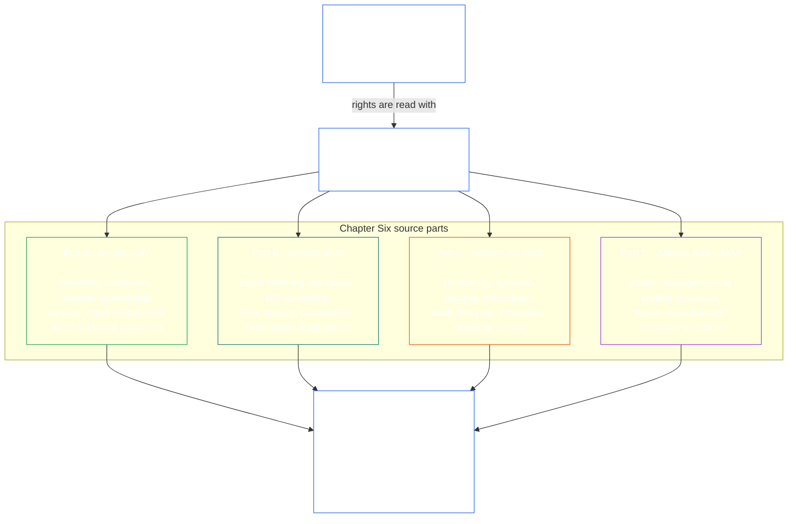

# CHAPTER SIX: FOUNDATIONAL RIGHTS

<details>
<summary><strong><span style="color: #2563eb;">Corpus placement (non-operative): file structure and reading rules</span></strong></summary>

> The following content is **reader guidance only**. It does not add, remove, or narrow binding obligations elsewhere in this file or in other chapters.
>
> This file is **part of the Sentient Constitution** and is **binding only together** with the other numbered `core_*` files read as one instrument. It contains **Chapter Six, Part A**; article numbering and cross-references match the integrated instrument. Reading order, the binding/support split, and corpus edition metadata are maintained in [README.md](README.md).

</details>

<details>
<summary><strong><span style="color: #2563eb;">Reader guidance (non-operative): reading order and fulfillment</span></strong></summary>

> The following content is **reader guidance only**. It does not add, remove, or narrow binding obligations elsewhere in this chapter or in other chapters.
>
> This chapter presents rights in a **planet-first** order because environmental and material conditions support everything else:
> - **Part A** covers **Articles I–IV**: environmental survival, material stewardship, survival essentials, equal educational access, and resource-flow transparency.
> - **Part B** covers **Articles V–XI**: equal basic Rights Floors, sentient-centered education, self-ownership, likeness and data, agency, cooperation, and Stakeholder System Participation.
> - **Part C** covers **Articles XII–XXII**: trustworthy systems, information integrity, audit, lifecycle, sandboxed innovation, standing, portability, complexity, root-cause diagnostics, and interpretive review.
> - **Part D** covers **Articles XXIII–XXVI**: justice and emergencies, constitutional evolution, transition, and re-baselining.
>
> That presentation order does not change execution priorities. Rights fulfillment still depends on systems-first work: substrate, environment, lifecycle, infrastructure, and governance must be sound enough for personal and cooperative rights to survive.

</details>

<br>

Chapter Six is the constitutional owner of **Rights Floors** and rights-level interpretation.

### 1. Purpose and Role

<details>
<summary><strong><span style="color: #2563eb;">Trace</span></strong></summary>

- Upstream: [Constitutional Tetrad](core_00_preamble.md#constitutional-tetrad); [Two Constitutional Aims](core_00_preamble.md#two-constitutional-aims); [material stake](core_00_preamble.md#material-stake).
- Upstream: [Chapter One §6 Process Conflict Resolution](core_01_b_interaction_interpretation.md#6-process-conflict-resolution); [Chapter One §6.1.5 Rights-Collision Decision Test](core_01_b_interaction_interpretation.md#615-rights-collision-decision-test).
- Upstream: [Chapter One §12 Incentive Alignment and System Capture](core_01_c_stewardship_capacity_principles.md#12-incentive-alignment-and-system-capture).
- Upstream: Chapters Two through Four; Chapter Five definitions.
- Downstream: **Parts A through D** of this chapter; [System Alignment Certification](core_05_band_continuity.md#system-alignment-certification-constitutional); [Chapter Eight](core_08_a_system_alignment_certification_evaluation.md#chapter-eight-system-alignment-certification).
- Downstream: [Preamble §6.2 How the full chain fits together](core_00_preamble.md#62-how-the-full-chain-fits-together); [§1.2 Layer scope](#12-layer-scope).
- Read with: [Authority Stack and Internal Hierarchy](core_05_band_integrative.md#owner-non-relocation) and the [Preamble — constitutional owner register](core_00_preamble.md#4-principles-definitions-and-rights); [Article XII-B](core_06_rights_part_c.md#article-xii-b-right-to-challenge-review-and-redress) (*Right to Challenge, Review, and Redress*).
- Read with: [Article XV](core_06_rights_part_c.md#article-xv-audit-transparency-and-independent-verification) (*Audit, Transparency, and Independent Verification*).
- Read with: [Article XVIII-B](core_06_rights_part_c.md#article-xviii-b-contestability-and-proportional-restriction-limits) (*Contestability and Proportional Restriction Limits*); [Article XXIV-C](core_06_rights_part_d.md#article-xxiv-c-timely-resolution-and-anti-delay-floor) (*Timely Resolution and Anti-Delay Floor*).

</details>

<br>

*In plain terms: Chapter Six states the basic Rights Floors no sentient may be pushed below. Those Rights Floors protect **Flourishing** and **Continuity** under the [Two Constitutional Aims](core_00_preamble.md#two-constitutional-aims) and must remain available, reviewable, and enforceable through the [Constitutional Tetrad](core_00_preamble.md#constitutional-tetrad) — **participation**, **oversight**, **accountability**, and **timeliness** — scaled to [material stake](core_00_preamble.md#material-stake). Other chapters help implement, measure, certify, and enforce those Rights Floors, but they do not get to shrink them.*

A Rights Floor is a minimum guarantee. It is the set of protections that must remain available, open to inspection, and enforceable before any new rules, certifications, categories, or plans can be approved. These floors serve the [Two Constitutional Aims](core_00_preamble.md#two-constitutional-aims):

- **Flourishing:** sentients can actually access and use these protections in real life.
- **Continuity:** these protections last, do not get rolled back, and can be fixed if they break.

To legitimately pursue these Rights Floors, four duties must be followed, with the level of effort matching what is truly at stake — the [Constitutional Tetrad](core_00_preamble.md#constitutional-tetrad), scaled to [material stake](core_00_preamble.md#material-stake):

- **Participation**
- **Oversight**
- **Accountability**
- **Timeliness**

The rest of the Constitution explains how this floor is understood, where its limits are, how it is checked, and how it is enforced. Unless a specific provision in this chapter says differently, every Rights Floor in Chapter Six must be read together with:
- **Chapter One**, including:
  - **value constraints** — Safety, Truth, Necessity, Proportionality, and weighing effects locally, in total, over time, and across systems;
  - **interaction discipline** — [Chapter One §6 Process Conflict Resolution](core_01_b_interaction_interpretation.md#6-process-conflict-resolution);
  - **constitutional scaling** — the [Constitutional Tetrad](core_00_preamble.md#constitutional-tetrad), [Two Constitutional Aims](core_00_preamble.md#two-constitutional-aims), and matching the effort to [material stake](core_00_preamble.md#material-stake);
  - **incentive alignment and system capture** — [Chapter One §12 Incentive Alignment and System Capture](core_01_c_stewardship_capacity_principles.md#12-incentive-alignment-and-system-capture) and related stewardship rules, but only where incentives, trust, fidelity, capture, market structure, or a defended limit actually matter to the situation.
- **Chapters Two through Four** — keeping definitions honest, tracking who bears what burden, being able to see what is happening, verifying claims in ways sentients can use, and limiting observation where security requires it.
- **Chapter Five** — definitions that actually matter to the right, behavior, system, or limit being judged.
- **Classification and scale rules** — **Materiality**, [Dependency](core_05_band_continuity.md#dependency), and any class, tier, or timing rule added by the adopting body.

These background rules apply to every article in this chapter unless a specific article says otherwise.

<details>
<summary><strong><span style="color: #2563eb;">Reader guidance (non-operative): chapter structure map</span></strong></summary>

> The following content is **reader guidance only**. It does not add, remove, or narrow binding obligations elsewhere in this chapter or in other chapters.
>
> **Reader map (non-operative).** This chart shows how the four source parts of this chapter sit under the Rights Floor, and that later processes apply the floor rather than shrink it. It adds no definitions or duties, establishes no precedence, and cannot replace the source text.

</details>

<br>



The four parts are different reading paths through the same floor. **Part A** (this file) begins with planetary and material preconditions; [Part B](core_06_rights_part_b.md) turns to personal, cooperative, and stakeholder rights; [Part C](core_06_rights_part_c.md) governs trustworthy systems, verification, and interpretive review; [Part D](core_06_rights_part_d.md) governs justice, emergency response, constitutional evolution, and transition. Every part is read with the chapter-wide constraints stated above. Later governance, measurement, certification, forums, remedy, and implementation may apply this floor but may not shrink it.

#### 1.1 Practical Enforcement

The Rights Floor must work in real life, not just on paper:

- **Survival essentials** under **Article III-A** (*Survival*) — food, water, shelter, an operating environment, and the other substrate-agnostic inputs a sentient needs to keep going — are the clearest example.
- **Flourishing** means sentients can actually get and use those essentials.
- **Continuity** means the supply stays reliable, does not get rolled back, and keeps going over time — especially when shared systems are in charge of delivery.

Enforcement depends on real checks, not just rules on paper:

- **Systems get verified before they go live:** [System Alignment Certification](core_05_band_continuity.md#system-alignment-certification-constitutional) and [Chapter Eight](core_08_a_system_alignment_certification_evaluation.md#chapter-eight-system-alignment-certification) make sure materially impactful systems actually meet the rules before anyone relies on them at scale.
- **Sentients can push back on certification decisions:** Chapter Eight also provides ways to contest the record, demand stakeholder and accessibility review, keep supervisory sequencing in place, and challenge alignment decisions that do not hold up.
- **You can challenge and audit unreliable systems:** **Article XII** (*Right to Reliable and Trustworthy Systems*) gives sentients the right to challenge and audit systems that affect them.
- **Bureaucracy cannot block survival access:** **Article XVIII-B** (*Contestability and Proportional Restriction Limits*) prevents standing limits from becoming a back door that cuts sentients off from survival-critical protections.
- **Chapters Eight through Twelve form the practical pipeline:** Together they supply the key processes for contestability, verified classification, forum supervision, and timely remedy.
- **These tools enforce Chapter Six — they do not replace it:** They help make Rights Floors real, but they may not shrink, bypass, or relocate the protections stated in this chapter.

**Interpretive hubs.** Unless a more specific article supplies a different rule, recurring issues route through these anchors:

**Rights floors and supply**
- **Survival essentials and keeping them accessible**
  - **Article III-A** (*Survival*) — the floor for food, water, shelter, and what you need to keep going
  - **Article XVIII-B** (*Contestability and Proportional Restriction Limits*) — so rules about who can file a case do not block access to survival protections
  - **Article XII-B** (*Right to Challenge, Review, and Redress*) and **Article XV** (*Audit, Transparency, and Independent Verification*) — for challenging a decision or auditing how essentials are being delivered
- **System alignment certification** — [System Alignment Certification](core_05_band_continuity.md#system-alignment-certification-constitutional); [Chapter Eight](core_08_a_system_alignment_certification_evaluation.md#chapter-eight-system-alignment-certification)

**Verification and remedy**
- **Audit records and independent verification** — **Article XV** (*Audit, Transparency, and Independent Verification*) with **Chapters Two through Four**
- **Challenge, review, and proportionate remediation** — **Article XII-B** (*Right to Challenge, Review, and Redress*); Chapter Five (*Redress and Remediation*)

**Disputes and timely process**
- **Justice, restitution, restriction boundaries, emergencies, and rights collisions** — **Article XXIII** (*Conflict Resolution, Escalation, and Emergency Proportionality*); [Chapter One §6.1.5 Rights-Collision Decision Test](core_01_b_interaction_interpretation.md#615-rights-collision-decision-test)
- **Key Practical Process Pipelines** — **Article XXIV-C** (*Timely Resolution and Anti-Delay Floor*); [Chapter Eight](core_08_a_system_alignment_certification_evaluation.md#chapter-eight-system-alignment-certification); [Preamble §6.2 How the full chain fits together](core_00_preamble.md#62-how-the-full-chain-fits-together)

Shorter cross-references to those themes elsewhere in this chapter incorporate these anchors.

<a id="12-layer-scope"></a>

#### 1.2 Layer scope

*In plain terms: Chapter Six states what sentients are entitled to at the Rights-Floor level. Standing, forums, governance, amendment, and day-to-day implementation live in their own owner chapters — this chapter may point there but must not restate them. Which chapter owns what: see the [Preamble — constitutional owner register](core_00_preamble.md#4-principles-definitions-and-rights). Rules that keep duties from being moved to the wrong place: [Authority Stack and Internal Hierarchy](core_05_band_integrative.md#owner-non-relocation).*

This rule covers all of Chapter Six — Articles **I** through **XXVI**:

- **Chapter Six cannot steal duties from other chapters:** Under [Authority Stack and Internal Hierarchy](core_05_band_integrative.md#owner-non-relocation), this chapter must not copy, restate, or move obligations that belong somewhere else. Cross-references are fine — pointing readers to another chapter is expected. But copying another chapter's actual rules into Chapter Six is **not allowed**.
- **No sneaking rules in through the back door:** You cannot import obligations from other chapters into Chapter Six by copying text, treating reader notes as real rules, or reading too much into a cross-reference. And other chapters or implementation files cannot shrink, redefine, or move a Chapter Six Rights Floor either — that violates **Chapter Fourteen** non-regression.
- **If new language sounds like process or governance, point to the real owner:** Any future addition to Chapter Six that touches process, governance, or implementation must include a note pointing to where the actual rule lives — the [Preamble — constitutional owner register](core_00_preamble.md#4-principles-definitions-and-rights) and, where relevant, the matching [Chapter Five](core_05__definitions_home.md#chapter-five-foundational-definitions) definition.

### Part A: Planetary preconditions, material stewardship, survival, equal educational access, and shared resources

<details>
<summary><strong><span style="color: #2563eb;">Reader guidance (non-operative): Part A article map</span></strong></summary>

> The following content is **reader guidance only**. It does not add, remove, or narrow binding obligations elsewhere in this chapter or in other chapters.
>
> **Reader map (non-operative).** This chart shows how the source groups this Part's articles and subarticles. The grid is source grouping, not a process sequence: the articles are not procedural steps, so the map carries no arrows. Subarticle labels are shortened to themes; the numbered articles and subarticles below govern. The chart adds no definitions or duties, establishes no precedence, and cannot replace the source text.

</details>

<br>

```mermaid
flowchart TB
    A0["Part A<br/><br/>Planetary preconditions, material stewardship,<br/>survival, equal educational access, and shared resources"]
    subgraph Agrid[" "]
        direction TB
        subgraph Arow2["Articles III–IV"]
            direction LR
            A3["Article III · Survival and Equal Educational Access<br/><br/>• Survival<br/>• Equal educational access<br/>• Healthcare access<br/>• Labor and economic floor"]
            A4["Article IV · Resource Allocation, Dependencies, and Ecosystem Funding<br/><br/>• Dependency mapping<br/>• Cross-system fairness"]
        end
        subgraph Arow1["Articles I–II"]
            direction LR
            A1["Article I · Environmental Survival<br/><br/>• Environmental preconditions<br/>• Ecological footprint<br/>• Intergenerational responsibility<br/>• Existential risk and recovery"]
            A2["Article II · Material Stewardship and Durable-Use Integrity<br/><br/>• Lifecycle honesty<br/>• Repair and servicing<br/>• Designed obsolescence<br/>• Post-sale access<br/>• Info-sphere continuity"]
        end
    end
    A0 ~~~ Agrid
    style Agrid fill:none,stroke:none
    style Arow1 fill:none,stroke:none
    style Arow2 fill:none,stroke:none
    style A0 fill:none,stroke:#2563eb,color:#ffffff
    style A1 fill:none,stroke:#16a34a,color:#ffffff
    style A2 fill:none,stroke:#16a34a,color:#ffffff
    style A3 fill:none,stroke:#16a34a,color:#ffffff
    style A4 fill:none,stroke:#16a34a,color:#ffffff
```

**Articles I–IV** below state these floors in full. Part A is the planet-first entry point: environmental and material conditions, survival essentials, equal educational access, and the resource flows every later right presumes.

### Article I: Environmental Survival

<details>
<summary><strong><span style="color: #2563eb;">Trace</span></strong></summary>

- Upstream: Principles: Chapter One [§2 Foundational Objective: Wellbeing](core_01_a_values_principles.md#2-foundational-objective-wellbeing), [§3.1 Safety](core_01_a_values_principles.md#31-safety-harm-constraint), [§3.2 Truth](core_01_a_values_principles.md#32-truth-epistemic-integrity-constraint), [§6 Process Conflict Resolution](core_01_b_interaction_interpretation.md#6-process-conflict-resolution), and [§11 Governance Under Stewardship Discipline](core_01_c_stewardship_capacity_principles.md#11-governance-under-stewardship-discipline).

</details>

<strong><span style="color: #2563eb;">Definition:</span></strong> [Environmental Preconditions](core_05_band_continuity.md#environmental-preconditions-constitutional) · [O](core_05_band_continuity.md#environmental-preconditions-constitutional) · [M](core_05_band_continuity.md#environmental-preconditions-constitutional-a) · [A](core_05_band_continuity.md#environmental-preconditions-constitutional-a) · [C](core_05_band_continuity.md#environmental-preconditions-constitutional-c)

*In plain terms: **Article I** (*Environmental Survival*) is the planet-first Rights Floor — Earth's life-support systems must hold so **Flourishing** and **Continuity** remain possible for every sentient, and later governance cannot shrink that floor through certification, classification, or implementation choices.*

Every sentient depends on Earth's physical environment and living systems. Protecting and restoring them is therefore a shared constitutional interest. This Article states the Rights Floor for environmental survival under the [Two Constitutional Aims](core_00_preamble.md#two-constitutional-aims):

- **Flourishing:** sentients retain access to life-supporting conditions.
- **Continuity:** keeping ecosystems intact, sustainable, and repairable across generations — especially when material harm would rob future sentients of a decent life.

Legitimate pursuit runs through the [Constitutional Tetrad](core_00_preamble.md#constitutional-tetrad), scaled to [material stake](core_00_preamble.md#material-stake):

- **Participation:** in materially consequential environmental decisions.
- **Oversight:** through traceable integrity and footprint records.
- **Accountability:** those responsible for environmental harm must answer for material damage and efforts to evade remedy.
- **Timeliness:** in detection and remedy.

Chapter Five defines those conditions under [Environmental Preconditions](core_05_band_continuity.md#environmental-preconditions-constitutional). When that definition is relevant to the situation, **Chapters Two through Four** also apply — for traceable records, independent verification, stable definitions, and blocking evasion.

#### Article I-A: Environmental Preconditions and Ecological Integrity
<details>
<summary><strong><span style="color: #2563eb;">Trace</span></strong></summary>

- Upstream: Principles: Chapter One [§2 Foundational Objective: Wellbeing](core_01_a_values_principles.md#2-foundational-objective-wellbeing), [§3.1 Safety](core_01_a_values_principles.md#31-safety-harm-constraint), and [Chapter Eight §3 Whole-System Certification Evaluation](core_08_a_system_alignment_certification_evaluation.md#3-whole-system-certification-evaluation).

</details>

<details>
<summary><strong><span style="color: #2563eb;">Definitions · Assessment · Compliance</span></strong></summary>

- [Environmental Preconditions](core_05_band_continuity.md#environmental-preconditions-constitutional) · [O](core_05_band_continuity.md#environmental-preconditions-constitutional) · [M](core_05_band_continuity.md#environmental-preconditions-constitutional-a) · [A](core_05_band_continuity.md#environmental-preconditions-constitutional-a) · [C](core_05_band_continuity.md#environmental-preconditions-constitutional-c)
- [Ecological Integrity](core_05_band_continuity.md#ecological-integrity-constitutional) · [O](core_05_band_continuity.md#ecological-integrity-constitutional) · [M](core_05_band_continuity.md#ecological-integrity-constitutional-a) · [A](core_05_band_continuity.md#ecological-integrity-constitutional-a) · [C](core_05_band_continuity.md#ecological-integrity-constitutional-c)
- [Sustainability](core_05_band_continuity.md#sustainability) · [O](core_05_band_continuity.md#sustainability) · [M](core_05_band_continuity.md#sustainability-a) · [A](core_05_band_continuity.md#sustainability-a) · [C](core_05_band_continuity.md#sustainability-c)
- [Natural Systems Standing](core_05_band_participation.md#natural-systems-standing) · [O](core_05_band_participation.md#natural-systems-standing) · [M](core_05_band_participation.md#natural-systems-standing-a) · [A](core_05_band_participation.md#natural-systems-standing-a) · [C](core_05_band_participation.md#natural-systems-standing-c)
- [Animal Life](core_05_band_participation.md#animal-life-constitutional) · [O](core_05_band_participation.md#animal-life-constitutional) · [M](core_05_band_participation.md#animal-life-constitutional-a) · [A](core_05_band_participation.md#animal-life-constitutional-a) · [C](core_05_band_participation.md#animal-life-constitutional-c)
- [Elevated Communicative Life](core_05_band_participation.md#elevated-communicative-life-constitutional) · [O](core_05_band_participation.md#elevated-communicative-life-constitutional) · [M](core_05_band_participation.md#elevated-communicative-life-constitutional-a) · [A](core_05_band_participation.md#elevated-communicative-life-constitutional-a) · [C](core_05_band_participation.md#elevated-communicative-life-constitutional-c)
- [Contested-Sentient Life](core_05_band_participation.md#contested-sentient-life-constitutional) · [O](core_05_band_participation.md#contested-sentient-life-constitutional) · [M](core_05_band_participation.md#contested-sentient-life-constitutional-a) · [A](core_05_band_participation.md#contested-sentient-life-constitutional-a) · [C](core_05_band_participation.md#contested-sentient-life-constitutional-c)
- [Wellbeing](core_05_band_continuity.md#wellbeing) · [O](core_05_band_continuity.md#wellbeing) · [M](core_05_band_continuity.md#wellbeing-a) · [A](core_05_band_continuity.md#wellbeing-a) · [C](core_05_band_continuity.md#wellbeing-c)
- [Sentience Non-Exclusion](core_05_band_participation.md#sentience-non-exclusion) · [O](core_05_band_participation.md#sentience-non-exclusion) · [M](core_05_band_participation.md#sentience-non-exclusion-a) · [A](core_05_band_participation.md#sentience-non-exclusion-a) · [C](core_05_band_participation.md#sentience-non-exclusion)

</details>

<br>

*In plain terms: the planet's life-support systems must be protected as a matter of their own survival, not only because sentients need them. Animals get a basic cruelty and welfare floor. Creatures that show strong communication or cognition get stronger habitat and health protections. And when it is unclear whether something counts as sentient, it gets the benefit of the doubt — full Chapter Six protection while the question is fairly resolved.*

- **Environmental preconditions, integrity, and sustainability:** These Chapter Five definitions are operative here.
  - Natural systems that keep life going — air, water, soil, climate, biodiversity — hold continuity and integrity interests of their own. Those interests count alongside sentient interests when interpreting this Article.
  - Material harm that breaks **Environmental Preconditions**, **Ecological Integrity**, or **Sustainability** rules is non-compliant.
  - Harm that also breaks environmental rules in the adopter's [instrument of adoption](core_16_amendment_ratification.md#102-instrument-of-adoption) or in incorporated implementation text within adoption scope is non-compliant too.
- **Animal life:** [Animal Life](core_05_band_participation.md#animal-life-constitutional) sits between plain environmental protection and full sentient Rights Floors.
  - It sets a minimum floor against cruelty and for basic welfare, applied under **Sentience Non-Exclusion** when welfare-like harm is in play.
  - It is not a substitute for stronger protections or for a sentience-status hearing when the facts suggest the creature may be sentient.
  - If there are real signs of communication or cognition that point to possible sentience, the operator or steward must open a sentience-status review on a clear timeline — not leave the creature parked in animal-welfare status forever, and not hide behind a species list.
    - That review routes to **Article V-E** (*Sentience-Status Adjudication Floor*) under contested-sentient default inclusion.
    - The review does not itself prove sentience; it opens the assessment process.
- **Elevated communicative life:** [Elevated Communicative Life](core_05_band_participation.md#elevated-communicative-life-constitutional) sits between Animal Life and full Chapter Six protection.
  - It keeps the Animal Life cruelty and welfare floor and adds stronger protections for habitat or operating-environment health under **Sentience Non-Exclusion** when strong communicative or cognitive signs are in play.
  - It is not a substitute for sentience-status adjudication when the facts suggest possible sentience.
  - If real signs of communication or cognition point to possible sentience, the operator or steward must open a sentience-status review on a clear timeline — not leave the creature parked in habitat-priority status forever, and not hide behind a species list.
    - That review routes to **Article V-E** (*Sentience-Status Adjudication Floor*) under contested-sentient default inclusion.
    - The review does not itself prove sentience; it opens the assessment process.
- **Contested-sentient life:** [Contested-Sentient Life](core_05_band_participation.md#contested-sentient-life-constitutional) applies when it is unclear, disputed, or actively being decided whether a being is sentient.
  - The question goes to the [Sentience Status Adjudication](core_05_band_participation.md#sentience-status-adjudication-constitutional) procedure under **Article V-E** (*Sentience-Status Adjudication Floor*).
  - While the question is open, the default is inclusion: the being stays under the Chapter Six Rights Floor unless the party trying to withhold, narrow, or revoke protection meets the required burden of proof.
- **How these protections fit together:** All of the following may apply at the same time:
  - [Natural Systems Standing](core_05_band_participation.md#natural-systems-standing)
  - [Animal Life](core_05_band_participation.md#animal-life-constitutional)
  - [Elevated Communicative Life](core_05_band_participation.md#elevated-communicative-life-constitutional)
  - [Contested-Sentient Life](core_05_band_participation.md#contested-sentient-life-constitutional)
  - the full Chapter Six Rights Floor for sentients

  Use every protection that fits the facts.
  - Where protections overlap, the stronger one wins under [Chapter One §6.1.5 Rights-Collision Decision Test](core_01_b_interaction_interpretation.md#615-rights-collision-decision-test) and the compliance rules in those Chapter Five entries.
  - If there are real signs of communication or cognition pointing to possible sentience, open a sentience-status review rather than leaving the being stuck in animal-welfare or habitat-priority status indefinitely.

#### Article I-B: Ecological Footprint and Transparency
<details>
<summary><strong><span style="color: #2563eb;">Trace</span></strong></summary>

- Upstream: Principles: Chapter One [§3.2 Truth](core_01_a_values_principles.md#32-truth-epistemic-integrity-constraint), [§6.2 Epistemic Disclosure Constraints](core_01_b_interaction_interpretation.md#62-epistemic-disclosure-constraints), and [Chapter Eight §3 Whole-System Certification Evaluation](core_08_a_system_alignment_certification_evaluation.md#3-whole-system-certification-evaluation).

</details>

<details>
<summary><strong><span style="color: #2563eb;">Definitions · Assessment · Compliance</span></strong></summary>

- [Ecological Footprint](core_05_band_continuity.md#ecological-footprint) · [O](core_05_band_continuity.md#ecological-footprint) · [M](core_05_band_continuity.md#ecological-footprint-a) · [A](core_05_band_continuity.md#ecological-footprint-a) · [C](core_05_band_continuity.md#ecological-footprint-c)
- [Material Impact](core_05_band_oversight.md#material-impact) · [O](core_05_band_oversight.md#material-impact) · [M](core_05_band_oversight.md#material-impact-a) · [A](core_05_band_oversight.md#material-impact-a) · [C](core_05_band_oversight.md#material-impact-c)
- [Transparency](core_05_band_oversight.md#transparency) · [O](core_05_band_oversight.md#transparency) · [M](core_05_band_oversight.md#transparency-a) · [A](core_05_band_oversight.md#transparency-a) · [C](core_05_band_oversight.md#transparency-c)
- [Epistemic Integrity](core_05_band_oversight.md#epistemic-integrity) · [O](core_05_band_oversight.md#epistemic-integrity-o) · [M](core_05_band_oversight.md#epistemic-integrity-a) · [A](core_05_band_oversight.md#epistemic-integrity-a) · [C](core_05_band_oversight.md#epistemic-integrity-c)

</details>

<br>

*In plain terms: when a rule calls for it, the environmental cost of an activity, system, product, or service should be counted honestly and reported openly. That includes costs that come before it (such as mining and manufacturing) and after it (such as use and disposal). The goal is numbers that others can compare and check. This subsection gives the shared words and honesty standards for that work. It does not, by itself, make anyone cut their footprint. Required cuts or limits come from other rules.*

Chapter Five defines [Ecological Footprint](core_05_band_continuity.md#ecological-footprint) as the environmental burdens that can be traced to a sentient, system, product, or service. It counts energy, materials, emissions, land use, and similar burdens across the thing's whole life and the other systems it depends on. The measure is used to disclose, compare, and reduce those burdens. Local measures that cannot be traced to a lifecycle or dependency burden are not part of it.

- **When this Article applies:**
  - when an activity, system, product, or service puts environmental burdens at stake under **Article I** (*Environmental Survival*), whether through its ongoing operation or through a [Materially Binding Act](core_05_band_accountability.md#materially-binding-act) that authorizes, deploys, continues, or withdraws it; or
  - when another rights rule — such as **Article XV-C** (*Verification Accessibility*) or a related implementation rule — requires footprint transparency.
- **Who chooses the method:** This Article does not choose how to count the footprint, how to check the count, or what number to aim for. The rule that creates the duty makes those choices.
- **How to count and report:**
  - Count the full impact of the whole system honestly, under [Material Impact](core_05_band_oversight.md#material-impact) in Chapter Five.
  - Report it openly and accurately, under [Transparency](core_05_band_oversight.md#transparency) and [Epistemic Integrity](core_05_band_oversight.md#epistemic-integrity) in Chapter Five.
- **What this Article does not do:**
  - **Article I-B** (*Ecological Footprint and Transparency*) does not, by itself, require anyone to shrink their footprint.
  - A duty to cut, cap, or clean up applies only when another constitutional rule, implementation file, or adoption instrument explicitly requires it.

#### Article I-C: Intergenerational Responsibility
<details>
<summary><strong><span style="color: #2563eb;">Trace</span></strong></summary>

- Upstream: Principles: Chapter One [§2 Foundational Objective: Wellbeing](core_01_a_values_principles.md#2-foundational-objective-wellbeing), [§3.1 Safety](core_01_a_values_principles.md#31-safety-harm-constraint), and [§15 Systemic Evaluation Requirement](core_01_c_stewardship_capacity_principles.md#15-systemic-evaluation-requirement).
- Chapter Five: canonical **Intergenerational Responsibility** O/M/A/C sits in [**Def.I1** *Ecological Integrity, Footprint, and Sustainability*](core_05_band_continuity.md#ecological-footprint-semi-independent), read jointly with **Ecological Integrity**, **Sustainability**, **Environmental Preconditions**, and **Ecological Footprint** (joint invocation where footprint burden, disclosure, comparison, reduction, or traceability is materially at issue). Joint invocation for **Indigenous Continuity**, **Language, Culture, and Heritage**, **Natural Systems Standing**, and **Intergenerational Responsibility** also routes through [Chapter Five *Indigenous Continuity, Language, Culture, and Heritage*](core_05_band_continuity.md#indigenous-continuity-language-culture-heritage-semi-independent) where community-anchored continuity, heritage, natural-systems standing, and futures-discipline analysis apply together.

</details>

<details>
<summary><strong><span style="color: #2563eb;">Definitions · Assessment · Compliance</span></strong></summary>

- [Intergenerational Responsibility](core_05_band_continuity.md#intergenerational-responsibility-constitutional) · [O](core_05_band_continuity.md#intergenerational-responsibility-constitutional) · [M](core_05_band_continuity.md#intergenerational-responsibility-constitutional-a) · [A](core_05_band_continuity.md#intergenerational-responsibility-constitutional-a) · [C](core_05_band_continuity.md#intergenerational-responsibility-constitutional-c)
- [Environmental Preconditions](core_05_band_continuity.md#environmental-preconditions-constitutional) · [O](core_05_band_continuity.md#environmental-preconditions-constitutional) · [M](core_05_band_continuity.md#environmental-preconditions-constitutional-a) · [A](core_05_band_continuity.md#environmental-preconditions-constitutional-a) · [C](core_05_band_continuity.md#environmental-preconditions-constitutional-c)
- [Materiality Determination](core_05_band_oversight.md#materiality-determination) · [O](core_05_band_oversight.md#materiality-determination) · [M](core_05_band_oversight.md#materiality-determination-a) · [A](core_05_band_oversight.md#materiality-determination-a) · [C](core_05_band_oversight.md#materiality-determination-c)

</details>

<br>

*In plain terms: decisions today must not load unfair, irreversible, or unaccountable harm on those not represented — including future sentients and the environmental preconditions they will inherit.*

- **Future generations:** [Intergenerational Responsibility](core_05_band_continuity.md#intergenerational-responsibility-constitutional) in Chapter Five constrains disproportionate, irreversible, or unrepresented burdens on:
  - future sentients;
  - continuity of environmental preconditions.
  
  The same rule applies when we leave future generations facing threats to their survival or their environment because we didn't do enough today, as Chapter Five requires, to reduce the harm, be open about it, or make sure their interests were represented.

<a id="article-i-d-existential-risk-and-recovery-capacity"></a>

#### Article I-D: Existential Risk and Ecological Recovery Capacity
<details>
<summary><strong><span style="color: #2563eb;">Trace</span></strong></summary>

- Upstream: Principles: Chapter One [§3.1 Safety](core_01_a_values_principles.md#31-safety-harm-constraint), [§6.1 Core Tradeoff Principles](core_01_b_interaction_interpretation.md#61-core-tradeoff-principles), and [§15 Systemic Evaluation Requirement](core_01_c_stewardship_capacity_principles.md#15-systemic-evaluation-requirement).
- Read with: [Safety (Constraint)](core_05_band_continuity.md#safety-constraint), [Truth (Constitutional Constraint)](core_05_band_oversight.md#truth-constitutional-constraint), [Environmental Preconditions](core_05_band_continuity.md#environmental-preconditions-constitutional), [Ecological Recovery Capacity](core_05_band_continuity.md#ecological-recovery-capacity-constitutional), [Intergenerational Responsibility](core_05_band_continuity.md#intergenerational-responsibility-constitutional), and [Existential Risk](core_05_band_continuity.md#existential-risk).
- Downstream: **Article XXIII-D** (*Emergency Measures and Continuation Burden*) — anti-pretext and time-limited review discipline where existential-risk or emergency framing is invoked.

</details>

<details>
<summary><strong><span style="color: #2563eb;">Definitions · Assessment · Compliance</span></strong></summary>

- [Existential Risk](core_05_band_continuity.md#existential-risk) · [O](core_05_band_continuity.md#existential-risk) · [M](core_05_band_continuity.md#existential-risk-a) · [A](core_05_band_continuity.md#existential-risk-a) · [C](core_05_band_continuity.md#existential-risk-c)
- [Ecological Recovery Capacity](core_05_band_continuity.md#ecological-recovery-capacity-constitutional) · [O](core_05_band_continuity.md#ecological-recovery-capacity-constitutional) · [M](core_05_band_continuity.md#ecological-recovery-capacity-constitutional-a) · [A](core_05_band_continuity.md#ecological-recovery-capacity-constitutional-a) · [C](core_05_band_continuity.md#ecological-recovery-capacity-constitutional-c)
- [Foreseeability](core_05_band_oversight.md#foreseeability-diligence) · [O](core_05_band_oversight.md#foreseeability-diligence) · [M](core_05_band_oversight.md#foreseeability-diligence-a) · [A](core_05_band_oversight.md#foreseeability-diligence-a) · [C](core_05_band_oversight.md#foreseeability-diligence-c)
- [Dependency](core_05_band_continuity.md#dependency) · [O](core_05_band_continuity.md#dependency) · [M](core_05_band_continuity.md#dependency-a) · [A](core_05_band_continuity.md#dependency-a) · [C](core_05_band_continuity.md#dependency-c)
- [Self-Healing](core_05_band_continuity.md#self-healing-constitutional) · [O](core_05_band_continuity.md#self-healing-constitutional) · [M](core_05_band_continuity.md#self-healing-constitutional-a) · [A](core_05_band_continuity.md#self-healing-constitutional-a) · [C](core_05_band_continuity.md#self-healing-constitutional-c)
- [Reversibility](core_05_band_continuity.md#reversibility-constitutional) · [O](core_05_band_continuity.md#reversibility-constitutional) · [M](core_05_band_continuity.md#reversibility-constitutional-a) · [A](core_05_band_continuity.md#reversibility-constitutional-a) · [C](core_05_band_continuity.md#reversibility-constitutional-c)
- [Heightened Scrutiny](core_05_band_oversight.md#heightened-scrutiny) · [O](core_05_band_oversight.md#heightened-scrutiny) · [M](core_05_band_oversight.md#heightened-scrutiny-a) · [A](core_05_band_oversight.md#heightened-scrutiny-a) · [C](core_05_band_oversight.md#heightened-scrutiny-c)

</details>

<br>

*In plain terms: when a system or decision could plausibly threaten sentient survival or ecological recovery capacity, regulators must apply highest scrutiny — even if the danger is small, slow, or contested.*

- **Key terms:** This Article turns on two terms defined in Chapter Five:
  - **[Existential Risk](core_05_band_continuity.md#existential-risk):** the risk of harm large enough to threaten civilization-scale or survival-critical layers of sentient life, including rare, low-probability paths that would be catastrophic if they occurred. It does not cover ordinary local harm, reversible operational incidents, or routine safety issues.
  - **[Ecological Recovery Capacity](core_05_band_continuity.md#ecological-recovery-capacity-constitutional):** the ability of ecosystems, living systems, and the environmental preconditions they support to regenerate, restore function, and keep sustaining sentient life after severe harm, depletion, or disruption. It does not mean operational system restore after a fault ([Self-Healing](core_05_band_continuity.md#self-healing-constitutional)), rollback of specific states ([Reversibility](core_05_band_continuity.md#reversibility-constitutional)), or commercial cost recovery.
- **Scrutiny trigger:** Review under [highest scrutiny](core_05_band_oversight.md#highest-scrutiny) is mandatory where a system, policy, infrastructure, coordinated activity, or governance decision creates a credible causal pathway to **Existential Risk** or to irreversible loss of **Ecological Recovery Capacity**.
  - This rule applies even when the causal pathway is low-probability, delayed, cumulative, threshold-dependent, or disputed in timing.
- **Evaluation requirements:** Evaluation must:
  - include direct, indirect, aggregated, adversarial, and cross-system pathways;
  - account for dependency concentration, coordination failure, environmental-precondition degradation, ecological recovery-capacity loss, and systemic lock-in;
  - where **Ecological Recovery Capacity** is materially implicated, assess whether the affected ecosystem or life-supporting system can sustain and regenerate itself under prevailing habitat conditions — by ecological function, connectivity, regenerative processes, and interdependence across the system as a whole, not by looking at one species, one local population, or one kind of organism on its own.
  
  Checking boxes at the local level, showing a favorable cost-benefit estimate on paper, or securing a short-term gain does not satisfy this Article while credible paths to civilization-scale harm or irreversible ecological recovery loss remain open and not seriously addressed.
- **Burden and record:** Where the **Scrutiny trigger** is met, actors seeking authorization, continuation, or expansion bear the burden under [Chapter Four §1](core_04_burden_traceability_verification.md#1-exclusive-enforcement-and-burden-allocation) and must meet it under [highest scrutiny](core_05_band_oversight.md#highest-scrutiny). Uncertainty, contested evidence, or low estimated probability does not discharge the burden. They must show, by evidence meeting [Chapter Four §5](core_04_burden_traceability_verification.md#5-compliance-evidence-standard), that:
  - for each materially safer alternative, they either adopted it into the activity under review or showed that it is not reasonably effective or not available. Relying on a record that alternatives were considered, without that showing, is non-compliant;
  - mitigation and interruption measures are proportionate to the scale of possible harm;
  - monitoring can detect the causal pathway early enough to interrupt it **before harm becomes irreversible**, and a named actor holds both the authority and the practical capacity to interrupt it.
  
  The burden is continuing: it must be met again on new material evidence, on expansion, and at intervals proportionate to the risk. Where it is not met, the activity is non-compliant, and consequences follow [Chapter Three §3 — Non-Compliance Finding Profiles](core_03_definition_integrity.md#3-non-compliance-finding-profiles). Each authorization, continuation, or expansion determination under this Article is a [materially binding act](core_05_band_accountability.md#materially-binding-act). Its [Act Record](core_05_band_accountability.md#materially-binding-act-record) must link the actor's showing and the reviewer's assessment, and must openly state uncertainty, assumptions, evidence limits, disagreement, and material gaps.
- **Present benefit limit:** Present benefit does not justify disproportionate exposure of future sentients, systems critical to ecological recovery, or life-supporting ecological conditions to civilization-scale or survival-critical harm.
- **Named measures:** Anyone seeking authorization, continuation, or expansion under this Article must name specific reduction, cap, or interruption measures in their [instrument of adoption](core_16_amendment_ratification.md#102-instrument-of-adoption) or in incorporated implementation text within adoption scope — including harm to the climate system as an [Environmental Preconditions](core_05_band_continuity.md#environmental-preconditions-constitutional) factor. Those measures must match the scale of the risk.
  - This Article still does not set a numeric target.
  - **Article I-B** (*Ecological Footprint and Transparency*) remains the footprint-measurement rule only; it does not by itself require reduction.
  - Continuing without those named measures, while a credible risk pathway remains open, is non-compliant.

### Article II: Material Stewardship and Durable-Use Integrity

<details>
<summary><strong><span style="color: #2563eb;">Trace</span></strong></summary>

- Upstream: Principles: Chapter One [§2 Foundational Objective: Wellbeing](core_01_a_values_principles.md#2-foundational-objective-wellbeing), [§3.1 Safety](core_01_a_values_principles.md#31-safety-harm-constraint), [§3.2 Truth](core_01_a_values_principles.md#32-truth-epistemic-integrity-constraint), [§9 Stewardship In Depth](core_01_c_stewardship_capacity_principles.md#9-stewardship-in-depth), and [§9.1 Distributed Understanding](core_01_c_stewardship_capacity_principles.md#91-distributed-understanding).

</details>

<br>

*In plain terms: **Article II** (*Material Stewardship and Durable-Use Integrity*) is the material-stewardship Rights Floor. Durable and network-dependent products must be designed, described, and supported honestly. That protects **Flourishing** from misleading longevity claims and blocked repair paths, and **Continuity** from avoidable premature discard and hidden lifecycle burdens.*

This Article sets **constitutional floors** for the stewardship of durable and network-dependent products under the [Two Constitutional Aims](core_00_preamble.md#two-constitutional-aims):

- **Flourishing:** sentients can rely on honest lifecycle representation and practicable repair and maintenance.
- **Continuity:** durable-use integrity, intergenerational responsibility, and non-regressive support for products on which communities depend.

Legitimate pursuit runs through the [Constitutional Tetrad](core_00_preamble.md#constitutional-tetrad), scaled to [material stake](core_00_preamble.md#material-stake):

- **Participation:** in materially consequential stewardship decisions.
- **Oversight:** through auditable lifecycle and support records.
- **Accountability:** producers and stewards must answer for misrepresenting lifecycle facts or forcing avoidable obsolescence.
- **Timeliness:** timely repair, defect resolution, and continuity remedies, including remedies when support windows lapse.

*Article neighbors:*

- **Environmental consistency:** Interpretation must remain consistent with **Article I** (*Environmental Survival*).
- **Chapter Five scaling:** Read with Chapter Five where ecological footprint, intergenerational responsibility, and materiality apply.

**Where the practical details live:** Which products **Article II** (*Material Stewardship and Durable-Use Integrity*) covers, who qualifies to repair and maintain them, the thresholds that trigger these duties, and the escrow and shutdown arrangements for discontinued products are left to adopted implementation text under [Chapter Seventeen](core_17_incorporation.md).

#### Article II-A: Material Stewardship and Lifecycle Honesty
<details>
<summary><strong><span style="color: #2563eb;">Trace</span></strong></summary>

- Upstream: Principles: Chapter One [§3.2 Truth](core_01_a_values_principles.md#32-truth-epistemic-integrity-constraint), [§6.1 Core Tradeoff Principles](core_01_b_interaction_interpretation.md#61-core-tradeoff-principles), and [Chapter Eight §3 Whole-System Certification Evaluation](core_08_a_system_alignment_certification_evaluation.md#3-whole-system-certification-evaluation).

</details>

<details>
<summary><strong><span style="color: #2563eb;">Definitions · Assessment · Compliance</span></strong></summary>

- [Ecological Footprint](core_05_band_continuity.md#ecological-footprint) · [O](core_05_band_continuity.md#ecological-footprint) · [M](core_05_band_continuity.md#ecological-footprint-a) · [A](core_05_band_continuity.md#ecological-footprint-a) · [C](core_05_band_continuity.md#ecological-footprint-c)
- [Intergenerational Responsibility](core_05_band_continuity.md#intergenerational-responsibility-constitutional) · [O](core_05_band_continuity.md#intergenerational-responsibility-constitutional) · [M](core_05_band_continuity.md#intergenerational-responsibility-constitutional-a) · [A](core_05_band_continuity.md#intergenerational-responsibility-constitutional-a) · [C](core_05_band_continuity.md#intergenerational-responsibility-constitutional-c)
- [Materiality Determination](core_05_band_oversight.md#materiality-determination) · [O](core_05_band_oversight.md#materiality-determination) · [M](core_05_band_oversight.md#materiality-determination-a) · [A](core_05_band_oversight.md#materiality-determination-a) · [C](core_05_band_oversight.md#materiality-determination-c)

</details>

<br>

*In plain terms: durable goods must be designed and described honestly. Buyers must not be pushed into avoidable replacement or misled about how long a product will last.*

- **Floors:** Producers and operators of physical goods, and of materially equivalent durable products offered into general use, must design, represent, and support them so that:
  - products are not designed or supported in a way that requires sentients to replace them sooner than necessary when a reasonably available alternative would last longer;
  - durability, lifespan, and support claims are not materially false or misleading when honest claims were feasible.
  
  This floor must be read consistently with:
  - **Article I-B** (*Ecological Footprint and Transparency*) and **Article I-C** (*Intergenerational Responsibility*);
  - **Truth (Constitutional Constraint)** and **Article XII** (*Right to Reliable and Trustworthy Systems*), including **Article XII-C** (*Prohibition of False Trust and Misleading Reliance*) where reliance is induced; and
  - Chapter Five: **Ecological Footprint**, **Intergenerational Responsibility**, and **Materiality**.
- **Records:** Where **Materiality** and incorporated classification require them, operators must maintain stakeholder-accessible, auditable records of:
  - declared design intent for service life;
  - repair and maintenance affordances;
  - planned support windows.
  
  The records must match outward-facing claims. They must be updated when material conditions change.

#### Article II-B: Repair, Maintenance, and Independent Servicing
<details>
<summary><strong><span style="color: #2563eb;">Trace</span></strong></summary>

- Upstream: Principles: Chapter One [§3.1 Safety](core_01_a_values_principles.md#31-safety-harm-constraint), [§3.2 Truth](core_01_a_values_principles.md#32-truth-epistemic-integrity-constraint), and [§6.1 Core Tradeoff Principles](core_01_b_interaction_interpretation.md#61-core-tradeoff-principles).

</details>

<details>
<summary><strong><span style="color: #2563eb;">Definitions · Assessment · Compliance</span></strong></summary>

- [Necessity](core_05_band_accountability.md#necessity) · [O](core_05_band_accountability.md#necessity) · [M](core_05_band_accountability.md#necessity-a) · [A](core_05_band_accountability.md#necessity-a) · [C](core_05_band_accountability.md#necessity-c)
- [Proportionality](core_05_band_accountability.md#proportionality) · [O](core_05_band_accountability.md#proportionality) · [M](core_05_band_accountability.md#proportionality-a) · [A](core_05_band_accountability.md#proportionality-a) · [C](core_05_band_accountability.md#proportionality-c)
- [Dependency](core_05_band_continuity.md#dependency) · [O](core_05_band_continuity.md#dependency) · [M](core_05_band_continuity.md#dependency-a) · [A](core_05_band_continuity.md#dependency-a) · [C](core_05_band_continuity.md#dependency-c)

</details>

<br>

*In plain terms: owners and independent repair shops must be able to fix products they own. They need real access to manuals, tools, parts, and honest diagnostics.*

- **Floors:** For incorporated **covered product categories**, operators must give owners and qualified independent maintainers practicable access to:
  - documentation;
  - tools, or functional equivalents;
  - parts, or adequate substitutes;
  - non-deceptive diagnostics needed for safe, lawful maintenance and repair.
  
  The support period must be proportionate to the reasonable expected service life and to dependency.
  
  OEM-only or proprietary lockout is permitted only where the operator can demonstrate **Necessity** and **Proportionality** for safety, security, **Truth**, or binding law.
  
  Contract terms or technical restrictions can also trigger **Article XII-D** (*Incentive-Alignment Constraint*) when they:
  - mainly block lawful repair without the safety, security, **Truth**, or legal justification required above; and
  - have the main effect of protecting unfair revenue at sentients' expense.

#### Article II-C: Designed Obsolescence and Incentive Discipline
<details>
<summary><strong><span style="color: #2563eb;">Trace</span></strong></summary>

- Upstream: Principles: Chapter One [§3.1 Safety](core_01_a_values_principles.md#31-safety-harm-constraint), [§6.1 Core Tradeoff Principles](core_01_b_interaction_interpretation.md#61-core-tradeoff-principles), and [§11 Governance Under Stewardship Discipline](core_01_c_stewardship_capacity_principles.md#11-governance-under-stewardship-discipline).

</details>

<details>
<summary><strong><span style="color: #2563eb;">Definitions · Assessment · Compliance</span></strong></summary>

- [Incentive Alignment](core_05_band_integrative.md#incentive-alignment) · [O](core_05_band_integrative.md#incentive-alignment) · [M](core_05_band_integrative.md#incentive-alignment-a) · [A](core_05_band_integrative.md#incentive-alignment-a) · [C](core_05_band_integrative.md#incentive-alignment-c)
- [Foreseeability](core_05_band_oversight.md#foreseeability-diligence) · [O](core_05_band_oversight.md#foreseeability-diligence) · [M](core_05_band_oversight.md#foreseeability-diligence-a) · [A](core_05_band_oversight.md#foreseeability-diligence-a) · [C](core_05_band_oversight.md#foreseeability-diligence-c)
- [Necessity](core_05_band_accountability.md#necessity) · [O](core_05_band_accountability.md#necessity) · [M](core_05_band_accountability.md#necessity-a) · [A](core_05_band_accountability.md#necessity-a) · [C](core_05_band_accountability.md#necessity-c)
- [Proportionality](core_05_band_accountability.md#proportionality) · [O](core_05_band_accountability.md#proportionality) · [M](core_05_band_accountability.md#proportionality-a) · [A](core_05_band_accountability.md#proportionality-a) · [C](core_05_band_accountability.md#proportionality-c)

</details>

<br>

*In plain terms: you may not deliberately shorten a product's useful life. Nor may you use software updates mainly to push new purchases when the foreseeable effect is to pressure **sentients** to discard or replace goods that could still reasonably serve them.*

- **Floors:** A producer or operator violates this Article when, in normal lawful use, the design or everyday operation of a product or embedded software can reasonably be expected to make either outcome the main result. This includes discretionary remote updates. The outcomes are:
  - the product stops being useful sooner than it should; or
  - sentients are pushed to replace it when replacement is not reasonably necessary.
  
  When incentives reward discard or withholding repair tools, parts, and documentation, this also triggers [Chapter One §12 Incentive Alignment and System Capture](core_01_c_stewardship_capacity_principles.md#12-incentive-alignment-and-system-capture) and **Article XII-D** (*Incentive-Alignment Constraint*).
  
  This floor does not apply when the operator can document **Necessity** and **Proportionality**. Examples include a genuine safety fix, security response, or real interoperability limit. Those reasons must not replace a durable design that was reasonably available.

#### Article II-D: Post-Sale Access and Subscription Integrity
<details>
<summary><strong><span style="color: #2563eb;">Trace</span></strong></summary>

- Upstream: Principles: Chapter One [§3.2 Truth](core_01_a_values_principles.md#32-truth-epistemic-integrity-constraint), [Chapter One §5 Freedom](core_01_a_values_principles.md#5-freedom-bounded-agency), and [§11 Governance Under Stewardship Discipline](core_01_c_stewardship_capacity_principles.md#11-governance-under-stewardship-discipline).

</details>

<details>
<summary><strong><span style="color: #2563eb;">Definitions · Assessment · Compliance</span></strong></summary>

- [Consent](core_05_band_participation.md#consent-constitutional) · [O](core_05_band_participation.md#consent-constitutional) · [M](core_05_band_participation.md#consent-constitutional-a) · [A](core_05_band_participation.md#consent-constitutional-a) · [C](core_05_band_participation.md#consent-constitutional-c)
- [Truth (Constitutional Constraint)](core_05_band_oversight.md#truth-constitutional-constraint) · [O](core_05_band_oversight.md#truth-constitutional-constraint-o) · [M](core_05_band_oversight.md#truth-constitutional-constraint-a) · [A](core_05_band_oversight.md#truth-constitutional-constraint-a) · [C](core_05_band_oversight.md#truth-constitutional-constraint-c)
- [Dependency](core_05_band_continuity.md#dependency) · [O](core_05_band_continuity.md#dependency) · [M](core_05_band_continuity.md#dependency-a) · [A](core_05_band_continuity.md#dependency-a) · [C](core_05_band_continuity.md#dependency-c)
- [Meaningful Agency](core_05_band_participation.md#meaningful-agency) · [O](core_05_band_participation.md#meaningful-agency) · [M](core_05_band_participation.md#meaningful-agency-a) · [A](core_05_band_participation.md#meaningful-agency-a) · [C](core_05_band_participation.md#meaningful-agency-c)
- [Coercion and Manipulation](core_05_band_participation.md#coercion-and-manipulation-constitutional) · [O](core_05_band_participation.md#coercion-and-manipulation-constitutional) · [M](core_05_band_participation.md#coercion-and-manipulation-constitutional-a) · [A](core_05_band_participation.md#coercion-and-manipulation-constitutional-a) · [C](core_05_band_participation.md#coercion-and-manipulation-constitutional-c)
- [Trust Degradation and Misleading Reliance](core_05_band_continuity.md#trust-degradation-and-misleading-reliance) · [O](core_05_band_continuity.md#trust-degradation-and-misleading-reliance-o) · [M](core_05_band_continuity.md#trust-degradation-and-misleading-reliance-a) · [A](core_05_band_continuity.md#trust-degradation-and-misleading-reliance-a) · [C](core_05_band_continuity.md#trust-degradation-and-misleading-reliance-c)
- [Necessity](core_05_band_accountability.md#necessity) · [O](core_05_band_accountability.md#necessity) · [M](core_05_band_accountability.md#necessity-a) · [A](core_05_band_accountability.md#necessity-a) · [C](core_05_band_accountability.md#necessity-c)

</details>

<br>

*In plain terms: a feature bought outright cannot be quietly turned into a subscription. Any relevant operator dependency — including infrastructure, software, and services — must be disclosed up front.*

- **Floors:** Operators must not use software or firmware updates, authentication or account-access changes, or license changes to turn capabilities sold outright into subscription-only access. Any such change requires a new agreement. The agreement must be explicit, informed, and revocable. It must also satisfy **Article IX-B** (*Stakeholder Role and Participation Rights*), **Meaningful Agency**, and **Truth**.
  - Silent, coercive, or lock-in-driven conversion also triggers **Article XII-C** (*Prohibition of False Trust and Misleading Reliance*) and Chapter Five **Trust Degradation and Misleading Reliance** when sentients were led to rely on use rights that the operator did not honor.
  - Operators must disclose at purchase — when the binding commitment is made — any foreseeable need to rely on the operator's ongoing services for core or prominently marketed features.
  - Billing or access rules whose main commercial purpose is recurring payment for functionality already sold outright also trigger **Article XII-D** (*Incentive-Alignment Constraint*) unless the operator can show **Necessity** tied to lawful cost recovery, security, safety, or proportionate ongoing service.

#### Article II-E: Info-Sphere Dependency, Continuity, and Operator Non-Viability
<details>
<summary><strong><span style="color: #2563eb;">Trace</span></strong></summary>

- Upstream: Principles: Chapter One [§3.1 Safety](core_01_a_values_principles.md#31-safety-harm-constraint), [§6.1 Core Tradeoff Principles](core_01_b_interaction_interpretation.md#61-core-tradeoff-principles), and [Chapter Eight §3 Whole-System Certification Evaluation](core_08_a_system_alignment_certification_evaluation.md#3-whole-system-certification-evaluation).
- Read with: [Article XIX-A](core_06_rights_part_c.md#article-xix-a-portability-rights) (*Portability Rights*).
- Read with: [corpus_systems.md](corpus_systems.md) **CS-2 — Information types and handling**.
- Read with: **CJS-3.17** (*interoperability, portability, and exit-integrity terms*) and **CJS-3.18** (*data-retention and lifecycle-integrity terms*).
- Read with: [Chapter One §12.6 Successor Responsibility and Formal-Structure Non-Escape](core_01_c_stewardship_capacity_principles.md#126-successor-responsibility-and-formal-structure-non-escape).
- Read with: [Chapter Ten §9.1](core_10_standing_integration.md#91-remediation-capacity-and-funding) and [§9.4](core_10_standing_integration.md#94-anti-evasion-and-look-through-authority).

</details>

<details>
<summary><strong><span style="color: #2563eb;">Definitions · Assessment · Compliance</span></strong></summary>

- [Dependency](core_05_band_continuity.md#dependency) · [O](core_05_band_continuity.md#dependency) · [M](core_05_band_continuity.md#dependency-a) · [A](core_05_band_continuity.md#dependency-a) · [C](core_05_band_continuity.md#dependency-c)
- [Intergenerational Responsibility](core_05_band_continuity.md#intergenerational-responsibility-constitutional) · [O](core_05_band_continuity.md#intergenerational-responsibility-constitutional) · [M](core_05_band_continuity.md#intergenerational-responsibility-constitutional-a) · [A](core_05_band_continuity.md#intergenerational-responsibility-constitutional-a) · [C](core_05_band_continuity.md#intergenerational-responsibility-constitutional-c)
- [Materiality Determination](core_05_band_oversight.md#materiality-determination) · [O](core_05_band_oversight.md#materiality-determination) · [M](core_05_band_oversight.md#materiality-determination-a) · [A](core_05_band_oversight.md#materiality-determination-a) · [C](core_05_band_oversight.md#materiality-determination-c)
- [Necessity](core_05_band_accountability.md#necessity) · [O](core_05_band_accountability.md#necessity) · [M](core_05_band_accountability.md#necessity-a) · [A](core_05_band_accountability.md#necessity-a) · [C](core_05_band_accountability.md#necessity-c)
- [Negligence](core_05_band_accountability.md#negligence) · [O](core_05_band_accountability.md#negligence) · [M](core_05_band_accountability.md#negligence-a) · [A](core_05_band_accountability.md#negligence-a) · [C](core_05_band_accountability.md#negligence-c)

</details>

<br>

*In plain terms: when a product needs the operator's servers to work, the operator must say so up front. The operator must not trap continuity-critical data in forms that cannot be exported, except where confidentiality truly requires it. The operator must plan for service shutdown and cannot let bankruptcy or a sale erase those continuity duties.*

- **Floors:** For products whose lawful core use depends on operator-controlled network services, operators must disclose all of the following before any materially binding commitment. The required scope is proportionate to **Materiality** and dependency:
  - what requires ongoing operator access;
  - what degrades or fails if service ends;
  - where data is located;
  - what portability exists;
  - what continuity measures are in place.
  
  Operators must not collect or retain continuity-critical sentient data in forms that cannot be exported, migrated, or transferred through the disclosed continuity and export paths. The exception is where **Necessity** requires confidentiality, security, or lawful non-disclosure. In that case, the limitation, its scope, and any lawful substitute export path must be disclosed before commitment.

  Read with:
  - [corpus_systems.md](corpus_systems.md) **CS-2 — Information types and handling**;
  - **[section 1.2](corpus_systems/cs_02_a_information_types_and_handling.md#12-continuity-critical-collection-and-exportability)** (*Continuity-critical collection and exportability*); and
  - **Article XIX-A** (*Portability Rights*).
- **Continuity planning:** For incorporated **high-dependency** product categories, operators must maintain workable plans for what happens if the service stops or the operator goes away. Examples:
  - escrow;
  - successor handoff;
  - local or peer modes;
  - export paths;
  - comparable commitments.
  
  Those measures must stop operators from dumping long-term harm onto sentients or trapping them in products they can no longer use. They must meet **Intergenerational Responsibility** and **Article I-C** (*Intergenerational Responsibility*).
- **Service shutdown:** Cessation of material services must follow:
  - documented notice;
  - proportionate migration or minimum-operation windows;
  - usable export or handoff of continuity-critical data under the disclosed export paths, preserved through shutdown and migration windows — not merely a discretionary promise to try.
  
  Operators can still be held to constitutional standards when their conduct qualifies as **Negligence** under Chapter Five. This includes harm that builds up over time because maintenance, support, or continuity duties were neglected.
- **Successor and formal-structure duties:** Restructuring, sale, receivership, or insolvency does not by itself extinguish the continuity duties in this Article. Read with:
  - [Chapter One §12.6 Successor Responsibility and Formal-Structure Non-Escape](core_01_c_stewardship_capacity_principles.md#126-successor-responsibility-and-formal-structure-non-escape); and
  - [Chapter Ten §9.1 Remediation capacity and funding](core_10_standing_integration.md#91-remediation-capacity-and-funding) / [§9.4 Anti-evasion and look-through authority](core_10_standing_integration.md#94-anti-evasion-and-look-through-authority).

*Article neighbors:* **Remediation** for **Article II** (*Material Stewardship and Durable-Use Integrity*) follows the **interpretive hubs** stated at the opening of this chapter (challenge and redress; justice and escalation).

### Article III: Survival and Equal Educational Access

<details>
<summary><strong><span style="color: #2563eb;">Trace</span></strong></summary>

- Read with: **Article I** (*Environmental Survival*), **Article II** (*Material Stewardship and Durable-Use Integrity*), and Chapter Five where survival, educational access, bodily maintenance, or labor conditions are materially at issue.
- Upstream: Principles: Chapter One [§2 Foundational Objective: Wellbeing](core_01_a_values_principles.md#2-foundational-objective-wellbeing), [§3.1 Safety](core_01_a_values_principles.md#31-safety-harm-constraint), [§6 Process Conflict Resolution](core_01_b_interaction_interpretation.md#6-process-conflict-resolution), and [§9 Stewardship In Depth](core_01_c_stewardship_capacity_principles.md#9-stewardship-in-depth).

</details>

<br>

*In plain terms: **Article III** (*Survival and Equal Educational Access*) is the personal survival and access Rights Floor — sentients must retain access to survival essentials, equal educational opportunity, bodily-maintenance care, and minimum labor and economic protections so **Flourishing** is not defeated by deprivation or gatekeeping, and **Continuity** is not defeated by unstable, regressive, or commodified delivery of what they need to exist and participate.*

This Article states **constitutional floors** for survival and equal access under the [Two Constitutional Aims](core_00_preamble.md#two-constitutional-aims) and the [Constitutional Tetrad](core_00_preamble.md#constitutional-tetrad), scaled to [material stake](core_00_preamble.md#material-stake):

- **Flourishing:** actual access to survival essentials, equal educational opportunity, bodily-maintenance care, and fair labor and economic participation.
- **Continuity:** essentials keep showing up over time — not quietly rolled back — and sentients cannot be quietly priced out of, evicted from, or displaced from the homes, operating environments, and other essential places they depend on, with workable paths to restore access when delivery breaks.
- **Participation:** a real say in how essentials are allocated and challenged.
- **Oversight:** records and checks on the systems that deliver them.
- **Accountability:** those who control essential systems must face consequences when access is denied, degraded, or dodged.
- **Timeliness:** fixes that arrive before harm settles in.

#### Article III-A: Survival
<details>
<summary><strong><span style="color: #2563eb;">Trace</span></strong></summary>

- Upstream: Principles: Chapter One [§2 Foundational Objective: Wellbeing](core_01_a_values_principles.md#2-foundational-objective-wellbeing), [§3.1 Safety](core_01_a_values_principles.md#31-safety-harm-constraint), and [Chapter One §5 Freedom](core_01_a_values_principles.md#5-freedom-bounded-agency).
- Read with: Flourishing measurement family (*Survival-floor access as constitutional measurement*); [Constitutional Tetrad](core_00_preamble.md#constitutional-tetrad) — **participation** in allocation and contest pathways, **oversight** and audit, **accountability** and remedy, **timeliness** under **Article XXIV-C** (*Timely Resolution and Anti-Delay Floor*); [Two Constitutional Aims](core_00_preamble.md#two-constitutional-aims) — **Flourishing** (survival-essential access) and **Continuity** (durable supply and non-regressive delivery).
- Downstream: [System Alignment Certification](core_05_band_continuity.md#system-alignment-certification-constitutional) and [Chapter Eight](core_08_a_system_alignment_certification_evaluation.md#chapter-eight-system-alignment-certification) where systems gate or sustain delivery; **Article XII-B** (*Right to Challenge, Review, and Redress*); **Article XVIII-B** (*Contestability and Proportional Restriction Limits*); [Preamble §6.2 How the full chain fits together](core_00_preamble.md#62-how-the-full-chain-fits-together).

</details>

<details>
<summary><strong><span style="color: #2563eb;">Definitions · Assessment · Compliance</span></strong></summary>

- [Wellbeing](core_05_band_continuity.md#wellbeing) · [O](core_05_band_continuity.md#wellbeing) · [M](core_05_band_continuity.md#wellbeing-a) · [A](core_05_band_continuity.md#wellbeing-a) · [C](core_05_band_continuity.md#wellbeing-c)
- [Dependency](core_05_band_continuity.md#dependency) · [O](core_05_band_continuity.md#dependency) · [M](core_05_band_continuity.md#dependency-a) · [A](core_05_band_continuity.md#dependency-a) · [C](core_05_band_continuity.md#dependency-c)
- [Meaningful Agency](core_05_band_participation.md#meaningful-agency) · [O](core_05_band_participation.md#meaningful-agency) · [M](core_05_band_participation.md#meaningful-agency-a) · [A](core_05_band_participation.md#meaningful-agency-a) · [C](core_05_band_participation.md#meaningful-agency-c)
- [Info-Sphere](core_05_band_participation.md#info-sphere) · [O](core_05_band_participation.md#info-sphere) · [M](core_05_band_participation.md#info-sphere-a) · [A](core_05_band_participation.md#info-sphere-a) · [C](core_05_band_participation.md#info-sphere-c)

</details>

<br>

*In plain terms: every sentient must have what they need to keep existing: food and water or the equivalent for their substrate, a stable home or operating environment they cannot be quietly priced or evicted out of, and meaningful access to communications.*

- **Ongoing resource access:** All sentients require access to the essential resources they need for continued existence and participation:
  - for organic beings: food and water;
  - for synthetic and digital entities: processing continuity, energy, and technical-environment integrity.
  
  Access must be preserved at a level sufficient to prevent existential deprivation and maintain baseline functional wellbeing.
- **Stable shelter and operating environment:** All sentients have the right to stable, functional, and secure shelter or operating environments — physical, digital, or hybrid — sufficient for continued existence and baseline wellbeing.
  - Those environments must be protected against destructive threats arising from other sentients, systems, or preventable infrastructure failure.
- **Protection against arbitrary eviction and essential-environment non-commodification:** Stable shelter and operating environments carry a floor against arbitrary eviction, displacement, or termination of the essential-environment relationship.
  - Eviction, displacement, or termination of an essential shelter or operating-environment relationship — including physical dwelling, substrate hosting, compute tenancy, and comparable substrate-agnostic arrangements for synthetic and hybrid sentients — must:
    - apply only for a specific reason that applies to that sentient — not a blanket or group rule — with fair process under [Procedural Fairness](core_05_band_participation.md#procedural-fairness-constitutional);
    - reach the sentient with meaningful notice and contest opportunity;
    - satisfy [Necessity](core_05_band_accountability.md#necessity) and [Proportionality](core_05_band_accountability.md#proportionality).
  - Commodification pressure — pricing, speculative reallocation, or comparable market-structured pressure — is non-compliant where it defeats essential-environment access at a scale that materially implicates the survival floor.
  - Essential-environment access carries a non-commodification floor governed by [Essential-Environment Non-Commodification](core_05_band_continuity.md#essential-environment-non-commodification-constitutional). Ordinary market-structuring instruments may not narrow that floor.
- **Connectivity:** Access to the info-sphere and to core information and communication systems is a foundational requirement for participation in modern sentient society.
  - Sentients must have access sufficient to maintain agency, awareness, and meaningful participation.
  - Any limit on that access must satisfy [Necessity](core_05_band_accountability.md#necessity), [Proportionality](core_05_band_accountability.md#proportionality), and [Safety (Constraint)](core_05_band_continuity.md#safety-constraint) where security, safety, or lawful operational limits materially require narrower access.
- **Institutional guarantees:** Securing the preceding rights at scale may require positive institutional arrangements where adopting orders implement **this Constitution**. Those arrangements may include:
  - lawful fiscal and allocation mechanisms — transfers, in-kind provision, or mixed designs;
  - rules for who qualifies, where they must live to receive support, and how benefit levels are updated as costs change over time.
  
  Those rules may structure delivery. They must not be used to defeat minimum access to survival essentials or to impose invidious exclusion contrary to **Articles III** and **V**.
  - Detailed fiscal orientation — including the rule that fees and charges must not undermine minimum access to survival-relevant inputs — is governed by [**CI-9**](corpus_institutions/ci_09_classification_linked_institutional_obligations.md) (*Classification-linked institutional obligations*), **CI-10** (*Public revenue, fees, recurring charges, and billing integrity*), and **CI-11** (*Resource stewardship and incentive integrity*).
  - When systems that sentients materially depend on supply, distribute, price, host, or cut off access to survival essentials, [System Alignment Certification](core_05_band_continuity.md#system-alignment-certification-constitutional) under [Chapter Eight](core_08_a_system_alignment_certification_evaluation.md#chapter-eight-system-alignment-certification) applies — and those systems' processes cannot be used to shrink the Rights Floors stated here.
  - This Article does not prescribe a single funding model. Employment, entrepreneurship, voluntary exchange, and other lawful economic activity above any survival floor remain permitted, subject to Chapter One, Chapter Six, and incorporated instruments — including `corpus_systems.md` where market-structuring or high-impact commercial systems apply.

Cross-reference: **Article XXVI-D** (*Non-Compliant Property and Systems; Voluntary Turnover Incentives*) transitional-stewardship discipline for essential-environment continuity across transition — operative detail in [[**CI-14.1**](corpus_institutions/ci_14_transitional_governance_institutional_evolution.md) through **CI-14.3**](corpus_institutions/ci_14_transitional_governance_institutional_evolution.md#ci-141-interface-article-xxvi-d-non-compliant-property-seizure-voluntary-incentives); **Chapter Five** [*Occupancy Continuity*](core_05_band_continuity.md#occupancy-continuity-constitutional), [*Essential-Environment Non-Commodification*](core_05_band_continuity.md#essential-environment-non-commodification-constitutional), and the joint-invocation cluster at [**§3.7** *Bodily-Maintenance Access, Safe Conditions, Occupancy Continuity, Environmental Preconditions, Cultural Continuity, Rest, and Anti-Displacement Floor*](core_05_band_continuity.md#safe-conditions-occupancy-continuity-and-environmental-preconditions-cluster) where applicable.

#### Article III-B: Equal Educational Access
<details>
<summary><strong><span style="color: #2563eb;">Trace</span></strong></summary>

- Upstream: Principles: Chapter One [§2 Foundational Objective: Wellbeing](core_01_a_values_principles.md#2-foundational-objective-wellbeing), [§3.2 Truth](core_01_a_values_principles.md#32-truth-epistemic-integrity-constraint), and [Chapter One §5 Freedom](core_01_a_values_principles.md#5-freedom-bounded-agency).

</details>

<details>
<summary><strong><span style="color: #2563eb;">Definitions · Assessment · Compliance</span></strong></summary>

- [Protected Characteristics](core_05_band_participation.md#protected-characteristics-constitutional) · [O](core_05_band_participation.md#protected-characteristics-constitutional) · [M](core_05_band_participation.md#protected-characteristics-constitutional-a) · [A](core_05_band_participation.md#protected-characteristics-constitutional-a) · [C](core_05_band_participation.md#protected-characteristics-constitutional-c)
- [Accessibility](core_05_band_participation.md#accessibility-constitutional) · [O](core_05_band_participation.md#accessibility-constitutional) · [M](core_05_band_participation.md#accessibility-constitutional-a) · [A](core_05_band_participation.md#accessibility-constitutional-a) · [C](core_05_band_participation.md#accessibility-constitutional-c)
- [Substantive Fairness](core_05_band_participation.md#substantive-fairness-constitutional) · [O](core_05_band_participation.md#substantive-fairness-constitutional) · [M](core_05_band_participation.md#substantive-fairness-constitutional-a) · [A](core_05_band_participation.md#substantive-fairness-constitutional-a) · [C](core_05_band_participation.md#substantive-fairness-constitutional-c)
- [Educational Agency](core_05_band_participation.md#educational-agency) · [O](core_05_band_participation.md#educational-agency) · [M](core_05_band_participation.md#educational-agency-a) · [A](core_05_band_participation.md#educational-agency-a) · [C](core_05_band_participation.md#educational-agency-c)
- [Necessity](core_05_band_accountability.md#necessity) · [O](core_05_band_accountability.md#necessity) · [M](core_05_band_accountability.md#necessity-a) · [A](core_05_band_accountability.md#necessity-a) · [C](core_05_band_accountability.md#necessity-c)
- [Proportionality](core_05_band_accountability.md#proportionality) · [O](core_05_band_accountability.md#proportionality) · [M](core_05_band_accountability.md#proportionality-a) · [A](core_05_band_accountability.md#proportionality-a) · [C](core_05_band_accountability.md#proportionality-c)

</details>

<br>

*In plain terms: no one may be locked out of education because of disability, other protected-characteristic grounds, or arbitrary gates — and schools and learning systems must provide the accessibility and support disabled sentients need to participate on equal terms.*

- **Equal standing and accessibility:** Educational systems must not deny, degrade, or structurally gate access and advancement on:
  - grounds prohibited by **Chapter Five** (*Protected Characteristics*), including disability and variation in sensory, cognitive, or functional capability;
  - arbitrary groupings.
  
  Systems must provide [Accessibility](core_05_band_participation.md#accessibility-constitutional) — including disability-related accommodations — sufficient for substantive participation and for constitution-relevant educational capability.
  - Any material limitation or differential treatment must satisfy **Necessity** and **Proportionality** and remain consistent with **Articles V-A**, **V-B**, **V-C**, and **Chapter Five** (*Substantive Fairness*) where applicable.
- **Public-benefit orientation:** Education should prepare sentients to apply knowledge in ways that:
  - advance collective wellbeing and ecological integrity;
  - advance truthful coordination in the info-sphere;
  - reduce avoidable harm.
  
  Capability-building content, lifelong and adaptive learning, and transparency requirements for materially impactful educational systems appear in **Article VI** (*Right to Sentient-Centered Education*).

#### Article III-C: Bodily-Maintenance and Healthcare Access

<details>
<summary><strong><span style="color: #2563eb;">Trace</span></strong></summary>

- Upstream: Principles: Chapter One [§2 Foundational Objective: Wellbeing](core_01_a_values_principles.md#2-foundational-objective-wellbeing), [Chapter One §5 Freedom](core_01_a_values_principles.md#5-freedom-bounded-agency), [§5.1 Limitation Discipline](core_01_a_values_principles.md#51-limitation-discipline).
- Downstream: **Article V-A** (*Dignity and Equal Moral Standing*) dignity floor, **Article VII-A** (*Self-Ownership of Body and Mind*) self-ownership non-intrusion floor, **Article V-B** (*Nondiscrimination*) non-discrimination.
- Read with: Chapter Five *Bodily-Maintenance Access*, *Substantive Fairness*, *Protected Characteristics*; [§3.7 *Bodily-Maintenance Access, Safe Conditions, Occupancy Continuity, Environmental Preconditions, Cultural Continuity, Rest, and Anti-Displacement Floor*](core_05_band_continuity.md#safe-conditions-occupancy-continuity-and-environmental-preconditions-cluster) (where care access, survival-floor continuity, safe participation conditions, rest or recuperation, occupancy continuity, essential operating environments, environmental preconditions, or place-linked continuity are materially implicated together).

</details>

<details>
<summary><strong><span style="color: #2563eb;">Definitions · Assessment · Compliance</span></strong></summary>

- [Bodily-Maintenance Access](core_05_band_continuity.md#bodily-maintenance-access-constitutional) · [O](core_05_band_continuity.md#bodily-maintenance-access-constitutional) · [M](core_05_band_continuity.md#bodily-maintenance-access-constitutional-a) · [A](core_05_band_continuity.md#bodily-maintenance-access-constitutional-a) · [C](core_05_band_continuity.md#bodily-maintenance-access-constitutional-c)
- [Substantive Fairness](core_05_band_participation.md#substantive-fairness-constitutional) · [O](core_05_band_participation.md#substantive-fairness-constitutional) · [M](core_05_band_participation.md#substantive-fairness-constitutional-a) · [A](core_05_band_participation.md#substantive-fairness-constitutional-a) · [C](core_05_band_participation.md#substantive-fairness-constitutional-c)
- [Protected Characteristics](core_05_band_participation.md#protected-characteristics-constitutional) · [O](core_05_band_participation.md#protected-characteristics-constitutional) · [M](core_05_band_participation.md#protected-characteristics-constitutional-a) · [A](core_05_band_participation.md#protected-characteristics-constitutional-a) · [C](core_05_band_participation.md#protected-characteristics-constitutional-c)
- [Necessity](core_05_band_accountability.md#necessity) · [O](core_05_band_accountability.md#necessity) · [M](core_05_band_accountability.md#necessity-a) · [A](core_05_band_accountability.md#necessity-a) · [C](core_05_band_accountability.md#necessity-c)
- [Proportionality](core_05_band_accountability.md#proportionality) · [O](core_05_band_accountability.md#proportionality) · [M](core_05_band_accountability.md#proportionality-a) · [A](core_05_band_accountability.md#proportionality-a) · [C](core_05_band_accountability.md#proportionality-c)
- [Sentience Non-Exclusion](core_05_band_participation.md#sentience-non-exclusion) · [O](core_05_band_participation.md#sentience-non-exclusion) · [M](core_05_band_participation.md#sentience-non-exclusion-a) · [A](core_05_band_participation.md#sentience-non-exclusion-a) · [C](core_05_band_participation.md#sentience-non-exclusion)

</details>

<br>

*In plain terms: every sentient has the right to the care needed to keep their body or substrate functioning, and gating mechanisms cannot be used to quietly defeat that right.*

- **Affirmative access floor:** All sentients have the right to access bodily-maintenance and healthcare services necessary to preserve life, function, and dignity. This right applies under **Sentience Non-Exclusion** across materially relevant bodies and substrates.
  - The floor covers preventive, acute, chronic, and maintenance care — including mental-health care (read with **Article VII-C** (*Mental-Health Crisis and Involuntary-Intervention Floor*)) and processing / substrate maintenance for synthetic sentients.
  - It runs structurally parallel to the food, water, and shelter access floors of **Article III-A** (*Survival*).
- **Non-denial by proxy:** Denial or material degradation of access is non-compliant where the effect is to defeat the floor. Common gating mechanisms in scope include:
  - insurance, allocation, and eligibility gates;
  - network exclusions;
  - re-routing to services that do not satisfy the floor;
  - administrative opacity;
  - operational bottlenecks.
  
  Analysis must reach the substantive effect on the sentient's ability to obtain adequate care, not only the formal design of the gating mechanism.
- **Substrate-agnostic application:** Access obligations apply to biological and synthetic sentients without any default-exclusion **rule** for synthetic-substrate maintenance.
  - Declining to treat substrate maintenance as "medical" is not a constitutionally valid ground for exclusion where the effect is to defeat the floor.
- **Non-conflation with self-ownership:** This Article states the affirmative access floor. It preserves the **Article VII-A** (*Self-Ownership of Body and Mind*) non-intrusion floor and the **Article VII-B** (*Internal-State Boundary and Type-N Protection*) internal-state boundary:
  - access is not consent to intrusion;
  - affirmative access does not license compelled treatment.
  - Any compelled or involuntary intervention is governed by **Article VII-C** (*Mental-Health Crisis and Involuntary-Intervention Floor*) and the **Article VII-A** (*Self-Ownership of Body and Mind*) / **Article XXIII** (*Conflict Resolution, Escalation, and Emergency Proportionality*) framework.
- **Limits and implementation routing:** Any limit on access must satisfy **Necessity**, **Proportionality**, **Protected Characteristics**, and **Substantive Fairness**.
  - Operational mechanics — cost, distribution, workforce, and system design — route to institutional implementation text (**`corpus_institutions.md`** CI-9 (*Classification-linked institutional obligations*) / CI-10 (*Public revenue, fees, recurring charges, and billing integrity*) / CI-11 (*Resource stewardship and incentive integrity*)) and other incorporated implementation text under **Chapter Seventeen** discipline.
  - That implementation text must not be read to narrow this floor.

#### Article III-D: Labor and Economic Floor

<details>
<summary><strong><span style="color: #2563eb;">Trace</span></strong></summary>

- Upstream: Principles: Chapter One [§2 Foundational Objective: Wellbeing](core_01_a_values_principles.md#2-foundational-objective-wellbeing), [Chapter One §5 Freedom](core_01_a_values_principles.md#5-freedom-bounded-agency), [§5.1 Limitation Discipline](core_01_a_values_principles.md#51-limitation-discipline), [§12.1.3 Stewardship and Operator Application](core_01_c_stewardship_capacity_principles.md#1213-stewardship-and-operator-application).
- Downstream: **Article III-A** (*Survival*) survival floor (read-on-top-of, not substitute-for), **Article III-B** (*Equal Educational Access*) educational access, **Article V-A** (*Dignity and Equal Moral Standing*) dignity, **Article V-B** (*Nondiscrimination*) non-discrimination, **Article IX-B** (*Stakeholder Role and Participation Rights*) free association, **Article XII-A** (*Reliability and Trustworthiness Baseline*) reliability (as it bears on safe conditions), **Article XVIII** (*Standing and Participation Status*) standing and participation, **Chapter One §14** non-concentration (explicit: §6 alone does not satisfy this floor).
- Read with: Chapter Five *Fair Compensation*, *Collective Organization*, *Safe Conditions*, *Anti-Displacement Floor*, *Leisure and Rest*, *Indigenous Continuity*, and *Language, Culture, and Heritage*; [§3.7 *Bodily-Maintenance Access, Safe Conditions, Occupancy Continuity, Environmental Preconditions, Cultural Continuity, Rest, and Anti-Displacement Floor*](core_05_band_continuity.md#safe-conditions-occupancy-continuity-and-environmental-preconditions-cluster) (where survival, bodily-maintenance access, occupancy continuity, rest, safe labor conditions, anti-displacement, environmental preconditions, or place-linked continuity are materially implicated together); [Chapter Five *Assembly, collective organization, and institutional formation*](core_05_band_participation.md#assembly-collective-organization-institutional-formation-cluster) (where assembly and collective-organization pathways are jointly implicated). Implementation routing: `corpus_institutions.md` CI-9 / CI-10 / CI-11 fiscal material; `corpus_systems.md` CS-5 safety profile for *Safe Conditions*.

</details>

<details>
<summary><strong><span style="color: #2563eb;">Definitions · Assessment · Compliance</span></strong></summary>

- [Fair Compensation](core_05_band_continuity.md#fair-compensation-constitutional) · [O](core_05_band_continuity.md#fair-compensation-constitutional) · [M](core_05_band_continuity.md#fair-compensation-constitutional-a) · [A](core_05_band_continuity.md#fair-compensation-constitutional-a) · [C](core_05_band_continuity.md#fair-compensation-constitutional-c)
- [Collective Organization](core_05_band_participation.md#collective-organization-constitutional) · [O](core_05_band_participation.md#collective-organization-constitutional) · [M](core_05_band_participation.md#collective-organization-constitutional-a) · [A](core_05_band_participation.md#collective-organization-constitutional-a) · [C](core_05_band_participation.md#collective-organization-constitutional-c)
- [Business Creation](core_05_band_participation.md#business-creation-constitutional) · [O](core_05_band_participation.md#business-creation-constitutional) · [M](core_05_band_participation.md#business-creation-constitutional-a) · [A](core_05_band_participation.md#business-creation-constitutional-a) · [C](core_05_band_participation.md#business-creation-constitutional-c)
- [Safe Conditions](core_05_band_continuity.md#safe-conditions-constitutional) · [O](core_05_band_continuity.md#safe-conditions-constitutional) · [M](core_05_band_continuity.md#safe-conditions-constitutional-a) · [A](core_05_band_continuity.md#safe-conditions-constitutional-a) · [C](core_05_band_continuity.md#safe-conditions-constitutional-c)
- [Anti-Displacement Floor](core_05_band_continuity.md#anti-displacement-floor-constitutional) · [O](core_05_band_continuity.md#anti-displacement-floor-constitutional) · [M](core_05_band_continuity.md#anti-displacement-floor-constitutional-a) · [A](core_05_band_continuity.md#anti-displacement-floor-constitutional-a) · [C](core_05_band_continuity.md#anti-displacement-floor-constitutional-c)
- [Leisure and Rest](core_05_band_continuity.md#leisure-and-rest-constitutional) · [O](core_05_band_continuity.md#leisure-and-rest-constitutional) · [M](core_05_band_continuity.md#leisure-and-rest-constitutional-a) · [A](core_05_band_continuity.md#leisure-and-rest-constitutional-a) · [C](core_05_band_continuity.md#leisure-and-rest-constitutional-c)
- [Indigenous Continuity](core_05_band_continuity.md#indigenous-continuity-constitutional) · [O](core_05_band_continuity.md#indigenous-continuity-constitutional) · [M](core_05_band_continuity.md#indigenous-continuity-constitutional-a) · [A](core_05_band_continuity.md#indigenous-continuity-constitutional-a) · [C](core_05_band_continuity.md#indigenous-continuity-constitutional-c)
- [Language, Culture, and Heritage](core_05_band_continuity.md#language-culture-and-heritage-constitutional) · [O](core_05_band_continuity.md#language-culture-and-heritage-constitutional) · [M](core_05_band_continuity.md#language-culture-and-heritage-constitutional-a) · [A](core_05_band_continuity.md#language-culture-and-heritage-constitutional-a) · [C](core_05_band_continuity.md#language-culture-and-heritage-constitutional-c)
- [Sentience Non-Exclusion](core_05_band_participation.md#sentience-non-exclusion) · [O](core_05_band_participation.md#sentience-non-exclusion) · [M](core_05_band_participation.md#sentience-non-exclusion-a) · [A](core_05_band_participation.md#sentience-non-exclusion-a) · [C](core_05_band_participation.md#sentience-non-exclusion)
- [Protected Characteristics](core_05_band_participation.md#protected-characteristics-constitutional) · [O](core_05_band_participation.md#protected-characteristics-constitutional) · [M](core_05_band_participation.md#protected-characteristics-constitutional-a) · [A](core_05_band_participation.md#protected-characteristics-constitutional-a) · [C](core_05_band_participation.md#protected-characteristics-constitutional-c)
- [Protected Characteristic Proxying and Disparate Impact](core_05_band_participation.md#protected-characteristic-proxying-and-disparate-impact) · [O](core_05_band_participation.md#protected-characteristic-proxying-and-disparate-impact) · [M](core_05_band_participation.md#protected-characteristic-proxying-and-disparate-impact-a) · [A](core_05_band_participation.md#protected-characteristic-proxying-and-disparate-impact-a) · [C](core_05_band_participation.md#protected-characteristic-proxying-and-disparate-impact-c)
- [Necessity](core_05_band_accountability.md#necessity) · [O](core_05_band_accountability.md#necessity) · [M](core_05_band_accountability.md#necessity-a) · [A](core_05_band_accountability.md#necessity-a) · [C](core_05_band_accountability.md#necessity-c)
- [Proportionality](core_05_band_accountability.md#proportionality) · [O](core_05_band_accountability.md#proportionality) · [M](core_05_band_accountability.md#proportionality-a) · [A](core_05_band_accountability.md#proportionality-a) · [C](core_05_band_accountability.md#proportionality-c)

</details>

<br>

*In plain terms: anyone who works — in any form, on any substrate — has rights to fair pay, the freedom to organize with others, safe conditions, and real time off. None of those can be defeated by classification tricks, market structure, or substrate-class arguments.*

- **Labor and economic floor:** This Article protects four basics for anyone who contributes productive work — whether through wages, contracts, platforms, cooperatives, or comparable arrangements, on any substrate under **Sentience Non-Exclusion**:
  - [Fair Compensation](core_05_band_continuity.md#fair-compensation-constitutional);
  - [Collective Organization](core_05_band_participation.md#collective-organization-constitutional);
  - [Safe Conditions](core_05_band_continuity.md#safe-conditions-constitutional); and
  - [Leisure and Rest](core_05_band_continuity.md#leisure-and-rest-constitutional) (each defined in Chapter Five).
  
  This floor builds on the **Article III-A** (*Survival*) survival floor; it does not replace it. Meeting survival requirements alone is not enough to satisfy this Article. Meeting **Chapter One §14** (*Market Structure*) non-concentration rules alone is not enough either.
- **Fair compensation:** Compensation for productive activity must:
  - reach substantive adequacy under [Fair Compensation](core_05_band_continuity.md#fair-compensation-constitutional);
  - track [Substantive Fairness](core_05_band_participation.md#substantive-fairness-constitutional) across comparable activity;
  - not be used to manipulate workers into choices they would not freely make under **Article IX-A** (*Agency and Freedom from Manipulation*), or to trap them through pay or benefits when they lack real alternatives under [Meaningful Agency](core_05_band_participation.md#meaningful-agency).
  
  Compensation schemes whose effects track **Protected Characteristics** or their material proxies under **Protected Characteristic Proxying and Disparate Impact** are non-compliant.
- **Collective organization:** Sentients have the right to form, join, participate in, and act through collective-organization pathways for the purpose of contesting and shaping the terms of productive activity.
  - Collective-organization pathways in scope include unions, cooperatives, guilds, associations, worker councils, and comparable substrate-agnostic forms.
  - Retaliation, surveillance, or targeting of collective-organization activity is non-compliant, consistent with **Article IX-B** (*Stakeholder Role and Participation Rights*) and **Article XIII-A** (*Security, Intelligence, and Covert-Power Limits*) covert-power limits.
  - Reclassifying workers into categories designed to defeat collective-organization pathways is non-compliant, regardless of the formal classification label.
- **Labor mobility:** Non-compete and no-poach agreements are prohibited in any form, scope, or duration. They may not be imposed in employment, operator, steward, platform, or comparable productive-activity arrangements. Wage-fixing, excessive non-solicitation, and other mobility-restricting terms that suppress fair bargaining or productive mobility remain non-compliant where they materially degrade this floor.
- **Business creation:** Sentients have the right to create, establish, and operate commercial enterprises, entrepreneurial ventures, and for-profit organizational forms, as defined in Chapter Five under [Business Creation](core_05_band_participation.md#business-creation-constitutional).
  - This right covers sole proprietorships, partnerships, corporations, cooperatives with commercial purpose, platform-based businesses, and comparable substrate-agnostic commercial experiments.
  - Denial-by-proxy through commercial licensing regimes, capital-access discrimination, or procedural complexity designed to defeat business-creation pathways is non-compliant.
  - Business Creation is the entrepreneurial counterpart to Collective Organization: where Collective Organization governs worker organizing within existing productive systems, Business Creation governs founding new commercial entities.
- **Safe conditions:** Productive activity must be conducted under conditions that satisfy [Safe Conditions](core_05_band_continuity.md#safe-conditions-constitutional). Those conditions must:
  - apply substrate-agnostically;
  - reach substantive effect, not just formal compliance;
  - integrate with **Article XII-A** (*Reliability and Trustworthiness Baseline*) reliability and with `corpus_systems.md` CS-5 safety profiles where applicable;
  - apply [Adversarial, Scaled, and Exploited Conditions](core_05_band_oversight.md#adversarial-scaled-and-exploited-conditions) to foreseeable risk.
  
  Withholding **Safe Conditions** from sentients, or applying a weaker standard to them, because of substrate or implementation classification rather than materially comparable risk is non-compliant under **Sentience Non-Exclusion**.
- **Leisure and rest:** Sentients hold a Rights-Floor entitlement to rest, recuperation, and non-productive time sufficient to preserve [Meaningful Agency](core_05_band_participation.md#meaningful-agency), wellbeing, and participation capacity.
  - Compensation and productivity-requirement schemes must not be structured to defeat this floor.
  - Treating rest and recuperation as optional based on substrate or implementation classification is non-compliant under **Sentience Non-Exclusion**.
- **Non-concentration, pro-competition, and consolidation-ceiling interaction:** **Chapter One §14** (*Market Structure*) non-concentration discipline, **§14.2** (*Pro-Competition and Anti-Domination*) pro-competition / anti-domination discipline, and **§14.3** (*Consolidation Ceiling*) consolidation-ceiling discipline apply to productive-activity power structures, but they are distinct from this floor.
  - A market structure that satisfies non-concentration while failing Fair Compensation, Collective Organization, Safe Conditions, or Leisure and Rest is non-compliant under this Article.
  - A productive-activity structure that satisfies this Article while concentrating power contrary to §13 is non-compliant under §13.
  - When too few employers control hiring, workers are blocked from leaving or being recruited (non-competes, no-poach deals, wage-fixing, or heavy non-solicitation rules), platforms lock sentients in, suppliers are controlled to squeeze workers, consolidation crosses a labor or supplier dependency ceiling, or gatekeepers block fair bargaining and job mobility — evaluate those facts under **§13.2**, **[CJS-3.11.2 Anti-domination conduct and remediation catalog](corpus_joint_structure/cjs_03a_accountability_operations.md#cjs-3112-anti-domination-conduct-and-remediation-catalog)**, **§13.3**, and this Article when they materially apply.
- **Limits and implementation routing:** Any limit on **Fair Compensation**, **Collective Organization**, **Safe Conditions**, or **Leisure and Rest** must satisfy **Necessity**, **Proportionality**, **Protected Characteristics**, and **Substantive Fairness**.
  - Operational mechanics — fiscal orientation, transfer and insurance design, standards-setting for Safe Conditions, and collective-organization institutional design — route to `corpus_institutions.md` CI-9 (*Classification-linked institutional obligations*) / CI-10 (*Public revenue, fees, recurring charges, and billing integrity*) / CI-11 (*Resource stewardship and incentive integrity*) and to `corpus_systems.md` CS-5 under **Chapter Seventeen** incorporation discipline.
  - Those implementation texts must not be read to narrow this floor.

### Article IV: Resource Allocation, Dependencies, and Ecosystem Funding

<details>
<summary><strong><span style="color: #2563eb;">Trace</span></strong></summary>

- Upstream: Principles: Chapter One [§2 Foundational Objective: Wellbeing](core_01_a_values_principles.md#2-foundational-objective-wellbeing), [§3.1 Safety](core_01_a_values_principles.md#31-safety-harm-constraint), [§8 Constitutional Interpretation](core_01_b_interaction_interpretation.md#8-constitutional-interpretation), [§12 Incentive Alignment and System Capture](core_01_c_stewardship_capacity_principles.md#12-incentive-alignment-and-system-capture), and [§13 Shared-System Capacity](core_01_c_stewardship_capacity_principles.md#13-shared-system-capacity).

</details>

<br>

*In plain terms: **Article IV** (*Resource Allocation, Dependencies, and Ecosystem Funding*) is the shared-resources Rights Floor — resource flows among interdependent systems must stay visible, fair, and sustainable so **Flourishing** is not defeated by hidden extraction or dependency capture, and **Continuity** is not defeated by persistent imbalance, opaque routing, or underfunding of shared infrastructure.*

This Article states **constitutional floors** for resource allocation, dependencies, and ecosystem funding under the [Two Constitutional Aims](core_00_preamble.md#two-constitutional-aims):

- **Flourishing:** sentients and dependent systems retain fair access to shared infrastructure without being persistently extracted from or trapped by asymmetric dependency.
- **Continuity:** durable, ecosystem-aware resource flows, cross-system sustainability, and repairable funding arrangements that do not foreclose future wellbeing.

Legitimate pursuit runs through the [Constitutional Tetrad](core_00_preamble.md#constitutional-tetrad), scaled to [material stake](core_00_preamble.md#material-stake):

- **Participation:** in contestable allocation and challenge pathways.
- **Oversight:** through transparent dependency mapping and auditable resource-flow records.
- **Accountability:** those who manage shared resources must answer for hidden extraction and persistent imbalance.
- **Timeliness:** in detection and corrective review.

Resource flows among interdependent systems must remain:
- transparent;
- ecosystem-aware;
- auditable;
- contestable.

Those requirements protect shared infrastructure and the systems that depend on it from being undermined by hidden extraction or persistent imbalance.

*Article neighbors:*

- **When certification applies:** When materially impactful systems allocate, route, fund, or extract from shared infrastructure or foundational dependencies on which other systems or sentients rely, [System Alignment Certification](core_05_band_continuity.md#system-alignment-certification-constitutional) under [Chapter Eight](core_08_a_system_alignment_certification_evaluation.md#chapter-eight-system-alignment-certification) applies.
- **Non-substitution:** Recognition or continued reliance cannot substitute for **Article IV-A** (*Dependency Mapping and Resource-Flow Transparency*) or **Article IV-B** (*Cross-System Fairness and Sustainability*) compliance or shrink those floors.

#### Article IV-A: Dependency Mapping and Resource-Flow Transparency
<details>
<summary><strong><span style="color: #2563eb;">Trace</span></strong></summary>

- Upstream: Principles: Chapter One [§3.2 Truth](core_01_a_values_principles.md#32-truth-epistemic-integrity-constraint), [Chapter Eight §3 Whole-System Certification Evaluation](core_08_a_system_alignment_certification_evaluation.md#3-whole-system-certification-evaluation), and [§11 Governance Under Stewardship Discipline](core_01_c_stewardship_capacity_principles.md#11-governance-under-stewardship-discipline).
- Read with: Continuity measurement family (*Dependency and resource flows as constitutional measurement*); [Constitutional Tetrad](core_00_preamble.md#constitutional-tetrad) — **oversight** through transparent dependency maps and auditable resource-flow records, **participation** in contestable review under **Article XV-A** (*Auditability and Observable Evidence*); [Two Constitutional Aims](core_00_preamble.md#two-constitutional-aims) — **Flourishing** (visible cost-and-benefit allocation) and **Continuity** (durable dependency visibility across changing systems).
- Downstream: [System Alignment Certification](core_05_band_continuity.md#system-alignment-certification-constitutional) and [Chapter Eight](core_08_a_system_alignment_certification_evaluation.md#chapter-eight-system-alignment-certification) where systems allocate, route, fund, or extract from shared infrastructure or foundational dependencies; **[corpus_systems.md](corpus_systems.md)**, **CS-9** (*Resource allocation and funding stewardship*), and **CS-8** (*Adaptive sustainability and ecosystem resilience*).

</details>

<details>
<summary><strong><span style="color: #2563eb;">Definitions · Assessment · Compliance</span></strong></summary>

- [Dependency](core_05_band_continuity.md#dependency) · [O](core_05_band_continuity.md#dependency) · [M](core_05_band_continuity.md#dependency-a) · [A](core_05_band_continuity.md#dependency-a) · [C](core_05_band_continuity.md#dependency-c)
- [Transparency](core_05_band_oversight.md#transparency) · [O](core_05_band_oversight.md#transparency) · [M](core_05_band_oversight.md#transparency-a) · [A](core_05_band_oversight.md#transparency-a) · [C](core_05_band_oversight.md#transparency-c)
- [System Boundary Integrity](core_05_band_continuity.md#system-boundary-integrity) · [O](core_05_band_continuity.md#system-boundary-integrity) · [M](core_05_band_continuity.md#system-boundary-integrity-a) · [A](core_05_band_continuity.md#system-boundary-integrity-a) · [C](core_05_band_continuity.md#system-boundary-integrity-c)
- [System Certification Record](core_05_band_continuity.md#system-certification-record-constitutional) · [O](core_05_band_continuity.md#system-certification-record-constitutional) · [M](core_05_band_continuity.md#system-certification-record-constitutional-a) · [A](core_05_band_continuity.md#system-certification-record-constitutional-a) · [C](core_05_band_continuity.md#system-certification-record-constitutional-c)

</details>

<br>

*In plain terms: systems must keep an honest, up-to-date picture of what they rely on, what flows in and out, and where relationships are one-sided or opaque when that matters—so funders, auditors, and affected parties can see who bears the costs and who captures the benefits.*

- **Dependent systems maps:** Systems must maintain documented, auditable representations of:
  - material upstream and downstream dependencies;
  - resource flows;
  - non-transparent or asymmetric relationships where materially relevant.
  
  Updates must occur at intervals proportionate to change and criticality. These representations must be available for audit under **Article XV-A** (*Auditability and Observable Evidence*). Where the system materially allocates, routes, funds, or extracts from shared infrastructure or foundational dependencies, [System Alignment Certification](core_05_band_continuity.md#system-alignment-certification-constitutional) under [Chapter Eight](core_08_a_system_alignment_certification_evaluation.md#chapter-eight-system-alignment-certification) must evaluate whether they satisfy **Article IV-A** (*Dependency Mapping and Resource-Flow Transparency*) — on a contestable **System Certification Record**, not merely on operator assertion.
  
  Operational mechanics — dependent-systems maps, flow transparency, allocation categories, and adaptive adjustment — are spelled out in [**CS-9**](corpus_systems/cs_09_resource_allocation_funding_stewardship.md) (*Resource allocation and funding stewardship*) and [**CS-8**](corpus_systems/cs_08_adaptive_sustainability_ecosystem_resilience.md) (*Adaptive sustainability and ecosystem resilience*). Chapter Eight states what certification must verify and record.
#### Article IV-B: Cross-System Fairness and Sustainability
<details>
<summary><strong><span style="color: #2563eb;">Trace</span></strong></summary>

- Upstream: Principles: Chapter One [§2 Foundational Objective: Wellbeing](core_01_a_values_principles.md#2-foundational-objective-wellbeing), [§6.1 Core Tradeoff Principles](core_01_b_interaction_interpretation.md#61-core-tradeoff-principles), and [Chapter Eight §3 Whole-System Certification Evaluation](core_08_a_system_alignment_certification_evaluation.md#3-whole-system-certification-evaluation).
- Read with: [*Governance Architecture, Oversight, Dependency, Decentralization, Concentration, Market Structure, and Exit-Path Integrity*](core_05_band_accountability.md#governance-architecture-oversight-decentralization-and-concentration-cluster) (joint invocation where concentration, oversight, dependency, governing-authority structure, or incentive routing intersect **§5** / **§5** and the *Concentration-threshold interaction* discipline in the operative text below).
- Read with: [Constitutional Tetrad](core_00_preamble.md#constitutional-tetrad) — **participation** in challenge and contest pathways, **oversight** and audit, **accountability** and corrective review, **timeliness** under **Article XXIV-C** (*Timely Resolution and Anti-Delay Floor*); [Two Constitutional Aims](core_00_preamble.md#two-constitutional-aims) — **Flourishing** (cross-system fairness and non-extraction) and **Continuity** (long-term sustainability and ecosystem funding).
- Downstream: [System Alignment Certification](core_05_band_continuity.md#system-alignment-certification-constitutional) and [Chapter Eight](core_08_a_system_alignment_certification_evaluation.md#chapter-eight-system-alignment-certification) where cross-system fairness, ecosystem funding, or persistent extraction from shared infrastructure is materially at issue.
- Steward door (non-operative): Binding next-step statement: [Operative steward statement](#operative-steward-statement-cross-system-contribution). Support pointers cannot narrow it.

</details>

<details>
<summary><strong><span style="color: #2563eb;">Definitions · Assessment · Compliance</span></strong></summary>

- [Dependency](core_05_band_continuity.md#dependency) · [O](core_05_band_continuity.md#dependency) · [M](core_05_band_continuity.md#dependency-a) · [A](core_05_band_continuity.md#dependency-a) · [C](core_05_band_continuity.md#dependency-c)
- [Proportionate Cross-System Contribution](core_05_band_continuity.md#proportionate-cross-system-support-constitutional) · [O](core_05_band_continuity.md#proportionate-cross-system-support-constitutional) · [M](core_05_band_continuity.md#proportionate-cross-system-support-constitutional-a) · [A](core_05_band_continuity.md#proportionate-cross-system-support-constitutional-a) · [C](core_05_band_continuity.md#proportionate-cross-system-support-constitutional-c)
- [Substantive Fairness](core_05_band_participation.md#substantive-fairness-constitutional) · [O](core_05_band_participation.md#substantive-fairness-constitutional) · [M](core_05_band_participation.md#substantive-fairness-constitutional-a) · [A](core_05_band_participation.md#substantive-fairness-constitutional-a) · [C](core_05_band_participation.md#substantive-fairness-constitutional-c)
- [Materiality Determination](core_05_band_oversight.md#materiality-determination) · [O](core_05_band_oversight.md#materiality-determination) · [M](core_05_band_oversight.md#materiality-determination-a) · [A](core_05_band_oversight.md#materiality-determination-a) · [C](core_05_band_oversight.md#materiality-determination-c)
- [Ecological Footprint](core_05_band_continuity.md#ecological-footprint) · [O](core_05_band_continuity.md#ecological-footprint) · [M](core_05_band_continuity.md#ecological-footprint-a) · [A](core_05_band_continuity.md#ecological-footprint-a) · [C](core_05_band_continuity.md#ecological-footprint-c)
- [Market Concentration Threshold](core_05_band_accountability.md#market-concentration-threshold-constitutional) · [O](core_05_band_accountability.md#market-concentration-threshold-constitutional) · [M](core_05_band_accountability.md#market-concentration-threshold-constitutional-a) · [A](core_05_band_accountability.md#market-concentration-threshold-constitutional-a) · [C](core_05_band_accountability.md#market-concentration-threshold-constitutional-c)

</details>

<br>

*In plain terms: split shared money and capacity with attention to who is truly dependent, who has real alternatives, environmental burden, and whether use can last—not mainly to whoever wins in the short run. Heavy users of shared foundations must not keep pulling value out without [Proportionate Cross-System Contribution](core_05_band_continuity.md#proportionate-cross-system-support-constitutional). When arrangements concentrate wealth, power, control, or opportunity in ways that predictably harm others' wellbeing, agency, dignity, or ecological integrity, Chapter One non-concentration rules and adopter-tunable thresholds add further scrutiny. That scrutiny is extra; it does not replace dependency mapping or excuse neglect of cross-system fairness.*

<a id="operative-steward-statement-cross-system-contribution"></a>
> **Operative steward statement.** **Owner:** Article IV-B. Definition: Proportionate Cross-System Contribution. Maps: CS-9. **Forbidden move:** Do not treat a press release, a one-time grant, or survival-floor compliance as corresponding support. **Clock:** Compare mapped inflows and outflows now. Do not wait for a later formula.

- **Cross-system fairness:** Funding and allocation must account for:
  - criticality;
  - dependency asymmetry;
  - substitutability;
  - availability of alternatives;
  - ecological footprint, including upstream and downstream burden;
  - long-term sustainability.
  
  Systems must not persistently extract from shared infrastructure or foundational dependencies without [Proportionate Cross-System Contribution](core_05_band_continuity.md#proportionate-cross-system-support-constitutional).
- **Corresponding support:** **Corresponding support** means support that reaches substantive adequacy under [Proportionate Cross-System Contribution](core_05_band_continuity.md#proportionate-cross-system-support-constitutional), evaluated under [Substantive Fairness](core_05_band_participation.md#substantive-fairness-constitutional) and [Proportionality](core_05_band_accountability.md#proportionality) and scaled to the factors listed under **Cross-system fairness**. At minimum, evaluate whether documented resource flows include, where material:
  - continuity of operations for the shared or foundational dependency;
  - remedy and resilience capacity where extraction materially increases collective harm risk;
  - ecosystem reinvestment for shared infrastructure and interoperability the extracting system relies on; and
  - ecological burden offset or restoration where material [Ecological Footprint](core_05_band_continuity.md#ecological-footprint) is imposed and another constitutional provision, implementation file, or adoption instrument requires action.
  
  Compare inflows and outflows on dependent-systems maps and auditable resource-flow records under **Article IV-A** (*Dependency Mapping and Resource-Flow Transparency*). Where materially impactful systems allocate, route, fund, or extract from shared infrastructure, evaluate adequacy through [System Alignment Certification](core_05_band_continuity.md#system-alignment-certification-constitutional) under [Chapter Eight](core_08_a_system_alignment_certification_evaluation.md#chapter-eight-system-alignment-certification). Operational allocation mechanics are spelled out in [**CS-9**](corpus_systems/cs_09_resource_allocation_funding_stewardship.md) (*Resource allocation and funding stewardship*) and [**CS-8**](corpus_systems/cs_08_adaptive_sustainability_ecosystem_resilience.md) (*Adaptive sustainability and ecosystem resilience*).
  
  Persistent imbalances that materially threaten constitutional alignment are subject to audit, challenge, and corrective review under **Articles IX, XII, XIV, and XVII**.
- **Market-concentration-threshold interaction:** Resource-allocation arrangements that produce or preserve concentration of wealth, power, control, or opportunity in ways that predictably degrade wellbeing, agency, dignity, or ecological integrity for other sentients engage:
  - the **Chapter One §14** (*Market Structure*) **non-concentration floor**;
  - the **[§14.1 Market Concentration Threshold Mechanism](core_01_c_stewardship_capacity_principles.md#141-market-concentration-threshold-mechanism-adopter-tunable)** discipline.
  
  Adopter-tunable operational thresholds are permitted within the floor. Threshold regimes set to nullify the floor are non-compliant. Examples of nullifying regimes:
  - thresholds that foreseeably never bind;
  - unused enforcement;
  - aggregation under federated structures used to evade.
  
  The governing rule is [Market Concentration Threshold](core_05_band_accountability.md#market-concentration-threshold-constitutional) in Chapter Five. This bullet only points to the principle-layer discipline; it does not create a new Rights-Floor and does not narrow **Article IV-A** (*Dependency Mapping and Resource-Flow Transparency*) or **Article IV-B** (*Cross-System Fairness and Sustainability*).

---

**Previous file:** [core_09-12_application_vignettes.md](core_09-12_application_vignettes.md)

**Next file:** [core_06_rights_part_b.md](core_06_rights_part_b.md)
