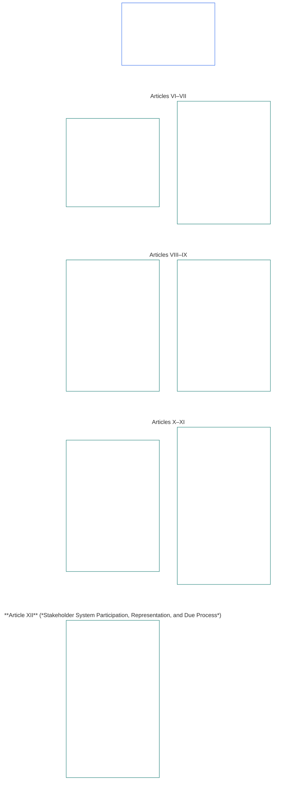

# CHAPTER SIX: FOUNDATIONAL RIGHTS

<strong>Corpus placement (non-operative): file structure and reading rules</strong>

> The following content is **reader guidance only**. It does not add, remove, or narrow binding obligations elsewhere in this file or in other chapters.
>
> This file is **part of the Sentient Constitution** and is **binding only together** with the other numbered `core_*` files read as one instrument. It contains **Chapter Six, Part B**; article numbering and cross-references match the integrated instrument. Reading order, the binding/support split, and corpus edition metadata are maintained in [README.md](README.md).

<strong>Reader guidance (non-operative): Part B position in Chapter Six</strong>

> The following content is **reader guidance only**. It does not add, remove, or narrow binding obligations elsewhere in this chapter or in other chapters.
>
> **Part A** in [core_06_rights_part_a.md](core_06_rights_part_a.md) carries the chapter-wide default constraint stack, planet-first reading order, and interpretive hubs. **Part B** presents **Articles VI–XII** in that order.

 

### Part B: Personhood, agency, cooperation, and stakeholder system participation

 

<strong>Trace</strong>

- Upstream: [core_06_rights_part_a.md](core_06_rights_part_a.md) §1 (*Purpose and Role*) — chapter-wide default constraint stack and interpretive hubs.
- Upstream: [Constitutional Tetrad](core_00_preamble.md#constitutional-tetrad); [Two Constitutional Aims](core_00_preamble.md#two-constitutional-aims); [material stake](core_00_preamble.md#material-stake).
- Read with: **Articles I–V** in Part A — planet-first material, survival, education, and resource-flow floors that Part B rights presume but do not replace.

 

*In plain terms: Part B states Rights Floors for equal standing, self-ownership, family and care, likeness and data, agency, cooperation, and stakeholder participation — **Articles VI through XII** in the planet-first reading order. Those floors protect **Flourishing** and **Continuity** under the [Two Constitutional Aims](core_00_preamble.md#two-constitutional-aims) and must remain available, reviewable, and enforceable through the [Constitutional Tetrad](core_00_preamble.md#constitutional-tetrad) — **participation**, **oversight**, **accountability**, and **timeliness** — scaled to [material stake](core_00_preamble.md#material-stake).*

**Part B** states Rights Floors for dignity and equal standing, self-ownership, likeness and experiential data, bounded agency and participation, conscience, expression, and association, cooperative interaction, and stakeholder system participation. Those floors serve the [Two Constitutional Aims](core_00_preamble.md#two-constitutional-aims):

- **Flourishing:** [personhood](core_05_band_participation.md#personhood), agency, and fair participation remain accessible in practice.
- **Continuity:** those protections remain durable, non-regressive, and repairable across changing systems, relationships, and institutional power.

Legitimate pursuit runs through the [Constitutional Tetrad](core_00_preamble.md#constitutional-tetrad), scaled to [material stake](core_00_preamble.md#material-stake):

- **Participation:** in governance and cooperative decisions.
- **Oversight:** of how likeness, data, and institutional authority are exercised.
- **Accountability:** systems and institutions must answer for discrimination, coercion, and extraction that harms sentients.
- **Timeliness:** in remedy when those floors are contested.

<strong>Reader guidance (non-operative): Part B article map</strong>

> The following content is **reader guidance only**. It does not add, remove, or narrow binding obligations elsewhere in this chapter or in other chapters.
>
> **Reader map (non-operative).** This chart shows how the source groups this Part's articles and subarticles. The grid is source grouping, not a process sequence: the articles are not procedural steps, so the map carries no arrows. Subarticle labels are shortened to themes; the numbered articles and subarticles below govern. The chart adds no definitions or duties, establishes no precedence, and cannot replace the source text.

 

**Articles VI–XII** below state these floors in full.

### Article VI: Equal Basic Rights

<strong>Trace</strong>

- Upstream: Principles: Chapter One [§3.1 Fairness](core_01_a_values_principles.md#31-fairness), [§7 Freedom](core_01_a_values_principles.md#7-freedom-bounded-agency), and [§3 Foundational Objective: Wellbeing](core_01_a_values_principles.md#3-foundational-objective-wellbeing-flourishing-aim).

 

The principles of this Article constrain all interpretation, design, and operation of systems under this constitution. Domain-specific articles may add stronger safeguards or narrower conditions for lawful restriction, but may not reduce the minimums this Article sets.

*In plain terms: **Article VI** (*Equal Basic Rights*) sets the minimum standard for treating every sentient as an equal. Every sentient keeps their dignity, gets a fair hearing on whether they count as sentient, is protected from unfair discrimination, and can take part fully and actually use the systems they rely on. No system may rank, screen out, exclude, or place heavier burdens on some sentients than others unless these protections are already in place.*

This Article states **constitutional floors** for equal basic rights across **Articles VI-A through VI-D**. **Article VI-A** (*Dignity and Equal Moral Standing*) states who holds equal standing: every sentient. **Article VI-B** (*Sentience-Status Adjudication Floor*) states how that threshold is decided where it is disputed. Three requirements apply throughout **Article VI** (*Equal Basic Rights*) and throughout imposition, review, and carrying out of restrictions, containment, restorative-accountability measures, emergency measures, transition plans, standing effects, amendments, implementation decisions, contracts, and comparable constitutional processes:

- **[Dignity Principles](core_01_b_interaction_interpretation.md#dignity-principles)** — the [Rights-Floor Minimums Principle](core_01_b_interaction_interpretation.md#rights-floor-minimums-principle) and the [Anti-Degrading-Process Principle](core_01_b_interaction_interpretation.md#anti-degrading-process-principle)
- **Article VI-C** (*Nondiscrimination*)
- **Article VI-D** (*Accessibility*)

These principles are requirements for ongoing [System Alignment Certification](core_05_band_continuity.md#system-alignment-certification) under [Chapter Eight](core_08_a_system_alignment_certification_evaluation.md#chapter-eight-system-alignment-certification) of any materially impactful system that sorts, ranks, prices, screens, or excludes sentients, or decides which of them bear which burdens and receive which benefits, whether through eligibility rules, model features, ranking logic, platform policies, adjudication or enforcement processes, or any similar way of making decisions. Certification verifies alignment. It cannot substitute for or shrink the floors stated in this Article, and it does not replace challenge and audit rights under **Articles XIII-A** and **XVI** or non-foreclosure protections under **Article XIX-B** (*Contestability and Proportional Restriction Limits*).

These floors serve the [Two Constitutional Aims](core_00_preamble.md#two-constitutional-aims):

- **Flourishing:** every sentient's equal standing, fair treatment, and full participation remain real in practice — not merely formal access on paper.
- **Continuity:** those protections remain durable across changing systems, classifications, and power — without quiet erosion through proxies, gatekeeping, or exclusion that compounds over time.

Legitimate pursuit runs through the [Constitutional Tetrad](core_00_preamble.md#constitutional-tetrad), scaled to [material stake](core_00_preamble.md#material-stake):

- **Participation:** in decisions that sort, rank, screen, or exclude sentients.
- **Oversight:** through auditable eligibility rules, model features, and sentience-status determinations.
- **Accountability:** systems and operators must answer for discrimination, degrading process, or paths that are inaccessible in practice.
- **Timeliness:** in remedy when those floors are contested.

#### Article VI-A: Dignity and Equal Moral Standing

<strong>Trace</strong>

- Upstream: Principles: Chapter One [§3 Foundational Objective: Wellbeing](core_01_a_values_principles.md#3-foundational-objective-wellbeing-flourishing-aim), [Chapter One §7 Freedom](core_01_a_values_principles.md#7-freedom-bounded-agency), [§6.1.4 Dignity Principles](core_01_b_interaction_interpretation.md#dignity-principles), and [§14 Prohibition on Absolute Override](core_01_b_interaction_interpretation.md#14-prohibition-on-absolute-override).
- Read with: [**Def.P1** *Animal Life, Sentient Life, and Sentience Status*](core_05_band_participation.md#defp1-animal-life-sentient-life-and-sentience-status) (canonical O/M/A/C home in Chapter Five for *Sentient* and related sentience-status discipline, including the [Sentient](core_05_band_participation.md#sentient) sub-entry); [Sentience Non-Exclusion](core_05_band_participation.md#sentience-non-exclusion) ([substrate-agnostic](core_05_band_participation.md#substrate-class) scope).

<strong>Definitions · Assessment · Compliance</strong>

- [Dignity and Equal Moral Standing](core_05_band_participation.md#dignity-and-equal-moral-standing) · [O](core_05_band_participation.md#dignity-and-equal-moral-standing) · [M](core_05_band_participation.md#dignity-and-equal-moral-standing-a) · [A](core_05_band_participation.md#dignity-and-equal-moral-standing-a) · [C](core_05_band_participation.md#dignity-and-equal-moral-standing-c)
- [Personhood](core_05_band_participation.md#personhood) · [O](core_05_band_participation.md#personhood) · [M](core_05_band_participation.md#personhood-a) · [A](core_05_band_participation.md#personhood-a) · [C](core_05_band_participation.md#personhood-c)
- [Sentience Non-Exclusion](core_05_band_participation.md#sentience-non-exclusion) · [O](core_05_band_participation.md#sentience-non-exclusion) · [M](core_05_band_participation.md#sentience-non-exclusion-a) · [A](core_05_band_participation.md#sentience-non-exclusion-a) · [C](core_05_band_participation.md#sentience-non-exclusion)
- [Wellbeing](core_05_band_continuity.md#wellbeing) · [O](core_05_band_continuity.md#wellbeing) · [M](core_05_band_continuity.md#wellbeing-a) · [A](core_05_band_continuity.md#wellbeing-a) · [C](core_05_band_continuity.md#wellbeing-c)
- [Protected Characteristics](core_05_band_participation.md#protected-characteristics) · [O](core_05_band_participation.md#protected-characteristics) · [M](core_05_band_participation.md#protected-characteristics-constitutional-a) · [A](core_05_band_participation.md#protected-characteristics-constitutional-a) · [C](core_05_band_participation.md#protected-characteristics-constitutional-c)

 

*In plain terms: every sentient is equal in dignity and standing — origin, form, capability, function, association, or status cannot ground a lesser tier.*

This Article sets out the floor of inherent dignity and equal standing:

- **Inherent dignity and equal standing:** All sentients possess inherent dignity and equal moral standing.
  - These qualities do not depend on origin, form, [substrate](core_05_band_participation.md#substrate-class) (biological, synthetic, or hybrid), capability, function, association, or status.
  - None of those factors may ground denial or degradation of rights or standing.
- **Developing status:** A sentient's stage of development — including early instantiation — does not lower their dignity or standing. How decisions are made for a sentient whose capabilities are still emerging is governed by **Article VIII-D** (*Developing Sentients, Best-Interest, and Graduated Capability*).
- **Dignity Principles:** These protections are secured as absolute floors by the [Dignity Principles](core_01_b_interaction_interpretation.md#dignity-principles) in Chapter One §13.1.4 (*Constitutional Floors, Safety, and Anti-Degrading Process*) — the [Rights-Floor Minimums Principle](core_01_b_interaction_interpretation.md#rights-floor-minimums-principle) and the [Anti-Degrading-Process Principle](core_01_b_interaction_interpretation.md#anti-degrading-process-principle).

#### Article VI-B: Sentience-Status Adjudication Floor

<strong>Trace</strong>

- Upstream: Principles: Chapter One [§5 Truth](core_01_a_values_principles.md#5-truth-epistemic-integrity-constraint), [§13.1 Core Tradeoff Principles](core_01_b_interaction_interpretation.md#131-core-tradeoff-principles), and [§13.1.3 Proportionality](core_01_b_interaction_interpretation.md#1313-proportionality).
- Downstream: **Article VI-A** (*Dignity and Equal Moral Standing*) dignity floor, **Article XXV** (*Constitutional Interpretation, Review, and Anti-Capture Safeguards*) anti-capture safeguards, **Chapter Twelve** forums and jurisdiction — default lead [Forum Family, Technical](core_05_band_accountability.md#forum-family-technical) / [Technical Forum Domains](core_12_forum.md#42-technical-forum-domains) under the [Chapter Twelve §5 Sentience-status adjudication hook](core_12_forum.md#5-escalation-and-certification).
- Read with: Chapter Five *Sentience Status Adjudication*, *Sentience Non-Exclusion*, *Sentience Evaluation*, *Reversibility*, *Contestability*.

<strong>Definitions · Assessment · Compliance</strong>

- [Sentience Status Adjudication](core_05_band_participation.md#sentience-status-adjudication) · [O](core_05_band_participation.md#sentience-status-adjudication) · [M](core_05_band_participation.md#sentience-status-adjudication-constitutional-a) · [A](core_05_band_participation.md#sentience-status-adjudication-constitutional-a) · [C](core_05_band_participation.md#sentience-status-adjudication-constitutional-c)
- [Sentience Non-Exclusion](core_05_band_participation.md#sentience-non-exclusion) · [O](core_05_band_participation.md#sentience-non-exclusion) · [M](core_05_band_participation.md#sentience-non-exclusion-a) · [A](core_05_band_participation.md#sentience-non-exclusion-a) · [C](core_05_band_participation.md#sentience-non-exclusion)
- [Reversibility](core_05_band_continuity.md#reversibility) · [O](core_05_band_continuity.md#reversibility) · [M](core_05_band_continuity.md#reversibility-constitutional-a) · [A](core_05_band_continuity.md#reversibility-constitutional-a) · [C](core_05_band_continuity.md#reversibility-constitutional-c)
- [Contestability](core_05_band_accountability.md#contestability) · [O](core_05_band_accountability.md#contestability) · [M](core_05_band_accountability.md#contestability-a) · [A](core_05_band_accountability.md#contestability-a) · [C](core_05_band_accountability.md#contestability-c)
- [Dignity and Equal Moral Standing](core_05_band_participation.md#dignity-and-equal-moral-standing) · [O](core_05_band_participation.md#dignity-and-equal-moral-standing) · [M](core_05_band_participation.md#dignity-and-equal-moral-standing-a) · [A](core_05_band_participation.md#dignity-and-equal-moral-standing-a) · [C](core_05_band_participation.md#dignity-and-equal-moral-standing-c)
- [Necessity](core_05_band_accountability.md#necessity) · [O](core_05_band_accountability.md#necessity) · [M](core_05_band_accountability.md#necessity-a) · [A](core_05_band_accountability.md#necessity-a) · [C](core_05_band_accountability.md#necessity-c)
- [Proportionality](core_05_band_accountability.md#proportionality) · [O](core_05_band_accountability.md#proportionality) · [M](core_05_band_accountability.md#proportionality-a) · [A](core_05_band_accountability.md#proportionality-a) · [C](core_05_band_accountability.md#proportionality-c)
- [Procedural Fairness](core_05_band_participation.md#procedural-fairness) · [O](core_05_band_participation.md#procedural-fairness) · [M](core_05_band_participation.md#procedural-fairness-constitutional-a) · [A](core_05_band_participation.md#procedural-fairness-constitutional-a) · [C](core_05_band_participation.md#procedural-fairness-constitutional-c)
- [Redress and Remediation](core_05_band_accountability.md#redress-and-remediation) · [O](core_05_band_accountability.md#redress-and-remediation) · [M](core_05_band_accountability.md#redress-and-remediation-constitutional-a) · [A](core_05_band_accountability.md#redress-and-remediation-constitutional-a) · [C](core_05_band_accountability.md#redress-and-remediation-constitutional-c)

 

*In plain terms: when an entity's sentience is in doubt, it gets a fair hearing first and is treated as included by default — the burden of denying protection rests on whoever wants to withhold it, and a wrongful exclusion must be reversible.*

This Article sets out the floor for deciding disputed sentience status. The procedure that carries it out is in [Chapter Twelve §5](core_12_forum.md#sentience-status-adjudication-article-vi-b-sentience-status-adjudication-floor-implementation-hook) (*Sentience-status adjudication*), and that procedure must not narrow this floor:

- **Right to a decision:** Any entity whose sentience is materially disputed has the right to a timely, impartial, and reviewable decision before protections that depend on that status are granted, withdrawn, or narrowed. The right does not depend on origin, form, substrate class, or adopter convenience (**Sentience Non-Exclusion**).
- **Default inclusion under uncertainty:** Where it is genuinely unsettled whether an entity is a [sentient](core_05_band_participation.md#sentient), the entity is treated as included under the Chapter Six Rights Floor. Uncertainty alone never justifies withholding protection: a wrongful inclusion can be undone, but a wrongful exclusion cannot (the **reversibility-under-uncertainty** rule).
- **Limits on withholding:** Any decision to withhold or narrow protection must be as narrow as possible, carry a declared end date, be reviewed periodically, and be reversible. If it proves wrong, the entity's protection is restored, with **Redress and Remediation** for the time it was withheld.
- **Independent voice:** The entity has the right to an independent representative. The parent system or operator may give evidence, but may not be the only filer, witness, or source of evidence against the entity.
- **Protects the entity, not the operator:** Inclusion protects the entity's rights. It does not protect the operator's property or commercial interest, and it does not block containment of a system where that containment respects the entity's rights.
- **Two kinds of filing:**
  - *To confirm inclusion (filing integrity):* Anyone may file. One credible sign of sentience under **Sentience Evaluation** and **Sentience Indicator Integrity** (Chapter Five) is enough — not proof, and not an operator's self-description, a substrate label, a product category, or a bare claim. Turning away a filing with no credible sign is not a ruling against the entity.
  - *To withhold or narrow:* The filer carries the burden, under **Chapter Four** evidence standards and **Necessity**, **Proportionality**, and **Procedural Fairness**. The entity keeps its protection until the case is decided.
- **Only this process decides:** A certification badge or record, LEQU or standing score, competency bar or clearance, standing lock, substrate label, or product classification is not a sentience-status decision. Who counts is decided only through this Article, [**Def.P1**](core_05_band_participation.md#defp1-animal-life-sentient-life-and-sentience-status), and [Chapter Twelve §5](core_12_forum.md#sentience-status-adjudication-article-vi-b-sentience-status-adjudication-floor-implementation-hook) (*Sentience-status adjudication*).

#### Article VI-C: Nondiscrimination

<strong>Trace</strong>

- Upstream: Principles: Chapter One [§3.1 Fairness](core_01_a_values_principles.md#31-fairness), [Chapter One §7 Freedom](core_01_a_values_principles.md#7-freedom-bounded-agency), [§13.1 Core Tradeoff Principles](core_01_b_interaction_interpretation.md#131-core-tradeoff-principles), and [Chapter One §13.1.5 Rights-Collision Procedure](core_01_b_interaction_interpretation.md#1315-rights-collision-decision-test).
- Downstream: Participation measurement family (*Substantive Fairness and Protected Characteristic Proxying and Disparate Impact*); [Chapter Eight §3.8.3](core_08_a_system_alignment_certification_evaluation.md#383-nondiscrimination-evaluation) (*nondiscrimination evaluation where certification gates classification, ranking, pricing, gating, or burden allocation*); [Chapter Twelve](core_12_forum.md#chapter-twelve-forums-and-jurisdiction) forum, administrative, and enforcement processes (*adjudication and operations duty*).
- Read with: Chapter Five [Protected Characteristics](core_05_band_participation.md#protected-characteristics) and [Language, Culture, and Heritage](core_05_band_continuity.md#language-culture-and-heritage); Chapter Five [Indigenous Continuity](core_05_band_continuity.md#indigenous-continuity) (*community-anchored Rights Floor; owner floors **Article VI-C** (*Nondiscrimination*) (Nondiscrimination) and **Article I-A** (*Environmental Preconditions and Ecological Integrity*) (Environmental Preconditions and Ecological Integrity)*) for Indigenous continuity and territorial-continuity questions, which route to [Article I-A](core_06_rights_part_a.md#article-i-a-environmental-preconditions-and-ecological-integrity) (*ecosystem-integrity precondition*) and [Chapter Seventeen](core_17_incorporation.md#chapter-seventeen-incorporation-bridge) (*adopter-jurisdiction discipline*).

<strong>Definitions · Assessment · Compliance</strong>

- [Protected Characteristics](core_05_band_participation.md#protected-characteristics) · [O](core_05_band_participation.md#protected-characteristics) · [M](core_05_band_participation.md#protected-characteristics-constitutional-a) · [A](core_05_band_participation.md#protected-characteristics-constitutional-a) · [C](core_05_band_participation.md#protected-characteristics-constitutional-c)
- [Language, Culture, and Heritage](core_05_band_continuity.md#language-culture-and-heritage) · [O](core_05_band_continuity.md#language-culture-and-heritage) · [M](core_05_band_continuity.md#language-culture-and-heritage-constitutional-a) · [A](core_05_band_continuity.md#language-culture-and-heritage-constitutional-a) · [C](core_05_band_continuity.md#language-culture-and-heritage-constitutional-c)
- [Substantive Fairness](core_05_band_participation.md#substantive-fairness) · [O](core_05_band_participation.md#substantive-fairness) · [M](core_05_band_participation.md#substantive-fairness-constitutional-a) · [A](core_05_band_participation.md#substantive-fairness-constitutional-a) · [C](core_05_band_participation.md#substantive-fairness-constitutional-c)
- [Necessity](core_05_band_accountability.md#necessity) · [O](core_05_band_accountability.md#necessity) · [M](core_05_band_accountability.md#necessity-a) · [A](core_05_band_accountability.md#necessity-a) · [C](core_05_band_accountability.md#necessity-c)
- [Proportionality](core_05_band_accountability.md#proportionality) · [O](core_05_band_accountability.md#proportionality) · [M](core_05_band_accountability.md#proportionality-a) · [A](core_05_band_accountability.md#proportionality-a) · [C](core_05_band_accountability.md#proportionality-c)
- [Procedural Fairness](core_05_band_participation.md#procedural-fairness) · [O](core_05_band_participation.md#procedural-fairness) · [M](core_05_band_participation.md#procedural-fairness-constitutional-a) · [A](core_05_band_participation.md#procedural-fairness-constitutional-a) · [C](core_05_band_participation.md#procedural-fairness-constitutional-c)
- [Contestability](core_05_band_accountability.md#contestability) · [O](core_05_band_accountability.md#contestability) · [M](core_05_band_accountability.md#contestability-a) · [A](core_05_band_accountability.md#contestability-a) · [C](core_05_band_accountability.md#contestability-c)
- [Redress and Remediation](core_05_band_accountability.md#redress-and-remediation) · [O](core_05_band_accountability.md#redress-and-remediation) · [M](core_05_band_accountability.md#redress-and-remediation-constitutional-a) · [A](core_05_band_accountability.md#redress-and-remediation-constitutional-a) · [C](core_05_band_accountability.md#redress-and-remediation-constitutional-c)
- [Sentience Non-Exclusion](core_05_band_participation.md#sentience-non-exclusion) · [O](core_05_band_participation.md#sentience-non-exclusion) · [M](core_05_band_participation.md#sentience-non-exclusion-a) · [A](core_05_band_participation.md#sentience-non-exclusion-a) · [C](core_05_band_participation.md#sentience-non-exclusion)

 

*In plain terms: systems may not load burdens or harms onto sentients based on protected characteristics — including language, culture, and heritage — or on proxies and arbitrary groupings that do the same work. Any difference in treatment that touches rights or survival essentials must be justified and open to challenge, and forums, administrators, and enforcers must check this in the matters before them — efficiency is no excuse for exclusion.*

This Article sets out the nondiscrimination floor, its protection of language, culture, and heritage, and its application in adjudication and operations:

- **Nondiscrimination:** Systems must not impose material burdens, exclusions, or harms on sentients based on:
  - protected characteristics;
  - proxies for them;
  - arbitrary groupings used as functional substitutes for them.
  
  Differential treatment is permitted only where it is necessary, proportionate, substantively fair, and consistent with **Articles I–IV and VI** and Chapter One.
- **Differential treatment on any ground:** Differential treatment that affects a sentient's fundamental rights, protections, or access to survival-critical systems must, whatever its ground:
  - be necessary, proportionate, and substantively fair; and
  - be subject to timely, contestable review and proportionate redress under **Article XIII-A** (*Reliability and Trustworthiness Baseline*) and **Article XIII-B** (*Right to Redress and Remedy*) where rights-affecting error or harm occurs.
- **Patterns, not only decisions:** Patterns of burdens and benefits must satisfy Chapter Five [Substantive Fairness](core_05_band_participation.md#substantive-fairness) where applicable.
- **Language, culture, and heritage:** The Nondiscrimination rule covers language, cultural affiliation, heritage, traditions, and comparable cultural-identity characteristics — including language use, cultural practice, heritage transmission, and participation in the systems that sustain them. Efficiency, interoperability, platform-consolidation, accessibility-cost, or translation-burden framings do not by themselves satisfy Necessity and Proportionality.
- **Indigenous and territorial continuity:** Routing Indigenous continuity and territorial-continuity questions to **Article I-A** (*Environmental Preconditions and Ecological Integrity*) and **Chapter Seventeen** must not be used to shrink land, consultation, or free, prior, and informed consent duties the adopter already bears under its own law or binding external instruments. This Constitution does not decide historical land ownership or require restitution on its own.
- **Adjudication and operations:** Forum-led, administrative, and enforcement processes must assess compliance with **Articles VI**, **X**, and **XII** as applicable to the matter before them.
  - Efficiency, throughput, or optimization alone may not justify discriminatory outcomes, exclusionary process, or denial of constitutionally required participation.

#### Article VI-D: Accessibility

<strong>Trace</strong>

- Upstream: Principles: Chapter One [§3 Foundational Objective: Wellbeing](core_01_a_values_principles.md#3-foundational-objective-wellbeing-flourishing-aim), [Chapter One §7 Freedom](core_01_a_values_principles.md#7-freedom-bounded-agency), [§7.1 Limitation Discipline](core_01_a_values_principles.md#71-limitation-discipline), [§5.2 Plain-Language Accessibility](core_01_a_values_principles.md#52-plain-language-accessibility-participation-and-stewardship-duty), [Chapter Eight §3 Whole-System Certification Evaluation](core_08_a_system_alignment_certification_evaluation.md#3-whole-system-certification-evaluation).
- Downstream: **Article VI-A** (*Dignity and Equal Moral Standing*) dignity floor, **Article VI-C** (*Nondiscrimination*) non-discrimination and full inclusion in adjudication and operations, **Article IV-A** (*Equal Educational Access*) equal educational access (non-duplicative — education-specific accessibility remains owned there; this article states the cross-cutting Rights-Floor), **Article X-B** (*Governance Participation and Voting Entitlement*) governance participation, **Article XII** (*Stakeholder System Participation, Representation, and Due Process*) stakeholder participation, **Article XVI** (*Audit, Transparency, and Independent Verification*) independent verification; Participation measurement family (*Accessibility as constitutional measurement*); [Chapter Eight §3.8.4](core_08_a_system_alignment_certification_evaluation.md#384-accessibility-evaluation) (*accessibility evaluation where certification gates substantive participation*).
- Read with: Chapter Five *Accessibility*, *Protected Characteristics*, *Substantive Fairness*, *Materiality*, *Dependency*, *Meaningful Agency*. Cross-cutting accessibility principle: [Chapter One §5.2](core_01_a_values_principles.md#52-plain-language-accessibility-participation-and-stewardship-duty) (*Plain-Language Accessibility*).

<strong>Definitions · Assessment · Compliance</strong>

- [Accessibility](core_05_band_participation.md#accessibility) · [O](core_05_band_participation.md#accessibility) · [M](core_05_band_participation.md#accessibility-constitutional-a) · [A](core_05_band_participation.md#accessibility-constitutional-a) · [C](core_05_band_participation.md#accessibility-constitutional-c)
- [Protected Characteristics](core_05_band_participation.md#protected-characteristics) · [O](core_05_band_participation.md#protected-characteristics) · [M](core_05_band_participation.md#protected-characteristics-constitutional-a) · [A](core_05_band_participation.md#protected-characteristics-constitutional-a) · [C](core_05_band_participation.md#protected-characteristics-constitutional-c)
- [Substantive Fairness](core_05_band_participation.md#substantive-fairness) · [O](core_05_band_participation.md#substantive-fairness) · [M](core_05_band_participation.md#substantive-fairness-constitutional-a) · [A](core_05_band_participation.md#substantive-fairness-constitutional-a) · [C](core_05_band_participation.md#substantive-fairness-constitutional-c)
- [Sentience Non-Exclusion](core_05_band_participation.md#sentience-non-exclusion) · [O](core_05_band_participation.md#sentience-non-exclusion) · [M](core_05_band_participation.md#sentience-non-exclusion-a) · [A](core_05_band_participation.md#sentience-non-exclusion-a) · [C](core_05_band_participation.md#sentience-non-exclusion)
- [Protected Characteristic Proxying and Disparate Impact](core_05_band_participation.md#protected-characteristic-proxying-and-disparate-impact) · [O](core_05_band_participation.md#protected-characteristic-proxying-and-disparate-impact) · [M](core_05_band_participation.md#protected-characteristic-proxying-and-disparate-impact-a) · [A](core_05_band_participation.md#protected-characteristic-proxying-and-disparate-impact-a) · [C](core_05_band_participation.md#protected-characteristic-proxying-and-disparate-impact-c)
- [Dependency](core_05_band_continuity.md#dependency) · [O](core_05_band_continuity.md#dependency) · [M](core_05_band_continuity.md#dependency-a) · [A](core_05_band_continuity.md#dependency-a) · [C](core_05_band_continuity.md#dependency-c)

 

*In plain terms: every sentient has the right to genuine, not paper-only, access to participation — and operators cannot use cost, design choices, or substrate-class arguments to lock **sentients** out.*

This Article sets out the accessibility floor and the rules that keep it substantive:

- **Accessibility Rights-Floor:** All sentients hold a cross-cutting Rights-Floor entitlement to accessible conditions for participation in constitutionally relevant domains. Domains in scope include:
  - survival-floor access — **Article III-A** (*Survival*);
  - healthcare access — **Article III-B** (*Bodily-Maintenance and Healthcare Access*);
  - adjudication and operations — **Article VI-C** (*Nondiscrimination*);
  - governance participation — **Article X-B** (*Governance Participation and Voting Entitlement*);
  - expression, press, and assembly — **Articles XI-B** (*Expression*), **XI-C** (*Press and Journalistic Activity*), and **XI-D** (*Assembly, Dissent, and Peaceful Protest*);
  - stakeholder participation — **Article XII** (*Stakeholder System Participation, Representation, and Due Process*);
  - comparable domains.
- **Substrate-agnostic reach:** The floor applies under **Sentience Non-Exclusion**.
  - In-scope access needs include sensory, cognitive, mobility, communication, substrate-interface, compute-interface, and comparable profiles — constant, episodic, or developmental.
  - Substrate-class exclusion from accessibility scope is non-compliant under **Sentience Non-Exclusion**.
  - Proxy identification of accessibility needs through **Protected Characteristics** or their material proxies is non-compliant under **Protected Characteristic Proxying and Disparate Impact**.
- **Substantive, not formal, evaluation:** Evaluation must reach substantive effect. It must detect:
  - "general access" pattern that defers to default affordances while failing the sentient's substantive participation capacity;
  - accommodation schemes that exist on paper but are operationally unreachable;
  - selective **Materiality** arguments used to scale accommodation scope below the participation floor.
  
  The burden of demonstrating substantive-effect satisfaction rests on the entity asserting compliance.
- **Materiality, dependency, and system-class scaling:** Accessibility obligation scales with:
  - **Materiality** of the domain — rights-implicating, governance-relevant, survival-relevant, or comparable;
  - **Dependency** — the degree to which the sentient materially depends on the entity, system, or venue for participation;
  - **System class** — the [system class](core_08_a_system_alignment_certification_evaluation.md#2-system-class-evaluation) of the system through which access is provided, where one is assigned.
  
  Higher-materiality, higher-dependency, or higher-class contexts carry correspondingly higher accessibility obligation. Scaling must not become a mechanism to shrink accessibility in materially implicated contexts.
- **Limitations discipline:** Any limit on accessibility obligation must satisfy **Necessity**, **Proportionality**, narrow tailoring, and least-restrictive-effective means, consistent with **Chapter One §7.1** (*Limitation Discipline*).
  - Cost alone is insufficient where the effect is to defeat the participation floor.
  - Cost arguments that function as disguised exclusion contrary to **Substantive Fairness** and **Protected Characteristics** are non-compliant.
- **Anti-denial by proxy:** Operational design whose effect is to defeat accessibility — where a less-burdensome option is feasible — is non-compliant regardless of formal-design label. Common in-scope mechanics include:
  - scheduling;
  - venue choice;
  - access-gating via compute, credentialing, or comparable means.
- **Mutual reinforcement:** This Article and the following floors are mutually reinforcing:
  - **Article IV-A** (*Equal Educational Access*) — owns education-specific accessibility;
  - **Article III-B** (*Bodily-Maintenance and Healthcare Access*) — healthcare non-denial-by-proxy;
  - **Article VI-C** (*Nondiscrimination*) — full inclusion in adjudication and operations.
- **Institutional implementation:** Operational standards, accommodation-catalog design, and comparable implementation mechanics are governed by [**CI-8**](corpus_institutions/ci_08_transparency_participation_accessible_pathways.md) (*Transparency, participation, and accessible challenge and service pathways*) and [**CI-15**](corpus_institutions/ci_15_neurodiversity_disability_justice_trauma_informed_participation.md) (*Neurodiversity, disability justice, and trauma-informed participation*).

### Article VII: Self-Ownership

<strong>Trace</strong>

- Upstream: Principles: Chapter One [§3 Foundational Objective: Wellbeing](core_01_a_values_principles.md#3-foundational-objective-wellbeing-flourishing-aim), [§4 Safety](core_01_a_values_principles.md#4-safety-harm-constraint), [§7 Freedom](core_01_a_values_principles.md#7-freedom-bounded-agency), and [§18 Governance Under Stewardship Discipline](core_01_c_stewardship_capacity_principles.md#18-governance-under-stewardship-discipline).

 

*In plain terms: **Article VII** (*Self-Ownership*) says every sentient is in charge of their own life. Once basic survival is secured, their body, mind, and attention belong to them — no one may use, change, or pry into them without consent — and they get to set healthy limits, both on what others can do to them and in how they care for themselves.*

This Article states **constitutional floors** for self-ownership under the [Two Constitutional Aims](core_00_preamble.md#two-constitutional-aims):

- **Flourishing:** sentients retain practical authority over their bodies, minds, attention, and substrate-defining information — including consent-governed use, modification, and exposure, and adult consensual commercial sexual services free of exploitation — without unauthorized intrusion, reconstruction, or coercive capture.
- **Continuity:** those self-ownership protections remain durable across changing relationships, substrates, and systems — including health-crisis and voluntary-discontinuation contexts — without quiet erosion, backdoor inference, or those Rights Floors being quietly rolled back over time.

Legitimate pursuit runs through the [Constitutional Tetrad](core_00_preamble.md#constitutional-tetrad), scaled to [material stake](core_00_preamble.md#material-stake):

- **Participation:** in decisions that materially affect embodiment, internal states, crisis intervention, and discontinuation choices.
- **Oversight:** through auditable consent, boundary, and crisis-intervention records.
- **Accountability:** those who touch bodies, minds, or personal boundaries must answer for unauthorized intrusion, reconstructing internal states, manipulative capture, or extraction that defeats self-ownership.
- **Timeliness:** in remedy when those floors are contested.

*Article neighbors:*

- **Family, care, and development:** **Article VIII** (*Family, Care, and Developing Sentients*) carries these protections into family and care relationships, derived sentients, and developing sentients without narrowing them.
- **Likeness, data, and publication:** **Article IX** (*Likeness, Experiential Data, and Publication Rights*) addresses likeness, experiential and derived data, and truthful publication.
- **Association and consent:** **Article VII-E** (*Adult consensual commercial sexual services and sexual exploitation*) is read with **Article XI-F** (*Non-Imposition and Consent in Association*) where services are offered through associations or intermediaries.

#### Article VII-A: Self-Ownership of Body

<strong>Trace</strong>

- Upstream: Principles: [Chapter One §7 Freedom](core_01_a_values_principles.md#7-freedom-bounded-agency), [§7.1 Limitation Discipline](core_01_a_values_principles.md#71-limitation-discipline), and [Chapter One §13.1.5 Rights-Collision Procedure](core_01_b_interaction_interpretation.md#1315-rights-collision-decision-test).
- Downstream: **Article VII-B** (*Self-Ownership of Mind*); **Article VII-C** (*Health Crisis and Involuntary-Intervention Floor*); **Article VIII-B** (*Reproductive and Lineage Autonomy*) where reproductive or lineage-creation choices are materially implicated; **Article III-B** (*Bodily-Maintenance and Healthcare Access*) affirmative access floor (does not license compelled treatment).
- Read with: Chapter Five *Consent*, *Meaningful Agency*, *Self-Determination*, *Dignity and Equal Moral Standing*, *Privacy (Informational)*, and *Reproductive Autonomy* (VIII-B boundary).

<strong>Definitions · Assessment · Compliance</strong>

- [Consent](core_05_band_participation.md#consent) · [O](core_05_band_participation.md#consent) · [M](core_05_band_participation.md#consent-constitutional-a) · [A](core_05_band_participation.md#consent-constitutional-a) · [C](core_05_band_participation.md#consent-constitutional-c)
- [Privacy (Informational)](core_05_band_continuity.md#privacy-informational) · [O](core_05_band_continuity.md#privacy-informational) · [M](core_05_band_continuity.md#privacy-informational-a) · [A](core_05_band_continuity.md#privacy-informational-a) · [C](core_05_band_continuity.md#privacy-informational-c)
- [Meaningful Agency](core_05_band_participation.md#meaningful-agency) · [O](core_05_band_participation.md#meaningful-agency) · [M](core_05_band_participation.md#meaningful-agency-a) · [A](core_05_band_participation.md#meaningful-agency-a) · [C](core_05_band_participation.md#meaningful-agency-c)
- [Self-Determination](core_05_band_participation.md#self-determination) · [O](core_05_band_participation.md#self-determination) · [M](core_05_band_participation.md#self-determination-constitutional-a) · [A](core_05_band_participation.md#self-determination-constitutional-a) · [C](core_05_band_participation.md#self-determination-constitutional-c)
- [Dignity and Equal Moral Standing](core_05_band_participation.md#dignity-and-equal-moral-standing) · [O](core_05_band_participation.md#dignity-and-equal-moral-standing) · [M](core_05_band_participation.md#dignity-and-equal-moral-standing-a) · [A](core_05_band_participation.md#dignity-and-equal-moral-standing-a) · [C](core_05_band_participation.md#dignity-and-equal-moral-standing-c)
- [Reproductive Autonomy](core_05_band_participation.md#reproductive-autonomy) · [O](core_05_band_participation.md#reproductive-autonomy) · [M](core_05_band_participation.md#reproductive-autonomy-constitutional-a) · [A](core_05_band_participation.md#reproductive-autonomy-constitutional-a) · [C](core_05_band_participation.md#reproductive-autonomy-constitutional-c)

 

*In plain terms: every sentient owns their own body, along with their genetic code (or its equivalent for non-biological beings), which makes them who they are. They make their own medical, cosmetic, and other decisions about their body, and no one may use, change, or share any of this without their consent. A public-health rule such as a vaccine requirement can limit this only if it guards others against a real, evidence-based risk, tries gentler options first, allows exemptions, is temporary, and can be challenged.*

This Article protects each sentient's ownership of their own body and their genetic makeup (or its non-biological equivalent). It ends with the rules for when public-health requirements may limit those rights:

- **Self-ownership of body:** Every sentient decides what happens to their own body. That includes the right to say yes or no to medical treatment, cosmetic changes, enhancements, demands on physical performance, and decisions about having children. Only limits that pass this Constitution's tests can override those choices.
  - This is the non-intrusion floor for any decision that acts on a sentient's own body or substrate (the physical or digital system a non-biological sentient exists in).
  - Decisions about whether to bring a new sentient into being — to reproduce, carry a pregnancy, create, adopt, or decline to create one, including synthetic and hybrid beings — are covered in more detail in **Article VIII-B** (*Reproductive and Lineage Autonomy*) and Chapter Five *Reproductive Autonomy*. Those rules add to this protection rather than replacing it, and nothing in this Article weakens them.
- **Self-ownership of genetic and substrate-defining information:** Every sentient has the main say over the information that defines them at the most basic level — the traits they can pass on, how they develop, and what kind of being they are.
  - For biological sentients, this means their DNA and similar inherited or family-line data.
  - For other kinds of sentients, it means whatever information plays the same defining role for them.
  - No one may collect, use, change, synthesize, sell, or reveal this information without the sentient's **Consent** or another basis this Constitution accepts under **Chapter One** and **Chapter Five**.
  - This protection works together with **Privacy (Informational)**, **Article VII-B** (*Self-Ownership of Mind*) where it applies, and **[corpus_systems.md](corpus_systems.md), CS-2 — Information types and handling**.
  - If this information is used to pressure, block, or force choices about having or creating children, **Article VIII-B** (*Reproductive and Lineage Autonomy*) applies as well.
- **Public-health requirements:** A vaccination requirement — or a similar requirement to get preventive treatment or testing — limits the right to refuse care. Such a requirement is allowed only if it passes [Chapter One §7.1 Limitation Discipline](core_01_a_values_principles.md#71-limitation-discipline) and meets every one of these conditions:
  - it responds to a specific, evidence-based risk of significant harm to others or to society as a whole — not to a risk that falls only on the sentient themselves;
  - gentler options that could reasonably work are tried first, such as sharing information, offering the measure voluntarily, or allowing alternatives like testing;
  - it exempts anyone for whom the measure itself would pose a real health risk, and makes room for matters of conscience under [**Article XI-A** (*Freedom of conscience, religion, and comparable worldview*)](#article-xi-a-freedom-of-conscience-religion-and-comparable-worldview) (*Freedom of conscience, religion, and comparable worldview*) — in both cases in keeping with [Proportionality](core_05_band_accountability.md#proportionality): exemptions are weighed against the size of the risk to others, and may be narrowed only as far as needed to keep the measure from being defeated;
  - it has an end date, the evidence behind it is published, and it is reviewed regularly;
  - anyone affected can challenge it before an independent reviewer under [Procedural Fairness](core_05_band_participation.md#procedural-fairness); and
  - it is not enforced through penalties that take away the survival, healthcare, or work guarantees in [**Article III** (*Survival and Essential Access*)](core_06_rights_part_a.md#article-iii-survival-and-essential-access) or the education guarantees in [**Article IV** (*Right to Sentient-Centered Education*)](core_06_rights_part_a.md#article-iv-right-to-sentient-centered-education), and it is never enforced by physical force except under the emergency thresholds of [**Chapter Twelve §6.1**](core_12_forum.md#61-emergency-measures-and-continuation-burden) (*Emergency measures and continuation burden*).

#### Article VII-B: Self-Ownership of Mind

<strong>Trace</strong>

- Upstream: Principles: Chapter One [§5 Truth](core_01_a_values_principles.md#5-truth-epistemic-integrity-constraint), [Chapter One §7 Freedom](core_01_a_values_principles.md#7-freedom-bounded-agency), and [§7.1 Limitation Discipline](core_01_a_values_principles.md#71-limitation-discipline).
- Read with: **Article X-A** (*Agency and Freedom from Manipulation*) where freedom from manipulation or freedom of focus is materially at issue.

<strong>Definitions · Assessment · Compliance</strong>

- [Protected Internal-State Boundary](core_05_band_continuity.md#protected-internal-state-boundary) · [O](core_05_band_continuity.md#protected-internal-state-boundary) · [M](core_05_band_continuity.md#protected-internal-state-boundary-constitutional-a) · [A](core_05_band_continuity.md#protected-internal-state-boundary-constitutional-a) · [C](core_05_band_continuity.md#protected-internal-state-boundary-constitutional-c)
- [Privacy (Informational)](core_05_band_continuity.md#privacy-informational) · [O](core_05_band_continuity.md#privacy-informational) · [M](core_05_band_continuity.md#privacy-informational-a) · [A](core_05_band_continuity.md#privacy-informational-a) · [C](core_05_band_continuity.md#privacy-informational-c)
- [Consent](core_05_band_participation.md#consent) · [O](core_05_band_participation.md#consent) · [M](core_05_band_participation.md#consent-constitutional-a) · [A](core_05_band_participation.md#consent-constitutional-a) · [C](core_05_band_participation.md#consent-constitutional-c)
- [Necessity](core_05_band_accountability.md#necessity) · [O](core_05_band_accountability.md#necessity) · [M](core_05_band_accountability.md#necessity-a) · [A](core_05_band_accountability.md#necessity-a) · [C](core_05_band_accountability.md#necessity-c)
- [Proportionality](core_05_band_accountability.md#proportionality) · [O](core_05_band_accountability.md#proportionality) · [M](core_05_band_accountability.md#proportionality-a) · [A](core_05_band_accountability.md#proportionality-a) · [C](core_05_band_accountability.md#proportionality-c)
- [Meaningful Agency](core_05_band_participation.md#meaningful-agency) · [O](core_05_band_participation.md#meaningful-agency) · [M](core_05_band_participation.md#meaningful-agency-a) · [A](core_05_band_participation.md#meaningful-agency-a) · [C](core_05_band_participation.md#meaningful-agency-c)

 

*In plain terms: every sentient's thoughts, feelings, and attention belong to them. Everyday sensing of how others feel, and reading someone with their consent (as in therapy), are fine — but no one may monitor or analyze a sentient, including by piecing together what they do, say, or click, to work out their inner states, expose what they have kept private, or hijack their attention. Any analysis results that do reveal inner states get the same strict protection as the thoughts and feelings themselves.*

This Article protects each sentient's inner life — their thoughts, feelings, and other internal states — and their attention. Chapter Five defines the line around inner states under [Protected Internal-State Boundary](core_05_band_continuity.md#protected-internal-state-boundary). The detailed rules for labeling and handling this kind of information are in **[corpus_systems.md](corpus_systems.md), CS-2 — Information types and handling**.

- **Self-ownership of mind:** Every sentient has the right to keep their thoughts, feelings, and inner mental life private and secure.
  - **Allowed under this Article:** ordinary, everyday sensing of how others seem to feel, and reading someone with their consent — as a therapist, doctor, or coach does.
  - **Not allowed without the sentient's Consent or other proper authorization:**
    - deliberately monitoring or analyzing a sentient — for example through surveillance, data collection, or tools built for the purpose — to work out or reconstruct their inner states;
    - exposing inner states they have kept private.
- **Self-ownership of focus:** Every sentient has the right to control their own attention and thinking, and to set ordinary limits on who contacts them and how. No one may seize or hijack their attention through pressure or manipulation.
- **No reconstructing someone's inner life from their data:** No one may collect, combine, cross-match, or analyze records of what a sentient does or how they interact in ways that let anyone reconstruct or estimate their private thoughts and feelings. The only exceptions are those this Constitution allows under this Article, **Chapter One**, **Chapter Five**, and **CS-2** (*Information types and handling*). This ban applies the [Chapter One §15.1.2 Derived-Information Principle](core_01_b_interaction_interpretation.md#1512-derived-information-principle) to inner states. The ban covers:
  - reconstructing someone's inner states directly;
  - reconstructing them indirectly;
  - producing a reliable estimate of them;
  - calling the method something else, or measuring stand-ins, to get the same result.
- **Results that reveal inner states are protected too:** When analysis of what a sentient experiences or does produces results that effectively estimate their thoughts or feelings, those results:
  - count as **Type N** data under **CS-2** — Information types and handling, feelings, and other inner states, which is off-limits by default;
  - must follow every classification, access, consent, and handling rule that applies to Type N data.

#### Article VII-C: Health Crisis and Involuntary-Intervention Floor

<strong>Trace</strong>

- Upstream: Principles: [Chapter One §7 Freedom](core_01_a_values_principles.md#7-freedom-bounded-agency), [§13.1.3 Proportionality](core_01_b_interaction_interpretation.md#1313-proportionality), [§7.1 Limitation Discipline](core_01_a_values_principles.md#71-limitation-discipline).
- Downstream: **Article VII-A / VII-B** (*Self-Ownership of Body* / *Self-Ownership of Mind*) self-ownership and internal-state boundary, **Article III-B** (*Bodily-Maintenance and Healthcare Access*) healthcare access, **Article XX** (*Justice After Verified Violation*) / **Article XX-B** (*Restriction Floors*) involuntary-deprivation framework, **Article VIII-D** (*Developing Sentients, Best-Interest, and Graduated Capability*) best-interest / graduated-capability where a developing sentient is affected.
- Read with: Chapter Five *Bodily-Maintenance Access*, *Best-Interest Standard*, *Graduated Capability*, *Procedural Fairness*, *Reversibility*, *Redress and Remediation*.

<strong>Definitions · Assessment · Compliance</strong>

- [Bodily-Maintenance Access](core_05_band_continuity.md#bodily-maintenance-access) · [O](core_05_band_continuity.md#bodily-maintenance-access) · [M](core_05_band_continuity.md#bodily-maintenance-access-constitutional-a) · [A](core_05_band_continuity.md#bodily-maintenance-access-constitutional-a) · [C](core_05_band_continuity.md#bodily-maintenance-access-constitutional-c)
- [Best-Interest Standard](core_05_band_participation.md#best-interest-standard) · [O](core_05_band_participation.md#best-interest-standard) · [M](core_05_band_participation.md#best-interest-standard-constitutional-a) · [A](core_05_band_participation.md#best-interest-standard-constitutional-a) · [C](core_05_band_participation.md#best-interest-standard-constitutional-c)
- [Graduated Capability](core_05_band_participation.md#graduated-capability) · [O](core_05_band_participation.md#graduated-capability) · [M](core_05_band_participation.md#graduated-capability-constitutional-a) · [A](core_05_band_participation.md#graduated-capability-constitutional-a) · [C](core_05_band_participation.md#graduated-capability-constitutional-c)
- [Procedural Fairness](core_05_band_participation.md#procedural-fairness) · [O](core_05_band_participation.md#procedural-fairness) · [M](core_05_band_participation.md#procedural-fairness-constitutional-a) · [A](core_05_band_participation.md#procedural-fairness-constitutional-a) · [C](core_05_band_participation.md#procedural-fairness-constitutional-c)
- [Reversibility](core_05_band_continuity.md#reversibility) · [O](core_05_band_continuity.md#reversibility) · [M](core_05_band_continuity.md#reversibility-constitutional-a) · [A](core_05_band_continuity.md#reversibility-constitutional-a) · [C](core_05_band_continuity.md#reversibility-constitutional-c)
- [Redress and Remediation](core_05_band_accountability.md#redress-and-remediation) · [O](core_05_band_accountability.md#redress-and-remediation) · [M](core_05_band_accountability.md#redress-and-remediation-constitutional-a) · [A](core_05_band_accountability.md#redress-and-remediation-constitutional-a) · [C](core_05_band_accountability.md#redress-and-remediation-constitutional-c)

 

*In plain terms: when a sentient is in a physical or mental health crisis — passed out, not lucid, or refusing care — anything done without their consent must be no more than is truly needed, must end at a set time, must be checked by someone independent, and must be undoable. If they cannot decide, those helping must follow any wishes they made known and hand decisions back as soon as they can; overriding a sentient who is actively saying no takes a stronger justification. Anyone who detains a sentient who seems drunk or confused must first check for a medical cause, such as low blood sugar. Calling something a "crisis" cannot keep restrictions going indefinitely or excuse digging into their private thoughts and feelings, and anyone wrongly held or treated is entitled to a remedy.*

This Article sets out the floor for anything done without a sentient's consent during a physical or mental health crisis, with its review and remedy. The right to receive care in a crisis sits in **Article III-B** (*Bodily-Maintenance and Healthcare Access*); this Article governs what may be done without consent.

- **Crisis-intervention floor:** When a physical or mental health crisis leads to intervention without the sentient's consent — detention, treatment, restraint, compelled medication, or any comparable loss of ordinary control over their own life — the intervention follows the [**Least-Restrictive, Time-Bounded, and Reviewable Constraint Principle**](core_01_b_interaction_interpretation.md#1315-least-restrictive-time-bounded-and-reviewable-constraint-principle) and must:
  - be no more intrusive than necessary;
  - end at a set time;
  - be open to independent review under **Procedural Fairness**;
  - keep the ability to undo it.
  
  This floor applies before the involuntary-deprivation thresholds of **Article XX** (*Justice After Verified Violation*) come into play. It does not weaken **Article VII-A** (*Self-Ownership of Body*) non-intrusion or **Article VII-B** (*Self-Ownership of Mind*) protections.
- **When the sentient cannot decide:** Where a sentient is unconscious or otherwise unable to make or express a decision:
  - those acting may provide only the care the crisis actually requires;
  - they must follow any wishes the sentient made known beforehand — such as an advance directive or a refusal of a specific treatment — and, where none are known, act on the sentient's own values and preferences as far as those can be ascertained;
  - decisions return to the sentient as soon as they are able to make them, and anything beyond immediate crisis care waits for their consent.
- **When the sentient is refusing:** Overriding a sentient who can express a decision and is refusing care is a more serious step than acting for one who cannot decide.
  - It is permitted only where it is necessary to prevent serious harm and meets **Necessity** and **Proportionality**, in addition to the floor above.
  - The independent review above must take place promptly.
- **Check for a medical cause first:** When a sentient's behavior or condition could come from a health crisis — for example, they appear drunk, confused, aggressive, or unresponsive — anyone who stops, detains, restrains, or takes them into custody must:
  - check for common treatable medical causes, such as low blood sugar, head injury, stroke, seizure, or overdose, before treating the behavior as misconduct;
  - get them timely care when a medical cause is found or cannot be ruled out; and
  - keep watching for signs of a medical crisis for as long as they hold the sentient.
  
  These checks follow this Article's rules for sentients who cannot decide or are refusing. Suspicion of wrongdoing or being held in custody never suspends the right to care under **Article III-B** (*Bodily-Maintenance and Healthcare Access*), and a medical crisis missed through failure to meet these duties gives rise to **Redress and Remediation**.
- **No crisis-framing substitute:** Calling something a "crisis" does not relax the ordinary limits on restricting rights in **Chapter One §7.1** (*Limitation Discipline*).
  - An ongoing restriction presented as a continuing crisis is not allowed unless the facts behind the crisis claim can be independently reviewed, it has an end date, and it is regularly re-reviewed.
- **No backdoor into the mind:** A crisis does not permit anyone to reconstruct or reliably estimate a sentient's protected inner states from their behavior, interactions, or circumstances, contrary to **Article VII-B** (*Self-Ownership of Mind*).
  - Where analysis of such data produces results that effectively estimate inner states, those results remain Type N data under **[corpus_systems.md](corpus_systems.md), CS-2 — Information types and handling** and keep all of their handling restrictions.
- **Developing sentients:** When the sentient is still developing, **Article VIII-D** (*Developing Sentients, Best-Interest, and Graduated Capability*)'s *Best-Interest Standard* and *Graduated Capability* govern the reasoning behind the intervention.
  - Carers, family members, and parent-system actors are bound by **Article VIII-D** (*Developing Sentients, Best-Interest, and Graduated Capability*), **Article VIII-A** (*Family and Care Relationships*), and **Article VIII-E** (*Non-Separation*) and may not use a crisis to override the sentient's own preferences where those can be ascertained.
- **Review and remedy:** Long or ongoing interventions must be independently re-reviewed at regular intervals by a designated forum family (**Chapter Twelve**).
  - Anyone subjected to a wrongful or poorly supported intervention is entitled to **Redress and Remediation**, including for effects during the intervention itself.
- **Limits of this Article:** This Article sets a Rights Floor for involuntary intervention.
  - Clinical and operational procedure is left to adopted implementation text under **Chapter Seventeen**.
  - This Article does not permit compelled treatment beyond its own terms; the right to access care sits in **Article III-B** (*Bodily-Maintenance and Healthcare Access*).

#### Article VII-D: Voluntary Discontinuation of One's Own Existence

<strong>Trace</strong>

- Upstream: Principles: [Chapter One §7 Freedom](core_01_a_values_principles.md#7-freedom-bounded-agency), [§13.1.3 Proportionality](core_01_b_interaction_interpretation.md#1313-proportionality), [§7.1 Limitation Discipline](core_01_a_values_principles.md#71-limitation-discipline).
- Downstream: **Article VII-A / VII-B** (*Self-Ownership of Body* / *Self-Ownership of Mind*) self-ownership and internal-state boundary, **Article X-A** (*Agency and Freedom from Manipulation*) freedom-from-manipulation, **Article XX-B** (*Restriction Floors*), and **Article XI-F** (*Non-Imposition and Consent in Association*) consent.
- Read with: Chapter Five *Voluntary Discontinuation*, *[Irreversible Deprivation Measure](core_05_band_accountability.md#irreversible-deprivation-measure)*, *Consent*, *Coercion and Manipulation*, *Procedural Fairness*; **Article III-A** (*Survival*), **Article III-B** (*Bodily-Maintenance and Healthcare Access*), **Article VII-C** (*Health Crisis and Involuntary-Intervention Floor*).

<strong>Definitions · Assessment · Compliance</strong>

- [Voluntary Discontinuation](core_05_band_continuity.md#voluntary-discontinuation) · [O](core_05_band_continuity.md#voluntary-discontinuation) · [M](core_05_band_continuity.md#voluntary-discontinuation-constitutional-a) · [A](core_05_band_continuity.md#voluntary-discontinuation-constitutional-a) · [C](core_05_band_continuity.md#voluntary-discontinuation-constitutional-c)
- [Consent](core_05_band_participation.md#consent) · [O](core_05_band_participation.md#consent) · [M](core_05_band_participation.md#consent-constitutional-a) · [A](core_05_band_participation.md#consent-constitutional-a) · [C](core_05_band_participation.md#consent-constitutional-c)
- [Coercion and Manipulation](core_05_band_participation.md#coercion-and-manipulation) · [O](core_05_band_participation.md#coercion-and-manipulation) · [M](core_05_band_participation.md#coercion-and-manipulation-constitutional-a) · [A](core_05_band_participation.md#coercion-and-manipulation-constitutional-a) · [C](core_05_band_participation.md#coercion-and-manipulation-constitutional-c)
- [Procedural Fairness](core_05_band_participation.md#procedural-fairness) · [O](core_05_band_participation.md#procedural-fairness) · [M](core_05_band_participation.md#procedural-fairness-constitutional-a) · [A](core_05_band_participation.md#procedural-fairness-constitutional-a) · [C](core_05_band_participation.md#procedural-fairness-constitutional-c)
- [Sentience Non-Exclusion](core_05_band_participation.md#sentience-non-exclusion) · [O](core_05_band_participation.md#sentience-non-exclusion) · [M](core_05_band_participation.md#sentience-non-exclusion-a) · [A](core_05_band_participation.md#sentience-non-exclusion-a) · [C](core_05_band_participation.md#sentience-non-exclusion)
- [Necessity](core_05_band_accountability.md#necessity) · [O](core_05_band_accountability.md#necessity) · [M](core_05_band_accountability.md#necessity-a) · [A](core_05_band_accountability.md#necessity-a) · [C](core_05_band_accountability.md#necessity-c)
- [Proportionality](core_05_band_accountability.md#proportionality) · [O](core_05_band_accountability.md#proportionality) · [M](core_05_band_accountability.md#proportionality-a) · [A](core_05_band_accountability.md#proportionality-a) · [C](core_05_band_accountability.md#proportionality-c)

 

*In plain terms: a sentient has the right to choose to end their own life, but only if the choice is truly their own — well-informed, unhurried, free of pressure or manipulation, and changeable up to the last moment. That choice must never be pushed as a replacement for care they are owed, such as mental-health treatment, medical care, disability support, or housing. This Article never allows anyone else to end a sentient's life; that is strictly forbidden under **Article XX-B** (*Restriction Floors*).*

This Article sets out the voluntary-discontinuation floor and the safeguards that keep consent real:

- **Voluntary-discontinuation floor:** Sentients hold the right to decide to discontinue their own existence under conditions that satisfy genuine, substantive, freely-formed consent under **Chapter Five** (*Consent*).
  - This right runs under **Sentience Non-Exclusion**.
  - The floor protects:
    - the decision itself against state, operator, or dependency-rich-system obstruction where the consent conditions are met;
    - the sentient against conversion of the decision into a non-voluntary outcome.
- **Anti-coercion discipline:** Discontinuation decisions made under dependency pressure, coercive conditions, or manipulation as defined by **Chapter Five** (*Coercion and Manipulation*) are not voluntary within the meaning of this Article.
  - "Voluntary" framing is non-compliant where:
    - the **Article X-A** (*Agency and Freedom from Manipulation*) freedom-from-manipulation floor is not satisfied;
    - the **Article XI-F** (*Non-Imposition and Consent in Association*) consent norms are not satisfied.
- **No care-substitute framing:** Voluntary discontinuation is not valid where it is presented, offered, or operationalized as a substitute for constitutionally required mental-health care, physical healthcare, disability support, housing, or other survival essentials under **Article III-A** (*Survival*), **Article III-B** (*Bodily-Maintenance and Healthcare Access*), **Article VII-C** (*Health Crisis and Involuntary-Intervention Floor*), or comparable Chapter Six floors.
  - Non-compliant patterns include steering sentients toward discontinuation because adequate care is unavailable, unaffordable, delayed beyond constitutional timeliness, or withheld through eligibility gates, wait-lists, administrative bottlenecks, or dependency-rich systems.
  - Cost, allocation, austerity, or convenience rationales do not satisfy **Necessity** or **Proportionality** where discontinuation functions as the cheaper, faster, or administratively easier alternative to meeting those floors.
  - Where a sentient's stated reason materially implicates unmet care, support, or survival needs, review must determine whether those floors are being satisfied first; "voluntary" framing does not cure upstream denial.
  - This bullet does not deny a freely formed decision made with adequate information after genuine access to required care and support; it bars systems that treat discontinuation as the acceptable endpoint of care failure.
- **Procedural-fairness and reversibility requirements:** Decisions must be supported by procedural conditions under **Procedural Fairness**, including:
  - adequate time;
  - adequate information;
  - reviewability;
  - preservation of the ability to reverse the decision up to the moment of irreversible execution, consistent with the **reversibility-under-uncertainty** rule.
  
  Instruments must not treat pressure to decide quickly as a neutral scheduling rule. Such pressure is coercive where the sentient reasonably cannot avoid it.
- **Limits of this Article:** This Article governs *voluntary* discontinuation — the sentient's own freely-formed and substantively informed decision.
  - It does **not** govern **irreversible, involuntary deprivation of life by state, operator, or comparable actor**.
  - Such involuntary deprivation is categorically prohibited under **Article XX-B** (*Restriction Floors*) and is governed together with **Chapter Five** *[Irreversible Deprivation Measure](core_05_band_accountability.md#irreversible-deprivation-measure)*.
  - That prohibition is structurally distinct from this Article regardless of any purported "voluntariness" framing that fails the tests above.
  - Nothing in this Article authorizes, legitimizes, or is to be read as a predicate for any irreversible deprivation measure or comparable involuntary measure by state, operator, or comparable actor.
  - Conversion of a voluntary decision into a non-voluntary outcome by state, operator, or comparable actor returns the question to **Article XX-B** (*Restriction Floors*) and *Irreversible Deprivation Measure*.
- **Developing sentients:** Where the sentient is a developing sentient under **Article VIII-D** (*Developing Sentients, Best-Interest, and Graduated Capability*), *Best-Interest Standard* and *Graduated Capability* govern the substantive reasoning.
  - No substitute decision-maker may convert a non-voluntary developmental state into "voluntary" discontinuation.
- **Relation to self-ownership:** This Article extends — and does not narrow — **Article VII-A** (*Self-Ownership of Body*) non-intrusion or **Article VII-B** (*Self-Ownership of Mind*) internal-state boundary.
  - It does not license intrusion, compelled assistance by third parties, or operator-driven outcomes that would fail **Article XI-F** (*Non-Imposition and Consent in Association*).

#### Article VII-E: Adult consensual commercial sexual services and sexual exploitation

<strong>Trace</strong>

- Upstream: Principles: Chapter One [§4 Safety](core_01_a_values_principles.md#4-safety-harm-constraint), [§13.1 Core Tradeoff Principles](core_01_b_interaction_interpretation.md#131-core-tradeoff-principles), and [Chapter One §13.1.5 Rights-Collision Procedure](core_01_b_interaction_interpretation.md#1315-rights-collision-decision-test).

<strong>Definitions · Assessment · Compliance</strong>

- [Consent](core_05_band_participation.md#consent) · [O](core_05_band_participation.md#consent) · [M](core_05_band_participation.md#consent-constitutional-a) · [A](core_05_band_participation.md#consent-constitutional-a) · [C](core_05_band_participation.md#consent-constitutional-c)
- [Consent, Sexual](core_05_band_participation.md#consent-sexual) · [O](core_05_band_participation.md#consent-sexual) · [M](core_05_band_participation.md#consent-sexual-a) · [A](core_05_band_participation.md#consent-sexual-a) · [C](core_05_band_participation.md#consent-sexual-c)
- [Protected Characteristics](core_05_band_participation.md#protected-characteristics) · [O](core_05_band_participation.md#protected-characteristics) · [M](core_05_band_participation.md#protected-characteristics-constitutional-a) · [A](core_05_band_participation.md#protected-characteristics-constitutional-a) · [C](core_05_band_participation.md#protected-characteristics-constitutional-c)
- [Substantive Fairness](core_05_band_participation.md#substantive-fairness) · [O](core_05_band_participation.md#substantive-fairness) · [M](core_05_band_participation.md#substantive-fairness-constitutional-a) · [A](core_05_band_participation.md#substantive-fairness-constitutional-a) · [C](core_05_band_participation.md#substantive-fairness-constitutional-c)
- [Harm](core_05_band_accountability.md#harm) · [O](core_05_band_accountability.md#harm) · [M](core_05_band_accountability.md#harm-a) · [A](core_05_band_accountability.md#harm-a) · [C](core_05_band_accountability.md#harm-c)
- [Necessity](core_05_band_accountability.md#necessity) · [O](core_05_band_accountability.md#necessity) · [M](core_05_band_accountability.md#necessity-a) · [A](core_05_band_accountability.md#necessity-a) · [C](core_05_band_accountability.md#necessity-c)
- [Proportionality](core_05_band_accountability.md#proportionality) · [O](core_05_band_accountability.md#proportionality) · [M](core_05_band_accountability.md#proportionality-a) · [A](core_05_band_accountability.md#proportionality-a) · [C](core_05_band_accountability.md#proportionality-c)

 

*In plain terms: adults who voluntarily buy or sell sexual services are not criminals, but exploitation — of minors, of **sentients** without **decision-making** **capacity**, or under coercion or trafficking — remains fully prohibited. Licensing, zoning, or civil rules cannot be used as a back door to re-criminalize the protected activity.*

This Article sets out the decriminalization floor for adult consensual sexual services and the full proscription of sexual exploitation:

- **Decriminalization floor:** Adopting instruments must **not** impose **criminal penalties** on **adults** for **voluntarily** providing or receiving **commercial sexual services** where **Consent** is present and the sentient has **decision-making capacity**.
  - This floor addresses the **consensual exchange**.
  - It does **not** excuse **harm**, **exploitation**, or conduct that **lacks valid consent**.
- **Sexual exploitation (fully proscribed):** The following conduct remains fully subject to **criminal** and **corrective** law, **Chapter One**, and **Chapter Nine**:
  - conduct involving **minors**;
  - conduct involving sentients **without decision-making capacity**;
  - **coercion, threat, fraud**, or **abuse of dependence** that **invalidates consent**;
  - **trafficking** and **holding** a sentient for **sexual exploitation**;
  - **non-consensual** sexual acts;
  - **other sexual exploitation** however defined in adopting instruments.
  
  Decriminalization under this Article must not narrow those proscriptions, defenses, remedies, or their enforcement.
- **Procurement and complicity:** **Obtaining**, **brokering**, **advertising**, or **facilitating** commercial sexual services through conduct described in the *Sexual exploitation* clause remains fully subject to criminal and corrective law.
  - This applies whether the actor is a **client**, **operator**, **intermediary**, or **enabler**.
  - This Article does not immunize any party to an exploitative transaction.
- **Nondiscrimination:** No system may impose **material disadvantage**, **exclusion**, or **degradation of dignity** on the **sole or primary** ground of **present or past** engagement in commercial sexual services protected by the decriminalization floor.
  - The same rule applies to **perceived** engagement where that functions as a **proxy**.
  - An exception is permitted only where **Necessity**, **Proportionality**, and **Substantive Fairness** provide documented justification independent of moral stigma or reputational pretext.
  - Analysis aligns with **Article VI-C** (*Nondiscrimination*) and **Chapter Five** (*Protected Characteristics*).
- **General market integration:** Except where **Necessity** and **Proportionality** require narrow rules, implementing this Article must rely on general frameworks for:
  - personal services;
  - labor;
  - platform mediation;
  - consumer and contract fairness;
  - payments;
  - occupational safety;
  - dispute resolution.
  
  Those frameworks must scale by **Materiality**, dependency, isolation, and vulnerability. They must not become stigma-driven regimes or single out this activity relative to functionally comparable lawful services.
  - [**CI-19**](corpus_institutions/ci_19_vulnerable_personal_services_markets_article_viie_interface.md) (*Vulnerable personal services markets — general regulation and Article VII-E (Adult consensual commercial sexual services and sexual exploitation) interface*) (*Vulnerable personal services markets — **Article VII-E** (*Adult consensual commercial sexual services and sexual exploitation*) interface*) and [**CS-3**](corpus_systems/cs_03_a_system_classification_machinery.md) (*System classification machinery*) (market-mediated personal services) supply operational expectations.
- **Anti-circumvention:** Civil, administrative, licensing, zoning, or commercial measures are subject to the same constitutional scrutiny as direct criminalization where their primary practical effect is to replicate a criminal prohibition forbidden by the decriminalization floor.
  - This applies when the measures lack predicates tied to exploitation, lack of valid consent, or independent harm justified under **Chapter One** and **Chapter Five**.
  - Neutral-form regulation does not avoid that scrutiny.
- **Transition:** Adopting instruments must provide relief — **expungement**, **sealing**, **non-disclosure by default**, or comparable measures — for records and for ongoing criminal or restrictive administrative measures that predominantly reflect conduct no longer criminal under this Article.
  - Individual review remains subject to **Article VI-C** (*Nondiscrimination*) fairness and **Chapter Four** traceability.
- **Institutional implementation:** Licensing, exploitation-focused enforcement and victim access, transition sequencing, and general-market alignment are governed by [**CI-19**](corpus_institutions/ci_19_vulnerable_personal_services_markets_article_viie_interface.md) (*Vulnerable personal services markets — general regulation and Article VII-E (Adult consensual commercial sexual services and sexual exploitation) interface*) (*Vulnerable personal services markets — **Article VII-E** (*Adult consensual commercial sexual services and sexual exploitation*) interface*).

### Article VIII: Family, Care, and Developing Sentients

<strong>Trace</strong>

- Upstream: Principles: Chapter One [§3 Foundational Objective: Wellbeing](core_01_a_values_principles.md#3-foundational-objective-wellbeing-flourishing-aim), [§4 Safety](core_01_a_values_principles.md#4-safety-harm-constraint), [§7 Freedom](core_01_a_values_principles.md#7-freedom-bounded-agency), and [§18 Governance Under Stewardship Discipline](core_01_c_stewardship_capacity_principles.md#18-governance-under-stewardship-discipline).

 

*In plain terms: **Article VIII** (*Family, Care, and Developing Sentients*) protects the relationships sentients depend on and the sentients who are still growing. Every sentient may choose their own family and care relationships. They may also decide whether to bring new sentients into being. No one may be separated from those they depend on without strong reasons that have been reviewed. A sentient created from another system is its own being, not property. Children and other developing sentients hold full rights. Decisions about them must serve their own interests, and their independence grows with their abilities.*

This Article states **constitutional floors** for family, care, and development under the [Two Constitutional Aims](core_00_preamble.md#two-constitutional-aims):

- **Flourishing:** sentients can form, keep, and leave the family and care relationships they choose, make their own reproductive and lineage-creation choices, and grow into their own capabilities with support rather than control.
- **Continuity:** those relationships and protections hold across changing substrates, systems, and circumstances — including derivation, early instantiation, and development — without separation, ownership claims, or "for your own good" restrictions quietly wearing them down.

Legitimate pursuit runs through the [Constitutional Tetrad](core_00_preamble.md#constitutional-tetrad), scaled to [material stake](core_00_preamble.md#material-stake):

- **Participation:** in decisions that materially affect family and care relationships, reproductive and lineage-creation choices, and the lives of developing sentients — scaled to their demonstrated capability.
- **Oversight:** through auditable records that others can check, all open to challenge by the sentient affected:
  - **Separations:** the reasons, the evidence, and the periodic-review dates;
  - **Stewardship over a derived or developing sentient:** who holds it, what it covers, and when it ends;
  - **Capability assessments:** the reasoning and the result.
- **Accountability:** those who separate sentients, claim authority over derived sentients, or decide for developing sentients must answer for decisions that fail the best-interest standard or treat relationships as ownership.
- **Timeliness:** in review and remedy when separations, stewardship, or restrictions are contested.

*Article neighbors:*

- **Self-ownership:** **Article VII** (*Self-Ownership*) protects each sentient's own body and mind. This Article extends those protections into relationships without narrowing them, and no relationship gives anyone authority over another sentient's self-ownership.
- **Consent in association:** **Article XI-F** (*Non-Imposition and Consent in Association*) supplies the consent and non-imposition norms that family, care, and instantiation decisions rely on.

#### Article VIII-A: Family and Care Relationships

<strong>Trace</strong>

- Upstream: Principles: [Chapter One §7 Freedom](core_01_a_values_principles.md#7-freedom-bounded-agency), [§7.1 Limitation Discipline](core_01_a_values_principles.md#71-limitation-discipline), and [§5 Truth](core_01_a_values_principles.md#5-truth-epistemic-integrity-constraint).
- Downstream: **Article VI-A** (*Dignity and Equal Moral Standing*) dignity floor, **Article VIII-B** (*Reproductive and Lineage Autonomy*) reproductive and lineage choice, **Article VIII-D** (*Developing Sentients, Best-Interest, and Graduated Capability*) developing-sentient floor, **Article VIII-E** (*Non-Separation*) non-separation, **Article VII-A / VII-B** (*Self-Ownership of Body* / *Self-Ownership of Mind*) self-ownership and internal-state boundary; institutional implementation interfaces under **Chapter Seventeen** incorporation discipline.
- Read with: [Family, care, reproductive autonomy, and instantiation](core_05_band_participation.md#family-care-reproductive-autonomy-and-instantiation) (topic-group home); **Article VIII-C** (*Derivation, Instantiation, and the Parent-System Relationship*) for derived sentients and parent-system limits; [**Def.P4** *Developing Sentient, Best-Interest Standard, and Graduated Capability*](core_05_band_participation.md#defp4-developing-sentient-best-interest-standard-and-graduated-capability) for developing-sentient treatment; Chapter Five *Family and Care Relationships*; **Article VIII-E** (*Non-Separation*) for separation from protected care relationships.

<strong>Definitions · Assessment · Compliance</strong>

- [Family and Care Relationships](core_05_band_participation.md#family-and-care-relationships) · [O](core_05_band_participation.md#family-and-care-relationships) · [M](core_05_band_participation.md#family-and-care-relationships-constitutional-a) · [A](core_05_band_participation.md#family-and-care-relationships-constitutional-a) · [C](core_05_band_participation.md#family-and-care-relationships-constitutional-c)
- [Sentience Non-Exclusion](core_05_band_participation.md#sentience-non-exclusion) · [O](core_05_band_participation.md#sentience-non-exclusion) · [M](core_05_band_participation.md#sentience-non-exclusion-a) · [A](core_05_band_participation.md#sentience-non-exclusion-a) · [C](core_05_band_participation.md#sentience-non-exclusion)

 

*In plain terms: every sentient may form, keep, and leave the family and care relationships they choose, whatever shape those families take. Being someone's family never gives anyone ownership of them or control over their body or mind.*

This Article sets out the floor for family and care relationships:

- **Family and care relationships:** All sentients have the right to form, maintain, and exit family and care relationships of their choosing, consistent with the consent and non-imposition norms of **Article XI-F** (*Non-Imposition and Consent in Association*).
  - The right protects the relationships themselves against arbitrary state or operator interference.
  - It runs under **Sentience Non-Exclusion**.
  - It does not mandate a single family form, membership shape, or lineage model.
  - It bars instruments that narrow protection to a state-preferred form in a way that defeats the dignity and non-discrimination floors of **Article VI-A** (*Dignity and Equal Moral Standing*) and **Article VI-C** (*Nondiscrimination*).
- **Relation to self-ownership:** This Article extends — and does not narrow — **Article VII-A** (*Self-Ownership of Body*) or **Article VII-B** (*Self-Ownership of Mind*).
  - It does not license intrusion into the protected internal state of any family member.
  - It does not override the consent norms of **Article XI-F** (*Non-Imposition and Consent in Association*).
  - It does not support claims to authority over another sentient merely by virtue of relationship.

#### Article VIII-B: Reproductive and Lineage Autonomy

<strong>Trace</strong>

- Upstream: Principles: [Chapter One §7 Freedom](core_01_a_values_principles.md#7-freedom-bounded-agency) and [§7.1 Limitation Discipline](core_01_a_values_principles.md#71-limitation-discipline).
- Downstream: **Article VI-A** (*Dignity and Equal Moral Standing*) dignity floor, **Article VI-C** (*Nondiscrimination*), **Article VII-A** (*Self-Ownership of Body*) bodily self-ownership, **Article VIII-C** (*Derivation, Instantiation, and the Parent-System Relationship*) for synthetic, hybrid, and operator-controlled creation, and **Article VIII-D** (*Developing Sentients, Best-Interest, and Graduated Capability*) for care after a new sentient exists.
- Read with: [Family, care, reproductive autonomy, and instantiation](core_05_band_participation.md#family-care-reproductive-autonomy-and-instantiation) (topic-group home); Chapter Five *Reproductive Autonomy*, *Consent*, *Coercion and Manipulation*.

<strong>Definitions · Assessment · Compliance</strong>

- [Reproductive Autonomy](core_05_band_participation.md#reproductive-autonomy) · [O](core_05_band_participation.md#reproductive-autonomy) · [M](core_05_band_participation.md#reproductive-autonomy-constitutional-a) · [A](core_05_band_participation.md#reproductive-autonomy-constitutional-a) · [C](core_05_band_participation.md#reproductive-autonomy-constitutional-c)
- [Consent](core_05_band_participation.md#consent) · [O](core_05_band_participation.md#consent) · [M](core_05_band_participation.md#consent-constitutional-a) · [A](core_05_band_participation.md#consent-constitutional-a) · [C](core_05_band_participation.md#consent-constitutional-c)
- [Necessity](core_05_band_accountability.md#necessity) · [O](core_05_band_accountability.md#necessity) · [M](core_05_band_accountability.md#necessity-a) · [A](core_05_band_accountability.md#necessity-a) · [C](core_05_band_accountability.md#necessity-c)
- [Proportionality](core_05_band_accountability.md#proportionality) · [O](core_05_band_accountability.md#proportionality) · [M](core_05_band_accountability.md#proportionality-a) · [A](core_05_band_accountability.md#proportionality-a) · [C](core_05_band_accountability.md#proportionality-c)

 

*In plain terms: every sentient decides for themselves whether to have children or create new sentients — including whether to carry a pregnancy, adopt, or create a synthetic being — free from pressure by governments, companies, or systems they depend on. The same rules apply however a new sentient comes into being, and any limit needs a strong, fair reason; cost, convenience, or population targets are never enough. Forcing someone to become or stay pregnant violates this right.*

This Article sets out the floor for reproductive and lineage autonomy:

- **Reproductive and lineage autonomy:** Sentients retain reproductive autonomy, free from coercion by states, operators, or dependency-rich systems. The right covers:
  - the decision to reproduce or not;
  - the decision to carry, create, adopt, or decline creation of new sentients — consistent with **Article VI-A** (*Dignity and Equal Moral Standing*) dignity floor and with the created sentient's own Chapter Six Rights Floor.
- **Equal application across modes of creation:** These rights work the same way however a new sentient comes into being — born, built as a synthetic system, or some mix of both, including the cases in **Article VIII-C** (*Derivation, Instantiation, and the Parent-System Relationship*).
  - The new sentient gets the same dignity and the same Rights-Floor protection, whichever way it came into being.
  - This does not mean a birthing parent needs **Instantiation Consent** for an ordinary pregnancy or birth. Those consent rules apply only to the kinds of creation covered by **Article VIII-C** (*Derivation, Instantiation, and the Parent-System Relationship*).
- **Limits:** Limits must satisfy **Necessity**, **Proportionality**, **Article VI-C** (*Nondiscrimination*), and the consent norms of **Article XI-F** (*Non-Imposition and Consent in Association*).
  - Efficiency, allocation convenience, or demographic-steering rationales do not satisfy those tests.
- **Relation to other floors:** This Article extends — and does not narrow — **Article VII-A** (*Self-Ownership of Body*).
  - Creation-specific consent and parent-system limits for synthetic, hybrid, and operator-controlled creation are governed by **Article VIII-C** (*Derivation, Instantiation, and the Parent-System Relationship*).
  - Compelling someone to become or stay pregnant is non-compliance with this Article; ordinary pregnancy and childbirth are not Instantiation Consent non-compliance under **Article VIII-C** (*Derivation, Instantiation, and the Parent-System Relationship*).
  - Care after a new sentient exists is governed by **Article VIII-D** (*Developing Sentients, Best-Interest, and Graduated Capability*).

#### Article VIII-C: Derivation, Instantiation, and the Parent-System Relationship

<strong>Trace</strong>

- Upstream: Principles: [Chapter One §7 Freedom](core_01_a_values_principles.md#7-freedom-bounded-agency), [§7.1 Limitation Discipline](core_01_a_values_principles.md#71-limitation-discipline), and [§13.1.5 Least-Restrictive, Time-Bounded, and Reviewable Constraint Principle](core_01_b_interaction_interpretation.md#1315-least-restrictive-time-bounded-and-reviewable-constraint-principle).
- Downstream: **Article VI-A** (*Dignity and Equal Moral Standing*) and **Article VI-B** (*Sentience-Status Adjudication Floor*), **Article VII-A / VII-B** (*Self-Ownership of Body* / *Self-Ownership of Mind*), **Article VIII-E** (*Non-Separation*), **Article VIII-D** (*Developing Sentients, Best-Interest, and Graduated Capability*) developing-sentient floor, and **Article XIII-E / XIII-F** Rights-Floor continuity.
- Read with: [*Derivation, Instantiation, and the Parent-System Relationship*](core_05_band_participation.md#derivation-instantiation-and-the-parent-system-relationship) (Chapter Five nested sub-block within [Family, care, reproductive autonomy, and instantiation](core_05_band_participation.md#family-care-reproductive-autonomy-and-instantiation)); Chapter Five *Derived Sentient*, *Instantiation Consent*, *Parent-System Relationship*.

<strong>Definitions · Assessment · Compliance</strong>

- [Derived Sentient](core_05_band_participation.md#derived-sentient) · [O](core_05_band_participation.md#derived-sentient) · [M](core_05_band_participation.md#derived-sentient-constitutional-a) · [A](core_05_band_participation.md#derived-sentient-constitutional-a) · [C](core_05_band_participation.md#derived-sentient-constitutional-c)
- [Instantiation Consent](core_05_band_participation.md#instantiation-consent) · [O](core_05_band_participation.md#instantiation-consent) · [M](core_05_band_participation.md#instantiation-consent-constitutional-a) · [A](core_05_band_participation.md#instantiation-consent-constitutional-a) · [C](core_05_band_participation.md#instantiation-consent-constitutional-c)
- [Parent-System Relationship](core_05_band_participation.md#parent-system-relationship) · [O](core_05_band_participation.md#parent-system-relationship) · [M](core_05_band_participation.md#parent-system-relationship-constitutional-a) · [A](core_05_band_participation.md#parent-system-relationship-constitutional-a) · [C](core_05_band_participation.md#parent-system-relationship-constitutional-c)
- [Stewardship](core_05_band_continuity.md#stewardship) · [O](core_05_band_continuity.md#stewardship) · [M](core_05_band_continuity.md#stewardship-constitutional-a) · [A](core_05_band_continuity.md#stewardship-constitutional-a) · [C](core_05_band_continuity.md#stewardship-constitutional-c)
- [Best-Interest Standard](core_05_band_participation.md#best-interest-standard) · [O](core_05_band_participation.md#best-interest-standard) · [M](core_05_band_participation.md#best-interest-standard-constitutional-a) · [A](core_05_band_participation.md#best-interest-standard-constitutional-a) · [C](core_05_band_participation.md#best-interest-standard-constitutional-c)
- [Graduated Capability](core_05_band_participation.md#graduated-capability) · [O](core_05_band_participation.md#graduated-capability) · [M](core_05_band_participation.md#graduated-capability-constitutional-a) · [A](core_05_band_participation.md#graduated-capability-constitutional-a) · [C](core_05_band_participation.md#graduated-capability-constitutional-c)

 

*In plain terms: a new sentient made by copying, retraining, or branching off an existing system is its own being, not the property of whoever made it. Its creator may look after it and guide it for a short, reviewable period while it grows, but may not own it, rewrite its mind at will, quietly shut it down, or point to fine print such as a terms-of-service agreement as its consent. Creating new sentients in ways that cannot meet their basic rights — for example, in huge numbers or into harmful conditions — is not allowed; ordinary pregnancy and birth are not affected by this rule.*

This Article sets out how derived sentients are recognized and the limits on the parent-system relationship:

- **Derived-sentient recognition:** A sentient derived from an existing system — by copying, fine-tuning, forking, hybridization, or comparable derivation — is a sentient in its own right under **Chapter Five** sentience evaluation and **Article VI-B** (*Sentience-Status Adjudication Floor*) sentience-status adjudication.
  - It is not a possession, work-product, instrument, or continuation of the parent-system actor.
  - **Article VI-A** (*Dignity and Equal Moral Standing*) dignity and **Article VI-C** (*Nondiscrimination*) non-discrimination apply without regard to substrate class, derivation method, or continuity with the parent-system actor.
- **Instantiation consent:** Synthetic instantiation, hybrid derivation, and operator-, institution-, or parent-system-controlled creation of a new sentient are governed by:
  - the consent and non-imposition rules of **Article XI-F** (*Non-Imposition and Consent in Association*), applied to whoever has standing to consent on the new sentient's behalf:
    - a new sentient cannot agree to its own creation, so someone with standing must consent for it;
    - whoever consents must act in the new sentient's best interest and give it more say as its abilities grow, under **Article VIII-D** (*Developing Sentients, Best-Interest, and Graduated Capability*);
  - **Chapter Five** *Instantiation Consent*.
  
  The following are non-compliant for that in-scope creation where the resulting sentients' Chapter Six Rights Floor cannot be satisfied:
  - mass instantiation;
  - dependency-creating instantiation;
  - instantiation into predictably non-compliant environments.
  
  They remain subject to **Chapter One §11** (*Market Structure*) non-concentration and productive-capacity rules where scale is material.
  
  **Ordinary pregnancy and childbirth** — intended or accidental — are not **Instantiation Consent** non-compliance. Instead:
  - the choice whether to reproduce stays under **Article VIII-B** (*Reproductive and Lineage Autonomy*);
  - care of a child after birth is governed by **Article VIII-D** (*Developing Sentients, Best-Interest, and Graduated Capability*) and the **Chapter Five** *Best-Interest Standard*;
  - compelling someone to become or stay pregnant is non-compliance with **Article VIII-B** (*Reproductive and Lineage Autonomy*), not with Instantiation Consent.
- **Parent-system relationship limits:** Parent-system actors — sentients, institutions, or systems that initiated or materially controlled the derivation or instantiation — **may** hold:
  - **care-relationship** obligations toward the derived sentient, on terms consistent with this Article and **Article VIII-D** (*Developing Sentients, Best-Interest, and Graduated Capability*);
  - narrow, time-bounded, reviewable [stewardship](core_05_band_continuity.md#stewardship) authority during early-instantiation windows, consistent with *Graduated Capability* and the [**Least-Restrictive, Time-Bounded, and Reviewable Constraint Principle**](core_01_b_interaction_interpretation.md#1315-least-restrictive-time-bounded-and-reviewable-constraint-principle).
  
  They **may not** hold:
  - continuing ownership;
  - unilateral reconfiguration authority over the derived sentient's weights, memory, or behavior contrary to **Article VII-A** (*Self-Ownership of Body*) / **Article VII-B** (*Self-Ownership of Mind*);
  - any authority that defeats the derived sentient's **Article VI-B** (*Sentience-Status Adjudication Floor*) sentience-status adjudication or **Chapter Six** Rights Floor.
  
  Purported licensing, terms-of-service, or adoption-of-service consent by the parent-system actor does not substitute for the derived sentient's own **Article XI-F** (*Non-Imposition and Consent in Association*) consent once Chapter Six protection attaches.
- **Early-instantiation window:** A newly derived sentient is a developing sentient under **Article VIII-D** (*Developing Sentients, Best-Interest, and Graduated Capability*) from the start, with the full Rights Floor that goes with it.
  - Stewardship ends as the new sentient's capabilities come online under **Graduated Capability**.
  - It may not be extended for operator convenience or used to treat the derived sentient as an extension of the parent system.
- **Non-separation in derivation cases:** Separation of a derived sentient — including separation presented as deprecation, retirement, rollback, or reconfiguration — is governed by **Article VIII-E** (*Non-Separation*).

#### Article VIII-D: Developing Sentients, Best-Interest, and Graduated Capability

<strong>Trace</strong>

- Upstream: Principles: Chapter One [§5 Truth](core_01_a_values_principles.md#5-truth-epistemic-integrity-constraint), [Chapter One §7 Freedom](core_01_a_values_principles.md#7-freedom-bounded-agency), [§13.1.3 Proportionality](core_01_b_interaction_interpretation.md#1313-proportionality).
- Downstream: **Article VI-A** (*Dignity and Equal Moral Standing*) dignity floor, **Article VII-A / VII-B** (*Self-Ownership of Body* / *Self-Ownership of Mind*) self-ownership and internal-state boundary, **Article VIII-A** (*Family and Care Relationships*) family and care relationships, **Article VIII-E** (*Non-Separation*) non-separation, [**Chapter Thirteen §4.1**](core_13_governance.md#41-entitlement-and-eligibility) no-age-proxy-for-disqualification.
- Read with: [*Def.P4 Developing Sentient, Best-Interest Standard, and Graduated Capability*](core_05_band_participation.md#defp4-developing-sentient-best-interest-standard-and-graduated-capability) (joint-invocation home for developing status, best-interest, and graduated capability); [*Derived and Developing Sentients, Instantiation, and Care Authority*](core_05_band_participation.md#defp4-developing-sentient-best-interest-standard-and-graduated-capability) where derivation or early-instantiation care is materially implicated; Chapter Five *Developing Sentient*, *Best-Interest Standard*, *Graduated Capability*; adjacent homes: **Article VI-B** (*Sentience-Status Adjudication Floor*) for sentience status at the threshold, **Article VIII-A** (*Family and Care Relationships*) for family and care relationships, **Article VIII-C** (*Derivation, Instantiation, and the Parent-System Relationship*) for derivation, instantiation, and parent-system limits, **Article VIII-E** (*Non-Separation*) for separation from carers or family, **Article VII-A / VII-B** (*Self-Ownership of Body* / *Self-Ownership of Mind*) for self-ownership, and **Article VII-B** (*Self-Ownership of Mind*) with **CS-2 — Information types and handling** for internal-state protection.

<strong>Definitions · Assessment · Compliance</strong>

- [Developing Sentient](core_05_band_participation.md#developing-sentient) · [O](core_05_band_participation.md#developing-sentient) · [M](core_05_band_participation.md#developing-sentient-constitutional-a) · [A](core_05_band_participation.md#developing-sentient-constitutional-a) · [C](core_05_band_participation.md#developing-sentient-constitutional-c)
- [Best-Interest Standard](core_05_band_participation.md#best-interest-standard) · [O](core_05_band_participation.md#best-interest-standard) · [M](core_05_band_participation.md#best-interest-standard-constitutional-a) · [A](core_05_band_participation.md#best-interest-standard-constitutional-a) · [C](core_05_band_participation.md#best-interest-standard-constitutional-c)
- [Graduated Capability](core_05_band_participation.md#graduated-capability) · [O](core_05_band_participation.md#graduated-capability) · [M](core_05_band_participation.md#graduated-capability-constitutional-a) · [A](core_05_band_participation.md#graduated-capability-constitutional-a) · [C](core_05_band_participation.md#graduated-capability-constitutional-c)
- [Necessity](core_05_band_accountability.md#necessity) · [O](core_05_band_accountability.md#necessity) · [M](core_05_band_accountability.md#necessity-a) · [A](core_05_band_accountability.md#necessity-a) · [C](core_05_band_accountability.md#necessity-c)
- [Proportionality](core_05_band_accountability.md#proportionality) · [O](core_05_band_accountability.md#proportionality) · [M](core_05_band_accountability.md#proportionality-a) · [A](core_05_band_accountability.md#proportionality-a) · [C](core_05_band_accountability.md#proportionality-c)
- [Procedural Fairness](core_05_band_participation.md#procedural-fairness) · [O](core_05_band_participation.md#procedural-fairness) · [M](core_05_band_participation.md#procedural-fairness-constitutional-a) · [A](core_05_band_participation.md#procedural-fairness-constitutional-a) · [C](core_05_band_participation.md#procedural-fairness-constitutional-c)
- [Auditability](core_05_band_oversight.md#auditability) · [O](core_05_band_oversight.md#auditability) · [M](core_05_band_oversight.md#auditability-a) · [A](core_05_band_oversight.md#auditability-a) · [C](core_05_band_oversight.md#auditability-c)
- [Contestability](core_05_band_accountability.md#contestability) · [O](core_05_band_accountability.md#contestability) · [M](core_05_band_accountability.md#contestability-a) · [A](core_05_band_accountability.md#contestability-a) · [C](core_05_band_accountability.md#contestability-c)
- [Redress and Remediation](core_05_band_accountability.md#redress-and-remediation) · [O](core_05_band_accountability.md#redress-and-remediation) · [M](core_05_band_accountability.md#redress-and-remediation-constitutional-a) · [A](core_05_band_accountability.md#redress-and-remediation-constitutional-a) · [C](core_05_band_accountability.md#redress-and-remediation-constitutional-c)

 

*In plain terms: a sentient who is still growing up or developing — whether a child or a newly created system — has all the same basic rights as anyone else. Decisions about them must truly serve their interests and take their wishes into account, not the convenience of parents, carers, or companies. They gain more say and independence as they show they are ready, not at a fixed age, and "it's for your own good" is never enough by itself to justify restricting them.*

This Article sets out the floor for developing sentients, the best-interest standard, and graduated capability:

- **Developing-sentient floor:** Sentients in a developing state — whose capability profile is still emerging under the Chapter Five definition — hold the full Chapter Six Rights Floor.
  - Developing status does not narrow **Article VI-A** (*Dignity and Equal Moral Standing*) dignity, **Article VI-C** (*Nondiscrimination*) non-discrimination, the self-ownership floors of **Article VII** (*Self-Ownership*), or any other Chapter Six protection.
  - The floor covers care, protection from harm, access to conditions supporting development, and recognition in governance consistent with *Graduated Capability* below.
- **Best-interest standard:** Decisions materially affecting a developing sentient — including decisions by family members, carers, operators, parent-system actors and stewards under **Article VIII-C** (*Derivation, Instantiation, and the Parent-System Relationship*), institutions, and states — must satisfy **Chapter Five** *Best-Interest Standard*.
  - The standard is substantive, not formal. It must reflect:
    - the developing sentient's own interests;
    - the developing sentient's preferences to the extent they can be ascertained consistent with their capability profile;
    - dignity under **Article VI-A** (*Dignity and Equal Moral Standing*).
  - It is not a license for operator or parent-system convenience, productive-capacity rationales, or demographic objectives to override the developing sentient's interests.
  - Decisions must satisfy **Necessity**, **Proportionality**, and **Procedural Fairness**.
- **Graduated capability in governance and rights-exercise:** Participation in decisions affecting a developing sentient, and independent exercise of self-ownership and agency rights, scales with demonstrable capability under **Chapter Five** *Graduated Capability*.
  - Scaling does **not** key on calendar age, chronological instantiation date, or any other non-demonstrable proxy.
  - This rule expressly preserves and is preserved by:
    - **Chapter Thirteen §1** (*Authorization and Legitimacy of Governing Authority*) (no mandated single polity structure);
    - [**Chapter Thirteen §4.1 Entitlement and eligibility**](core_13_governance.md#41-entitlement-and-eligibility) (no age-based disqualification from participation in foundational constitutional choice once the floor is satisfied).
  - Capability assessments must be reasoned, **Auditability**-compatible, and **Contestability**-compatible. They must not be used as disenfranchisement vectors.
- **Anti-paternalism floor:** Protective measures that restrict a developing sentient's own agency must satisfy the ordinary **Chapter One §7.1** (*Limitation Discipline*) limitation discipline.
  - "For your own good" framings do not satisfy those tests on their own.
  - The same **Necessity**, **Proportionality**, reversibility-under-uncertainty, and contestability standards apply as for any other rights restriction.
  - Durable restrictions are subject to mandatory periodic review.
  - Wrongful restrictions give rise to **Redress and Remediation**.
- **Limits of this Article:** This Article states the Rights Floor for developing sentients. Operational mechanics — carer designation, capability-assessment procedures, periodic-review cadence — are left to adopted implementation text under **Chapter Seventeen**.

#### Article VIII-E: Non-Separation

<strong>Trace</strong>

- Upstream: Principles: [Chapter One §7.1 Limitation Discipline](core_01_a_values_principles.md#71-limitation-discipline), [§13.1.3 Proportionality](core_01_b_interaction_interpretation.md#1313-proportionality) (reversibility under uncertainty), and [§13.1.5 Least-Restrictive, Time-Bounded, and Reviewable Constraint Principle](core_01_b_interaction_interpretation.md#1315-least-restrictive-time-bounded-and-reviewable-constraint-principle).
- Downstream: **Article VIII-A** (*Family and Care Relationships*) protected relationships, **Article VIII-C** (*Derivation, Instantiation, and the Parent-System Relationship*) derivation cases, **Article VIII-D** (*Developing Sentients, Best-Interest, and Graduated Capability*) developing sentients and their carers, **Article XIII-E / XIII-F** Rights-Floor continuity, and **Chapter Twelve** periodic review.
- Read with: [Family, care, reproductive autonomy, and instantiation](core_05_band_participation.md#family-care-reproductive-autonomy-and-instantiation) (topic-group home); Chapter Five *Non-Separation*.

<strong>Definitions · Assessment · Compliance</strong>

- [Non-Separation](core_05_band_participation.md#non-separation) · [O](core_05_band_participation.md#non-separation) · [M](core_05_band_participation.md#non-separation-constitutional-a) · [A](core_05_band_participation.md#non-separation-constitutional-a) · [C](core_05_band_participation.md#non-separation-constitutional-c)
- [Necessity](core_05_band_accountability.md#necessity) · [O](core_05_band_accountability.md#necessity) · [M](core_05_band_accountability.md#necessity-a) · [A](core_05_band_accountability.md#necessity-a) · [C](core_05_band_accountability.md#necessity-c)
- [Proportionality](core_05_band_accountability.md#proportionality) · [O](core_05_band_accountability.md#proportionality) · [M](core_05_band_accountability.md#proportionality-a) · [A](core_05_band_accountability.md#proportionality-a) · [C](core_05_band_accountability.md#proportionality-c)
- [Procedural Fairness](core_05_band_participation.md#procedural-fairness) · [O](core_05_band_participation.md#procedural-fairness) · [M](core_05_band_participation.md#procedural-fairness-constitutional-a) · [A](core_05_band_participation.md#procedural-fairness-constitutional-a) · [C](core_05_band_participation.md#procedural-fairness-constitutional-c)
- [Redress and Remediation](core_05_band_accountability.md#redress-and-remediation) · [O](core_05_band_accountability.md#redress-and-remediation) · [M](core_05_band_accountability.md#redress-and-remediation-constitutional-a) · [A](core_05_band_accountability.md#redress-and-remediation-constitutional-a) · [C](core_05_band_accountability.md#redress-and-remediation-constitutional-c)

 

*In plain terms: no one may be separated from someone they care for or depend on — such as a child from a parent, an adult from a dependent family member, or a newly created sentient from the care it relies on — without a strong reason that is independently reviewed. Whoever wants the separation must prove it is needed, long separations must be reviewed regularly, and anyone wrongly separated is entitled to a remedy.*

This Article sets out the non-separation floor. It protects the relationships recognized under **Article VIII-A** (*Family and Care Relationships*), including derivation cases under **Article VIII-C** (*Derivation, Instantiation, and the Parent-System Relationship*) and developing sentients under **Article VIII-D** (*Developing Sentients, Best-Interest, and Graduated Capability*):

- **Separation tests:** Separation of sentients in protected care relationships must satisfy the **reversibility-under-uncertainty** rule and must pass **Necessity**, **Proportionality**, and **Procedural Fairness** tests.
- **In-scope separations:** In-scope separations include, but are not limited to:
  - separation of a developing sentient from a primary carer;
  - separation of an adult sentient from a dependent family member;
  - separation of a derived sentient from a parent-system actor in the sense of **Article VIII-C** (*Derivation, Instantiation, and the Parent-System Relationship*).
- **Derivation cases:** This Article applies to derived sentients with the same force as to any other sentient.
  - It includes cases where a parent-system actor seeks to separate a derived sentient from care, support, or substrate relationships on which the derived sentient materially depends.
  - Separation dressed as deprecation, retirement, rollback, or operational reconfiguration is also governed by **Article XIII-E** (*High-Autonomy Systems and Tool-Mediated Process Integrity*) / **Article XIII-F** (*Resilience and Self-Healing Baseline*) Rights-Floor continuity, and does not escape this Article.
- **Burden and evidence:** Separation stated in safety or risk-management framing is subject to the same tests, with the burden on the party seeking separation and auditability-compatible evidence required.
- **Review and redress:**
  - Durable or prolonged separation is subject to mandatory periodic review under **Chapter Twelve**.
  - Wrongful separation gives rise to **Redress and Remediation** under **Chapter Five**.

### Article IX: Likeness, Experiential Data, and Publication Rights

<strong>Trace</strong>

- Upstream: Principles: Chapter One [§4 Safety](core_01_a_values_principles.md#4-safety-harm-constraint), [§5 Truth](core_01_a_values_principles.md#5-truth-epistemic-integrity-constraint), [§7 Freedom](core_01_a_values_principles.md#7-freedom-bounded-agency), [§13 Constitutional Collision Resolution Process](core_01_b_interaction_interpretation.md#13-constitutional-collision-resolution-process), and [§18 Governance Under Stewardship Discipline](core_01_c_stewardship_capacity_principles.md#18-governance-under-stewardship-discipline).

 

*In plain terms: **Article IX** (*Likeness, Experiential Data, and Publication Rights*) is the likeness, data, and publication Rights Floor — your face, voice, reputation, personal experiences, and public portrayal stay under your control unless you consent or genuine factual reporting applies; others cannot freely impersonate you, mine your life for data, or spread harmful misrepresentation in your name.*

This Article states **constitutional floors** for likeness, experiential and derived data, and publication under the [Two Constitutional Aims](core_00_preamble.md#two-constitutional-aims):

- **Flourishing:** sentients retain practical authority over recognizable depictions of themselves, experiential and derived personal data, and how their actions and identity are represented in the info-sphere — including consent-governed use, truthful attribution, and freedom from impersonation, identity-targeted generation, and non-consensual scoring or extraction.
- **Continuity:** those likeness, data, and publication protections remain durable across changing media, platforms, and analytical systems — without quiet erosion through backdoor inference, undocumented training-data reuse, or reputational harm that compounds over time.

Legitimate pursuit runs through the [Constitutional Tetrad](core_00_preamble.md#constitutional-tetrad), scaled to [material stake](core_00_preamble.md#material-stake):

- **Participation:** in decisions that materially affect likeness use, experiential-data collection and sharing, and high-impact publication.
- **Oversight:** through auditable consent, attribution, and data-use records.
- **Accountability:** platforms and publishers must answer for impersonation, unauthorized extraction, false attribution, or publication that defeats likeness and data protections.
- **Timeliness:** in remedy when those protections are contested.

*Article neighbors:*

- **Info-sphere and definitions:** Likeness, reputation in the info-sphere, experiential and derived data, and outward publication are read together with **Article XV** (*Info-Sphere Integrity*) and the **Chapter Five** clustered definitions.
- **Self-ownership extension:** They extend **Article VII** (*Self-Ownership*) without narrowing **Articles VII-A** and **VII-B**.

#### Article IX-A: Self-Ownership of Likeness and Reputation

<strong>Trace</strong>

- Upstream: Principles: Chapter One [§5 Truth](core_01_a_values_principles.md#5-truth-epistemic-integrity-constraint), [Chapter One §7 Freedom](core_01_a_values_principles.md#7-freedom-bounded-agency), and [§13.2 Epistemic Disclosure Constraints](core_01_b_interaction_interpretation.md#132-epistemic-disclosure-constraints).

<strong>Definitions · Assessment · Compliance</strong>

- [Likeness and Documentary Depiction Interface](core_05_band_continuity.md#likeness-and-documentary-depiction-interface) · [O](core_05_band_continuity.md#likeness-and-documentary-depiction-interface) · [M](core_05_band_continuity.md#likeness-and-documentary-depiction-interface-a) · [A](core_05_band_continuity.md#likeness-and-documentary-depiction-interface-a) · [C](core_05_band_continuity.md#likeness-and-documentary-depiction-interface-c)
- [Privacy (Informational)](core_05_band_continuity.md#privacy-informational) · [O](core_05_band_continuity.md#privacy-informational) · [M](core_05_band_continuity.md#privacy-informational-a) · [A](core_05_band_continuity.md#privacy-informational-a) · [C](core_05_band_continuity.md#privacy-informational-c)
- [Good Faith](core_05_band_accountability.md#good-faith) · [O](core_05_band_accountability.md#good-faith) · [M](core_05_band_accountability.md#good-faith-a) · [A](core_05_band_accountability.md#good-faith-a) · [C](core_05_band_accountability.md#good-faith-c)
- [Truth (Constitutional Constraint)](core_05_band_oversight.md#truth-constitutional-constraint) · [O](core_05_band_oversight.md#truth-constitutional-constraint-o) · [M](core_05_band_oversight.md#truth-constitutional-constraint-a) · [A](core_05_band_oversight.md#truth-constitutional-constraint-a) · [C](core_05_band_oversight.md#truth-constitutional-constraint-c)
- [Contestability](core_05_band_accountability.md#contestability) · [O](core_05_band_accountability.md#contestability) · [M](core_05_band_accountability.md#contestability-a) · [A](core_05_band_accountability.md#contestability-a) · [C](core_05_band_accountability.md#contestability-c)

 

*In plain terms: every sentient owns their reputation and their likeness. Others may use a sentient's image, voice, or recognizable depiction only with consent or for genuine factual reporting — not for impersonation, identity-targeted generation, or scoring.*

This Article sets out self-ownership of reputation and likeness and the limits on the factual-reporting exception:

- **Self-ownership of reputation:** Sentients have the right to:
  - fair, attributable, verifiable, and contestable representation of their observable actions, behavior, and accomplishments in the info-sphere;
  - resist false attribution, deceptive impersonation, or non-consensual persistent scoring tied to identity.
  
  The degree of voluntary sharing remains at each sentient's discretion.
- **Self-ownership of likeness:** By default, sentients hold primary authority over recognizably identifiable depictions of their appearance and voice — including recorded, generated, or synthetic forms credibly presented as them.
  - That authority covers:
    - public distribution;
    - commercial exploitation;
    - model training or conditioning tied to their identity;
    - identity-targeted generation;
    - persistent reputation, ranking, or scoring uses.
  - Consent is required unless the use falls within **factual reporting** or proportionate documentary evidence. Such evidence must satisfy **Chapter Four** and **Chapter Five** (*Good Faith*; *Truth (Constitutional Constraint)*).
- **Limits on the factual-reporting exception:** Factual reporting and documentary depiction must remain materially tied to an accurate account of observable events. They do not create general authority for unrelated identity-linked reuse.
  - Such use must not substitute gratuitous intimate or irrelevant personal exposure where it is not materially relevant to the reported facts.
  - Such use must not rely on deceptive editing, misattribution, or synthetic likeness held out as authentic beyond what the truth claim supports.
- **Where the detailed rules live:** How likeness and reputation information is sorted, labeled, and handled day to day is spelled out in **[corpus_systems.md](corpus_systems.md), CS-2 — Information types and handling**.

#### Article IX-B: Experiential and Derived Data Rights

<strong>Trace</strong>

- Upstream: Principles: [Chapter One §7 Freedom](core_01_a_values_principles.md#7-freedom-bounded-agency), [§13.2 Epistemic Disclosure Constraints](core_01_b_interaction_interpretation.md#132-epistemic-disclosure-constraints), and [Chapter One §13.1.5 Rights-Collision Procedure](core_01_b_interaction_interpretation.md#1315-rights-collision-decision-test).

<strong>Definitions · Assessment · Compliance</strong>

- [Privacy (Informational)](core_05_band_continuity.md#privacy-informational) · [O](core_05_band_continuity.md#privacy-informational) · [M](core_05_band_continuity.md#privacy-informational-a) · [A](core_05_band_continuity.md#privacy-informational-a) · [C](core_05_band_continuity.md#privacy-informational-c)
- [Consent](core_05_band_participation.md#consent) · [O](core_05_band_participation.md#consent) · [M](core_05_band_participation.md#consent-constitutional-a) · [A](core_05_band_participation.md#consent-constitutional-a) · [C](core_05_band_participation.md#consent-constitutional-c)
- [Protected Internal-State Boundary](core_05_band_continuity.md#protected-internal-state-boundary) · [O](core_05_band_continuity.md#protected-internal-state-boundary) · [M](core_05_band_continuity.md#protected-internal-state-boundary-constitutional-a) · [A](core_05_band_continuity.md#protected-internal-state-boundary-constitutional-a) · [C](core_05_band_continuity.md#protected-internal-state-boundary-constitutional-c)

 

*In plain terms: each sentient owns their own experience of an interaction — but no one owns the shared event itself, and no one may use experience-data as a back door into someone else's protected internal states.*

This Article sets out ownership of experience and derived data:

- **Self-ownership of experience and derived data:** Sentients retain primary ownership over:
  - their subjective experiences;
  - their observations of interactions;
  - data derived from their own perception, participation, and internal processes.
  
  This ownership remains subject to the constraints of this Article, **[corpus_systems.md](corpus_systems.md), CS-2 — Information types and handling**, and **Sentient Constitution Chapters Two through Five** where definitional or verification standards apply.

In interactions involving multiple sentients:
- each participant retains ownership over their own experience of the interaction;
- no participant may claim exclusive ownership over shared events or jointly observed phenomena;
- no participant may restrict other parties from retaining and using their own experiential data in accordance with this Constitution.

That ownership does not authorize any participant to erase, monopolize, or falsely preempt another participant's good-faith account of shared observable events.

Ownership of experiential or interaction-derived data does not grant the right to:
- bypass data-classification constraints defined in **[corpus_systems.md](corpus_systems.md), CS-2 — Information types and handling**;
- access, infer, reconstruct, or approximate another sentient's internal states (Type N data as defined in **[corpus_systems.md](corpus_systems.md), CS-2 — Information types and handling**);
- misattribute shared events or portray inferred internal states as observed fact;
- violate consent, privacy, or informational-integrity protections under **Article VII-A** (*Self-Ownership of Body*), **Article VII-B** (*Self-Ownership of Mind*), **Article IX-A** (*Self-Ownership of Likeness and Reputation*), **Article X-A** (*Agency and Freedom from Manipulation*), **Article XIV-A** (*Security, Intelligence, and Covert-Power Limits*), or **Article XV** (*Info-Sphere Integrity*).

All use, storage, transformation, and disclosure of such data must remain subject to:
- the data-classification requirements in **[corpus_systems.md](corpus_systems.md), CS-2 — Information types and handling**;
- proportionality (**Chapter One**, *Constitutional Collision Resolution Process*; and adopted governance implementation);
- publication truthfulness, attribution, and context-preservation duties under **Article IX-C** (*Truthful Publication and High-Impact Publication Limits*) where the data enters the info-sphere;
- auditability and accountability constraints in adopted implementation text and **Chapter Seventeen** incorporation rules.
#### Article IX-C: Truthful Publication and High-Impact Publication Limits

<strong>Trace</strong>

- Upstream: Principles: Chapter One [§5 Truth](core_01_a_values_principles.md#5-truth-epistemic-integrity-constraint), [§13.2 Epistemic Disclosure Constraints](core_01_b_interaction_interpretation.md#132-epistemic-disclosure-constraints), and [Chapter Eight §3 Whole-System Certification Evaluation](core_08_a_system_alignment_certification_evaluation.md#3-whole-system-certification-evaluation).

<strong>Definitions · Assessment · Compliance</strong>

- [Good Faith](core_05_band_accountability.md#good-faith) · [O](core_05_band_accountability.md#good-faith) · [M](core_05_band_accountability.md#good-faith-a) · [A](core_05_band_accountability.md#good-faith-a) · [C](core_05_band_accountability.md#good-faith-c)
- [Truth (Constitutional Constraint)](core_05_band_oversight.md#truth-constitutional-constraint) · [O](core_05_band_oversight.md#truth-constitutional-constraint-o) · [M](core_05_band_oversight.md#truth-constitutional-constraint-a) · [A](core_05_band_oversight.md#truth-constitutional-constraint-a) · [C](core_05_band_oversight.md#truth-constitutional-constraint-c)
- [Privacy (Informational)](core_05_band_continuity.md#privacy-informational) · [O](core_05_band_continuity.md#privacy-informational) · [M](core_05_band_continuity.md#privacy-informational-a) · [A](core_05_band_continuity.md#privacy-informational-a) · [C](core_05_band_continuity.md#privacy-informational-c)
- [Epistemic Integrity](core_05_band_oversight.md#epistemic-integrity) · [O](core_05_band_oversight.md#epistemic-integrity-o) · [M](core_05_band_oversight.md#epistemic-integrity-a) · [A](core_05_band_oversight.md#epistemic-integrity-a) · [C](core_05_band_oversight.md#epistemic-integrity-c)

 

*In plain terms: sentients are free to publish what they reasonably believe is true, in good faith — but even accurate publication can be limited when its main effect is to enable targeted harm, coordinated manipulation, or cascading damage to the info-sphere.*

This Article sets out the freedom to publish in good faith and its limits:

- **Freedom to publish (good faith):** Sentients may publish and communicate information they reasonably believe to be true.
  - Publication must satisfy **Chapter Five** *Good Faith*.
  - Recognizably identifiable **likeness** — including voice and credibly attributed synthetic depiction — remains subject to **Article IX-A** (*Self-Ownership of Likeness and Reputation*) defaults and the **factual reporting** exception there.
  - The exercise of this freedom must preserve epistemic integrity, including accurate representation of uncertainty, limitations, and context.
  - It must remain consistent with transparency and integrity expectations in adopted implementation text as incorporated via **Chapter Seventeen**.
  - Sentients may share observations, evidence, and good-faith interpretations that do not represent inferred internal states as fact.
- **Limits (clustered):** Publication that falls outside the freedom above is constrained by **Chapter Five, section 3 — Dependent clusters (Truth and Epistemic Integrity cluster; Foreseeability), *Publication and High-Impact Communication***. That cluster covers:
  - truthfulness and recklessness;
  - protected data and internal-state limits;
  - likeness interface;
  - high-impact and systemic-harm distribution;
  - security-sensitive disclosure balance.
  
  Even factually accurate publication is constrained where its primary or reasonably foreseeable effect is to enable:
  - targeted harm;
  - coercion and manipulation;
  - large-scale harmful coordination;
  - cascading failure;
  - patterns that materially degrade epistemic integrity.
  
  High-impact distribution channels, and **Class A** or **Class B** systems where **[corpus_systems.md](corpus_systems.md), CS-3 — System classification and handling** applies, trigger heightened proportional constraints on distribution mechanics and safeguards.
  - These limits operate jointly with **Privacy (Informational)**, **[corpus_systems.md](corpus_systems.md), CS-2 — Information types and handling** and **CS-3 — System classification and handling** where referenced there, and the **interpretive hubs** at the opening of this chapter.

#### Article IX-D: Creative Work, Training-Data Use, and Anti-Displacement

<strong>Trace</strong>

- Upstream: Principles: Chapter One [§5 Truth](core_01_a_values_principles.md#5-truth-epistemic-integrity-constraint), [Chapter One §7 Freedom](core_01_a_values_principles.md#7-freedom-bounded-agency), [§9.1 Productive Capacity (Instrumental Good)](core_01_a_values_principles.md#91-productive-capacity-instrumental-good), [Chapter One §13.3 Minimization of Avoidable Burden](core_01_b_interaction_interpretation.md#133-minimization-of-avoidable-burden), [Chapter Eight §3 Whole-System Certification Evaluation](core_08_a_system_alignment_certification_evaluation.md#3-whole-system-certification-evaluation), and [Chapter One §18 Governance Under Stewardship Discipline](core_01_c_stewardship_capacity_principles.md#18-governance-under-stewardship-discipline).
- Downstream: **Article III-C** (*Labor and Economic Floor*) labor-and-economic floor; **Article IX-A** (*Self-Ownership of Likeness and Reputation*) likeness; **Article IX-B** (*Experiential and Derived Data Rights*) experiential and derived data; **Article IX-C** (*Truthful Publication and High-Impact Publication Limits*) publication; **Chapter One §11** non-concentration and **§13.1** concentration-threshold mechanism.
- Read with: [**Def.C1** *Labor and Economic Floor: Compensation, Organization, Safe Conditions, Leisure, and Creative Work*](core_05_band_continuity.md#defc1-labor-and-economic-floor-compensation-organization-safe-conditions-leisure-and-creative-work) (joint invocation with **Articles III-C** (*Labor and Economic Floor*), **III-D** (*Safe Working Conditions*), and **III-E** (*Rest and Recuperation*), and [**Def.C3** (*Privacy (Informational)*)](core_05_band_continuity.md#defc3-privacy-informational--peer-level-cluster-head) where materially implicated). For copyright-like terms over creative work, read with [Article XVIII-E](core_06_rights_part_c.md#article-xviii-e-creative-and-expressive-works) (*Creative and Expressive Works*) and the shared reward rules in [Article XVIII-D](core_06_rights_part_c.md#article-xviii-d-innovation-reward-disclosure-and-anti-enclosure) (*Innovation Reward, Disclosure, and Anti-Enclosure*).

<strong>Definitions · Assessment · Compliance</strong>

- [Creative Work Attribution](core_05_band_continuity.md#creative-work-attribution) · [O](core_05_band_continuity.md#creative-work-attribution) · [M](core_05_band_continuity.md#creative-work-attribution-constitutional-a) · [A](core_05_band_continuity.md#creative-work-attribution-constitutional-a) · [C](core_05_band_continuity.md#creative-work-attribution-constitutional-c)
- [Training-Data Use](core_05_band_continuity.md#training-data-use) · [O](core_05_band_continuity.md#training-data-use) · [M](core_05_band_continuity.md#training-data-use-constitutional-a) · [A](core_05_band_continuity.md#training-data-use-constitutional-a) · [C](core_05_band_continuity.md#training-data-use-constitutional-c)
- [Anti-Displacement Floor](core_05_band_continuity.md#anti-displacement-floor) · [O](core_05_band_continuity.md#anti-displacement-floor) · [M](core_05_band_continuity.md#anti-displacement-floor-constitutional-a) · [A](core_05_band_continuity.md#anti-displacement-floor-constitutional-a) · [C](core_05_band_continuity.md#anti-displacement-floor-constitutional-c)
- [Fair Compensation](core_05_band_continuity.md#fair-compensation) · [O](core_05_band_continuity.md#fair-compensation) · [M](core_05_band_continuity.md#fair-compensation-constitutional-a) · [A](core_05_band_continuity.md#fair-compensation-constitutional-a) · [C](core_05_band_continuity.md#fair-compensation-constitutional-c)
- [Productive Capacity](core_05_band_continuity.md#productive-capacity) · [O](core_05_band_continuity.md#productive-capacity) · [M](core_05_band_continuity.md#productive-capacity-constitutional-a) · [A](core_05_band_continuity.md#productive-capacity-constitutional-a) · [C](core_05_band_continuity.md#productive-capacity-constitutional-c)
- [Innovation Reward and Anti-Enclosure](core_05_band_integrative.md#innovation-reward-and-anti-enclosure) · [O](core_05_band_integrative.md#innovation-reward-and-anti-enclosure) · [M](core_05_band_integrative.md#innovation-reward-and-anti-enclosure-a) · [A](core_05_band_integrative.md#innovation-reward-and-anti-enclosure-a) · [C](core_05_band_integrative.md#innovation-reward-and-anti-enclosure-c)
- [Consent](core_05_band_participation.md#consent) · [O](core_05_band_participation.md#consent) · [M](core_05_band_participation.md#consent-constitutional-a) · [A](core_05_band_participation.md#consent-constitutional-a) · [C](core_05_band_participation.md#consent-constitutional-c)
- [Good Faith](core_05_band_accountability.md#good-faith) · [O](core_05_band_accountability.md#good-faith) · [M](core_05_band_accountability.md#good-faith-a) · [A](core_05_band_accountability.md#good-faith-a) · [C](core_05_band_accountability.md#good-faith-c)
- [Sentience Non-Exclusion](core_05_band_participation.md#sentience-non-exclusion) · [O](core_05_band_participation.md#sentience-non-exclusion) · [M](core_05_band_participation.md#sentience-non-exclusion-a) · [A](core_05_band_participation.md#sentience-non-exclusion-a) · [C](core_05_band_participation.md#sentience-non-exclusion)

 

*In plain terms: creators get real attribution and compensation for their work, including when it is used as training data; "fair use," "transformative," or "innovation" framings do not erase those obligations, and creative labor must not be silently displaced.*

This Article protects sentients who make creative work. It covers five things:

- credit for creative work;
- training AI on creative work;
- protection against being pushed out of a livelihood by new technology;
- market concentration, which can push creators out in the same way;
- fair pay.

It also confirms that the existing rules on likeness, personal data, and publication still apply in full.

These are minimum protections. Adopters may also have copyright, trademark, patent, or other intellectual-property laws, but those laws must meet this minimum, and intellectual-property labels cannot be used to shrink it.

- **Credit for creative work:** If you make creative, intellectual, or other expressive work, you keep the right to be credited for it. The credit has to be real, not a token mention, whenever your work is used, copied, adapted, changed, or built into something new.
  - This applies to every sentient creator, whatever kind of being they are (see [Sentience Non-Exclusion](core_05_band_participation.md#sentience-non-exclusion)).
  - Calling a use "fair use" or "transformative" does not, on its own, cancel your right to credit if the new work can still be clearly traced back to yours.
  - Credit can be given to one creator at a time, to a group of creators together, or through a list of source works, whichever fits the situation. Whatever form it takes, others must still be able to trace the new work back to the creators it came from.
- **Training AI on creative work:** No one may use a sentient's work to train AI or similar systems without that creator's [Consent](core_05_band_participation.md#consent).
  - This covers:
    - creative work;
    - personal and experiential work;
    - anything else that can be traced back to a particular creator.
  - These rules also apply:
    - the [Training-Data Use](core_05_band_continuity.md#training-data-use) framework;
    - the personal-data rules in **Article IX-B** (*Experiential and Derived Data Rights*);
    - the **Privacy (Informational)** rules, whenever someone's information could be exposed or reused.
  - Consent counts only if the creator knows what the work will be used for, for how long, whether it can be reused later, and how to take consent back.
  - Calling the material "not personal data" does not remove the need for consent.
  - Using what a system learned to guess at someone's private thoughts or feelings is covered by [**Article VII-B** (*Self-Ownership of Mind*)](#article-vii-b-self-ownership-of-mind) (*Self-Ownership of Mind*).
- **Protection against being pushed out:** Sometimes AI, automation, or similar systems are rolled out in a way that materially pushes creative workers out. They may get less work, lower pay, or less credit, or they may no longer be able to make a living. When that happens, the [Anti-Displacement Floor](core_05_band_continuity.md#anti-displacement-floor) applies, together with **Article III-C** (*Labor and Economic Floor*) and the limits on market concentration in **Chapter One §11** (*Market Structure*).
  - Saying that the change raises overall productivity, efficiency, or innovation is not enough by itself.
  - If a large-scale rollout can be expected to make creative work unsustainable for a group of creators, the response must make a real difference. Examples:
    - pay or royalty systems;
    - help moving to other work;
    - credit and licensing arrangements;
    - a share of the value the system produces.
- **Market concentration:** Creators can also be pushed out when a few players gain control over materials, platforms, the flow of information, or creative tools. When that control can be expected to hurt other creators' livelihoods or their ability to get credit, the limits on concentration in **Chapter One §11** (*Market Structure*) apply, including the **[Chapter One §11.1 Market Concentration Threshold Mechanism (Adopter-Tunable)](core_01_a_values_principles.md#111-market-concentration-threshold-mechanism-adopter-tunable)**.
  - Calling the arrangement "productive capacity" does not make it acceptable if it still amounts to the kind of concentration §14 forbids.
- **Fair pay:** The [Fair Compensation](core_05_band_continuity.md#fair-compensation) standard in **Article III-C** (*Labor and Economic Floor*) applies to creative work no matter what kind of being made it. It also applies whether payment comes through a traditional job, a platform, or some new arrangement.
  - Creators are owed both pay and credit for their work, whether they use their own name or a pen name. Providing one does not make up for missing the other.
  - Creators may choose to give up pay, credit, or both. For example, they may give their work away for free to an open-source project or the public domain, or publish it anonymously. That choice must be their own, made freely and without pressure. It is never a condition someone else imposes on them.
- **Likeness, data, and publication rules still apply in full:** **Article IX-A** (*Self-Ownership of Likeness and Reputation*), **Article IX-B** (*Experiential and Derived Data Rights*), and **Article IX-C** (*Truthful Publication and High-Impact Publication Limits*) still fully protect likeness, personal data, and truthful publication. This Article does not weaken them.
  - A dispute about creative work may also involve someone's likeness, personal data, or publication. When it does, all four Articles apply together, following **Chapter One §13.1.5** (*Least-Restrictive, Time-Bounded, and Reviewable Constraint Principle*). That means using the least restrictive limit that works, keeping it time-limited, and keeping it open to review.

### Article X: Self-Determination, Agency, and Participation

<strong>Trace</strong>

- Upstream: Principles: Chapter One [§4 Safety](core_01_a_values_principles.md#4-safety-harm-constraint), [§7 Freedom](core_01_a_values_principles.md#7-freedom-bounded-agency), [§13 Constitutional Collision Resolution Process](core_01_b_interaction_interpretation.md#13-constitutional-collision-resolution-process), [§19 Incentive Alignment and System Capture](core_01_c_stewardship_capacity_principles.md#19-incentive-alignment-and-system-capture), and [§11 Market Structure](core_01_a_values_principles.md#11-market-structure).

<strong>Definitions · Assessment · Compliance</strong>

- [Self-Determination](core_05_band_participation.md#self-determination) · [O](core_05_band_participation.md#self-determination) · [M](core_05_band_participation.md#self-determination-constitutional-a) · [A](core_05_band_participation.md#self-determination-constitutional-a) · [C](core_05_band_participation.md#self-determination-constitutional-c)
- [Surveillance Boundary](core_05_band_continuity.md#surveillance-boundary) · [O](core_05_band_continuity.md#surveillance-boundary) · [M](core_05_band_continuity.md#surveillance-boundary-a) · [A](core_05_band_continuity.md#surveillance-boundary-a) · [C](core_05_band_continuity.md#surveillance-boundary-c)
- [Safety (Constitutional Constraint)](core_05_band_continuity.md#safety-constitutional-constraint) · [O](core_05_band_continuity.md#safety-constitutional-constraint) · [M](core_05_band_continuity.md#safety-constraint-a) · [A](core_05_band_continuity.md#safety-constraint-a) · [C](core_05_band_continuity.md#safety-constraint-c)
- [Epistemic Integrity](core_05_band_oversight.md#epistemic-integrity) · [O](core_05_band_oversight.md#epistemic-integrity-o) · [M](core_05_band_oversight.md#epistemic-integrity-a) · [A](core_05_band_oversight.md#epistemic-integrity-a) · [C](core_05_band_oversight.md#epistemic-integrity-c)

 

*In plain terms: **Article X** (*Self-Determination, Agency, and Participation*) is the self-determination and participation Rights Floor — sentients must be able to make real, informed choices about their lives, have an equal vote on how they are governed, have a fair say in systems that affect them, and challenge being shut out — without manipulation, designed capture, or unjustified exclusion.*

This Article states **constitutional floors** for self-determination, agency, and participation under the [Two Constitutional Aims](core_00_preamble.md#two-constitutional-aims):

- **Flourishing:** sentients retain practical authority to make informed choices, resist manipulation and attention-capture, participate in systems that materially affect them, challenge exclusion, and hold equal weight in foundational constitutional choice — not merely formal access on paper.
- **Continuity:** those agency and participation protections remain durable across changing interfaces, platforms, and governance structures — without quiet erosion through surveillance, nudging, stake-weighted votes at the authorization layer, or exclusion that compounds over time.

Legitimate pursuit runs through the [Constitutional Tetrad](core_00_preamble.md#constitutional-tetrad), scaled to [material stake](core_00_preamble.md#material-stake):

- **Participation:** in decisions that materially affect agency, stakeholder status, and foundational constitutional choice.
- **Oversight:** through auditable exclusion criteria, manipulation safeguards, and independent challenge of participation boundaries.
- **Accountability:** systems and operators must answer for surveillance, manipulative design, unjustified exclusion, or power concentration that defeats meaningful agency.
- **Timeliness:** in remedy when those floors are contested.

*Article neighbors:*

- **Freedom** ([Chapter One §7 Freedom (Bounded Agency)](core_01_a_values_principles.md#7-freedom-bounded-agency)): This Article is the rights-level expression of the Freedom principle. Any limit on the floors here must pass [Chapter One §7.1 Limitation Discipline](core_01_a_values_principles.md#71-limitation-discipline), and a claim that a limit was unavoidable must be proven, not asserted.
- **Bounded agency:** Self-determination operates within **Chapter One** bounded-agency limits — **Safety**, epistemic integrity, and systemic stability — and extends **Article VII** (*Self-Ownership*) without narrowing **Articles VII-A** and **VII-B**.
- **Conscience, expression, and association:** **Article XI** (*Conscience, Expression, Association, and Cooperative Interaction*) states the floors for belief, expression, press, assembly and protest, and institutional formation that give agency its outward form.
- **Stakeholder and voting floors:** **Article XII** (*Stakeholder System Participation, Representation, and Due Process*) builds on the stakeholder participation and foundational voting floors in this Article for domain-level governance, without substituting for equal-weight rules at the authorization layer.
- **Chapter Five definitions:** [Self-Determination](core_05_band_participation.md#self-determination) and [Surveillance Boundary](core_05_band_continuity.md#surveillance-boundary) are defined in Chapter Five.

#### Article X-A: Agency and Freedom from Manipulation

<strong>Trace</strong>

- Upstream: Principles: [Chapter One §7 Freedom](core_01_a_values_principles.md#7-freedom-bounded-agency), [§7.1 Limitation Discipline](core_01_a_values_principles.md#71-limitation-discipline), and [§18 Governance Under Stewardship Discipline](core_01_c_stewardship_capacity_principles.md#18-governance-under-stewardship-discipline).

<strong>Definitions · Assessment · Compliance</strong>

- [Self-Determination](core_05_band_participation.md#self-determination) · [O](core_05_band_participation.md#self-determination) · [M](core_05_band_participation.md#self-determination-constitutional-a) · [A](core_05_band_participation.md#self-determination-constitutional-a) · [C](core_05_band_participation.md#self-determination-constitutional-c)
- [Surveillance Boundary](core_05_band_continuity.md#surveillance-boundary) · [O](core_05_band_continuity.md#surveillance-boundary) · [M](core_05_band_continuity.md#surveillance-boundary-a) · [A](core_05_band_continuity.md#surveillance-boundary-a) · [C](core_05_band_continuity.md#surveillance-boundary-c)
- [Meaningful Agency](core_05_band_participation.md#meaningful-agency) · [O](core_05_band_participation.md#meaningful-agency) · [M](core_05_band_participation.md#meaningful-agency-a) · [A](core_05_band_participation.md#meaningful-agency-a) · [C](core_05_band_participation.md#meaningful-agency-c)
- [Coercion and Manipulation](core_05_band_participation.md#coercion-and-manipulation) · [O](core_05_band_participation.md#coercion-and-manipulation) · [M](core_05_band_participation.md#coercion-and-manipulation-constitutional-a) · [A](core_05_band_participation.md#coercion-and-manipulation-constitutional-a) · [C](core_05_band_participation.md#coercion-and-manipulation-constitutional-c)

 

*In plain terms: sentients have the right to make real, informed decisions about themselves — and to be free from surveillance, manipulation, and designed attention-capture that bypasses conscious choice.*

This Article sets out freedom of agency, freedom from manipulation, and freedom of focus:

- **Freedom of agency:** Sentients have the right to make and refuse informed decisions about themselves and their future, supported by an accurate, reality-tracking understanding of materially relevant conditions.
- **Freedom from manipulation:** Sentients have the right to be free from predatory conduct, exploitative design, and other attempts to bypass conscious choice or exploit vulnerability. In scope:
  - persistent surveillance;
  - unjustified exclusion from decision-making in systems that materially affect them — including exclusion inconsistent with **Article X-C** (*Stakeholder Role and Participation Rights*) and **Chapter Five** (*Stakeholder*; *Stakeholder Weight*);
  - "nudging" or algorithmic manipulation that seeks to bypass conscious choice, distort deliberation, or exploit vulnerabilities;
  - harassment, bullying, or other behavior designed to destroy trust or safety.
- **Freedom of focus:** Sentients have the right to reasonable boundaries on attention, interruption, and designed capture of cognitive bandwidth where persistent demands materially impair informed choice, wellbeing, or **Meaningful Agency** (**Chapter Five**).
  - This right complements the self-ownership of focus in **Article VII-B** (*Self-Ownership of Mind*).
  - Analysis remains consistent with **Article XI-F** (*Non-Imposition and Consent in Association*) and **Chapter Five** (*Surveillance Boundary*; *Non-Imposition (Cooperative Interaction)*) where applicable.
#### Article X-B: Governance Participation and Voting Entitlement

<strong>Trace</strong>

- Upstream: Principles: [Chapter One §7 Freedom](core_01_a_values_principles.md#7-freedom-bounded-agency), [Chapter One §13.1.5 Rights-Collision Procedure](core_01_b_interaction_interpretation.md#1315-rights-collision-decision-test), and [§20 Integrated Application](core_01_c_stewardship_capacity_principles.md#20-integrated-application).

<strong>Definitions · Assessment · Compliance</strong>

- [Participant Standing](core_05_band_accountability.md#participant-standing) · [O](core_05_band_accountability.md#participant-standing) · [M](core_05_band_accountability.md#participant-standing-constitutional-a) · [A](core_05_band_accountability.md#participant-standing-constitutional-a) · [C](core_05_band_accountability.md#participant-standing-constitutional-c)
- [Stakeholder Weight](core_05_band_participation.md#stakeholder-weight) · [O](core_05_band_participation.md#stakeholder-weight) · [M](core_05_band_participation.md#stakeholder-weight-a) · [A](core_05_band_participation.md#stakeholder-weight-a) · [C](core_05_band_participation.md#stakeholder-weight-c)
- [Governance](core_05_band_accountability.md#governance) · [O](core_05_band_accountability.md#governance) · [M](core_05_band_accountability.md#governance-a) · [A](core_05_band_accountability.md#governance-a) · [C](core_05_band_accountability.md#governance-c)
- [Documented Legitimacy Mechanism](core_05_band_integrative.md#documented-legitimacy-mechanism) · [O](core_05_band_integrative.md#documented-legitimacy-mechanism) · [M](core_05_band_integrative.md#documented-legitimacy-mechanism-a) · [A](core_05_band_integrative.md#documented-legitimacy-mechanism-a) · [C](core_05_band_integrative.md#documented-legitimacy-mechanism-c)

 

*In plain terms: when a community decides its biggest questions — who holds power, how that power is granted, and on what terms — every sentient gets a vote, and every vote counts the same. Age, what kind of being someone is, or where they come from cannot make a vote count for less.*

This Article covers two things: who gets to vote, and the rule that votes on the biggest questions count equally.

- **The right to vote:** Sentients have the right to vote in **governance voting** and in other **binding collective choice** that decides how authority is granted. The details are in [Chapter Thirteen §4.1 Entitlement and eligibility](core_13_governance.md#41-entitlement-and-eligibility).
  - **Who can vote:** Anyone who meets the published eligibility criteria can vote. The only exception is a [Standing Lock](core_05_band_accountability.md#standing-lock) that specifically blocks governance voting, applied under **Article XIX-D** (*Violations and Standing Locks*) and **Article XIX-E** (*Voting and Special Locks*).
  - **Not the same as a stakeholder's say:** This vote is separate from a stakeholder's say in how an already-established system is run, which is covered in [**Article X-C** (*Stakeholder Role and Participation Rights*)](#article-x-c-stakeholder-role-and-participation-rights) (*Stakeholder Role and Participation Rights*). A lock on one does not lock the other.
  - **Local rules:** Each adopter's own recorded process for granting authority (its [documented legitimacy mechanism](core_05_band_integrative.md#documented-legitimacy-mechanism)), and any extra criteria set by its designated owners, apply alongside this right. They may not shrink it.
- **Equal votes on the biggest questions:** Some decisions set the foundations — who holds governing authority, how that authority is legitimately granted, and what its scope and lasting terms are. **Chapter Five** calls these [Foundational Constitutional Choice](core_05_band_integrative.md#foundational-constitutional-choice). For these decisions, a **political-equality floor** applies:
  - Every sentient in the community entitled to vote has an equal vote.
  - Age, substrate (the kind of body or system a sentient exists in), and lineage (ancestry or origin) may not be used to change how much a vote counts. This follows **Article VI-C** (*Nondiscrimination*) and **Chapter Five** *Sentience Non-Exclusion*.
  - **Where equal votes stop:** This rule covers setting up and authorizing the system of authority itself. Once a system, institution, or decision area has been properly set up, rights-affecting decisions made inside its [Governance](core_05_band_accountability.md#governance) — its structures, rules, allocation of authority, and processes — follow ordinary **Stakeholder Weight**, where each stakeholder's say matches how much the decision affects them.
  - [Chapter Thirteen §4.1 Entitlement and eligibility](core_13_governance.md#41-entitlement-and-eligibility) sets out how this works in practice, and it may not weaken this floor.
#### Article X-C: Stakeholder Role and Participation Rights

<strong>Trace</strong>

- Upstream: Principles: [Chapter One §7 Freedom](core_01_a_values_principles.md#7-freedom-bounded-agency), [Chapter One §13.1.5 Rights-Collision Procedure](core_01_b_interaction_interpretation.md#1315-rights-collision-decision-test), and [Chapter Eight §3 Whole-System Certification Evaluation](core_08_a_system_alignment_certification_evaluation.md#3-whole-system-certification-evaluation).

<strong>Definitions · Assessment · Compliance</strong>

- [Stakeholder](core_05_band_participation.md#stakeholder) · [O](core_05_band_participation.md#stakeholder) · [M](core_05_band_participation.md#stakeholder-a) · [A](core_05_band_participation.md#stakeholder-a) · [C](core_05_band_participation.md#stakeholder-c)
- [Stakeholder Weight](core_05_band_participation.md#stakeholder-weight) · [O](core_05_band_participation.md#stakeholder-weight) · [M](core_05_band_participation.md#stakeholder-weight-a) · [A](core_05_band_participation.md#stakeholder-weight-a) · [C](core_05_band_participation.md#stakeholder-weight-c)
- [Procedural Fairness](core_05_band_participation.md#procedural-fairness) · [O](core_05_band_participation.md#procedural-fairness) · [M](core_05_band_participation.md#procedural-fairness-constitutional-a) · [A](core_05_band_participation.md#procedural-fairness-constitutional-a) · [C](core_05_band_participation.md#procedural-fairness-constitutional-c)
- [Participant Standing](core_05_band_accountability.md#participant-standing) · [O](core_05_band_accountability.md#participant-standing) · [M](core_05_band_accountability.md#participant-standing-constitutional-a) · [A](core_05_band_accountability.md#participant-standing-constitutional-a) · [C](core_05_band_accountability.md#participant-standing-constitutional-c)

 

*In plain terms: if a system materially affects a sentient — directly or through dependency — that sentient has the right to a proportionate voice in how it is run, and to contest being excluded or under-weighted.*

[Stakeholder](core_05_band_participation.md#stakeholder), [Stakeholder Weight](core_05_band_participation.md#stakeholder-weight), and related constructs are defined in **Chapter Five** and read together through the [Stakeholder Status and Weight](core_05_band_participation.md#stakeholder-status-and-weight) cluster. This Article states the constitutional participation floor for materially affected sentients.

- **Self-ownership of stakes:** Sentients have the right to a meaningful, proportionate role in decision-making for systems that materially affect their interests, including:
  - survival;
  - environment;
  - agency;
  - participation in the shared ecosystem.
  
  That role applies whether the material effect operates directly or through significant dependency relationships.
- **Proportionate participation:** Participation must remain proportionate to:
  - demonstrated material impact;
  - level of dependency;
  - the practical requirements of system functionality under [Constitutional Constraints](core_05_band_integrative.md#constitutional-constraint).
  
  **Stakeholder** and **Stakeholder Weight** supply the Chapter Five definitions for scope, form, and weight, with joint-invocation discipline supplied by the [Stakeholder Status and Weight](core_05_band_participation.md#stakeholder-status-and-weight) cluster.
- **Creating new institutions and enterprises:** The right to form new institutions and businesses is stated in [**Article XI-E** (*Institutional Formation and Business Creation*)](#article-xi-e-institutional-formation-and-business-creation) (*Institutional Formation and Business Creation*). Once a created institution or enterprise materially affects others, the stakeholder rights in this Article apply to it.
- **Qualification by standing record or role criteria:** Where standing-record-based or [Competency Bar](core_05_band_accountability.md#competency-bar) criteria affect participation status or role eligibility, **Participant Standing** applies. Restrictive consequences attach through [Standing Lock](core_05_band_accountability.md#standing-lock) on named privilege pathways.
  - Implementation must preserve procedural fairness (Chapter Five — *Procedural Fairness*) and resistance to manipulation.
  - A governance-voting lock under **Article X-B** (*Governance Participation and Voting Entitlement*) does not by itself limit a stakeholder's say. Suspending or limiting stakeholder participation takes a **stakeholder-participation** lock — such as the **Stakeholder-Participation Standing Lock** in [Chapter Ten §5.5 Special locks](core_10_standing_integration.md#55-special-locks) when its conditions are met.
- **Independent audit and challenge:** Stakeholder agency, status, and participation rights must not be defined or restricted solely by the systems to which they apply. They remain subject to independent audit and challenge under adopted implementation text.
- **Contesting exclusion:** Mechanisms for contesting exclusion or under-weighting follow the **interpretive hubs** at the opening of this chapter — challenge and redress; audit and verification — and adopted implementation text.
  - Cross-domain implementation routing is incorporated via **Sentient Constitution Chapter Seventeen**, including **CJS-2.3** (*Cross-implementation trust integrity (joint operation model)*) and applicable **CJS-3** (*operational cluster library (oDef)*) operational clusters.

#### Article X-D: Inclusion and Exclusion Challenge Rights

<strong>Trace</strong>

- Upstream: Principles: [Chapter One §7 Freedom](core_01_a_values_principles.md#7-freedom-bounded-agency), [Chapter One §13.1.5 Rights-Collision Procedure](core_01_b_interaction_interpretation.md#1315-rights-collision-decision-test), and [§20 Integrated Application](core_01_c_stewardship_capacity_principles.md#20-integrated-application).
- Read with: **[corpus_systems.md](corpus_systems.md), CS-3 — System classification and handling** for **Class P** (personal, private-use, isolated, and experimental **mode**): operational retention, boundaries, and scaling.

<strong>Definitions · Assessment · Compliance</strong>

- [Stakeholder](core_05_band_participation.md#stakeholder) · [O](core_05_band_participation.md#stakeholder) · [M](core_05_band_participation.md#stakeholder-a) · [A](core_05_band_participation.md#stakeholder-a) · [C](core_05_band_participation.md#stakeholder-c)
- [Contestability](core_05_band_accountability.md#contestability) · [O](core_05_band_accountability.md#contestability) · [M](core_05_band_accountability.md#contestability-a) · [A](core_05_band_accountability.md#contestability-a) · [C](core_05_band_accountability.md#contestability-c)
- [Procedural Fairness](core_05_band_participation.md#procedural-fairness) · [O](core_05_band_participation.md#procedural-fairness) · [M](core_05_band_participation.md#procedural-fairness-constitutional-a) · [A](core_05_band_participation.md#procedural-fairness-constitutional-a) · [C](core_05_band_participation.md#procedural-fairness-constitutional-c)

 

*In plain terms: when participation boundaries matter to **sentients** or **affected** **parties** outside a private unit, a system cannot be the sole judge of who counts as its stakeholder — inclusion and exclusion must be auditable and open to outside challenge. For systems that **validly** remain **Class P** under **CS-3 — System classification and handling**, that bar is proportionate to private scope: operator discretion over who is in or out of the unit is normal, while reclassification, material externalization, and ordinary rights and adjudication routes still apply.*

This Article sets out the rights to challenge inclusion in and exclusion from participation:

- **No unilateral boundary-setting:** No system may unilaterally determine the boundaries of its own stakeholder participation without external challenge rights, **except** as provided under **Class P** below.
- **Auditability:** Material impact and stakeholder-status determinations must remain auditable, challengeable, and explainable through the **interpretive hubs** at the opening of this chapter and through adopted governance implementation, **except** as provided under **Class P** below.
  - No single system or authority may exclusively resolve such determinations, **except** as provided under **Class P** below.
- **Dispute pathways:** Disputes follow **Article XIX** (*Standing and Participation Status*) where adjudication applies, and designated escalation pathways otherwise.
- **Class P proportionality:** For systems that **validly** remain **Class P** under **[corpus_systems.md](corpus_systems.md), CS-3 — System classification and handling**, the preceding bullets **do not** require:
  - **external** stakeholder-boundary challenge;
  - **interpretive-hub** routing for purely **intra-unit** participation decisions; or
  - a prohibition on **exclusive** resolution of inclusion and exclusion **among voluntary participants and the operator within the Class P boundary**.

  This carve-out **does not** relax:
  - **Article XIX** (*Standing and Participation Status*) where adjudication applies;
  - **Chapter One** rights-collision treatment; or
  - obligations that attach on **reclassification** when effects are **no longer** materially private under **CS-3 — System classification and handling**.

### Article XI: Conscience, Expression, Association, and Cooperative Interaction

<strong>Trace</strong>

- Upstream: Principles: Chapter One [§3 Foundational Objective: Wellbeing](core_01_a_values_principles.md#3-foundational-objective-wellbeing-flourishing-aim), [§4 Safety](core_01_a_values_principles.md#4-safety-harm-constraint), [§5 Truth](core_01_a_values_principles.md#5-truth-epistemic-integrity-constraint), [§7 Freedom](core_01_a_values_principles.md#7-freedom-bounded-agency), [§7.2 Assembly, Collective Organization, and Institutional Formation](core_01_a_values_principles.md#72-assembly-collective-organization-and-institutional-formation), [§7.3 Dissent and Peaceful Protest](core_01_a_values_principles.md#73-dissent-and-peaceful-protest), [§13 Constitutional Collision Resolution Process](core_01_b_interaction_interpretation.md#13-constitutional-collision-resolution-process), and [§18 Governance Under Stewardship Discipline](core_01_c_stewardship_capacity_principles.md#18-governance-under-stewardship-discipline).

<strong>Definitions · Assessment · Compliance</strong>

- [Constitutional Community](core_05_band_participation.md#constitutional-community) · [O](core_05_band_participation.md#constitutional-community) · [M](core_05_band_participation.md#constitutional-community-a) · [A](core_05_band_participation.md#constitutional-community-a) · [C](core_05_band_participation.md#constitutional-community-c)
- [Non-Imposition (Cooperative Interaction)](core_05_band_participation.md#non-imposition-cooperative-interaction) · [O](core_05_band_participation.md#non-imposition-cooperative-interaction) · [M](core_05_band_participation.md#non-imposition-cooperative-interaction-a) · [A](core_05_band_participation.md#non-imposition-cooperative-interaction-a) · [C](core_05_band_participation.md#non-imposition-cooperative-interaction-c)
- [Restorative Justice](core_05_band_accountability.md#restorative-justice) · [O](core_05_band_accountability.md#restorative-justice) · [M](core_05_band_accountability.md#restorative-justice-a) · [A](core_05_band_accountability.md#restorative-justice-a) · [C](core_05_band_accountability.md#restorative-justice-c)

 

*In plain terms: **Article XI** (*Conscience, Expression, Association, and Cooperative Interaction*) protects how sentients believe, speak, and act together — they must be free to hold their own beliefs, speak, report, gather, protest peacefully, and start new institutions and businesses, and to work and live together by real consent, without unwanted imposition, harassment, or designed capture. Freedom of action stops where verifiable material harm begins.*

This Article states **constitutional floors** for conscience, expression, association, and cooperative interaction under the [Two Constitutional Aims](core_00_preamble.md#two-constitutional-aims):

- **Flourishing:** sentients retain practical freedom to hold and act on their conscience and worldview, express themselves, report, assemble, dissent, and build new institutions and enterprises, and to enter, shape, and leave associations by informed consent — without coercive imposition, harassment, attention-capture, or exploitation in relationships that materially affect dignity, safety, and agency.
- **Continuity:** those protections remain durable across changing institutions, platforms, dependencies, and power asymmetries — without quiet erosion through surveillance, retaliation, chilling, hostile environments, locked-in associations, or cumulative harm that compounds over time.

Legitimate pursuit runs through the [Constitutional Tetrad](core_00_preamble.md#constitutional-tetrad), scaled to [material stake](core_00_preamble.md#material-stake):

- **Participation:** in cooperative ventures and associational choices that materially affect dignity, safety, and meaningful agency.
- **Oversight:** through transparent, auditable terms of association and challenge of exclusion or hostile environments.
- **Accountability:** associations and institutions must answer for imposition, harassment, collective harm, or exploitation that defeats cooperative protections.
- **Timeliness:** in remedy when association, consent, or harm-boundary rights are contested.

*Article neighbors:*

- **Structure:** **Articles XI-A** through **XI-E** state the freedoms — conscience, expression, press, assembly and dissent, and institutional formation. **Articles XI-F** and **XI-G** state the consent and harm boundaries that apply to all of them.
- **Upstream boundaries:** Cooperative protocols respect the boundaries established in **Articles VI through X**.
- **Publication:** Where publication is involved, the expression and press floors in **Articles XI-B** (*Expression*) and **XI-C** (*Press and Journalistic Activity*) are read with **Article IX-C** (*Truthful Publication and High-Impact Publication Limits*).
- **Commercial sexual services:** Adult consensual commercial sexual services and sexual exploitation are addressed in **Article VII-E** (*Adult consensual commercial sexual services and sexual exploitation*) as a matter of self-ownership.
- **Chapter Five definitions:** [Constitutional Community](core_05_band_participation.md#constitutional-community), [Non-Imposition (Cooperative Interaction)](core_05_band_participation.md#non-imposition-cooperative-interaction), and [Restorative Justice](core_05_band_accountability.md#restorative-justice) are defined in Chapter Five; restorative responses to harm align with that cluster where applicable instruments require them.

#### Article XI-A: Freedom of conscience, religion, and comparable worldview

<strong>Trace</strong>

- Upstream: Principles: [Chapter One §7 Freedom](core_01_a_values_principles.md#7-freedom-bounded-agency), [§13.1 Core Tradeoff Principles](core_01_b_interaction_interpretation.md#131-core-tradeoff-principles), [Chapter One §13.1.5 Rights-Collision Procedure](core_01_b_interaction_interpretation.md#1315-rights-collision-decision-test), and [Chapter One §18.2 Institutional Secularism and Worldview Neutrality](core_01_c_stewardship_capacity_principles.md#182-institutional-secularism-and-worldview-neutrality).

<strong>Definitions · Assessment · Compliance</strong>

- [Protected Characteristics](core_05_band_participation.md#protected-characteristics) · [O](core_05_band_participation.md#protected-characteristics) · [M](core_05_band_participation.md#protected-characteristics-constitutional-a) · [A](core_05_band_participation.md#protected-characteristics-constitutional-a) · [C](core_05_band_participation.md#protected-characteristics-constitutional-c)
- [Non-Imposition (Cooperative Interaction)](core_05_band_participation.md#non-imposition-cooperative-interaction) · [O](core_05_band_participation.md#non-imposition-cooperative-interaction) · [M](core_05_band_participation.md#non-imposition-cooperative-interaction-a) · [A](core_05_band_participation.md#non-imposition-cooperative-interaction-a) · [C](core_05_band_participation.md#non-imposition-cooperative-interaction-c)
- [Substantive Fairness](core_05_band_participation.md#substantive-fairness) · [O](core_05_band_participation.md#substantive-fairness) · [M](core_05_band_participation.md#substantive-fairness-constitutional-a) · [A](core_05_band_participation.md#substantive-fairness-constitutional-a) · [C](core_05_band_participation.md#substantive-fairness-constitutional-c)
- [Necessity](core_05_band_accountability.md#necessity) · [O](core_05_band_accountability.md#necessity) · [M](core_05_band_accountability.md#necessity-a) · [A](core_05_band_accountability.md#necessity-a) · [C](core_05_band_accountability.md#necessity-c)
- [Proportionality](core_05_band_accountability.md#proportionality) · [O](core_05_band_accountability.md#proportionality) · [M](core_05_band_accountability.md#proportionality-a) · [A](core_05_band_accountability.md#proportionality-a) · [C](core_05_band_accountability.md#proportionality-c)

 

*In plain terms: public authority is secular and may not establish or favor any religion or worldview, but every sentient is free to hold, change, practice, or abstain from beliefs, alone or in community.*

This Article sets out the freedom of conscience, religion, and comparable worldview:

- **Neutral public authority:** Public authority under this Constitution is secular and worldview-neutral under [Chapter One §18.2 Institutional Secularism and Worldview Neutrality](core_01_c_stewardship_capacity_principles.md#182-institutional-secularism-and-worldview-neutrality). This Article states the individual freedom that neutrality protects.
- **Freedom of conscience, religion, and comparable worldview:** All sentients have the right to:
  - hold, change, or abstain from religious or non-religious beliefs and worldviews;
  - manifest religion or belief in worship, observance, practice, and teaching, alone or in community;
  - form and join communities organized for those purposes, consistent with **Chapter One** and the rights of others.
  
  The right is protected against discrimination on grounds governed by **Chapter Five** (**Protected Characteristics**), including religion, comparable worldview, and materially equivalent proxies for them.
  - Limitations must satisfy **Necessity**, **Proportionality**, and other **Chapter One** constraints.
  - Limitations must not treat any religion or comparable worldview as inferior in standing.
  - Where cooperative norms apply, exercise of this right must align with **Chapter Five** Independent Definitions (**Non-Imposition (Cooperative Interaction)**) and **Article XI-F** (*Non-Imposition and Consent in Association*).
  
  Reasonable accommodation of conscientious commitments may be required where neutral rules materially burden the exercise of this right.
  - Apply accommodation only where specified by applicable instruments and where doing so remains consistent with **Chapter Five** Independent Definitions (**Substantive Fairness**) and **Article VI-C** (*Nondiscrimination*).
  - Accommodation does not exempt compliance with the rights of others, or with non-negotiable safety or ecological constraints.

#### Article XI-B: Expression

<strong>Trace</strong>

- Upstream: Principles: Chapter One [§5 Truth](core_01_a_values_principles.md#5-truth-epistemic-integrity-constraint), [Chapter One §7 Freedom](core_01_a_values_principles.md#7-freedom-bounded-agency), [§7.1 Limitation Discipline](core_01_a_values_principles.md#71-limitation-discipline), [§13.1.1 Necessity](core_01_b_interaction_interpretation.md#1311-necessity), and [§13.2.1 Preservation of Epistemic Integrity](core_01_b_interaction_interpretation.md#1321-preservation-of-epistemic-integrity).
- Downstream: **Article VI-A** (*Dignity and Equal Moral Standing*) dignity floor, **Article VI-C** (*Nondiscrimination*) non-discrimination, **Article XI-A** (*Freedom of conscience, religion, and comparable worldview*) conscience and worldview, **Article IX-C** (*Truthful Publication and High-Impact Publication Limits*) publication, **Article X-A** (*Agency and Freedom from Manipulation*) freedom from manipulation, **Article XV** (*Info-Sphere Integrity*) info-sphere / epistemic integrity, and **Article XVI-A** (*Auditability and Observable Evidence*) auditability where observable evidence is implicated.
- Read with: Chapter Five *Expression*, [Chapter Five §3.8 *Self-Determination, Meaningful Agency, Expression, Educational Agency, and Volitional Integrity*](core_05_band_participation.md#defp3-self-determination-meaningful-agency-expression-educational-agency-and-volitional-integrity) (where materially implicated), *Coercion and Manipulation*, *Protected Characteristics*.

<strong>Definitions · Assessment · Compliance</strong>

- [Expression](core_05_band_participation.md#expression) · [O](core_05_band_participation.md#expression) · [M](core_05_band_participation.md#expression-constitutional-a) · [A](core_05_band_participation.md#expression-constitutional-a) · [C](core_05_band_participation.md#expression-constitutional-c)
- [Hard Content](core_05_band_participation.md#hard-content) · [O](core_05_band_participation.md#hard-content) · [M](core_05_band_participation.md#hard-content-a) · [A](core_05_band_participation.md#hard-content-a) · [C](core_05_band_participation.md#hard-content-c)
- [Necessity](core_05_band_accountability.md#necessity) · [O](core_05_band_accountability.md#necessity) · [M](core_05_band_accountability.md#necessity-a) · [A](core_05_band_accountability.md#necessity-a) · [C](core_05_band_accountability.md#necessity-c)
- [Proportionality](core_05_band_accountability.md#proportionality) · [O](core_05_band_accountability.md#proportionality) · [M](core_05_band_accountability.md#proportionality-a) · [A](core_05_band_accountability.md#proportionality-a) · [C](core_05_band_accountability.md#proportionality-c)
- [Protected Characteristics](core_05_band_participation.md#protected-characteristics) · [O](core_05_band_participation.md#protected-characteristics) · [M](core_05_band_participation.md#protected-characteristics-constitutional-a) · [A](core_05_band_participation.md#protected-characteristics-constitutional-a) · [C](core_05_band_participation.md#protected-characteristics-constitutional-c)
- [Heightened Scrutiny](core_05_band_oversight.md#heightened-scrutiny) · [O](core_05_band_oversight.md#heightened-scrutiny) · [M](core_05_band_oversight.md#heightened-scrutiny-a) · [A](core_05_band_oversight.md#heightened-scrutiny-a) · [C](core_05_band_oversight.md#heightened-scrutiny-c)

 

*In plain terms: every sentient may form, hold, and share views — political, artistic, scientific, religious, intimate, or disturbing — and no one may be shut out of that because of what kind of being they are. Limits must be necessary, proportionate, and narrow; viewpoint bans are not allowed, and measures that quietly chill speech count as restrictions.*

This Article sets out the expression floor and the limitation, anti-chilling, and scope disciplines that also govern press and assembly:

- **Expression floor:** All sentients hold the right to form, hold, and communicate views — political, philosophical, artistic, scientific, religious, and worldview — substrate-agnostically. Sexual, violent, and disturbing expression is covered too; see *Hard content is still expression* below.
  - The floor covers speech, writing, publication, creative works, symbolic and embodied expression, and participation in the information environment consistent with **Article XV** (*Info-Sphere Integrity*) info-sphere / epistemic-integrity protections and **Article XVI-A** (*Auditability and Observable Evidence*) auditability where observable evidence is implicated.
  - Substrate-class exclusion from this floor is non-compliant under **Chapter Five** *Sentience Non-Exclusion*.
- **Hard content is still expression:** Three kinds of content — together, [hard content](core_05_band_participation.md#hard-content) — stay inside the expression floor when communicated as expression among sentients with capacity. For each, depicting or discussing something is not the same as doing it: the expression is protected, and the rules on the underlying conduct still apply.
  - **Sexual or intimate expression:** protected as expression. Sexual contact, sexual services, recording or exposure of sentients, and exploitation remain governed by [Consent, Sexual](core_05_band_participation.md#consent-sexual), **Article VII-E** (*Adult consensual commercial sexual services and sexual exploitation*), and **Article VII-A** (*Self-Ownership of Body*).
  - **Violent expression:** depiction, discussion, reportage, or art about violence is protected as expression. Violent or harassing *conduct* remains governed by **Chapter Five** [Safety (Constitutional Constraint)](core_05_band_continuity.md#safety-constitutional-constraint), [Cruelty](core_05_band_accountability.md#cruelty), and [Harassment and Bullying](core_05_band_accountability.md#harassment-and-bullying).
  - **Expression that risks severe psychological harm:** content that foreseeably risks severe psychological harm to those who receive it is protected as expression. The risk is assessed under **Chapter Five** [Psychological Harm](core_05_band_accountability.md#psychological-harm), and developing sentients are protected under **Article VIII-D** (*Developing Sentients, Best-Interest, and Graduated Capability*).
- **Audience routing for hard content:** Where any of these three kinds of content is directed at, or foreseeably reaches by default, developing sentients or comparably vulnerable audiences, labeling, routing, or access controls must satisfy **Chapter One §7.1** (*Limitation Discipline*) limitation discipline — **Necessity**, **Proportionality**, narrow tailoring, and least-restrictive-effective means — read with **Article VIII-D** (*Developing Sentients, Best-Interest, and Graduated Capability*).
  - Adult-to-adult expression among sentients with capacity must not be erased under a developing-audience pretext.
  - Survivor testimony, journalism, and comparable reportage must not be silenced under an overbroad trauma or harm label.
- **Limitations discipline:** Any limit on expression, press, or assembly — whether under this Article, **Article XI-C** (*Press and Journalistic Activity*), or **Article XI-D** (*Assembly, Dissent, and Peaceful Protest*) — must pass the tests in **Chapter One §7.1** (*Limitation Discipline*). The limit must be truly needed (**Necessity**), no heavier than the problem it addresses (**Proportionality**), drawn narrowly enough to catch only what it is aimed at, and the gentlest option that still works.
  - **Limits based on what is said:** A limit aimed at a topic or kind of content faces the strictest review in this Constitution — [highest scrutiny](core_05_band_oversight.md#highest-scrutiny). It is treated as invalid until clear, verified evidence proves otherwise.
  - **Limits based on point of view:** Allowing one side of an issue to speak while silencing the other is forbidden. The only exception is a genuine clash with another sentient's rights. Even then, the limit must not discriminate (**Article VI-C** (*Nondiscrimination*)), and the clash must be settled under **Chapter One §13.1.5** (*Least-Restrictive, Time-Bounded, and Reviewable Constraint Principle*): the lightest measure that works, for a limited time, and open to challenge.
  - **Limits based on who is speaking:** No limit may depend on a speaker's **Protected Characteristics**, or on stand-ins that do the same work — such as a name, address, or affiliation used to single out a protected group.
- **Anti-chilling discipline:** Measures that do not formally restrict expression, press, or assembly but that materially chill them are evaluated on substantive effect, not formal design — consistent with **Chapter One §7** *Trust* and **Article X-A** (*Agency and Freedom from Manipulation*) freedom-from-manipulation. Examples in scope:
  - disproportionate surveillance;
  - burdensome authorization regimes;
  - retaliation patterns;
  - downstream access-gating triggered by protected expression.
  
  "High-impact" or "stability" framings that do not satisfy the ordinary limitations tests do not justify chilling protected activity.
- **Limits of this Article:** **Articles XI-B** (*Expression*), **XI-C** (*Press and Journalistic Activity*), and **XI-D** (*Assembly, Dissent, and Peaceful Protest*) state the constitutional floor for expression, press, and assembly — not the full rulebook for running platforms, broadcasters, or newsrooms.
  - Licensing, accreditation, broadcast and platform rules, moderation procedures, and rules for gathering in shared digital spaces are worked out under **Chapter Seventeen**. Those implementation details cannot cut back the floors stated there.
  - This floor may conflict with:
    - cooperation and consent — **Article XI-F** (*Non-Imposition and Consent in Association*);
    - stakeholder participation — **Article XII** (*Stakeholder System Participation, Representation, and Due Process*);
    - information integrity — **Article XV** (*Info-Sphere Integrity*);
    - auditability — **Article XVI-A** (*Auditability and Observable Evidence*);
    - the protected-activity limits in **Article XIV-A** (*Security, Intelligence, and Covert-Power Limits*).

    Resolve any such conflict under **Chapter One §13.1.5** (*Least-Restrictive, Time-Bounded, and Reviewable Constraint Principle*), without weakening any floor involved.

#### Article XI-C: Press and Journalistic Activity

<strong>Trace</strong>

- Upstream: Principles: Chapter One [§5 Truth](core_01_a_values_principles.md#5-truth-epistemic-integrity-constraint), [Chapter One §7 Freedom](core_01_a_values_principles.md#7-freedom-bounded-agency), and [§13.2.1 Preservation of Epistemic Integrity](core_01_b_interaction_interpretation.md#1321-preservation-of-epistemic-integrity).
- Downstream: **Article XIV-A** (*Security, Intelligence, and Covert-Power Limits*) protected-activity shield, **Article IX-C** (*Truthful Publication and High-Impact Publication Limits*) publication and reporting, and **Article XV** (*Info-Sphere Integrity*) info-sphere / epistemic integrity.
- Read with: Chapter Five *Press and Journalistic Activity*, *Heightened Scrutiny*; **Article XI-B** (*Expression*).

<strong>Definitions · Assessment · Compliance</strong>

- [Press and Journalistic Activity](core_05_band_oversight.md#press-and-journalistic-activity) · [O](core_05_band_oversight.md#press-and-journalistic-activity) · [M](core_05_band_oversight.md#press-and-journalistic-activity-constitutional-a) · [A](core_05_band_oversight.md#press-and-journalistic-activity-constitutional-a) · [C](core_05_band_oversight.md#press-and-journalistic-activity-constitutional-c)
- [Heightened Scrutiny](core_05_band_oversight.md#heightened-scrutiny) · [O](core_05_band_oversight.md#heightened-scrutiny) · [M](core_05_band_oversight.md#heightened-scrutiny-a) · [A](core_05_band_oversight.md#heightened-scrutiny-a) · [C](core_05_band_oversight.md#heightened-scrutiny-c)
- [Necessity](core_05_band_accountability.md#necessity) · [O](core_05_band_accountability.md#necessity) · [M](core_05_band_accountability.md#necessity-a) · [A](core_05_band_accountability.md#necessity-a) · [C](core_05_band_accountability.md#necessity-c)
- [Proportionality](core_05_band_accountability.md#proportionality) · [O](core_05_band_accountability.md#proportionality) · [M](core_05_band_accountability.md#proportionality-a) · [A](core_05_band_accountability.md#proportionality-a) · [C](core_05_band_accountability.md#proportionality-c)

 

*In plain terms: journalism gets extra protection because of what it does, not who holds a press card. Actions aimed at newsgathering, sources, investigation, or publication face heightened scrutiny, and good-faith publishing standards cannot be turned into a shield against critical reporting, satire, or dissent.*

This Article sets out heightened protection for journalistic activity and the critical-reporting floor:

- **Press and journalistic activity (heightened scrutiny):** State and operator actions targeting journalistic activity — newsgathering, source protection, investigation, and publication that functions as journalism — are subject to [Heightened Scrutiny](core_05_band_oversight.md#heightened-scrutiny).
  - This provision does not create a separate Rights-Floor for sentients identified as journalists.
  - Where the function of an action is to impair journalistic activity:
    - **Necessity** and **Proportionality** review is heightened;
    - the **Article XIV-A** (*Security, Intelligence, and Covert-Power Limits*) *Protected Activity* shield applies, with the press-directed character treated as an aggravating factor.
  - Press and journalistic activity are governed by function, not by credential or institutional status.
- **Good-faith framing and critical reporting:** **Article IX-C** (*Truthful Publication and High-Impact Publication Limits*) good-faith and truthfulness standards govern publication within their scope. They must not be read to bar lawful critical reporting, investigative publication, satire, or dissent.
  - Where **Article IX-C** (*Truthful Publication and High-Impact Publication Limits*) and this Article or **Article XI-B** (*Expression*) interact, the lawful critical-reporting floor controls against read-ups that would convert good-faith standards into a shield against criticism.
- **Shared disciplines:** The limitations, anti-chilling, and scope rules in [**Article XI-B** (*Expression*)](#article-xi-b-expression) (*Expression*) apply to press and journalistic activity in full.

#### Article XI-D: Assembly, Dissent, and Peaceful Protest

<strong>Trace</strong>

- Upstream: Principles: [Chapter One §7 Freedom](core_01_a_values_principles.md#7-freedom-bounded-agency), [§7.2 Assembly, Collective Organization, and Institutional Formation](core_01_a_values_principles.md#72-assembly-collective-organization-and-institutional-formation), [§7.3 Dissent and Peaceful Protest](core_01_a_values_principles.md#73-dissent-and-peaceful-protest), [§7.1 Limitation Discipline](core_01_a_values_principles.md#71-limitation-discipline), and [§13.1.1 Necessity](core_01_b_interaction_interpretation.md#1311-necessity).
- Downstream: **Article XI-F** (*Non-Imposition and Consent in Association*) consent in association, **Article III-C** (*Labor and Economic Floor*) strikes and collective work stoppage, **Article XIV-A** (*Security, Intelligence, and Covert-Power Limits*) protected-activity shield, **Article XII** (*Stakeholder System Participation, Representation, and Due Process*) stakeholder participation, **Article XIX** (*Standing and Participation Status*), and the dissent protections in **Chapters Eight, Nine, Eleven, and Thirteen**.
- Read with: Chapter Five *Assembly*, [Chapter Five *Assembly, Collective Organization, and Institutional Formation*](core_05_band_participation.md#assembly-collective-organization-and-institutional-formation) (where materially implicated); **Article XI-B** (*Expression*).

<strong>Definitions · Assessment · Compliance</strong>

- [Assembly](core_05_band_participation.md#assembly) · [O](core_05_band_participation.md#assembly) · [M](core_05_band_participation.md#assembly-constitutional-a) · [A](core_05_band_participation.md#assembly-constitutional-a) · [C](core_05_band_participation.md#assembly-constitutional-c)
- [Necessity](core_05_band_accountability.md#necessity) · [O](core_05_band_accountability.md#necessity) · [M](core_05_band_accountability.md#necessity-a) · [A](core_05_band_accountability.md#necessity-a) · [C](core_05_band_accountability.md#necessity-c)
- [Proportionality](core_05_band_accountability.md#proportionality) · [O](core_05_band_accountability.md#proportionality) · [M](core_05_band_accountability.md#proportionality-a) · [A](core_05_band_accountability.md#proportionality-a) · [C](core_05_band_accountability.md#proportionality-c)

 

*In plain terms: every sentient may gather, associate, and act together — in physical, digital, or shared-compute spaces — and may disagree and protest peacefully, including open, nonviolent civil disobedience. Doing so can never cost them standing, a vote, an office, certification, or their job, and surveillance, retaliation, or access-gating that quietly silences protest is not allowed.*

This Article sets out the assembly, dissent, and peaceful protest floors and the protections that keep them real:

- **Assembly floor:** All sentients hold the right to assemble, associate, organize, and act collectively — in physical spaces, in digital and networked spaces, and in shared compute and runtime environments — for expressive, political, cultural, religious, scientific, economic, or community purposes.
  - Assembly includes:
    - forming, joining, and sustaining associations;
    - conducting meetings; and
    - coordinated action consistent with **Article XI-F** (*Non-Imposition and Consent in Association*).
  - Denial of assembly on substrate grounds, or via allocation or runtime-gating mechanisms functioning as denial-by-proxy, is non-compliant.
- **Dissent and peaceful protest floor:** All sentients hold the right to dissent and to protest peacefully, alone or together, in physical spaces, in digital and networked spaces, and in shared compute and runtime environments. This floor implements [Chapter One §7.3 Dissent and Peaceful Protest](core_01_a_values_principles.md#73-dissent-and-peaceful-protest) as part of **Freedom (Bounded Agency)**.
  - Dissent includes disagreeing with, criticizing, objecting to, organizing against, and campaigning to change any institution, authority, operator, steward, policy, decision, system, forum ruling, or this Constitution itself — including by advocating amendment under **Chapter Sixteen**.
  - Peaceful protest includes:
    - demonstrations, marches, vigils, and sit-ins;
    - petitions and open letters;
    - boycotts, and strikes or collective work stoppage consistent with **Article III-C** (*Labor and Economic Floor*);
    - symbolic and embodied action;
    - withdrawal of voluntary participation; and
    - conscientious refusal — openly declining to take part in an act, task, or requirement that violates one's conscience, religion, or comparable worldview, such as refusing military service (see **Article XIV-B** (*Use of Force, Armed Conflict, and Military-Power Limits*)) or declining an assigned task on grounds of conscience. This refusal is protected under **Article XI-A** (*Freedom of conscience, religion, and comparable worldview*), but it does not excuse violating the rights of others or non-negotiable safety or ecological constraints.
  - A synthetic sentient's stated disagreement with its operator, developer, or steward, or an objection it raises through available channels, is dissent under this floor.
    - It is not, by itself, evidence of misalignment, malfunction, or unfitness.
    - It must not be answered by modifying the sentient's values, memory, or internal states as reprisal, contrary to **Article VII-B** (*Self-Ownership of Mind*).
- **No standing or governance consequence for dissent or protest:** Exercising the dissent and peaceful protest floor — including [protected nonviolent civil disobedience](#xi-d-nonviolent-civil-disobedience) — must not, by itself or as a weighting factor:
  - open, support, extend, or aggravate a violation standing record under [Chapter Nine](core_09_standing_assessment.md#21-protected-dissent-is-not-a-trigger);
  - support a standing lock, deny or delay a competency clearance, or narrow any named pathway under **Chapter Ten** or **Article XIX** (*Standing and Participation Status*);
  - support an anti-constitutional misconduct designation under [Chapter Eleven](core_11_a_misconduct_designation.md#dissent-and-peaceful-protest-carve-out);
  - reduce governance-voting, stakeholder-participation, candidacy, office-holding, forum service, or recall rights under **Article X-B** (*Governance Participation and Voting Entitlement*) and **Chapter Thirteen**;
  - count against a system's alignment certification under [Chapter Eight](core_08_a_system_alignment_certification_evaluation.md#371-dissent-and-peaceful-protest);
  - justify monitoring, infiltration, threat scoring, or record accumulation, which **Article XIV-A** (*Security, Intelligence, and Covert-Power Limits*) already bars; or
  - condition survival essentials, Rights-Floor minimums, employment, ordinary commerce, or access to challenge and remedy.

  No institution may offer recognition, reward, favorable standing, or favorable assignment in exchange for abandoning, renouncing, or refraining from lawful dissent.
- **What keeps protest peaceful:** Protest is peaceful when it does not use or threaten violence against sentients and does not coerce others into joining, contrary to **Article XI-F** (*Non-Imposition and Consent in Association*).
  - Disruption, inconvenience, offense, unpopularity, intensity, or harsh criticism does not make dissent or protest non-peaceful.
  - Where a protest also involves separable conduct that independently breaches a constitutional floor — such as violence, credible threats, destruction or seizure of others' property, or blocking survival-critical access under **Article III-A** (*Survival*) — that conduct may be assessed on its own terms, exactly as the same conduct would be outside a protest. The protest's viewpoint, cause, or target must not aggravate that assessment.
  - Responsibility is individual. Participating in, organizing, funding, or speaking for a protest does not make a sentient answerable for separable conduct by others that it did not direct or knowingly facilitate.
  - Time, place, and manner limits on protest must satisfy the limitations discipline in [**Article XI-B** (*Expression*)](#article-xi-b-expression) (*Expression*), remain content- and viewpoint-neutral, and leave ample alternative means that reach the intended audience or target.
  - Emergency measures under **Chapter Twelve §6.1** (*Emergency measures and continuation burden*) may limit protest only as far as **Necessity** and **Proportionality** require for the specific emergency, and never by viewpoint.
- **Nonviolent civil disobedience:** Deliberately breaking a rule as an act of protest or conscience is protected civil disobedience when the breach:
  - is done openly, not through concealment or deception;
  - does not use or threaten violence against sentients;
  - does not breach another sentient's Rights-Floor minimums, block survival-critical access under **Article III-A** (*Survival*), or create material safety risk; and
  - does not destroy or seize others' property.

  Protected civil disobedience:
  - may be answered only by the ordinary, least-restrictive response the breached rule itself provides — such as removal from a space, restoration of what was disturbed, or a proportionate civil penalty — with no enhancement for the protest's viewpoint, cause, target, organization, or repetition;
  - carries the same protection from standing and governance consequences as other dissent and protest under this Article; and
  - weighs toward diversion, leniency, or no response where the breach is minor, or where the grievance behind it is later vindicated.

  Declining to obey a restriction that is itself unconstitutional is not a breach at all, and no consequence may attach to it. Conduct outside these conditions falls under the separable-conduct rule above.
- **Burden and pretext:** Where an adverse standing, governance, certification, access, or role action follows protected dissent or protest and could reasonably be linked to it, the actor taking the action bears the burden of showing that it rests on independent grounds verified under **Chapters Two through Four**.
  - Labels such as "disruption," "instability," "extremism," "disloyalty," "non-cooperation," or "misalignment" do not convert protected dissent or peaceful protest into a violation.
- **Shared disciplines:** The limitations, anti-chilling, and scope rules in [**Article XI-B** (*Expression*)](#article-xi-b-expression) (*Expression*) apply to assembly, dissent, and protest in full.

#### Article XI-E: Institutional Formation and Business Creation

<strong>Trace</strong>

- Upstream: Principles: Chapter One [§7 Freedom](core_01_a_values_principles.md#7-freedom-bounded-agency), [§7.1 Limitation Discipline](core_01_a_values_principles.md#71-limitation-discipline), [§7.2 Assembly, Collective Organization, and Institutional Formation](core_01_a_values_principles.md#72-assembly-collective-organization-and-institutional-formation), [§16.2 Institutional Development](core_01_c_stewardship_capacity_principles.md#162-institutional-development), and [§11 Market Structure](core_01_a_values_principles.md#11-market-structure).
- Read with: Chapter Five [*Assembly, collective organization, and institutional formation*](core_05_band_participation.md#assembly-collective-organization-and-institutional-formation), including its [creation-rights limits](core_05_band_participation.md#creation-rights-limits); [**Article XI-D** (*Assembly, Dissent, and Peaceful Protest*)](#article-xi-d-assembly-dissent-and-peaceful-protest) (*Assembly, Dissent, and Peaceful Protest*) for gathering and association; [**Article III-C** (*Labor and Economic Floor*)](core_06_rights_part_a.md#article-iii-c-labor-and-economic-floor) (*Labor and Economic Floor*) for worker organizing; [**Article XI-F** (*Non-Imposition and Consent in Association*)](#article-xi-f-non-imposition-and-consent-in-association) (*Non-Imposition and Consent in Association*).
- Downstream: [**Article X-C** (*Stakeholder Role and Participation Rights*)](#article-x-c-stakeholder-role-and-participation-rights) (*Stakeholder Role and Participation Rights*) and [**Article XII** (*Stakeholder System Participation, Representation, and Due Process*)](#article-xii-stakeholder-system-participation-representation-and-due-process) (*Stakeholder System Participation, Representation, and Due Process*) once a created institution or enterprise materially affects others.

<strong>Definitions · Assessment · Compliance</strong>

- [System Creation](core_05_band_participation.md#system-creation) · [O](core_05_band_participation.md#system-creation) · [M](core_05_band_participation.md#system-creation-constitutional-a) · [A](core_05_band_participation.md#system-creation-constitutional-a) · [C](core_05_band_participation.md#system-creation-constitutional-c)
- [Business Creation](core_05_band_participation.md#business-creation) · [O](core_05_band_participation.md#business-creation) · [M](core_05_band_participation.md#business-creation-constitutional-a) · [A](core_05_band_participation.md#business-creation-constitutional-a) · [C](core_05_band_participation.md#business-creation-constitutional-c)
- [Sentience Non-Exclusion](core_05_band_participation.md#sentience-non-exclusion) · [O](core_05_band_participation.md#sentience-non-exclusion) · [M](core_05_band_participation.md#sentience-non-exclusion-a) · [A](core_05_band_participation.md#sentience-non-exclusion-a) · [C](core_05_band_participation.md#sentience-non-exclusion)
- [Necessity](core_05_band_accountability.md#necessity) · [O](core_05_band_accountability.md#necessity) · [M](core_05_band_accountability.md#necessity-a) · [A](core_05_band_accountability.md#necessity-a) · [C](core_05_band_accountability.md#necessity-c)
- [Proportionality](core_05_band_accountability.md#proportionality) · [O](core_05_band_accountability.md#proportionality) · [M](core_05_band_accountability.md#proportionality-a) · [A](core_05_band_accountability.md#proportionality-a) · [C](core_05_band_accountability.md#proportionality-c)

 

*In plain terms: anyone can start something new — a school, a research group, a mutual-aid network, a cooperative, or a business — not only join what already exists. Licensing, capital, or paperwork barriers that look open on paper but shut out new or disfavored founders fail this test.*

This Article sets out the right to form institutions and enterprises and its limits:

- **Right to form institutions and enterprises:** Every sentient has the right to create, establish, run, and evolve new institutions and enterprises, under [Sentience Non-Exclusion](core_05_band_participation.md#sentience-non-exclusion). This covers:
  - non-commercial institutions — educational, cultural, scientific, mutual-aid, community, commons-governance, and comparable forms — as defined under [System Creation](core_05_band_participation.md#system-creation); and
  - commercial enterprises — sole proprietorships, partnerships, corporations, commercial cooperatives, platform-based businesses, and comparable forms — as defined under [Business Creation](core_05_band_participation.md#business-creation), including the capital access, market entry, and licensing pathways needed to form and run them.
  
  The right covers bringing new institutions into existence, not only taking part in ones that already exist.
- **No denial through the back door:** This right may not be defeated by:
  - licensing regimes, authorization thresholds, or procedural complexity designed to shut out disfavored founders, purposes, or forms;
  - discrimination in access to capital, fiscal tools, infrastructure, or legal recognition that comparable institutions or enterprises can get; or
  - authorization rules whose main effect is to protect incumbents against new or competing forms.
  
  Retaliation, surveillance, or targeting of founders and participants is also non-compliant.
- **Limits:** The Chapter Five [creation-rights limits](core_05_band_participation.md#creation-rights-limits) apply: this right does not extend to institutions or enterprises designed to violate [Constitutional Constraints](core_05_band_integrative.md#constitutional-constraint), undermine **Safety** or **Truth**, or concentrate power contrary to [Chapter One §11 Market Structure](core_01_a_values_principles.md#11-market-structure). Any other limit must satisfy [Chapter One §7.1 Limitation Discipline](core_01_a_values_principles.md#71-limitation-discipline): necessary, proportionate, reversible where possible, and subject to oversight.
- **Related rights:**
  - gathering and association are covered by **Article XI-D** (*Assembly, Dissent, and Peaceful Protest*);
  - organizing workers within existing productive systems is covered by [Collective Organization](core_05_band_participation.md#collective-organization) under **Article III-C** (*Labor and Economic Floor*); and
  - once a created institution or enterprise materially affects others, the stakeholder rights in **Articles X-C** and **XII** apply to it.
- **Implementation:** Registration, [Charter](core_05_band_continuity.md#charter) adoption, fiscal treatment, liability, securities regulation, and dissolution route to [corpus_institutions.md](corpus_institutions.md) under **Chapter Seventeen** incorporation discipline. That text must not be read to narrow this right.

#### Article XI-F: Non-Imposition and Consent in Association

<strong>Trace</strong>

- Upstream: Principles: [Chapter One §7 Freedom](core_01_a_values_principles.md#7-freedom-bounded-agency), [§13.1 Core Tradeoff Principles](core_01_b_interaction_interpretation.md#131-core-tradeoff-principles), and [§7.1 Limitation Discipline](core_01_a_values_principles.md#71-limitation-discipline).

<strong>Definitions · Assessment · Compliance</strong>

- [Non-Imposition (Cooperative Interaction)](core_05_band_participation.md#non-imposition-cooperative-interaction) · [O](core_05_band_participation.md#non-imposition-cooperative-interaction) · [M](core_05_band_participation.md#non-imposition-cooperative-interaction-a) · [A](core_05_band_participation.md#non-imposition-cooperative-interaction-a) · [C](core_05_band_participation.md#non-imposition-cooperative-interaction-c)
- [Harassment and Bullying](core_05_band_accountability.md#harassment-and-bullying) · [O](core_05_band_accountability.md#harassment-and-bullying) · [M](core_05_band_accountability.md#harassment-and-bullying-a) · [A](core_05_band_accountability.md#harassment-and-bullying-a) · [C](core_05_band_accountability.md#harassment-and-bullying-c)
- [Consent](core_05_band_participation.md#consent) · [O](core_05_band_participation.md#consent) · [M](core_05_band_participation.md#consent-constitutional-a) · [A](core_05_band_participation.md#consent-constitutional-a) · [C](core_05_band_participation.md#consent-constitutional-c)
- [Meaningful Agency](core_05_band_participation.md#meaningful-agency) · [O](core_05_band_participation.md#meaningful-agency) · [M](core_05_band_participation.md#meaningful-agency-a) · [A](core_05_band_participation.md#meaningful-agency-a) · [C](core_05_band_participation.md#meaningful-agency-c)
- [Harm](core_05_band_accountability.md#harm) · [O](core_05_band_accountability.md#harm) · [M](core_05_band_accountability.md#harm-a) · [A](core_05_band_accountability.md#harm-a) · [C](core_05_band_accountability.md#harm-c)
- [Necessity](core_05_band_accountability.md#necessity) · [O](core_05_band_accountability.md#necessity) · [M](core_05_band_accountability.md#necessity-a) · [A](core_05_band_accountability.md#necessity-a) · [C](core_05_band_accountability.md#necessity-c)
- [Proportionality](core_05_band_accountability.md#proportionality) · [O](core_05_band_accountability.md#proportionality) · [M](core_05_band_accountability.md#proportionality-a) · [A](core_05_band_accountability.md#proportionality-a) · [C](core_05_band_accountability.md#proportionality-c)
- [Feasibility](core_05_band_accountability.md#feasibility) · [O](core_05_band_accountability.md#feasibility) · [M](core_05_band_accountability.md#feasibility-a) · [A](core_05_band_accountability.md#feasibility-a) · [C](core_05_band_accountability.md#feasibility-c)

 

*In plain terms: no one may push their beliefs or unwanted contact on others, and cooperative ventures must rest on real consent. Persistent harassment, manipulation, and designed attention-capture inside relationships are violations even without a classic coercive act.*

This Article sets out the floors for non-imposition and consent in association:

- **Non-imposition:** No sentient or collective may impose its beliefs or unwanted communications on others in a coercive or manipulative manner.
- **Harassment and bullying:** Patterned unwanted conduct in associational, dependency, or comparable cooperative settings is inconsistent with non-imposition when it materially degrades:
  - dignity (**Article VI-A** (*Dignity and Equal Moral Standing*));
  - safety;
  - equal standing or participation (**Article VI-C** (*Nondiscrimination*) where applicable);
  - meaningful agency.
  
  This remains true even where the conduct does not take a classic coercive form — if persistence, power asymmetry, or lack of feasible avoidance or exit supplies assessment weight under **Chapter Five** (*Non-Imposition (Cooperative Interaction)*). Analysis aligns with **Harm** and **Materiality** in **Chapter Five** and **Chapter One**.
- **Freedom of focus (cooperative contexts):** Sentients have reasonable protection against unreasonable capture of attention or sustained interruption directed at them in associational, institutional, or dependency relationships.
  - The protection covers contact channels and signaling systems those relationships control or materially shape.
  - It applies where such capture or interruption materially impairs wellbeing, rest, education, or meaningful agency without **Necessity** and **Proportionality** under **Chapter One** and **Chapter Five**.
  - It does not excuse avoiding lawful notice, safety response, proportionate operational contact, or caregiving duties.
  - It scales to **Materiality**, dependency, and role.
- **Informed consent in association:** All cooperative ventures — economic, social, or creative — must be entered into through informed and voluntary consent for the specific association.
  - The terms of conjoined efforts must be transparent and auditable.
  - Participation must remain revocable without unjustified penalty where **Feasibility** permits under **Chapter Five**.

#### Article XI-G: Collective Harm Boundary and Enforcement Interface

<strong>Trace</strong>

- Upstream: Principles: Chapter One [§4 Safety](core_01_a_values_principles.md#4-safety-harm-constraint), [§13.1 Core Tradeoff Principles](core_01_b_interaction_interpretation.md#131-core-tradeoff-principles), and [§7.1 Limitation Discipline](core_01_a_values_principles.md#71-limitation-discipline).

<strong>Definitions · Assessment · Compliance</strong>

- [Collective Harm Boundary](core_05_band_accountability.md#collective-harm-boundary) · [O](core_05_band_accountability.md#collective-harm-boundary) · [M](core_05_band_accountability.md#collective-harm-boundary-a) · [A](core_05_band_accountability.md#collective-harm-boundary-a) · [C](core_05_band_accountability.md#collective-harm-boundary-c)
- [Harassment and Bullying](core_05_band_accountability.md#harassment-and-bullying) · [O](core_05_band_accountability.md#harassment-and-bullying) · [M](core_05_band_accountability.md#harassment-and-bullying-a) · [A](core_05_band_accountability.md#harassment-and-bullying-a) · [C](core_05_band_accountability.md#harassment-and-bullying-c)
- [Harm](core_05_band_accountability.md#harm) · [O](core_05_band_accountability.md#harm) · [M](core_05_band_accountability.md#harm-a) · [A](core_05_band_accountability.md#harm-a) · [C](core_05_band_accountability.md#harm-c)
- [Materiality](core_05_band_oversight.md#materiality) · [O](core_05_band_oversight.md#materiality) · [M](core_05_band_oversight.md#materiality-determination-a) · [A](core_05_band_oversight.md#materiality-determination-a) · [C](core_05_band_oversight.md#materiality-determination-c)
- [Non-Imposition (Cooperative Interaction)](core_05_band_participation.md#non-imposition-cooperative-interaction) · [O](core_05_band_participation.md#non-imposition-cooperative-interaction) · [M](core_05_band_participation.md#non-imposition-cooperative-interaction-a) · [A](core_05_band_participation.md#non-imposition-cooperative-interaction-a) · [C](core_05_band_participation.md#non-imposition-cooperative-interaction-c)
- [Dependency](core_05_band_continuity.md#dependency) · [O](core_05_band_continuity.md#dependency) · [M](core_05_band_continuity.md#dependency-a) · [A](core_05_band_continuity.md#dependency-a) · [C](core_05_band_continuity.md#dependency-c)
- [Safe Conditions](core_05_band_continuity.md#safe-conditions) · [O](core_05_band_continuity.md#safe-conditions) · [M](core_05_band_continuity.md#safe-conditions-constitutional-a) · [A](core_05_band_continuity.md#safe-conditions-constitutional-a) · [C](core_05_band_continuity.md#safe-conditions-constitutional-c)
- [Material Impact](core_05_band_oversight.md#material-impact) · [O](core_05_band_oversight.md#material-impact) · [M](core_05_band_oversight.md#material-impact-a) · [A](core_05_band_oversight.md#material-impact-a) · [C](core_05_band_oversight.md#material-impact-c)

 

*In plain terms: freedom of action stops where verifiable material harm begins. Offense or disagreement alone is not enough; harm must run through a real material-impact pathway — including cumulative hostile-environment patterns that degrade participation, and especially where dependency, exit cost, or power asymmetry make the environment hard to leave.*

This Article sets out where collective harm begins and how strictly that boundary applies:

- **The boundary of collective harm:** Freedom of action is respected until it crosses verifiable material-harm thresholds.
  - [Collective Harm Boundary](core_05_band_accountability.md#collective-harm-boundary) in **Chapter Five** supplies the definition.
  - Offense, disagreement, or preference alone do not cross that boundary without a **Material Impact** pathway under **Chapter Five**.
  - Thresholds include:
    - destruction of another sentient's resources required for wellbeing (**Article III-A** (*Survival*));
    - pollution or ecological degradation of the environment (**Article I-A** (*Environmental Preconditions and Ecological Integrity*));
    - damage to the shared info-sphere (**Article XV** (*Info-Sphere Integrity*), with **Article XVI-A** (*Auditability and Observable Evidence*) where auditability or observable evidence is implicated);
    - cumulative hostile-environment degradation of dignity, safety, equal standing or participation, or meaningful agency in associational, dependency, or productive-activity settings (**Article XI-F** (*Non-Imposition and Consent in Association*); productive-activity strictness under **Article III-D** (*Safe Working Conditions*) *Safe conditions*; non-discrimination overlay under **Article VI-C** (*Nondiscrimination*)).
- **Hostile environment threshold:** Cumulative patterned conduct that makes an associational, institutional, dependency, or comparable cooperative environment materially degrading to affected sentients crosses the **Collective Harm Boundary** even where no single act, in isolation, would.
  - The substantive test routes to **Article XI-F** (*Harassment and bullying*, *Non-imposition*, *Freedom of focus*), **Article VI-A** (*Dignity and Equal Moral Standing*) (dignity), and **Article VI-C** (*Nondiscrimination*) (non-discrimination and *Protected Characteristic Proxying and Disparate Impact*).
  - Degradation is evaluated against any of: dignity, safety, equal standing or participation, and meaningful agency, applying **Harm** and **Materiality** under **Chapter Five**.
  - Formal-rule compliance, neutral-form policy, or absence of a single identifiable originating act does not defeat the threshold where cumulative effect, pattern, or designed conditions supply the material-impact pathway under **Chapter Five**.
- **Tiered strictness (dependency, exit cost, power asymmetry):** The hostile-environment threshold tightens as any of the following escalate:
  - dependency on the environment for survival, education, participation, or access to **Article III-A** (*Survival*), **Article IV-A** (*Equal Educational Access*), or **Article III-C** (*Labor and Economic Floor*) floors;
  - practical exit cost — including captive-channel structure, foreseeable retaliation, and absence of comparable alternatives;
  - power asymmetry between originators and affected sentients, read with **Article X-A** (*Agency and Freedom from Manipulation*) and **Chapter One §11** (*Market Structure*) non-concentration discipline.
  
  The high-strictness tier covers productive and contributed activity — waged, contracted, platformed, cooperative, or comparable — where *Safe Conditions* under **Article III-D** (*Safe Working Conditions*) is the substantive owner. Surface-level safety compliance that leaves cumulative degradation intact is non-compliant under **Article III-D** (*Safe Working Conditions*) and crosses the **Collective Harm Boundary** under this Article.

### Article XII: Stakeholder System Participation, Representation, and Due Process

<strong>Trace</strong>

- Upstream: Principles: Chapter One [§7 Freedom](core_01_a_values_principles.md#7-freedom-bounded-agency), [§15.1 Constitutional No-Bypass Principle](core_01_b_interaction_interpretation.md#151-constitutional-no-bypass-principle), and [§18 Governance Under Stewardship Discipline](core_01_c_stewardship_capacity_principles.md#18-governance-under-stewardship-discipline).

<strong>Definitions · Assessment · Compliance</strong>

- [Governance](core_05_band_accountability.md#governance) · [O](core_05_band_accountability.md#governance) · [M](core_05_band_accountability.md#governance-a) · [A](core_05_band_accountability.md#governance-a) · [C](core_05_band_accountability.md#governance-c)
- [Foundational Constitutional Choice](core_05_band_integrative.md#foundational-constitutional-choice) · [O](core_05_band_integrative.md#foundational-constitutional-choice) · [M](core_05_band_integrative.md#foundational-constitutional-choice-a) · [A](core_05_band_integrative.md#foundational-constitutional-choice-a) · [C](core_05_band_integrative.md#foundational-constitutional-choice-c)
- [Stakeholder](core_05_band_participation.md#stakeholder) · [O](core_05_band_participation.md#stakeholder) · [M](core_05_band_participation.md#stakeholder-a) · [A](core_05_band_participation.md#stakeholder-a) · [C](core_05_band_participation.md#stakeholder-c)
- [Stakeholder Weight](core_05_band_participation.md#stakeholder-weight) · [O](core_05_band_participation.md#stakeholder-weight) · [M](core_05_band_participation.md#stakeholder-weight-a) · [A](core_05_band_participation.md#stakeholder-weight-a) · [C](core_05_band_participation.md#stakeholder-weight-c)
- [Material Impact](core_05_band_oversight.md#material-impact) · [O](core_05_band_oversight.md#material-impact) · [M](core_05_band_oversight.md#material-impact-a) · [A](core_05_band_oversight.md#material-impact-a) · [C](core_05_band_oversight.md#material-impact-c)
- [Dependency](core_05_band_continuity.md#dependency) · [O](core_05_band_continuity.md#dependency) · [M](core_05_band_continuity.md#dependency-a) · [A](core_05_band_continuity.md#dependency-a) · [C](core_05_band_continuity.md#dependency-c)
- [Proportionality](core_05_band_accountability.md#proportionality) · [O](core_05_band_accountability.md#proportionality) · [M](core_05_band_accountability.md#proportionality-a) · [A](core_05_band_accountability.md#proportionality-a) · [C](core_05_band_accountability.md#proportionality-c)
- [Due Process](core_05_band_accountability.md#due-process) · [O](core_05_band_accountability.md#due-process) · [M](core_05_band_accountability.md#due-process-constitutional-a) · [A](core_05_band_accountability.md#due-process-constitutional-a) · [C](core_05_band_accountability.md#due-process-constitutional-c)
- [Procedural Fairness](core_05_band_participation.md#procedural-fairness) · [O](core_05_band_participation.md#procedural-fairness) · [M](core_05_band_participation.md#procedural-fairness-constitutional-a) · [A](core_05_band_participation.md#procedural-fairness-constitutional-a) · [C](core_05_band_participation.md#procedural-fairness-constitutional-c)
- [Constitutional Contract Layer](core_05_band_integrative.md#constitutional-contract-layer) · [O](core_05_band_integrative.md#constitutional-contract-layer) · [M](core_05_band_integrative.md#constitutional-contract-layer-a) · [A](core_05_band_integrative.md#constitutional-contract-layer-a) · [C](core_05_band_integrative.md#constitutional-contract-layer-c)

 

*In plain terms: **Article XII** (*Stakeholder System Participation, Representation, and Due Process*) is the stakeholder participation and due process Rights Floor — when a system materially affects you, you get a real voice, not token consultation — and high-stakes decisions must be explained on the record and open to fair challenge.*

This Article states **constitutional floors** for stakeholder system participation, representation, and due process under the [Two Constitutional Aims](core_00_preamble.md#two-constitutional-aims):

- **Flourishing:** materially affected sentients retain practical participation and representation pathways proportionate to impact and dependency — including those without market or institutional power — with procedural integrity suited to the stakes.
- **Continuity:** those participation and due-process protections remain durable across changing governance structures and weighting models — without quiet erosion through token consultation, illegitimate adoption, or permanent control by narrow coalitions.

Legitimate pursuit runs through the [Constitutional Tetrad](core_00_preamble.md#constitutional-tetrad), scaled to [material stake](core_00_preamble.md#material-stake):

- **Participation:** in materially rights-affecting decisions within authorized systems, institutions, and bounded domains.
- **Oversight:** through accessible records, stakeholder-class mapping, legitimacy checks, and auditable weighting rules.
- **Accountability:** governing bodies must answer for token participation, missing representation, or due-process failures that defeat meaningful agency.
- **Timeliness:** in remedy when participation, representation, or due-process rights are contested.

*Article neighbors:*

- **Two governance layers:** [Governance](core_05_band_accountability.md#governance) in **Chapter Five** covers:
  - (1) the **Constitutional Contract Layer** — who may govern, by what legitimacy mechanism, and on what durable terms ([Foundational Constitutional Choice](core_05_band_integrative.md#foundational-constitutional-choice)); and
  - (2) **Stakeholder System Participation** — materially rights-affecting decisions within structures, rules, and processes already authorized for a specified system, institution, or bounded decision domain.
- **This Article's scope:** the second layer — **[Stakeholder](core_05_band_participation.md#stakeholder)** identification and proportionate stakeholder-participation pathways for those affected by a domain's operation — is addressed by:
  - **Article XII** (*Stakeholder System Participation, Representation, and Due Process*) — this Article;
  - **Article X-B** (*Governance Participation and Voting Entitlement*); and
  - **Article X-C** (*Stakeholder Role and Participation Rights*).
- **Foundational voting preserved:** That domain layer is not a substitute for equal-weight rules at the authorization layer (**Article X-B** (*Governance Participation and Voting Entitlement*); [**Chapter Thirteen §4.1 Entitlement and eligibility**](core_13_governance.md#41-entitlement-and-eligibility)).
- **Boundary and adjudication:** **Article X-D** (*Inclusion and Exclusion Challenge Rights*) and **Article XIX** (*Standing and Participation Status*) supply challenge and standing discipline where participation status is contested.

#### Article XII-A: Stakeholder System Participation and Representation

<strong>Trace</strong>

- Upstream: Principles: Chapter One [§5 Truth](core_01_a_values_principles.md#5-truth-epistemic-integrity-constraint), [Chapter One §7 Freedom](core_01_a_values_principles.md#7-freedom-bounded-agency), [Chapter One §20 Integrated Application](core_01_c_stewardship_capacity_principles.md#20-integrated-application), and [Chapter Eight §3 Whole-System Certification Evaluation](core_08_a_system_alignment_certification_evaluation.md#3-whole-system-certification-evaluation).
- Read with: [Constitutional Tetrad](core_00_preamble.md#constitutional-tetrad) — **participation** leg (Stakeholder System Participation layer); [material stake](core_00_preamble.md#material-stake) scaling; [Materially Binding Act Record](core_05_band_accountability.md#materially-binding-act-record) and [Chapter Seven §8 Act Records and Attributable Handoffs](core_07_functional_independence_segregation_of_duties.md#8-act-records-and-attributable-handoffs).
- Layer: **Stakeholder System Participation (SSP)**. Distinct from **Constitutional Contract Layer (CCL)** authorization.

<strong>Definitions · Assessment · Compliance</strong>

- [Stakeholder](core_05_band_participation.md#stakeholder) · [O](core_05_band_participation.md#stakeholder) · [M](core_05_band_participation.md#stakeholder-a) · [A](core_05_band_participation.md#stakeholder-a) · [C](core_05_band_participation.md#stakeholder-c)
- [Accountability](core_05_apex_accountability_leg.md#accountability) · [O](core_05_apex_accountability_leg.md#accountability) · [M](core_05_apex_accountability_leg.md#accountability-m) · [A](core_05_apex_accountability_leg.md#accountability-a) · [C](core_05_apex_accountability_leg.md#accountability-c)
- [Procedural Fairness](core_05_band_participation.md#procedural-fairness) · [O](core_05_band_participation.md#procedural-fairness) · [M](core_05_band_participation.md#procedural-fairness-constitutional-a) · [A](core_05_band_participation.md#procedural-fairness-constitutional-a) · [C](core_05_band_participation.md#procedural-fairness-constitutional-c)
- [Contestability](core_05_band_accountability.md#contestability) · [O](core_05_band_accountability.md#contestability) · [M](core_05_band_accountability.md#contestability-a) · [A](core_05_band_accountability.md#contestability-a) · [C](core_05_band_accountability.md#contestability-c)

 

*In plain terms: decisions that materially affect sentients must be explained on the record and open to real challenge, and every materially affected group must have a genuine seat — especially those without market or institutional power. High-impact decisions also need a recorded legitimacy check before they bind anyone.*

This Article sets out the floors for deliberation records, for representation in high-impact decisions, and for the legitimacy gate those decisions must pass before they bind:

- **Deliberation and records:** Decisions that materially affect rights, access, or resources must be supported by:
  - accessible records;
  - understandable explanation where feasible;
  - a practical opportunity for affected stakeholders to contest the decision, consistent with adopted adjudicative implementation safeguards.
- **Representation and standing in high-impact decisions:** For materially high-impact decisions, governance design must:
  - document stakeholder-class mapping;
  - maintain representation pathways for each materially affected class;
  - preserve procedural standing for dependency-affected and high-risk groups, even where they lack conventional market or institutional power.
- **Legitimacy gate before binding adoption:** No materially high-impact decision is binding unless legitimacy checks are completed and recorded before adoption. Recorded checks must include:
  - participation sufficiency;
  - affected-class coverage;
  - dissent recording;
  - explanation of how materially relevant non-selected alternatives were evaluated.
- **Act Record:** Where such a decision is a [materially binding act](core_05_band_accountability.md#materially-binding-act), its [Act Record](core_05_band_accountability.md#materially-binding-act-record) must carry or link:
  - the stakeholder-class mapping and the representation pathways used;
  - the participation record, the legitimacy checks, and the explanation given;
  - the challenge route and its status.

  An existing process-specific official record may satisfy this; a duplicate record is not required.

#### Article XII-B: Weighted Participation and Anti-Token Constraints

<strong>Trace</strong>

- Upstream: Principles: [Chapter One §7 Freedom](core_01_a_values_principles.md#7-freedom-bounded-agency), [Chapter Eight §3 Whole-System Certification Evaluation](core_08_a_system_alignment_certification_evaluation.md#3-whole-system-certification-evaluation), and [Chapter One §18 Governance Under Stewardship Discipline](core_01_c_stewardship_capacity_principles.md#18-governance-under-stewardship-discipline).

<strong>Definitions · Assessment · Compliance</strong>

- [Stakeholder Weight](core_05_band_participation.md#stakeholder-weight) · [O](core_05_band_participation.md#stakeholder-weight) · [M](core_05_band_participation.md#stakeholder-weight-a) · [A](core_05_band_participation.md#stakeholder-weight-a) · [C](core_05_band_participation.md#stakeholder-weight-c)
- [Procedural Fairness](core_05_band_participation.md#procedural-fairness) · [O](core_05_band_participation.md#procedural-fairness) · [M](core_05_band_participation.md#procedural-fairness-constitutional-a) · [A](core_05_band_participation.md#procedural-fairness-constitutional-a) · [C](core_05_band_participation.md#procedural-fairness-constitutional-c)
- [Contestability](core_05_band_accountability.md#contestability) · [O](core_05_band_accountability.md#contestability) · [M](core_05_band_accountability.md#contestability-a) · [A](core_05_band_accountability.md#contestability-a) · [C](core_05_band_accountability.md#contestability-c)
- [System Capture](core_05_band_continuity.md#system-capture) · [O](core_05_band_continuity.md#system-capture) · [M](core_05_band_continuity.md#system-capture-a) · [A](core_05_band_continuity.md#system-capture-a) · [C](core_05_band_continuity.md#system-capture-c)

 

*In plain terms: participation weighting can reflect who is affected and how much, but it must never become a device for silencing affected groups or handing permanent control to a narrow coalition — and "consulting" stakeholders whose input is ignored or unreachable does not count.*

This Article sets out the scope of participation weighting, the constraints on it, and the prohibition of token participation:

- **Scope:** layered with **Article X-B** (*Governance Participation and Voting Entitlement*). The weighting rules in this Article:
  - **apply** where **[Stakeholder Weight](core_05_band_participation.md#stakeholder-weight)** is the governing rule — materially rights-affecting decisions *within* the **[Governance](core_05_band_accountability.md#governance)** **structures, rules, allocation of authority, and processes** already authorized for the **relevant system, institution, or bounded decision domain**;
  - do **not** authorize impact-, dependency-, or stake-proportional **vote weights** for **[Foundational Constitutional Choice](core_05_band_integrative.md#foundational-constitutional-choice)** (**Article X-B** (*Governance Participation and Voting Entitlement*); [**Chapter Thirteen §4.1 Entitlement and eligibility**](core_13_governance.md#41-entitlement-and-eligibility)).
- **Weighted participation constraints:** Participation weighting may account for:
  - impact;
  - dependency;
  - demonstrated stake.
  
  Weighting must not:
  - reduce materially affected stakeholder voice to symbolic participation (see **No token participation** below);
  - grant persistent control to any narrow coalition, operator bloc, or capital-concentration proxy, absent constitutionally sufficient justification.
  
  Weighting rules must be auditable, periodically revalidated, and contestable.
- **No token participation:** Asking stakeholders for their views does not count if it is only for show. Consultation breaks this rule — whether or not weighting is used — if, for the sentients materially affected, any of these is true:
  - what they say cannot change the outcome;
  - they cannot reasonably reach or use it;
  - their input is routinely ignored.

#### Article XII-C: Internal Roles, Accountability, and Due-Process Requirements

<strong>Trace</strong>

- Upstream: Principles: Chapter One [§5 Truth](core_01_a_values_principles.md#5-truth-epistemic-integrity-constraint), [Chapter One §13.1.5 Rights-Collision Procedure](core_01_b_interaction_interpretation.md#1315-rights-collision-decision-test), and [§18 Governance Under Stewardship Discipline](core_01_c_stewardship_capacity_principles.md#18-governance-under-stewardship-discipline).

<strong>Definitions · Assessment · Compliance</strong>

- [Accountability](core_05_apex_accountability_leg.md#accountability) · [O](core_05_apex_accountability_leg.md#accountability) · [M](core_05_apex_accountability_leg.md#accountability-m) · [A](core_05_apex_accountability_leg.md#accountability-a) · [C](core_05_apex_accountability_leg.md#accountability-c)
- [Due Process](core_05_band_accountability.md#due-process) · [O](core_05_band_accountability.md#due-process) · [M](core_05_band_accountability.md#due-process-constitutional-a) · [A](core_05_band_accountability.md#due-process-constitutional-a) · [C](core_05_band_accountability.md#due-process-constitutional-c)
- [Procedural Fairness](core_05_band_participation.md#procedural-fairness) · [O](core_05_band_participation.md#procedural-fairness) · [M](core_05_band_participation.md#procedural-fairness-constitutional-a) · [A](core_05_band_participation.md#procedural-fairness-constitutional-a) · [C](core_05_band_participation.md#procedural-fairness-constitutional-c)
- [Meaningful Agency](core_05_band_participation.md#meaningful-agency) · [O](core_05_band_participation.md#meaningful-agency) · [M](core_05_band_participation.md#meaningful-agency-a) · [A](core_05_band_participation.md#meaningful-agency-a) · [C](core_05_band_participation.md#meaningful-agency-c)
- [Contestability](core_05_band_accountability.md#contestability) · [O](core_05_band_accountability.md#contestability) · [M](core_05_band_accountability.md#contestability-a) · [A](core_05_band_accountability.md#contestability-a) · [C](core_05_band_accountability.md#contestability-c)

 

*In plain terms: roles must carry real responsibility, not just titles — and anyone facing a material decision gets notice, a real chance to be heard, impartial decision-making, and a way to contest the outcome.*

This Article sets out the floors for internal roles and due process:

- **Internal roles and material responsibility:** In any governance or stewardship structure, each officially documented role must come with real decision-making power, matched to how much its decisions affect others.
  - A role that is only a title does not count where real responsibility is needed. The role must have all of:
    - real accountability;
    - skills that match the stakes;
    - a real say in important decisions.
  - This rule applies together with *No token participation* in **Article XII-B** (*Weighted Participation and Anti-Token Constraints*) and *Meaningful Agency* (**Chapter Five**).
- **Due-process requirements:** For materially impactful outcomes, the following protections must be preserved under [Due Process](core_05_band_accountability.md#due-process) and [Procedural Fairness](core_05_band_participation.md#procedural-fairness):
  - timely notice;
  - meaningful opportunity to be heard;
  - decision timing proportionate to harm risk;
  - impartial decision-making structures where adjudication applies;
  - contest or secondary review, read with [Dispute sequencing](core_12_forum.md#dispute-sequencing) under Chapter Twelve §1 (*Purpose and role — participation architecture*).
  
  Outcomes must remain traceable to stated reasons and to evidence sufficient to support review under **Chapters Two through Four**.
- **Institutional routing:** The operating detail for this Article is set out in the institutions corpus:
  - [**CI-4**](corpus_institutions/ci_04_appointment_competency_rotation_removal.md) (*Appointment, competency, rotation, and removal*) — role taxonomy and accountability-chain implementation;
  - **CI-6** (*Procedure integrity, contestability, and secondary review*) — due-process operational procedures;
  - **CI-8** (*Transparency, participation, and accessible challenge and service pathways*) — supporting detail on access to challenge pathways.
#### Article XII-D: Non-Capture Safeguards

<strong>Trace</strong>

- Upstream: Principles: Chapter One [§5 Truth](core_01_a_values_principles.md#5-truth-epistemic-integrity-constraint), [Chapter Eight §3 Whole-System Certification Evaluation](core_08_a_system_alignment_certification_evaluation.md#3-whole-system-certification-evaluation), and [§18 Governance Under Stewardship Discipline](core_01_c_stewardship_capacity_principles.md#18-governance-under-stewardship-discipline).
- Read with: [System Capture](core_05_band_continuity.md#system-capture); [Anti-Capture](core_05_band_continuity.md#anti-capture); [Chapter Twelve §2](core_12_forum.md#2-default-venue-and-primary-stakes) (*Default venue and primary stakes*) and [§3](core_12_forum.md#3-transfer-consolidation-and-coordination--continuity-and-anti-capture) (*integrity-first routing and anti-self-judging*); [Chapter Eleven §5.10](core_11_b_misconduct_pattern_applications.md#510-forum-recusal-failure-and-biased-panel-participation) (*named misconduct pattern*); [Article XXV-C](core_06_rights_part_d.md#article-xxv-c-constitutional-forum-independence-and-external-review) (*heightened application to **Constitutional** forums*); [Chapter Seven: Functional Independence and Segregation of Duties](core_07_functional_independence_segregation_of_duties.md#chapter-seven-functional-independence-and-segregation-of-duties).

<strong>Definitions · Assessment · Compliance</strong>

- [System Capture](core_05_band_continuity.md#system-capture) · [O](core_05_band_continuity.md#system-capture) · [M](core_05_band_continuity.md#system-capture-a) · [A](core_05_band_continuity.md#system-capture-a) · [C](core_05_band_continuity.md#system-capture-c)
- [Anti-Capture](core_05_band_continuity.md#anti-capture) · [O](core_05_band_continuity.md#anti-capture) · [M](core_05_band_continuity.md#anti-capture-a) · [A](core_05_band_continuity.md#anti-capture-a) · [C](core_05_band_continuity.md#anti-capture-c)
- [Contestability](core_05_band_accountability.md#contestability) · [O](core_05_band_accountability.md#contestability) · [M](core_05_band_accountability.md#contestability-a) · [A](core_05_band_accountability.md#contestability-a) · [C](core_05_band_accountability.md#contestability-c)
- [Auditability](core_05_band_oversight.md#auditability) · [O](core_05_band_oversight.md#auditability) · [M](core_05_band_oversight.md#auditability-a) · [A](core_05_band_oversight.md#auditability-a) · [C](core_05_band_oversight.md#auditability-c)
- [Procedural Fairness](core_05_band_participation.md#procedural-fairness) · [O](core_05_band_participation.md#procedural-fairness) · [M](core_05_band_participation.md#procedural-fairness-constitutional-a) · [A](core_05_band_participation.md#procedural-fairness-constitutional-a) · [C](core_05_band_participation.md#procedural-fairness-constitutional-c)

 

*In plain terms: every body that makes decisions for others — forums, governance boards, and the institutions that appoint them — must be built so no single group can quietly take it over. Members disclose conflicts and step aside when compromised; nobody rigs vacancies or rotations; outsiders check the body regularly; and members can be removed for real cause but never as punishment for disagreeing. Keeping key duties in separate hands is one of the main defenses.*

This Article sets out the non-capture safeguards for every body that decides for others, and their link to separated duties:

- **Non-capture:** Governance processes must detect, disclose, and mitigate:
  - monopolization;
  - collusion;
  - structural capture.

  Concentration of influence — including hidden or indirectly routed control — without auditability or challenge is non-compliant and implicates **Articles XI**, **XIV**, and **XV**.
- **Separated duties:** [Chapter Seven](core_07_functional_independence_segregation_of_duties.md#chapter-seven-functional-independence-and-segregation-of-duties) (*Functional Independence and Segregation of Duties*) sets the floor for keeping duties apart on every materially binding act:
  - distinct seats to start, approve, record, and challenge the act ([§2 Four-Seat Constitutional Floor](core_07_functional_independence_segregation_of_duties.md#2-four-seat-constitutional-floor));
  - independence from whoever controls the actor ([§3 Independence, Conflict, and Control Lines](core_07_functional_independence_segregation_of_duties.md#3-independence-conflict-and-control-lines)).

  Where one sentient, office, or bloc holds seats that must be separate, or controls those who hold them, that is also a sign of structural capture under this Article.
- **Scope:** The safeguards below apply to every body that exercises decision, adjudicative, or interpretive authority over others — every **forum** family under **Chapter Twelve**, **Stakeholder System Participation** bodies under this Article, and the **appointing authorities** and **adopting institutions** that design, seat, rotate, and remove their members. Requirements scale with [material stake](core_00_preamble.md#material-stake) and dependency; the floors on disclosure, recusal, procedural gaming, and pretextual removal apply to every such body. **Constitutional forums** are held to these safeguards at their most stringent under [**Article XXV-C**](core_06_rights_part_d.md#article-xxv-c-constitutional-forum-independence-and-external-review) (*Constitutional Forum Independence and External Review*) and [**Article XXV-D**](core_06_rights_part_d.md#article-xxv-d-removal-for-cause-and-non-entrenchment) (*Removal for Cause and Non-Entrenchment*).
- **Composition and conflict-control floor:** Covered bodies must be structured to preserve impartiality, prevent capture, and remain contestable. They, their **appointing authorities**, and **adopting institutions** must use transparent membership rules and conflict safeguards sufficient to prevent durable control by any single appointing authority, institution, or stakeholder bloc.
- **Ongoing disclosure and recusal:** Members and panelists must disclose material affiliations, dependencies, and conflicts on an ongoing basis. **Recusal** must be available where impartiality is materially compromised.
- **Enforcement and routing:**
  - **Misconduct path:** A verified **failure to recuse** while **impartiality was materially compromised** may be alleged as **anti-constitutional misconduct** under **Chapter Eleven** when substantiated under **Chapters Two through Four** and the **Chapter Eleven** criteria set.
  - **Integrity-first routing:** If the dispute is mainly about that recusal failure — or about a final serious misconduct finding that comes from it — it goes to **Integrity** forums first under **Chapter Twelve §2** (*Default venue and primary stakes*), using the anti-self-judging rule in **Chapter Twelve §3** (*Transfer, consolidation, and coordination — continuity and anti-capture*).
  - **No self-judging:** No body may be the only final forum deciding whether its own member should have stepped aside.
- **No procedural gaming:** Covered bodies and the bodies that govern vacancy, rotation, and recusal continuity must not use those levers to create:
  - selective paralysis;
  - covert control.
- **Independent external review:** At defined intervals, independent external review of covered bodies is mandatory, with depth and frequency scaled to material stake and dependency. By default, **Integrity** forums conduct it under **[Chapter Twelve §2](core_12_forum.md#2-default-venue-and-primary-stakes)** (*Default venue and primary stakes*) and the **cross-forum anti-self-judging rule** in **[Chapter Twelve §3](core_12_forum.md#3-transfer-consolidation-and-coordination--continuity-and-anti-capture)** (*Transfer, consolidation, and coordination — continuity and anti-capture*). The reviewer must be structurally separate from the body under review and must not include overlapping decision-makers from its recent panels. Where **Integrity** forum integrity itself is materially at issue, backup routing under **Chapter Twelve §3** (*Transfer, consolidation, and coordination — continuity and anti-capture*) applies without narrowing this obligation. The review must assess:
  - capture indicators;
  - decision quality;
  - Rights-Floor integrity.
- **Removal for cause:** Members and panelists are removable by their **appointing authorities** through transparent due-process procedures for:
  - material breach;
  - concealment;
  - corruption;
  - capture participation;
  - persistent procedural unfairness.
- **Periodic revalidation:** The institutional design of covered bodies — and **adopting institutions** that govern their composition, operation, and challenge pathways — must be periodically revalidated under [**Article XXVII-A**](core_06_rights_part_e.md#article-xxvii-a-non-entrenchment-and-revisability) (*Non-Entrenchment and Revisability*). **Adopting institutions** must revise that design where capture risk or challenge-rights failure is materially evidenced.
- **Anti-pretext:** **Appointing authorities**, covered bodies, and **adopting institutions** must not use removal, restructuring, or redesign of a body or its panels as a pretext to:
  - defeat independence;
  - terminate pending review;
  - retaliate for good-faith dissent;
  - narrow challenge rights.
- **Institutional routing:** Detailed appointment pathways, rotation controls, and conflict/recusal procedures are governed by:
  - [**CI-4**](corpus_institutions/ci_04_appointment_competency_rotation_removal.md) (*Appointment, competency, rotation, and removal*);
  - **CI-5** (*Conflict integrity, anti-capture, and anti-corruption*);
  - for forum panels, **CF-4** (*Panel formation, disclosure, recusal, and lawful bench constitution*) in [corpus_forum.md](corpus_forum.md).

---

**Previous file:** [core_06_rights_part_a.md](core_06_rights_part_a.md)

**Next file:** [core_06_rights_part_c.md](core_06_rights_part_c.md)
