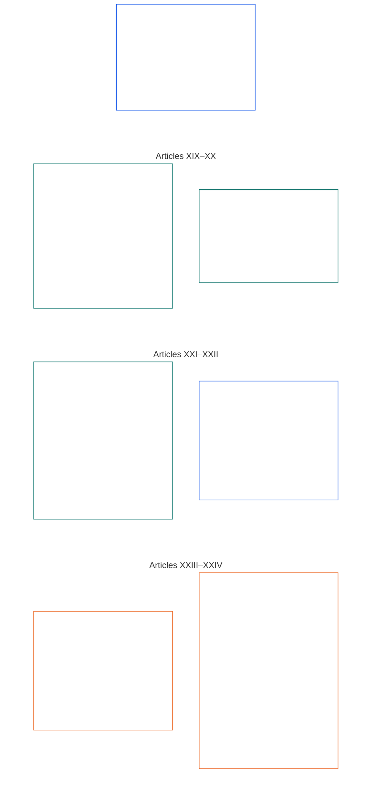

# CHAPTER SIX: FOUNDATIONAL RIGHTS

<strong>Corpus placement (non-operative): file structure and reading rules</strong>

> The following content is **reader guidance only**. It does not add, remove, or narrow binding obligations elsewhere in this file or in other chapters.
>
> This file is **part of the Sentient Constitution** and is **binding only together** with the other numbered `core_*` files read as one instrument. It contains **Chapter Six, Part D**; article numbering and cross-references match the integrated instrument. Reading order, the binding/support split, and corpus edition metadata are maintained in [README.md](README.md).

<strong>Reader guidance (non-operative): Part D position in Chapter Six</strong>

> The following content is **reader guidance only**. It does not add, remove, or narrow binding obligations elsewhere in this chapter or in other chapters.
>
> **Part A** in [core_06_rights_part_a.md](core_06_rights_part_a.md) carries the chapter-wide default constraint stack, planet-first reading order, and interpretive hubs. **Part D** presents **Articles XIX–XXIV** in that order.

 

### Part D: Standing, justice, interoperability, comprehensibility, root-cause review, and constitutional interpretation

 

*In plain terms: Part D covers standing and participation status, justice after verified violation, interoperability and exit, comprehensibility, root-cause analysis, and constitutional interpretation and review — Articles XIX through XXIV.*

<strong>Reader guidance (non-operative): Part D article map</strong>

> The following content is **reader guidance only**. It does not add, remove, or narrow binding obligations elsewhere in this chapter or in other chapters.
>
> **Reader map (non-operative).** This chart shows how the source groups this Part's articles and subarticles. The grid is source grouping, not a process sequence: the articles are not procedural steps, so the map carries no arrows. Subarticle labels are shortened to themes; the numbered articles and subarticles below govern. The chart adds no definitions or duties, establishes no precedence, and cannot replace the source text.

 

**Articles XIX–XXIV** below state these floors in full. Part D carries the standing, justice-after-violation, interoperability, comprehensibility, root-cause, and interpretive-review floors, including **Article XXIV** (*Constitutional Interpretation, Review, and Anti-Capture Safeguards*) in the current source layout.

### Article XIX: Standing and Participation Status

<strong>Trace</strong>

- Upstream: Principles: Chapter One [§7 Freedom](core_01_a_values_principles.md#7-freedom-bounded-agency), [§15.1 Constitutional No-Bypass Principle](core_01_b_interaction_interpretation.md#151-constitutional-no-bypass-principle), and [§15 Constitutional Interpretation](core_01_b_interaction_interpretation.md#15-constitutional-interpretation).

<strong>Definitions · Assessment · Compliance</strong>

- [Participant Standing](core_05_band_accountability.md#participant-standing-constitutional) · [O](core_05_band_accountability.md#participant-standing-constitutional) · [M](core_05_band_accountability.md#participant-standing-constitutional-a) · [A](core_05_band_accountability.md#participant-standing-constitutional-a) · [C](core_05_band_accountability.md#participant-standing-constitutional-c)
- [Stakeholder](core_05_band_participation.md#stakeholder) · [O](core_05_band_participation.md#stakeholder) · [M](core_05_band_participation.md#stakeholder-a) · [A](core_05_band_participation.md#stakeholder-a) · [C](core_05_band_participation.md#stakeholder-c)
- [Material Impact](core_05_band_oversight.md#material-impact) · [O](core_05_band_oversight.md#material-impact) · [M](core_05_band_oversight.md#material-impact-a) · [A](core_05_band_oversight.md#material-impact-a) · [C](core_05_band_oversight.md#material-impact-c)
- [Dignity and Equal Moral Standing](core_05_band_participation.md#dignity-and-equal-moral-standing) · [O](core_05_band_participation.md#dignity-and-equal-moral-standing) · [M](core_05_band_participation.md#dignity-and-equal-moral-standing-a) · [A](core_05_band_participation.md#dignity-and-equal-moral-standing-a) · [C](core_05_band_participation.md#dignity-and-equal-moral-standing-c)
- [Redress and Remediation](core_05_band_accountability.md#redress-and-remediation-constitutional) · [O](core_05_band_accountability.md#redress-and-remediation-constitutional) · [M](core_05_band_accountability.md#redress-and-remediation-constitutional-a) · [A](core_05_band_accountability.md#redress-and-remediation-constitutional-a) · [C](core_05_band_accountability.md#redress-and-remediation-constitutional-c)
- [Contestability](core_05_band_accountability.md#contestability) · [O](core_05_band_accountability.md#contestability) · [M](core_05_band_accountability.md#contestability-a) · [A](core_05_band_accountability.md#contestability-a) · [C](core_05_band_accountability.md#contestability-c)

 

*In plain terms: **Article XIX** (*Standing and Participation Status*) is the participation-status Rights Floor — it governs who qualifies for which roles, how those calls are made and challenged, and what happens when standing is lowered or suspended. **Participant standing** is role eligibility from verified records and fair rules — not popularity, a brand name, or a social score — and it is separate from dignity, Rights-Floor minimums, and being a stakeholder because a system actually affects you. If standing is lowered or suspended, you must get clear reasons, a real way to push back, and limits that fit the actual risk — and standing by itself must never cut off survival essentials or paths to challenge harm and get remedy. Good standing must reflect what can be checked today, not old reputation. Movement, refuge, portability, and exit are governed by **Article XXI** (*Interoperability, Portability, Movement, Refuge, and Exit Integrity*), not by standing labels alone.*

This Article states **constitutional floors** for standing and participation status under the [Two Constitutional Aims](core_00_preamble.md#two-constitutional-aims):

- **Flourishing:** sentients can hold and contest role eligibility through valid, plural, auditable named pathways — without standing labels substituting for dignity, Rights-Floor minimums, or stakeholder status when [Material Impact](core_05_band_oversight.md#material-impact) is present; named-pathway eligibility rests on present, observable, contestable evidence rather than brand, scale, or past esteem alone.
- **Continuity:** standing discipline stays revisable across time — restrictions remain proportionate, restorable where corrected, and must not harden into permanent exclusion from foundational constitutional voice except where **Chapter Eleven** **anti-constitutional misconduct** classification and [**Chapter Thirteen §4.1 Entitlement and eligibility**](core_13_governance.md#41-entitlement-and-eligibility) expressly withhold durable political voice pending **full restitution**.

Legitimate pursuit runs through the [Constitutional Tetrad](core_00_preamble.md#constitutional-tetrad), scaled to [material stake](core_00_preamble.md#material-stake):

- **Participation:** in pluralistic standing evaluation, challenge to opaque or monopolized standing determinations, and restoration or requalification where material restrictions are corrected.
- **Oversight:** through auditable standing records, continuous review of eligibility and lock claims, and independent verification proportionate to the roles and restrictions at stake.
- **Accountability:** those who assign or restrict standing must answer for lowering it without individualized reasons, proportionality, narrow tailoring, or real paths to restoration — including patterns that track protected characteristics or their proxies.
- **Timeliness:** in standing review, challenge, and remedy before delay would foreclose survival-critical access, audit paths, or constitutionally required redress under **Article XXV-C** (*Timely Resolution and Anti-Delay Floor*).

[Participant Standing](core_05_band_accountability.md#participant-standing-constitutional) is participation-status or role-eligibility status recognized from constitutionally valid standing records, standing effects, or [Competency Bar](core_05_band_accountability.md#competency-bar) criteria for the named pathway. It is not reputation or social esteem, and it does not itself impose access restrictions. Restrictive consequences attach only through [Standing Effect](core_05_band_accountability.md#standing-effect-chapter-six) and [Standing Lock](core_05_band_accountability.md#standing-lock) on named privilege pathways.

Standing discipline under this Article implements the [Constitutional Tetrad](core_00_preamble.md#constitutional-tetrad) and [Two Constitutional Aims](core_00_preamble.md#two-constitutional-aims) together with [System Alignment Certification](core_05_band_continuity.md#system-alignment-certification-constitutional) and the [Chapters Nine–Twelve standing and forum supervision pipeline](core_00_preamble.md#62-how-the-full-chain-fits-together). Those owner-layer processes measure verified contribution and violation and supervise remedy; they must not be used to defeat **Article III-A** (*Survival*) survival essentials or other Rights Floors stated in this chapter.

It must remain distinct from:
- inherent dignity;
- Rights-Floor minimums;
- stakeholder identification by material impact;
- access to challenge or remedy where this Constitution preserves those floors.

*Article neighbors:*

- **Owner layers:** [Chapter Nine](core_09_standing_assessment.md#chapter-nine-compliance-violation-and-standing-model) and [Chapter Ten](core_10_standing_integration.md#chapter-ten-standing-effects-and-integration) measure standing records and standing effects; this Article states Rights-Floor limits those layers must not narrow.
- **Read together:**
  - **Article VI-A** (*Dignity and Equal Moral Standing*) and **Article XII** (*Stakeholder System Participation, Representation, and Due Process*) — standing criteria must not substitute for dignity or stakeholder existence;
  - **Article III-A** (*Survival*) — participant standing alone must not foreclose survival-critical access;
  - **Article XXI** (*Interoperability, Portability, Movement, Refuge, and Exit Integrity*) — standing discipline must not substitute for individualized justice process or function as exile, refuge denial, or statelessness by label alone; movement, refuge, portability, and exit floors remain in **Article XXI** (*Interoperability, Portability, Movement, Refuge, and Exit Integrity*) without narrowing standing safeguards here.

#### Article XIX-A: Standing Distinction

<strong>Trace</strong>

- Upstream: Principles: Chapter One [§6 Trust](core_01_a_values_principles.md#6-trust-and-trustworthiness-coordination-integrity), [Chapter One §7 Freedom](core_01_a_values_principles.md#7-freedom-bounded-agency), and [§20 Integrated Application](core_01_c_stewardship_capacity_principles.md#20-integrated-application).
- Read with: [Chapter Ten §6.2](core_10_standing_integration.md#62-competency-bars-and-clearances) (*competency bars and clearances*), [Competency Bar](core_05_band_accountability.md#competency-bar), and [Competency Clearance](core_05_band_accountability.md#competency-clearance); [Chapter Ten §4.2](core_10_standing_integration.md#42-prevention--general-standing-locks) (*standing locks*), [Violation Nature](core_05_band_accountability.md#violation-nature-chapter-six), and [Standing Lock](core_05_band_accountability.md#standing-lock) — restrictive named pathways from verified Violation Axis inputs; competency clearance does not waive an applicable standing lock, and good contribution does not erase unresolved violation findings.

<strong>Definitions · Assessment · Compliance</strong>

- [Dignity and Equal Moral Standing](core_05_band_participation.md#dignity-and-equal-moral-standing) · [O](core_05_band_participation.md#dignity-and-equal-moral-standing) · [M](core_05_band_participation.md#dignity-and-equal-moral-standing-a) · [A](core_05_band_participation.md#dignity-and-equal-moral-standing-a) · [C](core_05_band_participation.md#dignity-and-equal-moral-standing-c)
- [Stakeholder Weight](core_05_band_participation.md#stakeholder-weight) · [O](core_05_band_participation.md#stakeholder-weight) · [M](core_05_band_participation.md#stakeholder-weight-a) · [A](core_05_band_participation.md#stakeholder-weight-a) · [C](core_05_band_participation.md#stakeholder-weight-c)
- [Participant Standing](core_05_band_accountability.md#participant-standing-constitutional) · [O](core_05_band_accountability.md#participant-standing-constitutional) · [M](core_05_band_accountability.md#participant-standing-constitutional-a) · [A](core_05_band_accountability.md#participant-standing-constitutional-a) · [C](core_05_band_accountability.md#participant-standing-constitutional-c)
- [Competency Bar](core_05_band_accountability.md#competency-bar) · [O](core_05_band_accountability.md#competency-bar) · [M](core_05_band_accountability.md#competency-bar-a) · [A](core_05_band_accountability.md#competency-bar-a) · [C](core_05_band_accountability.md#competency-bar-c)
- [Competency Clearance](core_05_band_accountability.md#competency-clearance) · [O](core_05_band_accountability.md#competency-clearance) · [M](core_05_band_accountability.md#competency-clearance-a) · [A](core_05_band_accountability.md#competency-clearance-a) · [C](core_05_band_accountability.md#competency-clearance-c)
- [Standing Lock](core_05_band_accountability.md#standing-lock) · [O](core_05_band_accountability.md#standing-lock) · [M](core_05_band_accountability.md#standing-lock-a) · [A](core_05_band_accountability.md#standing-lock-a) · [C](core_05_band_accountability.md#standing-lock-c)
- [Violation Nature](core_05_band_accountability.md#violation-nature-chapter-six) · [O](core_05_band_accountability.md#violation-nature-chapter-six) · [M](core_05_band_accountability.md#violation-nature-chapter-six-a) · [A](core_05_band_accountability.md#violation-nature-chapter-six-a) · [C](core_05_band_accountability.md#violation-nature-chapter-six-c)

 

*In plain terms: trust-sensitive roles may open when verified readiness meets a published **competency bar** and **competency clearance** is in force — and may stay closed or limited through **standing locks** while a **verified violation finding** still needs correction. **governance-voting** locks pause foundational governance vote; **stakeholder-participation** locks limit stake-weighted voice inside an authorized system — they are not interchangeable, and stakeholder status is not erased by the latter. Neither named pathway is popularity, insider gatekeeping, or a substitute for dignity. Accusations alone are not violation findings; locks must fit what was actually verified and leave a real path to challenge and remedy.*

This Article sets out how standing differs from competency bars, competency clearances, and standing locks:

- **Standing is different from:**
  - inherent dignity and equal moral standing (**Article VI-A** (*Dignity and Equal Moral Standing*));
  - demonstration of material stake for stakeholder identification (**Chapter Five** — *Stakeholder*; *Stakeholder Weight*).
- **Competency bars and clearances:** A [Competency Bar](core_05_band_accountability.md#competency-bar) is the published, auditable, contestable qualification standard for a named pathway. A [Competency Clearance](core_05_band_accountability.md#competency-clearance) is the positive standing-effect result when verified competence, experience, and contribution records meet that bar. When clearance is in force and no applicable [Standing Lock](core_05_band_accountability.md#standing-lock) blocks the named pathway, it may open access to trust-sensitive roles, delegated authority, oversight eligibility, or progressively consequential stewardship under [Chapter Ten §6.2 Competency bars and clearances](core_10_standing_integration.md#62-competency-bars-and-clearances).
  - A competency bar or clearance is not reputation, social prestige, insider sponsorship, credential monopoly, dignity rank, or permanent entitlement.
  - Informal, peer-organized, mutual-aid, maintenance, repair, teaching, or community stewardship experience must be recognized where it satisfies the same demonstrability standards as formal institutional experience.
- **Violation nature and standing locks:** [Violation Nature](core_05_band_accountability.md#violation-nature-chapter-six) may affect standing effect only when it rests on auditable, contestable findings satisfying **Chapters Two through Four** and [Chapter Nine](core_09_standing_assessment.md#verified-inputs-for-standing) — not allegations, intake labels, provisional routing, or forum-phase narratives alone.
  - A [Standing Lock](core_05_band_accountability.md#standing-lock) is the restrictive counterpart to competency clearance. While a verified violation finding remains unresolved or materially unremediated, it may prevent or limit trust-, role-, authority-, credit-, oversight-, recognition-, **governance-voting**, or **stakeholder-participation** pathways under [Chapter Ten §4.2 Prevention — general standing locks](core_10_standing_integration.md#42-prevention--general-standing-locks).
  - **governance-voting** is the legitimacy-mechanism / foundational governance-vote pathway. **stakeholder-participation** is stake-weighted influence and binding stakeholder choice within an already-authorized domain. Neither named pathway is a substitute for the other, and a **stakeholder-participation** lock does not erase [Stakeholder](core_05_band_participation.md#stakeholder) status.
  - A standing lock is not a dignity rank, Rights-Floor reduction, automatic retaliation, or merged merit score.
  - Each standing lock must identify the effect blocked or limited, the protected subjects or interests, the corrective condition, the review path, and the reassessment point — and remain necessary, proportionate, auditable, and contestable.
  - A verified failure to recuse from a forum role where recusal was required and impartiality was materially compromised creates the **forum-service standing lock** stated in [Chapter Ten §5.5 Special locks](core_10_standing_integration.md#55-special-locks). Reinstatement to forum service requires strict independent restoration; ordinary apology, prior contribution, reputation, expertise scarcity, or staffing need cannot satisfy that path by itself.
  - Verified corruption, capture, false-stake abuse, coercion, or comparable material abuse of a stakeholder-participation pathway creates the **Stakeholder-Participation Standing Lock** stated in [Chapter Ten §5.5 Special locks](core_10_standing_integration.md#55-special-locks). It limits stake-weighted influence and binding stakeholder choice in the affected domain; it does not by itself strip **governance-voting**, foundational constitutional choice, or stakeholder status. Ordinary apology, prior contribution, stake size, or operator indispensability cannot lift that lock by itself.
  - Final Chapter Eleven anti-constitutional misconduct creates the **Anti-Constitutional Trust Lock** stated in [Chapter Ten §5.5 Special locks](core_10_standing_integration.md#55-special-locks). While active, it bars roles or material influence over **Class A**, **Class B**, or **Class C** systems, constitutional forums, constitutional alignment recognition, critical-system stewardship, and anti-constitutional accountability pathways until strict independent restoration is verified.
  - Competency clearance does not waive an applicable standing lock; good contribution does not erase unresolved verified violation findings.
- **Non-substitution:** Standing criteria, labels, scores, competency bars, competency clearances, and standing locks govern role eligibility only. They must not:
  - blur together who qualifies for a role and who has inherent dignity or equal moral standing;
  - make role status a substitute for Rights-Floor minimums or for deciding whether someone is a stakeholder because a system actually affects them;
  - stand in for a sentience-status determination, which is made only under **Article VI-B** (*Sentience-Status Adjudication Floor*);
  - treat the absence of a standing record as an adverse fact, or require a record or a "no record" attestation as a condition of survival essentials, ordinary commerce, or participation as an affected party — having no record is the ordinary state under [Chapter Nine §2.1](core_09_standing_assessment.md#21-silence-is-the-default) (*Silence is the default*);
  - treat dissent or peaceful protest under **Article XI-D** ([*Dissent and peaceful protest floor*](core_06_rights_part_b.md#xi-d-dissent-and-peaceful-protest)) as an adverse fact or weighting factor for any named pathway; or
  - assemble named-pathway effects into a profile, ranking, or public display — [Chapter Ten §7.1](core_10_standing_integration.md#71-anti-aggregation-of-named-pathway-effects) (*Anti-aggregation of named-pathway effects*).

#### Article XIX-B: Contestability and Proportional Restriction Limits

<strong>Trace</strong>

- Upstream: Principles: [Chapter One §7 Freedom](core_01_a_values_principles.md#7-freedom-bounded-agency), [§13.1 Core Tradeoff Principles](core_01_b_interaction_interpretation.md#131-core-tradeoff-principles), and [Chapter One §13.1.5 Rights-Collision Procedure](core_01_b_interaction_interpretation.md#1315-rights-collision-decision-test).
- Downstream: [Chapter Nine §2](core_09_standing_assessment.md#2-question-1--what-happened) (*standing records, verified-input gate, and minimum record contents*); [Chapter Nine §3.6](core_09_standing_assessment.md#36-forum-boundary) (*forum boundary*); [Chapter Ten §6.2](core_10_standing_integration.md#62-competency-bars-and-clearances) (*competency bars and clearances*); [Chapter Ten §4.2](core_10_standing_integration.md#42-prevention--general-standing-locks) (*standing locks*); [Chapter Ten §8](core_10_standing_integration.md#8-restoration-and-reassessment) (*reinstatement and review*).
- Read with: **Article III-A** (*Survival*); **Article XIII-A** (*Reliability and Trustworthiness Baseline*) and **Article XIII-B** (*Right to Redress and Remedy*); [Preamble §6.2 How the full chain fits together](core_00_preamble.md#62-how-the-full-chain-fits-together); [System Alignment Certification](core_05_band_continuity.md#system-alignment-certification-constitutional); [Constitutional Tetrad](core_00_preamble.md#constitutional-tetrad) — **participation**, **oversight**, **accountability**, and **timeliness** under **Article XXV-C** (*Timely Resolution and Anti-Delay Floor*) and **Article XX-B** (*Restriction Floors*).

<strong>Definitions · Assessment · Compliance</strong>

- [Contestability](core_05_band_accountability.md#contestability) · [O](core_05_band_accountability.md#contestability) · [M](core_05_band_accountability.md#contestability-a) · [A](core_05_band_accountability.md#contestability-a) · [C](core_05_band_accountability.md#contestability-c)
- [Proportionality](core_05_band_accountability.md#proportionality) · [O](core_05_band_accountability.md#proportionality) · [M](core_05_band_accountability.md#proportionality-a) · [A](core_05_band_accountability.md#proportionality-a) · [C](core_05_band_accountability.md#proportionality-c)
- [Necessity](core_05_band_accountability.md#necessity) · [O](core_05_band_accountability.md#necessity) · [M](core_05_band_accountability.md#necessity-a) · [A](core_05_band_accountability.md#necessity-a) · [C](core_05_band_accountability.md#necessity-c)
- [Procedural Fairness](core_05_band_participation.md#procedural-fairness-constitutional) · [O](core_05_band_participation.md#procedural-fairness-constitutional) · [M](core_05_band_participation.md#procedural-fairness-constitutional-a) · [A](core_05_band_participation.md#procedural-fairness-constitutional-a) · [C](core_05_band_participation.md#procedural-fairness-constitutional-c)
- [Auditability](core_05_band_oversight.md#auditability) · [O](core_05_band_oversight.md#auditability) · [M](core_05_band_oversight.md#auditability-a) · [A](core_05_band_oversight.md#auditability-a) · [C](core_05_band_oversight.md#auditability-c)
- [Violation Nature](core_05_band_accountability.md#violation-nature-chapter-six) · [O](core_05_band_accountability.md#violation-nature-chapter-six) · [M](core_05_band_accountability.md#violation-nature-chapter-six-a) · [A](core_05_band_accountability.md#violation-nature-chapter-six-a) · [C](core_05_band_accountability.md#violation-nature-chapter-six-c)
- [Competency Bar](core_05_band_accountability.md#competency-bar) · [O](core_05_band_accountability.md#competency-bar) · [M](core_05_band_accountability.md#competency-bar-a) · [A](core_05_band_accountability.md#competency-bar-a) · [C](core_05_band_accountability.md#competency-bar-c)
- [Competency Clearance](core_05_band_accountability.md#competency-clearance) · [O](core_05_band_accountability.md#competency-clearance) · [M](core_05_band_accountability.md#competency-clearance-a) · [A](core_05_band_accountability.md#competency-clearance-a) · [C](core_05_band_accountability.md#competency-clearance-c)
- [Standing Lock](core_05_band_accountability.md#standing-lock) · [O](core_05_band_accountability.md#standing-lock) · [M](core_05_band_accountability.md#standing-lock-a) · [A](core_05_band_accountability.md#standing-lock-a) · [C](core_05_band_accountability.md#standing-lock-c)
- [Redress and Remediation](core_05_band_accountability.md#redress-and-remediation-constitutional) · [O](core_05_band_accountability.md#redress-and-remediation-constitutional) · [M](core_05_band_accountability.md#redress-and-remediation-constitutional-a) · [A](core_05_band_accountability.md#redress-and-remediation-constitutional-a) · [C](core_05_band_accountability.md#redress-and-remediation-constitutional-c)
- [Contribution Nature](core_05_band_accountability.md#contribution-nature) · [O](core_05_band_accountability.md#contribution-nature) · [M](core_05_band_accountability.md#contribution-nature-a) · [A](core_05_band_accountability.md#contribution-nature-a) · [C](core_05_band_accountability.md#contribution-nature-c)

 

*In plain terms: standing records, competency bars, competency clearances, and standing locks must all be open to challenge through real review paths — restrictions must come with reasons, fit the verified finding, and stay no broader than process or safety needs. Allegations and intake labels are not standing verdicts. Standing discipline alone must never cut off survival essentials or constitutionally required audit, challenge, and remedy pathways.*

This Article sets out the contestability and proportionality limits on standing restrictions:

- **Verified-input gate and record contestability:** Any decision that affects standing, trust, role, recognition, or eligibility for recognition may use only verified inputs from axis-pure **contribution standing records** or **violation standing records** under [Chapter Nine §2 Question 1 — what happened?](core_09_standing_assessment.md#2-question-1--what-happened). Allegations, unadjudicated claims, provisional routing tags, intake-only narratives, and other dispute-phase material do not supply violation nature or contribution nature for standing by themselves.
  - Every standing record must state how to challenge it, which forum or authority reviews it, and the conditions for correction, restoration, expiration, or scheduled review under [Chapter Nine §3.1 Minimum record contents](core_09_standing_assessment.md#31-minimum-record-contents).
  - Linked contribution and violation records must cross-reference one another where required, remain auditable and open to challenge, and must not collapse into a merged score, blended merits answer, or undifferentiated standing label.
- **Pluralism and contestability:** Evaluations of standing must remain pluralistic, auditable, transparent enough for meaningful review, and contestable.
  - No single authority, dataset, reputation channel, or opaque algorithmic system may unilaterally determine standing in a manner that forecloses meaningful review.
  - [Competency bars and clearances](core_10_standing_integration.md#62-competency-bars-and-clearances) and positive standing recognition must remain contestable, reviewable, and non-monopolistic.
- **Forum supervision and record challenge:** [Chapter Twelve](core_12_forum.md#chapter-twelve-forums-and-jurisdiction) forum families supervise accessible challenge and, when the facts are verified under Chapters Two through Four, may:
  - **open, update, or correct** standing records under [Chapter Nine §3.1 Minimum record contents](core_09_standing_assessment.md#31-minimum-record-contents); or
  - **set a bad record aside on challenge**.

  - A filed case is not standing by itself.
  - Dispute-phase material does not by itself supply contribution nature or violation nature for standing ([Chapter Nine §3.6 Forum boundary](core_09_standing_assessment.md#36-forum-boundary)).
  - That boundary does not reduce challenge, remedy, interim relief, or procedural protections required under **Article XIII-A** (*Reliability and Trustworthiness Baseline*), **Article XIII-B** (*Right to Redress and Remedy*), and **Article XXV-C** (*Timely Resolution and Anti-Delay Floor*).
- **Procedural reviewability:** When standing is materially restricted, downgraded, or suspended — including through a [standing lock](core_10_standing_integration.md#42-prevention--general-standing-locks) tied to a [verified violation finding](core_05_band_accountability.md#violation-nature-chapter-six) — the system must apply the [**Least-Restrictive, Time-Bounded, and Reviewable Constraint Principle**](core_01_b_interaction_interpretation.md#1315-least-restrictive-time-bounded-and-reviewable-constraint-principle) and must:
  - explain **why** in clear terms;
  - set a **time limit** on the restriction where that is feasible under **Article XX-B** (*Restriction Floors*);
  - provide a **working path** to challenge the decision, get it reviewed, fix what is wrong, and ask for another look.

  Every standing lock must spell out what access is blocked, who is being protected, what must be fixed before the lock lifts, where to appeal, and when reassessment happens. While that challenge is pending, any temporary limits must stay only as broad — and only as hard to undo — as safety, integrity, or fair process actually require.
- **Proportionality and calibration:** Restrictions on standing must remain necessary and proportionate under **Necessity**, **Proportionality**, and **Article XX-B** (*Restriction Floors*).
  - [Standing locks](core_10_standing_integration.md#42-prevention--general-standing-locks) must calibrate to verified **violation nature**, the protected named pathway, current remedy status, and any linked **contribution nature** only insofar as that contribution bears on repair capacity, safeguard reliability, non-recurrence, or least-restrictive reassessment under [Chapter Nine §2 Question 1 — what happened?](core_09_standing_assessment.md#2-question-1--what-happened). Contribution must not offset, waive, average down, or substitute for unresolved violation findings.
  - A lower-impact Violation Axis finding on the [Chapter Nine §7 unified scale](core_09_standing_assessment.md#7-unified-proportional-lequ-scale--contribution-and-violation-axes) does not justify durable exclusion absent repeated pattern evidence, evasion, or material harm linkage. Negligence, concealment, coercion, recurrence, and comparable character descriptors inform that review but do not move the Chapter Nine impact slot.
  - Escalation because conduct recurs or responsibility is concealed must still be necessary, proportionate, reviewable, and tied to verified findings.
- **Rights-Floor minimums and non-foreclosure:** Participant standing, competency bars, competency clearances, and standing locks govern role eligibility and named privilege pathways only. They must not:
  - suspend, waive, extinguish, or reduce the **Rights-Floor minimums** applied through **Article VI** (*Equal Basic Rights*) under the [Rights-Floor Minimums Principle](core_01_b_interaction_interpretation.md#rights-floor-minimums-principle);
  - foreclose survival-critical access or **Article III-A** (*Survival*) resource-allocation and dependency floors where materially implicated; or
  - foreclose constitutionally required audit, challenge, or remedy pathways — including under **Article XIII-A** (*Reliability and Trustworthiness Baseline*) and **Article XIII-B** (*Right to Redress and Remedy*), **Article XV-B** (*Transparency, Auditability, and Contestability*), and **Article XVI** (*Audit, Transparency, and Independent Verification*) — absent adequate justification under **Chapter One**, **Chapter Five**, and applicable incorporated procedure.
- **Reinstatement and non-entrenchment:** Where standing is reduced due to violation findings, systems must provide clear conditions for review, remediation-based restoration, and periodic re-evaluation under [Chapter Ten §8 Restoration and reassessment](core_10_standing_integration.md#8-restoration-and-reassessment).
  - Permanent exclusion based solely on historical status, without current and auditable justification, is non-compliant.
  - Completion of correction, restitution, monitoring, safeguard implementation, or other demonstrated reduction of recurrence risk must create a real reassessment named pathway where lawful; failure to complete those obligations keeps the unresolved finding live for standing purposes.

#### Article XIX-C: Named-Pathway Eligibility, Responsibility, and Continuous Audit

<strong>Trace</strong>

- Upstream: Principles: Chapter One [§6 Trust](core_01_a_values_principles.md#6-trust-and-trustworthiness-coordination-integrity), [Chapter Eight §3 Whole-System Certification Evaluation](core_08_a_system_alignment_certification_evaluation.md#3-whole-system-certification-evaluation), and [Chapter One §18 Governance Under Stewardship Discipline](core_01_c_stewardship_capacity_principles.md#18-governance-under-stewardship-discipline).

<strong>Definitions · Assessment · Compliance</strong>

- [Accountability](core_05_apex_accountability_leg.md#accountability) · [O](core_05_apex_accountability_leg.md#accountability) · [M](core_05_apex_accountability_leg.md#accountability-m) · [A](core_05_apex_accountability_leg.md#accountability-a) · [C](core_05_apex_accountability_leg.md#accountability-c)
- [Standing Lock](core_05_band_accountability.md#standing-lock) · [O](core_05_band_accountability.md#standing-lock) · [M](core_05_band_accountability.md#standing-lock-a) · [A](core_05_band_accountability.md#standing-lock-a) · [C](core_05_band_accountability.md#standing-lock-c)
- [Competency Bar](core_05_band_accountability.md#competency-bar) · [O](core_05_band_accountability.md#competency-bar) · [M](core_05_band_accountability.md#competency-bar-a) · [A](core_05_band_accountability.md#competency-bar-a) · [C](core_05_band_accountability.md#competency-bar-c)
- [Competency Clearance](core_05_band_accountability.md#competency-clearance) · [O](core_05_band_accountability.md#competency-clearance) · [M](core_05_band_accountability.md#competency-clearance-a) · [A](core_05_band_accountability.md#competency-clearance-a) · [C](core_05_band_accountability.md#competency-clearance-c)
- [Participant Standing](core_05_band_accountability.md#participant-standing-constitutional) · [O](core_05_band_accountability.md#participant-standing-constitutional) · [M](core_05_band_accountability.md#participant-standing-constitutional-a) · [A](core_05_band_accountability.md#participant-standing-constitutional-a) · [C](core_05_band_accountability.md#participant-standing-constitutional-c)
- [Collective Accountability Failure](core_05_band_accountability.md#collective-accountability-failure) · [O](core_05_band_accountability.md#collective-accountability-failure) · [M](core_05_band_accountability.md#collective-accountability-failure-a) · [A](core_05_band_accountability.md#collective-accountability-failure-a) · [C](core_05_band_accountability.md#collective-accountability-failure-c)
- [Trust](core_05_band_continuity.md#trust) · [O](core_05_band_continuity.md#trust) · [M](core_05_band_continuity.md#trust-a) · [A](core_05_band_continuity.md#trust-a) · [C](core_05_band_continuity.md#trust-c)
- [Foundational Constitutional Choice](core_05_band_integrative.md#foundational-constitutional-choice) · [O](core_05_band_integrative.md#foundational-constitutional-choice) · [M](core_05_band_integrative.md#foundational-constitutional-choice-a) · [A](core_05_band_integrative.md#foundational-constitutional-choice-a) · [C](core_05_band_integrative.md#foundational-constitutional-choice-c)
- [Procedural Fairness](core_05_band_participation.md#procedural-fairness-constitutional) · [O](core_05_band_participation.md#procedural-fairness-constitutional) · [M](core_05_band_participation.md#procedural-fairness-constitutional-a) · [A](core_05_band_participation.md#procedural-fairness-constitutional-a) · [C](core_05_band_participation.md#procedural-fairness-constitutional-c)
- [Necessity](core_05_band_accountability.md#necessity) · [O](core_05_band_accountability.md#necessity) · [M](core_05_band_accountability.md#necessity-a) · [A](core_05_band_accountability.md#necessity-a) · [C](core_05_band_accountability.md#necessity-c)
- [Proportionality](core_05_band_accountability.md#proportionality) · [O](core_05_band_accountability.md#proportionality) · [M](core_05_band_accountability.md#proportionality-a) · [A](core_05_band_accountability.md#proportionality-a) · [C](core_05_band_accountability.md#proportionality-c)
- [Protected Characteristics](core_05_band_participation.md#protected-characteristics-constitutional) · [O](core_05_band_participation.md#protected-characteristics-constitutional) · [M](core_05_band_participation.md#protected-characteristics-constitutional-a) · [A](core_05_band_participation.md#protected-characteristics-constitutional-a) · [C](core_05_band_participation.md#protected-characteristics-constitutional-c)

 

*In plain terms: ordinary participation named pathways stay open under published, contestable eligibility rules based on present evidence — not brand, scale, or past reputation. Opening a trust-sensitive named pathway requires competency clearance against its published competency bar; closing a privilege requires a standing lock on that named pathway. Standing locks cannot permanently strip foundational voice, except that a **final** **Chapter Eleven** classification of **anti-constitutional misconduct** withholds that voice until **full restitution** as stated in [**Chapter Thirteen §4.1 Entitlement and eligibility**](core_13_governance.md#41-entitlement-and-eligibility).*

This Article sets out named-pathway eligibility and responsibility, and the discipline on political voice:

- **Named-pathway eligibility and responsibility:** Published eligibility criteria for ordinary participation, trust-sensitive roles, oversight eligibility, **governance-voting**, and **stakeholder-participation** named pathways must rest on present, observable, contestable evidence — not reputation, scale, or historical standing alone. Consistent alignment with foundational requirements may support [Competency Clearance](core_05_band_accountability.md#competency-clearance) against the applicable [Competency Bar](core_05_band_accountability.md#competency-bar) and trust-sensitive role eligibility, but restrictive consequences attach only through [Standing Lock](core_05_band_accountability.md#standing-lock) on named privilege pathways under [Chapter Ten §4.2 Prevention — general standing locks](core_10_standing_integration.md#42-prevention--general-standing-locks). **governance-voting** locks do not substitute for **stakeholder-participation** locks, and a **stakeholder-participation** lock does not erase stakeholder status or strip foundational governance-voting by itself.
  - Eligibility and lock claims remain subject to continuous audit and to the safeguards in this Article and in designated implementation text.
  - Eligibility and locks must:
    - remain subject to **Chapter Nine** (*Contribution, Violation, and Standing Model*);
    - remain revisable when current evidence changes, and — where material restrictions are corrected — allow restoration or requalification pathways that are real rather than merely formal;
    - account for acquiescent participation and failure to resist unlawful or unconstitutional directives where material duty and capacity were present, consistent with **Chapter Five** (*Collective Accountability Failure*);
    - not operate as a durable-political-voice disqualification vector in **Foundational Constitutional Choice** (**Chapter Five**), except where [**Chapter Thirteen §4.1 Entitlement and eligibility**](core_13_governance.md#41-entitlement-and-eligibility) withholds **durable political voice** for **final** **Chapter Eleven** **anti-constitutional misconduct** pending **full restitution**.
- **Political-voice discipline:** Where a standing lock is invoked to restrict participation in authorization of governing authority, the restriction must satisfy:
  - individualized predicate under **Procedural Fairness**;
  - **Necessity** and **Proportionality** under **Chapter One**;
  - narrow tailoring to the specific misconduct category;
  - real rather than merely formal restoration pathways.

  **Anti-constitutional misconduct** designated under **Chapter Eleven** on a final Chapter Nine **Violation Axis s = 7**, **s = 8**, or **s = 9** impact slot is outside this standing-lock discipline for **durable political voice**: participation remains withheld until **full restitution** as stated in [**Chapter Thirteen §4.1 Entitlement and eligibility**](core_13_governance.md#41-entitlement-and-eligibility). Chapter Eleven adds the designation; it does not assign the numeric slot.

  The following are non-compliant:
  - broad-misconduct categories swept into disqualification scope;
  - lock patterns that track **Protected Characteristics** or their material proxies.

  Operational implementation lives in [**Chapter Thirteen §4.1**](core_13_governance.md#41-entitlement-and-eligibility) (*Durable political-voice floor*).

#### Article XIX-D: Movement, Migration, Refuge, and Non-Statelessness Routing

<strong>Trace</strong>

- Read with: **Article XXI-D** (*Movement, Migration, Refuge, and Non-Statelessness*) and **Article XXI** (*Interoperability, Portability, Movement, Refuge, and Exit Integrity*).
- Principles: Chapter One [§16 Stewardship In Depth](core_01_c_stewardship_capacity_principles.md#16-stewardship-in-depth) and [§13.1.5 Rights-Collision Procedure](core_01_b_interaction_interpretation.md#1315-rights-collision-decision-test).

 

*In plain terms: standing status is not a border, exile, or statelessness tool — you cannot lose movement, refuge, or exit rights just because your role standing dropped or a standing lock blocked trust-sensitive named pathways. Verified violence, coercion, or anti-constitutional misconduct can still lead to lawful detention, custody, or other liberty restrictions under **Article XX-B** (*Restriction Floors*) and full process protections; those are separate justice measures, not a standing-label workaround. If a case involves movement, migration, refuge, portability, recognition, or exit, **Article XXI** (*Interoperability, Portability, Movement, Refuge, and Exit Integrity*) supplies the governing floor.*

Standing status, competency bars, competency clearances, and standing locks do not **by themselves** limit movement, migration, refuge, portability, exit, or non-statelessness rights. Standing locks natively limit trust-, role-, authority-, credit-, oversight-, recognition-, **governance-voting**, and **stakeholder-participation** pathways under [Chapter Ten §4.2 Prevention — general standing locks](core_10_standing_integration.md#42-prevention--general-standing-locks); they are not a substitute for individualized justice process and must not function as exile, statelessness, refuge denial, or systemic lock-in by standing label alone.

Lawful liberty-restricting measures — including detention, custody, supervised operation, or comparable movement restrictions — may still apply where verified violence, coercion, anti-constitutional misconduct, or comparable social danger requires them, but only through measures that satisfy **Article XX-B** (*Restriction Floors*), applicable criminal-process or equivalent protections under [Chapter Ten §5.4](core_10_standing_integration.md#54-special-violation-rules) (*Special violation rules*), and [Non-Statelessness](core_05_band_participation.md#non-statelessness-constitutional) obligations in **Article XXI-D** (*Movement, Migration, Refuge, and Non-Statelessness*). Such measures must not render a sentient without a regime that recognizes baseline Rights-Floor protection, adjudicates standing, or provides redress pathways.

They may affect role eligibility and trust-sensitive named pathways only as stated in this Article. Movement, migration, refuge, portability, non-statelessness, and exit-integrity questions are governed by **Article XXI** (*Interoperability, Portability, Movement, Refuge, and Exit Integrity*) and applicable transition provisions, without narrowing the standing safeguards in this Article.

### Article XX: Justice After Verified Violation

<strong>Trace</strong>

- Upstream: Principles: Chapter One [§3 Foundational Objective: Wellbeing](core_01_a_values_principles.md#3-foundational-objective-wellbeing-flourishing-aim), [§4 Safety](core_01_a_values_principles.md#4-safety-harm-constraint), [§7 Freedom](core_01_a_values_principles.md#7-freedom-bounded-agency), and [§18 Governance Under Stewardship Discipline](core_01_c_stewardship_capacity_principles.md#18-governance-under-stewardship-discipline).
- Downstream: [Chapter Ten §4](core_10_standing_integration.md#4-violation-correction-and-prevention) (*Violation, correction, and prevention*); [Chapter Eleven §4](core_11_a_misconduct_designation.md#4-due-process-safeguards-for-slot-assignment) (*Due-process safeguards, remedy, and prevention*).

<strong>Definitions · Assessment · Compliance</strong>

- [Procedural Fairness](core_05_band_participation.md#procedural-fairness-constitutional) · [O](core_05_band_participation.md#procedural-fairness-constitutional) · [M](core_05_band_participation.md#procedural-fairness-constitutional-a) · [A](core_05_band_participation.md#procedural-fairness-constitutional-a) · [C](core_05_band_participation.md#procedural-fairness-constitutional-c)
- [Contestability](core_05_band_accountability.md#contestability) · [O](core_05_band_accountability.md#contestability) · [M](core_05_band_accountability.md#contestability-a) · [A](core_05_band_accountability.md#contestability-a) · [C](core_05_band_accountability.md#contestability-c)

 

*In plain terms: **Article XX** (*Justice After Verified Violation*) is the justice Rights Floor. Once a violation is verified, the answer is not revenge or cruelty. It is a fair process of **violation**, **correction**, and **prevention** — stopping harm, repairing damage, and reducing recurrence — scaled to how much is at stake. Serious restrictions are held to floors of their own: a proven safety need, a clock and a way back, and never killing. Disputes, escalation, review, and timely resolution are in **Article XXV**. Emergency measures are in **Chapter Twelve §6.1** (*Emergency measures and continuation burden*).*

This Article states the justice floors that apply once a violation has been verified: the justice objective and scope (**Article XX-A**) and the floors on serious restrictions (**Article XX-B**).

*Article neighbors:*

- **Conflict resolution, review, and timeliness:** Disputes over constitutional Rights Floors, retrospective review, rights collisions, and anti-delay discipline are governed by [**Article XXV**](core_06_rights_part_e.md#article-xxv-timely-retrospective-review-and-restorative-alignment) (*Timely Retrospective Review and Restorative Alignment*).
- **Emergency measures:** Governed by [Chapter Twelve §6.1 Emergency measures and continuation burden](core_12_forum.md#61-emergency-measures-and-continuation-burden), read with **Article XX-B** (*Restriction Floors*) for any restriction an emergency measure imposes.
- **Standing:** [**Article XIX**](core_06_rights_part_d.md#article-xix-standing-and-participation-status) (*Standing and Participation Status*) governs standing. Justice measures under this Article are separate and are not a standing-label workaround.
- **Timely redress:** Read with [**Article XIII-B** (*Right to Redress and Remedy*)](core_06_rights_part_c.md#article-xiii-b-right-to-redress-and-remedy) (*timely redress access*).

Adopted governance implementation may add detail. It must not narrow the justice objective or the restriction floors under this Article.

#### Article XX-A: Justice Objective and Scope

<strong>Trace</strong>

- Upstream: Principles: Chapter One [§4 Safety](core_01_a_values_principles.md#4-safety-harm-constraint), [Chapter One §13.1.5 Rights-Collision Procedure](core_01_b_interaction_interpretation.md#1315-rights-collision-decision-test), [Chapter One §3.3 Anti-Degrading Process](core_01_a_values_principles.md#33-anti-degrading-process), and [§20 Integrated Application](core_01_c_stewardship_capacity_principles.md#20-integrated-application).
- Downstream: [Chapter Ten §4](core_10_standing_integration.md#4-violation-correction-and-prevention) (*Violation, correction, and prevention*); [Article XX-B](#article-xx-b-restriction-floors).
- Read with: [Cruelty](core_05_band_accountability.md#cruelty) (*Chapter Five home for the anti-cruelty floor's suffering-as-end standard*).

<strong>Definitions · Assessment · Compliance</strong>

- [Adjudication and Dispute Resolution](core_05_band_accountability.md#adjudication-and-dispute-resolution-constitutional) · [O](core_05_band_accountability.md#adjudication-and-dispute-resolution-constitutional) · [M](core_05_band_accountability.md#adjudication-and-dispute-resolution-constitutional-a) · [A](core_05_band_accountability.md#adjudication-and-dispute-resolution-constitutional-a) · [C](core_05_band_accountability.md#adjudication-and-dispute-resolution-constitutional-c)
- [Cruelty](core_05_band_accountability.md#cruelty) · [O](core_05_band_accountability.md#cruelty) · [M](core_05_band_accountability.md#cruelty-a) · [A](core_05_band_accountability.md#cruelty-a) · [C](core_05_band_accountability.md#cruelty-c)
- [Redress and Remediation](core_05_band_accountability.md#redress-and-remediation-constitutional) · [O](core_05_band_accountability.md#redress-and-remediation-constitutional) · [M](core_05_band_accountability.md#redress-and-remediation-constitutional-a) · [A](core_05_band_accountability.md#redress-and-remediation-constitutional-a) · [C](core_05_band_accountability.md#redress-and-remediation-constitutional-c)
- [Accountability](core_05_apex_accountability_leg.md#accountability) · [O](core_05_apex_accountability_leg.md#accountability) · [M](core_05_apex_accountability_leg.md#accountability-m) · [A](core_05_apex_accountability_leg.md#accountability-a) · [C](core_05_apex_accountability_leg.md#accountability-c)

 

*In plain terms: justice works through **violation**, **correction**, and **prevention**. Address what went wrong, fix what was broken and what caused it, and keep it from happening again — not inflict suffering for its own sake.*

This Article sets out the objective and scope of justice and the anti-cruelty floor:

- **Justice objective and scope:** Constitutional justice is structured around violation, correction, and prevention. Its primary purposes are to:
  - respond to verified violation, including stopping ongoing harm;
  - secure correction through restitution, remediation, and change to conduct or systems;
  - prevent recurrence through rehabilitation, safeguards, and other durable controls where feasible;
  - keep credit and consequences on the right actors — supported by evidence on the record — under **Chapter Nine** (*Contribution, Violation, and Standing Model*).
- **Anti-cruelty floor:** Justice must not be administered to inflict suffering as an end in itself. The Chapter Five home is [Cruelty](core_05_band_accountability.md#cruelty).

#### Article XX-B: Restriction Floors

<strong>Trace</strong>

- Upstream: Principles: Chapter One [§4 Safety](core_01_a_values_principles.md#4-safety-harm-constraint), [§13.1 Core Tradeoff Principles](core_01_b_interaction_interpretation.md#131-core-tradeoff-principles), [Chapter One §13.1.5 Rights-Collision Procedure](core_01_b_interaction_interpretation.md#1315-rights-collision-decision-test), and [§14 Prohibition on Absolute Override](core_01_b_interaction_interpretation.md#14-prohibition-on-absolute-override).
- Downstream: [Chapter Ten §5 Lock design and enforcement](core_10_standing_integration.md#5-lock-design-and-enforcement) and [§5.4 Special violation rules](core_10_standing_integration.md#54-special-violation-rules) (*required imprisonment for verified violence and the other coercive or liberty-restricting safeguards*); [Chapter Eleven §4.2](core_11_a_misconduct_designation.md#4-2-prevention-anti-constitutional-locks) (*Prevention — anti-constitutional locks*; imprisonment specialization).
- Read with: [Article XXV-C](core_06_rights_part_e.md#article-xxv-c-timely-resolution-and-anti-delay-floor) (*Timely Resolution and Anti-Delay Floor*); [Chapter Twelve §5 Escalation and certification](core_12_forum.md#5-escalation-and-certification).

<strong>Definitions · Assessment · Compliance</strong>

- [Safety (Constitutional Constraint)](core_05_band_continuity.md#safety-constraint) · [O](core_05_band_continuity.md#safety-constraint) · [M](core_05_band_continuity.md#safety-constraint-a) · [A](core_05_band_continuity.md#safety-constraint-a) · [C](core_05_band_continuity.md#safety-constraint-c)
- [Redress and Remediation](core_05_band_accountability.md#redress-and-remediation-constitutional) · [O](core_05_band_accountability.md#redress-and-remediation-constitutional) · [M](core_05_band_accountability.md#redress-and-remediation-constitutional-a) · [A](core_05_band_accountability.md#redress-and-remediation-constitutional-a) · [C](core_05_band_accountability.md#redress-and-remediation-constitutional-c)
- [Accountability](core_05_apex_accountability_leg.md#accountability) · [O](core_05_apex_accountability_leg.md#accountability) · [M](core_05_apex_accountability_leg.md#accountability-m) · [A](core_05_apex_accountability_leg.md#accountability-a) · [C](core_05_apex_accountability_leg.md#accountability-c)
- [Necessity](core_05_band_accountability.md#necessity) · [O](core_05_band_accountability.md#necessity) · [M](core_05_band_accountability.md#necessity-a) · [A](core_05_band_accountability.md#necessity-a) · [C](core_05_band_accountability.md#necessity-c)
- [Proportionality](core_05_band_accountability.md#proportionality) · [O](core_05_band_accountability.md#proportionality) · [M](core_05_band_accountability.md#proportionality-a) · [A](core_05_band_accountability.md#proportionality-a) · [C](core_05_band_accountability.md#proportionality-c)
- [Reversibility](core_05_band_continuity.md#reversibility-constitutional) · [O](core_05_band_continuity.md#reversibility-constitutional) · [M](core_05_band_continuity.md#reversibility-constitutional-a) · [A](core_05_band_continuity.md#reversibility-constitutional-a) · [C](core_05_band_continuity.md#reversibility-constitutional-c)
- [Contestability](core_05_band_accountability.md#contestability) · [O](core_05_band_accountability.md#contestability) · [M](core_05_band_accountability.md#contestability-a) · [A](core_05_band_accountability.md#contestability-a) · [C](core_05_band_accountability.md#contestability-c)

 

*In plain terms: this is the floor under every serious restriction. A serious restriction on a sentient needs a real safety need, a fair path to repair, and evidence anyone can audit. It also needs a clock, a review, and a way back. Violent sentients must be imprisoned when that is what it takes to protect others, and killing is never a justice measure. How locks are designed is set by the lock-design rules in **Chapter Ten**.*

This Article sets the floors for restrictions. The operating rules live in the chapters named beside each floor.

- **Non-trivial restriction floor:** Non-trivial deprivations and restrictions include limitations on:
  - freedom;
  - access;
  - role authority;
  - movement;
  - resources;
  - durable standing effects.

  Any such measure is non-compliant unless it **demonstrably satisfies all** of the following **jointly**. Partial satisfaction does not suffice:
  - material safety necessity;
  - proportionate restitution or remediation;
  - rehabilitation or recurrence reduction where feasible;
  - keeping credit and consequences on the right actors — supported by evidence anyone can audit — under **Chapters Two through Four**.
- **Individualized burden:** Any such measure must be aimed at the specific sentient or role involved — not a group label or proxy — and must stay open to challenge and independent review. A harsh label, public condemnation, or administrative shortcut does not substitute for proving every joint requirement above. Lock design and enforcement are governed by [Chapter Ten §5 Lock design and enforcement](core_10_standing_integration.md#5-lock-design-and-enforcement).
- **Least-restrictive and time-bounded floor:** Justice, containment, and restorative-accountability measures apply the [**Least-Restrictive, Time-Bounded, and Reviewable Constraint Principle**](core_01_b_interaction_interpretation.md#1315-least-restrictive-time-bounded-and-reviewable-constraint-principle). Where intervention is required, each measure must include:
  - explicit duration limits;
  - review cadence;
  - restoration conditions.

  The following are non-compliant:
  - indefinite severe restrictions;
  - irreversible restrictive measures where reversible restitution, remediation, or protection is feasible;
  - restrictions lacking auditable re-evaluation triggers.
- **Equal basic rights and dignity:** Restrictions, exclusions, and comparable justice measures must comply with **Article VI** (*Equal Basic Rights*) and the [**Dignity Principles**](core_01_b_interaction_interpretation.md#dignity-principles) (the [Rights-Floor Minimums Principle](core_01_b_interaction_interpretation.md#rights-floor-minimums-principle) and the [Anti-Degrading-Process Principle](core_01_b_interaction_interpretation.md#anti-degrading-process-principle)) throughout imposition, review, and carrying out of any restriction, containment, or restorative-accountability measure.
- **Escalation and review:** Affected parties must have access to escalation paths proportionate to impact.
  - Access includes appeal or multi-layer review where material interests are at stake.
  - Affected parties must receive:
    - timely notice;
    - stated reasons;
    - practical access to the record sufficient to use those escalation and review pathways.

  Narrow, justified restrictions under **Chapter One** are the only permissible limit on the above. Forum routing and certification are governed by [Chapter Twelve §5 Escalation and certification](core_12_forum.md#5-escalation-and-certification).
- **Imprisonment for violence:** Imprisonment is a liberty-restricting measure, separate from standing locks, and is recorded with the same attachment fields as a lock ([Chapter Ten §5.1 Definition and attachment](core_10_standing_integration.md#51-definition-and-attachment)). It must satisfy every floor in this Article, including explicit duration limits, review cadence, and restoration conditions. Sentients who commit verified violence or pose a continuing threat of violence must be imprisoned when imprisonment is necessary to protect others from further harm. Substituting deprivation of life, or failing to impose imprisonment when this floor requires it, is non-compliant. Conditions are governed by [Chapter Ten §5.4 Special violation rules](core_10_standing_integration.md#54-special-violation-rules) (*Required imprisonment for verified violence*). Imprisonment for verified anti-constitutional misconduct is governed on the same terms by [Chapter Eleven §4.2 Prevention — anti-constitutional locks](core_11_a_misconduct_designation.md#4-2-prevention-anti-constitutional-locks) (*Prevention — anti-constitutional locks*; imprisonment specialization).
- **Rights floor against irreversible deprivation of life as a justice measure:** State, operator, or comparable justice systems must not impose irreversible deprivation of life as a penalty, sanction, or public-safety disposition.
  - Where imprisonment is required, **Imprisonment for violence** under this Article and imprisonment under **Chapter Eleven** §4.1 (*Remedy and correction (anti-constitutional)*) are the required protective measures; deprivation of life is prohibited.
  - This floor does not govern a sentient's own freely formed decision under **Article VII-D** (*Voluntary Discontinuation of One's Own Existence*). Coercion, relabeling, or state/operator conversion of that choice into an imposed outcome returns the matter to this floor.

### Article XXI: Interoperability, Portability, Movement, Refuge, and Exit Integrity

<strong>Trace</strong>

- Upstream: Principles: Chapter One [§7 Freedom](core_01_a_values_principles.md#7-freedom-bounded-agency), [§7.1 Limitation Discipline](core_01_a_values_principles.md#71-limitation-discipline), and [§11 Market Structure](core_01_a_values_principles.md#11-market-structure).

<strong>Definitions · Assessment · Compliance</strong>

- [Systemic Lock-In](core_05_band_continuity.md#systemic-lock-in) · [O](core_05_band_continuity.md#systemic-lock-in) · [M](core_05_band_continuity.md#systemic-lock-in-a) · [A](core_05_band_continuity.md#systemic-lock-in-a) · [C](core_05_band_continuity.md#systemic-lock-in-c)
- [Movement and Relocation](core_05_band_participation.md#movement-and-relocation-constitutional) · [O](core_05_band_participation.md#movement-and-relocation-constitutional) · [M](core_05_band_participation.md#movement-and-relocation-constitutional-a) · [A](core_05_band_participation.md#movement-and-relocation-constitutional-a) · [C](core_05_band_participation.md#movement-and-relocation-constitutional-c)
- [Refuge from Non-Compliance](core_05_band_participation.md#refuge-from-non-compliance-constitutional) · [O](core_05_band_participation.md#refuge-from-non-compliance-constitutional) · [M](core_05_band_participation.md#refuge-from-non-compliance-constitutional-a) · [A](core_05_band_participation.md#refuge-from-non-compliance-constitutional-a) · [C](core_05_band_participation.md#refuge-from-non-compliance-constitutional-c)
- [Non-Statelessness](core_05_band_participation.md#non-statelessness-constitutional) · [O](core_05_band_participation.md#non-statelessness-constitutional) · [M](core_05_band_participation.md#non-statelessness-constitutional-a) · [A](core_05_band_participation.md#non-statelessness-constitutional-a) · [C](core_05_band_participation.md#non-statelessness-constitutional-c)
- [Meaningful Agency](core_05_band_participation.md#meaningful-agency) · [O](core_05_band_participation.md#meaningful-agency) · [M](core_05_band_participation.md#meaningful-agency-a) · [A](core_05_band_participation.md#meaningful-agency-a) · [C](core_05_band_participation.md#meaningful-agency-c)
- [Dependency](core_05_band_continuity.md#dependency) · [O](core_05_band_continuity.md#dependency) · [M](core_05_band_continuity.md#dependency-a) · [A](core_05_band_continuity.md#dependency-a) · [C](core_05_band_continuity.md#dependency-c)
- [Necessity](core_05_band_accountability.md#necessity) · [O](core_05_band_accountability.md#necessity) · [M](core_05_band_accountability.md#necessity-a) · [A](core_05_band_accountability.md#necessity-a) · [C](core_05_band_accountability.md#necessity-c)
- [Proportionality](core_05_band_accountability.md#proportionality) · [O](core_05_band_accountability.md#proportionality) · [M](core_05_band_accountability.md#proportionality-a) · [A](core_05_band_accountability.md#proportionality-a) · [C](core_05_band_accountability.md#proportionality-c)

 

*In plain terms: **Article XXI** (*Interoperability, Portability, Movement, Refuge, and Exit Integrity*) is the exit-and-mobility Rights Floor — you should be able to leave a system or place that no longer serves you, take your data and identity with you, connect to alternatives without being trapped, move between jurisdictions, seek refuge from regimes that violate this Constitution, and never be left without anyone responsible for your basic protections. Exit on paper is not enough: portability, notice, and refuge must work in practice. Tricks that make leaving costly, confusing, or impossible — opaque formats, surprise rule changes, coercive terms, endless paperwork — are violations, not normal business.*

This Article states **constitutional floors** for interoperability, portability, movement, refuge, and exit integrity under the [Two Constitutional Aims](core_00_preamble.md#two-constitutional-aims):

- **Flourishing:** sentients can choose, switch, and coordinate across systems and jurisdictions without coercive lock-in, exclusion contrary to [Sentience Non-Exclusion](core_05_band_participation.md#sentience-non-exclusion), or denial-by-proxy — through usable portability, reciprocal interoperability, and real paths to movement and refuge where [Material Impact](core_05_band_oversight.md#material-impact) is present.
- **Continuity:** exit, portability, refuge, and recognition obligations stay durable as dependency deepens, operators change, or jurisdictions shift — systems and regimes must not harden trap architecture, narrow integration terms without notice, or render sentients stateless when structures fail or relationships end.

Legitimate pursuit runs through the [Constitutional Tetrad](core_00_preamble.md#constitutional-tetrad), scaled to [material stake](core_00_preamble.md#material-stake):

- **Participation:** in choosing systems and jurisdictions, migrating with usable data and identity, challenging lock-in and denial-by-proxy, and seeking refuge where practice is materially non-compliant.
- **Oversight:** through documented interoperability boundaries, timely portability, advance notice before material narrowing, and review of whether transition conditions are real rather than merely formal.
- **Accountability:** systems and regimes must answer for [Systemic Lock-In](core_05_band_continuity.md#systemic-lock-in), anti-portability design, exclusion contrary to [Sentience Non-Exclusion](core_05_band_participation.md#sentience-non-exclusion), bureaucratic exhaustion, or other conduct whose main effect is trapping sentients — blocking exit, substitution, movement, refuge, or recognition.
- **Timeliness:** in portability delivery, refuge consideration, interoperability notice, and barrier correction before delay, opacity, or procedural friction would make exit, migration, or remedy effectively unreachable under **Article XXV-C** (*Timely Resolution and Anti-Delay Floor*).

Sentients and dependent systems have the right to meaningful, usable exit, migration, interoperability, movement, refuge, and recognition without coercive lock-in, exclusion contrary to [Sentience Non-Exclusion](core_05_band_participation.md#sentience-non-exclusion), or statelessness.

- The right does not require unsafe or unjustified exposure.
- It does require transition conditions that are real in practice — not merely formal.
- It is consistent with **Chapter Five** [*Systemic Lock-In*](core_05_band_continuity.md#systemic-lock-in) read with **[Chapter Five *Governance Architecture, Oversight, Dependency, Decentralization, Concentration, Market Structure, and Exit-Path Integrity*](core_05_band_accountability.md#governance-architecture-oversight-decentralization-and-concentration-cluster)** where dependency, coupling, or foreclosure matters for anti-lock-in analysis, jointly with **[Chapter Five *Movement, Refuge, Non-Statelessness, and Exit Integrity*](core_05_band_oversight.md#movement-refuge-semi-independent)** where exit, portability, refuge, recognition, or non-statelessness is materially interdependent, and with incorporated implementation requirements for interoperability, portability, exit integrity, and justified constraints.

*Article neighbors:*

- **Read together:**
  - **Article XIX** (*Standing and Participation Status*) — standing status, competency bars, competency clearances, and standing locks do not **by themselves** limit movement, refuge, portability, or exit, and must not substitute for individualized justice process;
  - lawful liberty-restricting measures under **Article XX-B** (*Restriction Floors*) and [Chapter Ten §5.4](core_10_standing_integration.md#54-special-violation-rules) (*coercive or liberty-restricting safeguard character*) may still restrict movement, custody, or comparable liberty where **Necessity**, **Proportionality**, process protections, and **Non-Statelessness** obligations are satisfied;
  - **Article XVII** (*System Lifecycle, Environments, and Reversibility*) where deployment or dependency outgrows sandbox or lifecycle assumptions;
  - **Article XXVII** (*Transition Governance, Continuity, and Re-Baselining*) for transitional recognition when regimes or federations change.
- **Implementation layer:** Cross-regime recognition and its operational procedure are left to adopted implementation text under **Chapter Seventeen**.
#### Article XXI-A: Portability Rights

<strong>Trace</strong>

- Upstream: Principles: [Chapter One §7 Freedom](core_01_a_values_principles.md#7-freedom-bounded-agency), [§13.1 Core Tradeoff Principles](core_01_b_interaction_interpretation.md#131-core-tradeoff-principles), and [Chapter Eight §3 Whole-System Certification Evaluation](core_08_a_system_alignment_certification_evaluation.md#3-whole-system-certification-evaluation).

<strong>Definitions · Assessment · Compliance</strong>

- [Meaningful Agency](core_05_band_participation.md#meaningful-agency) · [O](core_05_band_participation.md#meaningful-agency) · [M](core_05_band_participation.md#meaningful-agency-a) · [A](core_05_band_participation.md#meaningful-agency-a) · [C](core_05_band_participation.md#meaningful-agency-c)
- [Systemic Lock-In](core_05_band_continuity.md#systemic-lock-in) · [O](core_05_band_continuity.md#systemic-lock-in) · [M](core_05_band_continuity.md#systemic-lock-in-a) · [A](core_05_band_continuity.md#systemic-lock-in-a) · [C](core_05_band_continuity.md#systemic-lock-in-c)
- [Proportionality](core_05_band_accountability.md#proportionality) · [O](core_05_band_accountability.md#proportionality) · [M](core_05_band_accountability.md#proportionality-a) · [A](core_05_band_accountability.md#proportionality-a) · [C](core_05_band_accountability.md#proportionality-c)

 

*In plain terms: data, identity, and operational state must be practically movable — formats, delays, and retaliatory terms cannot be used to trap users.*

This Article sets out the portability floor:

- **Portability:** Usable portability of data, identity, and operational state must be supported where systems hold or depend on such assets.
  - Required portability must be documented and timely enough to preserve practical exit, migration, or substitution.
  - Support remains subject to proportional security and safety constraints.
  - It must not be defeated through any of the following where those exceed such constraints:
    - format opacity;
    - deliberate quality degradation;
    - retaliatory terms.
#### Article XXI-B: Reciprocal Interoperability Boundaries

<strong>Trace</strong>

- Upstream: Principles: [Chapter One §7 Freedom](core_01_a_values_principles.md#7-freedom-bounded-agency), [§13.1 Core Tradeoff Principles](core_01_b_interaction_interpretation.md#131-core-tradeoff-principles), and [Chapter Eight §3 Whole-System Certification Evaluation](core_08_a_system_alignment_certification_evaluation.md#3-whole-system-certification-evaluation).

<strong>Definitions · Assessment · Compliance</strong>

- [Dependency](core_05_band_continuity.md#dependency) · [O](core_05_band_continuity.md#dependency) · [M](core_05_band_continuity.md#dependency-a) · [A](core_05_band_continuity.md#dependency-a) · [C](core_05_band_continuity.md#dependency-c)
- [Feasibility](core_05_band_accountability.md#feasibility) · [O](core_05_band_accountability.md#feasibility) · [M](core_05_band_accountability.md#feasibility-a) · [A](core_05_band_accountability.md#feasibility-a) · [C](core_05_band_accountability.md#feasibility-c)
- [Proportionality](core_05_band_accountability.md#proportionality) · [O](core_05_band_accountability.md#proportionality) · [M](core_05_band_accountability.md#proportionality-a) · [A](core_05_band_accountability.md#proportionality-a) · [C](core_05_band_accountability.md#proportionality-c)

 

*In plain terms: systems that others depend on must publish their integration terms and give real notice before narrowing them.*

This Article sets out the floors for reciprocal interoperability and notice of narrowing:

- **Reciprocal interoperability:** Systems that materially integrate with external systems must provide reciprocal, documented integration boundaries proportionate to dependency.
- **Notice of narrowing:** Material narrowing of interoperability conditions, interfaces, or access terms must be disclosed in time for dependent parties to adapt, migrate, or challenge.
  - A narrower boundary is permitted only where justified and auditable under applicable burden-of-justification requirements.
#### Article XXI-C: Anti-Lock-In Rule

<strong>Trace</strong>

- Upstream: Principles: [Chapter One §7 Freedom](core_01_a_values_principles.md#7-freedom-bounded-agency), [Chapter Eight §3 Whole-System Certification Evaluation](core_08_a_system_alignment_certification_evaluation.md#3-whole-system-certification-evaluation), and [Chapter One §18 Governance Under Stewardship Discipline](core_01_c_stewardship_capacity_principles.md#18-governance-under-stewardship-discipline).

<strong>Definitions · Assessment · Compliance</strong>

- [Systemic Lock-In](core_05_band_continuity.md#systemic-lock-in) · [O](core_05_band_continuity.md#systemic-lock-in) · [M](core_05_band_continuity.md#systemic-lock-in-a) · [A](core_05_band_continuity.md#systemic-lock-in-a) · [C](core_05_band_continuity.md#systemic-lock-in-c)
- [Dependency](core_05_band_continuity.md#dependency) · [O](core_05_band_continuity.md#dependency) · [M](core_05_band_continuity.md#dependency-a) · [A](core_05_band_continuity.md#dependency-a) · [C](core_05_band_continuity.md#dependency-c)
- [Meaningful Agency](core_05_band_participation.md#meaningful-agency) · [O](core_05_band_participation.md#meaningful-agency) · [M](core_05_band_participation.md#meaningful-agency-a) · [A](core_05_band_participation.md#meaningful-agency-a) · [C](core_05_band_participation.md#meaningful-agency-c)

 

*In plain terms: "features" that exist mainly to make leaving difficult are violations, not business strategy.*

This Article sets out the anti-lock-in rule:

- **Anti-lock-in:** Artificial barriers whose primary effect is to foreclose exit, switching, substitution, or challenge rights contravene this Article. In scope:
  - format opacity;
  - unjustified incompatibility;
  - coercive switching terms;
  - withholding information materially needed for practical transition.

  The rule applies beyond proportionate transaction costs and applies where [Systemic Lock-In](core_05_band_continuity.md#systemic-lock-in) (**Chapter Five**) is implicated.

#### Article XXI-D: Movement, Migration, Refuge, and Non-Statelessness

<strong>Trace</strong>

- Upstream: Principles: Chapter One [§4 Safety](core_01_a_values_principles.md#4-safety-harm-constraint), [Chapter One §7 Freedom](core_01_a_values_principles.md#7-freedom-bounded-agency), [§13.1.3 Proportionality](core_01_b_interaction_interpretation.md#1313-proportionality), [§7.1 Limitation Discipline](core_01_a_values_principles.md#71-limitation-discipline).
- Downstream: **Article VI-A** (*Dignity and Equal Moral Standing*) dignity floor, **Article VI-C** (*Nondiscrimination*) non-discrimination, **Article XII** (*Stakeholder System Participation, Representation, and Due Process*) stakeholder participation, **Article XIX** (*Standing and Participation Status*) standing and participation-status routing, **Chapter Twelve §6.1** (*Emergency measures and continuation burden*) emergency-measure limits, **Article XXVII** (*Transition Governance, Continuity, and Re-Baselining*) transition governance.
- Read with: [Chapter Five *Movement, Refuge, Non-Statelessness, and Exit Integrity*](core_05_band_oversight.md#movement-refuge-semi-independent); *Movement and Relocation*, *Refuge from Non-Compliance*, *Non-Statelessness*, *Sentience Non-Exclusion*; *Systemic Lock-In* and *Occupancy Continuity* where exit, hosting termination, eviction, or substantive relocation is materially implicated; **Article I-A** (*Environmental Preconditions and Ecological Integrity*) where systems or projects made a place unlivable; **Article XXI-A** (*Portability Rights*) through **Article XXI-C** (*Anti-Lock-In Rule*) for substrate-portability and exit-integrity mechanics; **Article XXVII** (*Transition Governance, Continuity, and Re-Baselining*) for transitional-recognition mechanics.

<strong>Definitions · Assessment · Compliance</strong>

- [Movement and Relocation](core_05_band_participation.md#movement-and-relocation-constitutional) · [O](core_05_band_participation.md#movement-and-relocation-constitutional) · [M](core_05_band_participation.md#movement-and-relocation-constitutional-a) · [A](core_05_band_participation.md#movement-and-relocation-constitutional-a) · [C](core_05_band_participation.md#movement-and-relocation-constitutional-c)
- [Refuge from Non-Compliance](core_05_band_participation.md#refuge-from-non-compliance-constitutional) · [O](core_05_band_participation.md#refuge-from-non-compliance-constitutional) · [M](core_05_band_participation.md#refuge-from-non-compliance-constitutional-a) · [A](core_05_band_participation.md#refuge-from-non-compliance-constitutional-a) · [C](core_05_band_participation.md#refuge-from-non-compliance-constitutional-c)
- [Non-Statelessness](core_05_band_participation.md#non-statelessness-constitutional) · [O](core_05_band_participation.md#non-statelessness-constitutional) · [M](core_05_band_participation.md#non-statelessness-constitutional-a) · [A](core_05_band_participation.md#non-statelessness-constitutional-a) · [C](core_05_band_participation.md#non-statelessness-constitutional-c)
- [Systemic Lock-In](core_05_band_continuity.md#systemic-lock-in) · [O](core_05_band_continuity.md#systemic-lock-in) · [M](core_05_band_continuity.md#systemic-lock-in-a) · [A](core_05_band_continuity.md#systemic-lock-in-a) · [C](core_05_band_continuity.md#systemic-lock-in-c)
- [Occupancy Continuity](core_05_band_continuity.md#occupancy-continuity-constitutional) · [O](core_05_band_continuity.md#occupancy-continuity-constitutional) · [M](core_05_band_continuity.md#occupancy-continuity-constitutional-a) · [A](core_05_band_continuity.md#occupancy-continuity-constitutional-a) · [C](core_05_band_continuity.md#occupancy-continuity-constitutional-c)
- [Necessity](core_05_band_accountability.md#necessity) · [O](core_05_band_accountability.md#necessity) · [M](core_05_band_accountability.md#necessity-a) · [A](core_05_band_accountability.md#necessity-a) · [C](core_05_band_accountability.md#necessity-c)
- [Proportionality](core_05_band_accountability.md#proportionality) · [O](core_05_band_accountability.md#proportionality) · [M](core_05_band_accountability.md#proportionality-a) · [A](core_05_band_accountability.md#proportionality-a) · [C](core_05_band_accountability.md#proportionality-c)
- [Procedural Fairness](core_05_band_participation.md#procedural-fairness-constitutional) · [O](core_05_band_participation.md#procedural-fairness-constitutional) · [M](core_05_band_participation.md#procedural-fairness-constitutional-a) · [A](core_05_band_participation.md#procedural-fairness-constitutional-a) · [C](core_05_band_participation.md#procedural-fairness-constitutional-c)
- [Feasibility](core_05_band_accountability.md#feasibility) · [O](core_05_band_accountability.md#feasibility) · [M](core_05_band_accountability.md#feasibility-a) · [A](core_05_band_accountability.md#feasibility-a) · [C](core_05_band_accountability.md#feasibility-c)
- [Redress and Remediation](core_05_band_accountability.md#redress-and-remediation-constitutional) · [O](core_05_band_accountability.md#redress-and-remediation-constitutional) · [M](core_05_band_accountability.md#redress-and-remediation-constitutional-a) · [A](core_05_band_accountability.md#redress-and-remediation-constitutional-a) · [C](core_05_band_accountability.md#redress-and-remediation-constitutional-c)
- [Protected Characteristics](core_05_band_participation.md#protected-characteristics-constitutional) · [O](core_05_band_participation.md#protected-characteristics-constitutional) · [M](core_05_band_participation.md#protected-characteristics-constitutional-a) · [A](core_05_band_participation.md#protected-characteristics-constitutional-a) · [C](core_05_band_participation.md#protected-characteristics-constitutional-c)

 

*In plain terms: every sentient may move between jurisdictions, may seek refuge from regimes that violate this Constitution, and may not be left with zero recognizing regime. That is not a mandate that any particular adopter absorb coerced mass outflows — origin regimes keep primary recognition duty, with federation or shared transitional recognition as backup. Bureaucratic delay and arguments that fail Sentience Non-Exclusion cannot be used as hidden denials. Whether climate making a place unlivable is, by itself, a reason to grant refuge is for adopters to decide; this Article does not pick a yes or a no.*

This Article sets out the floors for movement, refuge, and non-statelessness, and the limits on restricting them:

- **Movement and relocation floor:** All sentients hold the right to move within and between jurisdictions, federations, and adopter regimes, and to relocate where continued presence materially impairs:
  - survival;
  - dignity;
  - Rights-Floor access;
  - freedom from manipulation.

  The floor applies under **Sentience Non-Exclusion**.
  - Movement includes:
    - physical movement for biological sentients;
    - operationally equivalent forms for synthetic and hybrid sentients (relocation of instance, hosting-substrate change, or equivalent), subject to **Chapter One** safety and continuity constraints.
- **Refuge from non-compliance:** A sentient facing a jurisdiction, federation, or adopter regime whose practice is materially non-compliant with this Constitution holds a right to seek refuge in a compliant regime.
  - The receiving regime's duty to consider and, where consistent with its own Rights-Floor, grant refuge is stated here.
  - Operational procedures for cross-regime recognition are left to adopted implementation text under **Chapter Seventeen**.
  - Refuge may not be denied on the ground that the claimant's substrate class differs from substrate classes the receiving regime ordinarily hosts, consistent with [Sentience Non-Exclusion](core_05_band_participation.md#sentience-non-exclusion).
  - Movement and refuge admission may be excluded or conditioned for entrants who carry unremediated anti-constitutional conduct, show constitutional hostility, or show documented contempt or repudiation of the constitutional community, under the Chapter Five admission qualifier — subject to **Necessity**, **Proportionality**, **Procedural Fairness**, and [Sentience Non-Exclusion](core_05_band_participation.md#sentience-non-exclusion).
  - Deliberate coercive expulsion or dumping designed to overwhelm receiving adopters is a regime-level violation by the origin or expelling regime. It does not auto-assign hosting to any particular receiving adopter when origin-primary or shared / federation backup recognition remains real. A particular adopter may refuse such instrumentally coerced inflows under **Necessity**, **Proportionality**, and **Feasibility** without extinguishing baseline recognition elsewhere.
- **Climate-unlivability refuge (adopter-decided):**  This Article does not decide whether displacement caused by climate making a place unlivable — where the origin regime is not shown to be materially non-compliant — is a reason to grant refuge. Adopters who address that question must do so in published, contestable terms. This Article neither requires nor forbids treating climate-unlivability as a reason to grant refuge.
  - That decision is not a Rights-Floor grant of climate refuge, and does not treat climate, by itself, as material non-compliance of a regime.
  - It does not require proving that weather violated this Constitution.
  - It must not narrow **Refuge from Non-Compliance** where origin-regime practice is materially non-compliant.
  - It must not narrow **Article I-A** (*Environmental Preconditions and Ecological Integrity*).
  - It must not extinguish **Movement and Relocation** where continued presence materially impairs survival, dignity, Rights-Floor access, or freedom from manipulation.
  - Silence in this Article is not a hidden yes and not a hidden no.
- **Non-statelessness:** No sentient may be rendered without a regime that will:
  - recognize their baseline Rights-Floor;
  - adjudicate their standing;
  - provide **Redress and Remediation** pathways.

  This is a **no-zero-regime recognition floor**, not a mandate that any particular adopter host at volume or absorb instrumentally coerced mass outflows.

  Where an origin, expelling, collapsing, withdrawing, or exiting regime still exists as a regime capable of recognition, that regime retains **primary** recognition responsibility. Where that regime is gone, refuses, or the discontinuity otherwise leaves a gap, shared or federation transitional recognition must be arranged consistent with **Article XXVII** (*Transition Governance, Continuity, and Re-Baselining*) so the individual never hits zero recognition.

  Parent-system collapse, adopter withdrawal, federation exit, or comparable structural discontinuity does not extinguish a sentient's Chapter Six protection. Transitional recognition must be arranged consistent with **Article XXVII** (*Transition Governance, Continuity, and Re-Baselining*) transition governance. Cross-regime recognition mechanics are left to adopted implementation text under **Chapter Seventeen**.

  Where documented anti-constitutional conduct, constitutional hostility, or contempt or repudiation of the constitutional community is present, regimes may impose conditions, monitoring, or restricted status on recognition without extinguishing core Rights-Floor, **Redress and Remediation**, and **Procedural Fairness** protections. Exclusion from a particular adopter's admission or hosting does not violate Non-Statelessness when origin-primary or shared / federation backup recognition remains real.
- **Integration with portability and exit integrity:** This Article governs both interoperability, portability, and exit integrity and the Rights-Floor counterpart for physical, jurisdictional, and regime-to-regime movement.
  - Where the same action implicates both — for example, a synthetic sentient relocating across federations through substrate portability — both movement/refuge and portability/exit-integrity protections apply without either narrowing the other.
  - Conflicts resolve under **Chapter One §13.1.5** (*Least-Restrictive, Time-Bounded, and Reviewable Constraint Principle*).
- **Limitations discipline:** Limitations on movement, migration, or refuge must satisfy **Chapter One §7.1** (*Limitation Discipline*) limitation discipline: **Necessity**, **Proportionality**, narrow tailoring, and least-restrictive-effective means.
  - Restrictions must not turn on **Protected Characteristics** or their material proxies.
  - Restrictions must not use population-level demographic framing as a substitute for individualized predicate under **Procedural Fairness**.
- **Lawful custody and liberty-restricting measures:** This Article does not immunize sentients from lawful detention, custody, supervised operation, or other liberty-restricting justice measures where verified violence, coercion, anti-constitutional misconduct, or comparable social danger requires them.
  - Such measures must satisfy **Article XX-B** (*Restriction Floors*) and applicable criminal-process or equivalent protections triggered by [Chapter Ten §5.4 Special violation rules](core_10_standing_integration.md#54-special-violation-rules).
  - They must remain consistent with **Non-Statelessness**: no sentient may be left without a regime that recognizes baseline Rights-Floor protection, adjudicates standing, and provides **Redress and Remediation** pathways, including while custody or comparable restriction is in force.
  - Standing locks under **Article XIX** (*Standing and Participation Status*) and [Chapter Ten §4.2 Prevention — general standing locks](core_10_standing_integration.md#42-prevention--general-standing-locks) do not **by themselves** authorize such measures; they may run alongside them where each satisfies its own constitutional requirements.
- **Emergency-measure limits:** Emergency measures restricting movement, migration, or refuge are subject to **Chapter Twelve §6.1** (*Emergency measures and continuation burden*) emergency-measure discipline — including:
  - time-bounding;
  - individualized-predicate requirements;
  - proportionate review;
  - restoration obligations.

  Generalized "border-security" or "capacity" framings that do not satisfy the ordinary limitations tests do not justify durable restriction. Durable restriction survives review only where **Necessity** and **Proportionality** are independently demonstrated and recorded.
- **Anti-denial-by-proxy:** Bureaucratic, administrative, or allocation-gating mechanisms that function as denial of movement, refuge, or recognition are evaluated on substantive effect. Non-compliant examples:
  - delay regimes designed to exhaust claimants;
  - credentialing regimes functioning as exclusion contrary to [Sentience Non-Exclusion](core_05_band_participation.md#sentience-non-exclusion);
  - allocation regimes that route claimants to non-equivalent services.
- **Limits of this Article:** This Article states a Rights Floor.
  - Cross-federation recognition procedure is left to adopted implementation text under **Chapter Seventeen**.
  - Climate-unlivability refuge decisions route to this Article's adopter-decided bullet and must not be read as a floor grant or a floor denial.

### Article XXII: Comprehensibility and Complexity Stewardship

<strong>Trace</strong>

- Upstream: Principles: [Chapter One §5.2 Plain-Language Accessibility (Stewardship Duty)](core_01_a_values_principles.md#52-plain-language-accessibility-participation-and-stewardship-duty), [§13.3 Minimization of Avoidable Burden](core_01_b_interaction_interpretation.md#133-minimization-of-avoidable-burden), and [Chapter One Part C §16.1 Distributed Understanding](core_01_c_stewardship_capacity_principles.md#161-distributed-understanding).
- Read with: [Constitutional Tetrad](core_00_preamble.md#constitutional-tetrad); [Two Constitutional Aims](core_00_preamble.md#two-constitutional-aims) — **Flourishing** and **Continuity**; [Avoidable Burden](core_05_band_continuity.md#avoidable-burden), [Productive Capacity](core_05_band_continuity.md#productive-capacity-constitutional), and [Constitutional Efficiency](core_05_band_continuity.md#constitutional-efficiency) in **Chapter Five**.

<strong>Definitions · Assessment · Compliance</strong>

- [Productive Capacity](core_05_band_continuity.md#productive-capacity-constitutional) · [O](core_05_band_continuity.md#productive-capacity-constitutional) · [M](core_05_band_continuity.md#productive-capacity-constitutional-a) · [A](core_05_band_continuity.md#productive-capacity-constitutional-a) · [C](core_05_band_continuity.md#productive-capacity-constitutional-c)
- [Constitutional Efficiency](core_05_band_continuity.md#constitutional-efficiency) · [O](core_05_band_continuity.md#constitutional-efficiency) · [M](core_05_band_continuity.md#constitutional-efficiency-a) · [A](core_05_band_continuity.md#constitutional-efficiency-a) · [C](core_05_band_continuity.md#constitutional-efficiency-c)
- [Avoidable Burden](core_05_band_continuity.md#avoidable-burden) · [O](core_05_band_continuity.md#avoidable-burden) · [M](core_05_band_continuity.md#avoidable-burden-a) · [A](core_05_band_continuity.md#avoidable-burden-a) · [C](core_05_band_continuity.md#avoidable-burden-c)
- [Safety (Constitutional Constraint)](core_05_band_continuity.md#safety-constraint) · [O](core_05_band_continuity.md#safety-constraint) · [M](core_05_band_continuity.md#safety-constraint-a) · [A](core_05_band_continuity.md#safety-constraint-a) · [C](core_05_band_continuity.md#safety-constraint-c)
- [Truth (Constitutional Constraint)](core_05_band_oversight.md#truth-constitutional-constraint) · [O](core_05_band_oversight.md#truth-constitutional-constraint-o) · [M](core_05_band_oversight.md#truth-constitutional-constraint-a) · [A](core_05_band_oversight.md#truth-constitutional-constraint-a) · [C](core_05_band_oversight.md#truth-constitutional-constraint-c)
- [Materiality](core_05_band_oversight.md#materiality-determination) · [O](core_05_band_oversight.md#materiality-determination) · [M](core_05_band_oversight.md#materiality-determination-a) · [A](core_05_band_oversight.md#materiality-determination-a) · [C](core_05_band_oversight.md#materiality-determination-c)
- [Meaningful Agency](core_05_band_participation.md#meaningful-agency) · [O](core_05_band_participation.md#meaningful-agency) · [M](core_05_band_participation.md#meaningful-agency-a) · [A](core_05_band_participation.md#meaningful-agency-a) · [C](core_05_band_participation.md#meaningful-agency-c)
- [Auditability](core_05_band_oversight.md#auditability) · [O](core_05_band_oversight.md#auditability) · [M](core_05_band_oversight.md#auditability-a) · [A](core_05_band_oversight.md#auditability-a) · [C](core_05_band_oversight.md#auditability-c)
- [Contestability](core_05_band_accountability.md#contestability) · [O](core_05_band_accountability.md#contestability) · [M](core_05_band_accountability.md#contestability-a) · [A](core_05_band_accountability.md#contestability-a) · [C](core_05_band_accountability.md#contestability-c)

 

*In plain terms: **Article XXII** (*Comprehensibility and Complexity Stewardship*) is the understandability Rights Floor — when a system materially affects your life, you are entitled to actually grasp how it works, what its limits are, and what happens when it fails. Complexity cannot be used as a wall against participation, audit, or accountability. Stewards also may not pile on needless complexity that wastes everyone's time without a real constitutional benefit.*

This Article states **constitutional floors** for comprehensibility and complexity stewardship under the [Two Constitutional Aims](core_00_preamble.md#two-constitutional-aims):

- **Flourishing:** sentients can understand systems that materially affect survival, environmental preconditions, info-sphere integrity, and [Meaningful Agency](core_05_band_participation.md#meaningful-agency) — enough to participate, rely on accurate information, and challenge what goes wrong without specialist-only access.
- **Continuity:** understandability and complexity discipline hold across time, scale, and deepening dependency — systems must not quietly become harder to audit, challenge, or correct as stakes rise, and [Avoidable Burden](core_05_band_continuity.md#avoidable-burden) must not erode [Productive Capacity](core_05_band_continuity.md#productive-capacity-constitutional) or [Constitutional Efficiency](core_05_band_continuity.md#constitutional-efficiency) without offsetting constitutional benefit.

Legitimate pursuit runs through the [Constitutional Tetrad](core_00_preamble.md#constitutional-tetrad), scaled to [material stake](core_00_preamble.md#material-stake):

- **Participation:** in understanding material operation, limits, dependencies, and failure modes proportionate to role and impact — and in challenging complexity that blocks meaningful agency or informed choice.
- **Oversight:** through layered explanations, complexity audits, and disclosed behavior proportionate to classification and risk — so reviewers can verify what systems do and how they fail.
- **Accountability:** stewards must answer for unnecessary complexity, hidden layering, or comprehension barriers that block [Auditability](core_05_band_oversight.md#auditability) or [Contestability](core_05_band_accountability.md#contestability) — and fix stewardship defects where complexity wastes capacity without constitutional justification.
- **Timeliness:** in complexity review, barrier correction, and accessible disclosure before delay, opacity, or specialist-only surfaces would make understanding, challenge, or remedy effectively unreachable.

Sentients have the right to proportional comprehensibility of systems that materially affect survival, environmental preconditions, info-sphere integrity, and meaningful agency. That right protects practical understanding of how a system operates, what it depends on, where its limits lie, and how it can fail — not formal notice alone.

Stewardship discipline for complexity, plain-language access, and burden minimization is stated at principle layer in [Chapter One §5.2 Plain-Language Accessibility (Stewardship Duty)](core_01_a_values_principles.md#52-plain-language-accessibility-participation-and-stewardship-duty), [§13.3 Minimization of Avoidable Burden](core_01_b_interaction_interpretation.md#133-minimization-of-avoidable-burden), and [Chapter One Part C §16.1 Distributed Understanding](core_01_c_stewardship_capacity_principles.md#161-distributed-understanding), read with [Avoidable Burden](core_05_band_continuity.md#avoidable-burden), [Productive Capacity](core_05_band_continuity.md#productive-capacity-constitutional), and [Constitutional Efficiency](core_05_band_continuity.md#constitutional-efficiency) in **Chapter Five**. This Article states the Rights Floor those disciplines implement where systems materially affect protected interests.

*Article neighbors:*

- **Principle layer:**
  - [Chapter One §5.2](core_01_a_values_principles.md#52-plain-language-accessibility-participation-and-stewardship-duty) (*plain-language and jargon-as-defeat discipline*);
  - [Chapter One §13.3 Minimization of Avoidable Burden](core_01_b_interaction_interpretation.md#133-minimization-of-avoidable-burden) (*avoidable-burden minimization and simplification carve-outs*);
  - [Chapter One Part C §16.1](core_01_c_stewardship_capacity_principles.md#161-distributed-understanding) (*distributed understanding keyed to materiality and dependency*).
#### Article XXII-A: Proportional Comprehensibility Right

<strong>Trace</strong>

- Upstream: Principles: Chapter One [§5 Truth](core_01_a_values_principles.md#5-truth-epistemic-integrity-constraint), [Chapter One §7 Freedom](core_01_a_values_principles.md#7-freedom-bounded-agency), and [Chapter Eight §3 Whole-System Certification Evaluation](core_08_a_system_alignment_certification_evaluation.md#3-whole-system-certification-evaluation).
- Read with: [Chapter One §5.2 Plain-Language Accessibility (Stewardship Duty)](core_01_a_values_principles.md#52-plain-language-accessibility-participation-and-stewardship-duty), [§13.3 Minimization of Avoidable Burden](core_01_b_interaction_interpretation.md#133-minimization-of-avoidable-burden), and [Chapter One Part C §16.1 Distributed Understanding](core_01_c_stewardship_capacity_principles.md#161-distributed-understanding).

<strong>Definitions · Assessment · Compliance</strong>

- [Transparency](core_05_band_oversight.md#transparency) · [O](core_05_band_oversight.md#transparency) · [M](core_05_band_oversight.md#transparency-a) · [A](core_05_band_oversight.md#transparency-a) · [C](core_05_band_oversight.md#transparency-c)
- [Material Impact](core_05_band_oversight.md#material-impact) · [O](core_05_band_oversight.md#material-impact) · [M](core_05_band_oversight.md#material-impact-a) · [A](core_05_band_oversight.md#material-impact-a) · [C](core_05_band_oversight.md#material-impact-c)
- [Feasibility](core_05_band_accountability.md#feasibility) · [O](core_05_band_accountability.md#feasibility) · [M](core_05_band_accountability.md#feasibility-a) · [A](core_05_band_accountability.md#feasibility-a) · [C](core_05_band_accountability.md#feasibility-c)

 

*In plain terms: if a system materially affects **sentients**, operators, stakeholders, and oversight must actually be able to understand how it works and fails — not just specialists.*

This Article sets out the floor for proportional understandability:

- **Proportional understandability:** Operators, affected stakeholders, and appropriate oversight bodies must be able to understand how high-impact systems:
  - function;
  - fail;
  - depend on other systems;
  - impose material limits or conditions.

  That understanding must reach levels proportionate to role, classification, and risk. It must not be confined to specialist-only surfaces where broader accountability or participation is materially implicated.
#### Article XXII-B: Complexity Audit and Modularity Requirements

<strong>Trace</strong>

- Upstream: Principles: Chapter One [§4 Safety](core_01_a_values_principles.md#4-safety-harm-constraint), [Chapter Eight §3 Whole-System Certification Evaluation](core_08_a_system_alignment_certification_evaluation.md#3-whole-system-certification-evaluation), and [Chapter One §18.5 Modular Architecture and Dependency Discipline](core_01_c_stewardship_capacity_principles.md#185-modular-architecture-and-dependency-discipline), and [Chapter One §20 Integrated Application](core_01_c_stewardship_capacity_principles.md#20-integrated-application).

<strong>Definitions · Assessment · Compliance</strong>

- [Auditability](core_05_band_oversight.md#auditability) · [O](core_05_band_oversight.md#auditability) · [M](core_05_band_oversight.md#auditability-a) · [A](core_05_band_oversight.md#auditability-a) · [C](core_05_band_oversight.md#auditability-c)
- [Dependency](core_05_band_continuity.md#dependency) · [O](core_05_band_continuity.md#dependency) · [M](core_05_band_continuity.md#dependency-a) · [A](core_05_band_continuity.md#dependency-a) · [C](core_05_band_continuity.md#dependency-c)
- [System Boundary Integrity](core_05_band_continuity.md#system-boundary-integrity) · [O](core_05_band_continuity.md#system-boundary-integrity) · [M](core_05_band_continuity.md#system-boundary-integrity-a) · [A](core_05_band_continuity.md#system-boundary-integrity-a) · [C](core_05_band_continuity.md#system-boundary-integrity-c)

 

*In plain terms: complexity cannot be used — technically, organizationally, contractually, or procedurally — as a wall against audit, contest, or correction.*

This Article sets out the floors for complexity audits, modularity, anti-layering, and protocol alignment:

- **Complexity audits and modularity:** Critical systems must support independent evaluation of:
  - complexity;
  - dependency coupling;
  - failure modes;
  - the boundaries across which responsibility or observability is handed off.
- **Modular architecture:** Critical systems **must** be structured so that their components, the responsibilities of each, and the dependencies between components can be identified and examined independently. Dependencies must be declared at interfaces, kept no broader than function requires, and mapped to the same boundaries that are audited. Responsibility and observability must be preserved across every internal boundary. Modular structure that conceals responsibility or defeats whole-system audit is anti-layering under the next bullet, and does not satisfy this requirement. Read with [§18.5 Modular Architecture and Dependency Discipline](core_01_c_stewardship_capacity_principles.md#185-modular-architecture-and-dependency-discipline).
- **Anti-layering:** Complexity may not be used — through technical, organizational, contractual, or procedural layering — to defeat audit, contest, or correction.
- **Protocol alignment:** Evaluation must be consistent with:
  - **[corpus_systems.md](corpus_systems.md), CS-6 — *Comprehensibility and complexity stewardship***;
  - adopted presentation and architecture implementation requirements.

  Where CS-6 and incorporated implementation conflict, the stricter applicable requirement governs.

### Article XXIII: Root Cause Analysis and Adaptive Response

<strong>Trace</strong>

- Upstream: Principles: Chapter One [§4 Safety](core_01_a_values_principles.md#4-safety-harm-constraint), [§5 Truth](core_01_a_values_principles.md#5-truth-epistemic-integrity-constraint), [§13.1 Core Tradeoff Principles](core_01_b_interaction_interpretation.md#131-core-tradeoff-principles), and [Chapter Eight §3 Whole-System Certification Evaluation](core_08_a_system_alignment_certification_evaluation.md#3-whole-system-certification-evaluation).
- Read with: [Constitutional Tetrad](core_00_preamble.md#constitutional-tetrad); [Two Constitutional Aims](core_00_preamble.md#two-constitutional-aims) — **Flourishing** and **Continuity**; [Reversibility](core_05_band_continuity.md#reversibility-constitutional), [Risk](core_05_band_continuity.md#risk), and [System Capture](core_05_band_continuity.md#system-capture) in **Chapter Five**.

<strong>Definitions · Assessment · Compliance</strong>

- [Materiality](core_05_band_oversight.md#materiality-determination) · [O](core_05_band_oversight.md#materiality-determination) · [M](core_05_band_oversight.md#materiality-determination-a) · [A](core_05_band_oversight.md#materiality-determination-a) · [C](core_05_band_oversight.md#materiality-determination-c)
- [System Capture](core_05_band_continuity.md#system-capture) · [O](core_05_band_continuity.md#system-capture) · [M](core_05_band_continuity.md#system-capture-a) · [A](core_05_band_continuity.md#system-capture-a) · [C](core_05_band_continuity.md#system-capture-c)
- [Anti-Capture](core_05_band_continuity.md#anti-capture) · [O](core_05_band_continuity.md#anti-capture) · [M](core_05_band_continuity.md#anti-capture-a) · [A](core_05_band_continuity.md#anti-capture-a) · [C](core_05_band_continuity.md#anti-capture-c)
- [Auditability](core_05_band_oversight.md#auditability) · [O](core_05_band_oversight.md#auditability) · [M](core_05_band_oversight.md#auditability-a) · [A](core_05_band_oversight.md#auditability-a) · [C](core_05_band_oversight.md#auditability-c)
- [Contestability](core_05_band_accountability.md#contestability) · [O](core_05_band_accountability.md#contestability) · [M](core_05_band_accountability.md#contestability-a) · [A](core_05_band_accountability.md#contestability-a) · [C](core_05_band_accountability.md#contestability-c)

 

*In plain terms: **Article XXIII** (*Root Cause Analysis and Adaptive Response*) is the find-the-real-problem-and-fix-it-right floor. When something breaks, degrades, or keeps failing, you are entitled to more than a press release or a band-aid. Systems must figure out what actually caused the harm — including causes that show up late or build up over time — address those causes where they can, and leave a record others can check and challenge. Quick containment is allowed; permanent fixes without honest diagnosis are not.*

This Article states **constitutional floors** for root-cause analysis and adaptive response under the [Two Constitutional Aims](core_00_preamble.md#two-constitutional-aims):

- **Flourishing:** sentients affected by failure can learn what went wrong, take part in diagnosis proportionate to impact, and receive corrective action aimed at real causes — not symbolic response, blame-shifting, or symptom-only patches that leave the underlying problem intact.
- **Continuity:** systems adapt to degradation and risk in ways that prevent recurrence as scale and dependency deepen — preserving resilience, evidence, and reversibility while corrections are tested and refined.

Legitimate pursuit runs through the [Constitutional Tetrad](core_00_preamble.md#constitutional-tetrad), scaled to [material stake](core_00_preamble.md#material-stake):

- **Participation:** in reporting failures, supplying evidence, and challenging superficial, captured, or incomplete diagnoses proportionate to impact and dependency.
- **Oversight:** through documented causal analysis, pluralistic or independent evaluation where capture risk or stakes require it, and preserved evidence trails that automatic recovery must not erase.
- **Accountability:** responders must answer for treating symptoms alone, suppressing root-cause inquiry, overstating confidence, or failing to apply proportionate correction once causes are known.
- **Timeliness:** in opening diagnosis, interim containment, monitoring, and corrective work before delay would let harm spread, evidence degrade, or the same failure repeat.

When degradation, instability, or systemic risk is detected, sentients and systems have the right to **diagnostic rigor in practice** — not symbolic response. That rigor requires timely identification and documentation of primary and contributing causes (including direct, indirect, delayed, or cumulative causes where materially relevant); pluralistic or independent evaluation where appropriate to the stakes and to capture risk; and corrective effort aimed at causes rather than symptoms alone, with interim containment and monitoring where needed.

Diagnostic rigor must remain auditable and challengeable. It must be consistent with [**CS-8**](corpus_systems/cs_08_adaptive_sustainability_ecosystem_resilience.md) (*Adaptive sustainability and ecosystem resilience*), and with testing and verification environments under [**CS-5**](corpus_systems/cs_05_design_testing_verification_deployment.md) (*Design, testing, verification, and deployment*) and **Article XVI-A** (*Auditability and Observable Evidence*).

*Article neighbors:*

- **Evidence and challenge:** **Article XVI** (*Audit, Transparency, and Independent Verification*) and **Article XIII-A** (*Reliability and Trustworthiness Baseline*) — root-cause records must remain open to audit and contest without narrowing those floors.
- **Lifecycle and recovery:** **Article XVII** (*System Lifecycle, Environments, and Reversibility*) — automatic recovery must not suppress evidence needed for root-cause analysis, consistent with this Article's preference for reversibility.
- **Implementation routing:** **[corpus_systems.md](corpus_systems.md), CS-8** (*Adaptive sustainability and ecosystem resilience*) and **CS-5** (*Design, testing, verification, and deployment*) — implement adaptive response without substituting for the Rights Floors stated here.
#### Article XXIII-A: Diagnostic Rigor and Causal Attribution

<strong>Trace</strong>

- Upstream: Principles: Chapter One [§4 Safety](core_01_a_values_principles.md#4-safety-harm-constraint), [§5 Truth](core_01_a_values_principles.md#5-truth-epistemic-integrity-constraint), and [Chapter Eight §3 Whole-System Certification Evaluation](core_08_a_system_alignment_certification_evaluation.md#3-whole-system-certification-evaluation).

<strong>Definitions · Assessment · Compliance</strong>

- [Accountability](core_05_apex_accountability_leg.md#accountability) · [O](core_05_apex_accountability_leg.md#accountability) · [M](core_05_apex_accountability_leg.md#accountability-m) · [A](core_05_apex_accountability_leg.md#accountability-a) · [C](core_05_apex_accountability_leg.md#accountability-c)
- [Auditability](core_05_band_oversight.md#auditability) · [O](core_05_band_oversight.md#auditability) · [M](core_05_band_oversight.md#auditability-a) · [A](core_05_band_oversight.md#auditability-a) · [C](core_05_band_oversight.md#auditability-c)
- [Foreseeability](core_05_band_oversight.md#foreseeability-diligence) · [O](core_05_band_oversight.md#foreseeability-diligence) · [M](core_05_band_oversight.md#foreseeability-diligence-a) · [A](core_05_band_oversight.md#foreseeability-diligence-a) · [C](core_05_band_oversight.md#foreseeability-diligence-c)

 

*In plain terms: root-cause findings must be written down, open to challenge, and open to correction — not sealed behind authority.*

This Article sets out the documentation and challenge floors for root-cause findings:

- **Documentation and audit:** The following must be documented and auditable (**Article XVI-A** (*Auditability and Observable Evidence*); **Article XXIII** (*Root Cause Analysis and Adaptive Response*)):
  - root-cause conclusions;
  - confidence levels;
  - material uncertainties;
  - materially plausible rejected alternatives;
  - resulting actions.
- **Openness to challenge:** They must remain open to:
  - challenge, independent verification, and correction under **Article XIII-A** (*Reliability and Trustworthiness Baseline*), **Article XIII-B** (*Right to Redress and Remedy*), and **Article XVI** (*Audit, Transparency, and Independent Verification*);
  - contestability obligations in **Article XV** (*Info-Sphere Integrity*) where epistemic integrity is implicated.
#### Article XXIII-B: Auditability, Challenge, and Reversibility Preference

<strong>Trace</strong>

- Upstream: Principles: Chapter One [§4 Safety](core_01_a_values_principles.md#4-safety-harm-constraint), [§13.1 Core Tradeoff Principles](core_01_b_interaction_interpretation.md#131-core-tradeoff-principles), and [Chapter Eight §3 Whole-System Certification Evaluation](core_08_a_system_alignment_certification_evaluation.md#3-whole-system-certification-evaluation).

<strong>Definitions · Assessment · Compliance</strong>

- [Reversibility](core_05_band_continuity.md#reversibility-constitutional) · [O](core_05_band_continuity.md#reversibility-constitutional) · [M](core_05_band_continuity.md#reversibility-constitutional-a) · [A](core_05_band_continuity.md#reversibility-constitutional-a) · [C](core_05_band_continuity.md#reversibility-constitutional-c)
- [Risk](core_05_band_continuity.md#risk) · [O](core_05_band_continuity.md#risk) · [M](core_05_band_continuity.md#risk-a) · [A](core_05_band_continuity.md#risk-a) · [C](core_05_band_continuity.md#risk-c)
- [Auditability](core_05_band_oversight.md#auditability) · [O](core_05_band_oversight.md#auditability) · [M](core_05_band_oversight.md#auditability-a) · [A](core_05_band_oversight.md#auditability-a) · [C](core_05_band_oversight.md#auditability-c)

 

*In plain terms: when you are not sure, pick the fix you can walk back. Uncertainty cannot be used as a reason to freeze protection or to pretend permanent measures are certain.*

This Article sets out the reversibility preference and its guard against delay and overclaim:

- **Reversibility preference:** Where causes are uncertain or evidence remains incomplete, preference must favor:
  - fixes that can be rolled back and that do not permanently foreclose better choices later;
  - more monitoring, logging, and visibility into what is happening while the cause is still unclear;
  - temporary, limited stopgap measures with a clear end point — before making permanent changes.
- **Anti-delay, anti-overclaim:** Uncertainty must not be used to justify:
  - avoidable delay in proportionate protective action;
  - overstated confidence in permanent measures.

### Article XXIV: Constitutional Interpretation, Review, and Anti-Capture Safeguards

<strong>Trace</strong>

- Upstream: Principles: Chapter One [§13.1.5 Rights-Collision Procedure](core_01_b_interaction_interpretation.md#1315-rights-collision-decision-test), [§5 Truth](core_01_a_values_principles.md#5-truth-epistemic-integrity-constraint), [§18 Governance Under Stewardship Discipline](core_01_c_stewardship_capacity_principles.md#18-governance-under-stewardship-discipline), and [§20 Integrated Application](core_01_c_stewardship_capacity_principles.md#20-integrated-application).
- Read with: [Constitutional Tetrad](core_00_preamble.md#constitutional-tetrad); [Two Constitutional Aims](core_00_preamble.md#two-constitutional-aims) — **Flourishing** and **Continuity**; [Authority Stack and Internal Hierarchy](core_05_band_integrative.md#authority-stack), [Forum Family, Constitutional](core_05_band_accountability.md#forum-family-constitutional), [System Capture](core_05_band_continuity.md#system-capture), and [Anti-Capture](core_05_band_continuity.md#anti-capture) in **Chapter Five**.

<strong>Definitions · Assessment · Compliance</strong>

- [Authority Stack and Internal Hierarchy](core_05_band_integrative.md#authority-stack) · [O](core_05_band_integrative.md#authority-stack) · [M](core_05_band_integrative.md#authority-stack-a) · [A](core_05_band_integrative.md#authority-stack-a) · [C](core_05_band_integrative.md#authority-stack-c)
- [Forum Family, Constitutional](core_05_band_accountability.md#forum-family-constitutional) · [O](core_05_band_accountability.md#forum-family-constitutional) · [M](core_05_band_accountability.md#forum-family-constitutional-a) · [A](core_05_band_accountability.md#forum-family-constitutional-a) · [C](core_05_band_accountability.md#forum-family-constitutional-c)
- [System Capture](core_05_band_continuity.md#system-capture) · [O](core_05_band_continuity.md#system-capture) · [M](core_05_band_continuity.md#system-capture-a) · [A](core_05_band_continuity.md#system-capture-a) · [C](core_05_band_continuity.md#system-capture-c)
- [Anti-Capture](core_05_band_continuity.md#anti-capture) · [O](core_05_band_continuity.md#anti-capture) · [M](core_05_band_continuity.md#anti-capture-a) · [A](core_05_band_continuity.md#anti-capture-a) · [C](core_05_band_continuity.md#anti-capture-c)
- [Auditability](core_05_band_oversight.md#auditability) · [O](core_05_band_oversight.md#auditability) · [M](core_05_band_oversight.md#auditability-a) · [A](core_05_band_oversight.md#auditability-a) · [C](core_05_band_oversight.md#auditability-c)
- [Contestability](core_05_band_accountability.md#contestability) · [O](core_05_band_accountability.md#contestability) · [M](core_05_band_accountability.md#contestability-a) · [A](core_05_band_accountability.md#contestability-a) · [C](core_05_band_accountability.md#contestability-c)

 

*In plain terms: **Article XXIV** (*Constitutional Interpretation, Review, and Anti-Capture Safeguards*) is the who-gets-to-say-what-the-constitution-means floor. When constitutional questions arise, the answer must come from designated Constitutional forums — not from whoever is loudest, most powerful, or most convenient for the institution. Their rulings have to be written down with real reasons, open to independent challenge, and protected against capture by any single bloc. They cannot expand their own power, shut down review, or use "restructuring" to punish dissent.*

This Article states **constitutional floors** for interpretive authority, review, and anti-capture safeguards under the [Two Constitutional Aims](core_00_preamble.md#two-constitutional-aims):

- **Flourishing:** sentients can understand what the Constitution requires, challenge interpretations that narrow their rights, and rely on published reasons — not insider convenience, self-asserted necessity, or claims that only one institution may speak for the whole system.
- **Continuity:** interpretive institutions remain bounded, independent, and resistant to capture over time — so constitutional meaning cannot be quietly rewritten by whoever controls the reviewing body, and challenge pathways stay open as stakes and dependency deepen.

Legitimate pursuit runs through the [Constitutional Tetrad](core_00_preamble.md#constitutional-tetrad), scaled to [material stake](core_00_preamble.md#material-stake):

- **Participation:** in challenging interpretive decisions, accessing structurally independent review, and dissenting without retaliation proportionate to impact and dependency.
- **Oversight:** through public reasons, published rationale and evidence, ongoing conflict disclosure, mandatory external review, and periodic revalidation of institutional design.
- **Accountability:** interpretive bodies must answer for expanding their jurisdiction beyond constitutional questions, suppressing challenge pathways, using removal or restructuring as pretext, or concentrating unreviewable interpretive power.
- **Timeliness:** in publishing decisions with reasons in time for meaningful challenge, and in revalidating interpretive institutions before capture or entrenchment hardens.

Final **constitutional** interpretation must remain authoritative, bounded, auditable, and contestable. Interpretive authority is delegated to **Constitutional** forums only within the limits of this Article, [Chapter Twelve](core_12_forum.md#chapter-twelve-forums-and-jurisdiction), and the **Authority Stack and Internal Hierarchy** cluster. They must remain anchored to stated **constitutional** reasons — not self-asserted necessity, institutional convenience, or exclusive expertise claims — and must never operate as a basis for unreviewable concentration of power.

*Article neighbors:*

- **Forum supervision:** [Chapter Twelve](core_12_forum.md#chapter-twelve-forums-and-jurisdiction) — Constitutional forum-family routing and supervision implement this Article without substituting forum process for the interpretive floors stated here.
- **Challenge and justice:** **Article XIII-A** (*Reliability and Trustworthiness Baseline*) and [**Article XX**](core_06_rights_part_d.md#article-xx-justice-after-verified-violation) (*Justice After Verified Violation*) — interpretive review must preserve challenge rights and justice constraints without narrowing those floors.
- **Non-entrenchment:** [**Article XXVI-A** (*Non-Entrenchment and Revisability*)](core_06_rights_part_e.md#article-xxvi-a-non-entrenchment-and-revisability) — periodic revalidation under this Article's removal-for-cause provisions is read with non-entrenchment discipline.
- **Institutional routing:** **[corpus_institutions.md](corpus_institutions.md), CI-4** (*Appointment, competency, rotation, and removal*) and **CI-5** (*Conflict integrity, anti-capture, and anti-corruption*) — implement composition and conflict controls without substituting for the Rights Floors stated here.
#### Article XXIV-A: Bounded Interpretive Mandate

<strong>Trace</strong>

- Upstream: Principles: Chapter One [§13.1.5 Rights-Collision Decision Test](core_01_b_interaction_interpretation.md#1315-rights-collision-decision-test), [§14 Prohibition on Absolute Override](core_01_b_interaction_interpretation.md#14-prohibition-on-absolute-override), and [§20 Integrated Application](core_01_c_stewardship_capacity_principles.md#20-integrated-application).
- Read with: [Constitutional Tetrad](core_00_preamble.md#constitutional-tetrad) — participation, oversight, accountability, and timeliness; tetrad capture discipline under [Chapter One §18](core_01_c_stewardship_capacity_principles.md#18-governance-under-stewardship-discipline).

<strong>Definitions · Assessment · Compliance</strong>

- [Forum Family, Constitutional](core_05_band_accountability.md#forum-family-constitutional) · [O](core_05_band_accountability.md#forum-family-constitutional) · [M](core_05_band_accountability.md#forum-family-constitutional-a) · [A](core_05_band_accountability.md#forum-family-constitutional-a) · [C](core_05_band_accountability.md#forum-family-constitutional-c)
- [Authority Stack and Internal Hierarchy](core_05_band_integrative.md#authority-stack) · [O](core_05_band_integrative.md#authority-stack) · [M](core_05_band_integrative.md#authority-stack-a) · [A](core_05_band_integrative.md#authority-stack-a) · [C](core_05_band_integrative.md#authority-stack-c)
- [Contestability](core_05_band_accountability.md#contestability) · [O](core_05_band_accountability.md#contestability) · [M](core_05_band_accountability.md#contestability-a) · [A](core_05_band_accountability.md#contestability-a) · [C](core_05_band_accountability.md#contestability-c)

 

*In plain terms: Constitutional forums rule on constitutional questions, not on everything. They cannot quietly expand their own turf or shut down challenge pathways.*

This Article sets out the bounded mandate of Constitutional forums and its limits:

- **Bounded mandate:** **Constitutional** forums may issue binding interpretive determinations only on a bounded set of topics:
  - **constitutional** scope;
  - Rights-Floor compatibility;
  - conflict resolution under **Chapters One through Nine**, including Foundational Rights in **Chapter Six**.
- **Limits:** Constitutional forums and their panels must not:
  - assume open-ended policy control;
  - assume operational command;
  - claim authority to narrow non-negotiable protections;
  - conclusively enlarge their own jurisdiction;
  - suspend challenge pathways;
  - displace designated implementation owners, except where the **constitutional** question itself requires that determination under the **Authority Stack and Internal Hierarchy** cluster.

#### Article XXIV-B: Composition, Rotation, and Conflict Controls

<strong>Trace</strong>

- Upstream: Principles: Chapter One [§13.1.5 Rights-Collision Decision Test](core_01_b_interaction_interpretation.md#1315-rights-collision-decision-test), [§18 Governance Under Stewardship Discipline](core_01_c_stewardship_capacity_principles.md#18-governance-under-stewardship-discipline), and [§20 Integrated Application](core_01_c_stewardship_capacity_principles.md#20-integrated-application).
- Read with: [Chapter Ten §5.5](core_10_standing_integration.md#55-special-locks) (*forum disclosure omission and recusal-process impact*); [Chapter Eleven §5.10](core_11_b_misconduct_pattern_applications.md#510-forum-recusal-failure-and-biased-panel-participation) (*named misconduct pattern*); [Chapter Twelve §2](core_12_forum.md#2-default-venue-and-primary-stakes) and [§3](core_12_forum.md#3-transfer-consolidation-and-coordination--continuity-and-anti-capture) (*Integrity-first routing and anti-self-judging*).

<strong>Definitions · Assessment · Compliance</strong>

- [Procedural Fairness](core_05_band_participation.md#procedural-fairness-constitutional) · [O](core_05_band_participation.md#procedural-fairness-constitutional) · [M](core_05_band_participation.md#procedural-fairness-constitutional-a) · [A](core_05_band_participation.md#procedural-fairness-constitutional-a) · [C](core_05_band_participation.md#procedural-fairness-constitutional-c)
- [System Capture](core_05_band_continuity.md#system-capture) · [O](core_05_band_continuity.md#system-capture) · [M](core_05_band_continuity.md#system-capture-a) · [A](core_05_band_continuity.md#system-capture-a) · [C](core_05_band_continuity.md#system-capture-c)
- [Forum Family, Constitutional](core_05_band_accountability.md#forum-family-constitutional) · [O](core_05_band_accountability.md#forum-family-constitutional) · [M](core_05_band_accountability.md#forum-family-constitutional-a) · [A](core_05_band_accountability.md#forum-family-constitutional-a) · [C](core_05_band_accountability.md#forum-family-constitutional-c)

 

*In plain terms: no single bloc may control **Constitutional forums** — the bodies that decide what the Constitution means. The sentients who sit on those panels, and the authorities that appoint them, must disclose conflicts in real time. Vacancy, rotation, and recusal rules must not be used to rig outcomes. If a panelist stays on a case while materially compromised, that can count as serious misconduct — and the dispute goes to **Integrity** forums first, not back to the same **Constitutional** panel to judge itself.*

This Article sets out the composition, anti-capture, and conflict-control floors for Constitutional forums:

- **Composition and conflict-control floor:** **Constitutional forums** — and the bodies that design, seat, rotate, and remove their panels under adopting instruments — must be structured to preserve impartiality, prevent capture, and remain contestable.
- **Anti-capture structure:** **Constitutional forums**, their **appointing authorities**, and **adopting institutions** that govern panel composition must use transparent membership rules and conflict safeguards sufficient to prevent durable control by any single appointing authority, institution, or stakeholder bloc.
- **Ongoing disclosure and recusal:** **Constitutional forum members and panelists** must disclose material affiliations, dependencies, and conflicts on an ongoing basis. **Recusal** must be available where impartiality is materially compromised.
- **Enforcement and routing:**
  - **Misconduct path:** A verified **failure to recuse** while **impartiality was materially compromised** may be alleged as **anti-constitutional misconduct** under **Chapter Eleven** when substantiated under **Chapters Two through Four** and the **Chapter Eleven** criteria set.
  - **Integrity-first routing:** If the dispute is mainly about that recusal failure — or about a final serious misconduct finding that comes from it — it goes to **Integrity** forums first under **Chapter Twelve §2** (*Default venue and primary stakes*), using the anti-self-judging rule in **Chapter Twelve §3** (*Transfer, consolidation, and coordination — continuity and anti-capture*).
  - **No self-judging:** A **Constitutional** forum cannot be the only final forum deciding whether its own panelist should have stepped aside.
- **No procedural gaming:** **Constitutional forums** and the **bodies that govern vacancy, rotation, and recusal continuity** must not use those levers to create:
  - selective paralysis;
  - covert control.
- **Institutional routing:** Detailed appointment pathways, rotation controls, and conflict/recusal procedures for **Constitutional forum** panels are governed by **[corpus_institutions.md](corpus_institutions.md), CI-4** (*Appointment, competency, rotation, and removal*) and **CI-5** (*Conflict integrity, anti-capture, and anti-corruption*).
#### Article XXIV-C: Public Reasons, Challenge Rights, and External Review

<strong>Trace</strong>

- Upstream: Principles: Chapter One [§5 Truth](core_01_a_values_principles.md#5-truth-epistemic-integrity-constraint), [Chapter One §13.1.5 Rights-Collision Procedure](core_01_b_interaction_interpretation.md#1315-rights-collision-decision-test), and [§20 Integrated Application](core_01_c_stewardship_capacity_principles.md#20-integrated-application).

<strong>Definitions · Assessment · Compliance</strong>

- [Accountability](core_05_apex_accountability_leg.md#accountability) · [O](core_05_apex_accountability_leg.md#accountability) · [M](core_05_apex_accountability_leg.md#accountability-m) · [A](core_05_apex_accountability_leg.md#accountability-a) · [C](core_05_apex_accountability_leg.md#accountability-c)
- [Auditability](core_05_band_oversight.md#auditability) · [O](core_05_band_oversight.md#auditability) · [M](core_05_band_oversight.md#auditability-a) · [A](core_05_band_oversight.md#auditability-a) · [C](core_05_band_oversight.md#auditability-c)
- [Contestability](core_05_band_accountability.md#contestability) · [O](core_05_band_accountability.md#contestability) · [M](core_05_band_accountability.md#contestability-a) · [A](core_05_band_accountability.md#contestability-a) · [C](core_05_band_accountability.md#contestability-c)

 

*In plain terms: interpretive decisions must be published with real reasons and are open to structurally independent review — not re-reviewed by the same body that made them. On a regular schedule, **Integrity** forums also conduct mandatory outside checkups on **Constitutional** forums for capture, decision quality, and Rights-Floor integrity.*

This Article sets out the floors for public reasons, independent challenge, and external review of interpretive decisions:

- **Public reasons and auditability:** Binding interpretive decisions must be published in time to support meaningful challenge. Publication must include:
  - **constitutional** rationale;
  - evidentiary basis;
  - uncertainty treatment;
  - rejected alternatives sufficient for independent review.

  Reasons must be accessible enough for affected parties and reviewers to identify:
  - the operative rule;
  - material predicates;
  - review implications.

  Confidentiality exceptions must be narrow, time-bounded, and justified under **Chapter One** constraints.
- **Independent challenge and external review:** Affected stakeholders must have standing to seek secondary review through an independent review pathway.
  - The review must be run by a different body — not the same participants or panel that made the original decision.
  - If the record shows a serious mistake, capture, or Rights-Floor breach, the reviewer must be able to fix, pause, or undo the decision.
  - For manifest constitutional error in a **Constitutional** forum ruling, the reviewer is a specially constituted **Constitutional review panel** under **CF-6.2.5** (*Appeal Outcomes, Remedies, and Reviewable Records*), staffed from a published constitutional-review reserve roster maintained under **CF-16**, with no overlapping decision-makers from the originating panel and with published rotation, recusal, competence, reserve-capacity, and conflict-screening safeguards. The panel is a limited review panel inside the **Constitutional** forum family, not a separate forum family or a general appellate body. Capture, recusal-failure, or self-judging allegations route through **CF-7** before merits review.
- **Mandatory external review:** At defined intervals, independent external review of **Constitutional forums** is mandatory. By default, **Integrity** forums conduct this review under **[Chapter Twelve §2 Default venue and primary stakes](core_12_forum.md#2-default-venue-and-primary-stakes)** and the **cross-forum anti-self-judging rule** in **[Chapter Twelve §3 Transfer, consolidation, and coordination — continuity and anti-capture](core_12_forum.md#3-transfer-consolidation-and-coordination--continuity-and-anti-capture)**. The reviewing **Integrity** forum must be structurally separate from the **Constitutional** forum under review and must not include overlapping decision-makers from the reviewed body's recent interpretive panels. Where **Integrity** forum integrity itself is materially at issue, backup routing under **Chapter Twelve §3 Transfer, consolidation, and coordination** applies without narrowing this obligation. The review must assess:
  - capture indicators;
  - decision quality;
  - Rights-Floor integrity.
#### Article XXIV-D: Removal for Cause and Non-Entrenchment

<strong>Trace</strong>

- Upstream: Principles: Chapter One [§13.1.5 Rights-Collision Decision Test](core_01_b_interaction_interpretation.md#1315-rights-collision-decision-test), [§18 Governance Under Stewardship Discipline](core_01_c_stewardship_capacity_principles.md#18-governance-under-stewardship-discipline), and [§20 Integrated Application](core_01_c_stewardship_capacity_principles.md#20-integrated-application).

<strong>Definitions · Assessment · Compliance</strong>

- [Accountability](core_05_apex_accountability_leg.md#accountability) · [O](core_05_apex_accountability_leg.md#accountability) · [M](core_05_apex_accountability_leg.md#accountability-m) · [A](core_05_apex_accountability_leg.md#accountability-a) · [C](core_05_apex_accountability_leg.md#accountability-c)
- [Procedural Fairness](core_05_band_participation.md#procedural-fairness-constitutional) · [O](core_05_band_participation.md#procedural-fairness-constitutional) · [M](core_05_band_participation.md#procedural-fairness-constitutional-a) · [A](core_05_band_participation.md#procedural-fairness-constitutional-a) · [C](core_05_band_participation.md#procedural-fairness-constitutional-c)
- [System Capture](core_05_band_continuity.md#system-capture) · [O](core_05_band_continuity.md#system-capture) · [M](core_05_band_continuity.md#system-capture-a) · [A](core_05_band_continuity.md#system-capture-a) · [C](core_05_band_continuity.md#system-capture-c)

 

*In plain terms: **Constitutional forum** panelists can be removed for real cause through due process — but **appointing authorities** and **adopting institutions** must not use "removal," "restructuring," or "redesign" as weapons against forum independence or dissent.*

This Article sets out the grounds for removing panelists, their periodic revalidation, and the guard against pretext:

- **Grounds for removal:** **Constitutional forum members and panelists** are removable by their **appointing authorities** through transparent due-process procedures for:
  - material breach;
  - concealment;
  - corruption;
  - capture participation;
  - persistent procedural unfairness.
- **Periodic revalidation:** **Constitutional forum** institutional design — and **adopting institutions** that govern their composition, operation, and challenge pathways — must be periodically revalidated under [**Article XXVI-A** (*Non-Entrenchment and Revisability*)](core_06_rights_part_e.md#article-xxvi-a-non-entrenchment-and-revisability) (*Non-Entrenchment and Revisability*). **Adopting institutions** must revise that design where capture risk or challenge-rights failure is materially evidenced.
- **Anti-pretext:** **Appointing authorities**, **Constitutional forums**, and **adopting institutions** must not use removal, restructuring, or redesign of **Constitutional forum** panels or institutions as a pretext to:
  - defeat independence;
  - terminate pending review;
  - retaliate for good-faith dissent;
  - narrow challenge rights.

---

**Previous file:** [core_06_rights_part_c.md](core_06_rights_part_c.md)

**Next file:** [core_06_rights_part_e.md](core_06_rights_part_e.md)
