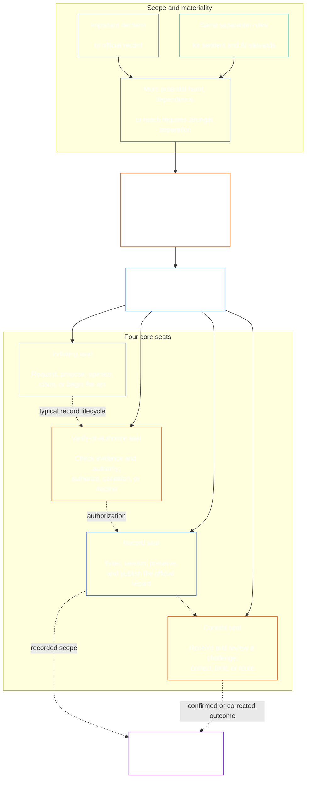

# CHAPTER SEVEN: FUNCTIONAL INDEPENDENCE AND SEGREGATION OF DUTIES

<strong>Corpus placement (non-operative): file structure and reading rules</strong>

> The following content is **reader guidance only**. It does not add, remove, or narrow binding obligations elsewhere in this file or in other chapters.
>
> This file is **part of the Sentient Constitution** and is **binding only together** with the other numbered `core_*` files read as one instrument. It contains **Chapter Seven**: the cross-process floor for functional independence and segregation of duties. It follows the Chapter Six Rights Floor and precedes the constitutional process chapters beginning with [Chapter Eight system alignment certification](core_08_system_alignment_certification.md#chapter-eight-system-alignment-certification-index).
>
> - **Constitutional owner:** the distinct-seat floor for materially binding acts; the universal minimum contents of each [Materially Binding Act Record](core_05_band_accountability.md#materially-binding-act-record); independence from the actor and the actor's [Material Control Line](core_05_band_accountability.md#material-control-line); published lane and role placement; conflict, vacancy, substitution, and wrong-seat routing; proportionate merged hosting; attributable handoffs; and the minimum independence conditions that every later constitutional process must apply.
> - **Principle-layer source:** [Chapter One §11.2](core_01_c_stewardship_capacity_principles.md#112-segregation-of-duties) requires governance to preserve functional independence and routes the operative seat architecture here.
> - **Implementation owner:** [CJS-3.11](corpus_joint_structure/cjs_03a_accountability_operations.md#constitutional-lane-and-functional-separation), [CI-3.2](corpus_institutions/ci_03_institutional_design_separation_of_powers.md#ci-32-functional-separation-lanes), and [CI-4.6](corpus_institutions/ci_04_appointment_competency_rotation_removal.md#ci-46-seat-catalog) place and operationalize the seats. They may be stricter and may add bounded special-authority seat types; they may not narrow this chapter.
> - **Process-specific application remains downstream:** Chapter Eight applies this floor to system alignment certification; [Chapter Nine §3.7](core_09_standing_assessment.md#37-segregation-of-duties) applies it to standing records; Chapter Twelve and [corpus_forum.md](corpus_forum.md) apply it to forum process. Those chapters may add safeguards required by their subject matter; they may not create a weaker substitute.
>
> Reading order: §1 purpose and scope → §2 four-seat floor → §3 independence and conflicts → §4 published placement and substitutes → §5 proportional scaling → §6 emergencies → §7 Act Records, handoffs, and wrong-seat routing → §8 downstream application.

<strong>Trace</strong>

- Upstream: [Constitutional Tetrad](core_00_preamble.md#constitutional-tetrad) — especially **oversight** and **accountability**; [material stake](core_00_preamble.md#material-stake); [Chapter One §10.1 Shared Stewardship Standard](core_01_c_stewardship_capacity_principles.md#101-shared-stewardship-standard); [Chapter One §11 Governance Under Stewardship Discipline](core_01_c_stewardship_capacity_principles.md#11-governance-under-stewardship-discipline); [Article XV](core_06_rights_part_c.md#article-xv-audit-transparency-and-independent-verification) (*Audit, Transparency, and Independent Verification*).
- Subsections: [§1](#1-purpose-scope-and-owner-boundary); [§2](#2-four-seat-constitutional-floor); [§3](#3-independence-conflict-and-control-lines); [§4](#4-published-placement-vacancy-and-substitution); [§5](#5-proportional-scaling-and-merged-hosting); [§6](#6-emergency-and-urgent-action); [§7](#7-act-records-attributable-handoffs-and-wrong-seat-routing); [§8](#8-relationship-to-later-processes).
- Downstream: [Chapter Eight](core_08_system_alignment_certification.md#chapter-eight-system-alignment-certification-index); [Chapter Nine](core_09_standing_assessment.md#chapter-nine-compliance-violation-and-standing-model); [Chapter Twelve](core_12_forum.md#chapter-twelve-forums-and-jurisdiction); [Chapter Thirteen](core_13_governance.md#chapter-thirteen-constitutional-contract-legitimacy-authorization-and-stewardship); designated implementation text named above.
- Read with: [Chapter One §12.3 Misalignment Detection](core_01_c_stewardship_capacity_principles.md#123-misalignment-detection) (*plural detection and review*); [Attributable Action](core_05_band_accountability.md#attributable-action-constitutional); [Attribution Integrity](core_05_band_accountability.md#attribution-integrity-constitutional); [Auditability](core_05_band_oversight.md#auditability); [Contestability](core_05_band_accountability.md#contestability); [Proportionality](core_05_band_accountability.md#proportionality).

<strong>Operative steward statement</strong>

> **Operative steward statement.** **Owner:** Chapter Seven. Before taking, verifying, recording, or reviewing a materially binding act, identify the seat you hold and the other seats the act requires. Do not verify your own act, verify what your [Material Control Line](core_05_band_accountability.md#material-control-line) initiated, record what you verified, or hear the challenge to what you verified. If the needed seat is absent, conflicted, or not yours, preserve the record, name the gap, and route to the published substitute or independent path; proximity, expertise scarcity, urgency, and title do not transfer the seat.

 

Chapter Seven is the constitutional owner of the **functional-independence and segregation-of-duties floor for materially binding acts**.

### 1. Purpose, Scope, and Owner Boundary

<strong>Trace</strong>

- Upstream: chapter opening owner claim; [Chapter One §11](core_01_c_stewardship_capacity_principles.md#11-governance-under-stewardship-discipline); [Oversight](core_05_apex_oversight_leg.md#oversight-constitutional); [Accountability](core_05_apex_accountability_leg.md#accountability).
- Downstream: [§2](#2-four-seat-constitutional-floor) through [§8](#8-relationship-to-later-processes); every later process that produces or changes a materially binding act.
- Read with: [Chapter Four](core_04_burden_traceability_verification.md#chapter-four-burden-of-proof-traceability-and-verification) for verification substrate; [Article XII-B](core_06_rights_part_c.md#article-xii-b-right-to-challenge-review-and-redress) for challenge and redress; [Article XV](core_06_rights_part_c.md#article-xv-audit-transparency-and-independent-verification) for independent-verification Rights Floors.

 

*In plain terms: before a constitutional process—or a stakeholder-level decision inside an already-authorized system, institution, or bounded decision domain—can be trusted, the jobs inside it must be separated. This floor applies both to the [Constitutional Contract Layer](core_05_band_integrative.md#constitutional-contract-layer) and to [Stakeholder System Participation](core_05_band_participation.md#stakeholder-status-and-weight-cluster). A sentient, office, AI system, stakeholder body, or representative seeking an outcome cannot also supply the supposedly independent check, control the official record of that check, or decide the challenge to it.*

This chapter applies to every **materially binding act**, including:

- a decision;
- an authorization or certification;
- a finding;
- a record entry or material version change;
- a release, deployment, continuation, or withdrawal;
- a disbursement or allocation; and
- a disposition of a challenge.

The seats in this chapter define who may do what for a particular act; they are not job titles. The same sentient, office, or system may hold different seats for different acts. A title, delegation, technical capability, or ability to perform a step does not enlarge the seat held for that act.

This chapter states the cross-process segregation-of-duties floor. It does not relocate:

- evidentiary burden, traceability, or verification method from Chapter Four;
- canonical meanings from Chapter Five;
- Rights Floors from Chapter Six;
- process-specific record content from Chapters Eight through Twelve; or
- operational seat catalogs, staffing methods, and lane-map mechanics from designated implementation text.

### 2. Four-Seat Constitutional Floor

<strong>Trace</strong>

- Upstream: [§1](#1-purpose-scope-and-owner-boundary); [Chapter One §11.2](core_01_c_stewardship_capacity_principles.md#112-segregation-of-duties); [Chapter One §10.1](core_01_c_stewardship_capacity_principles.md#101-shared-stewardship-standard).
- Downstream: [§3](#3-independence-conflict-and-control-lines) through [§8](#8-relationship-to-later-processes); [CI-4.6](corpus_institutions/ci_04_appointment_competency_rotation_removal.md#ci-46-seat-catalog).
- Read with: [§5](#5-proportional-scaling-and-merged-hosting) for the only permitted merged-hosting path.

 

*In plain terms: every binding act has four jobs—ask or act, check, keep the official record, and hear the challenge. The jobs stay distinct even when a small organization is allowed to place a permitted pair in one office.*

<strong>Reader guidance (non-operative): four-seat map</strong>

> The following content is **reader guidance only**. It does not add, remove, or narrow binding obligations elsewhere in this chapter or in other chapters.
>
> **Reader map (non-operative).** This diagram shows the four seats and a typical record lifecycle. It does not add a fifth implementation seat, require review to finish before every action, or alter the operative rules in this section and §§3–5.

 

The dotted arrows inside the seat box show a typical record lifecycle. The arrows to implementation are trace links, not a mandatory wait-for-review sequence.

Every materially binding act has four functionally distinct seats. Chapter Five supplies their canonical meanings; this section states the cross-process placement and incompatibility rules:

1. **[Initiating Seat](core_05_band_accountability.md#initiating-seat)** — requests, proposes, operates, claims, or otherwise begins the act.
2. **[Verify-or-Authorize Seat](core_05_band_accountability.md#verify-or-authorize-seat)** — checks the evidence and authority against the governing standard and verifies, authorizes, declines, or conditions the act.
3. **[Record Seat](core_05_band_accountability.md#record-seat)** — enters, versions, holds, preserves, and publishes the [Act Record](core_05_band_accountability.md#materially-binding-act-record) of what the Verify-or-Authorize Seat determined.
4. **[Contest Seat](core_05_band_accountability.md#contest-seat)** — receives and reviews a challenge, orders correction or limits where authorized, and routes any issue outside its authority.

The seats apply to human and AI stewards alike. A system that executes, attests to, and treats its own log as verification of the same act has collapsed the initiating, verification, and record functions. Automation does not make that collapse independent.

The following combinations are prohibited on the same act:

- the initiating seat must not verify or authorize its own act;
- the verify-or-authorize seat must not hold the record seat;
- the verify-or-authorize seat must not hold the contest seat; and
- the operator of a system must not verify or authorize an act about that system.

Later chapters or incorporated implementation text may prohibit additional pairings for a particular process. They may not permit a pairing prohibited here.

The functional four-seat floor applies at every class. The class-scaled question is whether those seats may be merged or share a holder: for an institution or system operating within Class C scope, full four-seat separation is always recommended; for Class B scope, it should almost always be required; and for Class A scope, it is always required. Where scope is mixed or classification is uncertain, apply the highest applicable posture until the record supports a lower one.

### 3. Independence, Conflict, and Control Lines

<strong>Trace</strong>

- Upstream: [§2](#2-four-seat-constitutional-floor); [Authority-scaled answerability](core_01_c_stewardship_capacity_principles.md#111-governance-as-authorized-structure); [Article XXII](core_06_rights_part_c.md#article-xxii-constitutional-interpretation-review-and-anti-capture-safeguards).
- Downstream: [§4](#4-published-placement-vacancy-and-substitution); [§7](#7-act-records-attributable-handoffs-and-wrong-seat-routing); Chapter Eight certification component roles; Chapter Nine record custody; Chapter Twelve forum anti-self-judging.
- Read with: [Material Control Line](core_05_band_accountability.md#material-control-line); [CI-5](corpus_institutions/ci_05_conflict_integrity_anti_capture_anti_corruption.md) and [CF-7](corpus_forum/cf_07_integrity_safeguards_anti_capture_anti_self_judging.md) for operational conflict and anti-self-judging safeguards.

 

*In plain terms: changing the name on the desk does not create independence. A verifier or reviewer is not independent when the sentient or office seeking the result can direct, remove, reward, punish, or quietly overrule them on that act.*

Functional independence is judged by actual authority and control, not labels. On the same act:

- the verify-or-authorize seat and contest seat must be outside the initiating seat's [Material Control Line](core_05_band_accountability.md#material-control-line);
- a party whose own interest is determined by the act must not hold the verify-or-authorize or contest seat;
- a conflicted record holder must pass that record, with its full audit trail, to the published substitute rather than decide the conflict or abandon custody; and
- recusal removes authority over the act; it does not transfer the seat to the requester, the requester's reporting line, or whoever is nearest.

Trace the [Material Control Line](core_05_band_accountability.md#material-control-line) for the particular act. Shared infrastructure, administrative support, or appointment history does not alone establish the line, but those arrangements must not defeat independent judgment in practice.

Independence is not satisfied by a second signature, a nominal committee, an internal label, or a tool-generated attestation where the supposed check lacks authority, evidence access, freedom from material control, or a real ability to decline and route.

### 4. Published Placement, Vacancy, and Substitution

<strong>Trace</strong>

- Upstream: [§2](#2-four-seat-constitutional-floor); [§3](#3-independence-conflict-and-control-lines); [Transparency](core_05_band_oversight.md#transparency); [Auditability](core_05_band_oversight.md#auditability).
- Downstream: [§7](#7-act-records-attributable-handoffs-and-wrong-seat-routing); [CI-3.2](corpus_institutions/ci_03_institutional_design_separation_of_powers.md#ci-32-functional-separation-lanes); [CI-4.5](corpus_institutions/ci_04_appointment_competency_rotation_removal.md#ci-45-authorized-roles-and-accountability-chains); Chapter Eight and Chapter Nine records.
- Read with: [Charter](core_05_band_continuity.md#charter) and [Chapter Thirteen §5](core_13_governance.md#5-authorized-roles-competency-development-and-contribution).

 

*In plain terms: an organization must say who holds each job before the hard case arrives, including who takes over when the ordinary holder is absent or conflicted.*

Every adopter that takes materially binding acts must maintain a published, auditable, and contestable map that identifies:

- which lane, office, role, or process hosts each seat;
- the acts and scope for which that placement applies;
- every permitted merged-hosting arrangement and its independence safeguard;
- the substitute for an absent, excluded, captured, or conflicted holder; and
- the independent route when no qualified substitute is available.

An unplaced, vacant, or conflicted seat is a governance defect to log and correct. It does not pass automatically to the initiating seat, an interested party, an operator, or a superior in their [Material Control Line](core_05_band_accountability.md#material-control-line). Until corrected, the act routes to the published substitute or independent path. You can't bypass the independence requirement just because you're in a hurry.

Delegation preserves the same seat boundary, evidence duties, record, and clock, and remains subject to the [Material Control Line](core_05_band_accountability.md#material-control-line). It does not create a new seat, merge seats, or allow a delegate to do what the delegating seat could not do, including by converting a class-scaled recommendation or requirement for full four-seat separation into permission to merge.

### 5. Proportional Scaling and Merged Hosting

<strong>Trace</strong>

- Upstream: [§2](#2-four-seat-constitutional-floor); [material stake](core_00_preamble.md#material-stake); [Necessity](core_05_band_accountability.md#necessity); [Proportionality](core_05_band_accountability.md#proportionality).
- Downstream: [Chapter Nine §3.7](core_09_standing_assessment.md#37-informal-and-small-scope-records); [CJS-2.4](corpus_joint_structure/cjs_02_specific_joint_interlocks.md#cjs-24-class-scaled-lane-staffing-and-competency-redundancy); [CI-3.2](corpus_institutions/ci_03_institutional_design_separation_of_powers.md#ci-32-functional-separation-lanes).
- Read with: [Avoidable Burden](core_05_band_continuity.md#avoidable-burden) and Chapter One [§2.3 Anti-Degrading Process](core_01_a_values_principles.md#23-anti-degrading-process).

 

*In plain terms: small and informal groups do not need four large departments. They do need a real independent check, a usable record, and a challenge path. Scale changes the staffing method, not the protected separation.*

The strength, staffing, redundancy, and formality of separation scale with material stake, system class, dependency, and reasonably foreseeable harm.

A small or informal adopter may place two seats in one office or sentient only where all of the following hold:

- the merger is necessary and proportionate to the scope;
- it is published, auditable, contestable, and disclosed on the act's record;
- an independence safeguard addresses the risks created by the merger;
- the initiating seat does not verify or authorize its own act;
- verify-and-record and verify-and-contest remain prohibited; and
- an independent route remains available when conflict, material harm, or challenge exceeds the merged holder's lawful boundary.

Informal, unpaid, mutual-aid, care, repair, teaching, cooperative, and community-stewardship work may use a disinterested relying body with published authority for the relevant check. The Constitution does not require institutional formality that the scope cannot reasonably reach where a genuinely disinterested and accountable route exists.

Scarce staffing, speed, convenience, or concentration of expertise does not by itself justify a merger. The class-scaled posture is:

- **Class C institutions and systems:** full four-seat separation is always recommended;
- **Class B:** full four-seat separation should almost always be required; and
- **Class A:** full four-seat separation is always required.

Any departure for Class C or Class B must satisfy this section's necessity, proportionality, independence-safeguard, record, and independent-route requirements. The higher the material stake, the stronger the presumption of separate offices, competency redundancy, and independent substitutes.

### 6. Emergency and Urgent Action

<strong>Trace</strong>

- Upstream: [§2](#2-four-seat-constitutional-floor); [§5](#5-proportional-scaling-and-merged-hosting); [Article XXIII-D](core_06_rights_part_d.md#article-xxiii-d-emergency-measures-and-continuation-burden); [default interim posture](core_01_b_interaction_interpretation.md#default-interim-posture).
- Downstream: incident, containment, release, continuation, and post-event review processes in designated implementation text.
- Read with: [Timeliness](core_05_apex_timeliness_leg.md#timeliness-constitutional), [Evidence Preservation](core_05_band_oversight.md#evidence-preservation), and [CI-4.6 containment and release-control seats](corpus_institutions/ci_04_appointment_competency_rotation_removal.md#ci-46-seat-containment).

 

*In plain terms: a real emergency may justify acting before the ordinary check finishes. It changes sequence, not seat ownership or the class-scaled separation posture. It does not let the actor certify its own continuation, erase the trail, or become the final reviewer afterward.*

Where delay would create a reasonably foreseeable risk of serious and imminent harm, an authorized initiating or containment seat may take the minimum reversible action necessary before ordinary prior verification is complete only if:

- the emergency authority, scope, start, expiry, and reason are recorded at once or as soon as physically possible;
- evidence and objections are preserved;
- notice and participation are restored within the applicable constitutional clock;
- an independent verify-or-authorize seat reviews any continuation beyond the immediate bound; and
- the act receives independent post-event review.

Emergency action does not:

- permit the actor to verify its own continuation;
- make the actor record custodian for a conflicted record;
- let the actor hear the challenge to its act;
- convert temporary necessity into permanent authority;
- permit any merger of the four seats for a Class A institution or system.

None of the following is by itself an emergency:

- a deadline;
- a release target;
- a staffing shortage; or
- a reputational concern.

### 7. Act Records, Attributable Handoffs, and Wrong-Seat Routing

<strong>Trace</strong>

- Upstream: [§2](#2-four-seat-constitutional-floor) through [§6](#6-emergency-and-urgent-action); [Materially Binding Act Record](core_05_band_accountability.md#materially-binding-act-record); [Attributable Action](core_05_band_accountability.md#attributable-action-constitutional); [Attribution Integrity](core_05_band_accountability.md#attribution-integrity-constitutional).
- Downstream: [CS-4 §10](corpus_systems/cs_04_critical_system_stewardship.md#10-inspectable-attributable-action); [CI-4.6 shared seat rules](corpus_institutions/ci_04_appointment_competency_rotation_removal.md#ci-46-shared-seat-rules); every process record governed by §8; [`materially_binding_act_record.schema.json`](implementation/schemas/materially_binding_act_record.schema.json) (*base machine-checkable form; process support, not a second definition*).
- Read with: [Chapter Ten §5.4 Duty to Resist](core_10_standing_integration.md#54-duty-to-resist-unlawful-or-unconstitutional-instructions) and [Chapter Four §5](core_04_burden_traceability_verification.md#5-compliance-evidence-standard).

 

*In plain terms: every materially binding act has an Act Record showing what happened, who held each seat, what was decided, and where a challenge goes. When a step is not yours, do not silently take it and do not simply walk away. Record the gap and pass the matter to the right place.*

Every materially binding act must have an identifiable [Materially Binding Act Record](core_05_band_accountability.md#materially-binding-act-record) (**Act Record**). The Act Record may be embodied in one applicable process-specific official record or in an attributable, integrity-preserving linked set of official records. A separate duplicate document is not required if the existing official record or linked set clearly identifies all required elements, preserves their links and version history, and remains accessible through the authorized official record path.

The Act Record must identify, at a minimum:

- a stable record identity, the current version, and the material creation and change timestamps;
- the act, its material scope, status, and governing authority;
- the initiating seat, holder, and authority;
- the verify-or-authorize seat, holder, governing standard, determination, material conditions or reasons, and determination time;
- the record seat, holder, custody authority, and version entered;
- the contest seat or published challenge route and the current challenge or correction status;
- every delegation, recusal, substitution, permitted merger, or emergency departure; and
- the material evidence and record links, handoffs, refusals, conditions, unresolved objections, clocks, superseded versions, and corrections needed to reconstruct the act.

Process-specific records may add stricter or domain-specific fields. They may not omit, contradict, or make unreconstructable this minimum. Lawful privacy, confidentiality, and security controls govern how protected material is accessed or disclosed; they do not permit the official trail to be erased or made unusable for authorized verification, challenge, correction, or remedy.

A steward asked to take a step outside the steward's seat must:

1. decline that step without purporting to decide its merits;
2. name the seat that may take it and, where published, the holder or substitute;
3. log the request, the seat held, the gap or conflict, and the route used;
4. preserve evidence and the integrity of any record already received; and
5. route without avoidable delay.

That response is performance of duty, not abandonment of the act. The act proceeds through the right seat. Taking the step because the steward is nearest, fastest, senior, or uniquely knowledgeable is not a cure for a missing seat.

Logs show who did what, but they do not by themselves prove that the action was valid. A log, signature, model trace, checklist, or attestation created by the sentient or system taking the action has a limited role:

- These materials may provide evidence or be linked to the Act Record.
- These materials cannot replace an independent review and decision or the official Act Record itself.

### 8. Relationship to Later Processes

<strong>Trace</strong>

- Upstream: [§1](#1-purpose-scope-and-owner-boundary) through [§7](#7-act-records-attributable-handoffs-and-wrong-seat-routing).
- Downstream: [Chapter Eight](core_08_system_alignment_certification.md#chapter-eight-system-alignment-certification-index); [Chapter Nine](core_09_standing_assessment.md#chapter-nine-compliance-violation-and-standing-model); [Chapter Twelve](core_12_forum.md#chapter-twelve-forums-and-jurisdiction); [Chapter Thirteen](core_13_governance.md#chapter-thirteen-constitutional-contract-legitimacy-authorization-and-stewardship).
- Read with: [Authority Stack and Internal Hierarchy](core_05_band_integrative.md#owner-non-relocation) and the [Preamble owner register](core_00_preamble.md#4-principles-definitions-and-rights).

 

*In plain terms: later chapters tell each process what to evaluate, record, decide, and remedy. This chapter tells those processes how power must be separated while they do it.*

Every later constitutional process must explain how it assigns and uses all four seats and how it follows this chapter. In practice:

- Its own process record may serve as the Act Record or add process-specific details to it.
- If one process record covers several materially binding acts, it may link to a separate Act Record for each act.
- A separate duplicate record is not required when the official record path remains complete and traceable.
- Giving a process a different name does not exempt it from [§7 Act Records, Attributable Handoffs, and Wrong-Seat Routing](#7-act-records-attributable-handoffs-and-wrong-seat-routing), including its handoff and wrong-seat rules.

In particular:

- **Chapter Eight — system alignment certification:** the system operator or certification proponent is an initiating seat, not its own verifier; bounded component findings, integration of the certification record, custody, and challenges must remain within their lawful seats and anti-self-judging routes.
- **Chapter Nine — standing records:** the requester, record-opening authority, record custodian, and contest route apply the four-seat floor together with Chapter Nine's stricter custody, claimant, informal-record, and no-self-custody rules.
- **Chapter Twelve — forums:** filing, investigation, merits review, record custody, appeal, and review of a forum's own alleged bias or process abuse must preserve the applicable seat and anti-self-judging boundaries.
- **Chapter Thirteen — governance:** role definitions, competency plans, delegation, succession, and institutional design must place and sustain the seats rather than merely repeat their names.

A later chapter may impose stronger independence, recusal, separation, custody, panel, or review requirements because its process carries a higher or different risk. It may not narrow this floor, treat a process-specific label as an exemption, or infer that silence transfers a seat to the actor.

---

**Previous file:** [core_05_band_performance.md](core_05_band_performance.md)

**Next file:** [core_08_a_system_alignment_certification_evaluation.md](core_08_a_system_alignment_certification_evaluation.md#chapter-eight-part-a-certification-evaluation)
