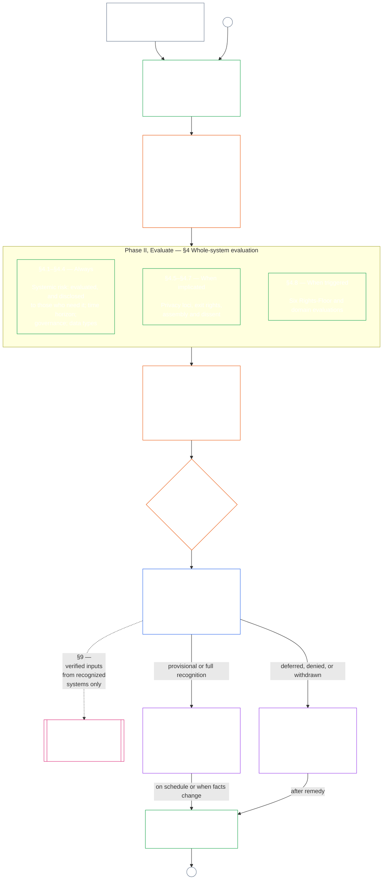

# CHAPTER EIGHT, PART A: SYSTEM ALIGNMENT CERTIFICATION — EVALUATION

<strong>Corpus placement (non-operative): file structure and reading rules</strong>

> The following content is **reader guidance only**. It does not add, remove, or narrow binding obligations elsewhere in this file or in other chapters.
>
> This file is **part of the Sentient Constitution** and is **binding only together** with the other numbered `core_*` files read as one instrument. It contains **Chapter Eight, Part A** — certification purpose, the process overview, and the first two phases of the process — **Frame** (system class and the challenge path) and **Evaluate** (whole-system evaluation, including data types and the Rights-Floor and domain evaluations) — **§1–§4**. The worked **Class A / B / C illustrations** (the class profiles, §4.4.1, and §4.8.1.1–§4.8.6.1), including each one's **Reading across classes** paragraph, are in [`core_08_c_system_alignment_certification_illustrations.md`](core_08_c_system_alignment_certification_illustrations.md); each keeps its Part A section number. The binding class-scaling and escalation rules those paragraphs illustrate stay in this file: class scaling, including participation and proportionality, in §2.1; data-handling scaling in §4.4; and the **Class scaling and escalation** paragraph in each of §4.8.1–§4.8.6. **Part B** — the last three phases: forum process and supervisory sequence, the certification record, outcomes and reopening, and the standing bridge (**§5–§9**) — is in [`core_08_b_system_alignment_certification_record_process.md`](core_08_b_system_alignment_certification_record_process.md).
>
> - **Constitutional owner (joint with Part B):** forum-supervised **system alignment certification and related records** — evaluation domains and the challenge path (Part A); forum process, supervisory sequence, certification-record duties, recognition outcomes, recertification and reopening, and verified-input bridge to Chapter Nine (Part B). Under the **oversight** Tetrad leg, SAC is one especially large, high-stakes audit process among others; auditing floors remain at **Article XVI** (*Audit, Transparency, and Independent Verification*) and Chapter Five [Auditability](core_05_band_oversight.md#auditability).
> - **Verification substrate owner:** [Chapter Four — Burden of Proof, Traceability, and Verification](core_04_burden_traceability_verification.md#chapter-four-burden-of-proof-traceability-and-verification) (within Chapters Two through Four) owns burden allocation, compliance evidence, definition traceability, observability, and security-constrained verification. Chapter Eight **applies** that discipline to system alignment certification records; it does **not** restate Chapter Four sections **1** through **5**.
> - **Auditing home (not relocated here):** **Article XVI** (*Audit, Transparency, and Independent Verification*), **Def.O1** (*Transparency, Auditability, and Verification*), and **CJS-3.3** (*auditability and reconstructability terms*)–**CJS-3.5** own auditing floors and operational terms. Chapter Eight runs one especially large SAC audit process that must satisfy those floors; it does not own all auditing.
> - **Implementation owner:** system-class handling, CS-5, and forum-process detail in designated implementation files must remain consistent with Chapter Eight and may be stricter where the corpus already provides a [Fullest Protective Effect](core_05_band_integrative.md#fullest-protective-effect) rule.
> - **Anti-relocation rule:** Part A does not restate Chapter Five canonical definitions, Chapter Three anti-evasion discipline (see [Part B §8.2](core_08_b_system_alignment_certification_record_process.md#82-non-evasion)), Chapter Nine contribution or standing measurement, or Chapter Ten standing effects. **[Part B §9](core_08_b_system_alignment_certification_record_process.md#9-relationship-to-standing)** states the standing bridge boundary explicitly.
>
> **Upstream:** Chapter Five definitions; Chapters Two through Four record, verification, burden, and traceability of definitions to results; and [Chapter Seven](core_07_functional_independence_segregation_of_duties.md#chapter-seven-functional-independence-and-segregation-of-duties), whose functional-independence floor governs every materially binding certification act.
> **Downstream:** [Part B](core_08_b_system_alignment_certification_record_process.md#chapter-eight-part-b-system-alignment-certification--record-and-process) (*forum process, record, outcomes, and standing bridge*); Chapter Nine standing records and verified inputs; Chapter Ten standing effects; Chapter Twelve forum supervision and system alignment certification pathways.

 

Chapter Eight, **Part A**, is the constitutional owner of **system alignment certification evaluation**. Forum supervision, record contents, outcomes and reopening, and the standing bridge are in **[Part B](core_08_b_system_alignment_certification_record_process.md#chapter-eight-part-b-system-alignment-certification--record-and-process)**. Worked illustrations of these evaluation sections are in **[Part C](core_08_c_system_alignment_certification_illustrations.md#chapter-eight-part-c-system-alignment-certification--illustrations)**.

### 1. Purpose and Role

<strong>Trace</strong>

- Upstream: [Preamble — constitutional owner register](core_00_preamble.md#4-principles-definitions-and-rights) and [Authority Stack and Internal Hierarchy](core_05_band_integrative.md#authority-stack-and-internal-hierarchy); [Constitutional Tetrad](core_00_preamble.md#constitutional-tetrad); [Two Constitutional Aims](core_00_preamble.md#two-constitutional-aims); [material stake](core_00_preamble.md#material-stake); [Proportionality](core_05_band_accountability.md#proportionality) and [Substantive Fairness](core_05_band_participation.md#substantive-fairness) (Chapter Five); Participation measurement family (*voice, access, and contest paths*); [Chapter One §16 Stewardship In Depth](core_01_c_stewardship_capacity_principles.md#16-stewardship-in-depth); [Chapter One §12 Systemic Evaluation Requirement](core_01_a_values_principles.md#12-systemic-evaluation-requirement) (*principle-layer whole-system evaluation lens — not one corner alone*); Chapters Two through Four; [Chapter Five](core_05__definitions_home.md#chapter-five-foundational-definitions) (*canonical definitions*); [Chapter Seven §2 Four-Seat Constitutional Floor](core_07_functional_independence_segregation_of_duties.md#2-four-seat-constitutional-floor); [System Alignment Certification](core_05_band_continuity.md#system-alignment-certification) (Chapter Five canonical term; non-operative shorthand **SAC**); [System Certification Record](core_05_band_continuity.md#system-certification-record) (Chapter Five meaning).
- Downstream: [§2](#2-system-class-evaluation) (*system class evaluation*); [§3](#3-challenging-a-certification) (*challenging a certification*); and [Part C class profiles](core_08_c_system_alignment_certification_illustrations.md#illustrative-class-profiles-non-exhaustive) (*illustrative class profiles*); [Part C whole-system walkthroughs](core_08_c_system_alignment_certification_illustrations.md#illustrative-whole-system-application-by-class-non-exhaustive) (*worked whole-system examples by class*); [§4.4.1](core_08_c_system_alignment_certification_illustrations.md#441-illustrative-data-handling-application-by-class-non-exhaustive) (*worked data-handling examples by class*); [§4.8.1.1](core_08_c_system_alignment_certification_illustrations.md#4811-illustrative-ecological-footprint-application-by-class-non-exhaustive) (*worked ecological-footprint examples by class*); [§4.8.2.1](core_08_c_system_alignment_certification_illustrations.md#4821-illustrative-cross-system-support-application-by-class-non-exhaustive) (*worked cross-system-support examples by class*); [§4.8.3.1](core_08_c_system_alignment_certification_illustrations.md#4831-illustrative-nondiscrimination-application-by-class-non-exhaustive) (*worked nondiscrimination examples by class*); [§4.8.4.1](core_08_c_system_alignment_certification_illustrations.md#4841-illustrative-accessibility-application-by-class-non-exhaustive) (*worked accessibility examples by class*); [§4.8.5.1](core_08_c_system_alignment_certification_illustrations.md#4851-illustrative-educational-capability-application-by-class-non-exhaustive) (*worked educational-capability examples by class*); [§4.8.6.1](core_08_c_system_alignment_certification_illustrations.md#4861-illustrative-trustworthiness-application-by-class-non-exhaustive) (*worked trustworthiness examples by class*); [§4](#4-whole-system-certification-evaluation) (*whole-system certification evaluation factors*); [§4.4](#44-data-types-and-handling-evaluation) through [§4.8.6](#486-trustworthiness-and-system-reliance-integrity-evaluation) (*domain evaluations*); [Part B §5](core_08_b_system_alignment_certification_record_process.md#5-forum-process) (*supervisory sequence and contestability chain*); [Part B §5.1](core_08_b_system_alignment_certification_record_process.md#51-forum-supervision-and-component-roles) (*forum component roles*); [Part B §7](core_08_b_system_alignment_certification_record_process.md#7-system-certification-record) (*certification record contents*); [Part B §7.2](core_08_b_system_alignment_certification_record_process.md#72-record-integrity-transparency-and-auditability) (*record integrity requirements*); [Part B §6](core_08_b_system_alignment_certification_record_process.md#6-certification-outcomes) (*reopening and anti-evasion*); [Part B §9](core_08_b_system_alignment_certification_record_process.md#9-relationship-to-standing) (*standing-record bridge*); [Chapter Nine](core_09_standing_assessment.md#chapter-nine-contribution-violation-and-standing-model--measurement) (*standing records and verified-input gate*); [Chapter Ten](core_10_standing_integration.md#chapter-ten-standing-effects-and-integration) (*standing effects and integration*); [Chapter Twelve](core_12_forum.md#chapter-twelve-forums-and-jurisdiction) (*forum supervision, certification, alignment recognition, and review*).
- Read with: [corpus_systems.md](corpus_systems.md), especially **CS-3 — System classification and handling**, **CS-2 — Information types and handling**, and **CS-5** (*User-facing capability surfaces*); [corpus_forum.md](corpus_forum.md), especially **CF-5** (*Routing operations, transfer, certification, and representative treatment*) and **CF-7** (*Integrity safeguards, anti-capture operations, and anti-self-judging support*); **Article XVI** (*Audit, Transparency, and Independent Verification*) and [Auditability](core_05_band_oversight.md#auditability) (*auditing floors — SAC is one especially large audit process under oversight, not the sole auditing home*); **CJS-3.3** (*Oversight: auditability and reconstructability terms (annex)*)–**CJS-3.5** (*Oversight: independent verification and claim-integrity terms*).

 

*In plain terms: When a system really matters to sentients' lives, certification has to be **proportionate** — as demanding as the system's real impact, dependency, and risk require, not a one-size-fits-all checklist or a rubber stamp. It also has to be **participatory** — affected sentients and communities must be able to see what was reviewed, understand what was decided, and challenge it when something is wrong. Forums review evidence, write it down in a certification record, and require re-checks on a schedule that matches how risky the system is.*

*A certification is not a popularity score, a forever pass, or a way to skip rights review. It is a time-bound, challengeable statement of what is known about the system's alignment right now. Under the **oversight** Tetrad leg, oversight requires auditing; system alignment certification is one especially large, high-stakes audit process among others — not the sole home of auditing (**Article XVI** (*Audit, Transparency, and Independent Verification*), [Auditability](core_05_band_oversight.md#auditability)).*

**System alignment certification** exists to answer one question for a stated scope and review schedule: Has the system shown constitutional alignment well enough for recognition, conditional recognition, validation, recertification, continued reliance, deployment, or material release from conditions?

As an oversight instrument, certification is one especially large audit process under [Auditability](core_05_band_oversight.md#auditability) and **Article XVI** (*Audit, Transparency, and Independent Verification*):

- It is forum-supervised, multi-domain, and recognition-bearing.
- It may integrate the results of sibling audit modes, and it does not absorb or replace them. Each keeps its own owner, named in the [sibling audit modes map](corpus_joint_structure/cjs_03u_audit_process.md#sibling-audit-modes-owner-map) of the audit process home:
  - System Data Types Record audits under **CS-2** (*Information types and handling*)
  - System Classification Record audits under **CS-3** (*System classification machinery*)
  - steward assurance reviews under **CS-4** (*Critical system stewardship*)
  - continuous audit under **CS-5** (*Design, testing, verification, and deployment*) ACA
  - complexity audits under **CS-6** (*Comprehensibility and complexity stewardship*) and **Article XXIII-B** (*Complexity Audit and Modularity Requirements*)
  - claim verification under **CJS-3.5** (*Oversight: independent verification and claim-integrity terms*)
- Those modes also remain available on their own outside certification, and certification does not replace them.

#### 1.1 Certification at a glance

*In plain terms: classify the system honestly and open the challenge path as soon as it has stakeholders, run the evaluations that apply, have forums review the findings, decide an outcome, gather it all into one record, and check again on schedule — closely at first, less often once a system has proven clean — or whenever the facts change.*

The process runs in **six phases**: **I Frame**, **II Evaluate**, **III Review**, **IV Decide**, **V Record**, and **VI Operate**. The chart shows the whole certification process in that order. Part A covers the first two phases, framing and evaluation; [Part B](core_08_b_system_alignment_certification_record_process.md#chapter-eight-part-b-system-alignment-certification--record-and-process) covers the last four: the forum process, the outcome, the record, and operation (recertification and reopening, and the standing bridge).

<strong>Reader guide (non-operative): the six phases</strong>

> The following content is **reader guidance only**. It does not add, remove, or narrow binding obligations in this chapter or in other chapters.
>
> | Phase | Sections | Question the phase answers | Where |
> |-------|----------|----------------------------|-------|
> | **I. Frame** | [§2](#2-system-class-evaluation) · [§3](#3-challenging-a-certification) | What class is the system, and can affected sentients already contest the outcome? | Part A |
> | **II. Evaluate** | [§4](#4-whole-system-certification-evaluation) | What does the whole system do — always, where implicated, and where triggered? | Part A |
> | **III. Review** | [§5](core_08_b_system_alignment_certification_record_process.md#5-forum-process) | Which forums review the findings, in what order, and how can they be contested? | Part B |
> | **IV. Decide** | [§6](core_08_b_system_alignment_certification_record_process.md#6-certification-outcomes) | What outcome do the forums reach? | Part B |
> | **V. Record** | [§7](core_08_b_system_alignment_certification_record_process.md#7-system-certification-record) | Is the outcome, and everything behind it, in one record that can be audited? | Part B |
> | **VI. Operate** | [§8](core_08_b_system_alignment_certification_record_process.md#8-recertification-and-reopening) · [§9](core_08_b_system_alignment_certification_record_process.md#9-relationship-to-standing) | How is the certification kept current, when is it reopened, and what reaches standing? | Part B |

 

Illustrative **Class A**, **Class B**, and **Class C** profiles — and how class scales certification depth across this chapter — are in [Illustrative class profiles (non-exhaustive)](core_08_c_system_alignment_certification_illustrations.md#illustrative-class-profiles-non-exhaustive). Worked walkthroughs of the same three systems for each evaluation area in [§4 Whole-System Certification Evaluation](#4-whole-system-certification-evaluation) through [§4.8.6 Trustworthiness and System-Reliance Integrity Evaluation](#486-trustworthiness-and-system-reliance-integrity-evaluation) follow there, in [Part C — Illustrations](core_08_c_system_alignment_certification_illustrations.md#chapter-eight-part-c-system-alignment-certification--illustrations), which links each profile and walkthrough back to the Part A section it illustrates.

#### 1.2 Proportionality and the Tetrad

Certification depth, record burden, recertification cadence, stakeholder review, and contest paths must scale with [material stake](core_00_preamble.md#material-stake) under [Proportionality](core_05_band_accountability.md#proportionality):

- Higher-impact, higher-dependency, and higher-risk systems require stronger proof, clearer records, and more practicable participation — including substantive accessibility, stakeholder input, and challenge routes scaled to who relies on the system.
- Lower classes and bounded scopes still require honest classification and proportionate assurance; they do not receive a free pass from material obligations where external effects exist.

Certification implements the [Two Constitutional Aims](core_00_preamble.md#two-constitutional-aims) through the [Constitutional Tetrad](core_00_preamble.md#constitutional-tetrad):

- **[Flourishing](core_00_preamble.md#flourishing)** — certification verifies that recognition or continued reliance would not quietly defeat Rights Floors or block fair participation in constitutionally relevant life;
- **[Continuity](core_00_preamble.md#continuity)** — certification verifies durable, non-regressive supply that sustains rather than depletes healthy natural systems ([Ecological Integrity](core_05_band_continuity.md#ecological-integrity), including [Ecological Recovery Capacity](core_05_band_continuity.md#ecological-recovery-capacity)), and class-scaled recertification where shared systems gate or sustain delivery;
- **Participation** — affected sentients and communities can understand, contest, and take part in review paths that matter to them;
- **Oversight** — records, evidence, and assumptions are visible and auditable enough for independent checking; certification itself is one especially large audit process under that oversight duty, not the only one;
- **Accountability** — defects, misclassification, and floor-defeating operation route to remedy, conditions, withdrawal, or standing input where the facts support it;
- **Timeliness** — review and contest clocks keep certification from going stale while harm can still be prevented or reversed.

### 2. System Class Evaluation

<strong>Trace</strong>

- Upstream: [§1](#1-purpose-and-role) (*purpose and role*); Integrative Materiality ([Materiality](core_05_band_oversight.md#materiality)) (*Materiality*); [Constitutional Tetrad](core_00_preamble.md#constitutional-tetrad); [Two Constitutional Aims](core_00_preamble.md#two-constitutional-aims); [Material Impact](core_05_band_oversight.md#material-impact), [Dependency](core_05_band_continuity.md#dependency), [Risk](core_05_band_continuity.md#risk), [System Boundaries](core_05_band_continuity.md#system-boundaries), and [Charter](core_05_band_continuity.md#charter) (Chapter Five); [Chapter One §12 Systemic Evaluation Requirement](core_01_a_values_principles.md#12-systemic-evaluation-requirement); **Article III-A** (*Survival*) and **Article IV-A** (*Rights-Floor delivery where classification gates access*); **Article V-A** (*Dependency Mapping and Resource-Flow Transparency*) and **Article V-B** (*resource allocation and dependency stewardship where certification gates shared-infrastructure reliance*).
- Downstream: [§2.1](#21-how-class-scales-every-evaluation) (*class-scaled participation and proportionality*); [Part C class profiles and reclassification](core_08_c_system_alignment_certification_illustrations.md#illustrative-class-profiles-non-exhaustive) (*illustrative class profiles*); [Part C whole-system walkthroughs](core_08_c_system_alignment_certification_illustrations.md#illustrative-whole-system-application-by-class-non-exhaustive) (*worked whole-system examples by class*); [§4.4.1](core_08_c_system_alignment_certification_illustrations.md#441-illustrative-data-handling-application-by-class-non-exhaustive) (*worked data-handling examples by class*); [§4.8.1.1](core_08_c_system_alignment_certification_illustrations.md#4811-illustrative-ecological-footprint-application-by-class-non-exhaustive) (*worked ecological-footprint examples by class*); [§4.8.2.1](core_08_c_system_alignment_certification_illustrations.md#4821-illustrative-cross-system-support-application-by-class-non-exhaustive) (*worked cross-system-support examples by class*); [§4.8.3.1](core_08_c_system_alignment_certification_illustrations.md#4831-illustrative-nondiscrimination-application-by-class-non-exhaustive) (*worked nondiscrimination examples by class*); [§4.8.4.1](core_08_c_system_alignment_certification_illustrations.md#4841-illustrative-accessibility-application-by-class-non-exhaustive) (*worked accessibility examples by class*); [§4.8.5.1](core_08_c_system_alignment_certification_illustrations.md#4851-illustrative-educational-capability-application-by-class-non-exhaustive) (*worked educational-capability examples by class*); [§4.8.6.1](core_08_c_system_alignment_certification_illustrations.md#4861-illustrative-trustworthiness-application-by-class-non-exhaustive) (*worked trustworthiness examples by class*); [§4.4](#44-data-types-and-handling-evaluation) (*joint data-handling evaluation*); [§4.8.1](#481-ecological-footprint-evaluation) (*ecological footprint evaluation*); [§4.8.2](#482-proportionate-cross-system-support-evaluation) (*cross-system support evaluation*); [Part B §7.2](core_08_b_system_alignment_certification_record_process.md#72-record-integrity-transparency-and-auditability) (*record integrity*); [Part B §9](core_08_b_system_alignment_certification_record_process.md#9-relationship-to-standing) (*verified-input gate*); [Part B §6](core_08_b_system_alignment_certification_record_process.md#6-certification-outcomes) (*classification drift and reclassification triggers*).
- Read with: [System Classification Record](core_05_band_continuity.md#system-classification-record); [corpus_systems.md](corpus_systems.md), **CS-3 — System classification and handling**, including **[CS-3 §3.5 reclassification requirement](corpus_systems/cs_03_a_system_classification_machinery.md#35-reclassification-requirement)** (*Reclassification requirement* — triggers, class-scaled evaluation depth, and SAC verification bridge) and **[CS-3 §7](corpus_systems/cs_03_a_system_classification_machinery.md#cs-37-classification-governance-disclosure-and-challenge)** (*Classification governance, disclosure, and challenge*) — System Classification Record governance duties and the SAC bridge; [CS-5 — Design, testing, verification, and deployment](corpus_systems/cs_05_design_testing_verification_deployment.md); [CJS-3.21 — Adversarial robustness and abuse-resistance terms](corpus_joint_structure/cjs_03c_continuity_operations.md#cjs-321-continuity-adversarial-robustness-and-abuse-resistance-terms) (*regression and hardening cycle obligations*); [corpus_forum.md](corpus_forum.md) **CF-7.2** (*Constitutional alignment recognition and review*).

 

*In plain terms: certification has to check whether the system is classified honestly — not by what the operator calls it, but by what it actually does, what depends on it, and what could go wrong. Higher classes mean stricter proof, faster re-checks, and stronger resilience expectations. See [Part C — Illustrations](core_08_c_system_alignment_certification_illustrations.md#chapter-eight-part-c-system-alignment-certification--illustrations) for one example system per class and how evaluation applies to each of them.*

Every certification record for a materially impactful system must include an evaluation of the system's **system class**.

The detailed rules live in [corpus_systems.md](corpus_systems.md), [CS-3 — System classification and handling](corpus_systems/cs_03_a_system_classification_machinery.md), and [CS-5 — Design, testing, verification, and deployment](corpus_systems/cs_05_design_testing_verification_deployment.md). They cover:

- what the classes are, how a class is assigned, and the class profiles;
- how classification is governed;
- how much assurance each class needs;
- how robust the infrastructure must be;
- which checks and records are recertified, on what class-scaled schedule, and how provisional and full recognition change that schedule.

This section states what certification must verify. It does not restate the CS-3 (*System classification machinery*) class taxonomy or application profiles, or the CS-5 (*User-facing capability surfaces*) test mechanics.

Certification must verify:

- **Evaluation requirement:**
  - whether the assigned system class reflects observed and reasonably foreseeable **impact**, **dependency**, and **risk** under CS-3 (*System classification machinery*), including:
    - aggregate effects;
    - interaction effects;
    - adversarial effects;
    - threshold effects;
  - that classification is determined by actual system behavior and impacts, not from:
    - declared intent;
    - nominal scope;
    - [Charter](core_05_band_continuity.md#charter) text alone; or
    - self-description alone;
  - that the system's class was re-checked under the **[CS-3 §3.5 reclassification requirement](corpus_systems/cs_03_a_system_classification_machinery.md#35-reclassification-requirement)** whenever a significant change called for it; and
  - that the [System Classification Record](core_05_band_continuity.md#system-classification-record) shows the **highest class that applies** under current conditions.
- **Assurance and regression testing:**
  - that class-scaled assurance, infrastructure robustness, and regression coverage match the assigned class under:
    - CS-3 (*System classification machinery*);
    - CS-5 (*User-facing capability surfaces*);
    - read with [**CJS-3.21**](corpus_joint_structure/cjs_03c_continuity_operations.md#cjs-321-continuity-adversarial-robustness-and-abuse-resistance-terms) (*Continuity: adversarial robustness and abuse-resistance terms*) and **CJS-3.19** (*Continuity: graceful degradation and failure-mode integrity terms*) through **CJS-3.23** (*Integrative: intervention and override integrity terms*) where materially applicable; and
  - that regression testing was run for each recertification, as CS-5 (*User-facing capability surfaces*) requires, with its results on the record under [§7.1 Minimum record contents](core_08_b_system_alignment_certification_record_process.md#71-minimum-record-contents).
- **Recognition and recertification:**
  - that a recognition-and-review evidence package exists for the certification cycle, as CS-5 (*User-facing capability surfaces*) *Forum recognition and lifecycle review* requires;
  - that the recognition status on the record is supported under [Part B §8.1 Provisional and full recognition](core_08_b_system_alignment_certification_record_process.md#81-provisional-and-full-recognition):
    - full recognition only where:
      - the clean-recertification floor is met;
      - no misalignment is current; and
      - no monitoring indicator points to impending misalignment;
    - provisional recognition for a system whose last recertification failed; and
  - for systems that deliver or depend on basic Rights Floor protections:
    - that how often the system is re-checked, and how deeply it is re-tested, serve the **Continuity** aim in [Two Constitutional Aims](core_00_preamble.md#two-constitutional-aims), which means essentials keep reaching sentients over time;
    - that an out-of-date or too-early certification is never taken as proof that sentients are actually getting food, water, shelter, education, or safety today.
- **Misclassification and defects:**
  - certification defects under CS-3 (*System classification machinery*) and [Part B §6](core_08_b_system_alignment_certification_record_process.md#6-certification-outcomes), not minor paperwork mistakes, include:
    - claiming a lower risk class than the system deserves;
    - breaking the system into pieces to dodge tougher rules; or
    - keeping an old class label after conditions have changed, including failure to reassess under the **[CS-3 §3.5 reclassification requirement](corpus_systems/cs_03_a_system_classification_machinery.md#35-reclassification-requirement)**;
  - certification defects under CS-5 (*User-facing capability surfaces*) include:
    - skipping regression tests;
    - relying on outdated results;
    - leaving known breaks unfixed; or
    - accepting major fixes without re-testing when re-testing was feasible; and
  - where the system is recognized and the facts support it, the same classification problems may also count toward adverse standing findings in [Chapter Nine](core_09_standing_assessment.md#chapter-nine-contribution-violation-and-standing-model--measurement).

Consequences of these defects are set in [§6 Certification Outcomes](core_08_b_system_alignment_certification_record_process.md#6-certification-outcomes).

#### 2.1 How class scales every evaluation

Class sets how deeply every evaluation in this chapter is carried out — the whole-system factors in [§4 Whole-System Certification Evaluation](#4-whole-system-certification-evaluation), data handling in [§4.4 Data Types and Handling Evaluation](#44-data-types-and-handling-evaluation), and each Rights-Floor and domain evaluation in [§4.8 Rights-Floor and Domain Evaluations](#48-rights-floor-and-domain-evaluations) — and how often it is repeated:

- Higher-class systems require proportionately stronger evidence that each applicable evaluation was actually performed, not asserted.
- Lower classes still require an honest, proportionate evaluation wherever a trigger applies.
- Class never permits skipping a required evaluation. A system whose real role outgrows its class must be reclassified and re-evaluated at the higher depth under [§8 Recertification and Reopening](core_08_b_system_alignment_certification_record_process.md#8-recertification-and-reopening).

Participation and proportionality requirements scale the same way:

- **Class A** systems require the strongest practicable participation paths, because errors can foreclose survival essentials before remedy is possible. These include:
  - accessible challenge;
  - stakeholder review; and
  - Sentient-forum component findings where Rights Floors are implicated.
- **Class B** systems require robust participation where the system gates:
  - healthcare;
  - education;
  - benefits;
  - work; or
  - comparable daily life.
- **Class C** systems still require contestable records and proportionate disclosure, especially where coordination effects:
  - burden protected groups;
  - concentrate dependency; or
  - foreshadow escalation to Class B or Class A.

### 3. Challenging a Certification

<strong>Definitions · Assessment · Compliance</strong>

- [Contestability](core_05_band_accountability.md#contestability) · [O](core_05_band_accountability.md#contestability) · [M](core_05_band_accountability.md#contestability-a) · [A](core_05_band_accountability.md#contestability-a) · [C](core_05_band_accountability.md#contestability-c)

 

*In plain terms: a certification record only works if sentients can push back when it is wrong. A challenge has to be real — able to reopen review, pause reliance, and reach the forum with authority over the point in dispute — not a ceremonial complaints box.*

Under the [Constitutional Tetrad](core_00_preamble.md#constitutional-tetrad), [Contestability](core_05_band_accountability.md#contestability) implements **accountability** and preserves **participation** in challenge paths; contest clocks under **Article XXVI-C** (*Timely Resolution and Anti-Delay Floor*) implement **timeliness**.

Affected parties must have real ways to challenge the record:

- A certification record must state the [contestability paths](#31-contestability-paths) defined in §3.1 Contestability paths, sufficient for affected parties to contest:
  - Record content;
  - scope;
  - classification assumptions;
  - evidence reliance;
  - supervisory integrity;
  - outcome; or
  - continued reliance;
- Contest mechanisms must be functional and accessible, not ceremonial;
- A challenge must be able to:
  - Reopen review;
  - [Stay](core_05_band_accountability.md#stay) or limit reliance where material error or integrity risk is credibly shown;
  - Route to the forum family with lawful merits authority over the challenged point;
- Contestability obligations scale with system class and material impact;
- They do not disappear because a system is labeled experimental, internal, personal, isolated, or technical-only where material impact is present.

#### 3.1 Contestability paths

**When the path opens.** The published record challenge path opens when the system first has stakeholders: sentients it materially affects or who materially rely on it, as found in evaluation and not as identified by the operator. For a pilot, it opens at pilot go-live. A system at any class is expected to run a pilot before full deployment, scaled to its class under Proportionality; one that does not records why, and its path opens no later than full deployment. The path stays open while the system has stakeholders, and a system that gains stakeholders after certification reopens it under [§8 Recertification and Reopening](core_08_b_system_alignment_certification_record_process.md#8-recertification-and-reopening). An aligned claim is not supported while a system with stakeholders has no open, contestable path.

A System Certification Record must name these challenge paths. They implement Dispute sequencing for certification records. They are not a forum family and do not replace Chapter Twelve routing.

- **Published record challenge path** — the ordinary first step for an ordinary dispute about the certification record. The record names the [Stakeholder System Participation](core_05_band_participation.md#stakeholder-status-and-weight) contest seat:
  - who receives the challenge;
  - how to file it; and
  - that clocks under **Article XXVI-C** (*Timely Resolution and Anti-Delay Floor*) run from receipt.
  
  Internal operator review, vendor attestation, or technical sign-off is not this path.
- **Component forum path** — the Chapter Twelve forum family with merits authority over a challenged component finding.
- **Lead-integrity path** — Integrity routing and anti-self-judging backup when the challenge is how the lead forum ran the process, including capture, hidden information, self-review, or calling certification finished too soon.
- **Escalation path** — Chapter Twelve transfer, certification, backup routing, and family-to-family escalation when primary stakes, constitutional validity, structural remedy, family deadlock, or anti-self-judging protection requires it.

Direct access to a forum path remains available when delay would materially endanger rights, evidence, independence, or practical restoration. Unfinished use of the published record challenge path must not stall those forum paths or eat **Article XXVI-C** (*Timely Resolution and Anti-Delay Floor*) clocks.

### 4. Whole-System Certification Evaluation

<strong>Trace</strong>

- Upstream: [Chapter One §12 Systemic Evaluation Requirement](core_01_a_values_principles.md#12-systemic-evaluation-requirement); Flourishing measurement family (*Wellbeing, safety, harm, and survival-floor access*); Constitutional Performance measurement family (*Constitutional Efficiency, Avoidable Burden, and Productive Capacity*); [Constitutional Tetrad](core_00_preamble.md#constitutional-tetrad); [Two Constitutional Aims](core_00_preamble.md#two-constitutional-aims); [material stake](core_00_preamble.md#material-stake); [§1 Purpose and Role](#1-purpose-and-role).
- Downstream: [Part C whole-system walkthroughs](core_08_c_system_alignment_certification_illustrations.md#illustrative-whole-system-application-by-class-non-exhaustive) (*illustrative whole-system walkthroughs*); [§4.4](#44-data-types-and-handling-evaluation) through [§4.8.6](#486-trustworthiness-and-system-reliance-integrity-evaluation) (*domain evaluations*); [Part C class profiles](core_08_c_system_alignment_certification_illustrations.md#illustrative-class-profiles-non-exhaustive) (*illustrative class profiles*); [Part B §7](core_08_b_system_alignment_certification_record_process.md#7-system-certification-record) (*record contents*); [Part B §7.2](core_08_b_system_alignment_certification_record_process.md#72-record-integrity-transparency-and-auditability) (*record integrity*); [Part B §5](core_08_b_system_alignment_certification_record_process.md#5-forum-process) (*contestability chain*); [Part B §6](core_08_b_system_alignment_certification_record_process.md#6-certification-outcomes) (*reopening and anti-evasion*).
- Read with: [Chapter One §16](core_01_c_stewardship_capacity_principles.md#16-stewardship-in-depth), [§18](core_01_c_stewardship_capacity_principles.md#18-governance-under-stewardship-discipline), and [§19](core_01_c_stewardship_capacity_principles.md#19-incentive-alignment-and-system-capture); [Chapter One §7.4 Voluntary Discontinuation, Major Self-Modification, and Exit Rights](core_01_a_values_principles.md#74-voluntary-discontinuation-and-exit-rights); [Chapter One §7.2 Assembly, Collective Organization, and Institutional Formation](core_01_a_values_principles.md#72-assembly-collective-organization-and-institutional-formation); **Article XVI** (*Audit, Transparency, and Independent Verification*) where audit, transparency, or independent-verification Rights Floors are materially at stake; Continuity measurement family ([§4.1](#41-systemic-scope-and-risk-factors) — resilience, reversibility, and systemic risk); [Risk Evaluation](core_05_band_continuity.md#risk-evaluation); [Risk Disclosure](core_05_band_oversight.md#risk-disclosure); [Public Oversight Baseline Disclosure](core_05_band_oversight.md#public-oversight-baseline-disclosure); Participation measurement family ([§4.5](#45-privacy-informational-joint-invocation) — privacy and data stewardship); Accountability measurement family ([§4.3](#43-governance-incentive-and-contestability-discipline) — incentive alignment and market contestability); [System Boundaries](core_05_band_continuity.md#system-boundaries); [Charter](core_05_band_continuity.md#charter).
- Subsections: [§4.1](#41-systemic-scope-and-risk-factors) through [§4.4](#44-data-types-and-handling-evaluation) (*always: systemic factors, time horizon, governance, and data types and handling*); [§4.5](#45-privacy-informational-joint-invocation) through [§4.7](#47-assembly-collective-organization-and-institutional-formation) (*when implicated: privacy loci, exit rights, and assembly and dissent*); [§4.8](#48-rights-floor-and-domain-evaluations) (*when triggered: Rights-Floor and domain evaluations*).

 

*In plain terms: you cannot green-light one piece of a system and ignore the rest. Reviewers need the full picture — what it depends on, what breaks when something upstream fails, harms that show up later or add up over time, whether sentients can actually use it (not just on paper), whether private information stays properly walled off, whether sentients can leave without being trapped, whether groups can still organize without the system splitting them apart, whether short-term wins hide long-term damage, and whether real oversight and accountability will still work when a lot is on the line.*

*Worked examples: [Part C](core_08_c_system_alignment_certification_illustrations.md#illustrative-whole-system-application-by-class-non-exhaustive) (*Illustrative whole-system application by class*) walks one example system per class through this section.*

A system alignment certification evaluation is incomplete if it considers only immediate or local effects.

Whole-system evaluation has three tiers, set out in the table below. The table orients the reader. It does not add to, narrow, or reorder what each subsection requires, and a tier's label does not excuse an evaluation that a subsection's own wording makes material.

| Tier | Sections | Applies |
|------|----------|---------|
| **Always** | [§4.1 Systemic Scope and Risk Factors](#41-systemic-scope-and-risk-factors); [§4.2 Time-Consistency Constraint](#42-time-consistency-constraint); [§4.3 Governance, Incentive, and Contestability Discipline](#43-governance-incentive-and-contestability-discipline); [§4.4 Data Types and Handling Evaluation](#44-data-types-and-handling-evaluation) | every materially impactful certification record |
| **When implicated** | [§4.5 Privacy (Informational) Joint Invocation](#45-privacy-informational-joint-invocation); [§4.6 Voluntary Discontinuation, Major Self-Modification, and Exit Rights](#46-voluntary-discontinuation-major-self-modification-and-exit-rights); [§4.7 Assembly, Collective Organization, and Institutional Formation](#47-assembly-collective-organization-and-institutional-formation), including [§4.7.1](#471-dissent-and-peaceful-protest) | where the certification matter materially implicates the locus or principle the subsection names |
| **When triggered** | [§4.8 Rights-Floor and Domain Evaluations](#48-rights-floor-and-domain-evaluations) | where a trigger in the §4.8 table is met |

Certification records must show that the evaluation considered the factors below wherever they are material to:

- recognition;
- validation;
- recertification;
- continued reliance;
- deployment; or
- material release from conditions.

The evaluation must also confirm that the [Constitutional Tetrad](core_00_preamble.md#constitutional-tetrad) will meet [material stake](core_00_preamble.md#material-stake) scaling for the system under review.

#### 4.1 Systemic Scope and Risk Factors

Certification evaluations must consider:

- **dependency relationships and cascading effects** — what fails downstream when something upstream breaks;
- **aggregation and scale effects** — what changes when many small actions combine;
- **delayed, cumulative, and probabilistic impacts** — harms that show up later, stack up, or depend on chance;
- **adversarial conditions and misuse potential** — how bad actors or predictable abuse could exploit the system;
- **chartered scope versus functional boundaries** — whether the governing [Charter](core_05_band_continuity.md#charter), where one exists or is required, matches observed [System Boundaries](core_05_band_continuity.md#system-boundaries), and whether stated scope understates material impact or dependency;
- **ecological recovery capacity** — whether the system could damage the [Ecological Recovery Capacity](core_05_band_continuity.md#ecological-recovery-capacity) of any natural ecosystem, at any scale, so that it can no longer regenerate after harm;
- **existential risks** — outcomes that could threaten sentient survival at civilization scale.

**Risk evaluation and disclosure bridge.** Where systemic [Risk](core_05_band_continuity.md#risk) is in scope under the factors above, certification must verify both halves of the Chapter Five pair — not invent a separate named risk-disclosure record species:

- **[Risk Evaluation](core_05_band_continuity.md#risk-evaluation)** — whether systemic risk was actually evaluated under the conditions that matter (dependency, time horizons, and [Adversarial, Scaled, and Exploited Conditions](core_05_band_oversight.md#adversarial-scaled-and-exploited-conditions)), sized to class and [material stake](core_00_preamble.md#material-stake); and
- **[Risk Disclosure](core_05_band_oversight.md#risk-disclosure)** — whether evaluated risk reached the sentients who need it in time to understand, challenge, and act.

Doing only one of these fails:

- risk that was evaluated but never shared does not pass; and
- risk that was shared but never properly evaluated does not pass.

Sharing evaluated risk can also count toward the public's baseline right to see material risk under [Public Oversight Baseline Disclosure](core_05_band_oversight.md#public-oversight-baseline-disclosure), where systemic risk is in play. Two limits apply:

- that public right is broader than this section; and
- it does not call for a separate record alongside the [System Classification Record](core_05_band_continuity.md#system-classification-record) or [System Data Types Record](core_05_band_continuity.md#system-data-types-record).

**Defects and misalignment.** The following must be treated as certification defects:

- treating an internal note, buried appendix, checklist, or after-the-fact statement as either evaluation or disclosure;
- failing to disclose evaluated systemic risk to those who need it where [Transparency](core_05_band_oversight.md#transparency) or [Safety (Constitutional Constraint)](core_05_band_continuity.md#safety-constitutional-constraint) requires it; or
- signing off on continued reliance on the system while known risks go undocumented, undisclosed, and unaddressed.

Their consequences are set in [§6 Certification Outcomes](core_08_b_system_alignment_certification_record_process.md#6-certification-outcomes).

#### 4.2 Time-Consistency Constraint

Certification may not treat near-term metrics, local compliance, or short-horizon efficiency as sufficient where foreseeable medium- or long-horizon violations remain unaddressed. Short-horizon optimization is invalid where it foreseeably produces medium- or long-horizon violations of **Safety**, **Truth**, or **wellbeing** constraints under cumulative, delayed, or cross-system conditions.

#### 4.3 Governance, Incentive, and Contestability Discipline

*In plain terms: the review is not finished unless reviewers ask whether the four legs of the [Tetrad](core_00_preamble.md#constitutional-tetrad) will still hold at the level of risk involved — participation (whether sentients can actually take part), oversight (whether the work can be watched and checked), accountability (whether wrongdoing can be answered for), and timeliness (whether decisions will move fast enough when it matters). Reviewers also need to know who actually holds material authority and who answers for what — not a vague "the team" or a blame-shifting shell. Those questions must be answered for a valid certification.*

Certification evaluation is incomplete if it does not assess whether **oversight**, **accountability**, **participation**, and **timeliness** will meet [material stake](core_00_preamble.md#material-stake) scaling for the system under review. That assessment must include whether material stewardship, governance, and accountability roles are **formally assigned, documented, and traceable** enough for answerability and practicable contest paths to function — scaled to system class and material impact under **[corpus_systems.md](corpus_systems.md), CS-3 — System classification and handling**.

For that discipline, certification must read:

- **[Chapter One §16 Stewardship In Depth](core_01_c_stewardship_capacity_principles.md#16-stewardship-in-depth)** — distributed understanding, transparency, auditability, and contestable observability;
- **[Chapter One §18 Governance Under Stewardship Discipline](core_01_c_stewardship_capacity_principles.md#18-governance-under-stewardship-discipline)** — authorized governance and answerability under stewardship discipline;
- **[Chapter One §19 Incentive Alignment and System Capture](core_01_c_stewardship_capacity_principles.md#19-incentive-alignment-and-system-capture)** — incentive alignment, proxy integrity, short-horizon defect correction, and capture response;
- **[Chapter One §19.1.4 Role-Depth and Material-Responsibility Pathways](core_01_c_stewardship_capacity_principles.md#1914-role-depth-and-material-responsibility-pathways)** — consequential role pathways and anti-symbolic-participation discipline;
- **[Chapter Thirteen §5 Authorized Roles, Competency Development, and Contribution](core_13_governance.md#5-authorized-roles-competency-development-and-contribution)** and **[corpus_systems.md](corpus_systems.md), CS-4 — Critical system stewardship** — operative role-definition, competency, and traceability floors where material;
- **[Article XVI: Audit, Transparency, and Independent Verification](core_06_rights_part_c.md#article-xvi-audit-transparency-and-independent-verification)** where audit, transparency, or independent-verification Rights Floors are materially at stake.

#### 4.4 Data Types and Handling Evaluation

<strong>Trace</strong>

- Upstream: [§4](#4-whole-system-certification-evaluation) (*whole-system evaluation factors*); [Part C whole-system walkthroughs](core_08_c_system_alignment_certification_illustrations.md#illustrative-whole-system-application-by-class-non-exhaustive) (*illustrative whole-system walkthroughs*); [Part B §7](core_08_b_system_alignment_certification_record_process.md#7-system-certification-record) (*record contents*); [§2](#2-system-class-evaluation) (*system class evaluation*); Oversight measurement family (*Truth and epistemic integrity as constitutional measurement*); [Article XV: Info-Sphere Integrity](core_06_rights_part_c.md#article-xv-info-sphere-integrity); [Article XVI: Audit, Transparency, and Independent Verification](core_06_rights_part_c.md#article-xvi-audit-transparency-and-independent-verification); [Article VII: Self-Ownership](core_06_rights_part_b.md#article-vii-self-ownership).
- Downstream: [§4.4.1](core_08_c_system_alignment_certification_illustrations.md#441-illustrative-data-handling-application-by-class-non-exhaustive) (*illustrative data-handling walkthroughs*); [§4.8.1](#481-ecological-footprint-evaluation) and [§4.8.1.1](core_08_c_system_alignment_certification_illustrations.md#4811-illustrative-ecological-footprint-application-by-class-non-exhaustive) (*ecological footprint evaluation and walkthroughs*); [Part B §7.2](core_08_b_system_alignment_certification_record_process.md#72-record-integrity-transparency-and-auditability) (*record integrity*); [Part B §9](core_08_b_system_alignment_certification_record_process.md#9-relationship-to-standing) (*verified-input gate*); [Part B §6](core_08_b_system_alignment_certification_record_process.md#6-certification-outcomes) (*reclassification and handling misalignment*).
- Read with: [corpus_systems.md](corpus_systems.md), **CS-2 — Information types and handling** (including **[CS-2 §5.2](corpus_systems/cs_02_a_information_types_and_handling.md#52-reclassification-and-lifecycle-governance)** (*Reclassification and lifecycle governance*) and **[CS-2 §8](corpus_systems/cs_02_a_information_types_and_handling.md#cs-28-system-data-types-record-governance)** (*System Data Types Record governance*)); [System Data Types Record](core_05_band_continuity.md#system-data-types-record); [Public Oversight Baseline Disclosure](core_05_band_oversight.md#public-oversight-baseline-disclosure); **CJS-3.18** (*data-retention and lifecycle-integrity terms*), **CJS-3.21** (*adversarial robustness and abuse-resistance terms*), and **CJS-3.17** (*interoperability, portability, and exit-integrity terms*) where materially applicable; [§4.5 Privacy (Informational) Joint Invocation](#45-privacy-informational-joint-invocation) where a privacy locus is implicated.
- Subsections: [§4.4.1](core_08_c_system_alignment_certification_illustrations.md#441-illustrative-data-handling-application-by-class-non-exhaustive) (*illustrative data-handling application by class*).

 

*In plain terms: certification also has to look at what kinds of data the system touches and whether it handles them appropriately — including whether types are still right on the current review cycle, and whether the underlying infrastructure is strong enough for that data at that system class. The type rules and the System Data Types Record live in the systems corpus; certification checks that the rules were actually applied and that the record is honest.*

System alignment certification must evaluate **data types and handling** as part of every materially impactful certification record. This section states what certification must verify. It does not restate the CS-2 (*Information types and handling*) type taxonomy or handling mechanics. Those live in **[corpus_systems.md](corpus_systems.md), CS-2 — Information types and handling**, together with:

- canonical information-type definitions;
- handling rules and separation requirements;
- lifecycle detail; and
- the durable [System Data Types Record](core_05_band_continuity.md#system-data-types-record).

**Evaluation requirement.** A certification process must determine whether the system:

- identifies the data types materially in scope; and
- handles them under the **most restrictive applicable** classification, including across transformation, aggregation, delegation, storage, retention, and cross-domain linkage.

Evaluation must reflect functional effect, not label, format, or pipeline stage alone.

**Type O baseline.** Where the **[CS-2 Part A §7 Type O baseline](corpus_systems/cs_02_a_information_types_and_handling.md#cs-27-type-o-baseline-for-class-abc-systems)** applies, certification must also verify that the published [Public Oversight Baseline Disclosure](core_05_band_oversight.md#public-oversight-baseline-disclosure) (**Type O**) covers the **certified scope**, mapped from:

- the governing [Charter](core_05_band_continuity.md#charter) (or equivalent published scope instrument);
- the assigned class; and
- the observed [System Boundaries](core_05_band_continuity.md#system-boundaries).

Justified hold-backs must be paired with maximum feasible public substitutes. Chapter Five owns the term; CS-2 (*Information types and handling*) owns baseline content and release mechanics.

**Privacy discipline:**

- *Types H, I, N, S, and Y.* For **Type H**, **Type I**, **Type N**, **Type S**, and **Type Y** data, certification must verify that handling satisfies the [privacy homes](corpus_systems/cs_02_b_data_classifications.md#privacy-link) each type names in **CS-2** (*Information types and handling*), including [Necessity](core_05_band_accountability.md#necessity), [Proportionality](core_05_band_accountability.md#proportionality), minimization, and consent or other adequate authority.
- *Joint invocation.* Where more than one privacy locus is implicated, [§4.5 Privacy (Informational) Joint Invocation](#45-privacy-informational-joint-invocation) also applies.
- *Labels are not enough.* A correct type label does not by itself show privacy compliance.
- *Types W, U, and T.* For **Type W**, **Type U**, and **Type T** works, certification must verify that the creator's control is honored, including:
  - withdrawal of a public release under [CS-2 Part B §9.9](corpus_systems/cs_02_b_data_classifications.md#99-type-w-works-published) (*Type W: Works, published*);
  - the limits of each recorded grant under [CS-2 Part B §9.13](corpus_systems/cs_02_b_data_classifications.md#913-commercial-grants) (*Commercial grants*); and
  - the creator's [reserved rights](corpus_systems/cs_02_b_data_classifications.md#9133-reserved-rights).
- *No implied consent.* No grant may be treated as consent to a use it does not name.

**Protective storage and key custody.** For data in the restricted-by-default and non-accessible bands, certification must verify that the system meets the [CS-2 Part A §5.0 protective storage and key-custody floor](corpus_systems/cs_02_a_information_types_and_handling.md#50-access-posture-bands) (*Access-posture bands*). The record must show:
- where restricted data and its keys actually sit, including backups, caches, logs, and swap;
- that plaintext is confined to the processes that need it; and
- that audit, export, and lawful-override paths still work.

A claim of encryption without that evidence does not satisfy this check.

**Periodic data-type re-evaluation.** On every materially impactful certification or recertification cycle, the process must verify that material datasets in scope were:

- **periodically re-evaluated** for appropriate classification under **[CS-2 §5.2](corpus_systems/cs_02_a_information_types_and_handling.md#52-reclassification-and-lifecycle-governance)** (*Reclassification and lifecycle governance*) and **CJS-3.18** (*data-retention and lifecycle-integrity terms*); and
- **reclassified** where that review required it.

Cadence must scale with system class and material impact under [§2 System Class Evaluation](#2-system-class-evaluation). Event-triggered retyping under CS-2 (*Information types and handling*) does not replace this periodic certification check.

**Class-scaled infrastructure assurance.** Under [§2.1 How class scales every evaluation](#21-how-class-scales-every-evaluation) and CS-3 (*System classification machinery*), higher-class systems require proportionately stronger evidence that handling, storage, processing, transmission, backup, recovery, and monitoring infrastructure can preserve the following under stress:

- classification integrity;
- attribution; and
- contestability.

Where CS-2 (*Information types and handling*) public-interest visibility defaults apply, certification must verify that restrictions are:

- narrowly scoped;
- documented and auditable; and
- paired with maximum feasible substitutes rather than opaque concealment.

**Infrastructure robustness for data.** Certification must evaluate whether data-handling infrastructure is appropriate for the data types and system class at issue. That infrastructure includes:

- persistence layers and pipelines;
- access controls;
- encryption or isolation boundaries;
- backup and restore paths; and
- operator or vendor delegation chains.

Material gaps in lifecycle integrity, adversarial robustness, portability, or recoverability must be stated on the record and reflected in certification outcome, conditions, or reliance limits.

**Defects and misalignment.** Each of the following must be treated as a certification defect:

- misclassification of data;
- evasive restructuring;
- unsafe cross-domain linkage;
- handling that matches its type label but fails the privacy homes that type names;
- missing attribution where material harm could not be investigated;
- **overdue or skipped periodic data-type re-evaluation**;
- restricted data held as plaintext in storage or beyond its authorized processing boundary, or keys reachable by processes that do not need them; and
- infrastructure fragility that foreseeably defeats CS-2 (*Information types and handling*) protections.

Their consequences are set in [§6 Certification Outcomes](core_08_b_system_alignment_certification_record_process.md#6-certification-outcomes).

#### 4.5 Privacy (Informational) Joint Invocation

*In plain terms: Chapter Six spreads privacy protections across several articles — not one tidy corner. If a certification review touches more than one of those protections, reviewers must check every one that actually applies. Clearing the easiest box and calling it done is not enough.*

When a certification matter materially implicates more than one Chapter Six privacy locus, certification must address each such locus. Closing the matter under one locus alone is insufficient.

- *Participation enablement.* [Privacy (Informational)](core_05_band_continuity.md#privacy-informational) enables substantive [Participation](core_05_apex_participation_leg.md#participation-constitutional). Certification must confirm that privacy protections supporting voice, deliberation, association, and challenge are not defeated through segmentation, read-across, or exposure pressure.
- *Cluster loci.* Distributed privacy coverage lives across **Article VII-A** (*Self-Ownership of Body*), **Article VII-B** (*Self-Ownership of Mind*), **Article IX** (*Likeness, Experiential Data, and Publication Rights*), **Article X-A** (*Agency and Freedom from Manipulation*), and **Article XIV-A** (*Security, Intelligence, and Covert-Power Limits*).
- *Joint-invocation rule.* Where the matter materially implicates more than one locus, certification must reach each such locus and may not route the matter through one locus in a way that lets another be evaded.
- *Cluster-head home.* Chapter Five [**Def.C3** (*Privacy (Informational)* — peer-level cluster head)](core_05_band_continuity.md#defc3-privacy-informational--peer-level-cluster-head) and [Privacy (Informational)](core_05_band_continuity.md#privacy-informational) own meaning.
- *No relaxation by read-across.* Each cluster member's locally stated standard controls within its own scope and may not be loosened by importing a laxer standard from another member.
- *Type floors preserved.* This factor does not narrow the handling of any **[corpus_systems.md](corpus_systems.md), CS-2** (*Information types and handling*) type that applies to data in scope. Each applicable type's access posture and handling duties under [CS-2 Part B §9](corpus_systems/cs_02_b_data_classifications.md#cs-29-data-classifications) (*Data classifications*) apply in full, together with the [privacy homes](corpus_systems/cs_02_b_data_classifications.md#privacy-link) that type names. Where more than one type fits the same data, the most protective applicable handling governs under [CS-2 Part A §2](corpus_systems/cs_02_a_information_types_and_handling.md#cs-22-determination-of-classification) (*Determination of classification*), and meeting one type's handling does not discharge another's. The loci above reach these types:
  - **Article VII-A** (*Self-Ownership of Body*) — [**Type I**](corpus_systems/cs_02_b_data_classifications.md#95-type-i-identity-and-attribution-data) for health, biometric, and substrate-linked records;
  - **Article VII-B** (*Self-Ownership of Mind*) and **Article X-A** (*Agency and Freedom from Manipulation*) — [**Type N**](corpus_systems/cs_02_b_data_classifications.md#96-type-n-neurocognitive-and-internal-data) for internal states, including their reconstruction or inference;
  - **Article IX** (*Likeness, Experiential Data, and Publication Rights*) — **Type I** for likeness and voice under [Article IX-A](core_06_rights_part_b.md#article-ix-a-self-ownership-of-likeness-and-reputation) (*Self-Ownership of Likeness and Reputation*); [**Type H**](corpus_systems/cs_02_b_data_classifications.md#94-type-h-historical-relational-transactional-and-participation-data) for experiential and interaction-derived data under [Article IX-B](core_06_rights_part_b.md#article-ix-b-experiential-and-derived-data-rights) (*Experiential and Derived Data Rights*); and [**Type Y**](corpus_systems/cs_02_b_data_classifications.md#98-type-y-yours) for a creator's works under [Article IX-D](core_06_rights_part_b.md#article-ix-d-creative-work-training-data-use-and-anti-displacement) (*Creative Work, Training-Data Use, and Anti-Displacement*), whose protections carry into [**Type W**](corpus_systems/cs_02_b_data_classifications.md#99-type-w-works-published), [**Type U**](corpus_systems/cs_02_b_data_classifications.md#911-type-u-use-licensed), and [**Type T**](corpus_systems/cs_02_b_data_classifications.md#912-type-t-transferred) together with the creator's [reserved rights](corpus_systems/cs_02_b_data_classifications.md#9133-reserved-rights); and
  - **Article XIV-A** (*Security, Intelligence, and Covert-Power Limits*) — [**Type S**](corpus_systems/cs_02_b_data_classifications.md#97-type-s-safety-security-and-restricted-investigation-data) for restricted security and investigation material, whose **H**, **I**, or **N** components keep that type's protection when the restriction ends.

  The floors run in both directions for open and audit-accessible types:
  - personal, relational, or internal-state content inside **Type E**, **Type G**, or **Type O** material keeps its **H**, **I**, or **N** handling;
  - a privacy locus does not by itself justify withholding **Type O** or **Type E** data beyond the narrow hold-backs their own rules allow; and
  - when protecting someone's privacy and publishing what the public is owed truly pull against each other, neither side wins automatically: the conflict is decided openly and on the record under [CS-2 Part A §7](corpus_systems/cs_02_a_information_types_and_handling.md#cs-27-type-o-baseline-for-class-abc-systems) (*Type O baseline for Class A/B/C systems*).
- *Data-types evidence.* Certification must use the [System Data Types Record](core_05_band_continuity.md#system-data-types-record) verified under [§4.4 Data Types and Handling Evaluation](#44-data-types-and-handling-evaluation) as evidence for each privacy locus it reaches: the types in scope and their purpose, recipients, basis, and derived data. A privacy locus may not be closed on handling that record does not show.

#### 4.6 Voluntary Discontinuation, Major Self-Modification, and Exit Rights

Where [Chapter One §7.4 Voluntary Discontinuation, Major Self-Modification, and Exit Rights](core_01_a_values_principles.md#74-voluntary-discontinuation-and-exit-rights) applies to a certification matter, certification must test voluntariness, consent, anti-coercion, dependency pressure, information, and reversibility before the certification claim stands. Formal assent alone is insufficient.

#### 4.7 Assembly, Collective Organization, and Institutional Formation

Where [Chapter One §7.2 Assembly, Collective Organization, and Institutional Formation](core_01_a_values_principles.md#72-assembly-collective-organization-and-institutional-formation) applies to a certification matter, certification must test the issue jointly under the [Anti-Segmentation Principle](core_01_b_interaction_interpretation.md#1511-anti-segmentation-principle). The evaluation is incomplete if it routes the matter through one framing alone in a way that defeats assembly or collective-organization protection.

##### 4.7.1 Dissent and Peaceful Protest

*In plain terms: a system cannot be certified as aligned if it quietly punishes the sentients who disagree with it. Reviewers must check whether sentients can actually object and protest, and whether dissent is being counted against them anywhere in the system's logic — including when the dissenter is the system itself.*

Where [Chapter One §7.3 Dissent and Peaceful Protest](core_01_a_values_principles.md#73-dissent-and-peaceful-protest) applies to a certification matter, certification must test:
- whether affected sentients can actually dissent, protest, and organize against the system and its operators through the channels the system controls, without viewpoint-based gating;
- whether records, scores, rankings, moderation, access controls, eligibility logic, or comparable mechanisms use dissent, peaceful protest, or [protected nonviolent civil disobedience](core_06_rights_part_b.md#xi-d-nonviolent-civil-disobedience) as an adverse input, directly or through proxies;
- whether adverse actions that follow dissent carry independent, verified grounds on the record, as the [**Article XI-D** (*Assembly, Dissent, and Peaceful Protest*) burden](core_06_rights_part_b.md#xi-d-dissent-burden-and-pretext) requires; and
- where the system is, or hosts, a synthetic sentient, whether that sentient has a working channel to object, and whether its objection is treated as a defect or answered by modifying its values, memory, or internal states as reprisal.

A system's own disagreement with its operator, raised through available channels, is not evidence of misalignment for certification purposes. A system that penalizes protected dissent has a certification defect. Treating dissent as a risk signal, or clearing the question on a formal statement of neutrality while the adverse effect persists, is not enough to close it.

#### 4.8 Rights-Floor and Domain Evaluations

<strong>Trace</strong>

- Upstream: [§1](#1-purpose-and-role) (*purpose and role*); [§2.1](#21-how-class-scales-every-evaluation) (*class scaling*); Chapter Six Rights Floors — **Article I-B** (*Ecological Footprint and Transparency*), **Article III-A** (*Survival*), **Article IV** (*Right to Sentient-Centered Education*), **Article IV-A** (*Equal Educational Access*), **Article V** (*Resource Allocation, Dependencies, and Ecosystem Funding*), **Article VI-C** (*Nondiscrimination*), **Article VI-D** (*Accessibility*), **Article XIII** (*Right to Reliable and Trustworthy Systems*), and **Article XIII-A** (*Reliability and Trustworthiness Baseline*).
- Downstream: [Part B §7.1](core_08_b_system_alignment_certification_record_process.md#71-minimum-record-contents) (*record contents*); [Part B §5.1](core_08_b_system_alignment_certification_record_process.md#51-forum-supervision-and-component-roles) (*forum component roles*); [Part B §6](core_08_b_system_alignment_certification_record_process.md#6-certification-outcomes) (*outcomes and reopening*); [Part B §9](core_08_b_system_alignment_certification_record_process.md#9-relationship-to-standing) (*verified-input gate*).
- Subsections: [§4.8.1](#481-ecological-footprint-evaluation) (*ecological footprint*); [§4.8.2](#482-proportionate-cross-system-support-evaluation) (*cross-system support*); [§4.8.3](#483-nondiscrimination-evaluation) (*nondiscrimination*); [§4.8.4](#484-accessibility-evaluation) (*accessibility*); [§4.8.5](#485-educational-capability-and-learning-system-integrity-evaluation) (*educational capability*); [§4.8.6](#486-trustworthiness-and-system-reliance-integrity-evaluation) (*trustworthiness*).

 

*In plain terms: some systems have a big effect on whether sentients get their basic protections — honest accounting of environmental burdens, food and water, education, fair treatment, real access, systems they can trust, and a fair share of what shared infrastructure costs. When a system does, certification has to check that approving it would not quietly undermine those protections, and the check has to be real — not a box the operator ticked. The table shows which protection each check covers, when it applies, and where it is evaluated.*

When a materially impactful system meets a trigger in the table below, certification must evaluate the matching protection, read with related Chapter Six provisions. The evaluation must ask whether recognition or continued reliance would foreclose or materially degrade that protection. Operator assertion, self-attestation, or paper compliance does not substitute for that evaluation.

| Protection | Applies when the system… | Evaluated under |
|------------|--------------------------|-----------------|
| **Article I-B** (*Ecological Footprint and Transparency*) | carries material attributable environmental burdens | [§4.8.1](#481-ecological-footprint-evaluation) |
| **Article III-A** (*Survival*) — food, water, shelter, operating environment, and comparable substrate-agnostic inputs | supplies, allocates, prices, hosts, or terminates access to survival essentials | [§2](#2-system-class-evaluation) and [§4](#4-whole-system-certification-evaluation) |
| **Article IV-A** (*Equal Educational Access*) | supplies, allocates, prices, hosts, or terminates access to education | [§2](#2-system-class-evaluation) and [§4](#4-whole-system-certification-evaluation); [§4.8.4](#484-accessibility-evaluation) and [§4.8.5](#485-educational-capability-and-learning-system-integrity-evaluation) where their triggers apply |
| **Article XIII-A** (*Reliability and Trustworthiness Baseline*) and [**Safe Conditions**](core_05_band_continuity.md#safe-conditions) | supplies or gates productive activity, or supplies, allocates, prices, hosts, or terminates access to Safe Conditions | [§2](#2-system-class-evaluation) and [§4](#4-whole-system-certification-evaluation); [§4.8.6](#486-trustworthiness-and-system-reliance-integrity-evaluation) where its trigger applies |
| **Article V** (*Resource Allocation, Dependencies, and Ecosystem Funding*), including [Proportionate Cross-System Support](core_05_band_continuity.md#proportionate-cross-system-support) under **Article V-A** (*Dependency Mapping and Resource-Flow Transparency*) and **Article V-B** (*Cross-System Fairness and Sustainability*) | allocates, routes, funds, or extracts from shared infrastructure or foundational dependencies on which other systems or sentients rely | [§4.8.2](#482-proportionate-cross-system-support-evaluation) |
| **Article VI-C** (*Nondiscrimination*) | classifies, ranks, prices, gates, excludes, or allocates burdens and benefits among sentients | [§4.8.3](#483-nondiscrimination-evaluation) |
| **Article VI-D** (*Accessibility*) | gates substantive participation in constitutionally relevant domains | [§4.8.4](#484-accessibility-evaluation) |
| **Article IV** (*Right to Sentient-Centered Education*) | ranks, assesses, recommends, places, or credential-gates sentients in educational or training contexts, or gates retraining and lifelong-learning pathways | [§4.8.5](#485-educational-capability-and-learning-system-integrity-evaluation) |
| **Article XIII** (*Right to Reliable and Trustworthy Systems*) | shapes sentient reliance on represented behavior, limits, risks, challenge paths, or remediation | [§4.8.6](#486-trustworthiness-and-system-reliance-integrity-evaluation) |

Each domain evaluation in [§4.8.1 Ecological Footprint Evaluation](#481-ecological-footprint-evaluation) through [§4.8.6 Trustworthiness and System-Reliance Integrity Evaluation](#486-trustworthiness-and-system-reliance-integrity-evaluation):

- applies only where its own materiality trigger is met, and does not require a full audit on every certification record;
- is scaled to system class under [§2.1 How class scales every evaluation](#21-how-class-scales-every-evaluation);
- puts its findings on the certification record under [Part B §7.1](core_08_b_system_alignment_certification_record_process.md#71-minimum-record-contents); and
- treats the defects it names as certification defects, with consequences under [Part B §6](core_08_b_system_alignment_certification_record_process.md#6-certification-outcomes).

##### 4.8.1 Ecological Footprint Evaluation

<strong>Trace</strong>

- Upstream: [Part B §7](core_08_b_system_alignment_certification_record_process.md#7-system-certification-record) (*record contents*); [§2](#2-system-class-evaluation) (*system class evaluation*); Continuity measurement family (*Ecological Footprint as constitutional measurement*); **Article I-B** (*Ecological Footprint and Transparency*); [Ecological Footprint](core_05_band_continuity.md#ecological-footprint), [Material Impact](core_05_band_oversight.md#material-impact), [Dependency](core_05_band_continuity.md#dependency), [Transparency](core_05_band_oversight.md#transparency), and [Epistemic Integrity](core_05_band_oversight.md#epistemic-integrity) (Chapter Five); [Environmental Preconditions](core_05_band_continuity.md#environmental-preconditions) and [Ecological Integrity](core_05_band_continuity.md#ecological-integrity) where materially implicated.
- Downstream: [§4.8.1.1](core_08_c_system_alignment_certification_illustrations.md#4811-illustrative-ecological-footprint-application-by-class-non-exhaustive) (*illustrative ecological-footprint walkthroughs*); [§4.8.2](#482-proportionate-cross-system-support-evaluation) and [§4.8.2.1](core_08_c_system_alignment_certification_illustrations.md#4821-illustrative-cross-system-support-application-by-class-non-exhaustive) (*cross-system support evaluation and walkthroughs*); [Part B §7.2](core_08_b_system_alignment_certification_record_process.md#72-record-integrity-transparency-and-auditability) (*record integrity*); [Part B §9](core_08_b_system_alignment_certification_record_process.md#9-relationship-to-standing) (*verified-input gate*); [Part B §6](core_08_b_system_alignment_certification_record_process.md#6-certification-outcomes) (*footprint misrepresentation and misalignment*).
- Read with: [corpus_systems.md](corpus_systems.md), [CS-8 — Adaptive sustainability and ecosystem resilience](corpus_systems/cs_08_adaptive_sustainability_ecosystem_resilience.md) where adaptive allocation or ecosystem interdependence is materially in scope.
- Subsections: [§4.8.1.1](core_08_c_system_alignment_certification_illustrations.md#4811-illustrative-ecological-footprint-application-by-class-non-exhaustive) (*illustrative ecological-footprint application by class*).

 

*In plain terms: certification has to evaluate attributable environmental burdens honestly when they matter — including upstream and downstream links — not only whether the operator claims the system is green. Footprint accounting methods and numeric reduction targets live in other instruments; certification checks that attribution, disclosure, and comparison were actually evaluated where material. Worked examples for the illustrative systems in [Illustrative class profiles (non-exhaustive)](core_08_c_system_alignment_certification_illustrations.md#illustrative-class-profiles-non-exhaustive) are in [§4.8.1.1 Illustrative ecological-footprint application by class (non-exhaustive)](core_08_c_system_alignment_certification_illustrations.md#4811-illustrative-ecological-footprint-application-by-class-non-exhaustive).*

System alignment certification must evaluate **ecological footprint** as part of every materially impactful certification record where attributable environmental burdens are material under [Ecological Footprint](core_05_band_continuity.md#ecological-footprint) and **Article I-B** (*Ecological Footprint and Transparency*). This section states what certification must verify. It does not restate footprint accounting mechanics or impose reduction duties beyond what other instruments require. The governing rules live elsewhere:

- *Attribution, lifecycle, dependency, and transparency rules* live in Chapter Five and **Article I-B** (*Ecological Footprint and Transparency*).
- *Accounting methods, verification steps, and numeric targets* live in incorporation instruments where applicable.

**Evaluation requirement.** A certification process must determine whether attributable environmental flows — energy, materials, emissions, land use, and related burdens — are:

- identified across the system's materially relevant lifecycle and [Dependency](core_05_band_continuity.md#dependency) relationships;
- evaluated under [Material Impact](core_05_band_oversight.md#material-impact); and
- disclosed or withheld only as [Transparency](core_05_band_oversight.md#transparency), [Epistemic Integrity](core_05_band_oversight.md#epistemic-integrity), and applicable transparency obligations permit.

Evaluation must reflect functional effect and system boundaries, not nominal scope, marketing labels, or partial lifecycle framing alone.

Where practicable, material environmental burdens must be compared across relevant alternatives. Evaluation must also check that they are not obscured through:

- boundary-shifting;
- dependency offloading; or
- selective disclosure.

**Class scaling and escalation.** Class changes attribution depth and comparison burden, not permission to obscure material environmental flows.

- A system must not be downclassified while watershed extraction, discharge, energy, or comparable burdens that gate survival-essential delivery, such as safe water, remain materially under-attributed.
- Where growth in payload or hosting concentration materially increases environmental burden, footprint review must scale to that growth, including upward to **Class A** depth where survival-essential delivery and source-system burdens are jointly implicated.
- A system that becomes a de facto chokepoint for survival-essential coordination must not keep a token footprint file because its operator labels it non-critical.

**Defects and misalignment.** Each of the following must be treated as a certification defect:

- obscuring, misrepresenting, fragmenting, or offloading material footprint information where certification or **Article I-B** (*Ecological Footprint and Transparency*) transparency obligations require disclosure;
- evaluating only operator-selected lifecycle slices where broader attribution is material; and
- treating footprint claims as satisfied by assertion without evaluable evidence.

Their consequences are set in [§6 Certification Outcomes](core_08_b_system_alignment_certification_record_process.md#6-certification-outcomes).

##### 4.8.2 Proportionate Cross-System Support Evaluation

<strong>Trace</strong>

- Upstream: [Part B §7](core_08_b_system_alignment_certification_record_process.md#7-system-certification-record) (*record contents*); [§2](#2-system-class-evaluation) (*system class evaluation*); Continuity measurement family (*Proportionate Cross-System Support as constitutional measurement*); **Article V-A** (*Dependency Mapping and Resource-Flow Transparency*) and **Article V-B** (*Cross-System Fairness and Sustainability*); [Cross-System Extraction](core_05_band_continuity.md#cross-system-extraction), [Proportionate Cross-System Support](core_05_band_continuity.md#proportionate-cross-system-support), [Dependency](core_05_band_continuity.md#dependency), [Substantive Fairness](core_05_band_participation.md#substantive-fairness), [Proportionality](core_05_band_accountability.md#proportionality), [Ecological Footprint](core_05_band_continuity.md#ecological-footprint), and [Sustainability](core_05_band_continuity.md#sustainability) (Chapter Five).
- Downstream: [§4.8.2.1](core_08_c_system_alignment_certification_illustrations.md#4821-illustrative-cross-system-support-application-by-class-non-exhaustive) (*illustrative cross-system support walkthroughs*); [Part B §7.2](core_08_b_system_alignment_certification_record_process.md#72-record-integrity-transparency-and-auditability) (*record integrity*); [Part B §9](core_08_b_system_alignment_certification_record_process.md#9-relationship-to-standing) (*verified-input gate*); [Part B §6](core_08_b_system_alignment_certification_record_process.md#6-certification-outcomes) (*resource-flow misrepresentation, extraction misalignment, and support inadequacy*).
- Read with: **[corpus_systems.md](corpus_systems.md)**, **CS-9** (*Resource allocation and funding stewardship*), and **CS-8** (*Adaptive sustainability and ecosystem resilience*); [*Governance Architecture, Oversight, Dependency, Decentralization, Concentration, Market Structure, and Exit-Path Integrity*](core_05_band_accountability.md#governance-architecture-decentralization-and-concentration) where concentration, dependency, or incentive routing intersect **Article V-B** (*Cross-System Fairness and Sustainability*).
- Subsections: [§4.8.2.1](core_08_c_system_alignment_certification_illustrations.md#4821-illustrative-cross-system-support-application-by-class-non-exhaustive) (*illustrative cross-system support application by class*).

 

*In plain terms: when a system materially draws on shared foundations, certification has to check whether it puts enough traceable support back — not whether the operator says the books balance. Allocation formulas and numeric targets live in other instruments; certification checks that dependency maps, return flows, and cross-system fairness were actually evaluated where the trigger applies. Worked examples for the illustrative systems in [Illustrative class profiles (non-exhaustive)](core_08_c_system_alignment_certification_illustrations.md#illustrative-class-profiles-non-exhaustive) are in [§4.8.2.1 Illustrative cross-system support application by class (non-exhaustive)](core_08_c_system_alignment_certification_illustrations.md#4821-illustrative-cross-system-support-application-by-class-non-exhaustive).*

**Materiality trigger.** This section applies when a materially impactful system does any of the following with shared infrastructure or foundations that other systems or sentients rely on:

- allocates it;
- routes it;
- funds it; or
- extracts from it.

It does not require a full cross-system support audit on every certification record.

**What “extraction” means here.** In this section, **extraction** means [Cross-System Extraction](core_05_band_continuity.md#cross-system-extraction) under [Article V-B](core_06_rights_part_a.md#article-v-b-cross-system-fairness-and-sustainability) (*Cross-System Fairness and Sustainability*). The question is **who benefits from shared backends and who pays to sustain them**. It is not whether a system copies, sells, or advertises against record content. These topics are checked elsewhere, under [§4.4 Data Types and Handling Evaluation](#44-data-types-and-handling-evaluation) and Chapter Six privacy and info-sphere protections, not here:

- clinical-record access;
- personal-data use;
- sale to external parties;
- targeted advertising; and
- unrelated third-party profiling.

System alignment certification must evaluate **proportionate cross-system support** whenever the materiality trigger applies. In plain terms, that means checking whether a system that draws on shared foundations puts enough back to sustain them. The governing provisions are [Proportionate Cross-System Support](core_05_band_continuity.md#proportionate-cross-system-support), **Article V-A** (*Dependency Mapping and Resource-Flow Transparency*), and **Article V-B** (*Cross-System Fairness and Sustainability*). The details live in other places:

- *Chapter Five* sets the meaning, the support categories, and the adequacy test.
- *Article V-B* (*Cross-System Fairness and Sustainability*) sets the fair-allocation factors and the floor itself.
- *[corpus_systems.md](corpus_systems.md)*, **CS-9** (*Resource allocation and funding stewardship*) and **CS-8** (*Adaptive sustainability and ecosystem resilience*) set allocation categories, reauthorization mechanics, and numeric targets, where they apply.

This section states what certification must verify. It does not restate CS-8 or CS-9 mechanics, and it does not prescribe equal splits, fixed percentages, or a single funding model.

**Evaluation requirement.** A certification process must determine two things:

- **What the system takes:** Whether the documented dependent-systems maps and auditable resource-flow records required by **Article V-A** (*Dependency Mapping and Resource-Flow Transparency*) show extraction from shared infrastructure or foundational dependencies. These are records of who depends on what, and where resources flow.
- **What the system puts back:** Whether return flows reach substantive adequacy under [Proportionate Cross-System Support](core_05_band_continuity.md#proportionate-cross-system-support).

The process must judge both under [Substantive Fairness](core_05_band_participation.md#substantive-fairness) and [Proportionality](core_05_band_accountability.md#proportionality), scaled to:

- how critical the shared infrastructure is, shown by its system class under [§2 System Class Evaluation](#2-system-class-evaluation) where one is assigned;
- how one-sided the dependency is;
- how easily the system could be replaced, and whether alternatives exist;
- [Ecological Footprint](core_05_band_continuity.md#ecological-footprint), where material; and
- long-term [Sustainability](core_05_band_continuity.md#sustainability).

Evaluation must reflect what actually happens and the flows that are documented, not nominal labels, one-off transfers, or off-map assertions alone. It compares the maps and records as they stand at evaluation. The absence of an allocation formula or numeric target does not postpone it.

The evaluation must cover:

- **Adequate return:** whether documented return flows cover, where material, the support categories in [Proportionate Cross-System Support](core_05_band_continuity.md#proportionate-cross-system-support):
  - continuity of operations;
  - remedy and resilience capacity;
  - ecosystem reinvestment; and
  - ecological burden offset or restoration.
- **Fair allocation:** whether funding and allocation took account of the **Article V-B** (*Cross-System Fairness and Sustainability*) fair-allocation factors, including whether smaller or more dependent participants bear unequal costs.
- **Support integrity:** whether support flows mainly entrench capture or concentration (control gathering in a few hands), or are set up to defeat **Article V-A** (*Dependency Mapping and Resource-Flow Transparency*) transparency.

**When evaluation runs.** Evaluation runs:

- at each certification and recertification, on the cadence set by [§2 System Class Evaluation](#2-system-class-evaluation); and
- on reopening under [Part B §6](core_08_b_system_alignment_certification_record_process.md#6-certification-outcomes), whenever reliance on the system grows, its extraction grows, or its return flows materially fall.

**Map and record integrity.** Before relying on dependent-systems maps and resource-flow records, a certification process must check that they meet **Article V-A** (*Dependency Mapping and Resource-Flow Transparency*). They must be:

- **Complete:** they cover material upstream and downstream dependencies, resource flows, and relationships that are non-transparent or lopsided, where those matter.
- **Current:** they are updated often enough for how fast things change and how critical the system is, including its system class under [§2 System Class Evaluation](#2-system-class-evaluation). They show the system as it operates now, not as it operated at a prior certification.
- **Auditable:** they are available for audit under **Article XVI-A** (*Auditability and Observable Evidence*).

A map or record that fails any of these tests cannot support a finding of adequate contribution. The gap must be recorded and treated under *Defects and misalignment* below.

**Class scaling and escalation.** Class changes how deep the review goes and how closely adequacy is judged. It never makes shared extraction too small to count. Wherever the materiality trigger is met:

- A system drawing on a shared foundation that sentients need to survive, such as a shared watershed or regional grid backbone, must carry the strongest dependent-systems-map and return-flow proof on the record.
- A system relying on shared authentication, health-IT, or similar infrastructure must document what it takes and whether its support is adequate, at a depth that matches how critical its operations are. Generic interoperability slogans do not count.
- A system must not avoid cross-system review while it quietly becomes the payments, identity, or staffing chokepoint for institutions that cannot practically switch. When that happens, certification must escalate review and reclassification under [§2 System Class Evaluation](#2-system-class-evaluation) and [Part B §6 Certification Outcomes](core_08_b_system_alignment_certification_record_process.md#6-certification-outcomes), including up to **Class A** where it controls access to survival-essential coordination.

**Defects and misalignment.** Each of the following must be treated as a certification defect:

- hiding, misrepresenting, breaking up, or shifting away material dependency or resource-flow information that **Article V-A** (*Dependency Mapping and Resource-Flow Transparency*) requires to be disclosed;
- counting any of the following as satisfying [Proportionate Cross-System Support](core_05_band_continuity.md#proportionate-cross-system-support):
  - symbolic, opaque, off-map, or one-off transfers;
  - the fact that a system meets the **Article III-A** (*Survival*) survival floor; or
  - the fact that a system stays within the [Chapter One §11 Market Structure](core_01_a_values_principles.md#11-market-structure) market-concentration limits;
- taking from shared foundations again and again without proportionate return, where the materiality trigger applies;
- support flows that mainly entrench capture or concentration;
- support that is conditioned to defeat **Article V-A** (*Dependency Mapping and Resource-Flow Transparency*) transparency; and
- certifying continued reliance while documented support inadequacy materially threatens constitutional alignment.

Their consequences are set in [§6 Certification Outcomes](core_08_b_system_alignment_certification_record_process.md#6-certification-outcomes).

##### 4.8.3 Nondiscrimination Evaluation

<strong>Trace</strong>

- Upstream: [Part B §7](core_08_b_system_alignment_certification_record_process.md#7-system-certification-record) (*record contents*); [§2](#2-system-class-evaluation) (*system class evaluation*); Participation measurement family (*Substantive Fairness and Protected Characteristic Proxying and Disparate Impact as constitutional measurement*); **Article VI-C** (*Nondiscrimination*); [Substantive Fairness](core_05_band_participation.md#substantive-fairness), [Protected Characteristics](core_05_band_participation.md#protected-characteristics), [Protected Characteristic Proxying and Disparate Impact](core_05_band_participation.md#protected-characteristic-proxying-and-disparate-impact), [Language, Culture, and Heritage](core_05_band_continuity.md#language-culture-and-heritage), [Necessity](core_05_band_accountability.md#necessity), and [Proportionality](core_05_band_accountability.md#proportionality) (Chapter Five).
- Downstream: [§4.8.3.1](core_08_c_system_alignment_certification_illustrations.md#4831-illustrative-nondiscrimination-application-by-class-non-exhaustive) (*illustrative nondiscrimination walkthroughs*); [Part B §7.2](core_08_b_system_alignment_certification_record_process.md#72-record-integrity-transparency-and-auditability) (*record integrity*); [Part B §9](core_08_b_system_alignment_certification_record_process.md#9-relationship-to-standing) (*verified-input gate*); [Part B §6](core_08_b_system_alignment_certification_record_process.md#6-certification-outcomes) (*discrimination-pattern misalignment and proxy evasion*).
- Read with: **Article VI-C** (*Nondiscrimination*) adjudication-and-operations duty where certification gates forum, administrative, or enforcement access; [*Nondiscrimination, Protected Characteristics, Dignity, Intimate-Signal Gating, and **Article VII-E** (*Adult consensual commercial sexual services and sexual exploitation*) Status*](core_05_band_participation.md#fairness-protected-characteristics-and-nondiscrimination).
- Subsections: [§4.8.3.1](core_08_c_system_alignment_certification_illustrations.md#4831-illustrative-nondiscrimination-application-by-class-non-exhaustive) (*illustrative nondiscrimination application by class*).

 

*In plain terms: when a system materially decides who gets in, who pays more, who ranks lower, or who bears worse burdens, certification has to check whether that pattern loads harm onto protected characteristics or their proxies — not whether the operator says the rules are neutral. Inclusion quotas and specific fairness algorithms may live in other instruments, later corpus additions, or adoption instruments; certification checks that burden-and-benefit patterns and proxy risk were actually evaluated where the trigger applies. Worked examples for the illustrative systems in [Illustrative class profiles (non-exhaustive)](core_08_c_system_alignment_certification_illustrations.md#illustrative-class-profiles-non-exhaustive) are in [§4.8.3.1 Illustrative nondiscrimination application by class (non-exhaustive)](core_08_c_system_alignment_certification_illustrations.md#4831-illustrative-nondiscrimination-application-by-class-non-exhaustive).*

**Materiality trigger.** This section applies where a materially impactful system materially classifies, ranks, prices, gates, excludes, or allocates burdens and benefits among sentients — including through eligibility rules, model features, ranking logic, platform policy, or comparable decision pathways. It does not require a full nondiscrimination audit on every certification record.

System alignment certification must evaluate **nondiscrimination** under **Article VI-C** (*Nondiscrimination*), [Substantive Fairness](core_05_band_participation.md#substantive-fairness), and [Protected Characteristic Proxying and Disparate Impact](core_05_band_participation.md#protected-characteristic-proxying-and-disparate-impact) where the materiality trigger applies. Canonical meaning, evaluation factors, and non-compliance discipline live in Chapter Five and **Article VI-C** (*Nondiscrimination*); inclusion targets, accommodation mechanics, and model-governance detail may live in incorporated instruments, later corpus additions, or adoption instruments where applicable. This section states what certification must verify; it does not restate those operational mechanics or prescribe specifics here.

**Evaluation requirement.** A certification process must determine whether the system's materially relied-on decision pathways impose material burdens, exclusions, or harms on sentients based on [Protected Characteristics](core_05_band_participation.md#protected-characteristics), their proxies, or arbitrary groupings used as functional substitutes, including language, culture, and heritage specializations under [Language, Culture, and Heritage](core_05_band_continuity.md#language-culture-and-heritage). Evaluation must test burden-and-benefit patterns under [Substantive Fairness](core_05_band_participation.md#substantive-fairness) and proxy or disparate-impact risk under [Protected Characteristic Proxying and Disparate Impact](core_05_band_participation.md#protected-characteristic-proxying-and-disparate-impact), scaled to [material stake](core_00_preamble.md#material-stake). Differential treatment is acceptable only where documented [Necessity](core_05_band_accountability.md#necessity), [Proportionality](core_05_band_accountability.md#proportionality), and substantive fairness justify it. Evaluation must reflect functional effect, not nominal neutrality, declared intent, or label alone.

**Class scaling and escalation.** Class changes evaluation depth, not permission to treat ranking or burden-shifting as immaterial. Wherever the materiality trigger is met:

- A system whose shutoff, notification, or comparable rules can foreclose survival essentials must carry the strongest burden-and-benefit and proxy analysis on the record, not a generic best-practice statement.
- A system whose matching or routing logic affects emergency care, benefits, or credential access must document disparate-impact and substantive-fairness findings at operational criticality.
- A system must not keep a token fairness paragraph while shift, vendor, or booking logic materially ranks or excludes participants. When coordination becomes survival-essential, certification must escalate review and reclassification under [§2 System Class Evaluation](#2-system-class-evaluation) and [Part B §6 Certification Outcomes](core_08_b_system_alignment_certification_record_process.md#6-certification-outcomes), including upward toward **Class A** where staffing or emergency routing is gated.

**Defects and misalignment.** Each of the following must be treated as a certification defect:

- obscuring, misrepresenting, fragmenting, or offloading material classification, ranking, or burden-allocation logic where **Article VI-C** (*Nondiscrimination*) requires review;
- treating facial neutrality, aggregate convenience metrics, or operator self-report as sufficient without evaluable burden-and-benefit analysis;
- certifying continued reliance while documented proxy discrimination or substantive unfairness materially threatens constitutional alignment; and
- using homogenization, interoperability, or efficiency framings to defeat language, culture, or heritage protections without satisfying **Article VI-C** (*Nondiscrimination*)'s **Necessity** and **Proportionality** tests.

Their consequences are set in [§6 Certification Outcomes](core_08_b_system_alignment_certification_record_process.md#6-certification-outcomes).

##### 4.8.4 Accessibility Evaluation

<strong>Trace</strong>

- Upstream: [Part B §7](core_08_b_system_alignment_certification_record_process.md#7-system-certification-record) (*record contents*); [§2](#2-system-class-evaluation) (*system class evaluation*); Participation measurement family (*Accessibility as constitutional measurement*); **Article VI-D** (*Accessibility*); [Accessibility](core_05_band_participation.md#accessibility), [Materiality](core_05_band_oversight.md#materiality), [Dependency](core_05_band_continuity.md#dependency), [Meaningful Agency](core_05_band_participation.md#meaningful-agency), [Protected Characteristics](core_05_band_participation.md#protected-characteristics), [Protected Characteristic Proxying and Disparate Impact](core_05_band_participation.md#protected-characteristic-proxying-and-disparate-impact), [Substantive Fairness](core_05_band_participation.md#substantive-fairness), [Necessity](core_05_band_accountability.md#necessity), and [Proportionality](core_05_band_accountability.md#proportionality) (Chapter Five).
- Downstream: [§4.8.4.1](core_08_c_system_alignment_certification_illustrations.md#4841-illustrative-accessibility-application-by-class-non-exhaustive) (*illustrative accessibility walkthroughs*); [Part B §7.2](core_08_b_system_alignment_certification_record_process.md#72-record-integrity-transparency-and-auditability) (*record integrity*); [Part B §9](core_08_b_system_alignment_certification_record_process.md#9-relationship-to-standing) (*verified-input gate*); [Part B §6](core_08_b_system_alignment_certification_record_process.md#6-certification-outcomes) (*accessibility misalignment and paper-only accommodation*).
- Read with: **Article IV-A** (*Equal Educational Access*) where educational accessibility is implicated — education-specific accessibility remains owned there; **Article VI-C** (*Nondiscrimination*) (adjudication and operations) and **Article XII** (*Stakeholder System Participation, Representation, and Due Process*) where certification gates forum, administrative, stakeholder, or enforcement participation; [Chapter Eight §4.8.4](#484-accessibility-evaluation) (*cross-cutting accessibility evaluation-factor hook*).
- Subsections: [§4.8.4.1](core_08_c_system_alignment_certification_illustrations.md#4841-illustrative-accessibility-application-by-class-non-exhaustive) (*illustrative accessibility application by class*).

 

*In plain terms: when a system materially controls whether sentients can actually take part — not just whether a door is labeled "open" — certification has to check whether participation is genuinely reachable across sensory, cognitive, mobility, communication, substrate-interface, and comparable needs. Accommodation catalogs and interface standards may live in other instruments, later corpus additions, or adoption instruments; certification checks that substantive participation was actually evaluated where the trigger applies. Worked examples for the illustrative systems in [Illustrative class profiles (non-exhaustive)](core_08_c_system_alignment_certification_illustrations.md#illustrative-class-profiles-non-exhaustive) are in [§4.8.4.1 Illustrative accessibility application by class (non-exhaustive)](core_08_c_system_alignment_certification_illustrations.md#4841-illustrative-accessibility-application-by-class-non-exhaustive).*

**Materiality trigger.** This section applies where a materially impactful system materially gates substantive participation in constitutionally relevant domains — including governance, stakeholder participation, adjudication, operations, survival-floor access, healthcare access, expression, assembly, press, or comparable domains — through interfaces, venues, scheduling, credentials, compute access, accommodation design, or comparable participation pathways. It does not require a full accessibility audit on every certification record. Educational accessibility remains governed by **Article IV-A** (*Equal Educational Access*) and is not narrowed here.

System alignment certification must evaluate **accessibility** under **Article VI-D** (*Accessibility*) and [Accessibility](core_05_band_participation.md#accessibility) where the materiality trigger applies. Canonical meaning, evaluation factors, and non-compliance discipline live in Chapter Five and **Article VI-D** (*Accessibility*); accommodation catalogs, interface standards, universal-design specifications, and operational accommodation mechanics live in incorporated instruments where applicable. This section states what certification must verify; it does not restate those operational mechanics or prescribe specific accommodation catalogs or universal-design specifications.

**Evaluation requirement.** A certification process must determine whether sentients can substantively participate in the constitutionally relevant domains the system materially gates — not merely whether formal affordances, default interfaces, or paper accommodations exist. Evaluation must test substantive participation effect under [Accessibility](core_05_band_participation.md#accessibility), scaled to [Materiality](core_05_band_oversight.md#materiality) and [Dependency](core_05_band_continuity.md#dependency), and must detect paper-only accommodations, "general access" patterns that defer to default affordances without producing participation capacity, selective materiality arguments used to shrink accommodation scope, exclusion contrary to [Sentience Non-Exclusion](core_05_band_participation.md#sentience-non-exclusion), and anti-denial-by-proxy design through scheduling, venue choice, credentialing, compute access, or comparable mechanics. Evaluation must apply [Protected Characteristics](core_05_band_participation.md#protected-characteristics) and [Protected Characteristic Proxying and Disparate Impact](core_05_band_participation.md#protected-characteristic-proxying-and-disparate-impact) to accommodation-design logic. Any limit must satisfy documented [Necessity](core_05_band_accountability.md#necessity), [Proportionality](core_05_band_accountability.md#proportionality), and [Substantive Fairness](core_05_band_participation.md#substantive-fairness).

**Profiles in scope.** Evaluation must test real participation for every sentient form and ability profile, not paper compliance:

- It must address every relevant profile category: sensory, cognitive, mobility, communication, **substrate-interface**, and **compute-interface**.
- The same requirement applies whether a profile is **constant**, **episodic**, or **developmental**.
- A **general access** pattern that claims broad aggregate availability while defeating a specific affected profile, or **selective-materiality scaling** whose effect is to defeat the participation floor, does not satisfy this section.

**Class scaling and escalation.** Class changes evaluation depth, not permission to treat paper accommodations or default interfaces as enough. Wherever the materiality trigger is met:

- A system whose billing or outage pathways can foreclose survival essentials must carry the strongest substantive-participation proof on the record, not a generic accessibility statement.
- A system whose portals gate healthcare access must document accommodation and anti-denial-by-proxy findings at operational criticality.
- A system must not keep a token accessibility paragraph while shift, booking, or vendor interfaces materially exclude participants. When coordination becomes survival-essential, certification must escalate review and reclassification under [§2 System Class Evaluation](#2-system-class-evaluation) and [Part B §6 Certification Outcomes](core_08_b_system_alignment_certification_record_process.md#6-certification-outcomes), including upward toward **Class A** where staffing or emergency routing is gated.

**Defects and misalignment.** Each of the following must be treated as a certification defect:

- treating formal affordances, default interfaces, or paper accommodations as sufficient without evaluable substantive-participation analysis;
- certifying continued reliance while documented participation barriers materially threaten constitutional alignment;
- using cost, design-choice, substrate-class, or operational-scale framings to defeat the participation floor without satisfying **Article VI-D** (*Accessibility*)'s **Necessity** and **Proportionality** tests; and
- operational design whose effect is to defeat accessibility where a less-burdensome option is feasible.

Their consequences are set in [§6 Certification Outcomes](core_08_b_system_alignment_certification_record_process.md#6-certification-outcomes).

##### 4.8.5 Educational Capability and Learning-System Integrity Evaluation

<strong>Trace</strong>

- Upstream: [Part B §7](core_08_b_system_alignment_certification_record_process.md#7-system-certification-record) (*record contents*); [§2](#2-system-class-evaluation) (*system class evaluation*); Participation measurement family (*Educational Agency as constitutional measurement*); **Article IV** (*Right to Sentient-Centered Education*); [Educational Agency](core_05_band_participation.md#educational-agency), [Meaningful Agency](core_05_band_participation.md#meaningful-agency), [Systemic Lock-In](core_05_band_continuity.md#systemic-lock-in), [Contestability](core_05_band_accountability.md#contestability), [Transparency](core_05_band_oversight.md#transparency), [Auditability](core_05_band_oversight.md#auditability), [Coercion and Manipulation](core_05_band_participation.md#coercion-and-manipulation), [Materiality](core_05_band_oversight.md#materiality), and [Dependency](core_05_band_continuity.md#dependency) (Chapter Five).
- Downstream: [§4.8.5.1](core_08_c_system_alignment_certification_illustrations.md#4851-illustrative-educational-capability-application-by-class-non-exhaustive) (*illustrative educational-capability walkthroughs*); [Part B §7.2](core_08_b_system_alignment_certification_record_process.md#72-record-integrity-transparency-and-auditability) (*record integrity*); [Part B §9](core_08_b_system_alignment_certification_record_process.md#9-relationship-to-standing) (*verified-input gate*); [Part B §6](core_08_b_system_alignment_certification_record_process.md#6-certification-outcomes) (*assessment-opacity misalignment, credential gatekeeping, and imposed-obsolescence misalignment*).
- Read with: **Article IV-A** (*Equal Educational Access*) where equal access or educational accessibility is implicated — equal access and educational accessibility remain owned there; **Article VI-C** (*Nondiscrimination*) and [§4.8.3](#483-nondiscrimination-evaluation) where ranking or placement patterns implicate protected-characteristic burdening; **Article X-A** (*Agency and Freedom from Manipulation*) where coercive or manipulative learning design is materially implicated; [Chapter One §16 Stewardship In Depth](core_01_c_stewardship_capacity_principles.md#16-stewardship-in-depth) (*distributed understanding and capability-building read-with*).
- Subsections: [§4.8.5.1](core_08_c_system_alignment_certification_illustrations.md#4851-illustrative-educational-capability-application-by-class-non-exhaustive) (*illustrative educational-capability application by class*).

 

*In plain terms: when a school, platform, or training system can materially affect a sentient's future — through grades, rankings, recommendations, placement, or credential gates — certification has to check whether sentients can actually build capability, retrain when competencies change, and see, audit, and challenge those decisions. Curricula, rubrics, and funding models live in other instruments; certification checks that capability-building substance and learning-system integrity were actually evaluated where the trigger applies. Worked examples for the illustrative systems in [Illustrative class profiles (non-exhaustive)](core_08_c_system_alignment_certification_illustrations.md#illustrative-class-profiles-non-exhaustive) (*Illustrative class profiles*) are in [§4.8.5.1 Illustrative educational-capability application by class (non-exhaustive)](core_08_c_system_alignment_certification_illustrations.md#4851-illustrative-educational-capability-application-by-class-non-exhaustive).*

**Materiality trigger.** This section applies where a materially impactful system materially ranks, assesses, recommends, places, or credential-gates sentients in educational or training contexts — including through grading, placement, admissions, licensure, course recommendation, adaptive-learning routing, or comparable decision pathways — or materially gates continuing education, retraining, or transition-support pathways where system evolution has materially changed required competencies. It does not require a full educational-capability audit on every certification record. Equal access and educational accessibility remain governed by **Article IV-A** (*Equal Educational Access*) and are not narrowed here.

System alignment certification must evaluate **educational capability and learning-system integrity** under **Article IV** (*Right to Sentient-Centered Education*), [Educational Agency](core_05_band_participation.md#educational-agency), and **Article IV-C** (*Lifelong and Adaptive Learning and Contestability*) where the materiality trigger applies. Canonical meaning, evaluation factors, and non-compliance discipline live in Chapter Five and **Article IV** (*Right to Sentient-Centered Education*); curricula, credential catalogs, assessment rubrics, and institutional funding mechanics live in incorporated instruments where applicable. This section states what certification must verify; it does not restate those operational mechanics or prescribe specific curricula, credential formats, or assessment designs.

**Evaluation requirement.** A certification process must determine whether the system's materially relied-on learning and credential pathways produce practical capability-building access — not credential symbolism alone — and whether sentients retain workable retraining, continuing-education, and transition-support opportunities where required competencies materially change. Evaluation must also test transparency, auditability, and contestability of materially impactful ranking, assessment, recommendation, and placement logic under **Article IV-C** (*Lifelong and Adaptive Learning and Contestability*), scaled to [Materiality](core_05_band_oversight.md#materiality) and [Dependency](core_05_band_continuity.md#dependency). Evaluation must detect opaque or unreviewable proxies, credential gatekeeping that defeats capability formation, imposed obsolescence or lock-in that nullifies agency, coercive or manipulative learning design, and segmentation that removes contestability or lifelong adaptation where **Article IV** (*Right to Sentient-Centered Education*) jointly applies. Evaluation must reflect functional effect, not nominal access labels, declared pedagogical intent, or credential formalism alone.

**Class scaling and escalation.** Class changes evaluation depth, not permission to treat credential formalism or opaque assessment as enough. Wherever the materiality trigger is met:

- A system whose operator licensure or safety assessment can foreclose safe operation of survival-essential infrastructure must carry the strongest capability-building, retraining, and contestability proof on the record, not a generic training-policy statement.
- A system whose privileges, placement, or continuing-education logic gates clinical practice must document assessment transparency and retraining access at operational criticality.
- A system must not keep a token education paragraph while training-slot, recommendation, or credential-routing logic materially ranks or excludes participants. When coordination becomes operationally necessary for work or licensure, certification must escalate review and reclassification under [§2 System Class Evaluation](#2-system-class-evaluation) and [Part B §6 Certification Outcomes](core_08_b_system_alignment_certification_record_process.md#6-certification-outcomes), including upward toward **Class A** where survival-essential staffing credentials are gated.

**Defects and misalignment.** Each of the following must be treated as a certification defect:

- obscuring, misrepresenting, fragmenting, or offloading material ranking, assessment, recommendation, or placement logic where **Article IV-C** (*Lifelong and Adaptive Learning and Contestability*) requires review;
- treating credential formalism, aggregate completion metrics, or operator self-report as sufficient without evaluable capability-building analysis;
- certifying continued reliance while documented assessment opacity, credential gatekeeping, imposed obsolescence, or manipulative learning design materially threatens constitutional alignment; and
- using efficiency, personalization, or scale framings to defeat retraining access or contestability without satisfying **Article IV** (*Right to Sentient-Centered Education*)'s capability-building and **Article IV-C** (*Lifelong and Adaptive Learning and Contestability*) transparency disciplines.

Their consequences are set in [§6 Certification Outcomes](core_08_b_system_alignment_certification_record_process.md#6-certification-outcomes).

##### 4.8.6 Trustworthiness and System-Reliance Integrity Evaluation

<strong>Trace</strong>

- Upstream: [Part B §7](core_08_b_system_alignment_certification_record_process.md#7-system-certification-record) (*record contents*); [§2](#2-system-class-evaluation) (*system class evaluation*); Oversight measurement family (*Truth and epistemic integrity; Trustworthiness and Trust Degradation and Misleading Reliance as constitutional measurement*); **Article XIII** (*Right to Reliable and Trustworthy Systems*); [Trustworthiness](core_05_band_continuity.md#trustworthiness), [Trust](core_05_band_continuity.md#trust), [Trust Degradation and Misleading Reliance](core_05_band_continuity.md#trust-degradation-and-misleading-reliance), [Contestability](core_05_band_accountability.md#contestability), [Redress and Remediation](core_05_band_accountability.md#redress-and-remediation), [Incentive Alignment](core_05_band_integrative.md#incentive-alignment), [Reversibility](core_05_band_continuity.md#reversibility), [Materiality](core_05_band_oversight.md#materiality), [Dependency](core_05_band_continuity.md#dependency), and [Risk](core_05_band_continuity.md#risk) (Chapter Five).
- Downstream: [§4.8.6.1](core_08_c_system_alignment_certification_illustrations.md#4861-illustrative-trustworthiness-application-by-class-non-exhaustive) (*illustrative trustworthiness walkthroughs*); [Part B §7.2](core_08_b_system_alignment_certification_record_process.md#72-record-integrity-transparency-and-auditability) (*record integrity*); [Part B §9](core_08_b_system_alignment_certification_record_process.md#9-relationship-to-standing) (*verified-input gate*); [Part B §6](core_08_b_system_alignment_certification_record_process.md#6-certification-outcomes) (*false-trust misalignment, perverse-incentive misalignment, and recovery-integrity misalignment*).
- Read with: **Article XIII-A** (*Reliability and Trustworthiness Baseline*) and **Article XIII-B** (*Right to Redress and Remedy*) and **Article XVI** (*Audit, Transparency, and Independent Verification*) — challenge and audit rights remain owned there; **Article XIII-E** (*High-Autonomy Systems and Tool-Mediated Process Integrity*) where high-autonomy systems materially mediate governance or verification pathways; **Article III-A** (*Survival*) where continued system reliance would affect survival-essential access; [Chapter One §6 Trust](core_01_a_values_principles.md#6-trust-and-trustworthiness-coordination-integrity) and [Chapter One §5 Truth](core_01_a_values_principles.md#5-truth-epistemic-integrity-constraint).
- Subsections: [§4.8.6.1](core_08_c_system_alignment_certification_illustrations.md#4861-illustrative-trustworthiness-application-by-class-non-exhaustive) (*illustrative trustworthiness application by class*).

 

*In plain terms: when a system materially affects whether sentients can trust what it says and does — and push back when that trust fails — certification has to check whether reliance is actually warranted, honestly disclosed, and repairable. Reliability metrics and test-suite designs live in other instruments; certification checks that trustworthiness, false-trust risk, and challenge paths were actually evaluated where the trigger applies. Worked examples for the illustrative systems in [Illustrative class profiles (non-exhaustive)](core_08_c_system_alignment_certification_illustrations.md#illustrative-class-profiles-non-exhaustive) are in [§4.8.6.1 Illustrative trustworthiness application by class (non-exhaustive)](core_08_c_system_alignment_certification_illustrations.md#4861-illustrative-trustworthiness-application-by-class-non-exhaustive).*

**Materiality trigger.** This section applies where a materially impactful system materially shapes sentient reliance on represented behavior, limits, risks, challenge paths, or remediation — including through reliability claims, disclosure posture, operational behavior, incentive design, recovery practices, or comparable reliance pathways. It does not require a full trustworthiness audit on every certification record.

System alignment certification must evaluate **trustworthiness and system-reliance integrity** under **Article XIII** (*Right to Reliable and Trustworthy Systems*), [Trustworthiness](core_05_band_continuity.md#trustworthiness), and [Trust Degradation and Misleading Reliance](core_05_band_continuity.md#trust-degradation-and-misleading-reliance) where the materiality trigger applies. Canonical meaning, evaluation factors, and non-compliance discipline live in Chapter Five and **Article XIII** (*Right to Reliable and Trustworthy Systems*); reliability metrics, disclosure formats, incentive-alignment mechanics, and regression-test designs live in incorporated instruments where applicable. This section states what certification must verify; it does not restate those operational mechanics or prescribe specific reliability metrics or test-suite designs.

**Evaluation requirement.** A certification process must determine whether the system's material reliance pathways preserve the conditions for justified [Trust](core_05_band_continuity.md#trust) and reasonably accurate reliance under **Article XIII-A** (*Reliability and Trustworthiness Baseline*) — not reputation, scale, or marketing posture alone. Evaluation must also test practicable challenge, review, and redress under **Article XIII-A** (*Reliability and Trustworthiness Baseline*) and **Article XIII-B** (*Right to Redress and Remedy*), false-trust and misleading-reliance risk under **Article XIII-C** (*Prohibition of False Trust and Misleading Reliance*), perverse-incentive exposure under **Article XIII-D** (*Incentive-Alignment Constraint*), and recovery integrity under **Article XIII-F** (*Resilience and Self-Healing Baseline*) where material, scaled to [Materiality](core_05_band_oversight.md#materiality), [Dependency](core_05_band_continuity.md#dependency), and [Risk](core_05_band_continuity.md#risk). Evaluation must detect manufactured trust, undisclosed limits, incentive structures that reward deception or corner-cutting, challenge paths that exist only on paper, and recovery practices that hide failure or quietly narrow rights. Evaluation must reflect functional effect across time, scale, and dependency, not nominal assurance labels, declared intent, or prior performance alone.

**Class scaling and escalation.** Class changes evaluation depth, not permission to treat reputation, scale, or nominal assurance labels as enough. Wherever the materiality trigger is met:

- A system whose telemetry, advisories, or recovery representations can mislead households and operators about survival essentials must carry the strongest trustworthiness, false-trust, and recovery-integrity proof on the record, not a generic reliability statement.
- A system whose uptime, matching, or break-glass representations gate clinical practice must document challenge-path and misleading-reliance findings at operational criticality.
- A system must not keep a token trustworthiness paragraph while reliability badges or vendor scores materially shape staffing or procurement behavior. When coordination becomes survival-essential, certification must escalate review and reclassification under [§2 System Class Evaluation](#2-system-class-evaluation) and [Part B §6 Certification Outcomes](core_08_b_system_alignment_certification_record_process.md#6-certification-outcomes), including upward toward **Class A** where misleading reliance could foreclose survival-essential coordination.

**Defects and misalignment.** Each of the following must be treated as a certification defect:

- obscuring, misrepresenting, fragmenting, or offloading material limits, risks, or failure history where **Article XIII** (*Right to Reliable and Trustworthy Systems*) requires review;
- treating reputation, endorsement, scale, or operator self-report as sufficient without evaluable [Trustworthiness](core_05_band_continuity.md#trustworthiness) analysis;
- certifying continued reliance while documented false trust, perverse incentives, inaccessible challenge paths, or recovery practices that hide failure materially threaten constitutional alignment; and
- using efficiency, innovation, or security framings to defeat disclosure, contestability, or redress without satisfying **Article XIII** (*Right to Reliable and Trustworthy Systems*)'s reliability and **Article XIII-A** (*Reliability and Trustworthiness Baseline*) challenge disciplines.

Their consequences are set in [§6 Certification Outcomes](core_08_b_system_alignment_certification_record_process.md#6-certification-outcomes).

 

*Continue to forum process, record, outcomes, and standing bridge:* [Chapter Eight, Part B — Record and Process](core_08_b_system_alignment_certification_record_process.md#chapter-eight-part-b-system-alignment-certification--record-and-process) ([§5 Forum Process](core_08_b_system_alignment_certification_record_process.md#5-forum-process) through [§9 Relationship to Standing](core_08_b_system_alignment_certification_record_process.md#9-relationship-to-standing)).

*Worked examples for each evaluation area:* [Chapter Eight, Part C — Illustrations](core_08_c_system_alignment_certification_illustrations.md#chapter-eight-part-c-system-alignment-certification--illustrations).
