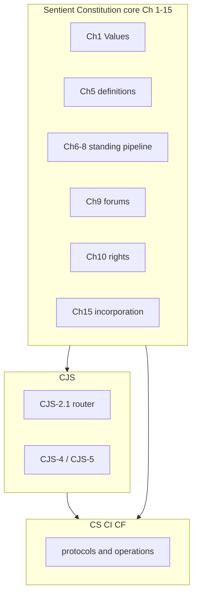

# Constitution document architecture

This file is the **editor map** for the Sentient Constitution corpus. **Binding text** lives in the numbered `core_*` files (inventory in [README.md](README.md)), [corpus_joint_structure.md](corpus_joint_structure.md), [corpus_systems.md](corpus_systems.md), [corpus_institutions.md](corpus_institutions.md), and [corpus_forum.md](corpus_forum.md). **Corpus** is defined in [Chapter Five §3.16 *Corpus, Authority Stack, Supremacy, and Enforceability*](core_05a_accountability_definitions.md#corpus-authority-stack-supremacy-and-enforceability-cluster). Edition labels and custody metadata: [README.md](README.md).

Retired architecture sections **14–19** (worklist, adoption appendix, document control) → [archive/ARCHITECTURE_ADOPTION_APPENDIX_ARCHIVED_2026-05-08.md](archive/ARCHITECTURE_ADOPTION_APPENDIX_ARCHIVED_2026-05-08.md) and [archive/ARCHITECTURE_WORKLIST_ARCHIVED_2026-05-08.md](archive/ARCHITECTURE_WORKLIST_ARCHIVED_2026-05-08.md).

---

## 1. Purpose

- **Avoid duplication** — owner routing in **section 2**; definitions protocol in **section 4**.
- **Preserve dependency order** — edit order in **section 9**.
- **Track gaps** — stable IDs via `make architecture-index` ([generated index](doc_architecture/generated/stable_id_index.md)).
- **Keep human and AI readable** — consistent headings, stable anchors, explicit cross-references. Auxiliary exports (PDF, plain text) are **non-authoritative** derivatives.

### Canonical filename convention

- `snake_case` canonical filenames (no spaces; no `%20` links).
- Core pattern: `core_<start>-<end>_<short_owner_label>.md` (zero-padded chapters).
- Full inventory: [README.md](README.md). Chapter One spans **Chapter 00** (`core_00_preamble.md`) and **Chapter One, Parts A–B** (`core_01_a_values_principles.md`, `core_01_b_stewardship_capacity_principles.md`); numeric headings (`CHAPTER 00`, `CHAPTER 01`) remain the instrument-opening exception.

### Rename readiness gate

Filename renames require: reference audit, same-change link updates, dated evidence under `evidence/<date>/`, compatibility decision, and edition/custody record. Until the gate passes, candidate names stay planning-only.

---

## 2. Corpus roles (single source of truth)

**Numbering note:** When a passage says only “Chapter Eleven,” disambiguate by filename — see [README.md](README.md).

| Layer | Primary home | Routing |
|--------|--------------|---------|
| Values, definition mechanics, definitions | Sentient Constitution `core_*` Ch 1–5 | [README.md](README.md) reading order |
| Standing pipeline | Ch 6–8 | `core_06-06_standing_assessment.md` through `core_08-08_misconduct.md` |
| Forums (constitutional) | Ch 9 | `core_09-09_forum.md` |
| Rights (Articles I–XXV) | Ch 10 | `core_10-10_rights_part_*.md`; titles via `make reference-audit` |
| Governance / amendment / incorporation | Ch 11–15 | `core_11-11_governance.md`, `core_12-14_amendment.md`, `core_15-15_incorporation.md` |
| Cross-implementation joint structure | CJS | [corpus_joint_structure.md](corpus_joint_structure.md) **CJS-2.1** (*Topic router*) |
| Systems, institutions, forum operations | CS / CI / CF | Companion wrappers + subfiles |

**Footer policy:** `make footer-audit`. Optional `*Corpus alignment:*` cites [README.md](README.md) edition metadata and [Chapter Five *Corpus*](core_05i_integrative_definitions.md#corpus).

**Authority stack:** (1) numbered `core_*` constitutional source; (2) incorporated implementation within adoption scope; (3) this map and process docs unless explicitly adopted; (4) Sentient Constitution meaning controls operational layers — see [Authority Stack and Internal Hierarchy](core_05i_integrative_definitions.md#authority-stack).

---

## 3. Boundary rules

1. **Core owns** normative *why* and *what* (values, rights, definitions, meta obligations).
2. **Implementation files own** *how* (taxonomies, protocols, institutions, forums, joint interlocks).
3. **No duplicate definitions** across layers — implementation files *apply* Chapter Five terms.
4. **Stricter wins** where the corpus already says so; core values and rights prevail over conflicting operational wording.
5. **Chapter Ten implements detail** for Articles I–XXV; do not invent parallel rights in implementation files.

---

## 4. Project-wide definitions protocol (pinned)

Machine-checkable rules: [tools/architecture/rule_registry.json](tools/architecture/rule_registry.json). Audit catalog: [implementation/AUTOMATED_REFERENCE_CHECKING.md](implementation/AUTOMATED_REFERENCE_CHECKING.md). Lexical guardrails: [tools/architecture/lexical_guardrails.json](tools/architecture/lexical_guardrails.json).

### What counts as a definition

- **Hard definitions:** Ch 2–4 (`core_02-04_definition_mechanics.md`); Chapter Five §1–§3 (single-home rule below).
- **Values language:** Chapter One — [Constitutional Triad](core_00_preamble.md#constitutional-triad), [Two Constitutional Aims](core_01_a_values_principles.md#two-constitutional-aims) (**Flourishing** / **Continuity**), and [material stake](core_00_preamble.md#material-stake) at principle layer; vocabulary anchor + cluster index at end of Chapter One, Part B. Use **Continuity aim** when linking to §2; reserve bare *continuity* for operational uses elsewhere.
- **Standing:** Ch 6–7 (**verified** inputs); Ch 9 forums for **allegations**, not standing calculus.
- **Rights:** Chapter Ten; implementation files **cite** articles.
- **Joint operational terms:** `corpus_joint_structure.md` only — route via **CJS-2.1**.
- **Operational taxonomies:** **CS-3**, **CS-4**, **CS-5** and named protocols.

### CJS owner rule

Use **CJS** only for cross-implementation interface terms with no stable single-file home. Reusable joint terms → **CJS-5** clusters; **CJS-4** interlocks point to **CJS-5** and the primary owner named in **CJS-2.1**. Escalate to Chapter Five when constitutional meaning is at stake.

### Chapter Five admission gate

Keep constitutional concept + O/E/C boundary only; cite owner homes for institutional machinery. **`make ch5-definitions-gravity-audit`** (blocking).

**Band layout (June 2026):** Part A ([`core_05-05_definitions_a_independent.md`](core_05-05_definitions_a_independent.md)) holds the compass, alphabetical directory, and §3.0 joint-invocation meta rules. Definition bodies live in five constitutional band files — **Oversight** [`core_05o_oversight_definitions.md`](core_05o_oversight_definitions.md) (§3.2–§3.4), **Participation** [`core_05p_participation_definitions.md`](core_05p_participation_definitions.md) (§3.5–§3.7), **Accountability** [`core_05a_accountability_definitions.md`](core_05a_accountability_definitions.md) (§3.8–§3.11), **Continuity** [`core_05c_continuity_definitions.md`](core_05c_continuity_definitions.md) (§3.12–§3.15), **Integrative** [`core_05i_integrative_definitions.md`](core_05i_integrative_definitions.md) (§3.16). Each band file contains §1 Independent, §2 Semi-independent, and §3 Dependent cluster entries assigned to that leg or aim. Retired Part B/C paths live under [`archive/core_ch5_retired/`](archive/core_ch5_retired/README.md) only.

### Editorial rule registry

| Rule ID | Summary | Gate |
|---------|---------|------|
| NAV-TRACE-08–10 | Trace placement and contents | `make ch9-trace-audit`, `make trace-routing-prose-audit` |
| NAV-DEC-12 | D/E/C widget discipline | `make ch5-dec-widget-audit`, `make nav-widget-spacer-audit` |
| NAV-DEC-CH1-ORDER | Chapter One D/E/C order | `make ch1-dec-order-audit` |
| LINK-IN-PARA-14 | Load-bearing in-paragraph links | `make in-paragraph-link-audit` |
| CH5-GRAVITY | Chapter Five admission / de-bundling | `make ch5-definitions-gravity-audit` |
| CH5-ORDER-01 | Chapter Five editorial order | `make ch5-cluster-order-audit`, `make ch5-entry-format-audit`, `make ch5-constitutional-cluster-audit` |
| CH5-SINGLE-DEF | One visible definition per term | `make ch5-single-definition-audit` |
| LEX-GUARDRAILS | Vocabulary and capitalization | `make lexical-vocabulary-audit` |
| GLOSS-SUBARTICLE | Chapter Ten `*In plain terms:*` on subarticles | `make subarticle-gloss-audit` |
| OWNER-SINGLE-HOME | Competing O/E/C gloss heuristics | `make owner-discipline-audit` |
| REF-ARTICLES | Article titles and Roman numerals | `make reference-audit` |
| ROUTER-CJS21 | Cross-implementation routing | `make router-bidirectional-audit` |

Historical D/E/C rollout: [archive/doc_architecture_decision_log/DEC_WIDGET_AND_NAV_DECISIONS_2026-04-16_2026-06-15.md](archive/doc_architecture_decision_log/DEC_WIDGET_AND_NAV_DECISIONS_2026-04-16_2026-06-15.md).

### Plain-language guardrails (summary)

Capitalize **Constitutional Triad**, **Two Constitutional Aims**, **Flourishing**, **Continuity** (constitutional aim sense), **material stake**, **Wellbeing**, **Safety**, **Truth**, **Rights Floor**, and **Foundational Rights** when they name constitutional layers. Full tables: [tools/architecture/lexical_guardrails.json](tools/architecture/lexical_guardrails.json). Forum vocabulary: [.cursor/rules/sentient-constitution.mdc](.cursor/rules/sentient-constitution.mdc).

### Order and single-home discipline

Chapter Five editorial order: `make ch5-entry-format-audit`, `make ch5-alphabetical-directory-audit`, `make ch5-cluster-order-audit`, `make ch5-constitutional-cluster-audit`. For drift-prone concepts: one canonical paragraph (**section 2**; **CJS-2.1**); elsewhere pointers only.

**Precedence:** (1) Sentient Constitution values/rights; (2) Ch 2–3 for term meaning; (3) CS-3/4/5 for Type/Class/steward assignment; (4) stricter applicable rule where declared.

---

## 5. Stable IDs and routing indexes

Do not maintain hand-edited article or implementation maps here.

- **Sentient Constitution chapters:** [README.md](README.md) inventory.
- **Article titles / Roman numerals:** `make reference-audit` / Chapter Ten part files.
- **Cross-implementation routing:** [corpus_joint_structure.md](corpus_joint_structure.md) **CJS-2.1**; `make router-bidirectional-audit`.
- **Generated stable-ID index:** [doc_architecture/generated/stable_id_index.md](doc_architecture/generated/stable_id_index.md) via `make architecture-index`.
- **Topic router reader index (generated, human view):** [doc_architecture/generated/topic_router_reader_index.md](doc_architecture/generated/topic_router_reader_index.md) — plain-language grouped index derived from **CJS-2.1**; reading guidance in **CJS-0.1** ([cjs_00_registry_and_reading_rules.md](corpus_joint_structure/cjs_00_registry_and_reading_rules.md#cjs-01-cross-file-routing)). Authoritative mandatory read-with lists remain in the integrator table.
- **CI-primary router slice (generated, integrator view):** [doc_architecture/generated/ci_primary_router_index.md](doc_architecture/generated/ci_primary_router_index.md) — filter of **CJS-2.1** rows whose primary owner is **CI**; do not duplicate in `corpus_institutions/` operative text.
- **CJS cluster bands:** Oversight **CJS-5.2–5.6**, Participation **CJS-5.7–5.10**, Accountability **CJS-5.11–5.15**, Continuity **CJS-5.16–5.21**, Integrative **CJS-5.22–5.23** — see [CJS-5.1 compass](corpus_joint_structure/cjs_05_cross_implementation_operational_terms.md#cjs-51-constitutional-compass-and-cluster-map) and [corpus_joint_structure.md](corpus_joint_structure.md).
- **CS stable IDs:** [corpus_systems/cs_00_registry_and_reading_rules.md](corpus_systems/cs_00_registry_and_reading_rules.md).

---

## 6. Dependency graph

---

## 7. Cross-reference convention

- **Rights:** `Sentient Constitution Ch 10 Art III` or spelled-out article cite.
- **Standing / forums:** Ch 6–7; Ch 9 for allegations.
- **CJS:** specific **CJS-5.*n*** heading; router **CJS-2.1**.
- **CS / CI / CF:** named chapter or section label in the companion file.

---

## 8. Dependency order for editing

1. Ch 1 → Ch 2–4 → Ch 5 → Ch 6–7 → Ch 8 → Ch 9 → Ch 10 → Ch 11 → Ch 12–14 → Ch 15.
2. Then **CJS-4.3** / **CJS-5**, then **CS-3 → CS-4 → CS-5**, then **Protocol A → B → S4 → S5**.

Redundancy sweeps: center-out from Chapter Five definitions (**section 13**).

---

## 9. Anti-patterns

- Long operational checklists in the Sentient Constitution without a rights or **CJS-5** hook.
- New rights defined only in implementation files.
- Duplicate Type/Class definitions in Chapter Five (prefer CS-3/CS-4).
- Silent deletion of ambiguous article references.

---

## 10. Systems file split (executed)

[corpus_systems.md](corpus_systems.md) is a compatibility entrypoint; substantive CS text lives in `corpus_systems/` subfiles.

---

## 11. Known cleanup notes

- Prefer **CS-3** over legacy “Chapter Two (Information Types…)” wording inside CS text.
- **CJS-4** and **CJS-5** are the live citation grammar for `corpus_joint_structure.md`.
- Route cross-implementation choreography to CJS; local doctrine to CS / CI / CF per **section 4**.

---

## 12. Redundancy, overlap, and attack surface

Definitions hierarchy: **section 4**. Pass logs archived: [archive/doc_architecture_section_13_pass_logs_ARCHIVED_2026-04-29.md](archive/doc_architecture_section_13_pass_logs_ARCHIVED_2026-04-29.md). Overlap themes: [archive/doc_architecture_decision_log/OVERLAP_THEME_TABLE_ARCHIVED_2026-06-15.md](archive/doc_architecture_decision_log/OVERLAP_THEME_TABLE_ARCHIVED_2026-06-15.md).

**Safe redundancy:** one canonical exposition + pointers. **Risky:** two full definitions with different thresholds without declared precedence.

**Ongoing discipline:** grep by theme on major edits; optional `*Corpus alignment:*` footers per [README.md](README.md) and [Chapter Five *Corpus*](core_05i_integrative_definitions.md#corpus).

---

*Last aligned with corpus filenames: see [README.md](README.md).*

---

**Next file:** [README.md](README.md)
