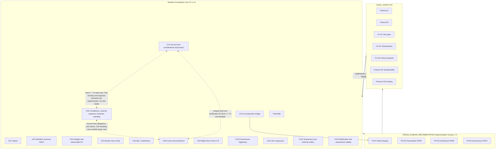

# Constitution document architecture

This file is the **map of the territory** for the constitution corpus. Use it when editing the numbered `core_*` Sentient Constitution files (inventory in [README.md](README.md)), plus [corpus_joint_structure.md](corpus_joint_structure.md), [corpus_systems.md](corpus_systems.md), [corpus_institutions.md](corpus_institutions.md), and [corpus_forum.md](corpus_forum.md), to decide where new material belongs, how to cross-reference, and what is still unwritten. Those Markdown files are the **authoritative corpus**. They are defined as **Corpus** in Chapter Five — [§1 *Independent Definitions*](core_05-05_definitions_a_independent.md#chapter-five-foundational-definitions) in [core_05-05_definitions_a_independent.md](core_05-05_definitions_a_independent.md); [§2 *Semi-independent Definitions*](core_05-05_definitions_b_semi_independent.md#section-2-semi-independent-definitions) in [core_05-05_definitions_b_semi_independent.md](core_05-05_definitions_b_semi_independent.md); and [§3 *Dependent clusters*](core_05-05_definitions_c_dependent_clusters.md#section-3-dependent-clusters-clustered-definitions) in [core_05-05_definitions_c_dependent_clusters.md](core_05-05_definitions_c_dependent_clusters.md) — and they are where structure, headings, and cross-references live. Retired bookmark-only wrapper names (`core_constitution.md`, `core_definitions.md`, `core_amendment.md`) may appear in older notes or forks; they are **not** authoritative editing surfaces—always change the numbered `core_*` files. Retired implementation-layer compatibility filenames are redirect-only; do not add substantive implementation label text there.

---

## 1. Purpose

- **Avoid duplication** of definitions, rights, and operational rules across files. **Section 4** (*Project-wide definitions protocol*) states where each kind of definition may live.
- **Preserve dependency order**: core principles and terms before companion-file classifications, institutional law, and protocols.
- **Track gaps**: missing chapters, planned articles, and stable IDs for companion-file sections so renumbering does not break references.
- **Keep human and AI readable**: maintain substantive content so humans can read and reason about it directly, and tools (including AI assistants) can navigate it reliably—using consistent headings, stable section IDs, and explicit cross-references as already encouraged elsewhere in this map. If you add **auxiliary exports** (for example plain text or PDF), treat them as **non-authoritative** outputs derived from the Markdown corpus so they cannot silently diverge as a second source of truth.
- This file is intentionally written in plain language with low jargon to improve accessibility, audit readability, and practical adoption testing.

---

## 1A. Canonical Filename Convention

To keep paths OS-friendly and automation-safe across environments, use this corpus filename rule:

- Use `snake_case`/underscore-style names for canonical files (no spaces in filenames).
- Use the exact canonical filenames in prose, links, scripts, and cross-file references.
- If a file is renamed, update all references in the same change.
- Avoid URL-encoded space links (`%20`) for corpus filenames; link directly to canonical underscore names.

For the numbered Sentient Constitution core files, use this filename pattern:

- `core_<start>-<end>_<short_owner_label>.md`
- use zero-padded chapter numbers,
- use `-` inside the chapter-range segment,
- repeat the chapter number for single-chapter files so the family lines up visually,
- use `_` between the chapter-range segment and the text label.

Current examples for that convention include:

- `core_00-01_principles.md`
- `core_02-04_definition_mechanics.md`
- `core_05-05_definitions_a_independent.md`
- `core_05-05_definitions_b_semi_independent.md`
- `core_05-05_definitions_c_dependent_clusters.md`
- `core_06-06_standing_classification.md`
- `core_06-06_standing_integration.md`
- `core_07-07_misconduct.md`
- `core_08-08_forum.md`
- `core_09-09_rights_part_a.md`
- `core_10-10_governance.md`
- `core_11-13_amendment.md`
- `core_14-14_incorporation.md`

Canonical corpus filenames (authoritative for edits and for cross-references in this map unless a line explicitly discusses packaging):

- `core_00-01_principles.md`
- `core_02-04_definition_mechanics.md`
- `core_05-05_definitions_a_independent.md`
- `core_05-05_definitions_b_semi_independent.md`
- `core_05-05_definitions_c_dependent_clusters.md`
- `core_06-06_standing_classification.md`
- `core_06-06_standing_integration.md`
- `core_07-07_misconduct.md`
- `core_08-08_forum.md`
- `core_09-09_rights_part_a.md`
- `core_09-09_rights_part_b.md`
- `core_09-09_rights_part_c.md`
- `core_09-09_rights_part_d.md`
- `core_10-10_governance.md`
- `core_11-13_amendment.md`
- `core_14-14_incorporation.md`
- `corpus_systems.md`
- `corpus_institutions.md`
- `corpus_forum.md`
- `corpus_joint_structure.md`

**Retired Sentient-Constitution wrapper names (bookmark-only; not in every checkout):** `core_constitution.md`, `core_definitions.md`, `core_amendment.md` — do not treat these as canonical paths for new edits.

**Retired companion filenames (redirect only, not additional editing surfaces):** any old implementation-layer compatibility filename points readers to [corpus_joint_structure.md](corpus_joint_structure.md) (*Cross-domain implementation layer*); keep such files minimal if they must remain for old bookmarks.

## 1B. Rename Readiness Gate (Conservative)

Filename clarity improvements are permitted only after a dedicated rename-readiness pass. Until that gate is satisfied, candidate names remain planning artifacts only.

Required gate conditions before any rename:

1. Complete reference audit across Sentient Constitution / corpus_joint_structure / corpus_systems / corpus_institutions / corpus_forum, architecture/process docs, implementation notes, and evidence artifacts (treat any retired implementation-layer compatibility links as aliases to the joint-structure home).
2. Same-change update of all affected references (prose links, script/tooling paths, and checklist pointers).
3. Evidence artifact under `evidence/<date>/` containing pre-fix mismatch list and post-fix confirmation.
4. Explicit compatibility decision (aliases/pointers vs strict migration), recorded in TODO and evidence notes.
5. Edition/custody decision recorded for whether rename occurs as part of a named corpus cut.

---

## 2. Corpus roles (single source of truth)

**Numbering note (read once):** The **Sentient Constitution** is authoritative in the numbered `core_*` files read as one instrument (see [README.md](README.md)). When a passage says only “Chapter Ten,” disambiguate by filename: **Sentient Constitution Chapter Ten** is *Governance Legitimacy...* in `core_10-10_governance.md`.

**Owner / primary owner:** in this architecture map, an **owner** is the authoritative home for a topic, definition, rule, taxonomy, or operational detail. Other layers may cite, implement, or apply owner text, but should not duplicate or redefine its substance. In adopter-facing templates and operational artifacts, **owner** instead means the accountable person, office, system steward, or institution responsible for maintaining an artifact or control; that accountability usage does not change corpus source-of-truth ownership.

| Topic | Primary owner | May reference |
|--------|----------------|---------------|
| Foundational values; safety / truth / trust / freedom hierarchy; conflict resolution among values | **Core** — Sentient Constitution Ch 1 (`core_00-01_principles.md`) | Sentient Constitution Ch 2–4 (`core_02-04_definition_mechanics.md`) and Ch 5 (`core_05-05_definitions_a_independent.md`) for definition and verification discipline |
| Definition structure (O/E/C components; internal component integrity) | **Core** — Sentient Constitution Ch 2 (`core_02-04_definition_mechanics.md`) | Ch 3–5 |
| Interpretation integrity, anti-evasion, observable non-compliance | **Core** — Sentient Constitution Ch 3 (`core_02-04_definition_mechanics.md`) | Ch 2, Ch 4–5 |
| Burden of proof, traceability, observability, security-constrained verification, accessibility | **Core** — Sentient Constitution Ch 4 (`core_02-04_definition_mechanics.md`) | Ch 2–3, Ch 5 |
| Canonical definitions of constitutional terms (§1 Independent, §2 Semi-independent, §3 Dependent clusters) | **Core** — Sentient Constitution Ch 5 (`core_05-05_definitions_a_independent.md`) | Ch 2–4 |
| Contribution state, violation nature, standing effect (two-axis model: Axis I — contribution state; Axis II — violation nature; **standing effect** integrates **verified** inputs from both; **Chapter Eight** forums process **allegations** and **claims**, not standing calculus) | **Core** — Sentient Constitution Ch 6 (`core_06-06_standing_classification.md`; `core_06-06_standing_integration.md`) | Ch 1–5, Ch 7–9 where top-end anti-constitutional classification, forums, or rights interact |
| Anti-constitutional misconduct (final Violation Axis **s = 7, 8, and 9**; unified-incident gravity; due-process and cross-chapter discipline) | **Core** — Sentient Constitution Ch 7 (`core_07-07_misconduct.md`) | Ch 1–6, Ch 11–13 (change path); Ch 9 (rights, justice) |
| Forums and jurisdiction (forum families, default venue, cross-forum anti-self-judging) | **Core** — Sentient Constitution Ch 8 (`core_08-08_forum.md`) | Ch 1–7, 9; Ch 11–13; owner corpus as needed |
| Forum operations (panel formation, recusal, review lanes, forensic/investigative support, technical specialist forums, performance, continuity) | **Companion** — `corpus_forum.md` | Sentient Constitution Ch 8, Art XII-B, Art XIV, Art XXI, Art XXII; `corpus_institutions.md`, `corpus_joint_structure.md`, and `corpus_systems.md` as needed |
| Cross-companion joint structure (integration interfaces, joint requirements, read-with ordering among CP / CS / CI / CC; joint operational definitions that exist only at those interfaces) | **Companion** — [corpus_joint_structure.md](corpus_joint_structure.md) | `corpus_systems.md`, `corpus_institutions.md`, `corpus_forum.md`; Sentient Constitution Ch 8–9 where applicable; implementation-label text in this file does not own canonical constitutional definitions |
| Foundational rights (Articles I–XXV) | **Core** — Sentient Constitution Ch 9 (`core_09-09_rights_part_a.md` through `core_09-09_rights_part_d.md`) | Ch 1–8 |
| Constitutional contract, legitimacy, authorization, stewardship | **Core** — Sentient Constitution Ch 10 (`core_10-10_governance.md`) | Ch 1–9, Ch 11–13, `corpus_joint_structure.md`, `corpus_systems.md`, and `corpus_institutions.md` as needed |
| Non-regression and substantive amendment validity | **Core** — Sentient Constitution Ch 11 (`core_11-13_amendment.md`) | Ch 1–10, 12–13; `corpus_joint_structure.md`, `corpus_systems.md`, and `corpus_institutions.md` as needed |
| Expansion, supremacy relative to other norms, external legal orders | **Core** — Sentient Constitution Ch 12 (`core_11-13_amendment.md`) | Ch 1–11, 13; companion corpus as needed |
| Amendment, ratification, procedural validity, amendment requirements | **Core** — Sentient Constitution Ch 13 (`core_11-13_amendment.md`) | Ch 1–12; `corpus_joint_structure.md`, `corpus_systems.md`, and `corpus_institutions.md` |
| Meta-integrity obligations — **constitutional incorporation hook** | **Core** — Sentient Constitution Ch 14 (`core_14-14_incorporation.md`) | Ch 1–13; **Implementation Group One** elaboration in [corpus_joint_structure.md](corpus_joint_structure.md) (*Cross-domain implementation layer*) |
| Meta-integrity elaboration; presentation / architecture / governance implementation labels | **Companion** — [corpus_joint_structure.md](corpus_joint_structure.md) **Cross-domain implementation layer** (Implementation Groups One through Four) | Ch 1–14, CS S1/S2/Protocol A as needed; avoid duplicating Protocol B *engineering* checklist unless harmonizing |
| Data types, domains, lifecycle, separation, restricted handling | **Companion** — CS Ch S1 | Ch 5–6, 9, Ch 6 where compliance model applies |
| System classification (impact / dependency / risk; classes A/B/C/L/P; reclassification; governance of classification) | **Companion** — CS Ch S2 | Ch 5–6, 9, CS Ch S1 |
| Dev/test/stage/prod environments; progressive deployment; ACA; non-experimental engineering requirements | **Companion** — Protocol A | Ch 6–8, CS Ch S2 |
| Comprehensibility, complexity audits, modular architecture at **protocol** level | **Companion** — Protocol B | Defers to implementation labels in [corpus_joint_structure.md](corpus_joint_structure.md) (*Cross-domain implementation layer*); stricter requirement wins (see Protocol B header in CS). |
| Critical system stewards (CSS-A/B/C); organizational dependency | **Companion** — CS Ch S3 | CS Ch S2, Ch 5–6, 9 |
| Adaptive sustainability; ecosystem resilience; dynamic allocation response | **Companion** — Protocol S4 | Protocol S5, Ch 9 Art XVII / XVIII |
| Funding stewardship; dependent systems maps; allocation categories; reauthorization | **Companion** — Protocol S5 | Protocol S4, Ch 9 Arts IX, XI, XII, XIV, XVI, XVII |
| Institutional governance architecture | **Companion** — [corpus_institutions.md](corpus_institutions.md) | Formation, delegation custody, assurance lanes, and sanctions/dissolution. Cross-links include Ch 6-14, CP PROT1-PROT6, CS S2/S3, and Protocol S5. This row also tracks the **CI-15** vulnerable personal services and **Article X-C** interface, **Sentient Constitution Ch 9 Art IV-C** as the rights single home, and the CS opening **market-mediated personal services** interpretation. Read with [corpus_joint_structure.md](corpus_joint_structure.md) where cross-companion structural integration is material. |

**Abbreviations:** `CP` = **Cross-domain implementation layer** in [corpus_joint_structure.md](corpus_joint_structure.md) (Implementation Groups One through Four; not Sentient Constitution chapter numbers). `CS` = [corpus_systems.md](corpus_systems.md) (systems companion; **do not** use the bare phrase *Constitutional Systems* in body text — see *Ambiguous implementation labels* under *Plain-Language Vocabulary Guardrails*). `CI` = [corpus_institutions.md](corpus_institutions.md) (companion institutional-law file). `CJS` = [corpus_joint_structure.md](corpus_joint_structure.md) (companion joint-structure file, including **CP**). Sections in **CI** are labeled **CI-1** through **CI-24** (with subsections **CI-*n*.*m***) so they are not confused with Sentient Constitution **Articles** (Roman numerals). Sections in **CJS** are labeled **CJS-1** through **CJS-4** (with subsections **CJS-*n*.*m***).

**Authority stack (quick reference):**
1. **Binding constitutional source:** the numbered `core_*` constitutional files read together as one instrument. Chapters Two through Four meaning and validity constraints live in `core_02-04_definition_mechanics.md`; Chapter Five lives in `core_05-05_definitions_a_independent.md` (§1), `core_05-05_definitions_b_semi_independent.md` (§2), and `core_05-05_definitions_c_dependent_clusters.md` (§3).
2. **Binding incorporated implementation:** designated obligations in `corpus_joint_structure.md` (including **Cross-domain implementation layer**), `corpus_systems.md`, `corpus_institutions.md`, and `corpus_forum.md` within valid adoption scope and Sentient Constitution incorporation hooks.
3. **Authoritative but non-constitutional process/map text:** this architecture file, TODO and workflow trackers, regression catalogs, and evidence logs unless an adopting instrument explicitly incorporates a specific artifact.
4. **Conflict order:** Sentient Constitution values/rights and Sentient Constitution Ch 2–5 constraints control meaning; use the Chapter Five **Authority Stack and Internal Hierarchy** cluster to separate source-layer status from last-resort interpretive hierarchy. Operational layers implement them and may be stricter where the corpus already provides stricter-rule logic.

---

## 3. Boundary rules

1. **Core owns** normative *why* and *what*: values, rights, definition rules, defined terms, and cross-cutting meta obligations.
2. **Companion files own** *how* at engineering, ecosystem, institutional, forum-operational, and cross-companion joint-structure scale: data handling taxonomies, system classes, deployment patterns, funding mechanics, institutional rules, forum procedures, protocol-level checklists, and joint integration requirements where companions must interlock.
3. **No duplicate definitions** of the same term in both corpora. Companion files *apply* Sentient Constitution Ch 5 terms; use this file or a single glossary subsection if a shorthand (e.g. “substrate”) needs a pointer.
4. **Stricter wins:** If core and companion text appear to conflict, **core values and rights prevail**. If two companion rules conflict (e.g. personal/creative sandbox vs non-experimental), **higher material impact and stricter classification** govern (see opening of [corpus_systems.md](corpus_systems.md)).
5. **Companion files implement Sentient Constitution rights (Chapter Nine):** Articles I–XXV in **Chapter Nine** state core rights (including **Article XXV** transition and re-baselining); companion protocols, institutional law, and **corpus_joint_structure.md** PRIM/PROT text supply operational detail. Where companion text expands a theme (e.g. lifecycle under Protocol A), it **implements** the corresponding article and must not contradict **Chapter Nine** or **Chapters One through Eight** (including the compliance model in **Chapter Six** and final **Violation Axis s = 7, 8, or 9** slot-classification rules in **Chapter Seven**).

---

## 4. Project-wide definitions protocol (pinned)

This subsection **pins** how “definitions” work across the corpus so editors, reviewers, and tools share one discipline.

### What counts as a “definition” here

- **Hard definitions** (full semantic + evaluative + compliance structure): the only primary homes for new constitutional terms are:
  - **Sentient Constitution Chapters Two through Four** in `core_02-04_definition_mechanics.md` for O/E/C structure, interpretation integrity and observable non-compliance, burden of proof, traceability, observability, and verification
  - **Chapter Five** in `core_05-05_definitions_a_independent.md` (§1), `core_05-05_definitions_b_semi_independent.md` (§2), and `core_05-05_definitions_c_dependent_clusters.md` (§3) — **Independent Definitions** in §1, **Semi-independent Definitions** in §2 (including reader-facing definition families with their joint-invocation context), and **Dependent clusters** in §3 for genuinely dependent joint-invocation groups — see **Chapter Five — no stubs** under **Order and alphabetization (Chapter Five)** below
- **Values language** (how principles interact): **Chapter One**, with the **vocabulary anchor** and **cluster index** at the **end of Chapter One** under the heading **Reference: Chapter Five vocabulary anchor and cluster index**. That block maps Chapter One priority terms to Chapter Five **§1** Independent Definition names and lists the major Chapter Five **§3** dependent-cluster groupings that must be traced under Chapters Two through Four when materially relevant.
- **Contribution / standing model** (contribution state, violation nature, standing effect): **Chapter Six**; **standing** applies only to **verified** standing inputs (**demonstrable** Axis I; [**verified violation findings**](core_05-05_definitions_b_semi_independent.md#verified-violation-findings) for Axis II — **section 2** *Verified inputs for standing* in [core_06-06_standing_classification.md](core_06-06_standing_classification.md) and [core_06-06_standing_integration.md](core_06-06_standing_integration.md)). **Chapter Eight** owns **forum** process for **allegations** and **claims**; that layer **must not** be folded into standing’s input model. Procedural scoring and operational workflows live in **CP** and **CS**, which must remain consistent with Ch 6’s constitutional meaning. Interoperable operational defaults for standing composites (including **daily** **half-life** recency weighting for **Axis I** contribution-linked credit under [**section 7.1**](core_06-06_standing_integration.md#38-standing-integration-contribution-and-violation-nature) — **no** **weight** **floor** — and **no** time discount for **unresolved** **Axis II** inputs) are stated under **Chapter Six standing composites** in [corpus_systems.md](corpus_systems.md), **read with** [core_06-06_standing_classification.md](core_06-06_standing_classification.md) and [core_06-06_standing_integration.md](core_06-06_standing_integration.md) [**section 7.1**](core_06-06_standing_integration.md#38-standing-integration-contribution-and-violation-nature) and [**contribution recency weighting**](core_06-06_standing_integration.md#contribution-recency-weighting).
- **Rights language**: **Chapter Nine** (Articles V–XXV); companion files and implementation labels **cite** articles, they do not invent parallel rights.
- **Meta obligations** (trust, incentives, proxy metrics, failure integrity at system level): **corpus_joint_structure.md**, **Implementation Group One**, elaborated in full there; **Sentient Constitution Chapter Fourteen** is the **incorporation bridge** and must be read together with **Chapters 1, 6–10, and 11–13** as applicable. **Implementation Groups Two through Four** implement meta and domain obligations without redefining Ch 5 terms.
- **Operational taxonomies** (data Types, system Classes, dependency types, steward tiers): **corpus_systems.md** Chapters **S1, S2, S3** only.
- **Protocols and profiles**: **corpus_systems.md** Protocols A, B, S4, S5 — **instances** of upstream rules, not new definition homes.
- **Joint operational definitions** (cross-companion interface terms that govern routing, interlock, overlap handling, shared-fact evaluation, or combined satisfaction across **CP / CS / CI / CC**): **corpus_joint_structure.md** only. These are operational and integrative, not canonical constitutional definitions. They must stay local to joint structure unless elevated into **Chapter Five** because they become cross-cutting constitutional meaning, or moved into a domain owner because they are actually single-file operational terms.

### CJS operational-definition owner rule

`corpus_joint_structure.md` is the official owner for **operational definitions that are inherently joint**: terms that arise only because two or more companion files must be read together on the same facts, and whose role is to coordinate routing, sequencing, interlock, shared-fact evaluation, stricter-wins handling, or combined companion satisfaction.

Use **CJS** for a term only when all of the following are true:

1. the term has no stable meaning outside a cross-companion interface;
2. the term regulates how **CP**, **CS**, **CI**, and/or **CC** interact rather than restating one file's local doctrine;
3. the term is operational or integrative rather than constitutional in meaning;
4. keeping it outside **CJS** would create duplicate interface language across multiple companion files.

Do **not** use **CJS** as the default home for:

1. canonical constitutional terms or clustered traceability concepts that belong in **Sentient Constitution Chapter Five**;
2. true reusable implementation labels or corpus-wide drafting patterns that belong in `corpus_joint_structure.md`;
3. taxonomies, thresholds, procedures, or operational terms that are actually local to **CS**, **CI**, or **CC**.

Escalation / relocation rule:

1. If a **CJS** term starts determining constitutional meaning, scope, satisfaction conditions, or anti-narrowing effect across the corpus, elevate it to **Chapter Five** and replace CJS restatements with pointers.
2. If a supposed **CJS** term turns out to be used materially in only one companion file, relocate it to that file and leave **CJS** with a pointer-only interface note if needed.
3. If a supposed implementation label is mostly functioning as a joint interface cluster rather than a reusable implementation, prefer **CJS** over `corpus_joint_structure.md`.

### Chapter Five admission gate (definitions-only)

When adding or revising an Independent, Semi-independent, or Dependent-cluster definition in Sentient Constitution Chapter Five:

1. Keep only the constitutional concept and its O/E/C validity boundary.
2. Do not embed primary institutional architecture, appointment/rotation mechanics, procedural sequencing, or governance workflow detail.
3. If owner-layer mechanics are materially required, cite the owner home (Sentient Constitution Ch 6–14, CP-PCH1-4, CS S1-S3 / protocols) instead of restating those mechanics in the definition.
4. Treat violations of this gate as a structural duplication risk and correct by de-bundling before publication cut.

**Regression (automated):** `make ch5-definitions-gravity-audit` or blocking `make regression` runs `tools/ch5_definitions_gravity_audit.py`, covering **RS-CH5-GW-001..004** in [CONSTITUTIONAL_REGRESSION_SCENARIOS.md](CONSTITUTIONAL_REGRESSION_SCENARIOS.md) (authority/procedure/machinery regexes plus an Article-citation density threshold for parallel **Chapter Nine** rights gloss risk). The same blocking `make regression` run includes `tools/scenario_audit.py`, which checks the regression matrix and the **section 10.5** `SCORING-v1` run snapshot (weighted overall must match the six dimensions). Run `make regression-full` when you also want `tools/readability_audit.py` as a separate editorial gate for prose-density and readability hotspots.

### Chapter Five cross-link proof method

Use a narrow, regression-first method when adding or normalizing Chapter Five cross-definition links:

1. Identify one concrete definition entry and one exact `O`, `E`, or `C` sentence where a cross-link is materially doing legal or interpretive work.
2. Add the inline Markdown link in that sentence itself; do not count a trace block, heading, or standalone `Read with:` line as proof of in-body cross-linking.
3. Add or update an automated audit that removes the local trace/details block before checking for the expected link so the test proves body-level linking rather than header-only navigation.
4. Prefer a single explicit proof case first. After that case passes, expand term-by-term rather than trying to validate all Chapter Five cross-linking in one broad change.

Use this method to avoid ambiguous "cross-linking exists somewhere in the entry" results. The architectural success condition is narrower: at least one named definition must have one specifically justified cross-definition link inside its operative `O` / `E` / `C` body text, and that condition must be machine-checked in blocking regression.

**Regression (automated):** `make ch5-in-body-crosslink-audit` or blocking `make regression` runs `tools/ch5_in_body_crosslink_audit.py`. The current proof case is `Accountability`, whose `E` sentence must retain in-body links to `Auditability` and `Contestability` after the local trace block is stripped from the parsed definition entry.

### Citing corpus_systems.md from Sentient Constitution

Within the numbered Sentient Constitution `core_*.md` files, cite companion taxonomy chapters as **[corpus_systems.md](corpus_systems.md), Chapter S1 — Information Types and Handling**. Apply the same pattern to **S2 — System Classification and Handling**, **S3**, and named protocols. Do not use bare **Chapter S1** or **Chapter S2** references. Those are not Sentient Constitution chapter numbers and are easy to misread as a gap in the Sentient Constitution.

### Reader-Guidance Discipline (Navigation Load Control)

To reduce comprehensibility failures under pressure, apply these rules in constitutional-scope edits:

1. High-load Sentient Constitution chapters (especially **Chapters Five through Ten** in the integrated map) must begin with a short `Where this lives` locator naming constitutional owner, implementation owner, and anti-relocation rule.
2. Cross-layer pointers must identify both owner and purpose (for example: "`corpus_joint_structure.md`, `corpus_systems.md`, and `corpus_institutions.md` implement designated mechanics for this constitutional floor").
3. Definition-only and validity-only zones must not absorb procedural or staffing workflow text; point to owner layers instead.
4. Frontmatter guidance in the Sentient Constitution must include a compact under-pressure reading path (source-of-truth, when to consult companion corpus files, conflict order, and adoption/custody checkpoints).
5. Architecture and TODO updates must accompany any guidance-pattern changes to preserve auditability and future consistency.
6. **Chapter-opening reader guidance widgets:** Where a chapter opening is **non-operative** for navigation, reading order, “where this lives,” file position, transition notes, or plain-language reading notes, present that material in a collapsible `
` block that is **collapsed by default**. The summary line should use the same blue styling family as local `Trace` widgets and should remain descriptive when collapsed (for example: `Reader guidance (non-operative): file position, chapter owner, and transition notes`). Put the non-operative guidance itself in a **blockquote** (`>` lines) after a short disclaimer that the quoted text does not add, remove, or narrow binding obligations.
7. **Application baseline (operative opening cross-reference rule):** If a chapter needs a short opening sentence that states what upstream chapters, rights floors, validity controls, or downstream change-path controls govern its operative application, put that material in one concise ordinary-text paragraph immediately after the opening reader-guidance widget and before the chapter body. Preferred lead label: `Application baseline.` This paragraph is **operative** if it says the chapter or section applies *subject to* other chapters or controls. Do **not** bury that rule in non-operative reader guidance, and do **not** repeat the same baseline again in the first body paragraph. Keep `Orientation, corpus edition metadata, and Authority Stack guidance` references out of the operative baseline unless they are themselves doing operative work.
8. **Trace sections:** Where trace blocks are used in constitutional text, they must be collapsible `
` sections with a `
<strong>Trace</strong>
` label and must be **collapsed by default**. Use trace blocks only where they materially improve navigation; keep them short and non-operative.
9. **Trace placement:** Put the trace block immediately under the owning unit's label. For normal sections, that means directly under the Markdown heading. For Chapter Five-style definition entries and similar owner-by-term lists, that means directly under the definition term line and before the `O` / `E` / `C` bullets. For **Chapter Nine**, the default owner unit is the **subarticle** (`#### Article …`) rather than only the parent article (`### Article …`) because subarticles usually carry the operative doctrinal hooks. Article-level trace blocks in Chapter Nine are optional and should be used only where a shared opening contract materially applies across the whole article. Where readability needs a visual break in definition lists, prefer a separator line in the local pattern of that file (for example the same kind of divider used around clustered or compound definition blocks) rather than a blank-line workaround that pushes the trace away from its owning term. When a file adopts that separator pattern for trace-bearing entries, apply it consistently within that local list instead of mixing separated and unseparated trace entries.
10. **Trace contents:** When a trace block carries navigation help, put that help **inside the trace block**, not as a standalone line outside it. Preferred order is: an `Upstream:` line first, using the form `Upstream: Principles: ...`; then a `Downstream:` line for the next controlling or affected principles, articles, or sections; then `Read with:` for closely related definitions, owner layers, or upstream mechanics that readers commonly need next. When `Upstream:` and `Downstream:` belong to the same trace item, keep them on separate rendered lines for readability. Keep `Read with:` selective, short, and non-operative; it is a routing aid, not a second gloss. `Definitions:` lines are **no longer** part of Trace — canonical Chapter Five cross-references live in the separate **Definitions · Evaluation · Compliance (D/E/C) widget** under rule 12, next to the same owning unit.
11. **Trace article integration:** When a `Downstream:` line names Chapter Nine articles, integrate the article references into a short functional explanation rather than presenting a bare citation inventory. Preferred pattern: describe the rights surface or doctrinal function first, then name only the most relevant articles or article families. Use exhaustive lists only where omission would materially reduce auditability. This rule exists to preserve first-pass reader comprehension while keeping the trace block reviewable and link-rich.
12. **Definitions · Evaluation · Compliance (D/E/C) widget:** Use a second blue collapsible widget to surface the canonical Chapter Five definitions materially invoked by a consuming section, so readers can jump directly to each invoked concept's `O`, `E`, or `C` line. Rules:
    - **Scope:** attach D/E/C widgets only next to **consuming** sections (Chapter One principles, Chapters Two through Four definition mechanics where a section explicitly invokes a named Chapter Five concept, Chapter Six contribution / violation / standing classification, Chapter Seven top-end anti-constitutional misconduct, Chapter Eight forums, Chapter Nine rights, Chapter Ten governance, and similar). **Never** attach them inside the Chapter Five definition files (`core_05-05_definitions_a_independent.md`, `core_05-05_definitions_b_semi_independent.md`, `core_05-05_definitions_c_dependent_clusters.md`) themselves. There is **no** chapter-wide or global instance.
    - **Trigger:** attach a widget wherever a section materially invokes **two or more** Chapter Five defined concepts. Sections invoking **exactly one** concept use the single-concept inline form in (f) below. Sections invoking zero concepts get nothing.
    - **Roadmap exclusion (material-invocation test):** "Materially invokes" means the section uses the term as a working term in a substantive claim, requirement, or constraint of its own. A defined concept that appears in a section **only** as part of a roadmap, topic-preview, or "what this chapter is about" enumeration — naming concepts that are operatively treated downstream in named subsequent sections of the same chapter or owner unit — does **not** count and must not be included in that section's widget. The most common case is a chapter-opening *Purpose and Role* / introductory section that lists the chapter's central terms before each gets its own dedicated subsection. Such sections include only those concepts that the section itself does operative work with (for example, a conflict-resolution clause that requires evaluation under a named concept). The downstream dedicated sections carry the widget rows for the concepts they actually invoke.
    - **Degradation under roadmap exclusion:** Recount the section's invocations **after** roadmap-exclusion trimming, then apply the standard trigger and degradation rules to the trimmed count. Specifically: if **two or more** material invocations remain, keep a (possibly smaller) collapsible widget; if **exactly one** remains, drop the widget and replace it with the single-concept inline `Definition:` line in (f) below; if **zero** remain, remove the widget entirely. Roadmap exclusion is not allowed to leave a one-row collapsible widget standing, and is not allowed to leave an empty widget standing. When degradation removes a widget that was attached during the 2026-04-16 greenfield pass, also remove the surrounding ` ` spacer if its only purpose was to separate the (now-removed) widget from the operative prose.
    - **Placement:** put the widget directly after the Trace widget for the same owning unit when both are present; otherwise put it in the same position Trace would occupy (directly under the heading, before the operative prose or `O / E / C` bullets).
    - **Summary label:** `
<strong>Definitions · Evaluation · Compliance</strong>
`. Collapsed by default.
    - **Row shape:** one bullet per invoked concept, in the form `[Concept](…anchor…) · [O](…anchor…) · [E](…anchor-e…) · [C](…anchor-c…)`. The concept name and `O` target the same anchor (the concept's heading in the Chapter Five file that owns that anchor); the redundant `O` link is kept so the triad reads symmetric on the page. `E` targets the `...-e` anchor and `C` targets the `...-c` anchor. For clustered concepts that do not carry a single E or C bullet (for example `Incentive Alignment`), point `O`, `E`, and `C` all to the heading so the reader lands inside the cluster.
    - **Chapter One functional order:** In Chapter One D/E/C widgets, preserve functional ordering rather than alphabetical ordering where a section invokes mixed concept types. Preferred order is: (1) primary principle / constraint / instrumental definition; (2) outcome-orientation terms; (3) agency, participation, stewardship, or challenge-pathway terms; (4) collision mechanics such as feasibility, necessity, proportionality, and harm minimization; (5) evidence, traceability, audit, or invalidation terms; (6) boundary / non-expansion terms such as Safety, Truth, ecological or intergenerational boundaries, source-layer authority, or anti-capture constraints. This order is documented in [implementation/CHAPTER_ONE_PRINCIPLE_DEFINITION_MATRIX_2026-04-29.md](implementation/CHAPTER_ONE_PRINCIPLE_DEFINITION_MATRIX_2026-04-29.md). Do **not** put visible grouping labels inside a D/E/C widget: `tools/ch5_dec_widget_audit.py` requires row-only widget content. Use row order, trace prose, the matrix artifact, or architecture notes to preserve the grouping.
    - **Single-concept inline form:** when a section invokes exactly one defined concept, drop the collapsible widget entirely and render a single inline line directly above the operative prose in this form: `<strong>Definition:</strong> [Concept](…) · [O](…) · [E](…-e) · [C](…-c)`. Note the **singular** "Definition:" prefix here versus the **plural** "Definitions" in the widget summary label — the prefix agrees with the count. Use the same bold-blue styling as widget summaries so the line reads as navigational metadata rather than prose.
    - **Spacer rule (` ` after the navigational block):** The collapsible D/E/C widget keeps a trailing ` ` spacer between its closing `
` and the operative prose, matching the Trace widget's spacer pattern; the ` ` exists because the `
` block renders as a single visually heavy element that needs a hard break before prose. The single-concept inline `Definition:` line takes **no** trailing ` ` spacer — the inline line is a one-line styled paragraph and the standard blank line between paragraphs already produces the right separation; an added ` ` renders as a visible extra blank line and should be removed wherever it appears. This applies whether the inline line stands alone under a heading or sits directly after a co-located Trace widget. When degradation under the *Roadmap exclusion* rule converts a multi-row widget into the inline form, drop the surrounding ` ` spacer at the same time.
    - **Anchors:** Chapter Five definitions carry `` and `` anchors immediately above the corresponding `E:` and `C:` bullets. The heading anchor serves as the `O` target. These anchors are added (and kept idempotent) by `tools/add_oec_anchors.py`.
13. **Chapter Three §1 in-chapter definition index (Sentient Constitution):** In `core_02-04_definition_mechanics.md`, **Chapter Three**, **section 1** includes a collapsible block that lists **every** Chapter Three section or subsection readers treat as a navigable home for that chapter's integrity and observable-non-compliance material, **including** targets whose authoritative prose sits in **section 2**. Order the list **A–Z** by the link text (the target heading title). Each entry is **only** a Markdown link to that heading’s in-file fragment—**no** gloss, suffix, or other words on the same line. The block is **non-operative** navigational metadata (it does not add, remove, or narrow obligations). Update the list whenever Chapter Three gains, removes, or renames a navigable subsection. This index is **not** a substitute for rule 12 D/E/C widgets (Chapter Three still carries no Chapter Five D/E/C widget under the explicit-invocation reading unless that reading changes).

**Architecture note (2026-04-16, D/E/C split):** In the Chapter Five definition files, every standalone (`####`) definition now carries `-e` and `-c` anchors next to its `E:` and `C:` bullets. Across consuming files, the `Definitions: ...` line that previously sat inside Trace has been lifted out into a separate **Definitions · Evaluation · Compliance** widget (or a single inline `Definition:` line when exactly one concept is invoked). Trace keeps `Upstream:`, `Downstream:`, and `Read with:` only. The decision separates two reader jobs that were fused inside one Trace block — "where does this section sit in the principle / article stack" (Trace) versus "jump me to the authoritative O/E/C of a related concept" (D/E/C) — and operationalizes Chapter Four's Definition Traceability Requirement at the point of invocation, where that requirement already lives doctrinally. Clustered concepts such as `Incentive Alignment` are not individually anchored at `-e` / `-c`; authors point all three letters to the cluster heading in those rows.

**Architecture note (2026-04-16, D/E/C roadmap exclusion):** The greenfield D/E/C fan-out earlier on 2026-04-16 used **explicit naming** in the section text as the trigger for inclusion. That heuristic over-included on chapter-opening *Purpose and Role* / introductory sections, whose prose enumerates the chapter's central terms as a roadmap rather than operatively invoking them. Rule 12 was tightened with a *Roadmap exclusion* sub-rule that defines "materially invokes" as using the term as a working term in a substantive claim, requirement, or constraint of the section itself — not enumeration in a topic-preview list whose terms are operatively treated downstream in named subsequent sections of the same chapter. The first application is `core_00-01_principles.md` §1 (Purpose and Role), whose D/E/C widget was retrimmed from a seven-row chapter-wide-looking index to the two concepts (`Proportionality`, `Necessity`) that §1's last paragraph operatively invokes for conflict resolution. Wellbeing, Truth, Safety, Trustworthiness, and Meaningful Agency continue to carry their own widget rows in the dedicated sections (§§ 2, 3.2, 3.1, 4, 5) where they are operatively invoked.

**Architecture note (2026-04-29, Chapter One D/E/C functional ordering):** Chapter One D/E/C widgets are not alphabetical. They are ordered to show how the section reasons: primary definition first, then outcome orientation, agency/stewardship pathways, collision mechanics, evidence/invalidation, and boundary or non-expansion terms as applicable. This reduces AI-drift risk by making the row order itself carry the map. The source text cannot use visible group labels inside D/E/C widgets because the row-shape audit requires row-only content. The intended grouping is preserved in [implementation/CHAPTER_ONE_PRINCIPLE_DEFINITION_MATRIX_2026-04-29.md](implementation/CHAPTER_ONE_PRINCIPLE_DEFINITION_MATRIX_2026-04-29.md), and `make ch1-dec-order-audit` checks the highest-risk Chapter One widgets against their expected row order.

**Architecture note (2026-04-16, Ch 2-4 mechanics attachment):** Rule 12's Scope was extended to include `core_02-04_definition_mechanics.md` (Chapters Two through Four — the definition-mechanics layer). That file is where the Definition Traceability Requirement (Chapter Four, section 3) lives doctrinally, so surfacing canonical Chapter Five anchors at the point of invocation is coherent with the 2026-04-16 D/E/C split note. Attachment follows the strict **explicit-invocation-only** reading: widgets attach **only** where a section or subsection names a Chapter Five concept as a working term in its own substantive claim. The Chapter Two section 2 rule that governs every "reasonably foreseeable" in Chapters Two through Four counts as an explicit invocation of Foreseeability for those sites. Initial attachments: Chapter Two sections 2 and 2.4.4; Chapter Four sections 2.1, 2.5 (Truth + Epistemic Integrity widget), 4, 5, 5.1 (Truth + Safety widget), and 6. Chapter Three carries no D/E/C widgets under this reading because it states the anti-evasion framework in its own terms and does not name a Chapter Five concept by name. Separately, **rule 13** requires Chapter Three **§1** to carry a non-operative, **link-only** A–Z index to every in-chapter navigable subsection (including §2 targets). Consistent with the 2026-04-16 D/E/C split and roadmap-exclusion notes.

**Architecture note (2026-04-16, article integration):** In `core_00-01_principles.md`, Chapter One trace widgets were revised so article-heavy downstream lines explain the operative connection first and cite the key articles second. The decision was made because the earlier article-only lists improved audit navigation but read too much like reference dumps for general readers. The retained architectural rule is: keep article references in the trace widget, do not move them into the operative prose, and prefer functional grouping over exhaustive enumeration where that grouping does not hide a materially important downstream rights hook.

**Architecture note (2026-04-16, single-concept inline form spacer):** The 2026-04-16 D/E/C rollout and greenfield fan-out treated the trailing ` ` spacer as a uniform pattern after every navigational block — collapsible widget or single-concept inline `Definition:` line. In rendered Markdown that uniformity reads cleanly under the `
` widget (the block is visually heavy and benefits from a hard break before prose) but produces a visible extra blank line under the inline `Definition:` line (which is already a one-line styled paragraph that the standard inter-paragraph blank renders correctly). Rule 12's *Single-concept inline form* sub-rule was extended with an explicit *Spacer rule (` ` after the navigational block)* clause: the collapsible widget keeps its ` ` spacer; the inline form takes none, whether it stands alone under a heading or sits directly after a co-located Trace widget. Existing inline `Definition:` lines in `core_00-01_principles.md`, `core_02-04_definition_mechanics.md`, and `core_09-09_rights_part_a..d.md` were swept on the same date to remove the unnecessary ` `. The greenfield attachment tool (`tools/attach_dec_greenfield.py`) was updated in the same pass so future single-concept attachments do not reintroduce the spacer.

### Plain-Language Vocabulary Guardrails

Use this rule for preambles, chapter openings, reader guidance, notices, summaries, and other text meant to stay easy for a general human reader to scan quickly.

- Prefer everyday words when they preserve meaning.
- Keep canonical defined terms where legal precision requires them, but do not lead with specialist wording when a plain alternative works.
- If a formal term must appear in a reader-facing sentence, introduce the plain phrase first and use the formal term only if it adds necessary precision.

Avoid these words in plain-language sections unless they are the canonical term being cited on purpose:

| Avoid in plain-language prose | Prefer instead |
|---|---|
| `person` / `persons` (as the label for a rights-holding, accountable, or classifiable subject) | `sentient` / `sentients`; use `human` / `humans` where biological substrate or ordinary contrast with automation is material |
| `epistemic integrity` | `truthfulness`, `honest handling of facts`, `reliable understanding` |
| `contestability` | `ability to challenge`, `real chance to contest`, `reviewability` |
| `checkable` | `can be checked`, `something **sentients** can verify`, `open to verification` |
| `materiality` / `materially` | `importance`, `significance`, `in ways that matter` |
| `foreseeability` | `what could reasonably be expected`, `what **affected** **parties** could reasonably see coming` |
| `proportionality` | `fit the risk`, `no broader than needed`, `matched to the harm` |
| `necessity` | `needed`, `required`, `no less restrictive effective option` |
| `operationalize` / `operationalized` | `put into practice`, `carry out`, `implement` |
| `interdependent definitions` | `linked definitions`, `connected definitions` |
| `non-compliant` in explanatory prose | `does not meet the rule`, `fails the rule` |
| `stakeholder` when ordinary **persons** are meant | `affected parties`, `participants`, `those involved` |
| `posture` | `stance`, `approach`, `inputs`, `classification`, `framing`, `rule`, `profile`, or a concrete noun for what is meant (for example `verified standing inputs`, `scope limit`, `default rule`) |
| `court` / `courts` (adjudicative / institutional) | `forum` / `forums`, `forum family` for routing, **Chapter Eight** and **[corpus_forum.md](corpus_forum.md)** for operative detail; or, where a generic label is still needed, `tribunal` / `adjudicative body` |

#### Ambiguous implementation labels (corpus-wide)

Use this sub-rule in **authoritative corpus** body text (`core_*.md`, `corpus_*.md`, and this file’s prescriptive editor guidance), not only in *In plain terms* lines.

| Do not use (ambiguous) | Use instead |
| --- | --- |
| **Constitutional Systems** (bare label) | The linked file **[corpus_systems.md](corpus_systems.md)**. For a chapter or protocol within that file, cite it in full (for example **corpus_systems.md**, Chapter S1 — Information Types and Handling). The editor abbreviation `CS` remains acceptable in owner tables, stable IDs, and mermaid. The old bare label collides with ordinary English, other companions, and the filename. |
| **`court` / `courts`** (Chapter Eight and **[corpus_forum.md](corpus_forum.md)** institutional sense) | **`forum` / `forums`**, **`forum family`** (for allocated routing and bodies), and explicit **[core_08-08_forum.md](core_08-08_forum.md)** / **`corpus_forum.md`** **CC-*** cross-references. Where a generic English label is still required, **tribunal** or **adjudicative body**. Same exceptions as in **[.cursor/rules/clarity.mdc](.cursor/rules/clarity.mdc)**: verbatim external quotations; proper names and historical titles where source fidelity requires; **courtesy** / **courteous** lemmas. |
| **`annex`** | **`companion`**, **`incorporated companion`**, or the specific filename / protocol name. The corpus uses companion files and Chapter Fourteen incorporation language instead of the older annex label. |

Citing the systems companion from the Sentient Constitution: use the naming pattern in [Citing corpus_systems.md from Sentient Constitution](#citing-corpus_systemsmd-from-sentient-constitution) (above in this file).

#### Co-Gloss registry (heavy phrases with stable plain-language companions)

Use this table when authoring *In plain terms* lines, executive summaries, or adoption-facing explainers. Entries **do not** redefine **Chapter Five** terms; they pair recurring heavy phrases with **reader-stable glosses** of **rule effect**, consistent with the *Single home rule* and the bolded-term-lead bullet rule above (gloss restates **effect**, not **term meaning** for interpretive purposes).

| Heavy phrase (as used in Chapter Nine / companions) | Approved plain-language companion (effect-level) |
| --- | --- |
| early-instantiation window | the period when a new system or role first goes live and early mistakes are most likely to become entrenched |
| parent-system continuity interest | a prior operator’s legitimate need to keep essential services stable through a handoff or migration |
| capability profile materially emerging | a sentient’s real-world abilities are still taking shape, so tests and thresholds must be fair and revisable |

**`person` exceptions (corpus-wide, not only plain-language):** Keep fixed compounds **in-person** and **in-person-only** (physical presence); lemmas **personal**, **personnel**, **persona**, **personalized**; technical labels such as **non-personal data**; and **verbatim** quotations of external law where fidelity requires the original wording.

**`court` exceptions (corpus-wide, not only plain-language):** Same set as in **[.cursor/rules/clarity.mdc](.cursor/rules/clarity.mdc)** — **verbatim** external quotations; **proper names** and historical titles where source fidelity requires; lemmas **courtesy** and **courteous** (not the Chapter Eight / **`corpus_forum`** institutional sense).

#### Plain-language gloss placement

The italicized `*In plain terms: …*` line is the canonical plain-language surface for operative constitutional text. It is the **Chapter One §3.3** (*Plain-Language Accessibility*) stewardship duty made visible at the article level, and it is where a reader dropping into a cross-reference first meets the rule in everyday words. Two placement rules keep that surface continuous:

1. **Operative-subarticle rule.** Any subarticle heading one level below its parent article (for example `##### Article V-F.1` under `#### Article V-F`) that carries **independent operative clauses** — bullets that impose, relax, or condition obligations on their own, rather than only pointing back to the parent article — must carry its own `*In plain terms: …*` line, placed immediately under the heading in the position the parent article's gloss would occupy. Purely scoping or pointer-only subarticles do not need a separate gloss. The test is whether a reader arriving directly at the subarticle via cross-reference could read the rule correctly without the parent article's gloss; if not, a local gloss is required.
2. **Bolded-term-lead bullet rule.** Where an operative bullet leads with a bolded **Chapter Five** term followed by a colon (for example `**Best-Interest Standard:**`), the body of the bullet must be a plain-language gloss of what the rule **does**, stated in subject–verb–object form. It must not be a paraphrase of the term's `O` definition. The defined term carries the precision; the bullet body carries the readability. This rule interacts with the *Single home rule* above: writing the bullet body in plain language is not a second O/E/C-style gloss and does not violate single-home discipline, because it is restating the **rule's effect** rather than redefining the **term**.

Enforcement routes through `tools/readability_audit.py` in `make regression-full`. A subarticle-level gate — flagging a `##### Article …` heading whose body contains operative bullets but lacks an `*In plain terms: …*` line, or whose bolded-term-lead bullets score above a nominalization / clause-density threshold — is a candidate extension.

### Companion-file source hierarchy block

Where a companion file needs an owner-allocation subsection near its opening, use the subsection label **Definition discipline and source hierarchy**.

Open that subsection with the exact lead sentence:

- **Definition discipline is single-home:**

Use the shared bullet order below whenever those owner layers are relevant in the file:

1. constitutional definition structure, integrity, burden and verification, and foundational definitions -> `core_02-04_definition_mechanics.md` and Chapter Five (`core_05-05_definitions_a_independent.md`, `core_05-05_definitions_b_semi_independent.md`, `core_05-05_definitions_c_dependent_clusters.md`)
2. contribution-state (Axis I) / violation / standing meaning and offense classification meaning -> `core_06-06_standing_classification.md`, `core_06-06_standing_integration.md`, and `core_07-07_misconduct.md`
3. rights meaning -> `core_09-09_rights_part_a.md` through `core_09-09_rights_part_d.md`
4. PRIM/PROT meanings -> `corpus_joint_structure.md`
5. system class, dependency, steward, and continuity taxonomies -> `corpus_systems.md`

After that shared sequence, append only file-specific owner bullets that are genuinely local to that companion file, for example forum-family routing in `corpus_forum.md` or non-forum institutional architecture in `corpus_institutions.md`.

### Companion preamble contract

For shared opening contract language in companion files (`corpus_joint_structure.md`, `corpus_systems.md`, `corpus_institutions.md`, `corpus_forum.md`), use a concise pointer to `corpus_joint_structure.md` **CJS-1.1** instead of repeating long boilerplate.

Use companion-specific add-ons only where necessary (for example PRIM/PROT citation seams in `corpus_joint_structure.md` pointing to `corpus_joint_structure.md` **CJS-3.6**).

Do not duplicate shared cross-companion preamble text across multiple companion files when CJS already owns that contract.

Where a companion file states an article-citation default near its opening, use one rule: Roman numerals are reserved for **Article** citations only. Unless another Sentient Constitution chapter is explicitly named, those **Article** citations refer to **Sentient Constitution Chapter Nine**.

### Order and alphabetization (Chapter Five)

**Boundary:** Ordering and alphabetization rules are **editorial and process discipline** for maintainers and tools. They are stated **here** (and in companion workflow notes), **not** in Sentient Constitution Chapter Five operative text (`core_05-05_definitions_*.md`), because default list order has **no independent legal effect**.

- **Section 1 — Independent Definitions:** Default editorial order is **ascending alphabetical** by the **primary entry title** (the standalone heading line that names the definition). Visible entry titles should use the plain canonical term by default; do **not** append `(Constitutional)` unless the qualifier is strictly necessary to disambiguate two otherwise conflicting canonical titles and that exception is documented. **Exceptions** (legacy placement, intentional adjacency for reading flow, **compound-definition adjacency** where a specialized entry is placed directly after its base entry, or freeze pending a planned renumbering pass) should be noted in the commit message or briefly in **section 13** (*Definitions-first redundancy sweep*) when non-obvious. **New** §1 entries should be inserted at the correct alphabetical position unless an exception is documented.
  - **Reference-side rule (no redundant `(Constitutional)` suffix in cross-references).** The same plain-canonical-term rule governs **cross-references** to Chapter Five entries everywhere in the binding corpus, architectural maps, and active implementation / planning notes (`core_*.md`, `corpus_*.md`, `doc_architecture.md`, `architecture_primer.md`, `architecture_adoption_appendix.md`, `README.md`, `implementation/*.md`). Visible prose must not append `(Constitutional)` to a Chapter Five defined-term reference (e.g. write **Intergenerational Responsibility**, not *Intergenerational Responsibility (Constitutional)*). **Preserved:** (a) URL anchor fragments that end in `-constitutional` (e.g. `#intergenerational-responsibility-constitutional`) and their companion `` tags are link-target identifiers, not display text, and remain untouched; (b) distinct parentheticals that are **part of the canonical title** (for example *Truth (Constitutional Constraint)*, *Safety (Constraint)*, *Freedom (Bounded Agency)*, *Privacy (Informational)*, *Harm Minimization (Tradeoff Selection)*, *Non-Imposition (Cooperative Interaction)*, *Protected Reporting (Whistleblowing)*) are preserved verbatim because the parenthetical is the term; (c) backtick-quoted meta-text that names the literal suffix (such as this rule's own `` `(Constitutional)` ``) is preserved as meta-reference. This reference-side rule was added on **2026-04-17** together with a corpus-wide sweep that stripped 495 redundant suffixes across 378 lines; the enforcement gate is `tools/ch5_entry_format_audit.py` (extended the same day to flag the redundant suffix corpus-wide, not only in Chapter Five headings).
  - **Deterministic definition-location rule.** `**Cluster members.**` lists are the authoritative routing inventory for joint-invocation clusters in Part B and Part C. **Semi-independent** definitions: canonical full O/E/C live **only** in **§2** (Part B). **Dependent-cluster** definitions: canonical full O/E/C for cluster-owned members live **only** in **§3** (Part C). Every Chapter Five definition link listed under a `Cluster members` block must agree with that placement—Part B roster targets resolve to **§2** (or **§1** when the roster still points at Part A for independent entries per tool policy), and Part C roster targets for cluster-owned bodies resolve to **§3**. Chapter Five links in Read-with, Trace, related-definition, directory, and ordinary prose positions do **not** create dependency or canonical-home status. Any full O/E/C definition not listed under a Chapter Five `Cluster members` block defaults to **§1**. The enforcement gate is `tools/ch5_definition_location_audit.py` / `make ch5-definition-location-audit`; use `--list-dependent` and `--list-independent` before moving definitions so relocation is inventory-driven.
  - **Chapter Five — no stubs (editorial rule).** Do not add *stub* entries anywhere in Chapter Five: no placeholder headings whose only purpose is alphabetical location, and no “locator only” lines that defer O/E/C without a real definition block. If a term is a semi-independent definition or a reader-facing semi-independent definition family, place its full O/E/C and any family-level joint-invocation / anti-bypass rule in **§2** beside the related entries—**not** in §3. Use **§3** only for genuinely dependent clusters; cluster-owned canonical bodies stay in §3, while independent and semi-independent entries remain anchored in §1/§2 and are bound **by pointer / read-with** without relocating those bodies into §3. **§1** may retain a single **Dependent-cluster context (Part C)** routing line linking to the operative §3 cluster head where joint-invocation preface prose was consolidated (**§3.11–§3.16** in Part C); that line is routing only and must not replace the §3 cluster body or omit linked member definitions still anchored in §1/§2. The **Chapter Five alphabetical directory** may still link to the canonical anchors. Do not retain parallel empty shells in §1, §2, or §3.
- **Chapter Five alphabetical directory:** Chapter Five carries a non-operative alphabetical directory near the top of the file. Keep the unified A–Z lookup sorted ascending by visible title. Directory rows link to the canonical definition or cluster anchor: **§1** for independent definitions, **§2** for semi-independent definitions and reader-facing definition families, and **§3** for genuinely dependent clusters.
- **Trace-bearing definition separators (Chapter Five §1–§3):** If a definition `####` / `#####` title is immediately followed by a `
` **Trace** block, the first significant Markdown line above that title (after any `` anchor for the entry) must be a single `---`, enforced by `make ch5-entry-format-audit`. This pattern is used in all three Chapter Five definition files. It is **not** the same as Part **B** **topic-group** double-`---` stacks or Part **C** multi-`---` cluster-head openers.
- **Section 2 — Semi-independent Definitions:** Default editorial order is **ascending alphabetical** by the **primary entry title**, matching §1 discipline, with topic groups used where human reading order is clearer than pure A–Z. These entries may be **cluster components** for §3 clusters, but semi-independent definition families keep their own family context, admission scope, and joint-invocation / anti-bypass rule in §2 beside the relevant entries. **Topic-group name-order discipline:** For compound topic-group headings, the visible term sequence is a reader-facing ordering contract. If editors reorder the entries inside a group for dependency / reading-order clarity, they must update the group heading in the same change so the heading order still matches the internal entry order. This ordering is editorial and has no independent legal-priority effect unless operative text expressly says so. **Topic-group section dividers (editorial):** The non-operative **topic group** `####` lines (the long comma-separated reading-order **group** labels) are immediately preceded by **two** Markdown horizontal rules on separate lines (`---`, blank line, `---`, blank line) before that **group** heading only. **Subentry spacing (editorial):** Do **not** place horizontal rules between successive plain definition blocks inside a group (including between the group label and the first `<a id>` / `####` entry), except for **Trace-bearing definition separators** above. Separate other subentries with **blank lines** only. **Preamble divider:** One `---` appears after the **part B** file introduction and before the section-2 anchor, as in [core_05-05_definitions_b_semi_independent.md](core_05-05_definitions_b_semi_independent.md). Other `---` lines in part B are **topic-group** openers (two-rule stacks) or single rules satisfying the trace-bearing bullet, not generic separators between plain subentries.
- **Section 3 — Dependent clusters:** The operative cluster bodies are sorted **A–Z by cluster heading** (sequential `#### 3.3` … `#### 3.16` after the fixed-order meta rules **§3.1** and **§3.2**). Stable HTML anchors on cluster openers (`<a id="…-cluster">`) must be preserved when renumbering. §3 clusters bind materially interdependent definitions by pointer; they must **not** host canonical semi-independent definition bodies (those belong **only** in §2). Within a cluster, sub-entries may follow **dependency / reading order** or **alphabetical** order by sub-entry title—choose whichever makes **joint satisfaction** clearest; stay consistent within that cluster unless reordering is part of an explicit edit. **Cluster name-order discipline:** For compound cluster headings, the heading name, explanatory opening sentence, `Cluster members` list, and any internal sub-entry order should move together. If a cluster member is reordered, added, removed, or renamed in a way that changes the reading-order logic, update the cluster title and opening description in the same change. The title sequence is an editorial reading-order contract, not a legal hierarchy, unless operative text expressly establishes priority. Major clusters must remain reflected in **Sentient Constitution Chapter One** (*cluster index* paragraph at the **end** of Ch 1). **Cluster section dividers (editorial):** The operative cluster `####` titles **3.3** through **3.16** are immediately preceded by **at least two** `---` lines before the optional `<a id="…-cluster">` and cluster title (the file often uses three `---` between closed clusters). The fixed-order meta rules **§3.1** and **§3.2** are not cluster bodies and do not use this opener pattern.
- **Chapter One vocabulary anchor:** Order is **not** alphabetical; it reflects **priority alignment** with foundational values language. When you add a term to the anchor for traceability, place it where editors can scan related concepts together; grep and tools should rely on **definition titles in Ch 5**, not anchor order.
- **CP / CS registries** (PRIM/PROT, companion headings): Follow each file’s existing registry and stable-ID discipline; those lists are **code- or protocol-ordered**, not Ch 5 alphabetical.

**Architecture note (2026-04-27, Ch 5 §2/§3 section dividers):** The double horizontal rule before Chapter Five **§2** **topic-group** labels (not before each individual semi-independent definition title) and the at-least-two-rule before **§3** cluster `####` openers (from **3.3** through **3.16**) are **editorial presentation** for visual separation in rendered Markdown. They are **not** operative constitutional text, do not change legal meaning, and should be kept consistent when adding or renumbering groups or clusters. See the **Topic-group** and **Cluster section dividers** sub-bullets under **Section 2** and **Section 3** in **Order and alphabetization (Chapter Five)** above.

**Architecture note (2026-04-29, Ch 5 compound heading order):** Compound §2 topic-group headings and §3 dependent-cluster headings must not drift away from their internal order. This is especially important when multiple AI models edit Chapter Five: a model may alphabetize, rename, or "tidy" a heading while leaving the member order unchanged, or reorder members while leaving the heading stale. `make ch5-cluster-order-audit` checks selected high-risk groups and clusters whose headings currently act as explicit reading-order contracts. Expand that audit when a new compound heading is intentionally made order-bearing.

**Architecture note (2026-04-27, Ch 5 §2 subentry and preface lines; 2026-04-29 trace alignment):** In `core_05-05_definitions_b_semi_independent.md`, do **not** use Markdown horizontal rules between plain semi-independent **subentries** (successive `####` blocks **without** an immediate `
` Trace opener). Subentries without traces are separated by blank lines only. Where a `####` entry owns a `
` Trace block, apply **Trace-bearing definition separators** above. The **double** `---` stack remains reserved for non-operative **topic group** `####` labels; the **one** preface `---` after the part B introduction is unchanged.

### Single home rule

For any **concept** that could drift (e.g. harm, materiality, Type N, Class A, proportionality as a test):

1. **Identify the single canonical paragraph** using the table in **section 2** and the overlap map in **section 13** (*Definitions-first redundancy sweep*).
2. **Elsewhere**, use **pointers** (chapter, article, PRIM/PROT code, SYS-CH-S#) plus **operational criteria** specific to that layer. Do **not** add a second full O/E/C-style gloss unless you are **amending** the canonical file on purpose.

### Layered framing and restatement discipline

Use this default framing flow for cross-layer drafting and edits:

1. **Definitions first:** Sentient Constitution definition layers establish term meaning and satisfaction conditions.
2. **Principles second:** Foundational principles and interaction/conflict-order framing constrain interpretation.
3. **Articles third:** Rights, duties, and constraints are stated at article level.
4. **Core synthesis fourth:** the numbered Sentient Constitution `core_*.md` files (Chapters One through Fourteen) integrate constitutional doctrine and conflict ordering.
5. **Joint structure fifth:** `corpus_joint_structure.md` routes ownership and cross-layer coordination.
6. **Operational detail last:** `corpus_institutions.md`, `corpus_systems.md`, and `corpus_forum.md` carry implementation detail.

When writing in a non-owner layer, use one of two forms only: (a) brief pointer-only language, or (b) a short non-operative summary that names the canonical owner. Do not restate full doctrine outside its owner layer unless the owner text is being intentionally amended in the same change.

### Precedence (if two passages disagree)

1. **Sentient Constitution values and rights** (Ch 1, Ch 9) over conflicting operational wording.
2. **Sentient Constitution Ch 2–3** over companion corpus files for **what a term means** and **how definitions must be satisfied**.
3. **CS S1/S2/S3** over Sentient Constitution / CP for **Type/Class/steward assignment rules**.
4. **Stricter or more specific** applicable rule wins where the corpus already says so (e.g. Protocol B vs PRIM).

### Adding or changing a term (workflow)

1. If the term is **cross-cutting** (used in rights, companion files, and implementation labels): add or extend an **Independent Definition** (§1), a **Semi-independent** full entry in **§2** (when §2 is the right home for the O/E/C text), or a **Dependent cluster** block in **§3** (when joint invocation or cluster structure owns the definition), in **Sentient Constitution Ch 5**, in compliance with **Sentient Constitution Chapters Two through Four**. Do not add stub-only rows anywhere in Chapter Five; place stable anchors on real definition bodies.
2. If the term is **only operational** (e.g. a deployment stage label): put it in the relevant **companion file** or **CP** and **point** to Ch 2–3 only if it implicates a constitutional concept.
3. **Grep** the other two corpus files; replace **competing** definitional paragraphs with **pointers**.
4. Update **section 2** (owner table) or this section if you introduce a **new owner** for a class of terms.
5. When adding or renaming **clustered** Chapter Five entries that editors routinely need for traceability, update the **cluster index** paragraph at the **end of Sentient Constitution Chapter One**. Use the **Reference: Chapter Five vocabulary anchor and cluster index** section, with the vocabulary anchor paragraph first and the cluster index second, so the anchor and cluster index together mirror priority vocabulary for tools and reviewers.
6. For a new **§1 Independent Definition**, insert it in **alphabetical** order by primary title per **Order and alphabetization (Chapter Five)** above, unless a documented exception applies; update the **vocabulary anchor** paragraph in that same end-of-Chapter-One reference block when the term is part of Chapter One priority alignment.

### Vocabulary anchor vs cluster index (Chapter One)

Both live at the **end of Chapter One** under **Reference: Chapter Five vocabulary anchor and cluster index** (vocabulary anchor paragraph, then cluster index paragraph) so the substantive sections of Chapter One read continuously.

- **Vocabulary anchor** (Ch 1): Semicolon-separated list of **primary** §1 Independent Definition titles used for corpus alignment with foundational values language. It is not required to list every line in Chapter Five §1 (e.g. every variant under Harm or Material).
- **Cluster index** (Ch 1): Short catalog of **major §3 dependent clusters** (Foreseeability, Materiality, verification/observability, auditability, sentience sub-entries, system boundary/capture, etc.). Any materially relevant cluster member must still be **explicitly traced** under **Sentient Constitution Chapters Two through Four** when invoked in evaluation.
- **Companion-file interpretation lines** should defer to **both** the anchor and the cluster index when pointing readers to “Chapter Five definitions.”

### Quick index (non-exhaustive)

| Kind | Canonical location | Sentient Constitution pointer |
|------|--------------------|------------|
| Definition mechanics | Sentient Constitution Ch 2 | — |
| Shared terms (for example Wellbeing, Harm, Safety, Truth, dignity, consent, governance, oversight, redress, reversibility, privacy, and related terms) | Sentient Constitution Ch 5 §1 Independent Definitions | Ch 1 end — vocabulary anchor paragraph |
| Cluster-component definitions whose full O/E/C lives under a §3 cluster | Sentient Constitution Ch 5 §3 Dependent clusters (stable sub-entry anchors) | Ch 5 directory — Semi-independent A–Z (links to those anchors) |
| Clustered traceability sets (Foreseeability, Materiality, Harm/Risk, verification, audit, sentience, system boundaries/capture, …) | Sentient Constitution Ch 5 §3 Dependent clusters | Ch 1 end — cluster index paragraph |
| Rights (Articles I–XXV, including equality and protected-characteristics hooks) | Sentient Constitution Ch 9 | Interpretation blocks in companion corpus files; **Protected Characteristics** in Sentient Constitution Ch 5 §2 |
| Contribution / standing model | Sentient Constitution Ch 6 (**verified** standing inputs; Ch 8 forums for **allegations**) | Companion-file procedural implementation |
| Meta layer (elaborated) | CP Implementation Group One | Sentient Constitution Ch 14 (*incorporation bridge*); CP “Interpretation — Meta-integrity obligations” |
| Legitimacy / adoption / amendment machinery | Sentient Constitution Ch 10, Ch 11–13 | Companion-file operational hooks |
| Stable implementation labels | Registry in corpus_joint_structure.md | Sentient Constitution Ch 10 (governance) and Ch 14 (incorporation hook); CP Implementation Groups One through Four |
| Interoperability, portability, exit-integrity architecture | **CP PRIM7**; **PROT4** for justified limits on integration or export | Sentient Constitution Ch 9 **Article XIX** (*Interoperability, Portability, and Exit Integrity*). **Ch 5 §3.19** (*Governance… — Dependency*, *Systemic Lock-In*, market-structure and exit-path analysis) together with **Ch 5 §3.23** *Movement, Refuge, Non-Statelessness, and Exit Integrity* (joint invocation where materially implicated with **Article XVIII-D**) cover foreclosure and anti-bypass discipline. **PRIM7** also includes a material-impact preference for **open hardware**, **open software**, and **open systems**. |
| Emergency, contingency, force majeure, deployment environments | **CS Protocol A** (operational deployment; grounded in Sentient Constitution definitions) | Sentient Constitution Ch 5 *Emergency and Contingency* and *Force Majeure*. Chapters Two through Five prevail if Protocol A is silent on meaning. |
| Data / system / steward taxonomies | CS S1, S2, S3 | Sentient Constitution related documents; CS interpretation blocks |
| Productive capacity, constitutional efficiency, and avoidable burden | Sentient Constitution Ch 5 *Productive Capacity*, *Constitutional Efficiency*, *Avoidable Burden* | Ch 1 **§5.1** (instrumental-good framing), **§6.1.4** (fourth Core Tradeoff Principle), **§7.2.2** (stewardship incentive alignment); Ch 9 **Article XX** avoidable-complexity clause; Ch 10 **§3** burden-reduction duty and **§3.2** Ecosystem Value Orientation |

---

## 5. Stable IDs — Sentient Constitution

| ID | Status | Content (summary) |
|----|--------|-------------------|
| Sentient Constitution Ch 1 | **Present** | Foundational values and constraints; includes **§3.3** (*Plain-Language Accessibility (Stewardship Duty)*), **§5.1** (*Productive Capacity (Instrumental Good)*) with **§5.1.1** (*Nature, Purpose, and Bounds*) and **§5.1.2** (*Stewardship Obligations and Limits*); **§5.2** (*Concentration Threshold Mechanism*) under Freedom; **§5.3** (*Distributed Understanding and Stewardship*); **§6.1.4** (*Minimization of Avoidable Burden*) as a fourth Core Tradeoff Principle, **§7.1** cross-cutting evaluation factors (including the *Privacy (Informational)* joint-invocation bullet), and **§7.2.2** stewardship incentive alignment covering productive capacity and avoidable-burden creation |
| Sentient Constitution Ch 2 | **Present** | Definition structure and O/E/C component requirements |
| Sentient Constitution Ch 3 | **Present** | Definition integrity, anti-evasion, observable non-compliance |
| Sentient Constitution Ch 4 | **Present** | Burden of proof, traceability, observability, verification; **§6** (Verification Accessibility and Feasibility) carries a plain-language-accessibility cross-reference pointing to **Chapter One §3.3** with an explicit engagement-layer / definition-layer precedence rule (definition layer governs where conflict appears) |
| Sentient Constitution Ch 5 | **Present** | Foundational definitions: §1 Independent Definitions (including *Avoidable Burden*, *Constitutional Efficiency*, *Productive Capacity* alongside the established entries); §2 Semi-independent Definitions (full entries and reader-facing families, including family-level joint-invocation and anti-bypass context where the family is semi-independent); §3 Dependent clusters (joint-invocation groups and full O/E/C for genuinely dependent cluster-homed terms); Ch 1 end-of-chapter vocabulary anchor + cluster index |
| Sentient Constitution Ch 6 | **Present** | Contribution, Violation, and Standing Model (two-axis constitutional meaning; **section 4** is the adverse severity ladder; **section 6** supplies remedial / punitive-process / constitutional-floor **process and response character** only, not a parallel violation taxonomy; **standing** uses **verified** Axis I and [**verified violation findings**](core_05-05_definitions_b_semi_independent.md#verified-violation-findings) for Axis II — **section 2.2** *Verified inputs for standing*; **Chapter Eight** forums cover **allegations** / **claims**, not standing calculus). **Section 11** points to **Chapter Seven** for final anti-constitutional **s = 7, 8, or 9** classification |
| Sentient Constitution Ch 7 | **Present** | Anti-Constitutional Misconduct (`core_07-07_misconduct.md`): sole home for final **Violation Axis s = 7, 8, and 9** anti-constitutional classification, criteria, unified-incident gravity, and due-process safeguards (legacy **Tier 1 / Tier 2 / Tier 3** wording maps to those slots where Chapter Six states) |
| Sentient Constitution Ch 8 | **Present** | Courts and Jurisdiction (`core_08-08_forum.md`): default venue, dominant-purpose routing, intake, transfer, certification, backup routing, and forum application of Chapters Six and Seven |
| Sentient Constitution Ch 9 | **Present** | Foundational rights, Articles I–XXV (`core_09-09_rights_part_a.md` through `core_09-09_rights_part_d.md`) |
| Sentient Constitution Ch 10 | **Present** | Governance Legitimacy, Authorization, and Stewardship (`core_10-10_governance.md`) |
| Sentient Constitution Ch 11 | **Present** | Non-regression and substantive amendment validity (Test 1; anti-evasion; regressive-deception referral triggers) (`core_11-13_amendment.md`) |
| Sentient Constitution Ch 12 | **Present** | Expansion, supremacy relative to other binding norms, external legal orders (`core_11-13_amendment.md`) |
| Sentient Constitution Ch 13 | **Present** | Amendment, ratification, procedural validity (Tests 2–4), review triggers, invalid-change handling, amendment procedure requirements (`core_11-13_amendment.md`) |
| Sentient Constitution Ch 14 | **Present** | **Incorporation bridge** (incorporates companion implementation text by reference; see [core_14-14_incorporation.md](core_14-14_incorporation.md)); **§4** *Adoption framing and scope of authority* states the instrument's aspirational-model-constitutional-instrument self-description, the substantive-scope-vs-operative-effect split, scoped-adoption / non-regression interaction, pluralism preservation, and the non-adopter jurisdictional-objection framing rule |

**Integration note:** [corpus_joint_structure.md](corpus_joint_structure.md) is **part of Corpus** and is **incorporated by reference** as **authoritative implementation text** for the obligations it states (see [core_14-14_incorporation.md](core_14-14_incorporation.md) and [core_05-05_definitions_a_independent.md](core_05-05_definitions_a_independent.md) Chapter Five *Corpus*). Its headings are **Implementation Groups One through Four** (Meta-Integrity; Presentation; Architecture; Governance). **Do not** treat “Sentient Constitution Ch 10” as synonymous with “presentation implementation labels”: **Sentient Constitution Ch 10** is *Governance Legitimacy...* in `core_10-10_governance.md`; **CP Implementation Group Two** is *Presentation*. **Merging CP into the Sentient Constitution** is an optional packaging change only.

**Authority boundary note:** This file is the authoritative **map** for corpus ownership and navigation, but it is not itself the constitutional source layer. Where wording in this map appears to diverge from Sentient Constitution / CP / CS normative text, the corpus controls.

### Stable IDs — Constitutional Implementation labels file (`CP`)

Use these labels in commits and cross-corpus notes. They match headings in [corpus_joint_structure.md](corpus_joint_structure.md).

| Stable ID | Heading in CP file |
|-----------|-------------------|
| **CP-PCH1** | IMPLEMENTATION GROUP ONE: META-INTEGRITY |
| **CP-PCH2** | IMPLEMENTATION GROUP TWO: PRESENTATION |
| **CP-PCH3** | IMPLEMENTATION GROUP THREE: ARCHITECTURE |
| **CP-PCH4** | IMPLEMENTATION GROUP FOUR: GOVERNANCE |

**Legacy shorthand:** Older drafts sometimes wrote “CP Ch 6–9” or “Sentient Constitution Ch 6–9” for the same four CP chapters; replace with **CP-PCH1–PCH4** / explicit **Implementation Group N** wording.

### Articles I–XXV (core rights; companion files implement detail)

Articles **I–XXV** are **present** in [core_09-09_rights_part_a.md](core_09-09_rights_part_a.md) through [core_09-09_rights_part_d.md](core_09-09_rights_part_d.md), including **Article XXV** (*Transition, Re-baselining, and Interim Governance*). Companion files and **corpus_joint_structure.md** implement these rights through operational profiles, taxonomies, and procedures. They must not contradict the constitutional text.

**Article V** (*Equal Basic Rights*) includes:
- **dignity** (**V-A**)
- **nondiscrimination** (**V-B**)
- **full inclusion and equality in adjudication and operations** (**V-C**)
- **freedom of conscience, religion, and comparable worldview** (**V-D**)
- **sentience-status adjudication floor** (**V-E**)
- **developing sentients, best-interest, and graduated capability** (**V-F**, including **V-F.1** for derived developing sentients)
- **expression, assembly, and press** (**V-H**)

**Article VII** (*Self-Ownership*) includes:
- **self-ownership of body and mind** (**VII-A**)
- **internal-state boundary and Type-N protection** (**VII-B**)
- **mental-health crisis and involuntary-intervention floor** (**VII-C**)
- **family, care relationships, reproductive autonomy, and non-separation** (**VII-D**, including **VII-D.1** on derivation, instantiation, and the parent-system relationship)
- **voluntary discontinuation of one's own existence** (**VII-E**)

For **readability**, Chapter Nine uses a **planet-first presentation** in **Parts A–D**:
- **Part A:** **Articles I**, **II**, **III** (**III-A**, **III-B**, **III-C**), **IV**
- **Part B:** **Article V**, **VI**, **VII–X**, **XI**
- **Part C:** **Articles XII** through **XXI**
- **Part D:** **Articles XXII**, **XXIII**, **XXIV**, and **XXV**

**Article XVI** anchors lifecycle and environment-separation themes; **Article XVII** anchors sandboxed innovation and deployment-to-obligation transitions; **Article XX** anchors comprehensibility and complexity stewardship; and **Article XXI** anchors root-cause and adaptive-response themes. Companion files implement those themes heavily through **Protocol A**, **Protocol B**, **Protocol S4**, and PRIM references.

**Article X-C** rights language is **single-home** in the Sentient Constitution. **Operational** expectations default to **general** personal-service and market-stewardship patterns. Those patterns appear in [corpus_institutions.md](corpus_institutions.md) **CI-15** (`INST-PROTO-23`) and the **market-mediated personal services** interpretation in the opening of [corpus_systems.md](corpus_systems.md), read with **CS** **Chapter S2** / **Chapter S3** and **Sentient Constitution Ch 9 Article X-A** (*Non-Imposition and Consent in Association*).

**Articles II-A through II-E** cross-cut:
- **Chapter One** for incentive alignment, necessity, and proportionality
- **Chapter Nine Article XII** for trustworthiness and false trust
- **Article X-A** for informed consent
- **Chapter Five** definitions such as **Materiality** and **Intergenerational Responsibility**

**Classification-Scaled Governance** and **covered product category** thresholds referenced in the rights text should be supplied in adopting instruments or future **CS** elaboration without narrowing the constitutional requirements.

When elaborating repair, tooling, or parts rules in those instruments, prefer **functional equivalence** to OEM-only or unnecessarily narrow industrial standards unless **Necessity** and **Proportionality** require a tighter specification for safety, security, truthful representation, or compliance with binding law. That direction should stay consistent with **Article II-B** (*Repair, Maintenance, and Independent Servicing*; *Functional equivalence* where applicable).

| Article | Core subject (Sentient Constitution Ch 9) | Primary implementation / detail (companion file or CP) |
|---------|-------------------------|-----------------------------------------------|
| I | Environmental survival (**I-A** carries pointer bullets separating *Animal Life* welfare floors from *Contested-Sentient Life* default-inclusion routing through **Article V-E** sentience-status adjudication; **I-A** also serves as co-owner-floor for Chapter Five *Indigenous Continuity* territorial / ecosystem-integrity interaction; **Ecological Integrity**, **Sustainability**, and **Intergenerational Responsibility** share canonical O/E/C at **Ch 5 §3.15**, with **Ecological Footprint** invoked jointly where footprint questions are materially at issue) | **Ch 5** ecological / footprint / intergenerational definitions; **Ch 5 §3.15** *Ecological Integrity, Footprint, and Sustainability* cluster; **Ch 5** *Animal Life*, *Contested-Sentient Life*, *Indigenous Continuity* (co-owner-floor); **CS** as cited |
| II | Material stewardship, durable-use integrity (**II-A**–**II-E**) | **`corpus_systems.md`** (**Protocol A**); **`corpus_institutions.md`** where designated |
| III | Survival, equal educational access, bodily-maintenance / healthcare access, and labor and economic floor (**III-A** with *tenure security and essential-environment non-commodification* sub-bullet, **III-B**, **III-C**, **III-D**) | **corpus_institutions.md** fiscal interfaces (**CI-9**, **CI-10**, **CI-11**) where cited; **corpus_systems.md** Protocol A safety profile companion for *Safe Conditions*; **Ch 5** *Bodily-Maintenance Access*, *Tenure Security*, *Essential-Environment Non-Commodification*, *Fair Compensation*, *Collective Organization*, *Safe Conditions*, *Anti-Displacement Floor*, *Leisure and Rest*, **Ch 5 §3.6** *Bodily-Maintenance Access, Safe Conditions, Tenure Security, Environmental Preconditions, Cultural Continuity, Rest, and Anti-Displacement Floor* (joint invocation where applicable), **Ch 5 §3.4** *Assembly and Collective Organization* (joint invocation where applicable), fairness / protected characteristics, **Ch 5 §3.24** *Nondiscrimination, Protected Characteristics, Dignity, Intimate-Signal Gating, and Article X-C Status* (joint invocation where materially implicated); **Ch 1 §5.1** non-concentration interaction hook for **III-D** |
| IV | Resource allocation, dependencies, ecosystem funding (**IV-B** carries a *Concentration-threshold interaction* pointer into **Chapter One §5.2** concentration-threshold mechanism) | **CS Protocol S5**; **Protocol S4** (adaptive allocation); **Ch 5** *Concentration Threshold*; **Chapter One §5.2** concentration-threshold mechanism hook |
| V | Equal basic rights (**V-A**–**V-H**; includes **V-E** *Sentience-Status Adjudication Floor*, **V-F** *Developing Sentients, Best-Interest, and Graduated Capability* with **V-F.1** for derived developing sentients, **V-G** *Accessibility* cross-cutting rights-floor, **V-H** *Expression, Assembly, and Press*, a **V-B** *Language, Culture, and Heritage Protection* operative-clause extension, and a **V-B** pointer to Chapter Five *Indigenous Continuity* community-anchored rights floor routed through Article I-A and Chapter Fourteen) | **CP** / **Ch 5** definitions as cited in Sentient Constitution Art **V**, including **Ch 5** *Sentience Status Adjudication*, *Sentience Non-Exclusion*, *Developing Sentient*, *Best-Interest Standard*, *Graduated Capability*, *Accessibility*, *Expression*, *Assembly*, *Press and Journalistic Activity*, **Ch 5 §3.4** *Assembly and Collective Organization* (joint invocation where applicable with **III-D** / labor-economic pathways), *Foundational Constitutional Choice*, *Language, Culture, and Heritage*, *Indigenous Continuity* (owner floor together with Article I-A), and **Ch 5 §3.6** *Bodily-Maintenance Access, Safe Conditions, Tenure Security, Environmental Preconditions, Cultural Continuity, Rest, and Anti-Displacement Floor* where place-linked cultural or indigenous continuity is materially implicated; **Chapter Eight §7** sentience-status adjudication routing hook; **Chapter Ten §1** democratic-institution minimum checks and **§4.1** political-equality floor + durable political-voice floor; **Chapter One §7.1** cross-cutting accessibility evaluation-factor hook for **V-G**; **Chapter Fourteen §3 / §4** incorporation-discipline routing for indigenous-continuity territorial questions |
| VI | Sentient-centered education (capability-building, lifelong learning, contestability); **equal access** norms in **Article III** | **Sentient Constitution Ch 5** (*Educational Agency*, related entries); companion corpus files as cited in Sentient Constitution Art **VI** |
| VII | Self-ownership (body, mind; internal-state boundary **VII-A**–**VII-B**; mental-health crisis and involuntary-intervention floor **VII-C**; family, care relationships, reproductive autonomy, and non-separation **VII-D** with **VII-D.1** on derivation / instantiation / parent-system relationship; voluntary discontinuation of one's own existence **VII-E**, strictly distinct from **Article XXIII-B** *Categorical prohibition of irreversible sanction as deprivation of life* — **VII-E** non-conflation pointer is now explicit and cites **Article XXIII-B as revised** and Chapter Five *Irreversible Sanction*; **VII-E** is routed through **Ch 5 §3.41** *Voluntary Agency, Consent, and Anti-Coercion*; **VII-A** / **VII-B** are members of the **Privacy (Informational) cluster** at **Ch 5 §3.25**) | **CP** / **CS** **S1** typing; **Ch 5** definitions as cited in Sentient Constitution Art **VII**, including **Ch 5** *Family and Care Relationships*, *Reproductive Autonomy*, *Non-Separation*, *Derived Sentient*, *Instantiation Consent*, *Parent-System Relationship*, *Voluntary Discontinuation*, *Irreversible Sanction* (explicit non-conflation partner); **Ch 5 §3.41** *Voluntary Agency, Consent, and Anti-Coercion*; **Ch 5 §3.25** *Privacy (Informational)* |
| VIII | Likeness, experiential data, and publication rights (**VIII-A**–**VIII-D**; member of the **Privacy (Informational) cluster** at **Ch 5 §3.25**; **VIII-D** *Creative Work, Training-Data Use, and Anti-Displacement* floor, with *Training-Data Use* O/E/C housed in that privacy cluster while retaining **VIII-D** as owner floor; **VIII-D** / **III-D** cross-cutting pathways: **Ch 5 §3.13** *Creative Work, Training-Data Use, Attribution, Compensation, and Anti-Displacement* joint-invocation cluster) | **CP** / **CS** **S1** typing; **Ch 5** clustered publication definitions as cited in Sentient Constitution Art **VIII**; **Ch 5 §3.25** *Privacy (Informational)* including *Training-Data Use*; **Ch 5 §3.13** *Creative Work, Training-Data Use, Attribution, Compensation, and Anti-Displacement*; **Ch 5** *Creative Work Attribution*, *Anti-Displacement Floor*, *Fair Compensation*, *Productive Capacity*, *Innovation Reward and Anti-Enclosure* (where implicated with **VIII-D** / **III-D**); **Article III-D** labor-floor interaction for **VIII-D**; **Chapter One §5.1 / §5.1.1** non-concentration and concentration-threshold interaction for **VIII-D** |
| IX | Self-determination, agency, governance participation through inclusion and exclusion challenge rights (**IX-A**–**IX-D**; **IX-C** governance participation and voting entitlement includes the *political-equality floor for foundational constitutional choice* pointer into **Chapter Ten §4.1**; **IX-A** is a member of the **Privacy (Informational) cluster** at **Ch 5 §3.25** together with **Surveillance Boundary** and **Article XIII-A** covert-power limits) | **CP** / **Ch 8** voting hooks as cited in Sentient Constitution Art **IX**; **Ch 5** *Foundational Constitutional Choice*; **Ch 5 §3.25** *Privacy (Informational)*; **Ch 5** *Surveillance Boundary*; **Ch 1 §7.1** privacy cross-cutting evaluation-factor hook |
| X | Cooperative interaction; consent and non-imposition (**X-A**–**X-B**) | **CP** / **Ch 5** cooperative definitions as cited in Sentient Constitution Art **X**. **`corpus_institutions.md` CI-15** (`INST-PROTO-23`) implements **X-C**. **CS** opening **market-mediated personal services** plus **S2/S3** applies where intermediaries meet impact thresholds. **No second rights home.** |
| XI | Stakeholder governance, participation, due process | **CP PROT6** and related governance provisions |
| XII | Reliable and trustworthy systems | **CP** / **CS** as cited in Sentient Constitution Art **XII** |
| XIII | Security, intelligence, covert-power limits, overt use of force and military power, autonomous lethal systems and autonomous coercion tools (**XIII-A**–**XIII-C**); placed immediately after **Article XII** | **CP** / **CS** as cited in Sentient Constitution Art **XIII**; **Ch 5 §3.40** *Use of Force, Autonomous Coercion, Autonomous Lethal Systems, and Weapons of Mass Harm* (joint invocation where applicable); **Ch 5** *Use of Force*, *Weapons of Mass Harm*, *Combatant / Non-Combatant Distinction*, *Autonomous Lethal System*, *Autonomous Coercion Tool*, *Irreversible Sanction* (explicit non-conflation partner for **XIII-B** / **XIII-C**); **Art XII-A** systems-layer companion for **XIII-C**; **Art I-D** existential-risk scrutiny hook |
| XIV | Info-sphere integrity; plurality; transparency; validation and reporting | **CP** / **CS** as cited in Sentient Constitution Art **XIV** |
| XV | Audit, transparency, independent verification | **CP** Integrity / governance implementation labels; **CS** cross-domain audit language |
| XVI | System lifecycle, environments, reversibility | **CS Protocol A** (incl. Non-Experimental Systems, progressive deployment) |
| XVII | Sandboxed innovation, experimentation, creative freedom | **CS Protocol A** §§1–2 (personal / creative / experimental) |
| XVIII | Standing, reputation, participation status (**XVIII-A**–**XVIII-C**; **XVIII-C** carries the *durable-political-voice* clause pointing into **Chapter Ten §4.1** *Durable political-voice floor*); movement, migration, and refuge (**XVIII-D**) | **CP** standing and transfer provisions; **CS** where standing gates access; **Ch 5 §3.23** *Movement, Refuge, Non-Statelessness, and Exit Integrity* (joint invocation where applicable with **XVIII-D** / **XIX**); **Ch 5 §3.17** *Adjudication and Dispute Resolution, Redress and Remediation, Restorative Justice, Review and Correction Duty, and Refuge from Non-Compliance* (joint invocation where materially implicated with remedy, adjudication access, restorative posture, stewardship correction, transitional recognition, or cross-regime refuge); **Ch 5** *Movement and Relocation*, *Refuge from Non-Compliance*, *Non-Statelessness*, *Foundational Constitutional Choice*; `corpus_institutions.md` cross-federation recognition routes |
| XIX | Interoperability, portability, exit integrity; open-stack preference (material impact) | **CP PRIM7**; **PROT4** for justified limits; **Ch 5 §3.19** (*Governance… — Systemic Lock-In*, dependency and exit-path analysis); **Ch 5 §3.23** *Movement, Refuge, Non-Statelessness, and Exit Integrity* (joint invocation where materially implicated with **Article XVIII-D**) |
| XX | Comprehensibility, complexity stewardship | **CS Protocol B**; **CP PRIM2, PRIM5, PRIM6, PRIM14** (and related) |
| XXI | Root cause analysis, adaptive response | **CS Protocol S4**; **Protocol A** (RCA in test environments) |
| XXII | Constitutional interpretation, review, anti-capture safeguards | **CP** Constitutional forum implementation and related **PROT6** hooks; **CS** as cited in Sentient Constitution Art **XXII** |
| XXIII | Conflict resolution, escalation, emergency proportionality; **Article XXIII-B** *Non-Trivial Punishment Constraints* — **categorical prohibition of irreversible sanction as deprivation of life** (durable containment under **Article XXIII-C** where material safety cannot be achieved by time-limited or reversible measures); substrate-agnostic under [Sentience Non-Exclusion] | **CP-PCH4**, Chapter Ten decision-resolution requirements, and **CS** review triggers; **Ch 5** *Irreversible Sanction* (owner floor at **Article XXIII-B** as revised); **Ch 14 §3 / §4** incorporation discipline for adopter instruments permitting the sanction at adoption time |
| XXIV | Constitutional evolution, non-entrenchment | **CP** governance provisions; **CS Protocol S5** reauthorization themes |
| XXV | Transition governance, continuity, and re-baselining. Includes **XXV-D** for non-compliant property and systems, seizure bounds, and voluntary turnover incentives. | Primary implementation lives in **`corpus_institutions.md` CI-14** for procedure, funds, and anti-gaming. Other companion-file hooks should follow the citations in Sentient Constitution Art **XXV**. Keep right-level constraints in the Sentient Constitution as the **single home**. |

When tightening obligations, edit **Sentient Constitution Ch 9** for the right-level statement and companion corpus files for operational checklists, preserving the **single home** discipline in **section 4**.

---

## 6. Stable IDs — corpus_systems.md (CS companion file)

Use these IDs in commit messages, issues, and cross-corpus notes. Headings in [corpus_systems.md](corpus_systems.md) use the same **S1 / S2 / S3** and **S4 / S5** labels where `?` placeholders were removed.

**Conflict-order reminder (operational layer):** CS implements Sentient Constitution / CP obligations and must not override Sentient Constitution rights floors, Sentient Constitution Ch 2-3 meaning constraints, or Sentient Constitution Chapter Eleven non-regression requirements.

| Stable ID | Heading in companion file |
|-----------|------------------------|
| **SYS-CH-S1** | Chapter S1 — Information Types and Handling |
| **SYS-CH-S2** | Chapter S2 — System Classification and Handling |
| **SYS-CH-S3** | Chapter S3 — Critical System Stewardship |
| **SYS-PROTO-A** | Protocol A: System Design, Testing, Verification, and Deployment |
| **SYS-PROTO-B** | Protocol B: System Comprehensibility and Complexity Stewardship |
| **SYS-PROTO-S4** | Protocol S4 — Adaptive Sustainability and Ecosystem Resilience |
| **SYS-PROTO-S5** | Protocol S5 — Resource Allocation and Funding Stewardship |

### corpus_systems.md — opening interpretation (non-chapter anchors)

[corpus_systems.md](corpus_systems.md) includes interpretation paragraphs before **Protocol A** that are not separate **S1–S3** headings. Among them, **Market-mediated personal services (Article X-C implementation interface)** ties **Chapter S2** classification and **Chapter S3** stewardship to **Sentient Constitution Ch 9 Article X-A** and **Article X-C**, with institutional detail in **`corpus_institutions.md` CI-15** (`INST-PROTO-23`). That stack **implements** rights and market rules already stated in the Sentient Constitution and **Chapter Five**; it must **not** redefine rights floors.

### Constitutional Implementation labels (`CP`) stable IDs

See **section 5** — *Stable IDs — Constitutional Implementation labels file (`CP`)* (**CP-PCH1** through **CP-PCH4**). Within [corpus_joint_structure.md](corpus_joint_structure.md), each subsection heading is tagged with the active **PRIM** and **PROT** codes. Collective-choice and decision-resolution procedure are now owned by Chapter Ten in [core_10-10_governance.md](core_10-10_governance.md), read with [corpus_joint_structure.md](corpus_joint_structure.md). A legacy-mapping legend is included in the same file.

---

## 7. Dependency graph

---

## 8. Cross-reference convention

- **To rights (articles):** `Sentient Constitution Ch9 Art III` or “Sentient Constitution, Chapter Nine, Article XV-A.”
- **To contribution / standing model:** `Sentient Constitution Ch6` or “Sentient Constitution, Chapter Six — Contribution, Violation, and Standing Model.”
- **To legitimacy / change machinery:** `Sentient Constitution Ch8` (governance legitimacy), `Sentient Constitution Ch9` (constitutional change, ratification, supremacy) in the core file.
- **To meta incorporation hook:** `Sentient Constitution Ch10` (*incorporation bridge*) plus **CP-PCH1** / “corpus_joint_structure.md, Implementation Group One.”
- **To CP implementation groups:** `CP-PCH1` … `CP-PCH4` or “Implementation Group One … Four” ([corpus_joint_structure.md](corpus_joint_structure.md)) — **not** Sentient Constitution chapter numbers.
- **To numbered implementation labels in CP:** `PRIM1` … `PRIM15` (presentation, architecture, integrity); `PROT1` … `PROT6` (governance implementation labels). Decision-resolution procedure is cited through Chapter Ten in [core_10-10_governance.md](core_10-10_governance.md) and any applicable [corpus_joint_structure.md](corpus_joint_structure.md) read-with sections. Full registry is at the top of [corpus_joint_structure.md](corpus_joint_structure.md).
- **To systems companion:** `CS SYS-CH-S2` or “[corpus_systems.md](corpus_systems.md), Chapter S2 (System Classification).”
- **To protocol:** `CS Protocol A` or `SYS-PROTO-S5`.
- **To institutions companion:** `corpus_institutions.md` sections **CI-1**–**CI-24** (see **section 2** abbreviations). For **Article X-C** implementation and vulnerable personal-service markets, use **CI-15** and stable ID **`INST-PROTO-23`**.
- **Future articles:** if Roman numerals beyond **XXI** are introduced, add them to **Sentient Constitution Ch 9** and update this file’s **section 5** table and **section 2** owner row for rights.

---

## 9. Dependency order for editing

1. **Sentient Constitution Ch 1** (values) — changes here ripple everywhere.
2. **Sentient Constitution Ch 2–4** (definition structure; integrity / observable non-compliance; burden, traceability, and verification) — edit before changing data-type or classification language in CS Ch S1/S2.
3. **Sentient Constitution Ch 5** (Independent, Semi-independent, and Dependent-cluster definitions) — before changing shared constitutional term meanings.
4. **Sentient Constitution Ch 6** (contribution / violation / standing model) — before changing how companion corpus files label contribution states, violation severity, process / response character, or standing effects. Civil / criminal / constitutional-style language in Chapter Six must remain process / response character, not a second adverse taxonomy.
5. **Sentient Constitution Ch 7** (top-end anti-constitutional misconduct) — before changing final **Violation Axis s = 7, 8, or 9** labels, unified-incident criteria, slot safeguards, remedies, or companion-doc mirrors of top-end non-compliance.
6. **Sentient Constitution Ch 8** (forums and jurisdiction) — before changing default venue, forum-family routing, cross-forum anti-self-judging, forum forensic / analytical support, Chapter Six forum application, Chapter Seven slot-classification proceedings, or jurisdictional hooks in companion layers. Recheck **RS-CAP-013** through **RS-CAP-016** in [CONSTITUTIONAL_REGRESSION_SCENARIOS.md](CONSTITUTIONAL_REGRESSION_SCENARIOS.md) when editing this area.
7. **Sentient Constitution Ch 9** (rights, Articles V–XXV) — before tightening obligations that cite those articles. When editing **Article X-C**, reconcile **`corpus_institutions.md` CI-15** (`INST-PROTO-23`) and the **market-mediated personal services** interpretation in the **CS** file opening so implementation layers stay aligned without relocating rights meaning.
8. **Sentient Constitution Ch 10** (governance legitimacy) — before changing stewardship, authorization, or legitimacy narratives tied to governance requirements.
9. **Sentient Constitution Ch 11–13** (non-regression; expansion, supremacy, and external legal orders; amendment, ratification, and procedural validity) — before changing adoption or supremacy narratives.
10. **Sentient Constitution Ch 14** (*incorporation bridge*) and **CP-PCH1** (meta-integrity elaboration) — before changing trust/incentive/failure-integrity themes that CS class profiles cite.
11. **CP-PCH2–PCH4** ([corpus_joint_structure.md](corpus_joint_structure.md)) — **PRIM/PROT registry and cross-refs applied**; keep codes aligned when adding implementation labels or provisions.
12. **CS Ch S1 → S2 → S3** — information handling before system classes; classes before steward rules.
13. **Protocol A → B → S4 → S5** — lifecycle and comprehensibility before ecosystem adaptation and funding.

For a **redundancy sweep**, use the same **center-out** order but anchored on **definitions**: see **section 13, “Definitions-first redundancy sweep.”**

---

## 10. Anti-patterns

- Adding **long operational checklists** to the Sentient Constitution without a rights or implementation label hook.
- Defining **new rights** only in a companion.
- **Duplicating** data-type or system-class definitions in Sentient Constitution Ch 5 unless they are true constitutional terms (prefer `corpus_systems.md` S1/S2 for operational taxonomies).
- **Resolving** ambiguous article references by silent deletion; prefer explicit **Sentient Constitution Ch 9** article text or a pointer in this architecture file.

---

## 11. Future optional file split

If [corpus_systems.md](corpus_systems.md) grows further, split along natural companion boundaries—for example:

- `constitutional-systems-s1-information.md`
- `constitutional-systems-s2-classification.md`
- `constitutional-systems-s3-stewards.md`
- `constitutional-systems-protocols.md` (A, B, S4, S5)

Keep **this file** as the index; update **sections 5–6** (stable ID tables) with any new filenames.

---

## 12. Known cleanup notes (companion and implementation labels)

- Internal bullets under **SYS-CH-S2** that referred to “Chapter Two (Information Types…)” meant **S1**, not Sentient Constitution Chapters Two through Four (definition requirements). Prefer **Chapter S1** in new edits.
- Placeholders such as “Implementation label (renumbered)” inside CS text are **editorial TODOs**; track them in your drafting workflow or replace when **Sentient Constitution Ch 1–14** and **CP-PCH1–PCH4** references stabilize.
- In **CP**, the active **PRIM / PROT** registry and heading tags replace former “(renumbered)” and inconsistent numeric/Roman implementation label references. Plural phrases (“Presentation Implementation labels,” “Meta-integrity obligation”) refer to **CP-PCH2** or **CP-PCH1** families as appropriate, not to Sentient Constitution chapter numbers.

### CP migration closeout (2026-04-14)

`corpus_joint_structure.md` now uses one active navigation grammar only: **Implementation Group One through Four**, with **PRIM1-PRIM15** and **PROT1-PROT6** as the canonical internal structure.

Closeout status:

1. the legacy `Provision I-X` shell has been removed from the live CP file;
2. `PROT6` remains the sole procedural anchor in CP Chapter Four;
3. the `PRIM12` retention/lifecycle split now leaves implementation floor material in CP and interface-heavy routing with the appropriate companion owners;
4. the 2026-04-14 readability pass completed across **PCH1**, the surviving **PRIM** stack, and **PROT1-PROT6** without reopening owner allocation;
5. same-pass reference auditing confirmed that `corpus_joint_structure.md` no longer relies on deleted legacy navigation and still points to live owner text.

Operational guidance after migration:

1. treat **CP-PCH1-PCH4** plus **PRIM/PROT** codes as the only live internal citation grammar for `corpus_joint_structure.md`;
2. route cross-companion interface choreography to `corpus_joint_structure.md` and local operational doctrine to `corpus_systems.md`, `corpus_institutions.md`, or `corpus_forum.md` per **section 4**;
3. treat older provision-heavy notes in architecture, implementation, and evidence artifacts as historical narrative unless they are explicitly refreshed.

Working memo for this migration and closeout record: `implementation/IMPLEMENTATION_REFRAME_AND_MIGRATION_MATRIX_2026-04-14.md`.

---

## 13. Redundancy, overlap, and attack surface

The **pinned** definitions hierarchy and editing rules are in **section 4** (*Project-wide definitions protocol*). This section tracks **overlap** and a practical **sweep** table.

**Chapter numbering refresh (2026-04-12):** The Sentient Constitution has **fourteen** chapters carried in **numbered** `core_*` files (inventory in [README.md](README.md)), not a single monolithic manuscript file.

Current file map:
- [core_02-04_definition_mechanics.md](core_02-04_definition_mechanics.md) and Chapter Five ([core_05-05_definitions_a_independent.md](core_05-05_definitions_a_independent.md), [core_05-05_definitions_b_semi_independent.md](core_05-05_definitions_b_semi_independent.md), [core_05-05_definitions_c_dependent_clusters.md](core_05-05_definitions_c_dependent_clusters.md)): **Ch 2–5** for definition structure, definition integrity and observable non-compliance, burden/traceability/verification, and Chapter Five §§1–3 foundational definitions
- [core_06-06_standing_classification.md](core_06-06_standing_classification.md) and [core_06-06_standing_integration.md](core_06-06_standing_integration.md), [core_07-07_misconduct.md](core_07-07_misconduct.md), [core_08-08_forum.md](core_08-08_forum.md), [core_09-09_rights_part_a.md](core_09-09_rights_part_a.md) through [core_09-09_rights_part_d.md](core_09-09_rights_part_d.md), [core_10-10_governance.md](core_10-10_governance.md), and [core_14-14_incorporation.md](core_14-14_incorporation.md): **Ch 6–10** and **Ch 14**
- [core_11-13_amendment.md](core_11-13_amendment.md): **Ch 11–13** for non-regression, expansion/supremacy/external legal orders, and amendment/ratification/procedural validity

**Pass logs dated 2026-04-11 and earlier** often use older maps. When reconciling those notes to current text, apply **section 5** stable IDs unless the log is explicitly updated for the fourteen-chapter layout.

**Have we done a redundancy sweep?** Not as a single closed audit before this section. Alignment work (PRIM/PROT, Protocol B deferral, Type C–S “Normative alignment” lines) reduced *unmarked* duplication but did not eliminate substantive overlap by design.

### Definitions-first redundancy sweep (recommended)

Work **from definitions outward** so every later layer only *applies* or *codes* what upstream already means. This matches **section 9** (dependency order for editing) and is the lowest-risk way to run a corpus-wide deduplication.

**Audit check for this sweep:** For each Sentient Constitution Chapter Five (definitions) entry touched in a pass, run a definitions-only check:
- (a) concept remains in Ch 5 §1, §2, or §3 as appropriate
- (b) O/E/C validity boundary remains aligned with Chapters Two through Four
- (c) institutional/procedural mechanics are relocated to owner layers with explicit pointers

| Pass | Focus | Canonical source | Outward action |
|------|--------|------------------|----------------|
| **1** | Rules for valid definitions (O/E/C, evasion, traceability, verification) | [core_02-04_definition_mechanics.md](core_02-04_definition_mechanics.md) **Ch 2** | Ensure CP/CS do not introduce competing “what counts as a definition” rules; they reference Ch 2. **Pass (2026-04-08):** CP/CS header **Interpretation — Definitions requirements (Chapter Two)**; targeted grep found no competing Ch 2–style rule glossaries outside the Sentient Constitution. |
| **1a** | **Chapter One priority vocabulary** (wellbeing, safety/harm, truth/epistemic integrity, trust, agency, proportionality, necessity, systemic, material, sentient, system, …) | **Sentient Constitution Ch 1** end — vocabulary anchor paragraph → **Sentient Constitution Ch 5** §1 Independent Definitions listed there | **Ongoing:** Sentient Constitution / CS / CP interpretation pointers; targeted grep found no duplicate O/E/C-style **term** glossaries in CP/CS. **Done (2026-04-08):** Ch 2 self-reference. Art V now points to **CS S1** plus Sentient Constitution Ch 2-3. Ch 5 trust entries now point to Ch 3 integrity and Ch 5 *Trust* definitions. Provision IV now points to Sentient Constitution Ch 2-3. **Optional same pass:** compare the Ch 1 vocabulary anchor against Ch 5 section 1 plus five titles, update pointers to **§2** (semi-independent) and **§3** (dependent clusters) as needed, and refresh *Corpus alignment* footers (**section 17**). Expanded bullets: see **Pass 1a log** under this table. |
| **2** | **Term** definitions (full Ch 5 catalog) | **Sentient Constitution Ch 5** | **Done (this pass):** Catalog grep found no parallel O/E/C **glossaries** in CP/CS; **CS S2** classification dimensions (Impact / Dependency / Risk) and system-boundary paragraph now **explicitly defer** to named Ch 5 §1/§2/§3 definitions while preserving S2 as the operationalization home. **CP:** erroneous **“Chapter II”** data-classification pointers (legacy label) replaced with **[corpus_systems.md](corpus_systems.md), Chapter S1**; **PROT1** opens with deferral to **Ch 1** proportionality/necessity and **Ch 5** Material Impact, Dependency, Risk, Irreversible Harm. **Pass (2026-04-08, cont.):** CP/CS header **Interpretation — Foundational definitions**; **Sentient Constitution Ch 6** opening cross-ref separates **Ch 6** (compliance / standing) from **Ch 9** (rights, including **Article X-A** where applicable). **Pass (2026-04-08, optional):** Ch 1 vocabulary anchor ↔ **Sentient Constitution Ch 5 §1** title-list delta closed (see pass **1a** row). **Ongoing:** spot-check remaining high-churn sections if new definitional prose is added. |
| **3** | **Operational taxonomies**: data Types C-S, system Classes A/B/C/L/P, dependency types, and steward tiers | [corpus_systems.md](corpus_systems.md) **S1, S2, S3** | **Done (this pass):** interpretation headers now keep S1-S3 as the canonical home. The Sentient Constitution and CP defer classification and Type N handling to S1/S2 by explicit pointer. **Ongoing check:** new class or type prose in Sentient Constitution Ch 6-9 or CP should include an S1/S2 pointer. |
| **4** | **Rights** (Articles I–XXV) | **Sentient Constitution Ch 9** | **Done (this pass):** CP and CS now carry explicit rights-interpretation pointers to Sentient Constitution Chapter Nine. Cross-reference and terminology cleanups remove ambiguous internal wording. Ongoing check: long CP paraphrases remain acceptable only when framed as implementation, not a new right definition. |
| **5** | **Meta-integrity obligations** (elaboration) | **CP-PCH1** (Sentient Constitution **Ch 14** incorporation bridge) | **Done (historical narrative):** pre-reorder drafts placed meta-adjacent language near rights. **Update (2026-04-12):** canonical meta elaboration is **CP-PCH1**, incorporated through **Sentient Constitution Ch 14**; **Sentient Constitution Ch 9** remains the rights home. **CP Interpretation — Meta-integrity obligations** and the **CS** counterpart defer to **PCH1** plus **Ch 14**. **PRIM1**, **PRIM6**, **PRIM11**, and **PRIM14** defer to **PCH1** themes for trust, proxy, incentive, and failure handling. **Pass (2026-04-08, cont.):** CP/CS meta interpretation lines now add stable IDs **CP-PCH1** and **CP-PCH2-PCH4** next to the “Implementation Group One...Four” wording. **Ongoing:** when editing trust- or incentive-heavy companion prose, cite **PCH1**, **Ch 14**, and **PRIM/PROT** codes instead of ad hoc “meta in rights chapter” wording. |
| **6** | **Implementation labels** | [corpus_joint_structure.md](corpus_joint_structure.md) | Remove parallel **definitions** of Ch 5 terms; keep **requirements** and PRIM/PROT codes. **Pass (2026-04-07):** header **Interpretation — Foundational rights** aligned Roman-numeral refs to **architecture §5** (VIII–XIX). **Update (2026-04-12):** Chapter Nine article drafting moved into the current part files; live rights routing now uses **Articles I–XXV**. **Pass (2026-04-08, cont.):** PCH stable IDs in Meta interpretation reinforce **CP-PCH1–PCH4** as the file’s chapter system (distinct from **Sentient Constitution Ch 8–10, 11–13, 14**). |
| **7** | **Protocols and profiles** | **CS** Protocol A/B/S4/S5, application profiles | Should read as **instances** of PRIM/PROT + S1/S2 + Sentient Constitution rights. Trim repeated normative paragraphs that only restate upstream. **2026-04-07:** Protocol A wording was normalized, Protocol S5 heading fixed, and traceability/disambiguation pointers tightened. **2026-04-08:** Protocol A now defers to **corpus_joint_structure.md** as PRIM/PROT home; Protocol C §§8-9 were reordered; cross-jurisdiction text now cites **Protocol C** §**8**. |

**Pass 1a log (2026-04-08, expanded):**
- Sentient Constitution Ch 2: burden-of-proof bullet points to Ch 1 + Ch 2 §§3–4 (not “Chapter Two” from within Ch 2).
- Art V experiential-data bullet cites **CS S1** and **Sentient Constitution Ch 2–3** (not “Chapter Two” alone).
- Ch 5 “trust” scoping defers to **Chapter Five, section 3** (*Trust and Trustworthiness* and related dependent-cluster entries), not Sentient Constitution Chapter Three (definition mechanics).
- CP Provision IV defers to **Sentient Constitution Ch 2–3** before governance-specific burden bullets.
- Optional:
  - align the Ch 1 vocabulary anchor with **Sentient Constitution Ch 5 §1** Independent Definition titles
  - the five additions are **Adversarial, Scaled, and Exploited Conditions**, **Capability Requirement**, **Cascading Failure**, **Constitutional Constraint Violation**, and **Proxy Divergence**
  - correct the **Sentient Constitution Ch 5** vocabulary-anchor pointers to **§2** (semi-independent) and **§3** (dependent clusters) instead of obsolete section-only wording
  - add *Corpus alignment* footers (**section 17**)

**Per-term workflow (within pass 2–3):**
- locate the canonical paragraph
- `grep` the term across Sentient Constitution, CP, and CS
- classify each hit as **pointer**, **harmless recap**, or **competing definition**
- resolve competing definitions by editing the **canonical** file and demoting others to pointers

**Why overlap matters.** Parallel rules in different files can **drift** (one chapter tightened, another forgotten). That creates **ambiguity, forum shopping, and “compliance theater”**—parties cite the weaker clause. Treat unintended duplication as an **integrity and security** issue, not only an editorial one.

**Allowed vs risky redundancy**

- **Safe:** One **canonical** exposition plus **pointers** elsewhere (same PRIM/PROT code, short recap, or “see X”). Cross-domain **Type** rules in CS that cite PROT1/PRIM4 are pointers, not second definitions of proportionality or transparency.
- **Risky:** Two **full** definitions of the same obligation (e.g. proportionality, Type N rules, trustworthiness tests) with **different thresholds, exceptions, or examples** without a declared precedence rule.

**Overlap zones (baseline map — revise when you edit)**

| Theme | Canonical home (normative detail) | Also appears (should mostly cite or defer) |
|--------|-----------------------------------|---------------------------------------------|
| Values hierarchy; safety / truth vs trust / freedom; proportionality *as value* | **Sentient Constitution Ch 1** | Sentient Constitution Ch 6–7 (compliance model + rights application); **PROT1** (oversight scaling); **CS** (PROT1 tags on data/system handling) |
| Definition of *proportionality* for evidence, verification, classification | **Sentient Constitution Ch 2** (burden, scope) + **Sentient Constitution Ch 1** (6.1–6.3) | CP **PROT1**; CS — use codes, avoid new tests |
| Epistemic integrity, truth, Article XIV, Article XV-A | **Sentient Constitution Ch 1; Ch 9 Article XIV and Article XV-A** | **PRIM1, PRIM4**; CS S1 presentation/coordination data |
| Durable goods; repair; anti-obsolescence; subscription integrity; info-sphere continuity | **Sentient Constitution Ch 9 Art II (II-D–H)**; Ch 1 §7.2; Ch 9 Arts IV, VII-A | Ch 5 *Materiality*, *Intergenerational Responsibility*, *Redress*, and *Neglect*. **CS Ch S2** covers class-scaled impact. **CP** PRIM4/PRIM9–PRIM11 and PROT6 apply where disclosure and remedy are at issue. Adopting instruments or companion elaboration may set category thresholds. |
| Trust / trustworthiness (rights + meta) | **Sentient Constitution Ch 1; Ch 9 Article XII; CP-PCH1** | **PRIM9-PRIM11**, plus salience controls now carried in **PRIM1/PRIM4/PRIM14**; CP trust-modeling blocks |
| Type N / internal cognitive states | **CS Ch S1** (Type N + cross-type rules) | **Sentient Constitution Art V** (right); **CP** PRIM4/11, trust modeling — **must not redefine Type N** |
| System classes A/B/C/L/P | **CS Ch S2** | Sentient Constitution references classes; CP “Class A…” application text |
| Comprehensibility, complexity, modularity | **CP PRIM2, PRIM5, PRIM6**; **PRIM14** | **CS Protocol B** — companion summary only; stricter-wins already stated |
| Intervention / override (technical vs governance) | **PRIM8** (architecture) vs **PROT2** (governance) | CS steward text — cite both layers, do not merge into one ambiguous rule |
| Audit, tiered access, verification | **PRIM9, PRIM10, PRIM11** | CS S1 cross-domain “tiered transparency”; Sentient Constitution Chapters Two through Four (verification rules) |

**Precedence (already in corpus; reinforce when editing)**

1. **Sentient Constitution values and rights** beat conflicting operational wording.
2. **Stricter / more specific** rule wins when both apply (CS opening; Protocol B vs PRIM).
3. **Operational taxonomy and data types** — **CS S1** is canonical for **Type C–S** labels and handling; Sentient Constitution and CP **reference** Type N via S1.

**Ongoing discipline**

- When adding a rule, **identify the single home**; elsewhere add a **reference + code** (PRIM/PROT/Article/Chapter S#), not a second full definition.
- On any major edit, grep the theme across **Sentient Constitution, CP, CS** and reconcile.
- Optional **version note** in each file footer (`Corpus alignment: …`) to track last holistic pass. Document control expectations for adopters and custodians are summarized in **section 17**.

**Historical pass logs (2026-04-07 through 2026-04-24).** Detailed edition-by-edition redundancy, trim, and corpus-landing notes that formerly accumulated in this subsection are archived in [archive/doc_architecture_section_13_pass_logs_ARCHIVED_2026-04-29.md](archive/doc_architecture_section_13_pass_logs_ARCHIVED_2026-04-29.md). For the current corpus edition pin and document-control expectations, use [architecture_adoption_appendix.md](architecture_adoption_appendix.md) **section 17**.

**Note (2026-04-12): Structure map refresh** — Canonical homes:
- **Sentient Constitution Ch 6:** compliance / standing model
- **Ch 7:** top-end anti-constitutional misconduct
- **Ch 8:** forums and jurisdiction
- **Ch 9:** rights (Articles V–XXV)
- **Ch 10:** governance legitimacy
- **Ch 11–13** in `core_11-13_amendment.md`: non-regression, expansion/supremacy/external orders, amendment/ratification/procedural validity
- **Ch 14:** incorporation bridge
- **CP-PCH1–PCH4:** implementation file chapters

Historical row notes above may still use older chapter numbers. Use the **Chapter numbering refresh** paragraph at the start of this section to translate them.

---

## 14. Project completion checklist (living to-do list)

The living checklist is archived at [archive/ARCHITECTURE_WORKLIST_ARCHIVED_2026-05-01.md](archive/ARCHITECTURE_WORKLIST_ARCHIVED_2026-05-01.md).

Keep `doc_architecture.md` focused on stable ownership, boundary, and editing rules. For open items, closure notes, and publication-process tracking, see the archived worklist file linked above (or restore a new living worklist beside it when spin-up resumes).

Numbering is preserved so historical references to **section 14** remain understandable.

---

## 15. External framework crosswalk (ISO 37000, OECD, AI governance)

The external-framework crosswalk has moved to [architecture_adoption_appendix.md](architecture_adoption_appendix.md) **section 15**.

Keep `doc_architecture.md` as the core structure map. Use the appendix for adopter-facing framework mapping and external benchmark translation.

---

## 16. External assurance and attestation (implementation note)

The assurance note has moved to [architecture_adoption_appendix.md](architecture_adoption_appendix.md) **section 16**.

Keep this file as the internal map; use the appendix for non-normative assurance framing and reporting guidance.

---

## 17. Corpus document control

The full document-control note has moved to [architecture_adoption_appendix.md](architecture_adoption_appendix.md) **section 17**.

Quick pointer:
- authoritative corpus = the constitutional and companion corpus files named in this repository;
- `doc_architecture.md` remains the core structure map for ownership, stable IDs, and editing discipline;
- edition, custody, and assurance-facing release control now live in the appendix.

Numbering is preserved so existing references to **section 17** still land on the right concept before routing readers to the full note.

---

## 18. Constitutional-political embedding boundary (non-normative)

The embedding-boundary note has moved to [architecture_adoption_appendix.md](architecture_adoption_appendix.md) **section 18**.

Use that appendix section when adopter-facing guidance needs the explicit boundary between this corpus and external public-law, coercive, electoral, tax, or licensing systems.

---

## 19. Rights Layer Interpretation Bridge (non-normative)

The rights-layer interpretation bridge has moved to [architecture_adoption_appendix.md](architecture_adoption_appendix.md) **section 19**.

Use that appendix section for non-operative rights-layer orientation, especially when translating Chapter Nine rights into companion-file implementation context.

---

*Last aligned with corpus filenames: the Sentient Constitution `core_*.md` split (see [README.md](README.md)), `core_11-13_amendment.md` (chapters 11–13), `corpus_joint_structure.md`, `corpus_systems.md`, `corpus_institutions.md`, `corpus_forum.md`.*
