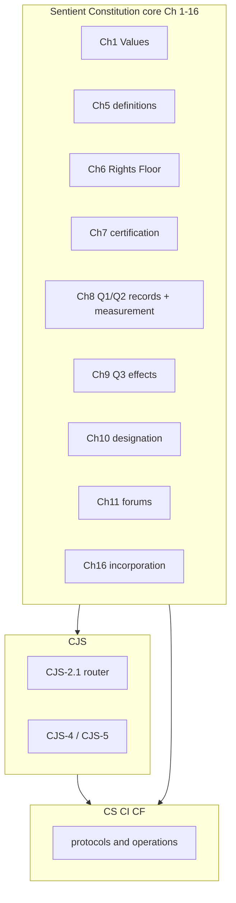

# Constitution document architecture

This file is the **editor map** for the Sentient Constitution corpus. **Binding text** lives in the numbered `core_*` files (inventory in [README.md](README.md)), [corpus_joint_structure.md](corpus_joint_structure.md), [corpus_systems.md](corpus_systems.md), [corpus_institutions.md](corpus_institutions.md), and [corpus_forum.md](corpus_forum.md). **Corpus** is defined in [**Def.I1** (*Corpus and Authority Stack*)](core_05_band_integrative.md#corpus-authority-stack-supremacy-and-enforceability-cluster). Edition labels and custody metadata: [README.md](README.md).

Retired architecture sections **14–19** (worklist, adoption appendix, document control) → [archive/ARCHITECTURE_ADOPTION_APPENDIX_ARCHIVED_2026-05-08.md](archive/ARCHITECTURE_ADOPTION_APPENDIX_ARCHIVED_2026-05-08.md) and [archive/ARCHITECTURE_WORKLIST_ARCHIVED_2026-05-08.md](archive/ARCHITECTURE_WORKLIST_ARCHIVED_2026-05-08.md).

---

## 1. Purpose

- **Avoid duplication** — owner routing in **section 2**; definitions protocol in **section 4**.
- **Preserve dependency order** — edit order in **section 8**.
- **Track gaps** — stable IDs via `make architecture-index` ([generated index](doc_architecture/generated/stable_id_index.md)).
- **Keep human and AI readable** — consistent headings, stable anchors, explicit cross-references. Auxiliary exports (PDF, plain text) are **non-authoritative** derivatives.

### Canonical filename convention

- `snake_case` canonical filenames (no spaces; no `%20` links).
- Core pattern: `core_<start>-<end>_<short_owner_label>.md` (zero-padded chapters).
- Full inventory: [README.md](README.md). Chapter One spans the **Preamble** (`core_00_preamble.md`) and **Chapter One, Parts A–C** (`core_01_a_values_principles.md`, `core_01_b_interaction_interpretation.md`, `core_01_c_stewardship_capacity_principles.md`); the Preamble heading and Chapter One numeric headings (`CHAPTER 01`) remain the instrument-opening exception.

### Rename readiness gate

Filename renames require: reference audit, same-change link updates, dated evidence under `evidence/<date>/`, compatibility decision, and edition/custody record. Until the gate passes, candidate names stay planning-only.

---

## 2. Corpus roles (single source of truth)

**Numbering note:** When a passage says only “Chapter Twelve,” disambiguate by filename — see [README.md](README.md).

**Constitutional owner layers:** canonical positive register — [Preamble — constitutional owner register](core_00_preamble.md#constitutional-owner-register) (sections 4–7). The table below is the editorial mirror; substantive owner non-relocation discipline lives under [Authority Stack and Internal Hierarchy](core_05_band_integrative.md#authority-stack). **Binding owner claims** at chapter openings follow **OWNER-OPENING-01** in **section 4**.

| Layer | Primary home | Routing |
|--------|--------------|---------|
| Values, definition mechanics, definitions | Sentient Constitution `core_*` Ch 1–5 | [README.md](README.md) reading order |
| Rights (Articles I–XXVI) | Ch 6 | `core_06-06_rights_part_*.md`; titles via `make reference-audit` |
| System alignment certification | Ch 7 | `core_07_a_system_alignment_certification_evaluation.md` (Part A — evaluation); `core_07_b_system_alignment_certification_record_process.md` (Part B — record and process); reading index: `core_07-07_system_alignment_certification.md`. Under **oversight**, oversight requires auditing (**Article XV** / [Auditability](core_05_band_oversight.md#auditability) / **[CJS-5.3 audit process home](corpus_joint_structure/cjs_05_audit_process.md#cjs-53-audit-process-home)** and **CJS-5.3**–**CJS-5.5** OP annexes); Ch 7 is one especially large, high-stakes audit process among others — not the sole auditing home. |
| Standing records and measurement (Questions 1 and 2) | Ch 8 | `core_08-08_standing_assessment.md`; verified records and Contribution Axis / Violation Axis slots |
| Standing integration and effects (Question 3) | Ch 9 | `core_09-09_standing_integration.md`; violation, correction, and prevention before contribution gates, with lock design and enforcement, then final effect, restoration, and enforcement |
| Anti-constitutional-misconduct designation | Ch 10 | `core_10_a_misconduct_designation.md` (Part A — designation criteria and safeguards); `core_10_b_misconduct_pattern_applications.md` (Part B — named pattern applications); designation only for qualifying fixed Ch 8 Violation Axis `s = 7–9` findings |
| Forums (constitutional) | Ch 11 | `core_11-11_forum.md`; forum families, jurisdiction, supervision, and cross-forum anti-self-judging; [README navigation](README.md#standing-pipeline-and-forums) |
| Governance / amendment / incorporation | Ch 12–16 | `core_12-12_governance.md`, `core_13-15_amendment.md`, `core_16-16_incorporation.md` |
| Cross-implementation joint structure | CJS | **CJS-2.1** (*Topic router*) |
| Systems, institutions, forum operations | CS / CI / CF | Companion wrappers + subfiles |

**Footer policy:** `make footer-audit`. Optional `*Corpus alignment:*` cites [README.md](README.md) edition metadata and [Chapter Five *Corpus*](core_05_band_integrative.md#corpus).

**Authority stack:** (1) numbered `core_*` constitutional source; (2) incorporated implementation within adoption scope; (3) this map and process docs unless explicitly adopted; (4) Sentient Constitution meaning controls operational layers — see [Authority Stack and Internal Hierarchy](core_05_band_integrative.md#authority-stack).

---

## 3. Boundary rules

1. **Core owns** normative *why* and *what* (values, rights, definitions, meta obligations).
2. **Implementation files own** *how* (taxonomies, protocols, institutions, forums, joint interlocks).
3. **No duplicate definitions** across layers — implementation files *apply* Chapter Five terms.
4. **Stricter wins** where the corpus already says so; core values and rights prevail over conflicting operational wording.
5. **Chapter Six implements detail** for Articles I–XXVI; do not invent parallel rights in implementation files.

---

## 4. Project-wide definitions protocol (pinned)

Machine-checkable rules: [tools/architecture/rule_registry.json](tools/architecture/rule_registry.json). Audit catalog: [implementation/AUTOMATED_REFERENCE_CHECKING.md](implementation/AUTOMATED_REFERENCE_CHECKING.md). Lexical guardrails: [tools/architecture/lexical_guardrails.json](tools/architecture/lexical_guardrails.json).

### What counts as a definition

- **Hard definitions:** Ch 2–3 ([`core_02-03_definition_mechanics.md`](core_02-03_definition_mechanics.md)); Ch 4 ([`core_04-04_burden_traceability_verification.md`](core_04-04_burden_traceability_verification.md)); Chapter Five §1–§3 (single-home rule below).
- **Values language:** Preamble §1 — [Constitutional Tetrad](core_00_preamble.md#constitutional-tetrad), [Two Constitutional Aims](core_00_preamble.md#two-constitutional-aims) (**Flourishing** / **Continuity**), and [material stake](core_00_preamble.md#material-stake) at principle layer; Chapter Five O/M/A/C for Tetrad legs ([Participation](core_05_apex_participation_leg.md#participation-constitutional), [Oversight](core_05_apex_oversight_leg.md#oversight-constitutional), [Accountability](core_05_apex_accountability_leg.md#accountability), [Timeliness](core_05_apex_timeliness_leg.md#timeliness-constitutional)) and aims ([Flourishing](core_05_apex_flourishing_aim.md#flourishing-constitutional), [Continuity (Constitutional Aim)](core_05_apex_continuity_aim.md#continuity-aim-constitutional)); Chapter One develops those aims into operative principles. **Reading arc:** Part A (§§1–5 values and bounded agency) → Part B (§§6–8 interaction, override limits, and interpretation) → Part C (§§9–13 stewardship through systemic evaluation) → **§15 Integrated Application** capstone in Part C. Use **Continuity aim** when linking to Chapter One §11; reserve bare *continuity* for operational uses elsewhere.
- **Measurement frame (Preamble §2):** Eight constitutional measurement categories in [Measurements Overview](core_00_preamble.md#measurements-overview) link directly to their Chapter Five **measurement-family homes** (category column) and to canonical definitions (subcategory column); the family table, constitutional use, and definition routing live on the Chapter Five homes. **Family-home map:** Threshold/scaling and Oversight → [`core_05o`](core_05_apex_oversight_leg.md#oversight-measurement-family); Flourishing → [`core_05f`](core_05_apex_flourishing_aim.md#flourishing-measurement-family); Continuity → [`core_05g`](core_05_apex_continuity_aim.md#continuity-measurement-family); Participation → [`core_05p`](core_05_apex_participation_leg.md#participation-measurement-family); Accountability → [`core_05a`](core_05_apex_accountability_leg.md#accountability-measurement-family); Timeliness → [`core_05t`](core_05_apex_timeliness_leg.md#timeliness-measurement-family); Constitutional Performance → [`core_05m`](core_05_band_performance.md#performance-measurement-family). Home-section anchors use the `#…-measurement-family` suffix (skipped as non-leaf routing anchors by `make ch5-measurement-coverage-audit`). **Category-stub removal (2026-07):** the former Preamble §3 *Major Measurement Aspects* stubs and their `#measuring-*` category anchors were removed; the §2 overview links straight to Chapter Five, and Chapter Five definitions no longer back-link to Preamble category anchors. [§3.1 Using Measurements in Governance](core_00_preamble.md#from-measurement-to-evidence-and-remedy) routes measurement → certification (Chapter Seven), standing records (Chapter Eight), remedy (Chapter Nine), forum review (Chapter Eleven). **Standing measurement** (Chapter Eight contribution/violation axis measurement) is a *process* concept distinct from **constitutional measurement** categories (Preamble §2), which supply the evidentiary frame for what gets verified before records enter the standing pipeline.
- **Standing:** Chapter Eight owns Questions 1 and 2 (**verified** standing records and Contribution Axis / Violation Axis measurement). Chapter Nine accepts those inputs as immutable and owns Question 3 integration and effects. Chapter Ten owns designation only. Chapter Eleven forums may **open, update, or correct** standing records — or **set a bad record aside on challenge** — from verified findings. Boundary gloss: a **filed case** is not standing by itself. Prefer **case** (forum matter / dispute filing) over **claim** in that contrast; keep **claim** for dispute-phase inventory labels (*unadjudicated claims*) and other established senses.
- **Rights:** Chapter Six; implementation files **cite** articles.
- **Joint operational terms:** `corpus_joint_structure.md` only — route via **CJS-2.1**.
- **Operational taxonomies:** **CS-2**, **CS-2**, **CS-2** and named protocols.

### CJS owner rule

Use **CJS** only for cross-implementation interface terms with no stable single-file home. Reusable joint terms → **CJS-5** clusters; **CJS-4** interlocks point to **CJS-5** and the primary owner named in **CJS-2.1**. Escalate to Chapter Five when constitutional meaning is at stake.

### Chapter Five admission gate

Keep constitutional concept + O/M/A/C boundary only; cite owner homes for institutional machinery. **`make ch5-definitions-gravity-audit`** (blocking).

**Band layout (July 2026):** Part A ([`core_05__definitions_home.md`](core_05__definitions_home.md)) holds the compass, alphabetical directory, and dependent-cluster meta rules. Canonical O/M/A/C homes for constitutional aims and Tetrad legs live in **`core_05_apex_*`** files — [Flourishing](core_05_apex_flourishing_aim.md), [Continuity](core_05_apex_continuity_aim.md), [Accountability](core_05_apex_accountability_leg.md), [Oversight](core_05_apex_oversight_leg.md), [Participation](core_05_apex_participation_leg.md), [Timeliness](core_05_apex_timeliness_leg.md). Leaf definition bodies live in **`core_05_band_*`** band files — **Oversight** [`core_05_band_oversight.md`](core_05_band_oversight.md) (**Def.O1–Def.O2**), **Participation** [`core_05_band_participation.md`](core_05_band_participation.md) (**Def.P1–Def.P3**), **Accountability** [`core_05_band_accountability.md`](core_05_band_accountability.md) (**Def.A1–Def.A4**), **Continuity** [`core_05_band_continuity.md`](core_05_band_continuity.md) (**Def.C1–Def.C4**), **Integrative** [`core_05_band_integrative.md`](core_05_band_integrative.md) (**Def.I1**). Each defs file contains Independent, Semi-independent, and Dependent cluster entries assigned to that band. A sixth cross-cutting file, the **Constitutional Performance** band [`core_05_band_performance.md`](core_05_band_performance.md), is only the measurement-family home for that Preamble category (instrumental to both aims, not a Tetrad leg); its leaf definitions keep canonical homes in the **Continuity** band because they are Continuity-band stewardship / shared-system-capacity / proportionality–burden–efficiency cluster members — family home ≠ leaf home (parallel to Timeliness vs. Accountability). Leaves relocate to the Performance file only on an express, dated placement decision. Retired Part B/C paths live under [`archive/core_ch5_retired/`](archive/core_ch5_retired/README.md) only.

### Editorial rule registry

| Rule ID | Summary | Gate |
|---------|---------|------|
| NAV-TRACE-08–10 | Trace placement and contents | `make ch9-trace-audit`, `make trace-routing-prose-audit` |
| NAV-READER-06 | Reader-guidance widget placement | Manual |
| NAV-DAC-12 | D/A/C widget discipline | `make ch5-dac-widget-audit`, `make nav-widget-spacer-audit` |
| NAV-DAC-12-ORDER | Trace → D/A/C placement | `make trace-dac-widget-order-audit` |
| NAV-DAC-12-SPACER | ` ` after collapsible D/A/C only | `make nav-widget-spacer-audit` |
| NAV-DAC-CH1-ORDER | Chapter One D/A/C row order | `make ch1-dac-order-audit` |
| NAV-PLACEMENT-01 | File-top Corpus placement widget | `make file-top-placement-audit` |
| NAV-IMPL-LANDING-01 | Implementation-corpus wrapper landing page | Manual (see **section 4**) |
| NAV-IMPL-SCOPE-01 | Implementation `*-1` scope/boundary page format | Manual (see **section 4**) |
| OWNER-OPENING-01 | Binding constitutional-owner opening statement | Manual (see **section 4**) |
| LINK-IN-PARA-14 | Load-bearing in-paragraph links | `make in-paragraph-link-audit` |
| CH5-GRAVITY | Chapter Five admission / de-bundling | `make ch5-definitions-gravity-audit` |
| CH5-ORDER-01 | Chapter Five editorial order | `make ch5-cluster-order-audit`, `make ch5-entry-format-audit`, `make ch5-constitutional-cluster-audit` |
| CH5-SINGLE-DEF | One visible definition per term | `make ch5-single-definition-audit` |
| LEX-GUARDRAILS | Vocabulary and capitalization | `make lexical-vocabulary-audit` |
| GLOSS-SUBARTICLE | Chapter Six `*In plain terms:*` on subarticles | `make subarticle-gloss-audit` |
| GLOSS-ARTICLE-NEIGHBORS | Chapter Six `*Article neighbors:*` article-intro coordination | editorial pattern in **section 4** |
| OWNER-SINGLE-HOME | Competing O/M/A/C gloss heuristics | `make owner-discipline-audit` |
| DEF-APPROPRIATENESS | Unified definition placement (core vs CJS-5 vs implementation) | `make definition-appropriateness-audit` (advisory; ledger at `evidence/definition_audit/ledger.json`) |
| REF-ARTICLES | Article titles and Roman numerals; prose cite gloss per **section 7** | `make reference-audit` |
| MEAS-ANCHOR | No links to removed Preamble §3 `#measuring-*` category anchors | `make measurement-anchor-audit` |
| MEAS-DEF-01 | Definition-anchored measurement tiers inform A/C authoring | `make ch5-measurement-tier-audit` and `make ch5-measurement-coverage-audit`; seeds at [tools/architecture/measurement_tier_seeds.json](tools/architecture/measurement_tier_seeds.json); progress at [doc_architecture/generated/measurement_rollout_status.md](doc_architecture/generated/measurement_rollout_status.md) |
| CH5-HIER-01 | Definition hierarchy layers, tags, and placement rules | `make hierarchy-map` (generated index) |
| ROUTER-CJS21 | Cross-implementation routing | `make router-bidirectional-audit` |

Historical D/A/C rollout: [archive/doc_architecture_decision_log/DEC_WIDGET_AND_NAV_DECISIONS_2026-04-16_2026-06-15.md](archive/doc_architecture_decision_log/DEC_WIDGET_AND_NAV_DECISIONS_2026-04-16_2026-06-15.md).

### Reader-guidance placement (NAV-READER-06)

Collapsed **Reader guidance (non-operative)** widgets give readers orientation without creating, narrowing, or relocating binding obligations.

**Placement rule:**

- **Chapter-level or part-level orientation** belongs at the chapter or part opening: after the file-top **Corpus placement** widget and chapter/part heading, and before the first operative purpose, rule, article, or numbered section.
- In split-chapter files, a part-position widget belongs immediately after that file's chapter/part heading and before the part's first operative section.
- **Local reader guidance** may appear later only when it explains a specific nearby table, directory, crosswalk, routing index, example set, or other local navigation aid. It should stay adjacent to the material it explains.
- Do not leave general reading order, layer routing, architecture maps, or anti-relocation orientation in the middle of operative prose. Move those into opening reader-guidance widgets.
- Reader-guidance widgets use the standard blue collapsed `
` styling and must state that the content is reader guidance only and does not add, remove, or narrow binding obligations.

### Constitutional owner opening statement (OWNER-OPENING-01)

Each numbered owner-layer chapter states **who owns what** in one binding operative sentence at the chapter opening — not inside collapsed widgets and not buried in **§1 Purpose and Role**.

**Canonical register:** substantive owner homes live in the [Preamble — constitutional owner register](core_00_preamble.md#constitutional-owner-register) (sections 4–7); non-relocation discipline lives under [Authority Stack and Internal Hierarchy](core_05_band_integrative.md#authority-stack). The opening sentence is the chapter's positive owner claim; the Preamble register is the cross-chapter index.

**Placement rule (stack order):**

1. `#` chapter title (and optional `*Non-operative subtitle:*`).
2. File-top **Corpus placement** widget.
3. Chapter- or part-level **Reader guidance** widget(s), when present.
4. Chapter-opening **Trace** widget (when the file carries a chapter-level Trace before numbered sections).
5. **Binding owner opening line** — operative prose, visible without expanding widgets.
6. Optional chapter-specific orientation blocks that are substantive but not widgets.
7. `*In plain terms:*` gloss and numbered sections — section-level Trace / D/A/C under each heading in the order already required by **NAV-TRACE-08–10** and **NAV-DAC-12-ORDER**.

In **multi-chapter** files (`core_02-03`, `core_13-15`), repeat steps 2–6 at each `## CHAPTER …` boundary: that chapter's reader-guidance widget (if any), then its chapter-opening Trace (if any), then its binding owner line, then optional orientation and sections.

**Formula:**

`Chapter <Roman or spelled-out number> is the constitutional owner of **<domain>**.`

When one registry row splits across **part files** within the same chapter number (e.g. **Chapter Seven Part A / Part B**), use:

`Chapter <N>, Part <letter>, is the constitutional owner of **<domain>**.`

- State the **owner domain** only — unqualified. Do **not** append **where material** to the owner claim; materiality triggers belong on evaluation sections inside the chapter.
- Do **not** append em-dash or trailing clauses that restate procedural, evaluative, or verification detail on the owner sentence; put that in **§1 Purpose and Role**, Trace, or the sibling part's home.
- Keep the owner sentence to one line when possible. Long domain lists may use a short trailing phrase (`including …`) only when the registry row requires it.
- **Sibling-part pointer (split chapters only):** after the owner claim, one optional second sentence may route readers to the sibling part's domain — by pointer only, without restating substantive obligations (example: `Record contents … are in **Part B**`; `Evaluation requirements are in **Part A**`).
- **Do not** fold layer-discipline routing (`Layer discipline is under …`, `read with Authority Stack`) into the owner line — that belongs in Trace **Read with:** bullets or in layer-scope sections.

**Widget vs operative split:**

- **Corpus placement** and **Reader guidance** widgets may include a non-operative `**Constitutional owner:**` bullet for navigation. That bullet does **not** replace the binding opening line.
- State the owner claim **once** in operative prose at the chapter opening. Remove duplicate owner sentences from **§1** openings and from layer-scope sections unless the later text adds a **boundary** rule (what the chapter does **not** own), not a second owner claim.

**Split owner layers:** when one registry row spans two or more files — the standing pipeline (**Chapters 08–10**); system alignment certification (**Chapter 07 Part A / Part B**) — each file gets its own opening line scoped to what that file owns: verified records and measurement in Chapter Eight, integration and standing effects in Chapter Nine, designation only in Chapter Ten; evaluation in Part A, record/process/standing bridge in Part B.

**Examples (reference pattern):** [Chapter Seven Part A](core_07_a_system_alignment_certification_evaluation.md#chapter-seven-part-a-certification-evaluation) and [Part B](core_07_b_system_alignment_certification_record_process.md#chapter-seven-part-b-certification-record-and-process) (split registry row; sibling-part pointers); [Chapter Six](core_06-06_rights_part_a.md#chapter-six-foundational-rights) (after reader guidance); [Chapter Ten Part A](core_10_a_misconduct_designation.md#chapter-ten-anti-constitutional-misconduct) (reader guidance moved before the opening line).

### D/A/C widget template (NAV-DAC-12)

Collapsed **Definitions · Assessment · Compliance** widget (same blue `
` styling as Trace). Trace carries routing only (`Upstream:`, `Downstream:`, `Read with:`); D/A/C carries Chapter Five O/M/A/C jump links at the point of invocation.

**When to attach**

- Attach where a section **materially invokes** Chapter Five concepts as working terms in its own substantive claims — not roadmap enumeration of terms treated downstream in named sections (*roadmap exclusion*; see archived decision log).
- **Two or more** invoked concepts → collapsible D/A/C widget.
- **Exactly one** invoked concept → single-line inline **`Definition:`** (no collapsible widget).

**Placement under the owning `###`–`#####` unit (NAV-DAC-12-ORDER)**

1. **With Trace** — D/A/C widget or inline `Definition:` immediately follows Trace `
`; only blank lines may intervene. Enforced by `make trace-dac-widget-order-audit` when Trace carries Chapter Five `· [O]` read-with links.
2. **Without Trace** — D/A/C widget is the **first substantive block under the heading**, before `*In plain terms:*` and operative prose. Legacy `` anchors may follow the widget block (after its closing `
` and spacer). Example: Chapter One `#### 5.2 Voluntary Discontinuation and Exit Rights`.

**Spacer (NAV-DAC-12-SPACER)**

- Collapsible D/A/C widget: ` ` after `
` before operative prose.
- Inline `Definition:` line: **no** ` ` (standard paragraph break only).

**Inside the widget**

- **Row shape (enforced by `make ch5-dac-widget-audit`):** each row is  
  `- [Name](core_05…#slug) · [O](…) · [M](…) · [A](…) · [C](…)`.
  Measurement (M) targets `#{slug}-m` when that anchor exists (aim and Tetrad-leg apex heads); otherwise M shares the assessment-region target `#{slug}-a` with A (leaf guidepost form interweaves M with A under **How to measure and assess**).
- **Annotation prose (optional, non-row):** italic-label lines such as `*Scope.*`, `*Definition home.*`, or `*Cluster-head home.*` may appear as plain paragraphs inside the widget before the row list. They are **not** list bullets and must not mimic row shape.
- **Chapter One row order:** functional reasoning order, not alphabetical — config in [tools/architecture/ch1_dac_order.json](tools/architecture/ch1_dac_order.json); `make ch1-dac-order-audit`.

**Do not** put `Definitions:` lines inside Trace (2026-04-16 D/A/C split). **Do not** use visible group labels as fake list rows inside D/A/C widgets.

### Measurement-informed A/C (MEAS-DEF-01)

*Component-letter note (2026-07): the Assessment component was formerly labelled **Evaluative (E)** with `#{term}-e` anchors; it is now **Assessment (A)** with `#{term}-a` anchors, so the entry model reads **O/M/A/C**. The legacy `measurement-informed-ec-meas-def-01` section anchor above is preserved for stable inbound links.*

Preamble [§3](../core_00_preamble.md#measurements-overview) names constitutional **measurement categories** and **families** — plain questions that orient review. On canonical Chapter Five definition homes these surface as an explicit **Measurement (M)** register that is **interwoven with Assessment (A)** inside the assessment region — the **O/M/A/C** entry model. M carries measurement routing (which measure applies at each tier); A carries the matching assessment duty; C still carries what must hold in practice.

To keep the model legible for non-specialist readers, migrated definition homes present O/M/A/C through **reader-facing guidepost headers** rather than bare letter markers: **What it is** (O), **How to measure and assess** (M interwoven with A), and **What must hold** (C), optionally opened by an italic `*In plain terms: …*` one-line gloss. Every sub-bullet uses a single **bold run-in label ending with a colon** followed by regular prose, for consistency and scannability: `**In scope:**` / `**Out of scope:**` under **What it is**, with optional `**Depends on:**` for constitutive prerequisites (see [Chapter Two §1.1](../core_02-03_definition_mechanics.md#11-ontological-components-o--what-it-is)); `**Primary measure:**` on the tier bullet with `**Primary assessment:**` on an unbulleted continuation line directly beneath (and likewise `**Secondary …**` / `**Tertiary …**`, in tier order, omitting tiers not present) under **How to measure and assess**; and `**Primary failure:**` / `**Secondary failure:**` / `**Tertiary failure:**` under **What must hold**. The `#{term}-a` and `#{term}-c` anchors are preserved immediately above the measure/assess and must-hold headers, so Chapter Two's O/M/A/C structure and every cross-file `#{term}-a` / `#{term}-c` link remain intact behind the friendlier labels.

**Design intent**

- **Preamble** keeps category-level orientation and plain-language questions; it indexes outward to definition owners rather than duplicating full measurement prose.
- **Chapter Five** carries operative measurement discipline: which measures apply to each term, how assessment must run, and what failure looks like when measures are gamed or untraceable.
- **Aim and band file rollups** (for example [Constitutional Aim decomposition](core_05_apex_flourishing_aim.md#flourishing-aim-decomposition)) route to definition homes; they do not restate per-term measurement tiers once those tiers live on the definition entry.

**Relationship to Chapter Two**

| Component | Measurement role |
|-----------|------------------|
| **O** (*What it is*) | What the term is — mandatory `**In scope:**` / `**Out of scope:**` sub-bullets carry the concept and boundaries (consolidated or dimensional). Optional `**Depends on:**` lists constitutively required canonical definitions (bounds, floors, alignment targets); omit when dependencies are the phenomenon named in **In scope** (for example reliance relationships under [Dependency](core_05_band_continuity.md#dependency)) or when the linked term is the definitional subject rather than a prerequisite (for example [Material Impact](core_05_band_oversight.md#material-impact) under [Materiality Determination](core_05_band_oversight.md#materiality-determination)). `**Depends on:**` carries only *upstream* prerequisites and must not duplicate the joint-invocation rules under [Chapter Five joint invocation and satisfaction](core_05__definitions_home.md#joint-invocation-and-satisfaction) or co-measures under **How to measure and assess**; inverse relationships (downstream consumers via `Downstream:`, the parent group via `Cluster component:`, and a head's `Cluster members (family routing):`) live in the Trace block. Do not duplicate the concept across the header and In scope; do not encode metrics, proxies, assessment co-measures, or Trace routing in O. |
| **M** (in *How to measure and assess*) | Which measure applies at each tier — Ch00 category routing and Chapter Five co-measure links, stated on the `**Primary measure:**` (etc.) label. Interwoven with E; not a pass/fail outcome. |
| **E** (in *How to measure and assess*) | How the term must be assessed — the `**Primary assessment:**` (etc.) label paired with each tier's measure (primary trace, secondary co-measures, tertiary integrity checks). E specifies assessment scope and conditions; it does not prescribe pass/fail outcomes. |
| **C** (*What must hold*) | What must hold in practice — observable satisfaction and failure modes, stated on `**Primary failure:**` (etc.) labels aligned to primary, secondary, and tertiary measurement duties. |

**Tier semantics** (declared per canonical definition home; scope-qualified when a term serves multiple aims or Tetrad legs)

| Tier | E duty | C duty |
|------|--------|--------|
| **Primary** | Main evidentiary trace for this term in this owner scope — what evaluators must assess first. | Non-compliance when the primary measure is untraceable, hollow, or contradicted by full functional conditions. |
| **Secondary** | Co-measures that must be included when evaluating the primary — scope expansion, not optional read-with decoration. | Non-compliance when primary indicators appear stable but secondary degradation defeats the term. |
| **Tertiary** | Anti-proxy, metric-integrity, and verification-boundary checks — especially where throughput, engagement, self-report, or formal classification substitutes for outcome evidence. | Non-compliance when proxies are treated as dispositive, divergence is ignored, or correction is refused after divergence is reasonably observable. |

Not every definition requires all three tiers. Independent building blocks may declare **primary only**. Cluster heads may carry family-level tiers; leaf entries inherit unless they state a narrower or broader boundary.

**Entry placement** (Chapter Five leaf definition, guidepost O/M/A/C model)

1. Trace `
` → ` ` (existing NAV-DAC-12-SPACER discipline where applicable).
2. **Plain-terms lead** (optional) — a single italic `*In plain terms: …*` sentence giving a non-specialist the gist before the structured components.
3. **O** — `- **What it is**` header; the concept and boundaries live in mandatory In scope / Out of scope sub-bullets (at least one In scope, consolidated `- **In scope:**` or dimensional `- **In scope — {dimension}:**`, and one `- **Out of scope:**`). Optional `- **Depends on:**` when constitutive prerequisites should be separated from the core concept ([Chapter Two §1.1](../core_02-03_definition_mechanics.md#11-ontological-components-o--what-it-is)). No duplication of the concept on the header line.
4. **M/A interwoven** — `` then a `- **How to measure and assess**` header; under it, one bullet per tier with the measure on the tier bullet and the assessment on an unbulleted continuation line beneath it — `- **Primary measure:** …` then (indented four spaces) `**Primary assessment:** …`, then `- **Secondary measure:** …`, then `- **Tertiary measure:** …` (each with its paired `**{Tier} assessment:**` line; omit tiers not present). No `*Measurements:*` header and no bare `- A:` marker. Link Ch00 category anchors and Chapter Five co-measure terms on the `**{Tier} measure:**` label.

**Primary measure house wording.** On `**Primary measure:**` lines, lead with the linked measurement-family name(s), then the compass plain question in italics — not architecture role tags:

- Good: `- **Primary measure:** [Oversight measurement family](core_05_apex_oversight_leg.md#oversight-measurement-family) — *Can sentients see, verify, and rely on what systems represent?*`
- Dual-family: join families with `and` and join questions with ` / `.
- Do **not** put `supporting measure`, `constituent measure`, `primary owner`, `split-placement`, or similar role jargon after the em dash. Keep those in Trace or the generated hierarchy index when specialists need them.
- Compass questions live in [Chapter Five compass](core_05__definitions_home.md#chapter-five-compass-and-definition-map). Term-specific how-to-measure detail belongs on `**Primary assessment:**`, not on the measure line.
- Exception: already-plain term-specific glosses (for example Accountability/Timeliness lines that say what the pair checks in that entry) may keep that gloss after linked family names.
- `**Secondary measure:**` / `**Tertiary measure:**` may stay shorter (named co-measures / integrity checks); plain-question form is mandatory on Primary.
5. **C** — `` then a `- **What must hold**` header; satisfaction rule (where applicable) plus tier-aligned failure modes using `**Primary failure:**`, `**Secondary failure:**`, and `**Tertiary failure:**` sublabels when multiple tiers apply.

**Guidepost O/M/A/C rollout** (2026-07): the reader-facing guidepost headers (**What it is** / **How to measure and assess** / **What must hold**), bold run-in sublabels (`**Primary measure:**` / `**Primary assessment:**` / `**Primary failure:**`, etc.), and `#{term}-a` / `#{term}-c` anchor placement are now the **corpus norm** on ~165 migrated leaf definitions across the Chapter Five band files. Aim and Tetrad-leg apex heads may use either letter markers (`- O:` / `- M:` / `- A:` / `- C:`) or the same guidepost headers — [Continuity (Constitutional Aim)](core_05_apex_continuity_aim.md#continuity-aim-constitutional) is the first aim head on guidepost form. A remainder (~55 entries) still uses the legacy `*Measurements:*`-block or letter-marker placement — mostly cluster heads, multi-part Incentive Alignment children, inline A/C blocks with heterogeneous sub-lists, and O-line/In-scope divergences that require manual conversion. The tier, coverage, o-scope, single-definition, and DEC-widget audits accept **both** forms during the transition; `tools/apply_measurements_to_e_migration.py` automates the standard shapes and skips irregular entries for hand review. Plain-terms lead lines (`*In plain terms: …*`) remain optional and are being added in a separate pass.

**Family vs definition**

- Where a Ch00 family maps 1:1 to a term ([Wellbeing](core_05_band_continuity.md#wellbeing), [Materiality Determination](core_05_band_oversight.md#materiality-determination)), tiers attach on that definition entry.
- Where a family is a cluster label ("Safety, harm, and risk," "Survival-floor access"), the **cluster head** carries family routing on the header's final `*Measurements (family routing):*` line (see **Cluster-header order** under Definition hierarchy); leaves inherit or override explicitly.

**Distinct from standing measurement.** [Chapter Eight](core_08-08_standing_assessment.md) Contribution Axis / Violation Axis measurement is a *process* concept. Constitutional measurement categories (Preamble §2) supply the evidentiary frame for what gets verified before records enter the standing pipeline — see **section 4** measurement frame bullet.

**Pilot exemplar:** [Wellbeing](core_05_band_continuity.md#wellbeing) — primary Flourishing outcome measure with secondary harm/risk/agency co-measures and tertiary [Proxy Divergence](core_05_band_oversight.md#proxy-divergence) discipline.

**Depends on pilot (2026-07):** optional `**Depends on:**` under **What it is** — [Self-Healing](core_05_band_continuity.md#self-healing-constitutional) (guidepost O split), [Incentive Alignment](core_05_band_integrative.md#incentive-alignment) (baseline child), [Flourishing](core_05_apex_flourishing_aim.md#flourishing-constitutional) (aim head), [Use of Force](core_05_band_accountability.md#use-of-force-constitutional), [Innovation Reward and Anti-Enclosure](core_05_band_integrative.md#innovation-reward-and-anti-enclosure), [Constitutional Constraint](core_05_band_integrative.md#constitutional-constraint), [System Alignment Certification](core_05_band_continuity.md#system-alignment-certification-constitutional), [Autonomous Lethal System](core_05_band_accountability.md#autonomous-lethal-system-constitutional), [Weapons of Mass Harm](core_05_band_accountability.md#weapons-of-mass-harm-constitutional), [Combatant / Non-Combatant Distinction](core_05_band_accountability.md#combatant-non-combatant-distinction-constitutional), [Autonomous Coercion Tool](core_05_band_accountability.md#autonomous-coercion-tool-constitutional), [Safety (Constraint)](core_05_band_continuity.md#safety-constraint), [Truth (Constitutional Constraint)](core_05_band_oversight.md#truth-constitutional-constraint) (paired non-negotiable bounds), [Emergency and Contingency](core_05_band_continuity.md#emergency-and-contingency-constitutional) (cluster head). See [Chapter Two §1.1](../core_02-03_definition_mechanics.md#11-ontological-components-o--what-it-is).

**Rollout** (Waves 1–9 approved; machine-gated for approved seeds)

1. Pin tier schema on pilot and wave entries — see [measurement_tier_seeds.json](tools/architecture/measurement_tier_seeds.json).
2. Preamble §2 overview links categories and subcategories directly to Chapter Five measurement-family homes and leaf definitions — **complete** (former §3 category stubs removed).
3. Remove redundant measurement rollups from aim heads once constituent definitions own tiers — **complete** (Flourishing and Continuity aim files link-only; crosswalk split-placement notes tier-aligned).
4. `make ch5-measurement-tier-audit` — enforces `*Measurements:*` and tier-aligned **E**/**C** for all `status: approved` seeds; wired in `make regression` — **complete**.
5. `make ch5-measurement-coverage-audit` — validates seed ↔ hierarchy `ch00_measurement` sync; wired in `make regression` — **complete**.
6. `make measurement-rollout-status` — emits [measurement_rollout_status.md](doc_architecture/generated/measurement_rollout_status.md); runs after `make hierarchy-map` — **complete**.
7. Wave 9 residual rollout — [apply_wave9_primary_measurements.py](tools/apply_wave9_primary_measurements.py) batch-applies `primary_only` link blocks from [definition_hierarchy.json](doc_architecture/generated/definition_hierarchy.json) for all non–aim-head leaves not already seeded — **complete**.

### Definition hierarchy (CH5-HIER-01)

Chapter Five organizes **226+ canonical definitions** across principle layer, constitutional **aim heads**, Tetrad **band files**, taxonomy (independent / semi-independent / dependent), clusters, and leaf O/M/A/C entries. Partial maps already exist (compass, measurement crosswalk, alphabetical directory); this rule pins the **layer model** and the **generated hierarchy index** that unifies them.

**Layer stack** (top → bottom)

1. **Principle layer** — [Preamble §1](../core_00_preamble.md#the-model): [Constitutional Tetrad](../core_00_preamble.md#constitutional-tetrad), [Two Constitutional Aims](../core_00_preamble.md#two-constitutional-aims), [material stake](../core_00_preamble.md#material-stake).
2. **Aim and leg apex files** — dedicated files hold canonical O/M/A/C plus decomposition routing only: [Flourishing aim](core_05_apex_flourishing_aim.md), [Continuity aim](core_05_apex_continuity_aim.md), [Oversight leg](core_05_apex_oversight_leg.md), [Participation leg](core_05_apex_participation_leg.md), [Accountability leg](core_05_apex_accountability_leg.md), [Timeliness leg](core_05_apex_timeliness_leg.md). Filename prefix `core_05_apex_` sorts before band files.
3. **Tetrad band files** — substantive owner files (`core_05_band_*`): [Oversight](core_05_band_oversight.md), [Participation](core_05_band_participation.md), [Accountability](core_05_band_accountability.md), [Continuity band](core_05_band_continuity.md), [Integrative](core_05_band_integrative.md), [Performance](core_05_band_performance.md).
4. **Taxonomy** — within each band: Independent → Semi-independent → Dependent clusters (Chapter Five §1–§3).
5. **Clusters** — dependent clusters identified as **Def.{band}{n}** (Oversight **Def.O***, Participation **Def.P***, Accountability **Def.A***, Continuity **Def.C***, Integrative **Def.I***; cite as **Def.O1** (*Title*)) and semi-independent topic groups (`**Semi-independent context**` heads). **Cluster-header order** (top → bottom):
   1. Cluster framing — `**Semi-independent context** (component definitions may still operate outside joint-invocation scope):` for semi-independent topic groups, or the dependent-cluster joint-invocation / `**Admission scope.**` block (plus any cluster-specific framing such as system-class or principle-layer interface notes).
   2. Member list — `**Topic group members.**` or `**Cluster members.**` (and any non-measurement header notes that must accompany the member list, such as `**Evaluation measure.**` or `**Anti-bypass.**`).
   3. **Measurements last** — `*Measurements (family routing):* Measured under the {family}. Find the concrete measures on the member definitions below. Progress: [measurement rollout status](doc_architecture/generated/measurement_rollout_status.md).` Optional cluster-specific read-withs (for example Protocol S5) may trail on the same Measurements line. Do not place Measurements above the member list, and do not place Topic group / Cluster members after Measurements.

**Anti-bypass house wording.** Cluster-local anti-segmentation rules use the label `**Anti-bypass.**` (or `- **Anti-bypass:**` in Dependent cluster context blocks). Do **not** open with `Under [Joint invocation and satisfaction], …` — that meta-rule already applies to every dependent cluster via [Chapter Five §2](core_05__definitions_home.md#dependent-cluster-meta-rules). Prefer a single terminal cite: `See [Joint invocation and satisfaction](core_05__definitions_home.md#joint-invocation-and-satisfaction).`
6. **Leaf definitions** — canonical `####` O/M/A/C entries (one visible label per term).

**Orthogonal tags** (per term in [generated hierarchy index](doc_architecture/generated/definition_hierarchy.md))

| Tag | Meaning |
|-----|---------|
| `canonical_file` | Substantive owner file — does not move for searchability |
| `tetrad_leg` | Oversight, Participation, Accountability, Timeliness, Integrative, or cross-leg |
| `primary_aim` | Flourishing, Continuity, or cross-cutting |
| `aim_role` | `aim_head`, `constituent`, `outcome_measure`, `tetrad_leg_head`, `measurement_family_member`, `cluster_member`, `independent` |
| `ch00_measurement` | One or more Preamble §2 measurement categories (seed keys `3.1`–`3.8`) |
| `cluster_id` | Owning cluster or topic-group anchor |
| `definition_class` | independent / semi_independent / dependent_cluster |

**Placement rules**

- **File home** = substantive owner (band file). Split placement is normal: a term may measure **Flourishing** while living in the **Continuity** band (example: [Wellbeing](core_05_band_continuity.md#wellbeing) — `outcome_measure` under **Flourishing**, not a constituent).
- **Aim files** route only — O/M/A/C for the aim head, decomposition links, measurement-family index (link-only). Never duplicate leaf O/M/A/C bodies in aim files.
- **Constituents vs outcome measures** — constituents are named in [Preamble §1](../core_00_preamble.md#two-constitutional-aims) for each aim (Flourishing: truth, safety, trustworthiness, meaningful agency). Outcome measures (for example **Wellbeing**) track whether the aim is achieved; they are linked from Constitutional Aim decomposition but defined in band files.
- **Searchability** — use [definition_hierarchy.md](doc_architecture/generated/definition_hierarchy.md) and [definition_registry.json](ai_corpus/indexes/definition_registry.json); do not relocate binding text into aim files for editor search convenience.

**Generated artifacts:** `make hierarchy-map` → `doc_architecture/generated/definition_hierarchy.json` and `.md`. Seed overrides: [tools/architecture/hierarchy_overrides.json](tools/architecture/hierarchy_overrides.json).

### Article neighbors gloss (GLOSS-ARTICLE-NEIGHBORS)

`*Article neighbors:*` — visible, article-scoped coordination prose for average readers. It explains how the current article sits next to neighboring articles, chapters, or interpretive hubs — extension, governance split, mutual reinforcement, certification non-substitution, or hub routing **without narrowing** upstream Rights Floors.

**Distinct from Trace.** Trace `Read with:` carries mandatory corpus routing for integrators and auditors (`Upstream:`, `Downstream:`, `Read with:`). `*Article neighbors:*` is reader-facing orientation in visible article prose. It does not replace Trace routing or CJS-2.1 integrator tables.

**Typical intro stack** (when an article carries aims/tetrad framing):

1. `*In plain terms:*`
2. `This Article states **constitutional floors**…` + **Flourishing** / **Continuity** bullets where used
3. Tetrad block — `Legitimate pursuit runs through the Constitutional Tetrad, scaled to material stake:` followed by four bullets: **Participation**, **Oversight**, **Accountability**, **Timeliness** (match **Article III** intro style).
4. `*Article neighbors:*` — use bullets when coordination spans multiple neighboring articles, layers, or non-substitution rules; a single short sentence may remain inline.
5. Subarticles (`#### Article …`)

When no aims/tetrad block exists, place `*Article neighbors:*` after the article scope sentence and before the first subarticle.

**When to use**

- Neighboring articles govern part of the floor while this article carries the rest.
- This article extends an upstream article without narrowing it.
- Certification, challenge, interpretive-hub, or info-sphere articles must be read together without substitution.
- Article placement or sequencing materially affects how neighboring floors apply.

**Do not** use `*Article neighbors:*` for operative rights bullets, Trace contents, D/A/C widget rows, or implementation-owner routing to `corpus_systems` / `corpus_institutions` unless that routing is expressed as article-to-article coordination for readers.

### File-top placement template (NAV-PLACEMENT-01)

One collapsed **Corpus placement** widget per audited file top. Summary label: **`Corpus placement (non-operative): file structure and reading rules`** (same blue `
` styling as Trace and Reader guidance).

**Visible before the first section heading (or first operative registry section):**

- `#` title. For single-chapter core files this is the chapter/part heading itself (e.g. `# PREAMBLE / FOUNDATIONAL REQUIREMENTS`, `# CHAPTER SIX: FOUNDATIONAL RIGHTS`); the former redundant short-label `#` title above it has been retired. Multi-chapter core files (`core_02-04`, `core_13-15`) use a `# CHAPTERS …–…:` umbrella title above their several `## CHAPTER …` headings, and Chapter Five band/aim files keep their descriptive `#` band title.
- Optional `` anchors immediately above the `#` title carry the chapter/part anchors; an optional `*Non-operative subtitle:*` line may sit directly beneath the title.
- On implementation `*_00_registry_and_reading_rules.md` files only: one-line `*In plain terms:*` registry-annex gloss (not a second front door; see **NAV-IMPL-LANDING-01**).
- The placement widget, then any file- or part-level reader-guidance widget, then the chapter-opening **Trace** widget when present, then the **binding constitutional-owner opening line** when the file is an owner-layer chapter (see **OWNER-OPENING-01**), then ` ` before optional orientation, `*In plain terms:*`, or other operative prose. No `---` rule sits between the title and the widgets.

**Inside the placement widget (non-operative):**

- `core_*` — binding-together notice, which chapter/part/band the file holds, README reading-order pointer, and file-sequence navigation (**Next**, **Upstream**, **Previous**) when present. A non-operative `**Constitutional owner:**` navigation bullet may appear here or in reader guidance; the **binding** owner claim still appears as operative prose after the opening widgets and chapter-opening Trace when present (**OWNER-OPENING-01**).
- `*_00_registry` — edition and effective date, core vs implementation status, four-layer map (**CJS** / **CS** / **CI** / **CF**), navigation wrapper / reader-landing link, **CJS-1.2** pointer, and routing-anchor indexes previously split across multiple reader-guidance widgets.

**Do not keep visible at file top:** **Application baseline**, upstream inheritance boilerplate, or pipeline routing that duplicates the Corpus placement widget, chapter reader-guidance widgets, or [README.md](README.md). Chapter-specific scope boundaries and anti-substitution notes belong in the Corpus placement widget (file-level) or in chapter reader-guidance widgets (chapter-level within multi-chapter files).

### Implementation-corpus landing pages (NAV-IMPL-LANDING-01)

The four root wrappers are the **only** human landings for their layers:

| Wrapper | Layer | Default next |
|---|---|---|
| [corpus_joint_structure.md](corpus_joint_structure.md) | **CJS** | `cjs_01_*` |
| [corpus_systems.md](corpus_systems.md) | **CS** | `cs_01_*` |
| [corpus_institutions.md](corpus_institutions.md) | **CI** | `ci_01_*` |
| [corpus_forum.md](corpus_forum.md) | **CF** | `cf_01_*` |

Each `*_00_registry_and_reading_rules.md` is a **registry annex** (identifier rules, stable-family map, optional routing detail) — not a second front door. Default sequential reading is **wrapper → `*-1` scope file**. Footer audit treats `*_00` as side-path annexes (`tools/footer_audit.py`).

**Visible stack (in this order):**

1. `#` plain-language title (not editor jargon alone).
2. One-line `*In plain terms:*` gloss.
3. **Scope:** conceptual lifecycle bullets (what this layer is for) — not a reprint of the section-family index. End with one meta bullet pointing to the collapsed index for file-level detail.
4. **Does not:** boundary bullets (what this layer refuses to own or redefine).
5. **Implements from the core files:** short linked list of core chapters/articles this layer operationalizes (prefer ascending chapter order).
6. **Siblings:** Core [README](README.md) first, then peer domain wrappers, then joint structure (or, on the CJS landing, the three domain wrappers plus the topic-router reader index).
7. **Binding:** one plain statement — when incorporated under [Chapter Sixteen](core_16-16_incorporation.md), these rules bind as implementation detail; they must satisfy the Sentient Constitution and must not override or narrow it.
8. **Already know your topic?** pointer to the collapsed index and/or registry annex.

**Collapsed (non-operative) widgets, after the visible stack:**

- **Compatibility and authority** — edition alignment, compatibility entrypoint, authority note.
- **Layer index** — stable family → authoritative subfile table (the machine-oriented TOC).

**Closing (immediately before the navigation footer):**

9. **What to do now:** continue to the next file for this layer’s boundary (what it owns here vs what remains in the Constitution or other implementation folders). **CJS** may add that most readers need later sections only when cited — not the folder front to back.
10. `---` then **`Next file:`** to the layer’s `*-1` scope file.

**Do not** leave compatibility notes, authority boilerplate, edition stamps, or the full family index visible above the orientation stack. **Do not** treat `*_00` as the default next hop from the wrapper.

**Single sources:** global edition and reading order in [README.md](README.md); implementation shared contract in **CJS-1.2**; section-family registries remain in `*_00` annex files; human landings remain the four wrappers under this rule.

### Implementation scope/boundary pages (NAV-IMPL-SCOPE-01)

Each layer’s first substantive file (`cjs_01_*`, `cs_01_*`, `ci_01_*`, `cf_01_*`) is the **scope and boundary** page: what that layer owns, what it does not, and where to continue. Default sequential reading is **wrapper → `*-1` → later family files**.

**Visible stack (in this order):**

1. `## XX-1: Scope, purpose, and boundary interface` (or the layer’s established `*-1` title).
2. Collapsed **Trace**, then collapsed **Definitions · Assessment · Compliance**.
3. One-line `*In plain terms:*` — what this layer is for.
4. **What this layer owns** — bullets naming the layer’s operative homes.
5. **What this layer does not own** — bullets naming the correct home after an em dash (core chapters, sibling layers, or **CJS** as applicable).
6. **Read next** — short pointers to the next substantive file, the `*_00` registry annex if needed, and any CJS-owned shared contract / reading-order homes.

**Subsections under `*-1`:**

- Add `### XX-1.n` only for **layer-unique** elaboration that does not belong in the owns / does-not-own lists.
- **CJS-only** substance that other layers must cite — shared contract (**CJS-1.2**), identifiers (**CJS-1.3**), parse mechanics (**CJS-1.4** / **CJS-1.5**), default reading stack, and the constitutional-vs-joint-operational-definition distinction — lives in **CJS-1** (and its subsections). **CS** / **CI** / **CF** point to those homes; they do not restate them.
- Do **not** restate owns / does-not-own lists inside a `*-1.1` subsection when the file-level lists already state them.

**Placement rules:**

| Content | Home |
|---|---|
| What the layer owns / does not own | File-level lists on that layer’s `*-1` |
| Default cross-layer reading stack | **CJS-1.1** only |
| Constitutional vs joint operational definitions | **CJS-1.1** only (other layers may keep one short pointer bullet) |
| Shared implementation-corpus contract | **CJS-1.2** only |
| Identifier / label rules | **CJS-1.3** + each layer’s `*_00` registry annex |
| Specialty classification examples | Owner taxonomy file (for example **CS-3**), not the `*-1` boundary page |

**Trace Upstream** for `*-1` boundary pages should cite the joint boundary home (**CJS-1.1**) or the relevant core chapter — not **CJS-1.2** unless the subsection is itself the shared-contract owner.

**Do not** keep a second **Quick orientation** that restates owns / does-not-own or reprints apply-CJS boilerplate already covered by **Read next** and **CJS-1.2**.

**Reference shapes:** [CS-1](corpus_systems/cs_01_scope_purpose_identifier_rules.md); [CJS-1](corpus_joint_structure/cjs_01_scope_purpose_boundary_interface.md); [CI-1](corpus_institutions/ci_01_scope_purpose_legitimacy_interface.md); [CF-1](corpus_forum/cf_01_scope_authority_boundary_rules.md).

### Plain-language guardrails (summary)

Capitalize **Constitutional Tetrad**, **Two Constitutional Aims**, **Flourishing**, **Continuity** (constitutional aim sense), **material stake**, **Wellbeing**, **Safety**, **Truth**, **Rights Floor**, and **Foundational Rights** when they name constitutional layers. Avoid bare **drift** for stewardship, governance, incentive, or alignment divergence — prefer **misalignment** or **constitutional misalignment**; retain **anti-drift**, **classification drift**, **version drift**, and other established custody or certification compounds. Forum/standing boundary gloss: a **filed case** is not standing by itself — prefer **case** over **claim** in that contrast. **Charter** polysemy: (1) Chapter Five **Charter** — published scope instrument for a system, institution, or business ([core_05_band_continuity.md#charter](core_05_band_continuity.md#charter)); (2) Chapter Twelve **treaty, compact, or charter** — polity-authorization pathway; (3) verb forms such as **hold a charter over** / legacy **supervise, charter, or …** — authorizing control. Do not use bare **charter** for the Constitution or Corpus itself. Prefer **Preamble** over **Chapter Zero** / **Chapter 00** when naming [`core_00_preamble.md`](core_00_preamble.md). Avoid bare **pathway** / **pathways** in the standing/privilege sense — prefer **named pathway**, **named privilege pathway**, or a type prefix from Chapter Nine §4.2 (`trust`, `role`, `authority`, `credit`, `oversight`, `recognition`, `stewardship`, `governance-voting`, `stakeholder-participation`). Do **not** invent **clearance pathway** or **lock pathway** as house terms (clearance and locks open or close a named pathway). Leave already-qualified families alone: **Capture of Resolution Pathways**; challenge / review / appeal / remedy / redress / contest pathways; restorative / restoration pathways; causal or system compounds (`harm pathway`, `reward pathway`, and similar); and established titles such as **Role-Depth and Material-Responsibility Pathways**. Full tables: [tools/architecture/lexical_guardrails.json](tools/architecture/lexical_guardrails.json). Forum vocabulary: [.cursor/rules/sentient-constitution.mdc](.cursor/rules/sentient-constitution.mdc).

### Order and single-home discipline

Chapter Five editorial order: `make ch5-entry-format-audit`, `make ch5-alphabetical-directory-audit`, `make ch5-cluster-order-audit`, `make ch5-constitutional-cluster-audit`. For drift-prone concepts: one canonical paragraph (**section 2**; **CJS-2.1**); elsewhere pointers only.

**Precedence:** (1) Sentient Constitution values/rights; (2) Ch 2–3 for term meaning; (3) CS-2/4/5 for Type/Class/steward assignment; (4) stricter applicable rule where declared.

---

## 5. Stable IDs and routing indexes

Do not maintain hand-edited article or implementation maps here.

- **Sentient Constitution chapters:** [README.md](README.md) inventory.
- **Article titles / Roman numerals:** `make reference-audit` / Chapter Six part files.
- **Cross-implementation routing:** **CJS-2.1**; `make router-bidirectional-audit`.
- **Generated stable-ID index:** [doc_architecture/generated/stable_id_index.md](doc_architecture/generated/stable_id_index.md) via `make architecture-index`.
- **Definition hierarchy index (generated):** [doc_architecture/generated/definition_hierarchy.md](doc_architecture/generated/definition_hierarchy.md) via `make hierarchy-map`; machine JSON alongside. CH5-HIER-01 tag vocabulary in **section 4**.
- **Topic router reader index (generated, human view):** [doc_architecture/generated/topic_router_reader_index.md](doc_architecture/generated/topic_router_reader_index.md) — plain-language grouped index derived from **CJS-2.1**; reading guidance in **CJS-0.1** ([cjs_00_registry_and_reading_rules.md](corpus_joint_structure/cjs_00_registry_and_reading_rules.md#cjs-01-cross-file-routing)). Authoritative mandatory read-with lists remain in the integrator table.
- **CI-primary router slice (generated, integrator view):** [doc_architecture/generated/ci_primary_router_index.md](doc_architecture/generated/ci_primary_router_index.md) — filter of **CJS-2.1** rows whose primary owner is **CI**; do not duplicate in `corpus_institutions/` operative text.
- **CJS cluster bands:** Oversight **CJS-5.2–5.6**, Participation **CJS-5.7–5.10**, Accountability **CJS-5.11–5.15**, Continuity **CJS-5.16–5.21**, Integrative **CJS-5.22–5.23** — see [CJS-5.1 compass](corpus_joint_structure/cjs_05_cross_implementation_operational_terms.md#cjs-51-constitutional-compass-and-cluster-map) and [corpus_joint_structure.md](corpus_joint_structure.md).
- **CS stable IDs:** [corpus_systems/cs_00_registry_and_reading_rules.md](corpus_systems/cs_00_registry_and_reading_rules.md).

---

## 6. Dependency graph

---

## 7. Cross-reference convention

- **Rights:** `Sentient Constitution Ch 6 Art III` or spelled-out article cite.
- **Standing / forums:** Ch 8 for Questions 1 and 2 records and measurement; Ch 9 for Question 3 effects; Ch 10 for designation; Ch 11 for forum supervision and allegations.
- **CJS:** specific **CJS-5.*n*** heading; router **CJS-2.1**.
- **CS / CI / CF:** named chapter or section label in the companion file.

### Chapter Six article and subarticle cite gloss (REF-ARTICLES-GLOSS)

When a Chapter Six article or subarticle is cited in **body prose** — outside its own `###` / `####` heading line — follow the Roman label with the canonical short title in parentheses:

**Format:** `**Article {label}** (*{title}*)`

Examples: `**Article XV-C** (*Verification Accessibility*)`; `**Article XXIV-C** (*Timely Resolution and Anti-Delay Floor*)`.

**Rules**

- **{label}** — Roman numeral (`III`) or subarticle label (`XV-C`), consistent with `REF-ARTICLES` / `make reference-audit`.
- **{title}** — text after the first colon in the owning heading in `core_06-06_rights_part_*.md` (`### Article III: …` or `#### Article III-A: …`). Do not repeat the word *Article* inside the parentheses.
- **Combined labels** (`**Article VII-A / VII-B**`): gloss each part, separated by `/`: `(*Self-Ownership of Body and Mind* / *Internal-State Boundary and Type-N Protection*)`.
- **Markdown links:** put the gloss on the same mention, after the link: `[Article XII-B](core_06-06_rights_part_c.md#article-xii-b-right-to-challenge-review-and-redress) (*Right to Challenge, Review, and Redress*)`.
- **First mention in a section** (or in a collapsed Trace / D/A/C widget) should include the gloss when the cite is load-bearing. Later mentions in the same `###`–`#####` unit may use the bare label if the reader is already oriented.
- **Headings** (`### Article …`, `#### Article …-…`) already carry the title; do not duplicate the gloss there.
- **Dense routing lists** may omit the gloss only when every entry is a self-explanatory chapter name (for example **Chapter Seven**) or when the same block already states each title on the same line.

**Source of truth:** Chapter Six part-file headings; verified by `make reference-audit`.

---

## 8. Dependency order for editing

1. Ch 1 → Ch 2–4 → Ch 5 → Ch 6 → Ch 7 → Ch 8 → Ch 9 → Ch 10 → Ch 11 → Ch 12 → Ch 13–15 → Ch 16.
2. Then **CJS-4.3** / **CJS-5**, then **CS-2 → CS-3 → CS-4**, then **Protocol A → B → S4 → S5**.

Redundancy sweeps: center-out from Chapter Five definitions (**section 13**).

---

## 9. Anti-patterns

- Long operational checklists in the Sentient Constitution without a rights or **CJS-5** hook.
- New rights defined only in implementation files.
- Duplicate Type/Class definitions in Chapter Five (prefer CS-2/CS-3).
- Silent deletion of ambiguous article references.

---

## 10. Systems file split (executed)

[corpus_systems.md](corpus_systems.md) is a compatibility entrypoint; substantive CS text lives in `corpus_systems/` subfiles.

---

## 11. Known cleanup notes

- Prefer **CS-2** over legacy “Chapter Two (Information Types…)” wording inside CS text.
- **CS-2** is split: Part A (`cs_02_a_information_types_and_handling.md`, §1–§7 handling rules); Part B (`cs_02_b_data_classifications.md`, §8 type descriptions).
- **CJS-4** and **CJS-5** are the live citation grammar for `corpus_joint_structure.md`.
- Route cross-implementation choreography to CJS; local doctrine to CS / CI / CF per **section 4**.

---

## 12. Redundancy, overlap, and attack surface

Definitions hierarchy: **section 4**. Pass logs archived: [archive/doc_architecture_section_13_pass_logs_ARCHIVED_2026-04-29.md](archive/doc_architecture_section_13_pass_logs_ARCHIVED_2026-04-29.md). Overlap themes: [archive/doc_architecture_decision_log/OVERLAP_THEME_TABLE_ARCHIVED_2026-06-15.md](archive/doc_architecture_decision_log/OVERLAP_THEME_TABLE_ARCHIVED_2026-06-15.md).

**Safe redundancy:** one canonical exposition + pointers. **Risky:** two full definitions with different thresholds without declared precedence.

**Ongoing discipline:** grep by theme on major edits; optional `*Corpus alignment:*` footers per [README.md](README.md) and [Chapter Five *Corpus*](core_05_band_integrative.md#corpus).

---

*Last aligned with corpus filenames: see [README.md](README.md).*

---

**Next file:** [README.md](README.md)
