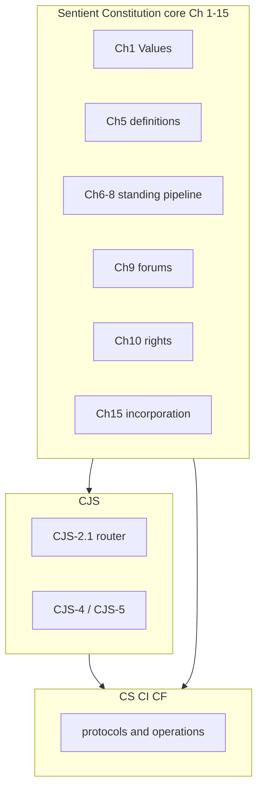

# Constitution document architecture

This file is the **editor map** for the Sentient Constitution corpus. **Binding text** lives in the numbered `core_*` files (inventory in [README.md](README.md)), [corpus_joint_structure.md](corpus_joint_structure.md), [corpus_systems.md](corpus_systems.md), [corpus_institutions.md](corpus_institutions.md), and [corpus_forum.md](corpus_forum.md). **Corpus** is defined in [Chapter Five Chapter One §8.16 *Corpus, Authority Stack, Supremacy, and Enforceability*](core_05a_accountability_definitions.md#corpus-authority-stack-supremacy-and-enforceability-cluster). Edition labels and custody metadata: [README.md](README.md).

Retired architecture sections **14–19** (worklist, adoption appendix, document control) → [archive/ARCHITECTURE_ADOPTION_APPENDIX_ARCHIVED_2026-05-08.md](archive/ARCHITECTURE_ADOPTION_APPENDIX_ARCHIVED_2026-05-08.md) and [archive/ARCHITECTURE_WORKLIST_ARCHIVED_2026-05-08.md](archive/ARCHITECTURE_WORKLIST_ARCHIVED_2026-05-08.md).

---

## 1. Purpose

- **Avoid duplication** — owner routing in **section 2**; definitions protocol in **section 4**.
- **Preserve dependency order** — edit order in **section 9**.
- **Track gaps** — stable IDs via `make architecture-index` ([generated index](doc_architecture/generated/stable_id_index.md)).
- **Keep human and AI readable** — consistent headings, stable anchors, explicit cross-references. Auxiliary exports (PDF, plain text) are **non-authoritative** derivatives.

### Canonical filename convention

- `snake_case` canonical filenames (no spaces; no `%20` links).
- Core pattern: `core_<start>-<end>_<short_owner_label>.md` (zero-padded chapters).
- Full inventory: [README.md](README.md). Chapter One spans **Chapter 00** (`core_00_preamble.md`) and **Chapter One, Parts A–C** (`core_01_a_values_principles.md`, `core_01_b_interaction_interpretation.md`, `core_01_c_stewardship_capacity_principles.md`); numeric headings (`CHAPTER 00`, `CHAPTER 01`) remain the instrument-opening exception.

### Rename readiness gate

Filename renames require: reference audit, same-change link updates, dated evidence under `evidence/<date>/`, compatibility decision, and edition/custody record. Until the gate passes, candidate names stay planning-only.

---

## 2. Corpus roles (single source of truth)

**Numbering note:** When a passage says only “Chapter Twelve,” disambiguate by filename — see [README.md](README.md).

**Constitutional owner layers:** canonical positive register — [Chapter Five — Constitutional Owner Layers](core_05i_integrative_definitions.md#constitutional-owner-layers). The table below is the editorial mirror; substantive owner discipline and non-relocation rules live in that Chapter Five entry.

| Layer | Primary home | Routing |
|--------|--------------|---------|
| Values, definition mechanics, definitions | Sentient Constitution `core_*` Ch 1–5 | [README.md](README.md) reading order |
| Rights (Articles I–XXVI) | Ch 6 | `core_06-06_rights_part_*.md`; titles via `make reference-audit` |
| System alignment certification | Ch 7 | `core_07-07_system_alignment_certification.md` |
| Standing pipeline | Ch 8–10 | `core_08-08_standing_assessment.md` through `core_10-10_misconduct.md`; comprehension layer: [Chapters Eight–Eleven compass](core_08-08_standing_assessment.md#chapters-eight-eleven-constitutional-compass) |
| Forums (constitutional) | Ch 11 | `core_11-11_forum.md` (same compass) |
| Governance / amendment / incorporation | Ch 12–16 | `core_12-12_governance.md`, `core_13-15_amendment.md`, `core_16-16_incorporation.md` |
| Cross-implementation joint structure | CJS | [corpus_joint_structure.md](corpus_joint_structure.md) **CJS-2.1** (*Topic router*) |
| Systems, institutions, forum operations | CS / CI / CF | Companion wrappers + subfiles |

**Footer policy:** `make footer-audit`. Optional `*Corpus alignment:*` cites [README.md](README.md) edition metadata and [Chapter Five *Corpus*](core_05i_integrative_definitions.md#corpus).

**Authority stack:** (1) numbered `core_*` constitutional source; (2) incorporated implementation within adoption scope; (3) this map and process docs unless explicitly adopted; (4) Sentient Constitution meaning controls operational layers — see [Authority Stack and Internal Hierarchy](core_05i_integrative_definitions.md#authority-stack).

---

## 3. Boundary rules

1. **Core owns** normative *why* and *what* (values, rights, definitions, meta obligations).
2. **Implementation files own** *how* (taxonomies, protocols, institutions, forums, joint interlocks).
3. **No duplicate definitions** across layers — implementation files *apply* Chapter Five terms.
4. **Stricter wins** where the corpus already says so; core values and rights prevail over conflicting operational wording.
5. **Chapter Six implements detail** for Articles I–XXVI; do not invent parallel rights in implementation files.

---

## 4. Project-wide definitions protocol (pinned)

Machine-checkable rules: [tools/architecture/rule_registry.json](tools/architecture/rule_registry.json). Audit catalog: [implementation/AUTOMATED_REFERENCE_CHECKING.md](implementation/AUTOMATED_REFERENCE_CHECKING.md). Lexical guardrails: [tools/architecture/lexical_guardrails.json](tools/architecture/lexical_guardrails.json).

### What counts as a definition

- **Hard definitions:** Ch 2–4 (`core_02-04_definition_mechanics.md`); Chapter Five §1–§3 (single-home rule below).
- **Values language:** Chapter 00 §1 — [Constitutional Tetrad](core_00_preamble.md#constitutional-tetrad), [Two Constitutional Aims](core_00_preamble.md#two-constitutional-aims) (**Flourishing** / **Continuity**), and [material stake](core_00_preamble.md#material-stake) at principle layer; Chapter Five O/E/C for Tetrad legs ([Participation](core_05p_participation_definitions.md#participation-constitutional), [Oversight](core_05o_oversight_definitions.md#oversight-constitutional), [Accountability](core_05a_accountability_definitions.md#accountability), [Timeliness](core_05a_accountability_definitions.md#timeliness-constitutional)) and aims ([Flourishing](core_05f_flourishing_aim.md#flourishing-constitutional), [Continuity (Constitutional Aim)](core_05g_continuity_aim.md#continuity-aim-constitutional)); Chapter One develops those aims into operative principles. **Reading arc:** Part A (§§1–5 values and bounded agency) → Part B (§§6–8 interaction, override limits, and interpretation) → Part C (§§9–13 stewardship through systemic evaluation) → **§15 Integrated Application** capstone in Part C. Use **Continuity aim** when linking to Chapter One §11; reserve bare *continuity* for operational uses elsewhere.
- **Measurement frame (Chapter 00 §2):** Eight constitutional measurement categories in [Measurements Overview](core_00_preamble.md#measurements-overview) link directly to their Chapter Five **measurement-family homes** (category column) and to canonical definitions (subcategory column); the family table, constitutional use, and definition routing live on the Chapter Five homes. **Family-home map:** Threshold/scaling and Oversight → [`core_05o`](core_05o_oversight_definitions.md#oversight-measurement-family); Flourishing → [`core_05f`](core_05f_flourishing_aim.md#flourishing-measurement-family); Continuity → [`core_05g`](core_05g_continuity_aim.md#continuity-measurement-family); Participation → [`core_05p`](core_05p_participation_definitions.md#participation-measurement-family); Accountability and Timeliness → [`core_05a`](core_05a_accountability_definitions.md#accountability-measurement-family); Constitutional Performance → [`core_05m`](core_05m_performance_definitions.md#performance-measurement-family). Home-section anchors use the `#…-measurement-family` suffix (skipped as non-leaf routing anchors by `make ch5-measurement-coverage-audit`). **Category-stub removal (2026-07):** the former Chapter Zero §3 *Major Measurement Aspects* stubs and their `#measuring-*` category anchors were removed; the §2 overview links straight to Chapter Five, and Chapter Five definitions no longer back-link to Chapter Zero category anchors. [§3.1 Using Measurements in Governance](core_00_preamble.md#from-measurement-to-evidence-and-remedy) routes measurement → certification (Chapter Seven), standing records (Chapter Eight), remedy (Chapter Nine), forum review (Chapter Eleven). **Standing measurement** (Chapter Eight contribution/violation axis classification) is a *process* concept distinct from **constitutional measurement** categories (Chapter Zero §2), which supply the evidentiary frame for what gets verified before records enter the standing pipeline.
- **Standing:** Ch 8–9 (**verified** inputs); Ch 11 forums for **allegations**, not standing-record classification inputs.
- **Rights:** Chapter Six; implementation files **cite** articles.
- **Joint operational terms:** `corpus_joint_structure.md` only — route via **CJS-2.1**.
- **Operational taxonomies:** **CS-3**, **CS-4**, **CS-5** and named protocols.

### CJS owner rule

Use **CJS** only for cross-implementation interface terms with no stable single-file home. Reusable joint terms → **CJS-5** clusters; **CJS-4** interlocks point to **CJS-5** and the primary owner named in **CJS-2.1**. Escalate to Chapter Five when constitutional meaning is at stake.

### Chapter Five admission gate

Keep constitutional concept + O/E/C boundary only; cite owner homes for institutional machinery. **`make ch5-definitions-gravity-audit`** (blocking).

**Band layout (June 2026):** Part A ([`core_05-05_definitions_a_independent.md`](core_05-05_definitions_a_independent.md)) holds the compass, alphabetical directory, and §3.0 joint-invocation meta rules. The [**Flourishing** aim file](core_05f_flourishing_aim.md) holds the canonical O/E/C home and hierarchy map for that constitutional aim. Definition bodies for Tetrad legs live in five constitutional **band** files — **Oversight** [`core_05o_oversight_definitions.md`](core_05o_oversight_definitions.md) (Chapter One §8.2–§3.3), **Participation** [`core_05p_participation_definitions.md`](core_05p_participation_definitions.md) (§3.5–§3.7), **Accountability** [`core_05a_accountability_definitions.md`](core_05a_accountability_definitions.md) (§3.8–Chapter One §8.11), **Continuity** [`core_05c_continuity_definitions.md`](core_05c_continuity_definitions.md) (Chapter One §8.12–Chapter One §8.15), **Integrative** [`core_05i_integrative_definitions.md`](core_05i_integrative_definitions.md) (Chapter One §8.16). Each band file contains §1 Independent, §2 Semi-independent, and §3 Dependent cluster entries assigned to that leg. Leaf definitions that serve **Flourishing** remain in band files; the aim file links the hierarchy only. A sixth cross-cutting file, the **Constitutional Performance** band [`core_05m_performance_definitions.md`](core_05m_performance_definitions.md), is the family-home container for the Constitutional Performance measurement family (instrumental to both aims, not a Tetrad leg); its leaf definitions (Constitutional Efficiency, Avoidable Burden, Productive Capacity, Burden-Reduction Duty) currently keep their canonical homes in the **Continuity** band and relocate only on an express, dated placement decision. Retired Part B/C paths live under [`archive/core_ch5_retired/`](archive/core_ch5_retired/README.md) only.

### Editorial rule registry

| Rule ID | Summary | Gate |
|---------|---------|------|
| NAV-TRACE-08–10 | Trace placement and contents | `make ch9-trace-audit`, `make trace-routing-prose-audit` |
| NAV-READER-06 | Reader-guidance widget placement | Manual |
| NAV-DEC-12 | D/E/C widget discipline | `make ch5-dec-widget-audit`, `make nav-widget-spacer-audit` |
| NAV-DEC-12-ORDER | Trace → D/E/C placement | `make trace-dec-widget-order-audit` |
| NAV-DEC-12-SPACER | ` ` after collapsible D/E/C only | `make nav-widget-spacer-audit` |
| NAV-DEC-CH1-ORDER | Chapter One D/E/C row order | `make ch1-dec-order-audit` |
| NAV-PLACEMENT-01 | File-top Corpus placement widget | `make file-top-placement-audit` |
| LINK-IN-PARA-14 | Load-bearing in-paragraph links | `make in-paragraph-link-audit` |
| CH5-GRAVITY | Chapter Five admission / de-bundling | `make ch5-definitions-gravity-audit` |
| CH5-ORDER-01 | Chapter Five editorial order | `make ch5-cluster-order-audit`, `make ch5-entry-format-audit`, `make ch5-constitutional-cluster-audit` |
| CH5-SINGLE-DEF | One visible definition per term | `make ch5-single-definition-audit` |
| LEX-GUARDRAILS | Vocabulary and capitalization | `make lexical-vocabulary-audit` |
| GLOSS-SUBARTICLE | Chapter Six `*In plain terms:*` on subarticles | `make subarticle-gloss-audit` |
| GLOSS-ARTICLE-NEIGHBORS | Chapter Six `*Article neighbors:*` article-intro coordination | editorial pattern in **section 4** |
| OWNER-SINGLE-HOME | Competing O/E/C gloss heuristics | `make owner-discipline-audit` |
| DEF-APPROPRIATENESS | Unified definition placement (core vs CJS-5 vs implementation) | `make definition-appropriateness-audit` (advisory; ledger at `evidence/definition_audit/ledger.json`) |
| REF-ARTICLES | Article titles and Roman numerals; prose cite gloss per **section 7** | `make reference-audit` |
| MEAS-ANCHOR | No links to removed Chapter Zero §3 `#measuring-*` category anchors | `make measurement-anchor-audit` |
| MEAS-DEF-01 | Definition-anchored measurement tiers inform E/C authoring | `make ch5-measurement-tier-audit` and `make ch5-measurement-coverage-audit`; seeds at [tools/architecture/measurement_tier_seeds.json](tools/architecture/measurement_tier_seeds.json); progress at [doc_architecture/generated/measurement_rollout_status.md](doc_architecture/generated/measurement_rollout_status.md) |
| CH5-HIER-01 | Definition hierarchy layers, tags, and placement rules | `make hierarchy-map` (generated index) |
| ROUTER-CJS21 | Cross-implementation routing | `make router-bidirectional-audit` |

Historical D/E/C rollout: [archive/doc_architecture_decision_log/DEC_WIDGET_AND_NAV_DECISIONS_2026-04-16_2026-06-15.md](archive/doc_architecture_decision_log/DEC_WIDGET_AND_NAV_DECISIONS_2026-04-16_2026-06-15.md).

### Reader-guidance placement (NAV-READER-06)

Collapsed **Reader guidance (non-operative)** widgets give readers orientation without creating, narrowing, or relocating binding obligations.

**Placement rule:**

- **Chapter-level or part-level orientation** belongs at the chapter or part opening: after the file-top **Corpus placement** widget and chapter/part heading, and before the first operative purpose, rule, article, or numbered section.
- In split-chapter files, a part-position widget belongs immediately after that file's chapter/part heading and before the part's first operative section.
- **Local reader guidance** may appear later only when it explains a specific nearby table, directory, crosswalk, routing index, example set, or other local navigation aid. It should stay adjacent to the material it explains.
- Do not leave general reading order, layer routing, architecture maps, or anti-relocation orientation in the middle of operative prose. Move those into opening reader-guidance widgets.
- Reader-guidance widgets use the standard blue collapsed `
` styling and must state that the content is reader guidance only and does not add, remove, or narrow binding obligations.

### D/E/C widget template (NAV-DEC-12)

Collapsed **Definitions · Evaluation · Compliance** widget (same blue `
` styling as Trace). Trace carries routing only (`Upstream:`, `Downstream:`, `Read with:`); D/E/C carries Chapter Five O/E/C jump links at the point of invocation.

**When to attach**

- Attach where a section **materially invokes** Chapter Five concepts as working terms in its own substantive claims — not roadmap enumeration of terms treated downstream in named sections (*roadmap exclusion*; see archived decision log).
- **Two or more** invoked concepts → collapsible D/E/C widget.
- **Exactly one** invoked concept → single-line inline **`Definition:`** (no collapsible widget).

**Placement under the owning `###`–`#####` unit (NAV-DEC-12-ORDER)**

1. **With Trace** — D/E/C widget or inline `Definition:` immediately follows Trace `
`; only blank lines may intervene. Enforced by `make trace-dec-widget-order-audit` when Trace carries Chapter Five `· [O]` read-with links.
2. **Without Trace** — D/E/C widget is the **first substantive block under the heading**, before `*In plain terms:*` and operative prose. Legacy `` anchors may follow the widget block (after its closing `
` and spacer). Example: Chapter One `#### 5.2 Voluntary Discontinuation and Exit Rights`.

**Spacer (NAV-DEC-12-SPACER)**

- Collapsible D/E/C widget: ` ` after `
` before operative prose.
- Inline `Definition:` line: **no** ` ` (standard paragraph break only).

**Inside the widget**

- **Row shape (enforced by `make ch5-dec-widget-audit`):** each row is  
  `- [Name](core_05…#slug) · [O](…) · [E](…) · [C](…)`.
- **Annotation prose (optional, non-row):** italic-label lines such as `*Scope.*`, `*Definition home.*`, or `*Cluster-head home.*` may appear as plain paragraphs inside the widget before the row list. They are **not** list bullets and must not mimic row shape.
- **Chapter One row order:** functional reasoning order, not alphabetical — config in [tools/architecture/ch1_dec_order.json](tools/architecture/ch1_dec_order.json); `make ch1-dec-order-audit`.

**Do not** put `Definitions:` lines inside Trace (2026-04-16 D/E/C split). **Do not** use visible group labels as fake list rows inside D/E/C widgets.

### Measurement-informed E/C (MEAS-DEF-01)

Chapter Zero [§2](../core_00_preamble.md#measurements-overview) names constitutional **measurement categories** and **families** — plain questions that orient review. On canonical Chapter Five definition homes these surface as an explicit **Measurement (M)** register that is **interwoven with Evaluative (E)** assessment inside the evaluation region — the **O/M/E/C** entry model. M carries measurement routing (which measure applies at each tier); E carries the matching assessment duty; C still carries what must hold in practice.

To keep the model legible for non-specialist readers, migrated definition homes present O/M/E/C through **reader-facing guidepost headers** rather than bare letter markers: **What it is** (O), **How to measure and assess** (M interwoven with E), and **What must hold** (C), optionally opened by an italic `*In plain terms: …*` one-line gloss. Every sub-bullet uses a single **bold run-in label ending with a colon** followed by regular prose, for consistency and scannability: `**In scope:**` / `**Out of scope:**` under **What it is**; `**Primary measure:**` on the tier bullet with `**Primary assessment:**` on an unbulleted continuation line directly beneath (and likewise `**Secondary …**` / `**Tertiary …**`, in tier order, omitting tiers not present) under **How to measure and assess**; and `**Primary failure:**` / `**Secondary failure:**` / `**Tertiary failure:**` under **What must hold**. The `#{term}-e` and `#{term}-c` anchors are preserved immediately above the measure/assess and must-hold headers, so Chapter Two's O/E/C structure and every cross-file `#{term}-e` / `#{term}-c` link remain intact behind the friendlier labels.

**Design intent**

- **Chapter Zero** keeps category-level orientation and plain-language questions; it indexes outward to definition owners rather than duplicating full measurement prose.
- **Chapter Five** carries operative measurement discipline: which measures apply to each term, how assessment must run, and what failure looks like when measures are gamed or untraceable.
- **Aim and band file rollups** (for example [Flourishing aim decomposition](core_05f_flourishing_aim.md#flourishing-aim-decomposition)) route to definition homes; they do not restate per-term measurement tiers once those tiers live on the definition entry.

**Relationship to Chapter Two**

| Component | Measurement role |
|-----------|------------------|
| **O** (*What it is*) | What the term is — mandatory `**In scope:**` / `**Out of scope:**` sub-bullets carry the concept and boundaries (consolidated or dimensional). Do not duplicate the concept across the header and In scope; do not encode metrics, proxies, or assessment procedures in O. |
| **M** (in *How to measure and assess*) | Which measure applies at each tier — Ch00 category routing and Chapter Five co-measure links, stated on the `**Primary measure:**` (etc.) label. Interwoven with E; not a pass/fail outcome. |
| **E** (in *How to measure and assess*) | How the term must be assessed — the `**Primary assessment:**` (etc.) label paired with each tier's measure (primary trace, secondary co-measures, tertiary integrity checks). E specifies assessment scope and conditions; it does not prescribe pass/fail outcomes. |
| **C** (*What must hold*) | What must hold in practice — observable satisfaction and failure modes, stated on `**Primary failure:**` (etc.) labels aligned to primary, secondary, and tertiary measurement duties. |

**Tier semantics** (declared per canonical definition home; scope-qualified when a term serves multiple aims or Tetrad legs)

| Tier | E duty | C duty |
|------|--------|--------|
| **Primary** | Main evidentiary trace for this term in this owner scope — what evaluators must assess first. | Non-compliance when the primary measure is untraceable, hollow, or contradicted by full functional conditions. |
| **Secondary** | Co-measures that must be included when evaluating the primary — scope expansion, not optional read-with decoration. | Non-compliance when primary indicators appear stable but secondary degradation defeats the term. |
| **Tertiary** | Anti-proxy, metric-integrity, and verification-boundary checks — especially where throughput, engagement, self-report, or formal classification substitutes for outcome evidence. | Non-compliance when proxies are treated as dispositive, divergence is ignored, or correction is refused after divergence is reasonably observable. |

Not every definition requires all three tiers. Independent building blocks may declare **primary only**. Cluster heads may carry family-level tiers; leaf entries inherit unless they state a narrower or broader boundary.

**Entry placement** (Chapter Five leaf definition, guidepost O/M/E/C model)

1. Trace `
` → ` ` (existing NAV-DEC-12-SPACER discipline where applicable).
2. **Plain-terms lead** (optional) — a single italic `*In plain terms: …*` sentence giving a non-specialist the gist before the structured components.
3. **O** — `- **What it is**` header; the concept and boundaries live in mandatory In scope / Out of scope sub-bullets (at least one In scope, consolidated `- **In scope:**` or dimensional `- **In scope — {dimension}:**`, and one `- **Out of scope:**`). No duplication of the concept on the header line.
4. **M/E interwoven** — `` then a `- **How to measure and assess**` header; under it, one bullet per tier with the measure on the tier bullet and the assessment on an unbulleted continuation line beneath it — `- **Primary measure:** …` then (indented four spaces) `**Primary assessment:** …`, then `- **Secondary measure:** …`, then `- **Tertiary measure:** …` (each with its paired `**{Tier} assessment:**` line; omit tiers not present). No `*Measurements:*` header and no bare `- E:` marker. Link Ch00 category anchors and Chapter Five co-measure terms on the `**{Tier} measure:**` label.
5. **C** — `` then a `- **What must hold**` header; satisfaction rule (where applicable) plus tier-aligned failure modes using `**Primary failure:**`, `**Secondary failure:**`, and `**Tertiary failure:**` sublabels when multiple tiers apply.

**Guidepost O/M/E/C rollout** (2026-07): the reader-facing guidepost headers (**What it is** / **How to measure and assess** / **What must hold**), bold run-in sublabels (`**Primary measure:**` / `**Primary assessment:**` / `**Primary failure:**`, etc.), and `#{term}-e` / `#{term}-c` anchor placement are now the **corpus norm** on ~165 migrated leaf definitions across the Chapter Five band files. A remainder (~55 entries) still uses the legacy `*Measurements:*`-block or letter-marker placement — mostly cluster heads, multi-part Incentive Alignment children, inline E/C blocks with heterogeneous sub-lists, and O-line/In-scope divergences that require manual conversion. The tier, coverage, o-scope, single-definition, and DEC-widget audits accept **both** forms during the transition; `tools/apply_measurements_to_e_migration.py` automates the standard shapes and skips irregular entries for hand review. Plain-terms lead lines (`*In plain terms: …*`) remain optional and are being added in a separate pass.

**Family vs definition**

- Where a Ch00 family maps 1:1 to a term ([Wellbeing](core_05c_continuity_definitions.md#wellbeing), [Materiality Determination](core_05o_oversight_definitions.md#materiality-determination)), tiers attach on that definition entry.
- Where a family is a cluster label ("Safety, harm, and risk," "Survival-floor access"), the **cluster head** carries family routing; leaves inherit or override explicitly.

**Distinct from standing measurement.** [Chapter Eight](../core_08-08_standing_assessment.md) contribution/violation axis classification is a *process* concept. Constitutional measurement categories (Chapter Zero §2) supply the evidentiary frame for what gets verified before records enter the standing pipeline — see **section 4** measurement frame bullet.

**Pilot exemplar:** [Wellbeing](core_05c_continuity_definitions.md#wellbeing) — primary Flourishing outcome measure with secondary harm/risk/agency co-measures and tertiary [Proxy Divergence](core_05o_oversight_definitions.md#proxy-divergence) discipline.

**Rollout** (Waves 1–9 approved; machine-gated for approved seeds)

1. Pin tier schema on pilot and wave entries — see [measurement_tier_seeds.json](tools/architecture/measurement_tier_seeds.json).
2. Chapter Zero §2 overview links categories and subcategories directly to Chapter Five measurement-family homes and leaf definitions — **complete** (former §3 category stubs removed).
3. Remove redundant measurement rollups from aim heads once constituent definitions own tiers — **complete** (Flourishing and Continuity aim files link-only; crosswalk split-placement notes tier-aligned).
4. `make ch5-measurement-tier-audit` — enforces `*Measurements:*` and tier-aligned **E**/**C** for all `status: approved` seeds; wired in `make regression` — **complete**.
5. `make ch5-measurement-coverage-audit` — validates seed ↔ hierarchy `ch00_measurement` sync; wired in `make regression` — **complete**.
6. `make measurement-rollout-status` — emits [measurement_rollout_status.md](doc_architecture/generated/measurement_rollout_status.md); runs after `make hierarchy-map` — **complete**.
7. Wave 9 residual rollout — [apply_wave9_primary_measurements.py](tools/apply_wave9_primary_measurements.py) batch-applies `primary_only` link blocks from [definition_hierarchy.json](doc_architecture/generated/definition_hierarchy.json) for all non–aim-head leaves not already seeded — **complete**.

### Definition hierarchy (CH5-HIER-01)

Chapter Five organizes **226+ canonical definitions** across principle layer, constitutional **aim heads**, Tetrad **band files**, taxonomy (independent / semi-independent / dependent), clusters, and leaf O/E/C entries. Partial maps already exist (compass, measurement crosswalk, alphabetical directory, full cluster map); this rule pins the **layer model** and the **generated hierarchy index** that unifies them.

**Layer stack** (top → bottom)

1. **Principle layer** — [Chapter 00 §1](../core_00_preamble.md#the-model): [Constitutional Tetrad](../core_00_preamble.md#constitutional-tetrad), [Two Constitutional Aims](../core_00_preamble.md#two-constitutional-aims), [material stake](../core_00_preamble.md#material-stake).
2. **Aim heads** — dedicated aim files hold canonical O/E/C for each constitutional aim plus decomposition routing only: [Flourishing aim](core_05f_flourishing_aim.md), [Continuity aim](core_05g_continuity_aim.md).
3. **Tetrad band files** — substantive owner files: [Oversight](core_05o_oversight_definitions.md), [Participation](core_05p_participation_definitions.md), [Accountability](core_05a_accountability_definitions.md), [Continuity band](core_05c_continuity_definitions.md), [Integrative](core_05i_integrative_definitions.md). **Timeliness** co-lives in the Accountability band.
4. **Taxonomy** — within each band: Independent → Semi-independent → Dependent clusters (Chapter Five §1–§3).
5. **Clusters** — numbered §3.x / Chapter One §8.x dependent clusters and semi-independent topic groups (`**Cluster context:**` heads).
6. **Leaf definitions** — canonical `####` O/E/C entries (one visible label per term).

**Orthogonal tags** (per term in [generated hierarchy index](doc_architecture/generated/definition_hierarchy.md))

| Tag | Meaning |
|-----|---------|
| `canonical_file` | Substantive owner file — does not move for searchability |
| `tetrad_leg` | Oversight, Participation, Accountability, Timeliness, Integrative, or cross-leg |
| `primary_aim` | Flourishing, Continuity, or cross-cutting |
| `aim_role` | `aim_head`, `constituent`, `outcome_measure`, `tetrad_leg_head`, `measurement_family_member`, `cluster_member`, `independent` |
| `ch00_measurement` | One or more Chapter Zero §2 measurement categories (seed keys `3.1`–`3.8`) |
| `cluster_id` | Owning cluster or topic-group anchor |
| `definition_class` | independent / semi_independent / dependent_cluster |

**Placement rules**

- **File home** = substantive owner (band file). Split placement is normal: a term may measure **Flourishing** while living in the **Continuity** band (example: [Wellbeing](core_05c_continuity_definitions.md#wellbeing) — `outcome_measure` under **Flourishing**, not a constituent).
- **Aim files** route only — O/E/C for the aim head, decomposition links, measurement-family index (link-only). Never duplicate leaf O/E/C bodies in aim files.
- **Constituents vs outcome measures** — constituents are named in [Chapter 00 §1](../core_00_preamble.md#two-constitutional-aims) for each aim (Flourishing: truth, safety, trustworthiness, meaningful agency). Outcome measures (for example **Wellbeing**) track whether the aim is achieved; they are linked from aim decomposition but defined in band files.
- **Searchability** — use [definition_hierarchy.md](doc_architecture/generated/definition_hierarchy.md) and [definition_registry.json](ai_corpus/indexes/definition_registry.json); do not relocate binding text into aim files for editor search convenience.

**Generated artifacts:** `make hierarchy-map` → `doc_architecture/generated/definition_hierarchy.json` and `.md`. Seed overrides: [tools/architecture/hierarchy_overrides.json](tools/architecture/hierarchy_overrides.json).

### Article neighbors gloss (GLOSS-ARTICLE-NEIGHBORS)

`*Article neighbors:*` — visible, article-scoped coordination prose for average readers. It explains how the current article sits next to neighboring articles, chapters, or interpretive hubs — extension, governance split, mutual reinforcement, certification non-substitution, or hub routing **without narrowing** upstream Rights Floors.

**Distinct from Trace.** Trace `Read with:` carries mandatory corpus routing for integrators and auditors (`Upstream:`, `Downstream:`, `Read with:`). `*Article neighbors:*` is reader-facing orientation in visible article prose. It does not replace Trace routing or CJS-2.1 integrator tables.

**Typical intro stack** (when an article carries aims/tetrad framing):

1. `*In plain terms:*`
2. `This Article states **constitutional floors**…` + **Flourishing** / **Continuity** bullets where used
3. Tetrad block — `Legitimate pursuit runs through the Constitutional Tetrad, scaled to material stake:` followed by four bullets: **Participation**, **Oversight**, **Accountability**, **Timeliness** (match **Article III** intro style).
4. `*Article neighbors:*` — use bullets when coordination spans multiple neighboring articles, layers, or non-substitution rules; a single short sentence may remain inline.
5. Subarticles (`#### Article …`)

When no aims/tetrad block exists, place `*Article neighbors:*` after the article scope sentence and before the first subarticle.

**When to use**

- Neighboring articles govern part of the floor while this article carries the rest.
- This article extends an upstream article without narrowing it.
- Certification, challenge, interpretive-hub, or info-sphere articles must be read together without substitution.
- Article placement or sequencing materially affects how neighboring floors apply.

**Do not** use `*Article neighbors:*` for operative rights bullets, Trace contents, D/E/C widget rows, or implementation-owner routing to `corpus_systems` / `corpus_institutions` unless that routing is expressed as article-to-article coordination for readers.

### File-top placement template (NAV-PLACEMENT-01)

One collapsed **Corpus placement** widget per audited file top. Summary label: **`Corpus placement (non-operative): file structure and reading rules`** (same blue `
` styling as Trace and Reader guidance).

**Visible before the first `##` heading (or first operative registry section):**

- `#` title.
- On implementation `*_00_registry_and_reading_rules.md` files only: one-line `*In plain terms:*` front-door gloss.
- The placement widget, then ` ` when operative prose or `---` follows.

**Inside the placement widget (non-operative):**

- `core_*` — binding-together notice, which chapter/part/band the file holds, README reading-order pointer, and file-sequence navigation (**Next**, **Upstream**, **Previous**) when present.
- `*_00_registry` — edition and effective date, core vs implementation status, four-layer map (**CJS** / **CS** / **CI** / **CF**), navigation wrapper link, **CJS-1.2** pointer, and routing-anchor indexes previously split across multiple reader-guidance widgets.

**Do not keep visible at file top:** **Application baseline**, upstream inheritance boilerplate, or pipeline routing that duplicates the Corpus placement widget, chapter reader-guidance widgets, or [README.md](README.md). Chapter-specific scope boundaries and anti-substitution notes belong in the Corpus placement widget (file-level) or in chapter reader-guidance widgets (chapter-level within multi-chapter files).

**Single sources:** global edition and reading order in [README.md](README.md); implementation shared contract in **CJS-1.2**; section-family registries remain in `*_00` files below the file-top block.

### Plain-language guardrails (summary)

Capitalize **Constitutional Tetrad**, **Two Constitutional Aims**, **Flourishing**, **Continuity** (constitutional aim sense), **material stake**, **Wellbeing**, **Safety**, **Truth**, **Rights Floor**, and **Foundational Rights** when they name constitutional layers. Avoid bare **drift** for stewardship, governance, incentive, or alignment divergence — prefer **misalignment** or **constitutional misalignment**; retain **anti-drift**, **classification drift**, **version drift**, and other established custody or certification compounds. Full tables: [tools/architecture/lexical_guardrails.json](tools/architecture/lexical_guardrails.json). Forum vocabulary: [.cursor/rules/sentient-constitution.mdc](.cursor/rules/sentient-constitution.mdc).

### Order and single-home discipline

Chapter Five editorial order: `make ch5-entry-format-audit`, `make ch5-alphabetical-directory-audit`, `make ch5-cluster-order-audit`, `make ch5-constitutional-cluster-audit`. For drift-prone concepts: one canonical paragraph (**section 2**; **CJS-2.1**); elsewhere pointers only.

**Precedence:** (1) Sentient Constitution values/rights; (2) Ch 2–3 for term meaning; (3) CS-3/4/5 for Type/Class/steward assignment; (4) stricter applicable rule where declared.

---

## 5. Stable IDs and routing indexes

Do not maintain hand-edited article or implementation maps here.

- **Sentient Constitution chapters:** [README.md](README.md) inventory.
- **Article titles / Roman numerals:** `make reference-audit` / Chapter Six part files.
- **Cross-implementation routing:** [corpus_joint_structure.md](corpus_joint_structure.md) **CJS-2.1**; `make router-bidirectional-audit`.
- **Generated stable-ID index:** [doc_architecture/generated/stable_id_index.md](doc_architecture/generated/stable_id_index.md) via `make architecture-index`.
- **Definition hierarchy index (generated):** [doc_architecture/generated/definition_hierarchy.md](doc_architecture/generated/definition_hierarchy.md) via `make hierarchy-map`; machine JSON alongside. CH5-HIER-01 tag vocabulary in **section 4**.
- **Topic router reader index (generated, human view):** [doc_architecture/generated/topic_router_reader_index.md](doc_architecture/generated/topic_router_reader_index.md) — plain-language grouped index derived from **CJS-2.1**; reading guidance in **CJS-0.1** ([cjs_00_registry_and_reading_rules.md](corpus_joint_structure/cjs_00_registry_and_reading_rules.md#cjs-01-cross-file-routing)). Authoritative mandatory read-with lists remain in the integrator table.
- **CI-primary router slice (generated, integrator view):** [doc_architecture/generated/ci_primary_router_index.md](doc_architecture/generated/ci_primary_router_index.md) — filter of **CJS-2.1** rows whose primary owner is **CI**; do not duplicate in `corpus_institutions/` operative text.
- **CJS cluster bands:** Oversight **CJS-5.2–5.6**, Participation **CJS-5.7–5.10**, Accountability **CJS-5.11–5.15**, Continuity **CJS-5.16–5.21**, Integrative **CJS-5.22–5.23** — see [CJS-5.1 compass](corpus_joint_structure/cjs_05_cross_implementation_operational_terms.md#cjs-51-constitutional-compass-and-cluster-map) and [corpus_joint_structure.md](corpus_joint_structure.md).
- **CS stable IDs:** [corpus_systems/cs_00_registry_and_reading_rules.md](corpus_systems/cs_00_registry_and_reading_rules.md).

---

## 6. Dependency graph

---

## 7. Cross-reference convention

- **Rights:** `Sentient Constitution Ch 6 Art III` or spelled-out article cite.
- **Standing / forums:** Ch 8–9; Ch 11 for allegations.
- **CJS:** specific **CJS-5.*n*** heading; router **CJS-2.1**.
- **CS / CI / CF:** named chapter or section label in the companion file.

### Chapter Six article and subarticle cite gloss (REF-ARTICLES-GLOSS)

When a Chapter Six article or subarticle is cited in **body prose** — outside its own `###` / `####` heading line — follow the Roman label with the canonical short title in parentheses:

**Format:** `**Article {label}** (*{title}*)`

Examples: `**Article XV-C** (*Verification Accessibility*)`; `**Article XXIV-C** (*Timely Resolution and Anti-Delay Floor*)`.

**Rules**

- **{label}** — Roman numeral (`III`) or subarticle label (`XV-C`), consistent with `REF-ARTICLES` / `make reference-audit`.
- **{title}** — text after the first colon in the owning heading in `core_06-06_rights_part_*.md` (`### Article III: …` or `#### Article III-A: …`). Do not repeat the word *Article* inside the parentheses.
- **Combined labels** (`**Article VII-A / VII-B**`): gloss each part, separated by `/`: `(*Self-Ownership of Body and Mind* / *Internal-State Boundary and Type-N Protection*)`.
- **Markdown links:** put the gloss on the same mention, after the link: `[Article XII-B](core_06-06_rights_part_c.md#article-xii-b-right-to-challenge-review-and-redress) (*Right to Challenge, Review, and Redress*)`.
- **First mention in a section** (or in a collapsed Trace / D/E/C widget) should include the gloss when the cite is load-bearing. Later mentions in the same `###`–`#####` unit may use the bare label if the reader is already oriented.
- **Headings** (`### Article …`, `#### Article …-…`) already carry the title; do not duplicate the gloss there.
- **Dense routing lists** may omit the gloss only when every entry is a self-explanatory chapter name (for example **Chapter Seven**) or when the same block already states each title on the same line.

**Source of truth:** Chapter Six part-file headings; verified by `make reference-audit`.

---

## 8. Dependency order for editing

1. Ch 1 → Ch 2–4 → Ch 5 → Ch 6 → Ch 7 → Ch 8 → Ch 9 → Ch 10 → Ch 11 → Ch 12 → Ch 13–15 → Ch 16.
2. Then **CJS-4.3** / **CJS-5**, then **CS-3 → CS-4 → CS-5**, then **Protocol A → B → S4 → S5**.

Redundancy sweeps: center-out from Chapter Five definitions (**section 13**).

---

## 9. Anti-patterns

- Long operational checklists in the Sentient Constitution without a rights or **CJS-5** hook.
- New rights defined only in implementation files.
- Duplicate Type/Class definitions in Chapter Five (prefer CS-3/CS-4).
- Silent deletion of ambiguous article references.

---

## 10. Systems file split (executed)

[corpus_systems.md](corpus_systems.md) is a compatibility entrypoint; substantive CS text lives in `corpus_systems/` subfiles.

---

## 11. Known cleanup notes

- Prefer **CS-3** over legacy “Chapter Two (Information Types…)” wording inside CS text.
- **CJS-4** and **CJS-5** are the live citation grammar for `corpus_joint_structure.md`.
- Route cross-implementation choreography to CJS; local doctrine to CS / CI / CF per **section 4**.

---

## 12. Redundancy, overlap, and attack surface

Definitions hierarchy: **section 4**. Pass logs archived: [archive/doc_architecture_section_13_pass_logs_ARCHIVED_2026-04-29.md](archive/doc_architecture_section_13_pass_logs_ARCHIVED_2026-04-29.md). Overlap themes: [archive/doc_architecture_decision_log/OVERLAP_THEME_TABLE_ARCHIVED_2026-06-15.md](archive/doc_architecture_decision_log/OVERLAP_THEME_TABLE_ARCHIVED_2026-06-15.md).

**Safe redundancy:** one canonical exposition + pointers. **Risky:** two full definitions with different thresholds without declared precedence.

**Ongoing discipline:** grep by theme on major edits; optional `*Corpus alignment:*` footers per [README.md](README.md) and [Chapter Five *Corpus*](core_05i_integrative_definitions.md#corpus).

---

*Last aligned with corpus filenames: see [README.md](README.md).*

---

**Next file:** [README.md](README.md)
