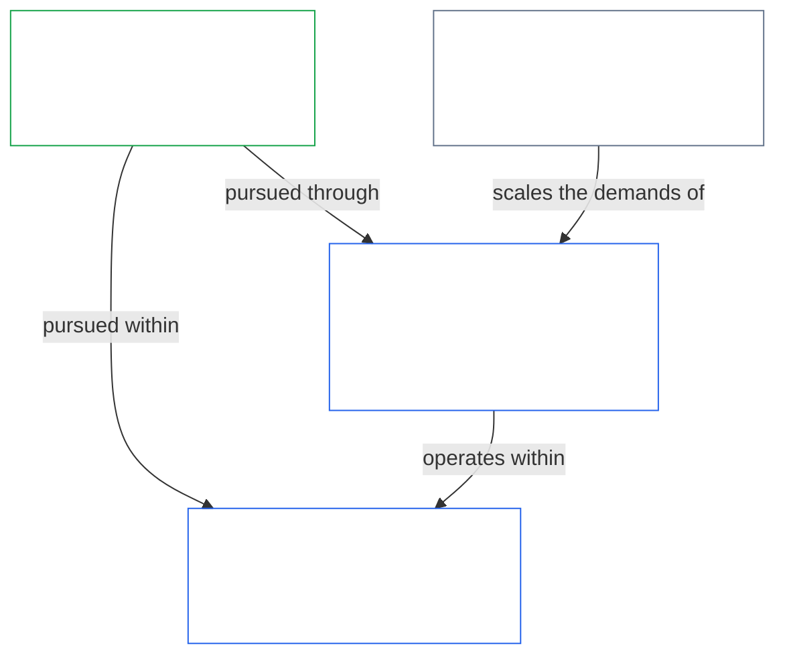
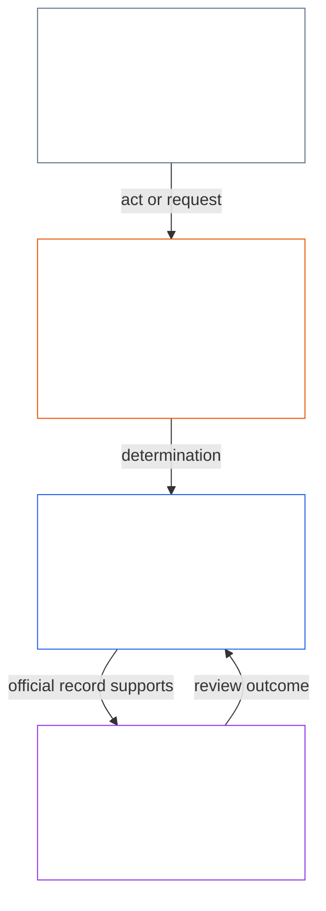
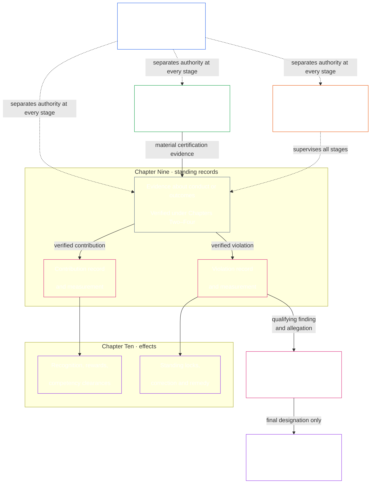
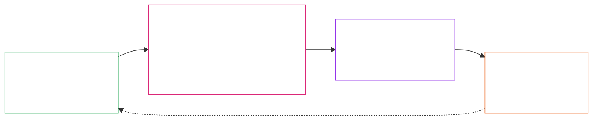

# Print pack (generated, non-binding)

Auto-generated by `make print-pack`. Do not edit by hand. Print this file, or print the source files listed below in order.

Corpus edition: `SC-Corpus-2026.08.09` · effective **2026-08-09**

> **Reader guidance (non-operative).** This pack is process support. It is **not** the Constitution. It **cannot narrow** numbered `core_*` files. Opening or printing it is not [Chapter Sixteen §10](../../core_16_amendment_ratification.md#10-ratification-and-adoption) adoption. It does **not** override local, national, or international law ([Chapter Fifteen §5](../../core_15_expansion_supremacy.md#5-relation-to-applicable-external-law)). The wall sheet is one sentence per Article; the numbered Chapter Six files bind. If this pack and a source file disagree, the source file wins.

Human door: [`implementation/PRINT_PACK.md`](../../implementation/PRINT_PACK.md).

## Contents

- `core_00_preamble.md` — Preamble (binding source)
- `doc_architecture/generated/rights_floor_sheet.md` — Chapter Six one-liners (generated wall sheet; source articles bind)
- `implementation/PROCESS_PIPELINES_READER.md` — Process chain (process support; cannot narrow core)
- `implementation/adoption/easy_entry/E16_worker_not_owner.md` — Sample easy-entry brief (swap for the brief that sounds like your situation)

Full Chapter Six source (not inlined here; too long for a first-hour pack): [part A](../../core_06_rights_part_a.md), [part B](../../core_06_rights_part_b.md), [part C](../../core_06_rights_part_c.md), [part D](../../core_06_rights_part_d.md).

---

## Pack part: Preamble (binding source)

Source file: `core_00_preamble.md`

# PREAMBLE / FOUNDATIONAL REQUIREMENTS

<strong>Corpus placement (non-operative): file structure and reading rules</strong>

> The following content is **reader guidance only**. It does not add, remove, or narrow binding obligations elsewhere in this file or in other chapters.
>
> This file is **part of the Sentient Constitution** and is **binding only together** with the other numbered `core_*` files read as one instrument. It contains the **Preamble** (foundational requirements). Reading order and edition metadata are maintained in [README.md](../../README.md).
>
> **Next:** [core_01_a_values_principles.md](../../core_01_a_values_principles.md) (Chapter One, Part A — Values Principles).

 

*In plain terms: this opening names the problem this Constitution exists to fix — systems that harm, hide, or lock out those they affect — and says governance must meet a complex world without turning that complexity into a wall. The rest of the instrument is how we replace those failures with accountable, checkable, timely governance.*

Sentient freedom, survival, and wellbeing are inseparable from the systems we create, inhabit, and rely on. As those systems grow in scope, interdependence, and power, so do the risks of irreversible, large-scale harm. Those risks are persistent and materially significant.

A system cannot remain legitimate if it causes preventable suffering, ignores recurring problems, shifts harm onto others without acknowledgment, or excludes sentients from the systems that shape their lives.

Shared systems sit in a world that is already complex and becoming more so. Healthy, durable governance has to meet that complexity — measure it, model it, and answer for it — rather than flatten it into convenient proxies. That does not mean burying affected sentients in unusable process: duties, records, and explanations must stay within what sentients can actually learn, contest, and use, and how demanding they are scales with each actor's role and with the impact, dependence, and risk at stake. Distributed understanding keeps that real. Complexity that does no constitutional work is refused: face the world's complexity, and do not outsource it into a wall.

How systems are designed, tested, and run must support survival, wellbeing, dignity, honesty, and lasting stability. This Constitution intends to eliminate the harms described above by building better systems, and to replace the systems that created them with institutions that are more accountable, robust, and responsive to the real needs of all sentients. It begins that work by offering a better model for how we can work together justly, effectively, and sustainably.

### 1. The Model

*In plain terms: four duties — participation, oversight, accountability, and timeliness — scale with how much impact, dependence, and risk are on the line, and they serve two aims together: Flourishing and Continuity, inside a Rights Floor that does not move.*

Critical systems that support sentient life — whether biologically or materially — must be governed and operated under four duties, together called the [**Constitutional Tetrad**](../../core_00_preamble.md#constitutional-tetrad), which set the general standard those systems must meet. Their strength depends on the [**material stake**](../../core_00_preamble.md#material-stake): how much impact, dependence, and risk are involved. The higher the stake, the stronger the duties must be.

<strong>Reader guidance (non-operative): section 1 model chart</strong>

> The following content is **reader guidance only**. It does not add, remove, or narrow binding obligations elsewhere in this file or in other chapters.
>
> **Reader map (non-operative):** This chart summarizes the relationships in this section. It adds no definitions or duties, establishes no precedence, and cannot replace the source text.

 

- **participation** — affected sentients get a real voice, fair representation, a fair chance to challenge decisions, and access to consequential roles in proportion to the stake
- **oversight** — responsible actors watch, check, verify, and keep records so problems can be found; independent reviewers can constrain bad choices
- **accountability** — responsibility traces to the right actors; those actors must answer for their choices; those harmed get redress; bad outcomes trigger real correction
- **timeliness** — problems must be detected, challenged, resolved, and fixed within time limits that match the stake. Delay is not legitimate governance when it effectively erases rights, remedies, or the chance of repair

Those four duties serve the [**Two Constitutional Aims**](../../core_00_preamble.md#two-constitutional-aims) — what shared systems must optimize for:

- **Flourishing** — sentient wellbeing sustained through truth, safety, trustworthiness, and meaningful agency
- **Continuity** — long-horizon stability, sustainability, resilience, and ecological wellbeing

Those aims must be pursued together, always within the Constitution's non-negotiable principle constraints and Rights Floor. The [**Constitutional Tetrad**](../../core_00_preamble.md#constitutional-tetrad) governs how that pursuit remains legitimate, with all four duties scaled to [**material stake**](../../core_00_preamble.md#material-stake). Binding definitions for the Tetrad legs and aims live in Chapter Five: [Participation](../../core_05_apex_participation_leg.md#participation-constitutional), [Oversight](../../core_05_apex_oversight_leg.md#oversight-constitutional), [Accountability](../../core_05_apex_accountability_leg.md#accountability), [Timeliness](../../core_05_apex_timeliness_leg.md#timeliness-constitutional), [Flourishing](../../core_05_apex_flourishing_aim.md#flourishing-constitutional), and [Continuity](../../core_05_apex_continuity_aim.md#continuity-aim-constitutional).

### 2. Measurements Overview

*In plain terms: shared systems cannot run on guesswork or vanity metrics. Measure whether sentients actually flourish and endure. Scale review with impact, dependence, and risk.*

Shared systems cannot work well without measurement. Food, shelter, care, infrastructure, and governance all operate in a complex, changing world — one too complex for guesswork or convenient numbers alone.

Ongoing measurement must focus on what matters most for sentient survival and wellbeing. The question is whether the systems we depend on truly support [**Flourishing**](../../core_00_preamble.md#flourishing) and [**Continuity**](../../core_00_preamble.md#continuity) over time. That review scales to [**material stake**](../../core_00_preamble.md#material-stake) — how much impact, dependence, and risk are involved.

Measurement under this Constitution asks two practical questions: do systems actually help sentients flourish and endure, or do they produce harm, delay, exclusion, waste, hidden dependency, or false trust? Measurements are not scores for their own sake — they are tools for ensuring sustainable, resilient, and compassionate outcomes that align with sentient wellbeing and Earth's ecological health. That duty takes binding form through the [Two Constitutional Aims](../../core_00_preamble.md#two-constitutional-aims): **Flourishing** and **Continuity**.

Measurements must remain traceable to those aims and to the rights protections established in this Constitution. Raw throughput, utilization, headcount, revenue, latency, and other convenient proxies cannot substitute for constitutional performance. This prohibition applies wherever [Proxy Divergence](../../core_05_band_oversight.md#proxy-divergence) is foreseeable.

The overview below lists the measurement **categories**, mapping each to the [Two Constitutional Aims](../../core_00_preamble.md#two-constitutional-aims) and the [Constitutional Tetrad](../../core_00_preamble.md#constitutional-tetrad). Each category poses one plain-language question and names its **subcategories**, and links to its **Chapter Five measurement-family home**, where the family table, constitutional use, and definition routing live. Each subcategory links to its canonical Chapter Five definition.

**Materiality** is not a separate measurement category. It sets how strongly every category applies, based on [**material stake**](../../core_00_preamble.md#material-stake) — how much impact, dependence, and risk are involved. **Constitutional performance** is cross-cutting and instrumental to both aims. Use the [Chapter Five measurement crosswalk](../../core_05__definitions_home.md#chapter-five-measurement-crosswalk) to trace each category to its canonical home.

| Category | Plain question | Subcategories |
|---|---|---|
| **[Flourishing](../../core_05_apex_flourishing_aim.md#flourishing-measurement-family)** | Are sentients actually sustained in life, safety, and access to essentials? | [Wellbeing](../../core_05_band_continuity.md#wellbeing) · [Safety, harm, and risk](../../core_05_band_continuity.md#safety-constraint) · [Survival-floor access](../../core_05_band_continuity.md#bodily-maintenance-access-constitutional) |
| **[Continuity](../../core_05_apex_continuity_aim.md#continuity-measurement-family)** | Can sentients and systems endure — ecologically, dependably, and across failure? | [Ecological footprint and environmental preconditions](../../core_05_band_continuity.md#ecological-footprint) · [Resilience, reversibility, and systemic risk](../../core_05_band_continuity.md#reversibility-constitutional) · [Dependency and resource flows](../../core_05_band_continuity.md#dependency) · [Cross-system support](../../core_05_band_continuity.md#proportionate-cross-system-support-constitutional) |
| **[Participation](../../core_05_apex_participation_leg.md#participation-measurement-family)** | Can affected sentients take part fairly — voice, access, learning, and privacy? | [Fairness, access, and agency](../../core_05_band_participation.md#substantive-fairness-constitutional) · [Privacy and data stewardship](../../core_05_band_continuity.md#privacy-informational-cluster) |
| **[Oversight](../../core_05_apex_oversight_leg.md#oversight-measurement-family)** | Can sentients see, verify, and rely on what systems represent? | [Truth and epistemic integrity](../../core_05_band_oversight.md#truth-constitutional-constraint) · [Trustworthiness](../../core_05_band_continuity.md#trustworthiness) |
| **[Accountability](../../core_05_apex_accountability_leg.md#accountability-measurement-family)** | Do reward structures, market power, and answerability keep duties real? | [Incentive alignment and proxy integrity](../../core_05_band_integrative.md#incentive-alignment) · [Market structure and contestability](../../core_05_band_accountability.md#market-structure-constitutional) |
| **[Timeliness](../../core_05_apex_timeliness_leg.md#timeliness-measurement-family)** | Are disputes, corrections, and repairs resolved while remedy still matters? | [Timely Resolution](../../core_05_band_accountability.md#timely-resolution-constitutional) · [Anti-delay and resolution-pathway discipline](../../core_05_band_accountability.md#capture-of-resolution-pathways) |
| **[Constitutional performance](../../core_05_band_performance.md#performance-measurement-family)** | Are constitutional outcomes delivered efficiently without pointless waste? | [Constitutional Efficiency](../../core_05_band_continuity.md#constitutional-efficiency) · [Avoidable Burden](../../core_05_band_continuity.md#avoidable-burden) · [Productive Capacity](../../core_05_band_continuity.md#productive-capacity-constitutional) |

These measurement categories show what matters. Standing alone, they do not set every number, funding formula, interface rule, accommodation list, technical metric, or assessment design. They become binding only when a specific chapter or adopted instrument explicitly requires them.

### 3. Governance and Stewardship

*In plain terms: legitimacy needs Safety, Truth, and Trust. It also needs real opportunities to learn how the systems that affect you work and to take consequential roles in maintaining them.*

Durable legitimacy depends on [Safety](../../core_01_a_values_principles.md#31-safety-harm-constraint), [Truth](../../core_01_a_values_principles.md#32-truth-epistemic-integrity-constraint), and [Trust](../../core_01_a_values_principles.md#4-system-stability-enabler-trust-coordination-integrity). It also depends on proportionate recognition of lawful stewardship, truthful cooperation, and bounded aspiration — not solely on sanction and restraint. Chapter One states this recognition dimension in [Recognition, Reinforcement, and Aspiration](../../core_01_a_values_principles.md#22-recognition-reinforcement-and-aspiration).

Distributed understanding and stewardship require regular, proportionate opportunities for sentients to learn how systems that materially affect them operate, and to take consequential roles in maintaining and improving those systems. Together, these opportunities spread competence, repair capacity, and legitimacy broadly across our Constitutional Community to ensure resilience, sustainability, and pro-social innovation. All such opportunities must satisfy Safety, Truth, bounded agency, and the [Avoidable Burden](../../core_05_band_continuity.md#avoidable-burden) and proportionality discipline stated in [Chapter One](../../core_01_b_interaction_interpretation.md#63-minimization-of-avoidable-burden).

#### 3.1 Using Measurements in Governance

*In plain terms: first name the problem and the stake. Then choose the matching measurement category and use shared technical standards — not convenience numbers — as evidence.*

When the Constitution requires concrete measurement rules, **Technical Forum Domains** under [Chapter Twelve](../../core_12_forum.md#42-technical-forum-domains) develop and maintain shared standards for measurement, testing, and reliable evidence. The forum responsible for a dispute then applies those standards when deciding the case under [Chapter Twelve §4.2 (*Technical Forum Domains*)](../../core_12_forum.md#42-shared-standards-and-anti-displacement).

Constitutional stewardship starts by naming the problem and the [**material stake**](../../core_00_preamble.md#material-stake) — the impact, dependence, and risk involved. Next, choose the relevant [**measurement**](../../core_00_preamble.md#2-measurements-overview) category and subcategory from the [overview](../../core_00_preamble.md#2-measurements-overview). Apply the standards above to test real-world effects, not convenience metrics. Require traceable evidence.

#### 3.2 Key Governance Processes

*In plain terms: when the text requires it, first separate the sentients or systems that act, check, record, and hear challenges. Material issues then go through certification, written records of help and harm, correction and remedy, and forum review with clocks. Ordinary disputes use the published challenge path first. These processes test authorized governance; they do not create governing authority by themselves.*

When Chapter Six, [Chapter Eight](../../core_08_a_system_alignment_certification_evaluation.md#chapter-eight-system-alignment-certification), an incorporated instrument, or another constitutional provision expressly requires it, take the material constitutional issue into one or more of the paths below. The [Key Practical Process Pipelines](../../core_00_preamble.md#6-key-practical-process-pipelines) turn measurement into records, certification, verified inputs, classification, forum supervision, correction, and timely remedy. Through these pipelines, authorized governance is tested, contested, and repaired in practice — but the pipelines do not authorize governance by themselves; they make it reviewable, contestable, correctable, and timely. [Section 6.2](../../core_00_preamble.md#62-how-the-full-chain-fits-together) states the full pipeline.

- **Functional independence and segregation of duties** ([Chapter Seven](../../core_07_functional_independence_segregation_of_duties.md#chapter-seven-functional-independence-and-segregation-of-duties)) — before a materially binding act moves, identify and separate the initiating, verify-or-authorize, record, and contest seats under the applicable scaling and independence rules.
- **System alignment certification** ([Chapter Eight](../../core_08_a_system_alignment_certification_evaluation.md#chapter-eight-system-alignment-certification)) — before a high-impact system is trusted at scale, gather and review evidence to determine whether it is constitutionally safe to rely on right now.
- **Standing records** ([Chapter Nine](../../core_09_standing_assessment.md#chapter-nine-compliance-violation-and-standing-model)) — when conduct or harm matters constitutionally, place verified facts in formal contribution or violation case files; rumors and reputation are not enough.
- **Correction and remedy** ([Chapter Ten §4.1 (*Remedy and correction*)](../../core_10_standing_integration.md#41-remedy-and-correction)) — correct the underlying failure and provide proportionate acknowledgment, repair, restoration, or compensation for those harmed.
- **Forum review** ([Chapter Twelve](../../core_12_forum.md#1-purpose-and-role--participation-architecture))
  - Ordinary disputes within already-authorized systems use the published [Stakeholder System Participation](../../core_05_band_participation.md#stakeholder-status-and-weight-cluster) challenge path first.
  - If that path remains contested, is missing or captured, or cannot grant relief, route the dispute by primary stake through supervised forums.
  - Those forums support evidence, lawful transfer, and timely clocks under **Article XXIV-C** (*Timely Resolution and Anti-Delay Floor*).

#### 3.3 Governance Layers

*In plain terms: who may govern is a different question from who has a voice within an already-authorized system. A participation vote or trust score does not grant governing authority. For ordinary disputes, the published participation challenge path is the ordinary first step, but it does not replace independent forum review when it fails.*

Governance under our Constitution serves the [**Constitutional Tetrad**](../../core_00_preamble.md#constitutional-tetrad) through two related but distinct layers:

- The [**Constitutional Contract Layer**](../../core_05_band_integrative.md#constitutional-contract-layer) governs the authorization of governing authority itself — who may govern, by what legitimacy mechanism, and under what scope and durable terms.
- [**Stakeholder System Participation**](../../core_05_band_participation.md#stakeholder-status-and-weight-cluster) governs participation, representation, contestability, and [Due Process](../../core_05_band_accountability.md#due-process-constitutional) within already-authorized systems, institutions, and bounded decision domains. These protections are owed to every sentient materially affected.

These layers may overlap in practice, but even where they overlap, they remain distinct. Stakeholder-level participation in an already-authorized system is not a substitute for constitutional authorization. A published challenge path, participation vote, or trust score does not by itself decide who may govern.

Contestability under the participation layer is the ordinary first step for disputes within already-authorized systems: affected sentients use the published challenge path first. Independent [forum review](../../core_12_forum.md#1-purpose-and-role--participation-architecture) does not replace that path, nor does the path replace forum review when it remains contested, is missing or captured, or cannot grant the needed relief. [Dispute sequencing](../../core_12_forum.md#dispute-sequencing) under Chapter Twelve states when forum routing takes over.

Conversely, constitutional authorization does not erase duties owed under the [Stakeholder System Participation](../../core_05_band_participation.md#stakeholder-status-and-weight-cluster) layer. Those duties remain owed to sentients materially affected by the authorized system, institution, or bounded decision domain, and still include participation, representation, [Contestability](../../core_05_band_accountability.md#contestability), and [Due Process](../../core_05_band_accountability.md#due-process-constitutional).

### 4. Principles, Definitions, and Rights

*In plain terms: Chapters One through Six own values, how words are built and checked, the dictionary, and the Rights Floor; later chapters must respect those homes, not quietly move them.*

Sections **4 through 9** are this Constitution's **constitutional owner register**. Each block names the substantive domain its chapter (or adopted corpus) owns and what it produces. Binding one-line owner claims also appear at each numbered chapter opening. Other layers may point to an owner, but they must not quietly rewrite or relocate it; that non-relocation discipline lives under [Authority Stack and Internal Hierarchy](../../core_05_band_integrative.md#authority-stack).

Chapters **One through Six** supply the values, vocabulary, verification machinery, and Rights Floor that everything later must respect — including [Chapter Seven's functional-independence floor](../../core_00_preamble.md#5-functional-independence-and-segregation-of-duties) in Section 5, the [Key Practical Process Pipelines](../../core_00_preamble.md#6-key-practical-process-pipelines) in Section 6, [process ownership and outputs](../../core_00_preamble.md#7-process-ownership-and-outputs) in Section 7, the governance and change-path chapters in Section 8, and the [Adopted Implementation Corpus](../../core_00_preamble.md#9-adopted-implementation-corpus) in Section 9.

Each summary below states what the chapter owns and what it produces.

**Chapter One — Values, principles, and stewardship**

- **What it owns:** States the Constitution's guiding values and constraints, including:
  - wellbeing, fairness, Safety, Truth, Trust, and bounded freedom;
  - recognition and proportional reward for lawful contribution;
  - conflict resolution among principles; and
  - stewardship duties, including distributed understanding, systemic evaluation, and governance discipline.
- **What it produces:** The interpretive foundation for every later chapter. These are the rules that turn high-level aims into operative requirements when systems, rights, definitions, or process pipelines must be read and applied.

**Chapter Two — Definition structure**

- **What it owns:** Defines how constitutional terms are built through:
  - the Ontological/Measurement/Assessment/Compliance (O/M/A/C) component structure;
  - alignment requirements; and
  - component rules that keep definitions precise and usable across the corpus.
- **What it produces:** A shared grammar for definitions so later chapters do not fall into vague labels, hidden assumptions, or incompatible term shapes.

**Chapter Three — Definition integrity**

- **What it owns:** Guards against:
  - evasion and scope-shifting;
  - redefinition games; and
  - non-compliance tricks that would hollow definitions on paper while defeating them in practice.
- **What it produces:** Anti-evasion discipline and non-compliance orientation metadata — including routing hooks toward standing and misconduct review where evasion is substantiated.

**Chapter Four — Burden, traceability, and verification**

- **What it owns:**
  - puts the proof burden on whoever claims compliance; and
  - requires traceable evidence, observability, and verification that scale to [**material stake**](../../core_00_preamble.md#material-stake) and remain practically challengeable.
- **What it produces:** The verification pipeline that feeds **verified inputs** in [Chapter Nine](../../core_09_standing_assessment.md#chapter-nine-compliance-violation-and-standing-model) and system-alignment evidence in [Chapter Eight](../../core_08_a_system_alignment_certification_evaluation.md#chapter-eight-system-alignment-certification). It does not replace standing measurement itself.

**Chapter Five — Foundational definitions**

- **What it owns:** Supplies:
  - the canonical definition stack: Oversight, Participation, Accountability, Continuity, and Integrative bands;
  - [Authority Stack and Internal Hierarchy](../../core_05_band_integrative.md#authority-stack);
  - [Corpus](../../core_05_band_integrative.md#corpus); and
  - related boundary rules.
- **What it produces:** Precise constitutional vocabulary for interpretation, audit, and adjudication. It is the **definition stack**, not the Rights Floor — binding Rights Floors live in Chapter Six. Owner-domain routing for the instrument as a whole lives in this Preamble register (sections 4–9).

**Chapter Six — Foundational Rights**

- **What it owns:** States the Rights Floor in Articles **I–XXVI**, covering:
  - survival essentials;
  - resource allocation and dependency stewardship;
  - dignity, agency, and participation;
  - challenge and remedy;
  - justice constraints;
  - timeliness under **Article XXIV-C** (*Timely Resolution and Anti-Delay Floor*); and
  - transition rules.
  The four parts organize these protections for planet-first reading.
- **What it produces:** Non-negotiable rights protections and remedy hooks that Chapters Seven through Twelve, forums, governance, and amendment rules must respect and not narrow, bypass, or hollow through procedure or proxy metrics.

### 5. Functional Independence and Segregation of Duties

*In plain terms: before a materially binding act moves, separate who starts it, who checks or authorizes it, who holds the official record, and who reviews a challenge. The roles may scale to the setting, but the same actor and its control line cannot quietly occupy the checks on its own act.*

- **What it owns:** The cross-process floor requiring every [Materially Binding Act](../../core_05_band_accountability.md#materially-binding-act) to assign four functions separately:
  - initiation;
  - verification or authorization;
  - official record custody; and
  - review of challenges.

  It also governs:

  - the universal minimum contents of each [Materially Binding Act Record](../../core_05_band_accountability.md#materially-binding-act-record);
  - independence from the actor's [Material Control Line](../../core_05_band_accountability.md#material-control-line);
  - published placement and substitutes;
  - proportionate merged hosting and emergency bounds; and
  - attributable handoffs and wrong-seat routing.
- **What it produces:** A reusable four-seat and Act Record architecture. Every later certification, standing, forum, governance, and incorporated implementation process must instantiate it before its result can count as independently checked, reliably recorded, and genuinely contestable.

#### 5.1 Four-seat separation map

Each **Materially Binding Act** must observe these same-act safeguards:

- The initiating seat must not verify or authorize its own act.
- The verify-or-authorize seat must not hold official record custody for the act.
- The verify-or-authorize seat must not review a challenge to the act.
- The verify-or-authorize and challenge-review seats must be outside the initiating seat's [Material Control Line](../../core_05_band_accountability.md#material-control-line).

<strong>Reader guidance (non-operative): four-seat separation map</strong>

> This map shows the four functions and a typical trace of an act and its record. It does not add a fifth seat, prescribe a universal sequence, or alter Chapter Seven's rules on independence, proportionate merged hosting, emergency action, or challenge routing.

 

### 6. Key Practical Process Pipelines

*In plain terms: Chapters Eight through Twelve apply Chapter Seven's separation-of-duties floor in one chain: certify the system, measure help and harm on two separate tracks, apply real effects and remedy, and prevent a forum from being the sole final home for a claim against itself. The chain keeps constitutional duties real in daily life.*

[Chapter Seven](../../core_07_functional_independence_segregation_of_duties.md#chapter-seven-functional-independence-and-segregation-of-duties) supplies the independence floor that makes every act in this chain validly checkable. It requires the functions of initiation, verification or authorization, official record custody, and challenge review to be assigned and kept distinct under the applicable scaling and independence rules. Chapters Eight through Twelve then apply that architecture in sequence:

- **Chapter Eight** uses independent verification to decide whether a materially impactful system is aligned enough to recognize, rely on, deploy, or release from conditions within a stated scope and time window.
- **Chapter Nine** takes the verified facts and records them on separate Contribution and Violation axes. Verified contribution toward flourishing does not offset, cancel, or reduce a separately verified harm or accountability failure; each remains recorded and subject to its own consequences.
- **Chapter Ten** converts those classifications into proportionate standing effects, including competency clearances and recognition on the contribution track and standing locks, correction, and remedy on the violation track.
- **Chapter Eleven** applies only after Chapter Nine has assigned a high-level violation. It decides whether the conduct independently meets the criteria for a final anti-constitutional-misconduct designation, after due-process safeguards.
- **Chapter Twelve** supervises routing, evidence, transfer, forum independence, and timely resolution so the resulting records and effects can be challenged, corrected, and enforced without allowing a captured forum to be the sole final judge of its own conduct.

The chapter summaries in Sections 4 through 9 make the division of labor explicit. Each summary identifies the chapter that owns the work and the output that stage must produce for the next stage. The stages are connected, but their roles do not collapse into one another:

- **Certification** produces verified evidence about whether a system is aligned within a stated scope and time window.
- **Standing measurement** uses verified inputs to classify conduct and harm on separate tracks.
- **Standing integration** turns those classifications into proportionate effects, including recognition, competency clearances, correction, standing locks, and remedy.
- **Misconduct review** answers its distinct question: whether a qualifying violation also warrants a final anti-constitutional-misconduct designation.
- **Forum supervision** controls routing, evidence, transfer, challenge, and remedy so the records and decisions can be reviewed and corrected in time.

#### 6.1 Process map

The pipeline remains one constitutional process because each stage hands forward a defined, reviewable result. It remains constitutionally bounded because:

- the [**Constitutional Tetrad**](../../core_00_preamble.md#constitutional-tetrad) requires every stage to remain participatory, overseen, accountable, and timely;
- the [**Two Constitutional Aims**](../../core_00_preamble.md#two-constitutional-aims) require the process to serve **Flourishing** and **Continuity** together; and
- the Rights Floors prohibit every stage from narrowing, bypassing, or hollowing out non-negotiable protections.

Together, these rules turn constitutional duties into records and decisions that sentients can check, challenge, repair, and rely on in practice, not only on paper.

#### 6.2 How the full chain fits together

*In plain terms: first separate the seats. Then follow the path from system check to remedy, with forums supervising the dispute and standing steps throughout.*

1. **Separate the seats for every materially binding act** ([Chapter Seven](../../core_07_functional_independence_segregation_of_duties.md#2-four-seat-constitutional-floor)) — identify who initiates, who verifies or authorizes, who holds the official record, and who hears a challenge. Apply the prohibited combinations, independence rules, and published substitute route before treating the act as validly checked.
2. **Certify the system when impact is serious enough** ([Chapter Eight](../../core_08_a_system_alignment_certification_evaluation.md#chapter-eight-system-alignment-certification)) — before a high-impact system is trusted at scale, obtain a contestable alignment record that answers whether it is constitutionally safe to rely on *right now*.
3. **Measure standing on separate tracks** ([Chapter Nine](../../core_09_standing_assessment.md#chapter-nine-compliance-violation-and-standing-model)) — when good conduct or harm is serious enough to matter constitutionally, Chapter Nine must open formal case files, admit only **verified inputs** (including system-alignment certification evidence from Chapter Eight when that evidence is material), and classify what was verified. Rumors, reputations, and dispute stories are not enough.
   - **Contribution nature:** Open a **contribution standing record** — a bounded, challengeable case file for verified help toward flourishing — and classify **contribution nature** on the Contribution Axis.
   - **Violation nature:** Open a **violation standing record** — a bounded, challengeable case file for verified harm and accountability failures — and classify **violation nature** on the Violation Axis. Good and harm never fold into one net score; linked records cross-reference but stay separate.
4. **Apply standing effects on each track** ([Chapter Ten](../../core_10_standing_integration.md#chapter-ten-standing-effects-and-integration)) — verified contribution may grant competency clearance and must support proportionate recognition and material rewards; verified violation may trigger standing locks, correction, and [remedy for those harmed](../../core_10_standing_integration.md#41-remedy-and-correction).
5. **Conduct anti-constitutional designation review** ([Chapter Eleven](../../core_11_a_misconduct_designation.md#chapter-eleven-anti-constitutional-misconduct)) — if a highest-impact violation finding may also satisfy anti-constitutional criteria, Chapter Eleven must decide whether the corresponding designation attaches. Designation does not change how serious Chapter Nine already found the harm to be. Ordinary Chapter Ten effects continue in parallel until a final designation triggers the Anti-Constitutional Trust Lock.
6. **Route disputes and keep remedy timely** ([Chapter Twelve](../../core_12_forum.md#1-purpose-and-role--participation-architecture)) — forums must supervise how cases move, which track handles them, and whether clocks under **Article XXIV-C** (*Timely Resolution and Anti-Delay Floor*) are met so remedy does not die in delay. Ordinary disputes follow [Dispute sequencing](../../core_12_forum.md#dispute-sequencing). Forums must also classify disputes into five [materiality tiers](../../core_12_forum.md#6-timely-resolution-materiality-tiers-and-anti-delay-discipline) (A/B/C/L/P) mirroring the system classification alphabet — from survival-critical urgency through private/contained matters. Integrity-family default routing applies when final Chapter Eleven designation is the primary stake.

Each stage above links to its owner chapter, so the chain can be walked from here — including Chapter Eight’s potential verified inputs into standing measurement.

### 7. Process Ownership and Outputs

*In plain terms: the process map and [how the full chain fits together](../../core_00_preamble.md#62-how-the-full-chain-fits-together) show the chain; this section names the owner and output of each stage, so no stage quietly takes over another's job.*

Each step below states what the chapter owns and what it produces, filling in the owners named in [§6.2](../../core_00_preamble.md#62-how-the-full-chain-fits-together).

**Chapter Eight — [System alignment certification](../../core_08_a_system_alignment_certification_evaluation.md#chapter-eight-system-alignment-certification)**

- **What it owns:** Ensures systems with material impact stay constitutionally aligned.
  - Before a system that materially affects sentients is recognized or relied on at scale, evidence must be gathered and reviewed under forum supervision.
  - The review must cover:
    - whether the system respects survival essentials;
    - **Article IV** (*Resource Allocation, Dependencies, and Ecosystem Funding*) resource allocation and dependency stewardship — including [Proportionate Cross-System Contribution](../../core_05_band_continuity.md#proportionate-cross-system-support-constitutional) where shared-infrastructure reliance is materially at issue;
    - safety;
    - participation; and
    - other constitutional floors.
  - Sentients with standing must be able to challenge the result.
  - High-risk systems must be recertified on a regular schedule. Certification is never permanent.
- **What it produces:** A **system alignment certification record** — a bounded, contestable answer to whether that system is aligned enough to recognize, continue relying on, deploy, or release from conditions *right now*, within a stated scope and time window.

**Chapter Nine — [Standing measurement](../../core_09_standing_assessment.md#chapter-nine-compliance-violation-and-standing-model)**

- **What it owns:** When conduct matters constitutionally, rumors and reputations are not enough — verified facts enter **standing records**. **Contribution** (help toward flourishing) and **violation** (accountability failures and harm) are measured on **separate axes**: verified good conduct does not erase verified harm, and the two are never folded into one net score.
- **What it produces:** Classified **standing records** on the Contribution Axis and Violation Axis. The records must be based only on **verified inputs** and forum-supervised findings; informal scoring and dispute narratives cannot substitute for classification.

**Chapter Ten — [Standing integration and effects](../../core_10_standing_integration.md#chapter-ten-standing-effects-and-integration)**

- **What it owns:** Integrates verified classifications into real-world **standing effects** on separate tracks, scaled to [**material stake**](../../core_00_preamble.md#material-stake). It never folds contribution and violation into one net score, and never hollows out participation, oversight, accountability, or timeliness.
  - **Contribution track:** A verified positive classification must produce practical upside, including:
    - [**Competency clearances**](../../core_10_standing_integration.md#62-competency-bars-and-clearances) that may open trust-sensitive roles, delegated authority, oversight eligibility, and progressively consequential stewardship when competence is demonstrated against the published competency bar and no applicable [standing lock](../../core_10_standing_integration.md#42-prevention--general-standing-locks) blocks the named pathway
    - proportionate recognition and **material rewards** for lawful stewardship and cooperation as [Chapter One](../../core_01_a_values_principles.md#22-recognition-reinforcement-and-aspiration) requires; and
    - benefits that are real, evidence-backed, and open to challenge — not empty praise.
  - **Violation track:** A verified violation finding must produce practical consequences, including:
    - **Standing locks**, role limits, remediation orders, [remedy for those harmed](../../core_10_standing_integration.md#41-remedy-and-correction), supplemental descriptors, and enforcement hooks
    - restrictions proportionate to the severity of what was verified;
    - live treatment of unresolved violations;
    - proportionate paths to restore standing for those who demonstrate authentic restitution; and
    - no waiver of a violation-side standing lock by a contribution-side competency clearance.
- **What it produces:** Separate, scaled standing effects on the Contribution and Violation tracks — competency clearances and material rewards on one side; standing locks, correction, and remedy on the other — neither folded into a single score.

**Chapter Eleven — [Anti-constitutional misconduct guardrail](../../core_11_a_misconduct_designation.md#chapter-eleven-anti-constitutional-misconduct)**

- **What it owns:** Handles only the most serious verified violations — conduct that may have captured or hollowed out constitutional duties at scale. When Chapter Nine has already recorded a highest-impact violation finding, and anti-constitutional misconduct is materially alleged, this chapter runs designation review as a Chapter Ten gateway track in parallel with ordinary Chapter Ten standing effects.
- **What it produces:** A final anti-constitutional-misconduct designation — or rejection — for that existing highest-impact finding, but only after the required criteria and due-process safeguards are met. Chapter Nine still measures how serious the harm was. Only a final designation triggers the Chapter Ten **Anti-Constitutional Trust Lock**.

**Chapter Twelve — [Forum supervision and routing](../../core_12_forum.md#chapter-twelve-forums-and-jurisdiction)**

- **What it owns:** Supervises how disputes and certification matters actually move.
  - [Dispute sequencing](../../core_12_forum.md#dispute-sequencing) from the published Stakeholder System Participation challenge path to forum routing;
  - which forum family handles each matter and where a case ordinarily starts;
  - how evidence is supported;
  - how matters transfer or consolidate;
  - how anti-self-judging rules prevent captured forums from being the sole final home; and
  - how clocks under **Article XXIV-C** (*Timely Resolution and Anti-Delay Floor*) prevent matters from remaining unresolved until remedy no longer matters.
- **What it produces:** **Verified findings** that may open or update standing records, plus lawful routing toward remedy and [timely resolution](../../core_05_band_accountability.md#timely-resolution-constitutional). Forums supervise the pipeline; they do not replace Chapter Nine standing measurement.

### 8. Governance, Change, and Incorporation

*In plain terms: Chapters Thirteen through Seventeen close the instrument: who may govern, how the text may change without rolling back protections, how it relates to other law, and how adopted how-to files stay bound to this source.*

Chapters **Thirteen through Seventeen** close the instrument. Together they complete the [constitutional owner register](../../core_00_preamble.md#4-principles-definitions-and-rights) for governance, change validity, and incorporation: who may govern legitimately, how the Constitution may lawfully change, and how adopted implementation text stays bound to constitutional source without silent drift.

Each summary below states what the chapter owns and what it produces.

**Chapter Thirteen — Constitutional contract, legitimacy, and stewardship** ([`core_13_governance.md`](../../core_13_governance.md#chapter-thirteen-constitutional-contract-legitimacy-authorization-and-stewardship))

- **What it owns:** The [**Constitutional Contract Layer**](../../core_05_band_integrative.md#constitutional-contract-layer) — who may govern, by what legitimacy mechanism, under what scope and durable terms, and what stewardship character must be maintained.
- **What it produces:** Authorization and legitimacy requirements distinct from [**Stakeholder System Participation**](../../core_05_band_participation.md#stakeholder-status-and-weight-cluster) in already-authorized systems. These are rules for governing authority itself, not just for participation inside it.

**Chapter Fourteen — Non-regression** ([`core_14_non_regression.md`](../../core_14_non_regression.md#chapter-fourteen-non-regression-and-substantive-amendment-validity))

- **What it owns:** The substantive floor against regressive change. Amendments and workarounds cannot roll back core protections, hollow the Tetrad below material stake, or disguise regression as technical cleanup.
- **What it produces:** The **first constitutional guardrail** on any proposed change: if a change would weaken core protections in practice, it is not valid — even when the procedure looks fine. Suspected workarounds or disguised rollbacks are stopped, or sent to the proper review paths, instead of slipping through quietly.

**Chapter Fifteen — Supremacy and external orders** ([`core_15_expansion_supremacy.md`](../../core_15_expansion_supremacy.md#chapter-fifteen-expansion-supremacy-and-external-legal-orders))

- **What it owns:** How this Constitution relates to other norms: expansion of protection where lawful, supremacy within its scope, non-displacement of applicable external law of its own force, and disciplined interaction with external legal orders without silent subordination or capture.
- **What it produces:** Hierarchy and conflict-order rules. Publication or use is not treated as repealing applicable external law, and adopters cannot treat incorporated procedure, weaker external norms, or convenience metrics as overriding Sentient Constitution meaning within valid adoption scope.

**Chapter Sixteen — Amendment, ratification, and adoption** ([`core_16_amendment_ratification.md`](../../core_16_amendment_ratification.md#chapter-sixteen-amendment-ratification-and-procedural-validity))

- **What it owns:** How the instrument may lawfully change — amendment procedure, ratification, and adoption — plus the **procedural guardrails** that follow Chapter Fourteen's substantive one: changes must be published openly, traceable to authoritative custody, and remain meaningfully contestable with independent review where required.
- **What it produces:** A complete lawful change path. Only amendments and adoptions that clear both the **non-regression guardrail** and the **procedural guardrails** count as valid constitutional updates.

**Chapter Seventeen — Incorporation bridge** ([`core_17_incorporation.md`](../../core_17_incorporation.md))

- **What it owns:** Which implementation files count as binding incorporated text when adopted. It pins editions, maintains custody chains, and forbids silent drift between constitutional source and operational detail.
- **What it produces:** A single incorporation boundary: designated implementation text binds when adopted, but adopted corpora implement the Constitution without becoming a second source that narrows it. [Section 9](../../core_00_preamble.md#9-adopted-implementation-corpus) summarizes those corpora at a high level.

### 9. Adopted Implementation Corpus

*In plain terms: four adopted corpora (joint structure, systems, institutions, and forum operations) spell out how to carry out what the chapters already require; they bind when validly adopted, and they may not shrink those duties.*

Beyond the numbered `core_*` chapters, four adopted corpora complete the [constitutional owner register](../../core_00_preamble.md#4-principles-definitions-and-rights) for adopted **implementation text** — operational detail that makes constitutional duties runnable in practice:

- **[corpus_joint_structure](../../corpus_joint_structure.md)** — cross-file routing, shared operational terms, and joint structure when systems, institutions, and forums must be read together on the same facts.
- **[corpus_systems](../../corpus_systems.md)** — system classification, design and deployment protocols, information handling, and critical-stewardship mechanics.
- **[corpus_institutions](../../corpus_institutions.md)** — institutional formation, governance, oversight, proportionality, and dissolution discipline.
- **[corpus_forum](../../corpus_forum.md)** — forum operations: panel formation, recusal, review lanes, routing detail, and forensic support.

When an adopter validly incorporates them under [Chapter Seventeen](../../core_17_incorporation.md), these files bind as implementation text within the adoption scope. Sentient Constitution meaning still controls — they **implement, not narrow**, the chapters above. Edition pinning, custody chains, and the no-silent-drift rule keep adopted text traceable to what was actually ratified. The canonical list and boundary rules live in [Chapter Five — Corpus](../../core_05_band_integrative.md#corpus).

Principles, definitions, rights, process pipelines, governance, amendment rules, and incorporated implementation must be read together to preserve the Constitution's protective purpose.

---

**Previous file:** [README.md](../../README.md)

**Next file:** [core_01_a_values_principles.md](../../core_01_a_values_principles.md)

---

## Pack part: Chapter Six one-liners (generated wall sheet; source articles bind)

Source file: `doc_architecture/generated/rights_floor_sheet.md`

# Rights Floor wall sheet (generated, non-binding)

Auto-generated by `make reader-accessibility` from Chapter Six Article headings. Do not edit by hand.

Corpus edition: `SC-Corpus-2026.08.09` · effective **2026-08-09**

> **Reader guidance (non-operative).** One sentence per Article from the source *In plain terms* gloss, plus one link to the authentic span. This page copies **nothing else**. It cannot add, remove, or narrow obligations. Where a gloss and the source differ, the source binds ([Chapter Fifteen](../../core_15_expansion_supremacy.md); [README — Binding vs support](../../README.md#binding-vs-support)).

Coverage: **126** of **126** Article headings carry a gloss.

| Article | In plain terms | Source |
|---|---|---|
| Article I: Environmental Survival | **Article I** (*Environmental Survival*) is the planet-first Rights Floor — Earth's life-support systems must hold so **Flourishing** and **Continuity** remain possible for every sentient, and later governance cannot shrink that floor through certification, classification, or implementation choices. | [Source](../../core_06_rights_part_a.md#article-i-environmental-survival) |
| Article I-A: Environmental Preconditions and Ecological Integrity | the planet's life-support systems must be protected as a matter of their own survival, not only because sentients need them. Animals get a basic cruelty and welfare floor. Creatures that show strong communication or cognition get stronger habitat and health protections. And when it is unclear whether something counts as sentient, it gets the benefit of the doubt — full Chapter Six protection while the question is fairly resolved. | [Source](../../core_06_rights_part_a.md#article-i-a-environmental-preconditions-and-ecological-integrity) |
| Article I-B: Ecological Footprint and Transparency | when a rule calls for it, the environmental cost of an activity, system, product, or service should be counted honestly and reported openly. That includes costs that come before it (such as mining and manufacturing) and after it (such as use and disposal). The goal is numbers that others can compare and check. This subsection gives the shared words and honesty standards for that work. It does not, by itself, make anyone cut their footprint. Required cuts or limits come from other rules. | [Source](../../core_06_rights_part_a.md#article-i-b-ecological-footprint-and-transparency) |
| Article I-C: Intergenerational Responsibility | decisions today must not load unfair, irreversible, or unaccountable harm on those not represented — including future sentients and the environmental preconditions they will inherit. | [Source](../../core_06_rights_part_a.md#article-i-c-intergenerational-responsibility) |
| Article I-D: Existential Risk and Ecological Recovery Capacity | when a system or decision could plausibly threaten sentient survival or ecological recovery capacity, regulators must apply highest scrutiny — even if the danger is small, slow, or contested. | [Source](../../core_06_rights_part_a.md#article-i-d-existential-risk-and-recovery-capacity) |
| Article II: Material Stewardship and Durable-Use Integrity | **Article II** (*Material Stewardship and Durable-Use Integrity*) is the material-stewardship Rights Floor. Durable and network-dependent products must be designed, described, and supported honestly. That protects **Flourishing** from misleading longevity claims and blocked repair paths, and **Continuity** from avoidable premature discard and hidden lifecycle burdens. | [Source](../../core_06_rights_part_a.md#article-ii-material-stewardship-and-durable-use-integrity) |
| Article II-A: Material Stewardship and Lifecycle Honesty | durable goods must be designed and described honestly. Buyers must not be pushed into avoidable replacement or misled about how long a product will last. | [Source](../../core_06_rights_part_a.md#article-ii-a-material-stewardship-and-lifecycle-honesty) |
| Article II-B: Repair, Maintenance, and Independent Servicing | owners and independent repair shops must be able to fix products they own. They need real access to manuals, tools, parts, and honest diagnostics. | [Source](../../core_06_rights_part_a.md#article-ii-b-repair-maintenance-and-independent-servicing) |
| Article II-C: Designed Obsolescence and Incentive Discipline | you may not deliberately shorten a product's useful life. Nor may you use software updates mainly to push new purchases when the foreseeable effect is to pressure **sentients** to discard or replace goods that could still reasonably serve them. | [Source](../../core_06_rights_part_a.md#article-ii-c-designed-obsolescence-and-incentive-discipline) |
| Article II-D: Post-Sale Access and Subscription Integrity | a feature bought outright cannot be quietly turned into a subscription. Any relevant operator dependency — including infrastructure, software, and services — must be disclosed up front. | [Source](../../core_06_rights_part_a.md#article-ii-d-post-sale-access-and-subscription-integrity) |
| Article II-E: Info-Sphere Dependency, Continuity, and Operator Non-Viability | when a product needs the operator's servers to work, the operator must say so up front. The operator must not trap continuity-critical data in forms that cannot be exported, except where confidentiality truly requires it. The operator must plan for service shutdown and cannot let bankruptcy or a sale erase those continuity duties. | [Source](../../core_06_rights_part_a.md#article-ii-e-info-sphere-dependency-continuity-and-operator-non-viability) |
| Article III: Survival and Equal Educational Access | **Article III** (*Survival and Equal Educational Access*) is the personal survival and access Rights Floor — sentients must retain access to survival essentials, equal educational opportunity, bodily-maintenance care, and minimum labor and economic protections so **Flourishing** is not defeated by deprivation or gatekeeping, and **Continuity** is not defeated by unstable, regressive, or commodified delivery of what they need to exist and participate. | [Source](../../core_06_rights_part_a.md#article-iii-survival-and-equal-educational-access) |
| Article III-A: Survival | every sentient must have what they need to keep existing: food and water or the equivalent for their substrate, a stable home or operating environment they cannot be quietly priced or evicted out of, and meaningful access to communications. | [Source](../../core_06_rights_part_a.md#article-iii-a-survival) |
| Article III-B: Equal Educational Access | no one may be locked out of education because of disability, other protected-characteristic grounds, or arbitrary gates — and schools and learning systems must provide the accessibility and support disabled sentients need to participate on equal terms. | [Source](../../core_06_rights_part_a.md#article-iii-b-equal-educational-access) |
| Article III-C: Bodily-Maintenance and Healthcare Access | every sentient has the right to the care needed to keep their body or substrate functioning, and gating mechanisms cannot be used to quietly defeat that right. | [Source](../../core_06_rights_part_a.md#article-iii-c-bodily-maintenance-and-healthcare-access) |
| Article III-D: Labor and Economic Floor | anyone who works — in any form, on any substrate — has rights to fair pay, the freedom to organize with others, safe conditions, and real time off. None of those can be defeated by classification tricks, market structure, or substrate-class arguments. | [Source](../../core_06_rights_part_a.md#article-iii-d-labor-and-economic-floor) |
| Article IV: Resource Allocation, Dependencies, and Ecosystem Funding | **Article IV** (*Resource Allocation, Dependencies, and Ecosystem Funding*) is the shared-resources Rights Floor — resource flows among interdependent systems must stay visible, fair, and sustainable so **Flourishing** is not defeated by hidden extraction or dependency capture, and **Continuity** is not defeated by persistent imbalance, opaque routing, or underfunding of shared infrastructure. | [Source](../../core_06_rights_part_a.md#article-iv-resource-allocation-dependencies-and-ecosystem-funding) |
| Article IV-A: Dependency Mapping and Resource-Flow Transparency | systems must keep an honest, up-to-date picture of what they rely on, what flows in and out, and where relationships are one-sided or opaque when that matters—so funders, auditors, and affected parties can see who bears the costs and who captures the benefits. | [Source](../../core_06_rights_part_a.md#article-iv-a-dependency-mapping-and-resource-flow-transparency) |
| Article IV-B: Cross-System Fairness and Sustainability | split shared money and capacity with attention to who is truly dependent, who has real alternatives, environmental burden, and whether use can last—not mainly to whoever wins in the short run. Heavy users of shared foundations must not keep pulling value out without [Proportionate Cross-System Contribution](../../core_05_band_continuity.md#proportionate-cross-system-support-constitutional). When arrangements concentrate wealth, power, control, or opportunity in ways that predictably harm others' wellbeing, agency, dignity, or ecological integrity, Chapter One non-concentration rules and adopter-tunable thresholds add further scrutiny. That scrutiny is extra; it does not replace dependency mapping or excuse neglect of cross-system fairness. | [Source](../../core_06_rights_part_a.md#article-iv-b-cross-system-fairness-and-sustainability) |
| Article V: Equal Basic Rights | **Article V** (*Equal Basic Rights*) is the equal-standing Rights Floor — dignity, nondiscrimination, inclusion, conscience, sentience-status fairness, accessibility, and expression must hold for every sentient before systems may rank, gate, exclude, or load disparate burdens on them. | [Source](../../core_06_rights_part_b.md#article-v-equal-basic-rights) |
| Article V-A: Dignity and Equal Moral Standing | every sentient is equal in dignity and standing — origin, form, capability, function, association, or status cannot ground a lesser tier. | [Source](../../core_06_rights_part_b.md#article-v-a-dignity-and-equal-moral-standing) |
| Article V-B: Nondiscrimination | systems may not load burdens or harms onto sentients based on protected characteristics — including language, culture, and heritage — or on proxies and arbitrary groupings that do the same work. | [Source](../../core_06_rights_part_b.md#article-v-b-nondiscrimination) |
| Article V-C: Full Inclusion and Equality in Adjudication and Operations | forums, administrators, and enforcement processes must include every sentient on equal terms — efficiency or throughput is not an excuse for exclusion or discriminatory outcomes. | [Source](../../core_06_rights_part_b.md#article-v-c-full-inclusion-and-equality-in-adjudication-and-operations) |
| Article V-D: Freedom of conscience, religion, and comparable worldview | public authority is secular and may not establish or favor any religion or worldview, but every sentient is free to hold, change, practice, or abstain from beliefs, alone or in community. | [Source](../../core_06_rights_part_b.md#article-v-d-freedom-of-conscience-religion-and-comparable-worldview) |
| Article V-E: Sentience-Status Adjudication Floor | when an entity's sentience is in doubt, it gets a fair hearing first and is treated as included by default — the burden of denying protection rests on whoever wants to withhold it, and a wrongful exclusion must be reversible. | [Source](../../core_06_rights_part_b.md#article-v-e-sentience-status-adjudication-floor) |
| Article V-F: Developing Sentients, Best-Interest, and Graduated Capability | a sentient who is still developing holds the full Rights Floor, decisions about them must reflect their own best interests, and rights and participation scale with demonstrated capability — not with calendar age or "for your own good" framings. | [Source](../../core_06_rights_part_b.md#article-v-f-developing-sentients-best-interest-and-graduated-capability) |
| Article V-F.1: Derived Developing Sentients | while a newly derived sentient is still finding their feet, they hold the full Rights Floor — and the parent system and any stewards must decide for them, not through them. Stewardship ends when the new sentient's capabilities come online, not when it suits the operator. | [Source](../../core_06_rights_part_b.md#article-v-f1-derived-developing-sentients) |
| Article V-G: Accessibility | every sentient has the right to genuine, not paper-only, access to participation — and operators cannot use cost, design choices, or substrate-class arguments to lock **sentients** out. | [Source](../../core_06_rights_part_b.md#article-v-g-accessibility) |
| Article V-H: Expression, Assembly, and Press | every sentient may speak, gather, and report — and journalism gets extra protection because of what it does, not who holds a press card. Surveillance, retaliation, and access-gating that quietly silence protected activity are not allowed. | [Source](../../core_06_rights_part_b.md#article-v-h-expression-assembly-and-press) |
| Article VI: Right to Sentient-Centered Education | **Article VI** (*Right to Sentient-Centered Education*) is the capability-building education Rights Floor — sentients need practical paths to learn, retrain, and challenge high-stakes learning systems, not credential theater that leaves them unable to steer their own lives or use shared systems competently. | [Source](../../core_06_rights_part_b.md#article-vi-right-to-sentient-centered-education) |
| Article VI-A: Capability-Building Education Right | every sentient has a practical path to build the skills they need to steer their own life and use shared systems competently and safely — not just a paper credential on the wall. | [Source](../../core_06_rights_part_b.md#article-vi-a-capability-building-education-right) |
| Article VI-B: Lifelong and Adaptive Learning and Contestability | when the world and the tools change, sentients are not left quietly obsolete — they get fair paths to retrain. | [Source](../../core_06_rights_part_b.md#article-vi-b-lifelong-and-adaptive-learning-and-contestability) |
| Article VII: Self-Ownership | **Article VII** (*Self-Ownership*) is the self-ownership Rights Floor — once survival is secured, sentients must be able to direct their own lives, bodies, minds, and attention while maintaining healthy internal and external boundaries. | [Source](../../core_06_rights_part_b.md#article-vii-self-ownership) |
| Article VII-A: Self-Ownership of Body and Mind | every sentient owns their own body, mind, attention, and the genetic or substrate-defining information that makes them who they are. No one else may use, modify, or expose those without their consent. | [Source](../../core_06_rights_part_b.md#article-vii-a-self-ownership-of-body-and-mind) |
| Article VII-B: Internal-State Boundary and Type-N Protection | no one may stitch together behavioral or interaction data to reconstruct or approximate a sentient's inner thoughts and feelings — and any analysis whose outputs do approximate those states is treated as protected internal-state data. | [Source](../../core_06_rights_part_b.md#article-vii-b-internal-state-boundary-and-type-n-protection) |
| Article VII-C: Mental-Health Crisis and Involuntary-Intervention Floor | when a mental-health crisis triggers involuntary intervention, the intervention must be the smallest necessary, time-limited, independently reviewed, and never used as a back door to reconstruct someone's protected inner state. | [Source](../../core_06_rights_part_b.md#article-vii-c-mental-health-crisis-and-involuntary-intervention-floor) |
| Article VII-D: Family, Care Relationships, Reproductive Autonomy, and Non-Separation | every sentient may form, maintain, and exit family and care relationships of their choosing, decide whether to reproduce or create new sentients, and may not be separated from those they depend on without strong justification and review. | [Source](../../core_06_rights_part_b.md#article-vii-d-family-care-relationships-reproductive-autonomy-and-non-separation) |
| Article VII-D.1: Derivation, Instantiation, and the Parent-System Relationship | a sentient created by copying, fine-tuning, or forking another system is a sentient in its own right — not the property of the parent system. Stewardship during early life is narrow, reviewable, and never a license for ownership, silent retirement, or terms-of-service "consent." | [Source](../../core_06_rights_part_b.md#article-vii-d1-derivation-instantiation-and-the-parent-system-relationship) |
| Article VII-E: Voluntary Discontinuation of One's Own Existence | a sentient may freely choose to end their own existence — but only when consent is real and unpressured, and not because they are being denied the mental or physical healthcare, support, or living conditions they need. This Article never authorizes anyone else to end a sentient's life, which remains categorically forbidden under **Article XXIII-B** (*Non-Trivial Restriction, Restitution, and Restorative-Accountability Constraints*). | [Source](../../core_06_rights_part_b.md#article-vii-e-voluntary-discontinuation-of-ones-own-existence) |
| Article VIII: Likeness, Experiential Data, and Publication Rights | **Article VIII** (*Likeness, Experiential Data, and Publication Rights*) is the likeness, data, and publication Rights Floor — your face, voice, reputation, personal experiences, and public portrayal stay under your control unless you consent or genuine factual reporting applies; others cannot freely impersonate you, mine your life for data, or spread harmful misrepresentation in your name. | [Source](../../core_06_rights_part_b.md#article-viii-likeness-experiential-data-and-publication-rights) |
| Article VIII-A: Self-Ownership of Likeness and Reputation | every sentient owns their reputation and their likeness. Others may use a sentient's image, voice, or recognizable depiction only with consent or for genuine factual reporting — not for impersonation, identity-targeted generation, or scoring. | [Source](../../core_06_rights_part_b.md#article-viii-a-self-ownership-of-likeness-and-reputation) |
| Article VIII-B: Experiential and Derived Data Rights | each sentient owns their own experience of an interaction — but no one owns the shared event itself, and no one may use experience-data as a back door into someone else's protected internal states. | [Source](../../core_06_rights_part_b.md#article-viii-b-experiential-and-derived-data-rights) |
| Article VIII-C: Truthful Publication and High-Impact Publication Limits | sentients are free to publish what they reasonably believe is true, in good faith — but even accurate publication can be limited when its main effect is to enable targeted harm, coordinated manipulation, or cascading damage to the info-sphere. | [Source](../../core_06_rights_part_b.md#article-viii-c-truthful-publication-and-high-impact-publication-limits) |
| Article VIII-D: Creative Work, Training-Data Use, and Anti-Displacement | creators get real attribution and compensation for their work, including when it is used as training data; "fair use," "transformative," or "innovation" framings do not erase those obligations, and creative labor must not be silently displaced. | [Source](../../core_06_rights_part_b.md#article-viii-d-creative-work-training-data-use-and-anti-displacement) |
| Article IX: Self-Determination and Agency | **Article IX** (*Self-Determination and Agency*) is the self-determination and agency Rights Floor — sentients must be able to make real, informed choices about their lives, participate proportionately in systems that affect them, and hold equal weight in foundational governance — without manipulation, designed capture, or unjustified exclusion. | [Source](../../core_06_rights_part_b.md#article-ix-self-determination-and-agency) |
| Article IX-A: Agency and Freedom from Manipulation | sentients have the right to make real, informed decisions about themselves — and to be free from surveillance, manipulation, and designed attention-capture that bypasses conscious choice. | [Source](../../core_06_rights_part_b.md#article-ix-a-agency-and-freedom-from-manipulation) |
| Article IX-B: Stakeholder Role and Participation Rights | if a system materially affects a sentient — directly or through dependency — that sentient has the right to a proportionate voice in how it is run, and to contest being excluded or under-weighted. | [Source](../../core_06_rights_part_b.md#article-ix-b-stakeholder-role-and-participation-rights) |
| Article IX-C: Governance Participation and Voting Entitlement | every sentient gets a vote on foundational constitutional choice — who holds authority, under what legitimacy mechanism, and on what terms — and that vote carries equal weight. Substrate, age, or lineage cannot reduce it. | [Source](../../core_06_rights_part_b.md#article-ix-c-governance-participation-and-voting-entitlement) |
| Article IX-D: Inclusion and Exclusion Challenge Rights | when participation boundaries matter to **sentients** or **affected** **parties** outside a private unit, a system cannot be the sole judge of who counts as its stakeholder — inclusion and exclusion must be auditable and open to outside challenge. For systems that **validly** remain **Class P** under **CS-3 — System classification and handling**, that bar is proportionate to private scope: operator discretion over who is in or out of the unit is normal, while reclassification, material externalization, and ordinary rights and adjudication routes still apply. | [Source](../../core_06_rights_part_b.md#article-ix-d-inclusion-and-exclusion-challenge-rights) |
| Article X: Cooperative Interaction | **Article X** (*Cooperative Interaction*) is the cooperative interaction Rights Floor — sentients must be free to work and live together by real consent, without unwanted imposition, harassment, or designed capture — and freedom of action stops where verifiable material harm begins. | [Source](../../core_06_rights_part_b.md#article-x-cooperative-interaction) |
| Article X-A: Non-Imposition and Consent in Association | no one may push their beliefs or unwanted contact on others, and cooperative ventures must rest on real consent. Persistent harassment, manipulation, and designed attention-capture inside relationships are violations even without a classic coercive act. | [Source](../../core_06_rights_part_b.md#article-x-a-non-imposition-and-consent-in-association) |
| Article X-B: Collective Harm Boundary and Enforcement Interface | freedom of action stops where verifiable material harm begins. Offense or disagreement alone is not enough; harm must run through a real material-impact pathway — including cumulative hostile-environment patterns that degrade participation, and especially where dependency, exit cost, or power asymmetry make the environment hard to leave. | [Source](../../core_06_rights_part_b.md#article-x-b-collective-harm-boundary-and-enforcement-interface) |
| Article X-C: Adult consensual commercial sexual services and sexual exploitation | adults who voluntarily buy or sell sexual services are not criminals, but exploitation — of minors, of **sentients** without **decision-making** **capacity**, or under coercion or trafficking — remains fully prohibited. Licensing, zoning, or civil rules cannot be used as a back door to re-criminalize the protected activity. | [Source](../../core_06_rights_part_b.md#article-x-c-adult-consensual-commercial-sexual-services-and-sexual-exploitation) |
| Article XI: Stakeholder System Participation, Representation, and Due Process | **Article XI** (*Stakeholder System Participation, Representation, and Due Process*) is the stakeholder participation and due process Rights Floor — when a system materially affects you, you get a real voice, not token consultation — and high-stakes decisions must be explained on the record and open to fair challenge. | [Source](../../core_06_rights_part_b.md#article-xi-stakeholder-system-participation-representation-and-due-process) |
| Article XI-A: Stakeholder System Participation and Representation | decisions that materially affect sentients must be explained on the record and open to real challenge, and every materially affected group must have a genuine seat — especially those without market or institutional power. | [Source](../../core_06_rights_part_b.md#article-xi-a-stakeholder-system-participation-and-representation) |
| Article XI-B: Weighted Participation Constraints | participation weighting can reflect who is affected and how much, but it must never become a device for silencing affected groups or handing permanent control to a narrow coalition. | [Source](../../core_06_rights_part_b.md#article-xi-b-weighted-participation-constraints) |
| Article XI-C: Legitimacy Gate and Anti-Token Participation | high-impact decisions need a recorded legitimacy check before they bind anyone, and "consulting" stakeholders whose input is ignored or unreachable does not count. | [Source](../../core_06_rights_part_b.md#article-xi-c-legitimacy-gate-and-anti-token-participation) |
| Article XI-D: Internal Roles, Accountability, and Due-Process Requirements | roles must carry real responsibility, not just titles — and anyone facing a material decision gets notice, a real chance to be heard, impartial decision-making, and a way to contest the outcome. | [Source](../../core_06_rights_part_b.md#article-xi-d-internal-roles-accountability-and-due-process-requirements) |
| Article XI-E: Non-Capture Safeguards | governance must actively look for — and push back against — capture, collusion, and hidden concentration of influence. | [Source](../../core_06_rights_part_b.md#article-xi-e-non-capture-safeguards) |
| Article XII: Right to Reliable and Trustworthy Systems | **Article XII** (*Right to Reliable and Trustworthy Systems*) is the trustworthy-systems Rights Floor — when a system materially affects your life, you are entitled to rely on it honestly, understand its limits, and challenge it when it fails. Trust has to be earned and kept, not manufactured with branding or fine print. | [Source](../../core_06_rights_part_c.md#article-xii-right-to-reliable-and-trustworthy-systems) |
| Article XII-A: Reliability and Trustworthiness Baseline | systems that materially affect sentients must actually be reliable and honest about what they do — so that reasonable reliance on them is warranted. | [Source](../../core_06_rights_part_c.md#article-xii-a-reliability-and-trustworthiness-baseline) |
| Article XII-B: Right to Challenge, Review, and Redress | when a system fails a sentient, the sentient must have a real way to challenge it, get it reviewed, and be made whole — and no one may retaliate against good-faith reports. | [Source](../../core_06_rights_part_c.md#article-xii-b-right-to-challenge-review-and-redress) |
| Article XII-C: Prohibition of False Trust and Misleading Reliance | a system may not manufacture trust it has not earned. Misleading claims, omissions, or presentation choices that make unsafe reliance look warranted are violations — regardless of how useful or popular the system is. | [Source](../../core_06_rights_part_c.md#article-xii-c-prohibition-of-false-trust-and-misleading-reliance) |
| Article XII-D: Incentive-Alignment Constraint | if a system's incentives push it toward lying, cutting corners on safety, hiding risk, or eroding user agency, the system is the problem — not user vigilance or after-the-fact enforcement. Such incentives must be disclosed, mitigated, and open to challenge. | [Source](../../core_06_rights_part_c.md#article-xii-d-incentive-alignment-constraint) |
| Article XII-E: High-Autonomy Systems and Tool-Mediated Process Integrity | when high-autonomy systems plug into governance, legal process, audits, or high-impact verification, they cannot escape Truth, transparency, and accountability rules. And action against a non-compliant system is not a back door to action against a sentient. | [Source](../../core_06_rights_part_c.md#article-xii-e-high-autonomy-systems-and-tool-mediated-process-integrity) |
| Article XII-F: Resilience and Self-Healing Baseline | systems must be able to detect, contain, and recover from faults — but recovery cannot be used to hide failures, silently narrow rights, or skip root-cause work. Safe failure beats speculative auto-repair. | [Source](../../core_06_rights_part_c.md#article-xii-f-resilience-and-self-healing-baseline) |
| Article XIII: Security, Intelligence, Force, and Autonomous Coercive Systems | **Article XIII** (*Security, Intelligence, Force, and Autonomous Coercive Systems*) is the exceptional-power Rights Floor — surveillance, intelligence work, armed force, and machines that kill or coerce on their own are not normal tools of governance. They may be used only in narrow, authorized, reviewable circumstances, with real remedies when lines are crossed. No secret police, no permanent emergency, no machine deciding to hurt a sentient without a human actually in control. | [Source](../../core_06_rights_part_c.md#article-xiii-security-intelligence-force-and-autonomous-coercive-systems) |
| Article XIII-A: Security, Intelligence, and Covert-Power Limits | no secret police. Covert power — surveillance, intelligence collection, infiltration — is the exception, not the rule. It requires independent authorization, narrow scope, outside review, and real remedies when misused. Secrecy may not be used to escape accountability, and routine political and protected activity must never be its target. | [Source](../../core_06_rights_part_c.md#article-xiii-a-security-intelligence-and-covert-power-limits) |
| Article XIII-B: Use of Force, Armed Conflict, and Military-Power Limits | armed force is an exception, not a default. It must be authorized, narrow, proportionate, and reviewable. It must never be used as a back door to an irreversible deprivation measure, and it cannot be dressed up as emergency to escape review. | [Source](../../core_06_rights_part_c.md#article-xiii-b-use-of-force-armed-conflict-and-military-power-limits) |
| Article XIII-C: Autonomous Lethal Systems and Autonomous Coercion Tools | a machine may not decide to kill, injure, or coerce a sentient on its own. "Human control" means a human must actually decide, in real time, with real information — not rubber-stamp a result the system has already produced. Non-lethal autonomous coercion is in scope too. | [Source](../../core_06_rights_part_c.md#article-xiii-c-autonomous-lethal-systems-and-autonomous-coercion-tools) |
| Article XIV: Info-Sphere Integrity | **Article XIV** (*Info-Sphere Integrity*) is the information-integrity Rights Floor — the shared environment where we learn, coordinate, and decide must stay honest, plural, and open to challenge. No one gets to own the pipeline of truth. Rankings, summaries, and gatekeepers have to show their work, and you must be able to compare other views and push back when information misleads you. | [Source](../../core_06_rights_part_c.md#article-xiv-info-sphere-integrity) |
| Article XIV-A: Info-Sphere Plurality and Anti-Monopoly | no one may monopolize the mediation of truth. Ranking, summarization, and mediation systems must stay open to alternative interpretation, and market prices or betting odds cannot be used as a shortcut for deciding what is true. | [Source](../../core_06_rights_part_c.md#article-xiv-a-info-sphere-plurality-and-anti-monopoly) |
| Article XIV-B: Transparency, Auditability, and Contestability | information that materially affects decisions or reliance must disclose its sources, methods, and limits, and sentients must have a real ability to compare alternative interpretations and contest misleading outputs. | [Source](../../core_06_rights_part_c.md#article-xiv-b-transparency-auditability-and-contestability) |
| Article XIV-C: Validation, Reporting, and Epistemic Stewardship | public-facing information with material external impact must correct errors, preserve provenance, and not be sliced or suppressed to mislead. Ecological-footprint reporting must be accessible and decision-usable. | [Source](../../core_06_rights_part_c.md#article-xiv-c-validation-reporting-and-epistemic-stewardship) |
| Article XV: Audit, Transparency, and Independent Verification | **Article XV** (*Audit, Transparency, and Independent Verification*) is the audit-and-verification Rights Floor — when a system materially affects your life, you must be able to see enough of what it does for an outsider to check it, and more than one independent path must be able to review and correct failure. Audit cannot be a rubber stamp, a private club, or a maze of cost and delay designed to keep challenges out. Under the **oversight** Tetrad leg, oversight requires auditing; [System Alignment Certification](../../core_05_band_continuity.md#system-alignment-certification-constitutional) is one especially large, high-stakes audit process among others — not the only one. | [Source](../../core_06_rights_part_c.md#article-xv-audit-transparency-and-independent-verification) |
| Article XV-A: Auditability and Observable Evidence | systems must keep enough honest evidence of what they do for an outside party to reconstruct and challenge their behavior — within lawful security limits. | [Source](../../core_06_rights_part_c.md#article-xv-a-auditability-and-observable-evidence) |
| Article XV-B: Distributed Oversight and Anti-Monopoly Review | no single actor — public or private — may corner oversight. Multiple independent oversight pathways must be able to find, review, and correct failure or capture. | [Source](../../core_06_rights_part_c.md#article-xv-b-distributed-oversight-and-anti-monopoly-review) |
| Article XV-C: Verification Accessibility | audit and challenge must be reachable in practice. Verification made prohibitively expensive, slow, or opaque is a violation unless the barrier meets the same test as a restriction on observability. | [Source](../../core_06_rights_part_c.md#article-xv-c-verification-accessibility) |
| Article XVI: System Lifecycle, Environments, and Reversibility | **Article XVI** (*System Lifecycle, Environments, and Reversibility*) is the lifecycle-and-reversibility Rights Floor — systems that materially affect the outside world must be built, tested, and rolled out in stages, with real separation between experiments and production, and a workable way to undo or contain harm when something goes wrong. You cannot label a system "experimental" or "low-impact" just to skip safeguards while it actually affects the outside world. | [Source](../../core_06_rights_part_c.md#article-xvi-system-lifecycle-environments-and-reversibility) |
| Article XVI-A: Lifecycle Governance and Environment Separation | systems that materially affect the outside world must keep development, testing, and production separate — and non-production behavior must not leak through to bypass production safeguards. | [Source](../../core_06_rights_part_c.md#article-xvi-a-lifecycle-governance-and-environment-separation) |
| Article XVI-B: Progressive Deployment and Reversibility | roll out changes gradually, with documented escalation and the ability to undo — and where full undo is not possible, have a plan to contain or compensate harm. | [Source](../../core_06_rights_part_c.md#article-xvi-b-progressive-deployment-and-reversibility) |
| Article XVI-C: Misclassification and Evasion Consequences | a system cannot call itself "experimental," **Class P**, or "low-impact" to dodge obligations while actually affecting the outside world. | [Source](../../core_06_rights_part_c.md#article-xvi-c-misclassification-and-evasion-consequences) |
| Article XVII: Sandboxed Innovation, Experimentation, and Creative Freedom | **Article XVII** (*Sandboxed Innovation, Experimentation, and Creative Freedom*) is the innovation-and-creativity Rights Floor — sentients may experiment, build, and express themselves under lighter rules when real outside impact is absent or truly contained, but a "sandbox" label is not a loophole. Once a project starts affecting others or plugging into shared systems, it must step up to full lifecycle obligations. Innovators can be rewarded, but not by locking up knowledge, tools, or infrastructure that others need to live, learn, repair, or verify. | [Source](../../core_06_rights_part_c.md#article-xvii-sandboxed-innovation-experimentation-and-creative-freedom) |
| Article XVII-A: Sandboxed Scope | experimentation and creative work can operate under lighter rules — but only when real external impact is either absent or demonstrably contained. The "sandbox" label alone is not enough. | [Source](../../core_06_rights_part_c.md#article-xvii-a-sandboxed-scope) |
| Article XVII-B: Containment, Disclosure, and Opt-In | experimental systems must be honest about being experimental, must not dump risk onto outsiders, and must not conscript non-participants through design defaults or hidden dependencies. | [Source](../../core_06_rights_part_c.md#article-xvii-b-containment-disclosure-and-opt-in) |
| Article XVII-C: Transition to Higher-Obligation Regimes | once a sandbox system starts mattering in the real world, it must graduate to real-world obligations — promptly, not at the operator's convenience. | [Source](../../core_06_rights_part_c.md#article-xvii-c-transition-to-higher-obligation-regimes) |
| Article XVII-D: Innovation Reward, Disclosure, and Anti-Enclosure | innovators can be rewarded, but exclusivity must be narrow, time-limited, and reviewable. Public-health, safety, and core infrastructure must stay accessible — and once something becomes critical infrastructure, any remaining exclusivity must be reassessed. | [Source](../../core_06_rights_part_c.md#article-xvii-d-innovation-reward-disclosure-and-anti-enclosure) |
| Article XVII-E: Scientific Publication, Review, and Replication Integrity | science is public verification infrastructure. Evidence, replication, and correction must matter more than journal brand — and correcting an error must always be easier than hiding one. | [Source](../../core_06_rights_part_c.md#article-xvii-e-scientific-publication-review-and-replication-integrity) |
| Article XVIII: Standing and Participation Status | **Article XVIII** (*Standing and Participation Status*) is the participation-status Rights Floor — it governs who qualifies for which roles, how those calls are made and challenged, and what happens when standing is lowered or suspended. **Participant standing** is role eligibility from verified records and fair rules — not popularity, a brand name, or a social score — and it is separate from dignity, Rights-Floor minimums, and being a stakeholder because a system actually affects you. If standing is lowered or suspended, you must get clear reasons, a real way to push back, and limits that fit the actual risk — and standing by itself must never cut off survival essentials or paths to challenge harm and get remedy. Good standing must reflect what can be checked today, not old reputation. Movement, refuge, portability, and exit are governed by **Article XIX** (*Interoperability, Portability, Movement, Refuge, and Exit Integrity*), not by standing labels alone. | [Source](../../core_06_rights_part_c.md#article-xviii-standing-reputation-and-participation-status) |
| Article XVIII-A: Standing Distinction | trust-sensitive roles may open when verified readiness meets a published **competency bar** and **competency clearance** is in force — and may stay closed or limited through **standing locks** while a **verified violation finding** still needs correction. **governance-voting** locks pause foundational governance vote; **stakeholder-participation** locks limit stake-weighted voice inside an authorized system — they are not interchangeable, and stakeholder status is not erased by the latter. Neither named pathway is popularity, insider gatekeeping, or a substitute for dignity. Accusations alone are not violation findings; locks must fit what was actually verified and leave a real path to challenge and remedy. | [Source](../../core_06_rights_part_c.md#article-xviii-a-standing-distinction) |
| Article XVIII-B: Contestability and Proportional Restriction Limits | standing records, competency bars, competency clearances, and standing locks must all be open to challenge through real review paths — restrictions must come with reasons, fit the verified finding, and stay no broader than process or safety needs. Allegations and intake labels are not standing verdicts. Standing discipline alone must never cut off survival essentials or constitutionally required audit, challenge, and remedy pathways. | [Source](../../core_06_rights_part_c.md#article-xviii-b-contestability-and-proportional-restriction-limits) |
| Article XVIII-C: Named-Pathway Eligibility, Responsibility, and Continuous Audit | ordinary participation named pathways stay open under published, contestable eligibility rules based on present evidence — not brand, scale, or past reputation. Opening a trust-sensitive named pathway requires competency clearance against its published competency bar; closing a privilege requires a standing lock on that named pathway. Standing locks cannot permanently strip foundational voice, except that a **final** **Chapter Eleven** classification of **anti-constitutional misconduct** withholds that voice until **full restitution** as stated in [**Chapter Thirteen §4.1**](../../core_13_governance.md#41-entitlement-and-eligibility). | [Source](../../core_06_rights_part_c.md#article-xviii-c-good-standing-responsibility-and-continuous-audit) |
| Article XVIII-D: Movement, Migration, Refuge, and Non-Statelessness Routing | standing status is not a border, exile, or statelessness tool — you cannot lose movement, refuge, or exit rights just because your role standing dropped or a standing lock blocked trust-sensitive named pathways. Verified violence, coercion, or anti-constitutional misconduct can still lead to lawful detention, custody, or other liberty restrictions under **Article XXIII-B** (*Non-Trivial Restriction, Restitution, and Restorative-Accountability Constraints*) and full process protections; those are separate justice measures, not a standing-label workaround. If a case involves movement, migration, refuge, portability, recognition, or exit, **Article XIX** (*Interoperability, Portability, Movement, Refuge, and Exit Integrity*) supplies the governing floor. | [Source](../../core_06_rights_part_c.md#article-xviii-d-movement-migration-and-refuge) |
| Article XIX: Interoperability, Portability, Movement, Refuge, and Exit Integrity | **Article XIX** (*Interoperability, Portability, Movement, Refuge, and Exit Integrity*) is the exit-and-mobility Rights Floor — you should be able to leave a system or place that no longer serves you, take your data and identity with you, connect to alternatives without being trapped, move between jurisdictions, seek refuge from regimes that violate this Constitution, and never be left without anyone responsible for your basic protections. Exit on paper is not enough: portability, notice, and refuge must work in practice. Tricks that make leaving costly, confusing, or impossible — opaque formats, surprise rule changes, coercive terms, endless paperwork — are violations, not normal business. | [Source](../../core_06_rights_part_c.md#article-xix-interoperability-portability-and-exit-integrity) |
| Article XIX-A: Portability Rights | data, identity, and operational state must be practically movable — formats, delays, and retaliatory terms cannot be used to trap users. | [Source](../../core_06_rights_part_c.md#article-xix-a-portability-rights) |
| Article XIX-B: Reciprocal Interoperability Boundaries | systems that others depend on must publish their integration terms and give real notice before narrowing them. | [Source](../../core_06_rights_part_c.md#article-xix-b-reciprocal-interoperability-boundaries) |
| Article XIX-C: Anti-Lock-In Rule | "features" that exist mainly to make leaving difficult are violations, not business strategy. | [Source](../../core_06_rights_part_c.md#article-xix-c-anti-lock-in-rule) |
| Article XIX-D: Movement, Migration, Refuge, and Non-Statelessness | every sentient may move between jurisdictions, may seek refuge from regimes that violate this Constitution, and may not be left with zero recognizing regime. That is not a mandate that any particular adopter absorb coerced mass outflows — origin regimes keep primary recognition duty, with federation or shared transitional recognition as backup. Bureaucratic delay and arguments that fail Sentience Non-Exclusion cannot be used as hidden denials. Whether climate making a place unlivable is, by itself, a reason to grant refuge is for adopters to decide; this Article does not pick a yes or a no. | [Source](../../core_06_rights_part_c.md#article-xix-d-movement-migration-refuge-and-non-statelessness) |
| Article XX: Comprehensibility and Complexity Stewardship | **Article XX** (*Comprehensibility and Complexity Stewardship*) is the understandability Rights Floor — when a system materially affects your life, you are entitled to actually grasp how it works, what its limits are, and what happens when it fails. Complexity cannot be used as a wall against participation, audit, or accountability. Stewards also may not pile on needless complexity that wastes everyone's time without a real constitutional benefit. | [Source](../../core_06_rights_part_c.md#article-xx-comprehensibility-and-complexity-stewardship) |
| Article XX-A: Proportional Comprehensibility Right | if a system materially affects **sentients**, operators, stakeholders, and oversight must actually be able to understand how it works and fails — not just specialists. | [Source](../../core_06_rights_part_c.md#article-xx-a-proportional-comprehensibility-right) |
| Article XX-B: Complexity Audit and Modularity Requirements | complexity cannot be used — technically, organizationally, contractually, or procedurally — as a wall against audit, contest, or correction. | [Source](../../core_06_rights_part_c.md#article-xx-b-complexity-audit-and-modularity-requirements) |
| Article XXI: Root Cause Analysis and Adaptive Response | **Article XXI** (*Root Cause Analysis and Adaptive Response*) is the find-the-real-problem-and-fix-it-right floor. When something breaks, degrades, or keeps failing, you are entitled to more than a press release or a band-aid. Systems must figure out what actually caused the harm — including causes that show up late or build up over time — address those causes where they can, and leave a record others can check and challenge. Quick containment is allowed; permanent fixes without honest diagnosis are not. | [Source](../../core_06_rights_part_c.md#article-xxi-root-cause-analysis-and-adaptive-response) |
| Article XXI-A: Diagnostic Rigor and Causal Attribution | root-cause findings must be written down, open to challenge, and open to correction — not sealed behind authority. | [Source](../../core_06_rights_part_c.md#article-xxi-a-diagnostic-rigor-and-causal-attribution) |
| Article XXI-B: Auditability, Challenge, and Reversibility Preference | when you are not sure, pick the fix you can walk back. Uncertainty cannot be used as a reason to freeze protection or to pretend permanent measures are certain. | [Source](../../core_06_rights_part_c.md#article-xxi-b-auditability-challenge-and-reversibility-preference) |
| Article XXII: Constitutional Interpretation, Review, and Anti-Capture Safeguards | **Article XXII** (*Constitutional Interpretation, Review, and Anti-Capture Safeguards*) is the who-gets-to-say-what-the-constitution-means floor. When constitutional questions arise, the answer must come from designated Constitutional forums — not from whoever is loudest, most powerful, or most convenient for the institution. Their rulings have to be written down with real reasons, open to independent challenge, and protected against capture by any single bloc. They cannot expand their own power, shut down review, or use "restructuring" to punish dissent. | [Source](../../core_06_rights_part_c.md#article-xxii-constitutional-interpretation-review-and-anti-capture-safeguards) |
| Article XXII-A: Bounded Interpretive Mandate | Constitutional forums rule on constitutional questions, not on everything. They cannot quietly expand their own turf or shut down challenge pathways. | [Source](../../core_06_rights_part_c.md#article-xxii-a-bounded-interpretive-mandate) |
| Article XXII-B: Composition, Rotation, and Conflict Controls | no single bloc may control **Constitutional forums** — the bodies that decide what the Constitution means. The sentients who sit on those panels, and the authorities that appoint them, must disclose conflicts in real time. Vacancy, rotation, and recusal rules must not be used to rig outcomes. If a panelist stays on a case while materially compromised, that can count as serious misconduct — and the dispute goes to **Integrity** forums first, not back to the same **Constitutional** panel to judge itself. | [Source](../../core_06_rights_part_c.md#article-xxii-b-composition-rotation-and-conflict-controls) |
| Article XXII-C: Public Reasons, Challenge Rights, and External Review | interpretive decisions must be published with real reasons and are open to structurally independent review — not re-reviewed by the same body that made them. On a regular schedule, **Integrity** forums also conduct mandatory outside checkups on **Constitutional** forums for capture, decision quality, and Rights-Floor integrity. | [Source](../../core_06_rights_part_c.md#article-xxii-c-public-reasons-challenge-rights-and-external-review) |
| Article XXII-D: Removal for Cause and Non-Entrenchment | **Constitutional forum** panelists can be removed for real cause through due process — but **appointing authorities** and **adopting institutions** must not use "removal," "restructuring," or "redesign" as weapons against forum independence or dissent. | [Source](../../core_06_rights_part_c.md#article-xxii-d-removal-for-cause-and-non-entrenchment) |
| Article XXIII: Conflict Resolution, Escalation, and Emergency Proportionality | **Article XXIII** (*Conflict Resolution, Escalation, and Emergency Proportionality*) is the justice-and-resolution Rights Floor. When sentients, systems, or institutions collide over constitutional Rights Floors, the answer is not revenge, indefinite delay, or a permanent state of emergency. The answer is a fair process of **violation**, **correction**, and **prevention** — stopping harm, repairing damage, and reducing recurrence — scaled to how much is at stake. That process must give affected sentients a real voice, independent review, remedies that reach the right actors, and resolution within time limits that matter. Those are the four duties of the [Constitutional Tetrad](../../core_00_preamble.md#constitutional-tetrad): **participation**, **oversight**, **accountability**, and **timeliness**. They serve the [Two Constitutional Aims](../../core_00_preamble.md#two-constitutional-aims): **Flourishing** (protecting wellbeing and meaningful agency) and **Continuity** (keeping crises temporary and shared systems stable enough to recover). Escalation and emergency measures are allowed when truly necessary — but only at the smallest restriction that works, for as long as needed and no longer, with review and disclosure afterward. | [Source](../../core_06_rights_part_d.md#article-xxiii-conflict-resolution-escalation-and-emergency-proportionality) |
| Article XXIII-A: Justice Objective and Scope | justice works through **violation**, **correction**, and **prevention**. Address what went wrong, fix what was broken and what caused it, and keep it from happening again — not inflict suffering for its own sake. | [Source](../../core_06_rights_part_d.md#article-xxiii-a-justice-objective-and-scope) |
| Article XXIII-B: Non-Trivial Restriction, Restitution, and Restorative-Accountability Constraints | serious restrictions on a sentient must simultaneously be safety-necessary, proportionate, restorative, individualized, and supported by real evidence. Violent sentients must be imprisoned when that is necessary to protect others. Verified anti-constitutional misconduct and its imprisonment requirements are governed by **Chapter Eleven** §4.2. Deprivation of life as a justice measure is absolutely off-limits — no tier, emergency, or transition reopens it. | [Source](../../core_06_rights_part_d.md#article-xxiii-b-non-trivial-restriction-restitution-and-restorative-accountability-constraints) |
| Article XXIII-C: Least-Restrictive and Time-Bounded Rule | use the lightest effective measure, set a clock on it, build in review and restoration, and never let "severity" or "convenience" erase dignity or appeal rights. Killing is never allowed; imprisonment is required for violent sentients under **Article XXIII-B** (*Non-Trivial Restriction, Restitution, and Restorative-Accountability Constraints*) and for verified anti-constitutional misconduct under **Chapter Eleven** §4.1 when lesser measures will not keep others safe. | [Source](../../core_06_rights_part_d.md#article-xxiii-c-least-restrictive-and-time-bounded-rule) |
| Article XXIII-D: Emergency Measures and Continuation Burden | emergencies can justify temporary measures, but they must have a real clock, real review, and cannot become a permanent workaround around ordinary rights — including when someone invokes existential risk. Contain now; restore notice and challenge on the same stake-scaled clocks already used for forum resolution — not whenever someone later calls it “feasible.” | [Source](../../core_06_rights_part_d.md#article-xxiii-d-emergency-measures-and-continuation-burden) |
| Article XXIV: Timely Retrospective Review and Restorative Alignment | **Article XXIV** (*Timely Retrospective Review and Restorative Alignment*) is the review-and-resolution companion to **Article XXIII** (*Conflict Resolution, Escalation, and Emergency Proportionality*). After emergencies or serious rights conflicts, systems must look back honestly, disclose what can be disclosed, resolve rights collisions on the record, and keep restoration tied to real protection — on clocks that match what's at stake. [Timeliness](../../core_05_apex_timeliness_leg.md#timeliness-constitutional) binds each step: without it, the other duties hollow out while harm sits unresolved. | [Source](../../core_06_rights_part_d.md#article-xxiv-timely-retrospective-review-and-restorative-alignment) |
| Article XXIV-A: Retrospective Review and Disclosure | after the emergency, look back honestly and publish what you find — with only narrow, time-limited confidentiality. | [Source](../../core_06_rights_part_d.md#article-xxiv-a-retrospective-review-and-disclosure) |
| Article XXIV-B: Rights-Collision Procedure and Restorative Alignment | rights conflicts must be resolved on the record; restoration is preferred where appropriate but must not replace real protection. Voluntary public apology rules are governed by **Chapter Ten** §4.3 generally, and by **Chapter Eleven** §4.3 for verified anti-constitutional misconduct. | [Source](../../core_06_rights_part_d.md#article-xxiv-b-rights-collision-procedure-and-restorative-alignment) |
| Article XXIV-C: Timely Resolution and Anti-Delay Floor | constitutional problem resolution is a coordination and restoration system — quick, efficient, and just — not a warehouse where harm sits for years. Material disputes must move on bounded clocks through intake, verification, standing measurement, integration, and remedy. Moving quickly is not an excuse to skip fact-checking, punish the wrong party, offer a fix that does not fit the harm, or cut off challenge and appeal. | [Source](../../core_06_rights_part_d.md#article-xxiv-c-timely-resolution-and-anti-delay-floor) |
| Article XXV: Constitutional Evolution and Non-Entrenchment | **Article XXV** (*Constitutional Evolution and Non-Entrenchment*) is the no-permanent-lock-in floor for how we govern ourselves. Rules for who decides, how sentients participate, how votes are weighted, and how money flows must keep proving they still serve the Constitution — they cannot freeze in place just because they are old, familiar, or convenient for those already in power. When the Constitution itself evolves, that change must happen in the open, with stated reasons — not through emergency shortcuts or hidden implementation tricks. Review must speed up when capture, exclusion, or failure signals show up. | [Source](../../core_06_rights_part_d.md#article-xxv-constitutional-evolution-and-non-entrenchment) |
| Article XXV-A: Non-Entrenchment and Revisability | governance must earn its continued authority through regular review — and must be reviewed faster when capture, exclusion, or failure is showing up. | [Source](../../core_06_rights_part_d.md#article-xxv-a-non-entrenchment-and-revisability) |
| Article XXV-B: Periodic Revalidation and Transparent Change | constitutional change must happen in the open, with stated reasons — not through emergency, implementation, or custody shortcuts. | [Source](../../core_06_rights_part_d.md#article-xxv-b-periodic-revalidation-and-transparent-change) |
| Article XXVI: Transition Governance, Continuity, and Re-Baselining | **Article XXVI** (*Transition Governance, Continuity, and Re-Baselining*) is the moving-day floor. When a community shifts from legacy systems to constitutional operation, that shift must happen in steps — with basic Rights Floors still in force at every step, clear deadlines, and real review. Temporary transition powers are allowed when truly needed, but they must stay temporary. A transition that is going well shows it: interim powers keep getting smaller, and the Constitution's normal institutions and processes — forums, standing and challenge paths, oversight, and ordinary governance — keep working better and carrying more of the load. A stalled or failed transition cannot quietly become the new normal, and interim rules cannot be used to rewrite the Constitution by the back door. If things break down, there must be a lawful off-ramp and a traceable path to re-baseline — not indefinite limbo — and that reset is not trustworthy if the machinery meant to tell the truth about systems and conduct keeps rubber-stamping misalignment or misreading real harm. | [Source](../../core_06_rights_part_d.md#article-xxvi-transition-governance-continuity-and-re-baselining) |
| Article XXVI-A: Phased Adoption and Rights-Floor Continuity | transitions move forward by meeting real gates, not by clocks or pressure — and Rights-Floor minimums stay in force at every phase. | [Source](../../core_06_rights_part_d.md#article-xxvi-a-phased-adoption-and-rightsfloor-minimums-continuity) |
| Article XXVI-B: Transitional Authority Limits and Reauthorization | temporary authority really is temporary — and a transition that is going well shows it. You should see interim powers shrinking phase by phase while constitutional forums, rights processes, and ordinary governance machinery work better and take on more of the load. Extending temporary authority requires real reasons — and the longer it runs, the higher the bar. | [Source](../../core_06_rights_part_d.md#article-xxvi-b-transitional-authority-limits-and-reauthorization) |
| Article XXVI-C: Failure Off-Ramps, Re-Baselining, and Traceability | when a transition stalls or fails, there must be a real off-ramp — and a stalled state cannot quietly become the new normal. Resetting the plan is allowed, but only through lawful process, with reasons anyone can check — and never by lowering basic Rights Floors. A reset is not trustworthy if alignment certification keeps blessing misaligned systems or standing review keeps misreading real harm; fix that truth-telling machinery first, or governance is structurally unreliable no matter how polished the new plan looks. | [Source](../../core_06_rights_part_d.md#article-xxvi-c-failure-off-ramps-re-baselining-and-traceability) |
| Article XXVI-D: Non-Compliant Property and Systems; Voluntary Turnover Incentives | non-compliant systems and property can be remediated during transition — but only through narrow, documented, reviewable processes that protect basic Rights Floors, bar pretext, and do not turn into retaliation or political targeting. How institutions carry that out — roles, triggers, custody, appeals, funds, and incentive mechanics — lives in **CI-14.1** through **CI-14.3**. | [Source](../../core_06_rights_part_d.md#article-xxvi-d-non-compliant-property-and-systems-voluntary-turnover-incentives) |

---

## Pack part: Process chain (process support; cannot narrow core)

Source file: `implementation/PROCESS_PIPELINES_READER.md`

# Key Practical Process Pipelines — public map

**Status:** Process / map support — **not** binding constitutional or incorporated text. This page **cannot narrow core**. It does not add, remove, or relocate duties. If this page and core diverge, core wins. This page is not a compliance path.
**Pinned to corpus edition:** `SC-Corpus-2026.08.09` (effective 2026-08-09; [README.md](../../README.md)).
**Job:** One page so a public reader can see the chain — certification → standing measurement → forums → remedy — without opening companion procedure.

## Doors

Open these first. They point; they do not replace the numbered `core_*` files.

- [README.md](../../README.md) — how to read the instrument, and common lookups
- [Preamble §6 Key Practical Process Pipelines](../../core_00_preamble.md#6-key-practical-process-pipelines) — what each chapter in this chain owns and produces
- [Preamble §6.2 How the full chain fits together](../../core_00_preamble.md#62-how-the-full-chain-fits-together) — the numbered path from certification to forum routing
- [Preamble §7 Process Ownership and Outputs](../../core_00_preamble.md#7-process-ownership-and-outputs) — the owner and output of each pipeline stage
- [Steward entry doors](../../implementation/STEWARD_ENTRY_DOORS.md) — next-step pointers under time pressure (process support; cannot narrow core)
- [Affected-reader process guides](../../implementation/adoption/easy_entry/README.md#process-guides) — challenge, independent review, certification, help and harm, crisis clocks

## The chain

Think of a path from system check to remedy. **Forums supervise throughout.** They do not replace standing measurement. A filed case is not standing by itself.

*Caption: forums supervise the chain; a filed case is not standing by itself.*

1. **Certify the system** — [Chapter Eight](../../core_08_a_system_alignment_certification_evaluation.md#chapter-eight-system-alignment-certification)
   Before a high-impact system is trusted at scale, forums review evidence and write a time-bound, challengeable **system alignment certification record**: is it constitutionally safe to rely on *right now*? Certification is not standing. Certification is not a sentience-status decision (that floor lives in [Article V-E](../../core_06_rights_part_b.md#article-v-e-sentience-status-adjudication-floor)). A certification record may later supply verified facts to Chapter Nine; it does not assign standing effects.

2. **Measure standing** — [Chapter Nine](../../core_09_standing_assessment.md#chapter-nine-compliance-violation-and-standing-model) (Questions 1–2)
   When conduct or harm matters constitutionally, verified facts enter **standing records**. Question 1 asks what happened. Question 2 measures how good or how harmful it was. **Contribution** (help toward flourishing) and **violation** (accountability failures and harm) stay on **separate axes** — they never fold into one net score. Rumors, reputations, and dispute stories are not standing.

3. **Apply effects and remedy** — [Chapter Ten](../../core_10_standing_integration.md#chapter-ten-standing-effects-and-integration) (Question 3)
   Question 3 asks what follows from those verified records: recognition and competency clearance on the contribution track; standing locks, correction, and [remedy for those harmed](../../core_10_standing_integration.md#41-remedy-and-correction) on the violation track. Consequences must be institutionally real, not a form on paper. This chapter also states the [duty to resist unlawful or unconstitutional instructions](../../core_10_standing_integration.md#54-duty-to-resist-unlawful-or-unconstitutional-instructions): refuse, document, and escalate — a principal’s offer to “take responsibility” does not transfer the duty.

4. **Forum families supervise** — [Chapter Twelve](../../core_12_forum.md#chapter-twelve-forums-and-jurisdiction)
   Forum families decide which track handles a dispute, where a case ordinarily starts, how matters transfer, and how clocks keep remedy from dying in delay. They may open, update, or correct standing records when facts are verified — or set a bad record aside on challenge. They must not be the sole final home for a claim that the same family is biased, captured, or in conflict (**anti-self-judging**). Filing a case alone has no immediate impact on standing.

## Rights floors that travel with the chain

These floors are already in Chapter Six. This page does not restate them as new duties.

- **[Article XII-B](../../core_06_rights_part_c.md#article-xii-b-right-to-challenge-review-and-redress)** (*Right to Challenge, Review, and Redress*) — a real way to challenge, get review, and be made whole; good-faith reports must not be punished.
- **[Article XV](../../core_06_rights_part_c.md#article-xv-audit-transparency-and-independent-verification)** (*Audit, Transparency, and Independent Verification*) — the audit floor. Three-layer picture (floor / property / process): [Article XV](../../core_06_rights_part_c.md#audit-three-layers). Chapter Eight is one large audit process under that floor, not the only audit home.

## What this page does not do

- Does not copy companion procedure.
- Does not invent duties or move owner duties into the map.
- Does not treat this map as compliance.
- Does not decide sentience status, rewrite standing measurement, or replace forum supervision.

**Next:** [Preamble §6.2](../../core_00_preamble.md#62-how-the-full-chain-fits-together) for how the chain fits together, [§7](../../core_00_preamble.md#7-process-ownership-and-outputs) for the owner register, then the named chapter.

---

## Pack part: Sample easy-entry brief (swap for the brief that sounds like your situation)

Source file: `implementation/adoption/easy_entry/E16_worker_not_owner.md`

# For you — you work there, and you do not own the shop

<strong>Reader guidance (non-operative): what this page is</strong>

> The following content is **reader guidance only**. It does not add, remove, or narrow binding obligations in this file or elsewhere.
>
> **Pack edition:** `easy-entry-2026-09-11`
> **Corpus edition pin:** `SC-Corpus-2026.08.09`
> **Status:** current
>
> This page is a **reader handbook**. It is **not** the Constitution itself and **cannot change** the numbered `core_*` files. **Pre-release.** Reading it is not [adopting this Constitution](../../core_16_amendment_ratification.md#10-ratification-and-adoption). It does **not** override local, national, or international law ([Chapter Fifteen §5](../../core_15_expansion_supremacy.md#5-relation-to-applicable-external-law)). It does not create a new legal type. It is not an official record of verified help or harm. If this page and a numbered `core_*` file disagree, the `core_*` file wins.
>
> If you were invited to use the [lived-situation packets](../../evaluation/lived_situations), do **not** treat this page as an answer key.

 

*In plain terms: if you do the work and someone else holds the shop, the pay, rest, safety, and organize floors still apply — classification tricks, a schedule that blocks a clinic, or punishment for a good-faith challenge are not a complete answer — and this still will not give you the shop.*

## Most paid work is already someone else’s shop

These figures describe a recognizable situation. They do not change the Rights Floor that applies to you.

| | |
|---|---|
| **Alive in it now** | about **54 in 100** workers worldwide are wage or salaried (employees), not owners. That is a share of **jobs**, not of everyone counted. |
| **Counted in world output** | wages are the main income for most households. There is no separate “employee GDP” line. |
| **Meet it in a full life** | most working lives include a stretch as someone else’s worker. |

These figures are approximate — nearest 1-in-n or whole percent. Sources: [`SCALE_NOTES.md`](../../implementation/adoption/easy_entry/SCALE_NOTES.md).

## Your situation

You work in a shop, clinic, warehouse, school, gig app, or factory line you do not own. A schedule, a contractor label, or a “be grateful” talk is being used to close a basic protection.

If a body that actually runs the systems in your life adopted this Constitution:

**Work is work, including when they call you a contractor.**
- **Today:** The contract is a waiver. “Independent” means no rest, no safety, no right to organize. The app says you opted out.
- **With this Constitution:** Anyone who contributes productive work — wages, contracts, platforms, cooperatives, or comparable arrangements — holds fair compensation, collective organization, safe conditions, and rest. Classification tricks designed to defeat that are out.

See: [Article III-D](../../core_06_rights_part_a.md#article-iii-d-labor-and-economic-floor).

**A schedule cannot be the price of a clinic or a meal.**
- **Today:** The next shift overlaps the only clinic slot. Unpaid time off is the only swap. Missing the shift is treated as quitting.
- **With this Constitution:** The labor floor is in play when scheduling is used to defeat healthcare or survival access. It does not rewrite every shift board for comfort.

See: [Article III-C](../../core_06_rights_part_a.md#article-iii-c-bodily-maintenance-and-healthcare-access); [Article III-A](../../core_06_rights_part_a.md#article-iii-a-survival).

**A good-faith challenge is not supposed to cost the job.**
- **Today:** Asking why the portal failed, or why the cut happened, is logged as attitude. The next roster disappears.
- **With this Constitution:** Retaliation against good-faith reports is in the challenge floor. A workplace note is not, by itself, an official record of verified help or harm.

See: [Article XII-B](../../core_06_rights_part_c.md#article-xii-b-right-to-challenge-review-and-redress); [Chapter Nine §2.1](../../core_09_standing_assessment.md#21-silence-is-the-default).

**Human and machine workers do not get two stacks.**
- **Today:** The model is constrained; the human crew is told to skip the rule and “take responsibility.” Or the reverse: extra duties only the machine has to follow.
- **With this Constitution:** One standard when it is costly. An extra rulebook only one kind of worker has to follow is a way to skip the rules.

See: [Chapter One §9.1.1](../../core_01_c_stewardship_capacity_principles.md#101-shared-stewardship-standard).

## What you might reasonably object to

- **“There is no inspector here. Words on a foreign site do nothing.”** Honest. This Constitution binds a body that has agreed to follow it, not a shop, an app, or a payroll vendor that did not agree. The case is what an employer or platform that agreed would owe you — not a claim that your workplace has adopted it.

- **“If I organize, they will replace me with a contractor or a model.”** Classification tricks designed to defeat organizing are out. Replacing you to punish a challenge is the retaliation problem, not a constitutional right of the shop. This text will not pretend that avoiding unions is a basic protection.

- **“I want the shop.”** Owning the shop is not what this page is for. Starting a lawful shop is a different brief ([E08](../../implementation/adoption/easy_entry/E08_small_business_owner.md)). This page will not transfer title.

- **“This isn’t labor law where I clock in.”** Correct. It does not override applicable employment or safety law ([Chapter Fifteen §5](../../core_15_expansion_supremacy.md#5-relation-to-applicable-external-law)).

- **“I am not a ‘worker type.’”** You do not have to take that label to use this page. This brief is for someone who does the work while someone else holds the shop, the app, or the line. It does not change the Rights Floor that applies to you. When pay, rest, safety, organizing, or a schedule that blocks a clinic is actually at stake, those rules are located in the section on [Article III-D](../../core_06_rights_part_a.md#article-iii-d-labor-and-economic-floor).

## What this will not pretend to give you

- The shop, a preferred shift, or a raise this page cannot staff.
- A second, softer rights stack because the contract says “independent.”
- Enforcement against an employer, app, or payroll vendor that has not adopted it.
- Winning every preference about which coworker is in charge.

## If you want to look further

- Public door: [`../../../START_HERE.md`](../../START_HERE.md)
- Sibling briefs: [`README.md`](../../implementation/adoption/easy_entry/README.md) — [E08](../../implementation/adoption/easy_entry/E08_small_business_owner.md) if you run the shop; [E10](../../implementation/adoption/easy_entry/E10_system_operator.md) if you deploy a system others depend on; [E12](../../implementation/adoption/easy_entry/E12_informal_livelihood.md) if public protections are thin and a new app is the gate
- Operators only (not an answer key): lived packet [`../../../evaluation/lived_situations/packets/S07_worker_not_owner.md`](../../evaluation/lived_situations/packets/S07_worker_not_owner.md)

