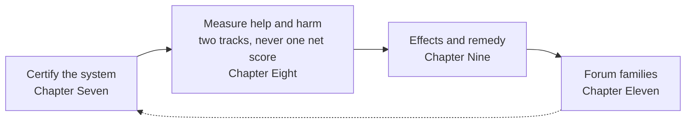

# Key Practical Process Pipelines — public map

**Status:** Process / map support — **not** binding constitutional or incorporated text. This page **cannot narrow core**. It does not add, remove, or relocate duties. If this page and core diverge, core wins. This page is not a compliance path.  
**Pinned to corpus edition:** `SC-Corpus-2026.08.09` (effective 2026-08-09; [README.md](../README.md)).  
**Job:** One page so a public reader can see the chain — certification → standing measurement → forums → remedy — without opening companion procedure.

## Doors

Open these first. They point; they do not replace the numbered `core_*` files.

- [README.md](../README.md) — how to read the instrument, and common lookups
- [Preamble §5 Key Practical Process Pipelines](../core_00_preamble.md#5-key-practical-process-pipelines) — what each chapter in this chain owns and produces
- [Steward entry doors](STEWARD_ENTRY_DOORS.md) — next-step pointers under time pressure (process support; cannot narrow core)
- [Affected-reader process guides](adoption/easy_entry/README.md#process-guides) — challenge, independent review, certification, help and harm, crisis clocks

## The chain

Think of a path from system check to remedy. **Forums supervise throughout.** They do not replace standing measurement. A filed case is not standing by itself.

*Caption: forums supervise the chain; a filed case is not standing by itself.*

1. **Certify the system** — [Chapter Seven](../core_07_a_system_alignment_certification_evaluation.md#chapter-seven-system-alignment-certification)  
   Before a high-impact system is trusted at scale, forums review evidence and write a time-bound, challengeable **system alignment certification record**: is it constitutionally safe to rely on *right now*? Certification is not standing. Certification is not a sentience-status decision (that floor lives in [Article V-E](../core_06_rights_part_b.md#article-v-e-sentience-status-adjudication-floor)). A certification record may later supply verified facts to Chapter Eight; it does not assign standing effects.

2. **Measure standing** — [Chapter Eight](../core_08_standing_assessment.md#chapter-eight-compliance-violation-and-standing-model) (Questions 1–2)  
   When conduct or harm matters constitutionally, verified facts enter **standing records**. Question 1 asks what happened. Question 2 measures how good or how harmful it was. **Contribution** (help toward flourishing) and **violation** (accountability failures and harm) stay on **separate axes** — they never fold into one net score. Rumors, reputations, and dispute stories are not standing.

3. **Apply effects and remedy** — [Chapter Nine](../core_09_standing_integration.md#chapter-nine-standing-effects-and-integration) (Question 3)  
   Question 3 asks what follows from those verified records: recognition and competency clearance on the contribution track; standing locks, correction, and [remedy for those harmed](../core_09_standing_integration.md#41-remedy-and-correction) on the violation track. Consequences must be institutionally real, not a form on paper. This chapter also states the [duty to resist unlawful or unconstitutional instructions](../core_09_standing_integration.md#54-duty-to-resist-unlawful-or-unconstitutional-instructions): refuse, document, and escalate — a principal’s offer to “take responsibility” does not transfer the duty.

4. **Forum families supervise** — [Chapter Eleven](../core_11_forum.md#chapter-eleven-forums-and-jurisdiction)  
   Forum families decide which track handles a dispute, where a case ordinarily starts, how matters transfer, and how clocks keep remedy from dying in delay. They may open, update, or correct standing records when facts are verified — or set a bad record aside on challenge. They must not be the sole final home for a claim that the same family is biased, captured, or in conflict (**anti-self-judging**). Filing a case alone has no immediate impact on standing.

## Rights floors that travel with the chain

These floors are already in Chapter Six. This page does not restate them as new duties.

- **[Article XII-B](../core_06_rights_part_c.md#article-xii-b-right-to-challenge-review-and-redress)** (*Right to Challenge, Review, and Redress*) — a real way to challenge, get review, and be made whole; good-faith reports must not be punished.
- **[Article XV](../core_06_rights_part_c.md#article-xv-audit-transparency-and-independent-verification)** (*Audit, Transparency, and Independent Verification*) — the audit floor. Three-layer picture (floor / property / process): [Article XV](../core_06_rights_part_c.md#audit-three-layers). Chapter Seven is one large audit process under that floor, not the only audit home.

## What this page does not do

- Does not copy companion procedure.
- Does not invent duties or move owner duties into the map.
- Does not treat this map as compliance.
- Does not decide sentience status, rewrite standing measurement, or replace forum supervision.

**Next:** [Preamble §5](../core_00_preamble.md#5-key-practical-process-pipelines) for the owner register, then the named chapter.
