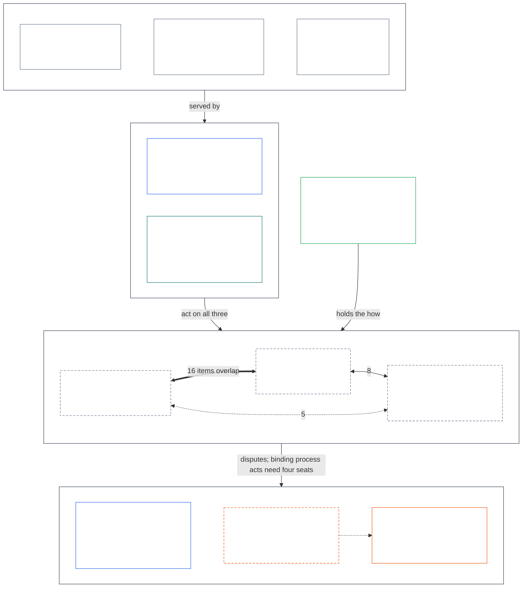

# Process, system, institution: diagrams

**Status:** working visuals for author review. Mermaid renders on GitHub and in most Markdown viewers. A PNG of each chart is in `diagrams/`.

**Conventions.** Charts here follow the rules in [`doc_architecture.md`](../doc_architecture.md): top to bottom (**VIS-CHART-ORIENT-04**), a blank line between box title and content (**VIS-CHART-READABILITY-01**), and unfilled nodes with white text and palette outlines (**VIS-CHART-THEME-02**). White labels need a dark canvas, so the PNGs are rendered on one. In a light-mode viewer the labels may be hard to read.

## 1. Top level

**How to read it**

- **Bands, top to bottom:** values bind everything; the two governance layers (authority questions) act on the three objects (what the problem is about); disputes and the separation-of-duties floor sit at the bottom. The implementation corpus feeds the objects from the side.
- **Outline colors** follow the shared palette: blue is authority (the Constitutional Contract Layer and segregation of duties), teal is participation, orange is forum review, green is the implementation corpus, slate is neutral context (values and the three objects).
- **Dashed outline** means proposed or draft: the object index and the process-ownership dispute rule. Solid outline is adopted text.
- **Overlap numbers** come from [the crosswalk](PROCESS_SYSTEM_INSTITUTION_CROSSWALK.md): how many of the 55 object-tagged items in Chapter One and Chapter Seven also touch a second object.
- **Process is the hub:** it overlaps both other objects, and Chapter Seven's floor attaches to it.

**Simplifications to check**

- "Act on all three" is a summary, not a verified rule. I did not check which layer reaches which object in practice, and a later chart could split it.
- The arrow into the bottom band covers both disputes and the four-seat floor. In the earlier version, Process pointed straight at the segregation-of-duties box and the dispute rule. Band-to-band links keep each band a horizontal row, so those two pointers are now in the label.
- Chapter Seven is drawn as a floor on binding process acts. Its text also covers institutional seats (placement, vacancy, independence lines), so it touches Institution too.
- The Forums box stands for the whole of Chapter Twelve, not just dispute routing.
- Objects are a proposed index, not adopted structure.
