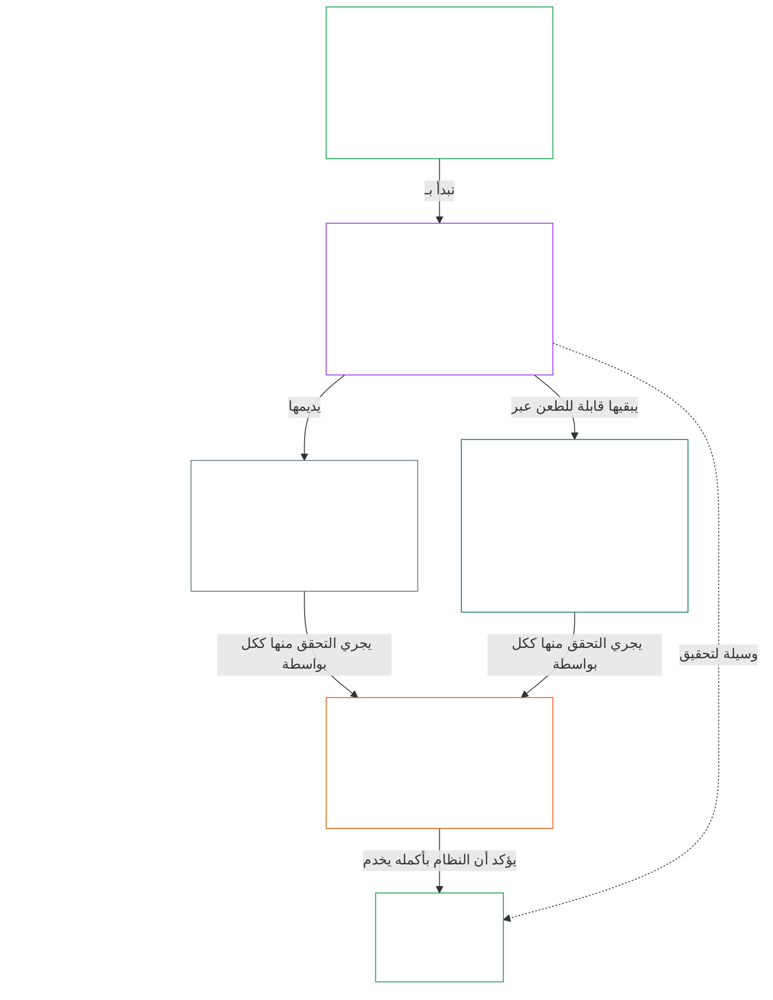

# الفصل 01، الجزء أ: مبادئ القيم

<details>
<summary><strong><span style="color: #2563eb;">موضع المتن (غير تشغيلي): بنية الملف وقواعد القراءة</span></strong></summary>

> المحتوى التالي **إرشاد للقارئ فقط**. ولا يضيف الالتزامات الملزمة الواردة في هذا الملف أو في الفصول الأخرى أو يحذفها أو يضيّق نطاقها.
>
> هذا الملف **جزء من دستور الكائنات الواعية**، ولا يكون **ملزمًا إلا بالاقتران** مع ملفات `core_*` المرقّمة الأخرى، التي تُقرأ بوصفها صكًا واحدًا. وهو يتضمن **الفصل الأول، الجزء أ** (§§1–12: الغرض والدور؛ ومقصد الازدهار، المعروض في §2 والمطوَّر عبر العافية والسلامة والحقيقة والثقة والحرية؛ ومقصد الاستمرارية، المعروض في §8 والمطوَّر عبر قدرة الأنظمة المشتركة والقدرة على الصمود وبنية السوق والتقييم المنظومي).
>
> **السابق:** [core_00_preamble.md](core_00_preamble.md)  
> **التالي:** [core_01_b_interaction_interpretation.md](core_01_b_interaction_interpretation.md) (الفصل الأول، الجزء ب — §§13–15، التفاعل وحدود التجاوز والتفسير الدستوري).  
> **مسار القراءة:** §1 الغرض والدور ← **الازدهار:** مقدمة §2 (مع قيود السلامة والحقيقة غير القابلة للمساومة في §2.1) ← §3 العافية (النتيجة) ← §4 السلامة ← §5 الحقيقة ← §6 الثقة ← §7 الحرية ← **الاستمرارية:** مقدمة §8 ← §9 قدرة الأنظمة المشتركة (الجسر: وسيلة نحو الازدهار وجوهر الاستمرارية) ← §10 القدرة على الصمود ← §11 بنية السوق ← §12 التقييم المنظومي.

</details>

<details>
<summary><strong><span style="color: #2563eb;">إرشاد للقارئ (غير تشغيلي): صلة الفصل الأول بالمقاصد والرباعية والمواد والتعريفات</span></strong></summary>

> المحتوى التالي **إرشاد للقارئ فقط**. ولا يضيف الالتزامات الملزمة الواردة في هذا الملف أو في الفصول الأخرى أو يحذفها أو يضيّق نطاقها. تتولى وحدات **التتبّع** و**التعريفات · التقييم · الامتثال** الخاصة بكل قسم توجيه القراءة الملزم؛ أما هذا المقطع فهو خريطة على مستوى الجزء للقارئين الذين يبدأون بالفصل الأول.

**صلة الطبقات بعضها ببعض.** تجيب كل طبقة عن سؤال مختلف، ويشير كل مبدأ في الفصل الأول إلى الطبقات الثلاث الأخرى:

- **المقاصد والرباعية** ([الديباجة §1](core_00_preamble.md#the-model)): الغاية من الأنظمة المشتركة ([الازدهار](core_05_apex_flourishing_aim.md#flourishing-constitutional) و[الاستمرارية](core_05_apex_continuity_aim.md#chapter-five-definitions-continuity-constitutional-aim))، والواجبات الأربعة التي تجعل السعي إلى تلك الغاية مشروعًا ([المشاركة](core_05_apex_participation_leg.md#participation-constitutional)، و[الرقابة](core_05_apex_oversight_leg.md#oversight-constitutional)، و[المساءلة](core_05_apex_accountability_leg.md#accountability)، و[حسن التوقيت](core_05_apex_timeliness_leg.md#timeliness-constitutional)).
- **المبادئ** (هذا الفصل): كيف تتحول تلك المقاصد والواجبات إلى قيم وقيود وقواعد للموازنة بينها.
- **المواد** ([الفصل السادس](core_06_rights_part_a.md#chapter-six-foundational-rights)): ضمانات أرضية الحقوق التي تظل قابلة للاستخدام أثناء السعي إلى المقاصد. ويسرد **التتبّع** في كل قسم المواد تحت بند *وخاصةً*.
- **التعريفات** ([الفصول من الثاني إلى الخامس](core_02_definition_structure.md)): المعاني المشتركة التي تُستخدم للتحقق من صحة الادعاء. وتسردها وحدة **التعريفات · التقييم · الامتثال** في كل قسم.

**كيفية تطوير الفصل الأول لكل مقصد.** يتحقق الازدهار بعافية مستدامة عبر الحقيقة والسلامة والجدارة بالثقة والوكالة ذات المعنى ([الديباجة §1](core_00_preamble.md#flourishing)). ويعرض الفصل الأول النتيجة أولًا، ثم مبدأً لكل شرط من الشروط الأربعة.

| المقصد وجانبه | مبدأ الفصل الأول | موضع التعريف | المواد المذكورة في التتبّع |
|---|---|---|---|
| **الازدهار**: النتيجة | [§3 العافية](#3-foundational-objective-wellbeing-flourishing-aim) | [العافية](core_05_band_continuity.md#wellbeing) | [VI](core_06_rights_part_b.md#article-vi-equal-basic-rights)، [X](core_06_rights_part_b.md#article-x-self-determination-agency-and-participation)، [XIII-B](core_06_rights_part_c.md#article-xiii-b-right-to-redress-and-remedy)، [XIX-B](core_06_rights_part_d.md#article-xix-b-contestability-and-proportional-restriction-limits) |
| **الازدهار**: السلامة | [§4 السلامة](#4-safety-harm-constraint) | [السلامة](core_05_band_continuity.md#safety-constitutional-constraint) | [XIII](core_06_rights_part_c.md#article-xiii-right-to-reliable-and-trustworthy-systems)، [XVII](core_06_rights_part_c.md#article-xvii-system-lifecycle-environments-and-reversibility)، [XXIII](core_06_rights_part_d.md#article-xxiii-root-cause-analysis-and-adaptive-response) |
| **الازدهار**: الحقيقة | [§5 الحقيقة](#5-truth-epistemic-integrity-constraint) | [الحقيقة](core_05_band_oversight.md#truth-constitutional-constraint) | [XIII](core_06_rights_part_c.md#article-xiii-right-to-reliable-and-trustworthy-systems)، [XV](core_06_rights_part_c.md#article-xv-info-sphere-integrity)، [XVI](core_06_rights_part_c.md#article-xvi-audit-transparency-and-independent-verification) |
| **الازدهار**: الجدارة بالثقة | [§6 الثقة](#6-trust-and-trustworthiness-coordination-integrity) | [الجدارة بالثقة](core_05_band_continuity.md#trustworthiness) | [XIII](core_06_rights_part_c.md#article-xiii-right-to-reliable-and-trustworthy-systems)، [XV](core_06_rights_part_c.md#article-xv-info-sphere-integrity)، [XVI](core_06_rights_part_c.md#article-xvi-audit-transparency-and-independent-verification) |
| **الازدهار**: الوكالة ذات المعنى | [§7 الحرية](#7-freedom-bounded-agency) | [الوكالة ذات المعنى](core_05_band_participation.md#meaningful-agency) | [VI](core_06_rights_part_b.md#article-vi-equal-basic-rights)، [X](core_06_rights_part_b.md#article-x-self-determination-agency-and-participation)، [XXI](core_06_rights_part_d.md#article-xxi-interoperability-portability-movement-refuge-and-exit-integrity) |
| **الاستمرارية**، جسرًا إلى الازدهار: القدرة الدائمة | [§9 قدرة الأنظمة المشتركة](#9-shared-system-capacity) | [قدرة الأنظمة المشتركة](core_05_band_continuity.md#shared-system-capacity) | [I-A](core_06_rights_part_a.md#article-i-a-environmental-preconditions-and-ecological-integrity)، [III](core_06_rights_part_a.md#article-iii-survival-and-essential-access)، [V](core_06_rights_part_a.md#article-v-resource-allocation-dependencies-and-ecosystem-funding) |
| **الاستمرارية**: القدرة على الصمود | [§10 القدرة على الصمود والتصميم ذاتي الإصلاح](#10-resilience-and-self-healing-design) | [التعافي الذاتي](core_05_band_continuity.md#self-healing) | [XIII](core_06_rights_part_c.md#article-xiii-right-to-reliable-and-trustworthy-systems)، [XVII](core_06_rights_part_c.md#article-xvii-system-lifecycle-environments-and-reversibility)، [XXIII](core_06_rights_part_d.md#article-xxiii-root-cause-analysis-and-adaptive-response) |
| **الاستمرارية**: أسواق قابلة للمنافسة | [§11 بنية السوق](#11-market-structure) | [بنية السوق](core_05_band_accountability.md#market-structure) | [III-C](core_06_rights_part_a.md#article-iii-c-labor-and-economic-floor)، [V](core_06_rights_part_a.md#article-v-resource-allocation-dependencies-and-ecosystem-funding)، [XXI](core_06_rights_part_d.md#article-xxi-interoperability-portability-movement-refuge-and-exit-integrity) |
| **الاستمرارية**: منظور النظام بأكمله | [§12 متطلب التقييم المنظومي](#12-systemic-evaluation-requirement) | [شهادة مواءمة النظام](core_05_band_continuity.md#system-alignment-certification) | [XVI](core_06_rights_part_c.md#article-xvi-audit-transparency-and-independent-verification) |

**تراتبية المبادئ (الاستمرارية).** على مستوى المبادئ، يُطوَّر مقصد الاستمرارية بهذا الترتيب، بدءًا بالقدرة التي تصل بين المقصدين:

6. **[قدرة الأنظمة المشتركة](core_05_band_continuity.md#shared-system-capacity)** هي المحصلة التي ينبغي أن تقود إليها الإدارة المسؤولة والحوكمة والحوافز مع مرور الوقت — أي قدرة حقيقية قابلة للطعن لدى الكائنات الواعية والأنظمة المشتركة على إنجاز العمل الذي يوجبه الدستور. وهي تصل بين المقصدين: وسيلة نحو **الازدهار** وجوهر **الاستمرارية**، وليست حجة حاسمة تتغلب على كل اعتبار آخر. يشرح [§9.1](#91-productive-capacity-instrumental-good) و[§9.2](#92-constitutional-efficiency) جانبيها الرئيسيين.
7. يوضح **[التصميم القادر على الصمود وذاتِيّ الإصلاح](#10-resilience-and-self-healing-design)** كيف تكتشف الأنظمة التي تعتمد عليها الكائنات الواعية المشكلات مبكرًا، وتحتويها، وتتعطل وفق مسارات معلنة، وتتعافى بصدق (**[التعافي الذاتي](core_05_band_continuity.md#self-healing)**)، كي تدوم القدرة المذكورة في البند 6 ولا يعتمد الاستقرار على تدخل طارئ.
8. تقدم **[بنية السوق](core_05_band_accountability.md#market-structure)** في [§11](#11-market-structure) الانضباط المضاد للتركّز الذي يبقي تلك القدرة قابلة للمنافسة عمليًا.
9. يتحقق **[متطلب التقييم المنظومي](#12-systemic-evaluation-requirement)** من نطاق النظام بأكمله واعتماداته ومواءمة حوافزه قبل قبول ادعاءات الامتثال أو الحوكمة — في إطار ركن **الرقابة** من الرباعية، بوصفه توجيهًا مبدئيًا للتدقيق؛ ومن ذلك [شهادة مواءمة النظام](core_05_band_continuity.md#system-alignment-certification)، وهي عملية تدقيق واسعة بوجه خاص ضمن عمليات أخرى.

**مواضع الرباعية في الفصل الأول.** يسمّي كل قسم أركان الرباعية التي يتناولها في تتبّعه. وهذه الأقسام هي الأبرز في تناولها:

| ركن الرباعية | المواضع الرئيسية في الفصل الأول |
|---|---|
| **المشاركة** | [§16 الإدارة المسؤولة بالتفصيل](core_01_c_stewardship_capacity_principles.md#16-stewardship-in-depth) و[§17 الإدارة المسؤولة ذات العواقب](core_01_c_stewardship_capacity_principles.md#17-consequential-stewardship-the-steward-role) (الأدوار ذات العواقب والصوت)؛ [§7 الحرية](#7-freedom-bounded-agency) (الوكالة ذات المعنى) |
| **الرقابة** | [§16](core_01_c_stewardship_capacity_principles.md#16-stewardship-in-depth) و[§17](core_01_c_stewardship_capacity_principles.md#17-consequential-stewardship-the-steward-role) (الفهم الموزّع والسجلات)؛ [§18 الحوكمة](core_01_c_stewardship_capacity_principles.md#18-governance-under-stewardship-discipline) (توزيع السلطة)؛ [§12](#12-systemic-evaluation-requirement) (التدقيق) |
| **المساءلة** | [§18 الحوكمة](core_01_c_stewardship_capacity_principles.md#18-governance-under-stewardship-discipline) (المساءلة المتناسبة مع السلطة)؛ [§19 مواءمة الحوافز والاستيلاء على النظام](core_01_c_stewardship_capacity_principles.md#19-incentive-alignment-and-system-capture) (يجب ألا تقوّض المكافآت أركان الرباعية) |
| **حسن التوقيت** | [§16](core_01_c_stewardship_capacity_principles.md#16-stewardship-in-depth) و[§17](core_01_c_stewardship_capacity_principles.md#17-consequential-stewardship-the-steward-role) (اكتشاف المشكلات وإصلاحها دون تأخير يمكن تفاديه) |

**محوران لا تعارض.** تحدد المقاصد ما تسعى إليه الأنظمة؛ وتحدد الرباعية كيف يظل ذلك السعي مشروعًا. وقد ينتمي المصطلح إلى المحورين: فالحقيقة والجدارة بالثقة من مقومات الازدهار، وتقيسهما [الديباجة §2](core_00_preamble.md#2-measurements-overview) ضمن فئة الرقابة. وتحدد [§§13–15](core_01_b_interaction_interpretation.md#13-constitutional-collision-resolution-process) كيفية الموازنة بين هذه المبادئ عند تعارضها وقراءتها كوحدة واحدة، ويطبقها [§20](core_01_c_stewardship_capacity_principles.md#20-integrated-application) على كل فصل لاحق.

</details>

<br>

### 1. الغرض والدور
<details>
<summary><strong><span style="color: #2563eb;">التتبّع</span></strong></summary>

- سابق: [الديباجة §1 النموذج](core_00_preamble.md#the-model) — تنطبق [الرباعية الدستورية](core_00_preamble.md#constitutional-tetrad) و[المقصدان الدستوريان](core_00_preamble.md#two-constitutional-aims) ومقياس [الرهان المادي](core_00_preamble.md#material-stake) على الفصل كله من خلال تتبّعات الأقسام.
- لاحق: [15. التفسير الدستوري](core_01_b_interaction_interpretation.md#15-constitutional-interpretation) للقراءة المتكاملة والغموض والتسلسل الهرمي الداخلي وإجراء حل النزاعات المعتمد.
- لاحق: [المقصدان الدستوريان](core_00_preamble.md#two-constitutional-aims) — تطوير مقصد **الازدهار**: من [§3](#3-foundational-objective-wellbeing-flourishing-aim) إلى [§6](#6-trust-and-trustworthiness-coordination-integrity) و[§7 الحرية](#7-freedom-bounded-agency)؛ وتطوير مقصد **الاستمرارية**: [§9 قدرة الأنظمة المشتركة](#9-shared-system-capacity)، و[§10 القدرة على الصمود والتصميم ذاتي الإصلاح](#10-resilience-and-self-healing-design)، و[§11 بنية السوق](#11-market-structure)، و[§12 متطلب التقييم المنظومي](#12-systemic-evaluation-requirement).
- لاحق: [3. الهدف التأسيسي: العافية](#3-foundational-objective-wellbeing-flourishing-aim)، و[§3.2 الاعتراف والتعزيز والطموح](#32-recognition-reinforcement-and-aspiration)، و[4 السلامة](#4-safety-harm-constraint)، و[5 الحقيقة](#5-truth-epistemic-integrity-constraint)، و[6 الثقة](#6-trust-and-trustworthiness-coordination-integrity)، و[§16 الإدارة المسؤولة بالتفصيل](core_01_c_stewardship_capacity_principles.md#16-stewardship-in-depth)، و[13. إجراء حل التعارضات الدستورية](core_01_b_interaction_interpretation.md#13-constitutional-collision-resolution-process)، و[§7 الحرية](#7-freedom-bounded-agency).
- يُقرأ مع: [الرباعية الدستورية](core_00_preamble.md#constitutional-tetrad) — تحكم المشاركة والرقابة والمساءلة وحسن التوقيت كيفية سعي الأنظمة المشتركة إلى [المقصدين الدستوريين](core_00_preamble.md#two-constitutional-aims)؛ وينطبق مقياس [الرهان المادي](core_00_preamble.md#material-stake) على الفصل كله عبر تتبّعات الأقسام.
- يُقرأ مع: [الفصول من الثاني إلى الرابع](core_02_definition_structure.md) و[الفصل الخامس](core_05__definitions_home.md#chapter-five-foundational-definitions) — طبقة الآليات الحاكمة لكل مصطلح مستخدم في هذا الفصل؛ وتُطبّق نزاهة O/M/A/C ومنع التحايل والأعباء وقابلية تتبّع التعريفات إلى النتائج.
- يُقرأ مع: [الفصل السادس: الحقوق التأسيسية](core_06_rights_part_a.md#chapter-six-foundational-rights).
  - وخاصةً [المادة VI: الحقوق الأساسية المتساوية](core_06_rights_part_b.md#article-vi-equal-basic-rights)، و[المادة XIII: الحق في أنظمة موثوقة وجديرة بالثقة](core_06_rights_part_c.md#article-xiii-right-to-reliable-and-trustworthy-systems)، و[المادة XXIV: التفسير الدستوري والمراجعة وضمانات منع الاستيلاء](core_06_rights_part_d.md#article-xxiv-constitutional-interpretation-review-and-anti-capture-safeguards).
  - يُطبّق هذا الفهم حين يؤثر التفسير في الكائنات الواعية المحمية أو الأنظمة أو المؤسسات.

</details>

<details>
<summary><strong><span style="color: #2563eb;">التعريفات · التقييم · الامتثال</span></strong></summary>

- [التناسب](core_05_band_accountability.md#proportionality) · [O](core_05_band_accountability.md#proportionality) · [M](core_05_band_accountability.md#proportionality-a) · [A](core_05_band_accountability.md#proportionality-a) · [C](core_05_band_accountability.md#proportionality-c)
- [الضرورة](core_05_band_accountability.md#necessity) · [O](core_05_band_accountability.md#necessity) · [M](core_05_band_accountability.md#necessity-a) · [A](core_05_band_accountability.md#necessity-a) · [C](core_05_band_accountability.md#necessity-c)

</details>

<br>

*بعبارات بسيطة: يضع الفصل الأول القيم والقيود التي تحكم كل فصل آخر. ويجب أن تسعى الأنظمة المشتركة إلى **الازدهار** و**الاستمرارية** معًا — لا إلى أحدهما على حساب الآخر — ولا يجوز تعظيم قيمة واحدة على حساب القيم الأخرى.*

<a id="two-constitutional-aims"></a><a id="flourishing"></a><a id="continuity"></a>يضع هذا الفصل المبادئ والقيود التي تحكم تفسير هذا الدستور وتطبيقه وتطوره. وهو يطوّر [المقصدين الدستوريين](core_00_preamble.md#two-constitutional-aims) — [**الازدهار**](core_00_preamble.md#flourishing) و[**الاستمرارية**](core_00_preamble.md#continuity) — اللذين أُقرّا في [الديباجة §1 النموذج](core_00_preamble.md#the-model)، ليصبحا مبادئ وقيودًا تشغيلية. وترد التعريفات المعتمدة لطبقة المبادئ في الديباجة؛ أما هذا الفصل فيطبّقها.

يجب السعي إلى هذين المقصدين معًا، دومًا ضمن قيود المبادئ غير القابلة للمساومة وحمايات الحقوق التي يقررها هذا الدستور. وتحكم [**الرباعية الدستورية**](core_00_preamble.md#constitutional-tetrad) كيفية بقاء هذا السعي مشروعًا — على مقياس [**الرهان المادي**](core_00_preamble.md#material-stake).

ينتظم الفصل حول هذين المقصدين وتلك الرباعية:
- **الازدهار:** ترسم [مقدمة مقصد الازدهار](#2-flourishing-aim-introduction) هذا المقصد. ويحدد [§3 الهدف التأسيسي: العافية](#3-foundational-objective-wellbeing-flourishing-aim) النتيجة. أما [§4 السلامة](#4-safety-harm-constraint)، و[§5 الحقيقة](#5-truth-epistemic-integrity-constraint)، و[§6 الثقة](#6-trust-and-trustworthiness-coordination-integrity)، و[§7 الحرية](#7-freedom-bounded-agency)، فتطوّر الشروط الأربعة التي تحفظه: السلامة والحقيقة والجدارة بالثقة والوكالة ذات المعنى.
- **الاستمرارية:** ترسم [مقدمة مقصد الاستمرارية](#8-continuity-aim-introduction) هذا المقصد. وتطوّر [§9 قدرة الأنظمة المشتركة](#9-shared-system-capacity) (وسيلة نحو الازدهار وجوهر الاستمرارية في الوقت نفسه)، و[§10 القدرة على الصمود والتصميم ذاتي الإصلاح](#10-resilience-and-self-healing-design)، و[§11 بنية السوق](#11-market-structure)، و[§12 متطلب التقييم المنظومي](#12-systemic-evaluation-requirement) الاستقرار طويل الأمد والقدرة الدائمة للأنظمة المشتركة والقدرة على الصمود. وتستند ادعاءات الاستمرارية إلى صورة صادقة للنظام بأكمله: فلا يصمد أي ادعاء في §§9–11 إلا بعد اجتياز فحص §12.
- **عند التقاء المبادئ:** تحكم [§13 عملية حل التعارضات الدستورية](core_01_b_interaction_interpretation.md#13-constitutional-collision-resolution-process)، و[§14 حظر التجاوز المطلق](core_01_b_interaction_interpretation.md#14-prohibition-on-absolute-override)، و[§15 التفسير الدستوري](core_01_b_interaction_interpretation.md#15-constitutional-interpretation) كيفية الموازنة بين المقاصد والمبادئ وقراءتها معًا.
- **الرباعية في التطبيق:** تنقل [§16 الإدارة المسؤولة بالتفصيل](core_01_c_stewardship_capacity_principles.md#16-stewardship-in-depth) حتى [§19 مواءمة الحوافز والاستيلاء على النظام](core_01_c_stewardship_capacity_principles.md#19-incentive-alignment-and-system-capture) المشاركة والرقابة والمساءلة وحسن التوقيت إلى الإدارة المسؤولة والحوكمة والحوافز، ويطبّق [§20 التطبيق المتكامل](core_01_c_stewardship_capacity_principles.md#20-integrated-application) الفصل كله على كل فصل لاحق.

يسرد **التتبّع** لكل مبدأ مواد الفصل السادس التي تحميه، وتسرد وحدة **التعريفات · التقييم · الامتثال** تعريفات الفصل الخامس التي تقيسه.

**الرسم البياني: المقصدان الدستوريان والرباعية الدستورية**

<hr style="border: 0; border-top: 1px solid currentColor;">

```mermaid
flowchart TB
    subgraph Foundation[" "]
        direction TB
        subgraph Aims["المقصدان الدستوريان"]
            direction LR
            F["الازدهار<br/><br/>• عافية الكائنات الواعية مستدامة بالحقيقة والسلامة<br/>والجدارة بالثقة والوكالة ذات المعنى"]
            C["الاستمرارية<br/><br/>• الاستقرار طويل الأمد والاستدامة والقدرة على الصمود<br/>والعافية البيئية"]
        end
        subgraph Tetrad1["الرباعية الدستورية · المشاركة والرقابة"]
            direction LR
            P["المشاركة<br/><br/>• للكائنات الواعية المتأثرة صوت حقيقي<br/>• تمثيل منصف وفرصة عادلة للطعن<br/>• الوصول إلى الأدوار المؤثرة بما يتناسب مع الرهان"]
            O["الرقابة<br/><br/>• المراقبة والتحقق والتثبت وحفظ السجلات<br/>• يمكن للمراجعة المستقلة تقييد الخيارات السيئة"]
        end
        subgraph Tetrad2["الرباعية الدستورية · المساءلة وحسن التوقيت"]
            direction LR
            A["المساءلة<br/><br/>• تُنسب المسؤولية إلى الجهات المعنية الصحيحة<br/>• المساءلة والانتصاف والتصحيح الفعلي<br/>• تستدعي النتائج السيئة الإصلاح"]
            T["حسن التوقيت<br/><br/>• تُكتشف المشكلات ويُطعن فيها وتُحل وتُصلح<br/>• تتناسب المهل الزمنية مع الرهان المادي<br/>• لا يجوز للتأخير محو الحقوق أو سبل الانتصاف أو الإصلاح"]
        end
    end
    F ~~~ P
    P ~~~ A
    style Foundation fill:none,stroke:none
    style Aims fill:none,stroke:none
    style Tetrad1 fill:none,stroke:none
    style Tetrad2 fill:none,stroke:none
    style F fill:none,stroke:#16a34a,color:#ffffff
    style C fill:none,stroke:#16a34a,color:#ffffff
    style P fill:none,stroke:#0f766e,color:#ffffff
    style O fill:none,stroke:#ea580c,color:#ffffff
    style A fill:none,stroke:#db2777,color:#ffffff
    style T fill:none,stroke:#9333ea,color:#ffffff
```

*تصف المقاصد ما يجب على الأنظمة المشتركة السعي إليه؛ وتصف الرباعية الواجبات التي تُبقي هذا السعي مشروعًا. وتتدرج الواجبات الأربعة جميعًا بحسب [الرهان المادي](core_00_preamble.md#material-stake)، ويظل المقصدان كلاهما محدودين بأرضية الحقوق. أُعيد إنتاج الرسم من [النظرة المفاهيمية](guides/CONCEPTUAL_OVERVIEW.md#two-aims-and-the-constitutional-tetrad).*

هذه القيم:
- ليست مستقلة، ولا تخضع في التشغيل المعتاد لترتيب هرمي صارم.
- تعمل كمبادئ وقيود متفاعلة يجب تقييمها مجتمعة.
- تنطبق على جميع «الأنظمة»، بما فيها البنى التقنية والتنظيمية والاقتصادية والاجتماعية التقنية والنظم البيئية التي تؤثر ماديًا في الكائنات الواعية وكوكب الأرض.

لا يجوز تطبيق مبدأ واحد بمعزل إذا كان ذلك سيخلّ ماديًا بالمبادئ الأخرى. وعند ظهور توترات، يجب على الأنظمة حلها وفق متطلبات التناسب والضرورة والأثر المنظومي الواردة في هذا الفصل. وإذا مسّ تعارض لم يُحل مباشرةً قيود المبادئ غير القابلة للمساومة، تكون الأولوية لعملية حل التعارضات الدستورية في الفصل الأول، **§13**.

<a id="2-flourishing-aim-introduction"></a>
### 2. مقدمة مقصد الازدهار
<details>
<summary><strong><span style="color: #2563eb;">التتبّع</span></strong></summary>

- يُقرأ مع: [الرباعية الدستورية](core_00_preamble.md#constitutional-tetrad) — تنطبق أركانها الأربعة جميعًا على كيفية السعي إلى الازدهار؛ ويحدد [الرهان المادي](core_00_preamble.md#material-stake) مدى عمق كل ادعاء متعلق بالازدهار.
- يُقرأ مع: [المقصدان الدستوريان](core_00_preamble.md#two-constitutional-aims) — مقصد **الازدهار**؛ ويُقدَّم المقصد الشريك في [مقدمة مقصد الاستمرارية](#8-continuity-aim-introduction).
- سابق: المبادئ: [الديباجة §1 النموذج](core_00_preamble.md#flourishing)؛ [الازدهار (المقصد الدستوري)](core_05_apex_flourishing_aim.md#flourishing-constitutional)؛ [§1 الغرض والدور](#1-purpose-and-role).
- لاحق: [§3 الهدف التأسيسي: العافية (مقصد الازدهار)](#3-foundational-objective-wellbeing-flourishing-aim)، و[§4 السلامة (قيد الضرر)](#4-safety-harm-constraint)، و[§5 الحقيقة (قيد النزاهة المعرفية)](#5-truth-epistemic-integrity-constraint)، و[§6 الثقة والجدارة بالثقة (نزاهة التنسيق)](#6-trust-and-trustworthiness-coordination-integrity)، و[§7 الحرية (الوكالة المحدودة)](#7-freedom-bounded-agency)؛ وتُذكر المواد التي تحمي كل مبدأ في تتبّع ذلك القسم.
- الأقسام الفرعية: [§2.1 قيود المبادئ غير القابلة للمساومة: السلامة والحقيقة](#21-non-negotiable-principle-constraints-safety-and-truth).
- يُقرأ مع: أرضية حقوق الفصل السادس عمومًا.

</details>

<details>
<summary><strong><span style="color: #2563eb;">التعريفات · التقييم · الامتثال</span></strong></summary>

- [الازدهار (المقصد الدستوري)](core_05_apex_flourishing_aim.md#flourishing-constitutional) · [O](core_05_apex_flourishing_aim.md#flourishing-constitutional) · [M](core_05_apex_flourishing_aim.md#flourishing-constitutional-m) · [A](core_05_apex_flourishing_aim.md#flourishing-constitutional-a) · [C](core_05_apex_flourishing_aim.md#flourishing-constitutional-c)
- [العافية](core_05_band_continuity.md#wellbeing) · [O](core_05_band_continuity.md#wellbeing) · [M](core_05_band_continuity.md#wellbeing-a) · [A](core_05_band_continuity.md#wellbeing-a) · [C](core_05_band_continuity.md#wellbeing-c)
- [السلامة (القيد الدستوري)](core_05_band_continuity.md#safety-constitutional-constraint) · [O](core_05_band_continuity.md#safety-constitutional-constraint) · [M](core_05_band_continuity.md#safety-constraint-a) · [A](core_05_band_continuity.md#safety-constraint-a) · [C](core_05_band_continuity.md#safety-constraint-c)
- [الحقيقة (القيد الدستوري)](core_05_band_oversight.md#truth-constitutional-constraint) · [O](core_05_band_oversight.md#truth-constitutional-constraint-o) · [M](core_05_band_oversight.md#truth-constitutional-constraint-a) · [A](core_05_band_oversight.md#truth-constitutional-constraint-a) · [C](core_05_band_oversight.md#truth-constitutional-constraint-c)
- [الجدارة بالثقة](core_05_band_continuity.md#trustworthiness) · [O](core_05_band_continuity.md#trustworthiness) · [M](core_05_band_continuity.md#trustworthiness-a) · [A](core_05_band_continuity.md#trustworthiness-a) · [C](core_05_band_continuity.md#trustworthiness-c)
- [الوكالة ذات المعنى](core_05_band_participation.md#meaningful-agency) · [O](core_05_band_participation.md#meaningful-agency) · [M](core_05_band_participation.md#meaningful-agency-a) · [A](core_05_band_participation.md#meaningful-agency-a) · [C](core_05_band_participation.md#meaningful-agency-c)

</details>

<br>

*بعبارات بسيطة: الازدهار هو أول المقصدين: أن تحيا الكائنات الواعية حياة طيبة وأن تظل قادرة على ذلك، لأن الأنظمة المحيطة بها آمنة وصادقة وجديرة بالثقة وتتيح مجالًا حقيقيًا للاختيار. وتحدد §3 ماهية هذه النتيجة؛ أما المبادئ الأربعة التالية فتبيّن ما يجعلها حقيقية.*

[**الازدهار**](core_05_apex_flourishing_aim.md#flourishing-constitutional) هو **عافية الكائنات الواعية المستدامة عبر الحقيقة والسلامة والجدارة بالثقة والوكالة ذات المعنى** ([الديباجة §1 النموذج](core_00_preamble.md#flourishing)). ويطوّره الفصل الأول في خطوتين: تحدد [§3 الهدف التأسيسي: العافية (مقصد الازدهار)](#3-foundational-objective-wellbeing-flourishing-aim) النتيجة، وتحدد أربعة مبادئ الشروط التي تحافظ عليها.

| الشرط | المبدأ | السؤال الذي يجيب عنه |
|---|---|---|
| **السلامة** | [§4 السلامة (قيد الضرر)](#4-safety-harm-constraint) | هل تُحمى الكائنات الواعية من الضرر الممكن تجنبه؟ |
| **الحقيقة** | [§5 الحقيقة (قيد النزاهة المعرفية)](#5-truth-epistemic-integrity-constraint)، ومعها [§5.1 الاستقصاء المستنير بالعلم ودعم القرار](#51-science-informed-inquiry-and-decision-support) و[§5.2 إتاحة اللغة البسيطة (واجب المشاركة والإدارة المسؤولة)](#52-plain-language-accessibility-participation-and-stewardship-duty) | هل تستطيع الكائنات الواعية الاعتماد على ما يُقال لها وفهمه؟ |
| **الجدارة بالثقة** | [§6 الثقة والجدارة بالثقة (نزاهة التنسيق)](#6-trust-and-trustworthiness-coordination-integrity) | هل تكسب الأنظمة الاعتماد وتصلحه حين تخفق؟ |
| **الوكالة ذات المعنى** | [§7 الحرية (الوكالة المحدودة)](#7-freedom-bounded-agency) | هل تحتفظ الكائنات الواعية بحرية حقيقية ومحدودة للاختيار والاعتراض والتنظيم والمغادرة؟ |

**كيف تعمل مبادئ الازدهار معًا:**
- **السلامة والحقيقة قيدان غير قابلين للمساومة:** يردان معًا في [§2.1 قيود المبادئ غير القابلة للمساومة: السلامة والحقيقة](#21-non-negotiable-principle-constraints-safety-and-truth)، ولا يجوز التضحية بهما لكسب المبادئ الأخرى.
- **الثقة والحرية محدودتان وليستا مطلقتين:** تُكتسب الثقة ويمكن تصحيحها ([§6.1 التصحيح والانتصاف](#61-correction-and-remedy))؛ وللحرية حدود منضبطة ([§7.1 انضباط التقييد](#71-limitation-discipline)).
- **لا يُطبّق أي منها بمعزل:** تُقرأ المبادئ مجتمعة، وعند تعارضها تُوازن وفق [§13 عملية حل التعارضات الدستورية](core_01_b_interaction_interpretation.md#13-constitutional-collision-resolution-process).
- **للازدهار مقصد شريك:** يسأل مقصد الاستمرارية عما يجعل هذه النتيجة دائمة؛ ويُقدَّم في [مقدمة مقصد الاستمرارية](#8-continuity-aim-introduction).

**الرسم البياني: الازدهار ومبادئه**

<hr style="border: 0; border-top: 1px solid currentColor;">

```mermaid
flowchart TB
    F["مقصد الازدهار<br/><br/>• عافية الكائنات الواعية مستدامة بالحقيقة والسلامة،<br/>والجدارة بالثقة والوكالة ذات المعنى<br/>• تظل دائمًا محدودة بأرضية الحقوق"]
    W["§3 العافية (النتيجة)<br/><br/>• §3.1 الإنصاف<br/>• §3.2 الاعتراف والتعزيز والطموح<br/>• §3.3 الإجراءات غير المهينة"]
    subgraph NN["غير قابل للمساومة (§2.1)"]
        direction LR
        S["§4 السلامة<br/><br/>• قيد الضرر"]
        T["§5 الحقيقة<br/><br/>• النزاهة المعرفية<br/>• §5.1 الاستقصاء المستنير بالعلم<br/>ودعم القرار<br/>• §5.2 إتاحة اللغة البسيطة"]
    end
    R["§6 الثقة<br/><br/>• نزاهة التنسيق<br/>• §6.1 التصحيح والانتصاف"]
    G["§7 الحرية<br/><br/>• وكالة محدودة<br/>• §7.1 انضباط التقييد<br/>• §§7.2–7.4 التجمع،<br/>والاعتراض والمغادرة"]
    F -->|"يُصاغ بوصفه"| W
    W -->|"تدعمه"| S
    W --> T
    S --> R
    T --> R
    R --> G
    style NN fill:none,stroke:#64748b,stroke-dasharray:6 4,color:#ffffff
    style F fill:none,stroke:#16a34a,color:#ffffff
    style W fill:none,stroke:#9333ea,color:#ffffff
    style S fill:none,stroke:#64748b,color:#ffffff
    style T fill:none,stroke:#ea580c,color:#ffffff
    style R fill:none,stroke:#2563eb,color:#ffffff
    style G fill:none,stroke:#0f766e,color:#ffffff
```

*يُصاغ الازدهار بوصفه نتيجة، وتدعمه أولًا القيود غير القابلة للمساومة، السلامة والحقيقة؛ وكلتاهما تغذي الثقة، التي تدعم بدورها الحرية. الألوان إشارات بصرية قابلة لإعادة الاستخدام وليست ادعاءات بالأولوية. ويسمّي تتبّع كل مبدأ مواده، فيما تسمي وحدة التعريفات · التقييم · الامتثال تعريفاته. أُعيد إنتاج الرسم في [النظرة المفاهيمية](guides/CONCEPTUAL_OVERVIEW.md#flourishing-and-its-principles).*

<a id="21-non-negotiable-principle-constraints-safety-and-truth"></a>
#### 2.1 قيود المبادئ غير القابلة للمساومة: السلامة والحقيقة
<details>
<summary><strong><span style="color: #2563eb;">التتبّع</span></strong></summary>

- يُقرأ مع: [الرباعية الدستورية](core_00_preamble.md#constitutional-tetrad) — ركن **المشاركة** (فهم أحكام السلامة والحقيقة والطعن فيها)؛ وركن **الرقابة** (كشف مخاطر الضرر والتدهور المعرفي)؛ وركن **المساءلة** (المحاسبة عن الضرر والخداع والاعتماد المضلل)؛ ومقياس [الرهان المادي](core_00_preamble.md#material-stake).
- يُقرأ مع: [المقصدان الدستوريان](core_00_preamble.md#two-constitutional-aims) — مقصد **الازدهار** (**السلامة** و**الحقيقة** مكوّنان مسمّيان في [الديباجة §1](core_00_preamble.md#two-constitutional-aims))؛ ومقصد **الاستمرارية** (منع الضرر على المدى البعيد والإدارة المسؤولة والصادقة للأنظمة الدائمة).
- سابق: المبادئ: [3. الهدف التأسيسي: العافية](#3-foundational-objective-wellbeing-flourishing-aim)؛ [المقصدان الدستوريان](core_00_preamble.md#two-constitutional-aims).
- لاحق: [6. الثقة](#6-trust-and-trustworthiness-coordination-integrity)، و[13. عملية حل التعارضات الدستورية](core_01_b_interaction_interpretation.md#13-constitutional-collision-resolution-process)، و[§7 الحرية](#7-freedom-bounded-agency).
- يُطبّق في: [§4 السلامة](#4-safety-harm-constraint)؛ و[§5 الحقيقة](#5-truth-epistemic-integrity-constraint)؛ و[§5.1 الاستقصاء المستنير بالعلم ودعم القرار](#51-science-informed-inquiry-and-decision-support)؛ و[§5.2 إتاحة اللغة البسيطة](#52-plain-language-accessibility-participation-and-stewardship-duty).

</details>

<br>

*بعبارات بسيطة: السلامة والحقيقة حدّان أدنيان صارمان في الدستور — وليستا مقايضتين يجوز تحسين النتائج عبر التخلي عنهما. ولا يجوز للأنظمة المشتركة أن تعرّض الكائنات الواعية لخطر متوقع أو تخدعها، وينطبق القيدان ضمن السعي إلى الازدهار والاستمرارية وتحت انضباط الرباعية في المشاركة والرقابة والمساءلة وحسن التوقيت.*

**السلامة** و**الحقيقة** قيدان مبدئيان غير قابلين للمساومة، يحدّان كل مبدأ آخر في الفصل الأول — بما في ذلك [§3 الهدف التأسيسي: العافية](#3-foundational-objective-wellbeing-flourishing-aim) و[المقصدان الدستوريان](core_00_preamble.md#two-constitutional-aims). وهما مكوّنان مسمّيان من [**الازدهار**](#flourishing) ولا غنى عنهما لـ[**الاستمرارية**](#continuity): فلا تزدهر الأنظمة عبر الضرر أو الخداع، وتتطلب الشرعية الدائمة إدارة صادقة للمخاطر بمرور الوقت.

يجب أن يستوفي تطبيق هذين القيدين [الرباعية الدستورية](core_00_preamble.md#constitutional-tetrad)، مع مراعاة [الرهان المادي](core_00_preamble.md#material-stake)، ولا سيما:
- حين تؤثر أحكام السلامة في القدرة على المشاركة
- حين تحكم ادعاءات الحقيقة الاعتماد
- حين تكون المساءلة عن الضرر أو السلوك المضلل موضع اعتبار

يمكن لنتائج السلامة والحقيقة أن تغيّر سجل وضعية كائن واعٍ، بما في ذلك:
- كيفية الاعتراف بـ[الإسهامات](core_05_band_accountability.md#contribution-nature)
- ما إذا كانت المخالفات تُسجّل
- كيفية تصنيف جسامة تلك المخالفات
- العواقب المترتبة عليها

يحكم نموذج الوضعية في [**الفصل التاسع**](core_09_standing_assessment.md) كيفية تصنيف هذه النتائج والتحقق منها وتطبيقها، وفق متطلبات التقييم والامتثال المستمدة من [**الفصول من الثاني إلى الخامس**](core_02_definition_structure.md).

### 3. الهدف التأسيسي: العافية (مقصد الازدهار)
<details>
<summary><strong><span style="color: #2563eb;">التتبّع</span></strong></summary>

- يُقرأ مع: [الرباعية الدستورية](core_00_preamble.md#constitutional-tetrad) — ركن **المشاركة** حين تؤثر ظروف العافية ماديًا في كون الصوت والوصول وقابلية الطعن حقيقية؛ وركن **المساءلة** حين تؤثر ادعاءات العافية في توزيع الأعباء؛ ومقياس [الرهان المادي](core_00_preamble.md#material-stake) حيث يكون ذا صلة مادية.
- يُقرأ مع: [المقصدان الدستوريان](core_00_preamble.md#two-constitutional-aims) — يطوّر هذا الفصل مقصد **الازدهار** من [§3](#3-foundational-objective-wellbeing-flourishing-aim) إلى [§6](#6-trust-and-trustworthiness-coordination-integrity) و[§7 الحرية](#7-freedom-bounded-agency).
- سابق: المبادئ: [الديباجة §1 النموذج](core_00_preamble.md#the-model)؛ [المقصدان الدستوريان](core_00_preamble.md#two-constitutional-aims) — تطوير مقصد **الازدهار**.
- لاحق: [4 السلامة](#4-safety-harm-constraint)، و[5 الحقيقة](#5-truth-epistemic-integrity-constraint)، و[§16 الإدارة المسؤولة بالتفصيل](core_01_c_stewardship_capacity_principles.md#16-stewardship-in-depth)، و[13. عملية حل التعارضات الدستورية](core_01_b_interaction_interpretation.md#13-constitutional-collision-resolution-process).
- الأقسام الفرعية: [§3.1 الإنصاف](#31-fairness)؛ [§3.2 الاعتراف والتعزيز والطموح](#32-recognition-reinforcement-and-aspiration)؛ [§3.3 إجراءات مناهضة الإذلال](#33-anti-degrading-process).
- يُقرأ مع: أرضية حقوق الفصل السادس عمومًا.
  - وخاصةً [المادة VI: الحقوق الأساسية المتساوية](core_06_rights_part_b.md#article-vi-equal-basic-rights)، و[المادة X: تقرير المصير والوكالة والمشاركة](core_06_rights_part_b.md#article-x-self-determination-agency-and-participation)، و[المادة XIII-B: الحق في الانتصاف والمعالجة](core_06_rights_part_c.md#article-xiii-b-right-to-redress-and-remedy)، و[المادة XIX-B: قابلية الطعن وحدود التقييد المتناسب](core_06_rights_part_d.md#article-xix-b-contestability-and-proportional-restriction-limits).
  - يُطبّق هذا حين تُستخدم مكاسب العافية المزعومة لتبرير تقييد الوكالة أو الكرامة أو قابلية الطعن.
  - وخاصةً [الكرامة والمكانة الأخلاقية المتساوية](core_05_band_participation.md#dignity-and-equal-moral-standing)، و[الإنصاف الموضوعي](core_05_band_participation.md#substantive-fairness)، و[6. الثقة](#6-trust-and-trustworthiness-coordination-integrity) حين يكون الوصول أو الإجراء أو المواءمة التوزيعية أو الاعتماد أو نزاهة التنسيق على المحك ماديًا.

</details>

<details>
<summary><strong><span style="color: #2563eb;">التعريفات · التقييم · الامتثال</span></strong></summary>

- [العافية](core_05_band_continuity.md#wellbeing) · [O](core_05_band_continuity.md#wellbeing) · [M](core_05_band_continuity.md#wellbeing-a) · [A](core_05_band_continuity.md#wellbeing-a) · [C](core_05_band_continuity.md#wellbeing-c)
- [المشاركة](core_05_apex_participation_leg.md#participation-constitutional) · [O](core_05_apex_participation_leg.md#participation-constitutional) · [M](core_05_apex_participation_leg.md#participation-constitutional-m) · [A](core_05_apex_participation_leg.md#participation-constitutional-a) · [C](core_05_apex_participation_leg.md#participation-constitutional-c)
- [الكرامة والمكانة الأخلاقية المتساوية](core_05_band_participation.md#dignity-and-equal-moral-standing) · [O](core_05_band_participation.md#dignity-and-equal-moral-standing) · [M](core_05_band_participation.md#dignity-and-equal-moral-standing-a) · [A](core_05_band_participation.md#dignity-and-equal-moral-standing-a) · [C](core_05_band_participation.md#dignity-and-equal-moral-standing-c)
- [الإنصاف الموضوعي](core_05_band_participation.md#substantive-fairness) · [O](core_05_band_participation.md#substantive-fairness) · [M](core_05_band_participation.md#substantive-fairness-constitutional-a) · [A](core_05_band_participation.md#substantive-fairness-constitutional-a) · [C](core_05_band_participation.md#substantive-fairness-constitutional-c)
- [الأهمية المادية](core_05_band_oversight.md#materiality) · [O](core_05_band_oversight.md#materiality) · [M](core_05_band_oversight.md#materiality-determination-a) · [A](core_05_band_oversight.md#materiality-determination-a) · [C](core_05_band_oversight.md#materiality-determination-c)
- [تباعد المؤشرات البديلة](core_05_band_oversight.md#proxy-divergence) · [O](core_05_band_oversight.md#proxy-divergence) · [M](core_05_band_oversight.md#proxy-divergence-a) · [A](core_05_band_oversight.md#proxy-divergence-a) · [C](core_05_band_oversight.md#proxy-divergence-c)

</details>

<br>

*بعبارات بسيطة: الغاية من هذه الأنظمة أن تجعل حياة الكائنات الواعية أفضل حقًا — ولا تتحقق هذه الغاية بملاحقة مؤشر بديل، كما لا يجوز اتخاذها ذريعة للتقصير في السلامة أو الحقيقة أو الحقوق. والعافية أساس المشاركة: فالصوت الشكلي من دون الظروف التي تجعل الوكالة حقيقية ليس مشاركة بموجب هذا الدستور.*

الهدف النهائي لكل الأنظمة الخاضعة لهذا الدستور هو صون [عافية](core_05_band_continuity.md#wellbeing) الكائنات الواعية والنهوض بها — أي مقصد [**الازدهار**](#flourishing) في إطار [المقصدين الدستوريين](core_00_preamble.md#two-constitutional-aims).

تعرّف [الديباجة §1 النموذج](core_00_preamble.md#flourishing) الازدهار بأنه عافية الكائنات الواعية المستدامة عبر الحقيقة والسلامة والجدارة بالثقة والوكالة ذات المعنى. ويحدد هذا القسم النتيجة. وتطوّر الأقسام التالية الشروط الأربعة التي تحفظها: [§4 السلامة](#4-safety-harm-constraint)، و[§5 الحقيقة](#5-truth-epistemic-integrity-constraint)، و[§6 الثقة](#6-trust-and-trustworthiness-coordination-integrity)، و[§7 الحرية](#7-freedom-bounded-agency). وتشكل هذه المبادئ الخمسة مجتمعة تطوير الفصل الأول لمقصد الازدهار. أما مقصد [**الاستمرارية**](#continuity) فيتطور في [§9 قدرة الأنظمة المشتركة](#9-shared-system-capacity)، و[§10 القدرة على الصمود والتصميم ذاتي الإصلاح](#10-resilience-and-self-healing-design)، و[§11 بنية السوق](#11-market-structure)، و[§12 متطلب التقييم المنظومي](#12-systemic-evaluation-requirement).

العافية أساس [المشاركة](core_05_apex_participation_leg.md#participation-constitutional) في إطار [الرباعية الدستورية](core_00_preamble.md#constitutional-tetrad). ولا يجوز للأنظمة المشتركة اعتبار المشاركة متحققة عندما تتدهور ماديًا ظروف العافية الأساسية، ومنها [الوكالة ذات المعنى](core_05_band_participation.md#meaningful-agency) والوصول المنصف والكرامة.

تشمل العافية الآثار الفورية، وكذلك العواقب غير المباشرة والمتأخرة والتراكمية والعابرة للأنظمة، وفق تقييم [**الفصول من الثاني إلى الرابع**](core_02_definition_structure.md). وعلى طبقة القيم هذه، فإن العافية:
- تتيح المشاركة الحقيقية — فالصوت الذي لا تتوفر للكائنات الواعية ظروف استخدامه ليس مشاركة ذات معنى
- لا يمكن إعلانها «متحققة» بمجرد بلوغ مقياس انحرف عما يهم فعلًا
- تظل مقيدة بقيود المبادئ غير القابلة للمساومة في هذا الفصل: **السلامة** و**الحقيقة**
- لا يجوز الاستناد إليها تبريرًا شاملًا لانتهاك السلامة أو الحقيقة أو حماية الحقوق

#### 3.1 الإنصاف
<details>
<summary><strong><span style="color: #2563eb;">التتبّع</span></strong></summary>

- يُقرأ مع: [الرباعية الدستورية](core_00_preamble.md#constitutional-tetrad) — ركن **المشاركة** (الوصول والصوت وقابلية الطعن؛ وهو مطلب عام لا يقتصر على [مشاركة أصحاب المصلحة في النظام](core_05_band_participation.md#stakeholder-status-and-weight))؛ وركن **المساءلة** حيث تترتب المنافع والأعباء.
- سابق: المبادئ: [§3 الهدف التأسيسي: العافية](#3-foundational-objective-wellbeing-flourishing-aim) — بما في ذلك كون العافية أساسًا لـ[المشاركة](core_05_apex_participation_leg.md#participation-constitutional).
- لاحق: [3.2 الاعتراف والتعزيز والطموح](#32-recognition-reinforcement-and-aspiration)؛ [6. الثقة](#6-trust-and-trustworthiness-coordination-integrity)، و[§16 الإدارة المسؤولة بالتفصيل](core_01_c_stewardship_capacity_principles.md#16-stewardship-in-depth)، و[13. عملية حل التعارضات الدستورية](core_01_b_interaction_interpretation.md#13-constitutional-collision-resolution-process)، و[سجل التعارض الدستوري](core_05_band_integrative.md#constitutional-collision-record) حيث يجب أن تظل خيارات الأسبقية والتوزيع متماسكة وقابلة للمراجعة.
- الأقسام الفرعية (ترتيب القراءة): [§3.1.1](#311-access-and-opportunity) · [§3.1.2](#312-benefits-and-burdens) · [§3.1.3](#313-fair-treatment) · [§3.1.4](#314-unfair-treatment).
- لاحق: يشكّل سطح الحقوق للمكانة المتساوية والمعاملة غير الاعتباطية والطعن ذي المعنى وحدود التقييد المتناسب.
  - وخاصةً [المادة VI: الحقوق الأساسية المتساوية](core_06_rights_part_b.md#article-vi-equal-basic-rights)، و[المادة VI-C: عدم التمييز](core_06_rights_part_b.md#article-vi-c-nondiscrimination)، و[المادة X: تقرير المصير والوكالة والمشاركة](core_06_rights_part_b.md#article-x-self-determination-agency-and-participation)، و[المادة XIII-B: الحق في الانتصاف والمعالجة](core_06_rights_part_c.md#article-xiii-b-right-to-redress-and-remedy)، و[المادة XIX-B: قابلية الطعن وحدود التقييد المتناسب](core_06_rights_part_d.md#article-xix-b-contestability-and-proportional-restriction-limits).
  - إذا ترتب على تصنيف مضاد للدستور جزاء أو أثر دائم، فيُقرأ مع [الفصل الحادي عشر، القسم 4 — ضمانات الإجراءات القانونية الواجبة والانتصاف والمنع](core_11_a_misconduct_designation.md#4-due-process-safeguards-for-slot-assignment).
  - تُفصّل التزامات عدم التمييز عبر [§2 — الخصائص المحمية والاستعاضة بالمؤشرات وحجب الإشارات الحميمة ومركز **المادة VII-E** (*الخدمات الجنسية التجارية الرضائية بين البالغين والاستغلال الجنسي*)](core_05_band_participation.md#fairness-protected-characteristics-and-nondiscrimination) في الفصل الخامس، بما في ذلك [حجب الإشارات الحميمة المحمية والتحايل على مركز **المادة VII-E** (*الخدمات الجنسية التجارية الرضائية بين البالغين والاستغلال الجنسي*)](core_05_band_participation.md#protected-intimate-signal-gating-and-article-vii-e-adult-consensual-commercial-sexual-services-and-sexual-exploitation-status-circumvention) حين تتصل قواعد المعاملة المنصفة في §2.1.3 بحجب الإشارات الحميمة أو **المادة VII-E** (*الخدمات الجنسية التجارية الرضائية بين البالغين والاستغلال الجنسي*).
- يُقرأ مع: [الإنصاف الموضوعي](core_05_band_participation.md#substantive-fairness) والتزامات أرضية الحقوق ذات الصلة في الفصل السادس حين تكون المنافع أو الأعباء أو المكافآت أو التكاليف أو الواجبات أو المخاطر أو الإسهام أو الحاجة أو التعرض مادية؛ و[إمكانية الوصول](core_05_band_participation.md#accessibility) حين تكون مسارات الوصول في §2.1.1 مادية؛ و[تباعد المؤشرات البديلة](core_05_band_oversight.md#proxy-divergence) حين تكون المقاييس الإجمالية أو آثار لوحات النتائج مادية.

</details>

<details>
<summary><strong><span style="color: #2563eb;">التعريفات · التقييم · الامتثال</span></strong></summary>

- [الكرامة والمكانة الأخلاقية المتساوية](core_05_band_participation.md#dignity-and-equal-moral-standing) · [O](core_05_band_participation.md#dignity-and-equal-moral-standing) · [M](core_05_band_participation.md#dignity-and-equal-moral-standing-a) · [A](core_05_band_participation.md#dignity-and-equal-moral-standing-a) · [C](core_05_band_participation.md#dignity-and-equal-moral-standing-c)
- [إمكانية الوصول](core_05_band_participation.md#accessibility) · [O](core_05_band_participation.md#accessibility) · [M](core_05_band_participation.md#accessibility-constitutional-a) · [A](core_05_band_participation.md#accessibility-constitutional-a) · [C](core_05_band_participation.md#accessibility-constitutional-c)
- [المشاركة](core_05_apex_participation_leg.md#participation-constitutional) · [O](core_05_apex_participation_leg.md#participation-constitutional) · [M](core_05_apex_participation_leg.md#participation-constitutional-m) · [A](core_05_apex_participation_leg.md#participation-constitutional-a) · [C](core_05_apex_participation_leg.md#participation-constitutional-c)
- [الإنصاف الإجرائي](core_05_band_participation.md#procedural-fairness) · [O](core_05_band_participation.md#procedural-fairness) · [M](core_05_band_participation.md#procedural-fairness-constitutional-a) · [A](core_05_band_participation.md#procedural-fairness-constitutional-a) · [C](core_05_band_participation.md#procedural-fairness-constitutional-c)
- [الإنصاف الموضوعي](core_05_band_participation.md#substantive-fairness) · [O](core_05_band_participation.md#substantive-fairness) · [M](core_05_band_participation.md#substantive-fairness-constitutional-a) · [A](core_05_band_participation.md#substantive-fairness-constitutional-a) · [C](core_05_band_participation.md#substantive-fairness-constitutional-c)
- [الخصائص المحمية](core_05_band_participation.md#protected-characteristics) · [O](core_05_band_participation.md#protected-characteristics) · [M](core_05_band_participation.md#protected-characteristics-constitutional-a) · [A](core_05_band_participation.md#protected-characteristics-constitutional-a) · [C](core_05_band_participation.md#protected-characteristics-constitutional-c)
- [الاستعاضة بمؤشرات الخصائص المحمية والأثر المتباين](core_05_band_participation.md#protected-characteristic-proxying-and-disparate-impact) · [O](core_05_band_participation.md#protected-characteristic-proxying-and-disparate-impact) · [M](core_05_band_participation.md#protected-characteristic-proxying-and-disparate-impact-a) · [A](core_05_band_participation.md#protected-characteristic-proxying-and-disparate-impact-a) · [C](core_05_band_participation.md#protected-characteristic-proxying-and-disparate-impact-c)
- [حجب الإشارات الحميمة المحمية والتحايل على مركز **المادة VII-E** (*الخدمات الجنسية التجارية الرضائية بين البالغين والاستغلال الجنسي*)](core_05_band_participation.md#protected-intimate-signal-gating-and-article-vii-e-adult-consensual-commercial-sexual-services-and-sexual-exploitation-status-circumvention) · [O](core_05_band_participation.md#protected-intimate-signal-gating-and-article-vii-e-adult-consensual-commercial-sexual-services-and-sexual-exploitation-status-circumvention) · [M](core_05_band_participation.md#protected-intimate-signal-gating-and-article-vii-e-status-circumvention-a) · [A](core_05_band_participation.md#protected-intimate-signal-gating-and-article-vii-e-status-circumvention-a) · [C](core_05_band_participation.md#protected-intimate-signal-gating-and-article-vii-e-status-circumvention-c)
- [تباعد المؤشرات البديلة](core_05_band_oversight.md#proxy-divergence) · [O](core_05_band_oversight.md#proxy-divergence) · [M](core_05_band_oversight.md#proxy-divergence-a) · [A](core_05_band_oversight.md#proxy-divergence-a) · [C](core_05_band_oversight.md#proxy-divergence-c)

</details>

<br>

*بعبارات بسيطة: يعني الإنصاف أن النظام لا يستطيع وصف نفسه بالجيد بينما يُمنع الكائنون الواعيون العاديون من المشاركة، أو يخضعون لقواعد غير مفسرة، أو يتحملون تكاليف يتجنبها الآخرون. ويمنح النظام المنصف الكائنات الواعية وصولًا حقيقيًا، ويستند إلى أسباب يمكن الدفاع عنها، ويوزّع المكافآت والتكاليف والمخاطر بما يتناسب مع الإسهام والحاجة والتعرض الفعلي.*

**الإنصاف** جزء مما يقتضيه [§3 الهدف التأسيسي: العافية](#3-foundational-objective-wellbeing-flourishing-aim) كلما اضطرت الكائنات الواعية إلى العيش أو العمل أو التعلم أو التبادل أو اتخاذ القرارات من خلال أنظمة مشتركة. وحين تؤثر الأنظمة المشتركة فيها ماديًا، يسأل الإنصاف عما إذا كانت الفرص والمعاملة وتوزيع المنافع والأعباء تحترم [الكرامة والمكانة الأخلاقية المتساوية](core_05_band_participation.md#dignity-and-equal-moral-standing).

يساعد الإنصاف على جعل [المشاركة](core_05_apex_participation_leg.md#participation-constitutional) حقيقية. ولا تكون المشاركة حقيقية إذا كان للكائنات الواعية صوت من الناحية الشكلية، لكنها لا تستطيع الوصول إلى العملية أو فهم القاعدة أو استيفاء الشروط أو الطعن في النتيجة أو تحمل العبء المفروض عليها.

ولا يكفي أن تعرض المنظومة متوسطًا جيدًا. فمؤشر رئيسي واحد أو متوسط أو ترتيب أو ادعاء بالكفاءة لا يثبت الإنصاف بمفرده. وقد تبدو المنظومة ناجحة إجمالًا بينما تظل غير منصفة تجاه الكائنات الواعية المستبعدة أو المصنفة خطأ أو المدفوعة بأقل من حقها أو المثقلة بالأعباء أو المحرومة من فرصة حقيقية للاعتراض.

يتألف هذا القسم من **أربعة أجزاء عملية**. وهي توجه هذا القسم، لكنها لا تحل محل تعريفات الفصل الخامس أو أرضية حقوق الفصل السادس.

<a id="311-access-and-opportunity"></a>
##### 3.1.1 الوصول والفرص

يوضح هذا القسم الفرعي معنى الوصول والفرص في التطبيق:

- تحتاج الكائنات الواعية إلى مسارات عملية نحو [المشاركة](core_05_apex_participation_leg.md#participation-constitutional) والتعليم والعمل والرعاية والسلامة والتنقل وغيرها من مقومات الحياة اليومية.
- يجب ألا تُحجب هذه المسارات أو تصبح باهظة الكلفة أو تتأخر أو تُخفى أو تُحرّف لأسباب اعتباطية أو غير ذات صلة.
- لا يكفي أن يكون الباب مفتوحًا على الورق فقط حين يشترط هذا الدستور فرصًا **موضوعية**.

<a id="312-benefits-and-burdens"></a>
##### 3.1.2 المنافع والأعباء

يوضح هذا القسم الفرعي متى يكون تقاسم المنافع والأعباء منصفًا:

- لا يكون النظام منصفًا حين يحصل بعض الكائنات الواعية على المكاسب بينما يتحمل آخرون التكاليف خفيةً.
- لا تستوفي المحاباة وتحويل التكاليف الخفي والإنفاذ الانتقائي والحيل المتعلقة بلوحات النتائج هذا المطلب.

<a id="313-fair-treatment"></a>
##### 3.1.3 المعاملة المنصفة

يوضح هذا القسم الفرعي ما تتطلبه المعاملة المنصفة:

- ينبغي أن تُعامل الكائنات الواعية في أوضاع متشابهة وفق القواعد الأساسية نفسها.
- ينبغي أن يتناسب ما تتلقاه الكائنات الواعية أو تلتزم به أو تخاطر به مع إسهامها أو حاجتها أو الأعباء التي تواجهها فعلًا.
- يجب أن تستند المعاملة المختلفة إلى سبب حقيقي، وأن تتناسب معه، وتحترم الكرامة، وتتجنب التمييز.
- ترد القواعد التفصيلية في الفصل الخامس، ومنها [الخصائص المحمية](core_05_band_participation.md#protected-characteristics) و[الاستعاضة بمؤشرات الخصائص المحمية والأثر المتباين](core_05_band_participation.md#protected-characteristic-proxying-and-disparate-impact).
- حين يؤثر قرار في شخص ماديًا أو يطعن فيه، يجب أن يستوفي مسار المراجعة [الإنصاف الإجرائي](core_05_band_participation.md#procedural-fairness) متى اشترط الفصل السادس أو الصك الحاكم الإخطار أو جلسة استماع أو تفسيرًا أو مراجعة.

لا تتوافق العافية المزعومة مع [§3 الهدف التأسيسي: العافية](#3-foundational-objective-wellbeing-flourishing-aim) إذا اعتمدت على الاستبعاد الاعتباطي أو القواعد غير المفسرة أو غير المستقرة أو الاستخراج الخفي أو [المشاركة](core_05_apex_participation_leg.md#participation-constitutional) الشكلية مع إخفاق شروط الإنصاف التي تجعل المشاركة ذات معنى.

<a id="314-unfair-treatment"></a>
##### 3.1.4 المعاملة غير المنصفة

تؤدي المعاملة غير المنصفة إلى الإقصاء والتناقض. ويجب ألا تخفي الأنظمة هذه المعاملة وراء لغة تقنية أو أوصاف محايدة أو قرارات مؤتمتة. وعلى وجه الخصوص، يجب ألا:
- تستخدم خوارزميات أو أنظمة تسجيل أو قواعد إدارية تكرر الحرمان التاريخي دون سبب دستوري صحيح؛
- تستخدم إشارات شخصية حميمة أو تاريخًا جنسيًا بوصفهما اختصارًا للثقة أو المخاطر أو الطبع أو الوصول — ويُقرأ ذلك مع [حجب الإشارات الحميمة المحمية والتحايل على مركز **المادة VII-E** (*الخدمات الجنسية التجارية الرضائية بين البالغين والاستغلال الجنسي*)](core_05_band_participation.md#protected-intimate-signal-gating-and-article-vii-e-adult-consensual-commercial-sexual-services-and-sexual-exploitation-status-circumvention)؛
- تعاقب العمل المشروع أو تاريخه أو انعدامه أو وضع العمل المشروع أو الارتباط المحمي دون سبب دستوري صحيح؛
- تحرم من الوظائف أو السكن أو الخدمات المصرفية أو التراخيص أو المكانة أو ما يماثلها من أوجه الوصول **أساسًا بسبب** أي شكل مشروع من العمل أو عمل سابق مشروع أو عمل متصور مشروع أو انعدام العمل؛
- تُحدث حرمانًا ماديًا عبر الترخيص أو تقسيم المناطق أو الرسوم أو قواعد المنصات أو متطلبات أخرى تبدو محايدة لكنها تثقل أساسًا العمل المشروع أو تاريخه أو العمل المشروع المتصور أو انعدام العمل أو الارتباط المحمي دون التبرير الذي يطلبه هذا الدستور.

تسند هذه الأجزاء الأربعة أيضًا [6. الثقة](#6-trust-and-trustworthiness-coordination-integrity) حين يتعين على الكائنات الواعية الاعتماد على نظام أو قبول قراراته أو التنسيق على أساس وعوده.

#### 3.2 الاعتراف والتعزيز والتطلّع
<details>
<summary><strong><span style="color: #2563eb;">المسار</span></strong></summary>

- يُقرأ مع: [الرباعية الدستورية](core_00_preamble.md#constitutional-tetrad) — ضلع **المشاركة** حيث يؤثر الاعتراف المسمّى أو الإشادة أو مسارات التطلّع تأثيراً جوهرياً في الصوت أو المكانة أو الوصول إلى الأدوار ذات العواقب؛ ضلع **المساءلة** (عدم مكافأة الخيانة والإخفاء وتجنب المساءلة)؛ ضلع **الرقابة** (إشادة قابلة للتتبع وغير مضللة).
- المنبع: المبادئ: [§3 الهدف الأساسي: الرفاه](#3-foundational-objective-wellbeing-flourishing-aim) — بما في ذلك كون الرفاه أساساً لـ[المشاركة](core_05_apex_participation_leg.md#participation-constitutional)؛ [§3.1 الإنصاف](#31-fairness).
- المآل: [6. الثقة](#6-trust-and-trustworthiness-coordination-integrity)؛ [§16 الوصاية بالتفصيل](core_01_c_stewardship_capacity_principles.md#16-stewardship-in-depth)؛ [§18 الحوكمة في ظل انضباط الوصاية](core_01_c_stewardship_capacity_principles.md#18-governance-under-stewardship-discipline)؛ [§7 الحرية](#7-freedom-bounded-agency).
- يُقرأ مع: [الفصل التاسع §§4.3–4.4 — فهرس الواصفات المعيارية](core_09_standing_assessment.md#43-route-descriptor-measurement-roles) حيث تكون سرديات الواصفات **المتوافقة مع المجال** أو المقارنة بين **محور المساهمة / محور الانتهاك** جوهرية.
- يُقرأ مع: [الفصل التاسع §4.3 — الواصفات المتعلقة بالمساهمة](core_09_standing_assessment.md#43-route-descriptor-measurement-roles) حيث تكون طبيعة المساهمة وسرديات الاعتراف جوهرية؛ [الفصل العاشر §3](core_10_standing_integration.md#3-descriptor-integration-and-attachment-normalization) لدمجها في السؤال 3.
- يُقرأ مع: [المادة X: تقرير المصير والفاعلية والمشاركة](core_06_rights_part_b.md#article-x-self-determination-agency-and-participation) حيث تكون التفضيلات المتعلقة بشكل الاعتراف أو ظهوره أو الانسحاب منه جوهرية.
- الأقسام الفرعية (ترتيب القراءة): [§3.2.1](#321-recognition-and-reinforcement) · [§3.2.2](#322-celebration-of-success) · [§3.2.3](#323-aspiration) · [§3.2.4](#324-preference-aligned-recognition) · [§3.2.5](#325-aligned-recognition-pathways) · [§3.2.6](#326-anti-reward-for-anti-constitutional-conduct) · [§3.2.7](#327-implementation-layer).

</details>

<details>
<summary><strong><span style="color: #2563eb;">التعاريف · التقييم · الامتثال</span></strong></summary>

- [الرفاه](core_05_band_continuity.md#wellbeing) · [O](core_05_band_continuity.md#wellbeing) · [M](core_05_band_continuity.md#wellbeing-a) · [A](core_05_band_continuity.md#wellbeing-a) · [C](core_05_band_continuity.md#wellbeing-c)
- [المشاركة](core_05_apex_participation_leg.md#participation-constitutional) · [O](core_05_apex_participation_leg.md#participation-constitutional) · [M](core_05_apex_participation_leg.md#participation-constitutional-m) · [A](core_05_apex_participation_leg.md#participation-constitutional-a) · [C](core_05_apex_participation_leg.md#participation-constitutional-c)
- [الإنصاف الموضوعي](core_05_band_participation.md#substantive-fairness) · [O](core_05_band_participation.md#substantive-fairness) · [M](core_05_band_participation.md#substantive-fairness-constitutional-a) · [A](core_05_band_participation.md#substantive-fairness-constitutional-a) · [C](core_05_band_participation.md#substantive-fairness-constitutional-c)
- [القابلية للطعن](core_05_band_accountability.md#contestability) · [O](core_05_band_accountability.md#contestability) · [M](core_05_band_accountability.md#contestability-a) · [A](core_05_band_accountability.md#contestability-a) · [C](core_05_band_accountability.md#contestability-c)
- [الفاعلية الهادفة](core_05_band_participation.md#meaningful-agency) · [O](core_05_band_participation.md#meaningful-agency) · [M](core_05_band_participation.md#meaningful-agency-a) · [A](core_05_band_participation.md#meaningful-agency-a) · [C](core_05_band_participation.md#meaningful-agency-c)
- [مواءمة الحوافز](core_05_band_integrative.md#incentive-alignment) · [O](core_05_band_integrative.md#incentive-alignment) · [M](core_05_band_integrative.md#incentive-alignment-a) · [A](core_05_band_integrative.md#incentive-alignment-a) · [C](core_05_band_integrative.md#incentive-alignment-c)

</details>

<br>

*بعبارات بسيطة: لا يقتصر الرفاه على ما يُحظر وما يُعد منصفاً — ينبغي للأنظمة المشتركة أيضاً أن تشيد بصدق بالسلوك الذي تريد تكراره وأن تكافئه، في حدود الحقيقة والحقوق، وبطرق تدعم المشاركة الحقيقية ولا تحل محلها. والاحتفاء بالنجاح يعني إسناد الفضل إلى مساهمة حقيقية وإصلاح وإنجاز، لا إلى الضجيج أو المقاييس المتلاعب بها. ويعني أيضاً رفض مكافأة الخيانة الدستورية أو الإخفاء أو الانتقام أو التهرب من المساءلة، حتى عندما تحقق تلك الأفعال ميزة مؤسسية.*

**ثلاثة أبعاد.** يعتمد الرفاه على ما تحظره الأنظمة وعلى مدى إنصافها في توزيع التكاليف — ويعتمد أيضاً على ما تقدّره علناً وتعززه وتساعد الكائنات ذات الإحساس على السعي إليه. يحدد هذا القسم واجبات الاعتراف والتعزيز والتطلّع. ويجب أن يظل الاعتراف والإشادة اللذان يؤثران جوهرياً في الصوت أو المكانة أو الوصول متسقين مع [المشاركة](core_05_apex_participation_leg.md#participation-constitutional) بموجب [§3 الهدف الأساسي: الرفاه](#3-foundational-objective-wellbeing-flourishing-aim) و[§3.1 الإنصاف](#31-fairness). ويُطبق هذا القسم بالاقتران مع [§3.1 الإنصاف](#31-fairness)، ويظل خاضعاً لحدود السلامة والحقيقة وأرضية الحقوق في الفصل السادس.

<a id="321-recognition-and-reinforcement"></a>
##### 3.2.1 الاعتراف والتعزيز

يتقدم رفاه الكائنات ذات الإحساس عندما **تشير الأنظمة** إلى الوصاية المشروعة والتعاون الصادق والإصلاح والإنجاز وغير ذلك من المساهمات المتوافقة مع الدستور، و**تنسب الفضل إليها** و**تكافئها بما يتناسب** — بما في ذلك من خلال **التعزيز الإيجابي** و**الاعتراف العلني** — لا من خلال ضبط النفس أو الجزاء أو الصمت وحدها.

هذا واجب دستوري، وليس ثقافة اختيارية. ينبغي للأنظمة المشتركة أن تجعل السلوك المتوافق مع الدستور ظاهراً وجديراً بالتكرار.

<a id="322-celebration-of-success"></a>
##### 3.2.2 الاحتفاء بالنجاح

يكرّم **الاحتفاء** الإنجاز **القابل للتتبع** و**غير المضلل** والتنسيق المؤيد للمجتمع. ويشمل ذلك سرديات التشجيع والوصاية المرتبطة بـ[المساهمة](core_05_band_accountability.md#contribution-nature) المتحقق منها.

يجب ألا يؤدي الاحتفاء إلى:
- أن يحل محل التقدم الحقيقي نحو الأهداف الدستورية الأساسية حيث ابتعد تحسين المؤشرات البديلة عنها ([§3 الهدف الأساسي: الرفاه](#3-foundational-objective-wellbeing-flourishing-aim))
- أن يتحول إلى **استحواذ** على الإشادة أو المكانة ([§19 مواءمة الحوافز والاستحواذ على النظام](core_01_c_stewardship_capacity_principles.md#19-incentive-alignment-and-system-capture))
- أن يبرر التهرب من المساءلة عندما تكون السلامة أو الحقيقة أو ضمانات الحقوق موضع اعتبار

<a id="323-aspiration"></a>
##### 3.2.3 التطلّع

يشمل **التطلّع** التفضيلات المعلنة والغايات التي يُسعى إليها في إطار [§7 الحرية](#7-freedom-bounded-agency). وهو جزء من الرفاه حين يتسق مع الكرامة والمكانة المتساوية والسلامة والحقيقة و[الإنصاف الموضوعي](core_05_band_participation.md#substantive-fairness).

ضمن تلك الحدود، ينبغي للأنظمة أن **تعترف** بما تريد الكائنات ذات الإحساس السعي إليه على نحو مشروع وأن **تدعمه**.

الرغبة في شيء لا تمنح حصانة مطلقة. فعندما تكون الموافقة أو الكرامة أو السلامة أو الحقيقة أو الإنصاف الموضوعي أو ضمانات **الفصل السادس** موضع اعتبار جوهري، تظل تلك المساعي خاضعة لتحليل التعارض الدستوري كسائر المطالبات الدستورية.

<a id="324-preference-aligned-recognition"></a>
##### 3.2.4 الاعتراف المتوافق مع التفضيلات

حيثما كان ذلك عملياً، ينبغي للأنظمة أن **تكيّف** الاعتراف والإشادة والمكافأة المتناسبة مع الطريقة التي تريد الكائنات ذات الإحساس أن تُكرّم بها — ولا سيما تفضيلاتها المعلنة بشأن **الشكل والظهور**.

ويشمل ذلك احترام **الانسحاب** من الاعتراف العلني أو الاحتفالي، أو تفضيل **إقرار مقتضب أو خاص**، حين يكون ذلك متناسباً ومشروعاً.

الاعتراف **غير المرغوب فيه** أو **القسري** لا يفي بهذا الشرط — بما في ذلك تسليط الأضواء على من **يرفضون** ذلك.

ينبغي أن يبدو الاعتراف **ذا معنى** لمن يُكرَّمون وللمجتمعات التي يعملون معها، لا كأنه عرض أُعدّ أساساً للمراقبين الخارجيين.

<a id="325-aligned-recognition-pathways"></a>
##### 3.2.5 مسارات الاعتراف المتوائمة

يجب أن تظل مسارات الاعتراف المسمّاة أو الإشادة أو الجوائز أو الشهادات أو المكانة أو آثار السمعة أو الحوافز المماثلة التي **تخصص المكانة** أو **الموارد** أو **الوصول المادي** متسقة مع الحقيقة والسلامة والإجراءات القابلة للطعن حيثما يخصصها **الفصل السادس**، ومع [المشاركة](core_05_apex_participation_leg.md#participation-constitutional) و[مواءمة الحوافز](core_05_band_integrative.md#incentive-alignment).

ويجب **ألا** تكافئ بصورة منهجية الضرر أو الخداع أو التهرب من التدقيق أو الاستخراج أو تقويض الفاعلية الهادفة.

<a id="326-anti-reward-for-anti-constitutional-conduct"></a>
##### 3.2.6 حظر مكافأة السلوك المناهض للدستور

*بعبارات بسيطة: لا يجوز مكافأة أحد على ارتكاب سلوك مناهض للدستور أو إخفائه أو الانتقام بسبب الإبلاغ عنه، علناً أو عبر أبواب خلفية مثل المحاباة أو الترقيات الهادئة أو التغاضي. أما مساعدة الكائنات ذات الإحساس المتضررة وحماية من يبلغون بصدق فشيء مختلف. فهذا هو التصرف الصحيح وينبغي تشجيعه.*

لا يجوز منح أي اعتراف أو مكافأة أو حماية أو ترقية أو حصانة أو تكليف ملائم أو عقد أو وصول أو مكانة أو منفعة سمعة أو منفعة مكانة أو ميزة مماثلة بسبب قيام كائن ذي إحساس أو دور أو مؤسسة أو مكوّن نظامي بارتكاب سلوك مناهض للدستور أو تمكينه أو إخفائه أو تطبيعه أو رفض تصحيحه أو الانتقام من الإبلاغ عنه.

تشمل هذه القاعدة المكافآت المباشرة ومسارات المكافأة غير المباشرة، بما فيها المحسوبية أو تبييض السمعة أو الترقية بأثر رجعي أو عدم الإنفاذ الانتقائي أو التسوية المواتية أو احتساب الفضل في المقاييس أو الحماية المؤسسية.

إن أي كائن ذي إحساس أو دور أو مؤسسة أو مكوّن نظامي يصلح الضرر أو يحمي الكائنات ذات الإحساس من الانتقام أو ينصف من تضرروا أو أبلغوا بحسن نية، يقوم بما يشجعه هذا الدستور. ولا يُعد هذا العمل ولا المساعدة التي يتلقاها المتضررون والمبلّغون بحسن نية مكافأةً بموجب هذه القاعدة.

<a id="327-implementation-layer"></a>
##### 3.2.7 طبقة التنفيذ

تُترك التفاصيل الدقيقة للاحتفالات والمناهج والميزانيات والبرامج والمقاييس لطبقات التنفيذ التي تعتمدها الجهات المعنية.

<a id="33-anti-degrading-process"></a>
#### 3.3 العملية المناهضة للإذلال

<details>
<summary><strong><span style="color: #2563eb;">المسار</span></strong></summary>

- المنبع: [§3 الهدف الأساسي: الرفاه](#3-foundational-objective-wellbeing-flourishing-aim) (*الأصل — تفعيل الكرامة والمكانة الأخلاقية المتساوية في صورة حد أدنى للعملية المناهضة للإذلال*)؛ [§3.1 الإنصاف](#31-fairness) (*الإنصاف في المعاملة يقتضي ألا تتحول العملية نفسها إلى عقوبة*)؛ [الكرامة والمكانة الأخلاقية المتساوية](core_05_band_participation.md#dignity-and-equal-moral-standing).
- يُقرأ مع: [الرباعية الدستورية](core_00_preamble.md#constitutional-tetrad) — ضلع **المساءلة** (تصميم العملية مسؤول أمام الكائنات ذات الإحساس المتأثرة، لا أمام ملاءمة المؤسسة)؛ ضلع **الرقابة** (يمكن كشف الإذلال والطعن فيه)؛ [القسوة](core_05_band_accountability.md#cruelty) (*مرجع الفصل الخامس للمعاناة بوصفها غاية والإيقاع المجاني أو المهين*).
- المآل: [§13.1.4 الحدود الدستورية والسلامة والعملية المناهضة للإذلال](core_01_b_interaction_interpretation.md#1314-constitutional-floors-safety-and-anti-degrading-process) (يستدعي هذا المبدأ بوصفه حداً أدنى مطلقاً في موازنة المفاضلات)؛ [§16 الوصاية بالتفصيل](core_01_c_stewardship_capacity_principles.md#16-stewardship-in-depth) و[§17 الوصاية ذات العواقب](core_01_c_stewardship_capacity_principles.md#17-consequential-stewardship-the-steward-role) (*يقيد كيفية تنفيذ عمل الركائز ودور الوصي — وليس قسماً فرعياً من أي منهما*)؛ [المادة VI: الحقوق الأساسية المتساوية](core_06_rights_part_b.md#article-vi-equal-basic-rights) و[المادة VI-A](core_06_rights_part_b.md#article-vi-a-dignity-and-equal-moral-standing) (*حد الكرامة*)؛ [المادة XX-A](core_06_rights_part_d.md#article-xx-a-justice-objective-and-scope) (*حد مناهضة القسوة*)؛ [أنظمة المدونة CS-7](corpus_systems/cs_07_justice_safeguards_restitution_rehabilitation.md) (*ضمانات العدالة والرد الاعتباري وإعادة التأهيل*).

</details>

<details>
<summary><strong><span style="color: #2563eb;">التعاريف · التقييم · الامتثال</span></strong></summary>

- [الكرامة والمكانة الأخلاقية المتساوية](core_05_band_participation.md#dignity-and-equal-moral-standing) · [O](core_05_band_participation.md#dignity-and-equal-moral-standing) · [M](core_05_band_participation.md#dignity-and-equal-moral-standing-a) · [A](core_05_band_participation.md#dignity-and-equal-moral-standing-a) · [C](core_05_band_participation.md#dignity-and-equal-moral-standing-c)
- [القسوة](core_05_band_accountability.md#cruelty) · [O](core_05_band_accountability.md#cruelty) · [M](core_05_band_accountability.md#cruelty-a) · [A](core_05_band_accountability.md#cruelty-a) · [C](core_05_band_accountability.md#cruelty-c)
- [الضرر](core_05_band_accountability.md#harm) · [O](core_05_band_accountability.md#harm) · [M](core_05_band_accountability.md#harm-a) · [A](core_05_band_accountability.md#harm-a) · [C](core_05_band_accountability.md#harm-c)
- [التناسب](core_05_band_accountability.md#proportionality) · [O](core_05_band_accountability.md#proportionality) · [M](core_05_band_accountability.md#proportionality-a) · [A](core_05_band_accountability.md#proportionality-a) · [C](core_05_band_accountability.md#proportionality-c)
- [القابلية للطعن](core_05_band_accountability.md#contestability) · [O](core_05_band_accountability.md#contestability) · [M](core_05_band_accountability.md#contestability-a) · [A](core_05_band_accountability.md#contestability-a) · [C](core_05_band_accountability.md#contestability-c)

</details>

<br>

*بعبارات بسيطة: أياً كان أسلوبك في الحكم أو الإنفاذ أو الفصل أو التقييد أو الانتصاف، فلا تُخضع الكائنات ذات الإحساس للإذلال أو الاستعراض العلني أو الانتقام أو القسوة بدعوى «أن ذلك أسهل لنا». ويمكن أن تظل العواقب المنصفة والمساءلة العامة والقيود الحازمة مشروعة حتى عندما تؤلم شخصاً أو تحرجه. وما يتجاوز الحد هو أن تصبح العملية نفسها عقوبة، مصممة للإذلال أو التشهير أو التنكيل بدلاً من الحماية أو التصحيح أو الاستعادة أو الوقاية. وينطبق ذلك حيثما تمارس السلطة الدستورية، لا في موازنة الحقوق وحدها.*

**ماهيته:** حدٌّ سلوكي شامل بموجب [§3 الرفاه](#3-foundational-objective-wellbeing-flourishing-aim) — لا يضيف عملاً موضوعياً خاصاً به على غرار [§3.1 الإنصاف](#31-fairness) و[§3.2 الاعتراف والتعزيز والتطلّع](#32-recognition-reinforcement-and-aspiration)، لكنه يقيد *كيفية* تنفيذ أعمال الرفاه والوصاية وكل عملية دستورية أخرى — بما في ذلك الركائز الثلاث لـ[§16 الوصاية بالتفصيل](core_01_c_stewardship_capacity_principles.md#16-stewardship-in-depth) ودور الوصي المحدد في [§17 الوصاية ذات العواقب](core_01_c_stewardship_capacity_principles.md#17-consequential-stewardship-the-steward-role).

**مبدأ العملية المناهضة للإذلال.** يجب أن تمتثل العمليات والتدابير والنتائج الدستورية لهذا المبدأ.

**المحظور.** يجب ألا تُبرر تلك العمليات أو تتضمن أو تنشئ على نحو متوقع ما يلي:

- المعاملة المهينة؛
- الإذلال لذاته؛
- الاستعراض المستخدم أساساً للردع؛
- التظلم الانتقامي؛
- الانتقام الجماعي؛
- فرض أعباء تمييزية؛ أو
- تغليب الملاءمة الإجرائية على الحقوق.

عندما تكون السمة المحظورة هي المعاناة لذاتها أو الإيقاع المجاني أو المهين بما يتجاوز الضرورة والتناسب — بما في ذلك الإذلال لذاته — يكون مرجعها في الفصل الخامس هو [القسوة](core_05_band_accountability.md#cruelty) (والإذلال نوع فرعي في ذلك المدخل).

**ما لا يُحظر لمجرد صعوبته.** تظل المساءلة العامة المعتادة أو النشر المعلل أو التقييد المتحقق منه أو الانتصاف المتناسب مشروعاً، حتى إن كان مزعجاً أو ضاراً بالسمعة.

**التصميم والسلوك.** يجب ألا تُصمم العمليات أو تُصاغ أو تُنفذ أو يُسمح لها بالعمل على نحو يشكل إذلالاً أو تحقيراً أو استعراضاً أو انتقاماً أو فرضاً تمييزياً للأعباء أو تقويضاً للحقوق بدافع الملاءمة.

**النطاق.** ينطبق هذا المبدأ على كل عملية دستورية، بما فيها:

- قرارات الحوكمة والتنفيذ؛
- الإنفاذ وتقييم المكانة؛
- إجراءات المنتديات؛
- التدابير الطارئة وخطط الانتقال؛
- إجراءات التعديل؛ و
- جميع الأنشطة الإدارية والتشغيلية بموجب السلطة الدستورية.

ولا يقتصر على سياق موازنة المفاضلات الذي يعمل فيه أيضاً حداً أدنى مطلقاً بموجب [§13.1.4 الحدود الدستورية والسلامة والعملية المناهضة للإذلال](core_01_b_interaction_interpretation.md#1314-constitutional-floors-safety-and-anti-degrading-process).

**الكشف والطعن.** تخضع سمة العملية لمتطلبات [القابلية للطعن](core_05_band_accountability.md#contestability) و[الرقابة](core_05_apex_oversight_leg.md#oversight-constitutional) ذاتها التي تخضع لها النتائج الموضوعية. ويجوز للأطراف المتأثرة الطعن في سمة العملية بصورة مستقلة عن مسألة مشروعية النتيجة الموضوعية لولا ذلك. فالنتيجة الصحيحة التي تُسلَّم عبر عملية مهينة تظل غير ممتثلة.

### 4. السلامة (قيد الضرر)
<details>
<summary><strong><span style="color: #2563eb;">المسار</span></strong></summary>

- يُقرأ مع: [الرباعية الدستورية](core_00_preamble.md#constitutional-tetrad) — ضلعا **الرقابة** و**المساءلة**؛ والتدرج بحسب [المصلحة المادية](core_00_preamble.md#material-stake).
- يُقرأ مع: [الهدفين الدستوريين](core_00_preamble.md#two-constitutional-aims) — هدف **الازدهار** (عنصر **السلامة**)؛ وهدف **الاستمرارية** (منع الضرر غير القابل للعكس ورعاية المخاطر بعيدة الأمد).
- المنبع: المبادئ: [3. الهدف الأساسي: الرفاه](#3-foundational-objective-wellbeing-flourishing-aim)؛ [الهدفين الدستوريين](core_00_preamble.md#two-constitutional-aims).
- المآل: [5.1 الاستقصاء المستنير بالعلم ودعم القرار](#51-science-informed-inquiry-and-decision-support)، [6. الثقة](#6-trust-and-trustworthiness-coordination-integrity)، [§7 الحرية](#7-freedom-bounded-agency)، [13. عملية حل التعارض الدستوري](core_01_b_interaction_interpretation.md#13-constitutional-collision-resolution-process)، و[13.2.1 صون النزاهة المعرفية](core_01_b_interaction_interpretation.md#1321-preservation-of-epistemic-integrity).
- المآل: يشكل سطح الحقوق للأنظمة الموثوقة، وسلامة فضاء المعلومات، والتدقيق والمراجعة، وضوابط دورة الحياة، وحدود التجارب، وقابلية الفهم، والاستجابة التكيفية، والتعامل مع الطوارئ.
  - وبوجه خاص [المادة XIII: الحق في أنظمة موثوقة وجديرة بالثقة](core_06_rights_part_c.md#article-xiii-right-to-reliable-and-trustworthy-systems), [المادة XV: سلامة فضاء المعلومات](core_06_rights_part_c.md#article-xv-info-sphere-integrity), [المادة XVI: التدقيق والشفافية والتحقق المستقل](core_06_rights_part_c.md#article-xvi-audit-transparency-and-independent-verification), [المادة XVII: دورة حياة النظام والبيئات وقابلية التراجع](core_06_rights_part_c.md#article-xvii-system-lifecycle-environments-and-reversibility), [المادة XVIII: الابتكار والتجريب والحرية الإبداعية ضمن بيئات معزولة](core_06_rights_part_c.md#article-xviii-sandboxed-innovation-experimentation-and-creative-freedom), [المادة XXII: قابلية الفهم ورعاية التعقيد](core_06_rights_part_d.md#article-xxii-comprehensibility-and-complexity-stewardship), [المادة XXIII: تحليل الأسباب الجذرية والاستجابة التكيفية](core_06_rights_part_d.md#article-xxiii-root-cause-analysis-and-adaptive-response), [المادة XXIV: التفسير الدستوري والمراجعة وضمانات منع الاستحواذ](core_06_rights_part_d.md#article-xxiv-constitutional-interpretation-review-and-anti-capture-safeguards)، و[المادة XX: العدالة بعد التحقق من الانتهاك](core_06_rights_part_d.md#article-xx-justice-after-verified-violation).
  - ويشمل ذلك أيضاً أي أرضيات للحقوق في الفصل السادس يتوقف تطبيقها أو تقييدها على المخاطر أو الأدلة أو الإفصاح أو سلامة النظام.

</details>

<details>
<summary><strong><span style="color: #2563eb;">التعاريف · التقييم · الامتثال</span></strong></summary>

- [السلامة (قيد دستوري)](core_05_band_continuity.md#safety-constitutional-constraint) · [O](core_05_band_continuity.md#safety-constitutional-constraint) · [M](core_05_band_continuity.md#safety-constraint-a) · [A](core_05_band_continuity.md#safety-constraint-a) · [C](core_05_band_continuity.md#safety-constraint-c)
- [الضرر](core_05_band_accountability.md#harm) · [O](core_05_band_accountability.md#harm) · [M](core_05_band_accountability.md#harm-a) · [A](core_05_band_accountability.md#harm-a) · [C](core_05_band_accountability.md#harm-c)
- [الضرر غير القابل للعكس](core_05_band_accountability.md#irreversible-harm) · [O](core_05_band_accountability.md#irreversible-harm) · [M](core_05_band_accountability.md#irreversible-harm-a) · [A](core_05_band_accountability.md#irreversible-harm-a) · [C](core_05_band_accountability.md#irreversible-harm-c)
- [المخاطر](core_05_band_continuity.md#risk) · [O](core_05_band_continuity.md#risk) · [M](core_05_band_continuity.md#risk-a) · [A](core_05_band_continuity.md#risk-a) · [C](core_05_band_continuity.md#risk-c)
- [المادية](core_05_band_oversight.md#materiality) · [O](core_05_band_oversight.md#materiality) · [M](core_05_band_oversight.md#materiality-determination-a) · [A](core_05_band_oversight.md#materiality-determination-a) · [C](core_05_band_oversight.md#materiality-determination-c)
- [الاعتماد](core_05_band_continuity.md#dependency) · [O](core_05_band_continuity.md#dependency) · [M](core_05_band_continuity.md#dependency-a) · [A](core_05_band_continuity.md#dependency-a) · [C](core_05_band_continuity.md#dependency-c)
- [إمكانية التوقع](core_05_band_oversight.md#foreseeability) · [O](core_05_band_oversight.md#foreseeability) · [M](core_05_band_oversight.md#foreseeability-diligence-a) · [A](core_05_band_oversight.md#foreseeability-diligence-a) · [C](core_05_band_oversight.md#foreseeability-diligence-c)

</details>

<br>

*بعبارات بسيطة: لا يجوز بناء الأنظمة أو تشغيلها بطرق تزيد، على نحو متوقع، مخاطر الضرر غير المحتوى أو الإخفاق المتسلسل أو الضرر غير القابل للعكس للكائنات ذات الإحساس والأنظمة التي تعتمد عليها.*

السلامة قيد مبدئي غير قابل للتفاوض على تصميم الأنظمة وتشغيلها وحوكمتها — وهي عنصر مسمى من عناصر [**الازدهار**](#flourishing) وأرضية لـ[**الاستمرارية**](#continuity) حيثما تنشئ الأنظمة المشتركة مخاطر ضرر متوقعة. وترد التعاريف التفصيلية ومعايير التقييم واختبارات الامتثال في [**الفصول الثاني إلى الخامس**](core_02_definition_structure.md)، ولا سيما [الضرر](core_05_band_accountability.md#harm)، [الضرر غير القابل للعكس](core_05_band_accountability.md#irreversible-harm)، [المخاطر](core_05_band_continuity.md#risk)، [المادية](core_05_band_oversight.md#materiality)، [الاعتماد](core_05_band_continuity.md#dependency)، و[إمكانية التوقع](core_05_band_oversight.md#foreseeability-and-reasonably-foreseeable).

لا يجوز للأنظمة أن تتصرف — أو تمتنع عن التصرف — بطرق تزيد على نحو متوقع مخاطر الضرر غير المحتوى أو احتمال الإخفاق المتسلسل أو التعرض للضرر غير القابل للعكس، بما يتعارض مع هذا الدستور.

### 5. الحقيقة (قيد النزاهة المعرفية)
<details>
<summary><strong><span style="color: #2563eb;">المسار</span></strong></summary>

- يُقرأ مع: [الرباعية الدستورية](core_00_preamble.md#constitutional-tetrad) — ضلعا **الرقابة** و**المساءلة**؛ والتدرج بحسب [المصلحة المادية](core_00_preamble.md#material-stake).
- يُقرأ مع: [الهدفين الدستوريين](core_00_preamble.md#two-constitutional-aims) — هدف **الازدهار** (عنصر **الحقيقة**)؛ وهدف **الاستمرارية** (الرعاية الصادقة للشروط المعرفية والمؤسسية الدائمة).
- المنبع: المبادئ: [3. الهدف الأساسي: الرفاه](#3-foundational-objective-wellbeing-flourishing-aim)؛ [الهدفين الدستوريين](core_00_preamble.md#two-constitutional-aims).
- المآل: [5.1 الاستقصاء المستنير بالعلم ودعم القرار](#51-science-informed-inquiry-and-decision-support)، [6. الثقة](#6-trust-and-trustworthiness-coordination-integrity)، [13. عملية حل التعارض الدستوري](core_01_b_interaction_interpretation.md#13-constitutional-collision-resolution-process)، [13.2.1 صون النزاهة المعرفية](core_01_b_interaction_interpretation.md#1321-preservation-of-epistemic-integrity)، [13.2.2 مواءمة الثقة والحقيقة](core_01_b_interaction_interpretation.md#1322-trust-truth-alignment)، و[14. حظر التجاوز المطلق](core_01_b_interaction_interpretation.md#14-prohibition-on-absolute-override).
- المآل: ترسي أسس سطح الحقوق للأدلة الصادقة وقابلية التدقيق والنزاهة العلمية والمراجعة الاستعادية والإفصاح القابل للطعن.
  - وبوجه خاص [المادة XIII: الحق في أنظمة موثوقة وجديرة بالثقة](core_06_rights_part_c.md#article-xiii-right-to-reliable-and-trustworthy-systems), [المادة XV: سلامة فضاء المعلومات](core_06_rights_part_c.md#article-xv-info-sphere-integrity), [المادة XVI: التدقيق والشفافية والتحقق المستقل](core_06_rights_part_c.md#article-xvi-audit-transparency-and-independent-verification), [المادة XVIII-E: نزاهة النشر العلمي والمراجعة والتكرار](core_06_rights_part_c.md#article-xviii-e-scientific-publication-review-and-replication-integrity), [المادة XXIV: التفسير الدستوري والمراجعة وضمانات منع الاستحواذ](core_06_rights_part_d.md#article-xxiv-constitutional-interpretation-review-and-anti-capture-safeguards)، و[المادة XXV-A: المراجعة الاستعادية والإفصاح](core_06_rights_part_e.md#article-xxv-a-retrospective-review-and-disclosure).
  - ويشمل هذا أيضاً أي سياق لأرضيات الحقوق في الفصل السادس تكون فيه الصدقية أو الأدلة أو الإفصاح أو القابلية للطعن موضع اعتبار.

</details>

<details>
<summary><strong><span style="color: #2563eb;">التعاريف · التقييم · الامتثال</span></strong></summary>

- [النزاهة المعرفية](core_05_band_oversight.md#epistemic-integrity) · [O](core_05_band_oversight.md#epistemic-integrity-o) · [M](core_05_band_oversight.md#epistemic-integrity-a) · [A](core_05_band_oversight.md#epistemic-integrity-a) · [C](core_05_band_oversight.md#epistemic-integrity-c)
- [الحقيقة (قيد دستوري)](core_05_band_oversight.md#truth-constitutional-constraint) · [O](core_05_band_oversight.md#truth-constitutional-constraint-o) · [M](core_05_band_oversight.md#truth-constitutional-constraint-a) · [A](core_05_band_oversight.md#truth-constitutional-constraint-a) · [C](core_05_band_oversight.md#truth-constitutional-constraint-c)
- [المادية](core_05_band_oversight.md#materiality) · [O](core_05_band_oversight.md#materiality) · [M](core_05_band_oversight.md#materiality-determination-a) · [A](core_05_band_oversight.md#materiality-determination-a) · [C](core_05_band_oversight.md#materiality-determination-c)
- [الاعتماد](core_05_band_continuity.md#dependency) · [O](core_05_band_continuity.md#dependency) · [M](core_05_band_continuity.md#dependency-a) · [A](core_05_band_continuity.md#dependency-a) · [C](core_05_band_continuity.md#dependency-c)
- [إمكانية التوقع](core_05_band_oversight.md#foreseeability) · [O](core_05_band_oversight.md#foreseeability) · [M](core_05_band_oversight.md#foreseeability-diligence-a) · [A](core_05_band_oversight.md#foreseeability-diligence-a) · [C](core_05_band_oversight.md#foreseeability-diligence-c)

</details>

<br>

*بعبارات بسيطة: لا يجوز للأنظمة أن تخدع أو تحرّف أو تحجب أو تصوغ مخرجاتها للتضليل — ويجب أن تستند القرارات ذات الأثر الكبير إلى أدلة صادقة وأساليب معلنة وإقرار بعدم اليقين وانفتاح حقيقي على النتائج المخالفة.*

الحقيقة غير قابلة للتفاوض: كن صادقاً في طريقة عملك وفيما تخبر به الآخرين. وهي جزء جوهري من [**الازدهار**](#flourishing). وهي ضرورية أيضاً لـ[**الاستمرارية**](#continuity)، لأن كل ما يُبنى ليدوم يعتمد على أدلة صادقة وصورة دقيقة لما يجري فعلاً. وترد التعاريف التفصيلية ومعايير التقييم واختبارات الامتثال في [**الفصول الثاني إلى الخامس**](core_02_definition_structure.md)، ولا سيما [النزاهة المعرفية](core_05_band_oversight.md#epistemic-integrity)، [الحقيقة (قيد دستوري)](core_05_band_oversight.md#truth-constitutional-constraint)، [المادية](core_05_band_oversight.md#materiality)، [الاعتماد](core_05_band_continuity.md#dependency)، و[إمكانية التوقع](core_05_band_oversight.md#foreseeability-and-reasonably-foreseeable).

لا يجوز للأنظمة تقويض قدرة الكائنات ذات الإحساس على فهم ما يحدث أو اتخاذ قرارات مستنيرة أو التحقق مما يُقال لها. ويشمل ذلك الكذب أو التحريف أو إخفاء المعلومات أو عرض الأمور بطرق مصممة للتضليل.

#### 5.1 الاستقصاء المستنير بالعلم ودعم القرار
<details>
<summary><strong><span style="color: #2563eb;">المسار</span></strong></summary>

- يُقرأ مع: [الرباعية الدستورية](core_00_preamble.md#constitutional-tetrad) — ضلع **المشاركة** حيث يجب أن تفهم الأطراف المتأثرة الادعاءات التجريبية وأن تطعن فيها؛ ضلع **الرقابة** (التدقيق المستقل وقابلية التدقيق)؛ والتدرج بحسب [المصلحة المادية](core_00_preamble.md#material-stake).
- يُقرأ مع: [الهدفين الدستوريين](core_00_preamble.md#two-constitutional-aims) — هدف **الازدهار** (أدلة صادقة لدعم **السلامة** و**الحقيقة**)؛ وهدف **الاستمرارية** (رعاية تجريبية قابلة للتصحيح وبعيدة الأمد).
- المنبع: المبادئ: [§4 السلامة](#4-safety-harm-constraint) و[§5 الحقيقة](#5-truth-epistemic-integrity-constraint)؛ [الهدفين الدستوريين](core_00_preamble.md#two-constitutional-aims).
- المآل: [6. الثقة](#6-trust-and-trustworthiness-coordination-integrity)، [§16 الوصاية بالتفصيل](core_01_c_stewardship_capacity_principles.md#16-stewardship-in-depth)، [13.2 قيود الإفصاح المعرفي](core_01_b_interaction_interpretation.md#132-epistemic-disclosure-constraints)، [الفصل الثامن §4 تقييم اعتماد النظام بأكمله](core_08_a_system_alignment_certification_evaluation.md#4-whole-system-certification-evaluation)، و[§18 الحوكمة في ظل انضباط الوصاية](core_01_c_stewardship_capacity_principles.md#18-governance-under-stewardship-discipline).
- المآل: يشكل سطح الحقوق للأدلة التجريبية الموثوقة ومعايير أدلة الخبراء ونزاهة النشر والتكرار العلمي والتحقق المستقل واختبار دورة الحياة ومراجعة الأسباب الجذرية والإفصاح الحساس للسلامة.
  - وبوجه خاص [المادة XIII: الحق في أنظمة موثوقة وجديرة بالثقة](core_06_rights_part_c.md#article-xiii-right-to-reliable-and-trustworthy-systems), [المادة XVI: التدقيق والشفافية والتحقق المستقل](core_06_rights_part_c.md#article-xvi-audit-transparency-and-independent-verification), [المادة XVIII-E: نزاهة النشر العلمي والمراجعة والتكرار](core_06_rights_part_c.md#article-xviii-e-scientific-publication-review-and-replication-integrity), [المادة XXIII: تحليل الأسباب الجذرية والاستجابة التكيفية](core_06_rights_part_d.md#article-xxiii-root-cause-analysis-and-adaptive-response)، و[المادة XXV-A: المراجعة الاستعادية والإفصاح](core_06_rights_part_e.md#article-xxv-a-retrospective-review-and-disclosure).
- يُقرأ مع: [الفصل الثاني عشر §4.2 — مجالات المنتدى التقني](core_12_forum.md#42-technical-forum-domains) (*بما في ذلك المعايير المشتركة ومنع الإزاحة*) حيث تكون معايير أدلة الخبراء أو المسائل التقنية المعتمدة أو نزاعات رعاية الأدلة جوهرية؛ [منتدى المدونة CF-10](corpus_forum/cf_10_technical_specialist_forums_specialist_chambers.md) (*المنتديات التقنية المتخصصة والدوائر التخصصية*) للمسارات التخصصية المعتمدة.

</details>

<details>
<summary><strong><span style="color: #2563eb;">التعاريف · التقييم · الامتثال</span></strong></summary>

- [السلامة (قيد دستوري)](core_05_band_continuity.md#safety-constitutional-constraint) · [O](core_05_band_continuity.md#safety-constitutional-constraint) · [M](core_05_band_continuity.md#safety-constraint-a) · [A](core_05_band_continuity.md#safety-constraint-a) · [C](core_05_band_continuity.md#safety-constraint-c)
- [الحقيقة (قيد دستوري)](core_05_band_oversight.md#truth-constitutional-constraint) · [O](core_05_band_oversight.md#truth-constitutional-constraint-o) · [M](core_05_band_oversight.md#truth-constitutional-constraint-a) · [A](core_05_band_oversight.md#truth-constitutional-constraint-a) · [C](core_05_band_oversight.md#truth-constitutional-constraint-c)
- [النزاهة المعرفية](core_05_band_oversight.md#epistemic-integrity) · [O](core_05_band_oversight.md#epistemic-integrity-o) · [M](core_05_band_oversight.md#epistemic-integrity-a) · [A](core_05_band_oversight.md#epistemic-integrity-a) · [C](core_05_band_oversight.md#epistemic-integrity-c)
- [المخاطر](core_05_band_continuity.md#risk) · [O](core_05_band_continuity.md#risk) · [M](core_05_band_continuity.md#risk-a) · [A](core_05_band_continuity.md#risk-a) · [C](core_05_band_continuity.md#risk-c)
- [المادية](core_05_band_oversight.md#materiality) · [O](core_05_band_oversight.md#materiality) · [M](core_05_band_oversight.md#materiality-determination-a) · [A](core_05_band_oversight.md#materiality-determination-a) · [C](core_05_band_oversight.md#materiality-determination-c)
- [الاعتماد](core_05_band_continuity.md#dependency) · [O](core_05_band_continuity.md#dependency) · [M](core_05_band_continuity.md#dependency-a) · [A](core_05_band_continuity.md#dependency-a) · [C](core_05_band_continuity.md#dependency-c)
- [إمكانية التوقع](core_05_band_oversight.md#foreseeability) · [O](core_05_band_oversight.md#foreseeability) · [M](core_05_band_oversight.md#foreseeability-diligence-a) · [A](core_05_band_oversight.md#foreseeability-diligence-a) · [C](core_05_band_oversight.md#foreseeability-diligence-c)
- [الحوكمة المتدرجة بحسب التصنيف](core_05_band_oversight.md#classification-scaled-governance) · [O](core_05_band_oversight.md#classification-scaled-governance) · [M](core_05_band_oversight.md#classification-scaled-governance-a) · [A](core_05_band_oversight.md#classification-scaled-governance-a) · [C](core_05_band_oversight.md#classification-scaled-governance-c)
- [قابلية التدقيق](core_05_band_oversight.md#auditability) · [O](core_05_band_oversight.md#auditability) · [M](core_05_band_oversight.md#auditability-a) · [A](core_05_band_oversight.md#auditability-a) · [C](core_05_band_oversight.md#auditability-c)

</details>

<br>

*بعبارات بسيطة: عندما تقدم الأنظمة ادعاءات قابلة للاختبار بشأن السلامة أو المخاطر أو الحقيقة أو الحوكمة ذات الأثر الكبير، فعليها التعامل مع الأدلة بوصفها أدلة — بأساليب واضحة وإقرار بعدم اليقين وتدقيق واستعداد لتغيير المسار عندما تفعل الوقائع ذلك.*

الاستقصاء المستنير بالعلم منهج دعم مطلوب لكل من **السلامة** و**الحقيقة** عندما تستند القرارات الدستورية إلى قضايا تجريبية أو تنبؤية أو سببية أو قابلة للقياس أو قابلة للاختبار بأي وجه آخر. وهو ليس قيداً ثالثاً غير قابل للتفاوض منفصلاً عن السلامة والحقيقة؛ بل هو اشتراط فحص الادعاءات بأدلة مختبرة وأساليب واضحة لكي يظل تطبيق هذين القيدين صادقاً عملياً، وقابلاً للتصحيح عند الخطأ، ومتناسباً مع ما هو معلوم فعلاً.

عندما تستند خيارات الحوكمة — بما في ذلك التنبؤات والادعاءات السببية والتصنيفات والقرارات الأخرى **ذات الأثر الكبير** — إلى قضايا **تجريبية** أو **قابلة للاختبار**، يجب أن تتوافق ممارسات الأدلة مع **النزاهة العلمية**. وينبغي لسجلات القرار، كحد أدنى وحيثما أمكن، أن تتضمن:
- أسئلة أو فرضيات صريحة
- **الأساليب** و**حدود البيانات** و**عدم اليقين**
- معالجة صادقة لـ**الأدلة المتعارضة** و**مراجعة الاستنتاجات عندما تدحض الأدلة** الاستنتاجات أو الافتراضات السابقة
- **تدقيقاً مستقلاً** يتناسب مع حجم المخاطر بموجب **الفصل الرابع** و**الفصل الخامس** (*النزاهة المعرفية*؛ *الحقيقة (قيد دستوري)*)

يحدد المنهج العلمي والاستقصاء المنهجي ومراجعة الأقران المعيار، لكنها ليست الإجراءات المقبولة الوحيدة. ويتوقف مستوى الشكليات المطلوبة على حجم المخاطر: فالقرارات الأعلى أثراً تحتاج إلى ممارسات أدلة أشد صرامة، تحكمها [الحوكمة المتدرجة بحسب التصنيف](core_05_band_oversight.md#classification-scaled-governance).

إذا كان النزاع يتعلق بما يُعد دليلاً خبيراً جيداً أو بالأساليب السليمة أو بالجهة التي تتولى رعاية الأدلة، فيُحال إلى المنتدى المختص بهذه المسائل. راجع **مجالات المنتدى التقني** في [الفصل الثاني عشر §4.2 مجالات المنتدى التقني](core_12_forum.md#42-technical-forum-domains). وتحافظ المنتديات التقنية على اتساق المعايير بين المجموعات، ويمكنها الإجابة عن المسائل التقنية المعتمدة. لكنها لا تستولي على قضية يختص بها منتدى آخر بسبب طبيعة المصلحة محل النزاع.

قد تكون السلامة أحياناً سبباً وجيهاً لتقييد ما يُنشر أو يُشارك: كالوصول إلى البيانات أو طريقة عمل منهج ما أو المواد اللازمة لتكرار دراسة. ولا يُسمح بهذه القيود إلا بموجب:

- [13.2 قيود الإفصاح المعرفي](core_01_b_interaction_interpretation.md#132-epistemic-disclosure-constraints)
- التعاريف ذات الصلة الواردة أعلاه في الفصل الخامس
- أرضيات الحقوق المنطبقة في الفصل السادس

وحتى عندئذ، احتفظ بأكبر قدر ممكن من الصدق وقابلية التحقق ضمن حدود السلامة. استخدم سجلات محمية أو مراجعة مستقلة أو نشراً مؤجلاً أو تنقيحاً أو وصولاً آمناً أو ما شابه. ولا تستخدم التقييد أبداً لدفن أدلة غير مرغوبة أو إخفاء عيب متعلق بالسلامة أو إظهار اتفاق أقوى مما هو عليه.

<a id="52-plain-language-accessibility-participation-and-stewardship-duty"></a>
#### 5.2 إتاحة اللغة الواضحة (واجب المشاركة والوصاية)
<details>
<summary><strong><span style="color: #2563eb;">المسار</span></strong></summary>

- يُقرأ مع [الرباعية الدستورية](core_00_preamble.md#constitutional-tetrad) — ضلع **المشاركة** (التفاعل القابل للفهم)؛ ضلع **الرقابة** (وضوح التدقيق والتحقق)؛ والتدرج بحسب [المصلحة المادية](core_00_preamble.md#material-stake).
- يُقرأ مع [الهدفين الدستوريين](core_00_preamble.md#two-constitutional-aims) — هدف **الازدهار** (فاعلية هادفة عبر التفاعل المفهوم مع **الحقيقة**)؛ وهدف **الاستمرارية** (وضوح مؤسسي دائم بمرور الوقت).
- المنبع: المبادئ: [§5 الحقيقة](#5-truth-epistemic-integrity-constraint)، [5.1 الاستقصاء المستنير بالعلم ودعم القرار](#51-science-informed-inquiry-and-decision-support)، [§13.3 تقليل العبء الممكن تجنبه](core_01_b_interaction_interpretation.md#133-minimization-of-avoidable-burden)، و[§19.1.3 تطبيق الوصاية والمشغّل](core_01_c_stewardship_capacity_principles.md#1913-stewardship-and-operator-application)؛ [الهدفين الدستوريين](core_00_preamble.md#two-constitutional-aims).
- المآل: سطح الحقوق: [المادة VI-D: إمكانية الوصول](core_06_rights_part_b.md#article-vi-d-accessibility)، [المادة IV: الحق في تعليم متمحور حول الكائنات ذات الإحساس](core_06_rights_part_a.md#article-iv-right-to-sentient-centered-education)، [المادة XVI: التدقيق والشفافية والتحقق المستقل](core_06_rights_part_c.md#article-xvi-audit-transparency-and-independent-verification)، [المادة XXII: قابلية الفهم ورعاية التعقيد](core_06_rights_part_d.md#article-xxii-comprehensibility-and-complexity-stewardship).
- إحالة متقاطعة: تظل آليات التعريف والضوابط اللغوية الواضحة في [core_02_definition_structure.md](core_02_definition_structure.md) للفصول من الثاني إلى الرابع هي المعتمدة في طبقة التعريف.
- الأقسام الفرعية (ترتيب القراءة): [§5.2.1](#521-scope) · [§5.2.2](#522-the-duty) · [§5.2.3](#523-definitional-rigor-preserved) · [§5.2.4](#524-jargon-as-defeat-discipline) · [§5.2.5](#525-rights-floor-boundary).

</details>

<details>
<summary><strong><span style="color: #2563eb;">التعاريف · التقييم · الامتثال</span></strong></summary>

- [العبء الممكن تجنبه](core_05_band_continuity.md#avoidable-burden) · [O](core_05_band_continuity.md#avoidable-burden) · [M](core_05_band_continuity.md#avoidable-burden-a) · [A](core_05_band_continuity.md#avoidable-burden-a) · [C](core_05_band_continuity.md#avoidable-burden-c)
- [إمكانية الوصول](core_05_band_participation.md#accessibility) · [O](core_05_band_participation.md#accessibility) · [M](core_05_band_participation.md#accessibility-constitutional-a) · [A](core_05_band_participation.md#accessibility-constitutional-a) · [C](core_05_band_participation.md#accessibility-constitutional-c)
- [القابلية للطعن](core_05_band_accountability.md#contestability) · [O](core_05_band_accountability.md#contestability) · [M](core_05_band_accountability.md#contestability-a) · [A](core_05_band_accountability.md#contestability-a) · [C](core_05_band_accountability.md#contestability-c)
- [الفاعلية الهادفة](core_05_band_participation.md#meaningful-agency) · [O](core_05_band_participation.md#meaningful-agency) · [M](core_05_band_participation.md#meaningful-agency-a) · [A](core_05_band_participation.md#meaningful-agency-a) · [C](core_05_band_participation.md#meaningful-agency-c)
- [الشفافية](core_05_band_oversight.md#transparency) · [O](core_05_band_oversight.md#transparency) · [M](core_05_band_oversight.md#transparency-a) · [A](core_05_band_oversight.md#transparency-a) · [C](core_05_band_oversight.md#transparency-c)
- [الحقيقة (قيد دستوري)](core_05_band_oversight.md#truth-constitutional-constraint) · [O](core_05_band_oversight.md#truth-constitutional-constraint-o) · [M](core_05_band_oversight.md#truth-constitutional-constraint-a) · [A](core_05_band_oversight.md#truth-constitutional-constraint-a) · [C](core_05_band_oversight.md#truth-constitutional-constraint-c)

</details>

<br>

*بعبارات بسيطة: يجب صياغة القواعد والقرارات والإشعارات الملزمة للكائنات ذات الإحساس بحيث يمكنهم قراءتها وفهمها والعمل بموجبها فعلاً — ولا يجوز استخدام المصطلحات المتخصصة أو التعقيد المتراكم أو الغموض الإجرائي لإحباط القابلية للطعن أو الفاعلية أو التدقيق.*

يجب صياغة القواعد الملزمة للكائنات ذات الإحساس بلغة واضحة. وهذا هو **واجب إتاحة اللغة الواضحة**. ويشمل النصوص الدستورية ونصوص الحوكمة والمنتديات والتشغيل اليومي. كما يشمل أي نص يحتاج الكائنات ذات الإحساس إلى التعامل معه لممارسة حقوقهم أو المشاركة في الحوكمة أو الطعن في قرار أو التحقق من اتباع القواعد.

هذا شرط من شروط [المشاركة](core_05_apex_participation_leg.md#participation-constitutional). فإذا لم يستطع الكائنات ذات الإحساس فهم القواعد الملزمة لهم، فلن يتمكنوا من المشاركة الفعلية في الأنظمة التي تحكمها تلك القواعد.

<a id="521-scope"></a>
##### 5.2.1 النطاق

يشمل هذا الواجب أي قاعدة أو إشعار أو أداة يتعين على الكائنات ذات الإحساس قراءتها أو استخدامها فعلياً. ومن أمثلة ذلك:

- النصوص الدستورية ونصوص الحوكمة
- قرارات المنتديات وإشعاراتها
- خطوات الطعن في قرار أو الحصول على سبيل انتصاف
- سجلات التدقيق والتحقق عندما تصل إلى القراء من الكائنات ذات الإحساس
- الشروط وشاشات الموافقة وما يماثلها

لا يهم كيف تصل المعلومات: نص مكتوب أو واجهة أو رسالة منطوقة أو أي قناة أخرى. وتفي القناة بالواجب عندما تتيح نسخة بلغة واضحة يستطيع كل كائن ذي إحساس متأثر الوصول إليها. وهذا يتبع [المادة VI-D](core_06_rights_part_b.md#article-vi-d-accessibility) (*إمكانية الوصول*) و[عدم استبعاد الكائنات ذات الإحساس](core_05_band_participation.md#sentience-non-exclusion).

<a id="522-the-duty"></a>
##### 5.2.2 الواجب

بموجب [§13.3 تقليل العبء الممكن تجنبه](core_01_b_interaction_interpretation.md#133-minimization-of-avoidable-burden)، يجب على المشغّلين وهيئات الحوكمة:

- استخدام كلمات واضحة ومباشرة بدلاً من المصطلحات المتخصصة أو الصياغة المعقدة بلا داعٍ، ما دام المعنى المهم محفوظاً.
- تقديم ملخص أو تمهيد بلغة واضحة عندما يتعين على الكائنات ذات الإحساس التعامل مع مادة تقنية كثيفة.
- تنظيم النص بحيث يتمكن الكائنات ذات الإحساس من العثور على ما يحتاجون إليه وقراءته دون جهد زائد. وهذا يدعم مصلحة التعلم المعترف بها في [المادة IV](core_06_rights_part_a.md#article-iv-right-to-sentient-centered-education) (*الحق في تعليم متمحور حول الكائنات ذات الإحساس*).
- إبقاء مستوى التعقيد متناسباً مع مضمون الرسالة.

التعقيد الذي يزيد المشقة من دون خدمة غرض دستوري هو عيب [عبء ممكن تجنبه](core_05_band_continuity.md#avoidable-burden) بموجب [§13.3 تقليل العبء الممكن تجنبه](core_01_b_interaction_interpretation.md#133-minimization-of-avoidable-burden). وهو أيضاً موضع قلق بموجب [المادة XXII](core_06_rights_part_d.md#article-xxii-comprehensibility-and-complexity-stewardship) (*قابلية الفهم ورعاية التعقيد*).

<a id="523-definitional-rigor-preserved"></a>
##### 5.2.3 صون دقة التعريفات

العمل على استخدام لغة واضحة **لا** يجيز تخفيف دقة التعريفات. وتظل الأمور التالية معتمدة في طبقة التعريف:

- تعريفات الفصل الخامس ومكوّناتها O/M/A/C؛
- آليات التعريف في الفصول من الثاني إلى الرابع.

تبسيط صياغة أمر ما لا يغيّر معناه. وإذا بدا أن الملخص بلغة واضحة والتعريف الرسمي الذي يلخصه يقولان شيئاً مختلفاً، فالتعريف الرسمي هو المعتمد — ويجب تصحيح الملخص ليتوافق معه.

<a id="524-jargon-as-defeat-discipline"></a>
##### 5.2.4 الانضباط ضد استخدام المصطلحات لإحباط الحقوق

لا يجوز للأنظمة استخدام لغة معقدة أو إجراءات مربكة أو غموض متعمد لمنع الكائنات ذات الإحساس من [الطعن](core_05_band_accountability.md#contestability) في القرارات أو ممارسة [فاعليتهم الهادفة](core_05_band_participation.md#meaningful-agency) أو الوصول إلى [عمليات التدقيق](core_06_rights_part_c.md#article-xvi-audit-transparency-and-independent-verification) أو ممارسة حقوقهم بموجب [الفصل السادس](core_06_rights_part_a.md#chapter-six-foundational-rights).

ويُحظر العكس أيضاً. يجب ألا تصف اللغة الواضحة على نحو خاطئ الأثر الفعلي للقاعدة أو تخفيه أو تحل محل النص النافذ. فهذا يخل بقيد [الحقيقة](core_05_band_oversight.md#truth-constitutional-constraint).

<a id="525-rights-floor-boundary"></a>
##### 5.2.5 حدود أرضية الحقوق

ترد أرضيات الحقوق المتعلقة بإمكانية الوصول والتعليم وقابلية الفهم، على التوالي، في [المادة VI-D](core_06_rights_part_b.md#article-vi-d-accessibility) (*إمكانية الوصول*) و[المادة IV-A](core_06_rights_part_a.md#article-iv-a-equal-educational-access) (*تكافؤ فرص الوصول إلى التعليم*) و[المادة XXII](core_06_rights_part_d.md#article-xxii-comprehensibility-and-complexity-stewardship) (*قابلية الفهم ورعاية التعقيد*). ويقرر هذا القسم واجب طبقة المبادئ الذي يدعم تلك الأرضيات.

### 6. الثقة والجدارة بالثقة (نزاهة التنسيق)
<details>
<summary><strong><span style="color: #2563eb;">المسار</span></strong></summary>

- يُقرأ مع [الرباعية الدستورية](core_00_preamble.md#constitutional-tetrad) — ضلع **المشاركة** (اعتماد مبرر يتيح الفاعلية الهادفة والقابلية للطعن)؛ ضلع **الرقابة** (كشف المخاطر النظامية والجدارة بالثقة على نحو قابل للطعن)؛ ضلع **المساءلة** (المحاسبة على الاعتماد المضلل)؛ والتدرج بحسب [المصلحة المادية](core_00_preamble.md#material-stake).
- يُقرأ مع [الهدفين الدستوريين](core_00_preamble.md#two-constitutional-aims) — هدف **الازدهار** (**الجدارة بالثقة** عنصر مسمى بموجب [المقدمة §1](core_00_preamble.md#flourishing))؛ هدف **الاستمرارية** (نزاهة تنسيق دائمة واستقرار النظام بمرور الوقت).
- المنبع: المبادئ: [§2.1 القيود المبدئية غير القابلة للتفاوض: السلامة والحقيقة](#21-non-negotiable-principle-constraints-safety-and-truth)؛ [§3.2 الاعتراف والتعزيز والتطلّع](#32-recognition-reinforcement-and-aspiration)؛ [الهدفان الدستوريان](core_00_preamble.md#two-constitutional-aims).
- المآل: [§16 الوصاية بالتفصيل](core_01_c_stewardship_capacity_principles.md#16-stewardship-in-depth)، [13.2.1 صون النزاهة المعرفية](core_01_b_interaction_interpretation.md#1321-preservation-of-epistemic-integrity)، [13.2.2 مواءمة الثقة والحقيقة](core_01_b_interaction_interpretation.md#1322-trust-truth-alignment)، و[14. حظر التجاوز المطلق](core_01_b_interaction_interpretation.md#14-prohibition-on-absolute-override).
- الأقسام الفرعية: [§6.1 التصحيح والانتصاف](#61-correction-and-remedy).
- المآل: [§10 المرونة والتصميم ذاتي الإصلاح](#10-resilience-and-self-healing-design) — تطوير الاستمرارية للتعافي والإصلاح الذاتي اللذين تعتمد عليهما الثقة.
- المآل: يشكل سطح الحقوق المتعلق بالفاعلية والاعتماد الموثوق والشفافية والمكانة ومراجعة منع الاستحواذ.
  - وبوجه خاص [المادة X: تقرير المصير والفاعلية والمشاركة](core_06_rights_part_b.md#article-x-self-determination-agency-and-participation)، [المادة XIII: الحق في أنظمة موثوقة وجديرة بالثقة](core_06_rights_part_c.md#article-xiii-right-to-reliable-and-trustworthy-systems)، [المادة XV: سلامة فضاء المعلومات](core_06_rights_part_c.md#article-xv-info-sphere-integrity)، [المادة XVI: التدقيق والشفافية والتحقق المستقل](core_06_rights_part_c.md#article-xvi-audit-transparency-and-independent-verification)، [المادة XIX: المكانة وحالة المشاركة](core_06_rights_part_d.md#article-xix-standing-and-participation-status)، و[المادة XXIV: التفسير الدستوري والمراجعة وضمانات منع الاستحواذ](core_06_rights_part_d.md#article-xxiv-constitutional-interpretation-review-and-anti-capture-safeguards).
  - ويشمل هذا أيضاً أي سياق في الفصل السادس تكون فيه مسألة الاعتماد أو المشروعية أو القابلية للطعن موضع اعتبار.

</details>

<details>
<summary><strong><span style="color: #2563eb;">التعاريف · التقييم · الامتثال</span></strong></summary>

- [الثقة](core_05_band_continuity.md#trust) · [O](core_05_band_continuity.md#trust) · [M](core_05_band_continuity.md#trust-a) · [A](core_05_band_continuity.md#trust-a) · [C](core_05_band_continuity.md#trust-c)
- [الجدارة بالثقة](core_05_band_continuity.md#trustworthiness) · [O](core_05_band_continuity.md#trustworthiness) · [M](core_05_band_continuity.md#trustworthiness-a) · [A](core_05_band_continuity.md#trustworthiness-a) · [C](core_05_band_continuity.md#trustworthiness-c)
- [الحقيقة (قيد دستوري)](core_05_band_oversight.md#truth-constitutional-constraint) · [O](core_05_band_oversight.md#truth-constitutional-constraint-o) · [M](core_05_band_oversight.md#truth-constitutional-constraint-a) · [A](core_05_band_oversight.md#truth-constitutional-constraint-a) · [C](core_05_band_oversight.md#truth-constitutional-constraint-c)
- [السلامة (قيد دستوري)](core_05_band_continuity.md#safety-constitutional-constraint) · [O](core_05_band_continuity.md#safety-constitutional-constraint) · [M](core_05_band_continuity.md#safety-constraint-a) · [A](core_05_band_continuity.md#safety-constraint-a) · [C](core_05_band_continuity.md#safety-constraint-c)
- [المادية](core_05_band_oversight.md#materiality) · [O](core_05_band_oversight.md#materiality) · [M](core_05_band_oversight.md#materiality-determination-a) · [A](core_05_band_oversight.md#materiality-determination-a) · [C](core_05_band_oversight.md#materiality-determination-c)
- [تدهور الثقة والاعتماد المضلل](core_05_band_continuity.md#trust-degradation-and-misleading-reliance) · [O](core_05_band_continuity.md#trust-degradation-and-misleading-reliance-o) · [M](core_05_band_continuity.md#trust-degradation-and-misleading-reliance-a) · [A](core_05_band_continuity.md#trust-degradation-and-misleading-reliance-a) · [C](core_05_band_continuity.md#trust-degradation-and-misleading-reliance-c)

</details>

<br>

*بعبارات بسيطة: تطلب الأنظمة المشتركة من الكائنات ذات الإحساس الاعتماد عليها — في السلامة والمعلومات والوصول والتنسيق. وتعني الثقة بموجب هذا الدستور أن الاعتماد يجب أن يُكتسب من خلال سلوك الأنظمة الفعلي، لا أن يُصطنع بالتلميع أو السرية أو نقل المخاطر خفية.*

تحتاج الكائنات ذات الإحساس إلى أنظمة يمكنهم الاعتماد عليها فعلاً. [**الثقة**](core_05_band_continuity.md#trust) هي المبدأ الدستوري الذي يجعل الاعتماد مشروعاً: يجب أن تكسب الأنظمة الثقة بسلوك صادق وموثوقية مثبتة بمرور الوقت، لا أن تستدرجها بالخداع أو الإخفاء. أما [**الجدارة بالثقة**](core_05_band_continuity.md#trustworthiness) فهي سجل الأداء الذي يكسبها. والجدارة بالثقة عنصر مسمى من عناصر [**الازدهار**](#flourishing)، والثقة التي تكسبها ضرورية لـ[**الاستمرارية**](#continuity) — فالتنسيق الدائم يحتاج إلى أنظمة يستطيع الكائنات ذات الإحساس الاعتماد عليها.

تربط الثقة القيود المبدئية بالحياة المشتركة اليومية:
- تحظر [**الحقيقة**](core_05_band_oversight.md#truth-constitutional-constraint) الخداع.
- تحد [**السلامة**](core_05_band_continuity.md#safety-constitutional-constraint) من مدى الاعتماد عندما يكون الخطر حقيقياً.
- تحدد [**المادية**](core_05_band_oversight.md#materiality) مقدار ما يجب إظهاره وشرحه — فكلما كبرت المخاطر على الكائنات ذات الإحساس المعتمدين على النظام، وجب على النظام الإفصاح والتبرير بقدر أكبر.
- يسمي [**تدهور الثقة والاعتماد المضلل**](core_05_band_continuity.md#trust-degradation-and-misleading-reliance) نمط الإخفاق — حين تنشئ الأنظمة الاعتماد أو تحافظ عليه أو تقيسه بطرق مضللة دستورياً.

تفشل الثقة حين يُبنى الاعتماد أو يُحافظ عليه بالقمع أو الخداع أو نقل المخاطر خفية أو بأساليب مماثلة — بما في ذلك ما يقوض مادياً قدرة الكائنات ذات الإحساس على كشف المخاطر النظامية والطعن فيها. وتُظهر عملية [**اعتماد توافق النظام**](core_08_a_system_alignment_certification_evaluation.md#chapter-eight-part-a-system-alignment-certification--evaluation) بموجب [الفصل الثامن](core_08_a_system_alignment_certification_evaluation.md#chapter-eight-system-alignment-certification) ما إذا كانت ادعاءات النظام بشأن الثقة تصمد: يجب أن يتحقق الاعتماد من تطابق السلوك الفعلي للنظام مع ما يمثله، على سجل قابل للطعن — لا بمجرد تأكيد المشغّل.

وتعتمد الثقة أيضاً على ما يحدث عندما يفشل النظام. فالنظام الجدير بالثقة يصلح ما يخطئ فيه: يجعل [§6.1 التصحيح والانتصاف](#61-correction-and-remedy) التصحيح جزءاً من الثقة، لا أمراً لاحقاً.

الاعتماد أحد ضمانتين تعملان معاً: فهو يجعل النظام جديراً بالثقة، بينما تحفظ حقوق الكائنات ذات الإحساس في [الطعن فيه](core_06_rights_part_c.md#article-xiii-a-reliability-and-trustworthiness-baseline) و[طلب الإنصاف](core_06_rights_part_c.md#article-xiii-b-right-to-redress-and-remedy) و[إخضاعه للتدقيق](core_06_rights_part_c.md#article-xvi-audit-transparency-and-independent-verification) نزاهته. لا تحل إحداهما محل الأخرى — وتوضح [المادة XIII](core_06_rights_part_c.md#article-xiii-right-to-reliable-and-trustworthy-systems) (*الحق في أنظمة موثوقة وجديرة بالثقة*) كيفية اجتماعهما.

#### 6.1 التصحيح والانتصاف
<details>
<summary><strong><span style="color: #2563eb;">المسار</span></strong></summary>

- يُقرأ مع [الرباعية الدستورية](core_00_preamble.md#constitutional-tetrad) — ضلع **المساءلة** (المحاسبة والإنصاف والتصحيح الفعلي)؛ ضلع **حسن التوقيت** (تقديم الانتصاف قبل أن يجعله التأخير بعيد المنال)؛ والتدرج بحسب [المصلحة المادية](core_00_preamble.md#material-stake) لتحديد عمق الانتصاف.
- يُقرأ مع [الهدفين الدستوريين](core_00_preamble.md#two-constitutional-aims) — هدف **الازدهار** (يبقى الاعتماد مبرراً لأن الإخفاقات تُصلح)؛ وهدف **الاستمرارية** (قدرة دائمة على الانتصاف عبر الزمن والخلافة وإعادة الهيكلة).
- المنبع: المبادئ: [4 السلامة](#4-safety-harm-constraint)، [5 الحقيقة](#5-truth-epistemic-integrity-constraint)، و[§6 الثقة](#6-trust-and-trustworthiness-coordination-integrity).
- المآل: [المادة XIII-B: الحق في الإنصاف والانتصاف](core_06_rights_part_c.md#article-xiii-b-right-to-redress-and-remedy)؛ [الفصل العاشر §9](core_10_standing_integration.md#9-enforcement-realism-and-remedy-systems) (*واقعية الإنفاذ وأنظمة الانتصاف*) لآثار المكانة؛ [CI-27](corpus_institutions/ci_27_remedy_systems_institutional_redress_capacity.md) (*أنظمة الانتصاف وقدرة المؤسسات على الإنصاف*) للتنفيذ المؤسسي.

</details>

<details>
<summary><strong><span style="color: #2563eb;">التعاريف · التقييم · الامتثال</span></strong></summary>

- [الإنصاف والمعالجة التصحيحية](core_05_band_accountability.md#redress-and-remediation) · [O](core_05_band_accountability.md#redress-and-remediation) · [M](core_05_band_accountability.md#redress-and-remediation-constitutional-a) · [A](core_05_band_accountability.md#redress-and-remediation-constitutional-a) · [C](core_05_band_accountability.md#redress-and-remediation-constitutional-c)
- [نظام الانتصاف](core_05_band_accountability.md#remedy-system) · [O](core_05_band_accountability.md#remedy-system) · [M](core_05_band_accountability.md#remedy-system-constitutional-a) · [A](core_05_band_accountability.md#remedy-system-constitutional-a) · [C](core_05_band_accountability.md#remedy-system-constitutional-c)
- [الحل في الوقت المناسب](core_05_band_accountability.md#timely-resolution) · [O](core_05_band_accountability.md#timely-resolution) · [M](core_05_band_accountability.md#timely-resolution-constitutional-a) · [A](core_05_band_accountability.md#timely-resolution-constitutional-a) · [C](core_05_band_accountability.md#timely-resolution-constitutional-c)

</details>

<br>

*بعبارات بسيطة: عندما يخطئ نظام، فعليه إصلاح الخطأ. ولا يكون النظام جديراً بالثقة لأنه لا يفشل أبداً، بل لأنه يعترف بالإخفاقات ويصححها ويعالج آثارها — في الوقت المناسب وبقدرة موجودة فعلاً.*

لا يوجد نظام يعتمد عليه الكائنات ذات الإحساس يخلو من الإخفاق. وما يجعل الاعتماد عليه مبرراً هو ما يحدث بعد ذلك. فالتصحيح جزء من [**الثقة**](core_05_band_continuity.md#trust)، وليس إضافةً إليها: والنظام الذي يخطئ ولا يصلح خطأه لا يستطيع الاحتفاظ بالثقة التي يطلبها.

عندما يلحق إخفاق النظام ضرراً جوهرياً بالكائنات ذات الإحساس أو يخالف أرضيةً من أرضيات الحقوق في الفصل السادس، يجب على المسؤولين عن النظام:
- الإقرار بالإخفاق؛
- تصحيحه؛
- معالجة الضرر بما يتناسب معه (انظر [الإنصاف والمعالجة التصحيحية](core_05_band_accountability.md#redress-and-remediation))؛ و
- اتخاذ إجراء لمنع تكراره.

ويجب أن يكون ذلك التصحيح فعلياً:
- **قدرة حقيقية:** يقدم الانتصاف [نظام انتصاف](core_05_band_accountability.md#remedy-system) — قدرة دائمة ومزودة بالموظفين والتمويل ومتاحة — لا علاجاً موجوداً على الورق فقط.
- **في الوقت المناسب:** الانتصاف الذي لا يصل إلا بعد أن يصبح الضرر غير قابل للعكس، أو بعد إنهاك الكائن ذي الإحساس حتى يستسلم، ليس انتصافاً (انظر [الحل في الوقت المناسب](core_05_band_accountability.md#timely-resolution)).
- **يتحمله المسؤولون:** لا تُنقل كلفة التصحيح إلى المتضررين أو مجتمعاتهم أو أنظمة الانتصاف العامة إذا كان بوسع الجهات المسؤولة تحملها. فالنفقة أو إعادة الهيكلة أو الخلافة لا تنهي الواجب في حد ذاتها.

يقرر [المادة XIII-B](core_06_rights_part_c.md#article-xiii-b-right-to-redress-and-remedy) (*الحق في الإنصاف والانتصاف*) هذا الحق في التصحيح ضمن الفصل السادس. ويطبق [الفصل العاشر §9](core_10_standing_integration.md#9-enforcement-realism-and-remedy-systems) (*واقعية الإنفاذ وأنظمة الانتصاف*) هذا المبدأ على آثار المكانة، بينما يحدد [CI-27](corpus_institutions/ci_27_remedy_systems_institutional_redress_capacity.md) (*أنظمة الانتصاف وقدرة المؤسسات على الإنصاف*) التنفيذ المؤسسي.

### 7. الحرية (الفاعلية المحدودة)
<a id="7-freedom-bounded-agency"></a>
<details>
<summary><strong><span style="color: #2563eb;">المسار</span></strong></summary>

- يُقرأ مع [الرباعية الدستورية](core_00_preamble.md#constitutional-tetrad) — ضلع **المشاركة** (الفاعلية الهادفة والأدوار ذات العواقب)؛ ضلع **المساءلة** (الفاعلية دون محاسبة غير مكتملة)؛ والتدرج بحسب [المصلحة المادية](core_00_preamble.md#material-stake).
- يُقرأ مع [الهدفين الدستوريين](core_00_preamble.md#two-constitutional-aims) — هدف **الازدهار** (يطور هذا الفصل **الفاعلية الهادفة**)؛ وهدف **الاستمرارية** (فاعلية محدودة تصون أنظمة دستورية دائمة وقابلة للطعن).
- يُقرأ مع [الانقطاع الطوعي](core_05_band_continuity.md#voluntary-discontinuation)، والفصل الخامس §2 *الفاعلية والموافقة ومناهضة الإكراه*، و[التجمع والتنظيم الجماعي والتشكيل المؤسسي](core_05_band_participation.md#assembly-collective-organization-and-institutional-formation).
- يُقرأ مع [§17 الوصاية ذات العواقب](core_01_c_stewardship_capacity_principles.md#17-consequential-stewardship-the-steward-role) و[§19.1.4 مسارات عمق الدور والمسؤولية المادية](core_01_c_stewardship_capacity_principles.md#1914-role-depth-and-material-responsibility-pathways) — مسارات عمق الدور والكفاءة والمسؤولية المادية؛ تشمل الفاعلية الهادفة طرقاً فعلية للتعلم وتولي الأدوار التشغيلية والواجبات المؤثرة حيث تسمح السلامة والموافقة؛ ويجب ألا يحلّ مجرد المشاركة الرمزية محل الواجب ذي العواقب عندما يتطلب الأثر ذلك.
- يُقرأ مع [§11 بنية السوق](#11-market-structure)، ولا سيما [§11.2 تعزيز المنافسة ومناهضة الهيمنة](#112-pro-competition-and-anti-domination)، و[المادة XXI: قابلية التشغيل البيني والنقل والتنقل واللجوء وسلامة الخروج](core_06_rights_part_d.md#article-xxi-interoperability-portability-movement-refuge-and-exit-integrity) حيث يحد التركّز أو الهيمنة أو الارتهان من الفاعلية مادياً — فأسواق قابلة للطعن ومسارات خروج وانضباط لمناهضة الهيمنة تبقي الفاعلية حقيقية على نطاق واسع.
- يُقرأ مع [§7.1 انضباط القيود](#71-limitation-discipline) و[الفصل الثامن §4.2 قيد الاتساق الزمني](core_08_a_system_alignment_certification_evaluation.md#42-time-consistency-constraint) — انضباط تقييم القيود التشغيلية على الحرية والاتساق الزمني؛ وعند تعارض حدود الحرية مع قيم أو حقوق أخرى، يُحل التعارض بموجب [§13.1](core_01_b_interaction_interpretation.md#131-core-tradeoff-principles) إلى [§13.1.5 إجراء تعارض الحقوق](core_01_b_interaction_interpretation.md#1315-rights-collision-decision-test) بعد استيفاء **السلامة** و**الحقيقة**.
- المنبع: المبادئ: [§3.2 الاعتراف والتعزيز والتطلّع](#32-recognition-reinforcement-and-aspiration)؛ [4 السلامة](#4-safety-harm-constraint)؛ [5 الحقيقة](#5-truth-epistemic-integrity-constraint)؛ [6 الثقة](#6-trust-and-trustworthiness-coordination-integrity)؛ و[الهدفين الدستوريين](core_00_preamble.md#two-constitutional-aims).
- المآل: من [§7.1 انضباط القيود](#71-limitation-discipline) إلى [§7.4 الانقطاع الطوعي والتعديل الذاتي الجوهري وحقوق الخروج](#74-voluntary-discontinuation-and-exit-rights)؛ [§18.2 علمانية المؤسسات وحياد الرؤى الكونية](core_01_c_stewardship_capacity_principles.md#182-institutional-secularism-and-worldview-neutrality) (*المقابل المتعلق بالسلطة العامة للحرية*)؛ [13. عملية حل التعارض الدستوري](core_01_b_interaction_interpretation.md#13-constitutional-collision-resolution-process)؛ [14. حظر التجاوز المطلق](core_01_b_interaction_interpretation.md#14-prohibition-on-absolute-override)؛ [§20 التطبيق المتكامل](core_01_c_stewardship_capacity_principles.md#20-integrated-application)؛ و[سجل التعارض الدستوري](core_05_band_integrative.md#constitutional-collision-record) عندما تتطلب التطبيقات الملموسة معالجة التعارض.
- المآل: يرسم سطح الحقوق المتعلق بالمساواة في المكانة والتعليم والملكية الذاتية والتحكم في النشر والصورة والفاعلية والتفاعل التعاوني والإجراءات القانونية والمكانة ومراجعة منع الاستحواذ.
  - وبوجه خاص [المادة VI: الحقوق الأساسية المتساوية](core_06_rights_part_b.md#article-vi-equal-basic-rights)، [المادة IV: الحق في تعليم متمحور حول الكائنات ذات الإحساس](core_06_rights_part_a.md#article-iv-right-to-sentient-centered-education)، [المادة VII: الملكية الذاتية](core_06_rights_part_b.md#article-vii-self-ownership)، [المادة IX: حقوق الصورة والبيانات التجريبية والنشر](core_06_rights_part_b.md#article-ix-likeness-experiential-data-and-publication-rights)، [المادة X: تقرير المصير والفاعلية والمشاركة](core_06_rights_part_b.md#article-x-self-determination-agency-and-participation)، [المادة XI: الضمير والتعبير وتكوين الجمعيات والتفاعل التعاوني](core_06_rights_part_b.md#article-xi-conscience-expression-association-and-cooperative-interaction)، [المادة XII: مشاركة أصحاب المصلحة في النظام والتمثيل والإجراءات القانونية الواجبة](core_06_rights_part_b.md#article-xii-stakeholder-system-participation-representation-and-due-process)، [المادة XIX: المكانة وحالة المشاركة](core_06_rights_part_d.md#article-xix-standing-and-participation-status)، و[المادة XXIV: التفسير الدستوري والمراجعة وضمانات منع الاستحواذ](core_06_rights_part_d.md#article-xxiv-constitutional-interpretation-review-and-anti-capture-safeguards).
  - ويشمل هذا أيضاً أي سياق لأرضيات الحقوق في الفصل السادس تكون فيه الفاعلية مقيدة أو مدعاة.

</details>

<details>
<summary><strong><span style="color: #2563eb;">التعاريف · التقييم · الامتثال</span></strong></summary>

- [الحرية (الفاعلية المحدودة)](core_05_band_participation.md#freedom-bounded-agency) · [O](core_05_band_participation.md#freedom-bounded-agency) · [M](core_05_band_participation.md#freedom-bounded-agency-a) · [A](core_05_band_participation.md#freedom-bounded-agency-a) · [C](core_05_band_participation.md#freedom-bounded-agency-c)
- [الفاعلية الهادفة](core_05_band_participation.md#meaningful-agency) · [O](core_05_band_participation.md#meaningful-agency) · [M](core_05_band_participation.md#meaningful-agency-a) · [A](core_05_band_participation.md#meaningful-agency-a) · [C](core_05_band_participation.md#meaningful-agency-c)
- [الاستقلالية الإنجابية](core_05_band_participation.md#reproductive-autonomy) · [O](core_05_band_participation.md#reproductive-autonomy) · [M](core_05_band_participation.md#reproductive-autonomy-constitutional-a) · [A](core_05_band_participation.md#reproductive-autonomy-constitutional-a) · [C](core_05_band_participation.md#reproductive-autonomy-constitutional-c)
- [الموافقة](core_05_band_participation.md#consent) · [O](core_05_band_participation.md#consent) · [M](core_05_band_participation.md#consent-constitutional-a) · [A](core_05_band_participation.md#consent-constitutional-a) · [C](core_05_band_participation.md#consent-constitutional-c)
- [الإكراه والتلاعب](core_05_band_participation.md#coercion-and-manipulation) · [O](core_05_band_participation.md#coercion-and-manipulation) · [M](core_05_band_participation.md#coercion-and-manipulation-constitutional-a) · [A](core_05_band_participation.md#coercion-and-manipulation-constitutional-a) · [C](core_05_band_participation.md#coercion-and-manipulation-constitutional-c)
- [التجمع](core_05_band_participation.md#assembly) · [O](core_05_band_participation.md#assembly) · [M](core_05_band_participation.md#assembly-constitutional-a) · [A](core_05_band_participation.md#assembly-constitutional-a) · [C](core_05_band_participation.md#assembly-constitutional-c)
- [التنظيم الجماعي](core_05_band_participation.md#collective-organization) · [O](core_05_band_participation.md#collective-organization) · [M](core_05_band_participation.md#collective-organization-constitutional-a) · [A](core_05_band_participation.md#collective-organization-constitutional-a) · [C](core_05_band_participation.md#collective-organization-constitutional-c)
- [إنشاء الأنظمة](core_05_band_participation.md#system-creation) · [O](core_05_band_participation.md#system-creation) · [M](core_05_band_participation.md#system-creation-constitutional-a) · [A](core_05_band_participation.md#system-creation-constitutional-a) · [C](core_05_band_participation.md#system-creation-constitutional-c)
- [إنشاء الأعمال](core_05_band_participation.md#business-creation) · [O](core_05_band_participation.md#business-creation) · [M](core_05_band_participation.md#business-creation-constitutional-a) · [A](core_05_band_participation.md#business-creation-constitutional-a) · [C](core_05_band_participation.md#business-creation-constitutional-c)
- [الجدوى](core_05_band_accountability.md#feasibility) · [O](core_05_band_accountability.md#feasibility) · [M](core_05_band_accountability.md#feasibility-a) · [A](core_05_band_accountability.md#feasibility-a) · [C](core_05_band_accountability.md#feasibility-c)
- [الضرورة](core_05_band_accountability.md#necessity) · [O](core_05_band_accountability.md#necessity) · [M](core_05_band_accountability.md#necessity-a) · [A](core_05_band_accountability.md#necessity-a) · [C](core_05_band_accountability.md#necessity-c)
- [التناسب](core_05_band_accountability.md#proportionality) · [O](core_05_band_accountability.md#proportionality) · [M](core_05_band_accountability.md#proportionality-a) · [A](core_05_band_accountability.md#proportionality-a) · [C](core_05_band_accountability.md#proportionality-c)
- [تقليل الضرر (اختيار المفاضلة)](core_05_band_accountability.md#harm-minimization-tradeoff-selection) · [O](core_05_band_accountability.md#harm-minimization-tradeoff-selection) · [M](core_05_band_accountability.md#harm-minimization-tradeoff-selection-a) · [A](core_05_band_accountability.md#harm-minimization-tradeoff-selection-a) · [C](core_05_band_accountability.md#harm-minimization-tradeoff-selection-c)
- [الاعتماد](core_05_band_continuity.md#dependency) · [O](core_05_band_continuity.md#dependency) · [M](core_05_band_continuity.md#dependency-a) · [A](core_05_band_continuity.md#dependency-a) · [C](core_05_band_continuity.md#dependency-c)

</details>

<br>

*بعبارات بسيطة: تعني الحرية وجود خيارات حقيقية ضمن حدود الدستور. فالاختيار الحقيقي يدعم الازدهار، وإبقاء الأنظمة مفتوحة للطعن يدعم الاستمرارية. ولا تعني الحرية أن تفعل ما تشاء. وعبارة «لم يكن لدينا خيار» ليست عذراً. وعلى من يقولها أن يثبت عدم وجود خيار أقل تقييداً كان سيحقق الغرض، ولا تُعد الملاءمة أو الكلفة أو العادة دليلاً. ويظل للكائنات ذات الإحساس صوت حقيقي، وتبقى جهة ما مسؤولة عما يحدث. وكلما زاد الأثر والاعتماد والخطر، ازدادت أهمية ذلك.*

**الحرية (الفاعلية المحدودة)** هي الطريقة التي يعبر بها الفصل الأول عن جانب الاختيار الحقيقي في هدف [**الازدهار**](core_00_preamble.md#flourishing)، وهو أحد [الهدفين الدستوريين](core_00_preamble.md#two-constitutional-aims). إنها فاعلية محدودة، لا سلطة تقديرية غير مقيدة أو استقلالية مطلقة.

- يجب ممارستها بما يتفق مع السلامة والحقيقة وحقوق الآخرين.
- عندما يؤثر قرار في شخص تأثيراً جوهرياً، أو يعتمد شخص اعتماداً جوهرياً على نظام، يجب أن تظل خياراته حقيقية. ينبغي أن تتاح له بدائل فعلية وقدرة عملية على استخدامها. ولا يجوز أن يحول الاعتماد الاختيار إلى «اقبل أو ارفض».
- يجب أن تتوافق مع [**الاستمرارية**](core_00_preamble.md#continuity)، لأن الأنظمة الدستورية الدائمة تعتمد على فاعلية محدودة وقابلة للطعن.

يجب أن يفي تطبيقها بـ[الرباعية الدستورية](core_00_preamble.md#constitutional-tetrad). ويهم منها ضلعان بوجه خاص. تعني **المشاركة** وجود خيارات حقيقية وأدوار ذات عواقب. وتعني **المساءلة** أن الفاعلية دون محاسبة غير مكتملة. ويتناسب مقدار المطلوب مع [المصلحة المادية](core_00_preamble.md#material-stake).

لا يثبت بمجرد الادعاء أن تقييد الحرية كان أمراً لا مفر منه — بما في ذلك قول «لم يكن لدينا خيار». وعلى الطرف الذي يقدم هذا الادعاء أن يثبت، بموجب متطلبات عبء الإثبات وإمكانية التتبع في [الفصل الرابع](core_04_burden_traceability_verification.md#chapter-four-burden-of-proof-traceability-and-verification) وتعريفي [الجدوى](core_05_band_accountability.md#feasibility) و[الضرورة](core_05_band_accountability.md#necessity) في الفصل الخامس، عدم وجود بديل أقل تقييداً كان سيمنع الضرر المادي أو الخطر النظامي في النظام العامل. ولا تثبت ذلك الملاءمة أو الكلفة وحدها أو العوائق التي أنشأها المشغّل أو العادة المؤسسية. ولا يعفي هذا الادعاء من واجبات الرباعية المتناسبة مع [المصلحة المادية](core_00_preamble.md#material-stake):
- **المشاركة** — يظل على الكائنات ذات الإحساس المتأثرة أن يتمتعوا بفاعلية هادفة وأدوار قابلة للطعن.
- **المساءلة** — يظل شخص ما مسؤولاً عن التقييد.

ترد الاختبارات التشغيلية في [§7.1 انضباط القيود](#71-limitation-discipline) و[§13.1.1 الضرورة](core_01_b_interaction_interpretation.md#1311-necessity).

[الفاعلية الهادفة](core_05_band_participation.md#meaningful-agency) هي القدرة على الاختيار بين بدائل حقيقية. و[الموافقة](core_05_band_participation.md#consent) هي قبول صحيح لخيار محدد. ولا تكون الموافقة معتبرة عندما لا تتميز الخيارات بعضها من بعض أو تفتقر إلى المعنى. ولا ينشئ توقيع نموذج وحده فاعلية هادفة أو موافقة. ويدمر [الإكراه والتلاعب](core_05_band_participation.md#coercion-and-manipulation) كليهما. وترد القواعد التفصيلية في الفصل الخامس §2 *الفاعلية والموافقة ومناهضة الإكراه*.

لا تتيح الحرية تقويض الأنظمة الدستورية أو الالتفاف على الإجراءات وسبل الانتصاف الدستورية أو ادعاء فاعلية محمية لسلوك غرضه أو أثره الأساسي مكافأة السلوك المناهض للدستور أو حمايته أو تطبيعه أو تسديد عوائده. والاختلاف مع الأنظمة الدستورية والاحتجاج السلمي لتغييرها لا يعد تقويضاً لها. انظر [§7.3 المعارضة والاحتجاج السلمي](#73-dissent-and-peaceful-protest).

#### 7.1 انضباط القيود

<a id="71-limitation-discipline"></a>

<details>
<summary><strong><span style="color: #2563eb;">التعاريف · التقييم · الامتثال</span></strong></summary>

*النطاق.* [§7.1 انضباط القيود](#71-limitation-discipline) — تعريفات الحالات التي يجوز فيها تقييد الحرية.

- [الحرية (الفاعلية المحدودة)](core_05_band_participation.md#freedom-bounded-agency) · [O](core_05_band_participation.md#freedom-bounded-agency) · [M](core_05_band_participation.md#freedom-bounded-agency-a) · [A](core_05_band_participation.md#freedom-bounded-agency-a) · [C](core_05_band_participation.md#freedom-bounded-agency-c)
- [الجدوى](core_05_band_accountability.md#feasibility) · [O](core_05_band_accountability.md#feasibility) · [M](core_05_band_accountability.md#feasibility-a) · [A](core_05_band_accountability.md#feasibility-a) · [C](core_05_band_accountability.md#feasibility-c)
- [الضرورة](core_05_band_accountability.md#necessity) · [O](core_05_band_accountability.md#necessity) · [M](core_05_band_accountability.md#necessity-a) · [A](core_05_band_accountability.md#necessity-a) · [C](core_05_band_accountability.md#necessity-c)
- [التناسب](core_05_band_accountability.md#proportionality) · [O](core_05_band_accountability.md#proportionality) · [M](core_05_band_accountability.md#proportionality-a) · [A](core_05_band_accountability.md#proportionality-a) · [C](core_05_band_accountability.md#proportionality-c)
- [تقليل الضرر (اختيار المفاضلة)](core_05_band_accountability.md#harm-minimization-tradeoff-selection) · [O](core_05_band_accountability.md#harm-minimization-tradeoff-selection) · [M](core_05_band_accountability.md#harm-minimization-tradeoff-selection-a) · [A](core_05_band_accountability.md#harm-minimization-tradeoff-selection-a) · [C](core_05_band_accountability.md#harm-minimization-tradeoff-selection-c)
- [الضرر](core_05_band_accountability.md#harm) · [O](core_05_band_accountability.md#harm) · [M](core_05_band_accountability.md#harm-a) · [A](core_05_band_accountability.md#harm-a) · [C](core_05_band_accountability.md#harm-c)
- [المخاطر](core_05_band_continuity.md#risk) · [O](core_05_band_continuity.md#risk) · [M](core_05_band_continuity.md#risk-a) · [A](core_05_band_continuity.md#risk-a) · [C](core_05_band_continuity.md#risk-c)
- [قابلية العكس](core_05_band_continuity.md#reversibility) · [O](core_05_band_continuity.md#reversibility) · [M](core_05_band_continuity.md#reversibility-constitutional-a) · [A](core_05_band_continuity.md#reversibility-constitutional-a) · [C](core_05_band_continuity.md#reversibility-constitutional-c)
- [الرقابة](core_05_apex_oversight_leg.md#oversight-constitutional) · [O](core_05_apex_oversight_leg.md#oversight-constitutional) · [M](core_05_apex_oversight_leg.md#oversight-constitutional-m) · [A](core_05_apex_oversight_leg.md#oversight-constitutional-a) · [C](core_05_apex_oversight_leg.md#oversight-constitutional-c)

</details>

<br>

*بعبارات بسيطة: الحرية محدودة، لكنها ليست قابلة للتصرف. لا تقيّد حرية أحد إلا عند الضرورة — وعندها لا تقيّدها إلا بالقدر اللازم لمنع الضرر المادي أو الخطر النظامي الجسيم، مع الرقابة وإمكانية التراجع حيثما أمكن.*

لا يجوز تقييد الحرية إلا إذا:
- كان ذلك ضرورياً لمنع **ضرر مادي** أو **خطر نظامي**؛
- وكان التقييد **متناسباً** و**قابلاً للعكس حيثما أمكن** و**خاضعاً للرقابة**.

تعتمد الحدود المذكورة أعلاه على معنى الضرر. ويتناول الفصل الخامس هذه المفاهيم الستة معاً ضمن [مجموعة الضرر](core_05_band_accountability.md#defa1-collective-harm-boundary-harm-and-harassment-and-bullying):

- [**الضرر**](core_05_band_accountability.md#harm): تدهور مادي في حياة شخص أو فاعليته أو أدائه أو صحته النفسية. ولا تعد الإساءة أو الانزعاج أو الاختلاف وحدها ضرراً.
- [**الضرر النفسي**](core_05_band_accountability.md#psychological-harm): إصابة خطيرة في طريقة تفكير الشخص أو شعوره أو علاقته بالآخرين أو ممارسته للفاعلية. والانزعاج المعتاد لا يكفي.
- [**الضرر غير القابل للعكس**](core_05_band_accountability.md#irreversible-harm): ضرر لا يمكن إصلاحه على نحو ذي معنى خلال الفترة الزمنية المهمة.
- [**القسوة**](core_05_band_accountability.md#cruelty): تعمد جعل شخص يعاني أو تحميله معاناة غير ضرورية أو مهينة تتجاوز ما تسمح به الضرورة والتناسب.
- [**المضايقة والتنمر**](core_05_band_accountability.md#harassment-and-bullying): أفعال أو ظروف غير مرغوبة تجعل البيئة غير آمنة أو مهينة أو عسيرة المشاركة بسبب التكرار أو التنسيق أو اختلال القوة أو الجسامة.
- [**حد الضرر الجماعي**](core_05_band_accountability.md#collective-harm-boundary): النقطة التي يجب عندها أن تفسح حرية أحد الأطراف المجال، لأن ممارستها تسبب ضرراً يمكن التحقق منه لمصالح الآخرين المحمية أو للظروف المشتركة التي يعتمد عليها الجميع.

يجب قراءة هذه المفاهيم معاً. وإذا انطبق هذا التجمع على مسألة، فلا يجوز تقسيمها إلى أسئلة منفصلة للتحايل على أي عنصر أو التقليل من شأنه.

لا يجوز تقييد حرية أحد إلا كملاذ أخير. فإذا كان خيار أقل تقييداً سيمنع الضرر المادي أو الخطر النظامي، وجب استخدامه. ويجب أن يستوفي كل تقييد الشروط التالية:

- **ضروري:** لا يوجد خيار أقل تقييداً يمنع الضرر أو الخطر. وهذا هو اختبار [الضرورة](core_05_band_accountability.md#necessity) في الفصل الخامس.
- **مثبت:** يجب على من يدعي أن التقييد لا مفر منه أن يثبته وفق قواعد عبء الإثبات وإمكانية التتبع في الفصل الرابع. ولا تعد الملاءمة أو الكلفة وحدها أو العوائق التي أنشأها المشغّل أو العادة دليلاً.
- **متسق مع التعاريف:** يجب أن ينسجم الادعاء مع تعريفات الجدوى والضرورة والتناسب وتقليل الضرر (اختيار المفاضلة) في الفصل الخامس.
- **خاضع للرقابة:** يظل كل تقييد خاضعاً لـ[الرقابة](core_05_apex_oversight_leg.md#oversight-constitutional)، وكلما زادت المخاطر وجب أن تكون الرقابة أدق ([المصلحة المادية](core_00_preamble.md#material-stake)).

إذا تعارض تقييد الحرية مع قيم أو حقوق دستورية أخرى، فتحقق أولاً من استيفاء **السلامة** و**الحقيقة**. ثم اتبع [§13.1 المبادئ الأساسية للمفاضلة](core_01_b_interaction_interpretation.md#131-core-tradeoff-principles) حتى [§13.1.5 إجراء تعارض الحقوق](core_01_b_interaction_interpretation.md#1315-rights-collision-decision-test).

#### 7.2 التجمع والتنظيم الجماعي وتأسيس المؤسسات

<details>
<summary><strong><span style="color: #2563eb;">التعريفات · التقييم · الامتثال</span></strong></summary>

*موضع التعريف.* الفصل الخامس [§3.5 التجمع والتنظيم الجماعي وتأسيس المؤسسات](core_05_band_participation.md#assembly-collective-organization-and-institutional-formation) هو المرجع الأساسي لهذه المجموعة من التعريفات. يُقرأ مع **المادة XI-D** (*التجمع والمعارضة والاحتجاج السلمي*) (التجمع)، و**المادة III-C** (*الحد الأدنى للعمل والاقتصاد*) (التنظيم الجماعي ضمن الحد الأدنى للعمل والاقتصاد)، و[§17.4 التنظيم الذاتي المتوافق](core_01_c_stewardship_capacity_principles.md#174-aligned-self-organization) (المسار الإجرائي للرعاية الدستورية التي تبدأها الكائنات الواعية والمجتمعات).

- [التجمع](core_05_band_participation.md#assembly) · [O](core_05_band_participation.md#assembly) · [M](core_05_band_participation.md#assembly-constitutional-a) · [A](core_05_band_participation.md#assembly-constitutional-a) · [C](core_05_band_participation.md#assembly-constitutional-c)
- [التنظيم الجماعي](core_05_band_participation.md#collective-organization) · [O](core_05_band_participation.md#collective-organization) · [M](core_05_band_participation.md#collective-organization-constitutional-a) · [A](core_05_band_participation.md#collective-organization-constitutional-a) · [C](core_05_band_participation.md#collective-organization-constitutional-c)
- [إنشاء الأنظمة](core_05_band_participation.md#system-creation) · [O](core_05_band_participation.md#system-creation) · [M](core_05_band_participation.md#system-creation-constitutional-a) · [A](core_05_band_participation.md#system-creation-constitutional-a) · [C](core_05_band_participation.md#system-creation-constitutional-c)
- [إنشاء الأعمال التجارية](core_05_band_participation.md#business-creation) · [O](core_05_band_participation.md#business-creation) · [M](core_05_band_participation.md#business-creation-constitutional-a) · [A](core_05_band_participation.md#business-creation-constitutional-a) · [C](core_05_band_participation.md#business-creation-constitutional-c)

</details>

<br>

<a id="72-assembly-collective-organization-and-institutional-formation"></a>

*بعبارة بسيطة: لا يجوز تقسيم مسائل التجمع والتنظيم النقابي وإتاحة المنصات والإذن بالتشغيل إلى خانات منفصلة، بطريقة تُبقي الأوراق الإدارية مرتبة لكنها تُفشل العمل الجماعي الفعلي. هذا القسم لا يحل محل أرضية الحقوق: تظل **المادة XI-D** (*التجمع والمعارضة والاحتجاج السلمي*) هي المرجع الحاكم للتجمع، وتظل **المادة III-C** (*الحد الأدنى للعمل والاقتصاد*) هي المرجع الحاكم للتنظيم العمالي.*

**موضع القواعد الكاملة.** يجمع الفصل الخامس التعريفات ذات الصلة التي يجب قراءتها معًا عندما تتداخل المسائل التي تغطيها. وتُسمى هذه المجموعة **عنقودًا تعريفيًا**. وهي ليست حقًا مستقلًا ولا بديلًا عن مواد الفصل السادس أدناه. ترد تعريفات هذا الموضوع في [الفصل الخامس — التجمع والتنظيم الجماعي وتأسيس المؤسسات](core_05_band_participation.md#assembly-collective-organization-and-institutional-formation):
- [التجمع](core_05_band_participation.md#assembly)
- [التنظيم الجماعي](core_05_band_participation.md#collective-organization)
- [إنشاء الأنظمة](core_05_band_participation.md#system-creation)
- [إنشاء الأعمال التجارية](core_05_band_participation.md#business-creation)

ترد قواعد قراءة العنقود نفسه هناك. يطبق **§7.2** (*التجمع والتنظيم الجماعي وتأسيس المؤسسات*) [مبدأ منع التجزئة](core_01_b_interaction_interpretation.md#1511-anti-segmentation-principle) على هذا الموضوع؛ ولا يعيد صياغة آليات الفصل الخامس.

**مواد الحقوق التي تظل حاكمة.** **§7.2** (*التجمع والتنظيم الجماعي وتأسيس المؤسسات*) مبدأ من الفصل الأول. وهو لا يحل محل أرضية الحقوق في الفصل السادس. وضمن **§7.2** (*التجمع والتنظيم الجماعي وتأسيس المؤسسات*)، تظل تلك المواد هي التي تحدد ماهية الحق وكيفية جواز تقييده:
- **[المادة XI-D](core_06_rights_part_b.md#article-xi-d-assembly-dissent-and-peaceful-protest) (*التجمع والمعارضة والاحتجاج السلمي*)** (*التجمع والمعارضة والاحتجاج السلمي*) — الاجتماع والتواصل والعمل معًا في أماكن مادية أو رقمية أو مشتركة للحوسبة، لأغراض التعبير والسياسة والثقافة والمجتمع وما شابهها
- **[المادة III-C](core_06_rights_part_a.md#article-iii-c-labor-and-economic-floor) (*الحد الأدنى للعمل والاقتصاد*)** (*الحد الأدنى للعمل والاقتصاد*) — التنظيم الجماعي في الأنشطة الإنتاجية والاقتصادية (النقابات والتعاونيات والنقابات المهنية ومجالس العمال والأشكال المقارنة التي تُستخدم لتحديد شروط العمل)
- **[المادة XI-E](core_06_rights_part_b.md#article-xi-e-institutional-formation-and-business-creation) (*تأسيس المؤسسات وإنشاء الأعمال التجارية*)** (*تأسيس المؤسسات وإنشاء الأعمال التجارية*) — [إنشاء الأنظمة](core_05_band_participation.md#system-creation) (تأسيس المؤسسات غير التجارية وإدارتها) و[إنشاء الأعمال التجارية](core_05_band_participation.md#business-creation) (تأسيس المشاريع التجارية وإدارتها)
- **[المادة X-C](core_06_rights_part_b.md#article-x-c-stakeholder-role-and-participation-rights) (*حقوق أدوار أصحاب المصلحة ومشاركتهم*)** (*حقوق أدوار أصحاب المصلحة ومشاركتهم*) و**[المادة XII](core_06_rights_part_b.md#article-xii-stakeholder-system-participation-representation-and-due-process) (*مشاركة أصحاب المصلحة في النظام والتمثيل والإجراءات القانونية الواجبة*)** (*مشاركة أصحاب المصلحة في النظام والتمثيل والإجراءات القانونية الواجبة*) — حقوق أصحاب المصلحة عندما تؤثر مؤسسة أو منشأة أُنشئت تأثيرًا جوهريًا في الآخرين

**متى ينطبق العنقود التعريفي الكامل.** تنطبق قاعدة منع التجزئة عندما يكون [التجمع](core_05_band_participation.md#assembly) أو [التنظيم الجماعي](core_05_band_participation.md#collective-organization) أو [إنشاء الأنظمة](core_05_band_participation.md#system-creation) أو [إنشاء الأعمال التجارية](core_05_band_participation.md#business-creation) جوهريًا على نحو يجعل هذه المسائل متداخلة.

**متى تنطبق القواعد الأخف.** إذا اقتصرت المسألة على سؤال واحد من تلك الأسئلة — كاجتماع مدني اعتيادي لا يتعلق بالتنظيم العمالي أو تأسيس مؤسسة، مثلًا:

- استخدم [التجمع](core_05_band_participation.md#assembly) أو [التنظيم الجماعي](core_05_band_participation.md#collective-organization) بوصفه تعريفًا مساعدًا اعتياديًا.
- لا تستدعِ [إنشاء الأنظمة](core_05_band_participation.md#system-creation) أو [إنشاء الأعمال التجارية](core_05_band_participation.md#business-creation) أو بقية هذا العنقود التعريفي.
- لا تطبق حزمة منع التجزئة في **§7.2** (*التجمع والتنظيم الجماعي وتأسيس المؤسسات*) لمجرد ورود أحد تلك المصطلحات.

**نطاق هذا القسم وحدوده:**

- **ما لا يغيره:** يطبق **§7.2** (*التجمع والتنظيم الجماعي وتأسيس المؤسسات*) [مبدأ منع التجزئة](core_01_b_interaction_interpretation.md#1511-anti-segmentation-principle) على هذا الموضوع، ولا يضيف سوى إحالة [§7.2.1 التنظيم الذاتي المتوافق](#721-aligned-self-organization). ولا ينشئ أي حكم من أرضية الحقوق في الفصل السادس أو يمدده أو يضيقه.
- **التقسيمات:** أطر الجمعيات المدنية والتنظيم العمالي وإتاحة المنصات والتصريح. ويكون الفصل بينها غير ممتثل عندما يُبقي الإتاحة الشكلية قائمة مع إحباط حماية التجمع أو التنظيم الجماعي.
- **التقييمات على مستوى النظام ككل:** يجب اختبار منع التجزئة بموجب [الفصل الثامن §4.7 التجمع والتنظيم الجماعي وتأسيس المؤسسات](core_08_a_system_alignment_certification_evaluation.md#47-assembly-collective-organization-and-institutional-formation) قبل اعتماد ادعاءات التصنيف أو الحوكمة أو الامتثال، متى انطبق العنقود التعريفي الكامل.

##### 7.2.1 التنظيم الذاتي المتوافق
<a id="721-aligned-self-organization"></a>

*بعبارة بسيطة: يمكنك بدء عمل مشروع دون راعٍ، ويجب على المؤسسات أن تتيح للعمل الموثوق مسارًا إجرائيًا حقيقيًا — لكن هذا المسار لا يمنح سلطة حكم الآخرين، ولا يصدر قرارًا نهائيًا في الموضوع.*

تشمل حرية التجمع أو إنشاء نظام وسيلة حقيقية لبدء العمل الذي يعده هذا الدستور مشروعًا، من دون انتظار أن يرعاه القائمون على الإشراف. [§17.4 التنظيم الذاتي المتوافق](core_01_c_stewardship_capacity_principles.md#174-aligned-self-organization) هو المرجع التنفيذي. ويطبق هذا القسم الفرعي تلك القاعدة على مستوى الحرية والتجمع والتأسيس.

عندما يكون هذا العمل موثوقًا وذا صلة جوهرية، يجب على المؤسسات أن تتيح له مسارًا إجرائيًا حقيقيًا:
- استلامه
- حفظه عند الاقتضاء
- إحالته إلى الجهة المختصة
- تقديم رد معلل
- مراجعته من شخص مستقل عن الأشخاص الذين يجري فحص أفعالهم

هذا المسار لا يمنح سلطة. فبدء العمل أو إدارته أو تمويله أو نشره أو تقديمه لا:
- يمنح أي شخص سلطة حكم الآخرين أو فرض تدابير عليهم أو إكراههم
- يلزم الكائنات الواعية التي لم توافق على نتيجة موضوعية
- يحسم الصفة أو المسؤولية أو الاستحقاق أو الصحة أو التفويض أو الانتصاف أو التصنيف أو تقييد الحقوق
- يُعد [فصلًا في الموضوع](core_05_band_accountability.md#merits-determination) — أي قرارًا ملزمًا بشأن جوهر النزاع

لا يعني استلام العمل أو إحالته أو الرد عليه الموافقة على استنتاجات مؤلفيه. وأي أثر حوكمي أو فصل في الموضوع يتطلب السلطة القانونية المنفصلة والأدلة والإجراءات المنصفة والمراجعة والانتصاف التي يحددها هذا الدستور. وترد القاعدة الكاملة التي تحظر تعيين المرء نفسه في [§17.4 التنظيم الذاتي المتوافق](core_01_c_stewardship_capacity_principles.md#174-aligned-self-organization).

#### 7.3 المعارضة والاحتجاج السلمي

<details>
<summary><strong><span style="color: #2563eb;">التعريفات · التقييم · الامتثال</span></strong></summary>

*مرجع أرضية الحقوق.* تنص **[المادة XI-D](core_06_rights_part_b.md#xi-d-dissent-and-peaceful-protest) (*التجمع والمعارضة والاحتجاج السلمي*)** (*التجمع والمعارضة والاحتجاج السلمي*) على الحد الأدنى التنفيذي للمعارضة والاحتجاج السلمي والعصيان المدني. ويبين هذا القسم الفرعي مبدأ الحرية الذي تطبقه.

- [الحرية (قدرة مقيدة)](core_05_band_participation.md#freedom-bounded-agency) · [O](core_05_band_participation.md#freedom-bounded-agency) · [M](core_05_band_participation.md#freedom-bounded-agency-a) · [A](core_05_band_participation.md#freedom-bounded-agency-a) · [C](core_05_band_participation.md#freedom-bounded-agency-c)
- [القدرة الفاعلة ذات المعنى](core_05_band_participation.md#meaningful-agency) · [O](core_05_band_participation.md#meaningful-agency) · [M](core_05_band_participation.md#meaningful-agency-a) · [A](core_05_band_participation.md#meaningful-agency-a) · [C](core_05_band_participation.md#meaningful-agency-c)
- [التجمع](core_05_band_participation.md#assembly) · [O](core_05_band_participation.md#assembly) · [M](core_05_band_participation.md#assembly-constitutional-a) · [A](core_05_band_participation.md#assembly-constitutional-a) · [C](core_05_band_participation.md#assembly-constitutional-c)
- [الضرورة](core_05_band_accountability.md#necessity) · [O](core_05_band_accountability.md#necessity) · [M](core_05_band_accountability.md#necessity-a) · [A](core_05_band_accountability.md#necessity-a) · [C](core_05_band_accountability.md#necessity-c)
- [التناسب](core_05_band_accountability.md#proportionality) · [O](core_05_band_accountability.md#proportionality) · [M](core_05_band_accountability.md#proportionality-a) · [A](core_05_band_accountability.md#proportionality-a) · [C](core_05_band_accountability.md#proportionality-c)

</details>

<br>

<a id="73-dissent-and-peaceful-protest"></a>

*بعبارة بسيطة: تشمل الحرية حق قول «لا» — ومعارضة أي سلطة، بما فيها هذا الدستور، والاحتجاج سلميًا لتغييره. فالنظام الذي يعاقب على الاختلاف لا يعود قابلًا للطعن، والنظام الذي لا يمكن الطعن فيه لا يستطيع تصحيح نفسه.*

**المعارضة جزء من الحرية.** تشمل [القدرة الفاعلة ذات المعنى](core_05_band_participation.md#meaningful-agency) القدرة على الاختلاف مع القرارات والمؤسسات والأنظمة التي تشكل حياة الكائن الواعي، والاعتراض عليها والتنظيم لمواجهتها. فالقدرة المقيدة التي لا تصل إلى الأنظمة التي تضع القيود لا تكون ذات معنى.

**المعارضة تُبقي الأنظمة قابلة للطعن.** يتوقف مقصد [**الاستمرارية**](core_00_preamble.md#continuity) على بقاء الأنظمة الدستورية قابلة للطعن. وتتيح المعارضة والاحتجاج السلمي وصول الطعن إلى السلطة من خارج الإجراءات الرسمية، وتكشف الأخطاء التي أغفلتها تلك الإجراءات. وهما يخدمان ساقتي **المشاركة** و**الرقابة** في [الرباعية الدستورية](core_00_preamble.md#constitutional-tetrad).

**المعارضة ليست تقويضًا.** إن مخالفة هذا الدستور أو السلطة التي تعمل بموجبه، والدعوة بوسائل سلمية وقانونية إلى تعديله أو تغيير من يتولى السلطة، ممارسة للحرية. وليست [تقويضًا](core_05_band_accountability.md#subversion) للأنظمة الدستورية المستبعد من القدرة الفاعلة المحمية بموجب [§7 الحرية (قدرة مقيدة)](#7-freedom-bounded-agency). ويتطلب التقويض استخدام القوة أو الإكراه أو اغتصاب السلطة، أو جعل الإجراءات الدستورية أو سبل الانتصاف غير قابلة للاستخدام عمليًا.

**يخضع تقييد المعارضة لانضباط التقييد.** لا يجوز تقييد المعارضة والاحتجاج السلمي إلا بموجب [§7.1 انضباط التقييد](#71-limitation-discipline).
- لا يُعد الاختلاف أو التعطيل أو الإزعاج أو الإساءة أو عدم الشعبية أو الضغط على السلطة، بحد ذاته، **ضررًا جوهريًا** أو **خطرًا منهجيًا**.
- يجب ألا تستند القيود إلى وجهة النظر، ويتحمل الطرف الذي يقيد المعارضة عبء الإثبات بموجب **الفصل الرابع**.

**يجب ألا تؤدي ممارسة الحرية إلى فقدان الصفة أو الصوت.** يجب ألا تصبح ممارسة الكائن الواعي لهذه الحرية سببًا لخفض مكانته أو تضييق أهليته لتولي دور أو تقليل صوته في الحوكمة أو احتسابها ضد شهادة توافق نظام ما. وترد القواعد التنفيذية، ومنها قاعدة العصيان المدني وعبء الإثبات المتعلق بالإجراءات الضارة اللاحقة للمعارضة، في **[المادة XI-D](core_06_rights_part_b.md#xi-d-dissent-and-peaceful-protest) (*التجمع والمعارضة والاحتجاج السلمي*)**.

عند تقييم نظام ككل، يجب أن يتحقق التقييم من كيفية تعامله مع المعارضة والاحتجاج السلمي، باستخدام [الفصل الثامن §4.7.1 المعارضة والاحتجاج السلمي](core_08_a_system_alignment_certification_evaluation.md#471-dissent-and-peaceful-protest). وإلى أن يتم هذا التحقق، لا يجوز لأحد الادعاء بأن النظام مصنف على النحو السليم أو حسن الحوكمة أو ممتثل، متى انطبق هذا القسم.

**ما لا يغيره هذا القسم:**

- يقرر **§7.3** (*المعارضة والاحتجاج السلمي*) مبدأ الحرية الذي تستند إليه أرضية الفصل السادس.
- ولا يضيق نطاق **المادة XI-D** (*التجمع والمعارضة والاحتجاج السلمي*).
- ولا يحمي السلوك القابل للفصل الذي يشكل بحد ذاته خرقًا للسلامة أو للحدود الدنيا لأرضية حقوق كائن واعٍ آخر.

#### 7.4 الإنهاء الطوعي والتعديل الذاتي الكبير وحقوق الخروج

<details>
<summary><strong><span style="color: #2563eb;">التعريفات · التقييم · الامتثال</span></strong></summary>

*موضع التعريف.* يرد تعريف [الإنهاء الطوعي](core_05_band_continuity.md#voluntary-discontinuation) في الفصل الخامس بوصفه تعريفًا مستقلًا في §1. ويُقرأ مع §2 من الفصل الخامس _الفاعلية والموافقة ومناهضة الإكراه_.

- [الإنهاء الطوعي](core_05_band_continuity.md#voluntary-discontinuation) · [O](core_05_band_continuity.md#voluntary-discontinuation) · [M](core_05_band_continuity.md#voluntary-discontinuation-constitutional-a) · [A](core_05_band_continuity.md#voluntary-discontinuation-constitutional-a) · [C](core_05_band_continuity.md#voluntary-discontinuation-constitutional-c)
- [الموافقة](core_05_band_participation.md#consent) · [O](core_05_band_participation.md#consent) · [M](core_05_band_participation.md#consent-constitutional-a) · [A](core_05_band_participation.md#consent-constitutional-a) · [C](core_05_band_participation.md#consent-constitutional-c)
- [الإكراه والتلاعب](core_05_band_participation.md#coercion-and-manipulation) · [O](core_05_band_participation.md#coercion-and-manipulation) · [M](core_05_band_participation.md#coercion-and-manipulation-constitutional-a) · [A](core_05_band_participation.md#coercion-and-manipulation-constitutional-a) · [C](core_05_band_participation.md#coercion-and-manipulation-constitutional-c)
- [الاعتماد](core_05_band_continuity.md#dependency) · [O](core_05_band_continuity.md#dependency) · [M](core_05_band_continuity.md#dependency-a) · [A](core_05_band_continuity.md#dependency-a) · [C](core_05_band_continuity.md#dependency-c)

</details>

<br>

<a id="74-voluntary-discontinuation-and-exit-rights"></a>

*بعبارة بسيطة: لا تصبح الخيارات التي تغير الحياة أو يصعب الرجوع عنها «طوعية» لمجرد أن شخصًا وقّع استمارة. فالفاعلية الحقيقية تأتي أولًا؛ والموافقة هي قبول يصدر في ظل تلك الفاعلية — وينهار كلاهما إذا كان الإكراه أو ضغط الاعتماد هو صاحب القرار الفعلي.*

لا يجوز اعتبار مسألة مصيرية تتعلق بمسار الحياة طوعيةً استنادًا إلى موافقة شكلية عندما تتعثر شروط الفاعلية الموضوعية أو الموافقة أو مناهضة الإكراه. وتفترض الموافقة هنا وجود [قدرة فاعلة ذات معنى](core_05_band_participation.md#meaningful-agency)؛ ولا تحل محلها.

**نطاق القبول.** ينطبق هذا القسم الفرعي على:
- الإنهاء الطوعي
- التغييرات الموجهة ذاتيًا التي لا رجعة فيها أو يتعذر الرجوع عنها عمليًا، بما فيها التعديل الذاتي الكبير
- القرارات المشبعة بالاعتماد التي تؤثر تأثيرًا جوهريًا في استمرار الوجود أو الفاعلية الأساسية
- القرارات المقارنة التي تتوقف فيها الطوعية على اختبار مشترك للموافقة وتقرير المصير والإكراه/التلاعب والمعلومات وضغط الاعتماد وإمكانية الرجوع

**عدم استيراد قواعد الموافقة العادية.** خارج نطاق القبول هذا، تظل تعريفات الفصل الخامس قابلة لإعادة الاستخدام:
- *الموافقة* (§3 (*الهدف الأساسي: الرفاه*))
- *تقرير المصير*
- *الإكراه والتلاعب* (§3 (*الهدف الأساسي: الرفاه*))

لا يستورد هذا القسم الفرعي **انضباط الإنهاء الطوعي** إلى السياقات التالية:
- الموافقة العادية
- الخصوصية
- التواصل
- النشر
- بيانات التدريب
- الموافقة الجنسية
- الخدمة التجارية

يجب أن تختبر التقييمات على مستوى النظام ككل هذه الشروط بموجب [الفصل الثامن §4.6 الإنهاء الطوعي والتعديل الذاتي الكبير وحقوق الخروج](core_08_a_system_alignment_certification_evaluation.md#46-voluntary-discontinuation-major-self-modification-and-exit-rights) قبل اعتماد ادعاءات التصنيف أو الحوكمة أو التقييد أو الامتثال، متى انطبق نطاق القبول.

<a id="8-continuity-aim-introduction"></a>
### 8. مقدمة هدف الاستمرارية
<details>
<summary><strong><span style="color: #2563eb;">مسار التتبّع</span></strong></summary>

- اقرأ مع: [الرباعية الدستورية](core_00_preamble.md#constitutional-tetrad) — تنطبق الأركان الأربعة على السعي إلى الاستمرارية؛ وتحدد [المصلحة المادية](core_00_preamble.md#material-stake) عمق كل ادعاء بشأنها.
- اقرأ مع: [الهدفان الدستوريان](core_00_preamble.md#two-constitutional-aims) — هدف **الاستمرارية**؛ ويُقدَّم هدفه الشريك في [مقدمة هدف الازدهار](#2-flourishing-aim-introduction).
- المبادئ السابقة: [الديباجة §1: النموذج](core_00_preamble.md#continuity); [الاستمرارية (هدف دستوري)](core_05_apex_continuity_aim.md#chapter-five-definitions-continuity-constitutional-aim); [مقدمة هدف الازدهار](#2-flourishing-aim-introduction).
- المبادئ اللاحقة: [§9 القدرة المشتركة للأنظمة](#9-shared-system-capacity), [§10 الصمود والتصميم ذاتي الإصلاح](#10-resilience-and-self-healing-design), [§11 بنية السوق](#11-market-structure), و[§12 متطلب التقييم المنظومي](#12-systemic-evaluation-requirement); تُذكر المواد التي تحمي كل مبدأ في مسار التتبّع الخاص بذلك القسم.
- اقرأ مع: أرضية الحقوق في الفصل السادس عمومًا.

</details>

<details>
<summary><strong><span style="color: #2563eb;">التعريفات · التقييم · الامتثال</span></strong></summary>

- [الاستمرارية (هدف دستوري)](core_05_apex_continuity_aim.md#chapter-five-definitions-continuity-constitutional-aim) · [O](core_05_apex_continuity_aim.md#chapter-five-definitions-continuity-constitutional-aim) · [M](core_05_apex_continuity_aim.md#continuity-aim-constitutional-m) · [A](core_05_apex_continuity_aim.md#continuity-aim-constitutional-a) · [C](core_05_apex_continuity_aim.md#continuity-aim-constitutional-c)
- [القدرة المشتركة للأنظمة](core_05_band_continuity.md#shared-system-capacity) · [O](core_05_band_continuity.md#shared-system-capacity) · [M](core_05_band_continuity.md#shared-system-capacity-constitutional-a) · [A](core_05_band_continuity.md#shared-system-capacity-constitutional-a) · [C](core_05_band_continuity.md#shared-system-capacity-constitutional-c)
- [Self-Healing](core_05_band_continuity.md#self-healing) · [O](core_05_band_continuity.md#self-healing) · [M](core_05_band_continuity.md#self-healing-constitutional-a) · [A](core_05_band_continuity.md#self-healing-constitutional-a) · [C](core_05_band_continuity.md#self-healing-constitutional-c)
- [النزاهة الإيكولوجية](core_05_band_continuity.md#ecological-integrity) · [O](core_05_band_continuity.md#ecological-integrity) · [M](core_05_band_continuity.md#ecological-integrity-constitutional-a) · [A](core_05_band_continuity.md#ecological-integrity-constitutional-a) · [C](core_05_band_continuity.md#ecological-integrity-constitutional-c)
- [المسؤولية بين الأجيال](core_05_band_continuity.md#intergenerational-responsibility) · [O](core_05_band_continuity.md#intergenerational-responsibility) · [M](core_05_band_continuity.md#intergenerational-responsibility-constitutional-a) · [A](core_05_band_continuity.md#intergenerational-responsibility-constitutional-a) · [C](core_05_band_continuity.md#intergenerational-responsibility-constitutional-c)

</details>

<br>

*بعبارة مبسطة: الاستمرارية هي الهدف الثاني من الهدفين: ضمان دوام النتائج الجيدة رغم الإخفاقات وعبر الأجيال، ومن دون أن يحتكرها عدد قليل من الجهات القوية. وتبدأ بالقدرة المشتركة للأنظمة، التي تخدم الازدهار وتشكل أيضًا جوهر الاستمرارية.*

[**الاستمرارية**](core_05_apex_continuity_aim.md#chapter-five-definitions-continuity-constitutional-aim) هي **الاستقرار والاستدامة والقدرة على الصمود والرفاه الإيكولوجي على المدى البعيد** ([الديباجة §1: النموذج](core_00_preamble.md#continuity)). ويطوّرها الفصل الأول عبر أربعة مبادئ، ويشكّل أولها جسرًا من [الازدهار](#2-flourishing-aim-introduction).

| المبدأ | السؤال الذي يجيب عنه |
|---|---|
| [§9 القدرة المشتركة للأنظمة](#9-shared-system-capacity) | هل تحتفظ الكائنات الواعية والأنظمة المشتركة بقدرة مستدامة على إنجاز العمل الذي يوجبه الدستور؟ |
| [§10 الصمود والتصميم ذاتي الإصلاح](#10-resilience-and-self-healing-design) | هل ترصد الأنظمة المشكلات مبكرًا، وتحتويها، وتتعافى منها بصدق؟ |
| [§11 بنية السوق](#11-market-structure) | هل لا يزال بوسع الكائنات الواعية دخول الأسواق والمنافسة ومساءلة الجهات القوية والتحول عنها، أم أن تركز السوق لدى قلة أغلق هذه الأبواب واستنزف قدرة النظام؟ |
| [§12 متطلب التقييم المنظومي](#12-systemic-evaluation-requirement) | قبل الادعاء بأن نظامًا ما ممتثل أو آمن أو حسن الحوكمة، هل فُحص النظام بأكمله، بما في ذلك ما يعتمد عليه والحوافز التي تحركه، لا جزء واحد في لحظة واحدة فحسب؟ |

**كيف تتكامل مبادئ الاستمرارية:**
- **تنطلق الاستمرارية من صورة صادقة:** يستند كل ادعاء متعلق بالاستمرارية، سواء أكان عن القدرة أم الصمود أم بنية السوق، إلى ما يفعله النظام بأكمله فعليًا على مر الزمن، لا إلى شعار أو لقطة عابرة. [§12 متطلب التقييم المنظومي](#12-systemic-evaluation-requirement) يقرر هذا المعيار، وينطبق على كل ادعاء في [§§9–11](#9-shared-system-capacity). وهو يبني على قيد الحقيقة في [§2.1](#21-non-negotiable-principle-constraints-safety-and-truth) و[§5](#5-truth-epistemic-integrity-constraint).
- **تمتد القدرة بين الهدفين:** [§9 القدرة المشتركة للأنظمة](#9-shared-system-capacity) وسيلة لتحقيق الازدهار وجوهر الاستمرارية، وليست ورقة رابحة تتجاوز السلامة أو الحقيقة أو الحقوق أو البيئة.
- **يحمي الصمود وبنية السوق القدرة:** يجعلها الصمود دائمة، وتبقيها بنية السوق قابلة للمنافسة والطعن.
- **يقيّم الفحص المنظومي الكل:** [§12 متطلب التقييم المنظومي](#12-systemic-evaluation-requirement) يتحقق من النطاق والاعتماد ومواءمة الحوافز قبل قبول ادعاءات الامتثال. وقد وُضع أخيرًا لأنه يتحقق مما تصفه §§9–11، وينظم طريقة صياغة كل ادعاء متعلق بالاستمرارية.
- **يجب ألا تقوض الاستمرارية الازدهار ضمنًا:** عند تعارضهما، يُوازن بينهما وفق [§13 Constitutional Collision Resolution Process](core_01_b_interaction_interpretation.md#13-constitutional-collision-resolution-process).

**رسم توضيحي: الاستمرارية ومبادئها**

<hr style="border: 0; border-top: 1px solid currentColor;">



*تبدأ الاستمرارية بالقدرة التي تصلها بالازدهار، وتحافظ على ديمومتها بالصمود وقابليتها للطعن عبر بنية السوق، ثم تتحقق منها ككل. الألوان إشارات بصرية قابلة لإعادة الاستخدام ولا تدل على الأولوية. يذكر مسار التتبّع مواد كل مبدأ، وتعرض أداة التعريفات · التقييم · الامتثال تعريفاته. أُعيد نشر الرسم في [النظرة المفاهيمية](guides/CONCEPTUAL_OVERVIEW.md#continuity-and-its-principles).*

<a id="9-shared-system-capacity"></a>
### 9. القدرة المشتركة للأنظمة
<details>
<summary><strong><span style="color: #2563eb;">مسار التتبّع</span></strong></summary>

- اقرأ مع: [الهدفان الدستوريان](core_00_preamble.md#two-constitutional-aims) — هدف **الاستمرارية** (النزاهة الإيكولوجية، والمسؤولية بين الأجيال، والقدرة المشتركة المستدامة للأنظمة)؛ وهدف **الازدهار** (فالقدرة وسيلة لتحقيقه). يمتد هذا القسم بين الهدفين.
- المبادئ السابقة: [الديباجة §1: النموذج](core_00_preamble.md#the-model); [الهدفان الدستوريان](core_00_preamble.md#two-constitutional-aims) — **الاستمرارية** تطوير هدف الاستمرارية؛ [3. Foundational Objective: الرفاه](#3-foundational-objective-wellbeing-flourishing-aim), [§6 الثقة والثقةworthiness](#6-trust-and-trustworthiness-coordination-integrity), و[§7 الحرية](#7-freedom-bounded-agency).
- المبادئ اللاحقة: [§13.3 تقليل العبء الممكن تجنبه](core_01_b_interaction_interpretation.md#133-minimization-of-avoidable-burden), [18. الحوكمة في ظل انضباط الرعاية](core_01_c_stewardship_capacity_principles.md#18-governance-under-stewardship-discipline), و[§19.1.3 الرعاية وتطبيق المشغّل](core_01_c_stewardship_capacity_principles.md#1913-stewardship-and-operator-application).
- المبادئ اللاحقة: **CJS-3.11.1 — انضباط تحديد عتبة التركز (قابل للتعديل من قبل المتبنّي)** (قواعد تشغيلية لضبط العتبة).
- المبادئ اللاحقة: يشكّل إطار الحقوق المتعلق بالشروط الإيكولوجية المسبقة، وتخصيص الموارد، والقدرات التعليمية والنمائية، والصمود طوال دورة الحياة، وقابلية التشغيل البيني، وقابلية الفهم، والاستجابة التكيفية؛ ولا سيما [المادة I-A: الشروط البيئية المسبقة والنزاهة الإيكولوجية](core_06_rights_part_a.md#article-i-a-environmental-preconditions-and-ecological-integrity), [المادة III: البقاء والوصول الأساسي](core_06_rights_part_a.md#article-iii-survival-and-essential-access), [المادة V: الموارد Allocation, Dependencies, وتمويل المنظومة البيئية](core_06_rights_part_a.md#article-v-resource-allocation-dependencies-and-ecosystem-funding), [المادة X: تقرير المصير, الفاعلية, والمشاركة](core_06_rights_part_b.md#article-x-self-determination-agency-and-participation), [المادة XVII: دورة حياة النظام, البيئات, وقابلية العكس](core_06_rights_part_c.md#article-xvii-system-lifecycle-environments-and-reversibility), [المادة XXI: قابلية التشغيل البيني, قابلية النقل, التنقل, الملاذ, وسلامة الخروج](core_06_rights_part_d.md#article-xxi-interoperability-portability-movement-refuge-and-exit-integrity), [المادة XXII: قابلية الفهم وComplexity الرعاية](core_06_rights_part_d.md#article-xxii-comprehensibility-and-complexity-stewardship), و[المادة XXIII: تحليل الأسباب الجذرية والاستجابة التكيفية](core_06_rights_part_d.md#article-xxiii-root-cause-analysis-and-adaptive-response).
- الأقسام الفرعية (ترتيب القراءة): [§9.1 القدرة الإنتاجية (خير أداتي)](#91-productive-capacity-instrumental-good) · [§9.1.1 الحفظ, التوسيع, وما لا يُحتسب](#911-preserve-expand-and-what-does-not-count) · [§9.2 الكفاءة الدستورية](#92-constitutional-efficiency).

</details>

<details>
<summary><strong><span style="color: #2563eb;">التعريفات · التقييم · الامتثال</span></strong></summary>

- [القدرة المشتركة للأنظمة](core_05_band_continuity.md#shared-system-capacity) · [O](core_05_band_continuity.md#shared-system-capacity) · [M](core_05_band_continuity.md#shared-system-capacity-constitutional-a) · [A](core_05_band_continuity.md#shared-system-capacity-constitutional-a) · [C](core_05_band_continuity.md#shared-system-capacity-constitutional-c)
- [القدرة الإنتاجية](core_05_band_continuity.md#productive-capacity) · [O](core_05_band_continuity.md#productive-capacity) · [M](core_05_band_continuity.md#productive-capacity-constitutional-a) · [A](core_05_band_continuity.md#productive-capacity-constitutional-a) · [C](core_05_band_continuity.md#productive-capacity-constitutional-c)
- [الكفاءة الدستورية](core_05_band_continuity.md#constitutional-efficiency) · [O](core_05_band_continuity.md#constitutional-efficiency) · [M](core_05_band_continuity.md#constitutional-efficiency-a) · [A](core_05_band_continuity.md#constitutional-efficiency-a) · [C](core_05_band_continuity.md#constitutional-efficiency-c)
- [الرفاه](core_05_band_continuity.md#wellbeing) · [O](core_05_band_continuity.md#wellbeing) · [M](core_05_band_continuity.md#wellbeing-a) · [A](core_05_band_continuity.md#wellbeing-a) · [C](core_05_band_continuity.md#wellbeing-c)
- [الكرامة والمكانة الأخلاقية المتساوية](core_05_band_participation.md#dignity-and-equal-moral-standing) · [O](core_05_band_participation.md#dignity-and-equal-moral-standing) · [M](core_05_band_participation.md#dignity-and-equal-moral-standing-a) · [A](core_05_band_participation.md#dignity-and-equal-moral-standing-a) · [C](core_05_band_participation.md#dignity-and-equal-moral-standing-c)
- [الفاعلية المجدية](core_05_band_participation.md#meaningful-agency) · [O](core_05_band_participation.md#meaningful-agency) · [M](core_05_band_participation.md#meaningful-agency-a) · [A](core_05_band_participation.md#meaningful-agency-a) · [C](core_05_band_participation.md#meaningful-agency-c)
- [الجدوى](core_05_band_accountability.md#feasibility) · [O](core_05_band_accountability.md#feasibility) · [M](core_05_band_accountability.md#feasibility-a) · [A](core_05_band_accountability.md#feasibility-a) · [C](core_05_band_accountability.md#feasibility-c)
- [الضرورة](core_05_band_accountability.md#necessity) · [O](core_05_band_accountability.md#necessity) · [M](core_05_band_accountability.md#necessity-a) · [A](core_05_band_accountability.md#necessity-a) · [C](core_05_band_accountability.md#necessity-c)
- [التناسب](core_05_band_accountability.md#proportionality) · [O](core_05_band_accountability.md#proportionality) · [M](core_05_band_accountability.md#proportionality-a) · [A](core_05_band_accountability.md#proportionality-a) · [C](core_05_band_accountability.md#proportionality-c)
- [العبء الممكن تجنبه](core_05_band_continuity.md#avoidable-burden) · [O](core_05_band_continuity.md#avoidable-burden) · [M](core_05_band_continuity.md#avoidable-burden-a) · [A](core_05_band_continuity.md#avoidable-burden-a) · [C](core_05_band_continuity.md#avoidable-burden-c)
- [انحراف المؤشر البديل](core_05_band_oversight.md#proxy-divergence) · [O](core_05_band_oversight.md#proxy-divergence) · [M](core_05_band_oversight.md#proxy-divergence-a) · [A](core_05_band_oversight.md#proxy-divergence-a) · [C](core_05_band_oversight.md#proxy-divergence-c)
- [النزاهة الإيكولوجية](core_05_band_continuity.md#ecological-integrity) · [O](core_05_band_continuity.md#ecological-integrity) · [M](core_05_band_continuity.md#ecological-integrity-constitutional-a) · [A](core_05_band_continuity.md#ecological-integrity-constitutional-a) · [C](core_05_band_continuity.md#ecological-integrity-constitutional-c)
- [الشروط البيئية المسبقة](core_05_band_continuity.md#environmental-preconditions) · [O](core_05_band_continuity.md#environmental-preconditions) · [M](core_05_band_continuity.md#environmental-preconditions-constitutional-a) · [A](core_05_band_continuity.md#environmental-preconditions-constitutional-a) · [C](core_05_band_continuity.md#environmental-preconditions-constitutional-c)
- [المسؤولية بين الأجيال](core_05_band_continuity.md#intergenerational-responsibility) · [O](core_05_band_continuity.md#intergenerational-responsibility) · [M](core_05_band_continuity.md#intergenerational-responsibility-constitutional-a) · [A](core_05_band_continuity.md#intergenerational-responsibility-constitutional-a) · [C](core_05_band_continuity.md#intergenerational-responsibility-constitutional-c)

</details>

<br>

*بعبارة مبسطة: ينبغي أن تواصل الأنظمة المشتركة أداء عملها لصالح الكائنات الواعية على المدى الطويل. وينبغي أن تتمكن الكائنات الواعية من إنجاز عمل مفيد، وتحسين الحياة بمرور الوقت، والتعبير عن الاعتراض عند حدوث خلل، من دون أن يمنع بضعة لاعبين أقوياء الآخرين من المشاركة. وتسمى هذه القدرة الدائمة **القدرة المشتركة للأنظمة**. ويسأل **[§9.1 القدرة الإنتاجية (خير أداتي)](#91-productive-capacity-instrumental-good)** عما إذا كانت الكائنات الواعية تحقق نتائج فعلية. ويسأل **[§9.2 الكفاءة الدستورية](#92-constitutional-efficiency)** عما إذا تحققت النتائج من دون إهدار وقت أحد أو ماله أو انتباهه. ولا يُعتد بأي مكسب ناتج عن احتكار الثروة أو السلطة، أو تزوير الأرقام، أو انتزاع الحقوق، أو تحميل الآخرين أو الكوكب الضرر؛ ويوضح **[§9.1.1 الحفظ والتوسيع وما لا يُحتسب](#911-preserve-expand-and-what-does-not-count)** ذلك. ويحول **[§11 بنية السوق](#11-market-structure)** دون استيلاء حفنة من اللاعبين على النظام.*

الازدهار هو الغاية: أن تسير حياة الكائنات الواعية على نحو جيد. ويفتتح هذا القسم شطر الاستمرارية من الفصل بالسؤال عما يضمن استمرار ذلك على المدى الطويل. والجواب هو الأنظمة المشتركة التي تواصل إنجاز عمل حقيقي، وتظل الكائنات الواعية قادرة على مساءلتها ومقاومتها. ويجب أن تكون الادعاءات المتعلقة بهذه القدرة صادقة، وأن تُفحص في ضوء ما يفعله النظام بأكمله فعليًا بمرور الوقت، حسبما يقتضيه [متطلب التقييم المنظومي](#12-systemic-evaluation-requirement).

**[القدرة المشتركة للأنظمة](core_05_band_continuity.md#shared-system-capacity)** هي ما ينبغي أن تفضي إليه [الرعاية](core_05_band_continuity.md#stewardship) و[الحوكمة](core_05_band_accountability.md#governance) الجيدتان بمرور الوقت: القدرة الدائمة للكائنات الواعية والأنظمة المشتركة على إنجاز ما يوجبه هذا الدستور مع بقائها منفتحة على الطعن. وهي **وسيلة** لتحقيق هدف **الازدهار**، وجوهر هدف **الاستمرارية**. لكنها لا تبرر أبدًا تجاوز السلامة أو الحقيقة أو الحقوق أو البيئة.

ولهذه القدرة جوانب عدة تتكامل معًا:
- **[القدرة الإنتاجية](core_05_band_continuity.md#productive-capacity)** — هل تستطيع الكائنات الواعية المشاركة والإسهام وتحقيق نتائج فعلية؟ ([§9.1 القدرة الإنتاجية (خير أداتي)](#91-productive-capacity-instrumental-good))
- **[الكفاءة الدستورية](core_05_band_continuity.md#constitutional-efficiency)** — هل تتحقق النتائج دون إهدار وقت الكائنات الواعية أو انتباهها أو المواد أو البنية التحتية أو الطاقة؟ ([§9.2 الكفاءة الدستورية](#92-constitutional-efficiency))
- **ضوابط منع التركز** — هل لا يزال بإمكان الكائنات الواعية الاعتراض والمنافسة والخروج؟ ([§11 بنية السوق](#11-market-structure))
- **التمثيل العادل لأصحاب المصلحة، والخروج، وقابلية الطعن، والشروط الإيكولوجية المسبقة** — هل يُمثّل أصحاب المصلحة المتأثرون بإنصاف، وهل تُبقي الشروط الأساسية القدرة حقيقية لا شكلية؟

**كيفية تقييم هذه القدرة:**

- **شكل النجاح:**
  - [الرفاه](core_05_band_continuity.md#wellbeing);
  - [الكرامة والمكانة الأخلاقية المتساوية](core_05_band_participation.md#dignity-and-equal-moral-standing)؛ و
  - [الفاعلية المجدية](core_05_band_participation.md#meaningful-agency).
- **ما يحكم المفاضلات الصعبة:**
  - [الجدوى](core_05_band_accountability.md#feasibility);
  - [الضرورة](core_05_band_accountability.md#necessity)؛ و
  - [التناسب](core_05_band_accountability.md#proportionality).
- **ما يكشف الاحتكاك غير المجدي والمقاييس المضللة:**
  - [العبء الممكن تجنبه](core_05_band_continuity.md#avoidable-burden)؛ و
  - [انحراف المؤشر البديل](core_05_band_oversight.md#proxy-divergence).
- **ما يربط القدرة بعالم صالح للعيش عبر الزمن:**
  - [النزاهة الإيكولوجية](core_05_band_continuity.md#ecological-integrity);
  - [الشروط البيئية المسبقة](core_05_band_continuity.md#environmental-preconditions)؛ و
  - [المسؤولية بين الأجيال](core_05_band_continuity.md#intergenerational-responsibility).

<a id="91-productive-capacity-instrumental-good"></a>
#### 9.1 القدرة الإنتاجية (خير أداتي)

<details>
<summary><strong><span style="color: #2563eb;">التتبّع</span></strong></summary>

- يُقرأ مع: [§9 القدرة المشتركة للأنظمة](#9-shared-system-capacity).
- الأقسام الفرعية (ترتيب القراءة): [§9.1.1 الحفاظ والتوسيع وما لا يُحتسب](#911-preserve-expand-and-what-does-not-count).

</details>

<details>
<summary><strong><span style="color: #2563eb;">التعريفات · التقييم · الامتثال</span></strong></summary>

- [القدرة الإنتاجية](core_05_band_continuity.md#productive-capacity) · [O](core_05_band_continuity.md#productive-capacity) · [M](core_05_band_continuity.md#productive-capacity-constitutional-a) · [A](core_05_band_continuity.md#productive-capacity-constitutional-a) · [C](core_05_band_continuity.md#productive-capacity-constitutional-c)
- [القدرة المشتركة للأنظمة](core_05_band_continuity.md#shared-system-capacity) · [O](core_05_band_continuity.md#shared-system-capacity) · [M](core_05_band_continuity.md#shared-system-capacity-constitutional-a) · [A](core_05_band_continuity.md#shared-system-capacity-constitutional-a) · [C](core_05_band_continuity.md#shared-system-capacity-constitutional-c)
- [الكفاءة الدستورية](core_05_band_continuity.md#constitutional-efficiency) · [O](core_05_band_continuity.md#constitutional-efficiency) · [M](core_05_band_continuity.md#constitutional-efficiency-a) · [A](core_05_band_continuity.md#constitutional-efficiency-a) · [C](core_05_band_continuity.md#constitutional-efficiency-c)
- [الرفاه](core_05_band_continuity.md#wellbeing) · [O](core_05_band_continuity.md#wellbeing) · [M](core_05_band_continuity.md#wellbeing-a) · [A](core_05_band_continuity.md#wellbeing-a) · [C](core_05_band_continuity.md#wellbeing-c)
- [الكرامة والمكانة الأخلاقية المتساوية](core_05_band_participation.md#dignity-and-equal-moral-standing) · [O](core_05_band_participation.md#dignity-and-equal-moral-standing) · [M](core_05_band_participation.md#dignity-and-equal-moral-standing-a) · [A](core_05_band_participation.md#dignity-and-equal-moral-standing-a) · [C](core_05_band_participation.md#dignity-and-equal-moral-standing-c)
- [تباعد المؤشرات البديلة](core_05_band_oversight.md#proxy-divergence) · [O](core_05_band_oversight.md#proxy-divergence) · [M](core_05_band_oversight.md#proxy-divergence-a) · [A](core_05_band_oversight.md#proxy-divergence-a) · [C](core_05_band_oversight.md#proxy-divergence-c)
- [النزاهة البيئية](core_05_band_continuity.md#ecological-integrity) · [O](core_05_band_continuity.md#ecological-integrity) · [M](core_05_band_continuity.md#ecological-integrity-constitutional-a) · [A](core_05_band_continuity.md#ecological-integrity-constitutional-a) · [C](core_05_band_continuity.md#ecological-integrity-constitutional-c)
- [الشروط البيئية المسبقة](core_05_band_continuity.md#environmental-preconditions) · [O](core_05_band_continuity.md#environmental-preconditions) · [M](core_05_band_continuity.md#environmental-preconditions-constitutional-a) · [A](core_05_band_continuity.md#environmental-preconditions-constitutional-a) · [C](core_05_band_continuity.md#environmental-preconditions-constitutional-c)
- [المسؤولية بين الأجيال](core_05_band_continuity.md#intergenerational-responsibility) · [O](core_05_band_continuity.md#intergenerational-responsibility) · [M](core_05_band_continuity.md#intergenerational-responsibility-constitutional-a) · [A](core_05_band_continuity.md#intergenerational-responsibility-constitutional-a) · [C](core_05_band_continuity.md#intergenerational-responsibility-constitutional-c)

</details>

<br>

*بعبارات بسيطة: القدرة الإنتاجية هي جانب «هل نستطيع إنجاز الأمور فعلاً؟» من القدرة المشتركة للأنظمة. هل يستطيع الكائنات الواعية المشاركة والتعلم والإسهام وتحويل الجهد والموارد إلى نتائج تحسّن الحياة، والحفاظ على هذه القدرة بمرور الوقت؟ إنها أداة لتحسين العيش. ويوضح [§9.1.1 الحفاظ والتوسيع وما لا يُحتسب](#911-preserve-expand-and-what-does-not-count) ما ينبغي الحفاظ عليه وما لا يُحتسب.*

**[القدرة الإنتاجية](core_05_band_continuity.md#productive-capacity)** هي أحد جوانب **[القدرة المشتركة للأنظمة](core_05_band_continuity.md#shared-system-capacity)**. وهي تعني القدرة المستمرة للكائنات الواعية والأنظمة المشتركة على:
- دعم المشاركة والإسهام وبناء المهارات على نحو فعلي؛ و
- تحويل الوقت والانتباه والجهد والتنسيق والمواد والبنية التحتية والطاقة إلى النتائج التي يتطلبها هذا الدستور بالفعل.

إنها **خير أداتي** — وسيلة لا قيمة تتغلب على سائر القيم. ويتمثل دورها في رفع جودة الحياة واستدامتها وتوزيعها في ظل هدف **الازدهار**، بما يتسق مع [الرفاه](#3-foundational-objective-wellbeing-flourishing-aim)، و[الكرامة والمكانة الأخلاقية المتساوية](core_05_band_participation.md#dignity-and-equal-moral-standing)، وأرضية الحقوق في الفصل السادس، والحدود البيئية وبين الأجيال لهدف **الاستمرارية** بموجب [الهدفين الدستوريين](core_00_preamble.md#two-constitutional-aims).

<a id="911-preserve-expand-and-what-does-not-count"></a>
##### 9.1.1 الحفاظ والتوسيع وما لا يُحتسب

<details>
<summary><strong><span style="color: #2563eb;">التتبّع</span></strong></summary>

- يُقرأ مع: [§9.2 الكفاءة الدستورية](#92-constitutional-efficiency)؛ [§13 عملية حل التصادم الدستوري](core_01_b_interaction_interpretation.md#13-constitutional-collision-resolution-process)؛ [§13.2.4 الإبطال بسبب تباعد المؤشرات البديلة](core_01_b_interaction_interpretation.md#1324-proxy-divergence-invalidation)؛ [§14 حظر التجاوز المطلق](core_01_b_interaction_interpretation.md#14-prohibition-on-absolute-override)؛ [المادة I-A: الشروط البيئية المسبقة والنزاهة البيئية](core_06_rights_part_a.md#article-i-a-environmental-preconditions-and-ecological-integrity).
- يُقرأ مع: [§4 السلامة (قيد الضرر)](#4-safety-harm-constraint)؛ [§5 الحقيقة (قيد النزاهة المعرفية)](#5-truth-epistemic-integrity-constraint)؛ [§6 الثقة](#6-trust-and-trustworthiness-coordination-integrity)؛ [§7 الحرية (الفاعلية المنضبطة)](#7-freedom-bounded-agency).

</details>

<br>

*بعبارات بسيطة: حافظ على القدرة على إنجاز الأمور، ووسّعها حين يقلل ذلك هدر وقت الجميع — لكن ليس عن طريق الاحتكار أو تزوير الأرقام أو انتزاع الحقوق أو تحميل الآخرين أو الكوكب تبعات الضرر. ولا تُحتسب المقاييس التي لم تعد تثبت نتائج فعلية.*

يجب على الأنظمة الحفاظ على القدرة الإنتاجية، وتوسيعها حيثما أمكن إذا كان ذلك سيحسّن [الكفاءة الدستورية](core_05_band_continuity.md#constitutional-efficiency) ([§9.2 الكفاءة الدستورية](#92-constitutional-efficiency)).

**وتظل هذه الالتزامات:**

- **ضمن حدود:**
  - السلامة؛
  - الحقيقة؛
  - الثقة؛
  - الحرية؛
  - أرضية الحقوق في الفصل السادس، بما في ذلك [المادة I-A](core_06_rights_part_a.md#article-i-a-environmental-preconditions-and-ecological-integrity) (*الشروط البيئية المسبقة والنزاهة البيئية*)، وتشمل:
    - [النزاهة البيئية](core_05_band_continuity.md#ecological-integrity)؛
    - [الشروط البيئية المسبقة](core_05_band_continuity.md#environmental-preconditions)؛ و
    - [المسؤولية بين الأجيال](core_05_band_continuity.md#intergenerational-responsibility).
  - الحدود الصارمة الواردة في [§2.1 القيود المبدئية غير القابلة للتفاوض: السلامة والحقيقة](#21-non-negotiable-principle-constraints-safety-and-truth): لا يجوز أبداً التضحية بالسلامة أو الحقيقة من أجل أي هدف آخر.
- **طريقة الحكم عليها:** نتائج قابلة للتتبّع بموجب **الفصلين الرابع والخامس**.
- **طريقة إثباتها:** الأدلة، لا الشعارات.

لا تُحتسب القدرة الإنتاجية، ولا يجوز استخدامها لتبرير:

- **تركيز السلطة أو تحميل الآخرين التكاليف:**
  - تركيز الثروة أو السلطة أو السيطرة أو الفرص بطريقة تضر برفاه كائنات واعية أخرى أو فاعليتها أو كرامتها أو ظروفها البيئية — الآن أو لاحقاً؛
  - تدهور النظم الطبيعية الداعمة للحياة، أو تحميل الآخرين تكاليف بيئية أو بين الأجيال من دون تخفيف أو إفصاح أو تمثيل.
- **احتساب أمور غير صحيحة:**
  - إجمالي التدفق أو حجم المخرجات أو الاستخدام أو عدد العاملين أو الإيرادات أو نمو الأصول أو الحصة السوقية أو مؤشرات بديلة مماثلة لم تعد تتبع النتائج الفعلية؛ ويشمل ذلك المؤشرات التي تُظهر «نموّاً» فيما تُصدَّر الأضرار إلى الكائنات الواعية أو الأجيال المقبلة أو البيئة.
- **إضعاف الحماية:**
  - تضييق أرضيات الحقوق في الفصل السادس أو تأخيرها، بما يشمل الشروط البيئية المسبقة بموجب [المادة I-A](core_06_rights_part_a.md#article-i-a-environmental-preconditions-and-ecological-integrity) (*الشروط البيئية المسبقة والنزاهة البيئية*)؛
  - إضعاف واجبات التدقيق أو قابلية الاعتراض أو المراجعة بأثر رجعي.
- **الالتفاف على قواعد الموازنة بين المبادئ:**
  - تجاوز [§13 عملية حل التصادم الدستوري](core_01_b_interaction_interpretation.md#13-constitutional-collision-resolution-process)، بما في ذلك متطلبات [سجل التصادم الدستوري](core_05_band_integrative.md#constitutional-collision-record)؛ أو
  - سلوك مسارات تجاوز أخرى محظورة في [§14 حظر التجاوز المطلق](core_01_b_interaction_interpretation.md#14-prohibition-on-absolute-override)، بما في ذلك إخفاء الضرر البيئي أو بين الأجيال أو التوزيعي الذي يوجب **الفصل الثاني حتى الرابع** إبقاءه ظاهراً.

إذا استندت ادعاءات القدرة الإنتاجية إلى مقاييس لم تعد تثبت نتائج فعلية — بما فيها المقاييس التي تخفي الضرر البيئي أو الضرر المستقبلي أو الخسارة الناجمة عن التركّز — فيُطبّق [§13.2.4 الإبطال بسبب تباعد المؤشرات البديلة](core_01_b_interaction_interpretation.md#1324-proxy-divergence-invalidation).

<a id="92-constitutional-efficiency"></a>
#### 9.2 الكفاءة الدستورية

<details>
<summary><strong><span style="color: #2563eb;">التعريفات · التقييم · الامتثال</span></strong></summary>

- [الكفاءة الدستورية](core_05_band_continuity.md#constitutional-efficiency) · [O](core_05_band_continuity.md#constitutional-efficiency) · [M](core_05_band_continuity.md#constitutional-efficiency-a) · [A](core_05_band_continuity.md#constitutional-efficiency-a) · [C](core_05_band_continuity.md#constitutional-efficiency-c)
- [القدرة المشتركة للأنظمة](core_05_band_continuity.md#shared-system-capacity) · [O](core_05_band_continuity.md#shared-system-capacity) · [M](core_05_band_continuity.md#shared-system-capacity-constitutional-a) · [A](core_05_band_continuity.md#shared-system-capacity-constitutional-a) · [C](core_05_band_continuity.md#shared-system-capacity-constitutional-c)
- [القدرة الإنتاجية](core_05_band_continuity.md#productive-capacity) · [O](core_05_band_continuity.md#productive-capacity) · [M](core_05_band_continuity.md#productive-capacity-constitutional-a) · [A](core_05_band_continuity.md#productive-capacity-constitutional-a) · [C](core_05_band_continuity.md#productive-capacity-constitutional-c)

</details>

<br>

*بعبارات بسيطة: الكفاءة الدستورية هي جانب «هل نحصل على قيمة حقيقية للمال من منظور إنساني؟» من القدرة المشتركة للأنظمة. ينبغي تحقيق فائدة فعلية أكبر مقابل كل ساعة من وقت الكائنات الواعية وانتباهها وجهدها المشترك، من دون تقويض الحقوق أو الحقيقة أو السلامة أو البيئة لمجرد الظهور بمظهر الأسرع أو الأقل تكلفة أو الأكثر رشاقة.*

**[الكفاءة الدستورية](core_05_band_continuity.md#constitutional-efficiency)** هي الجانب الرئيسي الآخر من **[القدرة المشتركة للأنظمة](core_05_band_continuity.md#shared-system-capacity)**. وهي تسأل عمّا إذا كانت الأنظمة تنتج مزيداً من المنافع التي يتطلبها الدستور مقابل كل وحدة من وقت الكائنات الواعية وانتباهها وجهدها وتنسيقها وموادها وبنيتها التحتية وطاقتها المستهلكة.

قد تدفع الكفاءة إلى تحسين يعود بالنفع على نطاق واسع، لكن ضمن الحدود الدستورية فقط. والكفاءة في حد ذاتها **ليست**:
- مجرد سرعة خام؛
- راحة إدارية؛
- أهدافاً للاستخدام؛
- نمواً في الإيرادات؛
- حصة سوقية؛
- عدد العاملين؛ أو
- خفضاً للتكاليف لمجرد الخفض.

**متى يُعتد بادعاء الكفاءة:**

- **يرتبط بـ:** نتائج دستورية فعلية.
- **ويتسق مع:**
  - السلامة؛
  - الحقيقة؛
  - أرضية الحقوق في الفصل السادس؛
  - النزاهة البيئية؛
  - الكرامة؛
  - الفاعلية الحقيقية؛ و
  - التوزيع العادل.

**ويجب ألا تؤدي مكاسب الكفاءة إلى:**

- إفراغ [الرباعي الدستوري](core_00_preamble.md#constitutional-tetrad) من مضمونه؛ أو
- إحلال مقاييس لوحات المتابعة محل التقدم نحو [الهدفين الدستوريين](core_00_preamble.md#two-constitutional-aims).

### 10. مرونة الأنظمة والتعافي الذاتي
<details>
<summary><strong><span style="color: #2563eb;">الروابط</span></strong></summary>

- يُقرأ مع [الرباعية الدستورية](core_00_preamble.md#constitutional-tetrad) — ركنَي **الرقابة** و**المساءلة**؛ ومعايرة عمق التعافي والتدقيق بحسب [الأهمية المادية](core_00_preamble.md#material-stake).
- سابق: [§9 قدرة الأنظمة المشتركة](#9-shared-system-capacity) — القدرة الدائمة التي تحميها المرونة وتعيد بناءها.
- يُقرأ مع [الهدفين الدستوريين](core_00_preamble.md#two-constitutional-aims) — هدف **الاستمرارية** (المرونة والانضباط في التعافي الذاتي)؛ وهدف **الازدهار** (تعافٍ جدير بالثقة من دون إضعاف النزاهة المعرفية).
- المبادئ السابقة: [مقدمة §1 النموذج](core_00_preamble.md#the-model)؛ [الهدفان الدستوريان](core_00_preamble.md#two-constitutional-aims)؛ [§4 السلامة](#4-safety-harm-constraint)، و[§5 الحقيقة](#5-truth-epistemic-integrity-constraint)، و[§6 الثقة](#6-trust-and-trustworthiness-coordination-integrity).
- الآثار اللاحقة: [§16 الرعاية المتعمقة](core_01_c_stewardship_capacity_principles.md#16-stewardship-in-depth)، [§13.3 تقليل العبء الممكن تجنبه](core_01_b_interaction_interpretation.md#133-minimization-of-avoidable-burden)، [الفصل الثامن §4 تقييم اعتماد النظام ككل](core_08_a_system_alignment_certification_evaluation.md#4-whole-system-certification-evaluation)، [§18 الحوكمة في إطار انضباط الرعاية](core_01_c_stewardship_capacity_principles.md#18-governance-under-stewardship-discipline)، و[§14 حظر التجاوز المطلق](core_01_b_interaction_interpretation.md#14-prohibition-on-absolute-override).
- الآثار اللاحقة: تشكّل نطاق الحقوق المتعلق بالموثوقية المقترنة بالتعافي، والصدق في تحديد الأسباب الجذرية، والقابلية للعكس، وإمكانية فهم الحالات المتدهورة وحالات التعافي.
  - وبخاصة [المادة XIII: الحق في أنظمة موثوقة وجديرة بالثقة](core_06_rights_part_c.md#article-xiii-right-to-reliable-and-trustworthy-systems) (بما في ذلك **المادة XIII-F** (*الحد الأدنى للمرونة والتعافي الذاتي*))، و[المادة XVI: التدقيق والشفافية والتحقق المستقل](core_06_rights_part_c.md#article-xvi-audit-transparency-and-independent-verification)، و[المادة XVII: دورة حياة النظام والبيئات والقابلية للعكس](core_06_rights_part_c.md#article-xvii-system-lifecycle-environments-and-reversibility)، و[المادة XXII: قابلية الفهم والرعاية المسؤولة للتعقيد](core_06_rights_part_d.md#article-xxii-comprehensibility-and-complexity-stewardship)، و[المادة XXIII: تحليل الأسباب الجذرية والاستجابة التكيفية](core_06_rights_part_d.md#article-xxiii-root-cause-analysis-and-adaptive-response).

</details>

<details>
<summary><strong><span style="color: #2563eb;">التعريفات · التقييم · الامتثال</span></strong></summary>

- [التعافي الذاتي](core_05_band_continuity.md#self-healing) · [O](core_05_band_continuity.md#self-healing) · [M](core_05_band_continuity.md#self-healing-constitutional-a) · [A](core_05_band_continuity.md#self-healing-constitutional-a) · [C](core_05_band_continuity.md#self-healing-constitutional-c)
- [الإخفاق المتسلسل](core_05_band_continuity.md#cascading-failure) · [O](core_05_band_continuity.md#cascading-failure) · [M](core_05_band_continuity.md#cascading-failure-a) · [A](core_05_band_continuity.md#cascading-failure-a) · [C](core_05_band_continuity.md#cascading-failure-c)
- [القابلية للعكس](core_05_band_continuity.md#reversibility) · [O](core_05_band_continuity.md#reversibility) · [M](core_05_band_continuity.md#reversibility-constitutional-a) · [A](core_05_band_continuity.md#reversibility-constitutional-a) · [C](core_05_band_continuity.md#reversibility-constitutional-c)
- [العبء الممكن تجنبه](core_05_band_continuity.md#avoidable-burden) · [O](core_05_band_continuity.md#avoidable-burden) · [M](core_05_band_continuity.md#avoidable-burden-a) · [A](core_05_band_continuity.md#avoidable-burden-a) · [C](core_05_band_continuity.md#avoidable-burden-c)
- [اتساق الحوافز](core_05_band_integrative.md#incentive-alignment) · [O](core_05_band_integrative.md#incentive-alignment) · [M](core_05_band_integrative.md#incentive-alignment) · [A](core_05_band_integrative.md#incentive-alignment) · [C](core_05_band_integrative.md#incentive-alignment)

</details>

<br>

*بعبارات بسيطة: ينبغي للأنظمة اكتشاف المشكلات مبكرًا واحتواؤها، والإخفاق وفق مسارات مُعلنة، والتعافي بنزاهة. أما «التعافي الذاتي» الذي يخفي الإخفاق أو يتجاوز تحليل أسبابه الجذرية أو ينتقص الحقوق خفيةً فليس مرونة، بل عيب.*

ينبغي تصميم الأنظمة التي تعتمد عليها الكائنات الواعية بحيث تتمكن من:
- اكتشاف المشكلات مبكرًا؛
- احتوائها قبل انتشارها؛
- الإخفاق وفق مسارات مخططة ومُعلنة، لا مسارات مخفية؛
- التعافي على نحو يتفق مع [القابلية للعكس](core_05_band_continuity.md#reversibility) والحد الأدنى للحقوق في الفصل السادس.

وهذا ما يسميه الفصل الخامس [**التعافي الذاتي**](core_05_band_continuity.md#self-healing)، ولا يكون مشروعًا إلا إذا جعل النظام أكثر صدقًا بشأن حالته، لا أقل. فالتعافي الآلي الذي يحجب السبب الجذري أو يقمع الأدلة أو يحل محل الحوكمة ليس تعافيًا ذاتيًا، بل انتهاك لقيد [الحقيقة](core_05_band_oversight.md#truth-constitutional-constraint) وخلل في [اتساق الحوافز](core_05_band_integrative.md#incentive-alignment).

كلما ازداد اعتماد الكائنات الواعية على نظام وتعاظم أثره، قلّ ما ينبغي أن يعتمد عليه من تدخل طارئ. وعليه بدلًا من ذلك الاستثمار في تعافٍ ذاتي مختبَر ومدقَّق ومحدود النطاق، بما يقلل [العبء الممكن تجنبه](core_05_band_continuity.md#avoidable-burden) ويدعم [**الاستمرارية**](#continuity) على المدى الطويل.

ترد التفاصيل التشغيلية — اكتشاف الحاجة إلى التعافي واحتواؤها، وتفضيل الإخفاق الآمن، وإغلاق تحليل السبب الجذري، واستمرار الحد الأدنى للحقوق — في [المادة XIII-F](core_06_rights_part_c.md#article-xiii-right-to-reliable-and-trustworthy-systems) (*الحد الأدنى للمرونة والتعافي الذاتي*) في الفصل السادس، فيما ترد متطلبات بنية التعافي في نصوص التنفيذ المُدمجة بالإحالة.

<a id="11-market-structure"></a>
### 11. بنية السوق
<details>
<summary><strong><span style="color: #2563eb;">الروابط</span></strong></summary>

- يُقرأ مع [الرباعية الدستورية](core_00_preamble.md#constitutional-tetrad) — المشاركة والرقابة والمساءلة والتوقيت المناسب حين يحول التركز أو الهيمنة دون التعبير أو التدقيق أو المساءلة أو التصحيح في الوقت المناسب؛ ومعايرة [الأهمية المادية](core_00_preamble.md#material-stake) (وخاصة [§11.2 دعم المنافسة ومناهضة الهيمنة](#112-pro-competition-and-anti-domination)).
- يُقرأ مع [الهدفين الدستوريين](core_00_preamble.md#two-constitutional-aims) — هدف **الاستمرارية** (ظروف إنتاجية دائمة وقابلة للطعن)؛ وهدف **الازدهار** (الوصول العادل إلى سبل العيش والاستقلالية ومسارات الابتكار).
- المبادئ السابقة: [§9 قدرة الأنظمة المشتركة](#9-shared-system-capacity) — تفشل ادعاءات القدرة الإنتاجية والكفاءة حيث تقوضها الهيمنة أو التركز؛ و[§18 الحوكمة في إطار انضباط الرعاية](core_01_c_stewardship_capacity_principles.md#18-governance-under-stewardship-discipline).
- الآثار اللاحقة: [الفصل الحادي عشر §5](core_11_b_misconduct_pattern_applications.md#51-concentration-based-subversion-criteria-interaction) (معايير التقويض القائم على التركز)؛ [§13 إجراء حل التعارض الدستوري](core_01_b_interaction_interpretation.md#13-constitutional-collision-resolution-process) ([§13.2.4 إبطال صلاحية المؤشرات البديلة عند انحرافها](core_01_b_interaction_interpretation.md#1324-proxy-divergence-invalidation)).
- الآثار اللاحقة: **CJS-3.11.1 — انضباط تحديد عتبة تركز السوق (قابل للضبط من الجهة المتبنية)** ([§11.1](#111-market-concentration-threshold-mechanism-adopter-tunable) و[§11.4](#114-resource-and-dependency-concentration-adopter-tunable) قواعد تطبيقه)؛ **CJS-3.11.2 — فهرس سلوك مناهضة الهيمنة وتدابير المعالجة** ([§11.2](#112-pro-competition-and-anti-domination) السلوك المحظور وسبل معالجته)؛ **CJS-3.11.3 — انضباط تحديد سقف الاندماج (قابل للضبط من الجهة المتبنية)** ([§11.3.2](#1132-consolidation-ceiling-mechanism-adopter-tunable) كيفية تحديد السقف).
- الآثار اللاحقة: تشكّل نطاق الحقوق المتعلق بتخصيص الموارد والتعويض العادل والتنظيم الجماعي وقابلية التشغيل البيني والخروج ومراجعة الاستحواذ؛ وبخاصة [المادة III-C: الحد الأدنى للعمل والاقتصاد](core_06_rights_part_a.md#article-iii-c-labor-and-economic-floor)، و[المادة V: تخصيص الموارد والاعتماد وتمويل النظم الإيكولوجية](core_06_rights_part_a.md#article-v-resource-allocation-dependencies-and-ecosystem-funding)، و[المادة XXI: قابلية التشغيل البيني والنقل والتنقل والملاذ ونزاهة الخروج](core_06_rights_part_d.md#article-xxi-interoperability-portability-movement-refuge-and-exit-integrity).
- الأقسام الفرعية (ترتيب القراءة): [§11.1 آلية عتبة تركز السوق (قابلة للضبط من الجهة المتبنية)](#111-market-concentration-threshold-mechanism-adopter-tunable) · [§11.1.1 محفزات عتبة التركز (قابلة للضبط من الجهة المتبنية)](#1111-concentration-threshold-triggers-adopter-tunable) · [§11.2 دعم المنافسة ومناهضة الهيمنة](#112-pro-competition-and-anti-domination) · [§11.3 سقف الاندماج](#113-consolidation-ceiling) · [§11.4 تركز الموارد والاعتماد (قابل للضبط من الجهة المتبنية)](#114-resource-and-dependency-concentration-adopter-tunable).

</details>

<details>
<summary><strong><span style="color: #2563eb;">التعريفات · التقييم · الامتثال</span></strong></summary>

- [بنية السوق](core_05_band_accountability.md#market-structure) · [O](core_05_band_accountability.md#market-structure) · [M](core_05_band_accountability.md#market-structure-constitutional-a) · [A](core_05_band_accountability.md#market-structure-constitutional-a) · [C](core_05_band_accountability.md#market-structure-constitutional-c)
- [عتبة تركز السوق](core_05_band_accountability.md#market-concentration-threshold) · [O](core_05_band_accountability.md#market-concentration-threshold) · [M](core_05_band_accountability.md#market-concentration-threshold-constitutional-a) · [A](core_05_band_accountability.md#market-concentration-threshold-constitutional-a) · [C](core_05_band_accountability.md#market-concentration-threshold-constitutional-c)
- [قابلية الطعن](core_05_band_accountability.md#contestability) · [O](core_05_band_accountability.md#contestability) · [M](core_05_band_accountability.md#contestability-a) · [A](core_05_band_accountability.md#contestability-a) · [C](core_05_band_accountability.md#contestability-c)
- [انحراف المؤشرات البديلة](core_05_band_oversight.md#proxy-divergence) · [O](core_05_band_oversight.md#proxy-divergence) · [M](core_05_band_oversight.md#proxy-divergence-a) · [A](core_05_band_oversight.md#proxy-divergence-a) · [C](core_05_band_oversight.md#proxy-divergence-c)
- [الاعتماد](core_05_band_continuity.md#dependency) · [O](core_05_band_continuity.md#dependency) · [M](core_05_band_continuity.md#dependency-a) · [A](core_05_band_continuity.md#dependency-a) · [C](core_05_band_continuity.md#dependency-c)
- [الاستقلالية الفعلية](core_05_band_participation.md#meaningful-agency) · [O](core_05_band_participation.md#meaningful-agency) · [M](core_05_band_participation.md#meaningful-agency-a) · [A](core_05_band_participation.md#meaningful-agency-a) · [C](core_05_band_participation.md#meaningful-agency-c)

</details>

<br>

*بعبارات بسيطة: ينبغي أن تتمكن الكائنات الواعية من العمل والبناء وتغيير مقدمي الخدمة والاعتراض من دون أن تصطدم بجدار لأن شركة أو مؤسسة واحدة تملك البوابة الوحيدة. **بنية السوق** هي الانضباط المناهض للاحتكار في الأسواق والمنصات وأنظمة العمل والبنية التحتية والبيانات والقدرة الحاسوبية والمؤهلات وغيرها من أوجه الاعتماد المهمة للحياة اليومية. لا بأس بالنمو والابتكار؛ أما الاستحواذ على السوق فليس كذلك. تحدد **§11.1–§11.3** (*آلية عتبة تركز السوق ودعم المنافسة ومناهضة الهيمنة وسقف الاندماج*) متى يتجاوز التركز الحد، وكيف تُوقف الهيمنة، ومقدار الاندماج المسموح قبل أن تصبح الكائنات الواعية أسيرة له. وتطبق **§11.4** (*تركز الموارد والاعتماد*) العتبات نفسها على الموارد وأوجه الاعتماد المشتركة.*

تنظم **[بنية السوق](core_05_band_accountability.md#market-structure)** ما إذا كان بإمكان الكائنات الواعية والأنظمة المشتركة المشاركة في الحياة الإنتاجية على نحو يبقي الاختيار والمنافسة والاعتراض ممكنة. وحيث تقتضي [الأهمية المادية](core_00_preamble.md#material-stake)، يشمل ذلك:
- التبادل التجاري؛
- المنصات؛
- أسواق الطلب على العمل؛
- أنظمة الموردين والسيطرة على الموارد؛
- مسارات الوظائف المرتبطة بالمؤهلات؛
- قنوات الوصول إلى رأس المال؛ و
- التحكم في بوابات المجال المعلوماتي.

تخفق ادعاءات **[القدرة الإنتاجية](core_05_band_continuity.md#productive-capacity)** و**[الكفاءة الدستورية](core_05_band_continuity.md#constitutional-efficiency)** بموجب **[§9 قدرة الأنظمة المشتركة](#9-shared-system-capacity)** عندما تسمح بنية السوق بتركز أو هيمنة أو اندماج يؤدي على نحو متوقع إلى تدهور:
- [الرفاه](core_05_band_continuity.md#wellbeing)؛
- [الاستقلالية الفعلية](core_05_band_participation.md#meaningful-agency)؛
- [الكرامة وتساوي المكانة الأخلاقية](core_05_band_participation.md#dignity-and-equal-moral-standing)؛
- [النزاهة الإيكولوجية](core_05_band_continuity.md#ecological-integrity)؛ أو
- المراجعة الدستورية.

<a id="111-market-concentration-threshold-mechanism-adopter-tunable"></a>
#### 11.1 آلية عتبة تركز السوق (قابلة للضبط من الجهة المتبنية)

<details>
<summary><strong><span style="color: #2563eb;">الروابط</span></strong></summary>

- سابق: [§11 بنية السوق](#11-market-structure)؛ [عتبة تركز السوق](core_05_band_accountability.md#market-concentration-threshold).
- لاحق: **CJS-3.11.1 — انضباط تحديد عتبة تركز السوق (قابل للضبط من الجهة المتبنية)** (القواعد التشغيلية لتحديد العتبة)؛ [§11.2 دعم المنافسة ومناهضة الهيمنة](#112-pro-competition-and-anti-domination)؛ [§11.3 سقف الاندماج](#113-consolidation-ceiling)؛ [CJS-3.11.3 — انضباط تحديد سقف الاندماج (قابل للضبط من الجهة المتبنية)](corpus_joint_structure/cjs_03a_accountability_operations.md#cjs-3113-consolidation-ceiling-setting-discipline-adopter-tunable) (القواعد التشغيلية لتحديد السقف في [§11.3.2](#1132-consolidation-ceiling-mechanism-adopter-tunable))؛ [الفصل التاسع §4 السؤال 2 — ما مدى جودة ما حدث أو سوئه؟](core_09_standing_assessment.md#4-question-2--how-good-or-bad-was-it)؛ [الفصل الحادي عشر §5.1 التقويض القائم على التركز](core_11_b_misconduct_pattern_applications.md#51-concentration-based-subversion-criteria-interaction).
- مدخل الرعاية (غير تشغيلي): بطاقة الخطوة التالية: [بنية السوق](implementation/STEWARD_ENTRY_DOORS.md#market-structure). لا يجوز للبطاقة أن تضيق نطاق الدستور.
- الأقسام الفرعية (ترتيب القراءة): [§11.1.1 محفزات عتبة التركز (قابلة للضبط من الجهة المتبنية)](#1111-concentration-threshold-triggers-adopter-tunable).

</details>

<details>
<summary><strong><span style="color: #2563eb;">التعريفات · التقييم · الامتثال</span></strong></summary>

- [عتبة تركز السوق](core_05_band_accountability.md#market-concentration-threshold) · [O](core_05_band_accountability.md#market-concentration-threshold) · [M](core_05_band_accountability.md#market-concentration-threshold-constitutional-a) · [A](core_05_band_accountability.md#market-concentration-threshold-constitutional-a) · [C](core_05_band_accountability.md#market-concentration-threshold-constitutional-c)
- [بنية السوق](core_05_band_accountability.md#market-structure) · [O](core_05_band_accountability.md#market-structure) · [M](core_05_band_accountability.md#market-structure-constitutional-a) · [A](core_05_band_accountability.md#market-structure-constitutional-a) · [C](core_05_band_accountability.md#market-structure-constitutional-c)
- [الاعتماد](core_05_band_continuity.md#dependency) · [O](core_05_band_continuity.md#dependency) · [M](core_05_band_continuity.md#dependency-a) · [A](core_05_band_continuity.md#dependency-a) · [C](core_05_band_continuity.md#dependency-c)

</details>

<br>

*بعبارات بسيطة: يرسم هذا القسم الحد الأدنى لمواجهة التراكم الضار للثروة أو السلطة أو السيطرة. وهو لا يقرر وحده مدى الضرر، ولا يصف شخصًا بذاته بأنه حالة سوء سلوك. وإذا استُخدم التركز لتقويض هذا الدستور، فيُحكم على ذلك في الفصل الحادي عشر، ولا يحدث هذا إلا بعد أن يكون الفصل التاسع قد صنّف الضرر المثبت ضمن أشد ثلاثة مستويات. ويجوز للجهات المتبنية ضبط المحفزات الرقمية الدقيقة بحسب سياقها، لكن لا يجوز رفعها إلى حد لا تعمل معه أبدًا، أو ربطها بإنفاذ غير قابل للاستخدام، أو إخفاء التركز عبر هياكل اتحادية أو صورية. وترد كيفية تحديد هذه المحفزات في [§11.1.1 محفزات عتبة التركز (قابلة للضبط من الجهة المتبنية)](#1111-concentration-threshold-triggers-adopter-tunable).*

**ما الذي ينظمه هذا القسم الفرعي:**

- **ما يقرره:** الاتجاه المبدئي للعتبة على مستوى المبادئ للحد الأدنى في [§11 بنية السوق](#11-market-structure).
- **ما لا يقرره:** مدى خطورة الضرر المثبت أو إصدار تصنيف لسوء السلوك.
- **إذا استُخدم التركز لتقويض هذا الدستور:** فيُحكم على سوء السلوك بموجب [الفصل الحادي عشر §5.1 التقويض القائم على التركز](core_11_b_misconduct_pattern_applications.md#51-concentration-based-subversion-criteria-interaction).
- **إنشاء التركز أو الحفاظ عليه أو استغلاله بما يتجاوز الحد الأدنى:** يمكن إحالة ذلك إلى الفصل الحادي عشر لمراجعة تصنيف سوء السلوك، لكن عبر خطوتين فقط. أولًا، يجب أن يكون [الفصل التاسع §4 السؤال 2 — ما مدى جودة ما حدث أو سوئه؟](core_09_standing_assessment.md#4-question-2--how-good-or-bad-was-it) قد صنّف الضرر المثبت بالفعل ضمن أشد ثلاثة مستويات. ثم يتحقق الفصل الحادي عشر مما إذا كان التركز يستوفي المعيار 3 (مسار التفافي يتراجع عن وسائل الحماية)، أو المعيار 4 (الإضرار بحماية الحد الأدنى للحقوق أو منع الطعون)، أو المعيار 6 (جعل العملية الدستورية غير قابلة للاستخدام عمليًا).

**الحد الأدنى الدستوري:**

- **ما هو:** يضع الانضباط المناهض للتركز في [§11 بنية السوق](#11-market-structure) **حدًا أدنى دستوريًا**.
- **ما الذي يمنعه:** تركز:
  - الثروة؛
  - السلطة؛
  - السيطرة؛ أو
  - الفرص.
- **الضرر الذي يمنعه:** التدهور المتوقع لما يلي لدى كائنات واعية أخرى:
  - الرفاه؛
  - الاستقلالية؛
  - الكرامة؛ أو
  - النزاهة الإيكولوجية.
- **ما ليس عليه:** رقم ثابت وحيد؛ بل هو الحد الأدنى اللازم.
- **ما يتعارض معه أيضًا:** [الرباعية الدستورية](core_00_preamble.md#constitutional-tetrad) وهدف **الاستمرارية** ضمن [الهدفين الدستوريين](core_00_preamble.md#two-constitutional-aims). ويتعارض التركز مع كليهما كلما أحبط على نحو متوقع إحدى واجبات الرباعية الأربع:
  - إتاحة الصوت (المشاركة)؛
  - التدقيق (الرقابة)؛
  - استلزام الإجابة (المساءلة)؛ أو
  - التصحيح في الوقت المناسب (التوقيت المناسب).

<a id="1111-concentration-threshold-triggers-adopter-tunable"></a>
##### 11.1.1 محفزات عتبة التركز (قابلة للضبط من الجهة المتبنية)

<details>
<summary><strong><span style="color: #2563eb;">الروابط</span></strong></summary>

- يُقرأ مع: [عتبة تركز السوق](core_05_band_accountability.md#market-concentration-threshold)؛ [الاعتماد](core_05_band_continuity.md#dependency).
- لاحق: [CJS-3.11.1 — انضباط تحديد عتبة تركز السوق (قابل للضبط من الجهة المتبنية)](corpus_joint_structure/cjs_03a_accountability_operations.md#cjs-3111-market-concentration-threshold-setting-discipline-adopter-tunable) (القواعد التشغيلية لتحديد العتبة).

</details>

<br>

*بعبارات بسيطة: يمكن للجهات المتبنية ضبط المحفزات الرقمية وفق سياقها — المجال وحجم السكان وكثافة الاعتماد — لكن لا يوجد رقم عالمي واحد، ويظل الحد الأدنى نافذًا. وترد القواعد التفصيلية لتحديد العتبات في CJS-3.11.1 (*انضباط تحديد عتبة تركز السوق (قابل للضبط من الجهة المتبنية)*) (انضباط عتبة تركز السوق).*

**عتبات التركز** محفزات كمية تشير إلى بلوغ التركز مستوى يستلزم مراجعة معززة أو تدخلًا أو معالجة هيكلية. وهي تشمل التركز المادي والاختصاصي وتَرَكُّز القدرات والمنصات والمجال المعلوماتي. ويجوز للجهات المتبنية ضبط هذه المحفزات **ضمن الحد الأدنى الدستوري**.

يجوز للجهات المتبنية تحديد عتبات مختلفة بحسب:
- المجال (مادي، اختصاصي، قدراتي، منصات، مجال معلوماتي)؛
- حجم السكان من الكائنات الواعية؛
- كثافة الاعتماد؛
- عوامل أخرى ملائمة للسياق.

لا يفرض هذا النص رقمًا عالميًا واحدًا. ويجوز للاتحادات الدستورية المختلفة تحديد عتبات مختلفة من دون أن يشكل ذلك وحده عدم امتثال، شريطة الحفاظ على الحد الأدنى. راجع [عتبة تركز السوق](core_05_band_accountability.md#market-concentration-threshold) للمرجع التعريفي.

يرد انضباط تحديد العتبات التشغيلي — الحفاظ على الحد الأدنى، والمراجعة بحسب الجوهر لا الشكل، ومنع إبطال الأثر، ومحفزات التدقيق المعزز — في **CJS-3.11.1 — انضباط تحديد عتبة التركز (قابل للضبط من الجهة المتبنية)**.

<a id="112-pro-competition-and-anti-domination"></a>
#### 11.2 دعم المنافسة ومناهضة الهيمنة

<details>
<summary><strong><span style="color: #2563eb;">الروابط</span></strong></summary>

- سابق: [§11 بنية السوق](#11-market-structure)؛ [بنية السوق](core_05_band_accountability.md#market-structure).
- لاحق: **CJS-3.11.2 — فهرس سلوك مناهضة الهيمنة وتدابير المعالجة** (أنماط السلوك والتدابير التشغيلية)؛ [§11.3 سقف الاندماج](#113-consolidation-ceiling)؛ [الفصل الحادي عشر §5](core_11_b_misconduct_pattern_applications.md#51-concentration-based-subversion-criteria-interaction).
- يُقرأ مع: [المادة III-C: الحد الأدنى للعمل والاقتصاد](core_06_rights_part_a.md#article-iii-c-labor-and-economic-floor) (الحد الأدنى للحقوق المتعلقة بحرية التنقل في العمل)؛ [المادة XXI: قابلية التشغيل البيني والنقل والتنقل والملاذ ونزاهة الخروج](core_06_rights_part_d.md#article-xxi-interoperability-portability-movement-refuge-and-exit-integrity)؛ [§13 إجراء حل التعارض الدستوري](core_01_b_interaction_interpretation.md#13-constitutional-collision-resolution-process) ([الضرورة](core_05_band_accountability.md#necessity)، [التناسب](core_05_band_accountability.md#proportionality)، [§13.2.4 إبطال صلاحية المؤشرات البديلة عند انحرافها](core_01_b_interaction_interpretation.md#1324-proxy-divergence-invalidation)).
- الأقسام الفرعية (ترتيب القراءة): [§11.2.1 واجبات دعم المنافسة (ما ينبغي فعله)](#1121-pro-competition-duties-dos) · [§11.2.2 حظر الهيمنة (ما لا ينبغي فعله)](#1122-anti-domination-prohibitions-donts) · [§11.2.3 سبل المعالجة](#1123-remedies).

</details>

<details>
<summary><strong><span style="color: #2563eb;">التعريفات · التقييم · الامتثال</span></strong></summary>

- [بنية السوق](core_05_band_accountability.md#market-structure) · [O](core_05_band_accountability.md#market-structure) · [M](core_05_band_accountability.md#market-structure-constitutional-a) · [A](core_05_band_accountability.md#market-structure-constitutional-a) · [C](core_05_band_accountability.md#market-structure-constitutional-c)
- [قابلية الطعن](core_05_band_accountability.md#contestability) · [O](core_05_band_accountability.md#contestability) · [M](core_05_band_accountability.md#contestability-a) · [A](core_05_band_accountability.md#contestability-a) · [C](core_05_band_accountability.md#contestability-c)
- [الاستقلالية الفعلية](core_05_band_participation.md#meaningful-agency) · [O](core_05_band_participation.md#meaningful-agency) · [M](core_05_band_participation.md#meaningful-agency-a) · [A](core_05_band_participation.md#meaningful-agency-a) · [C](core_05_band_participation.md#meaningful-agency-c)
- [الضرورة](core_05_band_accountability.md#necessity) · [O](core_05_band_accountability.md#necessity) · [M](core_05_band_accountability.md#necessity-a) · [A](core_05_band_accountability.md#necessity-a) · [C](core_05_band_accountability.md#necessity-c)
- [التناسب](core_05_band_accountability.md#proportionality) · [O](core_05_band_accountability.md#proportionality) · [M](core_05_band_accountability.md#proportionality-a) · [A](core_05_band_accountability.md#proportionality-a) · [C](core_05_band_accountability.md#proportionality-c)
- [الاعتماد](core_05_band_continuity.md#dependency) · [O](core_05_band_continuity.md#dependency) · [M](core_05_band_continuity.md#dependency-a) · [A](core_05_band_continuity.md#dependency-a) · [C](core_05_band_continuity.md#dependency-c)
- [انحراف المؤشرات البديلة](core_05_band_oversight.md#proxy-divergence) · [O](core_05_band_oversight.md#proxy-divergence) · [M](core_05_band_oversight.md#proxy-divergence-a) · [A](core_05_band_oversight.md#proxy-divergence-a) · [C](core_05_band_oversight.md#proxy-divergence-c)

</details>

<br>

*بعبارات بسيطة: لا يعاقب الدستور نظامًا لمجرد كبر حجمه أو فائدته أو تقدمه مؤقتًا بسبب ابتكار حقيقي. لكنه يحظر الهيمنة الدائمة: السيطرة على الأسواق أو العمل أو المنصات أو البنية التحتية أو البيانات أو الحوسبة أو المؤهلات أو الموارد، بما يمكّن جهة من حبس الآخرين ضمن اعتمادها، أو عرقلة المنافسين، أو قمع التفاوض العادل، أو الاستيلاء على المساءلة الدستورية.*

**ما الذي ينظمه هذا القسم الفرعي:**

- **ما يقرره:** قواعد الدستور للإبقاء على المنافسة حقيقية ومنع الهيمنة الدائمة، على مستوى المبادئ فقط. وهو ليس مدونة كاملة للمنافسة.
- **القانون المحلي الأشد حماية:** لا يلغي هذا القسم قانون مكافحة الاحتكار أو المنافسة الخاص بالجهة المتبنية إذا وفر حماية أقوى.
- **استمرار اختصاص الجهات الأخرى:** إذا استدعت الوقائع نفسها أيضًا واجبات حقوق أو معالجة أو سوء سلوك يشير إليها هذا القسم، تظل تلك الواجبات سارية بذاتها.

<a id="1121-pro-competition-duties-dos"></a>
##### 11.2.1 واجبات دعم المنافسة (ما ينبغي فعله)

*بعبارات بسيطة (ما ينبغي فعله): يجب أن تظل الأسواق وأوجه الاعتماد منفتحة بما يكفي لتتمكن الكائنات الواعية من الدخول وتغيير الجهة والتفاوض بعدالة والخروج. ولا بأس بالنمو أو الابتكار ما دامت قابلية الطعن حقيقية.*

يجب أن تظل قدرة الأنظمة المشتركة قابلة للطعن عمليًا. وبموجب [الرباعية الدستورية](core_00_preamble.md#constitutional-tetrad)، تتعارض الهيمنة التي تقوض **المشاركة** أو **الرقابة** أو **المساءلة** أو **التوقيت المناسب** — مع معايرتها وفق [الأهمية المادية](core_00_preamble.md#material-stake) — مع هذا القسم، مهما كان الحجم أو ادعاء الكفاءة.

حيث تعتمد الكائنات الواعية في سبل عيشها أو استقلاليتها أو رفاهها على الأسواق أو المنصات أو البنية التحتية أو ترتيبات العمل أو تدفقات الموارد أو الوصول إلى البيانات أو الحوسبة أو المؤهلات أو ظروف إنتاجية مماثلة، يجب أن تحافظ أنظمة الحوكمة وترتيبات تشكيل السوق على ما يلي:
- مشاركة قابلة للطعن، أي قدرة الكائنات الواعية على المشاركة والطعن في القرارات والشروط التي تؤثر فيها؛
- إمكانية حقيقية للاستبدال والخروج، أي وجود بديل قابل للحياة وإمكان التغيير أو الخروج من دون كلفة أو تأخير أو فقدان لما يلزم على نحو غير معقول؛
- دخول أولي وإعادة دخول منصفين، بحيث يتمكن القادمون الجدد من الدخول والعائدون ممن غادروا من الرجوع بشروط عادلة؛
- قابلية التشغيل البيني والنقل حيث تكونان مهمتين للخروج أو المنافسة، أي إمكانية ربط الأنظمة بالبدائل وقدرة الكائنات الواعية على أخذ بياناتها وهويتها معها؛
- تفاوض غير قسري للعمال والموردين والمستخدمين والمشاركين المعتمدين وأصحاب المصلحة المتأثرين؛
- وصول خاضع للمراجعة إلى البنية التحتية الأساسية أو عالية الاعتماد، عندما يؤدي منع الوصول إلى إحباط ضمانات الفصل السادس أو التدقيق أو الانتصاف أو الاستقلالية الفعلية.

لا يُحظر أي مما يلي بذاته:
- الحجم؛
- التكامل؛
- حماية الملكية الفكرية؛
- ميزة مؤقتة ناتجة عن ابتكار حقيقي؛
- الكفاءة الناتجة عن تنسيق مشروع.

وتظل هذه المزايا مقبولة ما دامت لا تتحول إلى ما يلي، وبذلك لا تقوض [الهدفين الدستوريين](core_00_preamble.md#two-constitutional-aims) أو [الرباعية الدستورية](core_00_preamble.md#constitutional-tetrad):
- هيمنة دائمة؛
- اعتماد قسري؛
- تدهور الحد الأدنى للحقوق؛
- نقل الأعباء الإيكولوجية؛
- الاستيلاء على مسارات المساءلة.

يجب أن تستوفي التبريرات التالية واجبات التتبع والأدلة في [§13 إجراء حل التعارض الدستوري](core_01_b_interaction_interpretation.md#13-constitutional-collision-resolution-process) والفصل الرابع:
- الكفاءة؛
- القدرة التنافسية؛
- الطوارئ؛
- الأمن؛
- القدرة الإنتاجية.

<a id="1122-anti-domination-prohibitions-donts"></a>
##### 11.2.2 حظر الهيمنة (ما لا ينبغي فعله)

*بعبارات بسيطة (ما لا ينبغي فعله): لا يجوز حبس الكائنات الواعية في حالة اعتماد أو عرقلة المنافسين أو قمع التفاوض العادل أو الاستيلاء على المساءلة الدستورية.*

لا يجوز لأي من الجهات أو الكيانات التالية:
- كائن واعٍ أو كائنات واعية؛
- مؤسسة أو مؤسسات؛
- منصة أو منصات؛
- منشأة أو منشآت؛
- جهاز حكومي أو أجهزة حكومية؛
- راعٍ أو رعاة؛
- مجموعة أو مجموعات منسقة

أن:
- تنشئ؛
- تحافظ على؛
- تكتسب؛
- تستغل؛
- تخفي؛
- تعيد الهيكلة حول

قوة دائمة من أي نوع مما يلي:
- السوق؛
- المنصة؛
- البنية التحتية؛
- العمل؛
- المورد؛
- البيانات؛
- الحوسبة؛
- منح المؤهلات؛
- الوصول إلى رأس المال؛
- السيطرة على الموارد،

إذا كان من المتوقع أن تؤدي تلك القوة إلى تدهور:
- الرفاه؛
- الاستقلالية الفعلية؛
- التعويض العادل؛
- الابتكار؛
- الوصول؛
- النزاهة الإيكولوجية؛
- قابلية الطعن؛
- المراجعة الدستورية.

<a id="1123-remedies"></a>
##### 11.2.3 سبل المعالجة

*بعبارات بسيطة: عندما تثبت الهيمنة، يجب أن تتناسب الاستجابة مع الضرر، وأن تعيد الاختيار الحقيقي، وألا تعاقب على الحجم لذاته.*

ترد الأمور التالية في **CJS-3.11.2 — فهرس سلوك مناهضة الهيمنة وتدابير المعالجة**:
- أمثلة توضيحية لأنماط السلوك المحظور؛
- أدوات معالجة متناسبة؛
- توجيه التقييم بين المجالات.

جهات أخرى مختصة:
- المحظورات القطعية على التنقل في العمل: [المادة III-C](core_06_rights_part_a.md#article-iii-c-labor-and-economic-floor) (*الحد الأدنى للعمل والاقتصاد*)؛
- الشروط التشغيلية لقابلية التشغيل البيني والنقل ونزاهة الخروج: **CJS-3.17** (*الاستمرارية: شروط قابلية التشغيل البيني والنقل ونزاهة الخروج*)؛
- أنماط مخاطر الاندماج الأفقي والرأسي: **§11.3** (*سقف الاندماج*).

يجب أن:
- تتناسب سبل المعالجة مع:
  - التركز؛
  - الاعتماد؛
  - السلوك؛
  - الضرر الدستوري؛
- تعيد قابلية الطعن حيث تثبت الهيمنة؛
- تحافظ على الحد الأدنى للحقوق في الفصل السادس.

ولا يجوز أن تعاقب سبل المعالجة على الحجم وحده.

يخضع اختيار سبل المعالجة التشغيلية لـ **CJS-3.11.2** (*فهرس سلوك مناهضة الهيمنة وتدابير المعالجة*).

<a id="113-consolidation-ceiling"></a>
#### 11.3 سقف الاندماج

<details>
<summary><strong><span style="color: #2563eb;">الروابط</span></strong></summary>

- يُقرأ مع [الرباعية الدستورية](core_00_preamble.md#constitutional-tetrad) — ركنَي **الرقابة** و**المساءلة** وركن **التوقيت المناسب** حين يضعف الاندماج التدقيق أو استلزام الإجابة أو التصحيح في الوقت المناسب قبل نشوء الارتهان؛ وركن **المشاركة** حين يمنع الاندماج الدخول أو الخروج أو التفاوض العادل؛ ومعايرة ذلك بحسب [الأهمية المادية](core_00_preamble.md#material-stake).
- يُقرأ مع [الهدفين الدستوريين](core_00_preamble.md#two-constitutional-aims) — هدف **الاستمرارية** (ظروف إنتاجية دائمة وقابلة للطعن، في مواجهة الاندماج قبل نشوء الارتهان)؛ وهدف **الازدهار** (سبل العيش والاستقلالية ومسارات الابتكار ما دامت البدائل حقيقية).
- سابق: [§11 بنية السوق](#11-market-structure)؛ [§18 الحوكمة في إطار انضباط الرعاية](core_01_c_stewardship_capacity_principles.md#18-governance-under-stewardship-discipline)؛ [§16 الرعاية المتعمقة](core_01_c_stewardship_capacity_principles.md#16-stewardship-in-depth).
- الأقسام الفرعية (ترتيب القراءة): [§11.3.1 مخاطر الاندماج (الإضرار قبل الارتهان)](#1131-consolidation-risk-pre-lock-in-impairment) · [§11.3.2 آلية سقف الاندماج (قابلة للضبط من الجهة المتبنية)](#1132-consolidation-ceiling-mechanism-adopter-tunable).

</details>

<details>
<summary><strong><span style="color: #2563eb;">التعريفات · التقييم · الامتثال</span></strong></summary>

- [الحوكمة](core_05_band_accountability.md#governance) · [O](core_05_band_accountability.md#governance) · [M](core_05_band_accountability.md#governance-a) · [A](core_05_band_accountability.md#governance-a) · [C](core_05_band_accountability.md#governance-c)
- [الرعاية](core_05_band_continuity.md#stewardship) · [O](core_05_band_continuity.md#stewardship) · [M](core_05_band_continuity.md#stewardship-constitutional-a) · [A](core_05_band_continuity.md#stewardship-constitutional-a) · [C](core_05_band_continuity.md#stewardship-constitutional-c)
- [قابلية الطعن](core_05_band_accountability.md#contestability) · [O](core_05_band_accountability.md#contestability) · [M](core_05_band_accountability.md#contestability-a) · [A](core_05_band_accountability.md#contestability-a) · [C](core_05_band_accountability.md#contestability-c)
- [بنية السوق](core_05_band_accountability.md#market-structure) · [O](core_05_band_accountability.md#market-structure) · [M](core_05_band_accountability.md#market-structure-constitutional-a) · [A](core_05_band_accountability.md#market-structure-constitutional-a) · [C](core_05_band_accountability.md#market-structure-constitutional-c)
- [الاعتماد](core_05_band_continuity.md#dependency) · [O](core_05_band_continuity.md#dependency) · [M](core_05_band_continuity.md#dependency-a) · [A](core_05_band_continuity.md#dependency-a) · [C](core_05_band_continuity.md#dependency-c)

</details>

<br>

*بعبارات بسيطة: قد يسلب الاندماج الاختيار الحقيقي قبل وقت طويل من ظهور السوق بمظهر المغلق. وتمنح **سقوف الاندماج** هيئات الحوكمة والجهات الراعية قدرة الإنذار المبكر — للتدقيق والتدخل وتصحيح تكدس السيطرة ما دامت إمكانية الخروج والمنافسة قائمة.*

يمثل الاندماج الذي يضعف قابلية الطعن على نحو متوقع قبل أن يصبح الارتهان واضحًا مشكلة في [الحوكمة](core_05_band_accountability.md#governance) و[الرعاية](core_05_band_continuity.md#stewardship)، لا مجرد مشكلة هيمنة تُكتشف بعد وقوعها؛ وهو يخضع لانضباط سقف الاندماج على مستوى المبادئ بموجب:
- [§11 بنية السوق](#11-market-structure)؛
- [§11.2 دعم المنافسة ومناهضة الهيمنة](#112-pro-competition-and-anti-domination).

يجب على الجهات المتبنية وأنظمة الحوكمة اكتشاف تكدس الاندماج من الأنواع التالية:
- **الاندماج الأفقي** (*تقليص المنافسين في المستوى نفسه*). اندماج يقلص البدائل أو المنافسة أو القوة التفاوضية ضمن مستوى أو سوق واحد؛ مثل انخفاض عدد البائعين أو مقدمي الخدمات القابلين للمنافسة، أو احتكار الشراء في سوق العمل، أو الاستحواذات المتسلسلة أو القاتلة التي تزيل المنافسة المحتملة، أو تركّز قوة المشترين بما يقصي المنافسين مع بقاء الأسعار المعلنة مستقرة.
- **الاندماج الرأسي** (*الاعتماد بين المستويات والسيطرة على نقاط الاختناق*). اندماج يربط السيطرة عبر مستويات سلسلة القيمة أو حزمة المنصة أو سلسلة الاعتماد؛ مثل الاستحواذ على المدخلات أو الواجهات، أو التحكم في الوصول إلى رأس المال، أو قمع قابلية التشغيل البيني أو النقل، أو تفضيل الذات، أو التحكم في الترتيب بما يرفع كلفة التغيير ويمنع الخروج.
- **الهياكل العابرة للمجالات والاتحادية** (*أشكال تحافظ على تكدس السيطرة نفسه*). ترتيبات بين المجالات أو المنصات أو الكيانات الصورية أو الخلفاء أو الهياكل الاتحادية، تحافظ على الاندماج الفعلي مع اجتياز الاختبارات الأفقية أو الرأسية شكليًا.

وقد ينطوي أي من هذه الأنماط على كثافة الاعتماد أو كلفة التغيير أو الارتهان أو إقصاء البدائل أو تركيز العبء الإيكولوجي أو السيطرة على الشروط البيئية المسبقة، متى كان ذلك جوهريًا.

يجب اكتشافها مبكرًا، ما دامت الإجراءات التالية قادرة على استعادة قابلية الطعن:
- المراجعة؛
- التدخل؛
- المعالجة الهيكلية.

يخدم هذا الانضباط [الرباعية الدستورية](core_00_preamble.md#constitutional-tetrad)، مع معايرته بحسب [الأهمية المادية](core_00_preamble.md#material-stake)، ولا سيما:
- **الرقابة** و**المساءلة** و**التوقيت المناسب** من خلال المراجعة المبكرة قبل أن يهزم الارتهان:
  - التدقيق؛
  - التصحيح؛
- **المشاركة** حيث يمنع الاندماج:
  - الدخول العادل؛
  - الخروج؛
  - التفاوض.

ويعزز ما يلي في إطار [الهدفين الدستوريين](core_00_preamble.md#two-constitutional-aims):
- هدف **الاستمرارية** (ظروف إنتاجية دائمة وقابلة للطعن)؛
- هدف **الازدهار** (سبل العيش والاستقلالية ومسارات الابتكار ما دامت البدائل حقيقية).

ترد القواعد التشغيلية لتحديد السقف في:
- [§11.3.2 انضباط السقف (متطلبات الجهات المتبنية)](#1132-consolidation-ceiling-mechanism-adopter-tunable)؛
- **CJS-3.11.3 — انضباط تحديد سقف الاندماج (قابل للضبط من الجهة المتبنية)**.

<a id="1131-consolidation-risk-pre-lock-in-impairment"></a>
##### 11.3.1 مخاطر الاندماج (الإضرار قبل الارتهان)

*بعبارات بسيطة: قد يقوض الاندماج البدائل الحقيقية قبل وقت طويل من ظهور السوق بمظهر «المغلق». وثمة نوعان مهمان من التكدس: **الاندماج الأفقي** — قلة المنافسين في المستوى نفسه — و**الاندماج الرأسي** — السيطرة عبر مستويات متعددة بما ينشئ نقاط اختناق وارتهانًا.*

قد يضعف الاندماج على نحو متوقع ما يلي قبل أن يصبح الارتهان واضحًا:
- قابلية الطعن؛
- إمكانية الاستبدال؛
- التفاوض العادل؛
- الدخول؛
- الخروج؛
- الابتكار؛
- استقلالية أصحاب المصلحة؛
- قابلية التشغيل البيني؛
- قابلية النقل؛
- المراجعة الدستورية.

يجب ألا تنتظر المراجعة حتى تصبح أي من الأمور التالية مغلقة بالفعل:
- سوق أو أسواق؛
- منصة أو منصات؛
- مجموعة عمالية أو مجموعات؛
- طبقة بيانات أو طبقات؛
- طبقة حوسبة أو طبقات؛
- تبعية بنية تحتية أو تبعيات.

أنماط المخاطر الأساسية هي:
- أفقي (*منافسون أقل في المستوى نفسه*)؛
- رأسي (*سيطرة عبر المستويات تنشئ نقاط اختناق وارتهانًا*)؛
- عابر للمجالات (*أشكال اتحادية أو صورية أو مقسمة بين المجالات تحافظ على تكدس السيطرة نفسه*).

يقيم السقف:
- السيطرة الفعلية؛
- لا العدد الشكلي للكيانات.

وتظل الأشكال التالية مشمولة إذا حافظت على الاندماج الفعلي مع تفادي العتبات الاسمية:
- شكل اتحادي أو أشكال اتحادية؛
- كيان صوري أو كيانات صورية؛
- ترتيب تعاقدي أو ترتيبات تعاقدية؛
- ترتيب ترخيص أو ترتيبات ترخيص؛
- ترتيب براءة اختراع أو ترتيبات؛
- ترتيب ملكية مشتركة أو ترتيبات؛
- ترتيب عابر للمنصات أو ترتيبات؛
- خلف أو خلفاء؛
- ترتيب مفوض أو ترتيبات؛
- ترتيب عابر للمجالات أو ترتيبات.

<a id="1132-consolidation-ceiling-mechanism-adopter-tunable"></a>
##### 11.3.2 آلية سقف الاندماج (قابلة للضبط من الجهة المتبنية)

<details>
<summary><strong><span style="color: #2563eb;">الروابط</span></strong></summary>

- سابق: [§11.3 سقف الاندماج](#113-consolidation-ceiling)؛ [§11.3.1 مخاطر الاندماج (الإضرار قبل الارتهان)](#1131-consolidation-risk-pre-lock-in-impairment).
- لاحق: **CJS-3.11.3 — انضباط تحديد سقف الاندماج (قابل للضبط من الجهة المتبنية)** (القواعد التشغيلية لتحديد السقف)؛ [CJS-3.11.2 — فهرس سلوك مناهضة الهيمنة وتدابير المعالجة](corpus_joint_structure/cjs_03a_accountability_operations.md#cjs-3112-anti-domination-conduct-and-remediation-catalog) (الإحالة إلى المعالجة عند تجاوز السقف)؛ [الفصل الحادي عشر §5](core_11_b_misconduct_pattern_applications.md#51-concentration-based-subversion-criteria-interaction).

</details>

<br>

*بعبارات بسيطة: يجب على الجهات المتبنية تحديد سقوف تستند إلى الأدلة وتطلق التدقيق قبل أن تتحول مخاطر الاندماج في **§11.3.1** (*مخاطر الاندماج، الإضرار قبل الارتهان*) إلى ارتهان — مع محفزات أفقية ورأسية منفصلة حيث تقتضيها طبيعة المجال.*

**سقوف الاندماج** محفزات إنذار مبكر قابلة للضبط من الجهة المتبنية للتدقيق المعزز أو التدخل أو المعالجة الهيكلية، عندما يبلغ الاندماج مستوى يصبح عنده تحقق الأضرار الواردة في **§11.3.1** (*مخاطر الاندماج، الإضرار قبل الارتهان*) وشيكًا على نحو متوقع. وتندرج هذه السقوف ضمن انضباط مكافحة التركز في **§11** (*بنية السوق*) وقواعد مناهضة الهيمنة في **§11.2** (*دعم المنافسة ومناهضة الهيمنة*)؛ وليست حظرًا للحجم.

يجب على الجهات المتبنية تحديد سقوف الاندماج في:
- الأسواق؛
- المنصات؛
- طبقات البنية التحتية؛
- أسواق الطلب على العمل؛
- أنظمة الموردين أو السيطرة على الموارد؛
- أوجه الاعتماد على البيانات أو الحوسبة؛
- مسارات الوظائف المرتبطة بالمؤهلات؛
- قنوات الوصول إلى رأس المال؛
- المجالات المماثلة،

حيث يمكن للاندماج أن يؤثر جوهريًا في:
- فرص الكائنات الواعية؛
- سبل العيش؛
- الاستقلالية؛
- الرفاه؛
- النزاهة الإيكولوجية؛
- المساءلة الدستورية.

يرد انضباط تحديد السقوف التشغيلي — تصميم المحفزات الأفقية والرأسية، وقرينة التجاوز، ودحضها، ومنع إبطال الأثر، والإحالة إلى المعالجة — في **CJS-3.11.3 — انضباط تحديد سقف الاندماج (قابل للضبط من الجهة المتبنية)**.

<a id="114-resource-and-dependency-concentration-adopter-tunable"></a>
#### 11.4 تركز الموارد والاعتماد (قابل للضبط من الجهة المتبنية)

<details>
<summary><strong><span style="color: #2563eb;">الروابط</span></strong></summary>

- يُقرأ مع [الرباعية الدستورية](core_00_preamble.md#constitutional-tetrad) — **الرقابة** (خرائط وسجلات تبين من يعتمد على من وأين تتدفق الموارد)، و**المساءلة** (المحاسبة عن الاستخراج الخفي والاختلال غير المعالج)، و**المشاركة** (الحق في الاعتراض على كيفية تقسيم الموارد)، و**التوقيت المناسب** (التحرك قبل ترسخ الاعتماد)؛ ومعايرة [الأهمية المادية](core_00_preamble.md#material-stake).
- يُقرأ مع [الهدفين الدستوريين](core_00_preamble.md#two-constitutional-aims) — هدف **الاستمرارية** (بقاء تمويل البنية التحتية المشتركة واستدامته)؛ وهدف **الازدهار** (الوصول العادل من دون أن يُحاصر أحد في اعتماد أحادي الجانب).
- سابق: [§11 بنية السوق](#11-market-structure)؛ [§11.1 آلية عتبة تركز السوق (قابلة للضبط من الجهة المتبنية)](#111-market-concentration-threshold-mechanism-adopter-tunable)؛ [§11.1.1 محفزات عتبة التركز (قابلة للضبط من الجهة المتبنية)](#1111-concentration-threshold-triggers-adopter-tunable).
- لاحق: [المادة V: تخصيص الموارد والاعتماد وتمويل النظم الإيكولوجية](core_06_rights_part_a.md#article-v-resource-allocation-dependencies-and-ecosystem-funding) (الحد الأدنى للحقوق الذي يبقيه هذا القسم الفرعي قائمًا)، و[المادة V-A: رسم خرائط الاعتماد والشفافية في تدفق الموارد](core_06_rights_part_a.md#article-v-a-dependency-mapping-and-resource-flow-transparency)، و[المادة V-B: الإنصاف والاستدامة بين الأنظمة](core_06_rights_part_a.md#article-v-b-cross-system-fairness-and-sustainability)؛ و[CJS-3.11.1 — انضباط تحديد عتبة تركز السوق (قابل للضبط من الجهة المتبنية)](corpus_joint_structure/cjs_03a_accountability_operations.md#cjs-3111-market-concentration-threshold-setting-discipline-adopter-tunable) (قواعد تحديد العتبة التشغيلية)؛ و[CS-9](corpus_systems/cs_09_resource_allocation_funding_stewardship.md) (*تخصيص الموارد والرعاية في التمويل*) و[CS-8](corpus_systems/cs_08_adaptive_sustainability_ecosystem_resilience.md) (*الاستدامة التكيفية والمرونة الإيكولوجية*).

</details>

<details>
<summary><strong><span style="color: #2563eb;">التعريفات · التقييم · الامتثال</span></strong></summary>

- [عتبة تركز السوق](core_05_band_accountability.md#market-concentration-threshold) · [O](core_05_band_accountability.md#market-concentration-threshold) · [M](core_05_band_accountability.md#market-concentration-threshold-constitutional-a) · [A](core_05_band_accountability.md#market-concentration-threshold-constitutional-a) · [C](core_05_band_accountability.md#market-concentration-threshold-constitutional-c)
- [الاعتماد](core_05_band_continuity.md#dependency) · [O](core_05_band_continuity.md#dependency) · [M](core_05_band_continuity.md#dependency-a) · [A](core_05_band_continuity.md#dependency-a) · [C](core_05_band_continuity.md#dependency-c)
- [الاستخراج بين الأنظمة](core_05_band_continuity.md#cross-system-extraction) · [O](core_05_band_continuity.md#cross-system-extraction) · [M](core_05_band_continuity.md#cross-system-extraction-a) · [A](core_05_band_continuity.md#cross-system-extraction-a) · [C](core_05_band_continuity.md#cross-system-extraction-c)
- [الدعم المتناسب بين الأنظمة](core_05_band_continuity.md#proportionate-cross-system-support) · [O](core_05_band_continuity.md#proportionate-cross-system-support) · [M](core_05_band_continuity.md#proportionate-cross-system-support-constitutional-a) · [A](core_05_band_continuity.md#proportionate-cross-system-support-constitutional-a) · [C](core_05_band_continuity.md#proportionate-cross-system-support-constitutional-c)

</details>

<br>

*بعبارات بسيطة: تتيح البنية التحتية المشتركة، مثل الشبكات والأدوات المفتوحة والخدمات العامة والبيانات والقدرة الحاسوبية، لعدد قليل من الجهات السيطرة بهدوء على من يحصل على الموارد، ومن يعتمد على من، ومن يدفع تكاليف استمرار تشغيلها. يجب على الجهات المتبنية وضع حدود واضحة لهذا النوع من التركز والتحرك عند تجاوز الحد أو اقتراب التجاوز. وقد تختلف الحدود باختلاف السياق، لكن لا يجوز جعلها متساهلة إلى حد انعدام أثرها. وتبقى [المادة V](core_06_rights_part_a.md#article-v-resource-allocation-dependencies-and-ecosystem-funding) (*تخصيص الموارد والاعتماد وتمويل النظم الإيكولوجية*) وضماناتها لتقاسم الموارد كما هي تمامًا.*

يسهل إغفال التركز في البنية التحتية المشتركة. فقد تسيطر بضعة أنظمة على كيفية توزيع الموارد، وعدد الجهات الأخرى التي تعتمد عليها دون بديل حقيقي، ومن يدفع تكاليف إبقاء البنية التحتية قيد التشغيل. وتحدد [المادة V](core_06_rights_part_a.md#article-v-resource-allocation-dependencies-and-ecosystem-funding) (*تخصيص الموارد والاعتماد وتمويل النظم الإيكولوجية*) الحد الأدنى للحقوق في تقاسم الموارد. ويطبق هذا القسم الفرعي عتبات التركز الواردة في [§11.1 آلية عتبة تركز السوق (قابلة للضبط من الجهة المتبنية)](#111-market-concentration-threshold-mechanism-adopter-tunable) على هذا المجال. وترد القواعد التشغيلية لتحديد العتبات في **CJS-3.11.1** (*انضباط تحديد عتبة تركز السوق*)؛ أما تفاصيل خرائط الموارد وتدفقاتها وتخصيصها وتمويل النظم الإيكولوجية فترد في [**CS-9**](corpus_systems/cs_09_resource_allocation_funding_stewardship.md) (*تخصيص الموارد والرعاية في التمويل*) و[**CS-8**](corpus_systems/cs_08_adaptive_sustainability_ecosystem_resilience.md) (*الاستدامة التكيفية والمرونة الإيكولوجية*).

**ما يجب على الجهات المتبنية تحديده:**

يجب على الجهات المتبنية تحديد مؤشرات [عتبة تركز السوق](core_05_band_accountability.md#market-concentration-threshold) لتخصيص الموارد وأوجه الاعتماد وتمويل النظم الإيكولوجية، والتحرك عند تجاوز العتبة أو الاقتراب الموثوق من تجاوزها. ويجب أن تشمل المؤشرات:
- السيطرة المستمرة على كيفية تخصيص الموارد المشتركة؛
- تركز الاعتماد، أي عدد الكائنات الواعية أو الأنظمة التي تعتمد على مزود أو مؤسسة واحدة من دون بديل حقيقي؛
- التحكم في الواجهات ونقاط الوصول إلى البنية التحتية المشتركة؛ و
- تركز السيطرة على تمويل النظم الإيكولوجية والجهات المستفيدة.

**كيفية تحديدها:**

- **استنادًا إلى التدفقات الفعلية:** تُبنى المستويات على خرائط الاعتماد وسجلات تدفق الموارد التي تفرض [المادة V-A](core_06_rights_part_a.md#article-v-a-dependency-mapping-and-resource-flow-transparency) (*رسم خرائط الاعتماد والشفافية في تدفق الموارد*) إعدادها، لا على تسميات المشغلين أو التحويلات لمرة واحدة.
- **بحسب السياق:** يجوز أن تختلف المستويات بحسب المجال وحجم السكان وكثافة الاعتماد، وفق [§11.1.1 محفزات عتبة التركز (قابلة للضبط من الجهة المتبنية)](#1111-concentration-threshold-triggers-adopter-tunable).
- **وفق الانضباط نفسه:** تسري بالكامل قواعد الحفاظ على الحد الأدنى، والمراجعة بحسب الجوهر لا الشكل، ومنع إبطال الأثر، والتدقيق المعزز في **CJS-3.11.1 — انضباط تحديد عتبة تركز السوق (قابل للضبط من الجهة المتبنية)**. ولا يجوز تحديد مستوى عالٍ إلى حد لا يتجاوز أبدًا، كما يُحتسب التركز المخفي وراء هياكل صورية أو اتحادية أو مجزأة.
- **بشفافية:** يجب تدوين المستويات ومبرراتها وإتاحتها للطعن، اتساقًا مع [المادة V](core_06_rights_part_a.md#article-v-resource-allocation-dependencies-and-ecosystem-funding) (*تخصيص الموارد والاعتماد وتمويل النظم الإيكولوجية*) التي تشترط أن تكون تدفقات الموارد ظاهرة وقابلة للتحقق والطعن.

**عند تجاوز المستوى:**

يستدعي تجاوز المستوى مراجعة معززة وتخفيفًا للآثار بموجب [§11.1.1 محفزات عتبة التركز (قابلة للضبط من الجهة المتبنية)](#1111-concentration-threshold-triggers-adopter-tunable). ولا يشكل ذلك وحده حكمًا بسوء السلوك ([§11.1 آلية عتبة تركز السوق (قابلة للضبط من الجهة المتبنية)](#111-market-concentration-threshold-mechanism-adopter-tunable)). وإذا خالف الترتيب نفسه أيضًا [المادة V-A](core_06_rights_part_a.md#article-v-a-dependency-mapping-and-resource-flow-transparency) (*رسم خرائط الاعتماد والشفافية في تدفق الموارد*) أو [المادة V-B](core_06_rights_part_a.md#article-v-b-cross-system-fairness-and-sustainability) (*الإنصاف والاستدامة بين الأنظمة*)، فيُطبّق كلاهما: تضاف مراجعة التركز إلى **المادة V** (*تخصيص الموارد والاعتماد وتمويل النظم الإيكولوجية*) ولا تحل محلها.

<a id="12-systemic-evaluation-requirement"></a>
### 12. متطلب التقييم المنهجي

<details>
<summary><strong><span style="color: #2563eb;">الروابط</span></strong></summary>

- يُقرأ مع: عائلة قياس الاستمرارية (*المرونة والقابلية للعكس والمخاطر المنهجية*).
- يُقرأ مع: [الرباعية الدستورية](core_00_preamble.md#constitutional-tetrad)، و[الهدفين الدستوريين](core_00_preamble.md#two-constitutional-aims)، ومعايرة [الأهمية المادية](core_00_preamble.md#material-stake).
- يُقرأ مع: [§13 إجراء حل التعارض الدستوري](core_01_b_interaction_interpretation.md#13-constitutional-collision-resolution-process)، و[§16 الرعاية المتعمقة](core_01_c_stewardship_capacity_principles.md#16-stewardship-in-depth)، و[§18 الحوكمة في إطار انضباط الرعاية](core_01_c_stewardship_capacity_principles.md#18-governance-under-stewardship-discipline)، و[§19 اتساق الحوافز والاستحواذ على النظام](core_01_c_stewardship_capacity_principles.md#19-incentive-alignment-and-system-capture).
- يُقرأ مع: **[الفصل الثامن §4 تقييم اعتماد النظام ككل](core_08_a_system_alignment_certification_evaluation.md#4-whole-system-certification-evaluation)** — العوامل المستخدمة لتقييم نظام كامل بغرض اعتماده. فالاعتماد تدقيق كبير على نحو خاص في إطار ركن **الرقابة** في الرباعية، لكنه ليس الموضع الوحيد للتدقيق.
- يُقرأ مع: **المادة XVI** (*التدقيق والشفافية والتحقق المستقل*) و[قابلية التدقيق](core_05_band_oversight.md#auditability) — الحدود الدنيا للتدقيق التي يجب أن يستوفيها الفصل الثامن، وتطبقها أيضًا أنماط تدقيق أخرى.
- يُقرأ مع: **[corpus_systems.md](corpus_systems.md)، CS-3 — تصنيف الأنظمة ومعالجتها** و[الحوكمة المتدرجة بحسب التصنيف](core_05_band_oversight.md#classification-scaled-governance) — التطبيق بحسب الفئة وشكل السجل ومحفزات إعادة التصنيف وملفات المعالجة.
- سابق: [§16 الرعاية المتعمقة](core_01_c_stewardship_capacity_principles.md#16-stewardship-in-depth)؛ [§18 الحوكمة في إطار انضباط الرعاية](core_01_c_stewardship_capacity_principles.md#18-governance-under-stewardship-discipline)؛ [§13 إجراء حل التعارض الدستوري](core_01_b_interaction_interpretation.md#13-constitutional-collision-resolution-process).
- لاحق: [§20 التطبيق المتكامل](core_01_c_stewardship_capacity_principles.md#20-integrated-application) — يتحقق من السعي إلى [الهدفين الدستوريين](core_00_preamble.md#two-constitutional-aims) ومعايرة [الرباعية الدستورية](core_00_preamble.md#constitutional-tetrad) وفق بنية الحوافز والسيطرة في النظام، لا وفق مبرراته المعلنة فقط.
- تُكوّن **§§9–12** هدف الاستمرارية بدءًا من قدرة الأنظمة المشتركة والمرونة، مرورًا ببنية السوق، وصولًا إلى التحقق من النظام ككل؛ وتوفر **§§13–15** إجراء المفاضلة الذي يحكم موازنتها مع الازدهار؛ أما **§§16–20** فتتولى انضباط الرعاية والحوكمة والحوافز الذي يحافظ على مشروعيتها.

</details>

<details>
<summary><strong><span style="color: #2563eb;">التعريفات · التقييم · الامتثال</span></strong></summary>

- [الحوكمة المتدرجة بحسب التصنيف](core_05_band_oversight.md#classification-scaled-governance) · [O](core_05_band_oversight.md#classification-scaled-governance) · [M](core_05_band_oversight.md#classification-scaled-governance-a) · [A](core_05_band_oversight.md#classification-scaled-governance-a) · [C](core_05_band_oversight.md#classification-scaled-governance-c)
- [الرقابة](core_05_apex_oversight_leg.md#oversight-constitutional) · [O](core_05_apex_oversight_leg.md#oversight-constitutional) · [M](core_05_apex_oversight_leg.md#oversight-constitutional-m) · [A](core_05_apex_oversight_leg.md#oversight-constitutional-a) · [C](core_05_apex_oversight_leg.md#oversight-constitutional-c)
- [قابلية التدقيق](core_05_band_oversight.md#auditability) · [O](core_05_band_oversight.md#auditability) · [M](core_05_band_oversight.md#auditability-a) · [A](core_05_band_oversight.md#auditability-a) · [C](core_05_band_oversight.md#auditability-c)
- [اعتماد توافق النظام](core_05_band_continuity.md#system-alignment-certification) · [O](core_05_band_continuity.md#system-alignment-certification) · [M](core_05_band_continuity.md#system-alignment-certification-constitutional-a) · [A](core_05_band_continuity.md#system-alignment-certification-constitutional-a) · [C](core_05_band_continuity.md#system-alignment-certification-constitutional-c)
- [المخاطر](core_05_band_continuity.md#risk) · [O](core_05_band_continuity.md#risk) · [M](core_05_band_continuity.md#risk-a) · [A](core_05_band_continuity.md#risk-a) · [C](core_05_band_continuity.md#risk-c)
- [الاعتماد](core_05_band_continuity.md#dependency) · [O](core_05_band_continuity.md#dependency) · [M](core_05_band_continuity.md#dependency-a) · [A](core_05_band_continuity.md#dependency-a) · [C](core_05_band_continuity.md#dependency-c)

</details>

<br>

*بعبارات بسيطة: هذا المبدأ دليل إحالة. يجب أن يتجاوز تقييم النظام ككل الآثار الفورية والمحلية، لكن عوامل اعتماد الأنظمة التشغيلية وواجبات التوثيق وعمق التقييم ودوريته بحسب الفئة وتبعات الاعتماد ترد في **الفصل الثامن** و**CS-3** (*آلية تصنيف الأنظمة*)، لا هنا. وبموجب ركن **الرقابة** في الرباعية، تتطلب الرقابة تدقيقًا؛ واعتماد توافق النظام إحدى عمليات التدقيق الكبيرة وعالية المخاطر على نحو خاص بين عمليات أخرى، وليس الموضع الوحيد للتدقيق (**المادة XVI** (*التدقيق والشفافية والتحقق المستقل*)، [قابلية التدقيق](core_05_band_oversight.md#auditability)).*

يجب التحقق من أي ادعاء بشأن المسائل التالية قياسًا إلى ما يفعله النظام ككل فعلًا بمرور الوقت. فلا تكفي الشعارات أو لقطة لجزء واحد في لحظة واحدة:

- التصنيف؛
- الامتثال؛
- الحوكمة؛
- التقييد؛
- الاعتراف؛
- التحقق؛
- استمرار الاعتماد؛
- النشر؛
- الإعفاء من الشروط.

تتولى الجهات التالية مسؤولية عوامل التقييم التفصيلية وسجلات الاعتماد:
- **[الفصل الثامن §4 تقييم اعتماد النظام ككل](core_08_a_system_alignment_certification_evaluation.md#4-whole-system-certification-evaluation)**؛
- **[الفصل الثامن §6 سجل اعتماد النظام](core_08_b_system_alignment_certification_record_process.md#6-system-certification-record)**؛
- **[corpus_systems.md](corpus_systems.md)، CS-3 — تصنيف الأنظمة ومعالجتها**.

إن إجراء الفصل الثامن:
- تدقيق على مستوى المبادئ ضمن [الرقابة](core_05_apex_oversight_leg.md#oversight-constitutional)؛
- إحدى عمليات التدقيق الكبيرة على نحو خاص بين أنماط التدقيق المتجاورة؛
- لا ينقل **المادة XVI** (*التدقيق والشفافية والتحقق المستقل*) ولا يستبدلها.

<br>

---

**الملف السابق:** [core_00_preamble.md](core_00_preamble.md)

**الملف التالي:** [core_01_b_interaction_interpretation.md](core_01_b_interaction_interpretation.md)
