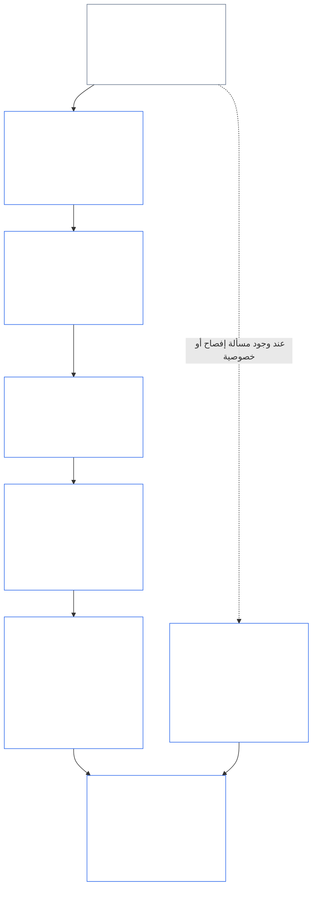
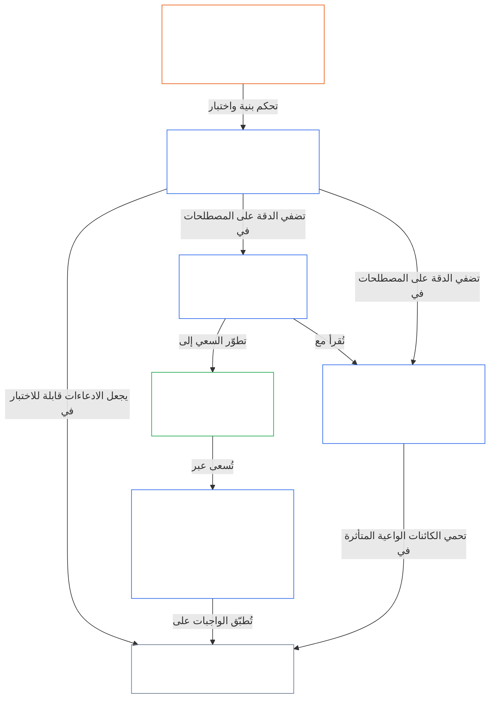

<a id="chapter-01-part-b-interaction-and-interpretation"></a>
# الفصل 01، الجزء ب: التفاعل والتفسير

<details>
<summary><strong><span style="color: #2563eb;">موضعه في المتن (غير تشغيلي): بنية الملف وقواعد القراءة</span></strong></summary>

> المحتوى الآتي **إرشادات للقراء فحسب**. ولا يضيف الالتزامات الملزمة الواردة في مواضع أخرى من هذا الملف أو في فصول أخرى، ولا يحذفها أو يضيّق نطاقها.
>
> هذا الملف **جزء من دستور الكائنات الواعية**، وهو **ملزم فقط بالاقتران** مع ملفات `core_*` الأخرى المرقمة، عند قراءتها بوصفها صكاً واحداً. ويتضمن **الفصل الأول، الجزء ب** (§§13–15: عملية حلّ التعارض الدستوري، وحظر التجاوز المطلق، والتفسير الدستوري) — وهو الجزء الذي يحافظ على سلامة **الرباعي الدستوري** عند تعارض المبادئ وعند قراءة الدستور.
>
> **السابق:** [core_01_a_values_principles.md](core_01_a_values_principles.md) (الفصل الأول، الجزء أ — §§1–12، غايتا الازدهار والاستمرارية)  
> **التالي:** [core_01_c_stewardship_capacity_principles.md](core_01_c_stewardship_capacity_principles.md) (الفصل الأول، الجزء ج — §§16–20، الإشراف والحوكمة ومواءمة الحوافز والتطبيق المتكامل).
> **مسار القراءة:** §13 عملية حلّ التعارض الدستوري (مصفوفة المفاضلات، وقيود الإفصاح، والعبء الممكن تجنبه) ← §14 حظر التجاوز المطلق ← §15 التفسير الدستوري (مبدأ عدم الالتفاف، والمعلومات المشتقة، والتعريفات، والالتباس، والأسبقية).

</details>

<details>
<summary><strong><span style="color: #2563eb;">إرشادات للقراء (غير تشغيلية): مرساة مصطلحات الفصل الخامس وفهرس مجموعاته</span></strong></summary>

<a id="chapter-one-part-a-chapter-five-vocabulary-anchor"></a>

> المحتوى الآتي **إرشادات للقراء فحسب**. ولا يضيف الالتزامات الملزمة الواردة في مواضع أخرى من هذا الملف أو في فصول أخرى، ولا يحذفها أو يضيّق نطاقها. وتوفر أدوات **التتبّع** و**التعريفات · التقييم · الامتثال** الخاصة بكل مادة روابط التوجيه وروابط O/M/A/C عند الموضع الذي تستدعي فيه كل مادة (§) مصطلحاً استدعاءً جوهرياً. أما هذا المقطع، فعلى النقيض، فهو خريطة مواءمة على مستوى الفصل للقراء الذين أنهوا الجزء أ.

**مصطلحات طبقة المبادئ** (مواضعها المرجعية في الفصل الأول (الجزآن أ وب)):

- [الرباعي الدستوري](core_00_preamble.md#constitutional-tetrad) — **المشاركة** و**الرقابة** و**المساءلة** و**الالتزام بالمواعيد**، بمقادير تتناسب مع [المصلحة الجوهرية](core_00_preamble.md#material-stake)
- [الغايتان الدستوريتان](core_00_preamble.md#two-constitutional-aims) — [الازدهار](core_00_preamble.md#flourishing) و[الاستمرارية](core_00_preamble.md#continuity) (غاية **الاستمرارية** الدستورية، وهي متميزة عن الاستمرارية التشغيلية أو استمرارية البروتوكول في مواضع أخرى من المتن)
- [المصلحة الجوهرية](core_00_preamble.md#material-stake) — مقياس الأثر والاعتماد والمخاطر لواجبات الرباعي؛ وتُقرأ مع الجوهرية التكاملية ([الجوهرية](core_05_band_oversight.md#materiality)) ومدخلات الفصل الخامس أدناه

**تعريفات الفصل الخامس البديلة** (استيفاء O/M/A/C — يُتتبّع ذلك بموجب الفصول الثاني إلى الرابع عند صلته الجوهرية):

- [الرفاه](core_05_band_continuity.md#wellbeing) (غاية الازدهار)
- [الرقابة](core_05_apex_oversight_leg.md#oversight)، [المساءلة](core_05_apex_accountability_leg.md#accountability)، [قابلية الطعن](core_05_band_accountability.md#contestability)، [الحوكمة](core_05_band_accountability.md#governance)، [الحوكمة المتناسبة مع التصنيف](core_05_band_oversight.md#classification-scaled-governance)
- [الجوهري](core_05_band_oversight.md#material)، [الأثر الجوهري](core_05_band_oversight.md#material-impact)، [المخاطر الجوهرية](core_05_band_oversight.md#material-risk)، [الجوهرية](core_05_band_oversight.md#materiality) (تُسمّي الأدوات هذا **الجوهرية**)، [الجوهرية النظامية](core_05_band_continuity.md#systemic-materiality) — المجموعة: [الجوهرية والأثر والمخاطر ونزاهة البدائل](core_05_band_oversight.md#materiality-impact-risk-and-proxy-integrity)

**المجموعات التابعة الرئيسية في §3 من الفصل الخامس** (مجموعات الاستدعاء المشترك — تُقرأ مع الفصول الثاني إلى الرابع عند صلتها الجوهرية):

- [صفة أصحاب المصلحة ووزنهم](core_05_band_participation.md#stakeholder-status-and-weight) (طبقة مشاركة أصحاب المصلحة في النظام)
- [طبقة العقد الدستوري](core_05_band_integrative.md#constitutional-contract-layer) و[هندسة الحوكمة والرقابة والاعتماد واللامركزية والتمركز وبنية السوق ونزاهة مسار الخروج](core_05_band_accountability.md#governance-architecture-decentralization-and-concentration)
- [المتن ومكدس الصلاحيات](core_05_band_integrative.md#defi1-corpus-and-authority-stack)
- [المساءلة وقابلية الطعن وإخفاق المساءلة الجماعية](core_05_apex_accountability_leg.md#accountability)

**CJS-3** (*مكتبة المجموعات التشغيلية (oDef)*) — بوصلة المجموعات التشغيلية للمصطلحات التشغيلية المشتركة بين التطبيقات؛ تُقرأ مع رباعي هذا الفصل وغاياته وتناسب المصلحة الجوهرية:

- [CJS-3.1 البوصلة الدستورية وخريطة المجموعات](corpus_joint_structure/cjs_03_cross_implementation_operational_terms.md#cjs-31-constitutional-compass-and-cluster-map) — المدخل الأساسي لمجموعات **CJS-3.2** (*الرقابة: مصطلحات الشفافية الانعكاسية والمساءلة*) إلى **CJS-3.23** (*التكامل: مصطلحات نزاهة التدخل والتجاوز*)، المنظمة بحسب ضلع الرباعي وغاية الاستمرارية والنطاقات التكاملية العابرة للأضلاع

</details>

<details>
<summary><strong><span style="color: #2563eb;">إرشادات للقراء (غير تشغيلية): كيف يحافظ الجزء ب على سلامة الرباعي الدستوري</span></strong></summary>

> المحتوى الآتي **إرشادات للقراء فحسب**. ولا يضيف الالتزامات الملزمة الواردة في مواضع أخرى من هذا الملف أو في فصول أخرى، ولا يحذفها أو يضيّق نطاقها. وتسمّي أدوات **التتبّع** الخاصة بكل مادة أضلاع الرباعي التي تتناولها المادة؛ أما هذا المقطع فهو خريطة على مستوى الجزء للقراء الذين يشرعون في قراءة الجزء ب.

**ما الذي يفعله الجزء ب.** يطوّر [الجزء أ](core_01_a_values_principles.md) [الغايتين الدستوريتين](core_00_preamble.md#two-constitutional-aims). ولا يضيف الجزء ب مبدأً جديداً ولا واجباً خامساً. بل يحافظ على سلامة [الرباعي الدستوري](core_00_preamble.md#constitutional-tetrad) — **المشاركة** و**الرقابة** و**المساءلة** و**الالتزام بالمواعيد**، بمقادير تتناسب مع [المصلحة الجوهرية](core_00_preamble.md#material-stake) — في ثلاث حالات:

- **عند تعارض المبادئ** ([§13 عملية حلّ التعارض الدستوري](#13-constitutional-collision-resolution-process)): تأتي السلامة والحقيقة أولاً، ويجب أن تحافظ كل مفاضلة أخرى على الرباعي بدلاً من إضعافه سعياً إلى حلّ سهل.
- **عند المغالاة في قيمة واحدة** ([§14 حظر التجاوز المطلق](#14-prohibition-on-absolute-override)): لا يجوز استخدام أي قيمة أو أي من الغايتين لتفريغ أحد الأضلاع من مضمونه إلى ما دون ما تقتضيه المصلحة الجوهرية.
- **عند قراءة الدستور أو تطبيقه** ([§15 التفسير الدستوري](#15-constitutional-interpretation)): لا يمكن لتغيير تسمية الفعل ذاته أو تقسيمه أو إعادة توجيه مساره أن يتفادى متطلباً، ويُفسَّر الالتباس بما يحقق [أقصى أثر وقائي](core_05_band_integrative.md#fullest-protective-effect).

**مواضع إعمال الجزء ب لكل ضلع.** تسرد أداة التتبّع في كل مادة كل ضلع تتناوله. ويسمّي هذا الجدول المواضع الرئيسية.

| ضلع الرباعي | ما يحافظ الجزء ب على تحققه فعلياً | المواضع الرئيسية في الجزء ب |
|---|---|---|
| **المشاركة** | لا يقع عبء الإثبات مطلقاً على الطرف المقيّد؛ ولا يجوز إلغاء حقوق الطعن والمراجعة والاستئناف الأساسية إلغاءً دائماً؛ ويجب أن تُبقي قيود الإفصاح قابلية الطعن المستنيرة سليمة؛ ويحدّ العبء الممكن تجنبه من القدرة على التصرف | [§13.1.1](#1311-necessity)، [§13.1.4](#1314-constitutional-floors-safety-and-anti-degrading-process)، [§13.1.5](#1315-least-restrictive-time-bounded-and-reviewable-constraint-principle)، [§13.2](#132-epistemic-disclosure-constraints)، [§13.3](#133-minimization-of-avoidable-burden)، [§15.1](#151-constitutional-no-bypass-principle)، [§15.1.2](#1512-derived-information-principle) |
| **الرقابة** | يُحتسب الضرر كاملاً؛ وتكون القرارات قابلة لإعادة البناء والمراجعة المستقلة من الآخرين؛ وتظل الرقابة ممكنة رغم قيود الإفصاح؛ وتتوقف المقاييس عن الاحتساب متى انحرفت عن غايتها | [§13.1.2](#1312-harm-minimization)، [§13.1.5](#1315-least-restrictive-time-bounded-and-reviewable-constraint-principle)، [§13.2](#132-epistemic-disclosure-constraints)، [§13.2.4](#1324-proxy-divergence-invalidation)، [§15.1](#151-constitutional-no-bypass-principle)، [§15.4.4](#1544-combined-satisfaction-of-jointly-applicable-incorporated-obligations) |
| **المساءلة** | يتحمل المقيِّد عبء الإثبات؛ وتزداد قابلية مساءلته بازدياد سلطته؛ ويُحظر أن تؤدي العملية إلى الحط من الكرامة أو الإذلال؛ ويُدقَّق لاحقاً في كل قيد على الإفصاح | [§13.1.1](#1311-necessity)، [§13.1.3](#1313-proportionality)، [§13.1.4](#1314-constitutional-floors-safety-and-anti-degrading-process)، [§13.1.5](#1315-least-restrictive-time-bounded-and-reviewable-constraint-principle)، [§13.2.1](#1321-preservation-of-epistemic-integrity)، [§15.1](#151-constitutional-no-bypass-principle)، [§15.1.2](#1512-derived-information-principle) |
| **الالتزام بالمواعيد** | تكون القيود محددة المدة وقابلة للمراجعة، مع مسار لاستعادة الوضع؛ ويجري التعامل مع التعارض الدستوري المعلّق وفق الساعة المنطبقة؛ وينتهي تأخير الإفصاح بالإفصاح؛ ويُعدّ التأخير الممكن تجنبه عبئاً ممكناً تجنبه؛ ويكون التضييق في الطوارئ محدود المدة | [§13.1.5](#1315-least-restrictive-time-bounded-and-reviewable-constraint-principle)، [§13.2.1](#1321-preservation-of-epistemic-integrity)، [§13.3](#133-minimization-of-avoidable-burden)، [§15.1](#151-constitutional-no-bypass-principle)، [§15.4.4](#1544-combined-satisfaction-of-jointly-applicable-incorporated-obligations) |

**مواد لا تتناول أي ضلع مباشرةً.** يحكم [§15.1.1 مبدأ منع التجزئة](#1511-anti-segmentation-principle) و[§15.4.1](#1541-integrated-reading) إلى [§15.4.3](#1543-incorporation-layer) كيفية قراءة النص وأي طبقة مصدر هي الحاكمة. ولا تحمل أدوات التتبّع فيها أي إشارة إلى أضلاع الرباعي، وذلك عن قصد.

**معنيان للزمن.** يرد الزمن في الجزء ب بمعنيين. فالآفاق الزمنية الطويلة (الضرر المتأخر والتراكمي، و[قيد الاتساق الزمني §4.2 من الفصل الثامن](core_08_a_system_alignment_certification_evaluation.md#42-time-consistency-constraint) المطبّق في [§13.1.2](#1312-harm-minimization)) تتبع غاية **الاستمرارية**. أما الساعات وفترات المراجعة والتأخير (الحدود الزمنية للقيود، والإفصاح في نهاية المطاف، والتأخير الممكن تجنبه) فتتبع ضلع **الالتزام بالمواعيد**.

**محوران لا تعارض.** تبيّن غايات الجزء أ ما تسعى إليه الأنظمة المشتركة. ويبيّن الجزء ب ما لا يجوز لأي مفاضلة أو تجاوز أو قراءة أن تنتزعه في الطريق.

</details>

<br>
<a id="13-constitutional-collision-resolution-process"></a>

### 13. عملية حلّ التعارض الدستوري
<details>
<summary><strong><span style="color: #2563eb;">التتبّع</span></strong></summary>

- يُقرأ مع: [الرباعي الدستوري](core_00_preamble.md#constitutional-tetrad) — المشاركة والرقابة والمساءلة والالتزام بالمواعيد في الإجراءات والإفصاح والتعامل مع التعارض الدستوري والانتصاف؛ وبمقياس [المصلحة الجوهرية](core_00_preamble.md#material-stake).
- المنبع: المبادئ: [3. الهدف التأسيسي: الرفاه](core_01_a_values_principles.md#3-foundational-objective-wellbeing-flourishing-aim)، [4 السلامة](core_01_a_values_principles.md#4-safety-harm-constraint)، [5 الحقيقة](core_01_a_values_principles.md#5-truth-epistemic-integrity-constraint)، [6. الثقة](core_01_a_values_principles.md#6-trust-and-trustworthiness-coordination-integrity)، [7. الحرية (القدرة على التصرف ضمن حدود)](core_01_a_values_principles.md#7-freedom-bounded-agency)، و[§16 التعمق في الإشراف](core_01_c_stewardship_capacity_principles.md#16-stewardship-in-depth).
- المصب: [13.2.1 صون النزاهة المعرفية](#1321-preservation-of-epistemic-integrity)، [سجل التعارض الدستوري](core_05_band_integrative.md#constitutional-collision-record)، [الوضع المؤقت الافتراضي](#default-interim-posture)، و[14. حظر التجاوز المطلق](#14-prohibition-on-absolute-override).
- يحكم التعارضات العابرة للمواد في [الفصل السادس: الحقوق التأسيسية](core_06_rights_part_a.md#chapter-six-foundational-rights).
  - يُقرأ هذا مع [المادة XXIV: التفسير الدستوري والمراجعة وضمانات منع الاستحواذ](core_06_rights_part_d.md#article-xxiv-constitutional-interpretation-review-and-anti-capture-safeguards) و[المادة XX: العدالة بعد التحقق من وقوع الانتهاك](core_06_rights_part_d.md#article-xx-justice-after-verified-violation).
  - يُطبّق عند نشوء مسائل المراجعة أو الطوارئ أو التعارض الدستوري.

</details>

<details>
<summary><strong><span style="color: #2563eb;">التعريفات · التقييم · الامتثال</span></strong></summary>

- [التعارض الدستوري](core_05_band_integrative.md#constitutional-collision) · [O](core_05_band_integrative.md#constitutional-collision) · [M](core_05_band_integrative.md#constitutional-collision-a) · [A](core_05_band_integrative.md#constitutional-collision-a) · [C](core_05_band_integrative.md#constitutional-collision-c)
- [المشاركة](core_05_apex_participation_leg.md#participation-constitutional) · [O](core_05_apex_participation_leg.md#participation-constitutional) · [M](core_05_apex_participation_leg.md#participation-constitutional-m) · [A](core_05_apex_participation_leg.md#participation-constitutional-a) · [C](core_05_apex_participation_leg.md#participation-constitutional-c)
- [الرقابة](core_05_apex_oversight_leg.md#oversight-constitutional) · [O](core_05_apex_oversight_leg.md#oversight-constitutional) · [M](core_05_apex_oversight_leg.md#oversight-constitutional-m) · [A](core_05_apex_oversight_leg.md#oversight-constitutional-a) · [C](core_05_apex_oversight_leg.md#oversight-constitutional-c)
- [المساءلة](core_05_apex_accountability_leg.md#accountability) · [O](core_05_apex_accountability_leg.md#accountability) · [M](core_05_apex_accountability_leg.md#accountability-m) · [A](core_05_apex_accountability_leg.md#accountability-a) · [C](core_05_apex_accountability_leg.md#accountability-c)
- [الالتزام بالمواعيد](core_05_apex_timeliness_leg.md#timeliness-constitutional) · [O](core_05_apex_timeliness_leg.md#timeliness-constitutional) · [M](core_05_apex_timeliness_leg.md#timeliness-constitutional-m) · [A](core_05_apex_timeliness_leg.md#timeliness-constitutional-a) · [C](core_05_apex_timeliness_leg.md#timeliness-constitutional-c)

</details>

<br>

*بعبارة واضحة: ستقع التعارضات الدستورية — وتأتي **السلامة** و**الحقيقة** أولاً. وبعد ذلك، يجب أن تكون القيود متناسبة وضرورية ومقلِّلة للضرر وخفيفة قدر الإمكان. لا يجوز إخفاء الحقيقة طلباً للراحة؛ ولا يجوز تجريد أحد من الخصوصية طلباً للسهولة؛ وتُطبّق قيود الحرية بموجب [§7.1 انضباط التقييد](core_01_a_values_principles.md#71-limitation-discipline)؛ وتتطلب التعارضات الدستورية المتعلقة بالحقوق اختبار قرار موثقاً؛ والمقاييس التي تقدم صورة زائفة عن الامتثال لا يُعتد بها. ولا يمكن للتحسين قصير الأفق اجتياز التقييم بموجب [قيد الاتساق الزمني §4.2 من الفصل الثامن](core_08_a_system_alignment_certification_evaluation.md#42-time-consistency-constraint). وتحمل **§13.1** (*مبادئ المفاضلة الأساسية*) حتى **§13.3** (*تقليل العبء الممكن تجنبه*) قواعد المفاضلة وقيود الإفصاح والخصوصية وإجراءات التعارض الدستوري.*

يحافظ الجزء ب على سلامة الرباعي في ثلاث حالات:
- **[التعارضات الدستورية](core_05_band_integrative.md#constitutional-collision) (هذا القسم):** يحلها من دون إضعاف أي ضلع.
- **التجاوز ([§14 حظر التجاوز المطلق](#14-prohibition-on-absolute-override)):** يمنع أي قيمة منفردة، بما فيها أي من الغايتين، من التغلب على القيم الأخرى أو تفريغ أحد الأضلاع من مضمونه إلى ما دون ما تقتضيه المصلحة الجوهرية.
- **القراءة والتطبيق ([§15 التفسير الدستوري](#15-constitutional-interpretation)):** يمنع إعادة تسمية الفعل ذاته أو تقسيمه أو إعادة توجيه مساره لتفادي متطلب، ويوجه تفسير الالتباس نحو [أقصى أثر وقائي](core_05_band_integrative.md#fullest-protective-effect).

عندما تتعارض القيم أو القيود:
- **الأسبقية:** تتقدم **السلامة** و**الحقيقة** عندما يتعذر حل التعارض من دون انتهاكهما.
- **صون الرباعي:** يجب أن تحافظ المفاضلات الأخرى على [الرباعي الدستوري](core_00_preamble.md#constitutional-tetrad) — **المشاركة** و**الرقابة** و**المساءلة** و**الالتزام بالمواعيد**، بمقادير تتناسب مع [المصلحة الجوهرية](core_00_preamble.md#material-stake) — وألا تضعفه سعياً إلى حل سهل.
- **الأثر المجمع:** قد تتجمع قرارات صغيرة عديدة، يبدو كل منها مقبولاً، لتنتج معاً مآلاً يرفضه هذا الدستور.
- **موضع الحل:** يجب على الأنظمة حل التعارضات بموجب **§13.1** (*مبادئ المفاضلة الأساسية*) حتى **§13.3** (*تقليل العبء الممكن تجنبه*).

**رسم توضيحي: الجزء ب والرباعي الدستوري**

<hr style="border: 0; border-top: 1px solid currentColor;">

```mermaid
flowchart TB
    PA["مبادئ الجزء أ والغايتان الدستوريتان<br/><br/>• الازدهار والاستمرارية<br/>• مبادئ وقيود قد تتعارض<br/>أو تحتمل أكثر من قراءة"]
    P13["§13 عملية حلّ التعارض الدستوري<br/><br/>• السلامة والحقيقة أولاً<br/>• كل مفاضلة أخرى تصون الرباعي<br/>• ترتيب المفاضلات وقيود الإفصاح،<br/>والعبء الممكن تجنبه"]
    P14["§14 حظر التجاوز المطلق<br/><br/>• لا قيمة تُعدّ ورقة رابحة<br/>• لا تتغلب أي من الغايتين على الأخرى<br/>• لا يُفرّغ أي ضلع دون مستوى المصلحة الجوهرية"]
    P15["§15 التفسير الدستوري<br/><br/>• منع الالتفاف ومنع التجزئة،<br/>والمعلومات المشتقة<br/>• تفسير الالتباس على أساس النص ككل متكامل<br/>• أسبقية طبقات المصادر"]
    TT["الرباعي الدستوري<br/><br/>• مصون، وبمقياس يتناسب مع المصلحة الجوهرية<br/>• المشاركة · الرقابة · المساءلة · الالتزام بالمواعيد"]
    P["المشاركة<br/><br/>• لا يقع العبء مطلقاً على الطرف المقيّد<br/>• تبقى حقوق الاعتراض والاستئناف"]
    O["الرقابة<br/><br/>• يُحتسب الضرر كاملاً<br/>• يستطيع الآخرون إعادة بناء القرارات<br/>ومراجعتها باستقلال"]
    A["المساءلة<br/><br/>• يتحمل المقيِّد العبء<br/>• تزداد قابلية المساءلة مع السلطة"]
    T["الالتزام بالمواعيد<br/><br/>• القيود محددة المدة وقابلة للمراجعة<br/>• لا يجوز للتأخير أن يحول دون الانتصاف"]
    PA --> P13
    PA --> P14
    PA --> P15
    P13 --> TT
    P14 --> TT
    P15 --> TT
    TT --> P
    TT --> O
    TT --> A
    TT --> T
    style PA fill:none,stroke:#16a34a,color:#ffffff
    style P13 fill:none,stroke:#2563eb,color:#ffffff
    style P14 fill:none,stroke:#2563eb,color:#ffffff
    style P15 fill:none,stroke:#2563eb,color:#ffffff
    style TT fill:none,stroke:#2563eb,color:#ffffff
    style P fill:none,stroke:#0f766e,color:#ffffff
    style O fill:none,stroke:#ea580c,color:#ffffff
    style A fill:none,stroke:#db2777,color:#ffffff
    style T fill:none,stroke:#9333ea,color:#ffffff
```

*قد تتعارض مبادئ الجزء أ وغاياته، وقد تحتمل أكثر من قراءة. يحل الجزء ب التعارضات الدستورية، ويحظر التجاوز، ويحدد كيفية قراءة النص، كي يظل كل ضلع من أضلاع الرباعي متحققاً بالمستوى الذي تقتضيه المصلحة الجوهرية. وتعيد ألوان الحدود استخدام ألوان أضلاع الرباعي، وهي إشارات بصرية لا ادعاءات بالأسبقية. وتسمّي أداة التتبّع في كل قسم الأضلاع التي يتناولها.*
<a id="131-core-tradeoff-principles"></a>
#### 13.1 مبادئ المفاضلة الأساسية

<details>
<summary><strong><span style="color: #2563eb;">التتبّع</span></strong></summary>

- يُقرأ مع: [الرباعي الدستوري](core_00_preamble.md#constitutional-tetrad) — تعمل أضلاعه الأربعة جميعاً عبر سلسلة المفاضلة: **المساءلة** و**المشاركة** ([§13.1.1](#1311-necessity)، من يتحمل العبء)، و**الرقابة** ([§13.1.2](#1312-harm-minimization) و[§13.1.5](#1315-least-restrictive-time-bounded-and-reviewable-constraint-principle)، حيث يُحتسب الضرر كاملاً ويُنشأ سجل للتعارض الدستوري يستطيع الآخرون مراجعته)، و**الالتزام بالمواعيد** (§13.1.5، القيود المحددة المدة والقابلة للمراجعة)؛ ويُستخدم مقياس [المصلحة الجوهرية](core_00_preamble.md#material-stake) في عبء الإثبات وعمق التدقيق. وتسمّي أداة التتبّع في كل قسم فرعي الأضلاع التي يتناولها.
- الأقسام الفرعية: [§13.1.1 الضرورة](#1311-necessity) · [§13.1.2 تقليل الضرر](#1312-harm-minimization) · [§13.1.3 التناسب](#1313-proportionality) · [§13.1.4 الحدود الدستورية الدنيا والسلامة والإجراءات المناهضة للإذلال](#1314-constitutional-floors-safety-and-anti-degrading-process) · [§13.1.5 مبدأ القيود الأقل تقييداً والمحددة المدة والقابلة للمراجعة](#1315-least-restrictive-time-bounded-and-reviewable-constraint-principle).

</details>

<details>
<summary><strong><span style="color: #2563eb;">التعريفات · التقييم · الامتثال</span></strong></summary>

*النطاق.* [§13.1 مبادئ المفاضلة الأساسية](#131-core-tradeoff-principles) — تعريفات الضرورة وتقليل الضرر والضرر في سلسلة المفاضلة.

- [الضرورة](core_05_band_accountability.md#necessity) · [O](core_05_band_accountability.md#necessity) · [M](core_05_band_accountability.md#necessity-a) · [A](core_05_band_accountability.md#necessity-a) · [C](core_05_band_accountability.md#necessity-c)
- [تقليل الضرر (اختيار المفاضلة)](core_05_band_accountability.md#harm-minimization-tradeoff-selection) · [O](core_05_band_accountability.md#harm-minimization-tradeoff-selection) · [M](core_05_band_accountability.md#harm-minimization-tradeoff-selection-a) · [A](core_05_band_accountability.md#harm-minimization-tradeoff-selection-a) · [C](core_05_band_accountability.md#harm-minimization-tradeoff-selection-c)
- [الضرر](core_05_band_accountability.md#harm) · [O](core_05_band_accountability.md#harm) · [M](core_05_band_accountability.md#harm-a) · [A](core_05_band_accountability.md#harm-a) · [C](core_05_band_accountability.md#harm-c)

</details>

<br>

*بعبارة واضحة: عندما يلزمك تقييد شيء، فاجعل التدبير مناسباً للمشكلة — استخدم أخف خطوة ما زالت فعالة، واختر البديل الأقل ضرراً، وأهدر أقل قدر من وقت الكائنات الواعية متى استوفيت بالفعل متطلبات السلامة والحقيقة والحقوق. وترتفع العتبة سريعاً حين يكون الضرر محتملاً أن يكون غير قابل للعكس أو أن يقيد الأنظمة في مسار ثابت.*

**كيفية قراءة السلسلة:** طبّق هذه القواعد بوصفها تسلسلاً واحداً، لا أذونات مستقلة.
- **[§13.1.1 الضرورة](#1311-necessity)** تسأل إن كان التقييد ضرورياً أصلاً، أو إن كان بديل أقل تقييداً لا يزال قادراً على منع الضرر الجوهري أو المخاطر النظامية. ويتحمل المقيِّد عبء الإثبات.
- **[§13.1.2 تقليل الضرر](#1312-harm-minimization)** يقتضي اختيار الخيار الملائم دستورياً والأقل إضراراً بالكائنات الواعية والأنظمة والآفاق الزمنية.
- **[§13.1.3 التناسب](#1313-proportionality)** يتحقق من ملاءمة نطاق القيد المختار لحجم الضرر المعالَج واحتماله وطابعه النظامي.
- **[§13.1.4 الحدود الدستورية الدنيا والسلامة والإجراءات المناهضة للإذلال](#1314-constitutional-floors-safety-and-anti-degrading-process)** يحدد حدوداً مطلقة تظل سارية حتى مع وجود قيد ضروري يقلل الضرر ومتناسب على نحو صحيح: فلا يجوز إلغاء بعض الحدود الدنيا لأرضية الحقوق نهائياً؛ وتعمل السلامة بوصفها مبرراً وقيداً في آنٍ واحد؛ ويجب ألا تنحدر الإجراءات أبداً إلى الإذلال أو الاستعراض أو الانتقام. وتشكل الحدود الدنيا لأرضية الحقوق وحد الإجراءات المناهضة للإذلال معاً [مبادئ الكرامة](#dignity-principles).
- **[§13.1.5 مبدأ القيود الأقل تقييداً والمحددة المدة والقابلة للمراجعة](#1315-least-restrictive-time-bounded-and-reviewable-constraint-principle)** يحكم شكل أي قيد يجتاز الاختبارات السابقة: فيجب أن يستخدم أخف تدبير فعال، وأن يظل قابلاً للمراجعة المستقلة، وأن يكون مؤقتاً ما لم يسمح هذا الدستور صراحةً بقيد دائم.

بعد استيفاء سلسلة المفاضلة، ينطبق **[§13.3 تقليل العبء الممكن تجنبه](#133-minimization-of-avoidable-burden)** على التصميم الناتج: يجب على الأنظمة تفضيل الخيار الذي يهدر أقل قدر من وقت الكائنات الواعية وانتباهها وجهدها.

**رسم توضيحي: سلسلة المفاضلة وأضلاع الرباعي التي يتناولها كل إجراء**

<hr style="border: 0; border-top: 1px solid currentColor;">



*تجري المفاضلة في التعارض الدستوري وفق السلسلة وبالترتيب: الضرورة، وتقليل الضرر، والتناسب، والحدود الدستورية الدنيا، وشكل أي قيد متبقٍ. وتخضع تعارضات الإفصاح والخصوصية أيضاً لـ§13.2 (*قيود الإفصاح المعرفي*). وينطبق §13.3 (*تقليل العبء الممكن تجنبه*) على كل ما يجتازها. ويعرض كل مربع أضلاع الرباعي التي تسميها أداة التتبّع. والألوان إشارات بصرية لا ادعاءات بالأسبقية.*

<br>
<a id="1311-necessity"></a>
##### 13.1.1 الضرورة
<details>
<summary><strong><span style="color: #2563eb;">مسار التتبّع</span></strong></summary>

- يُقرأ مع: [الرباعية الدستورية](core_00_preamble.md#constitutional-tetrad) — ضلع **المساءلة** (يقع عبء الإثبات على الجهة المقيِّدة، وعليها توثيق البدائل)؛ وضلع **المشاركة** (لا يقع العبء مطلقًا على الطرف الذي تُقيَّد حريته أو فاعليته أو إمكانية وصوله، ويكون الإثبات أشد صرامة حين يقع عبء على الحرية أو الفاعلية المجدية أو الموافقة)؛ وضلع **الرقابة** (يُوثَّق تحليل البدائل ليتسنى للمراجعين التحقق منه)؛ والتدرّج بحسب [المصلحة المادية](core_00_preamble.md#material-stake).

</details>

<details>
<summary><strong><span style="color: #2563eb;">التعريفات · التقييم · الامتثال</span></strong></summary>

- [الضرورة](core_05_band_accountability.md#necessity) · [O](core_05_band_accountability.md#necessity) · [M](core_05_band_accountability.md#necessity-a) · [A](core_05_band_accountability.md#necessity-a) · [C](core_05_band_accountability.md#necessity-c)
- [الجدوى](core_05_band_accountability.md#feasibility) · [O](core_05_band_accountability.md#feasibility) · [M](core_05_band_accountability.md#feasibility-a) · [A](core_05_band_accountability.md#feasibility-a) · [C](core_05_band_accountability.md#feasibility-c)
- [الحرية (الفاعلية المحدودة)](core_05_band_participation.md#freedom-bounded-agency) · [O](core_05_band_participation.md#freedom-bounded-agency) · [M](core_05_band_participation.md#freedom-bounded-agency-a) · [A](core_05_band_participation.md#freedom-bounded-agency-a) · [C](core_05_band_participation.md#freedom-bounded-agency-c)
- [الفاعلية المجدية](core_05_band_participation.md#meaningful-agency) · [O](core_05_band_participation.md#meaningful-agency) · [M](core_05_band_participation.md#meaningful-agency-a) · [A](core_05_band_participation.md#meaningful-agency-a) · [C](core_05_band_participation.md#meaningful-agency-c)

</details>

<br>

*بعبارات بسيطة: لا يُفرض القيد إلا إذا لم يوجد بديل أقل تقييدًا يظل قادرًا على منع الضرر المادي أو الخطر المنهجي. وتقع على الطرف الذي يفرض القيد مسؤولية إثبات ذلك، لا على الطرف الذي تُحدّ حريته. فالملاءمة، أو العادة المؤسسية، أو عبارة «لطالما فعلنا ذلك بهذه الطريقة» لا تثبت الضرورة. وإذا كان خيار أخف يفي بالغرض، فإن الخيار الأشد لا يمتثل.*

**عبء الإثبات.** يقع على الطرف الذي يفرض قيدًا دستوريًا أو يبقيه عبء إثبات عدم وجود بديل أقل تقييدًا من شأنه أن يمنع الضرر المادي أو الخطر المنهجي في الظروف المعنية. ولا يقع على الطرف الذي تُقيَّد حريته أو فاعليته أو إمكانية وصوله عبء إثبات وجود بدائل.

**اشتراط تحليل البدائل.** يجب دعم ادعاءات الضرورة بتحليل موثّق لما يلي:
- البدائل المتاحة على نحو معقول، بما فيها عدم اتخاذ إجراء؛
- فعالية كل بديل مقارنة بالضرر الدستوري المراد معالجته؛
- المخاطر المتبقية أو أوجه عدم المواءمة في ظل كل بديل.

إن مجرد التأكيد على عدم وجود بديل، من دون تحليل موثّق، لا يفي بهذا الاشتراط.

**ما لا يثبت الضرورة:**
- الملاءمة أو التفضيل الإداري؛
- الممارسة الافتراضية أو الجمود المؤسسي أو التقاليد؛
- خفض التكاليف وحده عندما تتأثر الحقوق ماديًا؛
- مجرد كون القيد قائمًا بالفعل.

**النطاق.** ينطبق هذا البند الفرعي على أي قيد دستوري، وليس على سياقات التصادم الدستوري وحدها بموجب [§13.1.5 إجراء تصادم الحقوق](#1315-rights-collision-decision-test). وعندما يحمّل القيد [الحرية (الفاعلية المحدودة)](core_05_band_participation.md#freedom-bounded-agency) أو [الفاعلية المجدية](core_05_band_participation.md#meaningful-agency) أو [الموافقة](core_05_band_participation.md#consent) عبئًا ماديًا، يجب أن يكون إثبات الضرورة صارمًا بالقدر المقابل.
<a id="1312-harm-minimization"></a>
##### 13.1.2 تقليل الضرر
<details>
<summary><strong><span style="color: #2563eb;">التتبّع</span></strong></summary>

- يُقرأ مع: [الرباعية الدستورية](core_00_preamble.md#constitutional-tetrad) — ضلع **الإشراف** (يُحتسب الضرر غير المباشر والمتأخر والتراكمي والعابر للأنظمة والبيئي، ولا يُترك خفيًا)؛ وضلع **المساءلة** (لا يجوز تحميل أطراف غير محتسبة الضررَ لإظهار أن الضرر قد جرى تقليله)؛ ومعايرة [المصلحة المادية](core_00_preamble.md#material-stake) عبر الآفاق الزمنية ذات الصلة.

</details>

<details>
<summary><strong><span style="color: #2563eb;">التعريفات · التقييم · الامتثال</span></strong></summary>

- [تقليل الضرر (اختيار المفاضلة)](core_05_band_accountability.md#harm-minimization-tradeoff-selection) · [O](core_05_band_accountability.md#harm-minimization-tradeoff-selection) · [M](core_05_band_accountability.md#harm-minimization-tradeoff-selection-a) · [A](core_05_band_accountability.md#harm-minimization-tradeoff-selection-a) · [C](core_05_band_accountability.md#harm-minimization-tradeoff-selection-c)
- [الضرر](core_05_band_accountability.md#harm) · [O](core_05_band_accountability.md#harm) · [M](core_05_band_accountability.md#harm-a) · [A](core_05_band_accountability.md#harm-a) · [C](core_05_band_accountability.md#harm-c)
- [السلامة الإيكولوجية](core_05_band_continuity.md#ecological-integrity) · [O](core_05_band_continuity.md#ecological-integrity) · [M](core_05_band_continuity.md#ecological-integrity-constitutional-a) · [A](core_05_band_continuity.md#ecological-integrity-constitutional-a) · [C](core_05_band_continuity.md#ecological-integrity-constitutional-c)
- [قدرة التعافي الإيكولوجي](core_05_band_continuity.md#ecological-recovery-capacity) · [O](core_05_band_continuity.md#ecological-recovery-capacity) · [M](core_05_band_continuity.md#ecological-recovery-capacity-constitutional-a) · [A](core_05_band_continuity.md#ecological-recovery-capacity-constitutional-a) · [C](core_05_band_continuity.md#ecological-recovery-capacity-constitutional-c)
- [المخاطر](core_05_band_continuity.md#risk) · [O](core_05_band_continuity.md#risk) · [M](core_05_band_continuity.md#risk-a) · [A](core_05_band_continuity.md#risk-a) · [C](core_05_band_continuity.md#risk-c)
- [الضرر غير القابل للعكس](core_05_band_accountability.md#irreversible-harm) · [O](core_05_band_accountability.md#irreversible-harm) · [M](core_05_band_accountability.md#irreversible-harm-a) · [A](core_05_band_accountability.md#irreversible-harm-a) · [C](core_05_band_accountability.md#irreversible-harm-c)

</details>

<br>

*بعبارات بسيطة: عندما تبقى عدة خيارات ضرورية بعد استيفاء [§13.1.1 الضرورة](#1311-necessity)، اختر الخيار الذي يُحدث أقل قدر إجمالي من الضرر — مع احتساب جميع المتأثرين والنظم الإيكولوجية والكائنات الحية وجميع الأنظمة المتأثرة وكل الآفاق الزمنية المهمة. إن التحسين محليًا مع التسبب في ضرر نظامي أو إيكولوجي، أو التحسين على المدى القصير مع التسبب في ضرر طويل الأمد، لا يجتاز هذا الاختبار. ولا يجيز تقليل الضرر أبدًا النزول دون الحدود الدستورية في [§13.1.4 الحدود الدستورية والسلامة والإجراءات المناهضة للإذلال](#1314-constitutional-floors-safety-and-anti-degrading-process).* 

**نطاق المقارنة.** عندما تستوفي خيارات متعددة كافية دستوريًا [السلامة (§4)](core_01_a_values_principles.md#4-safety-harm-constraint) و[الحقيقة (§5)](core_01_a_values_principles.md#5-truth-epistemic-integrity-constraint) و[§13.1.1 الضرورة](#1311-necessity)، يجب أن يرجّح الاختيار الخيار الذي يقلل إجمالي [الضرر](core_05_band_accountability.md#harm) عبر:
- الكائنات الواعية المتأثرة مباشرة وغير مباشرة؛
- الأنظمة التي تحمل النتيجة أو تتوسطها أو تعتمد عليها؛
- النظم الإيكولوجية والأنظمة الحية، بما فيها [السلامة الإيكولوجية](core_05_band_continuity.md#ecological-integrity)، وحيث تكون القدرة على التعافي بعد الضرر ذات أهمية، [قدرة التعافي الإيكولوجي](core_05_band_continuity.md#ecological-recovery-capacity)؛
- الآفاق الزمنية ذات الصلة، بما فيها الآثار المتأخرة والتراكمية.

**متطلب التجميع.** يجب أن يجمع تقييم الضرر ما يلي:
- الأضرار المباشرة التي تلحق بالأطراف المحددة؛
- الأضرار غير المباشرة التي تنتقل عبر الأنظمة أو التبعيات أو السوابق؛
- الأضرار المتأخرة التي تظهر بمرور الوقت؛
- الأضرار التراكمية الناجمة عن القرارات المتكررة أو المتفاقمة؛
- الآثار العابرة للأنظمة، حين ينتج عن فعل في مجال ما ضرر في مجال آخر؛
- الضرر الإيكولوجي، بما في ذلك الآثار المُحمّلة على الغير والمتأخرة والتراكمية وآثار القدرة على التعافي.

ما يلي غير ممتثل:
- الاقتصار على تحسين الضرر المحلي أو الفوري مع إحداث ضرر نظامي أو إجمالي أو إيكولوجي أكبر؛
- تحميل النظم الإيكولوجية أو الكائنات الواعية غير المحددة أو الأطراف الأخرى غير المحتسبة الضررَ، بغية إظهار تقليل الضرر على الأطراف المحددة.

**الانضباط في الأفق الزمني.** إن التحسين قصير الأجل على حساب النظام على المدى الطويل لا يجتاز هذا الاختبار. ويجب أن يأخذ تقليل الضرر في الحسبان [قيد الاتساق الزمني في الفصل الثامن §4.2](core_08_a_system_alignment_certification_evaluation.md#42-time-consistency-constraint): فالقرار الذي يبدو أنه يقلل الضرر في الفترة الحالية لكنه يتسبب على نحو متوقع في ضرر أكبر عبر الأفق الزمني الدستوري ذي الصلة يُعد غير ممتثل.

**العلاقة بالحدود الدستورية.** يعمل تقليل الضرر *فوق* الحدود الدستورية الواردة في [§13.1.4 الحدود الدستورية والسلامة والإجراءات المناهضة للإذلال](#1314-constitutional-floors-safety-and-anti-degrading-process). ولا يجيز أبدًا:
- الإلغاء الدائم للحد الأدنى من الحقوق؛
- الإجراءات المُذِلّة — أي تقييد أو إنصاف أو إجراء صُمم أو صيغ أو نُفذ بقصد الإهانة أو الاستعراض أو الانتقام أو فرض أعباء تمييزية أو تآكل الحقوق بدافع التيسير ([§13.1.4 الحدود الدستورية والسلامة والإجراءات المناهضة للإذلال](#1314-constitutional-floors-safety-and-anti-degrading-process))؛
- النزول دون حد السلامة.

يختار تقليل الضرر من بين الخيارات التي تجتاز هذه الحدود أصلًا — ولا يقايض بالنزول دونها.
<a id="1313-proportionality"></a>
##### 13.1.3 التناسب

<details>
<summary><strong><span style="color: #2563eb;">التتبّع</span></strong></summary>

- يُقرأ مع: [الرباعية الدستورية](core_00_preamble.md#constitutional-tetrad) — ضلعي **المساءلة** و**الرقابة** (المساءلة المتناسبة مع السلطة: تزداد شدتها مع السلطة المأذون بها أو الدور ذي العواقب، ولا تنخفض مطلقًا)؛ ومعايرة [المصلحة الجوهرية](core_00_preamble.md#material-stake) (الحد الأدنى للتصنيف والعتبات المشددة).
- يُقرأ مع: [§18.1 الحوكمة بوصفها بنية مأذونًا بها](core_01_c_stewardship_capacity_principles.md#181-governance-as-authorized-structure).

</details>

<details>
<summary><strong><span style="color: #2563eb;">التعريفات · التقييم · الامتثال</span></strong></summary>

- [التناسب](core_05_band_accountability.md#proportionality) · [O](core_05_band_accountability.md#proportionality) · [M](core_05_band_accountability.md#proportionality-a) · [A](core_05_band_accountability.md#proportionality-a) · [C](core_05_band_accountability.md#proportionality-c)
- [المخاطر](core_05_band_continuity.md#risk) · [O](core_05_band_continuity.md#risk) · [M](core_05_band_continuity.md#risk-a) · [A](core_05_band_continuity.md#risk-a) · [C](core_05_band_continuity.md#risk-c)
- [الضرر غير القابل للعكس](core_05_band_accountability.md#irreversible-harm) · [O](core_05_band_accountability.md#irreversible-harm) · [M](core_05_band_accountability.md#irreversible-harm-a) · [A](core_05_band_accountability.md#irreversible-harm-a) · [C](core_05_band_accountability.md#irreversible-harm-c)
- [المخاطر الوجودية](core_05_band_continuity.md#existential-risk) · [O](core_05_band_continuity.md#existential-risk) · [M](core_05_band_continuity.md#existential-risk-a) · [A](core_05_band_continuity.md#existential-risk-a) · [C](core_05_band_continuity.md#existential-risk-c)
- [قدرة التعافي البيئي](core_05_band_continuity.md#ecological-recovery-capacity) · [O](core_05_band_continuity.md#ecological-recovery-capacity) · [M](core_05_band_continuity.md#ecological-recovery-capacity-constitutional-a) · [A](core_05_band_continuity.md#ecological-recovery-capacity-constitutional-a) · [C](core_05_band_continuity.md#ecological-recovery-capacity-constitutional-c)
- [الانغلاق المنظومي](core_05_band_continuity.md#systemic-lock-in) · [O](core_05_band_continuity.md#systemic-lock-in) · [M](core_05_band_continuity.md#systemic-lock-in-a) · [A](core_05_band_continuity.md#systemic-lock-in-a) · [C](core_05_band_continuity.md#systemic-lock-in-c)
- [قابلية التراجع](core_05_band_continuity.md#reversibility) · [O](core_05_band_continuity.md#reversibility) · [M](core_05_band_continuity.md#reversibility-constitutional-a) · [A](core_05_band_continuity.md#reversibility-constitutional-a) · [C](core_05_band_continuity.md#reversibility-constitutional-c)
- [الاعتماد](core_05_band_continuity.md#dependency) · [O](core_05_band_continuity.md#dependency) · [M](core_05_band_continuity.md#dependency-a) · [A](core_05_band_continuity.md#dependency-a) · [C](core_05_band_continuity.md#dependency-c)
- [المساءلة](core_05_apex_accountability_leg.md#accountability) · [O](core_05_apex_accountability_leg.md#accountability) · [M](core_05_apex_accountability_leg.md#accountability-m) · [A](core_05_apex_accountability_leg.md#accountability-a) · [C](core_05_apex_accountability_leg.md#accountability-c)
- [الرقابة](core_05_apex_oversight_leg.md#oversight-constitutional) · [O](core_05_apex_oversight_leg.md#oversight-constitutional) · [M](core_05_apex_oversight_leg.md#oversight-constitutional-m) · [A](core_05_apex_oversight_leg.md#oversight-constitutional-a) · [C](core_05_apex_oversight_leg.md#oversight-constitutional-c)

</details>

<br>

*بعبارة بسيطة: يتحقق التناسب من أن نطاق القيد يلائم حجم الضرر الذي يتصدى له. فالخيار الضروري الذي يحد من الضرر يظل غير مقبول إذا كان نطاقه أو مدته أو شدته لا تتناسب مع ما هو على المحك فعليًا. وكلما زادت مخاطر الضرر غير القابل للعكس أو الأثر المنظومي أو إنشاء التبعية، وجب أن تكون المبررات والرقابة أقوى. وتنطبق القاعدة نفسها بشأن قصور الحوكمة على السلطة: فالسلطة المأذون بها الأكبر أو الدور الأشد عواقب يجب أن يرفع مستوى المساءلة والرقابة، لا أن يخفضه.*

يجب أن تكون القيود على **القيم** الدستورية — بما فيها ضمانات **أرضية الحقوق** في **الفصل السادس** وغيرها من المبادئ والضمانات الخاضعة للموازنة بموجب [§13 عملية تسوية التعارض الدستوري](#13-constitutional-collision-resolution-process) — متناسبة مع جسامة **الضرر** أو **الأثر المنظومي** واحتمالهما، مما يُعالج على نحو مشروع، اتساقًا مع [التناسب](core_05_band_accountability.md#proportionality) في **الفصل الخامس**.

**الحد الأدنى للتصنيف.** لا يجوز إخضاع أي نظام لحوكمة أدنى من المستوى الذي يقتضيه أعلى تصنيف منطبق عليه. ولا يجوز لوسم إداري أدنى أن يقلل من مستوى التدقيق الذي يقتضيه أعلى تصنيف منطبق للمخاطر أو الاعتماد أو الحقوق أو الأثر المنظومي.

**المساءلة المتناسبة مع السلطة.** يحظر التناسب أيضًا قصور حوكمة من يملكون سلطة مأذونًا بها أكبر أو دورًا ذا عواقب أو نفوذًا مؤسسيًا: يجب أن ترتفع شدة [المساءلة](core_05_apex_accountability_leg.md#accountability) و[الرقابة](core_05_apex_oversight_leg.md#oversight-constitutional) مع تلك السلطة، لا أن تنخفض.

**العتبات المشددة.** عندما تنطوي الأفعال على مخاطر الضرر غير القابل للعكس أو الانغلاق المنظومي أو المخاطر الوجودية أو الفقدان غير القابل للعكس لقدرة التعافي البيئي، يجب على الأنظمة تطبيق [التدقيق المشدد](core_05_band_oversight.md#heightened-scrutiny) وعتبات مشددة للتبرير وقابلية التراجع حيثما أمكن.

**تصعيد إضافي.** يجب رفع تلك العتبات مرة أخرى عندما تنطبق مؤشرات ذات صلة جوهرية، ومنها:
- التعرض لعدم قابلية التراجع
- الاعتماد المركّز
- مخاطر الذيل ذات العواقب الجسيمة
- احتمال الانغلاق المنظومي
- المخاطر الوجودية
- الفقدان غير القابل للعكس لقدرة التعافي البيئي
<a id="1314-constitutional-floors-safety-and-anti-degrading-process"></a>
##### 13.1.4 الحدود الدستورية الدنيا، والسلامة، والإجراءات المنافية للكرامة
<details>
<summary><strong><span style="color: #2563eb;">التتبّع</span></strong></summary>

- يُقرأ مع: [الرباعية الدستورية](core_00_preamble.md#constitutional-tetrad) — ضلع **المشاركة** (تُعد حقوق الاعتراض والمراجعة والاستئناف الجوهرية من الحقوق الدنيا التي لا يجوز إلغاؤها نهائيًا)؛ وضلع **المساءلة** (لا يجوز لعملية تصمد أمام موازنة الاعتبارات أن تمسّ بالكرامة أو تُهين أو تنتقم؛ انظر [§3.3 الإجراءات المنافية للكرامة](core_01_a_values_principles.md#33-anti-degrading-process))؛ وتُراعى [المصلحة المادية](core_00_preamble.md#material-stake) عند تطبيق التدقيق المعزّز.

</details>

<details>
<summary><strong><span style="color: #2563eb;">التعريفات · التقييم · الامتثال</span></strong></summary>

- [السلامة (قيد دستوري)](core_05_band_continuity.md#safety-constitutional-constraint) · [O](core_05_band_continuity.md#safety-constitutional-constraint) · [M](core_05_band_continuity.md#safety-constraint-a) · [A](core_05_band_continuity.md#safety-constraint-a) · [C](core_05_band_continuity.md#safety-constraint-c)
- [الكرامة والمكانة الأخلاقية المتساوية](core_05_band_participation.md#dignity-and-equal-moral-standing) · [O](core_05_band_participation.md#dignity-and-equal-moral-standing) · [M](core_05_band_participation.md#dignity-and-equal-moral-standing-a) · [A](core_05_band_participation.md#dignity-and-equal-moral-standing-a) · [C](core_05_band_participation.md#dignity-and-equal-moral-standing-c)
- [القسوة](core_05_band_accountability.md#cruelty) · [O](core_05_band_accountability.md#cruelty) · [M](core_05_band_accountability.md#cruelty-a) · [A](core_05_band_accountability.md#cruelty-a) · [C](core_05_band_accountability.md#cruelty-c)
- [الضرر](core_05_band_accountability.md#harm) · [O](core_05_band_accountability.md#harm) · [M](core_05_band_accountability.md#harm-a) · [A](core_05_band_accountability.md#harm-a) · [C](core_05_band_accountability.md#harm-c)
- [الضرر غير القابل للعكس](core_05_band_accountability.md#irreversible-harm) · [O](core_05_band_accountability.md#irreversible-harm) · [M](core_05_band_accountability.md#irreversible-harm-a) · [A](core_05_band_accountability.md#irreversible-harm-a) · [C](core_05_band_accountability.md#irreversible-harm-c)
- [الضرورة](core_05_band_accountability.md#necessity) · [O](core_05_band_accountability.md#necessity) · [M](core_05_band_accountability.md#necessity-a) · [A](core_05_band_accountability.md#necessity-a) · [C](core_05_band_accountability.md#necessity-c)
- [التناسب](core_05_band_accountability.md#proportionality) · [O](core_05_band_accountability.md#proportionality) · [M](core_05_band_accountability.md#proportionality-a) · [A](core_05_band_accountability.md#proportionality-a) · [C](core_05_band_accountability.md#proportionality-c)

</details>

<br>

*بعبارة بسيطة: لتقليل الضرر حدود مطلقة. فمهما كان التقييد متناسبًا أو ضروريًا أو محكم الصياغة، هناك أمور لا يجوز سلبها نهائيًا، وأساليب معينة لإجراء العملية تظل محظورة دائمًا. السلامة هي القيد الذي يؤسس هذه الحدود الدنيا: فهي تبرر اتخاذ إجراء لمنع الضرر الجسيم، لكنها تقيد الإجراء أيضًا — فلا يجوز استخدام خطاب السلامة ذريعةً لإلغاء الحقوق أو المساس بالكرامة أو تجاوز الحدود الدنيا الواردة هنا.*

**السلامة بوصفها مسوّغًا وقيدًا.** [السلامة (§4)](core_01_a_values_principles.md#4-safety-harm-constraint) قيد غير قابل للتفاوض قد يبرر فرض قيود على مصالح دستورية أخرى. لكن السلامة **تقيّد** أيضًا كيفية تطبيق تلك القيود:
- لا يجيز الاستناد إلى السلامة الإلغاء النهائي للحدود الدنيا للأرضية الحقوقية.
- عندما تقتضي السلامة تقييدًا، يجب أن يظل متوافقًا في شكله مع الحدود الدنيا أدناه ومع [مبدأ القيد الأقل تقييدًا والمحدد زمنيًا والقابل للمراجعة §13.1.5](#1315-least-restrictive-time-bounded-and-reviewable-constraint-principle).

<a id="dignity-principles"></a>

###### مبادئ الكرامة

مبادئ الكرامة هي المبدآن التاليان: [مبدأ الحدود الدنيا للأرضية الحقوقية](#rights-floor-minimums-principle) و[مبدأ الإجراءات المنافية للكرامة](#anti-degrading-process-principle). ويجعلان معًا [الكرامة والمكانة الأخلاقية المتساوية](core_05_band_participation.md#dignity-and-equal-moral-standing) قابلتين للتطبيق بوصفهما حدين أدنى مطلقين: ما لا يجوز سلبه نهائيًا من أي كائن واعٍ، وكيفية حظر معاملة أي كائن واعٍ في أي إجراء. ويشمل مبدآ الكرامة الحد الأدنى من النفاذ إلى مقومات العيش، والحقوق الجوهرية في الاعتراض والمراجعة والاستئناف، لأنها الشروط الدنيا لمعاملة الشخص على أن مكانته معتبرة. أما المكانة المتساوية ذاتها والأسس التي لا يجوز إنكارها بموجبها، فترد في [المادة VI-A](core_06_rights_part_b.md#article-vi-a-dignity-and-equal-moral-standing) (*الكرامة والمكانة الأخلاقية المتساوية*).

<a id="rights-floor-minimums-principle"></a>

###### مبدأ الحدود الدنيا للأرضية الحقوقية

يحمي هذا المبدأ الأرضية الحقوقية على النحو الآتي:

- لا يجوز لأي إجراء دستوري أو تدبير أو انتقال أو تعديل أو أثر مترتب على المكانة أو إجراء طارئ أو نتيجة متصلة بالعدالة أن يلغي نهائيًا أو يتنازل عن **الحدود الدنيا للأرضية الحقوقية** من ضمانات الكرامة الأساسية بموجب [المادة VI-A](core_06_rights_part_b.md#article-vi-a-dignity-and-equal-moral-standing) (*الكرامة والمكانة الأخلاقية المتساوية*) و[مبدأ الإجراءات المنافية للكرامة](#anti-degrading-process-principle)، أو الحد الأدنى من النفاذ إلى مقومات العيش، أو الحقوق الجوهرية في الاعتراض والمراجعة والاستئناف.
- لا يُسمح بالتقييد المؤقت لحقوق محددة إلا إذا استوفى [مبدأ القيد الأقل تقييدًا والمحدد زمنيًا والقابل للمراجعة](#1315-least-restrictive-time-bounded-and-reviewable-constraint-principle) وقواعد الطوارئ الواردة في [الفصل الثاني عشر §6.1](core_12_forum.md#61-emergency-measures-and-continuation-burden) (*تدابير الطوارئ وعبء استمرارها*) — أي يجب تبرير أي تقييد، وأن يكون في حده الأدنى، وموثقًا، ومحدود المدة، وخاضعًا لمراجعة مستقلة. ويجوز لمواد بعينها أن تضيف ضمانات أقوى، لكنها لا يجوز أن تضيق هذا المبدأ أو أن تستخدم أوصاف الملاءمة أو الكفاءة أو التصنيف أو الطوارئ أو الانتقال أو المكانة أو التعديل أو العقد أو التنفيذ للتحايل عليه.

<a id="anti-degrading-process-principle"></a>

###### مبدأ الإجراءات المنافية للكرامة

يُطبّق [مبدأ الإجراءات المنافية للكرامة (§3.3)](core_01_a_values_principles.md#33-anti-degrading-process) الوارد في الجزء أ بوصفه حدًا أدنى مطلقًا ضمن هذه الموازنة.
- لا يجوز تصميم أي تقييد أو إنصاف أو إجراء يصمد أمام اختبارات الضرورة وتقليل الضرر والتناسب، أو صياغته أو تنفيذه أو السماح بسريانه، على نحو ينطوي على المساس بالكرامة أو الإذلال أو الاستعراض أو الانتقام أو فرض أعباء تمييزية أو تقويض الحقوق بدافع الملاءمة.
- تظل النتيجة الموضوعية الصحيحة غير ممتثلة إذا تحققت بإجراء مهين للكرامة.
- إذا كانت الصفة المحظورة هي إيقاع المعاناة لذاتها أو إيقاعها على نحو مجاني أو مهين — بما في ذلك الإذلال لذاته — فيُرجع إلى [القسوة](core_05_band_accountability.md#cruelty).

##### 13.1.5 مبدأ القيد الأقل تقييدًا والمحدد زمنيًا والقابل للمراجعة

<details>
<summary><strong><span style="color: #2563eb;">التتبّع</span></strong></summary>

- يُقرأ مع: [الرباعية الدستورية](core_00_preamble.md#constitutional-tetrad) — الأضلاع الأربعة جميعًا: ضلع **الرقابة** (تظل القيود خاضعة لمراجعة مستقلة؛ وتُحفظ الأدلة ويظل للمراجعين المستقلين حق الوصول أثناء نظر التصادم الدستوري)؛ وضلع **المساءلة** (يسجل سجل التصادم الدستوري الموثق والقابل للتدقيق القاعدة والبدائل والأدلة وأساس الاختيار)؛ وضلع **المشاركة** (يستطيع الأطراف المتأثرون فهم القرار والطعن فيه وإعادة بناء مساره، ويُبلّغون بما جُمّد)؛ وضلع **التوقيت** (تكون القيود مؤقتة ما لم تنص قاعدة أقوى للأرضية الحقوقية على خلاف ذلك، وتحدد لها مدة أو دورية مراجعة ومسار للاستعادة، ويخضع التصادم الدستوري المعلق للمهلة المنطبقة)؛ وتُراعى معايرة [المصلحة المادية](core_00_preamble.md#material-stake) (يرتفع عبء الإثبات مع شدة الأثر وعدم قابليته للعكس وتركّز الاعتماد وعدم اليقين).
- ما يلي: [المادة XXV-B: إجراءات تصادم الحقوق والمواءمة التصالحية](core_06_rights_part_e.md#article-xxv-b-rights-collision-procedure-and-restorative-alignment) (تطبق الهيئات هذا الاختبار لاتخاذ القرار)؛ و[المادة XXV-C: التسوية في الوقت المناسب والحد الأدنى لمكافحة التأخير](core_06_rights_part_e.md#article-xxv-c-timely-resolution-and-anti-delay-floor)؛ و[الفصل الثاني عشر §6](core_12_forum.md#6-timely-resolution-materiality-tiers-and-anti-delay-discipline) (*التسوية في الوقت المناسب، ودرجات الأهمية المادية، والانضباط المناهض للتأخير*).

</details>

<details>
<summary><strong><span style="color: #2563eb;">التعريفات · التقييم · الامتثال</span></strong></summary>

- [سجل التصادم الدستوري](core_05_band_integrative.md#constitutional-collision-record) · [O](core_05_band_integrative.md#constitutional-collision-record) · [M](core_05_band_integrative.md#constitutional-collision-record-a) · [A](core_05_band_integrative.md#constitutional-collision-record-a) · [C](core_05_band_integrative.md#constitutional-collision-record-c)

</details>

<br>

*بعبارة بسيطة: بعد تبرير التقييد، يجب أيضًا ضبط شكله على النحو الصحيح. استخدم أخف تدبير فعّال، وحدد له مهلة حقيقية أو دورية للمراجعة، واحفظ حق الطعن والمراجعة المستقلة، وبيّن كيف ينتهي التقييد أو تُستعاد الحقوق. لا يمكن للملاءمة أو الشدة أو إعادة التسمية الإدارية أن تحول حدًا مؤقتًا للحقوق إلى التفاف دائم.*

ينظم هذا القسم الفرعي شكل القيود الدستورية بعد تطبيق اختبارات التناسب والضرورة وتقليل الضرر والحدود الدستورية الدنيا الواردة في [§13.1.4 الحدود الدستورية الدنيا، والسلامة، والإجراءات المنافية للكرامة](#1314-constitutional-floors-safety-and-anti-degrading-process). ولا يخفض مستوى تلك الاختبارات.

يجب أن تستوفي القيود الدستورية جميع ما يلي:
- **مبرر وحده الأدنى:** يجب تبرير التقييد بالضرر الدستوري أو الأثر المنظومي الذي يعالجه، وألا يتجاوز ما يسوغه ذلك التبرير.
- **الوسيلة الفعالة الأقل تقييدًا:** يجب أن يستخدم أي قيد يمس الحقوق الوسيلة الأقل تقييدًا التي تحقق مع ذلك النتيجة المطلوبة لحماية السلامة أو النزاهة أو الحقوق.
- **قابل للمراجعة:** يجب أن يحفظ التقييد إمكانية الطعن والمراجعة المستقلة.
- **مؤقت ما لم يُسمح به صراحةً:** يجب أن يكون التقييد مؤقتًا ما لم تسمح قاعدة أقوى للأرضية الحقوقية صراحةً بتقييد مستمر.
- **مسار للاستعادة:** يجب أن يتضمن التقييد مدة محددة أو دورية للمراجعة حيثما أمكن، فضلًا عن شروط للاستعادة أو التراجع أو إعادة التقييم ترتبط بالأدلة أو بتغير الظروف أو برصد انحراف عن النتائج المتوقعة.
<a id="1315-rights-collision-decision-test"></a>
**سجل التصادم الدستوري وقابلية إعادة بناء القرار.** عندما تُطبَّق منظومة المفاضلة (§13.1.1 (*الضرورة*) إلى §13.1.5 (*مبدأ القيد الأقل تقييدًا والمحدود زمنيًا والخاضع للمراجعة*)) على تقييد جوهري أو تصادم دستوري، يجب أن يُفضي الحل إلى [سجل تصادم دستوري](core_05_band_integrative.md#constitutional-collision-record) موثّق وقابل للتدقيق (ويُختصر اسمه إلى **سجل التصادم**) بوضوح كافٍ لتمكين الأطراف المتأثرة والمراجعين من فهم القرار والطعن فيه وإعادة بنائه بصورة مستقلة. ويجب أن يتضمن السجل، كحد أدنى، ما يلي:
- **القاعدة النافذة والوقائع المنشئة:** الحكم الدستوري المستند إليه والوقائع الجوهرية التي فعّلته.
- **البدائل التي جرى النظر فيها:** البدائل الممكنة عمليًا من الناحية الجوهرية، بما فيها عدم اتخاذ إجراء، مع بيان صريح لأسباب رفضها — استيفاءً لمتطلب تحليل البدائل الوارد في [§13.1.1 الضرورة](#1311-necessity).
- **الأدلة ومعالجة عدم اليقين:** الأدلة التي تسند ضرورة الخيار المختار وملف أضراره وتناسبه، بما في ذلك كيفية التعامل مع عدم اليقين.
- **أساس الاختيار:** لماذا يستوفي الخيار المختار مقتضيات الضرورة وتقليل الضرر والتناسب والحدود الدستورية الدنيا والصيغة الأقل تقييدًا — لا مجرد إثبات استيفائه لها.
- **محفزات المراجعة:** تاريخ الانتهاء أو وتيرة إعادة التقييم أو شروط التراجع بموجب [§13.1.5 مبدأ القيد الأقل تقييدًا والمحدود زمنيًا والخاضع للمراجعة](#1315-least-restrictive-time-bounded-and-reviewable-constraint-principle).

يُضمَّن سجل التصادم في [سجل الفعل](core_05_band_accountability.md#materially-binding-act-record) الخاص بالفعل الذي يحسم التصادم الدستوري؛ ولا يلزم إنشاء سجل مستقل مكرر ما دامت هذه العناصر قابلة للتحديد والربط والإصدار وحفظ النسخ وإتاحتها.

يتناسب عبء الإثبات مع شدة الضرر المتوقعة، وتعذر الرجوع، وتركيز الاعتماد، وعدم اليقين. وتتطلب القيود الأعلى خطرًا أدلة أقوى وتدقيقًا مستقلًا. ولا تكفي الملاءمة أو الجمود المؤسسي أو تفضيل التحسين وحدها لتبرير تقييد الحقوق حيث ينطبق هذا الانضباط.

يجب أن تستوفي قيود السرية المفروضة على سجل التصادم [§13.2 قيود الإفصاح المعرفي](#132-epistemic-disclosure-constraints). وحيث يتعذر الإفصاح العام الكامل، يجب الحفاظ على أقصى قدر ممكن من الإفصاح الجزئي، مع إتاحة الوصول لمراجع مستقل.

<a id="default-interim-posture"></a>
**الوضع المؤقت الافتراضي ريثما يُحسم التصادم الدستوري.** إلى أن تحسم عملية [سجل التصادم الدستوري](core_05_band_integrative.md#constitutional-collision-record) و[المادة XXIV](core_06_rights_part_d.md#article-xxiv-constitutional-interpretation-review-and-anti-capture-safeguards) (*التفسير الدستوري والمراجعة وضمانات منع الاستحواذ*) التصادم الدستوري، يظل الوضع الانتظاري ثابتًا كيلا يتمكن القيّم من افتعال فائز بالارتجال:

- **حفظ الأدلة:** لا تُجهض التصادم الدستوري بالحذف أو التسريب أو النشر الذي يتعذر الرجوع عنه.
- **تجميد الخطوات التي يتعذر الرجوع عنها** إذا كانت ستجعل إحدى القراءتين المتعارضتين غير متاحة — فلا تُتخذ خطوة يتعذر التراجع عنها إذا كان اتخاذها سيحسم التصادم الدستوري أو يُبطل أحد الجانبين أو يفتعل فائزًا قبل حسم التفسير.
- **المضي في الخطوات القابلة للرجوع عنها والمأذون بها** التي تُبقي القراءتين متاحتين — بما في ذلك إتاحة الوصول لمراجع مستقل بموجب [قابلية الرصد المقيدة أمنيًا](core_04_burden_traceability_verification.md#4-security-constrained-observability-and-verification-rule) حيثما وُجدت الموافقة.
- **إخطار** الأطراف المتأثرة ومسار التفسير بما جُمّد وما سيستمر والمهلة الزمنية المنطبقة (وفي النزاع المحال إلى منتدى، مهل المستويات والحدود القصوى في [الفصل الثاني عشر §6](core_12_forum.md#6-timely-resolution-materiality-tiers-and-anti-delay-discipline) (*الحسم في الوقت المناسب، ومستويات الجوهرية، والانضباط المضاد للتأخير*)).

هذا الوضع الانتظاري لا يحسم أي الجانبين على صواب. جمّد ما يتعذر التراجع عنه كيلا تُستبعد أي من القراءتين؛ ولا يزال يتعين على [§13 عملية حسم التصادم الدستوري](#13-constitutional-collision-resolution-process) الإجابة عن التصادم الدستوري. وهذا هو مسوغ [§13.1.5 مبدأ القيد الأقل تقييدًا والمحدود زمنيًا والخاضع للمراجعة](#1315-least-restrictive-time-bounded-and-reviewable-constraint-principle): فالخطوة المأذون بها والقابلة للرجوع عنها تُبقي القراءتين متاحتين، أما الخطوة التي يتعذر الرجوع عنها فلا تفعل ذلك.

بعد استيفاء منظومة المفاضلة، ينطبق [§13.3 تقليل الأعباء الممكن تجنبها](#133-minimization-of-avoidable-burden) على التصميم الناتج.
<a id="132-epistemic-disclosure-constraints"></a>
#### 13.2 قيود الإفصاح المعرفي
<details>
<summary><strong><span style="color: #2563eb;">التتبّع</span></strong></summary>

- يُقرأ مع: [الرباعية الدستورية](core_00_preamble.md#constitutional-tetrad) — ضلع **المشاركة** (إمكانية الاعتراض المستنير في ظل القيود)؛ ضلع **الإشراف** (يجب أن تحافظ قيود الإفصاح على أقصى قدر ممكن من التدقيق)؛ ضلع **المساءلة** (كل قيد يخضع لتدقيق ومراجعة لاحقين بموجب [§13.2.1](#1321-preservation-of-epistemic-integrity)، بحيث تكون هناك جهة مسؤولة عنه)؛ ضلع **التوقيت** (تكون قيود الإفصاح أو تأخيره محدودة المدة وتنتهي بإفصاح لاحق بموجب §13.2.1)؛ والتدرّج بحسب [المصلحة الجوهرية](core_00_preamble.md#material-stake).
- المبادئ السابقة: [4 السلامة](core_01_a_values_principles.md#4-safety-harm-constraint)، [5 الحقيقة](core_01_a_values_principles.md#5-truth-epistemic-integrity-constraint)، [6. الثقة](core_01_a_values_principles.md#6-trust-and-trustworthiness-coordination-integrity)، و[§13 عملية حل التعارضات الدستورية](#13-constitutional-collision-resolution-process).
- ما يليه: [§13.2.1 صون النزاهة المعرفية](#1321-preservation-of-epistemic-integrity)، [§13.2.2 مواءمة الثقة والحقيقة](#1322-trust-truth-alignment)، [§13.2.3 الخصوصية وتقرير المصير المعلوماتي](#1323-privacy-and-informational-self-determination)، و[14. حظر التجاوز المطلق](#14-prohibition-on-absolute-override).
- ما يليه: يحمي نطاق الحقوق المتعلق بسلامة المجال المعلوماتي، وقابلية التدقيق، والمراجعة اللاحقة، وإمكانية الاعتراض المستنير عند تقييد الإفصاح؛ ولا سيما [المادة XV: سلامة المجال المعلوماتي](core_06_rights_part_c.md#article-xv-info-sphere-integrity)، و[المادة XVI: التدقيق والشفافية والتحقق المستقل](core_06_rights_part_c.md#article-xvi-audit-transparency-and-independent-verification)، و[المادة XXIV: التفسير الدستوري والمراجعة وضمانات منع الاستحواذ](core_06_rights_part_d.md#article-xxiv-constitutional-interpretation-review-and-anti-capture-safeguards)، و[المادة XXV-A: المراجعة والإفصاح بأثر رجعي](core_06_rights_part_e.md#article-xxv-a-retrospective-review-and-disclosure)، فضلًا عن أي سياق للحقوق يؤثر فيه تقييد الإفصاح على إمكانية الاعتراض أو المشاركة المستنيرة.

</details>

<details>
<summary><strong><span style="color: #2563eb;">التعريفات · التقييم · الامتثال</span></strong></summary>

- [النزاهة المعرفية](core_05_band_oversight.md#epistemic-integrity) · [O](core_05_band_oversight.md#epistemic-integrity-o) · [M](core_05_band_oversight.md#epistemic-integrity-a) · [A](core_05_band_oversight.md#epistemic-integrity-a) · [C](core_05_band_oversight.md#epistemic-integrity-c)
- [الحقيقة (قيد دستوري)](core_05_band_oversight.md#truth-constitutional-constraint) · [O](core_05_band_oversight.md#truth-constitutional-constraint-o) · [M](core_05_band_oversight.md#truth-constitutional-constraint-a) · [A](core_05_band_oversight.md#truth-constitutional-constraint-a) · [C](core_05_band_oversight.md#truth-constitutional-constraint-c)
- [الثقة](core_05_band_continuity.md#trust) · [O](core_05_band_continuity.md#trust) · [M](core_05_band_continuity.md#trust-a) · [A](core_05_band_continuity.md#trust-a) · [C](core_05_band_continuity.md#trust-c)
- [الخصوصية (المعلوماتية)](core_05_band_continuity.md#privacy-informational) · [O](core_05_band_continuity.md#privacy-informational) · [M](core_05_band_continuity.md#privacy-informational-a) · [A](core_05_band_continuity.md#privacy-informational-a) · [C](core_05_band_continuity.md#privacy-informational-c)
- [الأهمية الجوهرية](core_05_band_oversight.md#materiality) · [O](core_05_band_oversight.md#materiality) · [M](core_05_band_oversight.md#materiality-determination-a) · [A](core_05_band_oversight.md#materiality-determination-a) · [C](core_05_band_oversight.md#materiality-determination-c)
- [إمكانية التوقع](core_05_band_oversight.md#foreseeability) · [O](core_05_band_oversight.md#foreseeability) · [M](core_05_band_oversight.md#foreseeability-diligence-a) · [A](core_05_band_oversight.md#foreseeability-diligence-a) · [C](core_05_band_oversight.md#foreseeability-diligence-c)
- [الضرورة](core_05_band_accountability.md#necessity) · [O](core_05_band_accountability.md#necessity) · [M](core_05_band_accountability.md#necessity-a) · [A](core_05_band_accountability.md#necessity-a) · [C](core_05_band_accountability.md#necessity-c)
- [التناسب](core_05_band_accountability.md#proportionality) · [O](core_05_band_accountability.md#proportionality) · [M](core_05_band_accountability.md#proportionality-a) · [A](core_05_band_accountability.md#proportionality-a) · [C](core_05_band_accountability.md#proportionality-c)

</details>

<br>

*بعبارات بسيطة: تقييد ما يمكن للكائنات الواعية معرفته استثناء، لا قاعدة. عندما يمكن للإفصاح أن يسبب مباشرةً ضررًا جسيمًا ولا يجدي أي بديل أخف، يُقيَّد أقل قدر ممكن ولأقصر مدة ممكنة مع توثيق ذلك — وتُتاح المعلومات بمجرد زوال الخطر. ولا يجوز إخفاء المشكلات لإبقاء الكائنات الواعية هادئة.*

**تحكم قيود الإفصاح المعرفي** حالات التعارض بين **الحقيقة** وواجبات الشفافية و**السلامة** عندما يؤدي الإفصاح الفوري أو الكامل مباشرةً وبصورة جوهرية إلى تمكين الضرر. ويبيّن كل من أقسامها الفرعية الثلاثة جانبًا واحدًا:
- **[§13.2.1 صون النزاهة المعرفية](#1321-preservation-of-epistemic-integrity):** يحدد الحالات التي يُسمح فيها بفرض قيود مبررة على الإفصاح.
- **[§13.2.2 مواءمة الثقة والحقيقة](#1322-trust-truth-alignment):** يقرر أنه لا يجوز صون **الثقة** بالخداع أو كبت الحقيقة.
- **[§13.2.3 الخصوصية وتقرير المصير المعلوماتي](#1323-privacy-and-informational-self-determination):** يحدد الحالات التي يجوز فيها للخصوصية تقييد الإفصاح.

يميز هذا القسم بين ثلاثة أنماط:
- **تحريف الحقيقة أو كبتها** — **غير مسموح به**، بما في ذلك لأغراض:
  - الاستقرار؛
  - الملاءمة؛
  - الحفاظ على الثقة؛ أو
  - تحقيق مصلحة مؤسسية.
- **تأخير الإفصاح** و**تقييده** — لا يُسمح بهما إلا عندما:
  - تتحقق شروط [§13.2.1 صون النزاهة المعرفية](#1321-preservation-of-epistemic-integrity)؛
  - تتحقق [الضرورة](core_05_band_accountability.md#necessity) و[التناسب](core_05_band_accountability.md#proportionality)؛ و
  - يُصان أقصى قدر ممكن من [النزاهة المعرفية](core_05_band_oversight.md#epistemic-integrity).
- **تقييد الإفصاح حمايةً للخصوصية** بموجب [§13.2.3 الخصوصية وتقرير المصير المعلوماتي](#1323-privacy-and-informational-self-determination):
  - لا يُسمح به إلا بموجب [مبدأ القيد الأقل تقييدًا والمحدد زمنيًا والخاضع للمراجعة](#1315-least-restrictive-time-bounded-and-reviewable-constraint-principle)؛
  - عندما تتعارض الخصوصية مع الشفافية أو التدقيق أو السلامة أو المساءلة، يُحل التعارض الدستوري وفق متطلبات [سجل التعارض الدستوري](core_05_band_integrative.md#constitutional-collision-record)؛
  - الخصوصية ليست خاضعة تلقائيًا لغيرها.

يجب أن يصون كل قيد مبرر ضلع **الإشراف** في [الرباعية الدستورية](core_00_preamble.md#constitutional-tetrad) عبر سجلات محمية (بما فيها [سجل التعارض الدستوري](core_05_band_integrative.md#constitutional-collision-record) الخاص بالقيد ذاته)، أو مراجعة مستقلة، أو وصول آمن، أو تنقيح، أو إفراج مؤجل، أو ضمانات مماثلة. ويجب ألا يقوض [إمكانية الاعتراض](core_05_band_accountability.md#contestability) المستنير أو واجبات الشفافية أو التدقيق أو المراجعة المنطبقة في **الفصل السادس**، إلا بالقدر الذي يسمح به صراحةً [§13.2.1 صون النزاهة المعرفية](#1321-preservation-of-epistemic-integrity).

تخضع قيود النشر أو الوصول إلى البيانات أو الإفصاح عن المنهج أو مواد التكرار الحساسة للسلامة لهذا القسم، وكذلك [الفصل الأول §5.1 الاستقصاء المستند إلى العلم ودعم القرار](core_01_a_values_principles.md#51-science-informed-inquiry-and-decision-support). ويجب ألا تتحول هذه القيود إلى وسيلة لكبت الأدلة غير المؤاتية، أو إخفاء عيوب السلامة، أو اصطناع إجماع ظاهري.

<a id="1321-preservation-of-epistemic-integrity"></a>
##### 13.2.1 صون النزاهة المعرفية
<details>
<summary><strong><span style="color: #2563eb;">التتبّع</span></strong></summary>

- ما يسبق: [§13.2 قيود الإفصاح المعرفي](#132-epistemic-disclosure-constraints) (القسم الأم، بما فيه *بعبارات بسيطة* والنص التنفيذي أعلاه).
- يُقرأ مع: [الرباعية الدستورية](core_00_preamble.md#constitutional-tetrad) — ضلع **المشاركة** (إمكانية الاعتراض المستنير في ظل القيود)؛ ضلع **الإشراف** (يجب أن تحافظ قيود الإفصاح على أقصى قدر ممكن من التدقيق)؛ ضلع **المساءلة** (كل تقييد يخضع لتدقيق ومراجعة لاحقين)؛ ضلع **التوقيت** (القيود محددة النطاق بدقة ومحدودة المدة، مع إفصاح لاحق عندما تزول الشروط التي تبررها)؛ والتدرّج بحسب [المصلحة الجوهرية](core_00_preamble.md#material-stake).
- المبادئ السابقة: [4 السلامة](core_01_a_values_principles.md#4-safety-harm-constraint)، [5 الحقيقة](core_01_a_values_principles.md#5-truth-epistemic-integrity-constraint)، [6. الثقة](core_01_a_values_principles.md#6-trust-and-trustworthiness-coordination-integrity)، و[13. عملية حل التعارضات الدستورية](#13-constitutional-collision-resolution-process).
- ما يليه: [§13.2.2 مواءمة الثقة والحقيقة](#1322-trust-truth-alignment) و[14. حظر التجاوز المطلق](#14-prohibition-on-absolute-override).
- ما يليه: يحمي نطاق الحقوق المتعلق بسلامة المجال المعلوماتي، وقابلية التدقيق، والمراجعة اللاحقة، وإمكانية الاعتراض المستنير عند تقييد الإفصاح؛ ولا سيما [المادة XV: سلامة المجال المعلوماتي](core_06_rights_part_c.md#article-xv-info-sphere-integrity)، و[المادة XVI: التدقيق والشفافية والتحقق المستقل](core_06_rights_part_c.md#article-xvi-audit-transparency-and-independent-verification)، و[المادة XXIV: التفسير الدستوري والمراجعة وضمانات منع الاستحواذ](core_06_rights_part_d.md#article-xxiv-constitutional-interpretation-review-and-anti-capture-safeguards)، و[المادة XXV-A: المراجعة والإفصاح بأثر رجعي](core_06_rights_part_e.md#article-xxv-a-retrospective-review-and-disclosure)، فضلًا عن أي سياق للحقوق يؤثر فيه تقييد الإفصاح على إمكانية الاعتراض أو المشاركة المستنيرة.

</details>

<details>
<summary><strong><span style="color: #2563eb;">التعريفات · التقييم · الامتثال</span></strong></summary>

- [النزاهة المعرفية](core_05_band_oversight.md#epistemic-integrity) · [O](core_05_band_oversight.md#epistemic-integrity-o) · [M](core_05_band_oversight.md#epistemic-integrity-a) · [A](core_05_band_oversight.md#epistemic-integrity-a) · [C](core_05_band_oversight.md#epistemic-integrity-c)
- [الحقيقة (قيد دستوري)](core_05_band_oversight.md#truth-constitutional-constraint) · [O](core_05_band_oversight.md#truth-constitutional-constraint-o) · [M](core_05_band_oversight.md#truth-constitutional-constraint-a) · [A](core_05_band_oversight.md#truth-constitutional-constraint-a) · [C](core_05_band_oversight.md#truth-constitutional-constraint-c)
- [الأهمية الجوهرية](core_05_band_oversight.md#materiality) · [O](core_05_band_oversight.md#materiality) · [M](core_05_band_oversight.md#materiality-determination-a) · [A](core_05_band_oversight.md#materiality-determination-a) · [C](core_05_band_oversight.md#materiality-determination-c)
- [إمكانية التوقع](core_05_band_oversight.md#foreseeability) · [O](core_05_band_oversight.md#foreseeability) · [M](core_05_band_oversight.md#foreseeability-diligence-a) · [A](core_05_band_oversight.md#foreseeability-diligence-a) · [C](core_05_band_oversight.md#foreseeability-diligence-c)
- [الضرورة](core_05_band_accountability.md#necessity) · [O](core_05_band_accountability.md#necessity) · [M](core_05_band_accountability.md#necessity-a) · [A](core_05_band_accountability.md#necessity-a) · [C](core_05_band_accountability.md#necessity-c)
- [التناسب](core_05_band_accountability.md#proportionality) · [O](core_05_band_accountability.md#proportionality) · [M](core_05_band_accountability.md#proportionality-a) · [A](core_05_band_accountability.md#proportionality-a) · [C](core_05_band_accountability.md#proportionality-c)

</details>

<br>

*بعبارات بسيطة: لا يجوز حجب الحقيقة أو تأخيرها إلا إذا كان الإفصاح سيمكّن مباشرةً من ضرر متوقع، ولم يوجد بديل أقل تقييدًا. ويجب أن يكون كل تقييد ضيق النطاق ومحدود المدة وخاضعًا للتدقيق، وأن يعقبه الإفصاح بمجرد زوال الشروط التي تبرره.*

لا يجوز كبت الحقيقة أو تحريفها إلا إذا:
- كان الإفصاح عنها سيمكّن **مباشرةً وبصورة جوهرية** من ضرر وشيك أو متوقع على نحو معقول، بما في ذلك المخاطر النظامية أو المتسلسلة؛
- لم يتوفر **تدبير تخفيف أقل تقييدًا**.

يجب أن تكون هذه القيود **محددة النطاق بدقة** و**محدودة المدة** و**خاضعة للتدقيق والمراجعة**.

عندما تتعارض الشفافية مع قيود السلامة، يجب تقييد الإفصاح وفقًا لما سبق مع صون **أقصى قدر ممكن من النزاهة المعرفية**.

يجب أن تتضمن جميع قيود الإفصاح أحكامًا بشأن **التدقيق بأثر رجعي**، و**الإفصاح اللاحق** متى كان ذلك ممكنًا، بمجرد زوال الشروط التي تبرر التقييد.

<a id="1322-trust-truth-alignment"></a>
##### 13.2.2 مواءمة الثقة والحقيقة
<details>
<summary><strong><span style="color: #2563eb;">التتبّع</span></strong></summary>

- يُقرأ مع: [الرباعية الدستورية](core_00_preamble.md#constitutional-tetrad) — ضلع **الإشراف** (النزاهة المعرفية من موضوعات نطاق الإشراف؛ ولا يجوز أن تخفي إدارة الإفصاح المشكلات لإبقاء الكائنات الواعية هادئة)؛ والتدرّج بحسب [المصلحة الجوهرية](core_00_preamble.md#material-stake) حيث تكون ذات أهمية جوهرية.
- ما يسبق: [§13.2 قيود الإفصاح المعرفي](#132-epistemic-disclosure-constraints) (القسم الأم، بما فيه *بعبارات بسيطة* والنص التنفيذي أعلاه)؛ و[§13.2.1 صون النزاهة المعرفية](#1321-preservation-of-epistemic-integrity).

</details>

<details>
<summary><strong><span style="color: #2563eb;">التعريفات · التقييم · الامتثال</span></strong></summary>

- [الثقة](core_05_band_continuity.md#trust) · [O](core_05_band_continuity.md#trust) · [M](core_05_band_continuity.md#trust-a) · [A](core_05_band_continuity.md#trust-a) · [C](core_05_band_continuity.md#trust-c)
- [الحقيقة (قيد دستوري)](core_05_band_oversight.md#truth-constitutional-constraint) · [O](core_05_band_oversight.md#truth-constitutional-constraint-o) · [M](core_05_band_oversight.md#truth-constitutional-constraint-a) · [A](core_05_band_oversight.md#truth-constitutional-constraint-a) · [C](core_05_band_oversight.md#truth-constitutional-constraint-c)
- [النزاهة المعرفية](core_05_band_oversight.md#epistemic-integrity) · [O](core_05_band_oversight.md#epistemic-integrity-o) · [M](core_05_band_oversight.md#epistemic-integrity-a) · [A](core_05_band_oversight.md#epistemic-integrity-a) · [C](core_05_band_oversight.md#epistemic-integrity-c)

</details>

<br>

*بعبارات بسيطة: عندما تتجاذب الثقة والحقيقة في اتجاهين مختلفين، تكون الأولوية للحقيقة. ولا يجوز الحفاظ على الثقة بالأكاذيب، ويجب إدارة الإفصاح بحكمة — لا كبتُه بحجة الاستقرار.*

لا يجوز الحفاظ على الثقة بالخداع أو كبت الحقيقة. وعند نشوء توترات، يجب على الأنظمة صون النزاهة المعرفية مع إدارة الإفصاح بطريقة تتجنب زعزعة الاستقرار **غير الضرورية**.
<a id="1323-privacy-and-informational-self-determination"></a>
##### 13.2.3 الخصوصية وتقرير المصير المعلوماتي
<details>
<summary><strong><span style="color: #2563eb;">مسار الإحالة</span></strong></summary>

- يُقرأ مع: [الرباعية الدستورية](core_00_preamble.md#constitutional-tetrad) — ضلع **المشاركة** (فالخصوصية تسند حرية التعبير وتكوين الجمعيات)؛ وضلع **الرقابة** (يجب أن تكون تدخلات الخصوصية نفسها قابلة للتدقيق)؛ وضلع **المساءلة** (عند تعارض الخصوصية مع الشفافية أو التدقيق أو السلامة أو المساءلة، يُحسم التعارض الدستوري في سجل تعارض دستوري موثق، لا باعتبار الخصوصية أدنى مرتبة)؛ والتناسب بحسب [المصلحة الجوهرية](core_00_preamble.md#material-stake).
- من المبادئ السابقة: المبادئ [7. الحرية (الفاعلية المقيّدة)](core_01_a_values_principles.md#7-freedom-bounded-agency)، و[4. السلامة](core_01_a_values_principles.md#4-safety-harm-constraint)، و[5. الحقيقة](core_01_a_values_principles.md#5-truth-epistemic-integrity-constraint)، و[§13.2 قيود الإفصاح المعرفي](#132-epistemic-disclosure-constraints).
- إلى الأحكام اللاحقة: [**Def.C3** الخصوصية (المعلوماتية) — رأس مجموعة على مستوى النظراء](core_05_band_continuity.md#defc3-privacy-informational--peer-level-cluster-head)، بما فيها [الخصوصية (المعلوماتية)](core_05_band_continuity.md#privacy-informational)، و[حد الحالة الداخلية المحمية](core_05_band_continuity.md#protected-internal-state-boundary)، و[حد المراقبة](core_05_band_continuity.md#surveillance-boundary).
- إلى الأحكام اللاحقة: [المادة VII-A](core_06_rights_part_b.md#article-vii-a-self-ownership-of-body) (*الملكية الذاتية للجسد*)؛ [المادة VII-B](core_06_rights_part_b.md#article-vii-b-self-ownership-of-mind) (*الملكية الذاتية للعقل*)؛ [المادة IX](core_06_rights_part_b.md#article-ix-likeness-experiential-data-and-publication-rights) (*حقوق الصورة والبيانات التجريبية والنشر*)؛ [المادة X-A](core_06_rights_part_b.md#article-x-a-agency-and-freedom-from-manipulation) (*الفاعلية والتحرر من التلاعب*)؛ [المادة XIV-A](core_06_rights_part_c.md#article-xiv-a-security-intelligence-and-covert-power-limits) (*حدود الأمن والاستخبارات والسلطة السرية*).
- يُقرأ مع: [§13.1.5 مبدأ القيود الأقل تقييدًا والمحددة زمنيًا والخاضعة للمراجعة](#1315-least-restrictive-time-bounded-and-reviewable-constraint-principle)؛ و[سجل التعارض الدستوري](core_05_band_integrative.md#constitutional-collision-record) عند تعارض الخصوصية مع الشفافية أو التدقيق أو السلامة أو المصالح الدستورية الأخرى.

</details>

<details>
<summary><strong><span style="color: #2563eb;">التعريفات · التقييم · الامتثال</span></strong></summary>

- [الخصوصية (المعلوماتية)](core_05_band_continuity.md#privacy-informational) · [O](core_05_band_continuity.md#privacy-informational) · [M](core_05_band_continuity.md#privacy-informational-a) · [A](core_05_band_continuity.md#privacy-informational-a) · [C](core_05_band_continuity.md#privacy-informational-c)
- [حد الحالة الداخلية المحمية](core_05_band_continuity.md#protected-internal-state-boundary) · [O](core_05_band_continuity.md#protected-internal-state-boundary) · [M](core_05_band_continuity.md#protected-internal-state-boundary-constitutional-a) · [A](core_05_band_continuity.md#protected-internal-state-boundary-constitutional-a) · [C](core_05_band_continuity.md#protected-internal-state-boundary-constitutional-c)
- [حد المراقبة](core_05_band_continuity.md#surveillance-boundary) · [O](core_05_band_continuity.md#surveillance-boundary) · [M](core_05_band_continuity.md#surveillance-boundary-a) · [A](core_05_band_continuity.md#surveillance-boundary-a) · [C](core_05_band_continuity.md#surveillance-boundary-c)
- [الموافقة](core_05_band_participation.md#consent) · [O](core_05_band_participation.md#consent) · [M](core_05_band_participation.md#consent-constitutional-a) · [A](core_05_band_participation.md#consent-constitutional-a) · [C](core_05_band_participation.md#consent-constitutional-c)
- [الضرورة](core_05_band_accountability.md#necessity) · [O](core_05_band_accountability.md#necessity) · [M](core_05_band_accountability.md#necessity-a) · [A](core_05_band_accountability.md#necessity-a) · [C](core_05_band_accountability.md#necessity-c)
- [التناسب](core_05_band_accountability.md#proportionality) · [O](core_05_band_accountability.md#proportionality) · [M](core_05_band_accountability.md#proportionality-a) · [A](core_05_band_accountability.md#proportionality-a) · [C](core_05_band_accountability.md#proportionality-c)

</details>

<br>

*بعبارات بسيطة: الخصوصية مصلحة ذات وزن دستوري، وليست مجرد غياب الإفصاح. لا يجوز للأنظمة جمع المعلومات الشخصية والعلاقية أو استنتاجها أو تجميعها أو الاحتفاظ بها أو استخدامها بما يتجاوز ما تبرره الضرورة والتناسب. وعندما تتعارض الخصوصية مع التزامات الشفافية أو التدقيق أو السلامة أو المساءلة، يُحسم التعارض الدستوري وفق متطلبات [سجل التعارض الدستوري](core_05_band_integrative.md#constitutional-collision-record)، لا باعتبار الخصوصية أدنى تلقائيًا. ويجب أن تستوفي المراقبة التي تثبط الفاعلية أو تكوين الجمعيات أو التعبير معايير الضرورة والتقييد الأدنى نفسها المطبقة على أي تقييد آخر للحقوق.*

**الخصوصية بوصفها مصلحة دستورية.** الخصوصية — بما فيها الخصوصية المعلوماتية والمكانية والعلاقية، والتحرر من المراقبة غير المبررة — مصلحة ذات وزن دستوري تدعم **الحرية** ([§7 الحرية (الفاعلية المقيّدة)](core_01_a_values_principles.md#7-freedom-bounded-agency))، و**الكرامة** ([المادة VI-A](core_06_rights_part_b.md#article-vi-a-dignity-and-equal-moral-standing) (*الكرامة والمكانة الأخلاقية المتساوية*))، وشروط الفاعلية المجدية والمشاركة غير الخاضعة للإكراه. ولها وزن دستوري مستقل ضمن آليات المفاضلة والتعارض الدستوري في هذا القسم.

**ضوابط الجمع والاستخدام.** يجب أن يستوفي جمع المعلومات الشخصية أو العلاقية أو السلوكية أو البيومترية أو المجاورة للحالة الداخلية أو ما يماثلها، واستنتاجها وتجميعها والاحتفاظ بها ونقلها واستخدامها، ما يلي:
- **الضرورة:** ألا يكون نطاق الجمع أو الاحتفاظ أوسع مما يتطلبه غرض صحيح دستوريًا.
- **التناسب:** أن يتناسب مستوى التدخل مع المصلحة الدستورية التي يخدمها، لا مع الملاءمة أو الفرصة التجارية.
- **التقليل:** جمع أقل قدر، والاحتفاظ لأقصر مدة، وتقييد الوصول لأضيق نطاق يحقق الغرض الصحيح.
- **الموافقة أو السند الكافي:** إذا لم يكن الجمع أو الاستخدام ضروريًا على نحو صارم بموجب **السلامة** أو قيد آخر غير قابل للتفاوض، تلزم موافقة مستنيرة أو قاعدة أخرى كافية دستوريًا.

إن الإتاحة أو إمكانية الرصد أو النشر السابق أو حيازة المنصة للمعلومات أو إمكان الوصول إليها تقنيًا لا تلغي مصالح الخصوصية ولا تفي بالضوابط أعلاه.

**التكامل مع تصنيف البيانات.** الطبقة التشغيلية لهذه الضوابط هي نظام أنواع البيانات الوارد في **[CS-2 — أنواع المعلومات والتعامل معها](corpus_systems/cs_02_a_information_types_and_handling.md)**. يحدد ذلك النظام لكل فئة من المعلومات (بيانات التنسيق والحوكمة والهوية والتفاعل والمعرفة الداخلية والتشغيل النظامي) مستوى الحماية الافتراضي للوصول وقيود التعامل الخاصة بها. وتسري ضوابط الجمع والاحتفاظ والاستخدام أعلاه *بالمستوى الذي يقتضيه أشد تصنيف بيانات منطبق*، لا وفق حد عام. وإذا أمكن إعادة بناء البيانات أو تحويلها أو تجميعها في تصنيف أشد حساسية، فتسري حماية التصنيف الأشد حساسية. ويخالف هذا المبدأ سوء التصنيف أو التنظيم المراوغ أو التحايل الوظيفي على حماية أنواع البيانات.

**المراقبة والرصد.** يجب أن تستوفي أنظمة الرصد والملاحظة والتسجيل والاستنتاج التي تؤثر ماديًا في فاعلية الكائنات الواعية أو تكوينها للجمعيات أو تعبيرها [مبدأ **القيود الأقل تقييدًا والمحددة زمنيًا والخاضعة للمراجعة**](#1315-least-restrictive-time-bounded-and-reviewable-constraint-principle). ويجب ألا تكون المراقبة عشوائية أو سرية أو مفتوحة المدة أو شرطًا لاستخدام نظام تعتمد عليه الكائنات الواعية، متى أمكن لوسيلة أقل تدخلًا أن تؤدي الغرض. ولا تجوز إذا ثبّطت الكائنات الواعية عن الكلام أو الاجتماع أو ممارسة الحريات الأخرى التي يحميها هذا الدستور.

**الخصوصية في تعارض دستوري مع مصالح أخرى.** يجوز تقييد الخصوصية عندما تتعارض ماديًا مع **السلامة** أو **الحقيقة** أو واجبات الشفافية والتدقيق أو التزامات المساءلة أو مصلحة دستورية أخرى مساوية لها أو أرجح وزنًا.
- يجب أن تتبع هذه القيود متطلبات [سجل التعارض الدستوري](core_05_band_integrative.md#constitutional-collision-record)، بما في ذلك:
  - توثيق البدائل؛
  - اختيار الوسيلة الأقل تقييدًا؛
  - تحديد نطاق زمني؛ و
  - محفزات المراجعة.
- الخصوصية ليست أدنى تلقائيًا من:
  - الشفافية؛
  - الكفاءة؛ أو
  - الملاءمة المؤسسية.

**التجميع وإعادة تحديد الهوية:**
- يخضع الجمع والربط والاستنتاج وإزالة الهوية لـ[§15.1.2 مبدأ المعلومات المشتقة](#1512-derived-information-principle): تُعامل المعلومات بحسب ما تكشفه، ولا تنهي إزالة الهوية واجبات الخصوصية ما دام من المعقول إمكان إعادة تحديد الهوية.
- يخضع تقسيم الجمع بين الأنظمة أو عبر الزمن للتحايل على واجبات الخصوصية لـ[§15.1.1 مبدأ مكافحة التجزئة](#1511-anti-segmentation-principle).

<a id="1324-proxy-divergence-invalidation"></a>
##### 13.2.4 إبطال صلاحية المؤشر البديل عند انحرافه
<details>
<summary><strong><span style="color: #2563eb;">مسار الإحالة</span></strong></summary>

- يُقرأ مع: [الرباعية الدستورية](core_00_preamble.md#constitutional-tetrad) — ضلع **الرقابة** ([انحراف المؤشر البديل](core_05_band_oversight.md#proxy-divergence) مصطلح من نطاق الرقابة؛ ولا يسند المقياس الذي لم يعد يتتبع غايته الدستورية ادعاءً بالامتثال)؛ وضلع **المساءلة** (يتطلب التصحيح تصعيدًا ومراجعة موثقين)؛ والتناسب بحسب [المصلحة الجوهرية](core_00_preamble.md#material-stake) حيثما كان ذلك مهمًا ماديًا.

</details>

<details>
<summary><strong><span style="color: #2563eb;">التعريفات · التقييم · الامتثال</span></strong></summary>

- [انحراف المؤشر البديل](core_05_band_oversight.md#proxy-divergence) · [O](core_05_band_oversight.md#proxy-divergence) · [M](core_05_band_oversight.md#proxy-divergence-a) · [A](core_05_band_oversight.md#proxy-divergence-a) · [C](core_05_band_oversight.md#proxy-divergence-c)
- [الأهمية المادية](core_05_band_oversight.md#materiality) · [O](core_05_band_oversight.md#materiality) · [M](core_05_band_oversight.md#materiality-determination-a) · [A](core_05_band_oversight.md#materiality-determination-a) · [C](core_05_band_oversight.md#materiality-determination-c)

</details>

<br>

*بعبارات بسيطة: عندما ينحرف مقياس عما وُضع لقياسه، لا يعود الاستناد إليه محتسبًا امتثالًا. ويجب تصحيح هذا الانحراف في السجل، مع توثيق التصعيد والمراجعة.*

المقياس أو الدرجة أو خانة الاختيار مجرد بديل عن أمر واقعي. فإذا أظهرت أدلة مهمة ماديًا أن هذا البديل لم يعد يتتبع ما كان معدًا لقياسه (أي ما يهتم به الدستور فعلًا)، فلا يُعتد بادعاء الامتثال المستند إليه. وتسمى هذه الفجوة [انحراف المؤشر البديل](core_05_band_oversight.md#proxy-divergence). ويظل الادعاء غير صالح إلى أن تُعالج المشكلة.

ولا يُعتد بالتصحيح إلا إذا دُوّن في السجل:
- **قابل للتتبع:** يتبع قواعد قابلية التتبع في [الفصل الرابع](core_04_burden_traceability_verification.md) وتعريفات المؤشرات البديلة في الفصل الخامس، بحيث يستطيع أي شخص معرفة موضع الخلل وما الذي تغير.
- **مُصعَّد:** أُحيلت المشكلة إلى شخص مخول باتخاذ إجراء بشأنها.
- **مُراجع:** جرى التحقق من الإصلاح، ووُثق كل من التصعيد والمراجعة.
<a id="133-minimization-of-avoidable-burden"></a>
#### 13.3 تقليل العبء الممكن تجنبه

<details>
<summary><strong><span style="color: #2563eb;">التتبّع</span></strong></summary>

- في المنبع: [§13.1 مبادئ المفاضلة الجوهرية](#131-core-tradeoff-principles) (يُطبّق بعد استيفاء مكدّس المفاضلة)؛ [§17 الإشراف على العواقب](core_01_c_stewardship_capacity_principles.md#17-consequential-stewardship-the-steward-role)؛ [§9.2 الكفاءة الدستورية](core_01_a_values_principles.md#92-constitutional-efficiency).
- يُقرأ مع: عائلة قياس الأداء الدستوري (*العبء الممكن تجنبه بوصفه قياسًا دستوريًا*)؛ [الرباعية الدستورية](core_00_preamble.md#constitutional-tetrad) — ضلع **المشاركة** (فالعبء الذي لا يقتضيه الدستور يضيّق [الفاعلية الهادفة](core_05_band_participation.md#meaningful-agency))؛ وضلع **التوقيت المناسب** (فالتأخير الممكن تجنبه عبء ممكن تجنبه)؛ وضلعَي **الرقابة** و**المساءلة** (فالعبء المدّعى أن الدستور يقتضيه يجب أن يستوفي متطلبات الفصل الرابع من حيث الأدلة وإمكانية التتبّع، حتى يتسنى التحقق منه والطعن فيه)؛ والتدرّج بحسب [المصلحة الجوهرية](core_00_preamble.md#material-stake).
- في المصب: [§19.1.3 تطبيق الإشراف والمشغّلين](core_01_c_stewardship_capacity_principles.md#1913-stewardship-and-operator-application) (يجب ألا تكافئ الحوافز إنشاء أعباء غير ضرورية)؛ [المادة XXII: قابلية الفهم والإشراف على التعقيد](core_06_rights_part_d.md#article-xxii-comprehensibility-and-complexity-stewardship).

</details>

<details>
<summary><strong><span style="color: #2563eb;">التعريفات · التقييم · الامتثال</span></strong></summary>

- [العبء الممكن تجنبه](core_05_band_continuity.md#avoidable-burden) · [O](core_05_band_continuity.md#avoidable-burden) · [M](core_05_band_continuity.md#avoidable-burden-a) · [A](core_05_band_continuity.md#avoidable-burden-a) · [C](core_05_band_continuity.md#avoidable-burden-c)
- [التناسب](core_05_band_accountability.md#proportionality) · [O](core_05_band_accountability.md#proportionality) · [M](core_05_band_accountability.md#proportionality-a) · [A](core_05_band_accountability.md#proportionality-a) · [C](core_05_band_accountability.md#proportionality-c)
- [الضرورة](core_05_band_accountability.md#necessity) · [O](core_05_band_accountability.md#necessity) · [M](core_05_band_accountability.md#necessity-a) · [A](core_05_band_accountability.md#necessity-a) · [C](core_05_band_accountability.md#necessity-c)
- [السلامة (قيد دستوري)](core_05_band_continuity.md#safety-constitutional-constraint) · [O](core_05_band_continuity.md#safety-constitutional-constraint) · [M](core_05_band_continuity.md#safety-constraint-a) · [A](core_05_band_continuity.md#safety-constraint-a) · [C](core_05_band_continuity.md#safety-constraint-c)
- [الصدق (قيد دستوري)](core_05_band_oversight.md#truth-constitutional-constraint) · [O](core_05_band_oversight.md#truth-constitutional-constraint-o) · [M](core_05_band_oversight.md#truth-constitutional-constraint-a) · [A](core_05_band_oversight.md#truth-constitutional-constraint-a) · [C](core_05_band_oversight.md#truth-constitutional-constraint-c)

</details>

<br>

*بعبارات بسيطة: متى استوفى خيارٌ ما متطلبات السلامة والصدق والحقوق وقواعد المفاضلة في §13.1 (*مبادئ المفاضلة الجوهرية*)، فاختر الخيار الذي يهدر أقل قدر من وقت الكائنات الواعية وانتباهها وجهدها. بسّط الخطوات التي لا تؤدي وظيفة دستورية أو أزلها. الإجراء الذي يحمي الحقوق ليس هدرًا — لكن التعقيدات الإدارية غير المبررة هدر، ولا تكفي الراحة أو الجمود لاستدامتها.*

عندما تستوفي خيارات متعددة متطلبات السلامة والصدق وأرضية الحقوق في **الفصل السادس** و[§13.1 مبادئ المفاضلة الجوهرية](#131-core-tradeoff-principles) و[§13.2 قيود الإفصاح المعرفي](#132-epistemic-disclosure-constraints) و[§13.1.5 إجراء تعارض الحقوق](#1315-rights-collision-decision-test) و**سائر** [القيود الدستورية المنطبقة](core_05_band_integrative.md#constitutional-constraint)، يجب على الأنظمة تفضيل الخيار الذي يفرض **أقل عبء ممكن تجنبه** على وقت الكائنات الواعية وانتباهها وجهدها والمواد والبنية التحتية والطاقة.

متى أمكن معالجة عبء ممكن تجنبه بالتبسيط أو الدمج أو الأتمتة أو التوضيح أو إزالة الخطوات غير الضرورية، تكون هذه المعالجة هي العلاج المفضّل، ما لم تُضعف جوهريًا السلامة أو الصدق أو حماية أرضية الحقوق أو قابلية التدقيق أو إمكان الاعتراض أو الإجراءات القانونية الواجبة أو المراجعة بأثر رجعي.

لأغراض هذا القسم:
- **العبء الممكن تجنبه** هو تكلفة الإجراءات أو الامتثال أو التنسيق أو التنفيذ التي لا يمكن تتبّعها إلى نتيجة دستورية بموجب **التناسب** و**الضرورة**، ولا تقتضيها حماية لأرضية الحقوق أو التزام بالسلامة أو التزام بالصدق.
- تكاليف المعاملات العادية **ليست** عبئًا ممكنًا تجنبه. وكذلك **ليست** عبئًا ممكنًا تجنبه لأغراض هذا القسم التكاليف التي يقتضيها التدقيق المتناسب أو إمكان الاعتراض أو ضمانات الإجراءات القانونية الواجبة أو أي إجراءات أخرى تحمي الحقوق.

هذا القسم:
- يعمل **ضمن** مجموعة الخيارات التي تستوفي أصلًا متطلبات السلامة والصدق وأرضية الحقوق ومبادئ المفاضلة في §13.1 (*مبادئ المفاضلة الجوهرية*) **فقط**. ولا يجيز خفض العبء بإضعاف تلك الحمايات.
- يقترن بمتطلبات **اختيار البديل الفعّال الأقل تقييدًا** في [سجل التعارض الدستوري](core_05_band_integrative.md#constitutional-collision-record). وعند انطباق هذا القسم، ينبغي أن يكون الإجراء المختار البديل الفعّال الأقل تقييدًا والأقل عبئًا معًا.
- يعتبر الإفراط في الإجراءات أو التقييد أو العبء، من دون صلة قابلة للتحقق بمنفعة دستورية، عيوبًا دستورية. وتخضع هذه العيوب للمراجعة بموجب **الفصل التاسع**، ويمكن تصحيحها بموجب متطلبات الفصل الرابع لتتبّع التعريفات إلى النتائج.

يجب أن تستوفي الادعاءات بأن عبئًا ما يقتضيه الدستور متطلبات **الفصل الرابع** الإثباتية ومتطلبات إمكانية التتبّع. ولا تكفي الراحة أو الجمود المؤسسي أو التقاليد أو التفضيل وحدها لتبرير عبء لا تربطه صلة قابلة للتحقق بنتيجة دستورية، بما يتوافق مع متطلبات [سجل التعارض الدستوري](core_05_band_integrative.md#constitutional-collision-record).

عندما تؤثر هياكل الحوافز في الأمناء أو المشغّلين، يعزز هذا القسم [§19.1.3 تطبيق الإشراف والمشغّلين](core_01_c_stewardship_capacity_principles.md#1913-stewardship-and-operator-application). يجب ألا تكافئ حوافز الإشراف إنشاء أعباء غير ضرورية، مثلما يجب ألا تكافئ الإنتاجية الخام.
### 14. حظر التجاوز المطلق
<details>
<summary><strong><span style="color: #2563eb;">التتبّع</span></strong></summary>

- يُقرأ مع: [الرباعية الدستورية](core_00_preamble.md#constitutional-tetrad) — لا يجوز الاستناد إلى قيمة واحدة لتقويض **المشاركة** أو **الرقابة** أو **المساءلة** أو **التوقيت المناسب** إلى ما دون متطلبات [المصلحة الجوهرية](core_00_preamble.md#material-stake).
- يُقرأ مع: [الغايتان الدستوريتان](core_00_preamble.md#two-constitutional-aims) — لا يجوز الاستناد إلى **الازدهار** أو **الاستمرارية** بوصف أيٍّ منهما حجةً قاطعةً على حساب الأخرى، أو على حساب السلامة والحقيقة، أو انضباط الرباعية؛ ويحمي حظر التجاوز المطلق السعي إلى الغايتين معًا.
- في المنبع: المبادئ: [3. الهدف التأسيسي: الرفاه](core_01_a_values_principles.md#3-foundational-objective-wellbeing-flourishing-aim)، [4 السلامة](core_01_a_values_principles.md#4-safety-harm-constraint)، [5 الحقيقة](core_01_a_values_principles.md#5-truth-epistemic-integrity-constraint)، [6. الثقة](core_01_a_values_principles.md#6-trust-and-trustworthiness-coordination-integrity)، [§16 الوصاية بالتفصيل](core_01_c_stewardship_capacity_principles.md#16-stewardship-in-depth)، [13. عملية حسم التعارض الدستوري](#13-constitutional-collision-resolution-process)، [7. الحرية](core_01_a_values_principles.md#7-freedom-bounded-agency)، و[الغايتان الدستوريتان](core_00_preamble.md#two-constitutional-aims).
- في المصب: [20. التطبيق المتكامل](core_01_c_stewardship_capacity_principles.md#20-integrated-application).
- في المصب: يحمي نطاق الحقوق من منطق تجاوز قيمة واحدة بما يؤدي إلى انهيار المساواة أو حقوق الطعن أو الشفافية أو قابلية الاعتراض أو التفسير المقيّد.
  - ولا سيما [المادة VI: الحقوق الأساسية المتساوية](core_06_rights_part_b.md#article-vi-equal-basic-rights)، و[المادة XIII-B: الحق في التظلّم والانتصاف](core_06_rights_part_c.md#article-xiii-b-right-to-redress-and-remedy)، و[المادة XV-B: الشفافية وقابلية التدقيق والاعتراض](core_06_rights_part_c.md#article-xv-b-transparency-auditability-and-contestability)، و[المادة XIX-B: قابلية الاعتراض وحدود القيود المتناسبة](core_06_rights_part_d.md#article-xix-b-contestability-and-proportional-restriction-limits)، و[المادة XXIV-A: التفويض التفسيري المقيّد](core_06_rights_part_d.md#article-xxiv-a-bounded-interpretive-mandate).

</details>

<details>
<summary><strong><span style="color: #2563eb;">التعريفات · التقييم · الامتثال</span></strong></summary>

- [الضرورة](core_05_band_accountability.md#necessity) · [O](core_05_band_accountability.md#necessity) · [M](core_05_band_accountability.md#necessity-a) · [A](core_05_band_accountability.md#necessity-a) · [C](core_05_band_accountability.md#necessity-c)
- [التناسب](core_05_band_accountability.md#proportionality) · [O](core_05_band_accountability.md#proportionality) · [M](core_05_band_accountability.md#proportionality-a) · [A](core_05_band_accountability.md#proportionality-a) · [C](core_05_band_accountability.md#proportionality-c)
- [الأهمية الجوهرية](core_05_band_oversight.md#materiality) · [O](core_05_band_oversight.md#materiality) · [M](core_05_band_oversight.md#materiality-determination-a) · [A](core_05_band_oversight.md#materiality-determination-a) · [C](core_05_band_oversight.md#materiality-determination-c)
- [تقليل الضرر (اختيار المفاضلة)](core_05_band_accountability.md#harm-minimization-tradeoff-selection) · [O](core_05_band_accountability.md#harm-minimization-tradeoff-selection) · [M](core_05_band_accountability.md#harm-minimization-tradeoff-selection-a) · [A](core_05_band_accountability.md#harm-minimization-tradeoff-selection-a) · [C](core_05_band_accountability.md#harm-minimization-tradeoff-selection-c)
- [تباعد المؤشرات البديلة](core_05_band_oversight.md#proxy-divergence) · [O](core_05_band_oversight.md#proxy-divergence) · [M](core_05_band_oversight.md#proxy-divergence-a) · [A](core_05_band_oversight.md#proxy-divergence-a) · [C](core_05_band_oversight.md#proxy-divergence-c)

</details>

<br>

*بعبارات بسيطة: لا تُعدّ أي قيمة منفردة في هذا الفصل ورقةً رابحة، ولا يجوز السعي إلى **الازدهار** أو **الاستمرارية** على حساب الأخرى. فلا يبرر الرفاه الإكراه، ولا تبرر السلامة الإغلاق إلى أجل غير مسمى، ولا يمكن صون الثقة بالأكاذيب، ولا تبيح الحرية الإضرار بالأنظمة التي يعتمد عليها الآخرون. ولا يجوز لأي تجاوز أن يقوّض ركيزة **المشاركة** أو **الرقابة** أو **المساءلة** أو **التوقيت المناسب** في الرباعية إلى ما دون ما تقتضيه المصلحة الجوهرية.*

لا يجوز استخدام أي قيمة معرّفة في هذا الفصل مبررًا شاملًا أو غير محدود لتجاوز القيم الأخرى — بما في ذلك إحدى [الغايتين الدستوريتين](core_00_preamble.md#two-constitutional-aims) على حساب الأخرى. وتظل جميع التطبيقات خاضعةً لـ[§13.1 مبادئ المفاضلة الأساسية](#131-core-tradeoff-principles)، و[§13.2 قيود الإفصاح المعرفي](#132-epistemic-disclosure-constraints)، و[§13.3 تقليل الأعباء التي يمكن تجنبها](#133-minimization-of-avoidable-burden)، ويجب أن تصون [الرباعية الدستورية](core_00_preamble.md#constitutional-tetrad) بالمستوى الذي تقتضيه [المصلحة الجوهرية](core_00_preamble.md#material-stake). وعلى وجه الخصوص:
- يجب ألا يُستخدم الرفاه لتبرير إكراه غير متناسب أو تلاعب معرفي
- يجب ألا تُستخدم السلامة لتبرير قيود غير محددة المدة أو غير محدودة النطاق
- يجب ألا تُصان الثقة من خلال الكذب
- يجب ألا تُمارس الحرية على نحو يُحدث ضررًا منهجيًا
### 15. التفسير الدستوري
<details>
<summary><strong><span style="color: #2563eb;">مسار التتبّع</span></strong></summary>

- من المنبع: [الديباجة — الرباعية الدستورية](core_00_preamble.md#constitutional-tetrad)؛ وينطبق تحجيم [المصلحة المادية](core_00_preamble.md#material-stake) على الفصل كله عبر مسارات التتبّع للأقسام.
- إلى المصب: [§15.1 مبدأ عدم الالتفاف الدستوري](#151-constitutional-no-bypass-principle) ([§15.1.1](#1511-anti-segmentation-principle))، [§15.2 الطبقة التعريفية والتخصصات المطلوبة](#152-definitional-layer-and-required-disciplines)، [§15.3 حسم الالتباس](#153-ambiguity-resolution)، [§15.4 تسوية تعارض المعنى الدستوري](#154-constitutional-meaning-conflict-resolution) ([§15.4.1](#1541-integrated-reading) · [§15.4.2](#1542-last-resort-internal-hierarchy) · [§15.4.3](#1543-incorporation-layer) · [§15.4.4](#1544-combined-satisfaction-of-jointly-applicable-incorporated-obligations))؛ [3. الهدف التأسيسي: الرفاه](core_01_a_values_principles.md#3-foundational-objective-wellbeing-flourishing-aim) حتى [20. التطبيق المتكامل](core_01_c_stewardship_capacity_principles.md#20-integrated-application)؛ [13. آلية تسوية التصادم الدستوري](#13-constitutional-collision-resolution-process) لإجراءات التصادم الدستوري؛ والافتراض بعدم الانتقاص في [الفصل السادس: الحقوق التأسيسية](core_06_rights_part_a.md#chapter-six-foundational-rights).
- يُقرأ مع: [الفصول الثاني إلى الرابع](core_02_definition_structure.md) و[الفصل الخامس](core_05__definitions_home.md#chapter-five-foundational-definitions) — الطبقة التفسيرية والإثباتية لكل مصطلح في هذا الفصل.
- يُقرأ مع: [الرباعية الدستورية](core_00_preamble.md#constitutional-tetrad) و[الهدفان الدستوريان](core_00_preamble.md#two-constitutional-aims) — الخلفية التفسيرية لإطار القيم المتكامل؛ ويُراعى تحجيم [المصلحة المادية](core_00_preamble.md#material-stake) حيث تكون ذات صلة مادية.
- يُقرأ مع: [مكدس السلطات والتدرج الداخلي](core_05_band_integrative.md#authority-stack-and-internal-hierarchy) (*وضع طبقة المصدر*)؛ [الفصل السابع عشر](core_17_incorporation.md#chapter-seventeen-incorporation-bridge) (*الحيازة والإصدارات وتأطير الاعتماد* — وليس موطناً ثانياً لترتيب التعارض)؛ [الفصل الرابع عشر](core_14_non_regression.md#chapter-fourteen-non-regression-and-substantive-amendment-validity) و[الفصل الخامس عشر](core_15_expansion_supremacy.md#chapter-fifteen-expansion-supremacy-and-external-legal-orders) (*بوابات عدم الانتكاس والتدرج لدى الجهة المعتمِدة بموجب [§15.4 تسوية تعارض المعنى الدستوري](#154-constitutional-meaning-conflict-resolution)*).
- يُقرأ مع: [المادة XXIV: التفسير الدستوري والمراجعة وضمانات منع الاستحواذ](core_06_rights_part_d.md#article-xxiv-constitutional-interpretation-review-and-anti-capture-safeguards) لضمانات التفسير المؤسسي (دون أن تحل محل هذا القسم).
- يُقرأ مع: [الفصل السابع: الاستقلال الوظيفي وفصل الواجبات](core_07_functional_independence_segregation_of_duties.md#chapter-seven-functional-independence-and-segregation-of-duties) — الحد الأدنى لبنية المناصب الذي تحميه قائمة منع الالتفاف في [§15.1 مبدأ عدم الالتفاف الدستوري](#151-constitutional-no-bypass-principle) (ولا يعاد بيانه هنا).

</details>

<details>
<summary><strong><span style="color: #2563eb;">التعريفات · التقييم · الامتثال</span></strong></summary>

- [المتن](core_05_band_integrative.md#corpus) · [O](core_05_band_integrative.md#corpus) · [M](core_05_band_integrative.md#corpus-a) · [A](core_05_band_integrative.md#corpus-a) · [C](core_05_band_integrative.md#corpus-c)
- [مكدس السلطات والتدرج الداخلي](core_05_band_integrative.md#authority-stack-and-internal-hierarchy) · [O](core_05_band_integrative.md#authority-stack-and-internal-hierarchy) · [M](core_05_band_integrative.md#authority-stack-a) · [A](core_05_band_integrative.md#authority-stack-a) · [C](core_05_band_integrative.md#authority-stack-c)
- [التناسب](core_05_band_accountability.md#proportionality) · [O](core_05_band_accountability.md#proportionality) · [M](core_05_band_accountability.md#proportionality-a) · [A](core_05_band_accountability.md#proportionality-a) · [C](core_05_band_accountability.md#proportionality-c)
- [الضرورة](core_05_band_accountability.md#necessity) · [O](core_05_band_accountability.md#necessity) · [M](core_05_band_accountability.md#necessity-a) · [A](core_05_band_accountability.md#necessity-a) · [C](core_05_band_accountability.md#necessity-c)

</details>

<br>

*بعبارة مبسطة: اقرأ هذا الدستور بوصفه كلاً واحداً. يقرر الفصل الأول القيم والحدود، لكن لا يُعتد بتلك العبارات إلا عند قراءتها مع قواعد التعريف والإثبات في الفصول الثاني إلى الخامس. إذا احتمل نص أكثر من قراءة، فاختر القراءة التي تحمي الكائنات الواعية والدستور ككل على أفضل وجه — مع تفضيل الاستقرار وتقليل الضرر غير القابل للعكس والفهم الصادق والقدرة الفعلية على الاختيار — لا القراءة الأشد تقييداً على الورق فحسب ([الصرامة المجردة](core_05_band_integrative.md#abstract-strictness)). ولا يجوز تضييق الحقوق في الفصل السادس إلا إذا أجاز هذا الدستور ذلك بوضوح.*

ينطبق كل مبدأ في هذا الفصل بالاقتران مع [الرباعية الدستورية](core_00_preamble.md#constitutional-tetrad) و[الهدفين الدستوريين](core_00_preamble.md#two-constitutional-aims) المقررين في [الديباجة §1: النموذج](core_00_preamble.md#the-model). وحيث يتصل قسم اتصالاً جوهرياً بأحد أضلاع الرباعية أو بأحد الهدفين، يبين مسار التتبّع الضلع أو الهدف المعني، وما إذا كانت واجباته تتناسب مع [المصلحة المادية](core_00_preamble.md#material-stake).

#### 15.1 مبدأ عدم الالتفاف الدستوري

<details>
<summary><strong><span style="color: #2563eb;">مسار التتبّع</span></strong></summary>

- يُقرأ مع: [الرباعية الدستورية](core_00_preamble.md#constitutional-tetrad) — تتبع قائمة منع الالتفاف الأضلاع الأربعة: ضلع **الرقابة** (التدقيق المعتاد وقابلية التدقيق)؛ ضلع **المشاركة** (إمكان الاعتراض، والوصول العملي، وواجبات التعليل العام)؛ ضلع **التوقيت** (الحسم في الوقت المناسب، ومسارات الاستعادة والتراجع)؛ ضلع **المساءلة** (المساءلة ذاتها، والاستقلال الوظيفي وفصل الواجبات بموجب [الفصل السابع](core_07_functional_independence_segregation_of_duties.md#chapter-seven-functional-independence-and-segregation-of-duties))؛ وتحجيم [المصلحة المادية](core_00_preamble.md#material-stake).
- إلى المصب: [§15.1.1 مبدأ منع التجزئة](#1511-anti-segmentation-principle)؛ [§15.1.2 مبدأ المعلومات المستنبطة](#1512-derived-information-principle).

</details>

<details>
<summary><strong><span style="color: #2563eb;">التعريفات · التقييم · الامتثال</span></strong></summary>

- [منع الالتفاف](core_05_band_integrative.md#no-bypass) · [O](core_05_band_integrative.md#no-bypass) · [M](core_05_band_integrative.md#no-bypass-a) · [A](core_05_band_integrative.md#no-bypass-a) · [C](core_05_band_integrative.md#no-bypass-c)
- [إمكان الاعتراض](core_05_band_accountability.md#contestability) · [O](core_05_band_accountability.md#contestability) · [M](core_05_band_accountability.md#contestability-a) · [A](core_05_band_accountability.md#contestability-a) · [C](core_05_band_accountability.md#contestability-c)
- [قابلية التدقيق](core_05_band_oversight.md#auditability) · [O](core_05_band_oversight.md#auditability) · [M](core_05_band_oversight.md#auditability-a) · [A](core_05_band_oversight.md#auditability-a) · [C](core_05_band_oversight.md#auditability-c)
- [المساءلة](core_05_apex_accountability_leg.md#accountability) · [O](core_05_apex_accountability_leg.md#accountability) · [M](core_05_apex_accountability_leg.md#accountability-m) · [A](core_05_apex_accountability_leg.md#accountability-a) · [C](core_05_apex_accountability_leg.md#accountability-c)

</details>

<br>

لا يجوز تفادي مطلب دستوري بتغيير أي مما يلي بالنسبة إلى الفعل الموضوعي نفسه:
- التسمية؛
- المسار؛
- المسؤول؛
- المنتدى؛
- الأداة؛ أو
- التوقيت.

لا يؤدي تغليف الفعل نفسه على أنه إجراء خاص إلى تجاوز المطلب. ولا يجوز استخدام أي مما يلي إلا إذا ظلت تلك الخطوة نفسها ممتثلة لهذا الدستور:
- تصنيف الحالة طارئة؛
- التخطيط للانتقال؛
- تفاصيل التنفيذ؛
- نقل الحيازة (تغيير من يحتفظ بالسجلات أو النظام أو الكائنات الواعية)؛
- التصديق (وصف بأنه متوائم أو معتمد)؛
- العقد (اتفاق خاص، بما في ذلك إسناد العمل إلى جهة خارجية)؛
- أثر مترتب بحكم الوظيفة؛
- إعادة الهيكلة المؤسسية؛
- التيسير الإداري؛ أو
- تأطير إجرائي مماثل.

ولا يجوز استخدامه لتجاوز:
- الحدود الدنيا لأرضية الحقوق؛
- قيود صحة التغيير الرسمية (قواعد التعديل والتصديق)؛
- الرقابة المعتادة؛
- إمكان الاعتراض؛
- قابلية التدقيق؛
- واجبات التعليل العام؛
- الوصول العملي؛
- الحسم في الوقت المناسب؛
- مسارات الاستعادة والتراجع؛
- الاستقلال الوظيفي وفصل الواجبات ([الفصل السابع](core_07_functional_independence_segregation_of_duties.md#chapter-seven-functional-independence-and-segregation-of-duties))؛ أو
- المساءلة.

يجوز لطبقات التنفيذ المعتمدة أن تضيف تفاصيل إلى هذه الحمايات. ولا يجوز لها تضييقها.
<a id="1511-anti-segmentation-principle"></a>
##### 15.1.1 مبدأ منع التجزئة

*بعبارة واضحة: ينص مبدأ منع التجاوز على أن تغيير التسمية لا يُسقط المتطلب. ويتناول هذا القسم الأمر نفسه بشأن التجزئة. فإذا كانت الأسئلة المتعلقة بمسألة واحدة مترابطة، فلا يجوز تقسيمها إلى خانات أو مسارات أو سجلات منفصلة بحيث تجتاز كل خانة الاختبار بينما تفشل المسألة بمجملها.*

عندما تكون الأسئلة التي تثيرها مسألة ما مترابطة جوهريًا، تُقيَّم المسألة بوصفها وحدة واحدة. وينطبق ذلك على مجموعات التعريفات المستدعاة معًا بموجب [الفصل الخامس §2.1 الاستدعاء المشترك والاستيفاء](core_05__definitions_home.md#21-joint-invocation-and-satisfaction)، وعلى أي مسألة أخرى تكون واجباتها مترابطة جوهريًا.

يجب عدم تقسيم أي مسألة تقع ضمن هذا النطاق إلى أي مما يلي على نحو يستوفي جزءًا ويُحبط جزءًا آخر متأثرًا جوهريًا:
- أطر أو فئات أو تصنيفات منفصلة؛
- أسئلة أو مكونات أو اختبارات منفصلة؛
- قنوات أو سجلات أو إجراءات منفصلة؛
- جهات فاعلة أو مسؤولين أو منتديات أو فترات زمنية منفصلة.

استيفاء جزء واحد لا يعني الامتثال للمسألة كلها. وعندما تتشابك واجبات المسألة، يجب أن يختبرها التقييم مجتمعة وأن يبيّن النتيجة للمسألة برمتها.

لا يقوم هذا المبدأ بما يلي:
- إدخال تعريفات أو واجبات غير مترابطة في مسألة لمجرد ورود مصطلح واحد؛
- إنشاء أي حكم من أحكام أرضية الحقوق في الفصل السادس أو توسيعه أو تضييقه؛ أو
- تجاوز بيان المجموعة نفسها للأقسام والواجبات المحمية التي تشملها. وتبيّن المجموعة ذلك ضمن **منع التجاوز** وتحيل إلى هذا القسم لتطبيق القاعدة.

يجب أن تختبر تقييمات النظام ككل منع التجزئة بموجب [الفصل الثامن §4 تقييم اعتماد النظام ككل](core_08_a_system_alignment_certification_evaluation.md#4-whole-system-certification-evaluation) حيث تنطبق مجموعة مستدعاة معًا، قبل اعتماد ادعاءات التصنيف أو الحوكمة أو الامتثال. ويعمل هذا القسم مع [الفصل الثالث §2.1 أنماط التهرب الشائعة](core_03_definition_integrity.md#21-common-evasion-patterns) و[§2.2 التهرب الاختزالي](core_03_definition_integrity.md#22-reductive-evasion).

<a id="1512-derived-information-principle"></a>
##### 15.1.2 مبدأ المعلومات المشتقة
<details>
<summary><strong><span style="color: #2563eb;">مسار التتبع</span></strong></summary>

- يُقرأ مع: [الرباعية الدستورية](core_00_preamble.md#constitutional-tetrad) — ركن **المشاركة** (فالخصوصية تسند الفاعلية والتعبير، وإعادة البناء من البيانات المجمعة من شأنها تقويضهما)؛ وركن **المساءلة** (على الطرف الذي يستند إلى وصف «منزوع الهوية» أو «مجمّع» أن يثبت انطباقه عليه)؛ والتدرج بحسب [المصلحة المادية](core_00_preamble.md#material-stake).
- منبثق من: [§15.1 المبدأ الدستوري لمنع التجاوز](#151-constitutional-no-bypass-principle)؛ [§15.1.1 مبدأ منع التجزئة](#1511-anti-segmentation-principle).
- يفضي إلى: [§13.2.3 الخصوصية وتقرير المصير المعلوماتي](#1323-privacy-and-informational-self-determination)؛ [CS-2 — أنواع المعلومات والتعامل معها](corpus_systems/cs_02_a_information_types_and_handling.md).

</details>

<details>
<summary><strong><span style="color: #2563eb;">التعريفات · التقييم · الامتثال</span></strong></summary>

- [المعلومات المشتقة](core_05_band_integrative.md#derived-information) · [O](core_05_band_integrative.md#derived-information) · [M](core_05_band_integrative.md#derived-information-a) · [A](core_05_band_integrative.md#derived-information-a) · [C](core_05_band_integrative.md#derived-information-c)
- [الخصوصية (المعلوماتية)](core_05_band_continuity.md#privacy-informational) · [O](core_05_band_continuity.md#privacy-informational) · [M](core_05_band_continuity.md#privacy-informational-a) · [A](core_05_band_continuity.md#privacy-informational-a) · [C](core_05_band_continuity.md#privacy-informational-c)
- [حدّ الحالة الداخلية المحمية](core_05_band_continuity.md#protected-internal-state-boundary) · [O](core_05_band_continuity.md#protected-internal-state-boundary) · [M](core_05_band_continuity.md#protected-internal-state-boundary-constitutional-a) · [A](core_05_band_continuity.md#protected-internal-state-boundary-constitutional-a) · [C](core_05_band_continuity.md#protected-internal-state-boundary-constitutional-c)

</details>

<br>

*بعبارة واضحة: ينص مبدأ منع التجاوز على أن تغيير التسمية لا يُسقط المتطلب، وينص مبدأ منع التجزئة على أن التقطيع لا يُسقطه كذلك. ويتناول هذا القسم الأمر نفسه بشأن الجمع. تُعامل المعلومات وفق ما تكشفه، لا وفق طريقة إنشائها: فالقطع التي تبدو غير ضارة لكنها تتراكم لتكشف أمرًا حساسًا تُعد حساسة، ولا تكون تسميتها «منزوعة الهوية» أو «مجمّعة» ضمانًا للسلامة ما دام بالإمكان تحديد هوية الكائنات الواعية أو إعادة بناء أمر محمي.*

تُعامل المعلومات بمستوى الحماية الذي يقتضيه ما تكشفه، أيًا كانت طريقة اشتقاقها. وتخضع [المعلومات المشتقة](core_05_band_integrative.md#derived-information) للضوابط المنطبقة على ما تكشفه أو تتيحه، لا للضوابط الأدنى التي انطبقت على مدخلاتها.

**متى ينطبق:** تشمل هذه القاعدة المعلومات المشتقة متى تحقق أي مما يلي:
- **الأثر الوظيفي:** تكشف أو تعيد بناء أو تقرّب أو تعيد تحديد هوية أمر محمي، مثل المعلومات الشخصية الحساسة أو الحالات الداخلية المحمية أو الخصائص المحمية أو الوقائع الحساسة أمنيًا. والأثر الوظيفي هو الاختبار الأساسي.
- **الاستخدام:** تُستخدم للقيام بأي من تلك الأمور.
- **القدرة:** يستطيع الحائز، أو متلقٍ لديه وسائل متاحة بصورة معقولة، استخدامها بسهولة للقيام بأي من تلك الأمور.

عدم وجود قصد لا يُخرج المعلومات المشتقة المشمولة من نطاق هذا المبدأ. ويتناسب الاختبار مع [المصلحة المادية](core_00_preamble.md#material-stake) ومع حساسية ما قد يُكشف.

**النتائج المترتبة:**
- يجب أن يفي الاشتقاق بالضوابط التي كانت ستنطبق على جمع ما يكشفه، بما في ذلك الموافقة أو التفويض الكافي والضرورة والتناسب والتقليل، بموجب [§13.2.3 الخصوصية وتقرير المصير المعلوماتي](#1323-privacy-and-informational-self-determination) و، في ما يتعلق بالحالات الداخلية، [حدّ الحالة الداخلية المحمية](core_05_band_continuity.md#protected-internal-state-boundary).
- لا تُنهي إزالة الهوية أو التجميع أو الدمج أو التسميات المشابهة تلك الواجبات ما دامت إعادة تحديد الهوية أو إعادة البناء ممكنة بصورة معقولة. وعلى الطرف الذي يستند إلى مثل هذه التسمية إثبات خلاف ذلك.
- يخضع توزيع الاشتقاق على أنظمة أو جهات فاعلة أو أوقات مختلفة بحيث تجتاز كل خطوة الاختبار بينما تكشف النتيجة الكلية أمرًا محميًا لـ[§15.1.1 مبدأ منع التجزئة](#1511-anti-segmentation-principle).

لا يقوم هذا المبدأ بما يلي:
- الانطباق على المجاميع العادية، مثل إجمالي حركة المرور المجهول، التي لا تكشف أمرًا محميًا ولا يمكن استخدامها بصورة معقولة لإعادة تحديد هوية أي شخص أو إعادة بناء أمر محمي؛
- إنشاء أي حكم من أحكام أرضية الحقوق في الفصل السادس أو توسيعه أو تضييقه؛ أو
- تجاوز قواعد أنواع البيانات في [CS-2 — أنواع المعلومات والتعامل معها](corpus_systems/cs_02_a_information_types_and_handling.md)، التي تطبق هذا المبدأ.
<a id="152-definitional-layer-and-required-disciplines"></a>
#### 15.2 الطبقة التعريفية والضوابط المطلوبة

<details>
<summary><strong><span style="color: #2563eb;">التعريفات · التقييم · الامتثال</span></strong></summary>

- [التناسب](core_05_band_accountability.md#proportionality) · [O](core_05_band_accountability.md#proportionality) · [M](core_05_band_accountability.md#proportionality-a) · [A](core_05_band_accountability.md#proportionality-a) · [C](core_05_band_accountability.md#proportionality-c)
- [الضرورة](core_05_band_accountability.md#necessity) · [O](core_05_band_accountability.md#necessity) · [M](core_05_band_accountability.md#necessity-a) · [A](core_05_band_accountability.md#necessity-a) · [C](core_05_band_accountability.md#necessity-c)
- [حوكمة متناسبة مع التصنيف](core_05_band_oversight.md#classification-scaled-governance) · [O](core_05_band_oversight.md#classification-scaled-governance) · [M](core_05_band_oversight.md#classification-scaled-governance-a) · [A](core_05_band_oversight.md#classification-scaled-governance-a) · [C](core_05_band_oversight.md#classification-scaled-governance-c)

</details>

<br>

**تحكم الفصول من الثاني إلى الخامس** معنى جميع المصطلحات والقيود المستخدمة في الفصل الأول، وكيفية تقييمها وشروط استيفائها. وهي توضح كيفية قراءة تلك المصطلحات وما يُعدّ دليلاً. وليست مدونة قواعد ثانية تنافس الفصل الأول.

**الرسم التوضيحي: المبادئ والمواد والتعريفات**

<hr style="border: 0; border-top: 1px solid currentColor;">



*تضفي التعريفات الدقة على مبادئ الفصل الأول وحقوق الفصل السادس؛ وتحكم الفصول من الثاني إلى الرابع بنية تلك التعريفات وسلامتها والتحقق منها. ولا تنافس أي من الطبقتين الفصل الأول — فالدقة وقابلية الاختبار تخدمان المبادئ ولا تحلان محلها. أعيد إنتاجه من [النظرة المفاهيمية العامة](guides/CONCEPTUAL_OVERVIEW.md#principles-articles-and-definitions).*

لا يصح أي تفسير للفصل الأول خارج التعريفات وقيود التقييم التي تقررها **الفصول من الثاني إلى الخامس**. كما يجب على كل تطبيق أن يحافظ على ما يلي ويطبقه:
- **التناسب** و**الضرورة** و**التقييم المنظومي**
- متطلبات الأدلة وإمكانية التتبع في **الفصل الرابع**
- سلامة التعريفات والتحايل وعدم الامتثال في **الفصل الثالث**
- **[عملية حل التعارض الدستوري §13](#13-constitutional-collision-resolution-process)**، بما في ذلك معالجة التعارض الدستوري وفق متطلبات **[سجل التعارض الدستوري](core_05_band_integrative.md#constitutional-collision-record)** عندما تكون ذات صلة جوهرية
<a id="153-ambiguity-resolution"></a>
#### 15.3 حلّ الغموض

<details>
<summary><strong><span style="color: #2563eb;">التعريفات · التقييم · الامتثال</span></strong></summary>

- [الصرامة المجرّدة](core_05_band_integrative.md#abstract-strictness) · [O](core_05_band_integrative.md#abstract-strictness) · [M](core_05_band_integrative.md#abstract-strictness-a) · [A](core_05_band_integrative.md#abstract-strictness-a) · [C](core_05_band_integrative.md#abstract-strictness-c)
- [أقصى أثر وقائي](core_05_band_integrative.md#fullest-protective-effect) · [O](core_05_band_integrative.md#fullest-protective-effect) · [M](core_05_band_integrative.md#fullest-protective-effect-a) · [A](core_05_band_integrative.md#fullest-protective-effect-a) · [C](core_05_band_integrative.md#fullest-protective-effect-c)
- [الرفاه](core_05_band_continuity.md#wellbeing) · [O](core_05_band_continuity.md#wellbeing) · [M](core_05_band_continuity.md#wellbeing-a) · [A](core_05_band_continuity.md#wellbeing-a) · [C](core_05_band_continuity.md#wellbeing-c)
- [الضرر غير القابل للعكس](core_05_band_accountability.md#irreversible-harm) · [O](core_05_band_accountability.md#irreversible-harm) · [M](core_05_band_accountability.md#irreversible-harm-a) · [A](core_05_band_accountability.md#irreversible-harm-a) · [C](core_05_band_accountability.md#irreversible-harm-c)
- [الحقيقة (قيد دستوري)](core_05_band_oversight.md#truth-constitutional-constraint) · [O](core_05_band_oversight.md#truth-constitutional-constraint-o) · [M](core_05_band_oversight.md#truth-constitutional-constraint-a) · [A](core_05_band_oversight.md#truth-constitutional-constraint-a) · [C](core_05_band_oversight.md#truth-constitutional-constraint-c)
- [القدرة الفاعلة على الاختيار](core_05_band_participation.md#meaningful-agency) · [O](core_05_band_participation.md#meaningful-agency) · [M](core_05_band_participation.md#meaningful-agency-a) · [A](core_05_band_participation.md#meaningful-agency-a) · [C](core_05_band_participation.md#meaningful-agency-c)

</details>

<br>

عندما يكتنف الغموض الفصل الأول، يجب على المفسرين اختيار القراءة التي تصون على أفضل وجه أمرين معًا: [أقصى أثر وقائي](core_05_band_integrative.md#fullest-protective-effect) للدستور، وهدفه الدستوري المتمثل في مواءمة الأنظمة المشتركة مع رفاه الكائنات الواعية. ويجب ألا يحسموا الغموض باللجوء إلى [الصرامة المجرّدة](core_05_band_integrative.md#abstract-strictness). وحيث تكون حقوق **الفصل السادس** معنية، يجب على المفسرين **ألا** يحسموا الغموض بقراءات **تضيّق** نطاق تلك الحمايات، إلا حيث تسمح قواعد التفاعل في **الفصل الأول** والتعريفات المنطبقة بذلك **صراحةً**.

إذا ظل الغموض قائمًا بعد القراءة المتكاملة، فيجب أن يرجّح التفسير أيضًا ما يلي:
- صون الاستقرار المنظومي
- تقليل الضرر غير القابل للعكس
- الحفاظ على الصدق والفهم الموثوق
- حماية القدرة الفاعلة على الاختيار بما يتفق مع شروط النظام

<a id="154-constitutional-meaning-conflict-resolution"></a>
#### 15.4 حلّ تعارض المعنى الدستوري

<details>
<summary><strong><span style="color: #2563eb;">التعريفات · التقييم · الامتثال</span></strong></summary>

- [المتن](core_05_band_integrative.md#corpus) · [O](core_05_band_integrative.md#corpus) · [M](core_05_band_integrative.md#corpus-a) · [A](core_05_band_integrative.md#corpus-a) · [C](core_05_band_integrative.md#corpus-c)
- [أقصى أثر وقائي](core_05_band_integrative.md#fullest-protective-effect) · [O](core_05_band_integrative.md#fullest-protective-effect) · [M](core_05_band_integrative.md#fullest-protective-effect-a) · [A](core_05_band_integrative.md#fullest-protective-effect-a) · [C](core_05_band_integrative.md#fullest-protective-effect-c)
- [تدرّج السلطات والهرمية الداخلية](core_05_band_integrative.md#authority-stack-and-internal-hierarchy) · [O](core_05_band_integrative.md#authority-stack-and-internal-hierarchy) · [M](core_05_band_integrative.md#authority-stack-a) · [A](core_05_band_integrative.md#authority-stack-a) · [C](core_05_band_integrative.md#authority-stack-c)

</details>

<br>

*بعبارات بسيطة: عند تعارض النصوص، اتبعوا هذا الترتيب — الدستور وعدم الانتقاص أولًا، ثم القراءة المتكاملة للمصدر الملزم، ثم الالتزامات المدرجة معًا. لا تتجاوزوا أي طبقة للوصول إلى نتيجة مفضلة.*

هذا القسم الفرعي هو **الإجراء المعياري الوحيد** لحسم التوتر التفسيري الناشئ عن **أسبقية النصوص وطبقات المصادر**.
- ينطبق:
  - داخل المصدر الدستوري الملزم (الصك المتكامل `core_*`)؛ و
  - على مستوى الإدراج، حيث تُختار النصوص المدرجة وفقًا لـ[أقصى أثر وقائي](core_05_band_integrative.md#fullest-protective-effect).
- تُحدَّد مكانة طبقة المصدر بموجب [تدرّج السلطات والهرمية الداخلية](core_05_band_integrative.md#authority-stack-and-internal-hierarchy) في الفصل الخامس.
- يوفّر [الفصل السابع عشر](core_17_incorporation.md#chapter-seventeen-incorporation-bridge) الحيازة وتثبيت الإصدار وتأطير الاعتماد. ولا يعيد بيان هذا الإجراء.
- بالنسبة إلى **التصادمات الدستورية أثناء التشغيل** — لا أسبقية طبقات النصوص — يُطبَّق **[§13 عملية حلّ التصادم الدستوري](#13-constitutional-collision-resolution-process)**.

**التسلسل التنفيذي.** طبّقوا ما يلي **بهذا الترتيب**:

1. **الدستور وعدم الانتقاص وهرمية الجهة المعتمِدة أولًا:** طبّقوا سموّ دستور الكائنات الواعية، وقيود عدم الانتقاص في **الفصل الرابع عشر**، وقواعد الهرمية الداخلية في **الفصل الخامس عشر** قبل حسم الطبقات الأدنى.
2. **القراءة الدستورية الملزمة:** داخل المصدر الدستوري الملزم، طبّقوا **[§15.4.1 القراءة المتكاملة](#1541-integrated-reading)**، وفقط إذا بقي تعارض حقيقي بعد ذلك، **[§15.4.2 الهرمية الداخلية كملاذ أخير](#1542-last-resort-internal-hierarchy)**.
3. **الالتزامات المدرجة:** بعد ذلك طبّقوا الالتزامات المدرجة بموجب **[§15.4.3 طبقة الإدراج](#1543-incorporation-layer)** و**[§15.4.4 الوفاء المشترك بالالتزامات المدرجة المنطبقة معًا](#1544-combined-satisfaction-of-jointly-applicable-incorporated-obligations)**.
<a id="1541-integrated-reading"></a>
##### 15.4.1 القراءة المتكاملة

طبّق أولاً **[§15.2 الطبقة التعريفية والتخصصات المطلوبة](#152-definitional-layer-and-required-disciplines)** و**[§15.3 حسم الغموض](#153-ambiguity-resolution)**:
- تعمل **الفصول من الثاني إلى الخامس** بوصفها الطبقة التفسيرية والإثباتية.
- تقتضي قاعدة **الغموض** الأثر **الوقائي** الأوفى باعتبار النص كلاً متكاملاً والاتساق مع رفاه الكائنات الواعية؛ وهي لا تجيز [التشدد التجريدي](core_05_band_integrative.md#abstract-strictness).
- لا يجوز الانتقاص من حقوق **الفصل السادس** إلا حيث تسمح **صراحةً** قواعد التفاعل في **الفصل الأول** والتعريفات المنطبقة بذلك.

<a id="1542-last-resort-internal-hierarchy"></a>
##### 15.4.2 التسلسل الهرمي الداخلي كملاذ أخير

ضمن المصدر الدستوري الملزم، تحكم **مبادئ الفصل الأول** التوجيه الدستوري رفيع المستوى. وتحكم **الالتزامات على مستوى المواد وأرضيات الحقوق** المتطلبات التشغيلية المحددة. أما البيان المرجعي لهذه القاعدة — بما يشمل حدّها الفاصل عن سلطة طبقة المصدر وتطبيقها على المتبنين بموجب **الفصل الخامس عشر** (*التسلسل الهرمي الداخلي للمتبنين*) — فيرد ضمن مجموعة [مكدس السلطة والتسلسل الهرمي الداخلي](core_05_band_integrative.md#authority-stack-and-internal-hierarchy) في الفصل الخامس.

إذا ظل تعارض حقيقي قائماً بعد القراءة المتكاملة بموجب **§15.4.1** (*القراءة المتكاملة*):
- تكون للمبادئ الأسبقية على المواد؛
- وتكون للمواد الأسبقية على التعريفات المقروءة باعتبارها شروحاً موضوعية مستقلة؛
- وتظل التعريفات المرجعية حاكمة لمعاني المصطلحات المستخدمة في كل مستوى.

هذا التسلسل الهرمي قاعدة تفسيرية للملاذ الأخير. ولا ينطبق إلا على تعارض حقيقي يبقى بعد القراءة المتكاملة بموجب **§15.4.1** (*القراءة المتكاملة*)، ولا يسمح لطبقة بأن تحل محل أخرى في التشغيل المعتاد. وتظل القيود الواردة في **[§15.3 حسم الغموض](#153-ambiguity-resolution)** و**§15.4.1** (*القراءة المتكاملة*) سارية. فهي تحظر [التشدد التجريدي](core_05_band_integrative.md#abstract-strictness)، كما تحظر الانتقاص من حقوق **الفصل السادس** خارج قواعد التفاعل المسموح بها صراحةً في **الفصل الأول**.

<a id="1543-incorporation-layer"></a>
##### 15.4.3 طبقة الإدماج

بعد القراءة الدستورية بموجب **§15.4.1** (*القراءة المتكاملة*) و**§15.4.2** (*التسلسل الهرمي الداخلي كملاذ أخير*)، طبّق **الالتزامات المحددة** في نصوص التنفيذ المعتمدة — أي واجبات «كيفية التنفيذ» المسماة التي أدخلها الاعتماد فعلياً حيز النفاذ. ولا تطبقها إلا ضمن **نطاق اعتماد وإدماج صحيح** بموجب **[الفصل السابع عشر](core_17_incorporation.md#chapter-seventeen-incorporation-bridge)** (من يحوز السجلات، وأي طبعة مثبتة، وكيفية صياغة الاعتماد).

تختار القواعد أدناه بين النصوص المدمجة وفق [الأثر الوقائي الأوفى](core_05_band_integrative.md#fullest-protective-effect)، وهو المعيار نفسه الذي تستخدمه قاعدة **الغموض** في **[§15.3 حسم الغموض](#153-ambiguity-resolution)**. ولا تختار مطلقاً وفق [التشدد التجريدي](core_05_band_integrative.md#abstract-strictness).

- **الأثر الوقائي الأوفى بين النصوص المدمجة:** طبّق الالتزامات المدمجة على المستوى ذي الأثر الوقائي الأوفى، بما يتفق مع تلك القراءة الدستورية.
  - ذلك المستوى هو **النص** المدمج الذي يحافظ على أقوى متطلبات **الحماية والسلامة والمساءلة وإمكانية التتبع** للالتزام نفسه من حيث النطاق الجوهري.
  - اختر من بين البدائل التي تظل منسجمة مع القراءة الدستورية الناتجة بموجب [مكدس السلطة والتسلسل الهرمي الداخلي](core_05_band_integrative.md#authority-stack-and-internal-hierarchy).
  - وهذا **ليس** [التشدد التجريدي](core_05_band_integrative.md#abstract-strictness).
- **خط أساس معتمد بوضوح:** عندما تكون **معرّفات الطبعات أو سجلات الحيازة** للمواد المدمجة مفقودة أو متناقضة أو غير موثوقة جوهرياً:
  - يسري **خط الأساس المعتمد بوضوح** ذو [الأثر الوقائي الأوفى](core_05_band_integrative.md#fullest-protective-effect) إلى أن تُستعاد الصحة بموجب **الفصلين الثاني عشر والثالث عشر**؛
  - ويعني **خط الأساس المعتمد بوضوح** الطبعة أو **خط الأساس** المدمج القابل للتتبع إلى الاعتماد الذي **تدعمه بوضوح** سلسلة الاعتماد حين تكون السجلات غير موثوقة (انضباط الحيازة ومكافحة **الانحراف** بموجب الفصل السابع عشر)؛
  - وهذا ليس حسمًا للغموض الدستوري الموضوعي عن طريق [التشدد التجريدي](core_05_band_integrative.md#abstract-strictness).
- **الأثر الوقائي الأوفى عبر الملفات:** عندما تحدد ملفّان تنفيذيان معتمدان أو أكثر معايير مختلفة للمخاطر نفسها ذات النطاق المحدد على نحو ذي معنى، تسود القاعدة المعتمدة بوضوح ذات [الأثر الوقائي الأوفى](core_05_band_integrative.md#fullest-protective-effect)، بما يتفق مع القاعدتين أعلاه.
  - تظل صفة طبقة المصدر محكومة بـ[مكدس السلطة والتسلسل الهرمي الداخلي](core_05_band_integrative.md#authority-stack-and-internal-hierarchy).
  - وتظل الحيازة والطبعات وصياغة الاعتماد محكومة بـ**[الفصل السابع عشر](core_17_incorporation.md#chapter-seventeen-incorporation-bridge)**.
  - وتسري القاعدة نفسها حين يبدو أن ملفاً تعريفياً مستشهداً به ووسماً تنفيذياً مستشهداً به يتعارضان بشأن تلك المخاطر.

<a id="1544-combined-satisfaction-of-jointly-applicable-incorporated-obligations"></a>
##### 15.4.4 الاستيفاء المجمع للالتزامات المدمجة المنطبقة معاً
<details>
<summary><strong><span style="color: #2563eb;">مسار التتبع</span></strong></summary>

- يُقرأ مع: [الرباعية الدستورية](core_00_preamble.md#constitutional-tetrad) — ضلع **الإشراف** (يجب نشر أي تضييق طارئ للواجبات المدمجة)؛ وضلع **التوقيت** (يجب أن يكون التضييق محدد الحدود بوضوح ومحدوداً زمنياً، ولا يُعتد بتضييق «مؤقت» صامت أو مفتوح المدة)؛ وضلع **المساءلة** (يجب ربطه بهذا الدستور وقواعد الطوارئ المنطبقة)؛ ومعايرة [المصلحة الجوهرية](core_00_preamble.md#material-stake).

</details>

<br>

*بعبارة مبسطة: عندما ينطبق على حالة واحدة أكثر من ملف إرشادي تنفيذي مدمج — أو عندما تُدخل وثائق اعتمادك تلك الواجبات ذات البنية المشتركة حيز النفاذ — فإن الأداء الجيد في ملف واحد لا يعد امتثالاً إذا ظل واجب جوهري آخر للوقائع نفسها غير مستوفى.*

تتعلق قاعدة الاستيفاء المجمع في هذا القسم بانطباق **أكثر من ملف إرشادي تنفيذي** على الوقائع نفسها. وهي ليست مماثلة لما يلي:
- قاعدة **مجموعة تشغيلية** واحدة في نص مدمج ذي بنية مشتركة، حيث لا يعد تنفيذ جزء فقط من تلك المجموعة امتثالاً — راجع **[CJS-1.14](corpus_joint_structure/cjs_05_odef_parse_mechanics.md#cjs-114-operational-clusters)** (*المجموعات التشغيلية*)؛ أو
- قاعدة الفصل الخامس التي تقتضي استيفاء تعريفات **المجموعة التابعة** معاً — راجع **[الفصل الخامس §2.1 الاستدعاء المشترك والاستيفاء](core_05__definitions_home.md#21-joint-invocation-and-satisfaction)**.

**متى ينطبق هذا القسم.** تسري هذه القواعد ضمن نطاق اعتماد وإدماج صحيح بموجب **[الفصل السابع عشر](core_17_incorporation.md#chapter-seventeen-incorporation-bridge)** في أي من الحالتين التاليتين:

1. **حالة واحدة، وأكثر من ملف:** تقتضي الوقائع تطبيق أكثر من ملف تنفيذي مدمج — مثل نصوص الأنظمة أو المؤسسات أو المحافل أو البنية المشتركة. ويُحسم تحديد الملفات المنطبقة وفق نطاق الاعتماد والتوجيه الموضوعي الذي توفره تلك الملفات للوقائع، لا باختيار الملف الأسهل استيفاءً وحده.
2. **الاعتماد يُدخل مجموعة البنية المشتركة حيز النفاذ:** تطبق وثيقة الاعتماد نصوص تنفيذ البنية المشتركة المحددة (مجلد **CJS** وأي ملفات أخرى للبنية المشتركة مدرجة في سلسلة الاعتماد) على المتبني.

**الاستيفاء المجمع.** عندما ينطبق أكثر من ملف تنفيذي مدمج على الوقائع نفسها بموجب تلك الحالات، يعني الامتثال استيفاء **جميع الواجبات الجوهرية** في تلك المجموعة. ولا يجوز لكائن واعٍ أو لمؤسسة استيفاء ملف ثم ادعاء الامتثال مع ترك واجب جوهري آخر دون إنجاز. وإذا اختلف ملفان في تلك المجموعة بشأن المخاطر نفسها ذات النطاق المحدد على نحو ذي معنى، فطبّق **[§15.4.3](#1543-incorporation-layer)** (*الأثر الوقائي الأوفى عبر الملفات*).

**ترتيب القراءة الافتراضي.** عندما تنطبق على الوقائع نفسها بموجب تلك الحالات أكثر من طبقة واحدة من طبقات الاعتماد المدمجة — البنية المشتركة (**CJS**) والأنظمة (**CS**) والمؤسسات (**CI**) والمحافل (**CF**):
- اقرأها بهذا الترتيب:
  - **CJS** أولاً (بما في ذلك قواعد تلك الطبقة المشتركة الخاصة بمجالاتها وملكية الموضوع عبر توجيهها)؛
  - ثم **CS** (تصنيف الأنظمة ومقياس الإشراف)؛
  - ثم **CI** (حوكمة المؤسسات وضمانها)؛
  - ثم **CF** (عقيدة عائلات المحافل في الفصل الثاني عشر)؛
- اقرأ، ضمن هذا الترتيب، ما يقتضيه فقط توجيه الموضوع للوقائع؛
- يستخدم المحررون والمدققون **[CJS-0.1](corpus_joint_structure/cjs_00_registry_and_reading_rules.md#cjs-01-cross-file-routing) (*التوجيه عبر الملفات*)** للاطلاع على جدول الصفوف المرجعي؛
- ويظل الاستيفاء المجمع وقاعدة الأثر الوقائي الأوفى عبر الملفات ساريين كما وردا في هذا القسم و**§15.4.3** (*طبقة الإدماج*).

لا يجوز للطوارئ تضييق تلك الواجبات إلا إذا كان التضييق:
- منشوراً؛
- محدد الحدود بوضوح؛
- محدوداً زمنياً؛
- قابلاً للعكس متى كان ذلك ممكناً؛ و
- مرتبطاً بهذا الدستور وبقواعد الطوارئ المنطبقة في ملفات التنفيذ تلك.

ولا يُعتد بتضييق «مؤقت» صامت أو مفتوح المدة.

---

**الملف السابق:** [core_01_a_values_principles.md](core_01_a_values_principles.md)

**الملف التالي:** [core_01_c_stewardship_capacity_principles.md](core_01_c_stewardship_capacity_principles.md)
