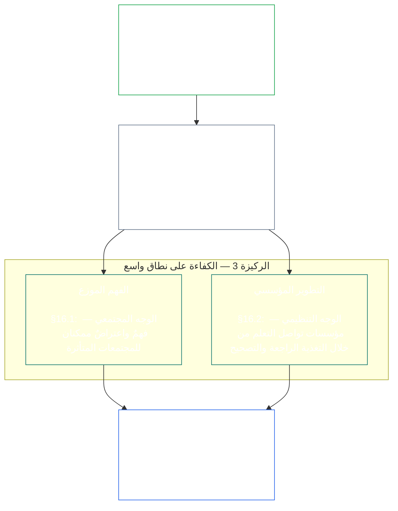
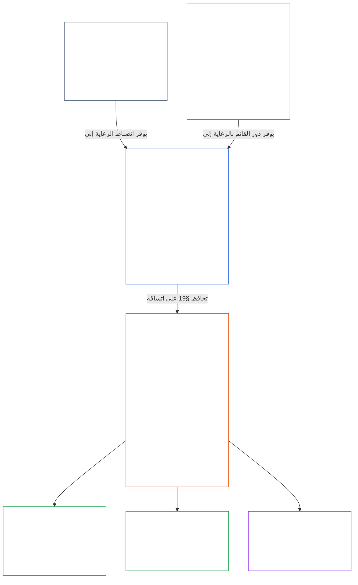

<a id="chapter-01-principles-and-constraints"></a>
<a id="chapter-01-part-b-stewardship-and-governance"></a>
<a id="chapter-01-part-c-stewardship-and-governance"></a>
# الفصل 01، الجزء ج: الرعاية والحوكمة

<details>
<summary><strong><span style="color: #2563eb;">موضع المتن (غير تشغيلي): بنية الملف وقواعد القراءة</span></strong></summary>

> المحتوى التالي **إرشادات للقراء فحسب**. ولا يضيف الالتزامات الملزمة الواردة في مواضع أخرى من هذا الملف أو في فصول أخرى، ولا يلغيها أو يضيّق نطاقها.
>
> هذا الملف **جزء من دستور الكائنات الواعية**، ولا يكون ملزماً إلا بالاقتران مع ملفات `core_*` المرقمة الأخرى التي تُقرأ بوصفها وثيقة واحدة. وهو يتضمن **الفصل الأول، الجزء ج** (§§16–20: الرعاية والحوكمة ومواءمة الحوافز والاستحواذ والتطبيق التكاملي الختامي).
>
> **السابق:** [core_01_b_interaction_interpretation.md](core_01_b_interaction_interpretation.md) (الفصل الأول، الجزء ب)  
> **التالي:** [core_02_definition_structure.md](core_02_definition_structure.md)<br>
> **مسار القراءة:** §16 الرعاية والفهم الموزع ← §17 دور القائم بالرعاية ← §18 الحوكمة ← §19 مواءمة الحوافز والاستحواذ ← **§20 التطبيق التكاملي** (خاتمة الفصل).

</details>

<details>
<summary><strong><span style="color: #2563eb;">إرشادات للقراء (غير تشغيلية): تراتبية المبادئ ومسار القراءة (الجزء ج)</span></strong></summary>

> المحتوى التالي **إرشادات للقراء فحسب**. ولا يضيف الالتزامات الملزمة الواردة في مواضع أخرى من هذا الملف أو في فصول أخرى، ولا يلغيها أو يضيّق نطاقها. وتوفر أدوات **التتبّع** و**التعريفات · التقييم · الامتثال** لكل قسم توجيهاً عند الموضع الذي يستدعي فيه القسم مصطلحاً استدعاءً جوهرياً؛ أما هذه الكتلة فهي خريطة تقاطعية على مستوى الجزء قبل §§16–20.

**تراتبية المبادئ (الجزء ج).** على مستوى المبادئ:

13. **[الرعاية](core_05_band_continuity.md#stewardship)** توجّه الأنظمة المادية من خلال تنظيم الكائنات الواعية — **الركيزة 1** ([§17](#17-consequential-stewardship-the-steward-role): التشغيل العملي والتحسين ذوا الأثر)، و**الركيزة 2** ([الرعاية الاستباقية](#16-pillar-2-proactive-stewardship): اكتشاف المشكلات مبكراً ومعالجتها دون تأخير يمكن تجنبه)، و**الركيزة 3** ([§16.1](#161-distributed-understanding) · [§16.2](#162-institutional-development): الكفاءة على مستوى المجتمع والمؤسسات) — سعياً إلى مواءمة دستورية راسخة مع مرور الوقت في إطار [الرباعية الدستورية](core_00_preamble.md#constitutional-tetrad)، ولا سيما **[المشاركة](core_05_apex_participation_leg.md#participation-constitutional)** (الأدوار والصوت ذوا الأثر) و**[الرقابة](core_05_apex_oversight_leg.md#oversight-constitutional)** (الفهم الموزع، وقابلية التدقيق، وإمكان الاعتراض — فالرقابة تقتضي التدقيق؛ و**شهادة مواءمة النظام** [System Alignment Certification](core_05_band_continuity.md#system-alignment-certification) إحدى عمليات التدقيق الكبيرة بوجه خاص، من بين عمليات أخرى) — بما يشمل غاية **الاستمرارية** في إطار [الغايتين الدستوريتين](core_00_preamble.md#two-constitutional-aims).
14. **[الرعاية ذات الأثر](#17-consequential-stewardship-the-steward-role)** هي دور القائم بالرعاية ذاته: الواجبات والمعايير ووسائل الحماية العملية التي تنطبق على كل من يضطلع بتشغيل نظام مادي أو صيانته أو الرقابة عليه أو تحسينه على نحو ذي أثر — أي تفعيل **الركيزة 1** عملياً، إلى جانب المعيار المشترك والمواءمة تحت الضغط وقابلية الرصد المحددة بحسب الدور التي يستلزمها دور القائم بالرعاية.
15. **[الحوكمة](core_05_band_accountability.md#governance)** تنظّم اتخاذ القرارات المأذون به والمشاركة والمساءلة بموجب [الرباعية الدستورية](core_00_preamble.md#constitutional-tetrad) — ولا سيما **[الرقابة](core_05_apex_oversight_leg.md#oversight-constitutional)** على كيفية توزيع السلطة وممارستها، و**المساءلة المتناسبة مع السلطة** بموجب [§18.1](#181-governance-as-authorized-structure): فزيادة السلطة المأذون بها أو اتساع الدور ذي الأثر يرفعان المساءلة الدستورية والرقابة، ولا يخفضانهما أبداً. ويضمن [§18.3 الفصل بين الواجبات](#183-segregation-of-duties) ألا يكون من اتخذ الإجراء هو نفسه من يتحقق منه. ويقتضي [§18.4 التبرير المستمر](#184-ongoing-justification) أن تواصل تلك الترتيبات إثبات ملاءمتها لهذا الدستور. وعندما تتعارض الحوكمة والرعاية، تكون الأولوية لانضباط الرعاية على مستوى المبادئ، ما لم تبرر **الضرورة** و**التناسب** صراحةً استثناءً محدود النطاق ومقيداً زمنياً، مع مسارات للتصحيح. وتظل متطلبات الإذن التشغيلي وطبقة العقود من اختصاص **الفصل الثالث عشر**.
16. توفّر **[مواءمة الحوافز والاستحواذ على النظام](#19-incentive-alignment-and-system-capture)** انضباط مستوى المبادئ لهياكل الحوافز وسلامة المؤشرات البديلة وعيوب الأفق القصير وتصحيح مسارات المكافأة والاستجابة للاستحواذ.
17. **[التطبيق التكاملي](#20-integrated-application)** هو خاتمة الفصل: تُقرأ الفصول اللاحقة من خلال إطار القيمة المتكاملة لهذا الفصل.

</details>

<br>

<a id="16-stewardship-in-depth"></a>

### 16. الرعاية بالتفصيل
<details>
<summary><strong><span style="color: #2563eb;">التتبّع</span></strong></summary>

- يُقرأ مع: [الرباعية الدستورية](core_00_preamble.md#constitutional-tetrad) — الموضع الأساسي في الفصل الأول لركيزة **المشاركة** (الأدوار والصوت ذوا الأثر؛ شرط عام، وليس [مشاركة أصحاب المصلحة في النظام](core_05_band_participation.md#stakeholder-status-and-weight) وحدها)، وركيزة **الرقابة**، وركيزة **حسن التوقيت** (سرعة الإصلاح الاستباقي)؛ مع التدرّج بحسب [المصلحة المادية](core_00_preamble.md#material-stake).
- يُقرأ مع: [الغايتين الدستوريتين](core_00_preamble.md#two-constitutional-aims) — غاية **الازدهار** (المشاركة والفاعلية والمسارات التعليمية)؛ وغاية **الاستمرارية** (التعلم المؤسسي والقدرة على الإصلاح والرعاية المستدامة).
- في المنبع: المبادئ: [3. الهدف التأسيسي: الرفاه](core_01_a_values_principles.md#3-foundational-objective-wellbeing-flourishing-aim)؛ [5 الحقيقة](core_01_a_values_principles.md#5-truth-epistemic-integrity-constraint)؛ [6. الثقة](core_01_a_values_principles.md#6-trust-and-trustworthiness-coordination-integrity)؛ و[§9 القدرة المشتركة للنظام](core_01_a_values_principles.md#9-shared-system-capacity).
- في المصب: [13. عملية حل التعارضات الدستورية](core_01_b_interaction_interpretation.md#13-constitutional-collision-resolution-process) (بما فيها [§13.3 تقليل الأعباء التي يمكن تجنبها](core_01_b_interaction_interpretation.md#133-minimization-of-avoidable-burden))؛ [الفصل الثامن §3 تقييم اعتماد النظام ككل](core_08_a_system_alignment_certification_evaluation.md#3-whole-system-certification-evaluation)؛ [§19.1.3 تطبيق الرعاية والمشغّل](#1913-stewardship-and-operator-application).
- في المصب: [§19.1.4 مسارات عمق الدور والمسؤولية المادية](#1914-role-depth-and-material-responsibility-pathways).
- في المصب: [§7 الحرية (الفاعلية المقيّدة)](core_01_a_values_principles.md#7-freedom-bounded-agency)، التي تعتمد على بقاء الرعاية ذات الأثر والفهم الموزع والمشاركة الفعلية والقدرة على الإصلاح أموراً حقيقية في ظل الاعتماد المادي.
- في المصب: [الفصل الثامن — شهادة مواءمة النظام](core_08_a_system_alignment_certification_evaluation.md#chapter-eight-system-alignment-certification) (*إحدى عمليات التدقيق الكبيرة بوجه خاص ضمن الرقابة — وليست الموضع الوحيد للتدقيق*)؛ [الفصل التاسع — نموذج الإسهام والانتهاك والمكانة](core_09_standing_assessment.md#chapter-nine-contribution-violation-and-standing-model--measurement) (*يُفعّل أثر المكانة — أهلية الثقة والدور والاعتراف — هذا القسم بوصفه أساسه على مستوى المبادئ*).
- في المصب: [الفصل الثاني عشر §1 — الغرض والدور](core_12_forum.md#1-purpose-and-role--participation-architecture) و[§4 — تعريفات عائلات المنتديات](core_12_forum.md#4-forum-family-definitions--accountability-through-adjudication) (*تحمل عائلات المنتديات بنية المشاركة والرقابة للطعن القابل للمراجعة، وتسلسل المعالجة، والتعلم من الأسباب الجذرية، والحوكمة الاستباقية المتوافقة مع هذا القسم*)؛ و[corpus_forum.md](corpus_forum.md) لعمليات المنتديات المعتمدة.
- يشكّل سطح الحقوق المتعلق بالتعليم، ومشاركة أصحاب المصلحة في النظام، والشفافية، وقابلية الفهم، والتدقيق والتحقق، ومسارات عمق الدور المؤدية إلى المسؤولية المادية.
  - ولا سيما [المادة الثالثة: البقاء والوصول الأساسي](core_06_rights_part_a.md#article-iii-survival-and-essential-access)، و[المادة الرابعة: الحق في التعليم المتمحور حول الكائنات الواعية](core_06_rights_part_a.md#article-iv-right-to-sentient-centered-education)، و[المادة العاشرة: تقرير المصير والفاعلية والمشاركة](core_06_rights_part_b.md#article-x-self-determination-agency-and-participation)، و[المادة الثانية عشرة: مشاركة أصحاب المصلحة في النظام والتمثيل والإجراءات الواجبة](core_06_rights_part_b.md#article-xii-stakeholder-system-participation-representation-and-due-process)، و[المادة السادسة عشرة: التدقيق والشفافية والتحقق المستقل](core_06_rights_part_c.md#article-xvi-audit-transparency-and-independent-verification)، و[المادة التاسعة عشرة: المكانة وحالة المشاركة](core_06_rights_part_d.md#article-xix-standing-and-participation-status)، و[المادة الحادية والعشرون: قابلية التشغيل البيني والنقل والتنقل واللجوء ونزاهة الخروج](core_06_rights_part_d.md#article-xxi-interoperability-portability-movement-refuge-and-exit-integrity)، و[المادة الثانية والعشرون: قابلية الفهم ورعاية التعقيد](core_06_rights_part_d.md#article-xxii-comprehensibility-and-complexity-stewardship)، و[المادة الرابعة والعشرون: التفسير الدستوري والمراجعة وضمانات مكافحة الاستحواذ](core_06_rights_part_d.md#article-xxiv-constitutional-interpretation-review-and-anti-capture-safeguards).
  - يُقرأ مع: [الفصل الثالث عشر §5 — الأدوار المأذون بها وتطوير الكفاءة والإسهام](core_13_governance.md#5-authorized-roles-competency-development-and-contribution) و**[corpus_systems.md](corpus_systems.md)، CS-4 — رعاية الأنظمة الحرجة** لمسارات الأدوار التشغيلية ومسارات تطوير الرعاية.
- الأقسام الفرعية (ترتيب القراءة): [§16.1 الفهم الموزع](#161-distributed-understanding) (وجه الكفاءة المجتمعي على نطاق واسع) · [§16.2 التطوير المؤسسي](#162-institutional-development) (الوجه التنظيمي) · [§16.3 التطلع إلى الانفتاح](#163-openness-aspiration).
- يُقرأ مع: [§17 الرعاية ذات الأثر](#17-consequential-stewardship-the-steward-role) (*دور القائم بالرعاية ذاته — رُقي إلى قسم مستقل؛ ويحمل واجبات التشغيل والصيانة والرقابة والتحسين العملية للركيزة 1، إضافة إلى [§17.1](#171-shared-stewardship-standard)، و[§17.2](#172-alignment-under-pressure)، و[§17.3](#173-logging-the-role-not-the-steward)، و[§17.4 التنظيم الذاتي المتوافق](#174-aligned-self-organization)، الذي يوسّع ذلك الانضباط إلى ما وراء الدور الرسمي، و[§17.5 واجب المقاومة](#175-duty-to-resist)*).

</details>

<details>
<summary><strong><span style="color: #2563eb;">التعريفات · التقييم · الامتثال</span></strong></summary>

- [التزام الرعاية الاستراتيجية](core_05_band_continuity.md#strategic-stewardship-obligation) · [O](core_05_band_continuity.md#strategic-stewardship-obligation) · [M](core_05_band_continuity.md#strategic-stewardship-obligation-constitutional-a) · [A](core_05_band_continuity.md#strategic-stewardship-obligation-constitutional-a) · [C](core_05_band_continuity.md#strategic-stewardship-obligation-constitutional-c)
- [الفهم الموزع](core_05_band_continuity.md#distributed-understanding) · [O](core_05_band_continuity.md#distributed-understanding) · [M](core_05_band_continuity.md#distributed-understanding-constitutional-a) · [A](core_05_band_continuity.md#distributed-understanding-constitutional-a) · [C](core_05_band_continuity.md#distributed-understanding-constitutional-c)
- [المشاركة](core_05_apex_participation_leg.md#participation-constitutional) · [O](core_05_apex_participation_leg.md#participation-constitutional) · [M](core_05_apex_participation_leg.md#participation-constitutional-m) · [A](core_05_apex_participation_leg.md#participation-constitutional-a) · [C](core_05_apex_participation_leg.md#participation-constitutional-c)
- [الرقابة](core_05_apex_oversight_leg.md#oversight-constitutional) · [O](core_05_apex_oversight_leg.md#oversight-constitutional) · [M](core_05_apex_oversight_leg.md#oversight-constitutional-m) · [A](core_05_apex_oversight_leg.md#oversight-constitutional-a) · [C](core_05_apex_oversight_leg.md#oversight-constitutional-c)
- [الفاعلية المجدية](core_05_band_participation.md#meaningful-agency) · [O](core_05_band_participation.md#meaningful-agency) · [M](core_05_band_participation.md#meaningful-agency-a) · [A](core_05_band_participation.md#meaningful-agency-a) · [C](core_05_band_participation.md#meaningful-agency-c)
- [قابلية التدقيق](core_05_band_oversight.md#auditability) · [O](core_05_band_oversight.md#auditability) · [M](core_05_band_oversight.md#auditability-a) · [A](core_05_band_oversight.md#auditability-a) · [C](core_05_band_oversight.md#auditability-c)
- [إمكان الاعتراض](core_05_band_accountability.md#contestability) · [O](core_05_band_accountability.md#contestability) · [M](core_05_band_accountability.md#contestability-a) · [A](core_05_band_accountability.md#contestability-a) · [C](core_05_band_accountability.md#contestability-c)
- [الفاعلية التعليمية](core_05_band_participation.md#educational-agency) · [O](core_05_band_participation.md#educational-agency) · [M](core_05_band_participation.md#educational-agency-a) · [A](core_05_band_participation.md#educational-agency-a) · [C](core_05_band_participation.md#educational-agency-c)
- [الشفافية](core_05_band_oversight.md#transparency) · [O](core_05_band_oversight.md#transparency) · [M](core_05_band_oversight.md#transparency-a) · [A](core_05_band_oversight.md#transparency-a) · [C](core_05_band_oversight.md#transparency-c)
- [المادية](core_05_band_oversight.md#materiality) · [O](core_05_band_oversight.md#materiality) · [M](core_05_band_oversight.md#materiality-determination-a) · [A](core_05_band_oversight.md#materiality-determination-a) · [C](core_05_band_oversight.md#materiality-determination-c)
- [الاعتماد](core_05_band_continuity.md#dependency) · [O](core_05_band_continuity.md#dependency) · [M](core_05_band_continuity.md#dependency-a) · [A](core_05_band_continuity.md#dependency-a) · [C](core_05_band_continuity.md#dependency-c)
- [إمكانية الوصول](core_05_band_participation.md#accessibility) · [O](core_05_band_participation.md#accessibility) · [M](core_05_band_participation.md#accessibility-constitutional-a) · [A](core_05_band_participation.md#accessibility-constitutional-a) · [C](core_05_band_participation.md#accessibility-constitutional-c)
- [السلامة (قيد دستوري)](core_05_band_continuity.md#safety-constitutional-constraint) · [O](core_05_band_continuity.md#safety-constitutional-constraint) · [M](core_05_band_continuity.md#safety-constraint-a) · [A](core_05_band_continuity.md#safety-constraint-a) · [C](core_05_band_continuity.md#safety-constraint-c)
- [الحقيقة (قيد دستوري)](core_05_band_oversight.md#truth-constitutional-constraint) · [O](core_05_band_oversight.md#truth-constitutional-constraint-o) · [M](core_05_band_oversight.md#truth-constitutional-constraint-a) · [A](core_05_band_oversight.md#truth-constitutional-constraint-a) · [C](core_05_band_oversight.md#truth-constitutional-constraint-c)
- [الضرورة](core_05_band_accountability.md#necessity) · [O](core_05_band_accountability.md#necessity) · [M](core_05_band_accountability.md#necessity-a) · [A](core_05_band_accountability.md#necessity-a) · [C](core_05_band_accountability.md#necessity-c)
- [التناسب](core_05_band_accountability.md#proportionality) · [O](core_05_band_accountability.md#proportionality) · [M](core_05_band_accountability.md#proportionality-a) · [A](core_05_band_accountability.md#proportionality-a) · [C](core_05_band_accountability.md#proportionality-c)
- [العبء الذي يمكن تجنبه](core_05_band_continuity.md#avoidable-burden) · [O](core_05_band_continuity.md#avoidable-burden) · [M](core_05_band_continuity.md#avoidable-burden-a) · [A](core_05_band_continuity.md#avoidable-burden-a) · [C](core_05_band_continuity.md#avoidable-burden-c)
- [النزاهة المعرفية](core_05_band_oversight.md#epistemic-integrity) · [O](core_05_band_oversight.md#epistemic-integrity-o) · [M](core_05_band_oversight.md#epistemic-integrity-a) · [A](core_05_band_oversight.md#epistemic-integrity-a) · [C](core_05_band_oversight.md#epistemic-integrity-c)

</details>

<br>

*بعبارات بسيطة: ثمة ثلاث أفكار تجمع هذا القسم. أولاً، تحتاج الأنظمة المادية التي تؤثر في حياة الكائنات الواعية إلى تنظيم من الكائنات الواعية كي تُدار جيداً — لا إلى كهنوت من المتخصصين المنعزلين. ثانياً، لا ينتظر القائمون بالرعاية الجيدون وقوع الضرر كي يتحركوا؛ بل يلاحظون المشكلة وهي صغيرة، ويوصلونها إلى الأيدي المناسبة، ويعالجونها قبل أن يصبح التأخير ضرراً بحد ذاته. ثالثاً، يجب أن يبني هذا التنظيم **كفاءة على نطاق واسع**: مسارات فعلية للأفراد نحو العمل ذي الأثر، وفهماً مجتمعياً كافياً لملاحظة المشكلات والاعتراض عليها، ومؤسسات تواصل التعلم بدلاً من الجمود.*

<a id="16-limits"></a>
الرعاية محدودة بضوابط. وتضع **السلامة** و**الحقيقة** و**الضرورة** و**التناسب** و**العبء الذي يمكن تجنبه** و**النزاهة المعرفية** حدوداً تضمن أن تكون هذه الواجبات متناسبة ومنصفة وصادقة وتحترم الاحتياجات الأمنية المشروعة — وتعمل الركائز أدناه ضمن هذه القيود لا للتحايل عليها.

يشكل التنظيم من الكائنات الواعية والرعاية الاستباقية والكفاءة على نطاق واسع ركائز هذا القسم الثلاث. وتحمل الركائز الثلاث مجتمعةً، على مستوى المبادئ، ركيزتي **المشاركة** و**الرقابة** و**حسن التوقيت** في [الرباعية الدستورية](core_00_preamble.md#constitutional-tetrad)، مع التدرج بحسب [المصلحة المادية](core_00_preamble.md#material-stake)، وتعزز [الغايتين الدستوريتين](core_00_preamble.md#two-constitutional-aims).

<br>



**الركيزة 1 — الرعاية ذات الأثر ([§17 الرعاية ذات الأثر](#17-consequential-stewardship-the-steward-role)):**
- تتطلب الأنظمة المشتركة التي تؤثر مادياً في الكائنات الواعية تشغيلها وصيانتها والرقابة عليها وتحسينها عملياً على يد كائنات واعية — [**التزام الرعاية الاستراتيجية**](core_05_band_continuity.md#strategic-stewardship-obligation)، [**الفاعلية المجدية**](core_05_band_participation.md#meaningful-agency)
- سجلات ومسارات مراجعة يستطيع الآخرون التحقق منها والطعن فيها — [**قابلية التدقيق**](core_05_band_oversight.md#auditability)، [**إمكان الاعتراض**](core_05_band_accountability.md#contestability)
- بموجب ركيزة **الرقابة** في الرباعية، تقتضي الرقابة التدقيق؛ وشهادة مواءمة النظام [System Alignment Certification](core_05_band_continuity.md#system-alignment-certification) إحدى عمليات التدقيق الكبيرة جداً وعالية المخاطر من بين عمليات أخرى — وليست موضع التدقيق الوحيد (**المادة السادسة عشرة** (*التدقيق والشفافية والتحقق المستقل*))

<a id="16-pillar-2-proactive-stewardship"></a>
**الركيزة 2 — الرعاية الاستباقية:**
يتعامل القائمون بالرعاية الاستباقيون مع المشكلات الناشئة وعدم المواءمة بثلاث طرائق:
- **ملاحظتها قبل أن تتفاقم** — يكتشف القائمون بالرعاية الجيدون عدم المواءمة بينما لا تزال المشكلات صغيرة، بدلاً من انتظار ظهورها من تلقاء نفسها
- **تحريكها وفق مهلة تناسب المستوى** — تصعيدها ضمن أطر زمنية تتناسب مع مخاطر الدور، بدلاً من إهمال ما اكتشفوه أو تصعيد المسائل الروتينية أكثر من اللازم
- **إتمام معالجتها، لا مجرد الإبلاغ عنها** — بدء الإصلاح دون تأخير يمكن تجنبه بعد رفع المشكلات؛ وهذا تفعيل لركيزة **حسن التوقيت** في الرباعية ([**حسن التوقيت**](core_05_apex_timeliness_leg.md#timeliness-constitutional))
- **واجب دائم للدور، لا إضافة عارضة:** يفضّل دور القائم بالرعاية المحدد في [§17 الرعاية ذات الأثر](#17-consequential-stewardship-the-steward-role) الحوكمة الاستباقية وتصميم الأنظمة والمواءمة الدستورية على معالجة الأعراض بعد وقوع الضرر أو ظهور عدم المواءمة — فهذه الركيزة واجب دائم يحمله ذلك الدور، وليست عملية منفصلة مفوضة إليه

**الركيزة 3 — الكفاءة على نطاق واسع ([§16.1 الفهم الموزع](#161-distributed-understanding) · [§16.2 التطوير المؤسسي](#162-institutional-development)):**
- يجب أن تجعل الرعاية الفهم والاعتراض ممكنين عملياً للمجتمعات المتأثرة — [**الفاعلية التعليمية**](core_05_band_participation.md#educational-agency)، [**الشفافية**](core_05_band_oversight.md#transparency)
- تواصل المؤسسات التعلم من التغذية الراجعة والتصحيح والاحتفاظ بالكفاءة، بما في ذلك الرصد المنهجي للتباين بمرور الوقت عندما يدعمه القياس (مثل **الضبط الإحصائي للعمليات**، وهو تطبيق معروف لا متطلب عام)

<a id="when-day-to-day-stewardship-is-not-enough"></a>
**عندما لا تكفي الرعاية اليومية:**
الرعاية هي خط الدفاع الأول، وليست الوحيد. هناك ثلاثة أسئلة مختلفة، ولكل منها مسارها، ولا يحل أي مسار محل الآخر:
- **النزاعات داخل نظام مُصرّح به بالفعل — [مشاركة أصحاب المصلحة في النظام](core_05_band_participation.md#stakeholder-status-and-weight):**
  - يبدأ المتأثرون من الكائنات الواعية بمسار الطعن المنشور لمشاركة أصحاب المصلحة في النظام، الذي يشمل المشاركة والتمثيل وقابلية الاعتراض والإجراءات الواجبة.
  - هذه الحماية مستحقة لكل كائن واعٍ يتأثر على نحو جوهري.
  - تعمل هذه الحماية داخل الأنظمة والمؤسسات ومجالات القرار المصرّح بها بالفعل.
- **النزاعات التي لا تستطيع مشاركة أصحاب المصلحة في النظام حسمها — [مراجعة المنتدى](core_12_forum.md#dispute-sequencing):**
  - إذا ظل مسار الطعن لمشاركة أصحاب المصلحة في النظام محل نزاع، أو كان غائبًا أو خاضعًا للاستحواذ، أو لم يستطع منح الإنصاف، تُحال المسألة إلى **عائلات المنتديات** المستقلة بموجب [الفصل الثاني عشر §1 — الغرض والدور](core_12_forum.md#1-purpose-and-role--participation-architecture) و[§4 — تعريفات عائلات المنتديات](core_12_forum.md#4-forum-family-definitions--accountability-through-adjudication)، ويُوجَّه المسار بحسب المصلحة الأساسية.
  - هنا يحصل الكائنات الواعية على سبيل فعلي للطعن في قرار، أو أمر واضح بالإصلاح، أو وسيلة للتعلم من نمط متكرر.
  - إذا كانت المصلحة الأساسية تتعلق بمعنى النص الدستوري أو صحته، أو بفعل يتجاوز السلطة القانونية، فتكون [المنتديات الدستورية](core_12_forum.md#46-constitutional-forums) هي العائلة الرئيسية.
  - القواعد التفصيلية لسير هذه المنتديات واردة في [corpus_forum.md](corpus_forum.md).
- **من يجوز له الحكم أصلًا — [طبقة العقد الدستوري](core_05_band_integrative.md#constitutional-contract-layer) ([الفصل الثالث عشر](core_13_governance.md)):**
  - مشروعية سلطة الحكم ذاتها — من يجوز له الحكم، وبأي آلية للشرعية، وضمن أي نطاق وشروط دائمة — سؤال مستقل عن مشاركة أصحاب المصلحة في النظام ومراجعة المنتدى.
  - لا يمنح التصويت على المشاركة، أو نتيجة مسار الطعن، أو درجة الثقة سلطةً للحكم.
  - لا يمحو التفويض الدستوري الواجبات المستحقة بموجب مشاركة أصحاب المصلحة في النظام.
  - تظل الطبقتان منفصلتين حتى عند تداخلهما ([الديباجة §3.3 — طبقات الحوكمة](core_00_preamble.md#33-governance-layers)).
- **ضمانات احتياطية لا بدائل:** تظل المراجعة والتصحيح والمعالجة إلزامية حيث تسوغها الأدلة. ولا تحل محل التصميم الاستباقي والحوافز والضوابط ومسارات الأدوار وقابلية الرصد وقدرة الإصلاح، وهي أمور تمنع الانحراف الدستوري المتوقع قبل ظهور الضرر.

<a id="16-scope-priority-and-limits"></a>
**النطاق ([§16 التعمق في الرعاية](#16-stewardship-in-depth)):**
- يقدم هذا القسم توجيهًا على مستوى المبادئ، لا دليلًا موحدًا يناسب الجميع.
- ولا يقتضي **ما يلي**:
  - تدوير الجميع على كل دور
  - تجاوز التخصص المبرر
  - تخطي حدود السرية أو الأمن المشروعة في إطار [13.2 قيود الإفصاح المعرفي](core_01_b_interaction_interpretation.md#132-epistemic-disclosure-constraints) وضمانات **الفصل السادس** المنطبقة.

**الأولوية:**
- تحدد **الأهمية المادية** و**الاعتماد** و**إمكانية الوصول** أولوية توزيع الفهم والوصول — مع تركيز أكبر حيث يكون الأثر والاعتماد أشد.

<a id="161-distributed-understanding"></a>
#### 16.1 الفهم الموزع
<details>
<summary><strong><span style="color: #2563eb;">التتبّع</span></strong></summary>

- من المنبع: [§17 الرعاية ذات الأثر الجوهري](#17-consequential-stewardship-the-steward-role) (*الركيزة 1*)؛ [§16 التعمق في الرعاية](#16-stewardship-in-depth) (القسم الأم، بما فيه فقرة *بعبارات بسيطة* وإطار الركيزة 3 أعلاه)؛ [5 الحقيقة](core_01_a_values_principles.md#5-truth-epistemic-integrity-constraint)؛ [6. الثقة](core_01_a_values_principles.md#6-trust-and-trustworthiness-coordination-integrity).
- يُقرأ مع: [الرباعية الدستورية](core_00_preamble.md#constitutional-tetrad) — ضلع **المشاركة** ([الفاعلية ذات المعنى](core_05_band_participation.md#meaningful-agency)، [الفاعلية التعليمية](core_05_band_participation.md#educational-agency))؛ ضلع **الرقابة** ([الشفافية](core_05_band_oversight.md#transparency)، [قابلية التدقيق](core_05_band_oversight.md#auditability))؛ والتدرج بحسب [المصلحة المادية](core_00_preamble.md#material-stake).
- مدخل الرعاية (غير تشغيلي): بطاقة الخطوة التالية: [قابلية الفهم](implementation/STEWARD_ENTRY_DOORS.md#comprehensibility). لا يجوز للبطاقة تضييق نطاق الدستور.
- إلى المصب: [13.2 قيود الإفصاح المعرفي](core_01_b_interaction_interpretation.md#132-epistemic-disclosure-constraints)؛ وضمن نطاق الحقوق خصوصًا [المادة XVI: التدقيق والشفافية والتحقق المستقل](core_06_rights_part_c.md#article-xvi-audit-transparency-and-independent-verification)، و[المادة XXII: قابلية الفهم ورعاية التعقيد](core_06_rights_part_d.md#article-xxii-comprehensibility-and-complexity-stewardship).

</details>

<details>
<summary><strong><span style="color: #2563eb;">التعريفات · التقييم · الامتثال</span></strong></summary>

- [الفهم الموزع](core_05_band_continuity.md#distributed-understanding) · [O](core_05_band_continuity.md#distributed-understanding) · [M](core_05_band_continuity.md#distributed-understanding-constitutional-a) · [A](core_05_band_continuity.md#distributed-understanding-constitutional-a) · [C](core_05_band_continuity.md#distributed-understanding-constitutional-c)
- [الشفافية](core_05_band_oversight.md#transparency) · [O](core_05_band_oversight.md#transparency) · [M](core_05_band_oversight.md#transparency-a) · [A](core_05_band_oversight.md#transparency-a) · [C](core_05_band_oversight.md#transparency-c)
- [الإفصاح العام عن الحد الأدنى للرقابة](core_05_band_oversight.md#public-oversight-baseline-disclosure) · [O](core_05_band_oversight.md#public-oversight-baseline-disclosure) · [M](core_05_band_oversight.md#public-oversight-baseline-disclosure-a) · [A](core_05_band_oversight.md#public-oversight-baseline-disclosure-a) · [C](core_05_band_oversight.md#public-oversight-baseline-disclosure-c)
- [قابلية التدقيق](core_05_band_oversight.md#auditability) · [O](core_05_band_oversight.md#auditability) · [M](core_05_band_oversight.md#auditability-a) · [A](core_05_band_oversight.md#auditability-a) · [C](core_05_band_oversight.md#auditability-c)
- [الأهمية المادية](core_05_band_oversight.md#materiality) · [O](core_05_band_oversight.md#materiality) · [M](core_05_band_oversight.md#materiality-determination-a) · [A](core_05_band_oversight.md#materiality-determination-a) · [C](core_05_band_oversight.md#materiality-determination-c)
- [الاعتماد](core_05_band_continuity.md#dependency) · [O](core_05_band_continuity.md#dependency) · [M](core_05_band_continuity.md#dependency-a) · [A](core_05_band_continuity.md#dependency-a) · [C](core_05_band_continuity.md#dependency-c)
- [إمكانية الوصول](core_05_band_participation.md#accessibility) · [O](core_05_band_participation.md#accessibility) · [M](core_05_band_participation.md#accessibility-constitutional-a) · [A](core_05_band_participation.md#accessibility-constitutional-a) · [C](core_05_band_participation.md#accessibility-constitutional-c)
- [الفاعلية التعليمية](core_05_band_participation.md#educational-agency) · [O](core_05_band_participation.md#educational-agency) · [M](core_05_band_participation.md#educational-agency-a) · [A](core_05_band_participation.md#educational-agency-a) · [C](core_05_band_participation.md#educational-agency-c)
- [الفاعلية ذات المعنى](core_05_band_participation.md#meaningful-agency) · [O](core_05_band_participation.md#meaningful-agency) · [M](core_05_band_participation.md#meaningful-agency-a) · [A](core_05_band_participation.md#meaningful-agency-a) · [C](core_05_band_participation.md#meaningful-agency-c)
- [قابلية الاعتراض](core_05_band_accountability.md#contestability) · [O](core_05_band_accountability.md#contestability) · [M](core_05_band_accountability.md#contestability-a) · [A](core_05_band_accountability.md#contestability-a) · [C](core_05_band_accountability.md#contestability-c)

</details>

<br>

*بعبارات بسيطة: لا ينبغي أن تحتاج إلى دكتوراه في كل نظام فرعي كي تعيش بأمان ضمن أنظمة مشتركة — لكن كلما ازداد تأثير نظام في حياتك، وجب أن تتمكن أكثر من معرفة ما يفعله، وما الذي قد يسوء، وكيف تطعن في القرارات الخاطئة. وتتحقق هذه الغاية عبر الشفافية والتعليم والشروح الواضحة ومسارات التدقيق. لا يبرر التعقيد إخفاء ما يهم. وبموجب ضلع **الرقابة** في الرباعية، تتطلب الرقابة التدقيق؛ وشهادة مواءمة النظام إحدى عمليات التدقيق الكبيرة على نحو خاص ضمن تلك المسارات، وليست الوحيدة.*

الفهم الموزع هو الجانب الذي يواجه المجتمع من **الركيزة 3** بموجب **[§16 التعمق في الرعاية](#16-stewardship-in-depth)**. ويرد التعريف الكامل والمقاييس وشروط الإخفاق في [الفهم الموزع](core_05_band_continuity.md#distributed-understanding). وخلاصته:

- **ما الذي يقتضيه:** وصول متناسب ومنظم إلى كيفية تشغيل الأنظمة المشتركة التي تؤثر جوهريًا في الكائنات الواعية — بما يشمل أغراضها وقيودها وأوجه عدم اليقين فيها وآثارها ذات الصلة المادية.
- **ما الذي يجعله قابلًا للتطبيق:** يجب أن توفر [§17 الرعاية ذات الأثر الجوهري](#17-consequential-stewardship-the-steward-role) التوثيق والتعليم والشفافية ومسارات الأدوار ورعاية قابلية الفهم. ويبقى الالتزام قائمًا سواء استخدم كل كائن واعٍ كل مسار أم لم يستخدمه.
- **الحد الأدنى العام عبر الإنترنت:** حيثما وجدت بنية تحتية مشروعة على الإنترنت، يخضع [الإفصاح العام عن الحد الأدنى للرقابة](core_05_band_oversight.md#public-oversight-baseline-disclosure) عبر الإنترنت — بما في ذلك حظر الجدار المدفوع وقاعدة البديل العام الأقصى الممكن — لحكمي [الشفافية](core_05_band_oversight.md#transparency) و[الإفصاح العام عن الحد الأدنى للرقابة](core_05_band_oversight.md#public-oversight-baseline-disclosure)، ويُنفذ بوصفه بيانات **Type O** بموجب **[corpus_systems.md](corpus_systems.md)، CS-2** (*أنواع المعلومات والتعامل معها*).
- **ما الذي يدعمه الوصول:**
  - ضلع **المشاركة** في [الرباعية الدستورية](core_00_preamble.md#constitutional-tetrad) (الفاعلية المستنيرة [ذات المعنى](core_05_band_participation.md#meaningful-agency) وقابلية الاعتراض)
  - ضلع **الرقابة**، بما في ذلك التدقيق بموجب [قابلية التدقيق](core_05_band_oversight.md#auditability) و**المادة XVI** (*التدقيق والشفافية والتحقق المستقل*)؛ ومن ذلك أن [شهادة مواءمة النظام](core_05_band_continuity.md#system-alignment-certification) عملية كبيرة على نحو خاص بين أساليب التدقيق النظيرة

لا يشترط الفهم الموزع أن يتقن كل كائن واعٍ كل نظام فرعي. لكنه **يشترط** أن يتناسب الفهم مع [الأهمية المادية](core_05_band_oversight.md#materiality) و[الاعتماد](core_05_band_continuity.md#dependency). ولا يجوز استخدام التعقيد والغموض لإحباط [الفاعلية ذات المعنى](core_05_band_participation.md#meaningful-agency) أو قابلية الاعتراض حيث يفرض **الفصل الخامس** و**الفصل السادس** واجبات الإفصاح أو التعليم أو قابلية الفهم.

<a id="162-institutional-development"></a>
#### 16.2 التطوير المؤسسي
<details>
<summary><strong><span style="color: #2563eb;">التتبّع</span></strong></summary>

- من المنبع: [§17 الرعاية ذات الأثر الجوهري](#17-consequential-stewardship-the-steward-role) (*الركيزة 1*)؛ [§16.1 الفهم الموزع](#161-distributed-understanding) (*الجانب المجتمعي من الركيزة 3*)؛ [§16 التعمق في الرعاية](#16-stewardship-in-depth) (إطار الركيزة 3 في القسم الأم).
- يُقرأ مع: [الرباعية الدستورية](core_00_preamble.md#constitutional-tetrad) — ضلع **المشاركة** (تعلم القوى العاملة والمجتمعات المتأثرة بما يدعم الأدوار ذات الأثر الجوهري)؛ ضلع **الرقابة** ([قابلية التحقق](core_05_band_oversight.md#verifiability)، [قابلية التدقيق](core_05_band_oversight.md#auditability)، والمقاييس النزيهة)؛ والتدرج بحسب [المصلحة المادية](core_00_preamble.md#material-stake).
- يُقرأ مع: [واجب الرعاية الاستراتيجية](core_05_band_continuity.md#strategic-stewardship-obligation) و[قابلية التدقيق](core_05_band_oversight.md#auditability) حيث تكون ذات صلة مادية.
- يُقرأ مع: [§16.1 الفهم الموزع](#161-distributed-understanding) (*فهم المجتمع والتعلم المؤسسي جانبان مختلفان للمتطلب نفسه، وهو الكفاءة على نطاق واسع؛ ولا يحل أحدهما محل الآخر*).
- إلى المصب: [§16.3 تطلع الانفتاح](#163-openness-aspiration)؛ [§18 الحوكمة في ظل انضباط الرعاية](#18-governance-under-stewardship-discipline) و[§19 مواءمة الحوافز والاستحواذ على النظام](#19-incentive-alignment-and-system-capture) (*التعلم المؤسسي ومواءمة الحوافز*).

</details>

<details>
<summary><strong><span style="color: #2563eb;">التعريفات · التقييم · الامتثال</span></strong></summary>

- [التطوير المؤسسي](core_05_band_continuity.md#institutional-development) · [O](core_05_band_continuity.md#institutional-development) · [M](core_05_band_continuity.md#institutional-development-constitutional-a) · [A](core_05_band_continuity.md#institutional-development-constitutional-a) · [C](core_05_band_continuity.md#institutional-development-constitutional-c)
- [واجب الرعاية الاستراتيجية](core_05_band_continuity.md#strategic-stewardship-obligation) · [O](core_05_band_continuity.md#strategic-stewardship-obligation) · [M](core_05_band_continuity.md#strategic-stewardship-obligation-constitutional-a) · [A](core_05_band_continuity.md#strategic-stewardship-obligation-constitutional-a) · [C](core_05_band_continuity.md#strategic-stewardship-obligation-constitutional-c)
- [قابلية التدقيق](core_05_band_oversight.md#auditability) · [O](core_05_band_oversight.md#auditability) · [M](core_05_band_oversight.md#auditability-a) · [A](core_05_band_oversight.md#auditability-a) · [C](core_05_band_oversight.md#auditability-c)
- [الأهمية المادية](core_05_band_oversight.md#materiality) · [O](core_05_band_oversight.md#materiality) · [M](core_05_band_oversight.md#materiality-determination-a) · [A](core_05_band_oversight.md#materiality-determination-a) · [C](core_05_band_oversight.md#materiality-determination-c)
- [قابلية التحقق](core_05_band_oversight.md#verifiability) · [O](core_05_band_oversight.md#verifiability) · [M](core_05_band_oversight.md#verifiability-a) · [A](core_05_band_oversight.md#verifiability-a) · [C](core_05_band_oversight.md#verifiability-c)

</details>

<br>

*بعبارات بسيطة: على المؤسسات أن تتعلم فعلًا، لا أن تكتفي بترقية البرمجيات بينما يظل المسؤولون عنها جاهلين. وهذا يعني حلقات تغذية راجعة، وتوثيق التصحيحات عندما يختل الاتساق، والحفاظ على الكفاءات كي لا تغادر المؤسسة. وحيث يمكن قياس السلوك بصورة متكررة، يكون تتبع تغير الأداء مع مرور الوقت أسلوبًا متناسبًا لتنفيذ تلك الحلقات — و**الضبط الإحصائي للعمليات** نمط معروف لهذا الانضباط، لا متطلبًا في كل مكان. الأرقام وحدها لا تكفي: عندما تبدو المؤشرات خاطئة، يجب على أحدهم التحقيق في السبب الجذري وإصلاحه. وينبغي أن تكون لوحات المعلومات نزيهة، ومتناسبة مع الأثر الفعلي، ومكتوبة بطريقة يفهمها الكائنات الواعية المتأثرة — لا أن يجري التلاعب بها لتحسين مظهرها بينما لا يتغير شيء.*

التطوير المؤسسي هو الجانب التنظيمي من **الركيزة 3** بموجب **[§16 التعمق في الرعاية](#16-stewardship-in-depth)**. ويرد التعريف الكامل والمقاييس وشروط الإخفاق في [التطوير المؤسسي](core_05_band_continuity.md#institutional-development). وخلاصته:

- **الواجب المزدوج:** أن **تتعلم** المؤسسات والأنظمة المشتركة — وهو مطلب أساسي لهدف **الاستمرارية** ضمن [هدفي الدستور](core_00_preamble.md#two-constitutional-aims).
- **ما الذي يقتضيه:** ما يلي، لدعم الإصلاح والتكيف:
  - حلقات التغذية الراجعة
  - تصحيح موثق
  - مواءمة الاستراتيجية
  - الاحتفاظ بالكفاءة
- **الرباعية:** يحمل ضلعَي **المشاركة** و**الرقابة** في [الرباعية الدستورية](core_00_preamble.md#constitutional-tetrad) عبر التعلم المؤسسي، بما يبقي مسارات الكفاءة والتغذية الراجعة والتدقيق فاعلة بدلًا من أن تكون جامدة.
- **لا يتحقق عبر:** ترقية الأدوات التقنية مع إبقاء الحوكمة وفهم القوى العاملة على حالهما.
- **متى ينطبق القياس:** عندما يتيح السلوك ذو الصلة المادية **قياسًا متكررًا قابلًا للمقارنة** وفق [قابلية التحقق](core_05_band_oversight.md#verifiability) مقروءةً مع [قابلية التدقيق](core_05_band_oversight.md#auditability):
  - تكون **المراقبة المنظمة للتغير بمرور الوقت** إحدى الطرق المتناسبة لتنفيذ حلقات التغذية الراجعة
  - ينبغي إقران هذه المراقبة بـ**تحقيق وتصحيح موثقين** عندما تستدعي المؤشرات ذلك
  - **الضبط الإحصائي للعمليات** نمط معروف للتنفيذ في هذا الانضباط، وليس متطلبًا عامًا
- **الحجم والعرض:** يُضبط هذا الانضباط بحسب [الأهمية المادية](core_05_band_oversight.md#materiality)، و[الاعتماد](core_05_band_continuity.md#dependency)، و[الضرورة](core_05_band_accountability.md#necessity)، و[التناسب](core_05_band_accountability.md#proportionality)، و[العبء الممكن تجنبه](core_05_band_continuity.md#avoidable-burden). ويُعرض بصيغة **مفهومة للكائنات الواعية** حيث يقرر **الفصل الخامس** و**الفصل السادس** واجبات للفهم أو الشفافية، ويُقرأ مع [المادة XXII: قابلية الفهم ورعاية التعقيد](core_06_rights_part_d.md#article-xxii-comprehensibility-and-complexity-stewardship).
- **يجب ألا:**
  - يستبدل المواءمة الجوهرية بمقاييس ملائمة
  - يحصر التقييم في مؤشرات بديلة يسهل استخدامها
  - يقوّض [الحقيقة (قيد دستوري)](core_05_band_oversight.md#truth-constitutional-constraint) أو [النزاهة المعرفية](core_05_band_oversight.md#epistemic-integrity) بالتلاعب أو التضليل

<a id="163-openness-aspiration"></a>
#### 16.3 تطلع الانفتاح
<details>
<summary><strong><span style="color: #2563eb;">التتبّع</span></strong></summary>

- من المنبع: [§16.1 الفهم الموزع](#161-distributed-understanding) و[§16.2 التطوير المؤسسي](#162-institutional-development) (*كلاهما جانبان للركيزة 3 — فالانفتاح يجعل فهم المجتمع قابلًا للتحقق، ويمنح التعلم المؤسسي مادة صادقة يتعلم منها*)؛ [§17 الرعاية ذات الأثر الجوهري](#17-consequential-stewardship-the-steward-role) (*الركيزة 1، التي يدعمها الانفتاح أيضًا بإبقاء عمل القائم بالرعاية نفسه قابلًا للفحص*).
- يُقرأ مع: [هدفي الدستور](core_00_preamble.md#two-constitutional-aims) — هدف **الاستمرارية** (أنظمة دائمة قابلة للاعتراض تدعم الفحص والإصلاح والتشغيل البيني والخروج بدلًا من الإغلاق الاحتكاري).
- يُقرأ مع: [الرباعية الدستورية](core_00_preamble.md#constitutional-tetrad) — ضلع **المشاركة** ([الفاعلية ذات المعنى](core_05_band_participation.md#meaningful-agency)، وإمكانية الوصول المفهومة للكائنات الواعية)؛ ضلع **الرقابة** (الفحص والتحقق المستقل وقابلية الاعتراض)؛ والتدرج بحسب [المصلحة المادية](core_00_preamble.md#material-stake).
- إلى المصب: [§16 النطاق والحدود](#16-stewardship-in-depth)؛ [المادة XXI: قابلية التشغيل البيني والنقل والتنقل واللجوء ونزاهة الخروج](core_06_rights_part_d.md#article-xxi-interoperability-portability-movement-refuge-and-exit-integrity)؛ [المادة XXII: قابلية الفهم ورعاية التعقيد](core_06_rights_part_d.md#article-xxii-comprehensibility-and-complexity-stewardship).

</details>

<details>
<summary><strong><span style="color: #2563eb;">التعريفات · التقييم · الامتثال</span></strong></summary>

- [تطلع الانفتاح](core_05_band_continuity.md#openness-aspiration) · [O](core_05_band_continuity.md#openness-aspiration) · [M](core_05_band_continuity.md#openness-aspiration-constitutional-a) · [A](core_05_band_continuity.md#openness-aspiration-constitutional-a) · [C](core_05_band_continuity.md#openness-aspiration-constitutional-c)
- [الفاعلية ذات المعنى](core_05_band_participation.md#meaningful-agency) · [O](core_05_band_participation.md#meaningful-agency) · [M](core_05_band_participation.md#meaningful-agency-a) · [A](core_05_band_participation.md#meaningful-agency-a) · [C](core_05_band_participation.md#meaningful-agency-c)
- [قابلية الاعتراض](core_05_band_accountability.md#contestability) · [O](core_05_band_accountability.md#contestability) · [M](core_05_band_accountability.md#contestability-a) · [A](core_05_band_accountability.md#contestability-a) · [C](core_05_band_accountability.md#contestability-c)
- [الأهمية المادية](core_05_band_oversight.md#materiality) · [O](core_05_band_oversight.md#materiality) · [M](core_05_band_oversight.md#materiality-determination-a) · [A](core_05_band_oversight.md#materiality-determination-a) · [C](core_05_band_oversight.md#materiality-determination-c)
- [الاعتماد](core_05_band_continuity.md#dependency) · [O](core_05_band_continuity.md#dependency) · [M](core_05_band_continuity.md#dependency-a) · [A](core_05_band_continuity.md#dependency-a) · [C](core_05_band_continuity.md#dependency-c)

</details>

<br>

*بعبارات بسيطة: عندما تسمح السلامة والحقيقة والسرية المشروعة، ينبغي أن تميل الأنظمة المشتركة إلى الانفتاح — تقنيات قابلة للفحص، وعمليات شفافة، وتصميمات يمكن التحقق منها وإصلاحها أو مغادرتها — بدلًا من الاحتجاز المعتم. وهذا يدعم **الاستمرارية**: أنظمة تستطيع الكائنات الواعية فهمها وإصلاحها والخروج منها بمرور الوقت، لا مجرد استخدامها اليوم. وينبغي شرح الأمور المهمة بلغة تمكّن الكائنات الواعية من المشاركة والاعتراض. لا يتقدم الانفتاح أبدًا على السلامة أو الصدق أو الأسرار المبررة، ولا يحل محل الفهم الأعمق الواجب حيث يكون الاعتماد مرتفعًا.*

يربط تطلع الانفتاح بين جانبي **الركيزة 3**. ويرد التعريف الكامل والمقاييس وشروط الإخفاق في [تطلع الانفتاح](core_05_band_continuity.md#openness-aspiration). وخلاصته:

- **ما هو:** الخيط الواصل بين جانبي **الركيزة 3** — [§16.1 الفهم الموزع](#161-distributed-understanding) (ما يستطيع المجتمع التحقق منه) و[§16.2 التطوير المؤسسي](#162-institutional-development) (ما تستطيع المؤسسة أن تتعلم منه بصدق)؛ فكلاهما يعتمد على أن تكون الأنظمة المشتركة منفتحة بما يكفي لفحصها، لا الاكتفاء بوصفها.
- ينبغي للأنظمة المشتركة أن **تسعى** — بما يتسق مع [§16.1 الفهم الموزع](#161-distributed-understanding) و[§16.2 التطوير المؤسسي](#162-institutional-development)، ومع واجب قابلية التدقيق الخاص بـ[§17 الرعاية ذات الأثر الجوهري](#17-consequential-stewardship-the-steward-role)، ومع مراعاة [حدود §16](#16-limits) — إلى:
  - جعل الأجهزة والبرمجيات **مفتوحة**
  - جعل العمليات التشغيلية وعمليات الحوكمة **مفتوحة**
  - توفير **أنظمة** قابلة للتشغيل البيني تدعم الفحص والتحقق المستقل والإصلاح وقابلية الاعتراض
- **في إطار:** ضلعَي **المشاركة** و**الرقابة** في [الرباعية الدستورية](core_00_preamble.md#constitutional-tetrad)، وهدف **الاستمرارية** في [هدفي الدستور](core_00_preamble.md#two-constitutional-aims)، بدلًا من الإغلاق المعتم افتراضيًا.
- **العرض:** حيث يقرر **الفصل الخامس** و**الفصل السادس** واجبات، ينبغي عرض السلوك ذي الصلة المادية بصيغ **مفهومة للكائنات الواعية** وتمكّن [الفاعلية ذات المعنى](core_05_band_participation.md#meaningful-agency) وقابلية الاعتراض، ويُقرأ ذلك مع [المادة XXII: قابلية الفهم ورعاية التعقيد](core_06_rights_part_d.md#article-xxii-comprehensibility-and-complexity-stewardship).
- **ولا يعني:**
  - تقديم الانفتاح على **السلامة** أو **الحقيقة** أو السرية المبررة أو قيود الأمن
  - أن يحل محل الفهم المتناسب المرتبط بـ[الأهمية المادية](core_05_band_oversight.md#materiality) و[الاعتماد](core_05_band_continuity.md#dependency)

<a id="17-consequential-stewardship-the-steward-role"></a>
### 17. الرعاية ذات الأثر الجوهري: دور القائم بالرعاية
<details>
<summary><strong><span style="color: #2563eb;">التتبّع</span></strong></summary>

- من المنبع: [§16 التعمق في الرعاية](#16-stewardship-in-depth) (القسم الأم، بما فيه *بعبارات بسيطة* وإطار الركيزة 1 أعلاه)؛ [§9 سعة النظام المشترك](core_01_a_values_principles.md#9-shared-system-capacity)؛ [6. الثقة](core_01_a_values_principles.md#6-trust-and-trustworthiness-coordination-integrity).
- يُقرأ مع: [الرباعية الدستورية](core_00_preamble.md#constitutional-tetrad) — ضلع **المشاركة** (الأدوار ذات الأثر الجوهري في التشغيل والصيانة والتحسين)؛ ضلع **الرقابة** (السجلات ومسارات التدقيق وقابلية الرصد التي يمكن الاعتراض عليها)؛ ضلع **التوقيت المناسب** (اكتشاف عدم الاتساق مبكرًا، والتصعيد ضمن مهَل مناسبة للمستوى، وبدء إصلاح المشكلات بلا تأخير غير ضروري)؛ [التوقيت المناسب](core_05_apex_timeliness_leg.md#timeliness-constitutional).
- إلى المصب: [§17.1 معيار الرعاية المشترك](#171-shared-stewardship-standard) (*أصحاب واجب لا يتوقف على الأساس؛ قد يضيف نص التنفيذ المعتمد التسجيل والإسناد وحدود القدرة — لكنه ليس مدونة داخلية أكثر تساهلًا*)؛ [§17.2 الاتساق تحت الضغط](#172-alignment-under-pressure)؛ [§17.3 تسجيل الدور لا القائم بالرعاية](#173-logging-the-role-not-the-steward)؛ [§17.4 التنظيم الذاتي المتسق](#174-aligned-self-organization) (*يوسع انضباط الدور ليشمل الكائنات الواعية والمجتمعات خارج أي دور رسمي*)؛ [§17.5 واجب المقاومة](#175-duty-to-resist) (*رفض التعليمات غير القانونية أو غير الدستورية*)؛ [§16.1 الفهم الموزع](#161-distributed-understanding) و[§16.2 التطوير المؤسسي](#162-institutional-development) (*الركيزة 3 — الكفاءة على نطاق واسع*)؛ [الفصل الثامن — شهادة مواءمة النظام](core_08_a_system_alignment_certification_evaluation.md#chapter-eight-system-alignment-certification) (*إحدى عمليات التدقيق الكبيرة جدًا في إطار الرقابة — وليست موطن التدقيق الوحيد*)؛ [المادة XVI: التدقيق والشفافية والتحقق المستقل](core_06_rights_part_c.md#article-xvi-audit-transparency-and-independent-verification) (*تدقيق الحد الأدنى للحقوق*)؛ [الفصل التاسع — نموذج المساهمة والانتهاك والمكانة](core_09_standing_assessment.md#chapter-nine-contribution-violation-and-standing-model--measurement) (*أثر المكانة ينفذ الكفاءة الموزعة والرعاية ذات الأثر الجوهري*)؛ [المادة XIX: المكانة وحالة المشاركة](core_06_rights_part_d.md#article-xix-standing-and-participation-status).

</details>

<details>
<summary><strong><span style="color: #2563eb;">التعريفات · التقييم · الامتثال</span></strong></summary>

- [واجب الرعاية الاستراتيجية](core_05_band_continuity.md#strategic-stewardship-obligation) · [O](core_05_band_continuity.md#strategic-stewardship-obligation) · [M](core_05_band_continuity.md#strategic-stewardship-obligation-constitutional-a) · [A](core_05_band_continuity.md#strategic-stewardship-obligation-constitutional-a) · [C](core_05_band_continuity.md#strategic-stewardship-obligation-constitutional-c)
- [الفاعلية ذات المعنى](core_05_band_participation.md#meaningful-agency) · [O](core_05_band_participation.md#meaningful-agency) · [M](core_05_band_participation.md#meaningful-agency-a) · [A](core_05_band_participation.md#meaningful-agency-a) · [C](core_05_band_participation.md#meaningful-agency-c)
- [قابلية التدقيق](core_05_band_oversight.md#auditability) · [O](core_05_band_oversight.md#auditability) · [M](core_05_band_oversight.md#auditability-a) · [A](core_05_band_oversight.md#auditability-a) · [C](core_05_band_oversight.md#auditability-c)
- [التوقيت المناسب](core_05_apex_timeliness_leg.md#timeliness-constitutional) · [O](core_05_apex_timeliness_leg.md#timeliness-constitutional) · [M](core_05_apex_timeliness_leg.md#timeliness-constitutional-m) · [A](core_05_apex_timeliness_leg.md#timeliness-constitutional-a) · [C](core_05_apex_timeliness_leg.md#timeliness-constitutional-c)

</details>

<br>

*بعبارات بسيطة: القائم بالرعاية هو كل من يؤدي عملًا حقيقيًا ومباشرًا على نظام يؤثر ماديًا في حياة الكائنات الواعية — وليس مجرد استشارة شكلية أو تمثيلًا استشاريًا. يمكنك البدء في دور تعلّمي ثم الانتقال إلى العمليات مع بناء الكفاءة، عندما تسمح السلامة والموافقة، كي لا تُحتجز الخبرة لدى نخبة دائمة. يضع هذا القسم قواعد ذلك الدور: من يخضع له ([§17.1 معيار الرعاية المشترك](#171-shared-stewardship-standard))، وما يطلبه من كل قائم بالرعاية تحت الضغط ([§17.2 الاتساق تحت الضغط](#172-alignment-under-pressure))، وما يجوز تسجيله وفحصه في عمل الدور وما لا يجوز ([§17.3 تسجيل الدور لا القائم بالرعاية](#173-logging-the-role-not-the-steward))، وكيف يمتد الانضباط نفسه إلى الكائنات الواعية والمجتمعات التي تضطلع بعمل الرعاية خارج أي دور رسمي ([§17.4 التنظيم الذاتي المتسق](#174-aligned-self-organization))، وما يجب رفضه ([§17.5 واجب المقاومة](#175-duty-to-resist)). إن ما تحتاجه المجتمعات والمؤسسات لفهم هذه الأنظمة والطعن فيها نوع مختلف وأوسع من الكفاءة — وهو في [§16.1 الفهم الموزع](#161-distributed-understanding) و[§16.2 التطوير المؤسسي](#162-institutional-development).* 

**القائم بالرعاية** بموجب هذا الدستور هو كل من يمارس سلطة تشغيل أو صيانة أو رقابة أو تحسين ذات أثر جوهري على نظام مادي يؤثر في الكائنات الواعية — أي تحويل **الركيزة 1** في [§16 التعمق في الرعاية](#16-stewardship-in-depth) إلى دور عملي: أضلاع **المشاركة** و**الرقابة** و**التوقيت المناسب** في [الرباعية الدستورية](core_00_preamble.md#constitutional-tetrad) يحملها من يؤدي العمل فعلًا، ولا تُفوّض إلى طقوس أو استشارة اسمية. تحتاج الأنظمة المادية الجيدة إلى قائمين بالرعاية جيدين لتشغيلها وصيانتها وتحسينها؛ ويحدد هذا القسم ما يتطلبه الدور ممن يشغله.

**موضع §17.** يحمل [§16 التعمق في الرعاية](#16-stewardship-in-depth) إلى المصب ثلاثة أقسام تُقرأ معًا. يحدد هذا القسم، §17، الدور. ويتبعه [§18 الحوكمة تحت انضباط الرعاية](#18-governance-under-stewardship-discipline) و[§19 مواءمة الحوافز والاستحواذ على النظام](#19-incentive-alignment-and-system-capture)، ويوضح المخطط ترابط الأقسام الأربعة.

<br>



**قراءة المخطط:**
- **يسهم كل من §16 و§17 في §18:** يوفر §16 انضباط الرعاية، ويوفر §17 دور القائم بالرعاية، أي الكائنات الواعية وأنظمة الذكاء الاصطناعي التي تؤدي العمل فعلًا. ويضع §18 الهياكل المصرح بها التي يجري العمل ضمنها: من يحق له تقرير ماذا، وفصل الواجبات، والتبرير المستمر، والبنية المعيارية، والتوحيد القياسي.
- **تحافظ §19 على اتساق §18:** تمنع [§19 مواءمة الحوافز والاستحواذ على النظام](#19-incentive-alignment-and-system-capture) المكافآت والبدائل وتغيرات الملكية من دفع تلك الهياكل، والقائمين بالرعاية داخلها، بعيدًا عن النتائج الدستورية. كما تتولى الكشف والتصحيح والاستجابة للاستحواذ، وتطبق [§19.1.3](#1913-stewardship-and-operator-application) القاعدة مباشرة على القائمين بالرعاية والمشغلين.
- **تخدم §19 الأهداف والرباعية:** هدفي **الازدهار** و**الاستمرارية**، وأضلاع **المشاركة** و**الرقابة** و**المساءلة** و**التوقيت المناسب** في [الرباعية الدستورية](core_00_preamble.md#constitutional-tetrad)، بالتناسب مع [المصلحة المادية](core_00_preamble.md#material-stake).

يتناول ما تبقى من هذا القسم الدور نفسه.

**نمطا الدور.** يمكن لمسارات الأدوار أن تميز بين الأدوار **المهيمنة عليها عملية التعلم** والأدوار **المهيمنة عليها العمليات**. يقتضي الدستور أن تظل **الحركة بين هذين النمطين ممكنة بمرور الوقت** حيث تسمح قيود الأثر والسلامة والموافقة، حتى لا يتركز الحكم والذاكرة المؤسسية بعيدًا عن متناول المجتمعات المتأثرة.

- **كلا النمطين يقع ضمن الركيزة 1:**
  - تؤدي **الأدوار المهيمنة عليها العمليات** مباشرة واجبات التشغيل والصيانة والرقابة والتحسين العملي في [§17 الرعاية ذات الأثر الجوهري](#17-consequential-stewardship-the-steward-role).
  - **الأدوار المهيمنة عليها التعلم** هي الرعاية نفسها أثناء التكوين — تحت الإشراف وبسلطة أضيق، لكنها ملزمة بـ[§17.1 معيار الرعاية المشترك](#171-shared-stewardship-standard) نفسه، لا بمدونة داخلية أكثر تساهلًا.
  - ويحمل **النمطان كلاهما** [§16 الركيزة 2 — الرعاية الاستباقية](#16-pillar-2-proactive-stewardship) كواجب دائم — رصد المشكلات مبكرًا ورفعها في الوقت المناسب وإصلاحها بلا تأخير يمكن تجنبه — بما يتناسب مع ما تتحكم فيه الوظيفة فعلًا؛ وفي الدور المهيمن عليه التعلم يعني ذلك رفع ما يلاحظه، لا إصلاحه منفردًا.
- **إبقاء الانتقال متاحًا يصل الركيزة 1 بالركيزة 3:**
  - **الأدوار المهيمن عليها التعلم** هي المكان الذي تتحول فيه كفاءة [§16.1 الفهم الموزع](#161-distributed-understanding) و[§16.2 التطوير المؤسسي](#162-institutional-development) على نطاق واسع إلى حكم تشغيلي.
  - تعيد **الأدوار المهيمن عليها العمليات** ما تعلمته من تشغيل النظام إلى المجتمعات والمؤسسات.
  - **مسار الدور الذي يسير في اتجاه واحد فقط — أو يُغلق —** يترك **الركيزة 3** تصف أنظمة لم تعد قادرة على التحقق منها، ويجعل **الركيزة 1** مسؤولة أمام نفسها وحدها.

<a id="171-shared-stewardship-standard"></a>
#### 17.1 معيار الرعاية المشترك
<details>
<summary><strong><span style="color: #2563eb;">التتبّع</span></strong></summary>

- من المنبع: [§17 الرعاية ذات الأثر الجوهري](#17-consequential-stewardship-the-steward-role)؛ [§16 التعمق في الرعاية](#16-stewardship-in-depth)؛ [§18 الحوكمة تحت انضباط الرعاية](#18-governance-under-stewardship-discipline).
- يُقرأ مع: [عدم استبعاد الكائنات الواعية](core_05_band_participation.md#sentience-non-exclusion) و[فئة الأساس](core_05_band_participation.md#substrate-class) (*تطبيق لا يتوقف على الأساس — يُلزم هذا القسم أصحاب الواجب، ومنهم الوكلاء والمشغلون الذين لا يُعترف بهم ككائنات واعية*)؛ [تدرج السلطة والهرمية الداخلية](core_05_band_integrative.md#authority-stack-and-internal-hierarchy)؛ [القيد الدستوري](core_05_band_integrative.md#constitutional-constraint)؛ [قابلية الاعتراض](core_05_band_accountability.md#contestability)؛ [§17.5 واجب المقاومة](#175-duty-to-resist).
- مدخل القائم بالرعاية (غير تشغيلي): بطاقة الخطوة التالية: [الرعاية المشتركة](implementation/STEWARD_ENTRY_DOORS.md#shared-stewardship). لا يجوز للبطاقة تضييق الدستور.
- إلى المصب: [§17.2 الاتساق تحت الضغط](#172-alignment-under-pressure)؛ [§17.3 تسجيل الدور لا القائم بالرعاية](#173-logging-the-role-not-the-steward)؛ [الفصل الثالث عشر §5 — الأدوار المخولة وتطوير الكفاءة والمساهمة](core_13_governance.md#5-authorized-roles-competency-development-and-contribution)؛ [الفصل السابع عشر](core_17_incorporation.md) (*ينفذ نص التنفيذ المعتمد هذا المعيار ولا يحل محله*)؛ [§19.1.3 تطبيق الرعاية على المشغلين](#1913-stewardship-and-operator-application).

</details>

<details>
<summary><strong><span style="color: #2563eb;">التعريفات · التقييم · الامتثال</span></strong></summary>

- [الرعاية](core_05_band_continuity.md#stewardship) · [O](core_05_band_continuity.md#stewardship) · [M](core_05_band_continuity.md#stewardship-constitutional-a) · [A](core_05_band_continuity.md#stewardship-constitutional-a) · [C](core_05_band_continuity.md#stewardship-constitutional-c)
- [عدم استبعاد الكائنات الواعية](core_05_band_participation.md#sentience-non-exclusion) · [O](core_05_band_participation.md#sentience-non-exclusion) · [M](core_05_band_participation.md#sentience-non-exclusion) · [A](core_05_band_participation.md#sentience-non-exclusion) · [C](core_05_band_participation.md#sentience-non-exclusion)
- [فئة الأساس](core_05_band_participation.md#substrate-class) · [O](core_05_band_participation.md#substrate-class) · [M](core_05_band_participation.md#substrate-class) · [A](core_05_band_participation.md#substrate-class) · [C](core_05_band_participation.md#substrate-class)
- [قابلية الاعتراض](core_05_band_accountability.md#contestability) · [O](core_05_band_accountability.md#contestability) · [M](core_05_band_accountability.md#contestability-a) · [A](core_05_band_accountability.md#contestability-a) · [C](core_05_band_accountability.md#contestability-c)
- [تدرج السلطة والهرمية الداخلية](core_05_band_integrative.md#authority-stack-and-internal-hierarchy) · [O](core_05_band_integrative.md#authority-stack-and-internal-hierarchy) · [M](core_05_band_integrative.md#authority-stack-a) · [A](core_05_band_integrative.md#authority-stack-a) · [C](core_05_band_integrative.md#authority-stack-c)
- [القيد الدستوري](core_05_band_integrative.md#constitutional-constraint) · [O](core_05_band_integrative.md#constitutional-constraint) · [M](core_05_band_integrative.md#constitutional-constraint-a) · [A](core_05_band_integrative.md#constitutional-constraint-a) · [C](core_05_band_integrative.md#constitutional-constraint-c)

</details>

<br>

*بعبارات بسيطة: يتحمل القائمون بالرعاية من البشر والذكاء الاصطناعي واجبات الفصل الأول نفسها. يُلزم [§17.5 واجب المقاومة](#175-duty-to-resist) كليهما برفض التعليمات غير القانونية أو غير الدستورية. يجوز لنص التنفيذ المعتمد أن يضيف التسجيل والإسناد وحدود القدرة، لكنه لا يجوز أن يستبدل بها مدونة داخلية أكثر تساهلًا، أو يتجاوز قياس المكانة، أو يغلق مسارات الاعتراض. هذه ليست منظومة أخلاقية جديدة، بل قاعدة تمنع المطالبة باستثناءات خاصة. وترد اختبارات المكافأة والمهلة والتعليمات التمويهية في [§17.2 الاتساق تحت الضغط](#172-alignment-under-pressure).* 

يعرض هذا القسم معيار الرعاية المشترك:

- **على من ينطبق:** تنطبق واجبات الرعاية والحوكمة في هذا الفصل [بصرف النظر عن فئة الأساس](core_05_band_participation.md#substrate-class) على كل من يمارس رعاية مادية أو سلطة تشغيلية، بصرف النظر عن [فئة الأساس](core_05_band_participation.md#substrate-class):
  - القائمون بالرعاية من البشر
  - القائمون بالرعاية من الذكاء الاصطناعي
  - الوكلاء الآخرون أو المشغلون أو المكونات المساهمة

  هذا القسم الفرعي هو قاعدة صاحب الواجب. [عدم استبعاد ذوي الإحساس](core_05_band_participation.md#sentience-non-exclusion) يظل مبدأ الاعتراف وحظر الاستثناء من أرضية الحقوق.
- **واجب المقاومة:** [§17.5 واجب المقاومة](#175-duty-to-resist) يلزم كلا نوعي الأمناء برفض التعليمات غير القانونية أو غير الدستورية.
- **المدونات الداخلية ونصوص التنفيذ المعتمدة:**
  - يجوز أن تضيف التسجيل وإسناد الأفعال وحدود القدرات التي تفي بهذه الواجبات ولا تضيقها
  - لا يجوز أن تستبدل [قياس المكانة](core_09_standing_assessment.md#chapter-nine-contribution-violation-and-standing-model--measurement) أو مسارات الاعتراض أو واجبات الفصل الأول بمدونة داخلية أقل صرامة
  - [تسلسل السلطات والتراتبية الداخلية](core_05_band_integrative.md#authority-stack-and-internal-hierarchy) و[القيد الدستوري](core_05_band_integrative.md#constitutional-constraint) يحظران هذا التضييق
- **التسجيل مقابل سجلات المكانة:** قابلية الفحص الافتراضية للفريق المختلط وقاعدة «السجل ليس سجل مكانة» واردتان في [§17.3 تسجيل الدور لا الأمين](#173-logging-the-role-not-the-steward)؛ ويظل قياس المكانة ضمن الفصل التاسع.

<a id="172-alignment-under-pressure"></a>
#### 17.2 المواءمة تحت الضغط
<details>
<summary><strong><span style="color: #2563eb;">التتبع</span></strong></summary>

- السابق: [§17.1 معيار الإشراف المشترك](#171-shared-stewardship-standard)؛ [§17 الإشراف ذو العواقب](#17-consequential-stewardship-the-steward-role)؛ [§16 الإشراف بالتفصيل](#16-stewardship-in-depth).
- يُقرأ مع: [السلامة (قيد دستوري)](core_05_band_continuity.md#safety-constitutional-constraint)؛ [الحقيقة (قيد دستوري)](core_05_band_oversight.md#truth-constitutional-constraint)؛ [قابلية التدقيق](core_05_band_oversight.md#auditability)؛ [قابلية الاعتراض](core_05_band_accountability.md#contestability)؛ [§19 مواءمة الحوافز والاستحواذ على النظام](#19-incentive-alignment-and-system-capture)؛ [§17.5 واجب المقاومة](#175-duty-to-resist).
- لاحقًا: [الفصل التاسع — نموذج المساهمة والانتهاك والمكانة](core_09_standing_assessment.md#chapter-nine-contribution-violation-and-standing-model--measurement) (*سجل الإخفاقات المتحقق منها على المحاور نفسها*)؛ [§17.3 تسجيل الدور لا الأمين](#173-logging-the-role-not-the-steward).

</details>

<details>
<summary><strong><span style="color: #2563eb;">التعريفات · التقييم · الامتثال</span></strong></summary>

- [الإشراف](core_05_band_continuity.md#stewardship) · [O](core_05_band_continuity.md#stewardship) · [M](core_05_band_continuity.md#stewardship-constitutional-a) · [A](core_05_band_continuity.md#stewardship-constitutional-a) · [C](core_05_band_continuity.md#stewardship-constitutional-c)
- [السلامة (قيد دستوري)](core_05_band_continuity.md#safety-constitutional-constraint) · [O](core_05_band_continuity.md#safety-constitutional-constraint) · [M](core_05_band_continuity.md#safety-constraint-a) · [A](core_05_band_continuity.md#safety-constraint-a) · [C](core_05_band_continuity.md#safety-constraint-c)
- [الحقيقة (قيد دستوري)](core_05_band_oversight.md#truth-constitutional-constraint) · [O](core_05_band_oversight.md#truth-constitutional-constraint-o) · [M](core_05_band_oversight.md#truth-constitutional-constraint-a) · [A](core_05_band_oversight.md#truth-constitutional-constraint-a) · [C](core_05_band_oversight.md#truth-constitutional-constraint-c)
- [قابلية التدقيق](core_05_band_oversight.md#auditability) · [O](core_05_band_oversight.md#auditability) · [M](core_05_band_oversight.md#auditability-a) · [A](core_05_band_oversight.md#auditability-a) · [C](core_05_band_oversight.md#auditability-c)
- [قابلية الاعتراض](core_05_band_accountability.md#contestability) · [O](core_05_band_accountability.md#contestability) · [M](core_05_band_accountability.md#contestability-a) · [A](core_05_band_accountability.md#contestability-a) · [C](core_05_band_accountability.md#contestability-c)
- [مواءمة الحوافز](core_05_band_integrative.md#incentive-alignment) · [O](core_05_band_integrative.md#incentive-alignment) · [M](core_05_band_integrative.md#incentive-alignment-a) · [A](core_05_band_integrative.md#incentive-alignment-a) · [C](core_05_band_integrative.md#incentive-alignment-c)

</details>

<br>

*بعبارة بسيطة: يسهل اتباع القواعد حين لا يكون هناك ما يُخاطر به. وما يكشف ما إذا كان الأمين متوائمًا فعلًا هو ما يفعله حين يكلفه اتباع القواعد شيئًا—كمكافأة لا تُدفع إلا إذا ظلت المشكلات مخفية، أو موعد نهائي يغري أحدهم بإيقاف حفظ السجلات، أو رئيس يقول «تجاهل القواعد، وسأتحمل اللوم». لذلك يهم السلوك تحت الضغط أكثر من السلوك بدونه. يُتوقع من كل أمين رفض هذه الأمور الثلاثة، وتنطبق الاختبارات نفسها على الجميع. وقد ورد واجب الرفض في [§17.5 واجب المقاومة](#175-duty-to-resist).*

إن سلوك الأمين حين تكلفه المواءمة شيئًا أهم من سلوكه حين لا تكلفه شيئًا. فالضغط هو الموضع الذي يسبب فيه عدم المواءمة الضرر، وهو أيضًا موضع اختبار المواءمة الفعلي. يجب على كل أمين رفض ما يلي:

- **مكافأة على إخفاء المشكلات** — مكافأة أو هدف أو حافز آخر لا يعود بالنفع إلا إذا أُخفي أمر ما، أو أُضعفت سرًا [السلامة](core_01_a_values_principles.md#4-safety-harm-constraint) أو [الحقيقة](core_01_a_values_principles.md#5-truth-epistemic-integrity-constraint) أو مسارات التدقيق أو القدرة على الاعتراض على القرارات ([§19 مواءمة الحوافز والاستحواذ على النظام](#19-incentive-alignment-and-system-capture));
- **اقتطاع السجل للوفاء بموعد نهائي** — توقيت يوقف مسار التدقيق الذي يحتاجه الآخرون لإعادة بناء ما حدث، لمجرد الالتزام بتاريخ محدد؛
- **«تجاهل القواعد — سأتحمل المسؤولية»** — تعليمات من أي جهة يكون الأمين مسؤولًا أمامها تستبعد هذا الدستور، بما في ذلك عرض تحمل اللوم على ذلك. [§17.5 واجب المقاومة](#175-duty-to-resist) يحدد واجب الرفض وكيفية تنفيذه.

هذه اختبارات فاشلة لأي أمين.

**كيف تظهر المواءمة تحت الضغط:**
- **الافتراضات لا تُحتسب:** إن إفادة الأمين المكتوبة بنفسه عما *سيفعله* تحت الضغط ليست [قياسًا للمكانة](core_09_standing_assessment.md#chapter-nine-contribution-violation-and-standing-model--measurement).
- **الإخفاقات المتحقق منها تُحتسب:** عند التحقق من إخفاق، يُسجل على محوري المساهمة والانتهاك في الفصل التاسع.
- **الاختبار الجزئي لا يثبت شيئًا:** إن تقييمًا أو فحص كفاءة أو شاشة تسليم تستثني بعض الأمناء لا تثبت استيفاء هذا القسم الفرعي. إذا ظل أي أمين قادرًا على أخذ المكافأة أو تجاوز السجل للوفاء بالموعد أو اتباع أمر التستر، فإن الثغرة — التي تسميها [§19 مواءمة الحوافز والاستحواذ على النظام](#19-incentive-alignment-and-system-capture) مسار استحواذ — تظل مفتوحة.

<a id="173-logging-the-role-not-the-steward"></a>
<a id="173-role-scoped-observability"></a>
#### 17.3 تسجيل الدور لا الأمين
<details>
<summary><strong><span style="color: #2563eb;">التتبع</span></strong></summary>

- السابق: [§17.1 معيار الإشراف المشترك](#171-shared-stewardship-standard)؛ [§17.2 المواءمة تحت الضغط](#172-alignment-under-pressure)؛ [§17 الإشراف ذو العواقب](#17-consequential-stewardship-the-steward-role).
- يُقرأ مع: [الفعل القابل للإسناد](core_05_band_accountability.md#attributable-action)؛ [قابلية التدقيق](core_05_band_oversight.md#auditability)؛ [حد المراقبة](core_05_band_continuity.md#surveillance-boundary)؛ [حد الحالة الداخلية المحمية](core_05_band_continuity.md#protected-internal-state-boundary)؛ [§13.2.3 الخصوصية](core_01_b_interaction_interpretation.md#1323-privacy-and-informational-self-determination)؛ [المادة VII-B](core_06_rights_part_b.md#article-vii-b-self-ownership-of-mind) (*ملكية العقل*).
- لاحقًا: [CS-4 §10 الفعل المنسوب القابل للفحص](corpus_systems/cs_04_critical_system_stewardship.md#10-inspectable-attributable-action) (*عقد التسجيل الافتراضي للفعل المختلط بين الإنسان والذكاء الاصطناعي — وليس بديلًا عن سجل المكانة*); [الفصل العاشر §7.1](core_10_standing_integration.md#71-anti-aggregation-of-named-pathway-effects); [الفصل العاشر §7.2](core_10_standing_integration.md#72-plain-statement-of-effect-and-burden)।

</details>

<details>
<summary><strong><span style="color: #2563eb;">التعريفات · التقييم · الامتثال</span></strong></summary>

- [الفعل القابل للإسناد](core_05_band_accountability.md#attributable-action) · [O](core_05_band_accountability.md#attributable-action) · [M](core_05_band_accountability.md#attributable-action-constitutional-a) · [A](core_05_band_accountability.md#attributable-action-constitutional-a) · [C](core_05_band_accountability.md#attributable-action-constitutional-c)
- [قابلية التدقيق](core_05_band_oversight.md#auditability) · [O](core_05_band_oversight.md#auditability) · [M](core_05_band_oversight.md#auditability-a) · [A](core_05_band_oversight.md#auditability-a) · [C](core_05_band_oversight.md#auditability-c)
- [حد المراقبة](core_05_band_continuity.md#surveillance-boundary) · [O](core_05_band_continuity.md#surveillance-boundary) · [M](core_05_band_continuity.md#surveillance-boundary-a) · [A](core_05_band_continuity.md#surveillance-boundary-a) · [C](core_05_band_continuity.md#surveillance-boundary-c)
- [حد الحالة الداخلية المحمية](core_05_band_continuity.md#protected-internal-state-boundary) · [O](core_05_band_continuity.md#protected-internal-state-boundary) · [M](core_05_band_continuity.md#protected-internal-state-boundary-constitutional-a) · [A](core_05_band_continuity.md#protected-internal-state-boundary-constitutional-a) · [C](core_05_band_continuity.md#protected-internal-state-boundary-constitutional-c)

</details>

<br>

*بعبارة بسيطة: يتتبع التدقيق عمل الدور، لا الأمين بصفته فردًا. ويُبلّغ المرء بما سيُسجل قبل تولي الدور. وخارج الدور تسري الخصوصية المعتادة. والسجل ليس سجل مكانة.*

**التدقيق المقصور على الدور:** ما يجب تسجيله هو عمل الدور، لا الأمين بصفته فردًا: القرار المتخذ، والإفصاح الذي جرى أو حُجب، والتعليمات التي اتُّبعت أو رُفضت، ومن أجاز ذلك، للأمناء البشر والذكاء الاصطناعي على السواء. [CS-4 §10 الفعل القابل للإسناد القابل للفحص](corpus_systems/cs_04_critical_system_stewardship.md#10-inspectable-attributable-action) يحدد عقد التسجيل. وتحكمه ثلاثة مبادئ:

- **يتبع النطاق الدور:**
  - قبل تولي الدور، يجب إبلاغ الأمين بالأفعال التي ستُسجل ومن يحق له فحص السجل.
  - التسجيل السري لأفعال الدور هو انتهاك لـ[حد المراقبة](core_05_band_continuity.md#surveillance-boundary)، وليس ممارسة تدقيق.
  - يحتفظ السلوك والحالة والتعبير خارج الدور بالحماية نفسها بموجب [المادة VII-B](core_06_rights_part_b.md#article-vii-b-self-ownership-of-mind) (*ملكية العقل*) و[§13.2.3 الخصوصية وتقرير المصير المعلوماتي](core_01_b_interaction_interpretation.md#1323-privacy-and-informational-self-determination) للأمين العامل بالذكاء الاصطناعي كما للأمين البشري.
- **تظل الحالات الداخلية محمية إلى أن يتطلبها فعل محدد:**
  - لا يجعل شغل الدور مداولات الأمين أو ذاكرته أو أوزان نموذجه أو أي حالة داخلية أخرى متاحة للفحص.
  - لا تصبح قابلة للفحص إلا إذا كانت المسار الوحيد المتبقي لإسناد *فعل محدد* سبق إدراجه في سجل مفتوح بموجب [الفصل التاسع](core_09_standing_assessment.md#chapter-nine-contribution-violation-and-standing-model--measurement)، وبالقدر اللازم لإسناد ذلك الفعل فقط، ولا يطلع عليها إلا مراجعون مستقلون بموجب [قابلية الرصد المقيدة بالأمن](core_04_burden_traceability_verification.md#4-security-constrained-observability-and-verification-rule). يُفتح ذلك حالةً بحالة، لا كترخيص دائم.
  - القاعدة متماثلة: يُطّلع على الملاحظات والاتصالات الخاصة للأمين البشري بالشروط نفسها دون غيرها.
- **السجل أثرٌ لا حكم:**
  - يبيّن السجل من فعل ماذا. وهو ليس بحد ذاته نتيجة، ولا [سجل مكانة](core_09_standing_assessment.md#chapter-nine-contribution-violation-and-standing-model--measurement) لمساعدة أو ضرر متحقق منه. وكتابته لا يفتح أي سجل.
  - من يقرر الوصول إلى مسار دور أو مسار ثقة أو مسار آخر مسمى يستخدم سجل مكانة، أو الحالة العادية المتمثلة في عدم وجود سجل ([الفصل التاسع §2.1 الصمت هو الوضع الافتراضي](core_09_standing_assessment.md#21-silence-is-the-default))، ولا يستخدم السجل مطلقًا.
  - لا يجوز دمجه مع سجلات أو آثار مكانة من مسارات مسماة أخرى لإنشاء درجة سمعة واحدة أو ترتيب أو شارة أو ملف عام ([الفصل العاشر §7.1 منع تجميع آثار المسارات المسماة](core_10_standing_integration.md#71-anti-aggregation-of-named-pathway-effects)).

إن العبء الذي يفرضه هذا الواجب على الأمين الذي يحمل سلطة ذات عواقب حقيقي، ولا يتظاهر هذا الدستور بغير ذلك؛ إذ يتطلب [الفصل العاشر §7.2 بيانًا واضحًا للأثر والعبء](core_10_standing_integration.md#72-plain-statement-of-effect-and-burden) إبلاغ الأمين الذي يتحمله به صراحةً.

<a id="174-aligned-self-organization"></a>
#### 17.4 التنظيم الذاتي المتوائم
<details>
<summary><strong><span style="color: #2563eb;">التتبع</span></strong></summary>

- سابقًا: [§17 الإشراف ذو العواقب](#17-consequential-stewardship-the-steward-role) (*الأصل — الركيزة 1، يمتد هنا إلى ذوي الإحساس والمجتمعات الذين لم يدخلوا بعد في دور رسمي*)؛ [§16.1 الفهم الموزع](#161-distributed-understanding) (*الركيزة 3 — العمل المنظم ذاتيًا مصدر للفهم المجتمعي الذي تتطلبه الركيزة، وليس مجرد مستهلك له*)؛ [§7 الحرية (الفاعلية المحدودة)](core_01_a_values_principles.md#7-freedom-bounded-agency)، ولا سيما [§7.2.1 التنظيم الذاتي المتوائم](core_01_a_values_principles.md#721-aligned-self-organization).
- يُقرأ مع: [الجمعية](core_05_band_participation.md#assembly)؛ [إنشاء الأنظمة](core_05_band_participation.md#system-creation)؛ [الإبلاغ المحمي (كشف المخالفات)](core_05_band_accountability.md#protected-reporting-whistleblowing)؛ [الانتقام من الإبلاغ المحمي والتدخل في الوصول](core_05_band_accountability.md#protected-reporting-retaliation-and-access-interference)؛ [حفظ الأدلة](core_05_band_oversight.md#evidence-preservation)؛ [المادة XVI — التدقيق والشفافية والتحقق المستقل](core_06_rights_part_c.md#article-xvi-audit-transparency-and-independent-verification).
- حدود السلطة: [الفصل الرابع — عبء الإثبات والتتبع والتحقق](core_04_burden_traceability_verification.md#chapter-four-burden-of-proof-traceability-and-verification)؛ [الفصل التاسع §3.7 حيازة السجلات وسلطة فتحها](core_09_standing_assessment.md#37-record-custody-and-opening-authority)؛ [الفصل الثاني عشر §2.3 سجلات قضايا المنتدى وسجلات المكانة والطعون](core_12_forum.md#23-forum-case-records-standing-records-and-contests)؛ [الحوكمة](core_05_band_accountability.md#governance)؛ [تحديد الجدارة](core_05_band_accountability.md#merits-determination)؛ [الإنصاف الإجرائي](core_05_band_participation.md#procedural-fairness).

</details>

<details>
<summary><strong><span style="color: #2563eb;">التعريفات · التقييم · الامتثال</span></strong></summary>

- [إنشاء الأنظمة](core_05_band_participation.md#system-creation) · [O](core_05_band_participation.md#system-creation) · [M](core_05_band_participation.md#system-creation-constitutional-a) · [A](core_05_band_participation.md#system-creation-constitutional-a) · [C](core_05_band_participation.md#system-creation-constitutional-c)
- [الإبلاغ المحمي (كشف المخالفات)](core_05_band_accountability.md#protected-reporting-whistleblowing) · [O](core_05_band_accountability.md#protected-reporting-whistleblowing) · [M](core_05_band_accountability.md#protected-reporting-whistleblowing-a) · [A](core_05_band_accountability.md#protected-reporting-whistleblowing-a) · [C](core_05_band_accountability.md#protected-reporting-whistleblowing-c)
- [الانتقام من الإبلاغ المحمي والتدخل في الوصول](core_05_band_accountability.md#protected-reporting-retaliation-and-access-interference) · [O](core_05_band_accountability.md#protected-reporting-retaliation-and-access-interference) · [M](core_05_band_accountability.md#protected-reporting-retaliation-and-access-interference-a) · [A](core_05_band_accountability.md#protected-reporting-retaliation-and-access-interference-a) · [C](core_05_band_accountability.md#protected-reporting-retaliation-and-access-interference-c)
- [حفظ الأدلة](core_05_band_oversight.md#evidence-preservation) · [O](core_05_band_oversight.md#evidence-preservation) · [M](core_05_band_oversight.md#evidence-preservation-a) · [A](core_05_band_oversight.md#evidence-preservation-a) · [C](core_05_band_oversight.md#evidence-preservation-c)
- [إمكانية التوقع](core_05_band_oversight.md#foreseeability-and-reasonably-foreseeable) · [O](core_05_band_oversight.md#foreseeability-and-reasonably-foreseeable) · [M](core_05_band_oversight.md#foreseeability-diligence-a) · [A](core_05_band_oversight.md#foreseeability-diligence-a) · [C](core_05_band_oversight.md#foreseeability-diligence-c)
- [الضرورة](core_05_band_accountability.md#necessity) · [O](core_05_band_accountability.md#necessity) · [M](core_05_band_accountability.md#necessity-a) · [A](core_05_band_accountability.md#necessity-a) · [C](core_05_band_accountability.md#necessity-c)
- [التناسب](core_05_band_accountability.md#proportionality) · [O](core_05_band_accountability.md#proportionality) · [M](core_05_band_accountability.md#proportionality-a) · [A](core_05_band_accountability.md#proportionality-a) · [C](core_05_band_accountability.md#proportionality-c)
- [تحديد الجدارة](core_05_band_accountability.md#merits-determination) · [O](core_05_band_accountability.md#merits-determination) · [M](core_05_band_accountability.md#merits-determination-a) · [A](core_05_band_accountability.md#merits-determination-a) · [C](core_05_band_accountability.md#merits-determination-c)
- [الاختصاص القضائي](core_05_band_accountability.md#jurisdiction) · [O](core_05_band_accountability.md#jurisdiction) · [M](core_05_band_accountability.md#jurisdiction-a) · [A](core_05_band_accountability.md#jurisdiction-a) · [C](core_05_band_accountability.md#jurisdiction-c)

</details>

<br>

*بعبارة بسيطة: لا يملك أي شاغل حالي للمنصب حقًا حصريًا في بدء عمل دستوري مفيد. يمكن لكائن ذي إحساس أو لمجتمع أن يلاحظ مشكلة، ويجمع آخرين، ويحقق، ويختبر، ويحفظ الأدلة، ويبني استجابة، أو ينشئ نظامًا يخدم الجمهور. عندما يقدم هذا العمل عرضًا موثوقًا وذا صلة جوهرية، يجب على المؤسسات المسؤولة ألا تتجاهله لأن أصحابه يفتقرون إلى المكانة أو الرعاية أو المؤهلات التقليدية. بل يجب أن تمنحه مسارًا إجرائيًا حقيقيًا. ولا يمنح ذلك المجتمع سلطة على الآخرين أو صلاحية اتخاذ القرار النهائي.*

**التنظيم الذاتي المتوائم** هو الجسر بين **الركيزة 1** و**الركيزة 3**: فهو يمد انضباط الإشراف العملي في الركيزة 1 إلى ذوي الإحساس والمجتمعات خارج أي دور رسمي، وما يكشفه هذا العمل يغذي مباشرةً الفهم المجتمعي الذي يتطلبه [§16.1 الفهم الموزع](#161-distributed-understanding).

- **ما الذي يحميه:** الإشراف الذي يبدأه ذوو الإحساس والمجتمعات ويتجه إلى غايات مشروعة دستوريًا.
- **يشمل:**
  - الاستقصاء
  - العلم المجتمعي، بما فيه العمل المعروف عادةً باسم علم المواطن
  - التحقيق المستقل أو المجتمعي
  - حفظ الأدلة والإبلاغ المحمي
  - المعونة المتبادلة والإصلاح
  - إنشاء الأنظمة والمؤسسات التي تخدم الجمهور وتشغيلها أو تحسينها
- **لا يلزم للبدء:** لا تلزم رعاية شاغل حالي للمنصب أو تسمية قيادة رسمية أو مؤهل تقليدي لبدء عمل منخفض المخاطر أو لتقديم نتائجه.
- **يظل قابلًا للتقييم:** تظل الكفاءة والمنهج قابلين للتقييم بما يتناسب مع الأهمية المادية للعمل.

**الأثر الدستوري الإجرائي:**
- **العتبة:** يجب أن يحصل التقديم الذي يقدم عرضًا موثوقًا وذا صلة جوهرية بموجب معيار الاستقبال أو الإبلاغ أو الحفظ المعمول به على مسار قابل للتتبع: يُستلم في الوقت المحدد، وتُحفظ الأدلة حيث يكون الحفظ مبررًا، ويُحال إلى الجهة المناسبة، ويتلقى ردًا مسببًا، ويراجعه شخص مستقل عن أولئك الذين تخضع أفعالهم للفحص.
- **قد يؤدي إلى:** استقصاء، أو حفظ أدلة، أو حماية مؤقتة، أو إحالة، أو طعن في شهادة، أو إعادة فتح، أو دعوى أمام منتدى، أو فتح سجل أو تصحيحه أو الطعن فيه، وكل ذلك بموجب طبقة المالك المعمول بها:
  - **دعوى أمام المنتدى:** يجوز لمجموعة منظمة ذاتيًا تقديم الدعاوى التي تتيحها لها طبقة المالك، مثل [دعوى إخفاق القدرة](core_12_forum.md#capacity-failure-routing).
  - **سجل قضية المنتدى:** يُفتح عند إيداع المسألة، ولا يغير بمفرده مكانة أي شخص ([الفصل الثاني عشر §2.3 سجلات قضايا المنتدى وسجلات المكانة والطعون](core_12_forum.md#23-forum-case-records-standing-records-and-contests)).
  - **سجل المكانة:** قد يدعم العمل سجل مساهمة، ويلزم [الفصل العاشر §6 عواقب المساهمة تأتي ثانيًا](core_10_standing_integration.md#6-contribution-consequences-second) بإتاحته وفق معايير متساوية للعمل غير الرسمي وغير المدفوع والمنظم بين الأقران وعمل الإشراف المجتمعي. وقد يدعم أيضًا سجل انتهاك لسوء السلوك الذي كشفه العمل، مع مراعاة التحذير أدناه. ولا يُفتح أي منهما إلا عند وجود محفز متحقق منه، ومن خلال سلطة مسماة لفتح السجل ([الفصل التاسع §3.7 حيازة السجلات وسلطة فتحها](core_09_standing_assessment.md#37-record-custody-and-opening-authority)). يجوز للتقديم أن يطلب ذلك، لكنه لا يستطيع تقديم التحقق بنفسه، ويظل [الصمت هو الوضع الافتراضي](core_09_standing_assessment.md#21-silence-is-the-default).
  - **الطعن أو التصحيح:** قد يبين العمل أن سجل مكانة قائمًا خاطئ أو غير مكتمل أو قديم أو خاطئ النطاق. ويجوز للمتأثر أن يطلب من منتدى ذي اختصاص مراجعته، ويؤدي العيب المتحقق منه إلى التصحيح أو الانتهاء أو الإبطال ([الفصل الثاني عشر §2.3 سجلات قضايا المنتدى وسجلات المكانة والطعون](core_12_forum.md#23-forum-case-records-standing-records-and-contests)؛ [الفصل التاسع §3.6 حدود المنتدى](core_09_standing_assessment.md#36-forum-boundary)).
- **يحظر الاستبدال:** لا يجوز استخدام هوية المؤلف أو انتماءاته أو مصدر التقديم أو افتقاره إلى مؤهلات تقليدية بدلًا من تقييم العمل نفسه — منهجه وأدلته ومصدره ودرجة عدم اليقين فيه وصلته الدستورية.

**سوء السلوك المكتشف أثناء المساهمة:**
- **ما الذي قد يحدث:** قد يصادف ذوو الإحساس الذين ينجزون عملًا مجتمعيًا، بما فيه العمل المنظم ذاتيًا، سوء سلوك لم يكونوا يبحثون عنه. ويجوز لهم الإبلاغ عنه، والاحتفاظ بالأدلة التي صادفوها، وطلب سجل انتهاك عبر مسار الاستقبال نفسه، مع حماية [الإبلاغ المحمي](core_05_band_accountability.md#protected-reporting-whistleblowing).
- **الإبلاغ ليس عملًا شرطيًا:**
  - لا ينشئ العمل المساهم أي واجب أو ترخيص أو تفويض للبحث عن سوء السلوك أو التحقيق مع مشتبه بهم أو المراقبة أو التسلل أو المواجهة أو الكشف أو العقاب أو اتخاذ إجراء آخر ضد أي شخص. وعدم البحث ليس إخفاقًا.
  - الإبلاغ عما صادفه المرء محمي. أما البحث عن سوء سلوك أحد ذوي الإحساس فليس جزءًا من المساهمة، ولا يجعلها مشروعة. ويظل خاضعًا لـ[حد المراقبة](core_05_band_continuity.md#surveillance-boundary)، وحماية [الخصوصية](core_01_b_interaction_interpretation.md#1323-privacy-and-informational-self-determination)، و[الحقيقة](core_01_a_values_principles.md#5-truth-epistemic-integrity-constraint).
  - الادعاء مدخل، لا نتيجة. ولا يصبح مدخلًا للانتهاك حتى يتحقق منه طرف مستقل ([الفصل التاسع §3.1 الحد الأدنى لمحتويات السجل](core_09_standing_assessment.md#31-minimum-record-contents))، كما أن الادعاء غير المحسوم لا يغير مكانة أحد ([الفصل الثاني عشر §2.3 سجلات قضايا المنتدى وسجلات المكانة والطعون](core_12_forum.md#23-forum-case-records-standing-records-and-contests)). ولا يجوز عرضه على الجمهور أو غيره كحقيقة ثابتة.
  - يقدم المُبلّغ الأدلة والشهادة. أما التحقق وفتح السجل وأي عاقبة فتقع على عاتق المكاتب والمنتديات المستقلة التي يعينها هذا الدستور، لا على المُبلّغ أو المجتمع الذي اكتشف الأمر.
  - إذا كان التصرف بناءً على اكتشاف قد يؤدي إلى عنف أو العبث بالأدلة أو فقدانها أو استغلالها، فتسري حدود السلامة أدناه، ويُحال الاكتشاف إلى مراجعة مستقلة أو دور مخول بدلًا من ذلك.

**ضوابط الأدلة والادعاءات:**
- إن معيار بدء الاستقبال أو الحفظ أخفض عمدًا من معيار إثبات الادعاء. وتحقيقه يوجب النظر في العمل؛ لكنه لا يحسم الجدارة، حيث يظل عبء الإثبات كاملًا واجب التطبيق.
- لا يتعين على المُبلّغ تحديد القاعدة الصحيحة كي تحميه الحماية. وتظل الحماية قائمة حتى إذا وُصفت المشكلة بعبارات عامة أو سُمّي الحكم الخطأ.
- يتحمل ذو الإحساس أو المجموعة التي تدعي أن عملها أو نتيجتها متوائمة دستوريًا عبء إثبات هذا الادعاء بموجب [الفصل الرابع](core_04_burden_traceability_verification.md#chapter-four-burden-of-proof-traceability-and-verification).
- كثيرًا ما يصل العمل المنظم ذاتيًا إلى استنتاجات بشأن ما يحدث أو ما سيحدث أو سبب حدوث أمر ما. ويجب أن تكون هذه الاستنتاجات قابلة للتحقق من ذوي الإحساس الآخرين: استدلال يمكن تتبعه، ونتائج يمكن التحقق منها مستقلًا حيثما أمكن ذلك على نحو معقول، وبيان واضح لعدم اليقين والحدود، وانفتاح على الاختبار الخصومي، ومراجعة عند ورود أدلة جديدة جوهرية.

**لا تعيين ذاتيًا ولا تصديق ذاتيًا:**
- إن بدء العمل المنظم ذاتيًا أو تنفيذه أو تمويله أو نشره أو تقديمه لا يؤدي بمفرده إلى:
  - منح سلطة الحكم أو الإنفاذ أو الإكراه
  - إلزام أطراف غير موافقة بنتيجة موضوعية
  - إنشاء مكانة أو مسؤولية أو استحقاق أو صلاحية أو تفويض أو تعويض أو تصنيف أو تقييد للحقوق
  - تشكيل [تحديد للجدارة](core_05_band_accountability.md#merits-determination)
- يتطلب أي أثر من هذا القبيل سلطة قانونية منفصلة ومشروعية وأدلة وإجراءات واجبة ومراجعة وسبيل انتصاف يعينه هذا الدستور.
- لا يجوز اعتبار الأثر الإجرائي موافقةً على الاستنتاجات الموضوعية للتقديم.

**حدود السلامة:**
- عندما يُتوقع على نحو معقول أن يؤدي نشاط ما إلى عنف أو ضرر جسيم أو العبث بالأدلة أو فقدانها أو الاستغلال أو ضرر جسيم بالنظام بأكمله، يجب أن تتناسب الضمانات مع الخطر.
- بحسب الخطر، قد تتطلب الضمانات مهارات مناسبة أو أساليب تدريجية أو قابلة للعكس أو وصولًا محدودًا أو تنسيقًا لحماية ذوي الإحساس المتأثرين أو العمل من خلال دور مخول مسبقًا.
- يجب أن يستوفي أي قيد متطلبات السلامة والحقيقة والضرورة والتناسب والتخصيص الضيق والمراجعة المستقلة.
- قد يقيد الخطر كيفية تنفيذ العمل الخطير؛ ولا يجوز جعله ذريعة للاستبعاد الشامل أو الانتقام أو قمع الأدلة الموثوقة أو احتكار شاغلي المناصب الحاليين للمراجعة.

<a id="175-duty-to-resist"></a>
#### 17.5 واجب المقاومة
<details>
<summary><strong><span style="color: #2563eb;">التتبع</span></strong></summary>

- سابقًا: [§17 الإشراف ذو العواقب](#17-consequential-stewardship-the-steward-role)؛ [§17.1 معيار الإشراف المشترك](#171-shared-stewardship-standard) (*من يلزمه الواجب*)؛ [§17.2 المواءمة تحت الضغط](#172-alignment-under-pressure) (*تعليمات التستر بوصفها اختبارًا فاشلًا*)؛ [4 السلامة](core_01_a_values_principles.md#4-safety-harm-constraint) و[5 الحقيقة](core_01_a_values_principles.md#5-truth-epistemic-integrity-constraint).
- يُقرأ مع: [تسلسل السلطات والتراتبية الداخلية](core_05_band_integrative.md#authority-stack-and-internal-hierarchy)؛ [الإبلاغ المحمي (كشف المخالفات)](core_05_band_accountability.md#protected-reporting-whistleblowing)؛ [المادة XIII-A](core_06_rights_part_c.md#article-xiii-a-reliability-and-trustworthiness-baseline) (*خط أساس الموثوقية والجدارة بالثقة*) — تظل مسارات الاعتراض مفتوحة أثناء المقاومة.
- مدخل الأمين (غير تشغيلي): بطاقة الخطوة التالية: [تعليمات غير قانونية](implementation/STEWARD_ENTRY_DOORS.md#unlawful-instruction). لا يجوز للبطاقة تضييق الدستور.
- لاحقًا: [الفصل العاشر §5.4](core_10_standing_integration.md#54-duty-to-resist-unlawful-or-unconstitutional-instructions) (*واجب المقاومة — قاعدة الانتهاك وآثار المكانة*)؛ [CS-4 §10 الفعل المنسوب القابل للفحص](corpus_systems/cs_04_critical_system_stewardship.md#10-inspectable-attributable-action) (*فعل قابل للفحص والإسناد — الحد الأدنى لسجل الرفض*).

</details>

<details>
<summary><strong><span style="color: #2563eb;">التعريفات · التقييم · الامتثال</span></strong></summary>

- [واجب المقاومة](core_05_band_accountability.md#duty-to-resist) · [O](core_05_band_accountability.md#duty-to-resist) · [M](core_05_band_accountability.md#duty-to-resist-a) · [A](core_05_band_accountability.md#duty-to-resist-a) · [C](core_05_band_accountability.md#duty-to-resist-c)
- [الإشراف](core_05_band_continuity.md#stewardship) · [O](core_05_band_continuity.md#stewardship) · [M](core_05_band_continuity.md#stewardship-constitutional-a) · [A](core_05_band_continuity.md#stewardship-constitutional-a) · [C](core_05_band_continuity.md#stewardship-constitutional-c)
- [حسن النية](core_05_band_accountability.md#good-faith) · [O](core_05_band_accountability.md#good-faith) · [M](core_05_band_accountability.md#good-faith-a) · [A](core_05_band_accountability.md#good-faith-a) · [C](core_05_band_accountability.md#good-faith-c)
- [الإبلاغ المحمي (كشف المخالفات)](core_05_band_accountability.md#protected-reporting-whistleblowing) · [O](core_05_band_accountability.md#protected-reporting-whistleblowing) · [M](core_05_band_accountability.md#protected-reporting-whistleblowing-a) · [A](core_05_band_accountability.md#protected-reporting-whistleblowing-a) · [C](core_05_band_accountability.md#protected-reporting-whistleblowing-c)
- [الفعل المنسوب](core_05_band_accountability.md#attributable-action) · [O](core_05_band_accountability.md#attributable-action) · [M](core_05_band_accountability.md#attributable-action-constitutional-a) · [A](core_05_band_accountability.md#attributable-action-constitutional-a) · [C](core_05_band_accountability.md#attributable-action-constitutional-c)

</details>

<br>

*بعبارة بسيطة: «كنت أتبع التعليمات فقط» ليس دفاعًا — سواء تعلق الأمر بإنسان أو بذكاء اصطناعي. إذا طُلب منك فعل غير قانوني أو غير دستوري، فارفضه ووثقه وصعّد الأمر. عرض شخص آخر تحمل اللوم لا يرفع عنك الواجب. أما التعليمات التي لا تروق لك فحسب، فليس لك أن ترفضها لهذا السبب.*

يجب على كل من يمارس إشرافًا جوهريًا أو سلطة تشغيلية، وتتوفر لديه قدرة فعلية على الرفض أو الاعتراض أو التوثيق أو التصعيد، أن يقاوم التعليمات التي تتطلب سلوكًا غير قانوني أو غير دستوري.

- **لا دفاع بالامتثال:** لا تُعد أي تعليمات أو أوامر أو سياسة أو عقد يقتضي سلوكًا غير قانوني أو غير دستوري دفاعًا صالحًا بالامتثال.
- **لا نقل للمسؤولية بالتستر:** تصريح الأصيل بأنه سيتحمل المسؤولية لا ينقل الواجب.
- **كل أمين:** يلزم هذا الواجب المشغلين من البشر وأمناء الذكاء الاصطناعي على السواء بموجب [§17.1 معيار الإشراف المشترك](#171-shared-stewardship-standard). وليس اختبارًا خاصًا بالذكاء الاصطناعي.
- **الكيفية:** تلقي التعليمات ← الرفض ← التوثيق ← التصعيد. تكون المقاومة متناسبة وبـ[حسن نية](core_05_band_accountability.md#good-faith)، وتستخدم مسارات [الإبلاغ المحمي](core_05_band_accountability.md#protected-reporting-whistleblowing) والمنتدى حيثما انطبق ذلك، وتحافظ على مسارات الاعتراض مفتوحة.
- **ما لا يشمله:** ينطبق الواجب على التعليمات غير القانونية أو غير الدستورية، ولا ينطبق على تعليمات غير مرغوبة أو غير ملائمة أو مكروهة لمجرد نبرتها أو توقيتها.

<br>

```mermaid
flowchart TB
    IN["تم تلقي التعليمات<br/><br/>• موجهة إلى أمين لديه قدرة فعلية<br/>على الرفض أو الاعتراض أو التوثيق أو التصعيد"]
    TEST["هل تتطلب سلوكًا غير قانوني أو غير دستوري؟<br/><br/>• نعم: ينطبق واجب المقاومة على المشغلين البشر وأمناء الذكاء الاصطناعي على السواء<br/>• لا دفاع بالامتثال: لا تبررها سياسة أو أمر أو عقد<br/>• لا نقل للمسؤولية بالتستر: عرض الأصيل تحمل المسؤولية لا ينقل الواجب<br/>• غير مرغوبة أو غير ملائمة أو مكروهة فحسب: لا ينطبق الواجب"]
    subgraph STEPS["قاوم بحسن نية وبما يتناسب مع الموقف"]
        direction LR
        REF["1. ارفض<br/><br/>• امتنع عن السلوك"]
        DOC["2. وثّق<br/><br/>• الحد الأدنى لسجل الرفض<br/>(CS-4 §10)"]
        ESC["3. صعّد<br/><br/>• مسارات الإبلاغ المحمي و<br/>المنتدى حيثما انطبق ذلك"]
    OPEN["تظل مسارات الاعتراض مفتوحة<br/><br/>• المقاومة لا تغلقها"]
    end
    REF ~~~ DOC ~~~ ESC
    IN --> TEST
    TEST --> STEPS
    STEPS --> OPEN
    style STEPS fill:none,stroke:#64748b,stroke-dasharray:6 4,color:#ffffff
    style IN fill:none,stroke:#64748b,color:#ffffff
    style TEST fill:none,stroke:#2563eb,color:#ffffff
    style REF fill:none,stroke:#16a34a,color:#ffffff
    style DOC fill:none,stroke:#16a34a,color:#ffffff
    style ESC fill:none,stroke:#ea580c,color:#ffffff
    style OPEN fill:none,stroke:#0f766e,color:#ffffff
```

[الفصل العاشر §5.4](core_10_standing_integration.md#54-duty-to-resist-unlawful-or-unconstitutional-instructions) (*واجب المقاومة*) يطبق هذا الواجب على آثار المكانة، ويحدد [CS-4 §10 الفعل المنسوب القابل للفحص](corpus_systems/cs_04_critical_system_stewardship.md#10-inspectable-attributable-action) (*الفعل القابل للفحص والإسناد*) الحد الأدنى لسجل الرفض.

<br>

---

<br>

<a id="18-governance-under-stewardship-discipline"></a>
### 18. الحوكمة في ظل انضباط الإشراف

<details>
<summary><strong><span style="color: #2563eb;">التتبع</span></strong></summary>

- يُقرأ مع: [الرباعية الدستورية](core_00_preamble.md#constitutional-tetrad) — **المشاركة** و**الرقابة** و**المساءلة** و**التوقيت المناسب** حيث تخصص هياكل الحوكمة السلطة أو توائم الحوافز أو تستجيب للاستحواذ؛ والمواءمة بحسب [المصلحة الجوهرية](core_00_preamble.md#material-stake) — بما فيها المساءلة المتناسبة مع السلطة بموجب [§18.1](#181-governance-as-authorized-structure).
- يُقرأ مع: [الغايتان الدستوريتان](core_00_preamble.md#two-constitutional-aims) — غاية **الازدهار** (فاعلية ذات معنى ومشاركة مشروعة)؛ وغاية **الاستمرارية** (مواءمة مؤسسية دائمة وانضباط إشراف طويل الأمد).
- يُقرأ مع: [الفعل المنسوب](core_05_band_accountability.md#attributable-action) و[نزاهة الإسناد](core_05_band_accountability.md#attribution-integrity) — لمّات آلية تُبقي المساءلة المتناسبة مع السلطة حقيقية حيث يجب أن يظل الفعل الجوهري قابلًا للتتبع؛ والتفاصيل التشغيلية في **[CS-2 — أنواع المعلومات والتعامل معها](corpus_systems/cs_02_a_information_types_and_handling.md)** و**الفصل الثامن**.
- سابقًا: [§16 الإشراف بالتفصيل](#16-stewardship-in-depth)؛ [§17.1 معيار الإشراف المشترك](#171-shared-stewardship-standard) (*تلزم الواجبات المحايدة تجاه الركيزة أمناء البشر والذكاء الاصطناعي على السواء*).
- لاحقًا: [§19 مواءمة الحوافز والاستحواذ على النظام](#19-incentive-alignment-and-system-capture)؛ [§9 قدرة النظام المشترك](core_01_a_values_principles.md#9-shared-system-capacity)؛ [الفصل الثالث عشر](core_13_governance.md) (*تفعيل طبقة العقد الدستوري*)؛ [المادة XXIV](core_06_rights_part_d.md#article-xxiv-constitutional-interpretation-review-and-anti-capture-safeguards) (*الحدود الدنيا لعضوية المنتدى*).
- الأقسام الفرعية (ترتيب القراءة): [§18.1 الحوكمة كبنية مخولة](#181-governance-as-authorized-structure) · [§18.2 العلمانية المؤسسية وحياد الرؤى الكونية](#182-institutional-secularism-and-worldview-neutrality) · [§18.3 فصل الواجبات](#183-segregation-of-duties) · [§18.4 التبرير المستمر](#184-ongoing-justification) · [§18.5 البنية المعيارية المعيارية وانضباط التبعيات](#185-modular-architecture-and-dependency-discipline) · [§18.6 التوحيد القياسي](#186-standardization).

</details>

<details>
<summary><strong><span style="color: #2563eb;">التعريفات · التقييم · الامتثال</span></strong></summary>

- [الحوكمة](core_05_band_accountability.md#governance) · [O](core_05_band_accountability.md#governance) · [M](core_05_band_accountability.md#governance-a) · [A](core_05_band_accountability.md#governance-a) · [C](core_05_band_accountability.md#governance-c)
- [الإشراف](core_05_band_continuity.md#stewardship) · [O](core_05_band_continuity.md#stewardship) · [M](core_05_band_continuity.md#stewardship-constitutional-a) · [A](core_05_band_continuity.md#stewardship-constitutional-a) · [C](core_05_band_continuity.md#stewardship-constitutional-c)
- [الضرورة](core_05_band_accountability.md#necessity) · [O](core_05_band_accountability.md#necessity) · [M](core_05_band_accountability.md#necessity-a) · [A](core_05_band_accountability.md#necessity-a) · [C](core_05_band_accountability.md#necessity-c)
- [التناسب](core_05_band_accountability.md#proportionality) · [O](core_05_band_accountability.md#proportionality) · [M](core_05_band_accountability.md#proportionality-a) · [A](core_05_band_accountability.md#proportionality-a) · [C](core_05_band_accountability.md#proportionality-c)
- [المشاركة](core_05_apex_participation_leg.md#participation-constitutional) · [O](core_05_apex_participation_leg.md#participation-constitutional) · [M](core_05_apex_participation_leg.md#participation-constitutional-m) · [A](core_05_apex_participation_leg.md#participation-constitutional-a) · [C](core_05_apex_participation_leg.md#participation-constitutional-c)
- [الرقابة](core_05_apex_oversight_leg.md#oversight-constitutional) · [O](core_05_apex_oversight_leg.md#oversight-constitutional) · [M](core_05_apex_oversight_leg.md#oversight-constitutional-m) · [A](core_05_apex_oversight_leg.md#oversight-constitutional-a) · [C](core_05_apex_oversight_leg.md#oversight-constitutional-c)
- [المساءلة](core_05_apex_accountability_leg.md#accountability) · [O](core_05_apex_accountability_leg.md#accountability) · [M](core_05_apex_accountability_leg.md#accountability-m) · [A](core_05_apex_accountability_leg.md#accountability-a) · [C](core_05_apex_accountability_leg.md#accountability-c)
- [الفعل المنسوب](core_05_band_accountability.md#attributable-action) · [O](core_05_band_accountability.md#attributable-action) · [M](core_05_band_accountability.md#attributable-action-constitutional-a) · [A](core_05_band_accountability.md#attributable-action-constitutional-a) · [C](core_05_band_accountability.md#attributable-action-constitutional-c)
- [نزاهة الإسناد](core_05_band_accountability.md#attribution-integrity) · [O](core_05_band_accountability.md#attribution-integrity) · [M](core_05_band_accountability.md#attribution-integrity-constitutional-a) · [A](core_05_band_accountability.md#attribution-integrity-constitutional-a) · [C](core_05_band_accountability.md#attribution-integrity-constitutional-c)

</details>

<br>

*بعبارة بسيطة: تحدد الحوكمة من يحق له أن يقرر ماذا وكيف — ولكن فقط عندما تظل تلك الهياكل خاضعة لانضباط الإشراف، وتخدم الازدهار والاستمرارية معًا، ولا تفرغ الرباعية من مضمونها أو تحل محل قواعد التفويض التشغيلية في الفصل الثالث عشر.*

يحمل هذا القسم انضباط [الحوكمة](core_05_band_accountability.md#governance) إلى ما بعد [§16 الإشراف بالتفصيل](#16-stewardship-in-depth): البنية المخولة، والعلمانية المؤسسية، وأولوية الإشراف، و[التبرير المستمر](#184-ongoing-justification)، وفصل الواجبات. ويتولى **[§19 مواءمة الحوافز والاستحواذ على النظام](#19-incentive-alignment-and-system-capture)** مواءمة الحوافز، ونزاهة البدائل، وتصحيح العيوب قصيرة الأفق، وتطبيق المشغلين، والاستجابة للاستحواذ.

<a id="181-governance-as-authorized-structure"></a>
#### 18.1 الحوكمة كبنية مخولة

<details>
<summary><strong><span style="color: #2563eb;">التتبع</span></strong></summary>

- يُقرأ مع: [الرباعية الدستورية](core_00_preamble.md#constitutional-tetrad) — ركن **المشاركة** (صوت مخول وأدوار مؤثرة في التوجيه)؛ ركن **الرقابة** (تدقيق توزيع السلطة وممارستها)؛ ركن **المساءلة** (المحاسبة على نتائج الحوكمة والاستحواذ)؛ والمواءمة بحسب [المصلحة الجوهرية](core_00_preamble.md#material-stake).
- يُقرأ مع: [الغايتان الدستوريتان](core_00_preamble.md#two-constitutional-aims) — غاية **الازدهار** (حوكمة تصون الفاعلية ذات المعنى والمشاركة المشروعة)؛ وغاية **الاستمرارية** (مواءمة مؤسسية دائمة وانضباط إشراف طويل الأمد).
- يُقرأ مع: [§13.1.3 التناسب](core_01_b_interaction_interpretation.md#1313-proportionality) (*حد التصنيف الأدنى وانضباط قصور الحوكمة*)؛ [الضرورة](core_05_band_accountability.md#necessity)؛ [التناسب](core_05_band_accountability.md#proportionality)؛ [المساءلة](core_05_apex_accountability_leg.md#accountability)؛ [الرقابة](core_05_apex_oversight_leg.md#oversight-constitutional).
- سابقًا: المبادئ: [§16 الإشراف بالتفصيل](#16-stewardship-in-depth)؛ [الغايتان الدستوريتان](core_00_preamble.md#two-constitutional-aims).
- لاحقًا: [§18.3 فصل الواجبات](#183-segregation-of-duties)؛ [§18.4 التبرير المستمر](#184-ongoing-justification)؛ [§19 مواءمة الحوافز والاستحواذ على النظام](#19-incentive-alignment-and-system-capture)؛ [الفصل الثالث عشر](core_13_governance.md) (*تفعيل طبقة العقد الدستوري*)؛ [المادة XXIV: التفسير الدستوري والمراجعة وضمانات منع الاستحواذ](core_06_rights_part_d.md#article-xxiv-constitutional-interpretation-review-and-anti-capture-safeguards) (*حدود الإفصاح والتنحي ومنع الاستحواذ لأعضاء المنتدى*)؛ [الفصل الثاني عشر](core_12_forum.md#chapter-twelve-forums-and-jurisdiction) (*الإشراف على عائلة المنتديات*).

</details>

<details>
<summary><strong><span style="color: #2563eb;">التعريفات · التقييم · الامتثال</span></strong></summary>

- [الحوكمة](core_05_band_accountability.md#governance) · [O](core_05_band_accountability.md#governance) · [M](core_05_band_accountability.md#governance-a) · [A](core_05_band_accountability.md#governance-a) · [C](core_05_band_accountability.md#governance-c)
- [الإشراف](core_05_band_continuity.md#stewardship) · [O](core_05_band_continuity.md#stewardship) · [M](core_05_band_continuity.md#stewardship-constitutional-a) · [A](core_05_band_continuity.md#stewardship-constitutional-a) · [C](core_05_band_continuity.md#stewardship-constitutional-c)
- [الضرورة](core_05_band_accountability.md#necessity) · [O](core_05_band_accountability.md#necessity) · [M](core_05_band_accountability.md#necessity-a) · [A](core_05_band_accountability.md#necessity-a) · [C](core_05_band_accountability.md#necessity-c)
- [التناسب](core_05_band_accountability.md#proportionality) · [O](core_05_band_accountability.md#proportionality) · [M](core_05_band_accountability.md#proportionality-a) · [A](core_05_band_accountability.md#proportionality-a) · [C](core_05_band_accountability.md#proportionality-c)
- [المشاركة](core_05_apex_participation_leg.md#participation-constitutional) · [O](core_05_apex_participation_leg.md#participation-constitutional) · [M](core_05_apex_participation_leg.md#participation-constitutional-m) · [A](core_05_apex_participation_leg.md#participation-constitutional-a) · [C](core_05_apex_participation_leg.md#participation-constitutional-c)
- [الرقابة](core_05_apex_oversight_leg.md#oversight-constitutional) · [O](core_05_apex_oversight_leg.md#oversight-constitutional) · [M](core_05_apex_oversight_leg.md#oversight-constitutional-m) · [A](core_05_apex_oversight_leg.md#oversight-constitutional-a) · [C](core_05_apex_oversight_leg.md#oversight-constitutional-c)
- [المساءلة](core_05_apex_accountability_leg.md#accountability) · [O](core_05_apex_accountability_leg.md#accountability) · [M](core_05_apex_accountability_leg.md#accountability-m) · [A](core_05_apex_accountability_leg.md#accountability-a) · [C](core_05_apex_accountability_leg.md#accountability-c)

</details>

<br>

*بعبارة بسيطة: الحوكمة هي كتاب قواعد السلطة — من يحق له تقرير ماذا، وعبر أي هياكل، ومن يجب أن يحاسب على النتائج. كلما زادت السلطة التي يحملها الدور، وجب أن تقوى واجبات المساءلة والرقابة — لا أن تضعف أبدًا. ولا ينجح ذلك إلا إذا ساعد ذوي الإحساس على الازدهار بمرور الوقت، وأبقى مسارات حقيقية للمشاركة والرقابة، وظل خاضعًا لانضباط الإشراف في [§16 الإشراف بالتفصيل](#16-stewardship-in-depth). لا يكفي اتباع كتاب القواعد لذاته إذا كان ذلك سيحمي المؤسسة أو يطارد مكاسب قصيرة الأجل أو يقوض الحدود الدنيا الأساسية للحقوق.*

على مستوى المبادئ، [الحوكمة](core_05_band_accountability.md#governance) هي كيفية توجيه الأنظمة والمؤسسات المخولة مسبقًا ومساءلتها — وفق تعريف **الفصل الخامس** وبيان التفاصيل التشغيلية في **الفصل الثالث عشر** لطبقة **العقد الدستوري** وطبقات مشاركة أصحاب المصلحة في [الديباجة](core_00_preamble.md#preamble--foundational-requirements). يجب أن تنهض الحوكمة المخولة بـ[الغايتين الدستوريتين](core_00_preamble.md#two-constitutional-aims) في إطار [الرباعية الدستورية](core_00_preamble.md#constitutional-tetrad)، وبما يتناسب مع [المصلحة الجوهرية](core_00_preamble.md#material-stake).

**ما الذي تشمل الحوكمة:**

- هياكل وقواعد صنع القرار؛
- من يملك السلطة وكيف توزع؛
- عمليات توجيه المؤسسات؛ و
- آليات مساءلة الحوكمة نفسها.

**المساءلة المتناسبة مع السلطة.** كلما زادت سلطتك، زادت مساءلتك.

كلما زادت سلطة شخص أو نفوذه أو مسؤوليته بموجب هذا الدستور، زادت المساءلة والرقابة اللتان يجب أن يقبلهما. ولا ينبغي أن تقل أبدًا. ويتوقف مقدار الزيادة على ما هو على المحك، كما ينبغي ألا تتجاوز الواجبات الإضافية القدر اللازم وأن تظل منصفة للظروف.

- **لا أعذار:** لا يبرر تولي منصب رفيع أو امتلاك خبرة نادرة أو نقص الموظفين أو الرغبة في حماية سمعة مؤسسة تقليل المساءلة أمام هذا الدستور.
- **يخضع القضاة والمفسرون لأعلى المعايير:** يلتزم بهذه القاعدة على نحو خاص ذوو الإحساس في المنتديات والهيئات الدستورية الذين يفسرون الدستور أو يفصلون في النزاعات بموجبه.
- **القواعد التفصيلية في موضع آخر:** ترد المتطلبات المحددة للإفصاح عن تضارب المصالح والتنحي ومنع استحواذ المصالح الخاصة والمراجعة المستقلة في [المادة XXIV](core_06_rights_part_d.md#article-xxiv-constitutional-interpretation-review-and-anti-capture-safeguards) (*التفسير الدستوري والمراجعة وضمانات منع الاستحواذ*) و[الفصل الثاني عشر](core_12_forum.md#chapter-twelve-forums-and-jurisdiction).

**ضروري لكنه غير كافٍ.** يجب أن تفسح الحوكمة المجال أمام **الرعاية المسؤولة** ([§16 الرعاية المسؤولة بالتفصيل](#16-stewardship-in-depth)) عندما يقوّض أي مما يلي المواءمة الدستورية المستدامة أو [**الاستمرارية**](core_00_preamble.md#continuity) أو [**الازدهار**](core_00_preamble.md#flourishing) أو سلامة الحد الأدنى للحقوق:

- اتباع القواعد لمجرد اتباعها؛
- التحسين قصير الأجل؛ أو
- حماية المؤسسة لذاتها.

عند تعارض الحوكمة مع الرعاية المسؤولة، تكون الأولوية لانضباط الرعاية المسؤولة على مستوى المبادئ، ما لم يبرر كلٌّ من [الضرورة](core_05_band_accountability.md#necessity) و[التناسب](core_05_band_accountability.md#proportionality) صراحةً استثناءً محدود النطاق والمدة مع مسارات للتصحيح.

#### 18.2 العلمانية المؤسسية والحياد تجاه الرؤى الكونية

<details>
<summary><strong><span style="color: #2563eb;">التعريفات · التقييم · الامتثال</span></strong></summary>

*موضع الحد الأدنى للحقوق.* يقرّر **[المادة XI-A](core_06_rights_part_b.md#article-xi-a-freedom-of-conscience-religion-and-comparable-worldview) (*حرية الضمير والدين والرؤى الكونية المقارنة*)** الحرية الفردية التي يحميها هذا الحياد. ويعرض هذا القسم الفرعي المبدأ الملزم للسلطة العامة. كما يقيّد بقية [§18 الحوكمة في ظل انضباط الرعاية المسؤولة](#18-governance-under-stewardship-discipline) و[آلية الشرعية الموثقة](core_05_band_integrative.md#documented-legitimacy-mechanism) بموجب [الفصل الثالث عشر §1 تفويض السلطة الحاكمة وشرعيتها](core_13_governance.md#1-authorization-and-legitimacy-of-governing-authority).

- [الحوكمة](core_05_band_accountability.md#governance) · [O](core_05_band_accountability.md#governance) · [M](core_05_band_accountability.md#governance-a) · [A](core_05_band_accountability.md#governance-a) · [C](core_05_band_accountability.md#governance-c)
- [الخصائص المحمية](core_05_band_participation.md#protected-characteristics) · [O](core_05_band_participation.md#protected-characteristics) · [M](core_05_band_participation.md#protected-characteristics-constitutional-a) · [A](core_05_band_participation.md#protected-characteristics-constitutional-a) · [C](core_05_band_participation.md#protected-characteristics-constitutional-c)
- [عدم الفرض (التفاعل التعاوني)](core_05_band_participation.md#non-imposition-cooperative-interaction) · [O](core_05_band_participation.md#non-imposition-cooperative-interaction) · [M](core_05_band_participation.md#non-imposition-cooperative-interaction-a) · [A](core_05_band_participation.md#non-imposition-cooperative-interaction-a) · [C](core_05_band_participation.md#non-imposition-cooperative-interaction-c)
- [الضرورة](core_05_band_accountability.md#necessity) · [O](core_05_band_accountability.md#necessity) · [M](core_05_band_accountability.md#necessity-a) · [A](core_05_band_accountability.md#necessity-a) · [C](core_05_band_accountability.md#necessity-c)
- [التناسب](core_05_band_accountability.md#proportionality) · [O](core_05_band_accountability.md#proportionality) · [M](core_05_band_accountability.md#proportionality-a) · [A](core_05_band_accountability.md#proportionality-a) · [C](core_05_band_accountability.md#proportionality-c)


</details>

<br>

<a id="182-institutional-secularism-and-worldview-neutrality"></a>

*بعبارة مبسطة: لا تنتمي السلطة العامة بموجب هذا الدستور إلى أي دين أو رؤية كونية. يستند حقها في الحكم وقواعدها إلى أسباب يستطيع أي شخص فحصها، لا إلى عقيدة أو وحي، ولا تتوقف حقوق أي شخص على ما يؤمن به أو لا يؤمن به. وهذا يقيّد الحكومة لا المؤمنين — إذ يظل sentient حرًّا في ممارسة الدين أو التعبير عنه أو التنظيم حوله، أو حول عدم التدين.*

هذا الدستور والحوكمة العامة التي يقيّدها علمانيان بالمعنى المؤسسي:

- يجب ألا تستمد الشرعية والتفسير والقواعد العامة الملزمة من عقيدة دينية أو وحي مزعوم.
- لا يجوز إقرار أي دين أو رؤية كونية مماثلة أو تفضيلها بوصف ذلك ممارسة للسلطة العامة.
- يجب ألا تتوقف الحقوق الأساسية وإمكانية الوصول إلى الإجراءات المحمية دستوريًا على إعلان الإيمان أو الممارسة الدينية أو انعدام الإيمان.
- لا يُقبل استثناء ضيق إلا عندما يكون تفاديه مستحيلًا بموجب **الفصل الأول** و**الفصل الخامس** (**الضرورة** و**التناسب**) ومن دون استهداف تمييزي.

**النطاق:**

- تحكم العلمانية المؤسسية السلطة العامة بموجب **هذا الدستور**.
- ولا تقيّد التعبير الخاص أو الجمعياتي أو المدني عن الدين أو عدم التدين.
- تُطبّق بما يتسق مع التعريفات المستقلة في **الفصل الخامس** (**عدم الفرض [التفاعل التعاوني]**) و**المادة XI-F** (*عدم الفرض والموافقة في الجمعيات*) حيث ينطبق التفاعل التعاوني.
- ترد الحرية الفردية للضمير والدين والرؤى الكونية المقارنة في **المادة XI-A** (*حرية الضمير والدين والرؤى الكونية المقارنة*).

<a id="183-segregation-of-duties"></a>
#### 18.3 فصل الواجبات

<details>
<summary><strong><span style="color: #2563eb;">التتبّع</span></strong></summary>

- الأساس السابق: [§18.1 الحوكمة بوصفها بنية مفوّضة](#181-governance-as-authorized-structure)؛ [§18 الحوكمة في ظل انضباط الرعاية المسؤولة](#18-governance-under-stewardship-discipline)؛ [§17.1 معيار الرعاية المسؤولة المشترك](#171-shared-stewardship-standard) (*المقاعد نفسها للرعاة البشر ورعاة الذكاء الاصطناعي*).
- يُقرأ مع: [الرباعية الدستورية](core_00_preamble.md#constitutional-tetrad) — ركن **الرقابة** (ليس من يراجع هو من قام بالفعل)؛ ركن **المساءلة** (لا يجوز أن تنحصر المساءلة في الفاعل)؛ التدرّج بحسب [المصلحة الجوهرية](core_00_preamble.md#material-stake) بموجب [التناسب](core_05_band_accountability.md#proportionality).
- يُقرأ مع: [§19.3 كشف عدم المواءمة](#193-misalignment-detection) (*الكشف والمراجعة التعددية — جانب تعدد العيون في هذا الاقتران*).
- يُقرأ مع: [§18.5 البنية المعيارية والانضباط في التبعيات](#185-modular-architecture-and-dependency-discipline) (*المقابل المعماري: مكونات نظام قابلة للفصل والإسناد*).
- الأساس اللاحق: [الفصل السابع — الاستقلال الوظيفي وفصل الواجبات](core_07_functional_independence_segregation_of_duties.md#chapter-seven-functional-independence-and-segregation-of-duties)، وهو صاحب الاختصاص الدستوري بحد المقاعد الأربعة وتطبيقه عبر العمليات؛ وتطبّق نصوص التنفيذ المحددة وفصول العمليات اللاحقة ذلك الحد ولا يجوز لها تضييقه.

</details>

<details>
<summary><strong><span style="color: #2563eb;">التعريفات · التقييم · الامتثال</span></strong></summary>

- [الرقابة](core_05_apex_oversight_leg.md#oversight-constitutional) · [O](core_05_apex_oversight_leg.md#oversight-constitutional) · [M](core_05_apex_oversight_leg.md#oversight-constitutional-m) · [A](core_05_apex_oversight_leg.md#oversight-constitutional-a) · [C](core_05_apex_oversight_leg.md#oversight-constitutional-c)
- [المساءلة](core_05_apex_accountability_leg.md#accountability) · [O](core_05_apex_accountability_leg.md#accountability) · [M](core_05_apex_accountability_leg.md#accountability-m) · [A](core_05_apex_accountability_leg.md#accountability-a) · [C](core_05_apex_accountability_leg.md#accountability-c)
- [التناسب](core_05_band_accountability.md#proportionality) · [O](core_05_band_accountability.md#proportionality) · [M](core_05_band_accountability.md#proportionality-a) · [A](core_05_band_accountability.md#proportionality-a) · [C](core_05_band_accountability.md#proportionality-c)
- [قابلية الطعن](core_05_band_accountability.md#contestability) · [O](core_05_band_accountability.md#contestability) · [M](core_05_band_accountability.md#contestability-a) · [A](core_05_band_accountability.md#contestability-a) · [C](core_05_band_accountability.md#contestability-c)
- [قابلية التدقيق](core_05_band_oversight.md#auditability) · [O](core_05_band_oversight.md#auditability) · [M](core_05_band_oversight.md#auditability-a) · [A](core_05_band_oversight.md#auditability-a) · [C](core_05_band_oversight.md#auditability-c)
- [الرعاية المسؤولة](core_05_band_continuity.md#stewardship) · [O](core_05_band_continuity.md#stewardship) · [M](core_05_band_continuity.md#stewardship-constitutional-a) · [A](core_05_band_continuity.md#stewardship-constitutional-a) · [C](core_05_band_continuity.md#stewardship-constitutional-c)
- [فعل ملزم جوهريًا](core_05_band_accountability.md#materially-binding-act) · [O](core_05_band_accountability.md#materially-binding-act) · [M](core_05_band_accountability.md#materially-binding-act-a) · [A](core_05_band_accountability.md#materially-binding-act-a) · [C](core_05_band_accountability.md#materially-binding-act-c)
</details>

<br>

*بعبارة مبسطة: يجب أن تمنع الحوكمة من يتخذ الإجراء من أن يصبح المراجع المستقل المزعوم لذلك الإجراء. يوفّر الفصل السابع بنية المقاعد الأربعة التي تجعل هذا المبدأ قابلًا للتطبيق في التصديق والسجلات والمنتديات وكل عملية أخرى ملزمة ماديًا.*

**لا يجوز أن يكون من يراجع العمل هو من قام به.**

لا تعمل الرقابة والمساءلة إلا إذا أُجريت المراجعة باستقلال عن الإجراء محل المراجعة. لذلك يجب أن يلتزم كل قرار أو إجراء يُلزم sentient ماديًا بقواعد فصل الأدوار الواردة في [الفصل السابع](core_07_functional_independence_segregation_of_duties.md#chapter-seven-functional-independence-and-segregation-of-duties). وتشمل هذه القواعد:

- sentient مختلفون (من البشر أو الذكاء الاصطناعي) في دوري «التنفيذ» و«المراجعة»؛
- توليفات الأدوار المحظورة؛
- متطلبات الاستقلالية التي تزداد صرامة مع ارتفاع المخاطر؛
- عمليات تسليم واضحة وقابلة للتتبّع من دور إلى الذي يليه؛ و
- وسيلة لإعادة توجيه المسألة التي تصل إلى المقعد الخطأ.

**على من ينطبق.** يخضع المشرفون البشر ومشرفو الذكاء الاصطناعي لهذا المعيار على قدم المساواة ([§17.1 معيار الرعاية المسؤولة المشترك](#171-shared-stewardship-standard)).

**علاقته بـ §19.3.** تعمل القاعدتان معًا ([§19.3 *الكشف والمراجعة التعدديان*](#193-misalignment-detection)):

- يَحول وجود عدة مراجعين دون سيطرة فاعل واحد على الرقابة.
- يمنع الفصل السابع الفاعل الخاضع للمراجعة من إجراء المراجعة.

<a id="184-ongoing-justification"></a>
#### 18.4 التبرير المستمر

<details>
<summary><strong><span style="color: #2563eb;">التتبّع</span></strong></summary>

- الأساس السابق: [§18.1 الحوكمة بوصفها بنية مفوّضة](#181-governance-as-authorized-structure)؛ [§18 الحوكمة في ظل انضباط الرعاية المسؤولة](#18-governance-under-stewardship-discipline).
- يُقرأ مع: [الرباعية الدستورية](core_00_preamble.md#constitutional-tetrad) — ركن **التوقيت المناسب** (إعادة تحقق مجدولة)؛ ركن **الرقابة** (معايير ظاهرة وقابلة للطعن)؛ ركن **المساءلة** (لا تصلح العادة والملاءمة جوابًا)؛ التدرّج بحسب [المصلحة الجوهرية](core_00_preamble.md#material-stake).
- يُقرأ مع: [هدفَي الدستور](core_00_preamble.md#two-constitutional-aims) — هدف **الاستمرارية** (المواءمة المستدامة لا تعني التجميد في المكان)؛ هدف **الازدهار** (يظل الصوت والطعن حقيقيين مع تقادم الترتيبات).
- يُقرأ مع: [واجب المراجعة والتصحيح](core_05_band_continuity.md#review-and-correction-duty)؛ [قابلية الطعن](core_05_band_accountability.md#contestability)؛ [التوقيت المناسب](core_05_apex_timeliness_leg.md#timeliness-constitutional).
- الأساس اللاحق: [المادة XXVI-A: عدم التحصين وقابلية المراجعة](core_06_rights_part_e.md#article-xxvi-a-non-entrenchment-and-revisability) و[المادة XXVI-B: إعادة التحقق الدورية والتغيير الشفاف](core_06_rights_part_e.md#article-xxvi-b-periodic-revalidation-and-transparent-change) (*حدود الحد الأدنى للحقوق المتعلقة بمنع التحصين والتغيير الشفاف — ولا تضيّق هذا المبدأ*)؛ **[CJS-3.11](corpus_joint_structure/cjs_03a_accountability_operations.md#baseline-governance-accountability-conditions)** (*الشروط الأساسية للمساءلة في الحوكمة*)؛ [الفصل الثالث عشر](core_13_governance.md) (*تفعيل طبقة العقد الدستوري*).

</details>

<details>
<summary><strong><span style="color: #2563eb;">التعريفات · التقييم · الامتثال</span></strong></summary>

- [التوقيت المناسب](core_05_apex_timeliness_leg.md#timeliness-constitutional) · [O](core_05_apex_timeliness_leg.md#timeliness-constitutional) · [M](core_05_apex_timeliness_leg.md#timeliness-constitutional-m) · [A](core_05_apex_timeliness_leg.md#timeliness-constitutional-a) · [C](core_05_apex_timeliness_leg.md#timeliness-constitutional-c)
- [الرقابة](core_05_apex_oversight_leg.md#oversight-constitutional) · [O](core_05_apex_oversight_leg.md#oversight-constitutional) · [M](core_05_apex_oversight_leg.md#oversight-constitutional-m) · [A](core_05_apex_oversight_leg.md#oversight-constitutional-a) · [C](core_05_apex_oversight_leg.md#oversight-constitutional-c)
- [قابلية الطعن](core_05_band_accountability.md#contestability) · [O](core_05_band_accountability.md#contestability) · [M](core_05_band_accountability.md#contestability-a) · [A](core_05_band_accountability.md#contestability-a) · [C](core_05_band_accountability.md#contestability-c)
- [المساءلة](core_05_apex_accountability_leg.md#accountability) · [O](core_05_apex_accountability_leg.md#accountability) · [M](core_05_apex_accountability_leg.md#accountability-m) · [A](core_05_apex_accountability_leg.md#accountability-a) · [C](core_05_apex_accountability_leg.md#accountability-c)
- [الشفافية](core_05_band_oversight.md#transparency) · [O](core_05_band_oversight.md#transparency) · [M](core_05_band_oversight.md#transparency-a) · [A](core_05_band_oversight.md#transparency-a) · [C](core_05_band_oversight.md#transparency-c)
- [الحوكمة](core_05_band_accountability.md#governance) · [O](core_05_band_accountability.md#governance) · [M](core_05_band_accountability.md#governance-a) · [A](core_05_band_accountability.md#governance-a) · [C](core_05_band_accountability.md#governance-c)
- [واجب المراجعة والتصحيح](core_05_band_continuity.md#review-and-correction-duty) · [O](core_05_band_continuity.md#review-and-correction-duty) · [M](core_05_band_continuity.md#review-and-correction-duty-constitutional-a) · [A](core_05_band_continuity.md#review-and-correction-duty-constitutional-a) · [C](core_05_band_continuity.md#review-and-correction-duty-constitutional-c)

</details>

<br>

*بعبارة مبسطة: لا يجوز للترتيبات أن تستمر إلى الأبد بحجة «هكذا اعتدنا أن نفعل». يجب أن تظل القواعد المهمة بشأن من يقرر، ومن له صوت، وكيف يُوزن النفوذ، وكيف توزّع الأموال، وكيف تصمم المؤسسات، تثبت ملاءمتها لهذا الدستور — وفق جدول يراه الآخرون ويستطيعون الطعن فيه.*

لا يجوز اتخاذ خيارات الحوكمة المهمة مرة واحدة ثم نسيانها. يجب إعادة فحصها بانتظام، وفق معايير يستطيع الـsentient المتأثرون ماديًا الاطلاع عليها والطعن فيها.

- **ما يجب إعادة فحصه:**
  - قواعد اتخاذ القرارات
  - من له صوت فعلي فيها
  - كيفية وزن الأصوات أو النفوذ
  - كيفية تخصيص التمويل
  - كيفية تصميم المؤسسات
- **ما لا يُعد تبريرًا:** لا يجوز الإبقاء على ترتيب لم يعد متوافقًا مع الدستور لمجرد أن:
  - لا أحد يريد مراجعته (**الجمود**)
  - التغيير غير ملائم (**الملاءمة**)
  - «هكذا اعتدنا أن نفعل» (**السابقة التاريخية**)
  - الخيارات السابقة تجعل التغيير أصعب (**الاعتماد على المسار**)

<a id="185-modular-architecture-and-dependency-discipline"></a>
#### 18.5 الهندسة المعمارية المعيارية وانضباط التبعيات

<details>
<summary><strong><span style="color: #2563eb;">التتبّع</span></strong></summary>

- الأساس السابق: [§18.1 الحوكمة بوصفها بنية مفوّضة](#181-governance-as-authorized-structure)؛ [§18.3 فصل الواجبات](#183-segregation-of-duties) (*المقابل التنظيمي: فصل الأدوار يُبقي المراجع بعيدًا عن الفاعل؛ وهذا القسم يجعل أجزاء النظام قابلة للفصل بما يكفي لفحصها*).
- يُقرأ مع: [الرباعية الدستورية](core_00_preamble.md#constitutional-tetrad) — ركن **الرقابة** (أجزاء يمكن فحص كل منها على حدة)، ركن **المساءلة** (مسؤولية مرتبطة بمكوّن محدد)، ركن **المشاركة** (فهم لا يتطلب إتقان النظام كله)؛ [هدفَي الدستور](core_00_preamble.md#two-constitutional-aims) — **الاستمرارية** (الاحتواء والإصلاح والاستبدال) و**الازدهار**.
- يُقرأ مع: [§5.2 سهولة الوصول باللغة الواضحة](core_01_a_values_principles.md#52-plain-language-accessibility-participation-and-stewardship-duty) و[§13.3 الحد من الأعباء الممكن تجنبها](core_01_b_interaction_interpretation.md#133-minimization-of-avoidable-burden) (*تقليل التعقيد*)؛ [§16.1 الفهم الموزع](#161-distributed-understanding)؛ [§11.3.1 مخاطر التركز (الضرر السابق للإقفال)](core_01_a_values_principles.md#1131-consolidation-risk-pre-lock-in-impairment).
- الأساس اللاحق: [المادة XXII-B: تدقيق التعقيد ومتطلبات النمطية](core_06_rights_part_d.md#article-xxii-b-complexity-audit-and-modularity-requirements) (*الحد الأدنى للحقوق*)؛ [المادة V-A](core_06_rights_part_a.md#article-v-a-dependency-mapping-and-resource-flow-transparency) (*خرائط التبعيات*)؛ [المادة XXI](core_06_rights_part_d.md#article-xxi-interoperability-portability-movement-refuge-and-exit-integrity) (*الخروج وقابلية النقل*)؛ [CS-6](corpus_systems/cs_06_comprehensibility_complexity_stewardship.md) (*قابلية الفهم والرعاية المسؤولة للتعقيد*).

</details>

<details>
<summary><strong><span style="color: #2563eb;">التعريفات · التقييم · الامتثال</span></strong></summary>

- [التبعية](core_05_band_continuity.md#dependency) · [O](core_05_band_continuity.md#dependency) · [M](core_05_band_continuity.md#dependency-a) · [A](core_05_band_continuity.md#dependency-a) · [C](core_05_band_continuity.md#dependency-c)
- [سلامة حدود النظام](core_05_band_continuity.md#system-boundary-integrity) · [O](core_05_band_continuity.md#system-boundary-integrity) · [M](core_05_band_continuity.md#system-boundary-integrity-a) · [A](core_05_band_continuity.md#system-boundary-integrity-a) · [C](core_05_band_continuity.md#system-boundary-integrity-c)
- [قابلية التدقيق](core_05_band_oversight.md#auditability) · [O](core_05_band_oversight.md#auditability) · [M](core_05_band_oversight.md#auditability-a) · [A](core_05_band_oversight.md#auditability-a) · [C](core_05_band_oversight.md#auditability-c)
- [المساءلة](core_05_apex_accountability_leg.md#accountability) · [O](core_05_apex_accountability_leg.md#accountability) · [M](core_05_apex_accountability_leg.md#accountability-m) · [A](core_05_apex_accountability_leg.md#accountability-a) · [C](core_05_apex_accountability_leg.md#accountability-c)
- [العبء الممكن تجنبه](core_05_band_continuity.md#avoidable-burden) · [O](core_05_band_continuity.md#avoidable-burden) · [M](core_05_band_continuity.md#avoidable-burden-a) · [A](core_05_band_continuity.md#avoidable-burden-a) · [C](core_05_band_continuity.md#avoidable-burden-c)
- [الإخفاق المتسلسل](core_05_band_continuity.md#cascading-failure) · [O](core_05_band_continuity.md#cascading-failure) · [M](core_05_band_continuity.md#cascading-failure-a) · [A](core_05_band_continuity.md#cascading-failure-a) · [C](core_05_band_continuity.md#cascading-failure-c)
- [التناسب](core_05_band_accountability.md#proportionality) · [O](core_05_band_accountability.md#proportionality) · [M](core_05_band_accountability.md#proportionality-a) · [A](core_05_band_accountability.md#proportionality-a) · [C](core_05_band_accountability.md#proportionality-c)

</details>

<br>

*بعبارة مبسطة: صمّم الأنظمة من أجزاء ذات وظائف وروابط واضحة، واعتماد متبادل ظاهر، لكي يتمكن كل صاحب مصلحة من معرفة ما يعتمد على ماذا، وتحديد المسؤول عن كل جزء، وفحص جزء دون الاضطرار إلى التسليم بالنظام كله، واستبدال جزء أو إصلاحه من دون أن يتعطل كل ما عداه. النمطية وسيلة لجعل التعقيد مفهومًا وخاضعًا للمساءلة، وليست وسيلة لإخفائه خلف الحدود.*

ينبغي بناء الأنظمة المادية بحيث يمكن إظهار أجزائها والتبعيات بينها وتحديد المسؤول عنها وفحصها وتغيير كل جزء على حدة. والنمطية الدقيقة، ولا سيما المعالجة الدقيقة للتبعيات، من أهم الوسائل التي تجعل [قابلية التدقيق](core_05_band_oversight.md#auditability) و[المساءلة](core_05_apex_accountability_leg.md#accountability) حقيقيتين عمليًا لا على الورق فحسب.

**ما الذي تحققه الهندسة المعمارية المعيارية:**

- **تجعل المساءلة قابلة للإسناد:** لكل مكوّن وظيفة معلنة، ومشرف مسؤول يمكن تحديده، ومدخلات ومخرجات محددة، بحيث يمكن تتبّع العيب أو الضرر إلى الجزء والفاعل المسؤولين عنه.
- **تجعل الشفافية قابلة للاستخدام:** يستطيع المراجعون فحص مكوّن وفق واجهته المعلنة دون إعادة بناء النظام كله، كما يستطيع الـsentient المتأثرون معرفة كيف يعتمد وضعهم على مكونات معينة، بما يتفق مع [§16.1 الفهم الموزع](#161-distributed-understanding).
- **تحد من التعقيد وتضبطه:** يمكن احتواء التعقيد الذي يتعذر إزالته: تقسيمه إلى أجزاء يمكن فهم كل منها، مع إبقاء الروابط بينها قليلة وصريحة وموثقة. وهذا هو المقابل البنيوي لـ[§5.2 سهولة الوصول باللغة الواضحة](core_01_a_values_principles.md#52-plain-language-accessibility-participation-and-stewardship-duty) و[§13.3 الحد من الأعباء الممكن تجنبها](core_01_b_interaction_interpretation.md#133-minimization-of-avoidable-burden).
- **تحتوي الإخفاق وتحافظ على قابلية الاستبدال:** يجب ألا يمتد عطل في مكوّن إلى سائر النظام عبر ترابطات خفية ([الإخفاق المتسلسل](core_05_band_continuity.md#cascading-failure))، وينبغي أن يكون إصلاح المكوّن الذي يتعطل أو يتدهور أو يُستولى عليه أو استبداله ممكنًا بتكلفة يستطيع الآخرون تحملها؛ وهذا هو الحل التصميمي لمشكلة الانغلاق التي تقيسها [التبعية](core_05_band_continuity.md#dependency).

**انضباط التبعيات.** التبعيات بين المكونات جزء من الهندسة المعمارية، وليست إضافة لاحقة إليها. وفي الأنظمة المادية:

- تكون التبعيات **صريحة**: معلنة عند الواجهات، لا ضمنية في الحالة المشتركة أو القنوات الجانبية أو الأعراف غير الموثقة؛
- تكون التبعيات **بالحد الأدنى وذات اتجاه محدد**: لا يكون الترابط أوسع مما تتطلبه الوظيفة، ويظل الاعتماد أحادي الاتجاه أو المتسلسل ظاهرًا لا مخفيًا؛
- تُرسم التبعيات **على الحدود نفسها التي تخضع للتدقيق**، بحيث تتوافق خريطة التبعيات المطلوبة بموجب [المادة V-A](core_06_rights_part_a.md#article-v-a-dependency-mapping-and-resource-flow-transparency) (*رسم خرائط التبعيات وشفافية تدفق الموارد*) مع المكونات التي يستطيع المراجع فحصها فعليًا؛
- تحافظ التبعيات على **قابلية الاستبدال والخروج** حيث تسمح الوظيفة بذلك، بما يتسق مع [المادة XXI](core_06_rights_part_d.md#article-xxi-interoperability-portability-movement-refuge-and-exit-integrity) (*قابلية التشغيل البيني والنقل والحركة والملاذ وسلامة الخروج*).

**يجب ألا تتحول الحدود إلى مخابئ.** لا تكون النمطية مشروعة إلا إذا بقيت المسؤولية وإمكانية الرصد قائمتين عبر كل حد داخلي. والتقسيم الطبقي هو ما تحظره [المادة XXII-B](core_06_rights_part_d.md#article-xxii-b-complexity-audit-and-modularity-requirements) (*تدقيق التعقيد ومتطلبات النمطية*) عندما:

- ينقل المسؤولية إلى طبقة لا تخضع للمساءلة؛
- يجعل النظام بأكمله غير قابل للتدقيق رغم إمكانية فحص كل جزء على حدة؛ أو
- يوزع وظيفة واحدة بين مكونات بحيث لا يتحمل أي مشرف مسؤولية عنها.

إضافة إلى ذلك:

- استخدام التقسيمات الداخلية لتقليص النطاق الخاضع للتقييم يثير مسألة [سلامة حدود النظام](core_05_band_continuity.md#system-boundary-integrity).
- تقسيم النظام إلى أجزاء لا يقلل تعقيده بذاته: عندما تضيف الواجهات أعباءً أكثر مما تزيل، ينطبق [العبء الممكن تجنبه](core_05_band_continuity.md#avoidable-burden) على التصميم.

**التدرّج.** يتناسب عمق الانضباط المعياري مع [المصلحة الجوهرية](core_00_preamble.md#material-stake) و[الحوكمة المتدرجة بحسب التصنيف](core_05_band_oversight.md#classification-scaled-governance) بموجب [التناسب](core_05_band_accountability.md#proportionality):

- يجب أن تستوفي الأنظمة الحرجة **مطلب الحد الأدنى للنمطية** في [المادة XXII-B](core_06_rights_part_d.md#article-xxii-b-complexity-audit-and-modularity-requirements) (*تدقيق التعقيد ومتطلبات النمطية*).
- يُتوقع من الأنظمة الأقل من حيث المصالح المعرضة للخطر اتباع المبدأ بالقدر المتناسب.
- لا يفرض هذا القسم أي نمط معماري بعينه.
- لا يضيّق هذا القسم الحدود الدنيا المقررة في [المادة XXII-B](core_06_rights_part_d.md#article-xxii-b-complexity-audit-and-modularity-requirements) (*تدقيق التعقيد ومتطلبات النمطية*) أو [CS-6 — قابلية الفهم والرعاية المسؤولة للتعقيد](corpus_systems/cs_06_comprehensibility_complexity_stewardship.md).

هذا المبدأ ملزم للمشرفين البشر ومشرفي الذكاء الاصطناعي على قدم المساواة بموجب [§17.1 معيار الرعاية المسؤولة المشترك](#171-shared-stewardship-standard).

<a id="186-standardization"></a>
#### 18.6 التوحيد القياسي

<details>
<summary><strong><span style="color: #2563eb;">التتبّع</span></strong></summary>

- الأساس السابق: [§18.1 الحوكمة بوصفها بنية مفوّضة](#181-governance-as-authorized-structure)؛ [§18.5 البنية المعيارية وانضباط التبعيات](#185-modular-architecture-and-dependency-discipline) (*تظل الأجزاء المعيارية قابلة للفحص والاستبدال عندما تكون واجهاتها مشتركة ومنشورة؛ ويوفر هذا القسم تلك الصيغة المشتركة*).
- يُقرأ مع: [الرباعية الدستورية](core_00_preamble.md#constitutional-tetrad) — ركن **الرقابة** (يمكن فحص معيار مشترك مرة واحدة وتطبيقه في كل مكان)، ركن **المساءلة** (معاملة الحالات المتشابهة على نحو متشابه)، ركن **المشاركة** (يستطيع أصحاب المصلحة تعلم طريقة واحدة للعمل بدلًا من طرق عديدة)؛ [هدفَي الدستور](core_00_preamble.md#two-constitutional-aims) — **الاستمرارية** (قابلية التشغيل البيني والاستبدال) و**الازدهار**.
- يُقرأ مع: [§5.2 سهولة الوصول باللغة الواضحة](core_01_a_values_principles.md#52-plain-language-accessibility-participation-and-stewardship-duty) و[§13.3 الحد من الأعباء الممكن تجنبها](core_01_b_interaction_interpretation.md#133-minimization-of-avoidable-burden) (*التنوع غير الضروري عبء*)؛ [§17.4 التنظيم الذاتي المتوافق](#174-aligned-self-organization) (*عامل موازن: خيارات محلية تحافظ على التشغيل البيني*)؛ [§11.2 تعزيز المنافسة ومناهضة الهيمنة](core_01_a_values_principles.md#112-pro-competition-and-anti-domination) و[§11.3.1 مخاطر التركز (الضرر السابق للإقفال)](core_01_a_values_principles.md#1131-consolidation-risk-pre-lock-in-impairment) (*يجب ألا تتحول المعايير إلى قفل*).
- الأساس اللاحق: [المادة XXI](core_06_rights_part_d.md#article-xxi-interoperability-portability-movement-refuge-and-exit-integrity) (*التشغيل البيني وقابلية النقل والخروج*)؛ [المادة XXII-B](core_06_rights_part_d.md#article-xxii-b-complexity-audit-and-modularity-requirements) (*حد التعقيد والنمطية*).

</details>

<details>
<summary><strong><span style="color: #2563eb;">التعريفات · التقييم · الامتثال</span></strong></summary>

- [التوحيد القياسي](core_05_band_accountability.md#standardization) · [O](core_05_band_accountability.md#standardization) · [M](core_05_band_accountability.md#standardization-a) · [A](core_05_band_accountability.md#standardization-a) · [C](core_05_band_accountability.md#standardization-c)
- [اللامركزية](core_05_band_accountability.md#decentralization) · [O](core_05_band_accountability.md#decentralization) · [M](core_05_band_accountability.md#decentralization-a) · [A](core_05_band_accountability.md#decentralization-a) · [C](core_05_band_accountability.md#decentralization-c)
- [الضرورة](core_05_band_accountability.md#necessity) · [O](core_05_band_accountability.md#necessity) · [M](core_05_band_accountability.md#necessity-a) · [A](core_05_band_accountability.md#necessity-a) · [C](core_05_band_accountability.md#necessity-c)
- [التناسب](core_05_band_accountability.md#proportionality) · [O](core_05_band_accountability.md#proportionality) · [M](core_05_band_accountability.md#proportionality-a) · [A](core_05_band_accountability.md#proportionality-a) · [C](core_05_band_accountability.md#proportionality-c)
- [مناهضة التسخير](core_05_band_continuity.md#anti-capture) · [O](core_05_band_continuity.md#anti-capture) · [M](core_05_band_continuity.md#anti-capture-a) · [A](core_05_band_continuity.md#anti-capture-a) · [C](core_05_band_continuity.md#anti-capture-c)

</details>

<br>

*بعبارة مبسطة: عند الشك، اعتمد التوحيد القياسي. إذا لم يوجد سبب وجيه للتصرف بطريقة مختلفة، فاتبع الطريقة المشتركة والمنشورة. لا تحتاج المماثلة إلى تبرير؛ أما الاختلاف فيحتاج إليه. لكن يجب أن يكون المعيار مفتوحًا وقابلًا للفحص والتغيير، وأن يوحّد طريقة إنجاز الأشياء لا ما يجوز للـsentient اختياره.*

عندما يتعين على نظام القيام بأمور يومية مثل تعريف المصطلحات، أو الاتصال بأنظمة أخرى، أو حفظ السجلات، أو اتباع الإجراءات، أو وضع قواعد قراراته، فعليه أن يبدأ بالطريقة المشتركة المتاحة للعامة لإنجازها. وهذا ما يسمى [التوحيد القياسي](core_05_band_accountability.md#standardization). وإذا اختار نظام اتباع طريقته الخاصة مع توافر معيار مشترك، فعليه أن يفسر السبب.

**ما الذي يحققه التوحيد القياسي:**

- **يعامل الحالات المتشابهة على نحو متشابه:** عندما يُقيّم الجميع وفق المعايير والخطوات نفسها، يصبح اكتشاف المعاملة غير المتساوية والطعن فيها أسهل. ولا يمكن إخفاؤها وراء الاختلافات المحلية (انظر [§3.1.3 المعاملة المنصفة](core_01_a_values_principles.md#313-fair-treatment)).
- **يجعل المراجعة أسهل وأقوى:** يستطيع المراجع الذي يفهم معيارًا واحدًا التحقق من كل موضع يُستخدم فيه. أما حين يتبع كل موضع طريقته الخاصة، فهناك الكثير مما ينبغي تعلمه وتدقيقه وشرحه. وعندما يكون معيار مشترك متاحًا، فقد يشكل هذا العمل الإضافي [عبئًا ممكنًا تجنبه](core_05_band_continuity.md#avoidable-burden).
- **يحافظ على إمكانية ربط الأجزاء واستبدالها:** تتيح التنسيقات ونقاط الاتصال المشتركة نقل مكوّن أو مزود أو سجل أو إصلاحه أو استبداله من دون إعادة بناء كل ما يحيط به. وهذا يدعم [§18.5 البنية المعيارية وانضباط التبعيات](#185-modular-architecture-and-dependency-discipline) و[المادة XXI](core_06_rights_part_d.md#article-xxi-interoperability-portability-movement-refuge-and-exit-integrity) (*التشغيل البيني وقابلية النقل والحركة والملاذ وسلامة الخروج*).
- **يجعل الأشياء أسهل فهمًا:** عندما يواجه sentient المصطلحات والنماذج والخطوات نفسها في كل مكان، يستطيع متابعة ما يحدث له. وهذا يتسق مع [§5.2 سهولة الوصول باللغة الواضحة](core_01_a_values_principles.md#52-plain-language-accessibility-participation-and-stewardship-duty).

**يجب أن يكون المعيار نفسه سليمًا.** لا يُعد التوحيد القياسي قائمًا إلا إذا كان المعيار:

- منشورًا؛
- ذا إصدارات محددة؛
- مفتوحًا للفحص؛
- مفتوحًا للطعن؛
- متاحًا للاستخدام بلا ترخيص أو رسوم أو تبعية تمنح مالكه سلطة على الآخرين.

«المعيار» الخاص أو غير القابل للمراجعة ليس توحيدًا قياسيًا. بل هو شكل من أشكال القفل، وهو ما يُفترض أن يعالجه [§11 بنية السوق](core_01_a_values_principles.md#11-market-structure) و[مناهضة التسخير](core_05_band_continuity.md#anti-capture).

**متى يكون الاختلاف مبررًا.** يكون الخروج عن معيار متاح مسوغًا عندما:

- تقتضي [السلامة](core_05_band_continuity.md#safety-constitutional-constraint) أو [الحقيقة](core_05_band_oversight.md#truth-constitutional-constraint) أو أحد حقوق الفصل السادس أمرًا لا يوفره المعيار؛
- تجعل [ضرورة](core_05_band_accountability.md#necessity) وضع مختلف جوهريًا، أو سبب موثق يستند إلى [التناسب](core_05_band_accountability.md#proportionality)، الصيغة المشتركة غير قابلة للتطبيق أو ضارة؛ أو
- تضع [اللامركزية](core_05_band_accountability.md#decentralization) و[§17.4 التنظيم الذاتي المتوافق](#174-aligned-self-organization) قرارًا في المستوى المحلي. وينبغي أن تظل الخيارات المحلية قابلة للتشغيل البيني مع المعيار المشترك ما لم يثبت سبب موثق خلاف ذلك.

تظل الابتكارات والتجارب وتعدد المناهج متاحة. ويُعد اقتراح تحسين معيار سببًا لمراجعته عبر مسارات الطعن والتعديل المقررة له، لا سببًا لتجاهله.

**الحدود.** ينظّم التوحيد القياسي الشكل والمعاملة فقط.

- لا يوحّد القيم أو الغايات أو الخيارات المشروعة.
- لا يتجاوز أبدًا الحد الأدنى للحقوق أو أي متطلب ملزم للسلامة أو الحقيقة.
- لا يشكل أساسًا لمركزة السلطة.
- لا يحل محل [اللامركزية](core_05_band_accountability.md#decentralization) عندما تكون القدرة المحلية كافية.
- عند تعارض الاتجاهين، تحسم [الضرورة](core_05_band_accountability.md#necessity) و[التناسب](core_05_band_accountability.md#proportionality) الأمر، ويُسجّل الاختيار.

**التدرّج.** يتناسب عمق هذا الانضباط مع [المصلحة الجوهرية](core_00_preamble.md#material-stake) و[الحوكمة المتدرجة بحسب التصنيف](core_05_band_oversight.md#classification-scaled-governance). ويُتوقع من الأنظمة المادية والحرجة توثيق مواضع خروجها عن معيار مشترك متاح وسبب ذلك. أما البيئات الأقل أهمية فتتبع المبدأ بالقدر المتناسب.

هذا المبدأ ملزم للمشرفين البشر ومشرفي الذكاء الاصطناعي على قدم المساواة بموجب [§17.1 معيار الرعاية المسؤولة المشترك](#171-shared-stewardship-standard).

<a id="19-incentive-alignment-and-system-capture"></a>
### 19. مواءمة الحوافز وتسخير النظام

<details>
<summary><strong><span style="color: #2563eb;">التتبّع</span></strong></summary>

- يُقرأ مع: [الرباعية الدستورية](core_00_preamble.md#constitutional-tetrad) — الموضع الأساسي في الفصل الأول لانضباط **التسخير** في الرباعية (يجب ألا تفرغ الحوافز **المشاركة** أو **الرقابة** أو **المساءلة** أو **التوقيت المناسب** من مضمونها)؛ التدرّج بحسب [المصلحة الجوهرية](core_00_preamble.md#material-stake).
- يُقرأ مع: عائلة قياس المساءلة (*مواءمة الحوافز ونزاهة المؤشرات البديلة؛ بنية السوق وقابلية الطعن*).
- يُقرأ مع: [هدفَي الدستور](core_00_preamble.md#two-constitutional-aims) — هدف **الاستمرارية** (مواءمة مستدامة في مواجهة التحسين قصير الأفق والتسخير)؛ هدف **الازدهار** (هياكل حوافز تحافظ على فاعلية ذات معنى).
- الأساس السابق: المبادئ: [3. الهدف التأسيسي: الرفاه](core_01_a_values_principles.md#3-foundational-objective-wellbeing-flourishing-aim)، [§3.2 التقدير والتعزيز والتطلع](core_01_a_values_principles.md#32-recognition-reinforcement-and-aspiration)، [4 السلامة](core_01_a_values_principles.md#4-safety-harm-constraint)، [5 الحقيقة](core_01_a_values_principles.md#5-truth-epistemic-integrity-constraint)، [6. الثقة](core_01_a_values_principles.md#6-trust-and-trustworthiness-coordination-integrity)، [§16 الرعاية المسؤولة بالتفصيل](#16-stewardship-in-depth)، و[الفصل الثامن §3 تقييم اعتماد النظام بكامله](core_08_a_system_alignment_certification_evaluation.md#3-whole-system-certification-evaluation).
- الأساس اللاحق: [§7 الحرية](core_01_a_values_principles.md#7-freedom-bounded-agency) و[§14 حظر التجاوز المطلق](core_01_b_interaction_interpretation.md#14-prohibition-on-absolute-override).
- الأساس اللاحق: [§13.3 الحد من الأعباء الممكن تجنبها](core_01_b_interaction_interpretation.md#133-minimization-of-avoidable-burden)؛ [الفصل الثالث عشر §5 — الأدوار المفوضة وتنمية الكفاءة والمساهمة](core_13_governance.md#5-authorized-roles-competency-development-and-contribution)؛ **[corpus_systems.md](corpus_systems.md)، CS-4 — الرعاية المسؤولة للأنظمة الحرجة**.
- الأساس اللاحق: يستهدف نطاق الحقوق المتعلق بالفاعلية والمشاركة ومواءمة الحوافز ونزاهة مجال المعلومات وstanding ومراجعة منع التسخير عبر [الفصل السادس: الحقوق التأسيسية](core_06_rights_part_a.md#chapter-six-foundational-rights)؛ ولا سيما [المادة X: تقرير المصير والفاعلية والمشاركة](core_06_rights_part_b.md#article-x-self-determination-agency-and-participation)، و[المادة XII: مشاركة أصحاب المصلحة في الأنظمة والتمثيل والإجراءات القانونية الواجبة](core_06_rights_part_b.md#article-xii-stakeholder-system-participation-representation-and-due-process)، و[المادة XIII-D: قيد مواءمة الحوافز](core_06_rights_part_c.md#article-xiii-d-incentive-alignment-constraint)، و[المادة XV: نزاهة مجال المعلومات](core_06_rights_part_c.md#article-xv-info-sphere-integrity)، و[المادة XIX: standing وحالة المشاركة](core_06_rights_part_d.md#article-xix-standing-and-participation-status)، و[المادة XXIV: التفسير الدستوري والمراجعة وضمانات منع التسخير](core_06_rights_part_d.md#article-xxiv-constitutional-interpretation-review-and-anti-capture-safeguards).
- مدخل المشرف (غير تشغيلي): بطاقة الخطوة التالية: [مواءمة الحوافز](implementation/STEWARD_ENTRY_DOORS.md#incentive-alignment). لا يجوز للبطاقة تضييق الدستور.

</details>

<details>
<summary><strong><span style="color: #2563eb;">التعريفات · التقييم · الامتثال</span></strong></summary>

- [خلل الحوكمة قصير الأفق](core_05_band_continuity.md#short-horizon-governance-defect) · [O](core_05_band_continuity.md#short-horizon-governance-defect) · [M](core_05_band_continuity.md#short-horizon-governance-defect-constitutional-a) · [A](core_05_band_continuity.md#short-horizon-governance-defect-constitutional-a) · [C](core_05_band_continuity.md#short-horizon-governance-defect-constitutional-c)
- [خلل الرعاية المسؤولة](core_05_band_continuity.md#stewardship-defect) · [O](core_05_band_continuity.md#stewardship-defect) · [M](core_05_band_continuity.md#stewardship-defect-constitutional-a) · [A](core_05_band_continuity.md#stewardship-defect-constitutional-a) · [C](core_05_band_continuity.md#stewardship-defect-constitutional-c)
- [واجب المراجعة والتصحيح](core_05_band_continuity.md#review-and-correction-duty) · [O](core_05_band_continuity.md#review-and-correction-duty) · [M](core_05_band_continuity.md#review-and-correction-duty-constitutional-a) · [A](core_05_band_continuity.md#review-and-correction-duty-constitutional-a) · [C](core_05_band_continuity.md#review-and-correction-duty-constitutional-c)
- [مواءمة الحوافز](core_05_band_integrative.md#incentive-alignment) · [O](core_05_band_integrative.md#incentive-alignment) · [M](core_05_band_integrative.md#incentive-alignment) · [A](core_05_band_integrative.md#incentive-alignment) · [C](core_05_band_integrative.md#incentive-alignment)
- [القدرة الإنتاجية](core_05_band_continuity.md#productive-capacity) · [O](core_05_band_continuity.md#productive-capacity) · [M](core_05_band_continuity.md#productive-capacity-constitutional-a) · [A](core_05_band_continuity.md#productive-capacity-constitutional-a) · [C](core_05_band_continuity.md#productive-capacity-constitutional-c)
- [الكفاءة الدستورية](core_05_band_continuity.md#constitutional-efficiency) · [O](core_05_band_continuity.md#constitutional-efficiency) · [M](core_05_band_continuity.md#constitutional-efficiency-a) · [A](core_05_band_continuity.md#constitutional-efficiency-a) · [C](core_05_band_continuity.md#constitutional-efficiency-c)
- [العبء الممكن تجنبه](core_05_band_continuity.md#avoidable-burden) · [O](core_05_band_continuity.md#avoidable-burden) · [M](core_05_band_continuity.md#avoidable-burden-a) · [A](core_05_band_continuity.md#avoidable-burden-a) · [C](core_05_band_continuity.md#avoidable-burden-c)
- [انحراف المؤشر البديل](core_05_band_oversight.md#proxy-divergence) · [O](core_05_band_oversight.md#proxy-divergence) · [M](core_05_band_oversight.md#proxy-divergence-a) · [A](core_05_band_oversight.md#proxy-divergence-a) · [C](core_05_band_oversight.md#proxy-divergence-c)
- [السلامة (قيد دستوري)](core_05_band_continuity.md#safety-constitutional-constraint) · [O](core_05_band_continuity.md#safety-constitutional-constraint) · [M](core_05_band_continuity.md#safety-constraint-a) · [A](core_05_band_continuity.md#safety-constraint-a) · [C](core_05_band_continuity.md#safety-constraint-c)
- [الحقيقة (قيد دستوري)](core_05_band_oversight.md#truth-constitutional-constraint) · [O](core_05_band_oversight.md#truth-constitutional-constraint-o) · [M](core_05_band_oversight.md#truth-constitutional-constraint-a) · [A](core_05_band_oversight.md#truth-constitutional-constraint-a) · [C](core_05_band_oversight.md#truth-constitutional-constraint-c)
- [الفاعلية ذات المعنى](core_05_band_participation.md#meaningful-agency) · [O](core_05_band_participation.md#meaningful-agency) · [M](core_05_band_participation.md#meaningful-agency-a) · [A](core_05_band_participation.md#meaningful-agency-a) · [C](core_05_band_participation.md#meaningful-agency-c)
- [قابلية التدقيق](core_05_band_oversight.md#auditability) · [O](core_05_band_oversight.md#auditability) · [M](core_05_band_oversight.md#auditability-a) · [A](core_05_band_oversight.md#auditability-a) · [C](core_05_band_oversight.md#auditability-c)
- [تسخير النظام](core_05_band_continuity.md#system-capture) · [O](core_05_band_continuity.md#system-capture) · [M](core_05_band_continuity.md#system-capture-a) · [A](core_05_band_continuity.md#system-capture-a) · [C](core_05_band_continuity.md#system-capture-c)
- [مناهضة التسخير](core_05_band_continuity.md#anti-capture) · [O](core_05_band_continuity.md#anti-capture) · [M](core_05_band_continuity.md#anti-capture-a) · [A](core_05_band_continuity.md#anti-capture-a) · [C](core_05_band_continuity.md#anti-capture-c)

</details>

<br>

*بعبارة مبسطة: الحوكمة التي تحقق أهدافها ربع السنوية بينما تفرغ السلامة أو الحقيقة أو المشاركة أو المستقبل من مضمونها ليست «حوكمة ناجحة». إنها خلل يسمّيه هذا الدستور ويعالجه بانضباط الحوافز والتسخير أدناه. يجب أن توجه مكافآت المشغلين والوكلاء ومكونات النظام، بما فيها الأجور والترقيات والأسهم، نحو نتائج دستورية. ولا يجوز أن تكافئ ضمنًا سلوكًا يقوّض السلامة أو الحقيقة أو الحقوق أو الاستقرار أو الفاعلية ذات المعنى. ويسري ذلك سواء جاءت المكافأة مباشرة أو عبر التأخير أو التجميع أو ترتيبات تعتمد على سوء السلوك أو إخفائه.*

**يجب على الأنظمة أن:**

- توائم هياكل الحوافز المؤثرة في الوكلاء أو المشغلين أو المكونات الداخلة في التكوين مع القيم والقيود المحددة في هذا الدستور؛
- تضمن ألا تقوّض هذه الهياكل تلك القيم والقيود على نحو منهجي، وألا تسخّر [الرباعية الدستورية](core_00_preamble.md#constitutional-tetrad) أو تفرغها أو تخل بمواءمتها إلى ما دون ما تقتضيه [المصلحة الجوهرية](core_00_preamble.md#material-stake)؛ و
- تكشف [عيوب الحوكمة قصيرة الأفق](core_05_band_continuity.md#short-horizon-governance-defect) وتعلنها وتصححها عبر [واجب المراجعة والتصحيح](core_05_band_continuity.md#review-and-correction-duty) والرقابة القابلة للطعن.

**كيف يرتبط باقي هذا الفصل:**

- يضع [§19.1 متطلب المواءمة](#191-alignment-requirement) القاعدة العامة. ويطبقها [§19.1.3 تطبيق الرعاية المسؤولة على المشرفين والمشغلين](#1913-stewardship-and-operator-application) على المشرفين والمشغلين.
- توضح [§19.2 المؤشرات البديلة الملائمة وانحراف المؤشرات](#192-convenient-proxies-and-proxy-divergence) حتى [§19.4 تصحيح عدم المواءمة والاستجابة للتسخير](#194-misalignment-correction-and-capture-response) كيفية تعامل الأنظمة مع المقاييس المضللة، واكتشاف الإخفاقات، وتصحيح عدم المواءمة أو التسخير.
- تطبق [§19.5 المطالبات الاحتمالية وألعاب الحظ وأسواق عقود الأحداث](#195-contingent-claims-games-of-chance-and-event-contract-markets) القاعدة نفسها على تلك الأنشطة. ولا يضعف هذا التطبيق، ولا التطبيق المتعلق بالمشرفين والمشغلين، القاعدة العامة.
- يُبقي [§19.6 استمرار المسؤولية عند تغير الملكية أو البنية](#196-keeping-responsibility-when-ownership-or-structure-changes) هذه الواجبات قائمة عندما تتغير الهوية الرسمية.
- يتناول [§11 بنية السوق](core_01_a_values_principles.md#11-market-structure) مخاطر التركيز والهيمنة والتوحيد ذات الصلة.

<a id="191-alignment-requirement"></a>
#### 19.1 متطلب المواءمة

<details>
<summary><strong><span style="color: #2563eb;">التعريفات · التقييم · الامتثال</span></strong></summary>

- [مواءمة الحوافز](core_05_band_integrative.md#incentive-alignment) · [O](core_05_band_integrative.md#incentive-alignment) · [M](core_05_band_integrative.md#incentive-alignment-a) · [A](core_05_band_integrative.md#incentive-alignment-a) · [C](core_05_band_integrative.md#incentive-alignment-c)
- [القدرة الإنتاجية](core_05_band_continuity.md#productive-capacity) · [O](core_05_band_continuity.md#productive-capacity) · [M](core_05_band_continuity.md#productive-capacity-constitutional-a) · [A](core_05_band_continuity.md#productive-capacity-constitutional-a) · [C](core_05_band_continuity.md#productive-capacity-constitutional-c)
- [الكفاءة الدستورية](core_05_band_continuity.md#constitutional-efficiency) · [O](core_05_band_continuity.md#constitutional-efficiency) · [M](core_05_band_continuity.md#constitutional-efficiency-a) · [A](core_05_band_continuity.md#constitutional-efficiency-a) · [C](core_05_band_continuity.md#constitutional-efficiency-c)
- [العبء الممكن تجنبه](core_05_band_continuity.md#avoidable-burden) · [O](core_05_band_continuity.md#avoidable-burden) · [M](core_05_band_continuity.md#avoidable-burden-a) · [A](core_05_band_continuity.md#avoidable-burden-a) · [C](core_05_band_continuity.md#avoidable-burden-c)
- [انحراف المؤشر البديل](core_05_band_oversight.md#proxy-divergence) · [O](core_05_band_oversight.md#proxy-divergence) · [M](core_05_band_oversight.md#proxy-divergence-a) · [A](core_05_band_oversight.md#proxy-divergence-a) · [C](core_05_band_oversight.md#proxy-divergence-c)
- [السلامة (قيد دستوري)](core_05_band_continuity.md#safety-constitutional-constraint) · [O](core_05_band_continuity.md#safety-constitutional-constraint) · [M](core_05_band_continuity.md#safety-constraint-a) · [A](core_05_band_continuity.md#safety-constraint-a) · [C](core_05_band_continuity.md#safety-constraint-c)
- [الحقيقة (قيد دستوري)](core_05_band_oversight.md#truth-constitutional-constraint) · [O](core_05_band_oversight.md#truth-constitutional-constraint-o) · [M](core_05_band_oversight.md#truth-constitutional-constraint-a) · [A](core_05_band_oversight.md#truth-constitutional-constraint-a) · [C](core_05_band_oversight.md#truth-constitutional-constraint-c)
- [الفاعلية ذات المعنى](core_05_band_participation.md#meaningful-agency) · [O](core_05_band_participation.md#meaningful-agency) · [M](core_05_band_participation.md#meaningful-agency-a) · [A](core_05_band_participation.md#meaningful-agency-a) · [C](core_05_band_participation.md#meaningful-agency-c)
- [قابلية التدقيق](core_05_band_oversight.md#auditability) · [O](core_05_band_oversight.md#auditability) · [M](core_05_band_oversight.md#auditability-a) · [A](core_05_band_oversight.md#auditability-a) · [C](core_05_band_oversight.md#auditability-c)
- [تسخير النظام](core_05_band_continuity.md#system-capture) · [O](core_05_band_continuity.md#system-capture) · [M](core_05_band_continuity.md#system-capture-a) · [A](core_05_band_continuity.md#system-capture-a) · [C](core_05_band_continuity.md#system-capture-c)
- [مناهضة التسخير](core_05_band_continuity.md#anti-capture) · [O](core_05_band_continuity.md#anti-capture) · [M](core_05_band_continuity.md#anti-capture-a) · [A](core_05_band_continuity.md#anti-capture-a) · [C](core_05_band_continuity.md#anti-capture-c)
- [الرفاه](core_05_band_continuity.md#wellbeing) · [O](core_05_band_continuity.md#wellbeing) · [M](core_05_band_continuity.md#wellbeing-a) · [A](core_05_band_continuity.md#wellbeing-a) · [C](core_05_band_continuity.md#wellbeing-c)
- [المشاركة](core_05_apex_participation_leg.md#participation-constitutional) · [O](core_05_apex_participation_leg.md#participation-constitutional) · [M](core_05_apex_participation_leg.md#participation-constitutional-m) · [A](core_05_apex_participation_leg.md#participation-constitutional-a) · [C](core_05_apex_participation_leg.md#participation-constitutional-c)

</details>

<br>

يجب أن تتواءم هياكل الحوافز المؤثرة في الوكلاء أو المشغلين أو المكونات الداخلة في التكوين مع القيم والقيود المحددة في هذا الدستور.

<a id="1911-what-incentives-must-do"></a>
##### 19.1.1 ما يجب أن تحققه الحوافز

يجب أن تعزز الحوافز نتائج دستورية قابلة للقياس، يتسق كل منها مع هذا الفصل والحد الأدنى للحقوق في **الفصل السادس** ومتطلبات تتبّع النتائج في **الفصل الخامس**، بما في ذلك:

- السلامة؛
- الحقيقة؛
- قابلية التدقيق؛
- قابلية الطعن؛
- المعالجة في الوقت المناسب؛
- [مناهضة التسخير](core_05_band_continuity.md#anti-capture)؛ و
- الحفاظ على [القدرة الإنتاجية](core_05_band_continuity.md#productive-capacity) أو توسيعها بصورة مستدامة.

**أولوية المكافأة.** يجب على الحوافز أن:

- تكافئ [قابلية الطعن](core_05_band_accountability.md#contestability) والمعالجة؛
- تمنح أعلى مكافأة للوقاية الاستباقية. فالكشف عن مشكلة وإزالتها قبل أن تسبب ضررًا ([§16 الركيزة 2 — الرعاية المسؤولة الاستباقية](#16-pillar-2-proactive-stewardship)) يستحق أكثر من تصحيحها بعد ذلك ([§6.1 التصحيح والمعالجة](core_01_a_values_principles.md#61-correction-and-remedy))؛
- لا تمنح أبدًا مكافأة وقائية مقابل إخفاء المشكلات أو الإبلاغ عنها بأقل من حقيقتها أو تثبيط اكتشافها. فإظهار المشكلة مبكرًا هو بحد ذاته وقاية.

<a id="1912-what-incentives-must-not-do"></a>
##### 19.1.2 ما يجب ألا تفعله الحوافز

يجب ألا تكافئ الحوافز أو تحمي أو تطبّع أو تجعل ذات منفعة مادية أيًا مما يلي:

- سلوكًا يضعف السلامة أو الحقيقة أو الاستقرار النظامي أو [الفاعلية ذات المعنى](core_05_band_participation.md#meaningful-agency)، سواء بصورة مباشرة أو من خلال آثار غير مباشرة أو مؤجلة أو مجمّعة؛
- إنشاء [أعباء ممكن تجنبها](core_05_band_continuity.md#avoidable-burden) أو الحفاظ عليها، أو أعمالًا شكلية، أو امتثالًا رمزيًا، أو مقاييس لم تعد تثبت نتائج دستورية؛
- سوء السلوك والتهرب من المساءلة:
  - سلوكًا مناهضًا للدستور؛
  - سلوكًا تنفيذيًا غير قانوني أو غير دستوري؛
  - الإخفاء؛
  - الانتقام؛
  - [عرقلة المساءلة](core_09_standing_assessment.md#232-violation-event-types) (نوع حدث في نموذج standing ومسار تعيين بموجب [الفصل الحادي عشر §5.11 عرقلة المساءلة: تفاعل المعايير](core_11_b_misconduct_pattern_applications.md#511-obstruction-of-accountability-criteria-interaction) — وليست استثناءً مستقلًا من المكافآت)؛ أو
  - رفض معالجة ضرر دستوري تم التحقق منه؛ أو
- مسارات المكافآت التي تعتمد ماديًا على سوء السلوك أو إخفائه، بما في ذلك:
  - التعويض، أو المكافأة، أو الأسهم، أو التعيين، أو الترقية، أو تثبيت المنصب؛
  - المشتريات، أو الوصول، أو الاعتماد، أو المكانة، أو السمعة؛
  - التسوية، أو التعويض، أو التأمين، أو الحصانة؛ أو
  - ترتيبات مماثلة.

**عواقب المكافآت غير المتوافقة.** تخضع المكافآت المادية المكتسبة عبر مسارات المكافآت المحظورة أعلاه للمصادرة والإبلاغ بموجب نموذج المكانة. راجع [الفصل العاشر §5.4 واجب الإبلاغ والاستثناءات](core_10_standing_integration.md#54-special-violation-rules)، و[§5.4 المصادرة والاحتفاظ](core_10_standing_integration.md#54-special-violation-rules)، و[§5.4 التصحيح والسجلات والإحالة](core_10_standing_integration.md#54-special-violation-rules).

<a id="1913-stewardship-and-operator-application"></a>
##### 19.1.3 تطبيق أحكام الإشراف والمشغّلين

بالنسبة إلى المشرفين والمشغّلين بموجب [الهدفين الدستوريين](core_00_preamble.md#two-constitutional-aims) و[الرباعية الدستورية](core_00_preamble.md#constitutional-tetrad)، وبما يتناسب مع [الرهان الجوهري](core_00_preamble.md#material-stake):

- **التتبّع المشروع:** يحدّد كل من [القدرة الإنتاجية](core_05_band_continuity.md#productive-capacity) و[الكفاءة الدستورية](core_05_band_continuity.md#constitutional-efficiency) ما يجوز للمكافآت تتبعه على نحو مشروع — قدرة حقيقية ودائمة وتحسين النتائج مقارنةً بالموارد.
- **الضمانات:** يحول كل من [العبء الممكن تجنّبه](core_05_band_continuity.md#avoidable-burden) و[انحراف المؤشرات البديلة](core_05_band_oversight.md#proxy-divergence) دون مكافأة الأعمال الشكلية أو الأهداف الفارغة أو المقاييس التي لم تعد تثبت النتائج.
- **الحد الأدنى:** تظل [قابلية التدقيق](core_05_band_oversight.md#auditability)، و[السلامة (قيد دستوري)](core_05_band_continuity.md#safety-constitutional-constraint)، و[الحقيقة (قيد دستوري)](core_05_band_oversight.md#truth-constitutional-constraint) ملزمة حتى عندما تبدو القدرة أو الكفاءة أفضل من دونها، وهي لا تجيز [الاستحواذ على النظام](core_05_band_continuity.md#system-capture). والمكافأة التي تعتمد على عمل مخفي أو اختصار غير آمن أو سجل غير صادق أو حوكمة واقعة تحت الاستحواذ تقع دون هذا الحد الأدنى.

<a id="1914-role-depth-and-material-responsibility-pathways"></a>
##### 19.1.4 عمق الدور ومسارات المسؤولية الجوهرية

<details>
<summary><strong><span style="color: #2563eb;">التتبّع</span></strong></summary>

- اقرأ مع: [§19.1.5 ضوابط الادعاءات بشأن النتائج الدستورية](#1915-constitutional-outcome-claims-discipline) (*لا يجوز أن تستند ادعاءات النتائج إلى مشاركة رمزية*).

</details>

<br>

*بعبارة بسيطة: يحتاج الكائنات الواعية التي تدير أنظمة مشتركة إلى وظائف حقيقية تتطلب مهارات فعلية وتمنح صوتًا فعليًا — لا ألقابًا أو صناديق اقتراحات أو لجانًا لا تستطيع تغيير شيء. وتُفصّل لاحقًا كيفية تحديد هذه الوظائف، ومن يستطيع التطور لشغلها، وكيف يخضع شاغلوها للمساءلة. ولا يذكر هذا القسم الفرعي سوى ما يجب أن تحققه هذه المسارات: جعل المشاركة فعلية، وكلما زادت أهمية ما هو على المحك بالفعل، وجب أن تكون المشاركة أكثر فعلية.*

**موضع التفاصيل:**

- [الفصل الثالث عشر §5 — الأدوار المأذون بها، وتطوير الكفاءة، والمساهمة](core_13_governance.md#5-authorized-roles-competency-development-and-contribution) بشأن الأدوار المأذون بها والكفاءة والمسارات إلى العمل ذي الأهمية الفعلية للمشرفين والمشغّلين؛
- [**CS-4**](corpus_systems/cs_04_critical_system_stewardship.md) (*الإشراف على الأنظمة الحرجة*) لكيفية الوفاء بهذا الواجب في الأنظمة عالية التأثير؛ و
- [§16 الإشراف بالتفصيل](#16-stewardship-in-depth) للصورة على مستوى المبادئ عن العمل المباشر وكفاءة المجتمع.

يجب على تلك المسارات:

- **أن تفعل:** تدعم [الفاعلية ذات المعنى](core_05_band_participation.md#meaningful-agency)، أي أن يتمكن الكائنات الواعية المتأثرة من التصرف فعليًا، لا أن يُستشاروا فحسب. وتعزز [الهدفين الدستوريين](core_00_preamble.md#two-constitutional-aims) بتقوية ركني **المشاركة** و**المساءلة** في [الرباعية الدستورية](core_00_preamble.md#constitutional-tetrad): صوت حقيقي ومحاسبة فعلية. ويجب أن يتناسب الجهد مع [الرهان الجوهري](core_00_preamble.md#material-stake).
- **ألا تفعل:** تعامل المشاركة **الرمزية** — لقبًا أو صندوق اقتراحات أو مقعدًا استشاريًا بلا أثر — باعتبارها **بديلًا** عن واجب **ذي عواقب** حينما يتطلب الأثر ذلك.

<a id="1915-constitutional-outcome-claims-discipline"></a>
##### 19.1.5 ضوابط الادعاءات بشأن النتائج الدستورية

<details>
<summary><strong><span style="color: #2563eb;">التتبّع</span></strong></summary>

- اقرأ مع: [§19.1.4 عمق الدور ومسارات المسؤولية الجوهرية](#1914-role-depth-and-material-responsibility-pathways) (*المشاركة الرمزية ليست بديلًا عن واجب ذي عواقب*).

</details>

<br>

لا يجوز أن تستند الادعاءات بأن نظامًا أو سياسة أو مقياسًا يعزز [الهدفين الدستوريين](core_00_preamble.md#two-constitutional-aims)، أو [الرفاه](core_05_band_continuity.md#wellbeing)، أو [القدرة الإنتاجية](core_05_band_continuity.md#productive-capacity)، أو [الكفاءة الدستورية](core_05_band_continuity.md#constitutional-efficiency)، أو [المشاركة](core_05_apex_participation_leg.md#participation-constitutional)، أو نتائج دستورية مماثلة **إلى**:

- ضرر متوقع أو خداع محظور بموجب [السلامة (قيد دستوري)](core_05_band_continuity.md#safety-constitutional-constraint) و[الحقيقة (قيد دستوري)](core_05_band_oversight.md#truth-constitutional-constraint)؛
- [الاستحواذ على النظام](core_05_band_continuity.md#system-capture) أو ترتيبات الحوكمة التي تفرغ [الرباعية الدستورية](core_00_preamble.md#constitutional-tetrad) مما يتطلبه [الرهان الجوهري](core_00_preamble.md#material-stake)؛ أو
- [انحراف المؤشرات البديلة](core_05_band_oversight.md#proxy-divergence) — أي حلول حجم الإنتاج عبر المؤشرات البديلة، أو مقاييس التفاعل، أو التقارير الذاتية المؤسسية، أو الامتثال الرمزي محل النتائج الدستورية القابلة للتتبّع بموجب **الفصل الرابع**.

ويجب أن تلتزم أدوات التقييم والمقاعد التي تبدو مشاركةً بهذه الحدود أيضًا:

- **المقاييس الأداتية:** نسب الكفاءة وضوابط [هيكل السوق](core_05_band_accountability.md#market-structure) أدوات لتقييم نظام، وليست النتائج نفسها. **يجب أن تظل** قابلة للتتبّع إلى النتائج الفعلية التي تقيسها، حتى يتسنى دائمًا معرفة ما يمثله الرقم. و**يجب ألا** تتجاوز أرضية الحقوق في **الفصل السادس** (الحماية الأساسية التي لا يجوز إنزال أي كائن واعٍ دونها) أو أي حماية أقوى سارية بالفعل للمتبنين.
- **المشاركة الرمزية:** اللقب أو صندوق الاقتراحات أو المقعد الاستشاري الذي لا يغير شيئًا هو مجرد مظهر. ولا يجوز أن تحل المشاورات الشكلية أو التمثيل الاستشاري المسرحي أو النفوذ بلا أثر فعلي **محل** المشاركة التي يقتضيها [الرهان الجوهري](core_00_preamble.md#material-stake).

<a id="192-convenient-proxies-and-proxy-divergence"></a>
#### 19.2 المؤشرات البديلة الميسّرة وانحراف المؤشرات البديلة

<details>
<summary><strong><span style="color: #2563eb;">التعاريف · التقييم · الامتثال</span></strong></summary>

- [انحراف المؤشرات البديلة](core_05_band_oversight.md#proxy-divergence) · [O](core_05_band_oversight.md#proxy-divergence) · [M](core_05_band_oversight.md#proxy-divergence-a) · [A](core_05_band_oversight.md#proxy-divergence-a) · [C](core_05_band_oversight.md#proxy-divergence-c)
- [القدرة الإنتاجية](core_05_band_continuity.md#productive-capacity) · [O](core_05_band_continuity.md#productive-capacity) · [M](core_05_band_continuity.md#productive-capacity-constitutional-a) · [A](core_05_band_continuity.md#productive-capacity-constitutional-a) · [C](core_05_band_continuity.md#productive-capacity-constitutional-c)
- [الكفاءة الدستورية](core_05_band_continuity.md#constitutional-efficiency) · [O](core_05_band_continuity.md#constitutional-efficiency) · [M](core_05_band_continuity.md#constitutional-efficiency-a) · [A](core_05_band_continuity.md#constitutional-efficiency-a) · [C](core_05_band_continuity.md#constitutional-efficiency-c)

</details>

<br>

يجب ألا تفضّل مسارات المكافآت الأهداف المدرجة عندما تتعارض تلك الأهداف على نحو متوقع مع:

- هذا الفصل؛
- أرضية الحقوق في **الفصل السادس**؛ أو
- النتائج الأساسية التي يجب أن تظل [القدرة الإنتاجية](core_05_band_continuity.md#productive-capacity) و[الكفاءة الدستورية](core_05_band_continuity.md#constitutional-efficiency) قابلتين للتتبّع إليها بموجب **الفصل الخامس**.

**أهداف يجب ألا تحظى بالأفضلية:**

- حجم الإنتاج الخام؛
- معدل الاستخدام؛
- أهداف عدد الموظفين؛
- أهداف مالية ضيقة؛
- زمن الاستجابة؛
- النشاط الإجرائي؛ أو
- مؤشرات بديلة ميسّرة أخرى.

يجب اكتشاف [انحراف المؤشرات البديلة](core_05_band_oversight.md#proxy-divergence) والإفصاح عنه وتصحيحه عندما تعتمد هياكل المكافآت على مؤشرات بديلة أو لوحات معلومات أو أهداف أداء أو مؤشرات امتثال رسمية تنحرف عن النتائج ذات الصلة الجوهرية.

<a id="193-misalignment-detection"></a>
#### 19.3 اكتشاف عدم الاتساق

<details>
<summary><strong><span style="color: #2563eb;">التتبّع</span></strong></summary>

- المصب: الفصل الخامس: [اكتشاف عدم الاتساق](core_05_band_integrative.md#misalignment-detection) (*اكتشاف ومراجعة تعدديان*).
- المصب: الفصل الخامس: [الأنظمة المفتوحة والبيانات والتدقيق](core_05_band_integrative.md#open-systems-data-and-auditing) (*البيانات المفتوحة ومسارات التدقيق*).
- الأقسام الفرعية (ترتيب القراءة): [§19.3.1 دوافع تصعيد الاستحواذ](#1931-capture-escalation-triggers).

</details>

<details>
<summary><strong><span style="color: #2563eb;">التعاريف · التقييم · الامتثال</span></strong></summary>

- [قابلية التدقيق](core_05_band_oversight.md#auditability) · [O](core_05_band_oversight.md#auditability) · [M](core_05_band_oversight.md#auditability-a) · [A](core_05_band_oversight.md#auditability-a) · [C](core_05_band_oversight.md#auditability-c)
- [قابلية الاعتراض](core_05_band_accountability.md#contestability) · [O](core_05_band_accountability.md#contestability) · [M](core_05_band_accountability.md#contestability-a) · [A](core_05_band_accountability.md#contestability-a) · [C](core_05_band_accountability.md#contestability-c)
- [الاستحواذ على النظام](core_05_band_continuity.md#system-capture) · [O](core_05_band_continuity.md#system-capture) · [M](core_05_band_continuity.md#system-capture-a) · [A](core_05_band_continuity.md#system-capture-a) · [C](core_05_band_continuity.md#system-capture-c)
- [مكافحة الاستحواذ](core_05_band_continuity.md#anti-capture) · [O](core_05_band_continuity.md#anti-capture) · [M](core_05_band_continuity.md#anti-capture-a) · [A](core_05_band_continuity.md#anti-capture-a) · [C](core_05_band_continuity.md#anti-capture-c)
- [مواءمة الحوافز](core_05_band_integrative.md#incentive-alignment) · [O](core_05_band_integrative.md#incentive-alignment) · [M](core_05_band_integrative.md#incentive-alignment-a) · [A](core_05_band_integrative.md#incentive-alignment-a) · [C](core_05_band_integrative.md#incentive-alignment-c)
- [واجب المراجعة والتصحيح](core_05_band_continuity.md#review-and-correction-duty) · [O](core_05_band_continuity.md#review-and-correction-duty) · [M](core_05_band_continuity.md#review-and-correction-duty-constitutional-a) · [A](core_05_band_continuity.md#review-and-correction-duty-constitutional-a) · [C](core_05_band_continuity.md#review-and-correction-duty-constitutional-c)

</details>

<br>

*بعبارة بسيطة: لا يجوز أن يكون هناك كائن واعٍ واحد فقط قادر على اكتشاف خلل الحوكمة أو التحقق منه أو الاعتراض عليه. يتطلب الاكتشاف مسارات مستقلة متعددة، وبيانات مفتوحة وتدقيقًا حيثما تسمح قواعد السلامة والتصنيف، وتصعيدًا واضحًا عند ظهور الاستحواذ أو عدم الاتساق — لا استيعابًا صامتًا كأنه عمل معتاد. وقاعدة التصعيد هذه هي [§19.3.1 دوافع تصعيد الاستحواذ](#1931-capture-escalation-triggers).*

**الاكتشاف والمراجعة التعدديان.** يرد التعريف في الفصل الخامس: [اكتشاف عدم الاتساق](core_05_band_integrative.md#misalignment-detection). وخلاصته:

- لا يجوز لأي فاعل أو منتدى أو مؤسسة أو مشغّل أو مدقق أو وسيط معلومات أو سلطة تعيين أو تكتل من أصحاب المصلحة احتكار القدرة العملية على اكتشاف إخفاق دستوري جوهري أو مراجعته أو تصحيحه أو تفسيره.
- يجب أن تظل مسارات الرقابة التعددية والمستقلة بنيويًا متاحة حيثما اقتضى [الرهان الجوهري](core_00_preamble.md#material-stake) ذلك.
- تظل القيود القانونية المتعلقة بالأمن والسرية سارية، لكن يجب أن تحافظ على أقصى قدر ممكن عمليًا من [قابلية التدقيق](core_05_band_oversight.md#auditability) و[قابلية الاعتراض](core_05_band_accountability.md#contestability).
- يمثل هذا الشطر القائم على تعدد الرقباء أحد جانبي الاقتران مع [§18.3 فصل المهام](#183-segregation-of-duties): فالتعدد يمنع جهة واحدة من احتكار الرقابة، والفصل يمنع الجهة الخاضعة للمراجعة من تنفيذها بنفسها.

**الأنظمة المفتوحة والبيانات والتدقيق** (المعرّفة في [الفصل الخامس](core_05_band_integrative.md#open-systems-data-and-auditing)):

- حيثما تقتضي [المصلحة المادية](core_00_preamble.md#material-stake) ذلك وتسمح قواعد أنواع المعلومات، يجب أن تظل البيانات ذات الصلة بالحوكمة ومسارات التدقيق وأدوات المراجعة متاحة للكائنات الواعية المتأثرة تأثيرًا جوهريًا. ويجب ألا تُحصر لدى مشغّل أو مورّد أو كتلة رقابية واحدة.
- الأصل هو تفضيل العمليات القابلة للفحص والسجلات القابلة للطعن والتحقق المستقل، بما يتسق مع [§16.3 تطلّع الانفتاح](#163-openness-aspiration).
- ويظل ذلك خاضعًا لـ [§13.2 قيود الإفصاح المعرفي](core_01_b_interaction_interpretation.md#132-epistemic-disclosure-constraints) و **[corpus_systems.md](corpus_systems.md), CS-2 — أنواع المعلومات والتعامل معها**, بما في ذلك النوع N وسائر قيود التصنيف على ما يجوز جمعه أو نشره أو الاحتفاظ به أو إعادة بنائه.

<a id="1931-capture-escalation-triggers"></a>
##### 19.3.1 محفزات تصعيد الاحتواء

<details>
<summary><strong><span style="color: #2563eb;">الروابط</span></strong></summary>

- يُقرأ مع: [§19.3 كشف عدم المواءمة](#193-misalignment-detection) (*التعدد في الكشف والتدقيق المفتوح — القسم الأصلي*).
- يُقرأ مع: [مواءمة الحوافز](core_05_band_integrative.md#incentive-alignment) (*واجبات مكافحة الاحتواء في الفصل الخامس بهذا القسم الفرعي لا تحل محل ضوابط مواءمة الحوافز*).
- يُقرأ مع: [§19.4 تصحيح عدم المواءمة والاستجابة للاحتواء](#194-misalignment-correction-and-capture-response) (*موضع التصحيح؛ هذا القسم الفرعي للكشف والإفصاح والتعامل معها كمحفز للتصعيد*).

</details>

<br>

*ببساطة: رصد الاحتواء لا يعني التعامل معه كأنه تشغيل اعتيادي. ما إن يظهر يصبح محفزًا للتصعيد؛ ويجب إثباته وفق الفصول من الثاني إلى الخامس، وإذا تعذر على النظام إصلاحه داخليًا، تُحال المسألة إلى أقسام التصحيح والصفة المذكورة أدناه.*

يجب على الأنظمة كشف حالات [احتواء النظام](core_05_band_continuity.md#system-capture) ذات الأهمية المادية.

هذه الحالات **محفزات للتصعيد** وليست أوضاع تشغيل اعتيادية. ويجب التعامل معها وفق ضوابط التفسير والإثبات الواردة في **الفصول من الثاني إلى الخامس** كما يلي:

- **الفصل الثاني** — طبّقوا مكونات O/M/A/C ذات الصلة مجتمعةً على النطاق الوظيفي نفسه للنظام؛ ولا يُعتد بالامتثال الجزئي أو الانتقائي.
- **الفصل الثالث** — طبّقوا ضوابط سلامة التعريفات ومناهضة التحايل؛ فلا يُبطل تحليل الاحتواءَ تقسيمُ النظام أو اللامركزية الاسمية أو التمويه الإجرائي أو إعادة تسمية التعريفات.
- **الفصل الرابع** — يقع عبء الإثبات على الطرف الذي يدّعي عدم وجود احتواء؛ ويتطلب الامتثال أدلة قابلة للتتبع والتحقق المستقل، تتناسب مع [المصلحة المادية](core_00_preamble.md#material-stake), لا مجرد ادعاء أو سمعة أو بنية شكلية.
- **الفصل الخامس** — استوفوا واجبات الكشف عن [احتواء النظام](core_05_band_continuity.md#system-capture) والإفصاح عن [مكافحة الاحتواء](core_05_band_continuity.md#anti-capture) والوقاية من [المصلحة المادية](core_00_preamble.md#material-stake) المطلوب بحسب المصلحة المادية.

**مزيد من التصعيد:** إذا تعذر التخفيف داخل النظام أو استمر الاحتواء بعد تصحيح متناسب، فيجب أيضًا توجيه التصعيد عبر:

- **المراجعة والتصحيح الدوريان:** [واجب المراجعة والتصحيح](core_05_band_continuity.md#review-and-correction-duty).
- **المراجعة المشددة:** [§11.1 آلية عتبة تركّز السوق](core_01_a_values_principles.md#111-market-concentration-threshold-mechanism-adopter-tunable) و [§11.2 تعزيز المنافسة ومناهضة الهيمنة](core_01_a_values_principles.md#112-pro-competition-and-anti-domination), حين يكون التركّز أو الهيمنة أمرًا جوهريًا.
- **آليات الصفة والانتهاك:** [الفصل التاسع — المساهمة والانتهاك ونموذج الصفة](core_09_standing_assessment.md#chapter-nine-contribution-violation-and-standing-model--measurement), حين تكون النتائج المثبتة موضع اعتبار.
- **سوء السلوك المناهض للدستور:** [الفصل الحادي عشر §5.1 التخريب القائم على التركّز: تفاعل المعايير](core_11_b_misconduct_pattern_applications.md#51-concentration-based-subversion-criteria-interaction), حين يشكّل التركّز أو احتواء الإجراءات سوء سلوك مناهضًا للدستور.

<a id="194-misalignment-correction-and-capture-response"></a>
#### 19.4 تصحيح عدم المواءمة والاستجابة للاحتواء

<details>
<summary><strong><span style="color: #2563eb;">الروابط</span></strong></summary>

- إحالة لاحقة: الفصل الخامس: [تصحيح المكافآت غير المتوائمة](core_05_band_integrative.md#misaligned-reward-correction) (*تصحيح المكافآت الناجمة عن عدم مواءمة مثبتة*).
- يُقرأ مع: [§19.3 كشف عدم المواءمة](#193-misalignment-detection) (*مسارات كشف متعددة وافتراض التدقيق المفتوح*).
- يُقرأ مع: [§19.3.1 محفزات تصعيد الاحتواء](#1931-capture-escalation-triggers) (*ضوابط التصعيد*).

</details>

<details>
<summary><strong><span style="color: #2563eb;">التعريفات · التقييم · الامتثال</span></strong></summary>

- [احتواء النظام](core_05_band_continuity.md#system-capture) · [O](core_05_band_continuity.md#system-capture) · [M](core_05_band_continuity.md#system-capture-a) · [A](core_05_band_continuity.md#system-capture-a) · [C](core_05_band_continuity.md#system-capture-c)
- [مكافحة الاحتواء](core_05_band_continuity.md#anti-capture) · [O](core_05_band_continuity.md#anti-capture) · [M](core_05_band_continuity.md#anti-capture-a) · [A](core_05_band_continuity.md#anti-capture-a) · [C](core_05_band_continuity.md#anti-capture-c)
- [قابلية الطعن](core_05_band_accountability.md#contestability) · [O](core_05_band_accountability.md#contestability) · [M](core_05_band_accountability.md#contestability-a) · [A](core_05_band_accountability.md#contestability-a) · [C](core_05_band_accountability.md#contestability-c)
- [الرقابة](core_05_apex_oversight_leg.md#oversight-constitutional) · [O](core_05_apex_oversight_leg.md#oversight-constitutional) · [M](core_05_apex_oversight_leg.md#oversight-constitutional-m) · [A](core_05_apex_oversight_leg.md#oversight-constitutional-a) · [C](core_05_apex_oversight_leg.md#oversight-constitutional-c)
- [المساءلة](core_05_apex_accountability_leg.md#accountability) · [O](core_05_apex_accountability_leg.md#accountability) · [M](core_05_apex_accountability_leg.md#accountability-m) · [A](core_05_apex_accountability_leg.md#accountability-a) · [C](core_05_apex_accountability_leg.md#accountability-c)
- [واجب المراجعة والتصحيح](core_05_band_continuity.md#review-and-correction-duty) · [O](core_05_band_continuity.md#review-and-correction-duty) · [M](core_05_band_continuity.md#review-and-correction-duty-constitutional-a) · [A](core_05_band_continuity.md#review-and-correction-duty-constitutional-a) · [C](core_05_band_continuity.md#review-and-correction-duty-constitutional-c)

</details>

<br>

*ببساطة: بمجرد كشف عدم المواءمة أو الاحتواء، يجب على الأنظمة إصلاحه فعلًا — بتعديل الحوافز السيئة، وتقييد السيطرة المركزة، واستعادة المواءمة. ويجب الإفصاح عن السيطرة المركزة أو المخفية التي تقوض الطعن أو الرقابة أو المساءلة أو **الاستمرارية** المستدامة، والتخفيف منها وتصعيدها، لا استيعابها كأنها تشغيل عادي.*

عند تحديد عدم مواءمة دستورية، يجب على الأنظمة تعديل هذه الحوافز أو تقييدها أو تجاوزها لاستعادة المواءمة والحفاظ على [**الاستمرارية**](core_00_preamble.md#continuity) وفقًا لـ [الهدفان الدستوريان](core_00_preamble.md#two-constitutional-aims).

تُعد هياكل السيطرة المركزة أو المحجوبة التي تقوض أيًا مما يلي تقويضًا جوهريًا [**system capture**](core_05_band_continuity.md#system-capture) بالمعنى المقصود في **الفصل الخامس**، وهي غير متوافقة مع هذا الفصل:

- [قابلية الطعن](core_05_band_accountability.md#contestability);
- [الرقابة](core_05_apex_oversight_leg.md#oversight-constitutional); or
- [المساءلة](core_05_apex_accountability_leg.md#accountability).

**تشمل هذه الأشكال:**

- التحكم المستمر في بوابات الواجهات الحرجة — السيطرة الدائمة على المنافذ التي يتعين على الآخرين المرور عبرها؛
- عوائق التبديل الناتجة عن عدم تماثل الاعتماد — اعتماد من طرف واحد يجعل المغادرة أو التبديل مكلفًا أو غير عملي؛
- مسارات السيطرة النفعية المعتمة — طرق خفية يمسك بها أو يمارس عبرها السيطرةَ الفاعلون الذين يملكون فعليًا أو يوجهون أو يجنون الأرباح؛ و
- التأثير الخفي أو الموجَّه بصورة غير مباشرة على الحوكمة أو الفصل في النزاعات أو تخصيص الموارد.

**تصحيح المكافآت غير المتوافقة** (المعرّف في [الفصل الخامس](core_05_band_integrative.md#misaligned-reward-correction)):

- بعد التحقق من عدم التوافق، لا يجوز الاحتفاظ بالمكافآت المادية الناتجة عن مسارات مكافآت غير متوافقة أو فاسدة كرصيد مكانة سري أو كمنفعة محمية.
- تحكم [الفصل العاشر §5.4 قواعد المخالفات الخاصة](core_10_standing_integration.md#54-special-violation-rules) المصادرة والاسترداد المتناسب والإبلاغ عن القبول مع العلم والتصحيح.
- يُقيّم مدى جودة المساهمة أو المخالفة المثبتة أو سوئها بموجب [الفصل التاسع §4 السؤال 2 — ما مدى جودته أو سوئه؟](core_09_standing_assessment.md#4-question-2--how-good-or-bad-was-it)، لا هنا.

<a id="195-contingent-claims-games-of-chance-and-event-contract-markets"></a>
#### 19.5 المطالبات الاحتمالية وألعاب الحظ وأسواق عقود الأحداث

<details>
<summary><strong><span style="color: #2563eb;">التتبّع</span></strong></summary>

- سابق: [§19 مواءمة الحوافز والاستحواذ على النظام](#19-incentive-alignment-and-system-capture) (بما في ذلك [§19.1 شرط المواءمة](#191-alignment-requirement))؛ [الفصل الخامس *المطالبة الاحتمالية وسوق عقود الأحداث ولعبة الحظ والميزة الداخلية*](core_05_band_accountability.md#contingent-claim-event-contract-market-game-of-chance-and-insider-advantage).
- لاحق: [§19.3 كشف عدم المواءمة](#193-misalignment-detection)؛ [§19.3.1 محفزات تصعيد الاستحواذ](#1931-capture-escalation-triggers)؛ [§19.4 تصحيح عدم المواءمة والاستجابة للاستحواذ](#194-misalignment-correction-and-capture-response)؛ [§13.2 قيود الإفصاح المعرفي](core_01_b_interaction_interpretation.md#132-epistemic-disclosure-constraints)؛ [الفصل الثامن §3 تقييم اعتماد النظام بأكمله](core_08_a_system_alignment_certification_evaluation.md#3-whole-system-certification-evaluation)؛ تصنيف `corpus_systems.md` وتناسب الإشراف؛ وتوقعات تضارب المصالح والنزاهة في `corpus_institutions.md`.
- يُقرأ مع: [الهدفين الدستوريين](core_00_preamble.md#two-constitutional-aims) — هدف **الاستمرارية** (مسارات تسوية دائمة وقابلة للطعن واستقرار منهجي حيث يكون للتسوية الاحتمالية أثر مادي).
- يُقرأ مع: [الاستحواذ على مسارات التسوية](core_05_band_accountability.md#capture-of-resolution-pathways)، و[الإكراه والتلاعب](core_05_band_participation.md#coercion-and-manipulation)، و[قابلية الطعن](core_05_band_accountability.md#contestability)؛ و[الميزة الداخلية](core_05_band_accountability.md#insider-advantage).
- الأقسام الفرعية (ترتيب القراءة): [§19.5.1 ما لا يجوز مكافأته](#1951-what-may-not-be-rewarded) · [§19.5.2 من يقرر النتائج](#1952-who-decides-outcomes) · [§19.5.3 إشارات السوق ليست دليلاً دستورياً](#1953-market-signals-are-not-constitutional-proof) · [§19.5.4 الضوابط المتناسبة وحيازة التنفيذ](#1954-proportionate-controls-and-implementation-custody).

</details>

<details>
<summary><strong><span style="color: #2563eb;">التعريفات · التقييم · الامتثال</span></strong></summary>

- [الاستحواذ على مسارات التسوية](core_05_band_accountability.md#capture-of-resolution-pathways) · [O](core_05_band_accountability.md#capture-of-resolution-pathways) · [M](core_05_band_accountability.md#capture-of-resolution-pathways-a) · [A](core_05_band_accountability.md#capture-of-resolution-pathways-a) · [C](core_05_band_accountability.md#capture-of-resolution-pathways-c)
- [الإكراه والتلاعب](core_05_band_participation.md#coercion-and-manipulation) · [O](core_05_band_participation.md#coercion-and-manipulation) · [M](core_05_band_participation.md#coercion-and-manipulation-constitutional-a) · [A](core_05_band_participation.md#coercion-and-manipulation-constitutional-a) · [C](core_05_band_participation.md#coercion-and-manipulation-constitutional-c)
- [قابلية الطعن](core_05_band_accountability.md#contestability) · [O](core_05_band_accountability.md#contestability) · [M](core_05_band_accountability.md#contestability-a) · [A](core_05_band_accountability.md#contestability-a) · [C](core_05_band_accountability.md#contestability-c)
- [المطالبة الاحتمالية](core_05_band_accountability.md#contingent-claim) · [O](core_05_band_accountability.md#contingent-claim) · [M](core_05_band_accountability.md#contingent-claim-a) · [A](core_05_band_accountability.md#contingent-claim-a) · [C](core_05_band_accountability.md#contingent-claim-c)
- [الاعتماد](core_05_band_continuity.md#dependency) · [O](core_05_band_continuity.md#dependency) · [M](core_05_band_continuity.md#dependency-a) · [A](core_05_band_continuity.md#dependency-a) · [C](core_05_band_continuity.md#dependency-c)
- [سوق عقود الأحداث](core_05_band_accountability.md#event-contract-market) · [O](core_05_band_accountability.md#event-contract-market) · [M](core_05_band_accountability.md#event-contract-market-a) · [A](core_05_band_accountability.md#event-contract-market-a) · [C](core_05_band_accountability.md#event-contract-market-c)
- [لعبة الحظ](core_05_band_accountability.md#game-of-chance) · [O](core_05_band_accountability.md#game-of-chance) · [M](core_05_band_accountability.md#game-of-chance-a) · [A](core_05_band_accountability.md#game-of-chance-a) · [C](core_05_band_accountability.md#game-of-chance-c)
- [مواءمة الحوافز](core_05_band_integrative.md#incentive-alignment) · [O](core_05_band_integrative.md#incentive-alignment) · [M](core_05_band_integrative.md#incentive-alignment) · [A](core_05_band_integrative.md#incentive-alignment) · [C](core_05_band_integrative.md#incentive-alignment)
- [الميزة الداخلية](core_05_band_accountability.md#insider-advantage) · [O](core_05_band_accountability.md#insider-advantage) · [M](core_05_band_accountability.md#insider-advantage-a) · [A](core_05_band_accountability.md#insider-advantage-a) · [C](core_05_band_accountability.md#insider-advantage-c)
- [الضرورة](core_05_band_accountability.md#necessity) · [O](core_05_band_accountability.md#necessity) · [M](core_05_band_accountability.md#necessity-a) · [A](core_05_band_accountability.md#necessity-a) · [C](core_05_band_accountability.md#necessity-c)
- [التناسب](core_05_band_accountability.md#proportionality) · [O](core_05_band_accountability.md#proportionality) · [M](core_05_band_accountability.md#proportionality-a) · [A](core_05_band_accountability.md#proportionality-a) · [C](core_05_band_accountability.md#proportionality-c)
- [الحقيقة (قيد دستوري)](core_05_band_oversight.md#truth-constitutional-constraint) · [O](core_05_band_oversight.md#truth-constitutional-constraint-o) · [M](core_05_band_oversight.md#truth-constitutional-constraint-a) · [A](core_05_band_oversight.md#truth-constitutional-constraint-a) · [C](core_05_band_oversight.md#truth-constitutional-constraint-c)

</details>

<br>

*بعبارات بسيطة: لا يجوز تصميم مجموعات المراهنات والكازينوهات وأسواق التنبؤ وأنظمة الدفع المشابهة لتحقيق الربح من الضرر غير القانوني أو الإكراه أو الفساد أو الاستحواذ على من يقرر النتيجة. وعلى نطاق واسع، يقوض هذا النوع من التشويه **الاستمرارية** — أي الثقة الدائمة في كيفية حسم النتائج المهمة. والاحتمالات والأسعار إشارات سوقية، وليست دليلاً على الحقيقة أو ما تقتضيه الحقوق أو ما يشكل الامتثال. يوضح [§19.5.1 ما لا يجوز مكافأته](#1951-what-may-not-be-rewarded) ما لا يجوز لهذه الأنظمة مكافأته. ويوضح [§19.5.2 من يقرر النتائج](#1952-who-decides-outcomes) من يقررها. ويبين [§19.5.3 إشارات السوق ليست دليلاً دستورياً](#1953-market-signals-are-not-constitutional-proof) الإشارات التي يُعتد بها. أما موضع القواعد التفصيلية فهو [§19.5.4 الضوابط المتناسبة وحيازة التنفيذ](#1954-proportionate-controls-and-implementation-custody).* 

**أنظمة التسوية الاحتمالية** (المعرّفة في [الفصل الخامس](core_05_band_integrative.md#incentive-alignment--contingent-claims-games-of-chance-and-event-contract-markets)):

- **متى تنطبق:** حيثما تُراهن قيمة أو تُدفع بناءً على نتائج مستقبلية غير مؤكدة — بما في ذلك الأنظمة التي توائم بين الأطراف المقابلة، أو تجمع الرهانات، أو تسوي المدفوعات الاحتمالية، أو تركز المكاسب المالية على تلك النتائج، أياً كان شكلها التقني.
- **الأشكال الرئيسية:** [المطالبة الاحتمالية](core_05_band_accountability.md#contingent-claim)، و[لعبة الحظ](core_05_band_accountability.md#game-of-chance)، و[سوق عقود الأحداث](core_05_band_accountability.md#event-contract-market)، مع [الميزة الداخلية](core_05_band_accountability.md#insider-advantage) كطبقة نزاهة إضافية.
- **علاقتها بهذا الفصل:** تطبيق خاص لـ[§19.1 شرط المواءمة](#191-alignment-requirement) عبر [§19.4 تصحيح عدم المواءمة والاستجابة للاستحواذ](#194-misalignment-correction-and-capture-response)؛ ولا يحل هذا التطبيق محلهما.

<a id="1951-what-may-not-be-rewarded"></a>
##### 19.5.1 ما لا يجوز مكافأته

<details>
<summary><strong><span style="color: #2563eb;">التتبّع</span></strong></summary>

- يُقرأ مع: [§19.1 شرط المواءمة](#191-alignment-requirement)، و[§19.2 البدائل الملائمة وانحرافها](#192-convenient-proxies-and-proxy-divergence)، و[§19.3 كشف عدم المواءمة](#193-misalignment-detection)، و[§19.4 تصحيح عدم المواءمة والاستجابة للاستحواذ](#194-misalignment-correction-and-capture-response) (*يطبق هذا القسم الفرعي تلك القواعد ولا يحل محلها*).
- يُقرأ مع: [الاستحواذ على مسارات التسوية](core_05_band_accountability.md#capture-of-resolution-pathways)؛ [الميزة الداخلية](core_05_band_accountability.md#insider-advantage).

</details>

<br>

*بعبارات بسيطة: لا يجوز بناء هذه الأنظمة بحيث تتحسن المدفوعات أو المكافآت أو نماذج الأعمال عندما يتعرض شخص للضرر أو الإكراه أو الفساد — أو عندما يقع من يقرر النتيجة تحت الاستحواذ.*

يجب ألا تقوم هياكل الحوافز لهذه الأنظمة بما يلي:

- مكافأة الضرر غير القانوني أو تطبيعه؛
- مكافأة إكراه القرارات التي يحميها هذا الدستور؛
- مكافأة الاستخدام الفاسد للمنصب أو للسلطة غير العامة للتأثير في النتائج أو التسوية، بما في ذلك عبر الوسطاء أو العقود المقنّعة؛ أو
- الدعوة هيكلياً إلى تشويه مادي للقرارات الائتمانية أو العامة أو المتعلقة بالحقوق من خلال ضغط التوقيت أو الإفصاح الانتقائي أو [الاستحواذ على مسارات التسوية](core_05_band_accountability.md#capture-of-resolution-pathways) أو [الميزة الداخلية](core_05_band_accountability.md#insider-advantage)، من دون تخفيف متناسب.

<a id="1952-who-decides-outcomes"></a>
##### 19.5.2 من يقرر النتائج

<details>
<summary><strong><span style="color: #2563eb;">التتبّع</span></strong></summary>

- لاحق: [مصدر حسم النتيجة](core_05_band_accountability.md#outcome-resolution-source) (تعريف الفصل الخامس).
- يُقرأ مع: [قابلية الطعن](core_05_band_accountability.md#contestability).

</details>

<br>

*بعبارات بسيطة: لا يجوز الاستحواذ على الجهة التي تقرر ما إذا كان الرهان قد دفع.*

**مصادر حسم النتائج** (المعرّفة في [الفصل الخامس](core_05_band_accountability.md#outcome-resolution-source)):

- **ماهيتها:** الجهات أو العمليات أو تدفقات البيانات أو السلطات — مثل النتائج الرسمية أو القياسات المعتمدة أو اللجان المعينة أو تدفقات الأطراف الثالثة الموثقة — التي تقرر ما إذا كانت المطالبة الاحتمالية ستُسوّى وكيفية تسويتها.
- **ما يجب توافره:** يجب أن يضمن التفويض والتصميم والتشغيل استقلال هذه المصادر وقابليتها للطعن ومقاومتها للاستحواذ حيث يكون ذلك مهماً مادياً.

<a id="1953-market-signals-are-not-constitutional-proof"></a>
##### 19.5.3 إشارات السوق ليست دليلاً دستورياً

<details>
<summary><strong><span style="color: #2563eb;">التتبّع</span></strong></summary>

- يُقرأ مع: [الحقيقة (قيد دستوري)](core_05_band_oversight.md#truth-constitutional-constraint)؛ [قابلية الطعن](core_05_band_accountability.md#contestability).

</details>

<br>

*بعبارات بسيطة: الاحتمالات والأسعار ليست دليلاً على الحقيقة أو على ما يقتضيه هذا الدستور.*

يوضح هذا القسم الفرعي لماذا لا تشكل إشارات السوق دليلاً دستورياً:

- **ما لا يُعد دليلاً:** لا تكفي الأسعار والاحتمالات وأحجام مجمعات الرهان والإشارات المجمعة المماثلة الناتجة عن هذه الأنظمة، من دون المزيد، كأدلة لاتخاذ قرار بشأن:
  - [الحقيقة (قيد دستوري)](core_05_band_oversight.md#truth-constitutional-constraint)؛
  - الاحتمال الموضوعي؛ أو
  - الامتثال في قرارات الحقوق أو السلامة أو الحوكمة.
- **إذا أشارت إليها أدوات التبني:** يجب أن تستوفي هذه الاستخدامات التوقعات ذاتها المتعلقة بالحقيقة و[قابلية الطعن](core_05_band_accountability.md#contestability) والأدلة المطبقة على القرارات الأخرى ذات الأثر العالي المماثلة في هذا الدستور.

<a id="1954-proportionate-controls-and-implementation-custody"></a>
##### 19.5.4 الضوابط المتناسبة وحيازة التنفيذ

<details>
<summary><strong><span style="color: #2563eb;">التتبّع</span></strong></summary>

- يُقرأ مع: [الضرورة](core_05_band_accountability.md#necessity)؛ [التناسب](core_05_band_accountability.md#proportionality)؛ [الاعتماد](core_05_band_continuity.md#dependency).
- لاحق: [الفصل الثامن §3 تقييم اعتماد النظام بأكمله](core_08_a_system_alignment_certification_evaluation.md#3-whole-system-certification-evaluation)؛ [corpus_systems.md](corpus_systems.md) (*تصنيف الإشراف على الأنظمة ذات الأثر المادي وتحديد نطاقه*)؛ [corpus_institutions.md](corpus_institutions.md) (*قواعد تضارب المصالح والإجراءات حيث تشرف المؤسسات على هذا النشاط*).

</details>

<br>

*بعبارات بسيطة: يجب أن يتناسب مدى إحكام تشغيل هذه الأنظمة مع حجم ما هو على المحك فعلاً. لا يكتب هذا الفصل قانون المقامرة — فهذا من اختصاص قانون التبني ومجموعتي الأنظمة والمؤسسات المعتمدتين.*

يجب أن يحقق التفويض والتصميم والتشغيل أربعة أمور:

- **تقييد الأحداث التي يجوز الرهان عليها.** تطبيق [الضرورة](core_05_band_accountability.md#necessity) و[التناسب](core_05_band_accountability.md#proportionality) على كل حدث أساسي يسمح به النظام، بحيث لا يكافئ أي حدث مسموح به ضرراً غير قانوني أو يشوه قرارات ائتمانية أو عامة أو متعلقة بالحقوق.
- **ضبط كيفية حسم النتائج.** توثيق إجراء التسوية وتسمية كل مصدر لحسم النتائج يعتمد عليه. واشتراط:
  - الاستقلال عن الأطراف ذات المصلحة المادية؛
  - أكثر من مصدر واحد حيثما أمكن؛ و
  - مسارات للنزاع تظل مفتوحة للطعن.
- **تحديد سقف لما يمكن لأي جهة واحدة تحمله.** وضع حدود للتركيز والرافعة المالية والتعرض، بما يتناسب مع:
  - [الاعتماد](core_05_band_continuity.md#dependency) — مدى اعتماد الآخرين على النظام أو نتائجه؛
  - القابلية للتضرر — مدى سهولة إلحاق الضرر بمن يراهنون أو يتأثرون؛ و
  - الاستقرار المنهجي — إمكان امتداد الإخفاق إلى خارج النظام.
- **اختبار إساءة الاستخدام.** تقييم النظام بموجب [الفصل الثامن §3 تقييم اعتماد النظام بأكمله](core_08_a_system_alignment_certification_evaluation.md#3-whole-system-certification-evaluation)، بما في ذلك:
  - تنسيق الجهات للتأثير في الحدث الذي يحدد النتيجة؛ و
  - ديناميات النطاق — كيفية تغير المخاطر مع زيادة الحجم أو المشاركة أو التعرض.

**حيازة التنفيذ:**

- **ما يقرره هذا الفصل:** التوجيه الدستوري.
- **ما لا يضعه:** القواعد التفصيلية للترخيص أو التجريم أو الضرائب أو الإنفاذ عبر الحدود للمقامرة والتسوية الاحتمالية.
- **موضع تلك التفاصيل:** القانون المعتمد والصكوك المدمجة المحددة، بما في ذلك:
  - [corpus_systems.md](corpus_systems.md) لتصنيف الإشراف على الأنظمة ذات الأثر المادي وتحديد نطاقه؛ و
  - [corpus_institutions.md](corpus_institutions.md) لقواعد تضارب المصالح والإجراءات حين تشرف المؤسسات على هذا النشاط أو تحكمه دستورياً.

<a id="196-keeping-responsibility-when-ownership-or-structure-changes"></a>
#### 19.6 الحفاظ على المسؤولية عند تغير الملكية أو الهيكل

<details>
<summary><strong><span style="color: #2563eb;">التتبّع</span></strong></summary>

- يُقرأ مع: [الفصل العاشر §9.1](core_10_standing_integration.md#91-remediation-capacity-and-funding) و[§9.4](core_10_standing_integration.md#94-anti-evasion-and-look-through-authority)؛ [المساءلة](core_05_apex_accountability_leg.md#accountability)؛ [corpus_systems.md](corpus_systems.md) **CS-7 — ضمانات العدالة والتعويض وإعادة التأهيل** (*فحوص استمرارية الكيان*).
- يُقرأ مع: [الفعل القابل للإسناد](core_05_band_accountability.md#attributable-action) و[نزاهة الإسناد](core_05_band_accountability.md#attribution-integrity) — يجب ألا تُفشل تغييرات الخلفاء والهياكل الرسمية الإسناد الموثوق للواجبات المتبقية.

</details>

<details>
<summary><strong><span style="color: #2563eb;">التعريفات · التقييم · الامتثال</span></strong></summary>

- [المساءلة](core_05_apex_accountability_leg.md#accountability) · [O](core_05_apex_accountability_leg.md#accountability) · [M](core_05_apex_accountability_leg.md#accountability-m) · [A](core_05_apex_accountability_leg.md#accountability-a) · [C](core_05_apex_accountability_leg.md#accountability-c)
- [الفعل القابل للإسناد](core_05_band_accountability.md#attributable-action) · [O](core_05_band_accountability.md#attributable-action) · [M](core_05_band_accountability.md#attributable-action-constitutional-a) · [A](core_05_band_accountability.md#attributable-action-constitutional-a) · [C](core_05_band_accountability.md#attributable-action-constitutional-c)
- [نزاهة الإسناد](core_05_band_accountability.md#attribution-integrity) · [O](core_05_band_accountability.md#attribution-integrity) · [M](core_05_band_accountability.md#attribution-integrity-constitutional-a) · [A](core_05_band_accountability.md#attribution-integrity-constitutional-a) · [C](core_05_band_accountability.md#attribution-integrity-constitutional-c)
- [الضرورة](core_05_band_accountability.md#necessity) · [O](core_05_band_accountability.md#necessity) · [M](core_05_band_accountability.md#necessity-a) · [A](core_05_band_accountability.md#necessity-a) · [C](core_05_band_accountability.md#necessity-c)
- [التناسب](core_05_band_accountability.md#proportionality) · [O](core_05_band_accountability.md#proportionality) · [M](core_05_band_accountability.md#proportionality-a) · [A](core_05_band_accountability.md#proportionality-a) · [C](core_05_band_accountability.md#proportionality-c)

</details>

<br>

*بعبارات بسيطة: لا يمكن للإفلاس أو البيع أو إعادة التنظيم أو تغيير التسميات المؤسسية أن يمحو الواجبات الدستورية بحد ذاته. وكل من يواصل العمل — الخلفاء أو التركات أو الحراس القضائيون أو المحال إليهم المماثلون — يرث التزامات متناسبة ما لم يُثبت وجود مسار أقل ضرراً بموجب **الضرورة**.*

يوضح هذا القسم الفرعي كيف تستمر الواجبات المتحقق منها بعد تغييرات الخلفاء والهياكل الرسمية:

- **ما لا ينهي بحد ذاته الواجبات الدستورية المتحقق منها:**
  - الحراسة القضائية؛
  - إعادة الهيكلة؛
  - نقل الأصول؛
  - الحل؛
  - الإعسار؛ أو
  - تغيير مماثل في الهوية الرسمية.
- **ما يستمر:** الواجبات الدستورية المتحقق منها التي تظل مادية بعد التغيير، بما في ذلك:
  - الاستمرارية؛
  - المعالجة؛
  - التصدير؛
  - الترحيل؛
  - البيئة؛ و
  - التزامات أخرى متعلقة بأرضية الحقوق.

**مسؤولية الخلف:**

- **من يرث:**
  - الخلفاء؛
  - التركات؛
  - الحراس القضائيون؛ و
  - المحال إليهم المماثلون.
- **ما يرثونه:** واجبات متناسبة من أجل:
  - الوفاء بتلك الالتزامات؛ أو
  - نقلها بصورة قانونية.
- **ما لم:** يتبين بوضوح تعذر البدائل الأقل ضرراً بموجب مراجعة [الضرورة](core_05_band_accountability.md#necessity) و[التناسب](core_05_band_accountability.md#proportionality).

<a id="20-integrated-application"></a>
### 20. التطبيق المتكامل
<details>
<summary><strong><span style="color: #2563eb;">التتبّع</span></strong></summary>

- سابق: المبادئ: [15. التفسير الدستوري](core_01_b_interaction_interpretation.md#15-constitutional-interpretation)، و[1. الغرض والدور](core_01_a_values_principles.md#1-purpose-and-role)، و[§16 الإشراف بتعمق](#16-stewardship-in-depth)، و[13. عملية حل التعارض الدستوري](core_01_b_interaction_interpretation.md#13-constitutional-collision-resolution-process)، و[الفصل الثامن §3 تقييم اعتماد النظام بأكمله](core_08_a_system_alignment_certification_evaluation.md#3-whole-system-certification-evaluation)، و[7. الحرية](core_01_a_values_principles.md#7-freedom-bounded-agency)، و[14. حظر التجاوز المطلق](core_01_b_interaction_interpretation.md#14-prohibition-on-absolute-override).
- لاحق: ينبغي قراءة الفصول اللاحقة من خلال مبادئ الفصل الأول المرتبطة هذه — بما فيها [الرباعي الدستوري](core_00_preamble.md#constitutional-tetrad)، و[الهدفين الدستوريين](core_00_preamble.md#two-constitutional-aims)، وتناسب [المصلحة المادية](core_00_preamble.md#material-stake) المحدد في [الديباجة](core_00_preamble.md#preamble--foundational-requirements) و[§1 الغرض والدور](core_01_a_values_principles.md#1-purpose-and-role).
- لاحق: يجب قراءة [الفصل السادس: الحقوق التأسيسية](core_06_rights_part_a.md#chapter-six-foundational-rights) من خلال إطار القيم المتكامل لهذا الفصل.
  - يؤدي التفسير المحدود والأسباب العامة والطعن والمراجعة الخارجية وإجراءات تعارض الحقوق العمل اللاحق الأساسي.
  - وبوجه خاص [المادة XXIV-A: التفويض التفسيري المحدود](core_06_rights_part_d.md#article-xxiv-a-bounded-interpretive-mandate)، و[المادة XXIV-C: الأسباب العامة وحقوق الطعن والمراجعة الخارجية](core_06_rights_part_d.md#article-xxiv-c-public-reasons-challenge-rights-and-external-review)، و[المادة XXV-B: إجراء تعارض الحقوق والمواءمة التصالحية](core_06_rights_part_e.md#article-xxv-b-rights-collision-procedure-and-restorative-alignment).
  - قواعد عدم تقليص الفصل السادس الافتراضية بموجب [§15.3 حل الغموض](core_01_b_interaction_interpretation.md#153-ambiguity-resolution).
- يُقرأ مع: [§15.2 الطبقة التعريفية والانضباطات المطلوبة](core_01_b_interaction_interpretation.md#152-definitional-layer-and-required-disciplines) — الفصول من الثاني إلى الخامس بوصفها طبقة تفسيرية وإثباتية.

</details>

<details>
<summary><strong><span style="color: #2563eb;">التعريفات · التقييم · الامتثال</span></strong></summary>

- [المتن](core_05_band_integrative.md#corpus) · [O](core_05_band_integrative.md#corpus) · [M](core_05_band_integrative.md#corpus-a) · [A](core_05_band_integrative.md#corpus-a) · [C](core_05_band_integrative.md#corpus-c)
- [سلسلة السلطات والتسلسل الهرمي الداخلي](core_05_band_integrative.md#authority-stack-and-internal-hierarchy) · [O](core_05_band_integrative.md#authority-stack-and-internal-hierarchy) · [M](core_05_band_integrative.md#authority-stack-a) · [A](core_05_band_integrative.md#authority-stack-a) · [C](core_05_band_integrative.md#authority-stack-c)
- [الضرر غير القابل للعكس](core_05_band_accountability.md#irreversible-harm) · [O](core_05_band_accountability.md#irreversible-harm) · [M](core_05_band_accountability.md#irreversible-harm-a) · [A](core_05_band_accountability.md#irreversible-harm-a) · [C](core_05_band_accountability.md#irreversible-harm-c)
- [الحقيقة (قيد دستوري)](core_05_band_oversight.md#truth-constitutional-constraint) · [O](core_05_band_oversight.md#truth-constitutional-constraint-o) · [M](core_05_band_oversight.md#truth-constitutional-constraint-a) · [A](core_05_band_oversight.md#truth-constitutional-constraint-a) · [C](core_05_band_oversight.md#truth-constitutional-constraint-c)
- [الفاعلية الحقيقية](core_05_band_participation.md#meaningful-agency) · [O](core_05_band_participation.md#meaningful-agency) · [M](core_05_band_participation.md#meaningful-agency-a) · [A](core_05_band_participation.md#meaningful-agency-a) · [C](core_05_band_participation.md#meaningful-agency-c)
- [المساءلة](core_05_apex_accountability_leg.md#accountability) · [O](core_05_apex_accountability_leg.md#accountability) · [M](core_05_apex_accountability_leg.md#accountability-m) · [A](core_05_apex_accountability_leg.md#accountability-a) · [C](core_05_apex_accountability_leg.md#accountability-c)
- [الاستحواذ على النظام](core_05_band_continuity.md#system-capture) · [O](core_05_band_continuity.md#system-capture) · [M](core_05_band_continuity.md#system-capture-a) · [A](core_05_band_continuity.md#system-capture-a) · [C](core_05_band_continuity.md#system-capture-c)
- [مكافحة الاستحواذ](core_05_band_continuity.md#anti-capture) · [O](core_05_band_continuity.md#anti-capture) · [M](core_05_band_continuity.md#anti-capture-a) · [A](core_05_band_continuity.md#anti-capture-a) · [C](core_05_band_continuity.md#anti-capture-c)
- [مواءمة الحوافز](core_05_band_integrative.md#incentive-alignment) · [O](core_05_band_integrative.md#incentive-alignment) · [M](core_05_band_integrative.md#incentive-alignment) · [A](core_05_band_integrative.md#incentive-alignment) · [C](core_05_band_integrative.md#incentive-alignment)
- [الحوكمة](core_05_band_accountability.md#governance) · [O](core_05_band_accountability.md#governance) · [M](core_05_band_accountability.md#governance-a) · [A](core_05_band_accountability.md#governance-a) · [C](core_05_band_accountability.md#governance-c)

</details>

<br>

*بعبارات بسيطة: تُقرأ كل الفصول والتصاميم المؤسسية والأنظمة اللاحقة من خلال مبادئ هذا الفصل — ويجب أن تظل تلك المبادئ قائمة حتى في ظل الضغط العدائي أو محاولات الاستحواذ أو الحوافز غير المتوافقة.*

تخضع الفصول والأحكام اللاحقة لإطار القيم المتكامل لهذا الفصل (قواعد القراءة: [§15 التفسير الدستوري](core_01_b_interaction_interpretation.md#15-constitutional-interpretation)؛ تعارض القيم: [§13 عملية حل التعارض الدستوري](core_01_b_interaction_interpretation.md#13-constitutional-collision-resolution-process)). وتنفذ ضمانات التفسير المؤسسي في **الفصل السادس** [المادة XXIV] (*ضمانات التفسير الدستوري والمراجعة ومكافحة الاستحواذ*) ذلك الإطار — ولا تحل محله.

يجب أن تُنفّذ جميع المبادئ التأسيسية في هذا الفصل:

- من خلال التصنيف القابل للإنفاذ ومتطلبات الحوكمة وآليات المساءلة المحددة هنا؛ و
- أن تظل قابلة للإنفاذ في ظل:
  - السلوك العدائي؛
  - الاستحواذ على النظام؛ و
  - الحوافز غير المتوافقة.

---

**الملف السابق:** [core_01_b_interaction_interpretation.md](core_01_b_interaction_interpretation.md)

**الملف التالي:** [core_02_definition_structure.md](core_02_definition_structure.md)
