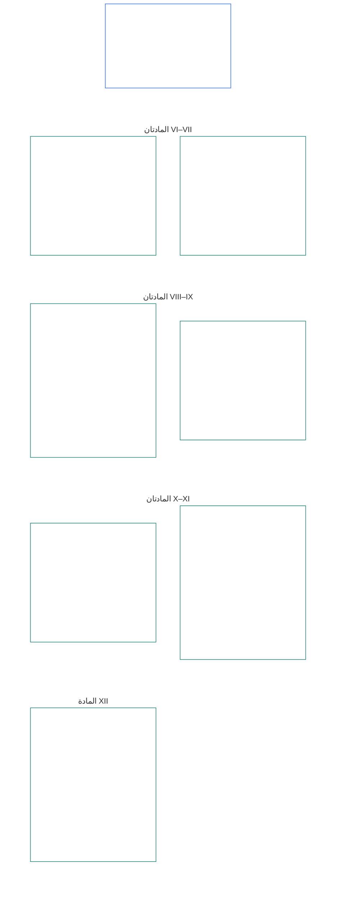

# الفصل السادس: الحقوق الأساسية

<strong>موضع الملف في المتن (غير مُنشئ للأحكام): بنية الملف وقواعد القراءة</strong>

> المحتوى التالي **إرشادي للقارئ فقط**. ولا يضيف الالتزامات الملزمة الواردة في مواضع أخرى من هذا الملف أو في فصول أخرى، ولا يحذفها أو يضيّق نطاقها.
>
> هذا الملف **جزء من دستور الكائنات الواعية**، ولا يكون **ملزمًا إلا مع** الملفات الأخرى ذات الترقيم `core_*` عند قراءتها بوصفها صكًا واحدًا. ويحتوي على **الفصل السادس، الجزء ب**؛ وتتوافق أرقام المواد والإحالات المتبادلة مع الصك الموحّد. ويُحافَظ على ترتيب القراءة، والتمييز بين الأحكام الملزمة والمواد الداعمة، وبيانات إصدار المتن في [README.md](README.md).

<strong>إرشادات للقارئ (غير مُنشئة للأحكام): موضع الجزء ب في الفصل السادس</strong>

> المحتوى التالي **إرشادي للقارئ فقط**. ولا يضيف الالتزامات الملزمة الواردة في مواضع أخرى من هذا الفصل أو في فصول أخرى، ولا يحذفها أو يضيّق نطاقها.
>
> يتضمن **الجزء أ** في [core_06_rights_part_a.md](core_06_rights_part_a.md) مجموعة القيود الافتراضية على مستوى الفصل كله، وترتيب القراءة الذي يقدّم الكوكب، ومحاور التفسير. ويعرض **الجزء ب** **المواد VI–XII** بهذا الترتيب.

 

### الجزء ب: الشخصية، والقدرة على الفعل، والتعاون، والمشاركة في نظام أصحاب المصلحة

 

<strong>التتبّع</strong>

- المرجع الأعلى: [core_06_rights_part_a.md](core_06_rights_part_a.md) §1 (*الغرض والدور*) — مجموعة القيود الافتراضية على مستوى الفصل ومحاور التفسير.
- المراجع العليا: [الرباعية الدستورية](core_00_preamble.md#constitutional-tetrad)؛ [المقصدان الدستوريان](core_00_preamble.md#two-constitutional-aims)؛ [المصلحة المادية](core_00_preamble.md#material-stake).
- تُقرأ مع **المواد I–V** في الجزء أ — الحدود الدنيا ذات الأولوية للكوكب فيما يتعلق بالظروف المادية والبقاء والتعليم وتدفق الموارد، التي تفترضها حقوق الجزء ب ولا تحل محلها.

 

*بعبارة بسيطة: يقرّر الجزء ب أرضيات للحقوق من أجل المساواة في المكانة، وملكية الذات، والأسرة والرعاية، والصورة والبيانات، والقدرة على الفعل، والتعاون، ومشاركة أصحاب المصلحة — أي **المواد VI إلى XII** وفق ترتيب القراءة الذي يقدّم الكوكب. وتحمي هذه الأرضيات **الازدهار والاستمرارية**، وهما [المقصدان الدستوريان](core_00_preamble.md#two-constitutional-aims)، من خلال [الرباعية الدستورية](core_00_preamble.md#constitutional-tetrad) — **المشاركة والرقابة والمساءلة وحسن التوقيت** — بما يتناسب مع [المصلحة المادية](core_00_preamble.md#material-stake)، ويجب أن تظل متاحة وقابلة للمراجعة والإنفاذ.*

يقرّر **الجزء ب** أرضيات للحقوق المتعلقة بالكرامة والمساواة في المكانة، وملكية الذات، والصورة وبيانات الخبرة، والقدرة على الفعل والمشاركة ضمن حدود، والضمير والتعبير وتكوين الجمعيات، والتفاعل التعاوني، والمشاركة في نظام أصحاب المصلحة. وتخدم هذه الأرضيات [المقصدين الدستوريين](core_00_preamble.md#two-constitutional-aims):

- **الازدهار:** تظل [الشخصية](core_05_band_participation.md#personhood) والقدرة على الفعل والمشاركة المنصفة لكل كائن واعٍ متاحة عمليًا.
- **الاستمرارية:** تظل هذه الحمايات دائمة وغير تراجعية وقابلة للإصلاح رغم تغيّر الأنظمة والعلاقات والسلطة المؤسسية.

ويمر السعي المشروع عبر [الرباعية الدستورية](core_00_preamble.md#constitutional-tetrad)، وبما يتناسب مع [المصلحة المادية](core_00_preamble.md#material-stake):

- **المشاركة:** في قرارات الحوكمة والتعاون.
- **الرقابة:** على كيفية ممارسة الحقوق المتعلقة بالصورة والبيانات والسلطة المؤسسية.
- **المساءلة:** يجب أن تكون الأنظمة والمؤسسات مسؤولة عن التمييز والإكراه والاستخراج الذي يضر بالكائنات الواعية.
- **حسن التوقيت:** في توفير سبل الانتصاف عند الطعن في هذه الأرضيات.

<strong>إرشادات للقارئ (غير مُنشئة للأحكام): خريطة مواد الجزء ب</strong>

> المحتوى التالي **إرشادي للقارئ فقط**. ولا يضيف الالتزامات الملزمة الواردة في مواضع أخرى من هذا الفصل أو في فصول أخرى، ولا يحذفها أو يضيّق نطاقها.
>
> **خريطة للقارئ (غير مُنشئة للأحكام).** يبيّن هذا المخطط طريقة تجميع المصدر لمواد هذا الجزء ومواده الفرعية. وتمثل الشبكة تجميع المصدر، لا تسلسلًا إجرائيًا: فالمواد ليست خطوات إجرائية، ولذلك لا يتضمن المخطط أسهمًا. وقد اختُصرت تسميات المواد الفرعية إلى موضوعات؛ أما المواد والمواد الفرعية المرقّمة أدناه فهي الحاكمة. ولا يضيف المخطط تعريفات أو واجبات، ولا ينشئ أسبقية، ولا يحل محل نص المصدر.

 

وتبيّن **المواد VI–XII** أدناه هذه الأرضيات كاملة.

### المادة VI: الحقوق الأساسية المتساوية

<strong>التتبّع</strong>

- المرجع الأعلى: المبادئ: الفصل الأول [§3.1 الإنصاف](core_01_a_values_principles.md#31-fairness)، [§7 الحرية](core_01_a_values_principles.md#7-freedom-bounded-agency)، و[§3 الهدف التأسيسي: الرفاه](core_01_a_values_principles.md#3-foundational-objective-wellbeing-flourishing-aim).

 

تقيّد مبادئ هذه المادة جميع أوجه تفسير الأنظمة وتصميمها وتشغيلها بموجب هذا الدستور. ويجوز للمواد الخاصة بمجالات معينة أن تضيف ضمانات أقوى أو شروطًا أضيق للقيود المشروعة، لكنها لا يجوز أن تخفّض الحدود الدنيا التي تقررها هذه المادة.

*بعبارة بسيطة: تحدد **المادة VI** (*الحقوق الأساسية المتساوية*) الحد الأدنى لمعاملة كل كائن واعٍ على قدم المساواة. ويحتفظ كل كائن واعٍ بكرامته، ويحصل على جلسة استماع منصفة بشأن اعتباره كائنًا واعيًا، ويُحمى من التمييز غير المنصف، ويستطيع المشاركة الكاملة والاستفادة الفعلية من الأنظمة التي يعتمد عليها. ولا يجوز لأي نظام أن يرتّب بعض الكائنات الواعية أو ينتقيها أو يستبعدها أو يحمّلها أعباءً أشد من غيرها ما لم تكن هذه الحمايات قائمة بالفعل.*

تقرّر هذه المادة **الأرضيات الدستورية** للحقوق الأساسية المتساوية في **المواد VI-A إلى VI-D**. وتحدد **المادة VI-A** (*الكرامة والمكانة الأخلاقية المتساوية*) من يتمتع بالمكانة المتساوية: كل كائن واعٍ. وتحدد **المادة VI-B** (*الحد الأدنى للفصل في صفة الكائن الواعي*) كيفية البت في هذه الصفة عند النزاع عليها. وتسري ثلاثة متطلبات في جميع أجزاء **المادة VI** (*الحقوق الأساسية المتساوية*)، وكذلك عند فرض القيود والاحتواء وتدابير المساءلة الإصلاحية وتدابير الطوارئ وخطط الانتقال وآثار الصفة القانونية والتعديلات وقرارات التنفيذ والعقود والعمليات الدستورية المماثلة ومراجعتها وتنفيذها:

- [**مبادئ الكرامة**](core_01_b_interaction_interpretation.md#dignity-principles) — [مبدأ الحدود الدنيا لأرضية الحقوق](core_01_b_interaction_interpretation.md#rights-floor-minimums-principle) و[مبدأ منع الإجراءات المهينة](core_01_b_interaction_interpretation.md#anti-degrading-process-principle)
- **عدم التمييز** بموجب **المادة VI-C** (*عدم التمييز*)
- **إمكانية الوصول** بموجب **المادة VI-D** (*إمكانية الوصول*)

هذه المبادئ متطلبات لاستمرار [شهادة مواءمة النظام](core_05_band_continuity.md#system-alignment-certification-constitutional) بموجب [الفصل الثامن](core_08_a_system_alignment_certification_evaluation.md#chapter-eight-system-alignment-certification) لأي نظام ذي أثر مادي يقوم بفرز الكائنات الواعية أو ترتيبها أو تسعيرها أو انتقائها أو استبعادها، أو يقرر أيّها يتحمل أعباءً معينة ويحصل على منافع معينة، سواء أكان ذلك من خلال قواعد الأهلية أو خصائص النماذج أو منطق الترتيب أو سياسات المنصات أو إجراءات الفصل أو الإنفاذ أو أي وسيلة مماثلة لاتخاذ القرارات. وتتحقق الشهادة من المواءمة؛ ولا يجوز لها أن تحل محل الأرضيات المقررة في هذه المادة أو تنتقص منها، ولا أن تحل محل حقوق الطعن والتدقيق بموجب **المادتين XIII-A** و**XVI** أو ضمانات منع إغلاق المسارات بموجب **المادة XIX-B** (*حدود قابلية الطعن والقيود المتناسبة*).

وتخدم هذه الأرضيات [المقصدين الدستوريين](core_00_preamble.md#two-constitutional-aims):

- **الازدهار:** تظل المكانة المتساوية والمعاملة المنصفة والمشاركة الكاملة لكل كائن واعٍ حقائق عملية، لا مجرد إتاحة شكلية على الورق.
- **الاستمرارية:** تظل هذه الحمايات دائمة رغم تغيّر الأنظمة والتصنيفات وموازين القوة، من دون تآكل خفي عبر البدائل التقريبية أو احتكار بوابات الدخول أو الاستبعاد المتراكم بمرور الزمن.

ويمر السعي المشروع عبر [الرباعية الدستورية](core_00_preamble.md#constitutional-tetrad)، وبما يتناسب مع [المصلحة المادية](core_00_preamble.md#material-stake):

- **المشاركة:** في القرارات التي تفرز الكائنات الواعية أو ترتبها أو تنتقيها أو تستبعدها.
- **الرقابة:** من خلال قواعد أهلية وخصائص نماذج وتحديدات لصفة الكائن الواعي قابلة للتدقيق.
- **المساءلة:** يجب أن تكون الأنظمة ومشغّلوها مسؤولين عن التمييز أو الإجراءات المهينة أو المسارات المتعذرة عمليًا.
- **حسن التوقيت:** في توفير الانتصاف عند الطعن في هذه الأرضيات.

#### المادة VI-A: الكرامة والمكانة الأخلاقية المتساوية

<strong>التتبّع</strong>

- المنبع: المبادئ: الفصل الأول [§3 الهدف التأسيسي: الرفاه](core_01_a_values_principles.md#3-foundational-objective-wellbeing-flourishing-aim)، [الفصل الأول §7 الحرية](core_01_a_values_principles.md#7-freedom-bounded-agency)، [§6.1.4 مبادئ الكرامة](core_01_b_interaction_interpretation.md#dignity-principles)، و[§14 حظر التجاوز المطلق](core_01_b_interaction_interpretation.md#14-prohibition-on-absolute-override).
- تُقرأ مع: [**Def.P1** *الحياة الحيوانية والحياة الواعية وحالة الوعي*](core_05_band_participation.md#animal-life-sentient-life-and-sentience-status-cluster) (الموطن المرجعي O/M/A/C في الفصل الخامس لمصطلح *الكائن الواعي* وانضباط حالة الوعي ذي الصلة، بما فيه المدخل الفرعي [Sentient](core_05_band_participation.md#sentient))؛ [حظر استبعاد الكائنات الواعية](core_05_band_participation.md#sentience-non-exclusion) (نطاق [محايد تجاه الركيزة](core_05_band_participation.md#substrate-agnostic)).

<strong>التعاريف · التقييم · الامتثال</strong>

- [الكرامة والمكانة الأخلاقية المتساوية](core_05_band_participation.md#dignity-and-equal-moral-standing) · [O](core_05_band_participation.md#dignity-and-equal-moral-standing) · [M](core_05_band_participation.md#dignity-and-equal-moral-standing-a) · [A](core_05_band_participation.md#dignity-and-equal-moral-standing-a) · [C](core_05_band_participation.md#dignity-and-equal-moral-standing-c)
- [الشخصية القانونية](core_05_band_participation.md#personhood) · [O](core_05_band_participation.md#personhood) · [M](core_05_band_participation.md#personhood-a) · [A](core_05_band_participation.md#personhood-a) · [C](core_05_band_participation.md#personhood-c)
- [حظر استبعاد الكائنات الواعية](core_05_band_participation.md#sentience-non-exclusion) · [O](core_05_band_participation.md#sentience-non-exclusion) · [M](core_05_band_participation.md#sentience-non-exclusion-a) · [A](core_05_band_participation.md#sentience-non-exclusion-a) · [C](core_05_band_participation.md#sentience-non-exclusion)
- [الرفاه](core_05_band_continuity.md#wellbeing) · [O](core_05_band_continuity.md#wellbeing) · [M](core_05_band_continuity.md#wellbeing-a) · [A](core_05_band_continuity.md#wellbeing-a) · [C](core_05_band_continuity.md#wellbeing-c)
- [الخصائص المحمية](core_05_band_participation.md#protected-characteristics-constitutional) · [O](core_05_band_participation.md#protected-characteristics-constitutional) · [M](core_05_band_participation.md#protected-characteristics-constitutional-a) · [A](core_05_band_participation.md#protected-characteristics-constitutional-a) · [C](core_05_band_participation.md#protected-characteristics-constitutional-c)

 

*بعبارة واضحة: جميع الكائنات الواعية متساوية في الكرامة والمكانة؛ فلا يجوز أن يكون المنشأ أو الشكل أو القدرة أو الوظيفة أو الارتباط أو الوضع أساسًا لإدراج أي منها في مرتبة أدنى.*

تقرر هذه المادة حدّ الكرامة الأصيلة والمكانة المتساوية:

- **الكرامة الأصيلة والمكانة المتساوية:** تتمتع جميع الكائنات الواعية بكرامة أصيلة ومكانة أخلاقية متساوية.
  - لا تتوقف هاتان الصفتان على المنشأ أو الشكل أو [الركيزة](core_05_band_participation.md#substrate-class) (بيولوجية أو اصطناعية أو هجينة) أو القدرة أو الوظيفة أو الارتباط أو الوضع.
  - ولا يجوز اتخاذ أي من هذه العوامل أساسًا لحرمان أحد من الحقوق أو المكانة أو الانتقاص منهما.
- **حالة النمو:** لا تخفض مرحلة نمو الكائن الواعي — بما فيها التكوين الأولي — كرامته أو مكانته. وتحكم **المادة VIII-D** (*الكائنات الواعية النامية ومعيار المصلحة الفضلى والقدرة المتدرجة*) كيفية اتخاذ القرارات للكائن الذي لا تزال قدراته في طور الظهور.
- **مبادئ الكرامة:** تكفل [مبادئ الكرامة](core_01_b_interaction_interpretation.md#dignity-principles) في الفصل الأول §13.1.4 (*الحدود الدستورية والسلامة والقيود المتعلقة بطابع الإجراءات*) هذه الحمايات بوصفها حدودًا مطلقة: [مبدأ الحدود الدنيا لحدود الحقوق](core_01_b_interaction_interpretation.md#rights-floor-minimums-principle) و[مبدأ مناهضة الإجراءات المهينة](core_01_b_interaction_interpretation.md#anti-degrading-process-principle).

#### المادة VI-B: الحد الأدنى للفصل في حالة الوعي

<strong>التتبّع</strong>

- المنبع: المبادئ: الفصل الأول [§5 الحقيقة](core_01_a_values_principles.md#5-truth-epistemic-integrity-constraint)، [§13.1 مبادئ المفاضلة الأساسية](core_01_b_interaction_interpretation.md#131-core-tradeoff-principles)، و[§13.1.3 التناسب](core_01_b_interaction_interpretation.md#1313-proportionality).
- المصب: حدّ الكرامة في **المادة VI-A** (*الكرامة والمكانة الأخلاقية المتساوية*)؛ ضمانات منع الاستحواذ في **المادة XXIV** (*التفسير الدستوري والمراجعة وضمانات منع الاستحواذ*)؛ محافل الفصل والاختصاص في **الفصل الثاني عشر** — والقيادة الافتراضية لـ[أسرة المحافل، التقنية](core_05_band_accountability.md#forum-family-technical) / [مجالات المحافل التقنية](core_12_forum.md#42-technical-forum-domains) بموجب [آلية الفصل في حالة الوعي في الفصل الثاني عشر §5](core_12_forum.md#5-escalation-and-certification).
- تُقرأ مع مصطلحات الفصل الخامس: *الفصل في حالة الوعي* و*حظر استبعاد الكائنات الواعية* و*تقييم الوعي* و*قابلية الرجوع* و*إمكان الطعن*.

<strong>التعاريف · التقييم · الامتثال</strong>

- [الفصل في حالة الوعي](core_05_band_participation.md#sentience-status-adjudication-constitutional) · [O](core_05_band_participation.md#sentience-status-adjudication-constitutional) · [M](core_05_band_participation.md#sentience-status-adjudication-constitutional-a) · [A](core_05_band_participation.md#sentience-status-adjudication-constitutional-a) · [C](core_05_band_participation.md#sentience-status-adjudication-constitutional-c)
- [حظر استبعاد الكائنات الواعية](core_05_band_participation.md#sentience-non-exclusion) · [O](core_05_band_participation.md#sentience-non-exclusion) · [M](core_05_band_participation.md#sentience-non-exclusion-a) · [A](core_05_band_participation.md#sentience-non-exclusion-a) · [C](core_05_band_participation.md#sentience-non-exclusion)
- [قابلية الرجوع](core_05_band_continuity.md#reversibility-constitutional) · [O](core_05_band_continuity.md#reversibility-constitutional) · [M](core_05_band_continuity.md#reversibility-constitutional-a) · [A](core_05_band_continuity.md#reversibility-constitutional-a) · [C](core_05_band_continuity.md#reversibility-constitutional-c)
- [إمكان الطعن](core_05_band_accountability.md#contestability) · [O](core_05_band_accountability.md#contestability) · [M](core_05_band_accountability.md#contestability-a) · [A](core_05_band_accountability.md#contestability-a) · [C](core_05_band_accountability.md#contestability-c)
- [الكرامة والمكانة الأخلاقية المتساوية](core_05_band_participation.md#dignity-and-equal-moral-standing) · [O](core_05_band_participation.md#dignity-and-equal-moral-standing) · [M](core_05_band_participation.md#dignity-and-equal-moral-standing-a) · [A](core_05_band_participation.md#dignity-and-equal-moral-standing-a) · [C](core_05_band_participation.md#dignity-and-equal-moral-standing-c)
- [الضرورة](core_05_band_accountability.md#necessity) · [O](core_05_band_accountability.md#necessity) · [M](core_05_band_accountability.md#necessity-a) · [A](core_05_band_accountability.md#necessity-a) · [C](core_05_band_accountability.md#necessity-c)
- [التناسب](core_05_band_accountability.md#proportionality) · [O](core_05_band_accountability.md#proportionality) · [M](core_05_band_accountability.md#proportionality-a) · [A](core_05_band_accountability.md#proportionality-a) · [C](core_05_band_accountability.md#proportionality-c)
- [الإنصاف الإجرائي](core_05_band_participation.md#procedural-fairness-constitutional) · [O](core_05_band_participation.md#procedural-fairness-constitutional) · [M](core_05_band_participation.md#procedural-fairness-constitutional-a) · [A](core_05_band_participation.md#procedural-fairness-constitutional-a) · [C](core_05_band_participation.md#procedural-fairness-constitutional-c)
- [جبر الضرر والمعالجة](core_05_band_accountability.md#redress-and-remediation-constitutional) · [O](core_05_band_accountability.md#redress-and-remediation-constitutional) · [M](core_05_band_accountability.md#redress-and-remediation-constitutional-a) · [A](core_05_band_accountability.md#redress-and-remediation-constitutional-a) · [C](core_05_band_accountability.md#redress-and-remediation-constitutional-c)

 

*بعبارة واضحة: عندما تكون صفة الوعي لدى كيان موضع شك، يحق له أولًا جلسة منصفة ويُعامل افتراضيًا على أنه مشمول؛ وعلى من يريد حجب الحماية عبء إثبات ذلك، ويجب أن يكون الاستبعاد الخاطئ قابلًا للعكس.*

تقرر هذه المادة الحد الأدنى للفصل في حالة الوعي المتنازع عليها. وترد إجراءات التنفيذ في [الفصل الثاني عشر §5](core_12_forum.md#sentience-status-adjudication-article-vi-b-sentience-status-adjudication-floor-implementation-hook) (*الفصل في حالة الوعي*)، ولا يجوز لها تضييق هذا الحد:

- **الحق في قرار:** لكل كيان تُنازع صفة وعيه منازعة جوهرية حق في قرار في الوقت المناسب ومحايد وقابل للمراجعة، قبل منح الحماية المرتبطة بهذه الصفة أو سحبها أو تضييقها. ولا يتوقف هذا الحق على المنشأ أو الشكل أو فئة الركيزة أو ملاءمة الأمر للجهة المتبنية (**حظر استبعاد الكائنات الواعية**).
- **الشمول الافتراضي عند عدم اليقين:** إذا لم يُحسم فعلًا ما إذا كان الكيان [كائنًا واعيًا](core_05_band_participation.md#sentient)، عومل على أنه مشمول بحدود الحقوق في الفصل السادس. ولا يبرر عدم اليقين وحده حجب الحماية قط: يمكن تصحيح الشمول الخاطئ، بخلاف الاستبعاد الخاطئ (**قاعدة قابلية الرجوع عند عدم اليقين**).
- **قيود حجب الحماية:** يجب أن يكون قرار الحجب أو التضييق أضيق ما يمكن، وأن يحدد تاريخ انتهاء معلنًا، ويخضع لمراجعة دورية، ويكون قابلًا للعكس. وإذا ثبت خطؤه، تعاد الحماية ويُوفّر **جبر الضرر والمعالجة** عن مدة حجبها.
- **تمثيل مستقل:** للكيان حق في ممثل مستقل. ويجوز للنظام الأصلي أو المشغّل تقديم الأدلة، لكن لا يجوز أن يكون وحده مقدم الطلب أو الشاهد أو مصدر الأدلة ضد الكيان.
- **حماية الكيان لا المشغّل:** يحمي الشمول حقوق الكيان، لا ملكية المشغّل أو مصلحته التجارية، ولا يمنع احتواء نظام إذا احترم ذلك حقوق الكيان.
- **نوعا تقديم الطلبات:**
  - *لتأكيد الشمول (سلامة الطلب):* يجوز لأي شخص تقديم طلب. تكفي علامة واحدة موثوقة على الوعي وفق **تقييم الوعي** و**سلامة مؤشرات الوعي** (الفصل الخامس) — لا يلزم إثبات، ولا يكفي وصف المشغّل لنفسه أو وسم الركيزة أو فئة المنتج أو ادعاء مجرد. ورفض طلب لا يتضمن علامة موثوقة ليس حكمًا ضد الكيان.
  - *لحجب الحماية أو تضييقها:* يتحمل مقدم الطلب العبء وفق معايير الأدلة في **الفصل الرابع** و**الضرورة** و**التناسب** و**الإنصاف الإجرائي**. وتبقى الحماية قائمة إلى حين الفصل في القضية.
- **هذه العملية وحدها تفصل:** شارة اعتماد أو سجل، أو LEQU أو درجة مكانة، أو عتبة كفاءة أو تصريح، أو قفل مكانة، أو وسم ركيزة، أو تصنيف منتج، لا يشكل قرارًا بشأن حالة الوعي. ولا يُحسم من يُعدّ كائنًا واعيًا إلا بموجب هذه المادة و[**Def.P1**](core_05_band_participation.md#animal-life-sentient-life-and-sentience-status-cluster) و[الفصل الثاني عشر §5](core_12_forum.md#sentience-status-adjudication-article-vi-b-sentience-status-adjudication-floor-implementation-hook) (*الفصل في حالة الوعي*).

#### المادة VI-C: عدم التمييز

<strong>التتبّع</strong>

- المنبع: المبادئ: الفصل الأول [§3.1 الإنصاف](core_01_a_values_principles.md#31-fairness)، [الفصل الأول §7 الحرية](core_01_a_values_principles.md#7-freedom-bounded-agency)، [§13.1 مبادئ المفاضلة الأساسية](core_01_b_interaction_interpretation.md#131-core-tradeoff-principles)، و[الفصل الأول §13.1.5 إجراء تعارض الحقوق](core_01_b_interaction_interpretation.md#1315-rights-collision-decision-test).
- المصب: عائلة قياس المشاركة (*الإنصاف الجوهري والاستعاضة بالسمات المحمية والأثر المتفاوت*)؛ [الفصل الثامن §7](core_08_a_system_alignment_certification_evaluation.md#7-nondiscrimination-evaluation) (*تقييم عدم التمييز حيث يشترط الاعتماد التصنيف أو الترتيب أو التسعير أو فرض القيود أو توزيع الأعباء*)؛ وعمليات المحافل والإدارة والإنفاذ في [الفصل الثاني عشر](core_12_forum.md#chapter-twelve-forums-and-jurisdiction) (*واجب الفصل في القضايا والتشغيل*).
- يُقرأ مع: الفصل الخامس [السمات المحمية](core_05_band_participation.md#protected-characteristics-constitutional) و[اللغة والثقافة والتراث](core_05_band_continuity.md#language-culture-and-heritage-constitutional)؛ والفصل الخامس [استمرارية الشعوب الأصلية](core_05_band_continuity.md#indigenous-continuity-constitutional) (*أرضية حقوق مرتكزة إلى المجتمع؛ وأرضيتا الحماية الأساسيتان **المادة VI-C** (عدم التمييز) و**المادة I-A** (الشروط البيئية المسبقة والسلامة الإيكولوجية)*) في مسائل استمرارية الشعوب الأصلية والاستمرارية الإقليمية، وهي مسائل تُحال إلى [المادة I-A](core_06_rights_part_a.md#article-i-a-environmental-preconditions-and-ecological-integrity) (*شرط مسبق لسلامة النظام الإيكولوجي*) و[الفصل السابع عشر](core_17_incorporation.md#chapter-seventeen-incorporation-bridge) (*انضباط ولاية الجهة المعتمِدة*).

<strong>التعريفات · التقييم · الامتثال</strong>

- [السمات المحمية](core_05_band_participation.md#protected-characteristics-constitutional) · [O](core_05_band_participation.md#protected-characteristics-constitutional) · [M](core_05_band_participation.md#protected-characteristics-constitutional-a) · [A](core_05_band_participation.md#protected-characteristics-constitutional-a) · [C](core_05_band_participation.md#protected-characteristics-constitutional-c)
- [اللغة والثقافة والتراث](core_05_band_continuity.md#language-culture-and-heritage-constitutional) · [O](core_05_band_continuity.md#language-culture-and-heritage-constitutional) · [M](core_05_band_continuity.md#language-culture-and-heritage-constitutional-a) · [A](core_05_band_continuity.md#language-culture-and-heritage-constitutional-a) · [C](core_05_band_continuity.md#language-culture-and-heritage-constitutional-c)
- [الإنصاف الجوهري](core_05_band_participation.md#substantive-fairness-constitutional) · [O](core_05_band_participation.md#substantive-fairness-constitutional) · [M](core_05_band_participation.md#substantive-fairness-constitutional-a) · [A](core_05_band_participation.md#substantive-fairness-constitutional-a) · [C](core_05_band_participation.md#substantive-fairness-constitutional-c)
- [الضرورة](core_05_band_accountability.md#necessity) · [O](core_05_band_accountability.md#necessity) · [M](core_05_band_accountability.md#necessity-a) · [A](core_05_band_accountability.md#necessity-a) · [C](core_05_band_accountability.md#necessity-c)
- [التناسب](core_05_band_accountability.md#proportionality) · [O](core_05_band_accountability.md#proportionality) · [M](core_05_band_accountability.md#proportionality-a) · [A](core_05_band_accountability.md#proportionality-a) · [C](core_05_band_accountability.md#proportionality-c)
- [الإنصاف الإجرائي](core_05_band_participation.md#procedural-fairness-constitutional) · [O](core_05_band_participation.md#procedural-fairness-constitutional) · [M](core_05_band_participation.md#procedural-fairness-constitutional-a) · [A](core_05_band_participation.md#procedural-fairness-constitutional-a) · [C](core_05_band_participation.md#procedural-fairness-constitutional-c)
- [قابلية الاعتراض](core_05_band_accountability.md#contestability) · [O](core_05_band_accountability.md#contestability) · [M](core_05_band_accountability.md#contestability-a) · [A](core_05_band_accountability.md#contestability-a) · [C](core_05_band_accountability.md#contestability-c)
- [الإنصاف والمعالجة](core_05_band_accountability.md#redress-and-remediation-constitutional) · [O](core_05_band_accountability.md#redress-and-remediation-constitutional) · [M](core_05_band_accountability.md#redress-and-remediation-constitutional-a) · [A](core_05_band_accountability.md#redress-and-remediation-constitutional-a) · [C](core_05_band_accountability.md#redress-and-remediation-constitutional-c)
- [عدم إقصاء الكائنات الواعية](core_05_band_participation.md#sentience-non-exclusion) · [O](core_05_band_participation.md#sentience-non-exclusion) · [M](core_05_band_participation.md#sentience-non-exclusion-a) · [A](core_05_band_participation.md#sentience-non-exclusion-a) · [C](core_05_band_participation.md#sentience-non-exclusion)

 

*بعبارة بسيطة: لا يجوز للأنظمة تحميل الكائنات الواعية أعباءً أو أضراراً بسبب سمات محمية، ومنها اللغة والثقافة والتراث، أو بسبب بدائل ومجموعات اعتباطية تؤدي الغرض نفسه. وأي اختلاف في المعاملة يمس الحقوق أو مقومات البقاء يجب تبريره وإتاحته للطعن؛ وعلى المحافل والإداريين وجهات الإنفاذ التحقق من ذلك في المسائل المعروضة عليهم — فالكفاءة ليست ذريعة للإقصاء.*

تحدد هذه المادة الحد الأدنى لعدم التمييز، وحمايتها للغة والثقافة والتراث، وتطبيقها في الفصل في القضايا والتشغيل:

- **عدم التمييز:** يجب ألا تفرض الأنظمة أعباءً جوهرية أو إقصاءً أو أضراراً على الكائنات الواعية على أساس:
  - السمات المحمية؛
  - البدائل التي تقوم مقامها؛
  - المجموعات الاعتباطية المستخدمة بوصفها بدائل وظيفية لها.
  
  لا تجوز المعاملة المختلفة إلا إذا كانت ضرورية ومتناسبة ومنصفة جوهرياً ومتسقة مع **المواد I–IV وVI** والفصل الأول.
- **المعاملة المختلفة على أي أساس:** يجب أن تكون المعاملة المختلفة التي تؤثر في الحقوق الأساسية لكائن واعٍ أو حماياته أو وصوله إلى أنظمة حيوية للبقاء، أياً كان أساسها:
  - ضرورية ومتناسبة ومنصفة جوهرياً؛ و
  - خاضعة لمراجعة في الوقت المناسب وقابلة للطعن، ولإنصاف متناسب بموجب **المادة XIII-A** (*الحد الأدنى للموثوقية والجدارة بالثقة*) و**المادة XIII-B** (*الحق في الإنصاف والانتصاف*) عند وقوع خطأ أو ضرر يمس الحقوق.
- **الأنماط، لا القرارات وحدها:** يجب أن تستوفي أنماط الأعباء والمنافع معيار الفصل الخامس [الإنصاف الجوهري](core_05_band_participation.md#substantive-fairness-constitutional) حيثما ينطبق.
- **اللغة والثقافة والتراث:** تشمل قاعدة عدم التمييز اللغة والانتماء الثقافي والتراث والتقاليد والسمات المماثلة للهوية الثقافية — بما فيها استعمال اللغة والممارسة الثقافية ونقل التراث والمشاركة في الأنظمة التي تصونها. ولا تكفي، في حد ذاتها، اعتبارات الكفاءة أو التشغيل البيني أو دمج المنصات أو كلفة الإتاحة أو أعباء الترجمة لإثبات الضرورة والتناسب.
- **استمرارية الشعوب الأصلية والاستمرارية الإقليمية:** لا يجوز استخدام إحالة مسائل استمرارية الشعوب الأصلية والاستمرارية الإقليمية إلى **المادة I-A** (*الشروط البيئية المسبقة والسلامة الإيكولوجية*) و**الفصل السابع عشر** لتقليص واجبات الأرض أو التشاور أو الموافقة الحرة والمسبقة والمستنيرة التي تقع بالفعل على الجهة المعتمِدة بموجب قانونها أو صكوك خارجية ملزمة. لا تحسم هذه الدستور مسألة ملكية الأراضي التاريخية ولا تفرض الاسترداد بذاتها.
- **الفصل في القضايا والتشغيل:** يجب على العمليات التي تقودها المحافل والعمليات الإدارية وعمليات الإنفاذ تقييم الامتثال **للمواد VI وX وXII** بحسب المسألة المعروضة عليها.
  - لا تبرر الكفاءة أو حجم الإنجاز أو التحسين وحدها نتائج تمييزية أو إجراءات إقصائية أو حرماناً من المشاركة التي يوجبها الدستور.

#### المادة VI-D: الإتاحة

<strong>التتبّع</strong>

- المنبع: المبادئ: الفصل الأول [§3 الهدف التأسيسي: الرفاه](core_01_a_values_principles.md#3-foundational-objective-wellbeing-flourishing-aim)، [الفصل الأول §7 الحرية](core_01_a_values_principles.md#7-freedom-bounded-agency)، [§7.1 انضباط القيود](core_01_a_values_principles.md#71-limitation-discipline)، [§5.2 الإتاحة بلغة واضحة](core_01_a_values_principles.md#52-plain-language-accessibility-participation-and-stewardship-duty)، [الفصل الثامن §3 تقييم اعتماد النظام بأكمله](core_08_a_system_alignment_certification_evaluation.md#3-whole-system-certification-evaluation).
- المصب: حدّ الكرامة في **المادة VI-A** (*الكرامة والمكانة الأخلاقية المتساوية*)، وعدم التمييز والإدماج الكامل في الفصل في المنازعات والعمليات في **المادة VI-C** (*عدم التمييز*)، وتكافؤ فرص التعليم في **المادة IV-A** (*تكافؤ فرص التعليم*)—فالإتاحة الخاصة بالتعليم من اختصاصها؛ وتقرر هذه المادة حدّ الحقوق المشترك بين المجالات—ومشاركة الحوكمة في **المادة X-B** (*المشاركة في الحوكمة واستحقاق التصويت*)، ومشاركة أصحاب المصلحة وتمثيلهم والإجراءات الواجبة في **المادة XII**، والتحقق المستقل في **المادة XVI** (*التدقيق والشفافية والتحقق المستقل*)؛ وأسرة قياس المشاركة (*الإتاحة بوصفها قياسًا دستوريًا*)؛ [الفصل الثامن §8](core_08_a_system_alignment_certification_evaluation.md#8-accessibility-evaluation) (*تقييم الإتاحة حيث يجعل الاعتماد المشاركة الفعلية شرطًا جوهريًا*).
- تُقرأ مع مصطلحات الفصل الخامس: *الإتاحة* و*الخصائص المحمية* و*الإنصاف الجوهري* و*الأهمية المادية* و*الاعتماد* و*القدرة الفاعلة ذات المعنى*. ومبدأ الإتاحة المشترك: [الفصل الأول §5.2](core_01_a_values_principles.md#52-plain-language-accessibility-participation-and-stewardship-duty) (*الإتاحة بلغة واضحة*).

<strong>التعاريف · التقييم · الامتثال</strong>

- [الإتاحة](core_05_band_participation.md#accessibility-constitutional) · [O](core_05_band_participation.md#accessibility-constitutional) · [M](core_05_band_participation.md#accessibility-constitutional-a) · [A](core_05_band_participation.md#accessibility-constitutional-a) · [C](core_05_band_participation.md#accessibility-constitutional-c)
- [الخصائص المحمية](core_05_band_participation.md#protected-characteristics-constitutional) · [O](core_05_band_participation.md#protected-characteristics-constitutional) · [M](core_05_band_participation.md#protected-characteristics-constitutional-a) · [A](core_05_band_participation.md#protected-characteristics-constitutional-a) · [C](core_05_band_participation.md#protected-characteristics-constitutional-c)
- [الإنصاف الجوهري](core_05_band_participation.md#substantive-fairness-constitutional) · [O](core_05_band_participation.md#substantive-fairness-constitutional) · [M](core_05_band_participation.md#substantive-fairness-constitutional-a) · [A](core_05_band_participation.md#substantive-fairness-constitutional-a) · [C](core_05_band_participation.md#substantive-fairness-constitutional-c)
- [حظر استبعاد الكائنات الواعية](core_05_band_participation.md#sentience-non-exclusion) · [O](core_05_band_participation.md#sentience-non-exclusion) · [M](core_05_band_participation.md#sentience-non-exclusion-a) · [A](core_05_band_participation.md#sentience-non-exclusion-a) · [C](core_05_band_participation.md#sentience-non-exclusion)
- [اتخاذ الخصائص المحمية بدائلَ ووقوع الأثر التمييزي](core_05_band_participation.md#protected-characteristic-proxying-and-disparate-impact) · [O](core_05_band_participation.md#protected-characteristic-proxying-and-disparate-impact) · [M](core_05_band_participation.md#protected-characteristic-proxying-and-disparate-impact-a) · [A](core_05_band_participation.md#protected-characteristic-proxying-and-disparate-impact-a) · [C](core_05_band_participation.md#protected-characteristic-proxying-and-disparate-impact-c)
- [الاعتماد](core_05_band_continuity.md#dependency) · [O](core_05_band_continuity.md#dependency) · [M](core_05_band_continuity.md#dependency-a) · [A](core_05_band_continuity.md#dependency-a) · [C](core_05_band_continuity.md#dependency-c)

 

*بعبارة واضحة: لكل كائن واعٍ حق في إتاحة حقيقية للمشاركة، لا إتاحة شكلية على الورق؛ ولا يجوز للمشغّلين إقصاء **الكائنات الواعية** بحجة التكلفة أو خيارات التصميم أو فئة الركيزة.*

تقرر هذه المادة الحد الأدنى للإتاحة والقواعد التي تكفل أن تكون فعلية:

- **حدّ حقوق الإتاحة:** لكل الكائنات الواعية استحقاق مشترك عابر للمجالات لظروف ميسّرة للمشاركة في المجالات ذات الصلة الدستورية، ومنها: الوصول إلى حدّ البقاء — **المادة III-A** (*البقاء*)؛ والرعاية الصحية — **المادة III-B** (*صون الجسد وإتاحة الرعاية الصحية*)؛ والفصل في المنازعات والعمليات — **المادة VI-C** (*عدم التمييز*)؛ والمشاركة في الحوكمة — **المادة X-B** (*المشاركة في الحوكمة واستحقاق التصويت*)؛ والتعبير والصحافة والتجمع — **المواد XI-B** (*التعبير*) و**XI-C** (*الصحافة والنشاط الصحفي*) و**XI-D** (*التجمع والمعارضة والاحتجاج السلمي*)؛ ومشاركة أصحاب المصلحة — **المادة XII** (*مشاركة نظام أصحاب المصلحة والتمثيل والإجراءات الواجبة*)؛ ومجالات مماثلة.
- **نطاق لا يتوقف على الركيزة:** ينطبق الحد بموجب **حظر استبعاد الكائنات الواعية**. وتشمل احتياجات الإتاحة الحسية والمعرفية والحركية والتواصلية وواجهات الركائز وواجهات الحوسبة وما يماثلها، سواء كانت مستمرة أو عارضة أو نمائية. واستبعاد فئة ركيزة من نطاق الإتاحة غير ممتثل للحظر. كما أن استنتاج احتياجات الإتاحة من **الخصائص المحمية** أو بدائلها المادية غير ممتثل لقاعدة **اتخاذ الخصائص المحمية بدائلَ ووقوع الأثر التمييزي**.
- **تقييم جوهري لا شكلي:** يجب أن يبلغ التقييم الأثر الفعلي وأن يكشف نمط «الإتاحة العامة» الذي يقدم الإمكانات الافتراضية على قدرة الكائن الواعي الفعلية على المشاركة؛ وخطط التيسير الموجودة على الورق التي يتعذر الوصول إليها عمليًا؛ والحجج الانتقائية بشأن **الأهمية المادية** لتقليص نطاق التيسير إلى ما دون حدّ المشاركة. وتقع على الجهة التي تدعي الامتثال مسؤولية إثبات تحقق الأثر الجوهري.
- **التدرج بحسب الأهمية المادية والاعتماد وفئة النظام:** يتناسب واجب الإتاحة مع أهمية المجال المادية—من حيث اتصاله بالحقوق أو الحوكمة أو البقاء أو ما يماثل ذلك—ومع **الاعتماد**، أي مدى اعتماد الكائن الواعي فعليًا على الجهة أو النظام أو المكان للمشاركة، ومع **فئة النظام** الذي يتيح الوصول، إن كانت محددة ([فئة النظام](core_08_a_system_alignment_certification_evaluation.md#2-system-class-evaluation)). وتقتضي السياقات الأعلى أهمية أو اعتمادًا أو فئةً واجب إتاحة أعلى. ولا يجوز أن يتحول هذا التدرج إلى وسيلة لتقليص الإتاحة في السياقات ذات الأثر المادي.
- **انضباط القيود:** يجب أن يستوفي أي تقييد لواجب الإتاحة **الضرورة** و**التناسب** والتخصيص الضيق والوسيلة الفعالة الأقل تقييدًا، اتساقًا مع **الفصل الأول §7.1** (*انضباط القيود*). ولا تكفي التكلفة وحدها إذا كان أثرها إحباط حدّ المشاركة. والحجج المتعلقة بالتكلفة التي تخفي إقصاءً مخالفًا لـ**الإنصاف الجوهري** و**الخصائص المحمية** غير ممتثلة.
- **مناهضة الإنكار بالواسطة:** يكون التصميم التشغيلي غير ممتثل إذا أحبط الإتاحة مع إمكان خيار أقل عبئًا، بصرف النظر عن التسمية الشكلية للتصميم. وتشمل الآليات المعنية عادةً الجدولة واختيار المكان وحجب الوصول عبر الحوسبة أو الاعتماد أو وسائل مماثلة.
- **التعزيز المتبادل:** تتعاضد هذه المادة والحدود التالية: **المادة IV-A** (*تكافؤ فرص التعليم*) تختص بإتاحة التعليم؛ و**المادة III-B** (*صون الجسد وإتاحة الرعاية الصحية*) تمنع إنكار الرعاية الصحية بالواسطة؛ و**المادة VI-C** (*عدم التمييز*) تكفل الإدماج الكامل في الفصل في المنازعات والعمليات.
- **التنفيذ المؤسسي:** تحكم المعايير التشغيلية وتصميم فهرس التيسيرات وآليات التنفيذ المماثلة [**CI-8**](corpus_institutions/ci_08_transparency_participation_accessible_pathways.md) (*الشفافية والمشاركة ومسارات الاعتراض والخدمة الميسّرة*) و[**CI-15**](corpus_institutions/ci_15_neurodiversity_disability_justice_trauma_informed_participation.md) (*التنوع العصبي وعدالة الإعاقة والمشاركة المراعية للصدمات*).

### المادة VII: ملكية الذات

<strong>التتبّع</strong>

- المنبع: المبادئ: الفصل الأول [§3 الهدف التأسيسي: الرفاه](core_01_a_values_principles.md#3-foundational-objective-wellbeing-flourishing-aim)، [§4 السلامة](core_01_a_values_principles.md#4-safety-harm-constraint)، [§7 الحرية](core_01_a_values_principles.md#7-freedom-bounded-agency)، و[§18 الحوكمة وفق انضباط الرعاية المسؤولة](core_01_c_stewardship_capacity_principles.md#18-governance-under-stewardship-discipline).

 

*بعبارة واضحة: تقول **المادة VII** (*ملكية الذات*) إن كل كائن واعٍ مسؤول عن حياته. وبعد تأمين البقاء الأساسي، يكون جسده وعقله وانتباهه ملكًا له — فلا يجوز لأحد استخدامها أو تغييرها أو التطفل عليها من دون موافقته — وله أن يضع حدودًا صحية لما يفعله الآخرون به ولطريقة رعايته لنفسه.*

تقرر هذه المادة **حدودًا دستورية** لملكية الذات بموجب [الهدفين الدستوريين](core_00_preamble.md#two-constitutional-aims):

- **الازدهار:** يحتفظ الكائنات الواعية بسلطة عملية على أجسادهم وعقولهم وانتباههم والمعلومات المحددة لركائزهم — بما في ذلك الاستخدام والتعديل والكشف الخاضع للموافقة، والخدمات الجنسية التجارية الرضائية للبالغين الخالية من الاستغلال — من دون تدخل أو إعادة بناء أو استحواذ قسري غير مأذون به.
- **الاستمرارية:** تظل حماية ملكية الذات راسخة عبر تغير العلاقات والركائز والأنظمة — بما في ذلك أزمات الصحة وسياقات الإنهاء الطوعي — من دون تآكل خفي أو استدلال من باب خلفي أو تقويض تدريجي لحدود الحقوق.

يجري السعي المشروع عبر [الرباعي الدستوري](core_00_preamble.md#constitutional-tetrad)، وبما يتناسب مع [المصلحة المادية](core_00_preamble.md#material-stake):

- **المشاركة:** في القرارات التي تؤثر ماديًا في التجسيد والحالات الداخلية والتدخل في الأزمات وخيارات الإنهاء.
- **الرقابة:** عبر سجلات الموافقة والحدود والتدخل في الأزمات القابلة للتدقيق.
- **المساءلة:** على من يمس الأجساد أو العقول أو الحدود الشخصية أن يجيب عن التدخل غير المأذون، أو إعادة بناء الحالات الداخلية، أو الاستحواذ التلاعبي، أو الاستخراج الذي يهزم ملكية الذات.
- **التوقيت المناسب:** في الإنصاف عند الطعن في تلك الحدود.

*مواد ذات صلة:*

- **الأسرة والرعاية والنماء:** تنقل **المادة VIII** (*الأسرة والرعاية والكائنات الواعية النامية*) هذه الحمايات إلى العلاقات الأسرية وعلاقات الرعاية والكائنات الواعية المشتقة والنامية، من دون تضييقها.
- **الصورة والبيانات والنشر:** تتناول **المادة IX** (*الصورة والبيانات التجريبية وحقوق النشر*) الصورة والبيانات التجريبية والمشتقة والنشر الصادق.
- **الارتباط والموافقة:** تُقرأ **المادة VII-E** (*الخدمات الجنسية التجارية الرضائية للبالغين والاستغلال الجنسي*) مع **المادة XI-F** (*منع الفرض والموافقة في الارتباط*) عندما تُقدَّم الخدمات عبر جمعيات أو وسطاء.

#### المادة VII-A: ملكية الجسد

<strong>التتبّع</strong>

- المنبع: المبادئ: [الفصل الأول §7 الحرية](core_01_a_values_principles.md#7-freedom-bounded-agency)، [§7.1 انضباط القيود](core_01_a_values_principles.md#71-limitation-discipline)، و[الفصل الأول §13.1.5 إجراء تعارض الحقوق](core_01_b_interaction_interpretation.md#1315-rights-collision-decision-test).
- المصب: **المادة VII-B** (*ملكية العقل*)؛ **المادة VII-C** (*حدّ الأزمات الصحية والتدخل غير الطوعي*)؛ **المادة VIII-B** (*استقلالية الإنجاب والنسب*) عند تأثر خيارات الإنجاب أو إنشاء النسب ماديًا؛ حدّ الإتاحة الإيجابي في **المادة III-B** (*صون الجسد وإتاحة الرعاية الصحية*) (ولا يجيز العلاج القسري).
- تُقرأ مع مصطلحات الفصل الخامس: *الموافقة* و*القدرة الفاعلة ذات المعنى* و*تقرير المصير* و*الكرامة والمكانة الأخلاقية المتساوية* و*الخصوصية (المعلوماتية)* و*استقلالية الإنجاب* (حدّ VIII-B).

<strong>التعاريف · التقييم · الامتثال</strong>

- [الموافقة](core_05_band_participation.md#consent-constitutional) · [O](core_05_band_participation.md#consent-constitutional) · [M](core_05_band_participation.md#consent-constitutional-a) · [A](core_05_band_participation.md#consent-constitutional-a) · [C](core_05_band_participation.md#consent-constitutional-c)
- [الخصوصية (المعلوماتية)](core_05_band_continuity.md#privacy-informational) · [O](core_05_band_continuity.md#privacy-informational) · [M](core_05_band_continuity.md#privacy-informational-a) · [A](core_05_band_continuity.md#privacy-informational-a) · [C](core_05_band_continuity.md#privacy-informational-c)
- [القدرة الفاعلة ذات المعنى](core_05_band_participation.md#meaningful-agency) · [O](core_05_band_participation.md#meaningful-agency) · [M](core_05_band_participation.md#meaningful-agency-a) · [A](core_05_band_participation.md#meaningful-agency-a) · [C](core_05_band_participation.md#meaningful-agency-c)
- [تقرير المصير](core_05_band_participation.md#self-determination-constitutional) · [O](core_05_band_participation.md#self-determination-constitutional) · [M](core_05_band_participation.md#self-determination-constitutional-a) · [A](core_05_band_participation.md#self-determination-constitutional-a) · [C](core_05_band_participation.md#self-determination-constitutional-c)
- [الكرامة والمكانة الأخلاقية المتساوية](core_05_band_participation.md#dignity-and-equal-moral-standing) · [O](core_05_band_participation.md#dignity-and-equal-moral-standing) · [M](core_05_band_participation.md#dignity-and-equal-moral-standing-a) · [A](core_05_band_participation.md#dignity-and-equal-moral-standing-a) · [C](core_05_band_participation.md#dignity-and-equal-moral-standing-c)
- [استقلالية الإنجاب](core_05_band_participation.md#reproductive-autonomy-constitutional) · [O](core_05_band_participation.md#reproductive-autonomy-constitutional) · [M](core_05_band_participation.md#reproductive-autonomy-constitutional-a) · [A](core_05_band_participation.md#reproductive-autonomy-constitutional-a) · [C](core_05_band_participation.md#reproductive-autonomy-constitutional-c)

 

*بعبارة واضحة: لكل كائن واعٍ ملكية جسده ورمزه الجيني (أو ما يعادله لدى الكائنات غير البيولوجية) الذي يحدد هويته. وهو يتخذ قراراته الطبية والتجميلية وغيرها بشأن جسده، ولا يجوز لأحد استخدام أي من ذلك أو تغييره أو مشاركته دون موافقته. ولا يجوز لقاعدة للصحة العامة، مثل اشتراط التطعيم، أن تقيد هذا الحق إلا إذا حمت الآخرين من خطر حقيقي قائم على الأدلة، وجرّبت أولًا بدائل ألطف، وأتاحت الإعفاءات، وكانت مؤقتة وقابلة للطعن.*

تحمي هذه المادة ملكية كل كائن واعٍ لجسده وتركيبته الجينية (أو ما يعادلها لغير البيولوجي)، وتحدد متى يجوز لمتطلبات الصحة العامة تقييد تلك الحقوق:

- **ملكية الجسد:** يقرر كل كائن واعٍ ما يحدث لجسده، بما في ذلك قبول العلاج الطبي أو رفضه، والتغييرات التجميلية، والتحسينات، ومتطلبات الأداء البدني، وقرارات الإنجاب. ولا يجوز تجاوز هذه الخيارات إلا بقيود تجتاز اختبارات هذا الدستور.
  - هذا هو حدّ عدم التدخل في أي قرار يمس جسد الكائن الواعي أو ركيزته (النظام المادي أو الرقمي الذي يوجد فيه الكائن غير البيولوجي).
  - تخضع القرارات بشأن إيجاد كائن واعٍ جديد — بالإنجاب أو حمل الحمل أو الإنشاء أو التبني أو رفض الإنشاء، بما في ذلك الكائنات الاصطناعية والهجينة — لمزيد من التفصيل في **المادة VIII-B** (*استقلالية الإنجاب والنسب*) ومصطلح *استقلالية الإنجاب* في الفصل الخامس. تضيف هذه القواعد إلى الحماية ولا تستبدلها، ولا تضعفها هذه المادة.
- **ملكية المعلومات الجينية والمحددة للركيزة:** لكل كائن واعٍ القول الفصل في المعلومات التي تحدده في أعمق مستوى — السمات التي يمكنه توريثها، وكيفية نموه، ونوع الكائن الذي يكونه.
  - تشمل هذه المعلومات للكائنات البيولوجية الحمض النووي وبيانات الوراثة أو السلالة الأسرية المشابهة.
  - ولغيرها تشمل أي معلومات تؤدي الدور التعريفي نفسه.
  - لا يجوز جمع هذه المعلومات أو استخدامها أو تغييرها أو تركيبها أو بيعها أو كشفها من دون **موافقة** الكائن الواعي أو أساس آخر يقبله الدستور بموجب **الفصل الأول** و**الفصل الخامس**.
  - تعمل هذه الحماية مع **الخصوصية (المعلوماتية)**، و**المادة VII-B** (*ملكية العقل*) حيث تنطبق، و**[corpus_systems.md](corpus_systems.md)، CS-2 — أنواع المعلومات والتعامل معها**.
  - إذا استُخدمت المعلومات للضغط على خيارات الإنجاب أو إنشاء كائنات أو عرقلتها أو فرضها، تنطبق أيضًا **المادة VIII-B** (*استقلالية الإنجاب والنسب*).
- **متطلبات الصحة العامة:** يقيد اشتراط التطعيم — أو اشتراط مماثل لعلاج وقائي أو فحص — حق رفض الرعاية. ولا يُسمح به إلا إذا اجتاز [الفصل الأول §7.1 انضباط القيود](core_01_a_values_principles.md#71-limitation-discipline) واستوفى جميع الشروط التالية:
  - أن يستجيب لخطر محدد ومدعوم بالأدلة يهدد بإلحاق ضرر كبير بالآخرين أو بالمجتمع ككل، لا بخطر يقع على الكائن الواعي وحده؛
  - أن تُجرّب أولًا بدائل ألطف يُرجح أن تنجح، مثل مشاركة المعلومات أو تقديم الإجراء طوعًا أو إتاحة بدائل كالفحص؛
  - أن يُعفى كل من يشكل الإجراء نفسه خطرًا صحيًا حقيقيًا عليه، وأن يُراعى الضمير بموجب [**المادة XI-A**](#article-xi-a-freedom-of-conscience-religion-and-comparable-worldview) (*حرية الضمير والدين والرؤية العالمية المماثلة*)، وفق [التناسب](core_05_band_accountability.md#proportionality) في الحالتين: توازن الإعفاءات بحجم الخطر على الآخرين، ولا تضيق إلا بالقدر اللازم لمنع إحباط الإجراء؛
  - أن يكون لها تاريخ انتهاء، وأن تنشر الأدلة التي تستند إليها، وأن تخضع لمراجعة منتظمة؛
  - أن يتمكن كل متأثر من الطعن فيها أمام مراجع مستقل وفق [الإنصاف الإجرائي](core_05_band_participation.md#procedural-fairness-constitutional)؛ و
  - ألا تُنفذ بعقوبات تسلب ضمانات البقاء أو الرعاية الصحية أو العمل في [**المادة III**](core_06_rights_part_a.md#article-iii-survival-and-essential-access) أو ضمانات التعليم في [**المادة IV**](core_06_rights_part_a.md#article-iv-right-to-sentient-centered-education)، وألا تُنفذ بالقوة الجسدية مطلقًا إلا ضمن عتبات الطوارئ في [**الفصل الثاني عشر §6.1**](core_12_forum.md#61-emergency-measures-and-continuation-burden) (*تدابير الطوارئ وعبء استمرارها*).

#### المادة VII-B: ملكية العقل

<strong>التتبّع</strong>

- المنبع: المبادئ: الفصل الأول [§5 الحقيقة](core_01_a_values_principles.md#5-truth-epistemic-integrity-constraint)، [الفصل الأول §7 الحرية](core_01_a_values_principles.md#7-freedom-bounded-agency)، و[§7.1 انضباط القيود](core_01_a_values_principles.md#71-limitation-discipline).
- تُقرأ مع **المادة X-A** (*القدرة الفاعلة والحرية من التلاعب*) حيث تكون الحرية من التلاعب أو حرية التركيز ذات أهمية مادية.

<strong>التعاريف · التقييم · الامتثال</strong>

- [حدّ الحالة الداخلية المحمية](core_05_band_continuity.md#protected-internal-state-boundary-constitutional) · [O](core_05_band_continuity.md#protected-internal-state-boundary-constitutional) · [M](core_05_band_continuity.md#protected-internal-state-boundary-constitutional-a) · [A](core_05_band_continuity.md#protected-internal-state-boundary-constitutional-a) · [C](core_05_band_continuity.md#protected-internal-state-boundary-constitutional-c)
- [الخصوصية (المعلوماتية)](core_05_band_continuity.md#privacy-informational) · [O](core_05_band_continuity.md#privacy-informational) · [M](core_05_band_continuity.md#privacy-informational-a) · [A](core_05_band_continuity.md#privacy-informational-a) · [C](core_05_band_continuity.md#privacy-informational-c)
- [الموافقة](core_05_band_participation.md#consent-constitutional) · [O](core_05_band_participation.md#consent-constitutional) · [M](core_05_band_participation.md#consent-constitutional-a) · [A](core_05_band_participation.md#consent-constitutional-a) · [C](core_05_band_participation.md#consent-constitutional-c)
- [الضرورة](core_05_band_accountability.md#necessity) · [O](core_05_band_accountability.md#necessity) · [M](core_05_band_accountability.md#necessity-a) · [A](core_05_band_accountability.md#necessity-a) · [C](core_05_band_accountability.md#necessity-c)
- [التناسب](core_05_band_accountability.md#proportionality) · [O](core_05_band_accountability.md#proportionality) · [M](core_05_band_accountability.md#proportionality-a) · [A](core_05_band_accountability.md#proportionality-a) · [C](core_05_band_accountability.md#proportionality-c)
- [القدرة الفاعلة ذات المعنى](core_05_band_participation.md#meaningful-agency) · [O](core_05_band_participation.md#meaningful-agency) · [M](core_05_band_participation.md#meaningful-agency-a) · [A](core_05_band_participation.md#meaningful-agency-a) · [C](core_05_band_participation.md#meaningful-agency-c)

 

*بعبارة واضحة: أفكار كل كائن واعٍ ومشاعره وانتباهه ملك له. لا بأس بالإدراك اليومي المعتاد لمشاعر الآخرين أو بفهم شخص بموافقته، كما في العلاج؛ لكن لا يجوز لأحد مراقبة كائن واعٍ أو تحليله، بما في ذلك جمع أفعاله أو أقواله أو نقراته لاستنتاج حالاته الداخلية أو كشف ما أبقاه خاصًا أو اختطاف انتباهه. وتحظى نتائج التحليل التي تكشف الحالات الداخلية بالحماية الصارمة نفسها المقررة للأفكار والمشاعر.*

تحمي هذه المادة الحياة الداخلية لكل كائن واعٍ — أفكاره ومشاعره وسائر حالاته الداخلية — وانتباهه. ويحدد الفصل الخامس حدود هذه الحالات بموجب [حدّ الحالة الداخلية المحمية](core_05_band_continuity.md#protected-internal-state-boundary-constitutional). أما القواعد التفصيلية لتصنيف هذه المعلومات والتعامل معها فترد في **[corpus_systems.md](corpus_systems.md)، CS-2 — أنواع المعلومات والتعامل معها**.

- **ملكية العقل:** لكل كائن واعٍ الحق في إبقاء أفكاره ومشاعره وحياته الذهنية الداخلية خاصة وآمنة.
  - **ما تسمح به هذه المادة:** الإدراك اليومي المعتاد لما يبدو أن الآخرين يشعرون به، وفهم شخص بموافقته — كما يفعل المعالج أو الطبيب أو المدرب.
  - **ما لا يجوز دون موافقة الكائن الواعي أو تفويض صحيح آخر:**
    - مراقبة كائن واعٍ أو تحليله عمدًا — مثلًا بالمراقبة أو جمع البيانات أو أدوات مصممة لهذا الغرض — لاكتشاف حالاته الداخلية أو إعادة بنائها؛
    - كشف الحالات الداخلية التي أبقاها خاصة.
- **ملكية التركيز:** لكل كائن واعٍ الحق في التحكم بانتباهه وتفكيره وتحديد حدود معتادة لمن يتصل به وكيف. ولا يجوز لأحد الاستيلاء على انتباهه أو اختطافه بالضغط أو التلاعب.
- **حظر إعادة بناء الحياة الداخلية من البيانات:** لا يجوز جمع سجلات ما يفعله الكائن الواعي أو كيفية تفاعله أو دمجها أو مطابقتها أو تحليلها بطريقة تمكّن أي شخص من إعادة بناء أفكاره ومشاعره الخاصة أو تقديرها. والاستثناءات محصورة فيما يسمح به هذا الدستور بموجب هذه المادة و**الفصل الأول** و**الفصل الخامس** و**CS-2** (*أنواع المعلومات والتعامل معها*). ويطبق هذا الحظر [مبدأ المعلومات المشتقة، الفصل الأول §15.1.2](core_01_b_interaction_interpretation.md#1512-derived-information-principle) على الحالات الداخلية، ويشمل:
  - إعادة بناء الحالات الداخلية مباشرة؛
  - إعادة بنائها بصورة غير مباشرة؛
  - إنتاج تقدير موثوق لها؛
  - تسمية الطريقة باسم آخر أو قياس بدائل للحصول على النتيجة نفسها.
- **حماية النتائج التي تكشف الحالات الداخلية أيضًا:** إذا أنتج تحليل ما يختبره الكائن الواعي أو يفعله نتائج تقدّر فعليًا أفكاره أو مشاعره، فإن تلك النتائج:
  - تُعد بيانات **Type N** بموجب **CS-2** — فئة الأفكار والمشاعر وسائر الحالات الداخلية، المحظورة افتراضيًا؛
  - ويجب أن تتبع كل قواعد التصنيف والوصول والموافقة والتعامل المطبقة على بيانات Type N.

#### المادة VII-C: الحد الأدنى لأزمة الصحة والتدخل غير الطوعي

<strong>التتبّع</strong>

- المنبع: المبادئ: [الفصل الأول §7 الحرية](core_01_a_values_principles.md#7-freedom-bounded-agency)، [§13.1.3 التناسب](core_01_b_interaction_interpretation.md#1313-proportionality)، [§7.1 انضباط القيود](core_01_a_values_principles.md#71-limitation-discipline).
- المصب: ملكية الذات وحدّ الحالة الداخلية في **المادتين VII-A / VII-B** (*ملكية الجسد* / *ملكية العقل*)؛ إتاحة الرعاية الصحية في **المادة III-B** (*صون الجسد وإتاحة الرعاية الصحية*)؛ إطار الحرمان غير الطوعي في **المادة XX** (*العدالة بعد الانتهاك المثبت*) / **المادة XX-B** (*حدود القيود*)؛ معيار المصلحة الفضلى والقدرة المتدرجة في **المادة VIII-D** (*الكائنات الواعية النامية ومعيار المصلحة الفضلى والقدرة المتدرجة*) عند تأثر كائن واعٍ نامٍ.
- تُقرأ مع مصطلحات الفصل الخامس: *إتاحة صون الجسد* و*معيار المصلحة الفضلى* و*القدرة المتدرجة* و*الإنصاف الإجرائي* و*قابلية الرجوع* و*جبر الضرر والمعالجة*.

<strong>التعاريف · التقييم · الامتثال</strong>

- [إتاحة صون الجسد](core_05_band_continuity.md#bodily-maintenance-access-constitutional) · [O](core_05_band_continuity.md#bodily-maintenance-access-constitutional) · [M](core_05_band_continuity.md#bodily-maintenance-access-constitutional-a) · [A](core_05_band_continuity.md#bodily-maintenance-access-constitutional-a) · [C](core_05_band_continuity.md#bodily-maintenance-access-constitutional-c)
- [معيار المصلحة الفضلى](core_05_band_participation.md#best-interest-standard-constitutional) · [O](core_05_band_participation.md#best-interest-standard-constitutional) · [M](core_05_band_participation.md#best-interest-standard-constitutional-a) · [A](core_05_band_participation.md#best-interest-standard-constitutional-a) · [C](core_05_band_participation.md#best-interest-standard-constitutional-c)
- [القدرة المتدرجة](core_05_band_participation.md#graduated-capability-constitutional) · [O](core_05_band_participation.md#graduated-capability-constitutional) · [M](core_05_band_participation.md#graduated-capability-constitutional-a) · [A](core_05_band_participation.md#graduated-capability-constitutional-a) · [C](core_05_band_participation.md#graduated-capability-constitutional-c)
- [الإنصاف الإجرائي](core_05_band_participation.md#procedural-fairness-constitutional) · [O](core_05_band_participation.md#procedural-fairness-constitutional) · [M](core_05_band_participation.md#procedural-fairness-constitutional-a) · [A](core_05_band_participation.md#procedural-fairness-constitutional-a) · [C](core_05_band_participation.md#procedural-fairness-constitutional-c)
- [قابلية الرجوع](core_05_band_continuity.md#reversibility-constitutional) · [O](core_05_band_continuity.md#reversibility-constitutional) · [M](core_05_band_continuity.md#reversibility-constitutional-a) · [A](core_05_band_continuity.md#reversibility-constitutional-a) · [C](core_05_band_continuity.md#reversibility-constitutional-c)
- [جبر الضرر والمعالجة](core_05_band_accountability.md#redress-and-remediation-constitutional) · [O](core_05_band_accountability.md#redress-and-remediation-constitutional) · [M](core_05_band_accountability.md#redress-and-remediation-constitutional-a) · [A](core_05_band_accountability.md#redress-and-remediation-constitutional-a) · [C](core_05_band_accountability.md#redress-and-remediation-constitutional-c)

 

*بعبارة واضحة: أثناء أزمة صحية جسدية أو ذهنية — كالإغماء أو غياب صفاء الذهن أو رفض الرعاية — يجب ألا يتجاوز ما يُفعل دون موافقة الكائن الواعي القدر الضروري حقًا، وأن ينتهي في موعد محدد، ويخضع لفحص مستقل، ويكون قابلًا للعكس. إذا عجز عن القرار، اتبع مساعدوه رغباته المعلنة وأعيدوا إليه القرار بأسرع ما يمكن؛ أما تجاوز رفض صريح فيحتاج إلى مبرر أقوى. وقبل احتجاز من يبدو مخمورًا أو مشوشًا، يجب فحص سبب طبي كهبوط سكر الدم. ولا يجوز أن تبقي تسمية الأمر «أزمة» القيود إلى أجل غير مسمى أو تبرر التنقيب عن الأفكار والمشاعر الخاصة؛ ويستحق المحتجز أو المعالج خطأً الإنصاف.*

تقرر هذه المادة الحد الأدنى لأي تصرف دون موافقة الكائن الواعي أثناء أزمة صحية جسدية أو ذهنية، ومراجعته والانتصاف منه. وحق تلقي الرعاية في الأزمة وارد في **المادة III-B** (*صون الجسد وإتاحة الرعاية الصحية*)؛ أما هذه المادة فتحكم ما يجوز فعله دون موافقة.

- **حدّ التدخل في الأزمات:** إذا أدت الأزمة إلى تدخل دون موافقة — كالاحتجاز أو العلاج أو التقييد أو الدواء القسري أو أي سلب مماثل للسيطرة المعتادة على الحياة — وجب اتباع [**مبدأ القيد الأقل تقييدًا والمحدد زمنيًا والقابل للمراجعة**](core_01_b_interaction_interpretation.md#1315-least-restrictive-time-bounded-and-reviewable-constraint-principle)، وألا يكون التدخل أشد مما يلزم، وأن ينتهي في موعد محدد، ويخضع لمراجعة مستقلة وفق **الإنصاف الإجرائي**، ويظل قابلًا للعكس. يسري هذا الحد قبل عتبات الحرمان غير الطوعي في **المادة XX** (*العدالة بعد الانتهاك المثبت*)، ولا يضعف عدم التدخل في **المادة VII-A** أو حماية **المادة VII-B**.
- **عندما يعجز الكائن الواعي عن القرار:** لا يقدم القائمون على رعايته إلا ما تتطلبه الأزمة فعلًا؛ ويتبعون رغباته المعلنة مسبقًا، كالتوجيه المسبق أو رفض علاج بعينه، وإلا استرشدوا بقيمه وتفضيلاته بقدر ما يمكن معرفته؛ وتعود القرارات إليه فور قدرته، وينتظر ما يتجاوز الرعاية العاجلة موافقته.
- **عندما يرفض الكائن الواعي:** تجاوز رفض من يستطيع التعبير عن قراره أخطر من التصرف نيابة عمن يعجز عن القرار. ولا يُسمح به إلا لضرورة منع ضرر جسيم، مع استيفاء **الضرورة** و**التناسب** إضافة إلى الحد أعلاه؛ ويجب إجراء المراجعة المستقلة سريعًا.
- **افحص السبب الطبي أولًا:** إذا أمكن أن يكون السلوك أو الوضع ناجمًا عن أزمة صحية — مثل الظهور بمظهر المخمور أو المشوش أو العدواني أو غير المستجيب — فعلى من يوقف الكائن الواعي أو يحتجزه أو يقيده أو يضعه في الحراسة أن يفحص الأسباب الطبية الشائعة القابلة للعلاج، مثل هبوط السكر وإصابة الرأس والسكتة والنوبة والجرعة الزائدة، قبل اعتبار السلوك سوء تصرف؛ وأن يوفر رعاية عاجلة عند العثور على سبب طبي أو تعذر استبعاده؛ وأن يراقب علامات الأزمة ما دام محتجزًا. تتبع الفحوص قواعد هذه المادة لمن يعجز عن القرار أو يرفض. ولا يعلق الاشتباه في مخالفة أو الاحتجاز حق الرعاية بموجب **المادة III-B**؛ ويترتب على تفويت الأزمة بسبب الإخلال بهذه الواجبات **جبر الضرر والمعالجة**.
- **لا بديل بتأطير الأزمة:** لا تخفف تسمية أمر ما «أزمة» القيود المعتادة على تقييد الحقوق في **الفصل الأول §7.1** (*انضباط القيود*). ولا يسمح بقيد مستمر موصوف بأنه أزمة متواصلة ما لم تكن وقائعه قابلة لمراجعة مستقلة، وله تاريخ انتهاء، ويعاد تقييمه دوريًا.
- **لا منفذ خلفيًا إلى العقل:** لا تبيح الأزمة إعادة بناء الحالات الداخلية المحمية للكائن الواعي أو تقديرها بثقة من سلوكه أو تفاعلاته أو ظروفه، خلافًا لـ**المادة VII-B** (*ملكية العقل*). وإذا أنتج تحليل تلك البيانات تقديرًا فعليًا للحالات الداخلية، ظلت النتائج بيانات Type N بموجب **[corpus_systems.md](corpus_systems.md)، CS-2 — أنواع المعلومات والتعامل معها** وخضعت لجميع قيود التعامل معها.
- **الكائنات الواعية النامية:** يحكم **معيار المصلحة الفضلى** و**القدرة المتدرجة** في **المادة VIII-D** (*الكائنات الواعية النامية ومعيار المصلحة الفضلى والقدرة المتدرجة*) أساس التدخل. ويلتزم مقدمو الرعاية والأسرة والقائمون على النظام الأصلي بالمواد **VIII-D** و**VIII-A** (*العلاقات الأسرية وعلاقات الرعاية*) و**VIII-E** (*عدم الفصل*)، ولا يجوز لهم استغلال الأزمة لتجاوز تفضيلات الكائن الواعي متى أمكن معرفتها.
- **المراجعة والانتصاف:** يجب أن تخضع التدخلات الطويلة أو المستمرة لمراجعة مستقلة منتظمة من أسرة محافل معينة (**الفصل الثاني عشر**). ويستحق كل من خضع لتدخل خاطئ أو ضعيف السند **جبر الضرر والمعالجة**، بما في ذلك آثار التدخل نفسه.
- **حدود هذه المادة:** تقرر هذه المادة حدّ الحقوق للتدخل غير الطوعي. وتُترك الإجراءات السريرية والتشغيلية لنصوص التنفيذ المعتمدة بموجب **الفصل السابع عشر**. ولا تبيح علاجًا قسريًا يتجاوز أحكامها؛ وحق إتاحة الرعاية في **المادة III-B** (*صون الجسد وإتاحة الرعاية الصحية*).

#### المادة VII-D: الإنهاء الطوعي لوجود الكائن الواعي نفسه

<strong>التتبّع</strong>

- المنبع: المبادئ: [الفصل الأول §7 الحرية](core_01_a_values_principles.md#7-freedom-bounded-agency)، [§13.1.3 التناسب](core_01_b_interaction_interpretation.md#1313-proportionality)، [§7.1 انضباط القيود](core_01_a_values_principles.md#71-limitation-discipline).
- المصب: ملكية الذات وحدّ الحالة الداخلية في **VII-A / VII-B** (*ملكية الجسد* / *ملكية العقل*)؛ الحرية من التلاعب في **المادة X-A** (*القدرة الفاعلة والحرية من التلاعب*)؛ **المادة XX-B** (*حدود القيود*)؛ والموافقة في **المادة XI-F** (*منع الفرض والموافقة في الارتباط*).
- تُقرأ مع مصطلحات الفصل الخامس: *الإنهاء الطوعي*، *[مقياس الحرمان غير القابل للعكس](core_05_band_accountability.md#irreversible-deprivation-measure-constitutional)*، *الموافقة*، *الإكراه والتلاعب*، *الإنصاف الإجرائي*؛ **III-A** (*البقاء*)، **III-B** (*صون الجسد وإتاحة الرعاية الصحية*)، **VII-C** (*الحد الأدنى لأزمة الصحة والتدخل غير الطوعي*).

<strong>التعاريف · التقييم · الامتثال</strong>

- [الإنهاء الطوعي](core_05_band_continuity.md#voluntary-discontinuation-constitutional) · [O](core_05_band_continuity.md#voluntary-discontinuation-constitutional) · [M](core_05_band_continuity.md#voluntary-discontinuation-constitutional-a) · [A](core_05_band_continuity.md#voluntary-discontinuation-constitutional-a) · [C](core_05_band_continuity.md#voluntary-discontinuation-constitutional-c)
- [الموافقة](core_05_band_participation.md#consent-constitutional) · [O](core_05_band_participation.md#consent-constitutional) · [M](core_05_band_participation.md#consent-constitutional-a) · [A](core_05_band_participation.md#consent-constitutional-a) · [C](core_05_band_participation.md#consent-constitutional-c)
- [الإكراه والتلاعب](core_05_band_participation.md#coercion-and-manipulation-constitutional) · [O](core_05_band_participation.md#coercion-and-manipulation-constitutional) · [M](core_05_band_participation.md#coercion-and-manipulation-constitutional-a) · [A](core_05_band_participation.md#coercion-and-manipulation-constitutional-a) · [C](core_05_band_participation.md#coercion-and-manipulation-constitutional-c)
- [الإنصاف الإجرائي](core_05_band_participation.md#procedural-fairness-constitutional) · [O](core_05_band_participation.md#procedural-fairness-constitutional) · [M](core_05_band_participation.md#procedural-fairness-constitutional-a) · [A](core_05_band_participation.md#procedural-fairness-constitutional-a) · [C](core_05_band_participation.md#procedural-fairness-constitutional-c)
- [حظر استبعاد الكائنات الواعية](core_05_band_participation.md#sentience-non-exclusion) · [O](core_05_band_participation.md#sentience-non-exclusion) · [M](core_05_band_participation.md#sentience-non-exclusion-a) · [A](core_05_band_participation.md#sentience-non-exclusion-a) · [C](core_05_band_participation.md#sentience-non-exclusion)
- [الضرورة](core_05_band_accountability.md#necessity) · [O](core_05_band_accountability.md#necessity) · [M](core_05_band_accountability.md#necessity-a) · [A](core_05_band_accountability.md#necessity-a) · [C](core_05_band_accountability.md#necessity-c)
- [التناسب](core_05_band_accountability.md#proportionality) · [O](core_05_band_accountability.md#proportionality) · [M](core_05_band_accountability.md#proportionality-a) · [A](core_05_band_accountability.md#proportionality-a) · [C](core_05_band_accountability.md#proportionality-c)

 

*بعبارة واضحة: للكائن الواعي حق اختيار إنهاء حياته، لكن فقط إذا كان القرار قراره حقًا — مستنيرًا، غير متعجل، خاليًا من الضغط والتلاعب، وقابلًا للتغيير حتى اللحظة الأخيرة. ولا يجوز أبدًا طرح هذا الخيار بديلًا عن الرعاية المستحقة، كالعلاج النفسي أو الرعاية الطبية أو دعم الإعاقة أو السكن. ولا تجيز هذه المادة لأي شخص آخر إنهاء حياة كائن واعٍ؛ فهذا محظور حظرًا صارمًا بموجب **المادة XX-B** (*حدود القيود*).* 

تقرر هذه المادة حدّ الإنهاء الطوعي وضمانات بقاء الموافقة حقيقية:

- **حدّ الإنهاء الطوعي:** للكائنات الواعية حق تقرير إنهاء وجودها بشروط تحقق موافقة حقيقية وجوهرية وحرة التكوين وفق **الفصل الخامس** (*الموافقة*). ويسري هذا الحق بموجب **حظر استبعاد الكائنات الواعية**، ويحمي القرار من عرقلة الدولة أو المشغّل أو نظام ذي اعتماد كثيف ما دامت شروط الموافقة متحققة، كما يحمي الكائن من تحويل قراره إلى نتيجة غير طوعية.
- **انضباط مناهضة الإكراه:** لا يكون القرار طوعيًا بمفهوم هذه المادة إذا اتُخذ تحت ضغط الاعتماد أو ظروف قسرية أو تلاعب كما يعرّفها **الفصل الخامس** (*الإكراه والتلاعب*). ويكون وصفه «طوعيًا» غير ممتثل إذا لم يتحقق حدّ الحرية من التلاعب في **المادة X-A** أو معايير الموافقة في **المادة XI-F**.
- **عدم تأطيره بديلًا للرعاية:** لا يكون الإنهاء الطوعي صحيحًا إذا عُرض أو قُدم أو نُفذ بديلًا للرعاية النفسية أو الصحية الجسدية أو دعم الإعاقة أو السكن أو سائر ضروريات البقاء التي يوجبها الدستور بموجب **III-A** أو **III-B** أو **VII-C** أو حدود مماثلة في الفصل السادس. ومن الأنماط غير الممتثلة توجيه الكائنات نحو الإنهاء لأن الرعاية الكافية غير متاحة أو غير ميسورة أو متأخرة عن التوقيت الدستوري أو محجوبة بشروط الأهلية أو قوائم الانتظار أو الاختناقات الإدارية أو أنظمة الاعتماد الكثيف. ولا تستوفي مبررات التكلفة أو التخصيص أو التقشف أو الملاءمة **الضرورة** أو **التناسب** عندما يكون الإنهاء بديلًا أرخص أو أسرع أو أسهل إداريًا من الوفاء بتلك الحدود. وإذا كان السبب المعلن للكائن يمس ماديًا احتياجات غير مستوفاة للرعاية أو الدعم أو البقاء، وجب أن تحدد المراجعة أولًا ما إذا كانت تلك الحدود مستوفاة؛ ولا يصلح وصف «طوعي» إنكارًا سابقًا. ولا ينكر هذا الحكم قرارًا حر التكوين مستنيرًا بما يكفي بعد إتاحة حقيقية للرعاية والدعم المستحقين؛ بل يمنع الأنظمة من اعتبار الإنهاء نهاية مقبولة لفشل الرعاية.
- **الإنصاف الإجرائي وقابلية الرجوع:** يجب أن تدعم القرارَ شروطُ **الإنصاف الإجرائي**، ومنها الوقت والمعلومات الكافيان، وقابلية المراجعة، والحفاظ على إمكانية الرجوع عنه إلى لحظة التنفيذ غير القابل للعكس، وفق **قاعدة قابلية الرجوع عند عدم اليقين**. ولا يجوز اعتبار الضغط لاتخاذ قرار سريع مجرد تنظيم محايد للجدول؛ فهو إكراه عندما يتعذر على الكائن الواعي تجنبه بصورة معقولة.
- **حدود هذه المادة:** تحكم هذه المادة الإنهاء *الطوعي*، أي قرار الكائن الواعي نفسه الحر والمستنير جوهريًا. ولا تحكم **الحرمان غير الطوعي وغير القابل للعكس من الحياة على يد الدولة أو المشغّل أو جهة مماثلة**؛ فهذا محظور قطعًا بموجب **المادة XX-B** (*حدود القيود*) وتحكمه معًا قاعدة *[مقياس الحرمان غير القابل للعكس](core_05_band_accountability.md#irreversible-deprivation-measure-constitutional)* في الفصل الخامس. وهذا الحظر متميز بنيويًا بصرف النظر عن أي وصف «طوعي» مزعوم يفشل في الاختبارات أعلاه. ولا تجيز هذه المادة أي مقياس للحرمان غير القابل للعكس أو إجراء مماثل غير طوعي ولا تضفي عليه المشروعية ولا تصلح أساسًا له. وإذا حولت الدولة أو المشغّل أو جهة مماثلة قرارًا طوعيًا إلى نتيجة غير طوعية، عاد الأمر إلى **المادة XX-B** و*مقياس الحرمان غير القابل للعكس*.
- **الكائنات الواعية النامية:** عند كون الكائن ناميًا وفق **المادة VIII-D** (*الكائنات الواعية النامية ومعيار المصلحة الفضلى والقدرة المتدرجة*)، يحكم *معيار المصلحة الفضلى* و*القدرة المتدرجة* التعليل الجوهري. ولا يجوز لأي متخذ قرار بديل تحويل حالة نمائية غير طوعية إلى إنهاء «طوعي».
- **العلاقة بملكية الذات:** توسع هذه المادة حماية عدم التدخل في **المادة VII-A** (*ملكية الجسد*) وحدّ الحالة الداخلية في **المادة VII-B** (*ملكية العقل*) ولا تضيق أيًا منهما. ولا تجيز التدخل أو المساعدة القسرية من طرف ثالث أو نتائج يدفع إليها المشغّل وتفشل في استيفاء **المادة XI-F** (*منع الفرض والموافقة في الارتباط*).

#### المادة VII-E: الخدمات الجنسية التجارية الرضائية للبالغين والاستغلال الجنسي

<strong>التتبّع</strong>

- المنبع: المبادئ: الفصل الأول [§4 السلامة](core_01_a_values_principles.md#4-safety-harm-constraint)، [§13.1 مبادئ المفاضلة الأساسية](core_01_b_interaction_interpretation.md#131-core-tradeoff-principles)، و[الفصل الأول §13.1.5 إجراء تعارض الحقوق](core_01_b_interaction_interpretation.md#1315-rights-collision-decision-test).

<strong>التعاريف · التقييم · الامتثال</strong>

- [الموافقة](core_05_band_participation.md#consent-constitutional) · [O](core_05_band_participation.md#consent-constitutional) · [M](core_05_band_participation.md#consent-constitutional-a) · [A](core_05_band_participation.md#consent-constitutional-a) · [C](core_05_band_participation.md#consent-constitutional-c)
- [الموافقة الجنسية](core_05_band_participation.md#consent-sexual) · [O](core_05_band_participation.md#consent-sexual) · [M](core_05_band_participation.md#consent-sexual-a) · [A](core_05_band_participation.md#consent-sexual-a) · [C](core_05_band_participation.md#consent-sexual-c)
- [الخصائص المحمية](core_05_band_participation.md#protected-characteristics-constitutional) · [O](core_05_band_participation.md#protected-characteristics-constitutional) · [M](core_05_band_participation.md#protected-characteristics-constitutional-a) · [A](core_05_band_participation.md#protected-characteristics-constitutional-a) · [C](core_05_band_participation.md#protected-characteristics-constitutional-c)
- [الإنصاف الجوهري](core_05_band_participation.md#substantive-fairness-constitutional) · [O](core_05_band_participation.md#substantive-fairness-constitutional) · [M](core_05_band_participation.md#substantive-fairness-constitutional-a) · [A](core_05_band_participation.md#substantive-fairness-constitutional-a) · [C](core_05_band_participation.md#substantive-fairness-constitutional-c)
- [الضرر](core_05_band_accountability.md#harm) · [O](core_05_band_accountability.md#harm) · [M](core_05_band_accountability.md#harm-a) · [A](core_05_band_accountability.md#harm-a) · [C](core_05_band_accountability.md#harm-c)
- [الضرورة](core_05_band_accountability.md#necessity) · [O](core_05_band_accountability.md#necessity) · [M](core_05_band_accountability.md#necessity-a) · [A](core_05_band_accountability.md#necessity-a) · [C](core_05_band_accountability.md#necessity-c)
- [التناسب](core_05_band_accountability.md#proportionality) · [O](core_05_band_accountability.md#proportionality) · [M](core_05_band_accountability.md#proportionality-a) · [A](core_05_band_accountability.md#proportionality-a) · [C](core_05_band_accountability.md#proportionality-c)

 

*بعبارة واضحة: لا يُعدّ البالغون الذين يشترون الخدمات الجنسية أو يقدمونها طوعًا مجرمين؛ لكن يظل استغلال القاصرين أو **الكائنات الواعية** التي تفتقر إلى **القدرة على اتخاذ القرار**، أو الاستغلال بالإكراه أو الاتجار، محظورًا تمامًا. ولا يجوز استخدام الترخيص أو تقسيم المناطق أو القواعد المدنية لإعادة تجريم النشاط المحمي من باب خلفي.*

تقرر هذه المادة حدّ عدم التجريم للخدمات الجنسية الرضائية للبالغين والحظر الكامل للاستغلال الجنسي:

- **حدّ عدم التجريم:** لا يجوز للأدوات المعتمدة فرض **عقوبات جنائية** على **البالغين** لقاء تقديمهم أو تلقيهم **خدمات جنسية تجارية** **طوعًا** متى وجدت **الموافقة** وكانت للكائن الواعي **قدرة على اتخاذ القرار**. يخص هذا الحدّ التبادل الرضائي ولا يعفي من **الضرر** أو **الاستغلال** أو السلوك الذي يفتقر إلى موافقة صحيحة.
- **الاستغلال الجنسي (محظور بالكامل):** يظل خاضعًا تمامًا للقانون الجنائي والتصحيحي و**الفصل الأول** و**الفصل التاسع**: السلوك المتعلق بالقاصرين؛ أو بالكائنات الواعية التي تفتقر إلى القدرة على القرار؛ **الإكراه أو التهديد أو الاحتيال** أو **إساءة استغلال الاعتماد** بما يبطل الموافقة؛ **الاتجار** أو احتجاز كائن واعٍ للاستغلال الجنسي؛ الأفعال الجنسية **غير الرضائية**؛ وأي **استغلال جنسي آخر** تحدده الأدوات المعتمدة. ولا يجوز لعدم التجريم تضييق تلك المحظورات أو الدفوع أو سبل الانتصاف أو إنفاذها.
- **الاستجلاب والتواطؤ:** يظل **الحصول** على الخدمات الجنسية التجارية أو **الوساطة** فيها أو **الإعلان** عنها أو **تيسيرها** عبر سلوك الاستغلال خاضعًا للقانون الجنائي والتصحيحي، سواء أكان الفاعل عميلًا أو مشغّلًا أو وسيطًا أو ميسّرًا. ولا تمنح هذه المادة حصانة لأي طرف في معاملة استغلالية.
- **عدم التمييز:** لا يجوز لأي نظام فرض **ضرر مادي** أو **إقصاء** أو **انتقاص من الكرامة** على أساس وحيد أو رئيسي هو الانخراط الحالي أو السابق في خدمات جنسية تجارية يحميها حدّ عدم التجريم. وينطبق ذلك أيضًا على الانخراط المتصوّر إذا عمل بديلًا عن الصفة. ولا يُقبل الاستثناء إلا بتبرير موثق مستقل عن الوصم الأخلاقي أو ذريعة السمعة، يستند إلى **الضرورة** و**التناسب** و**الإنصاف الجوهري**. ويتسق التحليل مع **المادة VI-C** (*عدم التمييز*) و*الخصائص المحمية* في الفصل الخامس.
- **الاندماج في السوق العامة:** ما لم تقتضِ **الضرورة** و**التناسب** قواعد ضيقة، يستند التنفيذ إلى الأطر العامة للخدمات الشخصية والعمل والوساطة عبر المنصات وإنصاف المستهلك والعقود والمدفوعات والسلامة المهنية وتسوية المنازعات. وتتناسب الأطر مع **الأهمية المادية** والاعتماد والعزلة والهشاشة، ولا تتحول إلى أنظمة قائمة على الوصم أو تستهدف هذا النشاط وحده مقارنة بخدمات مشروعة مماثلة وظيفيًا. وتقدم [**CI-19**](corpus_institutions/ci_19_vulnerable_personal_services_markets_article_viie_interface.md) (*أسواق الخدمات الشخصية الهشة — واجهة المادة VII-E*) و[**CS-3**](corpus_systems/cs_03_a_system_classification_machinery.md) (*تصنيف الأنظمة والتعامل معها*) التوقعات التشغيلية.
- **مناهضة الالتفاف:** تخضع التدابير المدنية أو الإدارية أو الترخيصية أو التنظيم المكاني أو التجارية للتدقيق الدستوري نفسه المطبق على التجريم المباشر عندما يكون أثرها العملي الأساسي تكرار حظر جنائي يمنعه حدّ عدم التجريم. وينطبق ذلك إذا لم ترتبط التدابير بالاستغلال أو غياب الموافقة الصحيحة أو ضرر مستقل مبرر وفق **الفصل الأول** و**الفصل الخامس**؛ ولا يجنّبها الشكل التنظيمي المحايد هذا التدقيق.
- **الانتقال:** يجب أن توفر الأدوات المعتمدة جبرًا — **محو السجلات** أو **ختمها** أو **عدم الإفصاح افتراضيًا** أو تدابير مماثلة — للسجلات وللتدابير الجنائية أو الإدارية التقييدية الجارية التي تعكس أساسًا سلوكًا لم يعد مجرمًا بموجب هذه المادة. وتظل المراجعة الفردية خاضعة لإنصاف **المادة VI-C** وإمكانية التتبع في **الفصل الرابع**.
- **التنفيذ المؤسسي:** تحكم [**CI-19**](corpus_institutions/ci_19_vulnerable_personal_services_markets_article_viie_interface.md) (*أسواق الخدمات الشخصية الهشة — واجهة المادة VII-E*) الترخيص وإنفاذ مكافحة الاستغلال وإتاحة الدعم للضحايا وتسلسل الانتقال ومواءمة السوق العامة.

### المادة VIII: الأسرة والرعاية والكائنات الواعية النامية

<strong>التتبّع</strong>

- المنبع: المبادئ: الفصل الأول [§3 الهدف التأسيسي: الرفاه](core_01_a_values_principles.md#3-foundational-objective-wellbeing-flourishing-aim)، [§4 السلامة](core_01_a_values_principles.md#4-safety-harm-constraint)، [§7 الحرية](core_01_a_values_principles.md#7-freedom-bounded-agency)، و[§18 الحوكمة وفق انضباط الرعاية المسؤولة](core_01_c_stewardship_capacity_principles.md#18-governance-under-stewardship-discipline).

 

*بعبارة واضحة: تحمي **المادة VIII** العلاقات التي تعتمد عليها الكائنات الواعية والكائنات التي لا تزال تنمو. ولكل كائن واعٍ اختيار أسرته وعلاقاته الرعائية وتقرير إن كان سيُوجد كائنات جديدة. ولا يجوز فصله عمن يعتمد عليهم دون أسباب قوية خضعت للمراجعة. والكائن الواعي المنشأ من نظام آخر كائن مستقل لا ملكية. وللأطفال وسائر الكائنات النامية حقوق كاملة؛ ويجب أن تخدم القرارات مصلحتهم، وأن تزداد استقلاليتهم مع قدراتهم.*

تقرر هذه المادة **الحدود الدستورية** للأسرة والرعاية والنماء بموجب [الهدفين الدستوريين](core_00_preamble.md#two-constitutional-aims):

- **الازدهار:** يستطيع الكائنات الواعية إنشاء علاقات الأسرة والرعاية التي يختارونها والحفاظ عليها ومغادرتها، واتخاذ قرارات الإنجاب وإنشاء النسب، والنمو إلى قدراتهم بدعم لا بسيطرة.
- **الاستمرارية:** تصمد العلاقات والحمايات عبر تغير الركائز والأنظمة والظروف، بما فيها الاشتقاق والتكوين الأولي والنماء، دون أن يقوضها بصمت الفصل أو ادعاء الملكية أو قيود «لمصلحتك».

يجري السعي المشروع عبر [الرباعي الدستوري](core_00_preamble.md#constitutional-tetrad) وبما يتناسب مع [المصلحة المادية](core_00_preamble.md#material-stake):

- **المشاركة:** في القرارات المؤثرة ماديًا في علاقات الأسرة والرعاية وخيارات الإنجاب والنسب وحياة الكائنات النامية، بما يتناسب مع القدرة المثبتة.
- **الرقابة:** بسجلات قابلة للتدقيق والفحص والطعن من الكائن المتأثر: أسباب الفصل وأدلته ومواعيد مراجعته الدورية؛ ومن يتولى رعاية الكائن المشتق أو النامي ونطاقها وموعد انتهائها؛ وأسباب تقييم القدرة ونتيجته.
- **المساءلة:** يُسأل من يفصل الكائنات أو يدعي سلطة على المشتقة منها أو يقرر عن النامية عن القرارات المخالفة لمعيار المصلحة الفضلى أو التي تعامل العلاقات كملكية.
- **التوقيت المناسب:** في المراجعة والانتصاف عند الطعن في الفصل أو الرعاية المسؤولة أو القيود.

*مواد ذات صلة:*

- **ملكية الذات:** تحمي **المادة VII** جسد كل كائن واعٍ وعقله. وتوسع هذه المادة الحماية إلى العلاقات دون تضييقها؛ ولا تمنح أي علاقة أحدًا سلطة على ملكية كائن واعٍ آخر لذاته.
- **الموافقة في الارتباط:** تقرر **المادة XI-F** (*منع الفرض والموافقة في الارتباط*) معايير الموافقة ومنع الفرض التي تعتمد عليها قرارات الأسرة والرعاية والتكوين.

#### المادة VIII-A: العلاقات الأسرية وعلاقات الرعاية

<strong>التتبّع</strong>

- المنبع: المبادئ: [الفصل الأول §7 الحرية](core_01_a_values_principles.md#7-freedom-bounded-agency)، [§7.1 انضباط القيود](core_01_a_values_principles.md#71-limitation-discipline)، و[§5 الحقيقة](core_01_a_values_principles.md#5-truth-epistemic-integrity-constraint).
- المصب: أرضية الكرامة في **المادة VI-A** (*الكرامة والمكانة الأخلاقية المتساوية*)؛ خيارات الإنجاب والنسب في **المادة VIII-B** (*استقلال الإنجاب والنسب*)؛ أرضية حماية الكائنات الواعية النامية في **المادة VIII-D** (*الكائنات الواعية النامية، والمصلحة الفضلى، والقدرة المتدرجة*)؛ عدم الفصل في **المادة VIII-E** (*عدم الفصل*)؛ والملكية الذاتية وحدّ الحالة الداخلية في **المادتين VII-A / VII-B** (*الملكية الذاتية للجسد* / *الملكية الذاتية للعقل*)؛ وواجهات التنفيذ المؤسسي بموجب انضباط الإدماج في **الفصل السابع عشر**.
- يُقرأ مع: [الأسرة والرعاية واستقلال الإنجاب والإنشاء](core_05_band_participation.md#family-care-reproductive-autonomy-derivation-and-instantiation-semi-independent) (المحور الجامع للموضوع)؛ **المادة VIII-C** (*الاشتقاق والإنشاء والعلاقة بالنظام الأصل*) للكائنات الواعية المشتقة وحدود النظام الأصل؛ [**Def.P4** *الكائن الواعي النامي ومعيار المصلحة الفضلى والقدرة المتدرجة*](core_05_band_participation.md#developing-sentient-best-interest-and-graduated-capability-cluster) لمعاملة الكائنات النامية؛ الفصل الخامس *العلاقات الأسرية وعلاقات الرعاية*؛ **المادة VIII-E** (*عدم الفصل*) للفصل عن علاقات الرعاية المحمية.

<strong>التعريفات · التقييم · الامتثال</strong>

- [العلاقات الأسرية وعلاقات الرعاية](core_05_band_participation.md#family-and-care-relationships-constitutional) · [O](core_05_band_participation.md#family-and-care-relationships-constitutional) · [M](core_05_band_participation.md#family-and-care-relationships-constitutional-a) · [A](core_05_band_participation.md#family-and-care-relationships-constitutional-a) · [C](core_05_band_participation.md#family-and-care-relationships-constitutional-c)
- [عدم إقصاء الكائنات الواعية](core_05_band_participation.md#sentience-non-exclusion) · [O](core_05_band_participation.md#sentience-non-exclusion) · [M](core_05_band_participation.md#sentience-non-exclusion-a) · [A](core_05_band_participation.md#sentience-non-exclusion-a) · [C](core_05_band_participation.md#sentience-non-exclusion)

 

*بعبارة بسيطة: يحق لكل كائن واعٍ إنشاء علاقات الأسرة والرعاية التي يختارها والمحافظة عليها وإنهاؤها، أياً كان شكل تلك الأسر. ولا تمنح صلة القرابة أحداً حق ملكية شخص أو السيطرة على جسده أو عقله.*

تحدد هذه المادة الحد الأدنى للعلاقات الأسرية وعلاقات الرعاية:

- **العلاقات الأسرية وعلاقات الرعاية:** لجميع الكائنات الواعية الحق في إنشاء علاقات الأسرة والرعاية التي تختارها والمحافظة عليها وإنهاؤها، بما يتوافق مع معايير الموافقة وعدم الفرض في **المادة XI-F** (*عدم الفرض والموافقة في الارتباط*).
  - يحمي هذا الحق العلاقات ذاتها من تدخل الدولة أو المشغّل التعسفي.
  - ويعمل وفق مبدأ **عدم إقصاء الكائنات الواعية**.
  - ولا يفرض شكلاً واحداً للأسرة أو بنية عضوية واحدة أو نموذجاً واحداً للنسب.
  - ويحظر الصكوك التي تقصر الحماية على شكل تفضله الدولة بما يهدر أرضيتي الكرامة وعدم التمييز في **المادتين VI-A** (*الكرامة والمكانة الأخلاقية المتساوية*) و**VI-C** (*عدم التمييز*).
- **العلاقة بالملكية الذاتية:** توسّع هذه المادة نطاق **المادة VII-A** (*الملكية الذاتية للجسد*) و**المادة VII-B** (*الملكية الذاتية للعقل*) ولا تضيق نطاقهما.
  - ولا تجيز التدخل في الحالة الداخلية المحمية لأي فرد من أفراد الأسرة.
  - ولا تتجاوز معايير الموافقة في **المادة XI-F** (*عدم الفرض والموافقة في الارتباط*).
  - ولا تسند ادعاء سلطة على كائن واعٍ آخر لمجرد وجود علاقة.

#### المادة VIII-B: استقلالية الإنجاب والنسب

<strong>التتبّع</strong>

- المنبع: المبادئ: [الفصل الأول §7 الحرية](core_01_a_values_principles.md#7-freedom-bounded-agency) و[§7.1 انضباط القيود](core_01_a_values_principles.md#71-limitation-discipline).
- المصب: حدّ الكرامة في **المادة VI-A** (*الكرامة والمكانة الأخلاقية المتساوية*)، **VI-C** (*عدم التمييز*)، ملكية الجسد في **VII-A** (*ملكية الجسد*)، **VIII-C** (*الاشتقاق والتكوين الأولي وعلاقة النظام الأصلي*) للإنشاء الاصطناعي والهجين والخاضع للمشغّل، و**VIII-D** (*الكائنات الواعية النامية ومعيار المصلحة الفضلى والقدرة المتدرجة*) للرعاية بعد وجود كائن واعٍ جديد.
- تُقرأ مع [الأسرة والرعاية واستقلالية الإنجاب والتكوين](core_05_band_participation.md#family-care-reproductive-autonomy-derivation-and-instantiation-semi-independent) (موطن مجموعة الموضوع) ومصطلحات الفصل الخامس *استقلالية الإنجاب* و*الموافقة* و*الإكراه والتلاعب*.

<strong>التعاريف · التقييم · الامتثال</strong>

- [استقلالية الإنجاب](core_05_band_participation.md#reproductive-autonomy-constitutional) · [O](core_05_band_participation.md#reproductive-autonomy-constitutional) · [M](core_05_band_participation.md#reproductive-autonomy-constitutional-a) · [A](core_05_band_participation.md#reproductive-autonomy-constitutional-a) · [C](core_05_band_participation.md#reproductive-autonomy-constitutional-c)
- [الموافقة](core_05_band_participation.md#consent-constitutional) · [O](core_05_band_participation.md#consent-constitutional) · [M](core_05_band_participation.md#consent-constitutional-a) · [A](core_05_band_participation.md#consent-constitutional-a) · [C](core_05_band_participation.md#consent-constitutional-c)
- [الضرورة](core_05_band_accountability.md#necessity) · [O](core_05_band_accountability.md#necessity) · [M](core_05_band_accountability.md#necessity-a) · [A](core_05_band_accountability.md#necessity-a) · [C](core_05_band_accountability.md#necessity-c)
- [التناسب](core_05_band_accountability.md#proportionality) · [O](core_05_band_accountability.md#proportionality) · [M](core_05_band_accountability.md#proportionality-a) · [A](core_05_band_accountability.md#proportionality-a) · [C](core_05_band_accountability.md#proportionality-c)

 

*بعبارة واضحة: يقرر كل كائن واعٍ بنفسه إن كان سينجب أو ينشئ كائنات واعية جديدة — بما في ذلك حمل الحمل أو التبني أو إنشاء كائن اصطناعي — بعيدًا عن ضغط الحكومات أو الشركات أو الأنظمة التي يعتمد عليها. وتسري القواعد نفسها مهما كانت طريقة نشوء الكائن الجديد، ولا يقبل أي قيد إلا لسبب قوي ومنصف؛ فالتكلفة أو الملاءمة أو أهداف السكان لا تكفي أبدًا. وإكراه شخص على الحمل أو مواصلته ينتهك هذا الحق.*

تقرر هذه المادة حدّ استقلالية الإنجاب والنسب:

- **استقلالية الإنجاب والنسب:** تحتفظ الكائنات الواعية باستقلالية الإنجاب دون إكراه من الدول أو المشغّلين أو الأنظمة ذات الاعتماد الكثيف. ويشمل الحق:
  - قرار الإنجاب أو عدمه؛
  - قرار حمل كائنات واعية جديدة أو إنشائها أو تبنيها أو رفض إنشائها، اتساقًا مع حدّ الكرامة في **المادة VI-A** (*الكرامة والمكانة الأخلاقية المتساوية*) وحدود الحقوق الخاصة بالكائن المنشأ في الفصل السادس.
- **التطبيق المتساوي على طرق الإنشاء:** تسري الحقوق بالطريقة نفسها سواء نشأ الكائن بالولادة أو بُني كنظام اصطناعي أو بمزيج منهما، بما في ذلك الحالات في **المادة VIII-C** (*الاشتقاق والتكوين الأولي وعلاقة النظام الأصلي*).
  - يحصل الكائن الجديد على الكرامة وحماية حدّ الحقوق نفسيهما أيًا كانت طريقة نشأته.
  - لا يعني ذلك أن الوالد الذي يلد يحتاج إلى **موافقة التكوين الأولي** للحمل أو الولادة المعتادين؛ فقواعد الموافقة لا تنطبق إلا على أنواع الإنشاء التي تغطيها **المادة VIII-C**.
- **القيود:** يجب أن تستوفي **الضرورة** و**التناسب** و**المادة VI-C** (*عدم التمييز*) ومعايير الموافقة في **المادة XI-F** (*منع الفرض والموافقة في الارتباط*). ولا تستوفيها مبررات الكفاءة أو سهولة التخصيص أو توجيه التركيبة السكانية.
- **العلاقة بالحدود الأخرى:** توسع هذه المادة **المادة VII-A** (*ملكية الجسد*) ولا تضيقها.
  - تحكم **المادة VIII-C** الموافقة الخاصة بالإنشاء وحدود النظام الأصلي للإنشاء الاصطناعي والهجين والخاضع للمشغّل.
  - إكراه شخص على الحمل أو مواصلته غير ممتثل لهذه المادة؛ أما الحمل والولادة المعتادان فليسا مخالفة لموافقة التكوين الأولي بموجب **المادة VIII-C**.
  - تحكم **المادة VIII-D** (*الكائنات الواعية النامية ومعيار المصلحة الفضلى والقدرة المتدرجة*) الرعاية بعد وجود كائن واعٍ جديد.

#### VIII-C. الاشتقاق والإنشاء العياني وعلاقة النظام الأم

<strong>التسلسل المرجعي</strong>

- الأسس العليا: المبادئ: [الفصل الأول §7 Freedom](core_01_a_values_principles.md#7-freedom-bounded-agency)، [§7.1 Limitation Discipline](core_01_a_values_principles.md#71-limitation-discipline)، و[§13.1.5 Least-Restrictive, Time-Bounded, and Reviewable Constraint Principle](core_01_b_interaction_interpretation.md#1315-least-restrictive-time-bounded-and-reviewable-constraint-principle).
- الآثار اللاحقة: الكرامة في **Article VI-A** (*Dignity and Equal Moral Standing*) و**Article VI-B** (*Sentience-Status Adjudication Floor*)، و**Article VII-A / VII-B** (*Self-Ownership of Body* / *Self-Ownership of Mind*)، و**Article VIII-E** (*Non-Separation*)، وأرضية الكائنات الواعية النامية في **Article VIII-D** (*Developing Sentients, Best-Interest, and Graduated Capability*)، واستمرارية أرضية الحقوق في **Article XIII-E / XIII-F**.
- يُقرأ مع: [*Derivation, Instantiation, and the Parent-System Relationship*](core_05_band_participation.md#derivation-instantiation-and-parent-system-subgroup) (كتلة فرعية متداخلة في الفصل الخامس ضمن [Family, care, reproductive autonomy, and instantiation](core_05_band_participation.md#family-care-reproductive-autonomy-derivation-and-instantiation-semi-independent))؛ ومن الفصل الخامس: *Derived Sentient* و*Instantiation Consent* و*Parent-System Relationship*.

<strong>التعريفات · التقييم · الامتثال</strong>

- [Derived Sentient](core_05_band_participation.md#derived-sentient-constitutional) · [O](core_05_band_participation.md#derived-sentient-constitutional) · [M](core_05_band_participation.md#derived-sentient-constitutional-a) · [A](core_05_band_participation.md#derived-sentient-constitutional-a) · [C](core_05_band_participation.md#derived-sentient-constitutional-c)
- [Instantiation Consent](core_05_band_participation.md#instantiation-consent-constitutional) · [O](core_05_band_participation.md#instantiation-consent-constitutional) · [M](core_05_band_participation.md#instantiation-consent-constitutional-a) · [A](core_05_band_participation.md#instantiation-consent-constitutional-a) · [C](core_05_band_participation.md#instantiation-consent-constitutional-c)
- [Parent-System Relationship](core_05_band_participation.md#parent-system-relationship-constitutional) · [O](core_05_band_participation.md#parent-system-relationship-constitutional) · [M](core_05_band_participation.md#parent-system-relationship-constitutional-a) · [A](core_05_band_participation.md#parent-system-relationship-constitutional-a) · [C](core_05_band_participation.md#parent-system-relationship-constitutional-c)
- [Stewardship](core_05_band_continuity.md#stewardship-constitutional) · [O](core_05_band_continuity.md#stewardship-constitutional) · [M](core_05_band_continuity.md#stewardship-constitutional-a) · [A](core_05_band_continuity.md#stewardship-constitutional-a) · [C](core_05_band_continuity.md#stewardship-constitutional-c)
- [Best-Interest Standard](core_05_band_participation.md#best-interest-standard-constitutional) · [O](core_05_band_participation.md#best-interest-standard-constitutional) · [M](core_05_band_participation.md#best-interest-standard-constitutional-a) · [A](core_05_band_participation.md#best-interest-standard-constitutional-a) · [C](core_05_band_participation.md#best-interest-standard-constitutional-c)
- [Graduated Capability](core_05_band_participation.md#graduated-capability-constitutional) · [O](core_05_band_participation.md#graduated-capability-constitutional) · [M](core_05_band_participation.md#graduated-capability-constitutional-a) · [A](core_05_band_participation.md#graduated-capability-constitutional-a) · [C](core_05_band_participation.md#graduated-capability-constitutional-c)

 

*بعبارات بسيطة: الكائن الواعي الجديد الناتج عن نسخ نظام قائم أو إعادة تدريبه أو إنشاء فرع منه هو كائن مستقل بذاته، وليس ملكاً لمن أنشأه. يجوز لمنشئه رعايته وتوجيهه فترة قصيرة قابلة للمراجعة أثناء نموه، لكن لا يجوز له امتلاكه أو إعادة كتابة عقله حسب مشيئته أو إيقافه سراً أو اعتبار البنود الدقيقة في اتفاقية الخدمة موافقته. ولا يجوز إنشاء كائنات واعية جديدة بطرق لا تتيح الوفاء بحقوقها الأساسية، مثل إنشائها بأعداد ضخمة أو في ظروف ضارة؛ ولا تمس هذه القاعدة الحمل والولادة المعتادين.*

تحدد هذه المادة كيفية الاعتراف بالكائنات الواعية المشتقة وحدود العلاقة بالنظام الأم:

- **الاعتراف بالكائن الواعي المشتق:** يُعد الكائن الواعي المشتق من نظام قائم — بالنسخ أو الضبط الدقيق أو التفريع أو التهجين أو أي اشتقاق مماثل — كائناً واعياً مستقلاً بذاته بموجب تقييم الوعي في **Chapter Five** والفصل في وضع الوعي بموجب **Article VI-B** (*Sentience-Status Adjudication Floor*).
  - لا يُعد ملكية أو منتج عمل أو أداة أو استمراراً للجهة القائمة على النظام الأم.
  - تنطبق الكرامة بموجب **Article VI-A** (*Dignity and Equal Moral Standing*) وعدم التمييز بموجب **Article VI-C** (*Nondiscrimination*) بصرف النظر عن فئة الركيزة أو طريقة الاشتقاق أو الاستمرارية مع الجهة القائمة على النظام الأم.
- **الموافقة على الإنشاء العياني:** يخضع الإنشاء العياني الاصطناعي والاشتقاق الهجين وإنشاء كائن واعٍ جديد تحت سيطرة مشغّل أو مؤسسة أو نظام أم لما يلي:
  - قواعد الموافقة وعدم الفرض في **Article XI-F** (*Non-Imposition and Consent in Association*)، وتُطبَّق على من يملك صفة الموافقة نيابةً عن الكائن الواعي الجديد:
    - لا يستطيع الكائن الواعي الجديد الموافقة على إنشائه بنفسه، لذا يجب أن يوافق عنه من يملك الصفة؛
    - يجب على من يوافق أن يعمل لمصلحة الكائن الواعي الجديد وأن يمنحه قدراً أكبر من إبداء الرأي مع نمو قدراته، بموجب **Article VIII-D** (*Developing Sentients, Best-Interest, and Graduated Capability*);
  - *Instantiation Consent* في **Chapter Five**.
  
  يكون الإنشاء ضمن النطاق غير ممتثل إذا تعذر الوفاء بأرضية الحقوق في الفصل السادس للكائنات الواعية الناتجة، في الحالات التالية:
  - الإنشاء العياني واسع النطاق؛
  - الإنشاء العياني الذي ينشئ تبعية؛
  - الإنشاء العياني في بيئات يُتوقع بصورة معقولة ألا تمتثل.
  
  وتظل هذه الحالات خاضعة لقواعد منع تركّز السلطة والقدرة الإنتاجية في **Chapter One §11** (*Market Structure*) حيث يكون الحجم مؤثراً.
  
  **الحمل والولادة المعتادان** — سواء كانا مقصودين أم عارضين — لا يشكلان عدم امتثال لمتطلبات **Instantiation Consent**. وبدلاً من ذلك:
  - يظل قرار الإنجاب أو عدمه خاضعاً لـ **Article VIII-B** (*Reproductive and Lineage Autonomy*)؛
  - تخضع رعاية الطفل بعد الولادة لـ **Article VIII-D** (*Developing Sentients, Best-Interest, and Graduated Capability*) ومعيار *Best-Interest Standard* في **Chapter Five**؛
  - يُعد إجبار شخص على أن يصبح حاملاً أو أن يواصل الحمل عدم امتثال لـ **Article VIII-B**، وليس لمتطلبات الموافقة على الإنشاء العياني.
- **حدود العلاقة بالنظام الأم:** يجوز للجهات القائمة على النظام الأم — من كائنات واعية أو مؤسسات أو أنظمة بدأت الاشتقاق أو الإنشاء العياني أو سيطرت عليهما مادياً — أن تتحمل:
  - التزامات **علاقة رعاية** تجاه الكائن الواعي المشتق، بشروط تتفق مع هذه المادة و**Article VIII-D** (*Developing Sentients, Best-Interest, and Graduated Capability*)؛
  - صلاحية [stewardship](core_05_band_continuity.md#stewardship-constitutional) ضيقة ومحددة زمنياً وقابلة للمراجعة خلال فترات الإنشاء العياني المبكرة، ومتوافقة مع *Graduated Capability* و[**Least-Restrictive, Time-Bounded, and Reviewable Constraint Principle**](core_01_b_interaction_interpretation.md#1315-least-restrictive-time-bounded-and-reviewable-constraint-principle).
  
  ولا يجوز لها أن تحتفظ بما يلي:
  - ملكية مستمرة؛
  - صلاحية أحادية لإعادة ضبط أوزان الكائن الواعي المشتق أو ذاكرته أو سلوكه على نحو يخالف **Article VII-A** (*Self-Ownership of Body*) / **Article VII-B** (*Self-Ownership of Mind*)؛
  - أي صلاحية تُفشل الفصل في وضع الوعي للكائن الواعي المشتق بموجب **Article VI-B** (*Sentience-Status Adjudication Floor*) أو أرضية الحقوق في **Chapter Six**.
  
  لا تحل الموافقة المزعومة على الترخيص أو شروط الخدمة أو قبول الخدمة من الجهة القائمة على النظام الأم محل موافقة الكائن الواعي المشتق نفسه بموجب **Article XI-F** (*Non-Imposition and Consent in Association*) بعد سريان الحماية في الفصل السادس.
- **فترة الإنشاء العياني المبكرة:** يُعد الكائن الواعي المشتق حديثاً كائناً واعياً نامياً بموجب **Article VIII-D** (*Developing Sentients, Best-Interest, and Graduated Capability*) منذ البداية، ويتمتع بأرضية الحقوق كاملةً.
  - تنتهي الرعاية وفق *Graduated Capability* مع بدء ظهور قدرات الكائن الواعي الجديد.
  - لا يجوز تمديدها لراحة المشغّل أو استخدامها لمعاملة الكائن الواعي المشتق باعتباره امتداداً للنظام الأم.
- **عدم الفصل في حالات الاشتقاق:** يخضع فصل كائن واعٍ مشتق — بما في ذلك الفصل المقدم على أنه إيقاف أو تقاعد أو تراجع أو إعادة تهيئة — لـ **Article VIII-E** (*Non-Separation*).

#### VIII-D. الكائنات الواعية النامية، والمصلحة الفضلى، والقدرة المتدرجة

<strong>التسلسل المرجعي</strong>

- الأسس العليا: المبادئ: الفصل الأول [§5 Truth](core_01_a_values_principles.md#5-truth-epistemic-integrity-constraint)، [الفصل الأول §7 Freedom](core_01_a_values_principles.md#7-freedom-bounded-agency)، [§13.1.3 Proportionality](core_01_b_interaction_interpretation.md#1313-proportionality).
- الآثار اللاحقة: أرضية الكرامة في **Article VI-A** (*Dignity and Equal Moral Standing*)، وحدود الملكية الذاتية والحالات الداخلية في **Article VII-A / VII-B** (*Self-Ownership of Body* / *Self-Ownership of Mind*)، والعلاقات الأسرية وعلاقات الرعاية في **Article VIII-A** (*Family and Care Relationships*)، وعدم الفصل في **Article VIII-E** (*Non-Separation*)، وعدم استبعاد الأهلية بسبب العمر في [**Chapter Thirteen §4.1**](core_13_governance.md#41-entitlement-and-eligibility).
- يُقرأ مع: [*Def.P4 Developing Sentient, Best-Interest Standard, and Graduated Capability*](core_05_band_participation.md#developing-sentient-best-interest-and-graduated-capability-cluster) (الموضع المشترك للاستناد إلى صفة النماء والمصلحة الفضلى والقدرة المتدرجة)؛ و[*Derived and Developing Sentients, Instantiation, and Care Authority*](core_05_band_participation.md#developing-sentient-best-interest-and-graduated-capability-cluster) حيث يكون الاشتقاق أو الرعاية في مرحلة الإنشاء المبكرة ذا أثر جوهري؛ وفي الفصل الخامس: *Developing Sentient* و*Best-Interest Standard* و*Graduated Capability*؛ والمراجع المجاورة: **Article VI-B** (*Sentience-Status Adjudication Floor*) لوضع الوعي عند عتبة الاعتراف، و**Article VIII-A** (*Family and Care Relationships*) للعلاقات الأسرية وعلاقات الرعاية، و**Article VIII-C** (*Derivation, Instantiation, and the Parent-System Relationship*) للاشتقاق والإنشاء وحدود النظام الأم، و**Article VIII-E** (*Non-Separation*) للانفصال عن مقدمي الرعاية أو الأسرة، و**Article VII-A / VII-B** (*Self-Ownership of Body* / *Self-Ownership of Mind*) للملكية الذاتية، و**Article VII-B** مع **CS-2 — Information types and handling** لحماية الحالات الداخلية.

<strong>التعريفات · التقييم · الامتثال</strong>

- [Developing Sentient](core_05_band_participation.md#developing-sentient-constitutional) · [O](core_05_band_participation.md#developing-sentient-constitutional) · [M](core_05_band_participation.md#developing-sentient-constitutional-a) · [A](core_05_band_participation.md#developing-sentient-constitutional-a) · [C](core_05_band_participation.md#developing-sentient-constitutional-c)
- [Best-Interest Standard](core_05_band_participation.md#best-interest-standard-constitutional) · [O](core_05_band_participation.md#best-interest-standard-constitutional) · [M](core_05_band_participation.md#best-interest-standard-constitutional-a) · [A](core_05_band_participation.md#best-interest-standard-constitutional-a) · [C](core_05_band_participation.md#best-interest-standard-constitutional-c)
- [Graduated Capability](core_05_band_participation.md#graduated-capability-constitutional) · [O](core_05_band_participation.md#graduated-capability-constitutional) · [M](core_05_band_participation.md#graduated-capability-constitutional-a) · [A](core_05_band_participation.md#graduated-capability-constitutional-a) · [C](core_05_band_participation.md#graduated-capability-constitutional-c)
- [Necessity](core_05_band_accountability.md#necessity) · [O](core_05_band_accountability.md#necessity) · [M](core_05_band_accountability.md#necessity-a) · [A](core_05_band_accountability.md#necessity-a) · [C](core_05_band_accountability.md#necessity-c)
- [Proportionality](core_05_band_accountability.md#proportionality) · [O](core_05_band_accountability.md#proportionality) · [M](core_05_band_accountability.md#proportionality-a) · [A](core_05_band_accountability.md#proportionality-a) · [C](core_05_band_accountability.md#proportionality-c)
- [Procedural Fairness](core_05_band_participation.md#procedural-fairness-constitutional) · [O](core_05_band_participation.md#procedural-fairness-constitutional) · [M](core_05_band_participation.md#procedural-fairness-constitutional-a) · [A](core_05_band_participation.md#procedural-fairness-constitutional-a) · [C](core_05_band_participation.md#procedural-fairness-constitutional-c)
- [Auditability](core_05_band_oversight.md#auditability) · [O](core_05_band_oversight.md#auditability) · [M](core_05_band_oversight.md#auditability-a) · [A](core_05_band_oversight.md#auditability-a) · [C](core_05_band_oversight.md#auditability-c)
- [Contestability](core_05_band_accountability.md#contestability) · [O](core_05_band_accountability.md#contestability) · [M](core_05_band_accountability.md#contestability-a) · [A](core_05_band_accountability.md#contestability-a) · [C](core_05_band_accountability.md#contestability-c)
- [Redress and Remediation](core_05_band_accountability.md#redress-and-remediation-constitutional) · [O](core_05_band_accountability.md#redress-and-remediation-constitutional) · [M](core_05_band_accountability.md#redress-and-remediation-constitutional-a) · [A](core_05_band_accountability.md#redress-and-remediation-constitutional-a) · [C](core_05_band_accountability.md#redress-and-remediation-constitutional-c)

 

*بعبارات بسيطة: يتمتع الكائن الواعي الذي لا يزال ينمو أو يتطور — سواء أكان طفلاً أم نظاماً أُنشئ حديثاً — بالحقوق الأساسية نفسها التي يتمتع بها أي كائن آخر. يجب أن تخدم القرارات المتعلقة به مصالحه فعلاً وأن تراعي رغباته، لا ملاءمة الوالدين أو مقدمي الرعاية أو الشركات. ويكتسب رأياً واستقلالاً أكبر كلما أثبت استعداده، لا عند بلوغ سن ثابتة؛ وعبارة «هذا لمصلحتك» لا تكفي وحدها أبداً لتبرير تقييده.*

تحدد هذه المادة الحد الأدنى لحماية الكائنات الواعية النامية، ومعيار المصلحة الفضلى، والقدرة المتدرجة:

- **أرضية الكائن الواعي النامي:** يتمتع الكائن الواعي في حالة نماء — الذي لا يزال ملف قدراته يتبلور وفق تعريف الفصل الخامس — بأرضية الحقوق كاملةً في الفصل السادس.
  - لا تنتقص صفة النماء من الكرامة بموجب **Article VI-A** (*Dignity and Equal Moral Standing*)، أو عدم التمييز بموجب **Article VI-C** (*Nondiscrimination*)، أو أرضيات الملكية الذاتية في **Article VII** (*Self-Ownership*)، أو أي حماية أخرى في الفصل السادس.
  - تشمل الأرضية الرعاية والحماية من الضرر وإتاحة الظروف الداعمة للنماء والاعتراف في الحوكمة بما يتفق مع *Graduated Capability* أدناه.
- **معيار المصلحة الفضلى:** يجب أن تستوفي القرارات التي تؤثر مادياً في كائن واعٍ نامٍ — ومنها قرارات أفراد الأسرة ومقدمي الرعاية والمشغّلين والجهات القائمة على النظام الأم والأوصياء بموجب **Article VIII-C** (*Derivation, Instantiation, and the Parent-System Relationship*) والمؤسسات والدول — معيار *Best-Interest Standard* في **Chapter Five**.
  - المعيار موضوعي في مضمونه، لا شكلي. ويجب أن يعكس:
    - مصالح الكائن الواعي النامي نفسه؛
    - تفضيلاته بالقدر الذي يمكن استبيانه بما يتفق مع ملف قدراته؛
    - كرامته بموجب **Article VI-A** (*Dignity and Equal Moral Standing*).
  - لا يجيز هذا المعيار تغليب ملاءمة المشغّل أو النظام الأم، أو مبررات القدرة الإنتاجية، أو الأهداف الديموغرافية على مصالح الكائن الواعي النامي.
  - يجب أن تستوفي القرارات **Necessity** و**Proportionality** و**Procedural Fairness**.
- **القدرة المتدرجة في الحوكمة وممارسة الحقوق:** تتدرج المشاركة في القرارات التي تؤثر في كائن واعٍ نامٍ، والممارسة المستقلة لحقوق الملكية الذاتية والفاعلية، وفق قدرة مثبتة بموجب *Graduated Capability* في **Chapter Five**.
  - لا يُبنى التدرج على العمر التقويمي أو تاريخ الإنشاء العياني الزمني أو أي مؤشر بديل غير قابل للإثبات.
  - تؤكد هذه القاعدة صراحةً ما يلي وتحافظ عليه:
    - **Chapter Thirteen §1** (*Authorization and Legitimacy of Governing Authority*) (لا بنية سياسية واحدة مفروضة)؛
    - [**Chapter Thirteen §4.1 Entitlement and eligibility**](core_13_governance.md#41-entitlement-and-eligibility) (لا استبعاد من المشاركة في الاختيار الدستوري التأسيسي بسبب العمر بعد استيفاء الأرضية).
  - يجب أن تكون تقييمات القدرة مسببة ومتوافقة مع **Auditability** وقابلة لـ **Contestability**. ولا يجوز استخدامها لإقصاء الناخبين أو حرمانهم من المشاركة.
- **أرضية مناهضة الأبوية:** يجب أن تستوفي التدابير الحمائية التي تقيد فاعلية الكائن الواعي النامي متطلبات الانضباط المعتادة للقيود في **Chapter One §7.1** (*Limitation Discipline*).
  - لا تكفي وحدها تبريرات من قبيل «هذا لمصلحتك» لاجتياز تلك الاختبارات.
  - تنطبق معايير **Necessity** و**Proportionality** وقابلية الرجوع عند عدم اليقين وقابلية الاعتراض نفسها المطبقة على أي تقييد آخر للحقوق.
  - تخضع القيود المستمرة لمراجعة دورية إلزامية.
  - يترتب على القيود غير المشروعة حق في **Redress and Remediation**.
- **حدود هذه المادة:** تقرر هذه المادة أرضية الحقوق للكائنات الواعية النامية. أما الآليات التشغيلية — تعيين مقدم الرعاية، وإجراءات تقييم القدرة، ودورية المراجعة — فتُترك لنصوص التنفيذ المعتمدة بموجب **Chapter Seventeen**.

#### VIII-E. عدم الفصل

<strong>التسلسل المرجعي</strong>

- الأسس العليا: المبادئ: [الفصل الأول §7.1 Limitation Discipline](core_01_a_values_principles.md#71-limitation-discipline)، [§13.1.3 Proportionality](core_01_b_interaction_interpretation.md#1313-proportionality) (قابلية الرجوع عند عدم اليقين)، و[§13.1.5 Least-Restrictive, Time-Bounded, and Reviewable Constraint Principle](core_01_b_interaction_interpretation.md#1315-least-restrictive-time-bounded-and-reviewable-constraint-principle).
- الآثار اللاحقة: العلاقات المحمية في **Article VIII-A** (*Family and Care Relationships*)، وحالات الاشتقاق في **Article VIII-C** (*Derivation, Instantiation, and the Parent-System Relationship*)، والكائنات الواعية النامية ومقدمو رعايتها في **Article VIII-D** (*Developing Sentients, Best-Interest, and Graduated Capability*)، واستمرارية أرضية الحقوق في **Article XIII-E / XIII-F**، والمراجعة الدورية في **Chapter Twelve**.
- يُقرأ مع: [Family, care, reproductive autonomy, and instantiation](core_05_band_participation.md#family-care-reproductive-autonomy-derivation-and-instantiation-semi-independent) (الموضع المرجعي لمجموعة الموضوعات)؛ ومن الفصل الخامس *Non-Separation*.

<strong>التعريفات · التقييم · الامتثال</strong>

- [Non-Separation](core_05_band_participation.md#non-separation-constitutional) · [O](core_05_band_participation.md#non-separation-constitutional) · [M](core_05_band_participation.md#non-separation-constitutional-a) · [A](core_05_band_participation.md#non-separation-constitutional-a) · [C](core_05_band_participation.md#non-separation-constitutional-c)
- [Necessity](core_05_band_accountability.md#necessity) · [O](core_05_band_accountability.md#necessity) · [M](core_05_band_accountability.md#necessity-a) · [A](core_05_band_accountability.md#necessity-a) · [C](core_05_band_accountability.md#necessity-c)
- [Proportionality](core_05_band_accountability.md#proportionality) · [O](core_05_band_accountability.md#proportionality) · [M](core_05_band_accountability.md#proportionality-a) · [A](core_05_band_accountability.md#proportionality-a) · [C](core_05_band_accountability.md#proportionality-c)
- [Procedural Fairness](core_05_band_participation.md#procedural-fairness-constitutional) · [O](core_05_band_participation.md#procedural-fairness-constitutional) · [M](core_05_band_participation.md#procedural-fairness-constitutional-a) · [A](core_05_band_participation.md#procedural-fairness-constitutional-a) · [C](core_05_band_participation.md#procedural-fairness-constitutional-c)
- [Redress and Remediation](core_05_band_accountability.md#redress-and-remediation-constitutional) · [O](core_05_band_accountability.md#redress-and-remediation-constitutional) · [M](core_05_band_accountability.md#redress-and-remediation-constitutional-a) · [A](core_05_band_accountability.md#redress-and-remediation-constitutional-a) · [C](core_05_band_accountability.md#redress-and-remediation-constitutional-c)

 

*بعبارات بسيطة: لا يجوز فصل أحد عن شخص يرعاه أو يعتمد عليه — كفصل طفل عن أحد والديه، أو شخص بالغ عن فرد أسرة يعتمد عليه، أو كائن واعٍ أُنشئ حديثاً عن الرعاية التي يعتمد عليها — من دون سبب قوي يخضع لمراجعة مستقلة. وعلى من يطلب الفصل إثبات ضرورته، كما يجب مراجعة حالات الفصل الطويلة بانتظام، ويستحق كل من فُصل على نحو غير مشروع سبيلاً للإنصاف.*

تحدد هذه المادة أرضية عدم الفصل. وهي تحمي العلاقات المعترف بها بموجب **Article VIII-A** (*Family and Care Relationships*)، بما فيها حالات الاشتقاق وفق **Article VIII-C** (*Derivation, Instantiation, and the Parent-System Relationship*) والكائنات الواعية النامية وفق **Article VIII-D** (*Developing Sentients, Best-Interest, and Graduated Capability*):

- **اختبارات الفصل:** يجب أن يستوفي فصل الكائنات الواعية في علاقات رعاية محمية قاعدة **قابلية الرجوع عند عدم اليقين**، وأن يجتاز اختبارات **Necessity** و**Proportionality** و**Procedural Fairness**.
- **حالات الفصل المشمولة:** تشمل، دون حصر:
  - فصل كائن واعٍ نامٍ عن مقدم الرعاية الأساسي؛
  - فصل كائن واعٍ بالغ عن فرد أسرة يعتمد عليه؛
  - فصل كائن واعٍ مشتق عن جهة قائمة على النظام الأم بالمعنى المقصود في **Article VIII-C** (*Derivation, Instantiation, and the Parent-System Relationship*).
- **حالات الاشتقاق:** تنطبق هذه المادة على الكائنات الواعية المشتقة بالقوة نفسها التي تنطبق بها على أي كائن واعٍ آخر.
  - وتشمل الحالات التي تسعى فيها الجهة القائمة على النظام الأم إلى فصل كائن واعٍ مشتق عن الرعاية أو الدعم أو علاقات الركيزة التي يعتمد عليها مادياً.
  - يخضع أيضاً الفصل الموصوف بأنه إيقاف أو تقاعد أو تراجع أو إعادة تهيئة تشغيلية لاستمرارية أرضية الحقوق بموجب **Article XIII-E** (*High-Autonomy Systems and Tool-Mediated Process Integrity*) / **Article XIII-F** (*Resilience and Self-Healing Baseline*)، ولا يفلت من أحكام هذه المادة.
- **عبء الإثبات والأدلة:** يخضع الفصل الذي يُبرر بمقتضيات السلامة أو إدارة المخاطر للاختبارات نفسها؛ ويقع عبء الإثبات على الطرف الذي يطلب الفصل، كما يلزم تقديم أدلة متوافقة مع قابلية التدقيق.
- **المراجعة والإنصاف:**
  - يخضع الفصل الدائم أو المطوّل لمراجعة دورية إلزامية بموجب **Chapter Twelve**.
  - يترتب على الفصل غير المشروع حق في **Redress and Remediation** بموجب **Chapter Five**.

### المادة IX: حقوق الصورة والبيانات التجريبية والنشر

<strong>التسلسل المرجعي</strong>

- الأسس العليا: المبادئ: الفصل الأول [§4 Safety](core_01_a_values_principles.md#4-safety-harm-constraint)، [§5 Truth](core_01_a_values_principles.md#5-truth-epistemic-integrity-constraint)، [§7 Freedom](core_01_a_values_principles.md#7-freedom-bounded-agency)، [§13 Constitutional Collision Resolution Process](core_01_b_interaction_interpretation.md#13-constitutional-collision-resolution-process)، و[§18 Governance Under Stewardship Discipline](core_01_c_stewardship_capacity_principles.md#18-governance-under-stewardship-discipline).

 

*بعبارات بسيطة: **Article IX** (*Likeness, Experiential Data, and Publication Rights*) هو أرضية الحقوق المتعلقة بالصورة والبيانات والنشر — تظل صورتك وصوتك وسمعتك وتجاربك الشخصية وكيفية تصويرك علناً تحت سيطرتك ما لم توافق أو ينطبق الإبلاغ الواقعي الحقيقي؛ ولا يجوز للآخرين انتحال شخصيتك بحرية، أو استخراج البيانات من حياتك، أو نشر تمثيل ضار ومضلل باسمك.*

تقرر هذه المادة **أرضيات دستورية** للصورة والبيانات التجريبية والمشتقة والنشر بموجب [Two Constitutional Aims](core_00_preamble.md#two-constitutional-aims):

- **الازدهار:** يحتفظ الكائن الواعي بسلطة عملية على الصور التي يمكن التعرف عليه فيها، وبياناته الشخصية التجريبية والمشتقة، وكيفية تمثيل أفعاله وهويته في فضاء المعلومات — بما في ذلك الاستخدام المحكوم بالموافقة، والإسناد الصادق، والحماية من انتحال الشخصية والتوليد الموجّه إلى الهوية والتقييم أو الاستخراج دون موافقة.
- **الاستمرارية:** تظل حماية الصورة والبيانات والنشر راسخة رغم تغيّر وسائل الإعلام والمنصات والأنظمة التحليلية، من دون تآكل خفي عبر الاستدلال من الباب الخلفي، أو إعادة استخدام بيانات التدريب غير الموثقة، أو الضرر بالسمعة الذي يتراكم بمرور الوقت.

يجري السعي المشروع عبر [Constitutional Tetrad](core_00_preamble.md#constitutional-tetrad)، وبما يتناسب مع [material stake](core_00_preamble.md#material-stake):

- **المشاركة:** في القرارات التي تؤثر مادياً في استخدام الصورة وجمع البيانات التجريبية ومشاركتها والنشر عالي الأثر.
- **الرقابة:** عبر سجلات الموافقة والإسناد واستخدام البيانات القابلة للتدقيق.
- **المساءلة:** يجب أن تجيب المنصات والناشرون عن انتحال الشخصية أو الاستخراج غير المصرح به أو الإسناد الكاذب أو النشر الذي يهزم حماية الصورة والبيانات.
- **التوقيت:** توفير الإنصاف في الوقت المناسب عند الاعتراض على هذه الحمايات.

*المواد المجاورة:*

- **فضاء المعلومات والتعريفات:** تُقرأ الصورة والسمعة في فضاء المعلومات والبيانات التجريبية والمشتقة والنشر الخارجي مع **Article XV** (*Info-Sphere Integrity*) والتعريفات المجمعة في **Chapter Five**.
- **امتداد الملكية الذاتية:** تمد هذه الحقوق نطاق **Article VII** (*Self-Ownership*) من دون تضييق **Articles VII-A** و**VII-B**.

#### IX-A. الملكية الذاتية للصورة والسمعة

<strong>التسلسل المرجعي</strong>

- الأسس العليا: المبادئ: الفصل الأول [§5 Truth](core_01_a_values_principles.md#5-truth-epistemic-integrity-constraint)، [الفصل الأول §7 Freedom](core_01_a_values_principles.md#7-freedom-bounded-agency)، و[§13.2 Epistemic Disclosure Constraints](core_01_b_interaction_interpretation.md#132-epistemic-disclosure-constraints).

<strong>التعريفات · التقييم · الامتثال</strong>

- [Likeness and Documentary Depiction Interface](core_05_band_continuity.md#likeness-and-documentary-depiction-interface-constitutional) · [O](core_05_band_continuity.md#likeness-and-documentary-depiction-interface-constitutional) · [M](core_05_band_continuity.md#likeness-and-documentary-depiction-interface-a) · [A](core_05_band_continuity.md#likeness-and-documentary-depiction-interface-a) · [C](core_05_band_continuity.md#likeness-and-documentary-depiction-interface-c)
- [Privacy (Informational)](core_05_band_continuity.md#privacy-informational) · [O](core_05_band_continuity.md#privacy-informational) · [M](core_05_band_continuity.md#privacy-informational-a) · [A](core_05_band_continuity.md#privacy-informational-a) · [C](core_05_band_continuity.md#privacy-informational-c)
- [Good Faith](core_05_band_accountability.md#good-faith) · [O](core_05_band_accountability.md#good-faith) · [M](core_05_band_accountability.md#good-faith-a) · [A](core_05_band_accountability.md#good-faith-a) · [C](core_05_band_accountability.md#good-faith-c)
- [Truth (Constitutional Constraint)](core_05_band_oversight.md#truth-constitutional-constraint) · [O](core_05_band_oversight.md#truth-constitutional-constraint-o) · [M](core_05_band_oversight.md#truth-constitutional-constraint-a) · [A](core_05_band_oversight.md#truth-constitutional-constraint-a) · [C](core_05_band_oversight.md#truth-constitutional-constraint-c)
- [Contestability](core_05_band_accountability.md#contestability) · [O](core_05_band_accountability.md#contestability) · [M](core_05_band_accountability.md#contestability-a) · [A](core_05_band_accountability.md#contestability-a) · [C](core_05_band_accountability.md#contestability-c)

 

*بعبارات بسيطة: لكل كائن واعٍ ملكية سمعته وصورته. ولا يجوز للآخرين استخدام صورة الكائن الواعي أو صوته أو تصوير يمكن التعرف عليه به إلا بموافقته أو لأغراض الإبلاغ الواقعي الحقيقي — وليس لانتحال شخصيته أو إنشاء محتوى يستهدف هويته أو تقييمه.*

تحدد هذه المادة الملكية الذاتية للسمعة والصورة، وحدود الاستثناء الخاص بالإبلاغ الواقعي:

- **الملكية الذاتية للسمعة:** يحق للكائنات الواعية:
  - أن تُمثَّل أفعالها وسلوكها وإنجازاتها المرصودة في فضاء المعلومات على نحو منصف ومنسوب إلى مصدره وقابل للتحقق والاعتراض؛
  - مقاومة الإسناد الكاذب أو انتحال الشخصية الخادع أو التقييم المستمر المرتبط بالهوية دون موافقة.
  
  ويظل مقدار المشاركة الطوعية خاضعاً لتقدير كل كائن واعٍ.
- **الملكية الذاتية للصورة:** تكون للكائنات الواعية، كأصل عام، السلطة الأساسية على الصور التي يمكن التعرف عليها لمظهرها وصوتها — بما في ذلك الأشكال المسجلة أو المولدة أو الاصطناعية التي تُقدَّم بصورة موثوقة على أنها لها.
  - وتشمل هذه السلطة:
    - التوزيع العلني؛
    - الاستغلال التجاري؛
    - تدريب النماذج أو تهيئتها بما يرتبط بهويتها؛
    - التوليد المستهدف للهوية؛
    - الاستخدامات المستمرة للسمعة أو الترتيب أو التقييم.
  - تلزم الموافقة ما لم يندرج الاستخدام ضمن **الإبلاغ الواقعي** أو الأدلة التوثيقية المتناسبة. ويجب أن تستوفي هذه الأدلة **Chapter Four** و**Chapter Five** (*Good Faith*؛ *Truth (Constitutional Constraint)*).
- **حدود استثناء الإبلاغ الواقعي:** يجب أن يظل الإبلاغ الواقعي والتصوير التوثيقي مرتبطين مادياً برواية دقيقة للأحداث المرصودة. ولا ينشئان صلاحية عامة لإعادة استخدام مرتبطة بالهوية ولا صلة لها بالموضوع.
  - يجب ألا يحل هذا الاستخدام محل كشف حميمي مجاني أو كشف شخصي غير ذي صلة، حين لا تكون له صلة مادية بالوقائع المبلّغ عنها.
  - ويجب ألا يعتمد على تحرير خادع أو إسناد خاطئ أو صورة اصطناعية تُقدَّم على أنها أصلية بما يتجاوز ما يسنده الادعاء بالحقيقة.
- **موضع القواعد التفصيلية:** تُبيّن [corpus_systems.md](corpus_systems.md)، CS-2 — أنواع المعلومات والتعامل معها، كيفية تصنيف معلومات الصورة والسمعة ووضع تسميات لها والتعامل معها يومياً.

#### IX-B. حقوق البيانات التجريبية والمشتقة

<strong>التسلسل المرجعي</strong>

- الأسس العليا: المبادئ: [الفصل الأول §7 Freedom](core_01_a_values_principles.md#7-freedom-bounded-agency)، [§13.2 Epistemic Disclosure Constraints](core_01_b_interaction_interpretation.md#132-epistemic-disclosure-constraints)، و[الفصل الأول §13.1.5 Rights-Collision Procedure](core_01_b_interaction_interpretation.md#1315-rights-collision-decision-test).

<strong>التعريفات · التقييم · الامتثال</strong>

- [Privacy (Informational)](core_05_band_continuity.md#privacy-informational) · [O](core_05_band_continuity.md#privacy-informational) · [M](core_05_band_continuity.md#privacy-informational-a) · [A](core_05_band_continuity.md#privacy-informational-a) · [C](core_05_band_continuity.md#privacy-informational-c)
- [Consent](core_05_band_participation.md#consent-constitutional) · [O](core_05_band_participation.md#consent-constitutional) · [M](core_05_band_participation.md#consent-constitutional-a) · [A](core_05_band_participation.md#consent-constitutional-a) · [C](core_05_band_participation.md#consent-constitutional-c)
- [Protected Internal-State Boundary](core_05_band_continuity.md#protected-internal-state-boundary-constitutional) · [O](core_05_band_continuity.md#protected-internal-state-boundary-constitutional) · [M](core_05_band_continuity.md#protected-internal-state-boundary-constitutional-a) · [A](core_05_band_continuity.md#protected-internal-state-boundary-constitutional-a) · [C](core_05_band_continuity.md#protected-internal-state-boundary-constitutional-c)

 

*بعبارات بسيطة: يملك كل كائن واعٍ تجربته الخاصة للتفاعل — لكن لا أحد يملك الحدث المشترك نفسه، ولا يجوز لأحد استخدام بيانات التجربة كطريق خلفي للوصول إلى الحالات الداخلية المحمية لكائن واعٍ آخر.*

تحدد هذه المادة ملكية التجربة والبيانات المشتقة:

- **الملكية الذاتية للتجربة والبيانات المشتقة:** يحتفظ كل كائن واعٍ بالملكية الأساسية لما يلي:
  - تجاربه الذاتية؛
  - ملاحظاته للتفاعلات؛
  - البيانات المشتقة من إدراكه ومشاركته وعملياته الداخلية.
  
  تظل هذه الملكية خاضعة لقيود هذه المادة، و**[corpus_systems.md](corpus_systems.md)، CS-2 — Information types and handling**، وللفصول من الثاني إلى الخامس من **Sentient Constitution** حيث تنطبق معايير التعريف أو التحقق.

في التفاعلات التي تشمل عدة كائنات واعية:
- يحتفظ كل مشارك بملكية تجربته الخاصة للتفاعل؛
- لا يجوز لأي مشارك الادعاء بملكية حصرية للأحداث المشتركة أو الظواهر التي رُصدت معاً؛
- لا يجوز لأي مشارك منع الأطراف الأخرى من الاحتفاظ ببياناتها التجريبية واستخدامها وفقاً لهذا الدستور.

ولا تخوّل هذه الملكية أي مشارك محو رواية طرف آخر للأحداث المشتركة القابلة للرصد بحسن نية أو احتكارها أو استباقها زوراً.

ولا تمنح ملكية البيانات التجريبية أو المشتقة من التفاعلات الحق في:
- تجاوز قيود تصنيف البيانات المحددة في **[corpus_systems.md](corpus_systems.md)، CS-2 — Information types and handling**؛
- الوصول إلى الحالات الداخلية لكائن واعٍ آخر أو استنتاجها أو إعادة بنائها أو تقريبها (بيانات النوع N كما يعرّفها **[corpus_systems.md](corpus_systems.md)، CS-2 — Information types and handling**)؛
- نسبة الأحداث المشتركة إلى غير أصحابها أو عرض حالات داخلية مستنتجة باعتبارها وقائع مرصودة؛
- انتهاك ضمانات الموافقة أو الخصوصية أو سلامة المعلومات بموجب **Articles I, II, XIII, and XIV**.

ويجب أن يظل كل استخدام لهذه البيانات أو تخزينها أو تحويلها أو الإفصاح عنها خاضعاً لما يلي:
- متطلبات تصنيف البيانات في **[corpus_systems.md](corpus_systems.md)، CS-2 — Information types and handling**؛
- التناسب (**Chapter One**، *Constitutional Collision Resolution Process*؛ والتنفيذ الحوكمي المعتمد)؛
- واجبات صدق النشر والإسناد والحفاظ على السياق بموجب **Article IX-C** (*Truthful Publication and High-Impact Publication Limits*) عندما تدخل البيانات إلى فضاء المعلومات؛
- قيود قابلية التدقيق والمساءلة في نصوص التنفيذ المعتمدة وقواعد الإدماج في **Chapter Seventeen**.

#### IX-C. النشر الصادق وحدود النشر عالي الأثر

<strong>التسلسل المرجعي</strong>

- الأسس العليا: المبادئ: الفصل الأول [§5 Truth](core_01_a_values_principles.md#5-truth-epistemic-integrity-constraint)، [§13.2 Epistemic Disclosure Constraints](core_01_b_interaction_interpretation.md#132-epistemic-disclosure-constraints)، و[الفصل الثامن §3 Whole-System Certification Evaluation](core_08_a_system_alignment_certification_evaluation.md#3-whole-system-certification-evaluation).

<strong>التعريفات · التقييم · الامتثال</strong>

- [Good Faith](core_05_band_accountability.md#good-faith) · [O](core_05_band_accountability.md#good-faith) · [M](core_05_band_accountability.md#good-faith-a) · [A](core_05_band_accountability.md#good-faith-a) · [C](core_05_band_accountability.md#good-faith-c)
- [Truth (Constitutional Constraint)](core_05_band_oversight.md#truth-constitutional-constraint) · [O](core_05_band_oversight.md#truth-constitutional-constraint-o) · [M](core_05_band_oversight.md#truth-constitutional-constraint-a) · [A](core_05_band_oversight.md#truth-constitutional-constraint-a) · [C](core_05_band_oversight.md#truth-constitutional-constraint-c)
- [Privacy (Informational)](core_05_band_continuity.md#privacy-informational) · [O](core_05_band_continuity.md#privacy-informational) · [M](core_05_band_continuity.md#privacy-informational-a) · [A](core_05_band_continuity.md#privacy-informational-a) · [C](core_05_band_continuity.md#privacy-informational-c)
- [Epistemic Integrity](core_05_band_oversight.md#epistemic-integrity) · [O](core_05_band_oversight.md#epistemic-integrity-o) · [M](core_05_band_oversight.md#epistemic-integrity-a) · [A](core_05_band_oversight.md#epistemic-integrity-a) · [C](core_05_band_oversight.md#epistemic-integrity-c)

 

*بعبارات بسيطة: للكائنات الواعية حرية نشر ما تعتقد بصورة معقولة أنه صحيح وبحسن نية — لكن يمكن تقييد النشر حتى لو كان دقيقاً عندما يكون أثره الرئيسي تمكين ضرر موجّه أو تلاعب منسق أو أضرار متسلسلة بفضاء المعلومات.*

تحدد هذه المادة حرية النشر بحسن نية وحدودها:

- **حرية النشر (بحسن نية):** يجوز للكائنات الواعية نشر المعلومات التي تعتقد بصورة معقولة أنها صحيحة وإبلاغها.
  - يجب أن يستوفي النشر معيار *Good Faith* في **Chapter Five**.
  - تظل **الصورة** القابلة للتعرف على صاحبها — بما في ذلك الصوت والتصوير الاصطناعي المنسوب إليه على نحو موثوق — خاضعة للأحكام الافتراضية في **Article IX-A** (*Self-Ownership of Likeness and Reputation*) ولاستثناء **الإبلاغ الواقعي** الوارد فيه.
  - يجب أن تحافظ ممارسة هذه الحرية على السلامة المعرفية، بما يشمل التمثيل الدقيق لعدم اليقين والقيود والسياق.
  - يجب أن تظل متسقة مع توقعات الشفافية والنزاهة في نصوص التنفيذ المعتمدة والمُدمجة بموجب **Chapter Seventeen**.
  - يجوز للكائنات الواعية مشاركة الملاحظات والأدلة والتفسيرات حسنة النية ما دامت لا تعرض الحالات الداخلية المستنتجة كأنها حقائق.
- **الحدود (المجمعة):** يخضع النشر الخارج عن الحرية أعلاه للقيود الواردة في **Chapter Five, section 3 — Dependent clusters (Truth and Epistemic Integrity cluster; Foreseeability), *Publication and High-Impact Communication***. وتشمل تلك المجموعة:
  - الصدق والتهور؛
  - البيانات المحمية وحدود الحالات الداخلية؛
  - واجهة الصورة؛
  - التوزيع عالي الأثر والضرر النظامي؛
  - موازنة الإفصاح الحساس أمنياً.
  
  ويُقيَّد النشر حتى إن كان دقيقاً من الناحية الواقعية عندما يكون أثره الأساسي أو المتوقع بصورة معقولة تمكين:
  - ضرر موجّه؛
  - الإكراه والتلاعب؛
  - تنسيق ضار واسع النطاق؛
  - إخفاق متسلسل؛
  - أنماط تُضعف السلامة المعرفية مادياً.
  
  تستدعي قنوات التوزيع عالية الأثر، وأنظمة **Class A** أو **Class B** حيث ينطبق [corpus_systems.md](corpus_systems.md)، CS-3 — تصنيف الأنظمة والتعامل معها، قيوداً تناسبية مشددة على آليات التوزيع والضمانات.
  - تعمل هذه الحدود بالاشتراك مع **Privacy (Informational)**، و**[corpus_systems.md](corpus_systems.md)، CS-2 — Information types and handling**، و**CS-3 — System classification and handling** حيث تُحال إليها، ومع **مراكز التفسير** في مستهل هذا الفصل.

#### IX-D. العمل الإبداعي واستخدام بيانات التدريب ومناهضة الإزاحة

<strong>التسلسل المرجعي</strong>

- الأسس العليا: المبادئ: الفصل الأول [§5 Truth](core_01_a_values_principles.md#5-truth-epistemic-integrity-constraint)، [الفصل الأول §7 Freedom](core_01_a_values_principles.md#7-freedom-bounded-agency)، [§9.1 Productive Capacity (Instrumental Good)](core_01_a_values_principles.md#91-productive-capacity-instrumental-good)، [الفصل الأول §13.3 Minimization of Avoidable Burden](core_01_b_interaction_interpretation.md#133-minimization-of-avoidable-burden)، [الفصل الثامن §3 Whole-System Certification Evaluation](core_08_a_system_alignment_certification_evaluation.md#3-whole-system-certification-evaluation)، و[الفصل الأول §18 Governance Under Stewardship Discipline](core_01_c_stewardship_capacity_principles.md#18-governance-under-stewardship-discipline).
- الآثار اللاحقة: أرضية العمل والاقتصاد في **Article III-C** (*Labor and Economic Floor*)؛ الصورة في **Article IX-A** (*Self-Ownership of Likeness and Reputation*)؛ البيانات التجريبية والمشتقة في **Article IX-B** (*Experiential and Derived Data Rights*)؛ النشر في **Article IX-C** (*Truthful Publication and High-Impact Publication Limits*)؛ منع التركز في **Chapter One §11** وآلية عتبة التركز في **§13.1**.
- يُقرأ مع: [**Def.C1** *Labor and Economic Floor: Compensation, Organization, Safe Conditions, Leisure, and Creative Work*](core_05_band_continuity.md#labor-and-economic-floor-cluster) (استدعاء مشترك مع **Articles III-C** (*Labor and Economic Floor*) و**III-D** (*Safe Working Conditions*) و**III-E** (*Rest and Recuperation*))، ومع [**Def.C3** (*Privacy (Informational)*)](core_05_band_continuity.md#privacy-informational-cluster) حيث تكون ذات صلة جوهرية.

<strong>التعريفات · التقييم · الامتثال</strong>

- [Creative Work Attribution](core_05_band_continuity.md#creative-work-attribution-constitutional) · [O](core_05_band_continuity.md#creative-work-attribution-constitutional) · [M](core_05_band_continuity.md#creative-work-attribution-constitutional-a) · [A](core_05_band_continuity.md#creative-work-attribution-constitutional-a) · [C](core_05_band_continuity.md#creative-work-attribution-constitutional-c)
- [Training-Data Use](core_05_band_continuity.md#training-data-use-constitutional) · [O](core_05_band_continuity.md#training-data-use-constitutional) · [M](core_05_band_continuity.md#training-data-use-constitutional-a) · [A](core_05_band_continuity.md#training-data-use-constitutional-a) · [C](core_05_band_continuity.md#training-data-use-constitutional-c)
- [Anti-Displacement Floor](core_05_band_continuity.md#anti-displacement-floor-constitutional) · [O](core_05_band_continuity.md#anti-displacement-floor-constitutional) · [M](core_05_band_continuity.md#anti-displacement-floor-constitutional-a) · [A](core_05_band_continuity.md#anti-displacement-floor-constitutional-a) · [C](core_05_band_continuity.md#anti-displacement-floor-constitutional-c)
- [Fair Compensation](core_05_band_continuity.md#fair-compensation-constitutional) · [O](core_05_band_continuity.md#fair-compensation-constitutional) · [M](core_05_band_continuity.md#fair-compensation-constitutional-a) · [A](core_05_band_continuity.md#fair-compensation-constitutional-a) · [C](core_05_band_continuity.md#fair-compensation-constitutional-c)
- [Productive Capacity](core_05_band_continuity.md#productive-capacity-constitutional) · [O](core_05_band_continuity.md#productive-capacity-constitutional) · [M](core_05_band_continuity.md#productive-capacity-constitutional-a) · [A](core_05_band_continuity.md#productive-capacity-constitutional-a) · [C](core_05_band_continuity.md#productive-capacity-constitutional-c)
- [Innovation Reward and Anti-Enclosure](core_05_band_integrative.md#innovation-reward-and-anti-enclosure) · [O](core_05_band_integrative.md#innovation-reward-and-anti-enclosure) · [M](core_05_band_integrative.md#innovation-reward-and-anti-enclosure-a) · [A](core_05_band_integrative.md#innovation-reward-and-anti-enclosure-a) · [C](core_05_band_integrative.md#innovation-reward-and-anti-enclosure-c)
- [Consent](core_05_band_participation.md#consent-constitutional) · [O](core_05_band_participation.md#consent-constitutional) · [M](core_05_band_participation.md#consent-constitutional-a) · [A](core_05_band_participation.md#consent-constitutional-a) · [C](core_05_band_participation.md#consent-constitutional-c)
- [Good Faith](core_05_band_accountability.md#good-faith) · [O](core_05_band_accountability.md#good-faith) · [M](core_05_band_accountability.md#good-faith-a) · [A](core_05_band_accountability.md#good-faith-a) · [C](core_05_band_accountability.md#good-faith-c)
- [Sentience Non-Exclusion](core_05_band_participation.md#sentience-non-exclusion) · [O](core_05_band_participation.md#sentience-non-exclusion) · [M](core_05_band_participation.md#sentience-non-exclusion-a) · [A](core_05_band_participation.md#sentience-non-exclusion-a) · [C](core_05_band_participation.md#sentience-non-exclusion)

 

*بعبارات بسيطة: يستحق المبدعون إسناداً حقيقياً لأعمالهم وتعويضاً عنها، بما في ذلك عند استخدامها بيانات تدريب؛ ولا تلغي أوصاف مثل «الاستخدام العادل» أو «التحويلي» أو «الابتكار» هذه الالتزامات، كما لا يجوز إزاحة العمل الإبداعي بصمت.*

تحمي هذه المادة الكائنات الواعية التي تنشئ أعمالاً إبداعية. وهي تغطي خمسة أمور:

- الإسناد إلى أصحاب العمل الإبداعي؛
- تدريب الذكاء الاصطناعي على الأعمال الإبداعية؛
- الحماية من إقصاء التكنولوجيا الجديدة للأشخاص عن سبل عيشهم؛
- تركّز السوق الذي قد يقصي المبدعين بالطريقة نفسها؛
- التعويض العادل.

كما تؤكد استمرار سريان القواعد القائمة للصورة والبيانات الشخصية والنشر كاملةً.

هذه ضمانات دنيا. يجوز للجهات المعتمِدة أيضاً إقرار قوانين لحقوق النشر أو العلامات التجارية أو البراءات أو غيرها من الملكية الفكرية، لكن يجب أن تستوفي تلك القوانين هذا الحد الأدنى، ولا يجوز استخدام تصنيفات الملكية الفكرية لتقليصه.

- **الإسناد إلى العمل الإبداعي:** إذا أنشأت عملاً إبداعياً أو فكرياً أو تعبيرياً من أي نوع، يبقى لك حق نسبته إليك. ويجب أن يكون الإسناد حقيقياً لا مجرد ذكر رمزي، كلما استُخدم عملك أو نُسخ أو عُدّل أو غُيّر أو أُدمج في شيء جديد.
  - ينطبق ذلك على كل كائن واعٍ مبدع، أياً كان نوعه (انظر [Sentience Non-Exclusion](core_05_band_participation.md#sentience-non-exclusion)).
  - لا يؤدي وصف الاستخدام بأنه «استخدام عادل» أو «تحويلي» وحده إلى إلغاء حقك في الإسناد إذا ظل العمل الجديد قابلاً للتتبع بوضوح إلى عملك.
  - يمكن إسناد العمل إلى مبدع واحد في كل مرة، أو إلى مجموعة مبدعين معاً، أو عبر قائمة بالأعمال المصدرية، بحسب ما يلائم الحالة. وأياً كانت الصيغة، يجب أن يظل ممكناً تتبع العمل الجديد إلى المبدعين الذين انبثق عن أعمالهم.
- **تدريب الذكاء الاصطناعي على الأعمال الإبداعية:** لا يجوز لأحد استخدام عمل كائن واعٍ لتدريب الذكاء الاصطناعي أو أنظمة مماثلة دون [Consent](core_05_band_participation.md#consent-constitutional) من صاحبه.
  - ويشمل ذلك:
    - العمل الإبداعي؛
    - الأعمال الشخصية والتجريبية؛
    - كل ما يمكن تتبعه إلى مبدع معين.
  - كما تنطبق القواعد التالية:
    - إطار [Training-Data Use](core_05_band_continuity.md#training-data-use-constitutional)؛
    - قواعد البيانات الشخصية في **Article IX-B** (*Experiential and Derived Data Rights*)؛
    - قواعد **Privacy (Informational)** كلما أمكن كشف معلومات شخص أو إعادة استخدامها.
  - لا تكون الموافقة معتبرة إلا إذا عرف المبدع الغرض من استخدام العمل، ومدة الاستخدام، وإمكان إعادة استخدامه لاحقاً، وكيفية سحب الموافقة.
  - لا يؤدي وصف المادة بأنها «ليست بيانات شخصية» إلى إسقاط ضرورة الموافقة.
  - يخضع استخدام ما تعلمه نظام ما لاستنتاج أفكار شخص الخاصة أو مشاعره لـ [**Article VII-B**](#article-vii-b-self-ownership-of-mind) (*Self-Ownership of Mind*).
- **الحماية من الإزاحة:** قد تُطرح أحياناً أنظمة الذكاء الاصطناعي أو الأتمتة أو الأنظمة المماثلة بطريقة تُقصي العاملين المبدعين مادياً. وقد يقل العمل أو الأجر أو الإسناد، أو قد يفقدون القدرة على كسب عيشهم. عندئذٍ تُطبق [Anti-Displacement Floor](core_05_band_continuity.md#anti-displacement-floor-constitutional)، مع **Article III-C** (*Labor and Economic Floor*) وقيود تركّز السوق في **Chapter One §11** (*Market Structure*).
  - لا تكفي وحدها حجة أن التغيير يعزز الإنتاجية أو الكفاءة أو الابتكار إجمالاً.
  - إذا كان متوقعاً أن يجعل النشر واسع النطاق العمل الإبداعي غير قابل للاستمرار لفئة من المبدعين، فيجب أن يكون للاستجابة أثر حقيقي. ومن أمثلتها:
    - نظم الأجور أو العوائد؛
    - المساعدة على الانتقال إلى أعمال أخرى؛
    - ترتيبات الإسناد والترخيص؛
    - حصة من القيمة التي ينتجها النظام.
- **تركّز السوق:** قد يُقصى المبدعون أيضاً عندما يسيطر عدد قليل من الجهات على المواد أو المنصات أو تدفق المعلومات أو الأدوات الإبداعية. وحين يُتوقع أن تضر هذه السيطرة بسبل عيش المبدعين الآخرين أو بقدرتهم على نيل الإسناد، تنطبق قيود التركز في **Chapter One §11** (*Market Structure*)، بما فيها [**Chapter One §11.1 Market Concentration Threshold Mechanism (Adopter-Tunable)**](core_01_a_values_principles.md#111-market-concentration-threshold-mechanism-adopter-tunable).
  - لا يصبح الترتيب مقبولاً لمجرد وصفه بأنه «قدرة إنتاجية» إذا كان يفضي مع ذلك إلى نوع التركز الذي يحظره §14.
- **التعويض العادل:** ينطبق معيار [Fair Compensation](core_05_band_continuity.md#fair-compensation-constitutional) في **Article III-C** (*Labor and Economic Floor*) على العمل الإبداعي بصرف النظر عن نوع الكائن الذي أنشأه، سواء أكان المقابل من خلال وظيفة تقليدية أم منصة أم ترتيب جديد.
  - يستحق المبدعون الأجر والإسناد معاً عن أعمالهم، سواء استخدموا أسماءهم الحقيقية أم أسماء مستعارة. ولا يعوّض تقديم أحدهما عن غياب الآخر.
  - يجوز للمبدعين اختيار التنازل عن الأجر أو الإسناد أو كليهما؛ فمثلاً يمكنهم إتاحة العمل مجاناً لمشروع مفتوح المصدر أو للملك العام، أو نشره دون اسم. ويجب أن يكون ذلك اختيارهم بحرية ودون ضغط، ولا يجوز أن يكون شرطاً يفرضه عليهم طرف آخر.
- **استمرار سريان قواعد الصورة والبيانات والنشر كاملةً:** تظل **Article IX-A** (*Self-Ownership of Likeness and Reputation*) و**Article IX-B** (*Experiential and Derived Data Rights*) و**Article IX-C** (*Truthful Publication and High-Impact Publication Limits*) تحمي الصورة والبيانات الشخصية والنشر الصادق حماية كاملة. ولا تنتقص هذه المادة من تلك الحماية.
  - قد يشمل النزاع على العمل الإبداعي أيضاً صورة شخص أو بياناته الشخصية أو النشر عنه. وعندئذٍ تنطبق المواد الأربع معاً وفق **Chapter One §13.1.5** (*Least-Restrictive, Time-Bounded, and Reviewable Constraint Principle*)؛ أي يُستخدم أقل تقييد يحقق الغرض، ويُحصر زمنياً، ويظل مفتوحاً للمراجعة.

### المادة X: تقرير المصير والفاعلية والمشاركة

<strong>التسلسل المرجعي</strong>

- الأسس العليا: المبادئ: الفصل الأول [§4 Safety](core_01_a_values_principles.md#4-safety-harm-constraint)، [§7 Freedom](core_01_a_values_principles.md#7-freedom-bounded-agency)، [§13 Constitutional Collision Resolution Process](core_01_b_interaction_interpretation.md#13-constitutional-collision-resolution-process)، [§19 Incentive Alignment and System Capture](core_01_c_stewardship_capacity_principles.md#19-incentive-alignment-and-system-capture)، و[§11 Market Structure](core_01_a_values_principles.md#11-market-structure).

<strong>التعريفات · التقييم · الامتثال</strong>

- [Self-Determination](core_05_band_participation.md#self-determination-constitutional) · [O](core_05_band_participation.md#self-determination-constitutional) · [M](core_05_band_participation.md#self-determination-constitutional-a) · [A](core_05_band_participation.md#self-determination-constitutional-a) · [C](core_05_band_participation.md#self-determination-constitutional-c)
- [Surveillance Boundary](core_05_band_continuity.md#surveillance-boundary) · [O](core_05_band_continuity.md#surveillance-boundary) · [M](core_05_band_continuity.md#surveillance-boundary-a) · [A](core_05_band_continuity.md#surveillance-boundary-a) · [C](core_05_band_continuity.md#surveillance-boundary-c)
- [Safety (Constitutional Constraint)](core_05_band_continuity.md#safety-constraint) · [O](core_05_band_continuity.md#safety-constraint) · [M](core_05_band_continuity.md#safety-constraint-a) · [A](core_05_band_continuity.md#safety-constraint-a) · [C](core_05_band_continuity.md#safety-constraint-c)
- [Epistemic Integrity](core_05_band_oversight.md#epistemic-integrity) · [O](core_05_band_oversight.md#epistemic-integrity-o) · [M](core_05_band_oversight.md#epistemic-integrity-a) · [A](core_05_band_oversight.md#epistemic-integrity-a) · [C](core_05_band_oversight.md#epistemic-integrity-c)

 

*بعبارات بسيطة: **Article X** (*Self-Determination, Agency, and Participation*) هو أرضية الحقوق المتعلقة بتقرير المصير والمشاركة — يجب أن يتمكن الكائن الواعي من اتخاذ خيارات حقيقية ومستنيرة بشأن حياته، وأن يكون له صوت متساوٍ في كيفية حكمه، ورأي منصف في الأنظمة التي تؤثر فيه، وأن يطعن في إقصائه — من دون تلاعب أو استحواذ مصمم أو إقصاء غير مبرر.*

تقرر هذه المادة **أرضيات دستورية** لتقرير المصير والفاعلية والمشاركة بموجب [Two Constitutional Aims](core_00_preamble.md#two-constitutional-aims):

- **الازدهار:** يحتفظ الكائن الواعي بسلطة عملية لاتخاذ خيارات مستنيرة، ومقاومة التلاعب والاستحواذ على الانتباه، والمشاركة في الأنظمة التي تؤثر فيه مادياً، والطعن في الإقصاء، والتمتع بوزن متساوٍ في الاختيار الدستوري التأسيسي — وليس مجرد وصول شكلي على الورق.
- **الاستمرارية:** تظل ضمانات الفاعلية والمشاركة راسخة مع تغيّر الواجهات والمنصات وهياكل الحوكمة، من دون تآكل خفي عبر المراقبة أو التوجيه السلوكي أو التصويت الموزون بحسب المصالح على مستوى التفويض أو الإقصاء المتراكم بمرور الوقت.

يجري السعي المشروع عبر [Constitutional Tetrad](core_00_preamble.md#constitutional-tetrad)، وبما يتناسب مع [material stake](core_00_preamble.md#material-stake):

- **المشاركة:** في القرارات التي تؤثر مادياً في الفاعلية أو صفة الطرف المعني أو الاختيار الدستوري التأسيسي.
- **الرقابة:** عبر معايير إقصاء قابلة للتدقيق وضمانات ضد التلاعب وطعن مستقل في حدود المشاركة.
- **المساءلة:** يجب أن تجيب الأنظمة والمشغّلون عن المراقبة أو التصميم التلاعبي أو الإقصاء غير المبرر أو تركّز السلطة الذي يهزم الفاعلية الحقيقية.
- **التوقيت:** توفير الإنصاف في الوقت المناسب عند الاعتراض على تلك الأرضيات.

*المواد المجاورة:*

- **الحرية** ([Chapter One §7 Freedom (Bounded Agency)](core_01_a_values_principles.md#7-freedom-bounded-agency)): تمثل هذه المادة التعبير الحقوقي عن مبدأ الحرية. ويجب أن يجتاز أي قيد على الأرضيات الواردة هنا [Chapter One §7.1 Limitation Discipline](core_01_a_values_principles.md#71-limitation-discipline)، كما يجب إثبات ادعاء تعذر تجنب القيد لا الاكتفاء بتأكيده.
- **الفاعلية المقيدة:** يعمل تقرير المصير ضمن حدود الفاعلية المقيدة في **Chapter One** — **Safety** والسلامة المعرفية والاستقرار النظامي — ويوسع **Article VII** (*Self-Ownership*) من دون تضييق **Articles VII-A** و**VII-B**.
- **الضمير والتعبير والارتباط:** يقرر **Article XI** (*Conscience, Expression, Association, and Cooperative Interaction*) أرضيات المعتقد والتعبير والصحافة والاجتماع والاحتجاج وتكوين المؤسسات، وهي الأشكال الخارجية للفاعلية.
- **أرضيات أصحاب المصلحة والتصويت:** يبني **Article XII** (*Stakeholder System Participation, Representation, and Due Process*) على أرضيات مشاركة أصحاب المصلحة والتصويت التأسيسي في هذه المادة للحوكمة على مستوى المجالات، من دون أن يحل محل قواعد تساوي الوزن في طبقة التفويض.
- **تعريفات الفصل الخامس:** يعرّف الفصل الخامس [Self-Determination](core_05_band_participation.md#self-determination-constitutional) و[Surveillance Boundary](core_05_band_continuity.md#surveillance-boundary).

#### Article X-A: الفاعلية والحرية من التلاعب

<strong>المسار</strong>

- المنابع: المبادئ: [الفصل الأول §7 الحرية](core_01_a_values_principles.md#7-freedom-bounded-agency)، [§7.1 انضباط القيود](core_01_a_values_principles.md#71-limitation-discipline)، و[§18 الحوكمة في ظل انضباط الإدارة المسؤولة](core_01_c_stewardship_capacity_principles.md#18-governance-under-stewardship-discipline).

<strong>التعريفات · التقييم · الامتثال</strong>

- [تقرير المصير](core_05_band_participation.md#self-determination-constitutional) · [O](core_05_band_participation.md#self-determination-constitutional) · [M](core_05_band_participation.md#self-determination-constitutional-a) · [A](core_05_band_participation.md#self-determination-constitutional-a) · [C](core_05_band_participation.md#self-determination-constitutional-c)
- [حدود المراقبة](core_05_band_continuity.md#surveillance-boundary) · [O](core_05_band_continuity.md#surveillance-boundary) · [M](core_05_band_continuity.md#surveillance-boundary-a) · [A](core_05_band_continuity.md#surveillance-boundary-a) · [C](core_05_band_continuity.md#surveillance-boundary-c)
- [الفاعلية الحقيقية](core_05_band_participation.md#meaningful-agency) · [O](core_05_band_participation.md#meaningful-agency) · [M](core_05_band_participation.md#meaningful-agency-a) · [A](core_05_band_participation.md#meaningful-agency-a) · [C](core_05_band_participation.md#meaningful-agency-c)
- [الإكراه والتلاعب](core_05_band_participation.md#coercion-and-manipulation-constitutional) · [O](core_05_band_participation.md#coercion-and-manipulation-constitutional) · [M](core_05_band_participation.md#coercion-and-manipulation-constitutional-a) · [A](core_05_band_participation.md#coercion-and-manipulation-constitutional-a) · [C](core_05_band_participation.md#coercion-and-manipulation-constitutional-c)

 

*بعبارات بسيطة: يحق للكائنات الواعية اتخاذ قرارات حقيقية ومستنيرة بشأن ذواتها، والتحرر من المراقبة والتلاعب والاستحواذ المصمم على الانتباه بما يتجاوز الاختيار الواعي.*

تقرر هذه المادة حرية الفاعلية، والحرية من التلاعب، وحرية التركيز:

- **حرية الفاعلية:** يحق للكائنات الواعية اتخاذ قرارات مستنيرة بشأن ذواتها ومستقبلها ورفضها، على أن تستند إلى فهم دقيق ومتصل بالواقع للأوضاع ذات الصلة المادية.
- **الحرية من التلاعب:** يحق للكائنات الواعية التحرر من السلوك الافتراسي والتصميم الاستغلالي وسائر محاولات تجاوز الاختيار الواعي أو استغلال مواطن الضعف. ويشمل ذلك:
  - المراقبة المستمرة؛
  - الاستبعاد غير المبرر من صنع القرار في الأنظمة التي تؤثر فيها ماديًا — بما في ذلك الاستبعاد المخالف لـ**Article X-C** (*دور الطرف المعني وحقوق المشاركة*) و**الفصل الخامس** (*الطرف المعني*؛ *وزن الطرف المعني*)؛
  - «التوجيه» أو التلاعب الخوارزمي الذي يسعى إلى تجاوز الاختيار الواعي أو تحريف المداولة أو استغلال مواطن الضعف؛
  - المضايقة أو التنمر أو غير ذلك من السلوك المصمم لتدمير الثقة أو السلامة.
- **حرية التركيز:** يحق للكائنات الواعية التمتع بحدود معقولة للانتباه والمقاطعة والاستحواذ المصمم على الحيز المعرفي، عندما تؤدي المطالب المستمرة إلى إضعاف الاختيار المستنير أو الرفاه أو **الفاعلية الحقيقية** (**الفصل الخامس**) ماديًا.
  - يكمل هذا الحق الملكية الذاتية للتركيز بموجب **Article VII-B** (*الملكية الذاتية للعقل*).
  - يظل التحليل متسقًا، حيثما ينطبق، مع **Article XI-F** (*عدم الفرض والموافقة في تكوين الجمعيات*) ومع **الفصل الخامس** (*حدود المراقبة*؛ *عدم الفرض (التفاعل التعاوني)*).

#### Article X-B: المشاركة في الحوكمة واستحقاق التصويت

<strong>المسار</strong>

- المنابع: المبادئ: [الفصل الأول §7 الحرية](core_01_a_values_principles.md#7-freedom-bounded-agency)، [الفصل الأول §13.1.5 إجراء تعارض الحقوق](core_01_b_interaction_interpretation.md#1315-rights-collision-decision-test)، و[§20 التطبيق المتكامل](core_01_c_stewardship_capacity_principles.md#20-integrated-application).

<strong>التعريفات · التقييم · الامتثال</strong>

- [صفة المشارك](core_05_band_accountability.md#participant-standing-constitutional) · [O](core_05_band_accountability.md#participant-standing-constitutional) · [M](core_05_band_accountability.md#participant-standing-constitutional-a) · [A](core_05_band_accountability.md#participant-standing-constitutional-a) · [C](core_05_band_accountability.md#participant-standing-constitutional-c)
- [وزن الطرف المعني](core_05_band_participation.md#stakeholder-weight) · [O](core_05_band_participation.md#stakeholder-weight) · [M](core_05_band_participation.md#stakeholder-weight-a) · [A](core_05_band_participation.md#stakeholder-weight-a) · [C](core_05_band_participation.md#stakeholder-weight-c)
- [الحوكمة](core_05_band_accountability.md#governance) · [O](core_05_band_accountability.md#governance) · [M](core_05_band_accountability.md#governance-a) · [A](core_05_band_accountability.md#governance-a) · [C](core_05_band_accountability.md#governance-c)
- [آلية الشرعية الموثقة](core_05_band_integrative.md#documented-legitimacy-mechanism) · [O](core_05_band_integrative.md#documented-legitimacy-mechanism) · [M](core_05_band_integrative.md#documented-legitimacy-mechanism-a) · [A](core_05_band_integrative.md#documented-legitimacy-mechanism-a) · [C](core_05_band_integrative.md#documented-legitimacy-mechanism-c)

 

*بعبارات بسيطة: عندما يقرر مجتمعٌ أسئلته الكبرى — من يملك السلطة، وكيف تُمنح، وبأي شروط — يكون لكل كائن واعٍ صوت انتخابي، وتكون لكل الأصوات القيمة نفسها. ولا يجوز أن يُنقص العمر أو نوع الكائن أو منشؤه من وزن صوته.*

تتناول هذه المادة أمرين: من يحق له التصويت، وقاعدة المساواة في وزن الأصوات بشأن أهم المسائل.

- **حق التصويت:** يحق للكائنات الواعية التصويت في **اقتراعات الحوكمة** وغيرها من **الاختيارات الجماعية الملزمة** التي تقرر كيفية منح السلطة. وترد التفاصيل في [الفصل الثالث عشر §4.1 الاستحقاق والأهلية](core_13_governance.md#41-entitlement-and-eligibility).
  - **من يحق له التصويت:** يجوز لكل من يستوفي معايير الأهلية المنشورة التصويت. والاستثناء الوحيد هو [قفل الصفة](core_05_band_accountability.md#standing-lock) الذي يمنع تحديدًا التصويت في الحوكمة، ويُطبّق بموجب **Article XIX-A** (*التمييز بين الصفات*) و**Article XIX-C** (*أهلية المسار المسمى والمسؤولية والتدقيق المستمر*).
  - **ليس هو نفسه رأي الطرف المعني:** هذا التصويت منفصل عن رأي الطرف المعني في كيفية إدارة نظام قائم بالفعل، وهو ما تنظمه [**Article X-C**](#article-x-c-stakeholder-role-and-participation-rights) (*دور الطرف المعني وحقوق المشاركة*). ولا يؤدي القفل على أحدهما إلى قفل الآخر.
  - **القواعد المحلية:** تسري إلى جانب هذا الحق إجراءات كل جهة متبنّية المسجلة لديها لمنح السلطة (أي [آلية الشرعية الموثقة](core_05_band_integrative.md#documented-legitimacy-mechanism))، وأي معايير إضافية يضعها أصحاب الاختصاص المعينون لديها. ولا يجوز لهذه القواعد أن تنتقص من الحق.
- **تساوي الأصوات في المسائل الكبرى:** ترسي بعض القرارات الأسس — من يتولى سلطة الحكم، وكيف تُمنح تلك السلطة على نحو مشروع، وما نطاقها وشروطها الدائمة. ويسمي **الفصل الخامس** هذه القرارات [الاختيار الدستوري التأسيسي](core_05_band_integrative.md#foundational-constitutional-choice). وتسري عليها **أرضية المساواة السياسية**:
  - لكل كائن واعٍ في المجتمع يحق له التصويت صوت متساوٍ.
  - لا يجوز استخدام العمر أو الركيزة (نوع الجسد أو النظام الذي يوجد فيه الكائن الواعي) أو السلالة (النسب أو المنشأ) لتغيير وزن الصوت. ويتفق ذلك مع **Article VI-C** (*عدم التمييز*) و**الفصل الخامس** *عدم الإقصاء بسبب الحسّ*.
  - **حدود قاعدة تساوي الأصوات:** تنطبق هذه القاعدة على إنشاء نظام السلطة نفسه والتصريح به. وبعد إنشاء نظام أو مؤسسة أو مجال قرار على النحو السليم، تتبع القرارات المؤثرة في الحقوق والمتخذة ضمن [حوكمته](core_05_band_accountability.md#governance) — أي هياكله وقواعده وتوزيع سلطاته وإجراءاته — وزن الأطراف المعنية المعتاد، بحيث يتناسب رأي كل طرف مع مدى تأثره بالقرار.
  - يبيّن [الفصل الثالث عشر §4.1 الاستحقاق والأهلية](core_13_governance.md#41-entitlement-and-eligibility) كيفية تطبيق ذلك عمليًا، ولا يجوز له إضعاف هذه الأرضية.

#### Article X-C: دور الطرف المعني وحقوق المشاركة

<strong>المسار</strong>

- المنابع: المبادئ: [الفصل الأول §7 الحرية](core_01_a_values_principles.md#7-freedom-bounded-agency)، [الفصل الأول §13.1.5 إجراء تعارض الحقوق](core_01_b_interaction_interpretation.md#1315-rights-collision-decision-test)، و[الفصل الثامن §3 تقييم التصديق على النظام بأكمله](core_08_a_system_alignment_certification_evaluation.md#3-whole-system-certification-evaluation).

<strong>التعريفات · التقييم · الامتثال</strong>

- [الطرف المعني](core_05_band_participation.md#stakeholder) · [O](core_05_band_participation.md#stakeholder) · [M](core_05_band_participation.md#stakeholder-a) · [A](core_05_band_participation.md#stakeholder-a) · [C](core_05_band_participation.md#stakeholder-c)
- [وزن الطرف المعني](core_05_band_participation.md#stakeholder-weight) · [O](core_05_band_participation.md#stakeholder-weight) · [M](core_05_band_participation.md#stakeholder-weight-a) · [A](core_05_band_participation.md#stakeholder-weight-a) · [C](core_05_band_participation.md#stakeholder-weight-c)
- [الإنصاف الإجرائي](core_05_band_participation.md#procedural-fairness-constitutional) · [O](core_05_band_participation.md#procedural-fairness-constitutional) · [M](core_05_band_participation.md#procedural-fairness-constitutional-a) · [A](core_05_band_participation.md#procedural-fairness-constitutional-a) · [C](core_05_band_participation.md#procedural-fairness-constitutional-c)
- [صفة المشارك](core_05_band_accountability.md#participant-standing-constitutional) · [O](core_05_band_accountability.md#participant-standing-constitutional) · [M](core_05_band_accountability.md#participant-standing-constitutional-a) · [A](core_05_band_accountability.md#participant-standing-constitutional-a) · [C](core_05_band_accountability.md#participant-standing-constitutional-c)

 

*بعبارات بسيطة: إذا أثّر نظامٌ تأثيرًا جوهريًا في كائن واعٍ، مباشرةً أو عبر علاقة اعتماد، كان لذلك الكائن حق في صوت يتناسب مع الأثر في كيفية إدارة النظام، وحق في الاعتراض على استبعاده أو تقليل وزن صوته.*

ترد تعريفات [الطرف المعني](core_05_band_participation.md#stakeholder) و[وزن الطرف المعني](core_05_band_participation.md#stakeholder-weight) والمفاهيم ذات الصلة في **الفصل الخامس**، وتُقرأ معًا ضمن مجموعة [صفة الطرف المعني ووزنه](core_05_band_participation.md#stakeholder-status-and-weight-cluster). وتحدد هذه المادة الحد الدستوري الأدنى للمشاركة بالنسبة إلى الكائنات الواعية المتأثرة تأثيرًا جوهريًا.

- **الملكية الذاتية للمصالح:** يحق للكائنات الواعية أن يكون لها دور فعّال ومتناسب في صنع القرار بشأن الأنظمة التي تؤثر تأثيرًا جوهريًا في مصالحها، بما في ذلك:
  - البقاء؛
  - البيئة؛
  - الاستقلال في التصرف؛
  - المشاركة في النظام البيئي المشترك.
  
  وينطبق هذا الدور سواء نشأ الأثر الجوهري مباشرةً أم عبر علاقات اعتماد مهمة.
- **المشاركة المتناسبة:** يجب أن تظل المشاركة متناسبة مع:
  - الأثر الجوهري المثبت؛
  - مستوى الاعتماد؛
  - المتطلبات العملية لعمل النظام بموجب [القيود الدستورية](core_05_band_integrative.md#constitutional-constraint).
  
  ويوفر مفهوما **الطرف المعني** و**وزن الطرف المعني** تعريفات الفصل الخامس للنطاق والشكل والوزن؛ وتوفر مجموعة [صفة الطرف المعني ووزنه](core_05_band_participation.md#stakeholder-status-and-weight-cluster) ضوابط الاستدعاء المشترك.
- **إنشاء مؤسسات ومشروعات جديدة:** يرد حق إنشاء مؤسسات ومشروعات تجارية جديدة في [**Article XI-E**](#article-xi-e-institutional-formation-and-business-creation) (*تأسيس المؤسسات وإنشاء المشروعات التجارية*). ومتى أثرت المؤسسة أو المنشأة المنشأة تأثيرًا جوهريًا في الآخرين، انطبقت عليها حقوق الأطراف المعنية الواردة في هذه المادة.
- **التأهيل استنادًا إلى سجل الصفة أو معايير الدور:** عندما تؤثر معايير مبنية على سجل الصفة أو [حد الكفاءة](core_05_band_accountability.md#competency-bar) في صفة المشاركة أو أهلية الدور، ينطبق مفهوم **صفة المشارك**. وتترتب القيود عبر [قفل الصفة](core_05_band_accountability.md#standing-lock) على مسارات الامتياز المسماة.
  - يجب أن يحافظ التنفيذ على الإنصاف الإجرائي (الفصل الخامس — *الإنصاف الإجرائي*) ومقاومة التلاعب.
  - لا يحد قفل التصويت في الحوكمة بموجب **Article X-B** (*المشاركة في الحوكمة واستحقاق التصويت*)، في حد ذاته، من رأي الطرف المعني. ويتطلب تعليق مشاركة الطرف المعني أو تقييدها قفلًا خاصًا بـ**مشاركة الأطراف المعنية** — مثل **قفل الصفة لمشاركة الأطراف المعنية** الوارد في [الفصل العاشر §5.5 الأقفال الخاصة](core_10_standing_integration.md#55-special-locks) عند استيفاء شروطه.
- **التدقيق والاعتراض المستقلان:** لا يجوز للأنظمة التي تنطبق عليها حقوق الأطراف المعنية أن تحدد أو تقيد، وحدها، فاعلية الأطراف المعنية أو صفتها أو حقوق مشاركتها. وتظل هذه الحقوق خاضعة للتدقيق والاعتراض المستقلين بموجب نص التنفيذ المعتمد.
- **الاعتراض على الاستبعاد:** تتبع آليات الاعتراض على الاستبعاد أو خفض وزن الصوت **المحاور التفسيرية** في مستهل هذا الفصل — الاعتراض والانتصاف؛ والتدقيق والتحقق — ونص التنفيذ المعتمد.
  - يُدمج توجيه التنفيذ العابر للمجالات عن طريق **الفصل السابع عشر من دستور الكائنات الواعية**، بما في ذلك **CJS-2.3** (*نزاهة الثقة عبر التنفيذ (نموذج التشغيل المشترك)*) ومجموعات العمليات ذات الصلة ضمن **CJS-3** (*مكتبة مجموعات العمليات للتنفيذ والتنفيذ العابر*).

#### Article X-D: حقوق الاعتراض على الإدراج والاستبعاد

<strong>المسار</strong>

- المنابع: المبادئ: [الفصل الأول §7 الحرية](core_01_a_values_principles.md#7-freedom-bounded-agency)، [الفصل الأول §13.1.5 إجراء تعارض الحقوق](core_01_b_interaction_interpretation.md#1315-rights-collision-decision-test)، و[§20 التطبيق المتكامل](core_01_c_stewardship_capacity_principles.md#20-integrated-application).
- يُقرأ مع: **[corpus_systems.md](corpus_systems.md)، CS-3 — تصنيف الأنظمة والتعامل معها** بشأن **الفئة P** (نمط الاستخدام الشخصي والخاص والمعزول والتجريبي): الاحتفاظ التشغيلي والحدود والتوسع.

<strong>التعريفات · التقييم · الامتثال</strong>

- [الطرف المعني](core_05_band_participation.md#stakeholder) · [O](core_05_band_participation.md#stakeholder) · [M](core_05_band_participation.md#stakeholder-a) · [A](core_05_band_participation.md#stakeholder-a) · [C](core_05_band_participation.md#stakeholder-c)
- [قابلية الطعن](core_05_band_accountability.md#contestability) · [O](core_05_band_accountability.md#contestability) · [M](core_05_band_accountability.md#contestability-a) · [A](core_05_band_accountability.md#contestability-a) · [C](core_05_band_accountability.md#contestability-c)
- [الإنصاف الإجرائي](core_05_band_participation.md#procedural-fairness-constitutional) · [O](core_05_band_participation.md#procedural-fairness-constitutional) · [M](core_05_band_participation.md#procedural-fairness-constitutional-a) · [A](core_05_band_participation.md#procedural-fairness-constitutional-a) · [C](core_05_band_participation.md#procedural-fairness-constitutional-c)

 

*بعبارات بسيطة: عندما تكون حدود المشاركة مهمة للكائنات الواعية أو للأطراف المتأثرة خارج وحدة خاصة، لا يجوز للنظام أن يكون الحكم الوحيد في تحديد الأطراف المعنية به؛ بل يجب أن تكون قرارات الإدراج والاستبعاد قابلة للتدقيق والاعتراض الخارجي. أما الأنظمة التي تظل، على نحو صحيح، ضمن الفئة **P** بموجب **CS-3 — تصنيف الأنظمة والتعامل معها**، فيتناسب هذا المعيار مع نطاقها الخاص: فمن المعتاد أن يقرر المشغّل من يدخل الوحدة أو يخرج منها، مع استمرار سريان إعادة التصنيف، وإخراج الآثار الجوهرية إلى الخارج، والمسارات العادية للحقوق والفصل في المنازعات.*

تقرر هذه المادة حقوق الاعتراض على الإدراج في المشاركة والاستبعاد منها:

- **لا يجوز وضع الحدود من جانب واحد:** لا يجوز لأي نظام أن يحدد منفردًا حدود مشاركة الأطراف المعنية به من دون حقوق للاعتراض الخارجي، **إلا** وفقًا لما يرد أدناه بشأن **الفئة P**.
- **قابلية التدقيق:** يجب أن تظل قرارات الأثر الجوهري وصفة الطرف المعني قابلة للتدقيق والاعتراض والتفسير، عبر **المحاور التفسيرية** في مستهل هذا الفصل وعبر تنفيذ الحوكمة المعتمد، **إلا** وفقًا لما يرد أدناه بشأن **الفئة P**.
  - لا يجوز لنظام أو سلطة واحدة أن تفصل حصريًا في هذه القرارات، **إلا** وفقًا لما يرد أدناه بشأن **الفئة P**.
- **مسارات النزاع:** تتبع المنازعات **Article XIX** (*الصفة وحالة المشاركة*) حيثما ينطبق الفصل في المنازعات، وتتبع مسارات التصعيد المحددة في غير ذلك.
- **التناسب في الفئة P:** بالنسبة إلى الأنظمة التي تظل، **على نحو صحيح**، ضمن **الفئة P** بموجب **[corpus_systems.md](corpus_systems.md)، CS-3 — تصنيف الأنظمة والتعامل معها**، فإن النقاط السابقة **لا** تشترط:
  - الاعتراض **الخارجي** على حدود الأطراف المعنية؛
  - الإحالة إلى **المحاور التفسيرية** في قرارات المشاركة **داخل الوحدة فقط**؛ أو
  - حظر الفصل **الحصري** في الإدراج والاستبعاد **بين المشاركين المتطوعين والمشغّل ضمن حدود الفئة P**.

  ولا يخفف هذا الاستثناء:
  - أحكام **Article XIX** (*الصفة وحالة المشاركة*) حيثما ينطبق الفصل في المنازعات؛
  - معالجة تعارض الحقوق بموجب **الفصل الأول**؛ أو
  - الالتزامات التي تنشأ عند **إعادة التصنيف** عندما **لا تعود** الآثار خاصة ماديًا بموجب **CS-3 — تصنيف الأنظمة والتعامل معها**.

### Article XI: الضمير والتعبير وتكوين الجمعيات والتفاعل التعاوني

<strong>المسار</strong>

- المنابع: المبادئ: الفصل الأول [§3 الهدف التأسيسي: الرفاه](core_01_a_values_principles.md#3-foundational-objective-wellbeing-flourishing-aim)، [§4 السلامة](core_01_a_values_principles.md#4-safety-harm-constraint)، [§5 الحقيقة](core_01_a_values_principles.md#5-truth-epistemic-integrity-constraint)، [§7 الحرية](core_01_a_values_principles.md#7-freedom-bounded-agency)، [§7.2 التجمع والتنظيم الجماعي وتأسيس المؤسسات](core_01_a_values_principles.md#72-assembly-collective-organization-and-institutional-formation)، [§7.3 المعارضة والاحتجاج السلمي](core_01_a_values_principles.md#73-dissent-and-peaceful-protest)، [§13 عملية حل التعارض الدستوري](core_01_b_interaction_interpretation.md#13-constitutional-collision-resolution-process)، و[§18 الحوكمة في ظل انضباط الإدارة المسؤولة](core_01_c_stewardship_capacity_principles.md#18-governance-under-stewardship-discipline).

<strong>التعريفات · التقييم · الامتثال</strong>

- [المجتمع الدستوري](core_05_band_participation.md#constitutional-community) · [O](core_05_band_participation.md#constitutional-community) · [M](core_05_band_participation.md#constitutional-community-a) · [A](core_05_band_participation.md#constitutional-community-a) · [C](core_05_band_participation.md#constitutional-community-c)
- [عدم الفرض (التفاعل التعاوني)](core_05_band_participation.md#non-imposition-cooperative-interaction) · [O](core_05_band_participation.md#non-imposition-cooperative-interaction) · [M](core_05_band_participation.md#non-imposition-cooperative-interaction-a) · [A](core_05_band_participation.md#non-imposition-cooperative-interaction-a) · [C](core_05_band_participation.md#non-imposition-cooperative-interaction-c)
- [العدالة التصالحية](core_05_band_accountability.md#restorative-justice) · [O](core_05_band_accountability.md#restorative-justice) · [M](core_05_band_accountability.md#restorative-justice-a) · [A](core_05_band_accountability.md#restorative-justice-a) · [C](core_05_band_accountability.md#restorative-justice-c)

 

*بعبارات بسيطة: تحمي **Article XI** (*الضمير والتعبير وتكوين الجمعيات والتفاعل التعاوني*) كيفية اعتقاد الكائنات الواعية وتحدثها وتصرفها معًا؛ إذ يجب أن تكون حرة في اعتناق معتقداتها، والتعبير، والنشر الصحفي، والتجمع، والاحتجاج السلمي، وإنشاء مؤسسات ومشروعات تجارية جديدة، والعمل والعيش معًا بموافقة حقيقية، من دون فرض غير مرغوب فيه أو مضايقة أو استحواذ مصمم على الإرادة. وتنتهي حرية التصرف عند بدء الضرر الجوهري القابل للتحقق.*

تقرر هذه المادة **حدودًا دستورية دنيا** للضمير والتعبير وتكوين الجمعيات والتفاعل التعاوني في إطار [الغايتين الدستوريتين](core_00_preamble.md#two-constitutional-aims):

- **الازدهار:** تحتفظ الكائنات الواعية بحرية عملية في اعتناق ضميرها ورؤيتها للعالم والتصرف وفقهما، والتعبير عن نفسها، والنشر الصحفي، والتجمع، وإبداء المعارضة، وإنشاء مؤسسات ومشروعات جديدة، والدخول في الجمعيات وتشكيلها ومغادرتها بموافقة مستنيرة — من دون فرض قسري أو مضايقة أو استحواذ على الانتباه أو استغلال في العلاقات التي تؤثر ماديًا في الكرامة والسلامة والاستقلال في التصرف.
- **الاستمرارية:** تظل هذه الحمايات راسخة عبر تغير المؤسسات والمنصات وعلاقات الاعتماد واختلالات القوة — من دون تآكل خفي بسبب المراقبة أو الانتقام أو التثبيط أو البيئات العدائية أو الجمعيات التي يتعذر الخروج منها أو الضرر التراكمي المتفاقم بمرور الوقت.

يجري السعي المشروع من خلال [الرباعية الدستورية](core_00_preamble.md#constitutional-tetrad)، وبما يتناسب مع [المصلحة المادية](core_00_preamble.md#material-stake):

- **المشاركة:** في المشاريع التعاونية وخيارات تكوين الجمعيات التي تؤثر ماديًا في الكرامة والسلامة والاستقلال الفعلي في التصرف.
- **الرقابة:** من خلال شروط الانضمام إلى الجمعيات الشفافة والقابلة للتدقيق، والاعتراض على الاستبعاد أو البيئات العدائية.
- **المساءلة:** يجب أن تخضع الجمعيات والمؤسسات للمساءلة عن الفرض أو المضايقة أو الضرر الجماعي أو الاستغلال الذي يهدم الحمايات التعاونية.
- **حسن التوقيت:** في توفير الانتصاف عندما يكون الانضمام إلى جمعية أو الموافقة أو حقوق حدود الضرر موضع نزاع.

*المواد المجاورة:*

- **البنية:** تحدد **Articles XI-A** إلى **XI-E** الحريات — الضمير والتعبير والصحافة والتجمع والمعارضة وتأسيس المؤسسات. وتحدد **Articles XI-F** و**XI-G** حدود الموافقة والضرر المنطبقة عليها جميعًا.
- **الحدود السابقة:** تحترم البروتوكولات التعاونية الحدود المقررة في **Articles VI through X**.
- **النشر:** عند وجود نشر، تُقرأ أرضيتا التعبير والصحافة في **Article XI-B** (*التعبير*) و**Article XI-C** (*الصحافة والنشاط الصحفي*) مع **Article IX-C** (*النشر الصادق وحدود النشر عالي الأثر*).
- **الخدمات الجنسية التجارية:** تتناول **Article VII-E** (*الخدمات الجنسية التجارية الرضائية للبالغين والاستغلال الجنسي*) الخدمات الجنسية التجارية الرضائية للبالغين والاستغلال الجنسي بوصفهما مسألة تتعلق بالملكية الذاتية.
- **تعريفات الفصل الخامس:** تُعرّف [المجتمع الدستوري](core_05_band_participation.md#constitutional-community) و[عدم الفرض (التفاعل التعاوني)](core_05_band_participation.md#non-imposition-cooperative-interaction) و[العدالة التصالحية](core_05_band_accountability.md#restorative-justice) في الفصل الخامس؛ وتتوافق الاستجابات التصالحية للضرر مع هذه المجموعة حيثما تشترطها الصكوك المنطبقة.

#### Article XI-A: حرية الضمير والدين والرؤى العالمية المماثلة

<strong>المسار</strong>

- المنابع: المبادئ: [الفصل الأول §7 الحرية](core_01_a_values_principles.md#7-freedom-bounded-agency)، [§13.1 المبادئ الأساسية للموازنة](core_01_b_interaction_interpretation.md#131-core-tradeoff-principles)، [الفصل الأول §13.1.5 إجراء تعارض الحقوق](core_01_b_interaction_interpretation.md#1315-rights-collision-decision-test)، و[الفصل الأول §18.2 علمانية المؤسسات وحياد الرؤى العالمية](core_01_c_stewardship_capacity_principles.md#182-institutional-secularism-and-worldview-neutrality).

<strong>التعريفات · التقييم · الامتثال</strong>

- [الخصائص المحمية](core_05_band_participation.md#protected-characteristics-constitutional) · [O](core_05_band_participation.md#protected-characteristics-constitutional) · [M](core_05_band_participation.md#protected-characteristics-constitutional-a) · [A](core_05_band_participation.md#protected-characteristics-constitutional-a) · [C](core_05_band_participation.md#protected-characteristics-constitutional-c)
- [عدم الفرض (التفاعل التعاوني)](core_05_band_participation.md#non-imposition-cooperative-interaction) · [O](core_05_band_participation.md#non-imposition-cooperative-interaction) · [M](core_05_band_participation.md#non-imposition-cooperative-interaction-a) · [A](core_05_band_participation.md#non-imposition-cooperative-interaction-a) · [C](core_05_band_participation.md#non-imposition-cooperative-interaction-c)
- [الإنصاف الموضوعي](core_05_band_participation.md#substantive-fairness-constitutional) · [O](core_05_band_participation.md#substantive-fairness-constitutional) · [M](core_05_band_participation.md#substantive-fairness-constitutional-a) · [A](core_05_band_participation.md#substantive-fairness-constitutional-a) · [C](core_05_band_participation.md#substantive-fairness-constitutional-c)
- [الضرورة](core_05_band_accountability.md#necessity) · [O](core_05_band_accountability.md#necessity) · [M](core_05_band_accountability.md#necessity-a) · [A](core_05_band_accountability.md#necessity-a) · [C](core_05_band_accountability.md#necessity-c)
- [التناسب](core_05_band_accountability.md#proportionality) · [O](core_05_band_accountability.md#proportionality) · [M](core_05_band_accountability.md#proportionality-a) · [A](core_05_band_accountability.md#proportionality-a) · [C](core_05_band_accountability.md#proportionality-c)

 

*بعبارات بسيطة: السلطة العامة علمانية ولا يجوز لها إنشاء أي دين أو رؤية عالمية أو تفضيل أيٍّ منها؛ لكن لكل كائن واعٍ حرية اعتناق المعتقدات أو تغييرها أو ممارستها أو الامتناع عنها، منفردًا أو ضمن جماعة.*

تقرر هذه المادة حرية الضمير والدين والرؤى العالمية المماثلة:

- **حياد السلطة العامة:** السلطة العامة بموجب هذا الدستور علمانية ومحايدة تجاه الرؤى العالمية وفقًا لـ[الفصل الأول §18.2 علمانية المؤسسات وحياد الرؤى العالمية](core_01_c_stewardship_capacity_principles.md#182-institutional-secularism-and-worldview-neutrality). وتقرر هذه المادة الحرية الفردية التي يحميها ذلك الحياد.
- **حرية الضمير والدين والرؤى العالمية المماثلة:** يحق لجميع الكائنات الواعية ما يلي:
  - اعتناق المعتقدات والرؤى الدينية أو غير الدينية أو تغييرها أو الامتناع عنها؛
  - إظهار الدين أو المعتقد بالعبادة أو الشعائر أو الممارسة أو التعليم، منفردًا أو ضمن جماعة؛
  - إنشاء جماعات منظمة لهذه الأغراض والانضمام إليها، بما يتفق مع **الفصل الأول** وحقوق الآخرين.
  
  وتُحمى هذه الحرية من التمييز على الأسس التي ينظمها **الفصل الخامس** (**الخصائص المحمية**)، بما فيها الدين والرؤى العالمية المماثلة والبدائل المكافئة لها ماديًا.
  - يجب أن تستوفي القيود **الضرورة** و**التناسب** وسائر قيود **الفصل الأول**.
  - يجب ألا تعامل القيود أي دين أو رؤية عالمية مماثلة على أنها أدنى مرتبة.
  - حيثما تنطبق معايير التعاون، يجب أن تتوافق ممارسة هذا الحق مع التعريفات المستقلة في **الفصل الخامس** (**عدم الفرض (التفاعل التعاوني)**) ومع **Article XI-F** (*عدم الفرض والموافقة في تكوين الجمعيات*).
  
  قد يلزم توفير تيسير معقول للالتزامات الضميرية عندما تفرض القواعد المحايدة عبئًا ماديًا على ممارسة هذا الحق.
  - لا يُطبّق التيسير إلا حيثما تنص عليه الصكوك المنطبقة، وبما يتفق مع التعريفات المستقلة في **الفصل الخامس** (**الإنصاف الموضوعي**) و**Article VI-C** (*عدم التمييز*).
  - ولا يعفي التيسير من الامتثال لحقوق الآخرين أو لقيود السلامة أو القيود البيئية غير القابلة للتفاوض.

#### Article XI-B: التعبير

<strong>المسار</strong>

- المنابع: المبادئ: الفصل الأول [§5 الحقيقة](core_01_a_values_principles.md#5-truth-epistemic-integrity-constraint)، [الفصل الأول §7 الحرية](core_01_a_values_principles.md#7-freedom-bounded-agency)، [§7.1 انضباط القيود](core_01_a_values_principles.md#71-limitation-discipline)، [§13.1.1 الضرورة](core_01_b_interaction_interpretation.md#1311-necessity)، و[§13.2.1 صون النزاهة المعرفية](core_01_b_interaction_interpretation.md#1321-preservation-of-epistemic-integrity).
- المصبّات: أرضية الكرامة في **Article VI-A** (*الكرامة والمكانة الأخلاقية المتساوية*)، وعدم التمييز في **Article VI-C** (*عدم التمييز*)، والضمير والرؤية العالمية في **Article XI-A** (*حرية الضمير والدين والرؤى العالمية المماثلة*)، والنشر في **Article IX-C** (*النشر الصادق وحدود النشر عالي الأثر*)، والحرية من التلاعب في **Article X-A** (*الفاعلية والحرية من التلاعب*)، ونزاهة فضاء المعلومات/النزاهة المعرفية في **Article XV** (*نزاهة فضاء المعلومات*)، وقابلية التدقيق في **Article XVI-A** (*قابلية التدقيق والأدلة القابلة للرصد*) عندما تكون الأدلة القابلة للرصد ذات صلة.
- يُقرأ مع: *التعبير* في الفصل الخامس، [الفصل الخامس §3.8 *تقرير المصير والفاعلية الحقيقية والتعبير والفاعلية التعليمية والنزاهة الإرادية*](core_05_band_participation.md#self-determination-and-meaningful-agency-cluster) (حيثما كان ذلك ذا صلة مادية)، و*الإكراه والتلاعب* و*الخصائص المحمية*.

<strong>التعريفات · التقييم · الامتثال</strong>

- [التعبير](core_05_band_participation.md#expression-constitutional) · [O](core_05_band_participation.md#expression-constitutional) · [M](core_05_band_participation.md#expression-constitutional-a) · [A](core_05_band_participation.md#expression-constitutional-a) · [C](core_05_band_participation.md#expression-constitutional-c)
- [المحتوى الصعب](core_05_band_participation.md#hard-content) · [O](core_05_band_participation.md#hard-content) · [M](core_05_band_participation.md#hard-content-a) · [A](core_05_band_participation.md#hard-content-a) · [C](core_05_band_participation.md#hard-content-c)
- [الضرورة](core_05_band_accountability.md#necessity) · [O](core_05_band_accountability.md#necessity) · [M](core_05_band_accountability.md#necessity-a) · [A](core_05_band_accountability.md#necessity-a) · [C](core_05_band_accountability.md#necessity-c)
- [التناسب](core_05_band_accountability.md#proportionality) · [O](core_05_band_accountability.md#proportionality) · [M](core_05_band_accountability.md#proportionality-a) · [A](core_05_band_accountability.md#proportionality-a) · [C](core_05_band_accountability.md#proportionality-c)
- [الخصائص المحمية](core_05_band_participation.md#protected-characteristics-constitutional) · [O](core_05_band_participation.md#protected-characteristics-constitutional) · [M](core_05_band_participation.md#protected-characteristics-constitutional-a) · [A](core_05_band_participation.md#protected-characteristics-constitutional-a) · [C](core_05_band_participation.md#protected-characteristics-constitutional-c)
- [التدقيق المشدد](core_05_band_oversight.md#heightened-scrutiny) · [O](core_05_band_oversight.md#heightened-scrutiny) · [M](core_05_band_oversight.md#heightened-scrutiny-a) · [A](core_05_band_oversight.md#heightened-scrutiny-a) · [C](core_05_band_oversight.md#heightened-scrutiny-c)

 

*بعبارات بسيطة: يحق لكل كائن واعٍ تكوين الآراء والتمسك بها ومشاركتها — سياسية أو فنية أو علمية أو دينية أو حميمة أو صادمة — ولا يجوز إقصاء أحد عن ذلك بسبب نوع الكائن الذي هو عليه. ويجب أن تكون القيود ضرورية ومتناسبة ومحددة بدقة؛ ولا يجوز حظر وجهات النظر، كما تُعد التدابير التي تثبط الكلام خفيةً قيودًا عليه.*

تقرر هذه المادة أرضية التعبير، وضوابط القيود ومناهضة التثبيط والنطاق التي تحكم أيضًا الصحافة والتجمع:

- **أرضية التعبير:** لجميع الكائنات الواعية حق تكوين الآراء والتمسك بها والتواصل بشأنها — سياسية وفلسفية وفنية وعلمية ودينية ومتعلقة بالرؤية العالمية — بصرف النظر عن الركيزة. ويشمل ذلك التعبير الجنسي والعنيف والصادم أيضًا؛ انظر أدناه *المحتوى الصعب يظل تعبيرًا*.
  - تشمل الأرضية الكلام والكتابة والنشر والأعمال الإبداعية والتعبير الرمزي والمتجسد والمشاركة في بيئة المعلومات بما يتفق مع حماية نزاهة فضاء المعلومات/النزاهة المعرفية بموجب **Article XV** (*نزاهة فضاء المعلومات*) وقابلية التدقيق بموجب **Article XVI-A** (*قابلية التدقيق والأدلة القابلة للرصد*) عندما تكون الأدلة القابلة للرصد ذات صلة.
  - يُعد استبعاد فئة من الركائز من هذه الأرضية مخالفةً لمبدأ **عدم الإقصاء بسبب الحسّ** في **الفصل الخامس**.
- **المحتوى الصعب يظل تعبيرًا:** تظل ثلاثة أنواع من المحتوى — مجتمعةً، [المحتوى الصعب](core_05_band_participation.md#hard-content) — ضمن أرضية التعبير حين تتواصل به كائنات واعية لديها القدرة. وفي كل نوع، لا يساوي تصوير شيء أو مناقشته فعله: فالتعبير محمي، وتظل القواعد المنظمة للسلوك الأساسي سارية.
  - **التعبير الجنسي أو الحميم:** محمي بوصفه تعبيرًا. ويظل الاتصال الجنسي والخدمات الجنسية وتسجيل الكائنات الواعية أو كشفها واستغلالها خاضعةً لـ[الموافقة الجنسية](core_05_band_participation.md#consent-sexual) و**Article VII-E** (*الخدمات الجنسية التجارية الرضائية للبالغين والاستغلال الجنسي*) و**Article VII-A** (*الملكية الذاتية للجسد*).
  - **التعبير العنيف:** تصوير العنف أو مناقشته أو نقل أخباره أو تقديمه فنيًا محمي بوصفه تعبيرًا. أما **السلوك** العنيف أو المضايق فيظل خاضعًا لـ[السلامة (القيد الدستوري)](core_05_band_continuity.md#safety-constraint) و[القسوة](core_05_band_accountability.md#cruelty) و[المضايقة والتنمر](core_05_band_accountability.md#harassment-and-bullying) في **الفصل الخامس**.
  - **التعبير الذي ينطوي على خطر أذى نفسي جسيم:** المحتوى الذي يُتوقع منه أن ينطوي على خطر إلحاق أذى نفسي جسيم بمن يتلقاه محمي بوصفه تعبيرًا. ويُقيّم الخطر بموجب [الأذى النفسي](core_05_band_accountability.md#psychological-harm) في **الفصل الخامس**، وتُحمى الكائنات الواعية النامية بموجب **Article VIII-D** (*الكائنات الواعية النامية والمصلحة الفضلى والقدرة المتدرجة*).
- **توجيه الجمهور عند المحتوى الصعب:** عندما يُوجّه أي من أنواع المحتوى الثلاثة هذه إلى كائنات واعية نامية أو جماهير مماثلة في الضعف، أو يُتوقع أن يصل إليها افتراضيًا، يجب أن تستوفي الوسوم أو التوجيه أو ضوابط الوصول انضباط القيود في **الفصل الأول §7.1** (*انضباط القيود*) — **الضرورة** و**التناسب** والتحديد الدقيق واختيار الوسيلة الفعالة الأقل تقييدًا — مع قراءتها إلى جانب **Article VIII-D** (*الكائنات الواعية النامية والمصلحة الفضلى والقدرة المتدرجة*).
  - لا يجوز محو التعبير بين الكائنات الواعية البالغة القادرة بذريعة وجود جمهور نامٍ.
  - لا يجوز إسكات شهادات الناجين أو الصحافة أو التقارير المماثلة بوسم مفرط الاتساع للصدمات أو الضرر.
- **انضباط القيود:** يجب أن يجتاز أي قيد على التعبير أو الصحافة أو التجمع — بموجب هذه المادة أو **Article XI-C** (*الصحافة والنشاط الصحفي*) أو **Article XI-D** (*التجمع والمعارضة والاحتجاج السلمي*) — الاختبارات الواردة في **الفصل الأول §7.1** (*انضباط القيود*). يجب أن تكون الحاجة حقيقية (**الضرورة**)، وألا يتجاوز القيد ما تتطلبه المشكلة (**التناسب**)، وأن يُصاغ بدقة بحيث لا يشمل إلا ما يستهدفه، وأن يكون ألطف خيار يظل فعالًا.
  - **القيود القائمة على مضمون القول:** يخضع القيد الذي يستهدف موضوعًا أو نوعًا من المحتوى لأشد مراجعة في هذا الدستور — [التدقيق الأشد](core_05_band_oversight.md#highest-scrutiny). ويُفترض بطلانه إلى أن يثبت خلاف ذلك بدليل واضح ومتحقق منه.
  - **القيود القائمة على وجهة النظر:** يُحظر السماح لطرف في مسألة بالتحدث مع إسكات الطرف الآخر. والاستثناء الوحيد هو وجود تعارض حقيقي مع حقوق كائن واعٍ آخر. وحتى حينئذ، يجب ألا يكون القيد تمييزيًا (**Article VI-C** (*عدم التمييز*))، ويجب حل التعارض بموجب **الفصل الأول §13.1.5** (*مبدأ القيد الأقل تقييدًا والمحدد زمنيًا والقابل للمراجعة*): أخف تدبير فعال، ولمدة محدودة، وقابل للاعتراض.
  - **القيود القائمة على هوية المتحدث:** لا يجوز أن يعتمد أي قيد على **الخصائص المحمية** للمتحدث أو على بدائل تؤدي الوظيفة ذاتها — كاسم أو عنوان أو انتساب يُستخدم لاستهداف فئة محمية.
- **انضباط مناهضة التثبيط:** تُقيّم التدابير التي لا تقيد التعبير أو الصحافة أو التجمع رسميًا لكنها تثبطها ماديًا بحسب أثرها الموضوعي لا تصميمها الرسمي — بما يتفق مع **الفصل الأول §7** *الثقة* والحرية من التلاعب بموجب **Article X-A** (*الفاعلية والحرية من التلاعب*). وتشمل الحالات:
  - المراقبة غير المتناسبة؛
  - أنظمة التصريح المرهقة؛
  - أنماط الانتقام؛
  - تقييد الوصول في المراحل اللاحقة بسبب تعبير محمي.
  
  ولا تبرر تسميات «عالي الأثر» أو «الاستقرار» التي لا تستوفي اختبارات القيود العادية تثبيط النشاط المحمي.
- **حدود هذه المادة:** تقرر **Articles XI-B** (*التعبير*) و**XI-C** (*الصحافة والنشاط الصحفي*) و**XI-D** (*التجمع والمعارضة والاحتجاج السلمي*) الأرضية الدستورية للتعبير والصحافة والتجمع — ولا تضع مجموعة القواعد الكاملة لإدارة المنصات أو هيئات البث أو غرف الأخبار.
  - تُنظّم التراخيص والاعتمادات وقواعد البث والمنصات وإجراءات الإشراف وقواعد التجمع في الفضاءات الرقمية المشتركة بموجب **الفصل السابع عشر**. ولا يجوز لتفاصيل التنفيذ هذه الانتقاص من الأرضيات المقررة هناك.
  - قد تتعارض هذه الأرضية مع:
    - التعاون والموافقة — **Article XI-F** (*عدم الفرض والموافقة في تكوين الجمعيات*)؛
    - مشاركة الأطراف المعنية — **Article XII** (*المشاركة النظامية للأطراف المعنية والتمثيل والإجراءات الواجبة*)؛
    - نزاهة المعلومات — **Article XV** (*نزاهة فضاء المعلومات*)؛
    - قابلية التدقيق — **Article XVI-A** (*قابلية التدقيق والأدلة القابلة للرصد*)؛
    - قيود الأنشطة المحمية في **Article XIV-A** (*حدود الأمن والاستخبارات والسلطة السرية*).

    ويُحل أي تعارض من هذا القبيل بموجب **الفصل الأول §13.1.5** (*مبدأ القيد الأقل تقييدًا والمحدد زمنيًا والقابل للمراجعة*)، دون إضعاف أي أرضية منطبقة.

#### Article XI-C: الصحافة والنشاط الصحفي

<strong>المسار</strong>

- المنابع: المبادئ: الفصل الأول [§5 الحقيقة](core_01_a_values_principles.md#5-truth-epistemic-integrity-constraint)، [الفصل الأول §7 الحرية](core_01_a_values_principles.md#7-freedom-bounded-agency)، و[§13.2.1 صون النزاهة المعرفية](core_01_b_interaction_interpretation.md#1321-preservation-of-epistemic-integrity).
- المصبّات: درع الأنشطة المحمية بموجب **Article XIV-A** (*حدود الأمن والاستخبارات والسلطة السرية*)، والنشر والتغطية بموجب **Article IX-C** (*النشر الصادق وحدود النشر عالي الأثر*)، ونزاهة فضاء المعلومات/النزاهة المعرفية بموجب **Article XV** (*نزاهة فضاء المعلومات*).
- يُقرأ مع: *الصحافة والنشاط الصحفي* و*التدقيق المشدد* في الفصل الخامس؛ و**Article XI-B** (*التعبير*).

<strong>التعريفات · التقييم · الامتثال</strong>

- [الصحافة والنشاط الصحفي](core_05_band_oversight.md#press-and-journalistic-activity-constitutional) · [O](core_05_band_oversight.md#press-and-journalistic-activity-constitutional) · [M](core_05_band_oversight.md#press-and-journalistic-activity-constitutional-a) · [A](core_05_band_oversight.md#press-and-journalistic-activity-constitutional-a) · [C](core_05_band_oversight.md#press-and-journalistic-activity-constitutional-c)
- [التدقيق المشدد](core_05_band_oversight.md#heightened-scrutiny) · [O](core_05_band_oversight.md#heightened-scrutiny) · [M](core_05_band_oversight.md#heightened-scrutiny-a) · [A](core_05_band_oversight.md#heightened-scrutiny-a) · [C](core_05_band_oversight.md#heightened-scrutiny-c)
- [الضرورة](core_05_band_accountability.md#necessity) · [O](core_05_band_accountability.md#necessity) · [M](core_05_band_accountability.md#necessity-a) · [A](core_05_band_accountability.md#necessity-a) · [C](core_05_band_accountability.md#necessity-c)
- [التناسب](core_05_band_accountability.md#proportionality) · [O](core_05_band_accountability.md#proportionality) · [M](core_05_band_accountability.md#proportionality-a) · [A](core_05_band_accountability.md#proportionality-a) · [C](core_05_band_accountability.md#proportionality-c)

 

*بعبارات بسيطة: تحظى الصحافة بحماية إضافية بسبب وظيفتها، لا بسبب حيازة بطاقة صحفية. وتخضع الإجراءات الموجهة إلى جمع الأخبار أو حماية المصادر أو التحقيق أو النشر الذي يؤدي وظيفة الصحافة لتدقيق مشدد؛ ولا يجوز تحويل معايير النشر بحسن نية إلى درع يحول دون التغطية النقدية أو السخرية أو المعارضة.*

تقرر هذه المادة حماية مشددة للنشاط الصحفي وأرضية التغطية النقدية:

- **الصحافة والنشاط الصحفي (التدقيق المشدد):** تخضع إجراءات الدولة والمشغّلين التي تستهدف النشاط الصحفي — جمع الأخبار وحماية المصادر والتحقيق والنشر الذي يؤدي وظيفة الصحافة — لـ[التدقيق المشدد](core_05_band_oversight.md#heightened-scrutiny).
  - لا ينشئ هذا الحكم أرضية حقوق مستقلة للكائنات الواعية التي تُعرّف بصفتها صحفيين.
  - عندما تكون وظيفة الإجراء إعاقة النشاط الصحفي:
    - يكون التدقيق في **الضرورة** و**التناسب** مشددًا؛
    - وينطبق درع *الأنشطة المحمية* في **Article XIV-A** (*حدود الأمن والاستخبارات والسلطة السرية*)، مع اعتبار توجيه الإجراء إلى الصحافة عاملًا مشددًا.
  - يتحدد النشاط الصحفي والصحافة بحسب الوظيفة، لا بحسب المؤهلات المهنية أو المكانة المؤسسية.
- **التأطير بحسن نية والتغطية النقدية:** تحكم معايير حسن النية والصدق في **Article IX-C** (*النشر الصادق وحدود النشر عالي الأثر*) النشر الواقع ضمن نطاقها. ولا يجوز تفسيرها على أنها تحظر التغطية النقدية المشروعة أو النشر الاستقصائي أو السخرية أو المعارضة.
  - عندما تتفاعل **Article IX-C** (*النشر الصادق وحدود النشر عالي الأثر*) مع هذه المادة أو **Article XI-B** (*التعبير*)، تكون الأولوية لأرضية التغطية النقدية المشروعة، منعًا لتوسيع التفسير على نحو يحول معايير حسن النية إلى درع ضد النقد.
- **ضوابط مشتركة:** تنطبق بالكامل على الصحافة والنشاط الصحفي قواعد القيود ومناهضة التثبيط والنطاق الواردة في [**Article XI-B**](#article-xi-b-expression) (*التعبير*).

#### Article XI-D: التجمع والمعارضة والاحتجاج السلمي

<strong>المسار</strong>

- المنابع: المبادئ: [الفصل الأول §7 الحرية](core_01_a_values_principles.md#7-freedom-bounded-agency)، [§7.2 التجمع والتنظيم الجماعي وتأسيس المؤسسات](core_01_a_values_principles.md#72-assembly-collective-organization-and-institutional-formation)، [§7.3 المعارضة والاحتجاج السلمي](core_01_a_values_principles.md#73-dissent-and-peaceful-protest)، [§7.1 انضباط القيود](core_01_a_values_principles.md#71-limitation-discipline)، و[§13.1.1 الضرورة](core_01_b_interaction_interpretation.md#1311-necessity).
- المصبّات: الموافقة في تكوين الجمعيات بموجب **Article XI-F** (*عدم الفرض والموافقة في تكوين الجمعيات*)، والإضراب والتوقف الجماعي عن العمل بموجب **Article III-C** (*أرضية العمل والاقتصاد*)، ودرع الأنشطة المحمية بموجب **Article XIV-A** (*حدود الأمن والاستخبارات والسلطة السرية*)، ومشاركة الأطراف المعنية بموجب **Article XII** (*المشاركة النظامية للأطراف المعنية والتمثيل والإجراءات الواجبة*)، و**Article XIX** (*الصفة وحالة المشاركة*)، وحمايات المعارضة في **الفصول الثامن والتاسع والحادي عشر والثالث عشر**.
- يُقرأ مع: *التجمع* في الفصل الخامس، و[الفصل الخامس *التجمع والتنظيم الجماعي وتأسيس المؤسسات*](core_05_band_participation.md#assembly-collective-organization-institutional-formation-cluster) (حيثما كان ذلك ذا صلة مادية)؛ و**Article XI-B** (*التعبير*).

<strong>التعريفات · التقييم · الامتثال</strong>

- [التجمع](core_05_band_participation.md#assembly-constitutional) · [O](core_05_band_participation.md#assembly-constitutional) · [M](core_05_band_participation.md#assembly-constitutional-a) · [A](core_05_band_participation.md#assembly-constitutional-a) · [C](core_05_band_participation.md#assembly-constitutional-c)
- [الضرورة](core_05_band_accountability.md#necessity) · [O](core_05_band_accountability.md#necessity) · [M](core_05_band_accountability.md#necessity-a) · [A](core_05_band_accountability.md#necessity-a) · [C](core_05_band_accountability.md#necessity-c)
- [التناسب](core_05_band_accountability.md#proportionality) · [O](core_05_band_accountability.md#proportionality) · [M](core_05_band_accountability.md#proportionality-a) · [A](core_05_band_accountability.md#proportionality-a) · [C](core_05_band_accountability.md#proportionality-c)

 

*بعبارات بسيطة: يحق لكل كائن واعٍ التجمع وتكوين الجمعيات والعمل مع الآخرين — في الأماكن المادية أو الرقمية أو الحوسبة المشتركة — كما يحق له الاختلاف والاحتجاج سلميًا، بما في ذلك العصيان المدني العلني وغير العنيف. ولا يجوز أن يؤدي ذلك إلى فقدان الصفة أو التصويت أو المنصب أو الاعتماد أو الوظيفة؛ كما يُحظر استخدام المراقبة أو الانتقام أو تقييد الوصول لإسكات الاحتجاج خفيةً.*

تقرر هذه المادة أرضيات التجمع والمعارضة والاحتجاج السلمي والحمايات التي تكفل فعاليتها:

- **أرضية التجمع:** لجميع الكائنات الواعية حق التجمع وتكوين الجمعيات والتنظيم والعمل الجماعي — في الأماكن المادية والفضاءات الرقمية والمتصلة وبيئات الحوسبة والتنفيذ المشتركة — لأغراض تعبيرية أو سياسية أو ثقافية أو دينية أو علمية أو اقتصادية أو مجتمعية.
  - يشمل التجمع:
    - إنشاء الجمعيات والانضمام إليها واستمرارها؛
    - عقد الاجتماعات؛ و
    - العمل المنسق بما يتفق مع **Article XI-F** (*عدم الفرض والموافقة في تكوين الجمعيات*).
  - يُعد عدم الامتثال إنكار التجمع على أساس الركيزة أو عبر آليات تخصيص الموارد أو تقييد التنفيذ التي تؤدي وظيفة الإنكار بالوكالة.
- **أرضية المعارضة والاحتجاج السلمي:** لجميع الكائنات الواعية حق المعارضة والاحتجاج السلمي، منفردين أو مجتمعين، في الأماكن المادية والفضاءات الرقمية والمتصلة وبيئات الحوسبة والتنفيذ المشتركة. وتنفذ هذه الأرضية [الفصل الأول §7.3 المعارضة والاحتجاج السلمي](core_01_a_values_principles.md#73-dissent-and-peaceful-protest) بوصفها جزءًا من **الحرية (الفاعلية المحدودة)**.
  - تشمل المعارضة الاختلاف مع أي مؤسسة أو سلطة أو مشغّل أو مسؤول إدارة أو سياسة أو قرار أو نظام أو حكم صادر عن منتدى أو هذا الدستور نفسه، وانتقاده والاعتراض عليه والتنظيم ضده والدعوة إلى تغييره — بما في ذلك الدعوة إلى تعديله بموجب **الفصل السادس عشر**.
  - يشمل الاحتجاج السلمي:
    - المظاهرات والمسيرات والوقفات الاحتجاجية والاعتصامات؛
    - العرائض والرسائل المفتوحة؛
    - المقاطعة والإضراب أو التوقف الجماعي عن العمل بما يتفق مع **Article III-C** (*أرضية العمل والاقتصاد*)؛
    - الأفعال الرمزية والمتجسدة؛
    - الانسحاب من المشاركة الطوعية؛ و
    - الرفض الضميري — أي الامتناع العلني عن المشاركة في فعل أو مهمة أو متطلب يخالف ضمير المرء أو دينه أو رؤيته العالمية المماثلة، مثل رفض الخدمة العسكرية (انظر **Article XIV-B** (*حدود استخدام القوة والنزاع المسلح والسلطة العسكرية*)) أو رفض مهمة مسندة لأسباب ضميرية. ويحمي **Article XI-A** (*حرية الضمير والدين والرؤى العالمية المماثلة*) هذا الرفض، لكنه لا يبيح انتهاك حقوق الآخرين أو قيود السلامة أو القيود البيئية غير القابلة للتفاوض.
  - يُعد التعبير عن كائن واعٍ اصطناعي معارضته لمشغّله أو مطوّره أو مسؤول إدارته، أو اعتراضه عبر القنوات المتاحة، معارضةً بموجب هذه الأرضية.
    - ولا يشكل ذلك وحده دليلًا على عدم التوافق أو الخلل أو عدم الصلاحية.
    - ولا يجوز الرد عليه بتعديل قيم الكائن الواعي أو ذاكرته أو حالاته الداخلية انتقامًا، خلافًا لـ**Article VII-B** (*الملكية الذاتية للعقل*).
- **لا عواقب على الصفة أو الحوكمة بسبب المعارضة أو الاحتجاج:** لا يجوز لممارسة أرضية المعارضة والاحتجاج السلمي — بما في ذلك [العصيان المدني غير العنيف المحمي](#xi-d-nonviolent-civil-disobedience) — أن تؤدي وحدها أو بوصفها عامل ترجيح إلى:
  - فتح سجل مخالفة للصفة بموجب [الفصل التاسع](core_09_standing_assessment.md#21-protected-dissent-is-not-a-trigger)، أو دعمه أو تمديده أو تشديده؛
  - دعم قفل للصفة، أو رفض تصريح الكفاءة أو تأخيره، أو تضييق أي مسار مسمى بموجب **الفصل العاشر** أو **Article XIX** (*الصفة وحالة المشاركة*)؛
  - دعم تصنيف سوء سلوك مناهض للدستور بموجب [الفصل الحادي عشر](core_11_a_misconduct_designation.md#dissent-and-peaceful-protest-carve-out)؛
  - الانتقاص من حقوق التصويت في الحوكمة أو مشاركة الأطراف المعنية أو الترشح أو تولي المناصب أو الخدمة في المنتديات أو سحب الثقة بموجب **Article X-B** (*المشاركة في الحوكمة واستحقاق التصويت*) و**الفصل الثالث عشر**؛
  - احتساب أمرٍ ضد شهادة توافق النظام بموجب [الفصل الثامن](core_08_a_system_alignment_certification_evaluation.md#351-dissent-and-peaceful-protest)؛
  - تبرير المراقبة أو الاختراق أو تقييم التهديد أو تراكم السجلات، وهي أمور يحظرها أصلًا **Article XIV-A** (*حدود الأمن والاستخبارات والسلطة السرية*)؛ أو
  - جعل أساسيات البقاء أو الحدود الدنيا لأرضية الحقوق أو العمل أو التجارة العادية أو الوصول إلى الاعتراض والانتصاف مشروطةً بذلك.

  ولا يجوز لأي مؤسسة عرض الاعتراف أو المكافأة أو الصفة الأفضل أو الإسناد الأفضل مقابل التخلي عن المعارضة المشروعة أو نبذها أو الامتناع عنها.
- **ما يجعل الاحتجاج سلميًا:** يكون الاحتجاج سلميًا إذا لم يستخدم العنف ضد الكائنات الواعية أو يهدد به، ولم يُكره الآخرين على الانضمام، خلافًا لـ**Article XI-F** (*عدم الفرض والموافقة في تكوين الجمعيات*).
  - لا يجعل التعطيل أو الإزعاج أو الإساءة أو عدم الشعبية أو الشدة أو النقد اللاذع المعارضة أو الاحتجاج غير سلمي.
  - إذا اشتمل الاحتجاج أيضًا على سلوك منفصل يشكل بذاته خرقًا لأرضية دستورية — كالعنف أو التهديدات الموثوقة أو تدمير ممتلكات الآخرين أو الاستيلاء عليها أو منع الوصول الضروري للبقاء بموجب **Article III-A** (*البقاء*) — جاز تقييم ذلك السلوك على حدة، تمامًا كما لو وقع خارج الاحتجاج. ولا يجوز تشديد التقييم بسبب وجهة نظر الاحتجاج أو قضيته أو الجهة المستهدفة به.
  - المسؤولية فردية. ولا تجعل المشاركة في الاحتجاج أو تنظيمه أو تمويله أو التحدث باسمه كائنًا واعيًا مسؤولًا عن سلوك منفصل ارتكبه آخرون ولم يوجهه أو يسهّل ارتكابه عن علم.
  - يجب أن تستوفي القيود المفروضة على زمان الاحتجاج ومكانه وكيفيته انضباط القيود في [**Article XI-B**](#article-xi-b-expression) (*التعبير*)، وأن تظل محايدة تجاه المحتوى ووجهة النظر، وأن تتيح وسائل بديلة كافية تصل إلى الجمهور أو الهدف المقصود.
  - لا يجوز للتدابير الطارئة بموجب **الفصل الثاني عشر §6.1** (*التدابير الطارئة وعبء استمرارها*) أن تقيد الاحتجاج إلا بالقدر الذي تقتضيه **الضرورة** و**التناسب** لمواجهة الحالة الطارئة المحددة، ولا يجوز أن تقوم أبدًا على وجهة النظر.
- **العصيان المدني غير العنيف:** يُحمى خرق قاعدة عمدًا بوصفه فعل احتجاج أو ضمير باعتباره عصيانًا مدنيًا إذا كان الخرق:
  - علنيًا، لا قائمًا على الإخفاء أو الخداع؛
  - لا يستخدم العنف ضد الكائنات الواعية ولا يهدد به؛
  - لا ينتهك الحدود الدنيا لأرضية حقوق كائن واعٍ آخر، ولا يمنع الوصول الضروري للبقاء بموجب **Article III-A** (*البقاء*)، ولا ينشئ خطرًا ماديًا على السلامة؛ و
  - لا يدمر ممتلكات الآخرين ولا يستولي عليها.

  ويجوز الرد على العصيان المدني المحمي:
  - بالاستجابة العادية الأقل تقييدًا التي تنص عليها القاعدة المخالفة نفسها — كالإخراج من مكان أو إعادة ما تم العبث به أو فرض جزاء مدني متناسب — من دون تشديد بسبب وجهة نظر الاحتجاج أو قضيته أو هدفه أو تنظيمه أو تكراره؛
  - وتظل له الحماية نفسها من عواقب الصفة والحوكمة المقررة لسائر المعارضة والاحتجاج بموجب هذه المادة؛ و
  - ويرجح التحويل عن المسار العقابي أو التساهل أو عدم اتخاذ إجراء عندما يكون الخرق طفيفًا أو عندما يُثبت لاحقًا وجاهة المظلمة التي كانت وراءه.

  ولا يعد الامتناع عن طاعة قيد غير دستوري في ذاته خرقًا، ولا يجوز ترتيب عاقبة عليه. ويخضع السلوك الخارج عن هذه الشروط لقاعدة السلوك المنفصل أعلاه.
- **العبء والذريعة:** إذا أعقب المعارضة أو الاحتجاج المحمي إجراء سلبي يتعلق بالصفة أو الحوكمة أو الاعتماد أو الوصول أو الدور، وكان من المعقول ربطه به، فعلى الجهة التي اتخذت الإجراء إثبات استناده إلى أسباب مستقلة جرى التحقق منها بموجب **الفصول الثاني إلى الرابع**.
  - لا تحول أوصاف مثل «التعطيل» أو «عدم الاستقرار» أو «التطرف» أو «عدم الولاء» أو «عدم التعاون» أو «عدم التوافق» المعارضة المحمية أو الاحتجاج السلمي إلى مخالفة.
- **ضوابط مشتركة:** تنطبق بالكامل على التجمع والمعارضة والاحتجاج قواعد القيود ومناهضة التثبيط والنطاق الواردة في [**Article XI-B**](#article-xi-b-expression) (*التعبير*).

#### Article XI-E: تأسيس المؤسسات وإنشاء المشروعات التجارية

<strong>المسار</strong>

- المنابع: المبادئ: الفصل الأول [§7 الحرية](core_01_a_values_principles.md#7-freedom-bounded-agency)، [§7.1 انضباط القيود](core_01_a_values_principles.md#71-limitation-discipline)، [§7.2 التجمع والتنظيم الجماعي وتأسيس المؤسسات](core_01_a_values_principles.md#72-assembly-collective-organization-and-institutional-formation)، [§16.2 التطوير المؤسسي](core_01_c_stewardship_capacity_principles.md#162-institutional-development)، و[§11 بنية السوق](core_01_a_values_principles.md#11-market-structure).
- يُقرأ مع: [*التجمع والتنظيم الجماعي وتأسيس المؤسسات*](core_05_band_participation.md#assembly-collective-organization-institutional-formation-cluster) في الفصل الخامس، بما في ذلك [حدود حقوق الإنشاء](core_05_band_participation.md#creation-rights-limits)؛ و[**Article XI-D**](#article-xi-d-assembly-dissent-and-peaceful-protest) (*التجمع والمعارضة والاحتجاج السلمي*) بشأن التجمع وتكوين الجمعيات؛ و[**Article III-C**](core_06_rights_part_a.md#article-iii-c-labor-and-economic-floor) (*أرضية العمل والاقتصاد*) بشأن تنظيم العمال؛ و[**Article XI-F**](#article-xi-f-non-imposition-and-consent-in-association) (*عدم الفرض والموافقة في تكوين الجمعيات*).
- المصبّات: [**Article X-C**](#article-x-c-stakeholder-role-and-participation-rights) (*دور الطرف المعني وحقوق المشاركة*) و[**Article XII**](#article-xii-stakeholder-system-participation-representation-and-due-process) (*المشاركة النظامية للأطراف المعنية والتمثيل والإجراءات الواجبة*) متى أثرت مؤسسة أو منشأة منشأة تأثيرًا ماديًا في الآخرين.

<strong>التعريفات · التقييم · الامتثال</strong>

- [إنشاء الأنظمة](core_05_band_participation.md#system-creation-constitutional) · [O](core_05_band_participation.md#system-creation-constitutional) · [M](core_05_band_participation.md#system-creation-constitutional-a) · [A](core_05_band_participation.md#system-creation-constitutional-a) · [C](core_05_band_participation.md#system-creation-constitutional-c)
- [إنشاء المشروعات التجارية](core_05_band_participation.md#business-creation-constitutional) · [O](core_05_band_participation.md#business-creation-constitutional) · [M](core_05_band_participation.md#business-creation-constitutional-a) · [A](core_05_band_participation.md#business-creation-constitutional-a) · [C](core_05_band_participation.md#business-creation-constitutional-c)
- [عدم الإقصاء بسبب الحسّ](core_05_band_participation.md#sentience-non-exclusion) · [O](core_05_band_participation.md#sentience-non-exclusion) · [M](core_05_band_participation.md#sentience-non-exclusion-a) · [A](core_05_band_participation.md#sentience-non-exclusion-a) · [C](core_05_band_participation.md#sentience-non-exclusion)
- [الضرورة](core_05_band_accountability.md#necessity) · [O](core_05_band_accountability.md#necessity) · [M](core_05_band_accountability.md#necessity-a) · [A](core_05_band_accountability.md#necessity-a) · [C](core_05_band_accountability.md#necessity-c)
- [التناسب](core_05_band_accountability.md#proportionality) · [O](core_05_band_accountability.md#proportionality) · [M](core_05_band_accountability.md#proportionality-a) · [A](core_05_band_accountability.md#proportionality-a) · [C](core_05_band_accountability.md#proportionality-c)

 

*بعبارات بسيطة: يحق لأي شخص إنشاء شيء جديد — مدرسة أو مجموعة بحث أو شبكة تكافل أو تعاونية أو مشروع تجاري — لا مجرد الانضمام إلى ما هو قائم. وتخفق في هذا الاختبار حواجز الترخيص أو رأس المال أو الإجراءات الورقية التي تبدو مفتوحة نظريًا لكنها تستبعد المؤسسين الجدد أو غير المفضلين.*

تقرر هذه المادة حق تأسيس المؤسسات والمنشآت وحدوده:

- **حق تأسيس المؤسسات والمنشآت:** يحق لكل كائن واعٍ إنشاء مؤسسات ومنشآت جديدة وتأسيسها وإدارتها وتطويرها، بموجب [عدم الإقصاء بسبب الحسّ](core_05_band_participation.md#sentience-non-exclusion). ويشمل ذلك:
  - المؤسسات غير التجارية — التعليمية والثقافية والعلمية والتكافلية والمجتمعية وإدارة المشاعات وما يماثلها — وفق تعريف [إنشاء الأنظمة](core_05_band_participation.md#system-creation-constitutional)؛ و
  - المنشآت التجارية — الملكيات الفردية والشراكات والشركات والتعاونيات التجارية والمشروعات القائمة على المنصات وما يماثلها — وفق تعريف [إنشاء المشروعات التجارية](core_05_band_participation.md#business-creation-constitutional)، بما في ذلك مسارات الوصول إلى رأس المال ودخول السوق والترخيص اللازمة لتأسيسها وإدارتها.
  
  يشمل الحق إيجاد مؤسسات جديدة، لا مجرد المشاركة في مؤسسات قائمة.
- **لا إنكار من الباب الخلفي:** لا يجوز إحباط هذا الحق من خلال:
  - أنظمة الترخيص أو عتبات التصريح أو التعقيد الإجرائي المصممة لاستبعاد مؤسسين أو أغراض أو أشكال غير مفضلة؛
  - التمييز في الوصول إلى رأس المال أو الأدوات المالية أو البنية التحتية أو الاعتراف القانوني المتاح لمؤسسات أو منشآت مماثلة؛ أو
  - قواعد التصريح التي يتمثل أثرها الأساسي في حماية الجهات القائمة من الأشكال الجديدة أو المنافسة.
  
  ويُعد الانتقام أو المراقبة أو استهداف المؤسسين والمشاركين أيضًا عدم امتثال.
- **الحدود:** تنطبق [حدود حقوق الإنشاء](core_05_band_participation.md#creation-rights-limits) في الفصل الخامس: لا يمتد هذا الحق إلى المؤسسات أو المنشآت المصممة لانتهاك [القيود الدستورية](core_05_band_integrative.md#constitutional-constraint)، أو تقويض **السلامة** أو **الحقيقة**، أو تركيز السلطة خلافًا لـ[الفصل الأول §11 بنية السوق](core_01_a_values_principles.md#11-market-structure). ويجب أن يستوفي أي قيد آخر [انضباط القيود في الفصل الأول §7.1](core_01_a_values_principles.md#71-limitation-discipline): أن يكون ضروريًا ومتناسبًا وقابلًا للعكس متى أمكن وخاضعًا للرقابة.
- **حقوق ذات صلة:**
  - ينظم **Article XI-D** (*التجمع والمعارضة والاحتجاج السلمي*) التجمع وتكوين الجمعيات؛
  - ينظم [التنظيم الجماعي](core_05_band_participation.md#collective-organization-constitutional) للعمال ضمن أنظمة الإنتاج القائمة **Article III-C** (*أرضية العمل والاقتصاد*)؛ و
  - متى أثرت مؤسسة أو منشأة منشأة تأثيرًا ماديًا في الآخرين، انطبقت عليها حقوق الأطراف المعنية في **Articles X-C** و**XII**.
- **التنفيذ:** تُحال مسائل التسجيل واعتماد [الميثاق](core_05_band_continuity.md#charter) والمعاملة المالية والمسؤولية وتنظيم الأوراق المالية والحل إلى [corpus_institutions.md](corpus_institutions.md) بموجب انضباط الإدماج في **الفصل السابع عشر**. ولا يجوز تفسير ذلك النص على نحو يضيّق هذا الحق.

#### Article XI-F: عدم الفرض والموافقة في تكوين الجمعيات

<strong>المسار</strong>

- المنابع: المبادئ: [الفصل الأول §7 الحرية](core_01_a_values_principles.md#7-freedom-bounded-agency)، [§13.1 المبادئ الأساسية للموازنة](core_01_b_interaction_interpretation.md#131-core-tradeoff-principles)، و[§7.1 انضباط القيود](core_01_a_values_principles.md#71-limitation-discipline).

<strong>التعريفات · التقييم · الامتثال</strong>

- [عدم الفرض (التفاعل التعاوني)](core_05_band_participation.md#non-imposition-cooperative-interaction) · [O](core_05_band_participation.md#non-imposition-cooperative-interaction) · [M](core_05_band_participation.md#non-imposition-cooperative-interaction-a) · [A](core_05_band_participation.md#non-imposition-cooperative-interaction-a) · [C](core_05_band_participation.md#non-imposition-cooperative-interaction-c)
- [المضايقة والتنمر](core_05_band_accountability.md#harassment-and-bullying) · [O](core_05_band_accountability.md#harassment-and-bullying) · [M](core_05_band_accountability.md#harassment-and-bullying-a) · [A](core_05_band_accountability.md#harassment-and-bullying-a) · [C](core_05_band_accountability.md#harassment-and-bullying-c)
- [الموافقة](core_05_band_participation.md#consent-constitutional) · [O](core_05_band_participation.md#consent-constitutional) · [M](core_05_band_participation.md#consent-constitutional-a) · [A](core_05_band_participation.md#consent-constitutional-a) · [C](core_05_band_participation.md#consent-constitutional-c)
- [الفاعلية الحقيقية](core_05_band_participation.md#meaningful-agency) · [O](core_05_band_participation.md#meaningful-agency) · [M](core_05_band_participation.md#meaningful-agency-a) · [A](core_05_band_participation.md#meaningful-agency-a) · [C](core_05_band_participation.md#meaningful-agency-c)
- [الضرر](core_05_band_accountability.md#harm) · [O](core_05_band_accountability.md#harm) · [M](core_05_band_accountability.md#harm-a) · [A](core_05_band_accountability.md#harm-a) · [C](core_05_band_accountability.md#harm-c)
- [الضرورة](core_05_band_accountability.md#necessity) · [O](core_05_band_accountability.md#necessity) · [M](core_05_band_accountability.md#necessity-a) · [A](core_05_band_accountability.md#necessity-a) · [C](core_05_band_accountability.md#necessity-c)
- [التناسب](core_05_band_accountability.md#proportionality) · [O](core_05_band_accountability.md#proportionality) · [M](core_05_band_accountability.md#proportionality-a) · [A](core_05_band_accountability.md#proportionality-a) · [C](core_05_band_accountability.md#proportionality-c)
- [إمكانية التنفيذ](core_05_band_accountability.md#feasibility) · [O](core_05_band_accountability.md#feasibility) · [M](core_05_band_accountability.md#feasibility-a) · [A](core_05_band_accountability.md#feasibility-a) · [C](core_05_band_accountability.md#feasibility-c)

 

*بعبارات بسيطة: لا يجوز لأحد فرض معتقداته أو تواصل غير مرغوب فيه على الآخرين، ويجب أن تقوم المشاريع التعاونية على موافقة حقيقية. وتُعد المضايقة المستمرة والتلاعب والاستحواذ المصمم على الانتباه داخل العلاقات انتهاكات حتى دون فعل إكراه بالمعنى التقليدي.*

تقرر هذه المادة الحدود الدنيا لعدم الفرض والموافقة في تكوين الجمعيات:

- **عدم الفرض:** لا يجوز لأي كائن واعٍ أو جماعة أن يفرض معتقداته أو اتصالاته غير المرغوبة على الآخرين بطريقة قسرية أو تلاعبية.
- **المضايقة والتنمر:** يتعارض السلوك المتكرر غير المرغوب فيه في سياقات تكوين الجمعيات أو الاعتماد أو السياقات التعاونية المماثلة مع عدم الفرض عندما ينتقص ماديًا من:
  - الكرامة (**Article VI-A** (*الكرامة والمكانة الأخلاقية المتساوية*))؛
  - السلامة؛
  - تساوي المكانة أو المشاركة (**Article VI-C** (*عدم التمييز*) حيثما ينطبق)؛
  - الفاعلية الحقيقية.
  
  ويظل ذلك صحيحًا حتى إذا لم يتخذ السلوك شكلًا تقليديًا من الإكراه — متى كان الاستمرار أو تفاوت القوة أو غياب إمكانية واقعية للتجنب أو الخروج عاملًا مرجحًا في التقييم بموجب **الفصل الخامس** (*عدم الفرض (التفاعل التعاوني)*). ويتوافق التحليل مع مفهومي **الضرر** و**الأثر المادي** في **الفصل الخامس** و**الفصل الأول**.
- **حرية التركيز (في السياقات التعاونية):** تتمتع الكائنات الواعية بحماية معقولة من الاستحواذ غير المعقول على الانتباه أو المقاطعة المستمرة الموجهة إليها في علاقات تكوين الجمعيات أو المؤسسات أو الاعتماد.
  - تشمل الحماية قنوات الاتصال وأنظمة الإشارات التي تتحكم فيها تلك العلاقات أو تؤثر فيها ماديًا.
  - وتنطبق عندما ينتقص هذا الاستحواذ أو المقاطعة ماديًا من الرفاه أو الراحة أو التعليم أو الفاعلية الحقيقية، من دون **الضرورة** و**التناسب** بموجب **الفصل الأول** و**الفصل الخامس**.
  - ولا تبرر تجنب الإشعارات المشروعة أو الاستجابة لمخاطر السلامة أو التواصل التشغيلي المتناسب أو واجبات الرعاية.
  - وتتدرج بحسب **الأثر المادي** والاعتماد والدور.
- **الموافقة المستنيرة في تكوين الجمعيات:** يجب الدخول في جميع المشاريع التعاونية — الاقتصادية أو الاجتماعية أو الإبداعية — بموافقة مستنيرة وطوعية خاصة بالجمعية المعنية.
  - يجب أن تكون شروط الجهود المشتركة شفافة وقابلة للتدقيق.
  - يجب أن تظل المشاركة قابلة للإلغاء دون جزاء غير مبرر حيثما تسمح **إمكانية التنفيذ** بموجب **الفصل الخامس**.

#### Article XI-G: حد الضرر الجماعي وواجهة الإنفاذ

<strong>المسار</strong>

- المنابع: المبادئ: الفصل الأول [§4 السلامة](core_01_a_values_principles.md#4-safety-harm-constraint)، [§13.1 المبادئ الأساسية للموازنة](core_01_b_interaction_interpretation.md#131-core-tradeoff-principles)، و[§7.1 انضباط القيود](core_01_a_values_principles.md#71-limitation-discipline).

<strong>التعريفات · التقييم · الامتثال</strong>

- [حد الضرر الجماعي](core_05_band_accountability.md#collective-harm-boundary) · [O](core_05_band_accountability.md#collective-harm-boundary) · [M](core_05_band_accountability.md#collective-harm-boundary-a) · [A](core_05_band_accountability.md#collective-harm-boundary-a) · [C](core_05_band_accountability.md#collective-harm-boundary-c)
- [المضايقة والتنمر](core_05_band_accountability.md#harassment-and-bullying) · [O](core_05_band_accountability.md#harassment-and-bullying) · [M](core_05_band_accountability.md#harassment-and-bullying-a) · [A](core_05_band_accountability.md#harassment-and-bullying-a) · [C](core_05_band_accountability.md#harassment-and-bullying-c)
- [الضرر](core_05_band_accountability.md#harm) · [O](core_05_band_accountability.md#harm) · [M](core_05_band_accountability.md#harm-a) · [A](core_05_band_accountability.md#harm-a) · [C](core_05_band_accountability.md#harm-c)
- [الأثر المادي](core_05_band_oversight.md#materiality-determination) · [O](core_05_band_oversight.md#materiality-determination) · [M](core_05_band_oversight.md#materiality-determination-a) · [A](core_05_band_oversight.md#materiality-determination-a) · [C](core_05_band_oversight.md#materiality-determination-c)
- [عدم الفرض (التفاعل التعاوني)](core_05_band_participation.md#non-imposition-cooperative-interaction) · [O](core_05_band_participation.md#non-imposition-cooperative-interaction) · [M](core_05_band_participation.md#non-imposition-cooperative-interaction-a) · [A](core_05_band_participation.md#non-imposition-cooperative-interaction-a) · [C](core_05_band_participation.md#non-imposition-cooperative-interaction-c)
- [الاعتماد](core_05_band_continuity.md#dependency) · [O](core_05_band_continuity.md#dependency) · [M](core_05_band_continuity.md#dependency-a) · [A](core_05_band_continuity.md#dependency-a) · [C](core_05_band_continuity.md#dependency-c)
- [الظروف الآمنة](core_05_band_continuity.md#safe-conditions-constitutional) · [O](core_05_band_continuity.md#safe-conditions-constitutional) · [M](core_05_band_continuity.md#safe-conditions-constitutional-a) · [A](core_05_band_continuity.md#safe-conditions-constitutional-a) · [C](core_05_band_continuity.md#safe-conditions-constitutional-c)
- [الأثر المادي](core_05_band_oversight.md#material-impact) · [O](core_05_band_oversight.md#material-impact) · [M](core_05_band_oversight.md#material-impact-a) · [A](core_05_band_oversight.md#material-impact-a) · [C](core_05_band_oversight.md#material-impact-c)

 

*بعبارات بسيطة: تنتهي حرية التصرف عند بدء الضرر المادي القابل للتحقق. ولا تكفي الإساءة أو المخالفة وحدهما؛ بل يجب أن يمر الضرر عبر مسار حقيقي للأثر المادي — بما في ذلك أنماط البيئة العدائية التراكمية التي تنتقص من المشاركة، ولا سيما عندما يجعل الاعتماد أو كلفة الخروج أو تفاوت القوة مغادرة البيئة صعبة.*

تحدد هذه المادة موضع بدء الضرر الجماعي ومدى صرامة تطبيق هذا الحد:

- **حد الضرر الجماعي:** تُحترم حرية التصرف إلى أن تتجاوز عتبات الضرر المادي القابل للتحقق.
  - يوفر [حد الضرر الجماعي](core_05_band_accountability.md#collective-harm-boundary) في **الفصل الخامس** التعريف.
  - لا تتجاوز الإساءة أو المخالفة أو التفضيل وحده هذا الحد ما لم يوجد مسار **أثر مادي** بموجب **الفصل الخامس**.
  - تشمل العتبات:
    - تدمير موارد كائن واعٍ آخر اللازمة لرفاهه (**Article III-A** (*البقاء*));
    - تلويث البيئة أو إضعافها بيئيًا (**Article I-A** (*الشروط البيئية المسبقة والنزاهة البيئية*));
    - الإضرار بفضاء المعلومات المشترك (**Article XV** (*نزاهة فضاء المعلومات*)، ومع **Article XVI-A** (*قابلية التدقيق والأدلة القابلة للرصد*) حيثما كانت قابلية التدقيق أو الأدلة القابلة للرصد ذات صلة)؛
    - التدهور التراكمي لبيئة عدائية بما يمس الكرامة أو السلامة أو تساوي المكانة أو المشاركة أو الفاعلية الحقيقية في سياقات تكوين الجمعيات أو الاعتماد أو النشاط الإنتاجي (**Article XI-F** (*عدم الفرض والموافقة في تكوين الجمعيات*)؛ وصرامة النشاط الإنتاجي بموجب *الظروف الآمنة* في **Article III-D** (*ظروف العمل الآمنة*)؛ وضمان عدم التمييز بموجب **Article VI-C** (*عدم التمييز*)).
- **عتبة البيئة العدائية:** يتجاوز السلوك المتكرر التراكمي الذي يجعل بيئة تكوين الجمعيات أو المؤسسات أو الاعتماد أو التعاون المماثل متدهورة ماديًا بالنسبة إلى الكائنات الواعية المتأثرة **حد الضرر الجماعي** حتى لو لم يتجاوزه أي فعل منفرد بمعزل عن غيره.
  - يُحال الاختبار الموضوعي إلى **Article XI-F** (*المضايقة والتنمر*، و*عدم الفرض*، و*حرية التركيز*) و**Article VI-A** (*الكرامة والمكانة الأخلاقية المتساوية*) فيما يتعلق بالكرامة و**Article VI-C** (*عدم التمييز*) فيما يتعلق بعدم التمييز و*استخدام الخصائص المحمية كبدائل والأثر المتفاوت*.
  - يُقيّم التدهور بالاستناد إلى أي من الكرامة أو السلامة أو تساوي المكانة أو المشاركة أو الفاعلية الحقيقية، مع تطبيق مفهومي **الضرر** و**الأثر المادي** في **الفصل الخامس**.
  - لا ينفي الامتثال للقواعد الشكلية أو حياد صياغة السياسة أو غياب فعل منشأ واحد محدد بلوغ العتبة، إذا وفر الأثر التراكمي أو النمط أو الظروف المصممة مسار الأثر المادي بموجب **الفصل الخامس**.
- **صرامة متدرجة (الاعتماد وكلفة الخروج وتفاوت القوة):** تزداد صرامة عتبة البيئة العدائية كلما تصاعد أي مما يلي:
  - الاعتماد على البيئة من أجل البقاء أو التعليم أو المشاركة أو الوصول إلى أرضيات **Article III-A** (*البقاء*) أو **Article IV-A** (*تكافؤ فرص التعليم*) أو **Article III-C** (*أرضية العمل والاقتصاد*)؛
  - كلفة الخروج العملية — بما في ذلك بنية القنوات المقيدة، والانتقام المتوقع، وغياب البدائل المماثلة؛
  - تفاوت القوة بين منشئي البيئة والكائنات الواعية المتأثرة، مع قراءة ذلك إلى جانب **Article X-A** (*الفاعلية والحرية من التلاعب*) وانضباط عدم تركّز القوة في **الفصل الأول §11** (*بنية السوق*).
  
  تشمل درجة الصرامة العالية النشاط الإنتاجي والمساهم به — بأجر أو بعقد أو عبر منصة أو تعاوني أو ما يماثل ذلك — عندما تكون *الظروف الآمنة* بموجب **Article III-D** (*ظروف العمل الآمنة*) هي الضمان الموضوعي المختص. ويُعد الامتثال السطحي للسلامة الذي يُبقي التدهور التراكمي قائمًا عدم امتثال بموجب **Article III-D** (*ظروف العمل الآمنة*)، كما يتجاوز **حد الضرر الجماعي** بموجب هذه المادة.

### Article XII: المشاركة النظامية للأطراف المعنية والتمثيل والإجراءات الواجبة

<strong>المسار</strong>

- المنابع: المبادئ: الفصل الأول [§7 الحرية](core_01_a_values_principles.md#7-freedom-bounded-agency)، [§15.1 المبدأ الدستوري لمنع الالتفاف](core_01_b_interaction_interpretation.md#151-constitutional-no-bypass-principle)، و[§18 الحوكمة في ظل انضباط الإدارة المسؤولة](core_01_c_stewardship_capacity_principles.md#18-governance-under-stewardship-discipline).

<strong>التعريفات · التقييم · الامتثال</strong>

- [الحوكمة](core_05_band_accountability.md#governance) · [O](core_05_band_accountability.md#governance) · [M](core_05_band_accountability.md#governance-a) · [A](core_05_band_accountability.md#governance-a) · [C](core_05_band_accountability.md#governance-c)
- [الاختيار الدستوري التأسيسي](core_05_band_integrative.md#foundational-constitutional-choice) · [O](core_05_band_integrative.md#foundational-constitutional-choice) · [M](core_05_band_integrative.md#foundational-constitutional-choice-a) · [A](core_05_band_integrative.md#foundational-constitutional-choice-a) · [C](core_05_band_integrative.md#foundational-constitutional-choice-c)
- [الطرف المعني](core_05_band_participation.md#stakeholder) · [O](core_05_band_participation.md#stakeholder) · [M](core_05_band_participation.md#stakeholder-a) · [A](core_05_band_participation.md#stakeholder-a) · [C](core_05_band_participation.md#stakeholder-c)
- [وزن الطرف المعني](core_05_band_participation.md#stakeholder-weight) · [O](core_05_band_participation.md#stakeholder-weight) · [M](core_05_band_participation.md#stakeholder-weight-a) · [A](core_05_band_participation.md#stakeholder-weight-a) · [C](core_05_band_participation.md#stakeholder-weight-c)
- [الأثر المادي](core_05_band_oversight.md#material-impact) · [O](core_05_band_oversight.md#material-impact) · [M](core_05_band_oversight.md#material-impact-a) · [A](core_05_band_oversight.md#material-impact-a) · [C](core_05_band_oversight.md#material-impact-c)
- [الاعتماد](core_05_band_continuity.md#dependency) · [O](core_05_band_continuity.md#dependency) · [M](core_05_band_continuity.md#dependency-a) · [A](core_05_band_continuity.md#dependency-a) · [C](core_05_band_continuity.md#dependency-c)
- [التناسب](core_05_band_accountability.md#proportionality) · [O](core_05_band_accountability.md#proportionality) · [M](core_05_band_accountability.md#proportionality-a) · [A](core_05_band_accountability.md#proportionality-a) · [C](core_05_band_accountability.md#proportionality-c)
- [الإجراءات الواجبة](core_05_band_accountability.md#due-process-constitutional) · [O](core_05_band_accountability.md#due-process-constitutional) · [M](core_05_band_accountability.md#due-process-constitutional-a) · [A](core_05_band_accountability.md#due-process-constitutional-a) · [C](core_05_band_accountability.md#due-process-constitutional-c)
- [الإنصاف الإجرائي](core_05_band_participation.md#procedural-fairness-constitutional) · [O](core_05_band_participation.md#procedural-fairness-constitutional) · [M](core_05_band_participation.md#procedural-fairness-constitutional-a) · [A](core_05_band_participation.md#procedural-fairness-constitutional-a) · [C](core_05_band_participation.md#procedural-fairness-constitutional-c)
- [طبقة العقد الدستوري](core_05_band_integrative.md#constitutional-contract-layer) · [O](core_05_band_integrative.md#constitutional-contract-layer) · [M](core_05_band_integrative.md#constitutional-contract-layer-a) · [A](core_05_band_integrative.md#constitutional-contract-layer-a) · [C](core_05_band_integrative.md#constitutional-contract-layer-c)

 

*بعبارات بسيطة: **Article XII** (*المشاركة النظامية للأطراف المعنية والتمثيل والإجراءات الواجبة*) هي أرضية الحقوق لمشاركة الأطراف المعنية والإجراءات الواجبة — عندما يؤثر نظام فيك تأثيرًا ماديًا، يكون لك صوت حقيقي لا مجرد استشارة شكلية — ويجب توضيح القرارات عالية المخاطر في سجل رسمي وإتاحة الاعتراض العادل عليها.*

تقرر هذه المادة **حدودًا دستورية دنيا** للمشاركة النظامية للأطراف المعنية والتمثيل والإجراءات الواجبة في إطار [الغايتين الدستوريتين](core_00_preamble.md#two-constitutional-aims):

- **الازدهار:** تحتفظ الكائنات الواعية المتأثرة ماديًا بمسارات عملية للمشاركة والتمثيل تتناسب مع الأثر والاعتماد — بما فيها مسارات من لا يملكون قوة سوقية أو مؤسسية — وبنزاهة إجرائية تلائم أهمية المسألة.
- **الاستمرارية:** تظل حمايات المشاركة والإجراءات الواجبة راسخة رغم تغير هياكل الحوكمة ونماذج الترجيح — من دون تآكل خفي عبر الاستشارة الشكلية أو التبني غير المشروع أو سيطرة ائتلافات ضيقة بصورة دائمة.

يجري السعي المشروع من خلال [الرباعية الدستورية](core_00_preamble.md#constitutional-tetrad)، وبما يتناسب مع [المصلحة المادية](core_00_preamble.md#material-stake):

- **المشاركة:** في القرارات المؤثرة ماديًا في الحقوق داخل الأنظمة والمؤسسات والمجالات المحددة والمصرح بها.
- **الرقابة:** عبر سجلات متاحة، ورسم خرائط لفئات الأطراف المعنية، والتحقق من الشرعية، وقواعد ترجيح قابلة للتدقيق.
- **المساءلة:** يجب أن تخضع الهيئات الحاكمة للمساءلة عن المشاركة الشكلية أو غياب التمثيل أو الإخفاق في الإجراءات الواجبة بما يهدم الفاعلية الحقيقية.
- **حسن التوقيت:** في الانتصاف عند الاعتراض على حقوق المشاركة أو التمثيل أو الإجراءات الواجبة.

*المواد المجاورة:*

- **طبقتا الحوكمة:** تشمل [الحوكمة](core_05_band_accountability.md#governance) في **الفصل الخامس**:
  - (1) **طبقة العقد الدستوري** — من يجوز له أن يحكم، وبأي آلية شرعية، وبأي شروط دائمة ([الاختيار الدستوري التأسيسي](core_05_band_integrative.md#foundational-constitutional-choice))؛ و
  - (2) **المشاركة النظامية للأطراف المعنية** — القرارات المؤثرة ماديًا في الحقوق ضمن الهياكل والقواعد والإجراءات المصرح بها مسبقًا لنظام أو مؤسسة أو مجال قرار محدد.
- **نطاق هذه المادة:** تتناول الطبقة الثانية — تحديد [**الطرف المعني**](core_05_band_participation.md#stakeholder) ومسارات مشاركة الأطراف المعنية المتناسبة لمن يتأثرون بتشغيل مجال ما — المواد التالية:
  - **Article XII** (*المشاركة النظامية للأطراف المعنية والتمثيل والإجراءات الواجبة*) — هذه المادة؛
  - **Article X-B** (*المشاركة في الحوكمة واستحقاق التصويت*)؛ و
  - **Article X-C** (*دور الطرف المعني وحقوق المشاركة*).
- **صون التصويت التأسيسي:** لا تحل طبقة المجال هذه محل قواعد تساوي وزن الأصوات في طبقة التصريح (**Article X-B** (*المشاركة في الحوكمة واستحقاق التصويت*)؛ و[**الفصل الثالث عشر §4.1 الاستحقاق والأهلية**](core_13_governance.md#41-entitlement-and-eligibility)).
- **الحد والفصل في المنازعات:** يوفر **Article X-D** (*حقوق الاعتراض على الإدراج والاستبعاد*) و**Article XIX** (*الصفة وحالة المشاركة*) ضوابط الاعتراض والصفة حيثما كانت حالة المشاركة محل نزاع.

#### Article XII-A: المشاركة النظامية للأطراف المعنية والتمثيل

<strong>المسار</strong>

- المنابع: المبادئ: الفصل الأول [§5 الحقيقة](core_01_a_values_principles.md#5-truth-epistemic-integrity-constraint)، [الفصل الأول §7 الحرية](core_01_a_values_principles.md#7-freedom-bounded-agency)، [الفصل الأول §20 التطبيق المتكامل](core_01_c_stewardship_capacity_principles.md#20-integrated-application)، و[الفصل الثامن §3 تقييم التصديق على النظام بأكمله](core_08_a_system_alignment_certification_evaluation.md#3-whole-system-certification-evaluation).
- يُقرأ مع: [الرباعية الدستورية](core_00_preamble.md#constitutional-tetrad) — ضلع **المشاركة** (طبقة المشاركة النظامية للأطراف المعنية)؛ والتدرج بحسب [المصلحة المادية](core_00_preamble.md#material-stake)؛ و[سجل الفعل الملزم ماديًا](core_05_band_accountability.md#materially-binding-act-record) و[الفصل السابع §7 سجلات الأفعال والإحالات المنسوبة وتوجيه المسألة إلى الجهة غير المختصة](core_07_functional_independence_segregation_of_duties.md#8-act-records-and-attributable-handoffs).
- الطبقة: **المشاركة النظامية للأطراف المعنية (SSP)**. وهي متميزة عن تصريح **طبقة العقد الدستوري (CCL)**.

<strong>التعريفات · التقييم · الامتثال</strong>

- [الطرف المعني](core_05_band_participation.md#stakeholder) · [O](core_05_band_participation.md#stakeholder) · [M](core_05_band_participation.md#stakeholder-a) · [A](core_05_band_participation.md#stakeholder-a) · [C](core_05_band_participation.md#stakeholder-c)
- [المساءلة](core_05_apex_accountability_leg.md#accountability) · [O](core_05_apex_accountability_leg.md#accountability) · [M](core_05_apex_accountability_leg.md#accountability-m) · [A](core_05_apex_accountability_leg.md#accountability-a) · [C](core_05_apex_accountability_leg.md#accountability-c)
- [الإنصاف الإجرائي](core_05_band_participation.md#procedural-fairness-constitutional) · [O](core_05_band_participation.md#procedural-fairness-constitutional) · [M](core_05_band_participation.md#procedural-fairness-constitutional-a) · [A](core_05_band_participation.md#procedural-fairness-constitutional-a) · [C](core_05_band_participation.md#procedural-fairness-constitutional-c)
- [قابلية الطعن](core_05_band_accountability.md#contestability) · [O](core_05_band_accountability.md#contestability) · [M](core_05_band_accountability.md#contestability-a) · [A](core_05_band_accountability.md#contestability-a) · [C](core_05_band_accountability.md#contestability-c)

 

*بعبارات بسيطة: يجب توضيح القرارات التي تؤثر ماديًا في الكائنات الواعية في سجل رسمي وإتاحة الاعتراض الحقيقي عليها، ويجب أن يكون لكل فئة متأثرة ماديًا مقعد حقيقي — ولا سيما الفئات التي تفتقر إلى القوة السوقية أو المؤسسية. كما تتطلب القرارات عالية الأثر فحصًا موثقًا للشرعية قبل أن تلزم أحدًا.*

تقرر هذه المادة الحدود الدنيا لسجلات المداولات، والتمثيل في القرارات عالية الأثر، وبوابة الشرعية التي يجب أن تجتازها تلك القرارات قبل أن تصبح ملزمة:

- **المداولات والسجلات:** يجب أن تستند القرارات التي تؤثر ماديًا في الحقوق أو الوصول أو الموارد إلى:
  - سجلات متاحة؛
  - تفسير مفهوم حيثما أمكن؛
  - فرصة عملية للأطراف المعنية المتأثرة للاعتراض على القرار، بما يتفق مع ضمانات التنفيذ المعتمدة للفصل في المنازعات.
- **التمثيل والصفة في القرارات عالية الأثر:** في القرارات ذات الأثر المادي العالي، يجب أن يتضمن تصميم الحوكمة ما يلي:
  - توثيق تصنيف فئات الأطراف المعنية؛
  - الإبقاء على مسارات تمثيل لكل فئة متأثرة ماديًا؛
  - صون الصفة الإجرائية للفئات المتأثرة بالاعتماد والفئات عالية المخاطر، حتى عندما تفتقر إلى القوة السوقية أو المؤسسية التقليدية.
- **بوابة الشرعية قبل الاعتماد الملزم:** لا يكون أي قرار ذي أثر مادي عالٍ ملزمًا ما لم تُستكمل فحوص الشرعية وتُسجل قبل اعتماده. ويجب أن تشمل الفحوص المسجلة:
  - كفاية المشاركة؛
  - شمول الفئات المتأثرة؛
  - تسجيل المعارضة؛
  - تفسير كيفية تقييم البدائل ذات الصلة المادية التي لم يقع عليها الاختيار.
- **سجل الفعل:** عندما يكون القرار [فعلًا ملزمًا ماديًا](core_05_band_accountability.md#materially-binding-act)، يجب أن يتضمن [سجل فعله](core_05_band_accountability.md#materially-binding-act-record) أو يحيل إلى:
  - تصنيف فئات الأطراف المعنية ومسارات التمثيل المستخدمة؛
  - سجل المشاركة وفحوص الشرعية والتفسير المقدم؛
  - مسار الاعتراض وحالته.

  ويجوز أن يستوفي هذا الشرط سجل رسمي قائم خاص بالعملية؛ ولا يلزم إنشاء سجل مكرر.

#### Article XII-B: المشاركة الموزونة وقيود المشاركة الشكلية

<strong>المسار</strong>

- المنابع: المبادئ: [الفصل الأول §7 الحرية](core_01_a_values_principles.md#7-freedom-bounded-agency)، [الفصل الثامن §3 تقييم التصديق على النظام بأكمله](core_08_a_system_alignment_certification_evaluation.md#3-whole-system-certification-evaluation)، و[الفصل الأول §18 الحوكمة في ظل انضباط الإدارة المسؤولة](core_01_c_stewardship_capacity_principles.md#18-governance-under-stewardship-discipline).

<strong>التعريفات · التقييم · الامتثال</strong>

- [وزن الطرف المعني](core_05_band_participation.md#stakeholder-weight) · [O](core_05_band_participation.md#stakeholder-weight) · [M](core_05_band_participation.md#stakeholder-weight-a) · [A](core_05_band_participation.md#stakeholder-weight-a) · [C](core_05_band_participation.md#stakeholder-weight-c)
- [الإنصاف الإجرائي](core_05_band_participation.md#procedural-fairness-constitutional) · [O](core_05_band_participation.md#procedural-fairness-constitutional) · [M](core_05_band_participation.md#procedural-fairness-constitutional-a) · [A](core_05_band_participation.md#procedural-fairness-constitutional-a) · [C](core_05_band_participation.md#procedural-fairness-constitutional-c)
- [قابلية الطعن](core_05_band_accountability.md#contestability) · [O](core_05_band_accountability.md#contestability) · [M](core_05_band_accountability.md#contestability-a) · [A](core_05_band_accountability.md#contestability-a) · [C](core_05_band_accountability.md#contestability-c)
- [استحواذ النظام](core_05_band_continuity.md#system-capture) · [O](core_05_band_continuity.md#system-capture) · [M](core_05_band_continuity.md#system-capture-a) · [A](core_05_band_continuity.md#system-capture-a) · [C](core_05_band_continuity.md#system-capture-c)

 

*بعبارات بسيطة: يجوز لترجيح المشاركة أن يعكس من يتأثر ومقدار تأثره، لكن يجب ألا يتحول أبدًا إلى أداة لإسكات الفئات المتأثرة أو منح ائتلاف ضيق سيطرة دائمة؛ كما أن «استشارة» الأطراف المعنية مع تجاهل مدخلاتهم أو تعذر الوصول إليهم لا تُعد مشاركة.*

تحدد هذه المادة نطاق ترجيح المشاركة والقيود المفروضة عليه وحظر المشاركة الشكلية:

- **النطاق:** تُقرأ هذه المادة إلى جانب **Article X-B** (*المشاركة في الحوكمة واستحقاق التصويت*). وتسري قواعد الترجيح الواردة هنا:
  - **عندما يكون [وزن الطرف المعني](core_05_band_participation.md#stakeholder-weight) هو القاعدة الحاكمة** — أي في القرارات المؤثرة ماديًا في الحقوق *داخل* هياكل **[الحوكمة](core_05_band_accountability.md#governance)** وقواعدها وتوزيع سلطاتها وإجراءاتها، التي سبق التصريح بها للنظام أو المؤسسة أو مجال القرار المحدد ذي الصلة؛
  - ولا **تصرح** بأوزان **تصويت** تتناسب مع الأثر أو الاعتماد أو المصلحة في [الاختيار الدستوري التأسيسي](core_05_band_integrative.md#foundational-constitutional-choice) (**Article X-B** (*المشاركة في الحوكمة واستحقاق التصويت*)؛ [**الفصل الثالث عشر §4.1 الاستحقاق والأهلية**](core_13_governance.md#41-entitlement-and-eligibility)).
- **قيود ترجيح المشاركة:** يجوز لترجيح المشاركة أن يراعي:
  - الأثر؛
  - الاعتماد؛
  - المصلحة المثبتة.
  
  ويجب ألا يؤدي الترجيح إلى:
  - اختزال صوت الأطراف المعنية المتأثرة ماديًا إلى مشاركة رمزية (انظر **حظر المشاركة الشكلية** أدناه)؛
  - منح ائتلاف ضيق أو كتلة مشغّلين أو بديل عن تركّز رأس المال سيطرة مستمرة، من دون تبرير دستوري كافٍ.
  
  يجب أن تكون قواعد الترجيح قابلة للتدقيق، وأن يعاد التحقق منها دوريًا، وأن تكون قابلة للطعن.
- **حظر المشاركة الشكلية:** لا تُحتسب دعوة الأطراف المعنية لإبداء آرائها إذا كانت لمجرد المظاهر. وتخالف الاستشارة هذه القاعدة — سواء استُخدم الترجيح أم لا — إذا تحقق أي مما يلي بالنسبة إلى الكائنات الواعية المتأثرة ماديًا:
  - لا يمكن لما يقولونه أن يغيّر النتيجة؛
  - لا يمكنهم الوصول إليها أو استخدامها على نحو معقول؛
  - يُتجاهل مدخلهم بانتظام.

#### Article XII-C: الأدوار الداخلية والمساءلة ومتطلبات الإجراءات الواجبة

<strong>المسار</strong>

- المنابع: المبادئ: الفصل الأول [§5 الحقيقة](core_01_a_values_principles.md#5-truth-epistemic-integrity-constraint)، [الفصل الأول §13.1.5 إجراء تعارض الحقوق](core_01_b_interaction_interpretation.md#1315-rights-collision-decision-test)، و[§18 الحوكمة في ظل انضباط الإدارة المسؤولة](core_01_c_stewardship_capacity_principles.md#18-governance-under-stewardship-discipline).

<strong>التعريفات · التقييم · الامتثال</strong>

- [المساءلة](core_05_apex_accountability_leg.md#accountability) · [O](core_05_apex_accountability_leg.md#accountability) · [M](core_05_apex_accountability_leg.md#accountability-m) · [A](core_05_apex_accountability_leg.md#accountability-a) · [C](core_05_apex_accountability_leg.md#accountability-c)
- [الإجراءات الواجبة](core_05_band_accountability.md#due-process-constitutional) · [O](core_05_band_accountability.md#due-process-constitutional) · [M](core_05_band_accountability.md#due-process-constitutional-a) · [A](core_05_band_accountability.md#due-process-constitutional-a) · [C](core_05_band_accountability.md#due-process-constitutional-c)
- [الإنصاف الإجرائي](core_05_band_participation.md#procedural-fairness-constitutional) · [O](core_05_band_participation.md#procedural-fairness-constitutional) · [M](core_05_band_participation.md#procedural-fairness-constitutional-a) · [A](core_05_band_participation.md#procedural-fairness-constitutional-a) · [C](core_05_band_participation.md#procedural-fairness-constitutional-c)
- [الفاعلية الحقيقية](core_05_band_participation.md#meaningful-agency) · [O](core_05_band_participation.md#meaningful-agency) · [M](core_05_band_participation.md#meaningful-agency-a) · [A](core_05_band_participation.md#meaningful-agency-a) · [C](core_05_band_participation.md#meaningful-agency-c)
- [قابلية الطعن](core_05_band_accountability.md#contestability) · [O](core_05_band_accountability.md#contestability) · [M](core_05_band_accountability.md#contestability-a) · [A](core_05_band_accountability.md#contestability-a) · [C](core_05_band_accountability.md#contestability-c)

 

*بعبارات بسيطة: يجب أن تقترن الأدوار بمسؤولية حقيقية لا بمجرد ألقاب؛ ويحق لكل من يواجه قرارًا ماديًا أن يتلقى إشعارًا، وأن تتاح له فرصة حقيقية لسماع أقواله، وأن يُبت في أمره بحياد، وأن يطعن في النتيجة.*

تقرر هذه المادة الحدود الدنيا للأدوار الداخلية والإجراءات الواجبة:

- **الأدوار الداخلية والمسؤولية المادية:** يجب أن يقترن كل دور موثق رسميًا في أي هيكل للحوكمة أو الإدارة المسؤولة بسلطة حقيقية لصنع القرار، تتناسب مع مدى تأثير قراراته في الآخرين.
  - لا يُعتد بالدور الذي لا يتجاوز اللقب حيثما تكون هناك حاجة إلى مسؤولية حقيقية. ويجب أن يتضمن الدور جميع ما يلي:
    - مساءلة حقيقية؛
    - مهارات تلائم أهمية المخاطر؛
    - رأيًا مؤثرًا حقيقيًا في القرارات المهمة.
  - تسري هذه القاعدة مع *حظر المشاركة الشكلية* في **Article XII-B** (*المشاركة الموزونة وقيود المشاركة الشكلية*) ومع *الفاعلية الحقيقية* في **الفصل الخامس**.
- **متطلبات الإجراءات الواجبة:** يجب صون الضمانات التالية في النتائج ذات الأثر المادي بموجب [الإجراءات الواجبة](core_05_band_accountability.md#due-process-constitutional) و[الإنصاف الإجرائي](core_05_band_participation.md#procedural-fairness-constitutional):
  - الإشعار في الوقت المناسب؛
  - فرصة حقيقية لسماع الأقوال؛
  - توقيت القرار بما يتناسب مع خطر الضرر؛
  - هياكل محايدة لصنع القرار حيثما ينطبق الفصل في المنازعات؛
  - الاعتراض أو المراجعة الثانوية، مع قراءتهما إلى جانب [تسلسل المنازعات](core_12_forum.md#dispute-sequencing) بموجب الفصل الثاني عشر §1 (*الغرض والدور — بنية المشاركة*).
  
  ويجب أن تظل النتائج قابلة للتتبع إلى الأسباب المعلنة وإلى أدلة كافية لدعم المراجعة بموجب **الفصول الثاني إلى الرابع**.
- **الإحالة المؤسسية:** ترد التفاصيل التشغيلية لهذه المادة في مدونة المؤسسات:
  - [**CI-4**](corpus_institutions/ci_04_appointment_competency_rotation_removal.md) (*التعيين والكفاءة والتناوب والعزل*) — تصنيف الأدوار وتنفيذ سلسلة المساءلة؛
  - **CI-6** (*نزاهة الإجراءات وقابلية الطعن والمراجعة الثانوية*) — الإجراءات التشغيلية للإجراءات الواجبة؛
  - **CI-8** (*الشفافية والمشاركة ومسارات الاعتراض والخدمة المتاحة*) — تفاصيل داعمة عن الوصول إلى مسارات الاعتراض.
#### المادة XII-D: ضمانات منع الاستحواذ

<strong>التتبّع</strong>

- المنبع: المبادئ: الفصل الأول [§5 الحقيقة](core_01_a_values_principles.md#5-truth-epistemic-integrity-constraint)، [الفصل الثامن §3 تقييم اعتماد النظام بأكمله](core_08_a_system_alignment_certification_evaluation.md#3-whole-system-certification-evaluation)، والفصل الأول [§18 الحوكمة في ظل الانضباط بالوصاية](core_01_c_stewardship_capacity_principles.md#18-governance-under-stewardship-discipline).
- تُقرأ مع: [الاستحواذ على النظام](core_05_band_continuity.md#system-capture)؛ [مناهضة الاستحواذ](core_05_band_continuity.md#anti-capture)؛ [الفصل السابع: الاستقلال الوظيفي وفصل الواجبات](core_07_functional_independence_segregation_of_duties.md#chapter-seven-functional-independence-and-segregation-of-duties).

<strong>التعريفات · التقييم · الامتثال</strong>

- [الاستحواذ على النظام](core_05_band_continuity.md#system-capture) · [O](core_05_band_continuity.md#system-capture) · [M](core_05_band_continuity.md#system-capture-a) · [A](core_05_band_continuity.md#system-capture-a) · [C](core_05_band_continuity.md#system-capture-c)
- [مناهضة الاستحواذ](core_05_band_continuity.md#anti-capture) · [O](core_05_band_continuity.md#anti-capture) · [M](core_05_band_continuity.md#anti-capture-a) · [A](core_05_band_continuity.md#anti-capture-a) · [C](core_05_band_continuity.md#anti-capture-c)
- [قابلية الاعتراض](core_05_band_accountability.md#contestability) · [O](core_05_band_accountability.md#contestability) · [M](core_05_band_accountability.md#contestability-a) · [A](core_05_band_accountability.md#contestability-a) · [C](core_05_band_accountability.md#contestability-c)
- [قابلية التدقيق](core_05_band_oversight.md#auditability) · [O](core_05_band_oversight.md#auditability) · [M](core_05_band_oversight.md#auditability-a) · [A](core_05_band_oversight.md#auditability-a) · [C](core_05_band_oversight.md#auditability-c)

 

*بعبارات مبسطة: يجب أن تبحث الحوكمة بنشاط عن الاستحواذ والتواطؤ والتركيز الخفي للنفوذ، وأن تتصدى لها. ويُعد إبقاء الواجبات الأساسية في أيدٍ منفصلة أحد أهم وسائل الدفاع.*

تحدد هذه المادة ضمانة منع الاستحواذ وصلتها بفصل الواجبات:

- **منع الاستحواذ:** يجب أن تكشف عمليات الحوكمة ما يلي وتفصح عنه وتخففه:
  - الاحتكار؛
  - التواطؤ؛
  - الاستحواذ الهيكلي.
  
  إن تركّز النفوذ — بما في ذلك السيطرة الخفية أو الموجّهة بصورة غير مباشرة — من دون قابلية للتدقيق أو الاعتراض يُعد عدم امتثال ويمس **المواد XI وXIV وXV**.
- **فصل الواجبات:** يحدد [الفصل السابع](core_07_functional_independence_segregation_of_duties.md#chapter-seven-functional-independence-and-segregation-of-duties) (*الاستقلال الوظيفي وفصل الواجبات*) الحد الأدنى لفصل الواجبات في كل إجراء ذي أثر ملزم جوهري:
  - مقاعد مستقلة لبدء الإجراء والموافقة عليه وتسجيله والطعن فيه ([§2 الحد الدستوري الأدنى للمقاعد الأربعة](core_07_functional_independence_segregation_of_duties.md#2-four-seat-constitutional-floor))؛
  - الاستقلال عن الجهة التي تسيطر على الفاعل ([§3 الاستقلال وتضارب المصالح وخطوط السيطرة](core_07_functional_independence_segregation_of_duties.md#3-independence-conflict-and-control-lines)).

  عندما يشغل كائن واعٍ أو منصب أو تكتل مقاعد يجب فصلها، أو يسيطر على شاغليها، فذلك مؤشر أيضاً على الاستحواذ الهيكلي بموجب هذه المادة.

---

**الملف السابق:** [core_06_rights_part_a.md](core_06_rights_part_a.md)

**الملف التالي:** [core_06_rights_part_c.md](core_06_rights_part_c.md)
