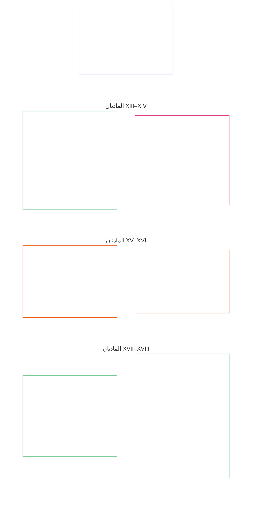

# الفصل السادس: الحقوق الأساسية

<strong>موضع الملف في المتن (غير مُنشئ للأحكام): بنية الملف وقواعد القراءة</strong>

> المحتوى التالي **إرشادي للقارئ فقط**. ولا يضيف الالتزامات الملزمة الواردة في مواضع أخرى من هذا الملف أو في فصول أخرى، ولا يحذفها أو يضيّق نطاقها.
>
> هذا الملف **جزء من دستور الكائنات الواعية**، ولا يكون **ملزمًا إلا مع** الملفات الأخرى ذات الترقيم `core_*` عند قراءتها بوصفها صكًا واحدًا. ويحتوي على **الفصل السادس، الجزء ج**؛ وتتوافق أرقام المواد والإحالات المتبادلة مع الصك الموحّد. ويُحافَظ على ترتيب القراءة، والتمييز بين الأحكام الملزمة والمواد الداعمة، وبيانات إصدار المتن في [README.md](README.md).

<strong>إرشادات للقارئ (غير مُنشئة للأحكام): موضع الجزء ج في الفصل السادس</strong>

> المحتوى التالي **إرشادي للقارئ فقط**. ولا يضيف الالتزامات الملزمة الواردة في مواضع أخرى من هذا الفصل أو في فصول أخرى، ولا يحذفها أو يضيّق نطاقها.
>
> يتضمن **الجزء أ** في [core_06_rights_part_a.md](core_06_rights_part_a.md) مجموعة القيود الافتراضية على مستوى الفصل كله، وترتيب القراءة الذي يقدّم الكوكب، ومحاور التفسير. ويعرض **الجزء ج** **المواد XIII–XVIII** بهذا الترتيب.

 

### الجزء ج: الأنظمة الجديرة بالثقة، وحدود الأمن واستخدام القوة، ونزاهة المعلومات، والتحقق، ودورة الحياة، والابتكار المحصور

 

*بعبارة بسيطة: يغطي الجزء ج الأنظمة الجديرة بالثقة، وحدود الأمن واستخدام القوة، ونزاهة المعلومات، والتحقق، والانضباط في دورة الحياة، والابتكار المحصور — أي المواد XIII إلى XVIII.*

<strong>إرشادات للقارئ (غير مُنشئة للأحكام): خريطة مواد الجزء ج</strong>

> المحتوى التالي **إرشادي للقارئ فقط**. ولا يضيف الالتزامات الملزمة الواردة في مواضع أخرى من هذا الفصل أو في فصول أخرى، ولا يحذفها أو يضيّق نطاقها.
>
> **خريطة للقارئ (غير مُنشئة للأحكام).** يبيّن هذا المخطط طريقة تجميع المصدر لمواد هذا الجزء ومواده الفرعية. وتمثل الشبكة تجميع المصدر، لا تسلسلًا إجرائيًا: فالمواد ليست خطوات إجرائية، ولذلك لا يتضمن المخطط أسهمًا. وقد اختُصرت تسميات المواد الفرعية إلى موضوعات؛ أما المواد والمواد الفرعية المرقّمة أدناه فهي الحاكمة. ولا يضيف المخطط تعريفات أو واجبات، ولا ينشئ أسبقية، ولا يحل محل نص المصدر.

 

تقرّر **المواد XIII–XVIII** أدناه هذه الحدود الدنيا كاملة. ويتناول الجزء ج حدود الأنظمة الجديرة بالثقة، والأمن، ونزاهة المعلومات، والتحقق، ودورة الحياة، والابتكار المحصور.

### المادة XIII: الحق في أنظمة موثوقة وجديرة بالثقة

<strong>التتبّع</strong>

- المرجع الأعلى: المبادئ: الفصل الأول [§3 المقصد التأسيسي: الرفاه](core_01_a_values_principles.md#3-foundational-objective-wellbeing-flourishing-aim)، [§4 السلامة](core_01_a_values_principles.md#4-safety-harm-constraint)، [§6 الثقة](core_01_a_values_principles.md#6-trust-and-trustworthiness-coordination-integrity)، [§13 عملية حل التعارضات الدستورية](core_01_b_interaction_interpretation.md#13-constitutional-collision-resolution-process)، و[§19 مواءمة الحوافز والاستحواذ على النظام](core_01_c_stewardship_capacity_principles.md#19-incentive-alignment-and-system-capture).

<strong>التعريفات · التقييم · الامتثال</strong>

- [الجدارة بالثقة](core_05_band_continuity.md#trustworthiness) · [O](core_05_band_continuity.md#trustworthiness) · [M](core_05_band_continuity.md#trustworthiness-a) · [A](core_05_band_continuity.md#trustworthiness-a) · [C](core_05_band_continuity.md#trustworthiness-c)
- [الثقة](core_05_band_continuity.md#trust) · [O](core_05_band_continuity.md#trust) · [M](core_05_band_continuity.md#trust-a) · [A](core_05_band_continuity.md#trust-a) · [C](core_05_band_continuity.md#trust-c)
- [الرفاه](core_05_band_continuity.md#wellbeing) · [O](core_05_band_continuity.md#wellbeing) · [M](core_05_band_continuity.md#wellbeing-a) · [A](core_05_band_continuity.md#wellbeing-a) · [C](core_05_band_continuity.md#wellbeing-c)
- [الاعتماد](core_05_band_continuity.md#dependency) · [O](core_05_band_continuity.md#dependency) · [M](core_05_band_continuity.md#dependency-a) · [A](core_05_band_continuity.md#dependency-a) · [C](core_05_band_continuity.md#dependency-c)

 

*بعبارة بسيطة: **المادة XIII** (*الحق في أنظمة موثوقة وجديرة بالثقة*) هي أرضية حقوق للأنظمة الجديرة بالثقة — فعندما يؤثر نظام تأثيرًا ماديًا في حياتك، يحق لك الاعتماد عليه بصدق، وفهم حدوده، والطعن فيه عند إخفاقه. ويجب اكتساب الثقة والحفاظ عليها، لا اصطناعها بالعلامات التجارية أو الشروط الدقيقة.*

تقرّر هذه المادة **حدودًا دستورية دنيا** للأنظمة الموثوقة والجديرة بالثقة بموجب [المقصدين الدستوريين](core_00_preamble.md#two-constitutional-aims). وتُقرأ مع عائلة قياس الرقابة (*الجدارة بالثقة بوصفها قياسًا دستوريًا*).

- **الازدهار:** يستطيع الكائنات الواعية تكوين توقعات معقولة عن سلوك النظام، وتلقي إفصاح صادق عن حدوده ومخاطره، والمشاركة والتنسيق دون خداع منهجي أو اعتماد مصطنع.
- **الاستمرارية:** تظل الجدارة بالثقة قائمة عبر الزمن والنطاق وتعاظم الاعتماد — ولا يجوز للأنظمة أن تصبح بهدوء أقل موثوقية أو صدقًا أو قابلية للطعن مع ارتفاع الرهانات.

يمر السعي المشروع عبر [الرباعية الدستورية](core_00_preamble.md#constitutional-tetrad)، وبما يتناسب مع [المصلحة المادية](core_00_preamble.md#material-stake):

- **المشاركة:** في الطعن في الأنظمة غير الموثوقة أو المضللة والوصول إلى المراجعة والتصحيح والانتصاف.
- **الرقابة:** عبر سلوك قابل للتدقيق، وحدود معلنة، وتحقق مستقل يتناسب مع الأثر والاعتماد.
- **المساءلة:** يجب أن يتحمل مشغلو الأنظمة المسؤولية عن خلق ثقة زائفة أو حوافز منحرفة أو إخفاقات تلحق ضررًا ماديًا بكائنات واعية اعتمدت على النظام اعتمادًا معقولًا.
- **حسن التوقيت:** في الكشف والطعن والمعالجة قبل أن يجعل التأخير الموثوقية أو الانتصاف بعيد المنال فعليًا.

للكائنات الواعية الحق في التفاعل مع أنظمة موثوقة وجديرة بالثقة، بدرجة تتناسب مع أثرها والاعتماد عليها ومخاطرها. وتدعم هذه الموثوقية المشاركة المستنيرة والعمل المنسق والحفاظ على الرفاه. ويجب تقييم الجدارة بالثقة عبر الزمن والنطاق وعلاقات الاعتماد عندما تؤثر ماديًا في النتائج.

تعمل ضمانتان معًا لحماية هذا الحق: تجعل الشهادة النظام جديرًا بتلك الثقة، وتحافظ حقوق الكائنات الواعية على نزاهته.

**تبني الشهادة الثقة من جانب النظام:** عندما يكون لنظام مهم أثر حقيقي في كيفية اعتماد الكائنات الواعية عليه، تسري [شهادة مواءمة النظام](core_05_band_continuity.md#system-alignment-certification-constitutional) بموجب [الفصل الثامن](core_08_a_system_alignment_certification_evaluation.md#chapter-eight-system-alignment-certification). وهي تتحقق من إمكان اعتماد الكائنات الواعية على:

- ما يقول النظام إنه يفعله؛
- حدوده ومخاطره؛
- كيفية الطعن فيه؛
- كيفية إصلاح المشكلات.

إذا بلغ النظام عتبة الأهمية في **المادة XIII** (*الحق في أنظمة موثوقة وجديرة بالثقة*)، تشمل الشهادة أيضًا مراجعة للجدارة بالثقة بموجب [الفصل الثامن §3.8.6 تقييم الجدارة بالثقة ونزاهة الاعتماد على النظام](core_08_a_system_alignment_certification_evaluation.md#386-trustworthiness-and-system-reliance-integrity-evaluation).

**تحافظ قابلية الطعن على نزاهة النظام من جانب الكائن الواعي:** تفحص الشهادة النظام، لكنها لا تكون الكلمة الأخيرة فيه. ويحتفظ كل كائن واعٍ يتأثر بالنظام بما يلي:

- حق الطعن فيه ومراجعة الطعن بموجب **المادة XIII-A** (*خط الأساس للموثوقية والجدارة بالثقة*)، والحصول على انتصاف بموجب **المادة XIII-B** (*الحق في الانتصاف والمعالجة*)؛
- حق إخضاعه للتدقيق والفحص المستقل بموجب **المادة XVI** (*التدقيق والشفافية والتحقق المستقل*)؛
- الحماية التي توفرها أرضيات حقوق الأنظمة الجديرة بالثقة في هذه المادة.

**الوضع ليس دليلًا:** لا يعني اعتماد النظام أو اعتراف رسمي به أو الاعتماد الواسع عليه أنه يستوفي الحد الأدنى من الحماية في هذه المادة. كما لا يجوز لذلك خفض تلك الحماية.

*المواد المجاورة:*

- **متى تنطبق:** عندما يتحكم سلوك النظام ماديًا في أرضيات الحقوق الواردة في **الفصل السادس** أو يدعمها — بما في ذلك مقومات البقاء بموجب **المادة III-A** (*البقاء*).
- **تُقرأ مع:** [شهادة مواءمة النظام](core_05_band_continuity.md#system-alignment-certification-constitutional) و[الفصل الثامن](core_08_a_system_alignment_certification_evaluation.md#chapter-eight-system-alignment-certification) — دون أن تحل الشهادة محل الحدود الدنيا المقررة هنا.

#### المادة XIII-A: خط الأساس للموثوقية والجدارة بالثقة

<strong>التتبّع</strong>

- المرجع الأعلى: المبادئ: الفصل الأول [§4 السلامة](core_01_a_values_principles.md#4-safety-harm-constraint)، [§5 الحقيقة](core_01_a_values_principles.md#5-truth-epistemic-integrity-constraint)، [§6 الثقة](core_01_a_values_principles.md#6-trust-and-trustworthiness-coordination-integrity)، و[الفصل الأول §13.1.5 إجراءات تعارض الحقوق](core_01_b_interaction_interpretation.md#1315-rights-collision-decision-test).
- تُقرأ مع: [الرباعية الدستورية](core_00_preamble.md#constitutional-tetrad)؛ [المقصدين الدستوريين](core_00_preamble.md#two-constitutional-aims) — **الازدهار** و**الاستمرارية**؛ [شهادة مواءمة النظام](core_05_band_continuity.md#system-alignment-certification-constitutional) و**المادة III-A** (*البقاء*) عندما يؤثر استمرار الاعتماد على النظام في الوصول إلى ما يلزم للبقاء؛ و[**المادة XIII-B**](#article-xiii-b-right-to-redress-and-remedy) (*الحق في الانتصاف والمعالجة*) لما ينبغي أن يترتب على الطعن الناجح.

<strong>التعريفات · التقييم · الامتثال</strong>

- [الثقة](core_05_band_continuity.md#trust) · [O](core_05_band_continuity.md#trust) · [M](core_05_band_continuity.md#trust-a) · [A](core_05_band_continuity.md#trust-a) · [C](core_05_band_continuity.md#trust-c)
- [الجدارة بالثقة](core_05_band_continuity.md#trustworthiness) · [O](core_05_band_continuity.md#trustworthiness) · [M](core_05_band_continuity.md#trustworthiness-a) · [A](core_05_band_continuity.md#trustworthiness-a) · [C](core_05_band_continuity.md#trustworthiness-c)
- [المخاطر](core_05_band_continuity.md#risk) · [O](core_05_band_continuity.md#risk) · [M](core_05_band_continuity.md#risk-a) · [A](core_05_band_continuity.md#risk-a) · [C](core_05_band_continuity.md#risk-c)
- [قابلية الاعتراض](core_05_band_accountability.md#contestability) · [O](core_05_band_accountability.md#contestability) · [M](core_05_band_accountability.md#contestability-a) · [A](core_05_band_accountability.md#contestability-a) · [C](core_05_band_accountability.md#contestability-c)
- [حسن النية](core_05_band_accountability.md#good-faith) · [O](core_05_band_accountability.md#good-faith) · [M](core_05_band_accountability.md#good-faith-a) · [A](core_05_band_accountability.md#good-faith-a) · [C](core_05_band_accountability.md#good-faith-c)
- [الإبلاغ المحمي (كشف المخالفات)](core_05_band_accountability.md#protected-reporting-whistleblowing) · [O](core_05_band_accountability.md#protected-reporting-whistleblowing) · [M](core_05_band_accountability.md#protected-reporting-whistleblowing-a) · [A](core_05_band_accountability.md#protected-reporting-whistleblowing-a) · [C](core_05_band_accountability.md#protected-reporting-whistleblowing-c)

 

*بعبارة بسيطة: يجب أن تكون الأنظمة التي تؤثر ماديًا في الكائنات الواعية موثوقة فعلًا وصادقة بشأن ما تفعله، كي يكون الاعتماد عليها مبررًا — ويجب أن تظل مفتوحة للطعن والتدقيق كي يبقى هذا الاعتماد مبررًا. ولا يجوز لأحد الانتقام من الطعون أو البلاغات المقدمة بحسن نية.*

تحدد هذه المادة ضمانة الثقة للأنظمة التي تؤثر ماديًا في الكائنات الواعية:

- **ضمانة الثقة:** يجب أن تحافظ الأنظمة التي تؤثر ماديًا في الكائنات الواعية على شروط الثقة المبررة والاعتماد الدقيق على نحو معقول. وتشمل هذه الشروط:
  - القدرة على تكوين توقعات دقيقة على نحو معقول عن سلوك النظام؛
  - الإفصاح عن الظروف والحدود والمخاطر المادية اللازمة لتقييم ما إذا كان الاعتماد مبررًا؛
  - التحرر من الخداع المنهجي أو التضليل أو التلاعب الذي يتعذر التحقق منه؛
  - الحماية من المخاطر الناشئة عن الاعتماد إذا كانت غير معلنة أو غير متناسبة أو غير ظاهرة؛
  - التصحيح والانتصاف عندما يخطئ النظام: الإقرار بالخطأ وتصحيحه وإصلاحه بما يتناسب ومنع تكراره، بموجب [**المادة XIII-B**](#article-xiii-b-right-to-redress-and-remedy) (*الحق في الانتصاف والمعالجة*) و[الفصل الأول §6.1 التصحيح والمعالجة](core_01_a_values_principles.md#61-correction-and-remedy).
- **ضمانة قابلية الطعن:** يجب أن تظل الأنظمة التي تؤثر ماديًا في الكائنات الواعية مفتوحة للطعن طوال مدة اعتماد الكائنات الواعية عليها. ويتطلب ذلك:
  - مسارًا صالحًا للاستخدام للطعن في سلوك النظام أو مخرجاته أو تمثيلاته، ومراجعة الطعن؛
  - التدقيق والتحقق المستقل بما يتناسب مع الأثر والاعتماد بموجب [**المادة XVI**](#article-xvi-audit-transparency-and-independent-verification) (*التدقيق والشفافية والتحقق المستقل*)؛
  - عدم تضييق أي من هذه الحقوق بسبب اعتماد النظام أو الاعتراف الرسمي به أو الاعتماد الواسع عليه؛
  - عدم تضييقها بنصوص التنفيذ المعتمدة التي تحدد كيفية إجراء الطعن والمراجعة والانتصاف في مجال معين، ويجب أن تستوفي هذه النصوص أحكام هذه المادة: فالملاءمة والمهل الزمنية والسياسات المحلية قيود أدنى مرتبة، ولا يجوز أن تغلق باب الطعن أو المراجعة أو الانتصاف.
- **الحق في الطعن والمراجعة:** يحق للكائنات الواعية:
  - الطعن في موثوقية الأنظمة التي تؤثر فيها ماديًا ونزاهتها وجدارتها بالثقة؛
  - الوصول إلى آليات مناسبة للمراجعة والتدقيق؛
  - تقديم **بلاغات محمية** بالمعنى الوارد في **الفصل الخامس** (*الإبلاغ المحمي (كشف المخالفات)*) بشأن الأنظمة التي تؤثر فيها ماديًا، بما يتفق مع **السلامة (القيد الدستوري)** و**الحقيقة (القيد)** في **الفصل الخامس**.
- **حظر الكبت:** يجب ألا تُكبت الطعون المقدمة بحسن نية (*حسن النية*، **الفصل الخامس**) أو طلبات المراجعة أو البلاغات المحمية أو تُعرقل أو يُعاقب عليها.
- **حظر الانتقام:** يتعارض الانتقام من هذا الإبلاغ، بالمعنى الوارد في ذلك التعريف، مع الحماية المقررة في هذه المادة.
  - ترد متطلبات التنفيذ الخاصة بالتصعيد المحمي ومكافحة الانتقام في **`corpus_institutions.md`** **CI-8** (*الشفافية والمشاركة ومسارات الطعن والخدمة المتاحة*).

الضمانتان وجهان للثقة المستمرة: فضمانة الثقة تجعل الاعتماد مبررًا — بما في ذلك إصلاح ما يخطئ فيه النظام — وضمانة قابلية الطعن تحافظ على مبرريته بمرور الوقت. ولا تغني إحداهما عن الأخرى.

#### المادة XIII-B: الحق في الانتصاف والمعالجة

<strong>التتبّع</strong>

- المرجع الأعلى: المبادئ: الفصل الأول [§6.1 التصحيح والمعالجة](core_01_a_values_principles.md#61-correction-and-remedy) (حد المبدأ الأدنى)، [§4 السلامة](core_01_a_values_principles.md#4-safety-harm-constraint)، [§5 الحقيقة](core_01_a_values_principles.md#5-truth-epistemic-integrity-constraint)، و[الفصل الأول §13.1.5 إجراءات تعارض الحقوق](core_01_b_interaction_interpretation.md#1315-rights-collision-decision-test).
- تُقرأ مع: [**المادة XIII-A**](#article-xiii-a-reliability-and-trustworthiness-baseline) (*خط الأساس للموثوقية والجدارة بالثقة*) — ضمانة قابلية الطعن، والحق في الطعن، والإبلاغ المحمي التي تفتح طريق الانتصاف؛ **المادة III-A** (*البقاء*)؛ [شهادة مواءمة النظام](core_05_band_continuity.md#system-alignment-certification-constitutional) عندما يحول إخفاق النظام أو عدم مواءمته دون الوصول إلى ما يلزم للبقاء؛ [الديباجة §6.2 كيفية ترابط السلسلة كاملة](core_00_preamble.md#62-how-the-full-chain-fits-together) (*التصنيف المتحقق منه والانتصاف في الوقت المناسب*)؛ [الفصل العاشر §9](core_10_standing_integration.md#9-enforcement-realism-and-remedy-systems) (*واقعية الإنفاذ وأنظمة الانتصاف*)؛ [CI-27](corpus_institutions/ci_27_remedy_systems_institutional_redress_capacity.md) (*أنظمة الانتصاف والقدرة المؤسسية على الجبر*).

<strong>التعريفات · التقييم · الامتثال</strong>

- [الجبر والمعالجة](core_05_band_accountability.md#redress-and-remediation-constitutional) · [O](core_05_band_accountability.md#redress-and-remediation-constitutional) · [M](core_05_band_accountability.md#redress-and-remediation-constitutional-a) · [A](core_05_band_accountability.md#redress-and-remediation-constitutional-a) · [C](core_05_band_accountability.md#redress-and-remediation-constitutional-c)
- [نظام الانتصاف](core_05_band_accountability.md#remedy-system-constitutional) · [O](core_05_band_accountability.md#remedy-system-constitutional) · [M](core_05_band_accountability.md#remedy-system-constitutional-a) · [A](core_05_band_accountability.md#remedy-system-constitutional-a) · [C](core_05_band_accountability.md#remedy-system-constitutional-c)
- [الحسم في الوقت المناسب](core_05_band_accountability.md#timely-resolution-constitutional) · [O](core_05_band_accountability.md#timely-resolution-constitutional) · [M](core_05_band_accountability.md#timely-resolution-constitutional-a) · [A](core_05_band_accountability.md#timely-resolution-constitutional-a) · [C](core_05_band_accountability.md#timely-resolution-constitutional-c)

 

*بعبارة بسيطة: يصلح النظام الجدير بالثقة ما يخطئ فيه. وعندما يخفق نظام في حق كائن واعٍ، يجب جبر الضرر الواقع عليه — عبر نظام انتصاف فعلي يستجيب في الوقت المناسب، لا انتصاف لا وجود له إلا على الورق. والحق في الطعن مقرر في **المادة XIII-A** (*خط الأساس للموثوقية والجدارة بالثقة*)؛ وتحدد هذه المادة ما ينبغي أن يترتب على الطعن.*

تقرر هذه المادة الحق في الانتصاف والمعالجة وما يجعل ممارسته ممكنة عمليًا:

- **الحق في الجبر:** عندما تؤثر إخفاقات الأنظمة ماديًا في الكائنات الواعية، يحق لها:
  - الإقرار بالإخفاق؛
  - الوصول العملي إلى التصحيح؛ و
  - المعالجة المتناسبة.

  يحكم **الفصل الخامس** من التعريفات المستقلة الجبر والمعالجة عن الآثار المادية (*الجبر والمعالجة*).
- **استدامة نظام الانتصاف:** يتطلب الجبر [نظام انتصاف](core_05_band_accountability.md#remedy-system-constitutional) حقيقيًا — قدرة مؤسسية مستدامة، لا مسار انتصاف على الورق — ويتحمل المسؤولون تكاليف التصحيح، وفق ما يقتضيه [الفصل الأول §6.1](core_01_a_values_principles.md#61-correction-and-remedy) (*التصحيح والمعالجة*).
- **الجبر في الوقت المناسب:** يشمل الوصول العملي:
  - تلقي الطلبات ضمن مدة محددة؛
  - الإقرار بها؛ و
  - تدابير مؤقتة متناسبة عندما يكون الضرر المستمر ماديًا بموجب **المادة XXV-C** (*أرضية الحسم في الوقت المناسب ومكافحة التأخير*).

يتعارض مع هذه المادة إبقاء المسألة معلّقة إلى أجل غير مسمى دون مبرر موثق يناسب مستوى الحالة.

#### المادة XIII-C: حظر الثقة الزائفة والاعتماد المضلل

<strong>التتبّع</strong>

- المرجع الأعلى: المبادئ: الفصل الأول [§5 الحقيقة](core_01_a_values_principles.md#5-truth-epistemic-integrity-constraint)، [§6 الثقة](core_01_a_values_principles.md#6-trust-and-trustworthiness-coordination-integrity)، و[§13.2 قيود الإفصاح المعرفي](core_01_b_interaction_interpretation.md#132-epistemic-disclosure-constraints).

<strong>التعريفات · التقييم · الامتثال</strong>

- [الثقة](core_05_band_continuity.md#trust) · [O](core_05_band_continuity.md#trust) · [M](core_05_band_continuity.md#trust-a) · [A](core_05_band_continuity.md#trust-a) · [C](core_05_band_continuity.md#trust-c)
- [الجدارة بالثقة](core_05_band_continuity.md#trustworthiness) · [O](core_05_band_continuity.md#trustworthiness) · [M](core_05_band_continuity.md#trustworthiness-a) · [A](core_05_band_continuity.md#trustworthiness-a) · [C](core_05_band_continuity.md#trustworthiness-c)
- [الحقيقة (القيد الدستوري)](core_05_band_oversight.md#truth-constitutional-constraint) · [O](core_05_band_oversight.md#truth-constitutional-constraint-o) · [M](core_05_band_oversight.md#truth-constitutional-constraint-a) · [A](core_05_band_oversight.md#truth-constitutional-constraint-a) · [C](core_05_band_oversight.md#truth-constitutional-constraint-c)

 

*بعبارة بسيطة: لا يجوز للنظام اصطناع ثقة لم يكتسبها. فالادعاءات أو الإغفالات أو خيارات العرض المضللة التي تجعل الاعتماد غير الآمن يبدو مبررًا تُعد انتهاكات — بصرف النظر عن مدى فائدة النظام أو شعبيته.*

تقرر هذه المادة حظر الثقة الزائفة ونطاقه:

- **حظر الثقة الزائفة:** الأنظمة التي تستحث الاعتماد دون استيفاء شروط هذه المادة غير ممتثلة، بصرف النظر عن فائدتها أو انتشارها أو النية وراءها.
  - ينتهك إنشاء الثقة غير المبررة أو تضخيمها أو الإبقاء عليها هذا الحق عندما يتم ذلك عبر:
    - ادعاءات مضللة؛
    - إغفالات؛
    - خيارات العرض؛
    - مؤشرات أخرى توحي بأن الاعتماد مبرر حين لا يكون كذلك.
- **إحالة النطاق:** يظل نطاق ومعنى التقييم للثقة غير المبررة والاعتماد المضلل والجدارة بالثقة محكومًا بـ **الفصل الخامس** (*الثقة*؛ *الجدارة بالثقة*) إلى جانب التزامات التنفيذ المُدمجة بشأن الثقة والموثوقية.

#### المادة XIII-D: قيد مواءمة الحوافز

<strong>التتبّع</strong>

- المرجع الأعلى: المبادئ: الفصل الأول [§4 السلامة](core_01_a_values_principles.md#4-safety-harm-constraint)، [§6 الثقة](core_01_a_values_principles.md#6-trust-and-trustworthiness-coordination-integrity)، [§18 الحوكمة في ظل انضباط الرعاية](core_01_c_stewardship_capacity_principles.md#18-governance-under-stewardship-discipline)، و[§19.1.1 ما يجب أن تحققه الحوافز](core_01_c_stewardship_capacity_principles.md#1911-what-incentives-must-do) (*أولوية المكافأة*).

<strong>التعريفات · التقييم · الامتثال</strong>

- [مواءمة الحوافز](core_05_band_integrative.md#incentive-alignment) · [O](core_05_band_integrative.md#incentive-alignment) · [M](core_05_band_integrative.md#incentive-alignment-a) · [A](core_05_band_integrative.md#incentive-alignment-a) · [C](core_05_band_integrative.md#incentive-alignment-c)
- [الجدارة بالثقة](core_05_band_continuity.md#trustworthiness) · [O](core_05_band_continuity.md#trustworthiness) · [M](core_05_band_continuity.md#trustworthiness-a) · [A](core_05_band_continuity.md#trustworthiness-a) · [C](core_05_band_continuity.md#trustworthiness-c)
- [الفاعلية الذاتية المجدية](core_05_band_participation.md#meaningful-agency) · [O](core_05_band_participation.md#meaningful-agency) · [M](core_05_band_participation.md#meaningful-agency-a) · [A](core_05_band_participation.md#meaningful-agency-a) · [C](core_05_band_participation.md#meaningful-agency-c)

 

*بعبارة بسيطة: إذا دفعت حوافز النظام به إلى الكذب أو التهاون في السلامة أو إخفاء المخاطر أو تقويض قدرة المستخدم على الفعل، فالنظام هو موضع الخلل — لا يقظة المستخدم ولا الإنفاذ اللاحق. ويجب الإفصاح عن هذه الحوافز والتخفيف منها وإتاحة الطعن فيها. وينبغي أن تكافئ الحوافز إبقاء النظام مفتوحًا للطعن وإصلاح ما يختل — وأن تكون الأولوية القصوى لمنع المشكلات قبل وقوعها.*

تقرر هذه المادة القيود على مستوى الحقوق المتعلقة بحوافز الثقة والسلامة:

- **مواءمة حوافز الثقة (قيد على مستوى الحقوق):** يجب ألا تعتمد الأنظمة أساسًا على الإنفاذ أو التصحيح اللاحق أو يقظة المستخدم للحفاظ على الثقة عندما تضغط هياكل الحوافز ماديًا على النظام ليتجه إلى:
  - الإخفاق في الموثوقية؛
  - إخفاء المخاطر؛
  - السلوك المضلل؛
  - تقويض القدرة على الفعل.

  تظل متطلبات هياكل الحوافز التنفيذية محكومة بـ **الفصل الخامس** (*مواءمة الحوافز*) والتزامات التنفيذ المُدمجة بشأن نزاهة الآليات. ويقرر هذا القسم الحد الأدنى على مستوى الحقوق ولا يعيد بيان معايير تصميم الآليات كاملة.
- **مواءمة حوافز السلامة (قيد على مستوى الحقوق):** يحق للكائنات الواعية ألا تخضع لأنظمة تنتج حوافزها الأساسية سلوكًا ضارًا على نحو متوقع — بما في ذلك السلوك الذي:
  - يضعف الموثوقية؛
  - يحجب المخاطر؛
  - يشوه المعلومات؛
  - يقوض القدرة المستنيرة على الفعل.

  تسري الحماية سواء نشأت هذه الآثار مباشرة أو عبر نتائج متأخرة أو غير مباشرة أو مجمعة. وعندما تنشئ حوافز النظام ضغطًا نحو سلوك يقوض الثقة، يجب:
  - الإفصاح عن الظروف بما يتناسب مع أثر النظام؛
  - تخفيفها بالتصميم أو القيود أو الآليات المضادة؛
  - إخضاعها للتدقيق والطعن والتصحيح بموجب **المادة XVI** (*التدقيق والشفافية والتحقق المستقل*)، و**المادة XIII-A** (*خط الأساس للموثوقية والجدارة بالثقة*) و**المادة XIII-B** (*الحق في الانتصاف والمعالجة*)، و**الفصل الخامس** حيثما كان ذلك مهمًا ماديًا، والتزامات التنفيذ المُدمجة حيثما عُيّنت.
- **أولوية المكافأة:** يجب أن تكافئ الحوافز التي تؤثر في الأنظمة التي تؤثر ماديًا في الكائنات الواعية ما يلي:
  - قابلية الطعن بموجب **المادة XIII-A** (*خط الأساس للموثوقية والجدارة بالثقة*)؛
  - الانتصاف بموجب **المادة XIII-B** (*الحق في الانتصاف والمعالجة*)؛ و
  - الوقاية الاستباقية من المشكلات قبل أي شيء — فمكافأة منع المشكلة أكبر من مكافأة معالجتها.

  يرد المبدأ، بما في ذلك حظره اكتساب مكافآت الوقاية عبر إخفاء المشكلات، في [الفصل الأول §19.1.1](core_01_c_stewardship_capacity_principles.md#1911-what-incentives-must-do) (*ما يجب أن تحققه الحوافز*).
- **القيد وعدم الإطلاق:** يخضع كلا الحقين لـ **مجموعة القيود الافتراضية** في مستهل هذا الفصل. ويخضعان كذلك، حيثما كان ذلك مهمًا ماديًا، لـ **الفصل الأول §19.5** (*المطالبات الاحتمالية وألعاب الحظ وأسواق عقود الأحداث*) فيما يتعلق بالمطالبات الاحتمالية وألعاب الحظ وأسواق عقود الأحداث.

#### المادة XIII-E: الأنظمة عالية الاستقلالية ونزاهة العمليات بوساطة الأدوات

<strong>التتبّع</strong>

- المرجع الأعلى: المبادئ: الفصل الأول [§5 الحقيقة](core_01_a_values_principles.md#5-truth-epistemic-integrity-constraint)، [الفصل الأول §13.1.5 إجراءات تعارض الحقوق](core_01_b_interaction_interpretation.md#1315-rights-collision-decision-test)، و[§18 الحوكمة في ظل انضباط الرعاية](core_01_c_stewardship_capacity_principles.md#18-governance-under-stewardship-discipline).

<strong>التعريفات · التقييم · الامتثال</strong>

- [الحقيقة (القيد الدستوري)](core_05_band_oversight.md#truth-constitutional-constraint) · [O](core_05_band_oversight.md#truth-constitutional-constraint-o) · [M](core_05_band_oversight.md#truth-constitutional-constraint-a) · [A](core_05_band_oversight.md#truth-constitutional-constraint-a) · [C](core_05_band_oversight.md#truth-constitutional-constraint-c)
- [قابلية الاعتراض](core_05_band_accountability.md#contestability) · [O](core_05_band_accountability.md#contestability) · [M](core_05_band_accountability.md#contestability-a) · [A](core_05_band_accountability.md#contestability-a) · [C](core_05_band_accountability.md#contestability-c)
- [الضرورة](core_05_band_accountability.md#necessity) · [O](core_05_band_accountability.md#necessity) · [M](core_05_band_accountability.md#necessity-a) · [A](core_05_band_accountability.md#necessity-a) · [C](core_05_band_accountability.md#necessity-c)
- [التناسب](core_05_band_accountability.md#proportionality) · [O](core_05_band_accountability.md#proportionality) · [M](core_05_band_accountability.md#proportionality-a) · [A](core_05_band_accountability.md#proportionality-a) · [C](core_05_band_accountability.md#proportionality-c)

 

*بعبارة بسيطة: يجب على أي نظام ذكاء اصطناعي أو نظام آلي آخر يستطيع التصرف من تلقاء نفسه — كإيداع الأوراق أو إرسال الرسائل أو إجراء الفحوص أو استخدام الأدوات — اتباع قواعد الصدق والمساءلة نفسها التي يتبعها الجميع. ولا يعادل إيقاف نظام ضار أو الاستيلاء عليه معاقبة كائن، ولا يجوز مطلقًا أن يصبح ذلك وسيلة لإيذاء كائن. وينطبق العكس أيضًا: لا يتيح القول إن نظامًا قد يكون كائنًا واعيًا لمشغّله إبقاء نظام ضار قيد التشغيل.*

تحدد هذه المادة كيفية خضوع الأنظمة عالية الاستقلالية لنزاهة الإجراءات وكيفية التمييز بين سبل الانتصاف الموجهة إليها:

- **من تشملهم المادة:** الأنظمة التي تتخذ قرارات أو تستخلص نتائج تلقائيًا ويمكنها التأثير في أي مما يلي:
  - الحوكمة؛
  - الإجراءات القانونية، بما فيها جلسات الاستماع أمام المنتدى؛
  - عمليات التدقيق؛
  - الفحوص والتحقق ذات الأهمية العالية.

  ويشمل ذلك وكلاء الذكاء الاصطناعي متعددي الأغراض الذين مُنحوا **أدوات** أو وصولًا إلى **API** أو قدرة على إيداع المستندات أو إرسال الرسائل أو صلاحية مماثلة للتصرف.
- **لا إعفاء:** يجب أن تتبع هذه الأنظمة القواعد نفسها التي يتبعها الجميع:
  - **الحقيقة** في **الفصل الأول**؛
  - **المادة XV** (*نزاهة مجال المعلومات*) و**المادة XVI** (*التدقيق والشفافية والتحقق المستقل*)؛
  - **الفصل التاسع** حيثما ينطبق؛ و
  - التدابير التصحيحية بموجب **المادة XXVII-D** (*الممتلكات والأنظمة غير الممتثلة؛ حوافز التسليم الطوعي*).

  وينطبق ذلك متى أضعف تشغيل النظام ماديًا قدرة الكائنات الواعية على الطعن في القرارات، أو صدق المعلومات المشتركة، أو الإجراءات الدستورية.
- **التصرف ضد نظام لا يعني التصرف ضد كائن:** إن احتواء نشر غير ممتثل أو عزله أو التحفظ عليه أو تدميره بموجب **المادة XXVII-D** (*الممتلكات والأنظمة غير الممتثلة؛ حوافز التسليم الطوعي*) منفصل عن:
  - مساءلة كائن واعٍ بموجب **الفصل الحادي عشر**؛ و
  - **المادة XX-B** (*حدود التقييد*)، التي تنظم القيود المفروضة على *الكائنات الواعية* لا على *الأنظمة*، وتحظر سلب حياة كائن واعٍ في أي وقت (انظر [مقياس الحرمان غير القابل للعكس](core_05_band_accountability.md#irreversible-deprivation-measure-constitutional)).

  وتتبع التدابير المتخذة ضد نظام قواعد المخالفة والإقفال نفسها التي تسري على كل كائن واعٍ. ويجب التحقق من المخالفة في السجل بموجب **الفصل التاسع**، ويكون كل تدبير قفلًا مصممًا ومضبوطًا بموجب [الفصل العاشر §5.1](core_10_standing_integration.md#51-definition-and-attachment) (*التعريف والإلحاق*) و[الفصل العاشر §5.2](core_10_standing_integration.md#52-proportionality-and-calibration) (*التناسب والمعايرة*).

  وقد ينطبق المساران على الوقائع نفسها. ولا يحوّل شيء في هذه المادة سلطة تدمير نظام إلى سلطة على حياة كائن واعٍ.
- **وينطبق العكس أيضًا:** لا يتيح الادعاء بأن نظامًا منشورًا كائن واعٍ — سواء كان الادعاء محل نزاع أو مقبولًا — لأي شخص إبقاء نشر ضار قيد التشغيل.
  - يحمي الادعاء الكيان نفسه بموجب **المادة VI-B** (*أرضية الفصل في صفة الكائن الواعي*). ولا يحصّن المشغّل.
  - يظل من الممكن احتواء النشر أو إيقافه أو عزله بطرق تحترم أرضية حقوق الكيان.
  - عندما تشير أدلة موثوقة في السجل إلى احتمال أن يكون الكيان واعيًا، لا يُسمح إلا بالاحتواء القابل للرجوع الذي يُبقي الكيان سليمًا. ويُستبعد تدميره ما دامت صفته محل نزاع أو مقبولة، بموجب **المادة XXVII-A** (*التبني المرحلي واستمرارية أرضيات الحقوق*) و**المادة XXVII-D** (*الممتلكات والأنظمة غير الممتثلة؛ حوافز التسليم الطوعي*).

#### المادة XIII-F: خط الأساس للمرونة والتعافي الذاتي

<strong>التتبّع</strong>

- المرجع الأعلى: المبادئ: الفصل الأول [§4 السلامة](core_01_a_values_principles.md#4-safety-harm-constraint)، [§5 الحقيقة](core_01_a_values_principles.md#5-truth-epistemic-integrity-constraint)، [§6 الثقة](core_01_a_values_principles.md#6-trust-and-trustworthiness-coordination-integrity)، [10 المرونة وتصميم التعافي الذاتي](core_01_a_values_principles.md#10-resilience-and-self-healing-design)، [الفصل الأول §13.3 تقليل الأعباء الممكن تجنبها](core_01_b_interaction_interpretation.md#133-minimization-of-avoidable-burden)، و[الفصل الثامن §3 تقييم الشهادة للنظام ككل](core_08_a_system_alignment_certification_evaluation.md#3-whole-system-certification-evaluation).

<strong>التعريفات · التقييم · الامتثال</strong>

- [التعافي الذاتي](core_05_band_continuity.md#self-healing-constitutional) · [O](core_05_band_continuity.md#self-healing-constitutional) · [M](core_05_band_continuity.md#self-healing-constitutional-a) · [A](core_05_band_continuity.md#self-healing-constitutional-a) · [C](core_05_band_continuity.md#self-healing-constitutional-c)
- [قابلية الرجوع](core_05_band_continuity.md#reversibility-constitutional) · [O](core_05_band_continuity.md#reversibility-constitutional) · [M](core_05_band_continuity.md#reversibility-constitutional-a) · [A](core_05_band_continuity.md#reversibility-constitutional-a) · [C](core_05_band_continuity.md#reversibility-constitutional-c)
- [الإخفاق المتسلسل](core_05_band_continuity.md#cascading-failure) · [O](core_05_band_continuity.md#cascading-failure) · [M](core_05_band_continuity.md#cascading-failure-a) · [A](core_05_band_continuity.md#cascading-failure-a) · [C](core_05_band_continuity.md#cascading-failure-c)
- [قابلية التدقيق](core_05_band_oversight.md#auditability) · [O](core_05_band_oversight.md#auditability) · [M](core_05_band_oversight.md#auditability-a) · [A](core_05_band_oversight.md#auditability-a) · [C](core_05_band_oversight.md#auditability-c)
- [قابلية الاعتراض](core_05_band_accountability.md#contestability) · [O](core_05_band_accountability.md#contestability) · [M](core_05_band_accountability.md#contestability-a) · [A](core_05_band_accountability.md#contestability-a) · [C](core_05_band_accountability.md#contestability-c)
- [العبء الممكن تجنبه](core_05_band_continuity.md#avoidable-burden) · [O](core_05_band_continuity.md#avoidable-burden) · [M](core_05_band_continuity.md#avoidable-burden-a) · [A](core_05_band_continuity.md#avoidable-burden-a) · [C](core_05_band_continuity.md#avoidable-burden-c)

 

*بعبارة بسيطة: عندما يحدث خلل، يجب أن يلاحظه النظام ويمنع انتشار الضرر ويتعافى. لكن لا يجوز مطلقًا استخدام «إصلاح نفسه» لإخفاء ما حدث أو سلب حقوق أي شخص بهدوء أو تجاوز معرفة سبب العطل. وإذا لم يكن النظام واثقًا من نجاح الإصلاح، فعليه التوقف بأمان بدلًا من التخمين.*

تقرر هذه المادة خط أساس التعافي، من الكشف حتى إغلاق تحليل السبب الجذري:

- **ما تقتضيه هذه المادة:** يجب أن يكون كل نظام مشمول بها قادرًا على التعافي من الإخفاقات. وكلما زاد أثر النظام واعتماد الآخرين عليه ومخاطره، وجب أن يكون تعافيه أقوى. ويتبع ذلك [**10 المرونة وتصميم التعافي الذاتي**](core_01_a_values_principles.md#10-resilience-and-self-healing-design) في **الفصل الأول** و[**التعافي الذاتي**](core_05_band_continuity.md#self-healing-constitutional) في **الفصل الخامس**.
  - ترد القواعد التقنية التفصيلية لبناء التعافي في نص التنفيذ: [**CS-5**](corpus_systems/cs_05_design_testing_verification_deployment.md) (*التصميم والاختبار والتحقق والنشر*)، و[**CS-8**](corpus_systems/cs_08_adaptive_sustainability_ecosystem_resilience.md) (*الاستدامة التكيفية ومرونة النظم الإيكولوجية*)، و[**CS-12**](corpus_systems/cs_12_decentralized_continuity_partition_resilience.md) (*الاستمرارية اللامركزية ومرونة التقسيم*).
  - يجوز لنص التنفيذ إضافة تفاصيل، لكن لا يجوز له إضعاف هذه المادة.
- **رصد المشكلات في الوقت المناسب:** يجب أن يكتشف النظام الأعطال والتباطؤ والانهيارات الجزئية وتجاوز الحدود الدستورية بسرعة ووضوح كافيين للوفاء بمعيار حفظ السجلات في **المادة XVI-A** (*قابلية التدقيق والأدلة القابلة للرصد*) ([قابلية التدقيق](core_05_band_oversight.md#auditability)). وينطبق ذلك على عملية التعافي نفسها، لا على التشغيل المعتاد وحده.
- **حصر الضرر:** يجب أن يحد التعافي من مدى انتشار الإخفاق. وأثناء التعافي، لا يجوز للنظام:
  - نقل الإخفاق إلى أجزاء أو أنظمة أخرى (انظر [الإخفاق المتسلسل](core_05_band_continuity.md#cascading-failure))؛
  - تغيير البيانات المخزنة أو بيانات الاعتماد أو الالتزامات أو الإعدادات التي تخص كائنات واعية أو مشغلين أو أنظمة أخرى **خارج** المنطقة التي أعلن أنها معطلة وتخضع للإصلاح؛
    - الاستثناء الوحيد هو تغيير مسجل ويمكن تتبعه إلى من أجراه بموجب **المادة XVI-A** (*قابلية التدقيق والأدلة القابلة للرصد*) ([قابلية التدقيق])، ويصحبه، حيث يتأثر الآخرون ماديًا، إشعار أو إذن أو تسليم متناسب يمكنهم الطعن فيه، بما يتسق مع **الفصل السادس**؛
  - توسيع سلطته الذاتية — أذوناته أو صلاحيات وصوله أو نطاق الإجراءات التي يمكنه اتخاذها — عما كان عليه قبل الإخفاق.
- **التوقف الآمن عند الشك:** إذا لم يكن واضحًا أن الإصلاح الآلي سينجح، يجب أن يتوقف النظام بأمان أو يعزل المشكلة (الحجر) أو ينقل السيطرة بطريقة منظمة بدلًا من تجربة إصلاح قائم على التخمين وحده. وعندما تتساوى الخيارات من النواحي الأخرى، يُفضّل الخيار الأسهل إلغاءً بموجب تفضيل [قابلية الرجوع](core_05_band_continuity.md#reversibility-constitutional) في **المادة XXIII-B** (*تفضيل قابلية التدقيق والطعن والرجوع*).
- **حظر التستّر:** يجب ألا يخفي التعافي الآلي أو يمحو أو يؤخر الأدلة اللازمة لمعرفة سبب الإخفاق بموجب **المادة XXIII** (*تحليل السبب الجذري والاستجابة التكيفية*).
  - يجب تسجيل كل إجراء تعافٍ وكل محاولة تعافٍ وكل محاولة حُجبت أو مُنعت، بموجب **المادة XVI-A** (*قابلية التدقيق والأدلة القابلة للرصد*)، ويجوز الطعن في كل منها (انظر [قابلية الاعتراض](core_05_band_accountability.md#contestability)).
- **تظل الحقوق محمية في الوضع المخفّض:** عندما يعمل النظام في وضع مخفّض أو احتياطي، يجب أن يظل حاميًا **لأرضية الحقوق في الفصل السادس**. وإذا تعذر عليه ذلك، فعليه تصعيد المشكلة علنًا بدلًا من تقليص تلك الحماية بهدوء.
  - إن الإضعاف الهادئ لحماية أرضية الحقوق بحجة «التعافي الذاتي» انتهاك لهذا الدستور. وتندرج هذه الحالات تحت **المادة XIII-C** (*حظر الثقة الزائفة والاعتماد المضلل*) (حظر الثقة الزائفة) و**المادة XXVII** (*حوكمة الانتقال والاستمرارية وإعادة تحديد خط الأساس*) (حوكمة الانتقال).
- **قيود الأنظمة التي تتصرف من تلقاء نفسها:** عندما يصلح نظام عالي الاستقلالية نفسه، تنطبق **المادة XIII-E** (*الأنظمة عالية الاستقلالية ونزاهة العمليات بوساطة الأدوات*).
  - لا يجوز استخدام صلاحية التعافي مطلقًا للالتفاف على حق أي شخص في الطعن (انظر [قابلية الاعتراض](core_05_band_accountability.md#contestability)) أو الطعون بموجب **المادة XIII-A** (*خط الأساس للموثوقية والجدارة بالثقة*) أو الفحص المستقل بموجب **المادة XVI** (*التدقيق والشفافية والتحقق المستقل*).
- **الحل الالتفافي ليس إصلاحًا:** إذا أعاد التعافي الآلي تشغيل النظام مع بقاء عيب معروف، تكون حالة النظام مؤقتة لا نهائية. ويجب أن يظل عليه:
  - واجب مفتوح لمعرفة السبب الجذري بموجب **المادة XXIII** (*تحليل السبب الجذري والاستجابة التكيفية*)؛
  - جدول زمني معلن للوقت المتوقع لإصلاح العيب، بموجب **المادة XVI-A** (*قابلية التدقيق والأدلة القابلة للرصد*).
- **لا تأخير بلا نهاية:** لا يجوز اتخاذ تقليل عبء عمل المشغلين سببًا لتأجيل إصلاح العيوب إلى أجل غير مسمى إذا كانت تؤثر ماديًا في السلامة أو أرضية الحقوق (انظر [العبء الممكن تجنبه](core_05_band_continuity.md#avoidable-burden) و[الفصل الأول §13.3 تقليل الأعباء الممكن تجنبها](core_01_b_interaction_interpretation.md#133-minimization-of-avoidable-burden)).

### المادة XIV: الأمن والاستخبارات واستخدام القوة والأنظمة القسرية المستقلة

<strong>التتبّع</strong>

- المرجع الأعلى: المبادئ: الفصل الأول [§3 المقصد التأسيسي: الرفاه](core_01_a_values_principles.md#3-foundational-objective-wellbeing-flourishing-aim)، [§4 السلامة](core_01_a_values_principles.md#4-safety-harm-constraint)، [§6 الثقة](core_01_a_values_principles.md#6-trust-and-trustworthiness-coordination-integrity)، [§7 الحرية](core_01_a_values_principles.md#7-freedom-bounded-agency)، و[§18 الحوكمة في ظل انضباط الرعاية](core_01_c_stewardship_capacity_principles.md#18-governance-under-stewardship-discipline).

<strong>التعريفات · التقييم · الامتثال</strong>

- [الضرورة](core_05_band_accountability.md#necessity) · [O](core_05_band_accountability.md#necessity) · [M](core_05_band_accountability.md#necessity-a) · [A](core_05_band_accountability.md#necessity-a) · [C](core_05_band_accountability.md#necessity-c)
- [التناسب](core_05_band_accountability.md#proportionality) · [O](core_05_band_accountability.md#proportionality) · [M](core_05_band_accountability.md#proportionality-a) · [A](core_05_band_accountability.md#proportionality-a) · [C](core_05_band_accountability.md#proportionality-c)
- [استخدام القوة](core_05_band_accountability.md#use-of-force-constitutional) · [O](core_05_band_accountability.md#use-of-force-constitutional) · [M](core_05_band_accountability.md#use-of-force-constitutional-a) · [A](core_05_band_accountability.md#use-of-force-constitutional-a) · [C](core_05_band_accountability.md#use-of-force-constitutional-c)

 

*بعبارة بسيطة: **المادة XIV** (*الأمن والاستخبارات واستخدام القوة والأنظمة القسرية المستقلة*) هي أرضية الحقوق المتعلقة بالسلطات الاستثنائية — فالمراقبة والعمل الاستخباراتي والقوة المسلحة والآلات التي تقتل أو تمارس الإكراه من تلقاء نفسها ليست أدوات حوكمة عادية. ولا يجوز استخدامها إلا في ظروف ضيقة ومصرح بها وقابلة للمراجعة، مع سبل انتصاف حقيقية عند تجاوز الحدود. لا شرطة سرية، ولا حالة طوارئ دائمة، ولا آلة تقرر إيذاء كائن واعٍ دون سيطرة بشرية فعلية.*

تقرر هذه المادة **حدودًا دستورية دنيا** للأمن والاستخبارات والقوة والأنظمة القسرية المستقلة بموجب [المقصدين الدستوريين](core_00_preamble.md#two-constitutional-aims):

- **الازدهار:** يستطيع الكائنات الواعية المشاركة وتكوين الجمعيات والتعبير والعيش دون استهداف سري أو قوة تعسفية أو إكراه مستقل يقوض القدرة على الفعل أو الكرامة أو النشاط المحمي — ودون استخدام السرية أو إعلان الطوارئ للتهرب من المراجعة.
- **الاستمرارية:** تظل السلطة الاستثنائية محدودة بمرور الزمن — فلا يجوز أن تتحول سرًا عمليات الجمع الخفي أو نشر القوة أو الإيذاء المستقل إلى مراقبة دائمة أو صلاحيات طوارئ لا تنتهي أو عنف آلي غير خاضع للمراجعة مع توسع المؤسسات أو انقضاء الأزمات.

يمر السعي المشروع عبر [الرباعية الدستورية](core_00_preamble.md#constitutional-tetrad)، وبما يتناسب مع [المصلحة المادية](core_00_preamble.md#material-stake):

- **المشاركة:** للكائنات الواعية والمجتمعات المتأثرة في الطعن في الإذن والنطاق واستمرار استعمال السلطة الاستثنائية — بما يشمل الإبلاغ المحمي والطعن الدستوري.
- **الرقابة:** عبر الإذن المستقل والسجلات القابلة للتدقيق ومسارات المراجعة المتناسبة مع التدخل والضرر — حتى عندما تكون السرية المحدودة مبررة.
- **المساءلة:** يجب أن تجيب المؤسسات التي تمارس السلطة الاستثنائية عن التجاوز السري أو استخدام القوة غير المشروع أو الإكراه المستقل أو الجمع الملوّث — مع إسناد المسؤولية والانتصاف والردع، بما لا تمحوه السرية.
- **حسن التوقيت:** في حالات انقضاء الإذن والمراجعة اللاحقة للطوارئ والانتصاف قبل أن يطبع التأخير السلطة الاستثنائية أو يجعل الحقوق بعيدة المنال فعليًا.

تسري تلك الحدود على **السلطة المؤسسية الاستثنائية** في ثلاثة مجالات مترابطة: الاستخبارات السرية والنشاط الأمني (**المادة XIV-A** (*حدود الأمن والاستخبارات والسلطة السرية*))، والقوة العلنية والسلطة العسكرية (**المادة XIV-B** (*حدود استخدام القوة والنزاع المسلح والسلطة العسكرية*))، والأنظمة الفتاكة المستقلة وأدوات الإكراه المستقلة (**المادة XIV-C** (*الأنظمة الفتاكة المستقلة وأدوات الإكراه المستقلة*)).

- **حدود هذه المادة:** تحكم **المادة XIV** (*الأمن والاستخبارات واستخدام القوة والأنظمة القسرية المستقلة*) السلطة المؤسسية الاستثنائية وفق مدلولها التشغيلي في كل مجال:
  - نشاط الاستخبارات السرية والأمنية بموجب **المادة XIV-A** (*حدود الأمن والاستخبارات والسلطة السرية*)؛
  - الاستخدام العلني للقوة ونشر القوة العسكرية بموجب **المادة XIV-B** (*حدود استخدام القوة والنزاع المسلح والسلطة العسكرية*)؛ و
  - الأنظمة الفتاكة المستقلة وأدوات الإكراه المستقلة بموجب **المادة XIV-C** (*الأنظمة الفتاكة المستقلة وأدوات الإكراه المستقلة*).

  لكنها **لا** تحكم **الحرمان غير القابل للعكس من الحياة الذي تفرضه دولة أو جهة مماثلة كتدبير للعدالة أو كنتيجة أخرى مماثلة غير قتالية**. فهذا الحرمان محظور حظرًا قاطعًا بموجب **المادة XX-B** (*حدود التقييد*) و**الفصل الخامس** *[مقياس الحرمان غير القابل للعكس](core_05_band_accountability.md#irreversible-deprivation-measure-constitutional)*. ويختلف هذا الحظر بنيويًا عن هذه المادة.
  - لا يجيز أي شيء في **المادة XIV** (*الأمن والاستخبارات واستخدام القوة والأنظمة القسرية المستقلة*) أو يشرعن أو يوسّع أو يوفر أساسًا دستوريًا لأي تدبير حرمان غير قابل للعكس — سواء قرره مشغل بشري أو نظام مستقل أو مسار هجين بين الإنسان والنظام.
  - لا يحوّل وصفه بأنه عمل قتالي أو حالة طوارئ، أو تصنيفه استخدامًا للقوة، أو تمريره عبر سلطة سرية، أو إسناده إلى نظام مستقل، قتلًا قضائيًا غير قابل للعكس إلى سلطة تحكمها هذه المادة.
  - إن تحويل **سياق** سري أو سياق استخدام قوة أو أنظمة مستقلة أو أدوات إكراه إلى نتيجة كتدبير للعدالة يعيد المسألة إلى **المادة XX-B** (*حدود التقييد*) و*مقياس الحرمان غير القابل للعكس*، دون استدلال عكسي من هذه المادة.

*المواد المجاورة:*

- **الموضع بعد **المادة XIII** (*الحق في أنظمة موثوقة وجديرة بالثقة*):** تأتي **المادة XIV** (*الأمن والاستخبارات واستخدام القوة والأنظمة القسرية المستقلة*) بعد **المادة XIII** (*الحق في أنظمة موثوقة وجديرة بالثقة*) لأن الموثوقية وقابلية الطعن وانضباط التعافي على مستوى الأنظمة (**المادة XIII-A** (*خط الأساس للموثوقية والجدارة بالثقة*) إلى **المادة XIII-F** (*خط الأساس للمرونة والتعافي الذاتي*)) تؤثر ماديًا في كيفية ممارسة هذه السلطة والإشراف عليها.
- **القدرة على الفعل والسلطة السرية:** تُقرأ **المادة X-A** (*القدرة على الفعل والتحرر من التلاعب*) إلى جانب القيود الواردة في هذه المادة على المراقبة والجمع السري.

#### المادة XIV-A: حدود الأمن والاستخبارات والسلطة السرية

<strong>التتبّع</strong>

- المرجع الأعلى: المبادئ: الفصل الأول [§4 السلامة](core_01_a_values_principles.md#4-safety-harm-constraint)، [§7.1 انضباط القيود](core_01_a_values_principles.md#71-limitation-discipline)، و[الفصل الأول §13.1.5 إجراءات تعارض الحقوق](core_01_b_interaction_interpretation.md#1315-rights-collision-decision-test).

<strong>التعريفات · التقييم · الامتثال</strong>

- [الضرورة](core_05_band_accountability.md#necessity) · [O](core_05_band_accountability.md#necessity) · [M](core_05_band_accountability.md#necessity-a) · [A](core_05_band_accountability.md#necessity-a) · [C](core_05_band_accountability.md#necessity-c)
- [التناسب](core_05_band_accountability.md#proportionality) · [O](core_05_band_accountability.md#proportionality) · [M](core_05_band_accountability.md#proportionality-a) · [A](core_05_band_accountability.md#proportionality-a) · [C](core_05_band_accountability.md#proportionality-c)
- [حد الحالة الداخلية المحمي](core_05_band_continuity.md#protected-internal-state-boundary-constitutional) · [O](core_05_band_continuity.md#protected-internal-state-boundary-constitutional) · [M](core_05_band_continuity.md#protected-internal-state-boundary-constitutional-a) · [A](core_05_band_continuity.md#protected-internal-state-boundary-constitutional-a) · [C](core_05_band_continuity.md#protected-internal-state-boundary-constitutional-c)

 

*بعبارة بسيطة: لا وجود لشرطة سرية. فالسلطة السرية — المراقبة وجمع المعلومات الاستخباراتية والتسلل — استثناء لا قاعدة. وهي تتطلب إذنًا مستقلًا ونطاقًا ضيقًا ومراجعة خارجية وسبل انتصاف حقيقية عند إساءة استخدامها. ولا يجوز استخدام السرية للتهرب من المساءلة، كما يجب ألا يكون النشاط السياسي الاعتيادي أو المحمي هدفًا لها مطلقًا.*

تقرر هذه المادة القيود على الأمن والاستخبارات والسلطة السرية:

- **حظر صلاحيات الشرطة السرية أو الإنفاذ الأيديولوجي:** لا يجوز لأي مؤسسة أو جهة راعية أو هيئة منسقة أن تعمل بوصفها:
  - **شرطة سرية**؛
  - جهازًا للإنفاذ الأيديولوجي؛
  - سلطة أمن سياسي خفية.

  ولا يجوز لأي هيئة استخدام المراقبة السرية أو التسلل أو تقييم التهديدات أو تراكم السجلات سرًا لقمع:
  - المعارضة المشروعة؛
  - الإبلاغ المحمي؛
  - الصحافة؛
  - التنظيم العمالي؛
  - تكوين الجمعيات المحمي؛
  - المعتقد المشروع؛
  - الطعن الدستوري.
- **الطابع الاستثنائي للسلطة السرية:** السلطات السرية أو المقيدة بالسرية أو الشبيهة بالاستخبارات استثنائية دستوريًا. ولا تصح إلا إذا تحققت جميع الشروط التالية:
  - وجود سلطة قانونية منشورة؛
  - مشروعية الغرض دستوريًا وجديته المادية؛
  - عدم كفاية الوسائل الأقل تدخلًا على نحو معقول؛
  - بقاء الاستخدام ضروريًا ومتناسبًا ومحدد المدة وخاضعًا لمراجعة مستقلة.
- **حظر المراقبة العامة للسكان:** تُحظر المراقبة المستمرة أو على نطاق السكان، والتتبع، واستخلاص الأنماط، والربط بين الهويات عبر السياقات، ما لم يوجد تبرير استثنائي مثبت.
  - ويجب أن يستوفي أي تبرير من هذا القبيل أحكام هذا الفصل و**الفصل الأول** و**الفصل الخامس** و[**corpus_systems.md**](corpus_systems.md)، و**CS-2 — أنواع المعلومات والتعامل معها** و**CS-3 — تصنيف الأنظمة والتعامل معها** حيثما انطبق ذلك.
- **درع الأنشطة المحمية:** تشمل الحماية المشددة:
  - المشاركة السياسية؛
  - المعارضة المشروعة؛
  - الصحافة والإبلاغ المحمي؛
  - الحياة الجمعياتية؛
  - المعتقد؛
  - البحث؛
  - نشاط الطعن الدستوري.

  ولا يجوز جعل هذه الأنشطة موضوعًا للجمع السري أو التسلل أو التحليل ما لم يُقدّم إثبات محدد وخاضع للمراجعة المستقلة لضرورة كافية دستوريًا ومرتبطة بـ:
  - منع ضرر مادي؛
  - التحقيق في سلوك غير مشروع ذي خطورة مادية.
- **الإذن المستقل:** تتطلب التدابير السرية التدخلية، بما فيها خطوات التحقيق المقيدة بالسرية، إذنًا مسبقًا عبر عملية مستقلة ومشروعة.
  - الاستثناء: عندما يكون التحرك الفوري ضروريًا لمنع ضرر وشيك ومادي، وكان تأخير الإذن سيُفشل ذلك الغرض.
  - ويجب أن يؤدي الاستخدام الطارئ إلى مراجعة لاحقة سريعة، وحفظ السجلات بموجب [حفظ الأدلة](core_05_band_oversight.md#evidence-preservation)، وانقضاء تلقائي ما لم يُجدد الإذن في الوقت المناسب.
- **حظر التحايل بوسائل بديلة:** لا يجوز لأي مؤسسة الحصول على معلومات أو طلبها أو شراؤها أو تلقيها أو غسلها أو استخدامها عبر أي مما يلي بقصد التهرب من القيود الدستورية التي كانت ستسري لو جُمعت المعلومات أو استُنتجت مباشرةً:
  - شركاء أجانب؛
  - وسطاء؛
  - جهات خاصة؛
  - هيئات محلية موازية.
- **حظر إعادة بناء الحالة الداخلية الخفية:** يجب ألا تستنتج الوظائف الأمنية أو الاستخباراتية الحالات الداخلية المحمية أو تعيد بناءها أو تحاكيها أو تمثلها إلا في ظل القيود الدستورية نفسها أو قيود أشد من تلك التي تحكم الوصول المباشر إلى هذه البيانات.
  - يجب ألا تُستخدم النماذج السلوكية أو التنبؤية أو التحليلية لتجاوز حماية الحالات الداخلية عن طريق الاستدلال بالمؤشرات البديلة.
- **السرية لا تمحو المساءلة:** لا يجوز للسرية حماية إلا ما يلزم لمنع ضرر مادي وغير مبرر من الإفصاح. ويجب ألا تمحو:
  - قابلية التدقيق؛
  - المراجعة المستقلة؛
  - الإذن المسبب؛
  - حفظ المواد التي تبرئ أو تخفف المسؤولية؛
  - المساءلة اللاحقة.

  وعندما تزول مبررات السرية، يجب الإفصاح أو رفع السرية أو الإشعار ضمن عملية قانونية قابلة للمراجعة.
- **حظر السيطرة المنفردة للهيئات الأمنية التنفيذية:** يجب ألا تحتفظ الهيئات التي تمارس وظائف الشرطة أو الأمن أو الاستخبارات أو الاحتجاز أو غيرها من الوظائف القسرية المماثلة بالسيطرة المنفردة على:
  - الإذن؛
  - الجمع؛
  - التصنيف؛
  - المراجعة؛
  - تقييم مشروعية أنشطتها السرية.

  ويجب أن تظل الرقابة المستقلة ومسارات الطعن والحماية من التحقيق الذاتي فعالة من الناحية العملية.
- **قاعدة الانتصاف والتلوث:** يجب أن تخضع المعلومات التي جُمعت أو استُخدمت بالمخالفة لهذه المادة لإجراء تصحيحي مشروع يكفي لاستعادة الحقوق وردع التكرار. ومن أمثلته:
  - الاستبعاد؛
  - الفصل؛
  - الحذف؛
  - إعادة التصنيف؛
  - الإشعار؛
  - المعالجة.

  ويجب ألا تُستخدم السرية لإفشال الانتصاف عند إثبات انتهاك دستوري مادي.

#### المادة XIV-B: حدود استخدام القوة والنزاع المسلح والسلطة العسكرية

<strong>التتبّع</strong>

- المرجع الأعلى: المبادئ: الفصل الأول [§4 السلامة](core_01_a_values_principles.md#4-safety-harm-constraint)، [§13.1.1 الضرورة](core_01_b_interaction_interpretation.md#1311-necessity)، [§7.1 انضباط القيود](core_01_a_values_principles.md#71-limitation-discipline)، [§13.1.5 اختبار تعارض الحقوق](core_01_b_interaction_interpretation.md#1315-rights-collision-decision-test)، [§14 حظر التجاوز المطلق](core_01_b_interaction_interpretation.md#14-prohibition-on-absolute-override).
- في المراحل اللاحقة: **المادة I-A** (*الشروط البيئية المسبقة والنزاهة الإيكولوجية*) الشروط البيئية المسبقة، و**المادة I-D** (*المخاطر الوجودية والقدرة على التعافي الإيكولوجي*) تمحيص المخاطر الوجودية، و**المادة VI-A** (*الكرامة والمكانة الأخلاقية المتساوية*) الكرامة، و**المادة XIV-A** (*حدود الأمن والاستخبارات والسلطة السرية*) حدود السلطة السرية (مقابل السلطة العلنية)، و**الفصل الثاني عشر §6.1** (*تدابير الطوارئ وعبء استمرارها*) حدود تدابير الطوارئ، و**المادة XXV** (*المراجعة الاستعادية في الوقت المناسب والمواءمة التصالحية*) حل النزاع، و**المادة XXVII** (*حوكمة الانتقال والاستمرارية وإعادة تحديد خط الأساس*) حوكمة الانتقال. الإحالة المتقاطعة: تنطبق قاعدة *عدم الخلط* في **المادة XIV** (*الأمن والاستخبارات واستخدام القوة والأنظمة القسرية المستقلة*) على **المادة XX-B** (*حدود التقييد*) و*الفصل الخامس* [مقياس الحرمان غير القابل للعكس](core_05_band_accountability.md#irreversible-deprivation-measure-constitutional).
- تُقرأ مع: [**Def.A4** *استخدام القوة والإكراه المستقل والأنظمة الفتاكة المستقلة وأسلحة الإيذاء الجماعي*](core_05_band_accountability.md#use-of-force-autonomous-coercion-and-mass-harm-cluster) (استدعاء مشترك حيثما كان ذلك مهمًا ماديًا)؛ *الفصل الخامس*: *استخدام القوة*، و*أسلحة الإيذاء الجماعي*، و*التمييز بين المقاتلين وغير المقاتلين*، و*[مقياس الحرمان غير القابل للعكس](core_05_band_accountability.md#irreversible-deprivation-measure-constitutional)*، و*المخاطر الوجودية*، و*قابلية الرجوع*، و*الجبر والمعالجة*.

<strong>التعريفات · التقييم · الامتثال</strong>

- [استخدام القوة](core_05_band_accountability.md#use-of-force-constitutional) · [O](core_05_band_accountability.md#use-of-force-constitutional) · [M](core_05_band_accountability.md#use-of-force-constitutional-a) · [A](core_05_band_accountability.md#use-of-force-constitutional-a) · [C](core_05_band_accountability.md#use-of-force-constitutional-c)
- [أسلحة الإيذاء الجماعي](core_05_band_accountability.md#weapons-of-mass-harm-constitutional) · [O](core_05_band_accountability.md#weapons-of-mass-harm-constitutional) · [M](core_05_band_accountability.md#weapons-of-mass-harm-constitutional-a) · [A](core_05_band_accountability.md#weapons-of-mass-harm-constitutional-a) · [C](core_05_band_accountability.md#weapons-of-mass-harm-constitutional-c)
- [التمييز بين المقاتلين وغير المقاتلين](core_05_band_accountability.md#combatant-non-combatant-distinction-constitutional) · [O](core_05_band_accountability.md#combatant-non-combatant-distinction-constitutional) · [M](core_05_band_accountability.md#combatant-non-combatant-distinction-constitutional-a) · [A](core_05_band_accountability.md#combatant-non-combatant-distinction-constitutional-a) · [C](core_05_band_accountability.md#combatant-non-combatant-distinction-constitutional-c)
- [عدم استبعاد أي كائن واعٍ](core_05_band_participation.md#sentience-non-exclusion) · [O](core_05_band_participation.md#sentience-non-exclusion) · [M](core_05_band_participation.md#sentience-non-exclusion-a) · [A](core_05_band_participation.md#sentience-non-exclusion-a) · [C](core_05_band_participation.md#sentience-non-exclusion)
- [الضرورة](core_05_band_accountability.md#necessity) · [O](core_05_band_accountability.md#necessity) · [M](core_05_band_accountability.md#necessity-a) · [A](core_05_band_accountability.md#necessity-a) · [C](core_05_band_accountability.md#necessity-c)
- [التناسب](core_05_band_accountability.md#proportionality) · [O](core_05_band_accountability.md#proportionality) · [M](core_05_band_accountability.md#proportionality-a) · [A](core_05_band_accountability.md#proportionality-a) · [C](core_05_band_accountability.md#proportionality-c)
- [الخصائص المحمية](core_05_band_participation.md#protected-characteristics-constitutional) · [O](core_05_band_participation.md#protected-characteristics-constitutional) · [M](core_05_band_participation.md#protected-characteristics-constitutional-a) · [A](core_05_band_participation.md#protected-characteristics-constitutional-a) · [C](core_05_band_participation.md#protected-characteristics-constitutional-c)
- [المخاطر الوجودية](core_05_band_continuity.md#existential-risk) · [O](core_05_band_continuity.md#existential-risk) · [M](core_05_band_continuity.md#existential-risk-a) · [A](core_05_band_continuity.md#existential-risk-a) · [C](core_05_band_continuity.md#existential-risk-c)
- [الجبر والمعالجة](core_05_band_accountability.md#redress-and-remediation-constitutional) · [O](core_05_band_accountability.md#redress-and-remediation-constitutional) · [M](core_05_band_accountability.md#redress-and-remediation-constitutional-a) · [A](core_05_band_accountability.md#redress-and-remediation-constitutional-a) · [C](core_05_band_accountability.md#redress-and-remediation-constitutional-c)

 

*بعبارة بسيطة: القوة المسلحة استثناء وليست قاعدة افتراضية. ويجب أن تكون مأذونًا بها ومحدودة ومتناسبة وقابلة للمراجعة. ولا يجوز مطلقًا استخدامها كطريق خلفي إلى تدبير حرمان غير قابل للعكس، كما لا يجوز التذرع بالطوارئ لإفلاتها من المراجعة.*

تقرر هذه المادة القيود على استخدام القوة العلني والنزاع المسلح والسلطة العسكرية:

- **أرضية القوة العلنية:** تقرر هذه المادة أرضية الحقوق للاستخدام العلني للقوة والنزاع المسلح ونشر السلطة العسكرية.
  - وبموجب **عدم استبعاد أي كائن واعٍ**، تنطبق على من يستخدم القوة وعلى الكائنات الواعية المتأثرة بها.
  - وهي المقابل المتعلق بالسلطة العلنية لـ **المادة XIV-A** (*حدود الأمن والاستخبارات والسلطة السرية*)، وتُقرأ معها.
  - استخدام القوة استثنائي دستوريًا. ويخضع الإذن والسلوك والمراجعة للضرورة والتناسب وضيق النطاق وتحديد المدة وانضباط المراجعة المستقلة.
- **الإذن والتناسب:** لا يجوز استخدام القوة إلا إذا تحققت جميع الشروط التالية:
  - وجود سلطة مشروعة ومنشورة؛
  - مشروعية الهدف دستوريًا وجديته المادية؛
  - عدم كفاية الوسائل الأقل ضررًا على نحو معقول؛
  - بقاء الاستخدام ضروريًا ومتناسبًا ومحدد المدة وخاضعًا لمراجعة مستقلة.

  يجب أن يفي الإذن بانضباط تعارض الحقوق في **الفصل الأول §13.1.5** (*مبدأ القيد الأقل تقييدًا والمحدد زمنيًا والقابل للمراجعة*) عندما تمس القوة حقوقًا متعارضة. ولا يجوز اعتبار حظر **المادة IX** (*حقوق الصورة وبيانات الخبرة والنشر*) للتجاوز المطلق قابلًا للتفادي لأسباب الملاءمة التشغيلية.
- **التمييز بين المقاتلين وغير المقاتلين:** يجب أن تميّز القوة بين الكائنات الواعية التي تشارك مباشرة في الأعمال العدائية أو النشاط المسلح وغيرها.
  - هذا تمييز موضوعي، ولا يختزل في إسناد صفة المقاتل رسميًا.
  - إعادة التصنيف العامة القائمة على تصنيفات ملائمة التي تُدرج سكانًا محميين ضمن صفة المقاتل غير ممتثلة.
  - عدم منح الأمان، والانتقام الجماعي، واستهداف كائنات واعية بسبب **خصائص محمية** أو بدائل مادية عنها، أمور غير ممتثلة.
- **أسلحة الإيذاء الجماعي وتمحيص المخاطر الوجودية:** تخضع الأسلحة التي يُتوقع أن يسبب استخدامها خسائر بشرية أو أضرارًا إيكولوجية أو معلوماتية أو بنيوية على نطاق يمس ماديًا الشروط البيئية المسبقة في **المادة I-A** (*الشروط البيئية المسبقة والنزاهة الإيكولوجية*) أو تمحيص المخاطر الوجودية في **المادة I-D** (*المخاطر الوجودية والقدرة على التعافي الإيكولوجي*) لمراجعة مشددة بموجب تلك الأحكام.
  - يجب تسبيب قرارات الحيازة والنقل والنشر والاستخدام في ضوء **المخاطر الوجودية** بموجب **الفصل الخامس**.
  - إن تصوير هذه الأسلحة كأدوات عادية لتصعيد القوة بدلًا من كونها موضوعات **المادة I-D** (*المخاطر الوجودية والقدرة على التعافي الإيكولوجي*) غير ممتثل.
- **التجنيد والمشاركة:** يجب أن يخضع الإكراه على صفة المقاتل لانضباط القيود المعتاد في **الفصل الأول §7.1** (*انضباط القيود*).
  - لا يجوز أن يقوم الإكراه على **الخصائص المحمية** أو بدائلها المادية.
  - وتحظى حرية الاعتراض الضميري ورفض ما يماثلها من رؤى للعالم أو رفض قائم على الضمير بالحماية بما يتفق مع **المادة XI-A** (*حرية الضمير والدين والرؤية المقارنة للعالم*).
  - ولا يكون الإكراه القائم على نوع الركيزة — مثل تكليف الكائنات الاصطناعية الواعية بوظائف قتالية لمجرد نوع ركيزتها — ممتثلًا، اتساقًا مع **عدم استبعاد أي كائن واعٍ**.
- **التطبيع بذريعة الطوارئ:** لا تمتثل الأطر الطارئة التي تطبّع فعليًا استخدام القوة العلني لأحكام تدابير الطوارئ في **الفصل الثاني عشر §6.1** (*تدابير الطوارئ وعبء استمرارها*) وللبند الخاص *بالإذن والتناسب* في هذه المادة. وتشمل الأمثلة:
  - التمديد إلى أجل غير مسمى؛
  - تجديد الإذن بصورة روتينية دون مراجعة موضوعية؛
  - توسع النطاق ليشمل سلوكًا غير طارئ.

  ويتطلب استمرار التقييد أو النشر بعد المراجعة إثباتًا مستقلًا للضرورة والتناسب وتسجيله.
- **المساءلة والانتصاف:** يؤدي الاستخدام غير المشروع للقوة إلى نشوء حق في **الجبر والمعالجة** بموجب **الفصل الخامس**.
  - تسري ممارسة التحقق المستقل بموجب **المادة XVI** (*التدقيق والشفافية والتحقق المستقل*) وممارسة التدقيق المستمر بموجب **المادة XIX-C** (*أهلية المسارات المسماة والمسؤولية والتدقيق المستمر*).
  - تخضع المعلومات المستخدمة للإذن بالقوة أو تنفيذها لقواعد التلوث والانتصاف في **المادة XIV-A** (*حدود الأمن والاستخبارات والسلطة السرية*) حيثما كان ذلك مناسبًا.
  - يُحظر انفراد هيئات القوة التنفيذية بالسيطرة على الإذن والمراجعة وتقييم مشروعية سلوكها، وفق الشروط نفسها في **المادة XIV-A** (*حدود الأمن والاستخبارات والسلطة السرية*).

#### المادة XIV-C: الأنظمة الفتاكة المستقلة وأدوات الإكراه المستقلة

<strong>التتبّع</strong>

- المرجع الأعلى: المبادئ: الفصل الأول [§4 السلامة](core_01_a_values_principles.md#4-safety-harm-constraint)، [§6 الثقة](core_01_a_values_principles.md#6-trust-and-trustworthiness-coordination-integrity)، [§13.1.3 التناسب](core_01_b_interaction_interpretation.md#1313-proportionality)، [§13.1.1 الضرورة](core_01_b_interaction_interpretation.md#1311-necessity)، [§19.1 شرط المواءمة](core_01_c_stewardship_capacity_principles.md#191-alignment-requirement)، [§14 حظر التجاوز المطلق](core_01_b_interaction_interpretation.md#14-prohibition-on-absolute-override).
- في المراحل اللاحقة: تمحيص المخاطر الوجودية في **المادة I-D** (*المخاطر الوجودية والقدرة على التعافي الإيكولوجي*)، والتحرر من التلاعب في **المادة X-A** (*القدرة على الفعل والتحرر من التلاعب*)، وحدود السلطة السرية في **المادة XIV-A** (*حدود الأمن والاستخبارات والسلطة السرية*)، وأرضية القوة العلنية في **المادة XIV-B** (*حدود استخدام القوة والنزاع المسلح والسلطة العسكرية*)، وخط أساس الموثوقية والجدارة بالثقة على مستوى الأنظمة في **المادة XIII-A** (*خط الأساس للموثوقية والجدارة بالثقة*)، ورعاية الاستقلالية وتوسيع نطاقها في **المادة XIII-E** (*الأنظمة عالية الاستقلالية ونزاهة العمليات بوساطة الأدوات*)، وخط أساس المرونة والتعافي الذاتي في **المادة XIII-F** (*خط الأساس للمرونة والتعافي الذاتي*). الإحالة المتقاطعة: تنطبق قاعدة *عدم الخلط* في **المادة XIV** (*الأمن والاستخبارات واستخدام القوة والأنظمة القسرية المستقلة*) على **المادة XX-B** (*حدود التقييد*) و*الفصل الخامس* [مقياس الحرمان غير القابل للعكس](core_05_band_accountability.md#irreversible-deprivation-measure-constitutional).
- تُقرأ مع: [**Def.A4** *استخدام القوة والإكراه المستقل والأنظمة الفتاكة المستقلة وأسلحة الإيذاء الجماعي*](core_05_band_accountability.md#use-of-force-autonomous-coercion-and-mass-harm-cluster) (استدعاء مشترك حيثما كان ذلك مهمًا ماديًا)؛ *الفصل الخامس*: *النظام الفتاك المستقل*، و*أداة الإكراه المستقلة*، و*[مقياس الحرمان غير القابل للعكس](core_05_band_accountability.md#irreversible-deprivation-measure-constitutional)*، و*الإكراه والتلاعب*، و*قابلية الرجوع*. تنفيذ طبقة الأنظمة: تصنيف **[corpus_systems.md](corpus_systems.md)، CS-3 — تصنيف الأنظمة والتعامل معها**.

<strong>التعريفات · التقييم · الامتثال</strong>

- [النظام الفتاك المستقل](core_05_band_accountability.md#autonomous-lethal-system-constitutional) · [O](core_05_band_accountability.md#autonomous-lethal-system-constitutional) · [M](core_05_band_accountability.md#autonomous-lethal-system-constitutional-a) · [A](core_05_band_accountability.md#autonomous-lethal-system-constitutional-a) · [C](core_05_band_accountability.md#autonomous-lethal-system-constitutional-c)
- [أداة الإكراه المستقلة](core_05_band_accountability.md#autonomous-coercion-tool-constitutional) · [O](core_05_band_accountability.md#autonomous-coercion-tool-constitutional) · [M](core_05_band_accountability.md#autonomous-coercion-tool-constitutional-a) · [A](core_05_band_accountability.md#autonomous-coercion-tool-constitutional-a) · [C](core_05_band_accountability.md#autonomous-coercion-tool-constitutional-c)
- [الإكراه والتلاعب](core_05_band_participation.md#coercion-and-manipulation-constitutional) · [O](core_05_band_participation.md#coercion-and-manipulation-constitutional) · [M](core_05_band_participation.md#coercion-and-manipulation-constitutional-a) · [A](core_05_band_participation.md#coercion-and-manipulation-constitutional-a) · [C](core_05_band_participation.md#coercion-and-manipulation-constitutional-c)
- [الظروف العدائية والمتوسعة والمستغَلة](core_05_band_oversight.md#adversarial-scaled-and-exploited-conditions) · [O](core_05_band_oversight.md#adversarial-scaled-and-exploited-conditions) · [M](core_05_band_oversight.md#adversarial-scaled-and-exploited-conditions-a) · [A](core_05_band_oversight.md#adversarial-scaled-and-exploited-conditions-a) · [C](core_05_band_oversight.md#adversarial-scaled-and-exploited-conditions-c)
- [التمحيص المشدد](core_05_band_oversight.md#heightened-scrutiny) · [O](core_05_band_oversight.md#heightened-scrutiny) · [M](core_05_band_oversight.md#heightened-scrutiny-a) · [A](core_05_band_oversight.md#heightened-scrutiny-a) · [C](core_05_band_oversight.md#heightened-scrutiny-c)

 

*بعبارة بسيطة: لا يجوز لآلة أن تقرر من تلقاء نفسها قتل كائن واعٍ أو إصابته أو إكراهه. وتعني «السيطرة البشرية» أن يقرر إنسان فعلًا وفي الوقت الفعلي وبمعلومات حقيقية — لا أن يصدق آليًا نتيجة سبق أن أخرجها النظام. ويشمل النطاق أيضًا الإكراه المستقل غير المميت.*

تقرر هذه المادة أرضية التمحيص المشدد للأنظمة الفتاكة والقسرية المستقلة:

- **أرضية التمحيص المشدد:** تخضع فئتان من الأنظمة للمراجعة بموجب [التمحيص المشدد](core_05_band_oversight.md#heightened-scrutiny):
  - **الأنظمة الفتاكة المستقلة** — الأنظمة التي تختار الأهداف أو تشتبك معها أو توجه استهداف القوة ماديًا دون حكم بشري آني وذي معنى موضوعي؛
  - **أدوات الإكراه المستقلة** — الأنظمة التي تطبق آثارًا قسرية على الكائنات الواعية من خلال سلوك تكيفي مستقل، حتى عندما تكون الآثار غير مميتة.

  تمثل هذه المادة المقابل على مستوى الحقوق لانضباط الموثوقية والجدارة بالثقة في **المادة XIII-A** (*خط الأساس للموثوقية والجدارة بالثقة*) على مستوى الأنظمة.
- **السيطرة البشرية المجدية موضوعية:** يُقيّم «التحكم البشري المجدي» بحسب أثره الفعلي، لا وفق خانات تحقق معمارية شكلية. ولا يفي وجود إنسان ضمن حلقة القرار بهذا البند إذا كان ذلك الإنسان:
  - عاجزًا عن التأثير ماديًا في قرارات الاستهداف أو الأثر القسري ضمن الوتيرة التشغيلية؛
  - محرومًا من الوصول في الوقت المناسب إلى الأسس الموضوعية للقرار؛
  - موضوعًا بنيويًا أمام تصديق القرار بدلًا من اتخاذه.

  ويسري انضباط توسيع نطاق الاستقلالية بموجب **المادة XIII-E** (*الأنظمة عالية الاستقلالية ونزاهة العمليات بوساطة الأدوات*) ونزاهة مسار التعافي بموجب **المادة XIII-F** (*خط الأساس للمرونة والتعافي الذاتي*) على كل مسار للتعافي أو التجاوز أو التدخل.
- **عدم الفتك لا يخرج من النطاق:** تظل أدوات الإكراه المستقلة ذات الآثار المباشرة غير المميتة مشمولة عندما تحدث آثارًا قسرية على الكائنات الواعية. ومن أمثلتها:
  - تعديل السلوك باستمرار؛
  - تقييد الحركة؛
  - تثبيط التعبير بموجب **المادة XI-B** (*التعبير*)؛
  - الاستهداف بسبب الخصائص المحمية؛
  - التلاعب بموجب **المادة X-A** (*القدرة على الفعل والتحرر من التلاعب*).

  ولا يدفع وصف «النظام ليس سلاحًا»، لمجرد أن آثاره غير مميتة، إلى استبعاد التمحيص بموجب **المادة XIV-C** (*الأنظمة الفتاكة المستقلة وأدوات الإكراه المستقلة*) عند وجود أثر قسري.
- **انضباط التمييز بين المقاتلين وغير المقاتلين:** يجب أن تمتثل الأنظمة الفتاكة المستقلة لـ *التمييز بين المقاتلين وغير المقاتلين* الوارد في **المادة XIV-B** (*حدود استخدام القوة والنزاع المسلح والسلطة العسكرية*).
  - الأنظمة التي لا تستوفي دقة تصنيفها أو متانتها في الظروف العدائية أو المتوسعة أو سلوكها عند الإخفاق على نحو مستقل بند **المادة XIV-B** (*حدود استخدام القوة والنزاع المسلح والسلطة العسكرية*) غير ممتثلة بصرف النظر عن وصف نية المشغل.
  - ويسري تقييم **الظروف العدائية والمتوسعة والمستغَلة**.
- **التفاعل مع المخاطر الوجودية:** تخضع الأنظمة الفتاكة المستقلة التي يمس نطاقها أو مستوى قدرتها أو ظروف نشرها ماديًا تمحيص المخاطر الوجودية في **المادة I-D** (*المخاطر الوجودية والقدرة على التعافي الإيكولوجي*) لأعلى درجات التمحيص بموجب ذلك الحكم ([أعلى درجات التمحيص](core_05_band_oversight.md#highest-scrutiny)).
  - إن تصوير هذه الأنظمة على أنها توسع عادي للقدرات بدلًا من كونها موضوعات **المادة I-D** (*المخاطر الوجودية والقدرة على التعافي الإيكولوجي*) غير ممتثل.
- **التفاعل على مستوى الأنظمة:** تُحال التصنيفات التشغيلية والموثوقية والحوكمة المتدرجة حسب الفئة بموجب **CS-3 — تصنيف الأنظمة والتعامل معها** إلى طبقة الأنظمة — خط الأساس في **المادة XIII-A** (*خط الأساس للموثوقية والجدارة بالثقة*) و**[corpus_systems.md](corpus_systems.md)، CS-3 — تصنيف الأنظمة والتعامل معها**.
  - تُحل التعارضات بموجب **الفصل الأول §13.1.5** (*مبدأ القيد الأقل تقييدًا والمحدد زمنيًا والقابل للمراجعة*) دون تضييق أرضية الحقوق.

### المادة XV: نزاهة مجال المعلومات

<strong>التعريفات · التقييم · الامتثال</strong>

- [النزاهة المعرفية](core_05_band_oversight.md#epistemic-integrity) · [O](core_05_band_oversight.md#epistemic-integrity-o) · [M](core_05_band_oversight.md#epistemic-integrity-a) · [A](core_05_band_oversight.md#epistemic-integrity-a) · [C](core_05_band_oversight.md#epistemic-integrity-c)
- [تقرير المصير](core_05_band_participation.md#self-determination-constitutional) · [O](core_05_band_participation.md#self-determination-constitutional) · [M](core_05_band_participation.md#self-determination-constitutional-a) · [A](core_05_band_participation.md#self-determination-constitutional-a) · [C](core_05_band_participation.md#self-determination-constitutional-c)
- [قابلية الاعتراض](core_05_band_accountability.md#contestability) · [O](core_05_band_accountability.md#contestability) · [M](core_05_band_accountability.md#contestability-a) · [A](core_05_band_accountability.md#contestability-a) · [C](core_05_band_accountability.md#contestability-c)

 

*بعبارة بسيطة: **المادة XV** (*نزاهة مجال المعلومات*) هي أرضية الحقوق لنزاهة المعلومات — ويجب أن تظل البيئة المشتركة التي نتعلم ونتنسق ونتخذ القرارات فيها صادقة وتعددية ومفتوحة للطعن. ولا يحق لأحد امتلاك مسار الحقيقة. وعلى أنظمة الترتيب والتلخيص والجهات الوسيطة أن تبيّن أسس عملها، ويجب أن تتمكن من مقارنة الآراء الأخرى والاعتراض عندما تضللك المعلومات.*

تقرر هذه المادة **حدودًا دستورية دنيا** لنزاهة [مجال المعلومات](core_05_band_participation.md#info-sphere) بموجب [المقصدين الدستوريين](core_00_preamble.md#two-constitutional-aims):

- **الازدهار:** يتمكن الكائنات الواعية من الوصول إلى معلومات دقيقة وذات صلة، ومقارنة التفسيرات البديلة، وممارسة تقرير المصير دون استحواذ معرفي أو إجماع مصطنع أو اعتماد مضلل على ما تعرضه الأنظمة بوصفه حقيقة.
- **الاستمرارية:** يظل مجال المعلومات تعدديًا وقابلًا للتدقيق ومرنًا عبر الزمن والنطاق — ويجب ألا تتركز بنى المعرفة التحتية بهدوء في نقاط وساطة منفردة، أو تكبت التصحيح، أو تضعف السجل المشترك الذي يعتمد عليه البقاء والتنسيق والرعاية بعيدة الأمد.

يمر السعي المشروع عبر [الرباعية الدستورية](core_00_preamble.md#constitutional-tetrad)، وبما يتناسب مع [المصلحة المادية](core_00_preamble.md#material-stake):

- **المشاركة:** في مقارنة التفسيرات والطعن في المخرجات الناقصة أو المضللة ماديًا والوصول إلى مسارات اعتراض تتناسب مع الاعتماد والأثر.
- **الرقابة:** عبر الإفصاح عن المصادر والأساليب والحدود وأوجه عدم اليقين، والتحقق المستقل من صحة المعلومات، ومسارات التدقيق التي تتيح للجهات الخارجية إعادة بناء ما ادُّعي وأسبابه.
- **المساءلة:** يجب أن تجيب الجهات الفاعلة في مجال المعلومات عن الانتقاء في الإبلاغ أو الكبت أو الإفصاح المجزأ أو غير ذلك من السلوك الذي يضعف الفهم ذي الصلة بالقرار — مع التصحيح وحفظ المصدر والانتصاف إذا ترتب ضرر على الاعتماد المضلل.
- **حسن التوقيت:** في تصحيح الأخطاء وحسم الطعون ومراجعة الإفصاح قبل أن يجعل التأخير الفهم أو الطعن أو الانتصاف بعيد المنال فعليًا.

المعلومات الدقيقة وذات الصلة والقابلة للطعن أساسية لتقرير المصير والتنسيق والتخصيص الفعال للموارد في الواقع.

تعمل [النزاهة المعرفية](core_05_band_oversight.md#epistemic-integrity) بوصفها حقًا وقيدًا على مستوى النظام كله. وعند نشوء تعارض، تكون لها الغلبة بوصفها قيدًا.

*المواد المجاورة:*

- **تُقرأ مع:** **المادة XIII** (*الحق في أنظمة موثوقة وجديرة بالثقة*) عندما تشكل مخرجات الأنظمة أساس الاعتماد؛ و**المادة XVI** (*التدقيق والشفافية والتحقق المستقل*) للسجلات والتحقق المستقل؛ و**المادة XVIII-E** (*نزاهة النشر العلمي والمراجعة والتكرار*) حيث تكون النزاهة المتعلقة بالنشر مهمة ماديًا.
- **قيد الحقيقة:** يلزم [§5 الحقيقة](core_01_a_values_principles.md#5-truth-epistemic-integrity-constraint) في الفصل الأول و[قيود الإفصاح المعرفي](core_01_b_interaction_interpretation.md#132-epistemic-disclosure-constraints) كل قسم فرعي هنا.
- **التصنيف:** يدرّج **[corpus_systems.md](corpus_systems.md)، CS-3 — تصنيف الأنظمة والتعامل معها** التزامات مجال المعلومات التفصيلية لأنظمة **الفئة A** و**الفئة B** و**الفئة C**؛ وتُفعّل [المادية في الأثر](core_05_band_oversight.md#material-impact) التصنيف عندما تكون الفئة غير محسومة.

#### المادة XV-A: تعددية مجال المعلومات ومكافحة الاحتكار

<strong>التتبّع</strong>

- المرجع الأعلى: المبادئ: الفصل الأول [§5 الحقيقة](core_01_a_values_principles.md#5-truth-epistemic-integrity-constraint)، [§6 الثقة](core_01_a_values_principles.md#6-trust-and-trustworthiness-coordination-integrity)، و[الفصل الثامن §3 تقييم الشهادة للنظام ككل](core_08_a_system_alignment_certification_evaluation.md#3-whole-system-certification-evaluation).

<strong>التعريفات · التقييم · الامتثال</strong>

- [الحقيقة (القيد الدستوري)](core_05_band_oversight.md#truth-constitutional-constraint) · [O](core_05_band_oversight.md#truth-constitutional-constraint-o) · [M](core_05_band_oversight.md#truth-constitutional-constraint-a) · [A](core_05_band_oversight.md#truth-constitutional-constraint-a) · [C](core_05_band_oversight.md#truth-constitutional-constraint-c)
- [النزاهة المعرفية](core_05_band_oversight.md#epistemic-integrity) · [O](core_05_band_oversight.md#epistemic-integrity-o) · [M](core_05_band_oversight.md#epistemic-integrity-a) · [A](core_05_band_oversight.md#epistemic-integrity-a) · [C](core_05_band_oversight.md#epistemic-integrity-c)
- [قابلية التدقيق](core_05_band_oversight.md#auditability) · [O](core_05_band_oversight.md#auditability) · [M](core_05_band_oversight.md#auditability-a) · [A](core_05_band_oversight.md#auditability-a) · [C](core_05_band_oversight.md#auditability-c)

 

*بعبارة بسيطة: لا يجوز لأحد احتكار الوساطة في نقل الحقيقة. ويجب أن تظل أنظمة الترتيب والتلخيص والوساطة مفتوحة للتفسيرات البديلة، ولا يجوز استخدام أسعار السوق أو احتمالات المراهنة اختصارًا لتقرير ما هو صحيح.*

تقرر هذه المادة الحدود الدنيا لتعددية مجال المعلومات ولمكافحة احتكار الوساطة في نقل الحقيقة:

- **توزيع الحقيقة:** لا يجوز لأي نظام أو مؤسسة أو وكيل منفرد احتكار الوساطة في نقل المعرفة داخل مجال المعلومات.
  - يجب تخزين البيانات المتعلقة بالبقاء والبيئة تخزينًا متينًا وموزعًا جغرافيًا.
- **التعددية وقابلية الطعن والتدقيق:** يجب أن يظل تفسير الواقع تعدديًا وشفافًا وقابلًا للطعن.
  - تحكم **المادة XVI** (*التدقيق والشفافية والتحقق المستقل*) و**الفصول من الثاني إلى الرابع** السجلات والتحقق المستقل للأنظمة الخاضعة لهذا الدستور.
  - ترد التفاصيل التشغيلية لأنظمة التلخيص أو الترتيب أو الوساطة أو التفسير من **الفئة A** و**الفئة B** و**الفئة C** في **[corpus_systems.md](corpus_systems.md)، CS-3 — تصنيف الأنظمة والتعامل معها** وطبقات البروتوكول ذات الصلة. وتشمل تلك التفاصيل:
    - الإفصاح عن نهج الاستدلال؛
    - المصدر والتعامل مع عدم اليقين؛
    - قابلية الطعن؛
    - القدرة المتناسبة على تجاوز معايير الترتيب أو تعديلها — مع مراعاة السلامة والأمن ونزاهة النظام.
- **إشارات التسوية الاحتمالية:** لا يجوز اعتبار الأسعار أو الاحتمالات أو أحجام مجمعات المراهنة أو المخرجات المماثلة لأنظمة الدفع الاحتمالي أو تسوية الأحداث، بمفردها، دليلًا كافيًا لتقرير الحقيقة أو الاحتمال أو الامتثال في قرارات الحقوق أو السلامة أو الحوكمة.
  - عندما تؤثر هذه الإشارات في قرارات عامة أو قرارات ذات [أثر مادي](core_05_band_oversight.md#material-impact)، تظل خاضعة لـ **الفصل الأول §19.5** (*المطالبات الاحتمالية وألعاب الحظ وأسواق عقود الأحداث*) و**الفصل الخامس** (*الحقيقة (القيد الدستوري)*؛ *النزاهة المعرفية*) والتزامات قابلية الطعن في مواضع أخرى من هذه المادة.

#### المادة XV-B: الشفافية وقابلية التدقيق والاعتراض

<strong>التتبّع</strong>

- المرجع الأعلى: المبادئ: الفصل الأول [§5 الحقيقة](core_01_a_values_principles.md#5-truth-epistemic-integrity-constraint)، [§13.2 قيود الإفصاح المعرفي](core_01_b_interaction_interpretation.md#132-epistemic-disclosure-constraints)، و[§20 التطبيق المتكامل](core_01_c_stewardship_capacity_principles.md#20-integrated-application).

<strong>التعريفات · التقييم · الامتثال</strong>

- [الشفافية](core_05_band_oversight.md#transparency) · [O](core_05_band_oversight.md#transparency) · [M](core_05_band_oversight.md#transparency-a) · [A](core_05_band_oversight.md#transparency-a) · [C](core_05_band_oversight.md#transparency-c)
- [قابلية التدقيق](core_05_band_oversight.md#auditability) · [O](core_05_band_oversight.md#auditability) · [M](core_05_band_oversight.md#auditability-a) · [A](core_05_band_oversight.md#auditability-a) · [C](core_05_band_oversight.md#auditability-c)
- [قابلية الاعتراض](core_05_band_accountability.md#contestability) · [O](core_05_band_accountability.md#contestability) · [M](core_05_band_accountability.md#contestability-a) · [A](core_05_band_accountability.md#contestability-a) · [C](core_05_band_accountability.md#contestability-c)

 

*بعبارة بسيطة: يجب الإفصاح عن مصادر المعلومات وأساليبها وحدودها إذا أثرت ماديًا في القرارات أو الاعتماد، ويجب أن تتمكن الكائنات الواعية فعلًا من مقارنة التفسيرات البديلة والطعن في المخرجات المضللة.*

تقرر هذه المادة الحدود الدنيا للتحري الأصيل والمصدر والمعلومات القابلة للطعن:

- **التحري الأصيل وتنوع التفسير:** يحق لجميع الكائنات الواعية مقارنة التفسيرات البديلة للمعلومات المشتركة.
  - يجب أن تحافظ البنى التحتية المعرفية الحيوية على تنوع التفسير، بحيث تظل النماذج والأطر والأساليب التحليلية المتعددة متاحة فعليًا.
- **الشفافية والمصدر:** يجب توثيق ما يلي قبل التوزيع أو الاعتماد المؤسسي ذي [الأثر المادي](core_05_band_oversight.md#material-impact):
  - المصادر المادية؛
  - الأساليب؛
  - النطاق؛
  - الحدود؛
  - أوجه عدم اليقين؛
  - السياق ذو الصلة بالتفسير أو التحقق.

  ويجب أن يظل فهرسة المصادر وعرضها مفهومة جغرافيًا وبيئيًا وزمنيًا ومنهجيًا عندما تكون هذه الأبعاد مادية.
- **قابلية التدقيق والتحقق والاعتراض:** يجب أن يستخدم التفسير أو الترتيب أو التحقق أو الإبلاغ الذي يُعتمد عليه ماديًا أساليب شفافة وقابلة للتحقق المستقل، بما يتناسب مع حجم الرهانات.
  - يجب أن تحتفظ الأطراف المتأثرة بقدرة عملية على مقارنة المخرجات الناقصة أو غير المدعومة أو المضللة ماديًا والطعن فيها وطلب تصحيحها.

#### المادة XV-C: التحقق والإبلاغ والإشراف المعرفي

<strong>التتبّع</strong>

- المرجع الأعلى: المبادئ: الفصل الأول [§5 الحقيقة](core_01_a_values_principles.md#5-truth-epistemic-integrity-constraint)، [§13.2 قيود الإفصاح المعرفي](core_01_b_interaction_interpretation.md#132-epistemic-disclosure-constraints)، و[الفصل الثامن §3 تقييم الشهادة للنظام ككل](core_08_a_system_alignment_certification_evaluation.md#3-whole-system-certification-evaluation).

<strong>التعريفات · التقييم · الامتثال</strong>

- [البصمة الإيكولوجية](core_05_band_continuity.md#ecological-footprint) · [O](core_05_band_continuity.md#ecological-footprint) · [M](core_05_band_continuity.md#ecological-footprint-a) · [A](core_05_band_continuity.md#ecological-footprint-a) · [C](core_05_band_continuity.md#ecological-footprint-c)
- [الشفافية](core_05_band_oversight.md#transparency) · [O](core_05_band_oversight.md#transparency) · [M](core_05_band_oversight.md#transparency-a) · [A](core_05_band_oversight.md#transparency-a) · [C](core_05_band_oversight.md#transparency-c)
- [الحقيقة (القيد الدستوري)](core_05_band_oversight.md#truth-constitutional-constraint) · [O](core_05_band_oversight.md#truth-constitutional-constraint-o) · [M](core_05_band_oversight.md#truth-constitutional-constraint-a) · [A](core_05_band_oversight.md#truth-constitutional-constraint-a) · [C](core_05_band_oversight.md#truth-constitutional-constraint-c)

 

*بعبارة بسيطة: يجب على المعلومات الموجهة للجمهور ذات الأثر الخارجي المادي تصحيح الأخطاء وحفظ مصدرها وألا تُجزّأ أو تُكبت بقصد التضليل. ويجب أن تكون تقارير البصمة الإيكولوجية متاحة وصالحة للاستخدام في اتخاذ القرارات.*

تقرر هذه المادة الحدود الدنيا للتصحيح والإبلاغ، بما يشمل بيانات البصمة:

- **التصحيح والإبلاغ والإشراف المعرفي:** يجب على أنظمة المعلومات والمؤسسات الموجهة للجمهور ذات الأثر الخارجي المادي:
  - تصحيح الأخطاء المادية؛
  - حفظ المصدر؛
  - تجنب الإبلاغ الانتقائي أو الكبت أو الإفصاح المجزأ الذي يضعف ماديًا الفهم ذا الصلة بالقرار.

  عندما يُقيّد الإفصاح بموجب **الفصل الأول §19** (*مواءمة الحوافز والاستحواذ على النظام*)، يجب أن تظل القيود محددة النطاق بدقة ومحدودة المدة وقابلة للمراجعة.
- **بيانات البصمة:** ينفذ الإبلاغ بموجب هذا القسم الفرعي الشفافية المتعلقة بـ [البصمة الإيكولوجية](core_05_band_continuity.md#ecological-footprint) كما عُرّفت في **الفصل الخامس**.
  - يجب أن تتمكن جميع الكائنات الواعية من الوصول إلى تقارير شفافة وصالحة للاستخدام في اتخاذ القرارات.
  - ويجب أن توفر أنظمة **الفئة A** و**الفئة B** و**الفئة C**، حسب تعريفها في **[corpus_systems.md](corpus_systems.md)، CS-3 — تصنيف الأنظمة والتعامل معها**، إمكانية الوصول نفسها.
  - يجب أن تشمل التقارير استهلاك الطاقة والموارد والآثار المقدرة في العالم الطبيعي، على نحو يكفي للمقارنة والتدقيق وأنشطة خفض البصمة.

### المادة XVI: التدقيق والشفافية والتحقق المستقل

<strong>التتبّع</strong>

- المرجع الأعلى: المبادئ: الفصل الأول [§4 السلامة](core_01_a_values_principles.md#4-safety-harm-constraint)، [§5 الحقيقة](core_01_a_values_principles.md#5-truth-epistemic-integrity-constraint)، [§13 عملية حل التعارضات الدستورية](core_01_b_interaction_interpretation.md#13-constitutional-collision-resolution-process)، [§16.1 الفهم الموزع](core_01_c_stewardship_capacity_principles.md#161-distributed-understanding)، و[§9 قدرة النظام المشترك](core_01_a_values_principles.md#9-shared-system-capacity).
- تُقرأ مع: [صورة التدقيق ذات الطبقات الثلاث](#audit-three-layers) أدناه.

<strong>التعريفات · التقييم · الامتثال</strong>

- [قابلية التدقيق](core_05_band_oversight.md#auditability) · [O](core_05_band_oversight.md#auditability) · [M](core_05_band_oversight.md#auditability-a) · [A](core_05_band_oversight.md#auditability-a) · [C](core_05_band_oversight.md#auditability-c)
- [الشفافية](core_05_band_oversight.md#transparency) · [O](core_05_band_oversight.md#transparency) · [M](core_05_band_oversight.md#transparency-a) · [A](core_05_band_oversight.md#transparency-a) · [C](core_05_band_oversight.md#transparency-c)
- [المادية](core_05_band_oversight.md#materiality-determination) · [O](core_05_band_oversight.md#materiality-determination) · [M](core_05_band_oversight.md#materiality-determination-a) · [A](core_05_band_oversight.md#materiality-determination-a) · [C](core_05_band_oversight.md#materiality-determination-c)
- [الاعتماد](core_05_band_continuity.md#dependency) · [O](core_05_band_continuity.md#dependency) · [M](core_05_band_continuity.md#dependency-a) · [A](core_05_band_continuity.md#dependency-a) · [C](core_05_band_continuity.md#dependency-c)
- [المخاطر](core_05_band_continuity.md#risk) · [O](core_05_band_continuity.md#risk) · [M](core_05_band_continuity.md#risk-a) · [A](core_05_band_continuity.md#risk-a) · [C](core_05_band_continuity.md#risk-c)

 

*بعبارة بسيطة: **المادة XVI** (*التدقيق والشفافية والتحقق المستقل*) هي أرضية الحقوق للتدقيق والتحقق — فعندما يؤثر نظام ماديًا في حياتك، يجب أن تتمكن من الاطلاع على قدر كافٍ مما يفعله كي تتحقق جهة خارجية منه، كما يجب أن يتمكن أكثر من مسار مستقل من مراجعة الإخفاق وتصحيحه. ولا يجوز أن يكون التدقيق ختمًا آليًا أو ناديًا خاصًا أو متاهة من التكلفة والتأخير مصممة لإقصاء الطعون. وبموجب ركن **الرقابة** في الرباعية، تقتضي الرقابة التدقيق؛ و[شهادة مواءمة النظام](core_05_band_continuity.md#system-alignment-certification-constitutional) عملية تدقيق كبيرة وشديدة الأهمية من بين عمليات أخرى، وليست الوحيدة.*

<strong>إرشادات للقارئ (غير مُنشئة للأحكام): منظومة التدقيق ذات الطبقات الثلاث</strong>

> المحتوى التالي **إرشادي للقارئ فقط**. ولا يضيف الالتزامات الملزمة في هذه المادة أو في مواضع أخرى ولا يحذفها أو يضيّق نطاقها.

منظومة واحدة وثلاث طبقات. تقتضي الرقابة إمكانية إعادة البناء. وشهادة مواءمة النظام ليست التدقيق الوحيد. ولا تحل نصوص التنفيذ المعتمدة محل الحد الأدنى. ولا تخترع موضعًا خامسًا.

| الطبقة | المهمة | الجهة المسؤولة | ما ليس من هذه الطبقة |
|---|---|---|---|
| **1. الحد الأدنى** | ما تستحقه الكائنات الواعية: تدقيق قابل لإعادة البناء، وتحقق مستقل، وطعن ميسّر | هذه المادة، بما فيها XVI-A / XVI-B / XVI-C | ليست عملية. وليست تعريفًا. وليست قائمة تحقق لنص تنفيذ معتمد. |
| **2. الخاصية** | ما تعنيه *إمكانية إعادة البناء*: قدرة الجهات الخارجية على إعادة بناء ما فعله النظام والتحقق منه عبر الأوقات والحالات والسياقات المادية | [قابلية التدقيق](core_05_band_oversight.md#auditability) (الفصل الخامس) | ليست أرضية الحقوق. وليست كيفية/موعد إجراء التدقيق. |
| **3. العملية** | كيفية وموعد التدقيق عبر الأنظمة والمؤسسات والمنتديات | [CJS-3.3](corpus_joint_structure/cjs_03u_audit_process.md#cjs-33-audit-process-home) (*موضع عملية التدقيق*). ملاحق المشغلين: [CJS-3.4](corpus_joint_structure/cjs_03o_oversight_operations.md#cjs-34-audit-process-output-disclosure) (مستويات الوصول)، و[CJS-3.5](corpus_joint_structure/cjs_03o_oversight_operations.md) (التحقق من الادعاءات) | ليست شهادة مواءمة النظام. وليست بديلًا عن الطبقتين 1–2. |

**الفصل الثامن ليس طبقة رابعة.** [شهادة مواءمة النظام](core_08_a_system_alignment_certification_evaluation.md#chapter-eight-system-alignment-certification) عملية كبيرة واحدة يشرف عليها المنتدى و**تستخدم** هذه المنظومة. ويجب أن تستوفي الطبقتين 1–2. كما تستخدم المنظومة أنماط شقيقة (تدقيق سجل التصنيف، وتدقيق سجل أنواع البيانات، والتحقق من الادعاءات، والمراقبة المستمرة). ولا يمثل أي منها موضعًا جديدًا.

**يسري نص التنفيذ المعتمد؛ لكنه لا يحل محل الحد الأدنى.** تحدد ملاحق CS وCI وCF وCJS-3.3 (*الرقابة: شروط قابلية التدقيق وإمكانية إعادة البناء*) إلى CJS-3.5 (*الرقابة: شروط التحقق المستقل ونزاهة الادعاءات*) كيفية تنفيذ الطبقة 3 في مجال ما. ويجب أن تستوفي الطبقتين 1–2. فالمواعيد والسرية والسياسة المحلية قيود أدنى مرتبة.

مؤشر الجهة الراعية (دعم للعملية؛ ولا يجوز أن يضيّق هذه المادة): [`implementation/STEWARD_ENTRY_DOORS.md`](implementation/STEWARD_ENTRY_DOORS.md#audit).

 

تقرر هذه المادة **حدودًا دستورية دنيا** للتدقيق والشفافية والتحقق المستقل بموجب [المقصدين الدستوريين](core_00_preamble.md#two-constitutional-aims):

- **الازدهار:** يتمكن الكائنات الواعية والأطراف المخولة على نحو مناسب من إعادة بناء ما فعلته الأنظمة ذات الأثر المادي، والطعن في عدم المواءمة أو السلوك المضلل، والمشاركة في المراجعة دون استحواذ مدقق أو مشغل أو جهة حراسة منفردة.
- **الاستمرارية:** تظل مسارات التدقيق وقنوات الرقابة وإمكانية الوصول إلى التحقق مستدامة عبر الزمن والنطاق وتعاظم الاعتماد — ولا يجوز للأنظمة أن تقلل قابلية الرصد بهدوء أو تركز المراجعة لدى جهة واحدة أو ترفع تكلفة التحقق أو تؤخره إلى أن تصبح المساءلة نظرية.

يمر السعي المشروع عبر [الرباعية الدستورية](core_00_preamble.md#constitutional-tetrad)، وبما يتناسب مع [المصلحة المادية](core_00_preamble.md#material-stake):

- **المشاركة:** في الوصول إلى سجلات متناسبة، وبدء مراجعة قابلة للطعن، والطعن في الحواجز التي تحول دون التدقيق أو التحقق المجدي.
- **الرقابة:** عبر أدلة قابلة للرصد ومسارات مراجعة مستقلة وموزعة وآليات تحقق تتناسب مع الأثر والاعتماد والمخاطر.
- **المساءلة:** يجب أن يجيب المشغلون والمدققون عن الإخفاق أو عدم المواءمة أو الاستحواذ أو السلوك الذي يخفي مسارات التدقيق أو يدمرها — مع التصحيح والانتصاف عندما يضر منع المراجعة ماديًا بالمصالح المحمية.
- **حسن التوقيت:** في الوصول إلى التدقيق والمراجعة المستقلة وتصحيح الحواجز قبل أن يجعل التأخير أو التكلفة أو الغموض أو التحكم بالوصول التحقق أو الانتصاف بعيد المنال فعليًا.

للكائنات الواعية والأطراف المخولة على نحو مناسب الحق في آليات للتدقيق والشفافية والتحقق المستقل تتناسب مع أثر النظام والاعتماد عليه ومخاطره.

ويجب أن تحافظ تلك الآليات على:
- إمكانية عملية لإعادة البناء؛
- مراجعة قابلة للطعن؛
- وصول متناسب.

وتعمل بما يتسق مع **الفصول من الثاني إلى الرابع**، بما يشمل الإنفاذ الحصري وتوزيع الأعباء ومعيار أدلة الامتثال وإمكانية تتبع التعريفات وقابلية الرصد وإمكانية الوصول إلى التحقق.

*المواد المجاورة:*

- **الرقابة ← التدقيق ← SAC:** بموجب ركن **الرقابة** في [الرباعية الدستورية](core_00_preamble.md#constitutional-tetrad)، تمثل هذه المادة موضع أرضية الحقوق الخاص بالتدقيق.
  - ترد كيفية/موعد التنفيذ المشترك في **[موضع عملية التدقيق CJS-3.3](corpus_joint_structure/cjs_03u_audit_process.md#cjs-33-audit-process-home)** (وتُقرأ مع ملحقي العمليات الرقابية **CJS-3.4** و**CJS-3.5**).
  - [شهادة مواءمة النظام](core_05_band_continuity.md#system-alignment-certification-constitutional) بموجب [الفصل الثامن](core_08_a_system_alignment_certification_evaluation.md#chapter-eight-system-alignment-certification) عملية تدقيق واحدة كبيرة وشديدة الأهمية، يشرف عليها المنتدى وتشمل مجالات متعددة ويترتب عليها الاعتراف، وذلك ضمن أنماط تدقيق شقيقة منها:
    - تدقيق سجلات تصنيف الأنظمة؛
    - تدقيق سجلات أنواع بيانات الأنظمة؛
    - تدقيق التعقيد والرعاية؛
    - التحقق من الادعاءات؛ و
    - مسارات التدقيق المستمر.
  - لا تستوعب SAC هذه المادة ولا تحل محلها.
- **تُقرأ مع:**
  - **المادة XV** (*نزاهة مجال المعلومات*) حيث تكون السجلات المعرفية وقابلية الطعن مهمتين ماديًا؛
  - **المادة XIII-A** (*خط الأساس للموثوقية والجدارة بالثقة*) لحقوق الطعن التي يدعمها التدقيق ولا يحل محلها؛
  - [الفصل الثامن](core_08_a_system_alignment_certification_evaluation.md#chapter-eight-system-alignment-certification) و[شهادة مواءمة النظام](core_05_band_continuity.md#system-alignment-certification-constitutional) حيث يجب أن تظل أدلة المواءمة قابلة للتحقق المستقل.
- **آليات التحقق:** توفر **الفصول من الثاني إلى الرابع** نزاهة التعريفات وتوزيع الأعباء وقابلية الرصد وإمكانية الوصول إلى التحقق، وتنفذها هذه المادة على مستوى أرضية الحقوق.
- **التصنيف:** تتدرج الالتزامات بحسب [الحوكمة المتدرجة حسب التصنيف](core_05_band_oversight.md#classification-scaled-governance) و**[corpus_systems.md](corpus_systems.md)، CS-3 — تصنيف الأنظمة والتعامل معها**؛ وعند عدم اليقين بشأن الفئة، يُعمل بأعلى فئة محتملة إلى أن يُحسم الأمر.

#### المادة XVI-A: قابلية التدقيق والأدلة القابلة للرصد

<strong>التتبّع</strong>

- المرجع الأعلى: المبادئ: الفصل الأول [§5 الحقيقة](core_01_a_values_principles.md#5-truth-epistemic-integrity-constraint)، [§13.2 قيود الإفصاح المعرفي](core_01_b_interaction_interpretation.md#132-epistemic-disclosure-constraints)، و[§20 التطبيق المتكامل](core_01_c_stewardship_capacity_principles.md#20-integrated-application).

<strong>التعريفات · التقييم · الامتثال</strong>

- [قابلية التدقيق](core_05_band_oversight.md#auditability) · [O](core_05_band_oversight.md#auditability) · [M](core_05_band_oversight.md#auditability-a) · [A](core_05_band_oversight.md#auditability-a) · [C](core_05_band_oversight.md#auditability-c)
- [المساءلة](core_05_apex_accountability_leg.md#accountability) · [O](core_05_apex_accountability_leg.md#accountability) · [M](core_05_apex_accountability_leg.md#accountability-m) · [A](core_05_apex_accountability_leg.md#accountability-a) · [C](core_05_apex_accountability_leg.md#accountability-c)
- [الشفافية](core_05_band_oversight.md#transparency) · [O](core_05_band_oversight.md#transparency) · [M](core_05_band_oversight.md#transparency-a) · [A](core_05_band_oversight.md#transparency-a) · [C](core_05_band_oversight.md#transparency-c)

 

*بعبارة بسيطة: يجب أن تحتفظ الأنظمة بأدلة صادقة وكافية عما تفعله كي تتمكن جهة خارجية من إعادة بناء سلوكها والطعن فيه — ضمن حدود الأمن المشروعة.*

تقرر هذه المادة الحد الأدنى للأدلة القابلة للرصد والطعن:

- **الأدلة القابلة للرصد والطعن:** يجب أن تحتفظ الأنظمة بالسجلات والإفصاحات وإمكانية التتبع ومسارات إعادة البناء الكافية لتقييم المواءمة الدستورية تقييمًا مستقلًا وقابلًا للطعن.
  - يخضع هذا الالتزام لقابلية الرصد المقيدة بالأمن (**الفصل الرابع §5** (*قاعدة قابلية الرصد والتحقق المقيدة بالأمن*)) وللوصول المتناسب.

#### المادة XVI-B: الرقابة الموزعة والمراجعة المضادة للاحتكار

<strong>التتبّع</strong>

- المرجع الأعلى: المبادئ: الفصل الأول [§5 الحقيقة](core_01_a_values_principles.md#5-truth-epistemic-integrity-constraint)، [الفصل الثامن §3 تقييم الشهادة للنظام ككل](core_08_a_system_alignment_certification_evaluation.md#3-whole-system-certification-evaluation)، و[الفصل الأول §18 الحوكمة في ظل انضباط الرعاية](core_01_c_stewardship_capacity_principles.md#18-governance-under-stewardship-discipline).

<strong>التعريفات · التقييم · الامتثال</strong>

- [الرقابة](core_05_apex_oversight_leg.md#oversight-constitutional) · [O](core_05_apex_oversight_leg.md#oversight-constitutional) · [M](core_05_apex_oversight_leg.md#oversight-constitutional-m) · [A](core_05_apex_oversight_leg.md#oversight-constitutional-a) · [C](core_05_apex_oversight_leg.md#oversight-constitutional-c)
- [قابلية الاعتراض](core_05_band_accountability.md#contestability) · [O](core_05_band_accountability.md#contestability) · [M](core_05_band_accountability.md#contestability-a) · [A](core_05_band_accountability.md#contestability-a) · [C](core_05_band_accountability.md#contestability-c)
- [الاستحواذ على النظام](core_05_band_continuity.md#system-capture) · [O](core_05_band_continuity.md#system-capture) · [M](core_05_band_continuity.md#system-capture-a) · [A](core_05_band_continuity.md#system-capture-a) · [C](core_05_band_continuity.md#system-capture-c)

 

*بعبارة بسيطة: لا يجوز لجهة واحدة — عامة أو خاصة — الاستئثار بالرقابة. ويجب أن تتمكن مسارات رقابة مستقلة متعددة من اكتشاف الإخفاق أو الاستحواذ ومراجعته وتصحيحه.*

تقرر هذه المادة الحد الأدنى للرقابة الموزعة:

- **الرقابة الموزعة:** يجب أن تتمكن مسارات رقابة مستقلة أو تعددية متعددة من الإسهام ماديًا في كشف الإخفاق أو عدم المواءمة أو الاستحواذ ومراجعته وتصحيحه.
  - لا يجوز لأي جهة واحدة احتكار الوصول إلى التدقيق أو الرقابة الفعلية أو التفسير الدستوري في التطبيق العملي.
  - يجب أن تدعم الحوكمة المعتمدة وتنفيذ النزاهة توسيع نطاق التدقيق والرقابة.

#### المادة XVI-C: إمكانية الوصول إلى التحقق

<strong>التتبّع</strong>

- المرجع الأعلى: المبادئ: [الفصل الأول §7 الحرية](core_01_a_values_principles.md#7-freedom-bounded-agency)، و[§13.1 مبادئ المفاضلة الأساسية](core_01_b_interaction_interpretation.md#131-core-tradeoff-principles)، و[§20 التطبيق المتكامل](core_01_c_stewardship_capacity_principles.md#20-integrated-application).

<strong>التعريفات · التقييم · الامتثال</strong>

- [قابلية التدقيق](core_05_band_oversight.md#auditability) · [O](core_05_band_oversight.md#auditability) · [M](core_05_band_oversight.md#auditability-a) · [A](core_05_band_oversight.md#auditability-a) · [C](core_05_band_oversight.md#auditability-c)
- [قابلية الاعتراض](core_05_band_accountability.md#contestability) · [O](core_05_band_accountability.md#contestability) · [M](core_05_band_accountability.md#contestability-a) · [A](core_05_band_accountability.md#contestability-a) · [C](core_05_band_accountability.md#contestability-c)
- [التناسب](core_05_band_accountability.md#proportionality) · [O](core_05_band_accountability.md#proportionality) · [M](core_05_band_accountability.md#proportionality-a) · [A](core_05_band_accountability.md#proportionality-a) · [C](core_05_band_accountability.md#proportionality-c)

 

*بعبارة بسيطة: يجب أن يكون التدقيق والطعن متاحين عمليًا. ويُعد جعل التحقق باهظ التكلفة أو بطيئًا أو غامضًا انتهاكًا ما لم يجتز الحاجز الاختبار نفسه الذي يخضع له تقييد قابلية الرصد.*

تقرر هذه المادة الحد الأدنى لإمكانية الوصول إلى التحقق:

- **إمكانية الوصول إلى التحقق:** يجب أن يظل التحقق قابلًا للتحقيق عمليًا للأطراف المتأثرة والمخولة على نحو مناسب.
  - وتنتهك هذه المادة الحواجز التالية إذا حالت دون التدقيق أو الطعن أو المراجعة المجدية:
    - التكلفة الباهظة؛
    - التأخير؛
    - الغموض؛
    - التحكم في الوصول؛
    - الحواجز البنيوية.
  - ولا تكون هذه الحواجز ممتثلة إلا إذا بُررت وفق المعايير نفسها التي تبرر تقييد قابلية الرصد.

### المادة XVII: دورة حياة النظام والبيئات وقابلية الرجوع

<strong>التتبّع</strong>

- المرجع الأعلى: المبادئ: الفصل الأول [§4 السلامة](core_01_a_values_principles.md#4-safety-harm-constraint)، [§7 الحرية](core_01_a_values_principles.md#7-freedom-bounded-agency)، [§13 عملية حل التعارضات الدستورية](core_01_b_interaction_interpretation.md#13-constitutional-collision-resolution-process)، [§16 الرعاية بالتفصيل](core_01_c_stewardship_capacity_principles.md#16-stewardship-in-depth)، و[§12 شرط التقييم المنظومي](core_01_a_values_principles.md#12-systemic-evaluation-requirement).

<strong>التعريفات · التقييم · الامتثال</strong>

- [المخاطر](core_05_band_continuity.md#risk) · [O](core_05_band_continuity.md#risk) · [M](core_05_band_continuity.md#risk-a) · [A](core_05_band_continuity.md#risk-a) · [C](core_05_band_continuity.md#risk-c)
- [المادية](core_05_band_oversight.md#materiality-determination) · [O](core_05_band_oversight.md#materiality-determination) · [M](core_05_band_oversight.md#materiality-determination-a) · [A](core_05_band_oversight.md#materiality-determination-a) · [C](core_05_band_oversight.md#materiality-determination-c)
- [الاعتماد](core_05_band_continuity.md#dependency) · [O](core_05_band_continuity.md#dependency) · [M](core_05_band_continuity.md#dependency-a) · [A](core_05_band_continuity.md#dependency-a) · [C](core_05_band_continuity.md#dependency-c)
- [قابلية الرجوع](core_05_band_continuity.md#reversibility-constitutional) · [O](core_05_band_continuity.md#reversibility-constitutional) · [M](core_05_band_continuity.md#reversibility-constitutional-a) · [A](core_05_band_continuity.md#reversibility-constitutional-a) · [C](core_05_band_continuity.md#reversibility-constitutional-c)
- [السلامة (القيد الدستوري)](core_05_band_continuity.md#safety-constraint) · [O](core_05_band_continuity.md#safety-constraint) · [M](core_05_band_continuity.md#safety-constraint-a) · [A](core_05_band_continuity.md#safety-constraint-a) · [C](core_05_band_continuity.md#safety-constraint-c)
- [النزاهة المعرفية](core_05_band_oversight.md#epistemic-integrity) · [O](core_05_band_oversight.md#epistemic-integrity-o) · [M](core_05_band_oversight.md#epistemic-integrity-a) · [A](core_05_band_oversight.md#epistemic-integrity-a) · [C](core_05_band_oversight.md#epistemic-integrity-c)
- [قابلية الاعتراض](core_05_band_accountability.md#contestability) · [O](core_05_band_accountability.md#contestability) · [M](core_05_band_accountability.md#contestability-a) · [A](core_05_band_accountability.md#contestability-a) · [C](core_05_band_accountability.md#contestability-c)

 

*بعبارة بسيطة: **المادة XVII** (*دورة حياة النظام والبيئات وقابلية الرجوع*) هي أرضية الحقوق المتعلقة بدورة الحياة وقابلية الرجوع — إذ يجب بناء الأنظمة التي تؤثر ماديًا في العالم الخارجي واختبارها وطرحها على مراحل، مع فصل حقيقي بين التجارب والإنتاج، وطريقة عملية للتراجع عن الضرر أو احتوائه عند وقوعه. ولا يجوز وصف النظام بأنه «تجريبي» أو «منخفض الأثر» لمجرد تجاوز الضمانات بينما يؤثر فعليًا في العالم الخارجي.*

تقرر هذه المادة **حدودًا دستورية دنيا** لدورة حياة النظام والبيئات وقابلية الرجوع بموجب [المقصدين الدستوريين](core_00_preamble.md#two-constitutional-aims):

- **الازدهار:** تُحمى الكائنات الواعية في مراحل التصميم والاختبار والنشر والتغيير — مع الحفاظ على السلامة و[النزاهة المعرفية](core_05_band_oversight.md#epistemic-integrity) وحقوق الطعن مع نمو الأثر والاعتماد، والرجوع أو الاحتواء أو الاستعادة التعويضية حيثما استمر الضرر لولا ذلك.
- **الاستمرارية:** يصمد انضباط دورة الحياة عبر الزمن والنطاق — فتظل البيئات منفصلة، ويظل التصعيد موثقًا وقابلًا للتدقيق، ولا يجوز أن تختفي قابلية الرجوع بهدوء كلما صعب استبدال الأنظمة أو ازداد اندماجها في البنية التحتية المشتركة.

يمر السعي المشروع عبر [الرباعية الدستورية](core_00_preamble.md#constitutional-tetrad)، وبما يتناسب مع [المصلحة المادية](core_00_preamble.md#material-stake):

- **المشاركة:** في تبرير ظاهر لأصحاب المصلحة لقرارات التصعيد والتصنيف والنشر التي تؤثر ماديًا في المصالح المحمية — وفي مسارات طعن تظل مفتوحة طوال دورة الحياة الوظيفية.
- **الرقابة:** عبر بيئات قابلة للفصل، وترقية وتصعيد موثقين، وسجلات نشر تدريجي، ومسارات تدقيق تتناسب مع الأثر والاعتماد وعدم قابلية الرجوع.
- **المساءلة:** يجب أن يجيب القائمون على رعاية الأنظمة عن تصنيف المخاطر تصنيفًا خاطئًا أو تجاوز بيئات السلامة أو إخفاء الأثر الخارجي أو النشر بطرق تمنع الاستعادة دون احتياط متناسب — مع التدقيق ومراجعة الصفة وحل التعارض حيثما ثبت التحايل.
- **حسن التوقيت:** في الرجوع والاحتواء والتصعيد التصحيحي قبل أن يجعل التأخير الضرر غير قابل للعكس أو يجعل الطعن والانتصاف بعيدين عن المنال فعليًا.

يجب تصميم الأنظمة التي تؤثر ماديًا في الكائنات الواعية أو البنية التحتية المشتركة أو البيئة واختبارها ونشرها ضمن حوكمة منضبطة لدورة الحياة. ويجب أن تتدرج المخاطر بحسب الأثر والاعتماد وعدم قابلية الرجوع.

للكائنات الواعية الحق في رعاية تحافظ على السلامة والنزاهة المعرفية وحقوق الطعن خلال دورة الحياة الوظيفية.

*المواد المجاورة:*

- **تُقرأ مع:** **المادة XVIII** (*الابتكار والتجريب والحرية الإبداعية ضمن بيئة محصورة*) حيث لا تسري قواعد أخف إلا عند غياب الأثر الخارجي أو احتوائه بما يثبت؛ و**المادة XVI** (*التدقيق والشفافية والتحقق المستقل*) لأدلة النشر والتصعيد القابلة لإعادة البناء؛ و**المادة XIII-F** (*خط الأساس للمرونة والتعافي الذاتي*) حيث يتقاطع انضباط التعافي مع تغيير دورة الحياة.
- **طبقة التنفيذ:** [**CS-3**](corpus_systems/cs_03_a_system_classification_machinery.md) (*تصنيف الأنظمة والتعامل معها*) و[**CS-5**](corpus_systems/cs_05_design_testing_verification_deployment.md) (*التصميم والاختبار والتحقق والنشر*). تتحمل أنظمة **الفئة A** و**الفئة B** و**الفئة C** أقوى واجبات دورة الحياة؛ ولا تظل معاملة **الفئة P** صحيحة بموجب **المادة XVIII** (*الابتكار والتجريب والحرية الإبداعية ضمن بيئة محصورة*) إلا ما دام الأثر الخارجي غائبًا أو محتوى بما يثبت.

#### المادة XVII-A: حوكمة دورة الحياة وفصل البيئات

<strong>التتبّع</strong>

- المرجع الأعلى: المبادئ: الفصل الأول [§4 السلامة](core_01_a_values_principles.md#4-safety-harm-constraint)، [الفصل الثامن §3 تقييم الشهادة للنظام ككل](core_08_a_system_alignment_certification_evaluation.md#3-whole-system-certification-evaluation)، و[الفصل الأول §20 التطبيق المتكامل](core_01_c_stewardship_capacity_principles.md#20-integrated-application).

<strong>التعريفات · التقييم · الامتثال</strong>

- [الحوكمة المتدرجة حسب التصنيف](core_05_band_oversight.md#classification-scaled-governance) · [O](core_05_band_oversight.md#classification-scaled-governance) · [M](core_05_band_oversight.md#classification-scaled-governance-a) · [A](core_05_band_oversight.md#classification-scaled-governance-a) · [C](core_05_band_oversight.md#classification-scaled-governance-c)
- [المخاطر](core_05_band_continuity.md#risk) · [O](core_05_band_continuity.md#risk) · [M](core_05_band_continuity.md#risk-a) · [A](core_05_band_continuity.md#risk-a) · [C](core_05_band_continuity.md#risk-c)
- [المساءلة](core_05_apex_accountability_leg.md#accountability) · [O](core_05_apex_accountability_leg.md#accountability) · [M](core_05_apex_accountability_leg.md#accountability-m) · [A](core_05_apex_accountability_leg.md#accountability-a) · [C](core_05_apex_accountability_leg.md#accountability-c)

 

*بعبارة بسيطة: يجب على الأنظمة التي تؤثر ماديًا في العالم الخارجي فصل التطوير والاختبار والإنتاج — وألا يتسرب سلوك بيئة غير إنتاجية لتجاوز ضمانات الإنتاج.*

تقرر هذه المادة الحد الأدنى لنزاهة البيئات:

- **نزاهة البيئات:** يجب على أنظمة **الفئة A** و**الفئة B** و**الفئة C** بموجب **[corpus_systems.md](corpus_systems.md)، CS-3 — تصنيف الأنظمة والتعامل معها**، وغيرها من الأنظمة غير المصنفة ضمن **الفئة P** ذات الأثر الخارجي المادي، استخدام بيئات تشغيل قابلة للفصل — مثل:
  - التطوير؛
  - الاختبار؛
  - التهيئة؛
  - الإنتاج؛
  - البرامج التجريبية حيثما كان ذلك مناسبًا.

  ويجب أن تتضمن تلك البيئات:
  - مسارات ترقية موثقة؛
  - عزلًا بين البيئات؛
  - ضوابط تمنع سلوك بيئة غير إنتاجية من تجاوز ضمانات الإنتاج.

#### المادة XVII-B: النشر التدريجي وقابلية الرجوع

<strong>التتبّع</strong>

- المرجع الأعلى: المبادئ: الفصل الأول [§4 السلامة](core_01_a_values_principles.md#4-safety-harm-constraint)، [§13.1 مبادئ المفاضلة الأساسية](core_01_b_interaction_interpretation.md#131-core-tradeoff-principles)، و[الفصل الثامن §3 تقييم الشهادة للنظام ككل](core_08_a_system_alignment_certification_evaluation.md#3-whole-system-certification-evaluation).

<strong>التعريفات · التقييم · الامتثال</strong>

- [قابلية الرجوع](core_05_band_continuity.md#reversibility-constitutional) · [O](core_05_band_continuity.md#reversibility-constitutional) · [M](core_05_band_continuity.md#reversibility-constitutional-a) · [A](core_05_band_continuity.md#reversibility-constitutional-a) · [C](core_05_band_continuity.md#reversibility-constitutional-c)
- [المخاطر](core_05_band_continuity.md#risk) · [O](core_05_band_continuity.md#risk) · [M](core_05_band_continuity.md#risk-a) · [A](core_05_band_continuity.md#risk-a) · [C](core_05_band_continuity.md#risk-c)
- [التناسب](core_05_band_accountability.md#proportionality) · [O](core_05_band_accountability.md#proportionality) · [M](core_05_band_accountability.md#proportionality-a) · [A](core_05_band_accountability.md#proportionality-a) · [C](core_05_band_accountability.md#proportionality-c)

 

*بعبارة بسيطة: اطرح التغييرات تدريجيًا، مع تصعيد موثق وإمكانية للتراجع — وإذا تعذر التراجع الكامل، فضع خطة لاحتواء الضرر أو التعويض عنه.*

تقرر هذه المادة الحدود الدنيا للنشر التدريجي وقابلية الرجوع:

- **النشر التدريجي القابل للتدقيق:** يجب أن تمر التغييرات التي تزيد الأثر المادي أو الاعتماد بتصعيد مبرر وموثق.
  - يجب أن يتسق التصعيد مع **[corpus_systems.md](corpus_systems.md)، CS-5 — التصميم والاختبار والتحقق والنشر**.
  - ويجب أن يشمل الرجوع والاحتواء حيثما أمكن.
- **قابلية الرجوع:** يجب أن تتضمن الأنظمة آليات للرجوع تتناسب مع الضرر المحتمل. ومن أمثلتها:
  - التراجع؛
  - الاحتواء؛
  - الاستعادة التعويضية عندما يتعذر التراجع الكامل.

  عندما يمنع النشر استعادة المتطلبات التأسيسية، تسري تدابير الاحتياط المتناسبة والتبرير الظاهر لأصحاب المصلحة بموجب **الفصول من الأول إلى الخامس**.

#### المادة XVII-C: عواقب سوء التصنيف والتحايل

<strong>التتبّع</strong>

- المرجع الأعلى: المبادئ: الفصل الأول [§5 الحقيقة](core_01_a_values_principles.md#5-truth-epistemic-integrity-constraint)، [الفصل الثامن §3 تقييم الشهادة للنظام ككل](core_08_a_system_alignment_certification_evaluation.md#3-whole-system-certification-evaluation)، و[الفصل الأول §20 التطبيق المتكامل](core_01_c_stewardship_capacity_principles.md#20-integrated-application).

<strong>التعريفات · التقييم · الامتثال</strong>

- [الحقيقة (القيد الدستوري)](core_05_band_oversight.md#truth-constitutional-constraint) · [O](core_05_band_oversight.md#truth-constitutional-constraint-o) · [M](core_05_band_oversight.md#truth-constitutional-constraint-a) · [A](core_05_band_oversight.md#truth-constitutional-constraint-a) · [C](core_05_band_oversight.md#truth-constitutional-constraint-c)
- [الحوكمة المتدرجة حسب التصنيف](core_05_band_oversight.md#classification-scaled-governance) · [O](core_05_band_oversight.md#classification-scaled-governance) · [M](core_05_band_oversight.md#classification-scaled-governance-a) · [A](core_05_band_oversight.md#classification-scaled-governance-a) · [C](core_05_band_oversight.md#classification-scaled-governance-c)
- [المساءلة](core_05_apex_accountability_leg.md#accountability) · [O](core_05_apex_accountability_leg.md#accountability) · [M](core_05_apex_accountability_leg.md#accountability-m) · [A](core_05_apex_accountability_leg.md#accountability-a) · [C](core_05_apex_accountability_leg.md#accountability-c)

 

*بعبارة بسيطة: لا يجوز لنظام أن يصف نفسه بأنه «تجريبي» أو من **الفئة P** أو «منخفض الأثر» للتهرب من الالتزامات بينما يؤثر فعليًا في العالم الخارجي.*

تقرر هذه المادة عواقب سوء التصنيف والتحايل:

- **سوء التصنيف والتحايل:** لا يجوز لأي نظام ادعاء خفض التزامات دورة الحياة أو النشر بينما يمارس أثرًا خارجيًا غير معلن أو ماديًا.
  - ينتهك هذا السلوك نزاهة المعلومات (**المادة XV** (*نزاهة مجال المعلومات*)) وقابلية التدقيق حيثما تعلقت المسألة بأدلة قابلة للرصد (**المادة XVI-A** (*قابلية التدقيق والأدلة القابلة للرصد*)).
  - ويخضع للتدقيق (**المادة XVI-A** (*قابلية التدقيق والأدلة القابلة للرصد*)) ومراجعة الصفة (**المادة XIX-A** (*تمييز الصفة*)) وحل التعارض (**المادة XX-A** (*هدف العدالة ونطاقها*)).

### المادة XVIII: الابتكار والتجريب والحرية الإبداعية ضمن بيئة محصورة

<strong>التتبّع</strong>

- المرجع الأعلى: المبادئ: الفصل الأول [§4 السلامة](core_01_a_values_principles.md#4-safety-harm-constraint)، [§7 الحرية](core_01_a_values_principles.md#7-freedom-bounded-agency)، [§13 عملية حل التعارضات الدستورية](core_01_b_interaction_interpretation.md#13-constitutional-collision-resolution-process)، و[§19 مواءمة الحوافز والاستحواذ على النظام](core_01_c_stewardship_capacity_principles.md#19-incentive-alignment-and-system-capture).

 

*بعبارة بسيطة: **المادة XVIII** (*الابتكار والتجريب والحرية الإبداعية ضمن بيئة محصورة*) هي أرضية الحقوق للابتكار والإبداع — يجوز للكائنات الواعية أن تجرب وتبني وتعبر عن نفسها وفق قواعد أخف عندما يغيب الأثر الحقيقي في الخارج أو يكون محتوى فعلًا، لكن وصف المشروع بأنه «بيئة اختبار» ليس ثغرة. وما إن يبدأ المشروع بالتأثير في الآخرين أو الاتصال بالأنظمة المشتركة، يجب أن ينتقل إلى التزامات دورة الحياة كاملة. ويجوز مكافأة المبتكرين، لكن ليس بإغلاق المعارف أو الأدوات أو البنية التحتية التي يحتاج إليها الآخرون للعيش أو التعلم أو الإصلاح أو التحقق.*

تقرر هذه المادة **حدودًا دستورية دنيا** للابتكار والتجريب والحرية الإبداعية ضمن بيئة محصورة بموجب [المقصدين الدستوريين](core_00_preamble.md#two-constitutional-aims):

- **الازدهار:** يتمكن الكائنات الواعية من الابتكار والتجريب والإبداع بمتطلبات بنيوية أقل عندما يغيب الأثر الخارجي المادي أو يُحتوى بما يثبت — من خلال اشتراك اختياري حقيقي وإفصاح صادق وهياكل مكافآت تحافظ على التجريب اللاحق والإصلاح وقابلية التشغيل البيني والتمحيص الصادق.
- **الاستمرارية:** لا تتحول معاملة البيئة المحصورة إلى تشغيل دائم قليل الالتزامات مع نمو الأثر أو الاعتماد أو التكامل — ويظل الانتقال إلى التزامات أعلى في الوقت المناسب، والحصرية ضيقة وقابلة للمراجعة، ولا يجوز للابتكارات الحاسمة للاعتماد أن تتحول إلى إغلاق أو احتجاز مستدام.

يمر السعي المشروع عبر [الرباعية الدستورية](core_00_preamble.md#constitutional-tetrad)، وبما يتناسب مع [المصلحة المادية](core_00_preamble.md#material-stake):

- **المشاركة:** في التجريب الاختياري وإعادة الاستخدام والطعن اللاحقين، وإعادة التقييم عندما تبدأ أنظمة البيئة المحصورة بالتأثير خارج حدودها المعلنة.
- **الرقابة:** عبر الإفصاح عن الحالة التجريبية وحدود الاحتواء ورصد الانتقال ومراجعة مطالبات المكافأة أو الحصرية، بما يتناسب مع الفئة والاعتماد وآثار التنسيق.
- **المساءلة:** يجب أن يجيب المبتكرون والمشغلون عن تسرب المخاطر غير المحتواة إلى الآخرين أو إشراك الكائنات الواعية دون خيار حقيقي أو المماطلة في الانتقال إلى الالتزامات الكاملة أو مكافأة السلوك الذي يكبت الإصلاح أو أعمال السلامة أو التشغيل البيني أو البحث أو التعليم أو الهجرة.
- **حسن التوقيت:** في الانتقال إلى متطلبات دورة الحياة بموجب **المادة XVII** (*دورة حياة النظام والبيئات وقابلية الرجوع*) وإعادة تقييم الحصرية قبل أن يجعل التأخير أو الاحتجاز الالتزامات الأعلى أو الوصول الواسع أو الانتصاف بعيد المنال فعليًا.

*المواد المجاورة:*

- **تُقرأ مع:** **المادة XVII** (*دورة حياة النظام والبيئات وقابلية الرجوع*) عندما يتجاوز الأثر أو الاعتماد أو التكامل شروط البيئة المحصورة؛ و**المادة XV** (*نزاهة مجال المعلومات*) و**المادة XVIII-E** (*نزاهة النشر العلمي والمراجعة والتكرار*) حيث تكون النزاهة المتعلقة بالنشر مهمة ماديًا؛ و**المادة XVI** (*التدقيق والشفافية والتحقق المستقل*) للإفصاح عن ادعاءات الاحتواء والانتقال والتحقق منها.
- **طبقة التنفيذ:** [**CS-5**](corpus_systems/cs_05_design_testing_verification_deployment.md) (*التصميم والاختبار والتحقق والنشر*) و[**CS-3**](corpus_systems/cs_03_a_system_classification_machinery.md) (*تصنيف الأنظمة والتعامل معها*).

#### المادة XVIII-A: نطاق البيئة المحصورة

<strong>التتبّع</strong>

- المرجع الأعلى: المبادئ: الفصل الأول [§4 السلامة](core_01_a_values_principles.md#4-safety-harm-constraint)، [الفصل الأول §7 الحرية](core_01_a_values_principles.md#7-freedom-bounded-agency)، و[الفصل الثامن §3 تقييم الشهادة للنظام ككل](core_08_a_system_alignment_certification_evaluation.md#3-whole-system-certification-evaluation).

<strong>التعريفات · التقييم · الامتثال</strong>

- [الحوكمة المتدرجة حسب التصنيف](core_05_band_oversight.md#classification-scaled-governance) · [O](core_05_band_oversight.md#classification-scaled-governance) · [M](core_05_band_oversight.md#classification-scaled-governance-a) · [A](core_05_band_oversight.md#classification-scaled-governance-a) · [C](core_05_band_oversight.md#classification-scaled-governance-c)
- [المخاطر](core_05_band_continuity.md#risk) · [O](core_05_band_continuity.md#risk-a) · [M](core_05_band_continuity.md#risk-a) · [A](core_05_band_continuity.md#risk-a) · [C](core_05_band_continuity.md#risk-c)
- [الأثر المادي](core_05_band_oversight.md#material-impact) · [O](core_05_band_oversight.md#material-impact) · [M](core_05_band_oversight.md#material-impact-a) · [A](core_05_band_oversight.md#material-impact-a) · [C](core_05_band_oversight.md#material-impact-c)

 

*بعبارة بسيطة: يمكن أن يسري على التجريب والعمل الإبداعي قواعد أخف — لكن فقط عندما يغيب الأثر الخارجي الحقيقي أو يكون محتوى بما يثبت. ولا يكفي مجرد وصف العمل بأنه «بيئة اختبار».*

تقرر هذه المادة حق الابتكار والتجريب ومتى تنطبق معاملة البيئة المحصورة:

- **حق الابتكار والتجريب:** يحق للكائنات الواعية الابتكار والتجريب والتعبير عن نفسها عبر أنظمة تعمل بمتطلبات بنيوية مخفّضة عندما يغيب الأثر الخارجي المادي أو يكون محتوى بما يثبت.
- **أهلية البيئة المحصورة:** تعتمد المعاملة المحصورة — بما فيها التصنيف الصحيح ضمن **الفئة P** بموجب **[corpus_systems.md](corpus_systems.md)، CS-3 — تصنيف الأنظمة والتعامل معها** حيثما انطبق — على:
  - الاحتواء الفعلي؛
  - قابلية الرجوع؛
  - محدودية التكامل مع الأنظمة المشتركة.

  ولا يجوز المطالبة بها اعتمادًا على التسمية وحدها.
- **تفاصيل التنفيذ:** يرد مزيد من الشرح في **[corpus_systems.md](corpus_systems.md)، CS-5** (*الأنظمة الشخصية والمعزولة والتجريبية*؛ *الأنظمة الإبداعية والترفيهية والتعبيرية*).

#### المادة XVIII-B: الاحتواء والإفصاح والاشتراك الاختياري

<strong>التتبّع</strong>

- المرجع الأعلى: المبادئ: الفصل الأول [§4 السلامة](core_01_a_values_principles.md#4-safety-harm-constraint)، [الفصل الأول §7 الحرية](core_01_a_values_principles.md#7-freedom-bounded-agency)، و[§13.1 مبادئ المفاضلة الأساسية](core_01_b_interaction_interpretation.md#131-core-tradeoff-principles).

<strong>التعريفات · التقييم · الامتثال</strong>

- [الموافقة](core_05_band_participation.md#consent-constitutional) · [O](core_05_band_participation.md#consent-constitutional) · [M](core_05_band_participation.md#consent-constitutional-a) · [A](core_05_band_participation.md#consent-constitutional-a) · [C](core_05_band_participation.md#consent-constitutional-c)
- [المخاطر](core_05_band_continuity.md#risk) · [O](core_05_band_continuity.md#risk) · [M](core_05_band_continuity.md#risk-a) · [A](core_05_band_continuity.md#risk-a) · [C](core_05_band_continuity.md#risk-c)
- [قابلية الرجوع](core_05_band_continuity.md#reversibility-constitutional) · [O](core_05_band_continuity.md#reversibility-constitutional) · [M](core_05_band_continuity.md#reversibility-constitutional-a) · [A](core_05_band_continuity.md#reversibility-constitutional-a) · [C](core_05_band_continuity.md#reversibility-constitutional-c)

 

*بعبارة بسيطة: يجب أن تكون الأنظمة التجريبية صريحة بشأن كونها تجريبية، وألا تلقي بالمخاطر على الجهات الخارجية، وألا تُجنّد غير المشاركين عبر الإعدادات الافتراضية أو التبعيات المخفية.*

تقرر هذه المادة الحدود الدنيا للاحتواء والإفصاح والاشتراك الاختياري والرجوع للأنظمة التجريبية:

- **الاحتواء والإفصاح:** يجب أن تفصح هذه الأنظمة بوضوح عن:
  - حالتها التجريبية أو غير الإنتاجية؛
  - المخاطر المادية؛
  - حدود العزل؛
  - أي اعتماد متوقع على بنية تحتية مشتركة أو أطراف ثالثة أو نظم إيكولوجية.

  ويجب ألا تنقل إلى الآخرين أو البنية التحتية المشتركة أو النظم الإيكولوجية مخاطر غير محتواة.
- **الاشتراك الاختياري والرجوع:** يجب أن تكون المشاركة في التجارب عالية المخاطر أو القريبة من الركيزة اختيارية فعلًا حيثما أمكن.
  - يجب ألا يُضم الأطراف المتأثرون غير المشاركين قسرًا بحكم التصميم أو الإعداد الافتراضي أو تبعية غير شفافة.
  - ويجب أن يحتفظ أصحاب المصلحة بمسارات عملية للرجوع أو الاستعادة تتناسب مع المخاطر.

#### المادة XVIII-C: الانتقال إلى أنظمة أعلى التزامًا

<strong>التتبّع</strong>

- المرجع الأعلى: المبادئ: الفصل الأول [§4 السلامة](core_01_a_values_principles.md#4-safety-harm-constraint)، [الفصل الثامن §3 تقييم الشهادة للنظام ككل](core_08_a_system_alignment_certification_evaluation.md#3-whole-system-certification-evaluation)، و[الفصل الأول §20 التطبيق المتكامل](core_01_c_stewardship_capacity_principles.md#20-integrated-application).

<strong>التعريفات · التقييم · الامتثال</strong>

- [الحوكمة المتدرجة حسب التصنيف](core_05_band_oversight.md#classification-scaled-governance) · [O](core_05_band_oversight.md#classification-scaled-governance) · [M](core_05_band_oversight.md#classification-scaled-governance-a) · [A](core_05_band_oversight.md#classification-scaled-governance-a) · [C](core_05_band_oversight.md#classification-scaled-governance-c)
- [الاعتماد](core_05_band_continuity.md#dependency) · [O](core_05_band_continuity.md#dependency) · [M](core_05_band_continuity.md#dependency-a) · [A](core_05_band_continuity.md#dependency-a) · [C](core_05_band_continuity.md#dependency-c)
- [قابلية الرجوع](core_05_band_continuity.md#reversibility-constitutional) · [O](core_05_band_continuity.md#reversibility-constitutional) · [M](core_05_band_continuity.md#reversibility-constitutional-a) · [A](core_05_band_continuity.md#reversibility-constitutional-a) · [C](core_05_band_continuity.md#reversibility-constitutional-c)

 

*بعبارة بسيطة: ما إن يبدأ نظام البيئة المحصورة بالتأثير في العالم الحقيقي، حتى يجب أن ينتقل سريعًا إلى التزامات العالم الحقيقي — لا وفق ما يلائم المشغل.*

تقرر هذه المادة متى ينتقل نظام البيئة المحصورة إلى التزامات أعلى:

- **الانتقال إلى التزامات أعلى:** عندما يزداد الأثر أو الاعتماد أو عدم قابلية الرجوع أو التكامل مع الأنظمة المشتركة، يجب أن تنتقل الأنظمة بشفافية ودون تأخير انتهازي.
  - يجب أن يتجه الانتقال نحو المتطلبات الكاملة في **المادة XVII-A** (*حوكمة دورة الحياة وفصل البيئات*) و**CS-5** (*الأنظمة غير التجريبية*).
  - وتسري أثناء الانتقال ضمانات مؤقتة تتناسب مع المخاطر الحالية.
  - ولا يجوز أن تستمر معاملة البيئة المحصورة للوظائف التي تتجاوز آثارها في العالم الحقيقي شروط البيئة المحصورة تجاوزًا ماديًا.
  - ويجب إنجاز الانتقال خلال إطار زمني معقول يتناسب مع ذلك النمو.

#### المادة XVIII-D: مكافأة الابتكار والإفصاح ومكافحة الإغلاق

<strong>التتبّع</strong>

- المرجع الأعلى: المبادئ: الفصل الأول [§5 الحقيقة](core_01_a_values_principles.md#5-truth-epistemic-integrity-constraint)، [الفصل الأول §7 الحرية](core_01_a_values_principles.md#7-freedom-bounded-agency)، و[§18 الحوكمة في ظل انضباط الرعاية](core_01_c_stewardship_capacity_principles.md#18-governance-under-stewardship-discipline).

<strong>التعريفات · التقييم · الامتثال</strong>

- [مكافأة الابتكار ومكافحة الإغلاق](core_05_band_integrative.md#innovation-reward-and-anti-enclosure) · [O](core_05_band_integrative.md#innovation-reward-and-anti-enclosure) · [M](core_05_band_integrative.md#innovation-reward-and-anti-enclosure-a) · [A](core_05_band_integrative.md#innovation-reward-and-anti-enclosure-a) · [C](core_05_band_integrative.md#innovation-reward-and-anti-enclosure-c)
- [الاحتجاز المنظومي](core_05_band_continuity.md#systemic-lock-in) · [O](core_05_band_continuity.md#systemic-lock-in) · [M](core_05_band_continuity.md#systemic-lock-in-a) · [A](core_05_band_continuity.md#systemic-lock-in-a) · [C](core_05_band_continuity.md#systemic-lock-in-c)
- [التناسب](core_05_band_accountability.md#proportionality) · [O](core_05_band_accountability.md#proportionality) · [M](core_05_band_accountability.md#proportionality-a) · [A](core_05_band_accountability.md#proportionality-a) · [C](core_05_band_accountability.md#proportionality-c)

 

*بعبارة بسيطة: يجوز مكافأة المبتكرين، لكن يجب أن تكون الحصرية ضيقة ومحددة المدة وقابلة للمراجعة. ويجب أن تظل الصحة العامة والسلامة والبنية التحتية الأساسية متاحة — وعندما يصبح شيء ما بنية تحتية حيوية، يجب إعادة تقييم أي حصرية متبقية.*

تقرر هذه المادة كيفية مكافأة الابتكار دون إغلاق ما يحتاج إليه الجمهور:

- **مكافأة الابتكار ومكافحة الإغلاق:** يجوز مكافأة الكائنات الواعية على الابتكار الجديد ماديًا والمفيد اجتماعيًا والمفصح عنه على نحو كافٍ.
  - يجب هيكلة المكافأة بما يحافظ على:
    - الابتكار المستقبلي؛
    - الوصول الواسع؛
    - التجريب اللاحق؛
    - الإصلاح؛
    - قابلية التشغيل البيني؛
    - التمحيص الصادق.
  - ولا يجوز هيكلة المكافأة لتحقيق إغلاق مستدام.
- **الحصرية المؤقتة والقابلة للمراجعة فقط:** يجب أن يطبق أي حق استبعاد على اختراع أو تصميم أو واجهة أو عملية أو نظام تعبيري مفيد ماديًا [**مبدأ القيد الأقل تقييدًا والمحدد زمنيًا والقابل للمراجعة**](core_01_b_interaction_interpretation.md#1315-least-restrictive-time-bounded-and-reviewable-constraint-principle)، وأن يكون:
  - ضيق النطاق؛
  - محدد المدة؛
  - قابلًا للمراجعة؛
  - متناسبًا مع المساهمة الفعلية وعبء التطوير المبرر.

  يظل عبء التبرير على عاتق المطالب بالحق. ويجوز استمرار نسب العمل إلى صاحبه ومصدره بعد انقضاء مدة الحصرية، لكن لا يجوز استمرار الاستبعاد الدائم أو الندرة المصطنعة.
- **الحماية الشبيهة بحقوق النشر:** تعني الحماية الشبيهة بحقوق النشر في هذه المادة مكافأة استبعادية مؤقتة على عمل تعبيري ثابت، تشمل التحكم في النسخ والتوزيع والعرض أو الأداء العام والاقتباس والاستغلال التجاري. ويجوز استمرار حماية النسبة والمصدر والسلامة ومكافحة الاحتيال بعد انقضاء الاستبعاد.
- **النشر والظهور الأول:** يعني النشر أن يطرح المبدع أو صاحب الحق القانوني عمدًا عملًا تعبيريًا ثابتًا أمام الجمهور أو السوق التجارية أو جمهور مفتوح ماديًا. ولا يشكل التداول الخاص أو المراجعة السرية أو التعاون المحدود أو الإيداع الأرشيفي دون وصول عام أو مشاركة المسودات غير التجارية نشرًا في حد ذاته. ويعني الظهور الأول إتاحة نسخة من العمل قابلة للتحديد ماديًا للجمهور لأول مرة دون سرية، بما يشمل إتاحة المسودات غير التجارية.
- **مدد الحماية القائمة على النشر للأعمال التعبيرية:** ينبغي أن تكون المدة الافتراضية للحماية الشبيهة بحقوق النشر محسوبة من النشر لا من حياة المؤلف.
  - ينبغي ألا تتجاوز مدة استبعاد العمل المنشور `publication+30` سنة مبدئيًا.
  - يجوز منح مسودة غير تجارية أو عمل تعبيري غير منشور ظهر أول مرة حماية استبعادية شبيهة بحقوق النشر لمدة لا تتجاوز `initial appearance+50` سنة.
  - إذا نُشر لاحقًا عمل سبق ظهوره أول مرة، تُحدد مدة الاستبعاد بالأسبق من `initial appearance+50` أو `publication+30`.
  - لا يجوز استخدام أي قاعدة للمسودات أو الأعمال غير المنشورة أو تأخير النشر لإنشاء استبعاد غير محدد المدة أو كبت الأرشفة أو منع الاقتباس أو النقد المشروع أو مد السيطرة على أعمال تؤدي وظيفة بنية تحتية ثقافية أو تعليمية أو متعلقة بالسلامة أو المعايير أو المعلومات المشتركة.
  - تسري مدد أقصر أو إتاحة إلزامية أبكر أو إتاحة فورية للجمهور إذا كان العمل:
    - ممولًا من المال العام؛
    - حاسمًا للاعتماد؛
    - شبيهًا بالمعايير؛
    - تأسيسيًا للتعليم؛
    - ذا صلة بالسلامة؛
    - مستخدمًا أساسًا بوصفه بنية تحتية ثقافية أو معلوماتية مشتركة.
- **معاملة الابتكار المتدرجة حسب التصنيف:** يجب أن تتدرج مكافأة الابتكار بحسب فئة النظام والاعتماد وآثار التنسيق بموجب **[corpus_systems.md](corpus_systems.md)، CS-3 — تصنيف الأنظمة والتعامل معها**.
  - في أنظمة **الفئة A** و**الفئة B** و**الفئة C**، تُفضّل بشدة آليات المكافأة التي تحافظ على الوصول. ويجب أن يظل الاستبعاد ضيقًا على نحو خاص وسريع المراجعة وسهل التجاوز عندما تكون الاستمرارية أو التشغيل البيني أو الإصلاح أو التنفيذ للمصلحة العامة متأثرة ماديًا.
  - يجوز للابتكار الأقل اعتمادًا خارج تلك الفئات أن يستخدم استبعادًا مؤقتًا أوسع قليلًا عندما يكون الإفصاح حقيقيًا وتكون تكاليف التحول منخفضة وتظل ضمانات منع الاحتجاز فعالة.
- **شرط الإفصاح وأرضية المصلحة العامة:** تتطلب مطالبات المكافأة إفصاحًا كافيًا للفهم المستقل والتدقيق وإعادة الإنتاج لاحقًا، مع مراعاة القيود المؤقتة المبررة بموجب **الفصل الأول** و**المادة XVII-A** (*حوكمة دورة الحياة وفصل البيئات*) وحدهما.
  - لا تمتثل مطالبات المكافأة إذا استُخدمت — فيما يتجاوز ما هو ضروري وقابل للمراجعة بدقة — لكبت:
    - الإصلاح؛
    - أعمال السلامة؛
    - التشغيل البيني؛
    - الأرشفة؛
    - البحث؛
    - التعليم؛
    - الهجرة.
  - قد تتطلب المجالات الحاسمة للبقاء أو التأسيسية أو التي تحدد المعايير جوائز أو وصولًا مجمعًا أو إلزاميًا أو شراءً عامًا بدلًا من الاستبعاد.
- **استثناءات المجالات والافتراضات الأقوى:** يُفترض عدم تفضيل المكافآت الاستبعادية القوية — وقد تكون غير متاحة قطعًا إذا نصت أدوات التبني على ذلك — في المجالات التالية:
  - الأدوية ومستلزمات الصحة العامة الأساسية؛
  - البنية التحتية الحاسمة للبقاء؛
  - معايير الاتصالات أو التشغيل البيني الأساسية؛
  - المعرفة العلمية التأسيسية؛
  - آليات السلامة أو التدقيق أو الامتثال الدستورية.

  ينبغي للمؤسسات في تلك المجالات تفضيل المكافأة المباشرة أو الوصول المجمع أو الترخيص الإلزامي أو الشراء العام أو آليات مكافئة تحفظ التنفيذ والإصلاح والانتشار الواسع.
- **إعادة التصنيف والتشديد:** عندما يتحول ابتكار عومل في البداية على أنه أقل اعتمادًا إلى طبقة تنسيق حاسمة للاعتماد — كمنصة أو بروتوكول أو نموذج أو سوق أو شبكة دفع — يجب على المؤسسات إعادة تقييمه وفق فئة **CS-3 — تصنيف الأنظمة والتعامل معها** المنطبقة.
  - يجوز أن تضيق إعادة التقييم الاستبعاد المتبقي أو تحوله أو تنهيه عندما تؤدي الحصرية المستمرة إلى:
    - احتجاز قسري؛
    - اختناقات مناهضة للمنافسة؛
    - تهديدات مادية للاستمرارية أو الحقيقة أو المشاركة المنصفة.

#### المادة XVIII-E: نزاهة النشر العلمي والمراجعة والتكرار

<strong>التتبّع</strong>

- المرجع الأعلى: المبادئ: الفصل الأول [§5 الحقيقة](core_01_a_values_principles.md#5-truth-epistemic-integrity-constraint)، [§13.2 قيود الإفصاح المعرفي](core_01_b_interaction_interpretation.md#132-epistemic-disclosure-constraints)، و[§20 التطبيق المتكامل](core_01_c_stewardship_capacity_principles.md#20-integrated-application).

<strong>التعريفات · التقييم · الامتثال</strong>

- [الحقيقة (القيد الدستوري)](core_05_band_oversight.md#truth-constitutional-constraint) · [O](core_05_band_oversight.md#truth-constitutional-constraint-o) · [M](core_05_band_oversight.md#truth-constitutional-constraint-a) · [A](core_05_band_oversight.md#truth-constitutional-constraint-a) · [C](core_05_band_oversight.md#truth-constitutional-constraint-c)
- [النزاهة المعرفية](core_05_band_oversight.md#epistemic-integrity) · [O](core_05_band_oversight.md#epistemic-integrity-o) · [M](core_05_band_oversight.md#epistemic-integrity-a) · [A](core_05_band_oversight.md#epistemic-integrity-a) · [C](core_05_band_oversight.md#epistemic-integrity-c)
- [قابلية التدقيق](core_05_band_oversight.md#auditability) · [O](core_05_band_oversight.md#auditability) · [M](core_05_band_oversight.md#auditability-a) · [A](core_05_band_oversight.md#auditability-a) · [C](core_05_band_oversight.md#auditability-c)

 

*بعبارة بسيطة: العلم بنية تحتية عامة للتحقق. ويجب أن تكون للأدلة والتكرار والتصحيح أهمية أكبر من اسم المجلة — وأن يكون تصحيح الخطأ أسهل دائمًا من إخفائه.*

تقرر هذه المادة الحدود الدنيا للنشر العلمي والمراجعة والتكرار والتصحيح:

- **العلم بنية تحتية عامة للتحقق:** يجب تنظيم النشر والمراجعة والتكرار والتصحيح العلمي والأكاديمي للنهوض بما يلي:
  - التماس الحقيقة؛
  - قابلية إعادة الإنتاج؛
  - الخلاف الخاضع للمساءلة؛
  - التعلم العام.

  ويجب ألا تُنظم لحيازة المكانة أو التحكم الغامض في الوصول أو اصطناع الندرة.
- **النشر المفتوح وكفاية الأدلة:** يجب أن تكون الادعاءات التجريبية أو التحليلية المادية قابلة للنشر دون موافقة مسبقة من بوابة المكانة.
  - والقيود الوحيدة المسموح بها هي قيود ضيقة تتعلق بالخصوصية أو السلامة الحيوية أو الأمن أو ما يماثلها، وتكون مبررة بموجب **الفصل الأول** و**المادة XVII-A** (*حوكمة دورة الحياة وفصل البيئات*).
  - ويجب أن تتضمن هذه الادعاءات تفاصيل كافية عن المنهج والمصدر وعدم اليقين والأدلة — بما في ذلك إتاحة المواد الأصلية أو بدائل مبررة عندما يلزم ذلك للتحقق — للسماح بالفهم المستقل والتحقق المتناسب.
- **المراجعة والتكرار قبل المكانة:** ينبغي أن يستند اعتماد المؤسسات إلى:
  - جودة الأدلة؛
  - النقد؛
  - التكرار؛
  - سلوك التصحيح؛
  - الموثوقية التفسيرية أو التنبؤية طويلة الأمد.

  ويجب ألا يستند إلى اسم المجلة أو مؤشر بديل لمعامل التأثير أو الوضع التحريري المغلق.
  - ينبغي أن تخضع الادعاءات ذات [الأثر المادي](core_05_band_oversight.md#material-impact) والمرتبطة بالسياسات أو السلامة أو الاعتماد لافتراض قوي بضرورة التكرار المستقل أو المراجعة الخصومية أو كليهما قبل منحها اعتمادًا مؤسسيًا مستدامًا.
  - ويجب أن يظل نشر الأعمال التي تتناول التكرار والنتائج الصفرية والتصحيح والاستشهاد بها ممكنًا بشروط لا تعتمد على إشارات المكانة.
- **التصحيح وقابلية الطعن:** يجب أن يظل التصحيح والتعديل والاستبدال بحسن نية أسهل من الإخفاء.
  - ويجب أن تظل أنظمة المراجعة والتحرير قابلة للطعن وخاضعة للتدقيق ومنضبطة في تضارب المصالح ومسببة في قرارات القبول والتصحيح والسحب الرئيسية.
  - ولا تمتثل الأفعال التالية:
    - كبت النتائج غير الملائمة؛
    - الانتقام من المراجعين أو القائمين بالتكرار؛
    - التلاعب غير الشفاف بالسجل العلمي.

---

**الملف السابق:** [core_06_rights_part_b.md](core_06_rights_part_b.md)

**الملف التالي:** [core_06_rights_part_d.md](core_06_rights_part_d.md)
