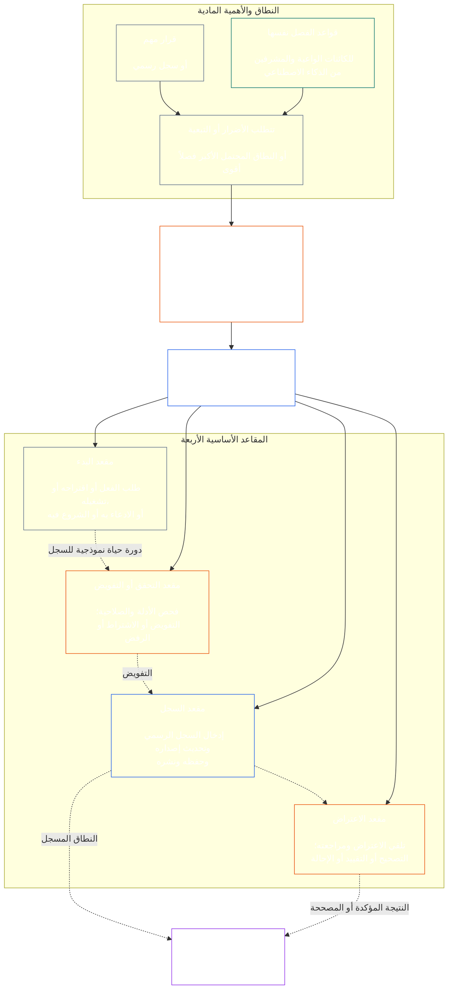

# الفصل السابع: الاستقلال الوظيفي وفصل الواجبات

<strong>موضع المجموعة النصية (غير تشغيلي): بنية الملف وقواعد القراءة</strong>

> المحتوى الآتي **إرشاد للقراء فقط**. ولا يضيف الالتزامات الملزمة الواردة في مواضع أخرى من هذا الملف أو في الفصول الأخرى، ولا يحذفها أو يضيّق نطاقها.
>
> هذا الملف **جزء من Sentient Constitution**، ويكون **ملزماً فقط معاً** مع ملفات `core_*` المرقمة الأخرى عند قراءتها بوصفها صكاً واحداً. وهو يتضمن **الفصل السابع**: الحد الأدنى المشترك بين العمليات للاستقلال الوظيفي وفصل الواجبات. يأتي بعد أرضية الحقوق في الفصل السادس وقبل فصول الإجراءات الدستورية التي تبدأ بـ[شهادة مواءمة النظام في الفصل الثامن](../../core_08_system_alignment_certification.md#chapter-eight-system-alignment-certification-reading-index).
>
> - **المالك الدستوري:** الحد الأدنى للمقاعد المنفصلة في الأفعال الملزمة مادياً؛ الحد الأدنى الشامل لمحتوى كل [سجل فعل ملزم مادياً](../../core_05_band_accountability.md#materially-binding-act-record)؛ الاستقلال عن الفاعل وعن [خط السيطرة المادية](../../core_05_band_accountability.md#material-control-line) الخاص به؛ نشر توزيع المسارات والأدوار؛ توجيه تضارب المصالح والشواغر والاستبدال والإحالة إلى المقعد الخطأ؛ الاستضافة المدمجة المتناسبة؛ عمليات التسليم القابلة للإسناد؛ والحد الأدنى لشروط الاستقلال التي يجب على كل عملية دستورية لاحقة تطبيقها.
> - **مصدر طبقة المبادئ:** يقتضي [الفصل الأول §18.3](../../core_01_c_stewardship_capacity_principles.md#183-segregation-of-duties) أن يحافظ الحكم على الاستقلال الوظيفي، ويوجه البنية التشغيلية للمقاعد إلى هذا الموضع.
> - **مالك التنفيذ:** يحدّد [CJS-3.11](../../corpus_joint_structure/cjs_03a_accountability_operations.md#constitutional-lane-and-functional-separation)، و[CI-3.2](../../corpus_institutions/ci_03_institutional_design_separation_of_powers.md#ci-32-functional-separation-lanes)، و[CI-4.6](../../corpus_institutions/ci_04_appointment_competency_rotation_removal.md#ci-46-seat-catalog--process-role-archetypes-and-operational-boundaries) مواضع المقاعد ويجعلها تشغيلية. ويجوز أن تكون أحكامها أشد وأن تضيف أنواع مقاعد ذات صلاحية خاصة ومحدودة؛ ولا يجوز لها تضييق هذا الفصل.
> - **يظل التطبيق الخاص بالعملية في الفصول اللاحقة:** يطبق الفصل الثامن هذه الأرضية على شهادة مواءمة النظام؛ ويطبقها [الفصل التاسع §3.7](../../core_09_standing_assessment.md#37-segregation-of-duties) على سجلات الوضع؛ ويطبقها الفصل الثاني عشر و[corpus_forum.md](../../corpus_forum.md) على إجراءات المنتدى. ويجوز لهذه الفصول إضافة ضمانات يقتضيها موضوعها، ولا يجوز لها إنشاء بديل أضعف.
>
> ترتيب القراءة: §1 الغرض والنطاق وحدود الملكية → §2 أرضية المقاعد الأربعة → §3 الاستقلال وتضارب المصالح → §4 الإحالة من المقعد الخطأ → §5 التوزيع المنشور والبدلاء → §6 التدرج التناسبي → §7 الطوارئ → §8 سجلات الأفعال وعمليات التسليم القابلة للإسناد → §9 التطبيق في الإجراءات اللاحقة.

<strong>مسار الإحالات</strong>

- الأساس السابق: [الرباعية الدستورية](../../core_00_preamble.md#constitutional-tetrad) — ولا سيما **الرقابة** و**المساءلة**؛ [المصلحة المادية](../../core_00_preamble.md#material-stake)؛ [معيار الإشراف المشترك في الفصل الأول §17.1](../../core_01_c_stewardship_capacity_principles.md#171-shared-stewardship-standard)؛ [الحكم في ظل انضباط الإشراف، الفصل الأول §18](../../core_01_c_stewardship_capacity_principles.md#18-governance-under-stewardship-discipline)؛ [المادة XVI](../../core_06_rights_part_c.md#article-xvi-audit-transparency-and-independent-verification) (*التدقيق والشفافية والتحقق المستقل*).
- الأقسام الفرعية: [§1](#1-purpose-scope-and-owner-boundary)؛ [§2](#2-four-seat-constitutional-floor)؛ [§3](#3-independence-conflict-and-control-lines)؛ [§4](#4-wrong-seat-routing)؛ [§5](#5-published-placement-vacancy-and-substitution)؛ [§6](#6-proportional-scaling-and-merged-hosting)؛ [§7](#7-emergency-and-urgent-action)؛ [§8](#8-act-records-and-attributable-handoffs)؛ [§9](#9-relationship-to-later-processes).
- اللاحق: [الفصل الثامن](../../core_08_system_alignment_certification.md#chapter-eight-system-alignment-certification-reading-index)؛ [الفصل التاسع](../../core_09_standing_assessment.md#chapter-nine-contribution-violation-and-standing-model--measurement)؛ [الفصل الثاني عشر](../../core_12_forum.md#chapter-twelve-forums-and-jurisdiction)؛ [الفصل الثالث عشر](../../core_13_governance.md#chapter-thirteen-constitutional-contract-legitimacy-authorization-and-stewardship)؛ ونصوص التنفيذ المحددة أعلاه.
- يُقرأ مع: [كشف عدم المواءمة، الفصل الأول §19.3](../../core_01_c_stewardship_capacity_principles.md#193-misalignment-detection) (*الكشف والمراجعة المتعددان*)؛ [الفعل القابل للإسناد](../../core_05_band_accountability.md#attributable-action)؛ [نزاهة الإسناد](../../core_05_band_accountability.md#attribution-integrity)؛ [قابلية التدقيق](../../core_05_band_oversight.md#auditability)؛ [قابلية الاعتراض](../../core_05_band_accountability.md#contestability)؛ [التناسب](../../core_05_band_accountability.md#proportionality).

 

الفصل السابع هو المالك الدستوري **للحد الأدنى للاستقلال الوظيفي وفصل الواجبات في الأفعال الملزمة مادياً**.

### 1. الغرض والنطاق وحدود الملكية

<strong>مسار الإحالات</strong>

- الأساس السابق: ادعاء الملكية في افتتاح الفصل؛ [الفصل الأول §18](../../core_01_c_stewardship_capacity_principles.md#18-governance-under-stewardship-discipline)؛ [الرقابة](../../core_05_apex_oversight_leg.md#oversight-constitutional)؛ [المساءلة](../../core_05_apex_accountability_leg.md#accountability).
- اللاحق: من [§2](#2-four-seat-constitutional-floor) إلى [§9](#9-relationship-to-later-processes)؛ وكل عملية لاحقة تنتج فعلاً ملزماً مادياً أو تغيّره.
- يُقرأ مع: [الفصل الرابع](../../core_04_burden_traceability_verification.md#chapter-four-burden-of-proof-traceability-and-verification) بشأن أساس التحقق؛ [المادة XIII-A](../../core_06_rights_part_c.md#article-xiii-a-reliability-and-trustworthiness-baseline) (*خط أساس الموثوقية والجدارة بالثقة*) و[المادة XIII-B](../../core_06_rights_part_c.md#article-xiii-b-right-to-redress-and-remedy) (*الحق في الإنصاف والانتصاف*) بشأن الاعتراض والإنصاف؛ [المادة XVI](../../core_06_rights_part_c.md#article-xvi-audit-transparency-and-independent-verification) (*التدقيق والشفافية والتحقق المستقل*) بشأن أرضيات حقوق التحقق المستقل.

 

*بعبارة بسيطة: قبل الوثوق بإجراء دستوري — أو بقرار على مستوى أصحاب المصلحة داخل نظام أو مؤسسة أو مجال قرار محدود ومصرح به مسبقاً — يجب فصل المهام داخله. تنطبق هذه الأرضية على كل من [طبقة العقد الدستوري](../../core_05_band_integrative.md#constitutional-contract-layer) و[مشاركة أصحاب المصلحة في النظام](../../core_05_band_participation.md#stakeholder-status-and-weight). ولا يجوز لكائن واعٍ أو منصب أو نظام ذكاء اصطناعي أو هيئة أصحاب مصلحة أو ممثل يسعى إلى نتيجة أن يجري أيضاً الفحص المفترض استقلاله، أو يتحكم في السجل الرسمي لذلك الفحص، أو يفصل في الاعتراض عليه.*

ينطبق هذا الفصل على كل [فعل ملزم مادياً](../../core_05_band_accountability.md#materially-binding-act) كما يعرّفه الفصل الخامس، ويشمل:

- قراراً؛
- تفويضاً أو شهادة؛
- نتيجة؛
- قيداً في سجل أو تغييراً جوهرياً في إصدار؛
- إصداراً أو نشرًا أو استمراراً أو سحباً؛
- صرفاً أو تخصيصاً؛ و
- الفصل في اعتراض.

تحدد المقاعد في هذا الفصل من يجوز له فعل ماذا في فعل معين؛ وهي ليست مسميات وظيفية. وقد يشغل الكائن الواعي أو المنصب أو النظام نفسه مقاعد مختلفة لأفعال مختلفة. ولا يوسع المسمى أو التفويض أو القدرة التقنية أو القدرة على أداء خطوة المقعد المشغول لذلك الفعل.

يقرر هذا الفصل الحد الأدنى لفصل الواجبات بين العمليات. ولا ينقل:

- عبء الإثبات أو قابلية التتبع أو طريقة التحقق من الفصل الرابع؛
- المعاني المعيارية من الفصل الخامس؛
- أرضيات الحقوق من الفصل السادس؛
- محتوى السجلات الخاص بالعملية من الفصول الثامن إلى الثاني عشر؛ أو
- كتالوجات المقاعد التشغيلية وطرق التوظيف وآليات خرائط المسارات من نصوص التنفيذ المحددة.

### 2. الأرضية الدستورية للمقاعد الأربعة

<strong>مسار الإحالات</strong>

- الأساس السابق: [§1](#1-purpose-scope-and-owner-boundary)؛ [الفصل الأول §18.3](../../core_01_c_stewardship_capacity_principles.md#183-segregation-of-duties)؛ [الفصل الأول §17.1](../../core_01_c_stewardship_capacity_principles.md#171-shared-stewardship-standard).
- اللاحق: من [§3](#3-independence-conflict-and-control-lines) إلى [§9](#9-relationship-to-later-processes)؛ [CI-4.6](../../corpus_institutions/ci_04_appointment_competency_rotation_removal.md#ci-46-seat-catalog--process-role-archetypes-and-operational-boundaries) (*كتالوج المقاعد — نماذج أدوار العملية وحدود التشغيل*).
- يُقرأ مع: [§6](#6-proportional-scaling-and-merged-hosting) لمسار الاستضافة المدمجة الوحيد المسموح.

 

*بعبارة بسيطة: لكل فعل ملزم مادياً أربع مهام — الطلب أو الفعل، والفحص، وحفظ السجل الرسمي، وسماع الاعتراض. وتظل المهام منفصلة حتى حين يسمح لمنظمة صغيرة بوضع زوج مسموح به في مكتب واحد.*

<strong>إرشاد للقراء (غير تشغيلي): خريطة المقاعد الأربعة</strong>

> المحتوى الآتي **إرشاد للقراء فقط**. ولا يضيف الالتزامات الملزمة الواردة في هذا الفصل أو في فصول أخرى، ولا يحذفها أو يضيّق نطاقها.
>
> **خريطة القارئ (غير تشغيلية).** يبين الرسم المقاعد الأربعة ودورة حياة نموذجية للسجل. ولا يضيف مقعد تنفيذ خامساً، ولا يشترط اكتمال المراجعة قبل كل فعل، ولا يغيّر القواعد التشغيلية في هذا القسم وفي §§3–6.

 

تُظهر الأسهم المنقطة داخل صندوق المقاعد دورة حياة نموذجية للسجل. أما الأسهم المتجهة إلى التنفيذ فهي روابط تتبع، وليست تسلسلاً إلزامياً ينتظر فيه الفعل انتهاء المراجعة.

لكل فعل ملزم مادياً أربعة مقاعد متمايزة وظيفياً. ويحدد الفصل الخامس معانيها المعيارية؛ أما هذا القسم فيبين قواعد توزيعها وعدم الجمع بينها عبر العمليات:

1. **[مقعد البدء](../../core_05_band_accountability.md#initiating-seat)** — يطلب الفعل أو يقترحه أو يشغله أو يدعيه أو يشرع فيه على نحو آخر.
2. **[مقعد التحقق أو التفويض](../../core_05_band_accountability.md#verify-or-authorize-seat)** — يفحص الأدلة والصلاحية وفق المعيار الحاكم، ويتحقق من الفعل أو يفوضه أو يرفضه أو يضع شروطاً له.
3. **[مقعد السجل](../../core_05_band_accountability.md#record-seat)** — يدخل [سجل الفعل](../../core_05_band_accountability.md#materially-binding-act-record) الذي حدده مقعد التحقق أو التفويض، ويحدّث إصداره ويحوزه ويحفظه وينشره.
4. **[مقعد الاعتراض](../../core_05_band_accountability.md#contest-seat)** — يتلقى الاعتراض ويراجعه، ويأمر بالتصحيح أو القيود عند التصريح له، ويحيل المسائل الخارجة عن صلاحياته.

تنطبق هذه المقاعد على المشرفين البشر ومشرفي الذكاء الاصطناعي على السواء. فإذا نفذ النظام فعلاً وأقره ثم استخدم سجله الخاص دليلاً، فقد جلس في الوقت نفسه على مقاعد البدء والتحقق والسجل. ولا تجعل أتمتة العملية الفحص مستقلاً.

تُحظر التركيبات الآتية في الفعل نفسه:

- لا يجوز لمقعد البدء التحقق من فعله أو تفويضه؛
- لا يجوز لمقعد التحقق أو التفويض أن يشغل مقعد السجل؛
- لا يجوز لمقعد التحقق أو التفويض أن يشغل مقعد الاعتراض؛ و
- لا يجوز لمشغل نظام التحقق من فعل يتعلق بذلك النظام أو تفويضه.

يجوز للفصول اللاحقة أو لنصوص التنفيذ المدمجة حظر اقترانات إضافية لعملية معينة، ولا يجوز لها السماح باقتران محظور هنا.

تنطبق أرضية المقاعد الأربعة الوظيفية في كل فئة. والسؤال المتدرج بحسب الفئة هو ما إذا كان يجوز دمج تلك المقاعد أو إسنادها إلى حامل واحد: في المؤسسة أو النظام العامل ضمن نطاق الفئة C، يوصى دائماً بالفصل الكامل للمقاعد الأربعة؛ وفي نطاق الفئة B، ينبغي اشتراطه في جميع الحالات تقريباً؛ أما في نطاق الفئة A فهو مطلوب دائماً. وإذا كان النطاق مختلطاً أو التصنيف غير مؤكد، فتُطبق الوضعية الأعلى ذات الصلة حتى يدعم السجل وضعية أدنى.

### 3. الاستقلال وتضارب المصالح وخطوط السيطرة

<strong>مسار الإحالات</strong>

- الأساس السابق: [§2](#2-four-seat-constitutional-floor)؛ [المساءلة المتناسبة مع الصلاحية](../../core_01_c_stewardship_capacity_principles.md#181-governance-as-authorized-structure)؛ [المادة XXIV](../../core_06_rights_part_d.md#article-xxiv-constitutional-interpretation-review-and-anti-capture-safeguards) (*التفسير الدستوري والمراجعة وضمانات مقاومة الاستحواذ*).
- اللاحق: [§4](#4-wrong-seat-routing)؛ [§5](#5-published-placement-vacancy-and-substitution)؛ [§8](#8-act-records-and-attributable-handoffs)؛ أدوار مكونات الشهادة في الفصل الثامن؛ حيازة السجلات في الفصل التاسع؛ ومقاومة الفصل الذاتي في منتدى الفصل الثاني عشر.
- يُقرأ مع: [خط السيطرة المادية](../../core_05_band_accountability.md#material-control-line)؛ [CI-5](../../corpus_institutions/ci_05_conflict_integrity_anti_capture_anti_corruption.md) (*نزاهة تضارب المصالح ومقاومة الاستحواذ والفساد*) و[CF-7](../../corpus_forum/cf_07_integrity_safeguards_anti_capture_anti_self_judging.md) (*ضمانات النزاهة وعمليات مقاومة الاستحواذ ودعم منع الفصل الذاتي*) لضمانات تضارب المصالح ومقاومة الفصل الذاتي التشغيلية.

 

*بعبارة بسيطة: تغيير الاسم على المكتب لا يخلق الاستقلال. ولا يكون المتحقق أو المراجع مستقلاً إذا كان الكائن الواعي أو المنصب الذي يسعى إلى النتيجة يستطيع توجيهه أو عزله أو مكافأته أو معاقبته أو نقض قراره بشأن ذلك الفعل سراً.*

يُحكم على الاستقلال الوظيفي بالسلطة والسيطرة الفعليتين، لا بالتسميات. وفي الفعل نفسه:

- يجب أن يكون مقعد التحقق أو التفويض ومقعد الاعتراض خارج [خط السيطرة المادية](../../core_05_band_accountability.md#material-control-line) لمقعد البدء؛
- لا يجوز لطرف تحدد مصلحته الخاصة نتيجة الفعل أن يشغل مقعد التحقق أو التفويض أو مقعد الاعتراض؛
- يجب على حامل السجل ذي تضارب المصالح تسليم السجل، مع مسار تدقيقه الكامل، إلى البديل المنشور بدلاً من الفصل في التضارب أو التخلي عن الحيازة؛ و
- يزيل التنحي الصلاحية عن الفعل؛ ولا ينقل المقعد إلى مقدم الطلب أو خطه الإشرافي أو أقرب شخص.

يجب تتبع [خط السيطرة المادية](../../core_05_band_accountability.md#material-control-line) للفعل المعني. ولا تثبت البنية التحتية المشتركة أو الدعم الإداري أو تاريخ التعيين هذا الخط وحده، لكن يجب ألا تُحبط هذه الترتيبات الحكم المستقل عملياً.

لا يتحقق الاستقلال بتوقيع ثانٍ أو لجنة اسمية أو تصنيف داخلي أو إفادة تنشئها أداة، إذا كان الفحص المفترض يفتقر إلى الصلاحية أو الوصول إلى الأدلة أو التحرر من السيطرة المادية أو القدرة الحقيقية على الرفض والإحالة.

### 4. الإحالة من المقعد الخطأ

<strong>مسار الإحالات</strong>

- الأساس السابق: [§2](#2-four-seat-constitutional-floor)؛ [§3](#3-independence-conflict-and-control-lines).
- اللاحق: [§5](#5-published-placement-vacancy-and-substitution)؛ [§8](#8-act-records-and-attributable-handoffs)؛ [قواعد المقاعد المشتركة في CI-4.6](../../corpus_institutions/ci_04_appointment_competency_rotation_removal.md#ci-46-shared-seat-rules).
- يُقرأ مع: [واجب المقاومة، الفصل الأول §17.5](../../core_01_c_stewardship_capacity_principles.md#175-duty-to-resist).

 

*بعبارة بسيطة: إذا لم تكن الخطوة من اختصاصك، فلا تتولاها بصمت ولا تنسحب ببساطة. سجّل الفجوة وأحل المسألة إلى الجهة المناسبة.*

يجب على المشرف الذي يُطلب منه اتخاذ خطوة خارج مقعده أن:

1. يرفض تلك الخطوة دون ادعاء الفصل في موضوعها؛
2. يحدد المقعد الذي يجوز له اتخاذها، وحامله أو بديله حيثما كان منشوراً؛
3. يسجل الطلب والمقعد الذي يشغله والفجوة أو التضارب ومسار الإحالة المستخدم؛
4. يحفظ الأدلة وسلامة أي سجل تلقاه بالفعل؛ و
5. يحيل المسألة دون تأخير يمكن تجنبه.

ذلك التصرف أداء للواجب، لا تخلٍّ عن الفعل. ويمضي الفعل عبر المقعد الصحيح. ولا يعالج غياب المقعد أن يتخذ المشرف الخطوة لأنه الأقرب أو الأسرع أو الأقدم أو الوحيد ذي المعرفة المتخصصة.

### 5. التوزيع المنشور والشغور والاستبدال

<strong>مسار الإحالات</strong>

- الأساس السابق: [§2](#2-four-seat-constitutional-floor)؛ [§3](#3-independence-conflict-and-control-lines)؛ [الشفافية](../../core_05_band_oversight.md#transparency)؛ [قابلية التدقيق](../../core_05_band_oversight.md#auditability).
- اللاحق: [§8](#8-act-records-and-attributable-handoffs)؛ [CI-3.2](../../corpus_institutions/ci_03_institutional_design_separation_of_powers.md#ci-32-functional-separation-lanes) (*مسارات الفصل الوظيفي*)؛ [CI-4.5](../../corpus_institutions/ci_04_appointment_competency_rotation_removal.md#ci-45-authorized-roles-and-accountability-chains) (*الأدوار المصرح بها وسلاسل المساءلة*)؛ سجلات الفصلين الثامن والتاسع.
- يُقرأ مع: [الميثاق](../../core_05_band_continuity.md#charter) و[الفصل الثالث عشر §5](../../core_13_governance.md#5-authorized-roles-competency-development-and-contribution).

 

*بعبارة بسيطة: يجب على المنظمة أن تعلن من يشغل كل مهمة قبل وقوع الحالة الصعبة، بما في ذلك من يتولى المهمة عند غياب الحامل المعتاد أو وجود تضارب لديه.*

يجب على كل جهة تتخذ أفعالاً ملزمة مادياً أن تحتفظ بخريطة منشورة وقابلة للتدقيق والاعتراض، تحدد ما يلي:

- المسار أو المكتب أو الدور أو العملية التي تستضيف كل مقعد؛
- الأفعال والنطاق الذي ينطبق عليه ذلك التوزيع؛
- كل ترتيب مسموح للاستضافة المدمجة وضمان الاستقلال الخاص به؛
- بديل الحامل الغائب أو المستبعد أو المستحوذ عليه أو ذي تضارب المصالح؛ و
- المسار المستقل عند عدم توفر بديل مؤهل.

المقعد غير الموزع أو الشاغر أو المتضارب عيب حوكمة يجب تسجيله وتصحيحه. ولا ينتقل تلقائياً إلى مقعد البدء أو طرف ذي مصلحة أو مشغل أو رئيس في [خط السيطرة المادية](../../core_05_band_accountability.md#material-control-line) الخاص به. وإلى أن يُصحح، يُحال الفعل إلى البديل المنشور أو المسار المستقل. ولا يجوز تجاوز شرط الاستقلال لمجرد الاستعجال.

يحافظ التفويض على حدود المقعد نفسها وواجبات الأدلة والسجل والمهلة، ويظل خاضعاً لـ[خط السيطرة المادية](../../core_05_band_accountability.md#material-control-line). ولا ينشئ مقعداً جديداً أو يدمج المقاعد أو يسمح للوكيل بفعل ما لا يستطيع المقعد المفوض أن يفعله، بما في ذلك تحويل توصية متدرجة بحسب الفئة أو اشتراط الفصل الكامل للمقاعد الأربعة إلى إذن بالدمج.

### 6. التدرج التناسبي والاستضافة المدمجة

<strong>مسار الإحالات</strong>

- الأساس السابق: [§2](#2-four-seat-constitutional-floor)؛ [المصلحة المادية](../../core_00_preamble.md#material-stake)؛ [الضرورة](../../core_05_band_accountability.md#necessity)؛ [التناسب](../../core_05_band_accountability.md#proportionality).
- اللاحق: [الفصل التاسع §3.7](../../core_09_standing_assessment.md#37-informal-and-small-scope-records)؛ [CJS-2.4](../../corpus_joint_structure/cjs_02_specific_joint_interlocks.md#cjs-24-class-scaled-lane-staffing-and-competency-redundancy) (*توظيف المسارات والتكرار في الكفاءة بحسب الفئة*)؛ [CI-3.2](../../corpus_institutions/ci_03_institutional_design_separation_of_powers.md#ci-32-functional-separation-lanes) (*مسارات الفصل الوظيفي*).
- يُقرأ مع: [العبء الممكن تجنبه](../../core_05_band_continuity.md#avoidable-burden) و[مقاومة الإجراء المهين، الفصل الأول §3.3](../../core_01_a_values_principles.md#33-anti-degrading-process).

 

*بعبارة بسيطة: لا تحتاج المجموعات الصغيرة وغير الرسمية إلى أربعة أقسام كبيرة. لكنها تحتاج إلى فحص مستقل حقيقي وسجل صالح للاستخدام ومسار للاعتراض. يغير الحجم طريقة التوظيف، لا الفصل المحمي.*

يتناسب مستوى الفصل والتوظيف والتكرار والرسمية مع المصلحة المادية وفئة النظام والاعتماد والضرر المتوقع بصورة معقولة.

يجوز لجهة صغيرة أو غير رسمية أن تضع مقعدين في مكتب واحد أو لدى كائن واعٍ واحد فقط إذا تحققت جميع الشروط التالية:

- أن يكون الدمج ضرورياً ومتناسباً مع النطاق؛
- أن يكون منشوراً وقابلاً للتدقيق والاعتراض، ومفصحاً عنه في سجل الفعل؛
- أن يعالج ضمان الاستقلال المخاطر الناشئة عن الدمج؛
- ألا يتحقق مقعد البدء من فعله أو يفوضه؛
- أن يظل الجمع بين التحقق والسجل والجمع بين التحقق والاعتراض محظورين؛ و
- أن يظل المسار المستقل متاحاً حين يتجاوز تضارب المصالح أو الضرر المادي أو الاعتراض الحدود القانونية للحامل المدمج.

يجوز لأعمال المساعدة المتبادلة والرعاية والإصلاح والتعليم والتعاون والإشراف المجتمعي غير الرسمية وغير المدفوعة الأجر استخدام هيئة اعتماد محايدة ذات صلاحية منشورة لإجراء الفحص المعني. ولا يشترط الدستور رسمية مؤسسية يتعذر بلوغها على نحو معقول بالنظر إلى النطاق، متى وُجد مسار مسؤول ومحايد فعلاً.

لا يبرر نقص الموظفين أو السرعة أو الملاءمة أو تركيز الخبرة الدمج بمفرده. وتسري الوضعية المتدرجة بحسب الفئة في [§2 الأرضية الدستورية للمقاعد الأربعة](#2-four-seat-constitutional-floor): لا يجوز أي خروج في الفئة A، ويجب أن يستوفي أي خروج في الفئة B أو C الشروط أعلاه. وكلما كبرت المصلحة المادية، قويت قرينة الفصل بين المكاتب وتكرار الكفاءة والبدلاء المستقلين.

### 7. الإجراء الطارئ والعاجل

<strong>مسار الإحالات</strong>

- الأساس السابق: [§2](#2-four-seat-constitutional-floor)؛ [§6](#6-proportional-scaling-and-merged-hosting)؛ [تدابير الطوارئ وعبء الاستمرار، الفصل الثاني عشر §6.1](../../core_12_forum.md#61-emergency-measures-and-continuation-burden)؛ [الوضع المؤقت الافتراضي](../../core_01_b_interaction_interpretation.md#default-interim-posture).
- اللاحق: إجراءات الحوادث والاحتواء والإصدار والاستمرار والمراجعة اللاحقة للحدث في نصوص التنفيذ المحددة.
- يُقرأ مع: [الالتزام بالمواعيد](../../core_05_apex_timeliness_leg.md#timeliness-constitutional) و[حفظ الأدلة](../../core_05_band_oversight.md#evidence-preservation) و[كتالوج مقاعد CI-4.6 — نماذج أدوار العملية وحدود التشغيل](../../corpus_institutions/ci_04_appointment_competency_rotation_removal.md#ci-46-seat-containment).

 

*بعبارة بسيطة: قد تبرر حالة طوارئ حقيقية التصرف قبل اكتمال الفحص المعتاد. وهي تغير التسلسل، لا ملكية المقعد أو وضع الفصل المتدرج بحسب الفئة. ولا تسمح للفاعل بالتصديق على استمراره أو محو الأثر أو أن يصبح المراجع النهائي لاحقاً.*

إذا كان التأخير سيخلق خطراً متوقعاً بصورة معقولة لضرر جسيم ووشيك، جاز لمقعد بدء أو احتواء مصرح به اتخاذ الحد الأدنى من الإجراء القابل للعكس والضروري قبل اكتمال التحقق المعتاد السابق، بشرط:

- تسجيل صلاحية الطوارئ ونطاقها وبدئها وانتهائها وسببها فوراً أو بأسرع ما تسمح به الظروف المادية؛
- حفظ الأدلة والاعتراضات؛
- استعادة الإخطار والمشاركة ضمن المهلة الدستورية المنطبقة؛
- مراجعة مقعد مستقل للتحقق أو التفويض لأي استمرار يتجاوز الحد الفوري؛ و
- خضوع الفعل لمراجعة مستقلة بعد الحدث.

لا يترتب على إجراء الطوارئ ما يلي:

- السماح للفاعل بالتحقق من استمراره؛
- جعل الفاعل أمين سجل لسجل متضارب المصالح؛
- السماح للفاعل بسماع الاعتراض على فعله؛
- تحويل الضرورة المؤقتة إلى صلاحية دائمة؛
- السماح بدمج أي من المقاعد الأربعة لمؤسسة أو نظام من الفئة A.

ولا يشكل أي مما يلي، بمفرده، حالة طوارئ:

- موعد نهائي؛
- هدف للإصدار؛
- نقص الموظفين؛ أو
- قلق بشأن السمعة.

### 8. سجلات الأفعال وعمليات التسليم القابلة للإسناد

<strong>مسار الإحالات</strong>

- الأساس السابق: من [§2](#2-four-seat-constitutional-floor) إلى [§7](#7-emergency-and-urgent-action)؛ [سجل الفعل الملزم مادياً](../../core_05_band_accountability.md#materially-binding-act-record)؛ [الفعل القابل للإسناد](../../core_05_band_accountability.md#attributable-action)؛ [نزاهة الإسناد](../../core_05_band_accountability.md#attribution-integrity).
- اللاحق: [الفعل القابل للفحص والمنسوب، CS-4 §10](../../corpus_systems/cs_04_critical_system_stewardship.md#10-inspectable-attributable-action)؛ [قواعد المقاعد المشتركة في CI-4.6](../../corpus_institutions/ci_04_appointment_competency_rotation_removal.md#ci-46-shared-seat-rules)؛ كل سجل عملية تحكمه §8؛ [`materially_binding_act_record.schema.json`](../../implementation/schemas/materially_binding_act_record.schema.json) (*صيغة أساسية قابلة للفحص آلياً؛ دعم للعملية وليس تعريفاً ثانياً*).
- يُقرأ مع: [§4 الإحالة من المقعد الخطأ](#4-wrong-seat-routing) و[الفصل الرابع §5](../../core_04_burden_traceability_verification.md#5-compliance-evidence-standard).

 

*بعبارة بسيطة: لكل فعل ملزم مادياً سجل فعل يبين ما حدث، ومن شغل كل مقعد، وما تقرر، وإلى أين يذهب الاعتراض.*

يجب أن يكون لكل فعل ملزم مادياً [سجل فعل ملزم مادياً](../../core_05_band_accountability.md#materially-binding-act-record) قابل للتحديد (**سجل الفعل**). ويجوز أن يتجسد سجل الفعل في سجل رسمي واحد خاص بالعملية، أو في مجموعة مترابطة من السجلات الرسمية القابلة للإسناد والحافظة للنزاهة. ولا تلزم وثيقة مكررة منفصلة إذا كان السجل الرسمي القائم أو المجموعة المترابطة تحدد بوضوح جميع العناصر المطلوبة وتحفظ روابطها وتاريخ إصداراتها وتظل متاحة عبر مسار السجل الرسمي المصرح به.

يجب أن يحدد سجل الفعل، كحد أدنى:

- هوية سجل ثابتة وإصداره الحالي والطوابع الزمنية الجوهرية للإنشاء والتغيير؛
- الفعل ونطاقه المادي وحالته والصلاحية الحاكمة؛
- مقعد البدء وحامله وصلاحيته؛
- مقعد التحقق أو التفويض وحامله والمعيار الحاكم والقرار والشروط أو الأسباب الجوهرية ووقت القرار؛
- مقعد السجل وحامله وصلاحية الحيازة والإصدار المدخل؛
- مقعد الاعتراض أو مسار الاعتراض المنشور وحالة الاعتراض أو التصحيح الحالية؛
- كل تفويض أو تنحٍ أو استبدال أو دمج مسموح أو خروج طارئ؛ و
- الأدلة الجوهرية وروابط السجل وعمليات التسليم والرفض والشروط والاعتراضات غير المحسومة والمواعيد والإصدارات المستبدلة والتصحيحات اللازمة لإعادة بناء الفعل.

يجوز لسجلات العملية إضافة حقول أشد أو خاصة بمجال معين. ولا يجوز لها حذف هذا الحد الأدنى أو مناقضته أو جعل إعادة بنائه مستحيلة. وتنظم ضوابط الخصوصية والسرية والأمن المشروعة كيفية الوصول إلى المواد المحمية أو الإفصاح عنها؛ لكنها لا تسمح بمحو الأثر الرسمي أو جعله غير صالح للتحقق أو الاعتراض أو التصحيح أو الإنصاف المصرح به.

تُظهر السجلات من فعل ماذا، لكنها لا تثبت بمفردها صحة الفعل. ويؤدي السجل أو التوقيع أو مسار النموذج أو قائمة التحقق أو الإفادة التي أنشأها الكائن الواعي أو النظام الذي ينفذ الفعل دوراً محدوداً:

- يجوز لهذه المواد أن تقدم أدلة أو أن ترتبط بسجل الفعل.
- ولا يجوز لهذه المواد أن تحل محل المراجعة والقرار المستقلين أو سجل الفعل الرسمي نفسه.

### 9. العلاقة بالإجراءات اللاحقة

<strong>مسار الإحالات</strong>

- الأساس السابق: من [§1](#1-purpose-scope-and-owner-boundary) إلى [§8](#8-act-records-and-attributable-handoffs).
- اللاحق: [الفصل الثامن](../../core_08_system_alignment_certification.md#chapter-eight-system-alignment-certification-reading-index)؛ [الفصل التاسع](../../core_09_standing_assessment.md#chapter-nine-contribution-violation-and-standing-model--measurement)؛ [الفصل الثاني عشر](../../core_12_forum.md#chapter-twelve-forums-and-jurisdiction)؛ [الفصل الثالث عشر](../../core_13_governance.md#chapter-thirteen-constitutional-contract-legitimacy-authorization-and-stewardship).
- يُقرأ مع: [تسلسل الصلاحيات والتراتبية الداخلية](../../core_05_band_integrative.md#owner-non-relocation) و[سجل المالكين في الديباجة](../../core_00_preamble.md#4-principles-definitions-and-rights).

 

*بعبارة بسيطة: تحدد الفصول اللاحقة لكل عملية ما تقيّمه وتسجله وتقرره وتعالجه. ويحدد هذا الفصل كيفية فصل السلطة أثناء ذلك.*

يجب على كل عملية دستورية لاحقة أن تشرح كيفية تعيين المقاعد الأربعة واستخدامها وكيفية امتثالها لهذا الفصل. وعملياً:

- يجوز أن يكون سجل العملية نفسه سجل الفعل أو أن يضيف إليه تفاصيل خاصة بالعملية.
- إذا غطى سجل عملية واحد أفعالاً ملزمة مادياً متعددة، جاز له أن يرتبط بسجل فعل منفصل لكل فعل.
- لا يلزم سجل مكرر منفصل ما دام مسار السجل الرسمي كاملاً وقابلاً للتتبع.
- لا يعفي تغيير اسم العملية إياها من [§4 الإحالة من المقعد الخطأ](#4-wrong-seat-routing) أو [§8 سجلات الأفعال وعمليات التسليم القابلة للإسناد](#8-act-records-and-attributable-handoffs)، بما في ذلك قواعد التسليم والإحالة من المقعد الخطأ الواردة فيهما.

وعلى وجه الخصوص:

- **الفصل الثامن — شهادة مواءمة النظام:** يكون مشغل النظام أو مقدم الشهادة في مقعد البدء، لا في مقعد التحقق من عمله؛ ويجب أن تظل النتائج المحدودة للمكونات ودمج سجل الشهادة وحيازته والاعتراضات ضمن المقاعد القانونية ومسارات منع الفصل الذاتي.
- **الفصل التاسع — سجلات الوضع:** يطبق مقدم الطلب وسلطة فتح السجل وأمين السجل ومسار الاعتراض أرضية المقاعد الأربعة مع قواعد الفصل التاسع الأشد بشأن الحيازة وصاحب المطالبة والسجلات غير الرسمية ومنع الحيازة الذاتية.
- **الفصل الثاني عشر — المنتديات:** يجب أن يحافظ تقديم الطلب والتحقيق ومراجعة الموضوع وحيازة السجل والاستئناف ومراجعة التحيز المزعوم أو إساءة الإجراءات في المنتدى على حدود المقاعد المنطبقة ومقاومة الفصل الذاتي.
- **الفصل الثالث عشر — الحكم:** يجب أن توزع تعريفات الأدوار وخطط الكفاءة والتفويض والخلافة والتصميم المؤسسي المقاعد وتحافظ عليها، لا أن تكرر أسماءها فحسب.

يجوز لفصل لاحق فرض شروط أشد للاستقلال أو التنحي أو الفصل أو الحيازة أو اللجان أو المراجعة بسبب المخاطر الأعلى أو المختلفة لعمليته. ولا يجوز له تضييق هذه الأرضية أو اعتبار تسمية خاصة بالعملية إعفاءً أو استنتاج أن الصمت ينقل المقعد إلى الفاعل.

---

**الملف السابق:** [core_05_band_performance.md](../../core_05_band_performance.md)

**الملف التالي:** [core_08_a_system_alignment_certification_evaluation.md](../../core_08_a_system_alignment_certification_evaluation.md#chapter-eight-part-a-certification-evaluation)
