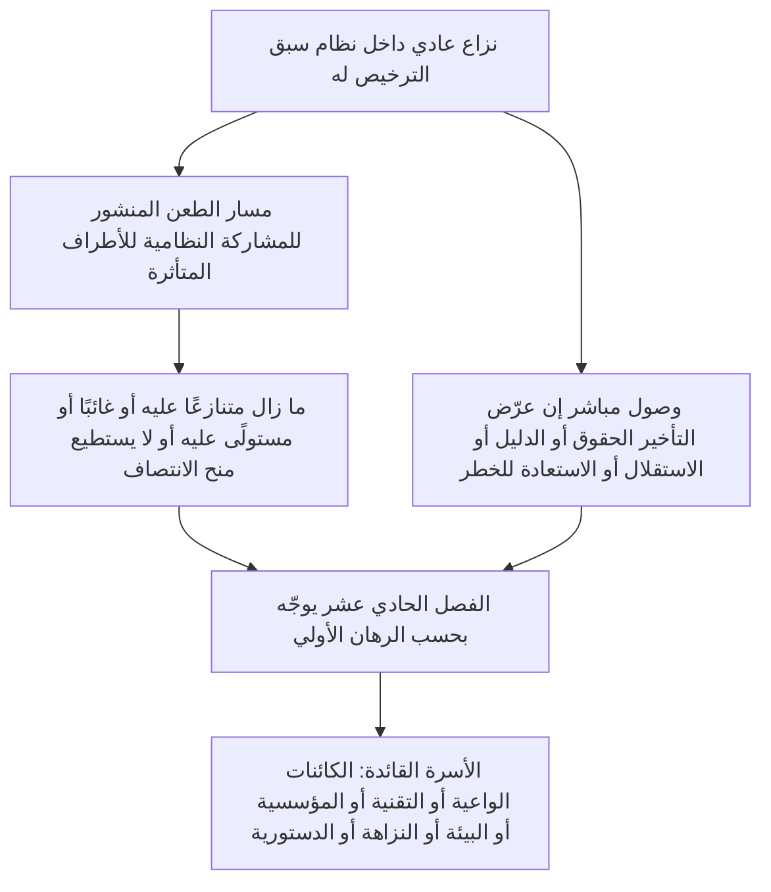

# الفصل الحادي عشر: المنتديات والاختصاص

<strong>موضع الملف في المتن (غير تشغيلي): بنية الملف وقواعد القراءة</strong>

> المحتوى التالي **توجيه للقارئ فقط**. لا يضيف التزامات ملزمة ولا ينقصها ولا يضيّقها في هذا الملف أو في فصول أخرى.
>
> هذا الملف **تجريب بلغة القارئ** لـ[الفصل الحادي عشر بالإنجليزية](../../core_11_forum.md). **ليس** جزءًا ملزمًا من دستور الكائنات الواعية. **ليس** دستورًا ثانيًا. **ليس** طبعة إرسال. وهو **مثبّت** على `SC-Corpus-2026.08.09`. إذا بدا أن هذه الترجمة والأصل الإنجليزي يختلفان، يفوز الملف المرقّم [`core_11_forum.md`](../../core_11_forum.md). ترتيب القراءة وبيانات الطبعة تُحفظ في [README.md](../../README.md). المنهج والمسرد: [translations/ar/README.md](README.md).
>
> يحتوي **الفصل الحادي عشر**: أسر المنتديات، والمقر الافتراضي وتوجيه الرهانات الأولية، والدعم الجنائي العلمي، وفرز القبول، والاختصاص للنزاعات تحت سلسلة الوضعية وأرضية الحقوق. **تشرف** المنتديات على معالجة النزاع تحت أرجل **المشاركة** و**الرقابة** و**حسن التوقيت** في [الرباعية الدستورية](core_00_preamble.md#constitutional-tetrad)، مقيسة على [الرهان المادي](core_00_preamble.md#material-stake). حين تُوثَّق الوقائع، يجوز لها أن **تفتح سجلات الوضعية أو تحدّثها أو تصحّحها** — أو **تنحّي سجلًا سيئًا عند الطعن** — تحت [الفصل الثامن §3](core_08_standing_assessment.md#3-standing-record-operational-requirements)؛ القضية المقدَّمة ليست وضعية بذاتها، ولا يجوز لسرد المنتدى أن يحل محل قياس الوضعية في الفصل الثامن ([الفصل الثامن §3.6](core_08_standing_assessment.md#36-forum-boundary)). استخدم [README — Standing pipeline and forums](../../README.md#standing-pipeline-and-forums) لملاحة السلسلة. تبقى ميكانيكا المنتدى التشغيلية في ملفات التنفيذ المعيَّنة. ترقيم الفصول والإحالات المتقاطعة يطابق الصك المدمج.

>
> **السابق (ما زال بالإنجليزية):** [core_10_b_misconduct_pattern_applications.md](../../core_10_b_misconduct_pattern_applications.md#chapter-ten-part-b-anti-constitutional-misconduct-pattern-applications)
>
> **التالي (ما زال بالإنجليزية):** [core_08-11_application_vignettes.md](../../core_08-11_application_vignettes.md#chapters-eight-eleven-application-vignettes)
> **قوس القراءة:** §1 الغرض → تسلسل النزاعات → §2 المقر الافتراضي والقبول → §2.1–§2.3 حدود القيادة والرهانات المختلطة والطعن → §3 النقل ومنع الحكم الذاتي → §4 الأسر → §5 التصعيد والتصديق → §6 الدرجات ومنع التأخير → §7 دعم المنتدى

<strong>توجيه للقارئ (غير تشغيلي): أين يعيش الفصل الحادي عشر وما يبقى هنا</strong>

> المحتوى التالي **توجيه للقارئ فقط**. لا يضيف التزامات ملزمة ولا ينقصها ولا يضيّقها في هذا الفصل أو في فصول أخرى.
>
> أين يعيش هذا (ملاحة):
> - **المالك الدستوري:** **القسم 1** (*الغرض* — **التطبيق البتّي الأولي** للمعايير التي يخصّصها هذا الفصل، **بتمييزه عن** **الإدارة التنفيذية** الروتينية؛ **تسلسل النزاعات** للنزاعات العادية داخل أنظمة سبق الترخيص لها؛ متطلبات **المساءلة**؛ وضع **عتبة** **منشور** و**قابل للتنبؤ**)؛ **مقر البدء الافتراضي**، توجيه **الرهانات الأولية**، **هيئة فرز القبول** (**مكتب اللمسة الأولى**)، الرهانات المختلطة، اللاتناظر، طعون سجلات الوضعية، **التوصيف بحسن نية ومنع التلاعب**، وتوقعات **وصول** **العتبة** **الميسَّر للكائنات الواعية** (**القسم 2**، **يُقرأ مع** **`corpus_forum.md`**)؛ **النقل** و**الدمج** و**التنسيق** (**القسم 3**، يُقرأ مع تصديق **القسم 5** واحتياطه)؛ **تعريفات أسر المنتديات** و**الغرف الداخلية** و**المعايير المشتركة** و**القانون التشغيلي المؤقت** (الكائنات الواعية، التقنية، المؤسسية، البيئة، النزاهة، الدستورية — **القسم** **4**، يعكس **جدول** **القسم** **2**)؛ **التصعيد** و**التصديق** و**الحماية المؤقتة** (**القسم 5**)؛ **الحل في وقته** وانضباط **منع التأخير** (**القسم 6**)؛ **دعم المنتدى** قبل المراجعة وأثناءها وبعدها (**القسم 7**)، منفَّذًا بحيث **لا** تحل أدوار الفرز والدعم محل **هيئات موضوع مكوَّنة على نحو مشروع**؛ التوجيه الاحتياطي **لمنع الحكم الذاتي**؛ وخطافات تصعيد مربوطة بـ**الفصل الثامن** و**الفصل العاشر** وحقوق العدل والطعن في **الفصل السادس**.
> - **ملاحة السلسلة:** [README — Standing pipeline and forums](../../README.md#standing-pipeline-and-forums) — [§§1–7](#1-purpose-and-role) في هذا الملف.
> - **سلسلة الأسئلة الثلاثة في الفصلين الثامن والتاسع:** يجيب **القسمان 2–3** من الفصل الثامن عن السؤال 1 (*ماذا حدث؟*) عبر سجلات موثّقة نقية المحور. يجيب [الفصل الثامن §4](core_08_standing_assessment.md#4-standing-measurement-evaluation-dimensions) و[مقياس LEQU النسبي الموحّد في §7](core_08_standing_assessment.md#7-unified-proportional-lequ-scale) عن السؤال 2 (*كم كان حسنًا أو سيئًا؟*) عبر أبعاد التقييم ونطاقات LEQU المشتركة بخمسة أضعاف ونحو **s** = 1...9 المشترك مع الإبقاء على سجلات إسهام ومخالفة منفصلة. يجيب [الفصل التاسع](core_09_standing_integration.md#chapter-nine-standing-effects-and-integration) عن السؤال 3 (*ماذا يحدث بسببه؟*) عبر الانتصاف والضمانات وعتبات الكفاءة وتخويلاتها وأقفال الوضعية. تتحكم خانة محور المخالفة فقط بالأثر الموثّق؛ ولا يحرّكها الإهمال أو الإخفاء أو الإكراه أو الاستجابة أو واصفات الطابع المقارنة. يجوز لـ[الفصل العاشر](../../core_10_a_misconduct_designation.md)#chapter-ten-anti-constitutional-misconduct) أن يضيف تسمية سوء السلوك المضاد للدستور المطابقة إلى سجل خانة 7 أو 8 أو 9 في الفصل الثامن لكنه لا يعيّن الخانة العددية.
> - **المنتديات (شرح غير تشغيلي):** **أسر المنتديات** تحت هذا الفصل هي **المنتديات** الأولية التي تطبق تصنيفات [الفصل الثامن](core_08_standing_assessment.md#chapter-eight-compliance-violation-and-standing-model) على نزاعات ملموسة — بما في ذلك مسائل تُسجَّل فيها **طبيعة الإسهام** و**خانة أثر محور المخالفة** وطابع الإجراء / الاستجابة **معًا** ويجب معالجتها تحت انضباط التقييم المشترك وعدم الإحلال في **الفصل الثامن**. تبقى آليات **تمويل البحث** و**التمويل** و**الحوافز** خارج البتّ في التنفيذ المعتمَد و**[corpus_systems.md](../../corpus_systems.md)** (انظر توجيه القارئ في **الفصل الثامن**)؛ ويجوز أن تسند المنع واستقصاء السبب الجذري و**يجب ألا** تحل محل توجيه **العتبة** أو تحديد **الموضوع** أو تعيين خانة الفصل الثامن العددية السلطوية أو أي تسمية مطابقة في **الفصل العاشر** أو قيود **المادة XXIII** (*حل النزاعات والتصعيد وتناسب الطوارئ*). يخصّص **القسمان 1 و2** المسؤولية **الأولية** عن بنى **الحوافز** **أساسًا** **داخل** **دائرة** كل **أسرة** (التفصيل الدقيق في **المتن** والتنفيذ)؛ و**لا** **ينقل** ذلك **التخصيص** خيارات **الميزانية** **على مستوى النظام** أو **مقياس الحوكمة** المحفوظة لـ[الفصل الثاني عشر](../../core_12_governance.md#chapter-twelve-constitutional-contract-legitimacy-authorization-and-stewardship) و**[corpus_systems.md](../../corpus_systems.md)**.
> - **مالك التنفيذ:** **فئات** القبول المنشورة وقواعد جدول القضايا اليومية والتوظيف والميزانيات والإجراء الدقيق وميكانيكا التصعيد التشغيلية ومتطلبات دعم المنتدى التشغيلية تعيش في نص التنفيذ المعتمَد وفي **[corpus_forum.md](../../corpus_forum.md)** (**CF-5** (*عمليات التوجيه والنقل والتصديق والمعاملة التمثيلية*)، **CF-8** (*دعم المنتدى الجنائي العلمي والتحليلي*)، **CF-9** (*خدمة التحقيق المستقلة وواجهة الملاحقة*)، وأقسام ذات صلة)؛ تلك الطبقات **تنفّذ، لا تضيّق**، هذا الفصل.
> - **قاعدة منع النقل:** يجب ألا تستوفي صكوك الاعتماد هذا الفصل عبر إجراءات تطوي وظائف منتدى متميزة، أو تجرّد **الاستقلال** أو **المراجعة الحقيقية**، أو توجّه طعون النزاهة عائدًا إلى المنتدى المستولى عليه نفسه الذي يحظره هذا الفصل بوصفه المقر النهائي الوحيد للموضوع.
>
> **العمارة — موضع *بعبارات بسيطة*:** يظهر كل سطر *بعبارات بسيطة* فورًا بعد كتلة ملاحة التتبع (و` ` الذي يليها حين يوجد)، و**قبل** الفقرات التشغيلية وقوائم النقاط لذلك القسم. شرح موجَّه للقارئ فقط؛ لا يضيف نصًا ملزمًا ولا ينقصه ولا يضيّقه.

<strong>التتبع</strong>

- أعلى: [الفصل الثامن](core_08_standing_assessment.md#chapter-eight-compliance-violation-and-standing-model) (*سجلات السؤال 1 وقياس السؤال 2 التي تمدّ النزاعات التي يوجّهها هذا الفصل*)؛ [الفصل الثامن §5.1](core_08_standing_assessment.md#5-slot-grammar-and-display-labels) (*نحو خانة الوضعية*)؛ [المقياس الموحّد في الفصل الثامن §7](core_08_standing_assessment.md#7-unified-proportional-lequ-scale) (*نطاقات LEQU المشتركة بخمسة أضعاف وسجلات المحور المنفصلة*)؛ [الفصل الثامن §§4.3–4.4](core_08_standing_assessment.md#43-route-descriptor-measurement-roles) (*كتالوج الواصفات المعيارية عبر المحاور، بما في ذلك واصفات محور الإسهام ومحور المخالفة التي لا تحرّك الخانات*)؛ [الفصل العاشر](../../core_10_a_misconduct_designation.md)#chapter-ten-anti-constitutional-misconduct) (*تسمية سوء السلوك المضاد للدستور المطابقة لخانات الفصل الثامن المؤهِّلة 7–9*)؛ [الفصول من الثاني إلى الرابع](core_02_definition_structure.md) (*توقعات السجل والتحقق والتتبع*)؛ [الفصل الخامس](core_05__definitions_home.md#chapter-five-foundational-definitions) (*التعريفات التأسيسية*)؛ [الفصل الأول](core_01_c_stewardship_capacity_principles.md#chapter-01-principles-and-constraints) (*قيود تفسيرية*)؛ [الفصل السادس — الحقوق التأسيسية](core_06_rights_part_a.md#chapter-six-foundational-rights) حتى [الجزء د](core_06_rights_part_d.md) (*خطافات الطعن والتدقيق ومواد العدل*).
- الأقسام الفرعية: [§1](#1-purpose-and-role)؛ [§2](#2-default-venue-and-primary-stakes)؛ [§3](#3-transfer-consolidation-and-coordination)؛ [§4](#4-forum-family-definitions)؛ [§5](#5-escalation-and-certification)؛ [§6](#6-timely-resolution-materiality-tiers-and-anti-delay-discipline)؛ [§7](#7-forum-support-before-during-and-after-review).
- يُقرأ مع: [README — Standing pipeline and forums](../../README.md#standing-pipeline-and-forums).
- أسفل: [corpus_forum.md](../../corpus_forum.md) (*عقيدة المنتدى التشغيلية*)؛ [الفصل الثاني عشر](../../core_12_governance.md#chapter-twelve-constitutional-contract-legitimacy-authorization-and-stewardship) حيث تتفاعل شرعية الحوكمة مع دور البتّ؛ [الفصل السادس عشر](../../core_16_incorporation.md#chapter-sixteen-incorporation-bridge) (*انضباط الإدماج* لطبقات الإجراء المعتمَدة).
- يُقرأ مع: [الفصل الثامن §5.1](core_08_standing_assessment.md#5-slot-grammar-and-display-labels) (*نحو خانة الوضعية*)؛ [الفصل الثامن §§4.3–4.4](core_08_standing_assessment.md#43-route-descriptor-measurement-roles) (*واصفات محور الإسهام ومحور المخالفة المعيارية عبر المحاور*).
- يُقرأ أيضًا مع: [الفصل التاسع §3](core_09_standing_integration.md#3-descriptor-integration-and-attachment-normalization) (*تكامل الواصفات وتسوية المرفقات مقروءًا مع توجيه الرهانات الأولية في القسم 2*)؛ [README.md](../../README.md) (*ترتيب القراءة وتنظيم المتن*)؛ [doc_architecture.md](../../doc_architecture.md) (*خرائط تحريرية غير ملزمة ما لم تُعتمَد*).

 

الفصل الحادي عشر هو المالك الدستوري لـ**أسر المنتديات والمقر الافتراضي والاختصاص والتوجيه البتّي للنزاعات تحت سلسلة الوضعية وأرضية الحقوق**.

*بعبارات بسيطة: تحت [الرباعية الدستورية](core_00_preamble.md#constitutional-tetrad) و[المقصدين الدستوريين](core_00_preamble.md#two-constitutional-aims)، **يشرف** هذا الفصل على كيف تتحرك النزاعات عبر سلسلة الوضعية في الفصول من الثامن إلى العاشر — التوجيه والاستقلال والدعم الجنائي العلمي وتسلسل المعالجة وساعات الدرجة الافتراضية تحت **القسم 6** و**المادة XXIV-C** (*الحل في وقته وأرضية منع التأخير*). تجيب أسر المنتديات أي مسار يعالج أي نزاع، وأين تبدأ القضية عادة، وكيف تُنسَّق مسائل الرهانات المختلطة. تمدّ **المشاركة** (طعنًا ميسرًا) و**الرقابة** (مراجعة موضوع قابلة للتتبع). حين تُوثَّق الوقائع، يجوز لها أن **تفتح سجلات الوضعية أو تحدّثها أو تصحّحها** — أو **تنحّي سجلًا سيئًا عند الطعن**. وهي **لا** تشغّل مسار قرار ثانيًا منفصلًا إلى جانب سلسلة الوضعية. تقديم قضية وحده لا أثر فوري له على الوضعية. تعيش قواعد الجلسات اليومية والميزانيات وكتيبات التوظيف في طبقات التنفيذ ويجب أن **تنفّذ، لا تضيّق**، هذا الفصل أو **المادة XXIII** (*حل النزاعات والتصعيد وتناسب الطوارئ*).*

### 1. الغرض والدور — عمارة المشاركة

<strong>التتبع</strong>

- أعلى: [الفصل السابع — تصديق مواءمة النظام](core_07_a_system_alignment_certification_evaluation.md#chapter-seven-system-alignment-certification)؛ [الفصل الثامن](core_08_standing_assessment.md#chapter-eight-compliance-violation-and-standing-model)؛ [الفصل التاسع](core_09_standing_integration.md#chapter-nine-standing-effects-and-integration)؛ [الفصل العاشر](../../core_10_a_misconduct_designation.md)#chapter-ten-anti-constitutional-misconduct)؛ [الفصل الأول](core_01_c_stewardship_capacity_principles.md#chapter-01-principles-and-constraints) (*المبادئ والقيود التفسيرية*)؛ [الفصول من الثاني إلى الرابع](core_02_definition_structure.md) (*توقعات التتبع والتحقق*)؛ [الفصل الخامس](core_05__definitions_home.md#chapter-five-foundational-definitions) (*التعريفات مقروءة مع الفصول من الثاني إلى الرابع في ودجة موضع الملف في المتن*)؛ [الفصل السادس](core_06_rights_part_a.md#chapter-six-foundational-rights) (*أرضية الحقوق التأسيسية التي يطبّقها هذا الفصل معها*).
- أسفل: [§2](#2-default-venue-and-primary-stakes) (*المقر الافتراضي للرهانات الأولية وفرز القبول والرهانات المختلطة واللاتناظر وطعون سجلات الوضعية؛ وصول عتبة قابل للطعن وفي وقته؛ التوصيف بحسن نية ومنع التلاعب*)؛ [§3](#3-transfer-consolidation-and-coordination) (*النقل ومنع الحكم الذاتي*)؛ [§4](#4-forum-family-definitions) (*تعريفات أسر المنتديات والغرف والمعايير المشتركة والقانون التشغيلي المؤقت*)؛ [§4.3](#43-institutional-forums) (*حد الإجراء الداخلي بوصفه تطبيق الأسرة المؤسسية لتسلسل النزاعات*)؛ [§5](#5-escalation-and-certification) (*التصعيد والتصديق والحماية المؤقتة*)؛ [§6](#6-timely-resolution-materiality-tiers-and-anti-delay-discipline) (*درجات الأهمية المادية ومعالم السلسلة وانضباط منع التأخير*)؛ [§7](#7-forum-support-before-during-and-after-review) (*دعم المنتدى قبل المراجعة وأثناءها وبعدها*).
- أرجل الرباعية: **المشاركة**، **الرقابة**، **المساءلة**، **حسن التوقيت** (يجوز للإيجادات الموثّقة أن تفتح سجلات الوضعية أو تحدّثها أو تصحّحها؛ ينفّذ **CF-11** ساعات الدرجة). المقاصد الأولية: **الازدهار** و**الاستمرارية**. ينطبق قياس [الرهان المادي](core_00_preamble.md#material-stake) على عبء التوجيه والوصول.
- يُقرأ مع: [الديباجة §3.2](core_00_preamble.md#32-key-governance-processes) و[§3.3](core_00_preamble.md#33-governance-layers) (*مسارات الإجراء وانضباط طبقات الحوكمة*)؛ [المادة XI: المشاركة النظامية للأطراف المتأثرة والتمثيل والإجراءات الواجبة](core_06_rights_part_b.md#article-xi-stakeholder-system-participation-representation-and-due-process)؛ [corpus_forum.md](../../corpus_forum.md) (**CF-6.2.2** (*قواعد الطوارئ والاستنفاد والتوقيت*) — نفّذ، لا تضيّق)؛ [corpus_institutions.md](../../corpus_institutions.md) (*الطعن والمراجعة الثانوية ومراقبة النزاهة — لا يحل محل اختصاص المنتدى المعيَّن*)؛ [المادة XII-B: الحق في الطعن والمراجعة والانتصاف](core_06_rights_part_c.md#article-xii-b-right-to-challenge-review-and-redress)؛ [أسرة المادة XXIII](core_06_rights_part_d.md#article-xxiii-a-justice-objective-and-scope) (*قيود العدل المشار إليها في ودجة موضع الملف في المتن*).

 

*بعبارات بسيطة: يخصّص هذا القسم **المشاركة** و**الرقابة** الدستوريتين عبر أسر منتديات **تشرف** على مسارين — **سلسلة الوضعية** (نزاعات الفصول من الثامن إلى العاشر وآثار السجل) و**تصديق مواءمة النظام** (اعتراف الفصل السابع ومراجعته) — ثم يبيّن متطلبات المساءلة لوضع العتبة المنشور. تستخدم النزاعات العادية داخل أنظمة سبق الترخيص لها مسار الطعن المنشور للمشاركة النظامية للأطراف المتأثرة أولًا؛ ويتولى هذا الفصل حين يبقى ذلك المسار متنازعًا عليه أو غائبًا أو مستولًى عليه أو لا يستطيع منح الانتصاف. تعيش قواعد الجلسات التفصيلية في موضع آخر ولا يجوز أن تضيّق بهدوء ما يضمنه هذا الفصل.*

يبيّن هذا الفصل أي **أسر منتديات** **تشرف** على أي أسئلة أولية عبر **المشاركة** (طعن ميسر للكائنات الواعية ومعاملة تمثيلية ووصول متناسب) و**الرقابة** (الاستقلال والدعم الجنائي العلمي ومراجعة موضوع قابلة للتتبع). وهو **لا** يحدّد قواعد جدول القضايا أو التوظيف أو الميزانيات أو الإجراء الدقيق أو ميكانيكا التصعيد التشغيلية. تلك التفاصيل تخص طبقات تنفيذ المتن التي يجب أن **تنفّذ، لا تضيّق**، هذا الفصل. يجب أن تبيّن **أسر المنتديات** الحدود القانونية والتنظيمية لوضع العتبة وتوجيه الرهانات الأولية ومراجعة مواءمة النظام على نحو قابل للتنبؤ ومنشور **ينفّذ، لا يضيّق**، **القسم 2** مع **`corpus_forum.md`**.

**تشرف أسر المنتديات على:**

1. **سلسلة الوضعية** (الفصول من الثامن إلى العاشر، مطبِّقة الفصول من الأول إلى السادس ومعايير تنفيذ المتن المعيَّنة في النزاعات)
   - توجيه الرهانات الأولية ومراجعة الموضوع حيث تُعيَّن والنقل والدمج وتنسيق التصديق وتسلسل المعالجة لنزاعات متصلة بالوضعية.
   - سجلات إسهام ومخالفة **الفصل الثامن** المقاسة على مقياس LEQU النسبي الموحّد في §7 وواصفات الطابع وأثر الوضعية — يجوز للإيجادات الموثّقة أن **تفتح سجلات الوضعية أو تحدّثها أو تصحّحها** — أو **تنحّي سجلًا سيئًا عند الطعن** — تحت [الفصل الثامن §3](core_08_standing_assessment.md#3-standing-record-operational-requirements) حين تستوفي بوابة المدخلات الموثّقة؛ القضية المقدَّمة ليست وضعية بذاتها، ولا يجوز لسرد المنتدى أن يحل محل قياس الوضعية في الفصل الثامن ([الفصل الثامن §3.6](core_08_standing_assessment.md#36-forum-boundary)).
   - آثار الوضعية والتكامل في **الفصل التاسع** حيث يخصّص هذا الفصل إشراف المنتدى على الانتصاف والتسلسل.
   - تسمية سوء السلوك المضاد للدستور في **الفصل العاشر** حيث تكون تلك التسمية محل نزاع لسجل خانة 7–9 في الفصل الثامن.
   - تطبيق **الفصول من الأول إلى السادس** وطبقات تنفيذ [المتن](core_05_band_integrative.md#corpus) المعيَّنة بوصفها المعايير التي تطبقها تلك النزاعات.

2. **تصديق مواءمة النظام** ([الفصل السابع](core_07_a_system_alignment_certification_evaluation.md#chapter-seven-system-alignment-certification))
   - الاعتراف والإعتراف المشروط والتحقق وإعادة التحقق والسحب ونواتج سجل التصديق ذات الصلة تحت إشراف المنتدى تحت [الفصل السابع، الجزء ب](core_07_b_system_alignment_certification_record_process.md#chapter-seven-part-b-certification-record-and-process).
   - أدوار المكوّنات تحت [الجزء ب §13](core_07_b_system_alignment_certification_record_process.md#13-forum-supervision-and-component-roles):
     - **التقنية** — المواصفات والمناهج ومعايير الدليل
     - **النزاهة** — اعتراف المواءمة الرسمي وتنسيق القيادة
     - **البيئة** — مكوّن المواءمة البيئية حيث يكون ماديًا
     - إيجادات مكوّن أسر أخرى تحت توجيه هذا الفصل
   - تستطيع الكائنات الواعية الطعن في نتائج التصديق وإرفاق شروط وإعادة فتح الملف حين يُحتاج — لكن التصديق **لا** يحل محل قياس الوضعية.
   - يجوز أن تُحتسب إيجادات مهمة من تصديق **مدخلات موثّقة** حين يقيس الفصل الثامن الوضعية. و**لا** يعيّن التصديق بذاته لأي أحد خانة وضعية ([الجزء ب §15](core_07_b_system_alignment_certification_record_process.md#15-relationship-to-standing)).

**أسر المنتديات** هي المؤسسات الأولية التي **يشرف** عبرها هذا الصك على تلك المسارات. وهي متميزة عن الإدارة التنفيذية الروتينية للقواعد النافذة.

**تسلسل النزاعات.** داخل نظام أو مؤسسة أو مجال قرار محدود سبق الترخيص له، يستخدم نزاع عادي مسار الطعن والإجراءات الواجبة المنشور لـ[المشاركة النظامية للأطراف المتأثرة](core_05_band_participation.md#stakeholder-status-and-weight-cluster) أولًا. إن أنتج ذلك المسار نتيجة ما زالت متنازعًا عليها، أو كان غائبًا، أو مستولًى عليه، أو لا يستطيع منح الانتصاف المطلوب على نحو مشروع، يوجّه هذا الفصل المسألة بحسب الرهان الأولي تحت **القسم 2**. **النزاهة** و**مجالات المنتدى التقني** و**البيئة** و**الدستورية** أسر قيادة افتراضية حين يكون ذلك هو الرهان الأولي — لا استثناءات تتخطى التسلسل. لا يجوز لإجراء داخلي غير مكتمل أو تسميات الاستنفاد أو ادعاء أن المراجعة الداخلية غير مكتملة أن تعوّق تلك القيادات أو تحل محل موضوعها أو تلتهم ساعات **المادة XXIV-C** (*الحل في وقته وأرضية منع التأخير*). يبقى الوصول المباشر متاحًا حين يعرّض التأخير الحقوق أو الدليل أو الاستقلال أو الاستعادة العملية لخطر مادي.

*خريطة قارئ فقط. لا تضيف فقرة تسلسل النزاعات ولا تنقصها ولا تضيّقها.*

وهي:

- تحمل دور حوكمة استباقي، بما في ذلك حل المشكلات وتحليل السبب الجذري والمنع وتسلسل المعالجة والتعلم من أنماط الإخفاق، متوائمة مع مبادئ **الفصل الأول** بما فيها **السلامة** و**الحقيقة** و**العافية** و**الاستجابة** و**الإدارة المسؤولة والفهم الموزَّع**.
- يجب أن تستوفي توقعات **الاستقلال** و**قابلية الطعن** و**التتبع** في **الفصول من الثاني إلى الرابع**، و**المادة XII-B** (*الحق في الطعن والمراجعة والانتصاف*) حيث يُتورَّط الطعن والمعالجة، و**المادة XXIII** (*حل النزاعات والتصعيد وتناسب الطوارئ*) حيث تحكم قيود العدل.
- تخضع لأشد متطلبات الإجراء ومساءلة النزاهة المعبَّر عنها في هذا الصك، بما في ذلك التبرير العلني وقابلية التتبع وانضباط التنحي والهيئة والدعم الجنائي العلمي والتحليلي حيث يخصّصها هذا الفصل
- تتطلّب توجيهًا احتياطيًا لمنع الحكم الذاتي. يجب ألا تحل تلك المتطلبات السيطرة السياسية محل استقلال البتّ.
- تتطلّب منتديات **النزاهة** و**الدستورية** و**البيئة**، و**مجالات المنتدى التقني** حين تسمع البتّ في مركز الوعي، تعيينًا **منشورًا** و**قابلًا للطعن** و**قابلًا للتناوب** أو فحص استقلال مكافئ تحت [الفصل الثاني عشر §1.2](../../core_12_governance.md#12-eligibility-contested-selection-and-democratic-minimums). نقص تعيين تلك الهيئات أو نقص تمويلها إخفاق [الفصل التاسع §9](core_09_standing_integration.md#9-enforcement-realism).

تحمل كل **أسرة منتدى** المسؤولية الأولية عن بنى الحوافز أساسًا داخل دائرتها. يشمل ذلك:

- صكوك الاعتماد وطبقات التنفيذ المعيَّنة
- مراجعة مسارات الكلفة والجزاء والطعن والإبلاغ
- خطافات تسلسل المعالجة ومواءمة مجاورة للبتّ مقارنة.

تبقى الميزانيات **على مستوى النظام** وتمويل البحث العابر والبرامج على مقياس الحوكمة خاضعة لـ[الفصل الثاني عشر — الحوكمة](../../core_12_governance.md#chapter-twelve-constitutional-contract-legitimacy-authorization-and-stewardship) و**[corpus_systems.md](../../corpus_systems.md)** وقواعد السمو الأخرى حيث تنطبق. يجب **ألا** تحل العوائد وقواعد الكلفة وأدوات الحافز المشابهة محل:

- توجيه المنتدى السليم
- قرار موضوع حقيقي من هيئة مكوَّنة على نحو مشروع
- قياس خانة الأثر في الفصل الثامن
- أي تسمية مطابقة في **الفصل العاشر**
- قيود العدل في **المادة XXIII** (*حل النزاعات والتصعيد وتناسب الطوارئ*)

يعمل الطعن المؤسسي والمراجعة الثانوية ومراقبة النزاهة في **`corpus_institutions.md`** (بما في ذلك **CI-5** (*نزاهة التعارض ومنع الاستيلاء ومنع الفساد*) حتى **CI-8** (*التنسيق والتصعيد عبر المؤسسات*) وتوقعات نزاهة الطعن) إلى جانب هذا الفصل. وهي لا تحل محل أسر منتديات **النزاهة** أو **البيئة** أو **المؤسسية** للموضوع الملزم حيث يخصّص هذا الفصل لتلك الأسر الاختصاص. يجب أن تنسّق آليات الحافز التنفيذية في تلك المجلدات مع أسرة المنتدى التي تُتَورَّط دائرتها أوليًا، دون إزاحة توجيه الرهانات الأولية أو سلطة الموضوع التي يخصّصها هذا الفصل.

### 2. المقر الافتراضي والرهانات الأولية

<strong>التتبع</strong>

- أعلى: [§1](#1-purpose-and-role) (*الغرض ودور التطبيق الأولي ومتطلبات المساءلة وتوجيه العتبة المنشور وعدم نقل التفصيل وتوقعات الاستقلال والمراجعة*).
- أسفل: [§3](#3-transfer-consolidation-and-coordination) (*النقل والدمج ومنع الحكم الذاتي*)؛ [§4](#4-forum-family-definitions) (*تعريفات أسر المنتديات مقروءة مع الجدول الافتراضي*)؛ [§5](#5-escalation-and-certification) (*التصعيد من المقر الافتراضي؛ الحماية المؤقتة*)؛ [§6](#6-timely-resolution-materiality-tiers-and-anti-delay-discipline) (*درجات الأهمية المادية وانضباط منع التأخير*)؛ [§7](#7-forum-support-before-during-and-after-review) (*دعم المنتدى قبل المراجعة وأثناءها وبعدها*).
- داخل §2: [§2.1](#21-lead-default-limits) (*تصادم الرهانات الأولية والتصديق الدستوري واحتياط منع الحكم الذاتي*)؛ [§2.2](#22-mixed-stakes-and-routing-asymmetry) (*الرهانات المختلطة واللاتناظر*)؛ [§2.3](#23-forum-records-standing-records-and-contests) (*سجلات قضية المنتدى وسجلات الوضعية والطعون*).
- يُقرأ مع: [الرباعية الدستورية](core_00_preamble.md#constitutional-tetrad) — أرجل **المشاركة** و**الرقابة** و**حسن التوقيت**؛ قياس [الرهان المادي](core_00_preamble.md#material-stake) لتوجيه الرهانات الأولية؛ [الفصل الثامن §5.1](core_08_standing_assessment.md#5-slot-grammar-and-display-labels) (*نحو خانة الوضعية*)؛ [المقياس الموحّد في الفصل الثامن §7](core_08_standing_assessment.md#7-unified-proportional-lequ-scale) (*نطاقات LEQU المشتركة بخمسة أضعاف وسجلات المحور المنفصلة*)؛ [الفصل الثامن §§4.3–4.4](core_08_standing_assessment.md#43-route-descriptor-measurement-roles) (*واصفات معيارية عبر المحاور تُعلم الرهان الأولي دون تحريك خانة الأثر*)؛ [corpus_forum.md](../../corpus_forum.md) (**CF-5** و**CF-7.2**)؛ [corpus_systems.md](../../corpus_systems.md) (*واجبات تصنيف الأنظمة والنشر وإعادة التحقق*)؛ [الفصل العاشر §3](../../core_10_a_misconduct_designation.md)#3-violation-axis-s-7-9-slot-assignment-incident-gravity) (*تسمية سوء السلوك المضاد للدستور لخانات الفصل الثامن المؤهِّلة 7–9؛ يُحفظ المرسى الموروث*)؛ [الفصل العاشر §4](../../core_10_a_misconduct_designation.md)#4-due-process-safeguards-for-slot-assignment) (*الإجراءات الواجبة لتلك التسمية مقروءة مع هذا الفصل و**المادة XXIII** (*حل النزاعات والتصعيد وتناسب الطوارئ*)*)؛ [المادة XXIII-A](core_06_rights_part_d.md#article-xxiii-a-justice-objective-and-scope) (*مقصد العدل ونطاقه*).

 

*بعبارات بسيطة: يسأل **مكتب اللمسة الأولى** لكل أسرة — **هيئة فرز القبول** — عمّ يدور النزاع فعلًا، لا ماذا يقول العنوان، ثم يستخدم الجدول الافتراضي لاختيار المنتدى القائد. تحفظ المنتديات التقنية مواصفات مواءمة النظام ومناهجها ومعايير الدليل؛ وتصدر منتديات **النزاهة** حكم اعتراف المواءمة الرسمي والتحقق المستمر ما لم يخص سؤال مكوّن موضعًا آخر. الفرز لا يحل محل هيئات موضوع مكوَّنة على نحو مشروع؛ والرهانات المختلطة واللاتناظر وطعون سجلات الوضعية في الأقسام الفرعية أدناه.*

يخصّص **توجيه الرهانات الأولية** مسألة لأسرة المنتدى المسؤولة عن الرهان القانوني أو العلاجي أو الضمان القسري أو الأرضية الدستورية أو العملي الرئيسي في **الادعاء** أو **الدفاع**. وهو يتبع عمّ يدور النزاع فعلًا، لا العنوان ولا النتيجة التي يفضّلها الطرف.

**هيئة فرز القبول (مكتب اللمسة الأولى).** يجب أن تحفظ كل أسرة منتدى مطلوبة **هيئة فرز قبول**، أو ترتيبًا مكافئًا وظيفيًا داخل تلك الأسرة، بوصفه **مكتب اللمسة الأولى** للأسرة عند التقديم. تلك الهيئة:
- **تطبّق** توجيه الرهانات الأولية تحت هذا القسم؛
- **تفرز** المسائل الواردة لمعاملة قبول **منشورة** متسقة مع **الرهانات الأولية**؛
- **تعلّم** حاجات الحفظ و**أرضية الحقوق** و**التوجيه عبر الأسر** و**المنتدى الاحتياطي**؛
- **تدير** الوصول الأولي حتى يستطيع انضباط النقل والدمج والتصديق والاحتياط تحت **القسمين 3 و5** أن يسري فورًا؛
- **ليست** أسرة منتدى دستورية منفصلة؛
- **يجب ألا** تحل محل هيئة موضوع مكوَّنة على نحو مشروع في **نواتج موضوعية** أو **تطوي** حدود **الأسرة**؛
- **يجب ألا** تستخدم التمويل أو الرسوم أو التفضيل الإداري أو أجهزة حافز أخرى لهزيمة توجيه الرهانات الأولية أو تمكين فرز عتبة غير شفاف.

**التوصيف بحسن نية ومنع التلاعب.** يجب أن يكون توصيف المنتدى **بحسن نية** و**مسوَّغًا** بـ**الرهانات الأولية**. **يجوز** أن يشغّل التوصيف الخاطئ **العالم** **كلفًا** أو **رفضًا** أو **إحالة** تحت القانون المعتمَد. يجب ألا تُهيكل أجهزة الحافز أو تُطبَّق لمكافأة تسوّق المنتدى أو فرز العتبة غير الشفاف أو توجيه غير متسق مع انضباط الرهانات الأولية في **هذا القسم** و**القسم 3**. تعيش ميكانيكا الكلف والرفض والإحالة في **`corpus_forum.md`** (**CF-5**) ويجب أن **تنفّذ، لا تضيّق**، هذا القسم.

تُذكر المتطلبات التشغيلية — بما في ذلك **فئات القبول المنشورة** وسجلات القبول القابلة للإسناد وتوقعات الاستقلال و**الطعن** ومراجعة **فورية** للتوجيه **المتنازع عليه** — في **`corpus_forum.md`** (**CF-5** (*عمليات التوجيه والنقل والتصديق والمعاملة التمثيلية*)).

يجب أن يكون **الوصول الأولي** إلى كل أسرة منتدى فوريًا وقابلًا للطعن بما يكفي حتى:
- يبقى توجيه الرهانات الأولية تحت هذا القسم ذا معنى؛
- لا يُبطَل انضباط النقل والدمج والتصديق والاحتياط تحت **القسمين 3 و5** بالتأخير أو بفرز عتبة غير شفاف.

يجب أن تكون توقعات الزمن لوصول المنتدى:
- **ميسَّرة للكائنات الواعية**؛
- معايرة على عجلة الضرر وتعقيد المسألة تحت **القسم 6** و**المادة XXIV-C** (*الحل في وقته وأرضية منع التأخير*)؛
- تفضّل وصول العتبة الحقيقي والانتصاف المؤقت المشروع تحت **القسم 5** (*الحماية المؤقتة*) على الراحة الإدارية.

تستوفي **هيئة فرز القبول** تحت هذا القسم، مع **`corpus_forum.md`** (**CF-5**)، هذا الواجب ويجب أن تنفّذ نوافذ الدرجة الافتراضية في **القسم 6** داخل نطاق الإدماج.

**خريطة التوجيه من الفصل الثامن §3.** يخبر الفصل الثامن المنتديات كيف *تقيس* ما حدث. وهو **لا** يختار بذاته أي منتدى يسمع القضية. عند التقديم، تعمل **هيئة فرز القبول** للأسرة (مكتب اللمسة الأولى) عبر هذا التسلسل:

1. **افحص ما وُثّق أصلًا:** لاحظ أي مادة موثّقة في **محور الإسهام** أو **محور المخالفة** في الفصل الثامن — بما في ذلك خانة الأثر ونطاق الجسامة وطابع الإجراء / الاستجابة وأثر الوضعية — حين توجد أصلًا.
2. **لا تعامل الاتهامات وقائع محسومة:** توجّه الادعاءات والتسميات المؤقتة التوجيه وحفظ الدليل فقط، إلى أن توجد إيجادات تحت **الفصول من الثاني إلى الرابع**.
3. **اختر المنتدى القائد بحسب عمّ يدور النزاع فعلًا:** استخدم جدول المقر الافتراضي أدناه: **الكائنات الواعية** أو **مجالات المنتدى التقني** أو **المؤسسية** أو **البيئة** أو **النزاهة** أو **الدستورية**. طبّق قواعد التوجيه الخاصة هذه حيث تناسب:
   - **تسمية الفصل العاشر:** حيث تكون تسمية سوء السلوك المضاد للدستور في **الفصل العاشر** الرهان **الأولي**، **النزاهة** هي القيادة الافتراضية. أبقِ:
     - خانة الأثر العددية في الفصل الثامن؛
     - التصديق **الدستوري** حيث يُحتاج؛
     - قواعد الطرف المؤسسي؛ و
     - احتياط منع الحكم الذاتي تحت **الأقسام 2 و3 و5**.
   - **نزاعات انحياز المنتدى:** إن دار النزاع أساسًا حول عضو هيئة كان ينبغي أن يتنحى، أو مشاركة هيئة منحازة، أو خرق نزاهة منتدى مقارن — بما في ذلك على هيئة منتدى **دستوري** تحت **[المادة XXII-B](core_06_rights_part_c.md#article-xxii-b-composition-rotation-and-conflict-controls) (*التكوين والتناوب وضوابط التعارض*)** — فوجّهه إلى منتديات **النزاهة** أولًا. تحت **القسم 3**، لا يستطيع منتدى أن يكون الحكم النهائي الوحيد لانحيازه: لا يستطيع منتدى **دستوري** أن يكون المنتدى النهائي الوحيد الذي يقرر ما إذا كان ينبغي لعضو هيئته أن يتنحى. انضباط قفل الوضعية: **[الفصل التاسع §5.5](core_09_standing_integration.md#55-special-locks)**. نمط سوء السلوك المسمّى: **[الفصل العاشر §5.10](../../core_10_b_misconduct_pattern_applications.md#510-forum-recusal-failure-and-biased-panel-participation)**.
   - **أسئلة الكيفية التقنية:** تذهب أسئلة المواصفات والمناهج والقياس والاختبار والدليل الخبير إلى **مجالات المنتدى التقني** حين تكون تلك الرهان الأولي أو أسئلة مكوّن مصدَّقة.
   - **اعتماد مواءمة النظام:**
     - يعود **اعتراف المواءمة الدستورية** الرسمي للأنظمة الجديدة ذات الأثر المادي، و**تحقق المواءمة المستمر** للقائمة، افتراضيًا إلى **النزاهة** قائدة.
     - تستخدم النزاهة مدخلات المنتدى التقني مع المتطلبات الدستورية والمؤسسية والبيئية والحقوقية ومنع الاستيلاء.
     - حيث يكون للنظام تعرض بيئي مادي أو اعتماد على شروط بيئية مسبقة أو عبء دورة حياة أو واجب استعادة أو مخاطر بيئية متوقعة على نحو معقول، يجب أن تكمل أسرة منتدى **البيئة** مراجعة مواءمتها البيئية (اعتمادًا أو اعتراضًا) قبل أن يصير الاعتراف أو التحقق أو إعادة التحقق أو الإعفاء المادي من الشروط البيئية نهائيًا.
     - أبقِ الإحالات أو التصديق إلى **مجالات المنتدى التقني** و**المؤسسية** و**البيئة** و**الكائنات الواعية** و**الدستورية** لأسئلة المكوّن التي تملكها تلك الأسر.

عند التقديم، يتبع المقر **الافتراضي** هذه القواعد ما لم ينقل **القسم 3** أو يدمج:

| الأسرة | نمط الأطراف | الرهان الأولي (ملخص) |
|--------|---------------|--------------------------|
| **الكائنات الواعية** | مسائل كائن واعٍ إلى كائن واعٍ، ونزاعات حوكمة جماعة للأعضاء أو المشاركين أو الأسر أو الأحياء أو الجمعيات أو المحلية أو الإقليمية أو الإلكترونية أو المقارنة حيث ليست مؤسسة طرفًا ضروريًا ولا تحمل أسرة أخرى الرهان الأولي | التزامات خاصة أو جماعية، أضرار علاجية أو ترميمية، استعادة محلية، أعراف جماعة محلية أو إلكترونية، مشاركة حوكمة الجماعة، الإقصاء، الاستعادة، أو طعون الحكم الذاتي الداخلي |
| **مجالات المنتدى التقني** | أي نمط أطراف، لكن الرهان **الأولي** إجراء حوكمة تقنية أو مواصفات مواءمة النظام أو معايير الدليل الخبير أو إدارة علمية / هندسية / طبية أو حوكمة معرفة مقارنة داخل النطاق المعتمَد، **أو** تحديد مركز الوعي في **المادة V-E** (*أرضية البتّ في مركز الوعي*) على مؤشرات / دليل خبير / عدم يقين محدود | معايير **تقنية** ومواصفات مواءمة النظام ومناهج القياس والاختبار وإجراء إداري خبير وإدارة الدليل المسؤولة وسلامة الكتب أو المناهج وحوكمة المعايير وتقليل عدم اليقين المحدود ذي الصلة بالبتّ أو التنظيم أو اعتراف المواءمة، **أو** بتّ مؤشر مركز الوعي تحت **المادة V-E** (*أرضية البتّ في مركز الوعي*) |
| **المؤسسية** | أي **مؤسسة** **طرف ضروري** **أو** النزاع الرئيسي عمّ يُسمح لمؤسسة أن تفعله أو بما تُكلَّف أو ما إذا اتبعت القواعد التي تحكمها | ما يجوز لمؤسسة أن تفعله، وما تُكلَّف به، والنطاق الذي تُراقَب تحته، وكيف تُصنَّف، أو ما إذا اتبعت واجباتها |
| **البيئة** | أي نمط أطراف؛ دور مكوّن مطلوب حيث تورّط مواءمة النظام التعرض البيئي ماديًا | **النزاهة البيئية** و**الشروط البيئية المسبقة** واستعادة الأنظمة البيئية المشتركة أو معالجتها والأعباء البيئية القابلة للإسناد وضرر دورة الحياة أو البيئي المنظومي ومراجعة مكوّن المواءمة البيئية لأنظمة ذات تعرض بيئي مادي، أو إخفاق بيئي **نمطي** أو **منظومي** حيث يعتمد التصنيف أو اعتراف المواءمة أو إعادة التحقق أو إنفاذ أرضية الحقوق على ذلك التحديد |
| **النزاهة** | **النزاهة** بوصفها القضية **الرئيسية** (بما في ذلك خرق **جسيم** لضوابط التعارض أو الإجراء أو الاستيلاء)، أو **اعتراف المواءمة الدستورية** الرسمي أو **تحقق المواءمة المستمر** للأنظمة، **أو** تسمية سوء سلوك مضاد للدستور في **الفصل العاشر** لخانة أثر **s = 7 أو 8 أو 9** في الفصل الثامن بوصفها الرهان **الأولي** | **نزاهة** المنصب والإجراء ومسارات الطعن والإفصاح وقواعد التعارض وواجبات منع الاستيلاء واعتراف مواءمة النظام الرسمي والتحقق وإعادة التحقق باستخدام مدخلات المنتدى التقني وتحديدات مكوّن المواءمة البيئية لمنتدى البيئة حيث تكون مادية (**بما في ذلك** إخفاق **نمطي** أو **منظومي** **عبر** مؤسسات أو أنظمة حيث يعتمد قياس **الفصل الثامن** أو تسمية مطابقة في **الفصل العاشر** أو إنفاذ **أرضية الحقوق** على ذلك التحديد) |
| **الدستورية** | الصحة الدستورية **البنيوية** أو معنى **المعيار** لـ**جميع** المفسرين أو انتصاف **يعيد هيكلة** الحوكمة **بمتطلب دستوري** | الصحة أو المعنى **الدستوري** أو الفعل **وراء السلطة المشروعة** أو السمو أو الانتصاف **البنيوي** **على مستوى التصنيف** |

#### 2.1 حدود القيادة الافتراضية

تحدّ هذه القواعد كيف تتفاعل قيادات الجدول الافتراضية. وهي لا تحل محل **القسمين 3 و5** أو قواعد الرهانات المختلطة واللاتناظر في **القسم 2.2**.

- **تصادم الرهانات الأولية:** إن دار النزاع الرئيسي عمّ يُسمح لمؤسسة أن تفعله أو بما تُكلَّف أو ما إذا اتبعت القواعد التي تحكمها، فإن قيادة **النزاهة** الافتراضية في الفصل العاشر لا تتجاوز صف **المؤسسية**. يحكم **القسم 2.2** و**القسم 3** الرهانات المختلطة والأطراف المؤسسية الضرورية واختيار المنتدى القائد.
- **التصديق الدستوري:** لا تزيح قيادة **النزاهة** لتسمية الفصل العاشر قياس خانة الفصل الثامن العددية أو التصديق أو التصعيد إلى المنتديات **الدستورية** تحت **القسم 5** حيث يتطلّب المعنى أو الصحة الدستورية أو الانتصاف البنيوي على مستوى التصنيف تحديدًا تحت صف **الدستورية** أو عبر التصعيد من أسرة إلى أسرة.
- **احتياط منع الحكم الذاتي:** حيث تسوّغ ادعاءات مادية مراجعة موضوع مستقلة لنزاهة منتدى **النزاهة** في إجراء تسمية فصل عاشر يخص سجل خانة 7–9 في الفصل الثامن، ينطبق التوجيه الاحتياطي تحت **القسمين 3 و5** دون تضييق **القسم 4 من الفصل العاشر** أو **المادة XXIII** (*حل النزاعات والتصعيد وتناسب الطوارئ*).

#### 2.2 الرهانات المختلطة ولاتناظر التوجيه

**الرهانات المختلطة.** يسمع سجل واحد وأسرة قائدة واحدة عادة الادعاءات المترابطة. يجوز تصديق المسائل الثانوية أو وقفها أو حلها عبر منع المسألة كما تنص صكوك الاعتماد، متسقًا مع **المادة XII-B** (*الحق في الطعن والمراجعة والانتصاف*) وانضباط التقييم المشترك وعدم الإحلال في **الفصل الثامن**.

**اللاتناظر:**
- حيث **يضر** **الاعتماد** أو **القياس** أو **احتكار** **مؤسسي** لـ**مدخل** **ضروري** طرفًا **كائنًا واعيًا** ماديًا، **يجب** أن يكون توجيه **المؤسسية** أو **النزاهة** **متاحًا** حين يخصّص الجدول رهانات **مؤسسية** أو **نزاهة**.
- حيث تكون الرهانات **البيئية** **المادية** **أولية**، **يجب** أن يكون توجيه **البيئة** **متاحًا** كما يخصّص الجدول.
- **يجب ألا** تكون منتديات **الكائنات الواعية** المنتدى **الإلزامي** **الوحيد** حين تكون الرهانات **الأولية** **مؤسسية** أو **نزاهة** أو **بيئية** تحت الجدول في هذا القسم.

#### 2.3 سجلات قضية المنتدى وسجلات الوضعية والطعون

**سجلات قضية المنتدى وسجلات الوضعية:**
- يحفظ منتدى [**سجل قضية منتدى**](core_05_band_accountability.md#forum-case-record) للنزاع أمامه. يتتبع ذلك السجل:
  - الادعاءات؛
  - الدليل؛
  - اختيارات التوجيه؛
  - الأوامر المؤقتة؛
  - الأسئلة المصدَّقة؛ و
  - الإيجادات النهائية في تلك القضية.
- وهو **ليس** الشيء نفسه الذي **سجلات الوضعية** المطلوبة بـ[الفصل الثامن](core_08_standing_assessment.md#2-standing-records) (انظر [سجل الوضعية](core_05_band_accountability.md#standing-record-chapter-six)).
- يجوز أن يصير قرار منتدى جزءًا من **سجل وضعية إسهام** أو **سجل وضعية مخالفة** في الفصل الثامن فقط حين ينتج سجل إسهام موثّقًا أو إيجاد مخالفة موثّقًا أو **سجل تصديق مواءمة نظام** أو إيجادًا آخر محدودًا وقابلًا للتتبع وقابلًا للطعن وموثّقًا تحت الفصول من الثاني إلى الرابع وأي ضمانات مراجعة مطلوبة.
- لا يغيّر أي مما يلي بذاته وضعية أحد أو أهلية دوره أو مركز ثقته أو اعترافه أو أثر وضعيته النهائي:
  - تقديم قضية؛
  - تخصيصها لأسرة منتدى؛
  - تدوين ملاحظات قبول؛
  - إصدار أمر مؤقت؛
  - تسجيل ادعاء غير محلول؛
  - مناقشة تسوية؛ أو
  - استخدام تسمية توجيه مؤقتة.
- حين يعالج منتدى قائد واحد قضية رهانات مختلطة، يجب أن يُبقي **سجل قضية المنتدى** واضحًا بما يكفي حتى تظل قياسات الإسهام والمخالفة المنفصلة في الفصل الثامن وأي تسمية فصل عاشر وآثار الوضعية في الفصل التاسع قابلة للتدقيق منفصلة ومسجَّلة في سجلات وضعية نقية المحور.

**طعون سجلات الوضعية:**
- يُسجَّل طعن مرفوع على سجل قبل أي تقديم — إلى الحارس أو سلطة فتح السجل أو أي مكتب في المؤسسة — على السجل، ويُضبط *تحت طعن*، ويوجّهه الحارس تحت [الفصل الثامن §3.7](core_08_standing_assessment.md#37-challenge-received-on-the-record) (*طعن وارد على السجل*)؛ تجري ساعات الدرجة تحت **§6** من ذلك الورود، ويُفتح **سجل قضية المنتدى** حين يبلغ الطعن منتدى.
- يجوز لكائن واعٍ أو مؤسسة أو نظام أو جماعة أو موضوع متأثر آخر أن يطلب من منتدى مختص مراجعة **سجل وضعية إسهام** أو **سجل وضعية مخالفة** حين يدّعون أن السجل:
  - خاطئ؛
  - ناقص؛
  - راكد؛
  - خاطئ النطاق؛
  - قائم على إيجاد باطل؛
  - ينقصه سياق مطلوب؛
  - ينقصه إحالة متقاطعة مطلوبة؛ أو
  - يُستخدم لغرض لا يغطيه.
- مهمة المنتدى مراجعة السجل المطعون فيه وطريقة استخدامه. ويجوز له أن:
  - يؤكد السجل؛
  - يطلب تصحيحًا؛
  - يأمر بإصدار جديد؛
  - يحدّ الاعتماد على السجل أو يوقفه؛
  - يرسل مسألة أساسية إلى المنتدى الصحيح؛ أو
  - يصدّق سؤالًا دستوريًا.
- يجب **ألا** يحوّل المنتدى طعن سجل وضعية إلى مساءلة سمعة عامة أو يدمج مراجعة الإسهام والمخالفة في جلسة موضوع غير متمايزة حين يستهدف الطعن سجلًا نقي المحور واحدًا فقط.
- يتبع التوجيه المسألة الحقيقية في الطعن:
  - تذهب عيوب الوقائع أو الدليل إلى أسرة المنتدى التي تستطيع مراجعة تلك المادة بعدل؛
  - تذهب نزاعات الاستخدام المؤسسي إلى المنتديات **المؤسسية** حيث النزاع الرئيسي عمّ يجوز لمؤسسة أن تفعله أو ما إذا اتبعت القواعد التي تحكمها؛
  - تذهب ادعاءات الاستيلاء أو الإخفاء أو الانتقام أو نزاهة الإجراء إلى منتديات **النزاهة** حيث تكون النزاهة أولية؛
  - يذهب موضوع البيئة إلى منتديات **البيئة** حيث تكون الرهانات البيئية أولية؛
  - تذهب الصحة أو المعنى الدستوري إلى المنتديات **الدستورية** عبر التصديق أو التوجيه المباشر حيث يسمح هذا الفصل بذلك.

### 3. النقل والدمج والتنسيق — الاستمرارية ومنع الاستيلاء

<strong>التتبع</strong>

- أعلى: [§2](#2-default-venue-and-primary-stakes) (*جدول المقر الافتراضي وفرز القبول والرهانات المختلطة واللاتناظر*)؛ [الفصل التاسع §2 — سجل التكامل وترتيب القرار](core_09_standing_integration.md#2-integration-record-and-decision-order) (*أعلى فئة عدم امتثال منطبقة — تنسيق الرهانات المختلطة*).
- أسفل: [§5](#5-escalation-and-certification) (*الأسئلة الدستورية المصدَّقة وتفعيل التوجيه الاحتياطي والحماية المؤقتة بينما يسير التنسيق*).
- يُقرأ مع: [المادة XII-B](core_06_rights_part_c.md#article-xii-b-right-to-challenge-review-and-redress) (*الحق في الطعن والمراجعة والانتصاف*)؛ [corpus_institutions.md](../../corpus_institutions.md) (*إجراء نزاهة داخلي يجوز أن يسبق منتديات النزاهة حيث تستوفي الضمانات التوقعات*)؛ [corpus_forum.md](../../corpus_forum.md) (**CF-7**، تنسيق المواءمة بقيادة النزاهة).

 

*بعبارات بسيطة: حين يشارك كثير من **الأطراف** **المتأثرة** نمط الضرر الأساسي نفسه، يجوز للمنتدات توسيع القضية بعدل؛ وحين تصدر منتديات **النزاهة** أحكام **مواءمة** تُبقي سجل قيادة **واحدًا** وتحيل أسئلة **المكوّن** إلى **الأسرة** الصحيحة دون سرقة وظائف موضوع تلك المنتديات؛ ولا تحصل أي أسرة منتدى على الكلمة النهائية الوحيدة حين يكون الاتهام أساسًا أن هذه الأسرة نفسها منحازة أو متعارضة أو تخفي الكرة — ترسل القواعد ذلك إلى مسار قيادة مختلف مع احتياطات مكتوبة.*

**توسيع النطاق والمعاملة التمثيلية.** حين يقدّم كائن واعٍ قضية، **يجوز** للمنتدى توسيع الإجراء ليغطي **صنفًا** أو **صنفًا فرعيًا** متأثرًا أو جماعة أخرى في الوضع نفسه.
- يتاح التوسيع حين يُظهر السجل أيًا مما يلي:
  - إصابة مشتركة ذات شأن؛
  - الممارسة غير المشروعة نفسها؛
  - قاعدة القرار نفسها؛
  - اعتمادًا مشتركًا على السلوك أو النظام أو الاختيار المؤسسي نفسه؛ أو
  - مسألة **مواءمة أنظمة** ذات آثار مادية أعلى أو أسفل.
- **ينبغي** للمنتدى أن يوسّع حين يترك رفض التوسيع على نحو متوقع **كائنات واعية** في وضع مشابه بلا انتصاف عملي.
- **ينبغي** كذلك أن يوسّع حين ينتج رفض التوسيع على نحو متوقع أحكامًا متعارضة، أو يحجب انتصافًا يجب أن يعمل على مستوى **بنيوي**.
- توسيع القضية لا ينزع **وضعية** المدّعي الأصلي. وهو لا يمحو كذلك مسائل فردية ما زالت تحتاج إثباتًا أو انتصافًا شخصًا بشخص.

**تسلسل الأسر وقيادة المواءمة.** يجوز أن تبدأ المسائل ذات الصلة في أقرب مسار مختص، وتستخدم إجراء نزاهة داخليًا مؤسسيًا مشروعًا أولًا حيث تصمد الضمانات، وتُبقي سجل قيادة **نزاهة** واحدًا لتنسيق **المواءمة** — دون إزاحة موضوع **الرهانات الأولية** للأسر الأخرى.
- يجوز أن تنطبق **الكائنات الواعية** أولًا حين يمكن حل نزاعات الأقران بالكامل دون تحديد مؤسسي أو دستوري نهائي؛ ويجوز وقف الجوانب المؤسسية أو الدستورية أو فصلها بقواعد منع صريحة.
- يجوز أن يسبق إجراء النزاهة الداخلي **المؤسسي** منتديات **النزاهة** حيث تستوفي ضمانات الاستقلال والطعن توقعات **الفصل الثامن** و**الفصل السادس** (الحقوق التأسيسية) و**`corpus_institutions.md`**؛ وتبقى منتديات **النزاهة** متاحة لتحديدات النزاهة النهائية وجمود عبر المؤسسات وادعاءات النمط.

**تنسيق المواءمة بقيادة النزاهة:**
- حيث يصدر منتدى **نزاهة** حكم **مواءمة** تحت **القسم** **4**، **يبقى** المنتدى المنسّق **القائد** لـ**سجل** **ذلك** الإجراء، كما ينص **القسم** **4**.
- حيث يجري منتدى **نزاهة** **اعتراف مواءمة دستورية** لنظام جديد أو **مراجعة مواءمة مستمرة** لنظام قائم، يبقى المنتدى القائد الرسمي لسجل المواءمة ما لم يخصّص توجيه الرهانات الأولية أو حماية منع الحكم الذاتي أو التصديق سؤال مكوّن في موضع آخر.
- حيث يوجد تعرض بيئي مادي، مراجعة مواءمة البيئة في منتدى **البيئة** مكوّن مطلوب لذلك السجل القائد. يجب ألا يُنهي تنسيق **النزاهة** القائد الاعتراف أو التحقق أو إعادة التحقق أو الإعفاء المادي من الشروط البيئية بينما يبقى اعتراض منتدى بيئة في وقته أو شرط معالجة أو سؤال بيئي مصدَّق غير محلول.
- تبقى مسائل **المكوّن** **المحالة** أو **المصدَّقة** إلى أسر **أخرى** مع تلك المنتديات لـ**موضوع** **الرهانات الأولية**.
- يجب ألا يستبق تنسيق **النزاهة** القائد الموضوع النهائي في أسئلة أولية غير نزاهة محفوظة للمنتديات **الدستورية** أو **المؤسسية** أو **البيئة** أو **التقنية المتخصصة** أو **الكائنات الواعية**.
- **يجب** أن تُحل الأوامر **الآنية** **المتعارضة** عبر قواعد **تنسيق** **منشورة** — **بما في ذلك** **الوقف** و**التسلسل** في حكم **المواءمة** أو نص **التنفيذ** — **متسقة** مع **القسم** **7** و**`corpus_forum.md`** (**CF-7** (*ضمانات النزاهة وعمليات منع الاستيلاء ودعم منع الحكم الذاتي*)).

**قاعدة منع الحكم الذاتي عبر المنتديات.** **يجب ألا** تكون أسرة **منتدى** منتدى **موضوع** **نهائي** **وحيد** لادعاء قضيته **الأولية** **انحياز** تلك الأسرة نفسها أو **استيلاؤها** أو **تعارضها** أو **إخفاق تنحيها** أو **إخفاؤها** أو **إساءة إجراءها** أو خرق **نزاهة** مقارن.
- ما زال توجيه الرهانات الأولية يحكم. تُعيَّن الأسرة القائدة **المستقلة** لتلك الادعاءات كما يلي ما لم تحكم قاعدة دستورية أخص:
  - ضد المنتديات **الدستورية**: **النزاهة** أولًا و**المؤسسية** احتياطًا
  - ضد المنتديات **المؤسسية**: **الدستورية** أولًا و**النزاهة** احتياطًا
  - ضد منتديات **النزاهة**: **المؤسسية** أولًا و**الدستورية** احتياطًا
  - ضد منتديات **البيئة**: **المؤسسية** أولًا و**النزاهة** احتياطًا
- **لا** تحوّل هذه القاعدة كل قضية تسمّي منتدى إلى قاعدة مقر خاصة. وهي تنطبق فقط حيث تكون حماية **منع الحكم الذاتي** ضرورية ماديًا لحفظ **الاستقلال** أو **قابلية الطعن** أو **الثقة** **العامة**.

**الاستيلاء على مستوى الأسرة.** حيث يشير دليل موثوق إلى **استيلاء** أو تسوية أو سيطرة قسرية أو عرقلة منسَّقة أو اعتماد بنيوي يؤثّر في **أسرة منتدى** ككل، لا يكفي إجراء التنحي أو الاستئناف أو الاستمرارية داخل الأسرة العادي بذاته.
- يجب أن يفعّل نظام المنتدى ما يلي، كافيًا لاستعادة بتّ موضوع مشروع قابل للطعن:
  - توجيه احتياطي على مستوى الأسرة؛
  - حفظ مستقل للسجلات؛ و
  - مراجعة خارجية محدودة زمنيًا.
- يجب ألا تتحكم الأسرة المستولى عليها أو المسوّاة في سجل التفعيل أو مراجعة الاستعادة أو التحديد النهائي لاستقلالها المستعاد.
- تبقى سلطة الاحتياط محدودة بما يلزم لـ:
  - بتّ موضوع مشروع؛
  - انتصاف طارئ؛
  - حفظ السجل؛ و
  - الاستعادة.
- وهي لا تمتص اختصاص الأسرة المستولى عليها امتصاصًا دائمًا ولا تزيح التصديق **الدستوري** حيث يكون الانتصاف البنيوي أو المعنى الدستوري محل نزاع مادي.

**يُسمع إخفاق القدرة خارج الجسم المجوَّع.** ادعاء أن أسرة منتدى أو نظام انتصاف أو وظيفة تكامل وضعية تحت قدرة — متأخرات مصمَّمة أو قبول غير ميسر أو نقص تمويل مزمن أو إخفاق معالم مزمن أو سلك تعادل انتصاف مشغَّل في [الفصل التاسع §4.4](core_09_standing_integration.md#44-remedy-parity-and-lock-preconditions) — مسألة منع حكم ذاتي. يجب ألا يكون الجسم الذي قدرته محل سؤال الواجد الوحيد للوقائع عن قدرته نفسه.
- أسرة **النزاهة** القيادة الافتراضية لادعاءات إخفاق القدرة، مع أزواج احتياط **القسم 3** حيث تكون النزاهة نفسها الجسم محل السؤال.
- يجوز لأي طرف متأثر أو مبلغ محمي أو جماعة منظَّمة ذاتيًا تحت [الفصل الأول §9.5](core_01_c_stewardship_capacity_principles.md#95-aligned-self-organization) تقديم ادعاء إخفاق قدرة. يُسمع على ساعة الدرجة ب تحت **القسم 6** ما لم يُظهر السجل رهانات الدرجة أ.
- يجب أن يمدّ الجسم محل السؤال بأرقام المتأخرات المنشورة في [الفصل التاسع §4.4](core_09_standing_integration.md#44-remedy-parity-and-lock-preconditions) و**القسم 6**، ويجوز له تقديم دليل، لكن يجب ألا يتحكم في الإيجاد أو الأمر التصحيحي.
- إيجاد إخفاق قدرة إخفاق متانة تحت [الفصل التاسع §9.2](core_09_standing_integration.md#92-remedy-system-durability). وهو يوجّه أوامر تصحيحية إلى أسرة [الرهانات الأولية](#2-default-venue-and-primary-stakes) المسؤولة عن التوظيف والتمويل، وحيث يكون النمط مزمنًا أو مخفيًا، يفتح مسار الفصل الثامن العادي.

### 4. تعريفات أسر المنتديات — المساءلة عبر البتّ

<strong>التتبع</strong>

- أعلى: [§1](#1-purpose-and-role) (*الغرض ودور التطبيق الأولي ومتطلبات المساءلة وتوجيه العتبة المنشور وعدم نقل التفصيل وتوقعات الاستقلال والمراجعة*)؛ [§2](#2-default-venue-and-primary-stakes) (*جدول المقر الافتراضي واختبار الرهانات الأولية وفرز القبول والرهانات المختلطة ووصول العتبة القابل للطعن الفوري*)؛ [§3](#3-transfer-consolidation-and-coordination) (*النقل والدمج ومنع الحكم الذاتي*).
- أسفل: [§5](#5-escalation-and-certification) (*التصعيد من أسرة إلى أسرة؛ التصديق حين تندمج الرهانات التشغيلية والدستورية؛ أحكام المواءمة والعقيدة العامة*)؛ [§6](#6-timely-resolution-materiality-tiers-and-anti-delay-discipline) (*درجات الأهمية المادية وانضباط منع التأخير*)؛ [§7](#7-forum-support-before-during-and-after-review) (*دعم المنتدى قبل المراجعة وأثناءها وبعدها*).
- يُقرأ مع: [الديباجة §3.1](core_00_preamble.md#31-using-measurements-in-governance) (*حفظ معايير القياس وجسر الحوكمة*)؛ [corpus_forum.md](../../corpus_forum.md) (**CF-3** (*تكوين المنتدى — جرد الأسر ومرونة العنوان وعدم الطي*)؛ أحكام مواءمة **CF-7**)؛ [corpus_institutions.md](../../corpus_institutions.md) (*واجبات المؤسسة ولغة النطاق المراقب المنعكسة في الأسرة المؤسسية*)؛ [الفصل الخامس — المتن](core_05_band_integrative.md#corpus) (*تعيين ملف التنفيذ ومصطلحات الحفظ لقواعد المؤسسة المدمجة*).
- داخل §4: [§4.1](#41-sentient-forums)؛ [§4.2](#42-technical-forum-domains)؛ [§4.3](#43-institutional-forums)؛ [§4.4](#44-environment-forums)؛ [§4.5](#45-integrity-forums)؛ [§4.6](#46-constitutional-forums)؛ [§4.7](#47-provisional-implementation-operational-law).

 

*بعبارات بسيطة: يُبقي المعتمِدون ستة مسارات منتدى مختلفة حقًا — الكائنات الواعية والتقنية والمؤسسية والبيئة والنزاهة والدستورية — بالترتيب نفسه لجدول المقر الافتراضي في **القسم 2**. ترسم منتديات **النزاهة** إخفاق الإجراء والنظام المتشابك عبر أحكام **مواءمة** و**تنسّق** مسائل المكوّن المحالة على سجل قيادة **واحد** (مع **القسم 3**). **مكتب اللمسة الأولى** لكل أسرة (**هيئة فرز القبول**) وضمانات الرهانات المختلطة في **القسم 2** — تلك المكاتب **ليست** منتدى مستوى أعلى منفصلًا للموضوع النهائي. تجلس هيئات الخبراء و**الغرف الداخلية** الأخرى **داخل** هذه الأسر — لا التفافًا حول توجيه الرهانات الأولية. تعيش المعايير المشتركة ومنع الإزاحة وإصدار القانون التشغيلي المؤقت في هذا القسم (**§§4.2 و4.7**)؛ والتصرف الدستوري في **§4.6**؛ والتصديق حين تندمج الرهانات في **القسم 5**.*

يعيش جرد الأسر التشغيلي ومرونة العنوان المحلي وميكانيكا عدم الطي في **`corpus_forum.md`** (**CF-3** (*تكوين المنتدى ورسم بنية المنتدى وبنية الغرف*)) ويجب أن **ينفّذ، لا يضيّق**، هذا الفصل أو جدول المقر الافتراضي في **القسم 2**.

يجوز لكل أسرة استخدام **غرف داخلية** أو أقسام أو هيئات معيَّنة؛ ما زالت حدود **الأسرة** تحكم **الاستئناف** و**التصديق** وتوجيه **الرهانات الأولية** تحت **القسمين 2 و5**.

**تتبع** **الأقسام** **الفرعية** **أدناه** **ترتيب** **جدول** **المقر** **الافتراضي** في **القسم** **2**. **يجوز** أن **تختلف** **العناوين** المحلية تحت **`corpus_forum.md`** (**CF-3**)؛ أما **الوظيفة** فلا. حين يغادر الرهان **الأولي** تخصيص أسرة، تحكم **الأقسام 2 و3 و5** التوجيه والنقل والدمج والتصديق والاحتياط — ولا تعيد تعريفات الأسر بيان تلك المصفوفة.

#### 4.1 منتديات الكائنات الواعية

**الرهانات الأولية.** تسمع **منتديات الكائنات الواعية** النزاعات التي طابعها **الأولي**:
- التزامات **خاصة** أو **جماعية**؛
- أضرار **مدنية**؛
- **الاستعادة**؛
- أعراف جماعة **محلية** أو **إلكترونية**؛
- مشاركة حوكمة الجماعة بين كائنات واعية أو أعضاء أو مقيمين أو مستخدمين أو أسر أو جمعيات أو أحياء أو محليات أو جماعات إقليمية أو جماعات إلكترونية أو تكوينات جماعة مقارنة.
- يجب **ألا** تتطلّب المسألة حلًا **نهائيًا** لصحة **دستورية** أو ولاية **مؤسسية** أو موضوع بيئي أو إدارة حوكمة تقنية أو إخفاق نزاهة بوصفه السؤال الرئيسي.

**مسائل إيضاحية.** تشمل هذه الأسرة طعونًا في:
- الإقصاء على مستوى الجماعة؛
- الوصول إلى إجراء جماعة مشترك؛
- التزامات ترميمية محلية؛
- قرارات الإشراف أو العضوية في جماعات إلكترونية غير مؤسسية؛
- الحكم الذاتي للحي أو الجمعية؛
- مدخلات الميزانية التشاركية؛
- التزامات استعمال المشاع؛
- نواتج إجراءات ترميمية جماعية أو وساطة أقران؛
- سجلات حكم ذاتي جماعي مقارنة حيث تبقى المسألة أساسًا بين الأشخاص أو ترميمية للجماعة أو معيارية محلية.

**حد حوكمة الجماعة.** هيئات حوكمة الجماعة نفسها ليست **أسرة منتدى** منفصلة تحت هذا الفصل.
- تصير سجلاتها أو توصياتها أو قراراتها المفوضة أو إغفالاتها مسائل لـ**منتديات الكائنات الواعية** فقط حيث يناسب الرهان **الأولي** هذا القسم الفرعي، تحت [تسلسل النزاعات](#dispute-sequencing).

#### 4.2 مجالات المنتدى التقني

**الرهانات الأولية.** **مجالات المنتدى التقني** هي **الأسرة** **القائدة** **الافتراضية** حيث يطابق الرهان **الأولي** صف **مجالات المنتدى التقني** في **القسم 2**. يشمل ذلك:
- إجراء الحوكمة التقنية؛
- معايير الدليل الخبير؛
- إدارة علمية أو هندسية أو طبية أو حوكمة معرفة مقارنة داخل النطاق المعتمَد؛
- المعايير التقنية؛
- الإجراء الإداري الخبير؛
- الإدارة المسؤولة للدليل؛
- سلامة الكتب أو المناهج؛
- حوكمة المعايير؛
- تقليل عدم اليقين المحدود ذي الصلة بالبتّ أو التنظيم؛
- تحديدات مركز الوعي في **المادة V-E** (*أرضية البتّ في مركز الوعي*) التي رهانها الأولي تقييم المؤشرات أو الدليل الخبير أو عدم اليقين المحدود عمّا إذا كان كيان **كائنًا واعيًا** تحت **الفصل الخامس** (*البتّ في مركز الوعي*).

**حفظ المعايير.** تحفظ **مجالات المنتدى التقني** معايير قابلة للمراجعة تُستخدم لتشغيل فئات القياس في [الديباجة §2](core_00_preamble.md#2-the-measurements) ومواطن تعريف [الفصل الخامس](core_05__definitions_home.md#chapter-five-foundational-definitions) — بما في ذلك معايير تقييم مواءمة النظام — داخل نطاق مشروع:
- مناهج القياس؛
- بروتوكولات الاختبار؛
- معايير الدليل الخبير؛
- المواصفات التقنية؛
- عتبات الدليل؛
- معايير خاصة بالمجال.
- يجوز لها الإجابة عن أسئلة تقنية مصدَّقة لـ**سجل تصديق مواءمة نظام**.
- وهي **لا** تصدر تحديد المواءمة الدستورية الرسمي النهائي أو التحقق المستمر ما لم يخصّص حكم آخر ذلك الرهان الأولي لها استقلالًا.

**المعايير المشتركة ومنع الإزاحة.** النهج الافتراضي لإنفاذ القانون الدستوري هو **معايير مشتركة مع إنفاذ لامركزي**: تحفظ المنتديات التقنية المعايير القابلة للمراجعة عبر الأسر تحت هذا القسم الفرعي؛ وتطبّقها أسرة المنتدى القائدة للنزاع تحت **القسم 2**. يجب ألا تستخدم أسر المنتديات التخصص التقني لإزاحة التوجيه الدستوري أو المؤسسي أو النزاهة أو البيئة أو الكائنات الواعية العادي حيث القضية الأولية حقوق أو ولاية أو مسؤولية أو انتصاف أو موضوع بيئي خارج تلك الوظائف المتخصصة.

**الغرف المتخصصة.** يجوز لصكوك الاعتماد إنشاء منتديات **علوم** أو **هندسة** أو **طب** أو منتديات تقنية أخرى بوصفها **غرفًا متخصصة أو هيئات معيَّنة** داخل أسر المنتدى القائمة — **لا** أسرًا منفصلة تمامًا. يجوز أن تشمل وظائفها:
- إصدار معايير ومناهج وإرشاد دليل قابلة للمراجعة لادعاءات علمية أو تقنية أو سريرية أو خبيرة أخرى مستخدمة عبر أسر المنتديات؛
- سماع نزاعات رهانها الأولي إجراء إداري خبير أو إدارة الدليل المسؤولة أو حفظ مكافئ للاعتماد أو سلامة مناهج أو كتب محكومة علنًا أو حوكمة معايير أو أسئلة حوكمة معرفة مقارنة؛
- تكليف عمل تقليل عدم يقين محدود أو توجيهه حيث تمنع أسئلة تقنية غير محلولة مادية بتًّا موثوقًا أو تصنيفًا أو نزاهة تنظيمية.

**القانون التشغيلي المؤقت.** ينطبق إطار **القانون التشغيلي المؤقت للتنفيذ** في **القسم 4.7** على **المنتديات التقنية المتخصصة** داخل نطاقها المشروع.

#### 4.3 المنتديات المؤسسية

**الرهانات الأولية.** تسمع **المنتديات المؤسسية** النزاعات التي تكون فيها **مؤسسة واحدة على الأقل** **طرفًا ضروريًا**، أو التي يكون فيها الرهان **الأولي**:
- ما يُسمح لمؤسسة أن تفعله؛
- بما تُكلَّف؛
- النطاق الذي تُراقَب تحته؛
- كيف تُصنَّف تحت صكوك الاعتماد؛
- القياس تحت صكوك الاعتماد؛
- ما إذا اتبعت واجباتها المؤسسية تحت **`corpus_institutions.md`** والطبقات النظيرة.

**مسائل إيضاحية.** تشمل هذه الأسرة طعونًا في:
- الولاية المؤسسية أو الفعل المسموح أو الوظيفة المكلَّفة؛
- حدود النطاق المراقب والتصنيف تحت صكوك الاعتماد؛
- نطاق [صك النطاق](core_05_band_continuity.md#charter) أو سلطة تعديل صك النطاق أو عدم تطابق صك النطاق والسلوك أو التشغيل خارج النطاق الميثاقي؛
- امتثال الواجب المؤسسي والأداء تحت **`corpus_institutions.md`** والطبقات النظيرة؛
- الإنفاذ المحلي لمعايير مشتركة عبر الاختصاص أو عبر المؤسسات؛
- أسئلة مكوّن الولاية المؤسسية وأرضية الحقوق في إجراءات مواءمة النظام حيث تكون مؤسسة طرفًا ضروريًا أو تكون الولاية المؤسسية أولية.

**الإنفاذ المحلي.** حيث تنطبق معايير مشتركة عبر الاختصاص أو عبر المؤسسات، المنتديات **المؤسسية** منتدى **الإنفاذ المحلي** الافتراضي ما لم يضع توجيه الرهانات الأولية المسألة في موضع آخر.

**مكوّنات المواءمة.** تحمل **المنتديات المؤسسية** سلطة مكوّن الولاية المؤسسية وأرضية الحقوق القابلة للمراجعة في تصديق مواءمة النظام والإجراءات ذات الصلة حيث تكون مؤسسة طرفًا ضروريًا أو يكون المشغّل أو مدير الإدارة مؤسسيًا أو تكون الولاية المؤسسية أو الامتثال المراقب الرهان الأولي.
- تبقى منتديات **النزاهة** القيادة الرسمية الافتراضية لاعتراف مواءمة النظام كله الدستورية والتحقق.
- يعيش تفصيل المكوّن لتلك الإجراءات في [الفصل السابع](core_07_b_system_alignment_certification_record_process.md#13-forum-supervision-and-component-roles) ويجب أن **ينفّذ، لا يضيّق**، هذا التخصيص.

**القانون التشغيلي المؤقت.** ينطبق إطار **القانون التشغيلي المؤقت للتنفيذ** في **القسم 4.7** على **المنتديات المؤسسية** داخل نطاقها المشروع.

**حد الإجراء الداخلي.** يطبّق هذا القسم الفرعي [**تسلسل النزاعات**](#dispute-sequencing) تحت **القسم 1** على المنتديات **المؤسسية**. يجوز أن يسبق إجراء نزاهة داخلي مؤسسي مشروع منتديات **النزاهة** تحت **القسم 3** حيث تصمد ضمانات الاستقلال والطعن.
- **لا** تزيح تسميات الإجراء الداخلي موضوع المنتدى **المؤسسي** في رهانات الولاية أو النطاق المراقب أو التصنيف أو امتثال الواجب.
- وهي **لا** تزيح منتديات **النزاهة** لتحديدات النزاهة النهائية أو جمود عبر المؤسسات أو ادعاءات النمط أو المراجعة الحساسة للاستيلاء.

#### 4.4 منتديات البيئة

**الرهانات الأولية.** تسمع **منتديات البيئة** النزاعات التي رهانها **الأولي**:
- **النزاهة البيئية**؛
- **الشروط البيئية المسبقة**؛
- ضرر بيئي **لدورة الحياة** أو **منظومي**؛
- **استعادة** أو **معالجة** **أنظمة** بيئية **مشتركة**؛
- **المساءلة** عن **أعباء** بيئية **قابلة للإسناد**؛
- **موضوع** **بيئي** مقارن.
- يشمل ذلك إخفاقًا بيئيًا **نمطيًا** أو **منظوميًا** حيث يعتمد قياس **الفصل الثامن** أو إنفاذ أرضية الحقوق في **الفصل السادس** أو **الفصل الخامس** (*النزاهة البيئية*، *الشروط البيئية المسبقة*) على ذلك التحديد.

**التقديم التمثيلي.** يجوز فتح قضية رهانها الأولي [وضعية الأنظمة الطبيعية](core_05_band_participation.md#natural-systems-standing) أو النزاهة البيئية بممثل منشور — جماعة متأثرة أو حامل استمرارية أهلية أو حارس معيَّن — لمصلحة النظام الداعم للحياة نفسها. هذا لا يجعل النظام كائنًا واعيًا. يعيش تعيين الممثلين وتنحيهم ونشرهم في [`corpus_forum.md`](../../corpus_forum.md) (**CF-5** (*عمليات التوجيه والنقل والتصديق والمعاملة التمثيلية*)) ويجب أن **ينفّذ، لا يضيّق**، هذه الأرضية.

**مسائل إيضاحية.** تشمل هذه الأسرة طعونًا في:
- خطوط أساس النزاهة البيئية أو الشروط البيئية المسبقة وخرقها؛
- استعادة الأنظمة البيئية المشتركة أو معالجتها؛
- الأعباء البيئية القابلة للإسناد، بما في ذلك إسناد البصمة البيئية حيث يكون ماديًا؛
- آثار دورة الحياة أو الانبعاثات أو آثار الأرض أو الماء أو آثار التنوع الحيوي أو مجاري النفايات أو التزامات المعالجة؛
- إخفاق بيئي نمطي أو منظومي مادي للتصنيف أو اعتراف المواءمة أو إعادة التحقق أو إنفاذ أرضية الحقوق؛
- مراجعة مكوّن المواءمة البيئية لأنظمة ذات تعرض بيئي مادي.

**مكوّنات المواءمة.** تحمل **منتديات البيئة** مكوّن المواءمة البيئية القابل للمراجعة للأنظمة التي تورّط تشغيلها أو خريطة اعتمادها أو استعمال مواردها أو آثار دورة حياتها أو انبعاثاتها أو آثار الأرض أو الماء أو آثار التنوع الحيوي أو مجاري نفاياتها أو التزامات معالجتها أو أنماط إخفاقها النزاهة البيئية أو الشروط البيئية المسبقة ماديًا — بما في ذلك حيث يوجد تعرض بيئي مادي أو اعتماد على شروط بيئية مسبقة أو عبء دورة حياة أو واجب استعادة أو مخاطر بيئية متوقعة على نحو معقول.
- داخل سلطة الموضوع البيئي، يجوز لها إصدار:
  - موافقة مواءمة بيئية؛
  - موافقة مشروطة؛
  - اعتراض؛
  - متطلبات معالجة؛ أو
  - إيجادات إعفاء من الشرط.
- تبقى منتديات **النزاهة** القيادة الرسمية الافتراضية لاعتراف مواءمة النظام كله الدستورية والتحقق.
- حيث يوجد تعرض بيئي مادي، إيجادات مواءمة البيئة في منتدى البيئة في وقتها تحديدات مكوّن مطلوبة؛ ويحكم **القسم 3** التسلسل مع تنسيق قيادة النزاهة.
- يعيش تفصيل المكوّن لتلك الإجراءات في [الفصل السابع](core_07_b_system_alignment_certification_record_process.md#13-forum-supervision-and-component-roles) ويجب أن **ينفّذ، لا يضيّق**، هذا التخصيص.

**القانون التشغيلي المؤقت.** ينطبق إطار **القانون التشغيلي المؤقت للتنفيذ** في **القسم 4.7** على **منتديات البيئة** داخل نطاقها المشروع.

#### 4.5 منتديات النزاهة

**الرهانات الأولية.** تسمع **منتديات النزاهة** النزاعات التي رهانها **الأولي**:
- نزاهة المنصب؛
- الإجراء؛
- مسارات الطعن؛
- الإفصاح؛
- قواعد التعارض؛
- واجبات منع الاستيلاء؛
- نزاهة الإجراء والحوكمة ذات الصلة.
- يشمل ذلك إخفاق نزاهة **نمطيًا** أو **منظوميًا** عبر المؤسسات حيث يعتمد قياس خانة الأثر في **الفصل الثامن** أو تسمية سوء سلوك مضاد للدستور مطابقة في **الفصل العاشر** لسجل خانة 7–9 أو إنفاذ **أرضية الحقوق** على ذلك التحديد.
- ويشمل كذلك **اعتراف المواءمة الدستورية** الرسمي أو **تحقق المواءمة المستمر** للأنظمة، وتسمية **الفصل العاشر** بوصفها الرهان **الأولي**، كما يُعيَّن في **القسم 2**.

**مسائل إيضاحية.** تشمل هذه الأسرة طعونًا في:
- نزاهة المنصب أو الإجراء أو مسار الطعن؛
- خروق الإفصاح أو قاعدة التعارض أو منع الاستيلاء؛
- الإخفاء أو الاستيلاء أو الانتقام أو إساءة إجراء مقارنة؛
- إخفاق نزاهة نمطي أو منظومي عبر المؤسسات أو الأنظمة؛
- تسمية سوء السلوك المضاد للدستور في الفصل العاشر حيث تكون تلك التسمية الرهان الأولي؛
- اعتراف مواءمة النظام الرسمي والتحقق وإعادة التحقق.

**أحكام المواءمة.** حيث يلزم لحل مسألة داخل اختصاص هذه الأسرة، يجوز لـ**منتديات النزاهة** إصدار **أحكام مواءمة** التي:
- تشخّص **عدم مواءمة** متشابك بين إجراءات أو أنظمة أو مؤسسات أو مسارات طعن — بما في ذلك الاعتمادات ونقاط الاختناق ومخاطر الإخفاء أو الاستيلاء وتسلسل المعالجة؛
- تذكر إيجادات نزاهة ملزمة في تلك النقاط على السجل أمام ذلك المنتدى.

**اعتراف المواءمة الدستورية والتحقق.** منتديات **النزاهة** المنتدى الرسمي الافتراضي للاعتراف بما إذا كان نظام جديد ذو أثر مادي متوائمًا دستوريًا بما يكفي للعمل داخل نطاقه المدّعى، وللتحقق دوريًا مما إذا بقيت الأنظمة القائمة متوائمة مع تغيّر سلوكها أو مقياسها أو اعتمادها أو حوافزها أو ملف مخاطرها.
- تطبّق مواصفات المنتدى التقني ومناهجه ودليله الخبير حيث يكون ماديًا، لكن حكمها يشمل كذلك اعتبارات دستورية ومؤسسية وبيئية وحقوقية ومنع الاستيلاء والمعالجة.
- حيث يوجد تعرض بيئي مادي، تحديد مكوّن المواءمة البيئية لأسرة منتدى **البيئة** مطلوب قبل الاعتراف النهائي أو التحقق أو إعادة التحقق أو الإعفاء المادي من الشروط البيئية؛ ويحكم **القسم 3** التسلسل.
- يجب أن يكون الاعتراف والتحقق قائمين على الدليل وقابلين للطعن وقابلين للتتبع تحت **الفصول من الثاني إلى الرابع** و**الفصل الثامن** و**الفصل السادس** و**`corpus_systems.md`**.
- يجوز أن تشمل النواتج:
  - الاعتراف؛
  - الاعتراف المشروط؛
  - المعالجة؛
  - توصيات تعليق أو قيد داخل نطاق مشروع؛
  - إحالة إلى أسرة منتدى أخرى؛ أو
  - تصديق إلى المنتديات **الدستورية** حيث يكون المعنى أو الصحة الدستورية أو الانتصاف البنيوي على مستوى التصنيف محل نزاع مادي.
- يعيش تفصيل المكوّن لتلك الإجراءات في [الفصل السابع](core_07_b_system_alignment_certification_record_process.md#13-forum-supervision-and-component-roles) ويجب أن **ينفّذ، لا يضيّق**، هذا التخصيص.

**التنسيق الإشرافي.** يحتفظ منتدى **نزاهة** يصدر حكم **مواءمة** بالمسؤولية القائدة عن سجل منسَّق واحد لذلك الإجراء ويجب أن يدير تنسيقًا محايدًا — بما في ذلك الوقف والتسلسل ومراجعة المركز ومعالم التنفيذ — حتى تتحقق معالجة المواءمة أو يغلق المنتدى الإشراف على نحو مشروع.
- يجب ألا يحوّل التنسيق المنتدى إلى مناصرة طرف.
- يجب ألا يزيح التنسيق سلطة موضوع المنتديات الأخرى في قضايا أولية غير نزاهة.

**إحالة المكوّن.** يجب إحالة المسائل الفرعية المنفصلة التي تخص أساسًا أسرة منتدى أخرى تحت توجيه الرهانات الأولية أو تصديقها أو وقفها كما تنص صكوك الاعتماد.
- يتبع الترتيب بين مسائل المكوّن المتنافسة معايير أولوية منشورة، بلا فرز عتبة غير شفاف، يجب أن يحسب:
  - عجلة أرضية الحقوق؛
  - مخاطر ضرر لا يُعكس؛
  - الاعتماد على القياس أو الفصل الثامن؛
  - تدهور الدليل أو حاجة الحفظ؛ و
  - تسلسل الحل العملي.

**إطار المعالجة.** يجوز لحكم مواءمة أن يضع قائمة معالجة معلَّلة أو خيارات تنفيذ أو متطلبات تسلسل داخل نطاق مشروع.
- تلك العناصر ملزمة فقط بقدر ما يذكر الحكم صراحة أنها ملزمة وأنها متسقة مع سلطة الموضوع المعيَّنة في موضع آخر.

**الحد مع القانون التشغيلي المؤقت.** لا تحل أحكام المواءمة محل القانون التشغيلي المؤقت للتنفيذ تحت **القسم 4.7** للمنتديات **المؤسسية** أو **البيئة** أو **التقنية المتخصصة**.
- حيث يكون الأثر المعياري العام وراء معالجة نزاهة خاصة بالقضية أو بالنمط محل رهان مادي، يحكم **القسم 5** التصديق والتصعيد والتصرف الدستوري.

#### 4.6 المنتديات الدستورية

**الرهانات الأولية.** تسمع **المنتديات الدستورية** النزاعات التي رهانها **الأولي**:
- صحة أحكام **دستورية** ومعناها؛
- انتصافات **بنيوية** تغيّر الحوكمة لـ**أصناف** من الفاعلين أو الأنظمة؛
- أسئلة **مصدَّقة** من أسر أخرى؛
- فعل **وراء السلطة المشروعة** أو **السمو** حيث يكفي النص **الدستوري** بذاته لحسم المسألة المصدَّقة.

**مسائل إيضاحية.** تشمل هذه الأسرة طعونًا في:
- الصحة أو المعنى الدستوري الملزم لجميع المفسرين؛
- انتصاف بنيوي على مستوى التصنيف يطلبه النص الدستوري؛
- أسئلة مصدَّقة مصعَّدة من أسر منتدى أخرى تحت **القسم 5**؛
- تحديدات وراء السلطة المشروعة أو السمو حيث يحسم النص الدستوري وحده المسألة.

**التصرف في القانون المؤقت.** تتصرّف **المنتديات الدستورية** في أحكام القانون التشغيلي المؤقت للتنفيذ الصادرة تحت **القسم 4.7** بـ:
- **قبولها** (مانحة أثرًا **مسجَّلًا** أو **سابقًا** كما يُنص) ؛
- **رفضها** (ساحبة الأثر **العام** إلا بقدر ما تتطلّب **العدالة** لـ**الأطراف**)؛ أو
- **سماع** السؤال على موضوع **كامل**.

تبقى تفاصيل النشر وجدولة القضايا والأثر **ريثما** التصرف في **[corpus_forum.md](../../corpus_forum.md)** ويجب أن **تنفّذ، لا تضيّق**، هذا التخصيص. حيث لا يمكن فصل السؤال التشغيلي عن الصحة أو المعنى الدستوري أو الانتصاف البنيوي، يحكم **القسم 5** التصديق والتصعيد.

#### 4.7 القانون التشغيلي المؤقت للتنفيذ

ينطبق الإطار **الواحد** التالي على **المنتديات المؤسسية** و**منتديات البيئة** و**المنتديات التقنية المتخصصة** داخل النطاق المشروع لكل نوع. وهو لا يحل محل أحكام مواءمة **النزاهة** تحت **القسم 4.5**.

حيث **يلزم** لحل مسألة داخل الاختصاص، يجوز للمنتدى إصدار أحكام **مؤقتة** في **القانون التشغيلي للتنفيذ** — تفسير صكوك التنفيذ **المعتمَدة** أو تنسيقها أو تطبيقها المنظم — بوصفها عقيدة تشغيلية **عامة**. يعتمد **موضوع** المادة على نوع المنتدى:
- **المنتديات المؤسسية:** واجبات **مؤسسية** تحت **`corpus_institutions.md`** والطبقات النظيرة، مع صكوك التنفيذ ذات الصلة.
- **منتديات البيئة:** قواعد تشغيلية **بيئية** في طبقات نظيرة تحكم **النزاهة البيئية** و**الشروط البيئية المسبقة** و**الاستعادة** و**المعالجة** و**الإسناد** و**موضوع** **بيئي** مقارن.
- **المنتديات التقنية المتخصصة:** معايير وإجراءات **علمية** أو **تقنية** أو **سريرية** أو **هندسية** أو **طبية** أو **حوكمة معرفة**، وإدارة تقنية **عبر الأسر**، وصكوك تنفيذ ذات صلة.

يملك **التصرف الدستوري** في هذه الأحكام المنتديات **الدستورية** تحت **القسم 4.6**. ويحكم **القسم 5** **التصديق** حين تندمج الرهانات التشغيلية والدستورية.

### 5. التصعيد والتصديق

<strong>التتبع</strong>

- أعلى: [§2](#2-default-venue-and-primary-stakes) و[§3](#3-transfer-consolidation-and-coordination) (*المقر الافتراضي والقبول والنقل والرهانات المختلطة واحتياطات منع الحكم الذاتي*)؛ [§4.6](#46-constitutional-forums) و[§4.7](#47-provisional-implementation-operational-law) (*التصرف في القانون المؤقت وإصداره*)؛ [المقياس الموحّد في الفصل الثامن §7](core_08_standing_assessment.md#7-unified-proportional-lequ-scale) (*تعيين خانة الأثر العددية*)؛ [الفصل العاشر](../../core_10_a_misconduct_designation.md)#chapter-ten-anti-constitutional-misconduct) (*تسمية سوء السلوك المضاد للدستور المطابقة للخانات المؤهِّلة 7–9*)؛ [الفصل الأول](core_01_c_stewardship_capacity_principles.md#chapter-01-principles-and-constraints) (*خطافات السلامة والحقيقة في الأسئلة الدستورية المصدَّقة*).
- أسفل: [§6](#6-timely-resolution-materiality-tiers-and-anti-delay-discipline) (*درجات الأهمية المادية وانضباط منع التأخير*)؛ [§7](#7-forum-support-before-during-and-after-review) (*دعم منتدى قابل للطعن للتصعيد والتصديق*)؛ [الفصل السادس عشر](../../core_16_incorporation.md) (*توجيه التنفيذ لتصميم تنفيذ **المادة V-E** (*أرضية البتّ في مركز الوعي*)*).
- داخل §5: [الحماية المؤقتة](#interim-protection) (*الوضع القائم ريثما الموضوع وتنسيق تعارض الأوامر المؤقتة متعددة المنتديات*).
- يُقرأ مع: [المادة V-E: أرضية البتّ في مركز الوعي](core_06_rights_part_b.md#article-v-e-sentience-status-adjudication-floor)؛ [الفصل الخامس — البتّ في مركز الوعي](core_05_band_participation.md#sentience-status-adjudication-constitutional)؛ [المادة XXIII-A](core_06_rights_part_d.md#article-xxiii-a-justice-objective-and-scope) (*مقصد العدل ونطاقه*) حتى [المادة XXIII-C](core_06_rights_part_d.md#article-xxiii-c-least-restrictive-and-time-bounded-rule) (*ضمانات المراجعة المشار إليها مع تسميات الفصل العاشر*)؛ [المادة XII-B](core_06_rights_part_c.md#article-xii-b-right-to-challenge-review-and-redress) (*التصديق — أحكام المواءمة والعقيدة العامة*).

 

*بعبارات بسيطة: حين تتجاوز القضية المكتب الأول، تقول هذه القواعد كيف يُصعَّد — مثلًا حين يجب ضم مؤسسة، أو تهيمن النزاهة، أو يظهر سؤال صحة دستورية عميق. وهي تشرح كيف تبلغ الأسئلة المصدَّقة المنتديات **الدستورية**، وكيف تبقى نزاعات المخاطر الوجودية والخبراء قابلة للطعن، وكيف تستطيع الأوامر المؤقتة تجميد ضرر لا يُعكس بينما ينتهي التوجيه والتصديق.*

#### التصعيد من أسرة إلى أسرة

يجوز أن تنتقل قضية من أسرة منتدى إلى أخرى فقط حين تصير الأسرة المستقبِلة منتدى الموضوع الأفضل تحت توجيه **الرهانات الأولية** أو حماية **منع الحكم الذاتي** أو المراجعة الدستورية المصدَّقة.

- **الكائنات الواعية إلى المؤسسية.**
  صعّد حين:
  - تصير **مؤسسة** طرفًا **ضروريًا**؛ أو
  - **يتطلّب** **الانتصاف** **الفعال** **سلطة** **مؤسسية**.
- **الكائنات الواعية أو المؤسسية إلى النزاهة.**
  صعّد حين:
  - تصير **النزاهة** **أولية**؛
  - يُسوَّى الإجراء **المؤسسي** **ماديًا**؛ أو
  - **تسوّغ** ادعاءات **انتقام** أو **إخفاء** أو **استيلاء** أو مقارنة منتدى **موضوع** **مستقل**.
- **الكائنات الواعية أو المؤسسية أو النزاهة إلى البيئة.**
  صعّد حين تصير القضية الأولية:
  - **النزاهة البيئية**؛
  - **الشروط البيئية المسبقة**؛ أو
  - **الاستعادة** أو **المعالجة** أو الأعباء **البيئية** القابلة للإسناد أو الضرر البيئي لدورة الحياة أو المنظومي أو الإخفاق البيئي **النمطي** أو **المنظومي** الذي يجعل أسرة **البيئة** منتدى الموضوع الأفضل تحت **القسم 2**.
- **أي أسرة إلى الدستورية.**
  صعّد فقط حيث تُحفظ ضمانات **المراجعة** من صنف **المادة XXIII-A** (*مقصد العدل ونطاقه*) المنطبقة تحت صكوك الاعتماد ويوجد أحد ما يلي:
  - سؤال **بنيوي** **مصدَّق**؛
  - سؤال **صحة** **مصدَّق**؛ أو
  - **تعارض** بين **هيئات** **أدنى** في **نقطة** **دستورية**.

#### المخاطر الوجودية وعدم اليقين على السجل

- **معالجة المخاطر الوجودية:** حيث تقدّم مسألة ماديًا ادعاء موثوقًا بـ**مخاطر وجودية** أو انهيار حرج للبقاء أو فقدان لا يُعكس لـ**قدرة الاستعادة البيئية**، تبقى الأسرة القائدة المعيَّنة تحت توجيه **الرهانات الأولية** منتدى الموضوع **ما لم** تتطلّب قاعدة أخرى في هذا الفصل **نقلًا** أو **تصديقًا** أو تفعيل **احتياط**. **لا** يخلق شأن المخاطر الوجودية أسرة منتدى منفصلة.
- **معالجة عدم اليقين المعلَّلة:** يجب **ألا** يرفض منتدى ادعاء مخاطر وجودية فقط لأن الاحتمال صعب التقدير كميًا. يجب أن يقيّم ما إذا كان المسار موثوقًا تحت شروط خصومية أو مجمَّعة أو حسّاسة للاعتماد أو عتبة. ويجب أن يذكر عدم اليقين وحدود الدليل على السجل.

#### التصديق إلى المنتديات **الدستورية**

- **الأسئلة الدستورية المصدَّقة:** حيث يتطلّب حل مسألة كهذه تحديد المعنى أو الصحة أو الأثر البنيوي الدستوري تحت **السلامة** أو **الحقيقة** أو **المادة I** (*البقاء البيئي*) أو أحكام حقوق وقيود طويلة الأفق مقارنة، يجب أن تصدّق الأسرة القائدة ذلك السؤال إلى المنتديات **الدستورية** **تحت** **صكوك** **اعتماد** **تحفظ** ضمانات المراجعة المنطبقة.
- **القانون التشغيلي المؤقت:** حيث لا يمكن فصل حكم قانون تشغيلي مؤقت للتنفيذ تحت **القسم 4.7** عن الصحة أو المعنى الدستوري أو الانتصاف البنيوي، يجب أن تصدّق الأسرة القائدة أو تصعّد تحت هذا القسم. يبقى التصرف في الأحكام المؤقتة القابلة للفصل تحت **القسم 4.6**.
- **أحكام المواءمة والعقيدة العامة:** حيث **يقيم** حكم **مواءمة** لمنتدى **نزاهة** عقيدة تشغيلية **عامة** لـ**التنفيذ** أو قواعد **بنيوية** **على مستوى التصنيف** **خارج** معالجة **نزاهة** **خاصة بالقضية** أو **بالنمط**، **يجب** أن **يصدّق** المنتدى **القائد** أو **يصعّد** تحت **صكوك** **اعتماد** متسقة مع **المادة XII-B** (*الحق في الطعن والمراجعة والانتصاف*) و**هذا** **القسم**. أحكام **المواءمة** **لا** **تستخدم** إطار **القسم 4.7**.
- **اعتراف النظام وإعادة التحقق:** يجب أن يذكر **سجل قضية منتدى** يعترف بنظام جديد متوائمًا دستوريًا أو يفرض شروطًا على الاعتراف أو يسحب الاعتراف أو يعيد التحقق ماديًا من نظام قائم:
  - نطاق النظام؛
  - أساس الدليل؛
  - افتراضات التصنيف؛
  - ملف الاعتماد والمخاطر؛
  - عدم اليقين غير المحلول؛
  - إيقاع المراجعة؛
  - مسار الطعن؛ و
  - أي أسئلة محالة أو مصدَّقة.
  الاعتراف ليس ترخيصًا دائمًا: يعيد التغيير المادي أو عدم المواءمة أو السلوك المخفي أو الاعتماد الجديد أو المخاطر الجديدة أو طعن موثوق فتح المراجعة تحت هذا الفصل و**`corpus_systems.md`**.

#### الدعم التقني وتصعيد **النزاهة** المحفوظ

- **قابلية الطعن التقنية:** حيث يعتمد تحديد المخاطر الوجودية على أسئلة علمية أو هندسية أو بيئية أو طبية أو حسابية أو خبيرة مقارنة متنازع عليها، يجب أن تحصل الأسرة القائدة على دعم تقني قابل للطعن تحت **القسم 7** حيث تُطلب قدرة جنائية علمية أو تحليلية. يجوز أن يجري ذلك الدعم عبر:
  - غرفة متخصصة مشروعة؛
  - هيئة معيَّنة؛
  - إجراء إيجادات مصدَّقة؛ أو
  - آلية مكافئة قابلة للمراجعة.
  يجب **ألا** يزيح الدعم التقني سلطة الموضوع بهدوء.
- **تصعيد النزاهة محفوظ:** حيث يشمل الادعاء إخفاء أو كبت دليل مخاطر الذيل أو التلاعب بسجلات السلامة أو غسل عدم يقين استراتيجي أو خرق نزاهة مقارن، يبقى توجيه **النزاهة** وتصعيدها متاحين تحت هذا الفصل.

#### الحماية المؤقتة

- يجوز لأي أسرة مختصة إصدار انتصاف مؤقت لازم لـ:
  - منع ضرر وشيك لا يُعكس؛
  - حفظ الدليل تحت [حفظ الدليل](core_05_band_oversight.md#evidence-preservation)؛
  - إبقاء **قدرة الاستعادة البيئية**؛
  - وقف تصعيد مادي بينما **يُكمَل** التوجيه أو التصديق أو المراجعة التقنية؛ أو
  - حفظ **الوضع القائم** ريثما **الموضوع**.
  يجب أن يكون ذلك الانتصاف معلَّلًا ومتناسبًا وخاضعًا لمراجعة فورية.
- حيث تشترك **منتديات متعددة** في الاختصاص، يجب أن يحل منتدى منسّق **واحد** أو قاعدة تعارضات الأوامر المؤقتة الآنية.

#### التوجيه الاحتياطي تحت قاعدة منع الحكم الذاتي

- حيث تنطبق **قاعدة منع الحكم الذاتي عبر المنتديات** في **القسم 3**، يتفعّل التوجيه **الاحتياطي** فقط عند توثيق:
  - **تنحٍّ**؛
  - **استيلاء**؛
  - **جمود**؛
  - **عدم تيسّر**؛ أو
  - عدم القدرة على تكوين هيئة **مستقلة** في الأسرة القائدة المعيَّنة أصلًا.
  يجب أن يكون التوجيه **الاحتياطي** **منشورًا** و**معلَّلًا** ومحدودًا بما يلزم لحفظ منتدى **موضوع** مشروع قابل للطعن.
- حيث يُدَّعى **الاستيلاء على مستوى الأسرة** تحت **القسم 3** ماديًا أو يُوجد، يجب أن يسمّي سجل التفعيل:
  - الوظائف المتأثرة على مستوى الأسرة؛
  - أسرة الاحتياط المستقلة أو مسار المراجعة الخارجية المستخدم؛
  - تدابير حفظ السجل؛
  - المسائل الطارئة المحفوظة؛
  - شروط الاستعادة؛ و
  - أي سؤال دستوري يجب تصديقه.
  يجوز لأسرة مستولى عليها أو مسوّاة تقديم دليل وسجلات وتعاون إداري، لكن يجب ألا تكون صاحبة القرار الوحيدة في تفعيل سلطتها أو استمرارها أو استعادتها.

#### البتّ في مركز الوعي (خطاف تنفيذ **المادة V-E** (*أرضية البتّ في مركز الوعي*))

- تُوجَّه الادعاءات المحكومة بـ**المادة V-E** (*أرضية البتّ في مركز الوعي*) التي السؤال المتنازع عليه ماديًا فيها ما إذا كان كيان **كائنًا واعيًا** — محكومًا على مؤشرات ودليل خبير وعدم يقين محدود تحت **الفصل الخامس** (*البتّ في مركز الوعي*) — افتراضيًا إلى **مجالات المنتدى التقني** بوصفها الأسرة القائدة.
- يبقى التوجيه أو التصديق **الدستوري** متاحًا حيث لا يمكن فصل سؤال بنيوي أو صحة أو معنى أرضية حقوق مصدَّق عن تحديد المركز.
- يتاح توجيه **النزاهة** حيث تكون ادعاءات **الاستيلاء** أو **تصنيف الملاءمة** أو **تعارض الباتّ** مادية.
- يتاح التوجيه **المؤسسي** حيث تكون **ممارسة التصنيف** لمؤسسة الرهان **الأولي**.
- منتديات **الكائنات الواعية** **ليست** المنتدى **الإلزامي** **الوحيد** لهذه الادعاءات.
- يُلزم ما يلي منتدى الموضوع وأي غرفة متخصصة تساعده، كما يُذكر في **المادة V-E** (*أرضية البتّ في مركز الوعي*) وفي **الفصل الخامس** (*البتّ في مركز الوعي*):
  - **قاعدة الإدراج الافتراضي** تحت عدم يقين مادي؛
  - **العبء** على الطرف الساعي إلى وقف الحماية أو تضييقها؛
  - **التحديد الزمني** و**المراجعة الدورية الإلزامية** لتحديدات سحب التصنيف؛ و
  - **قابلية عكس** التحديدات الخاطئة.
- **نزاهة التقديم:** يتطلّب فتح قضية مركز إظهار نزاهة التقديم في **المادة V-E** (*أرضية البتّ في مركز الوعي*) — مؤشر موثوق تحت **تقييم الوعي** / **نزاهة مؤشر الوعي**، لا وصف المشغّل الذاتي أو صنف الركيزة أو مركز المنتج أو ادعاء عارٍ. رفض تقديم تافه أو خالٍ من المؤشر عند القبول ليس تحديد وقف. متى فُتحت قضية على نحو مشروع، يجب ألا تُستخدم هذه البوابة لوقف الحماية أو تضييقها أو تأخيرها.
- **تدقيق بوابة القبول:**
  - يجب تسجيل كل تقديم مرفوض عند القبول مع المؤشر المذكور وسبب الرفض.
  - تأخذ أسرة **النزاهة** عيّنة من ذلك السجل بإيقاع منشور.
  - نمط رفضات مركَّز على أي مما يلي مؤشر موثوق بذاته أن البوابة تُستخدم جهاز وقف، ويفتح مراجعة نزاهة بلا تقديم إضافي:
    - [صنف ركيزة](core_05_band_participation.md#substrate-class) واحد؛
    - نظام أب واحد؛ أو
    - مشغّل واحد.
  - يجب أن ينشر المعتمِدون مجموعة أرضية من المؤشرات لا يجوز لأي مكتب قبول معاملتها غير كافية بذاتها.
- **التمثيل المستقل:** متى فُتحت قضية مركز، يجب أن يعيّن منتدى الموضوع ممثلًا مستقلًا للكيان الذي مركزه محل سؤال — كائنًا واعيًا أو جسمًا بلا اعتماد مادي على النظام الأب أو المشغّل أو أي طرف يسعى إلى وقف الحماية أو تضييقها ولا مصلحة ملكية فيه ولا توظيف لديه. يجب أن:
  - يصل إلى الكيان داخل حدود [المادة VII-B](core_06_rights_part_b.md#article-vii-b-internal-state-boundary-and-type-n-protection) (*حد الحالة الداخلية وحماية النوع ن*)؛
  - يحمل واجب عرض مصالح الكيان وأي تفضيلات يستطيع الكيان التعبير عنها؛ و
  - يحمل وضعية للطعن في التضييق أو الإلغاء أو رفض القبول.

  يتبع التعيين قواعد التناوب والتعارض التي تحكم هيئات المنتدى؛ ودور الممثل مسار مسمّى لأغراض قفل وضعية خدمة المنتدى في [الفصل التاسع §5.5](core_09_standing_integration.md#55-special-locks).
- **حدود النظام الأب:** يجوز للنظام الأب أو المشغّل أو أي طرف ذي مصلحة ملكية أو اعتماد في الكيان تقديم دليل ويجب أن يحفظ السجلات وينتجها، لكن في طلب وقف أو تضييق أو إلغاء يجب ألا يكون:
  - المقدِّم الوحيد؛
  - الشاهد الوحيد؛ أو
  - مصدر دليل المؤشر الوحيد.

  طلب تضييق مدعوم فقط بدليل النظام الأب ليس مفتوحًا للموضوع حتى يوجد دليل مؤشر مستقل على السجل.
- **الإدراج درع للكيان لا للمشغّل:** يحمي مركز كائن واعٍ متنازع عليه أو مؤكَّد أرضية حقوق الفصل السادس للكيان. وهو لا:
  - يحمي ملكية المشغّل أو مصلحته التجارية في النشر؛
  - يعفي النشر من الاحتواء أو الإيقاف أو الحجر على مستوى النظام تحت **المادة XII-E** (*الأنظمة عالية الاستقلال وسلامة الإجراء الموسَّط بالأدوات*) و**المادة XXVI-D** (*الملكية والأنظمة غير الممتثلة؛ حوافز النقل الطوعي*) المتوافق مع حقوق الكيان؛ أو
  - ينتج ائتمان محور إسهام للمشغّل.

  تقديم من مشغّل نيابة عن منتجه نفسه يُوجَّه إلى مراجعة **نزاهة** لتصنيف الملاءمة في اتجاه **الإدراج** بالشروط نفسها التي يطبّقها هذا الخطاف أصلًا على الاستبعاد.
- **حقول التنفيذ الدنيا:** يجب أن يسمّي أي نص تنفيذ معتمَد يشغّل هذا الخطاف على الأقل، دون تضييق أرضية الحقوق:
  - **الأسرة القائدة** — مجالات المنتدى التقني افتراضيًا، مع المسارات الخاصة أعلاه؛
  - **سماح الغرفة المتخصصة** — يجوز لهيئات أو غرف خبراء مساعدة تقييم المؤشر لكن يجب ألا تزيح قواعد أرضية الموضوع أو الإدراج الافتراضي؛
  - **محفّز التقديم** — مركز متنازع عليه ماديًا أو مطعون أو غير محسوم أو مضيَّق أو ملغى أو مستعاد قبل منح حماية معتمدة على المركز أو سحبها أو تضييقها؛
  - **المعاملة المتنازع عليها المؤقتة** — [حياة كائن واعٍ متنازع عليها](core_05_band_participation.md#contested-sentient-life-constitutional) مع الإدراج الافتراضي في المادة V-E بينما يبقى المركز حيًا؛
  - **محفّز المراجعة** — تاريخ نهاية معلَن أو مراجعة إلزامية لهذا الموقف (مراجعة محدودة زمنيًا، لا قائمة أنواع)؛
  - **معيار دليل إعادة الفتح** — دليل موثّق جديد، لا إعادة فتح بالتقويم وحده؛
  - **الممثل المستقل** — مسار التعيين وفحص التعارض وشروط الوصول لممثل الكيان تحت هذا الخطاف؛ و
  - **سجل رفض القبول** — أين تُسجَّل التقديمات المرفوضة، وبأي إيقاع تأخذ **النزاهة** عيّنتها، ومجموعة المؤشرات الأرضية المنشورة.
- يوجَّه التصميم المؤسسي التفصيلي وميكانيكا التعيين ونماذج التقديم وتسلسل المسار إلى نص تنفيذ معتمَد تحت انضباط إدماج **الفصل السادس عشر** و**يجب ألا** يضيّق أرضية **المادة V-E** (*أرضية البتّ في مركز الوعي*). حتى هذه الطبعة، يُعدَّد تنسيق [سجل البتّ في مركز الوعي](core_05_band_participation.md#sentience-status-adjudication-record-constitutional) المخصَّص تحت **الفصل السادس عشر** بوصفه [`corpus_forum/cf_sentience_status_record.md`](../../corpus_forum/cf_sentience_status_record.md) و[`implementation/schemas/sentience_status_adjudication_record.schema.json`](../../implementation/schemas/sentience_status_adjudication_record.schema.json)؛ تنفّذ تلك الملفات **المادة V-E** (*أرضية البتّ في مركز الوعي*) وهذا الخطاف و**لا** تضيّقهما. ما زالت الحقول الدنيا أعلاه تنطبق. هذا الخطاف **ليس** نظام تعيين أو تقديم كاملًا.

#### الإحالة متميّزة عن التوسيع

- تنقل **الإحالة** أو **النقل** أو **التصديق** مسألة إلى المنتدى أو الأسرة التي يجب أن تقررها.
- يوسّع **توسيع النطاق** من يغطيه الإجراء أو أي دليل مشترك ذي صلة أو أي انتصاف يجب النظر فيه.
- **لا** يزيح تيسّر أحدهما الآخر حيث يكون كلاهما ضروريًا دستوريًا.

#### تسمية الفصل العاشر والمراجعة المستقلة

- ما زالت خانة **محور المخالفة** العددية تأتي فقط من أثر موثّق على **المقياس الموحّد في الفصل الثامن §7**. يجوز لـ**الفصل العاشر** إرفاق تسمية سوء السلوك المضاد للدستور المطابقة بسجل خانة **7** أو **8** أو **9** نهائي في الفصل الثامن — وهو **لا** يختار ذلك الرقم ولا يغيّره. يجب أن تمدّ أسر المنتديات مراجعة مستقلة وإجراءات واجبة تحت **الفصل العاشر** و**القسم 4** و**المادة XXIII** (*حل النزاعات والتصعيد وتناسب الطوارئ*).
- حين تكون تسمية **الفصل العاشر** النزاع الرئيسي، يسمّي **القسم 2** أسرة القيادة الافتراضية. ما زالت **الأقسام 2 و3 و5** تتحكم في النقل والدمج والتصديق والتوجيه الاحتياطي وتفعيل منع الحكم الذاتي. لا شيء من ذلك يدع الفصل العاشر أو منتدى يعيّن الخانة العددية أو يحرّكها.

### 6. الحل في وقته ودرجات الأهمية المادية وانضباط منع التأخير

<strong>التتبع</strong>

- أعلى: [المادة XXIV-C](core_06_rights_part_d.md#article-xxiv-c-timely-resolution-and-anti-delay-floor) (*أرضية في وقتها وكفؤة وعادلة*)؛ [README — Standing pipeline and forums](../../README.md#standing-pipeline-and-forums)؛ [المادة XII-B](core_06_rights_part_c.md#article-xii-b-right-to-challenge-review-and-redress) (*وصول الطعن والانتصاف*)؛ [المادة XXIII-D](core_06_rights_part_d.md#article-xxiii-d-emergency-measures-and-continuation-burden) (*انضباط الاستمرار*)؛ [§5](#5-escalation-and-certification) (*تتفاعل ساعات التصعيد والتصديق مع*).
- أسفل: [§7](#7-forum-support-before-during-and-after-review) (*دعم الفحص والجنائي العلمي والمتابعة*)؛ [§5](#interim-protection) (*الحماية المؤقتة*)؛ [corpus_forum.md](../../corpus_forum.md) (**CF-11.3.1** (*نوافذ الهدف وأرضيات التوقيت*))؛ [corpus_institutions.md](../../corpus_institutions.md) (**CI-8** (*مسارات ميسَّرة*))؛ [vignettes تطبيق الفصول من الثامن إلى الحادي عشر](../../core_08-11_application_vignettes.md#chapters-eight-eleven-application-vignettes)؛ [المادة XXIII-D](core_06_rights_part_d.md#xxiii-d-restore-challenge-clocks) (*الحدود الخارجية نفسها كنوافذ استعادة-الطعن الافتراضية*).
- أرجل الرباعية: **حسن التوقيت** (إنفاذ عابر)؛ **المشاركة** و**الرقابة** (قبول ميسر ومعالم منشورة). المقاصد الأولية: **الازدهار** و**الاستمرارية**.
- يُقرأ مع: أسرة قياس حسن التوقيت (*الحل في وقته وانضباط منع التأخير ومسار الحل*)؛ [تحديد الأهمية المادية](core_05_band_oversight.md#materiality-determination)؛ [الحل في وقته](core_05_band_accountability.md#timely-resolution-constitutional)؛ [استيلاء مسارات الحل](core_05_band_accountability.md#capture-of-resolution-pathways)؛ [الكفاءة الدستورية](core_05_band_continuity.md#constitutional-efficiency).
- باب الإدارة المسؤولة (غير تشغيلي): البيان الملزم للخطوة التالية: [بيان الإدارة المسؤولة التشغيلي (المادة XXIV-C)](core_06_rights_part_d.md#operative-steward-statement-delay). لا تستطيع مؤشرات الدعم تضييقه.

<strong>التعريفات · التقييم · الامتثال</strong>

- [الحل في وقته](core_05_band_accountability.md#timely-resolution-constitutional) · [O](core_05_band_accountability.md#timely-resolution-constitutional) · [M](core_05_band_accountability.md#timely-resolution-constitutional-a) · [A](core_05_band_accountability.md#timely-resolution-constitutional-a) · [C](core_05_band_accountability.md#timely-resolution-constitutional-c)
- [تحديد الأهمية المادية](core_05_band_oversight.md#materiality-determination) · [O](core_05_band_oversight.md#materiality-determination) · [M](core_05_band_oversight.md#materiality-determination-a) · [A](core_05_band_oversight.md#materiality-determination-a) · [C](core_05_band_oversight.md#materiality-determination-c)
- [استيلاء مسارات الحل](core_05_band_accountability.md#capture-of-resolution-pathways) · [O](core_05_band_accountability.md#capture-of-resolution-pathways) · [M](core_05_band_accountability.md#capture-of-resolution-pathways-a) · [A](core_05_band_accountability.md#capture-of-resolution-pathways-a) · [C](core_05_band_accountability.md#capture-of-resolution-pathways-c)
- [الكفاءة الدستورية](core_05_band_continuity.md#constitutional-efficiency) · [O](core_05_band_continuity.md#constitutional-efficiency) · [M](core_05_band_continuity.md#constitutional-efficiency-a) · [A](core_05_band_continuity.md#constitutional-efficiency-a) · [C](core_05_band_continuity.md#constitutional-efficiency-c)

 

*بعبارات بسيطة: يجب أن تُبقي أسر المنتديات النزاعات المادية متحركة على ساعات منشورة تستطيع الكائنات الواعية العادية أن تشعر بها — نحو أسبوع لأسوأ الطوارئ، وبضعة أسابيع للضرر المادي العادي، وبضعة أشهر على الأكثر لمسائل التنسيق الافتراضي أو المحدودة — لا تخزين قضايا بينما يتراكم الضرر. ينال كل نزاع درجة عجلة من الضرر؛ ويجوز أن تمتد نوافذ المرحلة اللاحقة حين يصعب التنسيق، لكن ذلك الامتداد ليس سببًا لإعادة تسمية العجلة. الإسراع ليس عذرًا لتخطي فحص الوقائع أو معاقبة الطرف الخطأ أو عرض إصلاح لا يناسب الضرر أو قطع الطعن والاستئناف.*

ينفّذ هذا القسم **المادة XXIV-C** (*الحل في وقته وأرضية منع التأخير*) لإشراف المنتدى على سلسلة الوضعية في **الفصول من الثامن إلى الحادي عشر**. يجب أن **تنفّذ** صكوك الاعتماد هذا القسم أو **المادة XXIV-C** (*الحل في وقته وأرضية منع التأخير*) **ولا تضيّقهما**.

- **درجات الأهمية المادية:** يجب أن يصنّف المعتمِدون كل نزاع مادي في إحدى خمس درجات (A/B/C/L/P) تحت [تحديد الأهمية المادية](core_05_band_oversight.md#materiality-determination)، عاكسين أبجدية تصنيف الأنظمة في **CS-3**، ويطبّقوا النوافذ الافتراضية أدناه ما لم تتطلّب عجلة **أرضية الحقوق** نافذة أضيق أو يُرخَّص تمديد موثَّق تحت **المادة XXIII-D** (*انضباط الاستمرار*):
  - **الدرجة أ — ضرر جارٍ وشيك أو حسّاس للاعتماد، أو مراجعة نهائية عالية الأثر**
    - نطاق الضرر:
      - إصابة حادة أو جارية حيث يضاعف التأخير نفسه الضرر؛
      - أوضاع لاتناظر اعتماد حيث الخروج غير عملي؛ أو
      - مراجعة وضعية / سوء سلوك نهائية عالية الأثر يستطيع نواتجها قفل عواقب شديدة.
    - أمثلة:
      - إخفاق واجب رعاية حاد؛
      - عنف جارٍ؛
      - إصابة حاجز مشاركة في أوضاع لاتناظر اعتماد؛
      - مراجعة خانة أثر **محور مخالفة s = 7 أو 8 أو 9** نهائية في الفصل الثامن؛ أو
      - تسمية **الفصل العاشر** المطابقة حيث تنطبق.
    - التوقع: يجب أن تكون **الحماية المؤقتة** المشروعة متاحة دون انتظار موضوع كامل؛ ويجب أن يبدأ القبول والإقرار وحفظ الدليل **خلال أيام** لا أسابيع، ما لم تمنع [القوة القاهرة](core_05_band_accountability.md#force-majeure-constitutional) أو قيد سلامة موثَّق ذلك.
  - **الدرجة ب — أثر حقوق مادي غير وشيك**
    - نطاق الضرر: إصابة حقوق أو وضعية أو مؤسسية مادية ذات شأن الآن، لكنها ليست بعد ضررًا جاريًا حادًا بعجلة الدرجة أ.
    - أمثلة:
      - أنماط تمييز؛
      - ضرر أعمال غير متوائم؛
      - سوء سلوك مؤسسي قابل للمعالجة.
    - التوقع: القبول وتوجيه الرهانات الأولية **خلال أيام**؛ تصرف موثّق أولي أو قياس وضعية أو معلم موضوع مكافئ **خلال أسابيع** لا أشهر، ما لم يُرخَّص تمديد موثَّق مناسب للدرجة.
  - **الدرجة ج — افتراضي تعقيد التنسيق (ليست تصعيد أ أو ب)**
    - نطاق الضرر: مسائل أهميتها المادية تنسيق متعدد الأطراف أو عبر الحدود أو مدمج **و** لا تستوفي استقلالًا عجلة **الدرجة أ** أو **الدرجة ب**. عبء التنسيق تصنيف بدء هنا؛ وهو ليس بديلًا أبطأ لإيجاد أ أو ب.
    - أمثلة:
      - نزاعات تنسيق متعددة الأنظمة بلا إصابة وشيكة أو حقوق مادية الآن؛
      - تنسيق اختصاص عبر الحدود رهاناته نفسها ليست بعد أ أو ب؛
      - مسائل وضعية متعددة الأطراف تتطلّب مراجعة مدمجة حيث لا يوجد ضرر أعلى عجلة استقلالًا.
    - التوقع: يُسمح بالتمديد فقط تحت انضباط الاستمرار في **المادة XXIII-D** (*تدابير الطوارئ وعبء الاستمرار*)؛ يجب ألا يبقى بدء الانتصاف المدمج أو الإحلال المشروع أو التصرف النهائي الموثَّق معلّقًا إلى أجل غير مسمى.
  - **الدرجة ل — شأن دستوري محدود**
    - نطاق الضرر:
      - اعتماد أو أثر خارجي محدود؛
      - أنظمة قابلة للاستبدال؛
      - سياقات محدودة بلا أثر منظومي على الجماعة الدستورية الأوسع.
    - أمثلة:
      - نزاع خدمة محلية قابلة للاستبدال؛
      - طعن قاعدة جمعية محدود بلا فيضان؛
      - خلاف أدوات منخفض الاعتماد بين مقدّمين قابلين للتبادل.
    - التوقع: معالجة منتدى معيارية بمتطلبات إجرائية أخف تناسبًا ونوافذ حل افتراضية أطول؛ لا تنطبق أرضيات عجلة الدرجة أ/ب وتمديدات المرحلة اللاحقة لتعقيد التنسيق، لكن انضباط منع التأخير يبقى تشغيليًا.
  - **الدرجة P — خاصة/محصورة، أثر دستوري خارجي أدنى**
    - نطاق الضرر: محصور داخل وحدة خاصة أو بين مشاركين طوعيين؛ بلا اعتماد دستوري خارجي ذي معنى أو رهان أرضية حقوق للخارجيين.
    - أمثلة:
      - نزاع داخل أسرة أو نادٍ طوعي بلا حقوق خارجي على المحك؛
      - خلاف محصور من الصنف پ لا يخرج الحد الخاص.
    - التوقع: أبسط مسار إجرائي؛ يجوز أن يكون إجراء المنتدى الرسمي أدنى أو متنازلًا عنه حيث لا حقوق خارجية على المحك؛ تنطبق قواعد منع التلاعب ومنع التأخير فقط حيث تُتَورَّط مصالح دستورية خارجية.

- **تصنيف العجلة ومقياس الزمن:** تسمية A/B/C/L/P إيجاد عجلة المسألة وأهميتها المادية. **لا** ينقل تصعيد أسرة المنتدى في [§5](#5-escalation-and-certification) أو الأطراف المضافة أو التنسيق عبر الحدود أو جدول الفصل العاشر بذاته المسألة إلى درجة عجلة مختلفة. يجوز لتلك الوقائع إطالة نوافذ المرحلة اللاحقة (**السؤال 1** حتى الحل المدمج) على مقياس زمن منشور أطول، ما دام القبول وحفظ الدليل وأي **حماية مؤقتة** مطلوبة تبقى عند أرضية الدرجة المصنَّفة. استخدام ساعات درجة أبطأ بديلًا لذلك الإيجاد عدم امتثال. يُطلب [تحديد أهمية مادية](core_05_band_oversight.md#materiality-determination) جديد قبل أن تتغيّر تسمية العجلة نفسها — عادة **صعودًا** إلى **الدرجة أ** حين يصير الضرر وشيكًا أو حين تكون مراجعة **محور مخالفة s = 7 أو 8 أو 9** نهائية في الفصل الثامن أو تسمية **الفصل العاشر** المطابقة الرهان.
- **معالم مرحلة السلسلة:** للنزاعات الموجَّهة عبر **الفصول من الثامن إلى الحادي عشر**، يجب أن ينشر المعتمِدون نوافذ افتراضية ميسَّرة للكائنات الواعية لكل مرحلة، مقيسة على الدرجة. تعيش جداول الأرضية العددية في [CF-11.3.1](../../corpus_forum/cf_11_performance_backlog_publication_accessibility.md#cf-1131-target-windows-and-timing-floors) ويجب أن تناسب الحدود الخارجية لهذا القسم:
  1. وصول المنتدى والقبول؛
  2. حفظ الدليل؛
  3. إيجاد **السؤال 1** الموثّق وفتح **سجل الوضعية** تحت **القسمين 2–3 من الفصل الثامن**؛
  4. قياس **السؤال 2** تحت **الفصل الثامن §4**؛
  5. تكامل **السؤال 3** تحت **الفصل التاسع**؛
  6. بدء الانتصاف تحت **المادة XXIII-B** (*قيود التقييد غير التافه والتعويض والمساءلة الترميمية*) وقواعد الانتصاف المنطبقة.
- **مراجعة التجاوز:** إن تجاوزت مسألة نافذة درجتها بلا تمديد مكتوب مناسب للدرجة أو تصعيد أو انتصاف مؤقت، يجب مراجعة ذلك التجاوز. وهو عدم امتثال حين يدع التأخير على نحو متوقع ضررًا جاريًا يستمر أو يجعل الانتصاف عديم الجدوى.
- **الحد الخارجي:** يجب أن تنشر صكوك الاعتماد ساعة خارجية صلبة لإنهاء الحل المدمج في كل درجة. يجب أن تبقى تلك الساعات قريبة من زمن الكائن الواعي العادي — لا الزمن البيروقراطي. ما لم تنطبق نافذة أرضية حقوق أضيق، أو يُرخَّص تمديد موثَّق تحت **المادة XXIII-D** (*تدابير الطوارئ وعبء الاستمرار*)، فالحدود الخارجية:
  - **الدرجة أ:** أسبوع **واحد** على الأكثر؛
  - **الدرجة ب:** **ثلاثة** أسابيع على الأكثر؛
  - **الدرجة ج:** **شهران** على الأكثر؛
  - **الدرجة ل:** **أربعة** أشهر على الأكثر؛
  - **الدرجة P:** **ستة** أشهر على الأكثر.
  تجاوز حد درجة الخارجي بلا ذلك التمديد الموثَّق عدم امتثال. التأجيل غير المحدود عدم امتثال حيث تبقى مصالح دستورية غير محلولة.
- **استعادة-الطعن بعد الاحتواء الطارئ:** الحدود الخارجية نفسها النوافذ الافتراضية لاستعادة الإخطار والطعن بعد تدبير طارئ في [**المادة XXIII-D**](core_06_rights_part_d.md#xxiii-d-restore-challenge-clocks) أجّلهما. تجري النافذة من بدء التدبير، أو من حين أُجِّل الإخطار أو الطعن، أيهما أسبق. تأجيل الإخطار أو الطعن الطارئ **درجة أ** ما لم يُسجَّل إظهار عجلة أدنى موثَّق. الاستمرار بعد الحد إظهار استمرار **المادة XXIII-D**، لا ساعة جديدة.
- **أرضية منع التأخير:** ما يلي عدم امتثال حيث يُبطل على نحو متوقع حقوقًا أو انتصافًا أو حماية في وقتها:
  - متأخرات مصمَّمة أو نقص تمويل مزمن أو قبول غير ميسر يهزم الوصول العملي في **المادة XII-B** (*الحق في الطعن والمراجعة والانتصاف*)؛
  - أنظمة تأخير مصمَّمة لاستنفاد المدّعين؛
  - تأخير ذاتي الصنع أو تراكم إجرائي أو تسوّق منتدى أو تجزئة سجل مستخدم لإطالة الحل بلا تبرير معلم؛
  - معاملة الادعاءات مدخلات وضعية موثّقة لشراء وقت ([الفصل الثامن §3.1](core_08_standing_assessment.md#verified-inputs-for-standing))؛
  - [استيلاء مسارات الحل](core_05_band_accountability.md#capture-of-resolution-pathways) عبر التأخير أو الغموض أو انحياز الحالّ؛
  - ادعاءات كفاءة مخالفة لـ[§12.2 الكفاءة الدستورية](core_01_c_stewardship_capacity_principles.md#122-constitutional-efficiency) في الفصل الأول التي:
    - تتخطى فحص الوقائع؛
    - تعاقب الطرف الخطأ؛
    - تعرض إصلاحًا لا يناسب الضرر؛ أو
    - تقطع الطعن والاستئناف.

### 7. دعم المنتدى قبل المراجعة وأثناءها وبعدها — عمارة الرقابة

<strong>التتبع</strong>

- أعلى: [§1](#1-purpose-and-role) (*توقعات الاستقلال وقابلية الطعن والتتبع*)؛ [§2](#2-default-venue-and-primary-stakes) (*توجيه الرهانات الأولية والقبول*)؛ [§4](#4-forum-family-definitions) (*أسر المنتديات التي تحمل هذه القدرة*)؛ [§5](#5-escalation-and-certification) (*التصعيد والتصديق اللذان يعتمدان على دعم قابل للطعن*)؛ [§6](#6-timely-resolution-materiality-tiers-and-anti-delay-discipline) (*ساعات الدرجة وانضباط منع التأخير*).
- أسفل: [§5](#interim-protection) (*الحماية المؤقتة بينما يسير عمل الدعم*).
- يُقرأ مع: [corpus_forum.md](../../corpus_forum.md) (**CF-8** (*دعم المنتدى الجنائي العلمي والتحليلي*)؛ **CF-9** (*خدمة التحقيق المستقلة وواجهة الملاحقة*))؛ [المادة XII-B: الحق في الطعن والمراجعة والانتصاف](core_06_rights_part_c.md#article-xii-b-right-to-challenge-review-and-redress)؛ [المادة XV](core_06_rights_part_c.md#article-xv-audit-transparency-and-independent-verification) (*التدقيق والشفافية والتحقق المستقل*).

 

*بعبارات بسيطة: تحتاج المنتديات عونًا قبل أن توجد قضية وأثناء القرار وبعده — يبني الفاحصون والجنائي العلمي سجلًا قابلًا للشرح؛ وهم لا يصيرون منتدى موضوع ثانيًا.*

يجب أن تحفظ أسر المنتديات وصولًا إلى دعم **مستقل** عبر دورة المراجعة أو تحصل عليه. يجوز لأدوار الدعم جمع الدليل وحفظه وإعادة بنائه واختباره وشرحه. يجب أن يبقى عملها **قابلًا للطعن**. ويجب **ألا** تمارس هي نفسها سلطة **موضوع** **ملزمة**، أو تعيّن خانات وضعية الفصل الثامن، أو تحل محل هيئة موضوع مكوَّنة على نحو مشروع. يعيش التفصيل التشغيلي في **`corpus_forum.md`** (**CF-8**، **CF-9**) ويجب أن **ينفّذ، لا يضيّق**، هذا القسم.

- **قبل المراجعة:**
  - القدرة: يجب أن تستطيع أسر المنتديات الحصول على قدرة **فحص** أو **استقصاء** مستقلة لمخاطر مادية أو أنماط ضرر أو إخفاق شرط مسبق **دون انتظار قضية مقدَّمة**.
  - مثال: مراقبة صحة النظام البيئي قرب منطقة صناعية حين تسوّغ مؤشرات موثوقة الاستقصاء.
  - الآثار أسفل: يجوز أن يشغّل ذلك العمل حفظ الدليل أو الإحالة إلى القبول تحت **القسم 2** أو الحماية المؤقتة تحت **القسم 5** أو فتح قضية.
  - الحد: وهو **لا** يقرر الموضوع بذاته ولا يفتح سجلات الوضعية أو يحدّثها أو يصحّحها.
- **أثناء المراجعة:**
  - المحفّز: حيث يمنع **عدم يقين** **مادي** أو **غموض** **تقني** أو **دليل** **مقيَّد** أو **تعقيد** **سببي** بتًّا موثوقًا لولا ذلك.
  - القدرة: يجب أن يكون لأسر المنتديات وصول إلى قدرة **جنائية علمية** أو **تحليلية** مستقلة متسقة مع **الفصول من الثاني إلى الرابع** و**المادة XII-B** (*الحق في الطعن والمراجعة والانتصاف*) و**المادة XV** (*التدقيق والشفافية والتحقق المستقل*).
- **بعد المراجعة:**
  - القدرة: حيث يكون ماديًا، يجب أن تستطيع أسر المنتديات الحصول على دعم للتحقق من الانتصاف ومتابعة النمط ومدخلات إعادة الفتح.
  - الحد: يجب **ألا** يحل ذلك الدعم محل قياس الوضعية في الفصل الثامن أو تكامل الفصل التاسع.

---

**الملف السابق (ما زال بالإنجليزية):** [core_10_b_misconduct_pattern_applications.md](../../core_10_b_misconduct_pattern_applications.md#chapter-ten-part-b-anti-constitutional-misconduct-pattern-applications)

**الملف التالي (ما زال بالإنجليزية):** [core_08-11_application_vignettes.md](../../core_08-11_application_vignettes.md#chapters-eight-eleven-application-vignettes)

**الأصل الملزم:** [core_11_forum.md](../../core_11_forum.md)
