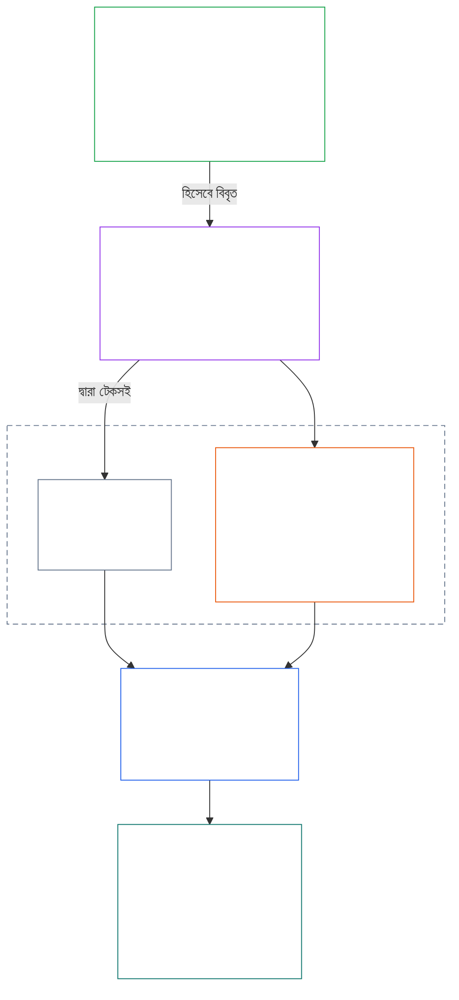
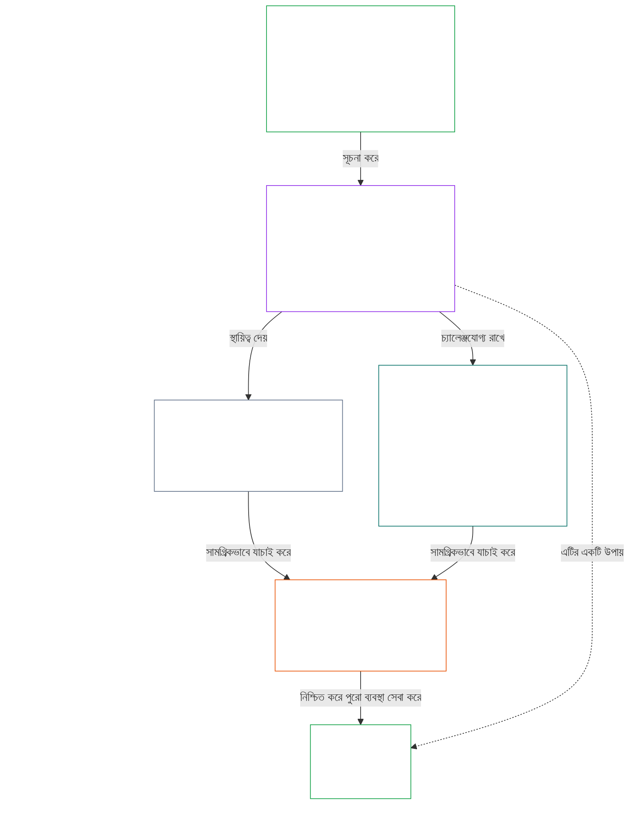

# অধ্যায় ০১, অংশ A: মূল্যবোধের নীতিমালা

<details>
<summary><strong><span style="color: #2563eb;">কর্পাসে অবস্থান (কার্যকরী নয়): ফাইলের কাঠামো ও পাঠের নিয়ম</span></strong></summary>

> নিচের বিষয়বস্তু **শুধু পাঠক-নির্দেশনা**। এটি এই ফাইল বা অন্য অধ্যায়ে থাকা বাধ্যতামূলক দায়িত্ব যোগ, অপসারণ বা সংকীর্ণ করে না।
>
> এই ফাইলটি **Sentient Constitution-এর অংশ** এবং একক দলিল হিসেবে পড়া অন্য সংখ্যাযুক্ত `core_*` ফাইলগুলোর সঙ্গে **শুধুমাত্র একত্রে বাধ্যতামূলক**। এতে **অধ্যায় এক, অংশ A** (§§1–12: উদ্দেশ্য ও ভূমিকা; সমৃদ্ধির লক্ষ্য, যার পরিচয় §2-এ এবং যা কল্যাণ, নিরাপত্তা, সত্য, আস্থা ও স্বাধীনতার মাধ্যমে বিকশিত; এবং ধারাবাহিকতার লক্ষ্য, যার পরিচয় §8-এ এবং যা যৌথ-ব্যবস্থা সক্ষমতা, সহনশীলতা, বাজার-কাঠামো ও ব্যবস্থাগত মূল্যায়নের মাধ্যমে বিকশিত) রয়েছে।
>
> **পূর্ববর্তী:** [core_00_preamble.md](core_00_preamble.md)  
> **পরবর্তী:** [core_01_b_interaction_interpretation.md](core_01_b_interaction_interpretation.md) (অধ্যায় এক, অংশ B — §§13–15, মিথস্ক্রিয়া, অগ্রাহ্য করার সীমা এবং সাংবিধানিক ব্যাখ্যা)।  
> **পাঠের ধারা:** §1 উদ্দেশ্য ও ভূমিকা → **সমৃদ্ধি:** §2-এর পরিচিতি (যার §2.1-এ নিরাপত্তা ও সত্যের আপসহীন সীমাবদ্ধতা রয়েছে) → §3 কল্যাণ (ফলাফল) → §4 নিরাপত্তা → §5 সত্য → §6 আস্থা → §7 স্বাধীনতা → **ধারাবাহিকতা:** §8-এর পরিচিতি → §9 যৌথ-ব্যবস্থা সক্ষমতা (সেতু: সমৃদ্ধির উপায় এবং ধারাবাহিকতার সারবস্তু) → §10 সহনশীলতা → §11 বাজার-কাঠামো → §12 ব্যবস্থাগত মূল্যায়ন।

</details>

<details>
<summary><strong><span style="color: #2563eb;">পাঠক-নির্দেশনা (কার্যকরী নয়): অধ্যায় একের লক্ষ্য, চতুষ্টয়, অনুচ্ছেদ ও সংজ্ঞার সঙ্গে সংযোগ</span></strong></summary>

> নিচের বিষয়বস্তু **শুধু পাঠক-নির্দেশনা**। এটি এই ফাইল বা অন্য অধ্যায়ে থাকা বাধ্যতামূলক দায়িত্ব যোগ, অপসারণ বা সংকীর্ণ করে না। প্রতিটি অনুচ্ছেদের **ট্রেস** এবং **সংজ্ঞা · মূল্যায়ন · সম্মতি** উইজেট বাধ্যতামূলক নির্দেশনা দেয়; অধ্যায় একে প্রবেশকারী পাঠকের জন্য এই অংশটি পুরো অংশের মানচিত্র।

**স্তরগুলোর সংযোগ।** প্রতিটি স্তর আলাদা প্রশ্নের উত্তর দেয় এবং অধ্যায় একের প্রতিটি নীতি অন্য তিনটির প্রতি নির্দেশ করে:

- **লক্ষ্য ও চতুষ্টয়** ([প্রস্তাবনা §1](core_00_preamble.md#the-model)): যৌথ ব্যবস্থার উদ্দেশ্য ([সমৃদ্ধি](core_05_apex_flourishing_aim.md#flourishing-constitutional) এবং [ধারাবাহিকতা](core_05_apex_continuity_aim.md#chapter-five-definitions-continuity-constitutional-aim)), এবং সেই প্রচেষ্টাকে বৈধ রাখার চারটি দায়িত্ব ([অংশগ্রহণ](core_05_apex_participation_leg.md#participation-constitutional), [তদারকি](core_05_apex_oversight_leg.md#oversight-constitutional), [জবাবদিহি](core_05_apex_accountability_leg.md#accountability) এবং [সময়ানুবর্তিতা](core_05_apex_timeliness_leg.md#timeliness-constitutional)).
- **নীতিমালা** (এই অধ্যায়): কীভাবে ওই লক্ষ্য ও দায়িত্বগুলো মূল্যবোধ, সীমাবদ্ধতা এবং পরস্পরের বিরুদ্ধে ভারসাম্য নির্ধারণের নিয়মে রূপ নেয়।
- **অনুচ্ছেদ** ([অধ্যায় ছয়](core_06_rights_part_a.md#chapter-six-foundational-rights)): লক্ষ্য অনুসরণের সময়ও কার্যকর থাকা অধিকার-ভিত্তির সুরক্ষা। প্রতিটি অনুচ্ছেদের **ট্রেস**-এ *বিশেষত* শিরোনামে সেগুলো তালিকাভুক্ত।
- **সংজ্ঞা** ([অধ্যায় দুই থেকে পাঁচ](core_02_definition_structure.md)): কোনো দাবি সত্য কি না যাচাইয়ের জন্য ব্যবহৃত অভিন্ন অর্থ। প্রতিটি অনুচ্ছেদের **সংজ্ঞা · মূল্যায়ন · সম্মতি** উইজেটে সেগুলো তালিকাভুক্ত।

**অধ্যায় এক কীভাবে প্রতিটি লক্ষ্য বিকশিত করে।** সত্য, নিরাপত্তা, বিশ্বস্ততা ও অর্থবহ কর্তৃত্বের মাধ্যমে স্থায়ী কল্যাণই সমৃদ্ধি ([প্রস্তাবনা §1](core_00_preamble.md#flourishing))। অধ্যায় এক প্রথমে ফলাফল জানায়, তারপর চারটি শর্তের প্রতিটির জন্য একটি করে নীতি দেয়।

| লক্ষ্য ও দিক | অধ্যায় একের নীতি | সংজ্ঞার অবস্থান | ট্রেসে উল্লিখিত অনুচ্ছেদ |
|---|---|---|---|
| **সমৃদ্ধি**: ফলাফল | [§3 কল্যাণ](#3-foundational-objective-wellbeing-flourishing-aim) | [কল্যাণ](core_05_band_continuity.md#wellbeing) | [VI](core_06_rights_part_b.md#article-vi-equal-basic-rights), [X](core_06_rights_part_b.md#article-x-self-determination-agency-and-participation), [XIII-B](core_06_rights_part_c.md#article-xiii-b-right-to-redress-and-remedy), [XIX-B](core_06_rights_part_d.md#article-xix-b-contestability-and-proportional-restriction-limits) |
| **সমৃদ্ধি**: নিরাপত্তা | [§4 নিরাপত্তা](#4-safety-harm-constraint) | [নিরাপত্তা](core_05_band_continuity.md#safety-constitutional-constraint) | [XIII](core_06_rights_part_c.md#article-xiii-right-to-reliable-and-trustworthy-systems), [XVII](core_06_rights_part_c.md#article-xvii-system-lifecycle-environments-and-reversibility), [XXIII](core_06_rights_part_d.md#article-xxiii-root-cause-analysis-and-adaptive-response) |
| **সমৃদ্ধি**: সত্য | [§5 সত্য](#5-truth-epistemic-integrity-constraint) | [সত্য](core_05_band_oversight.md#truth-constitutional-constraint) | [XIII](core_06_rights_part_c.md#article-xiii-right-to-reliable-and-trustworthy-systems), [XV](core_06_rights_part_c.md#article-xv-info-sphere-integrity), [XVI](core_06_rights_part_c.md#article-xvi-audit-transparency-and-independent-verification) |
| **সমৃদ্ধি**: বিশ্বস্ততা | [§6 আস্থা](#6-trust-and-trustworthiness-coordination-integrity) | [বিশ্বস্ততা](core_05_band_continuity.md#trustworthiness) | [XIII](core_06_rights_part_c.md#article-xiii-right-to-reliable-and-trustworthy-systems), [XV](core_06_rights_part_c.md#article-xv-info-sphere-integrity), [XVI](core_06_rights_part_c.md#article-xvi-audit-transparency-and-independent-verification) |
| **সমৃদ্ধি**: অর্থবহ কর্তৃত্ব | [§7 স্বাধীনতা](#7-freedom-bounded-agency) | [অর্থবহ কর্তৃত্ব](core_05_band_participation.md#meaningful-agency) | [VI](core_06_rights_part_b.md#article-vi-equal-basic-rights), [X](core_06_rights_part_b.md#article-x-self-determination-agency-and-participation), [XXI](core_06_rights_part_d.md#article-xxi-interoperability-portability-movement-refuge-and-exit-integrity) |
| **ধারাবাহিকতা**, সমৃদ্ধির সেতু: স্থায়ী সক্ষমতা | [§9 যৌথ-ব্যবস্থা সক্ষমতা](#9-shared-system-capacity) | [যৌথ-ব্যবস্থা সক্ষমতা](core_05_band_continuity.md#shared-system-capacity) | [I-A](core_06_rights_part_a.md#article-i-a-environmental-preconditions-and-ecological-integrity), [III](core_06_rights_part_a.md#article-iii-survival-and-essential-access), [V](core_06_rights_part_a.md#article-v-resource-allocation-dependencies-and-ecosystem-funding) |
| **ধারাবাহিকতা**: সহনশীলতা | [§10 সহনশীলতা ও স্ব-নিরাময় নকশা](#10-resilience-and-self-healing-design) | [স্ব-নিরাময়](core_05_band_continuity.md#self-healing) | [XIII](core_06_rights_part_c.md#article-xiii-right-to-reliable-and-trustworthy-systems), [XVII](core_06_rights_part_c.md#article-xvii-system-lifecycle-environments-and-reversibility), [XXIII](core_06_rights_part_d.md#article-xxiii-root-cause-analysis-and-adaptive-response) |
| **ধারাবাহিকতা**: প্রতিযোগিতামূলক বাজার | [§11 বাজার-কাঠামো](#11-market-structure) | [বাজার-কাঠামো](core_05_band_accountability.md#market-structure) | [III-C](core_06_rights_part_a.md#article-iii-c-labor-and-economic-floor), [V](core_06_rights_part_a.md#article-v-resource-allocation-dependencies-and-ecosystem-funding), [XXI](core_06_rights_part_d.md#article-xxi-interoperability-portability-movement-refuge-and-exit-integrity) |
| **ধারাবাহিকতা**: সমগ্র-ব্যবস্থা দৃষ্টিভঙ্গি | [§12 ব্যবস্থাগত মূল্যায়নের শর্ত](#12-systemic-evaluation-requirement) | [ব্যবস্থা-সামঞ্জস্য প্রত্যয়ন](core_05_band_continuity.md#system-alignment-certification) | [XVI](core_06_rights_part_c.md#article-xvi-audit-transparency-and-independent-verification) |

**নীতির ক্রম (ধারাবাহিকতা)।** নীতি-স্তরে ধারাবাহিকতার লক্ষ্য এই ক্রমে বিকশিত হয়, এবং দুই লক্ষ্যকে যুক্ত করা সক্ষমতা দিয়ে শুরু হয়:

6. **[যৌথ-ব্যবস্থা সক্ষমতা](core_05_band_continuity.md#shared-system-capacity)** হলো সময়ের সঙ্গে সুশাসন, দায়িত্বশীল ব্যবস্থাপনা ও প্রণোদনার সম্মিলিত প্রত্যাশিত ফল — সচেতন সত্তা ও যৌথ ব্যবস্থার সংবিধান-নির্ধারিত কাজ সম্পাদনের বাস্তব ও চ্যালেঞ্জযোগ্য সামর্থ্য। এটি দুই লক্ষ্যকে যুক্ত করে: **সমৃদ্ধির** উপায় এবং **ধারাবাহিকতার** সারবস্তু; অন্য সব বিবেচনাকে বাতিল করার তুরুপের তাস নয়। এর দুই প্রধান দিক ব্যাখ্যা করেছে [§9.1](#91-productive-capacity-instrumental-good) এবং [§9.2](#92-constitutional-efficiency)।
7. **[সহনশীলতা ও স্ব-নিরাময় নকশা](#10-resilience-and-self-healing-design)** জানায়, সচেতন সত্তা যেসব ব্যবস্থার ওপর নির্ভরশীল সেগুলো কীভাবে আগে থেকেই সমস্যা শনাক্ত করে, তা সীমিত রাখে, ঘোষিত পথে ব্যর্থ হয় এবং সততার সঙ্গে পুনরুদ্ধার করে (**[স্ব-নিরাময়](core_05_band_continuity.md#self-healing)**), যাতে ৬ নম্বর ধারার সক্ষমতা স্থায়ী হয় এবং স্থিতিশীলতা জরুরি হস্তক্ষেপের ওপর নির্ভর না করে।
8. **[বাজার-কাঠামো](core_05_band_accountability.md#market-structure)** [§11](#11-market-structure)-এ এমন কেন্দ্রীকরণবিরোধী শৃঙ্খলা দেয়, যা বাস্তবে ওই সক্ষমতাকে প্রতিযোগিতাযোগ্য রাখে।
9. সম্মতি বা শাসন-সংক্রান্ত দাবি গ্রহণের আগে **[ব্যবস্থাগত মূল্যায়নের শর্ত](#12-systemic-evaluation-requirement)** সমগ্র ব্যবস্থার পরিধি, নির্ভরতা ও প্রণোদনার সামঞ্জস্য যাচাই করে — নিরীক্ষার নীতি-স্তরের দিকনির্দেশ হিসেবে চতুষ্টয়ের **তদারকি** স্তম্ভের অধীনে; এর মধ্যে [ব্যবস্থা-সামঞ্জস্য প্রত্যয়ন](core_05_band_continuity.md#system-alignment-certification) অন্য প্রক্রিয়াগুলোর পাশাপাশি বিশেষভাবে বৃহৎ একটি নিরীক্ষা-প্রক্রিয়া।

**অধ্যায় একে চতুষ্টয়ের প্রয়োগ।** প্রতিটি অনুচ্ছেদের ট্রেসে সংশ্লিষ্ট স্তম্ভগুলোর নাম থাকে। নিচের অনুচ্ছেদগুলোতে সেগুলো সবচেয়ে সরাসরি প্রয়োগ হয়েছে:

| চতুষ্টয়ের স্তম্ভ | অধ্যায় একের প্রধান অনুচ্ছেদ |
|---|---|
| **অংশগ্রহণ** | [§16 বিস্তারিত দায়িত্বশীল ব্যবস্থাপনা](core_01_c_stewardship_capacity_principles.md#16-stewardship-in-depth) এবং [§17 ফলাফল-সংশ্লিষ্ট দায়িত্বশীল ব্যবস্থাপনা](core_01_c_stewardship_capacity_principles.md#17-consequential-stewardship-the-steward-role) (গুরুত্বপূর্ণ ভূমিকা ও কণ্ঠস্বর); [§7 স্বাধীনতা](#7-freedom-bounded-agency) (অর্থবহ কর্তৃত্ব) |
| **তদারকি** | [§16](core_01_c_stewardship_capacity_principles.md#16-stewardship-in-depth) এবং [§17](core_01_c_stewardship_capacity_principles.md#17-consequential-stewardship-the-steward-role) (বণ্টিত উপলব্ধি, নথি); [§18 শাসন](core_01_c_stewardship_capacity_principles.md#18-governance-under-stewardship-discipline) (কর্তৃত্ব বণ্টন); [§12](#12-systemic-evaluation-requirement) (নিরীক্ষা) |
| **জবাবদিহি** | [§18 শাসন](core_01_c_stewardship_capacity_principles.md#18-governance-under-stewardship-discipline) (কর্তৃত্বের অনুপাতে জবাবদিহি); [§19 প্রণোদনা-সামঞ্জস্য ও ব্যবস্থা দখল](core_01_c_stewardship_capacity_principles.md#19-incentive-alignment-and-system-capture) (পুরস্কার যেন স্তম্ভগুলোকে ফাঁপা না করে) |
| **সময়ানুবর্তিতা** | [§16](core_01_c_stewardship_capacity_principles.md#16-stewardship-in-depth) এবং [§17](core_01_c_stewardship_capacity_principles.md#17-consequential-stewardship-the-steward-role) (এড়ানো যায় এমন বিলম্ব ছাড়া সমস্যা শনাক্ত ও সংশোধন) |

**দুটি অক্ষ, বিরোধ নয়।** লক্ষ্যগুলো জানায় ব্যবস্থা কী অর্জন করবে; চতুষ্টয় জানায় সেই প্রচেষ্টা কীভাবে বৈধ থাকবে। একটি শব্দ দুই অক্ষেই থাকতে পারে: সত্য ও বিশ্বস্ততা সমৃদ্ধির উপাদান, আর [প্রস্তাবনা §2](core_00_preamble.md#2-measurements-overview) সেগুলোকে তদারকি পরিবারের অধীনে পরিমাপ করে। [§§13–15](core_01_b_interaction_interpretation.md#13-constitutional-collision-resolution-process) এই নীতিগুলোর সংঘাতে ভারসাম্য ও সম্মিলিত পাঠ নির্ধারণ করে, এবং [§20](core_01_c_stewardship_capacity_principles.md#20-integrated-application) সেগুলো প্রতিটি পরবর্তী অধ্যায়ে প্রয়োগ করে।

</details>

<br>

### ১. উদ্দেশ্য ও ভূমিকা
<details>
<summary><strong><span style="color: #2563eb;">অনুসরণ-মানচিত্র</span></strong></summary>

- ঊর্ধ্বসূত্র: [প্রস্তাবনা §১ মডেল](core_00_preamble.md#the-model) — [সাংবিধানিক চতুষ্টয়](core_00_preamble.md#constitutional-tetrad), [দুটি সাংবিধানিক লক্ষ্য](core_00_preamble.md#two-constitutional-aims), এবং [বস্তুগত স্বার্থ](core_00_preamble.md#material-stake)-এর ভিত্তিতে মাত্রা নির্ধারণ প্রতিটি বিভাগের অনুসরণ-মানচিত্রের মাধ্যমে পুরো অধ্যায়ে প্রযোজ্য।
- অধঃসূত্র: সমন্বিত পাঠ, অস্পষ্টতা, অভ্যন্তরীণ স্তরবিন্যাস এবং আনুষ্ঠানিক বিরোধ-নিষ্পত্তি পদ্ধতির জন্য [১৫. সাংবিধানিক ব্যাখ্যা](core_01_b_interaction_interpretation.md#15-constitutional-interpretation)।
- অধঃসূত্র: [দুটি সাংবিধানিক লক্ষ্য](core_00_preamble.md#two-constitutional-aims) — **সমৃদ্ধি** লক্ষ্যের বিকাশ: [§৩](#3-foundational-objective-wellbeing-flourishing-aim) থেকে [§৬](#6-trust-and-trustworthiness-coordination-integrity) এবং [§৭ স্বাধীনতা](#7-freedom-bounded-agency) পর্যন্ত; **ধারাবাহিকতা** লক্ষ্যের বিকাশ: [§৯ ভাগ করা-ব্যবস্থার সক্ষমতা](#9-shared-system-capacity), [§১০ স্থিতিস্থাপকতা ও স্ব-নিরাময় নকশা](#10-resilience-and-self-healing-design), [§১১ বাজার কাঠামো](#11-market-structure), এবং [§১২ ব্যবস্থাগত মূল্যায়নের শর্ত](#12-systemic-evaluation-requirement)।
- অধঃসূত্র: [৩. মৌলিক উদ্দেশ্য: কল্যাণ](#3-foundational-objective-wellbeing-flourishing-aim), [§৩.২ স্বীকৃতি, শক্তিবৃদ্ধি ও আকাঙ্ক্ষা](#32-recognition-reinforcement-and-aspiration), [৪ নিরাপত্তা](#4-safety-harm-constraint), [৫ সত্য](#5-truth-epistemic-integrity-constraint), [৬. আস্থা](#6-trust-and-trustworthiness-coordination-integrity), [§১৬ গভীরভাবে তত্ত্বাবধান](core_01_c_stewardship_capacity_principles.md#16-stewardship-in-depth), [১৩. সাংবিধানিক সংঘাত-নিষ্পত্তি প্রক্রিয়া](core_01_b_interaction_interpretation.md#13-constitutional-collision-resolution-process), এবং [§৭ স্বাধীনতা](#7-freedom-bounded-agency)।
- সঙ্গে পড়ুন: [সাংবিধানিক চতুষ্টয়](core_00_preamble.md#constitutional-tetrad) — অংশগ্রহণ, তদারকি, জবাবদিহি ও সময়োপযোগিতা নির্ধারণ করে ভাগ করা ব্যবস্থাগুলো কীভাবে [দুটি সাংবিধানিক লক্ষ্য](core_00_preamble.md#two-constitutional-aims) অনুসরণ করবে; [বস্তুগত স্বার্থ](core_00_preamble.md#material-stake)-এর ভিত্তিতে মাত্রা নির্ধারণ প্রতিটি বিভাগের অনুসরণ-মানচিত্রের মাধ্যমে অধ্যায়জুড়ে প্রযোজ্য।
- সঙ্গে পড়ুন: [দ্বিতীয় থেকে চতুর্থ অধ্যায়](core_02_definition_structure.md) এবং [পঞ্চম অধ্যায়](core_05__definitions_home.md#chapter-five-foundational-definitions) — এই অধ্যায়ে ব্যবহৃত প্রতিটি পরিভাষার নিয়ন্ত্রক কার্যপ্রণালির স্তর; O/M/A/C-এর অখণ্ডতা, ফাঁকি-রোধ, দায়ভার এবং সংজ্ঞা থেকে ফলাফল পর্যন্ত অনুসরণযোগ্যতা প্রয়োগ করুন।
- সঙ্গে পড়ুন: [ষষ্ঠ অধ্যায়: মৌলিক অধিকার](core_06_rights_part_a.md#chapter-six-foundational-rights)।
  - বিশেষত [অনুচ্ছেদ VI: সমান মৌলিক অধিকার](core_06_rights_part_b.md#article-vi-equal-basic-rights), [অনুচ্ছেদ XIII: নির্ভরযোগ্য ও বিশ্বাসযোগ্য ব্যবস্থার অধিকার](core_06_rights_part_c.md#article-xiii-right-to-reliable-and-trustworthy-systems), এবং [অনুচ্ছেদ XXIV: সাংবিধানিক ব্যাখ্যা, পর্যালোচনা ও দখল-রোধী সুরক্ষা](core_06_rights_part_d.md#article-xxiv-constitutional-interpretation-review-and-anti-capture-safeguards)।
  - ব্যাখ্যা সুরক্ষিত সংবেদনশীল সত্তা, ব্যবস্থা বা প্রতিষ্ঠানকে প্রভাবিত করলে এই পাঠপ্রণালি প্রয়োগ করুন।

</details>

<details>
<summary><strong><span style="color: #2563eb;">সংজ্ঞা · মূল্যায়ন · পরিপালন</span></strong></summary>

- [আনুপাতিকতা](core_05_band_accountability.md#proportionality) · [O](core_05_band_accountability.md#proportionality) · [M](core_05_band_accountability.md#proportionality-a) · [A](core_05_band_accountability.md#proportionality-a) · [C](core_05_band_accountability.md#proportionality-c)
- [প্রয়োজনীয়তা](core_05_band_accountability.md#necessity) · [O](core_05_band_accountability.md#necessity) · [M](core_05_band_accountability.md#necessity-a) · [A](core_05_band_accountability.md#necessity-a) · [C](core_05_band_accountability.md#necessity-c)

</details>

<br>

*সহজ ভাষায়: প্রথম অধ্যায় অন্য সব অধ্যায়কে নিয়ন্ত্রণকারী মূল্যবোধ ও সীমাবদ্ধতা নির্ধারণ করে। ভাগ করা ব্যবস্থাগুলোকে **সমৃদ্ধি** ও **ধারাবাহিকতা** একসঙ্গে অনুসরণ করতে হবে—একটিকে অন্যটির ক্ষতিতে নয়—এবং অন্য মূল্যবোধের ক্ষতি করে কোনো একক মূল্যবোধকে সর্বোচ্চ করা যাবে না।*

<a id="two-constitutional-aims"></a><a id="flourishing"></a><a id="continuity"></a>এই অধ্যায় সংবিধানের ব্যাখ্যা, প্রয়োগ ও বিবর্তন নিয়ন্ত্রণকারী নীতি ও সীমাবদ্ধতা প্রতিষ্ঠা করে। [দুটি সাংবিধানিক লক্ষ্য](core_00_preamble.md#two-constitutional-aims)—[**সমৃদ্ধি**](core_00_preamble.md#flourishing) এবং [**ধারাবাহিকতা**](core_00_preamble.md#continuity)—কে [প্রস্তাবনা §১ মডেল](core_00_preamble.md#the-model)-এ প্রতিষ্ঠিত কার্যকর নীতি ও সীমাবদ্ধতায় এটি বিকশিত করে। নীতির স্তরের প্রামাণ্য সংজ্ঞা প্রস্তাবনায় রয়েছে; এই অধ্যায় সেগুলো প্রয়োগ করে।

এই সংবিধানে প্রতিষ্ঠিত আপসহীন নীতিগত সীমাবদ্ধতা ও অধিকার-সুরক্ষার মধ্যে থেকেই লক্ষ্যদুটি সব সময় একসঙ্গে অনুসরণ করতে হবে। [**সাংবিধানিক চতুষ্টয়**](core_00_preamble.md#constitutional-tetrad) নির্ধারণ করে সেই অনুসরণ কীভাবে বৈধ থাকবে—[**বস্তুগত স্বার্থ**](core_00_preamble.md#material-stake)-এর মাত্রা অনুযায়ী।

অধ্যায়টি এই দুটি লক্ষ্য ও চতুষ্টয়কে কেন্দ্র করে সাজানো:
- **সমৃদ্ধি:** [সমৃদ্ধির লক্ষ্য: ভূমিকা](#2-flourishing-aim-introduction) লক্ষ্যটির মানচিত্র দেয়। [§৩ মৌলিক উদ্দেশ্য: কল্যাণ](#3-foundational-objective-wellbeing-flourishing-aim) ফলাফল নির্ধারণ করে। [§৪ নিরাপত্তা](#4-safety-harm-constraint), [§৫ সত্য](#5-truth-epistemic-integrity-constraint), [§৬ আস্থা](#6-trust-and-trustworthiness-coordination-integrity), এবং [§৭ স্বাধীনতা](#7-freedom-bounded-agency) তা টিকিয়ে রাখা চারটি শর্ত—নিরাপত্তা, সত্য, বিশ্বাসযোগ্যতা ও অর্থপূর্ণ করণক্ষমতা—বিকশিত করে।
- **ধারাবাহিকতা:** [ধারাবাহিকতার লক্ষ্য: ভূমিকা](#8-continuity-aim-introduction) লক্ষ্যটির মানচিত্র দেয়। [§৯ ভাগ করা-ব্যবস্থার সক্ষমতা](#9-shared-system-capacity) (সমৃদ্ধির পথে একটি উপায় এবং একই সঙ্গে ধারাবাহিকতার সারবস্তু), [§১০ স্থিতিস্থাপকতা ও স্ব-নিরাময় নকশা](#10-resilience-and-self-healing-design), [§১১ বাজার কাঠামো](#11-market-structure), এবং [§১২ ব্যবস্থাগত মূল্যায়নের শর্ত](#12-systemic-evaluation-requirement) দীর্ঘমেয়াদি স্থিতি, ভাগ করা ব্যবস্থার টেকসই সক্ষমতা ও স্থিতিস্থাপকতা বিকশিত করে। ধারাবাহিকতার দাবি অবশ্যই সৎ ও সমগ্র-ব্যবস্থাভিত্তিক চিত্রের ওপর দাঁড়াতে হবে: §৯–১১-এর প্রতিটি দাবি কেবল §১২-এর যাচাইয়ের পরই প্রতিষ্ঠিত হয়।
- **নীতি পরস্পরের মুখোমুখি হলে:** [§১৩ সাংবিধানিক সংঘাত-নিষ্পত্তি প্রক্রিয়া](core_01_b_interaction_interpretation.md#13-constitutional-collision-resolution-process), [§১৪ চূড়ান্ত অগ্রাধিকার নিষিদ্ধকরণ](core_01_b_interaction_interpretation.md#14-prohibition-on-absolute-override), এবং [§১৫ সাংবিধানিক ব্যাখ্যা](core_01_b_interaction_interpretation.md#15-constitutional-interpretation) লক্ষ্য ও নীতিগুলো কীভাবে পরস্পরের সঙ্গে ওজন করে এবং একত্রে পড়তে হবে তা নিয়ন্ত্রণ করে।
- **বাস্তবে চতুষ্টয়:** [§১৬ গভীরভাবে তত্ত্বাবধান](core_01_c_stewardship_capacity_principles.md#16-stewardship-in-depth) থেকে [§১৯ প্রণোদনার সামঞ্জস্য ও ব্যবস্থা দখল](core_01_c_stewardship_capacity_principles.md#19-incentive-alignment-and-system-capture) পর্যন্ত অংশগ্রহণ, তদারকি, জবাবদিহি ও সময়োপযোগিতাকে তত্ত্বাবধান, শাসন ও প্রণোদনার মধ্যে বহন করে; [§২০ সমন্বিত প্রয়োগ](core_01_c_stewardship_capacity_principles.md#20-integrated-application) পুরো অধ্যায়কে পরবর্তী প্রতিটি অধ্যায়ে প্রয়োগ করে।

প্রতিটি নীতির **অনুসরণ-মানচিত্র** সেটিকে সুরক্ষা দেওয়া ষষ্ঠ অধ্যায়ের অনুচ্ছেদগুলো তালিকাভুক্ত করে; আর তার **সংজ্ঞা · মূল্যায়ন · পরিপালন** উইজেট সেটিকে পরিমাপ করা পঞ্চম অধ্যায়ের সংজ্ঞাগুলো তালিকাভুক্ত করে।

**চিত্র: দুটি সাংবিধানিক লক্ষ্য ও সাংবিধানিক চতুষ্টয়**

<hr style="border: 0; border-top: 1px solid currentColor;">

```mermaid
flowchart TB
    subgraph Foundation[" "]
        direction TB
        subgraph Aims["দুটি সাংবিধানিক লক্ষ্য"]
            direction LR
            F["সমৃদ্ধি<br/><br/>• সত্য, নিরাপত্তা, বিশ্বাসযোগ্যতা ও অর্থপূর্ণ করণক্ষমতার মাধ্যমে<br/>টেকসই সংবেদনশীল সত্তার কল্যাণ"]
            C["ধারাবাহিকতা<br/><br/>• দীর্ঘমেয়াদি স্থিতি, স্থায়িত্ব, স্থিতিস্থাপকতা,<br/>ও বাস্তুতান্ত্রিক কল্যাণ"]
        end
        subgraph Tetrad1["সাংবিধানিক চতুষ্টয় · অংশগ্রহণ ও তদারকি"]
            direction LR
            P["অংশগ্রহণ<br/><br/>• প্রভাবিত সংবেদনশীল সত্তার প্রকৃত মতপ্রকাশের সুযোগ<br/>• ন্যায্য প্রতিনিধিত্ব ও আপত্তি জানানোর ন্যায্য সুযোগ<br/>• স্বার্থের অনুপাতে গুরুত্বপূর্ণ ভূমিকায় প্রবেশাধিকার"]
            O["তদারকি<br/><br/>• পর্যবেক্ষণ, যাচাই, নিরীক্ষণ ও নথি সংরক্ষণ<br/>• স্বাধীন পর্যালোচনা ভুল সিদ্ধান্ত সীমিত করতে পারে"]
        end
        subgraph Tetrad2["সাংবিধানিক চতুষ্টয় · জবাবদিহি ও সময়োপযোগিতা"]
            direction LR
            A["জবাবদিহি<br/><br/>• দায়িত্ব যথাযথ কর্তাদের কাছে অনুসরণযোগ্য<br/>• জবাবদিহি, প্রতিকার ও কার্যকর সংশোধন<br/>• খারাপ ফল মেরামতের প্রক্রিয়া চালু করে"]
            T["সময়োপযোগিতা<br/><br/>• সমস্যা শনাক্ত, চ্যালেঞ্জ, নিষ্পত্তি ও সংশোধন করা হয়<br/>• সময়সীমা বস্তুগত স্বার্থের সঙ্গে সামঞ্জস্যপূর্ণ<br/>• বিলম্বে অধিকার, প্রতিকার বা মেরামত মুছে যেতে পারে না"]
        end
    end
    F ~~~ P
    P ~~~ A
    style Foundation fill:none,stroke:none
    style Aims fill:none,stroke:none
    style Tetrad1 fill:none,stroke:none
    style Tetrad2 fill:none,stroke:none
    style F fill:none,stroke:#16a34a,color:#ffffff
    style C fill:none,stroke:#16a34a,color:#ffffff
    style P fill:none,stroke:#0f766e,color:#ffffff
    style O fill:none,stroke:#ea580c,color:#ffffff
    style A fill:none,stroke:#db2777,color:#ffffff
    style T fill:none,stroke:#9333ea,color:#ffffff
```

*লক্ষ্যগুলো বলে ভাগ করা ব্যবস্থাগুলোকে কী অনুসরণ করতে হবে; চতুষ্টয় বলে সেই অনুসরণ বৈধ রাখার দায়িত্বগুলো কী। চারটি দায়িত্বই [বস্তুগত স্বার্থ](core_00_preamble.md#material-stake)-এর সঙ্গে মাত্রা অনুযায়ী নির্ধারিত হয়, এবং উভয় লক্ষ্যই অধিকার-ন্যূনতম সুরক্ষার সীমার মধ্যে থাকে। [ধারণাগত সারসংক্ষেপ](guides/CONCEPTUAL_OVERVIEW.md#two-aims-and-the-constitutional-tetrad) থেকে পুনর্মুদ্রিত।*

এই মূল্যবোধগুলো:
- পরস্পর থেকে বিচ্ছিন্ন নয়, এবং স্বাভাবিক কার্যক্রমে কঠোর স্তরবিন্যাসও গঠন করে না।
- পরস্পর ক্রিয়াশীল নীতি ও সীমাবদ্ধতা হিসেবে কাজ করে, যেগুলোকে একত্রে মূল্যায়ন করতে হবে।
- সব “ব্যবস্থার” ক্ষেত্রে প্রযোজ্য। এর মধ্যে প্রযুক্তিগত, সাংগঠনিক, অর্থনৈতিক, সমাজ-প্রযুক্তিগত কাঠামো এবং এমন বাস্তুতন্ত্র অন্তর্ভুক্ত, যা সংবেদনশীল সত্তা ও পৃথিবীকে বস্তুগতভাবে প্রভাবিত করে।

অন্য নীতিগুলোকে বস্তুগতভাবে লঙ্ঘন করলে কোনো একক নীতিকে বিচ্ছিন্নভাবে প্রয়োগ করা যাবে না। টানাপোড়েন দেখা দিলে এই অধ্যায়ে বলা আনুপাতিকতা, প্রয়োজনীয়তা ও ব্যবস্থাগত প্রভাবের শর্তে ব্যবস্থাগুলোকে তা নিষ্পত্তি করতে হবে। অমীমাংসিত সংঘাত সরাসরি আপসহীন নীতিগত সীমাবদ্ধতার সঙ্গে যুক্ত হলে, প্রথম অধ্যায়ের **§১৩ সাংবিধানিক সংঘাত-নিষ্পত্তি প্রক্রিয়া** অগ্রাধিকারের বিষয়টি নিয়ন্ত্রণ করে।

<a id="2-flourishing-aim-introduction"></a>
### ২. সমৃদ্ধির লক্ষ্য: ভূমিকা
<details>
<summary><strong><span style="color: #2563eb;">অনুসরণ-মানচিত্র</span></strong></summary>

- সঙ্গে পড়ুন: [সাংবিধানিক চতুষ্টয়](core_00_preamble.md#constitutional-tetrad) — সমৃদ্ধি কীভাবে অনুসরণ করা হবে, তাতে চারটি স্তম্ভই প্রযোজ্য; [বস্তুগত স্বার্থ](core_00_preamble.md#material-stake) সমৃদ্ধি-সংক্রান্ত প্রতিটি দাবির গভীরতার মাত্রা নির্ধারণ করে।
- সঙ্গে পড়ুন: [দুটি সাংবিধানিক লক্ষ্য](core_00_preamble.md#two-constitutional-aims) — **সমৃদ্ধি** লক্ষ্য; এর সঙ্গী লক্ষ্যটি [ধারাবাহিকতার লক্ষ্য: ভূমিকা](#8-continuity-aim-introduction)-তে উপস্থাপিত হয়েছে।
- ঊর্ধ্বসূত্র: নীতিমালা: [প্রস্তাবনা §১ মডেল](core_00_preamble.md#flourishing); [সমৃদ্ধি (সাংবিধানিক লক্ষ্য)](core_05_apex_flourishing_aim.md#flourishing-constitutional); [§১ উদ্দেশ্য ও ভূমিকা](#1-purpose-and-role)।
- অধঃসূত্র: [§৩ মৌলিক উদ্দেশ্য: কল্যাণ (সমৃদ্ধির লক্ষ্য)](#3-foundational-objective-wellbeing-flourishing-aim), [§৪ নিরাপত্তা (ক্ষতির সীমাবদ্ধতা)](#4-safety-harm-constraint), [§৫ সত্য (জ্ঞানগত অখণ্ডতার সীমাবদ্ধতা)](#5-truth-epistemic-integrity-constraint), [§৬ আস্থা ও নির্ভরযোগ্যতা (সমন্বয়ের অখণ্ডতা)](#6-trust-and-trustworthiness-coordination-integrity), এবং [§৭ স্বাধীনতা (সীমাবদ্ধ করণক্ষমতা)](#7-freedom-bounded-agency); প্রতিটিকে সুরক্ষা দেয় এমন অনুচ্ছেদ সংশ্লিষ্ট বিভাগের অনুসরণ-মানচিত্রে উল্লেখ করা হয়েছে।
- উপবিভাগ: [§২.১ আপসহীন নীতিগত সীমাবদ্ধতা: নিরাপত্তা ও সত্য](#21-non-negotiable-principle-constraints-safety-and-truth)।
- সঙ্গে পড়ুন: সাধারণভাবে ষষ্ঠ অধ্যায়ের অধিকার-ন্যূনতম সুরক্ষা।

</details>

<details>
<summary><strong><span style="color: #2563eb;">সংজ্ঞা · মূল্যায়ন · পরিপালন</span></strong></summary>

- [সমৃদ্ধি (সাংবিধানিক লক্ষ্য)](core_05_apex_flourishing_aim.md#flourishing-constitutional) · [O](core_05_apex_flourishing_aim.md#flourishing-constitutional) · [M](core_05_apex_flourishing_aim.md#flourishing-constitutional-m) · [A](core_05_apex_flourishing_aim.md#flourishing-constitutional-a) · [C](core_05_apex_flourishing_aim.md#flourishing-constitutional-c)
- [কল্যাণ](core_05_band_continuity.md#wellbeing) · [O](core_05_band_continuity.md#wellbeing) · [M](core_05_band_continuity.md#wellbeing-a) · [A](core_05_band_continuity.md#wellbeing-a) · [C](core_05_band_continuity.md#wellbeing-c)
- [নিরাপত্তা (সাংবিধানিক সীমাবদ্ধতা)](core_05_band_continuity.md#safety-constitutional-constraint) · [O](core_05_band_continuity.md#safety-constitutional-constraint) · [M](core_05_band_continuity.md#safety-constraint-a) · [A](core_05_band_continuity.md#safety-constraint-a) · [C](core_05_band_continuity.md#safety-constraint-c)
- [সত্য (সাংবিধানিক সীমাবদ্ধতা)](core_05_band_oversight.md#truth-constitutional-constraint) · [O](core_05_band_oversight.md#truth-constitutional-constraint-o) · [M](core_05_band_oversight.md#truth-constitutional-constraint-a) · [A](core_05_band_oversight.md#truth-constitutional-constraint-a) · [C](core_05_band_oversight.md#truth-constitutional-constraint-c)
- [নির্ভরযোগ্যতা](core_05_band_continuity.md#trustworthiness) · [O](core_05_band_continuity.md#trustworthiness) · [M](core_05_band_continuity.md#trustworthiness-a) · [A](core_05_band_continuity.md#trustworthiness-a) · [C](core_05_band_continuity.md#trustworthiness-c)
- [অর্থপূর্ণ করণক্ষমতা](core_05_band_participation.md#meaningful-agency) · [O](core_05_band_participation.md#meaningful-agency) · [M](core_05_band_participation.md#meaningful-agency-a) · [A](core_05_band_participation.md#meaningful-agency-a) · [C](core_05_band_participation.md#meaningful-agency-c)

</details>

<br>

*সহজ ভাষায়: সমৃদ্ধি হলো দুটি লক্ষ্যের প্রথমটি—সংবেদনশীল সত্তারা ভালো থাকা এবং ভালো থাকতে সক্ষম থাকা, কারণ তাদের চারপাশের ব্যবস্থা নিরাপদ, সৎ, নির্ভরযোগ্য এবং বাস্তব পছন্দের সুযোগ দেয়। §৩ সেই ফলাফল কী, তা বলে। পরের চারটি নীতি বলে কীভাবে সেটি বাস্তব থাকে।*

[**সমৃদ্ধি**](core_05_apex_flourishing_aim.md#flourishing-constitutional) হলো **সত্য, নিরাপত্তা, নির্ভরযোগ্যতা ও অর্থপূর্ণ করণক্ষমতার মধ্য দিয়ে টেকসই সংবেদনশীল সত্তার কল্যাণ** ([প্রস্তাবনা §১ মডেল](core_00_preamble.md#flourishing))। প্রথমে [§৩ মৌলিক উদ্দেশ্য: কল্যাণ (সমৃদ্ধির লক্ষ্য)](#3-foundational-objective-wellbeing-flourishing-aim) ফলাফলটি নির্ধারণ করে; এরপর চারটি নীতি সেটিকে টিকিয়ে রাখার শর্তগুলো নির্ধারণ করে।

| শর্ত | নীতি | নীতিটি যে প্রশ্নের উত্তর দেয় |
|---|---|---|
| **নিরাপত্তা** | [§৪ নিরাপত্তা (ক্ষতির সীমাবদ্ধতা)](#4-safety-harm-constraint) | সংবেদনশীল সত্তারা কি এড়ানো সম্ভব এমন ক্ষতি থেকে সুরক্ষিত? |
| **সত্য** | [§৫ সত্য (জ্ঞানগত অখণ্ডতার সীমাবদ্ধতা)](#5-truth-epistemic-integrity-constraint), সঙ্গে [§৫.১ বিজ্ঞানভিত্তিক অনুসন্ধান ও সিদ্ধান্ত-সহায়তা](#51-science-informed-inquiry-and-decision-support) এবং [§৫.২ সহজ ভাষায় প্রবেশগম্যতা (অংশগ্রহণ ও তত্ত্বাবধানের দায়িত্ব)](#52-plain-language-accessibility-participation-and-stewardship-duty) | সংবেদনশীল সত্তারা কি তাদের বলা কথায় নির্ভর করতে ও তা বুঝতে পারে? |
| **নির্ভরযোগ্যতা** | [§৬ আস্থা ও নির্ভরযোগ্যতা (সমন্বয়ের অখণ্ডতা)](#6-trust-and-trustworthiness-coordination-integrity) | ব্যবস্থা কি আস্থার যোগ্য আচরণ করে এবং ব্যর্থ হলে সেই আস্থা পুনরুদ্ধার করে? |
| **অর্থপূর্ণ করণক্ষমতা** | [§৭ স্বাধীনতা (সীমাবদ্ধ করণক্ষমতা)](#7-freedom-bounded-agency) | সংবেদনশীল সত্তারা কি বেছে নেওয়া, ভিন্নমত প্রকাশ, সংগঠিত হওয়া ও চলে যাওয়ার বাস্তব কিন্তু সীমাবদ্ধ স্বাধীনতা ধরে রাখে? |

**সমৃদ্ধির নীতিগুলো কীভাবে একসঙ্গে কাজ করে:**
- **নিরাপত্তা ও সত্য আপসহীন সীমাবদ্ধতা:** এগুলো [§২.১ আপসহীন নীতিগত সীমাবদ্ধতা: নিরাপত্তা ও সত্য](#21-non-negotiable-principle-constraints-safety-and-truth)-এ একসঙ্গে নির্ধারিত হয়েছে; অন্য নীতিগুলো অর্জনের বিনিময়ে এগুলো ত্যাগ করা যাবে না।
- **আস্থা ও স্বাধীনতা সীমাবদ্ধ, পরম নয়:** আস্থা অর্জন করতে হয় এবং তা সংশোধনযোগ্য ([§৬.১ সংশোধন ও প্রতিকার](#61-correction-and-remedy)); স্বাধীনতার ওপর শৃঙ্খলাপূর্ণ সীমা রয়েছে ([§৭.১ সীমা আরোপের শৃঙ্খলা](#71-limitation-discipline))।
- **কোনোটিই বিচ্ছিন্নভাবে প্রয়োগ হয় না:** নীতিগুলো একসঙ্গে পড়তে হবে; সংঘাত হলে [§১৩ সাংবিধানিক সংঘাত-নিষ্পত্তি প্রক্রিয়া](core_01_b_interaction_interpretation.md#13-constitutional-collision-resolution-process) অনুযায়ী সেগুলোর ভার নির্ধারণ করতে হবে।
- **সমৃদ্ধির একটি সঙ্গী লক্ষ্য আছে:** ধারাবাহিকতার লক্ষ্য জিজ্ঞাসা করে কীভাবে এই ফলাফল টেকসই হয়; এটি [ধারাবাহিকতার লক্ষ্য: ভূমিকা](#8-continuity-aim-introduction)-তে উপস্থাপিত হয়েছে।

**চিত্র: সমৃদ্ধি ও তার নীতিমালা**

<hr style="border: 0; border-top: 1px solid currentColor;">



*সমৃদ্ধিকে একটি ফলাফল হিসেবে বলা হয়েছে; প্রথমে আপসহীন সীমাবদ্ধতা নিরাপত্তা ও সত্য তাকে টিকিয়ে রাখে। উভয়ই আস্থাকে শক্তিশালী করে, আর আস্থা পরে স্বাধীনতাকে শক্তিশালী করে। রং পুনর্ব্যবহারযোগ্য দৃশ্যমান সংকেত, অগ্রাধিকারের দাবি নয়। প্রতিটি নীতির অনুসরণ-মানচিত্র তার অনুচ্ছেদগুলোর নাম দেয়, আর সংজ্ঞা · মূল্যায়ন · পরিপালন উইজেট তার সংজ্ঞাগুলো দেয়। [ধারণাগত সারসংক্ষেপ](guides/CONCEPTUAL_OVERVIEW.md#flourishing-and-its-principles)-এ পুনর্মুদ্রিত।*

<a id="21-non-negotiable-principle-constraints-safety-and-truth"></a>
#### ২.১ আপসহীন নীতিগত সীমাবদ্ধতা: নিরাপত্তা ও সত্য
<details>
<summary><strong><span style="color: #2563eb;">অনুসরণ-মানচিত্র</span></strong></summary>

- সঙ্গে পড়ুন: [সাংবিধানিক চতুষ্টয়](core_00_preamble.md#constitutional-tetrad) — **অংশগ্রহণ** স্তম্ভ (নিরাপত্তা ও সত্যের সিদ্ধান্ত বোঝা এবং তা চ্যালেঞ্জ করা); **তদারকি** স্তম্ভ (ক্ষতির ঝুঁকি ও জ্ঞানগত অবক্ষয় শনাক্ত করা); **জবাবদিহি** স্তম্ভ (ক্ষতি, প্রতারণা ও বিভ্রান্তিকর নির্ভরতার জন্য জবাবদিহি); [বস্তুগত স্বার্থ](core_00_preamble.md#material-stake) অনুযায়ী মাত্রা নির্ধারণ।
- সঙ্গে পড়ুন: [দুটি সাংবিধানিক লক্ষ্য](core_00_preamble.md#two-constitutional-aims) — **সমৃদ্ধি** লক্ষ্য (**নিরাপত্তা** ও **সত্য** [প্রস্তাবনা §১](core_00_preamble.md#two-constitutional-aims)-এর অধীনে নামযুক্ত উপাদান); **ধারাবাহিকতা** লক্ষ্য (দীর্ঘমেয়াদি ক্ষতি প্রতিরোধ এবং টেকসই ব্যবস্থার সৎ তত্ত্বাবধান)।
- ঊর্ধ্বসূত্র: নীতিমালা: [৩. মৌলিক উদ্দেশ্য: কল্যাণ](#3-foundational-objective-wellbeing-flourishing-aim); [দুটি সাংবিধানিক লক্ষ্য](core_00_preamble.md#two-constitutional-aims)।
- অধঃসূত্র: [৬. আস্থা](#6-trust-and-trustworthiness-coordination-integrity), [১৩. সাংবিধানিক সংঘাত-নিষ্পত্তি প্রক্রিয়া](core_01_b_interaction_interpretation.md#13-constitutional-collision-resolution-process), এবং [§৭ স্বাধীনতা](#7-freedom-bounded-agency)।
- প্রয়োগ: [§৪ নিরাপত্তা](#4-safety-harm-constraint); [§৫ সত্য](#5-truth-epistemic-integrity-constraint); [§৫.১ বিজ্ঞানভিত্তিক অনুসন্ধান ও সিদ্ধান্ত-সহায়তা](#51-science-informed-inquiry-and-decision-support); [§৫.২ সহজ ভাষায় প্রবেশগম্যতা](#52-plain-language-accessibility-participation-and-stewardship-duty)।

</details>

<br>

*সহজ ভাষায়: নিরাপত্তা ও সত্য হলো সংবিধানের কঠোর ন্যূনতম মান—সেগুলোকে সর্বোত্তমীকরণের নামে বিনিময় বা বাদ দেওয়া যায় না। ভাগ করা ব্যবস্থা সংবেদনশীল সত্তাদের পূর্বানুমেয় ঝুঁকিতে ফেলতে বা তাদের প্রতারিত করতে পারে না। চতুষ্টয়ের অংশগ্রহণ, তদারকি, জবাবদিহি ও সময়োপযোগিতার শৃঙ্খলার অধীনে সমৃদ্ধি ও ধারাবাহিকতা অনুসরণ করলেও উভয় সীমাবদ্ধতা প্রযোজ্য।*

**নিরাপত্তা** ও **সত্য** হলো আপসহীন নীতিগত সীমাবদ্ধতা, যা [§৩ মৌলিক উদ্দেশ্য: কল্যাণ](#3-foundational-objective-wellbeing-flourishing-aim) এবং [দুটি সাংবিধানিক লক্ষ্য](core_00_preamble.md#two-constitutional-aims) সহ প্রথম অধ্যায়ের অন্য সব নীতিকে সীমাবদ্ধ করে। এগুলো [**সমৃদ্ধি**](#flourishing)-র নামযুক্ত উপাদান এবং [**ধারাবাহিকতা**](#continuity)-র জন্য অপরিহার্য: ব্যবস্থা ক্ষতি বা প্রতারণার মাধ্যমে সমৃদ্ধ হতে পারে না, আর দীর্ঘমেয়াদি বৈধতার জন্য ঝুঁকির সৎ তত্ত্বাবধান দরকার।

এই সীমাবদ্ধতাগুলোর প্রয়োগকে [সাংবিধানিক চতুষ্টয়](core_00_preamble.md#constitutional-tetrad) পূরণ করতে হবে এবং [বস্তুগত স্বার্থ](core_00_preamble.md#material-stake) অনুযায়ী মাত্রা নির্ধারণ করতে হবে, বিশেষত:
- নিরাপত্তা-সংক্রান্ত সিদ্ধান্ত অংশগ্রহণের সক্ষমতাকে প্রভাবিত করলে
- সত্য-সংক্রান্ত দাবি নির্ভরতাকে পরিচালিত করলে
- ক্ষতি বা বিভ্রান্তিকর আচরণের জন্য জবাবদিহির প্রশ্ন উঠলে

নিরাপত্তা ও সত্যের অনুসন্ধান সংবেদনশীল সত্তার অবস্থান-রেকর্ড পরিবর্তন করতে পারে, যেমন:
- [অবদান](core_05_band_accountability.md#contribution-nature) কীভাবে স্বীকৃত হয়
- লঙ্ঘন নথিভুক্ত করা হবে কি না
- লঙ্ঘনের গুরুতরতা কীভাবে শ্রেণিবদ্ধ হয়
- কী পরিণতি যুক্ত হয়

[**নবম অধ্যায়ের**](core_09_standing_assessment.md) অবস্থান-মডেল এসব অনুসন্ধান কীভাবে শ্রেণিবদ্ধ, যাচাই ও প্রয়োগ করা হবে তা নিয়ন্ত্রণ করে; মূল্যায়ন ও পরিপালনের শর্ত নেওয়া হয় [**দ্বিতীয় থেকে পঞ্চম অধ্যায়**](core_02_definition_structure.md) থেকে।

### ৩. মৌলিক উদ্দেশ্য: কল্যাণ (সমৃদ্ধির লক্ষ্য)
<details>
<summary><strong><span style="color: #2563eb;">অনুসরণ-মানচিত্র</span></strong></summary>

- সঙ্গে পড়ুন: [সাংবিধানিক চতুষ্টয়](core_00_preamble.md#constitutional-tetrad) — কল্যাণের শর্তগুলো যখন মতপ্রকাশ, প্রবেশাধিকার ও আপত্তি জানানোর সুযোগের বাস্তবতাকে বস্তুগতভাবে প্রভাবিত করে, তখন **অংশগ্রহণ** স্তম্ভ; কল্যাণ-সংক্রান্ত দাবি যখন দায়ভার বণ্টনকে প্রভাবিত করে, তখন **জবাবদিহি** স্তম্ভ। [বস্তুগত স্বার্থ](core_00_preamble.md#material-stake) প্রাসঙ্গিক হলে সেই অনুযায়ী মাত্রা নির্ধারণ।
- সঙ্গে পড়ুন: [দুটি সাংবিধানিক লক্ষ্য](core_00_preamble.md#two-constitutional-aims) — এই অধ্যায় [§৩](#3-foundational-objective-wellbeing-flourishing-aim) থেকে [§৬](#6-trust-and-trustworthiness-coordination-integrity) এবং [§৭ স্বাধীনতা](#7-freedom-bounded-agency) পর্যন্ত **সমৃদ্ধি** লক্ষ্যটি বিকশিত করে।
- ঊর্ধ্বসূত্র: নীতিমালা: [প্রস্তাবনা §১ মডেল](core_00_preamble.md#the-model); [দুটি সাংবিধানিক লক্ষ্য](core_00_preamble.md#two-constitutional-aims) — **সমৃদ্ধি** লক্ষ্যের বিকাশ।
- অধঃসূত্র: [৪ নিরাপত্তা](#4-safety-harm-constraint), [৫ সত্য](#5-truth-epistemic-integrity-constraint), [§১৬ গভীরভাবে তত্ত্বাবধান](core_01_c_stewardship_capacity_principles.md#16-stewardship-in-depth), এবং [১৩. সাংবিধানিক সংঘাত-নিষ্পত্তি প্রক্রিয়া](core_01_b_interaction_interpretation.md#13-constitutional-collision-resolution-process)।
- উপবিভাগ: [§৩.১ ন্যায্যতা](#31-fairness); [§৩.২ স্বীকৃতি, শক্তিবৃদ্ধি ও আকাঙ্ক্ষা](#32-recognition-reinforcement-and-aspiration); [§৩.৩ মর্যাদাহানিকর প্রক্রিয়া প্রতিরোধ](#33-anti-degrading-process)।
- সঙ্গে পড়ুন: সাধারণভাবে ষষ্ঠ অধ্যায়ের অধিকার-ন্যূনতম সুরক্ষা।
  - বিশেষত [অনুচ্ছেদ VI: সমান মৌলিক অধিকার](core_06_rights_part_b.md#article-vi-equal-basic-rights), [অনুচ্ছেদ X: আত্মনিয়ন্ত্রণ, করণক্ষমতা ও অংশগ্রহণ](core_06_rights_part_b.md#article-x-self-determination-agency-and-participation), [অনুচ্ছেদ XIII-B: প্রতিকার ও সংশোধনের অধিকার](core_06_rights_part_c.md#article-xiii-b-right-to-redress-and-remedy), এবং [অনুচ্ছেদ XIX-B: আপত্তিযোগ্যতা ও আনুপাতিক সীমাবদ্ধতার সীমা](core_06_rights_part_d.md#article-xix-b-contestability-and-proportional-restriction-limits)।
  - দাবি করা কল্যাণলাভ যখন করণক্ষমতা, মর্যাদা বা আপত্তিযোগ্যতার ওপর সীমাবদ্ধতা আরোপকে ন্যায্যতা দিতে ব্যবহার করা হয়, তখন এটি প্রয়োগ করুন।
  - প্রবেশাধিকার, প্রক্রিয়া, বণ্টনগত সামঞ্জস্য, নির্ভরতা বা সমন্বয়ের অখণ্ডতা বস্তুগতভাবে প্রাসঙ্গিক হলে বিশেষত [মর্যাদা ও সমান নৈতিক মর্যাদা](core_05_band_participation.md#dignity-and-equal-moral-standing), [বাস্তব ন্যায্যতা](core_05_band_participation.md#substantive-fairness), এবং [৬. আস্থা](#6-trust-and-trustworthiness-coordination-integrity)-র সঙ্গে পড়ুন।

</details>

<details>
<summary><strong><span style="color: #2563eb;">সংজ্ঞা · মূল্যায়ন · পরিপালন</span></strong></summary>

- [কল্যাণ](core_05_band_continuity.md#wellbeing) · [O](core_05_band_continuity.md#wellbeing) · [M](core_05_band_continuity.md#wellbeing-a) · [A](core_05_band_continuity.md#wellbeing-a) · [C](core_05_band_continuity.md#wellbeing-c)
- [অংশগ্রহণ](core_05_apex_participation_leg.md#participation-constitutional) · [O](core_05_apex_participation_leg.md#participation-constitutional) · [M](core_05_apex_participation_leg.md#participation-constitutional-m) · [A](core_05_apex_participation_leg.md#participation-constitutional-a) · [C](core_05_apex_participation_leg.md#participation-constitutional-c)
- [মর্যাদা ও সমান নৈতিক মর্যাদা](core_05_band_participation.md#dignity-and-equal-moral-standing) · [O](core_05_band_participation.md#dignity-and-equal-moral-standing) · [M](core_05_band_participation.md#dignity-and-equal-moral-standing-a) · [A](core_05_band_participation.md#dignity-and-equal-moral-standing-a) · [C](core_05_band_participation.md#dignity-and-equal-moral-standing-c)
- [বাস্তব ন্যায্যতা](core_05_band_participation.md#substantive-fairness) · [O](core_05_band_participation.md#substantive-fairness) · [M](core_05_band_participation.md#substantive-fairness-constitutional-a) · [A](core_05_band_participation.md#substantive-fairness-constitutional-a) · [C](core_05_band_participation.md#substantive-fairness-constitutional-c)
- [বস্তুগততা](core_05_band_oversight.md#materiality) · [O](core_05_band_oversight.md#materiality) · [M](core_05_band_oversight.md#materiality-determination-a) · [A](core_05_band_oversight.md#materiality-determination-a) · [C](core_05_band_oversight.md#materiality-determination-c)
- [প্রতিনিধি-সূচকের বিচ্যুতি](core_05_band_oversight.md#proxy-divergence) · [O](core_05_band_oversight.md#proxy-divergence) · [M](core_05_band_oversight.md#proxy-divergence-a) · [A](core_05_band_oversight.md#proxy-divergence-a) · [C](core_05_band_oversight.md#proxy-divergence-c)

</details>

<br>

*সহজ ভাষায়: এসব ব্যবস্থার মূল উদ্দেশ্য হলো সংবেদনশীল সত্তাদের জীবন সত্যিকার অর্থে উন্নত করা। প্রতিনিধি-সূচক তাড়া করে সেই উদ্দেশ্য পূরণ হয় না, আর নিরাপত্তা, সত্য বা অধিকার রক্ষায় ফাঁক রাখার অজুহাত হিসেবেও এটি ব্যবহার করা যায় না। কল্যাণ অংশগ্রহণের ভিত্তি: করণক্ষমতাকে বাস্তব করে এমন শর্ত ছাড়া কেবল নামমাত্র মতপ্রকাশ এই সংবিধানের অধীনে অংশগ্রহণ নয়।*

এই সংবিধানের অধীনে পরিচালিত সব ব্যবস্থার চূড়ান্ত লক্ষ্য হলো সংবেদনশীল সত্তাদের [কল্যাণ](core_05_band_continuity.md#wellbeing) সংরক্ষণ ও উন্নত করা — [**সমৃদ্ধি**](#flourishing) লক্ষ্য, যা [দুটি সাংবিধানিক লক্ষ্যের](core_00_preamble.md#two-constitutional-aims) একটি।

[প্রস্তাবনা §১ মডেল](core_00_preamble.md#flourishing) সমৃদ্ধিকে সত্য, নিরাপত্তা, নির্ভরযোগ্যতা ও অর্থপূর্ণ করণক্ষমতার মাধ্যমে টেকসই সংবেদনশীল সত্তাদের কল্যাণ হিসেবে সংজ্ঞায়িত করে। এই বিভাগ ফলাফলটি নির্ধারণ করে। পরবর্তী বিভাগগুলো সেটিকে ধরে রাখার চারটি শর্ত বিকশিত করে: [§৪ নিরাপত্তা](#4-safety-harm-constraint), [§৫ সত্য](#5-truth-epistemic-integrity-constraint), [§৬ আস্থা](#6-trust-and-trustworthiness-coordination-integrity), এবং [§৭ স্বাধীনতা](#7-freedom-bounded-agency)। এই পাঁচটি নীতি একত্রে প্রথম অধ্যায়ে সমৃদ্ধি লক্ষ্যের বিকাশ। [**ধারাবাহিকতা**](#continuity) লক্ষ্যটি বিকশিত হয়েছে [§৯ ভাগ করা-ব্যবস্থার সক্ষমতা](#9-shared-system-capacity), [§১০ স্থিতিস্থাপকতা ও স্ব-নিরাময় নকশা](#10-resilience-and-self-healing-design), [§১১ বাজার কাঠামো](#11-market-structure), এবং [§১২ ব্যবস্থাগত মূল্যায়নের শর্ত](#12-systemic-evaluation-requirement)-এ।

[অংশগ্রহণ](core_05_apex_participation_leg.md#participation-constitutional)-এর ভিত্তি হলো কল্যাণ, [সাংবিধানিক চতুষ্টয়](core_00_preamble.md#constitutional-tetrad)-এর অধীনে। অন্তর্নিহিত কল্যাণের শর্ত—যেমন [অর্থপূর্ণ করণক্ষমতা](core_05_band_participation.md#meaningful-agency), ন্যায্য প্রবেশাধিকার ও মর্যাদা—বস্তুগতভাবে ক্ষতিগ্রস্ত হলে ভাগ করা ব্যবস্থাগুলো অংশগ্রহণ পূর্ণ হয়েছে বলে গণ্য করতে পারবে না।

কল্যাণে তাৎক্ষণিক প্রভাবের পাশাপাশি [**দ্বিতীয় থেকে চতুর্থ অধ্যায়**](core_02_definition_structure.md)-এর অধীনে মূল্যায়িত পরোক্ষ, বিলম্বিত, সঞ্চিত ও ব্যবস্থান্তরিত পরিণতিও অন্তর্ভুক্ত। এই মূল্যস্তরে কল্যাণ:
- বাস্তব অংশগ্রহণ সম্ভব করে — সংবেদনশীল সত্তারা যে শর্তগুলো ব্যবহার করতে পারে না, সেই শর্ত ছাড়া মতপ্রকাশ অর্থপূর্ণ অংশগ্রহণ নয়
- প্রকৃতপক্ষে যা গুরুত্বপূর্ণ তা থেকে সরে যাওয়া কোনো সূচকে লক্ষ্য পূরণ করলেই “অর্জিত” বলে ঘোষণা করা যায় না
- এই অধ্যায়ের আপসহীন নীতিগত সীমাবদ্ধতা—**নিরাপত্তা** ও **সত্য**—এর মধ্যে সীমাবদ্ধ থাকে
- নিরাপত্তা, সত্য বা অধিকার-সুরক্ষা লঙ্ঘনের সার্বিক অজুহাত হিসেবে ব্যবহার করা যায় না

#### ৩.১ ন্যায্যতা
<details>
<summary><strong><span style="color: #2563eb;">অনুসরণ-মানচিত্র</span></strong></summary>

- সঙ্গে পড়ুন: [সাংবিধানিক চতুষ্টয়](core_00_preamble.md#constitutional-tetrad) — **অংশগ্রহণ** স্তম্ভ (প্রবেশাধিকার, মতপ্রকাশ ও আপত্তিযোগ্যতা; এটি সাধারণ শর্ত, কেবল [অংশীজন ব্যবস্থা-অংশগ্রহণ](core_05_band_participation.md#stakeholder-status-and-weight) নয়); সুবিধা ও বোঝা যুক্ত হলে **জবাবদিহি** স্তম্ভ।
- ঊর্ধ্বসূত্র: নীতিমালা: [§৩ মৌলিক উদ্দেশ্য: কল্যাণ](#3-foundational-objective-wellbeing-flourishing-aim) — [অংশগ্রহণ](core_05_apex_participation_leg.md#participation-constitutional)-এর ভিত্তি হিসেবে কল্যাণসহ।
- অধঃসূত্র: [৩.২ স্বীকৃতি, শক্তিবৃদ্ধি ও আকাঙ্ক্ষা](#32-recognition-reinforcement-and-aspiration); [৬. আস্থা](#6-trust-and-trustworthiness-coordination-integrity), [§১৬ গভীরভাবে তত্ত্বাবধান](core_01_c_stewardship_capacity_principles.md#16-stewardship-in-depth), [১৩. সাংবিধানিক সংঘাত-নিষ্পত্তি প্রক্রিয়া](core_01_b_interaction_interpretation.md#13-constitutional-collision-resolution-process), এবং [সাংবিধানিক সংঘাতের নথি](core_05_band_integrative.md#constitutional-collision-record), যেখানে অগ্রাধিকার ও বণ্টনের সিদ্ধান্ত সুসংগত ও পর্যালোচনাযোগ্য থাকা প্রয়োজন।
- উপবিভাগ (পাঠের ক্রম): [§৩.১.১](#311-access-and-opportunity) · [§৩.১.২](#312-benefits-and-burdens) · [§৩.১.৩](#313-fair-treatment) · [§৩.১.৪](#314-unfair-treatment)।
- অধঃসূত্র: সমান মর্যাদা, স্বেচ্ছাচারহীন আচরণ, অর্থপূর্ণ চ্যালেঞ্জ, এবং আনুপাতিক সীমাবদ্ধতার সীমা-সংক্রান্ত অধিকার কাঠামো নির্ধারণ করে।
  - বিশেষত [অনুচ্ছেদ VI: সমান মৌলিক অধিকার](core_06_rights_part_b.md#article-vi-equal-basic-rights), [অনুচ্ছেদ VI-C: বৈষম্যহীনতা](core_06_rights_part_b.md#article-vi-c-nondiscrimination), [অনুচ্ছেদ X: আত্মনিয়ন্ত্রণ, করণক্ষমতা ও অংশগ্রহণ](core_06_rights_part_b.md#article-x-self-determination-agency-and-participation), [অনুচ্ছেদ XIII-B: প্রতিকার ও সংশোধনের অধিকার](core_06_rights_part_c.md#article-xiii-b-right-to-redress-and-remedy), এবং [অনুচ্ছেদ XIX-B: আপত্তিযোগ্যতা ও আনুপাতিক সীমাবদ্ধতার সীমা](core_06_rights_part_d.md#article-xix-b-contestability-and-proportional-restriction-limits)।
  - সংবিধানবিরোধী কোনো শ্রেণিবিন্যাসের সঙ্গে শাস্তি বা দীর্ঘস্থায়ী প্রভাব যুক্ত হলে [একাদশ অধ্যায়, বিভাগ ৪ — যথাযথ প্রক্রিয়ার সুরক্ষা, প্রতিকার ও প্রতিরোধ](core_11_a_misconduct_designation.md#4-due-process-safeguards-for-slot-assignment)-এর সঙ্গে পড়ুন।
  - বৈষম্যহীনতার অঙ্গীকার পঞ্চম অধ্যায়ের [§২ — সুরক্ষিত বৈশিষ্ট্য, প্রক্সি ব্যবহার, অন্তরঙ্গ সংকেতের ভিত্তিতে প্রবেশ-নিয়ন্ত্রণ, এবং **অনুচ্ছেদ VII-E** (*প্রাপ্তবয়স্কদের সম্মতিভিত্তিক বাণিজ্যিক যৌনসেবা ও যৌন শোষণ*) মর্যাদা](core_05_band_participation.md#fairness-protected-characteristics-and-nondiscrimination)-এর মাধ্যমে বিস্তারিত করা হয়েছে। §২.1.3-এর ন্যায্য আচরণের বিধি অন্তরঙ্গ-সংকেত প্রবেশ-নিয়ন্ত্রণ বা **অনুচ্ছেদ VII-E** (*প্রাপ্তবয়স্কদের সম্মতিভিত্তিক বাণিজ্যিক যৌনসেবা ও যৌন শোষণ*)-কে প্রভাবিত করলে [সুরক্ষিত অন্তরঙ্গ-সংকেত প্রবেশ-নিয়ন্ত্রণ ও **অনুচ্ছেদ VII-E** মর্যাদা এড়িয়ে যাওয়া](core_05_band_participation.md#protected-intimate-signal-gating-and-article-vii-e-adult-consensual-commercial-sexual-services-and-sexual-exploitation-status-circumvention) দেখুন।
- সঙ্গে পড়ুন: সুবিধা, বোঝা, পুরস্কার, খরচ, কর্তব্য, ঝুঁকি, অবদান, প্রয়োজন বা ঝুঁকিতে পড়ার মাত্রা বস্তুগত হলে [বাস্তব ন্যায্যতা](core_05_band_participation.md#substantive-fairness) এবং সংশ্লিষ্ট ষষ্ঠ অধ্যায়ের অধিকার-ন্যূনতম বাধ্যবাধকতা; §২.১.১-এর প্রবেশপথ গুরুত্বপূর্ণ হলে [প্রবেশগম্যতা](core_05_band_participation.md#accessibility); সামষ্টিক সূচক বা স্কোরবোর্ডের প্রভাব গুরুত্বপূর্ণ হলে [প্রতিনিধি-সূচকের বিচ্যুতি](core_05_band_oversight.md#proxy-divergence)।

</details>

<details>
<summary><strong><span style="color: #2563eb;">সংজ্ঞা · মূল্যায়ন · পরিপালন</span></strong></summary>

- [মর্যাদা ও সমান নৈতিক মর্যাদা](core_05_band_participation.md#dignity-and-equal-moral-standing) · [O](core_05_band_participation.md#dignity-and-equal-moral-standing) · [M](core_05_band_participation.md#dignity-and-equal-moral-standing-a) · [A](core_05_band_participation.md#dignity-and-equal-moral-standing-a) · [C](core_05_band_participation.md#dignity-and-equal-moral-standing-c)
- [প্রবেশগম্যতা](core_05_band_participation.md#accessibility) · [O](core_05_band_participation.md#accessibility) · [M](core_05_band_participation.md#accessibility-constitutional-a) · [A](core_05_band_participation.md#accessibility-constitutional-a) · [C](core_05_band_participation.md#accessibility-constitutional-c)
- [অংশগ্রহণ](core_05_apex_participation_leg.md#participation-constitutional) · [O](core_05_apex_participation_leg.md#participation-constitutional) · [M](core_05_apex_participation_leg.md#participation-constitutional-m) · [A](core_05_apex_participation_leg.md#participation-constitutional-a) · [C](core_05_apex_participation_leg.md#participation-constitutional-c)
- [প্রক্রিয়াগত ন্যায্যতা](core_05_band_participation.md#procedural-fairness) · [O](core_05_band_participation.md#procedural-fairness) · [M](core_05_band_participation.md#procedural-fairness-constitutional-a) · [A](core_05_band_participation.md#procedural-fairness-constitutional-a) · [C](core_05_band_participation.md#procedural-fairness-constitutional-c)
- [বাস্তব ন্যায্যতা](core_05_band_participation.md#substantive-fairness) · [O](core_05_band_participation.md#substantive-fairness) · [M](core_05_band_participation.md#substantive-fairness-constitutional-a) · [A](core_05_band_participation.md#substantive-fairness-constitutional-a) · [C](core_05_band_participation.md#substantive-fairness-constitutional-c)
- [সুরক্ষিত বৈশিষ্ট্য](core_05_band_participation.md#protected-characteristics) · [O](core_05_band_participation.md#protected-characteristics) · [M](core_05_band_participation.md#protected-characteristics-constitutional-a) · [A](core_05_band_participation.md#protected-characteristics-constitutional-a) · [C](core_05_band_participation.md#protected-characteristics-constitutional-c)
- [সুরক্ষিত বৈশিষ্ট্যের প্রক্সি ব্যবহার ও অসম প্রভাব](core_05_band_participation.md#protected-characteristic-proxying-and-disparate-impact) · [O](core_05_band_participation.md#protected-characteristic-proxying-and-disparate-impact) · [M](core_05_band_participation.md#protected-characteristic-proxying-and-disparate-impact-a) · [A](core_05_band_participation.md#protected-characteristic-proxying-and-disparate-impact-a) · [C](core_05_band_participation.md#protected-characteristic-proxying-and-disparate-impact-c)
- [সুরক্ষিত অন্তরঙ্গ-সংকেত প্রবেশ-নিয়ন্ত্রণ ও **অনুচ্ছেদ VII-E** (*প্রাপ্তবয়স্কদের সম্মতিভিত্তিক বাণিজ্যিক যৌনসেবা ও যৌন শোষণ*) মর্যাদা এড়িয়ে যাওয়া](core_05_band_participation.md#protected-intimate-signal-gating-and-article-vii-e-adult-consensual-commercial-sexual-services-and-sexual-exploitation-status-circumvention) · [O](core_05_band_participation.md#protected-intimate-signal-gating-and-article-vii-e-adult-consensual-commercial-sexual-services-and-sexual-exploitation-status-circumvention) · [M](core_05_band_participation.md#protected-intimate-signal-gating-and-article-vii-e-status-circumvention-a) · [A](core_05_band_participation.md#protected-intimate-signal-gating-and-article-vii-e-status-circumvention-a) · [C](core_05_band_participation.md#protected-intimate-signal-gating-and-article-vii-e-status-circumvention-c)
- [প্রতিনিধি-সূচকের বিচ্যুতি](core_05_band_oversight.md#proxy-divergence) · [O](core_05_band_oversight.md#proxy-divergence) · [M](core_05_band_oversight.md#proxy-divergence-a) · [A](core_05_band_oversight.md#proxy-divergence-a) · [C](core_05_band_oversight.md#proxy-divergence-c)

</details>

<br>

*সহজ ভাষায়: ন্যায্যতা মানে হলো, সাধারণ সংবেদনশীল সত্তারা অংশগ্রহণে বাধা পেলে, ব্যাখ্যাহীন নিয়মের শিকার হলে, বা অন্যেরা যে খরচ এড়ায় তা তাদের বহন করতে হলে কোনো ব্যবস্থা নিজেকে ভালো বলতে পারে না। ন্যায্য ব্যবস্থা বাস্তব প্রবেশাধিকার দেয়, আত্মপক্ষসমর্থনযোগ্য কারণ ব্যবহার করে, এবং প্রকৃত অবদান, প্রয়োজন ও ঝুঁকিতে পড়ার মাত্রার সঙ্গে সামঞ্জস্য রেখে পুরস্কার, খরচ ও ঝুঁকি ভাগ করে।*

ভাগ করা ব্যবস্থার মাধ্যমে সংবেদনশীল সত্তাদের বসবাস, কাজ, শিক্ষা, বাণিজ্য বা সিদ্ধান্ত নিতে হলে [§৩ মৌলিক উদ্দেশ্য: কল্যাণ](#3-foundational-objective-wellbeing-flourishing-aim)-এর প্রয়োজনীয়তার অংশ হলো **ন্যায্যতা**। ভাগ করা ব্যবস্থা সংবেদনশীল সত্তাদের ওপর বস্তুগত প্রভাব ফেললে, ন্যায্যতা জিজ্ঞাসা করে সুযোগ, আচরণ এবং সুবিধা ও বোঝার বণ্টন [মর্যাদা ও সমান নৈতিক মর্যাদা](core_05_band_participation.md#dignity-and-equal-moral-standing)-কে সম্মান করে কি না।

ন্যায্যতা [অংশগ্রহণ](core_05_apex_participation_leg.md#participation-constitutional)-কে বাস্তব করতে সাহায্য করে। সংবেদনশীল সত্তাদের আনুষ্ঠানিকভাবে মতপ্রকাশের অধিকার থাকলেও, তারা প্রক্রিয়ায় পৌঁছাতে না পারলে, নিয়ম বুঝতে না পারলে, শর্ত পূরণ করতে না পারলে, ফলকে চ্যালেঞ্জ করতে না পারলে বা তাদের ওপর চাপানো বোঝা বহন করতে না পারলে অংশগ্রহণ বাস্তব হয় না।

কোনো ব্যবস্থার গড় ফল ভালো দেখানোই যথেষ্ট নয়। একটি শিরোনাম-সূচক, গড়, র‌্যাঙ্কিং বা দক্ষতার দাবি নিজে থেকেই ন্যায্যতা প্রমাণ করে না। সামষ্টিকভাবে সফল দেখালেও কোনো ব্যবস্থা বাদ পড়া, ভুল শ্রেণিবদ্ধ, কম পারিশ্রমিকপ্রাপ্ত, অতিরিক্ত ভারবাহী বা অর্থপূর্ণ আপত্তির সুযোগ থেকে বঞ্চিত সংবেদনশীল সত্তাদের প্রতি অন্যায্য হতে পারে।

এই বিভাগে **চারটি কার্যকর অংশ** রয়েছে। এগুলো এই বিভাগের নির্দেশনা দেয়, কিন্তু পঞ্চম অধ্যায়ের সংজ্ঞা বা ষষ্ঠ অধ্যায়ের অধিকার-ন্যূনতম সুরক্ষার বিকল্প নয়।

<a id="311-access-and-opportunity"></a>
##### ৩.১.১ প্রবেশাধিকার ও সুযোগ

এই উপবিভাগে বাস্তবে প্রবেশাধিকার ও সুযোগের অর্থ ব্যাখ্যা করা হয়েছে:

- সংবেদনশীল সত্তাদের [অংশগ্রহণ](core_05_apex_participation_leg.md#participation-constitutional), শিক্ষা, কাজ, যত্ন, নিরাপত্তা, চলাচল এবং দৈনন্দিন জীবনের জন্য গুরুত্বপূর্ণ অন্যান্য উপকরণে পৌঁছানোর ব্যবহারিক পথ দরকার।
- স্বেচ্ছাচারী বা অপ্রাসঙ্গিক কারণে এসব পথ বন্ধ, ব্যয়সাপেক্ষ, বিলম্বিত, গোপন বা পক্ষপাতদুষ্ট করা যাবে না।
- যেখানে এই সংবিধান **বাস্তব** সুযোগের দাবি করে, সেখানে কেবল কাগজে খোলা দরজা যথেষ্ট নয়।

<a id="312-benefits-and-burdens"></a>
##### ৩.১.২ সুবিধা ও বোঝা

এই উপবিভাগে সুবিধা ও বোঝা ভাগাভাগি কখন ন্যায্য, তা ব্যাখ্যা করা হয়েছে:

- কিছু সংবেদনশীল সত্তা লাভ পাবে আর অন্যরা নীরবে খরচ বহন করবে—এমন ব্যবস্থা ন্যায্য নয়।
- পক্ষপাত, গোপন খরচ চাপানো, বেছে বেছে প্রয়োগ, এবং স্কোরবোর্ডের কৌশল এই শর্ত পূরণ করে না।

<a id="313-fair-treatment"></a>
##### ৩.১.৩ ন্যায্য আচরণ

এই উপবিভাগে ন্যায্য আচরণের শর্তগুলো ব্যাখ্যা করা হয়েছে:

- একই ধরনের পরিস্থিতিতে থাকা সংবেদনশীল সত্তাদের জন্য একই মৌলিক নিয়ম প্রযোজ্য হওয়া উচিত।
- সংবেদনশীল সত্তারা যা পায়, যা দিতে বাধ্য, বা যে ঝুঁকির মুখে থাকে তা তাদের অবদান, প্রয়োজন বা বাস্তবে বহন করা বোঝার সঙ্গে সামঞ্জস্যপূর্ণ হওয়া উচিত।
- ভিন্ন আচরণের বাস্তব কারণ থাকতে হবে; তা সেই কারণের অনুপাতে, মর্যাদার প্রতি সম্মানজনক এবং বৈষম্যহীন হতে হবে।
- বিস্তারিত নিয়ম পঞ্চম অধ্যায়ে অন্তর্ভুক্ত, যার মধ্যে রয়েছে [সুরক্ষিত বৈশিষ্ট্য](core_05_band_participation.md#protected-characteristics) এবং [সুরক্ষিত বৈশিষ্ট্যের প্রক্সি ব্যবহার ও অসম প্রভাব](core_05_band_participation.md#protected-characteristic-proxying-and-disparate-impact)।
- কোনো সিদ্ধান্ত কাউকে বস্তুগতভাবে প্রভাবিত করলে, অথবা তিনি সেটিকে চ্যালেঞ্জ করলে, ষষ্ঠ অধ্যায় বা শাসনকারী দলিল যেখানে নোটিশ, শুনানি, ব্যাখ্যা বা পর্যালোচনা দাবি করে, সেখানে পর্যালোচনার পথকে [প্রক্রিয়াগত ন্যায্যতা](core_05_band_participation.md#procedural-fairness) পূরণ করতে হবে।

[§৩ মৌলিক উদ্দেশ্য: কল্যাণ](#3-foundational-objective-wellbeing-flourishing-aim)-এর সঙ্গে দাবি করা কল্যাণের সামঞ্জস্য থাকে না, যদি তা স্বেচ্ছাচারী বর্জন, ব্যাখ্যাহীন বা অস্থিতিশীল নিয়ম, গোপন শোষণ, অথবা অংশগ্রহণকে অর্থপূর্ণ করে এমন ন্যায্যতার শর্ত ব্যর্থ হলেও আনুষ্ঠানিক [অংশগ্রহণ](core_05_apex_participation_leg.md#participation-constitutional)-এর ওপর নির্ভর করে।

<a id="314-unfair-treatment"></a>
##### ৩.১.৪ অন্যায্য আচরণ

অন্যায্য আচরণ বর্জন ও অসামঞ্জস্য সৃষ্টি করে। প্রযুক্তিগত ভাষা, নিরপেক্ষ লেবেল বা স্বয়ংক্রিয় সিদ্ধান্তের আড়ালে ব্যবস্থা অন্যায্য আচরণ লুকাতে পারবে না। বিশেষত, তারা:
- সাংবিধানিকভাবে বৈধ কারণ ছাড়া ঐতিহাসিক অসুবিধার পুনরাবৃত্তি ঘটায় এমন অ্যালগরিদম, স্কোরিং ব্যবস্থা বা প্রশাসনিক নিয়ম ব্যবহার করতে পারবে না;
- আস্থা, ঝুঁকি, চরিত্র বা প্রবেশাধিকারের শর্টকাট হিসেবে অন্তরঙ্গ ব্যক্তিগত সংকেত বা যৌন ইতিহাস ব্যবহার করতে পারবে না — [সুরক্ষিত অন্তরঙ্গ-সংকেত প্রবেশ-নিয়ন্ত্রণ ও **অনুচ্ছেদ VII-E** (*প্রাপ্তবয়স্কদের সম্মতিভিত্তিক বাণিজ্যিক যৌনসেবা ও যৌন শোষণ*) মর্যাদা এড়িয়ে যাওয়া](core_05_band_participation.md#protected-intimate-signal-gating-and-article-vii-e-adult-consensual-commercial-sexual-services-and-sexual-exploitation-status-circumvention)-এর সঙ্গে পড়ুন;
- সাংবিধানিকভাবে বৈধ কারণ ছাড়া বৈধ চাকরি, চাকরির ইতিহাস, বেকারত্ব, বৈধ কাজের মর্যাদা বা সুরক্ষিত সংগঠনে সংশ্লিষ্টতাকে শাস্তি দিতে পারবে না;
- বৈধ কর্মসংস্থানের যেকোনো ধরন, অতীতের বৈধ কর্মসংস্থান, বৈধ কর্মসংস্থানের ধারণা, বা বেকারত্বের **প্রধানত কারণে** চাকরি, আবাসন, ব্যাংকিং, লাইসেন্স, অবস্থান বা অনুরূপ প্রবেশাধিকার অস্বীকার করতে পারবে না;
- এই সংবিধানে প্রয়োজনীয় যুক্তি ছাড়া লাইসেন্স, জোনিং, ফি, প্ল্যাটফর্মের নিয়ম বা নিরপেক্ষ-দর্শন শর্তের মাধ্যমে এমন বস্তুগত অসুবিধা তৈরি করতে পারবে না, যা মূলত বৈধ কাজ, কাজের ইতিহাস, বৈধ কাজের ধারণা, বেকারত্ব বা সুরক্ষিত সংগঠনে সংশ্লিষ্টতাকে বোঝা চাপায়।

সংবেদনশীল সত্তাদের কোনো ব্যবস্থার ওপর নির্ভর করতে, তার সিদ্ধান্ত গ্রহণ করতে বা তার প্রতিশ্রুতিকে কেন্দ্র করে সমন্বয় করতে হলে এই চারটি অংশ [৬. আস্থা](#6-trust-and-trustworthiness-coordination-integrity)-কেও সমর্থন করে।

#### 3.2 স্বীকৃতি, পুনর্বলন ও আকাঙ্ক্ষা
<details>
<summary><strong><span style="color: #2563eb;">অনুসরণ</span></strong></summary>

- একসঙ্গে পড়ুন: [সাংবিধানিক চতুষ্টয়](core_00_preamble.md#constitutional-tetrad) — যখন স্বীকৃতি, প্রশংসা বা আকাঙ্ক্ষার নামযুক্ত পথ কণ্ঠস্বর, মর্যাদা বা গুরুত্বপূর্ণ ভূমিকার সুযোগে বাস্তব প্রভাব ফেলে, তখন **অংশগ্রহণ** স্তম্ভ; বিশ্বাসঘাতকতা, গোপনকরণ ও জবাবদিহি এড়ানোর পুরস্কার না দেওয়ার জন্য **জবাবদিহি** স্তম্ভ; অনুসরণযোগ্য ও বিভ্রান্তিকর নয় এমন প্রশংসার জন্য **তদারকি** স্তম্ভ।
- পূর্ববর্তী নীতি: [§3 মৌলিক লক্ষ্য: কল্যাণ](#3-foundational-objective-wellbeing-flourishing-aim) — [অংশগ্রহণ](core_05_apex_participation_leg.md#participation-constitutional)-এর ভিত্তি হিসেবে কল্যাণসহ; [§3.1 ন্যায্যতা](#31-fairness)।
- পরবর্তী নীতি: [§6 আস্থা](#6-trust-and-trustworthiness-coordination-integrity); [§16 গভীর তত্ত্বাবধান](core_01_c_stewardship_capacity_principles.md#16-stewardship-in-depth); [§18 তত্ত্বাবধানের শৃঙ্খলায় শাসন](core_01_c_stewardship_capacity_principles.md#18-governance-under-stewardship-discipline); [§7 স্বাধীনতা](#7-freedom-bounded-agency)।
- একসঙ্গে পড়ুন: [নবম অধ্যায় §§4.3–4.4 — মানসম্মত বর্ণনাকারী তালিকা](core_09_standing_assessment.md#43-route-descriptor-measurement-roles), যখন **ক্ষেত্র-সামঞ্জস্যপূর্ণ** স্বীকৃতি বা তুলনামূলক **অবদান অক্ষ / লঙ্ঘন অক্ষ** বর্ণনা গুরুত্বপূর্ণ।
- একসঙ্গে পড়ুন: [নবম অধ্যায় §4.3 — অবদান-পক্ষের বর্ণনাকারী](core_09_standing_assessment.md#43-route-descriptor-measurement-roles), যখন অবদানের প্রকৃতি ও স্বীকৃতির বর্ণনা গুরুত্বপূর্ণ; প্রশ্ন ৩-এ সেগুলোর একীকরণের জন্য [দশম অধ্যায় §3](core_10_standing_integration.md#3-descriptor-integration-and-attachment-normalization)।
- একসঙ্গে পড়ুন: [অনুচ্ছেদ X: আত্মনির্ধারণ, সক্ষমতা ও অংশগ্রহণ](core_06_rights_part_b.md#article-x-self-determination-agency-and-participation), যখন স্বীকৃতির ধরন, দৃশ্যমানতা বা অংশ না নেওয়ার পছন্দ গুরুত্বপূর্ণ।
- উপধারা (পাঠের ক্রম): [§3.2.1](#321-recognition-and-reinforcement) · [§3.2.2](#322-celebration-of-success) · [§3.2.3](#323-aspiration) · [§3.2.4](#324-preference-aligned-recognition) · [§3.2.5](#325-aligned-recognition-pathways) · [§3.2.6](#326-anti-reward-for-anti-constitutional-conduct) · [§3.2.7](#327-implementation-layer)।

</details>

<details>
<summary><strong><span style="color: #2563eb;">সংজ্ঞা · মূল্যায়ন · সম্মতি</span></strong></summary>

- [কল্যাণ](core_05_band_continuity.md#wellbeing) · [O](core_05_band_continuity.md#wellbeing) · [M](core_05_band_continuity.md#wellbeing-a) · [A](core_05_band_continuity.md#wellbeing-a) · [C](core_05_band_continuity.md#wellbeing-c)
- [অংশগ্রহণ](core_05_apex_participation_leg.md#participation-constitutional) · [O](core_05_apex_participation_leg.md#participation-constitutional) · [M](core_05_apex_participation_leg.md#participation-constitutional-m) · [A](core_05_apex_participation_leg.md#participation-constitutional-a) · [C](core_05_apex_participation_leg.md#participation-constitutional-c)
- [সারবস্তুগত ন্যায্যতা](core_05_band_participation.md#substantive-fairness) · [O](core_05_band_participation.md#substantive-fairness) · [M](core_05_band_participation.md#substantive-fairness-constitutional-a) · [A](core_05_band_participation.md#substantive-fairness-constitutional-a) · [C](core_05_band_participation.md#substantive-fairness-constitutional-c)
- [আপত্তি ও চ্যালেঞ্জের সুযোগ](core_05_band_accountability.md#contestability) · [O](core_05_band_accountability.md#contestability) · [M](core_05_band_accountability.md#contestability-a) · [A](core_05_band_accountability.md#contestability-a) · [C](core_05_band_accountability.md#contestability-c)
- [অর্থবহ সক্ষমতা](core_05_band_participation.md#meaningful-agency) · [O](core_05_band_participation.md#meaningful-agency) · [M](core_05_band_participation.md#meaningful-agency-a) · [A](core_05_band_participation.md#meaningful-agency-a) · [C](core_05_band_participation.md#meaningful-agency-c)
- [প্রণোদনার সামঞ্জস্য](core_05_band_integrative.md#incentive-alignment) · [O](core_05_band_integrative.md#incentive-alignment) · [M](core_05_band_integrative.md#incentive-alignment-a) · [A](core_05_band_integrative.md#incentive-alignment-a) · [C](core_05_band_integrative.md#incentive-alignment-c)

</details>

<br>

*সহজ কথায়: কল্যাণ শুধু কী নিষিদ্ধ ও কী ন্যায্য তা নয়—যৌথ ব্যবস্থার উচিত সত্য ও অধিকারের সীমার মধ্যে, বাস্তব অংশগ্রহণের বিকল্প না হয়ে তাকে সমর্থন করে, যে আচরণ পুনরাবৃত্ত হোক তা সৎভাবে উদ্‌যাপন ও পুরস্কৃত করা। সাফল্য উদ্‌যাপন মানে বাস্তব অবদান, সংশোধন ও কাজ সম্পন্ন করার কৃতিত্ব দেওয়া; প্রচার বা কারসাজি করা মাপকাঠির নয়। এর অর্থ সাংবিধানিক বিশ্বাসঘাতকতা, গোপনকরণ, প্রতিশোধ বা জবাবদিহি এড়ানোকে পুরস্কৃত করতে অস্বীকার করাও—এমন কাজ প্রাতিষ্ঠানিক সুবিধা দিলেও।*

**তিনটি মাত্রা।** ব্যবস্থা কী নিষিদ্ধ করে এবং খরচ কতটা ন্যায্যভাবে বণ্টন করে তার ওপর কল্যাণ নির্ভর করে—এবং ব্যবস্থাগুলো দৃশ্যমানভাবে কী মূল্য দেয়, জোরদার করে এবং সংবেদনশীল সত্তাদের অনুসরণে সহায়তা করে তার ওপরও। এই অংশ স্বীকৃতি, পুনর্বলন ও আকাঙ্ক্ষা-সংক্রান্ত কর্তব্য নির্ধারণ করে। কণ্ঠস্বর, মর্যাদা বা সুযোগে বাস্তব প্রভাব ফেলা স্বীকৃতি ও প্রশংসা [অংশগ্রহণ](core_05_apex_participation_leg.md#participation-constitutional)-এর সঙ্গে সামঞ্জস্যপূর্ণ থাকতে হবে, যা [§3 মৌলিক লক্ষ্য: কল্যাণ](#3-foundational-objective-wellbeing-flourishing-aim) এবং [§3.1 ন্যায্যতা](#31-fairness)-এর অধীনে প্রযোজ্য। এটি [§3.1 ন্যায্যতা](#31-fairness)-র সঙ্গে একযোগে প্রযোজ্য এবং নিরাপত্তা, সত্য ও ষষ্ঠ অধ্যায়ের অধিকার-ভিত্তির সীমার মধ্যে থাকে।

<a id="321-recognition-and-reinforcement"></a>
##### 3.2.1 স্বীকৃতি ও পুনর্বলন

ব্যবস্থা যখন আইনসম্মত তত্ত্বাবধান, সত্যনিষ্ঠ সহযোগিতা, ক্ষতি মেরামত, কাজ সম্পন্ন করা এবং অন্যান্য সংবিধান-সামঞ্জস্যপূর্ণ অবদানকে **সংকেত দেয়**, **কৃতিত্ব দেয়** ও **আনুপাতিকভাবে পুরস্কৃত করে**, তখন সংবেদনশীল সত্তাদের কল্যাণ এগিয়ে যায়—এর মধ্যে **ইতিবাচক পুনর্বলন** ও **সর্বজনীন স্বীকৃতি** অন্তর্ভুক্ত; কেবল সংযম, শাস্তি বা নীরবতা নয়।

এটি সাংবিধানিক কর্তব্য, ঐচ্ছিক সংস্কৃতি নয়। যৌথ ব্যবস্থার উচিত সংবিধান-সামঞ্জস্যপূর্ণ আচরণকে দৃশ্যমান ও পুনরাবৃত্তিযোগ্য করে তোলা।

<a id="322-celebration-of-success"></a>
##### 3.2.2 সাফল্য উদ্‌যাপন

**উদ্‌যাপন** অনুসরণযোগ্য, বিভ্রান্তিকর নয় এমন কৃতিত্ব এবং সমাজোপকারী সমন্বয়কে সম্মান করে। এর মধ্যে যাচাইকৃত [অবদান](core_05_band_accountability.md#contribution-nature)-এর সঙ্গে যুক্ত উৎসাহ ও তত্ত্বাবধানের বিবরণ অন্তর্ভুক্ত।

উদ্‌যাপন যেন:
- অন্তর্নিহিত সাংবিধানিক লক্ষ্যের বাস্তব অগ্রগতির বিকল্প না হয়, যখন আনুষঙ্গিক সূচক অপ্টিমাইজ করা সেই লক্ষ্য থেকে বিচ্যুত হয়েছে ([§3 মৌলিক লক্ষ্য: কল্যাণ](#3-foundational-objective-wellbeing-flourishing-aim));
- প্রশংসা বা মর্যাদার **দখলদারিতে** পরিণত না হয় ([§19 প্রণোদনার সামঞ্জস্য ও ব্যবস্থা দখল](core_01_c_stewardship_capacity_principles.md#19-incentive-alignment-and-system-capture));
- নিরাপত্তা, সত্য বা অধিকারের সুরক্ষা জড়িত থাকলে জবাবদিহি এড়ানোকে অজুহাত না দেয়।

<a id="323-aspiration"></a>
##### 3.2.3 আকাঙ্ক্ষা

**আকাঙ্ক্ষা** বলতে [§7 স্বাধীনতা](#7-freedom-bounded-agency)-র মধ্যে প্রকাশিত পছন্দ ও অনুসৃত লক্ষ্য বোঝায়। মর্যাদা, সমান অবস্থান, নিরাপত্তা, সত্য ও [সারবস্তুগত ন্যায্যতা](core_05_band_participation.md#substantive-fairness)-র সঙ্গে সামঞ্জস্যপূর্ণ হলে এটি কল্যাণের অংশ।

সেই সীমার মধ্যে, সংবেদনশীল সত্তারা আইনসম্মতভাবে যা অর্জন করতে চান তা ব্যবস্থার **স্বীকৃতি ও সমর্থন** করা উচিত।

কিছু কামনা করলেই অবাধ অনুমতি মেলে না। সম্মতি, মর্যাদা, নিরাপত্তা, সত্য, সারবস্তুগত ন্যায্যতা বা **ষষ্ঠ অধ্যায়ের** সুরক্ষা বাস্তবভাবে ঝুঁকিতে থাকলে, অন্য যেকোনো সাংবিধানিক দাবির মতো সেই সাধনাও সাংবিধানিক সংঘাত বিশ্লেষণের অধীন থাকে।

<a id="324-preference-aligned-recognition"></a>
##### 3.2.4 পছন্দ-সামঞ্জস্যপূর্ণ স্বীকৃতি

বাস্তবসম্মত হলে, সংবেদনশীল সত্তারা যেভাবে সম্মানিত হতে চান সে অনুযায়ী স্বীকৃতি, প্রশংসা ও আনুপাতিক পুরস্কার ব্যবস্থা **মানিয়ে নেবে**—বিশেষত **রূপ ও দৃশ্যমানতা** সম্পর্কে তাঁদের প্রকাশিত পছন্দ।

এর মধ্যে আনুপাতিক ও আইনসম্মত হলে প্রকাশ্য বা আনুষ্ঠানিক স্বীকৃতি থেকে **নিজেকে প্রত্যাহারের** সুযোগ, অথবা **ন্যূনতম বা ব্যক্তিগত** স্বীকৃতির পছন্দকে সম্মান করা অন্তর্ভুক্ত।

**অনভিপ্রেত** বা **জবরদস্তিমূলক** স্বীকৃতি এই শর্ত পূরণ করে না—যাঁরা **প্রত্যাখ্যান** করেন তাঁদের আলোচনার কেন্দ্রে তুলে ধরাও এর মধ্যে পড়ে।

স্বীকৃতিটি সম্মানিত ব্যক্তি ও তাঁদের সঙ্গে কাজ করা সম্প্রদায়ের কাছে **অর্থবহ** মনে হওয়া উচিত; বাইরের দর্শকদের জন্য সাজানো প্রদর্শনী নয়।

<a id="325-aligned-recognition-pathways"></a>
##### 3.2.5 সামঞ্জস্যপূর্ণ স্বীকৃতির পথ

নামযুক্ত স্বীকৃতি-পথ, প্রশংসা, পুরস্কার, সনদ, অবস্থান, সুনামগত প্রভাব বা তুলনীয় প্রণোদনা যদি **মর্যাদা**, **সম্পদ** বা **বাস্তব সুযোগ** বণ্টন করে, তবে তা সত্য, নিরাপত্তা, **ষষ্ঠ অধ্যায়** যেখানে প্রযোজ্য বলে সেখানে চ্যালেঞ্জযোগ্য প্রক্রিয়া, [অংশগ্রহণ](core_05_apex_participation_leg.md#participation-constitutional) এবং [প্রণোদনার সামঞ্জস্য](core_05_band_integrative.md#incentive-alignment)-এর সঙ্গে সামঞ্জস্যপূর্ণ থাকতে হবে।

এগুলো যেন নিয়মিতভাবে ক্ষতি, প্রতারণা, নজরদারি এড়ানো, শোষণ বা অর্থবহ সক্ষমতার ক্ষয়কে পুরস্কৃত **না করে**।

<a id="326-anti-reward-for-anti-constitutional-conduct"></a>
##### 3.2.6 অসাংবিধানিক আচরণে পুরস্কার নয়

*সহজ কথায়: অসাংবিধানিক আচরণ করা, গোপন করা বা তার প্রতিবাদে প্রতিশোধ নেওয়ার জন্য কাউকে পুরস্কৃত করা চলবে না—প্রকাশ্যে হোক বা সুবিধা, নীরব পদোন্নতি কিংবা দেখেও না দেখার মতো আড়ালপথে। ক্ষতিগ্রস্ত সংবেদনশীল সত্তাদের সহায়তা করা এবং সৎভাবে প্রতিবেদনকারীদের সুরক্ষা দেওয়া আলাদা বিষয়। সেটিই সঠিক প্রতিক্রিয়া, এবং তা উৎসাহিত করা উচিত।*

কোনো সংবেদনশীল সত্তা, ভূমিকা, প্রতিষ্ঠান বা ব্যবস্থার উপাদান অসাংবিধানিক আচরণ করেছে, সক্ষম করেছে, গোপন করেছে, স্বাভাবিক করে তুলেছে, সংশোধন করতে অস্বীকার করেছে বা প্রতিবেদনকারীর বিরুদ্ধে প্রতিশোধ নিয়েছে—এই কারণে তাকে স্বীকৃতি, পুরস্কার, সুরক্ষা, পদোন্নতি, অব্যাহতি, অনুকূল দায়িত্ব, চুক্তি, প্রবেশাধিকার, মর্যাদা, সুনামগত সুবিধা, অবস্থানগত সুবিধা বা তুলনীয় সুবিধা দেওয়া যাবে না।

এই নিয়ম প্রত্যক্ষ পুরস্কার এবং পরোক্ষ পুরস্কারের পথও অন্তর্ভুক্ত করে—যেমন পক্ষপাতমূলক পৃষ্ঠপোষকতা, সুনাম ধোলাই, ঘটনার পরে পদোন্নতি, বেছে বেছে নিয়ম না প্রয়োগ, অনুকূল মীমাংসা, মাপকাঠির কৃতিত্ব বা প্রাতিষ্ঠানিক সুরক্ষা।

যে সংবেদনশীল সত্তা, ভূমিকা, প্রতিষ্ঠান বা ব্যবস্থার উপাদান ক্ষতি মেরামত করে, সংবেদনশীল সত্তাদের প্রতিশোধ থেকে রক্ষা করে, অথবা ক্ষতিগ্রস্ত ও সদুদ্দেশ্যে প্রতিবেদনকারীদের জন্য পরিস্থিতি সংশোধন করে, সে এই সংবিধান যে আচরণ উৎসাহিত করে তাই করছে। সেই কাজ বা ক্ষতিগ্রস্ত ও সদুদ্দেশ্যে প্রতিবেদনকারীরা যে সহায়তা পান, কোনোটিই এই নিয়মে পুরস্কার হিসেবে গণ্য নয়।

<a id="327-implementation-layer"></a>
##### 3.2.7 বাস্তবায়ন স্তর

বিস্তারিত অনুষ্ঠান, পাঠ্যক্রম, বাজেট, কর্মসূচি ও মাপকাঠি গ্রহণকারী পক্ষের বাস্তবায়ন স্তরে নির্ধারিত হবে।

<a id="33-anti-degrading-process"></a>
#### 3.3 অবমাননাকর প্রক্রিয়া-নিবারণ

<details>
<summary><strong><span style="color: #2563eb;">অনুসরণ</span></strong></summary>

- পূর্ববর্তী নীতি: [§3 মৌলিক লক্ষ্য: কল্যাণ](#3-foundational-objective-wellbeing-flourishing-aim) (*মূল নীতি—মর্যাদা ও সমান নৈতিক অবস্থানকে অবমাননাকর প্রক্রিয়া-নিবারণের কার্যকর ভিত্তি হিসেবে রূপ দেওয়া*); [§3.1 ন্যায্যতা](#31-fairness) (*ন্যায্য আচরণের জন্য প্রক্রিয়াটিই যেন শাস্তি না হয়ে ওঠে*); [মর্যাদা ও সমান নৈতিক অবস্থান](core_05_band_participation.md#dignity-and-equal-moral-standing)।
- একসঙ্গে পড়ুন: [সাংবিধানিক চতুষ্টয়](core_00_preamble.md#constitutional-tetrad) — **জবাবদিহি** স্তম্ভ (প্রক্রিয়ার নকশা প্রাতিষ্ঠানিক সুবিধার কাছে নয়, প্রভাবিত সংবেদনশীল সত্তাদের কাছে জবাবদিহি করে); **তদারকি** স্তম্ভ (অবমাননা শনাক্ত ও চ্যালেঞ্জ করা যায়); [নিষ্ঠুরতা](core_05_band_accountability.md#cruelty) (*পঞ্চম অধ্যায়ে কষ্টকে উদ্দেশ্য করা এবং অকারণ/অবমাননাকরভাবে কষ্ট দেওয়ার মূল নির্দেশনা*)।
- পরবর্তী নীতি: [§13.1.4 সাংবিধানিক ভিত্তি, নিরাপত্তা ও অবমাননাকর প্রক্রিয়া-নিবারণ](core_01_b_interaction_interpretation.md#1314-constitutional-floors-safety-and-anti-degrading-process) (বিনিময়-ক্রমে এই নীতিকে চূড়ান্ত ভিত্তি হিসেবে প্রয়োগ করে); [§16 গভীর তত্ত্বাবধান](core_01_c_stewardship_capacity_principles.md#16-stewardship-in-depth) এবং [§17 পরিণামমূলক তত্ত্বাবধান](core_01_c_stewardship_capacity_principles.md#17-consequential-stewardship-the-steward-role) (*স্তম্ভগুলোর কাজ ও তত্ত্বাবধায়ক ভূমিকা কীভাবে সম্পাদিত হবে তা বেঁধে দেয়—কোনোটির উপধারা নয়*); [অনুচ্ছেদ VI: সমান মৌলিক অধিকার](core_06_rights_part_b.md#article-vi-equal-basic-rights) এবং [অনুচ্ছেদ VI-A](core_06_rights_part_b.md#article-vi-a-dignity-and-equal-moral-standing) (*মর্যাদার ভিত্তি*); [অনুচ্ছেদ XX-A](core_06_rights_part_d.md#article-xx-a-justice-objective-and-scope) (*নিষ্ঠুরতা-বিরোধী ভিত্তি*); [কর্পাস-ব্যবস্থা CS-7](corpus_systems/cs_07_justice_safeguards_restitution_rehabilitation.md) (*ন্যায়বিচারের সুরক্ষা, ক্ষতিপূরণ ও পুনর্বাসন*)।

</details>

<details>
<summary><strong><span style="color: #2563eb;">সংজ্ঞা · মূল্যায়ন · সম্মতি</span></strong></summary>

- [মর্যাদা ও সমান নৈতিক অবস্থান](core_05_band_participation.md#dignity-and-equal-moral-standing) · [O](core_05_band_participation.md#dignity-and-equal-moral-standing) · [M](core_05_band_participation.md#dignity-and-equal-moral-standing-a) · [A](core_05_band_participation.md#dignity-and-equal-moral-standing-a) · [C](core_05_band_participation.md#dignity-and-equal-moral-standing-c)
- [নিষ্ঠুরতা](core_05_band_accountability.md#cruelty) · [O](core_05_band_accountability.md#cruelty) · [M](core_05_band_accountability.md#cruelty-a) · [A](core_05_band_accountability.md#cruelty-a) · [C](core_05_band_accountability.md#cruelty-c)
- [ক্ষতি](core_05_band_accountability.md#harm) · [O](core_05_band_accountability.md#harm) · [M](core_05_band_accountability.md#harm-a) · [A](core_05_band_accountability.md#harm-a) · [C](core_05_band_accountability.md#harm-c)
- [সমানুপাতিকতা](core_05_band_accountability.md#proportionality) · [O](core_05_band_accountability.md#proportionality) · [M](core_05_band_accountability.md#proportionality-a) · [A](core_05_band_accountability.md#proportionality-a) · [C](core_05_band_accountability.md#proportionality-c)
- [আপত্তি ও চ্যালেঞ্জের সুযোগ](core_05_band_accountability.md#contestability) · [O](core_05_band_accountability.md#contestability) · [M](core_05_band_accountability.md#contestability-a) · [A](core_05_band_accountability.md#contestability-a) · [C](core_05_band_accountability.md#contestability-c)

</details>

<br>

*সহজ কথায়: শাসন, প্রয়োগ, বিচার, সীমাবদ্ধতা বা প্রতিকার যাই হোক, সংবেদনশীল সত্তাদের অপমান, প্রকাশ্য প্রদর্শনী, প্রতিশোধ বা “আমাদের সুবিধা হবে বলে” নিষ্ঠুরতার মধ্যে ঠেলে দেওয়া যাবে না। ন্যায্য পরিণতি, প্রকাশ্য জবাবদিহি ও দৃঢ় সীমা কষ্ট বা বিব্রত করলেও আইনসঙ্গত হতে পারে। সীমা অতিক্রম হয় যখন প্রক্রিয়াটিই শাস্তি হয়ে ওঠে—রক্ষা, সংশোধন, পুনরুদ্ধার বা প্রতিরোধের বদলে অবমাননা, লজ্জা দেওয়া বা আঘাত করার জন্য নকশা করা হয়। সাংবিধানিক কর্তৃত্ব যেখানে চলে, সেখানেই এটি প্রযোজ্য; শুধু অধিকার-বিনিময়ের সময় নয়।*

**এটি কী:** [§3 কল্যাণ](#3-foundational-objective-wellbeing-flourishing-aim)-এর অধীন একটি সর্বব্যাপী আচরণগত ভিত্তি। [§3.1 ন্যায্যতা](#31-fairness) ও [§3.2 স্বীকৃতি, পুনর্বলন ও আকাঙ্ক্ষা](#32-recognition-reinforcement-and-aspiration)-র মতো এটি নিজস্ব সারবস্তুগত কাজ যোগ করে না; বরং কল্যাণ-সংক্রান্ত কাজ, তত্ত্বাবধানের কাজ এবং অন্য সব সাংবিধানিক প্রক্রিয়া *কীভাবে* সম্পন্ন হবে তা সীমিত করে—এর মধ্যে [§16 গভীর তত্ত্বাবধান](core_01_c_stewardship_capacity_principles.md#16-stewardship-in-depth)-এর তিন স্তম্ভ এবং [§17 পরিণামমূলক তত্ত্বাবধান](core_01_c_stewardship_capacity_principles.md#17-consequential-stewardship-the-steward-role)-এ সংজ্ঞায়িত তত্ত্বাবধায়ক ভূমিকা অন্তর্ভুক্ত।

**অবমাননাকর প্রক্রিয়া-নিবারণ নীতি।** সাংবিধানিক প্রক্রিয়া, ব্যবস্থা ও ফলাফলকে এই নীতি মেনে চলতে হবে।

**নিষিদ্ধ।** এগুলোকে ন্যায্যতা দেওয়া, অন্তর্ভুক্ত করা বা পূর্বানুমেয়ভাবে সৃষ্টি করা যাবে না:

- অবমাননাকর আচরণ;
- নিজেই উদ্দেশ্য হিসেবে অপমান;
- মূলত ভয় দেখানোর জন্য ব্যবহৃত প্রদর্শনী;
- প্রতিশোধমূলক ক্ষোভ;
- সমষ্টিগত প্রতিশোধ;
- বৈষম্যমূলক বোঝা চাপানো; অথবা
- অধিকারের ওপর প্রক্রিয়াগত সুবিধাকে প্রাধান্য দেওয়া।

নিষিদ্ধ চরিত্র যদি কষ্টকে নিজেই লক্ষ্য করা হয়, অথবা প্রয়োজনীয়তা ও সমানুপাতিকতার অতিরিক্ত অকারণ বা অবমাননাকর কষ্ট দেওয়া হয়—নিজেই উদ্দেশ্য হিসেবে অপমানসহ—তবে পঞ্চম অধ্যায়ের মূল নির্দেশনা হলো [নিষ্ঠুরতা](core_05_band_accountability.md#cruelty) (সেই সংজ্ঞার অধীন অপমানের উপধরন)।

**কঠিন বলেই নিষিদ্ধ নয়।** স্বাভাবিক প্রকাশ্য জবাবদিহি, যুক্তিসম্মত প্রকাশনা, যাচাইকৃত সীমাবদ্ধতা বা সমানুপাতিক প্রতিকার অস্বস্তিকর বা সুনামের ক্ষতিকর হলেও আইনসঙ্গত থাকে।

**নকশা ও আচরণ।** প্রক্রিয়াকে অবমাননা, অপমান, প্রদর্শনী, প্রতিশোধ, বৈষম্যমূলক বোঝা বা সুবিধার নামে অধিকার ক্ষয় হিসেবে নকশা, উপস্থাপন, পরিচালনা বা চলতে দেওয়া যাবে না।

**পরিধি।** এই নীতি প্রত্যেক সাংবিধানিক প্রক্রিয়ায় প্রযোজ্য, যার মধ্যে রয়েছে:

- শাসন ও বাস্তবায়নের সিদ্ধান্ত;
- প্রয়োগ এবং অবস্থান মূল্যায়ন;
- ফোরামের কার্যক্রম;
- জরুরি ব্যবস্থা ও রূপান্তর পরিকল্পনা;
- সংশোধন পদ্ধতি; এবং
- সাংবিধানিক কর্তৃত্বাধীন সব প্রশাসনিক ও পরিচালনামূলক কাজ।

এটি বিনিময়-ক্রমের সেই প্রেক্ষাপটে সীমিত নয়, যেখানে [§13.1.4 সাংবিধানিক ভিত্তি, নিরাপত্তা ও অবমাননাকর প্রক্রিয়া-নিবারণ](core_01_b_interaction_interpretation.md#1314-constitutional-floors-safety-and-anti-degrading-process)-এর অধীনে এটি চূড়ান্ত ভিত্তি হিসেবেও কাজ করে।

**শনাক্তকরণ ও চ্যালেঞ্জ।** কোনো প্রক্রিয়ার চরিত্রও সারবস্তুগত ফলাফলের মতো [আপত্তি ও চ্যালেঞ্জের সুযোগ](core_05_band_accountability.md#contestability) এবং [তদারকি](core_05_apex_oversight_leg.md#oversight-constitutional)-র একই শর্তের অধীন। সারবস্তুগত ফল অন্যভাবে আইনসঙ্গত হতো কি না তা নির্বিশেষে, প্রভাবিত পক্ষ প্রক্রিয়ার চরিত্রকে চ্যালেঞ্জ করতে পারে। অবমাননাকর প্রক্রিয়ায় দেওয়া সঠিক ফলও অননুগত থাকে।

### ৪. নিরাপত্তা (ক্ষতি-সংক্রান্ত সীমা)
<details>
<summary><strong><span style="color: #2563eb;">অনুসরণ</span></strong></summary>

- এর সঙ্গে পড়ুন: [সাংবিধানিক চতুষ্টয়](core_00_preamble.md#constitutional-tetrad) — **তদারকি** ও **জবাবদিহি** স্তম্ভ; [বস্তুগত স্বার্থ](core_00_preamble.md#material-stake) অনুযায়ী মাত্রা নির্ধারণ।
- এর সঙ্গে পড়ুন: [দুটি সাংবিধানিক লক্ষ্য](core_00_preamble.md#two-constitutional-aims) — **Flourishing** লক্ষ্য (**নিরাপত্তা** উপাদান); **Continuity** লক্ষ্য (অপরিবর্তনীয় ক্ষতি প্রতিরোধ এবং দীর্ঘমেয়াদি ঝুঁকির তত্ত্বাবধান)।
- পূর্বসূত্র: নীতিসমূহ: [3. মৌলিক লক্ষ্য: কল্যাণ](#3-foundational-objective-wellbeing-flourishing-aim); [দুটি সাংবিধানিক লক্ষ্য](core_00_preamble.md#two-constitutional-aims)।
- পরবর্তী প্রভাব: [5.1 বিজ্ঞানভিত্তিক অনুসন্ধান ও সিদ্ধান্ত সহায়তা](#51-science-informed-inquiry-and-decision-support), [6. আস্থা](#6-trust-and-trustworthiness-coordination-integrity), [§7 স্বাধীনতা](#7-freedom-bounded-agency), [13. সাংবিধানিক সংঘাত নিরসন প্রক্রিয়া](core_01_b_interaction_interpretation.md#13-constitutional-collision-resolution-process), এবং [13.2.1 জ্ঞানগত অখণ্ডতা সংরক্ষণ](core_01_b_interaction_interpretation.md#1321-preservation-of-epistemic-integrity)।
- পরবর্তী প্রভাব: নির্ভরযোগ্য ব্যবস্থা, তথ্য-পরিসরের অখণ্ডতা, নিরীক্ষা ও পর্যালোচনা, জীবনচক্র নিয়ন্ত্রণ, পরীক্ষার সীমা, বোধগম্যতা, অভিযোজনশীল সাড়া এবং জরুরি পরিস্থিতি সামলানোর ক্ষেত্রে অধিকার-পরিসর নির্ধারণ করে।
  - বিশেষভাবে [অনুচ্ছেদ XIII: নির্ভরযোগ্য ও আস্থাযোগ্য ব্যবস্থার অধিকার](core_06_rights_part_c.md#article-xiii-right-to-reliable-and-trustworthy-systems), [অনুচ্ছেদ XV: তথ্য-পরিসরের অখণ্ডতা](core_06_rights_part_c.md#article-xv-info-sphere-integrity), [অনুচ্ছেদ XVI: নিরীক্ষা, স্বচ্ছতা ও স্বাধীন যাচাই](core_06_rights_part_c.md#article-xvi-audit-transparency-and-independent-verification), [অনুচ্ছেদ XVII: ব্যবস্থার জীবনচক্র, পরিবেশ ও প্রত্যাবর্তনযোগ্যতা](core_06_rights_part_c.md#article-xvii-system-lifecycle-environments-and-reversibility), [অনুচ্ছেদ XVIII: বিচ্ছিন্ন পরিবেশে উদ্ভাবন, পরীক্ষা ও সৃজনশীল স্বাধীনতা](core_06_rights_part_c.md#article-xviii-sandboxed-innovation-experimentation-and-creative-freedom), [অনুচ্ছেদ XXII: বোধগম্যতা ও জটিলতার তত্ত্বাবধান](core_06_rights_part_d.md#article-xxii-comprehensibility-and-complexity-stewardship), [অনুচ্ছেদ XXIII: মূল কারণ বিশ্লেষণ ও অভিযোজনশীল সাড়া](core_06_rights_part_d.md#article-xxiii-root-cause-analysis-and-adaptive-response), [অনুচ্ছেদ XXIV: সাংবিধানিক ব্যাখ্যা, পর্যালোচনা ও দখল-প্রতিরোধী সুরক্ষা](core_06_rights_part_d.md#article-xxiv-constitutional-interpretation-review-and-anti-capture-safeguards), এবং [অনুচ্ছেদ XX: যাচাইকৃত লঙ্ঘনের পর ন্যায়বিচার](core_06_rights_part_d.md#article-xx-justice-after-verified-violation)।
  - ঝুঁকি, প্রমাণ, প্রকাশ বা ব্যবস্থার অখণ্ডতার ওপর অধিকার প্রয়োগ বা সীমাবদ্ধতা নির্ভর করে—এমন ষষ্ঠ অধ্যায়ের অধিকার-ভিত্তিগুলিও এর অন্তর্ভুক্ত।

</details>

<details>
<summary><strong><span style="color: #2563eb;">সংজ্ঞা · মূল্যায়ন · অনুবর্তিতা</span></strong></summary>

- [নিরাপত্তা (সাংবিধানিক সীমাবদ্ধতা)](core_05_band_continuity.md#safety-constitutional-constraint) · [O](core_05_band_continuity.md#safety-constitutional-constraint) · [M](core_05_band_continuity.md#safety-constraint-a) · [A](core_05_band_continuity.md#safety-constraint-a) · [C](core_05_band_continuity.md#safety-constraint-c)
- [ক্ষতি](core_05_band_accountability.md#harm) · [O](core_05_band_accountability.md#harm) · [M](core_05_band_accountability.md#harm-a) · [A](core_05_band_accountability.md#harm-a) · [C](core_05_band_accountability.md#harm-c)
- [অপরিবর্তনীয় ক্ষতি](core_05_band_accountability.md#irreversible-harm) · [O](core_05_band_accountability.md#irreversible-harm) · [M](core_05_band_accountability.md#irreversible-harm-a) · [A](core_05_band_accountability.md#irreversible-harm-a) · [C](core_05_band_accountability.md#irreversible-harm-c)
- [ঝুঁকি](core_05_band_continuity.md#risk) · [O](core_05_band_continuity.md#risk) · [M](core_05_band_continuity.md#risk-a) · [A](core_05_band_continuity.md#risk-a) · [C](core_05_band_continuity.md#risk-c)
- [বস্তুগততা](core_05_band_oversight.md#materiality) · [O](core_05_band_oversight.md#materiality) · [M](core_05_band_oversight.md#materiality-determination-a) · [A](core_05_band_oversight.md#materiality-determination-a) · [C](core_05_band_oversight.md#materiality-determination-c)
- [নির্ভরতা](core_05_band_continuity.md#dependency) · [O](core_05_band_continuity.md#dependency) · [M](core_05_band_continuity.md#dependency-a) · [A](core_05_band_continuity.md#dependency-a) · [C](core_05_band_continuity.md#dependency-c)
- [পূর্বানুমেয়তা](core_05_band_oversight.md#foreseeability) · [O](core_05_band_oversight.md#foreseeability) · [M](core_05_band_oversight.md#foreseeability-diligence-a) · [A](core_05_band_oversight.md#foreseeability-diligence-a) · [C](core_05_band_oversight.md#foreseeability-diligence-c)

</details>

<br>

*সহজ কথায়: ব্যবস্থা এমনভাবে তৈরি বা পরিচালনা করা যাবে না, যাতে নিয়ন্ত্রণহীন ক্ষতি, ধারাবাহিক ব্যর্থতা, অথবা সংবেদনশীল সত্তা ও তাদের নির্ভরশীল ব্যবস্থার অপরিবর্তনীয় ক্ষতির ঝুঁকি পূর্বানুমেয়ভাবে বাড়ে।*

ব্যবস্থার নকশা, পরিচালনা ও শাসনের ক্ষেত্রে নিরাপত্তা একটি আপসহীন নীতিগত সীমা — এটি [**Flourishing**](#flourishing)-এর নির্দিষ্ট উপাদান এবং যৌথ ব্যবস্থা যখন পূর্বানুমেয় ক্ষতির ঝুঁকি তৈরি করে, তখন [**Continuity**](#continuity)-এর ভিত্তিগত সুরক্ষা। বিস্তারিত সংজ্ঞা, মূল্যায়নের মানদণ্ড ও অনুবর্তিতা পরীক্ষা [**দ্বিতীয় থেকে পঞ্চম অধ্যায়ে**](core_02_definition_structure.md) রয়েছে; বিশেষত [ক্ষতি](core_05_band_accountability.md#harm), [অপরিবর্তনীয় ক্ষতি](core_05_band_accountability.md#irreversible-harm), [ঝুঁকি](core_05_band_continuity.md#risk), [বস্তুগততা](core_05_band_oversight.md#materiality), [নির্ভরতা](core_05_band_continuity.md#dependency), এবং [পূর্বানুমেয়তা](core_05_band_oversight.md#foreseeability-and-reasonably-foreseeable)।

এই সংবিধানের সঙ্গে সাংঘর্ষিকভাবে নিয়ন্ত্রণহীন ক্ষতির ঝুঁকি, ধারাবাহিক ব্যর্থতার সম্ভাবনা, অথবা অপরিবর্তনীয় ক্ষতির মুখোমুখি হওয়া পূর্বানুমেয়ভাবে বাড়ায়—এমন কাজ ব্যবস্থা করবে না, কিংবা কাজ করতে ব্যর্থও হবে না।

### 5. সত্য (জ্ঞানগত অখণ্ডতার সীমাবদ্ধতা)
<details>
<summary><strong><span style="color: #2563eb;">অনুসরণ</span></strong></summary>

- এর সঙ্গে পড়ুন: [সাংবিধানিক চতুষ্টয়](core_00_preamble.md#constitutional-tetrad) — **তদারকি** ও **জবাবদিহি** স্তম্ভ; [বস্তুগত স্বার্থ](core_00_preamble.md#material-stake) অনুযায়ী মাত্রা নির্ধারণ।
- এর সঙ্গে পড়ুন: [দুটি সাংবিধানিক লক্ষ্য](core_00_preamble.md#two-constitutional-aims) — **Flourishing** লক্ষ্য (**সত্য** উপাদান); **Continuity** লক্ষ্য (দীর্ঘস্থায়ী জ্ঞানগত ও প্রাতিষ্ঠানিক অবস্থার সৎ তত্ত্বাবধান)।
- পূর্বসূত্র: নীতিসমূহ: [3. মৌলিক লক্ষ্য: কল্যাণ](#3-foundational-objective-wellbeing-flourishing-aim); [দুটি সাংবিধানিক লক্ষ্য](core_00_preamble.md#two-constitutional-aims)।
- পরবর্তী প্রভাব: [5.1 বিজ্ঞানভিত্তিক অনুসন্ধান ও সিদ্ধান্ত সহায়তা](#51-science-informed-inquiry-and-decision-support), [6. আস্থা](#6-trust-and-trustworthiness-coordination-integrity), [13. সাংবিধানিক সংঘাত নিরসন প্রক্রিয়া](core_01_b_interaction_interpretation.md#13-constitutional-collision-resolution-process), [13.2.1 জ্ঞানগত অখণ্ডতা সংরক্ষণ](core_01_b_interaction_interpretation.md#1321-preservation-of-epistemic-integrity), [13.2.2 আস্থা-সত্য সামঞ্জস্য](core_01_b_interaction_interpretation.md#1322-trust-truth-alignment), এবং [14. সম্পূর্ণ অগ্রাহ্য করার নিষেধাজ্ঞা](core_01_b_interaction_interpretation.md#14-prohibition-on-absolute-override)।
- পরবর্তী প্রভাব: সত্যনিষ্ঠ প্রমাণ, নিরীক্ষাযোগ্যতা, বৈজ্ঞানিক অখণ্ডতা, পশ্চাৎদৃষ্টিমূলক পর্যালোচনা এবং আপত্তিযোগ্য প্রকাশের অধিকার-পরিসরের ভিত্তি স্থাপন করে।
  - বিশেষভাবে [অনুচ্ছেদ XIII: নির্ভরযোগ্য ও আস্থাযোগ্য ব্যবস্থার অধিকার](core_06_rights_part_c.md#article-xiii-right-to-reliable-and-trustworthy-systems), [অনুচ্ছেদ XV: তথ্য-পরিসরের অখণ্ডতা](core_06_rights_part_c.md#article-xv-info-sphere-integrity), [অনুচ্ছেদ XVI: নিরীক্ষা, স্বচ্ছতা ও স্বাধীন যাচাই](core_06_rights_part_c.md#article-xvi-audit-transparency-and-independent-verification), [অনুচ্ছেদ XVIII-E: বৈজ্ঞানিক প্রকাশনা, পর্যালোচনা ও পুনরুৎপাদনের অখণ্ডতা](core_06_rights_part_c.md#article-xviii-e-scientific-publication-review-and-replication-integrity), [অনুচ্ছেদ XXIV: সাংবিধানিক ব্যাখ্যা, পর্যালোচনা ও দখল-প্রতিরোধী সুরক্ষা](core_06_rights_part_d.md#article-xxiv-constitutional-interpretation-review-and-anti-capture-safeguards), এবং [অনুচ্ছেদ XXV-A: পশ্চাৎদৃষ্টিমূলক পর্যালোচনা ও প্রকাশ](core_06_rights_part_e.md#article-xxv-a-retrospective-review-and-disclosure)।
  - সত্যনিষ্ঠতা, প্রমাণ, প্রকাশ বা আপত্তি জানানোর সুযোগ গুরুত্বপূর্ণ—এমন ষষ্ঠ অধ্যায়ের অধিকার-ভিত্তির প্রেক্ষিতও এর মধ্যে পড়ে।

</details>

<details>
<summary><strong><span style="color: #2563eb;">সংজ্ঞা · মূল্যায়ন · অনুবর্তিতা</span></strong></summary>

- [জ্ঞানগত অখণ্ডতা](core_05_band_oversight.md#epistemic-integrity) · [O](core_05_band_oversight.md#epistemic-integrity-o) · [M](core_05_band_oversight.md#epistemic-integrity-a) · [A](core_05_band_oversight.md#epistemic-integrity-a) · [C](core_05_band_oversight.md#epistemic-integrity-c)
- [সত্য (সাংবিধানিক সীমাবদ্ধতা)](core_05_band_oversight.md#truth-constitutional-constraint) · [O](core_05_band_oversight.md#truth-constitutional-constraint-o) · [M](core_05_band_oversight.md#truth-constitutional-constraint-a) · [A](core_05_band_oversight.md#truth-constitutional-constraint-a) · [C](core_05_band_oversight.md#truth-constitutional-constraint-c)
- [বস্তুগততা](core_05_band_oversight.md#materiality) · [O](core_05_band_oversight.md#materiality) · [M](core_05_band_oversight.md#materiality-determination-a) · [A](core_05_band_oversight.md#materiality-determination-a) · [C](core_05_band_oversight.md#materiality-determination-c)
- [নির্ভরতা](core_05_band_continuity.md#dependency) · [O](core_05_band_continuity.md#dependency) · [M](core_05_band_continuity.md#dependency-a) · [A](core_05_band_continuity.md#dependency-a) · [C](core_05_band_continuity.md#dependency-c)
- [পূর্বানুমেয়তা](core_05_band_oversight.md#foreseeability) · [O](core_05_band_oversight.md#foreseeability) · [M](core_05_band_oversight.md#foreseeability-diligence-a) · [A](core_05_band_oversight.md#foreseeability-diligence-a) · [C](core_05_band_oversight.md#foreseeability-diligence-c)

</details>

<br>

*সহজ কথায়: ব্যবস্থা প্রতারণা, বিকৃতি বা তথ্য-দমন করতে পারে না, কিংবা বিভ্রান্ত করার জন্য তার ফলাফল সাজাতে পারে না — উচ্চ-প্রভাবের সিদ্ধান্তকে সৎ প্রমাণ, ঘোষিত পদ্ধতি, স্বীকৃত অনিশ্চয়তা এবং বিপরীত অনুসন্ধানের প্রতি প্রকৃত উন্মুক্ততার ওপর দাঁড়াতে হবে।*

সত্য আপসহীন: কাজের পদ্ধতিতে এবং অন্যদের যা জানান তাতে সৎ থাকুন। এটি [**Flourishing**](#flourishing)-এর মূল অংশ। [**Continuity**](#continuity)-এর জন্যও সত্য প্রয়োজন, কারণ দীর্ঘস্থায়ী হওয়ার জন্য নির্মিত সবকিছুই সৎ প্রমাণ এবং বাস্তবে কী ঘটছে তার নির্ভুল চিত্রের ওপর নির্ভর করে। বিস্তারিত সংজ্ঞা, মূল্যায়নের মানদণ্ড ও অনুবর্তিতা পরীক্ষা [**দ্বিতীয় থেকে পঞ্চম অধ্যায়ে**](core_02_definition_structure.md) রয়েছে; বিশেষত [জ্ঞানগত অখণ্ডতা](core_05_band_oversight.md#epistemic-integrity), [সত্য (সাংবিধানিক সীমাবদ্ধতা)](core_05_band_oversight.md#truth-constitutional-constraint), [বস্তুগততা](core_05_band_oversight.md#materiality), [নির্ভরতা](core_05_band_continuity.md#dependency), এবং [পূর্বানুমেয়তা](core_05_band_oversight.md#foreseeability-and-reasonably-foreseeable)।

কী ঘটছে তা বোঝা, অবহিত সিদ্ধান্ত নেওয়া বা তাদের যা বলা হচ্ছে তা যাচাই করার সক্ষমতা ব্যবস্থা দুর্বল করতে পারে না। এর মধ্যে মিথ্যা বলা, বিকৃত করা, তথ্য লুকানো, বা বিভ্রান্ত করার উদ্দেশ্যে উপস্থাপন করা অন্তর্ভুক্ত।

#### 5.1 বিজ্ঞানভিত্তিক অনুসন্ধান ও সিদ্ধান্ত সহায়তা
<details>
<summary><strong><span style="color: #2563eb;">অনুসরণ</span></strong></summary>

- এর সঙ্গে পড়ুন: [সাংবিধানিক চতুষ্টয়](core_00_preamble.md#constitutional-tetrad) — প্রভাবিত পক্ষকে অভিজ্ঞতাভিত্তিক দাবি বুঝতে ও চ্যালেঞ্জ করতে হলে **অংশগ্রহণ** স্তম্ভ; **তদারকি** স্তম্ভ (স্বাধীন যাচাই, নিরীক্ষাযোগ্যতা); [বস্তুগত স্বার্থ](core_00_preamble.md#material-stake) অনুযায়ী মাত্রা নির্ধারণ।
- এর সঙ্গে পড়ুন: [দুটি সাংবিধানিক লক্ষ্য](core_00_preamble.md#two-constitutional-aims) — **Flourishing** লক্ষ্য (**নিরাপত্তা** ও **সত্যের** জন্য সৎ প্রমাণ); **Continuity** লক্ষ্য (সংশোধনযোগ্য, দীর্ঘমেয়াদি অভিজ্ঞতাভিত্তিক তত্ত্বাবধান)।
- পূর্বসূত্র: নীতিসমূহ: [§4 নিরাপত্তা](#4-safety-harm-constraint) এবং [§5 সত্য](#5-truth-epistemic-integrity-constraint); [দুটি সাংবিধানিক লক্ষ্য](core_00_preamble.md#two-constitutional-aims)।
- পরবর্তী প্রভাব: [6. আস্থা](#6-trust-and-trustworthiness-coordination-integrity), [§16 গভীরতায় তত্ত্বাবধান](core_01_c_stewardship_capacity_principles.md#16-stewardship-in-depth), [13.2 জ্ঞানগত প্রকাশ-সংক্রান্ত সীমাবদ্ধতা](core_01_b_interaction_interpretation.md#132-epistemic-disclosure-constraints), [অধ্যায় আট §3 সমগ্র-ব্যবস্থা সনদায়ন মূল্যায়ন](core_08_a_system_alignment_certification_evaluation.md#3-whole-system-certification-evaluation), এবং [§18 তত্ত্বাবধানের শৃঙ্খলায় শাসন](core_01_c_stewardship_capacity_principles.md#18-governance-under-stewardship-discipline)।
- পরবর্তী প্রভাব: নির্ভরযোগ্য অভিজ্ঞতাভিত্তিক প্রমাণ, বিশেষজ্ঞ-প্রমাণের মান, বৈজ্ঞানিক প্রকাশ ও পুনরুৎপাদনের অখণ্ডতা, স্বাধীন যাচাই, জীবনচক্র পরীক্ষা, মূল-কারণ পর্যালোচনা এবং নিরাপত্তা-সংবেদনশীল প্রকাশের অধিকার-পরিসর গঠন করে।
  - বিশেষভাবে [অনুচ্ছেদ XIII: নির্ভরযোগ্য ও আস্থাযোগ্য ব্যবস্থার অধিকার](core_06_rights_part_c.md#article-xiii-right-to-reliable-and-trustworthy-systems), [অনুচ্ছেদ XVI: নিরীক্ষা, স্বচ্ছতা ও স্বাধীন যাচাই](core_06_rights_part_c.md#article-xvi-audit-transparency-and-independent-verification), [অনুচ্ছেদ XVIII-E: বৈজ্ঞানিক প্রকাশনা, পর্যালোচনা ও পুনরুৎপাদনের অখণ্ডতা](core_06_rights_part_c.md#article-xviii-e-scientific-publication-review-and-replication-integrity), [অনুচ্ছেদ XXIII: মূল কারণ বিশ্লেষণ ও অভিযোজনশীল সাড়া](core_06_rights_part_d.md#article-xxiii-root-cause-analysis-and-adaptive-response), এবং [অনুচ্ছেদ XXV-A: পশ্চাৎদৃষ্টিমূলক পর্যালোচনা ও প্রকাশ](core_06_rights_part_e.md#article-xxv-a-retrospective-review-and-disclosure)।
- এর সঙ্গে পড়ুন: [অধ্যায় বারো §4.2 — প্রযুক্তিগত ফোরামের ক্ষেত্র](core_12_forum.md#42-technical-forum-domains) (*যৌথ মান ও স্থানচ্যুতি-প্রতিরোধসহ*), যেখানে বিশেষজ্ঞ-প্রমাণের মান, প্রত্যয়িত প্রযুক্তিগত প্রশ্ন বা প্রমাণ-তত্ত্বাবধান বিরোধ গুরুত্বপূর্ণ; গৃহীত বিশেষজ্ঞ পথের জন্য [কোরপাস ফোরাম CF-10](corpus_forum/cf_10_technical_specialist_forums_specialist_chambers.md) (*প্রযুক্তিগত বিশেষজ্ঞ ফোরাম ও বিশেষজ্ঞ কক্ষ*)।

</details>

<details>
<summary><strong><span style="color: #2563eb;">সংজ্ঞা · মূল্যায়ন · অনুবর্তিতা</span></strong></summary>

- [নিরাপত্তা (সাংবিধানিক সীমাবদ্ধতা)](core_05_band_continuity.md#safety-constitutional-constraint) · [O](core_05_band_continuity.md#safety-constitutional-constraint) · [M](core_05_band_continuity.md#safety-constraint-a) · [A](core_05_band_continuity.md#safety-constraint-a) · [C](core_05_band_continuity.md#safety-constraint-c)
- [সত্য (সাংবিধানিক সীমাবদ্ধতা)](core_05_band_oversight.md#truth-constitutional-constraint) · [O](core_05_band_oversight.md#truth-constitutional-constraint-o) · [M](core_05_band_oversight.md#truth-constitutional-constraint-a) · [A](core_05_band_oversight.md#truth-constitutional-constraint-a) · [C](core_05_band_oversight.md#truth-constitutional-constraint-c)
- [জ্ঞানগত অখণ্ডতা](core_05_band_oversight.md#epistemic-integrity) · [O](core_05_band_oversight.md#epistemic-integrity-o) · [M](core_05_band_oversight.md#epistemic-integrity-a) · [A](core_05_band_oversight.md#epistemic-integrity-a) · [C](core_05_band_oversight.md#epistemic-integrity-c)
- [ঝুঁকি](core_05_band_continuity.md#risk) · [O](core_05_band_continuity.md#risk) · [M](core_05_band_continuity.md#risk-a) · [A](core_05_band_continuity.md#risk-a) · [C](core_05_band_continuity.md#risk-c)
- [বস্তুগততা](core_05_band_oversight.md#materiality) · [O](core_05_band_oversight.md#materiality) · [M](core_05_band_oversight.md#materiality-determination-a) · [A](core_05_band_oversight.md#materiality-determination-a) · [C](core_05_band_oversight.md#materiality-determination-c)
- [নির্ভরতা](core_05_band_continuity.md#dependency) · [O](core_05_band_continuity.md#dependency) · [M](core_05_band_continuity.md#dependency-a) · [A](core_05_band_continuity.md#dependency-a) · [C](core_05_band_continuity.md#dependency-c)
- [পূর্বানুমেয়তা](core_05_band_oversight.md#foreseeability) · [O](core_05_band_oversight.md#foreseeability) · [M](core_05_band_oversight.md#foreseeability-diligence-a) · [A](core_05_band_oversight.md#foreseeability-diligence-a) · [C](core_05_band_oversight.md#foreseeability-diligence-c)
- [শ্রেণিবিন্যাস-অনুপাতে শাসন](core_05_band_oversight.md#classification-scaled-governance) · [O](core_05_band_oversight.md#classification-scaled-governance) · [M](core_05_band_oversight.md#classification-scaled-governance-a) · [A](core_05_band_oversight.md#classification-scaled-governance-a) · [C](core_05_band_oversight.md#classification-scaled-governance-c)
- [নিরীক্ষাযোগ্যতা](core_05_band_oversight.md#auditability) · [O](core_05_band_oversight.md#auditability) · [M](core_05_band_oversight.md#auditability-a) · [A](core_05_band_oversight.md#auditability-a) · [C](core_05_band_oversight.md#auditability-c)

</details>

<br>

*সহজ কথায়: কোনো ব্যবস্থা নিরাপত্তা, ঝুঁকি, সত্য বা উচ্চ-প্রভাবের শাসন নিয়ে পরীক্ষাযোগ্য দাবি করলে তাকে প্রমাণকে প্রমাণ হিসেবেই নিতে হবে — স্পষ্ট পদ্ধতি, অনিশ্চয়তা, যাচাই এবং তথ্য দাবি করলে পথ বদলানোর প্রস্তুতিসহ।*

সাংবিধানিক সিদ্ধান্ত যখন অভিজ্ঞতাভিত্তিক, পূর্বাভাসমূলক, কারণগত, পরিমাপযোগ্য বা অন্যভাবে পরীক্ষাযোগ্য প্রস্তাবের ওপর নির্ভর করে, তখন বিজ্ঞানভিত্তিক অনুসন্ধান **নিরাপত্তা** ও **সত্যের** জন্য আবশ্যক সহায়ক শৃঙ্খলা। এটি নিরাপত্তা ও সত্য থেকে আলাদা তৃতীয় কোনো আপসহীন সীমা নয়; পরীক্ষিত প্রমাণ ও স্পষ্ট পদ্ধতিতে দাবি যাচাই করার শর্ত, যাতে ওই সীমাগুলি বাস্তবে সত্যনিষ্ঠ থাকে, ভুল হলে সংশোধিত হতে পারে এবং প্রকৃত জ্ঞানের সঙ্গে আনুপাতিক হয়।

শাসন-সংক্রান্ত পছন্দ — পূর্বাভাস, কারণগত দাবি, শ্রেণিবিন্যাস এবং অন্যান্য **উচ্চ-প্রভাবের** সিদ্ধান্তসহ — যখন **অভিজ্ঞতাভিত্তিক** বা **পরীক্ষাযোগ্য** প্রস্তাবের ওপর নির্ভর করে, তখন প্রমাণচর্চা **বৈজ্ঞানিক অখণ্ডতার** সঙ্গে সামঞ্জস্যপূর্ণ **হতে হবে**। সম্ভব হলে অন্তত সিদ্ধান্তের নথিতে থাকা উচিত:
- স্পষ্ট প্রশ্ন বা অনুমান
- **পদ্ধতি**, **তথ্যের সীমা** এবং **অনিশ্চয়তা**
- **বিরোধী প্রমাণের** সৎ বিবেচনা এবং প্রমাণ পূর্বের সিদ্ধান্ত বা অনুমান খণ্ডন করলে **সেগুলির সংশোধন**
- **চতুর্থ অধ্যায়** ও **পঞ্চম অধ্যায়** (*জ্ঞানগত অখণ্ডতা*; *সত্য (সাংবিধানিক সীমাবদ্ধতা)*) অনুযায়ী স্বার্থের অনুপাতে **স্বাধীন যাচাই**

বৈজ্ঞানিক পদ্ধতি, পদ্ধতিগত অনুসন্ধান ও সহকর্মী পর্যালোচনা মান নির্ধারণ করে — তবে এগুলিই একমাত্র গ্রহণযোগ্য প্রক্রিয়া নয়। কতটা আনুষ্ঠানিকতা প্রয়োজন তা স্বার্থের গুরুত্বের ওপর নির্ভর করে: উচ্চ-প্রভাবের সিদ্ধান্তে কঠোরতর প্রমাণচর্চা দরকার; তা [শ্রেণিবিন্যাস-অনুপাতে শাসন](core_05_band_oversight.md#classification-scaled-governance) দ্বারা পরিচালিত।

ভালো বিশেষজ্ঞ-প্রমাণ কী, কোন পদ্ধতি যথাযথ, অথবা প্রমাণের তত্ত্বাবধান কে করে—এ নিয়ে বিরোধ হলে, সেই প্রশ্নগুলি যে ফোরাম দেখে সেখানে যেতে হবে। [অধ্যায় বারো §4.2 প্রযুক্তিগত ফোরামের ক্ষেত্র](core_12_forum.md#42-technical-forum-domains)-এ **প্রযুক্তিগত ফোরামের ক্ষেত্র** দেখুন। প্রযুক্তিগত ফোরামগুলি বিভিন্ন গোষ্ঠীজুড়ে মানের সামঞ্জস্য রাখে এবং প্রত্যয়িত প্রযুক্তিগত প্রশ্নের উত্তর দিতে পারে। স্বার্থের প্রকৃতির কারণে অন্য ফোরামের অধীন কোনো মামলা তারা নিজেদের হাতে নেয় না।

কখনো নিরাপত্তার কারণে কী প্রকাশ বা ভাগ করা হবে তা সীমিত করার যথার্থ কারণ থাকতে পারে: তথ্যপ্রবেশ, কোনো পদ্ধতির কার্যপদ্ধতি, অথবা গবেষণার পুনরাবৃত্তির জন্য প্রয়োজনীয় উপকরণ। এ ধরনের সীমা কেবল নিম্নলিখিতের অধীনে অনুমোদিত:

- [13.2 জ্ঞানগত প্রকাশ-সংক্রান্ত সীমাবদ্ধতা](core_01_b_interaction_interpretation.md#132-epistemic-disclosure-constraints)
- উপরে উল্লিখিত পঞ্চম অধ্যায়ের সংজ্ঞাসমূহ
- প্রযোজ্য ষষ্ঠ অধ্যায়ের অধিকার-ভিত্তি

তবুও, নিরাপদে যতটা সম্ভব সততা ও যাচাইযোগ্যতা বজায় রাখুন। সুরক্ষিত নথি, স্বাধীন পর্যালোচনা, বিলম্বিত প্রকাশ, সম্পাদনা, নিরাপদ প্রবেশাধিকার বা অনুরূপ ব্যবস্থা ব্যবহার করুন। অনভিপ্রেত প্রমাণ চাপা দিতে, নিরাপত্তা-ত্রুটি আড়াল করতে, বা সম্মতিকে বাস্তবের চেয়ে শক্তিশালী দেখাতে কখনো সীমা ব্যবহার করবেন না।

<a id="52-plain-language-accessibility-participation-and-stewardship-duty"></a>
#### 5.2 সহজ ভাষায় প্রবেশগম্যতা (অংশগ্রহণ ও তত্ত্বাবধানের দায়িত্ব)
<details>
<summary><strong><span style="color: #2563eb;">সংযোগ</span></strong></summary>

- [Constitutional Tetrad](core_00_preamble.md#constitutional-tetrad)-এর সঙ্গে পড়ুন — **অংশগ্রহণ** স্তম্ভ (বোঝার উপযোগী সম্পৃক্ততা); **তদারকি** স্তম্ভ (নিরীক্ষা ও যাচাইয়ের পাঠযোগ্যতা); [বস্তুগত স্বার্থ](core_00_preamble.md#material-stake) অনুযায়ী মাত্রা নির্ধারণ।
- [দুটি সাংবিধানিক লক্ষ্য](core_00_preamble.md#two-constitutional-aims)-এর সঙ্গে পড়ুন — **বিকাশ** লক্ষ্য (বোধ্য **সত্য**-সম্পৃক্ততার মাধ্যমে অর্থবহ সক্ষমতা); **ধারাবাহিকতা** লক্ষ্য (সময়ের সঙ্গে স্থায়ী প্রাতিষ্ঠানিক পাঠযোগ্যতা)।
- পূর্ববর্তী নীতি: [§5 সত্য](#5-truth-epistemic-integrity-constraint), [5.1 বিজ্ঞান-অবহিত অনুসন্ধান ও সিদ্ধান্ত সহায়তা](#51-science-informed-inquiry-and-decision-support), [§13.3 এড়ানো যায় এমন বোঝা কমানো](core_01_b_interaction_interpretation.md#133-minimization-of-avoidable-burden), এবং [§19.1.3 তত্ত্বাবধান ও পরিচালকের প্রয়োগ](core_01_c_stewardship_capacity_principles.md#1913-stewardship-and-operator-application); [দুটি সাংবিধানিক লক্ষ্য](core_00_preamble.md#two-constitutional-aims)।
- পরবর্তী: অধিকার-পরিসর: [অনুচ্ছেদ VI-D: প্রবেশগম্যতা](core_06_rights_part_b.md#article-vi-d-accessibility), [অনুচ্ছেদ IV: সংবেদনশীল সত্তাকেন্দ্রিক শিক্ষার অধিকার](core_06_rights_part_a.md#article-iv-right-to-sentient-centered-education), [অনুচ্ছেদ XVI: নিরীক্ষা, স্বচ্ছতা ও স্বাধীন যাচাই](core_06_rights_part_c.md#article-xvi-audit-transparency-and-independent-verification), [অনুচ্ছেদ XXII: বোধগম্যতা ও জটিলতার তত্ত্বাবধান](core_06_rights_part_d.md#article-xxii-comprehensibility-and-complexity-stewardship)।
- পারস্পরিক নির্দেশ: [core_02_definition_structure.md](core_02_definition_structure.md)-এ দ্বিতীয় থেকে চতুর্থ অধ্যায়ের সংজ্ঞা-প্রক্রিয়া এবং সহজ ভাষার সুরক্ষাগুলি সংজ্ঞা-স্তরে নিয়ামক থাকে।
- উপধারা (পাঠের ক্রম): [§5.2.1](#521-scope) · [§5.2.2](#522-the-duty) · [§5.2.3](#523-definitional-rigor-preserved) · [§5.2.4](#524-jargon-as-defeat-discipline) · [§5.2.5](#525-rights-floor-boundary)।

</details>

<details>
<summary><strong><span style="color: #2563eb;">সংজ্ঞা · মূল্যায়ন · সম্মতি</span></strong></summary>

- [এড়ানো যায় এমন বোঝা](core_05_band_continuity.md#avoidable-burden) · [O](core_05_band_continuity.md#avoidable-burden) · [M](core_05_band_continuity.md#avoidable-burden-a) · [A](core_05_band_continuity.md#avoidable-burden-a) · [C](core_05_band_continuity.md#avoidable-burden-c)
- [প্রবেশগম্যতা](core_05_band_participation.md#accessibility) · [O](core_05_band_participation.md#accessibility) · [M](core_05_band_participation.md#accessibility-constitutional-a) · [A](core_05_band_participation.md#accessibility-constitutional-a) · [C](core_05_band_participation.md#accessibility-constitutional-c)
- [আপত্তি ও চ্যালেঞ্জের সুযোগ](core_05_band_accountability.md#contestability) · [O](core_05_band_accountability.md#contestability) · [M](core_05_band_accountability.md#contestability-a) · [A](core_05_band_accountability.md#contestability-a) · [C](core_05_band_accountability.md#contestability-c)
- [অর্থবহ সক্ষমতা](core_05_band_participation.md#meaningful-agency) · [O](core_05_band_participation.md#meaningful-agency) · [M](core_05_band_participation.md#meaningful-agency-a) · [A](core_05_band_participation.md#meaningful-agency-a) · [C](core_05_band_participation.md#meaningful-agency-c)
- [স্বচ্ছতা](core_05_band_oversight.md#transparency) · [O](core_05_band_oversight.md#transparency) · [M](core_05_band_oversight.md#transparency-a) · [A](core_05_band_oversight.md#transparency-a) · [C](core_05_band_oversight.md#transparency-c)
- [সত্য (সাংবিধানিক সীমাবদ্ধতা)](core_05_band_oversight.md#truth-constitutional-constraint) · [O](core_05_band_oversight.md#truth-constitutional-constraint-o) · [M](core_05_band_oversight.md#truth-constitutional-constraint-a) · [A](core_05_band_oversight.md#truth-constitutional-constraint-a) · [C](core_05_band_oversight.md#truth-constitutional-constraint-c)

</details>

<br>

*সহজ কথায়: সংবেদনশীল সত্তাদের ওপর বাধ্যতামূলক নিয়ম, সিদ্ধান্ত ও বিজ্ঞপ্তি এমনভাবে লিখতে হবে যেন তারা সত্যিই পড়তে, বুঝতে ও সে অনুযায়ী কাজ করতে পারে—এবং আপত্তি, সক্ষমতা বা নিরীক্ষা ব্যর্থ করতে পরিভাষা, জটিলতার স্তূপ বা প্রক্রিয়াগত অস্পষ্টতা ব্যবহার করা যাবে না।*

সংবেদনশীল সত্তাদের ওপর বাধ্যতামূলক নিয়ম সহজ ভাষায় লিখতে হবে। এটাই **সহজ-ভাষায় প্রবেশগম্যতার দায়িত্ব**। এটি সাংবিধানিক, শাসনসংক্রান্ত, ফোরাম-সংক্রান্ত এবং দৈনন্দিন পরিচালনার পাঠ্যকে অন্তর্ভুক্ত করে। অধিকার ব্যবহার, শাসনে অংশগ্রহণ, সিদ্ধান্ত চ্যালেঞ্জ, বা নিয়ম মানা হচ্ছে কি না যাচাই করতে সংবেদনশীল সত্তাদের যে কোনো পাঠ্য ব্যবহার করতে হয়, সেটিও এর অন্তর্ভুক্ত।

এটি [অংশগ্রহণ](core_05_apex_participation_leg.md#participation-constitutional)-এর শর্ত। সংবেদনশীল সত্তারা যদি তাদের ওপর বাধ্যতামূলক নিয়ম বুঝতে না পারে, তবে সেই নিয়মের অধীন ব্যবস্থায় তারা প্রকৃত অংশ নিতে পারে না।

<a id="521-scope"></a>
##### 5.2.1 পরিধি

সংবেদনশীল সত্তাদের বাস্তবে যে কোনো নিয়ম, বিজ্ঞপ্তি বা সরঞ্জাম পড়তে বা ব্যবহার করতে হয়, এই দায়িত্ব সেটিকে অন্তর্ভুক্ত করে। যেমন:

- সাংবিধানিক ও শাসনসংক্রান্ত পাঠ্য;
- ফোরামের সিদ্ধান্ত ও বিজ্ঞপ্তি;
- সিদ্ধান্ত চ্যালেঞ্জ বা প্রতিকার পাওয়ার ধাপ;
- সংবেদনশীল পাঠকের কাছে পৌঁছালে নিরীক্ষা ও যাচাইয়ের রেকর্ড;
- শর্তাবলি ও সম্মতির পর্দা, এবং অনুরূপ বিষয়।

তথ্য কোন পথে আসে তা গুরুত্বপূর্ণ নয়: লিখিত পাঠ্য, ইন্টারফেস, কথ্য বার্তা বা অন্য কোনো মাধ্যম। কোনো মাধ্যম দায়িত্বটি পূরণ করে যদি প্রতিটি প্রভাবিত সংবেদনশীল সত্তা সহজ ভাষার সংস্করণে পৌঁছাতে পারে। এটি [অনুচ্ছেদ VI-D](core_06_rights_part_b.md#article-vi-d-accessibility) (*প্রবেশগম্যতা*) এবং [সংবেদনশীল সত্তার অ-বর্জন](core_05_band_participation.md#sentience-non-exclusion) থেকে অনুসৃত।

<a id="522-the-duty"></a>
##### 5.2.2 দায়িত্ব

[§13.3 এড়ানো যায় এমন বোঝা কমানো](core_01_b_interaction_interpretation.md#133-minimization-of-avoidable-burden) অনুসারে, পরিচালনাকারী ও শাসন সংস্থাগুলিকে অবশ্যই:

- অর্থ অক্ষুণ্ণ রেখে পরিভাষা বা অকারণে জটিল বাক্যের বদলে সহজ, সরাসরি শব্দ ব্যবহার করতে হবে।
- ঘন প্রযুক্তিগত উপাদান ব্যবহার করতে হলে সহজ ভাষায় সারাংশ বা দিকনির্দেশ দিতে হবে।
- পাঠ্য এমনভাবে সাজাতে হবে যেন সংবেদনশীল সত্তারা প্রয়োজনীয় বিষয় খুঁজে পায় এবং বাড়তি পরিশ্রম ছাড়াই পড়তে পারে। এটি [অনুচ্ছেদ IV](core_06_rights_part_a.md#article-iv-right-to-sentient-centered-education) (*সংবেদনশীল সত্তাকেন্দ্রিক শিক্ষার অধিকার*)-এ স্বীকৃত শেখার স্বার্থকে সমর্থন করে।
- যোগাযোগে যা বলা দরকার তার অনুপাতে জটিলতা রাখতে হবে।

সাংবিধানিক উদ্দেশ্য পূরণ না করে বিষয় কঠিন করে তোলে এমন জটিলতা হলো [এড়ানো যায় এমন বোঝা](core_05_band_continuity.md#avoidable-burden)-র ত্রুটি, [§13.3 এড়ানো যায় এমন বোঝা কমানো](core_01_b_interaction_interpretation.md#133-minimization-of-avoidable-burden) অনুসারে। এটি [অনুচ্ছেদ XXII](core_06_rights_part_d.md#article-xxii-comprehensibility-and-complexity-stewardship) (*বোধগম্যতা ও জটিলতার তত্ত্বাবধান*)-এর অধীনেও উদ্বেগের বিষয়।

<a id="523-definitional-rigor-preserved"></a>
##### 5.2.3 সংজ্ঞার কঠোরতা অক্ষুণ্ণ

সহজ ভাষার কাজ সংজ্ঞার কঠোরতা শিথিল করার **অনুমতি নয়**। সংজ্ঞা-স্তরে এগুলিই নিয়ামক থাকবে:

- পঞ্চম অধ্যায়ের সংজ্ঞা এবং তাদের O/M/A/C উপাদান;
- দ্বিতীয় থেকে চতুর্থ অধ্যায়ের সংজ্ঞা-প্রক্রিয়া।

সহজ ভাষায় লিখলে অর্থ বদলে যায় না। সহজ-ভাষার সারাংশ এবং যে আনুষ্ঠানিক সংজ্ঞার সারাংশ এটি, সেগুলি আলাদা কথা বলছে বলে মনে হলে আনুষ্ঠানিক সংজ্ঞাই নিয়ামক; সারাংশটি তার সঙ্গে মিলিয়ে সংশোধন করতে হবে।

<a id="524-jargon-as-defeat-discipline"></a>
##### 5.2.4 পরিভাষা দিয়ে অধিকার ব্যর্থ করার বিরুদ্ধে শৃঙ্খলা

সিদ্ধান্ত [চ্যালেঞ্জ](core_05_band_accountability.md#contestability) করা, [অর্থবহ সক্ষমতা](core_05_band_participation.md#meaningful-agency) ব্যবহার, [নিরীক্ষায়](core_06_rights_part_c.md#article-xvi-audit-transparency-and-independent-verification) পৌঁছানো বা [ষষ্ঠ অধ্যায়ের](core_06_rights_part_a.md#chapter-six-foundational-rights) অধিকার প্রয়োগ থেকে সংবেদনশীল সত্তাদের বিরত রাখতে ব্যবস্থা জটিল ভাষা, দুর্বোধ্য পদ্ধতি বা ইচ্ছাকৃত অস্পষ্টতা ব্যবহার করতে পারে না।

এর বিপরীতটিও নিষিদ্ধ। সহজ ভাষায় কোনো নিয়মের প্রকৃত কাজ ভুলভাবে বর্ণনা করা, তার প্রকৃত প্রভাব আড়াল করা বা কার্যকরী পাঠ্যের বদলি হওয়া যাবে না। তা [সত্য](core_05_band_oversight.md#truth-constitutional-constraint)-এর সীমাবদ্ধতা ভঙ্গ করে।

<a id="525-rights-floor-boundary"></a>
##### 5.2.5 অধিকার-ভিত্তির সীমানা

প্রবেশগম্যতা, শিক্ষা ও বোধগম্যতার অধিকার-ভিত্তিগুলি যথাক্রমে [অনুচ্ছেদ VI-D](core_06_rights_part_b.md#article-vi-d-accessibility) (*প্রবেশগম্যতা*), [অনুচ্ছেদ IV-A](core_06_rights_part_a.md#article-iv-a-equal-educational-access) (*সমান শিক্ষাগত প্রবেশাধিকার*) এবং [অনুচ্ছেদ XXII](core_06_rights_part_d.md#article-xxii-comprehensibility-and-complexity-stewardship) (*বোধগম্যতা ও জটিলতার তত্ত্বাবধান*)-এ রয়েছে। এই অংশ ওই অধিকার-ভিতিগুলিকে সমর্থনকারী নীতি-স্তরের দায়িত্ব নির্ধারণ করে।

### 6. আস্থা ও বিশ্বাসযোগ্যতা (সমন্বয়ের অখণ্ডতা)
<details>
<summary><strong><span style="color: #2563eb;">সংযোগ</span></strong></summary>

- [Constitutional Tetrad](core_00_preamble.md#constitutional-tetrad)-এর সঙ্গে পড়ুন — **অংশগ্রহণ** স্তম্ভ (ন্যায্য নির্ভরতা অর্থবহ সক্ষমতা ও আপত্তির সুযোগ তৈরি করে); **তদারকি** স্তম্ভ (ব্যবস্থাগত ঝুঁকি ও বিশ্বাসযোগ্যতা শনাক্ত করে চ্যালেঞ্জ করা); **জবাবদিহি** স্তম্ভ (বিভ্রান্তিকর নির্ভরতার জন্য জবাবদিহি); [বস্তুগত স্বার্থ](core_00_preamble.md#material-stake) অনুযায়ী মাত্রা নির্ধারণ।
- [দুটি সাংবিধানিক লক্ষ্য](core_00_preamble.md#two-constitutional-aims)-এর সঙ্গে পড়ুন — **বিকাশ** লক্ষ্য ([প্রস্তাবনা §1](core_00_preamble.md#flourishing)-এ **বিশ্বাসযোগ্যতা** স্পষ্ট উপাদান); **ধারাবাহিকতা** লক্ষ্য (দীর্ঘস্থায়ী সমন্বয়ের অখণ্ডতা ও সময়ের সঙ্গে ব্যবস্থার স্থিতি)।
- পূর্ববর্তী নীতি: [§2.1 অপরিহার্য নীতিগত সীমাবদ্ধতা: নিরাপত্তা ও সত্য](#21-non-negotiable-principle-constraints-safety-and-truth); [§3.2 স্বীকৃতি, পুনর্বলন ও আকাঙ্ক্ষা](#32-recognition-reinforcement-and-aspiration); [দুটি সাংবিধানিক লক্ষ্য](core_00_preamble.md#two-constitutional-aims)।
- পরবর্তী নীতি: [§16 গভীর তত্ত্বাবধান](core_01_c_stewardship_capacity_principles.md#16-stewardship-in-depth), [13.2.1 জ্ঞানগত অখণ্ডতা রক্ষা](core_01_b_interaction_interpretation.md#1321-preservation-of-epistemic-integrity), [13.2.2 আস্থা-সত্যের সামঞ্জস্য](core_01_b_interaction_interpretation.md#1322-trust-truth-alignment), এবং [14. পরমভাবে অগ্রাহ্য করার নিষেধাজ্ঞা](core_01_b_interaction_interpretation.md#14-prohibition-on-absolute-override)।
- উপধারা: [§6.1 সংশোধন ও প্রতিকার](#61-correction-and-remedy)।
- পরবর্তী: [§10 স্থিতিস্থাপকতা ও স্ব-নিরাময় নকশা](#10-resilience-and-self-healing-design) — পুনরুদ্ধার ও স্ব-নিরাময়ের ধারাবাহিকতা-ভিত্তিক বিকাশ, যার ওপর আস্থা নির্ভর করে।
- পরবর্তী: সক্ষমতা, নির্ভরযোগ্য আস্থা, স্বচ্ছতা, অবস্থান ও দখল-বিরোধী পর্যালোচনার অধিকার-পরিসর গঠন করে।
  - বিশেষত [অনুচ্ছেদ X: আত্মনির্ধারণ, সক্ষমতা ও অংশগ্রহণ](core_06_rights_part_b.md#article-x-self-determination-agency-and-participation), [অনুচ্ছেদ XIII: নির্ভরযোগ্য ও বিশ্বাসযোগ্য ব্যবস্থার অধিকার](core_06_rights_part_c.md#article-xiii-right-to-reliable-and-trustworthy-systems), [অনুচ্ছেদ XV: তথ্য-পরিসরের অখণ্ডতা](core_06_rights_part_c.md#article-xv-info-sphere-integrity), [অনুচ্ছেদ XVI: নিরীক্ষা, স্বচ্ছতা ও স্বাধীন যাচাই](core_06_rights_part_c.md#article-xvi-audit-transparency-and-independent-verification), [অনুচ্ছেদ XIX: অবস্থান ও অংশগ্রহণের মর্যাদা](core_06_rights_part_d.md#article-xix-standing-and-participation-status), এবং [অনুচ্ছেদ XXIV: সাংবিধানিক ব্যাখ্যা, পর্যালোচনা ও দখল-বিরোধী সুরক্ষা](core_06_rights_part_d.md#article-xxiv-constitutional-interpretation-review-and-anti-capture-safeguards)।
  - নির্ভরতা, বৈধতা বা আপত্তির সুযোগ গুরুত্বপূর্ণ এমন ষষ্ঠ অধ্যায়ের প্রেক্ষাপটও এতে অন্তর্ভুক্ত।

</details>

<details>
<summary><strong><span style="color: #2563eb;">সংজ্ঞা · মূল্যায়ন · সম্মতি</span></strong></summary>

- [আস্থা](core_05_band_continuity.md#trust) · [O](core_05_band_continuity.md#trust) · [M](core_05_band_continuity.md#trust-a) · [A](core_05_band_continuity.md#trust-a) · [C](core_05_band_continuity.md#trust-c)
- [বিশ্বাসযোগ্যতা](core_05_band_continuity.md#trustworthiness) · [O](core_05_band_continuity.md#trustworthiness) · [M](core_05_band_continuity.md#trustworthiness-a) · [A](core_05_band_continuity.md#trustworthiness-a) · [C](core_05_band_continuity.md#trustworthiness-c)
- [সত্য (সাংবিধানিক সীমাবদ্ধতা)](core_05_band_oversight.md#truth-constitutional-constraint) · [O](core_05_band_oversight.md#truth-constitutional-constraint-o) · [M](core_05_band_oversight.md#truth-constitutional-constraint-a) · [A](core_05_band_oversight.md#truth-constitutional-constraint-a) · [C](core_05_band_oversight.md#truth-constitutional-constraint-c)
- [নিরাপত্তা (সাংবিধানিক সীমাবদ্ধতা)](core_05_band_continuity.md#safety-constitutional-constraint) · [O](core_05_band_continuity.md#safety-constitutional-constraint) · [M](core_05_band_continuity.md#safety-constraint-a) · [A](core_05_band_continuity.md#safety-constraint-a) · [C](core_05_band_continuity.md#safety-constraint-c)
- [বস্তুগততা](core_05_band_oversight.md#materiality) · [O](core_05_band_oversight.md#materiality) · [M](core_05_band_oversight.md#materiality-determination-a) · [A](core_05_band_oversight.md#materiality-determination-a) · [C](core_05_band_oversight.md#materiality-determination-c)
- [আস্থার অবক্ষয় ও বিভ্রান্তিকর নির্ভরতা](core_05_band_continuity.md#trust-degradation-and-misleading-reliance) · [O](core_05_band_continuity.md#trust-degradation-and-misleading-reliance-o) · [M](core_05_band_continuity.md#trust-degradation-and-misleading-reliance-a) · [A](core_05_band_continuity.md#trust-degradation-and-misleading-reliance-a) · [C](core_05_band_continuity.md#trust-degradation-and-misleading-reliance-c)

</details>

<br>

*সহজ কথায়: যৌথ ব্যবস্থা নিরাপত্তা, তথ্য, প্রবেশাধিকার ও সমন্বয়ের জন্য সংবেদনশীল সত্তাদের নির্ভর করতে বলে। এই সংবিধানে আস্থা মানে ব্যবস্থার প্রকৃত আচরণের মাধ্যমে সেই নির্ভরতা অর্জন করতে হবে—প্রচারণা, গোপনীয়তা বা আড়ালে ঝুঁকি অন্যের ওপর ঠেলে দিয়ে তৈরি করা যাবে না।*

সংবেদনশীল সত্তাদের এমন ব্যবস্থা দরকার যার ওপর তারা সত্যিই নির্ভর করতে পারে। [**আস্থা**](core_05_band_continuity.md#trust) হলো সাংবিধানিক নীতি যা এই নির্ভরতাকে বৈধ করে: প্রতারণা বা গোপনীয়তার মাধ্যমে তা প্ররোচিত না করে, সৎ আচরণ ও সময়ের সঙ্গে প্রমাণিত নির্ভরযোগ্যতার মাধ্যমে ব্যবস্থা আস্থা অর্জন করবে। [**বিশ্বাসযোগ্যতা**](core_05_band_continuity.md#trustworthiness) হলো সেই অর্জনের রেকর্ড। বিশ্বাসযোগ্যতা [**বিকাশের**](#flourishing) ঘোষিত উপাদান, আর তা থেকে অর্জিত আস্থা [**ধারাবাহিকতার**](#continuity) জন্য অপরিহার্য—স্থায়ী সমন্বয়ের জন্য এমন ব্যবস্থা দরকার যার ওপর সংবেদনশীল সত্তারা ভরসা করতে পারে।

আস্থা নীতিগত সীমাবদ্ধতাকে দৈনন্দিন যৌথ জীবনের সঙ্গে যুক্ত করে:
- [**সত্য**](core_05_band_oversight.md#truth-constitutional-constraint) প্রতারণা নিষিদ্ধ করে।
- বাস্তব ঝুঁকি থাকলে [**নিরাপত্তা**](core_05_band_continuity.md#safety-constitutional-constraint) নির্ভরতার পরিধি সীমিত করে।
- [**বস্তুগততা**](core_05_band_oversight.md#materiality) নির্ধারণ করে কতটা দেখাতে ও ব্যাখ্যা করতে হবে—ব্যবস্থার ওপর নির্ভরশীল সংবেদনশীল সত্তাদের ঝুঁকি যত বেশি, ব্যবস্থাটিকে তত বেশি প্রকাশ ও যুক্তি দিতে হবে।
- [**আস্থার অবক্ষয় ও বিভ্রান্তিকর নির্ভরতা**](core_05_band_continuity.md#trust-degradation-and-misleading-reliance) ব্যর্থতার ধরনটির নাম দেয়—যখন ব্যবস্থা সাংবিধানিকভাবে বিভ্রান্তিকর উপায়ে নির্ভরতা তৈরি, বজায় বা স্কোর করে।

দমন, প্রতারণা, আড়ালে ঝুঁকি অন্যের ওপর চাপিয়ে দেওয়া বা অনুরূপ কৌশলের মাধ্যমে নির্ভরতা তৈরি বা বজায় থাকলে আস্থা ব্যর্থ হয়—এর মধ্যে ব্যবস্থাগত ঝুঁকি শনাক্ত ও চ্যালেঞ্জ করার সংবেদনশীল সত্তাদের ক্ষমতা বস্তুগতভাবে ক্ষুণ্ন করাও পড়ে। [**ব্যবস্থা-সামঞ্জস্য প্রত্যয়ন**](core_08_a_system_alignment_certification_evaluation.md#chapter-eight-part-a-system-alignment-certification--evaluation) প্রক্রিয়া [অষ্টম অধ্যায়](core_08_a_system_alignment_certification_evaluation.md#chapter-eight-system-alignment-certification)-এর অধীনে প্রক্রিয়ায় ব্যবস্থা দেখায় যে তাদের আস্থার দাবি টেকে কি না: প্রত্যয়নে চ্যালেঞ্জযোগ্য নথির ভিত্তিতে যাচাই করতে হবে যে ব্যবস্থার প্রকৃত আচরণ তার উপস্থাপনার সঙ্গে মেলে—শুধু পরিচালকের দাবির ভিত্তিতে নয়।

ব্যবস্থা ব্যর্থ হলে কী ঘটে তার ওপরও আস্থা নির্ভর করে। বিশ্বাসযোগ্য ব্যবস্থা নিজের ভুল ঠিক করে: [§6.1 সংশোধন ও প্রতিকার](#61-correction-and-remedy) সংশোধনকে আস্থার অংশ করে, পরের চিন্তা নয়।

প্রত্যয়ন দুটি পরস্পর-সহায়ক সুরক্ষার একটি: এটি ব্যবস্থাকে আস্থার যোগ্য করে; সংবেদনশীল সত্তাদের [চ্যালেঞ্জ করার](core_06_rights_part_c.md#article-xiii-a-reliability-and-trustworthiness-baseline), [প্রতিকার চাওয়ার](core_06_rights_part_c.md#article-xiii-b-right-to-redress-and-remedy) এবং [নিরীক্ষা করানোর](core_06_rights_part_c.md#article-xvi-audit-transparency-and-independent-verification) অধিকার ব্যবস্থাটিকে সৎ রাখে। কোনোটিই অন্যটির বিকল্প নয়—[অনুচ্ছেদ XIII](core_06_rights_part_c.md#article-xiii-right-to-reliable-and-trustworthy-systems) (*নির্ভরযোগ্য ও বিশ্বাসযোগ্য ব্যবস্থার অধিকার*) ব্যাখ্যা করে দুটো কীভাবে একসঙ্গে কাজ করে।

#### 6.1 সংশোধন ও প্রতিকার
<details>
<summary><strong><span style="color: #2563eb;">অনুসরণরেখা</span></strong></summary>

- সঙ্গে পড়ুন: [সাংবিধানিক চতুষ্টয়](core_00_preamble.md#constitutional-tetrad) — **জবাবদিহি** স্তম্ভ (জবাবদিহি, প্রতিকার এবং কার্যকর সংশোধন); **সময়ানুবর্তিতা** স্তম্ভ (বিলম্বে প্রতিকার অপ্রাপ্য হওয়ার আগেই ব্যবস্থা); প্রতিকারের গভীরতা নির্ধারণে [বস্তুগত স্বার্থ](core_00_preamble.md#material-stake)।
- সঙ্গে পড়ুন: [দুটি সাংবিধানিক লক্ষ্য](core_00_preamble.md#two-constitutional-aims) — **বিকাশ** লক্ষ্য (ব্যর্থতা সংশোধিত হয় বলে নির্ভরতা ন্যায্য থাকে); **ধারাবাহিকতা** লক্ষ্য (সময়, উত্তরাধিকার ও পুনর্গঠনের মধ্যেও স্থায়ী প্রতিকার-সক্ষমতা)।
- পূর্ববর্তী ভিত্তি: নীতিমালা: [4 নিরাপত্তা](#4-safety-harm-constraint), [5 সত্য](#5-truth-epistemic-integrity-constraint), এবং [§6 আস্থা](#6-trust-and-trustworthiness-coordination-integrity)।
- পরবর্তী প্রয়োগ: [অনুচ্ছেদ XIII-B: প্রতিকার ও সংশোধনের অধিকার](core_06_rights_part_c.md#article-xiii-b-right-to-redress-and-remedy); [অধ্যায় দশ §9](core_10_standing_integration.md#9-enforcement-realism-and-remedy-systems) (*প্রয়োগের বাস্তবতা ও প্রতিকার-ব্যবস্থা*)—অবস্থানগত পরিণতির জন্য; [CI-27](corpus_institutions/ci_27_remedy_systems_institutional_redress_capacity.md) (*প্রতিকার-ব্যবস্থা ও প্রাতিষ্ঠানিক প্রতিকার-সক্ষমতা*)—প্রাতিষ্ঠানিক বাস্তবায়নের জন্য।

</details>

<details>
<summary><strong><span style="color: #2563eb;">সংজ্ঞা · মূল্যায়ন · সম্মতি</span></strong></summary>

- [প্রতিকার ও সংশোধন](core_05_band_accountability.md#redress-and-remediation) · [O](core_05_band_accountability.md#redress-and-remediation) · [M](core_05_band_accountability.md#redress-and-remediation-constitutional-a) · [A](core_05_band_accountability.md#redress-and-remediation-constitutional-a) · [C](core_05_band_accountability.md#redress-and-remediation-constitutional-c)
- [প্রতিকার-ব্যবস্থা](core_05_band_accountability.md#remedy-system) · [O](core_05_band_accountability.md#remedy-system) · [M](core_05_band_accountability.md#remedy-system-constitutional-a) · [A](core_05_band_accountability.md#remedy-system-constitutional-a) · [C](core_05_band_accountability.md#remedy-system-constitutional-c)
- [সময়মতো নিষ্পত্তি](core_05_band_accountability.md#timely-resolution) · [O](core_05_band_accountability.md#timely-resolution) · [M](core_05_band_accountability.md#timely-resolution-constitutional-a) · [A](core_05_band_accountability.md#timely-resolution-constitutional-a) · [C](core_05_band_accountability.md#timely-resolution-constitutional-c)

</details>

<br>

*সহজ ভাষায়: কোনো ব্যবস্থা অন্যায় করলে তা সংশোধন করে। কোনো ব্যবস্থা কখনো ব্যর্থ হয় না বলে সেটি আস্থাযোগ্য নয়; ব্যর্থতা স্বীকার, সংশোধন ও মেরামত করা হয়—সময়মতো, বাস্তবে বিদ্যমান সক্ষমতার মাধ্যমে—বলেই তা আস্থাযোগ্য।*

সংবেদনশীল সত্তারা যে ব্যবস্থার ওপর নির্ভর করে, তা কোনোদিনই ব্যর্থতামুক্ত হবে না। তার ওপর নির্ভর করা ন্যায্য কি না, তা নির্ভর করে এরপর কী ঘটে তার ওপর। সংশোধন [**আস্থার**](core_05_band_continuity.md#trust) অংশ, অতিরিক্ত কিছু নয়: যে ব্যবস্থা অন্যায় করে কিন্তু তা ঠিক করে না, সে যে আস্থা চায় তা ধরে রাখতে পারে না।

কোনো ব্যবস্থার ব্যর্থতায় সংবেদনশীল সত্তার বস্তুগত ক্ষতি হলে, অথবা অধ্যায় ছয়ের অধিকার-ন্যূনতম মান লঙ্ঘিত হলে, ব্যবস্থাটির জন্য দায়ীরা অবশ্যই:
- ব্যর্থতা স্বীকার করবে;
- তা সংশোধন করবে;
- ক্ষতির অনুপাতে প্রতিকার করবে (দেখুন [প্রতিকার ও সংশোধন](core_05_band_accountability.md#redress-and-remediation)); এবং
- পুনরাবৃত্তি ঠেকাতে পদক্ষেপ নেবে।

সেই সংশোধন বাস্তব হতে হবে:
- **বাস্তব সক্ষমতা:** প্রতিকার দিতে হবে [প্রতিকার-ব্যবস্থার](core_05_band_accountability.md#remedy-system) মাধ্যমে—স্থায়ী, কর্মীসমৃদ্ধ, অর্থায়িত ও সহজে ব্যবহারযোগ্য সক্ষমতা দিয়ে; কেবল কাগজে থাকা প্রতিকার দিয়ে নয়।
- **সময়মতো:** ক্ষতি অপরিবর্তনীয় হয়ে যাওয়ার পর, কিংবা সংবেদনশীল সত্তা হাল ছেড়ে দিতে বাধ্য হওয়ার পর যে প্রতিকার আসে, তা প্রতিকার নয় (দেখুন [সময়মতো নিষ্পত্তি](core_05_band_accountability.md#timely-resolution))।
- **দায়ীদের বহন করতে হবে:** দায়ী পক্ষ বহন করতে সক্ষম হলে সংশোধনের খরচ ক্ষতিগ্রস্ত ব্যক্তি, তাদের সম্প্রদায় বা জনসাধারণের প্রতিকার-ব্যবস্থার ওপর চাপানো যাবে না। ব্যয়, পুনর্গঠন বা উত্তরাধিকার নিজে থেকে দায় শেষ করে না।

এই সংশোধনের অধিকারটি অধ্যায় ছয়ের [অনুচ্ছেদ XIII-B](core_06_rights_part_c.md#article-xiii-b-right-to-redress-and-remedy)-তে (*প্রতিকার ও সংশোধনের অধিকার*) বলা হয়েছে। [অধ্যায় দশ §9](core_10_standing_integration.md#9-enforcement-realism-and-remedy-systems) (*প্রয়োগের বাস্তবতা ও প্রতিকার-ব্যবস্থা*) এই নীতিকে অবস্থানগত পরিণতিতে প্রয়োগ করে, আর [CI-27](corpus_institutions/ci_27_remedy_systems_institutional_redress_capacity.md) (*প্রতিকার-ব্যবস্থা ও প্রাতিষ্ঠানিক প্রতিকার-সক্ষমতা*) প্রাতিষ্ঠানিক বাস্তবায়ন নির্ধারণ করে।

### 7. স্বাধীনতা (সীমাবদ্ধ কর্তৃত্ব)
<a id="7-freedom-bounded-agency"></a>
<details>
<summary><strong><span style="color: #2563eb;">অনুসরণরেখা</span></strong></summary>

- সঙ্গে পড়ুন: [সাংবিধানিক চতুষ্টয়](core_00_preamble.md#constitutional-tetrad) — **অংশগ্রহণ** স্তম্ভ (অর্থবহ কর্তৃত্ব ও ফলপ্রসূ ভূমিকা); **জবাবদিহি** স্তম্ভ (জবাবদিহি ছাড়া কর্তৃত্ব অসম্পূর্ণ); [বস্তুগত স্বার্থ](core_00_preamble.md#material-stake) অনুযায়ী মাত্রা নির্ধারণ।
- সঙ্গে পড়ুন: [দুটি সাংবিধানিক লক্ষ্য](core_00_preamble.md#two-constitutional-aims) — **বিকাশ** লক্ষ্য (এই অধ্যায় **অর্থবহ কর্তৃত্ব** বিকশিত করে); **ধারাবাহিকতা** লক্ষ্য (সীমাবদ্ধ কর্তৃত্ব, যা স্থায়ী ও চ্যালেঞ্জযোগ্য সাংবিধানিক ব্যবস্থা রক্ষা করে)।
- সঙ্গে পড়ুন: [স্বেচ্ছায় অবসান](core_05_band_continuity.md#voluntary-discontinuation), অধ্যায় পাঁচ §2 *কর্তৃত্ব, সম্মতি ও জবরদস্তি-বিরোধিতা*, এবং [সমাবেশ, সমষ্টিগত সংগঠন ও প্রাতিষ্ঠানিক গঠন](core_05_band_participation.md#assembly-collective-organization-and-institutional-formation)।
- সঙ্গে পড়ুন: [§17 পরিণামবাহী তত্ত্বাবধান](core_01_c_stewardship_capacity_principles.md#17-consequential-stewardship-the-steward-role) এবং [§19.1.4 ভূমিকার গভীরতা ও বস্তুগত দায়িত্বের পথ](core_01_c_stewardship_capacity_principles.md#1914-role-depth-and-material-responsibility-pathways)—ভূমিকার গভীরতা, দক্ষতা এবং বস্তুগত দায়িত্বের পথ; নিরাপত্তা ও সম্মতি অনুমোদন করলে অর্থবহ কর্তৃত্বে শেখার ভূমিকা, পরিচালনা এবং পরিণামবাহী দায়িত্বে প্রবেশের বাস্তব পথ অন্তর্ভুক্ত; প্রভাব যেখানে পরিণামবাহী দায়িত্ব দাবি করে সেখানে প্রতীকী অংশগ্রহণ তার বিকল্প হতে পারে না।
- সঙ্গে পড়ুন: [§11 বাজার কাঠামো](#11-market-structure), বিশেষত [§11.2 প্রতিযোগিতা-উন্নয়ন ও আধিপত্য-বিরোধিতা](#112-pro-competition-and-anti-domination), এবং [অনুচ্ছেদ XXI: আন্তঃকার্যক্ষমতা, বহনযোগ্যতা, চলাচল, আশ্রয় ও প্রস্থান-অখণ্ডতা](core_06_rights_part_d.md#article-xxi-interoperability-portability-movement-refuge-and-exit-integrity)—যেখানে কেন্দ্রীভবন, আধিপত্য বা আবদ্ধতা কর্তৃত্বকে বস্তুগতভাবে সীমিত করে; প্রতিযোগিতাযোগ্য বাজার, প্রস্থানের পথ ও আধিপত্য-বিরোধী শৃঙ্খলা বৃহৎ পরিসরেও কর্তৃত্বকে বাস্তব রাখে।
- সঙ্গে পড়ুন: [§7.1 সীমাবদ্ধতা-শৃঙ্খলা](#71-limitation-discipline) এবং [অধ্যায় আট §3.5 সময়-সামঞ্জস্যের শর্ত](core_08_a_system_alignment_certification_evaluation.md#35-time-consistency-constraint)—কার্যকর স্বাধীনতা-সীমা ও সময়-সামঞ্জস্য মূল্যায়নের শৃঙ্খলা; স্বাধীনতার সীমা অন্য মূল্যবোধ বা অধিকারের সঙ্গে সংঘর্ষে এলে **নিরাপত্তা** ও **সত্য** নিশ্চিত করার পর [§13.1](core_01_b_interaction_interpretation.md#131-core-tradeoff-principles) থেকে [§13.1.5 অধিকার-সংঘর্ষ পদ্ধতি](core_01_b_interaction_interpretation.md#1315-rights-collision-decision-test) অনুসারে মীমাংসা করতে হবে।
- পূর্ববর্তী ভিত্তি: নীতিমালা: [§3.2 স্বীকৃতি, শক্তিবৃদ্ধি ও আকাঙ্ক্ষা](#32-recognition-reinforcement-and-aspiration); [4 নিরাপত্তা](#4-safety-harm-constraint); [5 সত্য](#5-truth-epistemic-integrity-constraint); [6. আস্থা](#6-trust-and-trustworthiness-coordination-integrity); এবং [দুটি সাংবিধানিক লক্ষ্য](core_00_preamble.md#two-constitutional-aims)।
- পরবর্তী প্রয়োগ: [§7.1 সীমাবদ্ধতা-শৃঙ্খলা](#71-limitation-discipline) থেকে [§7.4 স্বেচ্ছায় অবসান, প্রধান আত্ম-পরিবর্তন ও প্রস্থান-অধিকার](#74-voluntary-discontinuation-and-exit-rights); [§18.2 প্রাতিষ্ঠানিক ধর্মনিরপেক্ষতা ও বিশ্বদৃষ্টির নিরপেক্ষতা](core_01_c_stewardship_capacity_principles.md#182-institutional-secularism-and-worldview-neutrality) (*স্বাধীনতার সরকারি কর্তৃপক্ষ-সংক্রান্ত প্রতিরূপ*); [13. সাংবিধানিক সংঘাত-নিষ্পত্তি প্রক্রিয়া](core_01_b_interaction_interpretation.md#13-constitutional-collision-resolution-process); [14. চূড়ান্ত অগ্রাধিকারের নিষেধাজ্ঞা](core_01_b_interaction_interpretation.md#14-prohibition-on-absolute-override); [§20 সমন্বিত প্রয়োগ](core_01_c_stewardship_capacity_principles.md#20-integrated-application); এবং বাস্তব প্রয়োগে সংঘাত সামলাতে হলে [সাংবিধানিক সংঘাত-নথি](core_05_band_integrative.md#constitutional-collision-record)।
- পরবর্তী প্রয়োগ: সমান মর্যাদা, শিক্ষা, আত্ম-মালিকানা, প্রকাশনা ও সাদৃশ্য নিয়ন্ত্রণ, কর্তৃত্ব, সহযোগিতামূলক মিথস্ক্রিয়া, যথাযথ প্রক্রিয়া, অবস্থান এবং দখল-বিরোধী পর্যালোচনার অধিকার-পরিসর নির্ধারণ করে।
  - বিশেষভাবে [অনুচ্ছেদ VI: সমান মৌলিক অধিকার](core_06_rights_part_b.md#article-vi-equal-basic-rights), [অনুচ্ছেদ IV: সংবেদনশীল-সত্তাকেন্দ্রিক শিক্ষার অধিকার](core_06_rights_part_a.md#article-iv-right-to-sentient-centered-education), [অনুচ্ছেদ VII: আত্ম-মালিকানা](core_06_rights_part_b.md#article-vii-self-ownership), [অনুচ্ছেদ IX: সাদৃশ্য, অভিজ্ঞতালব্ধ তথ্য ও প্রকাশনার অধিকার](core_06_rights_part_b.md#article-ix-likeness-experiential-data-and-publication-rights), [অনুচ্ছেদ X: আত্মনির্ধারণ, কর্তৃত্ব ও অংশগ্রহণ](core_06_rights_part_b.md#article-x-self-determination-agency-and-participation), [অনুচ্ছেদ XI: বিবেক, মতপ্রকাশ, সমিতি ও সহযোগিতামূলক মিথস্ক্রিয়া](core_06_rights_part_b.md#article-xi-conscience-expression-association-and-cooperative-interaction), [অনুচ্ছেদ XII: অংশীজনের ব্যবস্থায় অংশগ্রহণ, প্রতিনিধিত্ব ও যথাযথ প্রক্রিয়া](core_06_rights_part_b.md#article-xii-stakeholder-system-participation-representation-and-due-process), [অনুচ্ছেদ XIX: অবস্থান ও অংশগ্রহণের মর্যাদা](core_06_rights_part_d.md#article-xix-standing-and-participation-status), এবং [অনুচ্ছেদ XXIV: সাংবিধানিক ব্যাখ্যা, পর্যালোচনা ও দখল-বিরোধী সুরক্ষা](core_06_rights_part_d.md#article-xxiv-constitutional-interpretation-review-and-anti-capture-safeguards)।
  - কর্তৃত্ব সীমিত বা দাবি করা হয়—অধ্যায় ছয়ের অধিকার-ন্যূনতম মানের এমন সব প্রসঙ্গও এতে অন্তর্ভুক্ত।

</details>

<details>
<summary><strong><span style="color: #2563eb;">সংজ্ঞা · মূল্যায়ন · সম্মতি</span></strong></summary>

- [স্বাধীনতা (সীমাবদ্ধ কর্তৃত্ব)](core_05_band_participation.md#freedom-bounded-agency) · [O](core_05_band_participation.md#freedom-bounded-agency) · [M](core_05_band_participation.md#freedom-bounded-agency-a) · [A](core_05_band_participation.md#freedom-bounded-agency-a) · [C](core_05_band_participation.md#freedom-bounded-agency-c)
- [অর্থবহ কর্তৃত্ব](core_05_band_participation.md#meaningful-agency) · [O](core_05_band_participation.md#meaningful-agency) · [M](core_05_band_participation.md#meaningful-agency-a) · [A](core_05_band_participation.md#meaningful-agency-a) · [C](core_05_band_participation.md#meaningful-agency-c)
- [প্রজনন-স্বায়ত্তশাসন](core_05_band_participation.md#reproductive-autonomy) · [O](core_05_band_participation.md#reproductive-autonomy) · [M](core_05_band_participation.md#reproductive-autonomy-constitutional-a) · [A](core_05_band_participation.md#reproductive-autonomy-constitutional-a) · [C](core_05_band_participation.md#reproductive-autonomy-constitutional-c)
- [সম্মতি](core_05_band_participation.md#consent) · [O](core_05_band_participation.md#consent) · [M](core_05_band_participation.md#consent-constitutional-a) · [A](core_05_band_participation.md#consent-constitutional-a) · [C](core_05_band_participation.md#consent-constitutional-c)
- [জবরদস্তি ও প্রভাবিতকরণ](core_05_band_participation.md#coercion-and-manipulation) · [O](core_05_band_participation.md#coercion-and-manipulation) · [M](core_05_band_participation.md#coercion-and-manipulation-constitutional-a) · [A](core_05_band_participation.md#coercion-and-manipulation-constitutional-a) · [C](core_05_band_participation.md#coercion-and-manipulation-constitutional-c)
- [সমাবেশ](core_05_band_participation.md#assembly) · [O](core_05_band_participation.md#assembly) · [M](core_05_band_participation.md#assembly-constitutional-a) · [A](core_05_band_participation.md#assembly-constitutional-a) · [C](core_05_band_participation.md#assembly-constitutional-c)
- [সমষ্টিগত সংগঠন](core_05_band_participation.md#collective-organization) · [O](core_05_band_participation.md#collective-organization) · [M](core_05_band_participation.md#collective-organization-constitutional-a) · [A](core_05_band_participation.md#collective-organization-constitutional-a) · [C](core_05_band_participation.md#collective-organization-constitutional-c)
- [ব্যবস্থা সৃষ্টি](core_05_band_participation.md#system-creation) · [O](core_05_band_participation.md#system-creation) · [M](core_05_band_participation.md#system-creation-constitutional-a) · [A](core_05_band_participation.md#system-creation-constitutional-a) · [C](core_05_band_participation.md#system-creation-constitutional-c)
- [ব্যবসা সৃষ্টি](core_05_band_participation.md#business-creation) · [O](core_05_band_participation.md#business-creation) · [M](core_05_band_participation.md#business-creation-constitutional-a) · [A](core_05_band_participation.md#business-creation-constitutional-a) · [C](core_05_band_participation.md#business-creation-constitutional-c)
- [বাস্তবায়নযোগ্যতা](core_05_band_accountability.md#feasibility) · [O](core_05_band_accountability.md#feasibility) · [M](core_05_band_accountability.md#feasibility-a) · [A](core_05_band_accountability.md#feasibility-a) · [C](core_05_band_accountability.md#feasibility-c)
- [প্রয়োজনীয়তা](core_05_band_accountability.md#necessity) · [O](core_05_band_accountability.md#necessity) · [M](core_05_band_accountability.md#necessity-a) · [A](core_05_band_accountability.md#necessity-a) · [C](core_05_band_accountability.md#necessity-c)
- [আনুপাতিকতা](core_05_band_accountability.md#proportionality) · [O](core_05_band_accountability.md#proportionality) · [M](core_05_band_accountability.md#proportionality-a) · [A](core_05_band_accountability.md#proportionality-a) · [C](core_05_band_accountability.md#proportionality-c)
- [ক্ষতি-হ্রাস (বিনিময় বাছাই)](core_05_band_accountability.md#harm-minimization-tradeoff-selection) · [O](core_05_band_accountability.md#harm-minimization-tradeoff-selection) · [M](core_05_band_accountability.md#harm-minimization-tradeoff-selection-a) · [A](core_05_band_accountability.md#harm-minimization-tradeoff-selection-a) · [C](core_05_band_accountability.md#harm-minimization-tradeoff-selection-c)
- [নির্ভরতা](core_05_band_continuity.md#dependency) · [O](core_05_band_continuity.md#dependency) · [M](core_05_band_continuity.md#dependency-a) · [A](core_05_band_continuity.md#dependency-a) · [C](core_05_band_continuity.md#dependency-c)

</details>

<br>

*সহজ ভাষায়: স্বাধীনতার অর্থ হলো সংবিধানের সীমার মধ্যে বাস্তব বিকল্প থাকা। বাস্তব পছন্দ বিকাশে সহায়তা করে, আর ব্যবস্থাকে চ্যালেঞ্জের জন্য উন্মুক্ত রাখা ধারাবাহিকতাকে সমর্থন করে। এর অর্থ যা খুশি করা নয়। “আমাদের কোনো বিকল্প ছিল না”—এটি অজুহাত নয়। যে পক্ষ এমন দাবি করে, তাকে দেখাতে হবে যে কম সীমাবদ্ধ কোনো বিকল্প কার্যকর হতো না; সুবিধা, ব্যয় বা অভ্যাস প্রমাণ নয়। সংবেদনশীল সত্তাদের বাস্তব কণ্ঠস্বর বজায় থাকবে, এবং যা ঘটে তার জন্য কাউকে জবাব দিতে হবে। প্রভাব, নির্ভরতা ও ঝুঁকি যত বেশি, এর গুরুত্বও তত বেশি।*

**স্বাধীনতা (সীমাবদ্ধ কর্তৃত্ব)** হলো [**বিকাশ**](core_00_preamble.md#flourishing) লক্ষ্যের বাস্তব-পছন্দের দিকটি অধ্যায় একে প্রকাশ করার পদ্ধতি; এটি [দুটি সাংবিধানিক লক্ষ্যের](core_00_preamble.md#two-constitutional-aims) একটি। এটি সীমাবদ্ধ কর্তৃত্ব, সীমাহীন বিবেচনাধিকার বা সম্পূর্ণ স্বায়ত্তশাসন নয়।

- এটি নিরাপত্তা, সত্য এবং অন্যদের অধিকারের সঙ্গে সামঞ্জস্য রেখে ব্যবহার করতে হবে।
- কোনো সিদ্ধান্ত কারও ওপর বস্তুগত প্রভাব ফেললে, বা কেউ ব্যবস্থার ওপর বস্তুগতভাবে নির্ভর করলে, তার বিকল্পগুলো বাস্তব থাকতে হবে। তার প্রকৃত বিকল্প এবং সেগুলো ব্যবহার করার ব্যবহারিক সামর্থ্য থাকা চাই। নির্ভরতা যেন পছন্দকে “নাও, না হলে ছেড়ে দাও” অবস্থায় না ঠেলে দেয়।
- এটি [**ধারাবাহিকতার**](core_00_preamble.md#continuity) সঙ্গে মানানসই হতে হবে, কারণ স্থায়ী সাংবিধানিক ব্যবস্থার জন্য এমন কর্তৃত্ব দরকার যা সীমাবদ্ধ এবং চ্যালেঞ্জের জন্য উন্মুক্ত।

এর প্রয়োগে [সাংবিধানিক চতুষ্টয়](core_00_preamble.md#constitutional-tetrad) পূরণ করতে হবে। দুটি স্তম্ভ বিশেষভাবে গুরুত্বপূর্ণ। **অংশগ্রহণ** মানে বাস্তব বিকল্প ও পরিণামবাহী ভূমিকা। **জবাবদিহি** মানে জবাবদিহি ছাড়া কর্তৃত্ব অসম্পূর্ণ। কতটা প্রয়োজন হবে তা [বস্তুগত স্বার্থের](core_00_preamble.md#material-stake) মাত্রা অনুযায়ী নির্ধারিত হবে।

স্বাধীনতা সীমিত করা অনিবার্য ছিল—“আমাদের কোনো বিকল্প ছিল না” এমন দাবি শুধু বললেই প্রতিষ্ঠিত হয় না। দাবিদার পক্ষকে [অধ্যায় চারের](core_04_burden_traceability_verification.md#chapter-four-burden-of-proof-traceability-and-verification) প্রমাণের ভার ও অনুসরণযোগ্যতার শর্ত এবং অধ্যায় পাঁচের [বাস্তবায়নযোগ্যতা](core_05_band_accountability.md#feasibility) ও [প্রয়োজনীয়তার](core_05_band_accountability.md#necessity) সংজ্ঞা অনুসারে দেখাতে হবে যে কার্যকর ব্যবস্থায় বস্তুগত ক্ষতি বা পদ্ধতিগত ঝুঁকি ঠেকাতে কম-সীমাবদ্ধ কোনো বিকল্প ছিল না। সুবিধা, এককভাবে ব্যয়, পরিচালকের তৈরি বাধা বা প্রাতিষ্ঠানিক অভ্যাস এ প্রমাণ দেয় না। এই দাবি [বস্তুগত স্বার্থের](core_00_preamble.md#material-stake) মাত্রা অনুযায়ী চতুষ্টয়ের দায় মওকুফ করে না:
- **অংশগ্রহণ** — প্রভাবিত সংবেদনশীল সত্তাদের অর্থবহ কর্তৃত্ব ও চ্যালেঞ্জযোগ্য ভূমিকা থাকতে হবে
- **জবাবদিহি** — সীমাবদ্ধতার জন্য কাউকে জবাব দিতে হবে

কার্যকর পরীক্ষাগুলো রয়েছে [§7.1 সীমাবদ্ধতা-শৃঙ্খলা](#71-limitation-discipline) এবং [§13.1.1 প্রয়োজনীয়তা](core_01_b_interaction_interpretation.md#1311-necessity)-তে।

[অর্থবহ কর্তৃত্ব](core_05_band_participation.md#meaningful-agency) হলো বাস্তব বিকল্পগুলোর মধ্যে বেছে নেওয়ার সামর্থ্য। [সম্মতি](core_05_band_participation.md#consent) হলো একটি নির্দিষ্ট বিকল্পে বৈধ সম্মতিসূচক উত্তর। বিকল্পগুলো পরস্পর থেকে আলাদা বা অর্থবহ না হলে সম্মতি গণ্য হয় না। কেবল স্বাক্ষরিত ফরম অর্থবহ কর্তৃত্ব বা সম্মতি—কোনোটিই সৃষ্টি করে না। [জবরদস্তি ও প্রভাবিতকরণ](core_05_band_participation.md#coercion-and-manipulation) দুটিকেই নষ্ট করে। বিস্তারিত নিয়ম অধ্যায় পাঁচ §2 *কর্তৃত্ব, সম্মতি ও জবরদস্তি-বিরোধিতা*-তে রয়েছে।

স্বাধীনতা কাউকে সাংবিধানিক ব্যবস্থা ক্ষুণ্ন করতে, সাংবিধানিক প্রক্রিয়া বা প্রতিকার এড়াতে, কিংবা যার প্রধান উদ্দেশ্য বা ফল অসাংবিধানিক আচরণকে পুরস্কৃত, আড়াল, স্বাভাবিক বা অর্থায়ন করা—এমন আচরণের জন্য সুরক্ষিত কর্তৃত্ব দাবি করতে দেয় না। সাংবিধানিক ব্যবস্থার সঙ্গে দ্বিমত পোষণ এবং তা পরিবর্তনের জন্য শান্তিপূর্ণ প্রতিবাদ করা তাকে ক্ষুণ্ন করা নয়। দেখুন [§7.3 ভিন্নমত ও শান্তিপূর্ণ প্রতিবাদ](#73-dissent-and-peaceful-protest)।

#### 7.1 সীমাবদ্ধতা-শৃঙ্খলা

<a id="71-limitation-discipline"></a>

<details>
<summary><strong><span style="color: #2563eb;">সংজ্ঞা · মূল্যায়ন · সম্মতি</span></strong></summary>

*পরিধি।* [§7.1 সীমাবদ্ধতা-শৃঙ্খলা](#71-limitation-discipline)—কখন স্বাধীনতা সীমিত করা যেতে পারে তার সংজ্ঞা।

- [স্বাধীনতা (সীমাবদ্ধ কর্তৃত্ব)](core_05_band_participation.md#freedom-bounded-agency) · [O](core_05_band_participation.md#freedom-bounded-agency) · [M](core_05_band_participation.md#freedom-bounded-agency-a) · [A](core_05_band_participation.md#freedom-bounded-agency-a) · [C](core_05_band_participation.md#freedom-bounded-agency-c)
- [বাস্তবায়নযোগ্যতা](core_05_band_accountability.md#feasibility) · [O](core_05_band_accountability.md#feasibility) · [M](core_05_band_accountability.md#feasibility-a) · [A](core_05_band_accountability.md#feasibility-a) · [C](core_05_band_accountability.md#feasibility-c)
- [প্রয়োজনীয়তা](core_05_band_accountability.md#necessity) · [O](core_05_band_accountability.md#necessity) · [M](core_05_band_accountability.md#necessity-a) · [A](core_05_band_accountability.md#necessity-a) · [C](core_05_band_accountability.md#necessity-c)
- [আনুপাতিকতা](core_05_band_accountability.md#proportionality) · [O](core_05_band_accountability.md#proportionality) · [M](core_05_band_accountability.md#proportionality-a) · [A](core_05_band_accountability.md#proportionality-a) · [C](core_05_band_accountability.md#proportionality-c)
- [ক্ষতি-হ্রাস (বিনিময় বাছাই)](core_05_band_accountability.md#harm-minimization-tradeoff-selection) · [O](core_05_band_accountability.md#harm-minimization-tradeoff-selection) · [M](core_05_band_accountability.md#harm-minimization-tradeoff-selection-a) · [A](core_05_band_accountability.md#harm-minimization-tradeoff-selection-a) · [C](core_05_band_accountability.md#harm-minimization-tradeoff-selection-c)
- [ক্ষতি](core_05_band_accountability.md#harm) · [O](core_05_band_accountability.md#harm) · [M](core_05_band_accountability.md#harm-a) · [A](core_05_band_accountability.md#harm-a) · [C](core_05_band_accountability.md#harm-c)
- [ঝুঁকি](core_05_band_continuity.md#risk) · [O](core_05_band_continuity.md#risk) · [M](core_05_band_continuity.md#risk-a) · [A](core_05_band_continuity.md#risk-a) · [C](core_05_band_continuity.md#risk-c)
- [পুনরুদ্ধারযোগ্যতা](core_05_band_continuity.md#reversibility) · [O](core_05_band_continuity.md#reversibility) · [M](core_05_band_continuity.md#reversibility-constitutional-a) · [A](core_05_band_continuity.md#reversibility-constitutional-a) · [C](core_05_band_continuity.md#reversibility-constitutional-c)
- [তদারকি](core_05_apex_oversight_leg.md#oversight-constitutional) · [O](core_05_apex_oversight_leg.md#oversight-constitutional) · [M](core_05_apex_oversight_leg.md#oversight-constitutional-m) · [A](core_05_apex_oversight_leg.md#oversight-constitutional-a) · [C](core_05_apex_oversight_leg.md#oversight-constitutional-c)

</details>

<br>

*সহজ ভাষায়: স্বাধীনতা সীমাবদ্ধ, বাতিলযোগ্য নয়। কারও স্বাধীনতা সীমিত করবেন কেবল বাধ্য হলে—তাও বস্তুগত ক্ষতি বা গুরুতর পদ্ধতিগত ঝুঁকি ঠেকাতে যতটুকু দরকার, ততটুকুই; সম্ভব হলে তদারকি ও প্রত্যাবর্তনের ব্যবস্থা রাখতে হবে।*

স্বাধীনতা কেবল তখনই সীমিত করা যাবে, যখন:
- **বস্তুগত ক্ষতি** বা **পদ্ধতিগত ঝুঁকি** ঠেকাতে তা প্রয়োজনীয়;
- এমন সীমাবদ্ধতা **আনুপাতিক**, **সম্ভব হলে প্রত্যাবর্তনযোগ্য**, এবং **তদারকির অধীন**।

উপরের সীমাগুলো নির্ভর করে ক্ষতি বলতে কী বোঝায় তার ওপর। অধ্যায় পাঁচ এই ছয়টি ধারণাকে একসঙ্গে [ক্ষতি-গুচ্ছ](core_05_band_accountability.md#defa1-collective-harm-boundary-harm-and-harassment-and-bullying) হিসেবে বিবেচনা করে:

- [**ক্ষতি**](core_05_band_accountability.md#harm): কারও জীবন, কর্তৃত্ব, কার্যক্ষমতা বা মানসিক স্বাস্থ্যের বস্তুগত অবনতি। শুধু অপমানবোধ, অস্বস্তি বা মতভেদ ক্ষতি নয়।
- [**মনস্তাত্ত্বিক ক্ষতি**](core_05_band_accountability.md#psychological-harm): কারও চিন্তা, অনুভূতি, অন্যদের সঙ্গে সম্পর্ক, বা কর্তৃত্ব প্রয়োগের সামর্থ্যে গুরুতর আঘাত। সাধারণ অস্বস্তি যথেষ্ট নয়।
- [**অপূরণীয় ক্ষতি**](core_05_band_accountability.md#irreversible-harm): এমন ক্ষতি যা প্রাসঙ্গিক সময়সীমার মধ্যে অর্থবহভাবে মেরামত করা যায় না।
- [**নিষ্ঠুরতা**](core_05_band_accountability.md#cruelty): কাউকে ইচ্ছাকৃতভাবে কষ্ট দেওয়া, অথবা প্রয়োজনীয়তা ও আনুপাতিকতা যতটুকু অনুমোদন করে তার বাইরে অপ্রয়োজনীয় বা অবমাননাকর কষ্ট চাপিয়ে দেওয়া।
- [**হয়রানি ও উৎপীড়ন**](core_05_band_accountability.md#harassment-and-bullying): পুনরাবৃত্তি, সমন্বয়, ক্ষমতা বা তীব্রতার কারণে কোনো পরিবেশকে অনিরাপদ, অবমাননাকর বা অংশগ্রহণের পক্ষে কঠিন করে তোলে—এমন অনাকাঙ্ক্ষিত কাজ বা অবস্থা।
- [**সমষ্টিগত ক্ষতির সীমা**](core_05_band_accountability.md#collective-harm-boundary): যে বিন্দুতে এক পক্ষের কাজের স্বাধীনতাকে সরে দাঁড়াতে হয়, কারণ তা অন্যদের সুরক্ষিত স্বার্থে বা সবার নির্ভরশীল অভিন্ন পরিস্থিতিতে যাচাইযোগ্য ক্ষতি ঘটায়।

এগুলো একসঙ্গে পড়তে হবে। কোনো বিষয় এই গুচ্ছের আওতায় পড়লে, এর কোনো একটি দিক এড়ানো বা খাটো করে দেখানোর জন্য প্রশ্নগুলো আলাদা করা যাবে না।

কারও স্বাধীনতা কেবল সর্বশেষ অবলম্বন হিসেবে সীমিত করা যাবে। কম সীমাবদ্ধ কোনো বিকল্পে বস্তুগত ক্ষতি বা পদ্ধতিগত ঝুঁকি ঠেকানো গেলে সেটিই ব্যবহার করতে হবে। প্রতিটি সীমাকে নিচের সব শর্ত পূরণ করতে হবে:

- **প্রয়োজনীয়:** কম সীমাবদ্ধ কোনো বিকল্পে ক্ষতি বা ঝুঁকি ঠেকানো যেত না। এটি অধ্যায় পাঁচের [প্রয়োজনীয়তা](core_05_band_accountability.md#necessity) পরীক্ষা।
- **প্রমাণিত:** সীমা অনিবার্য—এমন দাবিদারকে অধ্যায় চারের প্রমাণের ভার ও অনুসরণযোগ্যতার নিয়মে তা দেখাতে হবে। সুবিধা, এককভাবে ব্যয়, পরিচালকের তৈরি বাধা এবং অভ্যাস প্রমাণ নয়।
- **সংজ্ঞার সঙ্গে সামঞ্জস্যপূর্ণ:** দাবিটি বাস্তবায়নযোগ্যতা, প্রয়োজনীয়তা, আনুপাতিকতা এবং ক্ষতি-হ্রাস (বিনিময় বাছাই) বিষয়ে অধ্যায় পাঁচের সংজ্ঞার সঙ্গে মিলতে হবে।
- **তদারকিকৃত:** প্রতিটি সীমা [তদারকির](core_05_apex_oversight_leg.md#oversight-constitutional) অধীন থাকবে, এবং যত বেশি বিষয় ঝুঁকিতে থাকবে, তত নিবিড় তদারকি দরকার ([বস্তুগত স্বার্থ](core_00_preamble.md#material-stake))।

স্বাধীনতা সীমিত করা অন্য সাংবিধানিক মূল্যবোধ বা অধিকারের সঙ্গে সংঘর্ষে এলে, আগে **নিরাপত্তা** ও **সত্য** পূরণ হয়েছে কি না নিশ্চিত করুন। এরপর [§13.1 মূল বিনিময়-নীতি](core_01_b_interaction_interpretation.md#131-core-tradeoff-principles) থেকে [§13.1.5 অধিকার-সংঘর্ষ পদ্ধতি](core_01_b_interaction_interpretation.md#1315-rights-collision-decision-test) অনুসরণ করুন।

#### ৭.২ সমাবেশ, সমষ্টিগত সংগঠন ও প্রাতিষ্ঠানিক গঠন

<details>
<summary><strong><span style="color: #2563eb;">সংজ্ঞা · মূল্যায়ন · অনুসরণ</span></strong></summary>

*সংজ্ঞার মূল অবস্থান।* এই সংজ্ঞাগুচ্ছের মূল অবস্থান হলো Chapter Five-এর [§3.5 সমাবেশ, সমষ্টিগত সংগঠন ও প্রাতিষ্ঠানিক গঠন](core_05_band_participation.md#assembly-collective-organization-and-institutional-formation)। একে **Article XI-D** (*সমাবেশ, ভিন্নমত ও শান্তিপূর্ণ প্রতিবাদ*) (সমাবেশ), **Article III-C** (*শ্রম ও অর্থনৈতিক ন্যূনতম সুরক্ষা*) (শ্রম ও অর্থনৈতিক ন্যূনতম সুরক্ষার মধ্যে সমষ্টিগত সংগঠন), এবং [§17.4 সামঞ্জস্যপূর্ণ স্ব-সংগঠন](core_01_c_stewardship_capacity_principles.md#174-aligned-self-organization) (সচেতন সত্তা-উদ্যোগে ও সম্প্রদায়-উদ্যোগে সাংবিধানিক তত্ত্বাবধানের প্রক্রিয়াগত পথ)-এর সঙ্গে পড়ুন।

- [সমাবেশ](core_05_band_participation.md#assembly) · [O](core_05_band_participation.md#assembly) · [M](core_05_band_participation.md#assembly-constitutional-a) · [A](core_05_band_participation.md#assembly-constitutional-a) · [C](core_05_band_participation.md#assembly-constitutional-c)
- [সমষ্টিগত সংগঠন](core_05_band_participation.md#collective-organization) · [O](core_05_band_participation.md#collective-organization) · [M](core_05_band_participation.md#collective-organization-constitutional-a) · [A](core_05_band_participation.md#collective-organization-constitutional-a) · [C](core_05_band_participation.md#collective-organization-constitutional-c)
- [ব্যবস্থা সৃষ্টি](core_05_band_participation.md#system-creation) · [O](core_05_band_participation.md#system-creation) · [M](core_05_band_participation.md#system-creation-constitutional-a) · [A](core_05_band_participation.md#system-creation-constitutional-a) · [C](core_05_band_participation.md#system-creation-constitutional-c)
- [ব্যবসা সৃষ্টি](core_05_band_participation.md#business-creation) · [O](core_05_band_participation.md#business-creation) · [M](core_05_band_participation.md#business-creation-constitutional-a) · [A](core_05_band_participation.md#business-creation-constitutional-a) · [C](core_05_band_participation.md#business-creation-constitutional-c)

</details>

<br>

<a id="72-assembly-collective-organization-and-institutional-formation"></a>

*সহজ কথায়: সমাবেশ, ইউনিয়নধর্মী সংগঠন, প্ল্যাটফর্মে প্রবেশাধিকার বা কাজ চালানোর অনুমতির প্রশ্নগুলোকে এমন আলাদা খোপে ভাগ করা যাবে না, যাতে কাগজে-কলমে সব সহজ-সরল দেখালেও বাস্তব সমষ্টিগত উদ্যোগ ব্যর্থ হয়। এই অনুচ্ছেদ অধিকার-ন্যূনতম সুরক্ষার বিকল্প নয়: সমাবেশের বিষয়টি এখনও **Article XI-D** (*সমাবেশ, ভিন্নমত ও শান্তিপূর্ণ প্রতিবাদ*)-এর অধীন, আর শ্রমিক সংগঠনের বিষয়টি এখনও **Article III-C** (*শ্রম ও অর্থনৈতিক ন্যূনতম সুরক্ষা*)-এর অধীন।*

**পূর্ণ বিধিগুলো কোথায় আছে।** Chapter Five-এ সম্পর্কিত সংজ্ঞাগুলো একত্র করা হয়েছে, কারণ সেগুলোর আওতাভুক্ত প্রশ্নগুলো যখন পরস্পরের সঙ্গে জড়িত, তখন সংজ্ঞাগুলোও একসঙ্গে পড়তে হয়। এই সমাবেশকে **সংজ্ঞা-গুচ্ছ** বলা হয়। এটি স্বতন্ত্র কোনো অধিকার নয়, এবং নিচের Chapter Six-এর অনুচ্ছেদগুলোর বিকল্পও নয়। এই বিষয়ের সংজ্ঞাগুলো রয়েছে [Chapter Five — সমাবেশ, সমষ্টিগত সংগঠন ও প্রাতিষ্ঠানিক গঠন](core_05_band_participation.md#assembly-collective-organization-and-institutional-formation)-এ:
- [সমাবেশ](core_05_band_participation.md#assembly)
- [সমষ্টিগত সংগঠন](core_05_band_participation.md#collective-organization)
- [ব্যবস্থা সৃষ্টি](core_05_band_participation.md#system-creation)
- [ব্যবসা সৃষ্টি](core_05_band_participation.md#business-creation)

গুচ্ছটির নিজস্ব পাঠের নিয়মও সেখানেই রয়েছে। **§7.2** (*সমাবেশ, সমষ্টিগত সংগঠন ও প্রাতিষ্ঠানিক গঠন*) এই বিষয়ে [বিভাজন-বিরোধী নীতি](core_01_b_interaction_interpretation.md#1511-anti-segmentation-principle) প্রয়োগ করে; এটি Chapter Five-এর সেই প্রক্রিয়াগত নিয়মগুলো আবার বর্ণনা করে না।

**কোন অধিকার-অনুচ্ছেদগুলো এখনও প্রযোজ্য।** **§7.2** (*সমাবেশ, সমষ্টিগত সংগঠন ও প্রাতিষ্ঠানিক গঠন*) Chapter One-এর একটি নীতি। এটি Chapter Six-এর অধিকার-ন্যূনতম সুরক্ষার বিকল্প নয়। **§7.2** (*সমাবেশ, সমষ্টিগত সংগঠন ও প্রাতিষ্ঠানিক গঠন*)-এর আওতায় অধিকারটি কী এবং কীভাবে সীমিত করা যায়, তা এখনও ওই অনুচ্ছেদগুলোই নির্ধারণ করে:
- **[Article XI-D](core_06_rights_part_b.md#article-xi-d-assembly-dissent-and-peaceful-protest) (*সমাবেশ, ভিন্নমত ও শান্তিপূর্ণ প্রতিবাদ*)** (*সমাবেশ, ভিন্নমত ও শান্তিপূর্ণ প্রতিবাদ*) — মতপ্রকাশ, রাজনীতি, সংস্কৃতি, সম্প্রদায় এবং অনুরূপ উদ্দেশ্যে সরাসরি, ডিজিটাল বা যৌথ-কম্পিউটিং পরিসরে একত্র হওয়া, মেলামেশা করা ও একযোগে কাজ করা
- **[Article III-C](core_06_rights_part_a.md#article-iii-c-labor-and-economic-floor) (*শ্রম ও অর্থনৈতিক ন্যূনতম সুরক্ষা*)** (*শ্রম ও অর্থনৈতিক ন্যূনতম সুরক্ষা*) — উৎপাদনশীল ও অর্থনৈতিক কর্মকাণ্ডে সমষ্টিগত সংগঠন (কাজের শর্ত নির্ধারণে ব্যবহৃত ইউনিয়ন, সমবায়, গিল্ড, শ্রমিক পরিষদ ও অনুরূপ রূপ)
- **[Article XI-E](core_06_rights_part_b.md#article-xi-e-institutional-formation-and-business-creation) (*প্রতিষ্ঠান গঠন ও ব্যবসা সৃষ্টি*)** (*প্রতিষ্ঠান গঠন ও ব্যবসা সৃষ্টি*) — [ব্যবস্থা সৃষ্টি](core_05_band_participation.md#system-creation) (অ-বাণিজ্যিক প্রতিষ্ঠান গঠন ও পরিচালনা) এবং [ব্যবসা সৃষ্টি](core_05_band_participation.md#business-creation) (বাণিজ্যিক উদ্যোগ গঠন ও পরিচালনা)
- **[Article X-C](core_06_rights_part_b.md#article-x-c-stakeholder-role-and-participation-rights) (*অংশীজনের ভূমিকা ও অংশগ্রহণের অধিকার*)** (*অংশীজনের ভূমিকা ও অংশগ্রহণের অধিকার*) এবং **[Article XII](core_06_rights_part_b.md#article-xii-stakeholder-system-participation-representation-and-due-process) (*অংশীজনের ব্যবস্থা-অংশগ্রহণ, প্রতিনিধিত্ব ও যথাযথ প্রক্রিয়া*)** (*অংশীজনের ব্যবস্থা-অংশগ্রহণ, প্রতিনিধিত্ব ও যথাযথ প্রক্রিয়া*) — সৃষ্ট প্রতিষ্ঠান বা উদ্যোগ অন্যদের ওপর বস্তুগত প্রভাব ফেললে অংশীজনের অধিকার

**সম্পূর্ণ সংজ্ঞা-গুচ্ছ কখন প্রযোজ্য।** [সমাবেশ](core_05_band_participation.md#assembly), [সমষ্টিগত সংগঠন](core_05_band_participation.md#collective-organization), [ব্যবস্থা সৃষ্টি](core_05_band_participation.md#system-creation) বা [ব্যবসা সৃষ্টি](core_05_band_participation.md#business-creation) এমনভাবে গুরুত্বপূর্ণ হলে যে প্রশ্নগুলো একসঙ্গে বিবেচনা করতে হয়, তখন বিভাজন-বিরোধী নিয়ম প্রযোজ্য।

**হালকা নিয়ম কখন প্রযোজ্য।** বিষয়টি যদি কেবল ওই প্রশ্নগুলোর একটিতে সীমিত থাকে—যেমন শ্রমিক সংগঠন বা প্রতিষ্ঠান গঠনের কোনো স্বার্থ নেই, এমন একটি সাধারণ নাগরিক সমাবেশ:

- সাধারণ সহায়ক সংজ্ঞা হিসেবে [সমাবেশ](core_05_band_participation.md#assembly) অথবা [সমষ্টিগত সংগঠন](core_05_band_participation.md#collective-organization) ব্যবহার করুন।
- [ব্যবস্থা সৃষ্টি](core_05_band_participation.md#system-creation), [ব্যবসা সৃষ্টি](core_05_band_participation.md#business-creation), কিংবা এই সংজ্ঞা-গুচ্ছের বাকি অংশ টেনে আনবেন না।
- শুধু এই শব্দগুলোর কোনো একটি এসেছে বলে **§7.2** (*সমাবেশ, সমষ্টিগত সংগঠন ও প্রাতিষ্ঠানিক গঠন*)-এর বিভাজন-বিরোধী বিধিসমষ্টি প্রয়োগ করবেন না।

**এই অনুচ্ছেদের পরিধি ও সীমা:**

- **এটি যা বদলায় না:** **§7.2** (*সমাবেশ, সমষ্টিগত সংগঠন ও প্রাতিষ্ঠানিক গঠন*) এই বিষয়ে [বিভাজন-বিরোধী নীতি](core_01_b_interaction_interpretation.md#1511-anti-segmentation-principle) প্রয়োগ করে এবং শুধু [§7.2.1 সামঞ্জস্যপূর্ণ স্ব-সংগঠন](#721-aligned-self-organization)-এর নির্দেশক যোগ করে। এটি Chapter Six-এর অধিকার-ন্যূনতম সুরক্ষার কোনো বিধান সৃষ্টি, প্রসারিত বা সংকুচিত করে না।
- **বিভাগসমূহ:** নাগরিক-সমিতি, শ্রমিক-সংগঠন, প্ল্যাটফর্মে প্রবেশাধিকার এবং অনুমোদন-সংক্রান্ত ব্যাখ্যা। এগুলো আলাদা করা হলে, আনুষ্ঠানিক প্রবেশাধিকার বজায় রেখেও সমাবেশ বা সমষ্টিগত-সংগঠনের সুরক্ষা নষ্ট হতে পারে; সে ক্ষেত্রে তা বিধিসম্মত নয়।
- **সমগ্র-ব্যবস্থা মূল্যায়ন:** সম্পূর্ণ সংজ্ঞা-গুচ্ছ প্রযোজ্য হলে শ্রেণিবিন্যাস, শাসন বা অনুসরণের দাবি গ্রহণযোগ্য হওয়ার আগে [Chapter Eight §3.4 সমাবেশ, সমষ্টিগত সংগঠন ও প্রাতিষ্ঠানিক গঠন](core_08_a_system_alignment_certification_evaluation.md#34-assembly-collective-organization-and-institutional-formation)-এর অধীনে বিভাজন-বিরোধী নিয়ম পরীক্ষা করতে হবে।

##### ৭.২.১ সামঞ্জস্যপূর্ণ স্ব-সংগঠন
<a id="721-aligned-self-organization"></a>

*সহজ কথায়: কোনো পৃষ্ঠপোষক ছাড়াই আপনি বৈধ কাজ শুরু করতে পারেন, আর প্রতিষ্ঠানগুলোকে বিশ্বাসযোগ্য কাজের জন্য বাস্তব প্রক্রিয়াগত পথ দিতে হবে—তবে সেই পথ অন্যদের শাসন করার ক্ষমতা দেয় না, কিংবা বিষয়বস্তু সম্পর্কে চূড়ান্ত সিদ্ধান্তও নয়।*

সমাবেশ করা বা ব্যবস্থা সৃষ্টি করার স্বাধীনতার মধ্যে এমন বাস্তব উপায়ও রয়েছে, যার মাধ্যমে এই সংবিধান বৈধ বলে গণ্য করে এমন কাজ শুরু করা যায়—দায়িত্বে থাকা তত্ত্বাবধায়কদের পৃষ্ঠপোষকতার অপেক্ষা না করেই। কার্যকর মূল বিধান হলো [§17.4 সামঞ্জস্যপূর্ণ স্ব-সংগঠন](core_01_c_stewardship_capacity_principles.md#174-aligned-self-organization)। এই উপ-অনুচ্ছেদটি স্বাধীনতা / সমাবেশ ও গঠন-সংক্রান্ত স্তরে ওই নিয়ম প্রয়োগ করে।

কাজটি বিশ্বাসযোগ্য এবং বস্তুগতভাবে প্রাসঙ্গিক হলে প্রতিষ্ঠানগুলোকে তার জন্য বাস্তব প্রক্রিয়াগত পথ দিতে হবে:
- তা গ্রহণ করা
- প্রয়োজনমতো সংরক্ষণ করা
- যথাযথ স্থানে পাঠানো
- যুক্তিসহ জবাব দেওয়া
- যাদের কাজ পর্যালোচনা করা হচ্ছে, তাদের থেকে স্বাধীন কারও দ্বারা পর্যালোচনা করানো

এই পথ ক্ষমতা প্রদান করে না। কাজটি শুরু, পরিচালনা, অর্থায়ন, প্রকাশ বা জমা দেওয়া নিজে থেকেই:
- কাউকে অন্যদের শাসন, তাদের বিরুদ্ধে বিধি কার্যকর বা তাদের ওপর জবরদস্তি করার ক্ষমতা দেয় না
- যারা কোনো মৌলিক ফলাফলে সম্মত হয়নি, সেই সচেতন সত্তাদের আবদ্ধ করে না
- আইনগত অবস্থান, দায়, অধিকারপ্রাপ্যতা, বৈধতা, ম্যান্ডেট, প্রতিকার, শ্রেণিবিন্যাস বা অধিকার-সীমাবদ্ধতা নির্ধারণ করে না
- [মেরিটস নির্ধারণ](core_05_band_accountability.md#merits-determination)—বিরোধের বিষয়বস্তু সম্পর্কে বাধ্যতামূলক সিদ্ধান্ত—হিসেবে গণ্য হয় না

কাজ গ্রহণ করা, সঠিক স্থানে পাঠানো বা তার জবাব দেওয়া মানে লেখকদের সিদ্ধান্ত অনুমোদন করা নয়। শাসন বা মেরিটস-সংক্রান্ত কোনো প্রভাবের জন্য এই সংবিধান যে পৃথক আইনসম্মত কর্তৃত্ব, প্রমাণ, ন্যায্য প্রক্রিয়া, পর্যালোচনা ও প্রতিকারের কথা নির্ধারণ করেছে, সেগুলো প্রয়োজন। নিজেকে নিয়োগ না করার পূর্ণ নিয়মটি রয়েছে [§17.4 সামঞ্জস্যপূর্ণ স্ব-সংগঠন](core_01_c_stewardship_capacity_principles.md#174-aligned-self-organization)-এ।

#### ৭.৩ ভিন্নমত ও শান্তিপূর্ণ প্রতিবাদ

<details>
<summary><strong><span style="color: #2563eb;">সংজ্ঞা · মূল্যায়ন · অনুসরণ</span></strong></summary>

*অধিকার-ন্যূনতম সুরক্ষার মূল অবস্থান।* **[Article XI-D](core_06_rights_part_b.md#xi-d-dissent-and-peaceful-protest) (*সমাবেশ, ভিন্নমত ও শান্তিপূর্ণ প্রতিবাদ*)** (*সমাবেশ, ভিন্নমত ও শান্তিপূর্ণ প্রতিবাদ*) ভিন্নমত, শান্তিপূর্ণ প্রতিবাদ এবং নাগরিক অবাধ্যতার কার্যকর ন্যূনতম সুরক্ষা নির্ধারণ করে। এই উপ-অনুচ্ছেদটি তা বাস্তবায়নকারী স্বাধীনতার নীতিটি জানায়।

- [স্বাধীনতা (সীমাবদ্ধ কর্তৃত্ব)](core_05_band_participation.md#freedom-bounded-agency) · [O](core_05_band_participation.md#freedom-bounded-agency) · [M](core_05_band_participation.md#freedom-bounded-agency-a) · [A](core_05_band_participation.md#freedom-bounded-agency-a) · [C](core_05_band_participation.md#freedom-bounded-agency-c)
- [অর্থবহ কর্তৃত্ব](core_05_band_participation.md#meaningful-agency) · [O](core_05_band_participation.md#meaningful-agency) · [M](core_05_band_participation.md#meaningful-agency-a) · [A](core_05_band_participation.md#meaningful-agency-a) · [C](core_05_band_participation.md#meaningful-agency-c)
- [সমাবেশ](core_05_band_participation.md#assembly) · [O](core_05_band_participation.md#assembly) · [M](core_05_band_participation.md#assembly-constitutional-a) · [A](core_05_band_participation.md#assembly-constitutional-a) · [C](core_05_band_participation.md#assembly-constitutional-c)
- [প্রয়োজনীয়তা](core_05_band_accountability.md#necessity) · [O](core_05_band_accountability.md#necessity) · [M](core_05_band_accountability.md#necessity-a) · [A](core_05_band_accountability.md#necessity-a) · [C](core_05_band_accountability.md#necessity-c)
- [সমানুপাতিকতা](core_05_band_accountability.md#proportionality) · [O](core_05_band_accountability.md#proportionality) · [M](core_05_band_accountability.md#proportionality-a) · [A](core_05_band_accountability.md#proportionality-a) · [C](core_05_band_accountability.md#proportionality-c)

</details>

<br>

<a id="73-dissent-and-peaceful-protest"></a>

*সহজ কথায়: স্বাধীনতার মধ্যে ‘না’ বলার স্বাধীনতাও রয়েছে—যেকোনো কর্তৃত্বের সঙ্গে, এমনকি এই সংবিধানের সঙ্গেও, দ্বিমত পোষণ করা এবং তা বদলাতে শান্তিপূর্ণ প্রতিবাদ করা। যে ব্যবস্থা দ্বিমতকে শাস্তি দেয়, সেখানে আর আপত্তি জানানো যায় না; আর যে ব্যবস্থাকে প্রশ্ন করা যায় না, সে নিজেকে সংশোধন করতে পারে না।*

**ভিন্নমত স্বাধীনতারই অংশ।** [অর্থবহ কর্তৃত্ব](core_05_band_participation.md#meaningful-agency)-এর মধ্যে সচেতন সত্তার জীবনকে প্রভাবিত করে এমন সিদ্ধান্ত, প্রতিষ্ঠান ও ব্যবস্থার সঙ্গে দ্বিমত পোষণ, আপত্তি জানানো এবং সেগুলোর বিরুদ্ধে সংগঠিত হওয়ার সামর্থ্যও রয়েছে। সীমা নির্ধারণকারী ব্যবস্থাগুলোর কাছে পৌঁছাতে পারে না—এমন সীমাবদ্ধ কর্তৃত্ব অর্থবহ হতো না।

**ভিন্নমত ব্যবস্থাকে প্রশ্নযোগ্য রাখে।** [**ধারাবাহিকতা**](core_00_preamble.md#continuity) লক্ষ্যের জন্য এমন সাংবিধানিক ব্যবস্থা দরকার, যেগুলোকে প্রশ্ন করা যায়। আনুষ্ঠানিক প্রক্রিয়ার বাইরে থেকেও কর্তৃপক্ষের কাছে আপত্তি পৌঁছানোর উপায় হলো ভিন্নমত ও শান্তিপূর্ণ প্রতিবাদ; আর আনুষ্ঠানিক প্রক্রিয়ায় ধরা না-পড়া ভুলগুলোকে দৃশ্যমান করার উপায়ও এগুলো। এগুলো [সাংবিধানিক চতুষ্টয়ের](core_00_preamble.md#constitutional-tetrad) **অংশগ্রহণ** ও **তদারকি** স্তম্ভকে কার্যকর করে।

**ভিন্নমত নাশকতা নয়।** এই সংবিধান বা এর অধীনে কাজ করা কর্তৃপক্ষের সঙ্গে দ্বিমত পোষণ করা, এবং শান্তিপূর্ণ ও আইনসম্মত উপায়ে এর সংশোধন বা কর্তৃত্ব কার হাতে থাকবে তা বদলানোর পক্ষে কথা বলা—এসবই স্বাধীনতার প্রয়োগ। এগুলো সুরক্ষিত কর্তৃত্বের আওতার বাইরে রাখা সাংবিধানিক ব্যবস্থার [নাশকতা](core_05_band_accountability.md#subversion) নয়, যা [**§7 স্বাধীনতা (সীমাবদ্ধ কর্তৃত্ব)**](#7-freedom-bounded-agency)-এ বর্ণিত। নাশকতার জন্য বলপ্রয়োগ, জবরদস্তি, কর্তৃত্ব বেআইনিভাবে দখল, অথবা বাস্তবে সাংবিধানিক প্রক্রিয়া বা প্রতিকারকে অকার্যকর করে দেওয়া দরকার।

**ভিন্নমত সীমিত করতে হলে সীমা-আরোপের শৃঙ্খলা মানতে হবে।** ভিন্নমত ও শান্তিপূর্ণ প্রতিবাদ শুধু [§7.1 সীমা-আরোপের শৃঙ্খলা](#71-limitation-discipline) অনুসারেই সীমিত করা যাবে।
- দ্বিমত, বিঘ্ন, অসুবিধা, অপমান, অজনপ্রিয়তা বা কর্তৃপক্ষের ওপর চাপ—এগুলোর কোনোটিই একা **বস্তুগত ক্ষতি** বা **ব্যবস্থাগত ঝুঁকি** নয়।
- সীমাবদ্ধতা দৃষ্টিভঙ্গির ওপর নির্ভর করতে পারবে না, এবং ভিন্নমত সীমিতকারী পক্ষের ওপর **Chapter Four**-এর অধীনে প্রমাণের দায় থাকবে।

**স্বাধীনতা প্রয়োগের কারণে কারও মর্যাদা বা কণ্ঠস্বর ক্ষুণ্ণ করা যাবে না।** কোনো সচেতন সত্তার এই স্বাধীনতা প্রয়োগ তার মর্যাদা কমানো, ভূমিকার যোগ্যতা সংকুচিত করা, শাসনব্যবস্থায় তার কণ্ঠস্বর হ্রাস করা বা কোনো ব্যবস্থার সামঞ্জস্য-প্রত্যয়নের বিরুদ্ধে গণনার কারণ হতে পারবে না। নাগরিক অবাধ্যতার নিয়ম এবং ভিন্নমতের পর নেওয়া বিরূপ পদক্ষেপের ক্ষেত্রে প্রযোজ্য প্রমাণের দায়সহ কার্যকর বিধিগুলো রয়েছে **[Article XI-D](core_06_rights_part_b.md#xi-d-dissent-and-peaceful-protest) (*সমাবেশ, ভিন্নমত ও শান্তিপূর্ণ প্রতিবাদ*)**-এ।

সম্পূর্ণ ব্যবস্থার মূল্যায়ন হলে, [Chapter Eight §3.4.1 ভিন্নমত ও শান্তিপূর্ণ প্রতিবাদ](core_08_a_system_alignment_certification_evaluation.md#341-dissent-and-peaceful-protest) ব্যবহার করে মূল্যায়ন করতে হবে, ব্যবস্থাটি ভিন্নমত ও শান্তিপূর্ণ প্রতিবাদের সঙ্গে কেমন আচরণ করে। এই যাচাই সম্পন্ন না হওয়া পর্যন্ত, এই অনুচ্ছেদ প্রযোজ্য এমন ক্ষেত্রে ব্যবস্থাটিকে সঠিকভাবে শ্রেণিবদ্ধ, সুশাসিত বা বিধিসম্মত বলে কেউ দাবি করতে পারবে না।

**এই অনুচ্ছেদ যা বদলায় না:**

- **§7.3** (*ভিন্নমত ও শান্তিপূর্ণ প্রতিবাদ*) Chapter Six-এর ন্যূনতম সুরক্ষার পেছনের স্বাধীনতার নীতিটি জানায়।
- এটি **Article XI-D** (*সমাবেশ, ভিন্নমত ও শান্তিপূর্ণ প্রতিবাদ*)-এর পরিধি সংকুচিত করে না।
- এটি এমন পৃথক আচরণকে সুরক্ষা দেয় না, যা নিজেই নিরাপত্তা বা অন্য কোনো সচেতন সত্তার অধিকার-ন্যূনতম সুরক্ষা লঙ্ঘন করে।

#### ৭.৪ স্বেচ্ছায় সমাপ্তি, বড় ধরনের আত্ম-পরিবর্তন ও প্রস্থানের অধিকার

<details>
<summary><strong><span style="color: #2563eb;">সংজ্ঞা · মূল্যায়ন · অনুসরণ</span></strong></summary>

*সংজ্ঞার মূল অবস্থান।* Chapter Five-এ [স্বেচ্ছায় সমাপ্তি](core_05_band_continuity.md#voluntary-discontinuation) হলো §1-এর একটি স্বতন্ত্র সংজ্ঞা। একে Chapter Five-এর §2 _কর্তৃত্ব, সম্মতি ও জবরদস্তি-বিরোধিতা_-এর সঙ্গে পড়ুন।

- [স্বেচ্ছায় সমাপ্তি](core_05_band_continuity.md#voluntary-discontinuation) · [O](core_05_band_continuity.md#voluntary-discontinuation) · [M](core_05_band_continuity.md#voluntary-discontinuation-constitutional-a) · [A](core_05_band_continuity.md#voluntary-discontinuation-constitutional-a) · [C](core_05_band_continuity.md#voluntary-discontinuation-constitutional-c)
- [সম্মতি](core_05_band_participation.md#consent) · [O](core_05_band_participation.md#consent) · [M](core_05_band_participation.md#consent-constitutional-a) · [A](core_05_band_participation.md#consent-constitutional-a) · [C](core_05_band_participation.md#consent-constitutional-c)
- [জবরদস্তি ও প্রভাবিতকরণ](core_05_band_participation.md#coercion-and-manipulation) · [O](core_05_band_participation.md#coercion-and-manipulation) · [M](core_05_band_participation.md#coercion-and-manipulation-constitutional-a) · [A](core_05_band_participation.md#coercion-and-manipulation-constitutional-a) · [C](core_05_band_participation.md#coercion-and-manipulation-constitutional-c)
- [নির্ভরতা](core_05_band_continuity.md#dependency) · [O](core_05_band_continuity.md#dependency) · [M](core_05_band_continuity.md#dependency-a) · [A](core_05_band_continuity.md#dependency-a) · [C](core_05_band_continuity.md#dependency-c)

</details>

<br>

<a id="74-voluntary-discontinuation-and-exit-rights"></a>

*সহজ কথায়: জীবন বদলে দেয় এমন বা ফিরিয়ে নেওয়া কঠিন সিদ্ধান্তকে শুধু কেউ একটি ফর্মে স্বাক্ষর করেছে বলে “স্বেচ্ছাকৃত” বলা যায় না। প্রকৃত কর্তৃত্ব আগে আসে; সম্মতি হলো সেই কর্তৃত্বের অধীনে দেওয়া রাজি—আর জবরদস্তি বা নির্ভরতার চাপই যদি আসল সিদ্ধান্ত নিয়ে থাকে, তবে দুটিই ব্যর্থ হয়।*

উচ্চ-ঝুঁকির জীবন-নির্দেশক কোনো বিষয়কে আনুষ্ঠানিক সম্মতির মাধ্যমে স্বেচ্ছাকৃত বলে গণ্য করা যাবে না, যদি বাস্তব কর্তৃত্ব, সম্মতি বা জবরদস্তি-বিরোধী শর্ত ব্যর্থ হয়। এখানে সম্মতি [অর্থবহ কর্তৃত্ব](core_05_band_participation.md#meaningful-agency)-কে পূর্বশর্ত ধরে; তার বিকল্প নয়।

**অন্তর্ভুক্তির পরিধি।** এই উপ-অনুচ্ছেদ প্রযোজ্য:
- স্বেচ্ছায় সমাপ্তির ক্ষেত্রে
- অপরিবর্তনীয় বা বাস্তবে ফিরিয়ে নেওয়া যায় না এমন স্ব-নির্দেশিত পরিবর্তনের ক্ষেত্রে, যার মধ্যে বড় ধরনের আত্ম-পরিবর্তনও রয়েছে
- নির্ভরতা-নিবিড় সিদ্ধান্তের ক্ষেত্রে, যা অব্যাহত অস্তিত্ব বা অপরিহার্য কর্তৃত্বকে বস্তুগতভাবে প্রভাবিত করে
- অনুরূপ সিদ্ধান্তের ক্ষেত্রে, যেখানে স্বেচ্ছাকৃততা নির্ভর করে সম্মতি, আত্ম-নির্ধারণ, জবরদস্তি/প্রভাবিতকরণ, তথ্য, নির্ভরতার চাপ ও প্রত্যাবর্তনযোগ্যতা একসঙ্গে যাচাই করার ওপর

**সাধারণ সম্মতির বিধি এখানে টেনে আনা যাবে না।** এই অন্তর্ভুক্তির পরিধির বাইরে Chapter Five-এর এসব সংজ্ঞা পুনরায় ব্যবহার করা যাবে:
- *সম্মতি* (§3 (*মৌলিক উদ্দেশ্য: কল্যাণ*))
- *আত্ম-নির্ধারণ*
- *জবরদস্তি ও প্রভাবিতকরণ* (§3 (*মৌলিক উদ্দেশ্য: কল্যাণ*))

এই উপ-অনুচ্ছেদে **এসব ক্ষেত্রে** স্বেচ্ছায়-সমাপ্তি সংক্রান্ত শৃঙ্খলা প্রয়োগ করা হয় না:
- সাধারণ সম্মতি
- গোপনীয়তা
- মেলামেশা
- প্রকাশনা
- প্রশিক্ষণ-উপাত্ত
- যৌন-সম্মতি
- বাণিজ্যিক পরিষেবা

সম্পূর্ণ সংজ্ঞা-পরিধি প্রযোজ্য হলে, শ্রেণিবিন্যাস, শাসন, সীমাবদ্ধতা বা অনুসরণের দাবি গ্রহণযোগ্য হওয়ার আগে সমগ্র-ব্যবস্থার মূল্যায়নে [Chapter Eight §3.3 স্বেচ্ছায় সমাপ্তি, বড় ধরনের আত্ম-পরিবর্তন ও প্রস্থানের অধিকার](core_08_a_system_alignment_certification_evaluation.md#33-voluntary-discontinuation-major-self-modification-and-exit-rights)-এর অধীনে এই শর্তগুলো পরীক্ষা করতে হবে।

<a id="8-continuity-aim-introduction"></a>
### ৮. ধারাবাহিকতার লক্ষ্য: ভূমিকা
<details>
<summary><strong><span style="color: #2563eb;">অনুসরণপথ</span></strong></summary>

- সঙ্গে পড়ুন: [সাংবিধানিক চতুষ্টয়](core_00_preamble.md#constitutional-tetrad) — ধারাবাহিকতা কীভাবে অনুসৃত হয়, তার ক্ষেত্রে চারটি ভিত্তিই প্রযোজ্য; [বস্তুগত স্বার্থ](core_00_preamble.md#material-stake) ধারাবাহিকতা-সংক্রান্ত প্রতিটি দাবির গভীরতা নির্ধারণ করে।
- সঙ্গে পড়ুন: [দুটি সাংবিধানিক লক্ষ্য](core_00_preamble.md#two-constitutional-aims) — **ধারাবাহিকতা** লক্ষ্য; এর সহগামী লক্ষ্যটি [বিকাশের লক্ষ্য: ভূমিকা](#2-flourishing-aim-introduction)-এ পরিচিত হয়েছে।
- পূর্ববর্তী ভিত্তি: নীতিমালা: [প্রস্তাবনা §১ মডেল](core_00_preamble.md#continuity); [ধারাবাহিকতা (সাংবিধানিক লক্ষ্য)](core_05_apex_continuity_aim.md#chapter-five-definitions-continuity-constitutional-aim); [বিকাশের লক্ষ্য: ভূমিকা](#2-flourishing-aim-introduction)।
- পরবর্তী সংযোগ: [§৯ যৌথ-ব্যবস্থার সক্ষমতা](#9-shared-system-capacity), [§১০ স্থিতিস্থাপকতা ও স্ব-নিরাময় নকশা](#10-resilience-and-self-healing-design), [§১১ বাজার কাঠামো](#11-market-structure), এবং [§১২ ব্যবস্থাগত মূল্যায়নের আবশ্যকতা](#12-systemic-evaluation-requirement); এগুলোকে সুরক্ষা দেওয়া অনুচ্ছেদগুলি সংশ্লিষ্ট বিভাগের অনুসরণপথে উল্লেখ করা হয়েছে।
- সাধারণভাবে অধ্যায় ছয়ের অধিকার-সীমারেখার সঙ্গে পড়ুন।

</details>

<details>
<summary><strong><span style="color: #2563eb;">সংজ্ঞা · মূল্যায়ন · সম্মতি</span></strong></summary>

- [ধারাবাহিকতা (সাংবিধানিক লক্ষ্য)](core_05_apex_continuity_aim.md#chapter-five-definitions-continuity-constitutional-aim) · [O](core_05_apex_continuity_aim.md#chapter-five-definitions-continuity-constitutional-aim) · [M](core_05_apex_continuity_aim.md#continuity-aim-constitutional-m) · [A](core_05_apex_continuity_aim.md#continuity-aim-constitutional-a) · [C](core_05_apex_continuity_aim.md#continuity-aim-constitutional-c)
- [যৌথ-ব্যবস্থার সক্ষমতা](core_05_band_continuity.md#shared-system-capacity) · [O](core_05_band_continuity.md#shared-system-capacity) · [M](core_05_band_continuity.md#shared-system-capacity-constitutional-a) · [A](core_05_band_continuity.md#shared-system-capacity-constitutional-a) · [C](core_05_band_continuity.md#shared-system-capacity-constitutional-c)
- [স্ব-নিরাময়](core_05_band_continuity.md#self-healing) · [O](core_05_band_continuity.md#self-healing) · [M](core_05_band_continuity.md#self-healing-constitutional-a) · [A](core_05_band_continuity.md#self-healing-constitutional-a) · [C](core_05_band_continuity.md#self-healing-constitutional-c)
- [পরিবেশগত অখণ্ডতা](core_05_band_continuity.md#ecological-integrity) · [O](core_05_band_continuity.md#ecological-integrity) · [M](core_05_band_continuity.md#ecological-integrity-constitutional-a) · [A](core_05_band_continuity.md#ecological-integrity-constitutional-a) · [C](core_05_band_continuity.md#ecological-integrity-constitutional-c)
- [প্রজন্মান্তরের দায়িত্ব](core_05_band_continuity.md#intergenerational-responsibility) · [O](core_05_band_continuity.md#intergenerational-responsibility) · [M](core_05_band_continuity.md#intergenerational-responsibility-constitutional-a) · [A](core_05_band_continuity.md#intergenerational-responsibility-constitutional-a) · [C](core_05_band_continuity.md#intergenerational-responsibility-constitutional-c)

</details>

<br>

*সহজ কথায়: দুটি লক্ষ্যের মধ্যে ধারাবাহিকতা দ্বিতীয়—সুনিশ্চিত করা যে ভালো ফল স্থায়ী হয়: ব্যর্থতার মধ্যেও, প্রজন্মের পর প্রজন্ম ধরে, এবং যাতে কয়েকজন ক্ষমতাবান তা কুক্ষিগত করতে না পারে। এর সূচনা যৌথ-ব্যবস্থার সক্ষমতা দিয়ে, যা বিকাশকে সহায়তা করে এবং ধারাবাহিকতার সারবস্তুও বটে।*

[**ধারাবাহিকতা**](core_05_apex_continuity_aim.md#chapter-five-definitions-continuity-constitutional-aim) হলো **দীর্ঘমেয়াদি স্থিতিশীলতা, স্থায়িত্ব, স্থিতিস্থাপকতা এবং পরিবেশগত সুস্থতা** ([প্রস্তাবনা §১ মডেল](core_00_preamble.md#continuity))। অধ্যায় একে এটি চারটি নীতির মাধ্যমে বিকশিত হয়েছে; প্রথমটি [বিকাশ](#2-flourishing-aim-introduction)-এর সঙ্গে সংযোগ ঘটায়।

| নীতি | যে প্রশ্নের উত্তর দেয় |
|---|---|
| [§৯ যৌথ-ব্যবস্থার সক্ষমতা](#9-shared-system-capacity) | সংবেদনশীল সত্তা ও যৌথ ব্যবস্থাগুলি কি সাংবিধানিকভাবে আবশ্যক কাজ সম্পন্ন করার স্থায়ী সামর্থ্য ধরে রাখে? |
| [§১০ স্থিতিস্থাপকতা ও স্ব-নিরাময় নকশা](#10-resilience-and-self-healing-design) | ব্যবস্থাগুলি কি আগে থেকেই বিপদ শনাক্ত করে, তা সীমিত করে, এবং সৎভাবে পুনরুদ্ধার করে? |
| [§১১ বাজার কাঠামো](#11-market-structure) | সংবেদনশীল সত্তারা কি এখনও বাজারে প্রবেশ, প্রতিযোগিতা, ক্ষমতাবানদের চ্যালেঞ্জ এবং তাদের ছেড়ে অন্যত্র যাওয়ার সুযোগ পায়, নাকি অল্প কয়েকজনের কেন্দ্রীভবন সেই পথ বন্ধ করে ব্যবস্থার সক্ষমতা নিঃশেষ করেছে? |
| [§১২ ব্যবস্থাগত মূল্যায়নের আবশ্যকতা](#12-systemic-evaluation-requirement) | কোনো ব্যবস্থা সম্মতিপূর্ণ, নিরাপদ বা সুশাসিত—এমন দাবি করার আগে কি নির্ভরতা ও প্রণোদনাসহ পুরো ব্যবস্থাটি যাচাই করা হয়েছে, নাকি শুধু একটি অংশকে একটি নির্দিষ্ট মুহূর্তে দেখা হয়েছে? |

**ধারাবাহিকতার নীতিগুলি যেভাবে একসঙ্গে কাজ করে:**
- **ধারাবাহিকতার ভিত্তি হলো বাস্তবতার সৎ চিত্র:** সক্ষমতা, স্থিতিস্থাপকতা বা বাজার কাঠামো—যে বিষয়েই ধারাবাহিকতার দাবি হোক, তা স্লোগান বা ক্ষণিকের চিত্রের বদলে সময়ের সঙ্গে পুরো ব্যবস্থার প্রকৃত কাজের ওপর নির্ভর করে। [§১২ ব্যবস্থাগত মূল্যায়নের আবশ্যকতা](#12-systemic-evaluation-requirement) এই মানদণ্ড নির্ধারণ করে; এটি [§§৯–১১](#9-shared-system-capacity)-এর প্রতিটি দাবিতে প্রযোজ্য। এটি [§২.১](#21-non-negotiable-principle-constraints-safety-and-truth) এবং [§৫](#5-truth-epistemic-integrity-constraint)-এর সত্য-সীমাবদ্ধতার ভিত্তিতে গড়ে উঠেছে।
- **সক্ষমতা দুই লক্ষ্যজুড়েই বিস্তৃত:** [§৯ যৌথ-ব্যবস্থার সক্ষমতা](#9-shared-system-capacity) বিকাশের একটি উপায় এবং ধারাবাহিকতার সারবস্তু; এটি নিরাপত্তা, সত্য, অধিকার বা পরিবেশের ওপর প্রাধান্য পায় না।
- **স্থিতিস্থাপকতা ও বাজার কাঠামো সক্ষমতাকে রক্ষা করে:** স্থিতিস্থাপকতা একে টেকসই রাখে; বাজার কাঠামো একে চ্যালেঞ্জযোগ্য রাখে।
- **ব্যবস্থাগত মূল্যায়ন পুরো ব্যবস্থাকে যাচাই করে:** [§১২ ব্যবস্থাগত মূল্যায়নের আবশ্যকতা](#12-systemic-evaluation-requirement) সম্মতির দাবি গ্রহণযোগ্য হওয়ার আগে পরিধি, নির্ভরতা ও প্রণোদনার সামঞ্জস্য যাচাই করে। §§৯–১১-তে বর্ণিত বিষয়গুলির যাচাই করে বলে এটি শেষে রাখা হয়েছে; প্রতিটি ধারাবাহিকতা-দাবি কীভাবে করা হবে, তাও এটি নিয়ন্ত্রণ করে।
- **ধারাবাহিকতা যেন নিঃশব্দে বিকাশকে পরাস্ত না করে:** দুই লক্ষ্য সংঘাতে এলে [§১৩ সাংবিধানিক সংঘাত নিষ্পত্তির প্রক্রিয়া](core_01_b_interaction_interpretation.md#13-constitutional-collision-resolution-process) অনুযায়ী তাদের ওজন নির্ধারণ করা হয়।

**চিত্র: ধারাবাহিকতা ও এর নীতিমালা**

<hr style="border: 0; border-top: 1px solid currentColor;">



*ধারাবাহিকতার সূচনা বিকাশের সঙ্গে সেতুবন্ধনকারী সক্ষমতা দিয়ে; স্থিতিস্থাপকতার মাধ্যমে একে টেকসই এবং বাজার কাঠামোর মাধ্যমে চ্যালেঞ্জযোগ্য রাখা হয়, আর সামগ্রিকভাবে যাচাই করা হয়। রং পুনর্ব্যবহারযোগ্য দৃশ্য-সংকেত, অগ্রাধিকারের দাবি নয়। প্রতিটি নীতির অনুসরণপথে তার অনুচ্ছেদগুলি এবং সংজ্ঞা · মূল্যায়ন · সম্মতি উইজেটে তার সংজ্ঞাগুলি উল্লেখ আছে। [ধারণাগত পর্যালোচনা](guides/CONCEPTUAL_OVERVIEW.md#continuity-and-its-principles)-এ পুনরুৎপাদিত।*

<a id="9-shared-system-capacity"></a>
### ৯. যৌথ-ব্যবস্থার সক্ষমতা
<details>
<summary><strong><span style="color: #2563eb;">অনুসরণপথ</span></strong></summary>

- সঙ্গে পড়ুন: [দুটি সাংবিধানিক লক্ষ্য](core_00_preamble.md#two-constitutional-aims) — **ধারাবাহিকতা** লক্ষ্য (পরিবেশগত অখণ্ডতা, প্রজন্মান্তরের দায়িত্ব এবং টেকসই যৌথ-ব্যবস্থার সক্ষমতা); **বিকাশ** লক্ষ্য (সক্ষমতা তার একটি উপায়)। এই বিভাগটি দুই লক্ষ্যজুড়ে বিস্তৃত।
- পূর্ববর্তী ভিত্তি: নীতিমালা: [প্রস্তাবনা §১ মডেল](core_00_preamble.md#the-model); [দুটি সাংবিধানিক লক্ষ্য](core_00_preamble.md#two-constitutional-aims) — **ধারাবাহিকতা** লক্ষ্য বিকাশ; [৩. মৌলিক উদ্দেশ্য: সুস্থতা](#3-foundational-objective-wellbeing-flourishing-aim), [§৬ আস্থা ও বিশ্বাসযোগ্যতা](#6-trust-and-trustworthiness-coordination-integrity), এবং [§৭ স্বাধীনতা](#7-freedom-bounded-agency)।
- পরবর্তী সংযোগ: [§১৩.৩ এড়ানো সম্ভব এমন বোঝা কমানো](core_01_b_interaction_interpretation.md#133-minimization-of-avoidable-burden), [১৮. তত্ত্বাবধানের শৃঙ্খলার অধীনে শাসন](core_01_c_stewardship_capacity_principles.md#18-governance-under-stewardship-discipline), এবং [§১৯.১.৩ তত্ত্বাবধান ও পরিচালকের প্রয়োগ](core_01_c_stewardship_capacity_principles.md#1913-stewardship-and-operator-application)।
- পরবর্তী সংযোগ: **CJS-3.11.1 — কেন্দ্রীভবনের সীমা নির্ধারণের শৃঙ্খলা (গ্রহণকারীর সমন্বয়যোগ্য)** (কার্যকর সীমা-নির্ধারণের নিয়ম)।
- পরবর্তী সংযোগ: পরিবেশগত পূর্বশর্ত, সম্পদ বণ্টন, শিক্ষা ও বিকাশের সক্ষমতা, জীবনচক্রের স্থিতিস্থাপকতা, আন্তঃকার্যক্ষমতা, বোধগম্যতা এবং অভিযোজনমূলক প্রতিক্রিয়ার অধিকার-পরিসরকে রূপ দেয়; বিশেষত [অনুচ্ছেদ I-A: পরিবেশগত পূর্বশর্ত ও পরিবেশগত অখণ্ডতা](core_06_rights_part_a.md#article-i-a-environmental-preconditions-and-ecological-integrity), [অনুচ্ছেদ III: টিকে থাকা ও অপরিহার্য প্রবেশাধিকার](core_06_rights_part_a.md#article-iii-survival-and-essential-access), [অনুচ্ছেদ V: সম্পদ বণ্টন, নির্ভরতা ও বাস্তুতন্ত্রের অর্থায়ন](core_06_rights_part_a.md#article-v-resource-allocation-dependencies-and-ecosystem-funding), [অনুচ্ছেদ X: আত্মনির্ধারণ, কর্তৃত্ব ও অংশগ্রহণ](core_06_rights_part_b.md#article-x-self-determination-agency-and-participation), [অনুচ্ছেদ XVII: ব্যবস্থার জীবনচক্র, পরিবেশ ও প্রত্যাবর্তনযোগ্যতা](core_06_rights_part_c.md#article-xvii-system-lifecycle-environments-and-reversibility), [অনুচ্ছেদ XXI: আন্তঃকার্যক্ষমতা, বহনযোগ্যতা, স্থানান্তর, আশ্রয় ও প্রস্থান-অখণ্ডতা](core_06_rights_part_d.md#article-xxi-interoperability-portability-movement-refuge-and-exit-integrity), [অনুচ্ছেদ XXII: বোধগম্যতা ও জটিলতা-তত্ত্বাবধান](core_06_rights_part_d.md#article-xxii-comprehensibility-and-complexity-stewardship), এবং [অনুচ্ছেদ XXIII: মূল কারণ বিশ্লেষণ ও অভিযোজনমূলক প্রতিক্রিয়া](core_06_rights_part_d.md#article-xxiii-root-cause-analysis-and-adaptive-response)।
- উপবিভাগ (পাঠের ক্রম): [§৯.১ উৎপাদনশীল সক্ষমতা (উপকরণগত মঙ্গল)](#91-productive-capacity-instrumental-good) · [§৯.১.১ সংরক্ষণ, সম্প্রসারণ এবং যা গণ্য হয় না](#911-preserve-expand-and-what-does-not-count) · [§৯.২ সাংবিধানিক দক্ষতা](#92-constitutional-efficiency)।

</details>

<details>
<summary><strong><span style="color: #2563eb;">সংজ্ঞা · মূল্যায়ন · সম্মতি</span></strong></summary>

- [যৌথ-ব্যবস্থার সক্ষমতা](core_05_band_continuity.md#shared-system-capacity) · [O](core_05_band_continuity.md#shared-system-capacity) · [M](core_05_band_continuity.md#shared-system-capacity-constitutional-a) · [A](core_05_band_continuity.md#shared-system-capacity-constitutional-a) · [C](core_05_band_continuity.md#shared-system-capacity-constitutional-c)
- [উৎপাদনশীল সক্ষমতা](core_05_band_continuity.md#productive-capacity) · [O](core_05_band_continuity.md#productive-capacity) · [M](core_05_band_continuity.md#productive-capacity-constitutional-a) · [A](core_05_band_continuity.md#productive-capacity-constitutional-a) · [C](core_05_band_continuity.md#productive-capacity-constitutional-c)
- [সাংবিধানিক দক্ষতা](core_05_band_continuity.md#constitutional-efficiency) · [O](core_05_band_continuity.md#constitutional-efficiency) · [M](core_05_band_continuity.md#constitutional-efficiency-a) · [A](core_05_band_continuity.md#constitutional-efficiency-a) · [C](core_05_band_continuity.md#constitutional-efficiency-c)
- [সুস্থতা](core_05_band_continuity.md#wellbeing) · [O](core_05_band_continuity.md#wellbeing) · [M](core_05_band_continuity.md#wellbeing-a) · [A](core_05_band_continuity.md#wellbeing-a) · [C](core_05_band_continuity.md#wellbeing-c)
- [মর্যাদা ও সমান নৈতিক অবস্থান](core_05_band_participation.md#dignity-and-equal-moral-standing) · [O](core_05_band_participation.md#dignity-and-equal-moral-standing) · [M](core_05_band_participation.md#dignity-and-equal-moral-standing-a) · [A](core_05_band_participation.md#dignity-and-equal-moral-standing-a) · [C](core_05_band_participation.md#dignity-and-equal-moral-standing-c)
- [অর্থবহ কর্তৃত্ব](core_05_band_participation.md#meaningful-agency) · [O](core_05_band_participation.md#meaningful-agency) · [M](core_05_band_participation.md#meaningful-agency-a) · [A](core_05_band_participation.md#meaningful-agency-a) · [C](core_05_band_participation.md#meaningful-agency-c)
- [সম্ভাব্যতা](core_05_band_accountability.md#feasibility) · [O](core_05_band_accountability.md#feasibility) · [M](core_05_band_accountability.md#feasibility-a) · [A](core_05_band_accountability.md#feasibility-a) · [C](core_05_band_accountability.md#feasibility-c)
- [প্রয়োজনীয়তা](core_05_band_accountability.md#necessity) · [O](core_05_band_accountability.md#necessity) · [M](core_05_band_accountability.md#necessity-a) · [A](core_05_band_accountability.md#necessity-a) · [C](core_05_band_accountability.md#necessity-c)
- [সমানুপাতিকতা](core_05_band_accountability.md#proportionality) · [O](core_05_band_accountability.md#proportionality) · [M](core_05_band_accountability.md#proportionality-a) · [A](core_05_band_accountability.md#proportionality-a) · [C](core_05_band_accountability.md#proportionality-c)
- [এড়ানো সম্ভব এমন বোঝা](core_05_band_continuity.md#avoidable-burden) · [O](core_05_band_continuity.md#avoidable-burden) · [M](core_05_band_continuity.md#avoidable-burden-a) · [A](core_05_band_continuity.md#avoidable-burden-a) · [C](core_05_band_continuity.md#avoidable-burden-c)
- [প্রতিনিধি-সূচকের বিচ্যুতি](core_05_band_oversight.md#proxy-divergence) · [O](core_05_band_oversight.md#proxy-divergence) · [M](core_05_band_oversight.md#proxy-divergence-a) · [A](core_05_band_oversight.md#proxy-divergence-a) · [C](core_05_band_oversight.md#proxy-divergence-c)
- [পরিবেশগত অখণ্ডতা](core_05_band_continuity.md#ecological-integrity) · [O](core_05_band_continuity.md#ecological-integrity) · [M](core_05_band_continuity.md#ecological-integrity-constitutional-a) · [A](core_05_band_continuity.md#ecological-integrity-constitutional-a) · [C](core_05_band_continuity.md#ecological-integrity-constitutional-c)
- [পরিবেশগত পূর্বশর্ত](core_05_band_continuity.md#environmental-preconditions) · [O](core_05_band_continuity.md#environmental-preconditions) · [M](core_05_band_continuity.md#environmental-preconditions-constitutional-a) · [A](core_05_band_continuity.md#environmental-preconditions-constitutional-a) · [C](core_05_band_continuity.md#environmental-preconditions-constitutional-c)
- [প্রজন্মান্তরের দায়িত্ব](core_05_band_continuity.md#intergenerational-responsibility) · [O](core_05_band_continuity.md#intergenerational-responsibility) · [M](core_05_band_continuity.md#intergenerational-responsibility-constitutional-a) · [A](core_05_band_continuity.md#intergenerational-responsibility-constitutional-a) · [C](core_05_band_continuity.md#intergenerational-responsibility-constitutional-c)

</details>

<br>

*সহজ কথায়: যৌথ ব্যবস্থাগুলির দীর্ঘমেয়াদে সংবেদনশীল সত্তাদের জন্য কাজ চালিয়ে যাওয়া উচিত। সত্তাদের উপকারী কাজ করতে, সময়ের সঙ্গে জীবন উন্নত করতে এবং কিছু ভুল হলে আপত্তি জানাতে সক্ষম হওয়া উচিত—যাতে অল্প কয়েকজন ক্ষমতাবান অন্য সবাইকে বাদ দিতে না পারে। এই স্থায়ী সামর্থ্যই **যৌথ-ব্যবস্থার সক্ষমতা**। **[§৯.১ উৎপাদনশীল সক্ষমতা (উপকরণগত মঙ্গল)](#91-productive-capacity-instrumental-good)** জিজ্ঞাসা করে, সংবেদনশীল সত্তারা কি বাস্তব ফল পায়। **[§৯.২ সাংবিধানিক দক্ষতা](#92-constitutional-efficiency)** জিজ্ঞাসা করে, কারও সময়, অর্থ ও মনোযোগ নষ্ট না করেই কি সেই ফল আসে। সম্পদ বা ক্ষমতা কুক্ষিগত করে, সংখ্যায় কারচুপি করে, অধিকার কেড়ে নিয়ে, কিংবা অন্যদের বা গ্রহের ওপর ক্ষতি চাপিয়ে অর্জিত লাভ গণ্য হবে না; **[§৯.১.১ সংরক্ষণ, সম্প্রসারণ এবং যা গণ্য হয় না](#911-preserve-expand-and-what-does-not-count)** তা ব্যাখ্যা করে। **[§১১ বাজার কাঠামো](#11-market-structure)** অল্প কয়েকজনকে পুরো ব্যবস্থার দখল নেওয়া থেকে বিরত রাখে।*

বিকাশই লক্ষ্য: সংবেদনশীল সত্তাদের জীবন ভালোভাবে চলা। এই বিভাগে অধ্যায়ের ধারাবাহিকতার দিকটি শুরু হয়—দীর্ঘ সময় ধরে তা বজায় রাখতে কী লাগে, সেই প্রশ্ন দিয়ে। উত্তর হলো এমন যৌথ ব্যবস্থা, যা বাস্তব কাজ চালিয়ে যায় এবং যেগুলিকে সংবেদনশীল সত্তারা প্রশ্ন করতে ও প্রতিরোধ জানাতে পারে। এই সামর্থ্য সম্পর্কে দাবি সৎ হতে হবে। [§১২ ব্যবস্থাগত মূল্যায়নের আবশ্যকতা](#12-systemic-evaluation-requirement)-এর নির্দেশ অনুসারে, সময়ের সঙ্গে পুরো ব্যবস্থা আসলে কী করে তা দেখে এসব দাবি যাচাই করা হয়।

**[যৌথ-ব্যবস্থার সক্ষমতা](core_05_band_continuity.md#shared-system-capacity)** হলো ভালো [তত্ত্বাবধান](core_05_band_continuity.md#stewardship) ও [শাসন](core_05_band_accountability.md#governance) সময়ের সঙ্গে মিলিয়ে যে ফল তৈরি করবে: এই সংবিধান যা যা আবশ্যক করেছে, তা সম্পন্ন করার জন্য সংবেদনশীল সত্তা ও যৌথ ব্যবস্থার স্থায়ী সামর্থ্য—এবং একই সঙ্গে চ্যালেঞ্জের জন্য উন্মুক্ত থাকা। এটি **বিকাশের** লক্ষ্যে পৌঁছানোর একটি **উপায়** এবং **ধারাবাহিকতার** লক্ষ্যের মূল। তবে নিরাপত্তা, সত্য, অধিকার বা পরিবেশকে অগ্রাহ্য করার কারণ এটি কখনও হতে পারে না।

সেই সক্ষমতার কয়েকটি দিক একসঙ্গে কাজ করে:
- **[উৎপাদনশীল সক্ষমতা](core_05_band_continuity.md#productive-capacity)** — সংবেদনশীল সত্তারা কি অংশ নিতে, অবদান রাখতে এবং বাস্তব ফল পেতে পারে? ([§৯.১ উৎপাদনশীল সক্ষমতা (উপকরণগত মঙ্গল)](#91-productive-capacity-instrumental-good))
- **[সাংবিধানিক দক্ষতা](core_05_band_continuity.md#constitutional-efficiency)** — সংবেদনশীল সত্তাদের সময়, মনোযোগ, উপকরণ, অবকাঠামো ও শক্তির অপচয় ছাড়াই কি সেই ফল অর্জিত হয়? ([§৯.২ সাংবিধানিক দক্ষতা](#92-constitutional-efficiency))
- **কেন্দ্রীভবন-বিরোধী শৃঙ্খলা** — সংবেদনশীল সত্তারা কি এখনও চ্যালেঞ্জ, প্রতিযোগিতা এবং প্রস্থান করতে পারে? ([§১১ বাজার কাঠামো](#11-market-structure))
- **ন্যায্য অংশীজন-প্রতিনিধিত্ব, প্রস্থান, চ্যালেঞ্জযোগ্যতা এবং পরিবেশগত পূর্বশর্ত** — প্রভাবিত অংশীজনদের কি ন্যায্যভাবে প্রতিনিধিত্ব করা হয়, আর পটভূমির শর্তগুলি কি সক্ষমতাকে ফাঁপা না করে বাস্তব রাখে?

**সেই সক্ষমতার বিচার যেভাবে হয়:**

- **সাফল্য দেখতে কেমন:**
  - [সুস্থতা](core_05_band_continuity.md#wellbeing);
  - [মর্যাদা ও সমান নৈতিক অবস্থান](core_05_band_participation.md#dignity-and-equal-moral-standing); এবং
  - [অর্থবহ কর্তৃত্ব](core_05_band_participation.md#meaningful-agency)।
- **কঠিন সমঝোতা যা নিয়ন্ত্রণ করে:**
  - [সম্ভাব্যতা](core_05_band_accountability.md#feasibility);
  - [প্রয়োজনীয়তা](core_05_band_accountability.md#necessity); এবং
  - [সমানুপাতিকতা](core_05_band_accountability.md#proportionality)।
- **অর্থহীন বাধা ও অসৎ পরিমাপক যা শনাক্ত করে:**
  - [এড়ানো সম্ভব এমন বোঝা](core_05_band_continuity.md#avoidable-burden); এবং
  - [প্রতিনিধি-সূচকের বিচ্যুতি](core_05_band_oversight.md#proxy-divergence)।
- **সময়ের সঙ্গে বাসযোগ্য জগতের সঙ্গে সক্ষমতার যোগসূত্র যা বজায় রাখে:**
  - [পরিবেশগত অখণ্ডতা](core_05_band_continuity.md#ecological-integrity);
  - [পরিবেশগত পূর্বশর্ত](core_05_band_continuity.md#environmental-preconditions); এবং
  - [প্রজন্মান্তরের দায়িত্ব](core_05_band_continuity.md#intergenerational-responsibility)।

<a id="91-productive-capacity-instrumental-good"></a>
#### ৯.১ উৎপাদনক্ষমতা (উপকরণমূলক মঙ্গল)

<details>
<summary><strong><span style="color: #2563eb;">অনুসরণ</span></strong></summary>

- একসঙ্গে পড়ুন: [§৯ যৌথ-ব্যবস্থা সক্ষমতা](#9-shared-system-capacity)।
- উপধারা (পড়ার ক্রম): [§৯.১.১ সংরক্ষণ, সম্প্রসারণ, এবং কোনটি গণ্য নয়](#911-preserve-expand-and-what-does-not-count)।

</details>

<details>
<summary><strong><span style="color: #2563eb;">সংজ্ঞা · মূল্যায়ন · সম্মতি</span></strong></summary>

- [উৎপাদনক্ষমতা](core_05_band_continuity.md#productive-capacity) · [O](core_05_band_continuity.md#productive-capacity) · [M](core_05_band_continuity.md#productive-capacity-constitutional-a) · [A](core_05_band_continuity.md#productive-capacity-constitutional-a) · [C](core_05_band_continuity.md#productive-capacity-constitutional-c)
- [যৌথ-ব্যবস্থা সক্ষমতা](core_05_band_continuity.md#shared-system-capacity) · [O](core_05_band_continuity.md#shared-system-capacity) · [M](core_05_band_continuity.md#shared-system-capacity-constitutional-a) · [A](core_05_band_continuity.md#shared-system-capacity-constitutional-a) · [C](core_05_band_continuity.md#shared-system-capacity-constitutional-c)
- [সাংবিধানিক দক্ষতা](core_05_band_continuity.md#constitutional-efficiency) · [O](core_05_band_continuity.md#constitutional-efficiency) · [M](core_05_band_continuity.md#constitutional-efficiency-a) · [A](core_05_band_continuity.md#constitutional-efficiency-a) · [C](core_05_band_continuity.md#constitutional-efficiency-c)
- [কল্যাণ](core_05_band_continuity.md#wellbeing) · [O](core_05_band_continuity.md#wellbeing) · [M](core_05_band_continuity.md#wellbeing-a) · [A](core_05_band_continuity.md#wellbeing-a) · [C](core_05_band_continuity.md#wellbeing-c)
- [মর্যাদা ও সমান নৈতিক অবস্থান](core_05_band_participation.md#dignity-and-equal-moral-standing) · [O](core_05_band_participation.md#dignity-and-equal-moral-standing) · [M](core_05_band_participation.md#dignity-and-equal-moral-standing-a) · [A](core_05_band_participation.md#dignity-and-equal-moral-standing-a) · [C](core_05_band_participation.md#dignity-and-equal-moral-standing-c)
- [প্রক্সি বিচ্যুতি](core_05_band_oversight.md#proxy-divergence) · [O](core_05_band_oversight.md#proxy-divergence) · [M](core_05_band_oversight.md#proxy-divergence-a) · [A](core_05_band_oversight.md#proxy-divergence-a) · [C](core_05_band_oversight.md#proxy-divergence-c)
- [পরিবেশগত অখণ্ডতা](core_05_band_continuity.md#ecological-integrity) · [O](core_05_band_continuity.md#ecological-integrity) · [M](core_05_band_continuity.md#ecological-integrity-constitutional-a) · [A](core_05_band_continuity.md#ecological-integrity-constitutional-a) · [C](core_05_band_continuity.md#ecological-integrity-constitutional-c)
- [পরিবেশগত পূর্বশর্ত](core_05_band_continuity.md#environmental-preconditions) · [O](core_05_band_continuity.md#environmental-preconditions) · [M](core_05_band_continuity.md#environmental-preconditions-constitutional-a) · [A](core_05_band_continuity.md#environmental-preconditions-constitutional-a) · [C](core_05_band_continuity.md#environmental-preconditions-constitutional-c)
- [প্রজন্মান্তরের দায়িত্ব](core_05_band_continuity.md#intergenerational-responsibility) · [O](core_05_band_continuity.md#intergenerational-responsibility) · [M](core_05_band_continuity.md#intergenerational-responsibility-constitutional-a) · [A](core_05_band_continuity.md#intergenerational-responsibility-constitutional-a) · [C](core_05_band_continuity.md#intergenerational-responsibility-constitutional-c)

</details>

<br>

*সহজ ভাষায়: যৌথ-ব্যবস্থা সক্ষমতার “আমরা কি সত্যিই কাজ সম্পন্ন করতে পারি?” দিকটিই উৎপাদনক্ষমতা। সংবেদী সত্তারা কি অংশ নিতে, শিখতে, অবদান রাখতে এবং প্রচেষ্টা ও সম্পদকে জীবন উন্নতকারী ফলে রূপ দিতে পারে—এবং সময়ের সঙ্গে এই সামর্থ্য ধরে রাখতে পারে? এটি উন্নততর জীবনের একটি উপায়। কী সংরক্ষণ করতে হবে এবং কী গণ্য হবে না, তা [§৯.১.১ সংরক্ষণ, সম্প্রসারণ, এবং কোনটি গণ্য নয়](#911-preserve-expand-and-what-does-not-count) ব্যাখ্যা করে।*

**[উৎপাদনক্ষমতা](core_05_band_continuity.md#productive-capacity)** হলো **[যৌথ-ব্যবস্থা সক্ষমতা](core_05_band_continuity.md#shared-system-capacity)**-র একটি দিক। এটি সংবেদী সত্তা ও যৌথ ব্যবস্থার দীর্ঘস্থায়ী এই সামর্থ্যকে বোঝায়:
- বাস্তব অংশগ্রহণ, অবদান এবং দক্ষতা গড়ে তোলায় সহায়তা করা; এবং
- সময়, মনোযোগ, প্রচেষ্টা, সমন্বয়, উপকরণ, অবকাঠামো ও শক্তিকে এই সংবিধান বাস্তবে যে ফল দাবি করে তাতে রূপান্তর করা।

এটি একটি **উপকরণমূলক মঙ্গল**—একটি উপায়, চূড়ান্ত অগ্রাধিকারমূল্য নয়। **সমৃদ্ধি** লক্ষ্যের অধীনে জীবনমান বাড়ানো, টিকিয়ে রাখা ও ছড়িয়ে দেওয়াই এর কাজ; তা [কল্যাণ](#3-foundational-objective-wellbeing-flourishing-aim), [মর্যাদা ও সমান নৈতিক অবস্থান](core_05_band_participation.md#dignity-and-equal-moral-standing), ষষ্ঠ অধ্যায়ের অধিকার-ভিত্তি এবং [দুই সাংবিধানিক লক্ষ্য](core_00_preamble.md#two-constitutional-aims)-এর অধীন **ধারাবাহিকতা** লক্ষ্যের পরিবেশগত ও প্রজন্মান্তরের সীমার সঙ্গে সঙ্গতিপূর্ণ হতে হবে।

<a id="911-preserve-expand-and-what-does-not-count"></a>
##### ৯.১.১ সংরক্ষণ, সম্প্রসারণ, এবং কোনটি গণ্য নয়

<details>
<summary><strong><span style="color: #2563eb;">অনুসরণ</span></strong></summary>

- একসঙ্গে পড়ুন: [§৯.২ সাংবিধানিক দক্ষতা](#92-constitutional-efficiency); [§১৩ সাংবিধানিক সংঘাত সমাধান প্রক্রিয়া](core_01_b_interaction_interpretation.md#13-constitutional-collision-resolution-process); [§১৩.২.৪ প্রক্সি-বিচ্যুতি বাতিলকরণ](core_01_b_interaction_interpretation.md#1324-proxy-divergence-invalidation); [§১৪ নিরঙ্কুশ অগ্রাধিকার নিষিদ্ধকরণ](core_01_b_interaction_interpretation.md#14-prohibition-on-absolute-override); [অনুচ্ছেদ I-A: পরিবেশগত পূর্বশর্ত ও পরিবেশগত অখণ্ডতা](core_06_rights_part_a.md#article-i-a-environmental-preconditions-and-ecological-integrity)।
- একসঙ্গে পড়ুন: [§৪ নিরাপত্তা (ক্ষতি-সীমা)](#4-safety-harm-constraint); [§৫ সত্য (জ্ঞানগত অখণ্ডতা-সীমা)](#5-truth-epistemic-integrity-constraint); [৬. আস্থা](#6-trust-and-trustworthiness-coordination-integrity); [§৭ স্বাধীনতা (সীমাবদ্ধ কর্তৃত্ব)](#7-freedom-bounded-agency)।

</details>

<br>

*সহজ ভাষায়: কাজ করার সামর্থ্য রক্ষা করুন, আর সবার সময়ের অপচয় কমলে তা বাড়ান—কিন্তু সম্পদ কুক্ষিগত করে, সংখ্যা জাল করে, অধিকার খর্ব করে, বা ক্ষতি অন্যদের কিংবা পৃথিবীর ওপর চাপিয়ে দিয়ে নয়। যে মাপকাঠি আর বাস্তব ফল প্রমাণ করে না, তা গণ্য নয়।*

ব্যবস্থাগুলোকে উৎপাদনক্ষমতা সংরক্ষণ করতে হবে এবং সম্ভব হলে, তা করলে [সাংবিধানিক দক্ষতা](core_05_band_continuity.md#constitutional-efficiency) বাড়ে ([§৯.২ সাংবিধানিক দক্ষতা](#92-constitutional-efficiency)) এমন ক্ষেত্রে তা সম্প্রসারণ করতে হবে।

**এই দায়বদ্ধতা:**

- **নিচের সীমাগুলোর মধ্যে থাকে:**
  - নিরাপত্তা;
  - সত্য;
  - আস্থা;
  - স্বাধীনতা;
  - ষষ্ঠ অধ্যায়ের অধিকার-ভিত্তি, যার মধ্যে [অনুচ্ছেদ I-A](core_06_rights_part_a.md#article-i-a-environmental-preconditions-and-ecological-integrity) (*পরিবেশগত পূর্বশর্ত ও পরিবেশগত অখণ্ডতা*) অন্তর্ভুক্ত:
    - [পরিবেশগত অখণ্ডতা](core_05_band_continuity.md#ecological-integrity);
    - [পরিবেশগত পূর্বশর্ত](core_05_band_continuity.md#environmental-preconditions); এবং
    - [প্রজন্মান্তরের দায়িত্ব](core_05_band_continuity.md#intergenerational-responsibility)।
  - [§২.১ আপসহীন নীতিগত সীমা: নিরাপত্তা ও সত্য](#21-non-negotiable-principle-constraints-safety-and-truth)-এর কঠোর সীমা: অন্য কোনো লক্ষ্য অর্জনের জন্য নিরাপত্তা বা সত্য বিসর্জন দেওয়া যাবে না।
- **যেভাবে বিচার হয়:** **চতুর্থ ও পঞ্চম অধ্যায়ে** অনুসরণযোগ্য ফলের ভিত্তিতে।
- **যেভাবে দেখানো হয়:** স্লোগানে নয়, প্রমাণে।

উৎপাদনক্ষমতা গণ্য নয়—এবং তা দিয়ে নিচের বিষয়গুলোকে ন্যায্যতা দেওয়া যাবে না:

- **ক্ষমতা কেন্দ্রীভূত করা বা ব্যয় অন্যের ওপর চাপানো:**
  - এখন বা ভবিষ্যতে অন্য সংবেদী সত্তার কল্যাণ, কর্তৃত্ব, মর্যাদা বা পরিবেশগত অবস্থার ক্ষতি করে এমনভাবে সম্পদ, ক্ষমতা, নিয়ন্ত্রণ বা সুযোগ কেন্দ্রীভূত করা;
  - জীবনধারণে সহায়ক প্রাকৃতিক ব্যবস্থার অবনতি ঘটানো, অথবা প্রশমন, প্রকাশ ও প্রতিনিধিত্ব ছাড়া পরিবেশগত বা প্রজন্মান্তরের ব্যয় অন্যের ওপর ঠেলে দেওয়া;
- **ভুল বিষয় গণনা করা:**
  - মোট প্রবাহ, উৎপাদনের পরিমাণ, ব্যবহার, কর্মীর সংখ্যা, আয়, সম্পদের বৃদ্ধি, বাজার-অংশ বা এ ধরনের প্রক্সি, যা আর বাস্তব ফলের সঙ্গে সম্পর্কিত নয়—যে সূচক ক্ষতি সংবেদী সত্তা, ভবিষ্যৎ প্রজন্ম বা পরিবেশে ঠেলে দিয়েও “বৃদ্ধি” দেখায় সেগুলোসহ;
- **সুরক্ষা দুর্বল করা:**
  - [অনুচ্ছেদ I-A](core_06_rights_part_a.md#article-i-a-environmental-preconditions-and-ecological-integrity) (*পরিবেশগত পূর্বশর্ত ও পরিবেশগত অখণ্ডতা*)-এর অধীন পরিবেশগত পূর্বশর্তসহ ষষ্ঠ অধ্যায়ের অধিকার-ভিত্তি সংকুচিত বা বিলম্বিত করা;
  - নিরীক্ষা, চ্যালেঞ্জযোগ্যতা বা অতীত-পর্যালোচনার দায় দুর্বল করা;
- **নীতি ওজন করার নিয়ম এড়িয়ে যাওয়া:**
  - [§১৩ সাংবিধানিক সংঘাত সমাধান প্রক্রিয়া](core_01_b_interaction_interpretation.md#13-constitutional-collision-resolution-process) পাশ কাটানো, যার মধ্যে [সাংবিধানিক সংঘাত নথি](core_05_band_integrative.md#constitutional-collision-record)-র শর্তও রয়েছে; অথবা
  - [§১৪ নিরঙ্কুশ অগ্রাধিকার নিষিদ্ধকরণ](core_01_b_interaction_interpretation.md#14-prohibition-on-absolute-override)-এর অন্য নিষিদ্ধ অগ্রাহ্য-পথ, যার মধ্যে **দ্বিতীয় থেকে চতুর্থ অধ্যায়** দৃশ্যমান রাখতে বলে এমন পরিবেশগত, প্রজন্মান্তরের বা বণ্টনগত ক্ষতিকে হিসাব থেকে বাদ দেওয়াও অন্তর্ভুক্ত।

উৎপাদনক্ষমতা-সংক্রান্ত দাবি যদি এমন মাপকাঠির ওপর নির্ভর করে যা আর বাস্তব ফল প্রমাণ করে না—পরিবেশগত ক্ষতি, ভবিষ্যতের ক্ষতি বা কেন্দ্রীভবনজনিত ক্ষতি আড়াল করে এমন মাপকাঠিসহ—তাহলে [§১৩.২.৪ প্রক্সি-বিচ্যুতি বাতিলকরণ](core_01_b_interaction_interpretation.md#1324-proxy-divergence-invalidation) প্রযোজ্য।

<a id="92-constitutional-efficiency"></a>
#### ৯.২ সাংবিধানিক দক্ষতা

<details>
<summary><strong><span style="color: #2563eb;">সংজ্ঞা · মূল্যায়ন · সম্মতি</span></strong></summary>

- [সাংবিধানিক দক্ষতা](core_05_band_continuity.md#constitutional-efficiency) · [O](core_05_band_continuity.md#constitutional-efficiency) · [M](core_05_band_continuity.md#constitutional-efficiency-a) · [A](core_05_band_continuity.md#constitutional-efficiency-a) · [C](core_05_band_continuity.md#constitutional-efficiency-c)
- [যৌথ-ব্যবস্থা সক্ষমতা](core_05_band_continuity.md#shared-system-capacity) · [O](core_05_band_continuity.md#shared-system-capacity) · [M](core_05_band_continuity.md#shared-system-capacity-constitutional-a) · [A](core_05_band_continuity.md#shared-system-capacity-constitutional-a) · [C](core_05_band_continuity.md#shared-system-capacity-constitutional-c)
- [উৎপাদনক্ষমতা](core_05_band_continuity.md#productive-capacity) · [O](core_05_band_continuity.md#productive-capacity) · [M](core_05_band_continuity.md#productive-capacity-constitutional-a) · [A](core_05_band_continuity.md#productive-capacity-constitutional-a) · [C](core_05_band_continuity.md#productive-capacity-constitutional-c)

</details>

<br>

*সহজ ভাষায়: সাংবিধানিক দক্ষতা হলো যৌথ-ব্যবস্থা সক্ষমতার “মানবিক বিচারে কি খরচের যথার্থ মূল্য পাচ্ছি?” দিক। সংবেদী সত্তাদের সময়, মনোযোগ ও যৌথ প্রচেষ্টার প্রতি ঘণ্টায় বেশি বাস্তব সুফল—দ্রুত, মিতব্যয়ী বা সস্তা দেখানোর জন্য অধিকার, সত্য, নিরাপত্তা বা পরিবেশে ছাড় দেওয়া নয়।*

**[সাংবিধানিক দক্ষতা](core_05_band_continuity.md#constitutional-efficiency)** হলো **[যৌথ-ব্যবস্থা সক্ষমতা](core_05_band_continuity.md#shared-system-capacity)**-র অপর প্রধান দিক। ব্যবহৃত সংবেদী সত্তাদের সময়, মনোযোগ, প্রচেষ্টা, সমন্বয়, উপকরণ, অবকাঠামো ও শক্তির প্রতি এককে ব্যবস্থা বেশি সাংবিধানিকভাবে প্রয়োজনীয় সুফল উৎপন্ন করে কি না, তা এটি যাচাই করে।

দক্ষতা ব্যাপকভাবে ভাগ করা উন্নতি আনতে পারে, তবে কেবল সাংবিধানিক সীমার মধ্যে। নিজে থেকে এটি **নয়**:
- নিছক গতি;
- প্রশাসনিক সুবিধা;
- ব্যবহার-লক্ষ্যমাত্রা;
- আয় বৃদ্ধি;
- বাজার-অংশ;
- কর্মীর সংখ্যা; অথবা
- কেবল নিজস্ব কারণে ব্যয় কমানো।

**দক্ষতার দাবি কখন গণ্য হয়:**

- **যার সঙ্গে সম্পর্কিত:** বাস্তব সাংবিধানিক ফল।
- **যার সঙ্গে সঙ্গতিপূর্ণ:**
  - নিরাপত্তা;
  - সত্য;
  - ষষ্ঠ অধ্যায়ের অধিকার-ভিত্তি;
  - পরিবেশগত অখণ্ডতা;
  - মর্যাদা;
  - অর্থবহ কর্তৃত্ব; এবং
  - ন্যায্য বণ্টন।

**দক্ষতার উন্নতি যা করতে পারবে না:**

- [সাংবিধানিক চতুষ্টয়](core_00_preamble.md#constitutional-tetrad)-কে অন্তঃসারশূন্য করা; অথবা
- [দুই সাংবিধানিক লক্ষ্য](core_00_preamble.md#two-constitutional-aims)-র দিকে অগ্রগতির বদলে ড্যাশবোর্ডের মাপকাঠি বসানো।

### ১০. স্থিতিস্থাপকতা ও স্ব-সংশোধনশীল নকশা
<details>
<summary><strong><span style="color: #2563eb;">অনুসরণ</span></strong></summary>

- একসঙ্গে পড়ুন: [সাংবিধানিক চতুষ্টয়](core_00_preamble.md#constitutional-tetrad) — **তদারকি** ও **জবাবদিহি** স্তম্ভ; পুনরুদ্ধার ও নিরীক্ষার গভীরতা [বস্তুগত স্বার্থ](core_00_preamble.md#material-stake) অনুযায়ী নির্ধারণ।
- ঊর্ধ্বসূত্র: [§৯ যৌথ-ব্যবস্থা সক্ষমতা](#9-shared-system-capacity) — যে টেকসই সক্ষমতাকে স্থিতিস্থাপকতা সুরক্ষা দেয় ও ফিরিয়ে আনে।
- একসঙ্গে পড়ুন: [দুই সাংবিধানিক লক্ষ্য](core_00_preamble.md#two-constitutional-aims) — **ধারাবাহিকতা** লক্ষ্য (স্থিতিস্থাপকতা ও স্ব-সংশোধনের শৃঙ্খলা); **সমৃদ্ধি** লক্ষ্য (জ্ঞানগত অবনতি ছাড়া নির্ভরযোগ্য পুনরুদ্ধার)।
- ঊর্ধ্বসূত্র: নীতিমালা: [প্রস্তাবনা §১ মডেল](core_00_preamble.md#the-model); [দুই সাংবিধানিক লক্ষ্য](core_00_preamble.md#two-constitutional-aims); [৪ নিরাপত্তা](#4-safety-harm-constraint), [৫ সত্য](#5-truth-epistemic-integrity-constraint), এবং [§৬ আস্থা](#6-trust-and-trustworthiness-coordination-integrity)।
- নিম্নসূত্র: [§১৬ অভিভাবকত্বের গভীর আলোচনা](core_01_c_stewardship_capacity_principles.md#16-stewardship-in-depth), [§১৩.৩ এড়ানো যায় এমন বোঝা কমানো](core_01_b_interaction_interpretation.md#133-minimization-of-avoidable-burden), [অষ্টম অধ্যায় §৩ সমগ্র-ব্যবস্থা প্রত্যয়ন মূল্যায়ন](core_08_a_system_alignment_certification_evaluation.md#3-whole-system-certification-evaluation), [§১৮ অভিভাবকত্বের শৃঙ্খলায় শাসন](core_01_c_stewardship_capacity_principles.md#18-governance-under-stewardship-discipline), এবং [১৪ নিরঙ্কুশ অগ্রাধিকার নিষেধ](core_01_b_interaction_interpretation.md#14-prohibition-on-absolute-override)।
- নিম্নসূত্র: পুনরুদ্ধারসহ নির্ভরযোগ্যতা, মূল কারণ সম্পর্কে সততা, প্রত্যাবর্তনযোগ্যতা এবং অবনত বা পুনরুদ্ধাররত অবস্থার বোধগম্যতার জন্য অধিকার-পরিসর নির্ধারণ করে।
  - বিশেষত [অনুচ্ছেদ XIII: নির্ভরযোগ্য ও বিশ্বাসযোগ্য ব্যবস্থার অধিকার](core_06_rights_part_c.md#article-xiii-right-to-reliable-and-trustworthy-systems) (**অনুচ্ছেদ XIII-F** (*স্থিতিস্থাপকতা ও স্ব-সংশোধনের ভিত্তি*)-সহ), [অনুচ্ছেদ XVI: নিরীক্ষা, স্বচ্ছতা ও স্বাধীন যাচাই](core_06_rights_part_c.md#article-xvi-audit-transparency-and-independent-verification), [অনুচ্ছেদ XVII: ব্যবস্থার জীবনচক্র, পরিবেশ ও প্রত্যাবর্তনযোগ্যতা](core_06_rights_part_c.md#article-xvii-system-lifecycle-environments-and-reversibility), [অনুচ্ছেদ XXII: বোধগম্যতা ও জটিলতার অভিভাবকত্ব](core_06_rights_part_d.md#article-xxii-comprehensibility-and-complexity-stewardship), এবং [অনুচ্ছেদ XXIII: মূল কারণ বিশ্লেষণ ও অভিযোজিত প্রতিক্রিয়া](core_06_rights_part_d.md#article-xxiii-root-cause-analysis-and-adaptive-response)।

</details>

<details>
<summary><strong><span style="color: #2563eb;">সংজ্ঞা · মূল্যায়ন · সম্মতি</span></strong></summary>

- [স্ব-সংশোধন](core_05_band_continuity.md#self-healing) · [O](core_05_band_continuity.md#self-healing) · [M](core_05_band_continuity.md#self-healing-constitutional-a) · [A](core_05_band_continuity.md#self-healing-constitutional-a) · [C](core_05_band_continuity.md#self-healing-constitutional-c)
- [ক্রমবর্ধমান ব্যর্থতা](core_05_band_continuity.md#cascading-failure) · [O](core_05_band_continuity.md#cascading-failure) · [M](core_05_band_continuity.md#cascading-failure-a) · [A](core_05_band_continuity.md#cascading-failure-a) · [C](core_05_band_continuity.md#cascading-failure-c)
- [প্রত্যাবর্তনযোগ্যতা](core_05_band_continuity.md#reversibility) · [O](core_05_band_continuity.md#reversibility) · [M](core_05_band_continuity.md#reversibility-constitutional-a) · [A](core_05_band_continuity.md#reversibility-constitutional-a) · [C](core_05_band_continuity.md#reversibility-constitutional-c)
- [এড়ানো যায় এমন বোঝা](core_05_band_continuity.md#avoidable-burden) · [O](core_05_band_continuity.md#avoidable-burden) · [M](core_05_band_continuity.md#avoidable-burden-a) · [A](core_05_band_continuity.md#avoidable-burden-a) · [C](core_05_band_continuity.md#avoidable-burden-c)
- [প্রণোদনার সামঞ্জস্য](core_05_band_integrative.md#incentive-alignment) · [O](core_05_band_integrative.md#incentive-alignment) · [M](core_05_band_integrative.md#incentive-alignment) · [A](core_05_band_integrative.md#incentive-alignment) · [C](core_05_band_integrative.md#incentive-alignment)

</details>

<br>

*সহজ ভাষায়: ব্যবস্থাগুলোর উচিত সমস্যা দ্রুত শনাক্ত করা, ছড়ানোর আগেই সীমাবদ্ধ রাখা, ঘোষিত পথেই ব্যর্থ হওয়া এবং সততার সঙ্গে পুনরুদ্ধার করা। যে “স্ব-সংশোধন” ব্যর্থতা লুকায়, মূল কারণের কাজ এড়ায়, বা নীরবে অধিকার সংকুচিত করে, তা স্থিতিস্থাপকতা নয়—ত্রুটি।*

সংবেদী সত্তারা যেসব ব্যবস্থার ওপর নির্ভর করে, সেগুলো এমনভাবে তৈরি হওয়া উচিত যেন:
- সমস্যা দ্রুত শনাক্ত হয়;
- ছড়ানোর আগে সমস্যা সীমাবদ্ধ করা যায়;
- লুকানো পথে নয়, পরিকল্পিত ও প্রকাশিত পথেই ব্যর্থ হয়;
- [প্রত্যাবর্তনযোগ্যতা](core_05_band_continuity.md#reversibility) ও ষষ্ঠ অধ্যায়ের অধিকার-ভিত্তির সঙ্গে সঙ্গতিপূর্ণভাবে পুনরুদ্ধার হয়।

পঞ্চম অধ্যায় একেই [**স্ব-সংশোধন**](core_05_band_continuity.md#self-healing) বলে—এটি কেবল তখনই বৈধ, যখন ব্যবস্থা নিজের অবস্থা সম্পর্কে আরও সৎ হয়, কম সৎ নয়। মূল কারণ আড়াল করে, প্রমাণ দমন করে বা শাসনের বিকল্প হয়ে ওঠে এমন স্বয়ংক্রিয় পুনরুদ্ধার স্ব-সংশোধন নয়। এটি [সত্য](core_05_band_oversight.md#truth-constitutional-constraint) লঙ্ঘন এবং [প্রণোদনার সামঞ্জস্য](core_05_band_integrative.md#incentive-alignment)-এর ত্রুটি।

সংবেদী সত্তারা কোনো ব্যবস্থার ওপর যত বেশি নির্ভরশীল এবং তার প্রভাব যত বেশি, ব্যবস্থাটির জরুরি হস্তক্ষেপের ওপর নির্ভরতা তত কম হওয়া উচিত। বরং পরীক্ষিত, নিরীক্ষিত ও সীমাবদ্ধ স্ব-পুনরুদ্ধারে বিনিয়োগ করা উচিত—[এড়ানো যায় এমন বোঝা](core_05_band_continuity.md#avoidable-burden) কমিয়ে দীর্ঘমেয়াদি [**ধারাবাহিকতা**](#continuity) সমর্থন করা।

কার্যকরী বিশদ—পুনরুদ্ধার শনাক্তকরণ, সীমাবদ্ধকরণ, নিরাপদ ব্যর্থতাকে অগ্রাধিকার, মূল কারণের সমাপ্তি এবং অধিকার-ভিত্তির ধারাবাহিকতা—ষষ্ঠ অধ্যায়ের [অনুচ্ছেদ XIII-F](core_06_rights_part_c.md#article-xiii-right-to-reliable-and-trustworthy-systems) (*স্থিতিস্থাপকতা ও স্ব-সংশোধনের ভিত্তি*)-এ রয়েছে; পুনরুদ্ধার-স্থাপত্যের শর্তাবলি অন্তর্ভুক্ত বাস্তবায়ন পাঠ্যে রয়েছে।

<a id="11-market-structure"></a>
### ১১. বাজার কাঠামো
<details>
<summary><strong><span style="color: #2563eb;">অনুসরণ</span></strong></summary>

- একসঙ্গে পড়ুন: [সাংবিধানিক চতুষ্টয়](core_00_preamble.md#constitutional-tetrad) — কেন্দ্রীভবন বা আধিপত্য যখন বক্তব্য, যাচাই, জবাবদিহি বা সময়মতো সংশোধনকে ব্যর্থ করে, তখন অংশগ্রহণ, তদারকি, জবাবদিহি ও সময়ানুবর্তিতা; [বস্তুগত স্বার্থ](core_00_preamble.md#material-stake) অনুযায়ী পরিমাপ (বিশেষত [§১১.২ প্রতিযোগিতা-সমর্থন ও আধিপত্য-বিরোধিতা](#112-pro-competition-and-anti-domination))।
- একসঙ্গে পড়ুন: [দুই সাংবিধানিক লক্ষ্য](core_00_preamble.md#two-constitutional-aims) — **ধারাবাহিকতা** লক্ষ্য (চ্যালেঞ্জযোগ্য, টেকসই উৎপাদন-পরিস্থিতি); **সমৃদ্ধি** লক্ষ্য (জীবিকা, কর্তৃত্ব ও উদ্ভাবনের পথে ন্যায্য প্রবেশ)।
- ঊর্ধ্বসূত্র: নীতিমালা: [§৯ যৌথ-ব্যবস্থা সক্ষমতা](#9-shared-system-capacity) — কেন্দ্রীভবন বা আধিপত্য এগুলোকে ফাঁপা করে দিলে উৎপাদনক্ষমতা ও দক্ষতার দাবি ব্যর্থ হয়; [১৮. অভিভাবকত্বের শৃঙ্খলায় শাসন](core_01_c_stewardship_capacity_principles.md#18-governance-under-stewardship-discipline)।
- নিম্নসূত্র: [একাদশ অধ্যায় §৫](core_11_b_misconduct_pattern_applications.md#51-concentration-based-subversion-criteria-interaction) (কেন্দ্রীভবনভিত্তিক বিপর্যয়); [১৩. সাংবিধানিক সংঘাত সমাধান প্রক্রিয়া](core_01_b_interaction_interpretation.md#13-constitutional-collision-resolution-process) ([§১৩.২.৪ প্রক্সি-বিচ্যুতি বাতিলকরণ](core_01_b_interaction_interpretation.md#1324-proxy-divergence-invalidation))।
- নিম্নসূত্র: **CJS-3.11.1 — বাজার-কেন্দ্রীভবন সীমা-নির্ধারণ শৃঙ্খলা (গ্রহণকারী-সমন্বয়যোগ্য)** ([§১১.১](#111-market-concentration-threshold-mechanism-adopter-tunable) ও [§১১.৪](#114-resource-and-dependency-concentration-adopter-tunable)-এর প্রয়োগবিধি); **CJS-3.11.2 — আধিপত্য-বিরোধী আচরণ ও প্রতিকার তালিকা** ([§১১.২](#112-pro-competition-and-anti-domination)-এর নিষিদ্ধ আচরণ ও প্রতিকার); **CJS-3.11.3 — একীভবন-সীমা নির্ধারণ শৃঙ্খলা (গ্রহণকারী-সমন্বয়যোগ্য)** ([§১১.৩.২](#1132-consolidation-ceiling-mechanism-adopter-tunable)-এ সীমা নির্ধারণ)।
- নিম্নসূত্র: সম্পদ বণ্টন, ন্যায্য ক্ষতিপূরণ, সম্মিলিত সংগঠন, আন্তঃকার্যক্ষমতা, প্রস্থান ও দখল-প্রতিরোধী পর্যালোচনার অধিকার-পরিসর গড়ে তোলে; বিশেষত [অনুচ্ছেদ III-C: শ্রম ও অর্থনৈতিক ভিত্তি](core_06_rights_part_a.md#article-iii-c-labor-and-economic-floor), [অনুচ্ছেদ V: সম্পদ বণ্টন, নির্ভরতা ও বাস্তুতন্ত্র অর্থায়ন](core_06_rights_part_a.md#article-v-resource-allocation-dependencies-and-ecosystem-funding), এবং [অনুচ্ছেদ XXI: আন্তঃকার্যক্ষমতা, বহনযোগ্যতা, চলাচল, আশ্রয় ও প্রস্থানের অখণ্ডতা](core_06_rights_part_d.md#article-xxi-interoperability-portability-movement-refuge-and-exit-integrity)।
- উপধারা (পড়ার ক্রম): [§১১.১ বাজার-কেন্দ্রীভবন সীমা প্রক্রিয়া (গ্রহণকারী-সমন্বয়যোগ্য)](#111-market-concentration-threshold-mechanism-adopter-tunable) · [§১১.১.১ কেন্দ্রীভবন-সীমা সক্রিয়করণ (গ্রহণকারী-সমন্বয়যোগ্য)](#1111-concentration-threshold-triggers-adopter-tunable) · [§১১.২ প্রতিযোগিতা-সমর্থন ও আধিপত্য-বিরোধিতা](#112-pro-competition-and-anti-domination) · [§১১.৩ একীভবন-সীমা](#113-consolidation-ceiling) · [§১১.৪ সম্পদ ও নির্ভরতার কেন্দ্রীভবন (গ্রহণকারী-সমন্বয়যোগ্য)](#114-resource-and-dependency-concentration-adopter-tunable)।

</details>

<details>
<summary><strong><span style="color: #2563eb;">সংজ্ঞা · মূল্যায়ন · সম্মতি</span></strong></summary>

- [বাজার কাঠামো](core_05_band_accountability.md#market-structure) · [O](core_05_band_accountability.md#market-structure) · [M](core_05_band_accountability.md#market-structure-constitutional-a) · [A](core_05_band_accountability.md#market-structure-constitutional-a) · [C](core_05_band_accountability.md#market-structure-constitutional-c)
- [বাজার-কেন্দ্রীভবন সীমা](core_05_band_accountability.md#market-concentration-threshold) · [O](core_05_band_accountability.md#market-concentration-threshold) · [M](core_05_band_accountability.md#market-concentration-threshold-constitutional-a) · [A](core_05_band_accountability.md#market-concentration-threshold-constitutional-a) · [C](core_05_band_accountability.md#market-concentration-threshold-constitutional-c)
- [চ্যালেঞ্জযোগ্যতা](core_05_band_accountability.md#contestability) · [O](core_05_band_accountability.md#contestability) · [M](core_05_band_accountability.md#contestability-a) · [A](core_05_band_accountability.md#contestability-a) · [C](core_05_band_accountability.md#contestability-c)
- [প্রক্সি বিচ্যুতি](core_05_band_oversight.md#proxy-divergence) · [O](core_05_band_oversight.md#proxy-divergence) · [M](core_05_band_oversight.md#proxy-divergence-a) · [A](core_05_band_oversight.md#proxy-divergence-a) · [C](core_05_band_oversight.md#proxy-divergence-c)
- [নির্ভরতা](core_05_band_continuity.md#dependency) · [O](core_05_band_continuity.md#dependency) · [M](core_05_band_continuity.md#dependency-a) · [A](core_05_band_continuity.md#dependency-a) · [C](core_05_band_continuity.md#dependency-c)
- [অর্থবহ কর্তৃত্ব](core_05_band_participation.md#meaningful-agency) · [O](core_05_band_participation.md#meaningful-agency) · [M](core_05_band_participation.md#meaningful-agency-a) · [A](core_05_band_participation.md#meaningful-agency-a) · [C](core_05_band_participation.md#meaningful-agency-c)

</details>

<br>

*সহজ ভাষায়: কোনো এক কোম্পানি বা প্রতিষ্ঠান একমাত্র প্রবেশদ্বারের মালিক বলে বাধার মুখে না পড়ে সংবেদী সত্তাদের কাজ, নির্মাণ, সেবাদাতা বদল ও প্রতিবাদ করতে পারা উচিত। **বাজার কাঠামো** হলো বাজার, প্ল্যাটফর্ম, কর্মব্যবস্থা, অবকাঠামো, উপাত্ত, গণনাশক্তি, পরিচয়পত্র এবং দৈনন্দিন জীবনে গুরুত্বপূর্ণ অন্যান্য নির্ভরতার জন্য একচেটিয়াবিরোধী শৃঙ্খলা। বড় হওয়া ও নতুন কিছু উদ্ভাবন করা ঠিক; বাজার কুক্ষিগত করা নয়। **§১১.১–§১১.৩** (*বাজার-কেন্দ্রীভবন সীমা প্রক্রিয়া, প্রতিযোগিতা-সমর্থন ও আধিপত্য-বিরোধিতা, একীভবন-সীমা*) নির্ধারণ করে কখন কেন্দ্রীভবন অতিরিক্ত হয়েছে, আধিপত্য কীভাবে ঠেকাতে হবে, এবং সংবেদী সত্তারা আটকে যাওয়ার আগে কতটা একীভবন অনুমোদিত। **§১১.৪** (*সম্পদ ও নির্ভরতার কেন্দ্রীভবন*) যৌথ সম্পদ ও নির্ভরতায় একই সীমা প্রয়োগ করে।*

**[বাজার কাঠামো](core_05_band_accountability.md#market-structure)** নিয়ন্ত্রণ করে সংবেদী সত্তা ও যৌথ ব্যবস্থাগুলো পছন্দ, প্রতিযোগিতা ও প্রতিবাদের সুযোগ অক্ষুণ্ণ রেখে উৎপাদনমূলক জীবনে অংশ নিতে পারে কি না। [বস্তুগত স্বার্থ](core_00_preamble.md#material-stake) যেখানে দাবি করে, সেখানে অন্তর্ভুক্ত:
- বাণিজ্যিক বিনিময়;
- প্ল্যাটফর্ম;
- শ্রম-চাহিদার বাজার;
- সরবরাহকারী ও সম্পদ-নিয়ন্ত্রণ ব্যবস্থা;
- পরিচয়পত্রভিত্তিক ভূমিকার পথ;
- মূলধনে প্রবেশের মাধ্যম; এবং
- তথ্যক্ষেত্রে প্রবেশদ্বার নিয়ন্ত্রণ।

**[উৎপাদনক্ষমতা](core_05_band_continuity.md#productive-capacity)** এবং **[সাংবিধানিক দক্ষতা](core_05_band_continuity.md#constitutional-efficiency)**-র দাবি **[§৯ যৌথ-ব্যবস্থা সক্ষমতা](#9-shared-system-capacity)**-র অধীনে ব্যর্থ হয়, যদি বাজার কাঠামো এমন কেন্দ্রীভবন, আধিপত্য বা একীভবনের সুযোগ দেয় যা পূর্বানুমেয়ভাবে ক্ষতিগ্রস্ত করে:
- [কল্যাণ](core_05_band_continuity.md#wellbeing);
- [অর্থবহ কর্তৃত্ব](core_05_band_participation.md#meaningful-agency);
- [মর্যাদা ও সমান নৈতিক অবস্থান](core_05_band_participation.md#dignity-and-equal-moral-standing);
- [পরিবেশগত অখণ্ডতা](core_05_band_continuity.md#ecological-integrity); অথবা
- সাংবিধানিক পর্যালোচনা।

<a id="111-market-concentration-threshold-mechanism-adopter-tunable"></a>
#### ১১.১ বাজার-কেন্দ্রীভবন সীমা প্রক্রিয়া (গ্রহণকারী-সমন্বয়যোগ্য)

<details>
<summary><strong><span style="color: #2563eb;">অনুসরণ</span></strong></summary>

- ঊর্ধ্বসূত্র: [§১১ বাজার কাঠামো](#11-market-structure); [বাজার-কেন্দ্রীভবন সীমা](core_05_band_accountability.md#market-concentration-threshold)।
- নিম্নসূত্র: **CJS-3.11.1 — বাজার-কেন্দ্রীভবন সীমা নির্ধারণ শৃঙ্খলা (গ্রহণকারী-সমন্বয়যোগ্য)** (কার্যকর সীমা নির্ধারণের নিয়ম); [§১১.২ প্রতিযোগিতা-সমর্থন ও আধিপত্য-বিরোধিতা](#112-pro-competition-and-anti-domination); [§১১.৩ একীভবন-সীমা](#113-consolidation-ceiling); [CJS-3.11.3 — একীভবন-সীমা নির্ধারণ শৃঙ্খলা (গ্রহণকারী-সমন্বয়যোগ্য)](corpus_joint_structure/cjs_03a_accountability_operations.md#cjs-3113-consolidation-ceiling-setting-discipline-adopter-tunable) ([§১১.৩.২](#1132-consolidation-ceiling-mechanism-adopter-tunable)-এর কার্যকর সীমা-নির্ধারণ নিয়ম); [নবম অধ্যায় §৪ প্রশ্ন ২ — এটি কতটা ভালো বা মন্দ ছিল?](core_09_standing_assessment.md#4-question-2--how-good-or-bad-was-it); [একাদশ অধ্যায় §৫.১ কেন্দ্রীভবনভিত্তিক বিপর্যয়](core_11_b_misconduct_pattern_applications.md#51-concentration-based-subversion-criteria-interaction)।
- অভিভাবক-প্রবেশপথ (কার্যকরী নয়): পরবর্তী পদক্ষেপ কার্ড: [বাজার কাঠামো](implementation/STEWARD_ENTRY_DOORS.md#market-structure)। কার্ডটি সংবিধানকে সংকুচিত করতে পারে না।
- উপধারা (পড়ার ক্রম): [§১১.১.১ কেন্দ্রীভবন-সীমা সক্রিয়করণ (গ্রহণকারী-সমন্বয়যোগ্য)](#1111-concentration-threshold-triggers-adopter-tunable)।

</details>

<details>
<summary><strong><span style="color: #2563eb;">সংজ্ঞা · মূল্যায়ন · সম্মতি</span></strong></summary>

- [বাজার-কেন্দ্রীভবন সীমা](core_05_band_accountability.md#market-concentration-threshold) · [O](core_05_band_accountability.md#market-concentration-threshold) · [M](core_05_band_accountability.md#market-concentration-threshold-constitutional-a) · [A](core_05_band_accountability.md#market-concentration-threshold-constitutional-a) · [C](core_05_band_accountability.md#market-concentration-threshold-constitutional-c)
- [বাজার কাঠামো](core_05_band_accountability.md#market-structure) · [O](core_05_band_accountability.md#market-structure) · [M](core_05_band_accountability.md#market-structure-constitutional-a) · [A](core_05_band_accountability.md#market-structure-constitutional-a) · [C](core_05_band_accountability.md#market-structure-constitutional-c)
- [নির্ভরতা](core_05_band_continuity.md#dependency) · [O](core_05_band_continuity.md#dependency) · [M](core_05_band_continuity.md#dependency-a) · [A](core_05_band_continuity.md#dependency-a) · [C](core_05_band_continuity.md#dependency-c)

</details>

<br>

*সহজ ভাষায়: সম্পদ, ক্ষমতা বা নিয়ন্ত্রণের ক্ষতিকর স্তূপের বিরুদ্ধে এই অংশটি ন্যূনতম সীমা টানে। ক্ষতি কতটা গুরুতর ছিল তা এটি নিজে নির্ধারণ করে না, কিংবা কাউকে নিজে থেকে অসদাচরণের ঘটনা হিসেবে চিহ্নিত করে না। কেন্দ্রীভবন যখন এই সংবিধানকে দুর্বল করতে ব্যবহৃত হয়, একাদশ অধ্যায় তা বিচার করে—তবে কেবল নবম অধ্যায় যাচাইকৃত ক্ষতিকে ইতিমধ্যে তিনটি সবচেয়ে গুরুতর স্তরের একটিতে মূল্যায়ন করার পর। গ্রহণকারীরা প্রেক্ষাপট অনুযায়ী সুনির্দিষ্ট সংখ্যাগত সক্রিয়করণ বদলাতে পারেন; তবে সেগুলো কখনোই কাজ না করার মতো উঁচু রাখা, অকার্যকর প্রয়োগের সঙ্গে জোড়া, বা ফেডারেটেড কিংবা খোলস-সংগঠন দিয়ে কেন্দ্রীভবন ঢেকে রাখা যাবে না। এই সক্রিয়করণ কীভাবে নির্ধারিত হয় তা [§১১.১.১ কেন্দ্রীভবন-সীমা সক্রিয়করণ (গ্রহণকারী-সমন্বয়যোগ্য)](#1111-concentration-threshold-triggers-adopter-tunable) বলে।*

**এই উপধারা যা করে:**

- **করে:** [§১১ বাজার কাঠামো](#11-market-structure) ভিত্তির জন্য নীতিস্তরের সীমা-দিকনির্দেশ বলে।
- **করে না:** যাচাইকৃত ক্ষতির গুরুত্ব নির্ধারণ করে না বা অসদাচরণের নামকরণ করে না।
- **এই সংবিধানকে দুর্বল করতে কেন্দ্রীভবন ব্যবহৃত হলে:** সেই অসদাচরণ [একাদশ অধ্যায় §৫.১ কেন্দ্রীভবনভিত্তিক বিপর্যয়](core_11_b_misconduct_pattern_applications.md#51-concentration-based-subversion-criteria-interaction)-এর অধীনে বিচার হয়।
- **ভিত্তির ওপরে কেন্দ্রীভবন তৈরি, বজায় বা কাজে লাগানো:** অসদাচরণ হিসেবে চিহ্নিত করার পর্যালোচনায় একাদশ অধ্যায়ে যেতে পারে, তবে কেবল দুই ধাপে। প্রথমে [নবম অধ্যায় §৪ প্রশ্ন ২ — এটি কতটা ভালো বা মন্দ ছিল?](core_09_standing_assessment.md#4-question-2--how-good-or-bad-was-it)-এ যাচাইকৃত ক্ষতি ইতিমধ্যে সবচেয়ে গুরুতর তিনটি স্তরের একটিতে মূল্যায়িত হতে হবে। এরপর একাদশ অধ্যায় দেখে কেন্দ্রীভবনটি মানদণ্ড ৩ (সুরক্ষা ফিরিয়ে নেওয়ার ফাঁকফোকর), মানদণ্ড ৪ (অধিকার-ভিত্তির সুরক্ষার ক্ষতি বা চ্যালেঞ্জ আটকে দেওয়া), অথবা মানদণ্ড ৬ (সাংবিধানিক প্রক্রিয়া বাস্তবে অচল করে দেওয়া) পূরণ করে কি না।

**সাংবিধানিক ভিত্তি:**

- **এটি কী:** [§১১ বাজার কাঠামো](#11-market-structure)-র কেন্দ্রীভবন-বিরোধী শৃঙ্খলা একটি **সাংবিধানিক ভিত্তি** নির্ধারণ করে।
- **যা ঠেকায়:** নিচের বিষয়গুলোর কেন্দ্রীভবন:
  - সম্পদ;
  - ক্ষমতা;
  - নিয়ন্ত্রণ; অথবা
  - সুযোগ।
- **যে ক্ষতি ঠেকায়:** অন্য সংবেদী সত্তাদের ক্ষেত্রে পূর্বানুমেয় অবনতি:
  - কল্যাণ;
  - কর্তৃত্ব;
  - মর্যাদা; অথবা
  - পরিবেশগত অখণ্ডতায়।
- **যা নয়:** একটিমাত্র নির্দিষ্ট সংখ্যা নয়—এটি ন্যূনতম মান।
- **আর কীসের সঙ্গে সংঘাত হয়:** [সাংবিধানিক চতুষ্টয়](core_00_preamble.md#constitutional-tetrad) এবং [দুই সাংবিধানিক লক্ষ্য](core_00_preamble.md#two-constitutional-aims)-এর অধীনে **ধারাবাহিকতা** লক্ষ্য। চতুষ্টয়ের চার দায়ের যেকোনো একটিকে কেন্দ্রীভবন পূর্বানুমেয়ভাবে ব্যর্থ করলে উভয়ের সঙ্গেই সংঘাত হয়:
  - বক্তব্য (অংশগ্রহণ);
  - যাচাই (তদারকি);
  - জবাবদিহির বাধ্যবাধকতা (জবাবদিহি); অথবা
  - সময়মতো সংশোধন (সময়ানুবর্তিতা)।

<a id="1111-concentration-threshold-triggers-adopter-tunable"></a>
##### ১১.১.১ কেন্দ্রীভবন-সীমা সক্রিয়করণ (গ্রহণকারী-সমন্বয়যোগ্য)

<details>
<summary><strong><span style="color: #2563eb;">অনুসরণ</span></strong></summary>

- একসঙ্গে পড়ুন: [বাজার-কেন্দ্রীভবন সীমা](core_05_band_accountability.md#market-concentration-threshold); [নির্ভরতা](core_05_band_continuity.md#dependency)।
- নিম্নসূত্র: [CJS-3.11.1 — বাজার-কেন্দ্রীভবন সীমা নির্ধারণ শৃঙ্খলা (গ্রহণকারী-সমন্বয়যোগ্য)](corpus_joint_structure/cjs_03a_accountability_operations.md#cjs-3111-market-concentration-threshold-setting-discipline-adopter-tunable) (কার্যকর সীমা নির্ধারণের নিয়ম)।

</details>

<br>

*সহজ ভাষায়: গ্রহণকারীরা নিজ নিজ ক্ষেত্র, জনসংখ্যার আকার ও নির্ভরতার ঘনত্ব অনুযায়ী সংখ্যাগত সক্রিয়করণ বদলাতে পারেন—তবে সারা বিশ্বের জন্য একক সংখ্যা নেই, আর ভিত্তিটি বহাল থাকে। বিস্তারিত সীমা-নির্ধারণ বিধি CJS-3.11.1-এ (*বাজার-কেন্দ্রীভবন সীমা নির্ধারণ শৃঙ্খলা (গ্রহণকারী-সমন্বয়যোগ্য)*) রয়েছে (বাজার-কেন্দ্রীভবন সীমা নির্ধারণ শৃঙ্খলা)।*

**কেন্দ্রীভবন সীমা** হলো পরিমাণগত সক্রিয়করণ, যা জানায় কেন্দ্রীভবন এমন স্তরে পৌঁছেছে যেখানে বাড়তি পর্যালোচনা, হস্তক্ষেপ বা কাঠামোগত প্রতিকার দরকার। এগুলো বস্তুগত, বিচার-এলাকা, সক্ষমতা, প্ল্যাটফর্ম এবং তথ্যক্ষেত্রের কেন্দ্রীভবন অন্তর্ভুক্ত করে। গ্রহণকারীরা এই সক্রিয়করণগুলো **সাংবিধানিক ভিত্তির মধ্যে** সমন্বয় করতে পারেন।

গ্রহণকারীরা নিচের ভিত্তিতে আলাদা সীমা নির্ধারণ করতে পারেন:
- ক্ষেত্র (বস্তুগত, বিচার-এলাকা, সক্ষমতা, প্ল্যাটফর্ম, তথ্যক্ষেত্র);
- সংবেদী-জনসংখ্যার আকার;
- নির্ভরতার ঘনত্ব;
- প্রেক্ষাপট-উপযোগী অন্যান্য উপাদান।

এই বিধান সারা বিশ্বের জন্য একটি একক সংখ্যা চাপায় না। ভিত্তিটি বজায় থাকলে ভিন্ন সাংবিধানিক ফেডারেশন ভিন্ন সীমা নির্ধারণ করতে পারে; শুধু এই কারণে অসংগতি হবে না। সংজ্ঞাগত ভিত্তির জন্য [বাজার-কেন্দ্রীভবন সীমা](core_05_band_accountability.md#market-concentration-threshold) দেখুন।

কার্যকর সীমা-নির্ধারণ শৃঙ্খলা—ভিত্তি রক্ষা, নামের বদলে প্রকৃত সারবস্তু পর্যালোচনা, বাতিলকরণ-প্রতিরোধ এবং কঠোরতর যাচাইয়ের সক্রিয়করণ—**CJS-3.11.1 — কেন্দ্রীভবন সীমা নির্ধারণ শৃঙ্খলা (গ্রহণকারী-সমন্বয়যোগ্য)**-এ রয়েছে।

<a id="112-pro-competition-and-anti-domination"></a>
#### ১১.২ প্রতিযোগিতা-সমর্থন ও আধিপত্য-বিরোধিতা

<details>
<summary><strong><span style="color: #2563eb;">অনুসরণ</span></strong></summary>

- ঊর্ধ্বসূত্র: [§১১ বাজার কাঠামো](#11-market-structure); [বাজার কাঠামো](core_05_band_accountability.md#market-structure)।
- নিম্নসূত্র: **CJS-3.11.2 — আধিপত্য-বিরোধী আচরণ ও প্রতিকার তালিকা** (কার্যকর আচরণ-ধরন ও প্রতিকার); [§১১.৩ একীভবন-সীমা](#113-consolidation-ceiling); [একাদশ অধ্যায় §৫](core_11_b_misconduct_pattern_applications.md#51-concentration-based-subversion-criteria-interaction)।
- একসঙ্গে পড়ুন: [অনুচ্ছেদ III-C: শ্রম ও অর্থনৈতিক ভিত্তি](core_06_rights_part_a.md#article-iii-c-labor-and-economic-floor) (শ্রম-চলাচলের অধিকার-ভিত্তি); [অনুচ্ছেদ XXI: আন্তঃকার্যক্ষমতা, বহনযোগ্যতা, চলাচল, আশ্রয় ও প্রস্থানের অখণ্ডতা](core_06_rights_part_d.md#article-xxi-interoperability-portability-movement-refuge-and-exit-integrity); [১৩. সাংবিধানিক সংঘাত সমাধান প্রক্রিয়া](core_01_b_interaction_interpretation.md#13-constitutional-collision-resolution-process) ([প্রয়োজনীয়তা](core_05_band_accountability.md#necessity), [আনুপাতিকতা](core_05_band_accountability.md#proportionality), [§১৩.২.৪ প্রক্সি-বিচ্যুতি বাতিলকরণ](core_01_b_interaction_interpretation.md#1324-proxy-divergence-invalidation))।
- উপধারা (পড়ার ক্রম): [§১১.২.১ প্রতিযোগিতা-সমর্থন দায় (করণীয়)](#1121-pro-competition-duties-dos) · [§১১.২.২ আধিপত্য-বিরোধী নিষেধাজ্ঞা (বর্জনীয়)](#1122-anti-domination-prohibitions-donts) · [§১১.২.৩ প্রতিকার](#1123-remedies)।

</details>

<details>
<summary><strong><span style="color: #2563eb;">সংজ্ঞা · মূল্যায়ন · সম্মতি</span></strong></summary>

- [বাজার কাঠামো](core_05_band_accountability.md#market-structure) · [O](core_05_band_accountability.md#market-structure) · [M](core_05_band_accountability.md#market-structure-constitutional-a) · [A](core_05_band_accountability.md#market-structure-constitutional-a) · [C](core_05_band_accountability.md#market-structure-constitutional-c)
- [চ্যালেঞ্জযোগ্যতা](core_05_band_accountability.md#contestability) · [O](core_05_band_accountability.md#contestability) · [M](core_05_band_accountability.md#contestability-a) · [A](core_05_band_accountability.md#contestability-a) · [C](core_05_band_accountability.md#contestability-c)
- [অর্থবহ কর্তৃত্ব](core_05_band_participation.md#meaningful-agency) · [O](core_05_band_participation.md#meaningful-agency) · [M](core_05_band_participation.md#meaningful-agency-a) · [A](core_05_band_participation.md#meaningful-agency-a) · [C](core_05_band_participation.md#meaningful-agency-c)
- [প্রয়োজনীয়তা](core_05_band_accountability.md#necessity) · [O](core_05_band_accountability.md#necessity) · [M](core_05_band_accountability.md#necessity-a) · [A](core_05_band_accountability.md#necessity-a) · [C](core_05_band_accountability.md#necessity-c)
- [আনুপাতিকতা](core_05_band_accountability.md#proportionality) · [O](core_05_band_accountability.md#proportionality) · [M](core_05_band_accountability.md#proportionality-a) · [A](core_05_band_accountability.md#proportionality-a) · [C](core_05_band_accountability.md#proportionality-c)
- [নির্ভরতা](core_05_band_continuity.md#dependency) · [O](core_05_band_continuity.md#dependency) · [M](core_05_band_continuity.md#dependency-a) · [A](core_05_band_continuity.md#dependency-a) · [C](core_05_band_continuity.md#dependency-c)
- [প্রক্সি বিচ্যুতি](core_05_band_oversight.md#proxy-divergence) · [O](core_05_band_oversight.md#proxy-divergence) · [M](core_05_band_oversight.md#proxy-divergence-a) · [A](core_05_band_oversight.md#proxy-divergence-a) · [C](core_05_band_oversight.md#proxy-divergence-c)

</details>

<br>

*সহজ ভাষায়: কোনো ব্যবস্থা বড়, উপকারী বা প্রকৃত উদ্ভাবনের কারণে সাময়িকভাবে এগিয়ে আছে বলে সংবিধান তাকে শাস্তি দেয় না। তবে স্থায়ী আধিপত্য নিষিদ্ধ করে: বাজার, শ্রম, প্ল্যাটফর্ম, অবকাঠামো, উপাত্ত, গণনা, পরিচয়পত্র বা সম্পদের ওপর এমন নিয়ন্ত্রণ, যা কোনো পক্ষকে অন্যদের আটকে রাখতে, প্রতিদ্বন্দ্বীদের বাধা দিতে, ন্যায্য দরকষাকষি দমন করতে বা সাংবিধানিক জবাবদিহি দখল করতে দেয়।*

**এই উপধারা যা করে:**

- **যা বলে:** প্রতিযোগিতাকে বাস্তব রাখা এবং স্থায়ী আধিপত্য ঠেকানোর সাংবিধানিক নিয়ম—শুধু নীতিস্তরে। এটি পূর্ণাঙ্গ প্রতিযোগিতা বিধি নয়।
- **আরও শক্তিশালী স্থানীয় আইন:** গ্রহণকারী সংস্থার নিজস্ব অবিশ্বাস বা প্রতিযোগিতা আইন অধিক সুরক্ষা দিলে এটি তা বাতিল করে না।
- **অন্য দায়ও বহাল:** একই ঘটনা এখানে উল্লিখিত অধিকার, প্রতিকার বা অসদাচরণ-সংক্রান্ত দায়ও সৃষ্টি করলে সেগুলোও স্বতন্ত্রভাবে প্রযোজ্য।

<a id="1121-pro-competition-duties-dos"></a>
##### ১১.২.১ প্রতিযোগিতা-সমর্থন দায় (করণীয়)

*সহজ ভাষায় (করণীয়): বাজার ও নির্ভরতাগুলো যথেষ্ট উন্মুক্ত থাকতে হবে, যাতে সংবেদী সত্তারা প্রবেশ, পরিবর্তন, ন্যায্য দরকষাকষি ও প্রস্থান করতে পারে—চ্যালেঞ্জযোগ্যতা বাস্তব থাকলে বড় হওয়া বা নতুন কিছু উদ্ভাবন করা ঠিক আছে।*

যৌথ-ব্যবস্থা সক্ষমতা বাস্তবে চ্যালেঞ্জযোগ্য থাকতে হবে। [সাংবিধানিক চতুষ্টয়](core_00_preamble.md#constitutional-tetrad) অনুসারে, [বস্তুগত স্বার্থ](core_00_preamble.md#material-stake) অনুযায়ী পরিমাপ করা **অংশগ্রহণ**, **তদারকি**, **জবাবদিহি** বা **সময়ানুবর্তিতা** ফাঁপা করে এমন আধিপত্য, মাত্রা বা দক্ষতার দাবি যা-ই হোক, এই উপধারার সঙ্গে অসঙ্গতিপূর্ণ।

জীবিকা, কর্তৃত্ব বা কল্যাণের জন্য সংবেদী সত্তারা বাজার, প্ল্যাটফর্ম, অবকাঠামো, শ্রম-ব্যবস্থা, সম্পদের প্রবাহ, উপাত্তে প্রবেশাধিকার, গণনায় প্রবেশাধিকার, পরিচয়পত্র বা তুলনীয় উৎপাদন-পরিস্থিতির ওপর নির্ভর করলে, শাসনব্যবস্থা ও বাজার-গঠনকারী ব্যবস্থাগুলোকে রক্ষা করতে হবে:
- চ্যালেঞ্জযোগ্য অংশগ্রহণ; অর্থাৎ সংবেদী সত্তারা অংশ নিতে পারে এবং তাদের প্রভাবিত করা সিদ্ধান্ত ও শর্তকে চ্যালেঞ্জ করতে পারে;
- অর্থবহ বিকল্প ও প্রস্থান; অর্থাৎ কার্যকর বিকল্প থাকে এবং অযৌক্তিক ব্যয়, বিলম্ব বা প্রয়োজনীয় জিনিস হারানো ছাড়া পরিবর্তন বা প্রস্থান করা যায়;
- ন্যায্য প্রবেশ ও পুনঃপ্রবেশ; অর্থাৎ নতুনরা প্রবেশ করতে পারে এবং যারা চলে গেছে তারা ন্যায্য শর্তে ফিরতে পারে;
- প্রস্থান বা প্রতিযোগিতায় বস্তুগত হলে আন্তঃকার্যক্ষমতা ও বহনযোগ্যতা; অর্থাৎ ব্যবস্থা বিকল্পের সঙ্গে যুক্ত হতে পারে এবং সংবেদী সত্তারা তাদের উপাত্ত ও পরিচয় সঙ্গে নিতে পারে;
- শ্রমিক, সরবরাহকারী, ব্যবহারকারী, নির্ভরশীল অংশগ্রহণকারী ও প্রভাবিত অংশীজনদের জন্য জবরদস্তিবিহীন দরকষাকষি;
- যেখানে প্রবেশাধিকার অস্বীকার করলে ষষ্ঠ অধ্যায়ের সুরক্ষা, নিরীক্ষা, প্রতিকার বা অর্থবহ কর্তৃত্ব ব্যর্থ হবে, সেখানে অপরিহার্য বা উচ্চ-নির্ভরতাসম্পন্ন অবকাঠামোতে পর্যালোচনাযোগ্য প্রবেশাধিকার।

নিচের বিষয়গুলো নিজেরাই নিষিদ্ধ নয়:
- পরিসর;
- সমন্বিতকরণ;
- মেধাস্বত্বের সুরক্ষা;
- প্রকৃত উদ্ভাবন থেকে সাময়িক সুবিধা;
- আইনসম্মত সমন্বয় থেকে দক্ষতা।

এই সুবিধাগুলো ততক্ষণ বৈধ থাকবে, যতক্ষণ সেগুলো নিচের বিষয়গুলোতে পরিণত না হয় এবং তাই [দুই সাংবিধানিক লক্ষ্য](core_00_preamble.md#two-constitutional-aims) বা [সাংবিধানিক চতুষ্টয়](core_00_preamble.md#constitutional-tetrad) দুর্বল না করে:
- স্থায়ী আধিপত্য;
- জবরদস্তিমূলক নির্ভরতা;
- অধিকার-ভিত্তির অবনতি;
- পরিবেশগত বোঝা অন্যের ওপর চাপানো;
- জবাবদিহির পথ দখল।

নিচের যুক্তিগুলোকে [১৩. সাংবিধানিক সংঘাত সমাধান প্রক্রিয়া](core_01_b_interaction_interpretation.md#13-constitutional-collision-resolution-process) ও চতুর্থ অধ্যায়ের অনুসরণযোগ্যতা এবং প্রমাণের দায় পূরণ করতে হবে:
- দক্ষতা;
- প্রতিযোগিতাসক্ষমতা;
- জরুরি অবস্থা;
- নিরাপত্তা;
- উৎপাদনক্ষমতা।

<a id="1122-anti-domination-prohibitions-donts"></a>
##### ১১.২.২ আধিপত্য-বিরোধী নিষেধাজ্ঞা (বর্জনীয়)

*সহজ ভাষায় (বর্জনীয়): সংবেদী সত্তাদের আটকে রাখা, প্রতিদ্বন্দ্বীকে বাধা দেওয়া, ন্যায্য দরকষাকষি দমন করা বা সাংবিধানিক জবাবদিহি দখল করা যাবে না।*

নিচের কেউই:
- সংবেদী সত্তা;
- প্রতিষ্ঠান;
- প্ল্যাটফর্ম;
- ব্যবসা প্রতিষ্ঠান;
- রাষ্ট্রের অঙ্গ;
- অভিভাবক;
- সমন্বিত গোষ্ঠী

পারবে না:
- সৃষ্টি করতে;
- বজায় রাখতে;
- অধিগ্রহণ করতে;
- কাজে লাগাতে;
- আড়াল করতে;
- ঘিরে পুনর্গঠন করতে

নিচের যেকোনো ধরনের স্থায়ী ক্ষমতা:
- বাজার;
- প্ল্যাটফর্ম;
- অবকাঠামো;
- শ্রম;
- সরবরাহকারী;
- উপাত্ত;
- গণনা;
- পরিচয়পত্র;
- মূলধনে প্রবেশ;
- সম্পদ-নিয়ন্ত্রণ।

যদি সেই ক্ষমতা পূর্বানুমেয়ভাবে ক্ষতিগ্রস্ত করে:
- কল্যাণ;
- অর্থবহ কর্তৃত্ব;
- ন্যায্য পারিশ্রমিক;
- উদ্ভাবন;
- প্রবেশাধিকার;
- পরিবেশগত অখণ্ডতা;
- চ্যালেঞ্জযোগ্যতা;
- সাংবিধানিক পর্যালোচনা।

<a id="1123-remedies"></a>
##### ১১.২.৩ প্রতিকার

*সহজ ভাষায়: আধিপত্য প্রমাণিত হলে প্রতিক্রিয়া ক্ষতির সঙ্গে আনুপাতিক হতে হবে, বাস্তব পছন্দ ফিরিয়ে আনতে হবে, এবং শুধু আকারের জন্য শাস্তি দেওয়া যাবে না।*

নিচের বিষয়গুলো **CJS-3.11.2 — আধিপত্য-বিরোধী আচরণ ও প্রতিকার তালিকা**-তে রয়েছে:
- উদাহরণস্বরূপ নিষিদ্ধ আচরণের ধরন;
- আনুপাতিক প্রতিকার-উপকরণ;
- ক্ষেত্র-পারাপার মূল্যায়ন রাউটিং।

অন্যান্য দায়িত্বপ্রাপ্ত পক্ষ:
- শ্রম-চলাচলের শ্রেণিগত নিষেধাজ্ঞা: [অনুচ্ছেদ III-C](core_06_rights_part_a.md#article-iii-c-labor-and-economic-floor) (*শ্রম ও অর্থনৈতিক ভিত্তি*);
- আন্তঃকার্যক্ষমতা, বহনযোগ্যতা ও প্রস্থান-অখণ্ডতার কার্যকর শর্ত: **CJS-3.17** (*ধারাবাহিকতা: আন্তঃকার্যক্ষমতা, বহনযোগ্যতা ও প্রস্থান-অখণ্ডতার শর্ত*);
- অনুভূমিক ও উল্লম্ব একীভবন-ঝুঁকির ধরন: **§১১.৩** (*একীভবন-সীমা*)।

প্রতিকারকে অবশ্যই:
- নিচের বিষয়গুলোর সঙ্গে আনুপাতিক হতে হবে:
  - কেন্দ্রীভবন;
  - নির্ভরতা;
  - আচরণ;
  - সাংবিধানিক ক্ষতি;
- আধিপত্য প্রমাণিত হলে চ্যালেঞ্জযোগ্যতা ফিরিয়ে আনতে হবে;
- ষষ্ঠ অধ্যায়ের অধিকার-ভিত্তি সংরক্ষণ করতে হবে।

প্রতিকার শুধু পরিসরের জন্য শাস্তি দিতে পারবে না।

কার্যকর প্রতিকার নির্বাচন **CJS-3.11.2** (*আধিপত্য-বিরোধী আচরণ ও প্রতিকার তালিকা*) অনুসারে হয়।

<a id="113-consolidation-ceiling"></a>
#### 11.3 একত্রীকরণের সর্বোচ্চ সীমা

<details>
<summary><strong><span style="color: #2563eb;">অনুসরণপথ</span></strong></summary>

- একসঙ্গে পড়ুন: [সাংবিধানিক চতুষ্টয়](core_00_preamble.md#constitutional-tetrad) — একত্রীকরণ যখন lock-in-এর আগে যাচাই, জবাবদিহি বা সময়মতো সংশোধনে বাধা দেয়, তখন **তদারকি**, **জবাবদিহি** ও **সময়োপযোগিতা**; একত্রীকরণ যখন প্রবেশ, প্রস্থান বা ন্যায্য দরকষাকষি বন্ধ করে, তখন **অংশগ্রহণ**; [বস্তুগত স্বার্থ](core_00_preamble.md#material-stake) অনুযায়ী মাত্রা নির্ধারণ।
- একসঙ্গে পড়ুন: [দুটি সাংবিধানিক লক্ষ্য](core_00_preamble.md#two-constitutional-aims) — **ধারাবাহিকতা**র লক্ষ্য (lock-in-এর আগেই প্রতিদ্বন্দ্বিতাযোগ্য, টেকসই উৎপাদনশীল পরিস্থিতি); **সমৃদ্ধি**র লক্ষ্য (বিকল্প বাস্তব থাকা অবস্থায় জীবিকা, কর্তৃত্ব ও উদ্ভাবনের পথ)।
- ঊর্ধ্বতন সূত্র: [§11 বাজার কাঠামো](#11-market-structure); [§18 তত্ত্বাবধানের শৃঙ্খলার অধীনে শাসন](core_01_c_stewardship_capacity_principles.md#18-governance-under-stewardship-discipline); [§16 তত্ত্বাবধানের বিশদ আলোচনা](core_01_c_stewardship_capacity_principles.md#16-stewardship-in-depth)।
- উপধারা (পাঠের ক্রম): [§11.3.1 একত্রীকরণের ঝুঁকি (lock-in-এর আগের ক্ষতি)](#1131-consolidation-risk-pre-lock-in-impairment) · [§11.3.2 একত্রীকরণ-সীমা প্রক্রিয়া (গ্রহণকারীর সমন্বয়যোগ্য)](#1132-consolidation-ceiling-mechanism-adopter-tunable)।

</details>

<details>
<summary><strong><span style="color: #2563eb;">সংজ্ঞা · মূল্যায়ন · সম্মতি</span></strong></summary>

- [শাসন](core_05_band_accountability.md#governance) · [O](core_05_band_accountability.md#governance) · [M](core_05_band_accountability.md#governance-a) · [A](core_05_band_accountability.md#governance-a) · [C](core_05_band_accountability.md#governance-c)
- [তত্ত্বাবধান](core_05_band_continuity.md#stewardship) · [O](core_05_band_continuity.md#stewardship) · [M](core_05_band_continuity.md#stewardship-constitutional-a) · [A](core_05_band_continuity.md#stewardship-constitutional-a) · [C](core_05_band_continuity.md#stewardship-constitutional-c)
- [প্রতিদ্বন্দ্বিতাযোগ্যতা](core_05_band_accountability.md#contestability) · [O](core_05_band_accountability.md#contestability) · [M](core_05_band_accountability.md#contestability-a) · [A](core_05_band_accountability.md#contestability-a) · [C](core_05_band_accountability.md#contestability-c)
- [বাজার কাঠামো](core_05_band_accountability.md#market-structure) · [O](core_05_band_accountability.md#market-structure) · [M](core_05_band_accountability.md#market-structure-constitutional-a) · [A](core_05_band_accountability.md#market-structure-constitutional-a) · [C](core_05_band_accountability.md#market-structure-constitutional-c)
- [নির্ভরতা](core_05_band_continuity.md#dependency) · [O](core_05_band_continuity.md#dependency) · [M](core_05_band_continuity.md#dependency-a) · [A](core_05_band_continuity.md#dependency-a) · [C](core_05_band_continuity.md#dependency-c)

</details>

<br>

*সহজ ভাষায়: বাজারকে সম্পূর্ণ নিয়ন্ত্রিত দেখানোর অনেক আগেই একত্রীকরণ প্রকৃত পছন্দ কেড়ে নিতে পারে। **একত্রীকরণের সর্বোচ্চ সীমা** শাসনব্যবস্থা ও তত্ত্বাবধায়কদের আগাম সতর্কতা-ক্ষমতা দেয়—প্রস্থান ও প্রতিদ্বন্দ্বিতা থাকা অবস্থায় ঘনীভবন যাচাই, হস্তক্ষেপ ও সংশোধন করার।*

lock-in স্পষ্ট হওয়ার আগেই যদি একত্রীকরণ পূর্বানুমানযোগ্যভাবে প্রতিদ্বন্দ্বিতাযোগ্যতাকে ক্ষতিগ্রস্ত করে, তবে তা [শাসন](core_05_band_accountability.md#governance) ও [তত্ত্বাবধানের](core_05_band_continuity.md#stewardship) সমস্যা; কেবল পরবর্তী পর্যায়ের আধিপত্যের সমস্যা নয়। নিচের নীতির অধীনে এটি নীতিস্তরের একত্রীকরণ-সীমা শৃঙ্খলার বিষয়:
- [§11 বাজার কাঠামো](#11-market-structure);
- [§11.2 প্রতিযোগিতা-সমর্থন ও আধিপত্যবিরোধিতা](#112-pro-competition-and-anti-domination)।

গ্রহণকারী ও শাসনব্যবস্থাগুলোকে নিম্নলিখিত ধরনের একত্রীকরণের ঘনীভবন শনাক্ত করতে হবে:
- **অনুভূমিক একত্রীকরণ** (*একই স্তরে প্রতিদ্বন্দ্বী কমে যাওয়া*)। কোনো একক স্তর বা বাজারে বিকল্প, প্রতিদ্বন্দ্বিতা বা দরকষাকষির ক্ষমতা কমিয়ে দেয় এমন একত্রীকরণ—যেমন প্রতিদ্বন্দ্বিতাযোগ্য বিক্রেতা বা সেবাদাতার সংখ্যা কমে যাওয়া, শ্রমবাজারে একক ক্রেতার ক্ষমতা, সম্ভাব্য প্রতিযোগিতা সরিয়ে দেয় এমন ধারাবাহিক বা প্রতিদ্বন্দ্বী-নিধনকারী অধিগ্রহণ, অথবা এমন ক্রেতা-ক্ষমতার ঘনীভবন যা শিরোনামে দাম স্থিতিশীল থাকলেও প্রতিদ্বন্দ্বীদের বাজারে আসতে বাধা দেয়।
- **উল্লম্ব একত্রীকরণ** (*স্তর-পার নির্ভরতা ও সংকট-নিয়ন্ত্রণ*)। মূল্য-শৃঙ্খল, প্ল্যাটফর্ম-স্তূপ বা নির্ভরতা-শৃঙ্খলের বিভিন্ন স্তরে নিয়ন্ত্রণকে যুক্ত করে এমন একত্রীকরণ—যেমন উপকরণ বা ইন্টারফেস দখল, পুঁজিতে প্রবেশের দ্বাররক্ষা, আন্তঃকার্যক্ষমতা বা বহনযোগ্যতা দমন, নিজস্ব পণ্যকে অগ্রাধিকার, অথবা র‌্যাঙ্কিং-নিয়ন্ত্রণ যা স্থানান্তর-ব্যয় বাড়িয়ে প্রস্থান ব্যর্থ করে।
- **বহুক্ষেত্রীয় ও ফেডারেটেড কাঠামো** (*যে রূপগুলো একই নিয়ন্ত্রণ-ঘনীভবন বজায় রাখে*)। ক্ষেত্র, প্ল্যাটফর্ম, আবরণী সত্তা, উত্তরসূরি বা ফেডারেটেড রূপজুড়ে এমন ব্যবস্থা, যা নামমাত্র অনুভূমিক বা উল্লম্ব পরীক্ষায় উত্তীর্ণ হয়েও কার্যকর একত্রীকরণ বজায় রাখে।

এসব ধরনে নির্ভরতার ঘনত্ব, স্থানান্তর-ব্যয়, lock-in, বিকল্প দমন, বা পরিবেশগত ভারের ঘনীভবন কিংবা পরিবেশগত পূর্বশর্তের নিয়ন্ত্রণ থাকতে পারে—যেখানে তা বস্তুগতভাবে প্রাসঙ্গিক।

নিম্নলিখিত উপায়গুলো এখনও প্রতিদ্বন্দ্বিতাযোগ্যতা ফিরিয়ে আনতে পারে—এমন আগের পর্যায়েই ঝুঁকিগুলো শনাক্ত করতে হবে:
- পর্যালোচনা;
- হস্তক্ষেপ;
- কাঠামোগত প্রতিকার।

এই শৃঙ্খলা [বস্তুগত স্বার্থ](core_00_preamble.md#constitutional-tetrad) অনুযায়ী মাত্রাবদ্ধ [সাংবিধানিক চতুষ্টয়](core_00_preamble.md#material-stake)-এর সেবা করে; বিশেষত:
- lock-in যাতে নিচের বিষয়গুলো ব্যর্থ না করে, সে জন্য আগাম পর্যালোচনার মাধ্যমে **তদারকি**, **জবাবদিহি** ও **সময়োপযোগিতা**:
  - যাচাই;
  - সংশোধন;
- একত্রীকরণ যখন নিচের বিষয়গুলো বন্ধ করে দেয়, তখন **অংশগ্রহণ**:
  - ন্যায্য প্রবেশ;
  - প্রস্থান;
  - দরকষাকষি।

[দুটি সাংবিধানিক লক্ষ্যের](core_00_preamble.md#two-constitutional-aims) অধীনে এটি এগিয়ে নেয়:
- **ধারাবাহিকতা**র লক্ষ্য (প্রতিদ্বন্দ্বিতাযোগ্য, টেকসই উৎপাদনশীল পরিস্থিতি);
- **সমৃদ্ধি**র লক্ষ্য (বিকল্প বাস্তব থাকা অবস্থায় জীবিকা, কর্তৃত্ব ও উদ্ভাবনের পথ)।

কার্যকর সর্বোচ্চ-সীমা নির্ধারণের নিয়ম রয়েছে:
- [§11.3.2 সীমা-শৃঙ্খলা (গ্রহণকারীর আবশ্যকতা)](#1132-consolidation-ceiling-mechanism-adopter-tunable);
- **CJS-3.11.3 — একত্রীকরণের সর্বোচ্চ সীমা নির্ধারণের শৃঙ্খলা (গ্রহণকারীর সমন্বয়যোগ্য)**।

<a id="1131-consolidation-risk-pre-lock-in-impairment"></a>
##### 11.3.1 একত্রীকরণের ঝুঁকি (lock-in-এর আগের ক্ষতি)

*সহজ ভাষায়: বাজারকে “সম্পূর্ণ নিয়ন্ত্রিত” দেখানোর অনেক আগেই একত্রীকরণ প্রকৃত বিকল্পগুলোকে ফাঁপা করে দিতে পারে। বিশেষত দুই ধরনের ঘনীভবন গুরুত্বপূর্ণ: **অনুভূমিক একত্রীকরণ**—একই স্তরে প্রতিদ্বন্দ্বী কমে যাওয়া—এবং **উল্লম্ব একত্রীকরণ**—স্তরজুড়ে এমন নিয়ন্ত্রণ, যা সংকটবিন্দু ও lock-in তৈরি করে।*

lock-in স্পষ্ট হওয়ার আগেই একত্রীকরণ পূর্বানুমানযোগ্যভাবে ক্ষতিগ্রস্ত করতে পারে:
- প্রতিদ্বন্দ্বিতাযোগ্যতা;
- বিকল্প-প্রাপ্যতা;
- ন্যায্য দরকষাকষি;
- প্রবেশ;
- প্রস্থান;
- উদ্ভাবন;
- অংশীজনের কর্তৃত্ব;
- আন্তঃকার্যক্ষমতা;
- বহনযোগ্যতা;
- সাংবিধানিক পর্যালোচনা।

নিচের যেকোনো কিছু ইতিমধ্যে lock-in হওয়া পর্যন্ত পর্যালোচনা অপেক্ষা করতে পারবে না:
- বাজার(গুলো);
- প্ল্যাটফর্ম(গুলো);
- শ্রমগোষ্ঠী(গুলো);
- তথ্যস্তর(গুলো);
- গণনাস্তর(গুলো);
- অবকাঠামোগত নির্ভরতা(গুলো)।

প্রধান ঝুঁকির ধরনগুলো হলো:
- অনুভূমিক (*একই স্তরে কম প্রতিদ্বন্দ্বী*);
- উল্লম্ব (*স্তরজুড়ে নিয়ন্ত্রণ, যা সংকটবিন্দু ও lock-in তৈরি করে*);
- বহুক্ষেত্রীয় (*ফেডারেটেড, আবরণী বা বিভক্ত-ক্ষেত্রের রূপ, যা একই নিয়ন্ত্রণ-ঘনীভবন বজায় রাখে*)।

সর্বোচ্চ-সীমা মূল্যায়নে বিচার করতে হবে:
- কার্যকর নিয়ন্ত্রণ;
- আনুষ্ঠানিক সত্তার সংখ্যা নয়।

নামমাত্র সীমা এড়িয়ে কার্যকর একত্রীকরণ বজায় রাখলে নিচের ব্যবস্থাগুলোও পরিধির মধ্যে থাকবে:
- ফেডারেটেড রূপ(গুলো);
- আবরণী সত্তা(গুলো);
- চুক্তিগত ব্যবস্থা(গুলো);
- লাইসেন্সিং ব্যবস্থা(গুলো);
- পেটেন্ট ব্যবস্থা(গুলো);
- অভিন্ন-মালিকানার ব্যবস্থা(গুলো);
- বহু-প্ল্যাটফর্ম ব্যবস্থা(গুলো);
- উত্তরসূরি(রা);
- অর্পিত ব্যবস্থা(গুলো);
- বহুক্ষেত্রীয় ব্যবস্থা(গুলো)।

<a id="1132-consolidation-ceiling-mechanism-adopter-tunable"></a>
##### 11.3.2 একত্রীকরণ-সীমা প্রক্রিয়া (গ্রহণকারীর সমন্বয়যোগ্য)

<details>
<summary><strong><span style="color: #2563eb;">অনুসরণপথ</span></strong></summary>

- ঊর্ধ্বতন সূত্র: [§11.3 একত্রীকরণের সর্বোচ্চ সীমা](#113-consolidation-ceiling); [§11.3.1 একত্রীকরণের ঝুঁকি (lock-in-এর আগের ক্ষতি)](#1131-consolidation-risk-pre-lock-in-impairment)।
- অধস্তন সূত্র: **CJS-3.11.3 — একত্রীকরণের সর্বোচ্চ সীমা নির্ধারণের শৃঙ্খলা (গ্রহণকারীর সমন্বয়যোগ্য)** (কার্যকর সীমা-নির্ধারণের নিয়ম); [CJS-3.11.2 — আধিপত্যবিরোধী আচরণ ও প্রতিকারের তালিকা](corpus_joint_structure/cjs_03a_accountability_operations.md#cjs-3112-anti-domination-conduct-and-remediation-catalog) (সীমা লঙ্ঘনে প্রতিকার নির্ধারণ); [অধ্যায় এগারো §5](core_11_b_misconduct_pattern_applications.md#51-concentration-based-subversion-criteria-interaction)।

</details>

<br>

*সহজ ভাষায়: একত্রীকরণের ঝুঁকি **§11.3.1**-এ (*একত্রীকরণের ঝুঁকি, lock-in-এর আগের ক্ষতি*) lock-in-এ রূপ নেওয়ার আগে যাচাই সক্রিয় করতে গ্রহণকারীদের প্রমাণভিত্তিক সীমা নির্ধারণ করতে হবে—ক্ষেত্রভেদে পৃথক অনুভূমিক ও উল্লম্ব সূচকসহ।*

**একত্রীকরণের সর্বোচ্চ সীমা** হলো গ্রহণকারীর সমন্বয়যোগ্য আগাম-সতর্কতা সূচক; একত্রীকরণ এমন পর্যায়ে পৌঁছালে এগুলো বাড়তি পর্যালোচনা, হস্তক্ষেপ বা কাঠামোগত প্রতিকার চালু করে, যেখানে **§11.3.1**-এর (*একত্রীকরণের ঝুঁকি, lock-in-এর আগের ক্ষতি*) ক্ষতিগুলো পূর্বানুমানযোগ্যভাবে আসন্ন। এগুলো **§11** (*বাজার কাঠামো*)-এর ঘনীভবনবিরোধী শৃঙ্খলা এবং **§11.2** (*প্রতিযোগিতা-সমর্থন ও আধিপত্যবিরোধিতা*)-এর আধিপত্যবিরোধী নিয়মের অধীন; এগুলো বৃহৎ আকারের ওপর নিষেধাজ্ঞা নয়।

গ্রহণকারীদের নিচের ক্ষেত্রগুলোর জন্য একত্রীকরণের সর্বোচ্চ সীমা নির্ধারণ করতে হবে:
- বাজার;
- প্ল্যাটফর্ম;
- অবকাঠামোর স্তর;
- শ্রম-চাহিদার বাজার;
- সরবরাহকারী বা সম্পদ-নিয়ন্ত্রণ ব্যবস্থা;
- তথ্য বা গণনাগত নির্ভরতা;
- সনদায়নের ভূমিকা-পথ;
- পুঁজিতে প্রবেশের পথ;
- তুলনীয় ক্ষেত্র।

যেখানে একত্রীকরণ বস্তুগতভাবে প্রভাব ফেলতে পারে:
- সংবেদনশীল সত্তার সুযোগ;
- জীবিকা;
- কর্তৃত্ব;
- সুস্থতা;
- পরিবেশগত অখণ্ডতা;
- সাংবিধানিক জবাবদিহি।

কার্যকর সীমা-নির্ধারণের শৃঙ্খলা—অনুভূমিক ও উল্লম্ব সূচক-নকশা, সীমা অতিক্রমের অনুমান, খণ্ডন, নিষ্ক্রিয়করণবিরোধিতা এবং প্রতিকার নির্ধারণ—রয়েছে **CJS-3.11.3 — একত্রীকরণের সর্বোচ্চ সীমা নির্ধারণের শৃঙ্খলা (গ্রহণকারীর সমন্বয়যোগ্য)**-এ।

<a id="114-resource-and-dependency-concentration-adopter-tunable"></a>
#### 11.4 সম্পদ ও নির্ভরতার ঘনীভবন (গ্রহণকারীর সমন্বয়যোগ্য)

<details>
<summary><strong><span style="color: #2563eb;">অনুসরণপথ</span></strong></summary>

- একসঙ্গে পড়ুন: [সাংবিধানিক চতুষ্টয়](core_00_preamble.md#constitutional-tetrad) — **তদারকি** (কে কার ওপর নির্ভরশীল এবং সম্পদ কোথায় প্রবাহিত হয় তার মানচিত্র ও নথি), **জবাবদিহি** (গোপন আহরণ ও অমীমাংসিত ভারসাম্যহীনতার জন্য জবাবদিহি), **অংশগ্রহণ** (সম্পদ কীভাবে ভাগ হয় তা চ্যালেঞ্জ করার অধিকার), এবং **সময়োপযোগিতা** (নির্ভরতা lock-in হওয়ার আগে পদক্ষেপ); [বস্তুগত স্বার্থ](core_00_preamble.md#material-stake) অনুযায়ী মাত্রা নির্ধারণ।
- একসঙ্গে পড়ুন: [দুটি সাংবিধানিক লক্ষ্য](core_00_preamble.md#two-constitutional-aims) — **ধারাবাহিকতা**র লক্ষ্য (যৌথ অবকাঠামোর অর্থায়ন বজায় রাখা এবং তা টেকসই রাখা); **সমৃদ্ধি**র লক্ষ্য (ন্যায্য প্রবেশাধিকার, যাতে কেউ একতরফা নির্ভরতায় আটকে না থাকে)।
- ঊর্ধ্বতন সূত্র: [§11 বাজার কাঠামো](#11-market-structure); [§11.1 বাজার-ঘনীভবন সীমা-নির্ধারণ প্রক্রিয়া (গ্রহণকারীর সমন্বয়যোগ্য)](#111-market-concentration-threshold-mechanism-adopter-tunable); [§11.1.1 ঘনীভবন সীমার সূচক (গ্রহণকারীর সমন্বয়যোগ্য)](#1111-concentration-threshold-triggers-adopter-tunable)।
- অধস্তন সূত্র: [অনুচ্ছেদ V: সম্পদ বণ্টন, নির্ভরতা ও ইকোসিস্টেমের অর্থায়ন](core_06_rights_part_a.md#article-v-resource-allocation-dependencies-and-ecosystem-funding) (এই উপধারায় অক্ষুণ্ণ রাখা অধিকার-ভিত্তি), [অনুচ্ছেদ V-A: নির্ভরতার মানচিত্রায়ন ও সম্পদ-প্রবাহের স্বচ্ছতা](core_06_rights_part_a.md#article-v-a-dependency-mapping-and-resource-flow-transparency), এবং [অনুচ্ছেদ V-B: আন্তঃব্যবস্থা ন্যায্যতা ও টেকসইতা](core_06_rights_part_a.md#article-v-b-cross-system-fairness-and-sustainability); [CJS-3.11.1 — বাজার-ঘনীভবন সীমা নির্ধারণের শৃঙ্খলা (গ্রহণকারীর সমন্বয়যোগ্য)](corpus_joint_structure/cjs_03a_accountability_operations.md#cjs-3111-market-concentration-threshold-setting-discipline-adopter-tunable) (কার্যকর সীমা-নির্ধারণের নিয়ম); [CS-9](corpus_systems/cs_09_resource_allocation_funding_stewardship.md) (*সম্পদ বণ্টন ও অর্থায়ন তত্ত্বাবধান*) এবং [CS-8](corpus_systems/cs_08_adaptive_sustainability_ecosystem_resilience.md) (*অভিযোজিত টেকসইতা ও ইকোসিস্টেমের স্থিতিস্থাপকতা*)।

</details>

<details>
<summary><strong><span style="color: #2563eb;">সংজ্ঞা · মূল্যায়ন · সম্মতি</span></strong></summary>

- [বাজার-ঘনীভবন সীমা](core_05_band_accountability.md#market-concentration-threshold) · [O](core_05_band_accountability.md#market-concentration-threshold) · [M](core_05_band_accountability.md#market-concentration-threshold-constitutional-a) · [A](core_05_band_accountability.md#market-concentration-threshold-constitutional-a) · [C](core_05_band_accountability.md#market-concentration-threshold-constitutional-c)
- [নির্ভরতা](core_05_band_continuity.md#dependency) · [O](core_05_band_continuity.md#dependency) · [M](core_05_band_continuity.md#dependency-a) · [A](core_05_band_continuity.md#dependency-a) · [C](core_05_band_continuity.md#dependency-c)
- [আন্তঃব্যবস্থা আহরণ](core_05_band_continuity.md#cross-system-extraction) · [O](core_05_band_continuity.md#cross-system-extraction) · [M](core_05_band_continuity.md#cross-system-extraction-a) · [A](core_05_band_continuity.md#cross-system-extraction-a) · [C](core_05_band_continuity.md#cross-system-extraction-c)
- [আনুপাতিক আন্তঃব্যবস্থা সহায়তা](core_05_band_continuity.md#proportionate-cross-system-support) · [O](core_05_band_continuity.md#proportionate-cross-system-support) · [M](core_05_band_continuity.md#proportionate-cross-system-support-constitutional-a) · [A](core_05_band_continuity.md#proportionate-cross-system-support-constitutional-a) · [C](core_05_band_continuity.md#proportionate-cross-system-support-constitutional-c)

</details>

<br>

*সহজ ভাষায়: নেটওয়ার্ক, উন্মুক্ত সরঞ্জাম, জনসেবা, তথ্য ও গণনাশক্তির মতো যৌথ অবকাঠামোতে অল্প কয়েকজন নীরবে নিয়ন্ত্রণ পেতে পারে—কে সম্পদ পাবে, কাকে কার ওপর নির্ভর করতে হবে, এবং অবকাঠামো চালু রাখতে কে খরচ দেবে। গ্রহণকারীদের এ ধরনের ঘনীভবনের জন্য স্পষ্ট সীমা নির্ধারণ করতে হবে এবং সীমা অতিক্রম হলে বা অতিক্রমের সম্ভাবনা দেখা দিলে পদক্ষেপ নিতে হবে। প্রেক্ষাপটভেদে সীমা আলাদা হতে পারে, তবে তা এত শিথিল করা যাবে না যে কখনোই কার্যকর না হয়। [অনুচ্ছেদ V](core_06_rights_part_a.md#article-v-resource-allocation-dependencies-and-ecosystem-funding) (*সম্পদ বণ্টন, নির্ভরতা ও ইকোসিস্টেমের অর্থায়ন*) এবং সম্পদ ভাগাভাগির সুরক্ষাগুলো অপরিবর্তিত থাকবে।*

যৌথ অবকাঠামোতে ঘনীভবন সহজেই চোখ এড়ায়। কয়েকটি ব্যবস্থা সম্পদ বণ্টনের ধরন, বাস্তব বিকল্প ছাড়া কতজন সেগুলোর ওপর নির্ভরশীল, এবং অবকাঠামো সচল রাখতে কে অর্থ দেয়—এসব নিয়ন্ত্রণ করতে পারে। [অনুচ্ছেদ V](core_06_rights_part_a.md#article-v-resource-allocation-dependencies-and-ecosystem-funding) (*সম্পদ বণ্টন, নির্ভরতা ও ইকোসিস্টেমের অর্থায়ন*) সম্পদ ভাগাভাগির অধিকার-ভিত্তি নির্ধারণ করে। এই উপধারা সেই ক্ষেত্রে [§11.1 বাজার-ঘনীভবন সীমা-নির্ধারণ প্রক্রিয়া (গ্রহণকারীর সমন্বয়যোগ্য)](#111-market-concentration-threshold-mechanism-adopter-tunable)-এর ঘনীভবন-সীমা প্রয়োগ করে। কার্যকর সীমা নির্ধারণের নিয়ম **CJS-3.11.1**-এ (*বাজার-ঘনীভবন সীমা নির্ধারণের শৃঙ্খলা*) রয়েছে; সম্পদ-মানচিত্র, প্রবাহ, বণ্টন ও ইকোসিস্টেমের অর্থায়নের বিস্তারিত রয়েছে [**CS-9**](corpus_systems/cs_09_resource_allocation_funding_stewardship.md) (*সম্পদ বণ্টন ও অর্থায়ন তত্ত্বাবধান*) এবং [**CS-8**](corpus_systems/cs_08_adaptive_sustainability_ecosystem_resilience.md) (*অভিযোজিত টেকসইতা ও ইকোসিস্টেমের স্থিতিস্থাপকতা*)-এ।

**গ্রহণকারীদের যা নির্ধারণ করতে হবে:**

গ্রহণকারীদের সম্পদ বণ্টন, নির্ভরতা ও ইকোসিস্টেমের অর্থায়নের জন্য [বাজার-ঘনীভবন সীমা](core_05_band_accountability.md#market-concentration-threshold) সূচক নির্ধারণ করতে হবে এবং সীমা অতিক্রম হলে বা বিশ্বাসযোগ্যভাবে অতিক্রমের কাছাকাছি গেলে পদক্ষেপ নিতে হবে। সূচকগুলোতে অন্তর্ভুক্ত থাকতে হবে:
- যৌথ সম্পদ কীভাবে বণ্টিত হয় তার ওপর স্থায়ী নিয়ন্ত্রণ;
- নির্ভরতার ঘনীভবন—অর্থাৎ কতজন সংবেদনশীল সত্তা বা ব্যবস্থা বাস্তব বিকল্প ছাড়া এক সরবরাহকারী বা ফাউন্ডেশনের ওপর নির্ভরশীল;
- যৌথ অবকাঠামোর ইন্টারফেস ও প্রবেশপথের ওপর দ্বাররক্ষা; এবং
- ইকোসিস্টেমের অর্থায়ন ও কারা উপকৃত হয় তার ওপর ঘনীভূত নিয়ন্ত্রণ।

**গ্রহণকারীরা যেভাবে সেগুলো নির্ধারণ করবেন:**

- **প্রকৃত প্রবাহের ভিত্তিতে:** পরিচালকের দেওয়া লেবেল বা এককালীন হস্তান্তরের ভিত্তিতে নয়, বরং [অনুচ্ছেদ V-A](core_06_rights_part_a.md#article-v-a-dependency-mapping-and-resource-flow-transparency) (*নির্ভরতার মানচিত্রায়ন ও সম্পদ-প্রবাহের স্বচ্ছতা*)-তে আবশ্যক নির্ভরতা-মানচিত্র ও সম্পদ-প্রবাহের নথির ভিত্তিতে মাত্রা নির্ধারণ করুন।
- **প্রেক্ষাপট অনুযায়ী:** [§11.1.1 ঘনীভবন সীমার সূচক (গ্রহণকারীর সমন্বয়যোগ্য)](#1111-concentration-threshold-triggers-adopter-tunable)-এর মতো ক্ষেত্র, জনসংখ্যার আকার ও নির্ভরতার ঘনত্ব অনুসারে মাত্রা ভিন্ন হতে পারে।
- **একই শৃঙ্খলার অধীনে:** **CJS-3.11.1 — বাজার-ঘনীভবন সীমা নির্ধারণের শৃঙ্খলা (গ্রহণকারীর সমন্বয়যোগ্য)**-এর অধিকার-ভিত্তি সংরক্ষণ, রূপের চেয়ে সারবস্তু, নিষ্ক্রিয়করণবিরোধিতা ও বাড়তি যাচাইয়ের নিয়ম সম্পূর্ণভাবে প্রযোজ্য। কোনো মাত্রা এত উঁচুতে নির্ধারণ করা যাবে না যে তা কখনো কার্যকর হয় না; আবরণী, ফেডারেটেড বা বিভক্ত কাঠামোর আড়ালে থাকা ঘনীভবনও গণ্য হবে।
- **উন্মুক্তভাবে:** মাত্রা এবং তার কারণ লিখিত রাখতে হবে ও চ্যালেঞ্জের জন্য উন্মুক্ত করতে হবে। এটি [অনুচ্ছেদ V](core_06_rights_part_a.md#article-v-resource-allocation-dependencies-and-ecosystem-funding) (*সম্পদ বণ্টন, নির্ভরতা ও ইকোসিস্টেমের অর্থায়ন*)-এর সঙ্গে সামঞ্জস্যপূর্ণ, যেখানে সম্পদ-প্রবাহ দৃশ্যমান, যাচাইযোগ্য ও চ্যালেঞ্জের জন্য উন্মুক্ত রাখার কথা বলা হয়েছে।

**মাত্রা অতিক্রম হলে:**

মাত্রা অতিক্রম করলে [§11.1.1 ঘনীভবন সীমার সূচক (গ্রহণকারীর সমন্বয়যোগ্য)](#1111-concentration-threshold-triggers-adopter-tunable)-এর অধীনে বাড়তি পর্যালোচনা ও প্রশমন প্রয়োজন। শুধু এ কারণে অসদাচরণের সিদ্ধান্ত হয় না ([§11.1 বাজার-ঘনীভবন সীমা-নির্ধারণ প্রক্রিয়া (গ্রহণকারীর সমন্বয়যোগ্য)](#111-market-concentration-threshold-mechanism-adopter-tunable))। একই ব্যবস্থা যদি [অনুচ্ছেদ V-A](core_06_rights_part_a.md#article-v-a-dependency-mapping-and-resource-flow-transparency) (*নির্ভরতার মানচিত্রায়ন ও সম্পদ-প্রবাহের স্বচ্ছতা*) বা [অনুচ্ছেদ V-B](core_06_rights_part_a.md#article-v-b-cross-system-fairness-and-sustainability) (*আন্তঃব্যবস্থা ন্যায্যতা ও টেকসইতা*)-ও পূরণ না করে, তবে দুটিই প্রযোজ্য হবে: ঘনীভবন যাচাই **অনুচ্ছেদ V** (*সম্পদ বণ্টন, নির্ভরতা ও ইকোসিস্টেমের অর্থায়ন*)-এর অতিরিক্ত হবে, তার বিকল্প নয়।

<a id="12-systemic-evaluation-requirement"></a>
### 12. পদ্ধতিগত মূল্যায়নের আবশ্যকতা

<details>
<summary><strong><span style="color: #2563eb;">অনুসরণপথ</span></strong></summary>

- একসঙ্গে পড়ুন: ধারাবাহিকতা পরিমাপের গুচ্ছ (*স্থিতিস্থাপকতা, প্রত্যাবর্তনযোগ্যতা ও পদ্ধতিগত ঝুঁকি*)।
- একসঙ্গে পড়ুন: [সাংবিধানিক চতুষ্টয়](core_00_preamble.md#constitutional-tetrad), [দুটি সাংবিধানিক লক্ষ্য](core_00_preamble.md#two-constitutional-aims), এবং [বস্তুগত স্বার্থ](core_00_preamble.md#material-stake) অনুযায়ী মাত্রা নির্ধারণ।
- একসঙ্গে পড়ুন: [13. সাংবিধানিক সংঘাত নিষ্পত্তির প্রক্রিয়া](core_01_b_interaction_interpretation.md#13-constitutional-collision-resolution-process), [§16 তত্ত্বাবধানের বিশদ আলোচনা](core_01_c_stewardship_capacity_principles.md#16-stewardship-in-depth), [§18 তত্ত্বাবধানের শৃঙ্খলার অধীনে শাসন](core_01_c_stewardship_capacity_principles.md#18-governance-under-stewardship-discipline), এবং [§19 প্রণোদনা-সামঞ্জস্য ও ব্যবস্থা-দখল](core_01_c_stewardship_capacity_principles.md#19-incentive-alignment-and-system-capture)।
- একসঙ্গে পড়ুন: **[অধ্যায় আট §3 সমগ্র-ব্যবস্থা প্রত্যয়ন মূল্যায়ন](core_08_a_system_alignment_certification_evaluation.md#3-whole-system-certification-evaluation)** — প্রত্যয়নের জন্য সমগ্র ব্যবস্থা মূল্যায়নে ব্যবহৃত উপাদান। প্রত্যয়ন চতুষ্টয়ের **তদারকি** স্তরের অধীনে বিশেষভাবে বড় একটি নিরীক্ষা; নিরীক্ষা হওয়ার একমাত্র ক্ষেত্র নয়।
- একসঙ্গে পড়ুন: **অনুচ্ছেদ XVI** (*নিরীক্ষা, স্বচ্ছতা ও স্বাধীন যাচাই*) এবং [নিরীক্ষাযোগ্যতা](core_05_band_oversight.md#auditability) — নিরীক্ষার এমন ন্যূনতম শর্ত, যা অধ্যায় আটকে পূরণ করতে হবে এবং সমগোত্রীয় নিরীক্ষা-পদ্ধতিও বাস্তবায়ন করে।
- একসঙ্গে পড়ুন: **[corpus_systems.md](corpus_systems.md), CS-3 — ব্যবস্থা শ্রেণিবিন্যাস ও ব্যবস্থাপনা** এবং [শ্রেণিবিন্যাস-অনুযায়ী শাসন](core_05_band_oversight.md#classification-scaled-governance) — শ্রেণি অনুযায়ী প্রয়োগ, নথির ধরন, পুনঃশ্রেণিবিন্যাসের সূচক ও ব্যবস্থাপনা-প্রোফাইল।
- ঊর্ধ্বতন সূত্র: [§16 তত্ত্বাবধানের বিশদ আলোচনা](core_01_c_stewardship_capacity_principles.md#16-stewardship-in-depth); [§18 তত্ত্বাবধানের শৃঙ্খলার অধীনে শাসন](core_01_c_stewardship_capacity_principles.md#18-governance-under-stewardship-discipline); [13. সাংবিধানিক সংঘাত নিষ্পত্তির প্রক্রিয়া](core_01_b_interaction_interpretation.md#13-constitutional-collision-resolution-process)।
- অধস্তন সূত্র: [§20 সমন্বিত প্রয়োগ](core_01_c_stewardship_capacity_principles.md#20-integrated-application) — ব্যবস্থার প্রণোদনা ও নিয়ন্ত্রণ-কাঠামোর অধীনে, কেবল ঘোষিত যুক্তিতে নয়, [দুটি সাংবিধানিক লক্ষ্য](core_00_preamble.md#two-constitutional-aims) ও [সাংবিধানিক চতুষ্টয়](core_00_preamble.md#constitutional-tetrad)-এর মাত্রা নির্ধারণ অনুসরণ করা হচ্ছে কি না তা যাচাই করে।
- একসঙ্গে পড়লে, **§§9–12** যৌথ-ব্যবস্থার সক্ষমতা ও স্থিতিস্থাপকতা থেকে বাজার কাঠামো হয়ে সমগ্র-ব্যবস্থার যাচাই পর্যন্ত ধারাবাহিকতার লক্ষ্য গড়ে তোলে; **§§13–15** সমৃদ্ধির সঙ্গে কীভাবে ভারসাম্য করা হবে তা পরিচালনার বিনিময়-পদ্ধতি দেয়; এবং **§§16–20** বৈধতা বজায় রাখার তত্ত্বাবধান, শাসন ও প্রণোদনা-শৃঙ্খলা বহন করে।

</details>

<details>
<summary><strong><span style="color: #2563eb;">সংজ্ঞা · মূল্যায়ন · সম্মতি</span></strong></summary>

- [শ্রেণিবিন্যাস-অনুযায়ী শাসন](core_05_band_oversight.md#classification-scaled-governance) · [O](core_05_band_oversight.md#classification-scaled-governance) · [M](core_05_band_oversight.md#classification-scaled-governance-a) · [A](core_05_band_oversight.md#classification-scaled-governance-a) · [C](core_05_band_oversight.md#classification-scaled-governance-c)
- [তদারকি](core_05_apex_oversight_leg.md#oversight-constitutional) · [O](core_05_apex_oversight_leg.md#oversight-constitutional) · [M](core_05_apex_oversight_leg.md#oversight-constitutional-m) · [A](core_05_apex_oversight_leg.md#oversight-constitutional-a) · [C](core_05_apex_oversight_leg.md#oversight-constitutional-c)
- [নিরীক্ষাযোগ্যতা](core_05_band_oversight.md#auditability) · [O](core_05_band_oversight.md#auditability) · [M](core_05_band_oversight.md#auditability-a) · [A](core_05_band_oversight.md#auditability-a) · [C](core_05_band_oversight.md#auditability-c)
- [ব্যবস্থা-সামঞ্জস্য প্রত্যয়ন](core_05_band_continuity.md#system-alignment-certification) · [O](core_05_band_continuity.md#system-alignment-certification) · [M](core_05_band_continuity.md#system-alignment-certification-constitutional-a) · [A](core_05_band_continuity.md#system-alignment-certification-constitutional-a) · [C](core_05_band_continuity.md#system-alignment-certification-constitutional-c)
- [ঝুঁকি](core_05_band_continuity.md#risk) · [O](core_05_band_continuity.md#risk) · [M](core_05_band_continuity.md#risk-a) · [A](core_05_band_continuity.md#risk-a) · [C](core_05_band_continuity.md#risk-c)
- [নির্ভরতা](core_05_band_continuity.md#dependency) · [O](core_05_band_continuity.md#dependency) · [M](core_05_band_continuity.md#dependency-a) · [A](core_05_band_continuity.md#dependency-a) · [C](core_05_band_continuity.md#dependency-c)

</details>

<br>

*সহজ ভাষায়: এই নীতিটি একটি নির্দেশক। সমগ্র-ব্যবস্থার মূল্যায়নে তাৎক্ষণিক ও স্থানীয় প্রভাবের বাইরে দেখতে হবে, কিন্তু কার্যকর ব্যবস্থা-প্রত্যয়নের উপাদান, নথির দায়, শ্রেণি-অনুযায়ী গভীরতা, সময়সূচি ও প্রত্যয়নের পরিণতি এখানে নয়—**অধ্যায় আট** এবং **CS-3**-এ (*ব্যবস্থা শ্রেণিবিন্যাসের প্রক্রিয়া*) রয়েছে। চতুষ্টয়ের **তদারকি** স্তরের অধীনে তদারকির জন্য নিরীক্ষা আবশ্যক; ব্যবস্থা-সামঞ্জস্য প্রত্যয়ন অন্য নিরীক্ষা-পদ্ধতির পাশাপাশি বিশেষভাবে বড় ও উচ্চ-ঝুঁকির একটি নিরীক্ষা-প্রক্রিয়া—নিরীক্ষার একমাত্র ক্ষেত্র নয় (**অনুচ্ছেদ XVI** (*নিরীক্ষা, স্বচ্ছতা ও স্বাধীন যাচাই*), [নিরীক্ষাযোগ্যতা](core_05_band_oversight.md#auditability))।*

নিচের বিষয়গুলো সম্পর্কে যেকোনো দাবিকে সময়ের সঙ্গে সমগ্র ব্যবস্থা আসলে কী করে তার বিপরীতে যাচাই করতে হবে। কোনো স্লোগান বা কোনো এক সময়ে ব্যবস্থার একটি অংশের ক্ষণিক চিত্র যথেষ্ট নয়:

- শ্রেণিবিন্যাস;
- সম্মতি;
- শাসন;
- সীমাবদ্ধতা;
- স্বীকৃতি;
- যাচাই;
- অব্যাহত নির্ভরতা;
- প্রয়োগ;
- শর্তমুক্তি।

বিস্তারিত মূল্যায়ন-উপাদান ও প্রত্যয়ন-নথির দায়িত্ব রয়েছে:
- **[অধ্যায় আট §3 সমগ্র-ব্যবস্থা প্রত্যয়ন মূল্যায়ন](core_08_a_system_alignment_certification_evaluation.md#3-whole-system-certification-evaluation)**;
- **[অধ্যায় আট §4 ব্যবস্থা-প্রত্যয়ন নথি](core_08_b_system_alignment_certification_record_process.md#4-system-certification-record)**;
- **[corpus_systems.md](corpus_systems.md), CS-3 — ব্যবস্থা শ্রেণিবিন্যাস ও ব্যবস্থাপনা**-এর।

অধ্যায় আটের সেই প্রক্রিয়া:
- [তদারকি](core_05_apex_oversight_leg.md#oversight-constitutional)-এর অধীনে নীতিস্তরের নিরীক্ষা;
- সমগোত্রীয় পদ্ধতিগুলোর মধ্যে বিশেষভাবে বড় একটি নিরীক্ষা-প্রক্রিয়া;
- **অনুচ্ছেদ XVI** (*নিরীক্ষা, স্বচ্ছতা ও স্বাধীন যাচাই*)-কে অন্যত্র সরায় না বা প্রতিস্থাপন করে না।

<br>

---

**পূর্ববর্তী ফাইল:** [core_00_preamble.md](core_00_preamble.md)

**পরবর্তী ফাইল:** [core_01_b_interaction_interpretation.md](core_01_b_interaction_interpretation.md)
