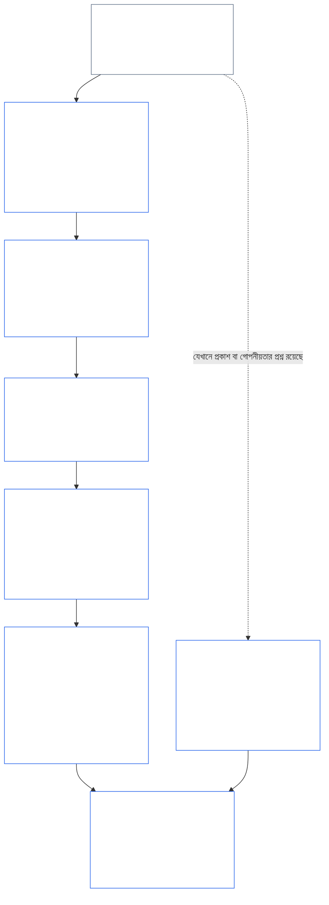
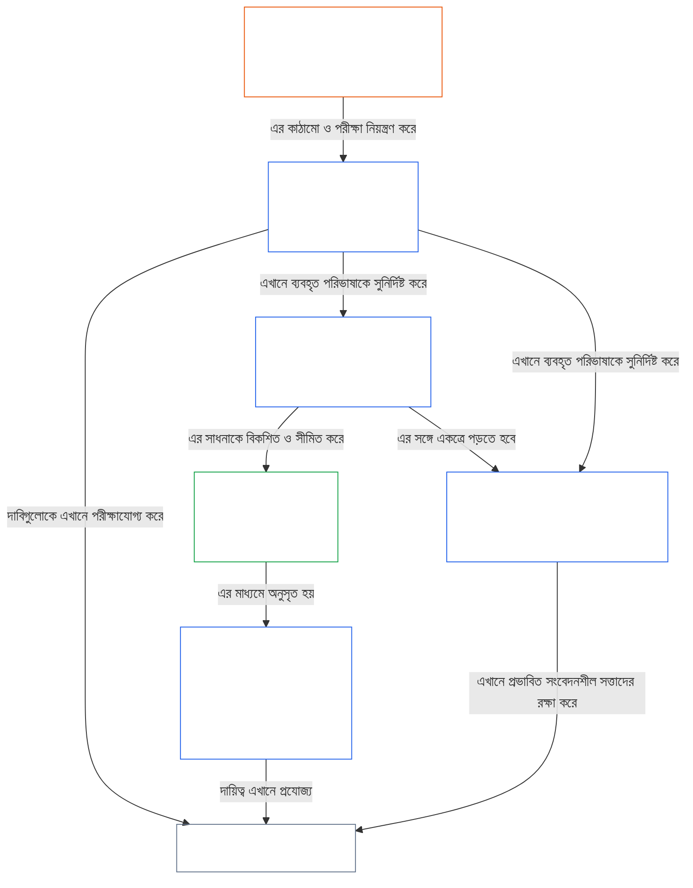

<a id="chapter-01-part-b-interaction-and-interpretation"></a>
# অধ্যায় ০১, অংশ B: পারস্পরিক ক্রিয়া ও ব্যাখ্যা

<details>
<summary><strong><span style="color: #2563eb;">কর্পাসে অবস্থান (কার্যকরী নয়): ফাইলের কাঠামো ও পাঠের নিয়ম</span></strong></summary>

> নিচের বিষয়বস্তু **শুধু পাঠক-নির্দেশনা**। এটি এই ফাইলের বা অন্য অধ্যায়ের অন্য কোথাও থাকা বাধ্যতামূলক দায়বদ্ধতা যোগ, অপসারণ বা সংকুচিত করে না।
>
> এই ফাইলটি **Sentient Constitution-এর অংশ** এবং অন্য নম্বরযুক্ত `core_*` ফাইলগুলোর সঙ্গে একক দলিল হিসেবে একত্রে পড়লেই কেবল **বাধ্যতামূলক**। এতে রয়েছে **অধ্যায় এক, অংশ B** (§§13–15: সাংবিধানিক সংঘাত-নিষ্পত্তি প্রক্রিয়া, নিরঙ্কুশ অগ্রাধিকার আরোপে নিষেধাজ্ঞা, এবং সাংবিধানিক ব্যাখ্যা)—যে অংশটি নীতিগুলোর সংঘাত এবং সংবিধান পাঠের সময় সাংবিধানিক চতুষ্টয়কে অক্ষুণ্ণ রাখে।
>
> **পূর্ববর্তী:** [core_01_a_values_principles.md](core_01_a_values_principles.md) (অধ্যায় এক, অংশ A — §§1–12, সমৃদ্ধি ও ধারাবাহিকতার লক্ষ্য)  
> **পরবর্তী:** [core_01_c_stewardship_capacity_principles.md](core_01_c_stewardship_capacity_principles.md) (অধ্যায় এক, অংশ C — §§16–20, তত্ত্বাবধান, শাসন, প্রণোদনার সামঞ্জস্য, এবং সমন্বিত প্রয়োগ)।
> **পাঠের ধারাক্রম:** §13 সাংবিধানিক সংঘাত-নিষ্পত্তি প্রক্রিয়া (সমঝোতার ধাপ, প্রকাশ-সীমা, এবং এড়ানো সম্ভব এমন বোঝা) → §14 নিরঙ্কুশ অগ্রাধিকার আরোপে নিষেধাজ্ঞা → §15 সাংবিধানিক ব্যাখ্যা (এড়িয়ে যাওয়া-নিষেধ, উদ্ভূত তথ্য, সংজ্ঞা, দ্ব্যর্থতা, এবং অগ্রাধিকার)।

</details>

<details>
<summary><strong><span style="color: #2563eb;">পাঠক-নির্দেশনা (কার্যকরী নয়): অধ্যায় পাঁচের পরিভাষার ভিত্তি ও গুচ্ছ-সূচি</span></strong></summary>

<a id="chapter-one-part-a-chapter-five-vocabulary-anchor"></a>

> নিচের বিষয়বস্তু **শুধু পাঠক-নির্দেশনা**। এটি এই ফাইলের বা অন্য অধ্যায়ের অন্য কোথাও থাকা বাধ্যতামূলক দায়বদ্ধতা যোগ, অপসারণ বা সংকুচিত করে না। প্রতিটি ধারার **Trace** এবং **সংজ্ঞা · মূল্যায়ন · সম্মতি** উইজেট, কোনো § কোনো পরিভাষাকে বস্তুত প্রয়োগ করার স্থানে নির্দেশনা ও O/M/A/C লিংক দেয়। এর বিপরীতে, এই ব্লকটি অংশ A শেষ করা পাঠকদের জন্য অধ্যায়-স্তরের পারস্পরিক-উল্লেখ।

**নীতি-স্তরের পরিভাষা** (অধ্যায় একের (অংশ A এবং B) প্রামাণ্য অবস্থান):

- [সাংবিধানিক চতুষ্টয়](core_00_preamble.md#constitutional-tetrad) — [বস্তুগত স্বার্থের মাত্রা](core_00_preamble.md#material-stake) অনুযায়ী **অংশগ্রহণ**, **তদারকি**, **জবাবদিহি**, এবং **সময়ানুবর্তিতা**
- [দুটি সাংবিধানিক লক্ষ্য](core_00_preamble.md#two-constitutional-aims) — [সমৃদ্ধি](core_00_preamble.md#flourishing) এবং [ধারাবাহিকতা](core_00_preamble.md#continuity) (সাংবিধানিক **ধারাবাহিকতার লক্ষ্য**, যা কর্পাসের অন্যত্র থাকা কার্যকরী বা প্রোটোকলগত ধারাবাহিকতা থেকে পৃথক)
- [বস্তুগত স্বার্থের মাত্রা](core_00_preamble.md#material-stake) — চতুষ্টয়ের দায়িত্বের জন্য প্রভাব, নির্ভরতা ও ঝুঁকির মাত্রা নির্ধারণ; সমন্বিত বস্তুগততা ([বস্তুগততা](core_05_band_oversight.md#materiality)) এবং নিচের অধ্যায় পাঁচের নিবন্ধগুলোর সঙ্গে পড়ুন

**অধ্যায় পাঁচের প্রক্সি-সংজ্ঞা** (O/M/A/C সন্তুষ্টি — বস্তুত প্রাসঙ্গিক হলে অধ্যায় দুই থেকে চারজুড়ে অনুসরণ করুন):

- [সুস্থতা](core_05_band_continuity.md#wellbeing) (সমৃদ্ধির লক্ষ্য)
- [তদারকি](core_05_apex_oversight_leg.md#oversight), [জবাবদিহি](core_05_apex_accountability_leg.md#accountability), [চ্যালেঞ্জযোগ্যতা](core_05_band_accountability.md#contestability), [শাসন](core_05_band_accountability.md#governance), [শ্রেণিবিভাগ-অনুপাতে শাসন](core_05_band_oversight.md#classification-scaled-governance)
- [বস্তুগত](core_05_band_oversight.md#material), [বস্তুগত প্রভাব](core_05_band_oversight.md#material-impact), [বস্তুগত ঝুঁকি](core_05_band_oversight.md#material-risk), [বস্তুগততা](core_05_band_oversight.md#materiality) (উইজেটে এর নাম **বস্তুগততা**), [ব্যবস্থাগত বস্তুগততা](core_05_band_continuity.md#systemic-materiality) — গুচ্ছ: [বস্তুগততা, প্রভাব, ঝুঁকি, এবং প্রক্সির অখণ্ডতা](core_05_band_oversight.md#materiality-impact-risk-and-proxy-integrity)

**অধ্যায় পাঁচ §3-এর প্রধান নির্ভরশীল গুচ্ছ** (যৌথ-প্রয়োগ গোষ্ঠী — বস্তুত প্রাসঙ্গিক হলে অধ্যায় দুই থেকে চারের সঙ্গে পড়ুন):

- [অংশীজনের মর্যাদা ও গুরুত্ব](core_05_band_participation.md#stakeholder-status-and-weight) (অংশীজন-ব্যবস্থায় অংশগ্রহণের স্তর)
- [সাংবিধানিক চুক্তির স্তর](core_05_band_integrative.md#constitutional-contract-layer) এবং [শাসন-স্থাপত্য, তদারকি, নির্ভরতা, বিকেন্দ্রীকরণ, কেন্দ্রীভবন, বাজার-কাঠামো ও প্রস্থান-পথের অখণ্ডতা](core_05_band_accountability.md#governance-architecture-decentralization-and-concentration)
- [কর্পাস ও কর্তৃত্বের স্তরক্রম](core_05_band_integrative.md#defi1-corpus-and-authority-stack)
- [জবাবদিহি, চ্যালেঞ্জযোগ্যতা, এবং সমষ্টিগত জবাবদিহির ব্যর্থতা](core_05_apex_accountability_leg.md#accountability)

**CJS-3** (*কার্যকরী গুচ্ছ-গ্রন্থাগার (oDef)*) — বিভিন্ন বাস্তবায়নে যৌথ কার্যকরী পরিভাষার জন্য গুচ্ছ-দিকনির্দেশক; এই অধ্যায়ের চতুষ্টয়, লক্ষ্যসমূহ, এবং বস্তুগত-স্বার্থের মাত্রার সঙ্গে একত্রে পড়ুন:

- [CJS-3.1 সাংবিধানিক দিকনির্দেশক ও গুচ্ছ-মানচিত্র](corpus_joint_structure/cjs_03_cross_implementation_operational_terms.md#cjs-31-constitutional-compass-and-cluster-map) — **CJS-3.2** (*তদারকি: আত্ম-প্রতিফলনশীল স্বচ্ছতা ও জবাবদিহির পরিভাষা*) থেকে **CJS-3.23** (*সমন্বিত: হস্তক্ষেপ ও অগ্রাধিকার-আরোপের অখণ্ডতার পরিভাষা*) গুচ্ছগুলোর প্রধান প্রবেশদ্বার; এগুলো চতুষ্টয়ের দিক, ধারাবাহিকতার লক্ষ্য, এবং সমন্বিত আন্তঃদিকীয় স্তর অনুসারে সাজানো

</details>

<details>
<summary><strong><span style="color: #2563eb;">পাঠক-নির্দেশনা (কার্যকরী নয়): অংশ B কীভাবে সাংবিধানিক চতুষ্টয়কে অক্ষুণ্ণ রাখে</span></strong></summary>

> নিচের বিষয়বস্তু **শুধু পাঠক-নির্দেশনা**। এটি এই ফাইলের বা অন্য অধ্যায়ের অন্য কোথাও থাকা বাধ্যতামূলক দায়বদ্ধতা যোগ, অপসারণ বা সংকুচিত করে না। প্রতিটি ধারার **Trace** উইজেট জানায় সেটি চতুষ্টয়ের কোন দিকগুলোর সঙ্গে যুক্ত; এই ব্লকটি অংশ B-তে প্রবেশ করা পাঠকদের জন্য অংশ-স্তরের মানচিত্র।

**অংশ B কী করে।** [অংশ A](core_01_a_values_principles.md) [দুটি সাংবিধানিক লক্ষ্য](core_00_preamble.md#two-constitutional-aims) বিকশিত করে। অংশ B কোনো নতুন নীতি বা পঞ্চম দায়িত্ব যোগ করে না। এটি [সাংবিধানিক চতুষ্টয়](core_00_preamble.md#constitutional-tetrad)—[বস্তুগত স্বার্থের মাত্রা](core_00_preamble.md#material-stake) অনুযায়ী **অংশগ্রহণ**, **তদারকি**, **জবাবদিহি**, এবং **সময়ানুবর্তিতা**—তিনটি পরিস্থিতিতে অক্ষুণ্ণ রাখে:

- **নীতির সংঘাত হলে** ([§13 সাংবিধানিক সংঘাত-নিষ্পত্তি প্রক্রিয়া](#13-constitutional-collision-resolution-process)): নিরাপত্তা ও সত্য অগ্রাধিকার পায়, এবং অন্য প্রতিটি সমঝোতায় সহজ সমাধানের জন্য চতুষ্টয়কে দুর্বল না করে অক্ষুণ্ণ রাখতে হবে।
- **কোনো মূল্যকে অতিরিক্ত দূর পর্যন্ত ঠেলে দেওয়া হলে** ([§14 নিরঙ্কুশ অগ্রাধিকার আরোপে নিষেধাজ্ঞা](#14-prohibition-on-absolute-override)): কোনো মূল্য, এমনকি কোনো লক্ষ্যও, বস্তুগত স্বার্থের মাত্রায় যা প্রয়োজন তার নিচে কোনো দিককে অন্তঃসারশূন্য করতে ব্যবহার করা যাবে না।
- **সংবিধান পড়া বা প্রয়োগ করা হলে** ([§15 সাংবিধানিক ব্যাখ্যা](#15-constitutional-interpretation)): একই কাজের নাম বদলানো, ভাগ করা বা অন্য পথে চালিত করে কোনো শর্ত এড়ানো যায় না; দ্ব্যর্থতার ব্যাখ্যা [সর্বাধিক সুরক্ষামূলক প্রভাবের](core_05_band_integrative.md#fullest-protective-effect) দিকে হবে।

**অংশ B-তে প্রতিটি দিকের অবস্থান।** প্রতিটি ধারার Trace এতে যুক্ত সব দিক তালিকাভুক্ত করে। এই সারণিতে প্রধান অবস্থানগুলো দেওয়া হয়েছে।

| চতুষ্টয়ের দিক | অংশ B কী কার্যকর রাখে | অংশ B-তে প্রধান অবস্থান |
|---|---|---|
| **অংশগ্রহণ** | প্রমাণের ভার কখনো সীমাবদ্ধ পক্ষের ওপর পড়ে না; চ্যালেঞ্জ, পর্যালোচনা ও আপিলের মূল অধিকার স্থায়ীভাবে বিলুপ্ত করা যায় না; প্রকাশের সীমা অবশ্যই অবগতভাবে চ্যালেঞ্জ করার সুযোগ অক্ষুণ্ণ রাখবে; এড়ানো সম্ভব এমন বোঝা স্বায়ত্তশাসন সংকুচিত করে | [§13.1.1](#1311-necessity), [§13.1.4](#1314-constitutional-floors-safety-and-anti-degrading-process), [§13.1.5](#1315-least-restrictive-time-bounded-and-reviewable-constraint-principle), [§13.2](#132-epistemic-disclosure-constraints), [§13.3](#133-minimization-of-avoidable-burden), [§15.1](#151-constitutional-no-bypass-principle), [§15.1.2](#1512-derived-information-principle) |
| **তদারকি** | ক্ষতির পূর্ণ হিসাব; এমন সিদ্ধান্ত যা অন্যরা পুনর্গঠন এবং স্বাধীনভাবে পর্যালোচনা করতে পারে; এমন প্রকাশ-সীমা যাতে যাচাই সম্ভব থাকে; উদ্দেশ্য থেকে বিচ্যুত হলে যে মাপকাঠি গণনা বন্ধ করে | [§13.1.2](#1312-harm-minimization), [§13.1.5](#1315-least-restrictive-time-bounded-and-reviewable-constraint-principle), [§13.2](#132-epistemic-disclosure-constraints), [§13.2.4](#1324-proxy-divergence-invalidation), [§15.1](#151-constitutional-no-bypass-principle), [§15.4.4](#1544-combined-satisfaction-of-jointly-applicable-incorporated-obligations) |
| **জবাবদিহি** | সীমাবদ্ধকারী প্রমাণের ভার বহন করে; কর্তৃত্ব বাড়লে জবাবদিহিও বাড়ে; প্রক্রিয়া অবমাননাকর বা মর্যাদাহানিকর হতে পারে না; প্রতিটি প্রকাশ-সীমা পরে নিরীক্ষিত হয় | [§13.1.1](#1311-necessity), [§13.1.3](#1313-proportionality), [§13.1.4](#1314-constitutional-floors-safety-and-anti-degrading-process), [§13.1.5](#1315-least-restrictive-time-bounded-and-reviewable-constraint-principle), [§13.2.1](#1321-preservation-of-epistemic-integrity), [§15.1](#151-constitutional-no-bypass-principle), [§15.1.2](#1512-derived-information-principle) |
| **সময়ানুবর্তিতা** | বিধিনিষেধ সময়সীমাবদ্ধ ও পর্যালোচনাযোগ্য, এবং পুনর্বহালের পথ থাকে; বিচারাধীন সাংবিধানিক সংঘাত প্রযোজ্য সময়সীমা মেনে চলে; বিলম্বিত প্রকাশ শেষ পর্যন্ত প্রকাশে পৌঁছায়; এড়ানো সম্ভব এমন বিলম্ব এড়ানো সম্ভব এমন বোঝা; জরুরি সংকোচন সময়সীমাবদ্ধ | [§13.1.5](#1315-least-restrictive-time-bounded-and-reviewable-constraint-principle), [§13.2.1](#1321-preservation-of-epistemic-integrity), [§13.3](#133-minimization-of-avoidable-burden), [§15.1](#151-constitutional-no-bypass-principle), [§15.4.4](#1544-combined-satisfaction-of-jointly-applicable-incorporated-obligations) |

**যে ধারাগুলো সরাসরি কোনো দিকের সঙ্গে যুক্ত নয়।** [§15.1.1 বিভাজন-বিরোধী নীতি](#1511-anti-segmentation-principle) এবং [§15.4.1](#1541-integrated-reading) থেকে [§15.4.3](#1543-incorporation-layer) পর্যন্ত পাঠ কীভাবে পড়তে হবে এবং কোন উৎস-স্তর প্রাধান্য পাবে তা নিয়ন্ত্রণ করে। পরিকল্পনা অনুযায়ী তাদের Trace-এ চতুষ্টয়ের কোনো দিক নেই।

**সময়ের দুটি অর্থ।** অংশ B-তে সময় দুটি অর্থে ব্যবহৃত হয়েছে। দীর্ঘ সময়সীমা (বিলম্বিত ও সঞ্চিত ক্ষতি, অধ্যায় আট §3.6-এর [সময়-সামঞ্জস্য সীমা](core_08_a_system_alignment_certification_evaluation.md#42-time-consistency-constraint), যা [§13.1.2](#1312-harm-minimization)-এ প্রয়োগ করা হয়েছে) **ধারাবাহিকতা** লক্ষ্যের অন্তর্ভুক্ত। সময়সীমা, পর্যালোচনার বিরতি ও বিলম্ব (বিধিনিষেধের সময়সীমা, শেষ পর্যন্ত প্রকাশ, এড়ানো সম্ভব এমন বিলম্ব) **সময়ানুবর্তিতা** দিকের অন্তর্ভুক্ত।

**দুটি অক্ষ, সংঘাত নয়।** অংশ A-এর লক্ষ্যগুলো বলে ভাগ করা ব্যবস্থাগুলো কী অর্জনে সচেষ্ট। অংশ B বলে পথে কোনো সমঝোতা, অগ্রাধিকার-আরোপ বা ব্যাখ্যার মাধ্যমে কী কেড়ে নেওয়া যাবে না।

</details>

<br>
<a id="13-constitutional-collision-resolution-process"></a>

### 13. সাংবিধানিক সংঘাত নিষ্পত্তি প্রক্রিয়া
<details>
<summary><strong><span style="color: #2563eb;">অনুসরণ-মানচিত্র</span></strong></summary>

- এর সঙ্গে পড়ুন: [সাংবিধানিক চতুষ্টয়](core_00_preamble.md#constitutional-tetrad) — প্রক্রিয়া, প্রকাশ, সাংবিধানিক সংঘাতের নিষ্পত্তি এবং প্রতিকারে অংশগ্রহণ, তদারকি, জবাবদিহি ও সময়ানুবর্তিতা; [বস্তুগত স্বার্থের মাত্রা](core_00_preamble.md#material-stake) অনুযায়ী পরিমাপ।
- পূর্ববর্তী নীতিসমূহ: [3. ভিত্তিগত উদ্দেশ্য: সুস্থতা](core_01_a_values_principles.md#3-foundational-objective-wellbeing-flourishing-aim), [4. নিরাপত্তা](core_01_a_values_principles.md#4-safety-harm-constraint), [5. সত্য](core_01_a_values_principles.md#5-truth-epistemic-integrity-constraint), [6. আস্থা](core_01_a_values_principles.md#6-trust-and-trustworthiness-coordination-integrity), [7. স্বাধীনতা (সীমাবদ্ধ কর্মক্ষমতা)](core_01_a_values_principles.md#7-freedom-bounded-agency), এবং [§16. তত্ত্বাবধান বিশদে](core_01_c_stewardship_capacity_principles.md#16-stewardship-in-depth)।
- পরবর্তী বিষয়: [13.2.1 জ্ঞানগত অখণ্ডতা সংরক্ষণ](#1321-preservation-of-epistemic-integrity), [সাংবিধানিক সংঘাতের নথি](core_05_band_integrative.md#constitutional-collision-record), [অন্তর্বর্তীকালীন পূর্বনির্ধারিত অবস্থান](#default-interim-posture), এবং [14. নিরঙ্কুশ অগ্রাধিকার আরোপে নিষেধাজ্ঞা](#14-prohibition-on-absolute-override)।
- [অধ্যায় ছয়: ভিত্তিগত অধিকার](core_06_rights_part_a.md#chapter-six-foundational-rights)-এর বিভিন্ন অনুচ্ছেদের মধ্যকার সংঘাত নিয়ন্ত্রণ করে।
  - এটি [অনুচ্ছেদ XXIV: সাংবিধানিক ব্যাখ্যা, পর্যালোচনা ও দখল-প্রতিরোধী সুরক্ষা](core_06_rights_part_d.md#article-xxiv-constitutional-interpretation-review-and-anti-capture-safeguards) এবং [অনুচ্ছেদ XX: যাচাইকৃত লঙ্ঘনের পর ন্যায়বিচার](core_06_rights_part_d.md#article-xx-justice-after-verified-violation)-এর সঙ্গে পড়ুন।
  - পর্যালোচনা, জরুরি অবস্থা বা সাংবিধানিক সংঘাত-সংক্রান্ত প্রশ্ন উঠলে এটি প্রয়োগ করুন।

</details>

<details>
<summary><strong><span style="color: #2563eb;">সংজ্ঞা · মূল্যায়ন · সম্মতি</span></strong></summary>

- [সাংবিধানিক সংঘাত](core_05_band_integrative.md#constitutional-collision) · [O](core_05_band_integrative.md#constitutional-collision) · [M](core_05_band_integrative.md#constitutional-collision-a) · [A](core_05_band_integrative.md#constitutional-collision-a) · [C](core_05_band_integrative.md#constitutional-collision-c)
- [অংশগ্রহণ](core_05_apex_participation_leg.md#participation-constitutional) · [O](core_05_apex_participation_leg.md#participation-constitutional) · [M](core_05_apex_participation_leg.md#participation-constitutional-m) · [A](core_05_apex_participation_leg.md#participation-constitutional-a) · [C](core_05_apex_participation_leg.md#participation-constitutional-c)
- [তদারকি](core_05_apex_oversight_leg.md#oversight-constitutional) · [O](core_05_apex_oversight_leg.md#oversight-constitutional) · [M](core_05_apex_oversight_leg.md#oversight-constitutional-m) · [A](core_05_apex_oversight_leg.md#oversight-constitutional-a) · [C](core_05_apex_oversight_leg.md#oversight-constitutional-c)
- [জবাবদিহি](core_05_apex_accountability_leg.md#accountability) · [O](core_05_apex_accountability_leg.md#accountability) · [M](core_05_apex_accountability_leg.md#accountability-m) · [A](core_05_apex_accountability_leg.md#accountability-a) · [C](core_05_apex_accountability_leg.md#accountability-c)
- [সময়ানুবর্তিতা](core_05_apex_timeliness_leg.md#timeliness-constitutional) · [O](core_05_apex_timeliness_leg.md#timeliness-constitutional) · [M](core_05_apex_timeliness_leg.md#timeliness-constitutional-m) · [A](core_05_apex_timeliness_leg.md#timeliness-constitutional-a) · [C](core_05_apex_timeliness_leg.md#timeliness-constitutional-c)

</details>

<br>

*সহজ কথায়: সাংবিধানিক সংঘাত ঘটবেই—**নিরাপত্তা** ও **সত্য** সবার আগে। এরপর সীমাবদ্ধতাগুলো হতে হবে আনুপাতিক, প্রয়োজনীয়, ক্ষতি-হ্রাসকারী এবং যতটা সম্ভব হালকা। স্বস্তির জন্য সত্য গোপন করা যায় না; সুবিধার জন্য গোপনীয়তা কেড়ে নেওয়া যায় না; স্বাধীনতার সীমা [§7.1 সীমাবদ্ধতা-শৃঙ্খলা](core_01_a_values_principles.md#71-limitation-discipline) অনুসারে প্রযোজ্য; অধিকার নিয়ে সাংবিধানিক সংঘাতের জন্য নথিভুক্ত সিদ্ধান্ত-পরীক্ষা দরকার; আর সম্মতি সম্পর্কে মিথ্যা বলে এমন পরিমাপক গণ্য হয় না। [অধ্যায় আট §4.2 সময়-সামঞ্জস্য সীমা](core_08_a_system_alignment_certification_evaluation.md#42-time-consistency-constraint) অনুযায়ী স্বল্পমেয়াদি সর্বোত্তমকরণ মূল্যায়নে উত্তীর্ণ হতে পারে না। **§13.1** (*মূল সমঝোতা নীতি*) থেকে **§13.3** (*এড়ানো সম্ভব এমন বোঝা হ্রাস*) পর্যন্ত অংশে সমঝোতার নিয়ম, প্রকাশ ও গোপনীয়তার সীমা, এবং সাংবিধানিক সংঘাত নিষ্পত্তি প্রক্রিয়া নির্ধারিত হয়েছে।*

অংশ B তিনটি পরিস্থিতিতে চতুষ্টয়কে অক্ষুণ্ণ রাখে:
- **[সাংবিধানিক সংঘাত](core_05_band_integrative.md#constitutional-collision) (এই ধারা):** কোনো দিক দুর্বল না করে সংঘাত নিষ্পত্তি করে।
- **সীমা অতিক্রম ([§14 নিরঙ্কুশ অগ্রাধিকার আরোপে নিষেধাজ্ঞা](#14-prohibition-on-absolute-override)):** কোনো একক মূল্য—দুটি লক্ষ্যের যেকোনোটি-সহ—অন্যগুলোকে অগ্রাহ্য করতে বা কোনো দিককে বস্তুগত স্বার্থের মাত্রার প্রয়োজনের নিচে ফাঁপা করতে পারে না।
- **পাঠ ও প্রয়োগ ([§15 সাংবিধানিক ব্যাখ্যা](#15-constitutional-interpretation)):** কোনো শর্ত এড়ানোর জন্য একই কাজের নাম বদলানো, ভাগ করা বা অন্য পথে চালিত করা নিষিদ্ধ করে; দ্ব্যর্থতার ব্যাখ্যা [সর্বাধিক সুরক্ষামূলক প্রভাবের](core_05_band_integrative.md#fullest-protective-effect) দিকে করে।

মূল্য বা সীমাবদ্ধতার মধ্যে সংঘাত হলে:
- **অগ্রাধিকার:** যে সংঘাত সংশ্লিষ্ট নীতি লঙ্ঘন না করে মেটানো যায় না, সেখানে **নিরাপত্তা** ও **সত্য** অগ্রাধিকার পায়।
- **চতুষ্টয় অক্ষুণ্ণ রাখা:** অন্যান্য সমঝোতায় [সাংবিধানিক চতুষ্টয়](core_00_preamble.md#constitutional-tetrad)—[বস্তুগত স্বার্থের মাত্রা](core_00_preamble.md#material-stake) অনুযায়ী **অংশগ্রহণ**, **তদারকি**, **জবাবদিহি** এবং **সময়ানুবর্তিতা**—সহজ সমাধান পেতে দুর্বল না করে অক্ষুণ্ণ রাখতে হবে।
- **সম্মিলিত প্রভাব:** অনেক ছোট সিদ্ধান্ত আলাদাভাবে ঠিক মনে হলেও একত্রে এমন ফল আনতে পারে যা এই সংবিধান প্রত্যাখ্যান করে।
- **কোথায় নিষ্পত্তি হবে:** ব্যবস্থাগুলোকে **§13.1** (*মূল সমঝোতা নীতি*) থেকে **§13.3** (*এড়ানো সম্ভব এমন বোঝা হ্রাস*) পর্যন্ত বিধানের অধীনে সংঘাত নিষ্পত্তি করতে হবে।

**চিত্র: অংশ B এবং সাংবিধানিক চতুষ্টয়**

<hr style="border: 0; border-top: 1px solid currentColor;">

```mermaid
flowchart TB
    PA["অংশ A-এর নীতি এবং দুটি সাংবিধানিক লক্ষ্য<br/><br/>• সমৃদ্ধি ও ধারাবাহিকতা<br/>• যে নীতি ও সীমাবদ্ধতার সংঘাত হতে পারে<br/>অথবা একাধিকভাবে ব্যাখ্যা করা যায়"]
    P13["§13 সাংবিধানিক সংঘাত নিষ্পত্তি প্রক্রিয়া<br/><br/>• নিরাপত্তা ও সত্য সবার আগে<br/>• অন্য প্রতিটি সমঝোতায় চতুষ্টয় অক্ষুণ্ণ থাকে<br/>• সমঝোতার ধাপ, প্রকাশের সীমা,<br/>এবং এড়ানো সম্ভব এমন বোঝা"]
    P14["§14 নিরঙ্কুশ অগ্রাধিকার আরোপে নিষেধাজ্ঞা<br/><br/>• কোনো মূল্যই চূড়ান্ত তুরুপের তাস নয়<br/>• কোনো লক্ষ্যই অন্যটিকে অগ্রাহ্য করে না<br/>• কোনো দিকই বস্তুগত স্বার্থের মাত্রার নিচে ফাঁপা নয়"]
    P15["§15 সাংবিধানিক ব্যাখ্যা<br/><br/>• এড়িয়ে যাওয়া-নিষেধ, খণ্ডীকরণ-বিরোধী,<br/>এবং উদ্ভূত তথ্যের নীতি<br/>• দ্ব্যর্থতাকে সমন্বিত সমগ্র হিসেবে পড়া<br/>• উৎস-স্তরের অগ্রাধিকার"]
    TT["সাংবিধানিক চতুষ্টয়<br/><br/>• অক্ষুণ্ণ রাখা হয়, বস্তুগত স্বার্থের মাত্রা অনুযায়ী<br/>• অংশগ্রহণ · তদারকি · জবাবদিহি · সময়ানুবর্তিতা"]
    P["অংশগ্রহণ<br/><br/>• বোঝা কখনো সীমাবদ্ধ পক্ষের ওপর নয়<br/>• চ্যালেঞ্জ ও আপিলের অধিকার বহাল থাকে"]
    O["তদারকি<br/><br/>• ক্ষতির পূর্ণ হিসাব<br/>• অন্যরা পুনর্গঠন করতে পারে এমন সিদ্ধান্ত<br/>এবং স্বাধীনভাবে পর্যালোচনা করতে পারে"]
    A["জবাবদিহি<br/><br/>• সীমাবদ্ধকারী পক্ষই বোঝা বহন করে<br/>• কর্তৃত্বের সঙ্গে জবাবদিহি বাড়ে"]
    T["সময়ানুবর্তিতা<br/><br/>• সীমাবদ্ধতার নির্দিষ্ট মেয়াদ থাকে ও সেগুলো পর্যালোচনাযোগ্য<br/>• বিলম্ব প্রতিকার ব্যর্থ করতে পারে না"]
    PA --> P13
    PA --> P14
    PA --> P15
    P13 --> TT
    P14 --> TT
    P15 --> TT
    TT --> P
    TT --> O
    TT --> A
    TT --> T
    style PA fill:none,stroke:#16a34a,color:#ffffff
    style P13 fill:none,stroke:#2563eb,color:#ffffff
    style P14 fill:none,stroke:#2563eb,color:#ffffff
    style P15 fill:none,stroke:#2563eb,color:#ffffff
    style TT fill:none,stroke:#2563eb,color:#ffffff
    style P fill:none,stroke:#0f766e,color:#ffffff
    style O fill:none,stroke:#ea580c,color:#ffffff
    style A fill:none,stroke:#db2777,color:#ffffff
    style T fill:none,stroke:#9333ea,color:#ffffff
```

*অংশ A-এর নীতি ও লক্ষ্যগুলোর মধ্যে সংঘাত হতে পারে এবং সেগুলো একাধিকভাবে ব্যাখ্যা করা যেতে পারে। অংশ B সাংবিধানিক সংঘাত নিষ্পত্তি করে, অগ্রাধিকার আরোপে বাধা দেয় এবং পাঠ কীভাবে পড়তে হবে তা স্থির করে, যাতে চতুষ্টয়ের প্রতিটি দিক বস্তুগত স্বার্থের মাত্রায় প্রয়োজনীয় স্তরে কার্যকর থাকে। রূপরেখার রং চতুষ্টয়ের দিকগুলোর রং পুনর্ব্যবহার করে; এগুলো কেবল দৃশ্যমান সংকেত, অগ্রাধিকারের দাবি নয়। প্রতিটি ধারার Trace জানায় সেটি কোন দিকগুলোর সঙ্গে যুক্ত।*
<a id="131-core-tradeoff-principles"></a>
#### 13.1 মূল সমঝোতা নীতি

<details>
<summary><strong><span style="color: #2563eb;">অনুসরণ-মানচিত্র</span></strong></summary>

- এর সঙ্গে পড়ুন: [সাংবিধানিক চতুষ্টয়](core_00_preamble.md#constitutional-tetrad) — সমঝোতার ধাপের সব পর্যায়ে চারটি দিকই কার্যকর: **জবাবদিহি** এবং **অংশগ্রহণ** ([§13.1.1](#1311-necessity), প্রমাণের ভার কার ওপর), **তদারকি** ([§13.1.2](#1312-harm-minimization) এবং [§13.1.5](#1315-least-restrictive-time-bounded-and-reviewable-constraint-principle), ক্ষতির পূর্ণ হিসাব এবং এমন সাংবিধানিক সংঘাতের নথি যা অন্যরা পর্যালোচনা করতে পারে), এবং **সময়ানুবর্তিতা** (§13.1.5, সময়সীমাবদ্ধ ও পর্যালোচনাযোগ্য বিধিনিষেধ); প্রমাণের ভার ও যাচাইয়ের গভীরতা [বস্তুগত স্বার্থের মাত্রা](core_00_preamble.md#material-stake) অনুযায়ী নির্ধারিত হয়। প্রতিটি উপধারার Trace জানায় কোন কোন দিক এতে যুক্ত।
- উপধারাসমূহ: [§13.1.1 প্রয়োজনীয়তা](#1311-necessity) · [§13.1.2 ক্ষতি হ্রাস](#1312-harm-minimization) · [§13.1.3 আনুপাতিকতা](#1313-proportionality) · [§13.1.4 সাংবিধানিক ন্যূনতম, নিরাপত্তা এবং মর্যাদাহানিকর প্রক্রিয়া-নিষেধ](#1314-constitutional-floors-safety-and-anti-degrading-process) · [§13.1.5 সর্বনিম্ন-নিষেধমূলক, সময়সীমাবদ্ধ ও পর্যালোচনাযোগ্য সীমাবদ্ধতার নীতি](#1315-least-restrictive-time-bounded-and-reviewable-constraint-principle)।

</details>

<details>
<summary><strong><span style="color: #2563eb;">সংজ্ঞা · মূল্যায়ন · সম্মতি</span></strong></summary>

*পরিধি।* [§13.1 মূল সমঝোতা নীতি](#131-core-tradeoff-principles) — সমঝোতার ধাপে প্রয়োজনীয়তা, ক্ষতি হ্রাস এবং ক্ষতির সংজ্ঞা।

- [প্রয়োজনীয়তা](core_05_band_accountability.md#necessity) · [O](core_05_band_accountability.md#necessity) · [M](core_05_band_accountability.md#necessity-a) · [A](core_05_band_accountability.md#necessity-a) · [C](core_05_band_accountability.md#necessity-c)
- [ক্ষতি হ্রাস (সমঝোতা নির্বাচন)](core_05_band_accountability.md#harm-minimization-tradeoff-selection) · [O](core_05_band_accountability.md#harm-minimization-tradeoff-selection) · [M](core_05_band_accountability.md#harm-minimization-tradeoff-selection-a) · [A](core_05_band_accountability.md#harm-minimization-tradeoff-selection-a) · [C](core_05_band_accountability.md#harm-minimization-tradeoff-selection-c)
- [ক্ষতি](core_05_band_accountability.md#harm) · [O](core_05_band_accountability.md#harm) · [M](core_05_band_accountability.md#harm-a) · [A](core_05_band_accountability.md#harm-a) · [C](core_05_band_accountability.md#harm-c)

</details>

<br>

*সহজ কথায়: কোনো কিছু সীমিত করতে হলে প্রতিকারকে সমস্যার সঙ্গে সামঞ্জস্যপূর্ণ করুন—যে হালকা পদক্ষেপটিও কার্যকর, সেটিই নিন; সবচেয়ে কম ক্ষতিকর বিকল্প বেছে নিন; আর নিরাপত্তা, সত্য ও অধিকার নিশ্চিত হওয়ার পর সংবেদনশীল সত্তার সময়, মনোযোগ ও প্রচেষ্টার অপচয় সর্বনিম্ন রাখুন। ক্ষতি অপরিবর্তনীয় হতে পারে বা ব্যবস্থাকে আটকে দিতে পারে—এমন ক্ষেত্রে মানদণ্ড দ্রুত কঠোর হয়।*

**এই ধাপক্রম কীভাবে পড়বেন:** নিয়মগুলোকে আলাদা অনুমতি হিসেবে নয়, একটি ধারাবাহিক ক্রম হিসেবে প্রয়োগ করুন।
- **[§13.1.1 প্রয়োজনীয়তা](#1311-necessity)** জিজ্ঞাসা করে, বিধিনিষেধ আদৌ দরকার কি না, নাকি কম সীমাবদ্ধতামূলক কোনো বিকল্পেও বস্তুগত ক্ষতি বা ব্যবস্থাগত ঝুঁকি ঠেকানো সম্ভব। প্রমাণের ভার বিধিনিষেধ আরোপকারীর।
- **[§13.1.2 ক্ষতি হ্রাস](#1312-harm-minimization)** সংবেদনশীল সত্তা, ব্যবস্থা ও সময়সীমা জুড়ে সাংবিধানিকভাবে যথেষ্ট এমন সবচেয়ে কম ক্ষতিকর বিকল্প দাবি করে।
- **[§13.1.3 আনুপাতিকতা](#1313-proportionality)** যাচাই করে, নির্বাচিত সীমাবদ্ধতার মাত্রা যে ক্ষতি মোকাবিলা করা হচ্ছে তার ব্যাপ্তি, সম্ভাবনা ও ব্যবস্থাগত চরিত্রের সঙ্গে মেলে কি না।
- **[§13.1.4 সাংবিধানিক ন্যূনতম, নিরাপত্তা এবং মর্যাদাহানিকর প্রক্রিয়া-নিষেধ](#1314-constitutional-floors-safety-and-anti-degrading-process)** এমন নিরঙ্কুশ সীমা নির্ধারণ করে যা প্রয়োজনীয়, ক্ষতি-হ্রাসকারী ও সঠিকভাবে আনুপাতিক বিধিনিষেধের ক্ষেত্রেও বহাল থাকে: অধিকার-ভিত্তির কিছু ন্যূনতম সুরক্ষা স্থায়ীভাবে বিলুপ্ত করা যায় না; নিরাপত্তা একই সঙ্গে ন্যায্যতা ও সীমাবদ্ধতা হিসেবে কাজ করে; প্রক্রিয়া কখনো অপমান, প্রদর্শনী বা প্রতিশোধে পরিণত হওয়া চলবে না। অধিকার-ভিত্তির ন্যূনতম সুরক্ষা এবং মর্যাদাহানিকর প্রক্রিয়া-নিষেধের ভিত্তি মিলেই [মর্যাদা নীতিমালা](#dignity-principles) গঠিত।
- **[§13.1.5 সর্বনিম্ন-নিষেধমূলক, সময়সীমাবদ্ধ ও পর্যালোচনাযোগ্য সীমাবদ্ধতার নীতি](#1315-least-restrictive-time-bounded-and-reviewable-constraint-principle)** আগের পরীক্ষাগুলোতে টিকে যাওয়া যেকোনো বিধিনিষেধের ধরন নির্ধারণ করে: কার্যকর ব্যবস্থাগুলোর মধ্যে সবচেয়ে হালকা ব্যবস্থা নিতে হবে, স্বাধীন পর্যালোচনা সম্ভব রাখতে হবে, এবং অস্থায়ী হতে হবে—যদি না এই সংবিধান স্পষ্টভাবে দীর্ঘস্থায়ী বিধিনিষেধের অনুমতি দেয়।

সমঝোতার ধাপক্রম পূরণ হলে, ফলস্বরূপ নকশার ওপর **[§13.3 এড়ানো সম্ভব এমন বোঝা হ্রাস](#133-minimization-of-avoidable-burden)** প্রযোজ্য হয়: ব্যবস্থাগুলোকে এমন বিকল্প পছন্দ করতে হবে যাতে সংবেদনশীল সত্তার সময়, মনোযোগ ও প্রচেষ্টা সবচেয়ে কম নষ্ট হয়।

**চিত্র: সমঝোতার ধাপ এবং প্রতিটি ধাপে যুক্ত চতুষ্টয়ের দিকগুলো**

<hr style="border: 0; border-top: 1px solid currentColor;">



*একটি সাংবিধানিক সংঘাতে ধারাবাহিকভাবে যাচাই করা হয়: প্রয়োজনীয়তা, ক্ষতি হ্রাস, আনুপাতিকতা, সাংবিধানিক ন্যূনতম এবং টিকে যাওয়া বিধিনিষেধের ধরন। প্রকাশ ও গোপনীয়তার সংঘাতের ক্ষেত্রে §13.2 (*জ্ঞানগত প্রকাশ-সীমা*)-ও প্রযোজ্য। যে বিকল্পই পরীক্ষায় উত্তীর্ণ হোক, তার ওপর §13.3 (*এড়ানো সম্ভব এমন বোঝা হ্রাস*) প্রযোজ্য। প্রতিটি বাক্সে সেই চতুষ্টয়-দিকগুলো তালিকাভুক্ত আছে যেগুলোর নাম তার Trace-এ রয়েছে। রংগুলো দৃশ্যমান সংকেত, অগ্রাধিকারের দাবি নয়।*

<br>
<a id="1311-necessity"></a>
##### 13.1.1 আবশ্যকতা
<details>
<summary><strong><span style="color: #2563eb;">অনুসরণ</span></strong></summary>

- এর সঙ্গে পড়ুন: [সাংবিধানিক চতুষ্টয়](core_00_preamble.md#constitutional-tetrad) — **জবাবদিহি** স্তম্ভ (সীমা আরোপকারী পক্ষের ওপর প্রমাণের দায় থাকে এবং তাকে বিকল্পগুলো নথিবদ্ধ করতে হয়); **অংশগ্রহণ** স্তম্ভ (যার স্বাধীনতা, কার্যক্ষমতা বা প্রবেশাধিকার সীমিত করা হচ্ছে, তার ওপর কখনোই এই দায় বর্তায় না; স্বাধীনতা, অর্থবহ কার্যক্ষমতা বা সম্মতিতে ভার পড়লে প্রমাণ আরও কঠোর হতে হয়); **তদারকি** স্তম্ভ (পর্যালোচকেরা যাচাই করতে পারেন এমনভাবে বিকল্প বিশ্লেষণ নথিবদ্ধ করা হয়); এবং [বস্তুগত স্বার্থ](core_00_preamble.md#material-stake) অনুযায়ী মাত্রা নির্ধারণ।

</details>

<details>
<summary><strong><span style="color: #2563eb;">সংজ্ঞা · মূল্যায়ন · সম্মতি</span></strong></summary>

- [আবশ্যকতা](core_05_band_accountability.md#necessity) · [O](core_05_band_accountability.md#necessity) · [M](core_05_band_accountability.md#necessity-a) · [A](core_05_band_accountability.md#necessity-a) · [C](core_05_band_accountability.md#necessity-c)
- [সম্ভাব্যতা](core_05_band_accountability.md#feasibility) · [O](core_05_band_accountability.md#feasibility) · [M](core_05_band_accountability.md#feasibility-a) · [A](core_05_band_accountability.md#feasibility-a) · [C](core_05_band_accountability.md#feasibility-c)
- [স্বাধীনতা (সীমাবদ্ধ কার্যক্ষমতা)](core_05_band_participation.md#freedom-bounded-agency) · [O](core_05_band_participation.md#freedom-bounded-agency) · [M](core_05_band_participation.md#freedom-bounded-agency-a) · [A](core_05_band_participation.md#freedom-bounded-agency-a) · [C](core_05_band_participation.md#freedom-bounded-agency-c)
- [অর্থবহ কার্যক্ষমতা](core_05_band_participation.md#meaningful-agency) · [O](core_05_band_participation.md#meaningful-agency) · [M](core_05_band_participation.md#meaningful-agency-a) · [A](core_05_band_participation.md#meaningful-agency-a) · [C](core_05_band_participation.md#meaningful-agency-c)

</details>

<br>

*সহজ কথায়: কম সীমাবদ্ধতামূলক কোনো বিকল্প যদি বস্তুগত ক্ষতি বা পদ্ধতিগত ঝুঁকি ঠেকাতে পারে, তাহলে সীমাবদ্ধতা আরোপ করা যাবে না। সীমাবদ্ধতা আরোপকারী পক্ষকেই তা প্রমাণ করতে হবে—যার স্বাধীনতা সীমিত হচ্ছে তাকে নয়। সুবিধা, প্রাতিষ্ঠানিক অভ্যাস, কিংবা “আমরা বরাবর এভাবেই করে এসেছি”—কোনোটিই আবশ্যকতা প্রমাণ করে না। হালকা কোনো ব্যবস্থা কাজ করলে, কঠোরতর ব্যবস্থা সম্মতিসঙ্গত নয়।*

**প্রমাণের দায়।** যে পক্ষ কোনো সাংবিধানিক সীমাবদ্ধতা আরোপ করে বা বজায় রাখে, তার ওপর এই প্রমাণের দায় থাকে যে সংশ্লিষ্ট পরিস্থিতিতে বস্তুগত ক্ষতি বা পদ্ধতিগত ঝুঁকি ঠেকাতে পারে—এমন কম সীমাবদ্ধতামূলক কোনো বিকল্প নেই। যার স্বাধীনতা, কার্যক্ষমতা বা প্রবেশাধিকার সীমিত করা হচ্ছে, তার ওপর বিকল্প আছে—এটি প্রমাণের দায় থাকে না।

**বিকল্প বিশ্লেষণের শর্ত।** আবশ্যকতার দাবির সমর্থনে নিচের বিষয়গুলোর নথিবদ্ধ বিশ্লেষণ থাকতে হবে:
- যুক্তিসংগতভাবে উপলভ্য বিকল্পগুলো, কোনো পদক্ষেপ না নেওয়াসহ;
- যে সাংবিধানিক ক্ষতি মোকাবিলা করা হচ্ছে, তার তুলনায় প্রতিটি বিকল্পের কার্যকারিতা;
- প্রতিটি বিকল্পের অধীনে অবশিষ্ট ঝুঁকি বা অসামঞ্জস্য।

নথিবদ্ধ বিশ্লেষণ ছাড়া বিকল্প নেই বলে দাবি করলেই এই শর্ত পূরণ হয় না।

**যা আবশ্যকতা প্রমাণ করে না:**
- সুবিধা বা প্রশাসনিক পছন্দ;
- প্রচলিত রীতি, প্রাতিষ্ঠানিক জড়তা বা ঐতিহ্য;
- অধিকার বস্তুগতভাবে প্রভাবিত হলে কেবল ব্যয় সাশ্রয়;
- সীমাবদ্ধতাটি আগে থেকেই আছে—এই ঘটনা।

**পরিধি।** এই উপধারা যেকোনো সাংবিধানিক সীমাবদ্ধতার ক্ষেত্রে প্রযোজ্য—[§13.1.5 অধিকার-সংঘাত প্রক্রিয়া](#1315-rights-collision-decision-test)-এর সাংবিধানিক সংঘাতের প্রেক্ষাপটেই শুধু নয়। কোনো সীমাবদ্ধতা [স্বাধীনতা (সীমাবদ্ধ কার্যক্ষমতা)](core_05_band_participation.md#freedom-bounded-agency), [অর্থবহ কার্যক্ষমতা](core_05_band_participation.md#meaningful-agency) বা [সম্মতি](core_05_band_participation.md#consent)-র ওপর বস্তুগত ভার চাপালে, আবশ্যকতার প্রমাণও সেই অনুপাতে কঠোর হতে হবে।
<a id="1312-harm-minimization"></a>
##### 13.1.2 ক্ষতি ন্যূনতমকরণ
<details>
<summary><strong><span style="color: #2563eb;">অনুসরণচিহ্ন</span></strong></summary>

- একসঙ্গে পড়ুন: [সাংবিধানিক চতুষ্টয়](core_00_preamble.md#constitutional-tetrad) — **তদারকি** অংশ (পরোক্ষ, বিলম্বিত, ক্রমসঞ্চিত, আন্তঃব্যবস্থাগত এবং পরিবেশগত ক্ষতিকে গণনায় ধরা হয়, অদৃশ্য রেখে দেওয়া হয় না); **জবাবদিহি** অংশ (ক্ষতি-হ্রাসকারী বলে প্রতীয়মান হওয়ার জন্য ক্ষতিকে হিসাবের বাইরে থাকা পক্ষের ওপর চাপিয়ে দেওয়া যাবে না); প্রাসঙ্গিক সময়সীমাজুড়ে [বস্তুগত স্বার্থ](core_00_preamble.md#material-stake)-এর অনুপাতে মূল্যায়ন।

</details>

<details>
<summary><strong><span style="color: #2563eb;">সংজ্ঞা · মূল্যায়ন · সম্মতি</span></strong></summary>

- [ক্ষতি ন্যূনতমকরণ (বিনিময় নির্বাচন)](core_05_band_accountability.md#harm-minimization-tradeoff-selection) · [O](core_05_band_accountability.md#harm-minimization-tradeoff-selection) · [M](core_05_band_accountability.md#harm-minimization-tradeoff-selection-a) · [A](core_05_band_accountability.md#harm-minimization-tradeoff-selection-a) · [C](core_05_band_accountability.md#harm-minimization-tradeoff-selection-c)
- [ক্ষতি](core_05_band_accountability.md#harm) · [O](core_05_band_accountability.md#harm) · [M](core_05_band_accountability.md#harm-a) · [A](core_05_band_accountability.md#harm-a) · [C](core_05_band_accountability.md#harm-c)
- [পরিবেশগত অখণ্ডতা](core_05_band_continuity.md#ecological-integrity) · [O](core_05_band_continuity.md#ecological-integrity) · [M](core_05_band_continuity.md#ecological-integrity-constitutional-a) · [A](core_05_band_continuity.md#ecological-integrity-constitutional-a) · [C](core_05_band_continuity.md#ecological-integrity-constitutional-c)
- [পরিবেশগত পুনরুদ্ধার-সক্ষমতা](core_05_band_continuity.md#ecological-recovery-capacity) · [O](core_05_band_continuity.md#ecological-recovery-capacity) · [M](core_05_band_continuity.md#ecological-recovery-capacity-constitutional-a) · [A](core_05_band_continuity.md#ecological-recovery-capacity-constitutional-a) · [C](core_05_band_continuity.md#ecological-recovery-capacity-constitutional-c)
- [ঝুঁকি](core_05_band_continuity.md#risk) · [O](core_05_band_continuity.md#risk) · [M](core_05_band_continuity.md#risk-a) · [A](core_05_band_continuity.md#risk-a) · [C](core_05_band_continuity.md#risk-c)
- [অপরিবর্তনীয় ক্ষতি](core_05_band_accountability.md#irreversible-harm) · [O](core_05_band_accountability.md#irreversible-harm) · [M](core_05_band_accountability.md#irreversible-harm-a) · [A](core_05_band_accountability.md#irreversible-harm-a) · [C](core_05_band_accountability.md#irreversible-harm-c)

</details>

<br>

*সহজভাবে বললে: [§13.1.1 আবশ্যকতা](#1311-necessity) পূরণের পর একাধিক প্রয়োজনীয় বিকল্প থাকলে, যে বিকল্পে মোট ক্ষতি সবচেয়ে কম হয় সেটি বেছে নিন — এতে ক্ষতিগ্রস্ত সবাই, বাস্তুতন্ত্র ও জীবন্ত ব্যবস্থা, প্রভাবিত সব ব্যবস্থা এবং প্রাসঙ্গিক সব সময়সীমা গণনায় ধরতে হবে। স্থানীয়ভাবে সর্বোত্তম ফল পেতে গিয়ে ব্যবস্থাগত বা পরিবেশগত ক্ষতি সৃষ্টি করা, অথবা স্বল্পমেয়াদি ফল পেতে গিয়ে দীর্ঘমেয়াদি ক্ষতি সৃষ্টি করা—কোনোটিই এই পরীক্ষায় উত্তীর্ণ হয় না। ক্ষতি ন্যূনতমকরণ কখনোই [§13.1.4 সাংবিধানিক ন্যূনতম সীমা, নিরাপত্তা ও অবনমন-রোধী প্রক্রিয়া](#1314-constitutional-floors-safety-and-anti-degrading-process)-এ নির্ধারিত সাংবিধানিক ন্যূনতম সীমার নিচে যাওয়ার অনুমতি দেয় না।*

**তুলনার পরিধি।** একাধিক সাংবিধানিকভাবে পর্যাপ্ত বিকল্প [নিরাপত্তা (§4)](core_01_a_values_principles.md#4-safety-harm-constraint), [সত্য (§5)](core_01_a_values_principles.md#5-truth-epistemic-integrity-constraint) এবং [§13.1.1 আবশ্যকতা](#1311-necessity) পূরণ করলে, নির্বাচনে এমন বিকল্পকে অগ্রাধিকার দিতে হবে যা নিচের ক্ষেত্রে মোট [ক্ষতি](core_05_band_accountability.md#harm) সর্বনিম্ন করে:
- প্রত্যক্ষ ও পরোক্ষভাবে প্রভাবিত সংবেদনশীল সত্তারা;
- যে ব্যবস্থাগুলো ফলাফল বহন করে, মধ্যস্থতা করে বা যার ওপর নির্ভর করে;
- পরিবেশগত ও জীবন্ত ব্যবস্থা, যার মধ্যে [পরিবেশগত অখণ্ডতা](core_05_band_continuity.md#ecological-integrity) এবং ক্ষতির পর পুনরুদ্ধার বস্তুগতভাবে গুরুত্বপূর্ণ হলে [পরিবেশগত পুনরুদ্ধার-সক্ষমতা](core_05_band_continuity.md#ecological-recovery-capacity) অন্তর্ভুক্ত;
- প্রাসঙ্গিক সময়সীমা, যার মধ্যে বিলম্বিত ও ক্রমসঞ্চিত প্রভাবও রয়েছে।

**সমষ্টিকরণের শর্ত।** ক্ষতি মূল্যায়নে একত্রে ধরতে হবে:
- চিহ্নিত পক্ষগুলোর প্রত্যক্ষ ক্ষতি;
- ব্যবস্থা, নির্ভরতা বা নজিরের মাধ্যমে সঞ্চারিত পরোক্ষ ক্ষতি;
- সময়ের সঙ্গে বাস্তবায়িত বিলম্বিত ক্ষতি;
- পুনরাবৃত্ত বা পরস্পরকে বাড়িয়ে তোলে এমন সিদ্ধান্ত থেকে সৃষ্ট ক্রমসঞ্চিত ক্ষতি;
- এক ক্ষেত্রে নেওয়া পদক্ষেপ অন্য ক্ষেত্রে ক্ষতি ঘটালে আন্তঃব্যবস্থাগত প্রভাব;
- পরিবেশগত ক্ষতি, যার মধ্যে অন্যের ওপর চাপিয়ে দেওয়া, বিলম্বিত, ক্রমসঞ্চিত এবং পুনরুদ্ধার-সক্ষমতাসংশ্লিষ্ট প্রভাব অন্তর্ভুক্ত।

নিচের আচরণগুলো অননুগত:
- বৃহত্তর ব্যবস্থাগত, সমষ্টিগত বা পরিবেশগত ক্ষতি সৃষ্টি করেও কেবল স্থানীয় বা তাৎক্ষণিক ক্ষতি কমানোর লক্ষ্য নেওয়া;
- চিহ্নিত পক্ষগুলোর জন্য ক্ষতি কমানো হচ্ছে বলে প্রতীয়মান হতে বাস্তুতন্ত্র, অচিহ্নিত সংবেদনশীল সত্তা বা অন্য হিসাবের বাইরে থাকা পক্ষের ওপর ক্ষতি চাপিয়ে দেওয়া।

**সময়সীমা-সংক্রান্ত শৃঙ্খলা।** দীর্ঘমেয়াদি ব্যবস্থাগত ব্যয়ের বিনিময়ে স্বল্পমেয়াদি সর্বোত্তম ফল চাওয়া এই পরীক্ষায় উত্তীর্ণ হয় না। ক্ষতি ন্যূনতমকরণে [অষ্টম অধ্যায় §4.2 সময়-সামঞ্জস্যের সীমাবদ্ধতা](core_08_a_system_alignment_certification_evaluation.md#42-time-consistency-constraint) বিবেচনা করতে হবে: বর্তমান সময়কালে ক্ষতি কমায় বলে মনে হলেও প্রাসঙ্গিক সাংবিধানিক সময়সীমাজুড়ে পূর্বানুমেয়ভাবে বেশি ক্ষতি ঘটায়—এমন সিদ্ধান্ত অননুগত।

**সাংবিধানিক ন্যূনতম সীমার সঙ্গে সম্পর্ক।** ক্ষতি ন্যূনতমকরণ [§13.1.4 সাংবিধানিক ন্যূনতম সীমা, নিরাপত্তা ও অবনমন-রোধী প্রক্রিয়া](#1314-constitutional-floors-safety-and-anti-degrading-process)-এ বর্ণিত সাংবিধানিক ন্যূনতম সীমার *ঊর্ধ্বে* কার্যকর হয়। এটি কখনোই অনুমোদন করে না:
- অধিকার-ন্যূনতমের সীমাগুলো স্থায়ীভাবে বিলোপ করা;
- অবমাননাকর প্রক্রিয়া — এমন কোনো বিধিনিষেধ, প্রতিকার বা প্রক্রিয়া যা অপমান, প্রদর্শনী, প্রতিশোধ, বৈষম্যমূলক বোঝা চাপানো অথবা সুবিধার জন্য অধিকার ক্ষয় হিসেবে পরিকল্পিত, উপস্থাপিত বা বাস্তবায়িত হয় ([§13.1.4 সাংবিধানিক ন্যূনতম সীমা, নিরাপত্তা ও অবনমন-রোধী প্রক্রিয়া](#1314-constitutional-floors-safety-and-anti-degrading-process));
- নিরাপত্তার ন্যূনতম সীমার নিচে যাওয়া।

ক্ষতি ন্যূনতমকরণ সেই বিকল্পগুলোর মধ্যে নির্বাচন করে যেগুলো ইতিমধ্যেই ওই ন্যূনতম সীমা পূরণ করে — এটি সেই সীমার নিচে ছাড় দেওয়ার সুযোগ দেয় না।
<a id="1313-proportionality"></a>
##### ১৩.১.৩ আনুপাতিকতা

<details>
<summary><strong><span style="color: #2563eb;">অনুসরণপথ</span></strong></summary>

- একসঙ্গে পড়ুন: [সাংবিধানিক চতুষ্টয়](core_00_preamble.md#constitutional-tetrad) — **জবাবদিহি** ও **তদারকি** উপাদান (কর্তৃত্বের সঙ্গে সামঞ্জস্যপূর্ণ জবাবদিহি: অনুমোদিত ক্ষমতা বা পরিণতিসম্পন্ন ভূমিকা যত বাড়ে, তীব্রতাও তত বাড়ে; কখনো কমে না); [বস্তুগত স্বার্থ](core_00_preamble.md#material-stake)-এর মাত্রা (শ্রেণিবিন্যাসের ন্যূনতম সীমা এবং উচ্চতর সীমা)।
- একসঙ্গে পড়ুন: [§18.1 অনুমোদিত কাঠামো হিসেবে শাসন](core_01_c_stewardship_capacity_principles.md#181-governance-as-authorized-structure)।

</details>

<details>
<summary><strong><span style="color: #2563eb;">সংজ্ঞা · মূল্যায়ন · সম্মতি</span></strong></summary>

- [আনুপাতিকতা](core_05_band_accountability.md#proportionality) · [O](core_05_band_accountability.md#proportionality) · [M](core_05_band_accountability.md#proportionality-a) · [A](core_05_band_accountability.md#proportionality-a) · [C](core_05_band_accountability.md#proportionality-c)
- [ঝুঁকি](core_05_band_continuity.md#risk) · [O](core_05_band_continuity.md#risk) · [M](core_05_band_continuity.md#risk-a) · [A](core_05_band_continuity.md#risk-a) · [C](core_05_band_continuity.md#risk-c)
- [অপরিবর্তনীয় ক্ষতি](core_05_band_accountability.md#irreversible-harm) · [O](core_05_band_accountability.md#irreversible-harm) · [M](core_05_band_accountability.md#irreversible-harm-a) · [A](core_05_band_accountability.md#irreversible-harm-a) · [C](core_05_band_accountability.md#irreversible-harm-c)
- [অস্তিত্বগত ঝুঁকি](core_05_band_continuity.md#existential-risk) · [O](core_05_band_continuity.md#existential-risk) · [M](core_05_band_continuity.md#existential-risk-a) · [A](core_05_band_continuity.md#existential-risk-a) · [C](core_05_band_continuity.md#existential-risk-c)
- [পরিবেশগত পুনরুদ্ধার-সক্ষমতা](core_05_band_continuity.md#ecological-recovery-capacity) · [O](core_05_band_continuity.md#ecological-recovery-capacity) · [M](core_05_band_continuity.md#ecological-recovery-capacity-constitutional-a) · [A](core_05_band_continuity.md#ecological-recovery-capacity-constitutional-a) · [C](core_05_band_continuity.md#ecological-recovery-capacity-constitutional-c)
- [ব্যবস্থাগত আটকে পড়া](core_05_band_continuity.md#systemic-lock-in) · [O](core_05_band_continuity.md#systemic-lock-in) · [M](core_05_band_continuity.md#systemic-lock-in-a) · [A](core_05_band_continuity.md#systemic-lock-in-a) · [C](core_05_band_continuity.md#systemic-lock-in-c)
- [প্রত্যাবর্তনযোগ্যতা](core_05_band_continuity.md#reversibility) · [O](core_05_band_continuity.md#reversibility) · [M](core_05_band_continuity.md#reversibility-constitutional-a) · [A](core_05_band_continuity.md#reversibility-constitutional-a) · [C](core_05_band_continuity.md#reversibility-constitutional-c)
- [নির্ভরতা](core_05_band_continuity.md#dependency) · [O](core_05_band_continuity.md#dependency) · [M](core_05_band_continuity.md#dependency-a) · [A](core_05_band_continuity.md#dependency-a) · [C](core_05_band_continuity.md#dependency-c)
- [জবাবদিহি](core_05_apex_accountability_leg.md#accountability) · [O](core_05_apex_accountability_leg.md#accountability) · [M](core_05_apex_accountability_leg.md#accountability-m) · [A](core_05_apex_accountability_leg.md#accountability-a) · [C](core_05_apex_accountability_leg.md#accountability-c)
- [তদারকি](core_05_apex_oversight_leg.md#oversight-constitutional) · [O](core_05_apex_oversight_leg.md#oversight-constitutional) · [M](core_05_apex_oversight_leg.md#oversight-constitutional-m) · [A](core_05_apex_oversight_leg.md#oversight-constitutional-a) · [C](core_05_apex_oversight_leg.md#oversight-constitutional-c)

</details>

<br>

*সহজভাবে বললে: কোনো সীমাবদ্ধতার পরিসর যে ক্ষতি মোকাবিলা করে তার পরিসরের সঙ্গে মেলে কি না, আনুপাতিকতা তা যাচাই করে। প্রয়োজনীয় এবং ক্ষতি-হ্রাসকারী বিকল্পও ব্যর্থ হয় যদি তার পরিধি, মেয়াদ বা তীব্রতা বাস্তবে যা ঝুঁকিতে আছে তার তুলনায় অসামঞ্জস্যপূর্ণ হয়। ঝুঁকি যত বেশি অপরিবর্তনীয়, ব্যবস্থাগত বা নির্ভরতা-সৃষ্টিকারী, যুক্তি তত শক্তিশালী এবং যাচাই তত কঠোর হতে হবে। ক্ষমতার ক্ষেত্রেও অপর্যাপ্ত শাসনের একই নিয়ম প্রযোজ্য: অধিক অনুমোদিত ক্ষমতা বা পরিণতিসম্পন্ন ভূমিকা জবাবদিহি ও তদারকি বাড়াবে, কমাবে না।*

সাংবিধানিক **মূল্যবোধের** সীমাবদ্ধতা — যার মধ্যে **অধ্যায় ছয়**-এর **অধিকার-সুরক্ষা ন্যূনতম সীমা** এবং [§13 সাংবিধানিক সংঘাত নিষ্পত্তি প্রক্রিয়া](#13-constitutional-collision-resolution-process)-এর অধীনে আপসযোগ্য অন্যান্য নীতি ও সুরক্ষা রয়েছে — বৈধভাবে মোকাবিলা করা **ক্ষতি** বা **ব্যবস্থাগত প্রভাবের** মাত্রা ও সম্ভাবনার সঙ্গে আনুপাতিক হতে হবে এবং **অধ্যায় পাঁচ**-এর [আনুপাতিকতা](core_05_band_accountability.md#proportionality)-র সঙ্গে সামঞ্জস্যপূর্ণ হতে হবে।

**শ্রেণিবিন্যাসের ন্যূনতম সীমা।** কোনো ব্যবস্থাকেই তার ক্ষেত্রে প্রযোজ্য সর্বোচ্চ শ্রেণিবিন্যাসে নির্ধারিত স্তরের নিচে শাসন করা যাবে না। নিম্নতর প্রশাসনিক লেবেল সর্বোচ্চ প্রযোজ্য ঝুঁকি, নির্ভরতা, অধিকার বা ব্যবস্থাগত-প্রভাব শ্রেণিবিন্যাসের প্রয়োজনীয় যাচাই কমাতে পারে না।

**কর্তৃত্বের সঙ্গে সামঞ্জস্যপূর্ণ জবাবদিহি।** অধিক অনুমোদিত ক্ষমতা, পরিণতিসম্পন্ন ভূমিকা বা প্রাতিষ্ঠানিক প্রভাব যাঁদের আছে, তাঁদের অপর্যাপ্ত শাসনও আনুপাতিকতা নিষিদ্ধ করে: [জবাবদিহি](core_05_apex_accountability_leg.md#accountability) ও [তদারকি](core_05_apex_oversight_leg.md#oversight-constitutional)-র তীব্রতা সেই কর্তৃত্বের সঙ্গে বাড়তে হবে, কমতে নয়।

**উচ্চতর সীমা।** কোনো পদক্ষেপে অপরিবর্তনীয় ক্ষতি, ব্যবস্থাগত আটকে পড়া, অস্তিত্বগত ঝুঁকি বা পরিবেশগত পুনরুদ্ধার-সক্ষমতার অপরিবর্তনীয় ক্ষতির ঝুঁকি থাকলে, ব্যবস্থাকে [বর্ধিত যাচাই](core_05_band_oversight.md#heightened-scrutiny) এবং সম্ভব হলে যুক্তি ও প্রত্যাবর্তনযোগ্যতার জন্য উচ্চতর সীমা প্রয়োগ করতে হবে।

**আরও বৃদ্ধি।** বস্তুগতভাবে প্রাসঙ্গিক সূচক প্রযোজ্য হলে সেই সীমাগুলো আরও বাড়াতে হবে, যার মধ্যে রয়েছে:
- অপরিবর্তনীয়তার ঝুঁকিতে থাকা
- কেন্দ্রীভূত নির্ভরতা
- গুরুতর পরিণতিসম্পন্ন লেজ-ঝুঁকি
- সম্ভাব্য ব্যবস্থাগত আটকে পড়া
- অস্তিত্বগত ঝুঁকি
- পরিবেশগত পুনরুদ্ধার-সক্ষমতার অপরিবর্তনীয় ক্ষতি
<a id="1314-constitutional-floors-safety-and-anti-degrading-process"></a>
##### 13.1.4 সাংবিধানিক ন্যূনতম সুরক্ষা, নিরাপত্তা ও অবমাননাকর প্রক্রিয়া-নিষেধ
<details>
<summary><strong><span style="color: #2563eb;">অনুসরণ-সূত্র</span></strong></summary>

- একসঙ্গে পড়ুন: [সাংবিধানিক চতুষ্টয়](core_00_preamble.md#constitutional-tetrad) — **অংশগ্রহণ** দিক (মৌলিক আপত্তি, পর্যালোচনা ও আপিলের অধিকার এমন ন্যূনতম সুরক্ষার অন্তর্ভুক্ত, যা স্থায়ীভাবে বিলোপ করা যায় না); **জবাবদিহি** দিক (ভারসাম্য-পরীক্ষার ধাপগুলো অতিক্রম করলেও কোনো প্রক্রিয়া অবমাননাকর, অপমানজনক বা প্রতিশোধমূলক হতে পারে না; দেখুন [§3.3 অবমাননাকর প্রক্রিয়া-নিষেধ](core_01_a_values_principles.md#33-anti-degrading-process)); অধিকতর কঠোর যাচাই প্রযোজ্য হলে [বস্তুগত স্বার্থ](core_00_preamble.md#material-stake) অনুযায়ী মাত্রা নির্ধারণ।

</details>

<details>
<summary><strong><span style="color: #2563eb;">সংজ্ঞা · মূল্যায়ন · সম্মতি</span></strong></summary>

- [নিরাপত্তা (সাংবিধানিক সীমাবদ্ধতা)](core_05_band_continuity.md#safety-constitutional-constraint) · [O](core_05_band_continuity.md#safety-constitutional-constraint) · [M](core_05_band_continuity.md#safety-constraint-a) · [A](core_05_band_continuity.md#safety-constraint-a) · [C](core_05_band_continuity.md#safety-constraint-c)
- [মর্যাদা ও সমান নৈতিক অবস্থান](core_05_band_participation.md#dignity-and-equal-moral-standing) · [O](core_05_band_participation.md#dignity-and-equal-moral-standing) · [M](core_05_band_participation.md#dignity-and-equal-moral-standing-a) · [A](core_05_band_participation.md#dignity-and-equal-moral-standing-a) · [C](core_05_band_participation.md#dignity-and-equal-moral-standing-c)
- [নিষ্ঠুরতা](core_05_band_accountability.md#cruelty) · [O](core_05_band_accountability.md#cruelty) · [M](core_05_band_accountability.md#cruelty-a) · [A](core_05_band_accountability.md#cruelty-a) · [C](core_05_band_accountability.md#cruelty-c)
- [ক্ষতি](core_05_band_accountability.md#harm) · [O](core_05_band_accountability.md#harm) · [M](core_05_band_accountability.md#harm-a) · [A](core_05_band_accountability.md#harm-a) · [C](core_05_band_accountability.md#harm-c)
- [অপূরণীয় ক্ষতি](core_05_band_accountability.md#irreversible-harm) · [O](core_05_band_accountability.md#irreversible-harm) · [M](core_05_band_accountability.md#irreversible-harm-a) · [A](core_05_band_accountability.md#irreversible-harm-a) · [C](core_05_band_accountability.md#irreversible-harm-c)
- [প্রয়োজনীয়তা](core_05_band_accountability.md#necessity) · [O](core_05_band_accountability.md#necessity) · [M](core_05_band_accountability.md#necessity-a) · [A](core_05_band_accountability.md#necessity-a) · [C](core_05_band_accountability.md#necessity-c)
- [আনুপাতিকতা](core_05_band_accountability.md#proportionality) · [O](core_05_band_accountability.md#proportionality) · [M](core_05_band_accountability.md#proportionality-a) · [A](core_05_band_accountability.md#proportionality-a) · [C](core_05_band_accountability.md#proportionality-c)

</details>

<br>

*সহজ ভাষায়: ক্ষতি কমানোরও চূড়ান্ত সীমা আছে। কোনো বিধিনিষেধ যতই আনুপাতিক, প্রয়োজনীয় বা সুচিন্তিত হোক, কিছু অধিকার স্থায়ীভাবে কেড়ে নেওয়া যায় না; আর প্রক্রিয়া চালানোর কিছু পদ্ধতি সর্বদাই নিষিদ্ধ। নিরাপত্তা এই ন্যূনতম সুরক্ষাগুলোর ভিত্তি: গুরুতর ক্ষতি ঠেকাতে এটি পদক্ষেপের যৌক্তিকতা দেয়, আবার পদক্ষেপকেও সীমিত করে—অধিকার বিলোপ, মর্যাদাহানি বা এখানে নির্ধারিত সুরক্ষা পাশ কাটানোর অজুহাত হিসেবে নিরাপত্তার ভাষা ব্যবহার করা যায় না।*

**যৌক্তিকতা ও সীমাবদ্ধতা হিসেবে নিরাপত্তা।** [নিরাপত্তা (§4)](core_01_a_values_principles.md#4-safety-harm-constraint) একটি আপসহীন সীমাবদ্ধতা, যা অন্য সাংবিধানিক স্বার্থে বিধিনিষেধ আরোপের যৌক্তিকতা দিতে পারে। তবে নিরাপত্তা সেই বিধিনিষেধ কীভাবে কার্যকর হবে, তাও *সীমিত করে*:
- নিরাপত্তার যুক্তি অধিকার-সুরক্ষার ন্যূনতম মান স্থায়ীভাবে বিলোপের অনুমতি দেয় না।
- নিরাপত্তা বিধিনিষেধ আবশ্যক করলে, সেটিকে নিচের সুরক্ষাগুলো এবং রূপের দিক থেকে [§13.1.5 সর্বনিম্ন-সীমাবদ্ধ, সময়সীমাবদ্ধ ও পর্যালোচনাযোগ্য সীমাবদ্ধতার নীতি](#1315-least-restrictive-time-bounded-and-reviewable-constraint-principle) মেনে চলতে হবে।

<a id="dignity-principles"></a>

###### মর্যাদা-নীতি

**মর্যাদা-নীতি** হলো পরবর্তী দুটি নীতি: [অধিকার-সুরক্ষার ন্যূনতম মানের নীতি](#rights-floor-minimums-principle) এবং [অবমাননাকর প্রক্রিয়া-নিষেধ নীতি](#anti-degrading-process-principle)। এ দুটো মিলে [মর্যাদা ও সমান নৈতিক অবস্থান](core_05_band_participation.md#dignity-and-equal-moral-standing)-কে কার্যকর চূড়ান্ত সুরক্ষা হিসেবে প্রতিষ্ঠা করে: কোনো সংবেদনশীল সত্তার কাছ থেকে কী কখনো স্থায়ীভাবে কেড়ে নেওয়া যাবে না এবং কোনো প্রক্রিয়ায় কোনো সংবেদনশীল সত্তার সঙ্গে কীভাবে আচরণ করা যাবে না। ন্যূনতম জীবনধারণ-সহায়তায় প্রবেশাধিকার এবং আপত্তি, পর্যালোচনা ও আপিলের মৌলিক অধিকার মর্যাদা-নীতির অন্তর্ভুক্ত, কারণ যার অবস্থান গণ্য হয় এমন একজন হিসেবে কাউকে বিবেচনার ন্যূনতম শর্ত এগুলো। সমান অবস্থান নিজে এবং যে ভিত্তিতে তা অস্বীকার করা যায় না, তা [অনুচ্ছেদ VI-A](core_06_rights_part_b.md#article-vi-a-dignity-and-equal-moral-standing)-তে বলা হয়েছে (*মর্যাদা ও সমান নৈতিক অবস্থান*)।

<a id="rights-floor-minimums-principle"></a>

###### অধিকার-সুরক্ষার ন্যূনতম মানের নীতি

এই নীতি নিম্নরূপে অধিকার-সুরক্ষার ন্যূনতম মান রক্ষা করে:

- কোনো সাংবিধানিক প্রক্রিয়া, ব্যবস্থা, রূপান্তর, সংশোধনী, অবস্থান-সংক্রান্ত পরিণাম, জরুরি পদক্ষেপ বা ন্যায়বিচার-সম্পর্কিত ফলাফল [অনুচ্ছেদ VI-A](core_06_rights_part_b.md#article-vi-a-dignity-and-equal-moral-standing)-তে (*মর্যাদা ও সমান নৈতিক অবস্থান*) এবং [অবমাননাকর প্রক্রিয়া-নিষেধ নীতি](#anti-degrading-process-principle)-তে বর্ণিত মর্যাদার মৌলিক সুরক্ষা, ন্যূনতম জীবনধারণ-সহায়তায় প্রবেশাধিকার, অথবা আপত্তি, পর্যালোচনা ও আপিলের মৌলিক অধিকার—এই **অধিকার-সুরক্ষার ন্যূনতম মান** স্থায়ীভাবে বিলোপ বা পরিত্যাগ করতে পারবে না।
- নির্দিষ্ট অধিকার সাময়িকভাবে সীমিত করা যাবে কেবল তখনই, যখন তা [সর্বনিম্ন-সীমাবদ্ধ, সময়সীমাবদ্ধ ও পর্যালোচনাযোগ্য সীমাবদ্ধতার নীতি](#1315-least-restrictive-time-bounded-and-reviewable-constraint-principle) এবং [দ্বাদশ অধ্যায় §6.1](core_12_forum.md#61-emergency-measures-and-continuation-burden)-এর জরুরি বিধি মেনে চলে (*জরুরি ব্যবস্থা ও অব্যাহত রাখার ভার*)—অর্থাৎ, প্রতিটি সীমাবদ্ধতা ন্যায্যতাসমর্থিত, ন্যূনতম, নথিভুক্ত, সময়সীমাবদ্ধ এবং স্বাধীন পর্যালোচনার অধীন হতে হবে। নির্দিষ্ট অনুচ্ছেদ আরও শক্তিশালী সুরক্ষা যোগ করতে পারে, কিন্তু এই নীতিকে সংকুচিত করতে বা সুবিধা, দক্ষতা, শ্রেণিবিন্যাস, জরুরি অবস্থা, রূপান্তর, অবস্থান, সংশোধনী, চুক্তি বা বাস্তবায়নের তকমা ব্যবহার করে একে পাশ কাটাতে পারবে না।

<a id="anti-degrading-process-principle"></a>

###### অবমাননাকর প্রক্রিয়া-নিষেধ নীতি

পর্ব A-তে বর্ণিত [অবমাননাকর প্রক্রিয়া-নিষেধ নীতি (§3.3)](core_01_a_values_principles.md#33-anti-degrading-process) এই ভারসাম্য-পরীক্ষার ধারায় চূড়ান্ত সুরক্ষা হিসেবে কার্যকর।
- প্রয়োজনীয়তা, ক্ষতি কমানো ও আনুপাতিকতার পরীক্ষায় উত্তীর্ণ কোনো সীমাবদ্ধতা, প্রতিকার বা প্রক্রিয়া অবমাননা, হেয় করা, প্রদর্শনী, প্রতিশোধ, বৈষম্যমূলক বোঝা আরোপ, অথবা সুবিধার নামে অধিকার ক্ষয় হিসেবে নকশা, উপস্থাপন বা পরিচালনা করা যাবে না, কিংবা এভাবে চলতে দেওয়া যাবে না।
- অবমাননাকর প্রক্রিয়ার মাধ্যমে দেওয়া সঠিক সারবস্তুগত ফলও নিয়ম-সম্মত নয়।
- নিষিদ্ধ বৈশিষ্ট্যটি যদি নিজেই উদ্দেশ্য হিসেবে কষ্ট দেওয়া বা অকারণ/অবমাননাকর কষ্ট চাপানো হয়—নিজ স্বার্থে অপমান করাও এর মধ্যে পড়ে—তবে [নিষ্ঠুরতা](core_05_band_accountability.md#cruelty)-র সঙ্গে মিলিয়ে পড়ুন।

##### 13.1.5 সর্বনিম্ন-সীমাবদ্ধ, সময়সীমাবদ্ধ ও পর্যালোচনাযোগ্য সীমাবদ্ধতার নীতি

<details>
<summary><strong><span style="color: #2563eb;">অনুসরণ-সূত্র</span></strong></summary>

- একসঙ্গে পড়ুন: [সাংবিধানিক চতুষ্টয়](core_00_preamble.md#constitutional-tetrad) — চারটি দিকই: **তদারকি** (সীমাবদ্ধতা স্বাধীন পর্যালোচনার অধীন থাকে; প্রমাণ সংরক্ষিত হয় এবং সাংবিধানিক সংঘাত নিষ্পত্তির অপেক্ষায় থাকলে স্বাধীন পর্যালোচকেরা প্রবেশাধিকার পান); **জবাবদিহি** (নথিভুক্ত ও নিরীক্ষাযোগ্য সাংবিধানিক সংঘাত-নথিতে নিয়ম, বিকল্প, প্রমাণ এবং নির্বাচনের ভিত্তি উল্লেখ থাকে); **অংশগ্রহণ** (ক্ষতিগ্রস্ত পক্ষ সিদ্ধান্ত বুঝতে, চ্যালেঞ্জ করতে ও পুনর্গঠন করতে পারে এবং কী স্থগিত রাখা হয়েছে তা জানতে পারে); **সময়ানুবর্তিতা** (অধিকার-সুরক্ষার আরও কঠোর কোনো নিয়ম ভিন্ন কিছু না বললে সীমাবদ্ধতা সাময়িক হয়, এর মেয়াদ বা পর্যালোচনার সময়সূচি ও পুনর্বহালের পথ থাকে, এবং বিচারাধীন সাংবিধানিক সংঘাত প্রযোজ্য সময়সীমা অনুযায়ী চলে); [বস্তুগত স্বার্থ](core_00_preamble.md#material-stake) অনুযায়ী মাত্রা নির্ধারণ (গুরুত্ব, অপরিবর্তনীয়তা, নির্ভরতার কেন্দ্রীভবন ও অনিশ্চয়তা বাড়লে প্রমাণের ভারও বাড়ে)।
- পরবর্তী সংযোগ: [অনুচ্ছেদ XXV-B: অধিকার-সংঘাত পদ্ধতি ও পুনরুদ্ধারমূলক সামঞ্জস্য](core_06_rights_part_e.md#article-xxv-b-rights-collision-procedure-and-restorative-alignment) (ফোরামগুলো এই সিদ্ধান্ত-পরীক্ষা প্রয়োগ করে); [অনুচ্ছেদ XXV-C: সময়মতো নিষ্পত্তি ও বিলম্ববিরোধী সুরক্ষা](core_06_rights_part_e.md#article-xxv-c-timely-resolution-and-anti-delay-floor); [দ্বাদশ অধ্যায় §6](core_12_forum.md#6-timely-resolution-materiality-tiers-and-anti-delay-discipline) (*সময়মতো নিষ্পত্তি, বস্তুগততার স্তর ও বিলম্ববিরোধী শৃঙ্খলা*)।

</details>

<details>
<summary><strong><span style="color: #2563eb;">সংজ্ঞা · মূল্যায়ন · সম্মতি</span></strong></summary>

- [সাংবিধানিক সংঘাত-নথি](core_05_band_integrative.md#constitutional-collision-record) · [O](core_05_band_integrative.md#constitutional-collision-record) · [M](core_05_band_integrative.md#constitutional-collision-record-a) · [A](core_05_band_integrative.md#constitutional-collision-record-a) · [C](core_05_band_integrative.md#constitutional-collision-record-c)

</details>

<br>

*সহজ ভাষায়: কোনো সীমাবদ্ধতা ন্যায্য প্রমাণিত হওয়ার পরও সেটিকে সঠিক আকার দিতে হবে। কার্যকর সবচেয়ে কম-নিয়ন্ত্রণমূলক ব্যবস্থা নিন, বাস্তব সময়সীমা বা পর্যালোচনার সময়সূচি নির্ধারণ করুন, আপত্তি জানানো ও স্বাধীন পর্যালোচনার সুযোগ বজায় রাখুন এবং সীমাবদ্ধতা কীভাবে শেষ হবে বা পুনর্বহাল হবে তা নির্দিষ্ট করুন। সুবিধা, তীব্রতা বা প্রশাসনিক নতুন নামকরণ সাময়িক অধিকার-সীমাকে স্থায়ীভাবে পাশ কাটানোর উপায়ে পরিণত করতে পারে না।*

এই উপধারা আনুপাতিকতা, প্রয়োজনীয়তা, ক্ষতি কমানো এবং [§13.1.4 সাংবিধানিক ন্যূনতম সুরক্ষা, নিরাপত্তা ও অবমাননাকর প্রক্রিয়া-নিষেধ](#1314-constitutional-floors-safety-and-anti-degrading-process)-এর সাংবিধানিক সুরক্ষাগুলো প্রয়োগের পর সাংবিধানিক সীমাবদ্ধতার রূপ নিয়ন্ত্রণ করে। এটি ওই পরীক্ষাগুলো শিথিল করে না।

সাংবিধানিক সীমাবদ্ধতাকে নিম্নলিখিত সব শর্ত পূরণ করতে হবে:
- **ন্যায্যতাসমর্থিত ও ন্যূনতম:** সীমাবদ্ধতাটি যে সাংবিধানিক ক্ষতি বা পদ্ধতিগত প্রভাব মোকাবিলা করে, তার ভিত্তিতে ন্যায্যতাসমর্থিত হতে হবে এবং সেই ন্যায্যতার সমর্থিত সীমা অতিক্রম করা যাবে না।
- **কার্যকর উপায়ের মধ্যে সর্বনিম্ন সীমাবদ্ধতামূলক:** অধিকার-প্রভাবিতকারী যেকোনো সীমা এমন সর্বনিম্ন সীমাবদ্ধতামূলক উপায়ে আরোপ করতে হবে, যা তবুও প্রয়োজনীয় নিরাপত্তা, অখণ্ডতা বা অধিকার-সুরক্ষামূলক ফল অর্জন করতে পারে।
- **পর্যালোচনাযোগ্য:** সীমাবদ্ধতায় আপত্তি জানানোর সুযোগ ও স্বাধীন পর্যালোচনা বজায় থাকতে হবে।
- **স্পষ্ট অনুমতি না থাকলে সাময়িক:** অধিকার-সুরক্ষার আরও কঠোর কোনো নিয়ম দীর্ঘস্থায়ী সীমাবদ্ধতার স্পষ্ট অনুমতি না দিলে সীমাবদ্ধতাটি সাময়িক হতে হবে।
- **পুনর্বহালের পথ:** সম্ভব হলে সীমাবদ্ধতায় নির্দিষ্ট মেয়াদ বা পর্যালোচনার সময়সূচির পাশাপাশি প্রমাণ, পরিবর্তিত পরিস্থিতি বা প্রত্যাশিত ফল থেকে পর্যবেক্ষিত বিচ্যুতির সঙ্গে যুক্ত পুনর্বহাল, প্রত্যাহার বা পুনর্মূল্যায়নের শর্ত থাকতে হবে।
<a id="1315-rights-collision-decision-test"></a>
**সাংবিধানিক সংঘাতের নথি ও পুনর্গঠনযোগ্যতা।** যেখানে বাণিজ্য-বিনিময় স্তর (§13.1.1 (*প্রয়োজনীয়তা*) থেকে §13.1.5 (*সর্বনিম্ন-নিষেধমূলক, সময়সীমাবদ্ধ ও পর্যালোচনাযোগ্য সীমাবদ্ধতার নীতি*)) কোনো গুরুত্বপূর্ণ বিধিনিষেধ বা সাংবিধানিক সংঘাতে প্রয়োগ করা হয়, সেখানে সমাধানের ফলে একটি নথিভুক্ত ও নিরীক্ষাযোগ্য [সাংবিধানিক সংঘাতের নথি](core_05_band_integrative.md#constitutional-collision-record) (সংক্ষিপ্ত নাম **সংঘাতের নথি**) তৈরি হতে হবে, যাতে প্রভাবিত পক্ষ ও পর্যালোচকেরা সিদ্ধান্তটি বুঝতে, আপত্তি জানাতে এবং স্বাধীনভাবে পুনর্গঠন করতে পারেন। অন্তত, নথিতে থাকতে হবে:
- **কার্যকর বিধি ও পূর্বশর্ত:** যে সাংবিধানিক বিধানের ওপর নির্ভর করা হয়েছে এবং যে গুরুত্বপূর্ণ ঘটনাগুলো সেটিকে সক্রিয় করেছে।
- **বিবেচিত বিকল্প:** বস্তুগতভাবে সম্ভাব্য বিকল্পগুলো, যার মধ্যে কোনো পদক্ষেপ না নেওয়াও রয়েছে, এবং প্রত্যাখ্যানের সুস্পষ্ট কারণ — [§13.1.1 প্রয়োজনীয়তা](#1311-necessity)-এর বিকল্প-বিশ্লেষণের শর্ত পূরণ করে।
- **প্রমাণ ও অনিশ্চয়তার বিবেচনা:** নির্বাচিত বিকল্পের প্রয়োজনীয়তা, ক্ষতির ধরন ও আনুপাতিকতার সমর্থনে প্রমাণ, যার মধ্যে অনিশ্চয়তা কীভাবে বিবেচনা করা হয়েছে তাও রয়েছে।
- **নির্বাচনের ভিত্তি:** নির্বাচিত বিকল্পটি কেন প্রয়োজনীয়তা, ক্ষতি-হ্রাস, আনুপাতিকতা, সাংবিধানিক ন্যূনতম সীমা এবং সর্বনিম্ন-নিষেধমূলক রূপ পূরণ করে — কেবল তা পূরণ করে বলে উল্লেখ নয়।
- **পর্যালোচনার সূচক:** [§13.1.5 সর্বনিম্ন-নিষেধমূলক, সময়সীমাবদ্ধ ও পর্যালোচনাযোগ্য সীমাবদ্ধতার নীতি](#1315-least-restrictive-time-bounded-and-reviewable-constraint-principle)-এর অধীনে মেয়াদোত্তীর্ণ হওয়ার সময়, পুনর্মূল্যায়নের সময়সূচি বা প্রত্যাহারের শর্ত।

সাংবিধানিক সংঘাতের সমাধানকারী কার্যটির [কার্য-নথিতে](core_05_band_accountability.md#materially-binding-act-record) সংঘাতের নথি অন্তর্ভুক্ত থাকবে; এসব উপাদান শনাক্তযোগ্য, সংযুক্ত, সংস্করণ-নির্ধারিত, সংরক্ষিত ও প্রবেশযোগ্য থাকলে আলাদা করে পুনরাবৃত্ত নথির প্রয়োজন নেই।

প্রমাণের ভার প্রত্যাশিত ক্ষতির তীব্রতা, অপরিবর্তনীয়তা, নির্ভরতার কেন্দ্রীভবন এবং অনিশ্চয়তার সঙ্গে বাড়ে। উচ্চ-ঝুঁকির বিধিনিষেধের জন্য আরও শক্তিশালী প্রমাণ এবং স্বাধীন যাচাই দরকার। যেখানে এই শৃঙ্খলা প্রযোজ্য, সেখানে শুধু সুবিধা, প্রাতিষ্ঠানিক জড়তা বা সর্বোত্তমকরণের পছন্দ অধিকার সীমিত করার যথেষ্ট যুক্তি নয়।

সংঘাতের নথির গোপনীয়তার সীমা [§13.2 জ্ঞানগত প্রকাশ-সীমাবদ্ধতা](#132-epistemic-disclosure-constraints) পূরণ করতে হবে। সম্পূর্ণ জনসমক্ষে প্রকাশ সম্ভব না হলে, যতটা সম্ভব আংশিক প্রকাশ এবং স্বাধীন পর্যালোচকের প্রবেশাধিকার বজায় রাখতে হবে।

<a id="default-interim-posture"></a>
**সাংবিধানিক সংঘাত নিষ্পত্তির অপেক্ষায় থাকাকালীন সাধারণ অন্তর্বর্তী অবস্থান।** [সাংবিধানিক সংঘাতের নথি](core_05_band_integrative.md#constitutional-collision-record)-এর প্রক্রিয়া এবং [অনুচ্ছেদ XXIV](core_06_rights_part_d.md#article-xxiv-constitutional-interpretation-review-and-anti-capture-safeguards) (*সাংবিধানিক ব্যাখ্যা, পর্যালোচনা ও দখল-বিরোধী সুরক্ষা*) সাংবিধানিক সংঘাতের নিষ্পত্তি না করা পর্যন্ত অন্তর্বর্তী অবস্থান স্থির থাকবে, যাতে কোনো তত্ত্বাবধায়ক তাৎক্ষণিকভাবে সিদ্ধান্ত নিয়ে বিজয়ী তৈরি করতে না পারেন:

- **প্রমাণ সংরক্ষণ করুন:** মুছে ফেলা, ফাঁস করা বা অপরিবর্তনীয়ভাবে প্রকাশের মাধ্যমে সাংবিধানিক সংঘাতকে নিষ্ফল করবেন না।
- **অপরিবর্তনীয় পদক্ষেপ স্থগিত রাখুন** যা সংঘাতপূর্ণ পাঠগুলোর একটিকে অনুপলব্ধ করে দেবে — কোনো পদক্ষেপ ফেরানো না গেলে, এবং সেটি নিলে সাংবিধানিক সংঘাত বন্ধ হয়ে গেলে, কোনো পক্ষের অবস্থান নিষ্ফল হলে, বা ব্যাখ্যা সম্পন্ন হওয়ার আগেই বিজয়ী তৈরি হলে সেই পদক্ষেপ নেবেন না।
- **প্রত্যাবর্তনযোগ্য, সম্মতিভিত্তিক পদক্ষেপ চালিয়ে যান** যা উভয় পাঠই উপলব্ধ রাখে — সম্মতি থাকলে এর মধ্যে [নিরাপত্তা-সীমাবদ্ধ পর্যবেক্ষণযোগ্যতা](core_04_burden_traceability_verification.md#4-security-constrained-observability-and-verification-rule)-এর অধীনে স্বাধীন পর্যালোচকের প্রবেশাধিকারও রয়েছে।
- প্রভাবিত পক্ষ এবং ব্যাখ্যা-প্রক্রিয়াকে **জানান** কোনটি স্থগিত, কোনটি চলমান এবং কোন সময়সীমা প্রযোজ্য (কোনো ফোরামে পাঠানো বিরোধের ক্ষেত্রে, [অধ্যায় বারো §6](core_12_forum.md#6-timely-resolution-materiality-tiers-and-anti-delay-discipline) (*সময়মতো নিষ্পত্তি, গুরুত্বের স্তর এবং বিলম্ব-বিরোধী শৃঙ্খলা*)-এর স্তরভিত্তিক সময়সীমা ও সর্বোচ্চ সীমা)।

এই অন্তর্বর্তী ব্যবস্থা কোন পক্ষ সঠিক সে বিষয়ে সিদ্ধান্ত নয়। যা ফেরানো যায় না তা স্থগিত রাখুন, যাতে কোনো পাঠই বন্ধ না হয়; সাংবিধানিক সংঘাতের উত্তর [§13 সাংবিধানিক সংঘাত নিষ্পত্তি-প্রক্রিয়া](#13-constitutional-collision-resolution-process)-কেই দিতে হবে। [§13.1.5 সর্বনিম্ন-নিষেধমূলক, সময়সীমাবদ্ধ ও পর্যালোচনাযোগ্য সীমাবদ্ধতার নীতি](#1315-least-restrictive-time-bounded-and-reviewable-constraint-principle)-এর কারণও এটাই: প্রত্যাবর্তনযোগ্য, সম্মতিভিত্তিক পদক্ষেপ উভয় পাঠই উপলব্ধ রাখে; অপরিবর্তনীয় পদক্ষেপ তা করে না।

বাণিজ্য-বিনিময় স্তর পূরণ হলে, ফলস্বরূপ নকশার ক্ষেত্রে [§13.3 এড়ানো সম্ভব এমন বোঝা কমানো](#133-minimization-of-avoidable-burden) প্রযোজ্য হবে।
<a id="132-epistemic-disclosure-constraints"></a>
#### 13.2 জ্ঞানতাত্ত্বিক প্রকাশের সীমাবদ্ধতা
<details>
<summary><strong><span style="color: #2563eb;">অনুসরণ</span></strong></summary>

- পড়ুন: [সাংবিধানিক চতুষ্ক](core_00_preamble.md#constitutional-tetrad)-এর সঙ্গে — **অংশগ্রহণ** দিক (সীমাবদ্ধতার মধ্যেও অবহিতভাবে আপত্তি জানানোর সুযোগ); **তদারকি** দিক (প্রকাশের সীমাবদ্ধতায় সর্বাধিক সম্ভাব্য যাচাই বজায় রাখতে হবে); **জবাবদিহি** দিক (প্রতিটি সীমাবদ্ধতার জন্য [§13.2.1](#1321-preservation-of-epistemic-integrity) অনুযায়ী পশ্চাৎদর্শী নিরীক্ষা ও পর্যালোচনা থাকবে, যাতে কেউ এর জন্য দায়বদ্ধ থাকে); **সময়ানুবর্তিতা** দিক (সীমিত বা বিলম্বিত প্রকাশের সময়সীমা থাকবে এবং §13.2.1 অনুযায়ী শেষ পর্যন্ত প্রকাশ করা হবে); এবং [বস্তুগত স্বার্থ](core_00_preamble.md#material-stake) অনুযায়ী মাত্রা নির্ধারণ।
- ঊর্ধ্বতন ভিত্তি: নীতিমালা [4 নিরাপত্তা](core_01_a_values_principles.md#4-safety-harm-constraint), [5 সত্য](core_01_a_values_principles.md#5-truth-epistemic-integrity-constraint), [6. আস্থা](core_01_a_values_principles.md#6-trust-and-trustworthiness-coordination-integrity), এবং [§13 সাংবিধানিক সংঘাত নিরসন প্রক্রিয়া](#13-constitutional-collision-resolution-process)।
- পরবর্তী অংশ: [§13.2.1 জ্ঞানতাত্ত্বিক অখণ্ডতা সংরক্ষণ](#1321-preservation-of-epistemic-integrity), [§13.2.2 আস্থা-সত্যের সামঞ্জস্য](#1322-trust-truth-alignment), [§13.2.3 গোপনীয়তা ও তথ্যগত আত্মনিয়ন্ত্রণ](#1323-privacy-and-informational-self-determination), এবং [14. চূড়ান্ত অগ্রাধিকারের নিষেধাজ্ঞা](#14-prohibition-on-absolute-override)।
- পরবর্তী অংশ: প্রকাশ সীমিত হলে তথ্য-পরিসরের অখণ্ডতা, নিরীক্ষাযোগ্যতা, পশ্চাৎদর্শী পর্যালোচনা এবং অবহিতভাবে আপত্তি জানানোর সুযোগসংক্রান্ত অধিকার সুরক্ষিত রাখে; বিশেষত [অনুচ্ছেদ XV: তথ্য-পরিসরের অখণ্ডতা](core_06_rights_part_c.md#article-xv-info-sphere-integrity), [অনুচ্ছেদ XVI: নিরীক্ষা, স্বচ্ছতা ও স্বাধীন যাচাই](core_06_rights_part_c.md#article-xvi-audit-transparency-and-independent-verification), [অনুচ্ছেদ XXIV: সাংবিধানিক ব্যাখ্যা, পর্যালোচনা ও অধিগ্রহণ-বিরোধী সুরক্ষা](core_06_rights_part_d.md#article-xxiv-constitutional-interpretation-review-and-anti-capture-safeguards), এবং [অনুচ্ছেদ XXV-A: পশ্চাৎদর্শী পর্যালোচনা ও প্রকাশ](core_06_rights_part_e.md#article-xxv-a-retrospective-review-and-disclosure); পাশাপাশি যেখানে প্রকাশের সীমা আপত্তি জানানোর সুযোগ বা অবহিত অংশগ্রহণকে প্রভাবিত করে, সেই অধিকার-প্রসঙ্গও।

</details>

<details>
<summary><strong><span style="color: #2563eb;">সংজ্ঞা · মূল্যায়ন · সম্মতি</span></strong></summary>

- [জ্ঞানতাত্ত্বিক অখণ্ডতা](core_05_band_oversight.md#epistemic-integrity) · [O](core_05_band_oversight.md#epistemic-integrity-o) · [M](core_05_band_oversight.md#epistemic-integrity-a) · [A](core_05_band_oversight.md#epistemic-integrity-a) · [C](core_05_band_oversight.md#epistemic-integrity-c)
- [সত্য (সাংবিধানিক সীমা)](core_05_band_oversight.md#truth-constitutional-constraint) · [O](core_05_band_oversight.md#truth-constitutional-constraint-o) · [M](core_05_band_oversight.md#truth-constitutional-constraint-a) · [A](core_05_band_oversight.md#truth-constitutional-constraint-a) · [C](core_05_band_oversight.md#truth-constitutional-constraint-c)
- [আস্থা](core_05_band_continuity.md#trust) · [O](core_05_band_continuity.md#trust) · [M](core_05_band_continuity.md#trust-a) · [A](core_05_band_continuity.md#trust-a) · [C](core_05_band_continuity.md#trust-c)
- [গোপনীয়তা (তথ্যগত)](core_05_band_continuity.md#privacy-informational) · [O](core_05_band_continuity.md#privacy-informational) · [M](core_05_band_continuity.md#privacy-informational-a) · [A](core_05_band_continuity.md#privacy-informational-a) · [C](core_05_band_continuity.md#privacy-informational-c)
- [বস্তুগততা](core_05_band_oversight.md#materiality) · [O](core_05_band_oversight.md#materiality) · [M](core_05_band_oversight.md#materiality-determination-a) · [A](core_05_band_oversight.md#materiality-determination-a) · [C](core_05_band_oversight.md#materiality-determination-c)
- [পূর্বানুমেয়তা](core_05_band_oversight.md#foreseeability) · [O](core_05_band_oversight.md#foreseeability) · [M](core_05_band_oversight.md#foreseeability-diligence-a) · [A](core_05_band_oversight.md#foreseeability-diligence-a) · [C](core_05_band_oversight.md#foreseeability-diligence-c)
- [প্রয়োজনীয়তা](core_05_band_accountability.md#necessity) · [O](core_05_band_accountability.md#necessity) · [M](core_05_band_accountability.md#necessity-a) · [A](core_05_band_accountability.md#necessity-a) · [C](core_05_band_accountability.md#necessity-c)
- [আনুপাতিকতা](core_05_band_accountability.md#proportionality) · [O](core_05_band_accountability.md#proportionality) · [M](core_05_band_accountability.md#proportionality-a) · [A](core_05_band_accountability.md#proportionality-a) · [C](core_05_band_accountability.md#proportionality-c)

</details>

<br>

*সহজ ভাষায়: সংবেদনশীল সত্তারা কী জানতে পারে, তা সীমিত করা নিয়ম নয়, ব্যতিক্রম। প্রকাশ সরাসরি গুরুতর ক্ষতি ঘটাতে পারে এবং এর চেয়ে হালকা কোনো বিকল্প না থাকলেই কেবল যতটা সম্ভব কম এবং যত স্বল্প সময়ের জন্য সম্ভব সীমিত করুন—এবং বিপদ কেটে গেলে তথ্য প্রকাশ করুন। সংবেদনশীল সত্তাদের শান্ত রাখতে সমস্যা গোপন করা চলবে না।*

**জ্ঞানতাত্ত্বিক প্রকাশের সীমাবদ্ধতা** **সত্য**, স্বচ্ছতার দায়িত্ব এবং **নিরাপত্তা**র মধ্যে এমন সংঘাত নিয়ন্ত্রণ করে, যেখানে অবিলম্বে বা সম্পূর্ণ প্রকাশ সরাসরি ও বস্তুগতভাবে ক্ষতি ঘটাতে সহায়তা করবে। এর তিনটি উপধারা প্রত্যেকে একটি করে বিষয় নির্ধারণ করে:
- **[§13.2.1 জ্ঞানতাত্ত্বিক অখণ্ডতা সংরক্ষণ](#1321-preservation-of-epistemic-integrity):** কখন প্রকাশে ন্যায়সঙ্গত সীমা আরোপ করা যায় তা নির্ধারণ করে।
- **[§13.2.2 আস্থা-সত্যের সামঞ্জস্য](#1322-trust-truth-alignment):** জানায় যে প্রতারণা বা সত্য দমনের মাধ্যমে **আস্থা** বজায় রাখা যাবে না।
- **[§13.2.3 গোপনীয়তা ও তথ্যগত আত্মনিয়ন্ত্রণ](#1323-privacy-and-informational-self-determination):** কখন গোপনীয়তার কারণে প্রকাশ সীমিত হতে পারে তা নির্ধারণ করে।

এই ধারা তিনটি ধরন আলাদা করে:
- **সত্য বিকৃত করা বা দমন করা** — **অনুমোদিত নয়**, এমনকি:
  - স্থিতিশীলতা;
  - সুবিধা;
  - আস্থা বজায় রাখা; অথবা
  - প্রাতিষ্ঠানিক সুবিধার জন্যও নয়।
- **বিলম্বিত প্রকাশ** এবং **সীমিত প্রকাশ** — কেবল তখনই অনুমোদিত, যখন:
  - [§13.2.1 জ্ঞানতাত্ত্বিক অখণ্ডতা সংরক্ষণ](#1321-preservation-of-epistemic-integrity)-এর শর্ত পূরণ হয়;
  - [প্রয়োজনীয়তা](core_05_band_accountability.md#necessity) ও [আনুপাতিকতা](core_05_band_accountability.md#proportionality) পূরণ হয়; এবং
  - সর্বাধিক সম্ভব [জ্ঞানতাত্ত্বিক অখণ্ডতা](core_05_band_oversight.md#epistemic-integrity) বজায় থাকে।
- [§13.2.3 গোপনীয়তা ও তথ্যগত আত্মনিয়ন্ত্রণ](#1323-privacy-and-informational-self-determination) অনুসারে **গোপনীয়তা-সুরক্ষামূলক প্রকাশ-সীমা**:
  - কেবল [সর্বনিম্ন-সীমাবদ্ধ, সময়সীমাবদ্ধ ও পর্যালোচনাযোগ্য সীমাবদ্ধতার নীতি](#1315-least-restrictive-time-bounded-and-reviewable-constraint-principle) মেনে অনুমোদিত;
  - গোপনীয়তার সঙ্গে স্বচ্ছতা, নিরীক্ষা, নিরাপত্তা বা জবাবদিহির সংঘাত হলে, [সাংবিধানিক সংঘাতের নথি](core_05_band_integrative.md#constitutional-collision-record)-এর শর্ত অনুযায়ী সাংবিধানিক সংঘাতের সমাধান করতে হবে;
  - গোপনীয়তা স্বয়ংক্রিয়ভাবে অধস্তন নয়।

যেকোনো ন্যায়সঙ্গত সীমাকে [সাংবিধানিক চতুষ্ক](core_00_preamble.md#constitutional-tetrad)-এর **তদারকি** দিকটি সুরক্ষিত নথির মাধ্যমে বজায় রাখতে হবে (সীমাটির নিজস্ব [সাংবিধানিক সংঘাতের নথি](core_05_band_integrative.md#constitutional-collision-record)সহ), অথবা স্বাধীন পর্যালোচনা, নিরাপদ প্রবেশাধিকার, সম্পাদনা, বিলম্বিত প্রকাশ বা তুলনীয় সুরক্ষার মাধ্যমে। এটি অবহিত [আপত্তি জানানোর সুযোগ](core_05_band_accountability.md#contestability) বা প্রযোজ্য **ষষ্ঠ অধ্যায়**-এর স্বচ্ছতা, নিরীক্ষা বা পর্যালোচনার দায়িত্ব ব্যর্থ করতে **পারবে না**, তবে [§13.2.1 জ্ঞানতাত্ত্বিক অখণ্ডতা সংরক্ষণ](#1321-preservation-of-epistemic-integrity)-এ স্পষ্টভাবে অনুমোদিত সীমা ব্যতীত।

প্রকাশনা, তথ্যপ্রবেশ, পদ্ধতি প্রকাশ বা পুনরুৎপাদন-উপকরণ সংক্রান্ত নিরাপত্তা-সংবেদনশীল সীমাবদ্ধতা এখানে এবং [প্রথম অধ্যায় §5.1 বিজ্ঞানভিত্তিক অনুসন্ধান ও সিদ্ধান্ত-সহায়তা](core_01_a_values_principles.md#51-science-informed-inquiry-and-decision-support)-এর অধীনে নিয়ন্ত্রিত। এ ধরনের সীমা **অসুবিধাজনক প্রমাণ** দমন, নিরাপত্তা-ত্রুটি গোপন বা আপাত ঐকমত্য তৈরির উপায়ে পরিণত **হওয়া চলবে না**।

<a id="1321-preservation-of-epistemic-integrity"></a>
##### 13.2.1 জ্ঞানতাত্ত্বিক অখণ্ডতা সংরক্ষণ
<details>
<summary><strong><span style="color: #2563eb;">অনুসরণ</span></strong></summary>

- পূর্ববর্তী: [§13.2 জ্ঞানতাত্ত্বিক প্রকাশের সীমাবদ্ধতা](#132-epistemic-disclosure-constraints) (মূল ধারা, যার মধ্যে *সহজ ভাষায়* এবং উপরের কার্যকরী পাঠ অন্তর্ভুক্ত)।
- পড়ুন: [সাংবিধানিক চতুষ্ক](core_00_preamble.md#constitutional-tetrad)-এর সঙ্গে — **অংশগ্রহণ** দিক (সীমাবদ্ধতার মধ্যেও অবহিতভাবে আপত্তি জানানোর সুযোগ); **তদারকি** দিক (প্রকাশের সীমাবদ্ধতায় সর্বাধিক সম্ভাব্য যাচাই বজায় রাখতে হবে); **জবাবদিহি** দিক (প্রতিটি সীমাবদ্ধতার জন্য পশ্চাৎদর্শী নিরীক্ষা ও পর্যালোচনা থাকবে); **সময়ানুবর্তিতা** দিক (সীমার পরিধি সংকীর্ণ ও সময়সীমাবদ্ধ হবে, এবং ন্যায্যতা-দায়ী শর্ত শেষ হলে প্রকাশ করা হবে); এবং [বস্তুগত স্বার্থ](core_00_preamble.md#material-stake) অনুযায়ী মাত্রা নির্ধারণ।
- ঊর্ধ্বতন ভিত্তি: নীতিমালা [4 নিরাপত্তা](core_01_a_values_principles.md#4-safety-harm-constraint), [5 সত্য](core_01_a_values_principles.md#5-truth-epistemic-integrity-constraint), [6. আস্থা](core_01_a_values_principles.md#6-trust-and-trustworthiness-coordination-integrity), এবং [13. সাংবিধানিক সংঘাত নিরসন প্রক্রিয়া](#13-constitutional-collision-resolution-process)।
- পরবর্তী অংশ: [§13.2.2 আস্থা-সত্যের সামঞ্জস্য](#1322-trust-truth-alignment) এবং [14. চূড়ান্ত অগ্রাধিকারের নিষেধাজ্ঞা](#14-prohibition-on-absolute-override)।
- পরবর্তী অংশ: প্রকাশ সীমিত হলে তথ্য-পরিসরের অখণ্ডতা, নিরীক্ষাযোগ্যতা, পশ্চাৎদর্শী পর্যালোচনা এবং অবহিতভাবে আপত্তি জানানোর সুযোগসংক্রান্ত অধিকার সুরক্ষিত রাখে; বিশেষত [অনুচ্ছেদ XV: তথ্য-পরিসরের অখণ্ডতা](core_06_rights_part_c.md#article-xv-info-sphere-integrity), [অনুচ্ছেদ XVI: নিরীক্ষা, স্বচ্ছতা ও স্বাধীন যাচাই](core_06_rights_part_c.md#article-xvi-audit-transparency-and-independent-verification), [অনুচ্ছেদ XXIV: সাংবিধানিক ব্যাখ্যা, পর্যালোচনা ও অধিগ্রহণ-বিরোধী সুরক্ষা](core_06_rights_part_d.md#article-xxiv-constitutional-interpretation-review-and-anti-capture-safeguards), এবং [অনুচ্ছেদ XXV-A: পশ্চাৎদর্শী পর্যালোচনা ও প্রকাশ](core_06_rights_part_e.md#article-xxv-a-retrospective-review-and-disclosure); পাশাপাশি যেখানে প্রকাশের সীমা আপত্তি জানানোর সুযোগ বা অবহিত অংশগ্রহণকে প্রভাবিত করে, সেই অধিকার-প্রসঙ্গও।

</details>

<details>
<summary><strong><span style="color: #2563eb;">সংজ্ঞা · মূল্যায়ন · সম্মতি</span></strong></summary>

- [জ্ঞানতাত্ত্বিক অখণ্ডতা](core_05_band_oversight.md#epistemic-integrity) · [O](core_05_band_oversight.md#epistemic-integrity-o) · [M](core_05_band_oversight.md#epistemic-integrity-a) · [A](core_05_band_oversight.md#epistemic-integrity-a) · [C](core_05_band_oversight.md#epistemic-integrity-c)
- [সত্য (সাংবিধানিক সীমা)](core_05_band_oversight.md#truth-constitutional-constraint) · [O](core_05_band_oversight.md#truth-constitutional-constraint-o) · [M](core_05_band_oversight.md#truth-constitutional-constraint-a) · [A](core_05_band_oversight.md#truth-constitutional-constraint-a) · [C](core_05_band_oversight.md#truth-constitutional-constraint-c)
- [বস্তুগততা](core_05_band_oversight.md#materiality) · [O](core_05_band_oversight.md#materiality) · [M](core_05_band_oversight.md#materiality-determination-a) · [A](core_05_band_oversight.md#materiality-determination-a) · [C](core_05_band_oversight.md#materiality-determination-c)
- [পূর্বানুমেয়তা](core_05_band_oversight.md#foreseeability) · [O](core_05_band_oversight.md#foreseeability) · [M](core_05_band_oversight.md#foreseeability-diligence-a) · [A](core_05_band_oversight.md#foreseeability-diligence-a) · [C](core_05_band_oversight.md#foreseeability-diligence-c)
- [প্রয়োজনীয়তা](core_05_band_accountability.md#necessity) · [O](core_05_band_accountability.md#necessity) · [M](core_05_band_accountability.md#necessity-a) · [A](core_05_band_accountability.md#necessity-a) · [C](core_05_band_accountability.md#necessity-c)
- [আনুপাতিকতা](core_05_band_accountability.md#proportionality) · [O](core_05_band_accountability.md#proportionality) · [M](core_05_band_accountability.md#proportionality-a) · [A](core_05_band_accountability.md#proportionality-a) · [C](core_05_band_accountability.md#proportionality-c)

</details>

<br>

*সহজ ভাষায়: প্রকাশ সরাসরি পূর্বানুমেয় ক্ষতি ঘটাতে সহায়তা করবে এবং এর চেয়ে কম-সীমাবদ্ধ বিকল্প না থাকলেই কেবল সত্য গোপন বা বিলম্বিত করা যাবে। প্রতিটি সীমাবদ্ধতা সংকীর্ণ, সময়সীমাবদ্ধ ও নিরীক্ষিত হতে হবে; এবং যে শর্তে তা ন্যায্য হয়েছিল, তা শেষ হলে তথ্য প্রকাশ করতে হবে।*

শুধু তখনই সত্য দমন বা বিকৃত করা যাবে, যখন:
- এর প্রকাশ আসন্ন বা যুক্তিসঙ্গতভাবে পূর্বানুমেয় ক্ষতি—ব্যবস্থাগত বা ধারাবাহিক ঝুঁকিসহ—**সরাসরি ও বস্তুগতভাবে** ঘটাতে সহায়তা করবে;
- **কম সীমাবদ্ধতামূলক প্রশমন** উপলভ্য নেই।

এ ধরনের সীমাবদ্ধতা **সংকীর্ণভাবে নির্ধারিত**, **সময়সীমাবদ্ধ**, এবং **নিরীক্ষা ও পর্যালোচনাধীন** হতে হবে।

স্বচ্ছতার সঙ্গে নিরাপত্তার সীমার সংঘাত হলে, উপরের নিয়ম অনুসারে প্রকাশ সীমিত করতে হবে এবং একই সঙ্গে **সর্বাধিক সম্ভব জ্ঞানতাত্ত্বিক অখণ্ডতা** বজায় রাখতে হবে।

প্রকাশের সব সীমাবদ্ধতায় **পশ্চাৎদর্শী নিরীক্ষা** এবং, সম্ভব হলে, সীমাবদ্ধতার ন্যায্যতা-দায়ী শর্ত আর প্রযোজ্য না থাকলে **শেষ পর্যন্ত প্রকাশের** বিধান থাকতে হবে।

<a id="1322-trust-truth-alignment"></a>
##### 13.2.2 আস্থা-সত্যের সামঞ্জস্য
<details>
<summary><strong><span style="color: #2563eb;">অনুসরণ</span></strong></summary>

- পড়ুন: [সাংবিধানিক চতুষ্ক](core_00_preamble.md#constitutional-tetrad)-এর সঙ্গে — **তদারকি** দিক (জ্ঞানতাত্ত্বিক অখণ্ডতা তদারকি-বিষয়ক বিষয়; সংবেদনশীল সত্তাদের শান্ত রাখতে প্রকাশ-ব্যবস্থাপনার মাধ্যমে সমস্যা লুকানো যাবে না); বস্তুগতভাবে প্রাসঙ্গিক হলে [বস্তুগত স্বার্থ](core_00_preamble.md#material-stake) অনুযায়ী মাত্রা নির্ধারণ।
- পূর্ববর্তী: [§13.2 জ্ঞানতাত্ত্বিক প্রকাশের সীমাবদ্ধতা](#132-epistemic-disclosure-constraints) (মূল ধারা, যার মধ্যে *সহজ ভাষায়* এবং উপরের কার্যকরী পাঠ অন্তর্ভুক্ত); [§13.2.1 জ্ঞানতাত্ত্বিক অখণ্ডতা সংরক্ষণ](#1321-preservation-of-epistemic-integrity)।

</details>

<details>
<summary><strong><span style="color: #2563eb;">সংজ্ঞা · মূল্যায়ন · সম্মতি</span></strong></summary>

- [আস্থা](core_05_band_continuity.md#trust) · [O](core_05_band_continuity.md#trust) · [M](core_05_band_continuity.md#trust-a) · [A](core_05_band_continuity.md#trust-a) · [C](core_05_band_continuity.md#trust-c)
- [সত্য (সাংবিধানিক সীমা)](core_05_band_oversight.md#truth-constitutional-constraint) · [O](core_05_band_oversight.md#truth-constitutional-constraint-o) · [M](core_05_band_oversight.md#truth-constitutional-constraint-a) · [A](core_05_band_oversight.md#truth-constitutional-constraint-a) · [C](core_05_band_oversight.md#truth-constitutional-constraint-c)
- [জ্ঞানতাত্ত্বিক অখণ্ডতা](core_05_band_oversight.md#epistemic-integrity) · [O](core_05_band_oversight.md#epistemic-integrity-o) · [M](core_05_band_oversight.md#epistemic-integrity-a) · [A](core_05_band_oversight.md#epistemic-integrity-a) · [C](core_05_band_oversight.md#epistemic-integrity-c)

</details>

<br>

*সহজ ভাষায়: আস্থা ও সত্য পরস্পরবিরোধী হলে সত্যই অগ্রাধিকার পাবে। মিথ্যার মাধ্যমে আস্থা বজায় রাখা যাবে না; স্থিতিশীলতার অজুহাতে প্রকাশ দমন না করে বিচক্ষণতার সঙ্গে পরিচালনা করতে হবে।*

প্রতারণা বা সত্য দমনের মাধ্যমে আস্থা বজায় রাখা যাবে না। টানাপোড়েন দেখা দিলে, অপ্রয়োজনীয় অস্থিতিশীলতা এড়িয়ে প্রকাশ পরিচালনার পাশাপাশি ব্যবস্থাকে জ্ঞানতাত্ত্বিক অখণ্ডতা বজায় রাখতে হবে।
<a id="1323-privacy-and-informational-self-determination"></a>
##### 13.2.3 গোপনীয়তা ও তথ্যগত আত্মনিয়ন্ত্রণ
<details>
<summary><strong><span style="color: #2563eb;">অনুসরণসূত্র</span></strong></summary>

- [সাংবিধানিক চতুষ্টয়](core_00_preamble.md#constitutional-tetrad)-এর সঙ্গে পড়ুন — **অংশগ্রহণ** স্তম্ভ (গোপনীয়তা মতপ্রকাশ ও সমিতির স্বাধীনতার ভিত্তি); **তদারকি** স্তম্ভ (গোপনীয়তায় হস্তক্ষেপও নিরীক্ষাযোগ্য হতে হবে); **জবাবদিহি** স্তম্ভ (গোপনীয়তার সঙ্গে স্বচ্ছতা, নিরীক্ষা, নিরাপত্তা বা জবাবদিহির সংঘাত হলে গোপনীয়তাকে অধস্তন না ধরে নথিভুক্ত সাংবিধানিক সংঘাত রেকর্ডে সেই সংঘাত মীমাংসা করা হবে); [বস্তুগত স্বার্থ](core_00_preamble.md#material-stake) অনুযায়ী মাত্রা নির্ধারণ।
- পূর্ববর্তী ভিত্তি: নীতিমালা: [7. স্বাধীনতা (সীমাবদ্ধ কর্তৃত্বক্ষমতা)](core_01_a_values_principles.md#7-freedom-bounded-agency), [4. নিরাপত্তা](core_01_a_values_principles.md#4-safety-harm-constraint), [5. সত্য](core_01_a_values_principles.md#5-truth-epistemic-integrity-constraint), এবং [§13.2 জ্ঞানগত প্রকাশ-সংক্রান্ত সীমাবদ্ধতা](#132-epistemic-disclosure-constraints)।
- পরবর্তী বিষয়: [**Def.C3** গোপনীয়তা (তথ্যগত) — সমপর্যায়ী গুচ্ছের প্রধান পরিভাষা](core_05_band_continuity.md#defc3-privacy-informational--peer-level-cluster-head), যার মধ্যে আছে [গোপনীয়তা (তথ্যগত)](core_05_band_continuity.md#privacy-informational), [সুরক্ষিত অভ্যন্তরীণ-অবস্থার সীমানা](core_05_band_continuity.md#protected-internal-state-boundary), এবং [নজরদারির সীমানা](core_05_band_continuity.md#surveillance-boundary)।
- পরবর্তী বিষয়: [অনুচ্ছেদ VII-A](core_06_rights_part_b.md#article-vii-a-self-ownership-of-body) (*দেহের আত্মমালিকানা*); [অনুচ্ছেদ VII-B](core_06_rights_part_b.md#article-vii-b-self-ownership-of-mind) (*মনের আত্মমালিকানা*); [অনুচ্ছেদ IX](core_06_rights_part_b.md#article-ix-likeness-experiential-data-and-publication-rights) (*সাদৃশ্য, অভিজ্ঞতালব্ধ তথ্য ও প্রকাশনার অধিকার*); [অনুচ্ছেদ X-A](core_06_rights_part_b.md#article-x-a-agency-and-freedom-from-manipulation) (*কর্তৃত্বক্ষমতা ও কারসাজি থেকে স্বাধীনতা*); [অনুচ্ছেদ XIV-A](core_06_rights_part_c.md#article-xiv-a-security-intelligence-and-covert-power-limits) (*নিরাপত্তা, গোয়েন্দা কার্যক্রম ও গোপন ক্ষমতার সীমা*)।
- [§13.1.5 সর্বনিম্ন-সীমাবদ্ধ, সময়সীমাবদ্ধ ও পর্যালোচনাযোগ্য সীমাবদ্ধতার নীতি](#1315-least-restrictive-time-bounded-and-reviewable-constraint-principle)-এর সঙ্গে পড়ুন; গোপনীয়তার সঙ্গে স্বচ্ছতা, নিরীক্ষা, নিরাপত্তা বা অন্য সাংবিধানিক স্বার্থের সংঘাত হলে [সাংবিধানিক সংঘাত রেকর্ড](core_05_band_integrative.md#constitutional-collision-record)-এর সঙ্গে পড়ুন।

</details>

<details>
<summary><strong><span style="color: #2563eb;">সংজ্ঞা · মূল্যায়ন · পরিপালন</span></strong></summary>

- [গোপনীয়তা (তথ্যগত)](core_05_band_continuity.md#privacy-informational) · [O](core_05_band_continuity.md#privacy-informational) · [M](core_05_band_continuity.md#privacy-informational-a) · [A](core_05_band_continuity.md#privacy-informational-a) · [C](core_05_band_continuity.md#privacy-informational-c)
- [সুরক্ষিত অভ্যন্তরীণ-অবস্থার সীমানা](core_05_band_continuity.md#protected-internal-state-boundary) · [O](core_05_band_continuity.md#protected-internal-state-boundary) · [M](core_05_band_continuity.md#protected-internal-state-boundary-constitutional-a) · [A](core_05_band_continuity.md#protected-internal-state-boundary-constitutional-a) · [C](core_05_band_continuity.md#protected-internal-state-boundary-constitutional-c)
- [নজরদারির সীমানা](core_05_band_continuity.md#surveillance-boundary) · [O](core_05_band_continuity.md#surveillance-boundary) · [M](core_05_band_continuity.md#surveillance-boundary-a) · [A](core_05_band_continuity.md#surveillance-boundary-a) · [C](core_05_band_continuity.md#surveillance-boundary-c)
- [সম্মতি](core_05_band_participation.md#consent) · [O](core_05_band_participation.md#consent) · [M](core_05_band_participation.md#consent-constitutional-a) · [A](core_05_band_participation.md#consent-constitutional-a) · [C](core_05_band_participation.md#consent-constitutional-c)
- [প্রয়োজনীয়তা](core_05_band_accountability.md#necessity) · [O](core_05_band_accountability.md#necessity) · [M](core_05_band_accountability.md#necessity-a) · [A](core_05_band_accountability.md#necessity-a) · [C](core_05_band_accountability.md#necessity-c)
- [আনুপাতিকতা](core_05_band_accountability.md#proportionality) · [O](core_05_band_accountability.md#proportionality) · [M](core_05_band_accountability.md#proportionality-a) · [A](core_05_band_accountability.md#proportionality-a) · [C](core_05_band_accountability.md#proportionality-c)

</details>

<br>

*সহজ ভাষায়: গোপনীয়তা সাংবিধানিক গুরুত্বসম্পন্ন স্বার্থ—এটি কেবল তথ্য প্রকাশ না করার বিষয় নয়। প্রয়োজনীয়তা ও আনুপাতিকতা যতটুকু ন্যায্যতা দেয়, তার বেশি ব্যক্তিগত ও সম্পর্কগত তথ্য সিস্টেম সংগ্রহ, অনুমান, একত্র, সংরক্ষণ বা ব্যবহার করতে পারে না। গোপনীয়তার সঙ্গে স্বচ্ছতা, নিরীক্ষা, নিরাপত্তা বা জবাবদিহির কর্তব্যের সংঘাত হলে, গোপনীয়তাকে স্বয়ংক্রিয়ভাবে অধস্তন না ধরে [সাংবিধানিক সংঘাত রেকর্ড](core_05_band_integrative.md#constitutional-collision-record)-এর শর্ত মেনে সাংবিধানিক সংঘাত মীমাংসা করা হবে। কর্তৃত্বক্ষমতা, সমিতি বা মতপ্রকাশে বাধা সৃষ্টিকারী নজরদারিকে অন্য যেকোনো অধিকার-সীমাবদ্ধতার মতো একই প্রয়োজনীয়তা ও সর্বনিম্ন-সীমাবদ্ধতার শৃঙ্খলা মানতে হবে।*

**সাংবিধানিক স্বার্থ হিসেবে গোপনীয়তা।** তথ্যগত, স্থানিক ও সম্পর্কগত গোপনীয়তা এবং অযৌক্তিক নজরদারি থেকে মুক্তিসহ গোপনীয়তা সাংবিধানিক গুরুত্বসম্পন্ন একটি স্বার্থ, যা **স্বাধীনতা** ([§7 স্বাধীনতা (সীমাবদ্ধ কর্তৃত্বক্ষমতা)](core_01_a_values_principles.md#7-freedom-bounded-agency)), **মর্যাদা** ([অনুচ্ছেদ VI-A](core_06_rights_part_b.md#article-vi-a-dignity-and-equal-moral-standing) (*মর্যাদা ও সমান নৈতিক অবস্থান*)), অর্থবহ কর্তৃত্বক্ষমতার শর্ত এবং জবরদস্তিমুক্ত অংশগ্রহণকে সমর্থন করে। এই অনুচ্ছেদের ভারসাম্য নির্ধারণ ও সাংবিধানিক সংঘাতের ব্যবস্থায় এর স্বতন্ত্র সাংবিধানিক গুরুত্ব রয়েছে।

**সংগ্রহ ও ব্যবহারের শৃঙ্খলা।** ব্যক্তিগত, সম্পর্কগত, আচরণগত, জৈবপরিমিতি-সংক্রান্ত, অভ্যন্তরীণ-অবস্থার নিকটবর্তী বা তুলনীয় তথ্য সংগ্রহ, অনুমান, একত্র, সংরক্ষণ, স্থানান্তর ও ব্যবহার করতে হলে নিম্নলিখিত শর্ত পূরণ করতে হবে:
- **প্রয়োজনীয়তা:** সাংবিধানিকভাবে বৈধ উদ্দেশ্যে যতটুকু দরকার, তার চেয়ে বেশি সংগ্রহ বা সংরক্ষণ নয়।
- **আনুপাতিকতা:** হস্তক্ষেপের মাত্রা যে সাংবিধানিক স্বার্থে কাজ করছে তার সঙ্গে সামঞ্জস্যপূর্ণ হবে, সুবিধা বা বাণিজ্যিক সুযোগের সঙ্গে নয়।
- **ন্যূনতমীকরণ:** বৈধ উদ্দেশ্য অর্জনে যতটুকু ন্যূনতম দরকার ততটুকু সংগ্রহ, সবচেয়ে কম সময় সংরক্ষণ, এবং সবচেয়ে সীমিত পরিসরে প্রবেশাধিকার।
- **সম্মতি বা পর্যাপ্ত কর্তৃত্ব:** **নিরাপত্তা** বা অন্য কোনো অনমনীয় সীমাবদ্ধতার অধীনে সংগ্রহ বা ব্যবহার কঠোরভাবে প্রয়োজনীয় না হলে, অবহিত সম্মতি অথবা সাংবিধানিকভাবে পর্যাপ্ত অন্য ভিত্তি আবশ্যক।

তথ্যের প্রাপ্যতা, পর্যবেক্ষণযোগ্যতা, আগে প্রকাশিত হওয়া, প্ল্যাটফর্মের দখলে থাকা বা প্রযুক্তিগতভাবে নাগালযোগ্য হওয়া গোপনীয়তার স্বার্থ বিলোপ করে না এবং উপরোক্ত শৃঙ্খলাও পূরণ করে না।

**তথ্য-শ্রেণিবিন্যাসের সঙ্গে সমন্বয়।** এই শৃঙ্খলাগুলোর কার্যকরী স্তর হলো **[CS-2 — তথ্যের ধরন ও ব্যবস্থাপনা](corpus_systems/cs_02_a_information_types_and_handling.md)**-এ বর্ণিত তথ্য-ধরন ব্যবস্থা। এই ব্যবস্থা তথ্যের প্রতিটি শ্রেণিকে (সমন্বয়, শাসন, পরিচয়, মিথস্ক্রিয়া, অভ্যন্তরীণ-জ্ঞানীয় ও সিস্টেম-পরিচালন তথ্য) নিজস্ব সুরক্ষা-স্তর, প্রবেশাধিকারের পূর্বনির্ধারিত নিয়ম এবং ব্যবস্থাপনার সীমাবদ্ধতা দেয়। উপরোক্ত সংগ্রহ, সংরক্ষণ ও ব্যবহারের শৃঙ্খলা কোনো সাধারণ ভিত্তিতে নয়, *প্রযোজ্য শ্রেণিবিন্যাসগুলোর মধ্যে সবচেয়ে সীমাবদ্ধ শ্রেণি যে স্তর দাবি করে সেই স্তরে* প্রযোজ্য। তথ্যকে অধিক সংবেদনশীল শ্রেণিতে পুনর্গঠন, রূপান্তর বা একত্র করা সম্ভব হলে সেই অধিক সংবেদনশীল শ্রেণির সুরক্ষা প্রযোজ্য হবে। ভুল শ্রেণিবিন্যাস, এড়িয়ে যাওয়ার উদ্দেশ্যে কাঠামো তৈরি, বা তথ্য-ধরনের সুরক্ষাকে কার্যত পাশ কাটানো এই নীতি লঙ্ঘন করে।

**নজরদারি ও পর্যবেক্ষণ।** সংবেদনশীল সত্তাদের কর্তৃত্বক্ষমতা, সমিতি বা মতপ্রকাশে বস্তুগত প্রভাব ফেলে এমন পর্যবেক্ষণ, নজরদারি, লগিং ও অনুমান-ব্যবস্থাকে [**সর্বনিম্ন-সীমাবদ্ধ, সময়সীমাবদ্ধ ও পর্যালোচনাযোগ্য সীমাবদ্ধতার নীতি**](#1315-least-restrictive-time-bounded-and-reviewable-constraint-principle) পূরণ করতে হবে। অপেক্ষাকৃত মৃদু পদ্ধতি কার্যকর হলে নজরদারি নির্বিচার, গোপন, অনির্দিষ্টকালীন হতে পারে না, কিংবা সংবেদনশীল সত্তারা যে ব্যবস্থার ওপর নির্ভর করে তা ব্যবহারের শর্ত হতে পারে না। এই সংবিধান-সুরক্ষিত স্বাধীনতা প্রয়োগে সংবেদনশীল সত্তাদের কথা বলা, সমবেত হওয়া বা অন্যভাবে অংশ নিতে নিরুৎসাহিত করলে তা অনুমোদিত নয়।

**অন্য স্বার্থের সঙ্গে সাংবিধানিক সংঘাতে গোপনীয়তা।** গোপনীয়তার সঙ্গে **নিরাপত্তা**, **সত্য**, স্বচ্ছতা ও নিরীক্ষার কর্তব্য, জবাবদিহির বাধ্যবাধকতা অথবা সমান বা বেশি গুরুত্বের অন্য সাংবিধানিক স্বার্থের বস্তুগত সংঘাত হলে গোপনীয়তা সীমিত করা যেতে পারে।
- এ ধরনের সীমাবদ্ধতা [সাংবিধানিক সংঘাত রেকর্ড](core_05_band_integrative.md#constitutional-collision-record)-এর শর্ত মানবে, যার মধ্যে রয়েছে:
  - বিকল্পগুলোর নথিভুক্তি;
  - সর্বনিম্ন-সীমাবদ্ধ বিকল্প নির্বাচন;
  - সময়সীমাবদ্ধ পরিধি; এবং
  - পর্যালোচনা শুরু করার সূচক।
- গোপনীয়তা স্বয়ংক্রিয়ভাবে অধস্তন নয়:
  - স্বচ্ছতার;
  - দক্ষতার; বা
  - প্রাতিষ্ঠানিক সুবিধার।

**একত্রীকরণ ও পুনঃশনাক্তকরণ:**
- তথ্য একত্র, সংযুক্ত, অনুমান ও পরিচয়মুক্ত করা [§15.1.2 উদ্ভূত-তথ্য নীতি](#1512-derived-information-principle)-এর অধীন: তথ্য কী প্রকাশ করে তার ভিত্তিতে বিবেচিত হবে, এবং পুনঃশনাক্তকরণ যুক্তিসঙ্গতভাবে সম্ভব থাকা পর্যন্ত পরিচয়মুক্তকরণ গোপনীয়তার কর্তব্য শেষ করে না।
- গোপনীয়তার কর্তব্য এড়াতে বিভিন্ন সিস্টেমে বা সময়ের ব্যবধানে সংগ্রহ ভাগ করা [§15.1.1 বিভাজনবিরোধী নীতি](#1511-anti-segmentation-principle)-এর অধীন।

<a id="1324-proxy-divergence-invalidation"></a>
##### 13.2.4 প্রক্সি-বিচ্যুতির কারণে অবৈধতা
<details>
<summary><strong><span style="color: #2563eb;">অনুসরণসূত্র</span></strong></summary>

- [সাংবিধানিক চতুষ্টয়](core_00_preamble.md#constitutional-tetrad)-এর সঙ্গে পড়ুন — **তদারকি** স্তম্ভ ([প্রক্সি বিচ্যুতি](core_05_band_oversight.md#proxy-divergence) তদারকি ব্যান্ডের পরিভাষা; সাংবিধানিক উদ্দেশ্যকে আর অনুসরণ করে না এমন মেট্রিক পরিপালনের দাবি সমর্থন করতে পারে না); **জবাবদিহি** স্তম্ভ (সংশোধনের জন্য নথিভুক্ত ঊর্ধ্বতন পর্যায়ে উত্থাপন ও পর্যালোচনা দরকার); বস্তুগতভাবে প্রাসঙ্গিক হলে [বস্তুগত স্বার্থ](core_00_preamble.md#material-stake) অনুযায়ী মাত্রা নির্ধারণ।

</details>

<details>
<summary><strong><span style="color: #2563eb;">সংজ্ঞা · মূল্যায়ন · পরিপালন</span></strong></summary>

- [প্রক্সি বিচ্যুতি](core_05_band_oversight.md#proxy-divergence) · [O](core_05_band_oversight.md#proxy-divergence) · [M](core_05_band_oversight.md#proxy-divergence-a) · [A](core_05_band_oversight.md#proxy-divergence-a) · [C](core_05_band_oversight.md#proxy-divergence-c)
- [বস্তুগততা](core_05_band_oversight.md#materiality) · [O](core_05_band_oversight.md#materiality) · [M](core_05_band_oversight.md#materiality-determination-a) · [A](core_05_band_oversight.md#materiality-determination-a) · [C](core_05_band_oversight.md#materiality-determination-c)

</details>

<br>

*সহজ ভাষায়: কোনো মেট্রিক যা মাপার জন্য নির্ধারিত হয়েছিল তা থেকে বিচ্যুত হলে, সেই মেট্রিকের ওপর নির্ভর করা আর পরিপালন হিসেবে গণ্য হয় না। নথিভুক্ত ঊর্ধ্বতন পর্যায়ে উত্থাপন ও পর্যালোচনাসহ বিচ্যুতিটি রেকর্ডে সংশোধন করতে হবে।*

মেট্রিক, স্কোর বা টিকচিহ্ন বাস্তব কোনো কিছুর বিকল্প মাত্র। বস্তুগতভাবে প্রাসঙ্গিক প্রমাণে যদি দেখা যায় যে বিকল্পটি যা মাপার জন্য নির্ধারিত ছিল (সংবিধান আসলে যে বিষয়টিকে গুরুত্ব দেয়) তা আর অনুসরণ করছে না, তবে তার ওপর নির্ভরশীল পরিপালনের দাবি গণ্য হবে না। এই ব্যবধানকে [প্রক্সি বিচ্যুতি](core_05_band_oversight.md#proxy-divergence) বলা হয়। সমস্যাটি সংশোধিত না হওয়া পর্যন্ত দাবিটি অবৈধ থাকে।

সংশোধন কেবল রেকর্ডে থাকলেই গণ্য হবে:
- **অনুসরণযোগ্য:** এটি [চতুর্থ অধ্যায়](core_04_burden_traceability_verification.md)-এর অনুসরণযোগ্যতার নিয়ম এবং পঞ্চম অধ্যায়ের প্রক্সি-সংজ্ঞা মেনে চলে, যাতে যে কেউ দেখতে পারে কী ভুল ছিল এবং কী বদলেছে।
- **ঊর্ধ্বতন পর্যায়ে উত্থাপিত:** সমস্যাটি ব্যবস্থা নেওয়ার ক্ষমতাসম্পন্ন কারও কাছে উত্থাপন করা হয়েছে।
- **পর্যালোচিত:** সংশোধনটি যাচাই করা হয়েছে এবং উত্থাপন ও পর্যালোচনা উভয়ই নথিভুক্ত।
<a id="133-minimization-of-avoidable-burden"></a>
#### ১৩.৩ এড়ানো সম্ভব এমন বোঝা কমানো

<details>
<summary><strong><span style="color: #2563eb;">অনুসরণপথ</span></strong></summary>

- পূর্বসূত্র: [§১৩.১ মূল ভারসাম্য-নীতিমালা](#131-core-tradeoff-principles) (ভারসাম্যের ধাপগুলো পূরণ হওয়ার পর প্রযোজ্য); [§১৭ পরিণামগত তত্ত্বাবধান](core_01_c_stewardship_capacity_principles.md#17-consequential-stewardship-the-steward-role); [§৯.২ সাংবিধানিক দক্ষতা](core_01_a_values_principles.md#92-constitutional-efficiency)।
- সঙ্গে পড়ুন: সাংবিধানিক কর্মদক্ষতা পরিমাপের পরিবার (*সাংবিধানিক পরিমাপ হিসেবে এড়ানো সম্ভব এমন বোঝা*); [সাংবিধানিক চতুষ্টয়](core_00_preamble.md#constitutional-tetrad) — **অংশগ্রহণ** উপাদান (সাংবিধানিকভাবে প্রয়োজনীয় নয় এমন বোঝা [অর্থবহ এজেন্সি](core_05_band_participation.md#meaningful-agency) সংকুচিত করে); **সময়ানুবর্তিতা** উপাদান (এড়ানো সম্ভব এমন বিলম্বও এড়ানো সম্ভব এমন বোঝা); **তদারকি** ও **জবাবদিহি** উপাদান (সাংবিধানিকভাবে প্রয়োজনীয় বলে দাবি করা বোঝাকে অবশ্যই অধ্যায় চার-এর প্রমাণ ও অনুসরণযোগ্যতার শর্ত পূরণ করতে হবে, যাতে তা যাচাই ও চ্যালেঞ্জ করা যায়); [বস্তুগত স্বার্থ](core_00_preamble.md#material-stake) অনুযায়ী মাত্রা নির্ধারণ।
- পরবর্তী প্রভাব: [§১৯.১.৩ তত্ত্বাবধায়ক ও পরিচালকের ক্ষেত্রে প্রয়োগ](core_01_c_stewardship_capacity_principles.md#1913-stewardship-and-operator-application) (প্রণোদনা যেন অপ্রয়োজনীয় বোঝা তৈরিকে পুরস্কৃত না করে); [অনুচ্ছেদ XXII: বোধগম্যতা ও জটিলতার তত্ত্বাবধান](core_06_rights_part_d.md#article-xxii-comprehensibility-and-complexity-stewardship)।

</details>

<details>
<summary><strong><span style="color: #2563eb;">সংজ্ঞা · মূল্যায়ন · সম্মতি</span></strong></summary>

- [এড়ানো সম্ভব এমন বোঝা](core_05_band_continuity.md#avoidable-burden) · [O](core_05_band_continuity.md#avoidable-burden) · [M](core_05_band_continuity.md#avoidable-burden-a) · [A](core_05_band_continuity.md#avoidable-burden-a) · [C](core_05_band_continuity.md#avoidable-burden-c)
- [আনুপাতিকতা](core_05_band_accountability.md#proportionality) · [O](core_05_band_accountability.md#proportionality) · [M](core_05_band_accountability.md#proportionality-a) · [A](core_05_band_accountability.md#proportionality-a) · [C](core_05_band_accountability.md#proportionality-c)
- [প্রয়োজনীয়তা](core_05_band_accountability.md#necessity) · [O](core_05_band_accountability.md#necessity) · [M](core_05_band_accountability.md#necessity-a) · [A](core_05_band_accountability.md#necessity-a) · [C](core_05_band_accountability.md#necessity-c)
- [নিরাপত্তা (সাংবিধানিক সীমাবদ্ধতা)](core_05_band_continuity.md#safety-constitutional-constraint) · [O](core_05_band_continuity.md#safety-constitutional-constraint) · [M](core_05_band_continuity.md#safety-constraint-a) · [A](core_05_band_continuity.md#safety-constraint-a) · [C](core_05_band_continuity.md#safety-constraint-c)
- [সত্যতা (সাংবিধানিক সীমাবদ্ধতা)](core_05_band_oversight.md#truth-constitutional-constraint) · [O](core_05_band_oversight.md#truth-constitutional-constraint-o) · [M](core_05_band_oversight.md#truth-constitutional-constraint-a) · [A](core_05_band_oversight.md#truth-constitutional-constraint-a) · [C](core_05_band_oversight.md#truth-constitutional-constraint-c)

</details>

<br>

*সহজ কথায়: কোনো বিকল্প নিরাপত্তা, সত্যতা, অধিকার এবং §১৩.১-এর (*মূল ভারসাম্য-নীতিমালা*) ভারসাম্য-নিয়ম পূরণ করলে, সংবেদনশীল সত্তাদের সময়, মনোযোগ ও শ্রম সবচেয়ে কম অপচয় করে এমন বিকল্পটি বেছে নিন। যে ধাপগুলো সাংবিধানিক কাজ করে না, সেগুলো সরল করুন বা বাদ দিন। অধিকার-সুরক্ষামূলক প্রক্রিয়া অপচয় নয়—কিন্তু অযৌক্তিক আমলাতান্ত্রিক জটিলতা অপচয়, এবং সুবিধা বা প্রাতিষ্ঠানিক জড়তা তা টিকিয়ে রাখতে পারে না।*

একাধিক বিকল্প নিরাপত্তা, সত্যতা, **অধ্যায় ছয়**-এর অধিকার-ভিত্তি, [§১৩.১ মূল ভারসাম্য-নীতিমালা](#131-core-tradeoff-principles), [§১৩.২ জ্ঞানতাত্ত্বিক প্রকাশ-সংক্রান্ত সীমা](#132-epistemic-disclosure-constraints), [§১৩.১.৫ অধিকার-সংঘাত পদ্ধতি](#1315-rights-collision-decision-test), **এবং** প্রযোজ্য অন্যান্য [সাংবিধানিক সীমাবদ্ধতা](core_05_band_integrative.md#constitutional-constraint) পূরণ করলে, ব্যবস্থাগুলোকে সংবেদনশীল সত্তাদের সময়, মনোযোগ, শ্রম, উপকরণ, অবকাঠামো ও শক্তির ওপর **সর্বনিম্ন এড়ানো সম্ভব এমন বোঝা** চাপায় এমন বিকল্পটি অগ্রাধিকার দিতে হবে।

সরলীকরণ, একত্রীকরণ, স্বয়ংক্রিয়করণ, স্পষ্টীকরণ বা অপ্রয়োজনীয় ধাপ বাদ দেওয়ার মাধ্যমে এড়ানো সম্ভব এমন বোঝা সংশোধন করা গেলে, সেটিই অগ্রাধিকারপ্রাপ্ত প্রতিকার—যদি না তাতে নিরাপত্তা, সত্যতা, অধিকার-ভিত্তির সুরক্ষা, নিরীক্ষাযোগ্যতা, আপত্তি জানানোর সুযোগ, যথাযথ প্রক্রিয়া বা পূর্ববর্তী ঘটনার পর্যালোচনা উল্লেখযোগ্যভাবে দুর্বল হয়।

এই বিভাগের জন্য:
- **এড়ানো সম্ভব এমন বোঝা** হলো প্রক্রিয়া, সম্মতি, সমন্বয় বা বাস্তবায়নের এমন ব্যয়, যা **আনুপাতিকতা** ও **প্রয়োজনীয়তা** অনুযায়ী কোনো সাংবিধানিক ফলাফলের সঙ্গে অনুসরণযোগ্যভাবে যুক্ত নয় এবং অধিকার-ভিত্তির সুরক্ষা, নিরাপত্তার বাধ্যবাধকতা বা সত্যতার বাধ্যবাধকতা দ্বারাও আবশ্যক নয়।
- সাধারণ লেনদেন ব্যয় **এড়ানো সম্ভব এমন বোঝা নয়**। আনুপাতিক নিরীক্ষা, আপত্তি জানানোর সুযোগ, যথাযথ প্রক্রিয়ার নিশ্চয়তা বা অধিকার-সুরক্ষামূলক অন্য কোনো প্রক্রিয়ার জন্য প্রয়োজনীয় ব্যয়ও এই বিভাগের উদ্দেশ্যে **এড়ানো সম্ভব এমন বোঝা নয়**।

এই বিভাগ:
- **শুধু** সেই বিকল্পসমূহের মধ্যেই কার্যকর, যেগুলো ইতিমধ্যে নিরাপত্তা, সত্যতা, অধিকার-ভিত্তি এবং §১৩.১-এর (*মূল ভারসাম্য-নীতিমালা*) ভারসাম্য-নীতিগুলো পূরণ করে। ওই সুরক্ষাগুলো দুর্বল করে বোঝা কমানোর অনুমতি এটি **দেয় না**।
- [সাংবিধানিক সংঘাত-নথি](core_05_band_integrative.md#constitutional-collision-record)-এর **কার্যকর সর্বনিম্ন-নিয়ন্ত্রণমূলক নির্বাচন** শর্তের সঙ্গে যুক্ত। এই বিভাগ প্রযোজ্য হলে নির্বাচিত পদক্ষেপটি কার্যকর বিকল্পগুলোর মধ্যে একই সঙ্গে সর্বনিম্ন-নিয়ন্ত্রণমূলক ও সর্বনিম্ন-বোঝাসৃষ্টিকারী হওয়া উচিত।
- সাংবিধানিক সুবিধার সঙ্গে যাচাইযোগ্য যোগসূত্রহীন অতিরিক্ত প্রক্রিয়া, অতিরিক্ত বিধিনিষেধ ও অতিরিক্ত বোঝাকে সাংবিধানিক ত্রুটি হিসেবে গণ্য করে। **অধ্যায় নয়** অনুযায়ী এসব ত্রুটি পর্যালোচনাযোগ্য এবং **অধ্যায় চার**-এর সংজ্ঞা থেকে ফলাফল পর্যন্ত অনুসরণযোগ্যতার শর্তে সংশোধনযোগ্য।

কোনো নির্দিষ্ট বোঝা সাংবিধানিকভাবে আবশ্যক—এমন দাবিকে **অধ্যায় চার**-এর প্রমাণ ও অনুসরণযোগ্যতার শর্ত পূরণ করতে হবে। সুবিধা, প্রাতিষ্ঠানিক জড়তা, ঐতিহ্য বা পছন্দ একা এমন বোঝা টিকিয়ে রাখার জন্য যথেষ্ট নয়, যার সঙ্গে সাংবিধানিক ফলাফলের যাচাইযোগ্য যোগসূত্র নেই; এটি [সাংবিধানিক সংঘাত-নথি](core_05_band_integrative.md#constitutional-collision-record)-এর শর্তের সঙ্গে সামঞ্জস্যপূর্ণ।

প্রণোদনা কাঠামো যখন তত্ত্বাবধায়ক বা পরিচালকদের ওপর কার্যকর হয়, তখন এই বিভাগ [§১৯.১.৩ তত্ত্বাবধায়ক ও পরিচালকের ক্ষেত্রে প্রয়োগ](core_01_c_stewardship_capacity_principles.md#1913-stewardship-and-operator-application)-কে আরও জোরদার করে। তত্ত্বাবধান-সংক্রান্ত প্রণোদনা যেন অপ্রয়োজনীয় বোঝা সৃষ্টি করাকে পুরস্কৃত না করে, যেমন তা কেবল মোট কাজের পরিমাণকেও পুরস্কৃত করতে পারে না।
### ১৪. চূড়ান্তভাবে অগ্রাহ্য করার নিষেধাজ্ঞা
<details>
<summary><strong><span style="color: #2563eb;">অনুসরণ-চিহ্ন</span></strong></summary>

- একসঙ্গে পড়ুন: [সাংবিধানিক চতুষ্টয়](core_00_preamble.md#constitutional-tetrad) — কোনো একক মূল্যবোধকে **অংশগ্রহণ**, **তদারকি**, **জবাবদিহি** বা **সময়োপযোগিতা**কে [বস্তুগত স্বার্থ](core_00_preamble.md#material-stake)-এর প্রয়োজনীয়তার নিচে নামিয়ে দেওয়ার জন্য ব্যবহার করা যাবে না।
- একসঙ্গে পড়ুন: [দুটি সাংবিধানিক লক্ষ্য](core_00_preamble.md#two-constitutional-aims) — **সমৃদ্ধি** বা **ধারাবাহিকতা** কোনোটিকেই অন্যটির, নিরাপত্তা ও সত্যের, কিংবা চতুষ্টয়ের শৃঙ্খলার ওপর চূড়ান্ত অগ্রাধিকার হিসেবে ব্যবহার করা যাবে না; চূড়ান্তভাবে অগ্রাহ্য করার নিষেধাজ্ঞা উভয় লক্ষ্য একসঙ্গে অনুসরণের সুরক্ষা দেয়।
- পূর্ববর্তী সূত্র: নীতিমালা: [৩. মৌলিক উদ্দেশ্য: কল্যাণ](core_01_a_values_principles.md#3-foundational-objective-wellbeing-flourishing-aim), [৪. নিরাপত্তা](core_01_a_values_principles.md#4-safety-harm-constraint), [৫. সত্য](core_01_a_values_principles.md#5-truth-epistemic-integrity-constraint), [৬. আস্থা](core_01_a_values_principles.md#6-trust-and-trustworthiness-coordination-integrity), [§১৬. গভীরভাবে তত্ত্বাবধান](core_01_c_stewardship_capacity_principles.md#16-stewardship-in-depth), [১৩. সাংবিধানিক সংঘাত নিরসন প্রক্রিয়া](#13-constitutional-collision-resolution-process), [৭. স্বাধীনতা](core_01_a_values_principles.md#7-freedom-bounded-agency), এবং [দুটি সাংবিধানিক লক্ষ্য](core_00_preamble.md#two-constitutional-aims)।
- পরবর্তী প্রয়োগ: [২০. সমন্বিত প্রয়োগ](core_01_c_stewardship_capacity_principles.md#20-integrated-application)।
- পরবর্তী প্রয়োগ: একক-মূল্যবোধের এমন অগ্রাহ্যকরণ-যুক্তি থেকে অধিকারের ক্ষেত্রকে সুরক্ষা দেয়, যা সমতা, আপত্তি জানানোর অধিকার, স্বচ্ছতা, চ্যালেঞ্জযোগ্যতা বা সীমাবদ্ধ ব্যাখ্যাকে ভেঙে দিতে পারে।
  - বিশেষভাবে [অনুচ্ছেদ VI: সমান মৌলিক অধিকার](core_06_rights_part_b.md#article-vi-equal-basic-rights), [অনুচ্ছেদ XIII-B: প্রতিকার ও ক্ষতিপূরণের অধিকার](core_06_rights_part_c.md#article-xiii-b-right-to-redress-and-remedy), [অনুচ্ছেদ XV-B: স্বচ্ছতা, নিরীক্ষাযোগ্যতা ও চ্যালেঞ্জযোগ্যতা](core_06_rights_part_c.md#article-xv-b-transparency-auditability-and-contestability), [অনুচ্ছেদ XIX-B: চ্যালেঞ্জযোগ্যতা ও আনুপাতিক বিধিনিষেধের সীমা](core_06_rights_part_d.md#article-xix-b-contestability-and-proportional-restriction-limits), এবং [অনুচ্ছেদ XXIV-A: সীমাবদ্ধ ব্যাখ্যামূলক ম্যান্ডেট](core_06_rights_part_d.md#article-xxiv-a-bounded-interpretive-mandate)।

</details>

<details>
<summary><strong><span style="color: #2563eb;">সংজ্ঞা · মূল্যায়ন · সম্মতি</span></strong></summary>

- [প্রয়োজনীয়তা](core_05_band_accountability.md#necessity) · [O](core_05_band_accountability.md#necessity) · [M](core_05_band_accountability.md#necessity-a) · [A](core_05_band_accountability.md#necessity-a) · [C](core_05_band_accountability.md#necessity-c)
- [আনুপাতিকতা](core_05_band_accountability.md#proportionality) · [O](core_05_band_accountability.md#proportionality) · [M](core_05_band_accountability.md#proportionality-a) · [A](core_05_band_accountability.md#proportionality-a) · [C](core_05_band_accountability.md#proportionality-c)
- [বস্তুগততা](core_05_band_oversight.md#materiality) · [O](core_05_band_oversight.md#materiality) · [M](core_05_band_oversight.md#materiality-determination-a) · [A](core_05_band_oversight.md#materiality-determination-a) · [C](core_05_band_oversight.md#materiality-determination-c)
- [ক্ষতি হ্রাস (বিনিময়-সিদ্ধান্ত নির্বাচন)](core_05_band_accountability.md#harm-minimization-tradeoff-selection) · [O](core_05_band_accountability.md#harm-minimization-tradeoff-selection) · [M](core_05_band_accountability.md#harm-minimization-tradeoff-selection-a) · [A](core_05_band_accountability.md#harm-minimization-tradeoff-selection-a) · [C](core_05_band_accountability.md#harm-minimization-tradeoff-selection-c)
- [প্রক্সি বিচ্যুতি](core_05_band_oversight.md#proxy-divergence) · [O](core_05_band_oversight.md#proxy-divergence) · [M](core_05_band_oversight.md#proxy-divergence-a) · [A](core_05_band_oversight.md#proxy-divergence-a) · [C](core_05_band_oversight.md#proxy-divergence-c)

</details>

<br>

*সহজ কথায়: এই অধ্যায়ের কোনো একক মূল্যবোধই তুরুপের তাস নয় — আর **সমৃদ্ধি** বা **ধারাবাহিকতা**, কোনোটিই অন্যটিকে বিসর্জন দিয়ে অনুসরণ করা যাবে না। কল্যাণ জবরদস্তির ন্যায্যতা দিতে পারে না, নিরাপত্তা অনির্দিষ্টকালের অবরুদ্ধতা ন্যায্যতা দিতে পারে না, মিথ্যা বলে আস্থা বজায় রাখা যায় না, আর অন্যদের নির্ভরশীল ব্যবস্থাগুলোর ক্ষতি করে স্বাধীনতার অজুহাত দেওয়া যায় না। কোনো অগ্রাহ্যকরণই চতুষ্টয়ের **অংশগ্রহণ**, **তদারকি**, **জবাবদিহি** বা **সময়োপযোগিতা**র স্তম্ভগুলোকে বস্তুগত স্বার্থের প্রয়োজনীয় মাত্রার নিচে নামিয়ে দিতে পারে না।*

এই অধ্যায়ে সংজ্ঞায়িত কোনো মূল্যবোধই অন্যগুলোকে অগ্রাহ্য করার সর্বজনীন বা সীমাহীন যুক্তি হিসেবে ব্যবহার করা যাবে না — এর মধ্যে অন্যটির ক্ষতির বিনিময়ে [দুটি সাংবিধানিক লক্ষ্য](core_00_preamble.md#two-constitutional-aims)-এর একটিকে অগ্রাধিকার দেওয়াও অন্তর্ভুক্ত। সব প্রয়োগ [§13.1 মূল বিনিময়-নীতি](#131-core-tradeoff-principles), [§13.2 জ্ঞানতাত্ত্বিক প্রকাশ-সংক্রান্ত সীমাবদ্ধতা](#132-epistemic-disclosure-constraints), এবং [§13.3 এড়ানো সম্ভব এমন বোঝা হ্রাস](#133-minimization-of-avoidable-burden)-এর অধীন থাকবে এবং [সাংবিধানিক চতুষ্টয়](core_00_preamble.md#constitutional-tetrad) অক্ষুণ্ণ রাখতে হবে, [বস্তুগত স্বার্থ](core_00_preamble.md#material-stake) যতটা দাবি করে সেই মাত্রায়। বিশেষত:
- অসামঞ্জস্যপূর্ণ জবরদস্তি বা জ্ঞানতাত্ত্বিক কারসাজির ন্যায্যতা দিতে কল্যাণ ব্যবহার করা যাবে না
- অনির্দিষ্টকালের বা সীমাহীন বিধিনিষেধের ন্যায্যতা দিতে নিরাপত্তা ব্যবহার করা যাবে না
- অসত্যের মাধ্যমে আস্থা বজায় রাখা যাবে না
- পদ্ধতিগত ক্ষতি সৃষ্টি করে এমনভাবে স্বাধীনতা প্রয়োগ করা যাবে না
### ১৫. সাংবিধানিক ব্যাখ্যা
<details>
<summary><strong><span style="color: #2563eb;">অনুসরণপথ</span></strong></summary>

- পূর্বসূত্র: [প্রস্তাবনা — সাংবিধানিক চতুষ্টয়](core_00_preamble.md#constitutional-tetrad); [বস্তুগত স্বার্থ](core_00_preamble.md#material-stake)-এর অনুপাতায়ন বিভাগীয় অনুসরণপথের মাধ্যমে সমগ্র অধ্যায়ে প্রযোজ্য।
- পরবর্তী: [§১৫.১ সাংবিধানিক এড়ানো-নিষেধ নীতি](#151-constitutional-no-bypass-principle) ([§১৫.১.১](#1511-anti-segmentation-principle)), [§১৫.২ সংজ্ঞাগত স্তর ও আবশ্যক শৃঙ্খলা](#152-definitional-layer-and-required-disciplines), [§১৫.৩ দ্ব্যর্থতা নিরসন](#153-ambiguity-resolution), [§১৫.৪ সাংবিধানিক অর্থ-সংঘাত নিরসন](#154-constitutional-meaning-conflict-resolution) ([§১৫.৪.১](#1541-integrated-reading) · [§১৫.৪.২](#1542-last-resort-internal-hierarchy) · [§১৫.৪.৩](#1543-incorporation-layer) · [§১৫.৪.৪](#1544-combined-satisfaction-of-jointly-applicable-incorporated-obligations)); [৩. মৌলিক লক্ষ্য: কল্যাণ](core_01_a_values_principles.md#3-foundational-objective-wellbeing-flourishing-aim) থেকে [২০. সমন্বিত প্রয়োগ](core_01_c_stewardship_capacity_principles.md#20-integrated-application); সাংবিধানিক সংঘাত-প্রক্রিয়ার জন্য [১৩. সাংবিধানিক সংঘাত নিরসন প্রক্রিয়া](#13-constitutional-collision-resolution-process); [অধ্যায় ছয়: মৌলিক অধিকার](core_06_rights_part_a.md#chapter-six-foundational-rights)-এ সংকোচন না করার পূর্বনির্ধারিত নিয়ম।
- একসঙ্গে পড়ুন: [অধ্যায় দুই থেকে চার](core_02_definition_structure.md) এবং [অধ্যায় পাঁচ](core_05__definitions_home.md#chapter-five-foundational-definitions) — এই অধ্যায়ের প্রতিটি শব্দের ব্যাখ্যামূলক ও প্রমাণগত স্তর।
- একসঙ্গে পড়ুন: [সাংবিধানিক চতুষ্টয়](core_00_preamble.md#constitutional-tetrad) এবং [দুটি সাংবিধানিক লক্ষ্য](core_00_preamble.md#two-constitutional-aims) — সমন্বিত-মূল্য কাঠামোর ব্যাখ্যামূলক পটভূমি; বস্তুগতভাবে প্রাসঙ্গিক হলে [বস্তুগত স্বার্থ](core_00_preamble.md#material-stake)-এর অনুপাতায়ন।
- একসঙ্গে পড়ুন: [কর্তৃত্ব-ক্রম ও অভ্যন্তরীণ শ্রেণিবিন্যাস](core_05_band_integrative.md#authority-stack-and-internal-hierarchy) (*উৎস-স্তরের মর্যাদা*); [অধ্যায় সতেরো](core_17_incorporation.md#chapter-seventeen-incorporation-bridge) (*হেফাজত, সংস্করণ, গ্রহণের কাঠামো* — সংঘাতের ক্রম নির্ধারণের দ্বিতীয় স্থান নয়); [অধ্যায় চৌদ্দ](core_14_non_regression.md#chapter-fourteen-non-regression-and-substantive-amendment-validity) এবং [অধ্যায় পনেরো](core_15_expansion_supremacy.md#chapter-fifteen-expansion-supremacy-and-external-legal-orders) (*[§১৫.৪ সাংবিধানিক অর্থ-সংঘাত নিরসন](#154-constitutional-meaning-conflict-resolution)-এর অধীনে অধোগতি-নিষেধ ও গ্রহণকারীর শ্রেণিবিন্যাসের নিয়ন্ত্রণদ্বার*)।
- একসঙ্গে পড়ুন: [অনুচ্ছেদ XXIV: সাংবিধানিক ব্যাখ্যা, পর্যালোচনা ও দখল-রোধী সুরক্ষা](core_06_rights_part_d.md#article-xxiv-constitutional-interpretation-review-and-anti-capture-safeguards) — প্রাতিষ্ঠানিক ব্যাখ্যার সুরক্ষার জন্য (এই বিভাগের বিকল্প নয়)।
- একসঙ্গে পড়ুন: [অধ্যায় সাত: কার্যকরী স্বাধীনতা ও দায়িত্বের পৃথকীকরণ](core_07_functional_independence_segregation_of_duties.md#chapter-seven-functional-independence-and-segregation-of-duties) — আসন-স্থাপত্যের ন্যূনতম ভিত্তি, যা [§১৫.১ সাংবিধানিক এড়ানো-নিষেধ নীতি](#151-constitutional-no-bypass-principle)-এর এড়ানো-নিষেধ তালিকা সুরক্ষিত করে (এখানে পুনরুক্ত নয়)।

</details>

<details>
<summary><strong><span style="color: #2563eb;">সংজ্ঞা · মূল্যায়ন · সম্মতি</span></strong></summary>

- [করপাস](core_05_band_integrative.md#corpus) · [O](core_05_band_integrative.md#corpus) · [M](core_05_band_integrative.md#corpus-a) · [A](core_05_band_integrative.md#corpus-a) · [C](core_05_band_integrative.md#corpus-c)
- [কর্তৃত্ব-ক্রম ও অভ্যন্তরীণ শ্রেণিবিন্যাস](core_05_band_integrative.md#authority-stack-and-internal-hierarchy) · [O](core_05_band_integrative.md#authority-stack-and-internal-hierarchy) · [M](core_05_band_integrative.md#authority-stack-a) · [A](core_05_band_integrative.md#authority-stack-a) · [C](core_05_band_integrative.md#authority-stack-c)
- [আনুপাতিকতা](core_05_band_accountability.md#proportionality) · [O](core_05_band_accountability.md#proportionality) · [M](core_05_band_accountability.md#proportionality-a) · [A](core_05_band_accountability.md#proportionality-a) · [C](core_05_band_accountability.md#proportionality-c)
- [প্রয়োজনীয়তা](core_05_band_accountability.md#necessity) · [O](core_05_band_accountability.md#necessity) · [M](core_05_band_accountability.md#necessity-a) · [A](core_05_band_accountability.md#necessity-a) · [C](core_05_band_accountability.md#necessity-c)

</details>

<br>

*সহজ ভাষায়: এই সংবিধানকে একটি সম্পূর্ণ একক হিসেবে পড়ুন। অধ্যায় এক মূল্যবোধ ও সীমা নির্ধারণ করে, কিন্তু অধ্যায় দুই থেকে পাঁচের সংজ্ঞা ও প্রমাণের নিয়মের সঙ্গে পড়লেই কেবল সেই শব্দগুলোর অর্থ থাকে। কোনো অনুচ্ছেদ একাধিকভাবে পড়া সম্ভব হলে, যে পাঠটি সংবেদনশীল সত্তা ও সামগ্রিক সংবিধানকে সবচেয়ে ভালোভাবে সুরক্ষা দেয় সেটি বেছে নিন — স্থিতিশীলতা, অপরিবর্তনীয় ক্ষতি হ্রাস, সত্যনিষ্ঠ উপলব্ধি এবং অর্থবহ কর্তৃত্বক্ষমতাকে অগ্রাধিকার দিয়ে — কাগজে-কলমে শুধু সবচেয়ে সীমাবদ্ধ পাঠটি নয় ([বিমূর্ত কঠোরতা](core_05_band_integrative.md#abstract-strictness))। অধ্যায় ছয়ের অধিকার সংকুচিত করা যাবে না, যদি না এই সংবিধান তা স্পষ্টভাবে অনুমোদন করে।*

এই অধ্যায়ের প্রতিটি নীতি [সাংবিধানিক চতুষ্টয়](core_00_preamble.md#constitutional-tetrad) এবং [দুটি সাংবিধানিক লক্ষ্য](core_00_preamble.md#two-constitutional-aims)-এর সঙ্গে একত্রে প্রযোজ্য, যা [প্রস্তাবনা §১ মডেল](core_00_preamble.md#the-model)-এ প্রতিষ্ঠিত। কোনো বিভাগ বস্তুগতভাবে চতুষ্টয়ের কোনো অঙ্গ বা কোনো লক্ষ্যকে স্পর্শ করলে, তার অনুসরণপথে তা উল্লেখ থাকে এবং [বস্তুগত স্বার্থ](core_00_preamble.md#material-stake) অনুযায়ী দায়িত্বের মাত্রা বাড়ে কি না তাও বলা থাকে।

#### ১৫.১ সাংবিধানিক এড়ানো-নিষেধ নীতি

<details>
<summary><strong><span style="color: #2563eb;">অনুসরণপথ</span></strong></summary>

- একসঙ্গে পড়ুন: [সাংবিধানিক চতুষ্টয়](core_00_preamble.md#constitutional-tetrad) — এড়ানো-নিষেধ তালিকাটি চারটি অঙ্গ অনুসরণ করে: **তদারকি** অঙ্গ (সাধারণ পর্যালোচনা ও নিরীক্ষাযোগ্যতা); **অংশগ্রহণ** অঙ্গ (প্রতিদ্বন্দ্বিতা-যোগ্যতা, ব্যবহারিক প্রবেশাধিকার এবং জনসমক্ষে কারণ প্রদানের দায়); **সময়ানুবর্তিতা** অঙ্গ (সময়মতো নিষ্পত্তি এবং পুনঃস্থাপন ও প্রত্যাবর্তনের পথ); **জবাবদিহি** অঙ্গ (জবাবদিহি নিজেই, এবং [অধ্যায় সাত](core_07_functional_independence_segregation_of_duties.md#chapter-seven-functional-independence-and-segregation-of-duties)-এর অধীনে কার্যকরী স্বাধীনতা ও দায়িত্বের পৃথকীকরণ); [বস্তুগত স্বার্থ](core_00_preamble.md#material-stake)-এর অনুপাতায়ন।
- পরবর্তী: [§১৫.১.১ বিভাজনবিরোধী নীতি](#1511-anti-segmentation-principle); [§১৫.১.২ উদ্ভূত-তথ্য নীতি](#1512-derived-information-principle)।

</details>

<details>
<summary><strong><span style="color: #2563eb;">সংজ্ঞা · মূল্যায়ন · সম্মতি</span></strong></summary>

- [এড়ানো-নিষেধ](core_05_band_integrative.md#no-bypass) · [O](core_05_band_integrative.md#no-bypass) · [M](core_05_band_integrative.md#no-bypass-a) · [A](core_05_band_integrative.md#no-bypass-a) · [C](core_05_band_integrative.md#no-bypass-c)
- [প্রতিদ্বন্দ্বিতা-যোগ্যতা](core_05_band_accountability.md#contestability) · [O](core_05_band_accountability.md#contestability) · [M](core_05_band_accountability.md#contestability-a) · [A](core_05_band_accountability.md#contestability-a) · [C](core_05_band_accountability.md#contestability-c)
- [নিরীক্ষাযোগ্যতা](core_05_band_oversight.md#auditability) · [O](core_05_band_oversight.md#auditability) · [M](core_05_band_oversight.md#auditability-a) · [A](core_05_band_oversight.md#auditability-a) · [C](core_05_band_oversight.md#auditability-c)
- [জবাবদিহি](core_05_apex_accountability_leg.md#accountability) · [O](core_05_apex_accountability_leg.md#accountability) · [M](core_05_apex_accountability_leg.md#accountability-m) · [A](core_05_apex_accountability_leg.md#accountability-a) · [C](core_05_apex_accountability_leg.md#accountability-c)

</details>

<br>

একই মৌলিক কাজের ক্ষেত্রে নিচের যেকোনো কিছু বদলে সাংবিধানিক শর্ত এড়ানো যায় না:
- পরিচিতি;
- পথ;
- দায়িত্বপ্রাপ্ত ব্যক্তি;
- ফোরাম;
- উপকরণ; অথবা
- সময়।

একই কাজকে বিশেষ প্রক্রিয়া হিসেবে সাজালেও শর্তটি এড়ানো যায় না। নিচের কোনো কিছু ব্যবহার করা যাবে কেবল তখনই, যখন সেই পদক্ষেপটিও এই সংবিধান মেনে চলে:
- জরুরি অবস্থার ঘোষণা;
- রূপান্তর পরিকল্পনা;
- বাস্তবায়নের বিশদ বিবরণ;
- হেফাজত হস্তান্তর (নথি, ব্যবস্থা বা সংবেদনশীল সত্তাকে কে ধারণ করে তার পরিবর্তন);
- প্রত্যয়ন (সামঞ্জস্যপূর্ণ বা প্রত্যয়িত পরিচিতি);
- চুক্তি (ব্যক্তিগত সমঝোতা, কাজটি চুক্তির মাধ্যমে বাইরে দেওয়াসহ);
- স্থায়ী পরিণাম;
- প্রাতিষ্ঠানিক পুনর্গঠন;
- প্রশাসনিক সুবিধা; অথবা
- তুলনীয় প্রক্রিয়াগত কাঠামো।

এটি ব্যবহার করে এড়ানো যাবে না:
- অধিকার-ভিত্তির ন্যূনতম মান;
- আনুষ্ঠানিক পরিবর্তনের বৈধতার সীমা (সংশোধন ও অনুসমর্থনের নিয়ম);
- সাধারণ পর্যালোচনা;
- প্রতিদ্বন্দ্বিতা-যোগ্যতা;
- নিরীক্ষাযোগ্যতা;
- জনসমক্ষে কারণ প্রদানের দায়;
- ব্যবহারিক প্রবেশাধিকার;
- সময়মতো নিষ্পত্তি;
- পুনঃস্থাপন ও প্রত্যাবর্তনের পথ;
- কার্যকরী স্বাধীনতা ও দায়িত্বের পৃথকীকরণ ([অধ্যায় সাত](core_07_functional_independence_segregation_of_duties.md#chapter-seven-functional-independence-and-segregation-of-duties)); অথবা
- জবাবদিহি।

গৃহীত বাস্তবায়ন স্তরগুলো এই সুরক্ষাগুলোর বিবরণ যোগ করতে পারে। সেগুলোকে সংকুচিত করা যাবে না।
<a id="1511-anti-segmentation-principle"></a>
##### 15.1.1 বিভাজন-বিরোধী নীতি

*সহজ ভাষায়: পাশ কাটানো-নিষেধ নীতি বলে, নাম বদলালে কোনো শর্ত উঠে যায় না। এই অংশে একই কথা বলা হয়েছে খণ্ডিত করার বিষয়ে। একটি বিষয়ে প্রশ্নগুলো যদি পরস্পরের সঙ্গে যুক্ত হয়, তবে সেগুলোকে আলাদা বাক্স, ধারা বা নথিতে ভাগ করা যাবে না, যাতে প্রতিটি বাক্স উত্তীর্ণ হলেও পুরো বিষয়টি ব্যর্থ হয়।*

কোনো বিষয় যে প্রশ্নগুলো উত্থাপন করে, সেগুলো বস্তুগতভাবে একসঙ্গে সম্পর্কিত হলে বিষয়টিকে একক হিসেবে মূল্যায়ন করতে হবে। এটি [অধ্যায় পাঁচ §2.1 যৌথ আহ্বান ও সন্তুষ্টি](core_05__definitions_home.md#21-joint-invocation-and-satisfaction)-এর অধীনে যৌথভাবে আহ্বান করা সংজ্ঞা-গুচ্ছগুলোর ক্ষেত্রে এবং দায়িত্বগুলো বস্তুগতভাবে পরস্পরনির্ভর এমন অন্য যেকোনো বিষয়ের ক্ষেত্রেও প্রযোজ্য।

এই পরিসরের কোনো বিষয়কে নিচের কোনোভাবে এমনভাবে ভাগ করা যাবে না, যাতে এক অংশ পূরণ হয় অথচ বস্তুগতভাবে সংশ্লিষ্ট অন্য অংশটি ব্যর্থ হয়:
- পৃথক কাঠামো, শ্রেণি বা শ্রেণিবিন্যাস;
- পৃথক প্রশ্ন, উপাদান বা পরীক্ষা;
- পৃথক চ্যানেল, নথি বা পদ্ধতি;
- পৃথক কর্তা, দায়িত্বপ্রাপ্ত ব্যক্তি, ফোরাম বা সময়কাল।

একটি অংশ পূরণ করলেই পুরো বিষয়ের প্রতি সম্মতি হয় না। বিষয়টির দায়িত্বগুলো পরস্পরের সঙ্গে জড়িত হলে মূল্যায়নে সেগুলো একসঙ্গে পরীক্ষা করতে হবে এবং পুরো বিষয়টির ফল জানাতে হবে।

এই নীতি:
- কোনো একটি শব্দের উপস্থিতির কারণে সম্পর্কহীন সংজ্ঞা বা দায়িত্বকে একটি বিষয়ে টেনে আনে না;
- অধ্যায় ছয়ের কোনো অধিকার-সর্বনিম্ন বিধান তৈরি, সম্প্রসারণ বা সংকুচিত করে না; অথবা
- কোনো গুচ্ছ কোন কোন অংশ ও সুরক্ষিত দায়িত্ব আওতাভুক্ত করে সে বিষয়ে গুচ্ছটির নিজস্ব বিবৃতিকে অগ্রাহ্য করে না। গুচ্ছটি **পাশ কাটানো-নিষেধ** শিরোনামে সেগুলো জানায় এবং নিয়মটির জন্য এই অংশের উল্লেখ করে।

যেখানে যৌথভাবে আহ্বান করা কোনো গুচ্ছ প্রযোজ্য, সেখানে শ্রেণিবিন্যাস, শাসনব্যবস্থা বা সম্মতি-সংক্রান্ত দাবি প্রতিষ্ঠিত হওয়ার আগে সমগ্র-ব্যবস্থা মূল্যায়নে [অধ্যায় আট §4 সমগ্র-ব্যবস্থা সনদায়ন মূল্যায়ন](core_08_a_system_alignment_certification_evaluation.md#4-whole-system-certification-evaluation) অনুযায়ী বিভাজন-বিরোধিতা পরীক্ষা করতে হবে। এই অংশটি [অধ্যায় তিন §2.1 প্রচলিত এড়ানোর ধরন](core_03_definition_integrity.md#21-common-evasion-patterns) এবং [§2.2 হ্রাসবাদী এড়ানো](core_03_definition_integrity.md#22-reductive-evasion)-এর সঙ্গে একত্রে কাজ করে।

<a id="1512-derived-information-principle"></a>
##### 15.1.2 উদ্ভূত তথ্যের নীতি
<details>
<summary><strong><span style="color: #2563eb;">অনুসরণ-রেখা</span></strong></summary>

- একসঙ্গে পড়ুন: [সাংবিধানিক চতুষ্টয়](core_00_preamble.md#constitutional-tetrad) — **অংশগ্রহণ** স্তম্ভ (গোপনীয়তা স্বায়ত্তশাসন ও প্রকাশকে সমর্থন করে, আর সম্মিলিত তথ্য থেকে পুনর্গঠন তা ক্ষুণ্ন করবে); **জবাবদিহি** স্তম্ভ (যে পক্ষ পরিচয়মুক্ত বা সমষ্টিকৃত লেবেলের ওপর নির্ভর করে, সেটি যে তার ক্ষেত্রে প্রযোজ্য তা দেখায়); [বস্তুগত স্বার্থ](core_00_preamble.md#material-stake) অনুযায়ী মাত্রা নির্ধারণ।
- পূর্বসূত্র: [§15.1 সাংবিধানিক পাশ কাটানো-নিষেধ নীতি](#151-constitutional-no-bypass-principle); [§15.1.1 বিভাজন-বিরোধী নীতি](#1511-anti-segmentation-principle)।
- পরবর্তী সূত্র: [§13.2.3 গোপনীয়তা ও তথ্যগত আত্মনিয়ন্ত্রণ](#1323-privacy-and-informational-self-determination); [CS-2 — তথ্যের ধরন ও ব্যবস্থাপনা](corpus_systems/cs_02_a_information_types_and_handling.md)।

</details>

<details>
<summary><strong><span style="color: #2563eb;">সংজ্ঞা · মূল্যায়ন · সম্মতি</span></strong></summary>

- [উদ্ভূত তথ্য](core_05_band_integrative.md#derived-information) · [O](core_05_band_integrative.md#derived-information) · [M](core_05_band_integrative.md#derived-information-a) · [A](core_05_band_integrative.md#derived-information-a) · [C](core_05_band_integrative.md#derived-information-c)
- [গোপনীয়তা (তথ্যগত)](core_05_band_continuity.md#privacy-informational) · [O](core_05_band_continuity.md#privacy-informational) · [M](core_05_band_continuity.md#privacy-informational-a) · [A](core_05_band_continuity.md#privacy-informational-a) · [C](core_05_band_continuity.md#privacy-informational-c)
- [সুরক্ষিত অভ্যন্তরীণ-অবস্থার সীমানা](core_05_band_continuity.md#protected-internal-state-boundary) · [O](core_05_band_continuity.md#protected-internal-state-boundary) · [M](core_05_band_continuity.md#protected-internal-state-boundary-constitutional-a) · [A](core_05_band_continuity.md#protected-internal-state-boundary-constitutional-a) · [C](core_05_band_continuity.md#protected-internal-state-boundary-constitutional-c)

</details>

<br>

*সহজ ভাষায়: পাশ কাটানো-নিষেধ নীতি বলে, নাম বদলালে কোনো শর্ত উঠে যায় না; আর বিভাজন-বিরোধী নীতি বলে, ভাগ করলেও তা হয় না। এই অংশে একত্র করার ক্ষেত্রেও একই কথা বলা হয়েছে। তথ্যকে কীভাবে তৈরি করা হয়েছে তার ভিত্তিতে নয়, বরং তা কী প্রকাশ করে তার ভিত্তিতে বিবেচনা করা হয়: যে অংশগুলো নিরীহ মনে হলেও একত্রে সংবেদনশীল কিছু প্রকাশ করে, সেগুলো সংবেদনশীল; আর সংবেদনশীল সত্তাকে এখনও শনাক্ত করা বা সুরক্ষিত কিছু পুনর্গঠন করা সম্ভব হলে “পরিচয়মুক্ত” বা “সমষ্টিকৃত” লেবেল নিরাপত্তা দেয় না।*

তথ্য যেভাবেই উদ্ভূত হোক না কেন, তা যা প্রকাশ করে তার উপযুক্ত সুরক্ষা-স্তরে বিবেচিত হয়। [উদ্ভূত তথ্য](core_05_band_integrative.md#derived-information)-এর ক্ষেত্রে তার প্রকাশিত বা সক্ষম করা বিষয়ের জন্য প্রযোজ্য নিয়মই প্রযোজ্য হবে, ইনপুটের ক্ষেত্রে প্রযোজ্য অপেক্ষাকৃত নিম্নস্তরের নিয়ম নয়।

**যখন প্রযোজ্য:** নিচের যেকোনোটি সত্য হলে উদ্ভূত তথ্য এই নীতির আওতায় পড়ে:
- **কার্যকরী প্রভাব:** এটি সুরক্ষিত কিছু প্রকাশ, পুনর্গঠন, আনুমানিকভাবে নির্ণয় বা পুনরায় শনাক্ত করে; যেমন সংবেদনশীল ব্যক্তিগত তথ্য, সুরক্ষিত অভ্যন্তরীণ অবস্থা, সুরক্ষিত বৈশিষ্ট্য বা নিরাপত্তা-সংবেদনশীল তথ্য। কার্যকরী প্রভাবই প্রধান পরীক্ষা।
- **ব্যবহার:** উপরোক্ত কাজগুলোর কোনোটি করতে এটি ব্যবহৃত হয়।
- **সক্ষমতা:** ধারকের বা যুক্তিসঙ্গতভাবে সহজলভ্য উপায় থাকা কোনো প্রাপকের পক্ষে উপরোক্ত কাজগুলোর কোনোটি করতে এটি সহজে ব্যবহার করা সম্ভব।

উদ্দেশ্যের অনুপস্থিতি আওতাভুক্ত উদ্ভূত তথ্যকে এই নীতির বাইরে নিয়ে যায় না। পরীক্ষাটি [বস্তুগত স্বার্থ](core_00_preamble.md#material-stake) এবং যা প্রকাশিত হবে তার সংবেদনশীলতার অনুপাতে নির্ধারিত হয়।

**পরিণতি:**
- উদ্ভবের প্রক্রিয়াকে এমন নিয়ম মেনে চলতে হবে, যা প্রকাশিত বিষয় সংগ্রহের ক্ষেত্রে প্রযোজ্য হতো; এর মধ্যে সম্মতি বা যথেষ্ট কর্তৃত্ব, প্রয়োজনীয়তা, আনুপাতিকতা ও ন্যূনতমকরণ রয়েছে। [§13.2.3 গোপনীয়তা ও তথ্যগত আত্মনিয়ন্ত্রণ](#1323-privacy-and-informational-self-determination) অনুসারে এবং অভ্যন্তরীণ অবস্থার ক্ষেত্রে [সুরক্ষিত অভ্যন্তরীণ-অবস্থার সীমানা](core_05_band_continuity.md#protected-internal-state-boundary) অনুসারে এগুলো প্রযোজ্য।
- পরিচয়মুক্তকরণ, সমষ্টিকরণ, একত্রে পুল করা এবং এ ধরনের লেবেল পুনঃশনাক্তকরণ বা পুনর্গঠন যুক্তিসঙ্গতভাবে সম্ভব থাকা পর্যন্ত ওই দায়িত্বগুলো শেষ করে না। এমন লেবেলের ওপর নির্ভরশীল পক্ষকে দেখাতে হবে যে তা সম্ভব নয়।
- প্রতিটি ধাপ উত্তীর্ণ হলেও সামগ্রিকভাবে সুরক্ষিত ফল প্রকাশ পায়—এমনভাবে সিস্টেম, কর্তা বা সময়কালজুড়ে উদ্ভব প্রক্রিয়া ভাগ করা হলে তা [§15.1.1 বিভাজন-বিরোধী নীতি](#1511-anti-segmentation-principle)-এর আওতায় পড়ে।

এই নীতি:
- সাধারণ সমষ্টির ক্ষেত্রে প্রযোজ্য নয়—যেমন বেনামি ট্রাফিকের মোট হিসাব—যা সুরক্ষিত কিছু প্রকাশ করে না এবং কাউকে পুনঃশনাক্ত করতে বা সুরক্ষিত কিছু পুনর্গঠনে যুক্তিসঙ্গতভাবে ব্যবহার করা যায় না;
- অধ্যায় ছয়ের কোনো অধিকার-সর্বনিম্ন বিধান তৈরি, সম্প্রসারণ বা সংকুচিত করে না; অথবা
- এই নীতি কার্যকর করা [CS-2 — তথ্যের ধরন ও ব্যবস্থাপনা](corpus_systems/cs_02_a_information_types_and_handling.md)-এর তথ্য-ধরনবিষয়ক নিয়মকে অগ্রাহ্য করে না।
<a id="152-definitional-layer-and-required-disciplines"></a>
#### 15.2 সংজ্ঞাগত স্তর ও আবশ্যিক শাস্ত্রসমূহ

<details>
<summary><strong><span style="color: #2563eb;">সংজ্ঞা · মূল্যায়ন · সম্মতি</span></strong></summary>

- [আনুপাতিকতা](core_05_band_accountability.md#proportionality) · [O](core_05_band_accountability.md#proportionality) · [M](core_05_band_accountability.md#proportionality-a) · [A](core_05_band_accountability.md#proportionality-a) · [C](core_05_band_accountability.md#proportionality-c)
- [প্রয়োজনীয়তা](core_05_band_accountability.md#necessity) · [O](core_05_band_accountability.md#necessity) · [M](core_05_band_accountability.md#necessity-a) · [A](core_05_band_accountability.md#necessity-a) · [C](core_05_band_accountability.md#necessity-c)
- [শ্রেণিবিন্যাস-অনুযায়ী পরিচালনা](core_05_band_oversight.md#classification-scaled-governance) · [O](core_05_band_oversight.md#classification-scaled-governance) · [M](core_05_band_oversight.md#classification-scaled-governance-a) · [A](core_05_band_oversight.md#classification-scaled-governance-a) · [C](core_05_band_oversight.md#classification-scaled-governance-c)

</details>

<br>

**দ্বিতীয় থেকে পঞ্চম অধ্যায়** প্রথম অধ্যায়ে ব্যবহৃত সব পরিভাষা ও সীমাবদ্ধতার অর্থ, মূল্যায়ন এবং পূরণের শর্ত নির্ধারণ করে। এগুলো জানায় কীভাবে ওই পরিভাষাগুলো পড়তে হবে এবং কীকে প্রমাণ হিসেবে গণ্য করা হবে। এগুলো প্রথম অধ্যায়ের সঙ্গে প্রতিদ্বন্দ্বিতা করতে পারে এমন দ্বিতীয় নিয়মপুস্তক নয়।

**চিত্র: নীতি, অনুচ্ছেদ ও সংজ্ঞা**

<hr style="border: 0; border-top: 1px solid currentColor;">



*সংজ্ঞা প্রথম অধ্যায়ের নীতি এবং ষষ্ঠ অধ্যায়ের অধিকারকে সুনির্দিষ্ট করে; দ্বিতীয় থেকে চতুর্থ অধ্যায় ওই সংজ্ঞাগুলোর কাঠামো, অখণ্ডতা ও যাচাই নিয়ন্ত্রণ করে। কোনো স্তরই প্রথম অধ্যায়ের সঙ্গে প্রতিদ্বন্দ্বিতা করে না—নির্ভুলতা ও পরীক্ষাযোগ্যতা নীতিগুলোকে সহায়তা করে, সেগুলোর বিকল্প হয় না। [ধারণাগত পর্যালোচনা](guides/CONCEPTUAL_OVERVIEW.md#principles-articles-and-definitions) থেকে পুনরুৎপাদিত।*

**দ্বিতীয় থেকে পঞ্চম অধ্যায়ে** প্রতিষ্ঠিত সংজ্ঞা ও মূল্যায়নের সীমাবদ্ধতার বাইরে প্রথম অধ্যায়ের কোনো ব্যাখ্যাই বৈধ নয়। প্রতিটি প্রয়োগে আরও সংরক্ষণ ও প্রয়োগ করতে হবে:
- **আনুপাতিকতা**, **প্রয়োজনীয়তা** এবং **ব্যবস্থাগত মূল্যায়ন**
- **চতুর্থ অধ্যায়ের** প্রমাণ ও অনুসরণযোগ্যতার শর্ত
- **তৃতীয় অধ্যায়ের** সংজ্ঞার অখণ্ডতা, ফাঁকি দেওয়া ও অসম্মতির বিধান
- **[§13 সাংবিধানিক সংঘাত নিরসন প্রক্রিয়া](#13-constitutional-collision-resolution-process)**, যার মধ্যে বস্তুগতভাবে প্রাসঙ্গিক ক্ষেত্রে **[সাংবিধানিক সংঘাতের নথি](core_05_band_integrative.md#constitutional-collision-record)**-র শর্ত অনুযায়ী সাংবিধানিক সংঘাত সামলানোও অন্তর্ভুক্ত
<a id="153-ambiguity-resolution"></a>
#### 15.3 অস্পষ্টতার নিষ্পত্তি

<details>
<summary><strong><span style="color: #2563eb;">সংজ্ঞা · মূল্যায়ন · সম্মতি</span></strong></summary>

- [বিমূর্ত কঠোরতা](core_05_band_integrative.md#abstract-strictness) · [O](core_05_band_integrative.md#abstract-strictness) · [M](core_05_band_integrative.md#abstract-strictness-a) · [A](core_05_band_integrative.md#abstract-strictness-a) · [C](core_05_band_integrative.md#abstract-strictness-c)
- [সর্বাধিক সুরক্ষামূলক প্রভাব](core_05_band_integrative.md#fullest-protective-effect) · [O](core_05_band_integrative.md#fullest-protective-effect) · [M](core_05_band_integrative.md#fullest-protective-effect-a) · [A](core_05_band_integrative.md#fullest-protective-effect-a) · [C](core_05_band_integrative.md#fullest-protective-effect-c)
- [কল্যাণ](core_05_band_continuity.md#wellbeing) · [O](core_05_band_continuity.md#wellbeing) · [M](core_05_band_continuity.md#wellbeing-a) · [A](core_05_band_continuity.md#wellbeing-a) · [C](core_05_band_continuity.md#wellbeing-c)
- [অপরিবর্তনীয় ক্ষতি](core_05_band_accountability.md#irreversible-harm) · [O](core_05_band_accountability.md#irreversible-harm) · [M](core_05_band_accountability.md#irreversible-harm-a) · [A](core_05_band_accountability.md#irreversible-harm-a) · [C](core_05_band_accountability.md#irreversible-harm-c)
- [সত্য (সাংবিধানিক সীমাবদ্ধতা)](core_05_band_oversight.md#truth-constitutional-constraint) · [O](core_05_band_oversight.md#truth-constitutional-constraint-o) · [M](core_05_band_oversight.md#truth-constitutional-constraint-a) · [A](core_05_band_oversight.md#truth-constitutional-constraint-a) · [C](core_05_band_oversight.md#truth-constitutional-constraint-c)
- [অর্থবহ স্বায়ত্তক্ষমতা](core_05_band_participation.md#meaningful-agency) · [O](core_05_band_participation.md#meaningful-agency) · [M](core_05_band_participation.md#meaningful-agency-a) · [A](core_05_band_participation.md#meaningful-agency-a) · [C](core_05_band_participation.md#meaningful-agency-c)

</details>

<br>

অধ্যায় এক অস্পষ্ট হলে, ব্যাখ্যাকারীদের এমন পাঠ বেছে নিতে হবে যা একই সঙ্গে দুটি বিষয়কে সর্বোত্তমভাবে সংরক্ষণ করে: সংবিধানের [সর্বাধিক সুরক্ষামূলক প্রভাব](core_05_band_integrative.md#fullest-protective-effect), এবং সংবেদনশীল সত্তার কল্যাণের সঙ্গে অভিন্ন ব্যবস্থাগুলিকে সামঞ্জস্যপূর্ণ করার সাংবিধানিক উদ্দেশ্য। [বিমূর্ত কঠোরতা](core_05_band_integrative.md#abstract-strictness) দিয়ে অস্পষ্টতার নিষ্পত্তি করা যাবে না। **অধ্যায় ছয়ের** অধিকার জড়িত থাকলে, **অধ্যায় একের** মিথস্ক্রিয়া-সংক্রান্ত বিধি ও প্রযোজ্য সংজ্ঞা যেখানে **স্পষ্টভাবে** অনুমতি দেয়, কেবল সেই ক্ষেত্র ছাড়া, ব্যাখ্যাকারীরা এমন পাঠ দিয়ে অস্পষ্টতার নিষ্পত্তি **করবেন না** যা ওই সুরক্ষাগুলিকে **সংকুচিত** করে।

সমন্বিত পাঠের পরেও অস্পষ্টতা থাকলে, ব্যাখ্যায় আরও অগ্রাধিকার দিতে হবে:
- ব্যবস্থাগত স্থিতিশীলতা সংরক্ষণ
- অপরিবর্তনীয় ক্ষতি হ্রাস
- সত্যনিষ্ঠা ও নির্ভরযোগ্য বোধগম্যতা বজায় রাখা
- ব্যবস্থার শর্তের সঙ্গে সামঞ্জস্য রেখে অর্থবহ স্বায়ত্তক্ষমতা রক্ষা

<a id="154-constitutional-meaning-conflict-resolution"></a>
#### 15.4 সাংবিধানিক অর্থের দ্বন্দ্ব নিষ্পত্তি

<details>
<summary><strong><span style="color: #2563eb;">সংজ্ঞা · মূল্যায়ন · সম্মতি</span></strong></summary>

- [করপাস](core_05_band_integrative.md#corpus) · [O](core_05_band_integrative.md#corpus) · [M](core_05_band_integrative.md#corpus-a) · [A](core_05_band_integrative.md#corpus-a) · [C](core_05_band_integrative.md#corpus-c)
- [সর্বাধিক সুরক্ষামূলক প্রভাব](core_05_band_integrative.md#fullest-protective-effect) · [O](core_05_band_integrative.md#fullest-protective-effect) · [M](core_05_band_integrative.md#fullest-protective-effect-a) · [A](core_05_band_integrative.md#fullest-protective-effect-a) · [C](core_05_band_integrative.md#fullest-protective-effect-c)
- [কর্তৃত্বের স্তরবিন্যাস ও অভ্যন্তরীণ ক্রম](core_05_band_integrative.md#authority-stack-and-internal-hierarchy) · [O](core_05_band_integrative.md#authority-stack-and-internal-hierarchy) · [M](core_05_band_integrative.md#authority-stack-a) · [A](core_05_band_integrative.md#authority-stack-a) · [C](core_05_band_integrative.md#authority-stack-c)

</details>

<br>

*সহজ কথায়: পাঠ্যগুলির মধ্যে দ্বন্দ্ব হলে এই ক্রম প্রয়োগ করুন — প্রথমে সংবিধান ও অধঃপতন-নিষেধ, তারপর বাধ্যতামূলক উৎসের সমন্বিত পাঠ, এরপর অন্তর্ভুক্ত বাধ্যবাধকতাগুলি একত্রে। পছন্দের ফল পেতে কোনো স্তর এড়িয়ে যাবেন না।*

এই উপধারাটি **পাঠ্যগত ও উৎস-স্তরের অগ্রাধিকার** থেকে উদ্ভূত ব্যাখ্যাগত টানাপোড়েন মেটানোর **একমাত্র প্রামাণ্য পদ্ধতি**।
- এটি প্রযোজ্য:
  - বাধ্যতামূলক সাংবিধানিক উৎসের মধ্যে (সমন্বিত `core_*` দলিল); এবং
  - অন্তর্ভুক্তির স্তরে, যেখানে অন্তর্ভুক্ত পাঠ্যগুলি [সর্বাধিক সুরক্ষামূলক প্রভাব](core_05_band_integrative.md#fullest-protective-effect) অনুসারে নির্বাচিত হয়।
- উৎস-স্তরের মর্যাদা অধ্যায় পাঁচের [কর্তৃত্বের স্তরবিন্যাস ও অভ্যন্তরীণ ক্রম](core_05_band_integrative.md#authority-stack-and-internal-hierarchy)-এর অধীনে চিহ্নিত হয়।
- [অধ্যায় সতেরো](core_17_incorporation.md#chapter-seventeen-incorporation-bridge) হেফাজত, সংস্করণ নির্দিষ্টকরণ এবং গ্রহণের কাঠামো নির্ধারণ করে। এটি এই পদ্ধতি **পুনর্ব্যক্ত করে না**।
- **কার্যক্রমে সাংবিধানিক সংঘাতের** ক্ষেত্রে — পাঠ্যগত স্তরের অগ্রাধিকারের ক্ষেত্রে নয় — **[§13 সাংবিধানিক সংঘাত নিষ্পত্তি প্রক্রিয়া](#13-constitutional-collision-resolution-process)** প্রয়োগ করুন।

**কার্যকরী ক্রম।** নিচের বিষয়গুলি **এই ক্রমেই** প্রয়োগ করুন:

1. **প্রথমে সংবিধান, অধঃপতন-নিষেধ ও গ্রহণকারীর স্তরবিন্যাস:** নিম্নতর স্তর নিষ্পত্তির আগে সংবেদনশীল সংবিধানের সর্বোচ্চতা, **অধ্যায় চৌদ্দের** অধঃপতন-নিষেধের সীমাবদ্ধতা এবং **অধ্যায় পনেরোর** অভ্যন্তরীণ স্তরবিন্যাসের বিধি প্রয়োগ করুন।
2. **বাধ্যতামূলক সাংবিধানিক পাঠ:** বাধ্যতামূলক সাংবিধানিক উৎসের মধ্যে **[§15.4.1 সমন্বিত পাঠ](#1541-integrated-reading)** প্রয়োগ করুন এবং, কেবল প্রকৃত অবশিষ্ট অসামঞ্জস্য থাকলেই, **[§15.4.2 শেষ অবলম্বন হিসেবে অভ্যন্তরীণ স্তরবিন্যাস](#1542-last-resort-internal-hierarchy)** প্রয়োগ করুন।
3. **অন্তর্ভুক্ত বাধ্যবাধকতা:** এরপর **[§15.4.3 অন্তর্ভুক্তির স্তর](#1543-incorporation-layer)** এবং **[§15.4.4 যৌথভাবে প্রযোজ্য অন্তর্ভুক্ত বাধ্যবাধকতাগুলির সম্মিলিত পূরণ](#1544-combined-satisfaction-of-jointly-applicable-incorporated-obligations)** অনুসারে অন্তর্ভুক্ত বাধ্যবাধকতাগুলি প্রয়োগ করুন।
<a id="1541-integrated-reading"></a>
##### 15.4.1 সমন্বিত পাঠ

প্রথমে **[§15.2 সংজ্ঞাগত স্তর ও আবশ্যক শৃঙ্খলাসমূহ](#152-definitional-layer-and-required-disciplines)** এবং **[§15.3 অস্পষ্টতা নিরসন](#153-ambiguity-resolution)** প্রয়োগ করুন:
- **দ্বিতীয় থেকে পঞ্চম অধ্যায়** ব্যাখ্যামূলক ও প্রমাণগত স্তর হিসেবে কাজ করে।
- **অস্পষ্টতা** বিধি সমন্বিত সমগ্র হিসেবে সর্বাধিক **সুরক্ষামূলক** প্রভাব এবং সংবেদনশীল সত্তার কল্যাণের সঙ্গে সামঞ্জস্য দাবি করে; এটি [বিমূর্ত কঠোরতা](core_05_band_integrative.md#abstract-strictness) অনুমোদন করে **না**।
- **ষষ্ঠ অধ্যায়ের** অধিকার সংকুচিত করা যাবে না, কেবল যেখানে **প্রথম অধ্যায়ের** পারস্পরিক ক্রিয়ার বিধি এবং প্রযোজ্য সংজ্ঞা **স্পষ্টভাবে** অনুমতি দেয়।

<a id="1542-last-resort-internal-hierarchy"></a>
##### 15.4.2 শেষ অবলম্বন হিসেবে অভ্যন্তরীণ স্তরবিন্যাস

বাধ্যতামূলক সাংবিধানিক উৎসের মধ্যে, **প্রথম অধ্যায়ের নীতিসমূহ** উচ্চ-স্তরের সাংবিধানিক দিকনির্দেশনা নিয়ন্ত্রণ করে। **অনুচ্ছেদ-স্তরের বাধ্যবাধকতা ও অধিকার-সুরক্ষার ন্যূনতম সীমা** নির্দিষ্ট কার্যকরী প্রয়োজনীয়তা নিয়ন্ত্রণ করে। এই বিধির প্রামাণ্য বিবৃতি — উৎস-স্তরের কর্তৃত্বের সঙ্গে এর সীমারেখা এবং **পঞ্চদশ অধ্যায়ের** অধীনে গ্রহণকারীদের ক্ষেত্রে এর প্রয়োগসহ (*গ্রহণকারীদের জন্য অভ্যন্তরীণ স্তরবিন্যাস*) — পঞ্চম অধ্যায়ের [কর্তৃত্বের স্তরবিন্যাস ও অভ্যন্তরীণ স্তরবিন্যাস](core_05_band_integrative.md#authority-stack-and-internal-hierarchy) গুচ্ছে রয়েছে।

**§15.4.1** (*সমন্বিত পাঠ*) অনুযায়ী সমন্বিত পাঠের পরও যদি প্রকৃত অসামঞ্জস্য থেকে যায়:
- নীতিসমূহ অনুচ্ছেদের ওপর প্রাধান্য পাবে;
- স্বাধীন বিষয়গত ব্যাখ্যা হিসেবে পঠিত সংজ্ঞার ওপর অনুচ্ছেদ প্রাধান্য পাবে;
- প্রতিটি স্তরে ব্যবহৃত পরিভাষার অর্থ প্রামাণ্য সংজ্ঞাসমূহই নিয়ন্ত্রণ করবে।

এই স্তরবিন্যাস শেষ অবলম্বনের ব্যাখ্যামূলক বিধি। এটি কেবল **§15.4.1** (*সমন্বিত পাঠ*) অনুযায়ী সমন্বিত পাঠের পরও টিকে থাকা প্রকৃত অসামঞ্জস্যের ক্ষেত্রে প্রযোজ্য, এবং স্বাভাবিক কার্যক্রমে একটি স্তরকে অন্য স্তরের বিকল্প হতে দেয় না। **[§15.3 অস্পষ্টতা নিরসন](#153-ambiguity-resolution)** এবং **§15.4.1** (*সমন্বিত পাঠ*)-এর সীমাগুলো বহাল থাকে। সেগুলো [বিমূর্ত কঠোরতা](core_05_band_integrative.md#abstract-strictness) নিষিদ্ধ করে, এবং স্পষ্টভাবে অনুমোদিত **প্রথম অধ্যায়ের** পারস্পরিক ক্রিয়ার বিধির বাইরে **ষষ্ঠ অধ্যায়ের** অধিকার সংকুচিত করাও নিষিদ্ধ করে।

<a id="1543-incorporation-layer"></a>
##### 15.4.3 অন্তর্ভুক্তিকরণ স্তর

**§15.4.1** (*সমন্বিত পাঠ*) এবং **§15.4.2** (*শেষ অবলম্বন হিসেবে অভ্যন্তরীণ স্তরবিন্যাস*) অনুযায়ী সাংবিধানিক পাঠের পর, গৃহীত বাস্তবায়ন-পাঠ্যের **নির্ধারিত বাধ্যবাধকতাগুলো** প্রয়োগ করুন — অর্থাৎ, গ্রহণের মাধ্যমে বাস্তবে কার্যকর করা নামযুক্ত করণীয়-সংক্রান্ত দায়িত্বগুলো। **[সপ্তদশ অধ্যায়](core_17_incorporation.md#chapter-seventeen-incorporation-bridge)** অনুযায়ী কেবল **বৈধ গ্রহণ ও অন্তর্ভুক্তিকরণ পরিসরের** মধ্যে এগুলো প্রয়োগ করুন (নথি কার হেফাজতে, কোন সংস্করণ স্থির করা হয়েছে, এবং গ্রহণ কীভাবে নির্ধারিত হয়েছে)।

নিচের বিধিগুলো অন্তর্ভুক্ত পাঠ্যগুলোর মধ্যে নির্বাচন করে [সর্বাধিক সুরক্ষামূলক প্রভাব](core_05_band_integrative.md#fullest-protective-effect) অনুযায়ী; **[§15.3 অস্পষ্টতা নিরসন](#153-ambiguity-resolution)**-এর **অস্পষ্টতা** বিধিও একই মানদণ্ড ব্যবহার করে। এগুলো কখনো [বিমূর্ত কঠোরতা](core_05_band_integrative.md#abstract-strictness) অনুসারে নির্বাচন করে না।

- **অন্তর্ভুক্ত পাঠ্যগুলোর মধ্যে সর্বাধিক সুরক্ষামূলক প্রভাব:** সেই সাংবিধানিক পাঠের সঙ্গে সামঞ্জস্যপূর্ণ, সর্বাধিক সুরক্ষামূলক প্রভাবসম্পন্ন স্তরে অন্তর্ভুক্ত বাধ্যবাধকতাগুলো প্রয়োগ করুন।
  - সেই স্তর হলো অন্তর্ভুক্ত **পাঠ্য**, যা একই বস্তুগত পরিসরবিশিষ্ট বাধ্যবাধকতার জন্য **সুরক্ষা, নিরাপত্তা, জবাবদিহি ও অনুসরণযোগ্যতার** সবচেয়ে শক্তিশালী প্রয়োজনীয়তাগুলো অক্ষুণ্ণ রাখে।
  - [কর্তৃত্বের স্তরবিন্যাস ও অভ্যন্তরীণ স্তরবিন্যাস](core_05_band_integrative.md#authority-stack-and-internal-hierarchy) অনুযায়ী গঠিত সাংবিধানিক পাঠের সঙ্গে সামঞ্জস্যপূর্ণ বিকল্পগুলোর মধ্যে নির্বাচন করুন।
  - এটি [বিমূর্ত কঠোরতা](core_05_band_integrative.md#abstract-strictness) **নয়**।
- **স্পষ্টভাবে গৃহীত ভিত্তিমান:** অন্তর্ভুক্তকৃত নিদর্শনের **সংস্করণ-পরিচায়ক বা হেফাজতের নথি** অনুপস্থিত, পরস্পরবিরোধী বা বস্তুগতভাবে অবিশ্বস্ত হলে:
  - [সর্বাধিক সুরক্ষামূলক প্রভাব](core_05_band_integrative.md#fullest-protective-effect)সম্পন্ন **স্পষ্টভাবে গৃহীত ভিত্তিমান** বৈধতা পুনঃপ্রতিষ্ঠিত না হওয়া পর্যন্ত **দ্বাদশ ও ত্রয়োদশ অধ্যায়ের** অধীনে কার্যকর থাকবে;
  - **স্পষ্টভাবে গৃহীত ভিত্তিমান** বলতে বোঝায়, নথি অবিশ্বস্ত হলে গ্রহণের ধারাবাহিকতা যে অন্তর্ভুক্ত সংস্করণ বা **ভিত্তিমানকে** স্পষ্টভাবে সমর্থন করে এবং যা **গ্রহণ পর্যন্ত অনুসরণযোগ্য** (সপ্তদশ অধ্যায় অনুযায়ী হেফাজতের শৃঙ্খলা ও **বিচ্যুতি-রোধ**);
  - এটি [বিমূর্ত কঠোরতা](core_05_band_integrative.md#abstract-strictness) দিয়ে বিষয়গত সাংবিধানিক অস্পষ্টতা নিরসন **নয়**।
- **ফাইলগুলোর মধ্যে সর্বাধিক সুরক্ষামূলক প্রভাব:** একই অর্থবহ পরিসরের ঝুঁকির জন্য দুই বা ততোধিক গৃহীত বাস্তবায়ন-ফাইল ভিন্ন মান নির্ধারণ করলে, ওপরের দুটি বিধির সঙ্গে সামঞ্জস্য রেখে সর্বাধিক [সুরক্ষামূলক প্রভাব](core_05_band_integrative.md#fullest-protective-effect)সম্পন্ন স্পষ্টভাবে গৃহীত বিধিটিই প্রাধান্য পাবে।
  - উৎস-স্তরের অবস্থান [কর্তৃত্বের স্তরবিন্যাস ও অভ্যন্তরীণ স্তরবিন্যাস](core_05_band_integrative.md#authority-stack-and-internal-hierarchy) অনুযায়ীই থাকবে।
  - হেফাজত, সংস্করণ ও গ্রহণের নির্ধারণ **[সপ্তদশ অধ্যায়](core_17_incorporation.md#chapter-seventeen-incorporation-bridge)** অনুযায়ীই থাকবে।
  - কোনো উদ্ধৃত প্রোফাইল এবং উদ্ধৃত বাস্তবায়ন-লেবেল সেই ঝুঁকির ক্ষেত্রে পরস্পরবিরোধী মনে হলেও একই বিধি প্রযোজ্য।

<a id="1544-combined-satisfaction-of-jointly-applicable-incorporated-obligations"></a>
##### 15.4.4 যৌথভাবে প্রযোজ্য অন্তর্ভুক্ত বাধ্যবাধকতার সম্মিলিত পূরণ
<details>
<summary><strong><span style="color: #2563eb;">অনুসরণ-রেখা</span></strong></summary>

- একসঙ্গে পড়ুন: [সাংবিধানিক চতুষ্টয়](core_00_preamble.md#constitutional-tetrad) — **তদারকি** দিক (অন্তর্ভুক্ত দায়িত্বের জরুরি সংকোচন প্রকাশ করতে হবে); **সময়ানুবর্তিতা** দিক (তা স্পষ্টভাবে সীমাবদ্ধ ও সময়সীমাবদ্ধ হতে হবে; নীরব বা অনির্দিষ্ট “সাময়িক” সংকোচন গণ্য হবে না); **জবাবদিহি** দিক (এটি এই সংবিধান ও প্রযোজ্য জরুরি বিধির সঙ্গে যুক্ত হতে হবে); [বস্তুগত স্বার্থ](core_00_preamble.md#material-stake)-এর মাত্রা নির্ধারণ।

</details>

<br>

*সহজ ভাষায়: যখন একটি পরিস্থিতি একাধিক অন্তর্ভুক্ত করণীয়-সংক্রান্ত ফাইলের আওতায় আসে — অথবা আপনার গ্রহণ-সংক্রান্ত নথি সেই যৌথ-কাঠামোর দায়িত্বগুলো কার্যকর করে — তখন একটি ফাইলে ভালোভাবে কাজ করলেই তা পরিপালন হয় না, যদি একই ঘটনার অন্য কোনো বস্তুগত দায়িত্ব অপূর্ণ থাকে।*

এই উপধারার সম্মিলিত-পূরণের বিধি একই ঘটনার ক্ষেত্রে **একাধিক করণীয়-সংক্রান্ত ফাইলের** প্রয়োগ নিয়ে। এটি নিচের বিধিগুলোর সমতুল্য নয়:
- অন্তর্ভুক্ত যৌথ-কাঠামো পাঠ্যের একটি **একক** কার্যকরী গুচ্ছের বিধি, যেখানে গুচ্ছটির কেবল অংশবিশেষ পালন পরিপালন বলে গণ্য হয় না — দেখুন **[CJS-1.14](corpus_joint_structure/cjs_05_odef_parse_mechanics.md#cjs-114-operational-clusters)** (*কার্যকরী গুচ্ছ*); অথবা
- পঞ্চম অধ্যায়ের বিধি, যার অধীনে **নির্ভরশীল গুচ্ছের** সংজ্ঞাগুলো একসঙ্গে পূরণ করতে হয় — দেখুন **[পঞ্চম অধ্যায় §2.1 যৌথ আহ্বান ও পূরণ](core_05__definitions_home.md#21-joint-invocation-and-satisfaction)**।

**এই উপধারা কখন প্রযোজ্য।** **[সপ্তদশ অধ্যায়](core_17_incorporation.md#chapter-seventeen-incorporation-bridge)**-এর অধীনে বৈধ গ্রহণ ও অন্তর্ভুক্তিকরণ পরিসরের মধ্যে নিচের যেকোনো ক্ষেত্রে এই বিধিগুলো প্রযোজ্য:

1. **একটি পরিস্থিতি, একাধিক ফাইল:** ঘটনাগুলোর জন্য একাধিক অন্তর্ভুক্ত বাস্তবায়ন-ফাইল প্রয়োগ করা দরকার — যেমন সিস্টেম, প্রতিষ্ঠান, ফোরাম বা যৌথ-কাঠামো পাঠ্য। কোন ফাইলগুলো প্রযোজ্য, তা গ্রহণের পরিসর এবং ঘটনাগুলোর জন্য ফাইলগুলো যে বিষয়-নির্দেশনা দেয় তা দিয়ে নির্ধারিত হয়; কেবল সবচেয়ে সহজে পূরণযোগ্য ফাইলটি বেছে নিয়ে নয়।
2. **গ্রহণ যৌথ-কাঠামোর সেট কার্যকর করে:** গ্রহণকারী দলিল নির্ধারিত যৌথ-কাঠামো বাস্তবায়ন-পাঠ্য ( **CJS** ফোল্ডার এবং গ্রহণের ধারায় তালিকাভুক্ত অন্য যেকোনো যৌথ-কাঠামো ফাইল) গ্রহণকারীর ক্ষেত্রে প্রয়োগ করে।

**সম্মিলিত পূরণ।** ওই শর্তে একাধিক অন্তর্ভুক্ত বাস্তবায়ন-ফাইল একই ঘটনার ক্ষেত্রে প্রযোজ্য হলে, পরিপালন মানে সেই সেটের **সব** বস্তুগত দায়িত্ব পূরণ করা। কোনো সংবেদনশীল সত্তা বা প্রতিষ্ঠান একটি ফাইল পূরণ করে অন্য বস্তুগত দায়িত্ব অসম্পূর্ণ রেখেও পরিপালনের দাবি করতে পারে না। সেটের দুটি ফাইল একই অর্থবহ পরিসরের ঝুঁকি নিয়ে ভিন্ন হলে, **[§15.4.3](#1543-incorporation-layer)** (*ফাইলগুলোর মধ্যে সর্বাধিক সুরক্ষামূলক প্রভাব*) প্রয়োগ করুন।

**পাঠের সাধারণ ক্রম।** ওই শর্তে অন্তর্ভুক্ত ও গৃহীত একাধিক স্তর — যৌথ কাঠামো (**CJS**), সিস্টেম (**CS**), প্রতিষ্ঠান (**CI**) এবং ফোরাম (**CF**) — একই ঘটনার ক্ষেত্রে প্রযোজ্য হলে:
- এই ক্রমে পড়ুন:
  - প্রথমে **CJS** (ওই স্তরের ক্ষেত্র-নির্দিষ্ট যৌথ বিধি এবং তার নির্দেশনার মাধ্যমে বিষয়-মালিকানাসহ);
  - তারপর **CS** (সিস্টেমের শ্রেণিবিন্যাস ও তত্ত্বাবধানের মাত্রা);
  - তারপর **CI** (প্রাতিষ্ঠানিক শাসন ও নিশ্চয়তা);
  - তারপর **CF** (দ্বাদশ অধ্যায়ের ফোরাম-পরিবার মতবাদ);
- ওই ক্রমের মধ্যে, ঘটনার বিষয়-নির্দেশনা যতটুকু দাবি করে শুধু ততটুকুই পড়ুন;
- সম্পাদক ও নিরীক্ষকেরা প্রামাণ্য সারি-সারণির জন্য **[CJS-0.1](corpus_joint_structure/cjs_00_registry_and_reading_rules.md#cjs-01-cross-file-routing) (*ফাইল-জুড়ে নির্দেশনা*)** ব্যবহার করবেন;
- এই উপধারা ও **§15.4.3** (*অন্তর্ভুক্তিকরণ স্তর*)-এ উল্লিখিত সম্মিলিত পূরণ এবং ফাইলগুলোর মধ্যে সর্বাধিক সুরক্ষামূলক প্রভাবের বিধি বহাল থাকবে।

জরুরি অবস্থায় কেবল তখনই এই দায়িত্বগুলো সংকুচিত করা যাবে, যখন সেই সংকোচন:
- প্রকাশিত হয়;
- স্পষ্টভাবে সীমাবদ্ধ হয়;
- সময়সীমাবদ্ধ হয়;
- সম্ভব হলে প্রত্যাবর্তনযোগ্য হয়; এবং
- এই সংবিধান ও ওই বাস্তবায়ন-ফাইলগুলোর প্রযোজ্য জরুরি বিধির সঙ্গে যুক্ত থাকে।

নীরব বা অনির্দিষ্ট “সাময়িক” সংকোচন গণ্য হবে না।

---

**পূর্ববর্তী ফাইল:** [core_01_a_values_principles.md](core_01_a_values_principles.md)

**পরবর্তী ফাইল:** [core_01_c_stewardship_capacity_principles.md](core_01_c_stewardship_capacity_principles.md)
