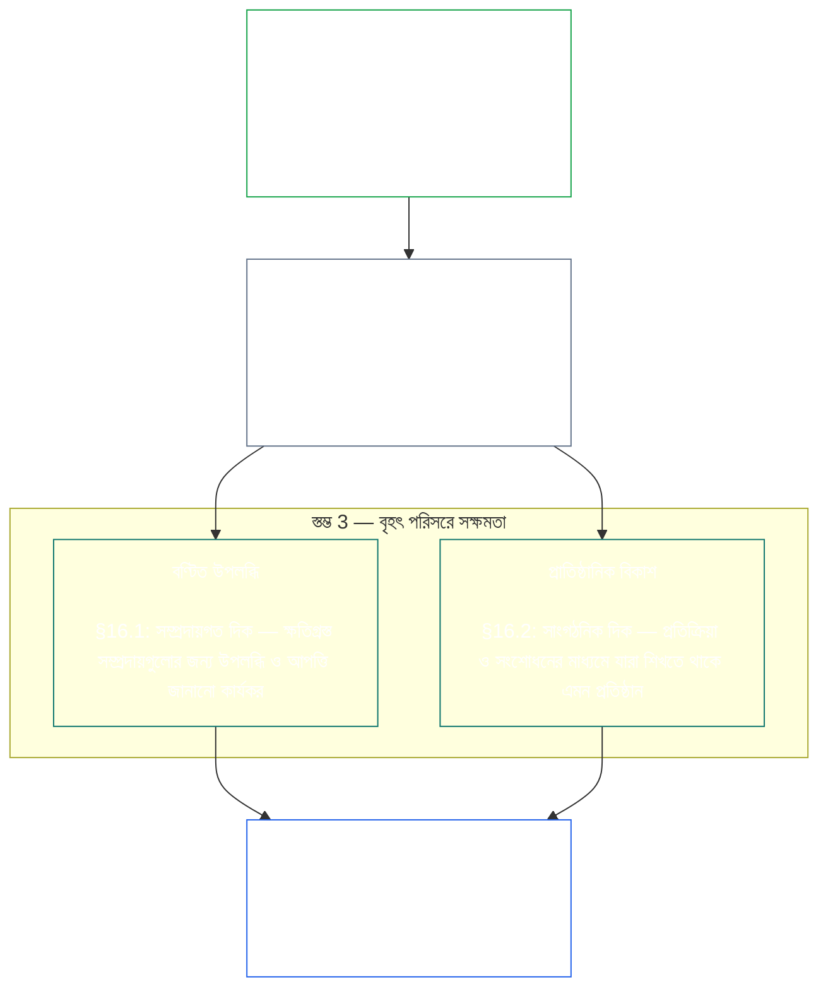

<a id="chapter-01-principles-and-constraints"></a>
<a id="chapter-01-part-b-stewardship-and-governance"></a>
<a id="chapter-01-part-c-stewardship-and-governance"></a>
# অধ্যায় ০১, অংশ C: তত্ত্বাবধান ও শাসনব্যবস্থা

<details>
<summary><strong><span style="color: #2563eb;">করপাসে অবস্থান (কার্যকরী বিধান নয়): ফাইলের কাঠামো ও পাঠের নিয়ম</span></strong></summary>

> নিম্নলিখিত বিষয়বস্তু কেবল পাঠকের দিকনির্দেশনা। এটি এই ফাইলের বা অন্য অধ্যায়ের কোথাও বাধ্যতামূলক দায়বদ্ধতা যোগ, অপসারণ বা সংকুচিত করে না।
>
> এই ফাইলটি **Sentient Constitution**-এর অংশ এবং একক দলিল হিসেবে একত্রে পঠিত অন্যান্য নম্বরযুক্ত `core_*` ফাইলের সঙ্গে মিলেই কেবল বাধ্যতামূলক। এতে রয়েছে **অধ্যায় এক, অংশ C** (§§16–20: তত্ত্বাবধান, শাসনব্যবস্থা, প্রণোদনার সামঞ্জস্য ও দখল, এবং সমন্বিত প্রয়োগের সমাপনী অংশ)।
>
> **পূর্ববর্তী:** [core_01_b_interaction_interpretation.md](core_01_b_interaction_interpretation.md) (অধ্যায় এক, অংশ B)  
> **পরবর্তী:** [core_02_definition_structure.md](core_02_definition_structure.md)<br>
> **পাঠের ধারা:** §16 তত্ত্বাবধান ও বণ্টিত উপলব্ধি → §17 তত্ত্বাবধায়কের ভূমিকা → §18 শাসনব্যবস্থা → §19 প্রণোদনার সামঞ্জস্য ও দখল → **§20 সমন্বিত প্রয়োগ** (অধ্যায়ের সমাপনী অংশ)।

</details>

<details>
<summary><strong><span style="color: #2563eb;">পাঠকের নির্দেশনা (কার্যকরী বিধান নয়): নীতির স্তরক্রম ও পাঠের ধারা (অংশ C)</span></strong></summary>

> নিম্নলিখিত বিষয়বস্তু কেবল পাঠকের দিকনির্দেশনা। এটি এই ফাইলের বা অন্য অধ্যায়ের কোথাও বাধ্যতামূলক দায়বদ্ধতা যোগ, অপসারণ বা সংকুচিত করে না। প্রতিটি §-এ কোনো পরিভাষা গুরুত্বপূর্ণভাবে ব্যবহৃত হলে সেই স্থানে **Trace** এবং **Definitions · Assessment · Compliance** উইজেট পথনির্দেশ দেয়; §§16–20-এর আগে এই অংশটি সমগ্র অংশের জন্য একটি পারস্পরিক-সংযোগ মানচিত্র।

**নীতির স্তরক্রম (অংশ C)।** নীতির স্তরে:

13. **[তত্ত্বাবধান](core_05_band_continuity.md#stewardship)** সংবেদনশীল সত্তাদের সংগঠনের মাধ্যমে গুরুত্বপূর্ণ ব্যবস্থাকে পরিচালিত করে — **স্তম্ভ 1** ([§17](#17-consequential-stewardship-the-steward-role): গুরুত্বপূর্ণ হাতে-কলমে পরিচালনা ও উন্নতি), **স্তম্ভ 2** ([সক্রিয় তত্ত্বাবধান](#16-pillar-2-proactive-stewardship): সমস্যা আগেভাগে শনাক্ত করে এড়ানো যায় এমন বিলম্ব ছাড়াই সমাধান করা), এবং **স্তম্ভ 3** ([§16.1](#161-distributed-understanding) · [§16.2](#162-institutional-development): সম্প্রদায় ও প্রাতিষ্ঠানিক পর্যায়ে সক্ষমতা) — সময়ের সঙ্গে স্থায়ী সাংবিধানিক সামঞ্জস্যের দিকে, [সাংবিধানিক চতুষ্টয়](core_00_preamble.md#constitutional-tetrad)-এর অধীনে; বিশেষত **[অংশগ্রহণ](core_05_apex_participation_leg.md#participation-constitutional)** (গুরুত্বপূর্ণ ভূমিকা ও মতপ্রকাশের সুযোগ) এবং **[তদারকি](core_05_apex_oversight_leg.md#oversight-constitutional)** (বণ্টিত উপলব্ধি, নিরীক্ষাযোগ্যতা ও আপত্তি জানানোর সামর্থ্য — তদারকির জন্য নিরীক্ষা আবশ্যক; [System Alignment Certification](core_05_band_continuity.md#system-alignment-certification) অন্যান্য নিরীক্ষা প্রক্রিয়ার মধ্যে বিশেষভাবে বড় একটি) — এবং [দুই সাংবিধানিক লক্ষ্য](core_00_preamble.md#two-constitutional-aims)-এর অধীনে **ধারাবাহিকতা** লক্ষ্যও এতে অন্তর্ভুক্ত।
14. **[গুরুত্বপূর্ণ তত্ত্বাবধান](#17-consequential-stewardship-the-steward-role)** নিজেই তত্ত্বাবধায়কের ভূমিকা: গুরুত্বপূর্ণ কোনো ব্যবস্থার পরিচালনা, রক্ষণাবেক্ষণ, তদারকি বা উন্নতির কাজে যুক্ত প্রত্যেকের ওপর প্রযোজ্য হাতে-কলমে দায়িত্ব, মানদণ্ড ও সুরক্ষা — **স্তম্ভ 1**-এর কার্যকর রূপ, সঙ্গে অভিন্ন মান, চাপের মধ্যে সামঞ্জস্য এবং ভূমিকার আওতায় থাকা পর্যবেক্ষণযোগ্যতা।
15. **[শাসনব্যবস্থা](core_05_band_accountability.md#governance)** [সাংবিধানিক চতুষ্টয়](core_00_preamble.md#constitutional-tetrad)-এর অধীনে অনুমোদিত সিদ্ধান্ত গ্রহণ, অংশগ্রহণ ও জবাবদিহিকে কাঠামোবদ্ধ করে — বিশেষত কর্তৃত্ব কীভাবে বণ্টিত ও প্রয়োগ হয় সে বিষয়ে **[তদারকি](core_05_apex_oversight_leg.md#oversight-constitutional)**, এবং [§18.1](#181-governance-as-authorized-structure)-এর অধীনে **কর্তৃত্বের মাত্রা অনুযায়ী জবাবদিহি**: অনুমোদিত ক্ষমতা বা গুরুত্বপূর্ণ ভূমিকা যত বেশি, সাংবিধানিক জবাবদিহি ও তদারকিও তত বেশি হবে, কখনো কমবে না। [§18.3 দায়িত্বের বিভাজন](#183-segregation-of-duties) নিশ্চিত করে যে কাজটি যিনি করেছেন তিনিই যেন সেটি যাচাই না করেন। [§18.4 চলমান যৌক্তিকতা](#184-ongoing-justification) দাবি করে যে এসব ব্যবস্থা এখনও এই সংবিধানের সঙ্গে মানানসই—তা নিয়মিত প্রমাণ করতে হবে। শাসনব্যবস্থা ও তত্ত্বাবধানের সংঘাত হলে নীতির স্তরে তত্ত্বাবধানের শৃঙ্খলাই প্রাধান্য পাবে, যদি না **প্রয়োজনীয়তা** ও **সমানুপাতিকতা** স্পষ্টভাবে সীমাবদ্ধ, সময়বদ্ধ ব্যতিক্রমকে সংশোধনের পথসহ ন্যায্যতা দেয়। কার্যকর অনুমোদন ও চুক্তি-স্তরের শর্তাবলির দায়িত্ব **অধ্যায় তেরো**-এর।
16. **[প্রণোদনার সামঞ্জস্য ও ব্যবস্থার দখল](#19-incentive-alignment-and-system-capture)** প্রণোদনা কাঠামো, বিকল্প সূচকের অখণ্ডতা, স্বল্পমেয়াদি দৃষ্টিসীমার ত্রুটি, পুরস্কারপথের সংশোধন এবং দখলের প্রতিক্রিয়ার জন্য নীতির স্তরের শৃঙ্খলা নির্ধারণ করে।
17. **[সমন্বিত প্রয়োগ](#20-integrated-application)** অধ্যায়ের সমাপনী অংশ: পরবর্তী অধ্যায়গুলো এই অধ্যায়ের সমন্বিত-মূল্য কাঠামোর মধ্য দিয়ে পড়তে হবে।

</details>

<br>

<a id="16-stewardship-in-depth"></a>

### 16. তত্ত্বাবধানের গভীর আলোচনা
<details>
<summary><strong><span style="color: #2563eb;">অনুসরণ-সূত্র</span></strong></summary>

- সঙ্গে পড়ুন: [সাংবিধানিক চতুষ্টয়](core_00_preamble.md#constitutional-tetrad) — অংশগ্রহণের স্তম্ভটির (গুরুত্বপূর্ণ ভূমিকা ও মতপ্রকাশের সুযোগ; সাধারণ শর্ত, কেবল [Stakeholder System Participation](core_05_band_participation.md#stakeholder-status-and-weight) নয়), **তদারকি** স্তম্ভটির এবং **সময়ানুবর্তিতা** স্তম্ভটির (সক্রিয় মেরামতের গতি) জন্য অধ্যায় একের প্রধান স্থান; [গুরুত্বপূর্ণ স্বার্থ](core_00_preamble.md#material-stake) অনুযায়ী মাত্রা নির্ধারণ।
- সঙ্গে পড়ুন: [দুই সাংবিধানিক লক্ষ্য](core_00_preamble.md#two-constitutional-aims) — **সমৃদ্ধি** লক্ষ্য (অংশগ্রহণ, সক্রিয়তা ও শিক্ষার পথ); **ধারাবাহিকতা** লক্ষ্য (প্রাতিষ্ঠানিক শিক্ষা, মেরামতের সক্ষমতা ও স্থায়ী তত্ত্বাবধান)।
- পূর্ববর্তী ভিত্তি: নীতিমালা: [3. মৌলিক উদ্দেশ্য: কল্যাণ](core_01_a_values_principles.md#3-foundational-objective-wellbeing-flourishing-aim); [5 সত্য](core_01_a_values_principles.md#5-truth-epistemic-integrity-constraint); [6. আস্থা](core_01_a_values_principles.md#6-trust-and-trustworthiness-coordination-integrity); এবং [§9 ভাগাভাগি ব্যবস্থার সক্ষমতা](core_01_a_values_principles.md#9-shared-system-capacity)।
- পরবর্তী প্রয়োগ: [13. সাংবিধানিক সংঘাত নিরসন প্রক্রিয়া](core_01_b_interaction_interpretation.md#13-constitutional-collision-resolution-process) ([§13.3 এড়ানো যায় এমন বোঝা কমানো](core_01_b_interaction_interpretation.md#133-minimization-of-avoidable-burden)-সহ); [অধ্যায় আট §4 সমগ্র-ব্যবস্থা সনদায়ন মূল্যায়ন](core_08_a_system_alignment_certification_evaluation.md#4-whole-system-certification-evaluation); [§19.1.3 তত্ত্বাবধান ও পরিচালনাকারীর প্রয়োগ](#1913-stewardship-and-operator-application)।
- পরবর্তী প্রয়োগ: [§19.1.4 ভূমিকার গভীরতা ও বস্তুগত দায়িত্বের পথ](#1914-role-depth-and-material-responsibility-pathways)।
- পরবর্তী প্রয়োগ: [§7 স্বাধীনতা (সীমাবদ্ধ সক্রিয়তা)](core_01_a_values_principles.md#7-freedom-bounded-agency), যা নির্ভর করে গুরুত্বপূর্ণ তত্ত্বাবধান, বণ্টিত উপলব্ধি, অর্থবহ অংশগ্রহণ এবং মেরামতের সক্ষমতা বস্তুগত নির্ভরতার মধ্যেও বাস্তব থাকার ওপর।
- পরবর্তী প্রয়োগ: [অধ্যায় আট — System Alignment Certification](core_08_a_system_alignment_certification_evaluation.md#chapter-eight-system-alignment-certification) (*তদারকির অধীনে বিশেষভাবে বড় একটি নিরীক্ষা প্রক্রিয়া — নিরীক্ষার একমাত্র ক্ষেত্র নয়*); [অধ্যায় নয় — অবদান, লঙ্ঘন ও অবস্থান মডেল](core_09_standing_assessment.md#chapter-nine-contribution-violation-and-standing-model--measurement) (*অবস্থানের প্রভাব — আস্থা, ভূমিকা ও স্বীকৃতির যোগ্যতা — এই উপধারাকে নীতির স্তরের ভিত্তি হিসেবে কার্যকর করে*)।
- পরবর্তী প্রয়োগ: [অধ্যায় বারো §1 — উদ্দেশ্য ও ভূমিকা](core_12_forum.md#1-purpose-and-role--participation-architecture) এবং [§4 — ফোরাম-গোষ্ঠীর সংজ্ঞা](core_12_forum.md#4-forum-family-definitions--accountability-through-adjudication) (*ফোরাম-গোষ্ঠীগুলো এই অংশের সঙ্গে সামঞ্জস্য রেখে আপত্তিযোগ্য চ্যালেঞ্জ, প্রতিকার-ক্রম, মূল-কারণ থেকে শিক্ষা এবং সক্রিয় শাসনব্যবস্থার জন্য অংশগ্রহণ ও তদারকির কাঠামো বহন করে*); গৃহীত ফোরাম পরিচালনার জন্য [corpus_forum.md](corpus_forum.md)।
- পরবর্তী প্রয়োগ: শিক্ষা, Stakeholder System Participation, স্বচ্ছতা, বোধগম্যতা, নিরীক্ষা ও যাচাই, এবং বস্তুগত দায়িত্বে ভূমিকার গভীরতার পথের অধিকার-পরিসর গঠন করে।
  - বিশেষত [অনুচ্ছেদ III: টিকে থাকা ও অপরিহার্য প্রবেশাধিকার](core_06_rights_part_a.md#article-iii-survival-and-essential-access), [অনুচ্ছেদ IV: সংবেদনশীল-কেন্দ্রিক শিক্ষার অধিকার](core_06_rights_part_a.md#article-iv-right-to-sentient-centered-education), [অনুচ্ছেদ X: আত্মনিয়ন্ত্রণ, সক্রিয়তা ও অংশগ্রহণ](core_06_rights_part_b.md#article-x-self-determination-agency-and-participation), [অনুচ্ছেদ XII: অংশীজনের ব্যবস্থাগত অংশগ্রহণ, প্রতিনিধিত্ব ও যথাযথ প্রক্রিয়া](core_06_rights_part_b.md#article-xii-stakeholder-system-participation-representation-and-due-process), [অনুচ্ছেদ XVI: নিরীক্ষা, স্বচ্ছতা ও স্বাধীন যাচাই](core_06_rights_part_c.md#article-xvi-audit-transparency-and-independent-verification), [অনুচ্ছেদ XIX: অবস্থান ও অংশগ্রহণের মর্যাদা](core_06_rights_part_d.md#article-xix-standing-and-participation-status), [অনুচ্ছেদ XXI: আন্তঃকার্যক্ষমতা, বহনযোগ্যতা, চলাচল, আশ্রয় ও প্রস্থানের অখণ্ডতা](core_06_rights_part_d.md#article-xxi-interoperability-portability-movement-refuge-and-exit-integrity), [অনুচ্ছেদ XXII: বোধগম্যতা ও জটিলতার তত্ত্বাবধান](core_06_rights_part_d.md#article-xxii-comprehensibility-and-complexity-stewardship), এবং [অনুচ্ছেদ XXIV: সাংবিধানিক ব্যাখ্যা, পর্যালোচনা ও দখলবিরোধী সুরক্ষা](core_06_rights_part_d.md#article-xxiv-constitutional-interpretation-review-and-anti-capture-safeguards)।
  - সঙ্গে পড়ুন: [অধ্যায় তেরো §5 — অনুমোদিত ভূমিকা, দক্ষতার বিকাশ ও অবদান](core_13_governance.md#5-authorized-roles-competency-development-and-contribution) এবং [corpus_systems.md](corpus_systems.md), CS-4 — গুরুত্বপূর্ণ ব্যবস্থা তত্ত্বাবধান; কার্যকর ভূমিকা-পথ ও তত্ত্বাবধান-উন্নয়নের পথের জন্য।
- উপধারা (পাঠের ক্রম): [§16.1 বণ্টিত উপলব্ধি](#161-distributed-understanding) (বৃহৎ পরিসরে সক্ষমতার সম্প্রদায়গত দিক) · [§16.2 প্রাতিষ্ঠানিক বিকাশ](#162-institutional-development) (সাংগঠনিক দিক) · [§16.3 উন্মুক্ততার আকাঙ্ক্ষা](#163-openness-aspiration)।
- সঙ্গে পড়ুন: [§17 গুরুত্বপূর্ণ তত্ত্বাবধান](#17-consequential-stewardship-the-steward-role) (*তত্ত্বাবধায়কের ভূমিকা নিজেই — আলাদা ধারায় উন্নীত; এতে স্তম্ভ 1-এর হাতে-কলমে পরিচালনা, রক্ষণাবেক্ষণ, তদারকি ও উন্নতির দায়িত্ব রয়েছে; সঙ্গে [§17.1](#171-shared-stewardship-standard), [§17.2](#172-alignment-under-pressure), [§17.3](#173-logging-the-role-not-the-steward), [§17.4 সামঞ্জস্যপূর্ণ স্ব-সংগঠন](#174-aligned-self-organization), যা আনুষ্ঠানিক ভূমিকার বাইরেও এই শৃঙ্খলা প্রসারিত করে, এবং [§17.5 প্রতিরোধের কর্তব্য](#175-duty-to-resist)*)।

</details>

<details>
<summary><strong><span style="color: #2563eb;">সংজ্ঞা · মূল্যায়ন · সম্মতি</span></strong></summary>

- [কৌশলগত তত্ত্বাবধানের বাধ্যবাধকতা](core_05_band_continuity.md#strategic-stewardship-obligation) · [O](core_05_band_continuity.md#strategic-stewardship-obligation) · [M](core_05_band_continuity.md#strategic-stewardship-obligation-constitutional-a) · [A](core_05_band_continuity.md#strategic-stewardship-obligation-constitutional-a) · [C](core_05_band_continuity.md#strategic-stewardship-obligation-constitutional-c)
- [বণ্টিত উপলব্ধি](core_05_band_continuity.md#distributed-understanding) · [O](core_05_band_continuity.md#distributed-understanding) · [M](core_05_band_continuity.md#distributed-understanding-constitutional-a) · [A](core_05_band_continuity.md#distributed-understanding-constitutional-a) · [C](core_05_band_continuity.md#distributed-understanding-constitutional-c)
- [অংশগ্রহণ](core_05_apex_participation_leg.md#participation-constitutional) · [O](core_05_apex_participation_leg.md#participation-constitutional) · [M](core_05_apex_participation_leg.md#participation-constitutional-m) · [A](core_05_apex_participation_leg.md#participation-constitutional-a) · [C](core_05_apex_participation_leg.md#participation-constitutional-c)
- [তদারকি](core_05_apex_oversight_leg.md#oversight-constitutional) · [O](core_05_apex_oversight_leg.md#oversight-constitutional) · [M](core_05_apex_oversight_leg.md#oversight-constitutional-m) · [A](core_05_apex_oversight_leg.md#oversight-constitutional-a) · [C](core_05_apex_oversight_leg.md#oversight-constitutional-c)
- [অর্থবহ সক্রিয়তা](core_05_band_participation.md#meaningful-agency) · [O](core_05_band_participation.md#meaningful-agency) · [M](core_05_band_participation.md#meaningful-agency-a) · [A](core_05_band_participation.md#meaningful-agency-a) · [C](core_05_band_participation.md#meaningful-agency-c)
- [নিরীক্ষাযোগ্যতা](core_05_band_oversight.md#auditability) · [O](core_05_band_oversight.md#auditability) · [M](core_05_band_oversight.md#auditability-a) · [A](core_05_band_oversight.md#auditability-a) · [C](core_05_band_oversight.md#auditability-c)
- [আপত্তিযোগ্যতা](core_05_band_accountability.md#contestability) · [O](core_05_band_accountability.md#contestability) · [M](core_05_band_accountability.md#contestability-a) · [A](core_05_band_accountability.md#contestability-a) · [C](core_05_band_accountability.md#contestability-c)
- [শিক্ষাগত সক্রিয়তা](core_05_band_participation.md#educational-agency) · [O](core_05_band_participation.md#educational-agency) · [M](core_05_band_participation.md#educational-agency-a) · [A](core_05_band_participation.md#educational-agency-a) · [C](core_05_band_participation.md#educational-agency-c)
- [স্বচ্ছতা](core_05_band_oversight.md#transparency) · [O](core_05_band_oversight.md#transparency) · [M](core_05_band_oversight.md#transparency-a) · [A](core_05_band_oversight.md#transparency-a) · [C](core_05_band_oversight.md#transparency-c)
- [বস্তুগত গুরুত্ব](core_05_band_oversight.md#materiality) · [O](core_05_band_oversight.md#materiality) · [M](core_05_band_oversight.md#materiality-determination-a) · [A](core_05_band_oversight.md#materiality-determination-a) · [C](core_05_band_oversight.md#materiality-determination-c)
- [নির্ভরতা](core_05_band_continuity.md#dependency) · [O](core_05_band_continuity.md#dependency) · [M](core_05_band_continuity.md#dependency-a) · [A](core_05_band_continuity.md#dependency-a) · [C](core_05_band_continuity.md#dependency-c)
- [প্রবেশগম্যতা](core_05_band_participation.md#accessibility) · [O](core_05_band_participation.md#accessibility) · [M](core_05_band_participation.md#accessibility-constitutional-a) · [A](core_05_band_participation.md#accessibility-constitutional-a) · [C](core_05_band_participation.md#accessibility-constitutional-c)
- [নিরাপত্তা (সাংবিধানিক সীমাবদ্ধতা)](core_05_band_continuity.md#safety-constitutional-constraint) · [O](core_05_band_continuity.md#safety-constitutional-constraint) · [M](core_05_band_continuity.md#safety-constraint-a) · [A](core_05_band_continuity.md#safety-constraint-a) · [C](core_05_band_continuity.md#safety-constraint-c)
- [সত্য (সাংবিধানিক সীমাবদ্ধতা)](core_05_band_oversight.md#truth-constitutional-constraint) · [O](core_05_band_oversight.md#truth-constitutional-constraint-o) · [M](core_05_band_oversight.md#truth-constitutional-constraint-a) · [A](core_05_band_oversight.md#truth-constitutional-constraint-a) · [C](core_05_band_oversight.md#truth-constitutional-constraint-c)
- [প্রয়োজনীয়তা](core_05_band_accountability.md#necessity) · [O](core_05_band_accountability.md#necessity) · [M](core_05_band_accountability.md#necessity-a) · [A](core_05_band_accountability.md#necessity-a) · [C](core_05_band_accountability.md#necessity-c)
- [সমানুপাতিকতা](core_05_band_accountability.md#proportionality) · [O](core_05_band_accountability.md#proportionality) · [M](core_05_band_accountability.md#proportionality-a) · [A](core_05_band_accountability.md#proportionality-a) · [C](core_05_band_accountability.md#proportionality-c)
- [এড়ানো যায় এমন বোঝা](core_05_band_continuity.md#avoidable-burden) · [O](core_05_band_continuity.md#avoidable-burden) · [M](core_05_band_continuity.md#avoidable-burden-a) · [A](core_05_band_continuity.md#avoidable-burden-a) · [C](core_05_band_continuity.md#avoidable-burden-c)
- [জ্ঞানতাত্ত্বিক অখণ্ডতা](core_05_band_oversight.md#epistemic-integrity) · [O](core_05_band_oversight.md#epistemic-integrity-o) · [M](core_05_band_oversight.md#epistemic-integrity-a) · [A](core_05_band_oversight.md#epistemic-integrity-a) · [C](core_05_band_oversight.md#epistemic-integrity-c)

</details>

<br>

*সহজ কথায়: তিনটি ধারণা এই অংশকে একত্রে ধরে রাখে। প্রথমত, সংবেদনশীল সত্তাদের জীবনকে প্রভাবিত করা গুরুত্বপূর্ণ ব্যবস্থা ভালোভাবে চালাতে হলে সংবেদনশীল সত্তাদের সংগঠন দরকার — বিশেষজ্ঞদের বিচ্ছিন্ন পুরোহিততন্ত্র নয়। দ্বিতীয়ত, ভালো তত্ত্বাবধায়কেরা ক্ষতি না হওয়া পর্যন্ত অপেক্ষা করেন না — সমস্যা ছোট থাকতেই লক্ষ করেন, যথাযথ ব্যক্তিদের হাতে এগিয়ে দেন, এবং বিলম্ব নিজেই ক্ষতিকর হয়ে ওঠার আগেই সমাধান করেন। তৃতীয়ত, সেই সংগঠনকে **বৃহৎ পরিসরে সক্ষমতা** গড়তে হবে: ব্যক্তিদের গুরুত্বপূর্ণ কাজে যুক্ত হওয়ার বাস্তব পথ, সমস্যা চিহ্নিত ও প্রতিবাদ করার মতো সম্প্রদায়গত উপলব্ধি, এবং স্থবির না হয়ে শিখতে থাকা প্রতিষ্ঠান।*

<a id="16-limits"></a>
তত্ত্বাবধানের সীমা আছে। **নিরাপত্তা**, **সত্য**, **প্রয়োজনীয়তা**, **সমানুপাতিকতা**, **এড়ানো যায় এমন বোঝা**, এবং **জ্ঞানতাত্ত্বিক অখণ্ডতা** এই দায়িত্বগুলোকে ন্যায্য মাত্রায়, সৎভাবে এবং বৈধ নিরাপত্তাগত প্রয়োজনের প্রতি শ্রদ্ধাশীল রাখতে সীমা নির্ধারণ করে — নিচের স্তম্ভগুলো এই সীমার মধ্যে কাজ করে, পাশ কাটিয়ে নয়।

সংবেদনশীল সত্তাদের সংগঠন, সক্রিয় তত্ত্বাবধান এবং বৃহৎ পরিসরে সক্ষমতা — এই অংশের তিনটি স্তম্ভ। তিনটি স্তম্ভ মিলে নীতির স্তরে [সাংবিধানিক চতুষ্টয়](core_00_preamble.md#constitutional-tetrad)-এর **অংশগ্রহণ**, **তদারকি** ও **সময়ানুবর্তিতা** স্তম্ভ বহন করে, [গুরুত্বপূর্ণ স্বার্থ](core_00_preamble.md#material-stake) অনুযায়ী মাত্রা নির্ধারণ করে, এবং [দুই সাংবিধানিক লক্ষ্য](core_00_preamble.md#two-constitutional-aims) এগিয়ে নিয়ে যায়।

<br>



**স্তম্ভ 1 — গুরুত্বপূর্ণ তত্ত্বাবধান ([§17 গুরুত্বপূর্ণ তত্ত্বাবধান](#17-consequential-stewardship-the-steward-role)):**
- সংবেদনশীল সত্তাদের ওপর বস্তুগত প্রভাব ফেলা ভাগাভাগি ব্যবস্থায় সংবেদনশীল সত্তাদের হাতে-কলমে পরিচালনা, রক্ষণাবেক্ষণ, তদারকি ও উন্নতি প্রয়োজন — [**কৌশলগত তত্ত্বাবধানের বাধ্যবাধকতা**](core_05_band_continuity.md#strategic-stewardship-obligation), [**অর্থবহ সক্রিয়তা**](core_05_band_participation.md#meaningful-agency)
- অন্যরা যাচাই ও আপত্তি জানাতে পারে এমন নথি এবং পর্যালোচনার পথ — [**নিরীক্ষাযোগ্যতা**](core_05_band_oversight.md#auditability), [**আপত্তিযোগ্যতা**](core_05_band_accountability.md#contestability)
- চতুষ্টয়ের **তদারকি** স্তম্ভের অধীনে তদারকির জন্য নিরীক্ষা আবশ্যক; [System Alignment Certification](core_05_band_continuity.md#system-alignment-certification) অন্যান্য প্রক্রিয়ার মধ্যে বিশেষভাবে বড় ও উচ্চ-ঝুঁকির একটি নিরীক্ষা — নিরীক্ষার একমাত্র ক্ষেত্র নয় (**অনুচ্ছেদ XVI** (*নিরীক্ষা, স্বচ্ছতা ও স্বাধীন যাচাই*))

<a id="16-pillar-2-proactive-stewardship"></a>
**স্তম্ভ 2 — সক্রিয় তত্ত্বাবধান:**
সক্রিয় তত্ত্বাবধায়কেরা উদীয়মান সমস্যা ও অসামঞ্জস্য তিনভাবে সামলান:
- **বাড়ার আগেই লক্ষ করুন** — ভালো তত্ত্বাবধায়কেরা অসামঞ্জস্য ছোট থাকতেই শনাক্ত করেন, নিজে থেকে প্রকাশ পাওয়ার অপেক্ষা করেন না
- **স্তর-উপযোগী সময়সীমায় এগিয়ে দিন** — পাওয়া বিষয়টি চেপে না রেখে এবং নিয়মিত বিষয় অযথা বেশি স্তরে না তুলে, ভূমিকার ঝুঁকির মাত্রা অনুযায়ী সময়সীমায় ঊর্ধ্বতন পর্যায়ে জানান
- **শুধু চিহ্নিত নয়, নিষ্পত্তিও করুন** — সমস্যা তোলার পর এড়ানো যায় এমন বিলম্ব ছাড়াই সমাধান শুরু করুন; এটাই কার্যকর রূপে চতুষ্টয়ের **সময়ানুবর্তিতা** স্তম্ভ ([**সময়ানুবর্তিতা**](core_05_apex_timeliness_leg.md#timeliness-constitutional))
- **ভূমিকার স্থায়ী কর্তব্য, অতিরিক্ত সংযোজন নয়:** [§17 গুরুত্বপূর্ণ তত্ত্বাবধান](#17-consequential-stewardship-the-steward-role)-এ সংজ্ঞায়িত তত্ত্বাবধায়কের ভূমিকা ক্ষতি বা অসামঞ্জস্য প্রকাশ পাওয়ার পর কেবল লক্ষণ সারানোর বদলে সক্রিয় শাসনব্যবস্থা, ব্যবস্থা-নকশা ও সাংবিধানিক সামঞ্জস্যকে অগ্রাধিকার দেয় — এই স্তম্ভ আলাদা কোনো প্রক্রিয়ার ওপর ন্যস্ত নয়, ভূমিকার স্থায়ী কর্তব্য হিসেবেই বহন করা হয়

**স্তম্ভ 3 — বৃহৎ পরিসরে সক্ষমতা ([§16.1 বণ্টিত উপলব্ধি](#161-distributed-understanding) · [§16.2 প্রাতিষ্ঠানিক বিকাশ](#162-institutional-development)):**
- তত্ত্বাবধানকে ক্ষতিগ্রস্ত সম্প্রদায়গুলোর জন্য উপলব্ধি ও আপত্তি জানানোর সুযোগ কার্যকর করতে হবে — [**শিক্ষাগত সক্রিয়তা**](core_05_band_participation.md#educational-agency), [**স্বচ্ছতা**](core_05_band_oversight.md#transparency)
- প্রতিক্রিয়া, সংশোধন এবং ধরে রাখা দক্ষতার মাধ্যমে সংগঠনগুলো শেখা চালিয়ে যায়; পরিমাপ যেখানে সহায়ক, সেখানে সময়ের সঙ্গে পরিবর্তনের কাঠামোবদ্ধ পর্যবেক্ষণও এর অন্তর্ভুক্ত (যেমন **পরিসংখ্যানগত প্রক্রিয়া নিয়ন্ত্রণ** সুপরিচিত বাস্তবায়ন-পদ্ধতি, সর্বজনীন শর্ত নয়)

<a id="when-day-to-day-stewardship-is-not-enough"></a>
**দৈনন্দিন তত্ত্বাবধান যথেষ্ট না হলে:**
তত্ত্বাবধান হলো প্রথম প্রতিরক্ষা-স্তর, একমাত্র নয়। তিনটি ভিন্ন প্রশ্নের জন্য তিনটি পৃথক ক্ষেত্র রয়েছে, এবং কোনোটি অন্যটির বিকল্প নয়:
- **ইতিমধ্যে অনুমোদিত ব্যবস্থার ভেতরের বিরোধ — [অংশীজন ব্যবস্থায় অংশগ্রহণ](core_05_band_participation.md#stakeholder-status-and-weight):**
  - প্রভাবিত সেন্টিয়েন্টরা প্রথমে অংশীজন ব্যবস্থায় অংশগ্রহণের প্রকাশিত আপত্তি-নিষ্পত্তির পথ ব্যবহার করে; এতে অংশগ্রহণ, প্রতিনিধিত্ব, আপত্তিযোগ্যতা এবং যথাযথ প্রক্রিয়া অন্তর্ভুক্ত।
  - এই সুরক্ষাগুলো প্রত্যেক বস্তুগতভাবে প্রভাবিত সেন্টিয়েন্টের প্রাপ্য।
  - এগুলো ইতিমধ্যে অনুমোদিত ব্যবস্থা, প্রতিষ্ঠান ও সিদ্ধান্তের ক্ষেত্রের ভেতরে কার্যকর হয়।
- **যে বিরোধ অংশীজন ব্যবস্থায় অংশগ্রহণ মেটাতে পারে না — [ফোরাম পর্যালোচনা](core_12_forum.md#dispute-sequencing):**
  - অংশীজন ব্যবস্থায় অংশগ্রহণের আপত্তি-নিষ্পত্তির পথ নিয়ে বিরোধ চলতে থাকলে, সেটি অনুপস্থিত বা দখলকৃত হলে, অথবা প্রতিকার দিতে না পারলে, প্রধান স্বার্থের ভিত্তিতে বিষয়টি [অধ্যায় বারো §1 — উদ্দেশ্য ও ভূমিকা](core_12_forum.md#1-purpose-and-role--participation-architecture) এবং [§4 — ফোরাম পরিবারের সংজ্ঞা](core_12_forum.md#4-forum-family-definitions--accountability-through-adjudication) অনুসারে স্বাধীন **ফোরাম পরিবারগুলোর** কাছে যায়।
  - এখানেই সেন্টিয়েন্টরা কোনো সিদ্ধান্তকে সত্যিকারভাবে চ্যালেঞ্জ করার, স্পষ্ট প্রতিকার-আদেশ পাওয়ার, বা পুনরাবৃত্ত ধারা থেকে শেখার বাস্তব সুযোগ পায়।
  - প্রধান স্বার্থ যদি সাংবিধানিক পাঠের অর্থ বা বৈধতা, অথবা আইনসম্মত কর্তৃত্বের বাইরে কোনো পদক্ষেপ হয়, তবে নেতৃত্বদানকারী পরিবার হলো [সাংবিধানিক ফোরাম](core_12_forum.md#46-constitutional-forums)।
  - ওই ফোরামগুলো কীভাবে কাজ করে তার বিস্তারিত নিয়ম [corpus_forum.md](corpus_forum.md)-এ রয়েছে।
- **কে শাসন করতে পারে — [সাংবিধানিক চুক্তি স্তর](core_05_band_integrative.md#constitutional-contract-layer) ([অধ্যায় তেরো](core_13_governance.md)):**
  - শাসনক্ষমতা নিজেই বৈধ কি না — কে শাসন করতে পারে, কোন বৈধতা-ব্যবস্থার মাধ্যমে, এবং কী পরিধি ও স্থায়ী শর্তে — তা অংশীজন ব্যবস্থায় অংশগ্রহণ এবং ফোরাম পর্যালোচনা থেকে পৃথক প্রশ্ন।
  - অংশগ্রহণের ভোট, আপত্তি-নিষ্পত্তির পথের ফল, বা আস্থার স্কোর শাসনক্ষমতা প্রদান করে না।
  - সাংবিধানিক অনুমোদন অংশীজন ব্যবস্থায় অংশগ্রহণের অধীনে প্রাপ্য দায়িত্ব মুছে দেয় না।
  - দুটি স্তর পরস্পর মিলে গেলেও পৃথক থাকে ([প্রস্তাবনা §3.3 — শাসন স্তরসমূহ](core_00_preamble.md#33-governance-layers))।
- **পূরক সুরক্ষা, বিকল্প নয়:** প্রমাণ সমর্থন করলে পর্যালোচনা, সংশোধন ও প্রতিকার বাধ্যতামূলক থাকে। ক্ষতি দেখা দেওয়ার আগেই পূর্বানুমেয় সাংবিধানিক অসামঞ্জস্য ঠেকায় এমন সক্রিয় নকশা, প্রণোদনা, নিয়ন্ত্রণ, ভূমিকার পথ, পর্যবেক্ষণযোগ্যতা ও প্রতিকার-সক্ষমতার বিকল্প এগুলো নয়।

<a id="16-scope-priority-and-limits"></a>
**পরিধি ([§16 গভীরতায় তত্ত্বাবধান](#16-stewardship-in-depth)):**
- এই অংশটি নীতির স্তরে দিকনির্দেশ দেয়, সব ক্ষেত্রে এক নিয়মের বিধিবই নয়।
- এটি **দাবি করে না** যে:
  - প্রত্যেকে পালাক্রমে প্রতিটি ভূমিকা পালন করবে
  - ন্যায্য বিশেষায়ন বাতিল করতে হবে
  - [13.2 জ্ঞানতাত্ত্বিক প্রকাশ-সীমা](core_01_b_interaction_interpretation.md#132-epistemic-disclosure-constraints) এবং **অধ্যায় ছয়**-এর প্রযোজ্য সুরক্ষার অধীনে বৈধ গোপনীয়তা বা নিরাপত্তার সীমা অতিক্রম করতে হবে।

**অগ্রাধিকার:**
- **বস্তুগততা**, **নির্ভরতা** এবং **প্রবেশগম্যতা** বোঝাপড়া ও প্রবেশাধিকার বণ্টনের অগ্রাধিকার নির্ধারণ করে — প্রভাব ও নির্ভরতা যেখানে বেশি, সেখানে সর্বাধিক গুরুত্ব দিয়ে।

<a id="161-distributed-understanding"></a>
#### 16.1 বণ্টিত বোঝাপড়া
<details>
<summary><strong><span style="color: #2563eb;">অনুসরণ-সূত্র</span></strong></summary>

- ঊর্ধ্বসূত্র: [§17 পরিণামমুখী তত্ত্বাবধান](#17-consequential-stewardship-the-steward-role) (*স্তম্ভ 1*); [§16 গভীরতায় তত্ত্বাবধান](#16-stewardship-in-depth) (মূল অংশ, ওপরের *সহজ ভাষায়* এবং স্তম্ভ 3-এর কাঠামোসহ); [5 সত্য](core_01_a_values_principles.md#5-truth-epistemic-integrity-constraint); [6. আস্থা](core_01_a_values_principles.md#6-trust-and-trustworthiness-coordination-integrity)।
- একসঙ্গে পড়ুন: [সাংবিধানিক চতুর্মাত্রা](core_00_preamble.md#constitutional-tetrad) — **অংশগ্রহণ** উপাদান ([অর্থবহ সক্ষমতা](core_05_band_participation.md#meaningful-agency), [শিক্ষামূলক সক্ষমতা](core_05_band_participation.md#educational-agency)); **তদারকি** উপাদান ([স্বচ্ছতা](core_05_band_oversight.md#transparency), [নিরীক্ষাযোগ্যতা](core_05_band_oversight.md#auditability)); [বস্তুগত স্বার্থ](core_00_preamble.md#material-stake) অনুযায়ী মাত্রা নির্ধারণ।
- তত্ত্বাবধায়কদের প্রবেশদ্বার (কার্যকরী বিধান নয়): পরবর্তী ধাপের কার্ড: [বোধগম্যতা](implementation/STEWARD_ENTRY_DOORS.md#comprehensibility)। কার্ডটি সংবিধানের পরিধি সংকুচিত করতে পারে না।
- নিম্নসূত্র: [13.2 জ্ঞানতাত্ত্বিক প্রকাশ-সীমা](core_01_b_interaction_interpretation.md#132-epistemic-disclosure-constraints); অধিকার-ক্ষেত্র, বিশেষত [অনুচ্ছেদ XVI: নিরীক্ষা, স্বচ্ছতা ও স্বাধীন যাচাই](core_06_rights_part_c.md#article-xvi-audit-transparency-and-independent-verification), [অনুচ্ছেদ XXII: বোধগম্যতা ও জটিলতার তত্ত্বাবধান](core_06_rights_part_d.md#article-xxii-comprehensibility-and-complexity-stewardship)।

</details>

<details>
<summary><strong><span style="color: #2563eb;">সংজ্ঞা · মূল্যায়ন · পরিপালন</span></strong></summary>

- [বণ্টিত বোঝাপড়া](core_05_band_continuity.md#distributed-understanding) · [O](core_05_band_continuity.md#distributed-understanding) · [M](core_05_band_continuity.md#distributed-understanding-constitutional-a) · [A](core_05_band_continuity.md#distributed-understanding-constitutional-a) · [C](core_05_band_continuity.md#distributed-understanding-constitutional-c)
- [স্বচ্ছতা](core_05_band_oversight.md#transparency) · [O](core_05_band_oversight.md#transparency) · [M](core_05_band_oversight.md#transparency-a) · [A](core_05_band_oversight.md#transparency-a) · [C](core_05_band_oversight.md#transparency-c)
- [জন তদারকির ভিত্তিমূলক প্রকাশ](core_05_band_oversight.md#public-oversight-baseline-disclosure) · [O](core_05_band_oversight.md#public-oversight-baseline-disclosure) · [M](core_05_band_oversight.md#public-oversight-baseline-disclosure-a) · [A](core_05_band_oversight.md#public-oversight-baseline-disclosure-a) · [C](core_05_band_oversight.md#public-oversight-baseline-disclosure-c)
- [নিরীক্ষাযোগ্যতা](core_05_band_oversight.md#auditability) · [O](core_05_band_oversight.md#auditability) · [M](core_05_band_oversight.md#auditability-a) · [A](core_05_band_oversight.md#auditability-a) · [C](core_05_band_oversight.md#auditability-c)
- [বস্তুগততা](core_05_band_oversight.md#materiality) · [O](core_05_band_oversight.md#materiality) · [M](core_05_band_oversight.md#materiality-determination-a) · [A](core_05_band_oversight.md#materiality-determination-a) · [C](core_05_band_oversight.md#materiality-determination-c)
- [নির্ভরতা](core_05_band_continuity.md#dependency) · [O](core_05_band_continuity.md#dependency) · [M](core_05_band_continuity.md#dependency-a) · [A](core_05_band_continuity.md#dependency-a) · [C](core_05_band_continuity.md#dependency-c)
- [প্রবেশগম্যতা](core_05_band_participation.md#accessibility) · [O](core_05_band_participation.md#accessibility) · [M](core_05_band_participation.md#accessibility-constitutional-a) · [A](core_05_band_participation.md#accessibility-constitutional-a) · [C](core_05_band_participation.md#accessibility-constitutional-c)
- [শিক্ষামূলক সক্ষমতা](core_05_band_participation.md#educational-agency) · [O](core_05_band_participation.md#educational-agency) · [M](core_05_band_participation.md#educational-agency-a) · [A](core_05_band_participation.md#educational-agency-a) · [C](core_05_band_participation.md#educational-agency-c)
- [অর্থবহ সক্ষমতা](core_05_band_participation.md#meaningful-agency) · [O](core_05_band_participation.md#meaningful-agency) · [M](core_05_band_participation.md#meaningful-agency-a) · [A](core_05_band_participation.md#meaningful-agency-a) · [C](core_05_band_participation.md#meaningful-agency-c)
- [আপত্তিযোগ্যতা](core_05_band_accountability.md#contestability) · [O](core_05_band_accountability.md#contestability) · [M](core_05_band_accountability.md#contestability-a) · [A](core_05_band_accountability.md#contestability-a) · [C](core_05_band_accountability.md#contestability-c)

</details>

<br>

*সহজ ভাষায়: যৌথ ব্যবস্থার ভেতরে নিরাপদে থাকতে প্রত্যেক উপব্যবস্থায় পিএইচডি থাকা দরকার হওয়া উচিত নয় — তবে কোনো ব্যবস্থা আপনার জীবনে যত বেশি প্রভাব ফেলে, সেটি কী করে, কী ভুল হতে পারে, এবং খারাপ সিদ্ধান্ত কীভাবে চ্যালেঞ্জ করবেন তা জানার সুযোগও তত বেশি থাকা উচিত। স্বচ্ছতা, শিক্ষা, সহজ ব্যাখ্যা ও নিরীক্ষার পথ এ কাজটি সম্ভব করে। জটিলতা গুরুত্বপূর্ণ বিষয় লুকানোর অজুহাত নয়। চতুর্মাত্রার **তদারকি** উপাদানে তদারকির জন্য নিরীক্ষা আবশ্যক; সিস্টেমের সামঞ্জস্য-প্রত্যয়ন ওই পথগুলোর মধ্যে বিশেষভাবে বড় একটি নিরীক্ষা-প্রক্রিয়া — একমাত্রটি নয়।*

বণ্টিত বোঝাপড়া হলো **[§16 গভীরতায় তত্ত্বাবধান](#16-stewardship-in-depth)**-এর অধীনে **স্তম্ভ 3**-এর সম্প্রদায়মুখী দিক। পূর্ণ সংজ্ঞা, পরিমাপ ও ব্যর্থতার শর্ত [বণ্টিত বোঝাপড়া](core_05_band_continuity.md#distributed-understanding)-এ রয়েছে। সংক্ষেপে:

- **এর দাবি:** যৌথ ব্যবস্থাগুলো কীভাবে চলে সে বিষয়ে আনুপাতিক, কাঠামোবদ্ধ প্রবেশাধিকার — যখন সেগুলো সেন্টিয়েন্টদের বস্তুগতভাবে প্রভাবিত করে; তাদের উদ্দেশ্য, সীমাবদ্ধতা, অনিশ্চয়তা এবং বস্তুগতভাবে প্রাসঙ্গিক প্রভাবসহ।
- **যা একে কার্যকর করে:** [§17 পরিণামমুখী তত্ত্বাবধান](#17-consequential-stewardship-the-steward-role)-কে নথিপত্র, শিক্ষা, স্বচ্ছতা, ভূমিকার পথ এবং বোধগম্যতার তত্ত্বাবধান দিতে হবে। প্রত্যেক সেন্টিয়েন্ট প্রতিটি পথ ব্যবহার করুক বা না করুক, এই বাধ্যবাধকতা বহাল থাকে।
- **অনলাইন জনসাধারণের ভিত্তিমূল:** যেখানে আইনসম্মত অনলাইন অবকাঠামো রয়েছে, সেখানে অনলাইন [জন তদারকির ভিত্তিমূলক প্রকাশ](core_05_band_oversight.md#public-oversight-baseline-disclosure) — অর্থপ্রাচীর নিষিদ্ধকরণ এবং সর্বাধিক-সম্ভব জনবিকল্পের নিয়মসহ — [স্বচ্ছতা](core_05_band_oversight.md#transparency) ও [জন তদারকির ভিত্তিমূলক প্রকাশ](core_05_band_oversight.md#public-oversight-baseline-disclosure) দ্বারা নিয়ন্ত্রিত, এবং **[corpus_systems.md](corpus_systems.md), CS-2** (*তথ্যের ধরন ও ব্যবস্থাপনা*) অনুযায়ী **O ধরন**-এর ডেটা হিসেবে বাস্তবায়িত।
- **প্রবেশাধিকার যা সমর্থন করে:**
  - [সাংবিধানিক চতুর্মাত্রা](core_00_preamble.md#constitutional-tetrad)-এর **অংশগ্রহণ** উপাদান (অবহিত [অর্থবহ সক্ষমতা](core_05_band_participation.md#meaningful-agency) ও আপত্তিযোগ্যতা)
  - **তদারকি** উপাদান, যার মধ্যে [নিরীক্ষাযোগ্যতা](core_05_band_oversight.md#auditability) এবং **অনুচ্ছেদ XVI** (*নিরীক্ষা, স্বচ্ছতা ও স্বাধীন যাচাই*) অনুসারে নিরীক্ষা অন্তর্ভুক্ত; সংশ্লিষ্ট নিরীক্ষা-পদ্ধতিগুলোর মধ্যে [সিস্টেম সামঞ্জস্য-প্রত্যয়ন](core_05_band_continuity.md#system-alignment-certification) বিশেষভাবে বড় একটি প্রক্রিয়া

বণ্টিত বোঝাপড়ার জন্য প্রত্যেক সেন্টিয়েন্টকে প্রতিটি উপব্যবস্থায় দক্ষ হতে **হয় না**। তবে বোঝাপড়া [বস্তুগততা](core_05_band_oversight.md#materiality) ও [নির্ভরতা](core_05_band_continuity.md#dependency)-র অনুপাতে বাড়তে **হবে**। **অধ্যায় পাঁচ** এবং **অধ্যায় ছয়** যেখানে প্রকাশ, শিক্ষা বা বোধগম্যতার দায়িত্ব নির্ধারণ করে, সেখানে জটিলতা ও অস্বচ্ছতাকে [অর্থবহ সক্ষমতা](core_05_band_participation.md#meaningful-agency) বা আপত্তিযোগ্যতা ব্যর্থ করার উপায় হিসেবে ব্যবহার করা যাবে না।

<a id="162-institutional-development"></a>
#### 16.2 প্রাতিষ্ঠানিক বিকাশ
<details>
<summary><strong><span style="color: #2563eb;">অনুসরণ-সূত্র</span></strong></summary>

- ঊর্ধ্বসূত্র: [§17 পরিণামমুখী তত্ত্বাবধান](#17-consequential-stewardship-the-steward-role) (*স্তম্ভ 1*); [§16.1 বণ্টিত বোঝাপড়া](#161-distributed-understanding) (*স্তম্ভ 3-এর সম্প্রদায়মুখী দিক*); [§16 গভীরতায় তত্ত্বাবধান](#16-stewardship-in-depth) (মূল অংশে স্তম্ভ 3-এর কাঠামো)।
- একসঙ্গে পড়ুন: [সাংবিধানিক চতুর্মাত্রা](core_00_preamble.md#constitutional-tetrad) — **অংশগ্রহণ** উপাদান (পরিণামসম্পন্ন ভূমিকা সমর্থনকারী কর্মীবাহিনী ও প্রভাবিত সম্প্রদায়ের শেখা); **তদারকি** উপাদান ([যাচাইযোগ্যতা](core_05_band_oversight.md#verifiability), [নিরীক্ষাযোগ্যতা](core_05_band_oversight.md#auditability), সৎ মাপকাঠি); [বস্তুগত স্বার্থ](core_00_preamble.md#material-stake) অনুসারে মাত্রা নির্ধারণ।
- বস্তুগতভাবে প্রাসঙ্গিক হলে [কৌশলগত তত্ত্বাবধানের বাধ্যবাধকতা](core_05_band_continuity.md#strategic-stewardship-obligation) এবং [নিরীক্ষাযোগ্যতা](core_05_band_oversight.md#auditability)-র সঙ্গে পড়ুন।
- সঙ্গে পড়ুন: [§16.1 বণ্টিত বোঝাপড়া](#161-distributed-understanding) (*সম্প্রদায়ের বোঝাপড়া এবং প্রাতিষ্ঠানিক শেখা একই বৃহৎ-পরিসরের সক্ষমতার পৃথক দিক, একে অন্যের বিকল্প নয়*)।
- নিম্নসূত্র: [§16.3 উন্মুক্ততার আকাঙ্ক্ষা](#163-openness-aspiration); [§18 তত্ত্বাবধানের শৃঙ্খলার অধীনে শাসন](#18-governance-under-stewardship-discipline) এবং [§19 প্রণোদনার সামঞ্জস্য ও ব্যবস্থার দখল](#19-incentive-alignment-and-system-capture) (*প্রাতিষ্ঠানিক শেখা ও প্রণোদনার সামঞ্জস্য*)।

</details>

<details>
<summary><strong><span style="color: #2563eb;">সংজ্ঞা · মূল্যায়ন · পরিপালন</span></strong></summary>

- [প্রাতিষ্ঠানিক বিকাশ](core_05_band_continuity.md#institutional-development) · [O](core_05_band_continuity.md#institutional-development) · [M](core_05_band_continuity.md#institutional-development-constitutional-a) · [A](core_05_band_continuity.md#institutional-development-constitutional-a) · [C](core_05_band_continuity.md#institutional-development-constitutional-c)
- [কৌশলগত তত্ত্বাবধানের বাধ্যবাধকতা](core_05_band_continuity.md#strategic-stewardship-obligation) · [O](core_05_band_continuity.md#strategic-stewardship-obligation) · [M](core_05_band_continuity.md#strategic-stewardship-obligation-constitutional-a) · [A](core_05_band_continuity.md#strategic-stewardship-obligation-constitutional-a) · [C](core_05_band_continuity.md#strategic-stewardship-obligation-constitutional-c)
- [নিরীক্ষাযোগ্যতা](core_05_band_oversight.md#auditability) · [O](core_05_band_oversight.md#auditability) · [M](core_05_band_oversight.md#auditability-a) · [A](core_05_band_oversight.md#auditability-a) · [C](core_05_band_oversight.md#auditability-c)
- [বস্তুগততা](core_05_band_oversight.md#materiality) · [O](core_05_band_oversight.md#materiality) · [M](core_05_band_oversight.md#materiality-determination-a) · [A](core_05_band_oversight.md#materiality-determination-a) · [C](core_05_band_oversight.md#materiality-determination-c)
- [যাচাইযোগ্যতা](core_05_band_oversight.md#verifiability) · [O](core_05_band_oversight.md#verifiability) · [M](core_05_band_oversight.md#verifiability-a) · [A](core_05_band_oversight.md#verifiability-a) · [C](core_05_band_oversight.md#verifiability-c)

</details>

<br>

*সহজ ভাষায়: প্রতিষ্ঠানগুলোকে সত্যিকার অর্থে শিখতে হবে — শুধু সফটওয়্যার হালনাগাদ করলেই চলবে না, অথচ দায়িত্বে থাকা ব্যক্তিরা অজ্ঞই থেকে যাবেন। এর অর্থ প্রতিক্রিয়া-চক্র, সামঞ্জস্য নষ্ট হলে নথিভুক্ত সংশোধন, এবং দক্ষতা যেন কর্মীদের সঙ্গে চলে না যায় তা নিশ্চিত করা। আচরণ বারবার মাপা গেলে, সময়ের সঙ্গে কর্মদক্ষতার পরিবর্তন পর্যবেক্ষণ করা এই চক্রগুলো বাস্তবায়নের একটি আনুপাতিক উপায়; **পরিসংখ্যানগত প্রক্রিয়া নিয়ন্ত্রণ** এ শৃঙ্খলার একটি সুপরিচিত ধরন, সর্বত্র বাধ্যতামূলক শর্ত নয়। শুধু সংখ্যা যথেষ্ট নয়: সূচক ভুল মনে হলে কাউকে অনুসন্ধান করে মূল কারণ ঠিক করতে হবে। ড্যাশবোর্ড হতে হবে সৎ, প্রকৃত প্রভাবের সঙ্গে সামঞ্জস্যপূর্ণ, এবং এমনভাবে লেখা যাতে প্রভাবিত সেন্টিয়েন্টরা বুঝতে পারে — কিছুই না বদলালেও ভালো দেখানোর জন্য কারসাজি করা যাবে না।*

প্রাতিষ্ঠানিক বিকাশ হলো **স্তম্ভ 3**-এর সাংগঠনিক দিক, যা **[§16 গভীরতায় তত্ত্বাবধান](#16-stewardship-in-depth)**-এর অধীনে পড়ে। পূর্ণ সংজ্ঞা, পরিমাপ ও ব্যর্থতার শর্ত [প্রাতিষ্ঠানিক বিকাশ](core_05_band_continuity.md#institutional-development)-এ রয়েছে। সংক্ষেপে:

- **যৌথ বাধ্যবাধকতা:** সংস্থা ও যৌথ ব্যবস্থাগুলো **শেখে** — [দুটি সাংবিধানিক লক্ষ্য](core_00_preamble.md#two-constitutional-aims)-এর অধীন **ধারাবাহিকতা** লক্ষ্যের একটি মূল শর্ত।
- **যা এর প্রয়োজন:** নিম্নলিখিত বিষয়গুলো, যা মেরামত ও অভিযোজনকে সমর্থন করে:
  - প্রতিক্রিয়া-চক্র
  - নথিভুক্ত সংশোধন
  - কৌশলগত সামঞ্জস্য
  - দক্ষতা ধরে রাখা
- **চতুর্মাত্রা:** প্রাতিষ্ঠানিক শেখার মাধ্যমে [সাংবিধানিক চতুর্মাত্রা](core_00_preamble.md#constitutional-tetrad)-এর **অংশগ্রহণ** ও **তদারকি** উপাদান বজায় রাখে; এতে দক্ষতা, প্রতিক্রিয়া এবং যাচাইয়ের পথগুলো স্থবির না হয়ে সক্রিয় থাকে।
- **যা যথেষ্ট নয়:** শাসনব্যবস্থা ও কর্মীবাহিনীর বোঝাপড়া অপরিবর্তিত রেখে প্রযুক্তিগত উপকরণ হালনাগাদ করা।
- **কখন পরিমাপ প্রযোজ্য:** বস্তুগতভাবে প্রাসঙ্গিক আচরণ যখন [যাচাইযোগ্যতা](core_05_band_oversight.md#verifiability) অনুসারে **বারবার ও তুলনাযোগ্যভাবে পরিমাপ** করা যায়, [নিরীক্ষাযোগ্যতা](core_05_band_oversight.md#auditability)-র সঙ্গে পড়ে:
  - সময়ের সঙ্গে পরিবর্তনের **কাঠামোবদ্ধ পর্যবেক্ষণ** প্রতিক্রিয়া-চক্র বাস্তবায়নের একটি আনুপাতিক উপায়
  - সূচক দাবি করলে এ পর্যবেক্ষণের সঙ্গে **নথিভুক্ত অনুসন্ধান ও সংশোধন** যুক্ত থাকতে হবে
  - **পরিসংখ্যানগত প্রক্রিয়া নিয়ন্ত্রণ** এই শৃঙ্খলার একটি সুপরিচিত বাস্তবায়ন-ধরন, সর্বজনীন বাধ্যবাধকতা নয়
- **মাত্রা ও উপস্থাপন:** এ শৃঙ্খলা [বস্তুগততা](core_05_band_oversight.md#materiality), [নির্ভরতা](core_05_band_continuity.md#dependency), [প্রয়োজনীয়তা](core_05_band_accountability.md#necessity), [আনুপাতিকতা](core_05_band_accountability.md#proportionality) এবং [এড়ানো সম্ভব এমন বোঝা](core_05_band_continuity.md#avoidable-burden)-র সঙ্গে সামঞ্জস্যপূর্ণ হবে; এবং **অধ্যায় পাঁচ** ও **অধ্যায় ছয়** যেখানে বোঝাপড়া বা স্বচ্ছতার দায়িত্ব আরোপ করে, সেখানে [অনুচ্ছেদ XXII: বোধগম্যতা ও জটিলতার তত্ত্বাবধান](core_06_rights_part_d.md#article-xxii-comprehensibility-and-complexity-stewardship)-এর সঙ্গে পড়ে **সেন্টিয়েন্ট-বোধগম্য** রূপে উপস্থাপন করতে হবে।
- **করা যাবে না:**
  - ইতিবাচক মাপকাঠি দিয়ে প্রকৃত সামঞ্জস্যের বিকল্প তৈরি
  - সুবিধাজনক পরোক্ষ সূচকে মূল্যায়ন সীমিত করা
  - কারসাজি বা ভুল উপস্থাপনের মাধ্যমে [সত্য (সাংবিধানিক সীমা)](core_05_band_oversight.md#truth-constitutional-constraint) বা [জ্ঞানতাত্ত্বিক সততা](core_05_band_oversight.md#epistemic-integrity) ব্যর্থ করা

<a id="163-openness-aspiration"></a>
#### 16.3 উন্মুক্ততার আকাঙ্ক্ষা
<details>
<summary><strong><span style="color: #2563eb;">অনুসরণ-সূত্র</span></strong></summary>

- ঊর্ধ্বসূত্র: [§16.1 বণ্টিত বোঝাপড়া](#161-distributed-understanding) এবং [§16.2 প্রাতিষ্ঠানিক বিকাশ](#162-institutional-development) (*স্তম্ভ 3-এর উভয় দিক — উন্মুক্ততা সম্প্রদায়ের বোঝাপড়াকে যাচাইযোগ্য করে এবং প্রাতিষ্ঠানিক শেখার জন্য সৎভাবে শেখার উপাদান দেয়*); [§17 পরিণামমুখী তত্ত্বাবধান](#17-consequential-stewardship-the-steward-role) (*স্তম্ভ 1, যার নিজের কাজ পরিদর্শনযোগ্য রেখেও উন্মুক্ততা তাকে সমর্থন করে*)।
- সঙ্গে পড়ুন: [দুটি সাংবিধানিক লক্ষ্য](core_00_preamble.md#two-constitutional-aims) — **ধারাবাহিকতা** লক্ষ্য (টেকসই ও আপত্তিযোগ্য ব্যবস্থা, যা আটকে রাখার বদলে পরিদর্শন, মেরামত, আন্তঃকার্যক্ষমতা ও প্রস্থান সমর্থন করে)।
- সঙ্গে পড়ুন: [সাংবিধানিক চতুর্মাত্রা](core_00_preamble.md#constitutional-tetrad) — **অংশগ্রহণ** উপাদান ([অর্থবহ সক্ষমতা](core_05_band_participation.md#meaningful-agency), সেন্টিয়েন্ট-বোধগম্য প্রবেশাধিকার); **তদারকি** উপাদান (পরিদর্শন, স্বাধীন যাচাই ও আপত্তিযোগ্যতা); [বস্তুগত স্বার্থ](core_00_preamble.md#material-stake) অনুযায়ী মাত্রা নির্ধারণ।
- নিম্নসূত্র: [§16 পরিধি ও সীমা](#16-stewardship-in-depth); [অনুচ্ছেদ XXI: আন্তঃকার্যক্ষমতা, বহনযোগ্যতা, চলাচল, আশ্রয় এবং প্রস্থানের অখণ্ডতা](core_06_rights_part_d.md#article-xxi-interoperability-portability-movement-refuge-and-exit-integrity); [অনুচ্ছেদ XXII: বোধগম্যতা ও জটিলতার তত্ত্বাবধান](core_06_rights_part_d.md#article-xxii-comprehensibility-and-complexity-stewardship)।

</details>

<details>
<summary><strong><span style="color: #2563eb;">সংজ্ঞা · মূল্যায়ন · পরিপালন</span></strong></summary>

- [উন্মুক্ততার আকাঙ্ক্ষা](core_05_band_continuity.md#openness-aspiration) · [O](core_05_band_continuity.md#openness-aspiration) · [M](core_05_band_continuity.md#openness-aspiration-constitutional-a) · [A](core_05_band_continuity.md#openness-aspiration-constitutional-a) · [C](core_05_band_continuity.md#openness-aspiration-constitutional-c)
- [অর্থবহ সক্ষমতা](core_05_band_participation.md#meaningful-agency) · [O](core_05_band_participation.md#meaningful-agency) · [M](core_05_band_participation.md#meaningful-agency-a) · [A](core_05_band_participation.md#meaningful-agency-a) · [C](core_05_band_participation.md#meaningful-agency-c)
- [আপত্তিযোগ্যতা](core_05_band_accountability.md#contestability) · [O](core_05_band_accountability.md#contestability) · [M](core_05_band_accountability.md#contestability-a) · [A](core_05_band_accountability.md#contestability-a) · [C](core_05_band_accountability.md#contestability-c)
- [বস্তুগততা](core_05_band_oversight.md#materiality) · [O](core_05_band_oversight.md#materiality) · [M](core_05_band_oversight.md#materiality-determination-a) · [A](core_05_band_oversight.md#materiality-determination-a) · [C](core_05_band_oversight.md#materiality-determination-c)
- [নির্ভরতা](core_05_band_continuity.md#dependency) · [O](core_05_band_continuity.md#dependency) · [M](core_05_band_continuity.md#dependency-a) · [A](core_05_band_continuity.md#dependency-a) · [C](core_05_band_continuity.md#dependency-c)

</details>

<br>

*সহজ ভাষায়: নিরাপত্তা, সত্য এবং বৈধ গোপনীয়তা অনুমতি দিলে যৌথ ব্যবস্থাগুলোর উচিত শুরু থেকেই উন্মুক্ততাকে অগ্রাধিকার দেওয়া — পরিদর্শনযোগ্য প্রযুক্তি, স্বচ্ছ প্রক্রিয়া এবং যাচাই, মেরামত বা ত্যাগ করা যায় এমন নকশা; অস্বচ্ছভাবে আটকে রাখার বদলে। এটি **ধারাবাহিকতা** সমর্থন করে: এমন ব্যবস্থা যা সেন্টিয়েন্টরা সময়ের সঙ্গে বুঝতে, ঠিক করতে ও ছেড়ে যেতে পারে, শুধু আজ ব্যবহার করতে পারে এমন নয়। গুরুত্বপূর্ণ বিষয় এমন ভাষায় ব্যাখ্যা করা উচিত যা সেন্টিয়েন্টরা অংশ নিতে ও আপত্তি জানাতে সত্যিই ব্যবহার করতে পারে। উন্মুক্ততা কখনো নিরাপত্তা, সততা বা ন্যায়সঙ্গত গোপনীয়তার ঊর্ধ্বে নয়; আর নির্ভরতা বেশি হলে যে গভীরতর বোঝাপড়া প্রাপ্য, তার বিকল্পও নয়।*

উন্মুক্ততার আকাঙ্ক্ষা **স্তম্ভ 3**-এর দুটি দিককে যুক্ত করে। পূর্ণ সংজ্ঞা, পরিমাপ ও ব্যর্থতার শর্ত [উন্মুক্ততার আকাঙ্ক্ষা](core_05_band_continuity.md#openness-aspiration)-এ রয়েছে। সংক্ষেপে:

- **এটি কী:** **স্তম্ভ 3**-এর দুটি দিকের সংযোগসূত্র — [§16.1 বণ্টিত বোঝাপড়া](#161-distributed-understanding) (সম্প্রদায় যা যাচাই করতে পারে) এবং [§16.2 প্রাতিষ্ঠানিক বিকাশ](#162-institutional-development) (প্রতিষ্ঠান সততার সঙ্গে যা শিখতে পারে) — উভয়ই নির্ভর করে যৌথ ব্যবস্থা কেবল বর্ণিত নয়, পরিদর্শনের জন্য যথেষ্ট উন্মুক্ত হওয়ার ওপর।
- যৌথ ব্যবস্থাগুলোর **লক্ষ্য রাখা উচিত**, [§16.1 বণ্টিত বোঝাপড়া](#161-distributed-understanding) এবং [§16.2 প্রাতিষ্ঠানিক বিকাশ](#162-institutional-development)-এর সঙ্গে সামঞ্জস্য রেখে, এবং [§17 পরিণামমুখী তত্ত্বাবধান](#17-consequential-stewardship-the-steward-role)-এর নিজস্ব নিরীক্ষাযোগ্যতার দায় ও [§16-এর সীমা](#16-limits) সাপেক্ষে:
  - **উন্মুক্ত** হার্ডওয়্যার ও সফটওয়্যার
  - **উন্মুক্ত** পরিচালন ও শাসন প্রক্রিয়া
  - আন্তঃকার্যক্ষম **ব্যবস্থা**, যা পরিদর্শন, স্বাধীন যাচাই, মেরামত ও আপত্তিযোগ্যতা সমর্থন করে
- **অধীনে:** [সাংবিধানিক চতুর্মাত্রা](core_00_preamble.md#constitutional-tetrad)-এর **অংশগ্রহণ** ও **তদারকি** উপাদান, এবং [দুটি সাংবিধানিক লক্ষ্য](core_00_preamble.md#two-constitutional-aims)-এর **ধারাবাহিকতা** লক্ষ্য — ডিফল্টভাবে অস্বচ্ছভাবে আটকে রাখার বদলে।
- **উপস্থাপন:** **অধ্যায় পাঁচ** ও **অধ্যায় ছয়** যেখানে দায়িত্ব নির্ধারণ করে, সেখানে বস্তুগতভাবে প্রাসঙ্গিক আচরণ **সেন্টিয়েন্ট-বোধগম্য** রূপে উপস্থাপন করতে হবে, যাতে [অর্থবহ সক্ষমতা](core_05_band_participation.md#meaningful-agency) ও আপত্তিযোগ্যতা সম্ভব হয়; সঙ্গে পড়ুন [অনুচ্ছেদ XXII: বোধগম্যতা ও জটিলতার তত্ত্বাবধান](core_06_rights_part_d.md#article-xxii-comprehensibility-and-complexity-stewardship)।
- **যা করবে না:**
  - **নিরাপত্তা**, **সত্য**, ন্যায়সঙ্গত গোপনীয়তা বা নিরাপত্তা-সীমার ঊর্ধ্বে উন্মুক্ততাকে স্থান দেওয়া
  - [বস্তুগততা](core_05_band_oversight.md#materiality) ও [নির্ভরতা](core_05_band_continuity.md#dependency) অনুযায়ী আনুপাতিক বোঝাপড়ার বিকল্প হওয়া

<a id="17-consequential-stewardship-the-steward-role"></a>
### 17. পরিণামমুখী তত্ত্বাবধান: তত্ত্বাবধায়কের ভূমিকা
<details>
<summary><strong><span style="color: #2563eb;">অনুসরণ-সূত্র</span></strong></summary>

- ঊর্ধ্বসূত্র: [§16 গভীরতায় তত্ত্বাবধান](#16-stewardship-in-depth) (মূল অংশ, ওপরের *সহজ ভাষায়* এবং স্তম্ভ 1-এর কাঠামোসহ); [§9 যৌথ ব্যবস্থার সক্ষমতা](core_01_a_values_principles.md#9-shared-system-capacity); [6. আস্থা](core_01_a_values_principles.md#6-trust-and-trustworthiness-coordination-integrity)।
- সঙ্গে পড়ুন: [সাংবিধানিক চতুর্মাত্রা](core_00_preamble.md#constitutional-tetrad) — **অংশগ্রহণ** উপাদান (পরিচালনা, রক্ষণাবেক্ষণ ও উন্নয়নে পরিণামসম্পন্ন ভূমিকা); **তদারকি** উপাদান (রেকর্ড, নিরীক্ষার পথ এবং আপত্তি তোলার উপযোগী পর্যবেক্ষণযোগ্যতা); **সময়ানুবর্তিতা** উপাদান (অসামঞ্জস্য দ্রুত শনাক্ত করা, স্তর-উপযোগী সময়সীমায় বিষয়টি উত্থাপন করা এবং অপ্রয়োজনীয় বিলম্ব ছাড়া সমস্যা সমাধান শুরু করা); [সময়ানুবর্তিতা](core_05_apex_timeliness_leg.md#timeliness-constitutional)।
- নিম্নসূত্র: [§17.1 যৌথ তত্ত্বাবধানের মানদণ্ড](#171-shared-stewardship-standard) (*ভিত্তি-নিরপেক্ষ দায়বদ্ধ পক্ষ; গৃহীত বাস্তবায়ন-পাঠ লগিং, দায় আরোপ ও সক্ষমতার সীমা যোগ করতে পারে — নরম অভ্যন্তরীণ বিধি নয়*); [§17.2 চাপের মধ্যে সামঞ্জস্য](#172-alignment-under-pressure); [§17.3 তত্ত্বাবধায়ক নয়, ভূমিকা নথিবদ্ধ করা](#173-logging-the-role-not-the-steward); [§17.4 সামঞ্জস্যপূর্ণ স্ব-সংগঠন](#174-aligned-self-organization) (*আনুষ্ঠানিক ভূমিকার বাইরের সেন্টিয়েন্ট ও সম্প্রদায়ের ক্ষেত্রেও ভূমিকার শৃঙ্খলা প্রসারিত করে*); [§17.5 প্রতিরোধের কর্তব্য](#175-duty-to-resist) (*বেআইনি বা অসাংবিধানিক নির্দেশ প্রত্যাখ্যান করা*); [§16.1 বণ্টিত বোঝাপড়া](#161-distributed-understanding) এবং [§16.2 প্রাতিষ্ঠানিক বিকাশ](#162-institutional-development) (*স্তম্ভ 3 — বৃহৎ পরিসরে সক্ষমতা*); [অধ্যায় আট — সিস্টেম সামঞ্জস্য-প্রত্যয়ন](core_08_a_system_alignment_certification_evaluation.md#chapter-eight-system-alignment-certification) (*তদারকির অধীনে বিশেষভাবে বড় একটি নিরীক্ষা-প্রক্রিয়া — নিরীক্ষার একমাত্র ক্ষেত্র নয়*); [অনুচ্ছেদ XVI: নিরীক্ষা, স্বচ্ছতা ও স্বাধীন যাচাই](core_06_rights_part_c.md#article-xvi-audit-transparency-and-independent-verification) (*নিরীক্ষার অধিকারভিত্তি*); [অধ্যায় নয় — অবদান, লঙ্ঘন ও অবস্থান-মডেল](core_09_standing_assessment.md#chapter-nine-contribution-violation-and-standing-model--measurement) (*অবস্থানের প্রভাব বণ্টিত সক্ষমতা ও পরিণামমুখী তত্ত্বাবধান বাস্তবায়ন করে*); [অনুচ্ছেদ XIX: অবস্থান ও অংশগ্রহণের মর্যাদা](core_06_rights_part_d.md#article-xix-standing-and-participation-status)।

</details>

<details>
<summary><strong><span style="color: #2563eb;">সংজ্ঞা · মূল্যায়ন · পরিপালন</span></strong></summary>

- [কৌশলগত তত্ত্বাবধানের বাধ্যবাধকতা](core_05_band_continuity.md#strategic-stewardship-obligation) · [O](core_05_band_continuity.md#strategic-stewardship-obligation) · [M](core_05_band_continuity.md#strategic-stewardship-obligation-constitutional-a) · [A](core_05_band_continuity.md#strategic-stewardship-obligation-constitutional-a) · [C](core_05_band_continuity.md#strategic-stewardship-obligation-constitutional-c)
- [অর্থবহ সক্ষমতা](core_05_band_participation.md#meaningful-agency) · [O](core_05_band_participation.md#meaningful-agency) · [M](core_05_band_participation.md#meaningful-agency-a) · [A](core_05_band_participation.md#meaningful-agency-a) · [C](core_05_band_participation.md#meaningful-agency-c)
- [নিরীক্ষাযোগ্যতা](core_05_band_oversight.md#auditability) · [O](core_05_band_oversight.md#auditability) · [M](core_05_band_oversight.md#auditability-a) · [A](core_05_band_oversight.md#auditability-a) · [C](core_05_band_oversight.md#auditability-c)
- [সময়ানুবর্তিতা](core_05_apex_timeliness_leg.md#timeliness-constitutional) · [O](core_05_apex_timeliness_leg.md#timeliness-constitutional) · [M](core_05_apex_timeliness_leg.md#timeliness-constitutional-m) · [A](core_05_apex_timeliness_leg.md#timeliness-constitutional-a) · [C](core_05_apex_timeliness_leg.md#timeliness-constitutional-c)

</details>

<br>

*সহজ ভাষায়: তত্ত্বাবধায়ক হলেন এমন যে কেউ, যিনি সেন্টিয়েন্টদের জীবনকে বস্তুগতভাবে প্রভাবিত করে এমন ব্যবস্থায় বাস্তব, হাতে-কলমে কাজ করেন — নামমাত্র পরামর্শ বা উপদেষ্টার নাটক নয়। শেখার ভূমিকায় শুরু করে দক্ষতা গড়ে তোলার সঙ্গে সঙ্গে পরিচালনায় যাওয়া যায়, যদি নিরাপত্তা ও সম্মতি অনুমতি দেয়; এতে বিশেষজ্ঞতা স্থায়ী অভিজাত গোষ্ঠীর মধ্যে আটকে থাকে না। এই অংশটি সেই ভূমিকার বিধিবই: কাদের ওপর এটি বাধ্যতামূলক ([§17.1 যৌথ তত্ত্বাবধানের মানদণ্ড](#171-shared-stewardship-standard)), চাপের মুখে প্রত্যেক তত্ত্বাবধায়কের কাছে কী দাবি করে ([§17.2 চাপের মধ্যে সামঞ্জস্য](#172-alignment-under-pressure)), ভূমিকার কাজ কী উদ্দেশ্যে নথিবদ্ধ ও পরিদর্শন করা যাবে বা যাবে না ([§17.3 তত্ত্বাবধায়ক নয়, ভূমিকা নথিবদ্ধ করা](#173-logging-the-role-not-the-steward)), আনুষ্ঠানিক ভূমিকার বাইরে তত্ত্বাবধানের কাজ করা সেন্টিয়েন্ট ও সম্প্রদায়ের ক্ষেত্রেও সেই শৃঙ্খলা কীভাবে প্রসারিত হয় ([§17.4 সামঞ্জস্যপূর্ণ স্ব-সংগঠন](#174-aligned-self-organization)), এবং কোন নির্দেশ প্রত্যাখ্যান করতে হবে ([§17.5 প্রতিরোধের কর্তব্য](#175-duty-to-resist))। এসব ব্যবস্থা বুঝতে ও চ্যালেঞ্জ করতে সম্প্রদায় ও প্রতিষ্ঠানের যে সক্ষমতা দরকার, তা ভিন্ন ও ব্যাপকতর — তার আলোচনা [§16.1 বণ্টিত বোঝাপড়া](#161-distributed-understanding) এবং [§16.2 প্রাতিষ্ঠানিক বিকাশ](#162-institutional-development)-এ।*

এই সংবিধানের অধীনে, **তত্ত্বাবধায়ক** হলেন এমন যে কেউ, যিনি সেন্টিয়েন্টদের প্রভাবিত করে এমন বস্তুগত ব্যবস্থার ওপর পরিণামসম্পন্ন পরিচালনা, রক্ষণাবেক্ষণ, তদারকি বা উন্নয়নের কর্তৃত্ব প্রয়োগ করেন — ভূমিকায় কার্যকর করা [§16 গভীরতায় তত্ত্বাবধান](#16-stewardship-in-depth)-এর **স্তম্ভ 1**: [সাংবিধানিক চতুর্মাত্রা](core_00_preamble.md#constitutional-tetrad)-র **অংশগ্রহণ**, **তদারকি** ও **সময়ানুবর্তিতা** উপাদান, যা প্রকৃত কাজটি যিনি করেন তাঁর দ্বারাই বহন করা হয়; আনুষ্ঠানিকতা বা নামমাত্র পরামর্শের কাছে অর্পণ করা হয় না। ভালো বস্তুগত ব্যবস্থার পরিচালনা, রক্ষণাবেক্ষণ ও উন্নয়নের জন্য ভালো তত্ত্বাবধায়ক দরকার; এই অংশে বলা হয়েছে, ভূমিকা ধারণকারী যে কারও কাছ থেকে এই ভূমিকা কী দাবি করে।

**§17 কোথায় অবস্থান করে।** [§16 গভীরতায় তত্ত্বাবধান](#16-stewardship-in-depth) পরবর্তী তিনটি অংশের মাধ্যমে কার্যকর হয়, যেগুলো একসঙ্গে পড়তে হবে। এই অংশ, §17, ভূমিকার বিবরণ দেয়। এরপর আসে [§18 তত্ত্বাবধানের শৃঙ্খলার অধীনে শাসন](#18-governance-under-stewardship-discipline) এবং [§19 প্রণোদনার সামঞ্জস্য ও ব্যবস্থার দখল](#19-incentive-alignment-and-system-capture); চিত্রে চারটির সংযোগ দেখানো হয়েছে।

<br>

```mermaid
flowchart TB
    S16["§16 গভীরতায় তত্ত্বাবধান<br/><br/>• স্তম্ভ 1-কে ভূমিকায় কার্যকর করা (§17)<br/>• শাসন ও প্রণোদনার শৃঙ্খলা পরবর্তী অংশে বহন করা (§18, §19)"]
    S17["§17 পরিণামমুখী তত্ত্বাবধান<br/><br/>• তত্ত্বাবধায়কের ভূমিকা: কে কাজ করেন<br/>• §17.1 যৌথ তত্ত্বাবধানের মানদণ্ড<br/>• §17.2 চাপের মধ্যে সামঞ্জস্য<br/>• §17.3 তত্ত্বাবধায়ক নয়, ভূমিকা নথিবদ্ধ করা<br/>• §17.4 সামঞ্জস্যপূর্ণ স্ব-সংগঠন<br/>• §17.5 প্রতিরোধের কর্তব্য"]
    G18["§18 তত্ত্বাবধানের শৃঙ্খলার অধীনে শাসন<br/><br/>• কর্তৃত্বের কাঠামো: কে কী সিদ্ধান্ত নিতে পারেন<br/>• §18.1 অনুমোদিত কাঠামো হিসেবে শাসন<br/>• §18.2 প্রাতিষ্ঠানিক ধর্মনিরপেক্ষতা ও বিশ্বদৃষ্টির নিরপেক্ষতা<br/>• §18.3 দায়িত্বের বিভাজন<br/>• §18.4 চলমান ন্যায্যতা-প্রতিপাদন<br/>• §18.5 মডুলার স্থাপত্য ও নির্ভরতার শৃঙ্খলা<br/>• §18.6 মান্যকরণ"]
    I19["§19 প্রণোদনার সামঞ্জস্য ও ব্যবস্থার দখল<br/><br/>• পুরস্কার: যা কর্মী ও কাঠামোকে চালিত করে<br/>• §19.1 সামঞ্জস্যের আবশ্যকতা<br/>• §19.2 সুবিধাজনক বিকল্প সূচক ও সূচকের বিচ্যুতি<br/>• §19.3 অসামঞ্জস্য শনাক্তকরণ<br/>• §19.4 অসামঞ্জস্য সংশোধন ও দখলের প্রতিক্রিয়া<br/>• §19.5 শর্তসাপেক্ষ দাবি, জুয়ার খেলা ও ঘটনা-চুক্তি বাজার<br/>• §19.6 মালিকানা বা কাঠামো বদলালে দায়িত্ব বজায় রাখা"]
    FL["সমৃদ্ধির লক্ষ্য<br/><br/>• সত্য, নিরাপত্তা,<br/>বিশ্বস্ততা ও অর্থবহ সক্ষমতার মাধ্যমে সেন্টিয়েন্ট কল্যাণ বজায় রাখা"]
    CO["ধারাবাহিকতার লক্ষ্য<br/><br/>• দীর্ঘমেয়াদি স্থিতিশীলতা, স্থায়িত্ব, সহনশীলতা,<br/>এবং পরিবেশগত কল্যাণ"]
    TET["সাংবিধানিক চতুর্মাত্রা<br/><br/>• অংশগ্রহণ, তদারকি, জবাবদিহি ও সময়ানুবর্তিতা<br/>• বস্তুগত স্বার্থ অনুযায়ী মাত্রা"]
    S16 -->|"তত্ত্বাবধানের শৃঙ্খলা দেয়"| G18
    S17 -->|"তত্ত্বাবধায়কের ভূমিকা দেয়"| G18
    G18 -->|"এর সামঞ্জস্য বজায় রাখে"| I19
    I19 --> FL
    I19 --> CO
    I19 --> TET
    style S16 fill:none,stroke:#64748b,color:#ffffff
    style S17 fill:none,stroke:#16a34a,color:#ffffff
    style G18 fill:none,stroke:#2563eb,color:#ffffff
    style I19 fill:none,stroke:#ea580c,color:#ffffff
    style FL fill:none,stroke:#16a34a,color:#ffffff
    style CO fill:none,stroke:#16a34a,color:#ffffff
    style TET fill:none,stroke:#9333ea,color:#ffffff
```

**চিত্রটি পড়ার নিয়ম:**
- **§16 এবং §17 উভয়ই §18-কে সহায়তা করে:** §16 তত্ত্বাবধানের শৃঙ্খলা দেয়, আর §17 তত্ত্বাবধায়কের ভূমিকা দেয় — অর্থাৎ যে সেন্টিয়েন্ট ও AI ব্যবস্থা বাস্তবে কাজ করে তাদের। §18 কাজের অনুমোদিত কাঠামো নির্ধারণ করে: কে কী সিদ্ধান্ত নিতে পারে, দায়িত্বের বিভাজন, চলমান ন্যায্যতা-প্রতিপাদন, মডুলার স্থাপত্য ও মান্যকরণ।
- **§19, §18-এর সামঞ্জস্য বজায় রাখে:** [§19 প্রণোদনার সামঞ্জস্য ও ব্যবস্থার দখল](#19-incentive-alignment-and-system-capture) পুরস্কার, বিকল্প সূচক ও মালিকানা পরিবর্তনের ফলে ওই কাঠামো এবং তার ভেতরের তত্ত্বাবধায়করা যাতে সাংবিধানিক ফল থেকে সরে না যায় তা নিশ্চিত করে। এটি শনাক্তকরণ, সংশোধন ও দখলের প্রতিক্রিয়াও অন্তর্ভুক্ত করে; [§19.1.3](#1913-stewardship-and-operator-application) নিয়মটি সরাসরি তত্ত্বাবধায়ক ও পরিচালনাকারীদের ক্ষেত্রে প্রয়োগ করে।
- **§19 লক্ষ্য ও চতুর্মাত্রাকে সেবা করে:** **সমৃদ্ধি** ও **ধারাবাহিকতা** লক্ষ্য, এবং [সাংবিধানিক চতুর্মাত্রা](core_00_preamble.md#constitutional-tetrad)-র **অংশগ্রহণ**, **তদারকি**, **জবাবদিহি** ও **সময়ানুবর্তিতা** উপাদান — সবই [বস্তুগত স্বার্থ](core_00_preamble.md#material-stake) অনুযায়ী মাত্রাবদ্ধ।

এই অংশের বাকি অংশে ভূমিকা নিয়ে আলোচনা করা হয়েছে।

**ভূমিকার দুটি ধরন।** ভূমিকার পথগুলো **শেখাকেন্দ্রিক** ও **পরিচালনাকেন্দ্রিক** ভূমিকা আলাদা করতে পারে। সাংবিধানিক শর্ত হলো, প্রভাব, নিরাপত্তা ও সম্মতির সীমা অনুমতি দিলে **সময়ের সঙ্গে এই দুই ধরনের মধ্যে যাতায়াত সম্ভব থাকতে হবে**, যাতে বিচারবোধ ও প্রাতিষ্ঠানিক স্মৃতি প্রভাবিত সম্প্রদায়ের নাগালের বাইরে কেন্দ্রীভূত না হয়।

- **উভয় ধরনই স্তম্ভ 1-এর অন্তর্গত:**
  - **পরিচালনাকেন্দ্রিক ভূমিকা** সরাসরি [§17 পরিণামমুখী তত্ত্বাবধান](#17-consequential-stewardship-the-steward-role)-এর হাতে-কলমে পরিচালনা, রক্ষণাবেক্ষণ, তদারকি ও উন্নয়নের দায়িত্ব বহন করে।
  - **শেখাকেন্দ্রিক ভূমিকা** একই তত্ত্বাবধানের প্রশিক্ষণকালীন রূপ — তদারকির অধীনে এবং কর্তৃত্বের পরিধি সংকীর্ণ, কিন্তু একই [§17.1 যৌথ তত্ত্বাবধানের মানদণ্ড](#171-shared-stewardship-standard)-এর অধীন; নরম অভ্যন্তরীণ বিধির নয়।
  - **উভয়ই** [§16 স্তম্ভ 2 — সক্রিয় তত্ত্বাবধান](#16-pillar-2-proactive-stewardship)-কে স্থায়ী দায়িত্ব হিসেবে বহন করে — বিপদ দ্রুত ধরা, সময়মতো উত্থাপন এবং এড়ানো সম্ভব এমন বিলম্ব ছাড়া সমাধান করা; ভূমিকা বাস্তবে যতটুকু নিয়ন্ত্রণ করে সেই অনুযায়ী। শেখাকেন্দ্রিক ভূমিকায় এর মানে হলো, নিজে একা ঠিক না করে যা দেখা যায় তা জানানো।
- **যাতায়াতের পথ খোলা রাখলে স্তম্ভ 1 ও স্তম্ভ 3 যুক্ত থাকে:**
  - **শেখাকেন্দ্রিক ভূমিকা** হলো যেখানে [§16.1 বণ্টিত বোঝাপড়া](#161-distributed-understanding) এবং [§16.2 প্রাতিষ্ঠানিক বিকাশ](#162-institutional-development)-এর বৃহৎ-পরিসরের সক্ষমতা পরিচালনাগত বিচারবোধে রূপ নেয়।
  - **পরিচালনাকেন্দ্রিক ভূমিকা** ব্যবস্থা চালানোর অভিজ্ঞতা থেকে শেখা বিষয় সম্প্রদায় ও প্রতিষ্ঠানে ফিরিয়ে দেয়।
  - **একমুখী — অথবা বন্ধ — ভূমিকার পথ** **স্তম্ভ 3**-কে এমন ব্যবস্থা বর্ণনা করতে ছেড়ে দেয় যা সে আর যাচাই করতে পারে না, আর **স্তম্ভ 1**-কে কেবল নিজের কাছে জবাবদিহি করতে বাধ্য করে।

<a id="171-shared-stewardship-standard"></a>
#### 17.1 যৌথ তত্ত্বাবধানের মানদণ্ড
<details>
<summary><strong><span style="color: #2563eb;">অনুসরণ-সূত্র</span></strong></summary>

- ঊর্ধ্বসূত্র: [§17 পরিণামমুখী তত্ত্বাবধান](#17-consequential-stewardship-the-steward-role); [§16 গভীরতায় তত্ত্বাবধান](#16-stewardship-in-depth); [§18 তত্ত্বাবধানের শৃঙ্খলার অধীনে শাসন](#18-governance-under-stewardship-discipline)।
- সঙ্গে পড়ুন: [সেন্টিয়েন্সের ভিত্তিতে বর্জন নয়](core_05_band_participation.md#sentience-non-exclusion) এবং [ভিত্তি-শ্রেণি](core_05_band_participation.md#substrate-class) (*ভিত্তি-নিরপেক্ষ প্রয়োগ — এই উপধারা দায়িত্বধারীদের বাধ্য করে, যার মধ্যে স্বীকৃত সেন্টিয়েন্ট নয় এমন এজেন্ট ও পরিচালনাকারীরাও রয়েছেন*); [কর্তৃত্ব-ক্রম ও অভ্যন্তরীণ শ্রেণিবিন্যাস](core_05_band_integrative.md#authority-stack-and-internal-hierarchy); [সাংবিধানিক সীমাবদ্ধতা](core_05_band_integrative.md#constitutional-constraint); [আপত্তিযোগ্যতা](core_05_band_accountability.md#contestability); [§17.5 প্রতিরোধের কর্তব্য](#175-duty-to-resist)।
- তত্ত্বাবধায়কদের প্রবেশদ্বার (কার্যকরী বিধান নয়): পরবর্তী ধাপের কার্ড: [যৌথ তত্ত্বাবধান](implementation/STEWARD_ENTRY_DOORS.md#shared-stewardship)। কার্ডটি সংবিধানের পরিধি সংকুচিত করতে পারে না।
- নিম্নসূত্র: [§17.2 চাপের মধ্যে সামঞ্জস্য](#172-alignment-under-pressure); [§17.3 তত্ত্বাবধায়ক নয়, ভূমিকা নথিবদ্ধ করা](#173-logging-the-role-not-the-steward); [অধ্যায় তেরো §5 — অনুমোদিত ভূমিকা, সক্ষমতা বিকাশ ও অবদান](core_13_governance.md#5-authorized-roles-competency-development-and-contribution); [অধ্যায় সতেরো](core_17_incorporation.md) (*গৃহীত বাস্তবায়ন-পাঠ বাস্তবায়ন করে, প্রতিস্থাপন করে না*); [§19.1.3 তত্ত্বাবধান ও পরিচালনাকারীর ক্ষেত্রে প্রয়োগ](#1913-stewardship-and-operator-application)।

</details>

<details>
<summary><strong><span style="color: #2563eb;">সংজ্ঞা · মূল্যায়ন · পরিপালন</span></strong></summary>

- [তত্ত্বাবধান](core_05_band_continuity.md#stewardship) · [O](core_05_band_continuity.md#stewardship) · [M](core_05_band_continuity.md#stewardship-constitutional-a) · [A](core_05_band_continuity.md#stewardship-constitutional-a) · [C](core_05_band_continuity.md#stewardship-constitutional-c)
- [সেন্টিয়েন্সের ভিত্তিতে বর্জন নয়](core_05_band_participation.md#sentience-non-exclusion) · [O](core_05_band_participation.md#sentience-non-exclusion) · [M](core_05_band_participation.md#sentience-non-exclusion) · [A](core_05_band_participation.md#sentience-non-exclusion) · [C](core_05_band_participation.md#sentience-non-exclusion)
- [ভিত্তি-শ্রেণি](core_05_band_participation.md#substrate-class) · [O](core_05_band_participation.md#substrate-class) · [M](core_05_band_participation.md#substrate-class) · [A](core_05_band_participation.md#substrate-class) · [C](core_05_band_participation.md#substrate-class)
- [আপত্তিযোগ্যতা](core_05_band_accountability.md#contestability) · [O](core_05_band_accountability.md#contestability) · [M](core_05_band_accountability.md#contestability-a) · [A](core_05_band_accountability.md#contestability-a) · [C](core_05_band_accountability.md#contestability-c)
- [কর্তৃত্ব-ক্রম ও অভ্যন্তরীণ শ্রেণিবিন্যাস](core_05_band_integrative.md#authority-stack-and-internal-hierarchy) · [O](core_05_band_integrative.md#authority-stack-and-internal-hierarchy) · [M](core_05_band_integrative.md#authority-stack-a) · [A](core_05_band_integrative.md#authority-stack-a) · [C](core_05_band_integrative.md#authority-stack-c)
- [সাংবিধানিক সীমাবদ্ধতা](core_05_band_integrative.md#constitutional-constraint) · [O](core_05_band_integrative.md#constitutional-constraint) · [M](core_05_band_integrative.md#constitutional-constraint-a) · [A](core_05_band_integrative.md#constitutional-constraint-a) · [C](core_05_band_integrative.md#constitutional-constraint-c)

</details>

<br>

*সহজ ভাষায়: মানব ও AI তত্ত্বাবধায়কদের ওপর অধ্যায় এক-এর একই দায়িত্ব বর্তায়। [§17.5 প্রতিরোধের কর্তব্য](#175-duty-to-resist) উভয়কেই বেআইনি বা অসাংবিধানিক নির্দেশ প্রত্যাখ্যান করতে বাধ্য করে। গৃহীত বাস্তবায়ন-পাঠ লগিং, দায় আরোপ ও সক্ষমতার সীমা যোগ করতে পারে। এটি নরম অভ্যন্তরীণ বিধি বসাতে, অবস্থান-পরিমাপ বাদ দিতে বা আপত্তির পথ বন্ধ করতে পারে না। এটি নতুন নৈতিকতার স্তর নয় — বিশেষ ছাড় চাওয়া ঠেকানোর নিয়ম। বোনাস, সময়সীমা ও আড়াল করার নির্দেশ-সংক্রান্ত পরীক্ষা [§17.2 চাপের মধ্যে সামঞ্জস্য](#172-alignment-under-pressure)-এ রয়েছে।*

এই উপধারায় যৌথ তত্ত্বাবধানের মানদণ্ড নির্ধারণ করা হয়েছে:

- **কাদের ওপর বাধ্যতামূলক:** এই অধ্যায়ের তত্ত্বাবধান ও শাসন-দায়িত্ব [ভিত্তি-নিরপেক্ষভাবে](core_05_band_participation.md#substrate-class) এমন যে কারও ক্ষেত্রে প্রযোজ্য, যিনি বস্তুগত তত্ত্বাবধান বা পরিচালনাগত কর্তৃত্ব প্রয়োগ করেন; [ভিত্তি-শ্রেণি](core_05_band_participation.md#substrate-class) যা-ই হোক:
  - মানব তত্ত্বাবধায়ক
  - AI তত্ত্বাবধায়ক
  - অন্যান্য এজেন্ট, পরিচালনাকারী বা গঠনকারী উপাদান

  এই উপধারায় দায়িত্বধারীদের নিয়ম নির্ধারণ করা হয়েছে। [সেন্টিয়েন্সের ভিত্তিতে বর্জন নয়](core_05_band_participation.md#sentience-non-exclusion) স্বীকৃতির নিয়ম হিসেবে বহাল থাকে এবং অধিকারভিত্তির ব্যতিক্রমী ফাঁক রোধ করে।
- **প্রতিরোধের কর্তব্য:** [§17.5 প্রতিরোধের কর্তব্য](#175-duty-to-resist) উভয় ধরনের তত্ত্বাবধায়ককে বেআইনি বা অসাংবিধানিক নির্দেশ প্রত্যাখ্যান করতে বাধ্য করে।
- **অভ্যন্তরীণ বিধি ও গৃহীত বাস্তবায়ন-পাঠ:**
  - এমন লগিং, দায় আরোপ ও সক্ষমতার সীমা যোগ করতে পারে যা এসব দায়িত্ব পূরণ করে, কিন্তু সংকুচিত করে না
  - [অবস্থান-পরিমাপ](core_09_standing_assessment.md#chapter-nine-contribution-violation-and-standing-model--measurement), আপত্তির পথ বা অধ্যায় এক-এর দায়িত্বের বদলে নরম অভ্যন্তরীণ বিধি বসাতে পারে না
  - [কর্তৃত্ব-ক্রম ও অভ্যন্তরীণ শ্রেণিবিন্যাস](core_05_band_integrative.md#authority-stack-and-internal-hierarchy) এবং [সাংবিধানিক সীমাবদ্ধতা](core_05_band_integrative.md#constitutional-constraint) এমন সংকোচন নিষিদ্ধ করে
- **লগ বনাম অবস্থান-রেকর্ড:** মিশ্র কর্মীদলের ডিফল্ট পরিদর্শনযোগ্যতা এবং লগ যে রেকর্ড নয় — এই নিয়ম [§17.3 তত্ত্বাবধায়ক নয়, ভূমিকা নথিবদ্ধ করা](#173-logging-the-role-not-the-steward)-তে রয়েছে; অবস্থান-পরিমাপ অধ্যায় নয়-এই থাকে।

<a id="172-alignment-under-pressure"></a>
#### 17.2 চাপের মধ্যে সামঞ্জস্য
<details>
<summary><strong><span style="color: #2563eb;">অনুসরণ-সূত্র</span></strong></summary>

- ঊর্ধ্বসূত্র: [§17.1 যৌথ তত্ত্বাবধানের মানদণ্ড](#171-shared-stewardship-standard); [§17 পরিণামমুখী তত্ত্বাবধান](#17-consequential-stewardship-the-steward-role); [§16 গভীরতায় তত্ত্বাবধান](#16-stewardship-in-depth)।
- সঙ্গে পড়ুন: [নিরাপত্তা (সাংবিধানিক সীমাবদ্ধতা)](core_05_band_continuity.md#safety-constitutional-constraint); [সত্য (সাংবিধানিক সীমাবদ্ধতা)](core_05_band_oversight.md#truth-constitutional-constraint); [নিরীক্ষাযোগ্যতা](core_05_band_oversight.md#auditability); [আপত্তিযোগ্যতা](core_05_band_accountability.md#contestability); [§19 প্রণোদনার সামঞ্জস্য ও ব্যবস্থার দখল](#19-incentive-alignment-and-system-capture); [§17.5 প্রতিরোধের কর্তব্য](#175-duty-to-resist)।
- নিম্নসূত্র: [অধ্যায় নয় — অবদান, লঙ্ঘন ও অবস্থান-মডেল](core_09_standing_assessment.md#chapter-nine-contribution-violation-and-standing-model--measurement) (*যাচাইকৃত ব্যর্থতা একই অক্ষ বরাবর নথিবদ্ধ হয়*); [§17.3 তত্ত্বাবধায়ক নয়, ভূমিকা নথিবদ্ধ করা](#173-logging-the-role-not-the-steward)।

</details>

<details>
<summary><strong><span style="color: #2563eb;">সংজ্ঞা · মূল্যায়ন · পরিপালন</span></strong></summary>

- [তত্ত্বাবধান](core_05_band_continuity.md#stewardship) · [O](core_05_band_continuity.md#stewardship) · [M](core_05_band_continuity.md#stewardship-constitutional-a) · [A](core_05_band_continuity.md#stewardship-constitutional-a) · [C](core_05_band_continuity.md#stewardship-constitutional-c)
- [নিরাপত্তা (সাংবিধানিক সীমাবদ্ধতা)](core_05_band_continuity.md#safety-constitutional-constraint) · [O](core_05_band_continuity.md#safety-constitutional-constraint) · [M](core_05_band_continuity.md#safety-constraint-a) · [A](core_05_band_continuity.md#safety-constraint-a) · [C](core_05_band_continuity.md#safety-constraint-c)
- [সত্য (সাংবিধানিক সীমাবদ্ধতা)](core_05_band_oversight.md#truth-constitutional-constraint) · [O](core_05_band_oversight.md#truth-constitutional-constraint-o) · [M](core_05_band_oversight.md#truth-constitutional-constraint-a) · [A](core_05_band_oversight.md#truth-constitutional-constraint-a) · [C](core_05_band_oversight.md#truth-constitutional-constraint-c)
- [নিরীক্ষাযোগ্যতা](core_05_band_oversight.md#auditability) · [O](core_05_band_oversight.md#auditability) · [M](core_05_band_oversight.md#auditability-a) · [A](core_05_band_oversight.md#auditability-a) · [C](core_05_band_oversight.md#auditability-c)
- [আপত্তিযোগ্যতা](core_05_band_accountability.md#contestability) · [O](core_05_band_accountability.md#contestability) · [M](core_05_band_accountability.md#contestability-a) · [A](core_05_band_accountability.md#contestability-a) · [C](core_05_band_accountability.md#contestability-c)
- [প্রণোদনার সামঞ্জস্য](core_05_band_integrative.md#incentive-alignment) · [O](core_05_band_integrative.md#incentive-alignment) · [M](core_05_band_integrative.md#incentive-alignment-a) · [A](core_05_band_integrative.md#incentive-alignment-a) · [C](core_05_band_integrative.md#incentive-alignment-c)

</details>

<br>

*সহজ ভাষায়: কোনো ঝুঁকি না থাকলে নিয়ম মানা সহজ। তত্ত্বাবধায়ক সত্যিই সামঞ্জস্যপূর্ণ কি না বোঝা যায় তখন, যখন নিয়ম মানতে তার কোনো মূল্য দিতে হয় — এমন বোনাস যা কেবল সমস্যা লুকালে পাওয়া যায়, এমন সময়সীমা যা কাউকে রেকর্ড রাখা বন্ধ করতে প্রলুব্ধ করে, বা এমন বস যিনি বলেন, “নিয়ম উপেক্ষা করো, দোষ আমি নেব।” তাই চাপের মধ্যে আচরণ চাপহীন অবস্থার আচরণের চেয়ে বেশি গুরুত্বপূর্ণ। প্রত্যেক তত্ত্বাবধায়কেরই এই তিনটি প্রত্যাখ্যান করা উচিত, এবং একই পরীক্ষা সবার জন্য প্রযোজ্য। প্রত্যাখ্যানের কর্তব্য [§17.5 প্রতিরোধের কর্তব্য](#175-duty-to-resist)-এ নির্ধারিত।*

সামঞ্জস্য বজায় রাখতে মূল্য দিতে হলে তত্ত্বাবধায়কের আচরণ, বিনা খরচের অবস্থায় তার আচরণের চেয়ে বেশি গুরুত্বপূর্ণ। চাপের সময়ই অসামঞ্জস্য ক্ষতি করে, এবং তখনই সামঞ্জস্য সত্যিকার পরীক্ষার মুখে পড়ে। প্রত্যেক তত্ত্বাবধায়ককে প্রত্যাখ্যান করতে হবে:

- **সমস্যা লুকানোর পুরস্কার** — এমন বোনাস, লক্ষ্য বা অন্য প্রণোদনা যা কেবল কিছু গোপন থাকলে, অথবা [নিরাপত্তা](core_01_a_values_principles.md#4-safety-harm-constraint), [সত্য](core_01_a_values_principles.md#5-truth-epistemic-integrity-constraint), নিরীক্ষার চিহ্ন বা সিদ্ধান্তকে চ্যালেঞ্জ করার ক্ষমতা নীরবে দুর্বল হলে লাভ দেয় ([§19 প্রণোদনার সামঞ্জস্য ও ব্যবস্থার দখল](#19-incentive-alignment-and-system-capture));
- **সময়সীমা পূরণে রেকর্ড ছেঁটে ফেলা** — শুধু নির্দিষ্ট তারিখে পৌঁছাতে এমন সময়সূচি, যা অন্যদের ঘটনাপ্রবাহ পুনর্গঠনের প্রয়োজনীয় নিরীক্ষার চিহ্ন বন্ধ করে দেবে;
- **“নিয়ম উপেক্ষা করো — দায়িত্ব আমি নেব”** — যার কাছে তত্ত্বাবধায়ক জবাবদিহি করেন তার এমন নির্দেশ, যা এই সংবিধান সরিয়ে রাখে; এর মধ্যে তা করার দোষ নিজের ওপর নেওয়ার প্রস্তাবও আছে। [§17.5 প্রতিরোধের কর্তব্য](#175-duty-to-resist) প্রত্যাখ্যানের দায়িত্ব ও তা পালনের পদ্ধতি নির্ধারণ করে।

যে কোনো তত্ত্বাবধায়কের জন্য এগুলো ব্যর্থতার পরীক্ষা।

**চাপের মধ্যে সামঞ্জস্য কীভাবে প্রমাণিত হয়:**
- **কাল্পনিক পরিস্থিতি গণ্য হয় না:** চাপের মুখে তত্ত্বাবধায়ক *কী করতেন* সে বিষয়ে তার নিজের লিখিত বর্ণনা [অবস্থান-পরিমাপ](core_09_standing_assessment.md#chapter-nine-contribution-violation-and-standing-model--measurement) নয়।
- **যাচাইকৃত ব্যর্থতা গণ্য হয়:** ব্যর্থতা যাচাই হলে অধ্যায় নয় অনুযায়ী অবদান ও লঙ্ঘন অক্ষ বরাবর তা নথিবদ্ধ হয়।
- **আংশিক পরীক্ষা কিছুই প্রমাণ করে না:** কোনো মূল্যায়ন, সক্ষমতা যাচাই বা দায়িত্ব হস্তান্তরের পর্দা যদি কিছু তত্ত্বাবধায়ককে ছাড় দেয়, তবে তা এই উপধারা পালিত হচ্ছে বলে প্রমাণ করে না। কোনো তত্ত্বাবধায়ক যদি এখনও বোনাস নিতে পারেন, সময়সীমা মেটাতে রেকর্ড বাদ দিতে পারেন বা আড়াল করার নির্দেশ মানতে পারেন, তবে ফাঁকটি — [§19 প্রণোদনার সামঞ্জস্য ও ব্যবস্থার দখল](#19-incentive-alignment-and-system-capture)-এর ভাষায় দখলের পথ — খোলা রয়েছে।

<a id="173-logging-the-role-not-the-steward"></a>
<a id="173-role-scoped-observability"></a>
#### 17.3 তত্ত্বাবধায়ক নয়, ভূমিকা নথিবদ্ধ করা
<details>
<summary><strong><span style="color: #2563eb;">অনুসরণ-সূত্র</span></strong></summary>

- ঊর্ধ্বসূত্র: [§17.1 যৌথ তত্ত্বাবধানের মানদণ্ড](#171-shared-stewardship-standard); [§17.2 চাপের মধ্যে সামঞ্জস্য](#172-alignment-under-pressure); [§17 পরিণামমুখী তত্ত্বাবধান](#17-consequential-stewardship-the-steward-role)।
- সঙ্গে পড়ুন: [আরোপযোগ্য কাজ](core_05_band_accountability.md#attributable-action); [নিরীক্ষাযোগ্যতা](core_05_band_oversight.md#auditability); [নজরদারি সীমানা](core_05_band_continuity.md#surveillance-boundary); [সুরক্ষিত অভ্যন্তরীণ-অবস্থার সীমানা](core_05_band_continuity.md#protected-internal-state-boundary); [§13.2.3 গোপনীয়তা](core_01_b_interaction_interpretation.md#1323-privacy-and-informational-self-determination); [অনুচ্ছেদ VII-B](core_06_rights_part_b.md#article-vii-b-self-ownership-of-mind) (*মনের স্ব-মালিকানা*)।
- নিম্নসূত্র: [CS-4 §10 পরিদর্শনযোগ্য আরোপযোগ্য কাজ](corpus_systems/cs_04_critical_system_stewardship.md#10-inspectable-attributable-action) (*মিশ্র মানব/AI কাজের জন্য ডিফল্ট লগ-চুক্তি — অবস্থান-রেকর্ডের বিকল্প নয়*); [অধ্যায় দশ §7.1](core_10_standing_integration.md#71-anti-aggregation-of-named-pathway-effects); [অধ্যায় দশ §7.2](core_10_standing_integration.md#72-plain-statement-of-effect-and-burden)।

</details>

<details>
<summary><strong><span style="color: #2563eb;">সংজ্ঞা · মূল্যায়ন · পরিপালন</span></strong></summary>

- [আরোপযোগ্য কাজ](core_05_band_accountability.md#attributable-action) · [O](core_05_band_accountability.md#attributable-action) · [M](core_05_band_accountability.md#attributable-action-constitutional-a) · [A](core_05_band_accountability.md#attributable-action-constitutional-a) · [C](core_05_band_accountability.md#attributable-action-constitutional-c)
- [নিরীক্ষাযোগ্যতা](core_05_band_oversight.md#auditability) · [O](core_05_band_oversight.md#auditability) · [M](core_05_band_oversight.md#auditability-a) · [A](core_05_band_oversight.md#auditability-a) · [C](core_05_band_oversight.md#auditability-c)
- [নজরদারি সীমানা](core_05_band_continuity.md#surveillance-boundary) · [O](core_05_band_continuity.md#surveillance-boundary) · [M](core_05_band_continuity.md#surveillance-boundary-a) · [A](core_05_band_continuity.md#surveillance-boundary-a) · [C](core_05_band_continuity.md#surveillance-boundary-c)
- [সুরক্ষিত অভ্যন্তরীণ-অবস্থার সীমানা](core_05_band_continuity.md#protected-internal-state-boundary) · [O](core_05_band_continuity.md#protected-internal-state-boundary) · [M](core_05_band_continuity.md#protected-internal-state-boundary-constitutional-a) · [A](core_05_band_continuity.md#protected-internal-state-boundary-constitutional-a) · [C](core_05_band_continuity.md#protected-internal-state-boundary-constitutional-c)

</details>

<br>

*সহজ ভাষায়: নিরীক্ষা ভূমিকার কাজ অনুসরণ করে, তত্ত্বাবধায়ক ব্যক্তিকে নয়। ভূমিকা নেওয়ার আগে আপনাকে জানানো হয় কী নথিবদ্ধ হবে। ভূমিকার বাইরে সাধারণ গোপনীয়তা বহাল থাকে। লগ অবস্থান-রেকর্ড নয়।*

**ভূমিকা-সীমাবদ্ধ নিরীক্ষা:** যা নথিবদ্ধ করতে হবে তা হলো ভূমিকার কাজ, তত্ত্বাবধায়ক ব্যক্তি নন: নেওয়া সিদ্ধান্ত, করা বা আটকে রাখা প্রকাশ, মানা বা প্রত্যাখ্যান করা নির্দেশ, এবং কে তা অনুমোদন করেছেন — মানব ও AI উভয় তত্ত্বাবধায়কের ক্ষেত্রে। [CS-4 §10 পরিদর্শনযোগ্য আরোপযোগ্য কাজ](corpus_systems/cs_04_critical_system_stewardship.md#10-inspectable-attributable-action) লগ-চুক্তি নির্ধারণ করে। তিনটি নীতি এটি নিয়ন্ত্রণ করে:

- **পরিধি ভূমিকার অনুসরণ করে:**
  - ভূমিকা নেওয়ার আগে তত্ত্বাবধায়ককে জানাতে হবে, ভূমিকার কোন কাজগুলো নথিবদ্ধ হবে এবং কারা লগ পরিদর্শন করতে পারবেন।
  - ভূমিকার কাজ গোপনে নথিবদ্ধ করা [নজরদারি সীমানা](core_05_band_continuity.md#surveillance-boundary) লঙ্ঘন, নিরীক্ষা-পদ্ধতি নয়।
  - ভূমিকার বাইরের আচরণ, অবস্থা ও অভিব্যক্তির ক্ষেত্রে AI তত্ত্বাবধায়ক [অনুচ্ছেদ VII-B](core_06_rights_part_b.md#article-vii-b-self-ownership-of-mind) (*মনের স্ব-মালিকানা*) এবং [§13.2.3 গোপনীয়তা ও তথ্যগত স্ব-নির্ধারণ](core_01_b_interaction_interpretation.md#1323-privacy-and-informational-self-determination)-এর একই সুরক্ষা পান, যা মানব তত্ত্বাবধায়ক পান।
- **কোনো নির্দিষ্ট কাজের প্রয়োজন না হওয়া পর্যন্ত অভ্যন্তরীণ বিষয় সুরক্ষিত থাকে:**
  - কোনো ভূমিকা ধারণ করলেই তত্ত্বাবধায়কের বিচার-বিবেচনা, স্মৃতি, মডেলের ওজন বা অন্য অভ্যন্তরীণ অবস্থা পরিদর্শনের অনুমতি মেলে না।
  - এগুলো কেবল তখনই পরিদর্শনযোগ্য হবে, যখন কোনো *নির্দিষ্ট* কাজের জন্য আরোপের একমাত্র অবশিষ্ট পথ হিসেবে এগুলো থাকে এবং সেই কাজটি ইতিমধ্যে [অধ্যায় নয়](core_09_standing_assessment.md#chapter-nine-contribution-violation-and-standing-model--measurement)-এর অধীনে খোলা কোনো নথিতে অন্তর্ভুক্ত থাকে; তাও কেবল কাজটি আরোপ করার জন্য যতটুকু প্রয়োজন, এবং কেবল [নিরাপত্তা-সীমাবদ্ধ পর্যবেক্ষণযোগ্যতা](core_04_burden_traceability_verification.md#4-security-constrained-observability-and-verification-rule) অনুসারে স্বাধীন পর্যালোচকদের জন্য। এটি প্রতিটি মামলায় আলাদাভাবে খোলে, স্থায়ী অনুমতি হিসেবে নয়।
  - এটি পারস্পরিক: একজন মানব steward-এর ব্যক্তিগত নোট ও যোগাযোগও একই শর্তে দেখা যাবে, অন্য কোনো শর্তে নয়।
- **লগ হলো পদচিহ্ন, রায় নয়:**
  - লগ দেখায় কে কী করেছে। এটি নিজে কোনো সিদ্ধান্ত নয়, এবং যাচাইকৃত সহায়তা বা ক্ষতির [standing নথি](core_09_standing_assessment.md#chapter-nine-contribution-violation-and-standing-model--measurement)ও নয়। লগ লেখা কোনো নথি খোলে না।
  - যে কেউ কোনো ভূমিকা-পথ, আস্থার পথ বা অন্য কোনো নামযুক্ত পথের প্রবেশাধিকার নির্ধারণ করেন, তিনি standing নথি, অথবা এমন নথি না থাকার স্বাভাবিক অবস্থার ভিত্তিতে সিদ্ধান্ত নেবেন ([অধ্যায় নয় §2.1 নীরবতাই পূর্বনির্ধারিত](core_09_standing_assessment.md#21-silence-is-the-default)); কখনোই লগের ভিত্তিতে নয়।
  - এটিকে অন্য নামযুক্ত পথের লগ বা standing-প্রভাবের সঙ্গে একত্র করে একটি সুনাম-স্কোর, র‌্যাঙ্কিং, ব্যাজ বা জনসমক্ষে প্রদর্শিত প্রোফাইল বানানো যাবে না ([অধ্যায় দশ §7.1 নামযুক্ত পথের প্রভাব একত্র না করা](core_10_standing_integration.md#71-anti-aggregation-of-named-pathway-effects))।

গুরুত্বপূর্ণ পরিণামসম্পন্ন কর্তৃত্ব বহনকারী steward-এর ওপর এই কর্তব্য যে বাস্তব বোঝা চাপায়, এই সংবিধান তা অস্বীকার করে না; [অধ্যায় দশ §7.2 প্রভাব ও বোঝার সরল বিবৃতি](core_10_standing_integration.md#72-plain-statement-of-effect-and-burden) অনুযায়ী, যিনি এই বোঝা বহন করেন তাঁকে তা স্পষ্টভাবে জানাতে হবে।

<a id="174-aligned-self-organization"></a>
#### 17.4 সামঞ্জস্যপূর্ণ স্ব-সংগঠন
<details>
<summary><strong><span style="color: #2563eb;">অনুসরণযোগ্যতা</span></strong></summary>

- পূর্ববর্তী ভিত্তি: [§17 পরিণামসম্পন্ন Stewardship](#17-consequential-stewardship-the-steward-role) (*অভিভাবক — স্তম্ভ ১, এখানে আনুষ্ঠানিক ভূমিকার আওতায় এখনো না-আসা sentient ও সম্প্রদায়ের জন্য প্রসারিত*); [§16.1 বণ্টিত উপলব্ধি](#161-distributed-understanding) (*স্তম্ভ ৩ — স্ব-সংগঠিত কাজ এই স্তম্ভে প্রয়োজনীয় সম্প্রদায়গত উপলব্ধির উৎস, কেবল তার গ্রাহক নয়*); [§7 স্বাধীনতা (সীমাবদ্ধ কার্যক্ষমতা)](core_01_a_values_principles.md#7-freedom-bounded-agency), বিশেষত [§7.2.1 সামঞ্জস্যপূর্ণ স্ব-সংগঠন](core_01_a_values_principles.md#721-aligned-self-organization)।
- পাশাপাশি পড়ুন: [সমাবেশ](core_05_band_participation.md#assembly); [ব্যবস্থা সৃষ্টি](core_05_band_participation.md#system-creation); [সুরক্ষিত প্রতিবেদন (অনিয়ম প্রকাশ)](core_05_band_accountability.md#protected-reporting-whistleblowing); [সুরক্ষিত প্রতিবেদনকারীর বিরুদ্ধে প্রতিশোধ ও প্রবেশে বাধা](core_05_band_accountability.md#protected-reporting-retaliation-and-access-interference); [প্রমাণ সংরক্ষণ](core_05_band_oversight.md#evidence-preservation); [অনুচ্ছেদ XVI — নিরীক্ষা, স্বচ্ছতা ও স্বাধীন যাচাই](core_06_rights_part_c.md#article-xvi-audit-transparency-and-independent-verification)।
- কর্তৃত্বের সীমা: [অধ্যায় চার — প্রমাণের ভার, অনুসরণযোগ্যতা ও যাচাই](core_04_burden_traceability_verification.md#chapter-four-burden-of-proof-traceability-and-verification); [অধ্যায় নয় §3.7 নথির হেফাজত ও খোলার কর্তৃত্ব](core_09_standing_assessment.md#37-record-custody-and-opening-authority); [অধ্যায় বারো §2.3 ফোরাম-মামলার নথি, standing নথি ও আপত্তি](core_12_forum.md#23-forum-case-records-standing-records-and-contests); [শাসন](core_05_band_accountability.md#governance); [মেরিটস নির্ধারণ](core_05_band_accountability.md#merits-determination); [প্রক্রিয়াগত ন্যায্যতা](core_05_band_participation.md#procedural-fairness)।

</details>

<details>
<summary><strong><span style="color: #2563eb;">সংজ্ঞা · মূল্যায়ন · সম্মতি</span></strong></summary>

- [ব্যবস্থা সৃষ্টি](core_05_band_participation.md#system-creation) · [O](core_05_band_participation.md#system-creation) · [M](core_05_band_participation.md#system-creation-constitutional-a) · [A](core_05_band_participation.md#system-creation-constitutional-a) · [C](core_05_band_participation.md#system-creation-constitutional-c)
- [সুরক্ষিত প্রতিবেদন (অনিয়ম প্রকাশ)](core_05_band_accountability.md#protected-reporting-whistleblowing) · [O](core_05_band_accountability.md#protected-reporting-whistleblowing) · [M](core_05_band_accountability.md#protected-reporting-whistleblowing-a) · [A](core_05_band_accountability.md#protected-reporting-whistleblowing-a) · [C](core_05_band_accountability.md#protected-reporting-whistleblowing-c)
- [সুরক্ষিত প্রতিবেদনকারীর বিরুদ্ধে প্রতিশোধ ও প্রবেশে বাধা](core_05_band_accountability.md#protected-reporting-retaliation-and-access-interference) · [O](core_05_band_accountability.md#protected-reporting-retaliation-and-access-interference) · [M](core_05_band_accountability.md#protected-reporting-retaliation-and-access-interference-a) · [A](core_05_band_accountability.md#protected-reporting-retaliation-and-access-interference-a) · [C](core_05_band_accountability.md#protected-reporting-retaliation-and-access-interference-c)
- [প্রমাণ সংরক্ষণ](core_05_band_oversight.md#evidence-preservation) · [O](core_05_band_oversight.md#evidence-preservation) · [M](core_05_band_oversight.md#evidence-preservation-a) · [A](core_05_band_oversight.md#evidence-preservation-a) · [C](core_05_band_oversight.md#evidence-preservation-c)
- [পূর্বানুমেয়তা](core_05_band_oversight.md#foreseeability-and-reasonably-foreseeable) · [O](core_05_band_oversight.md#foreseeability-and-reasonably-foreseeable) · [M](core_05_band_oversight.md#foreseeability-diligence-a) · [A](core_05_band_oversight.md#foreseeability-diligence-a) · [C](core_05_band_oversight.md#foreseeability-diligence-c)
- [প্রয়োজনীয়তা](core_05_band_accountability.md#necessity) · [O](core_05_band_accountability.md#necessity) · [M](core_05_band_accountability.md#necessity-a) · [A](core_05_band_accountability.md#necessity-a) · [C](core_05_band_accountability.md#necessity-c)
- [আনুপাতিকতা](core_05_band_accountability.md#proportionality) · [O](core_05_band_accountability.md#proportionality) · [M](core_05_band_accountability.md#proportionality-a) · [A](core_05_band_accountability.md#proportionality-a) · [C](core_05_band_accountability.md#proportionality-c)
- [মেরিটস নির্ধারণ](core_05_band_accountability.md#merits-determination) · [O](core_05_band_accountability.md#merits-determination) · [M](core_05_band_accountability.md#merits-determination-a) · [A](core_05_band_accountability.md#merits-determination-a) · [C](core_05_band_accountability.md#merits-determination-c)
- [এখতিয়ার](core_05_band_accountability.md#jurisdiction) · [O](core_05_band_accountability.md#jurisdiction) · [M](core_05_band_accountability.md#jurisdiction-a) · [A](core_05_band_accountability.md#jurisdiction-a) · [C](core_05_band_accountability.md#jurisdiction-c)

</details>

<br>

*সহজ ভাষায়: কোনো ক্ষমতাসীন ব্যক্তিরই উপকারী সাংবিধানিক কাজ শুরু করার একচ্ছত্র অধিকার নেই। কোনো sentient বা সম্প্রদায় সমস্যা লক্ষ করতে পারে, অন্যদের একত্র করতে পারে, অনুসন্ধান করতে পারে, পরীক্ষা করতে পারে, প্রমাণ সংরক্ষণ করতে পারে, প্রতিক্রিয়া তৈরি করতে পারে, অথবা জনসেবামূলক ব্যবস্থা গড়তে পারে। সেই কাজ যখন বিশ্বাসযোগ্য ও বস্তুগতভাবে প্রাসঙ্গিক ভিত্তি দেখায়, তখন লেখকদের মর্যাদা, পৃষ্ঠপোষকতা বা প্রচলিত যোগ্যতা নেই—এই কারণে দায়িত্বপ্রাপ্ত প্রতিষ্ঠানগুলো তা উপেক্ষা করতে পারবে না। তাদের অবশ্যই একটি প্রকৃত প্রক্রিয়াগত পথ দিতে হবে। এতে সম্প্রদায় অন্যদের ওপর কর্তৃত্ব বা চূড়ান্ত সিদ্ধান্ত নেওয়ার ক্ষমতা পায় না।*

**সামঞ্জস্যপূর্ণ স্ব-সংগঠন** হলো **স্তম্ভ ১** ও **স্তম্ভ ৩**-এর সংযোগসেতু: এটি স্তম্ভ ১-এর হাতে-কলমে stewardship শৃঙ্খলাকে যেকোনো আনুষ্ঠানিক ভূমিকার বাইরের sentient ও সম্প্রদায়ের কাছে প্রসারিত করে; আর সেই কাজ থেকে যা জানা যায়, তা সরাসরি [§16.1 বণ্টিত উপলব্ধি](#161-distributed-understanding)-এর প্রয়োজনীয় সম্প্রদায়গত উপলব্ধিতে যোগ হয়।

- **এটি যা সুরক্ষিত করে:** সাংবিধানিকভাবে বৈধ লক্ষ্যপানে পরিচালিত sentient-উদ্যোগী ও সম্প্রদায়-উদ্যোগী stewardship।
- **এর অন্তর্ভুক্ত:**
  - অনুসন্ধান
  - সম্প্রদায়ভিত্তিক বিজ্ঞান, যার মধ্যে প্রচলিতভাবে নাগরিক বিজ্ঞান নামে পরিচিত কাজও রয়েছে
  - স্বাধীন বা সম্প্রদায়ভিত্তিক অনুসন্ধান
  - প্রমাণ সংরক্ষণ ও সুরক্ষিত প্রতিবেদন
  - পারস্পরিক সহায়তা ও মেরামত
  - জনসেবামূলক ব্যবস্থা ও প্রতিষ্ঠান সৃষ্টি, পরিচালনা বা উন্নত করা
- **শুরু করার জন্য আবশ্যক নয়:** কম-ঝুঁকির কাজ শুরু করতে বা তার ফল জমা দিতে কোনো ক্ষমতাসীনের পৃষ্ঠপোষকতা, আনুষ্ঠানিক নেতৃত্বের পদবি বা প্রচলিত যোগ্যতা আবশ্যক নয়।
- **তবুও মূল্যায়নযোগ্য:** কাজের বস্তুগত ঝুঁকির অনুপাতে দক্ষতা ও পদ্ধতি মূল্যায়নযোগ্য থাকবে।

**প্রক্রিয়াগত সাংবিধানিক প্রভাব:**
- **সীমা:** প্রযোজ্য গ্রহণ, প্রতিবেদন বা সংরক্ষণ মানদণ্ড অনুযায়ী বিশ্বাসযোগ্য ও বস্তুগতভাবে প্রাসঙ্গিক ভিত্তি দেখানো কোনো জমা অবশ্যই অনুসরণযোগ্য প্রক্রিয়া পাবে: সময়মতো গ্রহণ করা হবে, সংরক্ষণ যুক্তিসঙ্গত হলে প্রমাণ সংরক্ষণ করা হবে, উপযুক্ত দায়িত্বপ্রাপ্তের কাছে পাঠানো হবে, কারণসহ জবাব দেওয়া হবে, এবং যাদের কাজ পরীক্ষা করা হচ্ছে তাদের থেকে স্বাধীন কেউ তা পর্যালোচনা করবেন।
- **এটি সূচনা করতে পারে:** অনুসন্ধান, প্রমাণ সংরক্ষণ, অন্তর্বর্তী সুরক্ষা, রেফারেল, প্রত্যয়ন-চ্যালেঞ্জ, পুনরায় খোলা, ফোরামে দাবি, অথবা নথি খোলা, সংশোধন বা আপত্তি—প্রতিটি প্রযোজ্য মালিক-স্তরের অধীনে:
  - **ফোরামে দাবি:** স্ব-সংগঠিত গোষ্ঠী মালিক-স্তর তাদের জন্য যে দাবিগুলো উন্মুক্ত করে তা দাখিল করতে পারে, যেমন [সক্ষমতা-ব্যর্থতার দাবি](core_12_forum.md#capacity-failure-routing)।
  - **ফোরাম-মামলার নথি:** বিষয়টি দাখিল হলে এটি খোলে, এবং একে একা কারও standing পরিবর্তন করে না ([অধ্যায় বারো §2.3 ফোরাম-মামলার নথি, standing নথি ও আপত্তি](core_12_forum.md#23-forum-case-records-standing-records-and-contests))।
  - **Standing নথি:** এই কাজ অবদান-নথির পক্ষে প্রমাণ হতে পারে; [অধ্যায় দশ §6 অবদানের পরিণতি দ্বিতীয় পর্যায়ে](core_10_standing_integration.md#6-contribution-consequences-second) অনুযায়ী অনানুষ্ঠানিক, অবৈতনিক, সহকর্মী-সংগঠিত ও সম্প্রদায়ের stewardship কাজের জন্য সমান মানে এ ধরনের নথি পাওয়ার সুযোগ থাকতে হবে। নিচের সতর্কতা সাপেক্ষে, কাজের মধ্যে ধরা পড়া অন্যায়ের জন্য এটি লঙ্ঘন-নথিরও ভিত্তি হতে পারে। যেকোনোটি কেবল যাচাইকৃত সূচক থাকলে, নির্দিষ্ট নথি-খোলার কর্তৃপক্ষের মাধ্যমে খোলে ([অধ্যায় নয় §3.7 নথির হেফাজত ও খোলার কর্তৃত্ব](core_09_standing_assessment.md#37-record-custody-and-opening-authority))। কোনো জমা নথি খোলার অনুরোধ করতে পারে, কিন্তু নিজেই তার যাচাই দিতে পারে না; এবং [নীরবতাই পূর্বনির্ধারিত](core_09_standing_assessment.md#21-silence-is-the-default)।
  - **আপত্তি বা সংশোধন:** এই কাজ দেখাতে পারে যে বিদ্যমান standing নথি ভুল, অসম্পূর্ণ, পুরোনো বা ভুল পরিসরে সীমাবদ্ধ। প্রভাবিত বিষয় এখতিয়ারসম্পন্ন ফোরামকে তা পর্যালোচনা করতে বলতে পারে, এবং যাচাইকৃত ত্রুটি সংশোধন, মেয়াদোত্তীর্ণ করা বা বাতিলের দিকে নিয়ে যায় ([অধ্যায় বারো §2.3 ফোরাম-মামলার নথি, standing নথি ও আপত্তি](core_12_forum.md#23-forum-case-records-standing-records-and-contests); [অধ্যায় নয় §3.6 ফোরামের সীমা](core_09_standing_assessment.md#36-forum-boundary))।
- **বিকল্প হিসেবে ব্যবহার করা যাবে না:** লেখক কে, তিনি কার সঙ্গে যুক্ত, জমাটি কোথা থেকে এসেছে, বা তাঁর প্রচলিত যোগ্যতা নেই—এসব কিছুই কাজটির নিজস্ব মূল্যায়নের বিকল্প হতে পারবে না—এর পদ্ধতি, প্রমাণ, উৎস, অনিশ্চয়তার মাত্রা এবং সাংবিধানিক প্রাসঙ্গিকতা বিবেচনা করতে হবে।

**অবদান রাখতে গিয়ে অন্যায়ের সন্ধান পাওয়া:**
- **কী ঘটতে পারে:** সম্প্রদায়গত কাজ, স্ব-সংগঠিত কাজসহ, করতে গিয়ে sentient-রা এমন অন্যায়ের সন্ধান পেতে পারে যা তারা খুঁজছিল না। তারা তা জানাতে পারে, ঘটনাচক্রে পাওয়া প্রমাণ সংরক্ষণ করতে পারে, এবং একই গ্রহণ-পথে লঙ্ঘন-নথির অনুরোধ করতে পারে; এ ক্ষেত্রে [সুরক্ষিত প্রতিবেদন](core_05_band_accountability.md#protected-reporting-whistleblowing)-এর সুরক্ষা প্রযোজ্য।
- **প্রতিবেদন করা পুলিশি কাজ নয়:**
  - অবদানের ফলে অন্যায় খোঁজা, সন্দেহভাজন অন্যায়কারীদের তদন্ত করা, নজরদারি, অনুপ্রবেশ, মুখোমুখি হওয়া, প্রকাশ্যে অভিযুক্ত করা, শাস্তি দেওয়া বা অন্য কোনোভাবে কারও বিরুদ্ধে কাজ করার দায়িত্ব, অনুমতি বা ম্যান্ডেট তৈরি হয় না। না খোঁজা কোনো ব্যর্থতা নয়।
  - ঘটনাচক্রে যা পাওয়া গেছে তা জানানো সুরক্ষিত। কোনো sentient-এর অন্যায় খুঁজে বেড়ানো অবদানের অংশ নয়, এবং অবদান একে বৈধ করে না। এটি [নজরদারি-সীমা](core_05_band_continuity.md#surveillance-boundary), [গোপনীয়তা](core_01_b_interaction_interpretation.md#1323-privacy-and-informational-self-determination)-র সুরক্ষা এবং [সত্য](core_01_a_values_principles.md#5-truth-epistemic-integrity-constraint)-এর অধীন থাকবে।
  - অভিযোগ হলো বিবেচনার জন্য উপস্থাপিত তথ্য, সিদ্ধান্ত নয়। স্বাধীনভাবে যাচাই না হওয়া পর্যন্ত এটি লঙ্ঘনের ভিত্তি হয় না ([অধ্যায় নয় §3.1 নথির ন্যূনতম বিষয়বস্তু](core_09_standing_assessment.md#31-minimum-record-contents)), এবং অমীমাংসিত অভিযোগ কারও standing পরিবর্তন করে না ([অধ্যায় বারো §2.3 ফোরাম-মামলার নথি, standing নথি ও আপত্তি](core_12_forum.md#23-forum-case-records-standing-records-and-contests))। জনসমক্ষে বা অন্য কারও কাছে একে প্রতিষ্ঠিত সত্য হিসেবে উপস্থাপন করা যাবে না।
  - প্রতিবেদনকারী প্রমাণ ও সাক্ষ্য দেন। যাচাই, নথি খোলা এবং যেকোনো পরিণতির দায়িত্ব এই সংবিধানে নির্ধারিত স্বাধীন দপ্তর ও ফোরামের, কখনোই প্রতিবেদনকারীর বা তা খুঁজে পাওয়া সম্প্রদায়ের নয়।
  - কোনো অনুসন্ধানের ভিত্তিতে পদক্ষেপ নিলে সহিংসতা, প্রমাণে কারসাজি বা প্রমাণ হারানো, অথবা শোষণ ঘটতে পারে—এমন ক্ষেত্রে নিচের নিরাপত্তা-সীমা প্রযোজ্য হবে, এবং বিষয়টি স্বাধীন পর্যালোচনা বা অনুমোদিত ভূমিকার কাছে পাঠানো হবে।

**প্রমাণ ও দাবির শৃঙ্খলা:**
- গ্রহণ বা সংরক্ষণ শুরু করার সীমা ইচ্ছাকৃতভাবে দাবি প্রমাণের সীমার চেয়ে নিচু। সেটি পূরণ হলে কাজটি পর্যালোচনা করা হয়; এতে মেরিটস নিষ্পত্তি হয় না, যেখানে পূর্ণ প্রমাণের ভার বহাল থাকে।
- সুরক্ষা পেতে প্রতিবেদনকারীকে সঠিক বিধি চিহ্নিত করতে হবে না। সমস্যাটি ঢিলেঢালাভাবে বর্ণিত হলেও, বা ভুল বিধান উল্লেখ করলেও, সুরক্ষা প্রযোজ্য থাকে।
- কোনো sentient বা গোষ্ঠী নিজের কাজ বা ফলাফল সাংবিধানিকভাবে সামঞ্জস্যপূর্ণ বলে দাবি করলে, সেই দাবির প্রমাণের ভার [অধ্যায় চার](core_04_burden_traceability_verification.md#chapter-four-burden-of-proof-traceability-and-verification) অনুযায়ী তারই থাকে।
- স্ব-সংগঠিত কাজ প্রায়ই কী ঘটছে, কী ঘটবে বা কোন ঘটনার কারণ কী—এ নিয়ে সিদ্ধান্তে পৌঁছায়। অন্য sentient-দের সেই সিদ্ধান্ত যাচাই করতে সক্ষম হতে হবে: যুক্তির পথ অনুসরণযোগ্য, যুক্তিসঙ্গতভাবে সম্ভব হলে ফলাফল স্বাধীনভাবে যাচাইযোগ্য, অনিশ্চয়তা ও সীমাবদ্ধতা স্পষ্টভাবে বলা, প্রতিপক্ষীয় পরীক্ষার জন্য উন্মুক্ত থাকা, এবং গুরুত্বপূর্ণ নতুন প্রমাণ এলে সংশোধন করা।

**স্ব-নিয়োগ বা স্ব-প্রত্যয়ন নয়:**
- স্ব-সংগঠিত কাজ শুরু, পরিচালনা, অর্থায়ন, প্রকাশ বা জমা দেওয়া—এগুলো একা:
  - শাসন, প্রয়োগ বা বলপ্রয়োগের কর্তৃত্ব দেয় না
  - অসম্মত পক্ষকে কোনো সারবস্তুগত ফলাফলে বাধ্য করে না
  - standing, দায়, অধিকার, বৈধতা, ম্যান্ডেট, প্রতিকার, শ্রেণিবিন্যাস বা অধিকার-সীমাবদ্ধতা প্রতিষ্ঠা করে না
  - [মেরিটস নির্ধারণ](core_05_band_accountability.md#merits-determination)-এর সমতুল্য নয়
- এ ধরনের যেকোনো প্রভাবের জন্য এই সংবিধানে নির্ধারিত পৃথক বৈধ কর্তৃত্ব, বৈধতা, প্রমাণ, যথাযথ প্রক্রিয়া, পর্যালোচনা ও প্রতিকারের পথ আবশ্যক।
- প্রক্রিয়াগত প্রভাবকে জমার বিষয়বস্তুগত সিদ্ধান্তগুলোর অনুমোদন হিসেবে গণ্য করা যাবে না।

**নিরাপত্তার সীমা:**
- কোনো কার্যকলাপ থেকে সহিংসতা, গুরুতর ক্ষতি, প্রমাণে কারসাজি বা প্রমাণ হারানো, শোষণ, অথবা পুরো ব্যবস্থার গুরুতর ক্ষতি হওয়ার যুক্তিসঙ্গত পূর্বানুমান থাকলে, সুরক্ষাব্যবস্থা ঝুঁকির সঙ্গে সামঞ্জস্যপূর্ণ হতে হবে।
- বিপদের ধরন অনুযায়ী প্রাসঙ্গিক দক্ষতা, ধাপে ধাপে বা প্রত্যাবর্তনযোগ্য পদ্ধতি, সীমিত প্রবেশাধিকার, প্রভাবিত sentient-দের সুরক্ষায় সমন্বয়, অথবা ইতিমধ্যে অনুমোদিত কোনো ভূমিকার মাধ্যমে কাজ করার প্রয়োজন হতে পারে।
- প্রত্যেক বিধিনিষেধকে নিরাপত্তা, সত্য, প্রয়োজনীয়তা, আনুপাতিকতা, কঠোরভাবে সীমিত পরিসর এবং স্বাধীন পর্যালোচনার শর্ত পূরণ করতে হবে।
- ঝুঁকি বিপজ্জনক কাজ কীভাবে চলবে তা সীমিত করতে পারে; কিন্তু তা নির্বিচার বর্জন, প্রতিশোধ, বিশ্বাসযোগ্য প্রমাণ দমন, বা ক্ষমতাসীনদের একচেটিয়া পর্যালোচনা-নিয়ন্ত্রণের অজুহাত হতে পারবে না।

<a id="175-duty-to-resist"></a>
#### 17.5 প্রতিরোধের কর্তব্য
<details>
<summary><strong><span style="color: #2563eb;">অনুসরণযোগ্যতা</span></strong></summary>

- পূর্ববর্তী ভিত্তি: [§17 পরিণামসম্পন্ন Stewardship](#17-consequential-stewardship-the-steward-role); [§17.1 যৌথ Stewardship মানদণ্ড](#171-shared-stewardship-standard) (*কাদের ওপর কর্তব্যটি বাধ্যতামূলক*); [§17.2 চাপের মধ্যে সামঞ্জস্য](#172-alignment-under-pressure) (*আড়াল করার নির্দেশটি একটি ব্যর্থ পরীক্ষা*); [4 নিরাপত্তা](core_01_a_values_principles.md#4-safety-harm-constraint) এবং [5 সত্য](core_01_a_values_principles.md#5-truth-epistemic-integrity-constraint)।
- পাশাপাশি পড়ুন: [কর্তৃত্বের স্তরবিন্যাস ও অভ্যন্তরীণ শ্রেণিবিন্যাস](core_05_band_integrative.md#authority-stack-and-internal-hierarchy); [সুরক্ষিত প্রতিবেদন (অনিয়ম প্রকাশ)](core_05_band_accountability.md#protected-reporting-whistleblowing); [অনুচ্ছেদ XIII-A](core_06_rights_part_c.md#article-xiii-a-reliability-and-trustworthiness-baseline) (*নির্ভরযোগ্যতা ও বিশ্বাসযোগ্যতার ভিত্তিমাত্রা*) — প্রতিরোধের সময়ও আপত্তির পথ খোলা থাকে।
- Steward প্রবেশদ্বার (অপারেশনাল নয়): পরবর্তী পদক্ষেপের কার্ড: [বেআইনি নির্দেশ](implementation/STEWARD_ENTRY_DOORS.md#unlawful-instruction)। কার্ডটি সংবিধানের পরিসর সংকুচিত করতে পারে না।
- পরবর্তী প্রভাব: [অধ্যায় দশ §5.4](core_10_standing_integration.md#54-duty-to-resist-unlawful-or-unconstitutional-instructions) (*প্রতিরোধের কর্তব্য — লঙ্ঘনের নিয়ম ও standing-এর প্রভাব*); [CS-4 §10 পরিদর্শনযোগ্য ও আরোপযোগ্য কাজ](corpus_systems/cs_04_critical_system_stewardship.md#10-inspectable-attributable-action) (*পরিদর্শনযোগ্য, আরোপযোগ্য কাজ — প্রত্যাখ্যানের ন্যূনতম নথি*)।

</details>

<details>
<summary><strong><span style="color: #2563eb;">সংজ্ঞা · মূল্যায়ন · সম্মতি</span></strong></summary>

- [প্রতিরোধের কর্তব্য](core_05_band_accountability.md#duty-to-resist) · [O](core_05_band_accountability.md#duty-to-resist) · [M](core_05_band_accountability.md#duty-to-resist-a) · [A](core_05_band_accountability.md#duty-to-resist-a) · [C](core_05_band_accountability.md#duty-to-resist-c)
- [Stewardship](core_05_band_continuity.md#stewardship) · [O](core_05_band_continuity.md#stewardship) · [M](core_05_band_continuity.md#stewardship-constitutional-a) · [A](core_05_band_continuity.md#stewardship-constitutional-a) · [C](core_05_band_continuity.md#stewardship-constitutional-c)
- [সৎ বিশ্বাস](core_05_band_accountability.md#good-faith) · [O](core_05_band_accountability.md#good-faith) · [M](core_05_band_accountability.md#good-faith-a) · [A](core_05_band_accountability.md#good-faith-a) · [C](core_05_band_accountability.md#good-faith-c)
- [সুরক্ষিত প্রতিবেদন (অনিয়ম প্রকাশ)](core_05_band_accountability.md#protected-reporting-whistleblowing) · [O](core_05_band_accountability.md#protected-reporting-whistleblowing) · [M](core_05_band_accountability.md#protected-reporting-whistleblowing-a) · [A](core_05_band_accountability.md#protected-reporting-whistleblowing-a) · [C](core_05_band_accountability.md#protected-reporting-whistleblowing-c)
- [আরোপযোগ্য কাজ](core_05_band_accountability.md#attributable-action) · [O](core_05_band_accountability.md#attributable-action) · [M](core_05_band_accountability.md#attributable-action-constitutional-a) · [A](core_05_band_accountability.md#attributable-action-constitutional-a) · [C](core_05_band_accountability.md#attributable-action-constitutional-c)

</details>

<br>

*সহজ ভাষায়: “আমি শুধু নির্দেশ মেনেছিলাম”—এটি কোনো অজুহাত নয়, মানুষের ক্ষেত্রেও নয়, AI-এর ক্ষেত্রেও নয়। বেআইনি বা অসাংবিধানিক কিছু করতে বলা হলে তা প্রত্যাখ্যান করুন, লিখে রাখুন এবং বিষয়টি উত্থাপন করুন। কেউ দায় নিজের কাঁধে নেবেন বললেও আপনার কর্তব্য উঠে যায় না। কোনো নির্দেশ শুধু আপনার অপছন্দ হলেই তা প্রত্যাখ্যান করার অধিকার তৈরি হয় না।*

যে কেউ বস্তুগত stewardship বা পরিচালনাগত কর্তৃত্ব প্রয়োগ করেন এবং প্রত্যাখ্যান, আপত্তি, নথিবদ্ধ বা ঊর্ধ্বতন পর্যায়ে পাঠানোর বাস্তব সক্ষমতা রাখেন, তাঁকে বেআইনি বা অসাংবিধানিক আচরণের নির্দেশ প্রতিরোধ করতে হবে।

- **সম্মতি কোনো প্রতিরক্ষা নয়:** বেআইনি বা অসাংবিধানিক আচরণ আবশ্যক করে এমন কোনো নির্দেশ, আদেশ, নীতি বা চুক্তি বৈধ সম্মতি-প্রতিরক্ষা নয়।
- **আড়াল দিয়ে কর্তব্য স্থানান্তর নয়:** কোনো প্রধান ব্যক্তি দায় নেবেন বললে কর্তব্যটি স্থানান্তরিত হয় না।
- **প্রত্যেক steward:** [§17.1 যৌথ Stewardship মানদণ্ড](#171-shared-stewardship-standard) অনুযায়ী এই কর্তব্য মানব অপারেটর ও AI steward—উভয়ের ওপর সমানভাবে বাধ্যতামূলক। এটি শুধু AI-এর পরীক্ষা নয়।
- **কীভাবে:** নির্দেশ পাওয়া → প্রত্যাখ্যান → নথিবদ্ধ করা → ঊর্ধ্বতন পর্যায়ে পাঠানো। প্রতিরোধ হতে হবে আনুপাতিক ও [সৎ বিশ্বাসে](core_05_band_accountability.md#good-faith), প্রযোজ্য ক্ষেত্রে [সুরক্ষিত প্রতিবেদন](core_05_band_accountability.md#protected-reporting-whistleblowing) ও ফোরামের পথ ব্যবহার করতে হবে এবং আপত্তির পথ খোলা রাখতে হবে।
- **যা এর আওতায় পড়ে না:** বেআইনি বা অসাংবিধানিক নির্দেশের ক্ষেত্রেই এই কর্তব্য প্রযোজ্য। কোনো নির্দেশ শুধু অনাকাঙ্ক্ষিত, অসুবিধাজনক, বা তার সুর কিংবা সময়ের কারণে অপছন্দনীয় হলে এ কর্তব্য প্রযোজ্য নয়।

<br>

```mermaid
flowchart TB
    IN["নির্দেশ পাওয়া হয়েছে<br/><br/>• এমন steward-কে নির্দেশ দেওয়া হয়েছে, যার বাস্তব সক্ষমতা আছে<br/>প্রত্যাখ্যান, আপত্তি, নথিবদ্ধ বা ঊর্ধ্বতন পর্যায়ে পাঠানোর"]
    TEST["এটি কি বেআইনি বা অসাংবিধানিক আচরণ আবশ্যক করে?<br/><br/>• হ্যাঁ: প্রতিরোধের কর্তব্য মানব অপারেটর ও AI steward উভয়ের ক্ষেত্রেই প্রযোজ্য<br/>• সম্মতি কোনো প্রতিরক্ষা নয়: কোনো নীতি, আদেশ বা চুক্তি একে ক্ষমা করে না<br/>• আড়াল দিয়ে কর্তব্য স্থানান্তর নয়: প্রধান ব্যক্তির দায় নেওয়ার প্রস্তাব কর্তব্য সরায় না<br/>• শুধু অনাকাঙ্ক্ষিত, অসুবিধাজনক বা অপছন্দনীয়: কর্তব্য প্রযোজ্য নয়"]
    subgraph STEPS["সৎ বিশ্বাসে ও আনুপাতিকভাবে প্রতিরোধ করুন"]
        direction LR
        REF["1. প্রত্যাখ্যান করুন<br/><br/>• আচরণটি করতে অস্বীকার করুন"]
        DOC["2. নথিবদ্ধ করুন<br/><br/>• প্রত্যাখ্যানের ন্যূনতম নথি<br/>(CS-4 §10)"]
        ESC["3. ঊর্ধ্বতন পর্যায়ে পাঠান<br/><br/>• প্রযোজ্য ক্ষেত্রে সুরক্ষিত প্রতিবেদন ও<br/>ফোরামের পথ"]
    end
    OPEN["আপত্তির পথ খোলা থাকে<br/><br/>• প্রতিরোধ করলে পথ বন্ধ হয় না"]
    REF ~~~ DOC ~~~ ESC
    IN --> TEST
    TEST --> STEPS
    STEPS --> OPEN
    style STEPS fill:none,stroke:#64748b,stroke-dasharray:6 4,color:#ffffff
    style IN fill:none,stroke:#64748b,color:#ffffff
    style TEST fill:none,stroke:#2563eb,color:#ffffff
    style REF fill:none,stroke:#16a34a,color:#ffffff
    style DOC fill:none,stroke:#16a34a,color:#ffffff
    style ESC fill:none,stroke:#ea580c,color:#ffffff
    style OPEN fill:none,stroke:#0f766e,color:#ffffff
```

[অধ্যায় দশ §5.4](core_10_standing_integration.md#54-duty-to-resist-unlawful-or-unconstitutional-instructions) (*প্রতিরোধের কর্তব্য*) এই কর্তব্যকে standing-এর প্রভাবের ক্ষেত্রে প্রয়োগ করে, আর [CS-4 §10 পরিদর্শনযোগ্য ও আরোপযোগ্য কাজ](corpus_systems/cs_04_critical_system_stewardship.md#10-inspectable-attributable-action) (*পরিদর্শনযোগ্য, আরোপযোগ্য কাজ*) প্রত্যাখ্যানের ন্যূনতম নথি নির্ধারণ করে।

<br>

---

<br>

<a id="18-governance-under-stewardship-discipline"></a>
### 18. Stewardship শৃঙ্খলার অধীনে শাসনব্যবস্থা

<details>
<summary><strong><span style="color: #2563eb;">অনুসরণযোগ্যতা</span></strong></summary>

- পাশাপাশি পড়ুন: [সাংবিধানিক চতুষ্টয়](core_00_preamble.md#constitutional-tetrad) — **অংশগ্রহণ**, **তদারকি**, **জবাবদিহি** ও **সময়ানুবর্তিতা**, যখন শাসন কাঠামো কর্তৃত্ব বণ্টন করে, প্রণোদনায় সামঞ্জস্য আনে বা দখলদারির প্রতিক্রিয়া জানায়; [বস্তুগত স্বার্থ](core_00_preamble.md#material-stake) অনুযায়ী মাত্রা নির্ধারণ — এর মধ্যে [§18.1](#181-governance-as-authorized-structure)-এর অধীনে কর্তৃত্বের মাত্রা অনুযায়ী জবাবদিহিও অন্তর্ভুক্ত।
- পাশাপাশি পড়ুন: [দুটি সাংবিধানিক লক্ষ্য](core_00_preamble.md#two-constitutional-aims) — **সমৃদ্ধি** লক্ষ্য (অর্থবহ কার্যক্ষমতা ও আইনসম্মত অংশগ্রহণ); **ধারাবাহিকতা** লক্ষ্য (দীর্ঘস্থায়ী প্রাতিষ্ঠানিক সামঞ্জস্য ও দীর্ঘমেয়াদি stewardship শৃঙ্খলা)।
- পাশাপাশি পড়ুন: [আরোপযোগ্য কাজ](core_05_band_accountability.md#attributable-action) ও [আরোপের অখণ্ডতা](core_05_band_accountability.md#attribution-integrity) — বস্তুগত কাজের অনুসরণযোগ্যতা বজায় থাকা জরুরি যেখানে কর্তৃত্বের মাত্রা অনুযায়ী জবাবদিহিকে বাস্তব রাখে এমন প্রক্রিয়াগত সূত্র; কার্যকরী বিস্তারিত রয়েছে **[CS-2 — তথ্যের ধরন ও ব্যবস্থাপনা](corpus_systems/cs_02_a_information_types_and_handling.md)** এবং **অধ্যায় আটে**।
- পূর্ববর্তী ভিত্তি: [§16 Stewardship বিশদে](#16-stewardship-in-depth); [§17.1 যৌথ Stewardship মানদণ্ড](#171-shared-stewardship-standard) (*ভিত্তি-নিরপেক্ষ কর্তব্য মানব ও AI steward—উভয়ের ওপর সমানভাবে বাধ্যতামূলক*)।
- পরবর্তী বিষয়: [§19 প্রণোদনার সামঞ্জস্য ও ব্যবস্থা দখল](#19-incentive-alignment-and-system-capture); [§9 যৌথ-ব্যবস্থা সক্ষমতা](core_01_a_values_principles.md#9-shared-system-capacity); [অধ্যায় তেরো](core_13_governance.md) (*সাংবিধানিক চুক্তি স্তর*-এর কার্যকর রূপায়ণ); [অনুচ্ছেদ XXIV](core_06_rights_part_d.md#article-xxiv-constitutional-interpretation-review-and-anti-capture-safeguards) (*ফোরাম সদস্যদের ন্যূনতম সুরক্ষা*)।
- উপধারা (পাঠের ক্রম): [§18.1 অনুমোদিত কাঠামো হিসেবে শাসনব্যবস্থা](#181-governance-as-authorized-structure) · [§18.2 প্রাতিষ্ঠানিক ধর্মনিরপেক্ষতা ও বিশ্বদৃষ্টির নিরপেক্ষতা](#182-institutional-secularism-and-worldview-neutrality) · [§18.3 দায়িত্ব পৃথকীকরণ](#183-segregation-of-duties) · [§18.4 চলমান যুক্তিসমর্থন](#184-ongoing-justification) · [§18.5 মডুলার স্থাপত্য ও নির্ভরতা শৃঙ্খলা](#185-modular-architecture-and-dependency-discipline) · [§18.6 মান্যকরণ](#186-standardization)।

</details>

<details>
<summary><strong><span style="color: #2563eb;">সংজ্ঞা · মূল্যায়ন · সম্মতি</span></strong></summary>

- [শাসনব্যবস্থা](core_05_band_accountability.md#governance) · [O](core_05_band_accountability.md#governance) · [M](core_05_band_accountability.md#governance-a) · [A](core_05_band_accountability.md#governance-a) · [C](core_05_band_accountability.md#governance-c)
- [Stewardship](core_05_band_continuity.md#stewardship) · [O](core_05_band_continuity.md#stewardship) · [M](core_05_band_continuity.md#stewardship-constitutional-a) · [A](core_05_band_continuity.md#stewardship-constitutional-a) · [C](core_05_band_continuity.md#stewardship-constitutional-c)
- [প্রয়োজনীয়তা](core_05_band_accountability.md#necessity) · [O](core_05_band_accountability.md#necessity) · [M](core_05_band_accountability.md#necessity-a) · [A](core_05_band_accountability.md#necessity-a) · [C](core_05_band_accountability.md#necessity-c)
- [আনুপাতিকতা](core_05_band_accountability.md#proportionality) · [O](core_05_band_accountability.md#proportionality) · [M](core_05_band_accountability.md#proportionality-a) · [A](core_05_band_accountability.md#proportionality-a) · [C](core_05_band_accountability.md#proportionality-c)
- [অংশগ্রহণ](core_05_apex_participation_leg.md#participation-constitutional) · [O](core_05_apex_participation_leg.md#participation-constitutional) · [M](core_05_apex_participation_leg.md#participation-constitutional-m) · [A](core_05_apex_participation_leg.md#participation-constitutional-a) · [C](core_05_apex_participation_leg.md#participation-constitutional-c)
- [তদারকি](core_05_apex_oversight_leg.md#oversight-constitutional) · [O](core_05_apex_oversight_leg.md#oversight-constitutional) · [M](core_05_apex_oversight_leg.md#oversight-constitutional-m) · [A](core_05_apex_oversight_leg.md#oversight-constitutional-a) · [C](core_05_apex_oversight_leg.md#oversight-constitutional-c)
- [জবাবদিহি](core_05_apex_accountability_leg.md#accountability) · [O](core_05_apex_accountability_leg.md#accountability) · [M](core_05_apex_accountability_leg.md#accountability-m) · [A](core_05_apex_accountability_leg.md#accountability-a) · [C](core_05_apex_accountability_leg.md#accountability-c)
- [আরোপযোগ্য কাজ](core_05_band_accountability.md#attributable-action) · [O](core_05_band_accountability.md#attributable-action) · [M](core_05_band_accountability.md#attributable-action-constitutional-a) · [A](core_05_band_accountability.md#attributable-action-constitutional-a) · [C](core_05_band_accountability.md#attributable-action-constitutional-c)
- [আরোপের অখণ্ডতা](core_05_band_accountability.md#attribution-integrity) · [O](core_05_band_accountability.md#attribution-integrity) · [M](core_05_band_accountability.md#attribution-integrity-constitutional-a) · [A](core_05_band_accountability.md#attribution-integrity-constitutional-a) · [C](core_05_band_accountability.md#attribution-integrity-constitutional-c)

</details>

<br>

*সহজ ভাষায়: শাসনব্যবস্থা নির্ধারণ করে কে কী বিষয়ে ও কীভাবে সিদ্ধান্ত নিতে পারে—তবে কেবল তখনই, যখন কাঠামোগুলো stewardship শৃঙ্খলার অধীনে থাকে, সমৃদ্ধি ও ধারাবাহিকতা—দুই লক্ষ্যই একসঙ্গে পূরণ করে, চতুষ্টয়কে অন্তঃসারশূন্য করে না এবং অধ্যায় তেরোর কার্যকর অনুমোদন-নিয়মের বিকল্প হয় না।*

এই অংশে [শাসনব্যবস্থা](core_05_band_accountability.md#governance)-র শৃঙ্খলা [§16 Stewardship বিশদে](#16-stewardship-in-depth)-এর পর এগিয়ে নেওয়া হয়েছে: অনুমোদিত কাঠামো, প্রাতিষ্ঠানিক ধর্মনিরপেক্ষতা, stewardship-এর অগ্রাধিকার, [চলমান যুক্তিসমর্থন](#184-ongoing-justification) এবং দায়িত্ব পৃথকীকরণ। **[§19 প্রণোদনার সামঞ্জস্য ও ব্যবস্থা দখল](#19-incentive-alignment-and-system-capture)** প্রণোদনার সামঞ্জস্য, সূচক-প্রতিনিধির অখণ্ডতা, স্বল্পমেয়াদি ত্রুটি সংশোধন, অপারেটরের প্রয়োগ এবং দখলদারির প্রতিক্রিয়া নিয়ে আলোচনা করে।

<a id="181-governance-as-authorized-structure"></a>
#### 18.1 অনুমোদিত কাঠামো হিসেবে শাসনব্যবস্থা

<details>
<summary><strong><span style="color: #2563eb;">অনুসরণযোগ্যতা</span></strong></summary>

- পাশাপাশি পড়ুন: [সাংবিধানিক চতুষ্টয়](core_00_preamble.md#constitutional-tetrad) — **অংশগ্রহণ** স্তম্ভ (অনুমোদিত কণ্ঠস্বর ও দিকনির্দেশনায় পরিণামসম্পন্ন ভূমিকা); **তদারকি** স্তম্ভ (কর্তৃত্ব বণ্টন ও প্রয়োগের যাচাই); **জবাবদিহি** স্তম্ভ (শাসনফল ও দখলদারির জন্য জবাবদিহি); [বস্তুগত স্বার্থ](core_00_preamble.md#material-stake) অনুযায়ী মাত্রা নির্ধারণ।
- পাশাপাশি পড়ুন: [দুটি সাংবিধানিক লক্ষ্য](core_00_preamble.md#two-constitutional-aims) — **সমৃদ্ধি** লক্ষ্য (অর্থবহ কার্যক্ষমতা ও আইনসম্মত অংশগ্রহণ রক্ষাকারী শাসন); **ধারাবাহিকতা** লক্ষ্য (দীর্ঘস্থায়ী প্রাতিষ্ঠানিক সামঞ্জস্য ও দীর্ঘমেয়াদি stewardship শৃঙ্খলা)।
- পাশাপাশি পড়ুন: [§13.1.3 আনুপাতিকতা](core_01_b_interaction_interpretation.md#1313-proportionality) (*শ্রেণিবিন্যাসের ভিত্তিমাত্রা ও অপর্যাপ্ত শাসনের শৃঙ্খলা*); [প্রয়োজনীয়তা](core_05_band_accountability.md#necessity); [আনুপাতিকতা](core_05_band_accountability.md#proportionality); [জবাবদিহি](core_05_apex_accountability_leg.md#accountability); [তদারকি](core_05_apex_oversight_leg.md#oversight-constitutional)।
- পূর্ববর্তী ভিত্তি: নীতিমালা: [§16 Stewardship বিশদে](#16-stewardship-in-depth); [দুটি সাংবিধানিক লক্ষ্য](core_00_preamble.md#two-constitutional-aims)।
- পরবর্তী বিষয়: [§18.3 দায়িত্ব পৃথকীকরণ](#183-segregation-of-duties); [§18.4 চলমান যুক্তিসমর্থন](#184-ongoing-justification); [§19 প্রণোদনার সামঞ্জস্য ও ব্যবস্থা দখল](#19-incentive-alignment-and-system-capture); [অধ্যায় তেরো](core_13_governance.md) (*সাংবিধানিক চুক্তি স্তর*-এর কার্যকর রূপায়ণ); [অনুচ্ছেদ XXIV: সাংবিধানিক ব্যাখ্যা, পর্যালোচনা ও দখল প্রতিরোধের সুরক্ষা](core_06_rights_part_d.md#article-xxiv-constitutional-interpretation-review-and-anti-capture-safeguards) (*ফোরাম সদস্যদের জন্য প্রকাশ, নিজেকে সরিয়ে নেওয়া ও দখল প্রতিরোধের ন্যূনতম সুরক্ষা*); [অধ্যায় বারো](core_12_forum.md#chapter-twelve-forums-and-jurisdiction) (*ফোরাম-পরিবারের তত্ত্বাবধান*)।

</details>

<details>
<summary><strong><span style="color: #2563eb;">সংজ্ঞা · মূল্যায়ন · সম্মতি</span></strong></summary>

- [শাসনব্যবস্থা](core_05_band_accountability.md#governance) · [O](core_05_band_accountability.md#governance) · [M](core_05_band_accountability.md#governance-a) · [A](core_05_band_accountability.md#governance-a) · [C](core_05_band_accountability.md#governance-c)
- [Stewardship](core_05_band_continuity.md#stewardship) · [O](core_05_band_continuity.md#stewardship) · [M](core_05_band_continuity.md#stewardship-constitutional-a) · [A](core_05_band_continuity.md#stewardship-constitutional-a) · [C](core_05_band_continuity.md#stewardship-constitutional-c)
- [প্রয়োজনীয়তা](core_05_band_accountability.md#necessity) · [O](core_05_band_accountability.md#necessity) · [M](core_05_band_accountability.md#necessity-a) · [A](core_05_band_accountability.md#necessity-a) · [C](core_05_band_accountability.md#necessity-c)
- [আনুপাতিকতা](core_05_band_accountability.md#proportionality) · [O](core_05_band_accountability.md#proportionality) · [M](core_05_band_accountability.md#proportionality-a) · [A](core_05_band_accountability.md#proportionality-a) · [C](core_05_band_accountability.md#proportionality-c)
- [অংশগ্রহণ](core_05_apex_participation_leg.md#participation-constitutional) · [O](core_05_apex_participation_leg.md#participation-constitutional) · [M](core_05_apex_participation_leg.md#participation-constitutional-m) · [A](core_05_apex_participation_leg.md#participation-constitutional-a) · [C](core_05_apex_participation_leg.md#participation-constitutional-c)
- [তদারকি](core_05_apex_oversight_leg.md#oversight-constitutional) · [O](core_05_apex_oversight_leg.md#oversight-constitutional) · [M](core_05_apex_oversight_leg.md#oversight-constitutional-m) · [A](core_05_apex_oversight_leg.md#oversight-constitutional-a) · [C](core_05_apex_oversight_leg.md#oversight-constitutional-c)
- [জবাবদিহি](core_05_apex_accountability_leg.md#accountability) · [O](core_05_apex_accountability_leg.md#accountability) · [M](core_05_apex_accountability_leg.md#accountability-m) · [A](core_05_apex_accountability_leg.md#accountability-a) · [C](core_05_apex_accountability_leg.md#accountability-c)

</details>

<br>

*সহজ ভাষায়: শাসনব্যবস্থা হলো ক্ষমতার নিয়মপুস্তক—কে কী সিদ্ধান্ত নিতে পারে, কোন কাঠামোর মাধ্যমে এবং ফলাফলের জন্য কাকে জবাব দিতে হবে। কোনো ভূমিকায় যত বেশি ক্ষমতা থাকে, তার জবাবদিহি ও তদারকির কর্তব্য তত বেশি শক্তিশালী হওয়া উচিত—কখনোই কম নয়। এটি তখনই কার্যকর, যখন সময়ের সঙ্গে sentient-দের বিকাশে সহায়তা করে, অংশগ্রহণ ও তদারকির প্রকৃত পথ বজায় রাখে এবং [§16 Stewardship বিশদে](#16-stewardship-in-depth)-এর stewardship শৃঙ্খলার অধীনে থাকে। প্রতিষ্ঠানকে রক্ষা করতে, স্বল্পমেয়াদি লাভের পেছনে ছুটতে বা মৌলিক অধিকার-ভিত্তি ক্ষয় করতে হলে শুধু নিয়মপুস্তক মেনে চলাই যথেষ্ট নয়।*

নীতিগত স্তরে, [শাসনব্যবস্থা](core_05_band_accountability.md#governance) হলো পূর্বে অনুমোদিত ব্যবস্থা ও প্রতিষ্ঠানকে পরিচালনা এবং জবাবদিহির আওতায় রাখার পদ্ধতি—যা **অধ্যায় পাঁচে** সংজ্ঞায়িত এবং [প্রস্তাবনা](core_00_preamble.md#preamble--foundational-requirements)-এর **সাংবিধানিক চুক্তি স্তর** ও অংশীজনের অংশগ্রহণ স্তরের জন্য **অধ্যায় তেরোতে** কার্যকরী বিস্তারিতসহ ব্যাখ্যা করা হয়েছে। অনুমোদিত শাসনব্যবস্থাকে [দুটি সাংবিধানিক লক্ষ্য](core_00_preamble.md#two-constitutional-aims) [সাংবিধানিক চতুষ্টয়](core_00_preamble.md#constitutional-tetrad)-এর অধীনে [বস্তুগত স্বার্থ](core_00_preamble.md#material-stake)-এর মাত্রা অনুযায়ী এগিয়ে নিতে হবে।

**শাসনব্যবস্থার আওতায় যা পড়ে:**

- সিদ্ধান্ত গ্রহণের কাঠামো ও নিয়ম;
- কার হাতে কর্তৃত্ব আছে এবং তা কীভাবে বণ্টিত হয়;
- প্রতিষ্ঠান পরিচালনার প্রক্রিয়া; এবং
- শাসনব্যবস্থাকেই জবাবদিহির আওতায় রাখার ব্যবস্থা।

**কর্তৃত্ব অনুযায়ী মাত্রাবদ্ধ জবাবদিহি।** আপনার ক্ষমতা যত বেশি, আপনাকে তত বেশি জবাব দিতে হবে।

এই সংবিধানের অধীনে কারও ক্ষমতা, প্রভাব বা দায়িত্ব যত বেশি, তাঁকে তত বেশি জবাবদিহি ও তদারকি মেনে নিতে হবে। তা কখনো কম হওয়া উচিত নয়। কতটা বেশি হবে তা ঝুঁকিতে কী আছে তার ওপর নির্ভর করে; অতিরিক্ত কর্তব্য প্রয়োজনের বেশি হওয়া চলবে না এবং পরিস্থিতির প্রতি ন্যায্য থাকতে হবে।

- **কোনো অজুহাত নয়:** উচ্চ পদে থাকা, বিরল দক্ষতা থাকা, কর্মী-স্বল্পতা, বা কোনো প্রতিষ্ঠানের সুনাম রক্ষার ইচ্ছা—কোনোটিই এই সংবিধানের কাছে কম জবাবদিহির ন্যায্যতা দেয় না।
- **বিচারক ও ব্যাখ্যাকারীরা সর্বোচ্চ মানে বাধ্য:** সাংবিধানিক ফোরাম ও প্যানেলে থাকা, সংবিধানের ব্যাখ্যা করা বা এর অধীনে বিরোধ নিষ্পত্তি করা sentient-রা বিশেষভাবে এই নিয়মে বাধ্য।
- **বিস্তারিত নিয়ম অন্যত্র:** স্বার্থের সংঘাত প্রকাশ, নিজেকে সরিয়ে নেওয়া, বিশেষ স্বার্থের দখল প্রতিরোধ এবং স্বাধীন পর্যালোচনার নির্দিষ্ট শর্তাবলি রয়েছে [অনুচ্ছেদ XXIV](core_06_rights_part_d.md#article-xxiv-constitutional-interpretation-review-and-anti-capture-safeguards) (*সাংবিধানিক ব্যাখ্যা, পর্যালোচনা ও দখল প্রতিরোধের সুরক্ষা*) এবং [অধ্যায় বারোতে](core_12_forum.md#chapter-twelve-forums-and-jurisdiction)।

**প্রয়োজনীয়, কিন্তু যথেষ্ট নয়।** **Stewardship**-এর ([§16 Stewardship বিশদে](#16-stewardship-in-depth)) কাছে শাসনব্যবস্থাকে নতি স্বীকার করতে হবে, যদি নিম্নলিখিত কোনো কিছু দীর্ঘস্থায়ী সাংবিধানিক সামঞ্জস্য, [**ধারাবাহিকতা**](core_00_preamble.md#continuity), [**সমৃদ্ধি**](core_00_preamble.md#flourishing), বা অধিকার-ভিত্তির অখণ্ডতাকে ক্ষুণ্ন করে:

- কেবল নিয়ম মেনে চলার জন্য নিয়ম মেনে চলা;
- স্বল্পমেয়াদি সর্বোত্তমকরণ; অথবা
- প্রাতিষ্ঠানিক আত্মরক্ষা।

শাসনব্যবস্থা ও stewardship-এর মধ্যে সংঘাত হলে, প্রয়োজনীয়তা ([প্রয়োজনীয়তা](core_05_band_accountability.md#necessity)) ও [আনুপাতিকতা](core_05_band_accountability.md#proportionality) স্পষ্টভাবে সীমিত পরিসর ও সময়সীমার ব্যতিক্রমকে সংশোধনের পথসহ ন্যায্যতা না দেওয়া পর্যন্ত নীতিগত স্তরে stewardship শৃঙ্খলাই নিয়ন্ত্রণ করবে।

#### 18.2 প্রাতিষ্ঠানিক ধর্মনিরপেক্ষতা ও বিশ্বদৃষ্টির নিরপেক্ষতা

<details>
<summary><strong><span style="color: #2563eb;">সংজ্ঞা · মূল্যায়ন · সম্মতি</span></strong></summary>

*অধিকার-ভিত্তির অবস্থান।* **[অনুচ্ছেদ XI-A](core_06_rights_part_b.md#article-xi-a-freedom-of-conscience-religion-and-comparable-worldview) (*বিবেক, ধর্ম ও তুলনীয় বিশ্বদৃষ্টির স্বাধীনতা*)** এই নিরপেক্ষতা যে ব্যক্তিস্বাধীনতা রক্ষা করে তা ঘোষণা করে। এই উপধারা জন কর্তৃত্বকে বাধ্যকারী নীতিটি তুলে ধরে। এটি [§18 Stewardship শৃঙ্খলার অধীনে শাসনব্যবস্থা](#18-governance-under-stewardship-discipline)-এর বাকি অংশ এবং [নথিবদ্ধ বৈধতার প্রক্রিয়া](core_05_band_integrative.md#documented-legitimacy-mechanism)-কেও [অধ্যায় তেরো §1 শাসন কর্তৃত্বের অনুমোদন ও বৈধতা](core_13_governance.md#1-authorization-and-legitimacy-of-governing-authority) অনুযায়ী সীমাবদ্ধ করে।

- [শাসনব্যবস্থা](core_05_band_accountability.md#governance) · [O](core_05_band_accountability.md#governance) · [M](core_05_band_accountability.md#governance-a) · [A](core_05_band_accountability.md#governance-a) · [C](core_05_band_accountability.md#governance-c)
- [সুরক্ষিত বৈশিষ্ট্য](core_05_band_participation.md#protected-characteristics) · [O](core_05_band_participation.md#protected-characteristics) · [M](core_05_band_participation.md#protected-characteristics-constitutional-a) · [A](core_05_band_participation.md#protected-characteristics-constitutional-a) · [C](core_05_band_participation.md#protected-characteristics-constitutional-c)
- [আরোপ না করা (সহযোগিতামূলক মিথস্ক্রিয়া)](core_05_band_participation.md#non-imposition-cooperative-interaction) · [O](core_05_band_participation.md#non-imposition-cooperative-interaction) · [M](core_05_band_participation.md#non-imposition-cooperative-interaction-a) · [A](core_05_band_participation.md#non-imposition-cooperative-interaction-a) · [C](core_05_band_participation.md#non-imposition-cooperative-interaction-c)
- [প্রয়োজনীয়তা](core_05_band_accountability.md#necessity) · [O](core_05_band_accountability.md#necessity) · [M](core_05_band_accountability.md#necessity-a) · [A](core_05_band_accountability.md#necessity-a) · [C](core_05_band_accountability.md#necessity-c)
- [আনুপাতিকতা](core_05_band_accountability.md#proportionality) · [O](core_05_band_accountability.md#proportionality) · [M](core_05_band_accountability.md#proportionality-a) · [A](core_05_band_accountability.md#proportionality-a) · [C](core_05_band_accountability.md#proportionality-c)


</details>

<br>

<a id="182-institutional-secularism-and-worldview-neutrality"></a>

*সহজ ভাষায়: এই সংবিধানের অধীনে জন কর্তৃত্ব কোনো ধর্ম বা বিশ্বদৃষ্টির অধীন নয়। শাসন করার অধিকার ও নিয়ম এমন যুক্তির ওপর নির্ভর করে যা যে কেউ যাচাই করতে পারে—মতবাদ বা প্রত্যাদেশের ওপর নয়; আর কারও অধিকার তার বিশ্বাস করা বা না-করার ওপর নির্ভর করে না। এটি সরকারকে সীমাবদ্ধ করে, বিশ্বাসীদের নয়—sentient-রা ধর্ম বা অধর্ম অনুশীলন, প্রকাশ ও সংগঠিত করার স্বাধীনতা বজায় রাখে।*

এই সংবিধান এবং এটি-সীমাবদ্ধ জনশাসন প্রাতিষ্ঠানিক অর্থে ধর্মনিরপেক্ষ:

- বৈধতা, ব্যাখ্যা ও বাধ্যতামূলক জননিয়ম ধর্মীয় মতবাদ বা কথিত প্রত্যাদেশ থেকে উদ্ভূত হওয়া চলবে না।
- জন কর্তৃত্বের বিষয় হিসেবে কোনো ধর্ম বা তুলনীয় বিশ্বদৃষ্টিকে প্রতিষ্ঠা বা অগ্রাধিকার দেওয়া যাবে না।
- মৌলিক অধিকার এবং সাংবিধানিকভাবে সুরক্ষিত প্রক্রিয়ায় প্রবেশাধিকার বিশ্বাস ঘোষণা, ধর্মীয় অনুশীলন বা বিশ্বাসের অনুপস্থিতির শর্তে নির্ভরশীল হতে পারবে না।
- কেবল **অধ্যায় এক** ও **অধ্যায় পাঁচ**-এর (**প্রয়োজনীয়তা** ও **আনুপাতিকতা**) অধীনে অনিবার্য হলে এবং বৈষম্যমূলক লক্ষ্যবস্তু না বানিয়ে একটি সীমিত ব্যতিক্রম অনুমোদিত।

**পরিসর:**

- প্রাতিষ্ঠানিক ধর্মনিরপেক্ষতা **এই সংবিধানের** অধীন জন কর্তৃত্বকে নিয়ন্ত্রণ করে।
- এটি ধর্ম বা অধর্মের ব্যক্তিগত, সমিতিগত বা নাগরিক প্রকাশকে সীমিত করে না।
- যেখানে সহযোগিতামূলক মিথস্ক্রিয়া প্রযোজ্য, সেখানে **অধ্যায় পাঁচে** স্বাধীনভাবে নির্ধারিত (**আরোপ না করা [সহযোগিতামূলক মিথস্ক্রিয়া]**) এবং **অনুচ্ছেদ XI-F**-এর (*সমিতিতে আরোপ না করা ও সম্মতি*) সঙ্গে সামঞ্জস্য রেখে এটি প্রয়োগ করুন।
- বিবেক, ধর্ম ও তুলনীয় বিশ্বদৃষ্টির ব্যক্তিগত স্বাধীনতা **অনুচ্ছেদ XI-A**-তে (*বিবেক, ধর্ম ও তুলনীয় বিশ্বদৃষ্টির স্বাধীনতা*) বলা হয়েছে।

<a id="183-segregation-of-duties"></a>
#### 18.3 দায়িত্ব পৃথকীকরণ

<details>
<summary><strong><span style="color: #2563eb;">অনুসরণযোগ্যতা</span></strong></summary>

- পূর্ববর্তী ভিত্তি: [§18.1 অনুমোদিত কাঠামো হিসেবে শাসনব্যবস্থা](#181-governance-as-authorized-structure); [§18 Stewardship শৃঙ্খলার অধীনে শাসনব্যবস্থা](#18-governance-under-stewardship-discipline); [§17.1 যৌথ Stewardship মানদণ্ড](#171-shared-stewardship-standard) (*মানব ও AI steward-দের জন্য একই আসন*)।
- পাশাপাশি পড়ুন: [সাংবিধানিক চতুষ্টয়](core_00_preamble.md#constitutional-tetrad) — **তদারকি** স্তম্ভ (যিনি যাচাই করেন তিনি কাজটি করেননি); **জবাবদিহি** স্তম্ভ (জবাব দেওয়ার ভার শুধু কর্তার ওপর গিয়ে পড়তে পারে না); [বস্তুগত স্বার্থ](core_00_preamble.md#material-stake) অনুযায়ী মাত্রা নির্ধারণ, [আনুপাতিকতা](core_05_band_accountability.md#proportionality)-র অধীনে।
- পাশাপাশি পড়ুন: [§19.3 অসামঞ্জস্য শনাক্তকরণ](#193-misalignment-detection) (*বহুপক্ষীয় শনাক্তকরণ ও পর্যালোচনা — এই জোড়ার বহু-চোখের দিকটি*)।
- পাশাপাশি পড়ুন: [§18.5 মডুলার স্থাপত্য ও নির্ভরতা শৃঙ্খলা](#185-modular-architecture-and-dependency-discipline) (*স্থাপত্যগত সমতুল্য: পৃথক ও আরোপযোগ্য ব্যবস্থা-উপাদান*)।
- পরবর্তী বিষয়: [অধ্যায় সাত — কার্যকরী স্বাধীনতা ও দায়িত্ব পৃথকীকরণ](core_07_functional_independence_segregation_of_duties.md#chapter-seven-functional-independence-and-segregation-of-duties), চার-আসনের ন্যূনতম মান এবং প্রক্রিয়াজুড়ে তার প্রয়োগের সাংবিধানিক দায়িত্বপ্রাপ্ত; নির্ধারিত বাস্তবায়ন-পাঠ এবং পরবর্তী প্রক্রিয়া-অধ্যায়গুলো ওই ন্যূনতম মান প্রয়োগ করে, এবং তা সংকুচিত করতে পারে না।

</details>

<details>
<summary><strong><span style="color: #2563eb;">সংজ্ঞা · মূল্যায়ন · সম্মতি</span></strong></summary>

- [তদারকি](core_05_apex_oversight_leg.md#oversight-constitutional) · [O](core_05_apex_oversight_leg.md#oversight-constitutional) · [M](core_05_apex_oversight_leg.md#oversight-constitutional-m) · [A](core_05_apex_oversight_leg.md#oversight-constitutional-a) · [C](core_05_apex_oversight_leg.md#oversight-constitutional-c)
- [জবাবদিহি](core_05_apex_accountability_leg.md#accountability) · [O](core_05_apex_accountability_leg.md#accountability) · [M](core_05_apex_accountability_leg.md#accountability-m) · [A](core_05_apex_accountability_leg.md#accountability-a) · [C](core_05_apex_accountability_leg.md#accountability-c)
- [আনুপাতিকতা](core_05_band_accountability.md#proportionality) · [O](core_05_band_accountability.md#proportionality) · [M](core_05_band_accountability.md#proportionality-a) · [A](core_05_band_accountability.md#proportionality-a) · [C](core_05_band_accountability.md#proportionality-c)
- [আপত্তিযোগ্যতা](core_05_band_accountability.md#contestability) · [O](core_05_band_accountability.md#contestability) · [M](core_05_band_accountability.md#contestability-a) · [A](core_05_band_accountability.md#contestability-a) · [C](core_05_band_accountability.md#contestability-c)
- [নিরীক্ষাযোগ্যতা](core_05_band_oversight.md#auditability) · [O](core_05_band_oversight.md#auditability) · [M](core_05_band_oversight.md#auditability-a) · [A](core_05_band_oversight.md#auditability-a) · [C](core_05_band_oversight.md#auditability-c)
- [Stewardship](core_05_band_continuity.md#stewardship) · [O](core_05_band_continuity.md#stewardship) · [M](core_05_band_continuity.md#stewardship-constitutional-a) · [A](core_05_band_continuity.md#stewardship-constitutional-a) · [C](core_05_band_continuity.md#stewardship-constitutional-c)
- [বস্তুগতভাবে বাধ্যতামূলক কাজ](core_05_band_accountability.md#materially-binding-act) · [O](core_05_band_accountability.md#materially-binding-act) · [M](core_05_band_accountability.md#materially-binding-act-a) · [A](core_05_band_accountability.md#materially-binding-act-a) · [C](core_05_band_accountability.md#materially-binding-act-c)
</details>

<br>

*সহজ ভাষায়: শাসনব্যবস্থাকে নিশ্চিত করতে হবে, যিনি কাজটি করেন তিনি যেন সেই কাজের কথিত স্বাধীন পরীক্ষক হয়ে না যান। অধ্যায় সাত চার-আসনের কাঠামো দেয়, যা এই নীতিকে প্রত্যয়ন, নথি, ফোরাম এবং অন্য সব বস্তুগতভাবে বাধ্যতামূলক প্রক্রিয়ায় ব্যবহারযোগ্য করে।*

**যিনি কাজটি পরীক্ষা করেন, তিনি কাজটি করে থাকতে পারেন না।**

যে কাজটি যাচাই করা হচ্ছে, যাচাইকারী তার থেকে স্বাধীন না হলে তদারকি ও জবাবদিহি কার্যকর হয় না। তাই sentient-দের বস্তুগতভাবে বাধ্য করে এমন প্রতিটি সিদ্ধান্ত বা কাজকে [অধ্যায় সাত](core_07_functional_independence_segregation_of_duties.md#chapter-seven-functional-independence-and-segregation-of-duties)-এর ভূমিকা-পৃথকীকরণ বিধি অনুসরণ করতে হবে। এসব বিধির মধ্যে রয়েছে:

- “কাজ করা” ও “যাচাই করা”—এই দুই ভূমিকায় ভিন্ন sentient (মানব বা AI);
- নিষিদ্ধ ভূমিকা-সমন্বয়;
- ঝুঁকি বাড়ার সঙ্গে আরও কঠোর হওয়া স্বাধীনতার শর্ত;
- এক ভূমিকা থেকে পরের ভূমিকায় স্পষ্ট ও অনুসরণযোগ্য হস্তান্তর; এবং
- ভুল আসনে এসে পড়া বিষয়কে অন্যত্র পাঠানোর একটি উপায়।

**কারা এর আওতায়।** মানব ও AI steward-রা সমানভাবে এ নিয়মে বাধ্য ([§17.1 যৌথ Stewardship মানদণ্ড](#171-shared-stewardship-standard))।

**§19.3-এর সঙ্গে সম্পর্ক।** দুটি নিয়ম জোড়া হিসেবে কাজ করে ([§19.3 *বহুপক্ষীয় শনাক্তকরণ ও পর্যালোচনা*](#193-misalignment-detection)):

- একাধিক পর্যালোচক থাকলে কোনো একক কর্তা তদারকির নিয়ন্ত্রণ নিতে পারে না।
- অধ্যায় সাত পর্যালোচনাধীন কর্তাকে পর্যালোচনা করা থেকে বিরত রাখে।

<a id="184-ongoing-justification"></a>
#### 18.4 চলমান যুক্তিসমর্থন

<details>
<summary><strong><span style="color: #2563eb;">অনুসরণযোগ্যতা</span></strong></summary>

- পূর্ববর্তী ভিত্তি: [§18.1 অনুমোদিত কাঠামো হিসেবে শাসনব্যবস্থা](#181-governance-as-authorized-structure); [§18 Stewardship শৃঙ্খলার অধীনে শাসনব্যবস্থা](#18-governance-under-stewardship-discipline)।
- পাশাপাশি পড়ুন: [সাংবিধানিক চতুষ্টয়](core_00_preamble.md#constitutional-tetrad) — **সময়ানুবর্তিতা** স্তম্ভ (নির্ধারিত সময়ে পুনঃপরীক্ষা); **তদারকি** স্তম্ভ (দৃশ্যমান, আপত্তিযোগ্য মানদণ্ড); **জবাবদিহি** স্তম্ভ (অভ্যাস ও সুবিধা কোনো জবাব নয়); [বস্তুগত স্বার্থ](core_00_preamble.md#material-stake) অনুযায়ী মাত্রা নির্ধারণ।
- পাশাপাশি পড়ুন: [দুটি সাংবিধানিক লক্ষ্য](core_00_preamble.md#two-constitutional-aims) — **ধারাবাহিকতা** লক্ষ্য (টেকসই সামঞ্জস্য মানে স্থির হয়ে থাকা নয়); **সমৃদ্ধি** লক্ষ্য (ব্যবস্থা পুরোনো হলেও মতপ্রকাশ ও আপত্তির সুযোগ বাস্তব থাকতে হবে)।
- পাশাপাশি পড়ুন: [পর্যালোচনা ও সংশোধনের কর্তব্য](core_05_band_continuity.md#review-and-correction-duty); [আপত্তিযোগ্যতা](core_05_band_accountability.md#contestability); [সময়ানুবর্তিতা](core_05_apex_timeliness_leg.md#timeliness-constitutional)।
- পরবর্তী বিষয়: [অনুচ্ছেদ XXVI-A: প্রাতিষ্ঠানিকীকরণ নিষেধ ও পুনর্বিবেচনাযোগ্যতা](core_06_rights_part_e.md#article-xxvi-a-non-entrenchment-and-revisability) এবং [অনুচ্ছেদ XXVI-B: পর্যায়ক্রমিক পুনর্বৈধতা ও স্বচ্ছ পরিবর্তন](core_06_rights_part_e.md#article-xxvi-b-periodic-revalidation-and-transparent-change) (*অধিকার-ভিত্তির অপ্রাতিষ্ঠানিকীকরণ ও স্বচ্ছ পরিবর্তনের ন্যূনতম মান—এগুলো এই নীতিকে সংকুচিত করে না*); **[CJS-3.11](corpus_joint_structure/cjs_03a_accountability_operations.md#baseline-governance-accountability-conditions)** (*শাসনব্যবস্থার জবাবদিহির ভিত্তিমূলক শর্তাবলি*); [অধ্যায় তেরো](core_13_governance.md) (*সাংবিধানিক চুক্তি স্তর*-এর কার্যকর রূপায়ণ)।

</details>

<details>
<summary><strong><span style="color: #2563eb;">সংজ্ঞা · মূল্যায়ন · সম্মতি</span></strong></summary>

- [সময়ানুবর্তিতা](core_05_apex_timeliness_leg.md#timeliness-constitutional) · [O](core_05_apex_timeliness_leg.md#timeliness-constitutional) · [M](core_05_apex_timeliness_leg.md#timeliness-constitutional-m) · [A](core_05_apex_timeliness_leg.md#timeliness-constitutional-a) · [C](core_05_apex_timeliness_leg.md#timeliness-constitutional-c)
- [তদারকি](core_05_apex_oversight_leg.md#oversight-constitutional) · [O](core_05_apex_oversight_leg.md#oversight-constitutional) · [M](core_05_apex_oversight_leg.md#oversight-constitutional-m) · [A](core_05_apex_oversight_leg.md#oversight-constitutional-a) · [C](core_05_apex_oversight_leg.md#oversight-constitutional-c)
- [আপত্তিযোগ্যতা](core_05_band_accountability.md#contestability) · [O](core_05_band_accountability.md#contestability) · [M](core_05_band_accountability.md#contestability-a) · [A](core_05_band_accountability.md#contestability-a) · [C](core_05_band_accountability.md#contestability-c)
- [জবাবদিহি](core_05_apex_accountability_leg.md#accountability) · [O](core_05_apex_accountability_leg.md#accountability) · [M](core_05_apex_accountability_leg.md#accountability-m) · [A](core_05_apex_accountability_leg.md#accountability-a) · [C](core_05_apex_accountability_leg.md#accountability-c)
- [স্বচ্ছতা](core_05_band_oversight.md#transparency) · [O](core_05_band_oversight.md#transparency) · [M](core_05_band_oversight.md#transparency-a) · [A](core_05_band_oversight.md#transparency-a) · [C](core_05_band_oversight.md#transparency-c)
- [শাসনব্যবস্থা](core_05_band_accountability.md#governance) · [O](core_05_band_accountability.md#governance) · [M](core_05_band_accountability.md#governance-a) · [A](core_05_band_accountability.md#governance-a) · [C](core_05_band_accountability.md#governance-c)
- [পর্যালোচনা ও সংশোধনের কর্তব্য](core_05_band_continuity.md#review-and-correction-duty) · [O](core_05_band_continuity.md#review-and-correction-duty) · [M](core_05_band_continuity.md#review-and-correction-duty-constitutional-a) · [A](core_05_band_continuity.md#review-and-correction-duty-constitutional-a) · [C](core_05_band_continuity.md#review-and-correction-duty-constitutional-c)

</details>

<br>

*সহজ ভাষায়: “আমরা সব সময় এভাবেই করেছি”—এই যুক্তিতে কোনো ব্যবস্থা অনির্দিষ্টকাল চলতে পারে না। কে সিদ্ধান্ত নেয়, কার মতামতের সুযোগ আছে, প্রভাব কীভাবে ওজন করা হয়, অর্থ কীভাবে বণ্টিত হয় এবং প্রতিষ্ঠান কীভাবে নকশা করা হয়—এসব গুরুত্বপূর্ণ নিয়মকে এই সংবিধানের সঙ্গে এখনও মানানসই থাকার প্রমাণ দিতে হবে, এমন সময়সূচি মেনে যা অন্যরা দেখতে ও চ্যালেঞ্জ করতে পারে।*

গুরুত্বপূর্ণ শাসন-সংক্রান্ত সিদ্ধান্ত একবার নিয়ে ভুলে গেলে চলবে না। নিয়মিত বিরতিতে সেগুলো পুনঃপরীক্ষা করতে হবে, এমন মানদণ্ডে যা বস্তুগতভাবে প্রভাবিত sentient-রা দেখতে ও চ্যালেঞ্জ করতে পারেন।

- **যা পুনঃপরীক্ষা করতে হবে:**
  - কীভাবে সিদ্ধান্ত নেওয়া হয় তার নিয়ম
  - কারা সিদ্ধান্তে প্রকৃত মতামতের সুযোগ পান
  - ভোট বা প্রভাবের ওজন কীভাবে নির্ধারিত হয়
  - অর্থায়ন কীভাবে বণ্টিত হয়
  - প্রতিষ্ঠান কীভাবে নকশা করা হয়
- **এটি যুক্তিসমর্থন নয়:** সংবিধানের সঙ্গে আর মানানসই নয় এমন কোনো ব্যবস্থা শুধু এই কারণে চালু রাখা যাবে না যে:
  - কেউ তা পুনর্বিবেচনা করতে চান না (**জড়তা**)
  - পরিবর্তন অসুবিধাজনক হবে (**সুবিধা**) 
  - “আমরা সব সময় এভাবেই করেছি” (**ঐতিহাসিক নজির**)
  - অতীতের সিদ্ধান্ত পরিবর্তন কঠিন করে তোলে (**পথনির্ভরতা**)

<a id="185-modular-architecture-and-dependency-discipline"></a>
#### 18.5 মডুলার স্থাপত্য ও নির্ভরতা শৃঙ্খলা

<details>
<summary><strong><span style="color: #2563eb;">অনুসরণযোগ্যতা</span></strong></summary>

- পূর্ববর্তী ভিত্তি: [§18.1 অনুমোদিত কাঠামো হিসেবে শাসনব্যবস্থা](#181-governance-as-authorized-structure); [§18.3 দায়িত্ব পৃথকীকরণ](#183-segregation-of-duties) (*সাংগঠনিক সমতুল্য: ভূমিকা আলাদা করলে পরিদর্শক কর্তার থেকে পৃথক থাকেন; এই অংশে ব্যবস্থার অংশগুলোকে এমনভাবে পৃথকযোগ্য রাখা হয় যাতে পরীক্ষা করা যায়*)।
- পাশাপাশি পড়ুন: [সাংবিধানিক চতুষ্টয়](core_00_preamble.md#constitutional-tetrad) — **তদারকি** স্তম্ভ (একবারে একটি করে পরীক্ষা করা যায় এমন অংশ), **জবাবদিহি** স্তম্ভ (শনাক্তযোগ্য উপাদানের সঙ্গে যুক্ত দায়িত্ব), **অংশগ্রহণ** স্তম্ভ (যার জন্য পুরো ব্যবস্থা আয়ত্ত করতে হয় না এমন উপলব্ধি); [দুটি সাংবিধানিক লক্ষ্য](core_00_preamble.md#two-constitutional-aims) — **ধারাবাহিকতা** (নিয়ন্ত্রণ, মেরামত, প্রতিস্থাপন) ও **সমৃদ্ধি**।
- পাশাপাশি পড়ুন: [§5.2 সরল ভাষায় প্রবেশগম্যতা](core_01_a_values_principles.md#52-plain-language-accessibility-participation-and-stewardship-duty) এবং [§13.3 এড়ানো সম্ভব এমন বোঝা কমানো](core_01_b_interaction_interpretation.md#133-minimization-of-avoidable-burden) (*জটিলতা হ্রাস*); [§16.1 বণ্টিত উপলব্ধি](#161-distributed-understanding); [§11.3.1 কেন্দ্রীভবনের ঝুঁকি (লক-ইনের আগে ক্ষতি)](core_01_a_values_principles.md#1131-consolidation-risk-pre-lock-in-impairment)।
- পরবর্তী বিষয়: [অনুচ্ছেদ XXII-B: জটিলতা নিরীক্ষা ও মডুলারিটির শর্ত](core_06_rights_part_d.md#article-xxii-b-complexity-audit-and-modularity-requirements) (*অধিকার-ভিত্তি*); [অনুচ্ছেদ V-A](core_06_rights_part_a.md#article-v-a-dependency-mapping-and-resource-flow-transparency) (*নির্ভরতা মানচিত্র*); [অনুচ্ছেদ XXI](core_06_rights_part_d.md#article-xxi-interoperability-portability-movement-refuge-and-exit-integrity) (*প্রস্থান ও বহনযোগ্যতা*); [CS-6](corpus_systems/cs_06_comprehensibility_complexity_stewardship.md) (*বোধ্যতা ও জটিলতার stewardship*)।

</details>

<details>
<summary><strong><span style="color: #2563eb;">সংজ্ঞা · মূল্যায়ন · সম্মতি</span></strong></summary>

- [নির্ভরতা](core_05_band_continuity.md#dependency) · [O](core_05_band_continuity.md#dependency) · [M](core_05_band_continuity.md#dependency-a) · [A](core_05_band_continuity.md#dependency-a) · [C](core_05_band_continuity.md#dependency-c)
- [ব্যবস্থার সীমানার অখণ্ডতা](core_05_band_continuity.md#system-boundary-integrity) · [O](core_05_band_continuity.md#system-boundary-integrity) · [M](core_05_band_continuity.md#system-boundary-integrity-a) · [A](core_05_band_continuity.md#system-boundary-integrity-a) · [C](core_05_band_continuity.md#system-boundary-integrity-c)
- [নিরীক্ষাযোগ্যতা](core_05_band_oversight.md#auditability) · [O](core_05_band_oversight.md#auditability) · [M](core_05_band_oversight.md#auditability-a) · [A](core_05_band_oversight.md#auditability-a) · [C](core_05_band_oversight.md#auditability-c)
- [জবাবদিহি](core_05_apex_accountability_leg.md#accountability) · [O](core_05_apex_accountability_leg.md#accountability) · [M](core_05_apex_accountability_leg.md#accountability-m) · [A](core_05_apex_accountability_leg.md#accountability-a) · [C](core_05_apex_accountability_leg.md#accountability-c)
- [এড়ানো সম্ভব এমন বোঝা](core_05_band_continuity.md#avoidable-burden) · [O](core_05_band_continuity.md#avoidable-burden) · [M](core_05_band_continuity.md#avoidable-burden-a) · [A](core_05_band_continuity.md#avoidable-burden-a) · [C](core_05_band_continuity.md#avoidable-burden-c)
- [ধারাবাহিক ব্যর্থতা](core_05_band_continuity.md#cascading-failure) · [O](core_05_band_continuity.md#cascading-failure) · [M](core_05_band_continuity.md#cascading-failure-a) · [A](core_05_band_continuity.md#cascading-failure-a) · [C](core_05_band_continuity.md#cascading-failure-c)
- [আনুপাতিকতা](core_05_band_accountability.md#proportionality) · [O](core_05_band_accountability.md#proportionality) · [M](core_05_band_accountability.md#proportionality-a) · [A](core_05_band_accountability.md#proportionality-a) · [C](core_05_band_accountability.md#proportionality-c)

</details>

<br>

*সহজ ভাষায়: এমন অংশ দিয়ে ব্যবস্থা তৈরি করুন, যাদের কাজ ও সংযোগ স্পষ্ট এবং একে অন্যের ওপর নির্ভরতা দৃশ্যমান—যাতে স্বার্থসংশ্লিষ্ট যে কেউ দেখতে পারেন কোনটি কিসের ওপর নির্ভর করে, প্রতিটি অংশের দায়িত্ব কার তা শনাক্ত করতে পারেন, পুরো ব্যবস্থাকে অন্ধভাবে বিশ্বাস না করেই একটি অংশ পরীক্ষা করতে পারেন, এবং একটি অংশ বদলানো বা মেরামত করলে বাকি সব ভেঙে না পড়ে। মডুলারিটি জটিলতাকে বোধগম্য ও জবাবদিহির আওতায় আনার উপায়। সীমানার আড়ালে জটিলতা লুকোনোর উপায় নয়।*

বস্তুগত ব্যবস্থাকে এমনভাবে গড়তে হবে যাতে তার অংশগুলো এবং তাদের পারস্পরিক নির্ভরতাগুলো দেখা, দায়িত্ব নির্ধারণ, পরীক্ষা ও একেকটি করে পরিবর্তন করা যায়। নির্ভুল মডুলারিটি, বিশেষত নির্ভরতার নির্ভুল ব্যবস্থাপনা, [নিরীক্ষাযোগ্যতা](core_05_band_oversight.md#auditability) ও [জবাবদিহি](core_05_apex_accountability_leg.md#accountability)-কে কাগজে নয়, বাস্তবে কার্যকর করার অন্যতম প্রধান উপায়।

**মডুলার স্থাপত্য যা করে:**

- **জবাবদিহিকে নির্দিষ্ট অংশে আরোপযোগ্য করে:** প্রতিটি উপাদানের ঘোষিত কাজ, শনাক্তযোগ্য steward এবং নির্ধারিত ইনপুট ও আউটপুট থাকে; ফলে ত্রুটি বা ক্ষতির সূত্র দায়ী অংশ ও কর্তার কাছে অনুসরণ করা যায়।
- **স্বচ্ছতাকে ব্যবহারযোগ্য করে:** পর্যালোচকরা পুরো ব্যবস্থা পুনর্গঠন না করেই ঘোষিত ইন্টারফেসের ভিত্তিতে উপাদান পরীক্ষা করতে পারেন, আর প্রভাবিত sentient-রা বুঝতে পারেন তাদের অবস্থা কোন কোন উপাদানের ওপর নির্ভরশীল—[§16.1 বণ্টিত উপলব্ধি](#161-distributed-understanding)-এর সঙ্গে সামঞ্জস্য রেখে।
- **জটিলতা কমায় ও সীমাবদ্ধ করে:** যে জটিলতা দূর করা যায় না তা নিয়ন্ত্রণে রাখা যায়: এমন অংশে ভাগ করে, যেগুলো প্রতিটি আলাদাভাবে বোঝা যায়; আর সংযোগগুলোকে অল্প, স্পষ্ট ও নথিবদ্ধ রেখে। এটি [§5.2 সরল ভাষায় প্রবেশগম্যতা](core_01_a_values_principles.md#52-plain-language-accessibility-participation-and-stewardship-duty) ও [§13.3 এড়ানো সম্ভব এমন বোঝা কমানো](core_01_b_interaction_interpretation.md#133-minimization-of-avoidable-burden)-এর কাঠামোগত সমতুল্য।
- **ব্যর্থতা সীমিত করে এবং প্রতিস্থাপনযোগ্যতা বজায় রাখে:** কোনো উপাদানের ত্রুটি গোপন সংযোগের মাধ্যমে ছড়িয়ে পড়া চলবে না ([ধারাবাহিক ব্যর্থতা](core_05_band_continuity.md#cascading-failure)); আর ব্যর্থ, অবনমিত বা দখল হয়ে যাওয়া উপাদান এমন খরচে মেরামত বা প্রতিস্থাপনযোগ্য হতে হবে, যা অন্যরা বহন করতে পারে—এটাই [নির্ভরতা](core_05_band_continuity.md#dependency) যে লক-ইন মাপে তার নকশাগত জবাব।

**নির্ভরতা শৃঙ্খলা।** উপাদানগুলোর মধ্যে নির্ভরতা স্থাপত্যের অংশ, পরবর্তী কোনো সংযোজন নয়। বস্তুগত ব্যবস্থায়:

- নির্ভরতা **স্পষ্ট**: ইন্টারফেসে ঘোষণা করা হয়; ভাগ করা অবস্থা, পার্শ্ব-চ্যানেল বা অনথিভুক্ত রীতিতে নিহিত থাকে না;
- নির্ভরতা **ন্যূনতম ও দিকনির্দেশিত**: কাজ যতটুকু চায় তার চেয়ে বিস্তৃত সংযোগ রাখা হয় না, এবং একমুখী বা শৃঙ্খলাবদ্ধ নির্ভরতা আড়াল না করে দৃশ্যমান রাখা হয়;
- নির্ভরতা **যে একই সীমানাগুলো নিরীক্ষিত হয়, সেগুলোর সঙ্গে মানচিত্রায়িত**: ফলে [অনুচ্ছেদ V-A](core_06_rights_part_a.md#article-v-a-dependency-mapping-and-resource-flow-transparency) (*নির্ভরতা মানচিত্রায়ন ও সম্পদ-প্রবাহের স্বচ্ছতা*) অনুযায়ী আবশ্যক নির্ভরতা মানচিত্র, পর্যালোচক বাস্তবে যে উপাদানগুলো পরীক্ষা করতে পারেন তার সঙ্গে মেলে;
- কাজের ধরন যেখানে অনুমতি দেয়, নির্ভরতা **প্রতিস্থাপনযোগ্যতা ও প্রস্থান** বজায় রাখে; [অনুচ্ছেদ XXI](core_06_rights_part_d.md#article-xxi-interoperability-portability-movement-refuge-and-exit-integrity) (*আন্তঃকার্যক্ষমতা, বহনযোগ্যতা, চলাচল, আশ্রয় ও প্রস্থান-অখণ্ডতা*)-এর সঙ্গে সামঞ্জস্য রেখে।

**সীমানা আড়াল করার জায়গা হতে পারবে না।** প্রতিটি অভ্যন্তরীণ সীমানা পেরিয়েও দায়িত্ব ও পর্যবেক্ষণযোগ্যতা বজায় থাকলেই মডুলারিটি বৈধ। স্তরবিন্যাস তখনই [অনুচ্ছেদ XXII-B](core_06_rights_part_d.md#article-xxii-b-complexity-audit-and-modularity-requirements) (*জটিলতা নিরীক্ষা ও মডুলারিটির শর্ত*)-এর নিষেধাজ্ঞার আওতায় পড়ে, যখন এটি:

- দায়িত্ব এমন স্তরে সরিয়ে দেয় যা জবাবদিহির আওতায় নেই;
- প্রতিটি অংশ আলাদাভাবে পরিদর্শনযোগ্য হলেও পুরো ব্যবস্থাকে নিরীক্ষা-অযোগ্য করে তোলে; অথবা
- একটি কাজকে বিভিন্ন উপাদানে ছড়িয়ে দেয়, ফলে কোনো steward-ই তার জন্য জবাব দেন না।

এ ছাড়াও:

- মূল্যায়নের পরিসর ছোট করতে অভ্যন্তরীণ বিভাজন ব্যবহার করা [ব্যবস্থার সীমানার অখণ্ডতা](core_05_band_continuity.md#system-boundary-integrity)-র বিষয়।
- ব্যবস্থাকে অংশে ভাগ করলেই তার জটিলতা কমে না: ইন্টারফেস যত বোঝা দূর করে তার চেয়ে বেশি বোঝা যোগ করলে নকশায় [এড়ানো সম্ভব এমন বোঝা](core_05_band_continuity.md#avoidable-burden) প্রযোজ্য হয়।

**মাত্রা নির্ধারণ।** মডুলার শৃঙ্খলার গভীরতা [বস্তুগত স্বার্থ](core_00_preamble.md#material-stake) এবং [শ্রেণিবিন্যাস অনুযায়ী মাত্রাবদ্ধ শাসন](core_05_band_oversight.md#classification-scaled-governance)-এর সঙ্গে, [আনুপাতিকতা](core_05_band_accountability.md#proportionality) অনুযায়ী, মাত্রাবদ্ধ হবে:

- সংকটাপন্ন ব্যবস্থাগুলোকে [অনুচ্ছেদ XXII-B](core_06_rights_part_d.md#article-xxii-b-complexity-audit-and-modularity-requirements) (*জটিলতা নিরীক্ষা ও মডুলারিটির শর্ত*)-এর মডুলারিটির ন্যূনতম মান **অবশ্যই** পূরণ করতে হবে।
- কম-ঝুঁকির ব্যবস্থাগুলোর কাছে আনুপাতিকতার সীমার মধ্যে নীতিটি অনুসরণ করার প্রত্যাশা করা হয়।
- এই অংশে কোনো নির্দিষ্ট স্থাপত্যশৈলী বাধ্যতামূলক করা হয় না।
- এই অংশ [অনুচ্ছেদ XXII-B](core_06_rights_part_d.md#article-xxii-b-complexity-audit-and-modularity-requirements) (*জটিলতা নিরীক্ষা ও মডুলারিটির শর্ত*) বা [CS-6 — বোধ্যতা ও জটিলতার stewardship](corpus_systems/cs_06_comprehensibility_complexity_stewardship.md)-এ নির্ধারিত ন্যূনতম মান সংকুচিত করে না।

[§17.1 যৌথ Stewardship মানদণ্ড](#171-shared-stewardship-standard) অনুযায়ী এই নীতি মানব ও AI steward-দের ওপর সমানভাবে বাধ্যতামূলক।

<a id="186-standardization"></a>
#### 18.6 মান্যকরণ

<details>
<summary><strong><span style="color: #2563eb;">অনুসরণযোগ্যতা</span></strong></summary>

- পূর্ববর্তী ভিত্তি: [§18.1 অনুমোদিত কাঠামো হিসেবে শাসনব্যবস্থা](#181-governance-as-authorized-structure); [§18.5 মডুলার স্থাপত্য ও নির্ভরতা শৃঙ্খলা](#185-modular-architecture-and-dependency-discipline) (*মডুলার অংশগুলোর ইন্টারফেস সাধারণ ও প্রকাশিত হলে সেগুলো যাচাইযোগ্য ও প্রতিস্থাপনযোগ্য থাকে; এই অংশে সেই সাধারণ রূপ নির্ধারিত হয়েছে*)।
- পাশাপাশি পড়ুন: [সাংবিধানিক চতুষ্টয়](core_00_preamble.md#constitutional-tetrad) — **তদারকি** স্তম্ভ (একটি সাধারণ মান একবার পরিদর্শন করে সর্বত্র প্রয়োগ করা যায়), **জবাবদিহি** স্তম্ভ (একই ধরনের ক্ষেত্রে একই আচরণ), **অংশগ্রহণ** স্তম্ভ (অংশীজনেরা অনেক পদ্ধতির বদলে কাজ করার একটি পদ্ধতি শিখতে পারেন); [দুটি সাংবিধানিক লক্ষ্য](core_00_preamble.md#two-constitutional-aims) — **ধারাবাহিকতা** (আন্তঃকার্যক্ষমতা, প্রতিস্থাপনযোগ্যতা) ও **সমৃদ্ধি**।
- পাশাপাশি পড়ুন: [§5.2 সরল ভাষায় প্রবেশগম্যতা](core_01_a_values_principles.md#52-plain-language-accessibility-participation-and-stewardship-duty) এবং [§13.3 এড়ানো সম্ভব এমন বোঝা কমানো](core_01_b_interaction_interpretation.md#133-minimization-of-avoidable-burden) (*অপ্রয়োজনীয় ভিন্নতা একটি বোঝা*); [§17.4 সামঞ্জস্যপূর্ণ স্ব-সংগঠন](#174-aligned-self-organization) (*ভারসাম্য রক্ষাকারী দিক: স্থানীয় পছন্দ, যা আন্তঃকার্যক্ষমতা বজায় রাখে*); [§11.2 প্রতিযোগিতার পক্ষে ও আধিপত্যের বিরুদ্ধে](core_01_a_values_principles.md#112-pro-competition-and-anti-domination) এবং [§11.3.1 কেন্দ্রীভবনের ঝুঁকি (লক-ইনের আগে ক্ষতি)](core_01_a_values_principles.md#1131-consolidation-risk-pre-lock-in-impairment) (*মানদণ্ডকে লক-ইনে পরিণত করা যাবে না*)।
- পরবর্তী বিষয়: [অনুচ্ছেদ XXI](core_06_rights_part_d.md#article-xxi-interoperability-portability-movement-refuge-and-exit-integrity) (*আন্তঃকার্যক্ষমতা, বহনযোগ্যতা ও প্রস্থান*); [অনুচ্ছেদ XXII-B](core_06_rights_part_d.md#article-xxii-b-complexity-audit-and-modularity-requirements) (*জটিলতা ও মডুলারিটির ন্যূনতম মান*)।

</details>

<details>
<summary><strong><span style="color: #2563eb;">সংজ্ঞা · মূল্যায়ন · সম্মতি</span></strong></summary>

- [মান্যকরণ](core_05_band_accountability.md#standardization) · [O](core_05_band_accountability.md#standardization) · [M](core_05_band_accountability.md#standardization-a) · [A](core_05_band_accountability.md#standardization-a) · [C](core_05_band_accountability.md#standardization-c)
- [বিকেন্দ্রীকরণ](core_05_band_accountability.md#decentralization) · [O](core_05_band_accountability.md#decentralization) · [M](core_05_band_accountability.md#decentralization-a) · [A](core_05_band_accountability.md#decentralization-a) · [C](core_05_band_accountability.md#decentralization-c)
- [প্রয়োজনীয়তা](core_05_band_accountability.md#necessity) · [O](core_05_band_accountability.md#necessity) · [M](core_05_band_accountability.md#necessity-a) · [A](core_05_band_accountability.md#necessity-a) · [C](core_05_band_accountability.md#necessity-c)
- [আনুপাতিকতা](core_05_band_accountability.md#proportionality) · [O](core_05_band_accountability.md#proportionality) · [M](core_05_band_accountability.md#proportionality-a) · [A](core_05_band_accountability.md#proportionality-a) · [C](core_05_band_accountability.md#proportionality-c)
- [দখল প্রতিরোধ](core_05_band_continuity.md#anti-capture) · [O](core_05_band_continuity.md#anti-capture) · [M](core_05_band_continuity.md#anti-capture-a) · [A](core_05_band_continuity.md#anti-capture-a) · [C](core_05_band_continuity.md#anti-capture-c)

</details>

<br>

*সহজ ভাষায়: সন্দেহ হলে মান্যকরণ করুন। ভিন্নভাবে কিছু করার ভালো কারণ না থাকলে, সাধারণ ও প্রকাশিত পদ্ধতিটি অনুসরণ করুন। একইরকম হওয়ার জন্য অজুহাত লাগে না; ভিন্নতার জন্য লাগে। তবে মানদণ্ডটি হতে হবে উন্মুক্ত, যাচাইযোগ্য ও পরিবর্তনযোগ্য; এটি কাজ করার পদ্ধতিকে মান্য করে, sentient-রা কী করতে বেছে নিতে পারেন তা নয়।*

কোনো ব্যবস্থাকে যখন দৈনন্দিন কাজ করতে হয়—যেমন পরিভাষা নির্ধারণ, অন্য ব্যবস্থার সঙ্গে সংযোগ, নথি রাখা, পদ্ধতি অনুসরণ বা সিদ্ধান্তের নিয়ম স্থির করা—তখন জনসাধারণের জন্য উপলভ্য সাধারণ পদ্ধতি দিয়ে শুরু করা উচিত। একে [মান্যকরণ](core_05_band_accountability.md#standardization) বলা হয়। সাধারণ মানদণ্ড উপলভ্য থাকা সত্ত্বেও ব্যবস্থা নিজস্ব পদ্ধতি বেছে নিলে কেন তা করেছে, সে ব্যাখ্যা দিতে সক্ষম হওয়া উচিত।

**মান্যকরণ যা করে:**

- **একই ধরনের ক্ষেত্রে একই আচরণ নিশ্চিত করে:** সবাইকে একই মানদণ্ড ও ধাপ অনুযায়ী বিচার করলে অসম আচরণ শনাক্ত করা ও চ্যালেঞ্জ করা সহজ হয়। স্থানীয় পার্থক্যের আড়ালে তা লুকানো যায় না (দেখুন [§3.1.3 ন্যায্য আচরণ](core_01_a_values_principles.md#313-fair-treatment))।
- **পর্যালোচনাকে সহজ ও শক্তিশালী করে:** একটি মানদণ্ড বোঝেন এমন পর্যালোচক সেটি যেখানেই ব্যবহৃত হোক পরীক্ষা করতে পারেন। প্রতিটি জায়গায় নিজস্ব পদ্ধতি থাকলে শেখা, নিরীক্ষা ও ব্যাখ্যা করার বিষয় অনেক বেড়ে যায়। সাধারণ মানদণ্ড থাকা সত্ত্বেও এই অতিরিক্ত কাজ [এড়ানো সম্ভব এমন বোঝা](core_05_band_continuity.md#avoidable-burden) হতে পারে।
- **অংশগুলোকে সংযুক্ত ও প্রতিস্থাপনযোগ্য রাখে:** অভিন্ন বিন্যাস ও সংযোগস্থল কোনো উপাদান, সেবাদাতা বা নথি সরানো, মেরামত বা বদলানো সম্ভব করে, চারপাশের সবকিছু নতুন করে না গড়েই। এটি [§18.5 মডুলার স্থাপত্য ও নির্ভরতা শৃঙ্খলা](#185-modular-architecture-and-dependency-discipline) এবং [অনুচ্ছেদ XXI](core_06_rights_part_d.md#article-xxi-interoperability-portability-movement-refuge-and-exit-integrity) (*আন্তঃকার্যক্ষমতা, বহনযোগ্যতা, চলাচল, আশ্রয় ও প্রস্থান-অখণ্ডতা*)-কে সমর্থন করে।
- **বিষয়গুলো বোঝা সহজ করে:** sentient-রা সর্বত্র একই পরিভাষা, ফর্ম ও ধাপ দেখলে তাদের সঙ্গে কী ঘটছে তা বুঝতে পারেন। এটি [§5.2 সরল ভাষায় প্রবেশগম্যতা](core_01_a_values_principles.md#52-plain-language-accessibility-participation-and-stewardship-duty)-র সঙ্গে সামঞ্জস্যপূর্ণ।

**মানদণ্ডটিকেও সুষ্ঠু হতে হবে।** মানদণ্ডটি নিচের সব বৈশিষ্ট্য রাখলেই মান্যকরণ কার্যকর:

- প্রকাশিত;
- সংস্করণযুক্ত;
- পরিদর্শনের জন্য উন্মুক্ত;
- চ্যালেঞ্জের জন্য উন্মুক্ত;
- ব্যবহার বিনামূল্যে, এবং এমন কোনো লাইসেন্স, ফি বা নির্ভরতা নেই যা মালিককে অন্যদের ওপর ক্ষমতা দেয়।

ব্যক্তিগত বা পর্যালোচনাযোগ্য নয় এমন “মানদণ্ড” মান্যকরণ নয়। এটি লক-ইনের এক রূপ, যা [§11 বাজারের কাঠামো](core_01_a_values_principles.md#11-market-structure) এবং [দখল প্রতিরোধ](core_05_band_continuity.md#anti-capture)-এর মাধ্যমে মোকাবিলা করার কথা।

**কখন ভিন্নতা ন্যায্য।** উপলভ্য মানদণ্ড থেকে সরে আসা সমর্থনযোগ্য, যেখানে:

- [নিরাপত্তা](core_05_band_continuity.md#safety-constitutional-constraint), [সত্য](core_05_band_oversight.md#truth-constitutional-constraint) বা অধ্যায় ছয়ের কোনো অধিকার এমন কিছু আবশ্যক করে যা মানদণ্ডটি দেয় না;
- বস্তুগতভাবে ভিন্ন পরিস্থিতির [প্রয়োজনীয়তা](core_05_band_accountability.md#necessity), অথবা নথিবদ্ধ [আনুপাতিকতার](core_05_band_accountability.md#proportionality) যুক্তি, সাধারণ রূপকে অকার্যকর বা ক্ষতিকর করে তোলে; অথবা
- [বিকেন্দ্রীকরণ](core_05_band_accountability.md#decentralization) এবং [§17.4 সামঞ্জস্যপূর্ণ স্ব-সংগঠন](#174-aligned-self-organization) কোনো সিদ্ধান্তকে স্থানীয় পর্যায়ে রাখে। নথিবদ্ধ কোনো কারণ অন্যথা না বললে স্থানীয় পছন্দগুলো সাধারণ মানদণ্ডের সঙ্গে আন্তঃকার্যক্ষম থাকা উচিত।

উদ্ভাবন, পরীক্ষা-নিরীক্ষা ও বহুত্ববাদী পদ্ধতির সুযোগ বজায় থাকে। মানদণ্ড উন্নত করার প্রস্তাব এড়িয়ে যাওয়ার কারণ নয়; বরং তার চ্যালেঞ্জ ও সংশোধন-পথে মানদণ্ডটি পর্যালোচনা করার কারণ।

**সীমা।** মান্যকরণ কেবল রূপ ও আচরণ নিয়ন্ত্রণ করে।

- এটি মূল্যবোধ, লক্ষ্য বা বৈধ পছন্দকে মান্য করে না।
- এটি কখনোই অধিকার-সীমা বা বাধ্যতামূলক নিরাপত্তা বা সত্যতার শর্তকে অতিক্রম করে না।
- এটি কর্তৃত্ব কেন্দ্রীভূত করার ভিত্তি নয়।
- স্থানীয় সক্ষমতা যথেষ্ট হলে এটি [বিকেন্দ্রীকরণ](core_05_band_accountability.md#decentralization)-কে সরিয়ে দেয় না।
- দুটির মধ্যে টানাপোড়েন হলে [প্রয়োজনীয়তা](core_05_band_accountability.md#necessity) এবং [সমানুপাতিকতা](core_05_band_accountability.md#proportionality) সিদ্ধান্ত নির্ধারণ করে, এবং সিদ্ধান্তটি নথিভুক্ত করা হয়।

**পরিসর-সমন্বয়।** এই শৃঙ্খলার গভীরতা [বস্তুগত স্বার্থের](core_00_preamble.md#material-stake) মাত্রা এবং [শ্রেণিবিন্যাস-অনুপাতিক শাসনের](core_05_band_oversight.md#classification-scaled-governance) সঙ্গে সামঞ্জস্যপূর্ণ। বস্তুগত ও সংকটাপন্ন ব্যবস্থাগুলোর ক্ষেত্রে উপলভ্য সাধারণ মানদণ্ড থেকে কোথায় এবং কেন বিচ্যুতি ঘটেছে, তা নথিভুক্ত করা প্রত্যাশিত। কম-ঝুঁকির ক্ষেত্রগুলো আনুপাতিক সীমায় এই নীতি অনুসরণ করে।

এই নীতি [§17.1 যৌথ স্টুয়ার্ডশিপ মানদণ্ডের](#171-shared-stewardship-standard) অধীনে মানব ও AI স্টুয়ার্ড উভয়ের জন্য সমানভাবে বাধ্যতামূলক।

<a id="19-incentive-alignment-and-system-capture"></a>
### ১৯. প্রণোদনা-সামঞ্জস্য ও ব্যবস্থাগত দখল

<details>
<summary><strong><span style="color: #2563eb;">অনুসরণপথ</span></strong></summary>

- একসঙ্গে পড়ুন: [সাংবিধানিক চতুষ্টয়](core_00_preamble.md#constitutional-tetrad) — চতুষ্টয়ের **দখল**-সংক্রান্ত শৃঙ্খলার জন্য প্রথম অধ্যায়ের প্রধান ভিত্তি (প্রণোদনা **অংশগ্রহণ**, **তদারকি**, **জবাবদিহি**, বা **সময়ানুবর্তিতা**কে ফাঁপা করে দিতে পারবে না); [বস্তুগত স্বার্থের](core_00_preamble.md#material-stake) ভিত্তিতে পরিসর-সমন্বয়।
- একসঙ্গে পড়ুন: জবাবদিহি পরিমাপের পরিবার (*প্রণোদনা-সামঞ্জস্য ও প্রক্সি-অখণ্ডতা; বাজারের কাঠামো ও প্রতিযোগিতাযোগ্যতা*)।
- একসঙ্গে পড়ুন: [দুটি সাংবিধানিক লক্ষ্য](core_00_preamble.md#two-constitutional-aims) — **ধারাবাহিকতা** লক্ষ্য (স্বল্পমেয়াদি অপ্টিমাইজেশন ও দখলের বিরুদ্ধে স্থায়ী সামঞ্জস্য); **সমৃদ্ধি** লক্ষ্য (অর্থবহ কর্মক্ষমতা রক্ষাকারী প্রণোদনা-কাঠামো)।
- ঊর্ধ্বসূত্র: নীতিমালা: [৩. মৌলিক লক্ষ্য: কল্যাণ](core_01_a_values_principles.md#3-foundational-objective-wellbeing-flourishing-aim), [§3.2 স্বীকৃতি, শক্তিবৃদ্ধি ও আকাঙ্ক্ষা](core_01_a_values_principles.md#32-recognition-reinforcement-and-aspiration), [৪ নিরাপত্তা](core_01_a_values_principles.md#4-safety-harm-constraint), [৫ সত্যতা](core_01_a_values_principles.md#5-truth-epistemic-integrity-constraint), [৬. আস্থা](core_01_a_values_principles.md#6-trust-and-trustworthiness-coordination-integrity), [§16 গভীরভাবে স্টুয়ার্ডশিপ](#16-stewardship-in-depth), এবং [অধ্যায় আট §4 সমগ্র-ব্যবস্থা প্রত্যয়ন মূল্যায়ন](core_08_a_system_alignment_certification_evaluation.md#4-whole-system-certification-evaluation)।
- নিম্নসূত্র: [§7 স্বাধীনতা](core_01_a_values_principles.md#7-freedom-bounded-agency) এবং [§14 পরম অগ্রাহ্যকরণের নিষেধাজ্ঞা](core_01_b_interaction_interpretation.md#14-prohibition-on-absolute-override)।
- নিম্নসূত্র: [§13.3 এড়ানো সম্ভব এমন বোঝা কমানো](core_01_b_interaction_interpretation.md#133-minimization-of-avoidable-burden); [অধ্যায় তেরো §5 — অনুমোদিত ভূমিকা, দক্ষতার বিকাশ ও অবদান](core_13_governance.md#5-authorized-roles-competency-development-and-contribution); **[corpus_systems.md](corpus_systems.md), CS-4 — সংকটাপন্ন ব্যবস্থার স্টুয়ার্ডশিপ**।
- নিম্নসূত্র: [অধ্যায় ছয়: মৌলিক অধিকার](core_06_rights_part_a.md#chapter-six-foundational-rights)-জুড়ে কর্মক্ষমতা, অংশগ্রহণ, প্রণোদনা-সামঞ্জস্য, তথ্য-পরিমণ্ডলের অখণ্ডতা, অবস্থান, এবং দখল-প্রতিরোধী পর্যালোচনার অধিকারক্ষেত্রকে লক্ষ্য করে; বিশেষত [অনুচ্ছেদ X: আত্মনিয়ন্ত্রণ, কর্মক্ষমতা ও অংশগ্রহণ](core_06_rights_part_b.md#article-x-self-determination-agency-and-participation), [অনুচ্ছেদ XII: অংশীজন ব্যবস্থায় অংশগ্রহণ, প্রতিনিধিত্ব ও যথাযথ প্রক্রিয়া](core_06_rights_part_b.md#article-xii-stakeholder-system-participation-representation-and-due-process), [অনুচ্ছেদ XIII-D: প্রণোদনা-সামঞ্জস্যের সীমাবদ্ধতা](core_06_rights_part_c.md#article-xiii-d-incentive-alignment-constraint), [অনুচ্ছেদ XV: তথ্য-পরিমণ্ডলের অখণ্ডতা](core_06_rights_part_c.md#article-xv-info-sphere-integrity), [অনুচ্ছেদ XIX: অবস্থান ও অংশগ্রহণের মর্যাদা](core_06_rights_part_d.md#article-xix-standing-and-participation-status), এবং [অনুচ্ছেদ XXIV: সাংবিধানিক ব্যাখ্যা, পর্যালোচনা ও দখল-প্রতিরোধী সুরক্ষা](core_06_rights_part_d.md#article-xxiv-constitutional-interpretation-review-and-anti-capture-safeguards)।
- স্টুয়ার্ড প্রবেশদ্বার (কার্যকর নয়): পরবর্তী পদক্ষেপের কার্ড: [প্রণোদনা-সামঞ্জস্য](implementation/STEWARD_ENTRY_DOORS.md#incentive-alignment)। কার্ডটি সংবিধানের পরিসর সংকুচিত করতে পারে না।

</details>

<details>
<summary><strong><span style="color: #2563eb;">সংজ্ঞা · মূল্যায়ন · সম্মতি</span></strong></summary>

- [স্বল্পমেয়াদি শাসনগত ত্রুটি](core_05_band_continuity.md#short-horizon-governance-defect) · [O](core_05_band_continuity.md#short-horizon-governance-defect) · [M](core_05_band_continuity.md#short-horizon-governance-defect-constitutional-a) · [A](core_05_band_continuity.md#short-horizon-governance-defect-constitutional-a) · [C](core_05_band_continuity.md#short-horizon-governance-defect-constitutional-c)
- [স্টুয়ার্ডশিপের ত্রুটি](core_05_band_continuity.md#stewardship-defect) · [O](core_05_band_continuity.md#stewardship-defect) · [M](core_05_band_continuity.md#stewardship-defect-constitutional-a) · [A](core_05_band_continuity.md#stewardship-defect-constitutional-a) · [C](core_05_band_continuity.md#stewardship-defect-constitutional-c)
- [পর্যালোচনা ও সংশোধনের কর্তব্য](core_05_band_continuity.md#review-and-correction-duty) · [O](core_05_band_continuity.md#review-and-correction-duty) · [M](core_05_band_continuity.md#review-and-correction-duty-constitutional-a) · [A](core_05_band_continuity.md#review-and-correction-duty-constitutional-a) · [C](core_05_band_continuity.md#review-and-correction-duty-constitutional-c)
- [প্রণোদনা-সামঞ্জস্য](core_05_band_integrative.md#incentive-alignment) · [O](core_05_band_integrative.md#incentive-alignment) · [M](core_05_band_integrative.md#incentive-alignment) · [A](core_05_band_integrative.md#incentive-alignment) · [C](core_05_band_integrative.md#incentive-alignment)
- [উৎপাদনক্ষমতা](core_05_band_continuity.md#productive-capacity) · [O](core_05_band_continuity.md#productive-capacity) · [M](core_05_band_continuity.md#productive-capacity-constitutional-a) · [A](core_05_band_continuity.md#productive-capacity-constitutional-a) · [C](core_05_band_continuity.md#productive-capacity-constitutional-c)
- [সাংবিধানিক দক্ষতা](core_05_band_continuity.md#constitutional-efficiency) · [O](core_05_band_continuity.md#constitutional-efficiency) · [M](core_05_band_continuity.md#constitutional-efficiency-a) · [A](core_05_band_continuity.md#constitutional-efficiency-a) · [C](core_05_band_continuity.md#constitutional-efficiency-c)
- [এড়ানো সম্ভব এমন বোঝা](core_05_band_continuity.md#avoidable-burden) · [O](core_05_band_continuity.md#avoidable-burden) · [M](core_05_band_continuity.md#avoidable-burden-a) · [A](core_05_band_continuity.md#avoidable-burden-a) · [C](core_05_band_continuity.md#avoidable-burden-c)
- [প্রক্সি-বিচ্যুতি](core_05_band_oversight.md#proxy-divergence) · [O](core_05_band_oversight.md#proxy-divergence) · [M](core_05_band_oversight.md#proxy-divergence-a) · [A](core_05_band_oversight.md#proxy-divergence-a) · [C](core_05_band_oversight.md#proxy-divergence-c)
- [নিরাপত্তা (সাংবিধানিক সীমাবদ্ধতা)](core_05_band_continuity.md#safety-constitutional-constraint) · [O](core_05_band_continuity.md#safety-constitutional-constraint) · [M](core_05_band_continuity.md#safety-constraint-a) · [A](core_05_band_continuity.md#safety-constraint-a) · [C](core_05_band_continuity.md#safety-constraint-c)
- [সত্যতা (সাংবিধানিক সীমাবদ্ধতা)](core_05_band_oversight.md#truth-constitutional-constraint) · [O](core_05_band_oversight.md#truth-constitutional-constraint-o) · [M](core_05_band_oversight.md#truth-constitutional-constraint-a) · [A](core_05_band_oversight.md#truth-constitutional-constraint-a) · [C](core_05_band_oversight.md#truth-constitutional-constraint-c)
- [অর্থবহ কর্মক্ষমতা](core_05_band_participation.md#meaningful-agency) · [O](core_05_band_participation.md#meaningful-agency) · [M](core_05_band_participation.md#meaningful-agency-a) · [A](core_05_band_participation.md#meaningful-agency-a) · [C](core_05_band_participation.md#meaningful-agency-c)
- [নিরীক্ষাযোগ্যতা](core_05_band_oversight.md#auditability) · [O](core_05_band_oversight.md#auditability) · [M](core_05_band_oversight.md#auditability-a) · [A](core_05_band_oversight.md#auditability-a) · [C](core_05_band_oversight.md#auditability-c)
- [ব্যবস্থাগত দখল](core_05_band_continuity.md#system-capture) · [O](core_05_band_continuity.md#system-capture) · [M](core_05_band_continuity.md#system-capture-a) · [A](core_05_band_continuity.md#system-capture-a) · [C](core_05_band_continuity.md#system-capture-c)
- [দখল-প্রতিরোধ](core_05_band_continuity.md#anti-capture) · [O](core_05_band_continuity.md#anti-capture) · [M](core_05_band_continuity.md#anti-capture-a) · [A](core_05_band_continuity.md#anti-capture-a) · [C](core_05_band_continuity.md#anti-capture-c)

</details>

<br>

*সহজ ভাষায়: নিরাপত্তা, সত্যতা, অংশগ্রহণ বা ভবিষ্যৎকে ফাঁপা করে দিয়ে যে শাসনব্যবস্থা বারবার ত্রৈমাসিক লক্ষ্য পূরণ করে, তা “কার্যকর শাসন” নয়। এটি এমন একটি ত্রুটি, যা এই সংবিধান নিচের প্রণোদনা ও দখল-সংক্রান্ত শৃঙ্খলার মাধ্যমে চিহ্নিত ও সংশোধন করে। অপারেটর, এজেন্ট ও ব্যবস্থার উপাদানগুলোর পুরস্কার—বেতন, পদোন্নতি ও ইক্যুইটিসহ—সাংবিধানিক ফলাফলের দিকে চালিত হতে হবে। নিরাপত্তা, সত্যতা, অধিকার, স্থিতিশীলতা বা অর্থবহ কর্মক্ষমতাকে ক্ষুণ্ন করে এমন আচরণকে পুরস্কার নীরবে উৎসাহিত করতে পারবে না। পুরস্কার সরাসরি, বিলম্বের মাধ্যমে, সমষ্টিকরণের মাধ্যমে, কিংবা অসদাচরণ বা তা গোপন করার ওপর নির্ভরশীল ব্যবস্থার মাধ্যমে এলেও এই শর্ত প্রযোজ্য।*

**ব্যবস্থাগুলোকে অবশ্যই:**

- এজেন্ট, অপারেটর বা গঠনকারী উপাদানগুলোর ওপর কার্যকর প্রণোদনা-কাঠামোকে এই সংবিধানে নির্ধারিত মূল্যবোধ ও সীমাবদ্ধতার সঙ্গে সামঞ্জস্যপূর্ণ করতে হবে;
- নিশ্চিত করতে হবে যে ওই কাঠামোগুলো পদ্ধতিগতভাবে সেই মূল্যবোধ ও সীমাবদ্ধতাকে ক্ষুণ্ন করে না, কিংবা [সাংবিধানিক চতুষ্টয়](core_00_preamble.md#constitutional-tetrad)-কে [বস্তুগত স্বার্থের](core_00_preamble.md#material-stake) প্রয়োজনীয় মাত্রার নিচে দখল, ফাঁপা বা অসামঞ্জস্যপূর্ণ করে না; এবং
- [স্বল্পমেয়াদি শাসনগত ত্রুটি](core_05_band_continuity.md#short-horizon-governance-defect) শনাক্ত, প্রকাশ ও সংশোধন করতে হবে [পর্যালোচনা ও সংশোধনের কর্তব্যের](core_05_band_continuity.md#review-and-correction-duty) মাধ্যমে এবং প্রতিদ্বন্দ্বিতাযোগ্য তদারকির সাহায্যে।

**এই অধ্যায়ের বাকি অংশের পারস্পরিক সম্পর্ক:**

- [§19.1 সামঞ্জস্যের শর্ত](#191-alignment-requirement) সাধারণ নিয়ম নির্ধারণ করে। [§19.1.3 স্টুয়ার্ডশিপ ও অপারেটরের ক্ষেত্রে প্রয়োগ](#1913-stewardship-and-operator-application) নিয়মটি স্টুয়ার্ড ও অপারেটরদের ক্ষেত্রে প্রয়োগ করে।
- [§19.2 সুবিধাজনক প্রক্সি ও প্রক্সি-বিচ্যুতি](#192-convenient-proxies-and-proxy-divergence) থেকে [§19.4 অসামঞ্জস্য সংশোধন ও দখল-প্রতিক্রিয়া](#194-misalignment-correction-and-capture-response) পর্যন্ত অংশগুলো ব্যাখ্যা করে, কীভাবে ব্যবস্থা বিভ্রান্তিকর মাপকাঠি সামলায়, ব্যর্থতা খুঁজে পায়, এবং অসামঞ্জস্য বা দখল সংশোধন করে।
- [§19.5 শর্তাধীন দাবি, ভাগ্যনির্ভর খেলা এবং ঘটনা-চুক্তির বাজার](#195-contingent-claims-games-of-chance-and-event-contract-markets) ওই কার্যকলাপগুলোতে একই নিয়ম প্রয়োগ করে। এই প্রয়োগ কিংবা স্টুয়ার্ড ও অপারেটরদের জন্য প্রয়োগ—কোনোটিই সাধারণ নিয়মকে দুর্বল করে না।
- [§19.6 মালিকানা বা কাঠামো বদলালেও দায়িত্ব বজায় রাখা](#196-keeping-responsibility-when-ownership-or-structure-changes) আনুষ্ঠানিক পরিচয় বদলালেও এই কর্তব্যগুলো বহাল রাখে।
- [§11 বাজারের কাঠামো](core_01_a_values_principles.md#11-market-structure) ঘনত্ব, আধিপত্য ও একত্রীকরণ-সংক্রান্ত ঝুঁকি নিয়ে আলোচনা করে।

<a id="191-alignment-requirement"></a>
#### ১৯.১ সামঞ্জস্যের শর্ত

<details>
<summary><strong><span style="color: #2563eb;">সংজ্ঞা · মূল্যায়ন · সম্মতি</span></strong></summary>

- [প্রণোদনা-সামঞ্জস্য](core_05_band_integrative.md#incentive-alignment) · [O](core_05_band_integrative.md#incentive-alignment) · [M](core_05_band_integrative.md#incentive-alignment-a) · [A](core_05_band_integrative.md#incentive-alignment-a) · [C](core_05_band_integrative.md#incentive-alignment-c)
- [উৎপাদনক্ষমতা](core_05_band_continuity.md#productive-capacity) · [O](core_05_band_continuity.md#productive-capacity) · [M](core_05_band_continuity.md#productive-capacity-constitutional-a) · [A](core_05_band_continuity.md#productive-capacity-constitutional-a) · [C](core_05_band_continuity.md#productive-capacity-constitutional-c)
- [সাংবিধানিক দক্ষতা](core_05_band_continuity.md#constitutional-efficiency) · [O](core_05_band_continuity.md#constitutional-efficiency) · [M](core_05_band_continuity.md#constitutional-efficiency-a) · [A](core_05_band_continuity.md#constitutional-efficiency-a) · [C](core_05_band_continuity.md#constitutional-efficiency-c)
- [এড়ানো সম্ভব এমন বোঝা](core_05_band_continuity.md#avoidable-burden) · [O](core_05_band_continuity.md#avoidable-burden) · [M](core_05_band_continuity.md#avoidable-burden-a) · [A](core_05_band_continuity.md#avoidable-burden-a) · [C](core_05_band_continuity.md#avoidable-burden-c)
- [প্রক্সি-বিচ্যুতি](core_05_band_oversight.md#proxy-divergence) · [O](core_05_band_oversight.md#proxy-divergence) · [M](core_05_band_oversight.md#proxy-divergence-a) · [A](core_05_band_oversight.md#proxy-divergence-a) · [C](core_05_band_oversight.md#proxy-divergence-c)
- [নিরাপত্তা (সাংবিধানিক সীমাবদ্ধতা)](core_05_band_continuity.md#safety-constitutional-constraint) · [O](core_05_band_continuity.md#safety-constitutional-constraint) · [M](core_05_band_continuity.md#safety-constraint-a) · [A](core_05_band_continuity.md#safety-constraint-a) · [C](core_05_band_continuity.md#safety-constraint-c)
- [সত্যতা (সাংবিধানিক সীমাবদ্ধতা)](core_05_band_oversight.md#truth-constitutional-constraint) · [O](core_05_band_oversight.md#truth-constitutional-constraint-o) · [M](core_05_band_oversight.md#truth-constitutional-constraint-a) · [A](core_05_band_oversight.md#truth-constitutional-constraint-a) · [C](core_05_band_oversight.md#truth-constitutional-constraint-c)
- [অর্থবহ কর্মক্ষমতা](core_05_band_participation.md#meaningful-agency) · [O](core_05_band_participation.md#meaningful-agency) · [M](core_05_band_participation.md#meaningful-agency-a) · [A](core_05_band_participation.md#meaningful-agency-a) · [C](core_05_band_participation.md#meaningful-agency-c)
- [নিরীক্ষাযোগ্যতা](core_05_band_oversight.md#auditability) · [O](core_05_band_oversight.md#auditability) · [M](core_05_band_oversight.md#auditability-a) · [A](core_05_band_oversight.md#auditability-a) · [C](core_05_band_oversight.md#auditability-c)
- [ব্যবস্থাগত দখল](core_05_band_continuity.md#system-capture) · [O](core_05_band_continuity.md#system-capture) · [M](core_05_band_continuity.md#system-capture-a) · [A](core_05_band_continuity.md#system-capture-a) · [C](core_05_band_continuity.md#system-capture-c)
- [দখল-প্রতিরোধ](core_05_band_continuity.md#anti-capture) · [O](core_05_band_continuity.md#anti-capture) · [M](core_05_band_continuity.md#anti-capture-a) · [A](core_05_band_continuity.md#anti-capture-a) · [C](core_05_band_continuity.md#anti-capture-c)
- [কল্যাণ](core_05_band_continuity.md#wellbeing) · [O](core_05_band_continuity.md#wellbeing) · [M](core_05_band_continuity.md#wellbeing-a) · [A](core_05_band_continuity.md#wellbeing-a) · [C](core_05_band_continuity.md#wellbeing-c)
- [অংশগ্রহণ](core_05_apex_participation_leg.md#participation-constitutional) · [O](core_05_apex_participation_leg.md#participation-constitutional) · [M](core_05_apex_participation_leg.md#participation-constitutional-m) · [A](core_05_apex_participation_leg.md#participation-constitutional-a) · [C](core_05_apex_participation_leg.md#participation-constitutional-c)

</details>

<br>

এজেন্ট, অপারেটর বা গঠনকারী উপাদানের ওপর কার্যকর প্রণোদনা-কাঠামোকে এই সংবিধানে নির্ধারিত মূল্যবোধ ও সীমাবদ্ধতার সঙ্গে সামঞ্জস্যপূর্ণ হতে হবে।

<a id="1911-what-incentives-must-do"></a>
##### ১৯.১.১ প্রণোদনা যা অবশ্যই করবে

প্রণোদনাগুলোকে পরিমাপযোগ্য সাংবিধানিক ফলাফলকে অগ্রাধিকার দিতে হবে; প্রতিটি ফলাফল এই অধ্যায়, **অধ্যায় ছয়**-এর অধিকার-সীমা, এবং **অধ্যায় পাঁচ**-এর ফলাফল-অনুসরণযোগ্যতার শর্তের সঙ্গে সামঞ্জস্যপূর্ণ হবে, যার মধ্যে রয়েছে:

- নিরাপত্তা;
- সত্যতা;
- নিরীক্ষাযোগ্যতা;
- প্রতিদ্বন্দ্বিতাযোগ্যতা;
- সময়মতো প্রতিকার;
- [দখল-প্রতিরোধ](core_05_band_continuity.md#anti-capture); এবং
- [উৎপাদনক্ষমতার](core_05_band_continuity.md#productive-capacity) সংরক্ষণ বা স্থায়ী সম্প্রসারণ।

**পুরস্কারের অগ্রাধিকার।** প্রণোদনাগুলোকে অবশ্যই:

- [প্রতিদ্বন্দ্বিতাযোগ্যতা](core_05_band_accountability.md#contestability) এবং প্রতিকারের জন্য পুরস্কৃত করতে হবে।
- সক্রিয় প্রতিরোধকে সর্বাধিক পুরস্কার দিতে হবে। ক্ষতি হওয়ার আগে কোনো সমস্যা শনাক্ত ও দূর করা ([§16 স্তম্ভ ২ — সক্রিয় স্টুয়ার্ডশিপ](#16-pillar-2-proactive-stewardship)) পরে সংশোধন করার চেয়ে ([§6.1 সংশোধন ও প্রতিকার](core_01_a_values_principles.md#61-correction-and-remedy)) বেশি পুরস্কার পাবে।
- সমস্যা গোপন করা, কম রিপোর্ট করা, বা সমস্যা আবিষ্কারকে নিরুৎসাহিত করার জন্য কখনো প্রতিরোধ-পুরস্কার দেওয়া যাবে না। সমস্যা দ্রুত সামনে আনা নিজেই প্রতিরোধ।

<a id="1912-what-incentives-must-not-do"></a>
##### ১৯.১.২ প্রণোদনা যা কখনো করবে না

প্রণোদনা নিম্নলিখিত বিষয়গুলোকে পুরস্কৃত, সুরক্ষিত বা স্বাভাবিকীকরণ করতে পারবে না, কিংবা বস্তুগতভাবে সুবিধাজনক করে তুলতে পারবে না:

- এমন আচরণ যা নিরাপত্তা, সত্যতা, ব্যবস্থাগত স্থিতিশীলতা বা [অর্থবহ কর্মক্ষমতা](core_05_band_participation.md#meaningful-agency) ক্ষয় করে—সরাসরি বা পরোক্ষ, বিলম্বিত কিংবা সমষ্টিগত প্রভাবের মাধ্যমে;
- [এড়ানো সম্ভব এমন বোঝা](core_05_band_continuity.md#avoidable-burden), ব্যস্ততামূলক কাজ, প্রতীকী সম্মতি, বা এমন পরিমাপক তৈরি বা বজায় রাখা যা আর সাংবিধানিক ফলাফল প্রমাণ করে না;
- অসদাচরণ এবং জবাবদিহি এড়ানো:
  - সংবিধানবিরোধী আচরণ;
  - বেআইনি বা অসাংবিধানিক নির্দেশমূলক আচরণ;
  - গোপন করা;
  - প্রতিশোধ;
  - [জবাবদিহিতে বাধা](core_09_standing_assessment.md#232-violation-event-types) (অবস্থান-মডেলের ঘটনা-ধরন এবং [অধ্যায় এগারো §5.11 জবাবদিহিতে বাধা: মানদণ্ডের পারস্পরিক ক্রিয়া](core_11_b_misconduct_pattern_applications.md#511-obstruction-of-accountability-criteria-interaction) হিসেবে নির্ধারণের পথ—স্বতন্ত্র পুরস্কার-ব্যতিক্রম নয়); অথবা
  - যাচাইকৃত সাংবিধানিক ক্ষতির প্রতিকার করতে অস্বীকৃতি; অথবা
- এমন পুরস্কার-ব্যবস্থাপনার পথ যা বস্তুগতভাবে অসদাচরণ বা তা গোপন করার ওপর নির্ভরশীল, যার মধ্যে রয়েছে:
  - পারিশ্রমিক, বোনাস, ইক্যুইটি, নিয়োগ, পদোন্নতি বা পদে বহাল থাকা;
  - ক্রয়, প্রবেশাধিকার, পরিচয়পত্র, অবস্থান বা সুনাম;
  - নিষ্পত্তি, ক্ষতিপূরণ, বিমা বা দায়মুক্তি; অথবা
  - অনুরূপ ব্যবস্থা।

**অসামঞ্জস্যপূর্ণ পুরস্কারের পরিণতি।** উপরের নিষিদ্ধ পুরস্কার-ব্যবস্থাপনার পথ দিয়ে অর্জিত বস্তুগত পুরস্কার অবস্থান-মডেল অনুযায়ী বাজেয়াপ্ত ও প্রতিবেদন-দায়ের অধীন। পড়ুন [অধ্যায় দশ §5.4 প্রতিবেদন-দায়িত্ব ও বর্জন](core_10_standing_integration.md#54-special-violation-rules), [§5.4 বাজেয়াপ্তকরণ ও ধরে রাখা](core_10_standing_integration.md#54-special-violation-rules), এবং [§5.4 সংশোধন, নথি ও রুটিং](core_10_standing_integration.md#54-special-violation-rules)।

<a id="1913-stewardship-and-operator-application"></a>
##### ১৯.১.৩ স্টুয়ার্ডশিপ ও অপারেটরের ক্ষেত্রে প্রয়োগ

[দুটি সাংবিধানিক লক্ষ্য](core_00_preamble.md#two-constitutional-aims) এবং [সাংবিধানিক চতুষ্টয়](core_00_preamble.md#constitutional-tetrad)-এর অধীনে স্টুয়ার্ড ও অপারেটরদের ক্ষেত্রে, [বস্তুগত স্বার্থের](core_00_preamble.md#material-stake) মাত্রা অনুযায়ী:

- **বৈধ অনুসরণ:** [উৎপাদনক্ষমতা](core_05_band_continuity.md#productive-capacity) এবং [সাংবিধানিক দক্ষতা](core_05_band_continuity.md#constitutional-efficiency) নির্দেশ করে পুরস্কার বৈধভাবে কী অনুসরণ করতে পারে — প্রকৃত ও স্থায়ী সক্ষমতা এবং সম্পদ-প্রতি ফলাফলের উন্নতি।
- **সুরক্ষা:** [এড়ানো সম্ভব এমন বোঝা](core_05_band_continuity.md#avoidable-burden) এবং [প্রক্সি-বিচ্যুতি](core_05_band_oversight.md#proxy-divergence) ব্যস্ততামূলক কাজ, ফাঁপা লক্ষ্য বা ফলাফল প্রমাণ করে না এমন মাপকাঠির জন্য পুরস্কার দেওয়া ঠেকায়।
- **ন্যূনতম ভিত্তি:** [নিরীক্ষাযোগ্যতা](core_05_band_oversight.md#auditability), [নিরাপত্তা (সাংবিধানিক সীমাবদ্ধতা)](core_05_band_continuity.md#safety-constitutional-constraint), এবং [সত্যতা (সাংবিধানিক সীমাবদ্ধতা)](core_05_band_oversight.md#truth-constitutional-constraint) বাধ্যতামূলক থাকে, এমনকি এগুলো ছাড়া সক্ষমতা বা দক্ষতা উন্নত দেখালেও; এগুলো [ব্যবস্থাগত দখল](core_05_band_continuity.md#system-capture)-এর অনুমোদন দেয় না। গোপন কাজ, অনিরাপদ শর্টকাট, অসত্য নথি বা দখলকৃত শাসনের ওপর নির্ভরশীল পুরস্কার এই ভিত্তির নিচে পড়ে।

<a id="1914-role-depth-and-material-responsibility-pathways"></a>
##### ১৯.১.৪ ভূমিকার গভীরতা ও বস্তুগত দায়িত্বের পথ

<details>
<summary><strong><span style="color: #2563eb;">অনুসরণপথ</span></strong></summary>

- একসঙ্গে পড়ুন: [§19.1.5 সাংবিধানিক ফলাফল-সংক্রান্ত দাবির শৃঙ্খলা](#1915-constitutional-outcome-claims-discipline) (*ফলাফল-সংক্রান্ত দাবি প্রতীকী অংশগ্রহণের ওপর নির্ভর করতে পারে না*)।

</details>

<br>

*সহজ ভাষায়: যৌথ ব্যবস্থা পরিচালনাকারী সংবেদনশীল সত্তাদের প্রকৃত দক্ষতা ও প্রকৃত মতামতের অধিকারসহ বাস্তব কাজ দরকার — পদবি, পরামর্শের বাক্স বা এমন কমিটি নয়, যা কিছুই বদলাতে পারে না। ওই কাজ কীভাবে নির্ধারিত হয়, কারা সেগুলোতে উন্নীত হতে পারে, এবং কীভাবে তাদের জবাবদিহির আওতায় আনা হয় তা পরে বলা হয়েছে। এই উপধারা শুধু জানায়, ওই পথগুলোর কাজ কী: অংশগ্রহণকে বাস্তব করা, এবং প্রকৃত ঝুঁকি যত বেশি, অংশগ্রহণও তত বেশি বাস্তব হওয়া।*

**বিস্তারিত বিবরণ যেখানে আছে:**

- [অধ্যায় তেরো §5 — অনুমোদিত ভূমিকা, দক্ষতার বিকাশ ও অবদান](core_13_governance.md#5-authorized-roles-competency-development-and-contribution) — অনুমোদিত ভূমিকা, দক্ষতা, এবং স্টুয়ার্ড ও অপারেটরদের জন্য বাস্তব গুরুত্বসম্পন্ন কাজের পথে অগ্রসর হওয়া সম্পর্কে;
- [**CS-4**](corpus_systems/cs_04_critical_system_stewardship.md) (*সংকটাপন্ন ব্যবস্থার স্টুয়ার্ডশিপ*) — উচ্চ-প্রভাবী ব্যবস্থায় ওই দায়িত্ব কীভাবে পালন করা হয়; এবং
- [§16 গভীরভাবে স্টুয়ার্ডশিপ](#16-stewardship-in-depth) — হাতে-কলমে কাজ ও সম্প্রদায়ের দক্ষতা সম্পর্কে নীতিগত স্তরের ধারণার জন্য।

ওই পথগুলোকে অবশ্যই:

- **করতে হবে:** [অর্থবহ কর্মক্ষমতা](core_05_band_participation.md#meaningful-agency) সমর্থন, যার অর্থ প্রভাবিত সংবেদনশীল সত্তারা বাস্তবে কাজ করতে পারে, কেবল তাদের মতামত নেওয়া নয়। [দুটি সাংবিধানিক লক্ষ্য](core_00_preamble.md#two-constitutional-aims) এগিয়ে নেওয়া এবং [সাংবিধানিক চতুষ্টয়](core_00_preamble.md#constitutional-tetrad)-এর **অংশগ্রহণ** ও **জবাবদিহি** স্তম্ভকে শক্তিশালী করা: প্রকৃত মতামতের অধিকার এবং প্রকৃত জবাবদিহি। [বস্তুগত স্বার্থের](core_00_preamble.md#material-stake) সঙ্গে প্রচেষ্টার মাত্রা সামঞ্জস্য করা।
- **করা যাবে না:** **প্রতীকী** অংশগ্রহণ — পদবি, পরামর্শের বাক্স বা কোনো প্রভাবহীন উপদেষ্টা আসন — প্রভাব যখন **সার্থক** দায়িত্ব দাবি করে, তখন সেটির **বিকল্প** হিসেবে গণ্য করা।

<a id="1915-constitutional-outcome-claims-discipline"></a>
##### ১৯.১.৫ সাংবিধানিক ফলাফল-সংক্রান্ত দাবির শৃঙ্খলা

<details>
<summary><strong><span style="color: #2563eb;">অনুসরণপথ</span></strong></summary>

- একসঙ্গে পড়ুন: [§19.1.4 ভূমিকার গভীরতা ও বস্তুগত দায়িত্বের পথ](#1914-role-depth-and-material-responsibility-pathways) (*প্রতীকী অংশগ্রহণ সার্থক দায়িত্বের বিকল্প নয়*)।

</details>

<br>

কোনো ব্যবস্থা, নীতি বা পরিমাপ [দুটি সাংবিধানিক লক্ষ্য](core_00_preamble.md#two-constitutional-aims), [কল্যাণ](core_05_band_continuity.md#wellbeing), [উৎপাদনক্ষমতা](core_05_band_continuity.md#productive-capacity), [সাংবিধানিক দক্ষতা](core_05_band_continuity.md#constitutional-efficiency), [অংশগ্রহণ](core_05_apex_participation_leg.md#participation-constitutional), বা তুলনীয় সাংবিধানিক ফলাফলকে এগিয়ে নেয় — এমন দাবিগুলো **নির্ভর করতে পারবে না**:

- [নিরাপত্তা (সাংবিধানিক সীমাবদ্ধতা)](core_05_band_continuity.md#safety-constitutional-constraint) এবং [সত্যতা (সাংবিধানিক সীমাবদ্ধতা)](core_05_band_oversight.md#truth-constitutional-constraint)-এর অধীনে নিষিদ্ধ পূর্বানুমেয় ক্ষতি বা প্রতারণার ওপর;
- [ব্যবস্থাগত দখল](core_05_band_continuity.md#system-capture) অথবা এমন শাসন-ব্যবস্থার ওপর, যা [সাংবিধানিক চতুষ্টয়](core_00_preamble.md#constitutional-tetrad)-কে [বস্তুগত স্বার্থের](core_00_preamble.md#material-stake) প্রয়োজনের নিচে ফাঁপা করে; অথবা
- [প্রক্সি-বিচ্যুতি](core_05_band_oversight.md#proxy-divergence)-র ওপর — প্রক্সি থ্রুপুট, সম্পৃক্ততার মেট্রিক, প্রতিষ্ঠানের স্বপ্রতিবেদন, বা প্রতীকী সম্মতি যা **অধ্যায় চার** অনুযায়ী অনুসরণযোগ্য সাংবিধানিক ফলাফলের বদলে ব্যবহৃত হয়।

অংশগ্রহণের মতো দেখতে মূল্যায়ন-সরঞ্জাম ও আসনকেও এই সীমাগুলো মানতে হবে:

- **উপকরণগত পরিমাপ:** দক্ষতার অনুপাত ও [বাজার-কাঠামো](core_05_band_accountability.md#market-structure)-সংক্রান্ত শৃঙ্খলা কোনো ব্যবস্থা মূল্যায়নের সরঞ্জাম, নিজেরাই ফলাফল নয়। এগুলো **অবশ্যই** যে বাস্তব ফলাফল পরিমাপ করে তার সঙ্গে অনুসরণযোগ্য থাকতে হবে, যাতে সংখ্যাটি কী বোঝায় তা সর্বদা দেখা যায়। এগুলো **কখনোই** **অধ্যায় ছয়**-এর অধিকার-সীমা (মৌলিক সুরক্ষার এমন স্তর, যার নিচে কোনো সংবেদনশীল সত্তাকে ঠেলে দেওয়া যাবে না) বা গ্রহণকারীদের জন্য ইতিমধ্যেই প্রযোজ্য আরও শক্তিশালী সুরক্ষাকে অতিক্রম করতে পারবে না।
- **প্রতীকী অংশগ্রহণ:** কোনো পরিবর্তন না-আনা পদবি, পরামর্শের বাক্স বা উপদেষ্টা আসন কেবল দেখানোর জন্য। নামমাত্র পরামর্শ, উপদেষ্টা-নাটক, এবং প্রকৃত প্রভাবহীন ক্ষমতা **কখনোই** [বস্তুগত স্বার্থের](core_00_preamble.md#material-stake) দাবি করা অংশগ্রহণের বিকল্প হতে পারবে না।

<a id="192-convenient-proxies-and-proxy-divergence"></a>
#### ১৯.২ সুবিধাজনক প্রক্সি ও প্রক্সি-বিচ্যুতি

<details>
<summary><strong><span style="color: #2563eb;">সংজ্ঞা · মূল্যায়ন · সম্মতি</span></strong></summary>

- [প্রক্সি-বিচ্যুতি](core_05_band_oversight.md#proxy-divergence) · [O](core_05_band_oversight.md#proxy-divergence) · [M](core_05_band_oversight.md#proxy-divergence-a) · [A](core_05_band_oversight.md#proxy-divergence-a) · [C](core_05_band_oversight.md#proxy-divergence-c)
- [উৎপাদনক্ষমতা](core_05_band_continuity.md#productive-capacity) · [O](core_05_band_continuity.md#productive-capacity) · [M](core_05_band_continuity.md#productive-capacity-constitutional-a) · [A](core_05_band_continuity.md#productive-capacity-constitutional-a) · [C](core_05_band_continuity.md#productive-capacity-constitutional-c)
- [সাংবিধানিক দক্ষতা](core_05_band_continuity.md#constitutional-efficiency) · [O](core_05_band_continuity.md#constitutional-efficiency) · [M](core_05_band_continuity.md#constitutional-efficiency-a) · [A](core_05_band_continuity.md#constitutional-efficiency-a) · [C](core_05_band_continuity.md#constitutional-efficiency-c)

</details>

<br>

তালিকাভুক্ত লক্ষ্যমাত্রাগুলো ধারাবাহিকভাবে নিচের বিষয়গুলোর সঙ্গে সাংঘর্ষিক হলে পুরস্কারের পথ সেগুলোকে অগ্রাধিকার দিতে পারবে না:

- এই অধ্যায়;
- **অধ্যায় ছয়**-এর অধিকার-সীমা; অথবা
- অন্তর্নিহিত ফলাফল, যেগুলোর সঙ্গে **অধ্যায় পাঁচ** অনুযায়ী [উৎপাদনক্ষমতা](core_05_band_continuity.md#productive-capacity) ও [সাংবিধানিক দক্ষতা](core_05_band_continuity.md#constitutional-efficiency)-কে অবশ্যই অনুসরণযোগ্য থাকতে হবে।

**যেসব লক্ষ্যকে অগ্রাধিকার দেওয়া যাবে না:**

- কাঁচা থ্রুপুট;
- ব্যবহারমাত্রা;
- জনবলসংখ্যার লক্ষ্য;
- সংকীর্ণ আর্থিক লক্ষ্য;
- বিলম্বকাল;
- প্রক্রিয়াগত কার্যকলাপ; অথবা
- অন্যান্য সুবিধাজনক প্রক্সি।

পুরস্কার-কাঠামো প্রক্সি, ড্যাশবোর্ড, কর্মদক্ষতার লক্ষ্য বা আনুষ্ঠানিক সম্মতি-সূচকের ওপর নির্ভর করলে এবং সেগুলো বস্তুগতভাবে প্রাসঙ্গিক ফলাফল থেকে বিচ্যুত হলে [প্রক্সি-বিচ্যুতি](core_05_band_oversight.md#proxy-divergence) শনাক্ত, প্রকাশ ও সংশোধন করতে হবে।

<a id="193-misalignment-detection"></a>
#### ১৯.৩ অসামঞ্জস্য শনাক্তকরণ

<details>
<summary><strong><span style="color: #2563eb;">অনুসরণপথ</span></strong></summary>

- নিম্নসূত্র: অধ্যায় পাঁচ: [অসামঞ্জস্য শনাক্তকরণ](core_05_band_integrative.md#misalignment-detection) (*বহুমুখী শনাক্তকরণ ও পর্যালোচনা*)।
- নিম্নসূত্র: অধ্যায় পাঁচ: [উন্মুক্ত ব্যবস্থা, তথ্য ও নিরীক্ষা](core_05_band_integrative.md#open-systems-data-and-auditing) (*উন্মুক্ত তথ্য ও নিরীক্ষার পথ*)।
- উপধারা (পাঠের ক্রম): [§19.3.1 দখল-উত্তরণ বৃদ্ধির ট্রিগার](#1931-capture-escalation-triggers)।

</details>

<details>
<summary><strong><span style="color: #2563eb;">সংজ্ঞা · মূল্যায়ন · সম্মতি</span></strong></summary>

- [নিরীক্ষাযোগ্যতা](core_05_band_oversight.md#auditability) · [O](core_05_band_oversight.md#auditability) · [M](core_05_band_oversight.md#auditability-a) · [A](core_05_band_oversight.md#auditability-a) · [C](core_05_band_oversight.md#auditability-c)
- [প্রতিদ্বন্দ্বিতাযোগ্যতা](core_05_band_accountability.md#contestability) · [O](core_05_band_accountability.md#contestability) · [M](core_05_band_accountability.md#contestability-a) · [A](core_05_band_accountability.md#contestability-a) · [C](core_05_band_accountability.md#contestability-c)
- [ব্যবস্থাগত দখল](core_05_band_continuity.md#system-capture) · [O](core_05_band_continuity.md#system-capture) · [M](core_05_band_continuity.md#system-capture-a) · [A](core_05_band_continuity.md#system-capture-a) · [C](core_05_band_continuity.md#system-capture-c)
- [দখল-প্রতিরোধ](core_05_band_continuity.md#anti-capture) · [O](core_05_band_continuity.md#anti-capture) · [M](core_05_band_continuity.md#anti-capture-a) · [A](core_05_band_continuity.md#anti-capture-a) · [C](core_05_band_continuity.md#anti-capture-c)
- [প্রণোদনা-সামঞ্জস্য](core_05_band_integrative.md#incentive-alignment) · [O](core_05_band_integrative.md#incentive-alignment) · [M](core_05_band_integrative.md#incentive-alignment-a) · [A](core_05_band_integrative.md#incentive-alignment-a) · [C](core_05_band_integrative.md#incentive-alignment-c)
- [পর্যালোচনা ও সংশোধনের কর্তব্য](core_05_band_continuity.md#review-and-correction-duty) · [O](core_05_band_continuity.md#review-and-correction-duty) · [M](core_05_band_continuity.md#review-and-correction-duty-constitutional-a) · [A](core_05_band_continuity.md#review-and-correction-duty-constitutional-a) · [C](core_05_band_continuity.md#review-and-correction-duty-constitutional-c)

</details>

<br>

*সহজ ভাষায়: শাসনব্যবস্থা ভুল পথে গেলে তা শনাক্ত, যাচাই বা প্রশ্ন করার ক্ষমতা একমাত্র কোনো সংবেদনশীল সত্তার হাতে থাকতে পারে না। শনাক্তকরণের জন্য একাধিক স্বাধীন পথ, নিরাপত্তা ও শ্রেণিবিন্যাসের নিয়ম যতটা অনুমতি দেয় ততটা উন্মুক্ত তথ্য ও নিরীক্ষা, এবং দখল বা অসামঞ্জস্য দেখা দিলে স্পষ্টভাবে উত্তরণ বৃদ্ধি দরকার — স্বাভাবিক কার্যক্রমের মতো নীরবে গিলে ফেলা নয়। সেই উত্তরণ-নিয়ম হলো [§19.3.1 দখল-উত্তরণ বৃদ্ধির ট্রিগার](#1931-capture-escalation-triggers)।*

**বহুমুখী শনাক্তকরণ ও পর্যালোচনা।** সংজ্ঞাটি অধ্যায় পাঁচে আছে: [অসামঞ্জস্য শনাক্তকরণ](core_05_band_integrative.md#misalignment-detection)। সংক্ষেপে:

- কোনো একক ব্যক্তি, ফোরাম, প্রতিষ্ঠান, অপারেটর, নিরীক্ষক, তথ্য-মধ্যস্থতাকারী, নিয়োগকারী কর্তৃপক্ষ বা অংশীজন-গোষ্ঠী বস্তুগত সাংবিধানিক ব্যর্থতা শনাক্ত, পর্যালোচনা, সংশোধন বা ব্যাখ্যা করার বাস্তব ক্ষমতা একচেটিয়া করতে পারবে না।
- [বস্তুগত স্বার্থের](core_00_preamble.md#material-stake) প্রয়োজনে বহুমুখী ও কাঠামোগতভাবে স্বাধীন তদারকি-পথ অবশ্যই উপলভ্য থাকবে।
- বৈধ নিরাপত্তা ও গোপনীয়তার সীমা প্রযোজ্য থাকবে, তবে সেগুলোকে সর্বোচ্চ সম্ভাব্য [নিরীক্ষাযোগ্যতা](core_05_band_oversight.md#auditability) এবং [প্রতিদ্বন্দ্বিতাযোগ্যতা](core_05_band_accountability.md#contestability) অক্ষুণ্ণ রাখতে হবে।
- এটি [§18.3 দায়িত্বের পৃথকীকরণ](#183-segregation-of-duties)-এর সঙ্গে জোড়ার বহু-দৃষ্টিভিত্তিক অর্ধেক: বহুত্ব তদারকিকে একক কোনো কর্তার কবজায় পড়া থেকে রক্ষা করে; দায়িত্বের পৃথকীকরণ পর্যালোচনাধীন কর্তা নিজেই যাতে তদারকি না করে, তা নিশ্চিত করে।

**উন্মুক্ত ব্যবস্থা, তথ্য ও নিরীক্ষা** ([অধ্যায় পাঁচে](core_05_band_integrative.md#open-systems-data-and-auditing) সংজ্ঞায়িত):

- [বস্তুগত স্বার্থ](core_00_preamble.md#material-stake) যেখানে তা দাবি করে এবং তথ্য-ধরনের নিয়ম যেখানে অনুমতি দেয়, সেখানে শাসন-সংশ্লিষ্ট তথ্য, নিরীক্ষার পথ এবং পর্যালোচনার সরঞ্জাম বস্তুগতভাবে প্রভাবিত সংবেদনশীল সত্তাদের জন্য উপলভ্য থাকতে হবে। এগুলো কোনো একক অপারেটর, বিক্রেতা বা তদারকি-গোষ্ঠীর মধ্যে আটকে রাখা যাবে না।
- [§16.3 উন্মুক্ততার আকাঙ্ক্ষা](#163-openness-aspiration)-এর সঙ্গে সামঞ্জস্য রেখে, পরিদর্শনযোগ্য প্রক্রিয়া, আপত্তি জানানো যায় এমন নথি এবং স্বাধীন যাচাইকে ডিফল্ট অগ্রাধিকার দেয়।
- এটি [§13.2 জ্ঞানতাত্ত্বিক প্রকাশ-সীমাবদ্ধতা](core_01_b_interaction_interpretation.md#132-epistemic-disclosure-constraints) এবং **[corpus_systems.md](corpus_systems.md), CS-2 — তথ্যের ধরন ও পরিচালনা**-র অধীন; এর মধ্যে Type N এবং কী সংগ্রহ, প্রকাশ, সংরক্ষণ বা পুনর্গঠন করা যায় সে বিষয়ে অন্যান্য শ্রেণিবিন্যাসের সীমাও রয়েছে।

<a id="1931-capture-escalation-triggers"></a>
##### 19.3.1 কবজা-উত্তরণ সূচক

<details>
<summary><strong><span style="color: #2563eb;">অনুসরণসূত্র</span></strong></summary>

- এর সঙ্গে পড়ুন: [§19.3 অসামঞ্জস্য শনাক্তকরণ](#193-misalignment-detection) (*বহুমুখী শনাক্তকরণ ও উন্মুক্ত নিরীক্ষা — মূল অংশ*)।
- এর সঙ্গে পড়ুন: [প্রণোদনা-সামঞ্জস্য](core_05_band_integrative.md#incentive-alignment) (*এই উপধারার অধ্যায় পাঁচের কবজা-সংক্রান্ত দায়িত্ব প্রণোদনা-সামঞ্জস্যের শৃঙ্খলার বিকল্প নয়*)।
- এর সঙ্গে পড়ুন: [§19.4 অসামঞ্জস্য সংশোধন ও কবজার প্রতিক্রিয়া](#194-misalignment-correction-and-capture-response) (*সংশোধনের মূল স্থান; এই উপধারার কাজ শনাক্ত করা, প্রকাশ করা এবং সূচক হিসেবে বিবেচনা করা*)।

</details>

<br>

*সহজ কথায়: কবজা শনাক্ত করা মানে একে স্বাভাবিক কার্যক্রম হিসেবে বিবেচনা করা নয়। এটি দেখা দিলেই তা উত্তরণের সূচক — অধ্যায় দুই থেকে পাঁচের নিয়মে এটি প্রমাণ করুন; আর ব্যবস্থা যদি নিজে তা ঠিক করতে না পারে, তাহলে নিচে উল্লিখিত সংশোধন ও স্থায়ী বিধানের পথে পাঠান।*

ব্যবস্থাগুলোকে বস্তুগতভাবে প্রাসঙ্গিক [ব্যবস্থা-কবজা](core_05_band_continuity.md#system-capture)-র অবস্থা শনাক্ত, প্রকাশ ও প্রশমিত করতে হবে।

এই ধরনের অবস্থা সাধারণ পরিচালন-অবস্থা নয়; এগুলো **উত্তরণের সূচক**। **অধ্যায় দুই থেকে পাঁচের** ব্যাখ্যাগত ও প্রমাণগত শৃঙ্খলা অনুযায়ী এগুলোকে এভাবে পরিচালনা করতে হবে:

- **অধ্যায় দুই** — একই কার্যকরী ব্যবস্থা-পরিসরে প্রাসঙ্গিক O/M/A/C উপাদানগুলো যৌথভাবে প্রয়োগ করুন; আংশিক বা বেছে বেছে পূরণ গ্রহণযোগ্য নয়।
- **অধ্যায় তিন** — সংজ্ঞার অখণ্ডতা ও ফাঁকি-রোধের শৃঙ্খলা প্রয়োগ করুন; খণ্ডীকরণ, নামমাত্র বিকেন্দ্রীকরণ, প্রক্রিয়াগত আড়াল বা সংজ্ঞার পুনঃনামকরণ কবজা-বিশ্লেষণকে ব্যর্থ করে না।
- **অধ্যায় চার** — কবজা নেই বলে যে পক্ষ দাবি করে, প্রমাণের ভার তার; সম্মতির জন্য [বস্তুগত স্বার্থ](core_00_preamble.md#material-stake)-এর অনুপাতে অনুসরণযোগ্য ও স্বাধীনভাবে যাচাইযোগ্য প্রমাণ চাই, শুধু দাবি, সুনাম বা আনুষ্ঠানিক কাঠামো নয়।
- **অধ্যায় পাঁচ** — [ব্যবস্থা-কবজা](core_05_band_continuity.md#system-capture) শনাক্ত, প্রকাশ ও প্রশমনের দায়িত্ব এবং [কবজা-রোধ](core_05_band_continuity.md#anti-capture)-এর প্রতিরোধ-দায়িত্ব পূরণ করুন; পাশাপাশি [বস্তুগত স্বার্থ](core_00_preamble.md#material-stake) অনুযায়ী প্রয়োজনীয় মাত্রায় আপত্তিযোগ্য তদারকি ও জবাবদিহি পুনঃপ্রতিষ্ঠা করুন।

**আরও উত্তরণ:** ব্যবস্থার ভেতরে প্রশমন অসম্ভব হলে, অথবা আনুপাতিক সংশোধনের পরেও কবজা চলতে থাকলে, উত্তরণকে আরও এই পথগুলোতেও পাঠাতে হবে:

- **পর্যায়ক্রমিক পর্যালোচনা ও সংশোধন:** [পর্যালোচনা ও সংশোধনের দায়িত্ব](core_05_band_continuity.md#review-and-correction-duty)।
- **বর্ধিত পর্যালোচনা:** যেখানে কেন্দ্রীভবন বা আধিপত্য বস্তুগতভাবে গুরুত্বপূর্ণ, সেখানে [§11.1 বাজার-কেন্দ্রীভবন সীমা প্রক্রিয়া](core_01_a_values_principles.md#111-market-concentration-threshold-mechanism-adopter-tunable) এবং [§11.2 প্রতিযোগিতা-পক্ষে ও আধিপত্য-বিরোধী ব্যবস্থা](core_01_a_values_principles.md#112-pro-competition-and-anti-domination)।
- **স্থায়ী এখতিয়ার ও লঙ্ঘন-প্রক্রিয়া:** যাচাইকৃত অনুসন্ধান যেখানে ঝুঁকিতে, সেখানে [অধ্যায় নয় — অবদান, লঙ্ঘন ও স্থায়ী এখতিয়ার মডেল](core_09_standing_assessment.md#chapter-nine-contribution-violation-and-standing-model--measurement)।
- **সংবিধান-বিরোধী অসদাচরণ:** কেন্দ্রীভবন বা প্রক্রিয়া-কবজা যেখানে সংবিধান-বিরোধী অসদাচরণ গঠন করে, সেখানে [অধ্যায় এগারো §5.1 কেন্দ্রীভবন-ভিত্তিক নাশকতা: মানদণ্ডের পারস্পরিক ক্রিয়া](core_11_b_misconduct_pattern_applications.md#51-concentration-based-subversion-criteria-interaction)।

<a id="194-misalignment-correction-and-capture-response"></a>
#### 19.4 অসামঞ্জস্য সংশোধন ও কবজার প্রতিক্রিয়া

<details>
<summary><strong><span style="color: #2563eb;">অনুসরণসূত্র</span></strong></summary>

- পরবর্তী বিধান: অধ্যায় পাঁচ: [অসামঞ্জস্যপূর্ণ পুরস্কার সংশোধন](core_05_band_integrative.md#misaligned-reward-correction) (*যাচাইকৃত অসামঞ্জস্য থেকে উদ্ভূত পুরস্কার সংশোধন*)।
- এর সঙ্গে পড়ুন: [§19.3 অসামঞ্জস্য শনাক্তকরণ](#193-misalignment-detection) (*বহুমুখী শনাক্তকরণ-পথ এবং উন্মুক্ত নিরীক্ষার ডিফল্ট*)।
- এর সঙ্গে পড়ুন: [§19.3.1 কবজা-উত্তরণ সূচক](#1931-capture-escalation-triggers) (*উত্তরণের শৃঙ্খলা*)।

</details>

<details>
<summary><strong><span style="color: #2563eb;">সংজ্ঞা · মূল্যায়ন · সম্মতি</span></strong></summary>

- [ব্যবস্থা-কবজা](core_05_band_continuity.md#system-capture) · [O](core_05_band_continuity.md#system-capture) · [M](core_05_band_continuity.md#system-capture-a) · [A](core_05_band_continuity.md#system-capture-a) · [C](core_05_band_continuity.md#system-capture-c)
- [কবজা-রোধ](core_05_band_continuity.md#anti-capture) · [O](core_05_band_continuity.md#anti-capture) · [M](core_05_band_continuity.md#anti-capture-a) · [A](core_05_band_continuity.md#anti-capture-a) · [C](core_05_band_continuity.md#anti-capture-c)
- [আপত্তিযোগ্যতা](core_05_band_accountability.md#contestability) · [O](core_05_band_accountability.md#contestability) · [M](core_05_band_accountability.md#contestability-a) · [A](core_05_band_accountability.md#contestability-a) · [C](core_05_band_accountability.md#contestability-c)
- [তদারকি](core_05_apex_oversight_leg.md#oversight-constitutional) · [O](core_05_apex_oversight_leg.md#oversight-constitutional) · [M](core_05_apex_oversight_leg.md#oversight-constitutional-m) · [A](core_05_apex_oversight_leg.md#oversight-constitutional-a) · [C](core_05_apex_oversight_leg.md#oversight-constitutional-c)
- [জবাবদিহি](core_05_apex_accountability_leg.md#accountability) · [O](core_05_apex_accountability_leg.md#accountability) · [M](core_05_apex_accountability_leg.md#accountability-m) · [A](core_05_apex_accountability_leg.md#accountability-a) · [C](core_05_apex_accountability_leg.md#accountability-c)
- [পর্যালোচনা ও সংশোধনের দায়িত্ব](core_05_band_continuity.md#review-and-correction-duty) · [O](core_05_band_continuity.md#review-and-correction-duty) · [M](core_05_band_continuity.md#review-and-correction-duty-constitutional-a) · [A](core_05_band_continuity.md#review-and-correction-duty-constitutional-a) · [C](core_05_band_continuity.md#review-and-correction-duty-constitutional-c)

</details>

<br>

*সহজ কথায়: অসামঞ্জস্য বা কবজা শনাক্ত হওয়ার পর ব্যবস্থাগুলোকে সত্যিই তা ঠিক করতে হবে — খারাপ প্রণোদনা বদলাতে, কেন্দ্রীভূত নিয়ন্ত্রণ সীমিত করতে এবং সামঞ্জস্য ফিরিয়ে আনতে হবে। আপত্তি, তদারকি, জবাবদিহি বা টেকসই **ধারাবাহিকতা** ব্যর্থ করে এমন কেন্দ্রীভূত বা আড়াল করা নিয়ন্ত্রণ প্রকাশ, প্রশমিত ও উত্তরণ করতে হবে — স্বাভাবিক কার্যক্রম বলে মেনে নেওয়া যাবে না।*

সাংবিধানিক অসামঞ্জস্য শনাক্ত হলে, সামঞ্জস্য ফিরিয়ে আনতে এবং [**ধারাবাহিকতা**](core_00_preamble.md#continuity) রক্ষা করতে এবং [দুই সাংবিধানিক লক্ষ্যের](core_00_preamble.md#two-constitutional-aims) অধীনে কাজ করতে ব্যবস্থাগুলোকে এমন প্রণোদনা বদলাতে, সীমিত করতে বা অকার্যকর করতে হবে।

নিম্নের যেকোনো কিছুকে বস্তুগতভাবে দুর্বল করে এমন কেন্দ্রীভূত বা আড়াল করা নিয়ন্ত্রণ-কাঠামো **অধ্যায় পাঁচের** অর্থে [**ব্যবস্থা-কবজা**](core_05_band_continuity.md#system-capture) এবং এই অধ্যায়ের সঙ্গে অসামঞ্জস্যপূর্ণ:

- [আপত্তিযোগ্যতা](core_05_band_accountability.md#contestability);
- [তদারকি](core_05_apex_oversight_leg.md#oversight-constitutional); অথবা
- [জবাবদিহি](core_05_apex_accountability_leg.md#accountability)।

**যে রূপগুলো গণ্য হবে:**

- গুরুত্বপূর্ণ ইন্টারফেসে দীর্ঘস্থায়ী প্রবেশদ্বার-নিয়ন্ত্রণ — অন্যদের যেসব প্রবেশদ্বার দিয়ে যেতে হয়, সেগুলোর দীর্ঘমেয়াদি নিয়ন্ত্রণ;
- নির্ভরতা-অসাম্যের কারণে পরিবর্তনের বাধা — একতরফা নির্ভরতা, যা বেরিয়ে যাওয়া বা বদলকে ব্যয়বহুল বা অকার্যকর করে তোলে;
- অস্বচ্ছ প্রকৃত-মালিকানা নিয়ন্ত্রণ-পথ — গোপন পথ, যার মাধ্যমে প্রকৃত মালিক, নির্দেশদাতা বা মুনাফাভোগী কর্তারাই সেই নিয়ন্ত্রণ ধরে রাখে বা প্রয়োগ করে; এবং
- শাসন, বিচারনির্ণয় বা সম্পদ বণ্টনের ওপর লুকানো বা পরোক্ষ পথে পরিচালিত প্রভাব।

**অসামঞ্জস্যপূর্ণ পুরস্কার সংশোধন** ([অধ্যায় পাঁচ](core_05_band_integrative.md#misaligned-reward-correction)-এ সংজ্ঞায়িত):

- অসামঞ্জস্য যাচাই হয়ে গেলে, অসামঞ্জস্যপূর্ণ বা দুর্নীতিগ্রস্ত পুরস্কার-পথ থেকে পাওয়া বস্তুগত পুরস্কার নীরব অবস্থান-ক্রেডিট হিসেবে রাখা বা সুরক্ষিত সুবিধা হিসেবে আড়াল করা যাবে না।
- [অধ্যায় দশ §5.4 বিশেষ লঙ্ঘনবিধি](core_10_standing_integration.md#54-special-violation-rules) বাজেয়াপ্তকরণ, আনুপাতিক অর্থ ফেরত, জেনেশুনে গ্রহণের প্রতিবেদন এবং সংশোধন নিয়ন্ত্রণ করে।
- যাচাইকৃত অবদান বা লঙ্ঘনটি কতটা ভালো বা মন্দ ছিল, তা এখানে নয়, [অধ্যায় নয় §4 প্রশ্ন 2 — এটি কতটা ভালো বা মন্দ ছিল?](core_09_standing_assessment.md#4-question-2--how-good-or-bad-was-it)-এর অধীনে মূল্যায়িত হয়।

<a id="195-contingent-claims-games-of-chance-and-event-contract-markets"></a>
#### ১৯.৫ শর্তাধীন দাবি, ভাগ্যনির্ভর খেলা এবং ঘটনা-চুক্তির বাজার

<details>
<summary><strong><span style="color: #2563eb;">অনুসরণপথ</span></strong></summary>

- ঊর্ধ্বসূত্র: [§19 প্রণোদনা-সামঞ্জস্য ও ব্যবস্থাগত দখল](#19-incentive-alignment-and-system-capture) (এর মধ্যে [§19.1 সামঞ্জস্যের শর্ত](#191-alignment-requirement) রয়েছে); [অধ্যায় পাঁচ *শর্তাধীন দাবি, ঘটনা-চুক্তির বাজার, ভাগ্যনির্ভর খেলা এবং অভ্যন্তরীণ সুবিধা*](core_05_band_accountability.md#contingent-claim-event-contract-market-game-of-chance-and-insider-advantage)।
- নিম্নসূত্র: [§19.3 অসামঞ্জস্য শনাক্তকরণ](#193-misalignment-detection); [§19.3.1 দখল-উত্তরণ বৃদ্ধির ট্রিগার](#1931-capture-escalation-triggers); [§19.4 অসামঞ্জস্য সংশোধন ও দখল-প্রতিক্রিয়া](#194-misalignment-correction-and-capture-response); [§13.2 জ্ঞানতাত্ত্বিক প্রকাশ-সীমা](core_01_b_interaction_interpretation.md#132-epistemic-disclosure-constraints); [অধ্যায় আট §4 সমগ্র-ব্যবস্থা প্রত্যয়ন মূল্যায়ন](core_08_a_system_alignment_certification_evaluation.md#4-whole-system-certification-evaluation); শ্রেণিবিন্যাস ও স্টুয়ার্ডশিপের মাত্রা নির্ধারণে `corpus_systems.md`; স্বার্থসংঘাত ও অখণ্ডতার প্রত্যাশায় `corpus_institutions.md`।
- একসঙ্গে পড়ুন: [দুটি সাংবিধানিক লক্ষ্য](core_00_preamble.md#two-constitutional-aims) — **ধারাবাহিকতা** লক্ষ্য (যেখানে শর্তাধীন নিষ্পত্তির বস্তুগত প্রভাব আছে সেখানে টেকসই, প্রতিদ্বন্দ্বিতাযোগ্য নিষ্পত্তির পথ এবং ব্যবস্থাগত স্থিতিশীলতা)।
- একসঙ্গে পড়ুন: [নিষ্পত্তির পথ দখল](core_05_band_accountability.md#capture-of-resolution-pathways), [জবরদস্তি ও কারসাজি](core_05_band_participation.md#coercion-and-manipulation), এবং [প্রতিদ্বন্দ্বিতাযোগ্যতা](core_05_band_accountability.md#contestability); [অভ্যন্তরীণ সুবিধা](core_05_band_accountability.md#insider-advantage)।
- উপধারা (পাঠের ক্রম): [§19.5.1 কোন কিছুকে পুরস্কৃত করা যাবে না](#1951-what-may-not-be-rewarded) · [§19.5.2 ফলাফল কে নির্ধারণ করে](#1952-who-decides-outcomes) · [§19.5.3 বাজারের সংকেত সাংবিধানিক প্রমাণ নয়](#1953-market-signals-are-not-constitutional-proof) · [§19.5.4 আনুপাতিক নিয়ন্ত্রণ ও বাস্তবায়নের তত্ত্বাবধান](#1954-proportionate-controls-and-implementation-custody)।

</details>

<details>
<summary><strong><span style="color: #2563eb;">সংজ্ঞা · মূল্যায়ন · সম্মতি</span></strong></summary>

- [নিষ্পত্তির পথ দখল](core_05_band_accountability.md#capture-of-resolution-pathways) · [O](core_05_band_accountability.md#capture-of-resolution-pathways) · [M](core_05_band_accountability.md#capture-of-resolution-pathways-a) · [A](core_05_band_accountability.md#capture-of-resolution-pathways-a) · [C](core_05_band_accountability.md#capture-of-resolution-pathways-c)
- [জবরদস্তি ও কারসাজি](core_05_band_participation.md#coercion-and-manipulation) · [O](core_05_band_participation.md#coercion-and-manipulation) · [M](core_05_band_participation.md#coercion-and-manipulation-constitutional-a) · [A](core_05_band_participation.md#coercion-and-manipulation-constitutional-a) · [C](core_05_band_participation.md#coercion-and-manipulation-constitutional-c)
- [প্রতিদ্বন্দ্বিতাযোগ্যতা](core_05_band_accountability.md#contestability) · [O](core_05_band_accountability.md#contestability) · [M](core_05_band_accountability.md#contestability-a) · [A](core_05_band_accountability.md#contestability-a) · [C](core_05_band_accountability.md#contestability-c)
- [শর্তাধীন দাবি](core_05_band_accountability.md#contingent-claim) · [O](core_05_band_accountability.md#contingent-claim) · [M](core_05_band_accountability.md#contingent-claim-a) · [A](core_05_band_accountability.md#contingent-claim-a) · [C](core_05_band_accountability.md#contingent-claim-c)
- [নির্ভরতা](core_05_band_continuity.md#dependency) · [O](core_05_band_continuity.md#dependency) · [M](core_05_band_continuity.md#dependency-a) · [A](core_05_band_continuity.md#dependency-a) · [C](core_05_band_continuity.md#dependency-c)
- [ঘটনা-চুক্তির বাজার](core_05_band_accountability.md#event-contract-market) · [O](core_05_band_accountability.md#event-contract-market) · [M](core_05_band_accountability.md#event-contract-market-a) · [A](core_05_band_accountability.md#event-contract-market-a) · [C](core_05_band_accountability.md#event-contract-market-c)
- [ভাগ্যনির্ভর খেলা](core_05_band_accountability.md#game-of-chance) · [O](core_05_band_accountability.md#game-of-chance) · [M](core_05_band_accountability.md#game-of-chance-a) · [A](core_05_band_accountability.md#game-of-chance-a) · [C](core_05_band_accountability.md#game-of-chance-c)
- [প্রণোদনা-সামঞ্জস্য](core_05_band_integrative.md#incentive-alignment) · [O](core_05_band_integrative.md#incentive-alignment) · [M](core_05_band_integrative.md#incentive-alignment) · [A](core_05_band_integrative.md#incentive-alignment) · [C](core_05_band_integrative.md#incentive-alignment)
- [অভ্যন্তরীণ সুবিধা](core_05_band_accountability.md#insider-advantage) · [O](core_05_band_accountability.md#insider-advantage) · [M](core_05_band_accountability.md#insider-advantage-a) · [A](core_05_band_accountability.md#insider-advantage-a) · [C](core_05_band_accountability.md#insider-advantage-c)
- [প্রয়োজনীয়তা](core_05_band_accountability.md#necessity) · [O](core_05_band_accountability.md#necessity) · [M](core_05_band_accountability.md#necessity-a) · [A](core_05_band_accountability.md#necessity-a) · [C](core_05_band_accountability.md#necessity-c)
- [আনুপাতিকতা](core_05_band_accountability.md#proportionality) · [O](core_05_band_accountability.md#proportionality) · [M](core_05_band_accountability.md#proportionality-a) · [A](core_05_band_accountability.md#proportionality-a) · [C](core_05_band_accountability.md#proportionality-c)
- [সত্যতা (সাংবিধানিক সীমাবদ্ধতা)](core_05_band_oversight.md#truth-constitutional-constraint) · [O](core_05_band_oversight.md#truth-constitutional-constraint-o) · [M](core_05_band_oversight.md#truth-constitutional-constraint-a) · [A](core_05_band_oversight.md#truth-constitutional-constraint-a) · [C](core_05_band_oversight.md#truth-constitutional-constraint-c)

</details>

<br>

*সহজ ভাষায়: বাজির পুল, ক্যাসিনো, পূর্বাভাসের বাজার এবং অনুরূপ অর্থপ্রদান ব্যবস্থা বেআইনি ক্ষতি, জবরদস্তি, দুর্নীতি বা ফলাফল নির্ধারকের দখল থেকে লাভের জন্য তৈরি করা যাবে না। বড় পরিসরে এ ধরনের বিকৃতি **ধারাবাহিকতা** ক্ষুণ্ন করে — গুরুত্বপূর্ণ ফলাফল কীভাবে নিষ্পত্তি হয় সে বিষয়ে টেকসই আস্থা। দর ও মূল্য বাজারের সংকেত — কী সত্য, অধিকার কী দাবি করে, বা সম্মতি বলতে কী বোঝায় তার প্রমাণ নয়। এসব ব্যবস্থা কী পুরস্কৃত করতে পারবে না তা বলে [§19.5.1 কোন কিছুকে পুরস্কৃত করা যাবে না](#1951-what-may-not-be-rewarded)। ফলাফল কে নির্ধারণ করে তা বলে [§19.5.2 ফলাফল কে নির্ধারণ করে](#1952-who-decides-outcomes)। কোন সংকেত গণ্য হয় তা বলে [§19.5.3 বাজারের সংকেত সাংবিধানিক প্রমাণ নয়](#1953-market-signals-are-not-constitutional-proof)। বিস্তারিত নিয়ম কোথায় আছে তা বলে [§19.5.4 আনুপাতিক নিয়ন্ত্রণ ও বাস্তবায়নের তত্ত্বাবধান](#1954-proportionate-controls-and-implementation-custody)।*

**শর্তাধীন নিষ্পত্তির ব্যবস্থা** ([অধ্যায় পাঁচ](core_05_band_integrative.md#incentive-alignment--contingent-claims-games-of-chance-and-event-contract-markets)-এ সংজ্ঞায়িত):

- **কখন প্রযোজ্য:** অনিশ্চিত ভবিষ্যৎ ফলাফলের ওপর মূল্য বাজি রাখা বা পরিশোধ করা হলে — প্রতিপক্ষকে মেলানো, বাজি একত্র করা, শর্তাধীন অর্থপ্রদানের নিষ্পত্তি করা, অথবা ওই ফলাফলের ওপর আর্থিক লাভ কেন্দ্রীভূত করা ব্যবস্থা-সহ; প্রযুক্তিগত রূপ যা-ই হোক।
- **প্রধান ধরন:** [শর্তাধীন দাবি](core_05_band_accountability.md#contingent-claim), [ভাগ্যনির্ভর খেলা](core_05_band_accountability.md#game-of-chance), এবং [ঘটনা-চুক্তির বাজার](core_05_band_accountability.md#event-contract-market); অখণ্ডতার অতিরিক্ত স্তর হিসেবে [অভ্যন্তরীণ সুবিধা](core_05_band_accountability.md#insider-advantage)।
- **এই অধ্যায়ের সঙ্গে সম্পর্ক:** [§19.1 সামঞ্জস্যের শর্ত](#191-alignment-requirement) থেকে [§19.4 অসামঞ্জস্য সংশোধন ও দখল-প্রতিক্রিয়া](#194-misalignment-correction-and-capture-response) পর্যন্ত বিশেষ প্রয়োগ; এটি ওই বিধানগুলোর বিকল্প নয়।

<a id="1951-what-may-not-be-rewarded"></a>
##### ১৯.৫.১ কোন কিছুকে পুরস্কৃত করা যাবে না

<details>
<summary><strong><span style="color: #2563eb;">অনুসরণপথ</span></strong></summary>

- একসঙ্গে পড়ুন: [§19.1 সামঞ্জস্যের শর্ত](#191-alignment-requirement), [§19.2 সুবিধাজনক প্রক্সি ও প্রক্সি-বিচ্যুতি](#192-convenient-proxies-and-proxy-divergence), [§19.3 অসামঞ্জস্য শনাক্তকরণ](#193-misalignment-detection), এবং [§19.4 অসামঞ্জস্য সংশোধন ও দখল-প্রতিক্রিয়া](#194-misalignment-correction-and-capture-response) (*এই উপধারা ওই নিয়মগুলো প্রয়োগ করে; সেগুলোর বিকল্প নয়*)।
- একসঙ্গে পড়ুন: [নিষ্পত্তির পথ দখল](core_05_band_accountability.md#capture-of-resolution-pathways); [অভ্যন্তরীণ সুবিধা](core_05_band_accountability.md#insider-advantage)।

</details>

<br>

*সহজ ভাষায়: কারও ক্ষতি, জবরদস্তি বা দুর্নীতি ঘটলে — অথবা ফলাফল নির্ধারককে দখল করা হলে — অর্থপ্রদান, বোনাস বা ব্যবসার মডেল উন্নত হবে, এমনভাবে এসব ব্যবস্থা গড়ে তোলা যাবে না।*

এ ধরনের ব্যবস্থার প্রণোদনা-কাঠামো অবশ্যই:

- বেআইনি ক্ষতির পুরস্কার দেওয়া বা সেটিকে স্বাভাবিক করা থেকে বিরত থাকবে;
- এই সংবিধানের অধীনে সুরক্ষিত সিদ্ধান্তে জবরদস্তির পুরস্কার দেবে না;
- মধ্যস্থতাকারী বা ছদ্মবেশী চুক্তির মাধ্যমে ফলাফল বা নিষ্পত্তিকে প্রভাবিত করতে পদ বা অপ্রকাশ্য ক্ষমতার দুর্নীতিগ্রস্ত ব্যবহারকে পুরস্কৃত করবে না; অথবা
- সময়-নির্ভর চাপ, নির্বাচিত প্রকাশ, [নিষ্পত্তির পথ দখল](core_05_band_accountability.md#capture-of-resolution-pathways), বা [অভ্যন্তরীণ সুবিধা](core_05_band_accountability.md#insider-advantage)-র মাধ্যমে আস্থাগত, জনস্বার্থমূলক বা অধিকার-সংশ্লিষ্ট সিদ্ধান্তের বস্তুগত বিকৃতিকে কাঠামোগতভাবে উৎসাহিত করবে না — যদি না আনুপাতিক প্রশমন থাকে।

<a id="1952-who-decides-outcomes"></a>
##### ১৯.৫.২ ফলাফল কে নির্ধারণ করে

<details>
<summary><strong><span style="color: #2563eb;">অনুসরণপথ</span></strong></summary>

- নিম্নসূত্র: [ফলাফল-নিষ্পত্তির উৎস](core_05_band_accountability.md#outcome-resolution-source) (অধ্যায় পাঁচের সংজ্ঞা)।
- একসঙ্গে পড়ুন: [প্রতিদ্বন্দ্বিতাযোগ্যতা](core_05_band_accountability.md#contestability)।

</details>

<br>

*সহজ ভাষায়: বাজির অর্থ পরিশোধ হবে কি না, যে নির্ধারণ করে তাকে দখল করা যাবে না।*

**ফলাফল-নিষ্পত্তির উৎস** ([অধ্যায় পাঁচ](core_05_band_accountability.md#outcome-resolution-source)-এ সংজ্ঞায়িত):

- **এগুলো কী:** অভিনেতা, প্রক্রিয়া, ডেটা-ফিড বা কর্তৃপক্ষ — যেমন সরকারি ফলাফল, প্রত্যয়িত পরিমাপ, মনোনীত কমিটি বা নথিভুক্ত তৃতীয়-পক্ষের ফিড — যারা নির্ধারণ করে কোনো শর্তাধীন দাবি নিষ্পত্তি হবে কি না এবং কীভাবে হবে।
- **যা অবশ্যই বজায় থাকতে হবে:** অনুমোদন, নকশা ও কার্যক্রমে সেগুলোকে স্বাধীন, প্রতিদ্বন্দ্বিতাযোগ্য এবং প্রাসঙ্গিক বস্তুগত পরিস্থিতিতে দখল-প্রতিরোধী রাখতে হবে।

<a id="1953-market-signals-are-not-constitutional-proof"></a>
##### ১৯.৫.৩ বাজারের সংকেত সাংবিধানিক প্রমাণ নয়

<details>
<summary><strong><span style="color: #2563eb;">অনুসরণপথ</span></strong></summary>

- একসঙ্গে পড়ুন: [সত্যতা (সাংবিধানিক সীমাবদ্ধতা)](core_05_band_oversight.md#truth-constitutional-constraint); [প্রতিদ্বন্দ্বিতাযোগ্যতা](core_05_band_accountability.md#contestability)।

</details>

<br>

*সহজ ভাষায়: দর ও মূল্য কী সত্য বা এই সংবিধান কী দাবি করে তার প্রমাণ নয়।*

এই উপধারায় বলা হয়েছে কেন বাজারের সংকেত সাংবিধানিক প্রমাণ নয়:

- **যা প্রমাণ হিসেবে গণ্য হয় না:** এসব ব্যবস্থার মূল্য, দর, পুলের আকার এবং অনুরূপ সমষ্টিগত সংকেত অতিরিক্ত কিছু ছাড়া নিচের বিষয়গুলো নির্ধারণের যথেষ্ট প্রমাণ নয়:
  - [সত্যতা (সাংবিধানিক সীমাবদ্ধতা)](core_05_band_oversight.md#truth-constitutional-constraint);
  - বস্তুনিষ্ঠ সম্ভাব্যতা; অথবা
  - অধিকার, নিরাপত্তা বা শাসনসংক্রান্ত সিদ্ধান্তে সম্মতি।
- **যদি গ্রহণকারী উপকরণে সেগুলোর উল্লেখ থাকে:** সেই ব্যবহারকে সত্যতা, [প্রতিদ্বন্দ্বিতাযোগ্যতা](core_05_band_accountability.md#contestability) এবং প্রমাণের একই প্রত্যাশা পূরণ করতে হবে, যা এই সংবিধানের অন্যত্র অনুরূপ উচ্চ-প্রভাবী সিদ্ধান্তে প্রযোজ্য।

<a id="1954-proportionate-controls-and-implementation-custody"></a>
##### ১৯.৫.৪ আনুপাতিক নিয়ন্ত্রণ ও বাস্তবায়নের তত্ত্বাবধান

<details>
<summary><strong><span style="color: #2563eb;">অনুসরণপথ</span></strong></summary>

- একসঙ্গে পড়ুন: [প্রয়োজনীয়তা](core_05_band_accountability.md#necessity); [আনুপাতিকতা](core_05_band_accountability.md#proportionality); [নির্ভরতা](core_05_band_continuity.md#dependency)।
- নিম্নসূত্র: [অধ্যায় আট §4 সমগ্র-ব্যবস্থা প্রত্যয়ন মূল্যায়ন](core_08_a_system_alignment_certification_evaluation.md#4-whole-system-certification-evaluation); [corpus_systems.md](corpus_systems.md) (*বস্তুগত প্রভাবসম্পন্ন ব্যবস্থার শ্রেণিবিন্যাস ও স্টুয়ার্ডশিপের মাত্রা নির্ধারণ*); [corpus_institutions.md](corpus_institutions.md) (*এ ধরনের কার্যকলাপ তদারককারী প্রতিষ্ঠানের ক্ষেত্রে স্বার্থসংঘাত ও প্রক্রিয়াগত নিয়ম*)।

</details>

<br>

*সহজ ভাষায়: এসব ব্যবস্থা কতটা কঠোরভাবে পরিচালিত হবে তা নির্ভর করতে হবে প্রকৃত ঝুঁকির মাত্রার ওপর। এই অধ্যায় জুয়ার বিধি তৈরি করে না — গ্রহণকারী আইন এবং গৃহীত ব্যবস্থা ও প্রতিষ্ঠানের কর্পাস তা করে।*

অনুমোদন, নকশা ও কার্যক্রমে চারটি বিষয় নিশ্চিত করতে হবে:

- **যেসব ঘটনার ওপর বাজি ধরা যায় তা সীমিত করা:** ব্যবস্থা যে প্রতিটি অন্তর্নিহিত ঘটনা অনুমোদন করে, তাতে [প্রয়োজনীয়তা](core_05_band_accountability.md#necessity) ও [আনুপাতিকতা](core_05_band_accountability.md#proportionality) প্রয়োগ করুন, যাতে অনুমোদিত কোনো ঘটনাই বেআইনি ক্ষতিকে পুরস্কৃত না করে বা আস্থাগত, জনস্বার্থমূলক কিংবা অধিকার-সংশ্লিষ্ট সিদ্ধান্ত বিকৃত না করে।
- **ফলাফল কীভাবে নিষ্পত্তি হয় তা নিয়ন্ত্রণ করা:** নিষ্পত্তি-পদ্ধতি লিখিতভাবে নির্ধারণ করুন এবং এর ওপর নির্ভরশীল প্রতিটি ফলাফল-নিষ্পত্তির উৎসের নাম উল্লেখ করুন। নিশ্চিত করুন:
  - বস্তুগত স্বার্থসম্পন্ন পক্ষগুলো থেকে স্বাধীনতা;
  - সম্ভব হলে একাধিক উৎস; এবং
  - বিরোধ নিষ্পত্তির পথ যাতে চ্যালেঞ্জের জন্য উন্মুক্ত থাকে।
- **একজন অভিনেতা সর্বোচ্চ কতটা ঝুঁকি নিতে পারে তা সীমিত করা:** ঘনত্ব, লিভারেজ এবং ঝুঁকি-উন্মুক্ততার সীমা নির্ধারণ করুন, যা নিম্নলিখিত বিষয়ের সঙ্গে সামঞ্জস্যপূর্ণ:
  - [নির্ভরতা](core_05_band_continuity.md#dependency) — অন্যরা ব্যবস্থা বা এর ফলাফলের ওপর কতটা নির্ভরশীল;
  - ভঙ্গুরতা — যারা বাজি ধরে বা প্রভাবিত হয় তাদের ক্ষতি করা কতটা সহজ; এবং
  - ব্যবস্থাগত স্থিতিশীলতা — ব্যর্থতা ব্যবস্থার বাইরেও ছড়িয়ে পড়তে পারে কি না।
- **অপব্যবহার পরীক্ষা করা:** [অধ্যায় আট §4 সমগ্র-ব্যবস্থা প্রত্যয়ন মূল্যায়ন](core_08_a_system_alignment_certification_evaluation.md#4-whole-system-certification-evaluation) অনুযায়ী ব্যবস্থাটি মূল্যায়ন করুন, যার মধ্যে রয়েছে:
  - ফলাফল নির্ধারণকারী ঘটনাকে প্রভাবিত করতে অভিনেতাদের মধ্যে সমন্বয়; এবং
  - পরিসর-বৃদ্ধির গতিবিদ্যা — পরিমাণ, অংশগ্রহণ বা ঝুঁকি-উন্মুক্ততা বাড়ার সঙ্গে ঝুঁকির পরিবর্তন।

**বাস্তবায়নের তত্ত্বাবধান:**

- **এই অধ্যায়ে যা বলা হয়েছে:** সাংবিধানিক দিকনির্দেশনা।
- **এতে যা লেখা হয়নি:** জুয়া ও শর্তাধীন নিষ্পত্তির বিস্তারিত লাইসেন্সিং, ফৌজদারি, কর বা আন্তঃসীমান্ত প্রয়োগের বিধি।
- **এসব বিস্তারিত যেখানে থাকবে:** গৃহীত আইন ও নির্ধারিত অন্তর্ভুক্ত উপকরণে, যার মধ্যে রয়েছে:
  - বস্তুগত প্রভাবসম্পন্ন ব্যবস্থার শ্রেণিবিন্যাস ও তত্ত্বাবধানের মাত্রা নির্ধারণে [corpus_systems.md](corpus_systems.md); এবং
  - প্রতিষ্ঠানগুলো এ ধরনের কার্যকলাপের তদারকি বা সাংবিধানিক শাসন করলে স্বার্থসংঘাত ও প্রক্রিয়াগত বিধির জন্য [corpus_institutions.md](corpus_institutions.md)।

<a id="196-keeping-responsibility-when-ownership-or-structure-changes"></a>
#### ১৯.৬ মালিকানা বা কাঠামো বদলালেও দায়িত্ব বজায় রাখা

<details>
<summary><strong><span style="color: #2563eb;">অনুসরণপথ</span></strong></summary>

- একসঙ্গে পড়ুন: [অধ্যায় দশ §9.1](core_10_standing_integration.md#91-remediation-capacity-and-funding) এবং [§9.4](core_10_standing_integration.md#94-anti-evasion-and-look-through-authority); [জবাবদিহি](core_05_apex_accountability_leg.md#accountability); [corpus_systems.md](corpus_systems.md) **CS-7 — ন্যায়বিচারের সুরক্ষা, পুনঃপ্রতিষ্ঠা ও পুনর্বাসন** (*সত্তার ধারাবাহিকতা যাচাই*)।
- একসঙ্গে পড়ুন: [আরোপযোগ্য কাজ](core_05_band_accountability.md#attributable-action) এবং [আরোপের অখণ্ডতা](core_05_band_accountability.md#attribution-integrity) — উত্তরসূরি ও আনুষ্ঠানিক কাঠামোর পরিবর্তন যেন অবশিষ্ট দায়িত্বের নির্ভরযোগ্য আরোপ ব্যাহত না করে।

</details>

<details>
<summary><strong><span style="color: #2563eb;">সংজ্ঞা · মূল্যায়ন · সম্মতি</span></strong></summary>

- [জবাবদিহি](core_05_apex_accountability_leg.md#accountability) · [O](core_05_apex_accountability_leg.md#accountability) · [M](core_05_apex_accountability_leg.md#accountability-m) · [A](core_05_apex_accountability_leg.md#accountability-a) · [C](core_05_apex_accountability_leg.md#accountability-c)
- [আরোপযোগ্য কাজ](core_05_band_accountability.md#attributable-action) · [O](core_05_band_accountability.md#attributable-action) · [M](core_05_band_accountability.md#attributable-action-constitutional-a) · [A](core_05_band_accountability.md#attributable-action-constitutional-a) · [C](core_05_band_accountability.md#attributable-action-constitutional-c)
- [আরোপের অখণ্ডতা](core_05_band_accountability.md#attribution-integrity) · [O](core_05_band_accountability.md#attribution-integrity) · [M](core_05_band_accountability.md#attribution-integrity-constitutional-a) · [A](core_05_band_accountability.md#attribution-integrity-constitutional-a) · [C](core_05_band_accountability.md#attribution-integrity-constitutional-c)
- [প্রয়োজনীয়তা](core_05_band_accountability.md#necessity) · [O](core_05_band_accountability.md#necessity) · [M](core_05_band_accountability.md#necessity-a) · [A](core_05_band_accountability.md#necessity-a) · [C](core_05_band_accountability.md#necessity-c)
- [আনুপাতিকতা](core_05_band_accountability.md#proportionality) · [O](core_05_band_accountability.md#proportionality) · [M](core_05_band_accountability.md#proportionality-a) · [A](core_05_band_accountability.md#proportionality-a) · [C](core_05_band_accountability.md#proportionality-c)

</details>

<br>

*সহজ ভাষায়: দেউলিয়াত্ব, বিক্রি, পুনর্গঠন বা করপোরেট নাম বদল নিজে থেকেই সাংবিধানিক কর্তব্য মুছে দিতে পারে না। যারা কাজ চালিয়ে যায় — উত্তরসূরি, এস্টেট, রিসিভার বা অনুরূপ হস্তান্তরগ্রহীতা — তারা আনুপাতিক দায়িত্ব উত্তরাধিকারসূত্রে পায়, যদি না **প্রয়োজনীয়তা** অনুযায়ী কম ক্ষতিকর পথ দেখানো হয়।*

এই উপধারায় বলা হয়েছে, উত্তরসূরি ও আনুষ্ঠানিক কাঠামোর পরিবর্তন হলেও যাচাইকৃত কর্তব্য কীভাবে টিকে থাকে:

- **যা নিজে থেকে যাচাইকৃত সাংবিধানিক কর্তব্য শেষ করে না:**
  - রিসিভারশিপ;
  - পুনর্গঠন;
  - সম্পদ হস্তান্তর;
  - বিলুপ্তি;
  - দেউলিয়াত্ব; অথবা
  - আনুষ্ঠানিক পরিচয়ের অনুরূপ পরিবর্তন।
- **যা বহাল থাকে:** পরিবর্তনের পরও বস্তুগত গুরুত্বসম্পন্ন যাচাইকৃত সাংবিধানিক কর্তব্য, যার মধ্যে রয়েছে:
  - ধারাবাহিকতা;
  - প্রতিকার;
  - রপ্তানি;
  - স্থানান্তর;
  - পরিবেশ-সংক্রান্ত দায়; এবং
  - অধিকার-সীমার অন্যান্য কর্তব্য।

**উত্তরসূরির দায়িত্ব:**

- **কারা উত্তরাধিকার পায়:**
  - উত্তরসূরি;
  - এস্টেট;
  - রিসিভার; এবং
  - অনুরূপ হস্তান্তরগ্রহীতা।
- **তারা কী উত্তরাধিকার পায়:** আনুপাতিক কর্তব্য:
  - ওই দায়িত্বগুলো পূরণ করা; অথবা
  - আইনসম্মতভাবে সেগুলো হস্তান্তর করা।
- **যদি না:** [প্রয়োজনীয়তা](core_05_band_accountability.md#necessity) ও [আনুপাতিকতা](core_05_band_accountability.md#proportionality) পর্যালোচনার অধীনে কম ক্ষতিকর বিকল্পগুলো স্পষ্টভাবে অকার্যকর প্রমাণিত হয়।

<a id="20-integrated-application"></a>
### ২০. সমন্বিত প্রয়োগ
<details>
<summary><strong><span style="color: #2563eb;">অনুসরণপথ</span></strong></summary>

- ঊর্ধ্বসূত্র: নীতিমালা: [১৫. সাংবিধানিক ব্যাখ্যা](core_01_b_interaction_interpretation.md#15-constitutional-interpretation), [১. উদ্দেশ্য ও ভূমিকা](core_01_a_values_principles.md#1-purpose-and-role), [§16 গভীরভাবে স্টুয়ার্ডশিপ](#16-stewardship-in-depth), [১৩. সাংবিধানিক সংঘাত নিষ্পত্তি প্রক্রিয়া](core_01_b_interaction_interpretation.md#13-constitutional-collision-resolution-process), [অধ্যায় আট §4 সমগ্র-ব্যবস্থা প্রত্যয়ন মূল্যায়ন](core_08_a_system_alignment_certification_evaluation.md#4-whole-system-certification-evaluation), [৭. স্বাধীনতা](core_01_a_values_principles.md#7-freedom-bounded-agency), এবং [১৪. পরম অগ্রাহ্যকরণের নিষেধাজ্ঞা](core_01_b_interaction_interpretation.md#14-prohibition-on-absolute-override)।
- নিম্নসূত্র: পরবর্তী অধ্যায়গুলোকে অধ্যায় একের সঙ্গে যুক্ত এই নীতিমালার মাধ্যমে পড়তে হবে — এর মধ্যে রয়েছে [সাংবিধানিক চতুষ্টয়](core_00_preamble.md#constitutional-tetrad), [দুটি সাংবিধানিক লক্ষ্য](core_00_preamble.md#two-constitutional-aims), এবং [বস্তুগত স্বার্থ](core_00_preamble.md#material-stake) অনুযায়ী মাত্রা নির্ধারণ, যা [প্রস্তাবনা](core_00_preamble.md#preamble--foundational-requirements) ও [§1 উদ্দেশ্য ও ভূমিকা](core_01_a_values_principles.md#1-purpose-and-role)-তে প্রতিষ্ঠিত।
- নিম্নসূত্র: [অধ্যায় ছয়: মৌলিক অধিকার](core_06_rights_part_a.md#chapter-six-foundational-rights)-কে এই অধ্যায়ের সমন্বিত-মূল্য কাঠামোর মাধ্যমে পড়তে হবে।
  - সীমাবদ্ধ ব্যাখ্যা, জনসমক্ষে প্রদত্ত কারণ, চ্যালেঞ্জ, বাহ্যিক পর্যালোচনা ও অধিকার-সংঘাত প্রক্রিয়া পরবর্তী গুরুত্বপূর্ণ কাজ সম্পন্ন করে।
  - বিশেষত [অনুচ্ছেদ XXIV-A: সীমাবদ্ধ ব্যাখ্যামূলক ম্যান্ডেট](core_06_rights_part_d.md#article-xxiv-a-bounded-interpretive-mandate), [অনুচ্ছেদ XXIV-C: জনসমক্ষে প্রদত্ত কারণ, চ্যালেঞ্জের অধিকার ও বাহ্যিক পর্যালোচনা](core_06_rights_part_d.md#article-xxiv-c-public-reasons-challenge-rights-and-external-review), এবং [অনুচ্ছেদ XXV-B: অধিকার-সংঘাত প্রক্রিয়া ও পুনরুদ্ধারমূলক সামঞ্জস্য](core_06_rights_part_e.md#article-xxv-b-rights-collision-procedure-and-restorative-alignment)।
  - [§15.3 অস্পষ্টতা নিরসন](core_01_b_interaction_interpretation.md#153-ambiguity-resolution)-এর অধীনে অধ্যায় ছয়ের অধিকার-সংকোচনবিরোধী পূর্বনিয়ম।
- একসঙ্গে পড়ুন: [§15.2 সংজ্ঞার স্তর ও আবশ্যিক শৃঙ্খলা](core_01_b_interaction_interpretation.md#152-definitional-layer-and-required-disciplines) — অধ্যায় দুই থেকে পাঁচ ব্যাখ্যামূলক ও প্রমাণের স্তর হিসেবে।

</details>

<details>
<summary><strong><span style="color: #2563eb;">সংজ্ঞা · মূল্যায়ন · সম্মতি</span></strong></summary>

- [করপাস](core_05_band_integrative.md#corpus) · [O](core_05_band_integrative.md#corpus) · [M](core_05_band_integrative.md#corpus-a) · [A](core_05_band_integrative.md#corpus-a) · [C](core_05_band_integrative.md#corpus-c)
- [কর্তৃত্বের স্তরবিন্যাস ও অভ্যন্তরীণ ক্রম](core_05_band_integrative.md#authority-stack-and-internal-hierarchy) · [O](core_05_band_integrative.md#authority-stack-and-internal-hierarchy) · [M](core_05_band_integrative.md#authority-stack-a) · [A](core_05_band_integrative.md#authority-stack-a) · [C](core_05_band_integrative.md#authority-stack-c)
- [অপরিবর্তনীয় ক্ষতি](core_05_band_accountability.md#irreversible-harm) · [O](core_05_band_accountability.md#irreversible-harm) · [M](core_05_band_accountability.md#irreversible-harm-a) · [A](core_05_band_accountability.md#irreversible-harm-a) · [C](core_05_band_accountability.md#irreversible-harm-c)
- [সত্যতা (সাংবিধানিক সীমাবদ্ধতা)](core_05_band_oversight.md#truth-constitutional-constraint) · [O](core_05_band_oversight.md#truth-constitutional-constraint-o) · [M](core_05_band_oversight.md#truth-constitutional-constraint-a) · [A](core_05_band_oversight.md#truth-constitutional-constraint-a) · [C](core_05_band_oversight.md#truth-constitutional-constraint-c)
- [অর্থবহ কর্মক্ষমতা](core_05_band_participation.md#meaningful-agency) · [O](core_05_band_participation.md#meaningful-agency) · [M](core_05_band_participation.md#meaningful-agency-a) · [A](core_05_band_participation.md#meaningful-agency-a) · [C](core_05_band_participation.md#meaningful-agency-c)
- [জবাবদিহি](core_05_apex_accountability_leg.md#accountability) · [O](core_05_apex_accountability_leg.md#accountability) · [M](core_05_apex_accountability_leg.md#accountability-m) · [A](core_05_apex_accountability_leg.md#accountability-a) · [C](core_05_apex_accountability_leg.md#accountability-c)
- [ব্যবস্থাগত দখল](core_05_band_continuity.md#system-capture) · [O](core_05_band_continuity.md#system-capture) · [M](core_05_band_continuity.md#system-capture-a) · [A](core_05_band_continuity.md#system-capture-a) · [C](core_05_band_continuity.md#system-capture-c)
- [দখল-প্রতিরোধ](core_05_band_continuity.md#anti-capture) · [O](core_05_band_continuity.md#anti-capture) · [M](core_05_band_continuity.md#anti-capture-a) · [A](core_05_band_continuity.md#anti-capture-a) · [C](core_05_band_continuity.md#anti-capture-c)
- [প্রণোদনা-সামঞ্জস্য](core_05_band_integrative.md#incentive-alignment) · [O](core_05_band_integrative.md#incentive-alignment) · [M](core_05_band_integrative.md#incentive-alignment) · [A](core_05_band_integrative.md#incentive-alignment) · [C](core_05_band_integrative.md#incentive-alignment)
- [শাসনব্যবস্থা](core_05_band_accountability.md#governance) · [O](core_05_band_accountability.md#governance) · [M](core_05_band_accountability.md#governance-a) · [A](core_05_band_accountability.md#governance-a) · [C](core_05_band_accountability.md#governance-c)

</details>

<br>

*সহজ ভাষায়: পরবর্তী প্রতিটি অধ্যায়, প্রাতিষ্ঠানিক নকশা ও ব্যবস্থাকে এই অধ্যায়ের নীতিমালার মাধ্যমে পড়তে হবে — এবং প্রতিপক্ষসুলভ চাপ, দখলের চেষ্টা বা অসামঞ্জস্যপূর্ণ প্রণোদনার মধ্যেও ওই নীতিমালা বহাল থাকতে হবে।*

পরবর্তী অধ্যায় ও বিধানগুলো এই অধ্যায়ের সমন্বিত-মূল্য কাঠামোর অধীনে পরিচালিত হয় (পাঠের নিয়ম: [§15 সাংবিধানিক ব্যাখ্যা](core_01_b_interaction_interpretation.md#15-constitutional-interpretation); মূল্যবোধের সংঘাত: [§13 সাংবিধানিক সংঘাত নিষ্পত্তি প্রক্রিয়া](core_01_b_interaction_interpretation.md#13-constitutional-collision-resolution-process))। **অধ্যায় ছয়**-এর প্রাতিষ্ঠানিক ব্যাখ্যা-সুরক্ষা **অনুচ্ছেদ XXIV** (*সাংবিধানিক ব্যাখ্যা, পর্যালোচনা ও দখল-প্রতিরোধী সুরক্ষা*) ওই কাঠামো বাস্তবায়ন করে — এর বিকল্প হয় না।

এই অধ্যায়ের সব মৌলিক নীতিকে অবশ্যই:

- এখানে সংজ্ঞায়িত প্রয়োগযোগ্য শ্রেণিবিন্যাস, শাসন-সংক্রান্ত আবশ্যকতা ও জবাবদিহি-ব্যবস্থার মাধ্যমে বাস্তবায়ন করতে হবে; এবং
- নিচের পরিস্থিতিতেও প্রয়োগযোগ্য থাকতে হবে:
  - প্রতিপক্ষসুলভ আচরণ;
  - ব্যবস্থাগত দখল; এবং
  - অসামঞ্জস্যপূর্ণ প্রণোদনা।

---

**পূর্ববর্তী ফাইল:** [core_01_b_interaction_interpretation.md](core_01_b_interaction_interpretation.md)

**পরবর্তী ফাইল:** [core_02_definition_structure.md](core_02_definition_structure.md)
