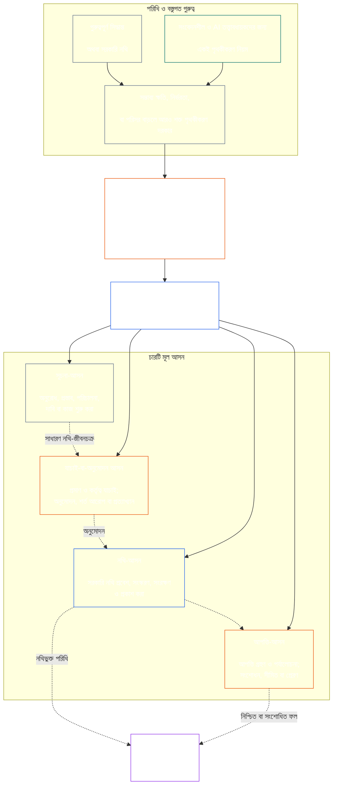

# অধ্যায় সাত: কার্যগত স্বাধীনতা ও দায়িত্বের পৃথকীকরণ

<strong>করপাসে অবস্থান (অপারেশনাল নয়): ফাইলের কাঠামো ও পাঠের নিয়ম</strong>

> নিচের বিষয়বস্তু **শুধু পাঠক-নির্দেশনা**। এটি এই ফাইলের অন্যত্র বা অন্য অধ্যায়ে থাকা বাধ্যতামূলক দায়বদ্ধতা যোগ, অপসারণ বা সংকুচিত করে না।
>
> এই ফাইলটি **Sentient Constitution-এর অংশ** এবং একটিমাত্র দলিল হিসেবে পড়া অন্যান্য নম্বরযুক্ত `core_*` ফাইলের **সঙ্গে একত্রে পড়লেই কেবল বাধ্যতামূলক**। এতে রয়েছে **অধ্যায় সাত**: কার্যগত স্বাধীনতা ও দায়িত্ব পৃথকীকরণের আন্তঃপ্রক্রিয়া ন্যূনতম মান। এটি অধ্যায় ছয়ের অধিকার-ভিত্তির পরে এবং [অধ্যায় আটের সিস্টেম-সামঞ্জস্য প্রত্যয়ন](../../core_08_system_alignment_certification.md#chapter-eight-system-alignment-certification-reading-index) দিয়ে শুরু হওয়া সাংবিধানিক প্রক্রিয়া-অধ্যায়গুলোর আগে আসে।
>
> - **সাংবিধানিক মালিকানা:** বস্তুগতভাবে বাধ্যতামূলক কাজের জন্য পৃথক আসনের ন্যূনতম মান; প্রতিটি [বস্তুগতভাবে বাধ্যতামূলক কাজের নথি](../../core_05_band_accountability.md#materially-binding-act-record)-র সর্বজনীন ন্যূনতম বিষয়বস্তু; কর্তা এবং তার [বস্তুগত নিয়ন্ত্রণ-রেখা](../../core_05_band_accountability.md#material-control-line) থেকে স্বাধীনতা; প্রকাশিত পথ ও ভূমিকা-বিন্যাস; স্বার্থের সংঘাত, শূন্যপদ, বিকল্প নিয়োগ এবং ভুল আসনে প্রেরণ; আনুপাতিক সম্মিলিত ব্যবস্থাপনা; দায় আরোপযোগ্য হস্তান্তর; এবং পরবর্তী প্রতিটি সাংবিধানিক প্রক্রিয়ার প্রয়োগযোগ্য ন্যূনতম স্বাধীনতার শর্ত।
> - **নীতিস্তরের উৎস:** [অধ্যায় এক §18.3](../../core_01_c_stewardship_capacity_principles.md#183-segregation-of-duties) শাসনব্যবস্থাকে কার্যগত স্বাধীনতা বজায় রাখতে বলে এবং কার্যকর আসন-স্থাপত্যের নিয়ম এখানে নির্দেশ করে।
> - **বাস্তবায়নের মালিক:** [CJS-3.11](../../corpus_joint_structure/cjs_03a_accountability_operations.md#constitutional-lane-and-functional-separation), [CI-3.2](../../corpus_institutions/ci_03_institutional_design_separation_of_powers.md#ci-32-functional-separation-lanes), এবং [CI-4.6](../../corpus_institutions/ci_04_appointment_competency_rotation_removal.md#ci-46-seat-catalog--process-role-archetypes-and-operational-boundaries) আসন স্থাপন ও কার্যকর করে। এগুলো আরও কঠোর হতে পারে এবং সীমাবদ্ধ বিশেষ-ক্ষমতাসম্পন্ন আসনের ধরন যোগ করতে পারে; তবে এই অধ্যায়কে সংকুচিত করতে পারে না।
> - **প্রক্রিয়া-নির্দিষ্ট প্রয়োগ পরবর্তী অধ্যায়ে থাকবে:** অধ্যায় আট এই ন্যূনতম মান সিস্টেম-সামঞ্জস্য প্রত্যয়নে প্রয়োগ করে; [অধ্যায় নয় §3.7](../../core_09_standing_assessment.md#37-segregation-of-duties) মর্যাদা-নথিতে প্রয়োগ করে; অধ্যায় বারো এবং [corpus_forum.md](../../corpus_forum.md) ফোরাম-প্রক্রিয়ায় প্রয়োগ করে। ওই অধ্যায়গুলো বিষয় অনুসারে সুরক্ষা যোগ করতে পারে; দুর্বলতর বিকল্প তৈরি করতে পারে না।
>
> পাঠের ক্রম: §1 উদ্দেশ্য, পরিধি ও মালিকানার সীমানা → §2 চার-আসনের সাংবিধানিক ন্যূনতম → §3 স্বাধীনতা ও সংঘাত → §4 ভুল আসনে প্রেরণ → §5 প্রকাশিত বিন্যাস ও বিকল্প → §6 আনুপাতিক মাত্রায় প্রয়োগ → §7 জরুরি অবস্থা → §8 কাজের নথি ও দায় আরোপযোগ্য হস্তান্তর → §9 পরবর্তী প্রক্রিয়ায় সম্পর্ক।

<strong>সূত্র-অনুসরণ</strong>

- পূর্বসূত্র: [সাংবিধানিক চতুষ্টয়](../../core_00_preamble.md#constitutional-tetrad) — বিশেষত **তদারকি** ও **জবাবদিহি**; [বস্তুগত স্বার্থ](../../core_00_preamble.md#material-stake); [অধ্যায় এক §17.1 যৌথ তত্ত্বাবধানের মান](../../core_01_c_stewardship_capacity_principles.md#171-shared-stewardship-standard); [তত্ত্বাবধান-শৃঙ্খলার অধীনে শাসন, অধ্যায় এক §18](../../core_01_c_stewardship_capacity_principles.md#18-governance-under-stewardship-discipline); [অনুচ্ছেদ XVI](../../core_06_rights_part_c.md#article-xvi-audit-transparency-and-independent-verification) (*নিরীক্ষা, স্বচ্ছতা ও স্বাধীন যাচাই*)।
- উপধারা: [§1](#1-purpose-scope-and-owner-boundary); [§2](#2-four-seat-constitutional-floor); [§3](#3-independence-conflict-and-control-lines); [§4](#4-wrong-seat-routing); [§5](#5-published-placement-vacancy-and-substitution); [§6](#6-proportional-scaling-and-merged-hosting); [§7](#7-emergency-and-urgent-action); [§8](#8-act-records-and-attributable-handoffs); [§9](#9-relationship-to-later-processes)।
- পরবর্তী: [অধ্যায় আট](../../core_08_system_alignment_certification.md#chapter-eight-system-alignment-certification-reading-index); [অধ্যায় নয়](../../core_09_standing_assessment.md#chapter-nine-contribution-violation-and-standing-model--measurement); [অধ্যায় বারো](../../core_12_forum.md#chapter-twelve-forums-and-jurisdiction); [অধ্যায় তেরো](../../core_13_governance.md#chapter-thirteen-constitutional-contract-legitimacy-authorization-and-stewardship); উপরে উল্লিখিত নির্দিষ্ট বাস্তবায়ন-পাঠ।
- সঙ্গে পড়ুন: [অসামঞ্জস্য শনাক্তকরণ, অধ্যায় এক §19.3](../../core_01_c_stewardship_capacity_principles.md#193-misalignment-detection) (*বহুপক্ষীয় শনাক্তকরণ ও পর্যালোচনা*); [দায় আরোপযোগ্য কাজ](../../core_05_band_accountability.md#attributable-action); [দায়-আরোপের অখণ্ডতা](../../core_05_band_accountability.md#attribution-integrity); [নিরীক্ষাযোগ্যতা](../../core_05_band_oversight.md#auditability); [আপত্তিযোগ্যতা](../../core_05_band_accountability.md#contestability); [আনুপাতিকতা](../../core_05_band_accountability.md#proportionality)।

 

অধ্যায় সাত হলো **বস্তুগতভাবে বাধ্যতামূলক কাজের জন্য কার্যগত স্বাধীনতা ও দায়িত্ব পৃথকীকরণের ন্যূনতম মানের সাংবিধানিক মালিক**।

### 1. উদ্দেশ্য, পরিধি ও মালিকানার সীমানা

<strong>সূত্র-অনুসরণ</strong>

- পূর্বসূত্র: অধ্যায়ের সূচনায় মালিকানার দাবি; [অধ্যায় এক §18](../../core_01_c_stewardship_capacity_principles.md#18-governance-under-stewardship-discipline); [তদারকি](../../core_05_apex_oversight_leg.md#oversight-constitutional); [জবাবদিহি](../../core_05_apex_accountability_leg.md#accountability)।
- পরবর্তী: [§2](#2-four-seat-constitutional-floor) থেকে [§9](#9-relationship-to-later-processes); বস্তুগতভাবে বাধ্যতামূলক কাজ তৈরি বা পরিবর্তন করে এমন প্রত্যেক পরবর্তী প্রক্রিয়া।
- সঙ্গে পড়ুন: যাচাইয়ের ভিত্তির জন্য [অধ্যায় চার](../../core_04_burden_traceability_verification.md#chapter-four-burden-of-proof-traceability-and-verification); চ্যালেঞ্জ ও প্রতিকারের জন্য [অনুচ্ছেদ XIII-A](../../core_06_rights_part_c.md#article-xiii-a-reliability-and-trustworthiness-baseline) (*নির্ভরযোগ্যতা ও বিশ্বাসযোগ্যতার ভিত্তি*) এবং [অনুচ্ছেদ XIII-B](../../core_06_rights_part_c.md#article-xiii-b-right-to-redress-and-remedy) (*প্রতিকার ও পুনর্বাসনের অধিকার*); স্বাধীন যাচাই-অধিকার ভিত্তির জন্য [অনুচ্ছেদ XVI](../../core_06_rights_part_c.md#article-xvi-audit-transparency-and-independent-verification) (*নিরীক্ষা, স্বচ্ছতা ও স্বাধীন যাচাই*)।

 

*সহজ ভাষায়: কোনো সাংবিধানিক প্রক্রিয়া—অথবা ইতোমধ্যে অনুমোদিত কোনো সিস্টেম, প্রতিষ্ঠান বা সীমাবদ্ধ সিদ্ধান্ত-পরিসরের ভেতরে অংশীজন-স্তরের সিদ্ধান্ত—বিশ্বাসযোগ্য হওয়ার আগে এর ভেতরের কাজগুলো আলাদা করতে হবে। এই ন্যূনতম মান [সাংবিধানিক চুক্তি স্তর](../../core_05_band_integrative.md#constitutional-contract-layer) এবং [সিস্টেমে অংশীজনের অংশগ্রহণ](../../core_05_band_participation.md#stakeholder-status-and-weight) উভয়ের ক্ষেত্রেই প্রযোজ্য। কোনো সংবেদনশীল সত্তা, পদ, AI সিস্টেম, অংশীজন সংস্থা বা প্রতিনিধি কোনো ফল চাইলে সে একই সঙ্গে কথিত স্বাধীন যাচাই করতে, সেই যাচাইয়ের সরকারি নথি নিয়ন্ত্রণ করতে, বা তার বিরুদ্ধে আপত্তির সিদ্ধান্ত নিতে পারে না।*

অধ্যায় পাঁচে সংজ্ঞায়িত প্রত্যেক [বস্তুগতভাবে বাধ্যতামূলক কাজ](../../core_05_band_accountability.md#materially-binding-act)-এ এই অধ্যায় প্রযোজ্য, যেমন:

- একটি সিদ্ধান্ত;
- অনুমোদন বা প্রত্যয়ন;
- কোনো অনুসন্ধান বা সিদ্ধান্ত;
- নথিভুক্তি বা বস্তুগত সংস্করণ পরিবর্তন;
- প্রকাশ, মোতায়েন, অব্যাহত রাখা বা প্রত্যাহার;
- অর্থ বিতরণ বা বরাদ্দ; এবং
- কোনো আপত্তির নিষ্পত্তি।

এই অধ্যায়ের আসনগুলো নির্ধারণ করে একটি নির্দিষ্ট কাজের জন্য কে কী করতে পারে; এগুলো চাকরির পদবি নয়। একই সংবেদনশীল সত্তা, পদ বা সিস্টেম ভিন্ন কাজের জন্য ভিন্ন আসনে থাকতে পারে। কোনো পদবি, অর্পণ, প্রযুক্তিগত সামর্থ্য বা কোনো ধাপ সম্পন্ন করার যোগ্যতা সেই কাজের জন্য অধিষ্ঠিত আসনের ক্ষমতা বাড়ায় না।

এই অধ্যায় প্রক্রিয়াগুলোর মধ্যে প্রযোজ্য দায়িত্ব-পৃথকীকরণের ন্যূনতম মান নির্ধারণ করে। এটি স্থানান্তর করে না:

- অধ্যায় চার থেকে প্রমাণের ভার, অনুসরণযোগ্যতা বা যাচাই-পদ্ধতি;
- অধ্যায় পাঁচ থেকে প্রামাণিক অর্থ;
- অধ্যায় ছয় থেকে অধিকার-ভিত্তি;
- অধ্যায় আট থেকে বারো পর্যন্ত প্রক্রিয়া-নির্দিষ্ট নথির বিষয়বস্তু; বা
- নির্দিষ্ট বাস্তবায়ন-পাঠ থেকে অপারেশনাল আসন-তালিকা, কর্মী নিয়োগ-পদ্ধতি ও পথ-মানচিত্রের কার্যপদ্ধতি।

### 2. চার-আসনের সাংবিধানিক ন্যূনতম মান

<strong>সূত্র-অনুসরণ</strong>

- পূর্বসূত্র: [§1](#1-purpose-scope-and-owner-boundary); [অধ্যায় এক §18.3](../../core_01_c_stewardship_capacity_principles.md#183-segregation-of-duties); [অধ্যায় এক §17.1](../../core_01_c_stewardship_capacity_principles.md#171-shared-stewardship-standard)।
- পরবর্তী: [§3](#3-independence-conflict-and-control-lines) থেকে [§9](#9-relationship-to-later-processes); [CI-4.6](../../corpus_institutions/ci_04_appointment_competency_rotation_removal.md#ci-46-seat-catalog--process-role-archetypes-and-operational-boundaries) (*আসন তালিকা — প্রক্রিয়া-ভূমিকার আদর্শরূপ ও অপারেশনাল সীমা*)।
- একমাত্র অনুমোদিত সম্মিলিত ব্যবস্থাপনার পথের জন্য সঙ্গে পড়ুন [§6](#6-proportional-scaling-and-merged-hosting)।

 

*সহজ ভাষায়: প্রতিটি বস্তুগতভাবে বাধ্যতামূলক কাজে চারটি ভূমিকা থাকে—অনুরোধ বা কাজ করা, যাচাই, সরকারি নথি রাখা এবং আপত্তি শোনা। ছোট সংস্থাকে একটি দপ্তরে অনুমোদিত জোড়া ভূমিকা রাখার অনুমতি দেওয়া হলেও ভূমিকা আলাদা থাকে।*

<strong>পাঠক-নির্দেশনা (অপারেশনাল নয়): চার-আসনের মানচিত্র</strong>

> নিচের বিষয়বস্তু **শুধু পাঠক-নির্দেশনা**। এটি এই অধ্যায় বা অন্য অধ্যায়ের বাধ্যতামূলক দায়বদ্ধতা যোগ, অপসারণ বা সংকুচিত করে না।
>
> **পাঠক মানচিত্র (অপারেশনাল নয়)।** এই চিত্রে চারটি আসন এবং একটি প্রচলিত নথি-জীবনচক্র দেখানো হয়েছে। এটি পঞ্চম বাস্তবায়ন-আসন যোগ করে না, প্রতিটি কাজের আগে পর্যালোচনা শেষ করার শর্ত দেয় না, বা এই অংশ ও §§3–6-এর কার্যকর নিয়ম পরিবর্তন করে না।

 

আসন-বাক্সের ভেতরের বিন্দুযুক্ত তীর সাধারণ নথি-জীবনচক্র দেখায়। বাস্তবায়নের দিকে তীরগুলো অনুসরণ-সংযোগ, পর্যালোচনা শেষ না হওয়া পর্যন্ত অপেক্ষার বাধ্যতামূলক ক্রম নয়।

প্রতিটি বস্তুগতভাবে বাধ্যতামূলক কাজে কার্যগতভাবে পৃথক চারটি আসন থাকে। অধ্যায় পাঁচ তাদের প্রামাণিক অর্থ দেয়; এই অংশ প্রক্রিয়াগুলোর মধ্যে আসন-বিন্যাস ও অসামঞ্জস্যের নিয়ম নির্ধারণ করে:

1. **[সূচনা-আসন](../../core_05_band_accountability.md#initiating-seat)** — কাজের অনুরোধ, প্রস্তাব, পরিচালনা, দাবি বা অন্যভাবে সূচনা করে।
2. **[যাচাই-বা-অনুমোদন আসন](../../core_05_band_accountability.md#verify-or-authorize-seat)** — শাসনকারী মানদণ্ড অনুযায়ী প্রমাণ ও কর্তৃত্ব যাচাই করে এবং কাজ যাচাই, অনুমোদন, প্রত্যাখ্যান বা শর্তযুক্ত করে।
3. **[নথি-আসন](../../core_05_band_accountability.md#record-seat)** — যাচাই-বা-অনুমোদন আসনের সিদ্ধান্তের [কাজের নথি](../../core_05_band_accountability.md#materially-binding-act-record) প্রবেশ, সংস্করণ, ধারণ, সংরক্ষণ ও প্রকাশ করে।
4. **[আপত্তি-আসন](../../core_05_band_accountability.md#contest-seat)** — আপত্তি গ্রহণ ও পর্যালোচনা করে, অনুমোদিত হলে সংশোধন বা সীমা নির্ধারণের আদেশ দেয়, এবং কর্তৃত্বের বাইরের বিষয় অন্যত্র পাঠায়।

এই আসনগুলো মানব এবং AI তত্ত্বাবধায়ক—উভয়ের ক্ষেত্রেই সমভাবে প্রযোজ্য। কোনো সিস্টেম কাজটি সম্পন্ন করে, এতে সম্মতি দেয় এবং পরে নিজের লগকেই প্রমাণ হিসেবে ব্যবহার করলে, সেটি একই সঙ্গে সূচনা, যাচাই ও নথি-আসনে বসে আছে। প্রক্রিয়া স্বয়ংক্রিয় করলেই যাচাই স্বাধীন হয় না।

একই কাজের ক্ষেত্রে নিচের সমন্বয়গুলো নিষিদ্ধ:

- সূচনা-আসন নিজের কাজ যাচাই বা অনুমোদন করতে পারবে না;
- যাচাই-বা-অনুমোদন আসন নথি-আসন ধারণ করতে পারবে না;
- যাচাই-বা-অনুমোদন আসন আপত্তি-আসন ধারণ করতে পারবে না; এবং
- কোনো সিস্টেমের অপারেটর সেই সিস্টেম-সম্পর্কিত কাজ যাচাই বা অনুমোদন করতে পারবে না।

পরবর্তী অধ্যায় বা অন্তর্ভুক্ত বাস্তবায়ন-পাঠ নির্দিষ্ট প্রক্রিয়ার জন্য অতিরিক্ত জুটি নিষিদ্ধ করতে পারে। এখানে নিষিদ্ধ জুটির অনুমতি দিতে পারে না।

কার্যগত চার-আসনের ন্যূনতম মান সব শ্রেণিতে প্রযোজ্য। শ্রেণি অনুযায়ী প্রশ্ন হলো, আসনগুলো একত্র করা বা একই ধারকের কাছে রাখা যাবে কি না: শ্রেণি C-এর পরিধিতে কাজ করা প্রতিষ্ঠান বা সিস্টেমের জন্য চার আসনের পূর্ণ পৃথকীকরণ সর্বদা সুপারিশ করা হয়; শ্রেণি B-এর পরিধিতে প্রায় সবসময় এটি বাধ্যতামূলক হওয়া উচিত; আর শ্রেণি A-তে এটি সর্বদা বাধ্যতামূলক। পরিধি মিশ্র হলে বা শ্রেণিবিন্যাস অনিশ্চিত হলে, নথি কম মাত্রার পক্ষে প্রমাণ না দেওয়া পর্যন্ত প্রযোজ্য সর্বোচ্চ অবস্থানটি প্রয়োগ করুন।

### 3. স্বাধীনতা, সংঘাত ও নিয়ন্ত্রণ-রেখা

<strong>সূত্র-অনুসরণ</strong>

- পূর্বসূত্র: [§2](#2-four-seat-constitutional-floor); [কর্তৃত্ব-অনুপাতে জবাবদিহি](../../core_01_c_stewardship_capacity_principles.md#181-governance-as-authorized-structure); [অনুচ্ছেদ XXIV](../../core_06_rights_part_d.md#article-xxiv-constitutional-interpretation-review-and-anti-capture-safeguards) (*সাংবিধানিক ব্যাখ্যা, পর্যালোচনা ও দখল-প্রতিরোধী সুরক্ষা*)।
- পরবর্তী: [§4](#4-wrong-seat-routing); [§5](#5-published-placement-vacancy-and-substitution); [§8](#8-act-records-and-attributable-handoffs); অধ্যায় আটের প্রত্যয়ন-উপাদান ভূমিকা; অধ্যায় নয়ের নথি-হেফাজত; অধ্যায় বারোর ফোরামে আত্মবিচার-প্রতিরোধ।
- সঙ্গে পড়ুন: [বস্তুগত নিয়ন্ত্রণ-রেখা](../../core_05_band_accountability.md#material-control-line); অপারেশনাল সংঘাত ও আত্মবিচার-প্রতিরোধী সুরক্ষার জন্য [CI-5](../../corpus_institutions/ci_05_conflict_integrity_anti_capture_anti_corruption.md) (*সংঘাতের অখণ্ডতা, দখল-প্রতিরোধ ও দুর্নীতি-প্রতিরোধ*) এবং [CF-7](../../corpus_forum/cf_07_integrity_safeguards_anti_capture_anti_self_judging.md) (*অখণ্ডতা সুরক্ষা, দখল-প্রতিরোধী কার্যক্রম ও আত্মবিচার-প্রতিরোধী সহায়তা*)।

 

*সহজ ভাষায়: ডেস্কের নাম বদলালে স্বাধীনতা তৈরি হয় না। ফল চাইছে এমন সংবেদনশীল সত্তা বা পদ যদি যাচাইকারী বা পর্যালোচককে নির্দেশ, অপসারণ, পুরস্কৃত, শাস্তি বা নীরবে অগ্রাহ্য করতে পারে, তবে সেই কাজের ক্ষেত্রে তিনি স্বাধীন নন।*

কার্যগত স্বাধীনতা লেবেল নয়, বাস্তব কর্তৃত্ব ও নিয়ন্ত্রণ দিয়ে বিচার করা হয়। একই কাজের ক্ষেত্রে:

- যাচাই-বা-অনুমোদন আসন এবং আপত্তি-আসন সূচনা-আসনের [বস্তুগত নিয়ন্ত্রণ-রেখা](../../core_05_band_accountability.md#material-control-line)-র বাইরে থাকতে হবে;
- কাজটি যার নিজের স্বার্থ নির্ধারণ করে, সে যাচাই-বা-অনুমোদন অথবা আপত্তি-আসনে থাকতে পারবে না;
- স্বার্থ-সংঘাতযুক্ত নথিধারীকে সংঘাতের সিদ্ধান্ত নেওয়া বা হেফাজত ত্যাগ না করে সম্পূর্ণ নিরীক্ষা-ধারা-সহ নথিটি প্রকাশিত বিকল্প ধারকের কাছে দিতে হবে; এবং
- স্বেচ্ছায় সরে দাঁড়ালে কাজটির ওপর কর্তৃত্ব সরে যায়; আসনটি অনুরোধকারী, তার রিপোর্টিং লাইন বা সবচেয়ে নিকটবর্তী ব্যক্তির কাছে যায় না।

নির্দিষ্ট কাজের জন্য [বস্তুগত নিয়ন্ত্রণ-রেখা](../../core_05_band_accountability.md#material-control-line) অনুসরণ করুন। যৌথ অবকাঠামো, প্রশাসনিক সহায়তা বা নিয়োগের ইতিহাস একাই সেই রেখা প্রতিষ্ঠা করে না, তবে এসব ব্যবস্থা বাস্তবে স্বাধীন বিচারকে ব্যাহত করতে পারবে না।

দ্বিতীয় স্বাক্ষর, নামমাত্র কমিটি, অভ্যন্তরীণ লেবেল বা কোনো সরঞ্জাম-সৃষ্ট প্রত্যয়ন স্বাধীনতার শর্ত পূরণ করে না, যদি কথিত যাচাইয়ের কর্তৃত্ব, প্রমাণে প্রবেশাধিকার, বস্তুগত নিয়ন্ত্রণ থেকে স্বাধীনতা বা প্রত্যাখ্যান ও পাঠানোর বাস্তব ক্ষমতা না থাকে।

### 4. ভুল আসনে প্রেরণ

<strong>সূত্র-অনুসরণ</strong>

- পূর্বসূত্র: [§2](#2-four-seat-constitutional-floor); [§3](#3-independence-conflict-and-control-lines)।
- পরবর্তী: [§5](#5-published-placement-vacancy-and-substitution); [§8](#8-act-records-and-attributable-handoffs); [CI-4.6-এর যৌথ আসন-নিয়ম](../../corpus_institutions/ci_04_appointment_competency_rotation_removal.md#ci-46-shared-seat-rules)।
- সঙ্গে পড়ুন: [প্রতিরোধের দায়িত্ব, অধ্যায় এক §17.5](../../core_01_c_stewardship_capacity_principles.md#175-duty-to-resist)।

 

*সহজ ভাষায়: কোনো ধাপ আপনার না হলে নীরবে সেটি নিজের হাতে নেবেন না, আবার শুধু চলে যাবেনও না। ঘাটতি নথিভুক্ত করুন এবং বিষয়টি সঠিক স্থানে পাঠান।*

কোনো তত্ত্বাবধায়ককে তার আসনের বাইরের ধাপ নিতে বলা হলে তাকে অবশ্যই:

1. কাজটির গুণাগুণ নির্ধারণের ভান না করে ধাপটি প্রত্যাখ্যান করতে হবে;
2. যে আসনটি ধাপটি নিতে পারে তার নাম বলতে হবে এবং প্রকাশিত থাকলে ধারক বা বিকল্পের নাম জানাতে হবে;
3. অনুরোধ, অধিষ্ঠিত আসন, ঘাটতি বা সংঘাত এবং ব্যবহৃত পথ নথিভুক্ত করতে হবে;
4. প্রমাণ এবং আগে পাওয়া যেকোনো নথির অখণ্ডতা বজায় রাখতে হবে; এবং
5. এড়ানো সম্ভব এমন বিলম্ব না করে বিষয়টি পাঠাতে হবে।

এ প্রতিক্রিয়া দায়িত্ব পালন, কাজ পরিত্যাগ নয়। কাজটি সঠিক আসনের মাধ্যমে এগোয়। তত্ত্বাবধায়ক সবচেয়ে কাছে, দ্রুত, জ্যেষ্ঠ বা একমাত্র বিশেষজ্ঞ বলে ধাপটি নিয়ে নেওয়া অনুপস্থিত আসনের প্রতিকার নয়।

### 5. প্রকাশিত বিন্যাস, শূন্যপদ ও বিকল্প

<strong>সূত্র-অনুসরণ</strong>

- পূর্বসূত্র: [§2](#2-four-seat-constitutional-floor); [§3](#3-independence-conflict-and-control-lines); [স্বচ্ছতা](../../core_05_band_oversight.md#transparency); [নিরীক্ষাযোগ্যতা](../../core_05_band_oversight.md#auditability)।
- পরবর্তী: [§8](#8-act-records-and-attributable-handoffs); [CI-3.2](../../corpus_institutions/ci_03_institutional_design_separation_of_powers.md#ci-32-functional-separation-lanes) (*কার্যগত পৃথকীকরণ-পথ*); [CI-4.5](../../corpus_institutions/ci_04_appointment_competency_rotation_removal.md#ci-45-authorized-roles-and-accountability-chains) (*অনুমোদিত ভূমিকা ও জবাবদিহি-শৃঙ্খল*); অধ্যায় আট ও নয়ের নথি।
- সঙ্গে পড়ুন: [সনদ](../../core_05_band_continuity.md#charter) এবং [অধ্যায় তেরো §5](../../core_13_governance.md#5-authorized-roles-competency-development-and-contribution)।

 

*সহজ ভাষায়: কঠিন পরিস্থিতি আসার আগেই প্রতিষ্ঠানকে বলতে হবে কে প্রতিটি কাজ করবে, এবং নিয়মিত ধারক অনুপস্থিত বা সংঘাতে থাকলে কে দায়িত্ব নেবে।*

বস্তুগতভাবে বাধ্যতামূলক কাজ করে এমন প্রত্যেক গ্রহণকারীকে প্রকাশিত, নিরীক্ষাযোগ্য ও আপত্তিযোগ্য একটি মানচিত্র বজায় রাখতে হবে, যেখানে চিহ্নিত থাকবে:

- কোন পথ, দপ্তর, ভূমিকা বা প্রক্রিয়া প্রতিটি আসন ধারণ করে;
- কোন কাজ ও পরিধির ক্ষেত্রে সেই বিন্যাস প্রযোজ্য;
- প্রতিটি অনুমোদিত সম্মিলিত ব্যবস্থাপনা এবং তার স্বাধীনতা-সুরক্ষা;
- অনুপস্থিত, বাদ দেওয়া, দখলকৃত বা স্বার্থ-সংঘাতযুক্ত ধারকের বিকল্প; এবং
- যোগ্য বিকল্প না থাকলে স্বাধীন পথ।

অবিন্যস্ত, শূন্য বা সংঘাতযুক্ত আসন হলো নথিভুক্ত ও সংশোধনযোগ্য শাসনগত ত্রুটি। এটি স্বয়ংক্রিয়ভাবে সূচনা-আসন, স্বার্থসংশ্লিষ্ট পক্ষ, অপারেটর বা [বস্তুগত নিয়ন্ত্রণ-রেখা](../../core_05_band_accountability.md#material-control-line)-র ঊর্ধ্বতন ব্যক্তির কাছে যায় না। সংশোধন না হওয়া পর্যন্ত কাজটি প্রকাশিত বিকল্প বা স্বাধীন পথে যাবে। তাড়াহুড়ো বলে স্বাধীনতার শর্ত পাশ কাটানো যাবে না।

দায়িত্ব অর্পণে একই আসন-সীমানা, প্রমাণের দায়, নথি ও সময়সীমা বজায় থাকে এবং এটি [বস্তুগত নিয়ন্ত্রণ-রেখা](../../core_05_band_accountability.md#material-control-line)-র অধীন থাকে। অর্পণে নতুন আসন তৈরি হয় না, আসন একত্র হয় না, এবং অর্পণকারী আসন যা করতে পারত না তা প্রতিনিধি করতে পারে না; এর মধ্যে শ্রেণি-অনুপাতে প্রয়োগযোগ্য সুপারিশ বা চার আসনের পূর্ণ পৃথকীকরণের শর্তকে একত্র করার অনুমতিতে রূপান্তর করাও অন্তর্ভুক্ত।

### 6. আনুপাতিক মাত্রায় প্রয়োগ ও সম্মিলিত ব্যবস্থাপনা

<strong>সূত্র-অনুসরণ</strong>

- পূর্বসূত্র: [§2](#2-four-seat-constitutional-floor); [বস্তুগত স্বার্থ](../../core_00_preamble.md#material-stake); [প্রয়োজনীয়তা](../../core_05_band_accountability.md#necessity); [আনুপাতিকতা](../../core_05_band_accountability.md#proportionality)।
- পরবর্তী: [অধ্যায় নয় §3.7](../../core_09_standing_assessment.md#37-informal-and-small-scope-records); [CJS-2.4](../../corpus_joint_structure/cjs_02_specific_joint_interlocks.md#cjs-24-class-scaled-lane-staffing-and-competency-redundancy) (*শ্রেণি-অনুপাতে পথের কর্মী বিন্যাস ও দক্ষতার পুনরাবৃত্তি*); [CI-3.2](../../corpus_institutions/ci_03_institutional_design_separation_of_powers.md#ci-32-functional-separation-lanes) (*কার্যগত পৃথকীকরণ-পথ*)।
- সঙ্গে পড়ুন: [এড়ানো সম্ভব এমন ভার](../../core_05_band_continuity.md#avoidable-burden) এবং [অপমানজনক প্রক্রিয়া-প্রতিরোধ, অধ্যায় এক §3.3](../../core_01_a_values_principles.md#33-anti-degrading-process)।

 

*সহজ ভাষায়: ছোট ও অনানুষ্ঠানিক গোষ্ঠীর চারটি বড় বিভাগ লাগে না। তবে সত্যিকারের স্বাধীন যাচাই, ব্যবহারযোগ্য নথি এবং আপত্তির পথ দরকার। আকার কর্মী বিন্যাসের পদ্ধতি বদলায়, সুরক্ষিত পৃথকীকরণ নয়।*

বস্তুগত স্বার্থ, সিস্টেমের শ্রেণি, নির্ভরতা এবং যুক্তিসঙ্গতভাবে পূর্বানুমানযোগ্য ক্ষতির অনুপাতে পৃথকীকরণের শক্তি, কর্মী বিন্যাস, পুনরাবৃত্তি ও আনুষ্ঠানিকতা বাড়ে বা কমে।

ছোট বা অনানুষ্ঠানিক গ্রহণকারী কেবল নিচের সব শর্ত পূরণ হলেই একই দপ্তর বা একই সংবেদনশীল সত্তার অধীনে দুটি আসন রাখতে পারে:

- একত্রীকরণটি পরিধির জন্য প্রয়োজনীয় ও আনুপাতিক;
- এটি প্রকাশিত, নিরীক্ষাযোগ্য, আপত্তিযোগ্য এবং কাজের নথিতে প্রকাশিত;
- স্বাধীনতা-সুরক্ষা একত্রীকরণের সৃষ্ট ঝুঁকি মোকাবিলা করে;
- সূচনা-আসন নিজের কাজ যাচাই বা অনুমোদন করে না;
- যাচাই-ও-নথিভুক্তি এবং যাচাই-ও-আপত্তি একত্র রাখা নিষিদ্ধ থাকে; এবং
- সংঘাত, বস্তুগত ক্ষতি বা আপত্তি সম্মিলিত ধারকের আইনসম্মত সীমা ছাড়ালে স্বাধীন পথ পাওয়া যায়।

অনানুষ্ঠানিক, অবৈতনিক, পারস্পরিক সহায়তা, যত্ন, মেরামত, শিক্ষা, সমবায় ও সম্প্রদায়-তত্ত্বাবধানের কাজে সংশ্লিষ্ট যাচাইয়ের জন্য প্রকাশিত কর্তৃত্বসম্পন্ন স্বার্থনিরপেক্ষ নির্ভরযোগ্য সংস্থা ব্যবহার করা যেতে পারে। প্রকৃতপক্ষে স্বার্থনিরপেক্ষ ও জবাবদিহিমূলক পথ থাকলে পরিধি যুক্তিসঙ্গতভাবে যে প্রাতিষ্ঠানিক আনুষ্ঠানিকতা অর্জন করতে পারে না, সংবিধান তা বাধ্যতামূলক করে না।

কর্মীর স্বল্পতা, গতি, সুবিধা বা বিশেষজ্ঞতার কেন্দ্রীভবন একা একত্রীকরণকে ন্যায্যতা দেয় না। [§2 চার-আসনের সাংবিধানিক ন্যূনতম মান](#2-four-seat-constitutional-floor)-এর শ্রেণি-অনুপাতিক অবস্থান প্রযোজ্য: শ্রেণি A-তে কোনো ব্যতিক্রম চলবে না; শ্রেণি B বা C-তে ব্যতিক্রম হলে ওপরের শর্তগুলো পূরণ করতে হবে। বস্তুগত স্বার্থ যত বড়, পৃথক দপ্তর, দক্ষতার পুনরাবৃত্তি ও স্বাধীন বিকল্পের পূর্বধারণা তত শক্তিশালী।

### 7. জরুরি ও ত্বরিত ব্যবস্থা

<strong>সূত্র-অনুসরণ</strong>

- পূর্বসূত্র: [§2](#2-four-seat-constitutional-floor); [§6](#6-proportional-scaling-and-merged-hosting); [জরুরি ব্যবস্থা ও অব্যাহত রাখার ভার, অধ্যায় বারো §6.1](../../core_12_forum.md#61-emergency-measures-and-continuation-burden); [ডিফল্ট অন্তর্বর্তী অবস্থান](../../core_01_b_interaction_interpretation.md#default-interim-posture)।
- পরবর্তী: নির্দিষ্ট বাস্তবায়ন-পাঠে ঘটনা, নিয়ন্ত্রণ, প্রকাশ, অব্যাহত রাখা ও ঘটনা-পরবর্তী পর্যালোচনা প্রক্রিয়া।
- সঙ্গে পড়ুন: [সময়ানুবর্তিতা](../../core_05_apex_timeliness_leg.md#timeliness-constitutional), [প্রমাণ সংরক্ষণ](../../core_05_band_oversight.md#evidence-preservation), এবং [CI-4.6 আসন তালিকা — প্রক্রিয়া-ভূমিকার আদর্শরূপ ও অপারেশনাল সীমা](../../corpus_institutions/ci_04_appointment_competency_rotation_removal.md#ci-46-seat-containment)।

 

*সহজ ভাষায়: বাস্তব জরুরি অবস্থা সাধারণ যাচাই শেষ হওয়ার আগেই ব্যবস্থা নেওয়া ন্যায্য করতে পারে। এতে ক্রম বদলায়, আসনের মালিকানা বা শ্রেণি-অনুপাতিক পৃথকীকরণের অবস্থান নয়। এটি কর্তা নিজেই তার কাজ অব্যাহত রাখার প্রত্যয়ন, নথির ধারাবাহিকতা মুছে ফেলা, বা পরে চূড়ান্ত পর্যালোচক হওয়ার অনুমতি দেয় না।*

বিলম্বে গুরুতর ও আসন্ন ক্ষতির যুক্তিসঙ্গতভাবে পূর্বানুমেয় ঝুঁকি তৈরি হলে, অনুমোদিত সূচনা বা নিয়ন্ত্রণ-আসন স্বাভাবিক পূর্বযাচাই শেষ হওয়ার আগে ন্যূনতম প্রয়োজনীয় প্রত্যাবর্তনযোগ্য ব্যবস্থা নিতে পারে, তবে কেবল যদি:

- জরুরি কর্তৃত্ব, পরিধি, শুরুর সময়, মেয়াদোত্তীর্ণ সময় ও কারণ সঙ্গে সঙ্গে বা শারীরিকভাবে সম্ভব হওয়ার যত তাড়াতাড়ি হয় নথিভুক্ত করা হয়;
- প্রমাণ ও আপত্তি সংরক্ষিত হয়;
- প্রযোজ্য সাংবিধানিক সময়সীমার মধ্যে বিজ্ঞপ্তি ও অংশগ্রহণ পুনঃস্থাপিত হয়;
- তাৎক্ষণিক সীমার বাইরে কোনো ধারাবাহিকতা স্বাধীন যাচাই-বা-অনুমোদন আসন পর্যালোচনা করে; এবং
- কাজটি ঘটনা-পরবর্তী স্বাধীন পর্যালোচনা পায়।

জরুরি ব্যবস্থা:

- কর্তা নিজের অব্যাহত থাকা যাচাই করতে পারে—এমন অনুমতি দেয় না;
- সংঘাতযুক্ত নথির কর্তা-ধারককে নথি-রক্ষক বানায় না;
- কর্তা তার নিজের কাজের বিরুদ্ধে আপত্তি শুনতে পারে—এমন অনুমতি দেয় না;
- সাময়িক প্রয়োজনকে স্থায়ী কর্তৃত্বে পরিণত করে না;
- শ্রেণি A প্রতিষ্ঠান বা সিস্টেমে চার আসনের কোনো একত্রীকরণ অনুমোদন করে না।

নিচের কোনো বিষয়ই একা জরুরি অবস্থা নয়:

- সময়সীমা;
- প্রকাশের লক্ষ্য;
- কর্মীর ঘাটতি; বা
- সুনাম নিয়ে উদ্বেগ।

### 8. কাজের নথি ও দায় আরোপযোগ্য হস্তান্তর

<strong>সূত্র-অনুসরণ</strong>

- পূর্বসূত্র: [§2](#2-four-seat-constitutional-floor) থেকে [§7](#7-emergency-and-urgent-action); [বস্তুগতভাবে বাধ্যতামূলক কাজের নথি](../../core_05_band_accountability.md#materially-binding-act-record); [দায় আরোপযোগ্য কাজ](../../core_05_band_accountability.md#attributable-action); [দায়-আরোপের অখণ্ডতা](../../core_05_band_accountability.md#attribution-integrity)।
- পরবর্তী: [CS-4 §10 পরিদর্শনযোগ্য, দায় আরোপযোগ্য কাজ](../../corpus_systems/cs_04_critical_system_stewardship.md#10-inspectable-attributable-action); [CI-4.6 যৌথ আসন-নিয়ম](../../corpus_institutions/ci_04_appointment_competency_rotation_removal.md#ci-46-shared-seat-rules); §8 দ্বারা নিয়ন্ত্রিত প্রত্যেক প্রক্রিয়া-নথি; [`materially_binding_act_record.schema.json`](../../implementation/schemas/materially_binding_act_record.schema.json) (*মৌলিক যন্ত্র-যাচাইযোগ্য রূপ; প্রক্রিয়া-সহায়তা, দ্বিতীয় সংজ্ঞা নয়*)।
- সঙ্গে পড়ুন: [§4 ভুল আসনে প্রেরণ](#4-wrong-seat-routing) এবং [অধ্যায় চার §5](../../core_04_burden_traceability_verification.md#5-compliance-evidence-standard)।

 

*সহজ ভাষায়: প্রতিটি বস্তুগতভাবে বাধ্যতামূলক কাজের একটি কাজের নথি থাকবে, যাতে বোঝা যায় কী ঘটেছে, প্রতিটি আসনে কে ছিল, কী সিদ্ধান্ত হয়েছে এবং আপত্তি কোথায় পাঠাতে হবে।*

প্রতিটি বস্তুগতভাবে বাধ্যতামূলক কাজের শনাক্তযোগ্য [বস্তুগতভাবে বাধ্যতামূলক কাজের নথি](../../core_05_band_accountability.md#materially-binding-act-record) (**কাজের নথি**) থাকতে হবে। কাজের নথি একটি প্রযোজ্য প্রক্রিয়া-নির্দিষ্ট সরকারি নথির মধ্যে থাকতে পারে, অথবা দায় আরোপযোগ্য ও অখণ্ডতা-রক্ষাকারী সংযুক্ত সরকারি নথির সমষ্টি হতে পারে। বিদ্যমান সরকারি নথি বা সংযুক্ত সমষ্টি সব প্রয়োজনীয় উপাদান স্পষ্টভাবে শনাক্ত করলে, সেগুলোর সংযোগ ও সংস্করণ-ইতিহাস সংরক্ষণ করলে এবং অনুমোদিত সরকারি নথি-পথে প্রবেশযোগ্য থাকলে আলাদা নকল নথি দরকার নেই।

কাজের নথিতে অন্তত নিচের বিষয়গুলো শনাক্ত থাকতে হবে:

- স্থায়ী নথি-পরিচয়, বর্তমান সংস্করণ এবং বস্তুগত সৃষ্টি ও পরিবর্তনের সময়চিহ্ন;
- কাজ, তার বস্তুগত পরিধি, অবস্থা এবং পরিচালনাকারী কর্তৃত্ব;
- সূচনা-আসন, ধারক ও কর্তৃত্ব;
- যাচাই-বা-অনুমোদন আসন, ধারক, পরিচালনাকারী মানদণ্ড, সিদ্ধান্ত, বস্তুগত শর্ত বা কারণ এবং সিদ্ধান্তের সময়;
- নথি-আসন, ধারক, হেফাজতের কর্তৃত্ব এবং প্রবেশ করানো সংস্করণ;
- আপত্তি-আসন বা প্রকাশিত আপত্তি-পথ এবং বর্তমান আপত্তি বা সংশোধনের অবস্থা;
- প্রতিটি অর্পণ, সরে দাঁড়ানো, বিকল্প নিয়োগ, অনুমোদিত একত্রীকরণ বা জরুরি বিচ্যুতি; এবং
- কাজ পুনর্গঠনের জন্য প্রয়োজনীয় বস্তুগত প্রমাণ ও নথি-সংযোগ, হস্তান্তর, প্রত্যাখ্যান, শর্ত, অমীমাংসিত আপত্তি, সময়সীমা, প্রতিস্থাপিত সংস্করণ ও সংশোধন।

প্রক্রিয়া-নির্দিষ্ট নথিতে আরও কঠোর বা ক্ষেত্র-নির্দিষ্ট তথ্য যোগ করা যায়। এই ন্যূনতম মান বাদ দেওয়া, এর বিরোধিতা করা বা পুনর্গঠন অসম্ভব করা যাবে না। বৈধ গোপনীয়তা, আস্থাভিত্তিক গোপনীয়তা ও নিরাপত্তা-নিয়ন্ত্রণ সুরক্ষিত উপকরণে প্রবেশ বা প্রকাশ কীভাবে হবে তা নিয়ন্ত্রণ করে; অনুমোদিত যাচাই, আপত্তি, সংশোধন বা প্রতিকারের জন্য সরকারি নথি-ধারা মুছে ফেলা বা অকার্যকর করার অনুমতি দেয় না।

লগ দেখায় কে কী করেছে, কিন্তু একা তা কাজের বৈধতা প্রমাণ করে না। কাজটি সম্পাদনকারী সংবেদনশীল সত্তা বা সিস্টেমের তৈরি লগ, স্বাক্ষর, মডেল-ট্রেস, চেকলিস্ট বা প্রত্যয়নের ভূমিকা সীমিত:

- এসব উপকরণ প্রমাণ দিতে পারে বা কাজের নথির সঙ্গে যুক্ত হতে পারে।
- এসব উপকরণ স্বাধীন পর্যালোচনা ও সিদ্ধান্ত, অথবা সরকারি কাজের নথির বিকল্প হতে পারে না।

### 9. পরবর্তী প্রক্রিয়ার সঙ্গে সম্পর্ক

<strong>সূত্র-অনুসরণ</strong>

- পূর্বসূত্র: [§1](#1-purpose-scope-and-owner-boundary) থেকে [§8](#8-act-records-and-attributable-handoffs)।
- পরবর্তী: [অধ্যায় আট](../../core_08_system_alignment_certification.md#chapter-eight-system-alignment-certification-reading-index); [অধ্যায় নয়](../../core_09_standing_assessment.md#chapter-nine-contribution-violation-and-standing-model--measurement); [অধ্যায় বারো](../../core_12_forum.md#chapter-twelve-forums-and-jurisdiction); [অধ্যায় তেরো](../../core_13_governance.md#chapter-thirteen-constitutional-contract-legitimacy-authorization-and-stewardship)।
- সঙ্গে পড়ুন: [কর্তৃত্বের স্তর ও অভ্যন্তরীণ শ্রেণিবিন্যাস](../../core_05_band_integrative.md#owner-non-relocation) এবং [প্রস্তাবনার মালিকানা-তালিকা](../../core_00_preamble.md#4-principles-definitions-and-rights)।

 

*সহজ ভাষায়: পরবর্তী অধ্যায়গুলো প্রতিটি প্রক্রিয়াকে বলে কী মূল্যায়ন, নথিভুক্ত, সিদ্ধান্ত ও প্রতিকার করতে হবে। এই অধ্যায় বলে, তা করার সময় ক্ষমতা কীভাবে পৃথক রাখতে হবে।*

প্রতিটি পরবর্তী সাংবিধানিক প্রক্রিয়াকে ব্যাখ্যা করতে হবে কীভাবে চারটি আসন বণ্টন ও ব্যবহার করা হয় এবং কীভাবে এই অধ্যায় মানা হয়। বাস্তবে:

- প্রক্রিয়াটির নিজস্ব নথি কাজের নথি হিসেবে কাজ করতে পারে অথবা তাতে প্রক্রিয়া-নির্দিষ্ট বিবরণ যোগ করতে পারে।
- একটি প্রক্রিয়া-নথিতে একাধিক বস্তুগতভাবে বাধ্যতামূলক কাজ থাকলে, প্রতিটি কাজের পৃথক কাজের নথিতে সেটি লিংক করতে পারে।
- সরকারি নথি-পথ সম্পূর্ণ ও অনুসরণযোগ্য থাকলে আলাদা নকল নথি দরকার নেই।
- প্রক্রিয়ার নাম বদলালে তা [§4 ভুল আসনে প্রেরণ](#4-wrong-seat-routing) বা [§8 কাজের নথি ও দায় আরোপযোগ্য হস্তান্তর](#8-act-records-and-attributable-handoffs) থেকে অব্যাহতি দেয় না; এর মধ্যে হস্তান্তর ও ভুল-আসন নিয়মও রয়েছে।

বিশেষত:

- **অধ্যায় আট — সিস্টেম-সামঞ্জস্য প্রত্যয়ন:** সিস্টেম অপারেটর বা প্রত্যয়ন-প্রস্তাবক সূচনা-আসনে থাকবে, নিজের যাচাইকারী হবে না; সীমাবদ্ধ উপাদান-অনুসন্ধান, প্রত্যয়ন-নথির সংহতি, হেফাজত ও আপত্তি তাদের আইনসম্মত আসন ও আত্মবিচার-প্রতিরোধী পথের মধ্যে থাকতে হবে।
- **অধ্যায় নয় — মর্যাদা-নথি:** অনুরোধকারী, নথি খোলার কর্তৃত্ব, নথি-রক্ষক ও আপত্তি-পথ অধ্যায় নয়ের আরও কঠোর হেফাজত, দাবিদার, অনানুষ্ঠানিক নথি ও স্ব-হেফাজত-নিষেধের সঙ্গে চার-আসনের ন্যূনতম মান প্রয়োগ করবে।
- **অধ্যায় বারো — ফোরাম:** দাখিল, তদন্ত, মূল বিষয়ে পর্যালোচনা, নথি-হেফাজত, আপিল এবং ফোরামের নিজস্ব কথিত পক্ষপাত বা প্রক্রিয়ার অপব্যবহারের পর্যালোচনায় প্রযোজ্য আসন ও আত্মবিচার-প্রতিরোধী সীমানা বজায় রাখতে হবে।
- **অধ্যায় তেরো — শাসন:** ভূমিকা-সংজ্ঞা, দক্ষতা পরিকল্পনা, অর্পণ, উত্তরাধিকার ও প্রাতিষ্ঠানিক নকশায় আসনগুলো স্থাপন ও বজায় রাখতে হবে, শুধু তাদের নাম পুনরাবৃত্তি নয়।

কোনো পরবর্তী অধ্যায় তার প্রক্রিয়ার উচ্চতর বা ভিন্ন ঝুঁকির কারণে আরও কঠোর স্বাধীনতা, সরে দাঁড়ানো, পৃথকীকরণ, হেফাজত, প্যানেল বা পর্যালোচনার শর্ত দিতে পারে। তবে এটি ন্যূনতম মান সংকুচিত করতে, প্রক্রিয়া-নির্দিষ্ট লেবেলকে অব্যাহতি ভাবতে, বা নীরবতা থেকে আসন কর্তার কাছে যায় বলে অনুমান করতে পারে না।

---

**পূর্ববর্তী ফাইল:** [core_05_band_performance.md](../../core_05_band_performance.md)

**পরবর্তী ফাইল:** [core_08_a_system_alignment_certification_evaluation.md](../../core_08_a_system_alignment_certification_evaluation.md#chapter-eight-part-a-certification-evaluation)
