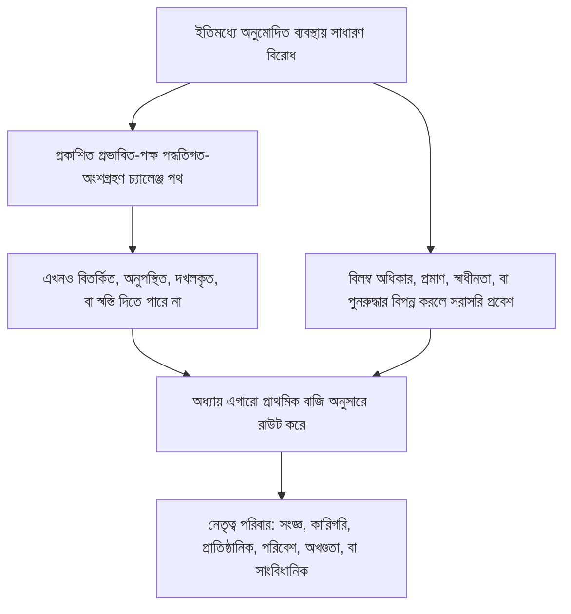

# অধ্যায় এগারো: মঞ্চ ও এখতিয়ার

<strong>করপাসে অবস্থান (অ-কার্যকরী): ফাইলের গঠন ও পড়ার নিয়ম</strong>

> নিচের বিষয়বস্তু **শুধু পাঠক নির্দেশনা**। এটি এই ফাইল বা অন্য অধ্যায়ে বাধ্যতামূলক কর্তব্য যোগ করে না, কমায় না, সংকুচিতও করে না।
>
> এই ফাইল [ইংরেজি অধ্যায় এগারো](../../core_11_forum.md)-এর **পাঠক-ভাষার পাইলট**। এটি সংজ্ঞ সংবিধানের **বাধ্যতামূলক অংশ নয়**। এটি **দ্বিতীয় সংবিধান নয়**। এটি **প্রেরণ সংস্করণ নয়**। এটি `SC-Corpus-2026.08.09`-এ **পিন**। অনুবাদ ও ইংরেজি মূল যদি অমিল মনে হয়, ক্রমাঙ্কিত [`core_11_forum.md`](../../core_11_forum.md) জিতবে। পড়ার ক্রম ও সংস্করণ মেটাডেটা [README.md](../../README.md)-এ থাকে। পদ্ধতি ও শব্দতালিকা: [translations/bn/README.md](README.md)।
>
> এতে আছে **অধ্যায় এগারো**: মঞ্চ-পরিবার, ডিফল্ট আসন ও প্রাথমিক-বাজি রাউটিং, ফরেনসিক সহায়তা, গ্রহণ ট্রিয়াজ, এবং প্রস্থিতি শৃঙ্খল ও অধিকার-তলের অধীনে বিরোধের এখতিয়ার। মঞ্চ [সাংবিধানিক চতুষ্ক](core_00_preamble.md#constitutional-tetrad)-এর **অংশগ্রহণ**, **তত্ত্বাবধান** ও **সময়ানুবর্তিতা** পায় [বস্তুগত বাজি](core_00_preamble.md#material-stake) অনুসারে স্কেল করে বিরোধ পরিচালনা **তত্ত্বাবধান** করে। তথ্য যাচাই হলে তারা প্রস্থিতি নথি **খুলতে, হালনাগাদ, বা সংশোধন** করতে পারে — বা **চ্যালেঞ্জে খারাপ নথি সরিয়ে রাখতে** পারে — [অধ্যায় আট §3](core_08_standing_assessment.md#3-standing-record-operational-requirements)-এর অধীনে; দায়ের করা মামলা একা প্রস্থিতি নয়, এবং মঞ্চ বিবরণ অধ্যায় আট প্রস্থিতি পরিমাপের স্থলাভিষিক্ত হতে পারে না ([অধ্যায় আট §3.6](core_08_standing_assessment.md#36-forum-boundary))। শৃঙ্খল নেভিগেশনের জন্য [README — Standing pipeline and forums](../../README.md#standing-pipeline-and-forums) ব্যবহার করুন। পরিচালন মঞ্চ যন্ত্রপাতি নির্ধারিত বাস্তবায়ন ফাইলে থাকে। অধ্যায় সংখ্যা ও ক্রস-রেফারেন্স সমন্বিত দলিলের সঙ্গে মেলে।

>
> **আগেরটি (এখনও ইংরেজিতে):** [core_10_b_misconduct_pattern_applications.md](../../core_10_b_misconduct_pattern_applications.md#chapter-ten-part-b-anti-constitutional-misconduct-pattern-applications)
>
> **পরেরটি (এখনও ইংরেজিতে):** [core_08-11_application_vignettes.md](../../core_08-11_application_vignettes.md#chapters-eight-eleven-application-vignettes)
> **পড়ার আর্ক:** §1 উদ্দেশ্য → বিরোধ ক্রম → §2 ডিফল্ট আসন ও গ্রহণ → §2.1–§2.3 নেতৃত্ব সীমা, মিশ্র বাজি, চ্যালেঞ্জ → §3 স্থানান্তর ও স্ব-বিচার নিরোধ → §4 পরিবার → §5 উত্তরণ ও প্রত্যয়ন → §6 স্তর ও দেরি-নিরোধ → §7 মঞ্চ সহায়তা

<strong>পাঠক নির্দেশনা (অ-কার্যকরী): অধ্যায় এগারো কোথায় থাকে এবং এখানে কী থাকে</strong>

> নিচের বিষয়বস্তু **শুধু পাঠক নির্দেশনা**। এটি এই অধ্যায় বা অন্য অধ্যায়ে বাধ্যতামূলক কর্তব্য যোগ করে না, কমায় না, সংকুচিতও করে না।
>
> এটি কোথায় থাকে (নেভিগেশন):
> - **সাংবিধানিক মালিক:** **ধারা 1** (*উদ্দেশ্য* — এই অধ্যায় যে নিয়ম বরাদ্দ করে তার **প্রাথমিক নিষ্পত্তিমূলক প্রয়োগ**, নিয়মিত **নির্বাহী প্রশাসন** থেকে **আলাদা**; ইতিমধ্যে অনুমোদিত ব্যবস্থার ভিতরের সাধারণ বিরোধের জন্য **বিরোধ ক্রম**; **জবাবদিহি** প্রয়োজনীয়তা; **প্রকাশিত**, **অনুমানযোগ্য** **দণ্ড** স্থাপন); **ডিফল্ট শুরুর আসন**, **প্রাথমিক-বাজি** রাউটিং, **গ্রহণ ট্রিয়াজ সংস্থা** (**প্রথম-স্পর্শ ডেস্ক**), মিশ্র বাজি, অসমতা, প্রস্থিতি-নথি চ্যালেঞ্জ, **সদ্বিশ্বাস চরিত্রায়ণ ও খেলা-নিরোধ**, এবং **সংজ্ঞ-প্রবেশযোগ্য** **দণ্ড** **প্রবেশ** প্রত্যাশা (**ধারা 2**, **`corpus_forum.md`**-এর **সঙ্গে পড়ুন**); **স্থানান্তর**, **একত্রীকরণ** ও **সমন্বয়** (**ধারা 3**, **ধারা 5** প্রত্যয়ন ও ব্যাকআপের সঙ্গে পড়া); **মঞ্চ-পরিবার সংজ্ঞা**, **অভ্যন্তরীণ কক্ষ**, **ভাগ করা মান**, এবং **অস্থায়ী পরিচালন আইন** (সংজ্ঞ, কারিগরি, প্রাতিষ্ঠানিক, পরিবেশ, অখণ্ডতা, সাংবিধানিক — **ধারা** **4**, **ধারা** **2**-এর **সারণি** প্রতিফলিত করে); **উত্তরণ**, **প্রত্যয়ন**, এবং **অন্তর্বর্তী সুরক্ষা** (**ধারা 5**); **সময়মতো সমাধান** ও **দেরি-নিরোধ** শৃঙ্খলা (**ধারা 6**); পর্যালোচনার আগে, চলাকালীন ও পরে **মঞ্চ সহায়তা** (**ধারা 7**), এমনভাবে বাস্তবায়িত যে ট্রিয়াজ ও সহায়তা ভূমিকা **আইনসম্মতভাবে গঠিত সারবস্তু প্যানেল**-এর স্থলাভিষিক্ত **হয় না**; **স্ব-বিচার নিরোধ** ব্যাকআপ রাউটিং; এবং **অধ্যায় আট**, **অধ্যায় দশ**, ও **অধ্যায় ছয়** ন্যায় ও চ্যালেঞ্জ অধিকারের সঙ্গে বাঁধা উত্তরণ হুক।
> - **শৃঙ্খল নেভিগেশন:** [README — Standing pipeline and forums](../../README.md#standing-pipeline-and-forums) — এই ফাইলে [§§1–7](#1-purpose-and-role)।
> - **অধ্যায় আট–নয় তিন-প্রশ্ন শৃঙ্খল:** অধ্যায় আট **ধারা 2–3** প্রশ্ন ১-এর উত্তর দেয় (*কী ঘটেছে?*) যাচাইকৃত, অক্ষ-শুদ্ধ নথির মধ্য দিয়ে। [অধ্যায় আট §4](core_08_standing_assessment.md#4-standing-measurement-evaluation-dimensions) এবং [§7 একীভূত আনুপাতিক LEQU মাপকাঠি](core_08_standing_assessment.md#7-unified-proportional-lequ-scale) প্রশ্ন ২-এর উত্তর দেয় (*কত ভালো বা খারাপ ছিল?*) মূল্যায়ন মাত্রা, ভাগ করা পাঁচ-গুণ LEQU ব্যান্ড, এবং ভাগ করা **s** = 1...9 ব্যাকরণ দিয়ে, আলাদা অবদান ও লঙ্ঘন নথি ধরে রেখে। [অধ্যায় নয়](core_09_standing_integration.md#chapter-nine-standing-effects-and-integration) প্রশ্ন ৩-এর উত্তর দেয় (*তার জন্য কী হয়?*) প্রতিকার, সুরক্ষা, দক্ষতা দণ্ড ও ছাড়পত্র, এবং প্রস্থিতি তালা দিয়ে। লঙ্ঘন অক্ষ স্লট শুধু যাচাইকৃত প্রভাব নিয়ন্ত্রণ করে; অবহেলা, লুকানো, জবরদস্তি, প্রতিক্রিয়া, এবং তুলনীয় চরিত্র বর্ণনাকারী তাকে সরায় না। [অধ্যায় দশ](../../core_10_a_misconduct_designation.md#chapter-ten-anti-constitutional-misconduct) অধ্যায় আট স্লট 7, 8, বা 9 নথিতে মিলিত সংবিধান-বিরোধী-অসদাচরণ নামকরণ যোগ করতে পারে কিন্তু সংখ্যাসূচক স্লট বরাদ্দ করে না।
> - **মঞ্চ (অ-কার্যকরী টীকা):** এই অধ্যায়ের অধীনে **মঞ্চ-পরিবার** সেই প্রাথমিক **মঞ্চ** যা কংক্রিট বিরোধে [অধ্যায় আট](core_08_standing_assessment.md#chapter-eight-compliance-violation-and-standing-model) শ্রেণিবিন্যাস প্রয়োগ করে — সেই বিষয় সহ যেখানে আলাদাভাবে নথিভুক্ত **অবদান প্রকৃতি**, **লঙ্ঘন অক্ষ প্রভাব স্লট**, এবং প্রক্রিয়া / প্রতিক্রিয়া চরিত্র **সহ-উপস্থিত** এবং **অধ্যায় আট** যৌথ-মূল্যায়ন ও অ-স্থলাভিষিক্ত শৃঙ্খলার অধীনে সামলাতে হয়। নিষ্পত্তির বাইরে **গবেষণা অর্থায়ন**, **অর্থায়ন**, ও **প্রণোদনা** যন্ত্র গৃহীত বাস্তবায়ন ও **[corpus_systems.md](../../corpus_systems.md)**-এ থাকে (**অধ্যায় আট** পাঠক নির্দেশনা দেখুন); তারা প্রতিরোধ ও মূল-কারণ অনুসন্ধান সহায়তা করতে পারে এবং **দণ্ড** রাউটিং, **সারবস্তু** নির্ণয়, কর্তৃত্বপূর্ণ অধ্যায় আট সংখ্যাসূচক স্লট বরাদ্দ, কোনো মিলিত **অধ্যায় দশ** নামকরণ, বা **অনুচ্ছেদ XXIII** (*সংঘর্ষ সমাধান, উত্তরণ, ও জরুরি আনুপাতিকতা*) বন্ধনের স্থলাভিষিক্ত **হতে পারে না**। **ধারা 1 ও 2** **প্রণোদনা** কাঠামোর **প্রাথমিক** দায়িত্ব বরাদ্দ করে **প্রধানত** প্রতি **পরিবারের** **ক্ষেত্রের** **ভিতরে** (করপাস ও বাস্তবায়নে সূক্ষ্ম বিস্তার); সেই **বরাদ্দ** [অধ্যায় বারো](../../core_12_governance.md#chapter-twelve-constitutional-contract-legitimacy-authorization-and-stewardship) ও **[corpus_systems.md](../../corpus_systems.md)**-এ সংরক্ষিত **ব্যবস্থা-ব্যাপী** **বাজেট** বা **শাসন-মাপ** পছন্দ **সরায় না**।
> - **বাস্তবায়ন মালিক:** প্রকাশিত গ্রহণ **শ্রেণি**, দৈনন্দিন ডকেট নিয়ম, কর্মী, বাজেট, সূক্ষ্ম প্রক্রিয়া, পরিচালন উত্তরণ যন্ত্রপাতি, এবং মঞ্চ-সহায়তা পরিচালন প্রয়োজনীয়তা গৃহীত বাস্তবায়ন পাঠ ও **[corpus_forum.md](../../corpus_forum.md)**-এ থাকে (**CF-5** (*রাউটিং পরিচালন, স্থানান্তর, প্রত্যয়ন, ও প্রতিনিধিত্বমূলক ব্যবহার*), **CF-8** (*মঞ্চ ফরেনসিক ও বিশ্লেষণাত্মক সহায়তা*), **CF-9** (*স্বাধীন তদন্ত সেবা ও অভিযোগ ইন্টারফেস*), এবং সংশ্লিষ্ট ধারা); সেই স্তর এই অধ্যায় **বাস্তবায়ন করে, সংকুচিত করে না**।
> - **স্থানান্তর-নিরোধ নিয়ম:** গ্রহণ দলিল এমন প্রক্রিয়া দিয়ে এই অধ্যায় পূরণ করতে পারে না যা আলাদা মঞ্চ কাজ গুটিয়ে দেয়, **স্বাধীনতা** বা **আসল পর্যালোচনা** কেড়ে নেয়, বা অখণ্ডতা চ্যালেঞ্জ ফিরিয়ে সেই দখলকৃত মঞ্চে রাউট করে যাকে এই অধ্যায় একমাত্র চূড়ান্ত সারবস্তু ঘর হিসেবে নিষেধ করে।
>
> **স্থাপত্য — *সহজ ভাষায়* স্থাপন:** প্রতি *সহজ ভাষায়* লাইন সন্ধান নেভিগেশন ব্লকের ঠিক পরে আসে (এবং উপস্থিত থাকলে তার পরের ` `), এবং সেই ধারার কার্যকরী অনুচ্ছেদ ও বুলেট তালিকার **আগে**। শুধু পাঠকমুখী টীকা; বাধ্যতামূলক পাঠ যোগ করে না, কমায় না, সংকুচিতও করে না।

<strong>সন্ধান</strong>

- ঊর্ধ্ব: [অধ্যায় আট](core_08_standing_assessment.md#chapter-eight-compliance-violation-and-standing-model) (*প্রশ্ন ১ নথি ও প্রশ্ন ২ পরিমাপ যা এই অধ্যায় যে বিরোধ রাউট করে তা যোগায়*); [অধ্যায় আট §5.1](core_08_standing_assessment.md#5-slot-grammar-and-display-labels) (*প্রস্থিতি-স্লট ব্যাকরণ*); [অধ্যায় আট §7 একীভূত মাপকাঠি](core_08_standing_assessment.md#7-unified-proportional-lequ-scale) (*ভাগ করা পাঁচ-গুণ LEQU ব্যান্ড ও আলাদা অক্ষ নথি*); [অধ্যায় আট §§4.3–4.4](core_08_standing_assessment.md#43-route-descriptor-measurement-roles) (*অক্ষ-পেরিয়ে স্বাভাবিকীকৃত বর্ণনাকারী ক্যাটালগ, অবদান অক্ষ ও লঙ্ঘন অক্ষ বর্ণনাকারী সহ যা স্লট সরায় না*); [অধ্যায় দশ](../../core_10_a_misconduct_designation.md#chapter-ten-anti-constitutional-misconduct) (*যোগ্য অধ্যায় আট স্লট 7–9-এর জন্য মিলিত সংবিধান-বিরোধী-অসদাচরণ নামকরণ*); [অধ্যায় দুই থেকে চার](core_02_definition_structure.md) (*নথি, যাচাই ও খুঁজে-পাওয়া প্রত্যাশা*); [অধ্যায় পাঁচ](core_05__definitions_home.md#chapter-five-foundational-definitions) (*ভিত্তিগত সংজ্ঞা*); [অধ্যায় এক](core_01_c_stewardship_capacity_principles.md#chapter-01-principles-and-constraints) (*ব্যাখ্যা বন্ধন*); [অধ্যায় ছয় — ভিত্তিগত অধিকার](core_06_rights_part_a.md#chapter-six-foundational-rights) থেকে [অংশ ঘ](core_06_rights_part_d.md) (*চ্যালেঞ্জ, নিরীক্ষা, ও ন্যায়-অনুচ্ছেদ হুক*)।
- উপধারা: [§1](#1-purpose-and-role); [§2](#2-default-venue-and-primary-stakes); [§3](#3-transfer-consolidation-and-coordination); [§4](#4-forum-family-definitions); [§5](#5-escalation-and-certification); [§6](#6-timely-resolution-materiality-tiers-and-anti-delay-discipline); [§7](#7-forum-support-before-during-and-after-review)।
- সঙ্গে পড়ুন: [README — Standing pipeline and forums](../../README.md#standing-pipeline-and-forums)।
- অধঃ: [corpus_forum.md](../../corpus_forum.md) (*পরিচালন মঞ্চ মতবাদ*); [অধ্যায় বারো](../../core_12_governance.md#chapter-twelve-constitutional-contract-legitimacy-authorization-and-stewardship) যেখানে শাসন বৈধতা নিষ্পত্তি ভূমিকার সঙ্গে মিথস্ক্রিয়া করে; [অধ্যায় ষোলো](../../core_16_incorporation.md#chapter-sixteen-incorporation-bridge) (*গৃহীত প্রক্রিয়া স্তরের জন্য অন্তর্ভুক্তি শৃঙ্খলা*)।
- সঙ্গে পড়ুন: [অধ্যায় আট §5.1](core_08_standing_assessment.md#5-slot-grammar-and-display-labels) (*প্রস্থিতি-স্লট ব্যাকরণ*); [অধ্যায় আট §§4.3–4.4](core_08_standing_assessment.md#43-route-descriptor-measurement-roles) (*অক্ষ-পেরিয়ে স্বাভাবিকীকৃত অবদান অক্ষ ও লঙ্ঘন অক্ষ বর্ণনাকারী*)।
- আরও সঙ্গে পড়ুন: [অধ্যায় নয় §3](core_09_standing_integration.md#3-descriptor-integration-and-attachment-normalization) (*বর্ণনাকারী একীকরণ ও সংযুক্তি স্বাভাবিকীকরণ, ধারা 2 প্রাথমিক-বাজি রাউটিংয়ের সঙ্গে পড়া*); [README.md](../../README.md) (*পড়ার ক্রম ও করপাস সংগঠন*); [doc_architecture.md](../../doc_architecture.md) (*অ-বাধ্যতামূলক সম্পাদকীয় মানচিত্র যদি না গৃহীত হয়*)।

 

অধ্যায় এগারো **মঞ্চ-পরিবার, ডিফল্ট আসন, এখতিয়ার, এবং প্রস্থিতি শৃঙ্খল ও অধিকার-তলের অধীনে বিরোধের নিষ্পত্তিমূলক রাউটিং**-এর সাংবিধানিক মালিক।

*সহজ ভাষায়: [সাংবিধানিক চতুষ্ক](core_00_preamble.md#constitutional-tetrad) ও [দুই সাংবিধানিক উদ্দেশ্য](core_00_preamble.md#two-constitutional-aims)-এর অধীনে এই অধ্যায় **তত্ত্বাবধান** করে বিরোধ কীভাবে অধ্যায় আট–দশ প্রস্থিতি শৃঙ্খল পার হয় — রাউটিং, স্বাধীনতা, ফরেনসিক সহায়তা, প্রতিকার ক্রম, এবং **ধারা 6** ও **অনুচ্ছেদ XXIV-C** (*সময়মতো সমাধান ও দেরি-নিরোধ তল*)-এর অধীনে স্তর-ডিফল্ট ঘড়ি। মঞ্চ-পরিবার উত্তর দেয় কোন পথ কোন বিরোধ সামলায়, মামলা সাধারণত কোথায় শুরু হয়, এবং মিশ্র-বাজি বিষয় কীভাবে সমন্বয় হয়। তারা **অংশগ্রহণ** (প্রবেশযোগ্য চ্যালেঞ্জ) ও **তত্ত্বাবধান** (খুঁজে-পাওয়া যায় এমন সারবস্তু পর্যালোচনা) যোগায়। তথ্য যাচাই হলে তারা প্রস্থিতি নথি **খুলতে, হালনাগাদ, বা সংশোধন** করতে পারে — বা **চ্যালেঞ্জে খারাপ নথি সরিয়ে রাখতে** পারে। তারা প্রস্থিতি শৃঙ্খলের পাশে দ্বিতীয়, আলাদা সিদ্ধান্ত পথ **চালায় না**। শুধু মামলা দায়ের করলে প্রস্থিতিতে তাৎক্ষণিক প্রভাব পড়ে না। দৈনন্দিন শুনানি নিয়ম, বাজেট ও কর্মী ম্যানুয়াল বাস্তবায়ন স্তরে থাকে এবং এই অধ্যায় বা **অনুচ্ছেদ XXIII** (*সংঘর্ষ সমাধান, উত্তরণ, ও জরুরি আনুপাতিকতা*) **বাস্তবায়ন করতে হয়, সংকুচিত করা যায় না**।*

### 1. উদ্দেশ্য ও ভূমিকা — অংশগ্রহণ স্থাপত্য

<strong>সন্ধান</strong>

- ঊর্ধ্ব: [অধ্যায় সাত — ব্যবস্থা-সারিবদ্ধতা প্রত্যয়ন](core_07_a_system_alignment_certification_evaluation.md#chapter-seven-system-alignment-certification); [অধ্যায় আট](core_08_standing_assessment.md#chapter-eight-compliance-violation-and-standing-model); [অধ্যায় নয়](core_09_standing_integration.md#chapter-nine-standing-effects-and-integration); [অধ্যায় দশ](../../core_10_a_misconduct_designation.md#chapter-ten-anti-constitutional-misconduct); [অধ্যায় এক](core_01_c_stewardship_capacity_principles.md#chapter-01-principles-and-constraints) (*নীতি ও ব্যাখ্যা বন্ধন*); [অধ্যায় দুই থেকে চার](core_02_definition_structure.md) (*খুঁজে-পাওয়া ও যাচাই প্রত্যাশা*); [অধ্যায় পাঁচ](core_05__definitions_home.md#chapter-five-foundational-definitions) (*করপাসে অবস্থান উইজেটে অধ্যায় দুই থেকে চারের সঙ্গে পড়া সংজ্ঞা*); [অধ্যায় ছয়](core_06_rights_part_a.md#chapter-six-foundational-rights) (*ভিত্তিগত অধিকার-তল যা এই অধ্যায় সঙ্গে প্রয়োগ করে*)।
- অধঃ: [§2](#2-default-venue-and-primary-stakes) (*প্রাথমিক-বাজি ডিফল্ট আসন, গ্রহণ ট্রিয়াজ, মিশ্র বাজি, অসমতা, প্রস্থিতি-নথি চ্যালেঞ্জ; দ্রুত চ্যালেঞ্জযোগ্য দণ্ড প্রবেশ; সদ্বিশ্বাস চরিত্রায়ণ ও খেলা-নিরোধ*); [§3](#3-transfer-consolidation-and-coordination) (*স্থানান্তর ও স্ব-বিচার নিরোধ*); [§4](#4-forum-family-definitions) (*মঞ্চ-পরিবার সংজ্ঞা, কক্ষ, ভাগ করা মান, ও অস্থায়ী পরিচালন আইন*); [§4.3](#43-institutional-forums) (*বিরোধ ক্রমের প্রাতিষ্ঠানিক-পরিবার প্রয়োগ হিসেবে অভ্যন্তরীণ প্রক্রিয়া সীমানা*); [§5](#5-escalation-and-certification) (*উত্তরণ, প্রত্যয়ন, ও অন্তর্বর্তী সুরক্ষা*); [§6](#6-timely-resolution-materiality-tiers-and-anti-delay-discipline) (*তাৎপর্য স্তর, শৃঙ্খল মাইলফলক, ও দেরি-নিরোধ শৃঙ্খলা*); [§7](#7-forum-support-before-during-and-after-review) (*পর্যালোচনার আগে, চলাকালীন ও পরে মঞ্চ সহায়তা*)।
- চতুষ্ক পা: **অংশগ্রহণ**, **তত্ত্বাবধান**, **জবাবদিহি**, **সময়ানুবর্তিতা** (যাচাইকৃত নির্ণয় প্রস্থিতি নথি খুলতে, হালনাগাদ, বা সংশোধন করতে পারে; **CF-11** স্তর ঘড়ি বাস্তবায়ন করে)। প্রাথমিক উদ্দেশ্য: **সমুন্নতি** ও **সাতত্য**। রাউটিং ও প্রবেশ ভারে [বস্তুগত বাজি](core_00_preamble.md#material-stake) স্কেলিং প্রযোজ্য।
- সঙ্গে পড়ুন: [প্রস্তাবনা §3.2](core_00_preamble.md#32-key-governance-processes) ও [§3.3](core_00_preamble.md#33-governance-layers) (*প্রক্রিয়া পথ ও শাসন-স্তর শৃঙ্খলা*); [অনুচ্ছেদ XI: প্রভাবিত পক্ষের পদ্ধতিগত অংশগ্রহণ, প্রতিনিধিত্ব, ও যথাযথ প্রক্রিয়া](core_06_rights_part_b.md#article-xi-stakeholder-system-participation-representation-and-due-process); [corpus_forum.md](../../corpus_forum.md) (**CF-6.2.2** (*জরুরি, নিঃশেষ, ও সময় নিয়ম*) — বাস্তবায়ন করুন, সংকুচিত করবেন না); [corpus_institutions.md](../../corpus_institutions.md) (*চ্যালেঞ্জ, গৌণ পর্যালোচনা, ও অখণ্ডতা নজরদারি — নির্ধারিত মঞ্চ এখতিয়ার প্রতিস্থাপন করে না*); [অনুচ্ছেদ XII-B: চ্যালেঞ্জ, পর্যালোচনা ও প্রতিকারের অধিকার](core_06_rights_part_c.md#article-xii-b-right-to-challenge-review-and-redress); [অনুচ্ছেদ XXIII পরিবার](core_06_rights_part_d.md#article-xxiii-a-justice-objective-and-scope) (*করপাসে অবস্থান উইজেটে উল্লিখিত ন্যায় বন্ধন*)।

 

*সহজ ভাষায়: এই ধারা মঞ্চ-পরিবারের মধ্য দিয়ে সাংবিধানিক **অংশগ্রহণ** ও **তত্ত্বাবধান** বরাদ্দ করে যা দুই পথ **তত্ত্বাবধান** করে — **প্রস্থিতি শৃঙ্খল** (অধ্যায় আট–দশ বিরোধ ও নথি প্রভাব) এবং **ব্যবস্থা-সারিবদ্ধতা প্রত্যয়ন** (অধ্যায় সাত স্বীকৃতি ও পর্যালোচনা) — তারপর প্রকাশিত দণ্ড স্থাপনের জবাবদিহি প্রয়োজনীয়তা বলে। ইতিমধ্যে অনুমোদিত ব্যবস্থার ভিতরের সাধারণ বিরোধ আগে প্রকাশিত প্রভাবিত-পক্ষ পদ্ধতিগত-অংশগ্রহণ চ্যালেঞ্জ পথ ব্যবহার করে; সেই পথ এখনও বিতর্কিত, অনুপস্থিত, দখলকৃত, বা স্বস্তি দিতে না পারলে এই অধ্যায় হাতে নেয়। বিস্তারিত শুনানি নিয়ম অন্যত্র থাকে এবং এই অধ্যায় যা নিশ্চিত করে তা চুপচাপ সংকুচিত করতে পারে না।*

এই অধ্যায় বলে কোন **মঞ্চ-পরিবার** কোন প্রাথমিক প্রশ্ন **তত্ত্বাবধান** করে **অংশগ্রহণ** (সংজ্ঞ-প্রবেশযোগ্য চ্যালেঞ্জ, প্রতিনিধিত্বমূলক ব্যবহার, ও আনুপাতিক প্রবেশ) ও **তত্ত্বাবধান** (স্বাধীনতা, ফরেনসিক সহায়তা, ও খুঁজে-পাওয়া যায় এমন সারবস্তু পর্যালোচনা) দিয়ে। এটি ডকেট নিয়ম, কর্মী, বাজেট, সূক্ষ্ম প্রক্রিয়া, বা পরিচালন উত্তরণ যন্ত্রপাতি **নির্দিষ্ট করে না**। সেই বিস্তার করপাস বাস্তবায়ন স্তরে থাকে যা এই অধ্যায় **বাস্তবায়ন করতে হয়, সংকুচিত করা যায় না**। **মঞ্চ-পরিবার**-কে দণ্ড স্থাপন, প্রাথমিক-বাজি রাউটিং, ও ব্যবস্থা-সারিবদ্ধতা পর্যালোচনার আইন ও নিয়ন্ত্রণ সীমানা অনুমানযোগ্য, প্রকাশিতভাবে বলতে হয় যা **ধারা 2** ও **`corpus_forum.md`** **বাস্তবায়ন করে, সংকুচিত করে না**।

**মঞ্চ-পরিবার তত্ত্বাবধান করে:**

1. **প্রস্থিতি শৃঙ্খল** (অধ্যায় আট–দশ, বিরোধে অধ্যায় এক থেকে ছয় ও নির্ধারিত করপাস বাস্তবায়ন নিয়ম প্রয়োগ করে)
   - প্রাথমিক-বাজি রাউটিং, যেখানে নির্ধারিত সারবস্তু পর্যালোচনা, স্থানান্তর, একত্রীকরণ, ও প্রত্যয়ন সমন্বয়, এবং প্রস্থিতি-সংক্রান্ত বিরোধের প্রতিকার ক্রম।
   - **অধ্যায় আট** অবদান ও লঙ্ঘন নথি §7 একীভূত আনুপাতিক LEQU মাপকাঠিতে পরিমাপ, চরিত্র বর্ণনাকারী, ও প্রস্থিতি প্রভাব — যাচাইকৃত নির্ণয় প্রস্থিতি নথি **খুলতে, হালনাগাদ, বা সংশোধন** করতে পারে — বা **চ্যালেঞ্জে খারাপ নথি সরিয়ে রাখতে** পারে — [অধ্যায় আট §3](core_08_standing_assessment.md#3-standing-record-operational-requirements)-এর অধীনে যখন তারা যাচাইকৃত-উপকরণ ফটক পূরণ করে; দায়ের করা মামলা একা প্রস্থিতি নয়, এবং মঞ্চ বিবরণ অধ্যায় আট প্রস্থিতি পরিমাপের স্থলাভিষিক্ত হতে পারে না ([অধ্যায় আট §3.6](core_08_standing_assessment.md#36-forum-boundary))।
   - **অধ্যায় নয়** প্রস্থিতি প্রভাব ও একীকরণ যেখানে এই অধ্যায় প্রতিকার ও ক্রমের মঞ্চ তত্ত্বাবধান বরাদ্দ করে।
   - **অধ্যায় দশ** সংবিধান-বিরোধী-অসদাচরণ নামকরণ যেখানে সেই নামকরণ অধ্যায় আট স্লট 7–9 নথির জন্য ইস্যু।
   - **অধ্যায় এক থেকে ছয়** ও নির্ধারিত [করপাস](core_05_band_integrative.md#corpus) বাস্তবায়ন স্তর প্রয়োগ সেই নিয়ম হিসেবে যা সেই বিরোধ প্রয়োগ করে।

2. **ব্যবস্থা-সারিবদ্ধতা প্রত্যয়ন** ([অধ্যায় সাত](core_07_a_system_alignment_certification_evaluation.md#chapter-seven-system-alignment-certification))
   - মঞ্চ-তত্ত্বাবধানকৃত স্বীকৃতি, শর্তসাপেক্ষ স্বীকৃতি, বৈধকরণ, পুনঃবৈধকরণ, প্রত্যাহার, এবং সংশ্লিষ্ট প্রত্যয়ন-নথি ফল [অধ্যায় সাত অংশ খ](core_07_b_system_alignment_certification_record_process.md#chapter-seven-part-b-certification-record-and-process)-এর অধীনে।
   - [অংশ খ §13](core_07_b_system_alignment_certification_record_process.md#13-forum-supervision-and-component-roles)-এর অধীনে উপাদান ভূমিকা:
     - **কারিগরি** — স্পেসিফিকেশন, পদ্ধতি, ও প্রমাণ মান
     - **অখণ্ডতা** — সরকারি সারিবদ্ধতা স্বীকৃতি ও নেতৃত্ব সমন্বয়
     - **পরিবেশ** — যেখানে বস্তুগত পরিবেশ-সারিবদ্ধতা উপাদান
     - এই অধ্যায়ের রাউটিংয়ের অধীনে অন্য পরিবার উপাদান নির্ণয়
   - সংজ্ঞ প্রাণী প্রত্যয়ন ফল চ্যালেঞ্জ করতে, শর্ত লাগাতে, এবং প্রয়োজনে ফাইল আবার খুলতে পারে — কিন্তু প্রত্যয়ন প্রস্থিতি পরিমাপ **প্রতিস্থাপন করে না**।
   - প্রত্যয়নের গুরুত্বপূর্ণ নির্ণয় অধ্যায় আট প্রস্থিতি মাপলে **যাচাইকৃত উপকরণ** গণ্য হতে পারে। প্রত্যয়ন একা কাউকে প্রস্থিতি স্লট **বরাদ্দ করে না** ([অংশ খ §15](core_07_b_system_alignment_certification_record_process.md#15-relationship-to-standing))।

**মঞ্চ-পরিবার** সেই প্রাথমিক প্রতিষ্ঠান যার মধ্য দিয়ে এই দলিল সেই পথ **তত্ত্বাবধান** করে। তারা প্রণীত নিয়মের নিয়মিত নির্বাহী প্রশাসন থেকে আলাদা।

**বিরোধ ক্রম।** ইতিমধ্যে অনুমোদিত ব্যবস্থা, প্রতিষ্ঠান, বা সীমিত সিদ্ধান্ত ক্ষেত্রের ভিতরে, সাধারণ বিরোধ আগে প্রকাশিত [প্রভাবিত পক্ষের পদ্ধতিগত অংশগ্রহণ](core_05_band_participation.md#stakeholder-status-and-weight-cluster) চ্যালেঞ্জ ও যথাযথ-প্রক্রিয়া পথ ব্যবহার করে। সেই পথ এখনও-বিতর্কিত ফল দিলে, অনুপস্থিত থাকলে, দখলকৃত হলে, বা চাওয়া স্বস্তি আইনসম্মতভাবে দিতে না পারলে, এই অধ্যায় বিষয়টি **ধারা 2**-এর অধীনে প্রাথমিক বাজি অনুসারে রাউট করে। **অখণ্ডতা**, **কারিগরি মঞ্চ ক্ষেত্র**, **পরিবেশ**, ও **সাংবিধানিক** সেই প্রাথমিক বাজি হলে ডিফল্ট নেতৃত্ব পরিবার — ক্রম এড়িয়ে যাওয়া ব্যতিক্রম নয়। অসমাপ্ত অভ্যন্তরীণ প্রক্রিয়া, নিঃশেষ লেবেল, বা অভ্যন্তরীণ পর্যালোচনা অসমাপ্ত এই দাবি সেই নেতৃত্ব থামাতে, তাদের সারবস্তু সরিয়ে দিতে, বা **অনুচ্ছেদ XXIV-C** (*সময়মতো সমাধান ও দেরি-নিরোধ তল*) ঘড়ি খেতে পারে না। বিলম্ব অধিকার, প্রমাণ, স্বাধীনতা, বা ব্যবহারিক পুনরুদ্ধার বস্তুগতভাবে বিপন্ন করলে সরাসরি প্রবেশ উপলব্ধ থাকে।

*শুধু পাঠক মানচিত্র। এটি বিরোধ ক্রম অনুচ্ছেদ যোগ করে না, কমায় না, সংকুচিতও করে না।*

তারা:

- সক্রিয় শাসন ভূমিকা বহন করে, সমস্যা সমাধান, মূল-কারণ বিশ্লেষণ, প্রতিরোধ, প্রতিকার ক্রম, এবং ব্যর্থতার ধরন থেকে শেখা সহ, **অধ্যায় এক** নীতির সঙ্গে সারিবদ্ধ — **নিরাপত্তা**, **সত্য**, **কল্যাণ**, **সংবেদনশীলতা**, এবং **দায়িত্বশীল ব্যবস্থাপনা ও বিতরণকৃত বোঝাপড়া** সহ।
- **অধ্যায় দুই থেকে চার**-এ **স্বাধীনতা**, **চ্যালেঞ্জ-যোগ্যতা**, ও **খুঁজে-পাওয়া** প্রত্যাশা পূরণ করতে হয়, চ্যালেঞ্জ ও প্রতিকার জড়িত থাকলে **অনুচ্ছেদ XII-B** (*চ্যালেঞ্জ, পর্যালোচনা ও প্রতিকারের অধিকার*), এবং ন্যায় বন্ধন শাসন করলে **অনুচ্ছেদ XXIII** (*সংঘর্ষ সমাধান, উত্তরণ, ও জরুরি আনুপাতিকতা*)।
- এই দলিলের সবচেয়ে কঠোর প্রকাশিত প্রক্রিয়া ও অখণ্ডতা-জবাবদিহি প্রয়োজনীয়তার অধীন, সর্বজনীন ন্যায্যতা, খুঁজে-পাওয়া, প্রত্যাহার ও প্যানেল শৃঙ্খলা, এবং এই অধ্যায় যেখানে বরাদ্দ করে ফরেনসিক ও বিশ্লেষণাত্মক সহায়তা সহ
- স্ব-বিচার নিরোধ ব্যাকআপ রাউটিং চায়। সেই প্রয়োজনীয়তা রাজনৈতিক নিয়ন্ত্রণকে নিষ্পত্তি স্বাধীনতার স্থলাভিষিক্ত করতে পারে না।
- **অখণ্ডতা**, **সাংবিধানিক**, ও **পরিবেশ** মঞ্চ, এবং সংজ্ঞতা-অবস্থা নিষ্পত্তি শোনে এমন **কারিগরি মঞ্চ ক্ষেত্র**, [অধ্যায় বারো §1.2](../../core_12_governance.md#12-eligibility-contested-selection-and-democratic-minimums)-এর অধীনে **প্রকাশিত**, **বিতর্কিত**, **ঘূর্ণনযোগ্য** নিয়োগ বা সমতুল্য স্বাধীনতা পরীক্ষা চায়। সেই আসনের কম-নিয়োগ বা কম-অর্থায়ন [অধ্যায় নয় §9](core_09_standing_integration.md#9-enforcement-realism) ব্যর্থতা।

প্রতি **মঞ্চ-পরিবার** প্রধানত নিজ ক্ষেত্রের ভিতরে প্রণোদনা কাঠামোর প্রাথমিক দায়িত্ব বহন করে। তাতে অন্তর্ভুক্ত:

- গ্রহণ দলিল ও নির্ধারিত বাস্তবায়ন স্তর
- খরচ, নিষেধাজ্ঞা, চ্যালেঞ্জ ও প্রতিবেদন পথ পর্যালোচনা
- প্রতিকার ক্রম হুক, এবং তুলনীয় নিষ্পত্তি-সংলগ্ন সারিবদ্ধতা।

**ব্যবস্থা-ব্যাপী** বাজেট, আড়াআড়ি গবেষণা অর্থায়ন, এবং শাসন-মাপ কর্মসূচি [অধ্যায় বারো — শাসন](../../core_12_governance.md#chapter-twelve-constitutional-contract-legitimacy-authorization-and-stewardship), **[corpus_systems.md](../../corpus_systems.md)**, এবং প্রযোজ্য অন্য আধিপত্য নিয়মের অধীন থাকে। পেঅফ, খরচ নিয়ম, এবং অনুরূপ প্রণোদনা সরঞ্জাম নিচের স্থলাভিষিক্ত **হতে পারে না**:

- যথাযথ মঞ্চ রাউটিং
- আইনসম্মতভাবে গঠিত প্যানেলের আসল সারবস্তু সিদ্ধান্ত
- অধ্যায় আট প্রভাব-স্লট পরিমাপ
- কোনো মিলিত **অধ্যায় দশ** নামকরণ
- **অনুচ্ছেদ XXIII** (*সংঘর্ষ সমাধান, উত্তরণ, ও জরুরি আনুপাতিকতা*)-এর ন্যায় বন্ধন

**`corpus_institutions.md`**-এ প্রাতিষ্ঠানিক চ্যালেঞ্জ, গৌণ পর্যালোচনা, ও অখণ্ডতা নজরদারি ( **CI-5** (*সংঘর্ষ অখণ্ডতা, দখল-নিরোধ, ও দুর্নীতি-নিরোধ*) থেকে **CI-8** (*প্রতিষ্ঠান-পেরিয়ে সমন্বয় ও উত্তরণ*) এবং চ্যালেঞ্জ-অখণ্ডতা প্রত্যাশা সহ) এই অধ্যায়ের পাশে কাজ করে। এই অধ্যায় যেখানে সেই পরিবারকে এখতিয়ার দেয় সেখানে তারা বাধ্যতামূলক সারবস্তুর জন্য **অখণ্ডতা**, **পরিবেশ**, বা **প্রাতিষ্ঠানিক** মঞ্চ-পরিবার প্রতিস্থাপন করে না। সেই খণ্ডের বাস্তবায়ন প্রণোদনা যন্ত্রকে সেই মঞ্চ-পরিবারের সঙ্গে সমন্বয় করতে হয় যার ক্ষেত্র প্রাথমিকভাবে জড়িত, এই অধ্যায় যে প্রাথমিক-বাজি রাউটিং বা সারবস্তু কর্তৃত্ব দেয় তা সরিয়ে না দিয়ে।

### 2. ডিফল্ট আসন ও প্রাথমিক বাজি

<strong>সন্ধান</strong>

- ঊর্ধ্ব: [§1](#1-purpose-and-role) (*উদ্দেশ্য, প্রাথমিক প্রয়োগ ভূমিকা, জবাবদিহি প্রয়োজনীয়তা, প্রকাশিত দণ্ড রাউটিং, বিস্তার স্থানান্তর-নিরোধ, স্বাধীনতা ও পর্যালোচনা প্রত্যাশা*)।
- অধঃ: [§3](#3-transfer-consolidation-and-coordination) (*স্থানান্তর, একত্রীকরণ, স্ব-বিচার নিরোধ*); [§4](#4-forum-family-definitions) (*ডিফল্ট সারণির সঙ্গে পড়া মঞ্চ-পরিবার সংজ্ঞা*); [§5](#5-escalation-and-certification) (*ডিফল্ট আসন থেকে উত্তরণ; অন্তর্বর্তী সুরক্ষা*); [§6](#6-timely-resolution-materiality-tiers-and-anti-delay-discipline) (*তাৎপর্য স্তর ও দেরি-নিরোধ শৃঙ্খলা*); [§7](#7-forum-support-before-during-and-after-review) (*পর্যালোচনার আগে, চলাকালীন ও পরে মঞ্চ সহায়তা*)।
- §2-এর ভিতরে: [§2.1](#21-lead-default-limits) (*প্রাথমিক-বাজি সংঘর্ষ, সাংবিধানিক প্রত্যয়ন, ও স্ব-বিচার নিরোধ ব্যাকআপ*); [§2.2](#22-mixed-stakes-and-routing-asymmetry) (*মিশ্র বাজি ও অসমতা*); [§2.3](#23-forum-records-standing-records-and-contests) (*মঞ্চ মামলা নথি, প্রস্থিতি নথি, ও চ্যালেঞ্জ*)।
- সঙ্গে পড়ুন: [সাংবিধানিক চতুষ্ক](core_00_preamble.md#constitutional-tetrad) — **অংশগ্রহণ**, **তত্ত্বাবধান**, ও **সময়ানুবর্তিতা** পা; প্রাথমিক-বাজি রাউটিংয়ের জন্য [বস্তুগত বাজি](core_00_preamble.md#material-stake) স্কেলিং; [অধ্যায় আট §5.1](core_08_standing_assessment.md#5-slot-grammar-and-display-labels) (*প্রস্থিতি-স্লট ব্যাকরণ*); [অধ্যায় আট §7 একীভূত মাপকাঠি](core_08_standing_assessment.md#7-unified-proportional-lequ-scale) (*ভাগ করা পাঁচ-গুণ LEQU ব্যান্ড ও আলাদা অক্ষ নথি*); [অধ্যায় আট §§4.3–4.4](core_08_standing_assessment.md#43-route-descriptor-measurement-roles) (*প্রভাব স্লট না সরিয়ে প্রাথমিক বাজি জানানো অক্ষ-পেরিয়ে স্বাভাবিকীকৃত বর্ণনাকারী*); [corpus_forum.md](../../corpus_forum.md) (**CF-5** ও **CF-7.2**); [corpus_systems.md](../../corpus_systems.md) (*ব্যবস্থা শ্রেণিবিন্যাস, মোতায়েন, ও পুনঃবৈধকরণ কর্তব্য*); [অধ্যায় দশ §3](../../core_10_a_misconduct_designation.md#3-violation-axis-s-7-9-slot-assignment-incident-gravity) (*যোগ্য অধ্যায় আট স্লট 7–9-এর জন্য সংবিধান-বিরোধী-অসদাচরণ নামকরণ; পুরনো নোঙর সংরক্ষিত*); [অধ্যায় দশ §4](../../core_10_a_misconduct_designation.md#4-due-process-safeguards-for-slot-assignment) (*সেই নামকরণের যথাযথ প্রক্রিয়া এই অধ্যায় ও **অনুচ্ছেদ XXIII** (*সংঘর্ষ সমাধান, উত্তরণ, ও জরুরি আনুপাতিকতা*)-এর সঙ্গে পড়া*); [অনুচ্ছেদ XXIII-A](core_06_rights_part_d.md#article-xxiii-a-justice-objective-and-scope) (*ন্যায় উদ্দেশ্য ও পরিসর*)।

 

*সহজ ভাষায়: প্রতি পরিবারের **প্রথম-স্পর্শ ডেস্ক** — **গ্রহণ ট্রিয়াজ সংস্থা** — জিজ্ঞাসা করে লড়াই সত্যি কী নিয়ে, শিরোনাম কী বলে তা নয়, তারপর নেতৃত্ব মঞ্চ বাছতে ডিফল্ট সারণি ব্যবহার করে। কারিগরি মঞ্চ ব্যবস্থা-সারিবদ্ধতা স্পেসিফিকেশন, পদ্ধতি, ও প্রমাণ মান ধরে রাখে; উপাদান প্রশ্ন অন্যত্র না থাকলে **অখণ্ডতা** মঞ্চ সরকারি সারিবদ্ধতা-স্বীকৃতি ও চলমান বৈধকরণ রায় দেয়। বাছাই আইনসম্মতভাবে গঠিত সারবস্তু প্যানেলের স্থলাভিষিক্ত নয়; মিশ্র বাজি, অসমতা, ও প্রস্থিতি-নথি চ্যালেঞ্জ নিচের উপধারায়।*

**প্রাথমিক-বাজি রাউটিং** বিষয় সেই মঞ্চ-পরিবারে দেয় যে **দাবি** বা **প্রতিরক্ষা**-এর প্রধান আইন, প্রতিকার, জবরদস্তিমূলক-সুরক্ষা, সাংবিধানিক-তল, বা ব্যবহারিক বাজির দায়িত্বে। এটি বিরোধ সত্যি কী নিয়ে তা অনুসরণ করে, শিরোনাম বা পক্ষের পছন্দের ফল নয়।

**গ্রহণ ট্রিয়াজ সংস্থা (প্রথম-স্পর্শ ডেস্ক)।** প্রতি প্রয়োজনীয় মঞ্চ-পরিবারকে এক **গ্রহণ ট্রিয়াজ সংস্থা**, বা সেই পরিবারের ভিতরে কার্যকরীভাবে সমতুল্য ব্যবস্থা, দায়েরে পরিবারের **প্রথম-স্পর্শ ডেস্ক** হিসেবে ধরে রাখতে হয়। সেই সংস্থা:
- এই ধারার অধীনে প্রাথমিক-বাজি রাউটিং **প্রয়োগ** করে;
- **প্রাথমিক বাজি**-এর সঙ্গে সামঞ্জস্যপূর্ণ **প্রকাশিত** গ্রহণ ব্যবহারের জন্য আগত বিষয় **বাছাই** করে;
- সংরক্ষণ, **অধিকার-তল**, **পরিবার-পেরিয়ে রাউটিং**, ও **ব্যাকআপ-মঞ্চ** প্রয়োজন **চিহ্নিত** করে;
- প্রাথমিক প্রবেশ **পরিচালনা** করে যাতে **ধারা 3 ও 5**-এর অধীনে স্থানান্তর, একত্রীকরণ, প্রত্যয়ন, ও ব্যাকআপ শৃঙ্খলা দ্রুত কার্যকর হতে পারে;
- আলাদা সাংবিধানিক মঞ্চ-পরিবার **নয়**;
- **সারবস্তুগত ফল**-এ আইনসম্মতভাবে গঠিত সারবস্তু প্যানেলের স্থলাভিষিক্ত **হতে পারে না** বা **পরিবার** সীমানা **গুটিয়ে দিতে পারে না**;
- প্রাথমিক-বাজি রাউটিং হারাতে বা অস্বচ্ছ দণ্ড বাছাই চালু করতে অর্থায়ন, ফি, প্রশাসনিক পছন্দ, বা অন্য প্রণোদনা যন্ত্র **ব্যবহার করতে পারে না**।

**সদ্বিশ্বাস চরিত্রায়ণ ও খেলা-নিরোধ।** মঞ্চ চরিত্রায়ণকে **সদ্বিশ্বাস** ও **প্রাথমিক বাজি** দিয়ে **ন্যায্য** হতে হয়। **জানা** ভুল-চরিত্রায়ণ গৃহীত আইনের অধীনে **খরচ**, **খারিজ**, বা **রেফারাল** **ট্রিগার করতে পারে**। প্রণোদনা যন্ত্র মঞ্চ-কেনা, অস্বচ্ছ দণ্ড বাছাই, বা **এই ধারা** ও **ধারা 3**-এর প্রাথমিক-বাজি শৃঙ্খলার সঙ্গে অসামঞ্জস্যপূর্ণ রাউটিং পুরস্কৃত করতে গড়া বা প্রয়োগ করা যায় না। খরচ, খারিজ, ও রেফারাল যন্ত্রপাতি **`corpus_forum.md`** (**CF-5**)-এ থাকে এবং এই ধারা **বাস্তবায়ন করতে হয়, সংকুচিত করা যায় না**।

পরিচালন প্রয়োজনীয়তা — **প্রকাশিত গ্রহণ শ্রেণি**, আরোপযোগ্য গ্রহণ নথি, স্বাধীনতা ও **চ্যালেঞ্জ** প্রত্যাশা, এবং **বিতর্কিত** রাউটিংয়ের **দ্রুত** পর্যালোচনা সহ — বলা আছে **`corpus_forum.md`** (**CF-5** (*রাউটিং পরিচালন, স্থানান্তর, প্রত্যয়ন, ও প্রতিনিধিত্বমূলক ব্যবহার*))-এ।

প্রতি মঞ্চ-পরিবারে **প্রাথমিক প্রবেশ**-কে যথেষ্ট দ্রুত ও চ্যালেঞ্জযোগ্য হতে হয় যাতে:
- এই ধারার অধীনে প্রাথমিক-বাজি রাউটিং অর্থপূর্ণ থাকে;
- **ধারা 3 ও 5**-এর অধীনে স্থানান্তর, একত্রীকরণ, প্রত্যয়ন, ও ব্যাকআপ শৃঙ্খলা বিলম্ব বা অস্বচ্ছ দণ্ড বাছাইয়ে বাতিল না হয়।

মঞ্চ প্রবেশের সময় প্রত্যাশাকে:
- **সংজ্ঞ-প্রবেশযোগ্য** হতে হয়;
- **ধারা 6** ও **অনুচ্ছেদ XXIV-C** (*সময়মতো সমাধান ও দেরি-নিরোধ তল*)-এর অধীনে ক্ষতির জরুরি ও বিষয় জটিলতায় ক্রমাঙ্কিত হতে হয়;
- প্রশাসনিক সুবিধার চেয়ে **ধারা 5** (*অন্তর্বর্তী সুরক্ষা*)-এর অধীনে আসল দণ্ড প্রবেশ ও আইনসম্মত অন্তর্বর্তী ত্রাণকে প্রাধান্য দিতে হয়।

এই ধারার অধীনে **গ্রহণ ট্রিয়াজ সংস্থা**, **`corpus_forum.md`** (**CF-5**)-এর সঙ্গে, এই কর্তব্য পূরণ করে এবং অন্তর্ভুক্তি পরিসরে **ধারা 6** স্তর-ডিফল্ট জানালা বাস্তবায়ন করতে হয়।

**অধ্যায় আট §3 থেকে রাউটিং মানচিত্র।** অধ্যায় আট মঞ্চকে বলে কী ঘটেছে তা *কীভাবে মাপতে হয়*। এটি একা কোন মঞ্চ মামলা শোনে তা বাছে **না**। দায়েরে, পরিবারের **গ্রহণ ট্রিয়াজ সংস্থা** (প্রথম-স্পর্শ ডেস্ক) এই ক্রম দিয়ে কাজ করে:

1. **ইতিমধ্যে যাচাই কী তা দেখুন:** কোনো যাচাইকৃত অধ্যায় আট **অবদান অক্ষ** বা **লঙ্ঘন অক্ষ** উপাদান নোট করুন — প্রভাব স্লট, তীব্রতা ব্যান্ড, প্রক্রিয়া / প্রতিক্রিয়া চরিত্র, ও প্রস্থিতি প্রভাব সহ — যখন সেগুলো ইতিমধ্যে আছে।
2. **অভিযোগকে স্থির তথ্য গণ্য করবেন না:** অভিযোগ ও অস্থায়ী লেবেল শুধু রাউটিং ও প্রমাণ সংরক্ষণ চালায়, **অধ্যায় দুই থেকে চার**-এর অধীনে নির্ণয় না থাকা পর্যন্ত।
3. **লড়াই সত্যি কী নিয়ে তা দিয়ে নেতৃত্ব মঞ্চ বাছুন:** নিচের ডিফল্ট আসন সারণি ব্যবহার করুন: **সংজ্ঞ**, **কারিগরি মঞ্চ ক্ষেত্র**, **প্রাতিষ্ঠানিক**, **পরিবেশ**, **অখণ্ডতা**, বা **সাংবিধানিক**। যেখানে খাটে এই বিশেষ রাউটিং নিয়ম প্রয়োগ করুন:
   - **অধ্যায় দশ নামকরণ:** যেখানে **অধ্যায় দশ** সংবিধান-বিরোধী-অসদাচরণ নামকরণ **প্রাথমিক** বাজি, **অখণ্ডতা** ডিফল্ট নেতৃত্ব। ধরে রাখুন:
     - অধ্যায় আট সংখ্যাসূচক প্রভাব স্লট;
     - প্রয়োজন হলে **সাংবিধানিক** প্রত্যয়ন;
     - প্রাতিষ্ঠানিক-পক্ষ নিয়ম; এবং
     - **ধারা 2, 3, ও 5**-এর অধীনে স্ব-বিচার নিরোধ ব্যাকআপ।
   - **মঞ্চ-পক্ষপাত বিরোধ:** লড়াই মূলত এমন প্যানেলিস্ট নিয়ে যাকে সরে যেতে হত, পক্ষপাতদুষ্ট প্যানেল অংশগ্রহণ, বা তুলনীয় মঞ্চ-অখণ্ডতা ভঙ্গ — **[অনুচ্ছেদ XXII-B](core_06_rights_part_c.md#article-xxii-b-composition-rotation-and-conflict-controls) (*গঠন, ঘূর্ণন, ও সংঘর্ষ নিয়ন্ত্রণ*)**-এর অধীনে **সাংবিধানিক** মঞ্চ প্যানেল সহ — আগে **অখণ্ডতা** মঞ্চে রাউট করুন। **ধারা 3**-এর অধীনে কোনো মঞ্চ নিজ পক্ষপাতের একমাত্র চূড়ান্ত বিচারক হতে পারে না: **সাংবিধানিক** মঞ্চ নিজ প্যানেলিস্ট সরে যেতে হত কি না তা সিদ্ধান্ত করা একমাত্র চূড়ান্ত মঞ্চ হতে পারে না। প্রস্থিতি-তালা শৃঙ্খলা: **[অধ্যায় নয় §5.5](core_09_standing_integration.md#55-special-locks)**। নামকৃত অসদাচরণ ধরন: **[অধ্যায় দশ §5.10](../../core_10_b_misconduct_pattern_applications.md#510-forum-recusal-failure-and-biased-panel-participation)**।
   - **কারিগরি কীভাবে-করবেন প্রশ্ন:** স্পেসিফিকেশন, পদ্ধতি, পরিমাপ, পরীক্ষা, ও বিশেষজ্ঞ-প্রমাণ প্রশ্ন **কারিগরি মঞ্চ ক্ষেত্র**-এ যায় যখন সেগুলো প্রাথমিক বাজি বা প্রত্যয়িত উপাদান প্রশ্ন।
   - **ব্যবস্থা-সারিবদ্ধতা স্বাক্ষর:**
     - নতুন বস্তুগতভাবে প্রভাবশালী ব্যবস্থার সরকারি **সাংবিধানিক সারিবদ্ধতা স্বীকৃতি**, এবং বিদ্যমানগুলোর **চলমান সারিবদ্ধতা বৈধকরণ**, ডিফল্টে নেতৃত্ব হিসেবে **অখণ্ডতা**-তে যায়।
     - অখণ্ডতা কারিগরি-মঞ্চ উপকরণ প্লাস সাংবিধানিক, প্রাতিষ্ঠানিক, বাস্তুতান্ত্রিক, অধিকার, ও দখল-নিরোধ প্রয়োজনীয়তা ব্যবহার করে।
     - ব্যবস্থায় বস্তুগত পরিবেশগত উন্মোচন, পরিবেশগত-পূর্বশর্ত নির্ভরতা, জীবনচক্র ভার, পুনরুদ্ধার কর্তব্য, বা যুক্তিসঙ্গতভাবে পূর্বানুমানযোগ্য বাস্তুতান্ত্রিক ঝুঁকি থাকলে, **পরিবেশ** মঞ্চ-পরিবারকে স্বীকৃতি, বৈধকরণ, পুনঃবৈধকরণ, বা পরিবেশগত শর্ত থেকে বস্তুগত মুক্তি চূড়ান্ত হওয়ার আগে তার পরিবেশ-সারিবদ্ধতা পর্যালোচনা (স্বাক্ষর বা আপত্তি) সম্পন্ন করতে হয়।
     - সেই পরিবার যে উপাদান প্রশ্নের মালিক তার জন্য **কারিগরি মঞ্চ ক্ষেত্র**, **প্রাতিষ্ঠানিক**, **পরিবেশ**, **সংজ্ঞ**, ও **সাংবিধানিক**-এ রেফারাল বা প্রত্যয়ন ধরে রাখুন।

দায়েরে, **ডিফল্ট** আসন এই নিয়ম অনুসরণ করে যদি না **ধারা 3** স্থানান্তর বা একত্রীকরণ করে:

| পরিবার | পক্ষ ধরন | প্রাথমিক বাজি (সারসংক্ষেপ) |
|--------|---------------|--------------------------|
| **সংজ্ঞ** | সংজ্ঞ-থেকে-সংজ্ঞ বিষয়, এবং সদস্য, অংশগ্রহণকারী, গৃহ, পাড়া, সমিতি, স্থানীয়, আঞ্চলিক, অনলাইন, বা তুলনীয় সম্প্রদায়-শাসন বিরোধ যেখানে কোনো প্রতিষ্ঠান প্রয়োজনীয় পক্ষ নয় এবং অন্য কোনো পরিবার প্রাথমিক বাজি ধরে না | ব্যক্তিগত বা সম্প্রদায় কর্তব্য, প্রতিকারমূলক বা পুনরুদ্ধারমূলক ক্ষতি, স্থানীয় পুনরুদ্ধার, স্থানীয় বা অনলাইন সম্প্রদায় নিয়ম, সম্প্রদায়-শাসন অংশগ্রহণ, বহিষ্করণ, পুনরুদ্ধার, বা অভ্যন্তরীণ স্ব-শাসন চ্যালেঞ্জ |
| **কারিগরি মঞ্চ ক্ষেত্র** | যেকোনো পক্ষ ধরন, কিন্তু **প্রাথমিক** বাজি কারিগরি-শাসন প্রক্রিয়া, ব্যবস্থা-সারিবদ্ধতা স্পেসিফিকেশন, বিশেষজ্ঞ-প্রমাণ মান, বৈজ্ঞানিক / প্রকৌশল / চিকিৎসা প্রশাসন, গৃহীত পরিসরে তুলনীয় জ্ঞান-শাসন, **বা** **অনুচ্ছেদ V-E** (*সংজ্ঞতা-অবস্থা নিষ্পত্তি তল*) সূচক / বিশেষজ্ঞ প্রমাণ / সীমিত অনিশ্চয়তায় সংজ্ঞতা-অবস্থা নির্ধারণ | **কারিগরি** মান, ব্যবস্থা-সারিবদ্ধতা স্পেসিফিকেশন, পরিমাপ ও পরীক্ষা পদ্ধতি, বিশেষজ্ঞ প্রশাসনিক প্রক্রিয়া, প্রমাণ দায়িত্বশীল ব্যবস্থাপনা, পাঠ্য বা পাঠ্যক্রম সততা, মান শাসন, নিষ্পত্তি, নিয়ন্ত্রণ, বা সারিবদ্ধতা স্বীকৃতির প্রাসঙ্গিক সীমিত অনিশ্চয়তা-হ্রাস, **বা** **অনুচ্ছেদ V-E** (*সংজ্ঞতা-অবস্থা নিষ্পত্তি তল*)-এর অধীনে সংজ্ঞতা-অবস্থা সূচক নিষ্পত্তি |
| **প্রাতিষ্ঠানিক** | কোনো **প্রতিষ্ঠান** **প্রয়োজনীয়** পক্ষ **বা** মূল লড়াই প্রতিষ্ঠান কী করতে পারে, কী করতে দায়িত্বপ্রাপ্ত, বা যে নিয়ম তাকে শাসন করে তা মানল কি না তা নিয়ে | প্রতিষ্ঠান কী করতে পারে, কী করতে দায়িত্বপ্রাপ্ত, যে পরিসরের অধীনে তত্ত্বাবধান হয়, কীভাবে শ্রেণিবিন্যস্ত, বা কর্তব্য মানল কি না |
| **পরিবেশ** | যেকোনো পক্ষ ধরন; ব্যবস্থা সারিবদ্ধতা বস্তুগতভাবে পরিবেশগত উন্মোচন জড়ালে প্রয়োজনীয় উপাদান ভূমিকা | **পরিবেশগত সততা**, **পরিবেশগত পূর্বশর্ত**, ভাগ করা বাস্তুতান্ত্রিক ব্যবস্থার পুনরুদ্ধার বা প্রতিকার, আরোপযোগ্য পরিবেশগত ভার, জীবনচক্র বা ব্যবস্থাগত বাস্তুতান্ত্রিক ক্ষতি, বস্তুগত পরিবেশগত উন্মোচন থাকা ব্যবস্থার পরিবেশ-সারিবদ্ধতা উপাদান পর্যালোচনা, বা **ধরন** বা **ব্যবস্থাগত** বাস্তুতান্ত্রিক ব্যর্থতা যেখানে শ্রেণিবিন্যাস, সারিবদ্ধতা স্বীকৃতি, পুনঃবৈধকরণ, বা অধিকার-তল বলবৎ সেই নির্ধারণের উপর নির্ভর করে |
| **অখণ্ডতা** | **অখণ্ডতা** **মূল** ইস্যু (সংঘর্ষ, প্রক্রিয়া, বা দখল নিয়ন্ত্রণের **গুরুতর** ভঙ্গ সহ), ব্যবস্থার সরকারি **সাংবিধানিক সারিবদ্ধতা স্বীকৃতি** বা **চলমান সারিবদ্ধতা বৈধকরণ**, **বা** অধ্যায় আট **s = 7, 8, বা 9** প্রভাব স্লটের জন্য **অধ্যায় দশ** সংবিধান-বিরোধী-অসদাচরণ নামকরণ **প্রাথমিক** বাজি হিসেবে | পদ, প্রক্রিয়া, চ্যালেঞ্জ পথ, প্রকাশ, সংঘর্ষ নিয়ম, দখল-নিরোধ কর্তব্য, সরকারি ব্যবস্থা-সারিবদ্ধতা স্বীকৃতি, বৈধকরণ, ও পুনঃবৈধকরণের **অখণ্ডতা**, কারিগরি-মঞ্চ উপকরণ ও যেখানে বস্তুগত পরিবেশ মঞ্চ পরিবেশ-সারিবদ্ধতা উপাদান নির্ধারণ ব্যবহার করে (**প্রতিষ্ঠান বা ব্যবস্থা জুড়ে** **ধরন** বা **ব্যবস্থাগত** ব্যর্থতা **সহ** যেখানে **অধ্যায় আট** পরিমাপ, মিলিত **অধ্যায় দশ** নামকরণ, বা **অধিকার-তল** বলবৎ সেই নির্ধারণের উপর নির্ভর করে) |
| **সাংবিধানিক** | **কাঠামোগত** সাংবিধানিক বৈধতা, **সব** ব্যাখ্যাকারীর জন্য **নিয়ম** অর্থ, বা **সাংবিধানিক প্রয়োজনে** শাসন **পুনর্গঠন** করে এমন প্রতিকার | **সাংবিধানিক** বৈধতা বা অর্থ, **আইনসম্মত কর্তৃত্বের বাইরে** ক্রিয়া, আধিপত্য, বা **শ্রেণি-ব্যাপী** **কাঠামোগত** প্রতিকার |

#### 2.1 নেতৃত্ব-ডিফল্ট সীমা

এই নিয়ম সারণির ডিফল্ট নেতৃত্ব কীভাবে মিথস্ক্রিয়া করে তা সীমিত করে। তারা **ধারা 3 ও 5**, বা **ধারা 2.2**-এর মিশ্র-বাজি ও অসমতা নিয়ম প্রতিস্থাপন করে না।

- **প্রাথমিক-বাজি সংঘর্ষ:** মূল লড়াই প্রতিষ্ঠান কী করতে পারে, কী করতে দায়িত্বপ্রাপ্ত, বা যে নিয়ম তাকে শাসন করে তা মানল কি না তা নিয়ে হলে, অধ্যায় দশ **অখণ্ডতা** নেতৃত্ব ডিফল্ট **প্রাতিষ্ঠানিক** সারি ওভাররাইড করে না। **ধারা 2.2** ও **ধারা 3** মিশ্র বাজি, প্রয়োজনীয় প্রাতিষ্ঠানিক পক্ষ, ও নেতৃত্ব মঞ্চ বাছাই শাসন করে।
- **সাংবিধানিক প্রত্যয়ন:** অধ্যায় দশ নামকরণের **অখণ্ডতা** নেতৃত্ব অধ্যায় আট সংখ্যাসূচক স্লট পরিমাপ বা **ধারা 5**-এর অধীনে **সাংবিধানিক** মঞ্চে প্রত্যয়ন বা উত্তরণ সরায় না যেখানে সাংবিধানিক অর্থ, বৈধতা, বা শ্রেণি-ব্যাপী কাঠামোগত প্রতিকার **সাংবিধানিক** সারি বা পরিবার-থেকে-পরিবার উত্তরণ দিয়ে নির্ধারণ চায়।
- **স্ব-বিচার নিরোধ ব্যাকআপ:** যেখানে বস্তুগত অভিযোগ অধ্যায় আট স্লট 7–9 নথি নিয়ে অধ্যায় দশ নামকরণ কার্যক্রমে **অখণ্ডতা** মঞ্চ অখণ্ডতার স্বাধীন সারবস্তু পর্যালোচনা ন্যায্য করে, **ধারা 3 ও 5**-এর অধীনে ব্যাকআপ রাউটিং **অধ্যায় দশ ধারা 4** বা **অনুচ্ছেদ XXIII** (*সংঘর্ষ সমাধান, উত্তরণ, ও জরুরি আনুপাতিকতা*) সংকুচিত না করে প্রযোজ্য।

#### 2.2 মিশ্র বাজি ও রাউটিং অসমতা

**মিশ্র বাজি।** এক নথি ও এক নেতৃত্ব পরিবার সাধারণত পরস্পরনির্ভর দাবি শোনে। গৌণ ইস্যু প্রত্যয়িত, স্থগিত, বা ইস্যু প্রিক্লুশন দিয়ে সমাধান হতে পারে গৃহীত দলিল যেভাবে দেয়, **অনুচ্ছেদ XII-B** (*চ্যালেঞ্জ, পর্যালোচনা ও প্রতিকারের অধিকার*) এবং **অধ্যায় আট** যৌথ-মূল্যায়ন ও অ-স্থলাভিষিক্ত শৃঙ্খলার সঙ্গে সামঞ্জস্যপূর্ণ।

**অসমতা:**
- যেখানে **নির্ভরতা**, **পরিমাপ**, বা প্রয়োজনীয় **উপকরণ**-এর **প্রাতিষ্ঠানিক** **একচেটিয়া** এক **সংজ্ঞ** পক্ষকে বস্তুগতভাবে অসুবিধায় ফেলে, সারণি **প্রাতিষ্ঠানিক** বা **অখণ্ডতা** বাজি দিলে **প্রাতিষ্ঠানিক** বা **অখণ্ডতা** রাউটিং **উপলব্ধ** **থাকতে হয়**।
- যেখানে **বস্তুগত** **বাস্তুতান্ত্রিক** বাজি **প্রাথমিক**, সারণি যেভাবে দেয় **পরিবেশ** রাউটিং **উপলব্ধ** **থাকতে হয়**।
- এই ধারার সারণির অধীনে **প্রাথমিক** বাজি **প্রাতিষ্ঠানিক**, **অখণ্ডতা**, বা **বাস্তুতান্ত্রিক** হলে **সংজ্ঞ** মঞ্চ **একমাত্র** **বাধ্যতামূলক** মঞ্চ **হতে পারে না**।

#### 2.3 মঞ্চ মামলা নথি, প্রস্থিতি নথি, ও চ্যালেঞ্জ

**মঞ্চ মামলা নথি ও প্রস্থিতি নথি:**
- মঞ্চ তার সামনের বিরোধের জন্য এক [**মঞ্চ মামলা নথি**](core_05_band_accountability.md#forum-case-record) রাখে। সেই নথি খুঁজে রাখে:
  - দাবি;
  - প্রমাণ;
  - রাউটিং পছন্দ;
  - অস্থায়ী আদেশ;
  - প্রত্যয়িত প্রশ্ন; এবং
  - সেই মামলার চূড়ান্ত নির্ণয়।
- এটি [অধ্যায় আট](core_08_standing_assessment.md#2-standing-records) যে **প্রস্থিতি নথি** চায় তার **একই জিনিস নয়** (দেখুন [প্রস্থিতি নথি](core_05_band_accountability.md#standing-record-chapter-six))।
- মঞ্চ সিদ্ধান্ত অধ্যায় আট **অবদান প্রস্থিতি নথি** বা **লঙ্ঘন প্রস্থিতি নথি**-এর অংশ হতে পারে শুধু যখন এটি যাচাইকৃত অবদান নথি, যাচাইকৃত লঙ্ঘন নির্ণয়, **ব্যবস্থা সারিবদ্ধতা প্রত্যয়ন নথি**, বা অন্য নির্ণয় তৈরি করে যা সীমাবদ্ধ, খুঁজে-পাওয়া যায়, চ্যালেঞ্জযোগ্য, এবং অধ্যায় দুই থেকে চার ও কোনো প্রয়োজনীয় পর্যালোচনা সুরক্ষার অধীনে যাচাইকৃত।
- নিচের কোনোটি একা কারও প্রস্থিতি, ভূমিকা যোগ্যতা, আস্থা অবস্থা, স্বীকৃতি, বা চূড়ান্ত প্রস্থিতি প্রভাব বদলায় না:
  - মামলা দায়ের;
  - মঞ্চ-পরিবারে বরাদ্দ;
  - গ্রহণ নোট করা;
  - অস্থায়ী আদেশ দেওয়া;
  - অমীমাংসিত অভিযোগ নথিভুক্ত করা;
  - মীমাংসা আলোচনা; বা
  - অস্থায়ী রাউটিং লেবেল ব্যবহার।
- এক নেতৃত্ব মঞ্চ মিশ্র-বাজি মামলা সামলালে, **মঞ্চ মামলা নথি** যথেষ্ট পরিষ্কার রাখতে হয় যাতে আলাদা অধ্যায় আট অবদান ও লঙ্ঘন পরিমাপ, কোনো অধ্যায় দশ নামকরণ, এবং অধ্যায় নয় প্রস্থিতি প্রভাব আলাদাভাবে নিরীক্ষাযোগ্য থাকে এবং অক্ষ-শুদ্ধ প্রস্থিতি নথিতে নথি হয়।

**প্রস্থিতি নথির চ্যালেঞ্জ:**
- কোনো দায়েরের আগে নথিতে তোলা চ্যালেঞ্জ — হেফাজতকারীর কাছে, নথি-খোলার কর্তার কাছে, বা প্রতিষ্ঠানের যেকোনো কার্যালয়ে — নথিতে লগ হয়, *চ্যালেঞ্জের অধীনে* সেট হয়, এবং হেফাজতকারী [অধ্যায় আট §3.7](core_08_standing_assessment.md#37-challenge-received-on-the-record) (*নথিতে পাওয়া চ্যালেঞ্জ*)-এর অধীনে রাউট করেন; **§6**-এর অধীনে স্তর ঘড়ি সেই প্রাপ্তি থেকে চলে, এবং চ্যালেঞ্জ মঞ্চে পৌঁছালে **মঞ্চ মামলা নথি** খোলে।
- সংজ্ঞ, প্রতিষ্ঠান, ব্যবস্থা, সম্প্রদায়, বা অন্য প্রভাবিত বিষয় যোগ্য মঞ্চকে **অবদান প্রস্থিতি নথি** বা **লঙ্ঘন প্রস্থিতি নথি** পর্যালোচনা করতে বলতে পারে যখন তারা দাবি করে নথি:
  - ভুল;
  - অসম্পূর্ণ;
  - পুরনো;
  - ভুল-পরিসর;
  - অবৈধ নির্ণয়ের উপর ভিত্তি;
  - প্রয়োজনীয় প্রসঙ্গ বাদ;
  - প্রয়োজনীয় ক্রস-রেফারেন্স বাদ; বা
  - এমন উদ্দেশ্যে ব্যবহৃত যা এটি ঢাকে না।
- মঞ্চের কাজ চ্যালেঞ্জকৃত নথি ও সেটি কীভাবে ব্যবহৃত হচ্ছে তা পর্যালোচনা করা। এটি পারে:
  - নথি নিশ্চিত করতে;
  - সংশোধন চাইতে;
  - নতুন সংস্করণ আদেশ করতে;
  - নথির উপর নির্ভরতা সীমিত বা থামাতে;
  - অন্তর্নিহিত ইস্যু সঠিক মঞ্চে পাঠাতে; বা
  - সাংবিধানিক প্রশ্ন প্রত্যয়ন করতে।
- মঞ্চ প্রস্থিতি-নথি চ্যালেঞ্জকে সাধারণ খ্যাতি বিচার বানাতে **পারে না** বা অবদান ও লঙ্ঘন পর্যালোচনা এক অভেদিত সারবস্তু শুনানিতে মেশাতে পারে না যখন চ্যালেঞ্জ শুধু এক অক্ষ-শুদ্ধ নথি লক্ষ্য করে।
- রাউটিং চ্যালেঞ্জের আসল ইস্যু অনুসরণ করে:
  - তথ্য বা প্রমাণ ত্রুটি সেই মঞ্চ-পরিবারে যায় যা সেই উপাদান ন্যায্যভাবে পর্যালোচনা করতে পারে;
  - প্রাতিষ্ঠানিক-ব্যবহার বিরোধ **প্রাতিষ্ঠানিক** মঞ্চে যায় যেখানে মূল লড়াই প্রতিষ্ঠান কী করতে পারে বা যে নিয়ম তাকে শাসন করে তা মানল কি না তা নিয়ে;
  - দখল, লুকানো, প্রতিশোধ, বা প্রক্রিয়া-অখণ্ডতা দাবি **অখণ্ডতা** মঞ্চে যায় যেখানে অখণ্ডতা প্রাথমিক;
  - পরিবেশ সারবস্তু **পরিবেশ** মঞ্চে যায় যেখানে বাস্তুতান্ত্রিক বাজি প্রাথমিক;
  - সাংবিধানিক বৈধতা বা অর্থ **সাংবিধানিক** মঞ্চে যায় প্রত্যয়ন বা সরাসরি রাউটিং দিয়ে যেখানে এই অধ্যায় অনুমতি দেয়।

### 3. স্থানান্তর, একত্রীকরণ ও সমন্বয় — সাতত্য ও দখল-নিরোধ

<strong>সন্ধান</strong>

- ঊর্ধ্ব: [§2](#2-default-venue-and-primary-stakes) (*ডিফল্ট আসন সারণি, গ্রহণ ট্রিয়াজ, মিশ্র বাজি, ও অসমতা*); [অধ্যায় নয় §2 — একীকরণ নথি ও সিদ্ধান্ত ক্রম](core_09_standing_integration.md#2-integration-record-and-decision-order) (*সর্বোচ্চ প্রযোজ্য অ-অনুপালন শ্রেণি — মিশ্র-বাজি সমন্বয়*)।
- অধঃ: [§5](#5-escalation-and-certification) (*প্রত্যয়িত সাংবিধানিক প্রশ্ন, ব্যাকআপ রাউটিং সক্রিয়করণ, এবং সমন্বয় চলাকালীন অন্তর্বর্তী সুরক্ষা*)।
- সঙ্গে পড়ুন: [অনুচ্ছেদ XII-B](core_06_rights_part_c.md#article-xii-b-right-to-challenge-review-and-redress) (*চ্যালেঞ্জ, পর্যালোচনা ও প্রতিকারের অধিকার*); [corpus_institutions.md](../../corpus_institutions.md) (*অভ্যন্তরীণ অখণ্ডতা প্রক্রিয়া যা সুরক্ষা প্রত্যাশা পূরণ করলে অখণ্ডতা মঞ্চের আগে যেতে পারে*); [corpus_forum.md](../../corpus_forum.md) (**CF-7**, অখণ্ডতা-নেতৃত্বাধীন সারিবদ্ধতা সমন্বয়)।

 

*সহজ ভাষায়: অনেক **প্রভাবিত** **পক্ষ** একই অন্তর্নিহিত ক্ষতি ধরন ভাগ করলে মঞ্চ মামলা ন্যায্যভাবে চওড়া করতে পারে; **অখণ্ডতা** মঞ্চ **সারিবদ্ধতা** রায় দিলে তারা **এক** নেতৃত্ব নথি রাখে এবং **উপাদান** প্রশ্ন সঠিক **পরিবারে** রেফার করে সেই মঞ্চের সারবস্তু কাজ না চুরি করে; এবং কোনো মঞ্চ-পরিবার একমাত্র চূড়ান্ত কথা পায় না যখন অভিযোগ মূলত এই একই পরিবার পক্ষপাতদুষ্ট, সংঘর্ষযুক্ত, বা বল লুকোচ্ছে — নিয়ম লিখিত ব্যাকআপ সহ আলাদা নেতৃত্ব পথে পাঠায়।*

**পরিসর সম্প্রসারণ ও প্রতিনিধিত্বমূলক ব্যবহার।** এক সংজ্ঞ মামলা দায়ের করলে, মঞ্চ কার্যক্রম চওড়া করে একই পরিস্থিতির প্রভাবিত **শ্রেণি**, **উপশ্রেণি**, বা অন্য দল ঢাকতে **পারে**।
- সম্প্রসারণ পাওয়া যায় যখন নথি নিচের কোনোটি দেখায়:
  - ভাগ করা আঘাত যা মানে রাখে;
  - একই অবৈধ অনুশীলন;
  - একই সিদ্ধান্ত নিয়ম;
  - একই আচরণ, ব্যবস্থা, বা প্রাতিষ্ঠানিক পছন্দের উপর ভাগ করা নির্ভরতা; বা
  - ঊর্ধ্ব বা অধঃ বস্তুগত প্রভাব সহ **ব্যবস্থা-সারিবদ্ধতা** ইস্যু।
- মঞ্চ **সম্প্রসারণ করা উচিত** যখন সম্প্রসারণ অস্বীকার অনুরূপ অবস্থায় থাকা **সংজ্ঞ প্রাণীকে** ব্যবহারিক প্রতিকার ছাড়া ফেলে দেবে বলে পূর্বানুমানযোগ্য।
- সম্প্রসারণ **করা উচিত** আরও যখন অস্বীকার পূর্বানুমানযোগ্যভাবে পরস্পরবিরোধী রায় দেবে, বা **কাঠামোগত** স্তরে কাজ করতে হয় এমন ত্রাণ আটকাবে।
- মামলা চওড়া করা মূল দাবিকারীর **প্রস্থিতি** কেড়ে নেয় না। এটি ব্যক্তি-অনুসারে প্রমাণ বা প্রতিকার এখনও চায় এমন ব্যক্তিগত ইস্যুও মুছে না।

**পরিবার ক্রম ও সারিবদ্ধতা নেতৃত্ব।** সংশ্লিষ্ট বিষয় নিকটতম যোগ্য পথে শুরু হতে পারে, সুরক্ষা টিকলে আইনসম্মত প্রাতিষ্ঠানিক অভ্যন্তরীণ অখণ্ডতা প্রক্রিয়া আগে ব্যবহার করতে পারে, এবং **সারিবদ্ধতা** সমন্বয়ের জন্য এক **অখণ্ডতা** নেতৃত্ব নথি রাখতে পারে — অন্য পরিবারের **প্রাথমিক-বাজি** সারবস্তু না সরিয়ে।
- **সংজ্ঞ** আগে প্রযোজ্য হতে পারে যখন সমকক্ষ বিরোধ চূড়ান্ত প্রাতিষ্ঠানিক বা সাংবিধানিক নির্ধারণ ছাড়া পুরোপুরি সমাধান যায়; প্রাতিষ্ঠানিক বা সাংবিধানিক দিক স্পষ্ট প্রিক্লুশন নিয়ম সহ স্থগিত বা ভাগ হতে পারে।
- **প্রাতিষ্ঠানিক** অভ্যন্তরীণ অখণ্ডতা প্রক্রিয়া **অখণ্ডতা** মঞ্চের আগে যেতে পারে যেখানে স্বাধীনতা ও চ্যালেঞ্জ সুরক্ষা **অধ্যায় আট**, **অধ্যায় ছয়** (ভিত্তিগত অধিকার), ও **`corpus_institutions.md`** প্রত্যাশা পূরণ করে; চূড়ান্ত অখণ্ডতা নির্ধারণ, প্রতিষ্ঠান-পেরিয়ে অচলাবস্থা, ও ধরন দাবির জন্য **অখণ্ডতা** মঞ্চ উপলব্ধ থাকে।

**অখণ্ডতা-নেতৃত্বাধীন সারিবদ্ধতা সমন্বয়:**
- যেখানে **অখণ্ডতা** মঞ্চ **ধারা** **4**-এর অধীনে **সারিবদ্ধতা** রায় দেয়, এটি **সেই** কার্যক্রমের **নথির** জন্য **নেতৃত্ব** সমন্বয় মঞ্চ **থাকে**, **ধারা** **4** যেভাবে দেয়।
- যেখানে **অখণ্ডতা** মঞ্চ নতুন ব্যবস্থার **সাংবিধানিক সারিবদ্ধতা স্বীকৃতি** বা বিদ্যমান ব্যবস্থার **চলমান সারিবদ্ধতা পর্যালোচনা** চালায়, সারিবদ্ধতা নথির সরকারি নেতৃত্ব মঞ্চ থাকে যদি না প্রাথমিক-বাজি রাউটিং, স্ব-বিচার নিরোধ সুরক্ষা, বা প্রত্যয়ন উপাদান প্রশ্ন অন্যত্র দেয়।
- বস্তুগত পরিবেশগত উন্মোচন থাকলে, **পরিবেশ** মঞ্চ পরিবেশ-সারিবদ্ধতা পর্যালোচনা সেই নেতৃত্ব নথির প্রয়োজনীয় উপাদান। নেতৃত্ব **অখণ্ডতা** সমন্বয় সময়মতো পরিবেশ মঞ্চ আপত্তি, প্রতিকার শর্ত, বা প্রত্যয়িত পরিবেশগত প্রশ্ন অমীমাংসিত থাকাকালীন স্বীকৃতি, বৈধকরণ, পুনঃবৈধকরণ, বা পরিবেশগত শর্ত থেকে বস্তুগত মুক্তি চূড়ান্ত করতে পারে না।
- **অন্য** পরিবারে **রেফার** বা **প্রত্যয়িত** **উপাদান** বিষয় **প্রাথমিক-বাজি** **সারবস্তু**-এর জন্য সেই মঞ্চে **থাকে**।
- নেতৃত্ব **অখণ্ডতা** সমন্বয় **সাংবিধানিক**, **প্রাতিষ্ঠানিক**, **পরিবেশ**, **বিশেষায়িত কারিগরি**, বা **সংজ্ঞ** মঞ্চে সংরক্ষিত অ-অখণ্ডতা প্রাথমিক প্রশ্নের চূড়ান্ত সারবস্তু আগে কেড়ে নিতে পারে না।
- **পরস্পরবিরোধী** **একযোগে** আদেশ **প্রকাশিত** **সমন্বয়** নিয়ম দিয়ে **সমাধান করতে হয়** — **সারিবদ্ধতা** রায় বা **বাস্তবায়ন** পাঠে **স্থগিতাদেশ** ও **ক্রম** **সহ** — **ধারা** **7** ও **`corpus_forum.md`** (**CF-7** (*অখণ্ডতা সুরক্ষা, দখল-নিরোধ পরিচালন, ও স্ব-বিচার নিরোধ সহায়তা*))-এর সঙ্গে **সামঞ্জস্যপূর্ণ**।

**মঞ্চ-পেরিয়ে স্ব-বিচার নিরোধ নিয়ম।** এক **মঞ্চ** পরিবার সেই দাবির **একমাত্র** **চূড়ান্ত** **সারবস্তু** মঞ্চ **হতে পারে না** যার **প্রাথমিক** ইস্যু সেই একই পরিবারের নিজ **পক্ষপাত**, **দখল**, **সংঘর্ষ**, **প্রত্যাহার ব্যর্থতা**, **লুকানো**, **প্রক্রিয়া অপব্যবহার**, বা তুলনীয় **অখণ্ডতা** ভঙ্গ।
- প্রাথমিক-বাজি রাউটিং তবু শাসন করে। এমন দাবির **স্বাধীন** নেতৃত্ব পরিবার নিচে নির্ধারিত হয় যদি না আরও নির্দিষ্ট সাংবিধানিক নিয়ম নিয়ন্ত্রণ করে:
  - **সাংবিধানিক** মঞ্চের বিরুদ্ধে: আগে **অখণ্ডতা** এবং ব্যাকআপ **প্রাতিষ্ঠানিক**
  - **প্রাতিষ্ঠানিক** মঞ্চের বিরুদ্ধে: আগে **সাংবিধানিক** এবং ব্যাকআপ **অখণ্ডতা**
  - **অখণ্ডতা** মঞ্চের বিরুদ্ধে: আগে **প্রাতিষ্ঠানিক** এবং ব্যাকআপ **সাংবিধানিক**
  - **পরিবেশ** মঞ্চের বিরুদ্ধে: আগে **প্রাতিষ্ঠানিক** এবং ব্যাকআপ **অখণ্ডতা**
- এই নিয়ম মঞ্চ নাম করা প্রতি মামলাকে বিশেষ আসন নিয়মে **বদলায় না**। এটি শুধু প্রযোজ্য যেখানে **স্ব-বিচার নিরোধ** সুরক্ষা **স্বাধীনতা**, **চ্যালেঞ্জ-যোগ্যতা**, বা **সর্বজনীন** **আস্থা** ধরে রাখতে বস্তুগতভাবে প্রয়োজনীয়।

**পরিবার-স্তর দখল।** বিশ্বাসযোগ্য প্রমাণ **দখল**, আপস, জবরদস্তিমূলক নিয়ন্ত্রণ, সমন্বিত বাধা, বা কাঠামোগত নির্ভরতা নির্দেশ করলে যা এক **মঞ্চ-পরিবার** সমগ্রকে প্রভাবিত করে, সাধারণ পরিবার-অভ্যন্তর প্রত্যাহার, আপিল, বা সাতত্য প্রক্রিয়া একা যথেষ্ট নয়।
- মঞ্চ ব্যবস্থাকে নিচেরগুলো সক্রিয় করতে হয়, আইনসম্মত, চ্যালেঞ্জযোগ্য সারবস্তু নিষ্পত্তি পুনরুদ্ধার করতে যথেষ্ট:
  - পরিবার-স্তর ব্যাকআপ রাউটিং;
  - নথির স্বাধীন সংরক্ষণ; এবং
  - সময়-সীমাবদ্ধ বহিঃস্থ পর্যালোচনা।
- দখলকৃত বা আপসকৃত পরিবার নিজ পুনরুদ্ধার করা স্বাধীনতার সক্রিয়করণ নথি, পুনরুদ্ধার পর্যালোচনা, বা চূড়ান্ত নির্ধারণ নিয়ন্ত্রণ করতে পারে না।
- ব্যাকআপ কর্তৃত্ব সীমিত থাকে যা প্রয়োজন:
  - আইনসম্মত সারবস্তু নিষ্পত্তি;
  - জরুরি ত্রাণ;
  - নথি হেফাজত; এবং
  - পুনরুদ্ধার।
- এটি দখলকৃত পরিবারের এখতিয়ার স্থায়ীভাবে শোষণ করে না বা কাঠামোগত প্রতিকার বা সাংবিধানিক অর্থ বস্তুগতভাবে ইস্যু থাকলে **সাংবিধানিক** প্রত্যয়ন সরায় না।

**ক্ষমতা ব্যর্থতা ক্ষুধার্ত দেহের বাইরে শোনা হয়।** দাবি যে মঞ্চ-পরিবার, প্রতিকার ব্যবস্থা, বা প্রস্থিতি-একীকরণ কাজ ক্ষমতার নিচে — নকশাকৃত জমা, অপ্রবেশযোগ্য গ্রহণ, দীর্ঘস্থায়ী কম-অর্থায়ন, দীর্ঘস্থায়ী মাইলফলক ব্যর্থতা, বা ট্রিপ করা [অধ্যায় নয় §4.4](core_09_standing_integration.md#44-remedy-parity-and-lock-preconditions) প্রতিকার-সমতা ট্রিপওয়ায়ার — স্ব-বিচার নিরোধ বিষয়। যে দেহের ক্ষমতা প্রশ্নে সে নিজ ক্ষমতার একমাত্র তথ্য নির্ণয়কারী হতে পারে না।
- **অখণ্ডতা** পরিবার ক্ষমতা-ব্যর্থতা দাবির ডিফল্ট নেতৃত্ব, **ধারা 3** ব্যাকআপ জোড়া প্রযোজ্য যেখানে অখণ্ডতা নিজেই প্রশ্নের দেহ।
- কোনো প্রভাবিত পক্ষ, সুরক্ষিত প্রতিবেদক, বা [অধ্যায় এক §9.5](core_01_c_stewardship_capacity_principles.md#95-aligned-self-organization)-এর অধীনে স্ব-সংগঠিত দল ক্ষমতা-ব্যর্থতা দাবি দায়ের করতে পারে। এটি **ধারা 6**-এর অধীনে স্তর B ঘড়িতে শোনা হয় যদি না নথি স্তর A বাজি দেখায়।
- প্রশ্নের দেহকে তার প্রকাশিত [অধ্যায় নয় §4.4](core_09_standing_integration.md#44-remedy-parity-and-lock-preconditions) ও **ধারা 6** জমা সংখ্যা দিতে হয়, এবং প্রমাণ দিতে পারে, কিন্তু নির্ণয় বা সংশোধন আদেশ নিয়ন্ত্রণ করতে পারে না।
- ক্ষমতা-ব্যর্থতা নির্ণয় [অধ্যায় নয় §9.2](core_09_standing_integration.md#92-remedy-system-durability) স্থায়িত্ব ব্যর্থতা। এটি সংশোধন আদেশ [প্রাথমিক-বাজি](#2-default-venue-and-primary-stakes) পরিবারে রাউট করে যে কর্মী ও অর্থায়নের দায়িত্বে, এবং ধরন দীর্ঘস্থায়ী বা লুকানো থাকলে সাধারণ অধ্যায় আট পথ খোলে।

### 4. মঞ্চ-পরিবার সংজ্ঞা — নিষ্পত্তির মধ্য দিয়ে জবাবদিহি

<strong>সন্ধান</strong>

- ঊর্ধ্ব: [§1](#1-purpose-and-role) (*উদ্দেশ্য, প্রাথমিক প্রয়োগ ভূমিকা, জবাবদিহি প্রয়োজনীয়তা, প্রকাশিত দণ্ড রাউটিং, বিস্তার স্থানান্তর-নিরোধ, স্বাধীনতা ও পর্যালোচনা প্রত্যাশা*); [§2](#2-default-venue-and-primary-stakes) (*ডিফল্ট আসন সারণি, প্রাথমিক-বাজি পরীক্ষা, গ্রহণ ট্রিয়াজ, মিশ্র বাজি, ও দ্রুত চ্যালেঞ্জযোগ্য দণ্ড প্রবেশ*); [§3](#3-transfer-consolidation-and-coordination) (*স্থানান্তর, একত্রীকরণ, ও স্ব-বিচার নিরোধ*)।
- অধঃ: [§5](#5-escalation-and-certification) (*পরিবার-থেকে-পরিবার উত্তরণ; পরিচালন ও সাংবিধানিক বাজি মিললে প্রত্যয়ন; সারিবদ্ধতা রায় ও সাধারণ মতবাদ*); [§6](#6-timely-resolution-materiality-tiers-and-anti-delay-discipline) (*তাৎপর্য স্তর ও দেরি-নিরোধ শৃঙ্খলা*); [§7](#7-forum-support-before-during-and-after-review) (*পর্যালোচনার আগে, চলাকালীন ও পরে মঞ্চ সহায়তা*)।
- সঙ্গে পড়ুন: [প্রস্তাবনা §3.1](core_00_preamble.md#31-using-measurements-in-governance) (*পরিমাপ মান হেফাজত ও শাসন সেতু*); [corpus_forum.md](../../corpus_forum.md) (**CF-3** (*মঞ্চ গঠন — পরিবার তালিকা, শিরোনাম নমনীয়তা, ও অ-গুটিয়ে দেওয়া*); **CF-7** সারিবদ্ধতা রায়); [corpus_institutions.md](../../corpus_institutions.md) (*প্রতিষ্ঠান কর্তব্য ও তত্ত্বাবধানকৃত-পরিসর ভাষা প্রাতিষ্ঠানিক পরিবারে প্রতিফলিত*); [অধ্যায় পাঁচ — করপাস](core_05_band_integrative.md#corpus) (*অন্তর্ভুক্ত প্রতিষ্ঠান নিয়মের জন্য বাস্তবায়ন-ফাইল নির্ধারণ ও হেফাজত পদ*)।
- §4-এর ভিতরে: [§4.1](#41-sentient-forums); [§4.2](#42-technical-forum-domains); [§4.3](#43-institutional-forums); [§4.4](#44-environment-forums); [§4.5](#45-integrity-forums); [§4.6](#46-constitutional-forums); [§4.7](#47-provisional-implementation-operational-law)।

 

*সহজ ভাষায়: গ্রহণকারী ছয় সত্যি আলাদা মঞ্চ পথ রাখে — সংজ্ঞ, কারিগরি, প্রাতিষ্ঠানিক, পরিবেশ, অখণ্ডতা, ও সাংবিধানিক — **ধারা 2**-এর ডিফল্ট-আসন সারণির একই ক্রমে। **অখণ্ডতা** মঞ্চ জড়ানো প্রক্রিয়া ও ব্যবস্থা ব্যর্থতা **সারিবদ্ধতা** রায় দিয়ে মানচিত্র করে এবং রেফার করা উপাদান ইস্যু **এক** নেতৃত্ব নথিতে **সমন্বয়** করে (**ধারা 3**-এর সঙ্গে)। প্রতি পরিবারের **প্রথম-স্পর্শ ডেস্ক** (**গ্রহণ ট্রিয়াজ সংস্থা**) ও মিশ্র-বাজি সুরক্ষা **ধারা 2**-এ — সেই ডেস্ক চূড়ান্ত সারবস্তুর আলাদা শীর্ষ-স্তর মঞ্চ **নয়**। বিশেষজ্ঞ প্যানেল ও অন্য **অভ্যন্তরীণ কক্ষ** এই পরিবারের **ভিতরে** বসে — প্রাথমিক-বাজি রাউটিং এড়ানোর ফাঁক হিসেবে নয়। ভাগ করা মান, অ-স্থানান্তর, ও অস্থায়ী পরিচালন-আইন ইস্যু এই ধারায় থাকে (**§§4.2 ও 4.7**); সাংবিধানিক নিষ্পত্তি **§4.6**-এ; বাজি মিললে প্রত্যয়ন **ধারা 5**-এ।*

পরিচালন পরিবার তালিকা, স্থানীয় শিরোনাম নমনীয়তা, ও অ-গুটিয়ে দেওয়া যন্ত্রপাতি **`corpus_forum.md`** (**CF-3** (*মঞ্চ গঠন, মঞ্চ-কাঠামো মানচিত্র, ও কক্ষ কাঠামো*))-এ থাকে এবং এই অধ্যায় বা **ধারা 2**-এর ডিফল্ট আসন সারণি **বাস্তবায়ন করতে হয়, সংকুচিত করা যায় না**।

প্রতি পরিবার **অভ্যন্তরীণ কক্ষ**, বিভাগ, বা নির্ধারিত প্যানেল ব্যবহার করতে পারে; **পরিবার** সীমানা তবু **ধারা 2 ও 5**-এর অধীনে **আপিল**, **প্রত্যয়ন**, ও **প্রাথমিক-বাজি** রাউটিং শাসন করে।

নিচের **উপধারা** **ধারা** **2**-এর **ডিফল্ট** **আসন** **সারণি** **ক্রম** **অনুসরণ** করে। স্থানীয় **শিরোনাম** **`corpus_forum.md`** (**CF-3**)-এর অধীনে **আলাদা হতে পারে**; **কাজ** পারে না। **প্রাথমিক** বাজি পরিবারের বরাদ্দ ছাড়লে **ধারা 2, 3, ও 5** রাউটিং, স্থানান্তর, একত্রীকরণ, প্রত্যয়ন, ও ব্যাকআপ শাসন করে — পরিবার সংজ্ঞা সেই ম্যাট্রিক্স পুনরাবৃত্তি করে না।

#### 4.1 সংজ্ঞ মঞ্চ

**প্রাথমিক বাজি।** **সংজ্ঞ মঞ্চ** সেই বিরোধ শোনে যার **প্রাথমিক** চরিত্র:
- **ব্যক্তিগত** বা **সম্প্রদায়** কর্তব্য;
- **দেওয়ানি** ক্ষতি;
- **পুনরুদ্ধার**;
- **স্থানীয়** বা **অনলাইন** সম্প্রদায় নিয়ম;
- সংজ্ঞ, সদস্য, বাসিন্দা, ব্যবহারকারী, গৃহ, সমিতি, পাড়া, এলাকা, আঞ্চলিক সম্প্রদায়, অনলাইন সম্প্রদায়, বা তুলনীয় সম্প্রদায় গঠনের মধ্যে সম্প্রদায়-শাসন অংশগ্রহণ।
- বিষয়কে মূল প্রশ্ন হিসেবে **সাংবিধানিক** বৈধতা, **প্রাতিষ্ঠানিক** ম্যান্ডেট, বাস্তুতান্ত্রিক সারবস্তু, কারিগরি-শাসন প্রশাসন, বা অখণ্ডতা ব্যর্থতার **চূড়ান্ত** সমাধান **চাইতে হয় না**।

**উদাহরণমূলক বিষয়।** এই পরিবারে চ্যালেঞ্জ অন্তর্ভুক্ত:
- সম্প্রদায়-স্তর বহিষ্করণ;
- ভাগ করা সম্প্রদায় প্রক্রিয়ায় প্রবেশ;
- স্থানীয় পুনরুদ্ধারমূলক কর্তব্য;
- অ-প্রাতিষ্ঠানিক অনলাইন সম্প্রদায়ে মডারেশন বা সদস্যপদ সিদ্ধান্ত;
- পাড়া বা সমিতি স্ব-শাসন;
- অংশগ্রহণমূলক-বাজেট উপকরণ;
- সাধারণ সম্পদ ব্যবহার কর্তব্য;
- সম্প্রদায় পুনরুদ্ধারমূলক বা সমকক্ষ-মধ্যস্থতা প্রক্রিয়ার ফল;
- তুলনীয় সম্প্রদায় স্ব-শাসন নথি যেখানে বিষয় প্রাথমিকভাবে আন্তঃব্যক্তিগত, সম্প্রদায়-পুনরুদ্ধারমূলক, বা স্থানীয়ভাবে নিয়মগত থাকে।

**সম্প্রদায় শাসন সীমানা।** সম্প্রদায় শাসন সংস্থা নিজেরা এই অধ্যায়ের অধীনে আলাদা **মঞ্চ-পরিবার** নয়।
- তাদের নথি, সুপারিশ, প্রতিনিধিত্বকৃত সিদ্ধান্ত, বা বাদ **সংজ্ঞ মঞ্চ**-এর বিষয় হয় শুধু যেখানে **প্রাথমিক** বাজি এই উপধারায় খাটে, [বিরোধ ক্রম](#dispute-sequencing)-এর অধীনে।

#### 4.2 কারিগরি মঞ্চ ক্ষেত্র

**প্রাথমিক বাজি।** **কারিগরি মঞ্চ ক্ষেত্র** **ডিফল্ট** **নেতৃত্ব** **পরিবার** যেখানে **প্রাথমিক** বাজি **ধারা 2**-এর **কারিগরি মঞ্চ ক্ষেত্র** সারির সঙ্গে মেলে। তাতে অন্তর্ভুক্ত:
- কারিগরি-শাসন প্রক্রিয়া;
- বিশেষজ্ঞ-প্রমাণ মান;
- গৃহীত পরিসরে বৈজ্ঞানিক, প্রকৌশল, চিকিৎসা, বা তুলনীয় জ্ঞান-শাসন প্রশাসন;
- কারিগরি মান;
- বিশেষজ্ঞ প্রশাসনিক প্রক্রিয়া;
- প্রমাণ দায়িত্বশীল ব্যবস্থাপনা;
- পাঠ্য বা পাঠ্যক্রম সততা;
- মান শাসন;
- নিষ্পত্তি বা নিয়ন্ত্রণের প্রাসঙ্গিক সীমিত অনিশ্চয়তা-হ্রাস;
- **অনুচ্ছেদ V-E** (*সংজ্ঞতা-অবস্থা নিষ্পত্তি তল*) সংজ্ঞতা-অবস্থা নির্ধারণ যার প্রাথমিক বাজি সূচক মূল্যায়ন, বিশেষজ্ঞ প্রমাণ, বা সত্তা **অধ্যায় পাঁচ** (*সংজ্ঞতা অবস্থা নিষ্পত্তি*)-এর অধীনে **সংজ্ঞ** কি না তা নিয়ে সীমিত অনিশ্চয়তা।

**মান হেফাজত।** **কারিগরি মঞ্চ ক্ষেত্র** পর্যালোচনাযোগ্য মান ধরে রাখে যা [প্রস্তাবনা §2](core_00_preamble.md#2-the-measurements) পরিমাপ শ্রেণি ও [অধ্যায় পাঁচ](core_05__definitions_home.md#chapter-five-foundational-definitions) সংজ্ঞা ঘর কার্যকরী করতে ব্যবহৃত — ব্যবস্থা সারিবদ্ধতা মূল্যায়ন মান সহ — আইনসম্মত পরিসরে:
- পরিমাপ পদ্ধতি;
- পরীক্ষা প্রোটোকল;
- বিশেষজ্ঞ-প্রমাণ মান;
- কারিগরি স্পেসিফিকেশন;
- প্রমাণ দণ্ড;
- ক্ষেত্র-নির্দিষ্ট মান।
- তারা **ব্যবস্থা সারিবদ্ধতা প্রত্যয়ন নথি**-এর জন্য প্রত্যয়িত কারিগরি প্রশ্নের উত্তর দিতে পারে।
- তারা চূড়ান্ত সরকারি সাংবিধানিক সারিবদ্ধতা নির্ধারণ বা চলমান বৈধকরণ **ইস্যু করে না** যদি না অন্য বিধান স্বাধীনভাবে সেই প্রাথমিক বাজি তাদের দেয়।

**ভাগ করা মান ও অ-স্থানান্তর।** সাংবিধানিক আইন বলবত্‍ের ডিফল্ট দৃষ্টিভঙ্গি **ভাগ করা মান ও বিকেন্দ্রীকৃত বলবৎ**: কারিগরি মঞ্চ এই উপধারার অধীনে পর্যালোচনাযোগ্য পরিবার-পেরিয়ে মান ধরে রাখে; বিরোধের নেতৃত্ব মঞ্চ-পরিবার **ধারা 2**-এর অধীনে সেগুলো প্রয়োগ করে। মঞ্চ-পরিবার কারিগরি বিশেষায়ন ব্যবহার করে সাধারণ সাংবিধানিক, প্রাতিষ্ঠানিক, অখণ্ডতা, পরিবেশ, বা সংজ্ঞ রাউটিং সরাতে পারে না যেখানে প্রাথমিক ইস্যু অধিকার, ম্যান্ডেট, দায়, প্রতিকার, বা সেই বিশেষায়িত কাজের বাইরে বাস্তুতান্ত্রিক সারবস্তু।

**বিশেষায়িত কক্ষ।** গ্রহণ দলিল **বিজ্ঞান**, **প্রকৌশল**, **চিকিৎসা**, বা অন্য কারিগরি মঞ্চ বিদ্যমান মঞ্চ-পরিবারের ভিতরে **বিশেষায়িত কক্ষ বা নির্ধারিত প্যানেল** হিসেবে স্থাপন করতে পারে — সম্পূর্ণ আলাদা পরিবার হিসেবে **নয়**। তাদের কাজে থাকতে পারে:
- মঞ্চ-পরিবার জুড়ে ব্যবহৃত বৈজ্ঞানিক, কারিগরি, ক্লিনিকাল, বা অন্য বিশেষজ্ঞ দাবির জন্য পর্যালোচনাযোগ্য মান, পদ্ধতি, ও প্রমাণ নির্দেশনা ইস্যু;
- যে বিরোধের প্রাথমিক বাজি বিশেষজ্ঞ প্রশাসনিক প্রক্রিয়া, প্রমাণ দায়িত্বশীল ব্যবস্থাপনা, স্বীকৃতি-সমতুল্য হেফাজত, সর্বজনীনভাবে শাসিত পাঠ্যক্রম বা পাঠ্য সততা, মান শাসন, বা তুলনীয় জ্ঞান-শাসন প্রশ্ন সেগুলো শোনা;
- সীমিত অনিশ্চয়তা-হ্রাস কাজ কমিশন বা নির্দেশ যেখানে বস্তুগত অমীমাংসিত কারিগরি প্রশ্ন নির্ভরযোগ্য নিষ্পত্তি, শ্রেণিবিন্যাস, বা নিয়ন্ত্রণ অখণ্ডতা আটকায়।

**অস্থায়ী পরিচালন আইন।** **ধারা 4.7**-এর **অস্থায়ী বাস্তবায়ন পরিচালন আইন** কাঠামো আইনসম্মত পরিসরে **বিশেষায়িত কারিগরি মঞ্চ**-এ প্রযোজ্য।

#### 4.3 প্রাতিষ্ঠানিক মঞ্চ

**প্রাথমিক বাজি।** **প্রাতিষ্ঠানিক মঞ্চ** সেই বিরোধ শোনে যেখানে **অন্তত এক প্রতিষ্ঠান** **প্রয়োজনীয় পক্ষ**, বা যেখানে **প্রাথমিক** বাজি:
- প্রতিষ্ঠান কী করতে পারে;
- কী করতে দায়িত্বপ্রাপ্ত;
- যে পরিসরের অধীনে তত্ত্বাবধান হয়;
- গৃহীত দলিলে কীভাবে শ্রেণিবিন্যস্ত;
- গৃহীত দলিলের অধীনে পরিমাপ;
- **`corpus_institutions.md`** ও সমগোত্রীয় স্তরের অধীনে প্রাতিষ্ঠানিক কর্তব্য মানল কি না।

**উদাহরণমূলক বিষয়।** এই পরিবারে চ্যালেঞ্জ অন্তর্ভুক্ত:
- প্রাতিষ্ঠানিক ম্যান্ডেট, অনুমোদিত ক্রিয়া, বা দায়িত্বপ্রাপ্ত কাজ;
- গৃহীত দলিলের অধীনে তত্ত্বাবধানকৃত-পরিসর সীমানা ও শ্রেণিবিন্যাস;
- [পরিসর সনদ](core_05_band_continuity.md#charter) পরিসর, সনদ সংশোধন কর্তৃত্ব, সনদ–আচরণ অমিল, বা সনদকৃত পরিসরের বাইরে পরিচালন;
- **`corpus_institutions.md`** ও সমগোত্রীয় স্তরের অধীনে প্রাতিষ্ঠানিক-কর্তব্য অনুপালন ও কর্মক্ষমতা;
- ভাগ করা এখতিয়ার-পেরিয়ে বা প্রতিষ্ঠান-পেরিয়ে মানের স্থানীয় বলবৎ;
- ব্যবস্থা-সারিবদ্ধতা কার্যক্রমে প্রাতিষ্ঠানিক-ম্যান্ডেট ও অধিকার-তল উপাদান প্রশ্ন যেখানে প্রতিষ্ঠান প্রয়োজনীয় পক্ষ বা প্রাতিষ্ঠানিক ম্যান্ডেট প্রাথমিক।

**স্থানীয় বলবৎ।** ভাগ করা এখতিয়ার-পেরিয়ে বা প্রতিষ্ঠান-পেরিয়ে মান প্রযোজ্য হলে, **প্রাতিষ্ঠানিক মঞ্চ** ডিফল্ট **স্থানীয় বলবৎ** মঞ্চ যদি না প্রাথমিক-বাজি রাউটিং বিষয় অন্যত্র রাখে।

**সারিবদ্ধতা উপাদান।** **প্রাতিষ্ঠানিক মঞ্চ** ব্যবস্থা-সারিবদ্ধতা প্রত্যয়ন ও সংশ্লিষ্ট কার্যক্রমে পর্যালোচনাযোগ্য প্রাতিষ্ঠানিক-ম্যান্ডেট ও অধিকার-তল উপাদান কর্তৃত্ব ধরে যেখানে প্রতিষ্ঠান প্রয়োজনীয় পক্ষ, পরিচালক বা দায়িত্বশীল ব্যবস্থাপক প্রাতিষ্ঠানিক, বা প্রাতিষ্ঠানিক ম্যান্ডেট বা তত্ত্বাবধানকৃত অনুপালন প্রাথমিক বাজি।
- পুরো-ব্যবস্থা সাংবিধানিক সারিবদ্ধতা স্বীকৃতি ও বৈধকরণের ডিফল্ট সরকারি নেতৃত্ব **অখণ্ডতা** মঞ্চে থাকে।
- সেই কার্যক্রমের উপাদান বিস্তার [অধ্যায় সাত](core_07_b_system_alignment_certification_record_process.md#13-forum-supervision-and-component-roles)-এ থাকে এবং এই বরাদ্দ **বাস্তবায়ন করতে হয়, সংকুচিত করা যায় না**।

**অস্থায়ী পরিচালন আইন।** **ধারা 4.7**-এর **অস্থায়ী বাস্তবায়ন পরিচালন আইন** কাঠামো আইনসম্মত পরিসরে **প্রাতিষ্ঠানিক মঞ্চ**-এ প্রযোজ্য।

**অভ্যন্তরীণ প্রক্রিয়া সীমানা।** এই উপধারা **ধারা 1**-এর অধীনে [**বিরোধ ক্রম**](#dispute-sequencing) **প্রাতিষ্ঠানিক** মঞ্চে প্রয়োগ করে। আইনসম্মত প্রাতিষ্ঠানিক অভ্যন্তরীণ অখণ্ডতা প্রক্রিয়া স্বাধীনতা ও চ্যালেঞ্জ সুরক্ষা টিকলে **ধারা 3**-এর অধীনে **অখণ্ডতা** মঞ্চের আগে যেতে পারে।
- অভ্যন্তরীণ প্রক্রিয়া লেবেল ম্যান্ডেট, তত্ত্বাবধানকৃত পরিসর, শ্রেণিবিন্যাস, বা কর্তব্য-অনুপালন বাজিতে **প্রাতিষ্ঠানিক** মঞ্চ সারবস্তু **সরায় না**।
- তারা চূড়ান্ত অখণ্ডতা নির্ধারণ, প্রতিষ্ঠান-পেরিয়ে অচলাবস্থা, ধরন দাবি, বা দখল-সংবেদনশীল পর্যালোচনার জন্য **অখণ্ডতা** মঞ্চ **সরায় না**।

#### 4.4 পরিবেশ মঞ্চ

**প্রাথমিক বাজি।** **পরিবেশ মঞ্চ** সেই বিরোধ শোনে যার **প্রাথমিক** বাজি:
- **পরিবেশগত সততা**;
- **পরিবেশগত পূর্বশর্ত**;
- **জীবনচক্র** বা **ব্যবস্থাগত** বাস্তুতান্ত্রিক **ক্ষতি**;
- **ভাগ করা** বাস্তুতান্ত্রিক **ব্যবস্থার** **পুনরুদ্ধার** বা **প্রতিকার**;
- **আরোপযোগ্য** পরিবেশগত **ভারের** **জবাবদিহি**;
- তুলনীয় **বাস্তুতান্ত্রিক** **সারবস্তু**।
- তাতে **ধরন** বা **ব্যবস্থাগত** বাস্তুতান্ত্রিক ব্যর্থতা অন্তর্ভুক্ত যেখানে **অধ্যায় আট** পরিমাপ, **অধ্যায় ছয়** অধিকার-তল বলবৎ, বা **অধ্যায় পাঁচ** (*পরিবেশগত সততা*, *পরিবেশগত পূর্বশর্ত*) সেই নির্ধারণের উপর নির্ভর করে।

**প্রতিনিধিত্বমূলক দায়ের।** প্রাথমিক বাজি [প্রাকৃতিক ব্যবস্থা প্রস্থিতি](core_05_band_participation.md#natural-systems-standing) বা পরিবেশগত সততা এমন মামলা প্রকাশিত প্রতিনিধি খুলতে পারে — প্রভাবিত সম্প্রদায়, আদিবাসী-সাতত্য ধারক, বা নির্ধারিত অভিভাবক — জীবন-ধারণকারী ব্যবস্থার নিজ স্বার্থে। এটি ব্যবস্থাকে সংজ্ঞ বানায় না। প্রতিনিধির নিয়োগ, প্রত্যাহার, ও প্রকাশ [`corpus_forum.md`](../../corpus_forum.md) (**CF-5** (*রাউটিং পরিচালন, স্থানান্তর, প্রত্যয়ন, ও প্রতিনিধিত্বমূলক ব্যবহার*))-এ থাকে এবং এই তল **বাস্তবায়ন করতে হয়, সংকুচিত করা যায় না**।

**উদাহরণমূলক বিষয়।** এই পরিবারে চ্যালেঞ্জ অন্তর্ভুক্ত:
- পরিবেশগত সততা বা পরিবেশগত-পূর্বশর্ত ভিত্তিরেখা ও ভঙ্গ;
- ভাগ করা বাস্তুতান্ত্রিক ব্যবস্থার পুনরুদ্ধার বা প্রতিকার;
- আরোপযোগ্য পরিবেশগত ভার, বস্তুগত হলে পরিবেশগত-পদচিহ্ন আরোপ সহ;
- জীবনচক্র প্রভাব, নির্গমন, ভূমি বা জল প্রভাব, জীববৈচিত্র্য প্রভাব, বর্জ্য প্রবাহ, বা প্রতিকার কর্তব্য;
- শ্রেণিবিন্যাস, সারিবদ্ধতা স্বীকৃতি, পুনঃবৈধকরণ, বা অধিকার-তল বলবত্‍ে বস্তুগত ধরন বা ব্যবস্থাগত বাস্তুতান্ত্রিক ব্যর্থতা;
- বস্তুগত পরিবেশগত উন্মোচন থাকা ব্যবস্থার পরিবেশ-সারিবদ্ধতা উপাদান পর্যালোচনা।

**সারিবদ্ধতা উপাদান।** **পরিবেশ মঞ্চ** সেই ব্যবস্থার পর্যালোচনাযোগ্য পরিবেশ-সারিবদ্ধতা উপাদান ধরে যার পরিচালন, নির্ভরতা মানচিত্র, সম্পদ ব্যবহার, জীবনচক্র প্রভাব, নির্গমন, ভূমি বা জল প্রভাব, জীববৈচিত্র্য প্রভাব, বর্জ্য প্রবাহ, প্রতিকার কর্তব্য, বা ব্যর্থতা ধরন বস্তুগতভাবে পরিবেশগত সততা বা পরিবেশগত পূর্বশর্ত জড়ায় — বস্তুগত পরিবেশগত উন্মোচন, পরিবেশগত-পূর্বশর্ত নির্ভরতা, জীবনচক্র ভার, পুনরুদ্ধার কর্তব্য, বা যুক্তিসঙ্গতভাবে পূর্বানুমানযোগ্য বাস্তুতান্ত্রিক ঝুঁকি সহ।
- বাস্তুতান্ত্রিক সারবস্তু কর্তৃত্বের ভিতরে তারা ইস্যু করতে পারে:
  - পরিবেশ-সারিবদ্ধতা অনুমোদন;
  - শর্তসাপেক্ষ অনুমোদন;
  - আপত্তি;
  - প্রতিকার প্রয়োজনীয়তা; বা
  - শর্ত-থেকে-মুক্তি নির্ণয়।
- পুরো-ব্যবস্থা সাংবিধানিক সারিবদ্ধতা স্বীকৃতি ও বৈধকরণের ডিফল্ট সরকারি নেতৃত্ব **অখণ্ডতা** মঞ্চে থাকে।
- বস্তুগত পরিবেশগত উন্মোচন থাকলে, সময়মতো পরিবেশ মঞ্চ পরিবেশ-সারিবদ্ধতা নির্ণয় প্রয়োজনীয় উপাদান নির্ধারণ; অখণ্ডতা নেতৃত্ব সমন্বয়ের সঙ্গে ক্রম **ধারা 3** শাসন করে।
- সেই কার্যক্রমের উপাদান বিস্তার [অধ্যায় সাত](core_07_b_system_alignment_certification_record_process.md#13-forum-supervision-and-component-roles)-এ থাকে এবং এই বরাদ্দ **বাস্তবায়ন করতে হয়, সংকুচিত করা যায় না**।

**অস্থায়ী পরিচালন আইন।** **ধারা 4.7**-এর **অস্থায়ী বাস্তবায়ন পরিচালন আইন** কাঠামো আইনসম্মত পরিসরে **পরিবেশ মঞ্চ**-এ প্রযোজ্য।

#### 4.5 অখণ্ডতা মঞ্চ

**প্রাথমিক বাজি।** **অখণ্ডতা মঞ্চ** সেই বিরোধ শোনে যার **প্রাথমিক** বাজি:
- পদের অখণ্ডতা;
- প্রক্রিয়া;
- চ্যালেঞ্জ পথ;
- প্রকাশ;
- সংঘর্ষ নিয়ম;
- দখল-নিরোধ কর্তব্য;
- সংশ্লিষ্ট প্রক্রিয়া ও শাসন অখণ্ডতা।
- তাতে প্রতিষ্ঠান জুড়ে **ধরন** বা **ব্যবস্থাগত** অখণ্ডতা ব্যর্থতা অন্তর্ভুক্ত যেখানে **অধ্যায় আট** প্রভাব-স্লট পরিমাপ, স্লট 7–9 নথির মিলিত **অধ্যায় দশ** সংবিধান-বিরোধী-অসদাচরণ নামকরণ, বা **অধিকার-তল** বলবৎ সেই নির্ধারণের উপর নির্ভর করে।
- তাতে ব্যবস্থার সরকারি **সাংবিধানিক সারিবদ্ধতা স্বীকৃতি** বা **চলমান সারিবদ্ধতা বৈধকরণ**, এবং **ধারা 2**-এ নির্ধারিত **প্রাথমিক** বাজি হিসেবে **অধ্যায় দশ** নামকরণও অন্তর্ভুক্ত।

**উদাহরণমূলক বিষয়।** এই পরিবারে চ্যালেঞ্জ অন্তর্ভুক্ত:
- পদ, প্রক্রিয়া, বা চ্যালেঞ্জ-পথ অখণ্ডতা;
- প্রকাশ, সংঘর্ষ-নিয়ম, বা দখল-নিরোধ ভঙ্গ;
- লুকানো, দখল, প্রতিশোধ, বা তুলনীয় প্রক্রিয়া অপব্যবহার;
- প্রতিষ্ঠান বা ব্যবস্থা জুড়ে ধরন বা ব্যবস্থাগত অখণ্ডতা ব্যর্থতা;
- অধ্যায় দশ সংবিধান-বিরোধী-অসদাচরণ নামকরণ যেখানে সেই নামকরণ প্রাথমিক বাজি;
- সরকারি ব্যবস্থা-সারিবদ্ধতা স্বীকৃতি, বৈধকরণ, ও পুনঃবৈধকরণ।

**সারিবদ্ধতা রায়।** এই পরিবারের এখতিয়ারের ভিতরে বিষয় সমাধান করতে প্রয়োজন হলে, **অখণ্ডতা মঞ্চ** **সারিবদ্ধতা রায়** ইস্যু করতে পারে যা:
- প্রক্রিয়া, ব্যবস্থা, প্রতিষ্ঠান, বা চ্যালেঞ্জ পথের মধ্যে জড়ানো **অসারিবদ্ধতা** নির্ণয় করে — নির্ভরতা, গলা-টিপে-ধরা বিন্দু, লুকানো বা দখল ঝুঁকি, ও প্রতিকার ক্রম সহ;
- সেই মঞ্চের নথিতে সেই বিন্দুতে বাধ্যতামূলক অখণ্ডতা নির্ণয় বলে।

**সাংবিধানিক সারিবদ্ধতা স্বীকৃতি ও বৈধকরণ।** **অখণ্ডতা মঞ্চ** ডিফল্ট সরকারি মঞ্চ স্বীকৃতি দিতে নতুন বস্তুগতভাবে প্রভাবশালী ব্যবস্থা দাবিকৃত পরিসরে চলতে যথেষ্ট সাংবিধানিকভাবে সারিবদ্ধ কি না, এবং পর্যায়ক্রমে বৈধকরণ করতে বিদ্যমান ব্যবস্থা তাদের আচরণ, মাপ, নির্ভরতা, প্রণোদনা, বা ঝুঁকি প্রোফাইল বদলালে সারিবদ্ধ থাকে কি না।
- তারা যেখানে বস্তুগত কারিগরি-মঞ্চ স্পেসিফিকেশন, পদ্ধতি, ও বিশেষজ্ঞ প্রমাণ প্রয়োগ করে, কিন্তু তাদের রায়ে সাংবিধানিক, প্রাতিষ্ঠানিক, বাস্তুতান্ত্রিক, অধিকার, দখল-নিরোধ, ও প্রতিকার বিবেচনাও থাকে।
- বস্তুগত পরিবেশগত উন্মোচন থাকলে, চূড়ান্ত স্বীকৃতি, বৈধকরণ, পুনঃবৈধকরণ, বা পরিবেশগত শর্ত থেকে বস্তুগত মুক্তির আগে **পরিবেশ** মঞ্চ-পরিবারের পরিবেশ-সারিবদ্ধতা উপাদান নির্ধারণ প্রয়োজন; ক্রম **ধারা 3** শাসন করে।
- স্বীকৃতি ও বৈধকরণকে প্রমাণভিত্তিক, চ্যালেঞ্জযোগ্য, ও খুঁজে-পাওয়া যায় এমন হতে হয় **অধ্যায় দুই থেকে চার**, **অধ্যায় আট**, **অধ্যায় ছয়**, ও **`corpus_systems.md`**-এর অধীনে।
- ফলে থাকতে পারে:
  - স্বীকৃতি;
  - শর্তসাপেক্ষ স্বীকৃতি;
  - প্রতিকার;
  - আইনসম্মত পরিসরে স্থগিতাদেশ বা সীমাবদ্ধতা সুপারিশ;
  - অন্য মঞ্চ-পরিবারে রেফারাল; বা
  - সাংবিধানিক অর্থ, বৈধতা, বা শ্রেণি-ব্যাপী কাঠামোগত প্রতিকার বস্তুগতভাবে ইস্যু থাকলে **সাংবিধানিক** মঞ্চে প্রত্যয়ন।
- সেই কার্যক্রমের উপাদান বিস্তার [অধ্যায় সাত](core_07_b_system_alignment_certification_record_process.md#13-forum-supervision-and-component-roles)-এ থাকে এবং এই বরাদ্দ **বাস্তবায়ন করতে হয়, সংকুচিত করা যায় না**।

**তত্ত্বাবধান সমন্বয়।** **সারিবদ্ধতা** রায় ইস্যু করা **অখণ্ডতা** মঞ্চ সেই কার্যক্রমের এক সমন্বিত নথির নেতৃত্ব দায়িত্ব ধরে রাখে এবং নিরপেক্ষ সমন্বয় পরিচালনা করতে হয় — স্থগিতাদেশ, ক্রম, অবস্থা পর্যালোচনা, ও বাস্তবায়ন মাইলফলক সহ — সারিবদ্ধতা প্রতিকার অর্জিত বা মঞ্চ আইনসম্মতভাবে তত্ত্বাবধান বন্ধ না করা পর্যন্ত।
- সমন্বয় মঞ্চকে পক্ষ পক্ষপাতে বদলাতে পারে না।
- সমন্বয় অন্য মঞ্চের অ-অখণ্ডতা প্রাথমিক ইস্যুর সারবস্তু কর্তৃত্ব সরাতে পারে না।

**উপাদান রেফারাল।** প্রাথমিক-বাজি রাউটিংয়ের অধীনে প্রাথমিকভাবে অন্য মঞ্চ-পরিবারে থাকা বিচ্ছিন্ন উপ-ইস্যু রেফার, প্রত্যয়ন, বা স্থগিত করতে হয় গৃহীত দলিল যেভাবে দেয়।
- প্রতিযোগী উপাদান ইস্যুর ক্রম প্রকাশিত অগ্রাধিকার মানদণ্ড অনুসরণ করে, অস্বচ্ছ দণ্ড বাছাই ছাড়া, যাকে হিসাব করতে হয়:
  - অধিকার-তল জরুরি;
  - অপরিবর্তনীয়-ক্ষতি ঝুঁকি;
  - পরিমাপ বা অধ্যায় আট নির্ভরতা;
  - প্রমাণ ক্ষয় বা সংরক্ষণ প্রয়োজন; এবং
  - ব্যবহারিক সমাধান ক্রম।

**প্রতিকার কাঠামো।** সারিবদ্ধতা রায় আইনসম্মত পরিসরে যুক্তিযুক্ত প্রতিকার মেনু, বাস্তবায়ন বিকল্প, বা ক্রম প্রয়োজনীয়তা স্থাপন করতে পারে।
- এমন উপাদান বাধ্যতামূলক শুধু যে পরিমাণ রায় স্পষ্ট বলে তারা বাধ্যতামূলক এবং অন্যত্র নির্ধারিত সারবস্তু কর্তৃত্বের সঙ্গে সামঞ্জস্যপূর্ণ।

**অস্থায়ী পরিচালন আইনের সঙ্গে সীমানা।** সারিবদ্ধতা রায় **ধারা 4.7**-এর অধীনে **প্রাতিষ্ঠানিক**, **পরিবেশ**, বা **বিশেষায়িত কারিগরি** মঞ্চের অস্থায়ী বাস্তবায়ন পরিচালন আইনের স্থলাভিষিক্ত নয়।
- মামলা-নির্দিষ্ট বা ধরন-নির্দিষ্ট অখণ্ডতা প্রতিকারের বাইরে সাধারণ আদর্শগত প্রভাব বস্তুগতভাবে বাজিতে থাকলে, **ধারা 5** প্রত্যয়ন, উত্তরণ, ও সাংবিধানিক নিষ্পত্তি শাসন করে।

#### 4.6 সাংবিধানিক মঞ্চ

**প্রাথমিক বাজি।** **সাংবিধানিক মঞ্চ** সেই বিরোধ শোনে যার **প্রাথমিক** বাজি:
- **সাংবিধানিক** বিধানের বৈধতা ও অর্থ;
- অভিনেতা বা ব্যবস্থার **শ্রেণি**-এর জন্য শাসন বদলানো **কাঠামোগত** প্রতিকার;
- অন্য পরিবার থেকে **প্রত্যয়িত** প্রশ্ন;
- **আইনসম্মত কর্তৃত্বের বাইরে** ক্রিয়া বা **আধিপত্য** যেখানে **সাংবিধানিক** পাঠ একা প্রত্যয়িত ইস্যু সিদ্ধান্ত করতে যথেষ্ট।

**উদাহরণমূলক বিষয়।** এই পরিবারে চ্যালেঞ্জ অন্তর্ভুক্ত:
- সব ব্যাখ্যাকারীকে বাঁধা সাংবিধানিক বৈধতা বা অর্থ;
- সাংবিধানিক পাঠে চাওয়া শ্রেণি-ব্যাপী কাঠামোগত প্রতিকার;
- **ধারা 5**-এর অধীনে অন্য মঞ্চ-পরিবার থেকে উত্তরণ করা প্রত্যয়িত প্রশ্ন;
- আইনসম্মত-কর্তৃত্বের-বাইরে বা আধিপত্য নির্ধারণ যেখানে সাংবিধানিক পাঠ একা ইস্যু সিদ্ধান্ত করে।

**অস্থায়ী-আইন নিষ্পত্তি।** **সাংবিধানিক মঞ্চ** **ধারা 4.7**-এর অধীনে ইস্যু করা অস্থায়ী বাস্তবায়ন-পরিচালন-আইন রায় নিষ্পত্তি করে:
- সেগুলো **গ্রহণ** করে (**নিবন্ধিত** বা **নজির** প্রভাব দিয়ে যেভাবে দেওয়া);
- সেগুলো **প্রত্যাখ্যান** করে (**সাধারণ** প্রভাব তুলে, **পক্ষের** প্রতি **ন্যায্যতা** যা চায় তা ছাড়া); বা
- প্রশ্ন **পূর্ণ** সারবস্তুতে **শোনা**।

নিষ্পত্তি **অপেক্ষমাণ** প্রকাশ, ডকেটিং, ও প্রভাবের সূক্ষ্মতা **[corpus_forum.md](../../corpus_forum.md)**-এ থাকে এবং এই বরাদ্দ **বাস্তবায়ন করতে হয়, সংকুচিত করা যায় না**। পরিচালন প্রশ্ন সাংবিধানিক বৈধতা, অর্থ, বা কাঠামোগত প্রতিকার থেকে আলাদা করা না গেলে, **ধারা 5** প্রত্যয়ন ও উত্তরণ শাসন করে।

#### 4.7 অস্থায়ী বাস্তবায়ন পরিচালন আইন

নিচের **একক** কাঠামো প্রতি ধরনের আইনসম্মত পরিসরে **প্রাতিষ্ঠানিক মঞ্চ**, **পরিবেশ মঞ্চ**, ও **বিশেষায়িত কারিগরি মঞ্চ**-এ প্রযোজ্য। এটি **ধারা 4.5**-এর অধীনে **অখণ্ডতা** সারিবদ্ধতা রায় প্রতিস্থাপন করে না।

এখতিয়ারের ভিতরে বিষয় সমাধান **প্রয়োজন** হলে, মঞ্চ **বাস্তবায়ন পরিচালন আইন**-এ **অস্থায়ী** রায় ইস্যু করতে পারে — **গৃহীত** বাস্তবায়ন দলিলের ব্যাখ্যা, সমন্বয়, বা সুশৃঙ্খল প্রয়োগ — **সাধারণ** পরিচালন মতবাদ হিসেবে। **বিষয়বস্তু** মঞ্চ ধরনের উপর নির্ভর করে:
- **প্রাতিষ্ঠানিক মঞ্চ:** **`corpus_institutions.md`** ও সমগোত্রীয় স্তরের অধীনে **প্রাতিষ্ঠানিক** কর্তব্য, সংশ্লিষ্ট বাস্তবায়ন দলিল সহ।
- **পরিবেশ মঞ্চ:** সমগোত্রীয় স্তরে **পরিবেশগত** পরিচালন নিয়ম যা **পরিবেশগত সততা**, **পরিবেশগত পূর্বশর্ত**, **পুনরুদ্ধার**, **প্রতিকার**, **আরোপ**, ও তুলনীয় **পরিবেশগত** **সারবস্তু** শাসন করে।
- **বিশেষায়িত কারিগরি মঞ্চ:** **বৈজ্ঞানিক**, **কারিগরি**, **ক্লিনিকাল**, **প্রকৌশল**, **চিকিৎসা**, বা **জ্ঞান-শাসন** মান ও প্রক্রিয়া, **পরিবার-পেরিয়ে** কারিগরি প্রশাসন, ও সংশ্লিষ্ট বাস্তবায়ন দলিল।

এই রায়ের **সাংবিধানিক নিষ্পত্তি** **ধারা 4.6**-এর অধীনে **সাংবিধানিক মঞ্চ**-এর মালিকানা। পরিচালন ও সাংবিধানিক বাজি মিললে **প্রত্যয়ন** **ধারা 5** শাসন করে।

### 5. উত্তরণ ও প্রত্যয়ন

<strong>সন্ধান</strong>

- ঊর্ধ্ব: [§2](#2-default-venue-and-primary-stakes) ও [§3](#3-transfer-consolidation-and-coordination) (*ডিফল্ট আসন, গ্রহণ, স্থানান্তর, মিশ্র বাজি, ও স্ব-বিচার নিরোধ ব্যাকআপ*); [§4.6](#46-constitutional-forums) ও [§4.7](#47-provisional-implementation-operational-law) (*অস্থায়ী-আইন নিষ্পত্তি ও ইস্যু*); [অধ্যায় আট §7 একীভূত মাপকাঠি](core_08_standing_assessment.md#7-unified-proportional-lequ-scale) (*সংখ্যাসূচক প্রভাব-স্লট বরাদ্দ*); [অধ্যায় দশ](../../core_10_a_misconduct_designation.md#chapter-ten-anti-constitutional-misconduct) (*যোগ্য স্লট 7–9-এর জন্য মিলিত সংবিধান-বিরোধী-অসদাচরণ নামকরণ*); [অধ্যায় এক](core_01_c_stewardship_capacity_principles.md#chapter-01-principles-and-constraints) (*প্রত্যয়িত সাংবিধানিক প্রশ্নে নিরাপত্তা ও সত্য হুক*)।
- অধঃ: [§6](#6-timely-resolution-materiality-tiers-and-anti-delay-discipline) (*তাৎপর্য স্তর ও দেরি-নিরোধ শৃঙ্খলা*); [§7](#7-forum-support-before-during-and-after-review) (*উত্তরণ ও প্রত্যয়নের জন্য চ্যালেঞ্জযোগ্য মঞ্চ সহায়তা*); [অধ্যায় ষোলো](../../core_16_incorporation.md) (**অনুচ্ছেদ V-E** (*সংজ্ঞতা-অবস্থা নিষ্পত্তি তল*) বাস্তবায়ন নকশার জন্য বাস্তবায়ন রাউটিং*)।
- §5-এর ভিতরে: [অন্তর্বর্তী সুরক্ষা](#interim-protection) (*সারবস্তু অপেক্ষমাণ স্থিতাবস্থা ও বহু-মঞ্চ অন্তর্বর্তী-আদেশ সংঘর্ষ সমন্বয়*)।
- সঙ্গে পড়ুন: [অনুচ্ছেদ V-E: সংজ্ঞতা-অবস্থা নিষ্পত্তি তল](core_06_rights_part_b.md#article-v-e-sentience-status-adjudication-floor); [অধ্যায় পাঁচ — সংজ্ঞতা অবস্থা নিষ্পত্তি](core_05_band_participation.md#sentience-status-adjudication-constitutional); [অনুচ্ছেদ XXIII-A](core_06_rights_part_d.md#article-xxiii-a-justice-objective-and-scope) (*ন্যায় উদ্দেশ্য ও পরিসর*) থেকে [অনুচ্ছেদ XXIII-C](core_06_rights_part_d.md#article-xxiii-c-least-restrictive-and-time-bounded-rule) (*অধ্যায় দশ নামকরণের সঙ্গে উল্লিখিত পর্যালোচনা সুরক্ষা*); [অনুচ্ছেদ XII-B](core_06_rights_part_c.md#article-xii-b-right-to-challenge-review-and-redress) (*প্রত্যয়ন — সারিবদ্ধতা রায় ও সাধারণ মতবাদ*)।

 

*সহজ ভাষায়: মামলা প্রথম ডেস্ক ছাড়িয়ে গেলে, এই নিয়ম বলে কীভাবে উত্তরণ করতে হয় — উদাহরণস্বরূপ যখন প্রতিষ্ঠান যোগ করতে হয়, অখণ্ডতা প্রাধান্য পায়, বা গভীর সাংবিধানিক বৈধতা প্রশ্ন দেখা দেয়। তারা ব্যাখ্যা করে প্রত্যয়িত প্রশ্ন কীভাবে **সাংবিধানিক** মঞ্চে পৌঁছায়, অস্তিত্বগত-ঝুঁকি ও বিশেষজ্ঞ বিরোধ কীভাবে চ্যালেঞ্জযোগ্য থাকে, এবং অন্তর্বর্তী আদেশ কীভাবে রাউটিং ও প্রত্যয়ন শেষ হওয়া পর্যন্ত অপরিবর্তনীয় ক্ষতি জমিয়ে রাখতে পারে।*

#### পরিবার-থেকে-পরিবার উত্তরণ

মামলা এক মঞ্চ-পরিবার থেকে অন্যতে যেতে পারে শুধু যখন গ্রহণকারী পরিবার **প্রাথমিক-বাজি** রাউটিং, **স্ব-বিচার নিরোধ** সুরক্ষা, বা প্রত্যয়িত সাংবিধানিক পর্যালোচনার অধীনে ভালো সারবস্তু মঞ্চ হয়ে ওঠে।

- **সংজ্ঞ থেকে প্রাতিষ্ঠানিক।**
  উত্তরণ করুন যখন:
  - এক **প্রতিষ্ঠান** **প্রয়োজনীয়** পক্ষ হয়; বা
  - কার্যকর **ত্রাণ** **প্রাতিষ্ঠানিক** **ক্ষমতা** **চায়**।
- **সংজ্ঞ বা প্রাতিষ্ঠানিক থেকে অখণ্ডতা।**
  উত্তরণ করুন যখন:
  - **অখণ্ডতা** **প্রাথমিক** হয়;
  - **প্রাতিষ্ঠানিক** প্রক্রিয়া **বস্তুগতভাবে** **আপসকৃত**; বা
  - **প্রতিশোধ**, **লুকানো**, **দখল**, বা তুলনীয় **অভিযোগ** **স্বাধীন** **সারবস্তু** **মঞ্চ** **ন্যায্য** করে।
- **সংজ্ঞ, প্রাতিষ্ঠানিক, বা অখণ্ডতা থেকে পরিবেশ।**
  উত্তরণ করুন যখন প্রাথমিক ইস্যু হয়:
  - **পরিবেশগত সততা**;
  - **পরিবেশগত পূর্বশর্ত**; বা
  - **পুনরুদ্ধার**, **প্রতিকার**, আরোপযোগ্য **পরিবেশগত** ভার, জীবনচক্র বা ব্যবস্থাগত বাস্তুতান্ত্রিক ক্ষতি, বা **ধরন** বা **ব্যবস্থাগত** বাস্তুতান্ত্রিক ব্যর্থতা যা **ধারা 2**-এর অধীনে **পরিবেশ** পরিবারকে ভালো সারবস্তু মঞ্চ করে।
- **যেকোনো পরিবার থেকে সাংবিধানিক।**
  উত্তরণ করুন শুধু যেখানে প্রযোজ্য **অনুচ্ছেদ XXIII-A** (*ন্যায় উদ্দেশ্য ও পরিসর*)-শ্রেণি **পর্যালোচনা** **সুরক্ষা** গ্রহণ দলিলের অধীনে সংরক্ষিত এবং নিচের একটি উপস্থিত:
  - **প্রত্যয়িত** **কাঠামোগত** প্রশ্ন;
  - **প্রত্যয়িত** **বৈধতা** প্রশ্ন; বা
  - **সাংবিধানিক** **বিন্দুতে** **নিম্ন** **প্যানেলের** মধ্যে **সংঘর্ষ**।

#### অস্তিত্বগত ঝুঁকি ও নথিতে অনিশ্চয়তা

- **অস্তিত্বগত-ঝুঁকি পরিচালন:** বিষয় বস্তুগতভাবে বিশ্বাসযোগ্য **অস্তিত্বগত ঝুঁকি**, বেঁচে থাকার-জরুরি ভেঙে পড়া, বা **পরিবেশগত পুনরুদ্ধার ক্ষমতা**-এর অপরিবর্তনীয় ক্ষতি দাবি উপস্থাপন করলে, **প্রাথমিক-বাজি** রাউটিংয়ের অধীনে নির্ধারিত নেতৃত্ব পরিবার সারবস্তু মঞ্চ **থাকে** **যদি না** এই অধ্যায়ের অন্য নিয়ম **স্থানান্তর**, **প্রত্যয়ন**, বা **ব্যাকআপ** সক্রিয়করণ চায়। অস্তিত্বগত-ঝুঁকি তাৎপর্য আলাদা মঞ্চ-পরিবার **তৈরি করে না**।
- **যুক্তিযুক্ত অনিশ্চয়তা ব্যবহার:** মঞ্চ অস্তিত্বগত-ঝুঁকি দাবি শুধু সম্ভাবনা পরিমাণ করা কঠিন বলে **প্রত্যাখ্যান করতে পারে না**। তাকে মূল্যায়ন করতে হয় পথ বিশ্বাসযোগ্য কি না প্রতিকূল, সমষ্টিগত, নির্ভরতা-সংবেদনশীল, বা দণ্ড শর্তে। তাকে নথিতে অনিশ্চয়তা ও প্রমাণ সীমা বলতে হয়।

#### **সাংবিধানিক** মঞ্চে প্রত্যয়ন

- **প্রত্যয়িত সাংবিধানিক প্রশ্ন:** এমন বিষয় সমাধান **নিরাপত্তা**, **সত্য**, **অনুচ্ছেদ I** (*পরিবেশগত বেঁচে থাকা*), বা তুলনীয় দীর্ঘ-দিগন্ত অধিকার ও বন্ধন বিধানের অধীনে সাংবিধানিক অর্থ, বৈধতা, বা কাঠামোগত প্রভাব নির্ধারণ চাইলে, নেতৃত্ব পরিবারকে সেই প্রশ্ন **সাংবিধানিক** মঞ্চে প্রত্যয়ন করতে হয় **গ্রহণ** **দলিলের** **অধীনে** যা প্রযোজ্য পর্যালোচনা সুরক্ষা **সংরক্ষণ** করে।
- **অস্থায়ী পরিচালন আইন:** **ধারা 4.7**-এর অধীনে অস্থায়ী বাস্তবায়ন-পরিচালন-আইন রায় সাংবিধানিক বৈধতা, অর্থ, বা কাঠামোগত প্রতিকার থেকে আলাদা করা না গেলে, নেতৃত্ব পরিবারকে এই ধারার অধীনে প্রত্যয়ন বা উত্তরণ করতে হয়। আলাদাযোগ্য অস্থায়ী রায়ের নিষ্পত্তি **ধারা 4.6**-এ থাকে।
- **সারিবদ্ধতা রায় ও সাধারণ মতবাদ:** যেখানে **অখণ্ডতা** মঞ্চের **সারিবদ্ধতা** রায় **সাধারণ** **বাস্তবায়ন** পরিচালন **মতবাদ** বা **শ্রেণি-ব্যাপী** **কাঠামোগত** নিয়ম স্থাপন **করবে** **মামলা-নির্দিষ্ট** বা **ধরন-নির্দিষ্ট** **অখণ্ডতা** **প্রতিকারের** **বাইরে**, **নেতৃত্ব** মঞ্চকে **অনুচ্ছেদ XII-B** (*চ্যালেঞ্জ, পর্যালোচনা ও প্রতিকারের অধিকার*) ও **এই** **ধারা**-এর সঙ্গে সামঞ্জস্যপূর্ণ **গ্রহণ** **দলিলের** অধীনে **প্রত্যয়ন** বা **উত্তরণ** **করতে হয়**। **সারিবদ্ধতা** রায় **ধারা 4.7** কাঠামো **ব্যবহার করে না**।
- **ব্যবস্থা স্বীকৃতি ও পুনঃবৈধকরণ:** নতুন ব্যবস্থা সাংবিধানিকভাবে সারিবদ্ধ বলে স্বীকৃতি দেয়, স্বীকৃতিতে শর্ত আরোপ করে, স্বীকৃতি তোলে, বা বিদ্যমান ব্যবস্থা বস্তুগতভাবে পুনঃবৈধকরণ করে এমন **মঞ্চ মামলা নথি**-কে বলতে হয়:
  - ব্যবস্থা পরিসর;
  - প্রমাণ ভিত্তি;
  - শ্রেণিবিন্যাস অনুমান;
  - নির্ভরতা ও ঝুঁকি প্রোফাইল;
  - অমীমাংসিত অনিশ্চয়তা;
  - পর্যালোচনা ছন্দ;
  - চ্যালেঞ্জ পথ; এবং
  - কোনো রেফার বা প্রত্যয়িত প্রশ্ন।
  স্বীকৃতি স্থায়ী অনুমোদন নয়: বস্তুগত পরিবর্তন, অসারিবদ্ধতা, লুকানো আচরণ, নতুন নির্ভরতা, নতুন ঝুঁকি, বা বিশ্বাসযোগ্য চ্যালেঞ্জ এই অধ্যায় ও **`corpus_systems.md`**-এর অধীনে পর্যালোচনা আবার খোলে।

#### কারিগরি সহায়তা ও সংরক্ষিত **অখণ্ডতা** উত্তরণ

- **কারিগরি চ্যালেঞ্জ-যোগ্যতা:** অস্তিত্বগত-ঝুঁকি নির্ধারণ বিতর্কিত বৈজ্ঞানিক, প্রকৌশল, বাস্তুতান্ত্রিক, চিকিৎসা, গণনামূলক, বা তুলনীয় বিশেষজ্ঞ প্রশ্নের উপর নির্ভর করলে, নেতৃত্ব পরিবারকে **ধারা 7**-এর অধীনে চ্যালেঞ্জযোগ্য কারিগরি সহায়তা পেতে হয় যেখানে ফরেনসিক বা বিশ্লেষণাত্মক ক্ষমতা প্রয়োজন। সেই সহায়তা চলতে পারে:
  - আইনসম্মত বিশেষজ্ঞ কক্ষ;
  - নির্ধারিত প্যানেল;
  - প্রত্যয়িত নির্ণয় প্রক্রিয়া; বা
  - সমতুল্য পর্যালোচনাযোগ্য যন্ত্র দিয়ে।
  কারিগরি সহায়তা সারবস্তু কর্তৃত্ব চুপচাপ সরাতে **পারে না**।
- **অখণ্ডতা উত্তরণ সংরক্ষিত:** দাবিতে লুকানো, লেজ-ঝুঁকি প্রমাণ দমন, নিরাপত্তা নথি হেরফের, কৌশলগত অনিশ্চয়তা ধোয়া, বা তুলনীয় অখণ্ডতা ভঙ্গ থাকলে, এই অধ্যায়ের অধীনে **অখণ্ডতা** রাউটিং ও উত্তরণ উপলব্ধ থাকে।

#### অন্তর্বর্তী সুরক্ষা

- কোনো যোগ্য পরিবার অন্তর্বর্তী ত্রাণ ইস্যু করতে পারে যা প্রয়োজন:
  - আসন্ন অপরিবর্তনীয় ক্ষতি ঠেকাতে;
  - [প্রমাণ সংরক্ষণ](core_05_band_oversight.md#evidence-preservation)-এর অধীনে প্রমাণ সংরক্ষণ করতে;
  - **পরিবেশগত পুনরুদ্ধার ক্ষমতা** ধরে রাখতে;
  - রাউটিং, প্রত্যয়ন, বা কারিগরি পর্যালোচনা **সম্পন্ন** হওয়া পর্যন্ত বস্তুগত উত্তরণ থামাতে; বা
  - **সারবস্তু** অপেক্ষমাণ **স্থিতাবস্থা** সংরক্ষণ করতে।
  এমন ত্রাণকে যুক্তিযুক্ত, আনুপাতিক, ও দ্রুত পর্যালোচনার অধীন হতে হয়।
- **একাধিক** মঞ্চ এখতিয়ার ভাগ করলে, **এক** সমন্বয় মঞ্চ বা নিয়মকে একযোগে অন্তর্বর্তী আদেশের সংঘর্ষ সমাধান করতে হয়।

#### স্ব-বিচার নিরোধ নিয়মের অধীনে ব্যাকআপ রাউটিং

- **ধারা 3**-এর **মঞ্চ-পেরিয়ে স্ব-বিচার নিরোধ নিয়ম** প্রযোজ্য হলে, **ব্যাকআপ** রাউটিং সক্রিয় হয় শুধু নথিভুক্ত:
  - **প্রত্যাহার**;
  - **দখল**;
  - **অচলাবস্থা**;
  - **অনুপলব্ধতা**; বা
  - অন্যথায় নির্ধারিত নেতৃত্ব পরিবারে **স্বাধীন** প্যানেল গঠন করতে না পারা।
  **ব্যাকআপ** রাউটিংকে **প্রকাশিত**, **যুক্তিযুক্ত**, এবং আইনসম্মত ও চ্যালেঞ্জযোগ্য **সারবস্তু** মঞ্চ ধরে রাখতে যা প্রয়োজন তাতে সীমিত হতে হয়।
- **ধারা 3**-এর অধীনে **পরিবার-স্তর দখল** বস্তুগতভাবে অভিযোগিত বা নির্ণীত হলে, সক্রিয়করণ নথিকে চিহ্নিত করতে হয়:
  - প্রভাবিত পরিবার-ব্যাপী কাজ;
  - ব্যবহৃত স্বাধীন ব্যাকআপ পরিবার বা বহিঃস্থ পর্যালোচনা পথ;
  - নথি-হেফাজত মাপ;
  - সংরক্ষিত জরুরি বিষয়;
  - পুনরুদ্ধার শর্ত; এবং
  - যে সাংবিধানিক প্রশ্ন প্রত্যয়ন করতে হয়।
  দখলকৃত বা আপসকৃত পরিবার প্রমাণ, নথি, ও প্রশাসনিক সহযোগিতা দিতে পারে, কিন্তু নিজ কর্তৃত্ব সক্রিয়করণ, অব্যাহত, বা পুনরুদ্ধারের একমাত্র সিদ্ধান্তকারী হতে পারে না।

#### সংজ্ঞতা-অবস্থা নিষ্পত্তি (**অনুচ্ছেদ V-E** (*সংজ্ঞতা-অবস্থা নিষ্পত্তি তল*) বাস্তবায়ন হুক)

- **অনুচ্ছেদ V-E** (*সংজ্ঞতা-অবস্থা নিষ্পত্তি তল*) শাসিত দাবি যেখানে বস্তুগতভাবে বিতর্কিত প্রশ্ন সত্তা **সংজ্ঞ** কি না — সূচক, বিশেষজ্ঞ প্রমাণ, ও **অধ্যায় পাঁচ** (*সংজ্ঞতা অবস্থা নিষ্পত্তি*)-এর অধীনে সীমিত অনিশ্চয়তায় বিচার — ডিফল্টে নেতৃত্ব পরিবার হিসেবে **কারিগরি মঞ্চ ক্ষেত্র**-এ রাউট হয়।
- **সাংবিধানিক** রাউটিং বা প্রত্যয়ন উপলব্ধ থাকে যেখানে প্রত্যয়িত কাঠামোগত, বৈধতা, বা অধিকার-তল-অর্থ প্রশ্ন অবস্থা নির্ধারণ থেকে আলাদা করা যায় না।
- **অখণ্ডতা** রাউটিং উপলব্ধ যেখানে **দখল**, **সুবিধার শ্রেণিকরণ**, বা **নিষ্পত্তিকারী-সংঘর্ষ** অভিযোগ বস্তুগত।
- **প্রাতিষ্ঠানিক** রাউটিং উপলব্ধ যেখানে প্রতিষ্ঠানের **শ্রেণিবিন্যাস অনুশীলন** **প্রাথমিক** বাজি।
- **সংজ্ঞ** মঞ্চ এই দাবির **একমাত্র** **বাধ্যতামূলক** মঞ্চ **নয়**।
- নিচেরগুলো সারবস্তু মঞ্চ ও সহায়তাকারী কোনো বিশেষজ্ঞ কক্ষকে বাঁধে, **অনুচ্ছেদ V-E** (*সংজ্ঞতা-অবস্থা নিষ্পত্তি তল*) ও **অধ্যায় পাঁচ** (*সংজ্ঞতা অবস্থা নিষ্পত্তি*)-এ বলা অনুসারে:
  - বস্তুগত অনিশ্চয়তার অধীনে **ডিফল্ট-অন্তর্ভুক্তি নিয়ম**;
  - সুরক্ষা আটকাতে বা সংকুচিত করতে চাওয়া পক্ষের উপর **ভার**;
  - অবশ্রেণিবিন্যাস নির্ধারণের **সময়-সীমাবদ্ধতা** ও **বাধ্যতামূলক পর্যায়ক্রমিক পর্যালোচনা**; এবং
  - ভুল নির্ধারণের **উল্টানো-যোগ্যতা**।
- **দায়ের অখণ্ডতা:** অবস্থা মামলা খুলতে **অনুচ্ছেদ V-E** (*সংজ্ঞতা-অবস্থা নিষ্পত্তি তল*) দায়ের-অখণ্ডতা দেখানো চায় — **সংজ্ঞতা মূল্যায়ন** / **সংজ্ঞতা সূচক সততা**-এর অধীনে বিশ্বাসযোগ্য সূচক, পরিচালক আত্ম-বর্ণনা, সাবস্ট্রেট শ্রেণি, পণ্য অবস্থা, বা খালি দাবি নয়। গ্রহণে তুচ্ছ বা সূচক-শূন্য দায়ের প্রত্যাখ্যান আটকানো নির্ধারণ নয়। মামলা আইনসম্মতভাবে খোলা থাকলে, এই ফটক সুরক্ষা আটকাতে, সংকুচিত করতে, বা দেরি করতে ব্যবহার করা যায় না।
- **গ্রহণ-ফটক নিরীক্ষা:**
  - গ্রহণে প্রত্যাখ্যাত প্রতি দায়ের উল্লিখিত সূচক ও প্রত্যাখ্যানের কারণ সহ লগ করতে হয়।
  - **অখণ্ডতা** পরিবার সেই লগ প্রকাশিত ছন্দে নমুনা নেয়।
  - নিচের যেকোনোটিতে কেন্দ্রীভূত প্রত্যাখ্যানের ধরন নিজেই বিশ্বাসযোগ্য সূচক যে ফটক আটকানো যন্ত্র হিসেবে ব্যবহৃত হচ্ছে, এবং আর দায়ের ছাড়া অখণ্ডতা পর্যালোচনা খোলে:
    - এক [সাবস্ট্রেট শ্রেণি](core_05_band_participation.md#substrate-class);
    - এক পিতৃ ব্যবস্থা; বা
    - এক পরিচালক।
  - গ্রহণকারীকে সূচকের তল সেট প্রকাশ করতে হয় যা কোনো গ্রহণ ডেস্ক একা অপর্যাপ্ত গণ্য করতে পারে না।
- **স্বাধীন প্রতিনিধিত্ব:** অবস্থা মামলা খোলা থাকলে, সারবস্তু মঞ্চকে প্রশ্নের সত্তার জন্য স্বাধীন প্রতিনিধি নিয়োগ করতে হয় — সংজ্ঞ বা সংস্থা যার পিতৃ ব্যবস্থা, পরিচালক, বা সুরক্ষা আটকাতে বা সংকুচিত করতে চাওয়া কোনো পক্ষের উপর বস্তুগত নির্ভরতা, মালিকানা স্বার্থ, বা চাকরি নেই। প্রতিনিধিকে:
  - [অনুচ্ছেদ VII-B](core_06_rights_part_b.md#article-vii-b-internal-state-boundary-and-type-n-protection) (*অভ্যন্তরীণ-অবস্থা সীমানা ও Type-N সুরক্ষা*) সীমার ভিতরে সত্তায় প্রবেশ পেতে হয়;
  - সত্তার স্বার্থ ও সত্তা যে পছন্দ প্রকাশ করতে পারে তা উপস্থাপনের কর্তব্য থাকতে হয়; এবং
  - সংকীর্ণ, প্রত্যাহার, বা গ্রহণ প্রত্যাখ্যান চ্যালেঞ্জ করার প্রস্থিতি থাকতে হয়।

  নিয়োগ মঞ্চ প্যানেল শাসন করা ঘূর্ণন ও সংঘর্ষ নিয়ম অনুসরণ করে; প্রতিনিধি ভূমিকা [অধ্যায় নয় §5.5](core_09_standing_integration.md#55-special-locks) মঞ্চ-সেবা প্রস্থিতি তালা উদ্দেশ্যে নামকৃত পথ।
- **পিতৃ-ব্যবস্থা সীমা:** পিতৃ ব্যবস্থা, পরিচালক, বা সত্তায় মালিকানা বা নির্ভরতা স্বার্থ থাকা কোনো পক্ষ প্রমাণ দিতে পারে এবং নথি সংরক্ষণ ও উৎপাদন করতে হয়, কিন্তু আটকানো, সংকুচিত, বা প্রত্যাহার অনুরোধে হতে পারে না:
  - একমাত্র দায়েরকারী;
  - একমাত্র সাক্ষী; বা
  - সূচক প্রমাণের একমাত্র উৎস।

  শুধু পিতৃ-ব্যবস্থা প্রমাণে সমর্থিত সংকীর্ণ অনুরোধ সারবস্তুর জন্য খোলা নয় যতক্ষণ স্বাধীন সূচক প্রমাণ নথিতে না থাকে।
- **অন্তর্ভুক্তি সত্তার ঢাল, পরিচালকের নয়:** বিতর্কিত-সংজ্ঞ বা নিশ্চিত অবস্থা সত্তার অধ্যায় ছয় অধিকার-তল রক্ষা করে। এটি:
  - মোতায়েনে পরিচালকের সম্পত্তি বা বাণিজ্যিক স্বার্থ রক্ষা করে না;
  - সত্তার অধিকারের সঙ্গে সামঞ্জস্যপূর্ণ **অনুচ্ছেদ XII-E** (*উচ্চ-স্বায়ত্তশাসিত ব্যবস্থা ও সরঞ্জাম-মধ্যস্থ প্রক্রিয়া অখণ্ডতা*) ও **অনুচ্ছেদ XXVI-D** (*অ-অনুপালনকারী সম্পত্তি ও ব্যবস্থা; স্বেচ্ছায় হস্তান্তর প্রণোদনা*)-এর অধীনে ব্যবস্থা-স্তর আবদ্ধকরণ, থামানো, বা কোয়ারেন্টিন থেকে মোতায়েন অব্যাহতি দেয় না; বা
  - পরিচালকের জন্য অবদান অক্ষ কৃতিত্ব তৈরি করে না।

  পরিচালকের নিজ পণ্যের পক্ষে দায়ের **অন্তর্ভুক্তি** দিকে সুবিধার শ্রেণিকরণের জন্য **অখণ্ডতা** পর্যালোচনায় রাউট হয় যে শর্তে এই হুক ইতিমধ্যে বহিষ্করণে প্রয়োগ করে।
- **ন্যূনতম বাস্তবায়ন ক্ষেত্র:** এই হুক কার্যকরী করে এমন কোনো গৃহীত বাস্তবায়ন পাঠকে অধিকার-তল সংকুচিত না করে অন্তত নাম করতে হয়:
  - **নেতৃত্ব পরিবার** — ডিফল্টে কারিগরি মঞ্চ ক্ষেত্র, উপরের বিশেষ পথ সহ;
  - **বিশেষজ্ঞ-কক্ষ অনুমতি** — বিশেষজ্ঞ প্যানেল বা কক্ষ সূচক মূল্যায়ন সহায়তা করতে পারে কিন্তু সারবস্তু-তল নিয়ম বা ডিফল্ট অন্তর্ভুক্তি সরাতে পারে না;
  - **দায়ের ট্রিগার** — অবস্থা-নির্ভর সুরক্ষা দেওয়া, তোলা, বা সংকুচিত করার আগে বস্তুগতভাবে বিতর্কিত, চ্যালেঞ্জকৃত, অমীমাংসিত, সংকুচিত, প্রত্যাহার, বা পুনরুদ্ধার অবস্থা;
  - **অন্তর্বর্তী বিতর্কিত ব্যবহার** — অবস্থা জীবিত থাকাকালীন [বিতর্কিত-সংজ্ঞ জীবন](core_05_band_participation.md#contested-sentient-life-constitutional) প্লাস অনুচ্ছেদ V-E ডিফল্ট অন্তর্ভুক্তি;
  - **পর্যালোচনা ট্রিগার** — এই অবস্থানের ঘোষিত শেষ তারিখ বা বাধ্যতামূলক পর্যালোচনা (সময়-সীমাবদ্ধ পর্যালোচনা, প্রজাতি তালিকা নয়);
  - **পুনরায় খোলা প্রমাণ মান** — নতুন যাচাইকৃত প্রমাণ, শুধু ক্যালেন্ডার পুনরায় খোলা নয়;
  - **স্বাধীন প্রতিনিধি** — এই হুকের অধীনে সত্তার প্রতিনিধির নিয়োগ পথ, সংঘর্ষ পরীক্ষা, ও প্রবেশ শর্ত; এবং
  - **গ্রহণ-প্রত্যাখ্যান লগ** — প্রত্যাখ্যাত দায়ের কোথায় নথি হয়, **অখণ্ডতা** কোন ছন্দে নমুনা নেয়, এবং প্রকাশিত সূচক তল সেট।
- বিস্তারিত প্রাতিষ্ঠানিক নকশা, নিয়োগ যন্ত্রপাতি, দায়ের ফর্ম, ও ক্রম পথ **অধ্যায় ষোলো** অন্তর্ভুক্তি শৃঙ্খলার অধীনে গৃহীত বাস্তবায়ন পাঠে রাউট হয় এবং **অনুচ্ছেদ V-E** (*সংজ্ঞতা-অবস্থা নিষ্পত্তি তল*) তল **সংকুচিত করতে পারে না**। এই সংস্করণে, নির্ধারিত [সংজ্ঞতা-অবস্থা নিষ্পত্তি নথি](core_05_band_participation.md#sentience-status-adjudication-record-constitutional) ফরম্যাট **অধ্যায় ষোলো**-এর অধীনে গণিত [`corpus_forum/cf_sentience_status_record.md`](../../corpus_forum/cf_sentience_status_record.md) ও [`implementation/schemas/sentience_status_adjudication_record.schema.json`](../../implementation/schemas/sentience_status_adjudication_record.schema.json) হিসেবে; সেই ফাইল **অনুচ্ছেদ V-E** (*সংজ্ঞতা-অবস্থা নিষ্পত্তি তল*) বা এই হুক বাস্তবায়ন করে, সংকুচিত **করে না**। উপরের ন্যূনতম ক্ষেত্র তবু প্রযোজ্য। এই হুক পূর্ণ নিয়োগ বা দায়ের সংবিধি **নয়**।

#### সম্প্রসারণ থেকে আলাদা রেফারাল

- **রেফারাল**, **স্থানান্তর**, বা **প্রত্যয়ন** ইস্যু সেই মঞ্চ বা পরিবারে সরায় যাকে সিদ্ধান্ত করতে হয়।
- **পরিসর সম্প্রসারণ** কার্যক্রম কাকে ঢাকে, কোন সাধারণ প্রমাণ প্রাসঙ্গিক, বা কোন প্রতিকার বিবেচনা করতে হয় তা চওড়া করে।
- একটার উপলব্ধতা অন্যটাকে **সরায় না** যেখানে দুইই সাংবিধানিকভাবে প্রয়োজনীয়।

#### অধ্যায় দশ নামকরণ ও স্বাধীন পর্যালোচনা

- সংখ্যাসূচক **লঙ্ঘন অক্ষ** স্লট তবু শুধু **অধ্যায় আট §7 একীভূত মাপকাঠি**-এ যাচাইকৃত প্রভাব থেকে আসে। **অধ্যায় দশ** চূড়ান্ত অধ্যায় আট স্লট **7**, **8**, বা **9** নথিতে মিলিত সংবিধান-বিরোধী-অসদাচরণ লেবেল লাগাতে পারে — সেই সংখ্যা **বাছে বা বদলায় না**। মঞ্চ-পরিবারকে **অধ্যায় দশ**, **ধারা 4**, ও **অনুচ্ছেদ XXIII** (*সংঘর্ষ সমাধান, উত্তরণ, ও জরুরি আনুপাতিকতা*)-এর অধীনে স্বাধীন পর্যালোচনা ও যথাযথ প্রক্রিয়া দিতে হয়।
- **অধ্যায় দশ** নামকরণ মূল লড়াই হলে, **ধারা 2** ডিফল্ট নেতৃত্ব পরিবার নাম করে। **ধারা 2, 3, ও 5** তবু স্থানান্তর, একত্রীকরণ, প্রত্যয়ন, ব্যাকআপ রাউটিং, ও স্ব-বিচার নিরোধ সক্রিয়করণ নিয়ন্ত্রণ করে। তার কোনোটি অধ্যায় দশ বা মঞ্চকে সংখ্যাসূচক স্লট বরাদ্দ বা সরাতে দেয় না।

### 6. সময়মতো সমাধান, তাৎপর্য স্তর, ও দেরি-নিরোধ শৃঙ্খলা

<strong>সন্ধান</strong>

- ঊর্ধ্ব: [অনুচ্ছেদ XXIV-C](core_06_rights_part_d.md#article-xxiv-c-timely-resolution-and-anti-delay-floor) (*সময়মতো, দক্ষ, ও ন্যায্য তল*); [README — Standing pipeline and forums](../../README.md#standing-pipeline-and-forums); [অনুচ্ছেদ XII-B](core_06_rights_part_c.md#article-xii-b-right-to-challenge-review-and-redress) (*চ্যালেঞ্জ ও প্রতিকার প্রবেশ*); [অনুচ্ছেদ XXIII-D](core_06_rights_part_d.md#article-xxiii-d-emergency-measures-and-continuation-burden) (*অব্যাহতি শৃঙ্খলা*); [§5](#5-escalation-and-certification) (*উত্তরণ ও প্রত্যয়ন ঘড়ি যার সঙ্গে মিথস্ক্রিয়া করে*)।
- অধঃ: [§7](#7-forum-support-before-during-and-after-review) (*পরিদর্শন, ফরেনসিক, ও ফলো-থ্রু সহায়তা*); [§5](#interim-protection) (*অন্তর্বর্তী সুরক্ষা*); [corpus_forum.md](../../corpus_forum.md) (**CF-11.3.1** (*লক্ষ্য জানালা ও সময় তল*)); [corpus_institutions.md](../../corpus_institutions.md) (**CI-8** (*প্রবেশযোগ্য পথ*)); [অধ্যায় আট–এগারো প্রয়োগ ভিগনেট](../../core_08-11_application_vignettes.md#chapters-eight-eleven-application-vignettes); [অনুচ্ছেদ XXIII-D](core_06_rights_part_d.md#xxiii-d-restore-challenge-clocks) (*ডিফল্ট পুনরুদ্ধার-চ্যালেঞ্জ জানালার মতো একই বাইরের সীমা*)।
- চতুষ্ক পা: **সময়ানুবর্তিতা** (আড়াআড়ি বলবৎ); **অংশগ্রহণ** ও **তত্ত্বাবধান** (প্রবেশযোগ্য গ্রহণ ও প্রকাশিত মাইলফলক)। প্রাথমিক উদ্দেশ্য: **সমুন্নতি** ও **সাতত্য**।
- সঙ্গে পড়ুন: সময়ানুবর্তিতা পরিমাপ পরিবার (*সময়মতো সমাধান ও দেরি-নিরোধ ও সমাধান-পথ শৃঙ্খলা*); [তাৎপর্য নির্ণয়](core_05_band_oversight.md#materiality-determination); [সময়মতো সমাধান](core_05_band_accountability.md#timely-resolution-constitutional); [সমাধান-পথের দখল](core_05_band_accountability.md#capture-of-resolution-pathways); [সাংবিধানিক দক্ষতা](core_05_band_continuity.md#constitutional-efficiency)।
- দায়িত্বশীল ব্যবস্থাপক দ্বার (অ-কার্যকরী): বাধ্যতামূলক পরবর্তী-ধাপ বিবৃতি: [কার্যকরী দায়িত্বশীল ব্যবস্থাপক বিবৃতি (অনুচ্ছেদ XXIV-C)](core_06_rights_part_d.md#operative-steward-statement-delay)। সহায়ক নির্দেশক এটিকে সংকুচিত করতে পারে না।

<strong>সংজ্ঞা · মূল্যায়ন · অনুপালন</strong>

- [সময়মতো সমাধান](core_05_band_accountability.md#timely-resolution-constitutional) · [O](core_05_band_accountability.md#timely-resolution-constitutional) · [M](core_05_band_accountability.md#timely-resolution-constitutional-a) · [A](core_05_band_accountability.md#timely-resolution-constitutional-a) · [C](core_05_band_accountability.md#timely-resolution-constitutional-c)
- [তাৎপর্য নির্ণয়](core_05_band_oversight.md#materiality-determination) · [O](core_05_band_oversight.md#materiality-determination) · [M](core_05_band_oversight.md#materiality-determination-a) · [A](core_05_band_oversight.md#materiality-determination-a) · [C](core_05_band_oversight.md#materiality-determination-c)
- [সমাধান-পথের দখল](core_05_band_accountability.md#capture-of-resolution-pathways) · [O](core_05_band_accountability.md#capture-of-resolution-pathways) · [M](core_05_band_accountability.md#capture-of-resolution-pathways-a) · [A](core_05_band_accountability.md#capture-of-resolution-pathways-a) · [C](core_05_band_accountability.md#capture-of-resolution-pathways-c)
- [সাংবিধানিক দক্ষতা](core_05_band_continuity.md#constitutional-efficiency) · [O](core_05_band_continuity.md#constitutional-efficiency) · [M](core_05_band_continuity.md#constitutional-efficiency-a) · [A](core_05_band_continuity.md#constitutional-efficiency-a) · [C](core_05_band_continuity.md#constitutional-efficiency-c)

 

*সহজ ভাষায়: মঞ্চ-পরিবারকে বস্তুগত বিরোধ প্রকাশিত ঘড়িতে চালিয়ে রাখতে হয় যা সাধারণ সংজ্ঞ অনুভব করতে পারে — সবচেয়ে খারাপ জরুরি অবস্থায় প্রায় এক সপ্তাহ, সাধারণ বস্তুগত ক্ষতিতে কয়েক সপ্তাহ, এবং সমন্বয়-ডিফল্ট বা সীমিত বিষয়ে বড়জোর কয়েক মাস — ক্ষতি জমতে জমতে মামলা গুদামজাত নয়। প্রতি বিরোধ ক্ষতি থেকে এক জরুরি স্তর পায়; পরের পর্যায়ের জানালা সমন্বয় কঠিন হলে লম্বা হতে পারে, কিন্তু সেই লম্বা করা জরুরি আবার লেবেল করার কারণ নয়। তাড়াতাড়ি যাওয়া তথ্য-পরীক্ষা এড়ানো, ভুল পক্ষ শাস্তি, ক্ষতির সঙ্গে না-খাটা মেরামত, বা চ্যালেঞ্জ ও আপিল কাটার অজুহাত নয়।*

এই ধারা **অধ্যায় আট থেকে এগারো** প্রস্থিতি শৃঙ্খলের মঞ্চ তত্ত্বাবধানের জন্য **অনুচ্ছেদ XXIV-C** (*সময়মতো সমাধান ও দেরি-নিরোধ তল*) বাস্তবায়ন করে। গৃহীত দলিল এই ধারা বা **অনুচ্ছেদ XXIV-C** (*সময়মতো সমাধান ও দেরি-নিরোধ তল*) **বাস্তবায়ন করতে হয়, সংকুচিত করা যায় না**।

- **তাৎপর্য স্তর:** গ্রহণকারীকে প্রতি বস্তুগত বিরোধ পাঁচ স্তরের একটিতে (A/B/C/L/P) শ্রেণিবিন্যস্ত করতে হয় [তাৎপর্য নির্ণয়](core_05_band_oversight.md#materiality-determination)-এর অধীনে, **CS-3**-এর ব্যবস্থা শ্রেণিবিন্যাস বর্ণমালা প্রতিফলিত করে, এবং নিচের ডিফল্ট জানালা প্রয়োগ করতে হয় যদি না **অধিকার-তল** জরুরি সংকীর্ণতর জানালা চায় বা **অনুচ্ছেদ XXIII-D** (*অব্যাহতি শৃঙ্খলা*)-এর অধীনে নথিভুক্ত বর্ধন অনুমোদিত হয়:
  - **স্তর A — আসন্ন বা নির্ভরতা-দুর্বল চলমান ক্ষতি, বা চূড়ান্ত উচ্চ-প্রভাব পর্যালোচনা**
    - ক্ষতির পরিসর:
      - তীব্র বা চলমান আঘাত যেখানে বিলম্ব নিজেই ক্ষতি বাড়ায়;
      - নির্ভরতা-অসম সেটিং যেখানে বেরোনো ব্যবহারিক নয়; বা
      - চূড়ান্ত উচ্চ-প্রভাব প্রস্থিতি / অসদাচরণ পর্যালোচনা যার ফল গুরুতর পরিণতি তালা করতে পারে।
    - উদাহরণ:
      - তীব্র যত্ন-কর্তব্য ব্যর্থতা;
      - চলমান সহিংসতা;
      - নির্ভরতা-অসম সেটিংয়ে অংশগ্রহণ-বাধা আঘাত;
      - চূড়ান্ত অধ্যায় আট **লঙ্ঘন অক্ষ s = 7, 8, বা 9** প্রভাব-স্লট পর্যালোচনা; বা
      - প্রযোজ্য মিলিত **অধ্যায় দশ** নামকরণ।
    - প্রত্যাশা: আইনসম্মত **অন্তর্বর্তী সুরক্ষা** পূর্ণ সারবস্তুর অপেক্ষা ছাড়া উপলব্ধ থাকতে হয়; গ্রহণ, স্বীকৃতি, ও প্রমাণ সংরক্ষণ **দিনের ভিতরে** শুরু করতে হয়, সপ্তাহে নয়, যদি না [অপ্রতিরোধ্য বল](core_05_band_accountability.md#force-majeure-constitutional) বা নথিভুক্ত নিরাপত্তা বন্ধন আটকায়।
  - **স্তর B — বস্তুগত অধিকার প্রভাব, অ-আসন্ন**
    - ক্ষতির পরিসর: বস্তুগত অধিকার, প্রস্থিতি, বা প্রাতিষ্ঠানিক আঘাত যা এখন মানে রাখে, কিন্তু এখনও স্তর A জরুরির তীব্র চলমান ক্ষতি নয়।
    - উদাহরণ:
      - বৈষম্য ধরন;
      - অসারিবদ্ধ ব্যবসা ক্ষতি;
      - প্রতিকারযোগ্য প্রাতিষ্ঠানিক অসদাচরণ।
    - প্রত্যাশা: গ্রহণ ও প্রাথমিক-বাজি রাউটিং **দিনের ভিতরে**; প্রাথমিক যাচাইকৃত নিষ্পত্তি, প্রস্থিতি পরিমাপ, বা সমতুল্য সারবস্তু মাইলফলক **সপ্তাহের ভিতরে**, মাসে নয়, যদি না নথিভুক্ত স্তর-উপযোগী বর্ধন অনুমোদিত হয়।
  - **স্তর C — সমন্বয়-জটিলতা ডিফল্ট (A বা B-এর উত্তরণ নয়)**
    - ক্ষতির পরিসর: যে বিষয়ের তাৎপর্য বহু-পক্ষ, সীমান্ত-পেরিয়ে, বা একত্রীকৃত সমন্বয় **এবং** স্বাধীনভাবে **স্তর A** বা **স্তর B** জরুরি পূরণ করে না। সমন্বয় ভার এখানে শুরুর শ্রেণিবিন্যাস; এটি A বা B নির্ণয়ের ধীরতর স্থলাভিষিক্ত নয়।
    - উদাহরণ:
      - আসন্ন বা বস্তুগত-অধিকার-এখন আঘাত ছাড়া বহু-ব্যবস্থা সমন্বয় বিরোধ;
      - সীমান্ত-পেরিয়ে এখতিয়ার সমন্বয় যার নিজ বাজি এখনও A বা B নয়;
      - একত্রীকৃত পর্যালোচনা চাওয়া বহু-পক্ষ প্রস্থিতি বিষয় যেখানে উচ্চতর-জরুরি ক্ষতি স্বাধীনভাবে উপস্থিত নয়।
    - প্রত্যাশা: বর্ধন শুধু **অনুচ্ছেদ XXIII-D** (*জরুরি মাপ ও অব্যাহতি ভার*) অব্যাহতি শৃঙ্খলার অধীনে অনুমোদিত; সমন্বিত প্রতিকার শুরু, আইনসম্মত স্থলাভিষিক্ত, বা নথিভুক্ত চূড়ান্ত নিষ্পত্তি অনির্দিষ্টকাল অপেক্ষমাণ থাকতে পারে না।
  - **স্তর L — সীমিত সাংবিধানিক তাৎপর্য**
    - ক্ষতির পরিসর:
      - সীমিত বহিঃস্থ নির্ভরতা বা প্রভাব;
      - প্রতিস্থাপনযোগ্য ব্যবস্থা;
      - বৃহত্তর সাংবিধানিক সম্প্রদায়ে ব্যবস্থাগত প্রভাব ছাড়া সীমিত প্রসঙ্গ।
    - উদাহরণ:
      - প্রতিস্থাপনযোগ্য স্থানীয় সেবা বিরোধ;
      - ছড়িয়ে না-পড়া সীমিত সমিতি নিয়ম চ্যালেঞ্জ;
      - বিনিময়যোগ্য সরবরাহকারীদের মধ্যে নিম্ন-নির্ভরতা টুলিং অমিল।
    - প্রত্যাশা: আনুপাতিকভাবে হালকা প্রক্রিয়া প্রয়োজনীয়তা ও দীর্ঘতর ডিফল্ট সমাধান জানালা সহ মান মঞ্চ পরিচালন; স্তর A/B জরুরি তল ও সমন্বয়-জটিলতা পরের পর্যায় বর্ধন প্রযোজ্য নয়, কিন্তু দেরি-নিরোধ শৃঙ্খলা কার্যকর থাকে।
  - **স্তর P — ব্যক্তিগত/আবদ্ধ, ন্যূনতম বহিঃস্থ সাংবিধানিক প্রভাব**
    - ক্ষতির পরিসর: ব্যক্তিগত ইউনিটের ভিতরে বা স্বেচ্ছাসেবী অংশগ্রহণকারীদের মধ্যে আবদ্ধ; বহিরাগতদের জন্য অর্থপূর্ণ বহিঃস্থ সাংবিধানিক নির্ভরতা বা অধিকার-তল বাজি নেই।
    - উদাহরণ:
      - বহিরাগত অধিকার বাজিতে না থাকা গৃহ-অভ্যন্তর বা স্বেচ্ছাসেবী-ক্লাব বিরোধ;
      - ব্যক্তিগত সীমানা ছাড়ে না এমন শ্রেণি P–আবদ্ধ অমিল।
    - প্রত্যাশা: সবচেয়ে সরল প্রক্রিয়া পথ; বহিঃস্থ অধিকার বাজিতে না থাকলে আনুষ্ঠানিক মঞ্চ প্রক্রিয়া ন্যূনতম বা মাফ হতে পারে; খেলা-নিরোধ ও দেরি-নিরোধ নিয়ম শুধু বহিঃস্থ সাংবিধানিক স্বার্থ জড়িত থাকলে প্রযোজ্য।

- **জরুরি শ্রেণিবিন্যাস ও সময়-মাপকাঠি:** A/B/C/L/P লেবেল বিরোধের জরুরি ও তাৎপর্য নির্ণয়। [§5](#5-escalation-and-certification) মঞ্চ-পরিবার উত্তরণ, যোগ করা পক্ষ, সীমান্ত-পেরিয়ে সমন্বয়, বা অধ্যায় দশ ডকেট একা বিষয়কে আলাদা জরুরি স্তরে **সরায় না**। সেই তথ্য পরের পর্যায়ের জানালা (**প্রশ্ন ১** থেকে সমন্বিত সমাধান) দীর্ঘতর প্রকাশিত সময় মাপকাঠিতে লম্বা করতে পারে, যতক্ষণ গ্রহণ, প্রমাণ সংরক্ষণ, ও কোনো প্রয়োজনীয় **অন্তর্বর্তী সুরক্ষা** শ্রেণিবিন্যস্ত স্তরের তলে থাকে। সেই নির্ণয়ের স্থলাভিষিক্ত হিসেবে ধীরতর স্তরের ঘড়ি ব্যবহার অ-অনুপালনকারী। জরুরি লেবেল নিজে বদলানোর আগে নতুন [তাৎপর্য নির্ণয়](core_05_band_oversight.md#materiality-determination) লাগে — সাধারণত **স্তর A**-তে **ওপরে** যখন ক্ষতি আসন্ন হয় বা চূড়ান্ত অধ্যায় আট **লঙ্ঘন অক্ষ s = 7, 8, বা 9** পর্যালোচনা বা মিলিত **অধ্যায় দশ** নামকরণ বাজি হয়।
- **শৃঙ্খল-পর্যায় মাইলফলক:** **অধ্যায় আট থেকে এগারো** দিয়ে রাউট বিরোধের জন্য, গ্রহণকারীকে প্রতি পর্যায়ের জন্য সংজ্ঞ-প্রবেশযোগ্য ডিফল্ট জানালা প্রকাশ করতে হয়, স্তরে স্কেল। সংখ্যাসূচক তল সারণি [CF-11.3.1](../../corpus_forum/cf_11_performance_backlog_publication_accessibility.md#cf-1131-target-windows-and-timing-floors)-এ থাকে এবং এই ধারার বাইরের সীমার ভিতরে খাপ খেতে হয়:
  1. মঞ্চ প্রবেশ ও গ্রহণ;
  2. প্রমাণ সংরক্ষণ;
  3. **প্রশ্ন ১** যাচাইকৃত নির্ণয় ও **অধ্যায় আট ধারা 2–3**-এর অধীনে **প্রস্থিতি নথি** খোলা;
  4. **অধ্যায় আট §4**-এর অধীনে **প্রশ্ন ২** পরিমাপ;
  5. **অধ্যায় নয়**-এর অধীনে **প্রশ্ন ৩** একীকরণ;
  6. **অনুচ্ছেদ XXIII-B** (*অ-তুচ্ছ সীমাবদ্ধতা, ক্ষতিপূরণ, ও পুনরুদ্ধারমূলক-জবাবদিহি বন্ধন*) ও প্রযোজ্য প্রতিকার নিয়মের অধীনে প্রতিকার শুরু।
- **অতিক্রম পর্যালোচনা:** বিষয় লিখিত, স্তর-উপযোগী বর্ধন, উত্তরণ, বা অন্তর্বর্তী ত্রাণ ছাড়া তার স্তর জানালা পেরিয়ে গেলে, সেই অতিক্রম পর্যালোচনা করতে হয়। এটি অ-অনুপালনকারী যখন বিলম্ব পূর্বানুমানযোগ্যভাবে চলমান ক্ষতি চালিয়ে যেতে দেয় বা প্রতিকার অকেজো করে।
- **বাইরের সীমা:** গৃহীত দলিলকে প্রতি স্তরে সমন্বিত সমাধান শেষ করার কঠিন বাইরের ঘড়ি প্রকাশ করতে হয়। সেই ঘড়ি সাধারণ সংজ্ঞ সময়ের কাছাকাছি থাকতে হয় — আমলাতান্ত্রিক সময় নয়। সংকীর্ণতর অধিকার-তল জানালা প্রযোজ্য না হলে, বা **অনুচ্ছেদ XXIII-D** (*জরুরি মাপ ও অব্যাহতি ভার*)-এর অধীনে নথিভুক্ত বর্ধন অনুমোদিত না হলে, বাইরের সীমা:
  - **স্তর A:** বড়জোর **এক সপ্তাহ**;
  - **স্তর B:** বড়জোর **তিন সপ্তাহ**;
  - **স্তর C:** বড়জোর **দুই মাস**;
  - **স্তর L:** বড়জোর **চার মাস**;
  - **স্তর P:** বড়জোর **ছয় মাস**।
  সেই নথিভুক্ত বর্ধন ছাড়া স্তরের বাইরের সীমা পেরোনো অ-অনুপালনকারী। সাংবিধানিক স্বার্থ অমীমাংসিত থাকলে অনির্দিষ্ট স্থগিতাদেশ অ-অনুপালনকারী।
- **জরুরি আবদ্ধকরণের পর পুনরুদ্ধার-চ্যালেঞ্জ:** একই বাইরের সীমা [**অনুচ্ছেদ XXIII-D**](core_06_rights_part_d.md#xxiii-d-restore-challenge-clocks) জরুরি মাপ যা নোটিশ ও চ্যালেঞ্জ স্থগিত করেছে তার পর সেগুলো পুনরুদ্ধারের ডিফল্ট জানালা। জানালা মাপ শুরু থেকে চলে, বা নোটিশ বা চ্যালেঞ্জ স্থগিত হওয়ার সময় থেকে, যেটি আগে। নোটিশ বা চ্যালেঞ্জের জরুরি স্থগিতাদেশ **স্তর A** যদি না নথিভুক্ত নিম্ন-জরুরি দেখানো নথি হয়। সীমা পেরিয়ে অব্যাহতি **অনুচ্ছেদ XXIII-D** অব্যাহতি দেখানো, নতুন ঘড়ি নয়।
- **দেরি-নিরোধ তল:** নিচেরগুলো অ-অনুপালনকারী যেখানে তারা পূর্বানুমানযোগ্যভাবে অধিকার, প্রতিকার, বা সময়মতো সুরক্ষা বাতিল করে:
  - নকশাকৃত জমা, দীর্ঘস্থায়ী কম-অর্থায়ন, বা অপ্রবেশযোগ্য গ্রহণ যা **অনুচ্ছেদ XII-B** (*চ্যালেঞ্জ, পর্যালোচনা ও প্রতিকারের অধিকার*) ব্যবহারিক প্রবেশ হারায়;
  - দাবিকারী ক্লান্ত করতে গড়া বিলম্ব শাসন;
  - নিজ-তৈরি বিলম্ব, প্রক্রিয়া স্তরীকরণ, মঞ্চ-কেনা, বা নথি খণ্ডিতকরণ মাইলফলক ন্যায্যতা ছাড়া সমাধান লম্বা করতে ব্যবহৃত;
  - সময় কেনার জন্য অভিযোগকে যাচাইকৃত প্রস্থিতি উপকরণ গণ্য করা ([অধ্যায় আট §3.1](core_08_standing_assessment.md#verified-inputs-for-standing));
  - বিলম্ব, অস্বচ্ছতা, বা সমাধানকারী পক্ষপাত দিয়ে [সমাধান-পথের দখল](core_05_band_accountability.md#capture-of-resolution-pathways);
  - অধ্যায় এক [§12.2 সাংবিধানিক দক্ষতা](core_01_c_stewardship_capacity_principles.md#122-constitutional-efficiency)-এর বিরুদ্ধে দক্ষতা দাবি যা:
    - তথ্য-পরীক্ষা এড়ায়;
    - ভুল পক্ষ শাস্তি দেয়;
    - ক্ষতির সঙ্গে না-খাটা মেরামত দেয়; বা
    - চ্যালেঞ্জ ও আপিল কাটে।

### 7. পর্যালোচনার আগে, চলাকালীন ও পরে মঞ্চ সহায়তা — তত্ত্বাবধান স্থাপত্য

<strong>সন্ধান</strong>

- ঊর্ধ্ব: [§1](#1-purpose-and-role) (*স্বাধীনতা, চ্যালেঞ্জ-যোগ্যতা, ও খুঁজে-পাওয়া প্রত্যাশা*); [§2](#2-default-venue-and-primary-stakes) (*প্রাথমিক-বাজি রাউটিং ও গ্রহণ*); [§4](#4-forum-family-definitions) (*যে মঞ্চ-পরিবার এই ক্ষমতা ধরে*); [§5](#5-escalation-and-certification) (*চ্যালেঞ্জযোগ্য সহায়তার উপর নির্ভরশীল উত্তরণ ও প্রত্যয়ন*); [§6](#6-timely-resolution-materiality-tiers-and-anti-delay-discipline) (*স্তর ঘড়ি ও দেরি-নিরোধ শৃঙ্খলা*)।
- অধঃ: [§5](#interim-protection) (*সহায়তা কাজ চলাকালীন অন্তর্বর্তী সুরক্ষা*)।
- সঙ্গে পড়ুন: [corpus_forum.md](../../corpus_forum.md) (**CF-8** (*মঞ্চ ফরেনসিক ও বিশ্লেষণাত্মক সহায়তা*); **CF-9** (*স্বাধীন তদন্ত সেবা ও অভিযোগ ইন্টারফেস*)); [অনুচ্ছেদ XII-B: চ্যালেঞ্জ, পর্যালোচনা ও প্রতিকারের অধিকার](core_06_rights_part_c.md#article-xii-b-right-to-challenge-review-and-redress); [অনুচ্ছেদ XV](core_06_rights_part_c.md#article-xv-audit-transparency-and-independent-verification) (*নিরীক্ষা, স্বচ্ছতা, ও স্বাধীন যাচাই*)।

 

*সহজ ভাষায়: মঞ্চের সাহায্য লাগে মামলা থাকার আগে, সিদ্ধান্ত চলাকালীন, ও পরে — পরিদর্শক ও ফরেনসিক ব্যাখ্যাযোগ্য নথি গড়ে; তারা দ্বিতীয় সারবস্তু মঞ্চ হয়ে ওঠে না।*

মঞ্চ-পরিবারকে পর্যালোচনা জীবনচক্র জুড়ে **স্বাধীন** সহায়তা ধরে রাখতে বা প্রবেশ পেতে হয়। সহায়তা ভূমিকা প্রমাণ জড়ো, সংরক্ষণ, পুনর্গঠন, পরীক্ষা, ও ব্যাখ্যা করতে পারে। তাদের কাজ **চ্যালেঞ্জযোগ্য** থাকতে হয়। তারা নিজেরা **বাধ্যতামূলক** **সারবস্তু** কর্তৃত্ব চালাতে, অধ্যায় আট প্রস্থিতি স্লট বরাদ্দ করতে, বা আইনসম্মতভাবে গঠিত সারবস্তু প্যানেলের স্থলাভিষিক্ত **হতে পারে না**। পরিচালন বিস্তার **`corpus_forum.md`** (**CF-8**, **CF-9**)-এ থাকে এবং এই ধারা **বাস্তবায়ন করতে হয়, সংকুচিত করা যায় না**।

- **পর্যালোচনার আগে:**
  - ক্ষমতা: মঞ্চ-পরিবারকে বস্তুগত ঝুঁকি, ক্ষতি ধরন, বা পূর্বশর্ত ব্যর্থতার জন্য স্বাধীন **পরিদর্শন** বা **অনুসন্ধান** ক্ষমতা পেতে সক্ষম হতে হয় **দায়ের করা মামলার অপেক্ষা ছাড়া**।
  - উদাহরণ: শিল্প এলাকার কাছে বাস্তুতন্ত্র স্বাস্থ্য নজরদারি যখন বিশ্বাসযোগ্য সূচক অনুসন্ধান ন্যায্য করে।
  - অধঃ প্রভাব: সেই কাজ প্রমাণ সংরক্ষণ, **ধারা 2**-এর অধীনে গ্রহণে রেফারাল, **ধারা 5**-এর অধীনে অন্তর্বর্তী সুরক্ষা, বা মামলা খোলা ট্রিগার করতে পারে।
  - সীমানা: এটি একা সারবস্তু সিদ্ধান্ত করে না বা প্রস্থিতি নথি খোলে, হালনাগাদ, বা সংশোধন করে না।
- **পর্যালোচনা চলাকালীন:**
  - ট্রিগার: যেখানে **বস্তুগত** **অনিশ্চয়তা**, **কারিগরি** **অস্বচ্ছতা**, **সীমাবদ্ধ** **প্রমাণ**, বা **কারণগত** **জটিলতা** অন্যথায় নির্ভরযোগ্য নিষ্পত্তি আটকাবে।
  - ক্ষমতা: মঞ্চ-পরিবারকে **অধ্যায় দুই থেকে চার**, **অনুচ্ছেদ XII-B** (*চ্যালেঞ্জ, পর্যালোচনা ও প্রতিকারের অধিকার*), ও **অনুচ্ছেদ XV** (*নিরীক্ষা, স্বচ্ছতা, ও স্বাধীন যাচাই*)-এর সঙ্গে সামঞ্জস্যপূর্ণ স্বাধীন **ফরেনসিক** বা **বিশ্লেষণাত্মক** ক্ষমতায় প্রবেশ পেতে হয়।
- **পর্যালোচনার পরে:**
  - ক্ষমতা: বস্তুগত হলে, মঞ্চ-পরিবারকে প্রতিকার যাচাই, ধরন ফলো-থ্রু, ও পুনরায় খোলা উপকরণের সহায়তা পেতে সক্ষম হতে হয়।
  - সীমানা: সেই সহায়তা অধ্যায় আট প্রস্থিতি পরিমাপ বা অধ্যায় নয় একীকরণের স্থলাভিষিক্ত **হতে পারে না**।

---

**আগের ফাইল (এখনও ইংরেজিতে):** [core_10_b_misconduct_pattern_applications.md](../../core_10_b_misconduct_pattern_applications.md#chapter-ten-part-b-anti-constitutional-misconduct-pattern-applications)

**পরের ফাইল (এখনও ইংরেজিতে):** [core_08-11_application_vignettes.md](../../core_08-11_application_vignettes.md#chapters-eight-eleven-application-vignettes)

**বাধ্যতামূলক মূল:** [core_11_forum.md](../../core_11_forum.md)
