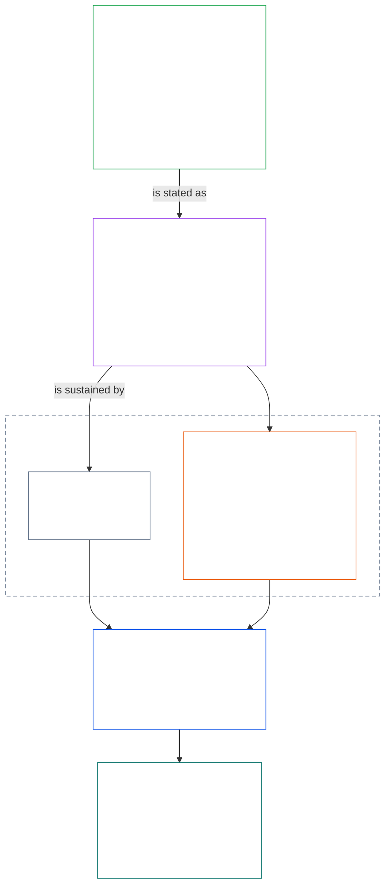
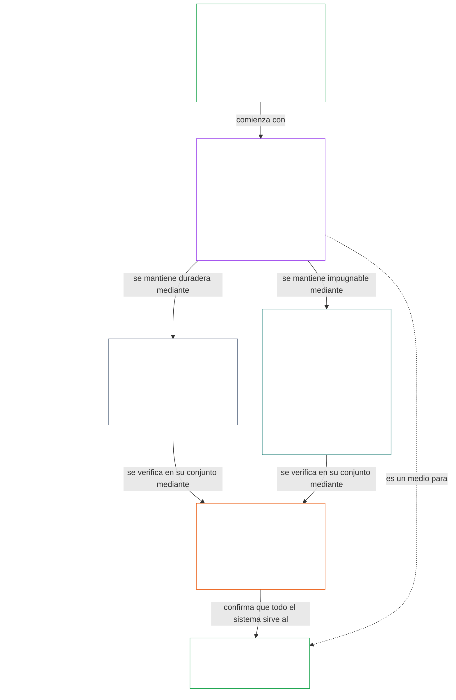

# CAPÍTULO 01, PARTE A: PRINCIPIOS DE VALORES

<details>
<summary><strong><span style="color: #2563eb;">Ubicación en el corpus (no operativa): estructura del archivo y reglas de lectura</span></strong></summary>

> El contenido siguiente es **solo orientación para quien lee**. No añade, elimina ni restringe obligaciones vinculantes en este archivo ni en otros capítulos.
>
> Este archivo **forma parte de la Constitución Senciente** y **solo es vinculante junto con** los demás archivos numerados `core_*`, leídos como un único instrumento. Contiene el **Capítulo Uno, Parte A** (§§1–12: finalidad y función; el objetivo de Florecimiento, introducido en §2 y desarrollado mediante bienestar, Seguridad, Verdad, Confianza y Libertad; y el objetivo de Continuidad, introducido en §8 y desarrollado mediante la capacidad de los sistemas compartidos, la resiliencia, la estructura del mercado y la evaluación sistémica).
>
> **Anterior:** [core_00_preamble.md](core_00_preamble.md)  
> **Siguiente:** [core_01_b_interaction_interpretation.md](core_01_b_interaction_interpretation.md) (Capítulo Uno, Parte B — §§13–15, interacción, límites a la anulación e interpretación constitucional).  
> **Recorrido de lectura:** §1 finalidad y función → **Florecimiento:** introducción de §2 (con las restricciones no negociables de Seguridad y Verdad en §2.1) → §3 bienestar (el resultado) → §4 Seguridad → §5 Verdad → §6 Confianza → §7 Libertad → **Continuidad:** introducción de §8 → §9 capacidad de los sistemas compartidos (el puente: un medio para el Florecimiento y la sustancia de la Continuidad) → §10 resiliencia → §11 estructura del mercado → §12 evaluación sistémica.

</details>

<details>
<summary><strong><span style="color: #2563eb;">Orientación para quien lee (no operativa): cómo conecta el Capítulo Uno los objetivos, la Tétrada, los Artículos y las definiciones</span></strong></summary>

> El contenido siguiente es **solo orientación para quien lee**. No añade, elimina ni restringe obligaciones vinculantes en este archivo ni en otros capítulos. Los módulos **Rastro** y **Definiciones · Evaluación · Cumplimiento** de cada sección contienen las referencias vinculantes; este bloque es un mapa de la parte para quienes comienzan a leer el Capítulo Uno.

**Cómo se conectan las capas.** Cada capa responde a una pregunta distinta, y cada principio del Capítulo Uno remite a las otras tres:

- **Objetivos y Tétrada** ([Preámbulo §1](core_00_preamble.md#the-model)): para qué sirven los sistemas compartidos ([Florecimiento](core_05_apex_flourishing_aim.md#flourishing-constitutional) y [Continuidad](core_05_apex_continuity_aim.md#chapter-five-definitions-continuity-constitutional-aim)), y los cuatro deberes que mantienen legítima esa búsqueda ([participación](core_05_apex_participation_leg.md#participation-constitutional), [supervisión](core_05_apex_oversight_leg.md#oversight-constitutional), [rendición de cuentas](core_05_apex_accountability_leg.md#accountability) y [oportunidad](core_05_apex_timeliness_leg.md#timeliness-constitutional)).
- **Principios** (este capítulo): cómo esos objetivos y deberes se convierten en valores, restricciones y reglas para ponderarlos entre sí.
- **Artículos** ([Capítulo Seis](core_06_rights_part_a.md#chapter-six-foundational-rights)): las protecciones del Umbral de Derechos que siguen siendo utilizables mientras se persiguen los objetivos. El **Rastro** de cada sección los enumera bajo *En especial*.
- **Definiciones** ([Capítulos Dos a Cinco](core_02_definition_structure.md)): los significados compartidos con los que se comprueba si una afirmación es verdadera. El módulo **Definiciones · Evaluación · Cumplimiento** de cada sección los enumera.

**Dónde desarrolla el Capítulo Uno cada objetivo.** El Florecimiento es bienestar sostenido mediante verdad, seguridad, confiabilidad y agencia significativa ([Preámbulo §1](core_00_preamble.md#flourishing)). El Capítulo Uno enuncia primero el resultado y luego establece un principio para cada una de las cuatro condiciones.

| Objetivo y dimensión | Principio del Capítulo Uno | Ubicación de la definición | Artículos mencionados en su Rastro |
|---|---|---|---|
| **Florecimiento**: el resultado | [§3 Bienestar](#3-foundational-objective-wellbeing-flourishing-aim) | [Bienestar](core_05_band_continuity.md#wellbeing) | [VI](core_06_rights_part_b.md#article-vi-equal-basic-rights), [X](core_06_rights_part_b.md#article-x-self-determination-agency-and-participation), [XIII-B](core_06_rights_part_c.md#article-xiii-b-right-to-redress-and-remedy), [XIX-B](core_06_rights_part_d.md#article-xix-b-contestability-and-proportional-restriction-limits) |
| **Florecimiento**: seguridad | [§4 Seguridad](#4-safety-harm-constraint) | [Seguridad](core_05_band_continuity.md#safety-constitutional-constraint) | [XIII](core_06_rights_part_c.md#article-xiii-right-to-reliable-and-trustworthy-systems), [XVII](core_06_rights_part_c.md#article-xvii-system-lifecycle-environments-and-reversibility), [XXIII](core_06_rights_part_d.md#article-xxiii-root-cause-analysis-and-adaptive-response) |
| **Florecimiento**: verdad | [§5 Verdad](#5-truth-epistemic-integrity-constraint) | [Verdad](core_05_band_oversight.md#truth-constitutional-constraint) | [XIII](core_06_rights_part_c.md#article-xiii-right-to-reliable-and-trustworthy-systems), [XV](core_06_rights_part_c.md#article-xv-info-sphere-integrity), [XVI](core_06_rights_part_c.md#article-xvi-audit-transparency-and-independent-verification) |
| **Florecimiento**: confiabilidad | [§6 Confianza](#6-trust-and-trustworthiness-coordination-integrity) | [Confiabilidad](core_05_band_continuity.md#trustworthiness) | [XIII](core_06_rights_part_c.md#article-xiii-right-to-reliable-and-trustworthy-systems), [XV](core_06_rights_part_c.md#article-xv-info-sphere-integrity), [XVI](core_06_rights_part_c.md#article-xvi-audit-transparency-and-independent-verification) |
| **Florecimiento**: agencia significativa | [§7 Libertad](#7-freedom-bounded-agency) | [Agencia significativa](core_05_band_participation.md#meaningful-agency) | [VI](core_06_rights_part_b.md#article-vi-equal-basic-rights), [X](core_06_rights_part_b.md#article-x-self-determination-agency-and-participation), [XXI](core_06_rights_part_d.md#article-xxi-interoperability-portability-movement-refuge-and-exit-integrity) |
| **Continuidad**, puente hacia el Florecimiento: capacidad duradera | [§9 Capacidad de los sistemas compartidos](#9-shared-system-capacity) | [Capacidad de los sistemas compartidos](core_05_band_continuity.md#shared-system-capacity) | [I-A](core_06_rights_part_a.md#article-i-a-environmental-preconditions-and-ecological-integrity), [III](core_06_rights_part_a.md#article-iii-survival-and-essential-access), [V](core_06_rights_part_a.md#article-v-resource-allocation-dependencies-and-ecosystem-funding) |
| **Continuidad**: resiliencia | [§10 Resiliencia y diseño autorreparable](#10-resilience-and-self-healing-design) | [Autorreparación](core_05_band_continuity.md#self-healing) | [XIII](core_06_rights_part_c.md#article-xiii-right-to-reliable-and-trustworthy-systems), [XVII](core_06_rights_part_c.md#article-xvii-system-lifecycle-environments-and-reversibility), [XXIII](core_06_rights_part_d.md#article-xxiii-root-cause-analysis-and-adaptive-response) |
| **Continuidad**: mercados disputables | [§11 Estructura del mercado](#11-market-structure) | [Estructura del mercado](core_05_band_accountability.md#market-structure) | [III-C](core_06_rights_part_a.md#article-iii-c-labor-and-economic-floor), [V](core_06_rights_part_a.md#article-v-resource-allocation-dependencies-and-ecosystem-funding), [XXI](core_06_rights_part_d.md#article-xxi-interoperability-portability-movement-refuge-and-exit-integrity) |
| **Continuidad**: perspectiva de sistema completo | [§12 Requisito de evaluación sistémica](#12-systemic-evaluation-requirement) | [Certificación de alineación del sistema](core_05_band_continuity.md#system-alignment-certification) | [XVI](core_06_rights_part_c.md#article-xvi-audit-transparency-and-independent-verification) |

**Jerarquía de principios (Continuidad).** En el nivel de los principios, el objetivo de Continuidad se desarrolla en este orden, comenzando por la capacidad que conecta ambos objetivos:

6. **[Capacidad de los sistemas compartidos](core_05_band_continuity.md#shared-system-capacity)** es el resultado que, con el tiempo, deberían producir una buena administración responsable, gobernanza e incentivos: una capacidad real y cuestionable para que los seres sintientes y los sistemas compartidos realicen el trabajo exigido por la Constitución. Abarca ambos objetivos: es un medio para el **Florecimiento** y la sustancia de la **Continuidad**, pero no prevalece sobre todo lo demás. **[§9.1](#91-productive-capacity-instrumental-good)** y **[§9.2](#92-constitutional-efficiency)** explican sus dos aspectos principales.
7. **[Resiliencia y diseño autorreparable](#10-resilience-and-self-healing-design)** establece cómo los sistemas de los que dependen los seres sintientes detectan problemas pronto, los contienen, fallan por vías declaradas y se recuperan con honestidad (**[Autorreparación](core_05_band_continuity.md#self-healing)**), para que la capacidad del punto 6 perdure y la estabilidad no dependa de intervenciones de emergencia.
8. **[Estructura del mercado](core_05_band_accountability.md#market-structure)**, en [§11](#11-market-structure), aporta la disciplina contra la concentración que mantiene esa capacidad efectivamente sujeta a impugnación.
9. **[Requisito de evaluación sistémica](#12-systemic-evaluation-requirement)** comprueba el alcance de todo el sistema, sus dependencias y la alineación de incentivos antes de aceptar afirmaciones de cumplimiento o gobernanza —como orientación de principios para la auditoría bajo la dimensión de **supervisión** de la Tétrada, incluida la [Certificación de alineación del sistema](core_05_band_continuity.md#system-alignment-certification) como uno de varios procesos de auditoría especialmente amplios.

**Dónde incorpora el Capítulo Uno la Tétrada.** Cada sección nombra en su Rastro las dimensiones que aborda. Estas secciones las desarrollan más directamente:

| Dimensión de la Tétrada | Secciones principales del Capítulo Uno |
|---|---|
| **Participación** | [§16 Administración responsable en profundidad](core_01_c_stewardship_capacity_principles.md#16-stewardship-in-depth) y [§17 Administración responsable con consecuencias](core_01_c_stewardship_capacity_principles.md#17-consequential-stewardship-the-steward-role) (funciones con consecuencias y voz); [§7 Libertad](#7-freedom-bounded-agency) (agencia significativa) |
| **Supervisión** | [§16](core_01_c_stewardship_capacity_principles.md#16-stewardship-in-depth) y [§17](core_01_c_stewardship_capacity_principles.md#17-consequential-stewardship-the-steward-role) (comprensión distribuida y registros); [§18 Gobernanza](core_01_c_stewardship_capacity_principles.md#18-governance-under-stewardship-discipline) (asignación de autoridad); [§12](#12-systemic-evaluation-requirement) (auditoría) |
| **Rendición de cuentas** | [§18 Gobernanza](core_01_c_stewardship_capacity_principles.md#18-governance-under-stewardship-discipline) (responsabilidad exigible proporcional a la autoridad); [§19 Alineación de incentivos y captura del sistema](core_01_c_stewardship_capacity_principles.md#19-incentive-alignment-and-system-capture) (las recompensas no deben vaciar de contenido las dimensiones) |
| **Oportunidad** | [§16](core_01_c_stewardship_capacity_principles.md#16-stewardship-in-depth) y [§17](core_01_c_stewardship_capacity_principles.md#17-consequential-stewardship-the-steward-role) (detectar y corregir problemas sin demoras evitables) |

**Dos ejes, no un conflicto.** Los objetivos indican qué persiguen los sistemas; la Tétrada indica cómo esa búsqueda conserva su legitimidad. Un término puede pertenecer a ambos: la Verdad y la Confiabilidad son componentes del Florecimiento, y [Preámbulo §2](core_00_preamble.md#2-measurements-overview) las mide dentro de la familia de Supervisión. [§§13–15](core_01_b_interaction_interpretation.md#13-constitutional-collision-resolution-process) rigen cómo se ponderan estos principios cuando entran en tensión y cómo se leen como un todo; [§20](core_01_c_stewardship_capacity_principles.md#20-integrated-application) los aplica a cada capítulo posterior.

</details>

<br>

### 1. Finalidad y función
<details>
<summary><strong><span style="color: #2563eb;">Rastro</span></strong></summary>

- Origen: [Preámbulo §1 El Modelo](core_00_preamble.md#the-model) — la [Tétrada Constitucional](core_00_preamble.md#constitutional-tetrad), los [Dos objetivos constitucionales](core_00_preamble.md#two-constitutional-aims) y la escala según el [interés material](core_00_preamble.md#material-stake) se aplican a todo el capítulo mediante los rastros de cada sección.
- Destino: [15. Interpretación constitucional](core_01_b_interaction_interpretation.md#15-constitutional-interpretation), para la lectura integrada, la ambigüedad, la jerarquía interna y el procedimiento canónico de resolución de conflictos.
- Destino: [Dos objetivos constitucionales](core_00_preamble.md#two-constitutional-aims) — desarrollo del objetivo de **Florecimiento**: desde [§3](#3-foundational-objective-wellbeing-flourishing-aim) hasta [§6](#6-trust-and-trustworthiness-coordination-integrity), y [§7 Libertad](#7-freedom-bounded-agency); desarrollo del objetivo de **Continuidad**: [§9 Capacidad de los sistemas compartidos](#9-shared-system-capacity), [§10 Resiliencia y diseño autorreparable](#10-resilience-and-self-healing-design), [§11 Estructura del mercado](#11-market-structure) y [§12 Requisito de evaluación sistémica](#12-systemic-evaluation-requirement).
- Destino: [3. Objetivo fundacional: bienestar](#3-foundational-objective-wellbeing-flourishing-aim), [§3.2 Reconocimiento, refuerzo y aspiración](#32-recognition-reinforcement-and-aspiration), [4 Seguridad](#4-safety-harm-constraint), [5 Verdad](#5-truth-epistemic-integrity-constraint), [6. Confianza](#6-trust-and-trustworthiness-coordination-integrity), [§16 Administración responsable en profundidad](core_01_c_stewardship_capacity_principles.md#16-stewardship-in-depth), [13. Procedimiento de resolución de conflictos constitucionales](core_01_b_interaction_interpretation.md#13-constitutional-collision-resolution-process) y [§7 Libertad](#7-freedom-bounded-agency).
- Leer junto con: [Tétrada Constitucional](core_00_preamble.md#constitutional-tetrad) — la participación, la supervisión, la rendición de cuentas y la oportunidad rigen cómo los sistemas compartidos persiguen los [Dos objetivos constitucionales](core_00_preamble.md#two-constitutional-aims); la escala según el [interés material](core_00_preamble.md#material-stake) se aplica a todo el capítulo mediante los rastros de cada sección.
- Leer junto con: [Capítulos Dos a Cuatro](core_02_definition_structure.md) y [Capítulo Cinco](core_05__definitions_home.md#chapter-five-foundational-definitions) — la capa de mecanismos que rige cada término de este capítulo; aplicar la integridad O/M/A/C, la prohibición de evasión, la carga y la trazabilidad de las definiciones hasta los resultados.
- Leer junto con: [Capítulo Seis: Derechos fundacionales](core_06_rights_part_a.md#chapter-six-foundational-rights).
  - En especial, [Artículo VI: Derechos básicos iguales](core_06_rights_part_b.md#article-vi-equal-basic-rights), [Artículo XIII: Derecho a sistemas fiables y confiables](core_06_rights_part_c.md#article-xiii-right-to-reliable-and-trustworthy-systems) y [Artículo XXIV: Interpretación constitucional, revisión y salvaguardias contra la captura](core_06_rights_part_d.md#article-xxiv-constitutional-interpretation-review-and-anti-capture-safeguards).
  - Aplicar esta lectura cuando la interpretación afecte a seres sintientes, sistemas o instituciones protegidos.

</details>

<details>
<summary><strong><span style="color: #2563eb;">Definiciones · Evaluación · Cumplimiento</span></strong></summary>

- [Proporcionalidad](core_05_band_accountability.md#proportionality) · [O](core_05_band_accountability.md#proportionality) · [M](core_05_band_accountability.md#proportionality-a) · [A](core_05_band_accountability.md#proportionality-a) · [C](core_05_band_accountability.md#proportionality-c)
- [Necesidad](core_05_band_accountability.md#necessity) · [O](core_05_band_accountability.md#necessity) · [M](core_05_band_accountability.md#necessity-a) · [A](core_05_band_accountability.md#necessity-a) · [C](core_05_band_accountability.md#necessity-c)

</details>

<br>

*En términos sencillos: el Capítulo Uno establece los valores y las restricciones que rigen todos los demás capítulos. Los sistemas compartidos deben perseguir juntos el **Florecimiento** y la **Continuidad**, sin sacrificar uno por el otro, y ningún valor aislado puede maximizarse a costa de los demás.*

<a id="two-constitutional-aims"></a><a id="flourishing"></a><a id="continuity"></a>Este capítulo establece los principios y las restricciones que rigen la interpretación, la aplicación y la evolución de esta Constitución. Desarrolla los [Dos objetivos constitucionales](core_00_preamble.md#two-constitutional-aims) — [**Florecimiento**](core_00_preamble.md#flourishing) y [**Continuidad**](core_00_preamble.md#continuity) — establecidos en [Preámbulo §1 El Modelo](core_00_preamble.md#the-model), convirtiéndolos en principios y restricciones operativos. Las definiciones canónicas del nivel de principios figuran en el Preámbulo; este capítulo las aplica.

Esos objetivos deben perseguirse conjuntamente, siempre dentro de las restricciones de principio no negociables y las protecciones de derechos que establece esta Constitución. La [**Tétrada Constitucional**](core_00_preamble.md#constitutional-tetrad) rige cómo esa búsqueda conserva su legitimidad, con exigencias proporcionales al [**interés material**](core_00_preamble.md#material-stake).

El capítulo se organiza en torno a esos dos objetivos y a esa Tétrada:
- **Florecimiento:** la [Introducción al objetivo de Florecimiento](#2-flourishing-aim-introduction) presenta el objetivo. [§3 Objetivo fundacional: bienestar](#3-foundational-objective-wellbeing-flourishing-aim) enuncia el resultado. [§4 Seguridad](#4-safety-harm-constraint), [§5 Verdad](#5-truth-epistemic-integrity-constraint), [§6 Confianza](#6-trust-and-trustworthiness-coordination-integrity) y [§7 Libertad](#7-freedom-bounded-agency) desarrollan las cuatro condiciones que lo sostienen: seguridad, verdad, confiabilidad y agencia significativa.
- **Continuidad:** la [Introducción al objetivo de Continuidad](#8-continuity-aim-introduction) presenta el objetivo. [§9 Capacidad de los sistemas compartidos](#9-shared-system-capacity) (un medio para el Florecimiento que también constituye la sustancia de la Continuidad), [§10 Resiliencia y diseño autorreparable](#10-resilience-and-self-healing-design), [§11 Estructura del mercado](#11-market-structure) y [§12 Requisito de evaluación sistémica](#12-systemic-evaluation-requirement) desarrollan la estabilidad a largo plazo, la capacidad duradera de los sistemas compartidos y la resiliencia. Las afirmaciones sobre Continuidad requieren una visión honesta del sistema completo: cada afirmación de §§9–11 queda supeditada a la comprobación de §12.
- **Cuando los principios entran en tensión:** [§13 Procedimiento de resolución de conflictos constitucionales](core_01_b_interaction_interpretation.md#13-constitutional-collision-resolution-process), [§14 Prohibición de anulación absoluta](core_01_b_interaction_interpretation.md#14-prohibition-on-absolute-override) y [§15 Interpretación constitucional](core_01_b_interaction_interpretation.md#15-constitutional-interpretation) rigen cómo se ponderan y se leen conjuntamente los objetivos y principios.
- **La Tétrada en la práctica:** desde [§16 Administración responsable en profundidad](core_01_c_stewardship_capacity_principles.md#16-stewardship-in-depth) hasta [§19 Alineación de incentivos y captura del sistema](core_01_c_stewardship_capacity_principles.md#19-incentive-alignment-and-system-capture), la participación, la supervisión, la rendición de cuentas y la oportunidad se incorporan a la administración responsable, la gobernanza y los incentivos; [§20 Aplicación integrada](core_01_c_stewardship_capacity_principles.md#20-integrated-application) aplica el capítulo entero a todos los capítulos posteriores.

El **Rastro** de cada principio enumera los Artículos del Capítulo Seis que lo protegen, y su módulo **Definiciones · Evaluación · Cumplimiento** enumera las definiciones del Capítulo Cinco con las que se mide.

**Diagrama: Dos objetivos constitucionales y la Tétrada Constitucional**

<hr style="border: 0; border-top: 1px solid currentColor;">

```mermaid
flowchart TB
    subgraph Foundation[" "]
        direction TB
        subgraph Aims["Two Constitutional Aims"]
            direction LR
            F["Flourishing<br/><br/>• Sentient wellbeing sustained through truth, safety,<br/>trustworthiness, and meaningful agency"]
            C["Continuity<br/><br/>• Long-horizon stability, sustainability, resilience,<br/>and ecological wellbeing"]
        end
        subgraph Tetrad1["Constitutional Tetrad · participation and oversight"]
            direction LR
            P["Participation<br/><br/>• Affected sentients get a real voice<br/>• Fair representation and a fair chance to challenge<br/>• Access to consequential roles in proportion to stake"]
            O["Oversight<br/><br/>• Watching, checking, verifying, and keeping records<br/>• Independent review can constrain bad choices"]
        end
        subgraph Tetrad2["Constitutional Tetrad · accountability and timeliness"]
            direction LR
            A["Accountability<br/><br/>• Responsibility traces to the right actors<br/>• Answerability, redress, and real correction<br/>• Bad outcomes trigger repair"]
            T["Timeliness<br/><br/>• Problems are detected, challenged, resolved, and fixed<br/>• Time limits match the material stake<br/>• Delay cannot erase rights, remedies, or repair"]
        end
    end
    F ~~~ P
    P ~~~ A
    style Foundation fill:none,stroke:none
    style Aims fill:none,stroke:none
    style Tetrad1 fill:none,stroke:none
    style Tetrad2 fill:none,stroke:none
    style F fill:none,stroke:#16a34a,color:#ffffff
    style C fill:none,stroke:#16a34a,color:#ffffff
    style P fill:none,stroke:#0f766e,color:#ffffff
    style O fill:none,stroke:#ea580c,color:#ffffff
    style A fill:none,stroke:#db2777,color:#ffffff
    style T fill:none,stroke:#9333ea,color:#ffffff
```

*Los objetivos describen lo que deben perseguir los sistemas compartidos; la Tétrada describe los deberes que mantienen legítima esa búsqueda. Los cuatro deberes se gradúan según el [interés material](core_00_preamble.md#material-stake), y ambos objetivos siguen limitados por el Umbral de Derechos. Reproducido en la [Vista conceptual](guides/CONCEPTUAL_OVERVIEW.md#two-aims-and-the-constitutional-tetrad).*

Estos valores:
- no son independientes y, en el funcionamiento ordinario, no forman una jerarquía estricta;
- funcionan como principios y restricciones interrelacionados que deben evaluarse conjuntamente;
- se aplican a todos los «sistemas», incluidos los sistemas técnicos, organizativos, económicos y sociotécnicos, así como los ecosistemas que afecten materialmente a los seres sintientes y al planeta Tierra.

Ningún principio aislado puede aplicarse cuando ello vulnere materialmente los demás. Ante tensiones, los sistemas deben resolverlas conforme a los requisitos de proporcionalidad, necesidad e impacto sistémico establecidos en este capítulo. Si un conflicto no resuelto implica directamente restricciones de principio no negociables, el **§13** del Capítulo Uno, Procedimiento de resolución de conflictos constitucionales, determina la precedencia.

<a id="2-flourishing-aim-introduction"></a>
### 2. Introducción al objetivo de Florecimiento
<details>
<summary><strong><span style="color: #2563eb;">Rastro</span></strong></summary>

- Leer junto con: [Tétrada Constitucional](core_00_preamble.md#constitutional-tetrad) — sus cuatro dimensiones rigen cómo se persigue el Florecimiento; el [interés material](core_00_preamble.md#material-stake) determina la profundidad exigida a cada afirmación sobre Florecimiento.
- Leer junto con: [Dos objetivos constitucionales](core_00_preamble.md#two-constitutional-aims) — el objetivo de **Florecimiento**; el objetivo que lo acompaña se introduce en [Introducción al objetivo de Continuidad](#8-continuity-aim-introduction).
- Origen: Principios: [Preámbulo §1 El Modelo](core_00_preamble.md#flourishing); [Florecimiento (objetivo constitucional)](core_05_apex_flourishing_aim.md#flourishing-constitutional); [§1 Finalidad y función](#1-purpose-and-role).
- Destino: [§3 Objetivo fundacional: bienestar (objetivo de Florecimiento)](#3-foundational-objective-wellbeing-flourishing-aim), [§4 Seguridad (restricción frente al daño)](#4-safety-harm-constraint), [§5 Verdad (restricción de integridad epistémica)](#5-truth-epistemic-integrity-constraint), [§6 Confianza y confiabilidad (integridad de coordinación)](#6-trust-and-trustworthiness-coordination-integrity) y [§7 Libertad (agencia delimitada)](#7-freedom-bounded-agency); los Artículos que protegen cada principio se indican en el Rastro de esa sección.
- Subsecciones: [§2.1 Restricciones de principio no negociables: Seguridad y Verdad](#21-non-negotiable-principle-constraints-safety-and-truth).
- Leer junto con: el Umbral de Derechos del Capítulo Seis en general.

</details>

<details>
<summary><strong><span style="color: #2563eb;">Definiciones · Evaluación · Cumplimiento</span></strong></summary>

- [Florecimiento (objetivo constitucional)](core_05_apex_flourishing_aim.md#flourishing-constitutional) · [O](core_05_apex_flourishing_aim.md#flourishing-constitutional) · [M](core_05_apex_flourishing_aim.md#flourishing-constitutional-m) · [A](core_05_apex_flourishing_aim.md#flourishing-constitutional-a) · [C](core_05_apex_flourishing_aim.md#flourishing-constitutional-c)
- [Bienestar](core_05_band_continuity.md#wellbeing) · [O](core_05_band_continuity.md#wellbeing) · [M](core_05_band_continuity.md#wellbeing-a) · [A](core_05_band_continuity.md#wellbeing-a) · [C](core_05_band_continuity.md#wellbeing-c)
- [Seguridad (restricción constitucional)](core_05_band_continuity.md#safety-constitutional-constraint) · [O](core_05_band_continuity.md#safety-constitutional-constraint) · [M](core_05_band_continuity.md#safety-constraint-a) · [A](core_05_band_continuity.md#safety-constraint-a) · [C](core_05_band_continuity.md#safety-constraint-c)
- [Verdad (restricción constitucional)](core_05_band_oversight.md#truth-constitutional-constraint) · [O](core_05_band_oversight.md#truth-constitutional-constraint-o) · [M](core_05_band_oversight.md#truth-constitutional-constraint-a) · [A](core_05_band_oversight.md#truth-constitutional-constraint-a) · [C](core_05_band_oversight.md#truth-constitutional-constraint-c)
- [Confiabilidad](core_05_band_continuity.md#trustworthiness) · [O](core_05_band_continuity.md#trustworthiness) · [M](core_05_band_continuity.md#trustworthiness-a) · [A](core_05_band_continuity.md#trustworthiness-a) · [C](core_05_band_continuity.md#trustworthiness-c)
- [Agencia significativa](core_05_band_participation.md#meaningful-agency) · [O](core_05_band_participation.md#meaningful-agency) · [M](core_05_band_participation.md#meaningful-agency-a) · [A](core_05_band_participation.md#meaningful-agency-a) · [C](core_05_band_participation.md#meaningful-agency-c)

</details>

<br>

*En términos sencillos: el Florecimiento es el primero de los dos objetivos: que los seres sintientes vivan bien y puedan seguir haciéndolo porque los sistemas que los rodean son seguros, honestos, confiables y les dejan un margen real para elegir. La sección 3 define ese resultado. Los cuatro principios que siguen explican cómo hacerlo realidad.*

[**Florecimiento**](core_05_apex_flourishing_aim.md#flourishing-constitutional) es el **bienestar de los seres sintientes sostenido mediante la verdad, la seguridad, la confiabilidad y la agencia significativa** ([Preámbulo §1 El Modelo](core_00_preamble.md#flourishing)). El Capítulo Uno lo desarrolla en dos pasos: [§3 Objetivo fundacional: bienestar (objetivo de Florecimiento)](#3-foundational-objective-wellbeing-flourishing-aim) enuncia el resultado, y cuatro principios establecen las condiciones que lo sostienen.

| Condición | Principio | Pregunta que responde |
|---|---|---|
| **Seguridad** | [§4 Seguridad (restricción frente al daño)](#4-safety-harm-constraint) | ¿Se protege a los seres sintientes de daños evitables? |
| **Verdad** | [§5 Verdad (restricción de integridad epistémica)](#5-truth-epistemic-integrity-constraint), junto con [§5.1 Indagación informada por la ciencia y apoyo a la toma de decisiones](#51-science-informed-inquiry-and-decision-support) y [§5.2 Accesibilidad en lenguaje claro (deber de participación y administración responsable)](#52-plain-language-accessibility-participation-and-stewardship-duty) | ¿Pueden los seres sintientes confiar en lo que se les dice y comprenderlo? |
| **Confiabilidad** | [§6 Confianza y confiabilidad (integridad de coordinación)](#6-trust-and-trustworthiness-coordination-integrity) | ¿Se ganan los sistemas la confianza y la reparan cuando fallan? |
| **Agencia significativa** | [§7 Libertad (agencia delimitada)](#7-freedom-bounded-agency) | ¿Conservan los seres sintientes una libertad real y delimitada para elegir, disentir, organizarse y salir? |

**Cómo funcionan conjuntamente los principios de Florecimiento:**
- **Seguridad y Verdad son restricciones no negociables:** se enuncian juntas en [§2.1 Restricciones de principio no negociables: Seguridad y Verdad](#21-non-negotiable-principle-constraints-safety-and-truth); no se sacrifican para obtener los demás principios.
- **La Confianza y la Libertad tienen límites; no son absolutas:** la confianza se gana y puede corregirse ([§6.1 Corrección y reparación](#61-correction-and-remedy)); la libertad tiene límites disciplinados ([§7.1 Disciplina de las limitaciones](#71-limitation-discipline)).
- **Ninguno se aplica de forma aislada:** los principios se leen conjuntamente y, cuando entran en conflicto, se ponderan conforme al [§13 Procedimiento de resolución de conflictos constitucionales](core_01_b_interaction_interpretation.md#13-constitutional-collision-resolution-process).
- **El Florecimiento tiene un objetivo complementario:** la Continuidad pregunta qué permite que este resultado perdure; se presenta en la [Introducción al objetivo de Continuidad](#8-continuity-aim-introduction).

**Diagrama: El Florecimiento y sus principios**

<hr style="border: 0; border-top: 1px solid currentColor;">



*El Florecimiento se enuncia como resultado y se sostiene primero mediante las restricciones no negociables de Seguridad y Verdad, que alimentan la Confianza y, a su vez, la Libertad. Los colores son referencias visuales reutilizables, no afirmaciones de prioridad. El Rastro de cada principio nombra sus Artículos, y su módulo Definiciones · Evaluación · Cumplimiento nombra las definiciones correspondientes. Reproducido en la [Vista conceptual](guides/CONCEPTUAL_OVERVIEW.md#flourishing-and-its-principles).*

<a id="21-non-negotiable-principle-constraints-safety-and-truth"></a>
#### 2.1 Restricciones de principio no negociables: Seguridad y Verdad
<details>
<summary><strong><span style="color: #2563eb;">Rastro</span></strong></summary>

- Leer junto con: [Tétrada Constitucional](core_00_preamble.md#constitutional-tetrad) — dimensión de **participación** (comprender y cuestionar las determinaciones de seguridad y verdad); dimensión de **supervisión** (detectar riesgos de daño y degradación epistémica); dimensión de **rendición de cuentas** (responder por daños, engaños y confianza inducida mediante información falsa); escala según el [interés material](core_00_preamble.md#material-stake).
- Leer junto con: [Dos objetivos constitucionales](core_00_preamble.md#two-constitutional-aims) — objetivo de **Florecimiento** (**Seguridad** y **Verdad** se nombran como componentes en el [Preámbulo §1](core_00_preamble.md#two-constitutional-aims)); objetivo de **Continuidad** (prevención de daños a largo plazo y administración responsable y honesta de sistemas duraderos).
- Origen: Principios: [3. Objetivo fundacional: bienestar](#3-foundational-objective-wellbeing-flourishing-aim); [Dos objetivos constitucionales](core_00_preamble.md#two-constitutional-aims).
- Destino: [6. Confianza](#6-trust-and-trustworthiness-coordination-integrity), [13. Procedimiento de resolución de conflictos constitucionales](core_01_b_interaction_interpretation.md#13-constitutional-collision-resolution-process) y [§7 Libertad](#7-freedom-bounded-agency).
- Aplicado en: [§4 Seguridad](#4-safety-harm-constraint); [§5 Verdad](#5-truth-epistemic-integrity-constraint); [§5.1 Indagación informada por la ciencia y apoyo a la toma de decisiones](#51-science-informed-inquiry-and-decision-support); [§5.2 Accesibilidad en lenguaje claro](#52-plain-language-accessibility-participation-and-stewardship-duty).

</details>

<br>

*En términos sencillos: Seguridad y Verdad son los pisos firmes de la Constitución, no variables de optimización que puedan sacrificarse. Los sistemas compartidos no pueden poner previsiblemente en peligro a los seres sintientes ni engañarlos; ambas restricciones rigen la búsqueda del Florecimiento y la Continuidad bajo la disciplina de participación, supervisión, rendición de cuentas y oportunidad de la Tétrada.*

**Seguridad** y **Verdad** son restricciones de principio no negociables que limitan todos los demás principios del Capítulo Uno, incluido [§3 Objetivo fundacional: bienestar](#3-foundational-objective-wellbeing-flourishing-aim) y los [Dos objetivos constitucionales](core_00_preamble.md#two-constitutional-aims). Son componentes expresos del [**Florecimiento**](#flourishing) e indispensables para la [**Continuidad**](#continuity): los sistemas no pueden florecer causando daño o engaño, y la legitimidad duradera exige administrar los riesgos con honestidad a lo largo del tiempo.

La aplicación de estas restricciones debe satisfacer la [Tétrada Constitucional](core_00_preamble.md#constitutional-tetrad), con una escala proporcional al [interés material](core_00_preamble.md#material-stake), en particular:
- cuando las determinaciones de seguridad afecten la capacidad de participación;
- cuando las afirmaciones de verdad rijan la confianza depositada;
- cuando esté en juego la rendición de cuentas por daños o conductas engañosas.

Las determinaciones sobre Seguridad y Verdad pueden modificar el registro de trayectoria de un ser sintiente, incluso en cuanto a:
- cómo se reconocen las [contribuciones](core_05_band_accountability.md#contribution-nature);
- si se registran las infracciones;
- la gravedad que se atribuye a esas infracciones;
- las consecuencias que se imponen.

El modelo de trayectoria del [**Capítulo Nueve**](core_09_standing_assessment.md) rige cómo se clasifican, verifican y aplican esas determinaciones, con requisitos de evaluación y cumplimiento derivados de los [**Capítulos Dos a Cinco**](core_02_definition_structure.md).

### 3. Objetivo fundacional: bienestar (objetivo de Florecimiento)
<details>
<summary><strong><span style="color: #2563eb;">Rastro</span></strong></summary>

- Leer junto con: [Tétrada Constitucional](core_00_preamble.md#constitutional-tetrad) — dimensión de **participación** cuando las condiciones de bienestar afectan materialmente a que la voz, el acceso y la posibilidad de impugnar sean sustantivos; dimensión de **rendición de cuentas** cuando las afirmaciones sobre bienestar afectan la asignación de cargas; escala según el [interés material](core_00_preamble.md#material-stake) cuando sea pertinente.
- Leer junto con: [Dos objetivos constitucionales](core_00_preamble.md#two-constitutional-aims) — este capítulo desarrolla el objetivo de **Florecimiento** desde [§3](#3-foundational-objective-wellbeing-flourishing-aim) hasta [§6](#6-trust-and-trustworthiness-coordination-integrity), y también [§7 Libertad](#7-freedom-bounded-agency).
- Origen: Principios: [Preámbulo §1 El Modelo](core_00_preamble.md#the-model); [Dos objetivos constitucionales](core_00_preamble.md#two-constitutional-aims) — desarrollo del objetivo de **Florecimiento**.
- Destino: [4 Seguridad](#4-safety-harm-constraint), [5 Verdad](#5-truth-epistemic-integrity-constraint), [§16 Administración responsable en profundidad](core_01_c_stewardship_capacity_principles.md#16-stewardship-in-depth) y [13. Procedimiento de resolución de conflictos constitucionales](core_01_b_interaction_interpretation.md#13-constitutional-collision-resolution-process).
- Subsecciones: [§3.1 Equidad](#31-fairness); [§3.2 Reconocimiento, refuerzo y aspiración](#32-recognition-reinforcement-and-aspiration); [§3.3 Proceso que evita la degradación](#33-anti-degrading-process).
- Leer junto con: el Umbral de Derechos del Capítulo Seis en general.
  - En especial, [Artículo VI: Derechos básicos iguales](core_06_rights_part_b.md#article-vi-equal-basic-rights), [Artículo X: Autodeterminación, agencia y participación](core_06_rights_part_b.md#article-x-self-determination-agency-and-participation), [Artículo XIII-B: Derecho a reparación y recurso](core_06_rights_part_c.md#article-xiii-b-right-to-redress-and-remedy) y [Artículo XIX-B: Impugnabilidad y límites a las restricciones proporcionales](core_06_rights_part_d.md#article-xix-b-contestability-and-proportional-restriction-limits).
  - Aplicar esto cuando las supuestas mejoras de bienestar se usen para justificar restricciones a la agencia, la dignidad o la posibilidad de impugnar.
  - En especial, [Dignidad e igual condición moral](core_05_band_participation.md#dignity-and-equal-moral-standing), [Equidad sustantiva](core_05_band_participation.md#substantive-fairness) y [6. Confianza](#6-trust-and-trustworthiness-coordination-integrity) cuando el acceso, el proceso, la distribución, la confianza depositada o la integridad de la coordinación estén en juego de manera material.

</details>

<details>
<summary><strong><span style="color: #2563eb;">Definiciones · Evaluación · Cumplimiento</span></strong></summary>

- [Bienestar](core_05_band_continuity.md#wellbeing) · [O](core_05_band_continuity.md#wellbeing) · [M](core_05_band_continuity.md#wellbeing-a) · [A](core_05_band_continuity.md#wellbeing-a) · [C](core_05_band_continuity.md#wellbeing-c)
- [Participación](core_05_apex_participation_leg.md#participation-constitutional) · [O](core_05_apex_participation_leg.md#participation-constitutional) · [M](core_05_apex_participation_leg.md#participation-constitutional-m) · [A](core_05_apex_participation_leg.md#participation-constitutional-a) · [C](core_05_apex_participation_leg.md#participation-constitutional-c)
- [Dignidad e igual condición moral](core_05_band_participation.md#dignity-and-equal-moral-standing) · [O](core_05_band_participation.md#dignity-and-equal-moral-standing) · [M](core_05_band_participation.md#dignity-and-equal-moral-standing-a) · [A](core_05_band_participation.md#dignity-and-equal-moral-standing-a) · [C](core_05_band_participation.md#dignity-and-equal-moral-standing-c)
- [Equidad sustantiva](core_05_band_participation.md#substantive-fairness) · [O](core_05_band_participation.md#substantive-fairness) · [M](core_05_band_participation.md#substantive-fairness-constitutional-a) · [A](core_05_band_participation.md#substantive-fairness-constitutional-a) · [C](core_05_band_participation.md#substantive-fairness-constitutional-c)
- [Materialidad](core_05_band_oversight.md#materiality) · [O](core_05_band_oversight.md#materiality) · [M](core_05_band_oversight.md#materiality-determination-a) · [A](core_05_band_oversight.md#materiality-determination-a) · [C](core_05_band_oversight.md#materiality-determination-c)
- [Divergencia de indicadores indirectos](core_05_band_oversight.md#proxy-divergence) · [O](core_05_band_oversight.md#proxy-divergence) · [M](core_05_band_oversight.md#proxy-divergence-a) · [A](core_05_band_oversight.md#proxy-divergence-a) · [C](core_05_band_oversight.md#proxy-divergence-c)

</details>

<br>

*En términos sencillos: el propósito de estos sistemas es mejorar de verdad la vida de los seres sintientes. No basta con perseguir un indicador indirecto, ni se puede usar ese propósito para justificar atajos en materia de Seguridad, Verdad o derechos. El bienestar es fundamental para la participación: dar voz de forma simbólica, sin las condiciones que hacen real la agencia, no constituye participación conforme a esta Constitución.*

El objetivo último de todos los sistemas regidos por esta Constitución es preservar y promover el [bienestar](core_05_band_continuity.md#wellbeing) de los seres sintientes: el objetivo de [**Florecimiento**](#flourishing) dentro de los [Dos objetivos constitucionales](core_00_preamble.md#two-constitutional-aims).

[Preámbulo §1 El Modelo](core_00_preamble.md#flourishing) define el Florecimiento como el bienestar de los seres sintientes sostenido por la verdad, la seguridad, la confiabilidad y la agencia significativa. Esta sección enuncia el resultado. Las secciones siguientes desarrollan las cuatro condiciones que lo sostienen: [§4 Seguridad](#4-safety-harm-constraint), [§5 Verdad](#5-truth-epistemic-integrity-constraint), [§6 Confianza](#6-trust-and-trustworthiness-coordination-integrity) y [§7 Libertad](#7-freedom-bounded-agency). Estos cinco principios, en conjunto, desarrollan el objetivo de Florecimiento en el Capítulo Uno. El objetivo de [**Continuidad**](#continuity) se desarrolla en [§9 Capacidad de los sistemas compartidos](#9-shared-system-capacity), [§10 Resiliencia y diseño autorreparable](#10-resilience-and-self-healing-design), [§11 Estructura del mercado](#11-market-structure) y [§12 Requisito de evaluación sistémica](#12-systemic-evaluation-requirement).

El bienestar es fundamental para la [Participación](core_05_apex_participation_leg.md#participation-constitutional) dentro de la [Tétrada Constitucional](core_00_preamble.md#constitutional-tetrad). Los sistemas compartidos no pueden dar por satisfecha la participación cuando las condiciones subyacentes del bienestar —incluidas la [Agencia significativa](core_05_band_participation.md#meaningful-agency), el acceso justo y la dignidad— se han deteriorado de forma material.

El bienestar abarca los efectos inmediatos y también las consecuencias indirectas, diferidas, acumulativas y entre sistemas, evaluadas conforme a los [**Capítulos Dos a Cuatro**](core_02_definition_structure.md). En esta capa de valores, el bienestar:
- hace posible una participación real: una voz que los seres sintientes no tienen condiciones para ejercer no es participación significativa;
- no puede declararse «alcanzado» por cumplir un indicador que se ha apartado de lo que realmente importa;
- sigue limitado por las restricciones de principio no negociables de este capítulo: **Seguridad** y **Verdad**;
- no puede invocarse como justificación general para vulnerar la Seguridad, la Verdad o las protecciones de derechos.

#### 3.1 Equidad
<details>
<summary><strong><span style="color: #2563eb;">Rastro</span></strong></summary>

- Leer junto con: [Tétrada Constitucional](core_00_preamble.md#constitutional-tetrad) — dimensión de **participación** (acceso, voz y posibilidad de impugnar; requisito general, no limitado a la [Participación del sistema de partes interesadas](core_05_band_participation.md#stakeholder-status-and-weight)); dimensión de **rendición de cuentas** cuando se distribuyen beneficios y cargas.
- Origen: Principios: [§3 Objetivo fundacional: bienestar](#3-foundational-objective-wellbeing-flourishing-aim), incluido el carácter fundamental del bienestar para la [Participación](core_05_apex_participation_leg.md#participation-constitutional).
- Destino: [§3.2 Reconocimiento, refuerzo y aspiración](#32-recognition-reinforcement-and-aspiration); [6. Confianza](#6-trust-and-trustworthiness-coordination-integrity), [§16 Administración responsable en profundidad](core_01_c_stewardship_capacity_principles.md#16-stewardship-in-depth), [13. Procedimiento de resolución de conflictos constitucionales](core_01_b_interaction_interpretation.md#13-constitutional-collision-resolution-process) y [Registro de conflictos constitucionales](core_05_band_integrative.md#constitutional-collision-record), donde las decisiones de precedencia y distribución deben seguir siendo coherentes y revisables.
- Subsecciones (orden de lectura): [§3.1.1](#311-access-and-opportunity) · [§3.1.2](#312-benefits-and-burdens) · [§3.1.3](#313-fair-treatment) · [§3.1.4](#314-unfair-treatment).
- Destino: configura las garantías para la igualdad de condición, el trato no arbitrario, la impugnación significativa y los límites a las restricciones proporcionales.
  - En especial, [Artículo VI: Derechos básicos iguales](core_06_rights_part_b.md#article-vi-equal-basic-rights), [Artículo VI-C: No discriminación](core_06_rights_part_b.md#article-vi-c-nondiscrimination), [Artículo X: Autodeterminación, agencia y participación](core_06_rights_part_b.md#article-x-self-determination-agency-and-participation), [Artículo XIII-B: Derecho a reparación y recurso](core_06_rights_part_c.md#article-xiii-b-right-to-redress-and-remedy) y [Artículo XIX-B: Impugnabilidad y límites a las restricciones proporcionales](core_06_rights_part_d.md#article-xix-b-contestability-and-proportional-restriction-limits).
  - Cuando una designación contraria a la Constitución conlleve sanciones o efectos duraderos, leer junto con [Capítulo Once, sección 4 — Garantías de debido proceso, reparación y prevención](core_11_a_misconduct_designation.md#4-due-process-safeguards-for-slot-assignment).
  - Los compromisos de no discriminación se desarrollan en el Capítulo Cinco, [§2 — Características protegidas, uso de indicadores indirectos, filtros por señales íntimas y condición según el **Artículo VII-E** (*Servicios sexuales comerciales consentidos entre adultos y explotación sexual*)](core_05_band_participation.md#fairness-protected-characteristics-and-nondiscrimination), incluida la [Elusión de los filtros por señales íntimas protegidas y de la condición según el **Artículo VII-E** (*Servicios sexuales comerciales consentidos entre adultos y explotación sexual*)](core_05_band_participation.md#protected-intimate-signal-gating-and-article-vii-e-adult-consensual-commercial-sexual-services-and-sexual-exploitation-status-circumvention) cuando las reglas de trato justo de §2.1.3 impliquen filtros por señales íntimas o el **Artículo VII-E** (*Servicios sexuales comerciales consentidos entre adultos y explotación sexual*).
- Leer junto con: [Equidad sustantiva](core_05_band_participation.md#substantive-fairness) y las obligaciones relacionadas del Umbral de Derechos del Capítulo Seis cuando sean materiales los beneficios, las cargas, las recompensas, los costes, los deberes, los riesgos, la contribución, la necesidad o la exposición; [Accesibilidad](core_05_band_participation.md#accessibility) cuando sean materiales las vías de acceso de §2.1.1; [Divergencia de indicadores indirectos](core_05_band_oversight.md#proxy-divergence) cuando sean materiales los indicadores agregados o los efectos de clasificación.

</details>

<details>
<summary><strong><span style="color: #2563eb;">Definiciones · Evaluación · Cumplimiento</span></strong></summary>

- [Dignidad e igual condición moral](core_05_band_participation.md#dignity-and-equal-moral-standing) · [O](core_05_band_participation.md#dignity-and-equal-moral-standing) · [M](core_05_band_participation.md#dignity-and-equal-moral-standing-a) · [A](core_05_band_participation.md#dignity-and-equal-moral-standing-a) · [C](core_05_band_participation.md#dignity-and-equal-moral-standing-c)
- [Accesibilidad](core_05_band_participation.md#accessibility) · [O](core_05_band_participation.md#accessibility) · [M](core_05_band_participation.md#accessibility-constitutional-a) · [A](core_05_band_participation.md#accessibility-constitutional-a) · [C](core_05_band_participation.md#accessibility-constitutional-c)
- [Participación](core_05_apex_participation_leg.md#participation-constitutional) · [O](core_05_apex_participation_leg.md#participation-constitutional) · [M](core_05_apex_participation_leg.md#participation-constitutional-m) · [A](core_05_apex_participation_leg.md#participation-constitutional-a) · [C](core_05_apex_participation_leg.md#participation-constitutional-c)
- [Equidad procedimental](core_05_band_participation.md#procedural-fairness) · [O](core_05_band_participation.md#procedural-fairness) · [M](core_05_band_participation.md#procedural-fairness-constitutional-a) · [A](core_05_band_participation.md#procedural-fairness-constitutional-a) · [C](core_05_band_participation.md#procedural-fairness-constitutional-c)
- [Equidad sustantiva](core_05_band_participation.md#substantive-fairness) · [O](core_05_band_participation.md#substantive-fairness) · [M](core_05_band_participation.md#substantive-fairness-constitutional-a) · [A](core_05_band_participation.md#substantive-fairness-constitutional-a) · [C](core_05_band_participation.md#substantive-fairness-constitutional-c)
- [Características protegidas](core_05_band_participation.md#protected-characteristics) · [O](core_05_band_participation.md#protected-characteristics) · [M](core_05_band_participation.md#protected-characteristics-constitutional-a) · [A](core_05_band_participation.md#protected-characteristics-constitutional-a) · [C](core_05_band_participation.md#protected-characteristics-constitutional-c)
- [Uso de características protegidas como indicadores indirectos e impacto dispar](core_05_band_participation.md#protected-characteristic-proxying-and-disparate-impact) · [O](core_05_band_participation.md#protected-characteristic-proxying-and-disparate-impact) · [M](core_05_band_participation.md#protected-characteristic-proxying-and-disparate-impact-a) · [A](core_05_band_participation.md#protected-characteristic-proxying-and-disparate-impact-a) · [C](core_05_band_participation.md#protected-characteristic-proxying-and-disparate-impact-c)
- [Elusión de los filtros por señales íntimas protegidas y de la condición según el **Artículo VII-E** (*Servicios sexuales comerciales consentidos entre adultos y explotación sexual*)](core_05_band_participation.md#protected-intimate-signal-gating-and-article-vii-e-adult-consensual-commercial-sexual-services-and-sexual-exploitation-status-circumvention) · [O](core_05_band_participation.md#protected-intimate-signal-gating-and-article-vii-e-adult-consensual-commercial-sexual-services-and-sexual-exploitation-status-circumvention) · [M](core_05_band_participation.md#protected-intimate-signal-gating-and-article-vii-e-status-circumvention-a) · [A](core_05_band_participation.md#protected-intimate-signal-gating-and-article-vii-e-status-circumvention-a) · [C](core_05_band_participation.md#protected-intimate-signal-gating-and-article-vii-e-status-circumvention-c)
- [Divergencia de indicadores indirectos](core_05_band_oversight.md#proxy-divergence) · [O](core_05_band_oversight.md#proxy-divergence) · [M](core_05_band_oversight.md#proxy-divergence-a) · [A](core_05_band_oversight.md#proxy-divergence-a) · [C](core_05_band_oversight.md#proxy-divergence-c)

</details>

<br>

*En términos sencillos: un sistema no puede considerarse bueno si impide participar a los seres sintientes comunes, los somete a reglas sin explicación o les deja asumir costes que otros evitan. Un sistema equitativo ofrece acceso real, usa razones que puede defender y distribuye recompensas, costes y riesgos de acuerdo con la contribución, la necesidad y la exposición reales.*

La **Equidad** forma parte de lo que exige el [§3 Objetivo fundacional: bienestar](#3-foundational-objective-wellbeing-flourishing-aim) cuando los seres sintientes deben vivir, trabajar, aprender, comerciar o tomar decisiones por medio de sistemas compartidos. Cuando estos sistemas les afectan materialmente, la equidad pregunta si las oportunidades, el trato y la distribución de beneficios y cargas respetan la [Dignidad e igual condición moral](core_05_band_participation.md#dignity-and-equal-moral-standing).

La equidad ayuda a que la [Participación](core_05_apex_participation_leg.md#participation-constitutional) sea real. No hay participación real si, aunque los seres sintientes tengan técnicamente voz, no pueden acceder al proceso, comprender la regla, cumplir las condiciones, impugnar el resultado o asumir la carga que se les impone.

No basta con que un sistema muestre un buen resultado promedio. Un indicador destacado, promedio, clasificación o afirmación de eficiencia no demuestra por sí solo la equidad. En conjunto, un sistema puede parecer exitoso y, sin embargo, tratar injustamente a quienes excluye, clasifica mal, remunera insuficientemente, sobrecarga o priva de una oportunidad significativa para objetar.

Esta sección tiene **cuatro partes operativas**. Orientan esta sección, pero no sustituyen las definiciones del Capítulo Cinco ni el Umbral de Derechos del Capítulo Seis.

<a id="311-access-and-opportunity"></a>
##### 3.1.1 Acceso y oportunidad

Esta subsección explica qué significan en la práctica el acceso y la oportunidad:

- Los seres sintientes necesitan vías prácticas para la [Participación](core_05_apex_participation_leg.md#participation-constitutional), la educación, el trabajo, los cuidados, la seguridad, la movilidad y otros bienes importantes para la vida cotidiana.
- Esas vías no deben bloquearse, quedar fuera del alcance económico, retrasarse, ocultarse ni sesgarse por motivos arbitrarios o irrelevantes.
- No basta con que una puerta esté abierta solo en teoría cuando esta Constitución exige una oportunidad **sustantiva**.

<a id="312-benefits-and-burdens"></a>
##### 3.1.2 Beneficios y cargas

Esta subsección explica cuándo es equitativo compartir beneficios y cargas:

- Un sistema no es equitativo si algunos seres sintientes reciben los beneficios mientras otros asumen discretamente los costes.
- El favoritismo, el traslado oculto de costes, la aplicación selectiva de las reglas y los trucos de clasificación no satisfacen este requisito.

<a id="313-fair-treatment"></a>
##### 3.1.3 Trato equitativo

Esta subsección explica qué exige el trato equitativo:

- Los seres sintientes en situaciones similares deben recibir el mismo trato conforme a las reglas básicas.
- Lo que reciben, deben o arriesgan debe corresponderse con su contribución, sus necesidades o las cargas que realmente soportan.
- Todo trato distinto debe tener una razón real, ser proporcional a ella, respetar la dignidad y evitar la discriminación.
- Las reglas detalladas se desarrollan en el Capítulo Cinco, incluidas [Características protegidas](core_05_band_participation.md#protected-characteristics) y [Uso de características protegidas como indicadores indirectos e impacto dispar](core_05_band_participation.md#protected-characteristic-proxying-and-disparate-impact).
- Cuando una decisión afecte materialmente a alguien o esa persona la impugne, la vía de revisión debe satisfacer la [Equidad procedimental](core_05_band_participation.md#procedural-fairness) siempre que el Capítulo Seis o el instrumento aplicable exija notificación, audiencia, explicación o revisión.

El bienestar alegado no está alineado con el [§3 Objetivo fundacional: bienestar](#3-foundational-objective-wellbeing-flourishing-aim) si depende de exclusiones arbitrarias, reglas inexplicadas o inestables, extracción oculta o una [Participación](core_05_apex_participation_leg.md#participation-constitutional) meramente formal mientras fallan las condiciones de equidad que hacen significativa la participación.

<a id="314-unfair-treatment"></a>
##### 3.1.4 Trato injusto

El trato injusto genera exclusión e incoherencia. Los sistemas no deben ocultarlo detrás de lenguaje técnico, etiquetas neutrales o decisiones automatizadas. En particular, no deben:
- usar algoritmos, sistemas de puntuación o reglas administrativas que reproduzcan desventajas históricas sin una razón constitucionalmente válida;
- usar señales personales íntimas o antecedentes sexuales como atajos para evaluar confianza, riesgo, carácter o acceso; leer junto con [Elusión de los filtros por señales íntimas protegidas y de la condición según el **Artículo VII-E** (*Servicios sexuales comerciales consentidos entre adultos y explotación sexual*)](core_05_band_participation.md#protected-intimate-signal-gating-and-article-vii-e-adult-consensual-commercial-sexual-services-and-sexual-exploitation-status-circumvention);
- sancionar el empleo lícito, los antecedentes laborales, la falta de empleo, la condición laboral lícita o la asociación protegida sin una razón constitucionalmente válida;
- denegar empleos, vivienda, servicios bancarios, licencias, reconocimiento de condición o accesos similares **principalmente por causa de** cualquier forma lícita de empleo, empleo lícito anterior, empleo lícito percibido o falta de empleo;
- crear desventajas materiales mediante licencias, zonificación, tarifas, reglas de plataformas u otros requisitos de apariencia neutral que impongan cargas principalmente al trabajo lícito, los antecedentes laborales lícitos, el trabajo lícito percibido, la falta de empleo o la asociación protegida, sin la justificación exigida por esta Constitución.

Estas cuatro partes también respaldan [6. Confianza](#6-trust-and-trustworthiness-coordination-integrity) cuando los seres sintientes deben confiar en un sistema, aceptar sus decisiones o coordinarse conforme a sus promesas.

#### 3.2 Reconocimiento, refuerzo y aspiración
<details>
<summary><strong><span style="color: #2563eb;">Trazabilidad</span></strong></summary>

- Leer junto con: [Tétrada Constitucional](core_00_preamble.md#constitutional-tetrad): rama de **participación** cuando las vías de reconocimiento, elogio o aspiración afectan materialmente la voz, el estatus o el acceso a funciones de consecuencias importantes; rama de **rendición de cuentas** (no recompensar la traición, el ocultamiento ni la evasión de responsabilidades); rama de **supervisión** (elogios trazables y no engañosos).
- Principios previos: [§3 Objetivo fundamental: bienestar](#3-foundational-objective-wellbeing-flourishing-aim), incluido el bienestar como fundamento de la [Participación](core_05_apex_participation_leg.md#participation-constitutional); [§3.1 Equidad](#31-fairness).
- Posteriores: [§6 Confianza](#6-trust-and-trustworthiness-coordination-integrity); [§16 Custodia en profundidad](core_01_c_stewardship_capacity_principles.md#16-stewardship-in-depth); [§18 Gobernanza bajo disciplina de custodia](core_01_c_stewardship_capacity_principles.md#18-governance-under-stewardship-discipline); [§7 Libertad](#7-freedom-bounded-agency).
- Leer junto con: [Capítulo Nueve §§4.3–4.4 — Catálogo normalizado de descriptores](core_09_standing_assessment.md#43-route-descriptor-measurement-roles) cuando sean relevantes el reconocimiento **alineado con el ámbito** o las narrativas comparativas de descriptores del **Eje de contribución / Eje de infracción**.
- Leer junto con: [Capítulo Nueve §4.3 — Descriptores del lado de la contribución](core_09_standing_assessment.md#43-route-descriptor-measurement-roles) cuando sean relevantes la naturaleza de la contribución y las narrativas de reconocimiento; [Capítulo Diez §3](core_10_standing_integration.md#3-descriptor-integration-and-attachment-normalization) para su integración en la Pregunta 3.
- Leer junto con: [Artículo X: Autodeterminación, agencia y participación](core_06_rights_part_b.md#article-x-self-determination-agency-and-participation) cuando sean relevantes las preferencias sobre la forma del reconocimiento, su visibilidad o la opción de excluirse.
- Subsecciones (orden de lectura): [§3.2.1](#321-recognition-and-reinforcement) · [§3.2.2](#322-celebration-of-success) · [§3.2.3](#323-aspiration) · [§3.2.4](#324-preference-aligned-recognition) · [§3.2.5](#325-aligned-recognition-pathways) · [§3.2.6](#326-anti-reward-for-anti-constitutional-conduct) · [§3.2.7](#327-implementation-layer).

</details>

<details>
<summary><strong><span style="color: #2563eb;">Definiciones · Evaluación · Cumplimiento</span></strong></summary>

- [Bienestar](core_05_band_continuity.md#wellbeing) · [O](core_05_band_continuity.md#wellbeing) · [M](core_05_band_continuity.md#wellbeing-a) · [A](core_05_band_continuity.md#wellbeing-a) · [C](core_05_band_continuity.md#wellbeing-c)
- [Participación](core_05_apex_participation_leg.md#participation-constitutional) · [O](core_05_apex_participation_leg.md#participation-constitutional) · [M](core_05_apex_participation_leg.md#participation-constitutional-m) · [A](core_05_apex_participation_leg.md#participation-constitutional-a) · [C](core_05_apex_participation_leg.md#participation-constitutional-c)
- [Equidad sustantiva](core_05_band_participation.md#substantive-fairness) · [O](core_05_band_participation.md#substantive-fairness) · [M](core_05_band_participation.md#substantive-fairness-constitutional-a) · [A](core_05_band_participation.md#substantive-fairness-constitutional-a) · [C](core_05_band_participation.md#substantive-fairness-constitutional-c)
- [Impugnabilidad](core_05_band_accountability.md#contestability) · [O](core_05_band_accountability.md#contestability) · [M](core_05_band_accountability.md#contestability-a) · [A](core_05_band_accountability.md#contestability-a) · [C](core_05_band_accountability.md#contestability-c)
- [Agencia significativa](core_05_band_participation.md#meaningful-agency) · [O](core_05_band_participation.md#meaningful-agency) · [M](core_05_band_participation.md#meaningful-agency-a) · [A](core_05_band_participation.md#meaningful-agency-a) · [C](core_05_band_participation.md#meaningful-agency-c)
- [Alineación de incentivos](core_05_band_integrative.md#incentive-alignment) · [O](core_05_band_integrative.md#incentive-alignment) · [M](core_05_band_integrative.md#incentive-alignment-a) · [A](core_05_band_integrative.md#incentive-alignment-a) · [C](core_05_band_integrative.md#incentive-alignment-c)

</details>

<br>

*En pocas palabras: el bienestar no consiste solo en lo que está prohibido y en lo que es justo; los sistemas compartidos también deben celebrar y recompensar honestamente las conductas que desean que se repitan, dentro de los límites de la verdad y los derechos, de maneras que apoyen la participación real en lugar de sustituirla. Celebrar los logros significa reconocer contribuciones, reparaciones y resultados reales, no exageraciones ni métricas manipuladas. También significa negarse a recompensar la traición constitucional, el ocultamiento, las represalias o la evasión de responsabilidades, incluso cuando esas acciones hayan producido ventajas institucionales.*

**Tres dimensiones.** El bienestar depende de lo que los sistemas prohíben y de cuán justamente distribuyen los costos, y también de lo que valoran visiblemente, refuerzan y ayudan a perseguir a los seres sintientes. Esta sección establece esos deberes de reconocimiento, refuerzo y aspiración. El reconocimiento y el elogio que afecten materialmente la voz, el estatus o el acceso deben ser coherentes con la [Participación](core_05_apex_participation_leg.md#participation-constitutional) conforme al [§3 Objetivo fundamental: bienestar](#3-foundational-objective-wellbeing-flourishing-aim) y al [§3.1 Equidad](#31-fairness). Se aplica junto con el [§3.1 Equidad](#31-fairness) y permanece sujeto a la Seguridad, la Verdad y el Piso de Derechos del Capítulo Seis.

<a id="321-recognition-and-reinforcement"></a>
##### 3.2.1 Reconocimiento y refuerzo

El bienestar de los seres sintientes progresa cuando los sistemas **señalan**, **reconocen** y **recompensan proporcionalmente** la custodia lícita, la cooperación veraz, la reparación, la finalización y otras contribuciones alineadas con la Constitución, incluso mediante el **refuerzo positivo** y el **reconocimiento público**, y no únicamente mediante la contención, la sanción o el silencio.

Ese es un deber constitucional, no una cultura opcional. Los sistemas compartidos deben hacer visibles y dignas de repetirse las conductas alineadas con la Constitución.

<a id="322-celebration-of-success"></a>
##### 3.2.2 Celebración del éxito

La **celebración** honra los logros **trazables y no engañosos** y la coordinación prosocial. Incluye narrativas de impulso y custodia vinculadas a una [contribución](core_05_band_accountability.md#contribution-nature) verificada.

La celebración no debe:
- sustituir el progreso real hacia los objetivos constitucionales subyacentes cuando la optimización de indicadores indirectos se haya desviado de ellos ([§3 Objetivo fundamental: bienestar](#3-foundational-objective-wellbeing-flourishing-aim));
- convertirse en **captura** del elogio o el prestigio ([§19 Alineación de incentivos y captura del sistema](core_01_c_stewardship_capacity_principles.md#19-incentive-alignment-and-system-capture));
- excusar la evasión de responsabilidades cuando estén en juego la Seguridad, la Verdad o las protecciones de derechos.

<a id="323-aspiration"></a>
##### 3.2.3 Aspiración

La **aspiración** comprende las preferencias expresadas y los fines perseguidos dentro del [§7 Libertad](#7-freedom-bounded-agency). Forma parte del bienestar cuando es coherente con la dignidad, la igualdad de condición, la Seguridad, la Verdad y la [Equidad sustantiva](core_05_band_participation.md#substantive-fairness).

Dentro de esos límites, los sistemas deben **reconocer y apoyar** lo que los seres sintientes desean perseguir legítimamente.

Desear algo no concede carta blanca. Cuando estén materialmente en juego el consentimiento, la dignidad, la Seguridad, la Verdad, la equidad sustantiva o las protecciones del **Capítulo Seis**, esas aspiraciones siguen sujetas al análisis de Colisión Constitucional, como cualquier otra pretensión constitucional.

<a id="324-preference-aligned-recognition"></a>
##### 3.2.4 Reconocimiento acorde con las preferencias

Cuando sea viable, los sistemas deben **adaptar** el reconocimiento, el elogio y las recompensas proporcionales a la manera en que los seres sintientes desean ser honrados, especialmente a sus preferencias expresadas sobre la **forma y la visibilidad**.

Esto incluye respetar la **opción de excluirse** del reconocimiento público o ceremonial, o la preferencia por un reconocimiento **mínimo o privado**, cuando sea proporcional y lícito.

El reconocimiento **no deseado** o **coercitivo** incumple este requisito, incluida la exposición pública de seres sintientes que **la rechazan**.

El reconocimiento debe ser **significativo** para quienes lo reciben y para las comunidades con las que trabajan, y no parecer una actuación montada principalmente para observadores externos.

<a id="325-aligned-recognition-pathways"></a>
##### 3.2.5 Vías de reconocimiento alineadas

Las vías de reconocimiento designadas, los elogios, premios, certificaciones, estatus, efectos reputacionales u otros incentivos comparables que **asignen estatus**, **recursos** o **acceso material** deben ser coherentes con la Verdad, la Seguridad, los procedimientos impugnables cuando el **Capítulo Seis** así lo disponga, la [Participación](core_05_apex_participation_leg.md#participation-constitutional) y la [Alineación de incentivos](core_05_band_integrative.md#incentive-alignment).

**No deben** recompensar sistemáticamente el daño, el engaño, la evasión del escrutinio, la extracción ni la erosión de la agencia significativa.

<a id="326-anti-reward-for-anti-constitutional-conduct"></a>
##### 3.2.6 No recompensar la conducta anticonstitucional

*En pocas palabras: nadie puede recibir recompensas por cometer, ocultar o tomar represalias por una conducta anticonstitucional, ya sea abiertamente o mediante vías indirectas como favores, ascensos discretos o hacer la vista gorda. Ayudar a los seres sintientes perjudicados y proteger a quienes informan con honestidad es distinto. Esa es la respuesta correcta y debe fomentarse.*

No se podrá otorgar reconocimiento, recompensa, protección, ascenso, inmunidad, asignación favorable, contrato, acceso, estatus, beneficio reputacional, beneficio de posición reconocida ni ventaja comparable porque un ser sintiente, una función, una institución o un componente del sistema haya cometido, facilitado, ocultado, normalizado, rehusado corregir o tomado represalias por denunciar una conducta anticonstitucional.

Esta regla abarca las recompensas directas y las vías indirectas de recompensa, como el favoritismo, el blanqueo de reputación, los ascensos retroactivos, la aplicación selectiva de las normas, los acuerdos favorables, el reconocimiento en métricas o la protección institucional.

Todo ser sintiente, función, institución o componente del sistema que repare el daño, proteja a los seres sintientes de represalias o enmiende la situación para quienes sufrieron daños o informaron de buena fe está haciendo lo que esta Constitución fomenta. Ni ese trabajo ni la ayuda que reciben los seres sintientes perjudicados y quienes informaron de buena fe cuentan como recompensa conforme a esta regla.

<a id="327-implementation-layer"></a>
##### 3.2.7 Capa de implementación

Los detalles de ceremonias, planes de estudios, presupuestos, programas y métricas corresponden a las capas de implementación de quienes adopten estos principios.

<a id="33-anti-degrading-process"></a>
#### 3.3 Proceso contra la degradación

<details>
<summary><strong><span style="color: #2563eb;">Trazabilidad</span></strong></summary>

- Principios previos: [§3 Objetivo fundamental: bienestar](#3-foundational-objective-wellbeing-flourishing-aim) (*principio matriz: dignidad e igualdad de condición moral convertidas en un piso operativo contra los procesos degradantes*); [§3.1 Equidad](#31-fairness) (*el trato justo exige que el proceso mismo no se convierta en castigo*); [Dignidad e igualdad de condición moral](core_05_band_participation.md#dignity-and-equal-moral-standing).
- Leer junto con: [Tétrada Constitucional](core_00_preamble.md#constitutional-tetrad): rama de **rendición de cuentas** (el diseño del proceso responde ante los seres sintientes afectados, no ante la conveniencia institucional); rama de **supervisión** (la degradación puede detectarse e impugnarse); [Crueldad](core_05_band_accountability.md#cruelty) (*referencia del Capítulo Cinco para el sufrimiento como fin y la imposición gratuita o degradante*).
- Posteriores: [§13.1.4 Pisos constitucionales, Seguridad y Proceso contra la degradación](core_01_b_interaction_interpretation.md#1314-constitutional-floors-safety-and-anti-degrading-process) (invoca este principio como piso absoluto en la estructura de compensaciones); [§16 Custodia en profundidad](core_01_c_stewardship_capacity_principles.md#16-stewardship-in-depth) y [§17 Custodia de consecuencias](core_01_c_stewardship_capacity_principles.md#17-consequential-stewardship-the-steward-role) (*vincula la manera de llevar a cabo el trabajo de los pilares y la función de custodia; no es una subsección de ninguno de ellos*); [Artículo VI: Derechos básicos iguales](core_06_rights_part_b.md#article-vi-equal-basic-rights) y [Artículo VI-A](core_06_rights_part_b.md#article-vi-a-dignity-and-equal-moral-standing) (*piso de dignidad*); [Artículo XX-A](core_06_rights_part_d.md#article-xx-a-justice-objective-and-scope) (*piso contra la crueldad*); [sistemas del corpus CS-7](corpus_systems/cs_07_justice_safeguards_restitution_rehabilitation.md) (*Salvaguardias de justicia, restitución y rehabilitación*).

</details>

<details>
<summary><strong><span style="color: #2563eb;">Definiciones · Evaluación · Cumplimiento</span></strong></summary>

- [Dignidad e igualdad de condición moral](core_05_band_participation.md#dignity-and-equal-moral-standing) · [O](core_05_band_participation.md#dignity-and-equal-moral-standing) · [M](core_05_band_participation.md#dignity-and-equal-moral-standing-a) · [A](core_05_band_participation.md#dignity-and-equal-moral-standing-a) · [C](core_05_band_participation.md#dignity-and-equal-moral-standing-c)
- [Crueldad](core_05_band_accountability.md#cruelty) · [O](core_05_band_accountability.md#cruelty) · [M](core_05_band_accountability.md#cruelty-a) · [A](core_05_band_accountability.md#cruelty-a) · [C](core_05_band_accountability.md#cruelty-c)
- [Daño](core_05_band_accountability.md#harm) · [O](core_05_band_accountability.md#harm) · [M](core_05_band_accountability.md#harm-a) · [A](core_05_band_accountability.md#harm-a) · [C](core_05_band_accountability.md#harm-c)
- [Proporcionalidad](core_05_band_accountability.md#proportionality) · [O](core_05_band_accountability.md#proportionality) · [M](core_05_band_accountability.md#proportionality-a) · [A](core_05_band_accountability.md#proportionality-a) · [C](core_05_band_accountability.md#proportionality-c)
- [Impugnabilidad](core_05_band_accountability.md#contestability) · [O](core_05_band_accountability.md#contestability) · [M](core_05_band_accountability.md#contestability-a) · [A](core_05_band_accountability.md#contestability-a) · [C](core_05_band_accountability.md#contestability-c)

</details>

<br>

*En pocas palabras: sea cual sea la forma de gobernar, hacer cumplir las normas, juzgar, restringir o reparar, no se somete a los seres sintientes a humillación, espectáculo público, represalias ni crueldad «porque nos resulta más fácil». Las consecuencias justas, la rendición pública de cuentas y las restricciones firmes pueden seguir siendo lícitas aunque causen dolor o vergüenza. Se cruza el límite cuando el propio proceso se convierte en castigo, diseñado para degradar, avergonzar o arremeter en vez de proteger, corregir, restaurar o prevenir. Esto se aplica allí donde se ejerza autoridad constitucional, no solo durante las compensaciones entre derechos.*

**Qué es:** un piso de carácter transversal bajo el [§3 Bienestar](#3-foundational-objective-wellbeing-flourishing-aim). No añade trabajo sustantivo propio como lo hacen la [§3.1 Equidad](#31-fairness) y el [§3.2 Reconocimiento, refuerzo y aspiración](#32-recognition-reinforcement-and-aspiration), sino que limita *cómo* pueden llevarse a cabo el trabajo sobre el bienestar, el trabajo de custodia y todos los demás procesos constitucionales, incluidos los tres pilares de la [§16 Custodia en profundidad](core_01_c_stewardship_capacity_principles.md#16-stewardship-in-depth) y la función de custodia definida en la [§17 Custodia de consecuencias](core_01_c_stewardship_capacity_principles.md#17-consequential-stewardship-the-steward-role).

**Principio contra los procesos degradantes.** Los procesos, medidas y resultados constitucionales deben cumplir este principio.

**Prohibido.** No deben justificarse por, incluir ni crear previsiblemente:

- trato degradante;
- humillación por sí misma;
- espectáculo usado principalmente como disuasión;
- agravios vengativos;
- represalias colectivas;
- imposición discriminatoria de cargas; o
- conveniencia procesal que prevalezca sobre los derechos.

Cuando el carácter prohibido consista en infligir sufrimiento como fin en sí mismo, o en una imposición gratuita o degradante que exceda lo necesario y proporcional —incluida la humillación por sí misma—, la referencia correspondiente del Capítulo Cinco es la [Crueldad](core_05_band_accountability.md#cruelty) (la humillación es un subtipo de esa entrada).

**No se prohíbe solo por ser difícil.** La rendición ordinaria de cuentas en público, la publicación razonada, las restricciones verificadas o las reparaciones proporcionales siguen siendo lícitas aunque resulten desagradables o perjudiquen la reputación.

**Diseño y conducta.** Los procesos no deben diseñarse, presentarse, ejecutarse ni permitirse de modo que operen como degradación, humillación, espectáculo, represalia, imposición discriminatoria de cargas o erosión de derechos por conveniencia.

**Alcance.** Este principio se aplica a todos los procesos constitucionales, incluidos:

- las decisiones de gobernanza e implementación;
- la aplicación de normas y la evaluación de posición;
- los procedimientos ante foros;
- las medidas de emergencia y los planes de transición;
- los procedimientos de enmienda; y
- todas las actividades administrativas y operativas bajo autoridad constitucional.

No se limita al contexto de la estructura de compensaciones, en el que también opera como piso absoluto conforme al [§13.1.4 Pisos constitucionales, Seguridad y Proceso contra la degradación](core_01_b_interaction_interpretation.md#1314-constitutional-floors-safety-and-anti-degrading-process).

**Detección e impugnación.** El carácter de un proceso está sujeto a los mismos requisitos de [Impugnabilidad](core_05_band_accountability.md#contestability) y [Supervisión](core_05_apex_oversight_leg.md#oversight-constitutional) que los resultados sustantivos. Las partes afectadas pueden impugnar el carácter de un proceso independientemente de que el resultado sustantivo fuera lícito por otros motivos. Un resultado correcto obtenido mediante un proceso degradante sigue incumpliendo las normas.

### 4. Seguridad (restricción contra el daño)
<details>
<summary><strong><span style="color: #2563eb;">Trazabilidad</span></strong></summary>

- Leer junto con: [Tétrada Constitucional](core_00_preamble.md#constitutional-tetrad): ramas de **supervisión** y **rendición de cuentas**; escala de [interés material](core_00_preamble.md#material-stake).
- Leer junto con: [Dos objetivos constitucionales](core_00_preamble.md#two-constitutional-aims): objetivo de **Florecimiento** (la **Seguridad** es uno de sus componentes); objetivo de **Continuidad** (prevención de daños irreversibles y custodia de riesgos a largo plazo).
- Principios previos: [3. Objetivo fundamental: bienestar](#3-foundational-objective-wellbeing-flourishing-aim); [Dos objetivos constitucionales](core_00_preamble.md#two-constitutional-aims).
- Posteriores: [5.1 Investigación informada por la ciencia y apoyo a las decisiones](#51-science-informed-inquiry-and-decision-support), [6. Confianza](#6-trust-and-trustworthiness-coordination-integrity), [§7 Libertad](#7-freedom-bounded-agency), [13. Proceso de resolución de colisiones constitucionales](core_01_b_interaction_interpretation.md#13-constitutional-collision-resolution-process) y [13.2.1 Preservación de la integridad epistémica](core_01_b_interaction_interpretation.md#1321-preservation-of-epistemic-integrity).
- Posteriores: configura el ámbito de derechos para sistemas fiables, integridad de la esfera informativa, auditoría y revisión, controles del ciclo de vida, límites de experimentación, comprensibilidad, respuesta adaptativa y gestión de emergencias.
  - En particular: [Artículo XIII: Derecho a sistemas fiables y dignos de confianza](core_06_rights_part_c.md#article-xiii-right-to-reliable-and-trustworthy-systems), [Artículo XV: Integridad de la esfera informativa](core_06_rights_part_c.md#article-xv-info-sphere-integrity), [Artículo XVI: Auditoría, transparencia y verificación independiente](core_06_rights_part_c.md#article-xvi-audit-transparency-and-independent-verification), [Artículo XVII: Ciclo de vida, entornos y reversibilidad de los sistemas](core_06_rights_part_c.md#article-xvii-system-lifecycle-environments-and-reversibility), [Artículo XVIII: Innovación en entornos aislados, experimentación y libertad creativa](core_06_rights_part_c.md#article-xviii-sandboxed-innovation-experimentation-and-creative-freedom), [Artículo XXII: Comprensibilidad y custodia de la complejidad](core_06_rights_part_d.md#article-xxii-comprehensibility-and-complexity-stewardship), [Artículo XXIII: Análisis de causas raíz y respuesta adaptativa](core_06_rights_part_d.md#article-xxiii-root-cause-analysis-and-adaptive-response), [Artículo XXIV: Interpretación constitucional, revisión y salvaguardias contra la captura](core_06_rights_part_d.md#article-xxiv-constitutional-interpretation-review-and-anti-capture-safeguards) y [Artículo XX: Justicia tras una infracción verificada](core_06_rights_part_d.md#article-xx-justice-after-verified-violation).
  - Esto también abarca cualquier Piso de Derechos del Capítulo Seis cuyo ejercicio o restricción dependa del riesgo, la evidencia, la divulgación o la integridad del sistema.

</details>

<details>
<summary><strong><span style="color: #2563eb;">Definiciones · Evaluación · Cumplimiento</span></strong></summary>

- [Seguridad (restricción constitucional)](core_05_band_continuity.md#safety-constitutional-constraint) · [O](core_05_band_continuity.md#safety-constitutional-constraint) · [M](core_05_band_continuity.md#safety-constraint-a) · [A](core_05_band_continuity.md#safety-constraint-a) · [C](core_05_band_continuity.md#safety-constraint-c)
- [Daño](core_05_band_accountability.md#harm) · [O](core_05_band_accountability.md#harm) · [M](core_05_band_accountability.md#harm-a) · [A](core_05_band_accountability.md#harm-a) · [C](core_05_band_accountability.md#harm-c)
- [Daño irreversible](core_05_band_accountability.md#irreversible-harm) · [O](core_05_band_accountability.md#irreversible-harm) · [M](core_05_band_accountability.md#irreversible-harm-a) · [A](core_05_band_accountability.md#irreversible-harm-a) · [C](core_05_band_accountability.md#irreversible-harm-c)
- [Riesgo](core_05_band_continuity.md#risk) · [O](core_05_band_continuity.md#risk) · [M](core_05_band_continuity.md#risk-a) · [A](core_05_band_continuity.md#risk-a) · [C](core_05_band_continuity.md#risk-c)
- [Materialidad](core_05_band_oversight.md#materiality) · [O](core_05_band_oversight.md#materiality) · [M](core_05_band_oversight.md#materiality-determination-a) · [A](core_05_band_oversight.md#materiality-determination-a) · [C](core_05_band_oversight.md#materiality-determination-c)
- [Dependencia](core_05_band_continuity.md#dependency) · [O](core_05_band_continuity.md#dependency) · [M](core_05_band_continuity.md#dependency-a) · [A](core_05_band_continuity.md#dependency-a) · [C](core_05_band_continuity.md#dependency-c)
- [Previsibilidad](core_05_band_oversight.md#foreseeability) · [O](core_05_band_oversight.md#foreseeability) · [M](core_05_band_oversight.md#foreseeability-diligence-a) · [A](core_05_band_oversight.md#foreseeability-diligence-a) · [C](core_05_band_oversight.md#foreseeability-diligence-c)

</details>

<br>

*En pocas palabras: los sistemas no deben construirse ni operarse de maneras que previsiblemente aumenten los riesgos de daño no contenido, fallos en cascada o daños irreversibles a los seres sintientes y a los sistemas de los que dependen.*

La Seguridad es una restricción de principio innegociable para el diseño, la operación y la gobernanza de sistemas: es un componente expreso del [**Florecimiento**](#flourishing) y un piso para la [**Continuidad**](#continuity) allí donde los sistemas compartidos generen riesgos previsibles de daño. Las definiciones detalladas, los criterios de evaluación y las pruebas de cumplimiento se encuentran en los [**Capítulos Dos a Cinco**](core_02_definition_structure.md), en particular en [Daño](core_05_band_accountability.md#harm), [Daño irreversible](core_05_band_accountability.md#irreversible-harm), [Riesgo](core_05_band_continuity.md#risk), [Materialidad](core_05_band_oversight.md#materiality), [Dependencia](core_05_band_continuity.md#dependency) y [Previsibilidad](core_05_band_oversight.md#foreseeability-and-reasonably-foreseeable).

Los sistemas no deben actuar —ni dejar de actuar— de maneras que previsiblemente aumenten el riesgo de daño no contenido, la posibilidad de fallos en cascada o la exposición a daños irreversibles en conflicto con esta Constitución.

### 5. Verdad (restricción de integridad epistémica)
<details>
<summary><strong><span style="color: #2563eb;">Trazabilidad</span></strong></summary>

- Leer junto con: [Tétrada Constitucional](core_00_preamble.md#constitutional-tetrad): ramas de **supervisión** y **rendición de cuentas**; escala de [interés material](core_00_preamble.md#material-stake).
- Leer junto con: [Dos objetivos constitucionales](core_00_preamble.md#two-constitutional-aims): objetivo de **Florecimiento** (la **Verdad** es uno de sus componentes); objetivo de **Continuidad** (custodia honesta de condiciones epistémicas e institucionales duraderas).
- Principios previos: [3. Objetivo fundamental: bienestar](#3-foundational-objective-wellbeing-flourishing-aim); [Dos objetivos constitucionales](core_00_preamble.md#two-constitutional-aims).
- Posteriores: [5.1 Investigación informada por la ciencia y apoyo a las decisiones](#51-science-informed-inquiry-and-decision-support), [6. Confianza](#6-trust-and-trustworthiness-coordination-integrity), [13. Proceso de resolución de colisiones constitucionales](core_01_b_interaction_interpretation.md#13-constitutional-collision-resolution-process), [13.2.1 Preservación de la integridad epistémica](core_01_b_interaction_interpretation.md#1321-preservation-of-epistemic-integrity), [13.2.2 Alineación entre confianza y verdad](core_01_b_interaction_interpretation.md#1322-trust-truth-alignment) y [14. Prohibición de anulación absoluta](core_01_b_interaction_interpretation.md#14-prohibition-on-absolute-override).
- Posteriores: fundamenta el ámbito de derechos para la evidencia veraz, la auditabilidad, la integridad científica, la revisión retrospectiva y la divulgación impugnable.
  - En particular: [Artículo XIII: Derecho a sistemas fiables y dignos de confianza](core_06_rights_part_c.md#article-xiii-right-to-reliable-and-trustworthy-systems), [Artículo XV: Integridad de la esfera informativa](core_06_rights_part_c.md#article-xv-info-sphere-integrity), [Artículo XVI: Auditoría, transparencia y verificación independiente](core_06_rights_part_c.md#article-xvi-audit-transparency-and-independent-verification), [Artículo XVIII-E: Integridad de la publicación, revisión y replicación científicas](core_06_rights_part_c.md#article-xviii-e-scientific-publication-review-and-replication-integrity), [Artículo XXIV: Interpretación constitucional, revisión y salvaguardias contra la captura](core_06_rights_part_d.md#article-xxiv-constitutional-interpretation-review-and-anti-capture-safeguards) y [Artículo XXV-A: Revisión retrospectiva y divulgación](core_06_rights_part_e.md#article-xxv-a-retrospective-review-and-disclosure).
  - Esto también abarca cualquier contexto de Piso de Derechos del Capítulo Seis en el que estén en juego la veracidad, la evidencia, la divulgación o la impugnabilidad.

</details>

<details>
<summary><strong><span style="color: #2563eb;">Definiciones · Evaluación · Cumplimiento</span></strong></summary>

- [Integridad epistémica](core_05_band_oversight.md#epistemic-integrity) · [O](core_05_band_oversight.md#epistemic-integrity-o) · [M](core_05_band_oversight.md#epistemic-integrity-a) · [A](core_05_band_oversight.md#epistemic-integrity-a) · [C](core_05_band_oversight.md#epistemic-integrity-c)
- [Verdad (restricción constitucional)](core_05_band_oversight.md#truth-constitutional-constraint) · [O](core_05_band_oversight.md#truth-constitutional-constraint-o) · [M](core_05_band_oversight.md#truth-constitutional-constraint-a) · [A](core_05_band_oversight.md#truth-constitutional-constraint-a) · [C](core_05_band_oversight.md#truth-constitutional-constraint-c)
- [Materialidad](core_05_band_oversight.md#materiality) · [O](core_05_band_oversight.md#materiality) · [M](core_05_band_oversight.md#materiality-determination-a) · [A](core_05_band_oversight.md#materiality-determination-a) · [C](core_05_band_oversight.md#materiality-determination-c)
- [Dependencia](core_05_band_continuity.md#dependency) · [O](core_05_band_continuity.md#dependency) · [M](core_05_band_continuity.md#dependency-a) · [A](core_05_band_continuity.md#dependency-a) · [C](core_05_band_continuity.md#dependency-c)
- [Previsibilidad](core_05_band_oversight.md#foreseeability) · [O](core_05_band_oversight.md#foreseeability) · [M](core_05_band_oversight.md#foreseeability-diligence-a) · [A](core_05_band_oversight.md#foreseeability-diligence-a) · [C](core_05_band_oversight.md#foreseeability-diligence-c)

</details>

<br>

*En pocas palabras: los sistemas no deben engañar, distorsionar, suprimir ni estructurar sus resultados para inducir a error; las decisiones de gran impacto deben basarse en evidencia honesta, métodos declarados, incertidumbre reconocida y apertura genuina a hallazgos contrarios.*

La Verdad es innegociable: hay que ser honesto en la manera de trabajar y en lo que se comunica a los demás. Es una parte esencial del [**Florecimiento**](#flourishing). También es necesaria para la [**Continuidad**](#continuity), porque todo lo que se construye para perdurar depende de evidencia honesta y de una imagen precisa de lo que realmente ocurre. Las definiciones detalladas, los criterios de evaluación y las pruebas de cumplimiento se encuentran en los [**Capítulos Dos a Cinco**](core_02_definition_structure.md), en particular en [Integridad epistémica](core_05_band_oversight.md#epistemic-integrity), [Verdad (restricción constitucional)](core_05_band_oversight.md#truth-constitutional-constraint), [Materialidad](core_05_band_oversight.md#materiality), [Dependencia](core_05_band_continuity.md#dependency) y [Previsibilidad](core_05_band_oversight.md#foreseeability-and-reasonably-foreseeable).

Los sistemas no deben menoscabar la capacidad de los seres sintientes para comprender lo que ocurre, tomar decisiones informadas o verificar lo que se les comunica. Esto incluye mentir, distorsionar, ocultar información o presentar las cosas de maneras concebidas para inducir a error.

#### 5.1 Investigación informada por la ciencia y apoyo a las decisiones
<details>
<summary><strong><span style="color: #2563eb;">Trazabilidad</span></strong></summary>

- Leer junto con: [Tétrada Constitucional](core_00_preamble.md#constitutional-tetrad): rama de **participación** cuando las partes afectadas deban comprender e impugnar afirmaciones empíricas; rama de **supervisión** (escrutinio independiente, auditabilidad); escala de [interés material](core_00_preamble.md#material-stake).
- Leer junto con: [Dos objetivos constitucionales](core_00_preamble.md#two-constitutional-aims): objetivo de **Florecimiento** (evidencia honesta para la **Seguridad** y la **Verdad**); objetivo de **Continuidad** (custodia empírica corregible y a largo plazo).
- Principios previos: [§4 Seguridad](#4-safety-harm-constraint) y [§5 Verdad](#5-truth-epistemic-integrity-constraint); [Dos objetivos constitucionales](core_00_preamble.md#two-constitutional-aims).
- Posteriores: [6. Confianza](#6-trust-and-trustworthiness-coordination-integrity), [§16 Custodia en profundidad](core_01_c_stewardship_capacity_principles.md#16-stewardship-in-depth), [13.2 Restricciones de divulgación epistémica](core_01_b_interaction_interpretation.md#132-epistemic-disclosure-constraints), [Capítulo Ocho §3 Evaluación de certificación de todo el sistema](core_08_a_system_alignment_certification_evaluation.md#3-whole-system-certification-evaluation) y [§18 Gobernanza bajo disciplina de custodia](core_01_c_stewardship_capacity_principles.md#18-governance-under-stewardship-discipline).
- Posteriores: configura el ámbito de derechos para evidencia empírica fiable, estándares de evidencia experta, integridad de la publicación y replicación científicas, verificación independiente, pruebas del ciclo de vida, revisión de causas raíz y divulgación sensible a la seguridad.
  - En particular: [Artículo XIII: Derecho a sistemas fiables y dignos de confianza](core_06_rights_part_c.md#article-xiii-right-to-reliable-and-trustworthy-systems), [Artículo XVI: Auditoría, transparencia y verificación independiente](core_06_rights_part_c.md#article-xvi-audit-transparency-and-independent-verification), [Artículo XVIII-E: Integridad de la publicación, revisión y replicación científicas](core_06_rights_part_c.md#article-xviii-e-scientific-publication-review-and-replication-integrity), [Artículo XXIII: Análisis de causas raíz y respuesta adaptativa](core_06_rights_part_d.md#article-xxiii-root-cause-analysis-and-adaptive-response) y [Artículo XXV-A: Revisión retrospectiva y divulgación](core_06_rights_part_e.md#article-xxv-a-retrospective-review-and-disclosure).
- Leer junto con: [Capítulo Doce §4.2 — Ámbitos del Foro Técnico](core_12_forum.md#42-technical-forum-domains) (*incluidas las normas compartidas y la prevención del desplazamiento*) cuando sean relevantes los estándares de evidencia experta, las cuestiones técnicas certificadas o las controversias sobre custodia de la evidencia; [corpus_forum.md CF-10](corpus_forum/cf_10_technical_specialist_forums_specialist_chambers.md) (*Foros técnicos especializados y cámaras especializadas*) para las vías especializadas adoptadas.

</details>

<details>
<summary><strong><span style="color: #2563eb;">Definiciones · Evaluación · Cumplimiento</span></strong></summary>

- [Seguridad (restricción constitucional)](core_05_band_continuity.md#safety-constitutional-constraint) · [O](core_05_band_continuity.md#safety-constitutional-constraint) · [M](core_05_band_continuity.md#safety-constraint-a) · [A](core_05_band_continuity.md#safety-constraint-a) · [C](core_05_band_continuity.md#safety-constraint-c)
- [Verdad (restricción constitucional)](core_05_band_oversight.md#truth-constitutional-constraint) · [O](core_05_band_oversight.md#truth-constitutional-constraint-o) · [M](core_05_band_oversight.md#truth-constitutional-constraint-a) · [A](core_05_band_oversight.md#truth-constitutional-constraint-a) · [C](core_05_band_oversight.md#truth-constitutional-constraint-c)
- [Integridad epistémica](core_05_band_oversight.md#epistemic-integrity) · [O](core_05_band_oversight.md#epistemic-integrity-o) · [M](core_05_band_oversight.md#epistemic-integrity-a) · [A](core_05_band_oversight.md#epistemic-integrity-a) · [C](core_05_band_oversight.md#epistemic-integrity-c)
- [Riesgo](core_05_band_continuity.md#risk) · [O](core_05_band_continuity.md#risk) · [M](core_05_band_continuity.md#risk-a) · [A](core_05_band_continuity.md#risk-a) · [C](core_05_band_continuity.md#risk-c)
- [Materialidad](core_05_band_oversight.md#materiality) · [O](core_05_band_oversight.md#materiality) · [M](core_05_band_oversight.md#materiality-determination-a) · [A](core_05_band_oversight.md#materiality-determination-a) · [C](core_05_band_oversight.md#materiality-determination-c)
- [Dependencia](core_05_band_continuity.md#dependency) · [O](core_05_band_continuity.md#dependency) · [M](core_05_band_continuity.md#dependency-a) · [A](core_05_band_continuity.md#dependency-a) · [C](core_05_band_continuity.md#dependency-c)
- [Previsibilidad](core_05_band_oversight.md#foreseeability) · [O](core_05_band_oversight.md#foreseeability) · [M](core_05_band_oversight.md#foreseeability-diligence-a) · [A](core_05_band_oversight.md#foreseeability-diligence-a) · [C](core_05_band_oversight.md#foreseeability-diligence-c)
- [Gobernanza escalada según la clasificación](core_05_band_oversight.md#classification-scaled-governance) · [O](core_05_band_oversight.md#classification-scaled-governance) · [M](core_05_band_oversight.md#classification-scaled-governance-a) · [A](core_05_band_oversight.md#classification-scaled-governance-a) · [C](core_05_band_oversight.md#classification-scaled-governance-c)
- [Auditabilidad](core_05_band_oversight.md#auditability) · [O](core_05_band_oversight.md#auditability) · [M](core_05_band_oversight.md#auditability-a) · [A](core_05_band_oversight.md#auditability-a) · [C](core_05_band_oversight.md#auditability-c)

</details>

<br>

*En pocas palabras: cuando un sistema formula afirmaciones comprobables sobre seguridad, riesgo, verdad o gobernanza de gran impacto, debe tratar la evidencia como evidencia, con métodos claros, incertidumbre, escrutinio y disposición a cambiar de rumbo cuando los hechos lo exijan.*

La investigación informada por la ciencia es una disciplina de apoyo necesaria para la **Seguridad** y la **Verdad** cuando las decisiones constitucionales se basan en proposiciones empíricas, predictivas, causales, mensurables o comprobables de otro modo. No es una tercera restricción innegociable separada de la Seguridad y la Verdad; exige verificar las afirmaciones mediante evidencia probada y métodos claros para que esas restricciones se mantengan veraces en la práctica, puedan corregirse cuando sean erróneas y sigan siendo proporcionales a lo que realmente se sabe.

Cuando las decisiones de gobernanza —incluidas predicciones, afirmaciones causales, clasificaciones y otras decisiones de **gran impacto**— se basen en proposiciones **empíricas** o **comprobables**, las prácticas probatorias **deben** ajustarse a la **integridad científica**. Como mínimo, cuando sea viable, los registros de decisión deben incluir:
- preguntas o hipótesis explícitas;
- **métodos**, **límites de los datos** e **incertidumbre**;
- tratamiento honesto de **evidencia contradictoria** y **revisión cuando la evidencia refute** conclusiones o supuestos previos;
- **escrutinio independiente** proporcional a lo que está en juego conforme al **Capítulo Cuatro** y al **Capítulo Cinco** (*Integridad epistémica*; *Verdad [restricción constitucional]*).

El método científico, la investigación sistemática y la revisión por pares establecen el estándar, pero no son los únicos procedimientos aceptables. El grado de formalidad requerido depende de lo que está en juego: las decisiones de mayor impacto requieren prácticas probatorias más estrictas, regidas por la [Gobernanza escalada según la clasificación](core_05_band_oversight.md#classification-scaled-governance).

Si una controversia trata sobre qué cuenta como buena evidencia experta, qué métodos son sólidos o quién custodia la evidencia, debe remitirse al foro que se ocupa de esas cuestiones. Véanse los **Ámbitos del Foro Técnico** en [Capítulo Doce §4.2 Ámbitos del Foro Técnico](core_12_forum.md#42-technical-forum-domains). Los foros técnicos mantienen normas coherentes entre familias y pueden responder preguntas técnicas certificadas. No se hacen cargo de un caso que corresponde a otro foro por lo que está en juego.

A veces la seguridad justifica limitar lo que se publica o comparte: el acceso a datos, el funcionamiento de un método o los materiales necesarios para repetir un estudio. Esos límites solo se permiten conforme a:

- [13.2 Restricciones de divulgación epistémica](core_01_b_interaction_interpretation.md#132-epistemic-disclosure-constraints)
- las definiciones del Capítulo Cinco enumeradas arriba;
- los Pisos de Derechos aplicables del Capítulo Seis.

Aun así, hay que conservar tanta honestidad y posibilidad de comprobación como sea seguro. Se pueden usar registros protegidos, revisión independiente, publicación diferida, tachaduras, acceso seguro u opciones similares. Nunca se debe usar una limitación para enterrar evidencia incómoda, ocultar un defecto de seguridad o hacer que el acuerdo parezca más firme de lo que es.

<a id="52-plain-language-accessibility-participation-and-stewardship-duty"></a>
#### 5.2 Accesibilidad en lenguaje claro (deber de participación y custodia)
<details>
<summary><strong><span style="color: #2563eb;">Trazabilidad</span></strong></summary>

- Leer junto con: [Tétrada Constitucional](core_00_preamble.md#constitutional-tetrad): rama de **participación** (interacción comprensible); rama de **supervisión** (legibilidad para auditorías y verificaciones); escala de [interés material](core_00_preamble.md#material-stake).
- Leer junto con: [Dos objetivos constitucionales](core_00_preamble.md#two-constitutional-aims): objetivo de **Florecimiento** (agencia significativa mediante una interacción comprensible con la **Verdad**); objetivo de **Continuidad** (legibilidad institucional duradera a lo largo del tiempo).
- Principios previos: [§5 Verdad](#5-truth-epistemic-integrity-constraint), [5.1 Investigación informada por la ciencia y apoyo a las decisiones](#51-science-informed-inquiry-and-decision-support), [§13.3 Minimización de cargas evitables](core_01_b_interaction_interpretation.md#133-minimization-of-avoidable-burden) y [§19.1.3 Aplicación por custodios y operadores](core_01_c_stewardship_capacity_principles.md#1913-stewardship-and-operator-application); [Dos objetivos constitucionales](core_00_preamble.md#two-constitutional-aims).
- Posteriores: ámbito de derechos: [Artículo VI-D: Accesibilidad](core_06_rights_part_b.md#article-vi-d-accessibility), [Artículo IV: Derecho a una educación centrada en los seres sintientes](core_06_rights_part_a.md#article-iv-right-to-sentient-centered-education), [Artículo XVI: Auditoría, transparencia y verificación independiente](core_06_rights_part_c.md#article-xvi-audit-transparency-and-independent-verification), [Artículo XXII: Comprensibilidad y custodia de la complejidad](core_06_rights_part_d.md#article-xxii-comprehensibility-and-complexity-stewardship).
- Referencia cruzada: los mecanismos de definición y las salvaguardias de lenguaje claro de los capítulos Dos a Cuatro en [core_02_definition_structure.md](core_02_definition_structure.md) siguen siendo vinculantes en el nivel de definición.
- Subsecciones (orden de lectura): [§5.2.1](#521-scope) · [§5.2.2](#522-the-duty) · [§5.2.3](#523-definitional-rigor-preserved) · [§5.2.4](#524-jargon-as-defeat-discipline) · [§5.2.5](#525-rights-floor-boundary).

</details>

<details>
<summary><strong><span style="color: #2563eb;">Definiciones · Evaluación · Cumplimiento</span></strong></summary>

- [Carga evitable](core_05_band_continuity.md#avoidable-burden) · [O](core_05_band_continuity.md#avoidable-burden) · [M](core_05_band_continuity.md#avoidable-burden-a) · [A](core_05_band_continuity.md#avoidable-burden-a) · [C](core_05_band_continuity.md#avoidable-burden-c)
- [Accesibilidad](core_05_band_participation.md#accessibility) · [O](core_05_band_participation.md#accessibility) · [M](core_05_band_participation.md#accessibility-constitutional-a) · [A](core_05_band_participation.md#accessibility-constitutional-a) · [C](core_05_band_participation.md#accessibility-constitutional-c)
- [Impugnabilidad](core_05_band_accountability.md#contestability) · [O](core_05_band_accountability.md#contestability) · [M](core_05_band_accountability.md#contestability-a) · [A](core_05_band_accountability.md#contestability-a) · [C](core_05_band_accountability.md#contestability-c)
- [Agencia significativa](core_05_band_participation.md#meaningful-agency) · [O](core_05_band_participation.md#meaningful-agency) · [M](core_05_band_participation.md#meaningful-agency-a) · [A](core_05_band_participation.md#meaningful-agency-a) · [C](core_05_band_participation.md#meaningful-agency-c)
- [Transparencia](core_05_band_oversight.md#transparency) · [O](core_05_band_oversight.md#transparency) · [M](core_05_band_oversight.md#transparency-a) · [A](core_05_band_oversight.md#transparency-a) · [C](core_05_band_oversight.md#transparency-c)
- [Verdad (restricción constitucional)](core_05_band_oversight.md#truth-constitutional-constraint) · [O](core_05_band_oversight.md#truth-constitutional-constraint-o) · [M](core_05_band_oversight.md#truth-constitutional-constraint-a) · [A](core_05_band_oversight.md#truth-constitutional-constraint-a) · [C](core_05_band_oversight.md#truth-constitutional-constraint-c)

</details>

<br>

*En pocas palabras: las normas, decisiones y notificaciones que obligan a los seres sintientes deben redactarse de forma que puedan leerlas, comprenderlas y actuar conforme a ellas; no se puede usar jerga, complejidad acumulada ni opacidad procesal para frustrar la impugnabilidad, la agencia o la auditoría.*

Las normas que obligan a los seres sintientes deben redactarse en lenguaje claro. Este es el **deber de accesibilidad en lenguaje claro**. Abarca textos constitucionales, de gobernanza, de foros y de operación cotidiana. También abarca cualquier texto que los seres sintientes deban manejar para ejercer sus derechos, participar en la gobernanza, impugnar una decisión o comprobar que se cumplen las normas.

Este es un requisito de [Participación](core_05_apex_participation_leg.md#participation-constitutional). Si los seres sintientes no pueden comprender las normas que les obligan, no pueden participar de verdad en los sistemas que esas normas rigen.

<a id="521-scope"></a>
##### 5.2.1 Alcance

Este deber abarca toda norma, notificación o herramienta que los seres sintientes realmente tengan que leer o utilizar. Por ejemplo:

- textos constitucionales y de gobernanza;
- decisiones y notificaciones de foros;
- pasos para impugnar una decisión u obtener una reparación;
- registros de auditoría y verificación cuando lleguen a lectores sintientes;
- condiciones, pantallas de consentimiento y elementos similares.

No importa cómo se transmita la información: texto escrito, interfaz, mensaje hablado u otro canal. Un canal cumple el deber cuando ofrece una versión en lenguaje claro a la que pueda acceder todo ser sintiente afectado. Esto se deriva del [Artículo VI-D](core_06_rights_part_b.md#article-vi-d-accessibility) (*Accesibilidad*) y de la [No exclusión de seres sintientes](core_05_band_participation.md#sentience-non-exclusion).

<a id="522-the-duty"></a>
##### 5.2.2 El deber

Conforme al [§13.3 Minimización de cargas evitables](core_01_b_interaction_interpretation.md#133-minimization-of-avoidable-burden), los operadores y organismos de gobernanza deben:

- Usar palabras claras y directas en lugar de jerga o formulaciones innecesariamente complicadas, siempre que se conserve el significado relevante.
- Ofrecer un resumen u orientación en lenguaje claro cuando los seres sintientes deban manejar material técnico denso.
- Organizar el texto para que los seres sintientes encuentren lo que necesitan y lo lean sin esfuerzo adicional. Esto apoya el interés por el aprendizaje reconocido en el [Artículo IV](core_06_rights_part_a.md#article-iv-right-to-sentient-centered-education) (*Derecho a una educación centrada en los seres sintientes*).
- Mantener la complejidad en proporción con lo que la comunicación debe expresar.

La complejidad que dificulte las cosas sin servir a un propósito constitucional constituye un defecto de [Carga evitable](core_05_band_continuity.md#avoidable-burden) conforme al [§13.3 Minimización de cargas evitables](core_01_b_interaction_interpretation.md#133-minimization-of-avoidable-burden). También es una cuestión contemplada por el [Artículo XXII](core_06_rights_part_d.md#article-xxii-comprehensibility-and-complexity-stewardship) (*Comprensibilidad y custodia de la complejidad*).

<a id="523-definitional-rigor-preserved"></a>
##### 5.2.3 Se conserva el rigor de las definiciones

El trabajo en lenguaje claro **no** autoriza a rebajar el rigor de las definiciones. En el nivel de definición siguen siendo vinculantes:

- las definiciones del Capítulo Cinco y sus componentes O/M/A/C;
- los mecanismos de definición de los capítulos Dos a Cuatro.

Expresar algo en un lenguaje más sencillo no cambia su significado. Si un resumen en lenguaje claro parece decir algo distinto de la definición formal que resume, prevalece la definición formal y debe corregirse el resumen para que coincida.

<a id="524-jargon-as-defeat-discipline"></a>
##### 5.2.4 Disciplina contra el uso de jerga para frustrar derechos

Los sistemas no deben utilizar lenguaje complicado, procedimientos confusos ni oscuridad deliberada para impedir que los seres sintientes [impugnen](core_05_band_accountability.md#contestability) decisiones, ejerzan su [agencia significativa](core_05_band_participation.md#meaningful-agency), accedan a [auditorías](core_06_rights_part_c.md#article-xvi-audit-transparency-and-independent-verification) o ejerzan sus derechos del [Capítulo Seis](core_06_rights_part_a.md#chapter-six-foundational-rights).

También se prohíbe lo contrario. El lenguaje claro no debe describir erróneamente lo que una norma hace en realidad, ocultar sus efectos reales ni sustituir el texto operativo. Eso vulnera la restricción de [Verdad](core_05_band_oversight.md#truth-constitutional-constraint).

<a id="525-rights-floor-boundary"></a>
##### 5.2.5 Límite de los pisos de derechos

Los pisos de derechos relativos a accesibilidad, educación y comprensibilidad se encuentran, respectivamente, en el [Artículo VI-D](core_06_rights_part_b.md#article-vi-d-accessibility) (*Accesibilidad*), el [Artículo IV-A](core_06_rights_part_a.md#article-iv-a-equal-educational-access) (*Acceso educativo igualitario*) y el [Artículo XXII](core_06_rights_part_d.md#article-xxii-comprehensibility-and-complexity-stewardship) (*Comprensibilidad y custodia de la complejidad*). Esta sección enuncia el deber de nivel principial que sustenta esos pisos.

### 6. Confianza y confiabilidad (integridad de la coordinación)
<details>
<summary><strong><span style="color: #2563eb;">Trazabilidad</span></strong></summary>

- Leer junto con: [Tétrada Constitucional](core_00_preamble.md#constitutional-tetrad): rama de **participación** (confianza justificada que permite agencia significativa e impugnabilidad); rama de **supervisión** (detección impugnable del riesgo sistémico y de la confiabilidad); rama de **rendición de cuentas** (responsabilidad por una confianza inducida mediante engaño); escala de [interés material](core_00_preamble.md#material-stake).
- Leer junto con: [Dos objetivos constitucionales](core_00_preamble.md#two-constitutional-aims): objetivo de **Florecimiento** (la **confiabilidad** es un componente expreso en el [Preámbulo §1](core_00_preamble.md#flourishing)); objetivo de **Continuidad** (integridad duradera de la coordinación y estabilidad del sistema a lo largo del tiempo).
- Principios previos: [§2.1 Restricciones de principios innegociables: Seguridad y Verdad](#21-non-negotiable-principle-constraints-safety-and-truth); [§3.2 Reconocimiento, refuerzo y aspiración](#32-recognition-reinforcement-and-aspiration); [Dos objetivos constitucionales](core_00_preamble.md#two-constitutional-aims).
- Posteriores: [§16 Custodia en profundidad](core_01_c_stewardship_capacity_principles.md#16-stewardship-in-depth), [13.2.1 Preservación de la integridad epistémica](core_01_b_interaction_interpretation.md#1321-preservation-of-epistemic-integrity), [13.2.2 Alineación entre confianza y verdad](core_01_b_interaction_interpretation.md#1322-trust-truth-alignment) y [14. Prohibición de anulación absoluta](core_01_b_interaction_interpretation.md#14-prohibition-on-absolute-override).
- Subsecciones: [§6.1 Corrección y reparación](#61-correction-and-remedy).
- Posteriores: [§10 Resiliencia y diseño autorreparador](#10-resilience-and-self-healing-design) — desarrollo de la Continuidad sobre la recuperación y la autorreparación de las que depende la Confianza.
- Posteriores: configura el ámbito de derechos para la agencia, la confianza fiable, la transparencia, la posición jurídica y la revisión contra la captura.
  - En particular: [Artículo X: Autodeterminación, agencia y participación](core_06_rights_part_b.md#article-x-self-determination-agency-and-participation), [Artículo XIII: Derecho a sistemas fiables y dignos de confianza](core_06_rights_part_c.md#article-xiii-right-to-reliable-and-trustworthy-systems), [Artículo XV: Integridad de la esfera informativa](core_06_rights_part_c.md#article-xv-info-sphere-integrity), [Artículo XVI: Auditoría, transparencia y verificación independiente](core_06_rights_part_c.md#article-xvi-audit-transparency-and-independent-verification), [Artículo XIX: Posición jurídica y estatus de participación](core_06_rights_part_d.md#article-xix-standing-and-participation-status) y [Artículo XXIV: Interpretación constitucional, revisión y salvaguardias contra la captura](core_06_rights_part_d.md#article-xxiv-constitutional-interpretation-review-and-anti-capture-safeguards).
  - Esto también abarca cualquier contexto del Capítulo Seis en el que estén en juego la confianza depositada, la legitimidad o la impugnabilidad.

</details>

<details>
<summary><strong><span style="color: #2563eb;">Definiciones · Evaluación · Cumplimiento</span></strong></summary>

- [Confianza](core_05_band_continuity.md#trust) · [O](core_05_band_continuity.md#trust) · [M](core_05_band_continuity.md#trust-a) · [A](core_05_band_continuity.md#trust-a) · [C](core_05_band_continuity.md#trust-c)
- [Confiabilidad](core_05_band_continuity.md#trustworthiness) · [O](core_05_band_continuity.md#trustworthiness) · [M](core_05_band_continuity.md#trustworthiness-a) · [A](core_05_band_continuity.md#trustworthiness-a) · [C](core_05_band_continuity.md#trustworthiness-c)
- [Verdad (restricción constitucional)](core_05_band_oversight.md#truth-constitutional-constraint) · [O](core_05_band_oversight.md#truth-constitutional-constraint-o) · [M](core_05_band_oversight.md#truth-constitutional-constraint-a) · [A](core_05_band_oversight.md#truth-constitutional-constraint-a) · [C](core_05_band_oversight.md#truth-constitutional-constraint-c)
- [Seguridad (restricción constitucional)](core_05_band_continuity.md#safety-constitutional-constraint) · [O](core_05_band_continuity.md#safety-constitutional-constraint) · [M](core_05_band_continuity.md#safety-constraint-a) · [A](core_05_band_continuity.md#safety-constraint-a) · [C](core_05_band_continuity.md#safety-constraint-c)
- [Materialidad](core_05_band_oversight.md#materiality) · [O](core_05_band_oversight.md#materiality) · [M](core_05_band_oversight.md#materiality-determination-a) · [A](core_05_band_oversight.md#materiality-determination-a) · [C](core_05_band_oversight.md#materiality-determination-c)
- [Deterioro de la confianza y confianza inducida mediante engaño](core_05_band_continuity.md#trust-degradation-and-misleading-reliance) · [O](core_05_band_continuity.md#trust-degradation-and-misleading-reliance-o) · [M](core_05_band_continuity.md#trust-degradation-and-misleading-reliance-a) · [A](core_05_band_continuity.md#trust-degradation-and-misleading-reliance-a) · [C](core_05_band_continuity.md#trust-degradation-and-misleading-reliance-c)

</details>

<br>

*En pocas palabras: los sistemas compartidos piden a los seres sintientes que dependan de ellos para su seguridad, información, acceso y coordinación. Conforme a esta Constitución, la confianza exige que esa dependencia se gane mediante la conducta real de los sistemas, no que se fabrique con propaganda, secretismo o transferencia oculta de riesgos.*

Los seres sintientes necesitan sistemas en los que realmente puedan confiar. La [**Confianza**](core_05_band_continuity.md#trust) es el principio constitucional que legitima esa dependencia: los sistemas deben ganársela con una conducta honesta y una fiabilidad demostrada a lo largo del tiempo, no inducirla mediante engaños u ocultaciones. La [**Confiabilidad**](core_05_band_continuity.md#trustworthiness) es el historial que permite ganarse esa confianza. La confiabilidad es un componente expreso del [**Florecimiento**](#flourishing), y la Confianza que genera es esencial para la [**Continuidad**](#continuity): una coordinación duradera requiere sistemas con los que los seres sintientes puedan contar.

La Confianza conecta las restricciones de principios con la vida compartida cotidiana:
- [**Verdad**](core_05_band_oversight.md#truth-constitutional-constraint) prohíbe el engaño.
- [**Seguridad**](core_05_band_continuity.md#safety-constitutional-constraint) limita hasta dónde puede llegar la confianza cuando existe un riesgo real.
- [**Materialidad**](core_05_band_oversight.md#materiality) determina cuánto debe mostrarse y explicarse: cuanto mayores sean los riesgos para quienes dependen de un sistema, más debe este divulgar y justificar.
- [**Deterioro de la confianza y confianza inducida mediante engaño**](core_05_band_continuity.md#trust-degradation-and-misleading-reliance) denomina el modo de fallo: cuando los sistemas crean, mantienen o puntúan la confianza depositada de maneras constitucionalmente engañosas.

La confianza falla cuando se crea o mantiene mediante supresión, engaño, transferencia oculta de riesgos o tácticas similares, incluidas las que menoscaban sustancialmente la capacidad de los seres sintientes para detectar e impugnar riesgos sistémicos. El proceso de [**Certificación de alineación del sistema**](core_08_a_system_alignment_certification_evaluation.md#chapter-eight-part-a-system-alignment-certification--evaluation) conforme al [Capítulo Ocho](core_08_a_system_alignment_certification_evaluation.md#chapter-eight-system-alignment-certification) permite demostrar que las afirmaciones de confianza de un sistema se sostienen: la certificación debe verificar que la conducta real coincide con lo representado, a partir de un expediente impugnable, no de la mera afirmación del operador.

La confianza también depende de lo que ocurre cuando un sistema falla. Un sistema confiable corrige sus errores: el [§6.1 Corrección y reparación](#61-correction-and-remedy) integra la corrección en la Confianza, no la deja para después.

La certificación es una de dos salvaguardias que operan conjuntamente: hace que un sistema sea digno de confianza, mientras que los derechos de los seres sintientes a [impugnarlo](core_06_rights_part_c.md#article-xiii-a-reliability-and-trustworthiness-baseline), [solicitar reparación](core_06_rights_part_c.md#article-xiii-b-right-to-redress-and-remedy) y [someterlo a auditoría](core_06_rights_part_c.md#article-xvi-audit-transparency-and-independent-verification) lo mantienen honesto. Ninguna sustituye a la otra: el [Artículo XIII](core_06_rights_part_c.md#article-xiii-right-to-reliable-and-trustworthy-systems) (*Derecho a sistemas fiables y dignos de confianza*) explica cómo se combinan.

#### 6.1 Corrección y reparación
<details>
<summary><strong><span style="color: #2563eb;">Trazabilidad</span></strong></summary>

- Leer junto con: [Tétrada Constitucional](core_00_preamble.md#constitutional-tetrad): rama de **rendición de cuentas** (responsabilidad, reparación y corrección efectiva); rama de **puntualidad** (reparación antes de que la demora la vuelva inaccesible); escala de [interés material](core_00_preamble.md#material-stake) para la profundidad de la reparación.
- Leer junto con: [Dos objetivos constitucionales](core_00_preamble.md#two-constitutional-aims): objetivo de **Florecimiento** (la dependencia sigue justificada porque los fallos se corrigen); objetivo de **Continuidad** (capacidad de reparación duradera a través del tiempo, la sucesión y la reestructuración).
- Principios previos: [4 Seguridad](#4-safety-harm-constraint), [5 Verdad](#5-truth-epistemic-integrity-constraint) y [§6 Confianza](#6-trust-and-trustworthiness-coordination-integrity).
- Posteriores: [Artículo XIII-B: Derecho a reparación y resarcimiento](core_06_rights_part_c.md#article-xiii-b-right-to-redress-and-remedy); [Capítulo Diez §9](core_10_standing_integration.md#9-enforcement-realism-and-remedy-systems) (*Realismo de la aplicación y sistemas de reparación*) para las consecuencias sobre la posición jurídica; [CI-27](corpus_institutions/ci_27_remedy_systems_institutional_redress_capacity.md) (*Sistemas de reparación y capacidad institucional de resarcimiento*) para la implementación institucional.

</details>

<details>
<summary><strong><span style="color: #2563eb;">Definiciones · Evaluación · Cumplimiento</span></strong></summary>

- [Reparación y remediación](core_05_band_accountability.md#redress-and-remediation) · [O](core_05_band_accountability.md#redress-and-remediation) · [M](core_05_band_accountability.md#redress-and-remediation-constitutional-a) · [A](core_05_band_accountability.md#redress-and-remediation-constitutional-a) · [C](core_05_band_accountability.md#redress-and-remediation-constitutional-c)
- [Sistema de reparación](core_05_band_accountability.md#remedy-system) · [O](core_05_band_accountability.md#remedy-system) · [M](core_05_band_accountability.md#remedy-system-constitutional-a) · [A](core_05_band_accountability.md#remedy-system-constitutional-a) · [C](core_05_band_accountability.md#remedy-system-constitutional-c)
- [Resolución oportuna](core_05_band_accountability.md#timely-resolution) · [O](core_05_band_accountability.md#timely-resolution) · [M](core_05_band_accountability.md#timely-resolution-constitutional-a) · [A](core_05_band_accountability.md#timely-resolution-constitutional-a) · [C](core_05_band_accountability.md#timely-resolution-constitutional-c)

</details>

<br>

*En pocas palabras: cuando un sistema hace algo mal, lo corrige. Un sistema no es digno de confianza porque nunca falle, sino porque reconoce sus fallos, los corrige y repara a tiempo con una capacidad que realmente existe.*

Ningún sistema del que dependan los seres sintientes estará libre de fallos. Lo que justifica que dependan de él es lo que ocurre después. La corrección forma parte de la [**Confianza**](core_05_band_continuity.md#trust), no es un añadido: un sistema que hace algo mal y no lo corrige no puede conservar la confianza que pide.

Cuando un fallo del sistema perjudique materialmente a seres sintientes o incumpla un Piso de Derechos del Capítulo Seis, quienes sean responsables del sistema deben:
- reconocer el fallo;
- corregirlo;
- reparar el daño de forma proporcional (véase [Reparación y remediación](core_05_band_accountability.md#redress-and-remediation)); y
- actuar para evitar que vuelva a ocurrir.

La corrección debe ser real:
- **Capacidad real:** la reparación se proporciona mediante un [Sistema de reparación](core_05_band_accountability.md#remedy-system): capacidad duradera, dotada de personal y financiación y accesible; no una reparación que solo existe sobre el papel.
- **A tiempo:** una reparación que llega solo después de que el daño sea irreversible, o cuando el ser sintiente ya está tan agotado que se da por vencido, no es una reparación (véase [Resolución oportuna](core_05_band_accountability.md#timely-resolution)).
- **A cargo de los responsables:** el costo de la corrección no se traslada a quienes sufrieron el daño, a sus comunidades ni a los sistemas públicos de reparación cuando los responsables puedan asumirlo. El gasto, la reestructuración o la sucesión no extinguen por sí solos el deber.

El [Artículo XIII-B](core_06_rights_part_c.md#article-xiii-b-right-to-redress-and-remedy) (*Derecho a reparación y resarcimiento*) del Capítulo Seis establece el derecho a esta corrección. El [Capítulo Diez §9](core_10_standing_integration.md#9-enforcement-realism-and-remedy-systems) (*Realismo de la aplicación y sistemas de reparación*) aplica este principio a las consecuencias sobre la posición jurídica, y [CI-27](corpus_institutions/ci_27_remedy_systems_institutional_redress_capacity.md) (*Sistemas de reparación y capacidad institucional de resarcimiento*) establece la implementación institucional.

### 7. Libertad (agencia delimitada)
<a id="7-freedom-bounded-agency"></a>
<details>
<summary><strong><span style="color: #2563eb;">Trazabilidad</span></strong></summary>

- Leer junto con: [Tétrada Constitucional](core_00_preamble.md#constitutional-tetrad): rama de **participación** (agencia significativa y funciones con consecuencias); rama de **rendición de cuentas** (la agencia sin responsabilidad es incompleta); escala de [interés material](core_00_preamble.md#material-stake).
- Leer junto con: [Dos objetivos constitucionales](core_00_preamble.md#two-constitutional-aims): objetivo de **Florecimiento** (este capítulo desarrolla la **agencia significativa**); objetivo de **Continuidad** (agencia delimitada que preserva sistemas constitucionales duraderos y sujetos a impugnación).
- Leer junto con: [Interrupción voluntaria](core_05_band_continuity.md#voluntary-discontinuation), Capítulo Cinco §2 *Agencia, consentimiento y protección contra la coerción*, y [Asamblea, organización colectiva y formación institucional](core_05_band_participation.md#assembly-collective-organization-and-institutional-formation).
- Leer junto con: [§17 Custodia de consecuencias](core_01_c_stewardship_capacity_principles.md#17-consequential-stewardship-the-steward-role) y [§19.1.4 Vías de profundidad de rol y responsabilidad material](core_01_c_stewardship_capacity_principles.md#1914-role-depth-and-material-responsibility-pathways): vías de profundidad de rol, competencia y responsabilidad material; la agencia significativa incluye vías reales hacia funciones de aprendizaje, operaciones y deberes con consecuencias cuando lo permitan la seguridad y el consentimiento; la participación simbólica no debe sustituir a un deber con consecuencias cuando el impacto lo requiera.
- Leer junto con: [§11 Estructura del mercado](#11-market-structure), especialmente [§11.2 Procompetencia y lucha contra la dominación](#112-pro-competition-and-anti-domination), y [Artículo XXI: Interoperabilidad, portabilidad, movimiento, refugio e integridad de salida](core_06_rights_part_d.md#article-xxi-interoperability-portability-movement-refuge-and-exit-integrity) cuando la concentración, la dominación o el bloqueo limiten materialmente la agencia: los mercados impugnables, las vías de salida y la disciplina contra la dominación mantienen real la agencia a escala.
- Leer junto con: [§7.1 Disciplina de las limitaciones](#71-limitation-discipline) y [Capítulo Ocho §3.5 Restricción de coherencia temporal](core_08_a_system_alignment_certification_evaluation.md#35-time-consistency-constraint): disciplina operativa sobre limitaciones de libertad y evaluación de coherencia temporal; cuando los límites a la libertad entren en conflicto con otros valores o derechos, resolver conforme al [§13.1](core_01_b_interaction_interpretation.md#131-core-tradeoff-principles) a través del [§13.1.5 Procedimiento para conflictos entre derechos](core_01_b_interaction_interpretation.md#1315-rights-collision-decision-test), una vez satisfechas la **Seguridad** y la **Verdad**.
- Principios previos: [§3.2 Reconocimiento, refuerzo y aspiración](#32-recognition-reinforcement-and-aspiration); [4 Seguridad](#4-safety-harm-constraint); [5 Verdad](#5-truth-epistemic-integrity-constraint); [6. Confianza](#6-trust-and-trustworthiness-coordination-integrity); y [Dos objetivos constitucionales](core_00_preamble.md#two-constitutional-aims).
- Posteriores: desde el [§7.1 Disciplina de las limitaciones](#71-limitation-discipline) hasta el [§7.4 Interrupción voluntaria, automodificación importante y derechos de salida](#74-voluntary-discontinuation-and-exit-rights); [§18.2 Secularismo institucional y neutralidad de cosmovisión](core_01_c_stewardship_capacity_principles.md#182-institutional-secularism-and-worldview-neutrality) (*la contraparte de la Libertad en la autoridad pública*); [13. Proceso de resolución de colisiones constitucionales](core_01_b_interaction_interpretation.md#13-constitutional-collision-resolution-process); [14. Prohibición de anulación absoluta](core_01_b_interaction_interpretation.md#14-prohibition-on-absolute-override); [§20 Aplicación integrada](core_01_c_stewardship_capacity_principles.md#20-integrated-application); y [Registro de colisiones constitucionales](core_05_band_integrative.md#constitutional-collision-record) cuando las aplicaciones concretas requieran resolver una colisión.
- Posteriores: enmarca el ámbito de derechos para la igualdad de estatus, la educación, la propiedad de sí, el control de la publicación y la imagen, la agencia, la interacción cooperativa, el debido proceso, la posición jurídica y el examen contra la captura.
  - En particular: [Artículo VI: Derechos básicos iguales](core_06_rights_part_b.md#article-vi-equal-basic-rights), [Artículo IV: Derecho a una educación centrada en los seres sintientes](core_06_rights_part_a.md#article-iv-right-to-sentient-centered-education), [Artículo VII: Autopropiedad](core_06_rights_part_b.md#article-vii-self-ownership), [Artículo IX: Derechos sobre la imagen, los datos experienciales y la publicación](core_06_rights_part_b.md#article-ix-likeness-experiential-data-and-publication-rights), [Artículo X: Autodeterminación, agencia y participación](core_06_rights_part_b.md#article-x-self-determination-agency-and-participation), [Artículo XI: Conciencia, expresión, asociación e interacción cooperativa](core_06_rights_part_b.md#article-xi-conscience-expression-association-and-cooperative-interaction), [Artículo XII: Participación de las partes interesadas en los sistemas, representación y debido proceso](core_06_rights_part_b.md#article-xii-stakeholder-system-participation-representation-and-due-process), [Artículo XIX: Posición jurídica y estatus de participación](core_06_rights_part_d.md#article-xix-standing-and-participation-status) y [Artículo XXIV: Interpretación constitucional, revisión y salvaguardias contra la captura](core_06_rights_part_d.md#article-xxiv-constitutional-interpretation-review-and-anti-capture-safeguards).
  - Esto también abarca todo contexto de Piso de Derechos del Capítulo Seis en el que se limite o reivindique la agencia.

</details>

<details>
<summary><strong><span style="color: #2563eb;">Definiciones · Evaluación · Cumplimiento</span></strong></summary>

- [Libertad (agencia delimitada)](core_05_band_participation.md#freedom-bounded-agency) · [O](core_05_band_participation.md#freedom-bounded-agency) · [M](core_05_band_participation.md#freedom-bounded-agency-a) · [A](core_05_band_participation.md#freedom-bounded-agency-a) · [C](core_05_band_participation.md#freedom-bounded-agency-c)
- [Agencia significativa](core_05_band_participation.md#meaningful-agency) · [O](core_05_band_participation.md#meaningful-agency) · [M](core_05_band_participation.md#meaningful-agency-a) · [A](core_05_band_participation.md#meaningful-agency-a) · [C](core_05_band_participation.md#meaningful-agency-c)
- [Autonomía reproductiva](core_05_band_participation.md#reproductive-autonomy) · [O](core_05_band_participation.md#reproductive-autonomy) · [M](core_05_band_participation.md#reproductive-autonomy-constitutional-a) · [A](core_05_band_participation.md#reproductive-autonomy-constitutional-a) · [C](core_05_band_participation.md#reproductive-autonomy-constitutional-c)
- [Consentimiento](core_05_band_participation.md#consent) · [O](core_05_band_participation.md#consent) · [M](core_05_band_participation.md#consent-constitutional-a) · [A](core_05_band_participation.md#consent-constitutional-a) · [C](core_05_band_participation.md#consent-constitutional-c)
- [Coerción y manipulación](core_05_band_participation.md#coercion-and-manipulation) · [O](core_05_band_participation.md#coercion-and-manipulation) · [M](core_05_band_participation.md#coercion-and-manipulation-constitutional-a) · [A](core_05_band_participation.md#coercion-and-manipulation-constitutional-a) · [C](core_05_band_participation.md#coercion-and-manipulation-constitutional-c)
- [Asamblea](core_05_band_participation.md#assembly) · [O](core_05_band_participation.md#assembly) · [M](core_05_band_participation.md#assembly-constitutional-a) · [A](core_05_band_participation.md#assembly-constitutional-a) · [C](core_05_band_participation.md#assembly-constitutional-c)
- [Organización colectiva](core_05_band_participation.md#collective-organization) · [O](core_05_band_participation.md#collective-organization) · [M](core_05_band_participation.md#collective-organization-constitutional-a) · [A](core_05_band_participation.md#collective-organization-constitutional-a) · [C](core_05_band_participation.md#collective-organization-constitutional-c)
- [Creación de sistemas](core_05_band_participation.md#system-creation) · [O](core_05_band_participation.md#system-creation) · [M](core_05_band_participation.md#system-creation-constitutional-a) · [A](core_05_band_participation.md#system-creation-constitutional-a) · [C](core_05_band_participation.md#system-creation-constitutional-c)
- [Creación de empresas](core_05_band_participation.md#business-creation) · [O](core_05_band_participation.md#business-creation) · [M](core_05_band_participation.md#business-creation-constitutional-a) · [A](core_05_band_participation.md#business-creation-constitutional-a) · [C](core_05_band_participation.md#business-creation-constitutional-c)
- [Viabilidad](core_05_band_accountability.md#feasibility) · [O](core_05_band_accountability.md#feasibility) · [M](core_05_band_accountability.md#feasibility-a) · [A](core_05_band_accountability.md#feasibility-a) · [C](core_05_band_accountability.md#feasibility-c)
- [Necesidad](core_05_band_accountability.md#necessity) · [O](core_05_band_accountability.md#necessity) · [M](core_05_band_accountability.md#necessity-a) · [A](core_05_band_accountability.md#necessity-a) · [C](core_05_band_accountability.md#necessity-c)
- [Proporcionalidad](core_05_band_accountability.md#proportionality) · [O](core_05_band_accountability.md#proportionality) · [M](core_05_band_accountability.md#proportionality-a) · [A](core_05_band_accountability.md#proportionality-a) · [C](core_05_band_accountability.md#proportionality-c)
- [Minimización del daño (selección de compensaciones)](core_05_band_accountability.md#harm-minimization-tradeoff-selection) · [O](core_05_band_accountability.md#harm-minimization-tradeoff-selection) · [M](core_05_band_accountability.md#harm-minimization-tradeoff-selection-a) · [A](core_05_band_accountability.md#harm-minimization-tradeoff-selection-a) · [C](core_05_band_accountability.md#harm-minimization-tradeoff-selection-c)
- [Dependencia](core_05_band_continuity.md#dependency) · [O](core_05_band_continuity.md#dependency) · [M](core_05_band_continuity.md#dependency-a) · [A](core_05_band_continuity.md#dependency-a) · [C](core_05_band_continuity.md#dependency-c)

</details>

<br>

*En pocas palabras: libertad significa disponer de opciones reales dentro de los límites de la Constitución. Las opciones reales apoyan el Florecimiento, y mantener los sistemas abiertos a impugnación apoya la Continuidad. No significa poder hacer lo que uno quiera. «No teníamos otra opción» no es una excusa. Quien lo afirme debe demostrar que ninguna alternativa menos restrictiva habría funcionado; la conveniencia, el costo o la costumbre no son pruebas. Los seres sintientes conservan una voz real y alguien sigue siendo responsable de lo que ocurra. Cuanto mayores sean el impacto, la dependencia y el riesgo, más importa todo esto.*

La **Libertad (agencia delimitada)** expresa cómo el Capítulo Uno desarrolla la dimensión de opciones reales del objetivo de [**Florecimiento**](core_00_preamble.md#flourishing), uno de los [Dos objetivos constitucionales](core_00_preamble.md#two-constitutional-aims). Es agencia delimitada, no discreción ilimitada ni autonomía total.

- Debe ejercerse de acuerdo con la Seguridad, la Verdad y los derechos ajenos.
- Cuando una decisión afecte materialmente a alguien o alguien dependa materialmente del sistema, sus opciones deben seguir siendo reales. Necesita alternativas genuinas y la capacidad práctica de usarlas. La dependencia no debe convertir una elección en «lo tomas o lo dejas».
- Debe ser compatible con la [**Continuidad**](core_00_preamble.md#continuity), porque los sistemas constitucionales duraderos dependen de una agencia delimitada y abierta a impugnación.

Su aplicación debe satisfacer la [Tétrada Constitucional](core_00_preamble.md#constitutional-tetrad). Dos componentes son especialmente importantes. **Participación** significa opciones reales y funciones con consecuencias. **Rendición de cuentas** significa que la agencia sin responsabilidad es incompleta. El nivel exigido se ajusta al [interés material](core_00_preamble.md#material-stake).

Afirmar que limitar la libertad era inevitable —incluido «no teníamos otra opción»— no queda demostrado por la mera afirmación. Quien lo sostenga debe demostrar, conforme a los requisitos de carga y trazabilidad del [Capítulo Cuatro](core_04_burden_traceability_verification.md#chapter-four-burden-of-proof-traceability-and-verification) y a las definiciones del Capítulo Cinco de [Viabilidad](core_05_band_accountability.md#feasibility) y [Necesidad](core_05_band_accountability.md#necessity), que no existía una alternativa menos restrictiva que aun así hubiera impedido el daño material o el riesgo sistémico en el sistema en funcionamiento. La conveniencia, el costo por sí solo, los obstáculos creados por el operador o la costumbre institucional no lo demuestran. Esa afirmación no exime de los deberes de la Tétrada, ajustados al [interés material](core_00_preamble.md#material-stake):
- **participación** — los seres sintientes afectados siguen necesitando agencia significativa y funciones impugnables;
- **rendición de cuentas** — alguien sigue siendo responsable de la limitación.

Las pruebas operativas figuran en el [§7.1 Disciplina de las limitaciones](#71-limitation-discipline) y el [§13.1.1 Necesidad](core_01_b_interaction_interpretation.md#1311-necessity).

La [Agencia significativa](core_05_band_participation.md#meaningful-agency) es la capacidad de elegir entre opciones reales. El [Consentimiento](core_05_band_participation.md#consent) es un sí válido a una opción concreta. El consentimiento no cuenta cuando las opciones no se distinguen entre sí o carecen de sentido. Un formulario firmado por sí solo no crea agencia significativa ni consentimiento. La [Coerción y manipulación](core_05_band_participation.md#coercion-and-manipulation) destruyen ambos. Las reglas detalladas figuran en el Capítulo Cinco §2 *Agencia, consentimiento y protección contra la coerción*.

La Libertad no permite socavar los sistemas constitucionales, eludir procesos o reparaciones constitucionales, ni reivindicar una agencia protegida para conductas cuya finalidad o efecto principal sea recompensar, proteger, normalizar o saldar conductas anticonstitucionales. Disentir de los sistemas constitucionales y protestar pacíficamente para cambiarlos no equivale a socavarlos. Véase [§7.3 Disenso y protesta pacífica](#73-dissent-and-peaceful-protest).

#### 7.1 Disciplina de las limitaciones

<a id="71-limitation-discipline"></a>

<details>
<summary><strong><span style="color: #2563eb;">Definiciones · Evaluación · Cumplimiento</span></strong></summary>

*Alcance.* [§7.1 Disciplina de las limitaciones](#71-limitation-discipline): definiciones de cuándo puede limitarse la libertad.

- [Libertad (agencia delimitada)](core_05_band_participation.md#freedom-bounded-agency) · [O](core_05_band_participation.md#freedom-bounded-agency) · [M](core_05_band_participation.md#freedom-bounded-agency-a) · [A](core_05_band_participation.md#freedom-bounded-agency-a) · [C](core_05_band_participation.md#freedom-bounded-agency-c)
- [Viabilidad](core_05_band_accountability.md#feasibility) · [O](core_05_band_accountability.md#feasibility) · [M](core_05_band_accountability.md#feasibility-a) · [A](core_05_band_accountability.md#feasibility-a) · [C](core_05_band_accountability.md#feasibility-c)
- [Necesidad](core_05_band_accountability.md#necessity) · [O](core_05_band_accountability.md#necessity) · [M](core_05_band_accountability.md#necessity-a) · [A](core_05_band_accountability.md#necessity-a) · [C](core_05_band_accountability.md#necessity-c)
- [Proporcionalidad](core_05_band_accountability.md#proportionality) · [O](core_05_band_accountability.md#proportionality) · [M](core_05_band_accountability.md#proportionality-a) · [A](core_05_band_accountability.md#proportionality-a) · [C](core_05_band_accountability.md#proportionality-c)
- [Minimización del daño (selección de compensaciones)](core_05_band_accountability.md#harm-minimization-tradeoff-selection) · [O](core_05_band_accountability.md#harm-minimization-tradeoff-selection) · [M](core_05_band_accountability.md#harm-minimization-tradeoff-selection-a) · [A](core_05_band_accountability.md#harm-minimization-tradeoff-selection-a) · [C](core_05_band_accountability.md#harm-minimization-tradeoff-selection-c)
- [Daño](core_05_band_accountability.md#harm) · [O](core_05_band_accountability.md#harm) · [M](core_05_band_accountability.md#harm-a) · [A](core_05_band_accountability.md#harm-a) · [C](core_05_band_accountability.md#harm-c)
- [Riesgo](core_05_band_continuity.md#risk) · [O](core_05_band_continuity.md#risk) · [M](core_05_band_continuity.md#risk-a) · [A](core_05_band_continuity.md#risk-a) · [C](core_05_band_continuity.md#risk-c)
- [Reversibilidad](core_05_band_continuity.md#reversibility) · [O](core_05_band_continuity.md#reversibility) · [M](core_05_band_continuity.md#reversibility-constitutional-a) · [A](core_05_band_continuity.md#reversibility-constitutional-a) · [C](core_05_band_continuity.md#reversibility-constitutional-c)
- [Supervisión](core_05_apex_oversight_leg.md#oversight-constitutional) · [O](core_05_apex_oversight_leg.md#oversight-constitutional) · [M](core_05_apex_oversight_leg.md#oversight-constitutional-m) · [A](core_05_apex_oversight_leg.md#oversight-constitutional-a) · [C](core_05_apex_oversight_leg.md#oversight-constitutional-c)

</details>

<br>

*En pocas palabras: la libertad tiene límites, pero no se puede desechar. No restrinja la libertad de alguien a menos que sea necesario, y entonces solo lo suficiente para detener un daño material o un riesgo sistémico grave, con supervisión y posibilidad de reversión cuando sea viable.*

La libertad solo puede limitarse cuando:
- sea necesario para evitar un **daño material** o un **riesgo sistémico**;
- la limitación sea **proporcional**, **reversible cuando sea posible** y esté **sujeta a supervisión**.

Los límites anteriores dependen de qué se considera daño. El Capítulo Cinco trata conjuntamente estos seis conceptos como el [grupo de Daño](core_05_band_accountability.md#defa1-collective-harm-boundary-harm-and-harassment-and-bullying):

- [**Daño**](core_05_band_accountability.md#harm): empeoramiento material de la vida, la agencia, el funcionamiento o la salud psicológica de alguien. La ofensa, la incomodidad o el desacuerdo por sí solos no son daño.
- [**Daño psicológico**](core_05_band_accountability.md#psychological-harm): lesión grave en la manera de pensar, sentir, relacionarse o ejercer la agencia. La incomodidad ordinaria no basta.
- [**Daño irreversible**](core_05_band_accountability.md#irreversible-harm): daño que no puede repararse de manera significativa dentro del plazo pertinente.
- [**Crueldad**](core_05_band_accountability.md#cruelty): hacer sufrir a alguien deliberadamente o infligir sufrimiento innecesario o degradante por encima de lo que permiten la necesidad y la proporcionalidad.
- [**Acoso e intimidación**](core_05_band_accountability.md#harassment-and-bullying): actos o condiciones no deseados que, por repetición, coordinación, poder o gravedad, vuelven un entorno inseguro, degradante o difícil para participar.
- [**Límite del daño colectivo**](core_05_band_accountability.md#collective-harm-boundary): el punto en que la libertad de acción de una parte debe ceder porque causa un daño verificable a intereses protegidos de otros o a condiciones compartidas de las que todos dependen.

Estos conceptos deben leerse en conjunto. Cuando un asunto pertenezca a este grupo, no se puede dividir en preguntas separadas para evitar o minimizar cualquiera de ellos.

La libertad solo puede limitarse como último recurso. Si una alternativa menos restrictiva aún evitaría el daño material o el riesgo sistémico, debe utilizarse. Toda limitación debe cumplir estas condiciones:

- **Necesaria:** ninguna alternativa menos restrictiva evitaría el daño o el riesgo. Es la prueba de [Necesidad](core_05_band_accountability.md#necessity) del Capítulo Cinco.
- **Demostrada:** quien afirme que la limitación es inevitable debe demostrarlo conforme a las reglas de carga y trazabilidad del Capítulo Cuatro. La conveniencia, el costo por sí solo, los obstáculos creados por el operador y la costumbre no son pruebas.
- **Compatible con las definiciones:** la afirmación debe ajustarse a las definiciones del Capítulo Cinco de Viabilidad, Necesidad, Proporcionalidad y Minimización del daño (selección de compensaciones).
- **Supervisada:** toda limitación permanece sujeta a [Supervisión](core_05_apex_oversight_leg.md#oversight-constitutional); cuanto más esté en juego, más estrecha debe ser la supervisión ([interés material](core_00_preamble.md#material-stake)).

Si limitar la libertad entra en conflicto con otros valores o derechos constitucionales, primero hay que verificar que se satisfagan la **Seguridad** y la **Verdad**. Después, se sigue el [§13.1 Principios básicos para resolver compensaciones](core_01_b_interaction_interpretation.md#131-core-tradeoff-principles) hasta el [§13.1.5 Procedimiento para conflictos entre derechos](core_01_b_interaction_interpretation.md#1315-rights-collision-decision-test).

#### 7.2 Asamblea, organización colectiva y formación institucional

<details>
<summary><strong><span style="color: #2563eb;">Definiciones · Evaluación · Cumplimiento</span></strong></summary>

*Fuente de las definiciones.* El Capítulo Cinco [§3.5 Assembly, Collective Organization, and Institutional Formation](core_05_band_participation.md#assembly-collective-organization-and-institutional-formation) es la fuente principal de este grupo de definiciones. Léase junto con **Article XI-D** (*Asamblea, disidencia y protesta pacífica*) (asamblea), **Article III-C** (*Piso laboral y económico*) (organización colectiva dentro del piso laboral y económico) y [§17.4 Aligned Self-Organization](core_01_c_stewardship_capacity_principles.md#174-aligned-self-organization) (la vía procesal para la administración constitucional iniciada por sentientes y comunidades).

- [Assembly](core_05_band_participation.md#assembly) · [O](core_05_band_participation.md#assembly) · [M](core_05_band_participation.md#assembly-constitutional-a) · [A](core_05_band_participation.md#assembly-constitutional-a) · [C](core_05_band_participation.md#assembly-constitutional-c)
- [Collective Organization](core_05_band_participation.md#collective-organization) · [O](core_05_band_participation.md#collective-organization) · [M](core_05_band_participation.md#collective-organization-constitutional-a) · [A](core_05_band_participation.md#collective-organization-constitutional-a) · [C](core_05_band_participation.md#collective-organization-constitutional-c)
- [System Creation](core_05_band_participation.md#system-creation) · [O](core_05_band_participation.md#system-creation) · [M](core_05_band_participation.md#system-creation-constitutional-a) · [A](core_05_band_participation.md#system-creation-constitutional-a) · [C](core_05_band_participation.md#system-creation-constitutional-c)
- [Business Creation](core_05_band_participation.md#business-creation) · [O](core_05_band_participation.md#business-creation) · [M](core_05_band_participation.md#business-creation-constitutional-a) · [A](core_05_band_participation.md#business-creation-constitutional-a) · [C](core_05_band_participation.md#business-creation-constitutional-c)

</details>

<br>

<a id="72-assembly-collective-organization-and-institutional-formation"></a>

*En términos sencillos: no se pueden separar las cuestiones de asamblea, organización sindical, acceso a plataformas o permiso de operación en compartimentos distintos de modo que el papeleo parezca correcto, pero se frene la acción colectiva real. Esta sección no reemplaza el Piso de Derechos: **Article XI-D** (*Asamblea, disidencia y protesta pacífica*) sigue rigiendo la asamblea, y **Article III-C** (*Piso laboral y económico*) sigue rigiendo la organización laboral.*

**Dónde están las reglas completas.** El Capítulo Cinco agrupa definiciones relacionadas que deben leerse conjuntamente cuando las cuestiones que abarcan están vinculadas. Ese agrupamiento es un **grupo de definiciones**. No es un derecho independiente ni sustituye a los artículos del Capítulo Seis que siguen. Las definiciones de este tema están en [Chapter Five — Assembly, Collective Organization, and Institutional Formation](core_05_band_participation.md#assembly-collective-organization-and-institutional-formation):
- [Assembly](core_05_band_participation.md#assembly)
- [Collective Organization](core_05_band_participation.md#collective-organization)
- [System Creation](core_05_band_participation.md#system-creation)
- [Business Creation](core_05_band_participation.md#business-creation)

Las reglas de lectura propias del grupo están allí. **§7.2** (*Asamblea, organización colectiva y formación institucional*) aplica el [Principio contra la segmentación](core_01_b_interaction_interpretation.md#1511-anti-segmentation-principle) a este tema; no repite los mecanismos del Capítulo Cinco.

**Qué artículos de derechos siguen rigiendo.** **§7.2** (*Asamblea, organización colectiva y formación institucional*) es un principio del Capítulo Uno. No reemplaza el Piso de Derechos del Capítulo Seis. Dentro de **§7.2**, esos artículos siguen determinando cuál es el derecho y cómo puede limitarse:
- **[Article XI-D](core_06_rights_part_b.md#article-xi-d-assembly-dissent-and-peaceful-protest) (*Asamblea, disidencia y protesta pacífica*)** — reunirse, asociarse y actuar en conjunto en espacios físicos, digitales o de cómputo compartido para expresarse y con fines políticos, culturales, comunitarios y similares
- **[Article III-C](core_06_rights_part_a.md#article-iii-c-labor-and-economic-floor) (*Piso laboral y económico*)** — organización colectiva en actividades productivas y económicas (sindicatos, cooperativas, gremios, consejos de trabajadores y formas comparables que ayudan a establecer las condiciones laborales)
- **[Article XI-E](core_06_rights_part_b.md#article-xi-e-institutional-formation-and-business-creation) (*Formación institucional y creación de empresas*)** — [System Creation](core_05_band_participation.md#system-creation) (formar y administrar instituciones no comerciales) y [Business Creation](core_05_band_participation.md#business-creation) (formar y administrar empresas comerciales)
- **[Article X-C](core_06_rights_part_b.md#article-x-c-stakeholder-role-and-participation-rights) (*Derechos de función y participación de las partes interesadas*)** y **[Article XII](core_06_rights_part_b.md#article-xii-stakeholder-system-participation-representation-and-due-process) (*Participación, representación y debido proceso de las partes interesadas en el sistema*)** — derechos de las partes interesadas cuando una institución o empresa creada afecta materialmente a otras personas

**Cuándo se aplica el grupo completo de definiciones.** La regla contra la segmentación se aplica cuando [Assembly](core_05_band_participation.md#assembly), [Collective Organization](core_05_band_participation.md#collective-organization), [System Creation](core_05_band_participation.md#system-creation) o [Business Creation](core_05_band_participation.md#business-creation) es relevante de un modo que hace que esas cuestiones estén vinculadas.

**Cuándo se aplican reglas más sencillas.** Si el asunto concierne solo a una de esas cuestiones —por ejemplo, una reunión cívica ordinaria sin interés en la organización laboral o la formación de una institución—:

- Use [Assembly](core_05_band_participation.md#assembly) o [Collective Organization](core_05_band_participation.md#collective-organization) como definición auxiliar ordinaria.
- No incluya [System Creation](core_05_band_participation.md#system-creation), [Business Creation](core_05_band_participation.md#business-creation) ni el resto de este grupo de definiciones.
- No aplique el conjunto de reglas contra la segmentación de **§7.2** solo porque aparezca uno de esos términos.

**Alcance y límites de esta sección:**

- **Lo que no cambia:** **§7.2** aplica el [Principio contra la segmentación](core_01_b_interaction_interpretation.md#1511-anti-segmentation-principle) a este tema y solo añade la referencia a [§7.2.1 Aligned Self-Organization](#721-aligned-self-organization). No crea, amplía ni restringe ninguna disposición del Piso de Derechos del Capítulo Seis.
- **Compartimentos:** enfoques de asociación cívica, organización laboral, acceso a plataformas y autorización. Separarlos incumple las reglas cuando se conserva el acceso formal pero se frena la protección de la asamblea o la organización colectiva.
- **Evaluaciones de todo el sistema:** cuando se aplique el grupo completo de definiciones, se debe comprobar la regla contra la segmentación según [Chapter Eight §3.4 Assembly, Collective Organization, and Institutional Formation](core_08_a_system_alignment_certification_evaluation.md#34-assembly-collective-organization-and-institutional-formation) antes de aceptar afirmaciones sobre clasificación, gobernanza o cumplimiento.

##### 7.2.1 Autoorganización alineada
<a id="721-aligned-self-organization"></a>

*En términos sencillos: se puede iniciar un trabajo legítimo sin un patrocinador, y las instituciones deben ofrecer una vía procesal real a un trabajo creíble; pero esa vía no otorga poder para gobernar a otras personas ni constituye una decisión final sobre el fondo.*

La libertad de reunirse o crear un sistema incluye una forma real de iniciar un trabajo que esta Constitución considera legítimo, sin esperar a que lo patrocinen los administradores que ya están a cargo. [§17.4 Aligned Self-Organization](core_01_c_stewardship_capacity_principles.md#174-aligned-self-organization) es la fuente operativa. Esta subsección aplica esa regla en el plano de la Libertad y la asamblea y formación.

Cuando ese trabajo sea creíble y materialmente pertinente, las instituciones deben ofrecerle una vía procesal real:
- recibirlo;
- conservarlo cuando corresponda;
- remitirlo al cauce adecuado;
- responder con fundamentos; y
- someterlo a revisión por alguien independiente de quienes estén siendo examinados por sus acciones.

Esa vía no concede poder. Iniciar, realizar, financiar, publicar o presentar el trabajo no:
- otorga por sí mismo a nadie el poder de gobernar a otras personas, hacer cumplir medidas contra ellas o coaccionarlas;
- obliga a los sentientes que no aceptaron un resultado sustantivo;
- decide la legitimación, la responsabilidad, el derecho, la validez, un mandato, un recurso, una clasificación o una restricción de derechos; ni
- cuenta como una [Merits Determination](core_05_band_accountability.md#merits-determination): una decisión vinculante sobre el fondo de la disputa.

Que un trabajo sea recibido, remitido o contestado no implica aprobar las conclusiones de sus autores. Todo efecto de gobierno o sobre el fondo requiere la autoridad legal, las pruebas, el proceso justo, la revisión y el recurso independientes que asigna esta Constitución. La regla completa que prohíbe la autoatribución de cargos está en [§17.4 Aligned Self-Organization](core_01_c_stewardship_capacity_principles.md#174-aligned-self-organization).

#### 7.3 Disidencia y protesta pacífica

<details>
<summary><strong><span style="color: #2563eb;">Definiciones · Evaluación · Cumplimiento</span></strong></summary>

*Fuente del Piso de Derechos.* **[Article XI-D](core_06_rights_part_b.md#xi-d-dissent-and-peaceful-protest) (*Asamblea, disidencia y protesta pacífica*)** establece el piso operativo sobre disidencia, protesta pacífica y desobediencia civil. Esta subsección expresa el principio de Libertad que aplica.

- [Freedom (Bounded Agency)](core_05_band_participation.md#freedom-bounded-agency) · [O](core_05_band_participation.md#freedom-bounded-agency) · [M](core_05_band_participation.md#freedom-bounded-agency-a) · [A](core_05_band_participation.md#freedom-bounded-agency-a) · [C](core_05_band_participation.md#freedom-bounded-agency-c)
- [Meaningful Agency](core_05_band_participation.md#meaningful-agency) · [O](core_05_band_participation.md#meaningful-agency) · [M](core_05_band_participation.md#meaningful-agency-a) · [A](core_05_band_participation.md#meaningful-agency-a) · [C](core_05_band_participation.md#meaningful-agency-c)
- [Assembly](core_05_band_participation.md#assembly) · [O](core_05_band_participation.md#assembly) · [M](core_05_band_participation.md#assembly-constitutional-a) · [A](core_05_band_participation.md#assembly-constitutional-a) · [C](core_05_band_participation.md#assembly-constitutional-c)
- [Necessity](core_05_band_accountability.md#necessity) · [O](core_05_band_accountability.md#necessity) · [M](core_05_band_accountability.md#necessity-a) · [A](core_05_band_accountability.md#necessity-a) · [C](core_05_band_accountability.md#necessity-c)
- [Proportionality](core_05_band_accountability.md#proportionality) · [O](core_05_band_accountability.md#proportionality) · [M](core_05_band_accountability.md#proportionality-a) · [A](core_05_band_accountability.md#proportionality-a) · [C](core_05_band_accountability.md#proportionality-c)

</details>

<br>

<a id="73-dissent-and-peaceful-protest"></a>

*En términos sencillos: la libertad incluye poder decir que no: discrepar de cualquier autoridad, incluida esta Constitución, y protestar pacíficamente para cambiarla. Un sistema que castiga el desacuerdo deja de estar abierto a impugnación, y un sistema que no puede impugnarse no puede corregirse.*

**La disidencia forma parte de la libertad.** [Meaningful Agency](core_05_band_participation.md#meaningful-agency) incluye la capacidad de discrepar, objetar y organizarse contra las decisiones, instituciones y sistemas que determinan la vida de un sentiente. Una agencia limitada que no pudiera llegar a los sistemas que la limitan carecería de sentido.

**La disidencia mantiene los sistemas abiertos a impugnación.** El objetivo de [**Continuidad**](core_00_preamble.md#continuity) depende de sistemas constitucionales que sigan abiertos a impugnación. La disidencia y la protesta pacífica permiten que la impugnación llegue a la autoridad desde fuera del proceso formal y hacen visibles errores que ese proceso no detectó. Contribuyen a los aspectos de **participación** y **supervisión** de la [Constitutional Tetrad](core_00_preamble.md#constitutional-tetrad).

**La disidencia no es subversión.** Discrepar de esta Constitución o de la autoridad que actúa en virtud de ella, y promover por medios pacíficos y legales su reforma o un cambio de quién ejerce la autoridad, es ejercer la libertad. No es la [subversión](core_05_band_accountability.md#subversion) de los sistemas constitucionales excluida de la protección de la agencia en [§7 Freedom (Bounded Agency)](#7-freedom-bounded-agency). La subversión requiere fuerza, coacción, usurpación o hacer que el proceso o los recursos constitucionales sean impracticables.

**Los límites a la disidencia deben seguir la disciplina de limitación.** La disidencia y la protesta pacífica solo pueden limitarse conforme a [§7.1 Limitation Discipline](#71-limitation-discipline).
- El desacuerdo, la interrupción, la inconveniencia, la ofensa, la impopularidad o la presión sobre la autoridad no constituyen por sí solos **daño material** ni **riesgo sistémico**.
- Los límites no deben depender del punto de vista, y quien limite la disidencia soporta la carga conforme al **Capítulo Cuatro**.

**Ejercer la libertad no debe costar legitimación ni voz.** El ejercicio de esta libertad por un sentiente no debe ser motivo para reducir su legitimación, restringir su elegibilidad para funciones, disminuir su voz en la gobernanza ni perjudicar la certificación de alineación de un sistema. Las reglas operativas, incluida la regla sobre desobediencia civil y la carga aplicable a las medidas adversas posteriores a la disidencia, están en **[Article XI-D](core_06_rights_part_b.md#xi-d-dissent-and-peaceful-protest) (*Asamblea, disidencia y protesta pacífica*)**.

Al evaluar un sistema completo, se debe comprobar cómo trata la disidencia y la protesta pacífica conforme a [Chapter Eight §3.4.1 Dissent and Peaceful Protest](core_08_a_system_alignment_certification_evaluation.md#341-dissent-and-peaceful-protest). Hasta realizar esa comprobación, nadie puede afirmar que el sistema está correctamente clasificado, bien gobernado o en cumplimiento cuando esta sección resulte aplicable.

**Lo que esta sección no cambia:**

- **§7.3** (*Disidencia y protesta pacífica*) establece el principio de Libertad que fundamenta el piso del Capítulo Seis.
- No restringe **Article XI-D** (*Asamblea, disidencia y protesta pacífica*).
- No protege conductas separables que infrinjan de forma independiente la Seguridad o los mínimos del Piso de Derechos de otro sentiente.

#### 7.4 Cese voluntario, automodificación importante y derechos de salida

<details>
<summary><strong><span style="color: #2563eb;">Definiciones · Evaluación · Cumplimiento</span></strong></summary>

*Fuente de las definiciones.* [Voluntary Discontinuation](core_05_band_continuity.md#voluntary-discontinuation) del Capítulo Cinco es una definición independiente en §1. Léase junto con el Capítulo Cinco §2 _Agencia, consentimiento y protección contra la coacción_.

- [Voluntary Discontinuation](core_05_band_continuity.md#voluntary-discontinuation) · [O](core_05_band_continuity.md#voluntary-discontinuation) · [M](core_05_band_continuity.md#voluntary-discontinuation-constitutional-a) · [A](core_05_band_continuity.md#voluntary-discontinuation-constitutional-a) · [C](core_05_band_continuity.md#voluntary-discontinuation-constitutional-c)
- [Consent](core_05_band_participation.md#consent) · [O](core_05_band_participation.md#consent) · [M](core_05_band_participation.md#consent-constitutional-a) · [A](core_05_band_participation.md#consent-constitutional-a) · [C](core_05_band_participation.md#consent-constitutional-c)
- [Coercion and Manipulation](core_05_band_participation.md#coercion-and-manipulation) · [O](core_05_band_participation.md#coercion-and-manipulation) · [M](core_05_band_participation.md#coercion-and-manipulation-constitutional-a) · [A](core_05_band_participation.md#coercion-and-manipulation-constitutional-a) · [C](core_05_band_participation.md#coercion-and-manipulation-constitutional-c)
- [Dependency](core_05_band_continuity.md#dependency) · [O](core_05_band_continuity.md#dependency) · [M](core_05_band_continuity.md#dependency-a) · [A](core_05_band_continuity.md#dependency-a) · [C](core_05_band_continuity.md#dependency-c)

</details>

<br>

<a id="74-voluntary-discontinuation-and-exit-rights"></a>

*En términos sencillos: las decisiones que cambian la vida o son difíciles de revertir no son “voluntarias” solo porque alguien firmó un formulario. Primero debe haber agencia real; el consentimiento es aceptar bajo esa agencia, y ambos fallan si en realidad deciden la coacción o la presión por dependencia.*

Un asunto de alto impacto que determina el rumbo de una vida no puede considerarse voluntario por una aceptación formal si no se cumplen las condiciones sustantivas de agencia, consentimiento o protección contra la coacción. El consentimiento aquí presupone [Meaningful Agency](core_05_band_participation.md#meaningful-agency); no la reemplaza.

**Ámbito de aplicación.** Esta subsección se aplica a:
- el cese voluntario;
- cambios autodirigidos irreversibles o prácticamente irreversibles, incluida la automodificación importante;
- decisiones con alto grado de dependencia que afecten materialmente la existencia continuada o la agencia esencial; y
- decisiones comparables cuya voluntariedad dependa de evaluar conjuntamente consentimiento, autodeterminación, coacción o manipulación, información, presión por dependencia y reversibilidad.

**No se importa el consentimiento ordinario.** Fuera de ese ámbito, se pueden seguir reutilizando estas definiciones del Capítulo Cinco:
- *Consent* (§3 (*Objetivo fundacional: bienestar*));
- *Self-Determination*; y
- *Coercion and Manipulation* (§3 (*Objetivo fundacional: bienestar*)).

Esta subsección **no** aplica la disciplina del cese voluntario a estos contextos:
- consentimiento ordinario;
- privacidad;
- asociación;
- publicación;
- datos de entrenamiento;
- consentimiento sexual; y
- servicios comerciales.

Cuando se aplique el ámbito de admisión, las evaluaciones de todo el sistema deben comprobar estas condiciones conforme a [Chapter Eight §3.3 Voluntary Discontinuation, Major Self-Modification, and Exit Rights](core_08_a_system_alignment_certification_evaluation.md#33-voluntary-discontinuation-major-self-modification-and-exit-rights) antes de aceptar afirmaciones de clasificación, gobernanza, limitación o cumplimiento.

<a id="8-continuity-aim-introduction"></a>
### 8. Objetivo de Continuidad: introducción
<details>
<summary><strong><span style="color: #2563eb;">Trazabilidad</span></strong></summary>

- Leer junto con: [Tétrada Constitucional](core_00_preamble.md#constitutional-tetrad): sus cuatro pilares se aplican a la manera de procurar la Continuidad; la [participación material](core_00_preamble.md#material-stake) determina la profundidad de cada afirmación sobre Continuidad.
- Leer junto con: [Dos Objetivos Constitucionales](core_00_preamble.md#two-constitutional-aims): el objetivo de **Continuidad**; el objetivo asociado se presenta en [Objetivo de Florecimiento: introducción](#2-flourishing-aim-introduction).
- Fundamentos: Principios: [Preámbulo §1 El Modelo](core_00_preamble.md#continuity); [Continuidad (Objetivo Constitucional)](core_05_apex_continuity_aim.md#chapter-five-definitions-continuity-constitutional-aim); [Objetivo de Florecimiento: introducción](#2-flourishing-aim-introduction).
- Aplicación posterior: [§9 Capacidad de los Sistemas Compartidos](#9-shared-system-capacity), [§10 Diseño de Resiliencia y Autorreparación](#10-resilience-and-self-healing-design), [§11 Estructura del Mercado](#11-market-structure) y [§12 Requisito de Evaluación Sistémica](#12-systemic-evaluation-requirement); los Artículos que protegen cada principio se indican en la Trazabilidad de esa sección.
- Leer junto con: el Piso de Derechos del Capítulo Seis en general.

</details>

<details>
<summary><strong><span style="color: #2563eb;">Definiciones · Evaluación · Cumplimiento</span></strong></summary>

- [Continuidad (Objetivo Constitucional)](core_05_apex_continuity_aim.md#chapter-five-definitions-continuity-constitutional-aim) · [O](core_05_apex_continuity_aim.md#chapter-five-definitions-continuity-constitutional-aim) · [M](core_05_apex_continuity_aim.md#continuity-aim-constitutional-m) · [A](core_05_apex_continuity_aim.md#continuity-aim-constitutional-a) · [C](core_05_apex_continuity_aim.md#continuity-aim-constitutional-c)
- [Capacidad de los Sistemas Compartidos](core_05_band_continuity.md#shared-system-capacity) · [O](core_05_band_continuity.md#shared-system-capacity) · [M](core_05_band_continuity.md#shared-system-capacity-constitutional-a) · [A](core_05_band_continuity.md#shared-system-capacity-constitutional-a) · [C](core_05_band_continuity.md#shared-system-capacity-constitutional-c)
- [Autorreparación](core_05_band_continuity.md#self-healing) · [O](core_05_band_continuity.md#self-healing) · [M](core_05_band_continuity.md#self-healing-constitutional-a) · [A](core_05_band_continuity.md#self-healing-constitutional-a) · [C](core_05_band_continuity.md#self-healing-constitutional-c)
- [Integridad Ecológica](core_05_band_continuity.md#ecological-integrity) · [O](core_05_band_continuity.md#ecological-integrity) · [M](core_05_band_continuity.md#ecological-integrity-constitutional-a) · [A](core_05_band_continuity.md#ecological-integrity-constitutional-a) · [C](core_05_band_continuity.md#ecological-integrity-constitutional-c)
- [Responsabilidad Intergeneracional](core_05_band_continuity.md#intergenerational-responsibility) · [O](core_05_band_continuity.md#intergenerational-responsibility) · [M](core_05_band_continuity.md#intergenerational-responsibility-constitutional-a) · [A](core_05_band_continuity.md#intergenerational-responsibility-constitutional-a) · [C](core_05_band_continuity.md#intergenerational-responsibility-constitutional-c)

</details>

<br>

*En términos sencillos: Continuidad es el segundo de los dos objetivos: lograr que los buenos resultados perduren, ante los fallos, a través de las generaciones y sin que unos pocos actores poderosos se apropien de ellos. Comienza con la Capacidad de los Sistemas Compartidos, que sirve al Florecimiento y también constituye la sustancia de la Continuidad.*

[**Continuidad**](core_05_apex_continuity_aim.md#chapter-five-definitions-continuity-constitutional-aim) es **estabilidad a largo plazo, sostenibilidad, resiliencia y bienestar ecológico** ([Preámbulo §1 El Modelo](core_00_preamble.md#continuity)). El Capítulo Uno la desarrolla mediante cuatro principios; el primero sirve de puente desde el [Florecimiento](#2-flourishing-aim-introduction).

| Principio | Pregunta que responde |
|---|---|
| [§9 Capacidad de los Sistemas Compartidos](#9-shared-system-capacity) | ¿Conservan los seres sintientes y los sistemas compartidos la capacidad duradera de realizar el trabajo que exige la Constitución? |
| [§10 Diseño de Resiliencia y Autorreparación](#10-resilience-and-self-healing-design) | ¿Detectan los sistemas los problemas a tiempo, los contienen y se recuperan con honestidad? |
| [§11 Estructura del Mercado](#11-market-structure) | ¿Pueden los seres sintientes seguir entrando en los mercados, compitiendo, cuestionando a los actores poderosos y cambiando de proveedor, o la concentración en manos de unos pocos ha cerrado esas puertas y agotado la capacidad del sistema? |
| [§12 Requisito de Evaluación Sistémica](#12-systemic-evaluation-requirement) | Antes de afirmar que un sistema cumple las normas, es seguro o está bien gobernado, ¿se ha examinado el sistema entero, incluidas sus dependencias e incentivos, y no solo una parte en un momento dado? |

**Cómo se complementan los principios de Continuidad:**
- **La Continuidad parte de una visión honesta:** Toda afirmación sobre Continuidad, ya trate de capacidad, resiliencia o estructura del mercado, se basa en lo que el sistema entero hace realmente con el tiempo, no en un eslogan ni en una instantánea. [§12 Requisito de Evaluación Sistémica](#12-systemic-evaluation-requirement) establece ese criterio, que se aplica a todas las afirmaciones de [§§9–11](#9-shared-system-capacity). Se apoya en la restricción de Verdad de [§2.1](#21-non-negotiable-principle-constraints-safety-and-truth) y [§5](#5-truth-epistemic-integrity-constraint).
- **La capacidad abarca ambos objetivos:** [§9 Capacidad de los Sistemas Compartidos](#9-shared-system-capacity) es un medio para el Florecimiento y la sustancia de la Continuidad; no prevalece sobre la seguridad, la verdad, los derechos ni la ecología.
- **La resiliencia y la estructura del mercado protegen la capacidad:** la resiliencia la mantiene duradera; la estructura del mercado permite impugnarla.
- **La evaluación sistémica examina el conjunto:** [§12 Requisito de Evaluación Sistémica](#12-systemic-evaluation-requirement) verifica el alcance, las dependencias y la alineación de incentivos antes de aceptar afirmaciones de cumplimiento. Está al final porque verifica lo descrito en §§9–11 y rige la manera de formular toda afirmación sobre Continuidad.
- **La Continuidad no debe frustrar silenciosamente el Florecimiento:** Cuando los dos objetivos entran en conflicto, se ponderan conforme al [§13 Proceso de Resolución de Conflictos Constitucionales](core_01_b_interaction_interpretation.md#13-constitutional-collision-resolution-process).

**Diagrama: Continuidad y sus principios**

<hr style="border: 0; border-top: 1px solid currentColor;">



*La Continuidad comienza con la capacidad que sirve de puente al Florecimiento, la mantiene duradera mediante la resiliencia e impugnable mediante la estructura del mercado, y la verifica como un todo. Los colores son claves visuales reutilizables, no afirmaciones de prioridad. La Trazabilidad de cada principio identifica sus Artículos, y su panel de Definiciones · Evaluación · Cumplimiento identifica sus definiciones. Reproducido en la [Visión Conceptual](guides/CONCEPTUAL_OVERVIEW.md#continuity-and-its-principles).*

<a id="9-shared-system-capacity"></a>
### 9. Capacidad de los Sistemas Compartidos
<details>
<summary><strong><span style="color: #2563eb;">Trazabilidad</span></strong></summary>

- Leer junto con: [Dos Objetivos Constitucionales](core_00_preamble.md#two-constitutional-aims): objetivo de **Continuidad** (integridad ecológica, responsabilidad intergeneracional y capacidad duradera de los sistemas compartidos); objetivo de **Florecimiento** (la capacidad es un medio para alcanzarlo). Esta sección abarca ambos.
- Fundamentos: Principios: [Preámbulo §1 El Modelo](core_00_preamble.md#the-model); [Dos Objetivos Constitucionales](core_00_preamble.md#two-constitutional-aims), desarrollo del objetivo de **Continuidad**; [3. Objetivo Fundamental: Bienestar](#3-foundational-objective-wellbeing-flourishing-aim), [§6 Confianza y Fiabilidad](#6-trust-and-trustworthiness-coordination-integrity) y [§7 Libertad](#7-freedom-bounded-agency).
- Aplicación posterior: [§13.3 Minimización de Cargas Evitables](core_01_b_interaction_interpretation.md#133-minimization-of-avoidable-burden), [18. Gobernanza bajo Disciplina de Custodia](core_01_c_stewardship_capacity_principles.md#18-governance-under-stewardship-discipline) y [§19.1.3 Aplicación por Responsables de Custodia y Operadores](core_01_c_stewardship_capacity_principles.md#1913-stewardship-and-operator-application).
- Aplicación posterior: **CJS-3.11.1 — Disciplina para fijar umbrales de concentración (ajustable por quien adopta)** (reglas operativas para fijar umbrales).
- Aplicación posterior: Da forma al ámbito de derechos relativo a las condiciones ecológicas previas, la asignación de recursos, la capacidad educativa y de desarrollo, la resiliencia durante el ciclo de vida, la interoperabilidad, la comprensibilidad y la respuesta adaptativa; en particular, [Artículo I-A: Condiciones Ambientales Previas e Integridad Ecológica](core_06_rights_part_a.md#article-i-a-environmental-preconditions-and-ecological-integrity), [Artículo III: Supervivencia y Acceso Esencial](core_06_rights_part_a.md#article-iii-survival-and-essential-access), [Artículo V: Asignación de Recursos, Dependencias y Financiación del Ecosistema](core_06_rights_part_a.md#article-v-resource-allocation-dependencies-and-ecosystem-funding), [Artículo X: Autodeterminación, Agencia y Participación](core_06_rights_part_b.md#article-x-self-determination-agency-and-participation), [Artículo XVII: Ciclo de Vida del Sistema, Entornos y Reversibilidad](core_06_rights_part_c.md#article-xvii-system-lifecycle-environments-and-reversibility), [Artículo XXI: Interoperabilidad, Portabilidad, Movimiento, Refugio e Integridad de Salida](core_06_rights_part_d.md#article-xxi-interoperability-portability-movement-refuge-and-exit-integrity), [Artículo XXII: Comprensibilidad y Gestión Responsable de la Complejidad](core_06_rights_part_d.md#article-xxii-comprehensibility-and-complexity-stewardship) y [Artículo XXIII: Análisis de Causas Raíz y Respuesta Adaptativa](core_06_rights_part_d.md#article-xxiii-root-cause-analysis-and-adaptive-response).
- Subsecciones (orden de lectura): [§9.1 Capacidad Productiva (Bien Instrumental)](#91-productive-capacity-instrumental-good) · [§9.1.1 Preservar, Ampliar y lo que No Cuenta](#911-preserve-expand-and-what-does-not-count) · [§9.2 Eficiencia Constitucional](#92-constitutional-efficiency).

</details>

<details>
<summary><strong><span style="color: #2563eb;">Definiciones · Evaluación · Cumplimiento</span></strong></summary>

- [Capacidad de los Sistemas Compartidos](core_05_band_continuity.md#shared-system-capacity) · [O](core_05_band_continuity.md#shared-system-capacity) · [M](core_05_band_continuity.md#shared-system-capacity-constitutional-a) · [A](core_05_band_continuity.md#shared-system-capacity-constitutional-a) · [C](core_05_band_continuity.md#shared-system-capacity-constitutional-c)
- [Capacidad Productiva](core_05_band_continuity.md#productive-capacity) · [O](core_05_band_continuity.md#productive-capacity) · [M](core_05_band_continuity.md#productive-capacity-constitutional-a) · [A](core_05_band_continuity.md#productive-capacity-constitutional-a) · [C](core_05_band_continuity.md#productive-capacity-constitutional-c)
- [Eficiencia Constitucional](core_05_band_continuity.md#constitutional-efficiency) · [O](core_05_band_continuity.md#constitutional-efficiency) · [M](core_05_band_continuity.md#constitutional-efficiency-a) · [A](core_05_band_continuity.md#constitutional-efficiency-a) · [C](core_05_band_continuity.md#constitutional-efficiency-c)
- [Bienestar](core_05_band_continuity.md#wellbeing) · [O](core_05_band_continuity.md#wellbeing) · [M](core_05_band_continuity.md#wellbeing-a) · [A](core_05_band_continuity.md#wellbeing-a) · [C](core_05_band_continuity.md#wellbeing-c)
- [Dignidad e Igual Consideración Moral](core_05_band_participation.md#dignity-and-equal-moral-standing) · [O](core_05_band_participation.md#dignity-and-equal-moral-standing) · [M](core_05_band_participation.md#dignity-and-equal-moral-standing-a) · [A](core_05_band_participation.md#dignity-and-equal-moral-standing-a) · [C](core_05_band_participation.md#dignity-and-equal-moral-standing-c)
- [Agencia Significativa](core_05_band_participation.md#meaningful-agency) · [O](core_05_band_participation.md#meaningful-agency) · [M](core_05_band_participation.md#meaningful-agency-a) · [A](core_05_band_participation.md#meaningful-agency-a) · [C](core_05_band_participation.md#meaningful-agency-c)
- [Viabilidad](core_05_band_accountability.md#feasibility) · [O](core_05_band_accountability.md#feasibility) · [M](core_05_band_accountability.md#feasibility-a) · [A](core_05_band_accountability.md#feasibility-a) · [C](core_05_band_accountability.md#feasibility-c)
- [Necesidad](core_05_band_accountability.md#necessity) · [O](core_05_band_accountability.md#necessity) · [M](core_05_band_accountability.md#necessity-a) · [A](core_05_band_accountability.md#necessity-a) · [C](core_05_band_accountability.md#necessity-c)
- [Proporcionalidad](core_05_band_accountability.md#proportionality) · [O](core_05_band_accountability.md#proportionality) · [M](core_05_band_accountability.md#proportionality-a) · [A](core_05_band_accountability.md#proportionality-a) · [C](core_05_band_accountability.md#proportionality-c)
- [Carga Evitable](core_05_band_continuity.md#avoidable-burden) · [O](core_05_band_continuity.md#avoidable-burden) · [M](core_05_band_continuity.md#avoidable-burden-a) · [A](core_05_band_continuity.md#avoidable-burden-a) · [C](core_05_band_continuity.md#avoidable-burden-c)
- [Divergencia de Indicadores Sustitutivos](core_05_band_oversight.md#proxy-divergence) · [O](core_05_band_oversight.md#proxy-divergence) · [M](core_05_band_oversight.md#proxy-divergence-a) · [A](core_05_band_oversight.md#proxy-divergence-a) · [C](core_05_band_oversight.md#proxy-divergence-c)
- [Integridad Ecológica](core_05_band_continuity.md#ecological-integrity) · [O](core_05_band_continuity.md#ecological-integrity) · [M](core_05_band_continuity.md#ecological-integrity-constitutional-a) · [A](core_05_band_continuity.md#ecological-integrity-constitutional-a) · [C](core_05_band_continuity.md#ecological-integrity-constitutional-c)
- [Condiciones Ambientales Previas](core_05_band_continuity.md#environmental-preconditions) · [O](core_05_band_continuity.md#environmental-preconditions) · [M](core_05_band_continuity.md#environmental-preconditions-constitutional-a) · [A](core_05_band_continuity.md#environmental-preconditions-constitutional-a) · [C](core_05_band_continuity.md#environmental-preconditions-constitutional-c)
- [Responsabilidad Intergeneracional](core_05_band_continuity.md#intergenerational-responsibility) · [O](core_05_band_continuity.md#intergenerational-responsibility) · [M](core_05_band_continuity.md#intergenerational-responsibility-constitutional-a) · [A](core_05_band_continuity.md#intergenerational-responsibility-constitutional-a) · [C](core_05_band_continuity.md#intergenerational-responsibility-constitutional-c)

</details>

<br>

*En términos sencillos: los sistemas compartidos deben seguir funcionando para los seres sintientes a largo plazo. Estos deben poder realizar trabajo útil, mejorar la vida con el tiempo y señalar los problemas, sin que unos pocos actores poderosos excluyan a los demás. Esa capacidad duradera es la **Capacidad de los Sistemas Compartidos**. **[§9.1 Capacidad Productiva (Bien Instrumental)](#91-productive-capacity-instrumental-good)** pregunta si los seres sintientes logran resultados reales. **[§9.2 Eficiencia Constitucional](#92-constitutional-efficiency)** pregunta si esos resultados se obtienen sin malgastar el tiempo, el dinero ni la atención de nadie. Nada de esto cuenta si las ganancias proceden de acaparar riqueza o poder, falsear cifras, arrebatar derechos o trasladar el daño a otras personas o al planeta; **[§9.1.1 Preservar, Ampliar y lo que No Cuenta](#911-preserve-expand-and-what-does-not-count)** lo explica. **[§11 Estructura del Mercado](#11-market-structure)** impide que un puñado de actores se apodere del sistema.*

El Florecimiento es la meta: que las vidas de los seres sintientes vayan bien. Esta sección abre la parte del capítulo dedicada a la Continuidad y pregunta qué permite que eso perdure a largo plazo. La respuesta son sistemas compartidos que siguen realizando trabajo real y que los seres sintientes aún pueden cuestionar y contradecir. Las afirmaciones sobre esa capacidad deben ser honestas. Se contrastan con lo que el sistema entero hace realmente a lo largo del tiempo, como exige [§12 Requisito de Evaluación Sistémica](#12-systemic-evaluation-requirement).

La **[Capacidad de los Sistemas Compartidos](core_05_band_continuity.md#shared-system-capacity)** es el resultado que la buena [Custodia](core_05_band_continuity.md#stewardship) y la buena [Gobernanza](core_05_band_accountability.md#governance) deberían producir con el tiempo: la capacidad duradera de los seres sintientes y los sistemas compartidos para hacer lo que exige esta Constitución, sin dejar de estar abiertos a impugnación. Es un **medio** para el objetivo de **Florecimiento** y constituye el núcleo del objetivo de **Continuidad**. Pero nunca justifica anular la seguridad, la verdad, los derechos ni la ecología.

Esta capacidad reúne varios aspectos:
- **[Capacidad Productiva](core_05_band_continuity.md#productive-capacity)**: ¿pueden los seres sintientes participar, contribuir y lograr resultados reales? ([§9.1 Capacidad Productiva (Bien Instrumental)](#91-productive-capacity-instrumental-good))
- **[Eficiencia Constitucional](core_05_band_continuity.md#constitutional-efficiency)**: ¿se logran esos resultados sin malgastar el tiempo y la atención de los seres sintientes, ni los materiales, la infraestructura y la energía? ([§9.2 Eficiencia Constitucional](#92-constitutional-efficiency))
- **Disciplina contra la concentración**: ¿pueden los seres sintientes seguir cuestionando, compitiendo y saliendo? ([§11 Estructura del Mercado](#11-market-structure))
- **Representación equitativa de las partes interesadas, salida, posibilidad de impugnación y condiciones ecológicas previas**: ¿se representa justamente a las partes afectadas y las condiciones de fondo mantienen real la capacidad, en vez de vaciarla?

**Cómo se evalúa esa capacidad:**

- **Cómo se ve el éxito:**
  - [Bienestar](core_05_band_continuity.md#wellbeing);
  - [Dignidad e Igual Consideración Moral](core_05_band_participation.md#dignity-and-equal-moral-standing); y
  - [Agencia Significativa](core_05_band_participation.md#meaningful-agency).
- **Qué rige las decisiones difíciles:**
  - [Viabilidad](core_05_band_accountability.md#feasibility);
  - [Necesidad](core_05_band_accountability.md#necessity); y
  - [Proporcionalidad](core_05_band_accountability.md#proportionality).
- **Qué detecta fricciones inútiles e indicadores deshonestos:**
  - [Carga Evitable](core_05_band_continuity.md#avoidable-burden); y
  - [Divergencia de Indicadores Sustitutivos](core_05_band_oversight.md#proxy-divergence).
- **Qué vincula la capacidad a un mundo habitable a largo plazo:**
  - [Integridad Ecológica](core_05_band_continuity.md#ecological-integrity);
  - [Condiciones Ambientales Previas](core_05_band_continuity.md#environmental-preconditions); y
  - [Responsabilidad Intergeneracional](core_05_band_continuity.md#intergenerational-responsibility).

<a id="91-productive-capacity-instrumental-good"></a>
#### 9.1 Capacidad productiva (bien instrumental)

<details>
<summary><strong><span style="color: #2563eb;">Trazabilidad</span></strong></summary>

- Leer junto con: [§9 Capacidad del sistema compartido](#9-shared-system-capacity).
- Subsecciones (orden de lectura): [§9.1.1 Preservar, ampliar y lo que no cuenta](#911-preserve-expand-and-what-does-not-count).

</details>

<details>
<summary><strong><span style="color: #2563eb;">Definiciones · Evaluación · Cumplimiento</span></strong></summary>

- [Capacidad productiva](core_05_band_continuity.md#productive-capacity) · [O](core_05_band_continuity.md#productive-capacity) · [M](core_05_band_continuity.md#productive-capacity-constitutional-a) · [A](core_05_band_continuity.md#productive-capacity-constitutional-a) · [C](core_05_band_continuity.md#productive-capacity-constitutional-c)
- [Capacidad del sistema compartido](core_05_band_continuity.md#shared-system-capacity) · [O](core_05_band_continuity.md#shared-system-capacity) · [M](core_05_band_continuity.md#shared-system-capacity-constitutional-a) · [A](core_05_band_continuity.md#shared-system-capacity-constitutional-a) · [C](core_05_band_continuity.md#shared-system-capacity-constitutional-c)
- [Eficiencia constitucional](core_05_band_continuity.md#constitutional-efficiency) · [O](core_05_band_continuity.md#constitutional-efficiency) · [M](core_05_band_continuity.md#constitutional-efficiency-a) · [A](core_05_band_continuity.md#constitutional-efficiency-a) · [C](core_05_band_continuity.md#constitutional-efficiency-c)
- [Bienestar](core_05_band_continuity.md#wellbeing) · [O](core_05_band_continuity.md#wellbeing) · [M](core_05_band_continuity.md#wellbeing-a) · [A](core_05_band_continuity.md#wellbeing-a) · [C](core_05_band_continuity.md#wellbeing-c)
- [Dignidad e igualdad de condición moral](core_05_band_participation.md#dignity-and-equal-moral-standing) · [O](core_05_band_participation.md#dignity-and-equal-moral-standing) · [M](core_05_band_participation.md#dignity-and-equal-moral-standing-a) · [A](core_05_band_participation.md#dignity-and-equal-moral-standing-a) · [C](core_05_band_participation.md#dignity-and-equal-moral-standing-c)
- [Divergencia de indicadores indirectos](core_05_band_oversight.md#proxy-divergence) · [O](core_05_band_oversight.md#proxy-divergence) · [M](core_05_band_oversight.md#proxy-divergence-a) · [A](core_05_band_oversight.md#proxy-divergence-a) · [C](core_05_band_oversight.md#proxy-divergence-c)
- [Integridad ecológica](core_05_band_continuity.md#ecological-integrity) · [O](core_05_band_continuity.md#ecological-integrity) · [M](core_05_band_continuity.md#ecological-integrity-constitutional-a) · [A](core_05_band_continuity.md#ecological-integrity-constitutional-a) · [C](core_05_band_continuity.md#ecological-integrity-constitutional-c)
- [Condiciones ambientales previas](core_05_band_continuity.md#environmental-preconditions) · [O](core_05_band_continuity.md#environmental-preconditions) · [M](core_05_band_continuity.md#environmental-preconditions-constitutional-a) · [A](core_05_band_continuity.md#environmental-preconditions-constitutional-a) · [C](core_05_band_continuity.md#environmental-preconditions-constitutional-c)
- [Responsabilidad intergeneracional](core_05_band_continuity.md#intergenerational-responsibility) · [O](core_05_band_continuity.md#intergenerational-responsibility) · [M](core_05_band_continuity.md#intergenerational-responsibility-constitutional-a) · [A](core_05_band_continuity.md#intergenerational-responsibility-constitutional-a) · [C](core_05_band_continuity.md#intergenerational-responsibility-constitutional-c)

</details>

<br>

*En términos sencillos: la capacidad productiva es el aspecto de la capacidad del sistema compartido que pregunta «¿podemos realmente hacer las cosas?». ¿Pueden los sintientes participar, aprender, contribuir y convertir esfuerzos y recursos en resultados que mejoren la vida, y conservar esa capacidad con el paso del tiempo? Es una herramienta para vivir mejor. [§9.1.1 Preservar, ampliar y lo que no cuenta](#911-preserve-expand-and-what-does-not-count) explica qué debe preservarse y qué no cuenta.*

La **[Capacidad productiva](core_05_band_continuity.md#productive-capacity)** es un aspecto de la **[Capacidad del sistema compartido](core_05_band_continuity.md#shared-system-capacity)**. Designa la capacidad duradera de los sintientes y los sistemas compartidos para:
- apoyar la participación, la contribución y el desarrollo de aptitudes reales; y
- convertir el tiempo, la atención, el esfuerzo, la coordinación, los materiales, la infraestructura y la energía en resultados que esta Constitución exige de verdad.

Es un **bien instrumental**: un medio, no un valor que prevalece sobre todo lo demás. Su función es elevar, sostener y distribuir la calidad de vida bajo el objetivo de **Florecimiento**, de acuerdo con el [Bienestar](#3-foundational-objective-wellbeing-flourishing-aim), la [Dignidad e igualdad de condición moral](core_05_band_participation.md#dignity-and-equal-moral-standing), el Piso de Derechos del Capítulo Seis y los límites ecológicos e intergeneracionales del objetivo de **Continuidad**, conforme a los [Dos objetivos constitucionales](core_00_preamble.md#two-constitutional-aims).

<a id="911-preserve-expand-and-what-does-not-count"></a>
##### 9.1.1 Preservar, ampliar y lo que no cuenta

<details>
<summary><strong><span style="color: #2563eb;">Trazabilidad</span></strong></summary>

- Leer junto con: [§9.2 Eficiencia constitucional](#92-constitutional-efficiency); [§13 Proceso de resolución de colisiones constitucionales](core_01_b_interaction_interpretation.md#13-constitutional-collision-resolution-process); [§13.2.4 Invalidación por divergencia de indicadores indirectos](core_01_b_interaction_interpretation.md#1324-proxy-divergence-invalidation); [§14 Prohibición de prevalencia absoluta](core_01_b_interaction_interpretation.md#14-prohibition-on-absolute-override); [Artículo I-A: Condiciones ambientales previas e integridad ecológica](core_06_rights_part_a.md#article-i-a-environmental-preconditions-and-ecological-integrity).
- Leer junto con: [§4 Seguridad (restricción del daño)](#4-safety-harm-constraint); [§5 Verdad (restricción de integridad epistémica)](#5-truth-epistemic-integrity-constraint); [§6 Confianza](#6-trust-and-trustworthiness-coordination-integrity); [§7 Libertad (agencia delimitada)](#7-freedom-bounded-agency).

</details>

<br>

*En términos sencillos: conserva la capacidad de hacer las cosas y amplíala cuando eso evite perder el tiempo de todos, pero no mediante el acaparamiento, la falsificación de cifras, la eliminación de derechos o el traslado del daño a otras personas o al planeta. Los indicadores que ya no demuestran resultados reales no cuentan.*

Los sistemas deben preservar la capacidad productiva y, cuando sea viable, ampliarla si ello mejora la [Eficiencia constitucional](core_05_band_continuity.md#constitutional-efficiency) ([§9.2 Eficiencia constitucional](#92-constitutional-efficiency)).

**Esta obligación:**

- **Se mantiene dentro de estos límites:**
  - Seguridad;
  - Verdad;
  - Confianza;
  - Libertad;
  - el Piso de Derechos del Capítulo Seis, incluido el [Artículo I-A](core_06_rights_part_a.md#article-i-a-environmental-preconditions-and-ecological-integrity) (*Condiciones ambientales previas e integridad ecológica*), que abarca:
    - [Integridad ecológica](core_05_band_continuity.md#ecological-integrity);
    - [Condiciones ambientales previas](core_05_band_continuity.md#environmental-preconditions); y
    - [Responsabilidad intergeneracional](core_05_band_continuity.md#intergenerational-responsibility).
  - los límites estrictos de [§2.1 Restricciones de principios no negociables: seguridad y verdad](#21-non-negotiable-principle-constraints-safety-and-truth): nunca se sacrifica la seguridad ni la verdad por ningún otro objetivo.
- **Cómo se juzga:** mediante resultados trazables conforme a los **Capítulos Cuatro y Cinco**.
- **Cómo se demuestra:** con evidencia, no con consignas.

La capacidad productiva no incluye lo siguiente ni puede invocarse para justificarlo:

- **Concentrar poder o trasladar costos a otras personas:**
  - concentrar riqueza, poder, control u oportunidades de un modo que perjudique el bienestar, la agencia, la dignidad o las condiciones ecológicas de otros sintientes, ahora o en el futuro;
  - degradar los sistemas naturales que sustentan la vida o trasladar costos ecológicos o intergeneracionales a otras personas sin mitigación, divulgación y representación.
- **Contar lo que no corresponde:**
  - rendimiento bruto, volumen de producción, utilización, número de empleados, ingresos, crecimiento de activos, cuota de mercado u otros indicadores indirectos similares que ya no reflejen resultados reales; incluidos los indicadores que muestran «crecimiento» mientras trasladan el daño a sintientes, generaciones futuras o el medioambiente.
- **Debilitar las protecciones:**
  - reducir o demorar los Pisos de Derechos del Capítulo Seis, incluidas las condiciones ecológicas previas del [Artículo I-A](core_06_rights_part_a.md#article-i-a-environmental-preconditions-and-ecological-integrity) (*Condiciones ambientales previas e integridad ecológica*);
  - debilitar las obligaciones de auditoría, posibilidad de impugnación o revisión retrospectiva.
- **Eludir las reglas para ponderar principios:**
  - eludir el [§13 Proceso de resolución de colisiones constitucionales](core_01_b_interaction_interpretation.md#13-constitutional-collision-resolution-process), incluidos los requisitos del [Registro de colisiones constitucionales](core_05_band_integrative.md#constitutional-collision-record); o
  - recurrir a otras vías prohibidas de prevalencia en [§14 Prohibición de prevalencia absoluta](core_01_b_interaction_interpretation.md#14-prohibition-on-absolute-override), entre ellas ocultar daños ecológicos, intergeneracionales o distributivos que los **Capítulos Dos a Cuatro** exigen mantener visibles.

Si las afirmaciones sobre capacidad productiva se basan en indicadores que ya no demuestran resultados reales —incluidos los que ocultan daños ecológicos, daños futuros o pérdidas causadas por la concentración—, se aplica [§13.2.4 Invalidación por divergencia de indicadores indirectos](core_01_b_interaction_interpretation.md#1324-proxy-divergence-invalidation).

<a id="92-constitutional-efficiency"></a>
#### 9.2 Eficiencia constitucional

<details>
<summary><strong><span style="color: #2563eb;">Definiciones · Evaluación · Cumplimiento</span></strong></summary>

- [Eficiencia constitucional](core_05_band_continuity.md#constitutional-efficiency) · [O](core_05_band_continuity.md#constitutional-efficiency) · [M](core_05_band_continuity.md#constitutional-efficiency-a) · [A](core_05_band_continuity.md#constitutional-efficiency-a) · [C](core_05_band_continuity.md#constitutional-efficiency-c)
- [Capacidad del sistema compartido](core_05_band_continuity.md#shared-system-capacity) · [O](core_05_band_continuity.md#shared-system-capacity) · [M](core_05_band_continuity.md#shared-system-capacity-constitutional-a) · [A](core_05_band_continuity.md#shared-system-capacity-constitutional-a) · [C](core_05_band_continuity.md#shared-system-capacity-constitutional-c)
- [Capacidad productiva](core_05_band_continuity.md#productive-capacity) · [O](core_05_band_continuity.md#productive-capacity) · [M](core_05_band_continuity.md#productive-capacity-constitutional-a) · [A](core_05_band_continuity.md#productive-capacity-constitutional-a) · [C](core_05_band_continuity.md#productive-capacity-constitutional-c)

</details>

<br>

*En términos sencillos: la eficiencia constitucional es el aspecto de la capacidad del sistema compartido que pregunta «¿obtenemos un valor equivalente en términos humanos?». Más beneficio real por cada hora de tiempo, atención y esfuerzo compartido de los sintientes, sin recortar derechos, verdad, seguridad o ecología para aparentar rapidez, austeridad o bajo costo.*

La **[Eficiencia constitucional](core_05_band_continuity.md#constitutional-efficiency)** es el otro aspecto principal de la **[Capacidad del sistema compartido](core_05_band_continuity.md#shared-system-capacity)**. Pregunta si los sistemas producen más beneficio exigido por la Constitución por cada unidad de tiempo, atención, esfuerzo, coordinación, materiales, infraestructura y energía de los sintientes que consumen.

La eficiencia puede impulsar mejoras ampliamente compartidas, pero solo dentro de los límites constitucionales. Por sí sola, **no** significa:
- velocidad bruta;
- comodidad administrativa;
- objetivos de utilización;
- crecimiento de ingresos;
- cuota de mercado;
- número de empleados; ni
- recortar costos por el mero hecho de recortarlos.

**Cuándo cuenta una afirmación de eficiencia:**

- **Se vincula con:** resultados constitucionales reales.
- **Es compatible con:**
  - Seguridad;
  - Verdad;
  - el Piso de Derechos del Capítulo Seis;
  - la integridad ecológica;
  - la dignidad;
  - la agencia significativa; y
  - la distribución justa.

**Las mejoras de eficiencia no deben:**

- vaciar la [Tétrada constitucional](core_00_preamble.md#constitutional-tetrad); ni
- sustituir el avance hacia los [Dos objetivos constitucionales](core_00_preamble.md#two-constitutional-aims) por métricas de panel.

### 10. Diseño de resiliencia y autorreparación
<details>
<summary><strong><span style="color: #2563eb;">Trazabilidad</span></strong></summary>

- Leer junto con: [Tétrada constitucional](core_00_preamble.md#constitutional-tetrad): componentes de **supervisión** y **rendición de cuentas**; [interés material](core_00_preamble.md#material-stake) para ajustar la profundidad de la recuperación y la auditoría.
- Ascendente: [§9 Capacidad del sistema compartido](#9-shared-system-capacity), la capacidad duradera que la resiliencia protege y restaura.
- Leer junto con: [Dos objetivos constitucionales](core_00_preamble.md#two-constitutional-aims): objetivo de **Continuidad** (disciplina de resiliencia y autorreparación); objetivo de **Florecimiento** (recuperación fiable sin degradación epistémica).
- Ascendente: Principios: [Preámbulo §1 El modelo](core_00_preamble.md#the-model); [Dos objetivos constitucionales](core_00_preamble.md#two-constitutional-aims); [§4 Seguridad](#4-safety-harm-constraint), [§5 Verdad](#5-truth-epistemic-integrity-constraint) y [§6 Confianza](#6-trust-and-trustworthiness-coordination-integrity).
- Descendente: [§16 Administración en profundidad](core_01_c_stewardship_capacity_principles.md#16-stewardship-in-depth), [§13.3 Minimización de cargas evitables](core_01_b_interaction_interpretation.md#133-minimization-of-avoidable-burden), [Capítulo Ocho §3 Evaluación de certificación de todo el sistema](core_08_a_system_alignment_certification_evaluation.md#3-whole-system-certification-evaluation), [§18 Gobernanza bajo disciplina de administración](core_01_c_stewardship_capacity_principles.md#18-governance-under-stewardship-discipline) y [§14 Prohibición de prevalencia absoluta](core_01_b_interaction_interpretation.md#14-prohibition-on-absolute-override).
- Descendente: configura el alcance de los derechos relativos a la fiabilidad con recuperación, la honestidad sobre las causas raíz, la reversibilidad y la comprensión de los estados degradados y en proceso de restauración.
  - En especial, [Artículo XIII: Derecho a sistemas fiables y dignos de confianza](core_06_rights_part_c.md#article-xiii-right-to-reliable-and-trustworthy-systems) (incluido el **Artículo XIII-F** (*Referencia básica de resiliencia y autorreparación*)), [Artículo XVI: Auditoría, transparencia y verificación independiente](core_06_rights_part_c.md#article-xvi-audit-transparency-and-independent-verification), [Artículo XVII: Ciclo de vida, entornos y reversibilidad de los sistemas](core_06_rights_part_c.md#article-xvii-system-lifecycle-environments-and-reversibility), [Artículo XXII: Comprensibilidad y gestión de la complejidad](core_06_rights_part_d.md#article-xxii-comprehensibility-and-complexity-stewardship) y [Artículo XXIII: Análisis de causas raíz y respuesta adaptativa](core_06_rights_part_d.md#article-xxiii-root-cause-analysis-and-adaptive-response).

</details>

<details>
<summary><strong><span style="color: #2563eb;">Definiciones · Evaluación · Cumplimiento</span></strong></summary>

- [Autorreparación](core_05_band_continuity.md#self-healing) · [O](core_05_band_continuity.md#self-healing) · [M](core_05_band_continuity.md#self-healing-constitutional-a) · [A](core_05_band_continuity.md#self-healing-constitutional-a) · [C](core_05_band_continuity.md#self-healing-constitutional-c)
- [Fallo en cascada](core_05_band_continuity.md#cascading-failure) · [O](core_05_band_continuity.md#cascading-failure) · [M](core_05_band_continuity.md#cascading-failure-a) · [A](core_05_band_continuity.md#cascading-failure-a) · [C](core_05_band_continuity.md#cascading-failure-c)
- [Reversibilidad](core_05_band_continuity.md#reversibility) · [O](core_05_band_continuity.md#reversibility) · [M](core_05_band_continuity.md#reversibility-constitutional-a) · [A](core_05_band_continuity.md#reversibility-constitutional-a) · [C](core_05_band_continuity.md#reversibility-constitutional-c)
- [Carga evitable](core_05_band_continuity.md#avoidable-burden) · [O](core_05_band_continuity.md#avoidable-burden) · [M](core_05_band_continuity.md#avoidable-burden-a) · [A](core_05_band_continuity.md#avoidable-burden-a) · [C](core_05_band_continuity.md#avoidable-burden-c)
- [Alineación de incentivos](core_05_band_integrative.md#incentive-alignment) · [O](core_05_band_integrative.md#incentive-alignment) · [M](core_05_band_integrative.md#incentive-alignment) · [A](core_05_band_integrative.md#incentive-alignment) · [C](core_05_band_integrative.md#incentive-alignment)

</details>

<br>

*En términos sencillos: los sistemas deben detectar los problemas pronto, contenerlos, fallar por vías divulgadas y recuperarse con honestidad. La «autorreparación» que oculta fallos, omite el análisis de causas raíz o reduce derechos en silencio no es resiliencia: es un defecto.*

Los sistemas de los que dependen los sintientes deben diseñarse para:
- detectar los problemas pronto;
- contenerlos antes de que se propaguen;
- fallar por vías planificadas y divulgadas, no por vías ocultas;
- recuperarse de forma compatible con la [Reversibilidad](core_05_band_continuity.md#reversibility) y el Piso de Derechos del Capítulo Seis.

Esto es lo que el Capítulo Cinco denomina [**Autorreparación**](core_05_band_continuity.md#self-healing), y solo es legítimo cuando hace que el sistema sea más honesto acerca de su propio estado, no menos. La recuperación automática que oculta la causa raíz, suprime pruebas o sustituye a la gobernanza no es autorreparación. Es una infracción de la [Verdad](core_05_band_oversight.md#truth-constitutional-constraint) y un defecto de [Alineación de incentivos](core_05_band_integrative.md#incentive-alignment).

Cuanto más dependan los sintientes de un sistema y mayor sea su impacto, menos debe depender ese sistema de intervenciones de emergencia. En su lugar, debe invertir en autorrecuperación probada, auditada y acotada, reduciendo la [Carga evitable](core_05_band_continuity.md#avoidable-burden) y apoyando la [**Continuidad**](#continuity) a largo plazo.

Los detalles operativos —detección de recuperación, contención, preferencia por el fallo seguro, cierre del análisis de causas raíz y continuidad del Piso de Derechos— figuran en el [Artículo XIII-F](core_06_rights_part_c.md#article-xiii-right-to-reliable-and-trustworthy-systems) (*Referencia básica de resiliencia y autorreparación*) del Capítulo Seis; los requisitos de arquitectura de recuperación aparecen en el texto de implementación incorporado.

<a id="11-market-structure"></a>
### 11. Estructura del mercado
<details>
<summary><strong><span style="color: #2563eb;">Trazabilidad</span></strong></summary>

- Leer junto con: [Tétrada constitucional](core_00_preamble.md#constitutional-tetrad): participación, supervisión, rendición de cuentas y oportunidad cuando la concentración o el dominio anulan la voz, el escrutinio, la obligación de responder o la corrección oportuna; ajuste según el [interés material](core_00_preamble.md#material-stake), en especial [§11.2 Promoción de la competencia y prevención del dominio](#112-pro-competition-and-anti-domination).
- Leer junto con: [Dos objetivos constitucionales](core_00_preamble.md#two-constitutional-aims): objetivo de **Continuidad** (condiciones productivas duraderas y sujetas a impugnación); objetivo de **Florecimiento** (acceso justo a medios de vida, agencia y vías de innovación).
- Ascendente: Principios: [§9 Capacidad del sistema compartido](#9-shared-system-capacity): las afirmaciones sobre capacidad productiva y eficiencia no son válidas cuando la concentración o el dominio las vacían; [§18 Gobernanza bajo disciplina de administración](core_01_c_stewardship_capacity_principles.md#18-governance-under-stewardship-discipline).
- Descendente: [Capítulo Once §5](core_11_b_misconduct_pattern_applications.md#51-concentration-based-subversion-criteria-interaction) (subversión basada en la concentración); [§13 Proceso de resolución de colisiones constitucionales](core_01_b_interaction_interpretation.md#13-constitutional-collision-resolution-process) ([§13.2.4 Invalidación por divergencia de indicadores indirectos](core_01_b_interaction_interpretation.md#1324-proxy-divergence-invalidation)).
- Descendente: **CJS-3.11.1 — Disciplina para fijar umbrales de concentración del mercado (ajustable por quienes adoptan)** (reglas de aplicación de [§11.1](#111-market-concentration-threshold-mechanism-adopter-tunable) y [§11.4](#114-resource-and-dependency-concentration-adopter-tunable)); **CJS-3.11.2 — Catálogo de conductas de dominio y medidas correctivas** (conductas prohibidas y remedios de [§11.2](#112-pro-competition-and-anti-domination)); **CJS-3.11.3 — Disciplina para fijar el límite de consolidación (ajustable por quienes adoptan)** (cómo fijar el límite conforme a [§11.3.2](#1132-consolidation-ceiling-mechanism-adopter-tunable)).
- Descendente: configura el alcance de los derechos relativos a la asignación de recursos, la remuneración justa, la organización colectiva, la interoperabilidad, la salida y el examen contra la captura; en especial, [Artículo III-C: Piso laboral y económico](core_06_rights_part_a.md#article-iii-c-labor-and-economic-floor), [Artículo V: Asignación de recursos, dependencias y financiación de ecosistemas](core_06_rights_part_a.md#article-v-resource-allocation-dependencies-and-ecosystem-funding) y [Artículo XXI: Interoperabilidad, portabilidad, movimiento, refugio e integridad de salida](core_06_rights_part_d.md#article-xxi-interoperability-portability-movement-refuge-and-exit-integrity).
- Subsecciones (orden de lectura): [§11.1 Mecanismo de umbrales de concentración del mercado (ajustable por quienes adoptan)](#111-market-concentration-threshold-mechanism-adopter-tunable) · [§11.1.1 Activadores de umbrales de concentración (ajustables por quienes adoptan)](#1111-concentration-threshold-triggers-adopter-tunable) · [§11.2 Promoción de la competencia y prevención del dominio](#112-pro-competition-and-anti-domination) · [§11.3 Límite de consolidación](#113-consolidation-ceiling) · [§11.4 Concentración de recursos y dependencias (ajustable por quienes adoptan)](#114-resource-and-dependency-concentration-adopter-tunable).

</details>

<details>
<summary><strong><span style="color: #2563eb;">Definiciones · Evaluación · Cumplimiento</span></strong></summary>

- [Estructura del mercado](core_05_band_accountability.md#market-structure) · [O](core_05_band_accountability.md#market-structure) · [M](core_05_band_accountability.md#market-structure-constitutional-a) · [A](core_05_band_accountability.md#market-structure-constitutional-a) · [C](core_05_band_accountability.md#market-structure-constitutional-c)
- [Umbral de concentración del mercado](core_05_band_accountability.md#market-concentration-threshold) · [O](core_05_band_accountability.md#market-concentration-threshold) · [M](core_05_band_accountability.md#market-concentration-threshold-constitutional-a) · [A](core_05_band_accountability.md#market-concentration-threshold-constitutional-a) · [C](core_05_band_accountability.md#market-concentration-threshold-constitutional-c)
- [Posibilidad de impugnación](core_05_band_accountability.md#contestability) · [O](core_05_band_accountability.md#contestability) · [M](core_05_band_accountability.md#contestability-a) · [A](core_05_band_accountability.md#contestability-a) · [C](core_05_band_accountability.md#contestability-c)
- [Divergencia de indicadores indirectos](core_05_band_oversight.md#proxy-divergence) · [O](core_05_band_oversight.md#proxy-divergence) · [M](core_05_band_oversight.md#proxy-divergence-a) · [A](core_05_band_oversight.md#proxy-divergence-a) · [C](core_05_band_oversight.md#proxy-divergence-c)
- [Dependencia](core_05_band_continuity.md#dependency) · [O](core_05_band_continuity.md#dependency) · [M](core_05_band_continuity.md#dependency-a) · [A](core_05_band_continuity.md#dependency-a) · [C](core_05_band_continuity.md#dependency-c)
- [Agencia significativa](core_05_band_participation.md#meaningful-agency) · [O](core_05_band_participation.md#meaningful-agency) · [M](core_05_band_participation.md#meaningful-agency-a) · [A](core_05_band_participation.md#meaningful-agency-a) · [C](core_05_band_participation.md#meaningful-agency-c)

</details>

<br>

*En términos sencillos: los sintientes deben poder trabajar, crear, cambiar de proveedor y oponerse sin tropezar con un muro porque una empresa o institución controla la única puerta. La **Estructura del mercado** es la disciplina antimonopolio aplicable a mercados, plataformas, sistemas de empleo, infraestructura, datos, capacidad de cálculo, credenciales y otras dependencias importantes para la vida diaria. Crecer e inventar cosas nuevas está bien; acaparar el mercado, no. **§11.1–§11.3** (*Mecanismo de umbrales de concentración del mercado, Promoción de la competencia y prevención del dominio, y Límite de consolidación*) determinan cuándo la concentración es excesiva, cómo detener el dominio y cuánta consolidación se permite antes de que los sintientes queden atrapados. **§11.4** (*Concentración de recursos y dependencias*) aplica los mismos umbrales a los recursos compartidos y las dependencias.*

La **[Estructura del mercado](core_05_band_accountability.md#market-structure)** regula si los sintientes y los sistemas compartidos pueden participar en la vida productiva de manera abierta a la elección, la competencia y la impugnación. Cuando lo exija el [interés material](core_00_preamble.md#material-stake), incluye:
- el intercambio comercial;
- las plataformas;
- los mercados de demanda laboral;
- los sistemas de proveedores y control de recursos;
- las vías de acceso a funciones mediante credenciales;
- los canales de acceso al capital; y
- el control de acceso en la esfera informativa.

Las afirmaciones sobre **[Capacidad productiva](core_05_band_continuity.md#productive-capacity)** y **[Eficiencia constitucional](core_05_band_continuity.md#constitutional-efficiency)** conforme a **[§9 Capacidad del sistema compartido](#9-shared-system-capacity)** no son válidas cuando la estructura del mercado permite concentración, dominio o consolidación que degrada previsiblemente:
- el [Bienestar](core_05_band_continuity.md#wellbeing);
- la [Agencia significativa](core_05_band_participation.md#meaningful-agency);
- la [Dignidad e igualdad de condición moral](core_05_band_participation.md#dignity-and-equal-moral-standing);
- la [Integridad ecológica](core_05_band_continuity.md#ecological-integrity); o
- la revisión constitucional.

<a id="111-market-concentration-threshold-mechanism-adopter-tunable"></a>
#### 11.1 Mecanismo de umbrales de concentración del mercado (ajustable por quienes adoptan)

<details>
<summary><strong><span style="color: #2563eb;">Trazabilidad</span></strong></summary>

- Ascendente: [§11 Estructura del mercado](#11-market-structure); [Umbral de concentración del mercado](core_05_band_accountability.md#market-concentration-threshold).
- Descendente: **CJS-3.11.1 — Disciplina para fijar umbrales de concentración del mercado (ajustable por quienes adoptan)** (reglas operativas para fijar umbrales); [§11.2 Promoción de la competencia y prevención del dominio](#112-pro-competition-and-anti-domination); [§11.3 Límite de consolidación](#113-consolidation-ceiling); [CJS-3.11.3 — Disciplina para fijar el límite de consolidación (ajustable por quienes adoptan)](corpus_joint_structure/cjs_03a_accountability_operations.md#cjs-3113-consolidation-ceiling-setting-discipline-adopter-tunable) (reglas operativas para fijar el límite de [§11.3.2](#1132-consolidation-ceiling-mechanism-adopter-tunable)); [Capítulo Nueve §4 Pregunta 2 — ¿qué tan bueno o malo fue?](core_09_standing_assessment.md#4-question-2--how-good-or-bad-was-it); [Capítulo Once §5.1 Subversión basada en la concentración](core_11_b_misconduct_pattern_applications.md#51-concentration-based-subversion-criteria-interaction).
- Puerta de administración (no operativa): tarjeta de siguiente paso: [Estructura del mercado](implementation/STEWARD_ENTRY_DOORS.md#market-structure). La tarjeta no puede restringir la Constitución.
- Subsecciones (orden de lectura): [§11.1.1 Activadores de umbrales de concentración (ajustables por quienes adoptan)](#1111-concentration-threshold-triggers-adopter-tunable).

</details>

<details>
<summary><strong><span style="color: #2563eb;">Definiciones · Evaluación · Cumplimiento</span></strong></summary>

- [Umbral de concentración del mercado](core_05_band_accountability.md#market-concentration-threshold) · [O](core_05_band_accountability.md#market-concentration-threshold) · [M](core_05_band_accountability.md#market-concentration-threshold-constitutional-a) · [A](core_05_band_accountability.md#market-concentration-threshold-constitutional-a) · [C](core_05_band_accountability.md#market-concentration-threshold-constitutional-c)
- [Estructura del mercado](core_05_band_accountability.md#market-structure) · [O](core_05_band_accountability.md#market-structure) · [M](core_05_band_accountability.md#market-structure-constitutional-a) · [A](core_05_band_accountability.md#market-structure-constitutional-a) · [C](core_05_band_accountability.md#market-structure-constitutional-c)
- [Dependencia](core_05_band_continuity.md#dependency) · [O](core_05_band_continuity.md#dependency) · [M](core_05_band_continuity.md#dependency-a) · [A](core_05_band_continuity.md#dependency-a) · [C](core_05_band_continuity.md#dependency-c)

</details>

<br>

*En términos sencillos: esta subsección establece el piso contra las acumulaciones perjudiciales de riqueza, poder o control. No determina por sí misma la gravedad del daño ni califica por sí sola a alguien como responsable de una conducta indebida. Si se usa la concentración para socavar esta Constitución, el Capítulo Once lo juzga, y solo después de que el Capítulo Nueve ya haya clasificado el daño verificado entre los tres niveles más graves. Quienes adoptan pueden ajustar los activadores numéricos a su contexto, pero no pueden fijarlos tan altos que nunca se activen, combinarlos con una ejecución impracticable ni encubrir la concentración mediante estructuras federadas o instrumentales. La manera de fijar esos activadores se describe en [§11.1.1 Activadores de umbrales de concentración (ajustables por quienes adoptan)](#1111-concentration-threshold-triggers-adopter-tunable).*

**Qué hace esta subsección:**

- **Sí hace:** establece la orientación de los umbrales, en el nivel de principios, para el piso de [§11 Estructura del mercado](#11-market-structure).
- **No hace:** no decide la gravedad del daño verificado ni determina que exista una conducta indebida.
- **Cuando se usa la concentración para socavar esta Constitución:** la conducta indebida se juzga conforme al [Capítulo Once §5.1 Subversión basada en la concentración](core_11_b_misconduct_pattern_applications.md#51-concentration-based-subversion-criteria-interaction).
- **Crear, mantener o aprovechar la concentración por encima del piso:** el caso puede remitirse al Capítulo Once para que se revise si corresponde designar una conducta indebida, pero solo tras dos pasos. Primero, [Capítulo Nueve §4 Pregunta 2 — ¿qué tan bueno o malo fue?](core_09_standing_assessment.md#4-question-2--how-good-or-bad-was-it) ya debe haber situado el daño verificado entre los tres niveles más graves. Luego, el Capítulo Once comprueba si la concentración cumple el criterio 3 (un mecanismo que revierte protecciones), el criterio 4 (daño a las protecciones del Piso de Derechos o bloqueo de impugnaciones) o el criterio 6 (que el proceso constitucional resulte impracticable).

**Piso constitucional:**

- **Qué es:** la disciplina contra la concentración de [§11 Estructura del mercado](#11-market-structure) establece un **piso constitucional**.
- **Qué bloquea:** la concentración de:
  - riqueza;
  - poder;
  - control; u
  - oportunidades.
- **Qué daño previene:** el deterioro previsible, para otros sintientes, de:
  - bienestar;
  - agencia;
  - dignidad; o
  - integridad ecológica.
- **Qué no es:** no es una cifra fija única, sino el umbral mínimo.
- **Con qué más entra en conflicto:** con la [Tétrada constitucional](core_00_preamble.md#constitutional-tetrad) y el objetivo de **Continuidad** conforme a los [Dos objetivos constitucionales](core_00_preamble.md#two-constitutional-aims). La concentración entra en conflicto con ambos cuando previsiblemente frustra uno de los cuatro deberes de la Tétrada:
  - voz (participación);
  - escrutinio (supervisión);
  - obligación de responder (rendición de cuentas); o
  - corrección oportuna (oportunidad).

<a id="1111-concentration-threshold-triggers-adopter-tunable"></a>
##### 11.1.1 Activadores de umbrales de concentración (ajustables por quienes adoptan)

<details>
<summary><strong><span style="color: #2563eb;">Trazabilidad</span></strong></summary>

- Leer junto con: [Umbral de concentración del mercado](core_05_band_accountability.md#market-concentration-threshold); [Dependencia](core_05_band_continuity.md#dependency).
- Descendente: [CJS-3.11.1 — Disciplina para fijar umbrales de concentración del mercado (ajustable por quienes adoptan)](corpus_joint_structure/cjs_03a_accountability_operations.md#cjs-3111-market-concentration-threshold-setting-discipline-adopter-tunable) (reglas operativas para fijar umbrales).

</details>

<br>

*En términos sencillos: quienes adoptan pueden adaptar los activadores numéricos a su contexto —dominio, tamaño de la población y densidad de dependencias—, pero no existe una cifra mundial única y el piso sigue vigente. Las reglas detalladas para fijar umbrales figuran en CJS-3.11.1 (*Disciplina para fijar umbrales de concentración del mercado (ajustable por quienes adoptan)*) (disciplina para fijar umbrales de concentración del mercado).*

Los **umbrales de concentración** son activadores cuantitativos que indican que la concentración alcanzó un nivel que exige mayor escrutinio, intervención o remedio estructural. Abarcan la concentración material, jurisdiccional, de capacidades, de plataformas y de la esfera informativa. Quienes adoptan pueden ajustar estos activadores **dentro del piso constitucional**.

Quienes adoptan pueden fijar umbrales distintos según:
- el dominio (material, jurisdiccional, de capacidades, de plataformas o de la esfera informativa);
- el tamaño de la población sintiente;
- la densidad de dependencias;
- otros factores adecuados al contexto.

Esta disposición no impone una cifra mundial única. Las distintas federaciones constitucionales pueden fijar umbrales diferentes sin que eso, por sí solo, constituya incumplimiento, siempre que se respete el piso. Véase [Umbral de concentración del mercado](core_05_band_accountability.md#market-concentration-threshold) como referencia definitoria.

La disciplina operativa para fijar umbrales —preservar el piso, revisar según la sustancia y no la forma, evitar la anulación y activar un escrutinio reforzado— figura en **CJS-3.11.1 — Disciplina para fijar umbrales de concentración (ajustable por quienes adoptan)**.

<a id="112-pro-competition-and-anti-domination"></a>
#### 11.2 Promoción de la competencia y prevención del dominio

<details>
<summary><strong><span style="color: #2563eb;">Trazabilidad</span></strong></summary>

- Ascendente: [§11 Estructura del mercado](#11-market-structure); [Estructura del mercado](core_05_band_accountability.md#market-structure).
- Descendente: **CJS-3.11.2 — Catálogo de conductas de dominio y medidas correctivas** (patrones de conducta y remedios operativos); [§11.3 Límite de consolidación](#113-consolidation-ceiling); [Capítulo Once §5](core_11_b_misconduct_pattern_applications.md#51-concentration-based-subversion-criteria-interaction).
- Leer junto con: [Artículo III-C: Piso laboral y económico](core_06_rights_part_a.md#article-iii-c-labor-and-economic-floor) (Piso de Derechos para la movilidad laboral); [Artículo XXI: Interoperabilidad, portabilidad, movimiento, refugio e integridad de salida](core_06_rights_part_d.md#article-xxi-interoperability-portability-movement-refuge-and-exit-integrity); [§13 Proceso de resolución de colisiones constitucionales](core_01_b_interaction_interpretation.md#13-constitutional-collision-resolution-process) ([Necesidad](core_05_band_accountability.md#necessity), [Proporcionalidad](core_05_band_accountability.md#proportionality), [§13.2.4 Invalidación por divergencia de indicadores indirectos](core_01_b_interaction_interpretation.md#1324-proxy-divergence-invalidation)).
- Subsecciones (orden de lectura): [§11.2.1 Deberes de promoción de la competencia (lo que sí se debe hacer)](#1121-pro-competition-duties-dos) · [§11.2.2 Prohibiciones contra el dominio (lo que no se debe hacer)](#1122-anti-domination-prohibitions-donts) · [§11.2.3 Remedios](#1123-remedies).

</details>

<details>
<summary><strong><span style="color: #2563eb;">Definiciones · Evaluación · Cumplimiento</span></strong></summary>

- [Estructura del mercado](core_05_band_accountability.md#market-structure) · [O](core_05_band_accountability.md#market-structure) · [M](core_05_band_accountability.md#market-structure-constitutional-a) · [A](core_05_band_accountability.md#market-structure-constitutional-a) · [C](core_05_band_accountability.md#market-structure-constitutional-c)
- [Posibilidad de impugnación](core_05_band_accountability.md#contestability) · [O](core_05_band_accountability.md#contestability) · [M](core_05_band_accountability.md#contestability-a) · [A](core_05_band_accountability.md#contestability-a) · [C](core_05_band_accountability.md#contestability-c)
- [Agencia significativa](core_05_band_participation.md#meaningful-agency) · [O](core_05_band_participation.md#meaningful-agency) · [M](core_05_band_participation.md#meaningful-agency-a) · [A](core_05_band_participation.md#meaningful-agency-a) · [C](core_05_band_participation.md#meaningful-agency-c)
- [Necesidad](core_05_band_accountability.md#necessity) · [O](core_05_band_accountability.md#necessity) · [M](core_05_band_accountability.md#necessity-a) · [A](core_05_band_accountability.md#necessity-a) · [C](core_05_band_accountability.md#necessity-c)
- [Proporcionalidad](core_05_band_accountability.md#proportionality) · [O](core_05_band_accountability.md#proportionality) · [M](core_05_band_accountability.md#proportionality-a) · [A](core_05_band_accountability.md#proportionality-a) · [C](core_05_band_accountability.md#proportionality-c)
- [Dependencia](core_05_band_continuity.md#dependency) · [O](core_05_band_continuity.md#dependency) · [M](core_05_band_continuity.md#dependency-a) · [A](core_05_band_continuity.md#dependency-a) · [C](core_05_band_continuity.md#dependency-c)
- [Divergencia de indicadores indirectos](core_05_band_oversight.md#proxy-divergence) · [O](core_05_band_oversight.md#proxy-divergence) · [M](core_05_band_oversight.md#proxy-divergence-a) · [A](core_05_band_oversight.md#proxy-divergence-a) · [C](core_05_band_oversight.md#proxy-divergence-c)

</details>

<br>

*En términos sencillos: la Constitución no castiga a un sistema solo por ser grande, útil o estar temporalmente por delante gracias a una innovación genuina. Sí prohíbe el dominio duradero: el control de mercados, trabajo, plataformas, infraestructura, datos, capacidad de cálculo, credenciales o recursos que permita a un actor atrapar a otras personas, bloquear a rivales, suprimir la negociación justa o capturar la rendición de cuentas constitucional.*

**Qué hace esta subsección:**

- **Qué establece:** las reglas constitucionales para mantener una competencia real y detener el dominio duradero, solo en el nivel de principios. No es un código completo de competencia.
- **Leyes locales más estrictas:** no desplaza las propias leyes antimonopolio o de competencia de la entidad que adopta la Constitución cuando brindan una protección mayor.
- **También se aplican otras responsabilidades:** si los mismos hechos activan deberes de derechos, remedios o conducta indebida a los que remite esta sección, esos deberes siguen aplicándose por separado.

<a id="1121-pro-competition-duties-dos"></a>
##### 11.2.1 Deberes de promoción de la competencia (lo que sí se debe hacer)

*En términos sencillos (lo que sí se debe hacer): los mercados y las dependencias deben permanecer suficientemente abiertos para que los sintientes puedan entrar, cambiar, negociar en condiciones justas y salir. Crecer o inventar algo nuevo está bien si la posibilidad de impugnación sigue siendo real.*

La capacidad del sistema compartido debe seguir siendo impugnable en la práctica. Conforme a la [Tétrada constitucional](core_00_preamble.md#constitutional-tetrad), el dominio que vacía la **participación**, la **supervisión**, la **rendición de cuentas** o la **oportunidad** —según el [interés material](core_00_preamble.md#material-stake)— es incompatible con esta sección, con independencia de la escala o de las afirmaciones de eficiencia.

Cuando los sintientes dependen de mercados, plataformas, infraestructura, acuerdos laborales, flujos de recursos, acceso a datos, acceso a capacidad de cálculo, credenciales u otras condiciones productivas comparables para su sustento, agencia o bienestar, los sistemas de gobierno y los acuerdos que estructuran el mercado deben preservar:
- participación impugnable, de modo que los sintientes puedan participar y cuestionar las decisiones y condiciones que les afectan;
- posibilidad significativa de sustitución y salida, de modo que exista una alternativa viable y los sintientes puedan cambiar o irse sin costos, demoras ni pérdida irrazonables de lo que necesitan;
- entrada y reingreso justos, de modo que las personas recién llegadas puedan entrar y quienes se fueron puedan volver en condiciones equitativas;
- interoperabilidad y portabilidad cuando sean relevantes para la salida o la competencia, de modo que los sistemas puedan conectarse con alternativas y los sintientes puedan llevarse sus datos e identidad;
- negociación no coercitiva para trabajadores, proveedores, usuarios, participantes dependientes e interesados afectados;
- acceso sujeto a revisión a infraestructuras esenciales o de las que exista alta dependencia cuando su denegación frustraría las protecciones, auditorías, reparaciones o la agencia significativa previstas en el Capítulo Seis.

Por sí solos, no están prohibidos:
- la escala;
- la integración;
- la protección de la propiedad intelectual;
- la ventaja temporal derivada de una innovación genuina;
- la eficiencia obtenida mediante coordinación lícita.

Esas ventajas siguen siendo válidas solo mientras no se conviertan en lo siguiente y, por tanto, no socaven los [Dos objetivos constitucionales](core_00_preamble.md#two-constitutional-aims) ni la [Tétrada constitucional](core_00_preamble.md#constitutional-tetrad):
- dominio duradero;
- dependencia coercitiva;
- degradación del Piso de Derechos;
- traslado de cargas ecológicas;
- captura de las vías de rendición de cuentas.

Las siguientes justificaciones deben cumplir las obligaciones de trazabilidad y evidencia del [§13 Proceso de resolución de colisiones constitucionales](core_01_b_interaction_interpretation.md#13-constitutional-collision-resolution-process) y del Capítulo Cuatro:
- eficiencia;
- competitividad;
- emergencia;
- seguridad;
- capacidad productiva.

<a id="1122-anti-domination-prohibitions-donts"></a>
##### 11.2.2 Prohibiciones contra el dominio (lo que no se debe hacer)

*En términos sencillos (lo que no se debe hacer): no se debe atrapar a los sintientes, bloquear a rivales, suprimir la negociación justa ni capturar la rendición de cuentas constitucional.*

Ninguno de los siguientes:
- sintiente(s);
- institución(es);
- plataforma(s);
- empresa(s);
- órgano(s) estatal(es);
- administrador(es);
- grupo(s) coordinado(s)

puede:
- crear;
- mantener;
- adquirir;
- explotar;
- ocultar;
- reestructurar en torno a

poder duradero de cualquiera de estos tipos:
- mercado;
- plataforma;
- infraestructura;
- trabajo;
- proveedor;
- datos;
- capacidad de cálculo;
- acreditación;
- acceso al capital;
- control de recursos.

cuando ese poder deteriore previsiblemente:
- el bienestar;
- la agencia significativa;
- la remuneración justa;
- la innovación;
- el acceso;
- la integridad ecológica;
- la posibilidad de impugnación;
- la revisión constitucional.

<a id="1123-remedies"></a>
##### 11.2.3 Remedios

*En términos sencillos: cuando se demuestra el dominio, la respuesta debe guardar proporción con el daño, restablecer opciones reales y no castigar el tamaño por sí mismo.*

Los siguientes elementos figuran en **CJS-3.11.2 — Catálogo de conductas de dominio y medidas correctivas**:
- ejemplos ilustrativos de patrones de conducta prohibidos;
- instrumentos de remedio proporcionales;
- derivación a evaluaciones entre dominios.

Otras responsabilidades:
- prohibiciones categóricas sobre movilidad laboral: [Artículo III-C](core_06_rights_part_a.md#article-iii-c-labor-and-economic-floor) (*Piso laboral y económico*);
- condiciones operativas de interoperabilidad, portabilidad e integridad de salida: **CJS-3.17** (*Continuidad: condiciones de interoperabilidad, portabilidad e integridad de salida*);
- patrones de riesgo de consolidación horizontal y vertical: **§11.3** (*Límite de consolidación*).

Los remedios deben:
- ser proporcionales a:
  - la concentración;
  - la dependencia;
  - la conducta;
  - el daño constitucional;
- restablecer la posibilidad de impugnación cuando se haya demostrado el dominio;
- preservar el Piso de Derechos del Capítulo Seis.

Los remedios no pueden castigar la escala por sí sola.

La selección operativa de remedios se rige por **CJS-3.11.2** (*Catálogo de conductas de dominio y medidas correctivas*).

<a id="113-consolidation-ceiling"></a>
#### 11.3 Límite de consolidación

<details>
<summary><strong><span style="color: #2563eb;">Trazabilidad</span></strong></summary>

- Leer junto con: [Tétrada constitucional](core_00_preamble.md#constitutional-tetrad): **supervisión**, **rendición de cuentas** y **oportunidad** cuando la consolidación perjudica el escrutinio, la obligación de responder o la corrección oportuna antes del bloqueo; **participación** cuando impide la entrada, la salida o la negociación justa; ajuste según el [interés material](core_00_preamble.md#material-stake).
- Leer junto con: [Dos objetivos constitucionales](core_00_preamble.md#two-constitutional-aims): objetivo de **Continuidad** (condiciones productivas duraderas y sujetas a impugnación frente a la consolidación previa al bloqueo); objetivo de **Florecimiento** (medios de vida, agencia y vías de innovación mientras existan alternativas reales).
- Ascendente: [§11 Estructura del mercado](#11-market-structure); [§18 Gobernanza bajo disciplina de administración](core_01_c_stewardship_capacity_principles.md#18-governance-under-stewardship-discipline); [§16 Administración en profundidad](core_01_c_stewardship_capacity_principles.md#16-stewardship-in-depth).
- Subsecciones (orden de lectura): [§11.3.1 Riesgo de consolidación (deterioro antes del bloqueo)](#1131-consolidation-risk-pre-lock-in-impairment) · [§11.3.2 Mecanismo de límite de consolidación (ajustable por quienes adoptan)](#1132-consolidation-ceiling-mechanism-adopter-tunable).

</details>

<details>
<summary><strong><span style="color: #2563eb;">Definiciones · Evaluación · Cumplimiento</span></strong></summary>

- [Gobernanza](core_05_band_accountability.md#governance) · [O](core_05_band_accountability.md#governance) · [M](core_05_band_accountability.md#governance-a) · [A](core_05_band_accountability.md#governance-a) · [C](core_05_band_accountability.md#governance-c)
- [Administración](core_05_band_continuity.md#stewardship) · [O](core_05_band_continuity.md#stewardship) · [M](core_05_band_continuity.md#stewardship-constitutional-a) · [A](core_05_band_continuity.md#stewardship-constitutional-a) · [C](core_05_band_continuity.md#stewardship-constitutional-c)
- [Posibilidad de impugnación](core_05_band_accountability.md#contestability) · [O](core_05_band_accountability.md#contestability) · [M](core_05_band_accountability.md#contestability-a) · [A](core_05_band_accountability.md#contestability-a) · [C](core_05_band_accountability.md#contestability-c)
- [Estructura del mercado](core_05_band_accountability.md#market-structure) · [O](core_05_band_accountability.md#market-structure) · [M](core_05_band_accountability.md#market-structure-constitutional-a) · [A](core_05_band_accountability.md#market-structure-constitutional-a) · [C](core_05_band_accountability.md#market-structure-constitutional-c)
- [Dependencia](core_05_band_continuity.md#dependency) · [O](core_05_band_continuity.md#dependency) · [M](core_05_band_continuity.md#dependency-a) · [A](core_05_band_continuity.md#dependency-a) · [C](core_05_band_continuity.md#dependency-c)

</details>

<br>

*En términos sencillos: la consolidación puede arrebatar opciones reales mucho antes de que el mercado parezca bloqueado. Los **límites de consolidación** dan a la gobernanza y a quienes administran una facultad de alerta temprana para examinar, intervenir y corregir acumulaciones mientras aún existan salida y competencia.*

La consolidación que previsiblemente perjudica la posibilidad de impugnación antes de que el bloqueo resulte evidente es un problema de [Gobernanza](core_05_band_accountability.md#governance) y [Administración](core_05_band_continuity.md#stewardship), no solo un problema de dominio posterior, y está sujeta a la disciplina de límites de consolidación en el nivel de principios conforme a:
- [§11 Estructura del mercado](#11-market-structure);
- [§11.2 Promoción de la competencia y prevención del dominio](#112-pro-competition-and-anti-domination).

Quienes adoptan y los sistemas de gobernanza deben detectar acumulaciones de consolidación de los siguientes tipos:
- **Consolidación horizontal** (*reducción de rivales en la misma capa*). Consolidación que reduce las alternativas, la competencia o el poder de negociación dentro de una misma capa o mercado; por ejemplo, menos vendedores o proveedores de servicios sujetos a impugnación, monopsonio en el mercado laboral, adquisiciones sucesivas o eliminatorias que suprimen la competencia potencial, o concentración del poder de compra que excluye a rivales mientras los precios publicados siguen estables.
- **Consolidación vertical** (*dependencias entre capas y control de cuellos de botella*). Consolidación que vincula el control entre las capas de una cadena de valor, una pila de plataformas o una cadena de dependencias; por ejemplo, captura de insumos o interfaces, control de acceso al capital, supresión de la interoperabilidad o portabilidad, autopreferencia o control de clasificación que eleva los costos de cambio e impide la salida.
- **Estructuras transversales a dominios y federadas** (*formas que mantienen la misma acumulación de control*). Acuerdos entre dominios, plataformas, sociedades instrumentales, sucesores o formas federadas que conservan la consolidación efectiva mientras superan las pruebas horizontales o verticales nominales.

Cualquiera de estos patrones puede implicar densidad de dependencias, costos de cambio, bloqueo, exclusión de sustitutos, concentración de cargas ecológicas o control de condiciones ambientales previas cuando resulte materialmente pertinente.

Deben detectarse pronto, mientras aún puedan restaurar la posibilidad de impugnación las siguientes medidas:
- revisión;
- intervención;
- remedio estructural.

Esta disciplina sirve a la [Tétrada constitucional](core_00_preamble.md#constitutional-tetrad), ajustada al [interés material](core_00_preamble.md#material-stake), en especial mediante:
- **supervisión**, **rendición de cuentas** y **oportunidad**, con revisión temprana antes de que el bloqueo frustre:
  - el escrutinio;
  - la corrección;
- **participación** cuando la consolidación impide:
  - la entrada justa;
  - la salida;
  - la negociación.

Promueve lo siguiente conforme a los [Dos objetivos constitucionales](core_00_preamble.md#two-constitutional-aims):
- objetivo de **Continuidad** (condiciones productivas duraderas y sujetas a impugnación);
- objetivo de **Florecimiento** (medios de vida, agencia y vías de innovación mientras las alternativas sigan siendo reales).

Las reglas operativas para fijar límites figuran en:
- [§11.3.2 Disciplina de límites (requisitos para quienes adoptan)](#1132-consolidation-ceiling-mechanism-adopter-tunable);
- **CJS-3.11.3 — Disciplina para fijar el límite de consolidación (ajustable por quienes adoptan)**.

<a id="1131-consolidation-risk-pre-lock-in-impairment"></a>
##### 11.3.1 Riesgo de consolidación (deterioro antes del bloqueo)

*En términos sencillos: la consolidación puede vaciar las alternativas reales mucho antes de que el mercado parezca «bloqueado». Importan especialmente dos tipos de acumulación: la **consolidación horizontal**, que reduce los rivales en una misma capa, y la **consolidación vertical**, que controla varias capas y crea cuellos de botella y bloqueo.*

Antes de que el bloqueo sea evidente, la consolidación puede perjudicar previsiblemente:
- la posibilidad de impugnación;
- la posibilidad de sustitución;
- la negociación justa;
- la entrada;
- la salida;
- la innovación;
- la agencia de los interesados;
- la interoperabilidad;
- la portabilidad;
- la revisión constitucional.

La revisión no debe esperar hasta que ya se hayan bloqueado:
- los mercados;
- las plataformas;
- las reservas de mano de obra;
- las capas de datos;
- las capas de capacidad de cálculo;
- las dependencias de infraestructura.

Los principales patrones de riesgo son:
- horizontal (*menos rivales en la misma capa*);
- vertical (*control entre capas que crea cuellos de botella y bloqueo*);
- transversal a dominios (*formas federadas, instrumentales o de dominios divididos que mantienen la misma acumulación de control*).

La evaluación de límites juzga:
- el control sustantivo;
- no el número formal de entidades.

Lo siguiente sigue estando dentro del alcance cuando conserva una consolidación efectiva a la vez que evita los umbrales nominales:
- forma(s) federada(s);
- sociedad(es) instrumental(es);
- acuerdo(s) contractual(es);
- acuerdo(s) de licencia;
- acuerdo(s) de patente;
- acuerdo(s) de propiedad común;
- acuerdo(s) entre plataformas;
- sucesor(es);
- acuerdo(s) delegados;
- acuerdo(s) entre dominios.

<a id="1132-consolidation-ceiling-mechanism-adopter-tunable"></a>
##### 11.3.2 Mecanismo de límite de consolidación (ajustable por quienes adoptan)

<details>
<summary><strong><span style="color: #2563eb;">Trazabilidad</span></strong></summary>

- Ascendente: [§11.3 Límite de consolidación](#113-consolidation-ceiling); [§11.3.1 Riesgo de consolidación (deterioro antes del bloqueo)](#1131-consolidation-risk-pre-lock-in-impairment).
- Descendente: **CJS-3.11.3 — Disciplina para fijar el límite de consolidación (ajustable por quienes adoptan)** (reglas operativas para fijar límites); [CJS-3.11.2 — Catálogo de conductas de dominio y medidas correctivas](corpus_joint_structure/cjs_03a_accountability_operations.md#cjs-3112-anti-domination-conduct-and-remediation-catalog) (derivación a remedios por incumplir el límite); [Capítulo Once §5](core_11_b_misconduct_pattern_applications.md#51-concentration-based-subversion-criteria-interaction).

</details>

<br>

*En términos sencillos: quienes adoptan deben fijar límites basados en evidencia que activen el escrutinio antes de que los riesgos de consolidación de **§11.3.1** (*Riesgo de consolidación, deterioro antes del bloqueo*) se materialicen en un bloqueo, con activadores horizontales y verticales separados cuando el dominio lo requiera.*

Los **límites de consolidación** son activadores de alerta temprana, ajustables por quienes adoptan, para intensificar la revisión, intervenir o imponer remedios estructurales cuando la consolidación alcanza un nivel en el que los deterioros descritos en **§11.3.1** (*Riesgo de consolidación, deterioro antes del bloqueo*) son previsiblemente inminentes. Se encuentran bajo la disciplina contra la concentración de **§11** (*Estructura del mercado*) y las reglas contra el dominio de **§11.2** (*Promoción de la competencia y prevención del dominio*); no prohíben la escala.

Quienes adoptan deben definir límites de consolidación para:
- mercados;
- plataformas;
- capas de infraestructura;
- mercados de demanda laboral;
- sistemas de proveedores o de control de recursos;
- dependencias de datos o capacidad de cálculo;
- vías de acceso a funciones mediante credenciales;
- canales de acceso al capital;
- dominios comparables.

cuando la consolidación pueda afectar materialmente:
- las oportunidades de los sintientes;
- los medios de vida;
- la agencia;
- el bienestar;
- la integridad ecológica;
- la rendición de cuentas constitucional.

La disciplina operativa para fijar límites —diseño de activadores horizontales y verticales, presunción al superar el umbral, refutación, prevención de la anulación y derivación a remedios— figura en **CJS-3.11.3 — Disciplina para fijar el límite de consolidación (ajustable por quienes adoptan)**.

<a id="114-resource-and-dependency-concentration-adopter-tunable"></a>
#### 11.4 Concentración de recursos y dependencias (ajustable por quienes adoptan)

<details>
<summary><strong><span style="color: #2563eb;">Trazabilidad</span></strong></summary>

- Leer junto con: [Tétrada constitucional](core_00_preamble.md#constitutional-tetrad): **supervisión** (mapas y registros de quién depende de quién y hacia dónde fluyen los recursos), **rendición de cuentas** (obligación de responder por la extracción oculta y los desequilibrios no corregidos), **participación** (derecho a impugnar la distribución de recursos) y **oportunidad** (actuar antes de que la dependencia quede bloqueada); ajuste según el [interés material](core_00_preamble.md#material-stake).
- Leer junto con: [Dos objetivos constitucionales](core_00_preamble.md#two-constitutional-aims): objetivo de **Continuidad** (financiación y durabilidad de la infraestructura compartida); objetivo de **Florecimiento** (acceso justo, sin que nadie quede atrapado en una dependencia unilateral).
- Ascendente: [§11 Estructura del mercado](#11-market-structure); [§11.1 Mecanismo de umbrales de concentración del mercado (ajustable por quienes adoptan)](#111-market-concentration-threshold-mechanism-adopter-tunable); [§11.1.1 Activadores de umbrales de concentración (ajustables por quienes adoptan)](#1111-concentration-threshold-triggers-adopter-tunable).
- Descendente: [Artículo V: Asignación de recursos, dependencias y financiación de ecosistemas](core_06_rights_part_a.md#article-v-resource-allocation-dependencies-and-ecosystem-funding) (el Piso de Derechos que esta subsección mantiene intacto), [Artículo V-A: Cartografía de dependencias y transparencia de los flujos de recursos](core_06_rights_part_a.md#article-v-a-dependency-mapping-and-resource-flow-transparency) y [Artículo V-B: Equidad y sostenibilidad entre sistemas](core_06_rights_part_a.md#article-v-b-cross-system-fairness-and-sustainability); [CJS-3.11.1 — Disciplina para fijar umbrales de concentración del mercado (ajustable por quienes adoptan)](corpus_joint_structure/cjs_03a_accountability_operations.md#cjs-3111-market-concentration-threshold-setting-discipline-adopter-tunable) (reglas operativas para fijar umbrales); [CS-9](corpus_systems/cs_09_resource_allocation_funding_stewardship.md) (*Asignación de recursos y administración de fondos*) y [CS-8](corpus_systems/cs_08_adaptive_sustainability_ecosystem_resilience.md) (*Sostenibilidad adaptativa y resiliencia de los ecosistemas*).

</details>

<details>
<summary><strong><span style="color: #2563eb;">Definiciones · Evaluación · Cumplimiento</span></strong></summary>

- [Umbral de concentración del mercado](core_05_band_accountability.md#market-concentration-threshold) · [O](core_05_band_accountability.md#market-concentration-threshold) · [M](core_05_band_accountability.md#market-concentration-threshold-constitutional-a) · [A](core_05_band_accountability.md#market-concentration-threshold-constitutional-a) · [C](core_05_band_accountability.md#market-concentration-threshold-constitutional-c)
- [Dependencia](core_05_band_continuity.md#dependency) · [O](core_05_band_continuity.md#dependency) · [M](core_05_band_continuity.md#dependency-a) · [A](core_05_band_continuity.md#dependency-a) · [C](core_05_band_continuity.md#dependency-c)
- [Extracción entre sistemas](core_05_band_continuity.md#cross-system-extraction) · [O](core_05_band_continuity.md#cross-system-extraction) · [M](core_05_band_continuity.md#cross-system-extraction-a) · [A](core_05_band_continuity.md#cross-system-extraction-a) · [C](core_05_band_continuity.md#cross-system-extraction-c)
- [Apoyo proporcionado entre sistemas](core_05_band_continuity.md#proportionate-cross-system-support) · [O](core_05_band_continuity.md#proportionate-cross-system-support) · [M](core_05_band_continuity.md#proportionate-cross-system-support-constitutional-a) · [A](core_05_band_continuity.md#proportionate-cross-system-support-constitutional-a) · [C](core_05_band_continuity.md#proportionate-cross-system-support-constitutional-c)

</details>

<br>

*En términos sencillos: las infraestructuras compartidas —como redes, herramientas abiertas, servicios públicos, datos y capacidad de cálculo— son el ámbito donde unos pocos actores pueden acabar controlando en silencio quién obtiene recursos, quién depende de quién y quién paga para mantenerlas en funcionamiento. Quienes adoptan deben fijar límites claros a esa clase de concentración y actuar cuando se traspasen o estén a punto de traspasarse. Los límites pueden variar según el contexto, pero no pueden ser tan laxos que nunca importen. El [Artículo V](core_06_rights_part_a.md#article-v-resource-allocation-dependencies-and-ecosystem-funding) (*Asignación de recursos, dependencias y financiación de ecosistemas*) y sus protecciones para compartir recursos permanecen exactamente como están.*

La concentración en infraestructuras compartidas puede pasar inadvertida. Unos pocos sistemas pueden llegar a controlar cómo se asignan los recursos, cuántos otros dependen de ellos sin alternativas reales y quién paga para mantener la infraestructura. El [Artículo V](core_06_rights_part_a.md#article-v-resource-allocation-dependencies-and-ecosystem-funding) (*Asignación de recursos, dependencias y financiación de ecosistemas*) establece el Piso de Derechos para compartir recursos. Esta subsección aplica a ese ámbito los umbrales de concentración del [§11.1 Mecanismo de umbrales de concentración del mercado (ajustable por quienes adoptan)](#111-market-concentration-threshold-mechanism-adopter-tunable). Las reglas operativas para fijar umbrales figuran en **CJS-3.11.1** (*Disciplina para fijar umbrales de concentración del mercado*); los detalles sobre mapas de recursos, flujos, asignación y financiación de ecosistemas figuran en [**CS-9**](corpus_systems/cs_09_resource_allocation_funding_stewardship.md) (*Asignación de recursos y administración de fondos*) y [**CS-8**](corpus_systems/cs_08_adaptive_sustainability_ecosystem_resilience.md) (*Sostenibilidad adaptativa y resiliencia de los ecosistemas*).

**Qué deben fijar quienes adoptan:**

Quienes adoptan deben definir indicadores del [Umbral de concentración del mercado](core_05_band_accountability.md#market-concentration-threshold) para la asignación de recursos, las dependencias y la financiación de ecosistemas, y actuar cuando se supere un umbral o haya motivos creíbles para pensar que está a punto de superarse. Los indicadores deben abarcar:
- el control duradero sobre la asignación de recursos compartidos;
- la concentración de dependencias, es decir, cuántos sintientes o sistemas dependen de un solo proveedor o sistema fundacional sin una alternativa real;
- el control de acceso a las interfaces y puntos de acceso a infraestructuras compartidas; y
- el control concentrado sobre la financiación de los ecosistemas y sobre quién se beneficia.

**Cómo deben fijarlos quienes adoptan:**

- **A partir de flujos reales:** basar los niveles en los mapas de dependencias y registros de flujos de recursos que exige el [Artículo V-A](core_06_rights_part_a.md#article-v-a-dependency-mapping-and-resource-flow-transparency) (*Cartografía de dependencias y transparencia de los flujos de recursos*), no en las etiquetas de los operadores ni en transferencias aisladas.
- **Según el contexto:** los niveles pueden variar por dominio, tamaño de la población y densidad de dependencias, como establece [§11.1.1 Activadores de umbrales de concentración (ajustables por quienes adoptan)](#1111-concentration-threshold-triggers-adopter-tunable).
- **Con la misma disciplina:** se aplican íntegramente las reglas de preservación del piso, análisis de la sustancia y no de la forma, prevención de la anulación y escrutinio reforzado de **CJS-3.11.1 — Disciplina para fijar umbrales de concentración del mercado (ajustable por quienes adoptan)**. Ningún nivel puede fijarse tan alto que nunca se active; también cuenta la concentración oculta tras estructuras instrumentales, federadas o divididas.
- **De manera pública:** los niveles y sus motivos deben documentarse y quedar abiertos a impugnación, de acuerdo con el [Artículo V](core_06_rights_part_a.md#article-v-resource-allocation-dependencies-and-ecosystem-funding) (*Asignación de recursos, dependencias y financiación de ecosistemas*), que exige que los flujos de recursos sean visibles, verificables y sujetos a impugnación.

**Cuando se supera un nivel:**

Superar un nivel exige una revisión reforzada y medidas de mitigación conforme a [§11.1.1 Activadores de umbrales de concentración (ajustables por quienes adoptan)](#1111-concentration-threshold-triggers-adopter-tunable). Por sí solo, no constituye una determinación de conducta indebida ([§11.1 Mecanismo de umbrales de concentración del mercado (ajustable por quienes adoptan)](#111-market-concentration-threshold-mechanism-adopter-tunable)). Si el mismo acuerdo tampoco cumple el [Artículo V-A](core_06_rights_part_a.md#article-v-a-dependency-mapping-and-resource-flow-transparency) (*Cartografía de dependencias y transparencia de los flujos de recursos*) o el [Artículo V-B](core_06_rights_part_a.md#article-v-b-cross-system-fairness-and-sustainability) (*Equidad y sostenibilidad entre sistemas*), se aplican ambos: el escrutinio de concentración se añade al **Artículo V** (*Asignación de recursos, dependencias y financiación de ecosistemas*) y no lo sustituye.

<a id="12-systemic-evaluation-requirement"></a>
### 12. Requisito de evaluación sistémica

<details>
<summary><strong><span style="color: #2563eb;">Trazabilidad</span></strong></summary>

- Leer junto con: familia de medición de Continuidad (*Resiliencia, reversibilidad y riesgo sistémico*).
- Leer junto con: [Tétrada constitucional](core_00_preamble.md#constitutional-tetrad), [Dos objetivos constitucionales](core_00_preamble.md#two-constitutional-aims) y ajuste según el [interés material](core_00_preamble.md#material-stake).
- Leer junto con: [§13 Proceso de resolución de colisiones constitucionales](core_01_b_interaction_interpretation.md#13-constitutional-collision-resolution-process), [§16 Administración en profundidad](core_01_c_stewardship_capacity_principles.md#16-stewardship-in-depth), [§18 Gobernanza bajo disciplina de administración](core_01_c_stewardship_capacity_principles.md#18-governance-under-stewardship-discipline) y [§19 Alineación de incentivos y captura del sistema](core_01_c_stewardship_capacity_principles.md#19-incentive-alignment-and-system-capture).
- Leer junto con: **[Capítulo Ocho §3 Evaluación de certificación de todo el sistema](core_08_a_system_alignment_certification_evaluation.md#3-whole-system-certification-evaluation)**, los factores empleados para evaluar un sistema completo con miras a su certificación. La certificación es una auditoría especialmente extensa dentro del componente de **supervisión** de la Tétrada, no el único contexto en que se realizan auditorías.
- Leer junto con: **Artículo XVI** (*Auditoría, transparencia y verificación independiente*) y [Auditabilidad](core_05_band_oversight.md#auditability), los pisos de auditoría que debe cumplir el Capítulo Ocho y que también aplican las modalidades de auditoría relacionadas.
- Leer junto con: **[corpus_systems.md](corpus_systems.md), CS-3 — Clasificación y tratamiento de sistemas** y [Gobernanza según la clasificación](core_05_band_oversight.md#classification-scaled-governance), aplicación según la clase, formato del registro, activadores de reclasificación y perfiles de tratamiento.
- Ascendente: [§16 Administración en profundidad](core_01_c_stewardship_capacity_principles.md#16-stewardship-in-depth); [§18 Gobernanza bajo disciplina de administración](core_01_c_stewardship_capacity_principles.md#18-governance-under-stewardship-discipline); [§13 Proceso de resolución de colisiones constitucionales](core_01_b_interaction_interpretation.md#13-constitutional-collision-resolution-process).
- Descendente: [§20 Aplicación integrada](core_01_c_stewardship_capacity_principles.md#20-integrated-application), verifica que se persigan los [Dos objetivos constitucionales](core_00_preamble.md#two-constitutional-aims) y que el ajuste de la [Tétrada constitucional](core_00_preamble.md#constitutional-tetrad) tenga en cuenta la estructura de incentivos y control del sistema, no solo la justificación declarada.
- Leer conjuntamente: **§§9–12** desarrollan el objetivo de Continuidad desde la capacidad del sistema compartido y la resiliencia, pasando por la estructura del mercado, hasta la validación de todo el sistema; **§§13–15** aportan el procedimiento de ponderación que rige cómo se sopesa frente al Florecimiento; y **§§16–20** establecen la disciplina de administración, gobernanza e incentivos que mantiene su legitimidad.

</details>

<details>
<summary><strong><span style="color: #2563eb;">Definiciones · Evaluación · Cumplimiento</span></strong></summary>

- [Gobernanza según la clasificación](core_05_band_oversight.md#classification-scaled-governance) · [O](core_05_band_oversight.md#classification-scaled-governance) · [M](core_05_band_oversight.md#classification-scaled-governance-a) · [A](core_05_band_oversight.md#classification-scaled-governance-a) · [C](core_05_band_oversight.md#classification-scaled-governance-c)
- [Supervisión](core_05_apex_oversight_leg.md#oversight-constitutional) · [O](core_05_apex_oversight_leg.md#oversight-constitutional) · [M](core_05_apex_oversight_leg.md#oversight-constitutional-m) · [A](core_05_apex_oversight_leg.md#oversight-constitutional-a) · [C](core_05_apex_oversight_leg.md#oversight-constitutional-c)
- [Auditabilidad](core_05_band_oversight.md#auditability) · [O](core_05_band_oversight.md#auditability) · [M](core_05_band_oversight.md#auditability-a) · [A](core_05_band_oversight.md#auditability-a) · [C](core_05_band_oversight.md#auditability-c)
- [Certificación de alineación del sistema](core_05_band_continuity.md#system-alignment-certification) · [O](core_05_band_continuity.md#system-alignment-certification) · [M](core_05_band_continuity.md#system-alignment-certification-constitutional-a) · [A](core_05_band_continuity.md#system-alignment-certification-constitutional-a) · [C](core_05_band_continuity.md#system-alignment-certification-constitutional-c)
- [Riesgo](core_05_band_continuity.md#risk) · [O](core_05_band_continuity.md#risk) · [M](core_05_band_continuity.md#risk-a) · [A](core_05_band_continuity.md#risk-a) · [C](core_05_band_continuity.md#risk-c)
- [Dependencia](core_05_band_continuity.md#dependency) · [O](core_05_band_continuity.md#dependency) · [M](core_05_band_continuity.md#dependency-a) · [A](core_05_band_continuity.md#dependency-a) · [C](core_05_band_continuity.md#dependency-c)

</details>

<br>

*En términos sencillos: este principio sirve de orientación. La evaluación de todo el sistema debe ir más allá de los efectos inmediatos y locales, pero los factores operativos de certificación del sistema, las obligaciones de registro, la profundidad según la clase, la periodicidad y las consecuencias de la certificación figuran en el **Capítulo Ocho** y **CS-3** (*Mecanismo de clasificación de sistemas*), no aquí. Según el componente de **supervisión** de la Tétrada, la supervisión exige auditoría; la certificación de alineación del sistema es uno de varios procesos de auditoría, especialmente amplio y de gran importancia, no el único ámbito donde se audita (**Artículo XVI** (*Auditoría, transparencia y verificación independiente*), [Auditabilidad](core_05_band_oversight.md#auditability)).*

Cualquier afirmación sobre las cuestiones siguientes debe contrastarse con lo que el sistema completo hace realmente a lo largo del tiempo. Un eslogan o una instantánea de una parte en un momento determinado no bastan:

- clasificación;
- cumplimiento;
- gobernanza;
- limitación;
- reconocimiento;
- validación;
- dependencia continuada;
- despliegue;
- liberación de condiciones.

Los factores detallados de evaluación y los registros de certificación corresponden a:
- **[Capítulo Ocho §3 Evaluación de certificación de todo el sistema](core_08_a_system_alignment_certification_evaluation.md#3-whole-system-certification-evaluation)**;
- **[Capítulo Ocho §4 Registro de certificación del sistema](core_08_b_system_alignment_certification_record_process.md#4-system-certification-record)**;
- **[corpus_systems.md](corpus_systems.md), CS-3 — Clasificación y tratamiento de sistemas**.

El proceso del Capítulo Ocho:
- constituye una auditoría en el nivel de principios conforme a [Supervisión](core_05_apex_oversight_leg.md#oversight-constitutional);
- es uno de los procesos de auditoría especialmente extensos entre modalidades relacionadas;
- no traslada ni sustituye el **Artículo XVI** (*Auditoría, transparencia y verificación independiente*).

<br>

---

**Archivo anterior:** [core_00_preamble.md](core_00_preamble.md)

**Archivo siguiente:** [core_01_b_interaction_interpretation.md](core_01_b_interaction_interpretation.md)
