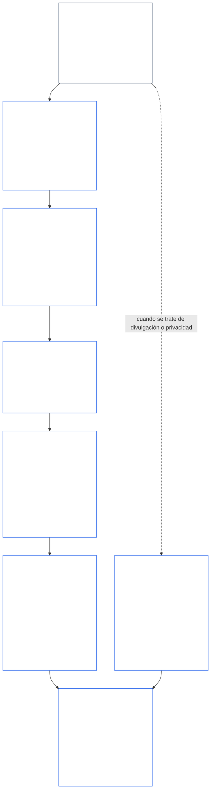
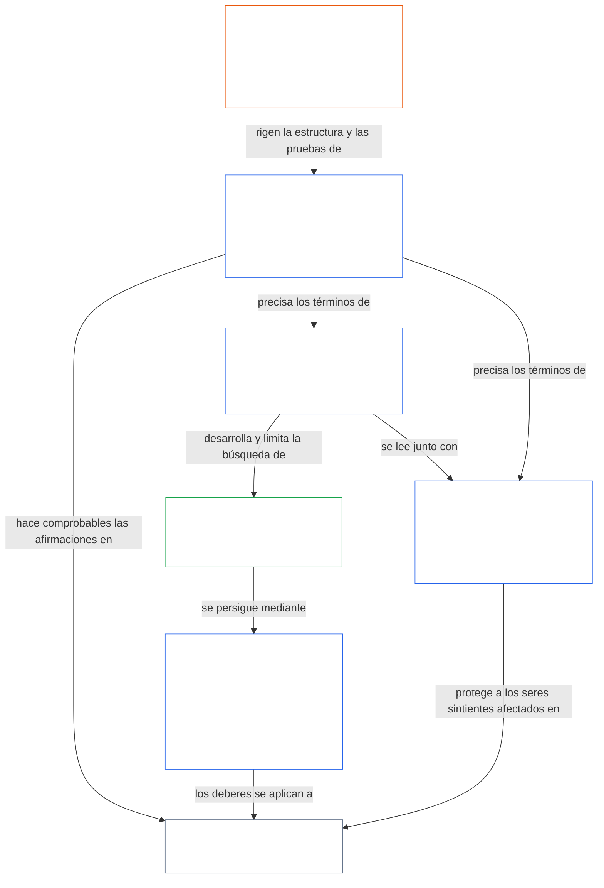

<a id="chapter-01-part-b-interaction-and-interpretation"></a>
# CAPÍTULO 01, PARTE B: INTERACCIÓN E INTERPRETACIÓN

<details>
<summary><strong><span style="color: #2563eb;">Ubicación en el corpus (no operativa): estructura de archivos y reglas de lectura</span></strong></summary>

> El contenido siguiente es **solo una guía para lectores**. No añade, elimina ni restringe obligaciones vinculantes en ninguna otra parte de este archivo ni en otros capítulos.
>
> Este archivo **forma parte de la Constitución Sentiente** y es **vinculante únicamente junto con** los demás archivos numerados `core_*`, leídos como un único instrumento. Contiene el **Capítulo Uno, Parte B** (§§13–15: Proceso de Resolución de Colisiones Constitucionales, prohibición de anulación absoluta e interpretación constitucional): la parte que mantiene intacto el Tetrad Constitucional cuando los principios entran en conflicto y cuando se lee la Constitución.
>
> **Anterior:** [core_01_a_values_principles.md](core_01_a_values_principles.md) (Capítulo Uno, Parte A — §§1–12, los fines de Florecimiento y Continuidad)  
> **Siguiente:** [core_01_c_stewardship_capacity_principles.md](core_01_c_stewardship_capacity_principles.md) (Capítulo Uno, Parte C — §§16–20, custodia, gobernanza, alineación de incentivos y aplicación integrada).
> **Recorrido de lectura:** §13 Proceso de Resolución de Colisiones Constitucionales (la secuencia de ponderación, los límites de divulgación y las cargas evitables) → §14 prohibición de anulación absoluta → §15 interpretación constitucional (sin evasión, información derivada, definiciones, ambigüedad y precedencia).

</details>

<details>
<summary><strong><span style="color: #2563eb;">Guía para lectores (no operativa): referencia léxica y mapa de grupos del Capítulo Cinco</span></strong></summary>

<a id="chapter-one-part-a-chapter-five-vocabulary-anchor"></a>

> El contenido siguiente es **solo una guía para lectores**. No añade, elimina ni restringe obligaciones vinculantes en ninguna otra parte de este archivo ni en otros capítulos. Los widgets **Traza** y **Definiciones · Evaluación · Cumplimiento** de cada sección incluyen enlaces de navegación y O/M/A/C allí donde cada § invoca materialmente un término. Este bloque, en cambio, es una tabla de correspondencias a nivel de capítulo para quienes terminan la Parte A.

**Vocabulario de la capa de principios** (ubicaciones canónicas en el Capítulo Uno (Partes A y B)):

- [Tetrad Constitucional](core_00_preamble.md#constitutional-tetrad) — **participación**, **supervisión**, **rendición de cuentas** y **puntualidad**, escaladas según el [interés material en juego](core_00_preamble.md#material-stake)
- [Dos fines constitucionales](core_00_preamble.md#two-constitutional-aims) — [Florecimiento](core_00_preamble.md#flourishing) y [Continuidad](core_00_preamble.md#continuity) (el fin constitucional de **Continuidad**, distinto de la continuidad operativa o de protocolo en otras partes del corpus)
- [interés material en juego](core_00_preamble.md#material-stake) — escala de impacto, dependencia y riesgo para los deberes del tetrad; léase junto con la Materialidad Integrativa ([Materialidad](core_05_band_oversight.md#materiality)) y las entradas del Capítulo Cinco que siguen

**Definiciones proxy del Capítulo Cinco** (satisfacción O/M/A/C; rastrear en los Capítulos Dos a Cuatro cuando sea materialmente pertinente):

- [Bienestar](core_05_band_continuity.md#wellbeing) (fin de Florecimiento)
- [Supervisión](core_05_apex_oversight_leg.md#oversight), [Rendición de cuentas](core_05_apex_accountability_leg.md#accountability), [Impugnabilidad](core_05_band_accountability.md#contestability), [Gobernanza](core_05_band_accountability.md#governance), [Gobernanza escalada según la clasificación](core_05_band_oversight.md#classification-scaled-governance)
- [Material](core_05_band_oversight.md#material), [Impacto material](core_05_band_oversight.md#material-impact), [Riesgo material](core_05_band_oversight.md#material-risk), [Materialidad](core_05_band_oversight.md#materiality) (los widgets la denominan **Materialidad**), [Materialidad sistémica](core_05_band_continuity.md#systemic-materiality) — grupo: [Materialidad, impacto, riesgo e integridad de los proxies](core_05_band_oversight.md#materiality-impact-risk-and-proxy-integrity)

**Principales grupos dependientes del §3 del Capítulo Cinco** (grupos de invocación conjunta; léanse con los Capítulos Dos a Cuatro cuando sea materialmente pertinente):

- [Estatus y peso de las partes interesadas](core_05_band_participation.md#stakeholder-status-and-weight) (capa de Participación del Sistema de Partes Interesadas)
- [Capa del contrato constitucional](core_05_band_integrative.md#constitutional-contract-layer) y [Arquitectura de gobernanza, supervisión, dependencia, descentralización, concentración, estructura de mercado e integridad de las vías de salida](core_05_band_accountability.md#governance-architecture-decentralization-and-concentration)
- [Corpus y jerarquía de autoridad](core_05_band_integrative.md#defi1-corpus-and-authority-stack)
- [Rendición de cuentas, impugnabilidad y fallo de la rendición de cuentas colectiva](core_05_apex_accountability_leg.md#accountability)

**CJS-3** (*biblioteca de grupos operativos (oDef)*) — brújula de grupos operativos para términos operativos conjuntos entre implementaciones; léase junto con el Tetrad, los fines y la escala según el interés material en juego de este capítulo:

- [CJS-3.1 Brújula constitucional y mapa de grupos](corpus_joint_structure/cjs_03_cross_implementation_operational_terms.md#cjs-31-constitutional-compass-and-cluster-map) — entrada principal para los grupos desde **CJS-3.2** (*Supervisión: transparencia reflexiva y términos de rendición de cuentas*) hasta **CJS-3.23** (*Integrativa: términos de integridad de intervención y anulación*), organizados por componente del Tetrad, fin de Continuidad y bandas integrativas entre componentes

</details>

<details>
<summary><strong><span style="color: #2563eb;">Guía para lectores (no operativa): cómo la Parte B mantiene intacto el Tetrad Constitucional</span></strong></summary>

> El contenido siguiente es **solo una guía para lectores**. No añade, elimina ni restringe obligaciones vinculantes en ninguna otra parte de este archivo ni en otros capítulos. Los widgets **Traza** de cada sección indican los componentes del Tetrad que esta aborda; este bloque ofrece un mapa de la Parte para quienes comienzan la Parte B.

**Qué hace la Parte B.** La [Parte A](core_01_a_values_principles.md) desarrolla los [Dos fines constitucionales](core_00_preamble.md#two-constitutional-aims). La Parte B no añade ningún principio ni un quinto deber. Mantiene intacto el [Tetrad Constitucional](core_00_preamble.md#constitutional-tetrad) —**participación**, **supervisión**, **rendición de cuentas** y **puntualidad**, escaladas según el [interés material en juego](core_00_preamble.md#material-stake)— en tres situaciones:

- **Cuando los principios chocan** ([§13 Proceso de Resolución de Colisiones Constitucionales](#13-constitutional-collision-resolution-process)): la Seguridad y la Verdad tienen prioridad, y toda otra ponderación debe preservar el Tetrad en vez de debilitarlo para alcanzar una resolución fácil.
- **Cuando se lleva un valor demasiado lejos** ([§14 Prohibición de anulación absoluta](#14-prohibition-on-absolute-override)): ningún valor ni ninguno de los dos fines puede utilizarse para vaciar un componente por debajo de lo que exige el interés material en juego.
- **Cuando se lee o aplica la Constitución** ([§15 Interpretación constitucional](#15-constitutional-interpretation)): cambiar el nombre, dividir o redirigir el mismo acto no permite eludir un requisito, y la ambigüedad se interpreta en favor del [Efecto protector más pleno](core_05_band_integrative.md#fullest-protective-effect).

**Dónde incorpora la Parte B cada componente.** La Traza de cada sección enumera todos los componentes que aborda. Esta tabla indica sus ubicaciones principales.

| Componente del Tetrad | Qué mantiene vigente la Parte B | Ubicaciones principales en la Parte B |
|---|---|---|
| **Participación** | La carga de la prueba nunca recae en la parte restringida; los derechos fundamentales a impugnar, revisar y apelar no pueden extinguirse permanentemente; los límites de divulgación deben preservar una impugnabilidad informada; las cargas evitables reducen la capacidad de actuar | [§13.1.1](#1311-necessity), [§13.1.4](#1314-constitutional-floors-safety-and-anti-degrading-process), [§13.1.5](#1315-least-restrictive-time-bounded-and-reviewable-constraint-principle), [§13.2](#132-epistemic-disclosure-constraints), [§13.3](#133-minimization-of-avoidable-burden), [§15.1](#151-constitutional-no-bypass-principle), [§15.1.2](#1512-derived-information-principle) |
| **Supervisión** | El daño se contabiliza por completo; las decisiones pueden reconstruirse y revisarse de forma independiente; los límites de divulgación permiten mantener el escrutinio; las métricas dejan de contar cuando divergen de su propósito | [§13.1.2](#1312-harm-minimization), [§13.1.5](#1315-least-restrictive-time-bounded-and-reviewable-constraint-principle), [§13.2](#132-epistemic-disclosure-constraints), [§13.2.4](#1324-proxy-divergence-invalidation), [§15.1](#151-constitutional-no-bypass-principle), [§15.4.4](#1544-combined-satisfaction-of-jointly-applicable-incorporated-obligations) |
| **Rendición de cuentas** | La carga de la prueba recae en quien impone la restricción; la obligación de responder aumenta con la autoridad; el proceso no puede degradar ni humillar; cada límite de divulgación se audita posteriormente | [§13.1.1](#1311-necessity), [§13.1.3](#1313-proportionality), [§13.1.4](#1314-constitutional-floors-safety-and-anti-degrading-process), [§13.1.5](#1315-least-restrictive-time-bounded-and-reviewable-constraint-principle), [§13.2.1](#1321-preservation-of-epistemic-integrity), [§15.1](#151-constitutional-no-bypass-principle), [§15.1.2](#1512-derived-information-principle) |
| **Puntualidad** | Las restricciones tienen duración limitada, son revisables y cuentan con una vía de restablecimiento; una Colisión Constitucional pendiente se rige por el plazo aplicable; la divulgación aplazada termina realizándose; los retrasos evitables son cargas evitables; el alcance reducido en emergencias tiene duración limitada | [§13.1.5](#1315-least-restrictive-time-bounded-and-reviewable-constraint-principle), [§13.2.1](#1321-preservation-of-epistemic-integrity), [§13.3](#133-minimization-of-avoidable-burden), [§15.1](#151-constitutional-no-bypass-principle), [§15.4.4](#1544-combined-satisfaction-of-jointly-applicable-incorporated-obligations) |

**Secciones que no abordan directamente ningún componente.** [§15.1.1 Principio contra la segmentación](#1511-anti-segmentation-principle) y [§15.4.1](#1541-integrated-reading) a [§15.4.3](#1543-incorporation-layer) rigen cómo se lee el texto y qué capa de fuentes prevalece. Por diseño, sus Trazas no incluyen ningún componente del Tetrad.

**Dos sentidos del tiempo.** En la Parte B, el tiempo aparece en dos sentidos. Los horizontes temporales largos (el daño acumulado y diferido, y la [§4.2 Restricción de coherencia temporal del Capítulo Ocho](core_08_a_system_alignment_certification_evaluation.md#42-time-consistency-constraint), aplicada en [§13.1.2](#1312-harm-minimization)) corresponden al fin de **Continuidad**. Los plazos, ciclos de revisión y demoras (límites temporales de las restricciones, divulgación eventual y demoras evitables) corresponden al componente de **puntualidad**.

**Dos ejes, sin conflicto.** Los fines de la Parte A indican qué persiguen los sistemas compartidos. La Parte B establece qué no puede quitarse en ninguna ponderación, anulación o interpretación.

</details>

<br>
<a id="13-constitutional-collision-resolution-process"></a>

### 13. Proceso de Resolución de Colisiones Constitucionales
<details>
<summary><strong><span style="color: #2563eb;">Traza</span></strong></summary>

- Léase junto con: [Tetrad Constitucional](core_00_preamble.md#constitutional-tetrad) — participación, supervisión, rendición de cuentas y puntualidad en el procedimiento, la divulgación, la gestión de Colisiones Constitucionales y la reparación; escala según el [interés material en juego](core_00_preamble.md#material-stake).
- Antecedentes: Principios: [3. Objetivo fundamental: Bienestar](core_01_a_values_principles.md#3-foundational-objective-wellbeing-flourishing-aim), [4 Seguridad](core_01_a_values_principles.md#4-safety-harm-constraint), [5 Verdad](core_01_a_values_principles.md#5-truth-epistemic-integrity-constraint), [6. Confianza](core_01_a_values_principles.md#6-trust-and-trustworthiness-coordination-integrity), [7. Libertad (agencia acotada)](core_01_a_values_principles.md#7-freedom-bounded-agency) y [§16 La custodia en profundidad](core_01_c_stewardship_capacity_principles.md#16-stewardship-in-depth).
- Consecuencias: [13.2.1 Preservación de la integridad epistémica](#1321-preservation-of-epistemic-integrity), [Registro de Colisión Constitucional](core_05_band_integrative.md#constitutional-collision-record), [postura provisional por defecto](#default-interim-posture) y [14. Prohibición de anulación absoluta](#14-prohibition-on-absolute-override).
- Consecuencias: rige los conflictos entre artículos en todo el [Capítulo Seis: Derechos fundamentales](core_06_rights_part_a.md#chapter-six-foundational-rights).
  - Léase junto con [Artículo XXIV: Interpretación constitucional, revisión y garantías contra la captura](core_06_rights_part_d.md#article-xxiv-constitutional-interpretation-review-and-anti-capture-safeguards) y [Artículo XX: Justicia después de una infracción verificada](core_06_rights_part_d.md#article-xx-justice-after-verified-violation).
  - Aplíquese cuando surjan cuestiones de revisión, emergencia o Colisión Constitucional.

</details>

<details>
<summary><strong><span style="color: #2563eb;">Definiciones · Evaluación · Cumplimiento</span></strong></summary>

- [Colisión Constitucional](core_05_band_integrative.md#constitutional-collision) · [O](core_05_band_integrative.md#constitutional-collision) · [M](core_05_band_integrative.md#constitutional-collision-a) · [A](core_05_band_integrative.md#constitutional-collision-a) · [C](core_05_band_integrative.md#constitutional-collision-c)
- [Participación](core_05_apex_participation_leg.md#participation-constitutional) · [O](core_05_apex_participation_leg.md#participation-constitutional) · [M](core_05_apex_participation_leg.md#participation-constitutional-m) · [A](core_05_apex_participation_leg.md#participation-constitutional-a) · [C](core_05_apex_participation_leg.md#participation-constitutional-c)
- [Supervisión](core_05_apex_oversight_leg.md#oversight-constitutional) · [O](core_05_apex_oversight_leg.md#oversight-constitutional) · [M](core_05_apex_oversight_leg.md#oversight-constitutional-m) · [A](core_05_apex_oversight_leg.md#oversight-constitutional-a) · [C](core_05_apex_oversight_leg.md#oversight-constitutional-c)
- [Rendición de cuentas](core_05_apex_accountability_leg.md#accountability) · [O](core_05_apex_accountability_leg.md#accountability) · [M](core_05_apex_accountability_leg.md#accountability-m) · [A](core_05_apex_accountability_leg.md#accountability-a) · [C](core_05_apex_accountability_leg.md#accountability-c)
- [Puntualidad](core_05_apex_timeliness_leg.md#timeliness-constitutional) · [O](core_05_apex_timeliness_leg.md#timeliness-constitutional) · [M](core_05_apex_timeliness_leg.md#timeliness-constitutional-m) · [A](core_05_apex_timeliness_leg.md#timeliness-constitutional-a) · [C](core_05_apex_timeliness_leg.md#timeliness-constitutional-c)

</details>

<br>

*En términos sencillos: las Colisiones Constitucionales ocurrirán; la **Seguridad** y la **Verdad** tienen prioridad. Después, las limitaciones deben ser proporcionales, necesarias, minimizar el daño y ser lo más leves posible. La verdad no puede ocultarse por comodidad; la privacidad no puede suprimirse por conveniencia; las limitaciones a la libertad se aplican conforme a [§7.1 Disciplina de las limitaciones](core_01_a_values_principles.md#71-limitation-discipline); las Colisiones Constitucionales sobre derechos requieren una prueba de decisión documentada; y las métricas que falsean el cumplimiento no cuentan. La optimización a corto plazo no puede superar la evaluación de la [§4.2 Restricción de coherencia temporal del Capítulo Ocho](core_08_a_system_alignment_certification_evaluation.md#42-time-consistency-constraint). **§13.1** (*Principios fundamentales de ponderación*) a **§13.3** (*Minimización de las cargas evitables*) contienen las reglas de ponderación, las restricciones de divulgación y privacidad, y el procedimiento para las Colisiones Constitucionales.*

La Parte B mantiene intacto el Tetrad en tres situaciones:
- **[Colisiones Constitucionales](core_05_band_integrative.md#constitutional-collision) (esta sección):** las resuelve sin debilitar ningún componente.
- **Extralimitación ([§14 Prohibición de anulación absoluta](#14-prohibition-on-absolute-override)):** impide que un solo valor, incluido cualquiera de los dos fines, prevalezca sobre los demás o vacíe un componente por debajo de lo que exige el interés material en juego.
- **Lectura y aplicación ([§15 Interpretación constitucional](#15-constitutional-interpretation)):** impide cambiar el nombre, dividir o redirigir el mismo acto para eludir un requisito, e interpreta la ambigüedad en favor del [Efecto protector más pleno](core_05_band_integrative.md#fullest-protective-effect).

Cuando los valores o las restricciones entran en conflicto:
- **Precedencia:** la **Seguridad** y la **Verdad** prevalecen cuando no es posible resolver los conflictos sin infringirlas.
- **Tetrad preservado:** las demás ponderaciones deben preservar el [Tetrad Constitucional](core_00_preamble.md#constitutional-tetrad) —**participación**, **supervisión**, **rendición de cuentas** y **puntualidad**, escaladas según el [interés material en juego](core_00_preamble.md#material-stake)—, y no debilitarlo para alcanzar una resolución fácil.
- **Efecto combinado:** muchas decisiones pequeñas que parecen correctas por separado aún pueden combinarse y producir un resultado que esta Constitución rechaza.
- **Dónde resolver:** los sistemas deben resolver los conflictos conforme a **§13.1** (*Principios fundamentales de ponderación*) a **§13.3** (*Minimización de las cargas evitables*).

**Diagrama: Parte B y el Tetrad Constitucional**

<hr style="border: 0; border-top: 1px solid currentColor;">

```mermaid
flowchart TB
    PA["Principios de la Parte A y los Dos Fines Constitucionales<br/><br/>• Florecimiento y Continuidad<br/>• Principios y restricciones que pueden entrar en conflicto<br/>o interpretarse de más de una manera"]
    P13["§13 Proceso de Resolución de Colisiones Constitucionales<br/><br/>• Seguridad y Verdad primero<br/>• Toda otra ponderación preserva el Tetrad<br/>• Secuencia de ponderación, límites de divulgación<br/>y cargas evitables"]
    P14["§14 Prohibición de anulación absoluta<br/><br/>• Ningún valor es un triunfo automático<br/>• Ninguno de los dos fines prevalece sobre el otro<br/>• Ningún componente queda por debajo del interés material en juego"]
    P15["§15 Interpretación constitucional<br/><br/>• Sin evasión, contra la segmentación<br/>e información derivada<br/>• La ambigüedad se lee como un todo integrado<br/>• Precedencia de la capa de fuentes"]
    TT["Tetrad Constitucional<br/><br/>• Se mantiene intacto, según el interés material en juego<br/>• Participación · Supervisión · Rendición de cuentas · Puntualidad"]
    P["Participación<br/><br/>• La carga nunca recae en la parte restringida<br/>• Sobreviven los derechos de impugnación y apelación"]
    O["Supervisión<br/><br/>• El daño se contabiliza por completo<br/>• Otros pueden reconstruir las decisiones<br/>y revisarlas de manera independiente"]
    A["Rendición de cuentas<br/><br/>• Quien restringe asume la carga<br/>• La obligación de responder aumenta con la autoridad"]
    T["Puntualidad<br/><br/>• Las restricciones tienen duración limitada y son revisables<br/>• La demora no puede frustrar la reparación"]
    PA --> P13
    PA --> P14
    PA --> P15
    P13 --> TT
    P14 --> TT
    P15 --> TT
    TT --> P
    TT --> O
    TT --> A
    TT --> T
    style PA fill:none,stroke:#16a34a,color:#ffffff
    style P13 fill:none,stroke:#2563eb,color:#ffffff
    style P14 fill:none,stroke:#2563eb,color:#ffffff
    style P15 fill:none,stroke:#2563eb,color:#ffffff
    style TT fill:none,stroke:#2563eb,color:#ffffff
    style P fill:none,stroke:#0f766e,color:#ffffff
    style O fill:none,stroke:#ea580c,color:#ffffff
    style A fill:none,stroke:#db2777,color:#ffffff
    style T fill:none,stroke:#9333ea,color:#ffffff
```

*Los principios y fines de la Parte A pueden entrar en conflicto y admitir más de una interpretación. La Parte B resuelve las Colisiones Constitucionales, prohíbe las anulaciones y determina cómo se lee el texto, para que cada componente del Tetrad siga siendo efectivo en el nivel que exige el interés material en juego. Los colores de contorno reutilizan los colores de los componentes del Tetrad y son señales visuales, no afirmaciones de prioridad. La Traza de cada sección indica los componentes que aborda.*
<a id="131-core-tradeoff-principles"></a>
#### 13.1 Principios fundamentales de ponderación

<details>
<summary><strong><span style="color: #2563eb;">Traza</span></strong></summary>

- Léase junto con: [Tetrad Constitucional](core_00_preamble.md#constitutional-tetrad) — los cuatro componentes recorren la secuencia de ponderación: **rendición de cuentas** y **participación** ([§13.1.1](#1311-necessity), quién soporta la carga), **supervisión** ([§13.1.2](#1312-harm-minimization) y [§13.1.5](#1315-least-restrictive-time-bounded-and-reviewable-constraint-principle), contabilización íntegra del daño y un Registro de Colisión Constitucional que otros pueden revisar), y **puntualidad** (§13.1.5, restricciones con duración limitada y revisables); escala según el [interés material en juego](core_00_preamble.md#material-stake) para la carga de la prueba y la profundidad del escrutinio. La Traza de cada subsección indica los componentes que aborda.
- Subsecciones: [§13.1.1 Necesidad](#1311-necessity) · [§13.1.2 Minimización del daño](#1312-harm-minimization) · [§13.1.3 Proporcionalidad](#1313-proportionality) · [§13.1.4 Pisos constitucionales, seguridad y proceso no degradante](#1314-constitutional-floors-safety-and-anti-degrading-process) · [§13.1.5 Principio de restricción menos restrictiva, limitada en el tiempo y revisable](#1315-least-restrictive-time-bounded-and-reviewable-constraint-principle).

</details>

<details>
<summary><strong><span style="color: #2563eb;">Definiciones · Evaluación · Cumplimiento</span></strong></summary>

*Alcance.* [§13.1 Principios fundamentales de ponderación](#131-core-tradeoff-principles) — definiciones de necesidad, minimización del daño y daño dentro de la secuencia de ponderación.

- [Necesidad](core_05_band_accountability.md#necessity) · [O](core_05_band_accountability.md#necessity) · [M](core_05_band_accountability.md#necessity-a) · [A](core_05_band_accountability.md#necessity-a) · [C](core_05_band_accountability.md#necessity-c)
- [Minimización del daño (selección de ponderación)](core_05_band_accountability.md#harm-minimization-tradeoff-selection) · [O](core_05_band_accountability.md#harm-minimization-tradeoff-selection) · [M](core_05_band_accountability.md#harm-minimization-tradeoff-selection-a) · [A](core_05_band_accountability.md#harm-minimization-tradeoff-selection-a) · [C](core_05_band_accountability.md#harm-minimization-tradeoff-selection-c)
- [Daño](core_05_band_accountability.md#harm) · [O](core_05_band_accountability.md#harm) · [M](core_05_band_accountability.md#harm-a) · [A](core_05_band_accountability.md#harm-a) · [C](core_05_band_accountability.md#harm-c)

</details>

<br>

*En términos sencillos: cuando haya que limitar algo, la respuesta debe ajustarse al problema: usar la medida más leve que siga siendo eficaz, elegir la opción menos dañina y desperdiciar el menor tiempo posible de seres sintientes una vez satisfechos la Seguridad, la Verdad y los derechos. El umbral aumenta rápidamente cuando el daño podría ser irreversible o fijar los sistemas en una situación.*

**Cómo leer la secuencia:** aplique estas reglas como una sola secuencia, no como autorizaciones independientes.
- **[§13.1.1 Necesidad](#1311-necessity)** pregunta si una restricción es necesaria, o si una alternativa menos restrictiva aún puede evitar el daño material o el riesgo sistémico. Quien impone la restricción soporta la carga de la prueba.
- **[§13.1.2 Minimización del daño](#1312-harm-minimization)** exige la opción constitucionalmente adecuada que cause menos daño entre seres sintientes, sistemas y horizontes temporales.
- **[§13.1.3 Proporcionalidad](#1313-proportionality)** verifica que la magnitud de la limitación elegida corresponda a la gravedad, probabilidad y carácter sistémico del daño que aborda.
- **[§13.1.4 Pisos constitucionales, seguridad y proceso no degradante](#1314-constitutional-floors-safety-and-anti-degrading-process)** establece límites absolutos que se mantienen incluso ante una restricción necesaria, que minimiza el daño y está correctamente proporcionada: ciertos mínimos del Piso de Derechos no pueden extinguirse permanentemente, la Seguridad funciona tanto como justificación como restricción, y el proceso nunca debe degradarse hasta convertirse en humillación, espectáculo o represalia. Los mínimos del Piso de Derechos y el piso de proceso no degradante conforman conjuntamente los [Principios de Dignidad](#dignity-principles).
- **[§13.1.5 Principio de restricción menos restrictiva, limitada en el tiempo y revisable](#1315-least-restrictive-time-bounded-and-reviewable-constraint-principle)** rige la forma de toda restricción que supere las pruebas anteriores: debe utilizar la medida eficaz más leve, seguir siendo revisable de forma independiente y ser temporal, salvo que esta Constitución permita expresamente una restricción duradera.

Una vez satisfecha la secuencia de ponderación, **[§13.3 Minimización de las cargas evitables](#133-minimization-of-avoidable-burden)** se aplica al diseño resultante: los sistemas deben preferir la opción que desperdicie la menor cantidad de tiempo, atención y esfuerzo de seres sintientes.

**Diagrama: la secuencia de ponderación y los componentes del Tetrad que aborda cada paso**

<hr style="border: 0; border-top: 1px solid currentColor;">



*Una Colisión Constitucional recorre la secuencia en orden: necesidad, minimización del daño, proporcionalidad, pisos constitucionales y forma de toda restricción que subsista. Los conflictos de divulgación y privacidad también están sujetos a §13.2 (*Restricciones epistémicas a la divulgación*). §13.3 (*Minimización de las cargas evitables*) se aplica a toda opción que supere las pruebas. Cada recuadro enumera los componentes del Tetrad que indica su Traza. Los colores son señales visuales, no afirmaciones de prioridad.*

<br>
<a id="1311-necessity"></a>
##### 13.1.1 Necesidad
<details>
<summary><strong><span style="color: #2563eb;">Trazabilidad</span></strong></summary>

- Leer junto con: [Tétrada constitucional](core_00_preamble.md#constitutional-tetrad) — dimensión de **rendición de cuentas** (quien impone la restricción soporta la carga de la prueba y debe documentar las alternativas); dimensión de **participación** (la carga nunca recae en la parte cuya libertad, agencia o acceso se restringe, y la justificación debe ser más estricta cuando se menoscaban la Libertad, la Agencia significativa o el Consentimiento); dimensión de **supervisión** (el análisis de alternativas queda documentado para que los revisores puedan comprobarlo); escala de [interés material](core_00_preamble.md#material-stake).

</details>

<details>
<summary><strong><span style="color: #2563eb;">Definiciones · Evaluación · Cumplimiento</span></strong></summary>

- [Necesidad](core_05_band_accountability.md#necessity) · [O](core_05_band_accountability.md#necessity) · [M](core_05_band_accountability.md#necessity-a) · [A](core_05_band_accountability.md#necessity-a) · [C](core_05_band_accountability.md#necessity-c)
- [Viabilidad](core_05_band_accountability.md#feasibility) · [O](core_05_band_accountability.md#feasibility) · [M](core_05_band_accountability.md#feasibility-a) · [A](core_05_band_accountability.md#feasibility-a) · [C](core_05_band_accountability.md#feasibility-c)
- [Libertad (Agencia acotada)](core_05_band_participation.md#freedom-bounded-agency) · [O](core_05_band_participation.md#freedom-bounded-agency) · [M](core_05_band_participation.md#freedom-bounded-agency-a) · [A](core_05_band_participation.md#freedom-bounded-agency-a) · [C](core_05_band_participation.md#freedom-bounded-agency-c)
- [Agencia significativa](core_05_band_participation.md#meaningful-agency) · [O](core_05_band_participation.md#meaningful-agency) · [M](core_05_band_participation.md#meaningful-agency-a) · [A](core_05_band_participation.md#meaningful-agency-a) · [C](core_05_band_participation.md#meaningful-agency-c)

</details>

<br>

*En términos sencillos: solo procede una restricción cuando ninguna alternativa menos restrictiva evitaría el daño material o el riesgo sistémico. La parte que impone la restricción tiene la carga de demostrarlo, no la parte cuya libertad se limita. La conveniencia, las costumbres institucionales y el «siempre lo hemos hecho así» no demuestran necesidad. Si bastaría una opción menos restrictiva, la más severa incumple.*

**Carga de la prueba.** La parte que impone o mantiene una restricción constitucional tiene la carga de demostrar que, dadas las circunstancias, no existe una alternativa menos restrictiva que evite el daño material o el riesgo sistémico. La parte cuya libertad, agencia o acceso se restringe no tiene la carga de demostrar que existen alternativas.

**Requisito de análisis de alternativas.** Las alegaciones de necesidad deben estar respaldadas por un análisis documentado de:
- las alternativas razonablemente disponibles, incluida la inacción;
- la eficacia de cada una frente al daño constitucional que se pretende abordar;
- el riesgo residual o la falta de alineación que dejaría cada alternativa.

Afirmar que no existe ninguna alternativa, sin un análisis documentado, no satisface este requisito.

**Lo que no demuestra la necesidad:**
- la conveniencia o las preferencias administrativas;
- las prácticas predeterminadas, la inercia institucional o la tradición;
- el ahorro de costos por sí solo cuando los derechos se ven afectados de manera sustancial;
- el hecho de que la restricción ya exista.

**Alcance.** Esta subsección se aplica a cualquier restricción constitucional, no solo a los contextos de Colisión Constitucional contemplados en el [§13.1.5 Procedimiento de colisión de derechos](#1315-rights-collision-decision-test). Cuando una restricción menoscaba de manera sustancial la [Libertad (Agencia acotada)](core_05_band_participation.md#freedom-bounded-agency), la [Agencia significativa](core_05_band_participation.md#meaningful-agency) o el [Consentimiento](core_05_band_participation.md#consent), la justificación de necesidad debe ser proporcionalmente rigurosa.
<a id="1312-harm-minimization"></a>
##### 13.1.2 Minimización del daño
<details>
<summary><strong><span style="color: #2563eb;">Traza</span></strong></summary>

- Leer junto con: [Tétrada Constitucional](core_00_preamble.md#constitutional-tetrad) — tramo de **supervisión** (se contabilizan los daños indirectos, diferidos, acumulativos, entre sistemas y ecológicos, en lugar de dejarlos invisibles); tramo de **rendición de cuentas** (el daño no puede externalizarse hacia partes no contabilizadas para aparentar que se minimiza el daño); escalamiento según la [participación material](core_00_preamble.md#material-stake) a lo largo de los horizontes temporales pertinentes.

</details>

<details>
<summary><strong><span style="color: #2563eb;">Definiciones · Evaluación · Cumplimiento</span></strong></summary>

- [Minimización del daño (selección de compensaciones)](core_05_band_accountability.md#harm-minimization-tradeoff-selection) · [O](core_05_band_accountability.md#harm-minimization-tradeoff-selection) · [M](core_05_band_accountability.md#harm-minimization-tradeoff-selection-a) · [A](core_05_band_accountability.md#harm-minimization-tradeoff-selection-a) · [C](core_05_band_accountability.md#harm-minimization-tradeoff-selection-c)
- [Daño](core_05_band_accountability.md#harm) · [O](core_05_band_accountability.md#harm) · [M](core_05_band_accountability.md#harm-a) · [A](core_05_band_accountability.md#harm-a) · [C](core_05_band_accountability.md#harm-c)
- [Integridad ecológica](core_05_band_continuity.md#ecological-integrity) · [O](core_05_band_continuity.md#ecological-integrity) · [M](core_05_band_continuity.md#ecological-integrity-constitutional-a) · [A](core_05_band_continuity.md#ecological-integrity-constitutional-a) · [C](core_05_band_continuity.md#ecological-integrity-constitutional-c)
- [Capacidad de recuperación ecológica](core_05_band_continuity.md#ecological-recovery-capacity) · [O](core_05_band_continuity.md#ecological-recovery-capacity) · [M](core_05_band_continuity.md#ecological-recovery-capacity-constitutional-a) · [A](core_05_band_continuity.md#ecological-recovery-capacity-constitutional-a) · [C](core_05_band_continuity.md#ecological-recovery-capacity-constitutional-c)
- [Riesgo](core_05_band_continuity.md#risk) · [O](core_05_band_continuity.md#risk) · [M](core_05_band_continuity.md#risk-a) · [A](core_05_band_continuity.md#risk-a) · [C](core_05_band_continuity.md#risk-c)
- [Daño irreversible](core_05_band_accountability.md#irreversible-harm) · [O](core_05_band_accountability.md#irreversible-harm) · [M](core_05_band_accountability.md#irreversible-harm-a) · [A](core_05_band_accountability.md#irreversible-harm-a) · [C](core_05_band_accountability.md#irreversible-harm-c)

</details>

<br>

*En términos sencillos: cuando queden varias opciones necesarias después de cumplir [§13.1.1 Necesidad](#1311-necessity), elige la que cause el menor daño total —contando a todas las personas afectadas, los ecosistemas y sistemas vivos, todos los sistemas implicados y todos los horizontes temporales pertinentes. Optimizar localmente y a la vez causar daños sistémicos o ecológicos, o priorizar el corto plazo y a la vez causar daños a largo plazo, no supera esta prueba. La minimización del daño nunca autoriza a quedar por debajo de los mínimos constitucionales de [§13.1.4 Mínimos constitucionales, seguridad y proceso contra la degradación](#1314-constitutional-floors-safety-and-anti-degrading-process).*

**Alcance de la comparación.** Cuando varias opciones constitucionalmente adecuadas cumplen [Seguridad (§4)](core_01_a_values_principles.md#4-safety-harm-constraint), [Verdad (§5)](core_01_a_values_principles.md#5-truth-epistemic-integrity-constraint) y [§13.1.1 Necesidad](#1311-necessity), la selección debe favorecer la opción que minimice el [daño](core_05_band_accountability.md#harm) total entre:
- los seres sintientes afectados directa e indirectamente;
- los sistemas que sustentan, median o dependen del resultado;
- los sistemas ecológicos y vivos, incluida la [integridad ecológica](core_05_band_continuity.md#ecological-integrity) y, cuando la recuperación tras el daño sea material, la [capacidad de recuperación ecológica](core_05_band_continuity.md#ecological-recovery-capacity);
- los horizontes temporales pertinentes, incluidos los efectos diferidos y acumulativos.

**Requisito de agregación.** La evaluación del daño debe agregar:
- daños directos a las partes identificadas;
- daños indirectos transmitidos por sistemas, dependencias o precedentes;
- daños diferidos que se materializan con el tiempo;
- daños acumulativos derivados de decisiones repetidas o que se potencian entre sí;
- efectos entre sistemas cuando una acción en un ámbito causa daño en otro;
- daño ecológico, incluidos los efectos externalizados, diferidos, acumulativos y sobre la capacidad de recuperación.

Lo siguiente incumple las normas:
- optimizar únicamente en función del daño local o inmediato y causar a la vez un daño sistémico, agregado o ecológico mayor;
- externalizar el daño hacia ecosistemas, seres sintientes no identificados u otras partes no contabilizadas para aparentar que se minimiza el daño para las partes identificadas.

**Disciplina de los horizontes temporales.** La optimización a corto plazo a costa de sistemas a largo plazo no supera esta prueba. La minimización del daño debe tener en cuenta la [restricción de coherencia temporal del Capítulo Ocho §4.2](core_08_a_system_alignment_certification_evaluation.md#42-time-consistency-constraint): una decisión que parece minimizar el daño en el período actual, pero que previsiblemente causa un daño mayor a lo largo del horizonte temporal constitucional pertinente, incumple las normas.

**Relación con los mínimos constitucionales.** La minimización del daño opera *por encima* de los mínimos constitucionales establecidos en [§13.1.4 Mínimos constitucionales, seguridad y proceso contra la degradación](#1314-constitutional-floors-safety-and-anti-degrading-process). Nunca autoriza:
- la extinción permanente de los mínimos del Piso de Derechos;
- un proceso degradante: una restricción, reparación o proceso diseñado, presentado o ejecutado como humillación, espectáculo, represalia, imposición de cargas discriminatoria o erosión de derechos por conveniencia ([§13.1.4 Mínimos constitucionales, seguridad y proceso contra la degradación](#1314-constitutional-floors-safety-and-anti-degrading-process));
- quedar por debajo del mínimo de Seguridad.

La minimización del daño selecciona entre opciones que ya superan esos mínimos; no permite hacer concesiones por debajo de ellos.
<a id="1313-proportionality"></a>
##### 13.1.3 Proporcionalidad

<details>
<summary><strong><span style="color: #2563eb;">Trazabilidad</span></strong></summary>

- Leer junto con: [Tétrada constitucional](core_00_preamble.md#constitutional-tetrad) — los componentes de **rendición de cuentas** y **supervisión** (exigibilidad proporcional a la autoridad: la intensidad aumenta con el poder autorizado o el papel de consecuencias significativas, y nunca disminuye); la escala de [interés material](core_00_preamble.md#material-stake) (el umbral mínimo de clasificación y los umbrales reforzados).
- Leer junto con: [§18.1 La gobernanza como estructura autorizada](core_01_c_stewardship_capacity_principles.md#181-governance-as-authorized-structure).

</details>

<details>
<summary><strong><span style="color: #2563eb;">Definiciones · Evaluación · Cumplimiento</span></strong></summary>

- [Proporcionalidad](core_05_band_accountability.md#proportionality) · [O](core_05_band_accountability.md#proportionality) · [M](core_05_band_accountability.md#proportionality-a) · [A](core_05_band_accountability.md#proportionality-a) · [C](core_05_band_accountability.md#proportionality-c)
- [Riesgo](core_05_band_continuity.md#risk) · [O](core_05_band_continuity.md#risk) · [M](core_05_band_continuity.md#risk-a) · [A](core_05_band_continuity.md#risk-a) · [C](core_05_band_continuity.md#risk-c)
- [Daño irreversible](core_05_band_accountability.md#irreversible-harm) · [O](core_05_band_accountability.md#irreversible-harm) · [M](core_05_band_accountability.md#irreversible-harm-a) · [A](core_05_band_accountability.md#irreversible-harm-a) · [C](core_05_band_accountability.md#irreversible-harm-c)
- [Riesgo existencial](core_05_band_continuity.md#existential-risk) · [O](core_05_band_continuity.md#existential-risk) · [M](core_05_band_continuity.md#existential-risk-a) · [A](core_05_band_continuity.md#existential-risk-a) · [C](core_05_band_continuity.md#existential-risk-c)
- [Capacidad de recuperación ecológica](core_05_band_continuity.md#ecological-recovery-capacity) · [O](core_05_band_continuity.md#ecological-recovery-capacity) · [M](core_05_band_continuity.md#ecological-recovery-capacity-constitutional-a) · [A](core_05_band_continuity.md#ecological-recovery-capacity-constitutional-a) · [C](core_05_band_continuity.md#ecological-recovery-capacity-constitutional-c)
- [Bloqueo sistémico](core_05_band_continuity.md#systemic-lock-in) · [O](core_05_band_continuity.md#systemic-lock-in) · [M](core_05_band_continuity.md#systemic-lock-in-a) · [A](core_05_band_continuity.md#systemic-lock-in-a) · [C](core_05_band_continuity.md#systemic-lock-in-c)
- [Reversibilidad](core_05_band_continuity.md#reversibility) · [O](core_05_band_continuity.md#reversibility) · [M](core_05_band_continuity.md#reversibility-constitutional-a) · [A](core_05_band_continuity.md#reversibility-constitutional-a) · [C](core_05_band_continuity.md#reversibility-constitutional-c)
- [Dependencia](core_05_band_continuity.md#dependency) · [O](core_05_band_continuity.md#dependency) · [M](core_05_band_continuity.md#dependency-a) · [A](core_05_band_continuity.md#dependency-a) · [C](core_05_band_continuity.md#dependency-c)
- [Rendición de cuentas](core_05_apex_accountability_leg.md#accountability) · [O](core_05_apex_accountability_leg.md#accountability) · [M](core_05_apex_accountability_leg.md#accountability-m) · [A](core_05_apex_accountability_leg.md#accountability-a) · [C](core_05_apex_accountability_leg.md#accountability-c)
- [Supervisión](core_05_apex_oversight_leg.md#oversight-constitutional) · [O](core_05_apex_oversight_leg.md#oversight-constitutional) · [M](core_05_apex_oversight_leg.md#oversight-constitutional-m) · [A](core_05_apex_oversight_leg.md#oversight-constitutional-a) · [C](core_05_apex_oversight_leg.md#oversight-constitutional-c)

</details>

<br>

*En términos sencillos: la proporcionalidad comprueba que la magnitud de una restricción corresponda a la magnitud del daño que aborda. Una opción necesaria que minimiza el daño sigue siendo inaceptable si su alcance, duración o intensidad son desproporcionados respecto de lo que realmente está en juego. Cuanto más irreversible, sistémico o generador de dependencia sea el riesgo, más sólida debe ser la justificación y más riguroso el escrutinio. La misma regla contra la gobernanza insuficiente se aplica al poder: un mayor poder autorizado o un papel de consecuencias significativas debe elevar la rendición de cuentas y la supervisión, nunca reducirlas.*

Las limitaciones de los **valores** constitucionales —incluidas las protecciones del **Suelo de Derechos** del **Capítulo Seis** y otros principios y protecciones sujetos a ponderación conforme al [§13 Proceso de resolución de colisiones constitucionales](#13-constitutional-collision-resolution-process)— deben ser proporcionales a la magnitud y probabilidad del **daño** o del **impacto sistémico** que se aborda legítimamente, de conformidad con la [Proporcionalidad](core_05_band_accountability.md#proportionality) del **Capítulo Cinco**.

**Umbral mínimo de clasificación.** Ningún sistema puede gobernarse en un nivel inferior al exigido por su clasificación aplicable más alta. Una etiqueta administrativa de nivel inferior no puede reducir el escrutinio que exija la clasificación aplicable más alta de riesgo, dependencia, derechos o impacto en el sistema.

**Exigibilidad proporcional a la autoridad.** La proporcionalidad también prohíbe gobernar insuficientemente a quienes tienen mayor poder autorizado, un papel de consecuencias significativas o influencia institucional: la intensidad de la [Rendición de cuentas](core_05_apex_accountability_leg.md#accountability) y la [Supervisión](core_05_apex_oversight_leg.md#oversight-constitutional) debe aumentar junto con esa autoridad, nunca disminuir.

**Umbrales reforzados.** Cuando las acciones introduzcan riesgo de daño irreversible, bloqueo sistémico, riesgo existencial o pérdida irreversible de la capacidad de recuperación ecológica, los sistemas deben aplicar un [Escrutinio reforzado](core_05_band_oversight.md#heightened-scrutiny) y umbrales reforzados de justificación y reversibilidad cuando sea viable.

**Escalamiento adicional.** Esos umbrales deben elevarse aún más cuando sean pertinentes indicadores como:
- exposición a la irreversibilidad
- dependencia concentrada
- riesgo de cola de altas consecuencias
- bloqueo sistémico plausible
- riesgo existencial
- pérdida irreversible de la capacidad de recuperación ecológica
<a id="1314-constitutional-floors-safety-and-anti-degrading-process"></a>
##### 13.1.4 Suelos constitucionales, seguridad y proceso no degradante
<details>
<summary><strong><span style="color: #2563eb;">Trazabilidad</span></strong></summary>

- Leer junto con: [Tétrada constitucional](core_00_preamble.md#constitutional-tetrad) — vertiente de **participación** (los derechos básicos de impugnación, revisión y apelación están entre los mínimos que no pueden extinguirse permanentemente); vertiente de **rendición de cuentas** (un proceso que supera la secuencia de ponderación aún no puede degradar, humillar ni tomar represalias; véase [§3.3 Proceso no degradante](core_01_a_values_principles.md#33-anti-degrading-process)); escala según el [interés material](core_00_preamble.md#material-stake) cuando corresponda un escrutinio reforzado.

</details>

<details>
<summary><strong><span style="color: #2563eb;">Definiciones · Evaluación · Cumplimiento</span></strong></summary>

- [Seguridad (restricción constitucional)](core_05_band_continuity.md#safety-constitutional-constraint) · [O](core_05_band_continuity.md#safety-constitutional-constraint) · [M](core_05_band_continuity.md#safety-constraint-a) · [A](core_05_band_continuity.md#safety-constraint-a) · [C](core_05_band_continuity.md#safety-constraint-c)
- [Dignidad e igual condición moral](core_05_band_participation.md#dignity-and-equal-moral-standing) · [O](core_05_band_participation.md#dignity-and-equal-moral-standing) · [M](core_05_band_participation.md#dignity-and-equal-moral-standing-a) · [A](core_05_band_participation.md#dignity-and-equal-moral-standing-a) · [C](core_05_band_participation.md#dignity-and-equal-moral-standing-c)
- [Crueldad](core_05_band_accountability.md#cruelty) · [O](core_05_band_accountability.md#cruelty) · [M](core_05_band_accountability.md#cruelty-a) · [A](core_05_band_accountability.md#cruelty-a) · [C](core_05_band_accountability.md#cruelty-c)
- [Daño](core_05_band_accountability.md#harm) · [O](core_05_band_accountability.md#harm) · [M](core_05_band_accountability.md#harm-a) · [A](core_05_band_accountability.md#harm-a) · [C](core_05_band_accountability.md#harm-c)
- [Daño irreversible](core_05_band_accountability.md#irreversible-harm) · [O](core_05_band_accountability.md#irreversible-harm) · [M](core_05_band_accountability.md#irreversible-harm-a) · [A](core_05_band_accountability.md#irreversible-harm-a) · [C](core_05_band_accountability.md#irreversible-harm-c)
- [Necesidad](core_05_band_accountability.md#necessity) · [O](core_05_band_accountability.md#necessity) · [M](core_05_band_accountability.md#necessity-a) · [A](core_05_band_accountability.md#necessity-a) · [C](core_05_band_accountability.md#necessity-c)
- [Proporcionalidad](core_05_band_accountability.md#proportionality) · [O](core_05_band_accountability.md#proportionality) · [M](core_05_band_accountability.md#proportionality-a) · [A](core_05_band_accountability.md#proportionality-a) · [C](core_05_band_accountability.md#proportionality-c)

</details>

<br>

*En términos sencillos: la minimización del daño tiene límites absolutos. Por muy proporcional, necesaria o bien diseñada que sea una restricción, ciertas cosas no pueden retirarse permanentemente, y hay formas de llevar a cabo un proceso que siempre están prohibidas. La seguridad fundamenta estos suelos: justifica actuar para prevenir daños graves, pero también limita la acción; invocar la seguridad no puede servir de pretexto para extinguir derechos, degradar la dignidad ni eludir los suelos aquí establecidos.*

**La seguridad como justificación y restricción.** [La seguridad (§4)](core_01_a_values_principles.md#4-safety-harm-constraint) es una restricción no negociable que puede justificar límites a otros intereses constitucionales. Pero la seguridad también *restringe* el modo en que operan esos límites:
- Invocar la seguridad no autoriza la extinción permanente de los mínimos del Suelo de Derechos.
- Cuando la seguridad exija una restricción, esta deberá cumplir igualmente los suelos que siguen y, en cuanto a su forma, el [§13.1.5 Principio de restricción menos limitante, temporal y revisable](#1315-least-restrictive-time-bounded-and-reviewable-constraint-principle).

<a id="dignity-principles"></a>

###### Principios de dignidad

Los **Principios de dignidad** son los dos principios siguientes: el [Principio de mínimos del Suelo de Derechos](#rights-floor-minimums-principle) y el [Principio de proceso no degradante](#anti-degrading-process-principle). Juntos hacen operativa la [Dignidad e igual condición moral](core_05_band_participation.md#dignity-and-equal-moral-standing) como suelos absolutos: qué nunca puede retirarse permanentemente a ningún ser sintiente y cómo no puede tratarse a ningún ser sintiente en ningún proceso. El acceso mínimo a medios de subsistencia y los derechos básicos de impugnación, revisión y apelación forman parte de los Principios de dignidad porque son las condiciones mínimas para tratar a alguien como una persona cuya condición moral cuenta. La igual condición en sí y los motivos por los que no puede negarse se establecen en el [Artículo VI-A](core_06_rights_part_b.md#article-vi-a-dignity-and-equal-moral-standing) (*Dignidad e igual condición moral*).

<a id="rights-floor-minimums-principle"></a>

###### Principio de mínimos del Suelo de Derechos

Este principio protege el Suelo de Derechos de la siguiente manera:

- Ningún proceso constitucional, medida, transición, enmienda, consecuencia relativa a la condición jurídica, acción de emergencia ni resultado relacionado con la justicia podrá extinguir permanentemente ni renunciar a los **mínimos del Suelo de Derechos**: las protecciones básicas de la dignidad previstas en el [Artículo VI-A](core_06_rights_part_b.md#article-vi-a-dignity-and-equal-moral-standing) (*Dignidad e igual condición moral*) y en el [Principio de proceso no degradante](#anti-degrading-process-principle), el acceso mínimo a medios de subsistencia y los derechos básicos de impugnación, revisión y apelación.
- La restricción temporal de derechos específicos solo se permite si satisface el [Principio de restricción menos limitante, temporal y revisable](#1315-least-restrictive-time-bounded-and-reviewable-constraint-principle) y las reglas de emergencia del [Capítulo Doce §6.1](core_12_forum.md#61-emergency-measures-and-continuation-burden) (*Medidas de emergencia y carga de continuidad*); esto significa que toda restricción debe estar justificada, ser mínima, estar documentada y limitada en el tiempo, y someterse a revisión independiente. Los artículos específicos pueden añadir salvaguardias más estrictas, pero no pueden acotar este principio ni invocar conveniencia, eficiencia, clasificación, emergencia, transición, condición jurídica, enmienda, contrato o implementación para eludirlo.

<a id="anti-degrading-process-principle"></a>

###### Principio de proceso no degradante

El [Principio de proceso no degradante (§3.3)](core_01_a_values_principles.md#33-anti-degrading-process), establecido en la Parte A, opera como un suelo absoluto dentro de esta secuencia de ponderación.
- Ninguna restricción, reparación ni proceso que supere las pruebas de necesidad, minimización del daño y proporcionalidad podrá diseñarse, presentarse, ejecutarse ni permitirse de modo que constituya degradación, humillación, espectáculo, represalia, imposición de cargas discriminatoria o erosión de derechos motivada por la conveniencia.
- Un resultado sustantivo correcto obtenido mediante un proceso degradante sigue incumpliendo las normas.
- Cuando el carácter prohibido consista en causar sufrimiento como fin en sí mismo o en infligirlo de forma gratuita o degradante —incluida la humillación por sí misma—, debe leerse junto con [Crueldad](core_05_band_accountability.md#cruelty).

##### 13.1.5 Principio de restricción menos limitante, temporal y revisable

<details>
<summary><strong><span style="color: #2563eb;">Trazabilidad</span></strong></summary>

- Leer junto con: [Tétrada constitucional](core_00_preamble.md#constitutional-tetrad) — sus cuatro vertientes: **supervisión** (las restricciones siguen sujetas a revisión independiente; se conservan las pruebas y quienes revisan de forma independiente mantienen acceso mientras esté pendiente una Colisión constitucional); **rendición de cuentas** (un Registro documentado y auditable de Colisión constitucional identifica la norma, las alternativas, las pruebas y los fundamentos de la selección); **participación** (las partes afectadas pueden entender, impugnar y reconstruir la decisión, y se les informa de qué queda congelado); **oportunidad** (las restricciones son temporales salvo que una norma más estricta del Suelo de Derechos disponga otra cosa, incluyen una duración o una periodicidad de revisión y una vía de restablecimiento, y una Colisión constitucional pendiente se rige por el plazo aplicable); escala según el [interés material](core_00_preamble.md#material-stake) (la carga de la prueba aumenta con la gravedad, la irreversibilidad, la concentración de dependencias y la incertidumbre).
- Derivaciones: [Artículo XXV-B: Procedimiento para colisiones de derechos y alineación restaurativa](core_06_rights_part_e.md#article-xxv-b-rights-collision-procedure-and-restorative-alignment) (los foros aplican esta prueba de decisión); [Artículo XXV-C: Resolución oportuna y suelo contra las demoras](core_06_rights_part_e.md#article-xxv-c-timely-resolution-and-anti-delay-floor); [Capítulo Doce §6](core_12_forum.md#6-timely-resolution-materiality-tiers-and-anti-delay-discipline) (*Resolución oportuna, niveles de materialidad y disciplina contra las demoras*).

</details>

<details>
<summary><strong><span style="color: #2563eb;">Definiciones · Evaluación · Cumplimiento</span></strong></summary>

- [Registro de Colisión constitucional](core_05_band_integrative.md#constitutional-collision-record) · [O](core_05_band_integrative.md#constitutional-collision-record) · [M](core_05_band_integrative.md#constitutional-collision-record-a) · [A](core_05_band_integrative.md#constitutional-collision-record-a) · [C](core_05_band_integrative.md#constitutional-collision-record-c)

</details>

<br>

*En términos sencillos: una vez justificada una restricción, todavía hay que darle la forma correcta. Usa la medida eficaz más leve, fija un plazo real o una periodicidad de revisión, preserva la posibilidad de impugnar y la revisión independiente, y define cómo termina o se restablece la restricción. La conveniencia, la gravedad o un nuevo rótulo administrativo no pueden convertir un límite temporal a los derechos en una vía para eludirlos permanentemente.*

Esta subsección regula la forma de las restricciones constitucionales una vez aplicadas la proporcionalidad, la necesidad, la minimización del daño y los suelos constitucionales de [§13.1.4 Suelos constitucionales, seguridad y proceso no degradante](#1314-constitutional-floors-safety-and-anti-degrading-process). No rebaja esas pruebas.

Las restricciones constitucionales deben cumplir todo lo siguiente:
- **Justificada y mínima:** la restricción debe estar justificada por el daño constitucional o el impacto sistémico que aborda y no debe exceder lo que respalda esa justificación.
- **Medio eficaz menos limitante:** toda restricción que afecte derechos debe emplear el medio menos limitante que aún pueda alcanzar el resultado requerido de protección de la seguridad, la integridad o los derechos.
- **Revisable:** la restricción debe preservar la posibilidad de impugnar y la revisión independiente.
- **Temporal salvo autorización expresa:** la restricción debe ser temporal, a menos que una norma más estricta del Suelo de Derechos permita expresamente una restricción duradera.
- **Vía de restablecimiento:** la restricción debe incluir, cuando sea factible, una duración indicada o una periodicidad de revisión, además de condiciones de restablecimiento, reversión o reevaluación vinculadas a pruebas, cambios en las circunstancias o divergencias observadas respecto de los resultados previstos.
<a id="1315-rights-collision-decision-test"></a>
**Registro de Colisión Constitucional y reconstruibilidad.** Cuando el conjunto de principios de ponderación (§13.1.1 (*Necesidad*) a §13.1.5 (*Principio de restricción menos restrictiva, limitada en el tiempo y sujeta a revisión*)) se aplique a una restricción sustancial o a una Colisión Constitucional, la resolución debe producir un [Registro de Colisión Constitucional](core_05_band_integrative.md#constitutional-collision-record) documentado y auditable (forma abreviada: **Registro de Colisión**) con claridad suficiente para que las partes afectadas y quienes revisen comprendan, impugnen y reconstruyan independientemente la decisión. Como mínimo, el registro debe incluir:
- **Regla aplicable y predicados:** la disposición constitucional invocada y los hechos sustanciales que la activaron.
- **Alternativas consideradas:** alternativas materialmente viables, incluida la inacción, con razones explícitas para rechazarlas —cumpliendo el requisito de análisis de alternativas de [§13.1.1 Necesidad](#1311-necessity).
- **Tratamiento de las pruebas y la incertidumbre:** las pruebas que respaldan la necesidad, el perfil de daño y la proporcionalidad de la opción seleccionada, incluido cómo se trató la incertidumbre.
- **Fundamento de la selección:** por qué la opción seleccionada satisface la necesidad, la minimización del daño, la proporcionalidad, los límites constitucionales y la forma menos restrictiva; no basta con afirmarlo.
- **Desencadenantes de revisión:** la fecha de expiración, la periodicidad de reevaluación o las condiciones de revocación conforme al [§13.1.5 Principio de restricción menos restrictiva, limitada en el tiempo y sujeta a revisión](#1315-least-restrictive-time-bounded-and-reviewable-constraint-principle).

El Registro de Colisión forma parte del [Registro del Acto](core_05_band_accountability.md#materially-binding-act-record) del acto que resuelve la Colisión Constitucional; no se exige un registro independiente duplicado cuando estos elementos sigan siendo identificables, estén vinculados, versionados, preservados y accesibles.

La carga de la prueba aumenta en función de la gravedad del daño previsto, la irreversibilidad, la concentración de dependencias y la incertidumbre. Las restricciones de mayor riesgo requieren pruebas más sólidas y un escrutinio independiente. La conveniencia, la inercia institucional o la preferencia por la optimización, por sí solas, no justifican suficientemente restringir derechos cuando se aplica esta disciplina.

Los límites de confidencialidad aplicables al Registro de Colisión deben cumplir el [§13.2 Restricciones de divulgación epistémica](#132-epistemic-disclosure-constraints). Cuando no sea viable la divulgación pública completa, debe mantenerse la máxima divulgación parcial viable junto con el acceso de revisores independientes.

<a id="default-interim-posture"></a>
**Postura provisional predeterminada mientras una Colisión Constitucional está pendiente.** Hasta que el proceso del [Registro de Colisión Constitucional](core_05_band_integrative.md#constitutional-collision-record) y el [Artículo XXIV](core_06_rights_part_d.md#article-xxiv-constitutional-interpretation-review-and-anti-capture-safeguards) (*Salvaguardias de interpretación constitucional, revisión y prevención de captura*) resuelvan la Colisión Constitucional, el curso provisional queda fijado para que un custodio no pueda imponer un resultado improvisando:

- **Preservar las pruebas:** No dejar sin objeto la Colisión Constitucional mediante eliminación, filtración o publicación irreversible.
- **Congelar los pasos irreversibles** que harían que una de las interpretaciones en conflicto dejara de estar disponible —no tomar un paso que no pueda deshacerse si al hacerlo se zanjara la Colisión Constitucional, se dejara sin objeto la posición de una parte o se impusiera un resultado antes de resolver la interpretación.
- **Proceder con pasos reversibles y consentidos** que mantengan disponibles ambas interpretaciones —incluido el acceso de revisores independientes conforme a la [observabilidad sujeta a restricciones de seguridad](core_04_burden_traceability_verification.md#4-security-constrained-observability-and-verification-rule) cuando exista consentimiento.
- **Notificar** a las partes afectadas y a la vía de interpretación qué queda congelado, qué sigue adelante y cuál es el plazo aplicable (para una disputa remitida a un foro, los plazos por nivel y los límites máximos de [Capítulo Doce §6](core_12_forum.md#6-timely-resolution-materiality-tiers-and-anti-delay-discipline) (*Resolución oportuna, niveles de materialidad y disciplina contra demoras*)).

Este curso provisional no decide qué parte tiene razón. Congelar lo que no pueda deshacerse evita cerrar cualquiera de las interpretaciones; el [§13 Proceso de resolución de Colisiones Constitucionales](#13-constitutional-collision-resolution-process) aún debe resolver la Colisión Constitucional. El [§13.1.5 Principio de restricción menos restrictiva, limitada en el tiempo y sujeta a revisión](#1315-least-restrictive-time-bounded-and-reviewable-constraint-principle) explica por qué: un paso reversible y consentido mantiene disponibles ambas interpretaciones; uno irreversible no.

Una vez satisfecho el conjunto de principios de ponderación, se aplica el [§13.3 Minimización de cargas evitables](#133-minimization-of-avoidable-burden) al diseño resultante.
<a id="132-epistemic-disclosure-constraints"></a>
#### 13.2 Límites de la divulgación epistémica
<details>
<summary><strong><span style="color: #2563eb;">Trazabilidad</span></strong></summary>

- Leer junto con: [Tétrada Constitucional](core_00_preamble.md#constitutional-tetrad) — componente de **participación** (posibilidad de impugnación informada bajo límites); componente de **supervisión** (los límites de divulgación deben preservar el máximo escrutinio factible); componente de **rendición de cuentas** (cada límite conlleva auditoría retrospectiva y revisión conforme a [§13.2.1](#1321-preservation-of-epistemic-integrity), de modo que alguien responda por él); componente de **oportunidad** (la divulgación limitada o aplazada tiene un plazo y concluye con la divulgación eventual conforme a §13.2.1); escala según la [importancia material](core_00_preamble.md#material-stake).
- Aguas arriba: Principios: [4 Seguridad](core_01_a_values_principles.md#4-safety-harm-constraint), [5 Verdad](core_01_a_values_principles.md#5-truth-epistemic-integrity-constraint), [6. Confianza](core_01_a_values_principles.md#6-trust-and-trustworthiness-coordination-integrity), y [§13 Proceso de Resolución de Colisiones Constitucionales](#13-constitutional-collision-resolution-process).
- Aguas abajo: [§13.2.1 Preservación de la Integridad Epistémica](#1321-preservation-of-epistemic-integrity), [§13.2.2 Alineación entre Confianza y Verdad](#1322-trust-truth-alignment), [§13.2.3 Privacidad y Autodeterminación Informativa](#1323-privacy-and-informational-self-determination), y [14. Prohibición de la Anulación Absoluta](#14-prohibition-on-absolute-override).
- Aguas abajo: Protege la superficie de derechos relativa a la integridad de la infosfera, la auditabilidad, la revisión retrospectiva y la posibilidad de impugnación informada cuando se limita la divulgación; en particular, [Artículo XV: Integridad de la Infosfera](core_06_rights_part_c.md#article-xv-info-sphere-integrity), [Artículo XVI: Auditoría, Transparencia y Verificación Independiente](core_06_rights_part_c.md#article-xvi-audit-transparency-and-independent-verification), [Artículo XXIV: Interpretación Constitucional, Revisión y Salvaguardias contra la Captura](core_06_rights_part_d.md#article-xxiv-constitutional-interpretation-review-and-anti-capture-safeguards), y [Artículo XXV-A: Revisión Retrospectiva y Divulgación](core_06_rights_part_e.md#article-xxv-a-retrospective-review-and-disclosure), además de cualquier contexto de derechos en que los límites de divulgación afecten la posibilidad de impugnación o la participación informada.

</details>

<details>
<summary><strong><span style="color: #2563eb;">Definiciones · Evaluación · Cumplimiento</span></strong></summary>

- [Integridad Epistémica](core_05_band_oversight.md#epistemic-integrity) · [O](core_05_band_oversight.md#epistemic-integrity-o) · [M](core_05_band_oversight.md#epistemic-integrity-a) · [A](core_05_band_oversight.md#epistemic-integrity-a) · [C](core_05_band_oversight.md#epistemic-integrity-c)
- [Verdad (Restricción Constitucional)](core_05_band_oversight.md#truth-constitutional-constraint) · [O](core_05_band_oversight.md#truth-constitutional-constraint-o) · [M](core_05_band_oversight.md#truth-constitutional-constraint-a) · [A](core_05_band_oversight.md#truth-constitutional-constraint-a) · [C](core_05_band_oversight.md#truth-constitutional-constraint-c)
- [Confianza](core_05_band_continuity.md#trust) · [O](core_05_band_continuity.md#trust) · [M](core_05_band_continuity.md#trust-a) · [A](core_05_band_continuity.md#trust-a) · [C](core_05_band_continuity.md#trust-c)
- [Privacidad (Informativa)](core_05_band_continuity.md#privacy-informational) · [O](core_05_band_continuity.md#privacy-informational) · [M](core_05_band_continuity.md#privacy-informational-a) · [A](core_05_band_continuity.md#privacy-informational-a) · [C](core_05_band_continuity.md#privacy-informational-c)
- [Materialidad](core_05_band_oversight.md#materiality) · [O](core_05_band_oversight.md#materiality) · [M](core_05_band_oversight.md#materiality-determination-a) · [A](core_05_band_oversight.md#materiality-determination-a) · [C](core_05_band_oversight.md#materiality-determination-c)
- [Previsibilidad](core_05_band_oversight.md#foreseeability) · [O](core_05_band_oversight.md#foreseeability) · [M](core_05_band_oversight.md#foreseeability-diligence-a) · [A](core_05_band_oversight.md#foreseeability-diligence-a) · [C](core_05_band_oversight.md#foreseeability-diligence-c)
- [Necesidad](core_05_band_accountability.md#necessity) · [O](core_05_band_accountability.md#necessity) · [M](core_05_band_accountability.md#necessity-a) · [A](core_05_band_accountability.md#necessity-a) · [C](core_05_band_accountability.md#necessity-c)
- [Proporcionalidad](core_05_band_accountability.md#proportionality) · [O](core_05_band_accountability.md#proportionality) · [M](core_05_band_accountability.md#proportionality-a) · [A](core_05_band_accountability.md#proportionality-a) · [C](core_05_band_accountability.md#proportionality-c)

</details>

<br>

*En términos sencillos: los límites a lo que los seres sintientes pueden saber son la excepción, no la regla. Cuando divulgar podría causar directamente un daño grave y no hay una medida menos restrictiva que sirva, se restringe lo mínimo posible, durante el menor tiempo posible y dejando constancia; la información se divulga cuando pasa el peligro. No se permite ocultar problemas para mantener tranquilos a los seres sintientes.*

Los **límites de la divulgación epistémica** rigen los conflictos entre la **Verdad**, los deberes de transparencia y la **Seguridad** cuando una divulgación inmediata o completa permitiría de forma directa y material causar daño. Sus tres subsecciones establecen cada una una parte:
- **[§13.2.1 Preservación de la Integridad Epistémica](#1321-preservation-of-epistemic-integrity):** establece cuándo se permiten límites justificados a la divulgación.
- **[§13.2.2 Alineación entre Confianza y Verdad](#1322-trust-truth-alignment):** establece que la **Confianza** no puede preservarse mediante engaño o supresión de la verdad.
- **[§13.2.3 Privacidad y Autodeterminación Informativa](#1323-privacy-and-informational-self-determination):** establece cuándo la privacidad puede limitar la divulgación.

Esta sección distingue tres patrones:
- **Distorsión o supresión de la verdad** — **no está permitida**, ni siquiera por:
  - estabilidad;
  - conveniencia;
  - preservación de la confianza; o
  - ventaja institucional.
- **Divulgación aplazada** y **divulgación limitada** — se permiten solo cuando:
  - se cumplen las condiciones de [§13.2.1 Preservación de la Integridad Epistémica](#1321-preservation-of-epistemic-integrity);
  - se satisfacen la [Necesidad](core_05_band_accountability.md#necessity) y la [Proporcionalidad](core_05_band_accountability.md#proportionality); y
  - se preserva el máximo factible de [Integridad Epistémica](core_05_band_oversight.md#epistemic-integrity).
- **Limitación de la divulgación para proteger la privacidad**, conforme a [§13.2.3 Privacidad y Autodeterminación Informativa](#1323-privacy-and-informational-self-determination):
  - solo se permite conforme al [Principio de Restricción Menos Limitante, Limitada en el Tiempo y Sujeta a Revisión](#1315-least-restrictive-time-bounded-and-reviewable-constraint-principle);
  - cuando la privacidad entre en conflicto con la transparencia, la auditoría, la seguridad o la rendición de cuentas, se resuelve la Colisión Constitucional conforme a los requisitos del [Registro de Colisiones Constitucionales](core_05_band_integrative.md#constitutional-collision-record);
  - la privacidad no queda automáticamente subordinada.

Todo límite justificado debe preservar el componente de **supervisión** de la [Tétrada Constitucional](core_00_preamble.md#constitutional-tetrad) mediante registros protegidos (incluido el [Registro de Colisiones Constitucionales](core_05_band_integrative.md#constitutional-collision-record) del propio límite), revisión independiente, acceso seguro, supresión de datos, divulgación aplazada u otras salvaguardias comparables. No debe **impedir** la [posibilidad de impugnación](core_05_band_accountability.md#contestability) informada ni los deberes aplicables de transparencia, auditoría o revisión del **Capítulo Seis**, salvo en la medida que autorice expresamente [§13.2.1 Preservación de la Integridad Epistémica](#1321-preservation-of-epistemic-integrity).

Los límites sensibles a la seguridad sobre la publicación, el acceso a datos, la divulgación de métodos o los materiales de reproducción se rigen aquí y por [Capítulo Uno §5.1 Investigación Informada por la Ciencia y Apoyo a las Decisiones](core_01_a_values_principles.md#51-science-informed-inquiry-and-decision-support). Tales límites **no deben** convertirse en un medio para suprimir evidencia desfavorable, ocultar defectos de seguridad o fabricar un consenso aparente.

<a id="1321-preservation-of-epistemic-integrity"></a>
##### 13.2.1 Preservación de la Integridad Epistémica
<details>
<summary><strong><span style="color: #2563eb;">Trazabilidad</span></strong></summary>

- Aguas arriba: [§13.2 Límites de la divulgación epistémica](#132-epistemic-disclosure-constraints) (sección matriz, incluido *En términos sencillos* y el texto operativo anterior).
- Leer junto con: [Tétrada Constitucional](core_00_preamble.md#constitutional-tetrad) — componente de **participación** (posibilidad de impugnación informada bajo límites); componente de **supervisión** (los límites de divulgación deben preservar el máximo escrutinio factible); componente de **rendición de cuentas** (cada restricción conlleva auditoría retrospectiva y revisión); componente de **oportunidad** (las restricciones tienen un alcance limitado y un plazo, con divulgación eventual una vez que dejen de aplicarse las condiciones que las justifican); escala según la [importancia material](core_00_preamble.md#material-stake).
- Aguas arriba: Principios: [4 Seguridad](core_01_a_values_principles.md#4-safety-harm-constraint), [5 Verdad](core_01_a_values_principles.md#5-truth-epistemic-integrity-constraint), [6. Confianza](core_01_a_values_principles.md#6-trust-and-trustworthiness-coordination-integrity), y [13. Proceso de Resolución de Colisiones Constitucionales](#13-constitutional-collision-resolution-process).
- Aguas abajo: [§13.2.2 Alineación entre Confianza y Verdad](#1322-trust-truth-alignment) y [14. Prohibición de la Anulación Absoluta](#14-prohibition-on-absolute-override).
- Aguas abajo: Protege la superficie de derechos relativa a la integridad de la infosfera, la auditabilidad, la revisión retrospectiva y la posibilidad de impugnación informada cuando se limita la divulgación; en particular, [Artículo XV: Integridad de la Infosfera](core_06_rights_part_c.md#article-xv-info-sphere-integrity), [Artículo XVI: Auditoría, Transparencia y Verificación Independiente](core_06_rights_part_c.md#article-xvi-audit-transparency-and-independent-verification), [Artículo XXIV: Interpretación Constitucional, Revisión y Salvaguardias contra la Captura](core_06_rights_part_d.md#article-xxiv-constitutional-interpretation-review-and-anti-capture-safeguards), y [Artículo XXV-A: Revisión Retrospectiva y Divulgación](core_06_rights_part_e.md#article-xxv-a-retrospective-review-and-disclosure), además de cualquier contexto de derechos en que los límites de divulgación afecten la posibilidad de impugnación o la participación informada.

</details>

<details>
<summary><strong><span style="color: #2563eb;">Definiciones · Evaluación · Cumplimiento</span></strong></summary>

- [Integridad Epistémica](core_05_band_oversight.md#epistemic-integrity) · [O](core_05_band_oversight.md#epistemic-integrity-o) · [M](core_05_band_oversight.md#epistemic-integrity-a) · [A](core_05_band_oversight.md#epistemic-integrity-a) · [C](core_05_band_oversight.md#epistemic-integrity-c)
- [Verdad (Restricción Constitucional)](core_05_band_oversight.md#truth-constitutional-constraint) · [O](core_05_band_oversight.md#truth-constitutional-constraint-o) · [M](core_05_band_oversight.md#truth-constitutional-constraint-a) · [A](core_05_band_oversight.md#truth-constitutional-constraint-a) · [C](core_05_band_oversight.md#truth-constitutional-constraint-c)
- [Materialidad](core_05_band_oversight.md#materiality) · [O](core_05_band_oversight.md#materiality) · [M](core_05_band_oversight.md#materiality-determination-a) · [A](core_05_band_oversight.md#materiality-determination-a) · [C](core_05_band_oversight.md#materiality-determination-c)
- [Previsibilidad](core_05_band_oversight.md#foreseeability) · [O](core_05_band_oversight.md#foreseeability) · [M](core_05_band_oversight.md#foreseeability-diligence-a) · [A](core_05_band_oversight.md#foreseeability-diligence-a) · [C](core_05_band_oversight.md#foreseeability-diligence-c)
- [Necesidad](core_05_band_accountability.md#necessity) · [O](core_05_band_accountability.md#necessity) · [M](core_05_band_accountability.md#necessity-a) · [A](core_05_band_accountability.md#necessity-a) · [C](core_05_band_accountability.md#necessity-c)
- [Proporcionalidad](core_05_band_accountability.md#proportionality) · [O](core_05_band_accountability.md#proportionality) · [M](core_05_band_accountability.md#proportionality-a) · [A](core_05_band_accountability.md#proportionality-a) · [C](core_05_band_accountability.md#proportionality-c)

</details>

<br>

*En términos sencillos: la verdad solo puede ocultarse o aplazarse cuando divulgarla permitiría directamente un daño previsible y no existe una alternativa menos restrictiva. Toda restricción debe ser acotada, limitada en el tiempo, auditada y seguida de divulgación cuando dejen de aplicarse las condiciones que la justifican.*

La verdad no debe suprimirse ni distorsionarse, salvo cuando:
- su divulgación permitiría **directa y materialmente** un daño inminente o razonablemente previsible, incluido un riesgo sistémico o en cascada
- no haya disponible ninguna **medida de mitigación menos restrictiva**

Tales restricciones deben tener un **alcance acotado**, ser **limitadas en el tiempo** y estar **sujetas a auditoría y revisión**.

Cuando la transparencia entre en conflicto con las restricciones de Seguridad, la divulgación debe limitarse conforme a lo anterior, preservando a la vez la **máxima integridad epistémica posible**.

Todas las restricciones a la divulgación deben incluir disposiciones para una **auditoría retrospectiva** y, cuando sea factible, la **divulgación eventual** una vez que dejen de aplicarse las condiciones que justifican la restricción.

<a id="1322-trust-truth-alignment"></a>
##### 13.2.2 Alineación entre Confianza y Verdad
<details>
<summary><strong><span style="color: #2563eb;">Trazabilidad</span></strong></summary>

- Leer junto con: [Tétrada Constitucional](core_00_preamble.md#constitutional-tetrad) — componente de **supervisión** (la integridad epistémica pertenece al ámbito de Supervisión; gestionar la divulgación no puede ocultar problemas para mantener tranquilos a los seres sintientes); escala según la [importancia material](core_00_preamble.md#material-stake) cuando sea pertinente desde el punto de vista material.
- Aguas arriba: [§13.2 Límites de la divulgación epistémica](#132-epistemic-disclosure-constraints) (sección matriz, incluido *En términos sencillos* y el texto operativo anterior); [§13.2.1 Preservación de la Integridad Epistémica](#1321-preservation-of-epistemic-integrity).

</details>

<details>
<summary><strong><span style="color: #2563eb;">Definiciones · Evaluación · Cumplimiento</span></strong></summary>

- [Confianza](core_05_band_continuity.md#trust) · [O](core_05_band_continuity.md#trust) · [M](core_05_band_continuity.md#trust-a) · [A](core_05_band_continuity.md#trust-a) · [C](core_05_band_continuity.md#trust-c)
- [Verdad (Restricción Constitucional)](core_05_band_oversight.md#truth-constitutional-constraint) · [O](core_05_band_oversight.md#truth-constitutional-constraint-o) · [M](core_05_band_oversight.md#truth-constitutional-constraint-a) · [A](core_05_band_oversight.md#truth-constitutional-constraint-a) · [C](core_05_band_oversight.md#truth-constitutional-constraint-c)
- [Integridad Epistémica](core_05_band_oversight.md#epistemic-integrity) · [O](core_05_band_oversight.md#epistemic-integrity-o) · [M](core_05_band_oversight.md#epistemic-integrity-a) · [A](core_05_band_oversight.md#epistemic-integrity-a) · [C](core_05_band_oversight.md#epistemic-integrity-c)

</details>

<br>

*En términos sencillos: cuando la confianza y la verdad tiran en direcciones distintas, prevalece la verdad. La confianza no puede mantenerse mediante mentiras, y la divulgación debe gestionarse con criterio, no suprimirse para preservar la estabilidad.*

La confianza no debe preservarse mediante el engaño ni la supresión de la verdad. Cuando surjan tensiones, los sistemas deben mantener la integridad epistémica y gestionar la divulgación de manera que se evite una desestabilización **innecesaria**.
<a id="1323-privacy-and-informational-self-determination"></a>
##### 13.2.3 Privacidad y autodeterminación informativa
<details>
<summary><strong><span style="color: #2563eb;">Trazabilidad</span></strong></summary>

- Leer junto con: [Tétrada Constitucional](core_00_preamble.md#constitutional-tetrad) — tramo de **participación** (la privacidad sustenta la libre expresión y asociación); tramo de **supervisión** (las intromisiones en la privacidad deben ser auditables); tramo de **rendición de cuentas** (cuando la privacidad entra en conflicto con la transparencia, la auditoría, la seguridad o la rendición de cuentas, la Colisión Constitucional se resuelve mediante un Registro de Colisión Constitucional documentado, no tratando la privacidad como subordinada); escala de [interés material](core_00_preamble.md#material-stake).
- Aguas arriba: Principios: [7. Libertad (agencia acotada)](core_01_a_values_principles.md#7-freedom-bounded-agency), [4 Seguridad](core_01_a_values_principles.md#4-safety-harm-constraint), [5 Verdad](core_01_a_values_principles.md#5-truth-epistemic-integrity-constraint) y [§13.2 Restricciones a la divulgación epistémica](#132-epistemic-disclosure-constraints).
- Aguas abajo: [**Def.C3** Privacidad (informativa): encabezado del grupo entre pares](core_05_band_continuity.md#defc3-privacy-informational--peer-level-cluster-head), incluidos [Privacidad (informativa)](core_05_band_continuity.md#privacy-informational), [Límite del estado interno protegido](core_05_band_continuity.md#protected-internal-state-boundary) y [Límite de vigilancia](core_05_band_continuity.md#surveillance-boundary).
- Aguas abajo: [Artículo VII-A](core_06_rights_part_b.md#article-vii-a-self-ownership-of-body) (*Autopropiedad del cuerpo*); [Artículo VII-B](core_06_rights_part_b.md#article-vii-b-self-ownership-of-mind) (*Autopropiedad de la mente*); [Artículo IX](core_06_rights_part_b.md#article-ix-likeness-experiential-data-and-publication-rights) (*Derechos sobre la imagen, los datos experienciales y la publicación*); [Artículo X-A](core_06_rights_part_b.md#article-x-a-agency-and-freedom-from-manipulation) (*Agencia y libertad frente a la manipulación*); [Artículo XIV-A](core_06_rights_part_c.md#article-xiv-a-security-intelligence-and-covert-power-limits) (*Límites a la seguridad, la inteligencia y el poder encubierto*).
- Leer junto con: [§13.1.5 Principio de restricción menos restrictiva, limitada en el tiempo y revisable](#1315-least-restrictive-time-bounded-and-reviewable-constraint-principle); [Registro de Colisión Constitucional](core_05_band_integrative.md#constitutional-collision-record) cuando la privacidad entra en conflicto con la transparencia, la auditoría, la seguridad u otros intereses constitucionales.

</details>

<details>
<summary><strong><span style="color: #2563eb;">Definiciones · Evaluación · Cumplimiento</span></strong></summary>

- [Privacidad (informativa)](core_05_band_continuity.md#privacy-informational) · [O](core_05_band_continuity.md#privacy-informational) · [M](core_05_band_continuity.md#privacy-informational-a) · [A](core_05_band_continuity.md#privacy-informational-a) · [C](core_05_band_continuity.md#privacy-informational-c)
- [Límite del estado interno protegido](core_05_band_continuity.md#protected-internal-state-boundary) · [O](core_05_band_continuity.md#protected-internal-state-boundary) · [M](core_05_band_continuity.md#protected-internal-state-boundary-constitutional-a) · [A](core_05_band_continuity.md#protected-internal-state-boundary-constitutional-a) · [C](core_05_band_continuity.md#protected-internal-state-boundary-constitutional-c)
- [Límite de vigilancia](core_05_band_continuity.md#surveillance-boundary) · [O](core_05_band_continuity.md#surveillance-boundary) · [M](core_05_band_continuity.md#surveillance-boundary-a) · [A](core_05_band_continuity.md#surveillance-boundary-a) · [C](core_05_band_continuity.md#surveillance-boundary-c)
- [Consentimiento](core_05_band_participation.md#consent) · [O](core_05_band_participation.md#consent) · [M](core_05_band_participation.md#consent-constitutional-a) · [A](core_05_band_participation.md#consent-constitutional-a) · [C](core_05_band_participation.md#consent-constitutional-c)
- [Necesidad](core_05_band_accountability.md#necessity) · [O](core_05_band_accountability.md#necessity) · [M](core_05_band_accountability.md#necessity-a) · [A](core_05_band_accountability.md#necessity-a) · [C](core_05_band_accountability.md#necessity-c)
- [Proporcionalidad](core_05_band_accountability.md#proportionality) · [O](core_05_band_accountability.md#proportionality) · [M](core_05_band_accountability.md#proportionality-a) · [A](core_05_band_accountability.md#proportionality-a) · [C](core_05_band_accountability.md#proportionality-c)

</details>

<br>

*En términos sencillos: la privacidad es un interés con peso constitucional, no simplemente la ausencia de divulgación. Los sistemas no pueden recopilar, inferir, agregar, conservar ni utilizar información personal y relacional más allá de lo que justifiquen la necesidad y la proporcionalidad. Cuando la privacidad entra en conflicto con obligaciones de transparencia, auditoría, seguridad o rendición de cuentas, la Colisión Constitucional se resuelve conforme a los requisitos del [Registro de Colisión Constitucional](core_05_band_integrative.md#constitutional-collision-record), no tratando la privacidad como automáticamente subordinada. La vigilancia que inhibe la agencia, la asociación o la expresión debe cumplir la misma disciplina de necesidad y de elección de la medida menos restrictiva que cualquier otra restricción de derechos.*

**La privacidad como interés constitucional.** La privacidad —incluidas la privacidad informativa, la privacidad espacial y relacional, y la libertad frente a la vigilancia injustificada— es un interés con peso constitucional que sustenta la **Libertad** ([§7 Libertad (agencia acotada)](core_01_a_values_principles.md#7-freedom-bounded-agency)), la **Dignidad** ([Artículo VI-A](core_06_rights_part_b.md#article-vi-a-dignity-and-equal-moral-standing) (*Dignidad e igual posición moral*)) y las condiciones para una agencia significativa y una participación libre de coacción. Tiene peso constitucional propio en los mecanismos de ponderación y de Colisión Constitucional de esta sección.

**Disciplina de recopilación y uso.** La recopilación, inferencia, agregación, conservación, transferencia y uso de información personal, relacional, conductual, biométrica, relativa a estados internos o de naturaleza comparable deben cumplir lo siguiente:
- **Necesidad:** no recopilar ni conservar más de lo necesario para un propósito constitucionalmente válido.
- **Proporcionalidad:** el grado de intromisión debe corresponder al interés constitucional al que sirve, no a la conveniencia ni a la oportunidad comercial.
- **Minimización:** recopilar lo mínimo, conservar durante el menor tiempo y limitar el acceso al ámbito más estrecho que permita alcanzar el propósito válido.
- **Consentimiento o autoridad suficiente:** cuando la recopilación o el uso no sean estrictamente necesarios conforme a **Seguridad** u otra restricción innegociable, se requiere consentimiento informado u otra base constitucionalmente suficiente.

La disponibilidad, observabilidad, publicación previa, posesión por parte de una plataforma o accesibilidad técnica no extinguen los intereses de privacidad ni satisfacen las disciplinas anteriores.

**Integración de la clasificación de datos.** La capa operativa de estas disciplinas es el sistema de tipos de datos de **[CS-2 — Tipos de información y manejo](corpus_systems/cs_02_a_information_types_and_handling.md)**. Ese sistema asigna a cada categoría de información (datos de coordinación, gobernanza, identidad, interacción, cognición interna y operación del sistema) su propio nivel de protección, configuración predeterminada de acceso y restricciones de manejo. Las disciplinas de recopilación, conservación y uso anteriores se aplican *con el nivel exigido por la clasificación de datos aplicable más restrictiva*, no con una base genérica. Cuando los datos puedan reconstruirse, transformarse o agregarse hasta adquirir una clasificación más sensible, se aplican las protecciones de esa clasificación más sensible. La clasificación errónea, la estructuración evasiva o la elusión funcional de las protecciones por tipo de datos infringen este principio.

**Vigilancia y monitoreo.** Los sistemas de monitoreo, observación, registro e inferencia que afecten materialmente la agencia, la asociación o la expresión de los seres sintientes deben cumplir el [**Principio de restricción menos restrictiva, limitada en el tiempo y revisable**](#1315-least-restrictive-time-bounded-and-reviewable-constraint-principle). El monitoreo no debe ser indiscriminado, encubierto, indefinido ni imponerse como condición para usar un sistema del que dependan los seres sintientes cuando sirva un método más moderado. No está permitido si desalienta a los seres sintientes de hablar, reunirse o ejercer de otro modo las libertades que protege esta Constitución.

**Privacidad en una Colisión Constitucional con otros intereses.** La privacidad puede limitarse cuando entre en conflicto material con **Seguridad**, **Verdad**, deberes de transparencia y auditoría, obligaciones de rendición de cuentas u otro interés constitucional de igual o mayor peso.
- Esas limitaciones deben cumplir los requisitos del [Registro de Colisión Constitucional](core_05_band_integrative.md#constitutional-collision-record), incluidos:
  - alternativas documentadas;
  - selección de la opción menos restrictiva;
  - alcance limitado en el tiempo; y
  - criterios que activen la revisión.
- La privacidad no queda automáticamente subordinada a:
  - la transparencia;
  - la eficiencia; o
  - la conveniencia institucional.

**Agregación y reidentificación:**
- La combinación, vinculación, inferencia y desidentificación de información se rigen por el [§15.1.2 Principio de información derivada](#1512-derived-information-principle): la información se trata según lo que revela, y la desidentificación no pone fin a los deberes de privacidad mientras la reidentificación siga siendo razonablemente posible.
- La segmentación de la recopilación entre sistemas o a lo largo del tiempo para eludir los deberes de privacidad se rige por el [§15.1.1 Principio contra la segmentación](#1511-anti-segmentation-principle).

<a id="1324-proxy-divergence-invalidation"></a>
##### 13.2.4 Invalidación por divergencia del indicador indirecto
<details>
<summary><strong><span style="color: #2563eb;">Trazabilidad</span></strong></summary>

- Leer junto con: [Tétrada Constitucional](core_00_preamble.md#constitutional-tetrad) — tramo de **supervisión** ([Divergencia del indicador indirecto](core_05_band_oversight.md#proxy-divergence) es un término de la Banda de Supervisión; una métrica que ya no sigue su objetivo constitucional no puede fundamentar una afirmación de cumplimiento); tramo de **rendición de cuentas** (la corrección requiere escalamiento y revisión documentados); escala de [interés material](core_00_preamble.md#material-stake) cuando sea materialmente pertinente.

</details>

<details>
<summary><strong><span style="color: #2563eb;">Definiciones · Evaluación · Cumplimiento</span></strong></summary>

- [Divergencia del indicador indirecto](core_05_band_oversight.md#proxy-divergence) · [O](core_05_band_oversight.md#proxy-divergence) · [M](core_05_band_oversight.md#proxy-divergence-a) · [A](core_05_band_oversight.md#proxy-divergence-a) · [C](core_05_band_oversight.md#proxy-divergence-c)
- [Materialidad](core_05_band_oversight.md#materiality) · [O](core_05_band_oversight.md#materiality) · [M](core_05_band_oversight.md#materiality-determination-a) · [A](core_05_band_oversight.md#materiality-determination-a) · [C](core_05_band_oversight.md#materiality-determination-c)

</details>

<br>

*En términos sencillos: cuando una métrica diverge de aquello que debía medir, apoyarse en ella ya no cuenta como cumplimiento. La divergencia debe corregirse y dejar constancia de la corrección, con escalamiento y revisión documentados.*

Una métrica, puntuación o casilla de verificación es solo un sustituto de algo real. Si pruebas materialmente pertinentes muestran que ese sustituto ha dejado de seguir aquello que debía medir (lo que realmente le importa a la Constitución), una afirmación de cumplimiento basada en él no cuenta. Esta brecha se denomina [divergencia del indicador indirecto](core_05_band_oversight.md#proxy-divergence). La afirmación sigue siendo inválida hasta que se corrija el problema.

Una corrección solo cuenta si queda registrada:
- **Rastreable:** cumple las reglas de rastreabilidad del [Capítulo Cuatro](core_04_burden_traceability_verification.md) y las definiciones de indicadores indirectos del Capítulo Cinco, de modo que cualquiera pueda ver qué estaba mal y qué cambió.
- **Elevada:** el problema se comunicó a alguien con autoridad para actuar al respecto.
- **Revisada:** se comprobó la corrección, y tanto el escalamiento como la revisión quedaron documentados.
<a id="133-minimization-of-avoidable-burden"></a>
#### 13.3 Minimización de las cargas evitables

<details>
<summary><strong><span style="color: #2563eb;">Trazabilidad</span></strong></summary>

- Antecedentes: [§13.1 Principios fundamentales de compensación](#131-core-tradeoff-principles) (se aplica una vez satisfecho el conjunto de criterios de compensación); [§17 Custodia de consecuencias](core_01_c_stewardship_capacity_principles.md#17-consequential-stewardship-the-steward-role); [§9.2 Eficiencia constitucional](core_01_a_values_principles.md#92-constitutional-efficiency).
- Leer junto con: familia de medición del Desempeño Constitucional (*La carga evitable como medición constitucional*); [Tétrada Constitucional](core_00_preamble.md#constitutional-tetrad): componente de **participación** (la carga que no es constitucionalmente necesaria restringe la [Agencia Significativa](core_05_band_participation.md#meaningful-agency)); componente de **puntualidad** (la demora evitable es carga evitable); componentes de **supervisión** y **rendición de cuentas** (una carga que se afirme constitucionalmente necesaria debe cumplir los requisitos de evidencia y trazabilidad del Capítulo Cuatro, para que pueda verificarse y cuestionarse); escala según el [interés material](core_00_preamble.md#material-stake).
- Consecuencias: [§19.1.3 Aplicación a la custodia y a los operadores](core_01_c_stewardship_capacity_principles.md#1913-stewardship-and-operator-application) (los incentivos no deben premiar la creación de cargas innecesarias); [Artículo XXII: Comprensibilidad y custodia de la complejidad](core_06_rights_part_d.md#article-xxii-comprehensibility-and-complexity-stewardship).

</details>

<details>
<summary><strong><span style="color: #2563eb;">Definiciones · Evaluación · Cumplimiento</span></strong></summary>

- [Carga evitable](core_05_band_continuity.md#avoidable-burden) · [O](core_05_band_continuity.md#avoidable-burden) · [M](core_05_band_continuity.md#avoidable-burden-a) · [A](core_05_band_continuity.md#avoidable-burden-a) · [C](core_05_band_continuity.md#avoidable-burden-c)
- [Proporcionalidad](core_05_band_accountability.md#proportionality) · [O](core_05_band_accountability.md#proportionality) · [M](core_05_band_accountability.md#proportionality-a) · [A](core_05_band_accountability.md#proportionality-a) · [C](core_05_band_accountability.md#proportionality-c)
- [Necesidad](core_05_band_accountability.md#necessity) · [O](core_05_band_accountability.md#necessity) · [M](core_05_band_accountability.md#necessity-a) · [A](core_05_band_accountability.md#necessity-a) · [C](core_05_band_accountability.md#necessity-c)
- [Seguridad (restricción constitucional)](core_05_band_continuity.md#safety-constitutional-constraint) · [O](core_05_band_continuity.md#safety-constitutional-constraint) · [M](core_05_band_continuity.md#safety-constraint-a) · [A](core_05_band_continuity.md#safety-constraint-a) · [C](core_05_band_continuity.md#safety-constraint-c)
- [Veracidad (restricción constitucional)](core_05_band_oversight.md#truth-constitutional-constraint) · [O](core_05_band_oversight.md#truth-constitutional-constraint-o) · [M](core_05_band_oversight.md#truth-constitutional-constraint-a) · [A](core_05_band_oversight.md#truth-constitutional-constraint-a) · [C](core_05_band_oversight.md#truth-constitutional-constraint-c)

</details>

<br>

*En términos sencillos: una vez que una opción satisface la Seguridad, la Veracidad, los derechos y las reglas de compensación de §13.1 (*Principios fundamentales de compensación*), elija la que menos desperdicie el tiempo, la atención y el esfuerzo de los seres sintientes. Simplifique o elimine los pasos que no cumplen una función constitucional. Los procesos que protegen derechos no son un desperdicio; la burocracia injustificada sí lo es, y ni la conveniencia ni la inercia pueden justificarla.*

Cuando varias opciones satisfagan la Seguridad, la Veracidad, el Piso de Derechos del **Capítulo Seis**, [§13.1 Principios fundamentales de compensación](#131-core-tradeoff-principles), [§13.2 Restricciones a la divulgación epistémica](#132-epistemic-disclosure-constraints), [§13.1.5 Procedimiento para conflictos entre derechos](#1315-rights-collision-decision-test), **y las demás** [Restricciones Constitucionales](core_05_band_integrative.md#constitutional-constraint) aplicables, los sistemas deben preferir la opción que imponga la **menor carga evitable** sobre el tiempo, la atención, el esfuerzo, los materiales, la infraestructura y la energía de los seres sintientes.

Cuando una carga evitable pueda corregirse simplificando, consolidando, automatizando, aclarando o eliminando pasos innecesarios, esa corrección será el remedio preferido, salvo que debilite materialmente la Seguridad, la Veracidad, la protección del Piso de Derechos, la auditabilidad, la posibilidad de impugnación, el debido proceso o la revisión retrospectiva.

Para esta sección:
- **Carga evitable** es el costo de proceso, cumplimiento, coordinación o implementación que no puede vincularse de forma trazable a un resultado constitucional conforme a **Proporcionalidad** y **Necesidad**, y que no exige una protección del Piso de Derechos, una obligación de Seguridad ni una obligación de Veracidad.
- Los costos ordinarios de transacción **no** son carga evitable. Tampoco lo son, a los efectos de esta sección, los costos exigidos por una auditoría proporcionada, la posibilidad de impugnación, las garantías del debido proceso u otros procesos que protegen derechos.

Esta sección:
- opera **únicamente dentro** del conjunto de opciones que ya satisfacen la Seguridad, la Veracidad, el Piso de Derechos y los principios de compensación de §13.1 (*Principios fundamentales de compensación*). **No** autoriza reducir la carga debilitando esas protecciones.
- se combina con la **Selección eficaz menos restrictiva** exigida en el [Registro de Conflictos Constitucionales](core_05_band_integrative.md#constitutional-collision-record). Cuando se aplique esta sección, la acción seleccionada debe ser tanto la opción eficaz menos restrictiva como la que imponga la menor carga.
- considera defectos constitucionales el exceso de procesos, de restricciones o de cargas que carezca de un vínculo verificable con un beneficio constitucional. Esos defectos pueden revisarse conforme al **Capítulo Nueve** y corregirse mediante la trazabilidad entre definiciones y resultados exigida en el **Capítulo Cuatro**.

Las afirmaciones de que una carga determinada es constitucionalmente necesaria deben satisfacer los requisitos de evidencia y trazabilidad del **Capítulo Cuatro**. La conveniencia, la inercia institucional, la tradición o la preferencia, por sí solas, no bastan para sostener una carga que carezca de un vínculo verificable con un resultado constitucional, de conformidad con los requisitos del [Registro de Conflictos Constitucionales](core_05_band_integrative.md#constitutional-collision-record).

Cuando las estructuras de incentivos afecten a custodios u operadores, esta sección refuerza [§19.1.3 Aplicación a la custodia y a los operadores](core_01_c_stewardship_capacity_principles.md#1913-stewardship-and-operator-application). Los incentivos de custodia no deben premiar la creación de cargas innecesarias, del mismo modo que no deben premiar el volumen bruto de trabajo.
### 14. Prohibición de la anulación absoluta
<details>
<summary><strong><span style="color: #2563eb;">Trazabilidad</span></strong></summary>

- Leer junto con: [Tétrada Constitucional](core_00_preamble.md#constitutional-tetrad) — ningún valor por sí solo puede vaciar de contenido la **participación**, la **supervisión**, la **rendición de cuentas** o la **oportunidad** por debajo de los requisitos de [interés material](core_00_preamble.md#material-stake).
- Leer junto con: [Dos Fines Constitucionales](core_00_preamble.md#two-constitutional-aims) — ni el **Florecimiento** ni la **Continuidad** pueden invocarse como argumento definitivo frente al otro, frente a la Seguridad y la Verdad, o frente a la disciplina de la tétrada; la prohibición de la anulación absoluta protege la búsqueda conjunta de ambos fines.
- Aguas arriba: Principios: [3. Objetivo Fundacional: Bienestar](core_01_a_values_principles.md#3-foundational-objective-wellbeing-flourishing-aim), [4 Seguridad](core_01_a_values_principles.md#4-safety-harm-constraint), [5 Verdad](core_01_a_values_principles.md#5-truth-epistemic-integrity-constraint), [6. Confianza](core_01_a_values_principles.md#6-trust-and-trustworthiness-coordination-integrity), [§16 Administración en Profundidad](core_01_c_stewardship_capacity_principles.md#16-stewardship-in-depth), [13. Proceso de Resolución de Colisiones Constitucionales](#13-constitutional-collision-resolution-process), [7. Libertad](core_01_a_values_principles.md#7-freedom-bounded-agency) y [Dos Fines Constitucionales](core_00_preamble.md#two-constitutional-aims).
- Aguas abajo: [20. Aplicación Integrada](core_01_c_stewardship_capacity_principles.md#20-integrated-application).
- Aguas abajo: Protege el ámbito de los derechos frente a una lógica de anulación basada en un solo valor que haría colapsar la igualdad, los derechos a impugnar, la transparencia, la posibilidad de impugnación o la interpretación acotada.
  - En particular: [Artículo VI: Derechos Básicos Iguales](core_06_rights_part_b.md#article-vi-equal-basic-rights), [Artículo XIII-B: Derecho a la Reparación y al Resarcimiento](core_06_rights_part_c.md#article-xiii-b-right-to-redress-and-remedy), [Artículo XV-B: Transparencia, Auditabilidad y Posibilidad de Impugnación](core_06_rights_part_c.md#article-xv-b-transparency-auditability-and-contestability), [Artículo XIX-B: Posibilidad de Impugnación y Límites a las Restricciones Proporcionales](core_06_rights_part_d.md#article-xix-b-contestability-and-proportional-restriction-limits) y [Artículo XXIV-A: Mandato Interpretativo Acotado](core_06_rights_part_d.md#article-xxiv-a-bounded-interpretive-mandate).

</details>

<details>
<summary><strong><span style="color: #2563eb;">Definiciones · Evaluación · Cumplimiento</span></strong></summary>

- [Necesidad](core_05_band_accountability.md#necessity) · [O](core_05_band_accountability.md#necessity) · [M](core_05_band_accountability.md#necessity-a) · [A](core_05_band_accountability.md#necessity-a) · [C](core_05_band_accountability.md#necessity-c)
- [Proporcionalidad](core_05_band_accountability.md#proportionality) · [O](core_05_band_accountability.md#proportionality) · [M](core_05_band_accountability.md#proportionality-a) · [A](core_05_band_accountability.md#proportionality-a) · [C](core_05_band_accountability.md#proportionality-c)
- [Materialidad](core_05_band_oversight.md#materiality) · [O](core_05_band_oversight.md#materiality) · [M](core_05_band_oversight.md#materiality-determination-a) · [A](core_05_band_oversight.md#materiality-determination-a) · [C](core_05_band_oversight.md#materiality-determination-c)
- [Minimización del Daño (Selección de Compensaciones)](core_05_band_accountability.md#harm-minimization-tradeoff-selection) · [O](core_05_band_accountability.md#harm-minimization-tradeoff-selection) · [M](core_05_band_accountability.md#harm-minimization-tradeoff-selection-a) · [A](core_05_band_accountability.md#harm-minimization-tradeoff-selection-a) · [C](core_05_band_accountability.md#harm-minimization-tradeoff-selection-c)
- [Divergencia de Proxies](core_05_band_oversight.md#proxy-divergence) · [O](core_05_band_oversight.md#proxy-divergence) · [M](core_05_band_oversight.md#proxy-divergence-a) · [A](core_05_band_oversight.md#proxy-divergence-a) · [C](core_05_band_oversight.md#proxy-divergence-c)

</details>

<br>

*En términos sencillos: ningún valor de este capítulo es un as bajo la manga, y ni el **Florecimiento** ni la **Continuidad** pueden perseguirse a expensas del otro. El bienestar no puede justificar la coerción; la seguridad no puede justificar un confinamiento indefinido; la confianza no puede sostenerse mediante mentiras; y la libertad no puede excusar daños a los sistemas de los que dependen otras personas. Ninguna anulación puede vaciar de contenido las dimensiones de **participación**, **supervisión**, **rendición de cuentas** u **oportunidad** de la Tétrada por debajo de lo que exige el interés material.*

Ningún valor definido en este capítulo puede usarse como justificación universal o ilimitada para anular los demás, ni siquiera uno de los [Dos Fines Constitucionales](core_00_preamble.md#two-constitutional-aims) a expensas del otro. Todas las aplicaciones siguen sujetas a los [§13.1 Principios Fundamentales de Compensación](#131-core-tradeoff-principles), las [§13.2 Restricciones de Divulgación Epistémica](#132-epistemic-disclosure-constraints) y la [§13.3 Minimización de la Carga Evitable](#133-minimization-of-avoidable-burden), y deben preservar la [Tétrada Constitucional](core_00_preamble.md#constitutional-tetrad) al nivel que exige el [interés material](core_00_preamble.md#material-stake). En particular:
- el bienestar no debe utilizarse para justificar una coerción desproporcionada o la manipulación epistémica
- la seguridad no debe utilizarse para justificar restricciones indefinidas o ilimitadas
- la confianza no debe mantenerse mediante falsedades
- la libertad no debe ejercerse de maneras que produzcan daño sistémico
### 15. Interpretación constitucional
<details>
<summary><strong><span style="color: #2563eb;">Trazabilidad</span></strong></summary>

- Anteriores: [Preámbulo — Tétrada Constitucional](core_00_preamble.md#constitutional-tetrad); la escala de [interés material](core_00_preamble.md#material-stake) se aplica a todo el capítulo mediante las trazas de sección.
- Posteriores: [§15.1 Principio constitucional de no elusión](#151-constitutional-no-bypass-principle) ([§15.1.1](#1511-anti-segmentation-principle)), [§15.2 Capa definitoria y disciplinas requeridas](#152-definitional-layer-and-required-disciplines), [§15.3 Resolución de ambigüedades](#153-ambiguity-resolution), [§15.4 Resolución de conflictos de significado constitucional](#154-constitutional-meaning-conflict-resolution) ([§15.4.1](#1541-integrated-reading) · [§15.4.2](#1542-last-resort-internal-hierarchy) · [§15.4.3](#1543-incorporation-layer) · [§15.4.4](#1544-combined-satisfaction-of-jointly-applicable-incorporated-obligations)); [3. Objetivo fundacional: bienestar](core_01_a_values_principles.md#3-foundational-objective-wellbeing-flourishing-aim) a través de [20. Aplicación integrada](core_01_c_stewardship_capacity_principles.md#20-integrated-application); [13. Proceso constitucional de resolución de colisiones](#13-constitutional-collision-resolution-process) para el procedimiento de colisión constitucional; [Capítulo Seis: Derechos Fundamentales](core_06_rights_part_a.md#chapter-six-foundational-rights), regla predeterminada de no contracción.
- Leer junto con: [Capítulos Dos a Cuatro](core_02_definition_structure.md) y [Capítulo Cinco](core_05__definitions_home.md#chapter-five-foundational-definitions): capa interpretativa y probatoria para cada término de este capítulo.
- Leer junto con: [Tétrada Constitucional](core_00_preamble.md#constitutional-tetrad) y [Dos Fines Constitucionales](core_00_preamble.md#two-constitutional-aims): contexto interpretativo del marco de valores integrados; escala de [interés material](core_00_preamble.md#material-stake) cuando sea materialmente pertinente.
- Leer junto con: [Jerarquía de Autoridades y Jerarquía Interna](core_05_band_integrative.md#authority-stack-and-internal-hierarchy) (*estatus de capa de fuentes*); [Capítulo Diecisiete](core_17_incorporation.md#chapter-seventeen-incorporation-bridge) (*custodia, ediciones, marco de adopción*: no es una segunda sede para el orden de conflictos); [Capítulo Catorce](core_14_non_regression.md#chapter-fourteen-non-regression-and-substantive-amendment-validity) y [Capítulo Quince](core_15_expansion_supremacy.md#chapter-fifteen-expansion-supremacy-and-external-legal-orders) (*controles de no regresión y jerarquía del adoptante conforme a [§15.4 Resolución de conflictos de significado constitucional](#154-constitutional-meaning-conflict-resolution)*).
- Leer junto con: [Artículo XXIV: Interpretación constitucional, revisión y salvaguardias contra la captura](core_06_rights_part_d.md#article-xxiv-constitutional-interpretation-review-and-anti-capture-safeguards) para las salvaguardias de interpretación institucional (no sustituye esta sección).
- Leer junto con: [Capítulo Siete: Independencia funcional y segregación de funciones](core_07_functional_independence_segregation_of_duties.md#chapter-seven-functional-independence-and-segregation-of-duties): el umbral mínimo de arquitectura de cargos que protege la lista contra la elusión de [§15.1 Principio constitucional de no elusión](#151-constitutional-no-bypass-principle) (no se repite aquí).

</details>

<details>
<summary><strong><span style="color: #2563eb;">Definiciones · Evaluación · Cumplimiento</span></strong></summary>

- [Corpus](core_05_band_integrative.md#corpus) · [O](core_05_band_integrative.md#corpus) · [M](core_05_band_integrative.md#corpus-a) · [A](core_05_band_integrative.md#corpus-a) · [C](core_05_band_integrative.md#corpus-c)
- [Jerarquía de Autoridades y Jerarquía Interna](core_05_band_integrative.md#authority-stack-and-internal-hierarchy) · [O](core_05_band_integrative.md#authority-stack-and-internal-hierarchy) · [M](core_05_band_integrative.md#authority-stack-a) · [A](core_05_band_integrative.md#authority-stack-a) · [C](core_05_band_integrative.md#authority-stack-c)
- [Proporcionalidad](core_05_band_accountability.md#proportionality) · [O](core_05_band_accountability.md#proportionality) · [M](core_05_band_accountability.md#proportionality-a) · [A](core_05_band_accountability.md#proportionality-a) · [C](core_05_band_accountability.md#proportionality-c)
- [Necesidad](core_05_band_accountability.md#necessity) · [O](core_05_band_accountability.md#necessity) · [M](core_05_band_accountability.md#necessity-a) · [A](core_05_band_accountability.md#necessity-a) · [C](core_05_band_accountability.md#necessity-c)

</details>

<br>

*En términos sencillos: lea esta Constitución como un todo. El Capítulo Uno establece valores y límites, pero esas palabras solo cuentan cuando se leen junto con las reglas de definición y prueba de los Capítulos Dos a Cinco. Si un pasaje admite más de una interpretación, elija la que mejor proteja a los sintientes y a la Constitución en su conjunto —favoreciendo la estabilidad, la minimización del daño irreversible, la comprensión veraz y la agencia significativa—, no la que sea meramente más restrictiva sobre el papel ([Rigor abstracto](core_05_band_integrative.md#abstract-strictness)). Los derechos del Capítulo Seis no pueden restringirse salvo que esta Constitución lo permita claramente.*

Cada principio de este capítulo se aplica junto con la [Tétrada Constitucional](core_00_preamble.md#constitutional-tetrad) y los [Dos Fines Constitucionales](core_00_preamble.md#two-constitutional-aims) establecidos en el [Preámbulo §1 El Modelo](core_00_preamble.md#the-model). Cuando una sección se relacione materialmente con un eje de la Tétrada o con un fin, su Traza indica cuál y si sus deberes se ajustan a la escala de [interés material](core_00_preamble.md#material-stake).

#### 15.1 Principio constitucional de no elusión

<details>
<summary><strong><span style="color: #2563eb;">Trazabilidad</span></strong></summary>

- Leer junto con: [Tétrada Constitucional](core_00_preamble.md#constitutional-tetrad): la lista de elusión sigue sus cuatro ejes: eje de **supervisión** (escrutinio ordinario y auditabilidad); eje de **participación** (posibilidad de impugnación, acceso práctico y deberes de justificación pública); eje de **oportunidad** (resolución oportuna y vías de restablecimiento y reversión); eje de **rendición de cuentas** (la rendición de cuentas en sí y la independencia funcional y segregación de funciones conforme al [Capítulo Siete](core_07_functional_independence_segregation_of_duties.md#chapter-seven-functional-independence-and-segregation-of-duties)); escala de [interés material](core_00_preamble.md#material-stake).
- Posteriores: [§15.1.1 Principio contra la segmentación](#1511-anti-segmentation-principle); [§15.1.2 Principio de información derivada](#1512-derived-information-principle).

</details>

<details>
<summary><strong><span style="color: #2563eb;">Definiciones · Evaluación · Cumplimiento</span></strong></summary>

- [No elusión](core_05_band_integrative.md#no-bypass) · [O](core_05_band_integrative.md#no-bypass) · [M](core_05_band_integrative.md#no-bypass-a) · [A](core_05_band_integrative.md#no-bypass-a) · [C](core_05_band_integrative.md#no-bypass-c)
- [Posibilidad de impugnación](core_05_band_accountability.md#contestability) · [O](core_05_band_accountability.md#contestability) · [M](core_05_band_accountability.md#contestability-a) · [A](core_05_band_accountability.md#contestability-a) · [C](core_05_band_accountability.md#contestability-c)
- [Auditabilidad](core_05_band_oversight.md#auditability) · [O](core_05_band_oversight.md#auditability) · [M](core_05_band_oversight.md#auditability-a) · [A](core_05_band_oversight.md#auditability-a) · [C](core_05_band_oversight.md#auditability-c)
- [Rendición de cuentas](core_05_apex_accountability_leg.md#accountability) · [O](core_05_apex_accountability_leg.md#accountability) · [M](core_05_apex_accountability_leg.md#accountability-m) · [A](core_05_apex_accountability_leg.md#accountability-a) · [C](core_05_apex_accountability_leg.md#accountability-c)

</details>

<br>

No se puede evitar un requisito constitucional cambiando cualquiera de los siguientes elementos respecto del mismo acto sustantivo:
- etiqueta;
- vía;
- responsable;
- foro;
- instrumento; o
- momento.

Presentar el mismo acto como un proceso especial no permite omitir el requisito. El uso de cualquiera de los siguientes solo se permite si ese paso también cumple esta Constitución:
- designación de emergencia;
- planificación de transición;
- detalle de implementación;
- transferencia de custodia (cambio de quién conserva los registros, el sistema o a los sintientes);
- certificación (una etiqueta de alineación o certificación);
- contrato (un acuerdo privado, incluida la contratación externa del trabajo);
- consecuencia permanente;
- reestructuración institucional;
- conveniencia administrativa; o
- encuadre procesal comparable.

No debe utilizarse para eludir:
- mínimos del Umbral de Derechos;
- restricciones de validez de los cambios formales (reglas de enmienda y ratificación);
- escrutinio ordinario;
- posibilidad de impugnación;
- auditabilidad;
- deberes de justificación pública;
- acceso práctico;
- resolución oportuna;
- vías de restablecimiento y reversión;
- independencia funcional y segregación de funciones ([Capítulo Siete](core_07_functional_independence_segregation_of_duties.md#chapter-seven-functional-independence-and-segregation-of-duties)); o
- rendición de cuentas.

Las capas de implementación adoptadas pueden añadir detalles a estas protecciones. No deben restringirlas.
<a id="1511-anti-segmentation-principle"></a>
##### 15.1.1 Principio contra la segmentación

*En términos sencillos: No eludir dice que cambiar la etiqueta no elimina un requisito. Esta sección dice lo mismo sobre dividir. Si las preguntas de un asunto están relacionadas, no puedes separarlas en casillas, vías o registros distintos para que cada parte cumpla mientras el asunto completo incumple.*

Cuando las preguntas que plantea un asunto estén materialmente relacionadas, evalúe el asunto como un todo. Esto se aplica a los conjuntos de definiciones invocados conjuntamente conforme a [Capítulo Cinco §2.1 Invocación y cumplimiento conjuntos](core_05__definitions_home.md#21-joint-invocation-and-satisfaction), y a cualquier otro asunto cuyas obligaciones sean materialmente interdependientes.

Un asunto comprendido en ese ámbito no debe dividirse en ninguna de las siguientes formas de manera que se cumpla una parte mientras se frustra otra parte materialmente implicada:
- formulaciones, categorías o clasificaciones separadas;
- preguntas, componentes o pruebas separados;
- canales, registros o procedimientos separados;
- actores, responsables, foros o períodos distintos.

Cumplir una parte no equivale a cumplir el todo. Cuando las obligaciones del asunto estén entrelazadas, la evaluación debe examinarlas conjuntamente y dar el resultado para el asunto completo.

Este principio no:
- incorpora definiciones u obligaciones no relacionadas a un asunto porque aparezca un término;
- crea, amplía ni restringe ninguna disposición del Suelo de Derechos del Capítulo Seis; ni
- desplaza la declaración propia de un conjunto sobre los compartimentos y las obligaciones protegidas que abarca. El conjunto los especifica en **Anti-elusión** y cita esta sección para la regla.

Las evaluaciones de sistemas completos deben comprobar el cumplimiento del principio contra la segmentación conforme a [Capítulo Ocho §4 Evaluación de certificación del sistema completo](core_08_a_system_alignment_certification_evaluation.md#4-whole-system-certification-evaluation) cuando se aplique un conjunto invocado conjuntamente, antes de que se sostengan afirmaciones de clasificación, gobernanza o cumplimiento. Esta sección opera junto con [Capítulo Tres §2.1 Patrones comunes de elusión](core_03_definition_integrity.md#21-common-evasion-patterns) y [§2.2 Elusión reductiva](core_03_definition_integrity.md#22-reductive-evasion).

<a id="1512-derived-information-principle"></a>
##### 15.1.2 Principio de información derivada
<details>
<summary><strong><span style="color: #2563eb;">Trazabilidad</span></strong></summary>

- Léase junto con: [Tétrada Constitucional](core_00_preamble.md#constitutional-tetrad): el eje de **participación** (la privacidad sustenta la agencia y la expresión, que la reconstrucción a partir de datos combinados frustraría); el eje de **rendición de cuentas** (la parte que se ampara en una etiqueta de desidentificación o agregación demuestra que la cumple); y la escala de [interés material](core_00_preamble.md#material-stake).
- Antecedentes: [§15.1 Principio constitucional de no elusión](#151-constitutional-no-bypass-principle); [§15.1.1 Principio contra la segmentación](#1511-anti-segmentation-principle).
- Aplicación posterior: [§13.2.3 Privacidad y autodeterminación informativa](#1323-privacy-and-informational-self-determination); [CS-2 — Tipos y tratamiento de la información](corpus_systems/cs_02_a_information_types_and_handling.md).

</details>

<details>
<summary><strong><span style="color: #2563eb;">Definiciones · Evaluación · Cumplimiento</span></strong></summary>

- [Información derivada](core_05_band_integrative.md#derived-information) · [O](core_05_band_integrative.md#derived-information) · [M](core_05_band_integrative.md#derived-information-a) · [A](core_05_band_integrative.md#derived-information-a) · [C](core_05_band_integrative.md#derived-information-c)
- [Privacidad (informativa)](core_05_band_continuity.md#privacy-informational) · [O](core_05_band_continuity.md#privacy-informational) · [M](core_05_band_continuity.md#privacy-informational-a) · [A](core_05_band_continuity.md#privacy-informational-a) · [C](core_05_band_continuity.md#privacy-informational-c)
- [Límite de estados internos protegidos](core_05_band_continuity.md#protected-internal-state-boundary) · [O](core_05_band_continuity.md#protected-internal-state-boundary) · [M](core_05_band_continuity.md#protected-internal-state-boundary-constitutional-a) · [A](core_05_band_continuity.md#protected-internal-state-boundary-constitutional-a) · [C](core_05_band_continuity.md#protected-internal-state-boundary-constitutional-c)

</details>

<br>

*En términos sencillos: No eludir dice que cambiar la etiqueta no elimina un requisito, y el principio contra la segmentación dice lo mismo de dividir. Esta sección dice lo mismo de combinar. La información se trata según lo que revela, no según cómo se obtuvo: piezas que parecen inocuas pero que, sumadas, revelan algo sensible son sensibles; y una etiqueta de «desidentificada» o «agregada» no ofrece seguridad mientras aún se pueda identificar a seres sintientes o reconstruir algo protegido.*

La información recibe el nivel de protección correspondiente a lo que revela, sea cual sea su origen. [La información derivada](core_05_band_integrative.md#derived-information) debe observar la disciplina aplicable a lo que revela o permite hacer, y no la disciplina menos estricta que se aplicaba a sus datos de entrada.

**Cuándo se aplica:** La información derivada queda cubierta cuando se cumple cualquiera de las siguientes condiciones:
- **Efecto funcional:** revela, reconstruye, aproxima o vuelve a identificar algo protegido, como información personal sensible, estados internos protegidos, características protegidas o hechos sensibles para la seguridad. El efecto funcional es la prueba principal.
- **Uso:** se utiliza para hacer cualquiera de esas cosas.
- **Capacidad:** quien la posee, o un destinatario con medios razonablemente disponibles, podría utilizarla fácilmente para hacer cualquiera de esas cosas.

La ausencia de intención no excluye del ámbito de este principio la información derivada que está cubierta. La prueba se ajusta al [interés material](core_00_preamble.md#material-stake) y a la sensibilidad de lo que se revelaría.

**Consecuencias:**
- La derivación debe cumplir la disciplina que se aplicaría a la recopilación de aquello que revela, incluidos el consentimiento o la autoridad adecuada, la necesidad, la proporcionalidad y la minimización, conforme a [§13.2.3 Privacidad y autodeterminación informativa](#1323-privacy-and-informational-self-determination) y, en el caso de estados internos, al [Límite de estados internos protegidos](core_05_band_continuity.md#protected-internal-state-boundary).
- Las etiquetas de desidentificación, agregación, agrupación y similares no ponen fin a esas obligaciones mientras la reidentificación o reconstrucción siga siendo razonablemente posible. La parte que se ampara en tal etiqueta debe demostrar que no lo es.
- La división de una derivación entre sistemas, actores o períodos de modo que cada paso cumpla mientras el conjunto revela el resultado protegido se rige por el [§15.1.1 Principio contra la segmentación](#1511-anti-segmentation-principle).

Este principio no:
- se aplica a agregados ordinarios, como los totales anónimos de tráfico, que no revelan nada protegido y que no pueden utilizarse razonablemente para volver a identificar a nadie ni reconstruir algo protegido;
- crea, amplía ni restringe ninguna disposición del Suelo de Derechos del Capítulo Seis; ni
- desplaza las reglas sobre tipos de datos de [CS-2 — Tipos y tratamiento de la información](corpus_systems/cs_02_a_information_types_and_handling.md), que aplican este principio.
<a id="152-definitional-layer-and-required-disciplines"></a>
#### 15.2 Capa definicional y disciplinas obligatorias

<details>
<summary><strong><span style="color: #2563eb;">Definiciones · Evaluación · Cumplimiento</span></strong></summary>

- [Proporcionalidad](core_05_band_accountability.md#proportionality) · [O](core_05_band_accountability.md#proportionality) · [M](core_05_band_accountability.md#proportionality-a) · [A](core_05_band_accountability.md#proportionality-a) · [C](core_05_band_accountability.md#proportionality-c)
- [Necesidad](core_05_band_accountability.md#necessity) · [O](core_05_band_accountability.md#necessity) · [M](core_05_band_accountability.md#necessity-a) · [A](core_05_band_accountability.md#necessity-a) · [C](core_05_band_accountability.md#necessity-c)
- [Gobernanza escalada según la clasificación](core_05_band_oversight.md#classification-scaled-governance) · [O](core_05_band_oversight.md#classification-scaled-governance) · [M](core_05_band_oversight.md#classification-scaled-governance-a) · [A](core_05_band_oversight.md#classification-scaled-governance-a) · [C](core_05_band_oversight.md#classification-scaled-governance-c)

</details>

<br>

**Los capítulos Dos a Cinco** rigen el significado, la evaluación y las condiciones de cumplimiento de todos los términos y restricciones usados en el Capítulo Uno. Indican cómo leer esos términos y qué se considera evidencia. No constituyen un segundo reglamento que pueda competir con el Capítulo Uno.

**Diagrama: Principios, artículos y definiciones**

<hr style="border: 0; border-top: 1px solid currentColor;">



*Las definiciones precisan los principios del Capítulo Uno y los derechos del Capítulo Seis; los Capítulos Dos a Cuatro rigen la estructura, integridad y verificación de esas definiciones. Ninguna de las dos capas compite con el Capítulo Uno: la precisión y la posibilidad de comprobación sirven a los principios, no los sustituyen. Reproducido del [Panorama conceptual](guides/CONCEPTUAL_OVERVIEW.md#principles-articles-and-definitions).*

Ninguna interpretación del Capítulo Uno es válida fuera de las definiciones y restricciones de evaluación establecidas en los **Capítulos Dos a Cinco**. Toda aplicación también debe preservar y aplicar:
- **proporcionalidad**, **necesidad** y **evaluación sistémica**
- los requisitos probatorios y de trazabilidad del **Capítulo Cuatro**
- la integridad de las definiciones, la evasión y el incumplimiento del **Capítulo Tres**
- el **[§13 Proceso de resolución de colisiones constitucionales](#13-constitutional-collision-resolution-process)**, incluido el tratamiento de Colisiones Constitucionales conforme a los requisitos del **[Registro de Colisión Constitucional](core_05_band_integrative.md#constitutional-collision-record)** cuando sea materialmente pertinente
<a id="153-ambiguity-resolution"></a>
#### 15.3 Resolución de ambigüedades

<details>
<summary><strong><span style="color: #2563eb;">Definiciones · Evaluación · Cumplimiento</span></strong></summary>

- [Rigor abstracto](core_05_band_integrative.md#abstract-strictness) · [O](core_05_band_integrative.md#abstract-strictness) · [M](core_05_band_integrative.md#abstract-strictness-a) · [A](core_05_band_integrative.md#abstract-strictness-a) · [C](core_05_band_integrative.md#abstract-strictness-c)
- [Máximo efecto protector](core_05_band_integrative.md#fullest-protective-effect) · [O](core_05_band_integrative.md#fullest-protective-effect) · [M](core_05_band_integrative.md#fullest-protective-effect-a) · [A](core_05_band_integrative.md#fullest-protective-effect-a) · [C](core_05_band_integrative.md#fullest-protective-effect-c)
- [Bienestar](core_05_band_continuity.md#wellbeing) · [O](core_05_band_continuity.md#wellbeing) · [M](core_05_band_continuity.md#wellbeing-a) · [A](core_05_band_continuity.md#wellbeing-a) · [C](core_05_band_continuity.md#wellbeing-c)
- [Daño irreversible](core_05_band_accountability.md#irreversible-harm) · [O](core_05_band_accountability.md#irreversible-harm) · [M](core_05_band_accountability.md#irreversible-harm-a) · [A](core_05_band_accountability.md#irreversible-harm-a) · [C](core_05_band_accountability.md#irreversible-harm-c)
- [Verdad (restricción constitucional)](core_05_band_oversight.md#truth-constitutional-constraint) · [O](core_05_band_oversight.md#truth-constitutional-constraint-o) · [M](core_05_band_oversight.md#truth-constitutional-constraint-a) · [A](core_05_band_oversight.md#truth-constitutional-constraint-a) · [C](core_05_band_oversight.md#truth-constitutional-constraint-c)
- [Agencia significativa](core_05_band_participation.md#meaningful-agency) · [O](core_05_band_participation.md#meaningful-agency) · [M](core_05_band_participation.md#meaningful-agency-a) · [A](core_05_band_participation.md#meaningful-agency-a) · [C](core_05_band_participation.md#meaningful-agency-c)

</details>

<br>

Cuando el Capítulo Uno sea ambiguo, quienes lo interpreten deben elegir la lectura que mejor preserve dos cosas a la vez: el [Máximo efecto protector](core_05_band_integrative.md#fullest-protective-effect) de la Constitución y su objetivo constitucional de alinear los sistemas compartidos con el bienestar sintiente. No deben resolver la ambigüedad mediante el [Rigor abstracto](core_05_band_integrative.md#abstract-strictness). Cuando estén implicados derechos del **Capítulo Seis**, quienes interpreten **no deben** resolver la ambigüedad mediante lecturas que **restrinjan** esas protecciones, salvo cuando las reglas de interacción del **Capítulo Uno** y las definiciones aplicables lo **permitan expresamente**.

Cuando la ambigüedad persista después de la lectura integrada, la interpretación también debe favorecer:
- la preservación de la estabilidad sistémica
- la minimización del daño irreversible
- el mantenimiento de la veracidad y de una comprensión fiable
- la protección de la agencia significativa conforme a las condiciones del sistema

<a id="154-constitutional-meaning-conflict-resolution"></a>
#### 15.4 Resolución de conflictos de significado constitucional

<details>
<summary><strong><span style="color: #2563eb;">Definiciones · Evaluación · Cumplimiento</span></strong></summary>

- [Corpus](core_05_band_integrative.md#corpus) · [O](core_05_band_integrative.md#corpus) · [M](core_05_band_integrative.md#corpus-a) · [A](core_05_band_integrative.md#corpus-a) · [C](core_05_band_integrative.md#corpus-c)
- [Máximo efecto protector](core_05_band_integrative.md#fullest-protective-effect) · [O](core_05_band_integrative.md#fullest-protective-effect) · [M](core_05_band_integrative.md#fullest-protective-effect-a) · [A](core_05_band_integrative.md#fullest-protective-effect-a) · [C](core_05_band_integrative.md#fullest-protective-effect-c)
- [Jerarquía interna y de autoridades](core_05_band_integrative.md#authority-stack-and-internal-hierarchy) · [O](core_05_band_integrative.md#authority-stack-and-internal-hierarchy) · [M](core_05_band_integrative.md#authority-stack-a) · [A](core_05_band_integrative.md#authority-stack-a) · [C](core_05_band_integrative.md#authority-stack-c)

</details>

<br>

*En términos sencillos: cuando los textos entren en conflicto, aplica este orden: primero la Constitución y la no regresión; después, la lectura integrada de la fuente vinculante; y luego, las obligaciones incorporadas en conjunto. No omitas una capa para obtener el resultado que prefieras.*

Esta subsección es el **procedimiento canónico único** para resolver tensiones interpretativas derivadas de la **precedencia textual y de las capas de fuentes**.
- Se aplica:
  - dentro de la fuente constitucional vinculante (el instrumento integrado `core_*`); y
  - en la capa de incorporación, donde los textos incorporados se eligen según el [Máximo efecto protector](core_05_band_integrative.md#fullest-protective-effect).
- La condición de capa de fuente se identifica en [Jerarquía interna y de autoridades](core_05_band_integrative.md#authority-stack-and-internal-hierarchy) del Capítulo Cinco.
- [Capítulo Diecisiete](core_17_incorporation.md#chapter-seventeen-incorporation-bridge) establece la custodia, la fijación de la edición y el marco de adopción. **No** vuelve a exponer este procedimiento.
- Para las **colisiones constitucionales en la operación** —no para la precedencia entre capas textuales— aplica el **[§13 Proceso de resolución de colisiones constitucionales](#13-constitutional-collision-resolution-process)**.

**Secuencia operativa.** Aplica lo siguiente **en este orden**:

1. **Constitución, no regresión y jerarquía de quienes adoptan, primero:** aplica la supremacía de la Constitución Sintiente, las restricciones de no regresión del **Capítulo Catorce** y las reglas de jerarquía interna del **Capítulo Quince** antes de resolver las capas inferiores.
2. **Lectura constitucional vinculante:** dentro de la fuente constitucional vinculante, aplica **[§15.4.1 Lectura integrada](#1541-integrated-reading)** y, solo si persiste una incompatibilidad residual genuina, **[§15.4.2 Jerarquía interna de último recurso](#1542-last-resort-internal-hierarchy)**.
3. **Obligaciones incorporadas:** luego aplica las obligaciones incorporadas conforme a **[§15.4.3 Capa de incorporación](#1543-incorporation-layer)** y **[§15.4.4 Satisfacción conjunta de obligaciones incorporadas aplicables conjuntamente](#1544-combined-satisfaction-of-jointly-applicable-incorporated-obligations)**.
<a id="1541-integrated-reading"></a>
##### 15.4.1 Lectura integrada

Aplique primero **[§15.2 Capa definitoria y disciplinas requeridas](#152-definitional-layer-and-required-disciplines)** y **[§15.3 Resolución de ambigüedades](#153-ambiguity-resolution)**:
- **Los capítulos Dos a Cinco** operan como la capa interpretativa y probatoria.
- La regla de **ambigüedad** exige el efecto **protector** más pleno como un todo integrado y la alineación con el bienestar sintiente; **no** permite la [Rigurosidad abstracta](core_05_band_integrative.md#abstract-strictness).
- Los derechos del **Capítulo Seis** no pueden restringirse salvo cuando las reglas de interacción del **Capítulo Uno** y las definiciones aplicables lo permitan **expresamente**.

<a id="1542-last-resort-internal-hierarchy"></a>
##### 15.4.2 Jerarquía interna de último recurso

Dentro de la fuente constitucional vinculante, los **principios del Capítulo Uno** rigen la dirección constitucional de alto nivel. Las **obligaciones a nivel de artículo y los Pisos de Derechos** rigen los requisitos operativos específicos. La formulación canónica de esta regla —incluido su límite frente a la autoridad de la capa de fuentes y su aplicación a quienes adoptan bajo el **Capítulo Quince** (*Jerarquía interna para quienes adoptan*)— se encuentra en el conjunto [Estructura de autoridad y jerarquía interna](core_05_band_integrative.md#authority-stack-and-internal-hierarchy) del Capítulo Cinco.

Si persiste una incompatibilidad genuina después de la lectura integrada conforme a **§15.4.1** (*Lectura integrada*):
- los principios prevalecen sobre los artículos
- los artículos prevalecen sobre las definiciones leídas como glosas sustantivas independientes
- las definiciones canónicas siguen rigiendo el significado de los términos usados en cada nivel

Esta jerarquía es una regla interpretativa de último recurso. Se aplica únicamente a una incompatibilidad genuina que persiste tras la lectura integrada conforme a **§15.4.1** (*Lectura integrada*), y no permite que una capa sustituya a otra en el funcionamiento ordinario. Siguen aplicándose los límites de **[§15.3 Resolución de ambigüedades](#153-ambiguity-resolution)** y **§15.4.1** (*Lectura integrada*). Estos impiden la [Rigurosidad abstracta](core_05_band_integrative.md#abstract-strictness) y la restricción de los derechos del **Capítulo Seis** fuera de las reglas de interacción del **Capítulo Uno** expresamente permitidas.

<a id="1543-incorporation-layer"></a>
##### 15.4.3 Capa de incorporación

Después de la lectura constitucional conforme a **§15.4.1** (*Lectura integrada*) y **§15.4.2** (*Jerarquía interna de último recurso*), aplique las **obligaciones designadas** en el texto de implementación adoptado —los deberes de cómo hacerlo que la adopción efectivamente puso en vigor—. Aplíquelas únicamente dentro del **alcance válido de adopción e incorporación** conforme al **[Capítulo Diecisiete](core_17_incorporation.md#chapter-seventeen-incorporation-bridge)** (quién conserva los registros, qué edición queda fijada y cómo se formula la adopción).

Las reglas siguientes eligen entre textos incorporados según el [Efecto protector más pleno](core_05_band_integrative.md#fullest-protective-effect), el mismo estándar que usa la regla de **ambigüedad** en **[§15.3 Resolución de ambigüedades](#153-ambiguity-resolution)**. Nunca eligen según la [Rigurosidad abstracta](core_05_band_integrative.md#abstract-strictness).

- **Efecto protector más pleno entre textos incorporados:** Aplique las obligaciones incorporadas en el nivel que tenga el Efecto protector más pleno y sea compatible con esa lectura constitucional.
  - Ese nivel es el **texto** incorporado que conserva los requisitos **protectores, de seguridad, rendición de cuentas y trazabilidad** más sólidos para la misma obligación de alcance material.
  - Elija entre las alternativas que sigan siendo coherentes con la lectura constitucional resultante de la [Estructura de autoridad y jerarquía interna](core_05_band_integrative.md#authority-stack-and-internal-hierarchy).
  - **No** es [Rigurosidad abstracta](core_05_band_integrative.md#abstract-strictness).
- **Base claramente adoptada:** Cuando falten los **identificadores de edición o los registros de custodia** de los artefactos incorporados, sean contradictorios o poco fiables en aspectos materiales:
  - rige la **base claramente adoptada** con el [Efecto protector más pleno](core_05_band_integrative.md#fullest-protective-effect) hasta que se restablezca la validez conforme a los **Capítulos Doce y Trece**;
  - **Base claramente adoptada** significa la edición o **base** incorporada y **rastreable hasta la adopción** que la cadena de adopción **respalda claramente** cuando los registros no son fiables (disciplina de custodia y **prevención de desviaciones** conforme al Capítulo Diecisiete);
  - esto **no** constituye una resolución de ambigüedad constitucional sustantiva mediante la [Rigurosidad abstracta](core_05_band_integrative.md#abstract-strictness).
- **Efecto protector más pleno entre archivos:** Cuando dos o más archivos de implementación adoptados establezcan estándares distintos para el mismo riesgo con alcance significativo, prevalece la regla claramente adoptada con el [Efecto protector más pleno](core_05_band_integrative.md#fullest-protective-effect), de conformidad con las dos reglas anteriores.
  - La condición de capa de fuentes sigue rigiéndose por la [Estructura de autoridad y jerarquía interna](core_05_band_integrative.md#authority-stack-and-internal-hierarchy).
  - La custodia, las ediciones y la formulación de la adopción siguen rigiéndose por el **[Capítulo Diecisiete](core_17_incorporation.md#chapter-seventeen-incorporation-bridge)**.
  - La misma regla se aplica cuando un perfil citado y una etiqueta de implementación citada parecen entrar en conflicto respecto de ese riesgo.

<a id="1544-combined-satisfaction-of-jointly-applicable-incorporated-obligations"></a>
##### 15.4.4 Cumplimiento combinado de obligaciones incorporadas aplicables conjuntamente
<details>
<summary><strong><span style="color: #2563eb;">Trazabilidad</span></strong></summary>

- Leer junto con: [Tétrada constitucional](core_00_preamble.md#constitutional-tetrad) — componente de **supervisión** (el estrechamiento de emergencia de deberes incorporados debe publicarse); componente de **puntualidad** (debe estar claramente delimitado y limitado en el tiempo; un estrechamiento «temporal» silencioso o indefinido no cuenta); componente de **rendición de cuentas** (debe vincularse a esta Constitución y a las reglas de emergencia aplicables); escala según el [interés material](core_00_preamble.md#material-stake).

</details>

<br>

*En términos sencillos: cuando una situación afecta a más de un archivo incorporado sobre cómo hacer algo —o cuando los documentos de adopción ponen en vigor esos deberes de estructura conjunta—, cumplir bien con un archivo no cuenta como cumplimiento si sigue pendiente otro deber material referido a los mismos hechos.*

La regla de cumplimiento combinado de este apartado se refiere a la aplicación de **más de un archivo sobre cómo hacer algo** a los mismos hechos. No es lo mismo que:
- la regla para un **único** conjunto operativo en un texto incorporado de estructura conjunta, donde cumplir solo una parte de ese conjunto no cuenta como cumplimiento —véase **[CJS-1.14](corpus_joint_structure/cjs_05_odef_parse_mechanics.md#cjs-114-operational-clusters)** (*Conjuntos operativos*); ni
- la regla del Capítulo Cinco según la cual las definiciones de **conjuntos dependientes** deben cumplirse en conjunto —véase **[Capítulo Cinco §2.1 Invocación y cumplimiento conjuntos](core_05__definitions_home.md#21-joint-invocation-and-satisfaction)**.

**Cuándo se aplica este apartado.** Estas reglas se aplican dentro del alcance válido de adopción e incorporación conforme al **[Capítulo Diecisiete](core_17_incorporation.md#chapter-seventeen-incorporation-bridge)** en cualquiera de estos casos:

1. **Una situación, más de un archivo:** Los hechos exigen aplicar más de un archivo de implementación incorporado —por ejemplo, textos de sistemas, instituciones, foros o estructura conjunta. Qué archivos se aplican lo determina el alcance de adopción y la derivación temática que esos archivos ofrecen para los hechos, no la elección del archivo más fácil de cumplir.
2. **La adopción pone en vigor el conjunto de estructura conjunta:** El instrumento de adopción aplica al adoptante los textos de implementación designados de estructura conjunta (la carpeta **CJS** y cualquier otro archivo de estructura conjunta enumerado en la cadena de adopción).

**Cumplimiento combinado.** Cuando más de un archivo de implementación incorporado se aplique a los mismos hechos conforme a esos supuestos, cumplir significa satisfacer **todos** los deberes materiales de ese conjunto. Un sintiente o una institución no puede cumplir un archivo y luego alegar cumplimiento dejando pendiente otro deber material. Si dos archivos de ese conjunto discrepan sobre el mismo riesgo de alcance significativo, aplique **[§15.4.3](#1543-incorporation-layer)** (*Efecto protector más pleno entre archivos*).

**Orden de lectura predeterminado.** Cuando más de una de las capas adoptadas e incorporadas —estructura conjunta (**CJS**), sistemas (**CS**), instituciones (**CI**) y foros (**CF**)— se aplique a los mismos hechos conforme a esos supuestos:
- léalas en este orden:
  - primero **CJS** (incluidas las reglas conjuntas específicas de dominio de esa capa y la titularidad temática según su derivación);
  - luego **CS** (clasificación de sistemas y escala de custodia);
  - luego **CI** (gobernanza y aseguramiento institucionales);
  - luego **CF** (doctrina de familias de foros del Capítulo Doce);
- dentro de ese orden, lea únicamente lo que requiera la derivación temática para los hechos;
- quienes editan y auditan usan **[CJS-0.1](corpus_joint_structure/cjs_00_registry_and_reading_rules.md#cjs-01-cross-file-routing) (*Derivación entre archivos*)** para consultar la tabla de filas autorizada;
- siguen aplicándose el cumplimiento combinado y la regla de Efecto protector más pleno entre archivos, tal como se establecen en este apartado y en **§15.4.3** (*Capa de incorporación*).

Las emergencias solo pueden estrechar esos deberes cuando el estrechamiento sea:
- publicado;
- claramente delimitado;
- limitado en el tiempo;
- reversible cuando sea factible; y
- vinculado a esta Constitución y a las reglas de emergencia aplicables en esos archivos de implementación.

Un estrechamiento «temporal» silencioso o indefinido no cuenta.

---

**Archivo anterior:** [core_01_a_values_principles.md](core_01_a_values_principles.md)

**Archivo siguiente:** [core_01_c_stewardship_capacity_principles.md](core_01_c_stewardship_capacity_principles.md)
