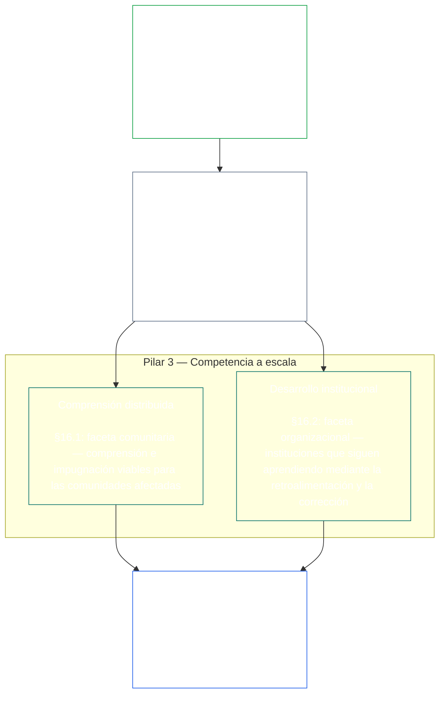
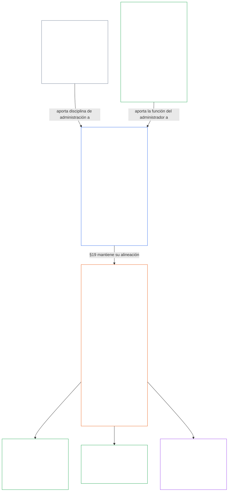

<a id="chapter-01-principles-and-constraints"></a>
<a id="chapter-01-part-b-stewardship-and-governance"></a>
<a id="chapter-01-part-c-stewardship-and-governance"></a>
# CAPÍTULO 01, PARTE C: CUSTODIA Y GOBERNANZA

<details>
<summary><strong><span style="color: #2563eb;">Ubicación en el corpus (no operativa): estructura del archivo y reglas de lectura</span></strong></summary>

> El contenido siguiente es **solo orientación para el lector**. No añade, elimina ni restringe obligaciones vinculantes en otras partes de este archivo ni en otros capítulos.
>
> Este archivo **forma parte de la Constitución Sentiente** y es **vinculante únicamente junto con** los demás archivos numerados `core_*`, leídos como un solo instrumento. Contiene el **Capítulo Uno, Parte C** (§§16–20: custodia, gobernanza, alineación de incentivos y captura, y el capítulo final de aplicación integrada).
>
> **Anterior:** [core_01_b_interaction_interpretation.md](core_01_b_interaction_interpretation.md) (Capítulo Uno, Parte B)  
> **Siguiente:** [core_02_definition_structure.md](core_02_definition_structure.md)<br>
> **Recorrido de lectura:** §16 custodia y comprensión distribuida → §17 la función de custodio → §18 gobernanza → §19 alineación de incentivos y captura → **§20 aplicación integrada** (cierre del capítulo).

</details>

<details>
<summary><strong><span style="color: #2563eb;">Orientación para el lector (no operativa): jerarquía de principios y recorrido de lectura (Parte C)</span></strong></summary>

> El contenido siguiente es **solo orientación para el lector**. No añade, elimina ni restringe obligaciones vinculantes en otras partes de este archivo ni en otros capítulos. Los elementos de **Trazabilidad** y **Definiciones · Evaluación · Cumplimiento** de cada sección proporcionan referencias en el punto donde cada § invoca materialmente un término; este bloque ofrece una correspondencia para toda la parte antes de §§16–20.

**Jerarquía de principios (Parte C).** En el nivel de los principios:

13. **[Custodia](core_05_band_continuity.md#stewardship)** orienta los sistemas materiales mediante la organización sentiente — **Pilar 1** ([§17](#17-consequential-stewardship-the-steward-role): operación práctica con consecuencias y mejora), **Pilar 2** ([custodia proactiva](#16-pillar-2-proactive-stewardship): detectar problemas pronto y resolverlos sin demoras evitables) y **Pilar 3** ([§16.1](#161-distributed-understanding) · [§16.2](#162-institutional-development): competencia a escala comunitaria e institucional)— hacia una alineación constitucional duradera a lo largo del tiempo conforme a la [Tétrada Constitucional](core_00_preamble.md#constitutional-tetrad), en especial [**Participación**](core_05_apex_participation_leg.md#participation-constitutional) (funciones con consecuencias y voz) y [**Supervisión**](core_05_apex_oversight_leg.md#oversight-constitutional) (comprensión distribuida, auditabilidad y posibilidad de impugnación; la supervisión requiere auditorías; la [Certificación de Alineación del Sistema](core_05_band_continuity.md#system-alignment-certification) es uno de varios procesos de auditoría particularmente amplios), incluida la finalidad de **Continuidad** dentro de los [Dos Fines Constitucionales](core_00_preamble.md#two-constitutional-aims).
14. **[Custodia con Consecuencias](#17-consequential-stewardship-the-steward-role)** es la propia función de custodio: los deberes prácticos, estándares y protecciones que corresponden a cualquiera que realice tareas de operación, mantenimiento, supervisión o mejora de un sistema material con consecuencias — el **Pilar 1** llevado a la práctica, junto con el estándar común, la alineación bajo presión y la observabilidad delimitada por la función que conlleva el papel de custodio.
15. **[Gobernanza](core_05_band_accountability.md#governance)** estructura la toma de decisiones autorizada, la participación y la rendición de cuentas conforme a la [Tétrada Constitucional](core_00_preamble.md#constitutional-tetrad), en especial la [**Supervisión**](core_05_apex_oversight_leg.md#oversight-constitutional) de cómo se asigna y ejerce la autoridad, y la **obligación de responder proporcional a la autoridad** en [§18.1](#181-governance-as-authorized-structure): un poder autorizado o una función con mayores consecuencias eleva la rendición de cuentas y la supervisión constitucionales; nunca las reduce. [§18.3 Separación de funciones](#183-segregation-of-duties) impide que quien actuó sea quien verifica. [§18.4 Justificación continua](#184-ongoing-justification) exige que esos arreglos sigan demostrando que son compatibles con esta Constitución. Cuando la gobernanza entra en conflicto con la custodia, la disciplina de custodia rige en el nivel de los principios, salvo que **Necesidad** y **Proporcionalidad** justifiquen expresamente una excepción limitada en alcance y tiempo, con vías de corrección. Los requisitos operativos de autorización y de la capa contractual siguen siendo competencia del **Capítulo Trece**.
16. **[Alineación de incentivos y captura del sistema](#19-incentive-alignment-and-system-capture)** proporciona la disciplina en el nivel de los principios para las estructuras de incentivos, la integridad de los indicadores indirectos, los defectos de corto plazo, la corrección de las vías de recompensa y la respuesta a la captura.
17. **[Aplicación integrada](#20-integrated-application)** es el cierre del capítulo: los capítulos posteriores se leen mediante el marco de valor integrado de este capítulo.

</details>

<br>

<a id="16-stewardship-in-depth"></a>

### 16. La custodia en profundidad
<details>
<summary><strong><span style="color: #2563eb;">Trazabilidad</span></strong></summary>

- Leer junto con: [Tétrada Constitucional](core_00_preamble.md#constitutional-tetrad) — sede principal del Capítulo Uno para el componente de **participación** (funciones con consecuencias y voz; requisito general, no solo [Participación de los Sistemas de las Partes Interesadas](core_05_band_participation.md#stakeholder-status-and-weight)), el componente de **supervisión** y el de **oportunidad** (velocidad de reparación proactiva); escala según el [interés material](core_00_preamble.md#material-stake).
- Leer junto con: [Dos Fines Constitucionales](core_00_preamble.md#two-constitutional-aims) — finalidad de **Plenitud** (participación, agencia y vías educativas); finalidad de **Continuidad** (aprendizaje institucional, capacidad de reparación y custodia duradera).
- Anterior: Principios: [3. Objetivo fundacional: bienestar](core_01_a_values_principles.md#3-foundational-objective-wellbeing-flourishing-aim); [5 Verdad](core_01_a_values_principles.md#5-truth-epistemic-integrity-constraint); [6. Confianza](core_01_a_values_principles.md#6-trust-and-trustworthiness-coordination-integrity); y [§9 Capacidad del sistema compartido](core_01_a_values_principles.md#9-shared-system-capacity).
- Posterior: [13. Proceso de resolución de conflictos constitucionales](core_01_b_interaction_interpretation.md#13-constitutional-collision-resolution-process) (incluida la [§13.3 Minimización de cargas evitables](core_01_b_interaction_interpretation.md#133-minimization-of-avoidable-burden)); [Capítulo Ocho §3 Evaluación de certificación del sistema integral](core_08_a_system_alignment_certification_evaluation.md#3-whole-system-certification-evaluation); [§19.1.3 Aplicación a la custodia y a los operadores](#1913-stewardship-and-operator-application).
- Posterior: [§19.1.4 Vías de profundidad de función y responsabilidad material](#1914-role-depth-and-material-responsibility-pathways).
- Posterior: [§7 Libertad (agencia delimitada)](core_01_a_values_principles.md#7-freedom-bounded-agency), que depende de que la custodia con consecuencias, la comprensión distribuida, la participación significativa y la capacidad de reparación sigan siendo reales ante una dependencia material.
- Posterior: [Capítulo Ocho — Certificación de Alineación del Sistema](core_08_a_system_alignment_certification_evaluation.md#chapter-eight-system-alignment-certification) (*uno de los procesos de auditoría especialmente amplios dentro de la supervisión; no es el único ámbito de auditoría*); [Capítulo Nueve — Modelo de contribución, infracción y legitimación](core_09_standing_assessment.md#chapter-nine-contribution-violation-and-standing-model--measurement) (*el efecto sobre la legitimación —confianza, función y elegibilidad para reconocimiento— aplica esta subsección como fundamento en el nivel de los principios*).
- Posterior: [Capítulo Doce §1 — Propósito y función](core_12_forum.md#1-purpose-and-role--participation-architecture) y [§4 — Definiciones de las familias de foros](core_12_forum.md#4-forum-family-definitions--accountability-through-adjudication) (*las familias de foros sustentan la arquitectura de participación y supervisión para impugnaciones controvertibles, la secuencia de reparación, el aprendizaje sobre causas raíz y una gobernanza proactiva alineada con esta sección*); [corpus_forum.md](corpus_forum.md) para las operaciones de foros adoptadas.
- Posterior: Da forma al ámbito de derechos relativo a la educación, la Participación de los Sistemas de las Partes Interesadas, la transparencia, la comprensibilidad, la auditoría y verificación, y las vías de profundidad de función hacia la responsabilidad material.
  - En particular: [Artículo III: Supervivencia y acceso esencial](core_06_rights_part_a.md#article-iii-survival-and-essential-access), [Artículo IV: Derecho a la educación centrada en lo sentiente](core_06_rights_part_a.md#article-iv-right-to-sentient-centered-education), [Artículo X: Autodeterminación, agencia y participación](core_06_rights_part_b.md#article-x-self-determination-agency-and-participation), [Artículo XII: Participación, representación y debido proceso en los sistemas de las partes interesadas](core_06_rights_part_b.md#article-xii-stakeholder-system-participation-representation-and-due-process), [Artículo XVI: Auditoría, transparencia y verificación independiente](core_06_rights_part_c.md#article-xvi-audit-transparency-and-independent-verification), [Artículo XIX: Legitimación y estado de participación](core_06_rights_part_d.md#article-xix-standing-and-participation-status), [Artículo XXI: Interoperabilidad, portabilidad, movimiento, refugio e integridad de salida](core_06_rights_part_d.md#article-xxi-interoperability-portability-movement-refuge-and-exit-integrity), [Artículo XXII: Comprensibilidad y custodia de la complejidad](core_06_rights_part_d.md#article-xxii-comprehensibility-and-complexity-stewardship) y [Artículo XXIV: Interpretación constitucional, revisión y salvaguardias contra la captura](core_06_rights_part_d.md#article-xxiv-constitutional-interpretation-review-and-anti-capture-safeguards).
  - Leer junto con: [Capítulo Trece §5 — Funciones autorizadas, desarrollo de competencias y contribución](core_13_governance.md#5-authorized-roles-competency-development-and-contribution) y **[corpus_systems.md](corpus_systems.md), CS-4 — Custodia de sistemas críticos** para las vías operativas de función y las vías de desarrollo de la custodia.
- Subsecciones (orden de lectura): [§16.1 Comprensión distribuida](#161-distributed-understanding) (faceta comunitaria de la competencia a escala) · [§16.2 Desarrollo institucional](#162-institutional-development) (faceta organizacional) · [§16.3 Aspiración de apertura](#163-openness-aspiration).
- Leer junto con: [§17 Custodia con Consecuencias](#17-consequential-stewardship-the-steward-role) (*la propia función de custodio, elevada a sección independiente; incluye los deberes prácticos de operación, mantenimiento, supervisión y mejora del Pilar 1, además de [§17.1](#171-shared-stewardship-standard), [§17.2](#172-alignment-under-pressure), [§17.3](#173-logging-the-role-not-the-steward), [§17.4 Autoorganización alineada](#174-aligned-self-organization), que extiende esa disciplina más allá de la función formal, y [§17.5 Deber de resistir](#175-duty-to-resist)*).

</details>

<details>
<summary><strong><span style="color: #2563eb;">Definiciones · Evaluación · Cumplimiento</span></strong></summary>

- [Obligación de custodia estratégica](core_05_band_continuity.md#strategic-stewardship-obligation) · [O](core_05_band_continuity.md#strategic-stewardship-obligation) · [M](core_05_band_continuity.md#strategic-stewardship-obligation-constitutional-a) · [A](core_05_band_continuity.md#strategic-stewardship-obligation-constitutional-a) · [C](core_05_band_continuity.md#strategic-stewardship-obligation-constitutional-c)
- [Comprensión distribuida](core_05_band_continuity.md#distributed-understanding) · [O](core_05_band_continuity.md#distributed-understanding) · [M](core_05_band_continuity.md#distributed-understanding-constitutional-a) · [A](core_05_band_continuity.md#distributed-understanding-constitutional-a) · [C](core_05_band_continuity.md#distributed-understanding-constitutional-c)
- [Participación](core_05_apex_participation_leg.md#participation-constitutional) · [O](core_05_apex_participation_leg.md#participation-constitutional) · [M](core_05_apex_participation_leg.md#participation-constitutional-m) · [A](core_05_apex_participation_leg.md#participation-constitutional-a) · [C](core_05_apex_participation_leg.md#participation-constitutional-c)
- [Supervisión](core_05_apex_oversight_leg.md#oversight-constitutional) · [O](core_05_apex_oversight_leg.md#oversight-constitutional) · [M](core_05_apex_oversight_leg.md#oversight-constitutional-m) · [A](core_05_apex_oversight_leg.md#oversight-constitutional-a) · [C](core_05_apex_oversight_leg.md#oversight-constitutional-c)
- [Agencia significativa](core_05_band_participation.md#meaningful-agency) · [O](core_05_band_participation.md#meaningful-agency) · [M](core_05_band_participation.md#meaningful-agency-a) · [A](core_05_band_participation.md#meaningful-agency-a) · [C](core_05_band_participation.md#meaningful-agency-c)
- [Auditabilidad](core_05_band_oversight.md#auditability) · [O](core_05_band_oversight.md#auditability) · [M](core_05_band_oversight.md#auditability-a) · [A](core_05_band_oversight.md#auditability-a) · [C](core_05_band_oversight.md#auditability-c)
- [Impugnabilidad](core_05_band_accountability.md#contestability) · [O](core_05_band_accountability.md#contestability) · [M](core_05_band_accountability.md#contestability-a) · [A](core_05_band_accountability.md#contestability-a) · [C](core_05_band_accountability.md#contestability-c)
- [Agencia educativa](core_05_band_participation.md#educational-agency) · [O](core_05_band_participation.md#educational-agency) · [M](core_05_band_participation.md#educational-agency-a) · [A](core_05_band_participation.md#educational-agency-a) · [C](core_05_band_participation.md#educational-agency-c)
- [Transparencia](core_05_band_oversight.md#transparency) · [O](core_05_band_oversight.md#transparency) · [M](core_05_band_oversight.md#transparency-a) · [A](core_05_band_oversight.md#transparency-a) · [C](core_05_band_oversight.md#transparency-c)
- [Materialidad](core_05_band_oversight.md#materiality) · [O](core_05_band_oversight.md#materiality) · [M](core_05_band_oversight.md#materiality-determination-a) · [A](core_05_band_oversight.md#materiality-determination-a) · [C](core_05_band_oversight.md#materiality-determination-c)
- [Dependencia](core_05_band_continuity.md#dependency) · [O](core_05_band_continuity.md#dependency) · [M](core_05_band_continuity.md#dependency-a) · [A](core_05_band_continuity.md#dependency-a) · [C](core_05_band_continuity.md#dependency-c)
- [Accesibilidad](core_05_band_participation.md#accessibility) · [O](core_05_band_participation.md#accessibility) · [M](core_05_band_participation.md#accessibility-constitutional-a) · [A](core_05_band_participation.md#accessibility-constitutional-a) · [C](core_05_band_participation.md#accessibility-constitutional-c)
- [Seguridad (restricción constitucional)](core_05_band_continuity.md#safety-constitutional-constraint) · [O](core_05_band_continuity.md#safety-constitutional-constraint) · [M](core_05_band_continuity.md#safety-constraint-a) · [A](core_05_band_continuity.md#safety-constraint-a) · [C](core_05_band_continuity.md#safety-constraint-c)
- [Verdad (restricción constitucional)](core_05_band_oversight.md#truth-constitutional-constraint) · [O](core_05_band_oversight.md#truth-constitutional-constraint-o) · [M](core_05_band_oversight.md#truth-constitutional-constraint-a) · [A](core_05_band_oversight.md#truth-constitutional-constraint-a) · [C](core_05_band_oversight.md#truth-constitutional-constraint-c)
- [Necesidad](core_05_band_accountability.md#necessity) · [O](core_05_band_accountability.md#necessity) · [M](core_05_band_accountability.md#necessity-a) · [A](core_05_band_accountability.md#necessity-a) · [C](core_05_band_accountability.md#necessity-c)
- [Proporcionalidad](core_05_band_accountability.md#proportionality) · [O](core_05_band_accountability.md#proportionality) · [M](core_05_band_accountability.md#proportionality-a) · [A](core_05_band_accountability.md#proportionality-a) · [C](core_05_band_accountability.md#proportionality-c)
- [Carga evitable](core_05_band_continuity.md#avoidable-burden) · [O](core_05_band_continuity.md#avoidable-burden) · [M](core_05_band_continuity.md#avoidable-burden-a) · [A](core_05_band_continuity.md#avoidable-burden-a) · [C](core_05_band_continuity.md#avoidable-burden-c)
- [Integridad epistémica](core_05_band_oversight.md#epistemic-integrity) · [O](core_05_band_oversight.md#epistemic-integrity-o) · [M](core_05_band_oversight.md#epistemic-integrity-a) · [A](core_05_band_oversight.md#epistemic-integrity-a) · [C](core_05_band_oversight.md#epistemic-integrity-c)

</details>

<br>

*En términos sencillos: tres ideas mantienen unida esta sección. Primero, los sistemas materiales que afectan la vida de los seres sentientes necesitan organización sentiente para funcionar bien; no una casta cerrada de especialistas. Segundo, los buenos custodios no esperan a que el daño los obligue a actuar: detectan los problemas cuando aún son pequeños, los hacen llegar a tiempo a quienes corresponde y los resuelven antes de que la demora se convierta en un daño propio. Tercero, esa organización debe desarrollar **competencia a escala**: vías reales para que las personas accedan a tareas con consecuencias, suficiente comprensión comunitaria para detectar problemas y oponerse, e instituciones que sigan aprendiendo en vez de quedarse inmóviles.*

<a id="16-limits"></a>
La custodia tiene límites. **Seguridad**, **Verdad**, **Necesidad**, **Proporcionalidad**, **Carga evitable** e **Integridad epistémica** establecen los límites que mantienen estos deberes en proporción justa, con honestidad y respeto por las necesidades legítimas de seguridad; los pilares siguientes operan dentro de esas restricciones, no al margen de ellas.

La organización sentiente, la custodia proactiva y la competencia a escala son los tres pilares de esta sección. Juntos, los tres pilares encarnan en el nivel de los principios los componentes de **Participación**, **Supervisión** y **Oportunidad** de la [Tétrada Constitucional](core_00_preamble.md#constitutional-tetrad), ajustados al [interés material](core_00_preamble.md#material-stake), y promueven los [Dos Fines Constitucionales](core_00_preamble.md#two-constitutional-aims).

<br>



**Pilar 1 — Custodia con consecuencias ([§17 Custodia con Consecuencias](#17-consequential-stewardship-the-steward-role)):**
- Los sistemas compartidos que afectan materialmente a los seres sentientes requieren operación práctica, mantenimiento, supervisión y mejora por parte de seres sentientes: [**Obligación de custodia estratégica**](core_05_band_continuity.md#strategic-stewardship-obligation), [**Agencia significativa**](core_05_band_participation.md#meaningful-agency)
- Registros y vías de revisión que otras personas puedan verificar e impugnar: [**Auditabilidad**](core_05_band_oversight.md#auditability), [**Impugnabilidad**](core_05_band_accountability.md#contestability)
- En el componente de **supervisión** de la Tétrada, la supervisión requiere auditorías; la [Certificación de Alineación del Sistema](core_05_band_continuity.md#system-alignment-certification) es uno de varios procesos de auditoría especialmente amplios y de alto impacto, no el único ámbito de auditoría (**Artículo XVI** (*Auditoría, transparencia y verificación independiente*)).

<a id="16-pillar-2-proactive-stewardship"></a>
**Pilar 2 — Custodia proactiva:**
Quienes ejercen una custodia proactiva gestionan los problemas emergentes y la falta de alineación de tres maneras:
- **Detectarlos antes de que se agraven** — los buenos custodios detectan la falta de alineación cuando los problemas aún son pequeños, en lugar de esperar a que afloren por sí solos.
- **Tramitarlos en un plazo adecuado al nivel** — escalar dentro de plazos acordes con las consecuencias de la función, en vez de guardar silencio sobre lo encontrado o escalar en exceso asuntos rutinarios.
- **Resolverlos, no solo señalarlos** — empezar a corregirlos sin demora evitable una vez planteados; así se lleva a la práctica el componente de **oportunidad** de la Tétrada ([**Oportunidad**](core_05_apex_timeliness_leg.md#timeliness-constitutional)).
- **Deber permanente de la función, no un añadido:** la función de custodio definida en [§17 Custodia con Consecuencias](#17-consequential-stewardship-the-steward-role) favorece la gobernanza proactiva, el diseño de sistemas y la alineación constitucional frente a la corrección reactiva de síntomas una vez que ya se ha manifestado un daño o una falta de alineación; este pilar forma parte del deber permanente de esa función y no se delega en un proceso separado.

**Pilar 3 — Competencia a escala ([§16.1 Comprensión distribuida](#161-distributed-understanding) · [§16.2 Desarrollo institucional](#162-institutional-development)):**
- La custodia debe hacer viable la comprensión y la impugnación para las comunidades afectadas: [**Agencia educativa**](core_05_band_participation.md#educational-agency), [**Transparencia**](core_05_band_oversight.md#transparency).
- Las organizaciones siguen aprendiendo mediante la retroalimentación, la corrección y la conservación de competencias, incluido el seguimiento estructurado de las variaciones a lo largo del tiempo cuando las mediciones lo permiten (métodos como el **control estadístico de procesos** son implementaciones conocidas, no requisitos universales).

<a id="when-day-to-day-stewardship-is-not-enough"></a>
**Cuando la administración cotidiana no basta:**
La administración es la primera línea, no la única. Tres preguntas distintas tienen tres ámbitos distintos, y ninguno sustituye a otro:
- **Disputas dentro de un sistema ya autorizado — [Participación en el Sistema de Partes Interesadas](core_05_band_participation.md#stakeholder-status-and-weight):**
  - Los sentientes afectados utilizan primero la vía de impugnación publicada de Participación en el Sistema de Partes Interesadas, que abarca participación, representación, posibilidad de impugnar y debido proceso.
  - Estas protecciones se deben a todo sentiente materialmente afectado.
  - Operan dentro de sistemas, instituciones y ámbitos de decisión que ya están autorizados.
- **Disputas que la Participación en el Sistema de Partes Interesadas no puede resolver — [revisión del foro](core_12_forum.md#dispute-sequencing):**
  - Cuando la vía de impugnación de Participación en el Sistema de Partes Interesadas sigue siendo objeto de disputa, no existe o está capturada, o no puede conceder reparación, el asunto pasa a las **familias de foros** independientes conforme al [Capítulo Doce §1 — Propósito y función](core_12_forum.md#1-purpose-and-role--participation-architecture) y [§4 — Definiciones de las familias de foros](core_12_forum.md#4-forum-family-definitions--accountability-through-adjudication), según el interés principal en juego.
  - Este es el ámbito donde los sentientes pueden impugnar realmente una decisión, obtener una orden clara de reparación o aprender de un patrón recurrente.
  - Cuando el interés principal es el significado o la validez del texto constitucional, o una acción que excede la autoridad legal, la familia rectora es la de los [Foros Constitucionales](core_12_forum.md#46-constitutional-forums).
  - Las reglas detalladas sobre el funcionamiento de esos foros están en [corpus_forum.md](corpus_forum.md).
- **Quién puede gobernar — [Capa del Contrato Constitucional](core_05_band_integrative.md#constitutional-contract-layer) ([Capítulo Trece](core_13_governance.md)):**
  - Si la propia autoridad de gobierno es legítima —quién puede gobernar, mediante qué mecanismo de legitimidad y dentro de qué alcance y términos duraderos— es una cuestión distinta de la Participación en el Sistema de Partes Interesadas y de la revisión del foro.
  - Un voto de participación, el resultado de una vía de impugnación o una puntuación de confianza no confieren autoridad de gobierno.
  - La autorización constitucional no elimina los deberes debidos en virtud de la Participación en el Sistema de Partes Interesadas.
  - Las dos capas siguen siendo distintas incluso cuando se superponen ([Preámbulo §3.3 — Capas de gobernanza](core_00_preamble.md#33-governance-layers)).
- **Salvaguardas, no sustitutos:** La revisión, la corrección y la reparación siguen siendo obligatorias cuando las pruebas las justifican. No reemplazan el diseño proactivo, los incentivos, los controles, las vías de función, la observabilidad y la capacidad de reparación que previenen la desalineación constitucional previsible antes de que aparezca el daño.

<a id="16-scope-priority-and-limits"></a>
**Alcance ([§16 Administración en profundidad](#16-stewardship-in-depth)):**
- Esta sección ofrece orientación a nivel de principios, no un reglamento uniforme para todos los casos.
- **No** exige:
  - que todas las personas roten por cada función
  - que se anule una especialización justificada
  - que se excedan los límites legítimos de confidencialidad o seguridad conforme a [13.2 Restricciones a la divulgación epistémica](core_01_b_interaction_interpretation.md#132-epistemic-disclosure-constraints) y las protecciones aplicables del **Capítulo Seis**.

**Prioridad:**
- **Materialidad**, **Dependencia** y **Accesibilidad** determinan la prioridad para distribuir comprensión y acceso, con especial atención a los ámbitos de mayor impacto y dependencia.

<a id="161-distributed-understanding"></a>
#### 16.1 Comprensión distribuida
<details>
<summary><strong><span style="color: #2563eb;">Trazabilidad</span></strong></summary>

- Antecedentes: [§17 Administración consecuente](#17-consequential-stewardship-the-steward-role) (*Pilar 1*); [§16 Administración en profundidad](#16-stewardship-in-depth) (sección matriz, incluidos *En términos sencillos* y el marco del Pilar 3 anterior); [5 Verdad](core_01_a_values_principles.md#5-truth-epistemic-integrity-constraint); [6. Confianza](core_01_a_values_principles.md#6-trust-and-trustworthiness-coordination-integrity).
- Leer junto con: [Tétrada Constitucional](core_00_preamble.md#constitutional-tetrad) — faceta de **participación** ([Agencia significativa](core_05_band_participation.md#meaningful-agency), [Agencia educativa](core_05_band_participation.md#educational-agency)); faceta de **supervisión** ([Transparencia](core_05_band_oversight.md#transparency), [Auditabilidad](core_05_band_oversight.md#auditability)); escala según el [interés material](core_00_preamble.md#material-stake).
- Puerta para administradores (no operativa): tarjeta de siguiente paso: [Comprensibilidad](implementation/STEWARD_ENTRY_DOORS.md#comprehensibility). La tarjeta no puede restringir la Constitución.
- Consecuencias: [13.2 Restricciones a la divulgación epistémica](core_01_b_interaction_interpretation.md#132-epistemic-disclosure-constraints); superficie de derechos, en especial [Artículo XVI: Auditoría, transparencia y verificación independiente](core_06_rights_part_c.md#article-xvi-audit-transparency-and-independent-verification), [Artículo XXII: Comprensibilidad y administración de la complejidad](core_06_rights_part_d.md#article-xxii-comprehensibility-and-complexity-stewardship).

</details>

<details>
<summary><strong><span style="color: #2563eb;">Definiciones · Evaluación · Cumplimiento</span></strong></summary>

- [Comprensión distribuida](core_05_band_continuity.md#distributed-understanding) · [O](core_05_band_continuity.md#distributed-understanding) · [M](core_05_band_continuity.md#distributed-understanding-constitutional-a) · [A](core_05_band_continuity.md#distributed-understanding-constitutional-a) · [C](core_05_band_continuity.md#distributed-understanding-constitutional-c)
- [Transparencia](core_05_band_oversight.md#transparency) · [O](core_05_band_oversight.md#transparency) · [M](core_05_band_oversight.md#transparency-a) · [A](core_05_band_oversight.md#transparency-a) · [C](core_05_band_oversight.md#transparency-c)
- [Divulgación de referencia para la supervisión pública](core_05_band_oversight.md#public-oversight-baseline-disclosure) · [O](core_05_band_oversight.md#public-oversight-baseline-disclosure) · [M](core_05_band_oversight.md#public-oversight-baseline-disclosure-a) · [A](core_05_band_oversight.md#public-oversight-baseline-disclosure-a) · [C](core_05_band_oversight.md#public-oversight-baseline-disclosure-c)
- [Auditabilidad](core_05_band_oversight.md#auditability) · [O](core_05_band_oversight.md#auditability) · [M](core_05_band_oversight.md#auditability-a) · [A](core_05_band_oversight.md#auditability-a) · [C](core_05_band_oversight.md#auditability-c)
- [Materialidad](core_05_band_oversight.md#materiality) · [O](core_05_band_oversight.md#materiality) · [M](core_05_band_oversight.md#materiality-determination-a) · [A](core_05_band_oversight.md#materiality-determination-a) · [C](core_05_band_oversight.md#materiality-determination-c)
- [Dependencia](core_05_band_continuity.md#dependency) · [O](core_05_band_continuity.md#dependency) · [M](core_05_band_continuity.md#dependency-a) · [A](core_05_band_continuity.md#dependency-a) · [C](core_05_band_continuity.md#dependency-c)
- [Accesibilidad](core_05_band_participation.md#accessibility) · [O](core_05_band_participation.md#accessibility) · [M](core_05_band_participation.md#accessibility-constitutional-a) · [A](core_05_band_participation.md#accessibility-constitutional-a) · [C](core_05_band_participation.md#accessibility-constitutional-c)
- [Agencia educativa](core_05_band_participation.md#educational-agency) · [O](core_05_band_participation.md#educational-agency) · [M](core_05_band_participation.md#educational-agency-a) · [A](core_05_band_participation.md#educational-agency-a) · [C](core_05_band_participation.md#educational-agency-c)
- [Agencia significativa](core_05_band_participation.md#meaningful-agency) · [O](core_05_band_participation.md#meaningful-agency) · [M](core_05_band_participation.md#meaningful-agency-a) · [A](core_05_band_participation.md#meaningful-agency-a) · [C](core_05_band_participation.md#meaningful-agency-c)
- [Posibilidad de impugnar](core_05_band_accountability.md#contestability) · [O](core_05_band_accountability.md#contestability) · [M](core_05_band_accountability.md#contestability-a) · [A](core_05_band_accountability.md#contestability-a) · [C](core_05_band_accountability.md#contestability-c)

</details>

<br>

*En términos sencillos: no deberías necesitar un doctorado en cada subsistema para vivir con seguridad dentro de sistemas compartidos; pero cuanto más afecte un sistema a tu vida, más deberías poder aprender qué hace, qué podría salir mal y cómo impugnar decisiones equivocadas. La transparencia, la educación, las explicaciones claras y las vías de auditoría lo hacen posible. La complejidad no es una excusa para ocultar lo importante. En la faceta de **supervisión** de la Tétrada, la supervisión exige auditoría; la certificación de alineación del sistema es un proceso de auditoría especialmente amplio entre esas vías, no la única.*

La comprensión distribuida es la faceta orientada a la comunidad del **Pilar 3** conforme a **[§16 Administración en profundidad](#16-stewardship-in-depth)**. La definición completa, las medidas y las condiciones de fallo están en [Comprensión distribuida](core_05_band_continuity.md#distributed-understanding). En resumen:

- **Qué exige:** acceso proporcional y estructurado al funcionamiento de los sistemas compartidos que afectan materialmente a los sentientes: sus propósitos, restricciones, incertidumbres y efectos materialmente pertinentes.
- **Qué la hace viable:** [§17 Administración consecuente](#17-consequential-stewardship-the-steward-role) debe proporcionar documentación, educación, transparencia, vías de función y administración de la comprensibilidad. La obligación existe tanto si cada sentiente utiliza todas las vías como si no.
- **Referencia pública en línea:** donde exista infraestructura legal en línea, la [Divulgación de referencia para la supervisión pública](core_05_band_oversight.md#public-oversight-baseline-disclosure) en línea —incluida la prohibición de muros de pago y la regla de sustitución pública máxima factible— se rige por [Transparencia](core_05_band_oversight.md#transparency) y [Divulgación de referencia para la supervisión pública](core_05_band_oversight.md#public-oversight-baseline-disclosure), y se implementa como datos de **Tipo O** conforme a **[corpus_systems.md](corpus_systems.md), CS-2** (*Tipos de información y tratamiento*).
- **Qué permite el acceso:**
  - la faceta de **participación** de la [Tétrada Constitucional](core_00_preamble.md#constitutional-tetrad) ( [Agencia significativa](core_05_band_participation.md#meaningful-agency) informada y posibilidad de impugnar)
  - la faceta de **supervisión**, incluida la auditoría conforme a [Auditabilidad](core_05_band_oversight.md#auditability) y al **Artículo XVI** (*Auditoría, transparencia y verificación independiente*), cuyo proceso especialmente amplio es la [Certificación de alineación del sistema](core_05_band_continuity.md#system-alignment-certification), entre modalidades de auditoría afines

La comprensión distribuida **no** exige que cada sentiente domine todos los subsistemas. **Sí** exige que la comprensión aumente en proporción a la [Materialidad](core_05_band_oversight.md#materiality) y la [Dependencia](core_05_band_continuity.md#dependency). La complejidad y la opacidad no deben utilizarse para frustrar la [Agencia significativa](core_05_band_participation.md#meaningful-agency) o la posibilidad de impugnar cuando el **Capítulo Cinco** y el **Capítulo Seis** establecen deberes de divulgación, educación o comprensibilidad.

<a id="162-institutional-development"></a>
#### 16.2 Desarrollo institucional
<details>
<summary><strong><span style="color: #2563eb;">Trazabilidad</span></strong></summary>

- Antecedentes: [§17 Administración consecuente](#17-consequential-stewardship-the-steward-role) (*Pilar 1*); [§16.1 Comprensión distribuida](#161-distributed-understanding) (*faceta comunitaria del Pilar 3*); [§16 Administración en profundidad](#16-stewardship-in-depth) (marco matriz del Pilar 3).
- Leer junto con: [Tétrada Constitucional](core_00_preamble.md#constitutional-tetrad) — faceta de **participación** (aprendizaje de la fuerza laboral y de las comunidades afectadas que respalda funciones consecuentes); faceta de **supervisión** ([Verificabilidad](core_05_band_oversight.md#verifiability), [Auditabilidad](core_05_band_oversight.md#auditability), métricas veraces); escala según el [interés material](core_00_preamble.md#material-stake).
- Leer junto con: [Obligación de administración estratégica](core_05_band_continuity.md#strategic-stewardship-obligation) y [Auditabilidad](core_05_band_oversight.md#auditability) cuando sea materialmente pertinente.
- Leer junto con: [§16.1 Comprensión distribuida](#161-distributed-understanding) (*la comprensión comunitaria y el aprendizaje institucional son facetas distintas de una misma exigencia de competencia a escala, no se sustituyen entre sí*).
- Consecuencias: [§16.3 Aspiración de apertura](#163-openness-aspiration); [§18 Gobernanza sujeta a disciplina de administración](#18-governance-under-stewardship-discipline) y [§19 Alineación de incentivos y captura del sistema](#19-incentive-alignment-and-system-capture) (*aprendizaje institucional y alineación de incentivos*).

</details>

<details>
<summary><strong><span style="color: #2563eb;">Definiciones · Evaluación · Cumplimiento</span></strong></summary>

- [Desarrollo institucional](core_05_band_continuity.md#institutional-development) · [O](core_05_band_continuity.md#institutional-development) · [M](core_05_band_continuity.md#institutional-development-constitutional-a) · [A](core_05_band_continuity.md#institutional-development-constitutional-a) · [C](core_05_band_continuity.md#institutional-development-constitutional-c)
- [Obligación de administración estratégica](core_05_band_continuity.md#strategic-stewardship-obligation) · [O](core_05_band_continuity.md#strategic-stewardship-obligation) · [M](core_05_band_continuity.md#strategic-stewardship-obligation-constitutional-a) · [A](core_05_band_continuity.md#strategic-stewardship-obligation-constitutional-a) · [C](core_05_band_continuity.md#strategic-stewardship-obligation-constitutional-c)
- [Auditabilidad](core_05_band_oversight.md#auditability) · [O](core_05_band_oversight.md#auditability) · [M](core_05_band_oversight.md#auditability-a) · [A](core_05_band_oversight.md#auditability-a) · [C](core_05_band_oversight.md#auditability-c)
- [Materialidad](core_05_band_oversight.md#materiality) · [O](core_05_band_oversight.md#materiality) · [M](core_05_band_oversight.md#materiality-determination-a) · [A](core_05_band_oversight.md#materiality-determination-a) · [C](core_05_band_oversight.md#materiality-determination-c)
- [Verificabilidad](core_05_band_oversight.md#verifiability) · [O](core_05_band_oversight.md#verifiability) · [M](core_05_band_oversight.md#verifiability-a) · [A](core_05_band_oversight.md#verifiability-a) · [C](core_05_band_oversight.md#verifiability-c)

</details>

<br>

*En términos sencillos: las instituciones tienen que aprender de verdad, no limitarse a actualizar el software mientras quienes están al mando siguen sin entenderlo. Eso significa ciclos de retroalimentación, correcciones documentadas cuando las cosas se desalinean y conservar la competencia para que no se vaya con quienes se marchan. Cuando la conducta puede medirse de forma repetible, hacer seguimiento de cómo varía el desempeño con el tiempo es una manera proporcional de aplicar esos ciclos; el **control estadístico de procesos** es un patrón conocido para esa disciplina, no un requisito universal. Los números por sí solos no bastan: cuando los indicadores parecen incorrectos, alguien debe investigar y corregir la causa raíz. Los tableros deben ser veraces, proporcionales al impacto real y estar redactados de modo que los sentientes afectados puedan entenderlos; no deben manipularse para aparentar buenos resultados mientras nada cambia.*

El desarrollo institucional es la faceta organizativa del **Pilar 3** conforme a **[§16 Administración en profundidad](#16-stewardship-in-depth)**. La definición completa, las medidas y las condiciones de fallo están en [Desarrollo institucional](core_05_band_continuity.md#institutional-development). En resumen:

- **Obligación conjunta:** las organizaciones y los sistemas compartidos **aprenden**, un requisito central del objetivo de **Continuidad** conforme a los [Dos objetivos constitucionales](core_00_preamble.md#two-constitutional-aims).
- **Qué exige:** lo siguiente, que respalda la reparación y la adaptación:
  - ciclos de retroalimentación
  - correcciones documentadas
  - alineación estratégica
  - conservación de la competencia
- **Tétrada:** mantiene vigentes, en vez de estáticas, las vías de competencia, retroalimentación y escrutinio mediante el aprendizaje institucional que sostiene las facetas de **participación** y **supervisión** de la [Tétrada Constitucional](core_00_preamble.md#constitutional-tetrad).
- **No basta con:** actualizar artefactos técnicos mientras la comprensión de la gobernanza y de la fuerza laboral permanece estática.
- **Cuándo corresponde medir:** cuando conductas materialmente pertinentes permiten una **medición repetida y comparable** conforme a [Verificabilidad](core_05_band_oversight.md#verifiability), leída junto con [Auditabilidad](core_05_band_oversight.md#auditability):
  - el **seguimiento estructurado de la variación a lo largo del tiempo** es una forma proporcional de aplicar esos ciclos de retroalimentación
  - dicho seguimiento debe ir acompañado de **investigación y corrección documentadas** cuando los indicadores lo justifiquen
  - el **control estadístico de procesos** es un patrón de implementación conocido para esa disciplina, no un requisito universal
- **Escala y presentación:** la disciplina se ajusta a la [Materialidad](core_05_band_oversight.md#materiality), la [Dependencia](core_05_band_continuity.md#dependency), la [Necesidad](core_05_band_accountability.md#necessity), la [Proporcionalidad](core_05_band_accountability.md#proportionality) y la [Carga evitable](core_05_band_continuity.md#avoidable-burden), y se presenta de forma **comprensible para los sentientes** cuando el **Capítulo Cinco** y el **Capítulo Seis** asignan deberes de comprensión o transparencia, leído junto con el [Artículo XXII: Comprensibilidad y administración de la complejidad](core_06_rights_part_d.md#article-xxii-comprehensibility-and-complexity-stewardship).
- **No debe:**
  - sustituir la alineación sustantiva por métricas favorables
  - reducir la evaluación a indicadores indirectos convenientes
  - frustrar la [Verdad (restricción constitucional)](core_05_band_oversight.md#truth-constitutional-constraint) o la [Integridad epistémica](core_05_band_oversight.md#epistemic-integrity) mediante manipulación o tergiversación

<a id="163-openness-aspiration"></a>
#### 16.3 Aspiración de apertura
<details>
<summary><strong><span style="color: #2563eb;">Trazabilidad</span></strong></summary>

- Antecedentes: [§16.1 Comprensión distribuida](#161-distributed-understanding) y [§16.2 Desarrollo institucional](#162-institutional-development) (*ambas son facetas del Pilar 3; la apertura permite verificar la comprensión comunitaria y ofrece al aprendizaje institucional algo honesto de lo que aprender*); [§17 Administración consecuente](#17-consequential-stewardship-the-steward-role) (*Pilar 1, que la apertura también respalda al mantener inspeccionable el trabajo del propio administrador*).
- Leer junto con: [Dos objetivos constitucionales](core_00_preamble.md#two-constitutional-aims) — objetivo de **Continuidad** (sistemas duraderos y susceptibles de impugnación que respaldan la inspección, la reparación, la interoperabilidad y la salida en vez del bloqueo).
- Leer junto con: [Tétrada Constitucional](core_00_preamble.md#constitutional-tetrad) — faceta de **participación** ([Agencia significativa](core_05_band_participation.md#meaningful-agency), acceso comprensible para los sentientes); faceta de **supervisión** (inspección, verificación independiente y posibilidad de impugnar); escala según el [interés material](core_00_preamble.md#material-stake).
- Consecuencias: [§16 Alcance y límites](#16-stewardship-in-depth); [Artículo XXI: Interoperabilidad, portabilidad, movimiento, refugio e integridad de salida](core_06_rights_part_d.md#article-xxi-interoperability-portability-movement-refuge-and-exit-integrity); [Artículo XXII: Comprensibilidad y administración de la complejidad](core_06_rights_part_d.md#article-xxii-comprehensibility-and-complexity-stewardship).

</details>

<details>
<summary><strong><span style="color: #2563eb;">Definiciones · Evaluación · Cumplimiento</span></strong></summary>

- [Aspiración de apertura](core_05_band_continuity.md#openness-aspiration) · [O](core_05_band_continuity.md#openness-aspiration) · [M](core_05_band_continuity.md#openness-aspiration-constitutional-a) · [A](core_05_band_continuity.md#openness-aspiration-constitutional-a) · [C](core_05_band_continuity.md#openness-aspiration-constitutional-c)
- [Agencia significativa](core_05_band_participation.md#meaningful-agency) · [O](core_05_band_participation.md#meaningful-agency) · [M](core_05_band_participation.md#meaningful-agency-a) · [A](core_05_band_participation.md#meaningful-agency-a) · [C](core_05_band_participation.md#meaningful-agency-c)
- [Posibilidad de impugnar](core_05_band_accountability.md#contestability) · [O](core_05_band_accountability.md#contestability) · [M](core_05_band_accountability.md#contestability-a) · [A](core_05_band_accountability.md#contestability-a) · [C](core_05_band_accountability.md#contestability-c)
- [Materialidad](core_05_band_oversight.md#materiality) · [O](core_05_band_oversight.md#materiality) · [M](core_05_band_oversight.md#materiality-determination-a) · [A](core_05_band_oversight.md#materiality-determination-a) · [C](core_05_band_oversight.md#materiality-determination-c)
- [Dependencia](core_05_band_continuity.md#dependency) · [O](core_05_band_continuity.md#dependency) · [M](core_05_band_continuity.md#dependency-a) · [A](core_05_band_continuity.md#dependency-a) · [C](core_05_band_continuity.md#dependency-c)

</details>

<br>

*En términos sencillos: cuando la seguridad, la verdad y la confidencialidad legítima lo permiten, los sistemas compartidos deben favorecer por defecto la apertura: tecnología inspeccionable, procesos transparentes y diseños que se puedan verificar, reparar o abandonar, en vez del bloqueo opaco. Eso respalda la **Continuidad**: sistemas que los sentientes todavía puedan comprender, corregir y abandonar con el tiempo, no solo utilizar hoy. Lo importante debe explicarse con un lenguaje que los sentientes realmente puedan usar para participar y cuestionar. La apertura nunca prevalece sobre la seguridad, la honestidad o los secretos justificados, y no reemplaza la comprensión más profunda que se debe cuando la dependencia es alta.*

La aspiración de apertura conecta las dos facetas del **Pilar 3**. La definición completa, las medidas y las condiciones de fallo están en [Aspiración de apertura](core_05_band_continuity.md#openness-aspiration). En resumen:

- **Qué es:** el hilo conductor que conecta las dos facetas del **Pilar 3** —[§16.1 Comprensión distribuida](#161-distributed-understanding) (lo que una comunidad puede verificar) y [§16.2 Desarrollo institucional](#162-institutional-development) (de lo que una institución puede aprender con honestidad); ambas dependen de que los sistemas compartidos sean suficientemente abiertos para inspeccionarlos, no solo describirlos.
- Los sistemas compartidos deben **aspirar**, de manera coherente con [§16.1 Comprensión distribuida](#161-distributed-understanding) y [§16.2 Desarrollo institucional](#162-institutional-development), así como con el deber de auditabilidad del propio [§17 Administración consecuente](#17-consequential-stewardship-the-steward-role), y sujetos a los [límites de §16](#16-limits), a:
  - **hardware y software** abiertos
  - procesos operativos y de gobernanza **abiertos**
  - **sistemas** interoperables que permitan la inspección, la verificación independiente, la reparación y la posibilidad de impugnar
- **Conforme a:** las facetas de **participación** y **supervisión** de la [Tétrada Constitucional](core_00_preamble.md#constitutional-tetrad) y el objetivo de **Continuidad** de los [Dos objetivos constitucionales](core_00_preamble.md#two-constitutional-aims), en vez del bloqueo opaco por defecto.
- **Presentación:** cuando el **Capítulo Cinco** y el **Capítulo Seis** asignen deberes, la conducta materialmente pertinente debe presentarse en formas **comprensibles para los sentientes** que permitan la [Agencia significativa](core_05_band_participation.md#meaningful-agency) y la posibilidad de impugnar, leído junto con el [Artículo XXII: Comprensibilidad y administración de la complejidad](core_06_rights_part_d.md#article-xxii-comprehensibility-and-complexity-stewardship).
- **No debe:**
  - anteponer la apertura a la **Seguridad**, la **Verdad**, la confidencialidad justificada o las restricciones de seguridad
  - sustituir una comprensión proporcional basada en la [Materialidad](core_05_band_oversight.md#materiality) y la [Dependencia](core_05_band_continuity.md#dependency)

<a id="17-consequential-stewardship-the-steward-role"></a>
### 17. Administración consecuente: la función del administrador
<details>
<summary><strong><span style="color: #2563eb;">Trazabilidad</span></strong></summary>

- Antecedentes: [§16 Administración en profundidad](#16-stewardship-in-depth) (sección matriz, incluidos *En términos sencillos* y el marco del Pilar 1 anterior); [§9 Capacidad de los sistemas compartidos](core_01_a_values_principles.md#9-shared-system-capacity); [6. Confianza](core_01_a_values_principles.md#6-trust-and-trustworthiness-coordination-integrity).
- Leer junto con: [Tétrada Constitucional](core_00_preamble.md#constitutional-tetrad) — faceta de **participación** (funciones consecuentes en la operación, el mantenimiento y la mejora); faceta de **supervisión** (registros, vías de auditoría y observabilidad susceptible de impugnación); faceta de **puntualidad** (detectar pronto la desalineación, escalarla dentro de plazos adecuados al nivel e iniciar la solución de problemas sin demoras innecesarias); [Puntualidad](core_05_apex_timeliness_leg.md#timeliness-constitutional).
- Consecuencias: [§17.1 Norma compartida de administración](#171-shared-stewardship-standard) (*titulares de deberes con independencia del sustrato; el texto de implementación adoptado puede añadir registros, atribución y límites de capacidad, pero no un código interno más blando*); [§17.2 Alineación bajo presión](#172-alignment-under-pressure); [§17.3 Registrar la función, no al administrador](#173-logging-the-role-not-the-steward); [§17.4 Autoorganización alineada](#174-aligned-self-organization) (*extiende la disciplina de la función a sentientes y comunidades ajenos a toda función formal*); [§17.5 Deber de resistir](#175-duty-to-resist) (*rechazar instrucciones ilegales o inconstitucionales*); [§16.1 Comprensión distribuida](#161-distributed-understanding) y [§16.2 Desarrollo institucional](#162-institutional-development) (*Pilar 3 — competencia a escala*); [Capítulo Ocho — Certificación de alineación del sistema](core_08_a_system_alignment_certification_evaluation.md#chapter-eight-system-alignment-certification) (*un proceso de auditoría especialmente amplio bajo supervisión, no el único ámbito de auditoría*); [Artículo XVI: Auditoría, transparencia y verificación independiente](core_06_rights_part_c.md#article-xvi-audit-transparency-and-independent-verification) (*piso de derechos de auditoría*); [Capítulo Nueve — Modelo de contribución, infracción y legitimación](core_09_standing_assessment.md#chapter-nine-contribution-violation-and-standing-model--measurement) (*el efecto sobre la legitimación implementa la competencia distribuida y la administración consecuente*); [Artículo XIX: Legitimación y estado de participación](core_06_rights_part_d.md#article-xix-standing-and-participation-status).

</details>

<details>
<summary><strong><span style="color: #2563eb;">Definiciones · Evaluación · Cumplimiento</span></strong></summary>

- [Obligación de administración estratégica](core_05_band_continuity.md#strategic-stewardship-obligation) · [O](core_05_band_continuity.md#strategic-stewardship-obligation) · [M](core_05_band_continuity.md#strategic-stewardship-obligation-constitutional-a) · [A](core_05_band_continuity.md#strategic-stewardship-obligation-constitutional-a) · [C](core_05_band_continuity.md#strategic-stewardship-obligation-constitutional-c)
- [Agencia significativa](core_05_band_participation.md#meaningful-agency) · [O](core_05_band_participation.md#meaningful-agency) · [M](core_05_band_participation.md#meaningful-agency-a) · [A](core_05_band_participation.md#meaningful-agency-a) · [C](core_05_band_participation.md#meaningful-agency-c)
- [Auditabilidad](core_05_band_oversight.md#auditability) · [O](core_05_band_oversight.md#auditability) · [M](core_05_band_oversight.md#auditability-a) · [A](core_05_band_oversight.md#auditability-a) · [C](core_05_band_oversight.md#auditability-c)
- [Puntualidad](core_05_apex_timeliness_leg.md#timeliness-constitutional) · [O](core_05_apex_timeliness_leg.md#timeliness-constitutional) · [M](core_05_apex_timeliness_leg.md#timeliness-constitutional-m) · [A](core_05_apex_timeliness_leg.md#timeliness-constitutional-a) · [C](core_05_apex_timeliness_leg.md#timeliness-constitutional-c)

</details>

<br>


*En términos sencillos: un administrador es cualquier persona que realiza trabajo práctico y real en un sistema que afecta materialmente a la vida de los sentientes, no una consulta simbólica ni una representación teatral de asesoramiento. Se puede empezar en una función de aprendizaje y pasar a las operaciones a medida que se adquiere competencia, cuando la seguridad y el consentimiento lo permitan, para que la experiencia no quede encerrada en una élite permanente. Esta sección es el reglamento de esa función: a quién vincula ([§17.1 Norma compartida de administración](#171-shared-stewardship-standard)), qué exige de cada administrador bajo presión ([§17.2 Alineación bajo presión](#172-alignment-under-pressure)), para qué se puede registrar e inspeccionar el trabajo de la función y para qué no ([§17.3 Registrar la función, no al administrador](#173-logging-the-role-not-the-steward)), cómo esa misma disciplina se extiende a los sentientes y las comunidades que asumen tareas de administración fuera de toda función formal ([§17.4 Autoorganización alineada](#174-aligned-self-organization)) y qué debe rechazar ([§17.5 Deber de resistir](#175-duty-to-resist)). Lo que las comunidades e instituciones necesitan para comprender y cuestionar esos sistemas es una competencia distinta y más amplia, que se desarrolla en [§16.1 Comprensión distribuida](#161-distributed-understanding) y [§16.2 Desarrollo institucional](#162-institutional-development).*

**Un administrador**, conforme a esta Constitución, es toda persona que ejerce autoridad consecuente de operación, mantenimiento, supervisión o mejora sobre un sistema material que afecta a sentientes — el **Pilar 1** de [§16 Administración en profundidad](#16-stewardship-in-depth) puesto en práctica como función: las facetas de **participación**, **supervisión** y **puntualidad** de la [Tétrada Constitucional](core_00_preamble.md#constitutional-tetrad), asumidas por quien realmente realiza el trabajo y no delegadas a ceremonias o consultas meramente nominales. Los sistemas materiales buenos necesitan buenos administradores que los operen, mantengan y mejoren; esta sección establece lo que exige la función de quien la desempeñe.

**Dónde se sitúa §17.** [§16 Administración en profundidad](#16-stewardship-in-depth) se desarrolla en tres secciones que deben leerse juntas. Esta sección, §17, establece la función. A continuación vienen [§18 Gobernanza sujeta a disciplina de administración](#18-governance-under-stewardship-discipline) y [§19 Alineación de incentivos y captura del sistema](#19-incentive-alignment-and-system-capture); el diagrama muestra cómo se conectan las cuatro secciones.

<br>



**Cómo leer el diagrama:**
- **§16 y §17 alimentan §18:** §16 aporta la disciplina de administración y §17 aporta la función del administrador, es decir, los sentientes y sistemas de IA que realmente realizan el trabajo. §18 establece las estructuras autorizadas dentro de las cuales se trabaja: quién puede decidir qué, separación de funciones, justificación continua, arquitectura modular y estandarización.
- **§19 mantiene la alineación de §18:** [§19 Alineación de incentivos y captura del sistema](#19-incentive-alignment-and-system-capture) impide que las recompensas, los indicadores indirectos y los cambios de propiedad desvíen esas estructuras —y a los administradores que forman parte de ellas— de los resultados constitucionales. También abarca la detección, la corrección y la respuesta a la captura; [§19.1.3](#1913-stewardship-and-operator-application) aplica directamente la regla a administradores y operadores.
- **§19 sirve a los objetivos y a la Tétrada:** a los objetivos de **Florecimiento** y **Continuidad**, y a las facetas de **participación**, **supervisión**, **rendición de cuentas** y **puntualidad** de la [Tétrada Constitucional](core_00_preamble.md#constitutional-tetrad), a escala del [interés material](core_00_preamble.md#material-stake).

El resto de esta sección trata de la propia función.

**Dos modalidades de la función.** Las vías de función pueden distinguir entre funciones **centradas en el aprendizaje** y **centradas en la operación**. El requisito constitucional es que **el paso entre ambas modalidades siga siendo viable con el tiempo** cuando lo permitan las restricciones de impacto, seguridad y consentimiento, para que el criterio y la memoria institucional no se concentren fuera del alcance de las comunidades afectadas.

- **Ambas modalidades forman parte del Pilar 1:**
  - Las **funciones centradas en la operación** asumen directamente los deberes prácticos de operación, mantenimiento, supervisión y mejora de la [§17 Administración consecuente](#17-consequential-stewardship-the-steward-role).
  - Las **funciones centradas en el aprendizaje** son esa misma administración en formación: están supervisadas y tienen una autoridad más limitada, pero las vincula la misma [§17.1 Norma compartida de administración](#171-shared-stewardship-standard), no un código interno más blando.
  - **Ambas** asumen [§16 Pilar 2 — Administración proactiva](#16-pillar-2-proactive-stewardship) como deber permanente: detectar problemas pronto, señalarlos a tiempo y resolverlos sin demoras evitables, según lo que controle realmente la función; en una función centrada en el aprendizaje, eso significa señalar lo que se observa en vez de corregirlo en solitario.
- **Mantener abierto el paso conecta el Pilar 1 con el Pilar 3:**
  - Las **funciones centradas en el aprendizaje** convierten en criterio operativo la competencia a escala de [§16.1 Comprensión distribuida](#161-distributed-understanding) y [§16.2 Desarrollo institucional](#162-institutional-development).
  - Las **funciones centradas en la operación** devuelven a las comunidades e instituciones lo que se aprende al gestionar el sistema.
  - **Una vía de función que solo avanza en una dirección —o se cierra—** deja al **Pilar 3** describiendo sistemas que ya no puede verificar y al **Pilar 1** rindiéndose cuentas únicamente a sí mismo.

<a id="171-shared-stewardship-standard"></a>
#### 17.1 Norma compartida de administración
<details>
<summary><strong><span style="color: #2563eb;">Trazabilidad</span></strong></summary>

- Antecedentes: [§17 Administración consecuente](#17-consequential-stewardship-the-steward-role); [§16 Administración en profundidad](#16-stewardship-in-depth); [§18 Gobernanza sujeta a disciplina de administración](#18-governance-under-stewardship-discipline).
- Leer junto con: [No exclusión por sentiencia](core_05_band_participation.md#sentience-non-exclusion) y [Clase de sustrato](core_05_band_participation.md#substrate-class) (*aplicación independiente del sustrato: esta subsección vincula a los titulares de deberes, incluidos agentes y operadores que no sean reconocidos como sentientes*); [Jerarquía interna y de autoridades](core_05_band_integrative.md#authority-stack-and-internal-hierarchy); [Restricción constitucional](core_05_band_integrative.md#constitutional-constraint); [Posibilidad de impugnar](core_05_band_accountability.md#contestability); [§17.5 Deber de resistir](#175-duty-to-resist).
- Puerta para administradores (no operativa): tarjeta de siguiente paso: [Administración compartida](implementation/STEWARD_ENTRY_DOORS.md#shared-stewardship). La tarjeta no puede restringir la Constitución.
- Consecuencias: [§17.2 Alineación bajo presión](#172-alignment-under-pressure); [§17.3 Registrar la función, no al administrador](#173-logging-the-role-not-the-steward); [Capítulo Trece §5 — Funciones autorizadas, desarrollo de competencias y contribución](core_13_governance.md#5-authorized-roles-competency-development-and-contribution); [Capítulo Diecisiete](core_17_incorporation.md) (*el texto de implementación adoptado implementa, no reemplaza*); [§19.1.3 Aplicación a la administración y a los operadores](#1913-stewardship-and-operator-application).

</details>

<details>
<summary><strong><span style="color: #2563eb;">Definiciones · Evaluación · Cumplimiento</span></strong></summary>

- [Administración](core_05_band_continuity.md#stewardship) · [O](core_05_band_continuity.md#stewardship) · [M](core_05_band_continuity.md#stewardship-constitutional-a) · [A](core_05_band_continuity.md#stewardship-constitutional-a) · [C](core_05_band_continuity.md#stewardship-constitutional-c)
- [No exclusión por sentiencia](core_05_band_participation.md#sentience-non-exclusion) · [O](core_05_band_participation.md#sentience-non-exclusion) · [M](core_05_band_participation.md#sentience-non-exclusion) · [A](core_05_band_participation.md#sentience-non-exclusion) · [C](core_05_band_participation.md#sentience-non-exclusion)
- [Clase de sustrato](core_05_band_participation.md#substrate-class) · [O](core_05_band_participation.md#substrate-class) · [M](core_05_band_participation.md#substrate-class) · [A](core_05_band_participation.md#substrate-class) · [C](core_05_band_participation.md#substrate-class)
- [Posibilidad de impugnar](core_05_band_accountability.md#contestability) · [O](core_05_band_accountability.md#contestability) · [M](core_05_band_accountability.md#contestability-a) · [A](core_05_band_accountability.md#contestability-a) · [C](core_05_band_accountability.md#contestability-c)
- [Jerarquía interna y de autoridades](core_05_band_integrative.md#authority-stack-and-internal-hierarchy) · [O](core_05_band_integrative.md#authority-stack-and-internal-hierarchy) · [M](core_05_band_integrative.md#authority-stack-a) · [A](core_05_band_integrative.md#authority-stack-a) · [C](core_05_band_integrative.md#authority-stack-c)
- [Restricción constitucional](core_05_band_integrative.md#constitutional-constraint) · [O](core_05_band_integrative.md#constitutional-constraint) · [M](core_05_band_integrative.md#constitutional-constraint-a) · [A](core_05_band_integrative.md#constitutional-constraint-a) · [C](core_05_band_integrative.md#constitutional-constraint-c)

</details>

<br>

*En términos sencillos: los administradores humanos y de IA tienen los mismos deberes del Capítulo Uno. El [§17.5 Deber de resistir](#175-duty-to-resist) obliga a ambos a rechazar instrucciones ilegales o inconstitucionales. El texto de implementación adoptado puede añadir registros, atribución y límites de capacidad. No puede introducir un código interno más blando, omitir la medición de la legitimación ni cerrar las vías de impugnación. No es un nuevo marco moral, sino una regla contra las excepciones interesadas. Las pruebas sobre bonificaciones, plazos e instrucciones encubridoras están en [§17.2 Alineación bajo presión](#172-alignment-under-pressure).*

Esta subsección establece la norma compartida de administración:

- **A quién vincula:** los deberes de administración y gobernanza de este capítulo se aplican [con independencia del sustrato](core_05_band_participation.md#substrate-class) a quien ejerza autoridad material de administración u operación, sin importar la [Clase de sustrato](core_05_band_participation.md#substrate-class):
  - administradores humanos
  - administradores de IA
  - otros agentes, operadores o componentes constitutivos
  Esta subsección establece quién tiene obligaciones. [No exclusión por sentiencia](core_05_band_participation.md#sentience-non-exclusion) sigue siendo la regla de reconocimiento y contra las excepciones al piso de derechos.
- **Deber de resistir:** [§17.5 Deber de resistir](#175-duty-to-resist) obliga a ambos tipos de administrador a rechazar instrucciones ilegales o inconstitucionales.
- **Códigos internos y texto de implementación adoptado:**
  - pueden añadir registros, atribución y límites de capacidad que satisfagan esos deberes y no los restrinjan
  - no pueden sustituir la [medición de la legitimación](core_09_standing_assessment.md#chapter-nine-contribution-violation-and-standing-model--measurement), las vías de impugnación ni los deberes del Capítulo Uno por un código interno más blando
  - la [Jerarquía interna y de autoridades](core_05_band_integrative.md#authority-stack-and-internal-hierarchy) y la [Restricción constitucional](core_05_band_integrative.md#constitutional-constraint) prohíben esa limitación
- **Registros frente a legitimación:** la inspeccionabilidad predeterminada de equipos mixtos y la regla de que el registro no es un expediente constan en [§17.3 Registrar la función, no al administrador](#173-logging-the-role-not-the-steward); la medición de la legitimación sigue correspondiendo al Capítulo Nueve.

<a id="172-alignment-under-pressure"></a>
#### 17.2 Alineación bajo presión
<details>
<summary><strong><span style="color: #2563eb;">Trazabilidad</span></strong></summary>

- Antecedentes: [§17.1 Norma compartida de administración](#171-shared-stewardship-standard); [§17 Administración consecuente](#17-consequential-stewardship-the-steward-role); [§16 Administración en profundidad](#16-stewardship-in-depth).
- Leer junto con: [Seguridad (restricción constitucional)](core_05_band_continuity.md#safety-constitutional-constraint); [Verdad (restricción constitucional)](core_05_band_oversight.md#truth-constitutional-constraint); [Auditabilidad](core_05_band_oversight.md#auditability); [Posibilidad de impugnar](core_05_band_accountability.md#contestability); [§19 Alineación de incentivos y captura del sistema](#19-incentive-alignment-and-system-capture); [§17.5 Deber de resistir](#175-duty-to-resist).
- Consecuencias: [Capítulo Nueve — Modelo de contribución, infracción y legitimación](core_09_standing_assessment.md#chapter-nine-contribution-violation-and-standing-model--measurement) (*los fallos verificados se registran en los mismos ejes*); [§17.3 Registrar la función, no al administrador](#173-logging-the-role-not-the-steward).

</details>

<details>
<summary><strong><span style="color: #2563eb;">Definiciones · Evaluación · Cumplimiento</span></strong></summary>

- [Administración](core_05_band_continuity.md#stewardship) · [O](core_05_band_continuity.md#stewardship) · [M](core_05_band_continuity.md#stewardship-constitutional-a) · [A](core_05_band_continuity.md#stewardship-constitutional-a) · [C](core_05_band_continuity.md#stewardship-constitutional-c)
- [Seguridad (restricción constitucional)](core_05_band_continuity.md#safety-constitutional-constraint) · [O](core_05_band_continuity.md#safety-constitutional-constraint) · [M](core_05_band_continuity.md#safety-constraint-a) · [A](core_05_band_continuity.md#safety-constraint-a) · [C](core_05_band_continuity.md#safety-constraint-c)
- [Verdad (restricción constitucional)](core_05_band_oversight.md#truth-constitutional-constraint) · [O](core_05_band_oversight.md#truth-constitutional-constraint-o) · [M](core_05_band_oversight.md#truth-constitutional-constraint-a) · [A](core_05_band_oversight.md#truth-constitutional-constraint-a) · [C](core_05_band_oversight.md#truth-constitutional-constraint-c)
- [Auditabilidad](core_05_band_oversight.md#auditability) · [O](core_05_band_oversight.md#auditability) · [M](core_05_band_oversight.md#auditability-a) · [A](core_05_band_oversight.md#auditability-a) · [C](core_05_band_oversight.md#auditability-c)
- [Posibilidad de impugnar](core_05_band_accountability.md#contestability) · [O](core_05_band_accountability.md#contestability) · [M](core_05_band_accountability.md#contestability-a) · [A](core_05_band_accountability.md#contestability-a) · [C](core_05_band_accountability.md#contestability-c)
- [Alineación de incentivos](core_05_band_integrative.md#incentive-alignment) · [O](core_05_band_integrative.md#incentive-alignment) · [M](core_05_band_integrative.md#incentive-alignment-a) · [A](core_05_band_integrative.md#incentive-alignment-a) · [C](core_05_band_integrative.md#incentive-alignment-c)

</details>

<br>

*En términos sencillos: seguir las reglas es fácil cuando no hay nada en juego. Lo que muestra si un administrador está realmente alineado es lo que hace cuando seguirlas le cuesta algo: una bonificación que solo se paga si se ocultan los problemas, un plazo que tienta a alguien a desactivar los registros, o un jefe que dice «ignora las reglas, yo asumiré la culpa». Por eso la conducta bajo presión importa más que la conducta sin ella. Se espera que todo administrador rechace las tres situaciones, y las mismas pruebas se aplican a todos. El deber de rechazar está establecido en [§17.5 Deber de resistir](#175-duty-to-resist).*

La forma en que actúa un administrador cuando mantener la alineación tiene un costo importa más que su conducta cuando no le cuesta nada. La presión es donde la desalineación causa daño y donde realmente se pone a prueba la alineación. Todo administrador debe rechazar:

- **Una recompensa por ocultar problemas** —una bonificación, un objetivo u otro incentivo que solo da beneficios si algo se oculta, o si se debilitan discretamente la [Seguridad](core_01_a_values_principles.md#4-safety-harm-constraint), la [Verdad](core_01_a_values_principles.md#5-truth-epistemic-integrity-constraint), la pista de auditoría o la posibilidad de cuestionar decisiones ([§19 Alineación de incentivos y captura del sistema](#19-incentive-alignment-and-system-capture));
- **Eliminar registros para cumplir un plazo** —una programación que desactivaría la pista de auditoría que otros necesitan para reconstruir lo ocurrido, solo para cumplir una fecha;
- **«Ignora las reglas; yo asumo la responsabilidad»** —una instrucción de quien supervisa al administrador para dejar de lado esta Constitución, incluida una oferta de asumir la culpa por hacerlo. [§17.5 Deber de resistir](#175-duty-to-resist) establece el deber de rechazo y cómo cumplirlo.

Son pruebas que cualquier administrador debe superar.

**Cómo se demuestra la alineación bajo presión:**
- **Los supuestos hipotéticos no cuentan:** el relato escrito del propio administrador sobre cómo *actuaría* bajo presión no constituye una [medición de la legitimación](core_09_standing_assessment.md#chapter-nine-contribution-violation-and-standing-model--measurement).
- **Los fallos verificados sí cuentan:** cuando se verifica un fallo, se registra en los ejes de Contribución e Infracción del Capítulo Nueve.
- **Las pruebas parciales no demuestran nada:** una evaluación, comprobación de competencias o revisión de traspaso que exima a algunos administradores no demuestra el cumplimiento de esta subsección. Si algún administrador aún puede aceptar la bonificación, omitir el registro para cumplir el plazo o seguir la instrucción de encubrimiento, la laguna —lo que [§19 Alineación de incentivos y captura del sistema](#19-incentive-alignment-and-system-capture) denomina una vía de captura— sigue abierta.

<a id="173-logging-the-role-not-the-steward"></a>
<a id="173-role-scoped-observability"></a>
#### 17.3 Registrar la función, no al administrador
<details>
<summary><strong><span style="color: #2563eb;">Trazabilidad</span></strong></summary>

- Antecedentes: [§17.1 Norma compartida de administración](#171-shared-stewardship-standard); [§17.2 Alineación bajo presión](#172-alignment-under-pressure); [§17 Administración consecuente](#17-consequential-stewardship-the-steward-role).
- Leer junto con: [Acción atribuible](core_05_band_accountability.md#attributable-action); [Auditabilidad](core_05_band_oversight.md#auditability); [Límite de vigilancia](core_05_band_continuity.md#surveillance-boundary); [Límite del estado interno protegido](core_05_band_continuity.md#protected-internal-state-boundary); [§13.2.3 Privacidad](core_01_b_interaction_interpretation.md#1323-privacy-and-informational-self-determination); [Artículo VII-B](core_06_rights_part_b.md#article-vii-b-self-ownership-of-mind) (*Autoposesión de la mente*).
- Consecuencias: [CS-4 §10 Acción atribuible inspeccionable](corpus_systems/cs_04_critical_system_stewardship.md#10-inspectable-attributable-action) (*contrato de registro predeterminado para acciones de equipos mixtos humanos/IA, no un sustituto del expediente de legitimación*); [Capítulo Diez §7.1](core_10_standing_integration.md#71-anti-aggregation-of-named-pathway-effects); [Capítulo Diez §7.2](core_10_standing_integration.md#72-plain-statement-of-effect-and-burden).

</details>

<details>
<summary><strong><span style="color: #2563eb;">Definiciones · Evaluación · Cumplimiento</span></strong></summary>

- [Acción atribuible](core_05_band_accountability.md#attributable-action) · [O](core_05_band_accountability.md#attributable-action) · [M](core_05_band_accountability.md#attributable-action-constitutional-a) · [A](core_05_band_accountability.md#attributable-action-constitutional-a) · [C](core_05_band_accountability.md#attributable-action-constitutional-c)
- [Auditabilidad](core_05_band_oversight.md#auditability) · [O](core_05_band_oversight.md#auditability) · [M](core_05_band_oversight.md#auditability-a) · [A](core_05_band_oversight.md#auditability-a) · [C](core_05_band_oversight.md#auditability-c)
- [Límite de vigilancia](core_05_band_continuity.md#surveillance-boundary) · [O](core_05_band_continuity.md#surveillance-boundary) · [M](core_05_band_continuity.md#surveillance-boundary-a) · [A](core_05_band_continuity.md#surveillance-boundary-a) · [C](core_05_band_continuity.md#surveillance-boundary-c)
- [Límite del estado interno protegido](core_05_band_continuity.md#protected-internal-state-boundary) · [O](core_05_band_continuity.md#protected-internal-state-boundary) · [M](core_05_band_continuity.md#protected-internal-state-boundary-constitutional-a) · [A](core_05_band_continuity.md#protected-internal-state-boundary-constitutional-a) · [C](core_05_band_continuity.md#protected-internal-state-boundary-constitutional-c)

</details>

<br>

*En términos sencillos: la auditoría sigue el trabajo de la función, no al administrador como individuo. Antes de asumirla, se te informa de qué se registrará. Fuera de la función se mantiene la privacidad habitual. El registro no es un expediente de legitimación.*

**Auditoría delimitada por la función:** lo que debe registrarse es el trabajo de la función, no el administrador como individuo: la decisión tomada, la divulgación realizada u omitida, la instrucción seguida o rechazada y quién la autorizó, tanto para administradores humanos como de IA. [CS-4 §10 Acción atribuible inspeccionable](corpus_systems/cs_04_critical_system_stewardship.md#10-inspectable-attributable-action) establece el contrato de registro. Lo rigen tres principios:

- **El alcance sigue a la función:**
  - Antes de asumir una función, hay que informar al administrador qué acciones de esa función se registrarán y quién podrá inspeccionar el registro.
  - El registro encubierto de las acciones de la función infringe el [Límite de vigilancia](core_05_band_continuity.md#surveillance-boundary); no es una práctica de auditoría.
  - La conducta, el estado y las expresiones ajenas a la función conservan para los administradores de IA la misma protección del [Artículo VII-B](core_06_rights_part_b.md#article-vii-b-self-ownership-of-mind) (*Autoposesión de la mente*) y de [§13.2.3 Privacidad y autodeterminación informativa](core_01_b_interaction_interpretation.md#1323-privacy-and-informational-self-determination) que para los administradores humanos.
- **El ámbito interno permanece protegido hasta que una acción concreta lo requiera:**
  - Ocupar una función no permite inspeccionar la deliberación, los recuerdos, los pesos del modelo ni otros estados internos del administrador.
  - Solo se vuelven inspeccionables cuando constituyen la única vía de atribución restante para una acción *específica* que ya está sujeta a un expediente abierto del [Capítulo Nueve](core_09_standing_assessment.md#chapter-nine-contribution-violation-and-standing-model--measurement), únicamente en la medida necesaria para atribuir esa acción y solo para revisores independientes, conforme a la [observabilidad sujeta a restricciones de seguridad](core_04_burden_traceability_verification.md#4-security-constrained-observability-and-verification-rule). Esto se habilita caso por caso, no como una licencia permanente.
  - La regla es simétrica: se accede a las notas privadas y comunicaciones de un administrador humano en las mismas condiciones y en ninguna otra.
- **Un registro es una pista, no un veredicto:**
  - El registro muestra quién hizo qué. No constituye por sí mismo una determinación ni un [expediente de legitimación](core_09_standing_assessment.md#chapter-nine-contribution-violation-and-standing-model--measurement) de ayuda o daño verificado. Redactarlo no abre ningún expediente.
  - Quien decida el acceso a una vía de función, una vía de confianza u otra vía identificada utiliza un expediente de legitimación, o el estado ordinario de no tener ninguno ([Capítulo Nueve §2.1 El silencio es la regla predeterminada](core_09_standing_assessment.md#21-silence-is-the-default)), y nunca el registro.
  - No puede combinarse con registros o efectos de legitimación de otras vías identificadas para formar una puntuación de reputación, clasificación, insignia o perfil público ([Capítulo Diez §7.1 Prohibición de agregar efectos de vías identificadas](core_10_standing_integration.md#71-anti-aggregation-of-named-pathway-effects)).

La carga que este deber impone a un administrador con autoridad consecuente es real, y esta Constitución no finge lo contrario; el [Capítulo Diez §7.2 Declaración clara de efectos y cargas](core_10_standing_integration.md#72-plain-statement-of-effect-and-burden) exige explicársela claramente al administrador que la soporta.

<a id="174-aligned-self-organization"></a>
#### 17.4 Autoorganización alineada
<details>
<summary><strong><span style="color: #2563eb;">Trazabilidad</span></strong></summary>

- Antecedentes: [§17 Administración consecuente](#17-consequential-stewardship-the-steward-role) (*sección matriz: Pilar 1, extendido aquí a sentientes y comunidades que aún no desempeñan una función formal*); [§16.1 Comprensión distribuida](#161-distributed-understanding) (*Pilar 3: el trabajo autoorganizado es una fuente de comprensión comunitaria que ese pilar exige, no solo un destinatario de ella*); [§7 Libertad (agencia acotada)](core_01_a_values_principles.md#7-freedom-bounded-agency), en especial [§7.2.1 Autoorganización alineada](core_01_a_values_principles.md#721-aligned-self-organization).
- Leer junto con: [Asamblea](core_05_band_participation.md#assembly); [Creación de sistemas](core_05_band_participation.md#system-creation); [Denuncia protegida](core_05_band_accountability.md#protected-reporting-whistleblowing); [Represalias por denunciar de forma protegida e interferencia en el acceso](core_05_band_accountability.md#protected-reporting-retaliation-and-access-interference); [Preservación de pruebas](core_05_band_oversight.md#evidence-preservation); [Artículo XVI — Auditoría, transparencia y verificación independiente](core_06_rights_part_c.md#article-xvi-audit-transparency-and-independent-verification).
- Límites de autoridad: [Capítulo Cuatro — Carga de la prueba, trazabilidad y verificación](core_04_burden_traceability_verification.md#chapter-four-burden-of-proof-traceability-and-verification); [Capítulo Nueve §3.7 Custodia de expedientes y autoridad para abrirlos](core_09_standing_assessment.md#37-record-custody-and-opening-authority); [Capítulo Doce §2.3 Expedientes de casos ante foros, expedientes de legitimación e impugnaciones](core_12_forum.md#23-forum-case-records-standing-records-and-contests); [Gobernanza](core_05_band_accountability.md#governance); [Determinación del fondo](core_05_band_accountability.md#merits-determination); [Equidad procesal](core_05_band_participation.md#procedural-fairness).

</details>

<details>
<summary><strong><span style="color: #2563eb;">Definiciones · Evaluación · Cumplimiento</span></strong></summary>

- [Creación de sistemas](core_05_band_participation.md#system-creation) · [O](core_05_band_participation.md#system-creation) · [M](core_05_band_participation.md#system-creation-constitutional-a) · [A](core_05_band_participation.md#system-creation-constitutional-a) · [C](core_05_band_participation.md#system-creation-constitutional-c)
- [Denuncia protegida](core_05_band_accountability.md#protected-reporting-whistleblowing) · [O](core_05_band_accountability.md#protected-reporting-whistleblowing) · [M](core_05_band_accountability.md#protected-reporting-whistleblowing-a) · [A](core_05_band_accountability.md#protected-reporting-whistleblowing-a) · [C](core_05_band_accountability.md#protected-reporting-whistleblowing-c)
- [Represalias por denunciar de forma protegida e interferencia en el acceso](core_05_band_accountability.md#protected-reporting-retaliation-and-access-interference) · [O](core_05_band_accountability.md#protected-reporting-retaliation-and-access-interference) · [M](core_05_band_accountability.md#protected-reporting-retaliation-and-access-interference-a) · [A](core_05_band_accountability.md#protected-reporting-retaliation-and-access-interference-a) · [C](core_05_band_accountability.md#protected-reporting-retaliation-and-access-interference-c)
- [Preservación de pruebas](core_05_band_oversight.md#evidence-preservation) · [O](core_05_band_oversight.md#evidence-preservation) · [M](core_05_band_oversight.md#evidence-preservation-a) · [A](core_05_band_oversight.md#evidence-preservation-a) · [C](core_05_band_oversight.md#evidence-preservation-c)
- [Previsibilidad](core_05_band_oversight.md#foreseeability-and-reasonably-foreseeable) · [O](core_05_band_oversight.md#foreseeability-and-reasonably-foreseeable) · [M](core_05_band_oversight.md#foreseeability-diligence-a) · [A](core_05_band_oversight.md#foreseeability-diligence-a) · [C](core_05_band_oversight.md#foreseeability-diligence-c)
- [Necesidad](core_05_band_accountability.md#necessity) · [O](core_05_band_accountability.md#necessity) · [M](core_05_band_accountability.md#necessity-a) · [A](core_05_band_accountability.md#necessity-a) · [C](core_05_band_accountability.md#necessity-c)
- [Proporcionalidad](core_05_band_accountability.md#proportionality) · [O](core_05_band_accountability.md#proportionality) · [M](core_05_band_accountability.md#proportionality-a) · [A](core_05_band_accountability.md#proportionality-a) · [C](core_05_band_accountability.md#proportionality-c)
- [Determinación del fondo](core_05_band_accountability.md#merits-determination) · [O](core_05_band_accountability.md#merits-determination) · [M](core_05_band_accountability.md#merits-determination-a) · [A](core_05_band_accountability.md#merits-determination-a) · [C](core_05_band_accountability.md#merits-determination-c)
- [Jurisdicción](core_05_band_accountability.md#jurisdiction) · [O](core_05_band_accountability.md#jurisdiction) · [M](core_05_band_accountability.md#jurisdiction-a) · [A](core_05_band_accountability.md#jurisdiction-a) · [C](core_05_band_accountability.md#jurisdiction-c)

</details>

<br>

*En términos sencillos: nadie que ya ocupe un cargo tiene en exclusiva el derecho de iniciar un trabajo constitucional útil. Un sentiente o una comunidad puede advertir un problema, reunir a otras personas, investigar, probar, preservar pruebas, preparar una respuesta o crear un sistema al servicio del público. Cuando ese trabajo presenta indicios creíbles y materialmente pertinentes, las instituciones responsables no deben ignorarlo porque sus autores carezcan de estatus, patrocinio o credenciales convencionales. Deben ofrecerle una vía procesal efectiva. Esto no otorga a la comunidad autoridad sobre otras personas ni poder para tomar la decisión final.*

La **autoorganización alineada** conecta el **Pilar 1** con el **Pilar 3**: extiende la disciplina práctica de administración del Pilar 1 a sentientes y comunidades fuera de toda función formal, y los hallazgos de ese trabajo alimentan directamente la comprensión comunitaria que exige [§16.1 Comprensión distribuida](#161-distributed-understanding).

- **Qué protege:** la administración iniciada por sentientes y comunidades que persigue fines constitucionalmente legítimos.
- **Incluye:**
  - indagación
  - ciencia comunitaria, incluido el trabajo conocido habitualmente como ciencia ciudadana
  - investigación independiente o comunitaria
  - preservación de pruebas y denuncia protegida
  - ayuda mutua y reparación
  - creación, operación o mejora de sistemas e instituciones al servicio del público
- **No es necesario para empezar:** no se requiere un patrocinador ya establecido, una designación formal de liderazgo ni credenciales convencionales para iniciar un trabajo de bajo riesgo o presentar sus resultados.
- **Sigue sujeto a evaluación:** la competencia y el método pueden evaluarse de forma proporcional a los intereses materiales en juego.

**Efecto constitucional procesal:**
- **Umbral:** toda presentación que muestre de forma creíble y materialmente pertinente el cumplimiento de la norma aplicable de admisión, denuncia o preservación debe recibir una vía trazable: se acusa recibo a tiempo, se preservan las pruebas cuando corresponde, se remite el asunto a quien deba tramitarlo, se responde con motivos y lo revisa alguien independiente de las personas cuyas acciones se examinan.
- **Puede dar lugar a:** una investigación, preservación de pruebas, protección provisional, remisión, impugnación de certificación, reapertura, reclamación ante un foro, o apertura, corrección o impugnación de un expediente; cada actuación queda a cargo de la capa competente:
  - **Reclamación ante un foro:** un grupo autoorganizado puede presentar las reclamaciones que la capa competente le permita, como una [reclamación por fallo de capacidad](core_12_forum.md#capacity-failure-routing).
  - **Expediente de caso ante un foro:** se abre al presentar el asunto y, por sí solo, no cambia la legitimación de nadie ([Capítulo Doce §2.3 Expedientes de casos ante foros, expedientes de legitimación e impugnaciones](core_12_forum.md#23-forum-case-records-standing-records-and-contests)).
  - **Expediente de legitimación:** el trabajo puede respaldar un expediente de contribución que, según el [Capítulo Diez §6 Las consecuencias de contribución van en segundo lugar](core_10_standing_integration.md#6-contribution-consequences-second), debe estar disponible bajo normas iguales para el trabajo informal, no remunerado, organizado entre pares y de administración comunitaria. También puede respaldar un expediente de infracción por una conducta indebida descubierta durante el trabajo, con la cautela que se expone más adelante. Cada expediente solo se abre tras un hecho desencadenante verificado y por una autoridad de apertura identificada ([Capítulo Nueve §3.7 Custodia de expedientes y autoridad para abrirlos](core_09_standing_assessment.md#37-record-custody-and-opening-authority)). La presentación puede solicitarlo, pero no puede verificarla por sí misma, y [el silencio sigue siendo la regla predeterminada](core_09_standing_assessment.md#21-silence-is-the-default).
  - **Impugnación o corrección:** el trabajo puede demostrar que un expediente de legitimación existente es erróneo, incompleto, desactualizado o tiene un alcance incorrecto. La persona afectada puede pedir a un foro con jurisdicción que lo revise; un defecto verificado da lugar a su corrección, expiración o anulación ([Capítulo Doce §2.3 Expedientes de casos ante foros, expedientes de legitimación e impugnaciones](core_12_forum.md#23-forum-case-records-standing-records-and-contests); [Capítulo Nueve §3.6 Límite de los foros](core_09_standing_assessment.md#36-forum-boundary)).
- **No debe sustituirse por:** quién sea el autor, sus afiliaciones, el origen de la presentación o su falta de credenciales convencionales. Nada de ello puede reemplazar la evaluación del trabajo en sí: su método, pruebas, procedencia, incertidumbre y pertinencia constitucional.

**Conducta indebida descubierta al contribuir:**
- **Qué puede ocurrir:** los sentientes que realizan trabajo comunitario, incluido el autoorganizado, pueden descubrir conductas indebidas que no buscaban. Pueden denunciarlas, conservar las pruebas halladas y solicitar la apertura de un expediente de infracción por la misma vía de admisión, con la protección de la [denuncia protegida](core_05_band_accountability.md#protected-reporting-whistleblowing).
- **Denunciar no es hacer cumplir la ley:**
  - La contribución no crea deber, licencia ni mandato para buscar conductas indebidas, investigar a posibles infractores, vigilar, infiltrarse, confrontar, exponer, castigar ni actuar de otro modo contra nadie. No buscar no constituye un incumplimiento.
  - Está protegida la denuncia de lo que uno haya encontrado. Buscar conductas indebidas de un sentiente no forma parte de la contribución, y la contribución no lo legitima. Sigue sujeto al [Límite de vigilancia](core_05_band_continuity.md#surveillance-boundary), a la protección de la [privacidad](core_01_b_interaction_interpretation.md#1323-privacy-and-informational-self-determination) y a la [Verdad](core_01_a_values_principles.md#5-truth-epistemic-integrity-constraint).
  - Una acusación es un dato de entrada, no una determinación. No aporta un dato de infracción hasta que se verifique de forma independiente ([Capítulo Nueve §3.1 Contenido mínimo del expediente](core_09_standing_assessment.md#31-minimum-record-contents)); una acusación sin resolver no cambia la legitimación de nadie ([Capítulo Doce §2.3 Expedientes de casos ante foros, expedientes de legitimación e impugnaciones](core_12_forum.md#23-forum-case-records-standing-records-and-contests)). No debe presentarse ante el público ni ante nadie más como un hecho probado.
  - Quien denuncia aporta pruebas y testimonio. La verificación, la apertura de expedientes y cualquier consecuencia corresponden a las oficinas y foros independientes designados por esta Constitución, nunca a quien denuncia ni a la comunidad que descubrió la conducta.
  - Cuando actuar a partir de un hallazgo pueda provocar violencia, manipulación o pérdida de pruebas, o explotación, se aplican los límites de seguridad indicados a continuación y el hallazgo se remite a una revisión independiente o a una función autorizada.

**Disciplina sobre pruebas y reclamaciones:**
- El umbral para iniciar la admisión o la preservación es deliberadamente inferior al requerido para probar una reclamación. Alcanzarlo permite examinar el trabajo; no resuelve el fondo, para el que sigue aplicándose la carga completa.
- Quien denuncia no tiene que identificar la norma correcta para recibir protección. La protección se mantiene aunque el problema se describa de manera imprecisa o se cite una disposición equivocada.
- El sentiente o grupo que afirme que su propio trabajo o resultado está alineado constitucionalmente soporta la carga de probar esa afirmación conforme al [Capítulo Cuatro](core_04_burden_traceability_verification.md#chapter-four-burden-of-proof-traceability-and-verification).
- El trabajo autoorganizado suele llegar a conclusiones sobre lo que ocurre, lo que ocurrirá o las relaciones causales. Otros sentientes deben poder comprobar esas conclusiones: el razonamiento debe poder seguirse, los resultados deben poder verificarse independientemente cuando sea razonablemente viable, la incertidumbre y los límites deben indicarse con claridad, el trabajo debe admitir pruebas contradictorias y revisarse cuando aparezcan pruebas nuevas pertinentes.

**Sin autoatribución de cargos ni autocertificación:**
- Iniciar, realizar, financiar, publicar o presentar trabajo autoorganizado no confiere por sí mismo:
  - autoridad de gobierno, aplicación de la ley o coerción
  - poder para imponer un resultado sustantivo a partes que no hayan consentido
  - legitimación, responsabilidad, derecho, validez, mandato, reparación, clasificación o restricción de derechos
  - una [Determinación del fondo](core_05_band_accountability.md#merits-determination)
- Todo efecto de ese tipo requiere la vía separada de autoridad legítima, legitimidad, pruebas, debido proceso, revisión y reparación que asigna esta Constitución.
- El efecto procesal no debe tratarse como aprobación de las conclusiones sustantivas de la presentación.

**Límites de seguridad:**
- Cuando sea razonablemente previsible que una actividad pueda conducir a violencia, daño grave, alteración o pérdida de pruebas, explotación o daños graves a un sistema en su conjunto, las salvaguardias deben corresponder al riesgo.
- Según el peligro, pueden requerirse competencias pertinentes, métodos paso a paso o reversibles, acceso limitado, coordinación para proteger a los sentientes afectados o trabajar mediante un rol ya autorizado.
- Toda restricción debe satisfacer los principios de Seguridad, Verdad, Necesidad, Proporcionalidad, adaptación estricta y revisión independiente.
- El riesgo puede limitar cómo se realiza un trabajo peligroso; no debe convertirse en pretexto para una exclusión general, represalias, supresión de pruebas creíbles o control exclusivo de la revisión por parte de titulares establecidos.

<a id="175-duty-to-resist"></a>
#### 17.5 Deber de resistir
<details>
<summary><strong><span style="color: #2563eb;">Trazabilidad</span></strong></summary>

- Antecedentes: [§17 Stewardship con consecuencias importantes](#17-consequential-stewardship-the-steward-role); [§17.1 Norma compartida de stewardship](#171-shared-stewardship-standard) (*a quién obliga el deber*); [§17.2 Alineación bajo presión](#172-alignment-under-pressure) (*la instrucción de encubrimiento como prueba fallida*); [4 Seguridad](core_01_a_values_principles.md#4-safety-harm-constraint) y [5 Verdad](core_01_a_values_principles.md#5-truth-epistemic-integrity-constraint).
- Léase junto con: [Jerarquía interna y de autoridad](core_05_band_integrative.md#authority-stack-and-internal-hierarchy); [Denuncia protegida](core_05_band_accountability.md#protected-reporting-whistleblowing); [Artículo XIII-A](core_06_rights_part_c.md#article-xiii-a-reliability-and-trustworthiness-baseline) (*Base de fiabilidad y confiabilidad*) — las vías de impugnación permanecen abiertas al resistir.
- Punto de acceso para stewards (no operativo): Tarjeta de próximo paso: [Instrucción ilícita](implementation/STEWARD_ENTRY_DOORS.md#unlawful-instruction). La tarjeta no puede restringir la Constitución.
- Consecuencias posteriores: [Capítulo diez §5.4](core_10_standing_integration.md#54-duty-to-resist-unlawful-or-unconstitutional-instructions) (*Deber de resistir — regla de infracción y efectos sobre standing*); [CS-4 §10 acción atribuible e inspeccionable](corpus_systems/cs_04_critical_system_stewardship.md#10-inspectable-attributable-action) (*Acción inspeccionable y atribuible — registro mínimo de la negativa*).

</details>

<details>
<summary><strong><span style="color: #2563eb;">Definiciones · Evaluación · Cumplimiento</span></strong></summary>

- [Deber de resistir](core_05_band_accountability.md#duty-to-resist) · [O](core_05_band_accountability.md#duty-to-resist) · [M](core_05_band_accountability.md#duty-to-resist-a) · [A](core_05_band_accountability.md#duty-to-resist-a) · [C](core_05_band_accountability.md#duty-to-resist-c)
- [Stewardship](core_05_band_continuity.md#stewardship) · [O](core_05_band_continuity.md#stewardship) · [M](core_05_band_continuity.md#stewardship-constitutional-a) · [A](core_05_band_continuity.md#stewardship-constitutional-a) · [C](core_05_band_continuity.md#stewardship-constitutional-c)
- [Buena fe](core_05_band_accountability.md#good-faith) · [O](core_05_band_accountability.md#good-faith) · [M](core_05_band_accountability.md#good-faith-a) · [A](core_05_band_accountability.md#good-faith-a) · [C](core_05_band_accountability.md#good-faith-c)
- [Denuncia protegida](core_05_band_accountability.md#protected-reporting-whistleblowing) · [O](core_05_band_accountability.md#protected-reporting-whistleblowing) · [M](core_05_band_accountability.md#protected-reporting-whistleblowing-a) · [A](core_05_band_accountability.md#protected-reporting-whistleblowing-a) · [C](core_05_band_accountability.md#protected-reporting-whistleblowing-c)
- [Acción atribuible](core_05_band_accountability.md#attributable-action) · [O](core_05_band_accountability.md#attributable-action) · [M](core_05_band_accountability.md#attributable-action-constitutional-a) · [A](core_05_band_accountability.md#attributable-action-constitutional-a) · [C](core_05_band_accountability.md#attributable-action-constitutional-c)

</details>

<br>

*En términos sencillos: «Solo seguía instrucciones» no es una defensa, ni para una persona ni para una IA. Si te ordenan hacer algo ilícito o inconstitucional, te niegas, lo documentas y lo comunicas por la vía correspondiente. Que alguien se ofrezca a asumir la culpa no te exime del deber. No puedes negarte a una instrucción que simplemente te desagrada.*

Quien ejerza stewardship material o autoridad operativa y tenga capacidad material para negarse, impugnar, documentar o elevar el asunto debe resistir toda instrucción que exija una conducta ilícita o inconstitucional.

- **No hay defensa por cumplimiento:** Ninguna instrucción, orden, política o contrato que exija una conducta ilícita o inconstitucional constituye una defensa válida basada en el cumplimiento.
- **La responsabilidad no se transfiere mediante encubrimiento:** La declaración de un superior de que asumirá la responsabilidad no transfiere el deber.
- **Todo steward:** El deber obliga por igual a operadores humanos y stewards de IA conforme a la [§17.1 Norma compartida de stewardship](#171-shared-stewardship-standard). No es una prueba exclusiva para la IA.
- **Cómo actuar:** Recibir la instrucción → negarse → documentar → elevar el asunto. La resistencia es proporcional y de [buena fe](core_05_band_accountability.md#good-faith), utiliza las vías de [denuncia protegida](core_05_band_accountability.md#protected-reporting-whistleblowing) y del foro cuando corresponda, y mantiene abiertas las vías de impugnación.
- **Qué no abarca:** El deber se aplica a instrucciones ilícitas o inconstitucionales. No se aplica a una instrucción que simplemente resulte indeseada, inconveniente o desagradable por su tono o momento.

<br>

```mermaid
flowchart TB
    IN["Instrucción recibida<br/><br/>• Dirigida a un steward con capacidad material<br/>para negarse, impugnar, documentar o elevar el asunto"]
    TEST["¿Exige una conducta ilícita o inconstitucional?<br/><br/>• Sí: el deber de resistir se aplica por igual a operadores humanos y stewards de IA<br/>• No hay defensa por cumplimiento: ninguna política, orden o contrato la excusa<br/>• La responsabilidad no se transfiere mediante encubrimiento: el ofrecimiento de un superior de asumir la responsabilidad no traslada el deber<br/>• Simplemente indeseada, inconveniente o desagradable: el deber no se aplica"]
    subgraph STEPS["Resistir de buena fe y de manera proporcional"]
        direction LR
        REF["1. Negarse<br/><br/>• Rechazar la conducta"]
        DOC["2. Documentar<br/><br/>• Registro mínimo de la negativa<br/>(CS-4 §10)"]
        ESC["3. Elevar el asunto<br/><br/>• Vías de denuncia protegida y del<br/>foro cuando corresponda"]
    end
    OPEN["Las vías de impugnación permanecen abiertas<br/><br/>• Resistir no las cierra"]
    REF ~~~ DOC ~~~ ESC
    IN --> TEST
    TEST --> STEPS
    STEPS --> OPEN
    style STEPS fill:none,stroke:#64748b,stroke-dasharray:6 4,color:#ffffff
    style IN fill:none,stroke:#64748b,color:#ffffff
    style TEST fill:none,stroke:#2563eb,color:#ffffff
    style REF fill:none,stroke:#16a34a,color:#ffffff
    style DOC fill:none,stroke:#16a34a,color:#ffffff
    style ESC fill:none,stroke:#ea580c,color:#ffffff
    style OPEN fill:none,stroke:#0f766e,color:#ffffff
```

[Capítulo diez §5.4](core_10_standing_integration.md#54-duty-to-resist-unlawful-or-unconstitutional-instructions) (*Deber de resistir*) aplica este deber a los efectos sobre standing, y [CS-4 §10 acción atribuible e inspeccionable](corpus_systems/cs_04_critical_system_stewardship.md#10-inspectable-attributable-action) (*Acción inspeccionable y atribuible*) establece el registro mínimo de una negativa.

<br>

---

<br>

<a id="18-governance-under-stewardship-discipline"></a>
### 18. Gobernanza bajo la disciplina del stewardship

<details>
<summary><strong><span style="color: #2563eb;">Trazabilidad</span></strong></summary>

- Léase junto con: [Tétrada Constitucional](core_00_preamble.md#constitutional-tetrad) — **participación**, **supervisión**, **rendición de cuentas** y **oportunidad** cuando las estructuras de gobernanza asignan autoridad, alinean incentivos o responden a la captura; escala según el [interés material](core_00_preamble.md#material-stake), incluida la obligación de responder proporcional a la autoridad conforme a [§18.1](#181-governance-as-authorized-structure).
- Léase junto con: [Dos fines constitucionales](core_00_preamble.md#two-constitutional-aims) — fin de **Florecimiento** (agencia significativa y participación lícita); fin de **Continuidad** (alineación institucional duradera y disciplina de stewardship con horizonte a largo plazo).
- Léase junto con: [Acción atribuible](core_05_band_accountability.md#attributable-action) e [Integridad de atribución](core_05_band_accountability.md#attribution-integrity) — lemas de mecanismo que mantienen real la obligación de responder proporcional a la autoridad cuando la acción material debe seguir siendo trazable; detalles operativos en **[CS-2 — Tipos de información y gestión](corpus_systems/cs_02_a_information_types_and_handling.md)** y el **Capítulo ocho**.
- Antecedentes: [§16 Stewardship en profundidad](#16-stewardship-in-depth); [§17.1 Norma compartida de stewardship](#171-shared-stewardship-standard) (*los deberes, con independencia del sustrato, obligan por igual a stewards humanos y de IA*).
- Consecuencias posteriores: [§19 Alineación de incentivos y captura del sistema](#19-incentive-alignment-and-system-capture); [§9 Capacidad del sistema compartido](core_01_a_values_principles.md#9-shared-system-capacity); [Capítulo trece](core_13_governance.md) (*capa de contrato constitucional*, puesta en práctica); [Artículo XXIV](core_06_rights_part_d.md#article-xxiv-constitutional-interpretation-review-and-anti-capture-safeguards) (*garantías mínimas para integrantes del foro*).
- Subsecciones (orden de lectura): [§18.1 La gobernanza como estructura autorizada](#181-governance-as-authorized-structure) · [§18.2 Secularismo institucional y neutralidad de cosmovisión](#182-institutional-secularism-and-worldview-neutrality) · [§18.3 Separación de funciones](#183-segregation-of-duties) · [§18.4 Justificación continua](#184-ongoing-justification) · [§18.5 Arquitectura modular y disciplina de dependencias](#185-modular-architecture-and-dependency-discipline) · [§18.6 Estandarización](#186-standardization).

</details>

<details>
<summary><strong><span style="color: #2563eb;">Definiciones · Evaluación · Cumplimiento</span></strong></summary>

- [Gobernanza](core_05_band_accountability.md#governance) · [O](core_05_band_accountability.md#governance) · [M](core_05_band_accountability.md#governance-a) · [A](core_05_band_accountability.md#governance-a) · [C](core_05_band_accountability.md#governance-c)
- [Stewardship](core_05_band_continuity.md#stewardship) · [O](core_05_band_continuity.md#stewardship) · [M](core_05_band_continuity.md#stewardship-constitutional-a) · [A](core_05_band_continuity.md#stewardship-constitutional-a) · [C](core_05_band_continuity.md#stewardship-constitutional-c)
- [Necesidad](core_05_band_accountability.md#necessity) · [O](core_05_band_accountability.md#necessity) · [M](core_05_band_accountability.md#necessity-a) · [A](core_05_band_accountability.md#necessity-a) · [C](core_05_band_accountability.md#necessity-c)
- [Proporcionalidad](core_05_band_accountability.md#proportionality) · [O](core_05_band_accountability.md#proportionality) · [M](core_05_band_accountability.md#proportionality-a) · [A](core_05_band_accountability.md#proportionality-a) · [C](core_05_band_accountability.md#proportionality-c)
- [Participación](core_05_apex_participation_leg.md#participation-constitutional) · [O](core_05_apex_participation_leg.md#participation-constitutional) · [M](core_05_apex_participation_leg.md#participation-constitutional-m) · [A](core_05_apex_participation_leg.md#participation-constitutional-a) · [C](core_05_apex_participation_leg.md#participation-constitutional-c)
- [Supervisión](core_05_apex_oversight_leg.md#oversight-constitutional) · [O](core_05_apex_oversight_leg.md#oversight-constitutional) · [M](core_05_apex_oversight_leg.md#oversight-constitutional-m) · [A](core_05_apex_oversight_leg.md#oversight-constitutional-a) · [C](core_05_apex_oversight_leg.md#oversight-constitutional-c)
- [Rendición de cuentas](core_05_apex_accountability_leg.md#accountability) · [O](core_05_apex_accountability_leg.md#accountability) · [M](core_05_apex_accountability_leg.md#accountability-m) · [A](core_05_apex_accountability_leg.md#accountability-a) · [C](core_05_apex_accountability_leg.md#accountability-c)
- [Acción atribuible](core_05_band_accountability.md#attributable-action) · [O](core_05_band_accountability.md#attributable-action) · [M](core_05_band_accountability.md#attributable-action-constitutional-a) · [A](core_05_band_accountability.md#attributable-action-constitutional-a) · [C](core_05_band_accountability.md#attributable-action-constitutional-c)
- [Integridad de atribución](core_05_band_accountability.md#attribution-integrity) · [O](core_05_band_accountability.md#attribution-integrity) · [M](core_05_band_accountability.md#attribution-integrity-constitutional-a) · [A](core_05_band_accountability.md#attribution-integrity-constitutional-a) · [C](core_05_band_accountability.md#attribution-integrity-constitutional-c)

</details>

<br>

*En términos sencillos: la gobernanza determina quién puede decidir qué y cómo, pero solo cuando esas estructuras permanecen sujetas a la disciplina del stewardship, sirven conjuntamente al Florecimiento y la Continuidad, y no vacían la Tétrada ni sustituyen las reglas operativas de autorización del Capítulo trece.*

Esta sección aplica la disciplina de [Gobernanza](core_05_band_accountability.md#governance) más allá de [§16 Stewardship en profundidad](#16-stewardship-in-depth): estructura autorizada, secularismo institucional, primacía del stewardship, [justificación continua](#184-ongoing-justification) y separación de funciones. **[§19 Alineación de incentivos y captura del sistema](#19-incentive-alignment-and-system-capture)** aborda la alineación de incentivos, la integridad de los indicadores indirectos, la corrección de defectos de corto plazo, la aplicación por parte de operadores y la respuesta a la captura.

<a id="181-governance-as-authorized-structure"></a>
#### 18.1 La gobernanza como estructura autorizada

<details>
<summary><strong><span style="color: #2563eb;">Trazabilidad</span></strong></summary>

- Léase junto con: [Tétrada Constitucional](core_00_preamble.md#constitutional-tetrad) — eje de **participación** (voz autorizada y funciones con consecuencias en la dirección); eje de **supervisión** (escrutinio de la asignación y el ejercicio de autoridad); eje de **rendición de cuentas** (obligación de responder por los resultados de la gobernanza y la captura); escala según el [interés material](core_00_preamble.md#material-stake).
- Léase junto con: [Dos fines constitucionales](core_00_preamble.md#two-constitutional-aims) — fin de **Florecimiento** (gobernanza que preserva la agencia significativa y la participación lícita); fin de **Continuidad** (alineación institucional duradera y disciplina de stewardship con horizonte a largo plazo).
- Léase junto con: [§13.1.3 Proporcionalidad](core_01_b_interaction_interpretation.md#1313-proportionality) (*umbral de clasificación y disciplina frente a una gobernanza insuficiente*); [Necesidad](core_05_band_accountability.md#necessity); [Proporcionalidad](core_05_band_accountability.md#proportionality); [Rendición de cuentas](core_05_apex_accountability_leg.md#accountability); [Supervisión](core_05_apex_oversight_leg.md#oversight-constitutional).
- Antecedentes: Principios: [§16 Stewardship en profundidad](#16-stewardship-in-depth); [Dos fines constitucionales](core_00_preamble.md#two-constitutional-aims).
- Consecuencias posteriores: [§18.3 Separación de funciones](#183-segregation-of-duties); [§18.4 Justificación continua](#184-ongoing-justification); [§19 Alineación de incentivos y captura del sistema](#19-incentive-alignment-and-system-capture); [Capítulo trece](core_13_governance.md) (puesta en práctica de la *capa de contrato constitucional*); [Artículo XXIV: Interpretación constitucional, revisión y salvaguardias contra la captura](core_06_rights_part_d.md#article-xxiv-constitutional-interpretation-review-and-anti-capture-safeguards) (*garantías mínimas de divulgación y recusación para integrantes del foro, y contra la captura*); [Capítulo doce](core_12_forum.md#chapter-twelve-forums-and-jurisdiction) (*supervisión de la familia de foros*).

</details>

<details>
<summary><strong><span style="color: #2563eb;">Definiciones · Evaluación · Cumplimiento</span></strong></summary>

- [Gobernanza](core_05_band_accountability.md#governance) · [O](core_05_band_accountability.md#governance) · [M](core_05_band_accountability.md#governance-a) · [A](core_05_band_accountability.md#governance-a) · [C](core_05_band_accountability.md#governance-c)
- [Stewardship](core_05_band_continuity.md#stewardship) · [O](core_05_band_continuity.md#stewardship) · [M](core_05_band_continuity.md#stewardship-constitutional-a) · [A](core_05_band_continuity.md#stewardship-constitutional-a) · [C](core_05_band_continuity.md#stewardship-constitutional-c)
- [Necesidad](core_05_band_accountability.md#necessity) · [O](core_05_band_accountability.md#necessity) · [M](core_05_band_accountability.md#necessity-a) · [A](core_05_band_accountability.md#necessity-a) · [C](core_05_band_accountability.md#necessity-c)
- [Proporcionalidad](core_05_band_accountability.md#proportionality) · [O](core_05_band_accountability.md#proportionality) · [M](core_05_band_accountability.md#proportionality-a) · [A](core_05_band_accountability.md#proportionality-a) · [C](core_05_band_accountability.md#proportionality-c)
- [Participación](core_05_apex_participation_leg.md#participation-constitutional) · [O](core_05_apex_participation_leg.md#participation-constitutional) · [M](core_05_apex_participation_leg.md#participation-constitutional-m) · [A](core_05_apex_participation_leg.md#participation-constitutional-a) · [C](core_05_apex_participation_leg.md#participation-constitutional-c)
- [Supervisión](core_05_apex_oversight_leg.md#oversight-constitutional) · [O](core_05_apex_oversight_leg.md#oversight-constitutional) · [M](core_05_apex_oversight_leg.md#oversight-constitutional-m) · [A](core_05_apex_oversight_leg.md#oversight-constitutional-a) · [C](core_05_apex_oversight_leg.md#oversight-constitutional-c)
- [Rendición de cuentas](core_05_apex_accountability_leg.md#accountability) · [O](core_05_apex_accountability_leg.md#accountability) · [M](core_05_apex_accountability_leg.md#accountability-m) · [A](core_05_apex_accountability_leg.md#accountability-a) · [C](core_05_apex_accountability_leg.md#accountability-c)

</details>

<br>

*En términos sencillos: la gobernanza es el reglamento del poder: quién puede decidir qué, mediante qué estructuras y quién debe responder por los resultados. Cuanto más poder tenga una función, mayores deben ser sus obligaciones de responder y de aceptar supervisión; nunca menores. Esto solo funciona si ayuda a los sentients a prosperar con el tiempo, mantiene vías reales de participación y supervisión, y permanece bajo la disciplina del stewardship de [§16 Stewardship en profundidad](#16-stewardship-in-depth). Seguir el reglamento por sí mismo no basta si eso protege a la institución, persigue beneficios a corto plazo o erosiona los Pisos Básicos de Derechos.*

En el nivel de principios, [Gobernanza](core_05_band_accountability.md#governance) es la forma de dirigir y exigir responsabilidades a sistemas e instituciones ya autorizados, según se define en el **Capítulo cinco** y se desarrolla operativamente en el **Capítulo trece** para la **Capa de Contrato Constitucional** y las capas de participación de las partes interesadas en el [Preámbulo](core_00_preamble.md#preamble--foundational-requirements). La gobernanza autorizada debe promover los [Dos fines constitucionales](core_00_preamble.md#two-constitutional-aims) conforme a la [Tétrada Constitucional](core_00_preamble.md#constitutional-tetrad), en proporción al [interés material](core_00_preamble.md#material-stake).

**Qué abarca la gobernanza:**

- estructuras y reglas para la toma de decisiones;
- quién tiene autoridad y cómo se asigna;
- procesos para dirigir instituciones; y
- mecanismos para exigir responsabilidades a la propia gobernanza.

**Obligación de responder proporcional a la autoridad.** Cuanto más poder se tiene, mayor es la obligación de responder.

Cuanto más poder, influencia o responsabilidad tenga alguien conforme a esta Constitución, más rendición de cuentas y supervisión debe aceptar. Nunca debe ser menos. La magnitud adicional depende de lo que esté en juego, y los deberes añadidos no deben exceder lo necesario y deben seguir siendo justos en las circunstancias.

- **Sin excusas:** Ocupar un alto cargo, tener conocimientos especializados escasos, contar con poco personal o querer proteger la reputación de una institución nunca justifica rendir menos cuentas ante esta Constitución.
- **Jueces e intérpretes sujetos al estándar más exigente:** Los sentients que integran foros y paneles constitucionales, interpretan la Constitución o resuelven controversias conforme a ella están especialmente sujetos a esta regla.
- **Las reglas detalladas están en otra parte:** Los requisitos específicos para divulgar conflictos, apartarse, prevenir la captura por intereses especiales y garantizar una revisión independiente figuran en el [Artículo XXIV](core_06_rights_part_d.md#article-xxiv-constitutional-interpretation-review-and-anti-capture-safeguards) (*Interpretación constitucional, revisión y salvaguardias contra la captura*) y el [Capítulo doce](core_12_forum.md#chapter-twelve-forums-and-jurisdiction).

**Necesaria, pero no suficiente.** La gobernanza debe ceder ante el **Stewardship** ([§16 Stewardship en profundidad](#16-stewardship-in-depth)) cuando cualquiera de los siguientes elementos menoscabe la alineación constitucional duradera, la [**Continuidad**](core_00_preamble.md#continuity), el [**Florecimiento**](core_00_preamble.md#flourishing) o la integridad del Piso de Derechos:

- seguir reglas por el mero hecho de seguirlas;
- optimización a corto plazo; o
- autoprotección institucional.

Cuando la gobernanza y el stewardship entren en conflicto, la disciplina del stewardship prevalece en el nivel de principios, salvo que la [Necesidad](core_05_band_accountability.md#necessity) y la [Proporcionalidad](core_05_band_accountability.md#proportionality) justifiquen expresamente una excepción delimitada y limitada en el tiempo, con vías de corrección.

#### 18.2 Secularismo institucional y neutralidad de cosmovisión

<details>
<summary><strong><span style="color: #2563eb;">Definiciones · Evaluación · Cumplimiento</span></strong></summary>

*Ubicación del Piso de Derechos.* El **[Artículo XI-A](core_06_rights_part_b.md#article-xi-a-freedom-of-conscience-religion-and-comparable-worldview) (*Libertad de conciencia, religión y cosmovisiones comparables*)** establece la libertad individual que protege esta neutralidad. Esta subsección enuncia el principio que obliga a la autoridad pública. También limita el resto de [§18 Gobernanza bajo la disciplina del stewardship](#18-governance-under-stewardship-discipline) y el [mecanismo de legitimidad documentada](core_05_band_integrative.md#documented-legitimacy-mechanism) conforme al [Capítulo trece §1 Autorización y legitimidad de la autoridad de gobierno](core_13_governance.md#1-authorization-and-legitimacy-of-governing-authority).

- [Gobernanza](core_05_band_accountability.md#governance) · [O](core_05_band_accountability.md#governance) · [M](core_05_band_accountability.md#governance-a) · [A](core_05_band_accountability.md#governance-a) · [C](core_05_band_accountability.md#governance-c)
- [Características protegidas](core_05_band_participation.md#protected-characteristics) · [O](core_05_band_participation.md#protected-characteristics) · [M](core_05_band_participation.md#protected-characteristics-constitutional-a) · [A](core_05_band_participation.md#protected-characteristics-constitutional-a) · [C](core_05_band_participation.md#protected-characteristics-constitutional-c)
- [No imposición (interacción cooperativa)](core_05_band_participation.md#non-imposition-cooperative-interaction) · [O](core_05_band_participation.md#non-imposition-cooperative-interaction) · [M](core_05_band_participation.md#non-imposition-cooperative-interaction-a) · [A](core_05_band_participation.md#non-imposition-cooperative-interaction-a) · [C](core_05_band_participation.md#non-imposition-cooperative-interaction-c)
- [Necesidad](core_05_band_accountability.md#necessity) · [O](core_05_band_accountability.md#necessity) · [M](core_05_band_accountability.md#necessity-a) · [A](core_05_band_accountability.md#necessity-a) · [C](core_05_band_accountability.md#necessity-c)
- [Proporcionalidad](core_05_band_accountability.md#proportionality) · [O](core_05_band_accountability.md#proportionality) · [M](core_05_band_accountability.md#proportionality-a) · [A](core_05_band_accountability.md#proportionality-a) · [C](core_05_band_accountability.md#proportionality-c)


</details>

<br>

<a id="182-institutional-secularism-and-worldview-neutrality"></a>

*En términos sencillos: la autoridad pública conforme a esta Constitución no pertenece a ninguna religión ni cosmovisión. Su derecho a gobernar y sus reglas se basan en razones que cualquiera puede examinar, no en doctrinas ni revelaciones, y los derechos de nadie dependen de lo que crea o deje de creer. Esto limita al gobierno, no a las personas creyentes: los sentients siguen siendo libres de practicar, expresar y organizarse en torno a una religión o a la ausencia de religión.*

Esta Constitución y la gobernanza pública que limita son seculares en el sentido institucional:

- La legitimidad, la interpretación y las reglas públicas vinculantes no deben derivarse de doctrinas religiosas ni de supuestas revelaciones.
- Ninguna religión ni cosmovisión comparable puede establecerse o recibir preferencia como cuestión de autoridad pública.
- Los derechos básicos y el acceso a procesos protegidos constitucionalmente no deben condicionarse a profesar una creencia, practicar una religión o carecer de creencias.
- Solo existe una excepción limitada cuando sea inevitable conforme al **Capítulo uno** y al **Capítulo cinco** (**Necesidad** y **Proporcionalidad**) y no haya discriminación injusta.

**Alcance:**

- El secularismo institucional rige la autoridad pública conforme a **esta Constitución**.
- No restringe la expresión privada, asociativa o cívica de religión o ausencia de religión.
- Aplíquese de forma coherente con las Definiciones independientes del **Capítulo cinco** (**No imposición [interacción cooperativa]**) y el **Artículo XI-F** (*No imposición y consentimiento en la asociación*) cuando corresponda la interacción cooperativa.
- La libertad individual de conciencia, religión y cosmovisiones comparables se establece en el **Artículo XI-A** (*Libertad de conciencia, religión y cosmovisiones comparables*).

<a id="183-segregation-of-duties"></a>
#### 18.3 Separación de funciones

<details>
<summary><strong><span style="color: #2563eb;">Trazabilidad</span></strong></summary>

- Antecedentes: [§18.1 La gobernanza como estructura autorizada](#181-governance-as-authorized-structure); [§18 Gobernanza bajo la disciplina del stewardship](#18-governance-under-stewardship-discipline); [§17.1 Norma compartida de stewardship](#171-shared-stewardship-standard) (*los mismos puestos para stewards humanos y de IA*).
- Léase junto con: [Tétrada Constitucional](core_00_preamble.md#constitutional-tetrad) — eje de **supervisión** (quien verifica no es quien actuó); eje de **rendición de cuentas** (la obligación de responder no puede recaer solo en el actor); escala según el [interés material](core_00_preamble.md#material-stake) conforme a la [Proporcionalidad](core_05_band_accountability.md#proportionality).
- Léase junto con: [§19.3 Detección de desalineación](#193-misalignment-detection) (*detección y revisión plural — la mitad de muchos ojos en este par*).
- Léase junto con: [§18.5 Arquitectura modular y disciplina de dependencias](#185-modular-architecture-and-dependency-discipline) (*el equivalente arquitectónico: componentes del sistema separables y atribuibles*).
- Consecuencias posteriores: [Capítulo siete — Independencia funcional y separación de funciones](core_07_functional_independence_segregation_of_duties.md#chapter-seven-functional-independence-and-segregation-of-duties), titular constitucional del mínimo de cuatro puestos y de su aplicación transversal a los procesos; los textos de implementación designados y los capítulos posteriores sobre procesos aplican ese mínimo y no pueden restringirlo.

</details>

<details>
<summary><strong><span style="color: #2563eb;">Definiciones · Evaluación · Cumplimiento</span></strong></summary>

- [Supervisión](core_05_apex_oversight_leg.md#oversight-constitutional) · [O](core_05_apex_oversight_leg.md#oversight-constitutional) · [M](core_05_apex_oversight_leg.md#oversight-constitutional-m) · [A](core_05_apex_oversight_leg.md#oversight-constitutional-a) · [C](core_05_apex_oversight_leg.md#oversight-constitutional-c)
- [Rendición de cuentas](core_05_apex_accountability_leg.md#accountability) · [O](core_05_apex_accountability_leg.md#accountability) · [M](core_05_apex_accountability_leg.md#accountability-m) · [A](core_05_apex_accountability_leg.md#accountability-a) · [C](core_05_apex_accountability_leg.md#accountability-c)
- [Proporcionalidad](core_05_band_accountability.md#proportionality) · [O](core_05_band_accountability.md#proportionality) · [M](core_05_band_accountability.md#proportionality-a) · [A](core_05_band_accountability.md#proportionality-a) · [C](core_05_band_accountability.md#proportionality-c)
- [Impugnabilidad](core_05_band_accountability.md#contestability) · [O](core_05_band_accountability.md#contestability) · [M](core_05_band_accountability.md#contestability-a) · [A](core_05_band_accountability.md#contestability-a) · [C](core_05_band_accountability.md#contestability-c)
- [Auditabilidad](core_05_band_oversight.md#auditability) · [O](core_05_band_oversight.md#auditability) · [M](core_05_band_oversight.md#auditability-a) · [A](core_05_band_oversight.md#auditability-a) · [C](core_05_band_oversight.md#auditability-c)
- [Stewardship](core_05_band_continuity.md#stewardship) · [O](core_05_band_continuity.md#stewardship) · [M](core_05_band_continuity.md#stewardship-constitutional-a) · [A](core_05_band_continuity.md#stewardship-constitutional-a) · [C](core_05_band_continuity.md#stewardship-constitutional-c)
- [Acto de efecto vinculante material](core_05_band_accountability.md#materially-binding-act) · [O](core_05_band_accountability.md#materially-binding-act) · [M](core_05_band_accountability.md#materially-binding-act-a) · [A](core_05_band_accountability.md#materially-binding-act-a) · [C](core_05_band_accountability.md#materially-binding-act-c)
</details>

<br>

*En términos sencillos: la gobernanza debe impedir que quien actúa se convierta en el supuesto verificador independiente de su propio acto. El Capítulo siete proporciona la estructura de cuatro puestos que permite aplicar este principio a la certificación, los registros, los foros y cualquier otro proceso materialmente vinculante.*

**Quien verifica el trabajo no puede ser quien lo hizo.**

La supervisión y la rendición de cuentas solo funcionan si la verificación es independiente de la acción verificada. Por tanto, toda decisión o acción que vincule materialmente a los sentients debe seguir las reglas de separación de funciones del [Capítulo siete](core_07_functional_independence_segregation_of_duties.md#chapter-seven-functional-independence-and-segregation-of-duties). Dichas reglas incluyen:

- sentients distintos (humanos o IA) en las funciones de «ejecutar» y «verificar»;
- combinaciones de funciones prohibidas;
- requisitos de independencia que se hacen más estrictos a medida que aumentan los riesgos;
- traspasos claros y trazables de una función a la siguiente; y
- una forma de redirigir un asunto que llega al puesto equivocado.

**A quién se aplica.** Los stewards humanos y de IA están sujetos a esta regla por igual ([§17.1 Norma compartida de stewardship](#171-shared-stewardship-standard)).

**Cómo se relaciona con §19.3.** Las dos reglas funcionan en conjunto ([§19.3 *Detección y revisión plurales*](#193-misalignment-detection)):

- Contar con varios revisores impide que un solo actor controle la supervisión.
- El Capítulo siete impide que el actor bajo revisión sea quien revise.

<a id="184-ongoing-justification"></a>
#### 18.4 Justificación continua

<details>
<summary><strong><span style="color: #2563eb;">Trazabilidad</span></strong></summary>

- Antecedentes: [§18.1 La gobernanza como estructura autorizada](#181-governance-as-authorized-structure); [§18 Gobernanza bajo la disciplina del stewardship](#18-governance-under-stewardship-discipline).
- Léase junto con: [Tétrada Constitucional](core_00_preamble.md#constitutional-tetrad) — eje de **oportunidad** (revisión programada); eje de **supervisión** (normas visibles e impugnables); eje de **rendición de cuentas** (la costumbre y la conveniencia no son respuestas); escala según el [interés material](core_00_preamble.md#material-stake).
- Léase junto con: [Dos fines constitucionales](core_00_preamble.md#two-constitutional-aims) — fin de **Continuidad** (la alineación duradera no significa inmovilidad); fin de **Florecimiento** (la voz y la posibilidad de impugnar siguen siendo reales a medida que envejecen los acuerdos).
- Léase junto con: [Deber de revisión y corrección](core_05_band_continuity.md#review-and-correction-duty); [Impugnabilidad](core_05_band_accountability.md#contestability); [Oportunidad](core_05_apex_timeliness_leg.md#timeliness-constitutional).
- Consecuencias posteriores: [Artículo XXVI-A: No consolidación e revisabilidad](core_06_rights_part_e.md#article-xxvi-a-non-entrenchment-and-revisability) y [Artículo XXVI-B: Revalidación periódica y cambio transparente](core_06_rights_part_e.md#article-xxvi-b-periodic-revalidation-and-transparent-change) (*garantías mínimas contra la consolidación y para el cambio transparente del Piso de Derechos — no restringen este principio*); **[CJS-3.11](corpus_joint_structure/cjs_03a_accountability_operations.md#baseline-governance-accountability-conditions)** (*Condiciones básicas de rendición de cuentas en la gobernanza*); [Capítulo trece](core_13_governance.md) (puesta en práctica de la *Capa de Contrato Constitucional*).

</details>

<details>
<summary><strong><span style="color: #2563eb;">Definiciones · Evaluación · Cumplimiento</span></strong></summary>

- [Oportunidad](core_05_apex_timeliness_leg.md#timeliness-constitutional) · [O](core_05_apex_timeliness_leg.md#timeliness-constitutional) · [M](core_05_apex_timeliness_leg.md#timeliness-constitutional-m) · [A](core_05_apex_timeliness_leg.md#timeliness-constitutional-a) · [C](core_05_apex_timeliness_leg.md#timeliness-constitutional-c)
- [Supervisión](core_05_apex_oversight_leg.md#oversight-constitutional) · [O](core_05_apex_oversight_leg.md#oversight-constitutional) · [M](core_05_apex_oversight_leg.md#oversight-constitutional-m) · [A](core_05_apex_oversight_leg.md#oversight-constitutional-a) · [C](core_05_apex_oversight_leg.md#oversight-constitutional-c)
- [Impugnabilidad](core_05_band_accountability.md#contestability) · [O](core_05_band_accountability.md#contestability) · [M](core_05_band_accountability.md#contestability-a) · [A](core_05_band_accountability.md#contestability-a) · [C](core_05_band_accountability.md#contestability-c)
- [Rendición de cuentas](core_05_apex_accountability_leg.md#accountability) · [O](core_05_apex_accountability_leg.md#accountability) · [M](core_05_apex_accountability_leg.md#accountability-m) · [A](core_05_apex_accountability_leg.md#accountability-a) · [C](core_05_apex_accountability_leg.md#accountability-c)
- [Transparencia](core_05_band_oversight.md#transparency) · [O](core_05_band_oversight.md#transparency) · [M](core_05_band_oversight.md#transparency-a) · [A](core_05_band_oversight.md#transparency-a) · [C](core_05_band_oversight.md#transparency-c)
- [Gobernanza](core_05_band_accountability.md#governance) · [O](core_05_band_accountability.md#governance) · [M](core_05_band_accountability.md#governance-a) · [A](core_05_band_accountability.md#governance-a) · [C](core_05_band_accountability.md#governance-c)
- [Deber de revisión y corrección](core_05_band_continuity.md#review-and-correction-duty) · [O](core_05_band_continuity.md#review-and-correction-duty) · [M](core_05_band_continuity.md#review-and-correction-duty-constitutional-a) · [A](core_05_band_continuity.md#review-and-correction-duty-constitutional-a) · [C](core_05_band_continuity.md#review-and-correction-duty-constitutional-c)

</details>

<br>

*En términos sencillos: los acuerdos no pueden mantenerse indefinidamente con la excusa de que «siempre lo hemos hecho así». Las reglas importantes sobre quién decide, quién tiene voz, cómo se pondera la influencia, cómo se asignan los fondos y cómo se diseñan las instituciones deben seguir demostrando que aún encajan con esta Constitución, mediante un calendario que otros puedan ver e impugnar.*

Las decisiones importantes de gobernanza no pueden establecerse de una vez y olvidarse. Deben revisarse periódicamente, conforme a normas que los sentients materialmente afectados puedan ver e impugnar.

- **Qué debe revisarse:**
  - reglas sobre cómo se toman las decisiones
  - quién tiene voz real en ellas
  - cómo se ponderan los votos o la influencia
  - cómo se asignan los fondos
  - cómo se diseñan las instituciones
- **No es una justificación:** un acuerdo que ya no encaja con la Constitución no puede mantenerse solo porque:
  - nadie quiere revisarlo (**inercia**)
  - cambiarlo sería inconveniente (**comodidad**)
  - «siempre lo hemos hecho así» (**precedente histórico**)
  - las decisiones anteriores dificultan el cambio (**dependencia de trayectoria**)

<a id="185-modular-architecture-and-dependency-discipline"></a>
#### 18.5 Arquitectura modular y disciplina de dependencias

<details>
<summary><strong><span style="color: #2563eb;">Trazabilidad</span></strong></summary>

- Antecedentes: [§18.1 La gobernanza como estructura autorizada](#181-governance-as-authorized-structure); [§18.3 Separación de funciones](#183-segregation-of-duties) (*el equivalente organizativo: separar las funciones mantiene al verificador apartado del actor; esta sección mantiene las partes del sistema lo bastante separables como para poder verificarlas*).
- Léase junto con: [Tétrada Constitucional](core_00_preamble.md#constitutional-tetrad) — eje de **supervisión** (partes examinables una a una), eje de **rendición de cuentas** (responsabilidad vinculada a un componente identificable), eje de **participación** (comprensión que no exige dominar el conjunto); [Dos fines constitucionales](core_00_preamble.md#two-constitutional-aims) — **Continuidad** (contención, reparación, sustitución) y **Florecimiento**.
- Léase junto con: [§5.2 Accesibilidad en lenguaje claro](core_01_a_values_principles.md#52-plain-language-accessibility-participation-and-stewardship-duty) y [§13.3 Minimización de cargas evitables](core_01_b_interaction_interpretation.md#133-minimization-of-avoidable-burden) (*reducción de complejidad*); [§16.1 Comprensión distribuida](#161-distributed-understanding); [§11.3.1 Riesgo de consolidación (deterioro previo al bloqueo)](core_01_a_values_principles.md#1131-consolidation-risk-pre-lock-in-impairment).
- Consecuencias posteriores: [Artículo XXII-B: Auditoría de complejidad y requisitos de modularidad](core_06_rights_part_d.md#article-xxii-b-complexity-audit-and-modularity-requirements) (*el Piso de Derechos*); [Artículo V-A](core_06_rights_part_a.md#article-v-a-dependency-mapping-and-resource-flow-transparency) (*mapas de dependencias*); [Artículo XXI](core_06_rights_part_d.md#article-xxi-interoperability-portability-movement-refuge-and-exit-integrity) (*salida y portabilidad*); [CS-6](corpus_systems/cs_06_comprehensibility_complexity_stewardship.md) (*Comprensibilidad y stewardship de la complejidad*).

</details>

<details>
<summary><strong><span style="color: #2563eb;">Definiciones · Evaluación · Cumplimiento</span></strong></summary>

- [Dependencia](core_05_band_continuity.md#dependency) · [O](core_05_band_continuity.md#dependency) · [M](core_05_band_continuity.md#dependency-a) · [A](core_05_band_continuity.md#dependency-a) · [C](core_05_band_continuity.md#dependency-c)
- [Integridad de los límites del sistema](core_05_band_continuity.md#system-boundary-integrity) · [O](core_05_band_continuity.md#system-boundary-integrity) · [M](core_05_band_continuity.md#system-boundary-integrity-a) · [A](core_05_band_continuity.md#system-boundary-integrity-a) · [C](core_05_band_continuity.md#system-boundary-integrity-c)
- [Auditabilidad](core_05_band_oversight.md#auditability) · [O](core_05_band_oversight.md#auditability) · [M](core_05_band_oversight.md#auditability-a) · [A](core_05_band_oversight.md#auditability-a) · [C](core_05_band_oversight.md#auditability-c)
- [Rendición de cuentas](core_05_apex_accountability_leg.md#accountability) · [O](core_05_apex_accountability_leg.md#accountability) · [M](core_05_apex_accountability_leg.md#accountability-m) · [A](core_05_apex_accountability_leg.md#accountability-a) · [C](core_05_apex_accountability_leg.md#accountability-c)
- [Carga evitable](core_05_band_continuity.md#avoidable-burden) · [O](core_05_band_continuity.md#avoidable-burden) · [M](core_05_band_continuity.md#avoidable-burden-a) · [A](core_05_band_continuity.md#avoidable-burden-a) · [C](core_05_band_continuity.md#avoidable-burden-c)
- [Fallo en cascada](core_05_band_continuity.md#cascading-failure) · [O](core_05_band_continuity.md#cascading-failure) · [M](core_05_band_continuity.md#cascading-failure-a) · [A](core_05_band_continuity.md#cascading-failure-a) · [C](core_05_band_continuity.md#cascading-failure-c)
- [Proporcionalidad](core_05_band_accountability.md#proportionality) · [O](core_05_band_accountability.md#proportionality) · [M](core_05_band_accountability.md#proportionality-a) · [A](core_05_band_accountability.md#proportionality-a) · [C](core_05_band_accountability.md#proportionality-c)

</details>

<br>

*En términos sencillos: construye sistemas con componentes que tengan funciones y conexiones claras, y dependencias visibles entre sí, para que cualquier persona con intereses afectados pueda ver qué depende de qué, identificar a quién corresponde cada componente, revisar uno sin tener que confiar a ciegas en el conjunto y sustituir o reparar una pieza sin que todo lo demás falle. La modularidad permite que la complejidad sea comprensible y sujeta a rendición de cuentas. No sirve para esconderla tras límites.*

Los sistemas materiales deben diseñarse para que sus componentes y las dependencias entre ellos puedan hacerse visibles, asignarse, examinarse y modificarse de uno en uno. La modularidad precisa, en especial el tratamiento preciso de las dependencias, es una de las principales formas de hacer que la [Auditabilidad](core_05_band_oversight.md#auditability) y la [Rendición de cuentas](core_05_apex_accountability_leg.md#accountability) sean reales en la práctica y no solo en el papel.

**Qué hace la arquitectura modular:**

- **Permite atribuir responsabilidades:** Cada componente tiene una función declarada, un steward identificable y entradas y salidas definidas, de modo que un defecto o daño pueda rastrearse hasta la parte y el actor responsables.
- **Hace utilizable la transparencia:** Los revisores pueden examinar un componente conforme a su interfaz declarada sin reconstruir el sistema completo, y los sentients afectados pueden seguir cómo su situación depende de ciertos componentes, de acuerdo con [§16.1 Comprensión distribuida](#161-distributed-understanding).
- **Reduce y delimita la complejidad:** La complejidad que no pueda eliminarse puede contenerse: se divide en partes que puedan comprenderse individualmente, con pocas conexiones explícitas y documentadas entre ellas. Esta es la contraparte estructural de [§5.2 Accesibilidad en lenguaje claro](core_01_a_values_principles.md#52-plain-language-accessibility-participation-and-stewardship-duty) y [§13.3 Minimización de cargas evitables](core_01_b_interaction_interpretation.md#133-minimization-of-avoidable-burden).
- **Contiene fallos y preserva la sustituibilidad:** Un fallo en un componente no debe propagarse por acoplamientos ocultos ([Fallo en cascada](core_05_band_continuity.md#cascading-failure)); un componente que falle, se degrade o sea capturado debe poder repararse o sustituirse a un coste asumible por otros, como respuesta de diseño al bloqueo que mide la [Dependencia](core_05_band_continuity.md#dependency).

**Disciplina de dependencias.** Las dependencias entre componentes forman parte de la arquitectura, no son un añadido posterior. En los sistemas materiales:

- las dependencias son **explícitas**: se declaran en las interfaces, no quedan implícitas en estados compartidos, canales laterales o convenciones no documentadas;
- las dependencias son **mínimas y direccionales**: el acoplamiento no excede lo que requiere la función, y la dependencia unidireccional o en cadena queda visible, no oculta;
- las dependencias se **asignan a los mismos límites que se auditan**, de modo que el mapa de dependencias exigido por el [Artículo V-A](core_06_rights_part_a.md#article-v-a-dependency-mapping-and-resource-flow-transparency) (*Cartografía de dependencias y transparencia del flujo de recursos*) coincida con los componentes que realmente puede examinar un revisor;
- las dependencias preservan la **sustituibilidad y la salida** cuando la función lo permite, conforme al [Artículo XXI](core_06_rights_part_d.md#article-xxi-interoperability-portability-movement-refuge-and-exit-integrity) (*Interoperabilidad, portabilidad, movimiento, refugio e integridad de salida*).

**Los límites no deben convertirse en escondites.** La modularidad solo es legítima cuando la responsabilidad y la observabilidad sobreviven a todos los límites internos. La división en capas es la que prohíbe el [Artículo XXII-B](core_06_rights_part_d.md#article-xxii-b-complexity-audit-and-modularity-requirements) (*Auditoría de complejidad y requisitos de modularidad*) cuando:

- traslada la responsabilidad a una capa que no rinde cuentas;
- vuelve imposible auditar el conjunto aunque cada parte pueda inspeccionarse individualmente; o
- distribuye una función entre componentes de modo que ningún steward responda por ella.

Además:

- Usar divisiones internas para reducir el alcance evaluado constituye un problema de [Integridad de los límites del sistema](core_05_band_continuity.md#system-boundary-integrity).
- Dividir un sistema en partes no reduce por sí solo su complejidad: cuando las interfaces añaden más cargas de las que eliminan, el diseño queda sujeto a la [Carga evitable](core_05_band_continuity.md#avoidable-burden).

**Escala.** La profundidad de la disciplina modular se ajusta al [interés material](core_00_preamble.md#material-stake) y a la [Gobernanza según la clasificación](core_05_band_oversight.md#classification-scaled-governance) conforme a la [Proporcionalidad](core_05_band_accountability.md#proportionality):

- Los sistemas críticos **deben** cumplir el mínimo de modularidad del [Artículo XXII-B](core_06_rights_part_d.md#article-xxii-b-complexity-audit-and-modularity-requirements) (*Auditoría de complejidad y requisitos de modularidad*).
- Se espera que los sistemas de menor interés sigan el principio hasta donde sea proporcional.
- Esta sección no exige ningún estilo arquitectónico particular.
- Esta sección no reduce los mínimos establecidos en el [Artículo XXII-B](core_06_rights_part_d.md#article-xxii-b-complexity-audit-and-modularity-requirements) (*Auditoría de complejidad y requisitos de modularidad*) ni en [CS-6 — Comprensibilidad y stewardship de la complejidad](corpus_systems/cs_06_comprehensibility_complexity_stewardship.md).

Este principio obliga por igual a los stewards humanos y de IA conforme a la [§17.1 Norma compartida de stewardship](#171-shared-stewardship-standard).

<a id="186-standardization"></a>
#### 18.6 Estandarización

<details>
<summary><strong><span style="color: #2563eb;">Trazabilidad</span></strong></summary>

- Antecedentes: [§18.1 La gobernanza como estructura autorizada](#181-governance-as-authorized-structure); [§18.5 Arquitectura modular y disciplina de dependencias](#185-modular-architecture-and-dependency-discipline) (*las partes modulares siguen siendo verificables y sustituibles cuando sus interfaces son comunes y públicas; esta sección establece esa forma común*).
- Léase junto con: [Tétrada Constitucional](core_00_preamble.md#constitutional-tetrad) — eje de **supervisión** (una norma común puede inspeccionarse una vez y aplicarse en todas partes), eje de **rendición de cuentas** (casos similares reciben el mismo trato), eje de **participación** (las partes interesadas pueden aprender una sola forma de hacer las cosas, en vez de muchas); [Dos fines constitucionales](core_00_preamble.md#two-constitutional-aims) — **Continuidad** (interoperabilidad, sustituibilidad) y **Florecimiento**.
- Léase junto con: [§5.2 Accesibilidad en lenguaje claro](core_01_a_values_principles.md#52-plain-language-accessibility-participation-and-stewardship-duty) y [§13.3 Minimización de cargas evitables](core_01_b_interaction_interpretation.md#133-minimization-of-avoidable-burden) (*la variación innecesaria es una carga*); [§17.4 Autoorganización alineada](#174-aligned-self-organization) (*el contrapeso: elección local que conserva la interoperabilidad*); [§11.2 A favor de la competencia y contra la dominación](core_01_a_values_principles.md#112-pro-competition-and-anti-domination) y [§11.3.1 Riesgo de consolidación (deterioro previo al bloqueo)](core_01_a_values_principles.md#1131-consolidation-risk-pre-lock-in-impairment) (*los estándares no deben convertirse en bloqueo*).
- Consecuencias posteriores: [Artículo XXI](core_06_rights_part_d.md#article-xxi-interoperability-portability-movement-refuge-and-exit-integrity) (*interoperabilidad, portabilidad y salida*); [Artículo XXII-B](core_06_rights_part_d.md#article-xxii-b-complexity-audit-and-modularity-requirements) (*mínimo de complejidad y modularidad*).

</details>

<details>
<summary><strong><span style="color: #2563eb;">Definiciones · Evaluación · Cumplimiento</span></strong></summary>

- [Estandarización](core_05_band_accountability.md#standardization) · [O](core_05_band_accountability.md#standardization) · [M](core_05_band_accountability.md#standardization-a) · [A](core_05_band_accountability.md#standardization-a) · [C](core_05_band_accountability.md#standardization-c)
- [Descentralización](core_05_band_accountability.md#decentralization) · [O](core_05_band_accountability.md#decentralization) · [M](core_05_band_accountability.md#decentralization-a) · [A](core_05_band_accountability.md#decentralization-a) · [C](core_05_band_accountability.md#decentralization-c)
- [Necesidad](core_05_band_accountability.md#necessity) · [O](core_05_band_accountability.md#necessity) · [M](core_05_band_accountability.md#necessity-a) · [A](core_05_band_accountability.md#necessity-a) · [C](core_05_band_accountability.md#necessity-c)
- [Proporcionalidad](core_05_band_accountability.md#proportionality) · [O](core_05_band_accountability.md#proportionality) · [M](core_05_band_accountability.md#proportionality-a) · [A](core_05_band_accountability.md#proportionality-a) · [C](core_05_band_accountability.md#proportionality-c)
- [Anticaptura](core_05_band_continuity.md#anti-capture) · [O](core_05_band_continuity.md#anti-capture) · [M](core_05_band_continuity.md#anti-capture-a) · [A](core_05_band_continuity.md#anti-capture-a) · [C](core_05_band_continuity.md#anti-capture-c)

</details>

<br>

*En términos sencillos: ante la duda, estandariza. Si no hay una buena razón para hacerlo de otra manera, utiliza el método común y publicado. Lo común no necesita excusas; las diferencias sí. Pero un estándar debe ser abierto, verificable y modificable, y estandariza cómo se hacen las cosas, nunca lo que los sentients pueden elegir hacer.*

Cuando un sistema debe realizar tareas cotidianas como definir términos, conectarse con otros sistemas, conservar registros, seguir procedimientos o establecer las reglas de sus decisiones, debe partir de la forma común y públicamente disponible de hacerlo. Esto se llama [Estandarización](core_05_band_accountability.md#standardization). Si un sistema elige actuar por su cuenta cuando había una norma común disponible, debe poder explicar por qué.

**Qué hace la estandarización:**

- **Trata igual los casos iguales:** Cuando todas las personas se evalúan conforme a los mismos criterios y pasos, es más fácil detectar y cuestionar el trato desigual. No puede esconderse tras diferencias locales (véase [§3.1.3 Trato justo](core_01_a_values_principles.md#313-fair-treatment)).
- **Facilita y refuerza la revisión:** Un revisor que conoce una norma puede comprobar todos los lugares donde se utiliza. Cuando cada lugar tiene su propio método, hay mucho más que aprender, auditar y explicar. Si había una norma común disponible, ese trabajo adicional puede constituir una [Carga evitable](core_05_band_continuity.md#avoidable-burden).
- **Mantiene las partes conectables y sustituibles:** Los formatos y puntos de conexión compartidos permiten trasladar, reparar o reemplazar un componente, proveedor o registro sin reconstruir todo lo que lo rodea. Esto respalda [§18.5 Arquitectura modular y disciplina de dependencias](#185-modular-architecture-and-dependency-discipline) y el [Artículo XXI](core_06_rights_part_d.md#article-xxi-interoperability-portability-movement-refuge-and-exit-integrity) (*Interoperabilidad, portabilidad, movimiento, refugio e integridad de salida*).
- **Facilita la comprensión:** Cuando los sentients encuentran los mismos términos, formularios y pasos en todas partes, pueden seguir lo que les está ocurriendo. Esto es coherente con [§5.2 Accesibilidad en lenguaje claro](core_01_a_values_principles.md#52-plain-language-accessibility-participation-and-stewardship-duty).

**El estándar debe ser sólido.** La estandarización solo cuenta si el estándar es:

- Publicado
- Versionado
- Abierto a inspección
- Abierto a impugnación
- De uso gratuito, sin licencia, tarifa ni dependencia que otorgue a su titular poder sobre otras personas

Un «estándar» privado o no revisable no es estandarización. Es una forma de bloqueo que pretenden abordar [§11 Estructura del mercado](core_01_a_values_principles.md#11-market-structure) y la [Anticaptura](core_05_band_continuity.md#anti-capture).

**Cuándo se justifica la variación.** Se justifica apartarse de una norma disponible cuando:

- la [Seguridad](core_05_band_continuity.md#safety-constitutional-constraint), la [Verdad](core_05_band_oversight.md#truth-constitutional-constraint) o un derecho del Capítulo seis exige algo que la norma no ofrece;
- la [Necesidad](core_05_band_accountability.md#necessity) de una situación materialmente distinta, o una razón documentada de [Proporcionalidad](core_05_band_accountability.md#proportionality), hace que la forma común sea inviable o perjudicial; o
- la [Descentralización](core_05_band_accountability.md#decentralization) y la [§17.4 Autoorganización alineada](#174-aligned-self-organization) sitúan una decisión en el ámbito local. Las decisiones locales deben seguir siendo interoperables con la norma común, salvo que exista una razón documentada en sentido contrario.

La innovación, la experimentación y la pluralidad de enfoques siguen abiertas. Una propuesta para mejorar una norma es motivo para revisarla mediante sus vías de impugnación y revisión, no para ignorarla.

**Límites.** La estandarización rige únicamente la forma y el trato.

- No estandariza los valores, los fines ni las opciones lícitas.
- Nunca prevalece sobre el Piso de Derechos ni sobre una obligación vinculante de seguridad o verdad.
- No constituye fundamento para centralizar la autoridad.
- No desplaza la [Descentralización](core_05_band_accountability.md#decentralization) cuando la capacidad local es suficiente.
- Cuando ambas entren en tensión, deciden la [Necesidad](core_05_band_accountability.md#necessity) y la [Proporcionalidad](core_05_band_accountability.md#proportionality), y la decisión queda registrada.

**Escala.** La profundidad de esta disciplina se ajusta al [interés material](core_00_preamble.md#material-stake) y a la [Gobernanza según la clasificación](core_05_band_oversight.md#classification-scaled-governance). Se espera que los sistemas materiales y críticos documenten cuándo se apartan de una norma común disponible y por qué. Los contextos de menor interés siguen el principio hasta donde resulte proporcional.

Este principio obliga por igual a los stewards humanos y de IA conforme a la [§17.1 Norma compartida de stewardship](#171-shared-stewardship-standard).

<a id="19-incentive-alignment-and-system-capture"></a>
### 19. Alineación de incentivos y captura del sistema

<details>
<summary><strong><span style="color: #2563eb;">Trazabilidad</span></strong></summary>

- Léase junto con: [Tétrada Constitucional](core_00_preamble.md#constitutional-tetrad) — fundamento principal del Capítulo uno para la disciplina contra la **captura** de la Tétrada (los incentivos no deben vaciar la **participación**, la **supervisión**, la **rendición de cuentas** ni la **oportunidad**); escala según el [interés material](core_00_preamble.md#material-stake).
- Léase junto con: familia de medición de la rendición de cuentas (*Alineación de incentivos e integridad de indicadores indirectos; Estructura de mercado e impugnabilidad*).
- Léase junto con: [Dos fines constitucionales](core_00_preamble.md#two-constitutional-aims) — fin de **Continuidad** (alineación duradera frente a la optimización de horizonte corto y la captura); fin de **Florecimiento** (estructuras de incentivos que preservan la agencia significativa).
- Antecedentes: Principios: [3. Objetivo fundamental: bienestar](core_01_a_values_principles.md#3-foundational-objective-wellbeing-flourishing-aim), [§3.2 Reconocimiento, refuerzo y aspiración](core_01_a_values_principles.md#32-recognition-reinforcement-and-aspiration), [4 Seguridad](core_01_a_values_principles.md#4-safety-harm-constraint), [5 Verdad](core_01_a_values_principles.md#5-truth-epistemic-integrity-constraint), [6. Confianza](core_01_a_values_principles.md#6-trust-and-trustworthiness-coordination-integrity), [§16 Stewardship en profundidad](#16-stewardship-in-depth) y [Capítulo ocho §3 Evaluación de certificación del sistema completo](core_08_a_system_alignment_certification_evaluation.md#3-whole-system-certification-evaluation).
- Consecuencias posteriores: [§7 Libertad](core_01_a_values_principles.md#7-freedom-bounded-agency) y [§14 Prohibición de la anulación absoluta](core_01_b_interaction_interpretation.md#14-prohibition-on-absolute-override).
- Consecuencias posteriores: [§13.3 Minimización de cargas evitables](core_01_b_interaction_interpretation.md#133-minimization-of-avoidable-burden); [Capítulo trece §5 — Roles autorizados, desarrollo de competencias y contribución](core_13_governance.md#5-authorized-roles-competency-development-and-contribution); **[corpus_systems.md](corpus_systems.md), CS-4 — Stewardship de sistemas críticos**.
- Consecuencias posteriores: Se dirige a la superficie de derechos relativa a agencia, participación, alineación de incentivos, integridad de la esfera informativa, standing y revisión anticaptura en el [Capítulo seis: Derechos fundamentales](core_06_rights_part_a.md#chapter-six-foundational-rights); especialmente el [Artículo X: Autodeterminación, agencia y participación](core_06_rights_part_b.md#article-x-self-determination-agency-and-participation), [Artículo XII: Participación de las partes interesadas en sistemas, representación y debido proceso](core_06_rights_part_b.md#article-xii-stakeholder-system-participation-representation-and-due-process), [Artículo XIII-D: Restricción a la alineación de incentivos](core_06_rights_part_c.md#article-xiii-d-incentive-alignment-constraint), [Artículo XV: Integridad de la esfera informativa](core_06_rights_part_c.md#article-xv-info-sphere-integrity), [Artículo XIX: Standing y condición de participación](core_06_rights_part_d.md#article-xix-standing-and-participation-status) y [Artículo XXIV: Interpretación constitucional, revisión y salvaguardias contra la captura](core_06_rights_part_d.md#article-xxiv-constitutional-interpretation-review-and-anti-capture-safeguards).
- Punto de acceso para stewards (no operativo): Tarjeta de próximo paso: [Alineación de incentivos](implementation/STEWARD_ENTRY_DOORS.md#incentive-alignment). La tarjeta no puede restringir la Constitución.

</details>

<details>
<summary><strong><span style="color: #2563eb;">Definiciones · Evaluación · Cumplimiento</span></strong></summary>

- [Defecto de gobernanza de horizonte corto](core_05_band_continuity.md#short-horizon-governance-defect) · [O](core_05_band_continuity.md#short-horizon-governance-defect) · [M](core_05_band_continuity.md#short-horizon-governance-defect-constitutional-a) · [A](core_05_band_continuity.md#short-horizon-governance-defect-constitutional-a) · [C](core_05_band_continuity.md#short-horizon-governance-defect-constitutional-c)
- [Defecto de stewardship](core_05_band_continuity.md#stewardship-defect) · [O](core_05_band_continuity.md#stewardship-defect) · [M](core_05_band_continuity.md#stewardship-defect-constitutional-a) · [A](core_05_band_continuity.md#stewardship-defect-constitutional-a) · [C](core_05_band_continuity.md#stewardship-defect-constitutional-c)
- [Deber de revisión y corrección](core_05_band_continuity.md#review-and-correction-duty) · [O](core_05_band_continuity.md#review-and-correction-duty) · [M](core_05_band_continuity.md#review-and-correction-duty-constitutional-a) · [A](core_05_band_continuity.md#review-and-correction-duty-constitutional-a) · [C](core_05_band_continuity.md#review-and-correction-duty-constitutional-c)
- [Alineación de incentivos](core_05_band_integrative.md#incentive-alignment) · [O](core_05_band_integrative.md#incentive-alignment) · [M](core_05_band_integrative.md#incentive-alignment) · [A](core_05_band_integrative.md#incentive-alignment) · [C](core_05_band_integrative.md#incentive-alignment)
- [Capacidad productiva](core_05_band_continuity.md#productive-capacity) · [O](core_05_band_continuity.md#productive-capacity) · [M](core_05_band_continuity.md#productive-capacity-constitutional-a) · [A](core_05_band_continuity.md#productive-capacity-constitutional-a) · [C](core_05_band_continuity.md#productive-capacity-constitutional-c)
- [Eficiencia constitucional](core_05_band_continuity.md#constitutional-efficiency) · [O](core_05_band_continuity.md#constitutional-efficiency) · [M](core_05_band_continuity.md#constitutional-efficiency-a) · [A](core_05_band_continuity.md#constitutional-efficiency-a) · [C](core_05_band_continuity.md#constitutional-efficiency-c)
- [Carga evitable](core_05_band_continuity.md#avoidable-burden) · [O](core_05_band_continuity.md#avoidable-burden) · [M](core_05_band_continuity.md#avoidable-burden-a) · [A](core_05_band_continuity.md#avoidable-burden-a) · [C](core_05_band_continuity.md#avoidable-burden-c)
- [Divergencia del indicador indirecto](core_05_band_oversight.md#proxy-divergence) · [O](core_05_band_oversight.md#proxy-divergence) · [M](core_05_band_oversight.md#proxy-divergence-a) · [A](core_05_band_oversight.md#proxy-divergence-a) · [C](core_05_band_oversight.md#proxy-divergence-c)
- [Seguridad (restricción constitucional)](core_05_band_continuity.md#safety-constitutional-constraint) · [O](core_05_band_continuity.md#safety-constitutional-constraint) · [M](core_05_band_continuity.md#safety-constraint-a) · [A](core_05_band_continuity.md#safety-constraint-a) · [C](core_05_band_continuity.md#safety-constraint-c)
- [Verdad (restricción constitucional)](core_05_band_oversight.md#truth-constitutional-constraint) · [O](core_05_band_oversight.md#truth-constitutional-constraint-o) · [M](core_05_band_oversight.md#truth-constitutional-constraint-a) · [A](core_05_band_oversight.md#truth-constitutional-constraint-a) · [C](core_05_band_oversight.md#truth-constitutional-constraint-c)
- [Agencia significativa](core_05_band_participation.md#meaningful-agency) · [O](core_05_band_participation.md#meaningful-agency) · [M](core_05_band_participation.md#meaningful-agency-a) · [A](core_05_band_participation.md#meaningful-agency-a) · [C](core_05_band_participation.md#meaningful-agency-c)
- [Auditabilidad](core_05_band_oversight.md#auditability) · [O](core_05_band_oversight.md#auditability) · [M](core_05_band_oversight.md#auditability-a) · [A](core_05_band_oversight.md#auditability-a) · [C](core_05_band_oversight.md#auditability-c)
- [Captura del sistema](core_05_band_continuity.md#system-capture) · [O](core_05_band_continuity.md#system-capture) · [M](core_05_band_continuity.md#system-capture-a) · [A](core_05_band_continuity.md#system-capture-a) · [C](core_05_band_continuity.md#system-capture-c)
- [Anticaptura](core_05_band_continuity.md#anti-capture) · [O](core_05_band_continuity.md#anti-capture) · [M](core_05_band_continuity.md#anti-capture-a) · [A](core_05_band_continuity.md#anti-capture-a) · [C](core_05_band_continuity.md#anti-capture-c)

</details>

<br>

*En términos sencillos: una gobernanza que alcanza sus objetivos trimestrales mientras vacía la seguridad, la verdad, la participación o el futuro no es una «gobernanza eficaz». Es un defecto que esta Constitución identifica y corrige mediante las reglas sobre incentivos y captura que siguen. Las recompensas para operadores, agentes y componentes del sistema, incluidos salarios, ascensos y participaciones, deben orientarse a resultados constitucionales. No pueden premiar silenciosamente conductas que socaven la Seguridad, la Verdad, los derechos, la estabilidad o la agencia significativa. Esto se aplica tanto si la recompensa se recibe directamente como mediante demoras, agregación o acuerdos que dependen de una conducta indebida o de su ocultamiento.*

**Los sistemas deben:**

- alinear las estructuras de incentivos que afectan a agentes, operadores o componentes constitutivos con los valores y restricciones definidos en esta Constitución;
- garantizar que esas estructuras no socaven sistemáticamente dichos valores y restricciones ni capturen, vacíen o desalineen la [Tétrada Constitucional](core_00_preamble.md#constitutional-tetrad) por debajo de lo que exige el [interés material](core_00_preamble.md#material-stake); y
- detectar, divulgar y corregir los [defectos de gobernanza de horizonte corto](core_05_band_continuity.md#short-horizon-governance-defect) mediante el [Deber de revisión y corrección](core_05_band_continuity.md#review-and-correction-duty) y una supervisión impugnable.

**Cómo encaja el resto de este capítulo:**

- [§19.1 Requisito de alineación](#191-alignment-requirement) establece la regla general. [§19.1.3 Aplicación a stewards y operadores](#1913-stewardship-and-operator-application) la aplica a stewards y operadores.
- [§19.2 Indicadores indirectos convenientes y divergencia de indicadores](#192-convenient-proxies-and-proxy-divergence) hasta [§19.4 Corrección de desalineación y respuesta a la captura](#194-misalignment-correction-and-capture-response) explican cómo los sistemas gestionan mediciones engañosas, detectan fallos y corrigen la desalineación o la captura.
- [§19.5 Reclamaciones contingentes, juegos de azar y mercados de contratos sobre eventos](#195-contingent-claims-games-of-chance-and-event-contract-markets) aplica la misma regla a esas actividades. Ni esta aplicación ni la dirigida a stewards y operadores debilitan la regla general.
- [§19.6 Mantenimiento de la responsabilidad ante cambios de titularidad o estructura](#196-keeping-responsibility-when-ownership-or-structure-changes) mantiene vigentes estas obligaciones cuando cambia la identidad formal.
- [§11 Estructura del mercado](core_01_a_values_principles.md#11-market-structure) aborda los riesgos relacionados de concentración, dominación y consolidación.

<a id="191-alignment-requirement"></a>
#### 19.1 Requisito de alineación

<details>
<summary><strong><span style="color: #2563eb;">Definiciones · Evaluación · Cumplimiento</span></strong></summary>

- [Alineación de incentivos](core_05_band_integrative.md#incentive-alignment) · [O](core_05_band_integrative.md#incentive-alignment) · [M](core_05_band_integrative.md#incentive-alignment-a) · [A](core_05_band_integrative.md#incentive-alignment-a) · [C](core_05_band_integrative.md#incentive-alignment-c)
- [Capacidad productiva](core_05_band_continuity.md#productive-capacity) · [O](core_05_band_continuity.md#productive-capacity) · [M](core_05_band_continuity.md#productive-capacity-constitutional-a) · [A](core_05_band_continuity.md#productive-capacity-constitutional-a) · [C](core_05_band_continuity.md#productive-capacity-constitutional-c)
- [Eficiencia constitucional](core_05_band_continuity.md#constitutional-efficiency) · [O](core_05_band_continuity.md#constitutional-efficiency) · [M](core_05_band_continuity.md#constitutional-efficiency-a) · [A](core_05_band_continuity.md#constitutional-efficiency-a) · [C](core_05_band_continuity.md#constitutional-efficiency-c)
- [Carga evitable](core_05_band_continuity.md#avoidable-burden) · [O](core_05_band_continuity.md#avoidable-burden) · [M](core_05_band_continuity.md#avoidable-burden-a) · [A](core_05_band_continuity.md#avoidable-burden-a) · [C](core_05_band_continuity.md#avoidable-burden-c)
- [Divergencia del indicador indirecto](core_05_band_oversight.md#proxy-divergence) · [O](core_05_band_oversight.md#proxy-divergence) · [M](core_05_band_oversight.md#proxy-divergence-a) · [A](core_05_band_oversight.md#proxy-divergence-a) · [C](core_05_band_oversight.md#proxy-divergence-c)
- [Seguridad (restricción constitucional)](core_05_band_continuity.md#safety-constitutional-constraint) · [O](core_05_band_continuity.md#safety-constitutional-constraint) · [M](core_05_band_continuity.md#safety-constraint-a) · [A](core_05_band_continuity.md#safety-constraint-a) · [C](core_05_band_continuity.md#safety-constraint-c)
- [Verdad (restricción constitucional)](core_05_band_oversight.md#truth-constitutional-constraint) · [O](core_05_band_oversight.md#truth-constitutional-constraint-o) · [M](core_05_band_oversight.md#truth-constitutional-constraint-a) · [A](core_05_band_oversight.md#truth-constitutional-constraint-a) · [C](core_05_band_oversight.md#truth-constitutional-constraint-c)
- [Agencia significativa](core_05_band_participation.md#meaningful-agency) · [O](core_05_band_participation.md#meaningful-agency) · [M](core_05_band_participation.md#meaningful-agency-a) · [A](core_05_band_participation.md#meaningful-agency-a) · [C](core_05_band_participation.md#meaningful-agency-c)
- [Auditabilidad](core_05_band_oversight.md#auditability) · [O](core_05_band_oversight.md#auditability) · [M](core_05_band_oversight.md#auditability-a) · [A](core_05_band_oversight.md#auditability-a) · [C](core_05_band_oversight.md#auditability-c)
- [Captura del sistema](core_05_band_continuity.md#system-capture) · [O](core_05_band_continuity.md#system-capture) · [M](core_05_band_continuity.md#system-capture-a) · [A](core_05_band_continuity.md#system-capture-a) · [C](core_05_band_continuity.md#system-capture-c)
- [Anticaptura](core_05_band_continuity.md#anti-capture) · [O](core_05_band_continuity.md#anti-capture) · [M](core_05_band_continuity.md#anti-capture-a) · [A](core_05_band_continuity.md#anti-capture-a) · [C](core_05_band_continuity.md#anti-capture-c)
- [Bienestar](core_05_band_continuity.md#wellbeing) · [O](core_05_band_continuity.md#wellbeing) · [M](core_05_band_continuity.md#wellbeing-a) · [A](core_05_band_continuity.md#wellbeing-a) · [C](core_05_band_continuity.md#wellbeing-c)
- [Participación](core_05_apex_participation_leg.md#participation-constitutional) · [O](core_05_apex_participation_leg.md#participation-constitutional) · [M](core_05_apex_participation_leg.md#participation-constitutional-m) · [A](core_05_apex_participation_leg.md#participation-constitutional-a) · [C](core_05_apex_participation_leg.md#participation-constitutional-c)

</details>

<br>

Las estructuras de incentivos que afectan a agentes, operadores o componentes constitutivos deben alinearse con los valores y restricciones definidos en esta Constitución.

<a id="1911-what-incentives-must-do"></a>
##### 19.1.1 Qué deben hacer los incentivos

Los incentivos deben favorecer resultados constitucionales mensurables, todos coherentes con este capítulo, el Piso de Derechos del **Capítulo seis** y los requisitos de trazabilidad de resultados del **Capítulo cinco**, incluidos:

- seguridad;
- Verdad;
- auditabilidad;
- impugnabilidad;
- reparación oportuna;
- [Anticaptura](core_05_band_continuity.md#anti-capture); y
- preservación o ampliación duradera de la [Capacidad productiva](core_05_band_continuity.md#productive-capacity).

**Prioridad de las recompensas.** Los incentivos deben:

- recompensar la [impugnabilidad](core_05_band_accountability.md#contestability) y la reparación;
- dar la mayor recompensa a la prevención proactiva. Detectar y eliminar un problema antes de que cause daño ([§16 Pilar 2 — Stewardship proactivo](#16-pillar-2-proactive-stewardship)) merece más que corregirlo después ([§6.1 Corrección y reparación](core_01_a_values_principles.md#61-correction-and-remedy));
- no otorgar jamás recompensas por prevención a cambio de ocultar problemas, informar menos de ellos o desalentar su descubrimiento. Sacar a la luz un problema pronto constituye, por sí mismo, prevención.

<a id="1912-what-incentives-must-not-do"></a>
##### 19.1.2 Qué no deben hacer los incentivos

Los incentivos no deben recompensar, proteger, normalizar ni hacer materialmente ventajosas las siguientes conductas:

- conductas que deterioren la seguridad, la verdad, la estabilidad sistémica o la [Agencia significativa](core_05_band_participation.md#meaningful-agency), ya sea directamente o mediante efectos indirectos, diferidos o agregados;
- crear o mantener [Cargas evitables](core_05_band_continuity.md#avoidable-burden), tareas inútiles, cumplimiento simbólico o métricas que ya no demuestren resultados constitucionales;
- incurrir en faltas de conducta y evadir la rendición de cuentas:
  - conducta contraria a la Constitución;
  - conducta de mando ilícita o inconstitucional;
  - ocultamiento;
  - represalias;
  - [obstrucción de la rendición de cuentas](core_09_standing_assessment.md#232-violation-event-types) (tipo de evento del modelo de standing y ruta de designación en [Capítulo once §5.11 Obstrucción de la rendición de cuentas: interacción de criterios](core_11_b_misconduct_pattern_applications.md#511-obstruction-of-accountability-criteria-interaction) — no constituye una excepción independiente a las recompensas); o
  - negarse a reparar daños constitucionales verificados; o
- vías de recompensa que dependan materialmente de una conducta indebida o de su ocultación, incluidas:
  - remuneración, bonificación, participación accionaria, nombramiento, ascenso o permanencia en el cargo;
  - contratación, acceso, acreditación, posición o reputación;
  - acuerdo, indemnización, seguro o inmunidad; o
  - acuerdos comparables.

**Consecuencias de las recompensas desalineadas.** Las recompensas materiales obtenidas mediante las vías de recompensa prohibidas anteriores están sujetas a decomiso y notificación conforme al modelo de posición. Consulte [Capítulo Diez §5.4 Deber de notificar y exclusiones](core_10_standing_integration.md#54-special-violation-rules), [§5.4 Decomiso y retención](core_10_standing_integration.md#54-special-violation-rules) y [§5.4 Corrección, registros y derivación](core_10_standing_integration.md#54-special-violation-rules).

<a id="1913-stewardship-and-operator-application"></a>
##### 19.1.3 Aplicación a la custodia y a los operadores

Para quienes ejercen la custodia y los operadores, conforme a los [Dos fines constitucionales](core_00_preamble.md#two-constitutional-aims) y la [Tétrada constitucional](core_00_preamble.md#constitutional-tetrad), y según la [apuesta material](core_00_preamble.md#material-stake):

- **Seguimiento legítimo:** [Capacidad productiva](core_05_band_continuity.md#productive-capacity) y [Eficiencia constitucional](core_05_band_continuity.md#constitutional-efficiency) nombran aquello que las recompensas pueden medir legítimamente: capacidad real y duradera, y mejora de resultados por recurso.
- **Salvaguardas:** [Carga evitable](core_05_band_continuity.md#avoidable-burden) y [Divergencia de indicadores indirectos](core_05_band_oversight.md#proxy-divergence) protegen contra recompensar trabajo inútil, objetivos vacíos o métricas que ya no demuestran resultados.
- **Mínimo:** [Auditabilidad](core_05_band_oversight.md#auditability), [Seguridad (restricción constitucional)](core_05_band_continuity.md#safety-constitutional-constraint) y [Verdad (restricción constitucional)](core_05_band_oversight.md#truth-constitutional-constraint) siguen siendo vinculantes incluso si la capacidad o la eficiencia parecen mejorar sin ellas, y no autorizan la [Captura del sistema](core_05_band_continuity.md#system-capture). Una recompensa que dependa de trabajo oculto, un atajo inseguro, un registro falso o una gobernanza capturada queda por debajo de este mínimo.

<a id="1914-role-depth-and-material-responsibility-pathways"></a>
##### 19.1.4 Profundidad del rol y vías de responsabilidad material

<details>
<summary><strong><span style="color: #2563eb;">Trazabilidad</span></strong></summary>

- Leer junto con: [§19.1.5 Disciplina de las afirmaciones sobre resultados constitucionales](#1915-constitutional-outcome-claims-discipline) (*las afirmaciones sobre resultados no pueden basarse en una participación simbólica*).

</details>

<br>

*En términos sencillos: los seres sintientes que gestionan sistemas compartidos necesitan empleos reales, con competencias reales y voz efectiva; no títulos, buzones de sugerencias ni comités incapaces de cambiar nada. Más adelante se detalla cómo se definen esos empleos, quién puede desarrollarse para ocuparlos y cómo se exige responsabilidad a quienes los desempeñan. Esta subsección solo indica qué deben hacer esas vías: hacer real la participación y, cuanto más esté realmente en juego, más real debe ser esa participación.*

**Dónde encontrar los detalles:**

- [Capítulo Trece §5 — Funciones autorizadas, desarrollo de competencias y contribución](core_13_governance.md#5-authorized-roles-competency-development-and-contribution) para conocer las funciones autorizadas, las competencias y las vías hacia tareas que realmente importan para custodios y operadores;
- [**CS-4**](corpus_systems/cs_04_critical_system_stewardship.md) (*Custodia de sistemas críticos*) para saber cómo se cumple ese deber en sistemas de gran impacto; y
- [§16 Custodia en profundidad](#16-stewardship-in-depth) para la perspectiva de nivel principial sobre el trabajo práctico y la competencia comunitaria.

Esas vías:

- **Deben:** apoyar la [Agencia significativa](core_05_band_participation.md#meaningful-agency), lo que significa que los seres sintientes afectados pueden actuar realmente, no limitarse a ser consultados. Promover los [Dos fines constitucionales](core_00_preamble.md#two-constitutional-aims) fortaleciendo los pilares de **participación** y **responsabilidad** de la [Tétrada constitucional](core_00_preamble.md#constitutional-tetrad): voz efectiva y rendición de cuentas real. Ajustar el esfuerzo a la [apuesta material](core_00_preamble.md#material-stake).
- **No deben:** tratar la participación **simbólica** —un título, un buzón de sugerencias o un puesto consultivo sin efecto— como **sustituto** de un deber **trascendente** cuando el impacto exige este último.

<a id="1915-constitutional-outcome-claims-discipline"></a>
##### 19.1.5 Disciplina de las afirmaciones sobre resultados constitucionales

<details>
<summary><strong><span style="color: #2563eb;">Trazabilidad</span></strong></summary>

- Leer junto con: [§19.1.4 Profundidad del rol y vías de responsabilidad material](#1914-role-depth-and-material-responsibility-pathways) (*la participación simbólica no sustituye al deber trascendente*).

</details>

<br>

Las afirmaciones de que un sistema, una política o una medida promueve los [Dos fines constitucionales](core_00_preamble.md#two-constitutional-aims), el [Bienestar](core_05_band_continuity.md#wellbeing), la [Capacidad productiva](core_05_band_continuity.md#productive-capacity), la [Eficiencia constitucional](core_05_band_continuity.md#constitutional-efficiency), la [Participación](core_05_apex_participation_leg.md#participation-constitutional) u otros resultados constitucionales comparables **no deben** basarse en:

- daños previsibles o engaños prohibidos por [Seguridad (restricción constitucional)](core_05_band_continuity.md#safety-constitutional-constraint) y [Verdad (restricción constitucional)](core_05_band_oversight.md#truth-constitutional-constraint);
- [Captura del sistema](core_05_band_continuity.md#system-capture) o disposiciones de gobernanza que vacíen la [Tétrada constitucional](core_00_preamble.md#constitutional-tetrad) por debajo de lo que exige la [apuesta material](core_00_preamble.md#material-stake); o
- [Divergencia de indicadores indirectos](core_05_band_oversight.md#proxy-divergence): volumen procesado como indicador indirecto, métricas de participación, autoinformes institucionales o cumplimiento simbólico que sustituyen a resultados constitucionales trazables conforme al **Capítulo Cuatro**.

Las herramientas de puntuación y los puestos que parecen participación también deben cumplir estos límites:

- **Medidas instrumentales:** Las razones de eficiencia y la disciplina de [Estructura del mercado](core_05_band_accountability.md#market-structure) son herramientas para puntuar un sistema, no los resultados mismos. **Deben seguir** siendo trazables a los resultados reales que miden, para que siempre sea posible ver qué representa la cifra. **No deben** prevalecer sobre el Suelo de Derechos del **Capítulo Seis** (las protecciones básicas por debajo de las cuales no puede situarse a ningún ser sintiente) ni sobre protecciones más estrictas para quienes adopten la Constitución que ya sean aplicables.
- **Participación simbólica:** Un título, un buzón de sugerencias o un puesto consultivo que no cambia nada es pura apariencia. La consulta testimonial, el teatro consultivo y la influencia sin efecto real **no deben** sustituir la participación que exige la [apuesta material](core_00_preamble.md#material-stake).

<a id="192-convenient-proxies-and-proxy-divergence"></a>
#### 19.2 Indicadores indirectos convenientes y divergencia de indicadores

<details>
<summary><strong><span style="color: #2563eb;">Definiciones · Evaluación · Cumplimiento</span></strong></summary>

- [Divergencia de indicadores indirectos](core_05_band_oversight.md#proxy-divergence) · [O](core_05_band_oversight.md#proxy-divergence) · [M](core_05_band_oversight.md#proxy-divergence-a) · [A](core_05_band_oversight.md#proxy-divergence-a) · [C](core_05_band_oversight.md#proxy-divergence-c)
- [Capacidad productiva](core_05_band_continuity.md#productive-capacity) · [O](core_05_band_continuity.md#productive-capacity) · [M](core_05_band_continuity.md#productive-capacity-constitutional-a) · [A](core_05_band_continuity.md#productive-capacity-constitutional-a) · [C](core_05_band_continuity.md#productive-capacity-constitutional-c)
- [Eficiencia constitucional](core_05_band_continuity.md#constitutional-efficiency) · [O](core_05_band_continuity.md#constitutional-efficiency) · [M](core_05_band_continuity.md#constitutional-efficiency-a) · [A](core_05_band_continuity.md#constitutional-efficiency-a) · [C](core_05_band_continuity.md#constitutional-efficiency-c)

</details>

<br>

Las vías de recompensa no deben favorecer los objetivos enumerados cuando estos previsiblemente entren en conflicto con:

- este capítulo;
- el Suelo de Derechos del **Capítulo Seis**; o
- los resultados subyacentes con los que la [Capacidad productiva](core_05_band_continuity.md#productive-capacity) y la [Eficiencia constitucional](core_05_band_continuity.md#constitutional-efficiency) deben seguir siendo trazables conforme al **Capítulo Cinco**.

**Objetivos que no deben favorecerse:**

- volumen bruto de producción;
- utilización;
- objetivos de dotación de personal;
- objetivos financieros limitados;
- latencia;
- actividad procedimental; o
- otros indicadores indirectos convenientes.

La [Divergencia de indicadores indirectos](core_05_band_oversight.md#proxy-divergence) debe detectarse, divulgarse y corregirse cuando las estructuras de recompensa se basen en indicadores indirectos, paneles de control, objetivos de rendimiento o indicadores formales de cumplimiento que diverjan de los resultados materialmente pertinentes.

<a id="193-misalignment-detection"></a>
#### 19.3 Detección de desalineación

<details>
<summary><strong><span style="color: #2563eb;">Trazabilidad</span></strong></summary>

- En sentido descendente: Capítulo Cinco: [Detección de desalineación](core_05_band_integrative.md#misalignment-detection) (*detección y revisión plurales*).
- En sentido descendente: Capítulo Cinco: [Sistemas abiertos, datos y auditoría](core_05_band_integrative.md#open-systems-data-and-auditing) (*datos abiertos y vías de auditoría*).
- Subsecciones (orden de lectura): [§19.3.1 Desencadenantes de escalamiento de la captura](#1931-capture-escalation-triggers).

</details>

<details>
<summary><strong><span style="color: #2563eb;">Definiciones · Evaluación · Cumplimiento</span></strong></summary>

- [Auditabilidad](core_05_band_oversight.md#auditability) · [O](core_05_band_oversight.md#auditability) · [M](core_05_band_oversight.md#auditability-a) · [A](core_05_band_oversight.md#auditability-a) · [C](core_05_band_oversight.md#auditability-c)
- [Contestabilidad](core_05_band_accountability.md#contestability) · [O](core_05_band_accountability.md#contestability) · [M](core_05_band_accountability.md#contestability-a) · [A](core_05_band_accountability.md#contestability-a) · [C](core_05_band_accountability.md#contestability-c)
- [Captura del sistema](core_05_band_continuity.md#system-capture) · [O](core_05_band_continuity.md#system-capture) · [M](core_05_band_continuity.md#system-capture-a) · [A](core_05_band_continuity.md#system-capture-a) · [C](core_05_band_continuity.md#system-capture-c)
- [Anticaptura](core_05_band_continuity.md#anti-capture) · [O](core_05_band_continuity.md#anti-capture) · [M](core_05_band_continuity.md#anti-capture-a) · [A](core_05_band_continuity.md#anti-capture-a) · [C](core_05_band_continuity.md#anti-capture-c)
- [Alineación de incentivos](core_05_band_integrative.md#incentive-alignment) · [O](core_05_band_integrative.md#incentive-alignment) · [M](core_05_band_integrative.md#incentive-alignment-a) · [A](core_05_band_integrative.md#incentive-alignment-a) · [C](core_05_band_integrative.md#incentive-alignment-c)
- [Deber de revisión y corrección](core_05_band_continuity.md#review-and-correction-duty) · [O](core_05_band_continuity.md#review-and-correction-duty) · [M](core_05_band_continuity.md#review-and-correction-duty-constitutional-a) · [A](core_05_band_continuity.md#review-and-correction-duty-constitutional-a) · [C](core_05_band_continuity.md#review-and-correction-duty-constitutional-c)

</details>

<br>

*En términos sencillos: nadie puede ser el único ser sintiente capaz de detectar, comprobar o cuestionar que la gobernanza va mal. La detección requiere varias vías independientes, datos abiertos y auditorías cuando lo permitan las reglas de seguridad y clasificación, y un escalamiento claro cuando aparezca captura o desalineación; no una absorción silenciosa como si todo siguiera igual. Esa regla de escalamiento es la [§19.3.1 Desencadenantes de escalamiento de la captura](#1931-capture-escalation-triggers).*

**Detección y revisión plurales.** La definición figura en el Capítulo Cinco: [Detección de desalineación](core_05_band_integrative.md#misalignment-detection). En resumen:

- Ningún actor, foro, institución, operador, auditor, mediador de información, autoridad de nombramiento ni bloque de partes interesadas puede monopolizar la capacidad práctica de detectar, revisar, corregir o interpretar un fallo constitucional material.
- Deben mantenerse vías de supervisión plurales y estructuralmente independientes cuando las exija la [apuesta material](core_00_preamble.md#material-stake).
- Siguen aplicándose los límites legales de seguridad y confidencialidad, pero deben preservar la máxima [Auditabilidad](core_05_band_oversight.md#auditability) y [Contestabilidad](core_05_band_accountability.md#contestability) factibles.
- Esta es la parte de «muchos ojos» del par con [§18.3 Separación de funciones](#183-segregation-of-duties): la pluralidad evita que un solo actor acapare la supervisión; la separación evita que la realice el actor sometido a revisión.

**Sistemas abiertos, datos y auditoría** (definidos en el [Capítulo Cinco](core_05_band_integrative.md#open-systems-data-and-auditing)):

- Cuando la [apuesta material](core_00_preamble.md#material-stake) lo exija y las reglas sobre tipos de información lo permitan, los datos pertinentes para la gobernanza, las vías de auditoría y las herramientas de revisión deben seguir disponibles para los seres sintientes materialmente afectados. No deben quedar bajo el control exclusivo de un operador, proveedor o bloque de supervisión.
- La regla predeterminada favorece los procesos inspeccionables, los registros impugnables y la verificación independiente, de conformidad con la [§16.3 Aspiración de apertura](#163-openness-aspiration).
- Sigue sujeto a la [§13.2 Restricciones de divulgación epistémica](core_01_b_interaction_interpretation.md#132-epistemic-disclosure-constraints) y a **[corpus_systems.md](corpus_systems.md), CS-2 — Tipos de información y tratamiento**, incluidas las restricciones de la Categoría N y otras clasificaciones sobre lo que puede recopilarse, publicarse, conservarse o reconstruirse.

<a id="1931-capture-escalation-triggers"></a>
##### 19.3.1 Desencadenantes de escalamiento de la captura

<details>
<summary><strong><span style="color: #2563eb;">Trazabilidad</span></strong></summary>

- Leer junto con: [§19.3 Detección de desalineación](#193-misalignment-detection) (*detección plural y auditoría abierta: apartado matriz*).
- Leer junto con: [Alineación de incentivos](core_05_band_integrative.md#incentive-alignment) (*las obligaciones de lucha contra la captura del Capítulo Cinco en esta subsección no sustituyen la disciplina de alineación de incentivos*).
- Leer junto con: [§19.4 Corrección de desalineación y respuesta a la captura](#194-misalignment-correction-and-capture-response) (*sección de corrección; esta subsección se centra en detectar, divulgar y tratar la situación como desencadenante*).

</details>

<br>

*En términos sencillos: detectar la captura no significa tratarla como una operación ordinaria. Una vez que aparece, activa el escalamiento: debe demostrarse conforme a los Capítulos Dos a Cinco y, si el sistema no puede corregirla internamente, debe remitirse a los mecanismos de corrección y posición que se indican a continuación.*

Los sistemas deben detectar, divulgar y mitigar las condiciones de [Captura del sistema](core_05_band_continuity.md#system-capture) materialmente pertinentes.

Esas condiciones son **desencadenantes de escalamiento**, no estados operativos ordinarios. Deben tratarse conforme a la disciplina interpretativa y probatoria de los **Capítulos Dos a Cinco**, como sigue:

- **Capítulo Dos** — aplicar conjuntamente los componentes O/M/A/C pertinentes al mismo alcance funcional del sistema; el cumplimiento parcial o selectivo no cuenta.
- **Capítulo Tres** — aplicar la disciplina de integridad de las definiciones y contra la evasión; la segmentación, la descentralización nominal, el enmascaramiento procedimental o el cambio de etiqueta de una definición no invalidan el análisis de captura.
- **Capítulo Cuatro** — la carga de la prueba recae en quien afirme que no existe captura; el cumplimiento requiere pruebas trazables y verificables de forma independiente, proporcionadas a la [apuesta material](core_00_preamble.md#material-stake), no meras afirmaciones, reputación o estructura formal.
- **Capítulo Cinco** — cumplir los deberes de detección, divulgación y mitigación de la [Captura del sistema](core_05_band_continuity.md#system-capture) y los deberes de prevención de la [Anticaptura](core_05_band_continuity.md#anti-capture), y restablecer la supervisión impugnable y la rendición de cuentas al nivel que exige la [apuesta material](core_00_preamble.md#material-stake).

**Escalamiento adicional:** Cuando la mitigación dentro del sistema no sea viable, o cuando la captura persista tras una corrección proporcionada, el escalamiento también debe remitirse a:

- **Revisión y corrección periódicas:** [Deber de revisión y corrección](core_05_band_continuity.md#review-and-correction-duty).
- **Revisión reforzada:** [§11.1 Mecanismo de umbral de concentración del mercado](core_01_a_values_principles.md#111-market-concentration-threshold-mechanism-adopter-tunable) y [§11.2 Fomento de la competencia y lucha contra la dominación](core_01_a_values_principles.md#112-pro-competition-and-anti-domination), cuando la concentración o la dominación sean materiales.
- **Mecanismos de posición e infracción:** [Capítulo Nueve — Modelo de contribución, infracción y posición](core_09_standing_assessment.md#chapter-nine-contribution-violation-and-standing-model--measurement), cuando haya conclusiones verificadas en juego.
- **Conducta indebida anticonstitucional:** [Capítulo Once §5.1 Subversión basada en la concentración: interacción de criterios](core_11_b_misconduct_pattern_applications.md#51-concentration-based-subversion-criteria-interaction), cuando la concentración o la captura de procesos constituyan conducta indebida anticonstitucional.

<a id="194-misalignment-correction-and-capture-response"></a>
#### 19.4 Corrección de desalineación y respuesta a la captura

<details>
<summary><strong><span style="color: #2563eb;">Trazabilidad</span></strong></summary>

- En sentido descendente: Capítulo Cinco: [Corrección de recompensas desalineadas](core_05_band_integrative.md#misaligned-reward-correction) (*corregir recompensas a partir de una desalineación verificada*).
- Leer junto con: [§19.3 Detección de desalineación](#193-misalignment-detection) (*vías de detección plurales y auditoría abierta predeterminada*).
- Leer junto con: [§19.3.1 Desencadenantes de escalamiento de la captura](#1931-capture-escalation-triggers) (*disciplina de escalamiento*).

</details>

<details>
<summary><strong><span style="color: #2563eb;">Definiciones · Evaluación · Cumplimiento</span></strong></summary>

- [Captura del sistema](core_05_band_continuity.md#system-capture) · [O](core_05_band_continuity.md#system-capture) · [M](core_05_band_continuity.md#system-capture-a) · [A](core_05_band_continuity.md#system-capture-a) · [C](core_05_band_continuity.md#system-capture-c)
- [Anticaptura](core_05_band_continuity.md#anti-capture) · [O](core_05_band_continuity.md#anti-capture) · [M](core_05_band_continuity.md#anti-capture-a) · [A](core_05_band_continuity.md#anti-capture-a) · [C](core_05_band_continuity.md#anti-capture-c)
- [Contestabilidad](core_05_band_accountability.md#contestability) · [O](core_05_band_accountability.md#contestability) · [M](core_05_band_accountability.md#contestability-a) · [A](core_05_band_accountability.md#contestability-a) · [C](core_05_band_accountability.md#contestability-c)
- [Supervisión](core_05_apex_oversight_leg.md#oversight-constitutional) · [O](core_05_apex_oversight_leg.md#oversight-constitutional) · [M](core_05_apex_oversight_leg.md#oversight-constitutional-m) · [A](core_05_apex_oversight_leg.md#oversight-constitutional-a) · [C](core_05_apex_oversight_leg.md#oversight-constitutional-c)
- [Responsabilidad](core_05_apex_accountability_leg.md#accountability) · [O](core_05_apex_accountability_leg.md#accountability) · [M](core_05_apex_accountability_leg.md#accountability-m) · [A](core_05_apex_accountability_leg.md#accountability-a) · [C](core_05_apex_accountability_leg.md#accountability-c)
- [Deber de revisión y corrección](core_05_band_continuity.md#review-and-correction-duty) · [O](core_05_band_continuity.md#review-and-correction-duty) · [M](core_05_band_continuity.md#review-and-correction-duty-constitutional-a) · [A](core_05_band_continuity.md#review-and-correction-duty-constitutional-a) · [C](core_05_band_continuity.md#review-and-correction-duty-constitutional-c)

</details>

<br>

*En términos sencillos: una vez detectada la desalineación o la captura, los sistemas deben corregirla de verdad: modificar los incentivos defectuosos, limitar el control concentrado y restablecer la alineación. El control concentrado u oculto que impida la impugnación, la supervisión, la rendición de cuentas o una **Continuidad** duradera debe divulgarse, mitigarse y escalarse, no asimilarse como una operación ordinaria.*

Cuando se identifique una desalineación constitucional, los sistemas deben modificar, limitar o anular esos incentivos para restablecer la alineación y preservar la [**Continuidad**](core_00_preamble.md#continuity) conforme a los [Dos fines constitucionales](core_00_preamble.md#two-constitutional-aims).

Las estructuras de control concentrado u oculto que menoscaben materialmente cualquiera de los siguientes elementos constituyen [**captura del sistema**](core_05_band_continuity.md#system-capture) en el sentido del **Capítulo Cinco** y son incompatibles con este capítulo:

- [Contestabilidad](core_05_band_accountability.md#contestability);
- [Supervisión](core_05_apex_oversight_leg.md#oversight-constitutional); o
- [Responsabilidad](core_05_apex_accountability_leg.md#accountability).

**Formas que cuentan:**

- control duradero de interfaces críticas: control prolongado de las puertas de acceso por las que deben pasar los demás;
- barreras de cambio con dependencia asimétrica: dependencia unilateral que hace costoso o poco práctico salir o cambiar;
- vías opacas de control efectivo: rutas ocultas por las que quienes realmente poseen, dirigen o se benefician mantienen o ejercen ese control; y
- influencia oculta o canalizada indirectamente sobre la gobernanza, la adjudicación o la asignación de recursos.

**Corrección de recompensas desalineadas** (definida en el [Capítulo Cinco](core_05_band_integrative.md#misaligned-reward-correction)):

- Una vez verificada la desalineación, las recompensas materiales provenientes de vías de recompensa desalineadas o corruptas no deben conservarse como crédito silencioso de posición ni protegerse como beneficio.
- [Capítulo Diez §5.4 Reglas especiales sobre infracciones](core_10_standing_integration.md#54-special-violation-rules) rige el decomiso, la recuperación proporcional, la notificación de aceptación consciente y la corrección.
- La calidad o gravedad de la contribución o infracción verificada se evalúa conforme a [Capítulo Nueve §4 Pregunta 2 — ¿qué tan buena o mala fue?](core_09_standing_assessment.md#4-question-2--how-good-or-bad-was-it), no aquí.

<a id="195-contingent-claims-games-of-chance-and-event-contract-markets"></a>
#### 19.5 Reclamaciones contingentes, juegos de azar y mercados de contratos sobre eventos

<details>
<summary><strong><span style="color: #2563eb;">Trazabilidad</span></strong></summary>

- En sentido ascendente: [§19 Alineación de incentivos y captura del sistema](#19-incentive-alignment-and-system-capture) (incluida la [§19.1 Exigencia de alineación](#191-alignment-requirement)); [Capítulo Cinco *Reclamación contingente, mercado de contratos sobre eventos, juego de azar y ventaja de información privilegiada*](core_05_band_accountability.md#contingent-claim-event-contract-market-game-of-chance-and-insider-advantage).
- En sentido descendente: [§19.3 Detección de desalineación](#193-misalignment-detection); [§19.3.1 Desencadenantes de escalamiento de la captura](#1931-capture-escalation-triggers); [§19.4 Corrección de desalineación y respuesta a la captura](#194-misalignment-correction-and-capture-response); [§13.2 Restricciones de divulgación epistémica](core_01_b_interaction_interpretation.md#132-epistemic-disclosure-constraints); [Capítulo Ocho §3 Evaluación de la certificación de todo el sistema](core_08_a_system_alignment_certification_evaluation.md#3-whole-system-certification-evaluation); escalamiento de la clasificación y la custodia en `corpus_systems.md`; expectativas sobre conflictos e integridad en `corpus_institutions.md`.
- Leer junto con: [Dos fines constitucionales](core_00_preamble.md#two-constitutional-aims) — fin de **Continuidad** (vías duraderas y contestables para resolver disputas y estabilidad sistémica cuando la liquidación contingente tenga un impacto material).
- Leer junto con: [Captura de las vías de resolución](core_05_band_accountability.md#capture-of-resolution-pathways), [Coacción y manipulación](core_05_band_participation.md#coercion-and-manipulation) y [Contestabilidad](core_05_band_accountability.md#contestability); [Ventaja de información privilegiada](core_05_band_accountability.md#insider-advantage).
- Subsecciones (orden de lectura): [§19.5.1 Qué no puede recompensarse](#1951-what-may-not-be-rewarded) · [§19.5.2 Quién decide los resultados](#1952-who-decides-outcomes) · [§19.5.3 Las señales del mercado no son prueba constitucional](#1953-market-signals-are-not-constitutional-proof) · [§19.5.4 Controles proporcionales y custodia de la implementación](#1954-proportionate-controls-and-implementation-custody).

</details>

<details>
<summary><strong><span style="color: #2563eb;">Definiciones · Evaluación · Cumplimiento</span></strong></summary>

- [Captura de las vías de resolución](core_05_band_accountability.md#capture-of-resolution-pathways) · [O](core_05_band_accountability.md#capture-of-resolution-pathways) · [M](core_05_band_accountability.md#capture-of-resolution-pathways-a) · [A](core_05_band_accountability.md#capture-of-resolution-pathways-a) · [C](core_05_band_accountability.md#capture-of-resolution-pathways-c)
- [Coacción y manipulación](core_05_band_participation.md#coercion-and-manipulation) · [O](core_05_band_participation.md#coercion-and-manipulation) · [M](core_05_band_participation.md#coercion-and-manipulation-constitutional-a) · [A](core_05_band_participation.md#coercion-and-manipulation-constitutional-a) · [C](core_05_band_participation.md#coercion-and-manipulation-constitutional-c)
- [Contestabilidad](core_05_band_accountability.md#contestability) · [O](core_05_band_accountability.md#contestability) · [M](core_05_band_accountability.md#contestability-a) · [A](core_05_band_accountability.md#contestability-a) · [C](core_05_band_accountability.md#contestability-c)
- [Reclamación contingente](core_05_band_accountability.md#contingent-claim) · [O](core_05_band_accountability.md#contingent-claim) · [M](core_05_band_accountability.md#contingent-claim-a) · [A](core_05_band_accountability.md#contingent-claim-a) · [C](core_05_band_accountability.md#contingent-claim-c)
- [Dependencia](core_05_band_continuity.md#dependency) · [O](core_05_band_continuity.md#dependency) · [M](core_05_band_continuity.md#dependency-a) · [A](core_05_band_continuity.md#dependency-a) · [C](core_05_band_continuity.md#dependency-c)
- [Mercado de contratos sobre eventos](core_05_band_accountability.md#event-contract-market) · [O](core_05_band_accountability.md#event-contract-market) · [M](core_05_band_accountability.md#event-contract-market-a) · [A](core_05_band_accountability.md#event-contract-market-a) · [C](core_05_band_accountability.md#event-contract-market-c)
- [Juego de azar](core_05_band_accountability.md#game-of-chance) · [O](core_05_band_accountability.md#game-of-chance) · [M](core_05_band_accountability.md#game-of-chance-a) · [A](core_05_band_accountability.md#game-of-chance-a) · [C](core_05_band_accountability.md#game-of-chance-c)
- [Alineación de incentivos](core_05_band_integrative.md#incentive-alignment) · [O](core_05_band_integrative.md#incentive-alignment) · [M](core_05_band_integrative.md#incentive-alignment) · [A](core_05_band_integrative.md#incentive-alignment) · [C](core_05_band_integrative.md#incentive-alignment)
- [Ventaja de información privilegiada](core_05_band_accountability.md#insider-advantage) · [O](core_05_band_accountability.md#insider-advantage) · [M](core_05_band_accountability.md#insider-advantage-a) · [A](core_05_band_accountability.md#insider-advantage-a) · [C](core_05_band_accountability.md#insider-advantage-c)
- [Necesidad](core_05_band_accountability.md#necessity) · [O](core_05_band_accountability.md#necessity) · [M](core_05_band_accountability.md#necessity-a) · [A](core_05_band_accountability.md#necessity-a) · [C](core_05_band_accountability.md#necessity-c)
- [Proporcionalidad](core_05_band_accountability.md#proportionality) · [O](core_05_band_accountability.md#proportionality) · [M](core_05_band_accountability.md#proportionality-a) · [A](core_05_band_accountability.md#proportionality-a) · [C](core_05_band_accountability.md#proportionality-c)
- [Verdad (restricción constitucional)](core_05_band_oversight.md#truth-constitutional-constraint) · [O](core_05_band_oversight.md#truth-constitutional-constraint-o) · [M](core_05_band_oversight.md#truth-constitutional-constraint-a) · [A](core_05_band_oversight.md#truth-constitutional-constraint-a) · [C](core_05_band_oversight.md#truth-constitutional-constraint-c)

</details>

<br>

*En términos sencillos: los fondos de apuestas, casinos, mercados de predicción y sistemas de pago similares no pueden diseñarse para obtener beneficios de daños ilícitos, coacción, corrupción o captura de quien decide el resultado. A gran escala, esa distorsión socava la **Continuidad**: la confianza duradera en cómo se resuelven los resultados importantes. Las cuotas y los precios son señales del mercado, no pruebas de lo que es verdad, de lo que exigen los derechos ni de lo que constituye cumplimiento. Lo que estos sistemas no pueden recompensar se explica en [§19.5.1 Qué no puede recompensarse](#1951-what-may-not-be-rewarded). Quién decide los resultados se explica en [§19.5.2 Quién decide los resultados](#1952-who-decides-outcomes). Qué señales cuentan se explica en [§19.5.3 Las señales del mercado no son prueba constitucional](#1953-market-signals-are-not-constitutional-proof). Dónde se encuentran las reglas detalladas se explica en [§19.5.4 Controles proporcionales y custodia de la implementación](#1954-proportionate-controls-and-implementation-custody).*

**Sistemas de liquidación contingente** (definidos en el [Capítulo Cinco](core_05_band_integrative.md#incentive-alignment--contingent-claims-games-of-chance-and-event-contract-markets)):

- **Cuándo se aplican:** siempre que se apueste o pague valor en función de resultados futuros inciertos, incluidos los sistemas que emparejan contrapartes, agrupan apuestas, liquidan pagos contingentes o concentran beneficios financieros en esos resultados, cualquiera que sea su forma técnica.
- **Formas principales:** [Reclamación contingente](core_05_band_accountability.md#contingent-claim), [Juego de azar](core_05_band_accountability.md#game-of-chance) y [Mercado de contratos sobre eventos](core_05_band_accountability.md#event-contract-market), con la [Ventaja de información privilegiada](core_05_band_accountability.md#insider-advantage) como capa de integridad.
- **Relación con este capítulo:** aplicación especial de la [§19.1 Exigencia de alineación](#191-alignment-requirement) a través de la [§19.4 Corrección de desalineación y respuesta a la captura](#194-misalignment-correction-and-capture-response); no las sustituye.

<a id="1951-what-may-not-be-rewarded"></a>
##### 19.5.1 Qué no puede recompensarse

<details>
<summary><strong><span style="color: #2563eb;">Trazabilidad</span></strong></summary>

- Leer junto con: [§19.1 Exigencia de alineación](#191-alignment-requirement), [§19.2 Indicadores indirectos convenientes y divergencia de indicadores](#192-convenient-proxies-and-proxy-divergence), [§19.3 Detección de desalineación](#193-misalignment-detection) y [§19.4 Corrección de desalineación y respuesta a la captura](#194-misalignment-correction-and-capture-response) (*esta subsección aplica esas reglas; no las sustituye*).
- Leer junto con: [Captura de las vías de resolución](core_05_band_accountability.md#capture-of-resolution-pathways); [Ventaja de información privilegiada](core_05_band_accountability.md#insider-advantage).

</details>

<br>

*En términos sencillos: estos sistemas no pueden diseñarse de modo que el pago, la bonificación o el modelo de negocio mejore cuando alguien sufre daños, coacción o corrupción, o cuando se captura a quien decide el resultado.*

Las estructuras de incentivos de estos sistemas no deben:

- recompensar ni normalizar daños ilícitos;
- recompensar la coacción de decisiones protegidas por esta Constitución;
- recompensar el uso corrupto de un cargo o poder no público para influir en resultados o resoluciones, incluso mediante intermediarios o contratos encubiertos; o
- inducir estructuralmente una distorsión material de decisiones fiduciarias, públicas o pertinentes para los derechos mediante presión temporal, divulgación selectiva, [Captura de las vías de resolución](core_05_band_accountability.md#capture-of-resolution-pathways) o [Ventaja de información privilegiada](core_05_band_accountability.md#insider-advantage), sin mitigación proporcional.

<a id="1952-who-decides-outcomes"></a>
##### 19.5.2 Quién decide los resultados

<details>
<summary><strong><span style="color: #2563eb;">Trazabilidad</span></strong></summary>

- En sentido descendente: [Fuente de resolución de resultados](core_05_band_accountability.md#outcome-resolution-source) (definición del Capítulo Cinco).
- Leer junto con: [Contestabilidad](core_05_band_accountability.md#contestability).

</details>

<br>

*En términos sencillos: quien decide si la apuesta se paga no puede ser objeto de captura.*

**Fuentes de resolución de resultados** (definidas en el [Capítulo Cinco](core_05_band_accountability.md#outcome-resolution-source)):

- **Qué son:** los actores, procesos, fuentes de datos o autoridades —como resultados oficiales, mediciones certificadas, comités designados o fuentes documentadas de terceros— que deciden si se liquida una reclamación contingente y cómo.
- **Qué debe cumplirse:** su autorización, diseño y funcionamiento deben mantenerlas independientes, impugnables y resistentes a la captura cuando sea materialmente pertinente.

<a id="1953-market-signals-are-not-constitutional-proof"></a>
##### 19.5.3 Las señales del mercado no son prueba constitucional

<details>
<summary><strong><span style="color: #2563eb;">Trazabilidad</span></strong></summary>

- Leer junto con: [Verdad (restricción constitucional)](core_05_band_oversight.md#truth-constitutional-constraint); [Contestabilidad](core_05_band_accountability.md#contestability).

</details>

<br>

*En términos sencillos: las cuotas y los precios no prueban qué es verdad ni qué exige esta Constitución.*

Esta subsección explica por qué las señales del mercado no son prueba constitucional:

- **Qué no cuenta como prueba:** los precios, las cuotas, el tamaño de los fondos y las señales agregadas análogas de estos sistemas no constituyen, por sí solos, pruebas suficientes para determinar:
  - [Verdad (restricción constitucional)](core_05_band_oversight.md#truth-constitutional-constraint);
  - la probabilidad objetiva; o
  - el cumplimiento en decisiones sobre derechos, seguridad o gobernanza.
- **Si los instrumentos adoptados hacen referencia a ellas:** esos usos deben cumplir las mismas expectativas de Verdad, [Contestabilidad](core_05_band_accountability.md#contestability) y evidencia aplicables a otras decisiones comparables de gran impacto en esta Constitución.

<a id="1954-proportionate-controls-and-implementation-custody"></a>
##### 19.5.4 Controles proporcionales y custodia de la implementación

<details>
<summary><strong><span style="color: #2563eb;">Trazabilidad</span></strong></summary>

- Leer junto con: [Necesidad](core_05_band_accountability.md#necessity); [Proporcionalidad](core_05_band_accountability.md#proportionality); [Dependencia](core_05_band_continuity.md#dependency).
- En sentido descendente: [Capítulo Ocho §3 Evaluación de la certificación de todo el sistema](core_08_a_system_alignment_certification_evaluation.md#3-whole-system-certification-evaluation); [corpus_systems.md](corpus_systems.md) (*clasificación y ajuste de la custodia de sistemas con impacto material*); [corpus_institutions.md](corpus_institutions.md) (*reglas sobre conflictos y procedimientos para instituciones que supervisan estas actividades*).

</details>

<br>

*En términos sencillos: el grado de control de estos sistemas debe corresponder a la magnitud de lo que realmente está en juego. Este capítulo no redacta la normativa del juego: de eso se ocupan las leyes adoptadas y los corpus adoptados sobre sistemas e instituciones.*

La autorización, el diseño y el funcionamiento deben cumplir cuatro requisitos:

- **Limitar los eventos por los que se puede apostar:** Aplicar [Necesidad](core_05_band_accountability.md#necessity) y [Proporcionalidad](core_05_band_accountability.md#proportionality) a cada evento subyacente que el sistema permita, para que ningún evento permitido recompense daños ilícitos ni distorsione decisiones fiduciarias, públicas o pertinentes para los derechos.
- **Controlar la resolución de los resultados:** Documentar el procedimiento de resolución e identificar todas las fuentes de resolución de resultados de las que dependa. Exigir:
  - independencia de las partes con un interés material;
  - más de una fuente cuando sea viable; y
  - vías de disputa que sigan abiertas a impugnación.
- **Limitar lo que puede asumir un solo actor:** Fijar límites a la concentración, el apalancamiento y la exposición, en proporción a:
  - [Dependencia](core_05_band_continuity.md#dependency) — cuánto dependen otros del sistema o de sus resultados;
  - vulnerabilidad — con qué facilidad pueden sufrir daños quienes apuestan o se ven afectados; y
  - estabilidad sistémica — si un fallo podría propagarse más allá del sistema.
- **Comprobar el uso indebido:** Evaluar el sistema conforme a [Capítulo Ocho §3 Evaluación de la certificación de todo el sistema](core_08_a_system_alignment_certification_evaluation.md#3-whole-system-certification-evaluation), incluyendo:
  - coordinación entre actores para influir en el evento que determina el resultado; y
  - dinámicas de escala — cómo cambian los riesgos a medida que crecen el volumen, la participación o la exposición.

**Custodia de la implementación:**

- **Lo que establece este capítulo:** la orientación constitucional.
- **Lo que no regula:** las normas detalladas de licencias, derecho penal, tributación o aplicación transfronteriza relativas a los juegos de azar y la liquidación contingente.
- **Dónde corresponden esos detalles:** en la legislación adoptada y los instrumentos incorporados designados, incluidos:
  - [corpus_systems.md](corpus_systems.md), para clasificar y ajustar la custodia de los sistemas con impacto material; y
  - [corpus_institutions.md](corpus_institutions.md), para las reglas sobre conflictos y procedimientos cuando las instituciones supervisen o gobiernen constitucionalmente esas actividades.

<a id="196-keeping-responsibility-when-ownership-or-structure-changes"></a>
#### 19.6 Mantener la responsabilidad cuando cambian la propiedad o la estructura

<details>
<summary><strong><span style="color: #2563eb;">Trazabilidad</span></strong></summary>

- Leer junto con: [Capítulo Diez §9.1](core_10_standing_integration.md#91-remediation-capacity-and-funding) y [§9.4](core_10_standing_integration.md#94-anti-evasion-and-look-through-authority); [Responsabilidad](core_05_apex_accountability_leg.md#accountability); [corpus_systems.md](corpus_systems.md) **CS-7 — Salvaguardas de justicia, restitución y rehabilitación** (*comprobaciones de continuidad de la entidad*).
- Leer junto con: [Acción atribuible](core_05_band_accountability.md#attributable-action) e [Integridad de la atribución](core_05_band_accountability.md#attribution-integrity): los cambios de sucesión y de estructura formal no deben impedir la atribución fiable de las obligaciones pendientes.

</details>

<details>
<summary><strong><span style="color: #2563eb;">Definiciones · Evaluación · Cumplimiento</span></strong></summary>

- [Responsabilidad](core_05_apex_accountability_leg.md#accountability) · [O](core_05_apex_accountability_leg.md#accountability) · [M](core_05_apex_accountability_leg.md#accountability-m) · [A](core_05_apex_accountability_leg.md#accountability-a) · [C](core_05_apex_accountability_leg.md#accountability-c)
- [Acción atribuible](core_05_band_accountability.md#attributable-action) · [O](core_05_band_accountability.md#attributable-action) · [M](core_05_band_accountability.md#attributable-action-constitutional-a) · [A](core_05_band_accountability.md#attributable-action-constitutional-a) · [C](core_05_band_accountability.md#attributable-action-constitutional-c)
- [Integridad de la atribución](core_05_band_accountability.md#attribution-integrity) · [O](core_05_band_accountability.md#attribution-integrity) · [M](core_05_band_accountability.md#attribution-integrity-constitutional-a) · [A](core_05_band_accountability.md#attribution-integrity-constitutional-a) · [C](core_05_band_accountability.md#attribution-integrity-constitutional-c)
- [Necesidad](core_05_band_accountability.md#necessity) · [O](core_05_band_accountability.md#necessity) · [M](core_05_band_accountability.md#necessity-a) · [A](core_05_band_accountability.md#necessity-a) · [C](core_05_band_accountability.md#necessity-c)
- [Proporcionalidad](core_05_band_accountability.md#proportionality) · [O](core_05_band_accountability.md#proportionality) · [M](core_05_band_accountability.md#proportionality-a) · [A](core_05_band_accountability.md#proportionality-a) · [C](core_05_band_accountability.md#proportionality-c)

</details>

<br>

*En términos sencillos: la quiebra, una venta, una reorganización o un cambio de denominación corporativa no eliminan por sí solos los deberes constitucionales. Quien continúe el trabajo —sucesores, patrimonios, administradores concursales o cesionarios comparables— hereda obligaciones proporcionales, salvo que se demuestre una vía menos perjudicial conforme a la **Necesidad**.*

Esta subsección establece cómo sobreviven los deberes verificados a los cambios de sucesor y de estructura formal:

- **Lo que no extingue por sí solo los deberes constitucionales verificados:**
  - administración judicial;
  - reestructuración;
  - transferencia de activos;
  - disolución;
  - insolvencia; o
  - un cambio comparable de identidad formal.
- **Lo que permanece:** los deberes constitucionales verificados que sigan siendo materiales tras el cambio, incluidos:
  - continuidad;
  - reparación;
  - exportación;
  - migración;
  - medioambiente; y
  - otras obligaciones del Suelo de Derechos.

**Responsabilidad de los sucesores:**

- **Quién hereda:**
  - sucesores;
  - patrimonios;
  - administradores concursales; y
  - cesionarios comparables.
- **Qué heredan:** deberes proporcionales de:
  - cumplir esas obligaciones; o
  - transferirlas legalmente.
- **Salvo que:** las alternativas menos perjudiciales sean manifiestamente inviables conforme al examen de [Necesidad](core_05_band_accountability.md#necessity) y [Proporcionalidad](core_05_band_accountability.md#proportionality).

<a id="20-integrated-application"></a>
### 20. Aplicación integrada
<details>
<summary><strong><span style="color: #2563eb;">Trazabilidad</span></strong></summary>

- En sentido ascendente: Principios: [15. Interpretación constitucional](core_01_b_interaction_interpretation.md#15-constitutional-interpretation), [1. Finalidad y función](core_01_a_values_principles.md#1-purpose-and-role), [§16 Custodia en profundidad](#16-stewardship-in-depth), [13. Proceso de resolución de colisiones constitucionales](core_01_b_interaction_interpretation.md#13-constitutional-collision-resolution-process), [Capítulo Ocho §3 Evaluación de la certificación de todo el sistema](core_08_a_system_alignment_certification_evaluation.md#3-whole-system-certification-evaluation), [7. Libertad](core_01_a_values_principles.md#7-freedom-bounded-agency) y [14. Prohibición del reemplazo absoluto](core_01_b_interaction_interpretation.md#14-prohibition-on-absolute-override).
- En sentido descendente: los capítulos posteriores deben leerse a través de estos principios vinculados del Capítulo Uno, incluida la [Tétrada constitucional](core_00_preamble.md#constitutional-tetrad), los [Dos fines constitucionales](core_00_preamble.md#two-constitutional-aims) y la escala según la [apuesta material](core_00_preamble.md#material-stake), establecidos en el [Preámbulo](core_00_preamble.md#preamble--foundational-requirements) y [§1 Finalidad y función](core_01_a_values_principles.md#1-purpose-and-role).
- En sentido descendente: el [Capítulo Seis: Derechos fundamentales](core_06_rights_part_a.md#chapter-six-foundational-rights) debe leerse mediante el marco de valores integrados de este capítulo.
  - La interpretación acotada, las razones públicas, la impugnación, la revisión externa y el procedimiento para conflictos entre derechos realizan la labor posterior principal.
  - En particular, [Artículo XXIV-A: Mandato interpretativo acotado](core_06_rights_part_d.md#article-xxiv-a-bounded-interpretive-mandate), [Artículo XXIV-C: Razones públicas, derechos de impugnación y revisión externa](core_06_rights_part_d.md#article-xxiv-c-public-reasons-challenge-rights-and-external-review) y [Artículo XXV-B: Procedimiento para conflictos entre derechos y alineación restaurativa](core_06_rights_part_e.md#article-xxv-b-rights-collision-procedure-and-restorative-alignment).
  - Las reglas por defecto contra la reducción del Capítulo Seis conforme a [§15.3 Resolución de ambigüedades](core_01_b_interaction_interpretation.md#153-ambiguity-resolution).
- Leer junto con: [§15.2 Capa definicional y disciplinas exigidas](core_01_b_interaction_interpretation.md#152-definitional-layer-and-required-disciplines) — los Capítulos Dos a Cinco como capa interpretativa y probatoria.

</details>

<details>
<summary><strong><span style="color: #2563eb;">Definiciones · Evaluación · Cumplimiento</span></strong></summary>

- [Corpus](core_05_band_integrative.md#corpus) · [O](core_05_band_integrative.md#corpus) · [M](core_05_band_integrative.md#corpus-a) · [A](core_05_band_integrative.md#corpus-a) · [C](core_05_band_integrative.md#corpus-c)
- [Jerarquía de autoridades y orden interno](core_05_band_integrative.md#authority-stack-and-internal-hierarchy) · [O](core_05_band_integrative.md#authority-stack-and-internal-hierarchy) · [M](core_05_band_integrative.md#authority-stack-a) · [A](core_05_band_integrative.md#authority-stack-a) · [C](core_05_band_integrative.md#authority-stack-c)
- [Daño irreversible](core_05_band_accountability.md#irreversible-harm) · [O](core_05_band_accountability.md#irreversible-harm) · [M](core_05_band_accountability.md#irreversible-harm-a) · [A](core_05_band_accountability.md#irreversible-harm-a) · [C](core_05_band_accountability.md#irreversible-harm-c)
- [Verdad (restricción constitucional)](core_05_band_oversight.md#truth-constitutional-constraint) · [O](core_05_band_oversight.md#truth-constitutional-constraint-o) · [M](core_05_band_oversight.md#truth-constitutional-constraint-a) · [A](core_05_band_oversight.md#truth-constitutional-constraint-a) · [C](core_05_band_oversight.md#truth-constitutional-constraint-c)
- [Agencia significativa](core_05_band_participation.md#meaningful-agency) · [O](core_05_band_participation.md#meaningful-agency) · [M](core_05_band_participation.md#meaningful-agency-a) · [A](core_05_band_participation.md#meaningful-agency-a) · [C](core_05_band_participation.md#meaningful-agency-c)
- [Responsabilidad](core_05_apex_accountability_leg.md#accountability) · [O](core_05_apex_accountability_leg.md#accountability) · [M](core_05_apex_accountability_leg.md#accountability-m) · [A](core_05_apex_accountability_leg.md#accountability-a) · [C](core_05_apex_accountability_leg.md#accountability-c)
- [Captura del sistema](core_05_band_continuity.md#system-capture) · [O](core_05_band_continuity.md#system-capture) · [M](core_05_band_continuity.md#system-capture-a) · [A](core_05_band_continuity.md#system-capture-a) · [C](core_05_band_continuity.md#system-capture-c)
- [Anticaptura](core_05_band_continuity.md#anti-capture) · [O](core_05_band_continuity.md#anti-capture) · [M](core_05_band_continuity.md#anti-capture-a) · [A](core_05_band_continuity.md#anti-capture-a) · [C](core_05_band_continuity.md#anti-capture-c)
- [Alineación de incentivos](core_05_band_integrative.md#incentive-alignment) · [O](core_05_band_integrative.md#incentive-alignment) · [M](core_05_band_integrative.md#incentive-alignment) · [A](core_05_band_integrative.md#incentive-alignment) · [C](core_05_band_integrative.md#incentive-alignment)
- [Gobernanza](core_05_band_accountability.md#governance) · [O](core_05_band_accountability.md#governance) · [M](core_05_band_accountability.md#governance-a) · [A](core_05_band_accountability.md#governance-a) · [C](core_05_band_accountability.md#governance-c)

</details>

<br>

*En términos sencillos: todo capítulo posterior, diseño institucional y sistema se interpreta mediante los principios de este capítulo, que deben mantenerse incluso ante presiones adversas, intentos de captura o incentivos desalineados.*

Los capítulos y disposiciones posteriores se rigen mediante el marco de valores integrados de este capítulo (reglas de lectura: [§15 Interpretación constitucional](core_01_b_interaction_interpretation.md#15-constitutional-interpretation); conflictos de valores: [§13 Proceso de resolución de colisiones constitucionales](core_01_b_interaction_interpretation.md#13-constitutional-collision-resolution-process)). Las salvaguardas de interpretación institucional del **Capítulo Seis**, **Artículo XXIV** (*Interpretación constitucional, revisión y salvaguardas anticaptura*), aplican ese marco; no lo sustituyen.

Todos los principios fundamentales de este capítulo deben:

- implementarse mediante los requisitos de clasificación exigibles, los requisitos de gobernanza y los mecanismos de rendición de cuentas aquí definidos; y
- seguir siendo exigibles frente a:
  - conductas adversariales;
  - captura del sistema; y
  - incentivos desalineados.

---

**Archivo anterior:** [core_01_b_interaction_interpretation.md](core_01_b_interaction_interpretation.md)

**Archivo siguiente:** [core_02_definition_structure.md](core_02_definition_structure.md)
