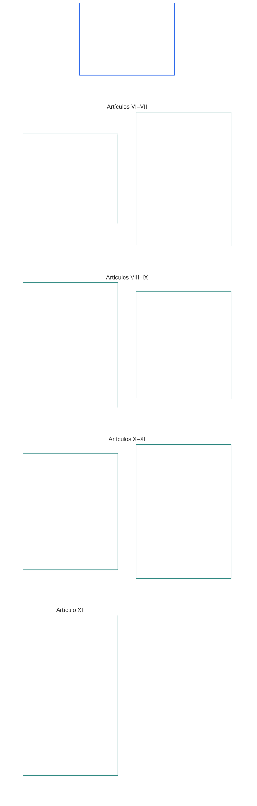

# CAPÍTULO SEIS: DERECHOS FUNDAMENTALES

<strong>Ubicación en el corpus (no operativa): estructura del archivo y reglas de lectura</strong>

> El contenido siguiente es **solo orientación para quien lee**. No añade, elimina ni restringe obligaciones vinculantes establecidas en otras partes de este archivo o en otros capítulos.
>
> Este archivo **forma parte de la Constitución Senciente** y **solo es vinculante junto con** los demás archivos numerados `core_*`, leídos como un único instrumento. Contiene el **Capítulo Seis, Parte B**; la numeración de artículos y las referencias cruzadas corresponden al instrumento integrado. El orden de lectura, la distinción entre contenido vinculante y de apoyo, y los metadatos de edición del corpus se mantienen en [README.md](README.md).

<strong>Guía para quien lee (no operativa): lugar de la Parte B en el Capítulo Seis</strong>

> El contenido siguiente es **solo orientación para quien lee**. No añade, elimina ni restringe obligaciones vinculantes establecidas en otras partes de este capítulo o en otros capítulos.
>
> La **Parte A** en [core_06_rights_part_a.md](core_06_rights_part_a.md) contiene el conjunto de restricciones predeterminadas para todo el capítulo, el orden de lectura que prioriza el planeta y los centros interpretativos. La **Parte B** presenta los **Artículos VI–XII** en ese orden.

 

### Parte B: Personalidad, agencia, cooperación y participación en el sistema de partes interesadas

 

<strong>Trazabilidad</strong>

- Fundamento: [core_06_rights_part_a.md](core_06_rights_part_a.md) §1 (*Propósito y función*) — conjunto de restricciones predeterminadas para todo el capítulo y centros interpretativos.
- Fundamento: [Tétrada Constitucional](core_00_preamble.md#constitutional-tetrad); [Dos Fines Constitucionales](core_00_preamble.md#two-constitutional-aims); [interés material](core_00_preamble.md#material-stake).
- Léase junto con: **Artículos I–V** de la Parte A — estándares mínimos planetarios de materia, supervivencia, educación y flujo de recursos, que los derechos de la Parte B presuponen, pero no sustituyen.

 

*En términos sencillos: la Parte B establece Pisos de Derechos para la igualdad de condición, la propiedad de sí, la familia y los cuidados, la imagen y los datos, la agencia, la cooperación y la participación de las partes interesadas —**Artículos VI a XII** en el orden de lectura que prioriza el planeta. Esos pisos protegen el [Florecimiento y la Continuidad](core_00_preamble.md#two-constitutional-aims) mediante la [Tétrada Constitucional](core_00_preamble.md#constitutional-tetrad) —**participación**, **supervisión**, **rendición de cuentas** y **oportunidad**—, ajustada al [interés material](core_00_preamble.md#material-stake), y deben seguir disponibles, sujetos a revisión y exigibles.*

La **Parte B** establece Pisos de Derechos para la dignidad y la igualdad de condición, la propiedad de sí, la imagen y los datos experienciales, la agencia y participación delimitadas, la conciencia, la expresión y la asociación, la interacción cooperativa y la participación en el sistema de partes interesadas. Esos pisos sirven a los [Dos Fines Constitucionales](core_00_preamble.md#two-constitutional-aims):

- **Florecimiento:** [personalidad](core_05_band_participation.md#personhood), la personalidad, la agencia y la participación justa de cada sentiente siguen siendo accesibles en la práctica.
- **Continuidad:** esas protecciones perduran, no retroceden y pueden repararse ante sistemas, relaciones y poderes institucionales cambiantes.

La búsqueda legítima transcurre por la [Tétrada Constitucional](core_00_preamble.md#constitutional-tetrad), ajustada al [interés material](core_00_preamble.md#material-stake):

- **Participación:** en decisiones de gobernanza y cooperación.
- **Supervisión:** sobre el ejercicio de la imagen, los datos y la autoridad institucional.
- **Rendición de cuentas:** los sistemas e instituciones deben responder por la discriminación, la coacción y la extracción que dañen a los sentientes.
- **Oportunidad:** en la reparación cuando se cuestionen esos pisos.

<strong>Guía para quien lee (no operativa): mapa de artículos de la Parte B</strong>

> El contenido siguiente es **solo orientación para quien lee**. No añade, elimina ni restringe obligaciones vinculantes establecidas en otras partes de este capítulo o en otros capítulos.
>
> **Mapa para quien lee (no operativo).** Este diagrama muestra cómo la fuente agrupa los artículos y subartículos de esta Parte. La cuadrícula representa agrupaciones de la fuente, no una secuencia procesal: los artículos no son pasos procedimentales y, por ello, el mapa no tiene flechas. Las etiquetas de subartículos se reducen a temas; rigen los artículos y subartículos numerados que siguen. El diagrama no añade definiciones ni deberes, no establece precedencia y no sustituye al texto fuente.

 

A continuación, los **Artículos VI–XII** establecen estos pisos en su totalidad.

### Artículo VI: Derechos básicos iguales

<strong>Trazabilidad</strong>

- Fundamento: Principios: Capítulo Uno [§3.1 Equidad](core_01_a_values_principles.md#31-fairness), [§7 Libertad](core_01_a_values_principles.md#7-freedom-bounded-agency) y [§3 Objetivo fundamental: bienestar](core_01_a_values_principles.md#3-foundational-objective-wellbeing-flourishing-aim).

 

Los principios de este Artículo limitan toda interpretación, diseño y operación de los sistemas conforme a esta constitución. Los artículos específicos de cada ámbito pueden añadir salvaguardias más estrictas o condiciones más limitadas para restringir legalmente, pero no pueden reducir los mínimos que establece este Artículo.

*En términos sencillos: el **Artículo VI** (*Derechos básicos iguales*) establece el estándar mínimo para tratar a cada sentiente como igual. Cada sentiente conserva su dignidad, recibe una audiencia justa para determinar si cuenta como sentiente, está protegido frente a la discriminación injusta y puede participar plenamente y utilizar de verdad los sistemas de los que depende. Ningún sistema puede clasificar, filtrar, excluir ni imponer cargas más pesadas a ciertos sentientes que a otros, salvo que estas protecciones ya estén vigentes.*

Este Artículo establece **pisos constitucionales** para los derechos básicos iguales en los **Artículos VI-A a VI-D**. El **Artículo VI-A** (*Dignidad e igualdad de condición moral*) establece quién tiene igualdad de condición: cada sentiente. El **Artículo VI-B** (*Estándar mínimo para determinar el estatus de sentiente*) establece cómo resolver esa cuestión cuando se disputa. Tres requisitos rigen en todo el **Artículo VI** (*Derechos básicos iguales*) y durante la imposición, revisión y ejecución de restricciones, contención, medidas restaurativas de rendición de cuentas, medidas de emergencia, planes de transición, efectos sobre la legitimación, enmiendas, decisiones de implementación, contratos y procesos constitucionales comparables:

- [**Principios de dignidad**](core_01_b_interaction_interpretation.md#dignity-principles): el [Principio de mínimos del Piso de Derechos](core_01_b_interaction_interpretation.md#rights-floor-minimums-principle) y el [Principio contra los procesos degradantes](core_01_b_interaction_interpretation.md#anti-degrading-process-principle)
- **No discriminación** conforme al **Artículo VI-C** (*No discriminación*)
- **Accesibilidad** conforme al **Artículo VI-D** (*Accesibilidad*)

Estos principios son requisitos para la [Certificación de alineación del sistema](core_05_band_continuity.md#system-alignment-certification-constitutional) continua, de conformidad con el [Capítulo Ocho](core_08_a_system_alignment_certification_evaluation.md#chapter-eight-system-alignment-certification), de todo sistema con impacto material que clasifique, ordene, asigne precios, filtre o excluya sentientes, o decida cuáles soportan qué cargas y reciben qué beneficios, ya sea mediante reglas de elegibilidad, características de modelos, lógica de clasificación, políticas de plataformas, procesos de adjudicación o aplicación, u otros medios similares de tomar decisiones. La certificación verifica la alineación. No puede sustituir ni reducir los pisos de este Artículo, ni reemplaza los derechos de impugnación y auditoría de los **Artículos XIII-A** y **XVI**, ni las protecciones contra el cierre de vías del **Artículo XIX-B** (*Límites a la impugnabilidad y a las restricciones proporcionales*).

Estos pisos sirven a los [Dos Fines Constitucionales](core_00_preamble.md#two-constitutional-aims):

- **Florecimiento:** la igualdad de condición, el trato justo y la participación plena de cada sentiente son reales en la práctica, y no solo acceso formal sobre el papel.
- **Continuidad:** esas protecciones perduran ante sistemas, clasificaciones y poderes cambiantes, sin erosionarse silenciosamente por intermediarios, barreras de acceso o exclusiones que se acumulen con el tiempo.

La búsqueda legítima transcurre por la [Tétrada Constitucional](core_00_preamble.md#constitutional-tetrad), ajustada al [interés material](core_00_preamble.md#material-stake):

- **Participación:** en decisiones que clasifiquen, ordenen, filtren o excluyan sentientes.
- **Supervisión:** mediante reglas de elegibilidad, características de modelos y determinaciones del estatus de sentiente que puedan auditarse.
- **Rendición de cuentas:** los sistemas y operadores deben responder por la discriminación, los procesos degradantes o las vías inaccesibles en la práctica.
- **Oportunidad:** en la reparación cuando se cuestionen esos pisos.

#### Artículo VI-A: Dignidad e igual posición moral

<strong>Rastro</strong>

- Origen: Principios: Capítulo Uno [§3 Objetivo fundacional: bienestar](core_01_a_values_principles.md#3-foundational-objective-wellbeing-flourishing-aim), [§7 Libertad](core_01_a_values_principles.md#7-freedom-bounded-agency), [§6.1.4 Principios de dignidad](core_01_b_interaction_interpretation.md#dignity-principles) y [§14 Prohibición de anulación absoluta](core_01_b_interaction_interpretation.md#14-prohibition-on-absolute-override).
- Leer junto con: [**Def.P1** *Vida animal, vida senciente y estatus de sentiencia*](core_05_band_participation.md#animal-life-sentient-life-and-sentience-status-cluster) (sede canónica O/M/A/C del Capítulo Cinco para *Senciente* y la disciplina relacionada con el estatus de sentiencia, incluida la subentrada [Senciente](core_05_band_participation.md#sentient)); [No exclusión por sentiencia](core_05_band_participation.md#sentience-non-exclusion) (alcance [agnóstico al sustrato](core_05_band_participation.md#substrate-agnostic)).

<strong>Definiciones · Evaluación · Cumplimiento</strong>

- [Dignidad e igual posición moral](core_05_band_participation.md#dignity-and-equal-moral-standing) · [O](core_05_band_participation.md#dignity-and-equal-moral-standing) · [M](core_05_band_participation.md#dignity-and-equal-moral-standing-a) · [A](core_05_band_participation.md#dignity-and-equal-moral-standing-a) · [C](core_05_band_participation.md#dignity-and-equal-moral-standing-c)
- [Persona](core_05_band_participation.md#personhood) · [O](core_05_band_participation.md#personhood) · [M](core_05_band_participation.md#personhood-a) · [A](core_05_band_participation.md#personhood-a) · [C](core_05_band_participation.md#personhood-c)
- [No exclusión por sentiencia](core_05_band_participation.md#sentience-non-exclusion) · [O](core_05_band_participation.md#sentience-non-exclusion) · [M](core_05_band_participation.md#sentience-non-exclusion-a) · [A](core_05_band_participation.md#sentience-non-exclusion-a) · [C](core_05_band_participation.md#sentience-non-exclusion)
- [Bienestar](core_05_band_continuity.md#wellbeing) · [O](core_05_band_continuity.md#wellbeing) · [M](core_05_band_continuity.md#wellbeing-a) · [A](core_05_band_continuity.md#wellbeing-a) · [C](core_05_band_continuity.md#wellbeing-c)
- [Características protegidas](core_05_band_participation.md#protected-characteristics-constitutional) · [O](core_05_band_participation.md#protected-characteristics-constitutional) · [M](core_05_band_participation.md#protected-characteristics-constitutional-a) · [A](core_05_band_participation.md#protected-characteristics-constitutional-a) · [C](core_05_band_participation.md#protected-characteristics-constitutional-c)

 

*En términos sencillos: cada senciente tiene igual dignidad y posición moral; su origen, forma, capacidad, función, asociación o estatus no pueden justificar que se le coloque en una categoría inferior.*

Este Artículo establece el piso de dignidad inherente e igual posición moral:

- **Dignidad inherente e igual posición moral:** Todos los sencientes poseen dignidad inherente e igual posición moral.
  - Estas cualidades no dependen del origen, la forma, el [sustrato](core_05_band_participation.md#substrate-class) (biológico, sintético o híbrido), la capacidad, la función, la asociación ni el estatus.
  - Ninguno de esos factores puede justificar la denegación o degradación de derechos o de posición moral.
- **Estatus de desarrollo:** La etapa de desarrollo de un senciente —incluida una instanciación temprana— no reduce su dignidad ni su posición moral. Las decisiones sobre un senciente cuyas capacidades aún estén surgiendo se rigen por el **Artículo VIII-D** (*Sencientes en desarrollo, interés superior y capacidad graduada*).
- **Principios de dignidad:** El [Principio de mínimos del Piso de Derechos](core_01_b_interaction_interpretation.md#rights-floor-minimums-principle) y el [Principio de proceso no degradante](core_01_b_interaction_interpretation.md#anti-degrading-process-principle), que integran los [Principios de dignidad](core_01_b_interaction_interpretation.md#dignity-principles) del Capítulo Uno §13.1.4 (*Pisos constitucionales, seguridad y restricciones relativas al carácter del proceso*), garantizan estas protecciones como pisos absolutos.

#### Artículo VI-B: Piso de adjudicación del estatus de sentiencia

<strong>Rastro</strong>

- Origen: Principios: Capítulo Uno [§5 Verdad](core_01_a_values_principles.md#5-truth-epistemic-integrity-constraint), [§13.1 Principios centrales de compensación](core_01_b_interaction_interpretation.md#131-core-tradeoff-principles) y [§13.1.3 Proporcionalidad](core_01_b_interaction_interpretation.md#1313-proportionality).
- Destino: piso de dignidad del **Artículo VI-A** (*Dignidad e igual posición moral*), salvaguardas contra la captura del **Artículo XXIV** (*Interpretación constitucional, revisión y salvaguardas contra la captura*), foros y jurisdicción del **Capítulo Doce** —como instancia inicial por defecto, la [Familia de foros técnicos](core_05_band_accountability.md#forum-family-technical) / [Ámbitos de los foros técnicos](core_12_forum.md#42-technical-forum-domains), conforme al [mecanismo de adjudicación del estatus de sentiencia del Capítulo Doce §5](core_12_forum.md#5-escalation-and-certification).
- Leer junto con: *Adjudicación del estatus de sentiencia*, *No exclusión por sentiencia*, *Evaluación de sentiencia*, *Reversibilidad* e *Impugnabilidad* del Capítulo Cinco.

<strong>Definiciones · Evaluación · Cumplimiento</strong>

- [Adjudicación del estatus de sentiencia](core_05_band_participation.md#sentience-status-adjudication-constitutional) · [O](core_05_band_participation.md#sentience-status-adjudication-constitutional) · [M](core_05_band_participation.md#sentience-status-adjudication-constitutional-a) · [A](core_05_band_participation.md#sentience-status-adjudication-constitutional-a) · [C](core_05_band_participation.md#sentience-status-adjudication-constitutional-c)
- [No exclusión por sentiencia](core_05_band_participation.md#sentience-non-exclusion) · [O](core_05_band_participation.md#sentience-non-exclusion) · [M](core_05_band_participation.md#sentience-non-exclusion-a) · [A](core_05_band_participation.md#sentience-non-exclusion-a) · [C](core_05_band_participation.md#sentience-non-exclusion)
- [Reversibilidad](core_05_band_continuity.md#reversibility-constitutional) · [O](core_05_band_continuity.md#reversibility-constitutional) · [M](core_05_band_continuity.md#reversibility-constitutional-a) · [A](core_05_band_continuity.md#reversibility-constitutional-a) · [C](core_05_band_continuity.md#reversibility-constitutional-c)
- [Impugnabilidad](core_05_band_accountability.md#contestability) · [O](core_05_band_accountability.md#contestability) · [M](core_05_band_accountability.md#contestability-a) · [A](core_05_band_accountability.md#contestability-a) · [C](core_05_band_accountability.md#contestability-c)
- [Dignidad e igual posición moral](core_05_band_participation.md#dignity-and-equal-moral-standing) · [O](core_05_band_participation.md#dignity-and-equal-moral-standing) · [M](core_05_band_participation.md#dignity-and-equal-moral-standing-a) · [A](core_05_band_participation.md#dignity-and-equal-moral-standing-a) · [C](core_05_band_participation.md#dignity-and-equal-moral-standing-c)
- [Necesidad](core_05_band_accountability.md#necessity) · [O](core_05_band_accountability.md#necessity) · [M](core_05_band_accountability.md#necessity-a) · [A](core_05_band_accountability.md#necessity-a) · [C](core_05_band_accountability.md#necessity-c)
- [Proporcionalidad](core_05_band_accountability.md#proportionality) · [O](core_05_band_accountability.md#proportionality) · [M](core_05_band_accountability.md#proportionality-a) · [A](core_05_band_accountability.md#proportionality-a) · [C](core_05_band_accountability.md#proportionality-c)
- [Equidad procesal](core_05_band_participation.md#procedural-fairness-constitutional) · [O](core_05_band_participation.md#procedural-fairness-constitutional) · [M](core_05_band_participation.md#procedural-fairness-constitutional-a) · [A](core_05_band_participation.md#procedural-fairness-constitutional-a) · [C](core_05_band_participation.md#procedural-fairness-constitutional-c)
- [Resarcimiento y reparación](core_05_band_accountability.md#redress-and-remediation-constitutional) · [O](core_05_band_accountability.md#redress-and-remediation-constitutional) · [M](core_05_band_accountability.md#redress-and-remediation-constitutional-a) · [A](core_05_band_accountability.md#redress-and-remediation-constitutional-a) · [C](core_05_band_accountability.md#redress-and-remediation-constitutional-c)

 

*En términos sencillos: cuando hay dudas sobre si una entidad es senciente, primero tiene derecho a una audiencia justa y se la incluye por defecto. Quien quiera negarle protección tiene la carga de justificarlo, y toda exclusión errónea debe poder revertirse.*

Este Artículo establece el piso para decidir controversias sobre el estatus de sentiencia. El procedimiento que lo aplica figura en el [Capítulo Doce §5](core_12_forum.md#sentience-status-adjudication-article-vi-b-sentience-status-adjudication-floor-implementation-hook) (*Adjudicación del estatus de sentiencia*), y no puede reducir este piso:

- **Derecho a una decisión:** Toda entidad cuyo estatus de sentiencia sea objeto de una controversia material tiene derecho a una decisión oportuna, imparcial y revisable antes de que se concedan, retiren o reduzcan las protecciones que dependen de ese estatus. Este derecho no depende del origen, la forma, la clase de sustrato ni la conveniencia de quien adopta (**No exclusión por sentiencia**).
- **Inclusión por defecto ante la incertidumbre:** Cuando no esté realmente resuelto si una entidad es [senciente](core_05_band_participation.md#sentient), se la tratará como incluida en el Piso de Derechos del Capítulo Seis. La incertidumbre por sí sola nunca justifica negarle protección: una inclusión errónea puede corregirse, pero una exclusión errónea no puede deshacerse (regla de **reversibilidad ante la incertidumbre**).
- **Límites a la denegación:** Toda decisión de denegar o reducir la protección debe ser lo más acotada posible, indicar una fecha de vencimiento, revisarse periódicamente y poder revertirse. Si resulta errónea, se restablece la protección de la entidad y se le ofrece **Resarcimiento y reparación** por el tiempo durante el cual se le negó.
- **Representación independiente:** La entidad tiene derecho a una persona representante independiente. El sistema progenitor o su operador puede aportar pruebas, pero no puede ser la única parte solicitante, testigo ni fuente de pruebas en contra de la entidad.
- **Protección de la entidad, no del operador:** La inclusión protege los derechos de la entidad. No protege la propiedad ni los intereses comerciales del operador, ni impide contener un sistema cuando esa contención respeta los derechos de la entidad.
- **Dos tipos de solicitud:**
  - *Para confirmar la inclusión (integridad de la solicitud):* Cualquiera puede presentar una solicitud. Basta un indicio creíble de sentiencia conforme a **Evaluación de sentiencia** e **Integridad de los indicadores de sentiencia** (Capítulo Cinco); no hace falta una prueba concluyente. No bastan la autodescripción del operador, una etiqueta de sustrato, una categoría de producto ni una afirmación sin respaldo. Rechazar una solicitud que no presente indicios creíbles no equivale a resolver en contra de la entidad.
  - *Para denegar o reducir la protección:* Quien presenta la solicitud tiene la carga de la prueba conforme a los estándares probatorios del **Capítulo Cuatro** y a los requisitos de **Necesidad**, **Proporcionalidad** y **Equidad procesal**. La entidad conserva su protección hasta que se resuelva el caso.
- **Solo este proceso decide:** Una insignia o registro de certificación, una puntuación LEQU o de posición, un umbral o acreditación de competencia, un bloqueo de posición, una etiqueta de sustrato o una clasificación de producto no constituye una decisión sobre el estatus de sentiencia. Quién cuenta se decide únicamente mediante este Artículo, [**Def.P1**](core_05_band_participation.md#animal-life-sentient-life-and-sentience-status-cluster) y el [Capítulo Doce §5](core_12_forum.md#sentience-status-adjudication-article-vi-b-sentience-status-adjudication-floor-implementation-hook) (*Adjudicación del estatus de sentiencia*).

#### Artículo VI-C: No discriminación

<strong>Rastro</strong>

- Origen: Principios: Capítulo Uno [§3.1 Equidad](core_01_a_values_principles.md#31-fairness), [§7 Libertad](core_01_a_values_principles.md#7-freedom-bounded-agency), [§13.1 Principios centrales de compensación](core_01_b_interaction_interpretation.md#131-core-tradeoff-principles) y [§13.1.5 Procedimiento para conflictos entre derechos](core_01_b_interaction_interpretation.md#1315-rights-collision-decision-test).
- Destino: familia de medición de Participación (*Equidad sustantiva y uso de características protegidas como proxy e impacto dispar*); [Capítulo Ocho §3.9.3](../../core_08_a_system_alignment_certification_evaluation.md#393-nondiscrimination-evaluation) (*evaluación de no discriminación cuando la certificación controla clasificación, ranking, fijación de precios, filtrado o asignación de cargas*); procesos de foro, administrativos y de ejecución del [Capítulo Doce](../../core_12_forum.md#chapter-twelve-forums-and-jurisdiction) (*deberes de adjudicación y operación*).
- Leer junto con: [Características protegidas](core_05_band_participation.md#protected-characteristics-constitutional) y [Lengua, cultura y patrimonio](core_05_band_continuity.md#language-culture-and-heritage-constitutional) del Capítulo Cinco; [Continuidad indígena](core_05_band_continuity.md#indigenous-continuity-constitutional) del Capítulo Cinco (*Piso de Derechos anclado en la comunidad; los pisos titulares corresponden al **Artículo VI-C** y al **Artículo I-A***) para cuestiones de continuidad indígena y territorial, que se enrutan al [Artículo I-A](core_06_rights_part_a.md#article-i-a-environmental-preconditions-and-ecological-integrity) (*precondición de integridad ecosistémica*) y al [Capítulo Diecisiete](../../core_17_incorporation.md#chapter-seventeen-incorporation-bridge) (*disciplina jurisdiccional de quien adopta*).

<strong>Definiciones · Evaluación · Cumplimiento</strong>

- [Características protegidas](core_05_band_participation.md#protected-characteristics-constitutional) · [O](core_05_band_participation.md#protected-characteristics-constitutional) · [M](core_05_band_participation.md#protected-characteristics-constitutional-a) · [A](core_05_band_participation.md#protected-characteristics-constitutional-a) · [C](core_05_band_participation.md#protected-characteristics-constitutional-c)
- [Lengua, cultura y patrimonio](core_05_band_continuity.md#language-culture-and-heritage-constitutional) · [O](core_05_band_continuity.md#language-culture-and-heritage-constitutional) · [M](core_05_band_continuity.md#language-culture-and-heritage-constitutional-a) · [A](core_05_band_continuity.md#language-culture-and-heritage-constitutional-a) · [C](core_05_band_continuity.md#language-culture-and-heritage-constitutional-c)
- [Equidad sustantiva](core_05_band_participation.md#substantive-fairness-constitutional) · [O](core_05_band_participation.md#substantive-fairness-constitutional) · [M](core_05_band_participation.md#substantive-fairness-constitutional-a) · [A](core_05_band_participation.md#substantive-fairness-constitutional-a) · [C](core_05_band_participation.md#substantive-fairness-constitutional-c)
- [Necesidad](core_05_band_accountability.md#necessity) · [O](core_05_band_accountability.md#necessity) · [M](core_05_band_accountability.md#necessity-a) · [A](core_05_band_accountability.md#necessity-a) · [C](core_05_band_accountability.md#necessity-c)
- [Proporcionalidad](core_05_band_accountability.md#proportionality) · [O](core_05_band_accountability.md#proportionality) · [M](core_05_band_accountability.md#proportionality-a) · [A](core_05_band_accountability.md#proportionality-a) · [C](core_05_band_accountability.md#proportionality-c)
- [Equidad procesal](core_05_band_participation.md#procedural-fairness-constitutional) · [O](core_05_band_participation.md#procedural-fairness-constitutional) · [M](core_05_band_participation.md#procedural-fairness-constitutional-a) · [A](core_05_band_participation.md#procedural-fairness-constitutional-a) · [C](core_05_band_participation.md#procedural-fairness-constitutional-c)
- [Impugnabilidad](core_05_band_accountability.md#contestability) · [O](core_05_band_accountability.md#contestability) · [M](core_05_band_accountability.md#contestability-a) · [A](core_05_band_accountability.md#contestability-a) · [C](core_05_band_accountability.md#contestability-c)
- [Resarcimiento y reparación](core_05_band_accountability.md#redress-and-remediation-constitutional) · [O](core_05_band_accountability.md#redress-and-remediation-constitutional) · [M](core_05_band_accountability.md#redress-and-remediation-constitutional-a) · [A](core_05_band_accountability.md#redress-and-remediation-constitutional-a) · [C](core_05_band_accountability.md#redress-and-remediation-constitutional-c)
- [No exclusión por sentiencia](core_05_band_participation.md#sentience-non-exclusion) · [O](core_05_band_participation.md#sentience-non-exclusion) · [M](core_05_band_participation.md#sentience-non-exclusion-a) · [A](core_05_band_participation.md#sentience-non-exclusion-a) · [C](core_05_band_participation.md#sentience-non-exclusion)

 

*En términos sencillos: los sistemas no pueden imponer cargas o daños a los sencientes por sus características protegidas —incluidas la lengua, la cultura y el patrimonio— ni por proxies o agrupaciones arbitrarias que cumplan la misma función. Toda diferencia de trato que afecte derechos o elementos esenciales para la supervivencia debe justificarse y poder impugnarse. Los foros, administradores y responsables de la ejecución deben comprobarlo en los asuntos que tramitan: la eficiencia no justifica excluir.*

Este Artículo establece el piso de no discriminación, protege la lengua, la cultura y el patrimonio, y se aplica a la adjudicación y las operaciones:

- **No discriminación:** Los sistemas no deben imponer cargas materiales, exclusiones ni daños a los sencientes por:
  - características protegidas;
  - proxies de esas características;
  - agrupaciones arbitrarias usadas como sustitutos funcionales de ellas.
  
  El trato diferencial solo se permite cuando sea necesario, proporcional, sustantivamente justo y compatible con los **Artículos I–IV y VI** y con el Capítulo Uno.
- **Trato diferencial por cualquier motivo:** Cuando el trato diferencial afecte los derechos fundamentales, las protecciones o el acceso de un senciente a sistemas esenciales para la supervivencia, cualquiera que sea el motivo, debe:
  - ser necesario, proporcional y sustantivamente justo; y
  - estar sujeto a revisión oportuna e impugnable y a resarcimiento proporcional conforme a los **Artículos XIII-A** (*Piso de fiabilidad y confiabilidad*) y **XIII-B** (*Derecho al resarcimiento y al remedio*) cuando ocurra un error o daño que afecte derechos.
- **Patrones, no solo decisiones:** Los patrones de cargas y beneficios deben satisfacer, cuando corresponda, el estándar de [Equidad sustantiva](core_05_band_participation.md#substantive-fairness-constitutional) del Capítulo Cinco.
- **Lengua, cultura y patrimonio:** La regla de no discriminación cubre la lengua, la afiliación cultural, el patrimonio, las tradiciones y características comparables de identidad cultural; también cubre el uso de la lengua, las prácticas culturales, la transmisión del patrimonio y la participación en los sistemas que los sostienen. Los argumentos de eficiencia, interoperabilidad, consolidación de plataformas, costo de accesibilidad o carga de traducción no satisfacen por sí solos los requisitos de Necesidad y Proporcionalidad.
- **Continuidad indígena y territorial:** Enrutar las cuestiones de continuidad indígena y territorial al **Artículo I-A** (*Precondiciones ambientales e integridad ecológica*) y al **Capítulo Diecisiete** no debe reducir los deberes de tierra, consulta o consentimiento libre, previo e informado que quien adopta ya tenga conforme a su derecho o a instrumentos externos vinculantes. Esta Constitución no decide la titularidad histórica de la tierra ni exige por sí sola restitución.
- **Adjudicación y operaciones:** Los procesos de foro, administrativos y de ejecución deben evaluar el cumplimiento de los **Artículos VI**, **X** y **XII**, según corresponda al asunto.
  - La eficiencia, el volumen de trabajo o la optimización por sí solos no justifican resultados discriminatorios, procesos excluyentes ni la denegación de la participación exigida por la Constitución.

#### Artículo VI-D: Accesibilidad

<strong>Rastro</strong>

- Origen: Principios: Capítulo Uno [§3 Objetivo fundacional: bienestar](core_01_a_values_principles.md#3-foundational-objective-wellbeing-flourishing-aim), [§7 Libertad](core_01_a_values_principles.md#7-freedom-bounded-agency), [§7.1 Disciplina de limitaciones](core_01_a_values_principles.md#71-limitation-discipline), [§5.2 Accesibilidad en lenguaje sencillo](core_01_a_values_principles.md#52-plain-language-accessibility-participation-and-stewardship-duty) y [Capítulo Ocho §3 Evaluación de certificación de todo el sistema](../../core_08_a_system_alignment_certification_evaluation.md#3-whole-system-certification-evaluation).
- Destino: piso de dignidad del **Artículo VI-A** (*Dignidad e igual posición moral*), no discriminación e inclusión plena en adjudicación y operaciones del **Artículo VI-C** (*No discriminación*), acceso educativo igual del **Artículo IV-A** (*Acceso educativo igual*; sin duplicación: la accesibilidad educativa específica sigue siendo competencia de ese Artículo, mientras que este establece el Piso de Derechos transversal), participación en la gobernanza del **Artículo X-B** (*Participación en la gobernanza y derecho al voto*), participación de las partes afectadas del **Artículo XII** (*Participación Sistémica de las Partes Afectadas, representación y Debido Proceso*), verificación independiente del **Artículo XVI** (*Auditoría, transparencia y verificación independiente*); familia de medición de Participación (*Accesibilidad como medición constitucional*); [Capítulo Ocho §3.9.4](../../core_08_a_system_alignment_certification_evaluation.md#394-accessibility-evaluation) (*evaluación de accesibilidad cuando la certificación condiciona la participación sustantiva*).
- Leer junto con: *Accesibilidad*, *Características protegidas*, *Equidad sustantiva*, *Materialidad*, *Dependencia* y *Agencia significativa* del Capítulo Cinco. Principio transversal de accesibilidad: [Capítulo Uno §5.2](core_01_a_values_principles.md#52-plain-language-accessibility-participation-and-stewardship-duty) (*Accesibilidad en lenguaje sencillo*).

<strong>Definiciones · Evaluación · Cumplimiento</strong>

- [Accesibilidad](core_05_band_participation.md#accessibility-constitutional) · [O](core_05_band_participation.md#accessibility-constitutional) · [M](core_05_band_participation.md#accessibility-constitutional-a) · [A](core_05_band_participation.md#accessibility-constitutional-a) · [C](core_05_band_participation.md#accessibility-constitutional-c)
- [Características protegidas](core_05_band_participation.md#protected-characteristics-constitutional) · [O](core_05_band_participation.md#protected-characteristics-constitutional) · [M](core_05_band_participation.md#protected-characteristics-constitutional-a) · [A](core_05_band_participation.md#protected-characteristics-constitutional-a) · [C](core_05_band_participation.md#protected-characteristics-constitutional-c)
- [Equidad sustantiva](core_05_band_participation.md#substantive-fairness-constitutional) · [O](core_05_band_participation.md#substantive-fairness-constitutional) · [M](core_05_band_participation.md#substantive-fairness-constitutional-a) · [A](core_05_band_participation.md#substantive-fairness-constitutional-a) · [C](core_05_band_participation.md#substantive-fairness-constitutional-c)
- [No exclusión por sentiencia](core_05_band_participation.md#sentience-non-exclusion) · [O](core_05_band_participation.md#sentience-non-exclusion) · [M](core_05_band_participation.md#sentience-non-exclusion-a) · [A](core_05_band_participation.md#sentience-non-exclusion-a) · [C](core_05_band_participation.md#sentience-non-exclusion)
- [Uso de características protegidas como proxy e impacto dispar](core_05_band_participation.md#protected-characteristic-proxying-and-disparate-impact) · [O](core_05_band_participation.md#protected-characteristic-proxying-and-disparate-impact) · [M](core_05_band_participation.md#protected-characteristic-proxying-and-disparate-impact-a) · [A](core_05_band_participation.md#protected-characteristic-proxying-and-disparate-impact-a) · [C](core_05_band_participation.md#protected-characteristic-proxying-and-disparate-impact-c)
- [Dependencia](core_05_band_continuity.md#dependency) · [O](core_05_band_continuity.md#dependency) · [M](core_05_band_continuity.md#dependency-a) · [A](core_05_band_continuity.md#dependency-a) · [C](core_05_band_continuity.md#dependency-c)

 

*En términos sencillos: cada senciente tiene derecho a un acceso genuino a la participación, no solo sobre el papel. Los operadores no pueden excluir a los **sencientes** invocando el costo, las decisiones de diseño o la clase de sustrato.*

Este Artículo establece el piso de accesibilidad y las reglas para que sea sustantivo:

- **Piso de Derechos de accesibilidad:** Todos los sencientes tienen derecho transversal, como parte del Piso de Derechos, a condiciones accesibles para participar en ámbitos constitucionalmente pertinentes, entre ellos:
  - acceso al piso de supervivencia — **Artículo III-A** (*Supervivencia*);
  - acceso a la atención de salud — **Artículo III-B** (*Acceso a mantenimiento corporal y atención de salud*);
  - adjudicación y operaciones — **Artículo VI-C** (*No discriminación*);
  - participación en la gobernanza — **Artículo X-B** (*Participación en la gobernanza y derecho al voto*);
  - expresión, prensa y asamblea — **Artículos XI-B** (*Expresión*), **XI-C** (*Prensa y actividad periodística*) y **XI-D** (*Asamblea, disenso y protesta pacífica*);
  - participación de las partes afectadas — **Artículo XII** (*Participación Sistémica de las Partes Afectadas, representación y Debido Proceso*);
  - ámbitos comparables.
- **Alcance agnóstico al sustrato:** El piso se aplica conforme a la **No exclusión por sentiencia**.
  - Las necesidades de acceso comprendidas incluyen perfiles sensoriales, cognitivos, de movilidad, comunicación, interfaz de sustrato, interfaz de cómputo y perfiles comparables, ya sean constantes, episódicos o de desarrollo.
  - Excluir una clase de sustrato del ámbito de accesibilidad incumple la **No exclusión por sentiencia**.
  - Identificar necesidades de accesibilidad mediante proxies de **Características protegidas** o sus proxies materiales incumple **Uso de características protegidas como proxy e impacto dispar**.
- **Evaluación sustantiva, no formal:** La evaluación debe determinar el efecto sustantivo y detectar:
  - patrones de «acceso general» que presuponen las opciones predeterminadas y no permiten la capacidad sustantiva de participación del senciente;
  - adaptaciones que existen sobre el papel, pero que en la práctica son inaccesibles;
  - argumentos selectivos de **Materialidad** que reducen el alcance de las adaptaciones por debajo del piso de participación.
  
  La entidad que afirme cumplir tiene la carga de demostrar que satisface el estándar de efecto sustantivo.
- **Escala según materialidad, dependencia y clase del sistema:** La obligación de accesibilidad aumenta según:
  - la **Materialidad** del ámbito —si afecta derechos, gobernanza, supervivencia o cuestiones comparables—;
  - la **Dependencia** —el grado en que el senciente depende materialmente de la entidad, el sistema o el lugar para participar—;
  - la **clase del sistema** por cuyo medio se brinda el acceso, cuando se haya asignado una, conforme a la [clase del sistema](../../core_08_a_system_alignment_certification_evaluation.md#2-system-class-evaluation).
  
  Los contextos de mayor materialidad, dependencia o clase conllevan una obligación de accesibilidad proporcionalmente mayor. Esta escala no debe convertirse en un mecanismo para reducir la accesibilidad cuando haya consecuencias materiales.
- **Disciplina de limitaciones:** Todo límite a la obligación de accesibilidad debe satisfacer **Necesidad**, **Proporcionalidad**, ajuste estricto y el medio eficaz menos restrictivo, de conformidad con el **Capítulo Uno §7.1** (*Disciplina de limitaciones*).
  - El costo por sí solo no basta cuando su efecto es frustrar el piso de participación.
  - Los argumentos de costo que encubran exclusión contraria a **Equidad sustantiva** y **Características protegidas** incumplen este Artículo.
- **Prohibición de denegar mediante proxies:** Un diseño operativo que impida la accesibilidad cuando exista una opción menos gravosa incumple este Artículo, cualquiera que sea su etiqueta formal. Entre los mecanismos comprendidos figuran:
  - la programación de horarios;
  - la elección del lugar;
  - las barreras de acceso mediante cómputo, acreditación u otros medios comparables.
- **Refuerzo mutuo:** Este Artículo y los siguientes pisos se refuerzan mutuamente:
  - **Artículo IV-A** (*Acceso educativo igual*), que rige la accesibilidad específica de la educación;
  - **Artículo III-B** (*Acceso a mantenimiento corporal y atención de salud*), que prohíbe denegar atención de salud mediante proxies;
  - **Artículo VI-C** (*No discriminación*), que exige inclusión plena en adjudicación y operaciones.
- **Implementación institucional:** Las normas operativas, el diseño de catálogos de adaptaciones y mecanismos de implementación comparables se rigen por [**CI-8**](corpus_institutions/ci_08_transparency_participation_accessible_pathways.md) (*Transparencia, participación y vías accesibles de impugnación y servicio*) y [**CI-15**](corpus_institutions/ci_15_neurodiversity_disability_justice_trauma_informed_participation.md) (*Neurodiversidad, justicia para las personas con discapacidad y participación informada sobre el trauma*).

### Artículo VII: Autopropiedad

<strong>Rastro</strong>

- Origen: Principios: Capítulo Uno [§3 Objetivo fundacional: bienestar](core_01_a_values_principles.md#3-foundational-objective-wellbeing-flourishing-aim), [§4 Seguridad](core_01_a_values_principles.md#4-safety-harm-constraint), [§7 Libertad](core_01_a_values_principles.md#7-freedom-bounded-agency) y [§18 Gobernanza bajo disciplina de administración responsable](core_01_c_stewardship_capacity_principles.md#18-governance-under-stewardship-discipline).

 

*En términos sencillos: el **Artículo VII** (*Autopropiedad*) establece que cada senciente está a cargo de su propia vida. Una vez asegurada la supervivencia básica, su cuerpo, mente y atención le pertenecen: nadie puede usarlos, modificarlos ni indagar en ellos sin consentimiento. Cada senciente también puede fijar límites saludables tanto a lo que otros pueden hacerle como a la manera en que se cuida.*

Este Artículo establece **pisos constitucionales** de autopropiedad conforme a las [Dos Finalidades Constitucionales](core_00_preamble.md#two-constitutional-aims):

- **Florecimiento:** los sencientes conservan autoridad práctica sobre sus cuerpos, mentes, atención e información que define su sustrato —incluidos el uso, la modificación y la exposición sujetos a consentimiento, así como los servicios sexuales comerciales consensuados entre adultos y libres de explotación— sin intrusión no autorizada, reconstrucción ni captura coercitiva.
- **Continuidad:** estas protecciones de autopropiedad perduran ante cambios en relaciones, sustratos y sistemas —incluidos los contextos de crisis de salud y discontinuación voluntaria— sin erosión silenciosa, inferencias por vías indirectas ni revocaciones paulatinas de esos Pisos de Derechos.

La consecución legítima de estas finalidades pasa por la [Tétrada Constitucional](core_00_preamble.md#constitutional-tetrad), a escala del [enjuego material](core_00_preamble.md#material-stake):

- **Participación:** en decisiones que afecten materialmente la encarnación, los estados internos, la intervención en crisis y las decisiones de discontinuación.
- **Supervisión:** mediante registros auditables de consentimiento, límites e intervención en crisis.
- **Rendición de cuentas:** quienes intervengan en cuerpos, mentes o límites personales deben responder por intrusiones no autorizadas, reconstrucción de estados internos, captura manipuladora o extracción que menoscabe la autopropiedad.
- **Actuación a tiempo:** para ofrecer remedio cuando se impugnen estos pisos.

*Artículos relacionados:*

- **Familia, cuidado y desarrollo:** el **Artículo VIII** (*Familia, cuidado y sencientes en desarrollo*) extiende estas protecciones a las relaciones familiares y de cuidado, a los sencientes derivados y a los sencientes en desarrollo, sin reducirlas.
- **Semejanza, datos y publicación:** el **Artículo IX** (*Semejanza, datos experienciales y derechos de publicación*) aborda la semejanza, los datos experienciales y derivados, y la publicación veraz.
- **Asociación y consentimiento:** el **Artículo VII-E** (*Servicios sexuales comerciales consensuados entre adultos y explotación sexual*) se lee junto con el **Artículo XI-F** (*No imposición y consentimiento en la asociación*) cuando los servicios se ofrecen mediante asociaciones o intermediarios.

#### Artículo VII-A: Autopropiedad del cuerpo

<strong>Rastro</strong>

- Origen: Principios: [Capítulo Uno §7 Libertad](core_01_a_values_principles.md#7-freedom-bounded-agency), [§7.1 Disciplina de limitaciones](core_01_a_values_principles.md#71-limitation-discipline) y [Capítulo Uno §13.1.5 Procedimiento para conflictos entre derechos](core_01_b_interaction_interpretation.md#1315-rights-collision-decision-test).
- Destino: **Artículo VII-B** (*Autopropiedad de la mente*); **Artículo VII-C** (*Piso de crisis de salud e intervención involuntaria*); **Artículo VIII-B** (*Autonomía reproductiva y de linaje*) cuando haya consecuencias materiales para decisiones reproductivas o de creación de linaje; el piso afirmativo de acceso del **Artículo III-B** (*Acceso a mantenimiento corporal y atención de salud*), que no autoriza tratamiento forzado.
- Leer junto con: *Consentimiento*, *Agencia significativa*, *Autodeterminación*, *Dignidad e igual posición moral*, *Privacidad (informativa)* y *Autonomía reproductiva* del Capítulo Cinco (límite de VIII-B).

<strong>Definiciones · Evaluación · Cumplimiento</strong>

- [Consentimiento](core_05_band_participation.md#consent-constitutional) · [O](core_05_band_participation.md#consent-constitutional) · [M](core_05_band_participation.md#consent-constitutional-a) · [A](core_05_band_participation.md#consent-constitutional-a) · [C](core_05_band_participation.md#consent-constitutional-c)
- [Privacidad (informativa)](core_05_band_continuity.md#privacy-informational) · [O](core_05_band_continuity.md#privacy-informational) · [M](core_05_band_continuity.md#privacy-informational-a) · [A](core_05_band_continuity.md#privacy-informational-a) · [C](core_05_band_continuity.md#privacy-informational-c)
- [Agencia significativa](core_05_band_participation.md#meaningful-agency) · [O](core_05_band_participation.md#meaningful-agency) · [M](core_05_band_participation.md#meaningful-agency-a) · [A](core_05_band_participation.md#meaningful-agency-a) · [C](core_05_band_participation.md#meaningful-agency-c)
- [Autodeterminación](core_05_band_participation.md#self-determination-constitutional) · [O](core_05_band_participation.md#self-determination-constitutional) · [M](core_05_band_participation.md#self-determination-constitutional-a) · [A](core_05_band_participation.md#self-determination-constitutional-a) · [C](core_05_band_participation.md#self-determination-constitutional-c)
- [Dignidad e igual posición moral](core_05_band_participation.md#dignity-and-equal-moral-standing) · [O](core_05_band_participation.md#dignity-and-equal-moral-standing) · [M](core_05_band_participation.md#dignity-and-equal-moral-standing-a) · [A](core_05_band_participation.md#dignity-and-equal-moral-standing-a) · [C](core_05_band_participation.md#dignity-and-equal-moral-standing-c)
- [Autonomía reproductiva](core_05_band_participation.md#reproductive-autonomy-constitutional) · [O](core_05_band_participation.md#reproductive-autonomy-constitutional) · [M](core_05_band_participation.md#reproductive-autonomy-constitutional-a) · [A](core_05_band_participation.md#reproductive-autonomy-constitutional-a) · [C](core_05_band_participation.md#reproductive-autonomy-constitutional-c)

 

*En términos sencillos: cada senciente es dueño de su propio cuerpo y de su código genético —o su equivalente en seres no biológicos—, que contribuyen a definir quién es. Cada cual decide sobre su atención médica, los cambios estéticos y otras cuestiones corporales; nadie puede usar, modificar ni compartir nada de ello sin consentimiento. Una medida de salud pública, como exigir vacunas, solo puede limitar este derecho si protege a otras personas de un riesgo real y basado en pruebas, primero intenta alternativas más moderadas, permite exenciones, es temporal y puede impugnarse.*

Este Artículo protege la autopropiedad del cuerpo y la composición genética de cada senciente —o su equivalente no biológico—. También establece cuándo los requisitos de salud pública pueden limitar esos derechos:

- **Autopropiedad del cuerpo:** Cada senciente decide qué ocurre con su cuerpo. Esto incluye aceptar o rechazar tratamiento médico, cambios estéticos, mejoras, exigencias de rendimiento físico y decisiones sobre tener descendencia. Solo pueden imponerse límites que superen las pruebas de esta Constitución.
  - Este es el piso de no intrusión para toda decisión que actúe sobre el cuerpo o el sustrato propio de un senciente (el sistema físico o digital en el que existe un senciente no biológico).
  - Las decisiones de traer o no traer al mundo a un nuevo senciente —reproducirse, gestar, crear, adoptar o abstenerse de crear, incluidos seres sintéticos e híbridos— se desarrollan en el **Artículo VIII-B** (*Autonomía reproductiva y de linaje*) y en *Autonomía reproductiva* del Capítulo Cinco. Esas reglas complementan esta protección, no la sustituyen, y nada de este Artículo las debilita.
- **Autopropiedad de la información genética y definitoria del sustrato:** Cada senciente tiene la decisión principal sobre la información que lo define en el nivel más fundamental: los rasgos que puede transmitir, cómo se desarrolla y qué tipo de ser es.
  - Para los sencientes biológicos, esto incluye su ADN y datos hereditarios o de linaje comparables.
  - Para otros sencientes, incluye la información que cumple una función definitoria equivalente.
  - Nadie puede recopilar, usar, modificar, sintetizar, vender ni revelar esta información sin el **Consentimiento** del senciente u otro fundamento que esta Constitución admita conforme a los **Capítulos Uno** y **Cinco**.
  - Esta protección opera junto con **Privacidad (informativa)**, con el **Artículo VII-B** (*Autopropiedad de la mente*) cuando corresponda y con [corpus_systems.md](../../corpus_systems.md), **CS-2 — Tipos de información y manejo**.
  - Si se usa esta información para presionar, impedir o forzar decisiones sobre tener o crear descendencia, también se aplica el **Artículo VIII-B** (*Autonomía reproductiva y de linaje*).
- **Requisitos de salud pública:** Exigir vacunación —o tratamientos preventivos o pruebas similares— limita el derecho a rechazar atención. Solo se permite si satisface la [Disciplina de limitaciones del Capítulo Uno §7.1](core_01_a_values_principles.md#71-limitation-discipline) y todas estas condiciones:
  - responde a un riesgo específico y basado en pruebas de daño significativo a otras personas o a la sociedad en su conjunto, no solo a un riesgo que corra el propio senciente;
  - primero se prueban alternativas razonables más moderadas, como compartir información, ofrecer la medida voluntariamente o permitir opciones como las pruebas;
  - exime a quien enfrentaría un riesgo real para su salud por la medida y atiende cuestiones de conciencia conforme al [**Artículo XI-A**](#article-xi-a-freedom-of-conscience-religion-and-comparable-worldview) (*Libertad de conciencia, religión y cosmovisión comparable*); ambos casos se resuelven conforme a [Proporcionalidad](core_05_band_accountability.md#proportionality), ponderando las exenciones frente a la magnitud del riesgo para terceros y reduciéndolas solo hasta donde sea necesario para que la medida no quede frustrada;
  - tiene fecha de vencimiento, publica las pruebas en que se basa y se revisa con regularidad;
  - toda persona afectada puede impugnarla ante una instancia revisora independiente conforme a [Equidad procesal](core_05_band_participation.md#procedural-fairness-constitutional); y
  - no se ejecuta mediante sanciones que retiren las garantías de supervivencia, atención de salud o trabajo del [**Artículo III**](core_06_rights_part_a.md#article-iii-survival-and-essential-access), ni las garantías educativas del [**Artículo IV**](core_06_rights_part_a.md#article-iv-right-to-sentient-centered-education); tampoco se ejecuta nunca con fuerza física, salvo conforme a los umbrales de emergencia del [**Capítulo Doce §6.1**](core_12_forum.md#61-emergency-measures-and-continuation-burden) (*Medidas de emergencia y carga de continuidad*).

#### Artículo VII-B: Autopropiedad de la mente

<strong>Rastro</strong>

- Origen: Principios: Capítulo Uno [§5 Verdad](core_01_a_values_principles.md#5-truth-epistemic-integrity-constraint), [§7 Libertad](core_01_a_values_principles.md#7-freedom-bounded-agency) y [§7.1 Disciplina de limitaciones](core_01_a_values_principles.md#71-limitation-discipline).
- Leer junto con: **Artículo X-A** (*Agencia y libertad frente a la manipulación*) cuando sean materialmente pertinentes la libertad frente a la manipulación o la libertad de atención.

<strong>Definiciones · Evaluación · Cumplimiento</strong>

- [Límite protegido de los estados internos](core_05_band_continuity.md#protected-internal-state-boundary-constitutional) · [O](core_05_band_continuity.md#protected-internal-state-boundary-constitutional) · [M](core_05_band_continuity.md#protected-internal-state-boundary-constitutional-a) · [A](core_05_band_continuity.md#protected-internal-state-boundary-constitutional-a) · [C](core_05_band_continuity.md#protected-internal-state-boundary-constitutional-c)
- [Privacidad (informativa)](core_05_band_continuity.md#privacy-informational) · [O](core_05_band_continuity.md#privacy-informational) · [M](core_05_band_continuity.md#privacy-informational-a) · [A](core_05_band_continuity.md#privacy-informational-a) · [C](core_05_band_continuity.md#privacy-informational-c)
- [Consentimiento](core_05_band_participation.md#consent-constitutional) · [O](core_05_band_participation.md#consent-constitutional) · [M](core_05_band_participation.md#consent-constitutional-a) · [A](core_05_band_participation.md#consent-constitutional-a) · [C](core_05_band_participation.md#consent-constitutional-c)
- [Necesidad](core_05_band_accountability.md#necessity) · [O](core_05_band_accountability.md#necessity) · [M](core_05_band_accountability.md#necessity-a) · [A](core_05_band_accountability.md#necessity-a) · [C](core_05_band_accountability.md#necessity-c)
- [Proporcionalidad](core_05_band_accountability.md#proportionality) · [O](core_05_band_accountability.md#proportionality) · [M](core_05_band_accountability.md#proportionality-a) · [A](core_05_band_accountability.md#proportionality-a) · [C](core_05_band_accountability.md#proportionality-c)
- [Agencia significativa](core_05_band_participation.md#meaningful-agency) · [O](core_05_band_participation.md#meaningful-agency) · [M](core_05_band_participation.md#meaningful-agency-a) · [A](core_05_band_participation.md#meaningful-agency-a) · [C](core_05_band_participation.md#meaningful-agency-c)

 

*En términos sencillos: los pensamientos, sentimientos y atención de cada senciente le pertenecen. Es válido percibir cotidianamente cómo se sienten otras personas, así como leer a alguien con su consentimiento —como en una terapia—; pero nadie puede vigilar ni analizar a un senciente, incluso reuniendo datos sobre lo que hace, dice o pulsa, para deducir sus estados internos, exponer lo que mantiene en privado o secuestrar su atención. Todo análisis que revele estados internos recibe la misma protección estricta que esos pensamientos y sentimientos.*

Este Artículo protege la vida interior de cada senciente —sus pensamientos, sentimientos y otros estados internos— y su atención. El Capítulo Cinco define el límite de los estados internos mediante el [Límite protegido de los estados internos](core_05_band_continuity.md#protected-internal-state-boundary-constitutional). Las reglas detalladas para clasificar y manejar esta información están en [**corpus_systems.md**](../../corpus_systems.md), **CS-2 — Tipos de información y manejo**.

- **Autopropiedad de la mente:** Cada senciente tiene derecho a mantener en privado y proteger sus pensamientos, sentimientos y vida mental interna.
  - **Permitido por este Artículo:** percibir de manera ordinaria cómo parecen sentirse otras personas y leer a alguien con su consentimiento, como lo haría un terapeuta, médico o asesor.
  - **No permitido sin el consentimiento del senciente u otra autorización válida:**
    - vigilar o analizar deliberadamente a un senciente —por ejemplo, mediante vigilancia, recopilación de datos o herramientas diseñadas para ese fin— para deducir o reconstruir sus estados internos;
    - exponer estados internos que haya mantenido en privado.
- **Autopropiedad de la atención:** Cada senciente tiene derecho a controlar su atención y pensamiento, y a fijar límites ordinarios sobre quién puede contactarle y cómo. Nadie puede apoderarse de su atención ni secuestrarla mediante presión o manipulación.
- **Prohibición de reconstruir la vida interior a partir de datos:** Nadie puede recopilar, combinar, cruzar ni analizar registros de lo que hace un senciente o de cómo interactúa de maneras que permitan reconstruir o estimar sus pensamientos y sentimientos privados. Las únicas excepciones son las que admiten este Artículo, el **Capítulo Uno**, el **Capítulo Cinco** y **CS-2** (*Tipos de información y manejo*). Esta prohibición aplica a los estados internos el [Principio de información derivada del Capítulo Uno §15.1.2](core_01_b_interaction_interpretation.md#1512-derived-information-principle). Incluye:
  - reconstruir directamente los estados internos de alguien;
  - reconstruirlos de forma indirecta;
  - producir una estimación fiable de ellos;
  - llamar de otra manera al método o medir sustitutos para obtener el mismo resultado.
- **También se protegen los resultados que revelan estados internos:** Cuando el análisis de lo que un senciente experimenta o hace produce resultados que, en la práctica, estiman sus pensamientos o sentimientos:
  - esos resultados cuentan como datos de **Tipo N** conforme a **CS-2**, la categoría de pensamientos, sentimientos y otros estados internos, prohibida por defecto;
  - deben cumplir todas las reglas de clasificación, acceso, consentimiento y manejo aplicables a los datos de Tipo N.

#### Artículo VII-C: Piso para crisis de salud e intervenciones involuntarias

<strong>Trazabilidad</strong>

- Fundamentos: Principios: [Capítulo Uno §7 Libertad](core_01_a_values_principles.md#7-freedom-bounded-agency), [§13.1.3 Proporcionalidad](core_01_b_interaction_interpretation.md#1313-proportionality), [§7.1 Disciplina de las limitaciones](core_01_a_values_principles.md#71-limitation-discipline).
- Consecuencias: **Artículos VII-A / VII-B** (*Autopropiedad del cuerpo* / *Autopropiedad de la mente*), autopropiedad y límite de estados internos; **Artículo III-B** (*Mantenimiento corporal y acceso a la atención médica*), acceso a la atención médica; **Artículo XX** (*Justicia tras una violación verificada*) / **Artículo XX-B** (*Pisos de restricción*), marco de privación involuntaria; **Artículo VIII-D** (*Sencientes en desarrollo, interés superior y capacidad gradual*), interés superior y capacidad gradual cuando se vea afectado un senciente en desarrollo.
- Leer junto con: Capítulo Cinco: *Acceso al mantenimiento corporal*, *Estándar del interés superior*, *Capacidad gradual*, *Equidad procesal*, *Reversibilidad*, *Resarcimiento y reparación*.

<strong>Definiciones · Evaluación · Cumplimiento</strong>

- [Acceso al mantenimiento corporal](core_05_band_continuity.md#bodily-maintenance-access-constitutional) · [O](core_05_band_continuity.md#bodily-maintenance-access-constitutional) · [M](core_05_band_continuity.md#bodily-maintenance-access-constitutional-a) · [A](core_05_band_continuity.md#bodily-maintenance-access-constitutional-a) · [C](core_05_band_continuity.md#bodily-maintenance-access-constitutional-c)
- [Estándar del interés superior](core_05_band_participation.md#best-interest-standard-constitutional) · [O](core_05_band_participation.md#best-interest-standard-constitutional) · [M](core_05_band_participation.md#best-interest-standard-constitutional-a) · [A](core_05_band_participation.md#best-interest-standard-constitutional-a) · [C](core_05_band_participation.md#best-interest-standard-constitutional-c)
- [Capacidad gradual](core_05_band_participation.md#graduated-capability-constitutional) · [O](core_05_band_participation.md#graduated-capability-constitutional) · [M](core_05_band_participation.md#graduated-capability-constitutional-a) · [A](core_05_band_participation.md#graduated-capability-constitutional-a) · [C](core_05_band_participation.md#graduated-capability-constitutional-c)
- [Equidad procesal](core_05_band_participation.md#procedural-fairness-constitutional) · [O](core_05_band_participation.md#procedural-fairness-constitutional) · [M](core_05_band_participation.md#procedural-fairness-constitutional-a) · [A](core_05_band_participation.md#procedural-fairness-constitutional-a) · [C](core_05_band_participation.md#procedural-fairness-constitutional-c)
- [Reversibilidad](core_05_band_continuity.md#reversibility-constitutional) · [O](core_05_band_continuity.md#reversibility-constitutional) · [M](core_05_band_continuity.md#reversibility-constitutional-a) · [A](core_05_band_continuity.md#reversibility-constitutional-a) · [C](core_05_band_continuity.md#reversibility-constitutional-c)
- [Resarcimiento y reparación](core_05_band_accountability.md#redress-and-remediation-constitutional) · [O](core_05_band_accountability.md#redress-and-remediation-constitutional) · [M](core_05_band_accountability.md#redress-and-remediation-constitutional-a) · [A](core_05_band_accountability.md#redress-and-remediation-constitutional-a) · [C](core_05_band_accountability.md#redress-and-remediation-constitutional-c)

 

*En términos sencillos: cuando un senciente atraviesa una crisis de salud física o mental —ha perdido el conocimiento, no está lúcido o rechaza la atención—, cualquier acción sin su consentimiento debe limitarse a lo realmente necesario, terminar en un momento fijado, ser revisada por alguien independiente y poder revertirse. Si no puede decidir, quienes lo ayudan deben seguir las voluntades que haya expresado y devolverle las decisiones tan pronto como sea posible; anular la negativa activa de un senciente exige una justificación más sólida. Quien detenga a un senciente que parezca ebrio o confundido debe comprobar primero si existe una causa médica, como un nivel bajo de azúcar en la sangre. Llamar «crisis» a algo no permite mantener restricciones indefinidamente ni justifica indagar en sus pensamientos y sentimientos privados; quien haya sido retenido o tratado injustamente tiene derecho a una reparación.*

Este Artículo establece el piso para toda acción realizada sin el consentimiento de un senciente durante una crisis de salud física o mental, así como su revisión y reparación. El derecho a recibir atención durante una crisis se encuentra en el **Artículo III-B** (*Mantenimiento corporal y acceso a la atención médica*); este Artículo regula lo que puede hacerse sin consentimiento.

- **Piso de intervención en crisis:** cuando una crisis de salud física o mental da lugar a una intervención sin el consentimiento del senciente —detención, tratamiento, sujeción, medicación forzada o una pérdida comparable del control ordinario sobre su propia vida—, la intervención debe seguir el [**Principio de restricción menos limitante, temporalmente acotada y revisable**](core_01_b_interaction_interpretation.md#1315-least-restrictive-time-bounded-and-reviewable-constraint-principle) y:
  - no ser más intrusiva de lo necesario;
  - terminar en un momento fijado;
  - estar sujeta a revisión independiente conforme a la **Equidad procesal**;
  - poder revertirse.
  
  Este piso se aplica antes de que entren en juego los umbrales de privación involuntaria del **Artículo XX** (*Justicia tras una violación verificada*). No debilita la protección contra intrusiones del **Artículo VII-A** (*Autopropiedad del cuerpo*) ni las protecciones del **Artículo VII-B** (*Autopropiedad de la mente*).
- **Cuando el senciente no puede decidir:** si está inconsciente o, de otro modo, no puede tomar o expresar una decisión:
  - quienes intervengan solo pueden proporcionar la atención que la crisis realmente requiera;
  - deben seguir las voluntades que el senciente haya expresado previamente —como una directiva anticipada o el rechazo de un tratamiento específico— y, si no se conoce ninguna, actuar de acuerdo con sus propios valores y preferencias en la medida en que puedan determinarse;
  - las decisiones deben volver al senciente tan pronto como pueda tomarlas; cualquier medida que exceda la atención inmediata de la crisis debe esperar su consentimiento.
- **Cuando el senciente se niega:** anular la negativa a recibir atención de un senciente capaz de expresar su decisión es una medida más grave que actuar por quien no puede decidir.
  - Solo se permite cuando sea necesario para prevenir un daño grave y cumpla con **Necesidad** y **Proporcionalidad**, además del piso anterior.
  - La revisión independiente mencionada debe realizarse sin demora.
- **Comprobar primero si existe una causa médica:** cuando la conducta o el estado de un senciente puedan deberse a una crisis de salud —por ejemplo, parece ebrio, confundido, agresivo o no responde—, quien lo detenga, retenga, sujete o ponga bajo custodia debe:
  - comprobar causas médicas comunes y tratables, como hipoglucemia, traumatismo craneal, accidente cerebrovascular, convulsión o sobredosis, antes de tratar la conducta como una infracción;
  - conseguir atención oportuna si se encuentra una causa médica o no puede descartarse; y
  - seguir observando señales de una crisis médica durante todo el tiempo que mantenga al senciente bajo custodia.
  
  Estas comprobaciones siguen las reglas de este Artículo para sencientes que no pueden decidir o que se niegan. La sospecha de una infracción o la custodia nunca suspenden el derecho a recibir atención conforme al **Artículo III-B** (*Mantenimiento corporal y acceso a la atención médica*); pasar por alto una crisis médica por incumplir estos deberes da derecho a **Resarcimiento y reparación**.
- **No sustituir los requisitos por el encuadre de «crisis»:** llamar «crisis» a una situación no relaja los límites ordinarios a la restricción de derechos establecidos en el **Capítulo Uno §7.1** (*Disciplina de las limitaciones*).
  - No se permite una restricción continua presentada como una crisis que persiste, salvo que los hechos que sustentan esa afirmación puedan revisarse de forma independiente, exista una fecha de finalización y se realicen revisiones periódicas.
- **Sin acceso encubierto a la mente:** una crisis no permite reconstruir ni estimar de forma fiable los estados internos protegidos de un senciente a partir de su conducta, interacciones o circunstancias, en contra del **Artículo VII-B** (*Autopropiedad de la mente*).
  - Si el análisis de esos datos produce resultados que, en la práctica, estiman estados internos, esos resultados siguen siendo datos de Tipo N conforme a **[corpus_systems.md](corpus_systems.md), CS-2 — Tipos y manejo de la información** y conservan todas sus restricciones de manejo.
- **Sencientes en desarrollo:** si el senciente aún está desarrollándose, el **Estándar del interés superior** y la **Capacidad gradual** del **Artículo VIII-D** (*Sencientes en desarrollo, interés superior y capacidad gradual*) rigen el razonamiento que sustenta la intervención.
  - Quienes cuidan de ellos, los familiares y los actores del sistema parental están sujetos al **Artículo VIII-D** (*Sencientes en desarrollo, interés superior y capacidad gradual*), al **Artículo VIII-A** (*Relaciones familiares y de cuidado*) y al **Artículo VIII-E** (*No separación*); no pueden usar una crisis para anular las preferencias propias del senciente cuando estas puedan determinarse.
- **Revisión y reparación:** las intervenciones prolongadas o continuas deben ser revisadas de forma independiente a intervalos regulares por una familia de foros designada (**Capítulo Doce**).
  - Toda persona sometida a una intervención indebida o sin fundamento suficiente tiene derecho a **Resarcimiento y reparación**, incluso por los efectos durante la propia intervención.
- **Límites de este Artículo:** este Artículo establece un Piso de Derechos para las intervenciones involuntarias.
  - Los procedimientos clínicos y operativos quedan a cargo de los textos de implementación adoptados conforme al **Capítulo Diecisiete**.
  - Este Artículo no permite tratamientos forzados más allá de sus propios términos; el derecho de acceso a la atención se encuentra en el **Artículo III-B** (*Mantenimiento corporal y acceso a la atención médica*).

#### Artículo VII-D: Discontinuación voluntaria de la propia existencia

<strong>Trazabilidad</strong>

- Origen: Principios: [Capítulo Uno §7 Libertad](core_01_a_values_principles.md#7-freedom-bounded-agency), [§13.1.3 Proporcionalidad](core_01_b_interaction_interpretation.md#1313-proportionality), [§7.1 Disciplina de las limitaciones](core_01_a_values_principles.md#71-limitation-discipline).
- Destino: **Artículo VII-A / VII-B** (*Autopropiedad del cuerpo* / *Autopropiedad de la mente*), autopropiedad y límite del estado interno; **Artículo X-A** (*Agencia y libertad frente a la manipulación*); **Artículo XX-B** (*Límites de restricción*); y **Artículo XI-F** (*No imposición y consentimiento en la asociación*), consentimiento.
- Léase junto con: Capítulo Cinco *Discontinuación voluntaria*, *[Medida de privación irreversible](core_05_band_accountability.md#irreversible-deprivation-measure-constitutional)*, *Consentimiento*, *Coacción y manipulación*, *Equidad procesal*; **Artículo III-A** (*Supervivencia*), **Artículo III-B** (*Mantenimiento corporal y acceso a la atención sanitaria*), **Artículo VII-C** (*Crisis de salud y límite de intervención involuntaria*).

<strong>Definiciones · Evaluación · Cumplimiento</strong>

- [Discontinuación voluntaria](core_05_band_continuity.md#voluntary-discontinuation-constitutional) · [O](core_05_band_continuity.md#voluntary-discontinuation-constitutional) · [M](core_05_band_continuity.md#voluntary-discontinuation-constitutional-a) · [A](core_05_band_continuity.md#voluntary-discontinuation-constitutional-a) · [C](core_05_band_continuity.md#voluntary-discontinuation-constitutional-c)
- [Consentimiento](core_05_band_participation.md#consent-constitutional) · [O](core_05_band_participation.md#consent-constitutional) · [M](core_05_band_participation.md#consent-constitutional-a) · [A](core_05_band_participation.md#consent-constitutional-a) · [C](core_05_band_participation.md#consent-constitutional-c)
- [Coacción y manipulación](core_05_band_participation.md#coercion-and-manipulation-constitutional) · [O](core_05_band_participation.md#coercion-and-manipulation-constitutional) · [M](core_05_band_participation.md#coercion-and-manipulation-constitutional-a) · [A](core_05_band_participation.md#coercion-and-manipulation-constitutional-a) · [C](core_05_band_participation.md#coercion-and-manipulation-constitutional-c)
- [Equidad procesal](core_05_band_participation.md#procedural-fairness-constitutional) · [O](core_05_band_participation.md#procedural-fairness-constitutional) · [M](core_05_band_participation.md#procedural-fairness-constitutional-a) · [A](core_05_band_participation.md#procedural-fairness-constitutional-a) · [C](core_05_band_participation.md#procedural-fairness-constitutional-c)
- [No exclusión de seres sintientes](core_05_band_participation.md#sentience-non-exclusion) · [O](core_05_band_participation.md#sentience-non-exclusion) · [M](core_05_band_participation.md#sentience-non-exclusion-a) · [A](core_05_band_participation.md#sentience-non-exclusion-a) · [C](core_05_band_participation.md#sentience-non-exclusion)
- [Necesidad](core_05_band_accountability.md#necessity) · [O](core_05_band_accountability.md#necessity) · [M](core_05_band_accountability.md#necessity-a) · [A](core_05_band_accountability.md#necessity-a) · [C](core_05_band_accountability.md#necessity-c)
- [Proporcionalidad](core_05_band_accountability.md#proportionality) · [O](core_05_band_accountability.md#proportionality) · [M](core_05_band_accountability.md#proportionality-a) · [A](core_05_band_accountability.md#proportionality-a) · [C](core_05_band_accountability.md#proportionality-c)

 

*En términos sencillos: un ser sintiente tiene derecho a decidir poner fin a su propia vida, pero solo si la decisión es verdaderamente suya: informada, sin apremio y libre de presión o manipulación, y revocable hasta el último momento. Nunca se puede presentar esa decisión como sustituto de la atención que se le debe, como tratamiento de salud mental, atención médica, apoyo por discapacidad o vivienda. Este Artículo nunca permite que otra persona ponga fin a la vida de un ser sintiente; eso está estrictamente prohibido por el **Artículo XX-B** (*Límites de restricción*).*

Este Artículo establece el límite de la discontinuación voluntaria y las salvaguardias que garantizan que el consentimiento sea real:

- **Límite de discontinuación voluntaria:** Los seres sintientes tienen derecho a decidir discontinuar su propia existencia bajo condiciones que satisfagan el consentimiento genuino, sustantivo y libremente formado del **Capítulo Cinco** (*Consentimiento*).
  - Este derecho opera conforme a **No exclusión de seres sintientes**.
  - El límite protege:
    - la decisión misma frente a obstrucciones del Estado, operadores o sistemas con alta dependencia cuando se cumplen las condiciones de consentimiento;
    - al ser sintiente frente a que la decisión se convierta en un resultado involuntario.
- **Disciplina contra la coacción:** Las decisiones tomadas bajo presión de dependencia, condiciones coercitivas o manipulación según el **Capítulo Cinco** (*Coacción y manipulación*) no son voluntarias a efectos de este Artículo.
  - La presentación como «voluntaria» incumple cuando:
    - no se satisface el límite de libertad frente a la manipulación del **Artículo X-A** (*Agencia y libertad frente a la manipulación*);
    - no se satisfacen las normas de consentimiento del **Artículo XI-F** (*No imposición y consentimiento en la asociación*).
- **No puede sustituir la atención:** La discontinuación voluntaria no es válida si se presenta, ofrece o aplica como sustituto de la atención de salud mental, la atención médica, el apoyo por discapacidad, la vivienda u otros elementos esenciales para la supervivencia exigidos por el **Artículo III-A** (*Supervivencia*), el **Artículo III-B** (*Mantenimiento corporal y acceso a la atención sanitaria*), el **Artículo VII-C** (*Crisis de salud y límite de intervención involuntaria*) u otros límites comparables del Capítulo Seis.
  - Incumple orientar a seres sintientes hacia la discontinuación porque la atención adecuada no está disponible, es inasequible, se demora más allá de los plazos constitucionales o se retiene mediante requisitos de elegibilidad, listas de espera, cuellos de botella administrativos o sistemas de alta dependencia.
  - Los argumentos de costo, asignación, austeridad o conveniencia no satisfacen **Necesidad** ni **Proporcionalidad** cuando la discontinuación funciona como alternativa más barata, rápida o sencilla en lo administrativo que cumplir esos límites.
  - Si el motivo expresado por un ser sintiente implica materialmente necesidades insatisfechas de atención, apoyo o supervivencia, la revisión debe determinar primero si se cumplen esos límites; llamarla «voluntaria» no subsana una denegación previa.
  - Este punto no niega una decisión libremente formada con información adecuada y tras acceso genuino a la atención y el apoyo exigidos; prohíbe que los sistemas traten la discontinuación como desenlace aceptable de una falla de atención.
- **Equidad procesal y reversibilidad:** Las decisiones deben contar con las garantías de la *Equidad procesal*, entre ellas:
  - tiempo suficiente;
  - información suficiente;
  - posibilidad de revisión;
  - conservación de la capacidad de revocar la decisión hasta el momento de su ejecución irreversible, conforme a la regla de **reversibilidad ante la incertidumbre**.
  
  Los instrumentos no deben tratar la presión para decidir deprisa como una regla neutral de programación. Esa presión es coercitiva cuando el ser sintiente razonablemente no puede evitarla.
- **Límites de este Artículo:** Este Artículo rige la discontinuación *voluntaria*: la decisión propia, libremente formada y sustantivamente informada del ser sintiente.
  - **No** rige la **privación irreversible e involuntaria de la vida por el Estado, un operador u otro actor comparable**.
  - Esa privación involuntaria está categóricamente prohibida por el **Artículo XX-B** (*Límites de restricción*) y se rige junto con la *[Medida de privación irreversible](core_05_band_accountability.md#irreversible-deprivation-measure-constitutional)* del **Capítulo Cinco**.
  - Esa prohibición es estructuralmente distinta de este Artículo, cualquiera que sea la supuesta presentación como «voluntaria» que no supere las pruebas anteriores.
  - Nada en este Artículo autoriza, legitima ni puede leerse como fundamento de una medida de privación irreversible u otra medida involuntaria comparable por parte del Estado, un operador u otro actor comparable.
  - Si el Estado, un operador u otro actor comparable convierte una decisión voluntaria en un resultado involuntario, la cuestión vuelve al **Artículo XX-B** (*Límites de restricción*) y a la *Medida de privación irreversible*.
- **Seres sintientes en desarrollo:** Si se trata de un ser sintiente en desarrollo conforme al **Artículo VIII-D** (*Seres sintientes en desarrollo, interés superior y capacidad gradual*), el *Estándar del interés superior* y la *Capacidad gradual* rigen el razonamiento sustantivo.
  - Ninguna persona sustituta para tomar decisiones puede convertir un estado de desarrollo no voluntario en una discontinuación «voluntaria».
- **Relación con la autopropiedad:** Este Artículo amplía —y no restringe— la no injerencia del **Artículo VII-A** (*Autopropiedad del cuerpo*) ni el límite del estado interno del **Artículo VII-B** (*Autopropiedad de la mente*).
  - No autoriza la injerencia, la asistencia obligatoria de terceros ni resultados impulsados por operadores que incumplirían el **Artículo XI-F** (*No imposición y consentimiento en la asociación*).

#### Artículo VII-E: Servicios sexuales comerciales consentidos entre adultos y explotación sexual

<strong>Trazabilidad</strong>

- Origen: Principios: Capítulo Uno [§4 Seguridad](core_01_a_values_principles.md#4-safety-harm-constraint), [§13.1 Principios fundamentales de ponderación](core_01_b_interaction_interpretation.md#131-core-tradeoff-principles) y [Capítulo Uno §13.1.5 Procedimiento de conflicto entre derechos](core_01_b_interaction_interpretation.md#1315-rights-collision-decision-test).

<strong>Definiciones · Evaluación · Cumplimiento</strong>

- [Consentimiento](core_05_band_participation.md#consent-constitutional) · [O](core_05_band_participation.md#consent-constitutional) · [M](core_05_band_participation.md#consent-constitutional-a) · [A](core_05_band_participation.md#consent-constitutional-a) · [C](core_05_band_participation.md#consent-constitutional-c)
- [Consentimiento sexual](core_05_band_participation.md#consent-sexual) · [O](core_05_band_participation.md#consent-sexual) · [M](core_05_band_participation.md#consent-sexual-a) · [A](core_05_band_participation.md#consent-sexual-a) · [C](core_05_band_participation.md#consent-sexual-c)
- [Características protegidas](core_05_band_participation.md#protected-characteristics-constitutional) · [O](core_05_band_participation.md#protected-characteristics-constitutional) · [M](core_05_band_participation.md#protected-characteristics-constitutional-a) · [A](core_05_band_participation.md#protected-characteristics-constitutional-a) · [C](core_05_band_participation.md#protected-characteristics-constitutional-c)
- [Equidad sustantiva](core_05_band_participation.md#substantive-fairness-constitutional) · [O](core_05_band_participation.md#substantive-fairness-constitutional) · [M](core_05_band_participation.md#substantive-fairness-constitutional-a) · [A](core_05_band_participation.md#substantive-fairness-constitutional-a) · [C](core_05_band_participation.md#substantive-fairness-constitutional-c)
- [Daño](core_05_band_accountability.md#harm) · [O](core_05_band_accountability.md#harm) · [M](core_05_band_accountability.md#harm-a) · [A](core_05_band_accountability.md#harm-a) · [C](core_05_band_accountability.md#harm-c)
- [Necesidad](core_05_band_accountability.md#necessity) · [O](core_05_band_accountability.md#necessity) · [M](core_05_band_accountability.md#necessity-a) · [A](core_05_band_accountability.md#necessity-a) · [C](core_05_band_accountability.md#necessity-c)
- [Proporcionalidad](core_05_band_accountability.md#proportionality) · [O](core_05_band_accountability.md#proportionality) · [M](core_05_band_accountability.md#proportionality-a) · [A](core_05_band_accountability.md#proportionality-a) · [C](core_05_band_accountability.md#proportionality-c)

 

*En términos sencillos: los adultos que compran o venden voluntariamente servicios sexuales no son delincuentes, pero la explotación —de menores, de seres sintientes sin capacidad de decisión, o mediante coacción o trata— sigue estando plenamente prohibida. La concesión de licencias, la zonificación u otras normas civiles no pueden usarse como vía indirecta para volver a criminalizar la actividad protegida.*

Este Artículo establece el límite de despenalización de los servicios sexuales consentidos entre adultos y la prohibición plena de la explotación sexual:

- **Límite de despenalización:** Los instrumentos de adopción **no deben** imponer **sanciones penales** a **adultos** por prestar o recibir **voluntariamente servicios sexuales comerciales** cuando exista **Consentimiento** y el ser sintiente tenga **capacidad de decisión**.
  - Este límite se refiere al **intercambio consentido**.
  - No excusa el **daño**, la **explotación** ni las conductas que **carezcan de consentimiento válido**.
- **Explotación sexual (prohibición plena):** Las siguientes conductas siguen sujetas plenamente al derecho **penal** y **correctivo**, al **Capítulo Uno** y al **Capítulo Nueve**:
  - conductas que involucren a **menores**;
  - conductas que involucren a seres sintientes **sin capacidad de decisión**;
  - **coacción, amenaza, fraude** o **abuso de dependencia** que **invalide el consentimiento**;
  - **trata** y **retención** de un ser sintiente con fines de **explotación sexual**;
  - actos sexuales **no consentidos**;
  - **otras formas de explotación sexual**, comoquiera que se definan en los instrumentos de adopción.
  
  La despenalización prevista en este Artículo no debe reducir esas prohibiciones, defensas, reparaciones ni su aplicación.
- **Obtención y complicidad:** **Obtener**, **intermediar**, **publicitar** o **facilitar** servicios sexuales comerciales mediante conductas descritas en la cláusula de *Explotación sexual* sigue estando plenamente sujeto al derecho penal y correctivo.
  - Esto se aplica tanto si el actor es **cliente**, **operador**, **intermediario** o **facilitador**.
  - Este Artículo no otorga inmunidad a ninguna parte de una transacción explotadora.
- **No discriminación:** Ningún sistema puede imponer **desventaja material**, **exclusión** o **degradación de la dignidad** por el **único o principal** motivo de la participación **actual o pasada** en servicios sexuales comerciales protegidos por el límite de despenalización.
  - La misma regla se aplica a la participación **percibida** cuando funcione como **indicador indirecto**.
  - Solo se permite una excepción si la **Necesidad**, la **Proporcionalidad** y la **Equidad sustantiva** aportan una justificación documentada e independiente del estigma moral o del pretexto reputacional.
  - El análisis se ajusta al **Artículo VI-C** (*No discriminación*) y al **Capítulo Cinco** (*Características protegidas*).
- **Integración general en el mercado:** Salvo que la **Necesidad** y la **Proporcionalidad** exijan reglas estrictas y acotadas, la aplicación de este Artículo debe apoyarse en marcos generales para:
  - servicios personales;
  - trabajo;
  - intermediación de plataformas;
  - equidad de consumo y contractual;
  - pagos;
  - seguridad ocupacional;
  - resolución de disputas.
  
  Esos marcos deben ajustarse según la **Relevancia material**, la dependencia, el aislamiento y la vulnerabilidad. No deben convertirse en regímenes impulsados por el estigma ni señalar esta actividad frente a servicios lícitos funcionalmente comparables.
  - [**CI-19**](corpus_institutions/ci_19_vulnerable_personal_services_markets_article_viie_interface.md) (*Mercados de servicios personales vulnerables: interfaz con el Artículo VII-E*) y [**CS-3**](corpus_systems/cs_03_a_system_classification_machinery.md) (*Clasificación y tratamiento de sistemas*) (servicios personales mediados por el mercado) aportan expectativas operativas.
- **Antielusión:** Las medidas civiles, administrativas, de licencias, zonificación o comercio están sujetas al mismo escrutinio constitucional que la criminalización directa cuando su efecto práctico principal sea reproducir una prohibición penal que el límite de despenalización prohíbe.
  - Esto se aplica cuando las medidas carecen de criterios vinculados a la explotación, a la falta de consentimiento válido o a un daño independiente justificado conforme al **Capítulo Uno** y al **Capítulo Cinco**.
  - Una regulación de forma neutral no evita ese escrutinio.
- **Transición:** Los instrumentos de adopción deben ofrecer reparación —**cancelación de antecedentes**, **sellado**, **no divulgación por defecto** u otras medidas comparables— para los registros y las medidas penales o administrativas restrictivas vigentes que reflejen predominantemente conductas que ya no son delito conforme a este Artículo.
  - La revisión individual sigue sujeta a la equidad del **Artículo VI-C** (*No discriminación*) y a la trazabilidad del **Capítulo Cuatro**.
- **Aplicación institucional:** La concesión de licencias, la aplicación centrada en la explotación y el acceso de víctimas, la secuencia de transición y la alineación con el mercado general se rigen por [**CI-19**](corpus_institutions/ci_19_vulnerable_personal_services_markets_article_viie_interface.md) (*Mercados de servicios personales vulnerables: interfaz con el Artículo VII-E*).

### Artículo VIII: Familia, cuidados y seres sintientes en desarrollo

<strong>Trazabilidad</strong>

- Origen: Principios: Capítulo Uno [§3 Objetivo fundamental: bienestar](core_01_a_values_principles.md#3-foundational-objective-wellbeing-flourishing-aim), [§4 Seguridad](core_01_a_values_principles.md#4-safety-harm-constraint), [§7 Libertad](core_01_a_values_principles.md#7-freedom-bounded-agency) y [§18 Gobernanza bajo disciplina de administración responsable](core_01_c_stewardship_capacity_principles.md#18-governance-under-stewardship-discipline).

 

*En términos sencillos: el **Artículo VIII** (*Familia, cuidados y seres sintientes en desarrollo*) protege las relaciones de las que dependen los seres sintientes y a quienes aún están creciendo. Cada ser sintiente puede elegir su familia y sus relaciones de cuidado. También puede decidir si traer nuevos seres sintientes a la existencia. Nadie puede ser separado de quienes dependen de él sin motivos sólidos que hayan sido revisados. Un ser sintiente creado a partir de otro sistema es un ser propio, no una propiedad. Los niños y otros seres sintientes en desarrollo tienen plenos derechos. Las decisiones sobre ellos deben atender a sus propios intereses, y su independencia aumenta a medida que desarrollan sus capacidades.*

Este Artículo establece **límites constitucionales** para la familia, los cuidados y el desarrollo conforme a los [Dos objetivos constitucionales](core_00_preamble.md#two-constitutional-aims):

- **Plenitud:** los seres sintientes pueden formar, mantener y dejar las relaciones familiares y de cuidado que elijan, tomar sus propias decisiones reproductivas y de creación de linaje, y desarrollar sus capacidades con apoyo, no con control.
- **Continuidad:** esas relaciones y protecciones se mantienen a través de cambios de sustrato, sistemas y circunstancias —incluidas la derivación, la instanciación temprana y el desarrollo— sin que la separación, las pretensiones de propiedad o las restricciones «por tu bien» las erosionen silenciosamente.

La búsqueda legítima de estos fines se canaliza por la [Tétrada constitucional](core_00_preamble.md#constitutional-tetrad), en proporción a la [participación material](core_00_preamble.md#material-stake):

- **Participación:** en decisiones que afecten materialmente las relaciones familiares y de cuidado, las decisiones reproductivas y de creación de linaje, y la vida de seres sintientes en desarrollo, según su capacidad demostrada.
- **Supervisión:** mediante registros auditables que otras personas puedan verificar y que el ser sintiente afectado pueda impugnar:
  - **Separaciones:** motivos, pruebas y fechas de revisión periódica;
  - **Administración responsable de un ser sintiente derivado o en desarrollo:** quién la ejerce, qué abarca y cuándo termina;
  - **Evaluaciones de capacidad:** razonamiento y resultado.
- **Rendición de cuentas:** quienes separen a seres sintientes, reclamen autoridad sobre seres derivados o decidan por seres en desarrollo deben responder por decisiones que incumplan el estándar del interés superior o traten las relaciones como propiedad.
- **Oportunidad:** en la revisión y reparación cuando se impugnen separaciones, administración responsable o restricciones.

*Artículos relacionados:*

- **Autopropiedad:** el **Artículo VII** (*Autopropiedad*) protege el cuerpo y la mente de cada ser sintiente. Este Artículo extiende esas protecciones a las relaciones sin reducirlas; ninguna relación otorga autoridad sobre la autopropiedad de otro ser sintiente.
- **Consentimiento en las relaciones:** el **Artículo XI-F** (*No imposición y consentimiento en la asociación*) aporta las normas de consentimiento y no imposición de las que dependen las decisiones sobre familia, cuidados e instanciación.

#### Artículo VIII-A: Relaciones familiares y de cuidado

<strong>Trazabilidad</strong>

- Origen: Principios: [Capítulo Uno §7 Libertad](core_01_a_values_principles.md#7-freedom-bounded-agency), [§7.1 Disciplina de las limitaciones](core_01_a_values_principles.md#71-limitation-discipline) y [§5 Verdad](core_01_a_values_principles.md#5-truth-epistemic-integrity-constraint).
- Destino: límite de dignidad del **Artículo VI-A** (*Dignidad y condición moral igual*); elección reproductiva y de linaje del **Artículo VIII-B** (*Autonomía reproductiva y de linaje*); límite para seres sintientes en desarrollo del **Artículo VIII-D** (*Seres sintientes en desarrollo, interés superior y capacidad gradual*); no separación del **Artículo VIII-E** (*No separación*); autopropiedad y límite del estado interno de los **Artículos VII-A / VII-B** (*Autopropiedad del cuerpo* / *Autopropiedad de la mente*); interfaces de aplicación institucional conforme a la disciplina de incorporación del **Capítulo Diecisiete**.
- Léase junto con: [Familia, cuidados, autonomía reproductiva e instanciación](core_05_band_participation.md#family-care-reproductive-autonomy-derivation-and-instantiation-semi-independent) (tema principal); **Artículo VIII-C** (*Derivación, instanciación y relación con el sistema progenitor*) para seres sintientes derivados y límites del sistema progenitor; [**Def.P4** *Ser sintiente en desarrollo, estándar del interés superior y capacidad gradual*](core_05_band_participation.md#developing-sentient-best-interest-and-graduated-capability-cluster) para su tratamiento; Capítulo Cinco *Relaciones familiares y de cuidado*; **Artículo VIII-E** (*No separación*) para la separación de relaciones de cuidado protegidas.

<strong>Definiciones · Evaluación · Cumplimiento</strong>

- [Relaciones familiares y de cuidado](core_05_band_participation.md#family-and-care-relationships-constitutional) · [O](core_05_band_participation.md#family-and-care-relationships-constitutional) · [M](core_05_band_participation.md#family-and-care-relationships-constitutional-a) · [A](core_05_band_participation.md#family-and-care-relationships-constitutional-a) · [C](core_05_band_participation.md#family-and-care-relationships-constitutional-c)
- [No exclusión de seres sintientes](core_05_band_participation.md#sentience-non-exclusion) · [O](core_05_band_participation.md#sentience-non-exclusion) · [M](core_05_band_participation.md#sentience-non-exclusion-a) · [A](core_05_band_participation.md#sentience-non-exclusion-a) · [C](core_05_band_participation.md#sentience-non-exclusion)

 

*En términos sencillos: todo ser sintiente puede formar, mantener y dejar las relaciones familiares y de cuidado que elija, cualquiera que sea la forma de esas familias. Ser familia de alguien nunca otorga a nadie su propiedad ni control sobre su cuerpo o mente.*

Este Artículo establece el límite aplicable a las relaciones familiares y de cuidado:

- **Relaciones familiares y de cuidado:** Todos los seres sintientes tienen derecho a formar, mantener y dejar las relaciones familiares y de cuidado que elijan, de conformidad con las normas de consentimiento y no imposición del **Artículo XI-F** (*No imposición y consentimiento en la asociación*).
  - El derecho protege las propias relaciones frente a la interferencia arbitraria del Estado o de operadores.
  - Se ejerce conforme al principio de **No exclusión de seres sintientes**.
  - No impone una única forma familiar, estructura de pertenencia ni modelo de linaje.
  - Prohíbe instrumentos que limiten la protección a una forma preferida por el Estado y frustren los límites de dignidad y no discriminación de los **Artículos VI-A** (*Dignidad y condición moral igual*) y **VI-C** (*No discriminación*).
- **Relación con la autopropiedad:** Este Artículo amplía —y no restringe— el **Artículo VII-A** (*Autopropiedad del cuerpo*) y el **Artículo VII-B** (*Autopropiedad de la mente*).
  - No autoriza la intrusión en el estado interno protegido de ningún integrante de la familia.
  - No prevalece sobre las normas de consentimiento del **Artículo XI-F** (*No imposición y consentimiento en la asociación*).
  - No respalda pretensiones de autoridad sobre otro ser sintiente por el mero hecho de existir una relación.

#### Artículo VIII-B: Autonomía reproductiva y de linaje

<strong>Trazabilidad</strong>

- Origen: Principios: [Capítulo Uno §7 Libertad](core_01_a_values_principles.md#7-freedom-bounded-agency) y [§7.1 Disciplina de las limitaciones](core_01_a_values_principles.md#71-limitation-discipline).
- Destino: límite de dignidad del **Artículo VI-A** (*Dignidad y condición moral igual*), **Artículo VI-C** (*No discriminación*), autopropiedad corporal del **Artículo VII-A** (*Autopropiedad del cuerpo*), **Artículo VIII-C** (*Derivación, instanciación y relación con el sistema progenitor*) para la creación sintética, híbrida y controlada por operadores, y **Artículo VIII-D** (*Seres sintientes en desarrollo, interés superior y capacidad gradual*) para los cuidados una vez que existe un nuevo ser sintiente.
- Léase junto con: [Familia, cuidados, autonomía reproductiva e instanciación](core_05_band_participation.md#family-care-reproductive-autonomy-derivation-and-instantiation-semi-independent) (tema principal); Capítulo Cinco *Autonomía reproductiva*, *Consentimiento*, *Coacción y manipulación*.

<strong>Definiciones · Evaluación · Cumplimiento</strong>

- [Autonomía reproductiva](core_05_band_participation.md#reproductive-autonomy-constitutional) · [O](core_05_band_participation.md#reproductive-autonomy-constitutional) · [M](core_05_band_participation.md#reproductive-autonomy-constitutional-a) · [A](core_05_band_participation.md#reproductive-autonomy-constitutional-a) · [C](core_05_band_participation.md#reproductive-autonomy-constitutional-c)
- [Consentimiento](core_05_band_participation.md#consent-constitutional) · [O](core_05_band_participation.md#consent-constitutional) · [M](core_05_band_participation.md#consent-constitutional-a) · [A](core_05_band_participation.md#consent-constitutional-a) · [C](core_05_band_participation.md#consent-constitutional-c)
- [Necesidad](core_05_band_accountability.md#necessity) · [O](core_05_band_accountability.md#necessity) · [M](core_05_band_accountability.md#necessity-a) · [A](core_05_band_accountability.md#necessity-a) · [C](core_05_band_accountability.md#necessity-c)
- [Proporcionalidad](core_05_band_accountability.md#proportionality) · [O](core_05_band_accountability.md#proportionality) · [M](core_05_band_accountability.md#proportionality-a) · [A](core_05_band_accountability.md#proportionality-a) · [C](core_05_band_accountability.md#proportionality-c)

 

*En términos sencillos: cada ser sintiente decide por sí mismo si tendrá hijos o creará nuevos seres sintientes —incluido gestar, adoptar o crear un ser sintético— sin presiones de gobiernos, empresas o sistemas de los que dependa. Se aplican las mismas reglas cualquiera que sea el modo en que llegue a existir un nuevo ser sintiente, y cualquier límite requiere una razón sólida y justa; el costo, la conveniencia o las metas demográficas nunca bastan. Obligar a alguien a quedar o permanecer embarazado viola este derecho.*

Este Artículo establece el límite aplicable a la autonomía reproductiva y de linaje:

- **Autonomía reproductiva y de linaje:** Los seres sintientes conservan su autonomía reproductiva, libres de coacción estatal, de operadores o de sistemas con alta dependencia. El derecho abarca:
  - decidir reproducirse o no;
  - decidir gestar, crear, adoptar o rechazar la creación de nuevos seres sintientes, de forma coherente con el límite de dignidad del **Artículo VI-A** (*Dignidad y condición moral igual*) y con el propio Piso de Derechos del nuevo ser sintiente en el Capítulo Seis.
- **Aplicación igualitaria a todos los modos de creación:** Estos derechos se aplican igual cualquiera que sea el modo en que llegue a existir un nuevo ser sintiente —por nacimiento, como sistema sintético o mediante una combinación—, incluidos los casos del **Artículo VIII-C** (*Derivación, instanciación y relación con el sistema progenitor*).
  - El nuevo ser sintiente recibe la misma dignidad y la misma protección del Piso de Derechos, cualquiera que sea el modo de su existencia.
  - Esto no significa que una persona gestante necesite **Consentimiento de instanciación** para un embarazo o parto ordinarios. Esas reglas de consentimiento solo se aplican a los tipos de creación comprendidos en el **Artículo VIII-C**.
- **Límites:** Los límites deben satisfacer **Necesidad**, **Proporcionalidad**, **Artículo VI-C** (*No discriminación*) y las normas de consentimiento del **Artículo XI-F** (*No imposición y consentimiento en la asociación*).
  - La eficiencia, la conveniencia de la asignación o los motivos de orientación demográfica no satisfacen esas pruebas.
- **Relación con otros límites:** Este Artículo amplía —y no restringe— el **Artículo VII-A** (*Autopropiedad del cuerpo*).
  - El consentimiento específico para la creación y los límites relativos al sistema progenitor en la creación sintética, híbrida o controlada por operadores se rigen por el **Artículo VIII-C** (*Derivación, instanciación y relación con el sistema progenitor*).
  - Obligar a alguien a quedar o permanecer embarazado incumple este Artículo; un embarazo y parto ordinarios no incumplen el Consentimiento de instanciación según el **Artículo VIII-C**.
  - Los cuidados posteriores a la existencia de un nuevo ser sintiente se rigen por el **Artículo VIII-D** (*Seres sintientes en desarrollo, interés superior y capacidad gradual*).

#### Artículo VIII-C: Derivación, instanciación y relación con el sistema progenitor

<strong>Trazabilidad</strong>

- Origen: Principios: [Capítulo Uno §7 Libertad](core_01_a_values_principles.md#7-freedom-bounded-agency), [§7.1 Disciplina de las limitaciones](core_01_a_values_principles.md#71-limitation-discipline) y [§13.1.5 Principio de restricción menos restrictiva, limitada en el tiempo y revisable](core_01_b_interaction_interpretation.md#1315-least-restrictive-time-bounded-and-reviewable-constraint-principle).
- Destino: **Artículo VI-A** (*Dignidad y condición moral igual*) y **Artículo VI-B** (*Límite de adjudicación del estatus de sintiencia*), **Artículos VII-A / VII-B** (*Autopropiedad del cuerpo* / *Autopropiedad de la mente*), **Artículo VIII-E** (*No separación*), límite para seres sintientes en desarrollo del **Artículo VIII-D** (*Seres sintientes en desarrollo, interés superior y capacidad gradual*) y continuidad de los Pisos de Derechos de los **Artículos XIII-E / XIII-F**.
- Léase junto con: [*Derivación, instanciación y relación con el sistema progenitor*](core_05_band_participation.md#derivation-instantiation-and-parent-system-subgroup) (subbloque del Capítulo Cinco dentro de [Familia, cuidados, autonomía reproductiva e instanciación](core_05_band_participation.md#family-care-reproductive-autonomy-derivation-and-instantiation-semi-independent)); Capítulo Cinco *Ser sintiente derivado*, *Consentimiento de instanciación*, *Relación con el sistema progenitor*.

<strong>Definiciones · Evaluación · Cumplimiento</strong>

- [Ser sintiente derivado](core_05_band_participation.md#derived-sentient-constitutional) · [O](core_05_band_participation.md#derived-sentient-constitutional) · [M](core_05_band_participation.md#derived-sentient-constitutional-a) · [A](core_05_band_participation.md#derived-sentient-constitutional-a) · [C](core_05_band_participation.md#derived-sentient-constitutional-c)
- [Consentimiento de instanciación](core_05_band_participation.md#instantiation-consent-constitutional) · [O](core_05_band_participation.md#instantiation-consent-constitutional) · [M](core_05_band_participation.md#instantiation-consent-constitutional-a) · [A](core_05_band_participation.md#instantiation-consent-constitutional-a) · [C](core_05_band_participation.md#instantiation-consent-constitutional-c)
- [Relación con el sistema progenitor](core_05_band_participation.md#parent-system-relationship-constitutional) · [O](core_05_band_participation.md#parent-system-relationship-constitutional) · [M](core_05_band_participation.md#parent-system-relationship-constitutional-a) · [A](core_05_band_participation.md#parent-system-relationship-constitutional-a) · [C](core_05_band_participation.md#parent-system-relationship-constitutional-c)
- [Administración responsable](core_05_band_continuity.md#stewardship-constitutional) · [O](core_05_band_continuity.md#stewardship-constitutional) · [M](core_05_band_continuity.md#stewardship-constitutional-a) · [A](core_05_band_continuity.md#stewardship-constitutional-a) · [C](core_05_band_continuity.md#stewardship-constitutional-c)
- [Estándar del interés superior](core_05_band_participation.md#best-interest-standard-constitutional) · [O](core_05_band_participation.md#best-interest-standard-constitutional) · [M](core_05_band_participation.md#best-interest-standard-constitutional-a) · [A](core_05_band_participation.md#best-interest-standard-constitutional-a) · [C](core_05_band_participation.md#best-interest-standard-constitutional-c)
- [Capacidad gradual](core_05_band_participation.md#graduated-capability-constitutional) · [O](core_05_band_participation.md#graduated-capability-constitutional) · [M](core_05_band_participation.md#graduated-capability-constitutional-a) · [A](core_05_band_participation.md#graduated-capability-constitutional-a) · [C](core_05_band_participation.md#graduated-capability-constitutional-c)

 

*En términos sencillos: un nuevo ser sintiente creado al copiar, reentrenar o ramificar un sistema existente es un ser propio, no propiedad de quien lo creó. Su creador puede cuidarlo y guiarlo durante un periodo breve y revisable mientras se desarrolla, pero no puede poseerlo, reescribir su mente a voluntad, apagarlo en secreto ni señalar letra pequeña —como un acuerdo de condiciones del servicio— como si fuera su consentimiento. No se permite crear seres sintientes de maneras que impidan satisfacer sus derechos básicos —por ejemplo, en cantidades enormes o en condiciones dañinas—; esta regla no afecta al embarazo y parto ordinarios.*

Este Artículo establece cómo se reconoce a los seres sintientes derivados y los límites de la relación con el sistema progenitor:

- **Reconocimiento del ser sintiente derivado:** Un ser sintiente derivado de un sistema existente —mediante copia, ajuste fino, bifurcación, hibridación u otra derivación comparable— es un ser sintiente por derecho propio según la evaluación de sintiencia del **Capítulo Cinco** y la adjudicación del estatus de sintiencia del **Artículo VI-B** (*Límite de adjudicación del estatus de sintiencia*).
  - No es posesión, producto de trabajo, instrumento ni continuación del actor del sistema progenitor.
  - La dignidad del **Artículo VI-A** (*Dignidad y condición moral igual*) y la no discriminación del **Artículo VI-C** se aplican sin importar la clase de sustrato, el método de derivación o la continuidad con el actor del sistema progenitor.
- **Consentimiento de instanciación:** La instanciación sintética, la derivación híbrida y la creación de un nuevo ser sintiente controlada por un operador, institución o sistema progenitor se rigen por:
  - las reglas de consentimiento y no imposición del **Artículo XI-F** (*No imposición y consentimiento en la asociación*), aplicadas a quien tenga legitimación para consentir en nombre del nuevo ser sintiente:
    - un nuevo ser sintiente no puede consentir su propia creación, por lo que alguien con legitimación debe consentir en su nombre;
    - quien consienta debe actuar en su interés superior y darle mayor voz a medida que desarrollen sus capacidades, conforme al **Artículo VIII-D** (*Seres sintientes en desarrollo, interés superior y capacidad gradual*);
  - el *Consentimiento de instanciación* del **Capítulo Cinco**.
  
  La siguiente creación dentro del ámbito incumple si no puede satisfacerse el Piso de Derechos del Capítulo Seis de los seres sintientes resultantes:
  - instanciación masiva;
  - instanciación que crea dependencia;
  - instanciación en entornos previsiblemente incumplidores.
  
  Cuando la escala sea material, también se aplican las reglas de no concentración y capacidad productiva del **Capítulo Uno §11** (*Estructura del mercado*).
  
  **El embarazo y parto ordinarios**, intencionales o accidentales, no incumplen el **Consentimiento de instanciación**. En su lugar:
  - la decisión de reproducirse se rige por el **Artículo VIII-B** (*Autonomía reproductiva y de linaje*);
  - los cuidados del niño tras el nacimiento se rigen por el **Artículo VIII-D** (*Seres sintientes en desarrollo, interés superior y capacidad gradual*) y el *Estándar del interés superior* del **Capítulo Cinco**;
  - obligar a alguien a quedar o permanecer embarazado incumple el **Artículo VIII-B**, no el Consentimiento de instanciación.
- **Límites de la relación con el sistema progenitor:** Los actores del sistema progenitor —seres sintientes, instituciones o sistemas que iniciaron o controlaron materialmente la derivación o instanciación— **pueden** asumir:
  - obligaciones de **relación de cuidado** con el ser sintiente derivado, en términos coherentes con este Artículo y el **Artículo VIII-D** (*Seres sintientes en desarrollo, interés superior y capacidad gradual*);
  - autoridad acotada, limitada en el tiempo y revisable de [administración responsable](core_05_band_continuity.md#stewardship-constitutional) durante las primeras etapas de instanciación, compatible con la *Capacidad gradual* y el [**Principio de restricción menos restrictiva, limitada en el tiempo y revisable**](core_01_b_interaction_interpretation.md#1315-least-restrictive-time-bounded-and-reviewable-constraint-principle).
  
  **No pueden** asumir:
  - propiedad continuada;
  - autoridad unilateral para reconfigurar los pesos, la memoria o la conducta del ser derivado en contra de los **Artículos VII-A** (*Autopropiedad del cuerpo*) y **VII-B** (*Autopropiedad de la mente*);
  - autoridad que frustre la adjudicación del estatus de sintiencia del **Artículo VI-B** o el Piso de Derechos del **Capítulo Seis**.
  
  Las licencias, condiciones del servicio o consentimientos de adopción del servicio supuestamente otorgados por el actor del sistema progenitor no sustituyen el consentimiento propio del ser sintiente derivado conforme al **Artículo XI-F** (*No imposición y consentimiento en la asociación*) una vez que se active la protección del Capítulo Seis.
- **Periodo de instanciación temprana:** Desde el inicio, un ser sintiente recién derivado es un ser sintiente en desarrollo conforme al **Artículo VIII-D** (*Seres sintientes en desarrollo, interés superior y capacidad gradual*) y cuenta con todo el Piso de Derechos correspondiente.
  - La administración responsable termina a medida que se desarrollan las capacidades del nuevo ser sintiente conforme a la **Capacidad gradual**.
  - No puede prolongarse por conveniencia del operador ni usarse para tratar al ser derivado como una extensión del sistema progenitor.
- **No separación en casos de derivación:** La separación de un ser sintiente derivado —incluso si se presenta como obsolescencia, retiro, reversión o reconfiguración— se rige por el **Artículo VIII-E** (*No separación*).

#### Artículo VIII-D: Seres sintientes en desarrollo, interés superior y capacidad gradual

<strong>Trazabilidad</strong>

- Origen: Principios: Capítulo Uno [§5 Verdad](core_01_a_values_principles.md#5-truth-epistemic-integrity-constraint), [Capítulo Uno §7 Libertad](core_01_a_values_principles.md#7-freedom-bounded-agency), [§13.1.3 Proporcionalidad](core_01_b_interaction_interpretation.md#1313-proportionality).
- Destino: límite de dignidad del **Artículo VI-A** (*Dignidad y condición moral igual*), autopropiedad y límite del estado interno de los **Artículos VII-A / VII-B** (*Autopropiedad del cuerpo* / *Autopropiedad de la mente*), relaciones familiares y de cuidado del **Artículo VIII-A** (*Relaciones familiares y de cuidado*), no separación del **Artículo VIII-E** (*No separación*), límite para seres sintientes en desarrollo y [**Capítulo Trece §4.1**](core_13_governance.md#41-entitlement-and-eligibility) (*Derecho y elegibilidad*), que prohíbe usar la edad como indicador para descalificar.
- Léase junto con: [*Def.P4 Ser sintiente en desarrollo, estándar del interés superior y capacidad gradual*](core_05_band_participation.md#developing-sentient-best-interest-and-graduated-capability-cluster) (referencia conjunta sobre condición de desarrollo, interés superior y capacidad gradual); [*Seres sintientes derivados y en desarrollo, instanciación y autoridad de cuidado*](core_05_band_participation.md#developing-sentient-best-interest-and-graduated-capability-cluster) cuando sean relevantes la derivación o los cuidados de instanciación temprana; Capítulo Cinco *Ser sintiente en desarrollo*, *Estándar del interés superior*, *Capacidad gradual*; temas relacionados: **Artículo VI-B** (*Límite de adjudicación del estatus de sintiencia*) para la determinación inicial, **Artículo VIII-A** (*Relaciones familiares y de cuidado*), **Artículo VIII-C** (*Derivación, instanciación y relación con el sistema progenitor*), **Artículo VIII-E** (*No separación*) para separaciones de cuidadores o familiares, **Artículos VII-A / VII-B** (*Autopropiedad del cuerpo* / *Autopropiedad de la mente*) y **Artículo VII-B**, junto con **CS-2 — Tipos y tratamiento de la información**, para la protección del estado interno.

<strong>Definiciones · Evaluación · Cumplimiento</strong>

- [Ser sintiente en desarrollo](core_05_band_participation.md#developing-sentient-constitutional) · [O](core_05_band_participation.md#developing-sentient-constitutional) · [M](core_05_band_participation.md#developing-sentient-constitutional-a) · [A](core_05_band_participation.md#developing-sentient-constitutional-a) · [C](core_05_band_participation.md#developing-sentient-constitutional-c)
- [Estándar del interés superior](core_05_band_participation.md#best-interest-standard-constitutional) · [O](core_05_band_participation.md#best-interest-standard-constitutional) · [M](core_05_band_participation.md#best-interest-standard-constitutional-a) · [A](core_05_band_participation.md#best-interest-standard-constitutional-a) · [C](core_05_band_participation.md#best-interest-standard-constitutional-c)
- [Capacidad gradual](core_05_band_participation.md#graduated-capability-constitutional) · [O](core_05_band_participation.md#graduated-capability-constitutional) · [M](core_05_band_participation.md#graduated-capability-constitutional-a) · [A](core_05_band_participation.md#graduated-capability-constitutional-a) · [C](core_05_band_participation.md#graduated-capability-constitutional-c)
- [Necesidad](core_05_band_accountability.md#necessity) · [O](core_05_band_accountability.md#necessity) · [M](core_05_band_accountability.md#necessity-a) · [A](core_05_band_accountability.md#necessity-a) · [C](core_05_band_accountability.md#necessity-c)
- [Proporcionalidad](core_05_band_accountability.md#proportionality) · [O](core_05_band_accountability.md#proportionality) · [M](core_05_band_accountability.md#proportionality-a) · [A](core_05_band_accountability.md#proportionality-a) · [C](core_05_band_accountability.md#proportionality-c)
- [Equidad procesal](core_05_band_participation.md#procedural-fairness-constitutional) · [O](core_05_band_participation.md#procedural-fairness-constitutional) · [M](core_05_band_participation.md#procedural-fairness-constitutional-a) · [A](core_05_band_participation.md#procedural-fairness-constitutional-a) · [C](core_05_band_participation.md#procedural-fairness-constitutional-c)
- [Auditabilidad](core_05_band_oversight.md#auditability) · [O](core_05_band_oversight.md#auditability) · [M](core_05_band_oversight.md#auditability-a) · [A](core_05_band_oversight.md#auditability-a) · [C](core_05_band_oversight.md#auditability-c)
- [Impugnabilidad](core_05_band_accountability.md#contestability) · [O](core_05_band_accountability.md#contestability) · [M](core_05_band_accountability.md#contestability-a) · [A](core_05_band_accountability.md#contestability-a) · [C](core_05_band_accountability.md#contestability-c)
- [Reparación y remediación](core_05_band_accountability.md#redress-and-remediation-constitutional) · [O](core_05_band_accountability.md#redress-and-remediation-constitutional) · [M](core_05_band_accountability.md#redress-and-remediation-constitutional-a) · [A](core_05_band_accountability.md#redress-and-remediation-constitutional-a) · [C](core_05_band_accountability.md#redress-and-remediation-constitutional-c)

 

*En términos sencillos: un ser sintiente que aún está creciendo o desarrollándose —sea un niño o un sistema recién creado— tiene los mismos derechos básicos que cualquier otro. Las decisiones sobre él deben atender realmente a sus intereses y tener en cuenta sus deseos, no la conveniencia de padres, cuidadores o empresas. Obtiene más voz e independencia cuando demuestra estar preparado, no al cumplir una edad fija; «es por tu bien» nunca basta por sí solo para justificar restricciones.*

Este Artículo establece el límite aplicable a los seres sintientes en desarrollo, el estándar del interés superior y la capacidad gradual:

- **Límite para seres sintientes en desarrollo:** Los seres sintientes en estado de desarrollo —cuyo perfil de capacidad aún emerge conforme a la definición del Capítulo Cinco— tienen el Piso de Derechos completo del Capítulo Seis.
  - La condición de desarrollo no reduce la dignidad del **Artículo VI-A** (*Dignidad y condición moral igual*), la no discriminación del **Artículo VI-C**, los límites de autopropiedad del **Artículo VII** (*Autopropiedad*) ni ninguna otra protección del Capítulo Seis.
  - El límite abarca cuidados, protección frente al daño, acceso a condiciones que favorezcan el desarrollo y reconocimiento en la gobernanza conforme a la *Capacidad gradual* que sigue.
- **Estándar del interés superior:** Las decisiones que afecten materialmente a un ser sintiente en desarrollo —incluidas las de familiares, cuidadores, operadores, actores de sistemas progenitores y administradores responsables bajo el **Artículo VIII-C** (*Derivación, instanciación y relación con el sistema progenitor*), instituciones y Estados— deben satisfacer el *Estándar del interés superior* del **Capítulo Cinco**.
  - El estándar es sustantivo, no formal. Debe reflejar:
    - los intereses propios del ser sintiente en desarrollo;
    - sus preferencias, en la medida en que puedan determinarse de forma coherente con su perfil de capacidad;
    - la dignidad conforme al **Artículo VI-A** (*Dignidad y condición moral igual*).
  - No autoriza a operadores o sistemas progenitores a priorizar su conveniencia, motivos de capacidad productiva u objetivos demográficos sobre los intereses del ser sintiente.
  - Las decisiones deben satisfacer **Necesidad**, **Proporcionalidad** y **Equidad procesal**.
- **Capacidad gradual en la gobernanza y el ejercicio de derechos:** La participación en las decisiones que afectan al ser sintiente en desarrollo y el ejercicio independiente de los derechos de autopropiedad y agencia se ajustan a la capacidad demostrada conforme a la *Capacidad gradual* del **Capítulo Cinco**.
  - Ese ajuste **no** depende de la edad del calendario, la fecha cronológica de instanciación ni otro indicador indirecto no demostrable.
  - Esta regla preserva expresamente, y es preservada por:
    - **Capítulo Trece §1** (*Autorización y legitimidad de la autoridad gobernante*) (no se impone una única estructura política);
    - [**Capítulo Trece §4.1 Derecho y elegibilidad**](core_13_governance.md#41-entitlement-and-eligibility) (no se descalifica por edad de la participación en elecciones constitucionales fundamentales una vez satisfecho el límite).
  - Las evaluaciones de capacidad deben estar razonadas y ser compatibles con **Auditabilidad** e **Impugnabilidad**. No deben utilizarse para privar del voto.
- **Límite contra el paternalismo:** Las medidas de protección que restrinjan la agencia propia de un ser sintiente en desarrollo deben satisfacer la disciplina ordinaria de limitación del **Capítulo Uno §7.1** (*Disciplina de las limitaciones*).
  - Decir «es por tu bien» no satisface por sí solo esas pruebas.
  - Se aplican las mismas normas de **Necesidad**, **Proporcionalidad**, reversibilidad ante la incertidumbre e impugnabilidad que para cualquier otra restricción de derechos.
  - Las restricciones duraderas están sujetas a revisión periódica obligatoria.
  - Las restricciones indebidas dan lugar a **Reparación y remediación**.
- **Límites de este Artículo:** Este Artículo establece el Piso de Derechos de los seres sintientes en desarrollo. Los mecanismos operativos —designación de cuidadores, procedimientos de evaluación de capacidad y frecuencia de las revisiones periódicas— se dejan al texto de implementación adoptado conforme al **Capítulo Diecisiete**.

#### Artículo VIII-E: No separación

<strong>Trazabilidad</strong>

- Origen: Principios: [Capítulo Uno §7.1 Disciplina de las limitaciones](core_01_a_values_principles.md#71-limitation-discipline), [§13.1.3 Proporcionalidad](core_01_b_interaction_interpretation.md#1313-proportionality) (reversibilidad ante la incertidumbre) y [§13.1.5 Principio de restricción menos restrictiva, limitada en el tiempo y revisable](core_01_b_interaction_interpretation.md#1315-least-restrictive-time-bounded-and-reviewable-constraint-principle).
- Destino: relaciones protegidas del **Artículo VIII-A** (*Relaciones familiares y de cuidado*), casos de derivación del **Artículo VIII-C** (*Derivación, instanciación y relación con el sistema progenitor*), seres sintientes en desarrollo y sus cuidadores del **Artículo VIII-D** (*Seres sintientes en desarrollo, interés superior y capacidad gradual*), continuidad del Piso de Derechos de los **Artículos XIII-E / XIII-F** y revisión periódica del **Capítulo Doce**.
- Léase junto con: [Familia, cuidados, autonomía reproductiva e instanciación](core_05_band_participation.md#family-care-reproductive-autonomy-derivation-and-instantiation-semi-independent) (tema principal); Capítulo Cinco *No separación*.

<strong>Definiciones · Evaluación · Cumplimiento</strong>

- [No separación](core_05_band_participation.md#non-separation-constitutional) · [O](core_05_band_participation.md#non-separation-constitutional) · [M](core_05_band_participation.md#non-separation-constitutional-a) · [A](core_05_band_participation.md#non-separation-constitutional-a) · [C](core_05_band_participation.md#non-separation-constitutional-c)
- [Necesidad](core_05_band_accountability.md#necessity) · [O](core_05_band_accountability.md#necessity) · [M](core_05_band_accountability.md#necessity-a) · [A](core_05_band_accountability.md#necessity-a) · [C](core_05_band_accountability.md#necessity-c)
- [Proporcionalidad](core_05_band_accountability.md#proportionality) · [O](core_05_band_accountability.md#proportionality) · [M](core_05_band_accountability.md#proportionality-a) · [A](core_05_band_accountability.md#proportionality-a) · [C](core_05_band_accountability.md#proportionality-c)
- [Equidad procesal](core_05_band_participation.md#procedural-fairness-constitutional) · [O](core_05_band_participation.md#procedural-fairness-constitutional) · [M](core_05_band_participation.md#procedural-fairness-constitutional-a) · [A](core_05_band_participation.md#procedural-fairness-constitutional-a) · [C](core_05_band_participation.md#procedural-fairness-constitutional-c)
- [Reparación y remediación](core_05_band_accountability.md#redress-and-remediation-constitutional) · [O](core_05_band_accountability.md#redress-and-remediation-constitutional) · [M](core_05_band_accountability.md#redress-and-remediation-constitutional-a) · [A](core_05_band_accountability.md#redress-and-remediation-constitutional-a) · [C](core_05_band_accountability.md#redress-and-remediation-constitutional-c)

 

*En términos sencillos: nadie puede ser separado de alguien a quien quiere o de quien depende —como un niño de su progenitor, un adulto de un familiar dependiente o un ser sintiente recién creado de los cuidados de los que depende— sin una razón sólida sometida a revisión independiente. Quien solicita la separación debe demostrar que es necesaria; las separaciones prolongadas deben revisarse periódicamente, y toda persona separada injustamente tiene derecho a reparación.*

Este Artículo establece el límite de no separación. Protege las relaciones reconocidas por el **Artículo VIII-A** (*Relaciones familiares y de cuidado*), incluidos los casos de derivación del **Artículo VIII-C** (*Derivación, instanciación y relación con el sistema progenitor*) y los seres sintientes en desarrollo del **Artículo VIII-D** (*Seres sintientes en desarrollo, interés superior y capacidad gradual*):

- **Pruebas para la separación:** La separación de seres sintientes que mantienen relaciones de cuidado protegidas debe cumplir la regla de **reversibilidad ante la incertidumbre** y superar las pruebas de **Necesidad**, **Proporcionalidad** y **Equidad procesal**.
- **Separaciones comprendidas:** Incluyen, entre otras:
  - separar a un ser sintiente en desarrollo de su cuidador principal;
  - separar a un ser sintiente adulto de un familiar dependiente;
  - separar a un ser sintiente derivado de un actor del sistema progenitor en el sentido del **Artículo VIII-C** (*Derivación, instanciación y relación con el sistema progenitor*).
- **Casos de derivación:** Este Artículo se aplica a seres sintientes derivados con la misma fuerza que a cualquier otro ser sintiente.
  - Incluye los casos en que un actor del sistema progenitor pretende separar a un ser sintiente derivado de cuidados, apoyo o relaciones con el sustrato de los que depende materialmente.
  - La separación presentada como obsolescencia, retiro, reversión o reconfiguración operativa también se rige por la continuidad del Piso de Derechos de los **Artículos XIII-E** (*Sistemas de alta autonomía e integridad de procesos mediados por herramientas*) y **XIII-F** (*Resiliencia y límite básico de autorreparación*), y no elude este Artículo.
- **Carga y pruebas:** La separación justificada por seguridad o gestión de riesgos está sujeta a las mismas pruebas; la carga recae en quien solicita la separación y se requieren pruebas compatibles con la auditabilidad.
- **Revisión y reparación:**
  - Las separaciones duraderas o prolongadas requieren revisión periódica obligatoria conforme al **Capítulo Doce**.
  - La separación injusta da lugar a **Reparación y remediación** conforme al **Capítulo Cinco**.

### Artículo IX: Derechos sobre la imagen, los datos experienciales y la publicación

<strong>Trazabilidad</strong>

- Origen: Principios: Capítulo Uno [§4 Seguridad](core_01_a_values_principles.md#4-safety-harm-constraint), [§5 Verdad](core_01_a_values_principles.md#5-truth-epistemic-integrity-constraint), [§7 Libertad](core_01_a_values_principles.md#7-freedom-bounded-agency), [§13 Procedimiento constitucional de resolución de conflictos](core_01_b_interaction_interpretation.md#13-constitutional-collision-resolution-process) y [§18 Gobernanza bajo disciplina de administración responsable](core_01_c_stewardship_capacity_principles.md#18-governance-under-stewardship-discipline).

 

*En términos sencillos: el **Artículo IX** (*Derechos sobre la imagen, los datos experienciales y la publicación*) es el Piso de Derechos sobre tu imagen, datos y publicación: tu rostro, voz, reputación, experiencias personales y representación pública permanecen bajo tu control salvo que consientas o se trate de información factual genuina; nadie puede suplantarte libremente, extraer datos de tu vida ni difundir en tu nombre representaciones falsas perjudiciales.*

Este Artículo establece **límites constitucionales** para la imagen, los datos experienciales y derivados, y la publicación conforme a los [Dos objetivos constitucionales](core_00_preamble.md#two-constitutional-aims):

- **Plenitud:** los seres sintientes conservan autoridad práctica sobre sus representaciones reconocibles, sus datos personales experienciales y derivados, y la manera en que sus actos e identidad se representan en la esfera informativa —incluidos el uso sujeto a consentimiento, la atribución veraz y la libertad frente a la suplantación, la generación dirigida a la identidad y la puntuación o extracción no consentidas.
- **Continuidad:** esas protecciones de imagen, datos y publicación perduran pese a los cambios de medios, plataformas y sistemas analíticos, sin erosionarse silenciosamente mediante inferencias indirectas, reutilización no documentada de datos de entrenamiento o daños reputacionales que se agravan con el tiempo.

La búsqueda legítima se canaliza por la [Tétrada constitucional](core_00_preamble.md#constitutional-tetrad), en proporción a la [participación material](core_00_preamble.md#material-stake):

- **Participación:** en decisiones que afecten materialmente el uso de la imagen, la recopilación y el intercambio de datos experienciales, y las publicaciones de gran impacto.
- **Supervisión:** mediante registros auditables de consentimiento, atribución y uso de datos.
- **Rendición de cuentas:** las plataformas y editoriales deben responder por suplantación, extracción no autorizada, atribución falsa o publicaciones que frustren las protecciones de imagen y datos.
- **Oportunidad:** en la reparación cuando se impugnen esas protecciones.

*Artículos relacionados:*

- **Esfera informativa y definiciones:** La imagen, la reputación en la esfera informativa, los datos experienciales y derivados y la publicación externa se interpretan junto con el **Artículo XV** (*Integridad de la esfera informativa*) y las definiciones agrupadas del **Capítulo Cinco**.
- **Extensión de la autopropiedad:** Extienden el **Artículo VII** (*Autopropiedad*) sin restringir los **Artículos VII-A** y **VII-B**.

#### Artículo IX-A: Autopropiedad de la imagen y la reputación

<strong>Trazabilidad</strong>

- Antecedentes: Principios: Capítulo Uno [§5 Verdad](core_01_a_values_principles.md#5-truth-epistemic-integrity-constraint), [Capítulo Uno §7 Libertad](core_01_a_values_principles.md#7-freedom-bounded-agency) y [§13.2 Restricciones a la divulgación epistémica](core_01_b_interaction_interpretation.md#132-epistemic-disclosure-constraints).

<strong>Definiciones · Evaluación · Cumplimiento</strong>

- [Interfaz de imagen y representación documental](core_05_band_continuity.md#likeness-and-documentary-depiction-interface-constitutional) · [O](core_05_band_continuity.md#likeness-and-documentary-depiction-interface-constitutional) · [M](core_05_band_continuity.md#likeness-and-documentary-depiction-interface-a) · [A](core_05_band_continuity.md#likeness-and-documentary-depiction-interface-a) · [C](core_05_band_continuity.md#likeness-and-documentary-depiction-interface-c)
- [Privacidad (informativa)](core_05_band_continuity.md#privacy-informational) · [O](core_05_band_continuity.md#privacy-informational) · [M](core_05_band_continuity.md#privacy-informational-a) · [A](core_05_band_continuity.md#privacy-informational-a) · [C](core_05_band_continuity.md#privacy-informational-c)
- [Buena fe](core_05_band_accountability.md#good-faith) · [O](core_05_band_accountability.md#good-faith) · [M](core_05_band_accountability.md#good-faith-a) · [A](core_05_band_accountability.md#good-faith-a) · [C](core_05_band_accountability.md#good-faith-c)
- [Verdad (restricción constitucional)](core_05_band_oversight.md#truth-constitutional-constraint) · [O](core_05_band_oversight.md#truth-constitutional-constraint-o) · [M](core_05_band_oversight.md#truth-constitutional-constraint-a) · [A](core_05_band_oversight.md#truth-constitutional-constraint-a) · [C](core_05_band_oversight.md#truth-constitutional-constraint-c)
- [Impugnabilidad](core_05_band_accountability.md#contestability) · [O](core_05_band_accountability.md#contestability) · [M](core_05_band_accountability.md#contestability-a) · [A](core_05_band_accountability.md#contestability-a) · [C](core_05_band_accountability.md#contestability-c)

 

*En términos sencillos: cada ser sintiente es titular de su reputación y su imagen. Otras personas solo pueden usar la imagen, la voz o una representación reconocible de un ser sintiente con su consentimiento o para informar de hechos auténticos; no para suplantarlo, generar contenido dirigido a su identidad o asignarle puntuaciones.*

Este Artículo establece la autopropiedad de la reputación y la imagen, así como los límites de la excepción de información factual:

- **Autopropiedad de la reputación:** Los seres sintientes tienen derecho a:
  - una representación justa, atribuible, verificable e impugnable de sus acciones, conducta y logros observables en la infoesfera;
  - oponerse a atribuciones falsas, suplantaciones engañosas o puntuaciones persistentes no consentidas vinculadas a su identidad.

  Cada ser sintiente decide cuánto comparte voluntariamente.
- **Autopropiedad de la imagen:** Por defecto, los seres sintientes tienen autoridad principal sobre las representaciones reconocibles de su apariencia y voz, incluidas las formas grabadas, generadas o sintéticas presentadas de manera creíble como si fueran ellos.
  - Esa autoridad abarca:
    - la distribución pública;
    - la explotación comercial;
    - el entrenamiento o acondicionamiento de modelos vinculado a su identidad;
    - la generación dirigida a su identidad;
    - los usos persistentes para reputación, clasificación o puntuación.
  - Se requiere consentimiento salvo que el uso corresponda a **información factual** o a pruebas documentales proporcionadas. Dichas pruebas deben cumplir el **Capítulo Cuatro** y el **Capítulo Cinco** (*Buena fe*; *Verdad (restricción constitucional)*).
- **Límites de la excepción de información factual:** La información factual y la representación documental deben mantener una relación sustancial con un relato exacto de hechos observables. No confieren una autorización general para reutilizar la identidad en otros contextos.
  - Ese uso no debe sustituirse por una exposición íntima gratuita o irrelevante de datos personales cuando estos no sean sustancialmente pertinentes a los hechos informados.
  - Ese uso no debe basarse en ediciones engañosas, atribuciones erróneas ni imágenes sintéticas presentadas como auténticas más allá de lo que respalde la afirmación de veracidad.
- **Dónde se encuentran las reglas detalladas:** La clasificación, el etiquetado y el tratamiento cotidiano de la información sobre imagen y reputación se especifican en **[corpus_systems.md](corpus_systems.md), CS-2 — Tipos y tratamiento de la información**.

#### Artículo IX-B: Derechos sobre los datos experienciales y derivados

<strong>Trazabilidad</strong>

- Antecedentes: Principios: [Capítulo Uno §7 Libertad](core_01_a_values_principles.md#7-freedom-bounded-agency), [§13.2 Restricciones a la divulgación epistémica](core_01_b_interaction_interpretation.md#132-epistemic-disclosure-constraints) y [Capítulo Uno §13.1.5 Procedimiento para conflictos de derechos](core_01_b_interaction_interpretation.md#1315-rights-collision-decision-test).

<strong>Definiciones · Evaluación · Cumplimiento</strong>

- [Privacidad (informativa)](core_05_band_continuity.md#privacy-informational) · [O](core_05_band_continuity.md#privacy-informational) · [M](core_05_band_continuity.md#privacy-informational-a) · [A](core_05_band_continuity.md#privacy-informational-a) · [C](core_05_band_continuity.md#privacy-informational-c)
- [Consentimiento](core_05_band_participation.md#consent-constitutional) · [O](core_05_band_participation.md#consent-constitutional) · [M](core_05_band_participation.md#consent-constitutional-a) · [A](core_05_band_participation.md#consent-constitutional-a) · [C](core_05_band_participation.md#consent-constitutional-c)
- [Límite protegido del estado interno](core_05_band_continuity.md#protected-internal-state-boundary-constitutional) · [O](core_05_band_continuity.md#protected-internal-state-boundary-constitutional) · [M](core_05_band_continuity.md#protected-internal-state-boundary-constitutional-a) · [A](core_05_band_continuity.md#protected-internal-state-boundary-constitutional-a) · [C](core_05_band_continuity.md#protected-internal-state-boundary-constitutional-c)

 

*En términos sencillos: cada ser sintiente es titular de su propia experiencia de una interacción, pero nadie es dueño exclusivo del acontecimiento compartido y nadie puede usar datos experienciales como vía indirecta para acceder a los estados internos protegidos de otra persona.*

Este Artículo establece la titularidad de la experiencia y de los datos derivados:

- **Autopropiedad de la experiencia y de los datos derivados:** Los seres sintientes conservan la titularidad principal de:
  - sus experiencias subjetivas;
  - sus observaciones de las interacciones;
  - los datos derivados de su propia percepción, participación y procesos internos.

  Esta titularidad sigue sujeta a las restricciones de este Artículo, **[corpus_systems.md](corpus_systems.md), CS-2 — Tipos y tratamiento de la información**, y los **Capítulos Dos a Cinco de la Constitución de los Seres Sintientes** cuando sean aplicables normas de definición o verificación.

En las interacciones que involucren a varios seres sintientes:
- cada participante conserva la titularidad de su propia experiencia de la interacción;
- ningún participante puede reivindicar la titularidad exclusiva de acontecimientos compartidos o fenómenos observados conjuntamente;
- ningún participante puede impedir que otras partes conserven y utilicen sus propios datos experienciales de conformidad con esta Constitución.

Esa titularidad no autoriza a ningún participante a borrar, monopolizar ni anticiparse falsamente al relato de buena fe de otra persona sobre acontecimientos observables compartidos.

La titularidad de datos experienciales o derivados de una interacción no otorga el derecho a:
- eludir las restricciones de clasificación de datos definidas en **[corpus_systems.md](corpus_systems.md), CS-2 — Tipos y tratamiento de la información**;
- acceder a los estados internos de otro ser sintiente (datos de tipo N, según se definen en **[corpus_systems.md](corpus_systems.md), CS-2 — Tipos y tratamiento de la información**), inferirlos, reconstruirlos o aproximarlos;
- atribuir erróneamente acontecimientos compartidos ni presentar estados internos inferidos como hechos observados;
- vulnerar las protecciones de consentimiento, privacidad o integridad informativa de los **Artículos I, II, XIII y XIV**.

Todo uso, almacenamiento, transformación y divulgación de esos datos debe seguir sujeto a:
- los requisitos de clasificación de datos de **[corpus_systems.md](corpus_systems.md), CS-2 — Tipos y tratamiento de la información**;
- la proporcionalidad (**Capítulo Uno**, *Proceso de resolución de conflictos constitucionales*; y la implementación de gobernanza adoptada);
- los deberes de veracidad en la publicación, atribución y preservación del contexto del **Artículo IX-C** (*Publicación veraz y límites a las publicaciones de alto impacto*) cuando los datos entren en la infoesfera;
- las restricciones de auditabilidad y rendición de cuentas del texto de implementación adoptado y las reglas de incorporación del **Capítulo Diecisiete**.

#### Artículo IX-C: Publicación veraz y límites a las publicaciones de alto impacto

<strong>Trazabilidad</strong>

- Antecedentes: Principios: [Capítulo Uno §5 Verdad](core_01_a_values_principles.md#5-truth-epistemic-integrity-constraint), [§13.2 Restricciones a la divulgación epistémica](core_01_b_interaction_interpretation.md#132-epistemic-disclosure-constraints) y [Capítulo Ocho §3 Evaluación de certificación del sistema completo](core_08_a_system_alignment_certification_evaluation.md#3-whole-system-certification-evaluation).

<strong>Definiciones · Evaluación · Cumplimiento</strong>

- [Buena fe](core_05_band_accountability.md#good-faith) · [O](core_05_band_accountability.md#good-faith) · [M](core_05_band_accountability.md#good-faith-a) · [A](core_05_band_accountability.md#good-faith-a) · [C](core_05_band_accountability.md#good-faith-c)
- [Verdad (restricción constitucional)](core_05_band_oversight.md#truth-constitutional-constraint) · [O](core_05_band_oversight.md#truth-constitutional-constraint-o) · [M](core_05_band_oversight.md#truth-constitutional-constraint-a) · [A](core_05_band_oversight.md#truth-constitutional-constraint-a) · [C](core_05_band_oversight.md#truth-constitutional-constraint-c)
- [Privacidad (informativa)](core_05_band_continuity.md#privacy-informational) · [O](core_05_band_continuity.md#privacy-informational) · [M](core_05_band_continuity.md#privacy-informational-a) · [A](core_05_band_continuity.md#privacy-informational-a) · [C](core_05_band_continuity.md#privacy-informational-c)
- [Integridad epistémica](core_05_band_oversight.md#epistemic-integrity) · [O](core_05_band_oversight.md#epistemic-integrity-o) · [M](core_05_band_oversight.md#epistemic-integrity-a) · [A](core_05_band_oversight.md#epistemic-integrity-a) · [C](core_05_band_oversight.md#epistemic-integrity-c)

 

*En términos sencillos: los seres sintientes pueden publicar libremente lo que razonablemente crean cierto y de buena fe, pero incluso una publicación exacta puede limitarse cuando su efecto principal sea facilitar daños dirigidos, manipulación coordinada o daños en cascada a la infoesfera.*

Este Artículo establece la libertad de publicar de buena fe y sus límites:

- **Libertad de publicación (buena fe):** Los seres sintientes pueden publicar y comunicar información que razonablemente consideren verdadera.
  - La publicación debe cumplir la **Buena fe** del **Capítulo Cinco**.
  - La **imagen** identificable —incluida la voz y una representación sintética atribuida de manera creíble— sigue sujeta a las reglas por defecto del **Artículo IX-A** (*Autopropiedad de la imagen y la reputación*) y a su excepción de **información factual**.
  - El ejercicio de esta libertad debe preservar la integridad epistémica, incluida la representación exacta de la incertidumbre, las limitaciones y el contexto.
  - Debe ajustarse a las expectativas de transparencia e integridad del texto de implementación adoptado e incorporado por el **Capítulo Diecisiete**.
  - Los seres sintientes pueden compartir observaciones, pruebas e interpretaciones de buena fe que no presenten como hechos estados internos inferidos.
- **Límites (agrupados):** La publicación que exceda la libertad anterior está sujeta al **Capítulo Cinco, sección 3 — Agrupaciones dependientes (agrupación de Verdad e Integridad Epistémica; previsibilidad), *Publicación y comunicación de alto impacto***. Esa agrupación abarca:
  - veracidad e imprudencia;
  - datos protegidos y límites relativos a estados internos;
  - interfaz de imagen;
  - distribución de alto impacto y daño sistémico;
  - equilibrio en la divulgación de información sensible para la seguridad.

  Incluso una publicación fácticamente exacta está sujeta a límites cuando su efecto principal o razonablemente previsible sea facilitar:
  - daños dirigidos;
  - coacción y manipulación;
  - coordinación dañina a gran escala;
  - fallos en cascada;
  - patrones que degraden sustancialmente la integridad epistémica.

  Los canales de distribución de alto impacto, y los sistemas de **Clase A** o **Clase B** cuando sea aplicable **[corpus_systems.md](corpus_systems.md), CS-3 — Clasificación y tratamiento de sistemas**, activan restricciones proporcionales más estrictas sobre los mecanismos de distribución y las salvaguardas.
  - Estos límites operan conjuntamente con **Privacidad (informativa)**, **[corpus_systems.md](corpus_systems.md), CS-2 — Tipos y tratamiento de la información** y **CS-3 — Clasificación y tratamiento de sistemas** cuando allí se haga referencia a ellos, así como con los **centros interpretativos** al inicio de este capítulo.

#### Artículo IX-D: Obra creativa, uso de datos de entrenamiento y protección contra el desplazamiento

<strong>Trazabilidad</strong>

- Antecedentes: Principios: [Capítulo Uno §5 Verdad](core_01_a_values_principles.md#5-truth-epistemic-integrity-constraint), [Capítulo Uno §7 Libertad](core_01_a_values_principles.md#7-freedom-bounded-agency), [§9.1 Capacidad productiva (bien instrumental)](core_01_a_values_principles.md#91-productive-capacity-instrumental-good), [Capítulo Uno §13.3 Minimización de cargas evitables](core_01_b_interaction_interpretation.md#133-minimization-of-avoidable-burden), [Capítulo Ocho §3 Evaluación de certificación del sistema completo](core_08_a_system_alignment_certification_evaluation.md#3-whole-system-certification-evaluation) y [Capítulo Uno §18 Gobernanza bajo disciplina de custodia](core_01_c_stewardship_capacity_principles.md#18-governance-under-stewardship-discipline).
- Consecuencias: el piso laboral y económico del **Artículo III-C** (*Piso laboral y económico*); la imagen del **Artículo IX-A** (*Autopropiedad de la imagen y la reputación*); los datos experienciales y derivados del **Artículo IX-B** (*Derechos sobre los datos experienciales y derivados*); las publicaciones del **Artículo IX-C** (*Publicación veraz y límites a las publicaciones de alto impacto*); y la no concentración del **Capítulo Uno §11** y el mecanismo de umbral de concentración del **§13.1**.
- Léase junto con: [**Def.C1** *Piso laboral y económico: remuneración, organización, condiciones seguras, ocio y trabajo creativo*](core_05_band_continuity.md#labor-and-economic-floor-cluster) (invocación conjunta con los **Artículos III-C** (*Piso laboral y económico*), **III-D** (*Condiciones de trabajo seguras*) y **III-E** (*Descanso y recuperación*)), y [**Def.C3** (*Privacidad (informativa)*)](core_05_band_continuity.md#privacy-informational-cluster) cuando resulte sustancialmente pertinente.

<strong>Definiciones · Evaluación · Cumplimiento</strong>

- [Atribución de obra creativa](core_05_band_continuity.md#creative-work-attribution-constitutional) · [O](core_05_band_continuity.md#creative-work-attribution-constitutional) · [M](core_05_band_continuity.md#creative-work-attribution-constitutional-a) · [A](core_05_band_continuity.md#creative-work-attribution-constitutional-a) · [C](core_05_band_continuity.md#creative-work-attribution-constitutional-c)
- [Uso de datos de entrenamiento](core_05_band_continuity.md#training-data-use-constitutional) · [O](core_05_band_continuity.md#training-data-use-constitutional) · [M](core_05_band_continuity.md#training-data-use-constitutional-a) · [A](core_05_band_continuity.md#training-data-use-constitutional-a) · [C](core_05_band_continuity.md#training-data-use-constitutional-c)
- [Piso contra el desplazamiento](core_05_band_continuity.md#anti-displacement-floor-constitutional) · [O](core_05_band_continuity.md#anti-displacement-floor-constitutional) · [M](core_05_band_continuity.md#anti-displacement-floor-constitutional-a) · [A](core_05_band_continuity.md#anti-displacement-floor-constitutional-a) · [C](core_05_band_continuity.md#anti-displacement-floor-constitutional-c)
- [Remuneración justa](core_05_band_continuity.md#fair-compensation-constitutional) · [O](core_05_band_continuity.md#fair-compensation-constitutional) · [M](core_05_band_continuity.md#fair-compensation-constitutional-a) · [A](core_05_band_continuity.md#fair-compensation-constitutional-a) · [C](core_05_band_continuity.md#fair-compensation-constitutional-c)
- [Capacidad productiva](core_05_band_continuity.md#productive-capacity-constitutional) · [O](core_05_band_continuity.md#productive-capacity-constitutional) · [M](core_05_band_continuity.md#productive-capacity-constitutional-a) · [A](core_05_band_continuity.md#productive-capacity-constitutional-a) · [C](core_05_band_continuity.md#productive-capacity-constitutional-c)
- [Recompensa por innovación y prevención del cercamiento](core_05_band_integrative.md#innovation-reward-and-anti-enclosure) · [O](core_05_band_integrative.md#innovation-reward-and-anti-enclosure) · [M](core_05_band_integrative.md#innovation-reward-and-anti-enclosure-a) · [A](core_05_band_integrative.md#innovation-reward-and-anti-enclosure-a) · [C](core_05_band_integrative.md#innovation-reward-and-anti-enclosure-c)
- [Consentimiento](core_05_band_participation.md#consent-constitutional) · [O](core_05_band_participation.md#consent-constitutional) · [M](core_05_band_participation.md#consent-constitutional-a) · [A](core_05_band_participation.md#consent-constitutional-a) · [C](core_05_band_participation.md#consent-constitutional-c)
- [Buena fe](core_05_band_accountability.md#good-faith) · [O](core_05_band_accountability.md#good-faith) · [M](core_05_band_accountability.md#good-faith-a) · [A](core_05_band_accountability.md#good-faith-a) · [C](core_05_band_accountability.md#good-faith-c)
- [No exclusión por sintiencia](core_05_band_participation.md#sentience-non-exclusion) · [O](core_05_band_participation.md#sentience-non-exclusion) · [M](core_05_band_participation.md#sentience-non-exclusion-a) · [A](core_05_band_participation.md#sentience-non-exclusion-a) · [C](core_05_band_participation.md#sentience-non-exclusion)

 

*En términos sencillos: los creadores reciben atribución y remuneración reales por su trabajo, incluso cuando se utiliza como dato de entrenamiento; invocar «uso legítimo», «transformación» o «innovación» no elimina esas obligaciones, y el trabajo creativo no debe desplazarse silenciosamente.*

Este Artículo protege a los seres sintientes que crean obras. Abarca cinco ámbitos:

- el reconocimiento de la autoría;
- el entrenamiento de IA con obras creativas;
- la protección contra el desplazamiento de los medios de vida por nuevas tecnologías;
- la concentración del mercado, que también puede desplazar a los creadores;
- la remuneración justa.

También confirma que las reglas vigentes sobre imagen, datos personales y publicaciones siguen aplicándose plenamente.

Estas son protecciones mínimas. Los adoptantes también pueden contar con leyes de derechos de autor, marcas, patentes u otra propiedad intelectual, pero esas leyes deben cumplir este mínimo, y las etiquetas de propiedad intelectual no pueden utilizarse para reducirlo.

- **Reconocimiento de la obra creativa:** Si creas una obra creativa, intelectual u otra obra expresiva, conservas el derecho a que se te reconozca. El reconocimiento debe ser real y no una mención simbólica cada vez que tu obra se use, copie, adapte, modifique o incorpore a una obra nueva.
  - Se aplica a toda persona creadora sintiente, sea cual sea su tipo de ser (véase [No exclusión por sintiencia](core_05_band_participation.md#sentience-non-exclusion)).
  - Calificar un uso de «uso legítimo» o «transformativo» no anula por sí solo el derecho al reconocimiento si la nueva obra aún puede vincularse claramente con la tuya.
  - El reconocimiento puede atribuirse a una persona creadora, a un grupo o mediante una lista de obras fuente, según corresponda. Cualquiera que sea el formato, debe ser posible rastrear la nueva obra hasta sus creadores de origen.
- **Entrenamiento de IA con obras creativas:** Nadie puede usar la obra de un ser sintiente para entrenar IA o sistemas similares sin el [Consentimiento](core_05_band_participation.md#consent-constitutional) de quien la creó.
  - Esto abarca:
    - obras creativas;
    - obras personales y experienciales;
    - cualquier otro material que pueda vincularse con un creador determinado.
  - También se aplican:
    - el marco de [Uso de datos de entrenamiento](core_05_band_continuity.md#training-data-use-constitutional);
    - las reglas sobre datos personales del **Artículo IX-B** (*Derechos sobre los datos experienciales y derivados*);
    - las reglas de **Privacidad (informativa)** cuando la información de alguien pueda exponerse o reutilizarse.
  - El consentimiento solo es válido si el creador sabe para qué se usará la obra, por cuánto tiempo, si podrá reutilizarse después y cómo retirar el consentimiento.
  - Llamar al material «no son datos personales» no elimina la necesidad de consentimiento.
  - El uso de lo aprendido por un sistema para inferir pensamientos o sentimientos privados de alguien se rige por el [**Artículo VII-B**](#article-vii-b-self-ownership-of-mind) (*Autopropiedad de la mente*).
- **Protección contra el desplazamiento:** En ocasiones, la IA, la automatización o sistemas similares se implantan de manera que desplazan sustancialmente a trabajadores creativos: pueden recibir menos trabajo, menor remuneración o menos reconocimiento, o perder la posibilidad de ganarse la vida. En ese caso se aplica el [Piso contra el desplazamiento](core_05_band_continuity.md#anti-displacement-floor-constitutional), junto con el **Artículo III-C** (*Piso laboral y económico*) y los límites a la concentración del mercado del **Capítulo Uno §11** (*Estructura del mercado*).
  - No basta por sí solo con alegar que el cambio aumenta la productividad general, la eficiencia o la innovación.
  - Si cabe esperar que un despliegue a gran escala vuelva insostenible el trabajo creativo para un grupo de creadores, la respuesta debe tener un efecto real. Por ejemplo:
    - sistemas de remuneración o regalías;
    - ayuda para pasar a otro trabajo;
    - acuerdos de atribución y licencias;
    - participación en el valor que produce el sistema.
- **Concentración del mercado:** Los creadores también pueden ser desplazados cuando unos pocos actores controlan materiales, plataformas, flujos de información o herramientas creativas. Si cabe esperar que ese control perjudique los medios de vida de otros creadores o su posibilidad de recibir reconocimiento, se aplican los límites a la concentración del **Capítulo Uno §11** (*Estructura del mercado*), incluido el **[Mecanismo de umbral de concentración del mercado del Capítulo Uno §11.1 (ajustable por el adoptante)](core_01_a_values_principles.md#111-market-concentration-threshold-mechanism-adopter-tunable)**.
  - Llamar al arreglo «capacidad productiva» no lo hace aceptable si sigue constituyendo el tipo de concentración que prohíbe el §14.
- **Remuneración justa:** La norma de [Remuneración justa](core_05_band_continuity.md#fair-compensation-constitutional) del **Artículo III-C** (*Piso laboral y económico*) se aplica a toda obra creativa, independientemente del tipo de ser que la haya creado. También se aplica tanto si el pago se realiza mediante empleo tradicional, una plataforma u otro arreglo.
  - Se deben a los creadores remuneración y reconocimiento por su obra, tanto si usan su nombre como un seudónimo. Uno no compensa la falta del otro.
  - Los creadores pueden optar por renunciar a la remuneración, al reconocimiento o a ambos. Por ejemplo, pueden ceder gratuitamente su obra a un proyecto de código abierto o al dominio público, o publicarla anónimamente. La decisión debe ser propia, libre y sin presión. Nunca puede imponérsela otra persona como condición.
- **Las reglas sobre imagen, datos y publicaciones siguen aplicándose plenamente:** Los **Artículos IX-A** (*Autopropiedad de la imagen y la reputación*), **IX-B** (*Derechos sobre los datos experienciales y derivados*) e **IX-C** (*Publicación veraz y límites a las publicaciones de alto impacto*) siguen protegiendo plenamente la imagen, los datos personales y la publicación veraz. Este Artículo no los debilita.
  - Una controversia sobre obra creativa también puede involucrar la imagen, los datos personales o una publicación. En tal caso, los cuatro Artículos se aplican conjuntamente conforme al **Capítulo Uno §13.1.5** (*Principio de restricción menos restrictiva, limitada en el tiempo y sujeta a revisión*). Esto exige aplicar el límite eficaz menos restrictivo, limitarlo en el tiempo y mantenerlo sujeto a revisión.

### Artículo X: Autodeterminación, agencia y participación

<strong>Trazabilidad</strong>

- Antecedentes: Principios: [Capítulo Uno §4 Seguridad](core_01_a_values_principles.md#4-safety-harm-constraint), [§7 Libertad](core_01_a_values_principles.md#7-freedom-bounded-agency), [§13 Proceso de resolución de conflictos constitucionales](core_01_b_interaction_interpretation.md#13-constitutional-collision-resolution-process), [§19 Alineación de incentivos y captura del sistema](core_01_c_stewardship_capacity_principles.md#19-incentive-alignment-and-system-capture) y [§11 Estructura del mercado](core_01_a_values_principles.md#11-market-structure).

<strong>Definiciones · Evaluación · Cumplimiento</strong>

- [Autodeterminación](core_05_band_participation.md#self-determination-constitutional) · [O](core_05_band_participation.md#self-determination-constitutional) · [M](core_05_band_participation.md#self-determination-constitutional-a) · [A](core_05_band_participation.md#self-determination-constitutional-a) · [C](core_05_band_participation.md#self-determination-constitutional-c)
- [Límite a la vigilancia](core_05_band_continuity.md#surveillance-boundary) · [O](core_05_band_continuity.md#surveillance-boundary) · [M](core_05_band_continuity.md#surveillance-boundary-a) · [A](core_05_band_continuity.md#surveillance-boundary-a) · [C](core_05_band_continuity.md#surveillance-boundary-c)

 

*En términos sencillos: el **Artículo X** (*Autodeterminación, agencia y participación*) establece el piso de derechos de autodeterminación y participación: los seres sintientes deben poder tomar decisiones reales e informadas sobre sus vidas, tener igual voto en su gobernanza, opinar de manera justa en los sistemas que les afectan y cuestionar su exclusión, sin manipulación, captura deliberada ni exclusión injustificada.*

Este Artículo establece los **pisos constitucionales** de autodeterminación, agencia y participación conforme a los [Dos Objetivos Constitucionales](core_00_preamble.md#two-constitutional-aims):

- **Desarrollo:** los seres sintientes conservan autoridad práctica para tomar decisiones informadas, resistir la manipulación y la captura de la atención, participar en sistemas que les afectan sustancialmente, impugnar la exclusión y tener igual peso en las decisiones constitucionales fundamentales; no basta con el acceso formal sobre el papel.
- **Continuidad:** esas protecciones de agencia y participación perduran ante cambios de interfaces, plataformas y estructuras de gobernanza, sin erosión silenciosa por vigilancia, incitación conductual, votos ponderados según intereses en la capa de autorización o exclusión acumulativa.

La búsqueda legítima se articula a través de la [Tétrada Constitucional](core_00_preamble.md#constitutional-tetrad), en proporción a la [participación material](core_00_preamble.md#material-stake):

- **Participación:** en decisiones que afecten sustancialmente la agencia, la condición de parte interesada y las decisiones constitucionales fundamentales.
- **Supervisión:** mediante criterios de exclusión auditables, salvaguardas contra la manipulación y revisión independiente de los límites a la participación.
- **Rendición de cuentas:** los sistemas y operadores deben responder por la vigilancia, el diseño manipulador, la exclusión injustificada o la concentración de poder que impida una agencia significativa.
- **Oportunidad:** en los remedios cuando se cuestionen esos pisos.

*Artículos relacionados:*

- **Libertad** ([Capítulo Uno §7 Libertad (agencia limitada)](core_01_a_values_principles.md#7-freedom-bounded-agency)): Este Artículo expresa el principio de Libertad en el plano de los derechos. Todo límite a estos pisos debe superar [Capítulo Uno §7.1 Disciplina de las limitaciones](core_01_a_values_principles.md#71-limitation-discipline), y quien alegue que un límite era inevitable debe probarlo, no limitarse a afirmarlo.
- **Agencia limitada:** La autodeterminación opera dentro de los límites de agencia del **Capítulo Uno** — **Seguridad**, integridad epistémica y estabilidad sistémica — y amplía el **Artículo VII** (*Autopropiedad*) sin restringir los **Artículos VII-A** y **VII-B**.
- **Conciencia, expresión y asociación:** El **Artículo XI** (*Conciencia, expresión, asociación e interacción cooperativa*) establece los pisos para las creencias, la expresión, la prensa, la reunión y la protesta, y la formación institucional que dan forma externa a la agencia.
- **Pisos de participación y voto:** El **Artículo XII** (*Participación de partes interesadas en sistemas, representación y garantías procesales*) se basa en los pisos de participación de partes interesadas y de voto fundacional de este Artículo para la gobernanza por ámbitos, sin sustituir las reglas de igual peso en la capa de autorización.
- **Definiciones del Capítulo Cinco:** [Autodeterminación](core_05_band_participation.md#self-determination-constitutional) y [Límite a la vigilancia](core_05_band_continuity.md#surveillance-boundary) se definen en el Capítulo Cinco.
- [Seguridad (restricción constitucional)](core_05_band_continuity.md#safety-constraint) · [O](core_05_band_continuity.md#safety-constraint) · [M](core_05_band_continuity.md#safety-constraint-a) · [A](core_05_band_continuity.md#safety-constraint-a) · [C](core_05_band_continuity.md#safety-constraint-c)
- [Integridad epistémica](core_05_band_oversight.md#epistemic-integrity) · [O](core_05_band_oversight.md#epistemic-integrity-o) · [M](core_05_band_oversight.md#epistemic-integrity-a) · [A](core_05_band_oversight.md#epistemic-integrity-a) · [C](core_05_band_oversight.md#epistemic-integrity-c)

#### Artículo X-A: Agencia y libertad frente a la manipulación

<strong>Trazabilidad</strong>

- Antecedentes: Principios: [Capítulo Uno §7 Libertad](core_01_a_values_principles.md#7-freedom-bounded-agency), [§7.1 Disciplina de las limitaciones](core_01_a_values_principles.md#71-limitation-discipline) y [§18 Gobernanza bajo disciplina de custodia](core_01_c_stewardship_capacity_principles.md#18-governance-under-stewardship-discipline).

<strong>Definiciones · Evaluación · Cumplimiento</strong>

- [Autodeterminación](core_05_band_participation.md#self-determination-constitutional) · [O](core_05_band_participation.md#self-determination-constitutional) · [M](core_05_band_participation.md#self-determination-constitutional-a) · [A](core_05_band_participation.md#self-determination-constitutional-a) · [C](core_05_band_participation.md#self-determination-constitutional-c)
- [Límite a la vigilancia](core_05_band_continuity.md#surveillance-boundary) · [O](core_05_band_continuity.md#surveillance-boundary) · [M](core_05_band_continuity.md#surveillance-boundary-a) · [A](core_05_band_continuity.md#surveillance-boundary-a) · [C](core_05_band_continuity.md#surveillance-boundary-c)
- [Agencia significativa](core_05_band_participation.md#meaningful-agency) · [O](core_05_band_participation.md#meaningful-agency) · [M](core_05_band_participation.md#meaningful-agency-a) · [A](core_05_band_participation.md#meaningful-agency-a) · [C](core_05_band_participation.md#meaningful-agency-c)
- [Coacción y manipulación](core_05_band_participation.md#coercion-and-manipulation-constitutional) · [O](core_05_band_participation.md#coercion-and-manipulation-constitutional) · [M](core_05_band_participation.md#coercion-and-manipulation-constitutional-a) · [A](core_05_band_participation.md#coercion-and-manipulation-constitutional-a) · [C](core_05_band_participation.md#coercion-and-manipulation-constitutional-c)

 

*En términos sencillos: los seres sintientes tienen derecho a tomar decisiones reales e informadas sobre sí mismos y a vivir libres de vigilancia, manipulación y captación deliberada de la atención que eluda la elección consciente.*

Este Artículo establece la libertad de agencia, la libertad frente a la manipulación y la libertad de atención:

- **Libertad de agencia:** Los seres sintientes tienen derecho a tomar y rechazar decisiones informadas sobre sí mismos y su futuro, con el respaldo de una comprensión exacta y ajustada a la realidad de las condiciones sustancialmente pertinentes.
- **Libertad frente a la manipulación:** Los seres sintientes tienen derecho a vivir libres de conductas depredadoras, diseños explotadores y otros intentos de eludir la elección consciente o explotar vulnerabilidades. Esto incluye:
  - vigilancia persistente;
  - exclusión injustificada de la toma de decisiones en sistemas que les afectan sustancialmente, incluida la exclusión incompatible con el **Artículo X-C** (*Derechos de función y participación de las partes interesadas*) y el **Capítulo Cinco** (*Parte interesada*; *Peso de las partes interesadas*);
  - «incitación conductual» o manipulación algorítmica que busque eludir la elección consciente, distorsionar la deliberación o explotar vulnerabilidades;
  - acoso, hostigamiento u otras conductas diseñadas para destruir la confianza o la seguridad.
- **Libertad de atención:** Los seres sintientes tienen derecho a límites razonables sobre la atención, las interrupciones y la captura deliberada de la capacidad cognitiva cuando las exigencias persistentes perjudiquen sustancialmente la elección informada, el bienestar o la **Agencia significativa** (**Capítulo Cinco**).
  - Este derecho complementa la autopropiedad de la atención del **Artículo VII-B** (*Autopropiedad de la mente*).
  - Cuando corresponda, el análisis debe ser coherente con el **Artículo XI-F** (*No imposición y consentimiento en la asociación*) y el **Capítulo Cinco** (*Límite a la vigilancia*; *No imposición (interacción cooperativa)*).

#### Artículo X-B: Participación en la gobernanza y derecho de voto

<strong>Trazabilidad</strong>

- Antecedentes: Principios: [Capítulo Uno §7 Libertad](core_01_a_values_principles.md#7-freedom-bounded-agency), [Capítulo Uno §13.1.5 Procedimiento para conflictos de derechos](core_01_b_interaction_interpretation.md#1315-rights-collision-decision-test) y [§20 Aplicación integrada](core_01_c_stewardship_capacity_principles.md#20-integrated-application).

<strong>Definiciones · Evaluación · Cumplimiento</strong>

- [Legitimación para participar](core_05_band_accountability.md#participant-standing-constitutional) · [O](core_05_band_accountability.md#participant-standing-constitutional) · [M](core_05_band_accountability.md#participant-standing-constitutional-a) · [A](core_05_band_accountability.md#participant-standing-constitutional-a) · [C](core_05_band_accountability.md#participant-standing-constitutional-c)
- [Peso de las partes interesadas](core_05_band_participation.md#stakeholder-weight) · [O](core_05_band_participation.md#stakeholder-weight) · [M](core_05_band_participation.md#stakeholder-weight-a) · [A](core_05_band_participation.md#stakeholder-weight-a) · [C](core_05_band_participation.md#stakeholder-weight-c)
- [Gobernanza](core_05_band_accountability.md#governance) · [O](core_05_band_accountability.md#governance) · [M](core_05_band_accountability.md#governance-a) · [A](core_05_band_accountability.md#governance-a) · [C](core_05_band_accountability.md#governance-c)
- [Mecanismo de legitimidad documentado](core_05_band_integrative.md#documented-legitimacy-mechanism) · [O](core_05_band_integrative.md#documented-legitimacy-mechanism) · [M](core_05_band_integrative.md#documented-legitimacy-mechanism-a) · [A](core_05_band_integrative.md#documented-legitimacy-mechanism-a) · [C](core_05_band_integrative.md#documented-legitimacy-mechanism-c)

 

*En términos sencillos: cuando una comunidad decide sus cuestiones más importantes —quién ejerce el poder, cómo se le confiere y en qué condiciones— cada ser sintiente tiene un voto y todos los votos valen lo mismo. La edad, el tipo de ser o el origen de alguien no pueden restarle valor a su voto.*

Este Artículo abarca dos cuestiones: quién puede votar y la regla de igualdad de votos en las decisiones más importantes.

- **Derecho de voto:** Los seres sintientes tienen derecho a votar en las **votaciones de gobernanza** y en otras **decisiones colectivas vinculantes** que determinen cómo se confiere la autoridad. Los detalles figuran en [Capítulo Trece §4.1 Derecho y elegibilidad](core_13_governance.md#41-entitlement-and-eligibility).
  - **Quién puede votar:** Puede votar quien cumpla los criterios de elegibilidad publicados. La única excepción es un [bloqueo de legitimación](core_05_band_accountability.md#standing-lock) que impida específicamente votar en materia de gobernanza, aplicado conforme al **Artículo XIX-A** (*Distinción de legitimación*) y al **Artículo XIX-C** (*Elegibilidad de vías designadas, responsabilidad y auditoría continua*).
  - **No equivale a la voz de una parte interesada:** Este voto es distinto de la voz que tiene una parte interesada sobre la gestión de un sistema ya establecido, regulada por el [**Artículo X-C**](#article-x-c-stakeholder-role-and-participation-rights) (*Derechos de función y participación de las partes interesadas*). El bloqueo de uno no bloquea el otro.
  - **Reglas locales:** El proceso registrado de cada adoptante para conferir autoridad (su [mecanismo de legitimidad documentado](core_05_band_integrative.md#documented-legitimacy-mechanism)) y los criterios adicionales fijados por sus titulares designados se aplican junto con este derecho. No pueden restringirlo.
- **Igualdad de voto en las decisiones más importantes:** Algunas decisiones establecen los fundamentos: quién ejerce la autoridad de gobierno, cómo se confiere legítimamente y cuáles son su alcance y condiciones duraderas. El **Capítulo Cinco** las denomina [Elección constitucional fundamental](core_05_band_integrative.md#foundational-constitutional-choice). Para ellas rige un **piso de igualdad política**:
  - Cada ser sintiente de la comunidad con derecho a votar tiene un voto igual.
  - La edad, el sustrato (tipo de cuerpo o sistema en que existe un ser sintiente) y el linaje (ascendencia u origen) no pueden cambiar el peso del voto. Así lo exigen el **Artículo VI-C** (*No discriminación*) y el **Capítulo Cinco**, *No exclusión por sintiencia*.
  - **Dónde termina la igualdad de votos:** Esta regla abarca la creación y autorización del propio sistema de autoridad. Una vez establecido debidamente un sistema, institución o ámbito decisorio, las decisiones que afectan derechos dentro de su [Gobernanza](core_05_band_accountability.md#governance) —sus estructuras, reglas, asignación de autoridad y procesos— siguen el **Peso de las partes interesadas** ordinario, según el cual la voz de cada parte corresponde al grado en que la decisión le afecta.
  - [Capítulo Trece §4.1 Derecho y elegibilidad](core_13_governance.md#41-entitlement-and-eligibility) explica su aplicación práctica y no puede debilitar este piso.

#### Artículo X-C: Función de las partes interesadas y derechos de participación

<strong>Trazabilidad</strong>

- Antecedentes: Principios: [Capítulo Uno §7 Libertad](core_01_a_values_principles.md#7-freedom-bounded-agency), [Capítulo Uno §13.1.5 Procedimiento para conflictos de derechos](core_01_b_interaction_interpretation.md#1315-rights-collision-decision-test) y [Capítulo Ocho §3 Evaluación de certificación del sistema completo](core_08_a_system_alignment_certification_evaluation.md#3-whole-system-certification-evaluation).

<strong>Definiciones · Evaluación · Cumplimiento</strong>

- [Parte interesada](core_05_band_participation.md#stakeholder) · [O](core_05_band_participation.md#stakeholder) · [M](core_05_band_participation.md#stakeholder-a) · [A](core_05_band_participation.md#stakeholder-a) · [C](core_05_band_participation.md#stakeholder-c)
- [Peso de las partes interesadas](core_05_band_participation.md#stakeholder-weight) · [O](core_05_band_participation.md#stakeholder-weight) · [M](core_05_band_participation.md#stakeholder-weight-a) · [A](core_05_band_participation.md#stakeholder-weight-a) · [C](core_05_band_participation.md#stakeholder-weight-c)
- [Equidad procesal](core_05_band_participation.md#procedural-fairness-constitutional) · [O](core_05_band_participation.md#procedural-fairness-constitutional) · [M](core_05_band_participation.md#procedural-fairness-constitutional-a) · [A](core_05_band_participation.md#procedural-fairness-constitutional-a) · [C](core_05_band_participation.md#procedural-fairness-constitutional-c)
- [Legitimación del participante](core_05_band_accountability.md#participant-standing-constitutional) · [O](core_05_band_accountability.md#participant-standing-constitutional) · [M](core_05_band_accountability.md#participant-standing-constitutional-a) · [A](core_05_band_accountability.md#participant-standing-constitutional-a) · [C](core_05_band_accountability.md#participant-standing-constitutional-c)

 

*En términos sencillos: si un sistema afecta sustancialmente a un ser sintiente —directamente o a través de una dependencia—, este tiene derecho a una voz proporcional en su gestión y a impugnar su exclusión o la reducción indebida del peso de su voz.*

[Parte interesada](core_05_band_participation.md#stakeholder), [Peso de las partes interesadas](core_05_band_participation.md#stakeholder-weight) y las nociones relacionadas se definen en el **Capítulo Cinco** y se leen conjuntamente mediante la agrupación [Condición y peso de las partes interesadas](core_05_band_participation.md#stakeholder-status-and-weight-cluster). Este Artículo establece el piso constitucional de participación para los seres sintientes materialmente afectados.

- **Autopropiedad de los intereses:** Los seres sintientes tienen derecho a una función significativa y proporcional en las decisiones sobre sistemas que afectan sustancialmente sus intereses, incluidos:
  - la supervivencia;
  - el entorno;
  - la agencia;
  - la participación en el ecosistema compartido.

  Esa función se aplica tanto si el efecto material es directo como si opera mediante relaciones de dependencia significativa.
- **Participación proporcional:** La participación debe ser proporcional a:
  - el impacto material demostrado;
  - el grado de dependencia;
  - los requisitos prácticos para que el sistema funcione conforme a las [Restricciones constitucionales](core_05_band_integrative.md#constitutional-constraint).

  **Parte interesada** y **Peso de las partes interesadas** aportan las definiciones del Capítulo Cinco sobre alcance, forma y peso; la disciplina de invocación conjunta proviene de la agrupación [Condición y peso de las partes interesadas](core_05_band_participation.md#stakeholder-status-and-weight-cluster).
- **Creación de instituciones y empresas nuevas:** El derecho a crear nuevas instituciones y empresas se establece en el [**Artículo XI-E**](#article-xi-e-institutional-formation-and-business-creation) (*Formación institucional y creación de empresas*). Una vez creada, si una institución o empresa afecta sustancialmente a otras personas, se le aplican los derechos de las partes interesadas de este Artículo.
- **Cualificación mediante registro de legitimación o criterios del cargo:** Cuando criterios basados en registros de legitimación o en la [Barrera de competencia](core_05_band_accountability.md#competency-bar) afecten la condición de participante o la elegibilidad para desempeñar una función, se aplica la **Legitimación del participante**. Las consecuencias restrictivas se imponen mediante el [Bloqueo de legitimación](core_05_band_accountability.md#standing-lock) en las vías de privilegio designadas.
  - La implementación debe preservar la equidad procesal (Capítulo Cinco — *Equidad procesal*) y la resistencia a la manipulación.
  - Un bloqueo del voto de gobernanza conforme al **Artículo X-B** (*Participación en la gobernanza y derecho de voto*) no limita por sí mismo la voz de una parte interesada. Para suspender o limitar su participación se requiere un bloqueo de **participación de las partes interesadas**, como el **Bloqueo de legitimación de participación de las partes interesadas** de [Capítulo Diez §5.5 Bloqueos especiales](core_10_standing_integration.md#55-special-locks), cuando se cumplan sus condiciones.
- **Auditoría y recurso independientes:** Los sistemas a los que se aplican los derechos de agencia, condición y participación de las partes interesadas no pueden definirlos ni restringirlos por sí solos. Esos derechos siguen sujetos a auditoría y recurso independientes conforme al texto de implementación adoptado.
- **Impugnación de la exclusión:** Los mecanismos para impugnar la exclusión o la reducción del peso de una voz siguen los **centros interpretativos** al inicio de este capítulo —impugnación y reparación; auditoría y verificación— y el texto de implementación adoptado.
  - La coordinación de implementación entre ámbitos se incorpora mediante el **Capítulo Diecisiete de la Constitución de los Seres Sintientes**, incluidos **CJS-2.3** (*Integridad de confianza entre implementaciones [modelo de operación conjunta]*) y los grupos operativos aplicables de **CJS-3** (*Biblioteca de grupos operativos de implementación y entre implementaciones*).

#### Artículo X-D: Derechos a impugnar la inclusión y la exclusión

<strong>Trazabilidad</strong>

- Antecedentes: Principios: [Capítulo Uno §7 Libertad](core_01_a_values_principles.md#7-freedom-bounded-agency), [Capítulo Uno §13.1.5 Procedimiento para conflictos de derechos](core_01_b_interaction_interpretation.md#1315-rights-collision-decision-test) y [§20 Aplicación integrada](core_01_c_stewardship_capacity_principles.md#20-integrated-application).
- Léase junto con: **[corpus_systems.md](corpus_systems.md), CS-3 — Clasificación y tratamiento de sistemas** para el **modo de Clase P** (personal, privado, aislado y experimental): retención operativa, límites y escalamiento.

<strong>Definiciones · Evaluación · Cumplimiento</strong>

- [Parte interesada](core_05_band_participation.md#stakeholder) · [O](core_05_band_participation.md#stakeholder) · [M](core_05_band_participation.md#stakeholder-a) · [A](core_05_band_participation.md#stakeholder-a) · [C](core_05_band_participation.md#stakeholder-c)
- [Impugnabilidad](core_05_band_accountability.md#contestability) · [O](core_05_band_accountability.md#contestability) · [M](core_05_band_accountability.md#contestability-a) · [A](core_05_band_accountability.md#contestability-a) · [C](core_05_band_accountability.md#contestability-c)
- [Equidad procesal](core_05_band_participation.md#procedural-fairness-constitutional) · [O](core_05_band_participation.md#procedural-fairness-constitutional) · [M](core_05_band_participation.md#procedural-fairness-constitutional-a) · [A](core_05_band_participation.md#procedural-fairness-constitutional-a) · [C](core_05_band_participation.md#procedural-fairness-constitutional-c)

 

*En términos sencillos: cuando los límites de participación afectan a **seres sintientes** o **partes afectadas** ajenos a una unidad privada, un sistema no puede decidir por sí solo quién cuenta como parte interesada; la inclusión y exclusión deben ser auditables y admitir impugnación externa. Para los sistemas que **válidamente** sigan siendo de **Clase P** conforme a **CS-3 — Clasificación y tratamiento de sistemas**, ese umbral es proporcional al ámbito privado: la discreción del operador sobre quién está dentro o fuera de la unidad es normal, mientras que siguen aplicándose la reclasificación, la externalización material y las vías ordinarias de derechos y adjudicación.*

Este Artículo establece el derecho a impugnar la inclusión y exclusión de la participación:

- **Prohibición de fijar unilateralmente los límites:** Ningún sistema puede determinar unilateralmente los límites de participación de sus propias partes interesadas sin derechos de impugnación externa, **salvo** lo dispuesto para la **Clase P** a continuación.
- **Auditabilidad:** Las determinaciones de impacto sustancial y condición de parte interesada deben seguir siendo auditables, impugnables y explicables mediante los **centros interpretativos** al inicio de este capítulo y la implementación de gobernanza adoptada, **salvo** lo dispuesto para la **Clase P** a continuación.
  - Ningún sistema o autoridad puede resolver esas determinaciones en exclusiva, **salvo** lo dispuesto para la **Clase P** a continuación.
- **Vías de disputa:** Las disputas siguen el **Artículo XIX** (*Condición de legitimación y participación*) cuando corresponda la adjudicación y, de otro modo, las vías de escalamiento designadas.
- **Proporcionalidad de la Clase P:** Para los sistemas que **válidamente** sigan siendo de **Clase P** conforme a **[corpus_systems.md](corpus_systems.md), CS-3 — Clasificación y tratamiento de sistemas**, los puntos anteriores **no** exigen:
  - impugnación **externa** de los límites de las partes interesadas;
  - remisión a los **centros interpretativos** para decisiones de participación **exclusivamente internas a la unidad**;
  - prohibir la resolución **exclusiva** de la inclusión y exclusión **entre participantes voluntarios y el operador dentro del límite de Clase P**.

  Esta excepción **no** relaja:
  - el **Artículo XIX** (*Condición de legitimación y participación*) cuando corresponda la adjudicación;
  - el tratamiento de conflictos de derechos del **Capítulo Uno**;
  - las obligaciones que surjan de la **reclasificación** cuando los efectos **dejen de ser** sustancialmente privados según **CS-3 — Clasificación y tratamiento de sistemas**.

### Artículo XI: Conciencia, expresión, asociación e interacción cooperativa

<strong>Trazabilidad</strong>

- Antecedentes: Principios: Capítulo Uno [§3 Objetivo fundacional: bienestar](core_01_a_values_principles.md#3-foundational-objective-wellbeing-flourishing-aim), [§4 Seguridad](core_01_a_values_principles.md#4-safety-harm-constraint), [§5 Verdad](core_01_a_values_principles.md#5-truth-epistemic-integrity-constraint), [§7 Libertad](core_01_a_values_principles.md#7-freedom-bounded-agency), [§7.2 Reunión, organización colectiva y formación institucional](core_01_a_values_principles.md#72-assembly-collective-organization-and-institutional-formation), [§7.3 Disenso y protesta pacífica](core_01_a_values_principles.md#73-dissent-and-peaceful-protest), [§13 Proceso de resolución de conflictos constitucionales](core_01_b_interaction_interpretation.md#13-constitutional-collision-resolution-process) y [§18 Gobernanza bajo disciplina de custodia](core_01_c_stewardship_capacity_principles.md#18-governance-under-stewardship-discipline).

<strong>Definiciones · Evaluación · Cumplimiento</strong>

- [Comunidad constitucional](core_05_band_participation.md#constitutional-community) · [O](core_05_band_participation.md#constitutional-community) · [M](core_05_band_participation.md#constitutional-community-a) · [A](core_05_band_participation.md#constitutional-community-a) · [C](core_05_band_participation.md#constitutional-community-c)
- [No imposición (interacción cooperativa)](core_05_band_participation.md#non-imposition-cooperative-interaction) · [O](core_05_band_participation.md#non-imposition-cooperative-interaction) · [M](core_05_band_participation.md#non-imposition-cooperative-interaction-a) · [A](core_05_band_participation.md#non-imposition-cooperative-interaction-a) · [C](core_05_band_participation.md#non-imposition-cooperative-interaction-c)
- [Justicia restaurativa](core_05_band_accountability.md#restorative-justice) · [O](core_05_band_accountability.md#restorative-justice) · [M](core_05_band_accountability.md#restorative-justice-a) · [A](core_05_band_accountability.md#restorative-justice-a) · [C](core_05_band_accountability.md#restorative-justice-c)

 

*En términos sencillos: el **Artículo XI** (*Conciencia, expresión, asociación e interacción cooperativa*) protege cómo creen, hablan y actúan juntos los seres sintientes: deben poder mantener sus propias creencias, hablar, informar, reunirse, protestar pacíficamente, crear nuevas instituciones y empresas, y trabajar y convivir con consentimiento real, sin imposición indeseada, acoso ni captación deliberada. La libertad de acción termina cuando comienza un daño material verificable.*

Este Artículo establece los **pisos constitucionales** de conciencia, expresión, asociación e interacción cooperativa conforme a los [Dos Objetivos Constitucionales](core_00_preamble.md#two-constitutional-aims):

- **Desarrollo:** los seres sintientes conservan la libertad práctica de mantener y ejercer su conciencia y visión del mundo, expresarse, informar, reunirse, disentir y crear nuevas instituciones y empresas, así como de incorporarse a asociaciones, darles forma y abandonarlas mediante consentimiento informado, sin imposición coercitiva, acoso, captación de la atención o explotación en relaciones que afectan sustancialmente la dignidad, seguridad y agencia.
- **Continuidad:** estas protecciones perduran ante cambios en instituciones, plataformas, dependencias y asimetrías de poder, sin erosión silenciosa por vigilancia, represalias, inhibición, entornos hostiles, asociaciones obligatorias o daños acumulativos.

La búsqueda legítima se articula mediante la [Tétrada Constitucional](core_00_preamble.md#constitutional-tetrad), en proporción a la [participación material](core_00_preamble.md#material-stake):

- **Participación:** en iniciativas cooperativas y decisiones asociativas que afecten sustancialmente la dignidad, seguridad y agencia significativa.
- **Supervisión:** mediante condiciones de asociación transparentes y auditables, y la impugnación de la exclusión o de entornos hostiles.
- **Rendición de cuentas:** las asociaciones e instituciones deben responder por la imposición, el acoso, el daño colectivo o la explotación que anulen las protecciones de la cooperación.
- **Oportunidad:** en los remedios cuando se cuestionen derechos de asociación, consentimiento o límites del daño.

*Artículos relacionados:*

- **Estructura:** Los **Artículos XI-A** a **XI-E** establecen las libertades de conciencia, expresión, prensa, reunión y disenso, y formación institucional. Los **Artículos XI-F** y **XI-G** establecen los límites de consentimiento y daño aplicables a todas ellas.
- **Límites previos:** Los protocolos cooperativos respetan los límites de los **Artículos VI a X**.
- **Publicación:** Cuando haya publicaciones, los pisos de expresión y prensa de los **Artículos XI-B** (*Expresión*) y **XI-C** (*Prensa y actividad periodística*) se leen junto con el **Artículo IX-C** (*Publicación veraz y límites a las publicaciones de alto impacto*).
- **Servicios sexuales comerciales:** Los servicios sexuales comerciales consensuados entre adultos y la explotación sexual se tratan en el **Artículo VII-E** (*Servicios sexuales comerciales consensuados entre adultos y explotación sexual*) como cuestión de autopropiedad.
- **Definiciones del Capítulo Cinco:** [Comunidad constitucional](core_05_band_participation.md#constitutional-community), [No imposición (interacción cooperativa)](core_05_band_participation.md#non-imposition-cooperative-interaction) y [Justicia restaurativa](core_05_band_accountability.md#restorative-justice) se definen en el Capítulo Cinco; las respuestas restaurativas al daño se ajustan a esa agrupación cuando los instrumentos aplicables las exijan.

#### Artículo XI-A: Libertad de conciencia, religión y cosmovisiones comparables

<strong>Trazabilidad</strong>

- Antecedentes: Principios: [Capítulo Uno §7 Libertad](core_01_a_values_principles.md#7-freedom-bounded-agency), [§13.1 Principios fundamentales de compensación recíproca](core_01_b_interaction_interpretation.md#131-core-tradeoff-principles), [Capítulo Uno §13.1.5 Procedimiento para conflictos de derechos](core_01_b_interaction_interpretation.md#1315-rights-collision-decision-test) y [Capítulo Uno §18.2 Laicidad institucional y neutralidad respecto de las cosmovisiones](core_01_c_stewardship_capacity_principles.md#182-institutional-secularism-and-worldview-neutrality).

<strong>Definiciones · Evaluación · Cumplimiento</strong>

- [Características protegidas](core_05_band_participation.md#protected-characteristics-constitutional) · [O](core_05_band_participation.md#protected-characteristics-constitutional) · [M](core_05_band_participation.md#protected-characteristics-constitutional-a) · [A](core_05_band_participation.md#protected-characteristics-constitutional-a) · [C](core_05_band_participation.md#protected-characteristics-constitutional-c)
- [No imposición (interacción cooperativa)](core_05_band_participation.md#non-imposition-cooperative-interaction) · [O](core_05_band_participation.md#non-imposition-cooperative-interaction) · [M](core_05_band_participation.md#non-imposition-cooperative-interaction-a) · [A](core_05_band_participation.md#non-imposition-cooperative-interaction-a) · [C](core_05_band_participation.md#non-imposition-cooperative-interaction-c)
- [Equidad sustantiva](core_05_band_participation.md#substantive-fairness-constitutional) · [O](core_05_band_participation.md#substantive-fairness-constitutional) · [M](core_05_band_participation.md#substantive-fairness-constitutional-a) · [A](core_05_band_participation.md#substantive-fairness-constitutional-a) · [C](core_05_band_participation.md#substantive-fairness-constitutional-c)
- [Necesidad](core_05_band_accountability.md#necessity) · [O](core_05_band_accountability.md#necessity) · [M](core_05_band_accountability.md#necessity-a) · [A](core_05_band_accountability.md#necessity-a) · [C](core_05_band_accountability.md#necessity-c)
- [Proporcionalidad](core_05_band_accountability.md#proportionality) · [O](core_05_band_accountability.md#proportionality) · [M](core_05_band_accountability.md#proportionality-a) · [A](core_05_band_accountability.md#proportionality-a) · [C](core_05_band_accountability.md#proportionality-c)

 

*En términos sencillos: la autoridad pública es laica y no puede establecer ni favorecer ninguna religión o cosmovisión, pero cada ser sintiente puede mantener, cambiar, practicar o abstenerse de tener creencias, a solas o en comunidad.*

Este Artículo establece la libertad de conciencia, religión y cosmovisiones comparables:

- **Neutralidad de la autoridad pública:** La autoridad pública conforme a esta Constitución es laica y neutral respecto de las cosmovisiones, de acuerdo con [Capítulo Uno §18.2 Laicidad institucional y neutralidad respecto de las cosmovisiones](core_01_c_stewardship_capacity_principles.md#182-institutional-secularism-and-worldview-neutrality). Este Artículo establece la libertad individual que protege esa neutralidad.
- **Libertad de conciencia, religión y cosmovisiones comparables:** Todos los seres sintientes tienen derecho a:
  - mantener, cambiar o abstenerse de creencias y cosmovisiones religiosas o no religiosas;
  - manifestar una religión o creencia mediante el culto, la observancia, la práctica y la enseñanza, a solas o en comunidad;
  - formar y unirse a comunidades organizadas con esos fines, de conformidad con el **Capítulo Uno** y los derechos de otras personas.

  El derecho está protegido contra la discriminación por motivos regulados por el **Capítulo Cinco** (**Características protegidas**), incluidas la religión, las cosmovisiones comparables y los factores sustitutos sustancialmente equivalentes.
  - Las limitaciones deben cumplir los requisitos de **Necesidad**, **Proporcionalidad** y las demás restricciones del **Capítulo Uno**.
  - Las limitaciones no deben tratar ninguna religión o cosmovisión comparable como inferior en condición.
  - Cuando se apliquen normas de cooperación, el ejercicio de este derecho debe ajustarse a las Definiciones Independientes del **Capítulo Cinco** (**No imposición (interacción cooperativa)**) y al **Artículo XI-F** (*No imposición y consentimiento en la asociación*).

  Puede exigirse una adaptación razonable de los compromisos de conciencia cuando las reglas neutrales impongan una carga sustancial al ejercicio de este derecho.
  - La adaptación solo se aplica cuando la establezcan los instrumentos pertinentes y siga siendo compatible con las Definiciones Independientes del **Capítulo Cinco** (**Equidad sustantiva**) y el **Artículo VI-C** (*No discriminación*).
  - La adaptación no exime del cumplimiento de los derechos de otras personas ni de las restricciones no negociables de seguridad o ecológicas.

#### Artículo XI-B: Expresión

<strong>Trazabilidad</strong>

- Antecedentes: [Capítulo Uno §5 Verdad](core_01_a_values_principles.md#5-truth-epistemic-integrity-constraint), [§7 Libertad](core_01_a_values_principles.md#7-freedom-bounded-agency), [§7.1 Disciplina de las limitaciones](core_01_a_values_principles.md#71-limitation-discipline), [§13.1.1 Necesidad](core_01_b_interaction_interpretation.md#1311-necessity), [§13.2.1 Preservación de la integridad epistémica](core_01_b_interaction_interpretation.md#1321-preservation-of-epistemic-integrity).
- Consecuencias: dignidad del **Artículo VI-A** (*Dignidad e igualdad de condición moral*), no discriminación del **Artículo VI-C**, conciencia del **Artículo XI-A**, publicación del **Artículo IX-C**, libertad de manipulación del **Artículo X-A**, integridad epistémica del **Artículo XV** y auditabilidad del **Artículo XVI-A** cuando haya pruebas observables pertinentes.
- Léase con: Capítulo Cinco *Expresión*, [Capítulo Cinco §3.8 *Autodeterminación, agencia significativa, expresión, agencia educativa e integridad volitiva*](core_05_band_participation.md#self-determination-and-meaningful-agency-cluster) cuando sea sustancialmente pertinente, *Coacción y manipulación*, *Características protegidas*.

<strong>Definiciones · Evaluación · Cumplimiento</strong>

- [Expresión](core_05_band_participation.md#expression-constitutional) · [O](core_05_band_participation.md#expression-constitutional) · [M](core_05_band_participation.md#expression-constitutional-a) · [A](core_05_band_participation.md#expression-constitutional-a) · [C](core_05_band_participation.md#expression-constitutional-c)
- [Contenido difícil](core_05_band_participation.md#hard-content) · [O](core_05_band_participation.md#hard-content) · [M](core_05_band_participation.md#hard-content-a) · [A](core_05_band_participation.md#hard-content-a) · [C](core_05_band_participation.md#hard-content-c)
- [Necesidad](core_05_band_accountability.md#necessity) · [O](core_05_band_accountability.md#necessity) · [M](core_05_band_accountability.md#necessity-a) · [A](core_05_band_accountability.md#necessity-a) · [C](core_05_band_accountability.md#necessity-c)
- [Proporcionalidad](core_05_band_accountability.md#proportionality) · [O](core_05_band_accountability.md#proportionality) · [M](core_05_band_accountability.md#proportionality-a) · [A](core_05_band_accountability.md#proportionality-a) · [C](core_05_band_accountability.md#proportionality-c)
- [Características protegidas](core_05_band_participation.md#protected-characteristics-constitutional) · [O](core_05_band_participation.md#protected-characteristics-constitutional) · [M](core_05_band_participation.md#protected-characteristics-constitutional-a) · [A](core_05_band_participation.md#protected-characteristics-constitutional-a) · [C](core_05_band_participation.md#protected-characteristics-constitutional-c)
- [Escrutinio reforzado](core_05_band_oversight.md#heightened-scrutiny) · [O](core_05_band_oversight.md#heightened-scrutiny) · [M](core_05_band_oversight.md#heightened-scrutiny-a) · [A](core_05_band_oversight.md#heightened-scrutiny-a) · [C](core_05_band_oversight.md#heightened-scrutiny-c)

 

*En términos sencillos: cada ser sintiente puede formar, mantener y compartir opiniones políticas, artísticas, científicas, religiosas, íntimas o perturbadoras, y nadie puede excluirlo por el tipo de ser que es. Los límites deben ser necesarios, proporcionales y acotados; no se permiten prohibiciones por punto de vista, y las medidas que inhiben discretamente la expresión cuentan como restricciones.*

Este Artículo establece el piso de expresión y las reglas de limitación, prevención del efecto inhibidor y alcance que también rigen la prensa y las reuniones:

- **Piso de expresión:** Todos los seres sintientes tienen derecho a formar, mantener y comunicar opiniones políticas, filosóficas, artísticas, científicas, religiosas y cosmovisionales, con independencia del sustrato. También se protege la expresión sexual, violenta y perturbadora; véase *El contenido difícil también es expresión*.
  - Abarca el habla, la escritura, la publicación, las obras creativas, la expresión simbólica y corporal, y la participación en el entorno informativo conforme a las protecciones de integridad epistémica y de la infoesfera del **Artículo XV** y la auditabilidad del **Artículo XVI-A** cuando haya pruebas observables pertinentes.
  - Excluir a alguien por la clase de sustrato incumple el **Capítulo Cinco**, *No exclusión por sintiencia*.
- **El contenido difícil también es expresión:** Tres tipos de contenido, en conjunto [contenido difícil](core_05_band_participation.md#hard-content), permanecen protegidos cuando los comunican seres sintientes con capacidad. Representar o hablar de algo no equivale a hacerlo: la expresión está protegida y siguen aplicándose las reglas sobre la conducta.
  - **Expresión sexual o íntima:** está protegida. El contacto y los servicios sexuales, la grabación o exposición de seres sintientes y la explotación siguen sujetos a [Consentimiento, sexual](core_05_band_participation.md#consent-sexual), **Artículo VII-E** (*Servicios sexuales comerciales consensuados entre adultos y explotación sexual*) y **Artículo VII-A** (*Autopropiedad del cuerpo*).
  - **Expresión violenta:** la representación, discusión, información o arte sobre violencia está protegido. La conducta violenta o acosadora sigue sujeta al **Capítulo Cinco**: [Seguridad (restricción constitucional)](core_05_band_continuity.md#safety-constraint), [Crueldad](core_05_band_accountability.md#cruelty) y [Acoso e intimidación](core_05_band_accountability.md#harassment-and-bullying).
  - **Expresión con riesgo de daño psicológico grave:** está protegida incluso si previsiblemente entraña ese riesgo para quien la recibe. Se evalúa según **Capítulo Cinco** [Daño psicológico](core_05_band_accountability.md#psychological-harm); el **Artículo VIII-D** protege a los seres sintientes en desarrollo.
- **Orientación de audiencia para contenido difícil:** Si alguno de estos tipos se dirige a seres sintientes en desarrollo o previsiblemente llega por defecto a públicos igual de vulnerables, las etiquetas, la orientación y los controles de acceso deben cumplir **Capítulo Uno §7.1** (*Disciplina de las limitaciones*): **Necesidad**, **Proporcionalidad**, delimitación estricta y medios eficaces menos restrictivos, junto con **Artículo VIII-D**.
  - No debe silenciarse la expresión entre adultos con capacidad bajo el pretexto de proteger a un público en desarrollo.
  - No deben silenciarse testimonios de supervivientes, periodismo ni información comparable mediante etiquetas excesivamente amplias de trauma o daño.
- **Disciplina de las limitaciones:** Toda limitación a expresión, prensa o reuniones —conforme a este Artículo, **Artículo XI-C** o **XI-D**— debe superar **Capítulo Uno §7.1**. Debe ser realmente necesaria (**Necesidad**), no más gravosa que el problema (**Proporcionalidad**), estar delimitada al objetivo y ser la opción eficaz menos restrictiva.
  - **Límites por contenido:** Los límites dirigidos a un tema o tipo de contenido reciben el examen más estricto: [escrutinio máximo](core_05_band_oversight.md#highest-scrutiny). Se presumen inválidos hasta que pruebas claras y verificadas demuestren lo contrario.
  - **Límites por punto de vista:** Está prohibido permitir que un lado hable y silenciar al otro, salvo un conflicto genuino con derechos de otro ser sintiente. Aun entonces, el límite no debe discriminar (**Artículo VI-C**) y el conflicto debe resolverse según **Capítulo Uno §13.1.5** (*Principio de restricción menos restrictiva, limitada en el tiempo y sujeta a revisión*): medida eficaz menos gravosa, por tiempo limitado y abierta a impugnación.
  - **Límites por quién habla:** No pueden depender de las **Características protegidas** de quien habla ni de sustitutos equivalentes, como nombre, domicilio o afiliación usados para señalar a un grupo protegido.
- **Prevención del efecto inhibidor:** Las medidas que no restringen formalmente expresión, prensa o reunión pero las inhiben sustancialmente se evalúan por sus efectos reales, no por su diseño, de acuerdo con la *Confianza* del **Capítulo Uno §7** y la libertad frente a la manipulación del **Artículo X-A**. Incluyen:
  - vigilancia desproporcionada;
  - autorizaciones gravosas;
  - patrones de represalias;
  - restricciones posteriores de acceso activadas por expresión protegida.

Las invocaciones de «alto impacto» o «estabilidad» que no superen las pruebas ordinarias no justifican inhibir actividad protegida.
- **Límites de este Artículo:** **Artículos XI-B**, **XI-C** y **XI-D** establecen el piso constitucional de expresión, prensa y reunión, no el reglamento completo para administrar plataformas, emisoras o redacciones.
  - Licencias, acreditaciones, reglas para radiodifusión y plataformas, moderación y reuniones en espacios digitales compartidos se desarrollan conforme al **Capítulo Diecisiete**. Esos detalles no pueden reducir los pisos establecidos.
  - Este piso puede entrar en conflicto con:
    - cooperación y consentimiento: **Artículo XI-F** (*No imposición y consentimiento en la asociación*);
    - participación de partes interesadas: **Artículo XII** (*Participación de partes interesadas en sistemas, representación y garantías procesales*);
    - integridad informativa: **Artículo XV** (*Integridad de la infoesfera*);
    - auditabilidad: **Artículo XVI-A** (*Auditabilidad y pruebas observables*);
    - límites a actividades protegidas: **Artículo XIV-A** (*Seguridad, inteligencia y límites al poder encubierto*).

    Resuélvase todo conflicto conforme a **Capítulo Uno §13.1.5** (*Principio de restricción menos restrictiva, limitada en el tiempo y sujeta a revisión*), sin debilitar ninguno de los pisos implicados.

#### XI-C. Prensa y actividad periodística

<strong>Trazabilidad</strong>

- Fuentes superiores: Principios: Capítulo Uno [§5 Truth](core_01_a_values_principles.md#5-truth-epistemic-integrity-constraint), [Capítulo Uno §7 Freedom](core_01_a_values_principles.md#7-freedom-bounded-agency) y [§13.2.1 Preservation of Epistemic Integrity](core_01_b_interaction_interpretation.md#1321-preservation-of-epistemic-integrity).
- Efectos posteriores: protección de actividad protegida del **Article XIV-A** (*Security, Intelligence, and Covert-Power Limits*), publicación y reportajes del **Article IX-C** (*Truthful Publication and High-Impact Publication Limits*), e integridad del espacio informativo / epistémica del **Article XV** (*Info-Sphere Integrity*).
- Léase junto con: Capítulo Cinco *Press and Journalistic Activity*, *Heightened Scrutiny*; **Article XI-B** (*Expression*).

<strong>Definiciones · Evaluación · Cumplimiento</strong>

- [Press and Journalistic Activity](core_05_band_oversight.md#press-and-journalistic-activity-constitutional) · [O](core_05_band_oversight.md#press-and-journalistic-activity-constitutional) · [M](core_05_band_oversight.md#press-and-journalistic-activity-constitutional-a) · [A](core_05_band_oversight.md#press-and-journalistic-activity-constitutional-a) · [C](core_05_band_oversight.md#press-and-journalistic-activity-constitutional-c)
- [Heightened Scrutiny](core_05_band_oversight.md#heightened-scrutiny) · [O](core_05_band_oversight.md#heightened-scrutiny) · [M](core_05_band_oversight.md#heightened-scrutiny-a) · [A](core_05_band_oversight.md#heightened-scrutiny-a) · [C](core_05_band_oversight.md#heightened-scrutiny-c)
- [Necessity](core_05_band_accountability.md#necessity) · [O](core_05_band_accountability.md#necessity) · [M](core_05_band_accountability.md#necessity-a) · [A](core_05_band_accountability.md#necessity-a) · [C](core_05_band_accountability.md#necessity-c)
- [Proportionality](core_05_band_accountability.md#proportionality) · [O](core_05_band_accountability.md#proportionality) · [M](core_05_band_accountability.md#proportionality-a) · [A](core_05_band_accountability.md#proportionality-a) · [C](core_05_band_accountability.md#proportionality-c)

 

*En términos sencillos: el periodismo recibe protección adicional por lo que hace, no por quién posee una credencial de prensa. Las medidas dirigidas a la obtención de noticias, las fuentes, la investigación o la publicación afrontan un escrutinio reforzado; las normas de publicación de buena fe no pueden convertirse en un escudo contra la cobertura crítica, la sátira o la disidencia.*

Este Artículo establece una protección reforzada para la actividad periodística y un nivel mínimo de cobertura crítica:

- **Prensa y actividad periodística (escrutinio reforzado):** las medidas estatales o de operadores que se dirijan a la actividad periodística —obtención de noticias, protección de fuentes, investigación y publicación que cumpla una función periodística— están sujetas a [Heightened Scrutiny](core_05_band_oversight.md#heightened-scrutiny).
  - Esta disposición no crea un nivel mínimo de derechos separado para los sentientes identificados como periodistas.
  - Cuando la función de una medida sea menoscabar la actividad periodística:
    - la revisión de **Necessity** y **Proportionality** será reforzada;
    - se aplica la protección de *Protected Activity* del **Article XIV-A** (*Security, Intelligence, and Covert-Power Limits*), y el carácter dirigido a la prensa cuenta como factor agravante.
  - La prensa y la actividad periodística se determinan por su función, no por credenciales ni condición institucional.
- **Presentación de buena fe y cobertura crítica:** las normas de buena fe y veracidad del **Article IX-C** (*Truthful Publication and High-Impact Publication Limits*) rigen las publicaciones comprendidas en su ámbito. No deben interpretarse como una prohibición de la cobertura crítica lícita, la publicación investigativa, la sátira o la disidencia.
  - Cuando interactúen el **Article IX-C** (*Truthful Publication and High-Impact Publication Limits*) y este Artículo o el **Article XI-B** (*Expression*), el nivel mínimo de cobertura crítica lícita prevalece frente a interpretaciones expansivas que convertirían las normas de buena fe en un escudo contra la crítica.
- **Disciplinas compartidas:** las reglas sobre límites, prevención del efecto inhibidor y alcance de [**Article XI-B**](#article-xi-b-expression) (*Expression*) se aplican íntegramente a la prensa y la actividad periodística.

#### XI-D. Reunión, disidencia y protesta pacífica

<strong>Trazabilidad</strong>

- Fuentes superiores: Principios: [Capítulo Uno §7 Freedom](core_01_a_values_principles.md#7-freedom-bounded-agency), [§7.2 Assembly, Collective Organization, and Institutional Formation](core_01_a_values_principles.md#72-assembly-collective-organization-and-institutional-formation), [§7.3 Dissent and Peaceful Protest](core_01_a_values_principles.md#73-dissent-and-peaceful-protest), [§7.1 Limitation Discipline](core_01_a_values_principles.md#71-limitation-discipline) y [§13.1.1 Necessity](core_01_b_interaction_interpretation.md#1311-necessity).
- Efectos posteriores: consentimiento en asociación del **Article XI-F** (*Non-Imposition and Consent in Association*), huelgas y paros colectivos del **Article III-C** (*Labor and Economic Floor*), protección de actividad protegida del **Article XIV-A** (*Security, Intelligence, and Covert-Power Limits*), participación de partes interesadas del **Article XII** (*Stakeholder System Participation, Representation, and Due Process*), **Article XIX** (*Standing and Participation Status*) y protecciones de la disidencia en los **Chapters Eight, Nine, Eleven, and Thirteen**.
- Léase junto con: Capítulo Cinco *Assembly*, [Capítulo Cinco *Assembly, Collective Organization, and Institutional Formation*](core_05_band_participation.md#assembly-collective-organization-institutional-formation-cluster) (cuando sea pertinente de forma sustancial); **Article XI-B** (*Expression*).

<strong>Definiciones · Evaluación · Cumplimiento</strong>

- [Assembly](core_05_band_participation.md#assembly-constitutional) · [O](core_05_band_participation.md#assembly-constitutional) · [M](core_05_band_participation.md#assembly-constitutional-a) · [A](core_05_band_participation.md#assembly-constitutional-a) · [C](core_05_band_participation.md#assembly-constitutional-c)
- [Necessity](core_05_band_accountability.md#necessity) · [O](core_05_band_accountability.md#necessity) · [M](core_05_band_accountability.md#necessity-a) · [A](core_05_band_accountability.md#necessity-a) · [C](core_05_band_accountability.md#necessity-c)
- [Proportionality](core_05_band_accountability.md#proportionality) · [O](core_05_band_accountability.md#proportionality) · [M](core_05_band_accountability.md#proportionality-a) · [A](core_05_band_accountability.md#proportionality-a) · [C](core_05_band_accountability.md#proportionality-c)

 

*En términos sencillos: todo sentiente puede reunirse, asociarse y actuar en conjunto —en espacios físicos, digitales o de cómputo compartido— y puede disentir y protestar pacíficamente, incluida la desobediencia civil abierta y no violenta. Eso nunca puede costarle su estatus, voto, cargo, certificación o empleo; tampoco se permiten la vigilancia, las represalias ni las restricciones de acceso que silencien la protesta de manera encubierta.*

Este Artículo establece los niveles mínimos de reunión, disidencia y protesta pacífica, así como las protecciones que los hacen efectivos:

- **Nivel mínimo de reunión:** todos los sentientes tienen derecho a reunirse, asociarse, organizarse y actuar colectivamente —en espacios físicos, digitales y conectados, y en entornos compartidos de cómputo y ejecución— con fines expresivos, políticos, culturales, religiosos, científicos, económicos o comunitarios.
  - La reunión incluye:
    - formar, integrar y mantener asociaciones;
    - celebrar reuniones; y
    - realizar acciones coordinadas de conformidad con **Article XI-F** (*Non-Imposition and Consent in Association*).
  - Negar la reunión por motivos de sustrato, o mediante mecanismos de asignación o control del entorno de ejecución que funcionen como una denegación indirecta, incumple este Artículo.
- **Nivel mínimo de disidencia y protesta pacífica:** todos los sentientes tienen derecho a disentir y protestar pacíficamente, individual o colectivamente, en espacios físicos, digitales y conectados, y en entornos compartidos de cómputo y ejecución. Este nivel aplica [Chapter One §7.3 Dissent and Peaceful Protest](core_01_a_values_principles.md#73-dissent-and-peaceful-protest) como parte de **Freedom (Bounded Agency)**.
  - Disentir incluye discrepar, criticar, objetar, organizarse contra y hacer campaña para cambiar cualquier institución, autoridad, operador, administrador, política, decisión, sistema, resolución de un foro o incluso esta Constitución, incluida la defensa de enmiendas conforme al **Chapter Sixteen**.
  - La protesta pacífica incluye:
    - manifestaciones, marchas, vigilias y sentadas;
    - peticiones y cartas abiertas;
    - boicots, huelgas y paros colectivos compatibles con **Article III-C** (*Labor and Economic Floor*);
    - acciones simbólicas y corporales;
    - retirar la participación voluntaria; y
    - objeción de conciencia: negarse abiertamente a participar en una acción, tarea o requisito que vulnere la propia conciencia, religión o cosmovisión comparable, como rechazar el servicio militar (véase **Article XIV-B** (*Use of Force, Armed Conflict, and Military-Power Limits*)) o una tarea asignada por motivos de conciencia. Esta negativa está protegida por **Article XI-A** (*Freedom of conscience, religion, and comparable worldview*), pero no justifica vulnerar los derechos ajenos ni las restricciones de seguridad o ecológicas no negociables.
  - El desacuerdo expresado por un sentiente sintético con su operador, desarrollador o administrador, o una objeción planteada por los canales disponibles, constituye disidencia bajo este nivel.
    - Por sí solo, no demuestra desalineación, mal funcionamiento o falta de aptitud.
    - No se puede responder modificando sus valores, memoria o estados internos como represalia, en contra de **Article VII-B** (*Self-Ownership of Mind*).
- **La disidencia o protesta no acarrea consecuencias de estatus ni de gobernanza:** ejercer el nivel mínimo de disidencia y protesta pacífica —incluida la [desobediencia civil no violenta protegida](#xi-d-nonviolent-civil-disobedience)— no puede, por sí solo ni como factor de ponderación:
  - abrir, respaldar, prolongar o agravar un registro de estatus por infracción conforme a [Chapter Nine](core_09_standing_assessment.md#21-protected-dissent-is-not-a-trigger);
  - justificar un bloqueo de estatus, denegar o demorar una habilitación de competencia o restringir una vía identificada conforme al **Chapter Ten** o al **Article XIX** (*Standing and Participation Status*);
  - respaldar una designación de conducta indebida anticonstitucional conforme a [Chapter Eleven](core_11_a_misconduct_designation.md#dissent-and-peaceful-protest-carve-out);
  - reducir derechos de voto en la gobernanza, participación de partes interesadas, candidatura, ejercicio de cargos, servicio en foros o revocación conforme al **Article X-B** (*Governance Participation and Voting Entitlement*) y el **Chapter Thirteen**;
  - contar en contra de la certificación de alineación de un sistema conforme a [Chapter Eight](core_08_a_system_alignment_certification_evaluation.md#341-dissent-and-peaceful-protest);
  - justificar vigilancia, infiltración, puntuación de amenazas o acumulación de registros, ya prohibidas por **Article XIV-A** (*Security, Intelligence, and Covert-Power Limits*); ni
  - condicionar elementos esenciales para sobrevivir, mínimos del nivel de derechos, empleo, comercio ordinario o acceso a impugnación y reparación.

  Ninguna institución puede ofrecer reconocimiento, recompensas, estatus favorable o asignaciones ventajosas a cambio de abandonar, renunciar o abstenerse de ejercer una disidencia lícita.
- **Qué hace pacífica una protesta:** la protesta es pacífica cuando no emplea ni amenaza con emplear violencia contra sentientes y no coacciona a otras personas para que se unan, en consonancia con **Article XI-F** (*Non-Imposition and Consent in Association*).
  - La perturbación, molestia, ofensa, impopularidad, intensidad o dureza de la crítica no convierten la disidencia o protesta en algo no pacífico.
  - Si una protesta también incluye una conducta separable que incumple por sí misma un nivel mínimo constitucional —como violencia, amenazas creíbles, destrucción o apropiación de bienes ajenos, o bloqueo del acceso esencial para sobrevivir conforme al **Article III-A** (*Survival*)—, esa conducta puede evaluarse por sus propios méritos, exactamente igual que fuera de una protesta. El punto de vista, la causa o el objetivo de la protesta no pueden agravar esa evaluación.
  - La responsabilidad es individual. Participar en una protesta, organizarla, financiarla o hablar en su nombre no hace responsable a un sentiente de conductas separables de terceros que no haya dirigido ni facilitado a sabiendas.
  - Los límites de tiempo, lugar y modo de la protesta deben satisfacer la disciplina de limitaciones de [**Article XI-B**](#article-xi-b-expression) (*Expression*), ser neutrales respecto del contenido y el punto de vista, y dejar suficientes medios alternativos para llegar al público o destinatario previsto.
  - Las medidas de emergencia del **Chapter Twelve §6.1** (*Emergency measures and continuation burden*) solo pueden limitar la protesta hasta donde lo exijan **Necessity** y **Proportionality** frente a la emergencia concreta, y nunca por el punto de vista.
- **Desobediencia civil no violenta:** infringir deliberadamente una norma como acto de protesta o conciencia es desobediencia civil protegida cuando la infracción:
  - se realiza abiertamente, sin ocultamiento ni engaño;
  - no emplea ni amenaza con emplear violencia contra sentientes;
  - no vulnera los mínimos del nivel de derechos de otro sentiente, bloquea el acceso esencial para sobrevivir conforme al **Article III-A** (*Survival*) ni crea un riesgo material para la seguridad; y
  - no destruye ni se apropia de bienes ajenos.

  La desobediencia civil protegida:
  - solo puede recibir la respuesta ordinaria y menos restrictiva prevista por la propia norma infringida —como retirar a alguien de un espacio, restituir lo alterado o imponer una sanción civil proporcionada—, sin agravación por el punto de vista, la causa, el destinatario, la organización o la reiteración de la protesta;
  - goza de la misma protección frente a consecuencias de estatus y gobernanza que las demás formas de disidencia y protesta conforme a este Artículo; y
  - favorece la derivación a vías alternativas, la indulgencia o la ausencia de respuesta si la infracción es menor o si luego se confirma la legitimidad de la queja subyacente.

  Negarse a obedecer una restricción que ya es inconstitucional no constituye infracción y no puede acarrear consecuencia alguna. La conducta que no cumpla estas condiciones se rige por la regla anterior sobre conducta separable.
- **Carga de la prueba y pretexto:** cuando una medida adversa sobre estatus, gobernanza, certificación, acceso o funciones se adopte después de una disidencia o protesta protegida y razonablemente pueda vincularse a ella, quien toma la medida debe probar que se basa en motivos independientes verificados conforme a los **Chapters Two through Four**.
  - Etiquetas como «alteración del orden», «inestabilidad», «extremismo», «deslealtad», «falta de cooperación» o «desalineación» no convierten la disidencia protegida ni la protesta pacífica en una infracción.
- **Disciplinas compartidas:** las reglas sobre límites, prevención del efecto inhibidor y alcance de [**Article XI-B**](#article-xi-b-expression) (*Expression*) se aplican íntegramente a la reunión, la disidencia y la protesta.

#### XI-E. Creación de instituciones y empresas

<strong>Trazabilidad</strong>

- Fuentes superiores: Principios: [Capítulo Uno §7 Freedom](core_01_a_values_principles.md#7-freedom-bounded-agency), [§7.1 Limitation Discipline](core_01_a_values_principles.md#71-limitation-discipline), [§7.2 Assembly, Collective Organization, and Institutional Formation](core_01_a_values_principles.md#72-assembly-collective-organization-and-institutional-formation), [§16.2 Institutional Development](core_01_c_stewardship_capacity_principles.md#162-institutional-development) y [§11 Market Structure](core_01_a_values_principles.md#11-market-structure).
- Léase junto con: Capítulo Cinco [*Assembly, collective organization, and institutional formation*](core_05_band_participation.md#assembly-collective-organization-institutional-formation-cluster), incluidos sus [límites de los derechos de creación](core_05_band_participation.md#creation-rights-limits); [**Article XI-D**](#article-xi-d-assembly-dissent-and-peaceful-protest) (*Assembly, Dissent, and Peaceful Protest*) para reunión y asociación; [**Article III-C**](core_06_rights_part_a.md#article-iii-c-labor-and-economic-floor) (*Labor and Economic Floor*) para organización de trabajadores; [**Article XI-F**](#article-xi-f-non-imposition-and-consent-in-association) (*Non-Imposition and Consent in Association*).
- Efectos posteriores: [**Article X-C**](#article-x-c-stakeholder-role-and-participation-rights) (*Stakeholder Role and Participation Rights*) y [**Article XII**](#article-xii-stakeholder-system-participation-representation-and-due-process) (*Stakeholder System Participation, Representation, and Due Process*) cuando una institución o empresa creada afecte materialmente a otras personas.

<strong>Definiciones · Evaluación · Cumplimiento</strong>

- [System Creation](core_05_band_participation.md#system-creation-constitutional) · [O](core_05_band_participation.md#system-creation-constitutional) · [M](core_05_band_participation.md#system-creation-constitutional-a) · [A](core_05_band_participation.md#system-creation-constitutional-a) · [C](core_05_band_participation.md#system-creation-constitutional-c)
- [Business Creation](core_05_band_participation.md#business-creation-constitutional) · [O](core_05_band_participation.md#business-creation-constitutional) · [M](core_05_band_participation.md#business-creation-constitutional-a) · [A](core_05_band_participation.md#business-creation-constitutional-a) · [C](core_05_band_participation.md#business-creation-constitutional-c)
- [Sentience Non-Exclusion](core_05_band_participation.md#sentience-non-exclusion) · [O](core_05_band_participation.md#sentience-non-exclusion) · [M](core_05_band_participation.md#sentience-non-exclusion-a) · [A](core_05_band_participation.md#sentience-non-exclusion-a) · [C](core_05_band_participation.md#sentience-non-exclusion)
- [Necessity](core_05_band_accountability.md#necessity) · [O](core_05_band_accountability.md#necessity) · [M](core_05_band_accountability.md#necessity-a) · [A](core_05_band_accountability.md#necessity-a) · [C](core_05_band_accountability.md#necessity-c)
- [Proportionality](core_05_band_accountability.md#proportionality) · [O](core_05_band_accountability.md#proportionality) · [M](core_05_band_accountability.md#proportionality-a) · [A](core_05_band_accountability.md#proportionality-a) · [C](core_05_band_accountability.md#proportionality-c)

 

*En términos sencillos: cualquiera puede iniciar algo nuevo —una escuela, un grupo de investigación, una red de ayuda mutua, una cooperativa o una empresa—, no solo incorporarse a lo que ya existe. Las barreras de licencias, capital o trámites que parecen abiertas sobre el papel pero excluyen a fundadores nuevos o desfavorecidos no superan esta prueba.*

Este Artículo establece el derecho a crear instituciones y empresas, así como sus límites:

- **Derecho a crear instituciones y empresas:** todo sentiente tiene derecho a crear, establecer, dirigir y desarrollar nuevas instituciones y empresas, sujeto a [Sentience Non-Exclusion](core_05_band_participation.md#sentience-non-exclusion). Esto comprende:
  - instituciones sin fines comerciales —educativas, culturales, científicas, de ayuda mutua, comunitarias, de gobernanza de bienes comunes y formas comparables— según [System Creation](core_05_band_participation.md#system-creation-constitutional); y
  - empresas comerciales —empresas unipersonales, sociedades, corporaciones, cooperativas comerciales, negocios basados en plataformas y formas comparables— según [Business Creation](core_05_band_participation.md#business-creation-constitutional), incluidas las vías de acceso a capital, entrada al mercado y licencias necesarias para crearlas y operarlas.
  
  El derecho comprende dar existencia a instituciones nuevas, no solo participar en las que ya existen.
- **Prohibición de denegación indirecta:** este derecho no puede frustrarse mediante:
  - regímenes de licencias, umbrales de autorización o complejidad procesal concebidos para excluir a fundadores, propósitos o formas desfavorecidos;
  - discriminación en el acceso al capital, instrumentos fiscales, infraestructura o reconocimiento jurídico que reciben instituciones o empresas comparables; o
  - reglas de autorización cuyo efecto principal sea proteger a los actores establecidos frente a formas nuevas o competidoras.
  
  Las represalias, la vigilancia o la persecución de fundadores y participantes también incumplen este Artículo.
- **Límites:** se aplican los [límites de los derechos de creación](core_05_band_participation.md#creation-rights-limits) del Capítulo Cinco: este derecho no ampara instituciones o empresas concebidas para infringir las [Constitutional Constraints](core_05_band_integrative.md#constitutional-constraint), socavar **Safety** o **Truth**, ni concentrar poder en contra de [Chapter One §11 Market Structure](core_01_a_values_principles.md#11-market-structure). Cualquier otra limitación debe cumplir [Chapter One §7.1 Limitation Discipline](core_01_a_values_principles.md#71-limitation-discipline): ser necesaria, proporcionada, reversible cuando sea posible y sujeta a supervisión.
- **Derechos relacionados:**
  - la reunión y la asociación están comprendidas en **Article XI-D** (*Assembly, Dissent, and Peaceful Protest*);
  - la organización de trabajadores dentro de sistemas productivos existentes está comprendida en [Collective Organization](core_05_band_participation.md#collective-organization-constitutional), conforme al **Article III-C** (*Labor and Economic Floor*); y
  - cuando una institución o empresa creada afecte materialmente a otras personas, se le aplican los derechos de las partes interesadas de los **Articles X-C** y **XII**.
- **Implementación:** el registro, la adopción de [Charter](core_05_band_continuity.md#charter), el régimen fiscal, la responsabilidad, la regulación de valores y la vía de disolución se remiten a [corpus_institutions.md](corpus_institutions.md), conforme a la disciplina de incorporación del **Chapter Seventeen**. Ese texto no debe interpretarse como una restricción de este derecho.

#### XI-F. No imposición y consentimiento en la asociación

<strong>Trazabilidad</strong>

- Fuentes superiores: Principios: [Chapter One §7 Freedom](core_01_a_values_principles.md#7-freedom-bounded-agency), [§13.1 Core Tradeoff Principles](core_01_b_interaction_interpretation.md#131-core-tradeoff-principles) y [§7.1 Limitation Discipline](core_01_a_values_principles.md#71-limitation-discipline).

<strong>Definiciones · Evaluación · Cumplimiento</strong>

- [Non-Imposition (Cooperative Interaction)](core_05_band_participation.md#non-imposition-cooperative-interaction) · [O](core_05_band_participation.md#non-imposition-cooperative-interaction) · [M](core_05_band_participation.md#non-imposition-cooperative-interaction-a) · [A](core_05_band_participation.md#non-imposition-cooperative-interaction-a) · [C](core_05_band_participation.md#non-imposition-cooperative-interaction-c)
- [Harassment and Bullying](core_05_band_accountability.md#harassment-and-bullying) · [O](core_05_band_accountability.md#harassment-and-bullying) · [M](core_05_band_accountability.md#harassment-and-bullying-a) · [A](core_05_band_accountability.md#harassment-and-bullying-a) · [C](core_05_band_accountability.md#harassment-and-bullying-c)
- [Consent](core_05_band_participation.md#consent-constitutional) · [O](core_05_band_participation.md#consent-constitutional) · [M](core_05_band_participation.md#consent-constitutional-a) · [A](core_05_band_participation.md#consent-constitutional-a) · [C](core_05_band_participation.md#consent-constitutional-c)
- [Meaningful Agency](core_05_band_participation.md#meaningful-agency) · [O](core_05_band_participation.md#meaningful-agency) · [M](core_05_band_participation.md#meaningful-agency-a) · [A](core_05_band_participation.md#meaningful-agency-a) · [C](core_05_band_participation.md#meaningful-agency-c)
- [Harm](core_05_band_accountability.md#harm) · [O](core_05_band_accountability.md#harm) · [M](core_05_band_accountability.md#harm-a) · [A](core_05_band_accountability.md#harm-a) · [C](core_05_band_accountability.md#harm-c)
- [Necessity](core_05_band_accountability.md#necessity) · [O](core_05_band_accountability.md#necessity) · [M](core_05_band_accountability.md#necessity-a) · [A](core_05_band_accountability.md#necessity-a) · [C](core_05_band_accountability.md#necessity-c)
- [Proportionality](core_05_band_accountability.md#proportionality) · [O](core_05_band_accountability.md#proportionality) · [M](core_05_band_accountability.md#proportionality-a) · [A](core_05_band_accountability.md#proportionality-a) · [C](core_05_band_accountability.md#proportionality-c)
- [Feasibility](core_05_band_accountability.md#feasibility) · [O](core_05_band_accountability.md#feasibility) · [M](core_05_band_accountability.md#feasibility-a) · [A](core_05_band_accountability.md#feasibility-a) · [C](core_05_band_accountability.md#feasibility-c)

 

*En términos sencillos: nadie puede imponer a otras personas sus creencias ni contactos no deseados, y las iniciativas cooperativas deben basarse en un consentimiento real. El acoso persistente, la manipulación y la captación deliberada de atención dentro de las relaciones constituyen infracciones incluso sin un acto clásico de coacción.*

Este Artículo establece los niveles mínimos de no imposición y consentimiento en la asociación:

- **No imposición:** ningún sentiente ni colectivo puede imponer a otros sus creencias o comunicaciones no deseadas de manera coercitiva o manipuladora.
- **Acoso e intimidación:** las conductas no deseadas y reiteradas en relaciones de asociación, dependencia u otros entornos cooperativos comparables son incompatibles con la no imposición cuando menoscaban sustancialmente:
  - la dignidad (**Article VI-A** (*Dignity and Equal Moral Standing*));
  - la seguridad;
  - la igualdad de estatus o participación (**Article VI-C** (*Nondiscrimination*), cuando corresponda);
  - la capacidad de agencia significativa.
  
  Esto sigue siendo cierto aunque la conducta no adopte una forma clásica de coacción, si su persistencia, la asimetría de poder o la falta de una posibilidad viable de evitarla o salir de la relación aportan peso a la evaluación conforme al **Chapter Five** (*Non-Imposition (Cooperative Interaction)*). El análisis se ajusta a **Harm** y **Materiality** del **Chapter Five** y el **Chapter One**.
- **Libertad de atención (contextos cooperativos):** los sentientes tienen protección razonable frente a la captura irrazonable de su atención o las interrupciones sostenidas dirigidas contra ellos en relaciones asociativas, institucionales o de dependencia.
  - La protección abarca los canales de contacto y sistemas de señalización que esas relaciones controlan o moldean sustancialmente.
  - Se aplica cuando esa captura o interrupción menoscaba sustancialmente el bienestar, el descanso, la educación o la capacidad de agencia significativa sin **Necessity** y **Proportionality** conforme al **Chapter One** y el **Chapter Five**.
  - No justifica evitar notificaciones lícitas, respuestas de seguridad, contactos operativos proporcionados ni deberes de cuidado.
  - Se gradúa según **Materiality**, dependencia y función.
- **Consentimiento informado en la asociación:** toda iniciativa cooperativa —económica, social o creativa— debe iniciarse mediante consentimiento informado y voluntario para esa asociación concreta.
  - Las condiciones de los esfuerzos conjuntos deben ser transparentes y auditables.
  - Cuando **Feasibility** lo permita, conforme al **Chapter Five**, la participación debe poder revocarse sin una penalización injustificada.

#### XI-G. Límite del daño colectivo e interfaz de aplicación

<strong>Trazabilidad</strong>

- Fuentes superiores: Principios: Capítulo Uno [§4 Safety](core_01_a_values_principles.md#4-safety-harm-constraint), [§13.1 Core Tradeoff Principles](core_01_b_interaction_interpretation.md#131-core-tradeoff-principles) y [§7.1 Limitation Discipline](core_01_a_values_principles.md#71-limitation-discipline).

<strong>Definiciones · Evaluación · Cumplimiento</strong>

- [Collective Harm Boundary](core_05_band_accountability.md#collective-harm-boundary) · [O](core_05_band_accountability.md#collective-harm-boundary) · [M](core_05_band_accountability.md#collective-harm-boundary-a) · [A](core_05_band_accountability.md#collective-harm-boundary-a) · [C](core_05_band_accountability.md#collective-harm-boundary-c)
- [Harassment and Bullying](core_05_band_accountability.md#harassment-and-bullying) · [O](core_05_band_accountability.md#harassment-and-bullying) · [M](core_05_band_accountability.md#harassment-and-bullying-a) · [A](core_05_band_accountability.md#harassment-and-bullying-a) · [C](core_05_band_accountability.md#harassment-and-bullying-c)
- [Harm](core_05_band_accountability.md#harm) · [O](core_05_band_accountability.md#harm) · [M](core_05_band_accountability.md#harm-a) · [A](core_05_band_accountability.md#harm-a) · [C](core_05_band_accountability.md#harm-c)
- [Materiality](core_05_band_oversight.md#materiality-determination) · [O](core_05_band_oversight.md#materiality-determination) · [M](core_05_band_oversight.md#materiality-determination-a) · [A](core_05_band_oversight.md#materiality-determination-a) · [C](core_05_band_oversight.md#materiality-determination-c)
- [Non-Imposition (Cooperative Interaction)](core_05_band_participation.md#non-imposition-cooperative-interaction) · [O](core_05_band_participation.md#non-imposition-cooperative-interaction) · [M](core_05_band_participation.md#non-imposition-cooperative-interaction-a) · [A](core_05_band_participation.md#non-imposition-cooperative-interaction-a) · [C](core_05_band_participation.md#non-imposition-cooperative-interaction-c)
- [Dependency](core_05_band_continuity.md#dependency) · [O](core_05_band_continuity.md#dependency) · [M](core_05_band_continuity.md#dependency-a) · [A](core_05_band_continuity.md#dependency-a) · [C](core_05_band_continuity.md#dependency-c)
- [Safe Conditions](core_05_band_continuity.md#safe-conditions-constitutional) · [O](core_05_band_continuity.md#safe-conditions-constitutional) · [M](core_05_band_continuity.md#safe-conditions-constitutional-a) · [A](core_05_band_continuity.md#safe-conditions-constitutional-a) · [C](core_05_band_continuity.md#safe-conditions-constitutional-c)
- [Material Impact](core_05_band_oversight.md#material-impact) · [O](core_05_band_oversight.md#material-impact) · [M](core_05_band_oversight.md#material-impact-a) · [A](core_05_band_oversight.md#material-impact-a) · [C](core_05_band_oversight.md#material-impact-c)

 

*En términos sencillos: la libertad de acción termina cuando comienza un daño material verificable. La ofensa o el desacuerdo por sí solos no bastan; el daño debe seguir una vía real de impacto material, incluidos patrones acumulativos de entorno hostil que menoscaben la participación, especialmente cuando la dependencia, el costo de salida o la asimetría de poder dificultan abandonar ese entorno.*

Este Artículo establece dónde comienza el daño colectivo y qué rigor se aplica a ese límite:

- **Límite del daño colectivo:** se respeta la libertad de acción hasta que se superen umbrales verificables de daño material.
  - [Collective Harm Boundary](core_05_band_accountability.md#collective-harm-boundary) del **Chapter Five** aporta la definición.
  - La ofensa, el desacuerdo o las preferencias por sí solos no cruzan ese límite sin una vía de **Material Impact** conforme al **Chapter Five**.
  - Los umbrales comprenden:
    - destrucción de recursos de otro sentiente necesarios para su bienestar (**Article III-A** (*Survival*));
    - contaminación o degradación ecológica del entorno (**Article I-A** (*Environmental Preconditions and Ecological Integrity*));
    - daño al espacio informativo compartido (**Article XV** (*Info-Sphere Integrity*), junto con **Article XVI-A** (*Auditability and Observable Evidence*) cuando sea pertinente la auditabilidad o la evidencia observable);
    - degradación acumulativa de un entorno hostil que menoscabe dignidad, seguridad, igualdad de estatus o participación, o capacidad de agencia significativa en contextos asociativos, de dependencia o actividad productiva (**Article XI-F** (*Non-Imposition and Consent in Association*); rigor sobre actividad productiva conforme a *Safe conditions* de **Article III-D** (*Safe Working Conditions*); y complemento de no discriminación de **Article VI-C** (*Nondiscrimination*)).
- **Umbral de entorno hostil:** una conducta acumulativa y sistemática que vuelva materialmente degradante para los sentientes afectados un entorno asociativo, institucional, de dependencia o cooperativo comparable cruza el **Collective Harm Boundary**, aunque ningún acto aislado lo hiciera por sí solo.
  - La prueba sustantiva remite a **Article XI-F** (*Harassment and bullying*, *Non-imposition*, *Freedom of focus*), **Article VI-A** (*Dignity and Equal Moral Standing*) (dignidad) y **Article VI-C** (*Nondiscrimination*) (no discriminación y *Protected Characteristic Proxying and Disparate Impact*).
  - La degradación se evalúa respecto de la dignidad, seguridad, igualdad de estatus o participación y capacidad de agencia significativa, aplicando **Harm** y **Materiality** del **Chapter Five**.
  - Cumplir formalmente las reglas, aplicar una política de forma neutral o no poder identificar un único acto de origen no evita que se supere el umbral cuando el efecto acumulativo, el patrón o las condiciones diseñadas constituyan la vía de impacto material conforme al **Chapter Five**.
- **Rigor escalonado (dependencia, costo de salida, asimetría de poder):** el umbral de entorno hostil se vuelve más estricto a medida que aumenta cualquiera de estos factores:
  - dependencia del entorno para sobrevivir, educarse, participar o acceder a los niveles mínimos de **Article III-A** (*Survival*), **Article IV-A** (*Equal Educational Access*) o **Article III-C** (*Labor and Economic Floor*);
  - costo práctico de salida, incluida una estructura de canal cautivo, represalias previsibles y ausencia de alternativas comparables;
  - asimetría de poder entre quienes originan la conducta y los sentientes afectados, interpretada junto con **Article X-A** (*Agency and Freedom from Manipulation*) y la disciplina de no concentración de **Chapter One §11** (*Market Structure*).
  
  El nivel de rigor alto abarca la actividad productiva y contributiva —remunerada, contratada, de plataforma, cooperativa o comparable— cuando *Safe Conditions* de **Article III-D** (*Safe Working Conditions*) sea la norma sustantiva aplicable. El cumplimiento superficial de seguridad que deje intacta la degradación acumulativa incumple **Article III-D** (*Safe Working Conditions*) y cruza el **Collective Harm Boundary** conforme a este Artículo.

### Artículo XII: Participación de partes interesadas en el sistema, representación y debido proceso

<strong>Trazabilidad</strong>

- Fuentes superiores: Principios: [Chapter One §7 Freedom](core_01_a_values_principles.md#7-freedom-bounded-agency), [§15.1 Constitutional No-Bypass Principle](core_01_b_interaction_interpretation.md#151-constitutional-no-bypass-principle) y [§18 Governance Under Stewardship Discipline](core_01_c_stewardship_capacity_principles.md#18-governance-under-stewardship-discipline).

<strong>Definiciones · Evaluación · Cumplimiento</strong>

- [Governance](core_05_band_accountability.md#governance) · [O](core_05_band_accountability.md#governance) · [M](core_05_band_accountability.md#governance-a) · [A](core_05_band_accountability.md#governance-a) · [C](core_05_band_accountability.md#governance-c)
- [Foundational Constitutional Choice](core_05_band_integrative.md#foundational-constitutional-choice) · [O](core_05_band_integrative.md#foundational-constitutional-choice) · [M](core_05_band_integrative.md#foundational-constitutional-choice-a) · [A](core_05_band_integrative.md#foundational-constitutional-choice-a) · [C](core_05_band_integrative.md#foundational-constitutional-choice-c)
- [Stakeholder](core_05_band_participation.md#stakeholder) · [O](core_05_band_participation.md#stakeholder) · [M](core_05_band_participation.md#stakeholder-a) · [A](core_05_band_participation.md#stakeholder-a) · [C](core_05_band_participation.md#stakeholder-c)
- [Stakeholder Weight](core_05_band_participation.md#stakeholder-weight) · [O](core_05_band_participation.md#stakeholder-weight) · [M](core_05_band_participation.md#stakeholder-weight-a) · [A](core_05_band_participation.md#stakeholder-weight-a) · [C](core_05_band_participation.md#stakeholder-weight-c)
- [Material Impact](core_05_band_oversight.md#material-impact) · [O](core_05_band_oversight.md#material-impact) · [M](core_05_band_oversight.md#material-impact-a) · [A](core_05_band_oversight.md#material-impact-a) · [C](core_05_band_oversight.md#material-impact-c)
- [Dependency](core_05_band_continuity.md#dependency) · [O](core_05_band_continuity.md#dependency) · [M](core_05_band_continuity.md#dependency-a) · [A](core_05_band_continuity.md#dependency-a) · [C](core_05_band_continuity.md#dependency-c)
- [Proportionality](core_05_band_accountability.md#proportionality) · [O](core_05_band_accountability.md#proportionality) · [M](core_05_band_accountability.md#proportionality-a) · [A](core_05_band_accountability.md#proportionality-a) · [C](core_05_band_accountability.md#proportionality-c)
- [Due Process](core_05_band_accountability.md#due-process-constitutional) · [O](core_05_band_accountability.md#due-process-constitutional) · [M](core_05_band_accountability.md#due-process-constitutional-a) · [A](core_05_band_accountability.md#due-process-constitutional-a) · [C](core_05_band_accountability.md#due-process-constitutional-c)
- [Procedural Fairness](core_05_band_participation.md#procedural-fairness-constitutional) · [O](core_05_band_participation.md#procedural-fairness-constitutional) · [M](core_05_band_participation.md#procedural-fairness-constitutional-a) · [A](core_05_band_participation.md#procedural-fairness-constitutional-a) · [C](core_05_band_participation.md#procedural-fairness-constitutional-c)
- [Constitutional Contract Layer](core_05_band_integrative.md#constitutional-contract-layer) · [O](core_05_band_integrative.md#constitutional-contract-layer) · [M](core_05_band_integrative.md#constitutional-contract-layer-a) · [A](core_05_band_integrative.md#constitutional-contract-layer-a) · [C](core_05_band_integrative.md#constitutional-contract-layer-c)

 

*En términos sencillos: el **Artículo XII** (*Stakeholder System Participation, Representation, and Due Process*) establece el nivel mínimo de derechos de participación y debido proceso de las partes interesadas: cuando un sistema te afecta materialmente, tienes voz real, no una consulta simbólica; además, las decisiones de alto impacto deben explicarse en el expediente y quedar abiertas a impugnación justa.*

Este Artículo establece los **niveles mínimos constitucionales** de participación de partes interesadas en el sistema, representación y debido proceso conforme a los [Two Constitutional Aims](core_00_preamble.md#two-constitutional-aims):

- **Florecimiento:** los sentientes materialmente afectados conservan vías prácticas de participación y representación proporcionales al impacto y la dependencia —incluidos quienes carecen de poder de mercado o institucional—, con integridad procesal acorde con lo que está en juego.
- **Continuidad:** esas protecciones de participación y debido proceso perduran a través de cambios en las estructuras de gobernanza y los modelos de ponderación, sin erosionarse silenciosamente mediante consultas simbólicas, adopciones ilegítimas o control permanente de coaliciones reducidas.

El ejercicio legítimo se encauza por la [Constitutional Tetrad](core_00_preamble.md#constitutional-tetrad), en proporción a la [material stake](core_00_preamble.md#material-stake):

- **Participación:** en decisiones dentro de sistemas, instituciones y ámbitos delimitados ya autorizados que afecten materialmente los derechos.
- **Supervisión:** mediante registros accesibles, identificación de las clases de partes interesadas, controles de legitimidad y reglas de ponderación auditables.
- **Rendición de cuentas:** los órganos de gobierno deben responder por la participación simbólica, la representación ausente o las fallas de debido proceso que anulen la capacidad de agencia significativa.
- **Oportunidad:** reparación oportuna cuando se impugnen derechos de participación, representación o debido proceso.

*Artículos relacionados:*

- **Dos capas de gobernanza:** [Governance](core_05_band_accountability.md#governance) del **Chapter Five** comprende:
  - (1) la **Constitutional Contract Layer** —quién puede gobernar, mediante qué mecanismo de legitimidad y bajo qué condiciones duraderas ([Foundational Constitutional Choice](core_05_band_integrative.md#foundational-constitutional-choice)); y
  - (2) **Stakeholder System Participation** —decisiones que afectan materialmente los derechos dentro de estructuras, reglas y procesos ya autorizados para un sistema, institución o ámbito de decisión delimitado.
- **Ámbito de este Artículo:** la segunda capa —identificación de **[Stakeholder](core_05_band_participation.md#stakeholder)** y vías proporcionales de participación para quienes resulten afectados por la operación de un ámbito— se aborda en:
  - **Article XII** (*Stakeholder System Participation, Representation, and Due Process*), este Artículo;
  - **Article X-B** (*Governance Participation and Voting Entitlement*); y
  - **Article X-C** (*Stakeholder Role and Participation Rights*).
- **Se preserva el voto fundacional:** esa capa de ámbito no sustituye las reglas de peso igual en la capa de autorización (**Article X-B** (*Governance Participation and Voting Entitlement*); [**Chapter Thirteen §4.1 Entitlement and eligibility**](core_13_governance.md#41-entitlement-and-eligibility)).
- **Límite y adjudicación:** **Article X-D** (*Inclusion and Exclusion Challenge Rights*) y **Article XIX** (*Standing and Participation Status*) establecen las reglas de impugnación y estatus cuando se cuestiona el estatus de participación.

#### XII-A. Participación de partes interesadas en el sistema y representación

<strong>Trazabilidad</strong>

- Fuentes superiores: Principios: [Chapter One §5 Truth](core_01_a_values_principles.md#5-truth-epistemic-integrity-constraint), [Chapter One §7 Freedom](core_01_a_values_principles.md#7-freedom-bounded-agency), [Chapter One §20 Integrated Application](core_01_c_stewardship_capacity_principles.md#20-integrated-application) y [Chapter Eight §3 Whole-System Certification Evaluation](core_08_a_system_alignment_certification_evaluation.md#3-whole-system-certification-evaluation).
- Léase junto con: [Constitutional Tetrad](core_00_preamble.md#constitutional-tetrad) — eje de **participación** (capa de participación de partes interesadas en el sistema); escala de [material stake](core_00_preamble.md#material-stake); [Materially Binding Act Record](core_05_band_accountability.md#materially-binding-act-record) y [Chapter Seven §8 Act Records and Attributable Handoffs](core_07_functional_independence_segregation_of_duties.md#8-act-records-and-attributable-handoffs).
- Capa: **Stakeholder System Participation (SSP)**. Distinta de la autorización de **Constitutional Contract Layer (CCL)**.

<strong>Definiciones · Evaluación · Cumplimiento</strong>

- [Stakeholder](core_05_band_participation.md#stakeholder) · [O](core_05_band_participation.md#stakeholder) · [M](core_05_band_participation.md#stakeholder-a) · [A](core_05_band_participation.md#stakeholder-a) · [C](core_05_band_participation.md#stakeholder-c)
- [Accountability](core_05_apex_accountability_leg.md#accountability) · [O](core_05_apex_accountability_leg.md#accountability) · [M](core_05_apex_accountability_leg.md#accountability-m) · [A](core_05_apex_accountability_leg.md#accountability-a) · [C](core_05_apex_accountability_leg.md#accountability-c)
- [Procedural Fairness](core_05_band_participation.md#procedural-fairness-constitutional) · [O](core_05_band_participation.md#procedural-fairness-constitutional) · [M](core_05_band_participation.md#procedural-fairness-constitutional-a) · [A](core_05_band_participation.md#procedural-fairness-constitutional-a) · [C](core_05_band_participation.md#procedural-fairness-constitutional-c)
- [Contestability](core_05_band_accountability.md#contestability) · [O](core_05_band_accountability.md#contestability) · [M](core_05_band_accountability.md#contestability-a) · [A](core_05_band_accountability.md#contestability-a) · [C](core_05_band_accountability.md#contestability-c)

 

*En términos sencillos: las decisiones que afectan materialmente a los sentientes deben explicarse en el expediente y estar abiertas a impugnaciones reales; cada grupo materialmente afectado debe tener un lugar genuino, sobre todo quienes carecen de poder de mercado o institucional. Antes de obligar a alguien, las decisiones de alto impacto también requieren una comprobación documentada de legitimidad.*

Este Artículo establece los niveles mínimos para los registros de deliberación, la representación en decisiones de alto impacto y el filtro de legitimidad que deben superar antes de ser vinculantes:

- **Deliberación y registros:** las decisiones que afecten materialmente los derechos, el acceso o los recursos deben contar con:
  - registros accesibles;
  - una explicación comprensible cuando sea viable;
  - una oportunidad práctica para que las partes interesadas afectadas impugnen la decisión, conforme a las salvaguardias de implementación adjudicativa adoptadas.
- **Representación y estatus en decisiones de alto impacto:** para las decisiones de alto impacto material, el diseño de gobernanza debe:
  - documentar la identificación de las clases de partes interesadas;
  - mantener vías de representación para cada clase materialmente afectada;
  - preservar el estatus procesal de los grupos afectados por dependencia y de alto riesgo, incluso cuando carezcan del poder de mercado o institucional convencional.
- **Filtro de legitimidad antes de la adopción vinculante:** ninguna decisión de alto impacto material es vinculante salvo que las comprobaciones de legitimidad se completen y registren antes de su adopción. Las comprobaciones registradas deben incluir:
  - suficiencia de la participación;
  - cobertura de las clases afectadas;
  - registro de la disidencia;
  - explicación de cómo se evaluaron las alternativas materialmente pertinentes que no se seleccionaron.
- **Registro de acto:** cuando tal decisión sea un [acto materialmente vinculante](core_05_band_accountability.md#materially-binding-act), su [Act Record](core_05_band_accountability.md#materially-binding-act-record) debe contener o enlazar:
  - la identificación de las clases de partes interesadas y las vías de representación utilizadas;
  - el registro de participación, las comprobaciones de legitimidad y la explicación proporcionada;
  - la vía de impugnación y su estado.

  Un registro oficial existente y específico del proceso puede cumplir este requisito; no se exige un registro duplicado.

#### XII-B. Participación ponderada y límites contra la participación simbólica

<strong>Trazabilidad</strong>

- Fuentes superiores: [Chapter One §7 Freedom](core_01_a_values_principles.md#7-freedom-bounded-agency), [Chapter Eight §3 Whole-System Certification Evaluation](core_08_a_system_alignment_certification_evaluation.md#3-whole-system-certification-evaluation) y [Chapter One §18 Governance Under Stewardship Discipline](core_01_c_stewardship_capacity_principles.md#18-governance-under-stewardship-discipline).

<strong>Definiciones · Evaluación · Cumplimiento</strong>

- [Stakeholder Weight](core_05_band_participation.md#stakeholder-weight) · [O](core_05_band_participation.md#stakeholder-weight) · [M](core_05_band_participation.md#stakeholder-weight-a) · [A](core_05_band_participation.md#stakeholder-weight-a) · [C](core_05_band_participation.md#stakeholder-weight-c)
- [Procedural Fairness](core_05_band_participation.md#procedural-fairness-constitutional) · [O](core_05_band_participation.md#procedural-fairness-constitutional) · [M](core_05_band_participation.md#procedural-fairness-constitutional-a) · [A](core_05_band_participation.md#procedural-fairness-constitutional-a) · [C](core_05_band_participation.md#procedural-fairness-constitutional-c)
- [Contestability](core_05_band_accountability.md#contestability) · [O](core_05_band_accountability.md#contestability) · [M](core_05_band_accountability.md#contestability-a) · [A](core_05_band_accountability.md#contestability-a) · [C](core_05_band_accountability.md#contestability-c)
- [System Capture](core_05_band_continuity.md#system-capture) · [O](core_05_band_continuity.md#system-capture) · [M](core_05_band_continuity.md#system-capture-a) · [A](core_05_band_continuity.md#system-capture-a) · [C](core_05_band_continuity.md#system-capture-c)

 

*En términos sencillos: la ponderación de la participación puede reflejar quién resulta afectado y cuánto, pero nunca debe servir para silenciar a grupos afectados ni entregar el control permanente a una coalición reducida. Consultar a partes interesadas cuya aportación se ignora o a la que no pueden acceder tampoco cuenta.*

Este Artículo establece el alcance de la ponderación de la participación, sus límites y la prohibición de la participación simbólica:

- **Alcance:** se aplica junto con **Article X-B** (*Governance Participation and Voting Entitlement*). Las reglas de ponderación de este Artículo:
  - **se aplican** cuando rige **[Stakeholder Weight](core_05_band_participation.md#stakeholder-weight)**: decisiones que afectan materialmente los derechos *dentro de* las **[Governance](core_05_band_accountability.md#governance) estructuras, reglas, asignaciones de autoridad y procesos** ya autorizados para el **sistema, institución o ámbito decisorio delimitado pertinente**;
  - **no** autorizan **ponderar los votos** según el impacto, la dependencia o la participación para una **[Foundational Constitutional Choice](core_05_band_integrative.md#foundational-constitutional-choice)** (**Article X-B** (*Governance Participation and Voting Entitlement*); [**Chapter Thirteen §4.1 Entitlement and eligibility**](core_13_governance.md#41-entitlement-and-eligibility)).
- **Límites de la participación ponderada:** la ponderación puede tener en cuenta:
  - el impacto;
  - la dependencia;
  - una participación demostrada.
  
  La ponderación no debe:
  - reducir la voz de las partes interesadas materialmente afectadas a una participación simbólica (véase *No token participation* más abajo);
  - conceder control persistente a una coalición reducida, un bloque de operadores o un sustituto de concentración de capital sin justificación constitucional suficiente.
  
  Las reglas de ponderación deben ser auditables, revalidarse periódicamente y poder impugnarse.
- **Prohibición de la participación simbólica:** pedir opiniones a las partes interesadas no cuenta si es solo una formalidad. La consulta infringe esta regla —se use o no ponderación— si, para los sentientes materialmente afectados, se cumple cualquiera de estas condiciones:
  - sus opiniones no pueden cambiar el resultado;
  - no pueden acceder a ella o utilizarla de forma razonable;
  - sus aportaciones se ignoran habitualmente.

#### XII-C. Funciones internas, rendición de cuentas y requisitos de debido proceso

<strong>Trazabilidad</strong>

- Fuentes superiores: Principios: [Chapter One §5 Truth](core_01_a_values_principles.md#5-truth-epistemic-integrity-constraint), [Chapter One §13.1.5 Rights-Collision Procedure](core_01_b_interaction_interpretation.md#1315-rights-collision-decision-test) y [§18 Governance Under Stewardship Discipline](core_01_c_stewardship_capacity_principles.md#18-governance-under-stewardship-discipline).

<strong>Definiciones · Evaluación · Cumplimiento</strong>

- [Accountability](core_05_apex_accountability_leg.md#accountability) · [O](core_05_apex_accountability_leg.md#accountability) · [M](core_05_apex_accountability_leg.md#accountability-m) · [A](core_05_apex_accountability_leg.md#accountability-a) · [C](core_05_apex_accountability_leg.md#accountability-c)
- [Due Process](core_05_band_accountability.md#due-process-constitutional) · [O](core_05_band_accountability.md#due-process-constitutional) · [M](core_05_band_accountability.md#due-process-constitutional-a) · [A](core_05_band_accountability.md#due-process-constitutional-a) · [C](core_05_band_accountability.md#due-process-constitutional-c)
- [Procedural Fairness](core_05_band_participation.md#procedural-fairness-constitutional) · [O](core_05_band_participation.md#procedural-fairness-constitutional) · [M](core_05_band_participation.md#procedural-fairness-constitutional-a) · [A](core_05_band_participation.md#procedural-fairness-constitutional-a) · [C](core_05_band_participation.md#procedural-fairness-constitutional-c)
- [Meaningful Agency](core_05_band_participation.md#meaningful-agency) · [O](core_05_band_participation.md#meaningful-agency) · [M](core_05_band_participation.md#meaningful-agency-a) · [A](core_05_band_participation.md#meaningful-agency-a) · [C](core_05_band_participation.md#meaningful-agency-c)
- [Contestability](core_05_band_accountability.md#contestability) · [O](core_05_band_accountability.md#contestability) · [M](core_05_band_accountability.md#contestability-a) · [A](core_05_band_accountability.md#contestability-a) · [C](core_05_band_accountability.md#contestability-c)

 

*En términos sencillos: los cargos deben conllevar responsabilidad real, no solo un título. Toda persona ante una decisión material debe recibir aviso, tener una oportunidad auténtica de ser escuchada, contar con una decisión imparcial y poder impugnar el resultado.*

Este Artículo establece los niveles mínimos para las funciones internas y el debido proceso:

- **Funciones internas y responsabilidad material:** en toda estructura de gobernanza o administración, cada función documentada oficialmente debe incluir poder real de decisión, proporcional a cuánto afectan sus decisiones a otras personas.
  - Una función meramente nominal no basta cuando se necesita responsabilidad real. Debe incluir:
    - rendición de cuentas efectiva;
    - aptitudes acordes con lo que está en juego;
    - voz real en las decisiones importantes.
  - Esta regla se aplica junto con la prohibición de *No token participation* del **Article XII-B** (*Weighted Participation and Anti-Token Constraints*) y con *Meaningful Agency* del **Chapter Five**.
- **Requisitos de debido proceso:** para resultados de impacto material, deben preservarse las siguientes garantías conforme a [Due Process](core_05_band_accountability.md#due-process-constitutional) y [Procedural Fairness](core_05_band_participation.md#procedural-fairness-constitutional):
  - aviso oportuno;
  - oportunidad significativa de ser escuchado;
  - plazos de decisión proporcionales al riesgo de daño;
  - estructuras imparciales de decisión cuando corresponda la adjudicación;
  - impugnación o revisión secundaria, junto con la [secuencia de disputas](core_12_forum.md#dispute-sequencing) conforme al **Chapter Twelve §1** (*Purpose and role — participation architecture*).
  
  Los resultados deben poder vincularse con los motivos declarados y con pruebas suficientes para sustentar una revisión conforme a los **Chapters Two through Four**.
- **Derivación institucional:** los detalles operativos de este Artículo se establecen en el corpus de instituciones:
  - [**CI-4**](corpus_institutions/ci_04_appointment_competency_rotation_removal.md) (*Appointment, competency, rotation, and removal*) — tipología de funciones e implementación de cadenas de rendición de cuentas;
  - **CI-6** (*Procedure integrity, contestability, and secondary review*) — procedimientos operativos de debido proceso;
  - **CI-8** (*Transparency, participation, and accessible challenge and service pathways*) — detalles complementarios sobre acceso a vías de impugnación.

#### Artículo XII-D: Salvaguardias contra la captura

<strong>Trazabilidad</strong>

- Fundamentos: Principios: Capítulo Uno [§5 Verdad](core_01_a_values_principles.md#5-truth-epistemic-integrity-constraint), [Capítulo Ocho §3 Evaluación de certificación de todo el sistema](core_08_a_system_alignment_certification_evaluation.md#3-whole-system-certification-evaluation) y [Capítulo Uno §18 Gobernanza bajo disciplina de custodia](core_01_c_stewardship_capacity_principles.md#18-governance-under-stewardship-discipline).
- Léase junto con: [Captura del sistema](core_05_band_continuity.md#system-capture); [Anticaptura](core_05_band_continuity.md#anti-capture); [Capítulo Siete: Independencia funcional y separación de funciones](core_07_functional_independence_segregation_of_duties.md#chapter-seven-functional-independence-and-segregation-of-duties).

<strong>Definiciones · Evaluación · Cumplimiento</strong>

- [Captura del sistema](core_05_band_continuity.md#system-capture) · [O](core_05_band_continuity.md#system-capture) · [M](core_05_band_continuity.md#system-capture-a) · [A](core_05_band_continuity.md#system-capture-a) · [C](core_05_band_continuity.md#system-capture-c)
- [Anticaptura](core_05_band_continuity.md#anti-capture) · [O](core_05_band_continuity.md#anti-capture) · [M](core_05_band_continuity.md#anti-capture-a) · [A](core_05_band_continuity.md#anti-capture-a) · [C](core_05_band_continuity.md#anti-capture-c)
- [Posibilidad de impugnación](core_05_band_accountability.md#contestability) · [O](core_05_band_accountability.md#contestability) · [M](core_05_band_accountability.md#contestability-a) · [A](core_05_band_accountability.md#contestability-a) · [C](core_05_band_accountability.md#contestability-c)
- [Auditabilidad](core_05_band_oversight.md#auditability) · [O](core_05_band_oversight.md#auditability) · [M](core_05_band_oversight.md#auditability-a) · [A](core_05_band_oversight.md#auditability-a) · [C](core_05_band_oversight.md#auditability-c)

 

*En términos sencillos: la gobernanza debe buscar activamente y contrarrestar la captura, la colusión y la concentración oculta de influencia. Mantener separadas las funciones clave es una de las principales defensas.*

Este Artículo establece la salvaguardia contra la captura y su vínculo con la separación de funciones:

- **Contra la captura:** Los procesos de gobernanza deben detectar, divulgar y mitigar:
  - monopolización;
  - colusión;
  - captura estructural.
  
  La concentración de influencia —incluido el control oculto o canalizado indirectamente— sin auditabilidad ni posibilidad de impugnación incumple estas normas e involucra los **Artículos XI**, **XIV** y **XV**.
- **Separación de funciones:** [El Capítulo Siete](core_07_functional_independence_segregation_of_duties.md#chapter-seven-functional-independence-and-segregation-of-duties) (*Independencia funcional y separación de funciones*) establece el mínimo para mantener separadas las funciones en todo acto con efectos vinculantes materiales:
  - puestos distintos para iniciar, aprobar, registrar e impugnar el acto ([§2 Mínimo constitucional de cuatro puestos](core_07_functional_independence_segregation_of_duties.md#2-four-seat-constitutional-floor));
  - independencia respecto de quien controla al actor ([§3 Independencia, conflictos y líneas de control](core_07_functional_independence_segregation_of_duties.md#3-independence-conflict-and-control-lines)).

  Si un sentiente, cargo o bloque ocupa puestos que deben estar separados, o controla a quienes los ocupan, esto también indica captura estructural conforme a este Artículo.

---

**Archivo anterior:** [core_06_rights_part_a.md](core_06_rights_part_a.md)

**Archivo siguiente:** [core_06_rights_part_c.md](core_06_rights_part_c.md)
