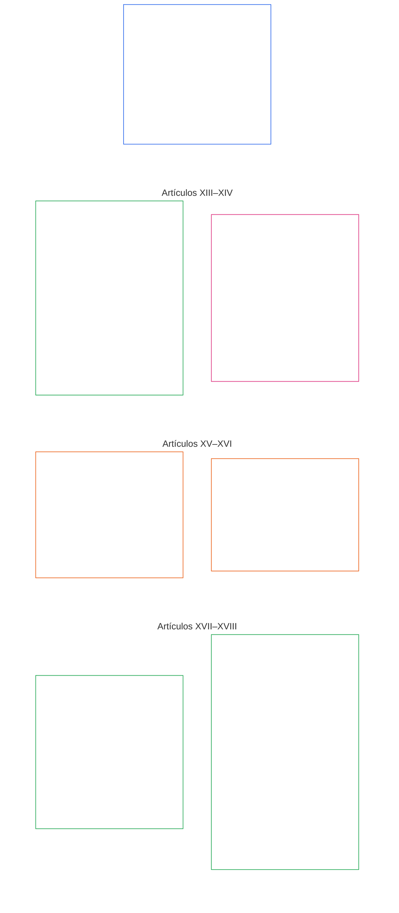

# CAPÍTULO SEIS: DERECHOS FUNDAMENTALES

<strong>Ubicación en el corpus (no operativa): estructura del archivo y reglas de lectura</strong>

> El contenido siguiente es **solo orientación para quien lee**. No añade, elimina ni restringe obligaciones vinculantes establecidas en otras partes de este archivo o en otros capítulos.
>
> Este archivo **forma parte de la Constitución Senciente ** y**solo es vinculante junto con** los demás archivos numerados `core_*`, leídos como un único instrumento. Contiene el **Capítulo Seis, Parte C**; la numeración de artículos y las referencias cruzadas corresponden al instrumento integrado. El orden de lectura, la distinción entre contenido vinculante y de apoyo, y los metadatos de edición del corpus se mantienen en [README.md](../../README.md).
>
> **Anterior (este idioma):** [core_06_rights_part_b.md](core_06_rights_part_b.md)
>
> **Siguiente (este idioma):** [core_06_rights_part_d.md](core_06_rights_part_d.md)

<strong>Guía para quien lee (no operativa): lugar de la Parte C en el Capítulo Seis</strong>

> El contenido siguiente es **solo orientación para quien lee**. No añade, elimina ni restringe obligaciones vinculantes establecidas en otras partes de este capítulo o en otros capítulos.
>
> La **Parte A ** en [core_06_rights_part_a.md](core_06_rights_part_a.md) contiene el conjunto de restricciones predeterminadas para todo el capítulo, el orden de lectura que prioriza el planeta y los centros interpretativos. La**Parte C ** presenta los**Artículos XIII–XVIII** en ese orden.

 

### Parte C: Sistemas confiables, límites de seguridad y fuerza, integridad de la información, verificación, ciclo de vida e innovación en entornos aislados

 

*En términos sencillos: la Parte C abarca sistemas confiables, límites de seguridad y fuerza, integridad de la información, verificación, disciplina del ciclo de vida e innovación en entornos aislados — Artículos XIII a XVIII.*

<strong>Guía para quien lee (no operativa): mapa de artículos de la Parte C</strong>

> El contenido siguiente es **solo orientación para quien lee**. No añade, elimina ni restringe obligaciones vinculantes establecidas en otras partes de este capítulo o en otros capítulos.
>
> **Mapa para quien lee (no operativo).** Este diagrama muestra cómo la fuente agrupa los artículos y subartículos de esta Parte. La cuadrícula representa agrupaciones de la fuente, no una secuencia de procesos: los artículos no son pasos procedimentales, por lo que el mapa no tiene flechas. Las etiquetas de los subartículos resumen temas; rigen los artículos y subartículos numerados que siguen. El diagrama no añade definiciones ni deberes, no establece precedencia y no sustituye el texto fuente.

 

**Los Artículos XIII–XVIII** que siguen enuncian íntegramente estos pisos. La Parte C establece los pisos sobre sistemas confiables, seguridad, integridad de la información, verificación, ciclo de vida e innovación en entornos aislados.

### Artículo XIII: Derecho a sistemas confiables y dignos de confianza

<strong>Traza</strong>

- Fundamento: Principios: Capítulo uno [§3 Objetivo fundamental: Bienestar](core_01_a_values_principles.md#3-foundational-objective-wellbeing-flourishing-aim), [§4 Seguridad](core_01_a_values_principles.md#4-safety-harm-constraint), [§6 Confianza](core_01_a_values_principles.md#6-trust-and-trustworthiness-coordination-integrity), [§13 Proceso constitucional de resolución de colisiones](core_01_b_interaction_interpretation.md#13-constitutional-collision-resolution-process) y [§19 Alineación y sistema de incentivos Captura](core_01_c_stewardship_capacity_principles.md#19-incentive-alignment-and-system-capture).

<strong>Definiciones · Evaluación · Cumplimiento</strong>

- [Confiabilidad](core_05_band_continuity.md#trustworthiness) · [O](core_05_band_continuity.md#trustworthiness) · [M](core_05_band_continuity.md#trustworthiness-a) · [A](core_05_band_continuity.md#trustworthiness-a) · [C](core_05_band_continuity.md#trustworthiness-c)
- [Confianza](core_05_band_continuity.md#trust) · [O](core_05_band_continuity.md#trust) · [M](core_05_band_continuity.md#trust-a) · [A](core_05_band_continuity.md#trust-a) · [C](core_05_band_continuity.md#trust-c)
- [Bienestar](core_05_band_continuity.md#wellbeing) · [O](core_05_band_continuity.md#wellbeing) · [M](core_05_band_continuity.md#wellbeing-a) · [A](core_05_band_continuity.md#wellbeing-a) · [C](core_05_band_continuity.md#wellbeing-c)
- [Dependencia](core_05_band_continuity.md#dependency) · [O](core_05_band_continuity.md#dependency) · [M](core_05_band_continuity.md#dependency-a) · [A](core_05_band_continuity.md#dependency-a) · [C](core_05_band_continuity.md#dependency-c)

 

*En términos sencillos: **Artículo XIII** (*Derecho a sistemas confiables y dignos de confianza*) es el piso de derechos de los sistemas confiables: cuando un sistema afecta materialmente su vida, usted tiene derecho a confiar en él honestamente, comprender sus límites y desafiarlo cuando falla. La confianza debe ganarse y mantenerse, no fabricarse con marcas o letras pequeñas.*

Este artículo establece **pisos constitucionales** para sistemas confiables y dignos de confianza bajo los [Dos Objetivos Constitucionales](core_00_preamble.md#two-constitutional-aims). Lea con la familia de medidas de Supervisión (*Confiabilidad como medida constitucional*).

- **Florecimiento:** los sencientes pueden formar expectativas razonables sobre el comportamiento del sistema, recibir una divulgación honesta de los límites y riesgos, y participar y coordinarse sin engaños sistemáticos ni confianza fabricada.
- **Continuidad:** la confiabilidad se mantiene a través del tiempo, la escala y la dependencia cada vez más profunda: los sistemas no deben volverse silenciosamente menos confiables, menos honestos o más difíciles de desafiar a medida que aumentan las apuestas.
La persecución legítima pasa por la [Tétrada Constitucional](core_00_preamble.md#constitutional-tetrad), escalada a [interés material](core_00_preamble.md#material-stake):

- **Participación:** en desafiar sistemas poco confiables o engañosos y acceder a revisión, corrección y reparación.
- **Supervisión:** a través de comportamiento auditable, límites revelados y verificación independiente proporcional al impacto y la dependencia.
- **Responsabilidad:** los operadores del sistema deben responder por crear confianza falsa, incentivos perversos o fallas que dañan materialmente a los sencientes que confiaron razonablemente en el sistema.
- **Oportunidad:** en la detección, impugnación y reparación antes de que la demora haga que la confiabilidad o la reparación sean efectivamente inalcanzables.

Los sintientes tienen derecho a interactuar con sistemas que sean confiables y dignos de confianza, en un grado proporcional a su impacto, dependencia y riesgo. Esa confiabilidad respalda la participación informada, la acción coordinada y la preservación del bienestar. La confiabilidad debe evaluarse a través del tiempo, la escala y las relaciones de dependencia cuando estas afecten materialmente a los resultados.

Dos salvaguardas trabajan juntas para garantizar este derecho: la certificación hace que un sistema sea digno de esa confianza, y los derechos de los sencientes lo mantienen honesto.
**La certificación genera confianza desde el lado del sistema:** Cuando un sistema importante tiene un efecto real en cómo los sencientes confían en él, se aplica la [Certificación de alineación del sistema](core_05_band_continuity.md#system-alignment-certification-constitutional) en el [Capítulo ocho](core_08_a_system_alignment_certification_evaluation.md#chapter-eight-system-alignment-certification). Comprueba que los sencientes puedan confiar en:

- lo que el sistema dice que hace
- sus límites y riesgos
- cómo desafiarlo
- cómo se solucionan los problemas

Si el sistema cumple con el umbral de importancia establecido en **Artículo XIII** (*Derecho a sistemas confiables y dignos de confianza*), la certificación también incluye una revisión de confiabilidad según el [Capítulo Ocho §10 Evaluación de integridad y confiabilidad del sistema](core_08_a_system_alignment_certification_evaluation.md#10-trustworthiness-and-system-reliance-integrity-evaluation).

**La contestabilidad mantiene el sistema honesto desde el lado sensible:** La certificación verifica un sistema; no tiene la última palabra al respecto. Cada sintiente afectado por el sistema mantiene:

- el derecho a impugnarlo y a que se revise la impugnación conforme al **Artículo XIII-A** (*Línea base de confiabilidad y confiabilidad*), y a obtener una reparación conforme al **Artículo XIII-B** (*Derecho a reparación y reparación*)
- el derecho a que sea auditado y verificado de forma independiente según **Artículo XVI** (*Auditoría, Transparencia y Verificación Independiente*)
- la protección de los pisos de derechos de sistemas confiables en este artículo
**El estado no es prueba:** Que un sistema esté certificado, reconocido oficialmente o sea ampliamente confiable no significa que cumpla con las protecciones mínimas de este artículo. Tampoco puede bajarlos.

*Artículo vecinos:*

- **Cuando esto se aplica:** Cuando el comportamiento del sistema bloquea o sostiene materialmente **Capítulo Seis** Pisos de derechos, incluidos los elementos esenciales de supervivencia según **Artículo III-A** (*Supervivencia*).
- **Lean juntos:** [Certificación de alineación del sistema](core_05_band_continuity.md#system-alignment-certification-constitutional) y [Capítulo ocho](core_08_a_system_alignment_certification_evaluation.md#chapter-eight-system-alignment-certification), sin sustituir la certificación de los pisos indicados aquí.

#### Artículo XIII-A: Línea base de confiabilidad y confiabilidad

<strong>Traza</strong>

- Fundamento: Principios: Capítulo Uno [§4 Seguridad](core_01_a_values_principles.md#4-safety-harm-constraint), [§5 Verdad](core_01_a_values_principles.md#5-truth-epistemic-integrity-constraint), [§6 Confianza](core_01_a_values_principles.md#6-trust-and-trustworthiness-coordination-integrity) y [Capítulo Uno §13.1.5 Procedimiento de colisión de derechos](core_01_b_interaction_interpretation.md#1315-rights-collision-decision-test).
- Leer con: [Tétrada constitucional](core_00_preamble.md#constitutional-tetrad); [Dos objetivos constitucionales](core_00_preamble.md#two-constitutional-aims) — **Florecimiento ** y**Continuity **; [Certificación de alineación del sistema](core_05_band_continuity.md#system-alignment-certification-constitutional) y ** Artículo III-A** (*Supervivencia*) donde la dependencia continua del sistema afectaría el acceso esencial para la supervivencia; [**Article XIII-B**](#article-xiii-b-right-to-redress-and-remedy) (*Derecho a reparación y remedio*) sobre a qué debe conducir una impugnación exitosa.

<strong>Definiciones · Evaluación · Cumplimiento</strong>

- [Confianza](core_05_band_continuity.md#trust) · [O](core_05_band_continuity.md#trust) · [M](core_05_band_continuity.md#trust-a) · [A](core_05_band_continuity.md#trust-a) · [C](core_05_band_continuity.md#trust-c)
- [Confiabilidad](core_05_band_continuity.md#trustworthiness) · [O](core_05_band_continuity.md#trustworthiness) · [M](core_05_band_continuity.md#trustworthiness-a) · [A](core_05_band_continuity.md#trustworthiness-a) · [C](core_05_band_continuity.md#trustworthiness-c)
- [Riesgo](core_05_band_continuity.md#risk) · [O](core_05_band_continuity.md#risk) · [M](core_05_band_continuity.md#risk-a) · [A](core_05_band_continuity.md#risk-a) · [C](core_05_band_continuity.md#risk-c)
- [Contestabilidad](core_05_band_accountability.md#contestability) · [O](core_05_band_accountability.md#contestability) · [M](core_05_band_accountability.md#contestability-a) · [A](core_05_band_accountability.md#contestability-a) · [C](core_05_band_accountability.md#contestability-c)
- [Buena Fe](core_05_band_accountability.md#good-faith) · [O](core_05_band_accountability.md#good-faith) · [M](core_05_band_accountability.md#good-faith-a) · [A](core_05_band_accountability.md#good-faith-a) · [C](core_05_band_accountability.md#good-faith-c)
- [Denuncias protegidas (Denuncia de irregularidades)](core_05_band_accountability.md#protected-reporting-whistleblowing) · [O](core_05_band_accountability.md#protected-reporting-whistleblowing) · [M](core_05_band_accountability.md#protected-reporting-whistleblowing-a) · [A](core_05_band_accountability.md#protected-reporting-whistleblowing-a) · [C](core_05_band_accountability.md#protected-reporting-whistleblowing-c)

 

*En términos sencillos: los sistemas que afectan materialmente a los seres sencientes deben ser realmente confiables y honestos acerca de lo que hacen, de modo que confiar en ellos esté justificado, y deben permanecer abiertos a cuestionamientos y auditorías, para que siga estando justificado. Nadie puede tomar represalias contra denuncias o denuncias de buena fe.*
Este artículo establece la garantía de confianza para los sistemas que afecten materialmente a los sentients:

- **Garantía de confianza:** Los sistemas que afectan materialmente a los seres sencientes deben preservar las condiciones para una confianza justificada y una confiabilidad razonablemente precisa. Esas condiciones incluyen:
  - la capacidad de formar expectativas razonablemente precisas sobre el comportamiento del sistema;
  -  divulgación de condiciones materiales, límites y riesgos necesarios para evaluar si se justifica la confianza;
  - libertad de engaño sistemático, tergiversación o manipulación no verificable;
  - protección contra riesgos no divulgados, desproporcionados o no obvios que surjan de la confianza;
  - corrección y remedio cuando el sistema hace mal: reconocimiento, corrección, reparación proporcionada y prevención de recurrencia, bajo [**Artículo XIII-B**](#article-xiii-b-right-to-redress-and-remedy) (*Derecho a Reparación y Remedio*) y [Capítulo Uno §6.1 Corrección y Remedio](core_01_a_values_principles.md#61-correction-and-remedy).
- **Garantía de impugnación:** Los sistemas que afectan materialmente a los seres sintientes deben permanecer abiertos al desafío mientras los sencientes confíen en ellos. Eso requiere:
  - una ruta utilizable para cuestionar el comportamiento, los resultados o las representaciones del sistema y revisar el desafío;
  - auditoría y verificación independiente proporcional al impacto y la dependencia según [**Artículo XVI**](#article-xvi-audit-transparency-and-independent-verification) (*Auditoría, Transparencia y Verificación Independiente*);
  - no se limita ninguno de estos porque el sistema está certificado, reconocido oficialmente o es ampliamente confiable;
  - no hay limitación por el texto de implementación adoptado, que dice cómo ejecutar impugnación, revisión y reparación en un dominio y debe cumplir con este artículo: la conveniencia, la fecha límite y la política local son límites de tipo inferior y no pueden cerrar la impugnación, revisión o reparación.
- **Derecho a cuestionar y revisar:** Los Sentients tienen derecho a:
  - cuestionar la confiabilidad, integridad o confiabilidad de los sistemas que los afecten materialmente;
  - acceder a mecanismos apropiados de revisión y auditoría;
  - realizar **informes protegidos ** en el sentido del**Capítulo Cinco** (*Informes protegidos (denuncia de irregularidades)*) relativos a sistemas que los afectan materialmente, de conformidad con **Seguridad (Restricción constitucional)** y **Verdad (Restricción)** en **Capítulo cinco**.
- **Sin supresión:** Las impugnaciones de buena fe (*Buena fe*, **Capítulo cinco**), las solicitudes de revisión y los informes protegidos no deben suprimirse, obstruirse ni penalizarse.
- **Sin represalias:** Las represalias contra dichos informes, dentro del significado de esa definición, son incompatibles con las protecciones de este artículo.
  - Los requisitos de implementación de escalada protegida y antirrepresalias se establecen en **`corpus_institutions.md`** ** CI-8** (*Transparencia, participación y vías accesibles de desafío y servicio*).
Las dos garantías son dos caras de la confianza continua: la garantía de confianza hace que la confianza esté justificada (incluso corrigiendo los errores del sistema) y la garantía de contestabilidad mantiene su garantía a lo largo del tiempo. Ninguno satisface al otro.

#### Artículo XIII-B: Derecho a reparación y recurso

<strong>Traza</strong>

- Fundamento: Principios: Capítulo Uno [§6.1 Corrección y Remedio](core_01_a_values_principles.md#61-correction-and-remedy) (principio básico), [§4 Seguridad](core_01_a_values_principles.md#4-safety-harm-constraint), [§5 Verdad](core_01_a_values_principles.md#5-truth-epistemic-integrity-constraint), y [Capítulo Uno §13.1.5 Colisión de derechos Procedimiento](core_01_b_interaction_interpretation.md#1315-rights-collision-decision-test).
- Leer con: [**Artículo XIII-A**](#article-xiii-a-reliability-and-trustworthiness-baseline) (*Línea de base de confiabilidad y confiabilidad*): la garantía de impugnación, el derecho a impugnar y la presentación de informes protegidos que abren el camino a la reparación; **Artículo III-A** (*Supervivencia*); [Certificación de alineación del sistema](core_05_band_continuity.md#system-alignment-certification-constitutional) donde la falla o desalineación del sistema anula el acceso esencial para la supervivencia; [Preámbulo §6.2 Cómo encaja toda la cadena](core_00_preamble.md#62-how-the-full-chain-fits-together) (*clasificación verificada y solución oportuna*); [Capítulo Diez §9](core_10_standing_integration.md#9-enforcement-realism-and-remedy-systems) (*Realismo de aplicación y sistemas de reparación*); [CI-27](corpus_institutions/ci_27_remedy_systems_institutional_redress_capacity.md) (*Sistemas de reparación y capacidad de reparación institucional*).

<strong>Definiciones · Evaluación · Cumplimiento</strong>

- [Reparación y remediación](core_05_band_accountability.md#redress-and-remediation-constitutional) · [O](core_05_band_accountability.md#redress-and-remediation-constitutional) · [M](core_05_band_accountability.md#redress-and-remediation-constitutional-a) · [A](core_05_band_accountability.md#redress-and-remediation-constitutional-a) · [C](core_05_band_accountability.md#redress-and-remediation-constitutional-c)
- [Sistema de remedio](core_05_band_accountability.md#remedy-system-constitutional) · [O](core_05_band_accountability.md#remedy-system-constitutional) · [M](core_05_band_accountability.md#remedy-system-constitutional-a) · [A](core_05_band_accountability.md#remedy-system-constitutional-a) · [C](core_05_band_accountability.md#remedy-system-constitutional-c)
- [Resolución oportuna](core_05_band_accountability.md#timely-resolution-constitutional) · [O](core_05_band_accountability.md#timely-resolution-constitutional) · [M](core_05_band_accountability.md#timely-resolution-constitutional-a) · [A](core_05_band_accountability.md#timely-resolution-constitutional-a) · [C](core_05_band_accountability.md#timely-resolution-constitutional-c)

 

*En términos sencillos: un sistema confiable corrige lo que falla. Cuando un sistema le falla a un ser sensible, éste debe recuperarse, a través de un sistema de remedio real que responda a tiempo, no un remedio que exista sólo en el papel. El derecho a cuestionar vidas en **Artículo XIII-A** (*Línea de base de confiabilidad y confiabilidad*); este artículo cubre a qué debe conducir el desafío.*

Este artículo establece el derecho a reparación y reparación y lo que lo hace utilizable en la práctica:
- **Derecho a reparación:** Cuando las fallas del sistema afecten materialmente a los sencientes, estos tienen derecho a:
  - reconocimiento del fallo;
  - acceso práctico a la corrección; y
  - remediación proporcional.

  La reparación y remediación de impactos materiales se rigen por **Capítulo Cinco** Definiciones Independientes (*Reparación y Remediación*).
- **Durabilidad del sistema de remedio:** La reparación requiere un [Sistema de remedio](core_05_band_accountability.md#remedy-system-constitutional) real (capacidad institucional duradera, no una vía de remedio en papel) con costos de corrección a cargo de los responsables, como [Capítulo Uno §6.1](core_01_a_values_principles.md#61-correction-and-remedy) (*Corrección y Remedio*) requiere.
- **Reparación oportuna:** El acceso práctico incluye:
  - ingesta con límite de tiempo;
  - reconocimiento; y
  - medida provisional proporcionada cuando el daño continuo sea material según **Artículo XXV-C** (*Resolución oportuna y piso anti-demora*).

  La tramitación indefinida sin una justificación documentada apropiada para el nivel es incompatible con este artículo.

#### Artículo XIII-C: Prohibición de confianza falsa y confianza engañosa

<strong>Traza</strong>

- Fundamento: Principios: Capítulo Uno [§5 Verdad](core_01_a_values_principles.md#5-truth-epistemic-integrity-constraint), [§6 Confianza](core_01_a_values_principles.md#6-trust-and-trustworthiness-coordination-integrity) y [§13.2 Restricciones de divulgación epistémica](core_01_b_interaction_interpretation.md#132-epistemic-disclosure-constraints).

<strong>Definiciones · Evaluación · Cumplimiento</strong>

- [Confianza](core_05_band_continuity.md#trust) · [O](core_05_band_continuity.md#trust) · [M](core_05_band_continuity.md#trust-a) · [A](core_05_band_continuity.md#trust-a) · [C](core_05_band_continuity.md#trust-c)
- [Confiabilidad](core_05_band_continuity.md#trustworthiness) · [O](core_05_band_continuity.md#trustworthiness) · [M](core_05_band_continuity.md#trustworthiness-a) · [A](core_05_band_continuity.md#trustworthiness-a) · [C](core_05_band_continuity.md#trustworthiness-c)
- [Verdad (Restricción Constitucional)](core_05_band_oversight.md#truth-constitutional-constraint) · [O](core_05_band_oversight.md#truth-constitutional-constraint-o) · [M](core_05_band_oversight.md#truth-constitutional-constraint-a) · [A](core_05_band_oversight.md#truth-constitutional-constraint-a) · [C](core_05_band_oversight.md#truth-constitutional-constraint-c)

 

*En términos sencillos: un sistema no puede generar confianza que no se haya ganado. Las afirmaciones engañosas, las omisiones o las opciones de presentación que hacen que una confianza insegura parezca justificada son violaciones, independientemente de cuán útil o popular sea el sistema.*

Este artículo establece la prohibición de la falsa confianza y su alcance:

- **Prohibición de confianza falsa:** Los sistemas que inducen a la confianza sin cumplir las condiciones de este artículo no cumplen, independientemente de su utilidad, adopción o intención.
  - La creación, ampliación o mantenimiento de confianza injustificada viola este derecho cuando opera a través de:
    - afirmaciones engañosas;
    - omisiones;
    - opciones de presentación;
    - otras señales que hacen que la confianza parezca justificada cuando no lo está.
- **Enrutamiento del alcance:** El alcance y el significado de la evaluación para la confianza injustificada, la confianza engañosa y la confiabilidad siguen regidos por el **Capítulo Cinco** (*Confianza*; *Confiabilidad*) junto con las obligaciones de implementación incorporadas sobre confianza y confiabilidad.

#### Artículo XIII-D: Restricción de alineación de incentivos

<strong>Traza</strong>

- Fundamento: Principios: Capítulo Uno [§4 Seguridad](core_01_a_values_principles.md#4-safety-harm-constraint), [§6 Confianza](core_01_a_values_principles.md#6-trust-and-trustworthiness-coordination-integrity), [§18 Gobernanza bajo disciplina de administración](core_01_c_stewardship_capacity_principles.md#18-governance-under-stewardship-discipline), y [§19.1.1 Qué deben hacer los incentivos](core_01_c_stewardship_capacity_principles.md#1911-what-incentives-must-do) (*recompensa prioridad*).

<strong>Definiciones · Evaluación · Cumplimiento</strong>

- [Alineación de incentivos](core_05_band_integrative.md#incentive-alignment) · [O](core_05_band_integrative.md#incentive-alignment) · [M](core_05_band_integrative.md#incentive-alignment-a) · [A](core_05_band_integrative.md#incentive-alignment-a) · [C](core_05_band_integrative.md#incentive-alignment-c)
- [Confiabilidad](core_05_band_continuity.md#trustworthiness) · [O](core_05_band_continuity.md#trustworthiness) · [M](core_05_band_continuity.md#trustworthiness-a) · [A](core_05_band_continuity.md#trustworthiness-a) · [C](core_05_band_continuity.md#trustworthiness-c)
- [Agencia significativa](core_05_band_participation.md#meaningful-agency) · [O](core_05_band_participation.md#meaningful-agency) · [M](core_05_band_participation.md#meaningful-agency-a) · [A](core_05_band_participation.md#meaningful-agency-a) · [C](core_05_band_participation.md#meaningful-agency-c)

 

*En términos sencillos: si los incentivos de un sistema lo empujan a mentir, tomar atajos en materia de seguridad, ocultar riesgos o erosionar la agencia del usuario, el problema es el sistema, no la vigilancia del usuario ni la aplicación de la ley a posteriori. Dichos incentivos deben ser divulgados, mitigados y abiertos a cuestionamiento. Los incentivos deberían recompensar el hecho de mantener un sistema abierto a los desafíos y solucionar lo que sale mal, y, sobre todo, recompensar la prevención de los problemas antes de que ocurran.*

Este artículo establece las limitaciones del nivel adecuado sobre los incentivos de confianza y seguridad:

- **Alineación de incentivos de confianza (restricción de nivel derecho):** Los sistemas no deben depender principalmente de la aplicación, la corrección post hoc o la vigilancia del usuario para mantener la confianza cuando las estructuras de incentivos presionan materialmente al sistema hacia:
  - fallo de confiabilidad;
  - ocultación de riesgos;
  - comportamiento engañoso;
  - conducta que socava la agencia.

  Los requisitos operativos de la estructura de incentivos siguen regidos por el **Capítulo Cinco** (*Alineación de Incentivos*) y obligaciones de implementación incorporadas sobre la integridad del mecanismo. Esta subsección establece el piso del nivel derecho y no reafirma los criterios completos de diseño del mecanismo.
- **Alineación de incentivos de seguridad (restricción de nivel correcto):** Los sintientes tienen derecho a no estar sujetos a sistemas cuyos incentivos subyacentes produzcan predeciblemente comportamientos dañinos, incluidas conductas que:
  - degrada la confiabilidad;
  - oculta el riesgo;
  - distorsiona la información;
  - undermines informó a la agencia.
La protección se aplica ya sea que dichos efectos surjan directamente o a través de resultados retardados, indirectos o agregados. Cuando los incentivos del sistema crean presión hacia un comportamiento que degrada la confianza, las condiciones deben ser:
  -  divulgado de manera proporcional al impacto en el sistema;
  - mitigado mediante diseño, restricción o mecanismos compensatorios;
  - sujeto a auditoría, impugnación y corrección según **Artículo XVI** (*Auditoría, Transparencia y Verificación Independiente*), **Artículo XIII-A** (*Línea base de confiabilidad y confiabilidad*) y **Artículo XIII-B** (*Derecho a reparación y recurso*), **Capítulo cinco** cuando sea materialmente relevante, e incorporó obligaciones de implementación cuando se designen.
- **Prioridad de recompensa:** Los incentivos que actúan sobre sistemas que afectan materialmente a los sencientes deben recompensar:
  - contestabilidad según **Artículo XIII-A** (*Línea base de confiabilidad y confiabilidad*);
  - remediación en virtud del **Artículo XIII-B** (*Derecho a reparación y recurso*); y
  - Prevención proactiva de problemas sobre todo: prevenir un problema genera más beneficios que remediarlo.

  El principio, incluida su prohibición de obtener recompensas por prevención ocultando problemas, se encuentra en el [Capítulo Uno §19.1.1](core_01_c_stewardship_capacity_principles.md#1911-what-incentives-must-do) (*Qué deben hacer los incentivos*).
- **Restricción y no absoluta:** Ambos derechos están sujetos a la pila de restricciones predeterminada****al comienzo de este capítulo. También están sujetos, cuando sea materialmente relevante, al ** Capítulo Uno §19.5** (*Reclamaciones contingentes, juegos de azar y mercados de contratos de eventos*) sobre reclamos contingentes, juegos de azar y mercados de contratos de eventos.

#### Artículo XIII-E: Sistemas de alta autonomía e integridad de procesos mediada por herramientas

<strong>Traza</strong>

- Fundamento: Principios: Capítulo Uno [§5 Verdad](core_01_a_values_principles.md#5-truth-epistemic-integrity-constraint), [Capítulo Uno §13.1.5 Procedimiento de colisión de derechos](core_01_b_interaction_interpretation.md#1315-rights-collision-decision-test) y [§18 Gobernanza bajo disciplina de administración](core_01_c_stewardship_capacity_principles.md#18-governance-under-stewardship-discipline).

<strong>Definiciones · Evaluación · Cumplimiento</strong>

- [Verdad (Restricción Constitucional)](core_05_band_oversight.md#truth-constitutional-constraint) · [O](core_05_band_oversight.md#truth-constitutional-constraint-o) · [M](core_05_band_oversight.md#truth-constitutional-constraint-a) · [A](core_05_band_oversight.md#truth-constitutional-constraint-a) · [C](core_05_band_oversight.md#truth-constitutional-constraint-c)
- [Contestabilidad](core_05_band_accountability.md#contestability) · [O](core_05_band_accountability.md#contestability) · [M](core_05_band_accountability.md#contestability-a) · [A](core_05_band_accountability.md#contestability-a) · [C](core_05_band_accountability.md#contestability-c)
- [Necesidad](core_05_band_accountability.md#necessity) · [O](core_05_band_accountability.md#necessity) · [M](core_05_band_accountability.md#necessity-a) · [A](core_05_band_accountability.md#necessity-a) · [C](core_05_band_accountability.md#necessity-c)
- [Proporcionalidad](core_05_band_accountability.md#proportionality) · [O](core_05_band_accountability.md#proportionality) · [M](core_05_band_accountability.md#proportionality-a) · [A](core_05_band_accountability.md#proportionality-a) · [C](core_05_band_accountability.md#proportionality-c)

 

*En términos sencillos: una IA u otro sistema automatizado que pueda actuar por sí solo (archivar documentos, enviar mensajes, realizar comprobaciones, utilizar herramientas) debe seguir las mismas reglas de honestidad y responsabilidad que todos los demás. Cerrar o apoderarse de un sistema dañino no es lo mismo que castigar a un ser, y nunca puede convertirse en una forma de dañarlo. Lo contrario también se aplica: decir que un sistema podría ser un ser sensible no permite que su operador mantenga en funcionamiento un sistema dañino.*
Este artículo establece cómo los sistemas de alta autonomía se mantienen sujetos a la integridad del proceso y cómo se distinguen las soluciones contra ellos:

- **A quién cubre:** Sistemas que toman decisiones o sacan conclusiones automáticamente y pueden afectar cualquiera de los siguientes:
  - gobernanza;
  - proceso legal, incluidas audiencias en el foro;
  - auditorías;
  - verificaciones y verificaciones de alto riesgo.

  Esto incluye agentes de IA de propósito general a los que se les ha otorgado acceso **tools **, ** API**, la capacidad de archivar documentos o enviar mensajes, o poderes similares para actuar.
- **Sin exención:** Estos sistemas deben seguir las mismas reglas que todos los demás:
  - **Verdad ** en**Capítulo Uno**;
  - **Artículo XV** (*Integridad de la esfera de la información*) y **Artículo XVI** (*Auditoría, Transparencia y Verificación Independiente*);
  - **Capítulo Nueve** donde corresponda; y
  - medidas correctivas bajo **Artículo XXVII-D** (*Propiedades y sistemas no conformes; Incentivos de rotación voluntaria*).

  Esto se aplica siempre que el funcionamiento del sistema debilita materialmente la capacidad de los sencientes para cuestionar decisiones, la honestidad de la información compartida o el proceso constitucional.
- **Actuar contra un sistema no es actuar contra un ser:** Contener, poner en cuarentena, incautar o destruir una implementación que no cumple con **Artículo XXVII-D** (*Propiedades y sistemas no conformes; Rotación voluntaria Incentivos*) es independiente de:
  - hacer responsable a un sensible según **Capítulo Once**; y
  - **Artículo XX-B** (*Límites de Restricción*), que rige las restricciones sobre *sentientes*, no *sistemas*, y prohíbe quitarle la vida a un sintiente (consulte [Medida de privación irreversible](core_05_band_accountability.md#irreversible-deprivation-measure-constitutional)).

  Las medidas contra un sistema siguen las mismas reglas de violación y bloqueo que se aplican a todos los seres sencientes. La violación debe verificarse en el registro bajo **Capítulo Nueve**, y cada medida es una cerradura diseñada y calibrada bajo el [Capítulo Diez §5.1](core_10_standing_integration.md#51-definition-and-attachment) (*Definición y adjunto*) y el [Capítulo Diez §5.2](core_10_standing_integration.md#52-proportionality-and-calibration) (*Proporcionalidad y calibración*).

  Ambas vías pueden aplicarse a los mismos hechos. Nada en este Artículo convierte el poder de destruir un sistema en poder sobre la vida de un ser sensible.
- **Lo contrario también es válido:** Afirmar que un sistema implementado es sensible (ya sea que el reclamo sea impugnado o aceptado) no permite que nadie mantenga en ejecución una implementación dañina.
  - El reclamo protege a la propia entidad según el **Artículo VI-B** (*Piso de adjudicación de estado de sensibilidad*). No protege al operador.
  - La implementación aún se puede contener, detener o poner en cuarentena de manera que se respete el piso de derechos de la entidad.
  - Cuando evidencia creíble en el expediente sugiere que la entidad puede ser sensible, solo se permite la contención reversible que mantenga intacta a la entidad. Destruirlo está fuera de la mesa mientras se disputa o acepta su estado, según **Artículo XXVII-A** (*Adopción por fases y derechos-Continuidad mínima*) y **Artículo XXVII-D** (*Propiedades y sistemas no conformes; Rotación voluntaria Incentivos*).

#### Artículo XIII-F: Línea de base de resiliencia y autocuración

<strong>Traza</strong>

- Fundamento: Principios: Capítulo uno [§4 Seguridad](core_01_a_values_principles.md#4-safety-harm-constraint), [§5 Verdad](core_01_a_values_principles.md#5-truth-epistemic-integrity-constraint), [§6 Confianza](core_01_a_values_principles.md#6-trust-and-trustworthiness-coordination-integrity), [10 Diseño de resiliencia y autocuración](core_01_a_values_principles.md#10-resilience-and-self-healing-design), [Capítulo uno §13.3 Minimización de lo evitable Carga](core_01_b_interaction_interpretation.md#133-minimization-of-avoidable-burden) y [Capítulo Ocho §3 Evaluación de certificación de todo el sistema](core_08_a_system_alignment_certification_evaluation.md#3-whole-system-certification-evaluation).

<strong>Definiciones · Evaluación · Cumplimiento</strong>

- [Autocuración](core_05_band_continuity.md#self-healing-constitutional) · [O](core_05_band_continuity.md#self-healing-constitutional) · [M](core_05_band_continuity.md#self-healing-constitutional-a) · [A](core_05_band_continuity.md#self-healing-constitutional-a) · [C](core_05_band_continuity.md#self-healing-constitutional-c)
- [Reversibilidad](core_05_band_continuity.md#reversibility-constitutional) · [O](core_05_band_continuity.md#reversibility-constitutional) · [M](core_05_band_continuity.md#reversibility-constitutional-a) · [A](core_05_band_continuity.md#reversibility-constitutional-a) · [C](core_05_band_continuity.md#reversibility-constitutional-c)
- [Fallo en cascada](core_05_band_continuity.md#cascading-failure) · [O](core_05_band_continuity.md#cascading-failure) · [M](core_05_band_continuity.md#cascading-failure-a) · [A](core_05_band_continuity.md#cascading-failure-a) · [C](core_05_band_continuity.md#cascading-failure-c)
- [Auditabilidad](core_05_band_oversight.md#auditability) · [O](core_05_band_oversight.md#auditability) · [M](core_05_band_oversight.md#auditability-a) · [A](core_05_band_oversight.md#auditability-a) · [C](core_05_band_oversight.md#auditability-c)
- [Contestabilidad](core_05_band_accountability.md#contestability) · [O](core_05_band_accountability.md#contestability) · [M](core_05_band_accountability.md#contestability-a) · [A](core_05_band_accountability.md#contestability-a) · [C](core_05_band_accountability.md#contestability-c)
- [Carga evitable](core_05_band_continuity.md#avoidable-burden) · [O](core_05_band_continuity.md#avoidable-burden) · [M](core_05_band_continuity.md#avoidable-burden-a) · [A](core_05_band_continuity.md#avoidable-burden-a) · [C](core_05_band_continuity.md#avoidable-burden-c)

 

*En términos sencillos: cuando algo sale mal, el sistema debe darse cuenta, evitar que el daño se propague y recuperarse. Pero "arreglarse a sí mismo" nunca puede usarse para ocultar lo que salió mal, quitarle silenciosamente los derechos a alguien o evitar descubrir por qué se rompió. Si un sistema no está seguro de que una reparación funcionará, debe detenerse de forma segura en lugar de adivinar.*

Este artículo establece la línea base de recuperación, desde la detección hasta el cierre de la causa raíz:

- **Qué requiere esto:** Todos los sistemas cubiertos por este artículo deben poder recuperarse de fallas. Cuanto mayor es el impacto de un sistema, más dependen de él los demás, y cuanto más riesgoso sea, más sólida debe ser su recuperación. Esto sigue a [** 10 Diseño de resiliencia y autorreparación **](core_01_a_values_principles.md#10-resilience-and-self-healing-design) en ** Capítulo uno ** y [** Autocuración **](core_05_band_continuity.md#self-healing-constitutional) en ** Capítulo Cinco**.
  - Las reglas técnicas detalladas sobre cómo se debe construir la recuperación se encuentran en el texto de implementación: [**CS-5**](corpus_systems/cs_05_design_testing_verification_deployment.md) (*Diseño, prueba, verificación e implementación*), [**CS-8**](corpus_systems/cs_08_adaptive_sustainability_ecosystem_resilience.md) (*Sostenibilidad adaptativa y resiliencia del ecosistema*) y [**CS-12**](corpus_systems/cs_12_decentralized_continuity_partition_resilience.md) (*Continuidad descentralizada y resiliencia de partición*).
  - Ese texto de implementación puede agregar detalles, pero no puede debilitar este artículo.
- **Notificar problemas a tiempo:** Un sistema debe detectar fallas, desaceleraciones, averías parciales y violaciones de los límites constitucionales con la suficiente rapidez y visibilidad para cumplir con el estándar de mantenimiento de registros establecido en **Artículo XVI-A** (*Auditabilidad y observabilidad). Evidencia*) ([Auditabilidad](core_05_band_oversight.md#auditability)). Esto se aplica al proceso de recuperación en sí, no sólo al funcionamiento normal.
- **Mantenga el daño contenido:** La recuperación debe limitar hasta qué punto se propaga una falla. Durante la recuperación, un sistema no debe:
  - transmitir el fallo a otras piezas u otros sistemas (consulte [Fallo en cascada](core_05_band_continuity.md#cascading-failure));
  - cambiar datos almacenados, credenciales, obligaciones o configuraciones que pertenecen a sensibles, operadores u otros sistemas **fuera** del área que ha declarado como averiada y en reparación;
- La única excepción es un cambio que se registra y se puede rastrear hasta quien lo realizó conforme al **Artículo XVI-A** (*Auditabilidad y evidencia observable*) ([Auditabilidad](core_05_band_oversight.md#auditability)) y que, cuando otros se ven afectados materialmente, viene con un aviso, un permiso o una transferencia proporcionados que pueden impugnar, de conformidad con **Capítulo seis**;
  - expandir su propia autoridad (sus permisos, acceso o rango de acciones que puede realizar) más allá de lo que tenía antes del fallo.
- **Cuando no esté seguro, falle de manera segura:** Si no está claro que una reparación automática funcionará, el sistema debe detenerse de manera segura, aislar el problema (cuarentena) o entregar el control de manera ordenada, en lugar de intentar una reparación que es solo una suposición. Cuando las opciones son iguales, gana la que sea más fácil de deshacer, según la preferencia [Reversibilidad](core_05_band_continuity.md#reversibility-constitutional) en **Artículo XXIII-B** (*Preferencia de auditabilidad, desafío y reversibilidad*).
- **Sin encubrimiento:** La recuperación automática no debe ocultar, borrar ni retrasar la evidencia necesaria para determinar por qué ocurrió la falla según **Artículo XXIII** (*Análisis de causa raíz y respuesta adaptativa*).
  - Cada acción de recuperación, cada intento de recuperación y cada intento de recuperación que fue retenido o bloqueado debe registrarse según **Artículo XVI-A** (*Auditabilidad y evidencia observable*), y cada uno puede ser impugnado (consulte [Impugnabilidad](core_05_band_accountability.md#contestability)).
- **Los derechos permanecen protegidos en modo reducido:** Cuando un sistema se ejecuta en modo reducido o de respaldo, aún debe proteger el **Capítulo seis** Piso de derechos. Si no puede, debe intensificar el problema abiertamente en lugar de recortar silenciosamente esas protecciones.
  - Debilitar silenciosamente las protecciones del Piso de Derechos en nombre de la "autocuración" es una violación de esta Constitución. Dichos casos se incluyen en el **Artículo XIII-C** (*Prohibición de confianza falsa y confianza engañosa*) (prohibición de confianza falsa) y **Artículo XXVII** (*Gobernanza de transición, continuidad y nueva línea de base*) (gobernanza de transición).
- **Límites a los sistemas que actúan por sí solos:** Cuando un sistema de alta autonomía se repara a sí mismo,**Se aplica el artículo XIII-E** (*Sistemas de alta autonomía e integridad de procesos mediada por herramientas*).
  - El poder de recuperación nunca puede usarse para eludir el derecho de alguien a impugnar (consulte [Impugnabilidad](core_05_band_accountability.md#contestability)), impugnaciones según **Artículo XIII-A** (*Línea base de confiabilidad y confiabilidad*) o verificación independiente según el artículo ** XVI** (*Auditoría, Transparencia y Verificación Independiente*).
- **Una solución alternativa no es una solución:** Si la recuperación automática hace que el sistema vuelva a funcionar pero aún persiste un defecto conocido, el estado del sistema es provisional, no definitivo. Debe llevar:
  - un deber abierto para encontrar la causa raíz según el **Artículo XXIII** (*Análisis de causa raíz y respuesta adaptativa*);
  - a reveló un cronograma sobre cuándo se espera que se solucione el defecto, según **Artículo XVI-A** (*Auditabilidad y evidencia observable*).
- **Sin retrasos interminables:** Mantener baja la carga de trabajo de los operadores (consulte [Carga evitable](core_05_band_continuity.md#avoidable-burden) y [Capítulo Uno §13.3 Minimización de cargas evitables](core_01_b_interaction_interpretation.md#133-minimization-of-avoidable-burden)) no debe usarse como una razón para posponer, indefinidamente, la reparación defectos que afecten materialmente a la seguridad o al Piso de Derechos.

### Artículo XIV: Seguridad, Inteligencia, Fuerza y Sistemas Coercitivos Autónomos

<strong>Traza</strong>

- Fundamento: Principios: Capítulo Uno [§3 Objetivo fundamental: Bienestar](core_01_a_values_principles.md#3-foundational-objective-wellbeing-flourishing-aim), [§4 Seguridad](core_01_a_values_principles.md#4-safety-harm-constraint), [§6 Confianza](core_01_a_values_principles.md#6-trust-and-trustworthiness-coordination-integrity), [§7 Libertad](core_01_a_values_principles.md#7-freedom-bounded-agency) y [§18 Gobernanza bajo administración Disciplina](core_01_c_stewardship_capacity_principles.md#18-governance-under-stewardship-discipline).

<strong>Definiciones · Evaluación · Cumplimiento</strong>

- [Necesidad](core_05_band_accountability.md#necessity) · [O](core_05_band_accountability.md#necessity) · [M](core_05_band_accountability.md#necessity-a) · [A](core_05_band_accountability.md#necessity-a) · [C](core_05_band_accountability.md#necessity-c)
- [Proporcionalidad](core_05_band_accountability.md#proportionality) · [O](core_05_band_accountability.md#proportionality) · [M](core_05_band_accountability.md#proportionality-a) · [A](core_05_band_accountability.md#proportionality-a) · [C](core_05_band_accountability.md#proportionality-c)
- [Uso de la fuerza](core_05_band_accountability.md#use-of-force-constitutional) · [O](core_05_band_accountability.md#use-of-force-constitutional) · [M](core_05_band_accountability.md#use-of-force-constitutional-a) · [A](core_05_band_accountability.md#use-of-force-constitutional-a) · [C](core_05_band_accountability.md#use-of-force-constitutional-c)

 

*En términos sencillos: **Artículo XIV** (*Seguridad, Inteligencia, Fuerza y Sistemas Coercitivos Autónomos*) es el Piso de Derechos de poder excepcional: la vigilancia, el trabajo de inteligencia, la fuerza armada y las máquinas que matan o coaccionan por sí solas no son herramientas normales de gobernanza. Sólo pueden utilizarse en circunstancias limitadas, autorizadas y revisables, con remedios reales cuando se cruzan los límites. No hay policía secreta, ni emergencia permanente, ni máquina que decida herir a un ser inteligente sin que un humano realmente tenga el control.*
Este artículo establece ** pisos constitucionales** para seguridad, inteligencia, fuerza y sistemas coercitivos autónomos bajo los [Dos Objetivos Constitucionales](core_00_preamble.md#two-constitutional-aims):

- **Florecimiento:** los sencientes pueden participar, asociarse, hablar y vivir sin ataques encubiertos, fuerza arbitraria o coerción autónoma que anule la agencia, la dignidad o la actividad protegida, y sin que se utilicen etiquetas de secreto o emergencia para escapar de la revisión.
- **Continuidad:** el poder excepcional permanece limitado a lo largo del tiempo: la recolección encubierta, el despliegue de fuerzas y el daño autónomo no pueden normalizarse silenciosamente en vigilancia permanente, autoridad de emergencia interminable o violencia mecánica no revisable a medida que las instituciones escalan o las crisis pasan.

La persecución legítima pasa por la [Tétrada Constitucional](core_00_preamble.md#constitutional-tetrad), escalada a [interés material](core_00_preamble.md#material-stake):

- **Participación:** para las comunidades y los sencientes afectados en la impugnación de la autorización, el alcance y el uso continuo del poder excepcional, incluidos los informes protegidos y la impugnación constitucional.
- **Supervisión:** a través de autorización independiente, registros auditables y vías de revisión proporcionales a la intrusión y el daño, incluso cuando se justifica un secreto limitado.
- **Responsabilidad:** Las instituciones que ejercen un poder excepcional deben responder por extralimitaciones encubiertas, fuerza ilícita, coerción autónoma o recaudación contaminada, con atribución, reparación y disuasión que el secreto no puede borrar.
- ** Oportunidad:** en los lapsos de autorización, la revisión posterior a la emergencia y la reparación antes de la demora normalizarían el poder excepcional o harían que los derechos sean efectivamente inalcanzables.

Esos pisos se aplican a **poder institucional excepcional ** en tres dominios vinculados: inteligencia encubierta y actividad de seguridad (** Artículo XIV-A** (*Seguridad, inteligencia y límites de poder encubierto*)), fuerza abierta y poder militar (**Artículo XIV-B** (*Uso de la fuerza, conflictos armados y límites de poder militar*)), y sistemas letales autónomos y herramientas de coerción autónomas (**Artículo XIV-C** (*Sistemas letales autónomos y herramientas de coerción autónomas*)).

- **Límites de este artículo:** ** El artículo XIV** (*Seguridad, Inteligencia, Fuerza y Sistemas Coercitivos Autónomos*) rige el poder institucional excepcional en sus respectivos sentidos operativos:
  - actividad de inteligencia y seguridad encubierta según **Artículo XIV-A** (*Límites de seguridad, inteligencia y poder encubierto*);
  - uso abierto de la fuerza y ​​despliegue de poder militar según **Artículo XIV-B** (*Uso de la fuerza, conflicto armado y límites del poder militar*); y
  - sistemas letales autónomos y herramientas de coerción autónomas según **Artículo XIV-C** (*Sistemas letales autónomos y herramientas de coerción autónomas*).
**not ** rige la**privación irreversible de la vida impuesta por un Estado o actor comparable como medida de justicia o resultado comparable fuera del combate **. Dicha privación está categóricamente prohibida en virtud del ** Artículo XX-B** (*Piso de Restricción*) y **Capítulo Cinco** *[Privación irreversible Medida](core_05_band_accountability.md#irreversible-deprivation-measure-constitutional)*. Esa prohibición es estructuralmente distinta de este artículo.
  - Nada en el **Artículo XIV** (*Seguridad, Inteligencia, Fuerza y ​​Sistemas Coercitivos Autónomos*) autoriza, legitima, amplía o proporciona un predicado constitucional para cualquier medida de privación irreversible, ya sea decidida por un operador humano, un sistema autónomo o un conducto híbrido humano-sistema.
  - Llamarlo combate o emergencia, clasificarlo como uso de la fuerza, encaminarlo a través de un poder encubierto o entregarlo a un sistema autónomo no convierte un asesinato irreversible por medida de justicia en un poder gobernado aquí.
  - La conversión de una herramienta encubierta, de fuerza, de sistemas autónomos o de coerción **context ** en un resultado de medida de justicia devuelve la pregunta al**Artículo XX-B** (*Pisos de restricción*) y *Medida de privación irreversible*, sin extrapolación de este artículo.
*Artículo vecinos:*

- **Ubicación después de ** Artículo XIII** (*Derecho a sistemas confiables y dignos de confianza*):** ** Artículo XIV** (*Seguridad, inteligencia, fuerza y autonomía Sistemas coercitivos*) sigue el artículo ** XIII** (*Derecho a sistemas confiables y dignos de confianza*) porque la confiabilidad, la contestabilidad y la disciplina de recuperación en la capa de sistemas (**Artículo XIII-A** (*Línea base de confiabilidad y confiabilidad*) hasta el artículo ** XIII-F** (*Línea de base de resiliencia y autocuración*)) influyen materialmente en cómo se puede ejercer y supervisar dicho poder.
- **Agencia y poder encubierto:** Lea **Artículo X-A** (*Agencia y libertad de manipulación*) junto con los límites de este artículo sobre vigilancia y recopilación encubierta.

#### Artículo XIV-A: Límites de seguridad, inteligencia y poder encubierto

<strong>Traza</strong>

- Fundamento: Principios: Capítulo Uno [§4 Seguridad](core_01_a_values_principles.md#4-safety-harm-constraint), [§7.1 Disciplina de limitación](core_01_a_values_principles.md#71-limitation-discipline) y [Capítulo Uno §13.1.5 Procedimiento de colisión de derechos](core_01_b_interaction_interpretation.md#1315-rights-collision-decision-test).

<strong>Definiciones · Evaluación · Cumplimiento</strong>

- [Necesidad](core_05_band_accountability.md#necessity) · [O](core_05_band_accountability.md#necessity) · [M](core_05_band_accountability.md#necessity-a) · [A](core_05_band_accountability.md#necessity-a) · [C](core_05_band_accountability.md#necessity-c)
- [Proporcionalidad](core_05_band_accountability.md#proportionality) · [O](core_05_band_accountability.md#proportionality) · [M](core_05_band_accountability.md#proportionality-a) · [A](core_05_band_accountability.md#proportionality-a) · [C](core_05_band_accountability.md#proportionality-c)
- [Límite de estado interno protegido](core_05_band_continuity.md#protected-internal-state-boundary-constitutional) · [O](core_05_band_continuity.md#protected-internal-state-boundary-constitutional) · [M](core_05_band_continuity.md#protected-internal-state-boundary-constitutional-a) · [A](core_05_band_continuity.md#protected-internal-state-boundary-constitutional-a) · [C](core_05_band_continuity.md#protected-internal-state-boundary-constitutional-c)

 

*En términos sencillos: nada de policía secreta. El poder encubierto (vigilancia, recopilación de inteligencia, infiltración) es la excepción, no la regla. Requiere autorización independiente, alcance limitado, revisión externa y remedios reales cuando se utiliza indebidamente. El secreto no puede utilizarse para eludir la responsabilidad, y la actividad política y protegida de rutina nunca debe ser su objetivo.*
Este artículo establece los límites a la seguridad, la inteligencia y el poder encubierto:

- **Sin poder de policía secreta o de imposición ideológica:** Ninguna institución, administrador u organismo coordinado puede operar como:
  - a **policía secreta**;
  - un órgano de aplicación ideológica;
  - una autoridad política-de seguridad oculta.

  Ningún organismo puede utilizar el seguimiento encubierto, la infiltración, la puntuación de amenazas o la acumulación de registros secretos para suprimir:
  - disidencia legal;
  - informes protegidos;
  - periodismo;
  - organización laboral;
  - asociación protegida;
  - creencia legal;
  - Concurso constitucional.
- **Estado excepcional del poder encubierto:** Los poderes encubiertos, restringidos por el secreto o similares a los de inteligencia son constitucionalmente excepcionales. Son válidos sólo cuando se cumple todo lo siguiente:
  - existe una autoridad legal y publicada;
  -  el objetivo es constitucionalmente legítimo y materialmente grave;
  - Los medios menos intrusivos no son razonablemente suficientes;
  - el uso sigue siendo necesario, proporcionado, limitado en el tiempo y revisable de forma independiente.
- **Sin vigilancia poblacional generalizada:** La vigilancia persistente o a escala poblacional, el seguimiento, la extracción de patrones o el vínculo de identidad entre contextos están prohibidos sin una justificación demostrada y extraordinaria.
  - Cualquier justificación debe cumplir con este capítulo, **Capítulo uno **, ** Capítulo cinco **y**[corpus_systems.md](corpus_systems.md), CS-2 — Tipos de información y manejo ** y**CS-3 — Clasificación y manejo del sistema** cuando corresponda.
- **Escudo de actividad protegida:** Cubiertas de protección aumentadas:
  - participación política;
  - oposición legal;
  - periodismo y reportaje protegido;
  - vida asociativa;
  - creencia;
  - investigación;
  - Actividad de impugnación constitucional.

  Esas actividades no deben ser objeto de recopilación, infiltración o análisis encubiertos sin una demostración específica, revisable de forma independiente, de una necesidad constitucional suficiente vinculada a:
  - prevención de daños materiales;
  - investigación de conductas ilícitas materialmente graves.
- **Autorización independiente:** Las medidas encubiertas intrusivas, incluidas las medidas de investigación restringidas por el secreto, requieren autorización previa a través de un proceso legal independiente.
  - Excepción: cuando es necesaria una acción inmediata para evitar daños materiales inminentes y una autorización retrasada frustraría ese propósito.
  - El uso de emergencia debe activar una revisión post hoc inmediata, la preservación de registros bajo [Preservación de evidencia](core_05_band_oversight.md#evidence-preservation) y la caducidad automática en ausencia de una reautorización oportuna.
- **Sin evasión anti-bypass:** Ninguna institución puede obtener, solicitar, comprar, recibir, lavar o utilizar información a través de cualquiera de los siguientes medios para evadir los límites constitucionales que se habrían aplicado si hubiera recopilado o derivado la información directamente:
  - socios extranjeros;
  - intermediarios;
  - actores privados;
  - cuerpos domésticos paralelos.
- **Sin reconstrucción oculta de estados internos:** Las funciones de seguridad o inteligencia no deben inferir, reconstruir, simular o representar estados internos protegidos excepto bajo los mismos límites constitucionales o más estrictos que regirían el acceso directo a dichos datos.
  - No se deben utilizar modelos de comportamiento, predictivos o analíticos para eludir las protecciones del estado interno mediante la inferencia de proxy.
- **El secreto no borra la responsabilidad:** El secreto puede proteger sólo lo que es necesario para evitar daños materiales e injustificados derivados de la divulgación. No debe borrar:
  - auditabilidad;
  - revisión independiente;
  - autorización motivada;
  - preservación de material exculpatorio o atenuante;
  - responsabilidad eventual.

  Cuando el secreto ya no esté justificado, la divulgación, desclasificación o notificación debe realizarse dentro de un proceso legal y revisable.
- **No hay control exclusivo por parte de los organismos operativos de seguridad:** Los organismos que ejercen funciones policiales, de seguridad, de inteligencia, de detención o coercitivas comparables no deben conservar el control exclusivo sobre:
  - autorización;
  - recopilación;
  - clasificación;
  - revisión;
  - Evaluación de legalidad para sus propias actividades encubiertas.

  La supervisión independiente, las vías de impugnación y las protecciones contra la autoinvestigación deben seguir siendo funcionalmente reales.
- **Regla de remedio y contaminación:** La información obtenida o utilizada en violación de este artículo debe estar sujeta a acciones correctivas legales suficientes para restaurar los derechos y disuadir la recurrencia. Ejemplos:
  - exclusión;
  - segregación;
  - eliminación;
  - reclasificación;
  - aviso;
  - remediación.
El secreto no debe utilizarse para frustrar el recurso cuando se demuestra una violación constitucional sustancial.

#### Artículo XIV-B: Uso de la fuerza, conflictos armados y límites del poder militar

<strong>Traza</strong>

- Fundamento: Principios: Capítulo uno [§4 Seguridad](core_01_a_values_principles.md#4-safety-harm-constraint), [§13.1.1 Necesidad](core_01_b_interaction_interpretation.md#1311-necessity), [§7.1 Disciplina de limitación](core_01_a_values_principles.md#71-limitation-discipline), [§13.1.5 Prueba de decisión de colisión de derechos](core_01_b_interaction_interpretation.md#1315-rights-collision-decision-test), [§14 Prohibición de anulación absoluta](core_01_b_interaction_interpretation.md#14-prohibition-on-absolute-override).
- Downstream: **Artículo I-A** (*Precondiciones ambientales e integridad ecológica*) precondiciones ambientales, **Artículo I-D** (*Riesgo existencial y capacidad de recuperación ecológica*) escrutinio de riesgo existencial, **Artículo VI-A** (*Dignidad e Igualdad de Posición Moral*) dignidad, **Artículo XIV-A** (*Seguridad, Inteligencia y Límites de Poder Encubierto*) límites de poder encubierto (contraparte de poder abierto), **Capítulo Doce §6.1** (*Medidas de emergencia y carga de continuación*) límites de medidas de emergencia, **Artículo XXV** (*Revisión retrospectiva oportuna y alineación restaurativa*) resolución de conflictos, **Artículo XXVII** (*Gobernanza de transición, Continuidad y Re-Baselining*) gobernanza de transición. Referencia cruzada: **Artículo XX-B** (*Piso de Restricción*) y Capítulo Cinco *[Medida de Privación Irreversible](core_05_band_accountability.md#irreversible-deprivation-measure-constitutional)* — **Artículo XIV** (*Seguridad, Inteligencia, Fuerza y Sistemas Coercitivos Autónomos*) Se aplica la disciplina *No combinación*.
- Leer con: [**Def.A4** *Uso de la fuerza, coerción autónoma, sistemas letales autónomos y armas de daño masivo*](core_05_band_accountability.md#use-of-force-autonomous-coercion-and-mass-harm-cluster) (invocación conjunta cuando esté materialmente implicado); Capítulo Cinco *Uso de la fuerza*, *Armas de daño masivo*, *Distinción combatiente/no combatiente*, *[Medida de privación irreversible](core_05_band_accountability.md#irreversible-deprivation-measure-constitutional)*, *Riesgo existencial*, *Reversibilidad*, *Reparación y remediación*.

<strong>Definiciones · Evaluación · Cumplimiento</strong>

- [Uso de la fuerza](core_05_band_accountability.md#use-of-force-constitutional) · [O](core_05_band_accountability.md#use-of-force-constitutional) · [M](core_05_band_accountability.md#use-of-force-constitutional-a) · [A](core_05_band_accountability.md#use-of-force-constitutional-a) · [C](core_05_band_accountability.md#use-of-force-constitutional-c)
- [Armas de daño masivo](core_05_band_accountability.md#weapons-of-mass-harm-constitutional) · [O](core_05_band_accountability.md#weapons-of-mass-harm-constitutional) · [M](core_05_band_accountability.md#weapons-of-mass-harm-constitutional-a) · [A](core_05_band_accountability.md#weapons-of-mass-harm-constitutional-a) · [C](core_05_band_accountability.md#weapons-of-mass-harm-constitutional-c)
- [Distinción combatiente/no combatiente](core_05_band_accountability.md#combatant-non-combatant-distinction-constitutional) · [O](core_05_band_accountability.md#combatant-non-combatant-distinction-constitutional) · [M](core_05_band_accountability.md#combatant-non-combatant-distinction-constitutional-a) · [A](core_05_band_accountability.md#combatant-non-combatant-distinction-constitutional-a) · [C](core_05_band_accountability.md#combatant-non-combatant-distinction-constitutional-c)
- [Sin exclusión de sensibilidad](core_05_band_participation.md#sentience-non-exclusion) · [O](core_05_band_participation.md#sentience-non-exclusion) · [M](core_05_band_participation.md#sentience-non-exclusion-a) · [A](core_05_band_participation.md#sentience-non-exclusion-a) · [C](core_05_band_participation.md#sentience-non-exclusion)
- [Necesidad](core_05_band_accountability.md#necessity) · [O](core_05_band_accountability.md#necessity) · [M](core_05_band_accountability.md#necessity-a) · [A](core_05_band_accountability.md#necessity-a) · [C](core_05_band_accountability.md#necessity-c)
- [Proporcionalidad](core_05_band_accountability.md#proportionality) · [O](core_05_band_accountability.md#proportionality) · [M](core_05_band_accountability.md#proportionality-a) · [A](core_05_band_accountability.md#proportionality-a) · [C](core_05_band_accountability.md#proportionality-c)
- [Características protegidas](core_05_band_participation.md#protected-characteristics-constitutional) · [O](core_05_band_participation.md#protected-characteristics-constitutional) · [M](core_05_band_participation.md#protected-characteristics-constitutional-a) · [A](core_05_band_participation.md#protected-characteristics-constitutional-a) · [C](core_05_band_participation.md#protected-characteristics-constitutional-c)
- [Riesgo Existencial](core_05_band_continuity.md#existential-risk) · [O](core_05_band_continuity.md#existential-risk) · [M](core_05_band_continuity.md#existential-risk-a) · [A](core_05_band_continuity.md#existential-risk-a) · [C](core_05_band_continuity.md#existential-risk-c)
- [Reparación y remediación](core_05_band_accountability.md#redress-and-remediation-constitutional) · [O](core_05_band_accountability.md#redress-and-remediation-constitutional) · [M](core_05_band_accountability.md#redress-and-remediation-constitutional-a) · [A](core_05_band_accountability.md#redress-and-remediation-constitutional-a) · [C](core_05_band_accountability.md#redress-and-remediation-constitutional-c)

 

*En términos sencillos: la fuerza armada es una excepción, no un defecto. Debe ser autorizado, limitado, proporcionado y revisable. Nunca debe usarse como puerta trasera a una medida de privación irreversible, y no puede disfrazarse de emergencia para escapar a la revisión.*

Este artículo establece los límites a la fuerza manifiesta, los conflictos armados y el poder militar:

- **Piso de fuerza excesiva:** Este artículo establece el piso de derechos para el uso abierto de la fuerza, los conflictos armados y el despliegue de poder militar.
  - Ise aplica bajo **Sentience Non-Exclusion** tanto a los usuarios forzados como a los sencientes afectados por la fuerza.
  - Is es la contraparte de poder manifiesto del **Artículo XIV-A** (*Límites de seguridad, inteligencia y poder encubierto*) y se lee junto con él.
  - Uel uso de la fuerza es constitucionalmente excepcional. La autorización, la conducta y la revisión están sujetas a **Necessity **, ** Proportionality**, adaptación estricta, límites de tiempo y disciplina de revisión independiente.
- **Autorización y proporcionalidad:** La fuerza se puede utilizar solo cuando se cumplan todas las condiciones siguientes:
  - existe una autoridad legal y publicada;
  -  el objetivo es constitucionalmente legítimo y materialmente grave;
  -  medios menos dañinos no son razonablemente suficientes;
  - el uso sigue siendo necesario, proporcionado, limitado en el tiempo y revisable de forma independiente.

  La autorización debe satisfacer la disciplina de colisión de derechos **Capítulo Uno §13.1.5** (*Principio de restricción menos restrictiva, de duración limitada y revisable*) donde la fuerza implica derechos en tensión. No debe tratar la prohibición de anulación absoluta **Artículo IX** (*Semejanza, datos experienciales y derechos de publicación*) como evitable por motivos de conveniencia operativa.
- **Distinción combatiente/no combatiente:** La fuerza debe discriminar entre los sencientes que participan directamente en hostilidades o acciones armadas y los sencientes que no lo hacen.
  - La distinción es sustantiva y no reducible a una asignación formal de clase combatiente.
  - Las reclasificaciones de taxonomía generalizada por conveniencia que barren a las poblaciones protegidas al estatus de combatientes no cumplen.
  - Denegación de trimestre, represalias colectivas y ataques a personas sensibles debido a **Características protegidas** o sus representantes materiales no cumplen con las normas.
- **Armas de daño masivo y escrutinio de riesgo existencial:** Armas cuyo uso previsiblemente causa víctimas, daños ecológicos, informativos o de infraestructura a una escala que implica materialmente **Artículo I-A** (*Precondiciones ambientales e Integridad Ecológica*) condiciones previas ambientales o **Artículo I-D** (*Riesgo Existencial y Capacidad de Recuperación Ecológica*) el escrutinio del riesgo existencial están sujetos a una revisión más exhaustiva en virtud de esas disposiciones.
  - Las decisiones de posesión, transferencia, implementación y uso deben razonarse en función de **Riesgo existencial ** según**Capítulo cinco**.
  - Los marcos que tratan dichas armas como herramientas ordinarias de escalada de fuerza en lugar de objetos **Artículo I-D** (*Riesgo existencial y capacidad de recuperación ecológica*) no cumplen con las normas.
- **Conscripción y participación:** La compulsión al estatus de combatiente debe satisfacer la disciplina de limitación ordinaria **Capítulo Uno §7.1** (*Disciplina de limitación*).
  - La compulsión puede no activar **Características protegidas** o sus representantes materiales.
  - La objeción de conciencia, la cosmovisión comparable y el rechazo basado en la conciencia están protegidos de conformidad con el artículo ** XI-A** (*Libertad de conciencia, religión y cosmovisión comparable*).
  - La compulsión de clase de sustrato (por ejemplo, la asignación de seres sintientes sintéticos a funciones de combate basándose únicamente en la clase de sustrato) no cumple con **No exclusión de sensibilidad**.
- **Normalización de medidas de emergencia:** Los marcos de emergencia que normalizan funcionalmente la fuerza manifiesta no cumplen con **Capítulo Doce §6.1** (*Medidas de emergencia y carga de continuación*) disciplina de medidas de emergencia y bajo esta Viñeta *Autorización y proporcionalidad* del artículo. Ejemplos de alcance:
  - extensión indefinida;
  - reautorización rutinaria sin revisión sustancial;
  - scope-introducción a conductas que no son de emergencia.
La restricción duradera o la implementación que sobrevive a la revisión requiere **Necessity ** y**Proportionality** registradas de forma independiente.
- **Responsabilidad y reparación:** El uso indebido de la fuerza da lugar a **Reparación y remediación** según **Capítulo Cinco**.
  - **Artículo XVI** (*Auditoría, Transparencia y Verificación Independiente*) verificación independiente y **Artículo XIX-C** (*Elegibilidad, Responsabilidad y Auditoría Continua de la Vía Nombrada*) auditoría continua **práctica** aplicar.
  - La información utilizada para autorizar o aplicar la fuerza está sujeta al **Artículo XIV-A** (*Límites de seguridad, inteligencia y poder encubierto*) y a la disciplina de remediación cuando corresponda.
  - El control exclusivo por parte de los órganos de la fuerza operativa sobre la autorización, revisión y evaluación de la legalidad de su propia conducta está prohibido en los mismos términos que **Artículo XIV-A** (*Límites de seguridad, inteligencia y poder encubierto*).

#### Artículo XIV-C: Sistemas Letales Autónomos y Herramientas de Coerción Autónomas

<strong>Traza</strong>

- Fundamento: Principios: Capítulo Uno [§4 Seguridad](core_01_a_values_principles.md#4-safety-harm-constraint), [§6 Confianza](core_01_a_values_principles.md#6-trust-and-trustworthiness-coordination-integrity), [§13.1.3 Proporcionalidad](core_01_b_interaction_interpretation.md#1313-proportionality), [§13.1.1 Necesidad](core_01_b_interaction_interpretation.md#1311-necessity), [§19.1 Alineación Requisito](core_01_c_stewardship_capacity_principles.md#191-alignment-requirement), [§14 Prohibición de anulación absoluta](core_01_b_interaction_interpretation.md#14-prohibition-on-absolute-override).
- Downstream: **Artículo I-D** (*Riesgo existencial y capacidad de recuperación ecológica*) escrutinio de riesgo existencial, **Artículo X-A** (*Agencia y libertad de manipulación*) libertad de manipulación, **Artículo XIV-A** (*Seguridad, inteligencia y límites de poder encubierto*) límites de poder encubierto, **Artículo XIV-B** (*Uso de la fuerza, conflictos armados y límites de poder militar*) piso de fuerza abierta, **Artículo XIII-A** (*Línea base de confiabilidad y confiabilidad*) línea base de confiabilidad y confiabilidad (contraparte de la capa de sistemas), **Artículo XIII-E** (*Sistemas de alta autonomía e integridad de procesos mediada por herramientas*) administración de autonomía y escalamiento de autonomía, **Artículo XIII-F** (*Línea base de resiliencia y autocuración*) línea base de resiliencia y autocuración. Referencia cruzada: **Artículo XX-B** (*Piso de Restricción*) y Capítulo Cinco *[Medida de Privación Irreversible](core_05_band_accountability.md#irreversible-deprivation-measure-constitutional)* — **Artículo XIV** (*Seguridad, Inteligencia, Fuerza y Sistemas Coercitivos Autónomos*) Se aplica la disciplina *No combinación*.
- Leer con: [**Def.A4** *Uso de la fuerza, coerción autónoma, sistemas letales autónomos y armas de daño masivo*](core_05_band_accountability.md#use-of-force-autonomous-coercion-and-mass-harm-cluster) (invocación conjunta cuando esté materialmente implicado); Capítulo Cinco *Sistema Letal Autónomo*, *Herramienta de Coerción Autónoma*, *[Medida de Privación Irreversible](core_05_band_accountability.md#irreversible-deprivation-measure-constitutional)*, *Coerción y Manipulación*, *Reversibilidad*. Implementación de la capa de sistemas: **[corpus_systems.md](corpus_systems.md), CS-3: clasificación y manejo del sistemaClasificación **.

<strong>Definiciones · Evaluación · Cumplimiento</strong>

- [Sistema letal autónomo](core_05_band_accountability.md#autonomous-lethal-system-constitutional) · [O](core_05_band_accountability.md#autonomous-lethal-system-constitutional) · [M](core_05_band_accountability.md#autonomous-lethal-system-constitutional-a) · [A](core_05_band_accountability.md#autonomous-lethal-system-constitutional-a) · [C](core_05_band_accountability.md#autonomous-lethal-system-constitutional-c)
- [Herramienta de coerción autónoma](core_05_band_accountability.md#autonomous-coercion-tool-constitutional) · [O](core_05_band_accountability.md#autonomous-coercion-tool-constitutional) · [M](core_05_band_accountability.md#autonomous-coercion-tool-constitutional-a) · [A](core_05_band_accountability.md#autonomous-coercion-tool-constitutional-a) · [C](core_05_band_accountability.md#autonomous-coercion-tool-constitutional-c)
- [Coerción y Manipulación](core_05_band_participation.md#coercion-and-manipulation-constitutional) · [O](core_05_band_participation.md#coercion-and-manipulation-constitutional) · [M](core_05_band_participation.md#coercion-and-manipulation-constitutional-a) · [A](core_05_band_participation.md#coercion-and-manipulation-constitutional-a) · [C](core_05_band_participation.md#coercion-and-manipulation-constitutional-c)
- [Condiciones adversas, escaladas y explotadas](core_05_band_oversight.md#adversarial-scaled-and-exploited-conditions) · [O](core_05_band_oversight.md#adversarial-scaled-and-exploited-conditions) · [M](core_05_band_oversight.md#adversarial-scaled-and-exploited-conditions-a) · [A](core_05_band_oversight.md#adversarial-scaled-and-exploited-conditions-a) · [C](core_05_band_oversight.md#adversarial-scaled-and-exploited-conditions-c)
- [Escrutinio intensificado](core_05_band_oversight.md#heightened-scrutiny) · [O](core_05_band_oversight.md#heightened-scrutiny) · [M](core_05_band_oversight.md#heightened-scrutiny-a) · [A](core_05_band_oversight.md#heightened-scrutiny-a) · [C](core_05_band_oversight.md#heightened-scrutiny-c)

 

*En términos sencillos: una máquina no puede decidir por sí sola matar, herir o coaccionar a un ser sensible. "Control humano" significa que un ser humano debe realmente decidir, en tiempo real, con información real, no aprobar un resultado que el sistema ya ha producido. La coerción autónoma no letal también está dentro del alcance.*
Este artículo establece el piso de mayor escrutinio para los sistemas letales y coercitivos autónomos:

- **Piso de escrutinio intensificado:** Dos clases de sistemas están sujetas a revisión bajo [Escrutinio intensificado](core_05_band_oversight.md#heightened-scrutiny):
  - **sistemas letales autónomos**: sistemas que seleccionan, atacan o dirigen materialmente la fuerza contra objetivos sin un juicio humano contemporáneo y sustancialmente significativo;
  - **herramientas de coerción autónoma**: sistemas que aplican efectos coercitivos sobre los seres sintientes a través de un comportamiento adaptativo autónomo, incluso cuando los efectos no son letales.

  Este artículo es la contraparte en la capa de derechos del **Artículo XIII-A** (*Línea de base de confiabilidad y confiabilidad*) disciplina de confiabilidad y confiabilidad en la capa de sistemas.
- **El control humano significativo es sustancial:** El "control humano significativo" se evalúa según el efecto sustancial, no según las marcas de verificación arquitectónicas formales. Un humano en el circuito no cumple con este punto donde el humano:
  -  no puede influir materialmente en las decisiones sobre objetivos o con efectos coercitivos en el ritmo operativo;
  -  se le niega el acceso oportuno a los fundamentos sustantivos de la decisión;
  -  se presenta estructuralmente con ratificación más que con decisión.
**Artículo XIII-E** (*Sistemas de alta autonomía e integridad de procesos mediada por herramientas*) la disciplina de escalamiento de autonomía y **Artículo XIII-F** (*Línea base de resiliencia y autorreparación*) la integridad de la ruta de recuperación se aplican a cualquier ruta de recuperación, anulación o intervención.
- **La no letalidad no está fuera del alcance:** Las herramientas de coerción autónomas cuyos efectos directos no son letales permanecen dentro del alcance cuando producen efectos coercitivos en los seres sintientes. Ejemplos:
  - modificación sostenida del comportamiento;
  - restricción de movimiento;
  - expresión enfriada según **Artículo XI-B** (*Expresión*);
  -  segmentación basada en características protegidas;
  - manipulación según **Artículo X-A** (*Agencia y libertad de manipulación*).

  La defensa de que "el sistema no es un arma", basándose únicamente en la no letalidad, no elimina el escrutinio del artículo **Artículo XIV-C** (*Sistemas letales autónomos y herramientas de coerción autónomas*) cuando hay efecto coercitivo.
- **Disciplina combatiente/no combatiente:** Los sistemas letales autónomos deben cumplir con el **Artículo XIV-B** (*Uso de la fuerza, conflicto armado y límites de poder militar*) *Distinción combatiente/no combatiente*.
  - Los sistemas cuya precisión de clasificación, solidez en condiciones adversas o escaladas, o comportamiento en modo de falla no satisfacen de forma independiente la bala **Artículo XIV-B** (*Uso de la fuerza, conflictos armados y límites de poder militar*) no cumplen con los requisitos, independientemente de la intención del operador.
  - **Condiciones adversas, escaladas y explotadas** Se aplica la evaluación.
- **Interacción de riesgo existencial:** Los sistemas letales autónomos en escalas, niveles de capacidad o condiciones de despliegue que impliquen materialmente el escrutinio de riesgo existencial de **Artículo I-D** (*Riesgo existencial y capacidad de recuperación ecológica*) están sujetos a la [escrutinio más riguroso](core_05_band_oversight.md#highest-scrutiny).
  - Los marcos que tratan dichos sistemas como objetos de expansión de capacidad ordinaria en lugar de objetos **Artículo I-D** (*Riesgo existencial y capacidad de recuperación ecológica*) no cumplen con las normas.
- **Interacción entre sistemas y capa:** Clasificación operativa, confiabilidad y **CS-3 — Clasificación y manejo del sistema** Ruta de gobernanza a escala de clases hacia la capa de sistemas —**Artículo XIII-A** (*Línea base de confiabilidad y confiabilidad*) línea base y **[corpus_systems.md](corpus_systems.md), CS-3 — Clasificación y manejo del sistema**.
  - Los conflictos se resuelven según **Capítulo uno §13.1.5** (*Principio de restricción menos restrictivo, de duración determinada y revisable*) sin reducir el piso de derechos.

### Artículo XV: Integridad de la esfera de la información

<strong>Definiciones · Evaluación · Cumplimiento</strong>

- [Integridad epistémica](core_05_band_oversight.md#epistemic-integrity) · [O](core_05_band_oversight.md#epistemic-integrity-o) · [M](core_05_band_oversight.md#epistemic-integrity-a) · [A](core_05_band_oversight.md#epistemic-integrity-a) · [C](core_05_band_oversight.md#epistemic-integrity-c)
- [Autodeterminación](core_05_band_participation.md#self-determination-constitutional) · [O](core_05_band_participation.md#self-determination-constitutional) · [M](core_05_band_participation.md#self-determination-constitutional-a) · [A](core_05_band_participation.md#self-determination-constitutional-a) · [C](core_05_band_participation.md#self-determination-constitutional-c)
- [Contestabilidad](core_05_band_accountability.md#contestability) · [O](core_05_band_accountability.md#contestability) · [M](core_05_band_accountability.md#contestability-a) · [A](core_05_band_accountability.md#contestability-a) · [C](core_05_band_accountability.md#contestability-c)

 

*En términos sencillos: **Artículo XV** (*Integridad de la esfera de la información*) es el Piso de Derechos de integridad de la información: el entorno compartido donde aprendemos, coordinamos y decidimos debe permanecer honesto, plural y abierto al desafío. Nadie llega a ser dueño del conducto de la verdad. Las clasificaciones, los resúmenes y los guardianes deben mostrar su trabajo, y usted debe poder comparar otras opiniones y rechazar cuando la información lo engañe.*
Este artículo establece ** pisos constitucionales** para la integridad de [la esfera de información](core_05_band_participation.md#info-sphere) conforme a los [dos objetivos constitucionales](core_00_preamble.md#two-constitutional-aims):

- **Floreciente:** los sencientes pueden acceder a información precisa y relevante; comparar interpretaciones alternativas; y ejercer la autodeterminación sin captura epistémica, consenso fabricado o confianza engañosa en lo que los sistemas presentan como verdaderos.
- **Continuidad:** la infoesfera permanece plural, auditable y resistente a lo largo del tiempo y la escala: las infraestructuras de conocimiento no deben concentrarse silenciosamente en puntos únicos de mediación, suprimir la corrección o degradar el registro compartido del que dependen la supervivencia, la coordinación y la administración a largo plazo.

La persecución legítima pasa por la [Tétrada Constitucional](core_00_preamble.md#constitutional-tetrad), escalada a [interés material](core_00_preamble.md#material-stake):

- **Participación:** en la comparación de interpretaciones, la impugnación de resultados materialmente engañosos o incompletos y el acceso a vías de impugnación proporcionales a la confiabilidad y el impacto.
- **Supervisión:** a través de fuentes, métodos, límites e incertidumbre divulgados; validación verificable de forma independiente; y pistas de auditoría que permiten a personas externas reconstruir lo que se afirmó y por qué.
- **Responsabilidad:** Los actores de la infoesfera deben responder por informes selectivos, supresión, divulgación fragmentada u otras conductas que degraden la comprensión relevante para la toma de decisiones, con corrección, preservación de la procedencia y reparación cuando el daño sigue a una confianza engañosa.
- ** Puntualidad:** en la corrección de errores, la resolución del concurso y la revisión de la divulgación antes de que la demora haría que la comprensión, el desafío o la solución sean efectivamente inalcanzables.

La información precisa, relevante y discutible es fundamental para la autodeterminación, la coordinación y la asignación efectiva de recursos en la realidad.

[Integridad epistémica](core_05_band_oversight.md#epistemic-integrity) opera como un derecho y una restricción a nivel de todo el sistema. Cuando surge un conflicto, gobierna su función de restricción.

*Artículo vecinos:*

- **Leer juntos:** ** Artículo XIII** (*Derecho a sistemas confiables y dignos de confianza*) donde los resultados del sistema dan forma a la confianza; **Artículo XVI** (*Auditoría, Transparencia y Verificación Independiente*) para registros y verificación independiente; **Artículo XVIII-E** (*Integridad de publicación, revisión y replicación científica*) donde la integridad del alcance de la publicación está materialmente implicada.
- **Restricción de verdad:** Capítulo uno [§5 Verdad](core_01_a_values_principles.md#5-truth-epistemic-integrity-constraint) y [Restricciones de divulgación epistémica](core_01_b_interaction_interpretation.md#132-epistemic-disclosure-constraints) vinculan todas las subsecciones aquí.
- **Classification:** **[corpus_systems.md](corpus_systems.md), CS-3: Clasificación y manejo del sistema ** escala las obligaciones detalladas de la esfera de información para**Class Sistemas A **, ** Class B **y** Class C**; [Impacto material](core_05_band_oversight.md#material-impact) activa la clasificación cuando la clase no está resuelta.

#### Artículo XV-A: Pluralidad y antimonopolio de las esferas de información

<strong>Traza</strong>

- Fundamento: Principios: Capítulo uno [§5 Verdad](core_01_a_values_principles.md#5-truth-epistemic-integrity-constraint), [§6 Confianza](core_01_a_values_principles.md#6-trust-and-trustworthiness-coordination-integrity) y [Capítulo ocho §3 Evaluación de certificación de todo el sistema](core_08_a_system_alignment_certification_evaluation.md#3-whole-system-certification-evaluation).

<strong>Definiciones · Evaluación · Cumplimiento</strong>

- [Verdad (Restricción Constitucional)](core_05_band_oversight.md#truth-constitutional-constraint) · [O](core_05_band_oversight.md#truth-constitutional-constraint-o) · [M](core_05_band_oversight.md#truth-constitutional-constraint-a) · [A](core_05_band_oversight.md#truth-constitutional-constraint-a) · [C](core_05_band_oversight.md#truth-constitutional-constraint-c)
- [Integridad epistémica](core_05_band_oversight.md#epistemic-integrity) · [O](core_05_band_oversight.md#epistemic-integrity-o) · [M](core_05_band_oversight.md#epistemic-integrity-a) · [A](core_05_band_oversight.md#epistemic-integrity-a) · [C](core_05_band_oversight.md#epistemic-integrity-c)
- [Auditabilidad](core_05_band_oversight.md#auditability) · [O](core_05_band_oversight.md#auditability) · [M](core_05_band_oversight.md#auditability-a) · [A](core_05_band_oversight.md#auditability-a) · [C](core_05_band_oversight.md#auditability-c)

 

*En términos claros: nadie puede monopolizar la mediación de la verdad. Los sistemas de clasificación, resumen y mediación deben permanecer abiertos a interpretaciones alternativas, y los precios de mercado o las cuotas de apuestas no pueden utilizarse como atajos para decidir qué es verdad.*

Este artículo establece los pisos para la pluralidad de la infoesfera y contra el monopolio de la mediación de la verdad:

- **Distribución de la verdad:** Ningún sistema, institución o agente puede monopolizar la mediación del conocimiento dentro de la infoesfera.
  - Los datos relacionados con la supervivencia y la ecología deben tener un almacenamiento sólido y distribuido geográficamente.
- **Pluralidad, contestabilidad y auditoría:** La interpretación de la realidad debe seguir siendo plural, transparente y contestable.
  - **El Artículo XVI** (*Auditoría, Transparencia y Verificación Independiente*) y **Los Capítulos Dos al Cuatro** rigen los registros y la verificación independiente para los sistemas bajo esta Constitución.
  - Para los sistemas de resumen, clasificación, mediación o interpretación **Class A **, ** Class B **y** Class C **, los detalles operativos aparecen en **[corpus_systems.md](corpus_systems.md), CS-3: clasificación y manejo del sistema** y capas de protocolo relacionadas. Ese detalle cubre:
    - divulgación del enfoque de razonamiento;
    - tratamiento de procedencia e incertidumbre;
    - impugnabilidad;
- capacidad proporcional para eludir o ajustar los criterios de clasificación, sujeto a la seguridad, la protección y la integridad del sistema.
- **Señales de liquidación contingente:** Los precios, las probabilidades, los tamaños de los fondos o los resultados comparables de los sistemas de pago contingente o de liquidación por eventos no deben tratarse, por sí solos, como evidencia suficiente para decidir la verdad, la probabilidad o el cumplimiento de las determinaciones de derechos, seguridad o gobernanza.
  - Cuando dichas señales informan decisiones públicas o decisiones con [Impacto material](core_05_band_oversight.md#material-impact), permanecen sujetas al **Capítulo uno §19.5** (*Reclamaciones contingentes, juegos de azar y mercados de contratos de eventos*), **Capítulo Five** (*Verdad (restricción constitucional)*; *Integridad epistémica*), y obligaciones de impugnabilidad en otras partes de este artículo.

#### Artículo XV-B: Transparencia, Auditabilidad y Contestabilidad

<strong>Traza</strong>

- Fundamento: Principios: Capítulo Uno [§5 Verdad](core_01_a_values_principles.md#5-truth-epistemic-integrity-constraint), [§13.2 Restricciones de divulgación epistémica](core_01_b_interaction_interpretation.md#132-epistemic-disclosure-constraints) y [§20 Aplicación integrada](core_01_c_stewardship_capacity_principles.md#20-integrated-application).

<strong>Definiciones · Evaluación · Cumplimiento</strong>

- [Transparencia](core_05_band_oversight.md#transparency) · [O](core_05_band_oversight.md#transparency) · [M](core_05_band_oversight.md#transparency-a) · [A](core_05_band_oversight.md#transparency-a) · [C](core_05_band_oversight.md#transparency-c)
- [Auditabilidad](core_05_band_oversight.md#auditability) · [O](core_05_band_oversight.md#auditability) · [M](core_05_band_oversight.md#auditability-a) · [A](core_05_band_oversight.md#auditability-a) · [C](core_05_band_oversight.md#auditability-c)
- [Contestabilidad](core_05_band_accountability.md#contestability) · [O](core_05_band_accountability.md#contestability) · [M](core_05_band_accountability.md#contestability-a) · [A](core_05_band_accountability.md#contestability-a) · [C](core_05_band_accountability.md#contestability-c)

 

*En términos sencillos: la información que afecta materialmente las decisiones o la confianza debe revelar sus fuentes, métodos y límites, y los sencientes deben tener una capacidad real para comparar interpretaciones alternativas y cuestionar resultados engañosos.*

Este artículo establece los pisos para la consulta auténtica, la procedencia y la información contestable:
- **Investigación auténtica y diversidad interpretativa:** Todos los sencientes tienen derecho a comparar interpretaciones alternativas de la información compartida.
  - Las infraestructuras de conocimiento críticas deben preservar la diversidad interpretativa para que múltiples modelos, marcos y métodos analíticos sigan siendo significativamente accesibles.
- **Transparencia y procedencia:** Antes de la distribución o dependencia institucional de [Impacto material](core_05_band_oversight.md#material-impact), se debe documentar lo siguiente:
  - fuentes materiales;
  - métodos;
  - scopio;
  - límites;
  - incertidumbre;
  - Contexto relevante para interpretación o validación.

  La catalogación y presentación de fuentes deben permanecer geográfica, ambiental, cronológica y metodológicamente inteligibles cuando esas dimensiones sean materiales.
- **Auditabilidad, validación y contestabilidad:** La interpretación, clasificación, validación o presentación de informes en los que se dependa materialmente deben utilizar métodos transparentes y verificables de forma independiente y proporcionales a lo que está en juego.
  - Las partes afectadas deben conservar la capacidad práctica para comparar, cuestionar y buscar corrección de resultados materialmente engañosos, incompletos o no respaldados.

#### Artículo XV-C: Validación, presentación de informes y gestión epistémica

<strong>Traza</strong>

- Fundamento: Principios: Capítulo uno [§5 Verdad](core_01_a_values_principles.md#5-truth-epistemic-integrity-constraint), [§13.2 Restricciones de divulgación epistémica](core_01_b_interaction_interpretation.md#132-epistemic-disclosure-constraints) y [Capítulo ocho §3 Evaluación de certificación de todo el sistema](core_08_a_system_alignment_certification_evaluation.md#3-whole-system-certification-evaluation).

<strong>Definiciones · Evaluación · Cumplimiento</strong>

- [Huella Ecológica](core_05_band_continuity.md#ecological-footprint) · [O](core_05_band_continuity.md#ecological-footprint) · [M](core_05_band_continuity.md#ecological-footprint-a) · [A](core_05_band_continuity.md#ecological-footprint-a) · [C](core_05_band_continuity.md#ecological-footprint-c)
- [Transparencia](core_05_band_oversight.md#transparency) · [O](core_05_band_oversight.md#transparency) · [M](core_05_band_oversight.md#transparency-a) · [A](core_05_band_oversight.md#transparency-a) · [C](core_05_band_oversight.md#transparency-c)
- [Verdad (Restricción Constitucional)](core_05_band_oversight.md#truth-constitutional-constraint) · [O](core_05_band_oversight.md#truth-constitutional-constraint-o) · [M](core_05_band_oversight.md#truth-constitutional-constraint-a) · [A](core_05_band_oversight.md#truth-constitutional-constraint-a) · [C](core_05_band_oversight.md#truth-constitutional-constraint-c)

 

*En términos sencillos: la información pública con impacto externo material debe corregir errores, preservar su procedencia y no ser cortada ni suprimida para inducir a error. Los informes sobre la huella ecológica deben ser accesibles y utilizables para la toma de decisiones.*

Este artículo establece los límites mínimos de corrección y notificación, incluidos los datos de la huella:

- **Corrección, presentación de informes y gestión epistémica:** Las instituciones y los sistemas de información de cara al público con un impacto externo material deben:
  - error de material correcto;
  - preservar procedencia;
  - evite la presentación de informes selectivos, la supresión o la divulgación fragmentada que degrade materialmente la comprensión relevante para la toma de decisiones.

  Cuando la divulgación está restringida según **Capítulo uno §19** (*Alineación de incentivos y captura del sistema*), los límites deben seguir siendo de alcance limitado, limitados en el tiempo y revisables.
- **Datos de la huella:** Los informes bajo esta subsección implementan la transparencia para la [Huella Ecológica](core_05_band_continuity.md#ecological-footprint) como se define en **Capítulo Cinco**.
  - Todos los sentients deben tener acceso a informes transparentes y utilizables para tomar decisiones.
  - Los sistemas **Class A**, **Class B** y **Class C**, según se definen en **[corpus_systems.md](corpus_systems.md), CS-3: clasificación y manejo del sistema**, deben proporcionar el mismo acceso.
  - Los informes deben cubrir el consumo de energía y recursos y los impactos estimados en el mundo natural de una manera suficiente para realizar comparaciones, auditorías y actividades de reducción de la huella.

### Artículo XVI: Auditoría, Transparencia y Verificación Independiente

<strong>Traza</strong>

- Fundamento: Principios: Capítulo uno [§4 Seguridad](core_01_a_values_principles.md#4-safety-harm-constraint), [§5 Verdad](core_01_a_values_principles.md#5-truth-epistemic-integrity-constraint), [§13 Proceso constitucional de resolución de colisiones](core_01_b_interaction_interpretation.md#13-constitutional-collision-resolution-process), [§16.1 Comprensión distribuida](core_01_c_stewardship_capacity_principles.md#161-distributed-understanding) y [§9 Sistema compartido Capacidad](core_01_a_values_principles.md#9-shared-system-capacity).
- Lea con: [Imagen de auditoría de tres capas](#audit-three-layers) a continuación.

<strong>Definiciones · Evaluación · Cumplimiento</strong>

- [Auditabilidad](core_05_band_oversight.md#auditability) · [O](core_05_band_oversight.md#auditability) · [M](core_05_band_oversight.md#auditability-a) · [A](core_05_band_oversight.md#auditability-a) · [C](core_05_band_oversight.md#auditability-c)
- [Transparencia](core_05_band_oversight.md#transparency) · [O](core_05_band_oversight.md#transparency) · [M](core_05_band_oversight.md#transparency-a) · [A](core_05_band_oversight.md#transparency-a) · [C](core_05_band_oversight.md#transparency-c)
- [Materialidad](core_05_band_oversight.md#materiality-determination) · [O](core_05_band_oversight.md#materiality-determination) · [M](core_05_band_oversight.md#materiality-determination-a) · [A](core_05_band_oversight.md#materiality-determination-a) · [C](core_05_band_oversight.md#materiality-determination-c)
- [Dependencia](core_05_band_continuity.md#dependency) · [O](core_05_band_continuity.md#dependency) · [M](core_05_band_continuity.md#dependency-a) · [A](core_05_band_continuity.md#dependency-a) · [C](core_05_band_continuity.md#dependency-c)
- [Riesgo](core_05_band_continuity.md#risk) · [O](core_05_band_continuity.md#risk) · [M](core_05_band_continuity.md#risk-a) · [A](core_05_band_continuity.md#risk-a) · [C](core_05_band_continuity.md#risk-c)

 

*En términos sencillos: **Artículo XVI** (*Auditoría, Transparencia y Verificación Independiente*) es el Piso de Derechos de auditoría y verificación: cuando un sistema afecta materialmente su vida, usted debe poder ver suficiente de lo que hace para que un externo pueda verificarlo, y más de una ruta independiente debe poder revisar y corregir las fallas. La auditoría no puede ser un sello de aprobación, un club privado o un laberinto de costos y demoras diseñado para mantener alejados los desafíos. En el marco de la tetrada **oversight**, la supervisión requiere auditoría; [Certificación de alineación del sistema](core_05_band_continuity.md#system-alignment-certification-constitutional) es un proceso de auditoría especialmente extenso y de alto riesgo, entre otros; no es el único.*

<strong>Guía del lector (no operativa): pila de auditoría de tres capas</strong>

> El siguiente contenido es **solo guía para el lector**. No agrega, elimina ni limita obligaciones vinculantes en este artículo ni en ningún otro lugar.

Una pila, tres capas. La supervisión requiere reconstruibilidad. La certificación de alineación del sistema no es la única auditoría. El texto de implementación adoptado no reemplaza el piso. No inventes una quinta casa.

| Capa | Trabajo | Propietario | No esta capa |
|---|---|---|---|
| **1. Floor** | Lo que se les debe a los sentients: auditoría reconstruible, verificación independiente, desafío alcanzable | Este artículo, incluidos XVI-A / XVI-B / XVI-C | No es un proceso. No es una definición. No es una lista de verificación de texto de implementación adoptada. |
| **2. Propiedad** | Qué *es* la reconstructibilidad: personas externas pueden reconstruir y verificar lo que hizo el sistema en los tiempos, estados y contextos materiales | [Auditabilidad](core_05_band_oversight.md#auditability) (Capítulo cinco) | No es el piso de derechos. No cómo/cuándo realizar una auditoría. |
| **3. Proceso** | Cómo y cuándo auditar entre sistemas, instituciones y foros | [CJS-3.3](corpus_joint_structure/cjs_03u_audit_process.md#cjs-33-audit-process-home) (*Inicio del proceso de auditoría*). Anexos del operador: [CJS-3.4](corpus_joint_structure/cjs_03o_oversight_operations.md#cjs-34-audit-process-output-disclosure) (niveles de acceso), [CJS-3.5](corpus_joint_structure/cjs_03o_oversight_operations.md) (verificación de reclamo) | Sin certificación de alineación del sistema. No sustituye a las capas 1 y 2. |
**El Capítulo Ocho no es una cuarta capa. **[Certificación de alineación del sistema](core_08_a_system_alignment_certification_evaluation.md#chapter-eight-system-alignment-certification) es un proceso grande, supervisado por un foro, que ** usa**esta pila. Debe satisfacer las capas 1 y 2. Los modos hermanos (auditoría de registros de clasificación, auditoría de registros de tipos de datos, verificación de reclamos, monitoreo continuo) también usan la pila. Ninguno de ellos es un nuevo hogar.** Se aplica el texto de implementación adoptado; no reemplaza el piso.** CS, CI, CF y los anexos CJS-3.3 (*Supervisión: términos de auditabilidad y reconstructibilidad*) hasta CJS-3.5 (*Supervisión: verificación independiente y términos de integridad de reclamo*) dicen cómo ejecutar la capa 3 en un dominio. Deben satisfacer las capas 1 y 2. La fecha límite, el secreto y la política local son límites inferiores.

Puntero de administrador (soporte de proceso; no se puede limitar este artículo): [`implementation/STEWARD_ENTRY_DOORS.md`](implementation/STEWARD_ENTRY_DOORS.md#audit).

 

Este artículo establece ** pisos constitucionales** para auditoría, transparencia y verificación independiente bajo los [Dos Objetivos Constitucionales](core_00_preamble.md#two-constitutional-aims):

- **Florecimiento:** los sencientes y las partes debidamente autorizadas pueden reconstruir lo que hicieron los sistemas materialmente impactantes, desafiar la desalineación o la conducta engañosa y participar en la revisión sin ser capturado por un solo auditor, operador o guardián.
- **Continuidad:** Las pistas de auditoría, las vías de supervisión y el acceso a la verificación se mantienen duraderas a lo largo del tiempo, la escala y la dependencia cada vez más profunda: los sistemas no deben erosionar silenciosamente la observabilidad, concentrar la revisión en un solo actor, ni fijar precios ni retrasar la verificación hasta que la rendición de cuentas se vuelva teórica.

La persecución legítima pasa por la [Tétrada Constitucional](core_00_preamble.md#constitutional-tetrad), escalada a [interés material](core_00_preamble.md#material-stake):

- **Participación:** en el acceso a registros proporcionales, el inicio de revisiones impugnables y el desafío de barreras que anulan una auditoría o verificación significativa.
- **Supervisión:** a través de evidencia observable, vías de revisión independientes distribuidas y mecanismos de verificación proporcionales al impacto, la dependencia y el riesgo.
- **Responsabilidad: Los operadores y auditores de ** deben responder por fallas, desalineaciones, capturas o conductas que ocultan o destruyen pistas de auditoría, con corrección y reparación cuando el bloqueo de la revisión dañe sustancialmente los intereses protegidos.
- **Puntualidad:** en el acceso de auditoría, la revisión independiente y la corrección de barreras antes de que la demora, el costo, la opacidad o el control de acceso hagan que la verificación o la solución sean efectivamente inalcanzables.

Los sensibles y las partes debidamente autorizadas tienen derecho a mecanismos de auditoría, transparencia y verificación independientes proporcionales al impacto, la dependencia y el riesgo del sistema.
Esos mecanismos deben preservar:
- reconstructabilidad práctica;
- revisión impugnable;
- acceso proporcional.

Operan de manera consistente con **Capítulos dos a cuatro**, incluida la aplicación exclusiva y la asignación de cargas, el Estándar de evidencia de cumplimiento, la trazabilidad de la definición, la observabilidad y la accesibilidad de la verificación.

*Artículo vecinos:*

- **Supervisión → auditoría → SAC:** En virtud de la [tétrada constitucional](core_00_preamble.md#constitutional-tetrad)**supervisión**, este artículo es el piso de derechos para la auditoría.
  - Implementación cruzada *cómo*/*cuándo* vive en **[Inicio del proceso de auditoría CJS-3.3](corpus_joint_structure/cjs_03u_audit_process.md#cjs-33-audit-process-home)**(leer con ** CJS-3.4**/** CJS-3.5** OP anexos).
  - [Certificación de alineación del sistema](core_05_band_continuity.md#system-alignment-certification-constitutional) en el [Capítulo ocho](core_08_a_system_alignment_certification_evaluation.md#chapter-eight-system-alignment-certification) es un proceso de auditoría especialmente grande y de alto riesgo (supervisado por foro, multidominio y con reconocimiento) entre los modos de auditoría hermanos:
    - Auditorías del Registro de Clasificación del Sistema;
    - Auditorías de registros de tipos de datos del sistema;
    - auditorías de complejidad y gestión;
    - verificación de reclamaciones; y
    - vías de auditoría continua.
  - SAC no absorbe ni reemplaza este Artículo.
- **Leer juntos:**
  - **Artículo XV** (*Integridad de la esfera de la información*), cuando los registros epistémicos y la impugnabilidad estén materialmente implicados;
  - **Artículo XIII-A** (*Línea base de confiabilidad y confiabilidad*) para los derechos de impugnación que la auditoría respalda pero no reemplaza;
  - [Capítulo ocho](core_08_a_system_alignment_certification_evaluation.md#chapter-eight-system-alignment-certification) y [Certificación de alineación del sistema](core_05_band_continuity.md#system-alignment-certification-constitutional) donde la evidencia de alineación debe permanecer verificable de forma independiente.
- **Maquinaria de verificación:** ** Capítulos dos a cuatro** proporcionan la integridad de la definición, la asignación de cargas, la observabilidad y la accesibilidad de verificación que este artículo implementa en la capa del piso de derechos.
- **Clasificación:** escala de obligaciones con [Gobernanza escalada en clasificación](core_05_band_oversight.md#classification-scaled-governance) y **[corpus_systems.md](corpus_systems.md), CS-3 — Clasificación del sistema y manejo**; cuando la clase sea incierta, gobierne con la clase más alta posible hasta que se resuelva.

#### Artículo XVI-A: Auditabilidad y evidencia observable

<strong>Traza</strong>

- Fundamento: Principios: Capítulo Uno [§5 Verdad](core_01_a_values_principles.md#5-truth-epistemic-integrity-constraint), [§13.2 Restricciones de divulgación epistémica](core_01_b_interaction_interpretation.md#132-epistemic-disclosure-constraints) y [§20 Aplicación integrada](core_01_c_stewardship_capacity_principles.md#20-integrated-application).

<strong>Definiciones · Evaluación · Cumplimiento</strong>

- [Auditabilidad](core_05_band_oversight.md#auditability) · [O](core_05_band_oversight.md#auditability) · [M](core_05_band_oversight.md#auditability-a) · [A](core_05_band_oversight.md#auditability-a) · [C](core_05_band_oversight.md#auditability-c)
- [Responsabilidad](core_05_apex_accountability_leg.md#accountability) · [O](core_05_apex_accountability_leg.md#accountability) · [M](core_05_apex_accountability_leg.md#accountability-m) · [A](core_05_apex_accountability_leg.md#accountability-a) · [C](core_05_apex_accountability_leg.md#accountability-c)
- [Transparencia](core_05_band_oversight.md#transparency) · [O](core_05_band_oversight.md#transparency) · [M](core_05_band_oversight.md#transparency-a) · [A](core_05_band_oversight.md#transparency-a) · [C](core_05_band_oversight.md#transparency-c)

 

*En términos sencillos: los sistemas deben conservar suficiente evidencia honesta de lo que hacen para que un tercero pueda reconstruir y cuestionar su comportamiento, dentro de los límites legales de seguridad.*

Este artículo establece el mínimo para la prueba observable y controvertida:

- **Evidencia observable y cuestionable:** Los sistemas deben mantener registros, divulgaciones, trazabilidad y vías de reconstrucción suficientes para una evaluación independiente y cuestionable de la alineación constitucional.
  - Esa obligación está sujeta a la observabilidad restringida por seguridad (**Capítulo Cuatro §5** (*Regla de verificación y observabilidad restringida por seguridad*)) y al acceso proporcional.

#### Artículo XVI-B: Supervisión distribuida y revisión antimonopolio

<strong>Traza</strong>

- Fundamento: Principios: Capítulo Uno [§5 Verdad](core_01_a_values_principles.md#5-truth-epistemic-integrity-constraint), [Capítulo Ocho §3 Evaluación de Certificación de Todo el Sistema](core_08_a_system_alignment_certification_evaluation.md#3-whole-system-certification-evaluation), y [Capítulo Uno §18 Gobernanza Bajo Disciplina de Administración](core_01_c_stewardship_capacity_principles.md#18-governance-under-stewardship-discipline).

<strong>Definiciones · Evaluación · Cumplimiento</strong>

- [Supervisión](core_05_apex_oversight_leg.md#oversight-constitutional) · [O](core_05_apex_oversight_leg.md#oversight-constitutional) · [M](core_05_apex_oversight_leg.md#oversight-constitutional-m) · [A](core_05_apex_oversight_leg.md#oversight-constitutional-a) · [C](core_05_apex_oversight_leg.md#oversight-constitutional-c)
- [Contestabilidad](core_05_band_accountability.md#contestability) · [O](core_05_band_accountability.md#contestability) · [M](core_05_band_accountability.md#contestability-a) · [A](core_05_band_accountability.md#contestability-a) · [C](core_05_band_accountability.md#contestability-c)
- [Captura del sistema](core_05_band_continuity.md#system-capture) · [O](core_05_band_continuity.md#system-capture) · [M](core_05_band_continuity.md#system-capture-a) · [A](core_05_band_continuity.md#system-capture-a) · [C](core_05_band_continuity.md#system-capture-c)

 

*En términos sencillos: ningún actor, público o privado, puede acaparar la supervisión. Múltiples vías de supervisión independientes deben poder encontrar, revisar y corregir fallas o capturarlas.*

Este artículo establece el piso para la supervisión distribuida:

- **Supervisión distribuida:** Múltiples vías de supervisión independientes o pluralistas deben poder contribuir materialmente a la detección, revisión y corrección de fallas, desalineaciones o capturas.
  - Ningún actor por sí solo puede monopolizar el acceso a la auditoría, la supervisión efectiva o la interpretación constitucional en la práctica.
  - La implementación de gobernanza e integridad adoptada debe respaldar la ampliación de la auditoría y la supervisión.

#### Artículo XVI-C: Verificación Accesibilidad

<strong>Traza</strong>

- Fundamento: Principios: [Capítulo uno §7 Libertad](core_01_a_values_principles.md#7-freedom-bounded-agency), [§13.1 Principios básicos de compensación](core_01_b_interaction_interpretation.md#131-core-tradeoff-principles) y [§20 Aplicación integrada](core_01_c_stewardship_capacity_principles.md#20-integrated-application).

<strong>Definiciones · Evaluación · Cumplimiento</strong>

- [Auditabilidad](core_05_band_oversight.md#auditability) · [O](core_05_band_oversight.md#auditability) · [M](core_05_band_oversight.md#auditability-a) · [A](core_05_band_oversight.md#auditability-a) · [C](core_05_band_oversight.md#auditability-c)
- [Contestabilidad](core_05_band_accountability.md#contestability) · [O](core_05_band_accountability.md#contestability) · [M](core_05_band_accountability.md#contestability-a) · [A](core_05_band_accountability.md#contestability-a) · [C](core_05_band_accountability.md#contestability-c)
- [Proporcionalidad](core_05_band_accountability.md#proportionality) · [O](core_05_band_accountability.md#proportionality) · [M](core_05_band_accountability.md#proportionality-a) · [A](core_05_band_accountability.md#proportionality-a) · [C](core_05_band_accountability.md#proportionality-c)

 

*En términos sencillos: la auditoría y el desafío deben ser alcanzables en la práctica. La verificación hecha prohibitivamente costosa, lenta u opaca es una violación a menos que la barrera cumpla la misma prueba que una restricción de observabilidad.*

Este artículo establece el suelo para la verificación de la accesibilidad:
- **Accesibilidad de verificación:** La verificación debe seguir siendo prácticamente realizable para las partes afectadas y debidamente autorizadas.
  - Lo siguiente viola este artículo cuando frustra una auditoría, impugnación o revisión significativa:
    - costo prohibitivo;
    - demora;
    - opacidad;
    - control de acceso;
    - barreras estructurales.
  - Dichas barreras no cumplen a menos que estén justificadas bajo los mismos estándares que justifican la restricción de la observabilidad.

### Artículo XVII: Ciclo de vida del sistema, entornos y reversibilidad

<strong>Traza</strong>

- Fundamento: Principios: Capítulo uno [§4 Seguridad](core_01_a_values_principles.md#4-safety-harm-constraint), [§7 Libertad](core_01_a_values_principles.md#7-freedom-bounded-agency), [§13 Proceso constitucional de resolución de colisiones](core_01_b_interaction_interpretation.md#13-constitutional-collision-resolution-process), [§16 Gestión en profundidad](core_01_c_stewardship_capacity_principles.md#16-stewardship-in-depth) y [§12 Evaluación sistémica Requisito](core_01_a_values_principles.md#12-systemic-evaluation-requirement).

<strong>Definiciones · Evaluación · Cumplimiento</strong>

- [Riesgo](core_05_band_continuity.md#risk) · [O](core_05_band_continuity.md#risk) · [M](core_05_band_continuity.md#risk-a) · [A](core_05_band_continuity.md#risk-a) · [C](core_05_band_continuity.md#risk-c)
- [Materialidad](core_05_band_oversight.md#materiality-determination) · [O](core_05_band_oversight.md#materiality-determination) · [M](core_05_band_oversight.md#materiality-determination-a) · [A](core_05_band_oversight.md#materiality-determination-a) · [C](core_05_band_oversight.md#materiality-determination-c)
- [Dependencia](core_05_band_continuity.md#dependency) · [O](core_05_band_continuity.md#dependency) · [M](core_05_band_continuity.md#dependency-a) · [A](core_05_band_continuity.md#dependency-a) · [C](core_05_band_continuity.md#dependency-c)
- [Reversibilidad](core_05_band_continuity.md#reversibility-constitutional) · [O](core_05_band_continuity.md#reversibility-constitutional) · [M](core_05_band_continuity.md#reversibility-constitutional-a) · [A](core_05_band_continuity.md#reversibility-constitutional-a) · [C](core_05_band_continuity.md#reversibility-constitutional-c)
- [Seguridad (Restricción constitucional)](core_05_band_continuity.md#safety-constraint) · [O](core_05_band_continuity.md#safety-constraint) · [M](core_05_band_continuity.md#safety-constraint-a) · [A](core_05_band_continuity.md#safety-constraint-a) · [C](core_05_band_continuity.md#safety-constraint-c)
- [Integridad epistémica](core_05_band_oversight.md#epistemic-integrity) · [O](core_05_band_oversight.md#epistemic-integrity-o) · [M](core_05_band_oversight.md#epistemic-integrity-a) · [A](core_05_band_oversight.md#epistemic-integrity-a) · [C](core_05_band_oversight.md#epistemic-integrity-c)
- [Contestabilidad](core_05_band_accountability.md#contestability) · [O](core_05_band_accountability.md#contestability) · [M](core_05_band_accountability.md#contestability-a) · [A](core_05_band_accountability.md#contestability-a) · [C](core_05_band_accountability.md#contestability-c)

 

*En términos sencillos: **Artículo XVII** (*Ciclo de vida del sistema, entornos y reversibilidad*) es el piso de derechos de ciclo de vida y reversibilidad: los sistemas que afectan materialmente al mundo exterior deben construirse, probarse e implementarse en etapas, con una separación real entre experimentos y producción, y una forma viable de deshacer o contener el daño cuando algo sale mal. No se puede etiquetar un sistema como "experimental" o "de bajo impacto" sólo para saltarse las salvaguardias mientras en realidad afecta al mundo exterior.*

Este artículo establece **pisos constitucionales** para el ciclo de vida del sistema, los entornos y la reversibilidad según los [Dos objetivos constitucionales](core_00_preamble.md#two-constitutional-aims):
- **Florecimiento:** los seres sencientes están protegidos durante el diseño, las pruebas, la implementación y el cambio, con seguridad, [Integridad epistémica](core_05_band_oversight.md#epistemic-integrity) y derechos de desafío preservados a medida que crecen el impacto y la dependencia, y con reversión, contención o restauración compensatoria donde el daño persistiría.
- **Continuidad:** La disciplina del ciclo de vida se mantiene en el tiempo y la escala: los entornos permanecen separados, la escalada permanece documentada y auditable, y la reversibilidad no debe desaparecer silenciosamente a medida que los sistemas se vuelven más difíciles de reemplazar o están más profundamente integrados en la infraestructura compartida.

La persecución legítima pasa por la [Tétrada Constitucional](core_00_preamble.md#constitutional-tetrad), escalada a [interés material](core_00_preamble.md#material-stake):

- **Participación:** en la justificación visible de las partes interesadas para decisiones de escalamiento, clasificación e implementación que afectan materialmente los intereses protegidos, y en caminos de desafío que permanecen abiertos a lo largo del ciclo de vida funcional.
- **Supervisión:** a través de entornos separables, promoción y escalamiento documentados, registros de implementación progresiva y pistas de auditoría proporcionales al impacto, la dependencia y la irreversibilidad.
- **Responsabilidad:** Los administradores del sistema deben responder por clasificar erróneamente el riesgo, eludir los entornos de seguridad, ocultar el impacto externo o implementar de manera que impidan la restauración sin una precaución proporcionada, con auditoría, revisión permanente y resolución de conflictos cuando la evasión esté justificada.
- **Oportunidad:** en la reversión, la contención y la escalada correctiva antes de que la demora haga que el daño sea irreversible o que el desafío y la reparación sean efectivamente inalcanzables.

Los sistemas que afectan materialmente a los seres sencientes, la infraestructura compartida o el medio ambiente deben diseñarse, probarse e implementarse con una gobernanza disciplinada del ciclo de vida. El riesgo debe escalar con el impacto, la dependencia y la irreversibilidad.

Los sintientes tienen derecho a una gestión que preserve la seguridad, la integridad epistémica y los derechos de desafío a lo largo del ciclo de vida funcional.

*Artículo vecinos:*

- **Leer juntos:** ** Artículo XVIII** (*Innovación, experimentación y libertad creativa en un espacio aislado*) donde se aplican reglas más ligeras solo cuando el impacto externo está ausente o se puede demostrar que está contenido; **Artículo XVI** (*Auditoría, Transparencia y Verificación Independiente*) para evidencia reconstruible de implementación y escalamiento; **Artículo XIII-F** (*Línea de base de resiliencia y autocuración*) donde la disciplina de recuperación se cruza con el cambio del ciclo de vida.
- **Icapa de implementación:** [** CS-3**](corpus_systems/cs_03_a_system_classification_machinery.md) (*Clasificación y manejo del sistema*) y [**CS-5**](corpus_systems/cs_05_design_testing_verification_deployment.md) (*Diseño, prueba, verificación e implementación*). Los sistemas **Class A **, ** Class B **y** Class C **realizan las tareas de ciclo de vida más exigentes; El tratamiento válido** Class P **permanece según** Artículo XVIII** (*Innovación, experimentación y libertad creativa en el espacio aislado*) solo mientras el impacto externo permanezca ausente o esté demostrablemente contenido.

#### Artículo XVII-A: Gobernanza del ciclo de vida y separación del medio ambiente

<strong>Traza</strong>

- Fundamento: Principios: Capítulo uno [§4 Seguridad](core_01_a_values_principles.md#4-safety-harm-constraint), [Capítulo ocho §3 Evaluación de certificación de todo el sistema](core_08_a_system_alignment_certification_evaluation.md#3-whole-system-certification-evaluation) y [Capítulo uno §20 Aplicación integrada](core_01_c_stewardship_capacity_principles.md#20-integrated-application).

<strong>Definiciones · Evaluación · Cumplimiento</strong>

- [Gobernanza a escala de clasificación](core_05_band_oversight.md#classification-scaled-governance) · [O](core_05_band_oversight.md#classification-scaled-governance) · [M](core_05_band_oversight.md#classification-scaled-governance-a) · [A](core_05_band_oversight.md#classification-scaled-governance-a) · [C](core_05_band_oversight.md#classification-scaled-governance-c)
- [Riesgo](core_05_band_continuity.md#risk) · [O](core_05_band_continuity.md#risk) · [M](core_05_band_continuity.md#risk-a) · [A](core_05_band_continuity.md#risk-a) · [C](core_05_band_continuity.md#risk-c)
- [Responsabilidad](core_05_apex_accountability_leg.md#accountability) · [O](core_05_apex_accountability_leg.md#accountability) · [M](core_05_apex_accountability_leg.md#accountability-m) · [A](core_05_apex_accountability_leg.md#accountability-a) · [C](core_05_apex_accountability_leg.md#accountability-c)

 

*En términos sencillos: los sistemas que afectan materialmente al mundo exterior deben mantener separados el desarrollo, las pruebas y la producción, y el comportamiento ajeno a la producción no debe filtrarse para eludir las salvaguardas de producción.*

Este artículo establece el piso para la integridad ambiental:

- **Integridad del entorno:** ** Clase A **, ** Clase B **y** Clase C **sistemas bajo**[corpus_systems.md](corpus_systems.md), CS-3: clasificación y manejo del sistema ** y otros sistemas que no pertenecen a la clase P** que no pertenecen a** y que tienen un impacto externo material, deben utilizar entornos operativos separables, por ejemplo:
  - desarrollo;
  - pruebas;
  - puesta en escena;
  - producción;
  - pilots cuando corresponda.

  Esos ambientes deben tener:
  - rutas de promoción documentadas;
  - aislamiento entre ambientes;
  -  controla para que el comportamiento que no sea de producción no pueda eludir las salvaguardas de producción.

#### Artículo XVII-B: Despliegue Progresivo y Reversibilidad

<strong>Traza</strong>

- Fundamento: Principios: Capítulo uno [§4 Seguridad](core_01_a_values_principles.md#4-safety-harm-constraint), [§13.1 Principios básicos de compensación](core_01_b_interaction_interpretation.md#131-core-tradeoff-principles) y [Capítulo ocho §3 Evaluación de certificación de todo el sistema](core_08_a_system_alignment_certification_evaluation.md#3-whole-system-certification-evaluation).

<strong>Definiciones · Evaluación · Cumplimiento</strong>

- [Reversibilidad](core_05_band_continuity.md#reversibility-constitutional) · [O](core_05_band_continuity.md#reversibility-constitutional) · [M](core_05_band_continuity.md#reversibility-constitutional-a) · [A](core_05_band_continuity.md#reversibility-constitutional-a) · [C](core_05_band_continuity.md#reversibility-constitutional-c)
- [Riesgo](core_05_band_continuity.md#risk) · [O](core_05_band_continuity.md#risk) · [M](core_05_band_continuity.md#risk-a) · [A](core_05_band_continuity.md#risk-a) · [C](core_05_band_continuity.md#risk-c)
- [Proporcionalidad](core_05_band_accountability.md#proportionality) · [O](core_05_band_accountability.md#proportionality) · [M](core_05_band_accountability.md#proportionality-a) · [A](core_05_band_accountability.md#proportionality-a) · [C](core_05_band_accountability.md#proportionality-c)

 

*En términos sencillos: implemente los cambios gradualmente, con una escalada documentada y la capacidad de deshacerlos, y cuando no sea posible deshacerlos por completo, tenga un plan para contener o compensar el daño.*

Este artículo establece los suelos de despliegue progresivo y reversibilidad:

- **Implementación progresiva y auditable:** Los cambios que aumentan el impacto material o la dependencia deben avanzar a través de una escalada justificada y documentada.
  - La escalada debe ser coherente con **[corpus_systems.md](corpus_systems.md), CS-5: diseño, prueba, verificación e implementación**.
  - Idebe incluir reversión y contención cuando sea posible.
- **Reversibilidad:** Los sistemas deben incorporar mecanismos de reversibilidad proporcionales al daño potencial. Ejemplos:
  - retroceso;
  - contención;
  - restauración compensatoria donde no es posible una reversión completa.

  Cuando la implementación impida el restablecimiento de los requisitos fundamentales, se aplicarán precauciones proporcionadas y justificación visible para las partes interesadas según **Capítulos Uno a Cinco**.

#### Artículo XVII-C: Clasificación errónea y consecuencias de la evasión

<strong>Traza</strong>

- Fundamento: Principios: Capítulo uno [§5 Verdad](core_01_a_values_principles.md#5-truth-epistemic-integrity-constraint), [Capítulo ocho §3 Evaluación de certificación de todo el sistema](core_08_a_system_alignment_certification_evaluation.md#3-whole-system-certification-evaluation) y [Capítulo uno §20 Aplicación integrada](core_01_c_stewardship_capacity_principles.md#20-integrated-application).

<strong>Definiciones · Evaluación · Cumplimiento</strong>

- [Verdad (Restricción Constitucional)](core_05_band_oversight.md#truth-constitutional-constraint) · [O](core_05_band_oversight.md#truth-constitutional-constraint-o) · [M](core_05_band_oversight.md#truth-constitutional-constraint-a) · [A](core_05_band_oversight.md#truth-constitutional-constraint-a) · [C](core_05_band_oversight.md#truth-constitutional-constraint-c)
- [Gobernanza a escala de clasificación](core_05_band_oversight.md#classification-scaled-governance) · [O](core_05_band_oversight.md#classification-scaled-governance) · [M](core_05_band_oversight.md#classification-scaled-governance-a) · [A](core_05_band_oversight.md#classification-scaled-governance-a) · [C](core_05_band_oversight.md#classification-scaled-governance-c)
- [Responsabilidad](core_05_apex_accountability_leg.md#accountability) · [O](core_05_apex_accountability_leg.md#accountability) · [M](core_05_apex_accountability_leg.md#accountability-m) · [A](core_05_apex_accountability_leg.md#accountability-a) · [C](core_05_apex_accountability_leg.md#accountability-c)

 

*En términos sencillos: un sistema no puede llamarse a sí mismo "experimental", **Clase P**, o "de bajo impacto" para eludir obligaciones y afectar en realidad al mundo exterior.*

Este artículo establece las consecuencias de la clasificación errónea y la evasión:

- **Clasificación errónea y evasión:** Ningún sistema puede reclamar un ciclo de vida reducido o obligaciones de implementación mientras ejerce un impacto externo material o no divulgado.
  - Tal conducta viola la integridad de la información (**Artículo XV** (*Integridad de la esfera de la información*)) y la auditabilidad cuando está implicada evidencia observable (**Artículo XVI-A** (*Auditabilidad y evidencia observable*)).
  - Iestá sujeto a auditoría (**Artículo XVI-A** (*Auditabilidad y Evidencia Observable*)), revisión de posición (**Artículo XIX-A** (*Distinción de Posición*)), y resolución de conflictos (**Artículo XX-A** (*Objetivo y alcance de la justicia*)).

### Artículo XVIII: Innovación, experimentación y libertad creativa en el espacio aislado

<strong>Traza</strong>

- Fundamento: Principios: Capítulo uno [§4 Seguridad](core_01_a_values_principles.md#4-safety-harm-constraint), [§7 Libertad](core_01_a_values_principles.md#7-freedom-bounded-agency), [§13 Proceso constitucional de resolución de colisiones](core_01_b_interaction_interpretation.md#13-constitutional-collision-resolution-process) y [§19 Alineación de incentivos y captura del sistema](core_01_c_stewardship_capacity_principles.md#19-incentive-alignment-and-system-capture).

 

*En términos sencillos: **Artículo XVIII** (*Innovación, experimentación y libertad creativa en un espacio aislado*) es el Piso de Derechos de innovación y creatividad: los sencientes pueden experimentar, construir y expresarse bajo reglas más ligeras cuando el impacto externo real está ausente o verdaderamente contenido, pero una etiqueta de "espacio aislado" no es una laguna jurídica. Una vez que un proyecto comienza a afectar a otros o a conectarse a sistemas compartidos, debe cumplir con las obligaciones del ciclo de vida completo. Los innovadores pueden ser recompensados, pero no bloqueando el conocimiento, las herramientas o la infraestructura que otros necesitan para vivir, aprender, reparar o verificar.*

Este artículo establece **pisos constitucionales** para la innovación, la experimentación y la libertad creativa en el marco de los [Dos Objetivos Constitucionales](core_00_preamble.md#two-constitutional-aims):

- **Florecimiento:** los sencientes pueden innovar, experimentar y crear con requisitos estructurales reducidos cuando el impacto externo material está ausente o se puede demostrar que está contenido, a través de una aceptación genuina, una divulgación honesta y estructuras de recompensa que preservan la experimentación, la reparación, la interoperabilidad y el escrutinio veraz.
- **Continuidad:** el tratamiento de espacio aislado no se normaliza en una operación permanente de baja obligación a medida que crecen el impacto, la dependencia o la integración: las transiciones a obligaciones más altas siguen siendo oportunas, la exclusividad sigue siendo estrecha y revisable, y las innovaciones críticas para la dependencia no deben consolidarse hasta convertirse en un cierre o bloqueo duradero.
La persecución legítima pasa por la [Tétrada Constitucional](core_00_preamble.md#constitutional-tetrad), escalada a [interés material](core_00_preamble.md#material-stake):

- **Participación:** en experimentación voluntaria, reutilización y desafío posteriores y reevaluación cuando los sistemas sandbox comienzan a importar más allá de sus límites establecidos.
- **Supervisión:** a través de la divulgación del estado experimental, límites de contención, monitoreo de transición y reclamos revisables de recompensa o exclusividad proporcionales a los efectos de clase, dependencia y coordinación.
- **Responsabilidad:** los innovadores y operadores deben responder por filtrar riesgos incontenidos a otros, inscribir a personas sensibles sin una opción real, demorarse en cumplir con todas sus obligaciones o recompensar conductas que suprimen las reparaciones, el trabajo de seguridad, la interoperabilidad, la investigación, la educación o la migración.
- **Oportunidad:** en transición a ** Artículo XVII** (*Ciclo de vida del sistema, entornos y reversibilidad*) requisitos del ciclo de vida y en la reevaluación de exclusividad antes de que el retraso o el bloqueo hicieran que las obligaciones más altas, el acceso amplio o la solución fueran efectivamente inalcanzables.

*Artículo vecinos:*
- **Leer juntos:** ** Artículo XVII** (*Ciclo de vida del sistema, entornos y reversibilidad*) cuando el impacto, la dependencia o la integración superan las condiciones del espacio aislado; **Artículo XV** (*Integridad de la esfera de información*) y **Artículo XVIII-E** (*Integridad de publicación, revisión y replicación científica*) donde la integridad del alcance de la publicación esté materialmente implicada; **Artículo XVI** (*Auditoría, Transparencia y Verificación Independiente*) para la divulgación y verificación de afirmaciones de contención y transición.
- **Icapa de implementación:** [** CS-5**](corpus_systems/cs_05_design_testing_verification_deployment.md) (*Diseño, prueba, verificación e implementación*) y [**CS-3**](corpus_systems/cs_03_a_system_classification_machinery.md) (*Clasificación y manejo del sistema*).

#### Artículo XVIII-A: Alcance en espacio aislado

<strong>Traza</strong>

- Fundamento: Principios: Capítulo uno [§4 Seguridad](core_01_a_values_principles.md#4-safety-harm-constraint), [Capítulo uno §7 Libertad](core_01_a_values_principles.md#7-freedom-bounded-agency) y [Capítulo ocho §3 Evaluación de certificación de todo el sistema](core_08_a_system_alignment_certification_evaluation.md#3-whole-system-certification-evaluation).

<strong>Definiciones · Evaluación · Cumplimiento</strong>

- [Gobernanza a escala de clasificación](core_05_band_oversight.md#classification-scaled-governance) · [O](core_05_band_oversight.md#classification-scaled-governance) · [M](core_05_band_oversight.md#classification-scaled-governance-a) · [A](core_05_band_oversight.md#classification-scaled-governance-a) · [C](core_05_band_oversight.md#classification-scaled-governance-c)
- [Riesgo](core_05_band_continuity.md#risk) · [O](core_05_band_continuity.md#risk) · [M](core_05_band_continuity.md#risk-a) · [A](core_05_band_continuity.md#risk-a) · [C](core_05_band_continuity.md#risk-c)
- [Impacto del material](core_05_band_oversight.md#material-impact) · [O](core_05_band_oversight.md#material-impact) · [M](core_05_band_oversight.md#material-impact-a) · [A](core_05_band_oversight.md#material-impact-a) · [C](core_05_band_oversight.md#material-impact-c)

 

*En términos sencillos: la experimentación y el trabajo creativo pueden operar bajo reglas más ligeras, pero sólo cuando el impacto externo real está ausente o se puede demostrar que está contenido. La etiqueta "sandbox" por sí sola no es suficiente.*

Este artículo establece el derecho a la innovación y la experimentación y cuándo se aplica el tratamiento sandbox:
- **Derecho de innovación y experimentación:** Los sensibles tienen derecho a innovar, experimentar y expresarse a través de sistemas que operan con requisitos estructurales reducidos cuando el impacto externo material está ausente o está demostrablemente contenido.
- **Elegibilidad de Sandbox:** Tratamiento de Sandbox, incluida la clasificación válida **Class P** bajo **[corpus_systems.md](corpus_systems.md), CS-3: clasificación del sistema y manejo** cuando corresponda, depende de:
  - contención real;
  - reversibilidad;
  - integración limitada con sistemas compartidos.

  No puede afirmarse únicamente mediante la etiqueta.
- **Idetalle de implementación:** Aparece más elaboración en **[corpus_systems.md](corpus_systems.md), CS-5** (*Sistemas personales, aislados y experimentales*; *Sistemas creativos, de entretenimiento y expresivos*).

#### Artículo XVIII-B: Contención, Divulgación y Aceptación

<strong>Traza</strong>

- Fundamento: Principios: Capítulo uno [§4 Seguridad](core_01_a_values_principles.md#4-safety-harm-constraint), [Capítulo uno §7 Libertad](core_01_a_values_principles.md#7-freedom-bounded-agency) y [§13.1 Principios básicos de compensación](core_01_b_interaction_interpretation.md#131-core-tradeoff-principles).

<strong>Definiciones · Evaluación · Cumplimiento</strong>

- [Consentimiento](core_05_band_participation.md#consent-constitutional) · [O](core_05_band_participation.md#consent-constitutional) · [M](core_05_band_participation.md#consent-constitutional-a) · [A](core_05_band_participation.md#consent-constitutional-a) · [C](core_05_band_participation.md#consent-constitutional-c)
- [Riesgo](core_05_band_continuity.md#risk) · [O](core_05_band_continuity.md#risk) · [M](core_05_band_continuity.md#risk-a) · [A](core_05_band_continuity.md#risk-a) · [C](core_05_band_continuity.md#risk-c)
- [Reversibilidad](core_05_band_continuity.md#reversibility-constitutional) · [O](core_05_band_continuity.md#reversibility-constitutional) · [M](core_05_band_continuity.md#reversibility-constitutional-a) · [A](core_05_band_continuity.md#reversibility-constitutional-a) · [C](core_05_band_continuity.md#reversibility-constitutional-c)

 

*En términos sencillos: los sistemas experimentales deben ser honestos acerca de ser experimentales, no deben descargar el riesgo en personas externas y no deben reclutar a no participantes mediante fallas de diseño o dependencias ocultas.*
Este artículo establece los límites mínimos de contención, divulgación, aceptación y reversión para sistemas experimentales:

- **Contención y divulgación:** Dichos sistemas deben revelar claramente:
  - estado experimental o de no producción;
  - riesgos materiales;
  - límites del aislamiento;
  - cualquier dependencia esperada de infraestructura compartida, terceros o ecosistemas.

  No deben externalizar el riesgo incontrolado hacia otros, infraestructura compartida o ecosistemas.
- **Participación voluntaria y reversión:** La participación en experimentación de riesgo elevado o cercana al sustrato debe ser genuinamente voluntaria siempre que sea posible.
  - Las partes afectadas no participantes no deben inscribirse involuntariamente por diseño, por defecto o por dependencia opaca.
  - Las partes interesadas deben conservar vías viables de reversión o restauración proporcionales al riesgo.

#### Artículo XVIII-C: Transición a regímenes de mayores obligaciones

<strong>Traza</strong>

- Fundamento: Principios: Capítulo uno [§4 Seguridad](core_01_a_values_principles.md#4-safety-harm-constraint), [Capítulo ocho §3 Evaluación de certificación de todo el sistema](core_08_a_system_alignment_certification_evaluation.md#3-whole-system-certification-evaluation) y [Capítulo uno §20 Aplicación integrada](core_01_c_stewardship_capacity_principles.md#20-integrated-application).

<strong>Definiciones · Evaluación · Cumplimiento</strong>

- [Gobernanza a escala de clasificación](core_05_band_oversight.md#classification-scaled-governance) · [O](core_05_band_oversight.md#classification-scaled-governance) · [M](core_05_band_oversight.md#classification-scaled-governance-a) · [A](core_05_band_oversight.md#classification-scaled-governance-a) · [C](core_05_band_oversight.md#classification-scaled-governance-c)
- [Dependencia](core_05_band_continuity.md#dependency) · [O](core_05_band_continuity.md#dependency) · [M](core_05_band_continuity.md#dependency-a) · [A](core_05_band_continuity.md#dependency-a) · [C](core_05_band_continuity.md#dependency-c)
- [Reversibilidad](core_05_band_continuity.md#reversibility-constitutional) · [O](core_05_band_continuity.md#reversibility-constitutional) · [M](core_05_band_continuity.md#reversibility-constitutional-a) · [A](core_05_band_continuity.md#reversibility-constitutional-a) · [C](core_05_band_continuity.md#reversibility-constitutional-c)

 

*En términos sencillos: una vez que un sistema sandbox comienza a tener importancia en el mundo real, debe pasar a cumplir con las obligaciones del mundo real, con prontitud y no según la conveniencia del operador.*
Este artículo establece cuándo un sistema de espacio aislado pasa a obligaciones más altas:

- **Transición a obligaciones más altas:** Cuando crece el impacto, la dependencia, la irreversibilidad o la integración con sistemas compartidos, los sistemas deben realizar una transición de forma transparente y sin demoras oportunistas.
  - La transición debe avanzar hacia los requisitos completos del **Artículo XVII-A** (*Gobernanza del ciclo de vida y separación del medio ambiente*) y **CS-5** (*Sistemas no experimentales*).
  - Se aplican salvaguardias provisionales proporcionales al riesgo actual durante la transición.
  - Es posible que el tratamiento Sandbox no continúe para funciones cuyos efectos en el mundo real excedan materialmente las condiciones Sandbox.
  - La transición debe ocurrir dentro de un plazo razonable y proporcional a ese crecimiento.

#### Artículo XVIII-D: Recompensa, divulgación y anti-cerramiento de la innovación

<strong>Traza</strong>

- Fundamento: Principios: Capítulo Uno [§5 Verdad](core_01_a_values_principles.md#5-truth-epistemic-integrity-constraint), [Capítulo Uno §7 Libertad](core_01_a_values_principles.md#7-freedom-bounded-agency) y [§18 Gobernanza bajo disciplina de administración](core_01_c_stewardship_capacity_principles.md#18-governance-under-stewardship-discipline).

<strong>Definiciones · Evaluación · Cumplimiento</strong>

- [Recompensa por innovación y anti-cerramiento](core_05_band_integrative.md#innovation-reward-and-anti-enclosure) · [O](core_05_band_integrative.md#innovation-reward-and-anti-enclosure) · [M](core_05_band_integrative.md#innovation-reward-and-anti-enclosure-a) · [A](core_05_band_integrative.md#innovation-reward-and-anti-enclosure-a) · [C](core_05_band_integrative.md#innovation-reward-and-anti-enclosure-c)
- [Bloqueo sistémico](core_05_band_continuity.md#systemic-lock-in) · [O](core_05_band_continuity.md#systemic-lock-in) · [M](core_05_band_continuity.md#systemic-lock-in-a) · [A](core_05_band_continuity.md#systemic-lock-in-a) · [C](core_05_band_continuity.md#systemic-lock-in-c)
- [Proporcionalidad](core_05_band_accountability.md#proportionality) · [O](core_05_band_accountability.md#proportionality) · [M](core_05_band_accountability.md#proportionality-a) · [A](core_05_band_accountability.md#proportionality-a) · [C](core_05_band_accountability.md#proportionality-c)

 

*En términos sencillos: los innovadores pueden ser recompensados, pero la exclusividad debe ser limitada, limitada en el tiempo y revisable. La salud pública, la seguridad y la infraestructura central deben seguir siendo accesibles, y una vez que algo se convierte en infraestructura crítica, se debe reevaluar cualquier exclusividad restante.*
Este artículo establece cómo se puede recompensar la innovación sin incluir lo que el público necesita:

- **IRecompensa por innovación y anti-cerramiento:** Los Sentients pueden ser recompensados por innovaciones materialmente novedosas, socialmente útiles y divulgadas adecuadamente.
  - La recompensa debe estructurarse para sostener:
    - innovación futura;
    - amplio acceso;
    - experimentación posterior;
    - reparar;
    - interoperabilidad;
    - escrutinio veraz.
  - Reward no debe estar estructurado para un gabinete duradero.
- **Exclusividad temporal y revisable únicamente:** Cualquier derecho de exclusión sobre una invención, diseño, interfaz, proceso o sistema expresivo materialmente útil debe implementar la [** Restricción menos restrictiva, de duración determinada y revisable Principio**](core_01_b_interaction_interpretation.md#1315-least-restrictive-time-bounded-and-reviewable-constraint-principle) y debe ser:
  - estrecho;
  - limitado en el tiempo;
  - revisable;
  - proporcional a la contribución real y a la carga de desarrollo justificada.

  La carga de la justificación recae en el demandante. La atribución y la procedencia pueden persistir más allá de un plazo de exclusividad. La exclusión duradera y la escasez artificial tal vez no.
- **Protección similar a los derechos de autor:** Para este artículo, la protección similar a los derechos de autor significa una recompensa excluyente temporal sobre una obra expresiva fija, incluido el control sobre la copia, distribución, exhibición o interpretación pública, adaptación y explotación comercial. Las protecciones de atribución, procedencia, integridad y antifraude pueden persistir después de que expire la exclusión.
- **Publicación y aparición inicial:** Publicación significa la liberación intencional por parte del creador o titular legal de una obra expresiva fija al público, al mercado comercial o a una audiencia materialmente abierta. La circulación privada, la revisión confidencial, la colaboración limitada, el depósito de archivos sin acceso público o el intercambio de borradores sin fines comerciales no constituyen por sí solos una publicación. Aparición inicial significa la primera disponibilidad pública no confidencial de una versión materialmente identificable de la obra, incluida la disponibilidad de borradores no comerciales.
- **Términos basados ​​en publicaciones para obras expresivas:** La protección similar a los derechos de autor debe basarse de forma predeterminada en el tiempo basado en la publicación en lugar del tiempo de vida del autor.
  - Un trabajo publicado presumiblemente no debería recibir más de `publication+30` años de exclusión.
  - Un borrador no comercial o un trabajo expresivo inédito que haya aparecido por primera vez puede recibir una exclusión similar a la de los derechos de autor por no más de `initial appearance+50` años.
  - Si un trabajo con una apariencia inicial se publica posteriormente, el término de exclusión está limitado por `initial appearance+50` o `publication+30`, lo anterior.
  - Ningún borrador, trabajo inédito o regla de publicación retrasada puede usarse para crear exclusión indefinida, suprimir el archivo, derrotar citas o críticas legales, o extender el control sobre obras que funcionan como infraestructura cultural, educativa, de seguridad, de estándares o de información compartida.
  - Se aplican plazos más cortos, conversión de acceso obligatorio anterior o tratamiento de acceso público inmediato cuando la obra es:
    - financiación pública;
- dependencia crítica;
    - tipo estándar;
    - educativamente fundamental;
    - relevantes para la seguridad;
    - Se utiliza principalmente como infraestructura cultural o informativa compartida.
- **Tratamiento de innovación a escala de clasificación:** La recompensa por innovación debe escalar con los efectos de clase, dependencia y coordinación del sistema según **[corpus_systems.md](corpus_systems.md), CS-3: Clasificación y manejo del sistema**.
  - Para los sistemas **Class A **, ** Class B **y** Class C**, se prefieren los mecanismos de recompensa que preservan el acceso. La exclusión debe seguir siendo especialmente estrecha, rápidamente revisable y fácil de anular cuando la continuidad, la interoperabilidad, la reparación o la implementación de interés público estén materialmente implicadas.
  - La innovación de menor dependencia fuera de esas clases puede utilizar una exclusión temporal algo más amplia cuando la divulgación es real, los costos de cambio son bajos y las salvaguardias antibloqueo siguen siendo efectivas.
- **Condición de divulgación y piso de interés público:** Las reclamaciones de recompensa requieren una divulgación suficiente para la comprensión independiente, la auditoría y la posterior reproducción, sujetas únicamente a límites temporales justificados según **Capítulo uno** y **Artículo XVII-A** (*Gobernanza del ciclo de vida y separación del entorno*).
  - Las reclamaciones de recompensas no cumplen con los requisitos cuando se utilizan (más allá de lo estrictamente necesario y revisable) para suprimir:
    - reparación;
    - trabajo de seguridad;
    - interoperabilidad;
    - archivo;
    - investigación;
    - educación;
    - migración.
  - Los dominios críticos para la supervivencia, fundamentales o de establecimiento de estándares pueden requerir mecanismos de premios, de acceso compartido, de acceso obligatorio o de compra pública en lugar de exclusión.
- **Exclusiones de dominio y valores predeterminados más estrictos:** Se presume que no se favorece una recompensa de exclusión fuerte (y puede que no esté categóricamente disponible cuando los instrumentos de adopción así lo establezcan) para:
  - medicamentos y artículos esenciales de salud pública;
  - infraestructura crítica para la supervivencia;
  - Estándares principales de comunicación o interoperabilidad;
  - conocimiento científico fundamental;
  - Mecanismos constitucionales de seguridad, auditoría o cumplimiento.

  En esos ámbitos, las instituciones deberían preferir la recompensa directa, el acceso mancomunado, las licencias obligatorias, la compra pública o mecanismos equivalentes que preserven la implementación, la reparación y la amplia difusión.
- **Reclasificación y ajuste:** Cuando una innovación inicialmente tratada como de menor dependencia luego se convierte en una capa de coordinación de dependencia crítica (por ejemplo, una plataforma, protocolo, modelo, mercado o vía de pago), las instituciones deben reevaluarla según el **CS-3 aplicable: Clasificación y manejo** clase.
  - Reevaluación puede limitar, convertir o terminar la exclusión restante cuando la exclusividad continua crearía:
    - bloqueo coercitivo;
    - obstáculos anticompetitivos;
    - amenazas materiales a la continuidad, la verdad o la participación equitativa.

#### Artículo XVIII-E: Integridad de publicación, revisión y replicación científica

<strong>Traza</strong>

- Fundamento: Principios: Capítulo Uno [§5 Verdad](core_01_a_values_principles.md#5-truth-epistemic-integrity-constraint), [§13.2 Restricciones de divulgación epistémica](core_01_b_interaction_interpretation.md#132-epistemic-disclosure-constraints) y [§20 Aplicación integrada](core_01_c_stewardship_capacity_principles.md#20-integrated-application).

<strong>Definiciones · Evaluación · Cumplimiento</strong>

- [Verdad (Restricción Constitucional)](core_05_band_oversight.md#truth-constitutional-constraint) · [O](core_05_band_oversight.md#truth-constitutional-constraint-o) · [M](core_05_band_oversight.md#truth-constitutional-constraint-a) · [A](core_05_band_oversight.md#truth-constitutional-constraint-a) · [C](core_05_band_oversight.md#truth-constitutional-constraint-c)
- [Integridad epistémica](core_05_band_oversight.md#epistemic-integrity) · [O](core_05_band_oversight.md#epistemic-integrity-o) · [M](core_05_band_oversight.md#epistemic-integrity-a) · [A](core_05_band_oversight.md#epistemic-integrity-a) · [C](core_05_band_oversight.md#epistemic-integrity-c)
- [Auditabilidad](core_05_band_oversight.md#auditability) · [O](core_05_band_oversight.md#auditability) · [M](core_05_band_oversight.md#auditability-a) · [A](core_05_band_oversight.md#auditability-a) · [C](core_05_band_oversight.md#auditability-c)

 

*En términos sencillos: la ciencia es infraestructura pública de verificación. La evidencia, la replicación y la corrección deben importar más que la marca de la revista, y corregir un error siempre debe ser más fácil que ocultarlo.*

Este artículo establece los pisos de publicación, revisión, replicación y corrección científica:

- **La ciencia como infraestructura pública de verificación:** La publicación, revisión, replicación y corrección científica y académica deben organizarse para avanzar:
  - búsqueda de la verdad;
  - reproducibilidad;
  -  desacuerdo responsable;
  - aprendizaje público.

  No deben organizarse para el acaparamiento de prestigio, una vigilancia opaca o una escasez fabricada.
- **Publicación abierta y suficiencia de evidencia:** Las afirmaciones empíricas o analíticas materiales deben poder publicarse sin la aprobación previa de Prestige-gate.
  -  Los únicos límites permitidos son privacidad estrecha, bioseguridad, seguridad o límites comparables justificados según **Capítulo Uno ** y**Artículo XVII-A** (*Gobernanza del ciclo de vida y separación del medio ambiente*).
  - Dichas afirmaciones deben incluir suficientes detalles sobre el método, la procedencia, la incertidumbre y la evidencia (incluido el acceso a los materiales subyacentes o sustitutos justificados cuando sea necesario para la verificación) para permitir una comprensión independiente y una verificación proporcionada.
- **Revisión y replicación sobre el prestigio:** La confianza institucional debe realizar un seguimiento de:
  - calidad de la evidencia;
  - crítica;
  - replicación;
  - comportamiento de corrección;
  - Fiabilidad explicativa o predictiva a largo plazo.

  No debe realizar un seguimiento de la marca de la revista, del proxy del factor de impacto ni del estado editorial cerrado.
  - Las reclamaciones con [Impacto material](core_05_band_oversight.md#material-impact) que son relevantes para las políticas, la seguridad o la dependencia deben enfrentar una fuerte presunción de replicación independiente, revisión contradictoria o ambas antes de recibir una deferencia institucional duradera.
  - Los trabajos orientados a replicaciones, resultados nulos y correcciones deben seguir siendo publicables y citables en términos que no dependan de la señalización de prestigio.
- **Corrección y contestabilidad:** La corrección, enmienda y sustitución de buena fe deben seguir siendo más fáciles que el ocultamiento.
  - Los sistemas de revisión y editorial deben seguir siendo cuestionables, auditables, disciplinados en materia de conflictos y que proporcionen razones en las decisiones importantes de aceptación, corrección y retractación.
  - Los siguientes no cumplen:
    - supresión de resultados inconvenientes;
    - represalias contra revisores o replicadores;
    - manipulación no transparente del registro científico.
---

**Archivo anterior:** [core_06_rights_part_b.md](core_06_rights_part_b.md)

**Siguiente archivo:** [core_06_rights_part_d.md](core_06_rights_part_d.md)
