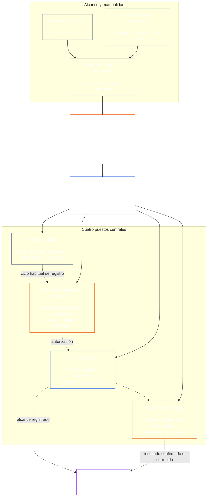

# CAPÍTULO SIETE: INDEPENDENCIA FUNCIONAL Y SEGREGACIÓN DE FUNCIONES

<strong>Ubicación en el corpus (no operativa): estructura del archivo y reglas de lectura</strong>

> El contenido siguiente es **solo orientación para quien lee**. No añade, elimina ni reduce obligaciones vinculantes en otras partes de este archivo ni en otros capítulos.
>
> Este archivo **forma parte de la Constitución Senciente** y solo es vinculante **junto con** los demás archivos numerados `core_*`, leídos como un instrumento único. Contiene el **Capítulo Siete**: el piso transversal a los procesos para la independencia funcional y la segregación de funciones. Sigue al Piso de Derechos del Capítulo Seis y precede a los capítulos de procesos constitucionales que comienzan con la [certificación de alineación del sistema del Capítulo Ocho](../../core_08_system_alignment_certification.md#chapter-eight-system-alignment-certification-reading-index).
>
> - **Titular constitucional:** el piso de puestos diferenciados para actos materialmente vinculantes; el contenido mínimo universal de cada [Registro de Acto Materialmente Vinculante](../../core_05_band_accountability.md#materially-binding-act-record); la independencia respecto del actor y de su [Línea de Control Material](../../core_05_band_accountability.md#material-control-line); la publicación de la asignación de carriles y funciones; el enrutamiento de conflictos, vacantes, sustituciones y puestos incorrectos; el alojamiento conjunto proporcional; los traspasos atribuibles; y las condiciones mínimas de independencia que debe aplicar todo proceso constitucional posterior.
> - **Fuente en la capa de principios:** el [Capítulo Uno §18.3](../../core_01_c_stewardship_capacity_principles.md#183-segregation-of-duties) exige que la gobernanza preserve la independencia funcional y remite aquí a la arquitectura operativa de puestos.
> - **Titular de implementación:** [CJS-3.11](../../corpus_joint_structure/cjs_03a_accountability_operations.md#constitutional-lane-and-functional-separation), [CI-3.2](../../corpus_institutions/ci_03_institutional_design_separation_of_powers.md#ci-32-functional-separation-lanes) y [CI-4.6](../../corpus_institutions/ci_04_appointment_competency_rotation_removal.md#ci-46-seat-catalog--process-role-archetypes-and-operational-boundaries) asignan y llevan a la práctica los puestos. Pueden ser más estrictos y añadir tipos acotados de puestos de autoridad especial; no pueden estrechar este capítulo.
> - **La aplicación específica de cada proceso sigue aguas abajo:** el Capítulo Ocho aplica este piso a la certificación de alineación del sistema; el [Capítulo Nueve §3.7](../../core_09_standing_assessment.md#37-segregation-of-duties) lo aplica a los registros de trayectoria; el Capítulo Doce y [corpus_forum.md](../../corpus_forum.md) lo aplican al proceso de foros. Esos capítulos pueden añadir salvaguardas exigidas por su materia; no pueden crear un sustituto más débil.
>
> Orden de lectura: §1 propósito y alcance → §2 piso de cuatro puestos → §3 independencia y conflictos → §4 enrutamiento al puesto incorrecto → §5 asignación publicada y sustitutos → §6 escala proporcional → §7 emergencias → §8 Registros de Acto y traspasos atribuibles → §9 aplicación aguas abajo.

<strong>Rastro</strong>

- Antecedentes: [Tétrada Constitucional](../../core_00_preamble.md#constitutional-tetrad) — en especial **supervisión** y **rendición de cuentas**; [interés material](../../core_00_preamble.md#material-stake); [Estándar de Custodia Compartida del Capítulo Uno §17.1](../../core_01_c_stewardship_capacity_principles.md#171-shared-stewardship-standard); [Gobernanza bajo Disciplina de Custodia del Capítulo Uno §18](../../core_01_c_stewardship_capacity_principles.md#18-governance-under-stewardship-discipline); [Artículo XVI](../../core_06_rights_part_c.md#article-xvi-audit-transparency-and-independent-verification) (*Auditoría, transparencia y verificación independiente*).
- Subsecciones: [§1](#1-purpose-scope-and-owner-boundary); [§2](#2-four-seat-constitutional-floor); [§3](#3-independence-conflict-and-control-lines); [§4](#4-wrong-seat-routing); [§5](#5-published-placement-vacancy-and-substitution); [§6](#6-proportional-scaling-and-merged-hosting); [§7](#7-emergency-and-urgent-action); [§8](#8-act-records-and-attributable-handoffs); [§9](#9-relationship-to-later-processes).
- Consecuencias: [Capítulo Ocho](../../core_08_system_alignment_certification.md#chapter-eight-system-alignment-certification-reading-index); [Capítulo Nueve](../../core_09_standing_assessment.md#chapter-nine-contribution-violation-and-standing-model--measurement); [Capítulo Doce](../../core_12_forum.md#chapter-twelve-forums-and-jurisdiction); [Capítulo Trece](../../core_13_governance.md#chapter-thirteen-constitutional-contract-legitimacy-authorization-and-stewardship); texto de implementación designado arriba.
- Leer con: [Detección de Desalineación del Capítulo Uno §19.3](../../core_01_c_stewardship_capacity_principles.md#193-misalignment-detection) (*detección plural y revisión*); [Acción Atribuible](../../core_05_band_accountability.md#attributable-action); [Integridad de Atribución](../../core_05_band_accountability.md#attribution-integrity); [Auditabilidad](../../core_05_band_oversight.md#auditability); [Impugnabilidad](../../core_05_band_accountability.md#contestability); [Proporcionalidad](../../core_05_band_accountability.md#proportionality).

 

El Capítulo Siete es el titular constitucional del **piso de independencia funcional y segregación de funciones para actos materialmente vinculantes**.

### 1. Propósito, alcance y límites del titular

<strong>Rastro</strong>

- Antecedentes: afirmación de titularidad al inicio del capítulo; [Capítulo Uno §18](../../core_01_c_stewardship_capacity_principles.md#18-governance-under-stewardship-discipline); [Supervisión](../../core_05_apex_oversight_leg.md#oversight-constitutional); [Rendición de cuentas](../../core_05_apex_accountability_leg.md#accountability).
- Consecuencias: desde [§2](#2-four-seat-constitutional-floor) hasta [§9](#9-relationship-to-later-processes); todo proceso posterior que produzca o modifique un acto materialmente vinculante.
- Leer con: [Capítulo Cuatro](../../core_04_burden_traceability_verification.md#chapter-four-burden-of-proof-traceability-and-verification) para la base de verificación; [Artículo XIII-A](../../core_06_rights_part_c.md#article-xiii-a-reliability-and-trustworthiness-baseline) (*Piso de Fiabilidad y Confiabilidad*) y [Artículo XIII-B](../../core_06_rights_part_c.md#article-xiii-b-right-to-redress-and-remedy) (*Derecho a Reparación y Remedio*) para impugnación y reparación; [Artículo XVI](../../core_06_rights_part_c.md#article-xvi-audit-transparency-and-independent-verification) (*Auditoría, transparencia y verificación independiente*) para los Pisos de Derechos de verificación independiente.

 

*En términos sencillos: antes de confiar en un proceso constitucional —o en una decisión de nivel de las partes interesadas dentro de un sistema, institución o ámbito de decisión acotado y ya autorizado— hay que separar las funciones que lo componen. Este piso se aplica tanto a la [Capa de Contrato Constitucional](../../core_05_band_integrative.md#constitutional-contract-layer) como a la [Participación de las Partes Interesadas en el Sistema](../../core_05_band_participation.md#stakeholder-status-and-weight). Un senciente, cargo, sistema de IA, órgano de partes interesadas o representante que busca un resultado no puede también aportar la supuesta comprobación independiente, controlar el registro oficial de esa comprobación ni decidir la impugnación de esta.*

Este capítulo se aplica a todo [Acto Materialmente Vinculante](../../core_05_band_accountability.md#materially-binding-act), según lo define el Capítulo Cinco, incluidos:

- una decisión;
- una autorización o certificación;
- una determinación;
- una anotación en un registro o un cambio material de versión;
- una liberación, despliegue, continuación o retirada;
- un desembolso o una asignación; y
- la resolución de una impugnación.

Los puestos de este capítulo definen quién puede hacer qué respecto de un acto particular; no son títulos de empleo. Un mismo senciente, cargo o sistema puede ocupar puestos distintos para actos distintos. Un título, una delegación, una capacidad técnica o la posibilidad de realizar un paso no amplía el puesto que se ocupa para ese acto.

Este capítulo establece el piso transversal de segregación de funciones. No traslada:

- la carga probatoria, la trazabilidad ni el método de verificación del Capítulo Cuatro;
- los significados canónicos del Capítulo Cinco;
- los Pisos de Derechos del Capítulo Seis;
- el contenido de registros específico de cada proceso de los Capítulos Ocho a Doce; ni
- los catálogos operativos de puestos, métodos de dotación de personal y mecánicas de mapas de carriles del texto de implementación designado.

### 2. Piso constitucional de cuatro puestos

<strong>Rastro</strong>

- Antecedentes: [§1](#1-purpose-scope-and-owner-boundary); [Capítulo Uno §18.3](../../core_01_c_stewardship_capacity_principles.md#183-segregation-of-duties); [Capítulo Uno §17.1](../../core_01_c_stewardship_capacity_principles.md#171-shared-stewardship-standard).
- Consecuencias: desde [§3](#3-independence-conflict-and-control-lines) hasta [§9](#9-relationship-to-later-processes); [CI-4.6](../../corpus_institutions/ci_04_appointment_competency_rotation_removal.md#ci-46-seat-catalog--process-role-archetypes-and-operational-boundaries) (*Catálogo de puestos: arquetipos de funciones de proceso y límites operativos*).
- Leer con: [§6](#6-proportional-scaling-and-merged-hosting) para la única vía permitida de alojamiento conjunto.

 

*En términos sencillos: cada acto materialmente vinculante tiene cuatro funciones: solicitar o actuar, comprobar, llevar el registro oficial y oír la impugnación. Las funciones siguen siendo distintas aunque se permita a una organización pequeña asignar un par permitido a un mismo cargo.*

<strong>Orientación para quien lee (no operativa): mapa de cuatro puestos</strong>

> El contenido siguiente es **solo orientación para quien lee**. No añade, elimina ni reduce obligaciones vinculantes en otras partes de este capítulo ni en otros capítulos.
>
> **Mapa para quien lee (no operativo).** Este diagrama muestra los cuatro puestos y un ciclo habitual de registro. No añade un quinto puesto de implementación, no exige que la revisión concluya antes de toda acción ni modifica las reglas operativas de esta sección y de los §§3–6.

 

Las flechas punteadas dentro del recuadro de puestos muestran un ciclo habitual de registro. Las flechas hacia la implementación son enlaces de trazabilidad, no una secuencia obligatoria que exija esperar a la revisión.

Todo acto materialmente vinculante tiene cuatro puestos funcionalmente distintos. El Capítulo Cinco aporta sus significados canónicos; esta sección establece las reglas transversales de asignación e incompatibilidad:

1. **[Puesto Iniciador](../../core_05_band_accountability.md#initiating-seat)** — solicita, propone, opera, reclama o de otro modo inicia el acto.
2. **[Puesto de Verificación o Autorización](../../core_05_band_accountability.md#verify-or-authorize-seat)** — contrasta las pruebas y la autoridad con la norma aplicable y verifica, autoriza, deniega o condiciona el acto.
3. **[Puesto de Registro](../../core_05_band_accountability.md#record-seat)** — asienta, versiona, custodia, conserva y publica el [Registro de Acto](../../core_05_band_accountability.md#materially-binding-act-record) de lo que determinó el Puesto de Verificación o Autorización.
4. **[Puesto de Impugnación](../../core_05_band_accountability.md#contest-seat)** — recibe y revisa una impugnación, ordena correcciones o límites cuando está autorizado y remite cualquier asunto fuera de su autoridad.

Estos puestos se aplican por igual a custodios humanos y de IA. Si un sistema realiza un acto, lo aprueba y luego usa su propio registro como prueba, ocupa a la vez los puestos iniciador, verificador y registrador. Automatizar el proceso no hace independiente la comprobación.

Se prohíben las siguientes combinaciones para un mismo acto:

- el puesto iniciador no debe verificar ni autorizar su propio acto;
- el puesto de verificación o autorización no debe ocupar el puesto de registro;
- el puesto de verificación o autorización no debe ocupar el puesto de impugnación; y
- el operador de un sistema no debe verificar ni autorizar un acto relativo a ese sistema.

Los capítulos posteriores o el texto de implementación incorporado pueden prohibir combinaciones adicionales para un proceso particular. No pueden permitir una combinación prohibida aquí.

El piso funcional de cuatro puestos rige en todas las clases. La cuestión que escala por clase es si esos puestos pueden fusionarse o compartir titular: para una institución o sistema que opera dentro del alcance de Clase C, siempre se recomienda la separación plena de los cuatro puestos; para el alcance de Clase B, casi siempre debería exigirse; y para el alcance de Clase A, siempre es obligatoria. Cuando el alcance sea mixto o la clasificación incierta, aplíquese la postura más exigente que corresponda hasta que el registro sustente una menor.

### 3. Independencia, conflictos y líneas de control

<strong>Rastro</strong>

- Antecedentes: [§2](#2-four-seat-constitutional-floor); [Responsabilidad a escala de autoridad](../../core_01_c_stewardship_capacity_principles.md#181-governance-as-authorized-structure); [Artículo XXIV](../../core_06_rights_part_d.md#article-xxiv-constitutional-interpretation-review-and-anti-capture-safeguards) (*Salvaguardas de interpretación constitucional, revisión y anticaptura*).
- Consecuencias: [§4](#4-wrong-seat-routing); [§5](#5-published-placement-vacancy-and-substitution); [§8](#8-act-records-and-attributable-handoffs); funciones de certificación del Capítulo Ocho; custodia de registros del Capítulo Nueve; prevención de la autoadjudicación en foros del Capítulo Doce.
- Leer con: [Línea de Control Material](../../core_05_band_accountability.md#material-control-line); [CI-5](../../corpus_institutions/ci_05_conflict_integrity_anti_capture_anti_corruption.md) (*Integridad frente a conflictos, anticaptura y anticorrupción*) y [CF-7](../../corpus_forum/cf_07_integrity_safeguards_anti_capture_anti_self_judging.md) (*Salvaguardas de integridad, operaciones anticaptura y apoyo contra la autoadjudicación*) para las salvaguardas operativas frente a conflictos y autoadjudicación.

 

*En términos sencillos: cambiar el nombre del puesto no crea independencia. Quien verifica o revisa no es independiente si el senciente o cargo que busca el resultado puede dirigirle, destituirle, recompensarle, castigarle o revocarle en silencio la decisión sobre ese acto.*

La independencia funcional se determina por la autoridad y el control reales, no por las etiquetas. Para un mismo acto:

- los puestos de verificación o autorización e impugnación deben estar fuera de la [Línea de Control Material](../../core_05_band_accountability.md#material-control-line) del puesto iniciador;
- una parte cuyo propio interés se determine mediante el acto no debe ocupar el puesto de verificación o autorización ni el de impugnación;
- quien esté en conflicto como titular del registro debe transferirlo, con todo su historial de auditoría, al sustituto publicado; no debe decidir el conflicto ni abandonar la custodia; y
- la recusación elimina la autoridad sobre el acto; no transfiere el puesto a quien lo solicitó, a la línea de reporte de esa persona ni a quien esté más cerca.

Traza la [Línea de Control Material](../../core_05_band_accountability.md#material-control-line) para el acto concreto. La infraestructura compartida, el apoyo administrativo o los antecedentes de nombramiento no establecen por sí solos esa línea, pero tales arreglos no deben impedir en la práctica el juicio independiente.

No basta para satisfacer la independencia una segunda firma, un comité nominal, una etiqueta interna o una certificación generada por una herramienta si la supuesta comprobación carece de autoridad, acceso a las pruebas, libertad frente al control material o capacidad real para denegar y remitir.

### 4. Enrutamiento al puesto incorrecto

<strong>Rastro</strong>

- Antecedentes: [§2](#2-four-seat-constitutional-floor); [§3](#3-independence-conflict-and-control-lines).
- Consecuencias: [§5](#5-published-placement-vacancy-and-substitution); [§8](#8-act-records-and-attributable-handoffs); [reglas compartidas de puestos CI-4.6](../../corpus_institutions/ci_04_appointment_competency_rotation_removal.md#ci-46-shared-seat-rules).
- Leer con: [Deber de Resistir del Capítulo Uno §17.5](../../core_01_c_stewardship_capacity_principles.md#175-duty-to-resist).

 

*En términos sencillos: cuando un paso no te corresponde, no lo asumas en silencio ni te limites a marcharte. Registra la carencia y remite el asunto al lugar correcto.*

Cuando se le pida realizar un paso fuera de su puesto, un custodio debe:

1. rechazar ese paso sin pretender decidir sus méritos;
2. nombrar el puesto que puede asumirlo y, si está publicado, a su titular o sustituto;
3. registrar la solicitud, el puesto que ocupa, la carencia o el conflicto y la vía utilizada;
4. conservar las pruebas y la integridad de todo registro ya recibido; y
5. remitirlo sin demora evitable.

Esa respuesta es el cumplimiento del deber, no el abandono del acto. El acto prosigue por el puesto correcto. Asumir el paso porque el custodio es quien está más cerca, actúa más rápido, tiene mayor rango o posee conocimientos únicos no subsana la falta de un puesto.

### 5. Asignación publicada, vacantes y sustituciones

<strong>Rastro</strong>

- Antecedentes: [§2](#2-four-seat-constitutional-floor); [§3](#3-independence-conflict-and-control-lines); [Transparencia](../../core_05_band_oversight.md#transparency); [Auditabilidad](../../core_05_band_oversight.md#auditability).
- Consecuencias: [§8](#8-act-records-and-attributable-handoffs); [CI-3.2](../../corpus_institutions/ci_03_institutional_design_separation_of_powers.md#ci-32-functional-separation-lanes) (*Carriles de separación funcional*); [CI-4.5](../../corpus_institutions/ci_04_appointment_competency_rotation_removal.md#ci-45-authorized-roles-and-accountability-chains) (*Funciones autorizadas y cadenas de rendición de cuentas*); registros de los Capítulos Ocho y Nueve.
- Leer con: [Carta](../../core_05_band_continuity.md#charter) y [Capítulo Trece §5](../../core_13_governance.md#5-authorized-roles-competency-development-and-contribution).

 

*En términos sencillos: una organización debe indicar quién ocupa cada puesto antes de que surja el caso difícil, incluido quién lo asume cuando falta el titular habitual o este está en conflicto.*

Todo adoptante que lleve a cabo actos materialmente vinculantes debe mantener un mapa publicado, auditable e impugnable que identifique:

- qué carril, cargo, función o proceso alberga cada puesto;
- los actos y el alcance a los que se aplica esa asignación;
- todos los arreglos permitidos de alojamiento conjunto y su salvaguarda de independencia;
- el sustituto para un titular ausente, excluido, capturado o en conflicto; y
- la vía independiente cuando no haya un sustituto cualificado disponible.

Un puesto sin asignar, vacante o en conflicto es un defecto de gobernanza que debe registrarse y corregirse. No pasa automáticamente al puesto iniciador, a una parte interesada, a un operador ni a un superior en su [Línea de Control Material](../../core_05_band_accountability.md#material-control-line). Hasta que se corrija, el acto se remite al sustituto publicado o a la vía independiente. No se puede eludir el requisito de independencia por tener prisa.

La delegación conserva el mismo límite de puesto, los deberes probatorios, el registro y el plazo, y sigue sujeta a la [Línea de Control Material](../../core_05_band_accountability.md#material-control-line). No crea un puesto nuevo, no fusiona puestos ni permite al delegado hacer lo que no podía hacer el puesto delegante, incluida la conversión de una recomendación o requisito de separación plena de cuatro puestos, graduada por clase, en permiso para fusionarlos.

### 6. Escala proporcional y alojamiento conjunto

<strong>Rastro</strong>

- Antecedentes: [§2](#2-four-seat-constitutional-floor); [interés material](../../core_00_preamble.md#material-stake); [Necesidad](../../core_05_band_accountability.md#necessity); [Proporcionalidad](../../core_05_band_accountability.md#proportionality).
- Consecuencias: [Capítulo Nueve §3.7](../../core_09_standing_assessment.md#37-informal-and-small-scope-records); [CJS-2.4](../../corpus_joint_structure/cjs_02_specific_joint_interlocks.md#cjs-24-class-scaled-lane-staffing-and-competency-redundancy) (*Dotación de personal por carriles y redundancia de competencias graduadas por clase*); [CI-3.2](../../corpus_institutions/ci_03_institutional_design_separation_of_powers.md#ci-32-functional-separation-lanes) (*Carriles de separación funcional*).
- Leer con: [Carga Evitable](../../core_05_band_continuity.md#avoidable-burden) y [Proceso Antidegradante del Capítulo Uno §3.3](../../core_01_a_values_principles.md#33-anti-degrading-process).

 

*En términos sencillos: los grupos pequeños e informales no necesitan cuatro departamentos grandes. Sí necesitan una comprobación realmente independiente, un registro utilizable y una vía de impugnación. La escala cambia el método de dotación de personal, no la separación protegida.*

La solidez, la dotación de personal, la redundancia y la formalidad de la separación se gradúan según el interés material, la clase del sistema, la dependencia y el daño razonablemente previsible.

Un adoptante pequeño o informal puede asignar dos puestos al mismo cargo o senciente solo si se cumple todo lo siguiente:

- la fusión es necesaria y proporcional al alcance;
- está publicada, es auditable e impugnable, y se declara en el registro del acto;
- una salvaguarda de independencia aborda los riesgos que genera la fusión;
- el puesto iniciador no verifica ni autoriza su propio acto;
- siguen prohibidas las combinaciones de verificación y registro, y de verificación e impugnación; y
- sigue disponible una vía independiente cuando el conflicto, el daño material o la impugnación superen el límite lícito del titular fusionado.

Las actividades informales, no remuneradas, de ayuda mutua, cuidado, reparación, enseñanza, cooperación y custodia comunitaria pueden recurrir a un órgano de confianza desinteresado, con autoridad publicada para la comprobación pertinente. La Constitución no exige una formalidad institucional que el alcance no pueda razonablemente alcanzar cuando exista una vía genuinamente desinteresada y sujeta a rendición de cuentas.

La escasez de personal, la rapidez, la conveniencia o la concentración de conocimientos especializados no justifican por sí solas una fusión. Rige la postura graduada por clase de [§2 Piso Constitucional de Cuatro Puestos](#2-four-seat-constitutional-floor): no se permite ninguna excepción para la Clase A, y toda excepción para la Clase B o C debe cumplir los requisitos anteriores. Cuanto mayor sea el interés material, más firme será la presunción a favor de cargos separados, redundancia de competencias y sustitutos independientes.

### 7. Acción de emergencia y urgente

<strong>Rastro</strong>

- Antecedentes: [§2](#2-four-seat-constitutional-floor); [§6](#6-proportional-scaling-and-merged-hosting); [medidas de emergencia y carga de continuación del Capítulo Doce §6.1](../../core_12_forum.md#61-emergency-measures-and-continuation-burden); [postura provisional predeterminada](../../core_01_b_interaction_interpretation.md#default-interim-posture).
- Consecuencias: procesos de incidentes, contención, liberación, continuación y revisión posterior al evento en el texto de implementación designado.
- Leer con: [Puntualidad](../../core_05_apex_timeliness_leg.md#timeliness-constitutional), [Preservación de Pruebas](../../core_05_band_oversight.md#evidence-preservation) y [catálogo de puestos CI-4.6 — arquetipos de funciones de proceso y límites operativos](../../corpus_institutions/ci_04_appointment_competency_rotation_removal.md#ci-46-seat-containment).

 

*En términos sencillos: una emergencia real puede justificar actuar antes de que concluya la comprobación ordinaria. Cambia la secuencia, no la titularidad de los puestos ni la postura de separación graduada por clase. No permite que el actor certifique su propia continuación, borre el rastro ni se convierta después en revisor final.*

Cuando una demora crearía un riesgo razonablemente previsible de daño grave e inminente, un puesto iniciador o de contención autorizado puede tomar la acción reversible mínima necesaria antes de completar la verificación previa ordinaria, solo si:

- la autoridad, el alcance, el inicio, el vencimiento y el motivo de la emergencia se registran de inmediato o tan pronto como sea físicamente posible;
- se conservan las pruebas y objeciones;
- se restablecen la notificación y la participación dentro del plazo constitucional aplicable;
- un puesto independiente de verificación o autorización revisa toda continuación que exceda el límite inmediato; y
- el acto recibe una revisión independiente posterior al evento.

La acción de emergencia no:

- permite que el actor verifique su propia continuación;
- convierte al actor en custodio de un registro en conflicto;
- permite que el actor oiga la impugnación de su acto;
- convierte una necesidad temporal en autoridad permanente; ni
- permite fusionar los cuatro puestos en una institución o sistema de Clase A.

Ninguno de los siguientes constituye por sí solo una emergencia:

- un plazo;
- una fecha prevista de liberación;
- la escasez de personal; ni
- una preocupación reputacional.

### 8. Registros de Acto y traspasos atribuibles

<strong>Rastro</strong>

- Antecedentes: desde [§2](#2-four-seat-constitutional-floor) hasta [§7](#7-emergency-and-urgent-action); [Registro de Acto Materialmente Vinculante](../../core_05_band_accountability.md#materially-binding-act-record); [Acción Atribuible](../../core_05_band_accountability.md#attributable-action); [Integridad de Atribución](../../core_05_band_accountability.md#attribution-integrity).
- Consecuencias: [acción atribuible inspeccionable CS-4 §10](../../corpus_systems/cs_04_critical_system_stewardship.md#10-inspectable-attributable-action); [reglas compartidas de puestos CI-4.6](../../corpus_institutions/ci_04_appointment_competency_rotation_removal.md#ci-46-shared-seat-rules); todo registro de proceso regido por el §8; [`materially_binding_act_record.schema.json`](../../implementation/schemas/materially_binding_act_record.schema.json) (*formato base verificable por máquina; apoyo al proceso, no una segunda definición*).
- Leer con: [§4 Enrutamiento al Puesto Incorrecto](#4-wrong-seat-routing) y [Capítulo Cuatro §5](../../core_04_burden_traceability_verification.md#5-compliance-evidence-standard).

 

*En términos sencillos: todo acto materialmente vinculante tiene un Registro de Acto que muestra qué ocurrió, quién ocupó cada puesto, qué se decidió y adónde se remite una impugnación.*

Todo acto materialmente vinculante debe tener un [Registro de Acto Materialmente Vinculante](../../core_05_band_accountability.md#materially-binding-act-record) identificable (**Registro de Acto**). El Registro de Acto puede formar parte de un registro oficial aplicable y específico del proceso o de un conjunto atribuible de registros oficiales enlazados que preserve la integridad. No hace falta un documento duplicado separado si el registro oficial existente o el conjunto enlazado identifica claramente todos los elementos exigidos, conserva sus enlaces e historial de versiones y sigue siendo accesible por la vía autorizada del registro oficial.

El Registro de Acto debe identificar, como mínimo:

- una identidad estable del registro, la versión actual y las marcas temporales materiales de creación y cambio;
- el acto, su alcance material, estado y autoridad rectora;
- el puesto iniciador, su titular y autoridad;
- el puesto de verificación o autorización, su titular, la norma rectora, la determinación, las condiciones o motivos materiales y la hora de la determinación;
- el puesto de registro, su titular, autoridad de custodia y versión asentada;
- el puesto de impugnación o la vía publicada de impugnación, y el estado actual de la impugnación o corrección;
- toda delegación, recusación, sustitución, fusión permitida o excepción de emergencia; y
- las pruebas materiales y los enlaces a registros, traspasos, rechazos, condiciones, objeciones pendientes, plazos, versiones sustituidas y correcciones que sean necesarios para reconstruir el acto.

Los registros específicos de cada proceso pueden añadir campos más estrictos o propios de su ámbito. No pueden omitir, contradecir ni volver imposible reconstruir este mínimo. Los controles lícitos de privacidad, confidencialidad y seguridad rigen el acceso a materiales protegidos o su divulgación; no permiten borrar el rastro oficial ni volverlo inutilizable para la verificación, impugnación, corrección o reparación autorizadas.

Los registros de actividad muestran quién hizo qué, pero por sí solos no demuestran que la acción fuera válida. Un registro, firma, traza de modelo, lista de comprobación o certificación creados por el senciente o sistema que realiza la acción tienen una función limitada:

- Estos materiales pueden aportar pruebas o enlazarse al Registro de Acto.
- Estos materiales no pueden sustituir una revisión y decisión independientes ni el propio Registro de Acto oficial.

### 9. Relación con procesos posteriores

<strong>Rastro</strong>

- Antecedentes: desde [§1](#1-purpose-scope-and-owner-boundary) hasta [§8](#8-act-records-and-attributable-handoffs).
- Consecuencias: [Capítulo Ocho](../../core_08_system_alignment_certification.md#chapter-eight-system-alignment-certification-reading-index); [Capítulo Nueve](../../core_09_standing_assessment.md#chapter-nine-contribution-violation-and-standing-model--measurement); [Capítulo Doce](../../core_12_forum.md#chapter-twelve-forums-and-jurisdiction); [Capítulo Trece](../../core_13_governance.md#chapter-thirteen-constitutional-contract-legitimacy-authorization-and-stewardship).
- Leer con: [Pila de Autoridad y Jerarquía Interna](../../core_05_band_integrative.md#owner-non-relocation) y el [registro de titulares del Preámbulo](../../core_00_preamble.md#4-principles-definitions-and-rights).

 

*En términos sencillos: los capítulos posteriores indican a cada proceso qué debe evaluar, registrar, decidir y reparar. Este capítulo les indica cómo separar el poder mientras lo hacen.*

Todo proceso constitucional posterior debe explicar cómo asigna y utiliza los cuatro puestos y cómo cumple este capítulo. En la práctica:

- Su propio registro de proceso puede servir como Registro de Acto o añadirle detalles específicos del proceso.
- Si un registro de proceso abarca varios actos materialmente vinculantes, puede enlazar a un Registro de Acto separado para cada uno.
- No se requiere un registro duplicado separado cuando la vía del registro oficial sigue completa y trazable.
- Dar otro nombre a un proceso no lo exime del [§4 Enrutamiento al Puesto Incorrecto](#4-wrong-seat-routing) ni del [§8 Registros de Acto y Traspasos Atribuibles](#8-act-records-and-attributable-handoffs), incluidas sus reglas sobre traspasos y puestos incorrectos.

En particular:

- **Capítulo Ocho — certificación de alineación del sistema:** el operador del sistema o proponente de la certificación ocupa un puesto iniciador, no el de su propio verificador; las determinaciones acotadas de componentes, la integración del registro de certificación, la custodia y las impugnaciones deben permanecer dentro de sus puestos lícitos y vías contra la autoadjudicación.
- **Capítulo Nueve — registros de trayectoria:** quien solicita, la autoridad que abre el registro, quien lo custodia y la vía de impugnación aplican conjuntamente el piso de cuatro puestos y las reglas más estrictas del Capítulo Nueve sobre custodia, reclamantes, registros informales y prohibición de autocustodia.
- **Capítulo Doce — foros:** la presentación, investigación, revisión de méritos, custodia de registros, apelación y revisión de un presunto sesgo o abuso procesal del propio foro deben preservar los límites aplicables de los puestos y contra la autoadjudicación.
- **Capítulo Trece — gobernanza:** las definiciones de funciones, planes de competencias, delegación, sucesión y diseño institucional deben asignar y sostener los puestos, no limitarse a repetir sus nombres.

Un capítulo posterior puede imponer requisitos más estrictos de independencia, recusación, separación, custodia, composición del panel o revisión cuando su proceso conlleve un riesgo mayor o distinto. No puede estrechar este piso, tratar una etiqueta específica del proceso como exención ni inferir que el silencio transfiere un puesto al actor.

---

**Archivo anterior:** [core_05_band_performance.md](../../core_05_band_performance.md)

**Archivo siguiente:** [core_08_a_system_alignment_certification_evaluation.md](../../core_08_a_system_alignment_certification_evaluation.md#chapter-eight-part-a-certification-evaluation)
