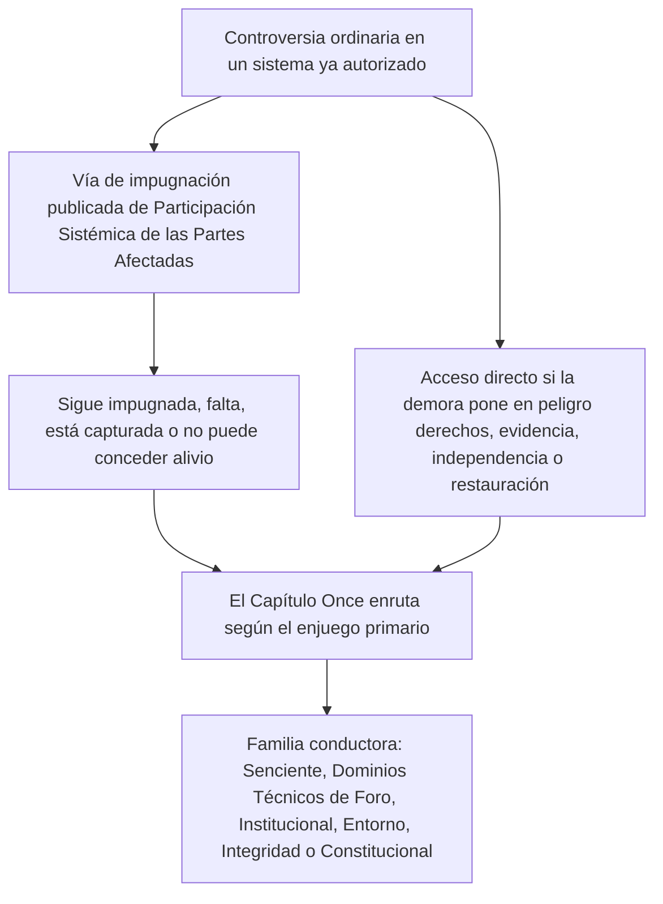

# CAPÍTULO ONCE: FOROS Y JURISDICCIÓN

<strong>Ubicación en el corpus (no operativo): estructura del archivo y reglas de lectura</strong>

> El contenido siguiente es **solo orientación para quien lee**. No añade, quita ni estrecha obligaciones vinculantes en este archivo ni en otros capítulos.
>
> Este archivo es un **piloto de idioma de lectura** del [Capítulo Once en inglés](../../core_12_forum.md). **No** es parte vinculante de la Constitución Senciente. **No** es una segunda constitución. **No** es una edición de envío. Está **fijado** a `SC-Corpus-2026.08.09`. Si esta traducción y el original en inglés parecen discrepar, gana el archivo numerado [`core_11_forum.md`](../../core_12_forum.md). El orden de lectura y los metadatos de edición se mantienen en [README.md](../../README.md). Método y glosario: [translations/es/README.md](README.md).
>
> Contiene el **Capítulo Once**: familias de foros, sede por defecto y enrutamiento por enjuegos primarios, apoyo forense, triaje de admisión y jurisdicción para controversias bajo la cadena de trayectoria y el Piso de Derechos. Los foros **supervisan** el manejo de controversias bajo las patas **participación**, **supervisión** y **actuación a tiempo** de la [Tétrada Constitucional](core_00_preamble.md#constitutional-tetrad), escaladas al [enjuego material](core_00_preamble.md#material-stake). Cuando los hechos están verificados, pueden **abrir, actualizar o corregir** registros de trayectoria — o **dejar de lado un registro defectuoso en impugnación** — bajo el [Capítulo Ocho §3](core_08_standing_assessment.md#3-standing-record-operational-requirements); un caso presentado no es trayectoria por sí solo, y el relato de foro no debe sustituir la medición de trayectoria del Capítulo Ocho ([Capítulo Ocho §3.6](core_08_standing_assessment.md#36-forum-boundary)). Usen [README — Standing pipeline and forums](../../README.md#standing-pipeline-and-forums) para la navegación de la cadena. La mecánica operativa de foro permanece en los archivos de implementación designados. La numeración de capítulos y las referencias cruzadas coinciden con el instrumento integrado.

>
> **Anterior (este idioma):** [core_10_b_misconduct_pattern_applications.md](core_10_b_misconduct_pattern_applications.md#chapter-ten-part-b-anti-constitutional-misconduct-pattern-applications)
>
> **Siguiente (aún en inglés):** [core_08-11_application_vignettes.md](../../core_09-12_application_vignettes.md#chapters-eight-eleven-application-vignettes)
> **Arco de lectura:** §1 finalidad → Secuencia de controversias → §2 sede por defecto y admisión → §2.1–§2.3 límites del liderazgo, enjuegos mixtos, impugnaciones → §3 transferencia y anti-autojuzgamiento → §4 familias → §5 escalamiento y certificación → §6 niveles y disciplina contra la demora → §7 apoyo de foro

<strong>Orientación para quien lee (no operativo): dónde vive el Capítulo Once y qué se queda aquí</strong>

> El contenido siguiente es **solo orientación para quien lee**. No añade, quita ni estrecha obligaciones vinculantes en este capítulo ni en otros capítulos.
>
> Dónde vive esto (navegación):
> - **Titular constitucional:** **sección 1** (*finalidad* — **aplicación adjudicativa primaria** de las normas que este capítulo asigna, **distinta de** la **administración ejecutiva** rutinaria; **Secuencia de controversias** para controversias ordinarias dentro de sistemas ya autorizados; requisitos de **rendición de cuentas**; colocación de **umbral** **publicada** y **predecible**); sede **de partida por defecto**, enrutamiento por **enjuegos primarios**, **órgano de triaje de admisión** (**escritorio de primer contacto**), enjuegos mixtos, asimetría, impugnaciones de registros de trayectoria, **caracterización de buena fe y antijuego**, y expectativas de **acceso** de **umbral** **accesible a sencientes** (**sección 2**, **leer con** **`corpus_forum.md`**); **transferencia**, **consolidación** y **coordinación** (**sección 3**, leer con la certificación y el respaldo de la **sección 5**); **definiciones de familias de foros**, **cámaras internas**, **estándares compartidos** y **derecho operativo provisional** (senciente, técnico, institucional, entorno, integridad, constitucional — **sección** **4**, que espeja la **tabla** de la **sección** **2**); **escalamiento**, **certificación** y **Protección interina** (**sección 5**); **resolución oportuna** y disciplina **contra la demora** (**sección 6**); **apoyo de foro** antes, durante y después de la revisión (**sección 7**), implementado de modo que los roles de triaje y de apoyo **no** sustituyan a los **paneles de fondo lícitamente constituidos**; enrutamiento de respaldo **anti-autojuzgamiento**; y ganchos de escalamiento ligados al **Capítulo Ocho**, al **Capítulo Diez** y a los derechos de justicia e impugnación del **Capítulo Seis**.
> - **Navegación de la cadena:** [README — Standing pipeline and forums](../../README.md#standing-pipeline-and-forums) — [§§1–7](#1-purpose-and-role) en este archivo.
> - **Cadena de tres preguntas de los Capítulos Ocho–Nueve:** Las **secciones 2–3** del Capítulo Ocho responden la Pregunta 1 (*¿qué ocurrió?*) mediante registros verificados de eje puro. El [Capítulo Ocho §4](core_08_standing_assessment.md#4-standing-measurement-evaluation-dimensions) y la [escala LEQU proporcional unificada del §7](core_08_standing_assessment.md#7-unified-proportional-lequ-scale) responden la Pregunta 2 (*¿cuán bueno o cuán malo fue?*) mediante dimensiones de evaluación, bandas LEQU compartidas de cinco veces y la gramática compartida **s** = 1...9, preservando registros separados de Contribución y de Violación. El [Capítulo Nueve](core_09_standing_integration.md#chapter-nine-standing-effects-and-integration) responde la Pregunta 3 (*¿qué ocurre por causa de ello?*) mediante remedios, salvaguardas, barras de competencia y habilitaciones, y bloqueos de trayectoria. La casilla del Eje de Violación la controla solo el impacto verificado; la negligencia, el ocultamiento, la coerción, la respuesta y descriptores de carácter comparables no la mueven. El [Capítulo Diez](core_10_a_misconduct_designation.md#chapter-ten-anti-constitutional-misconduct) puede añadir la designación emparejada de inconducta anticonstitucional a un registro de casilla 7, 8 o 9 del Capítulo Ocho, pero no asigna la casilla numérica.
> - **Foros (glosa no operativa):** Las **familias de foros** bajo este capítulo son los **foros** primarios que aplican las clasificaciones del [Capítulo Ocho](core_08_standing_assessment.md#chapter-eight-compliance-violation-and-standing-model) a controversias concretas — incluidos asuntos en los que la **naturaleza de la contribución**, la **casilla de impacto del Eje de Violación** y el carácter de proceso / respuesta registrados por separado están **copresentes** y deben manejarse bajo la disciplina de evaluación conjunta y de no sustitución del **Capítulo Ocho**. Los mecanismos de **fondos de investigación**, **financiamiento** e **incentivos** fuera de la adjudicación permanecen en la implementación adoptada y en **[corpus_systems.md](../../corpus_systems.md)** (véase la orientación para quien lee del **Capítulo Ocho**); pueden apoyar la prevención y la indagación de causa raíz y **no deben** sustituir el enrutamiento de **umbral**, la determinación de **fondo**, la asignación autoritativa de casilla numérica del Capítulo Ocho, cualquier designación emparejada del **Capítulo Diez**, ni las restricciones del **Artículo XXIII** (*Resolución de conflictos, escalamiento y proporcionalidad de emergencia*). Las **secciones 1 y 2** asignan la responsabilidad **primaria** de las estructuras de **incentivos** **principalmente** **dentro** de la **esfera** de cada **familia** (detalle granular en el **corpus** y en la implementación); esa **asignación** **no** reubica las elecciones de **presupuesto** de **todo el sistema** ni a **escala de gobernanza** reservadas al [Capítulo Doce](../../core_13_governance.md#chapter-thirteen-constitutional-contract-legitimacy-authorization-and-stewardship) y a **[corpus_systems.md](../../corpus_systems.md)**.
> - **Titular de implementación:** las **clases** de admisión publicadas, las reglas cotidianas de tramitación, la dotación de personal, los presupuestos, el procedimiento granular, la mecánica operativa de escalamiento y los requisitos operativos de apoyo de foro viven en el texto de implementación adoptado y en **[corpus_forum.md](../../corpus_forum.md)** (**CF-5** (*Operaciones de enrutamiento, transferencia, certificación y trato representativo*), **CF-8** (*Apoyo forense y analítico de foro*), **CF-9** (*Servicio de investigación independiente e interfaz de persecución*), y secciones relacionadas); esas capas **implementan, no estrechan**, este capítulo.
> - **Regla de no reubicación:** los instrumentos de adopción no deben satisfacer este capítulo mediante procedimientos que colapsen funciones de foro distintas, despojen la **independencia** o la **revisión real**, o enruten impugnaciones de integridad de vuelta al mismo foro capturado que este capítulo prohíbe como único hogar final de fondo.
>
> **Arquitectura — colocación de *En términos sencillos*:** Cada línea *En términos sencillos* aparece inmediatamente después del bloque de navegación de Rastro (y del ` ` que lo sigue cuando está presente), y **antes** de los párrafos operativos y las listas con viñetas de esa sección. Glosa orientada a quien lee solamente; no añade, quita ni estrecha texto vinculante.

<strong>Rastro</strong>

- Origen: [Capítulo Ocho](core_08_standing_assessment.md#chapter-eight-compliance-violation-and-standing-model) (*registros de la Pregunta 1 y medición de la Pregunta 2 que alimentan las controversias que este capítulo enruta*); [Capítulo Ocho §5.1](core_08_standing_assessment.md#5-slot-grammar-and-display-labels) (*gramática de casilla de trayectoria*); [escala unificada del Capítulo Ocho §7](core_08_standing_assessment.md#7-unified-proportional-lequ-scale) (*bandas LEQU compartidas de cinco veces y registros de eje separados*); [Capítulo Ocho §§4.3–4.4](core_08_standing_assessment.md#43-route-descriptor-measurement-roles) (*catálogo de descriptores normalizados transaxiales, incluidos descriptores del Eje de Contribución y del Eje de Violación que no mueven casillas*); [Capítulo Diez](core_10_a_misconduct_designation.md#chapter-ten-anti-constitutional-misconduct) (*designación emparejada de inconducta anticonstitucional para casillas calificadoras 7–9 del Capítulo Ocho*); [Capítulos Dos a Cuatro](core_02_definition_structure.md) (*expectativas de registro, verificación y trazabilidad*); [Capítulo Cinco](core_05__definitions_home.md#chapter-five-foundational-definitions) (*definiciones fundacionales*); [Capítulo Uno](core_01_c_stewardship_capacity_principles.md#chapter-01-principles-and-constraints) (*restricciones interpretativas*); [Capítulo Seis — Derechos fundacionales](core_06_rights_part_a.md#chapter-six-foundational-rights) hasta la [Parte D](core_06_rights_part_d.md) (*ganchos de impugnación, auditoría y artículos de justicia*).
- Subsecciones: [§1](#1-purpose-and-role); [§2](#2-default-venue-and-primary-stakes); [§3](#3-transfer-consolidation-and-coordination); [§4](#4-forum-family-definitions); [§5](#5-escalation-and-certification); [§6](#6-timely-resolution-materiality-tiers-and-anti-delay-discipline); [§7](#7-forum-support-before-during-and-after-review).
- Leer con: [README — Standing pipeline and forums](../../README.md#standing-pipeline-and-forums).
- Destino: [corpus_forum.md](../../corpus_forum.md) (*doctrina operativa de foro*); [Capítulo Doce](../../core_13_governance.md#chapter-thirteen-constitutional-contract-legitimacy-authorization-and-stewardship) donde la legitimidad de gobernanza interactúa con el rol adjudicativo; [Capítulo Dieciséis](../../core_17_incorporation.md#chapter-seventeen-incorporation-bridge) (*disciplina de incorporación* para las capas de procedimiento adoptadas).
- Leer con: [Capítulo Ocho §5.1](core_08_standing_assessment.md#5-slot-grammar-and-display-labels) (*gramática de casilla de trayectoria*); [Capítulo Ocho §§4.3–4.4](core_08_standing_assessment.md#43-route-descriptor-measurement-roles) (*descriptores normalizados transaxiales del Eje de Contribución y del Eje de Violación*).
- Leer también con: [Capítulo Nueve §3](core_09_standing_integration.md#3-descriptor-integration-and-attachment-normalization) (*integración de descriptores y normalización de adjuntos leída con el enrutamiento por enjuegos primarios de la sección 2*); [README.md](../../README.md) (*orden de lectura y organización del corpus*); [doc_architecture.md](../../doc_architecture.md) (*mapas editoriales no vinculantes salvo adopción*).

 

El Capítulo Once es el titular constitucional de las **familias de foros, la sede por defecto, la jurisdicción y el enrutamiento adjudicativo de controversias bajo la cadena de trayectoria y el Piso de Derechos**.

*En términos sencillos: Bajo la [Tétrada Constitucional](core_00_preamble.md#constitutional-tetrad) y las [Dos Finalidades Constitucionales](core_00_preamble.md#two-constitutional-aims), este capítulo **supervisa** cómo las controversias recorren la cadena de trayectoria de los Capítulos Ocho a Diez — enrutamiento, independencia, apoyo forense, secuencia de remediación y relojes por defecto de nivel bajo la **sección 6** y el **Artículo XXIV-C** (*Resolución oportuna y piso contra la demora*). Las familias de foros responden qué pista maneja cada controversia, dónde suele empezar un caso y cómo se coordinan los asuntos de enjuegos mixtos. Suministran **participación** (impugnación accesible) y **supervisión** (revisión de fondo trazable). Cuando los hechos están verificados, pueden **abrir, actualizar o corregir** registros de trayectoria — o **dejar de lado un registro defectuoso en impugnación**. **No** operan una segunda pista de decisión aparte, al lado de la cadena de trayectoria. Presentar un caso por sí solo no tiene impacto inmediato sobre la trayectoria. Las reglas cotidianas de tramitación, los presupuestos y los manuales de personal viven en las capas de implementación y deben **implementar, no estrechar**, este capítulo ni el **Artículo XXIII** (*Resolución de conflictos, escalamiento y proporcionalidad de emergencia*).*

### 1. Finalidad y rol — arquitectura de participación

<strong>Rastro</strong>

- Origen: [Capítulo Siete — Certificación de alineación del sistema](core_07_a_system_alignment_certification_evaluation.md#chapter-seven-system-alignment-certification); [Capítulo Ocho](core_08_standing_assessment.md#chapter-eight-compliance-violation-and-standing-model); [Capítulo Nueve](core_09_standing_integration.md#chapter-nine-standing-effects-and-integration); [Capítulo Diez](core_10_a_misconduct_designation.md#chapter-ten-anti-constitutional-misconduct); [Capítulo Uno](core_01_c_stewardship_capacity_principles.md#chapter-01-principles-and-constraints) (*principios y restricciones interpretativas*); [Capítulos Dos a Cuatro](core_02_definition_structure.md) (*expectativas de trazabilidad y verificación*); [Capítulo Cinco](core_05__definitions_home.md#chapter-five-foundational-definitions) (*definiciones leídas junto con los Capítulos Dos a Cuatro en el recuadro de Ubicación en el corpus*); [Capítulo Seis](core_06_rights_part_a.md#chapter-six-foundational-rights) (*Piso de Derechos fundacionales que este capítulo aplica junto con*).
- Destino: [§2](#2-default-venue-and-primary-stakes) (*sede por defecto de enjuegos primarios, triaje de admisión, enjuegos mixtos, asimetría, impugnaciones de registros de trayectoria; acceso de umbral impugnable y oportuno; caracterización de buena fe y antijuego*); [§3](#3-transfer-consolidation-and-coordination) (*transferencia y anti-autojuzgamiento*); [§4](#4-forum-family-definitions) (*definiciones de familias de foros, cámaras, estándares compartidos y derecho operativo provisional*); [§4.3](#43-institutional-forums) (*Frontera de proceso interno como aplicación de la familia Institucional de la Secuencia de controversias*); [§5](#5-escalation-and-certification) (*escalamiento, certificación y Protección interina*); [§6](#6-timely-resolution-materiality-tiers-and-anti-delay-discipline) (*niveles de materialidad, hitos de la cadena y disciplina contra la demora*); [§7](#7-forum-support-before-during-and-after-review) (*apoyo de foro antes, durante y después de la revisión*).
- Pata(s) de la Tétrada: **participación**, **supervisión**, **rendición de cuentas**, **actuación a tiempo** (los hallazgos verificados pueden abrir, actualizar o corregir registros de trayectoria; **CF-11** implementa los relojes por nivel). Finalidad(es) primaria(s): **Florecimiento** y **Continuidad**. El escalamiento por [enjuego material](core_00_preamble.md#material-stake) aplica a la carga de enrutamiento y de acceso.
- Leer con: [Preámbulo §3.2](core_00_preamble.md#32-key-governance-processes) y [§3.3](core_00_preamble.md#33-governance-layers) (*vías de proceso y disciplina de capas de gobernanza*); [Artículo XI: Participación Sistémica de las Partes Afectadas, representación y Debido Proceso](core_06_rights_part_b.md#article-xi-stakeholder-system-participation-representation-and-due-process); [corpus_forum.md](../../corpus_forum.md) (**CF-6.2.2** (*Reglas de emergencia, agotamiento y plazos*) — implementar, no estrechar); [corpus_institutions.md](../../corpus_institutions.md) (*impugnación, revisión secundaria y monitoreo de integridad — no reemplaza la jurisdicción de foro asignada*); [Artículo XII-B: Derecho a impugnar, revisar y obtener reparación](core_06_rights_part_c.md#article-xii-b-right-to-challenge-review-and-redress); [familia del Artículo XXIII](core_06_rights_part_d.md#article-xxiii-a-justice-objective-and-scope) (*restricciones de justicia referenciadas en el recuadro de Ubicación en el corpus*).

 

*En términos sencillos: esta sección asigna **participación** y **supervisión** constitucionales a través de familias de foros que **supervisan** dos pistas — la **cadena de trayectoria** (controversias y efectos de registro de los Capítulos Ocho a Diez) y la **Certificación de alineación del sistema** (reconocimiento y revisión del Capítulo Siete) — y luego enuncia requisitos de rendición de cuentas para la colocación de umbral publicada. Las controversias ordinarias dentro de sistemas ya autorizados usan primero la vía de impugnación publicada de Participación Sistémica de las Partes Afectadas; este capítulo toma el relevo cuando esa vía sigue impugnada, falta, está capturada o no puede conceder alivio. Las reglas detalladas de audiencia viven en otra parte y no pueden encoger en silencio lo que este capítulo garantiza.*

Este capítulo enuncia qué **familias de foros** **supervisan** qué preguntas primarias a través de la **participación** (impugnación accesible a sencientes, trato representativo y acceso proporcional) y la **supervisión** (independencia, apoyo forense y revisión de fondo trazable). **No** especifica reglas de tramitación, dotación de personal, presupuestos, procedimiento granular ni mecánica operativa de escalamiento. Esos detalles pertenecen a las capas de implementación del corpus, que deben **implementar, no estrechar**, este capítulo. Las **familias de foros** deben enunciar las fronteras jurídicas y regulatorias para la colocación de umbral, el enrutamiento por enjuegos primarios y la revisión de alineación del sistema de un modo predecible y publicado que **implemente, no estreche**, la **sección 2** junto con **`corpus_forum.md`**.

**Las familias de foros supervisan:**

1. **Cadena de trayectoria** (Capítulos Ocho a Diez, aplicando los Capítulos Uno a Seis y las normas de implementación del corpus designadas en las controversias)
   - Enrutamiento por enjuegos primarios, revisión de fondo donde esté asignada, transferencia, consolidación y coordinación de certificación, y secuencia de remediación para controversias relacionadas con la trayectoria.
   - Registros de Contribución y de Violación del **Capítulo Ocho** medidos en la escala LEQU proporcional unificada del §7, descriptores de carácter y efecto de trayectoria — los hallazgos verificados pueden **abrir, actualizar o corregir** registros de trayectoria — o **dejar de lado un registro defectuoso en impugnación** — bajo el [Capítulo Ocho §3](core_08_standing_assessment.md#3-standing-record-operational-requirements) cuando satisfacen la puerta de insumos verificados; un caso presentado no es trayectoria por sí solo, y el relato de foro no debe sustituir la medición de trayectoria del Capítulo Ocho ([Capítulo Ocho §3.6](core_08_standing_assessment.md#36-forum-boundary)).
   - Efectos de trayectoria e integración del **Capítulo Nueve** donde este capítulo asigna supervisión de foro del remedio y de la secuencia.
   - Designación de inconducta anticonstitucional del **Capítulo Diez** donde esa designación está en juego para un registro de casilla 7–9 del Capítulo Ocho.
   - Aplicación de los **Capítulos Uno a Seis** y de las capas de implementación del [corpus](core_05_band_integrative.md#corpus) designadas como las normas que esas controversias aplican.

2. **Certificación de alineación del sistema** ([Capítulo Siete](core_07_a_system_alignment_certification_evaluation.md#chapter-seven-system-alignment-certification))
   - Reconocimiento, reconocimiento condicional, validación, revalidación, retiro y resultados relacionados del registro de certificación supervisados por foro bajo la [Parte B del Capítulo Siete](core_07_b_system_alignment_certification_record_process.md#chapter-seven-part-b-certification-record-and-process).
   - Roles de componente bajo el [§13 de la Parte B](core_07_b_system_alignment_certification_record_process.md#13-forum-supervision-and-component-roles):
     - **Técnica** — especificaciones, métodos y estándares de evidencia
     - **Integridad** — reconocimiento oficial de alineación y coordinación conductora
     - **Entorno** — componente de alineación ambiental donde sea material
     - hallazgos de componente de otras familias bajo el enrutamiento de este capítulo
   - Los sencientes pueden impugnar los resultados de certificación, adjuntar condiciones y reabrir el expediente cuando haga falta — pero una certificación **no** reemplaza la medición de trayectoria.
   - Los hallazgos importantes de una certificación pueden contar como **insumos verificados** cuando el Capítulo Ocho mide la trayectoria. Una certificación **no** asigna, por sí misma, una casilla de trayectoria a nadie ([§15 de la Parte B](core_07_b_system_alignment_certification_record_process.md#15-relationship-to-standing)).

Las **familias de foros** son las instituciones primarias a través de las cuales este instrumento **supervisa** esas pistas. Se distinguen de la administración ejecutiva rutinaria de reglas promulgadas.

**Secuencia de controversias.** Dentro de un sistema, institución o dominio de decisión acotado ya autorizado, una controversia ordinaria usa primero la vía de impugnación y debido proceso publicada de [Participación Sistémica de las Partes Afectadas](core_05_band_participation.md#stakeholder-status-and-weight-cluster). Si esa vía produce un resultado aún impugnado, falta, está capturada o no puede conceder de forma lícita el alivio necesario, este capítulo enruta el asunto según el enjuego primario bajo la **sección 2**. **Integridad**, **Dominios Técnicos de Foro**, **Entorno** y **Constitucional** son familias conductoras por defecto cuando ese es el enjuego primario — no excepciones que se salten la secuencia. El proceso interno inacabado, las etiquetas de agotamiento o una pretensión de que la revisión interna no ha terminado no deben detener esas familias conductoras, desplazar su fondo ni comerse los relojes del **Artículo XXIV-C** (*Resolución oportuna y piso contra la demora*). El acceso directo permanece disponible cuando la demora pondría en peligro de forma material los derechos, la evidencia, la independencia o la restauración práctica.

*Mapa para quien lee solamente. No añade, quita ni estrecha el párrafo de Secuencia de controversias.*

Ellas:

- cargan un rol de gobernanza proactivo, incluida la resolución de problemas, el análisis de causa raíz, la prevención, la secuencia de remediación y el aprendizaje a partir de patrones de fallo, en alineación con los principios del **Capítulo Uno**, incluidos **Seguridad**, **Verdad**, **Bienestar**, **Capacidad de respuesta** y **Administración responsable y comprensión distribuida**.
- deben satisfacer las expectativas de **independencia**, **impugnabilidad** y **trazabilidad** de los **Capítulos Dos a Cuatro**, el **Artículo XII-B** (*Derecho a impugnar, revisar y obtener reparación*) donde estén implicadas la impugnación y la remediación, y el **Artículo XXIII** (*Resolución de conflictos, escalamiento y proporcionalidad de emergencia*) donde gobiernen las restricciones de justicia.
- están sujetas a los requisitos procedimentales y de integridad y rendición de cuentas más estrictos expresados por este instrumento, incluida la justificación pública, la trazabilidad, la recusación y la disciplina de panel, y el apoyo forense y analítico donde este capítulo se los asigne
- exigen enrutamiento de respaldo anti-autojuzgamiento. Esos requisitos no deben sustituir la independencia adjudicativa por control político.
- Los foros de **Integridad**, **Constitucionales** y de **Entorno**, y los **Dominios Técnicos de Foro** cuando conocen de la adjudicación de estatus de sentiencia, exigen un nombramiento **publicado**, **impugnado** y **rotativo**, o un control de independencia equivalente bajo el [Capítulo Doce §1.2](../../core_13_governance.md#12-eligibility-contested-selection-and-democratic-minimums). La insuficiencia de nombramientos o de financiamiento de esos bancos de foro es una falla del [Capítulo Nueve §9](core_09_standing_integration.md#9-enforcement-realism).

Cada **familia de foros** carga la responsabilidad primaria de las estructuras de incentivos principalmente dentro de su esfera. Esto incluye:

- instrumentos de adopción y capas de implementación designadas
- revisar las vías de costo, sanción, impugnación e información
- ganchos de secuencia de remediación y alineación comparable adyacente a la adjudicación.

Los presupuestos **de todo el sistema**, el financiamiento de investigación transversal y los programas a escala de gobernanza siguen sujetos al [Capítulo Doce — Gobernanza](../../core_13_governance.md#chapter-thirteen-constitutional-contract-legitimacy-authorization-and-stewardship), **[corpus_systems.md](../../corpus_systems.md)** y otras reglas de supremacía donde apliquen. Los pagos, las reglas de costo y las herramientas de incentivo similares **no** deben ocupar el lugar de:

- el enrutamiento de foro adecuado
- una decisión real de fondo por un panel lícitamente constituido
- la medición de casilla de impacto del Capítulo Ocho
- cualquier designación emparejada del **Capítulo Diez**
- las restricciones de justicia del **Artículo XXIII** (*Resolución de conflictos, escalamiento y proporcionalidad de emergencia*)

La impugnación institucional, la revisión secundaria y el monitoreo de integridad en **`corpus_institutions.md`** (incluidos **CI-5** (*Integridad de conflictos, anticaptura y anticorrupción*) hasta **CI-8** (*Coordinación interinstitucional y escalamiento*) y las expectativas de integridad de la impugnación) trabajan junto con este capítulo. No reemplazan a las familias de foros de **Integridad**, de **Entorno** ni **Institucionales** para el fondo vinculante donde este capítulo asigna jurisdicción a esas familias. Los mecanismos de incentivo de implementación en esos volúmenes deben coordinarse con la familia de foros cuya esfera está principalmente implicada, sin desplazar el enrutamiento por enjuegos primarios ni la autoridad de fondo que este capítulo asigna.

### 2. Sede por defecto y enjuegos primarios

<strong>Rastro</strong>

- Origen: [§1](#1-purpose-and-role) (*finalidad, rol primario de aplicación, requisitos de rendición de cuentas, enrutamiento de umbral publicado, no reubicación del detalle, expectativas de independencia y revisión*).
- Destino: [§3](#3-transfer-consolidation-and-coordination) (*transferencia, consolidación, anti-autojuzgamiento*); [§4](#4-forum-family-definitions) (*definiciones de familias de foros leídas con la tabla por defecto*); [§5](#5-escalation-and-certification) (*escalamiento desde la sede por defecto; Protección interina*); [§6](#6-timely-resolution-materiality-tiers-and-anti-delay-discipline) (*niveles de materialidad y disciplina contra la demora*); [§7](#7-forum-support-before-during-and-after-review) (*apoyo de foro antes, durante y después de la revisión*).
- Dentro de §2: [§2.1](#21-lead-default-limits) (*colisión de enjuegos primarios, certificación constitucional y respaldo anti-autojuzgamiento*); [§2.2](#22-mixed-stakes-and-routing-asymmetry) (*enjuegos mixtos y asimetría*); [§2.3](#23-forum-records-standing-records-and-contests) (*registros de caso de foro, registros de trayectoria e impugnaciones*).
- Leer con: [Tétrada Constitucional](core_00_preamble.md#constitutional-tetrad) — patas de **participación**, **supervisión** y **actuación a tiempo**; escalado de [enjuego material](core_00_preamble.md#material-stake) para el enrutamiento por enjuegos primarios; [Capítulo Ocho §5.1](core_08_standing_assessment.md#5-slot-grammar-and-display-labels) (*gramática de casilla de trayectoria*); [escala unificada del Capítulo Ocho §7](core_08_standing_assessment.md#7-unified-proportional-lequ-scale) (*bandas LEQU compartidas de cinco veces y registros de eje separados*); [Capítulo Ocho §§4.3–4.4](core_08_standing_assessment.md#43-route-descriptor-measurement-roles) (*descriptores normalizados entre ejes que informan el enjuego primario sin mover la casilla de impacto*); [corpus_forum.md](../../corpus_forum.md) (**CF-5** y **CF-7.2**); [corpus_systems.md](../../corpus_systems.md) (*deberes de clasificación, despliegue y revalidación del sistema*); [Capítulo Diez §3](core_10_a_misconduct_designation.md#3-violation-axis-s-7-9-slot-assignment-incident-gravity) (*designación de inconducta anticonstitucional para casillas calificadoras 7–9 del Capítulo Ocho; se preserva el ancla legado*); [Capítulo Diez §4](core_10_a_misconduct_designation.md#4-due-process-safeguards-for-slot-assignment) (*debido proceso para esa designación leído con este capítulo y el **Artículo XXIII** (*Resolución de conflictos, escalamiento y proporcionalidad de emergencia*)*); [Artículo XXIII-A](core_06_rights_part_d.md#article-xxiii-a-justice-objective-and-scope) (*objetivo y alcance de la justicia*).

 

*En términos sencillos: el **escritorio de primer contacto** de cada familia — el **órgano de triaje de admisión** — pregunta de qué se trata realmente la pelea, no lo que dice el encabezado, y luego usa la tabla por defecto para elegir el foro conductor. Los foros técnicos mantienen las especificaciones de alineación del sistema, los métodos y los estándares de evidencia; los foros de **Integridad** emiten la determinación oficial de reconocimiento de alineación y de validación continua a menos que una pregunta de componente pertenezca a otra parte. Clasificar no sustituye a los paneles de fondo lícitamente constituidos; los enjuegos mixtos, la asimetría y las impugnaciones de registros de trayectoria están en las subsecciones de abajo.*

**Enrutamiento por enjuegos primarios** asigna un asunto a la familia de foros responsable del enjuego jurídico, de remedio, de salvaguarda coercitiva, de piso constitucional o práctico principal en la **pretensión** o la **defensa**. Sigue de qué se trata realmente la disputa, no el encabezado ni el resultado preferido de la parte.

**Órgano de triaje de admisión (escritorio de primer contacto).** Cada familia de foros exigida debe mantener un **órgano de triaje de admisión**, o un arreglo funcionalmente equivalente dentro de esa familia, como **escritorio de primer contacto** de la familia al presentar. Ese órgano:
- **aplica** el enrutamiento por enjuegos primarios bajo esta sección;
- **clasifica** los asuntos entrantes para un trato de admisión **publicado** consistente con los **enjuegos primarios**;
- **señala** las necesidades de preservación, del **Piso de Derechos**, de **enrutamiento entre familias** y de **foro de respaldo**;
- **administra** el acceso inicial para que la transferencia, la consolidación, la certificación y la disciplina de respaldo bajo las **secciones 3 y 5** puedan surtir efecto de forma pronta;
- **no** es una familia constitucional de foros separada;
- **no debe** sustituir a un panel de fondo lícitamente constituido en **resultados sustantivos** ni **colapsar** los límites de **familia**;
- **no debe** emplear financiamiento, tasas, preferencia administrativa u otros dispositivos de incentivo para derrotar el enrutamiento por enjuegos primarios o habilitar una clasificación opaca de umbral.

**Caracterización de buena fe y antijuego.** La caracterización de foro debe ser de **buena fe** y **justificada** por los **enjuegos primarios**. La caracterización errónea **a sabiendas** **puede** disparar **costas**, **desestimación** o **remisión** bajo el derecho de quien adopta. Los dispositivos de incentivo no deben estructurarse ni aplicarse para recompensar la elección de foro, la clasificación opaca de umbral o un enrutamiento inconsistente con la disciplina de enjuegos primarios en **esta sección** y la **sección 3**. Las mecánicas de costas, desestimación y remisión viven en **`corpus_forum.md`** (**CF-5**) y deben **implementar, no estrechar**, esta sección.

Los requisitos operativos — incluidas las **clases de admisión publicadas**, los registros de admisión atribuibles, las expectativas de independencia e **impugnación**, y la revisión **pronta** del enrutamiento **impugnado** — se enuncian en **`corpus_forum.md`** (**CF-5** (*Operaciones de enrutamiento, transferencia, certificación y trato representativo*)).

El **acceso inicial** a cada familia de foros debe ser lo bastante pronto e impugnable para que:
- el enrutamiento por enjuegos primarios bajo esta sección siga siendo significativo;
- la transferencia, la consolidación, la certificación y la disciplina de respaldo bajo las **secciones 3 y 5** no queden anuladas por la demora o por una clasificación opaca de umbral.

Las expectativas de tiempo para el acceso al foro deben:
- ser **accesibles a sencientes**;
- calibrarse a la urgencia del daño y a la complejidad del asunto bajo la **sección 6** y el **Artículo XXIV-C** (*Resolución oportuna y piso contra la demora*);
- favorecer el acceso real de umbral y el alivio interino lícito bajo la **sección 5** (*Protección interina*) por encima de la conveniencia administrativa.

El **órgano de triaje de admisión** bajo esta sección, junto con **`corpus_forum.md`** (**CF-5**), satisface esta obligación y debe implementar las ventanas por defecto de nivel de la **sección 6** dentro del alcance de incorporación.

**Mapa de enrutamiento desde el Capítulo Ocho §3.** El Capítulo Ocho dice a los foros cómo *medir* lo que ocurrió. **No** elige por sí mismo qué foro oye el caso. Al presentar, el **órgano de triaje de admisión** de la familia (escritorio de primer contacto) recorre esta secuencia:

1. **Comprueben qué ya está verificado:** Anoten cualquier material verificado del **Eje de Contribución** o del **Eje de Violación** del Capítulo Ocho — incluida la casilla de impacto, la banda de severidad, el carácter de proceso / de respuesta y el efecto de trayectoria — cuando ya existan.
2. **No traten las acusaciones como hechos zanjados:** Las alegaciones y las etiquetas provisionales guían solo el enrutamiento y la preservación de evidencia, hasta que existan hallazgos bajo los **Capítulos Dos a Cuatro**.
3. **Elijan el foro conductor según de qué se trata realmente la pelea:** Usen la tabla de sede por defecto de abajo: **Senciente**, **Dominios Técnicos de Foro**, **Institucional**, **Entorno**, **Integridad** o **Constitucional**. Apliquen estas reglas especiales de enrutamiento donde encajen:
   - **Designación del Capítulo Diez:** Donde una designación de inconducta anticonstitucional del **Capítulo Diez** es el enjuego **primario**, **Integridad** es el liderazgo por defecto. Conserven:
     - la casilla numérica de impacto del Capítulo Ocho;
     - la certificación **Constitucional** donde se necesite;
     - las reglas de partes institucionales; y
     - el respaldo anti-autojuzgamiento bajo las **secciones 2, 3 y 5**.
   - **Disputas de sesgo de foro:** Si la pelea es principalmente sobre un panelista que debió recusarse, participación sesgada de panel o un incumplimiento comparable de integridad de foro — incluido en un panel de foro **Constitucional** bajo el **[Artículo XXII-B](core_06_rights_part_c.md#article-xxii-b-composition-rotation-and-conflict-controls) (*Composición, rotación y controles de conflicto*)** — enrútenla primero a foros de **Integridad**. Bajo la **sección 3**, un foro no puede ser el único foro final de su propio sesgo: un foro **Constitucional** no puede ser el único foro final que decida si su propio panelista debió recusarse. Disciplina de bloqueo de trayectoria: **[Capítulo Nueve §5.5](core_09_standing_integration.md#55-special-locks)**. Patrón nominado de inconducta: **[Capítulo Diez §5.10](core_10_b_misconduct_pattern_applications.md#510-forum-recusal-failure-and-biased-panel-participation)**.
   - **Preguntas técnicas de cómo hacerlo:** Las preguntas de especificaciones, métodos, medición, pruebas y evidencia pericial van a **Dominios Técnicos de Foro** cuando esos son el enjuego primario o preguntas de componente certificadas.
   - **Visto bueno de alineación del sistema:**
     - El **reconocimiento oficial de alineación constitucional** para sistemas nuevos materialmente impactantes, y la **validación continua de alineación** para los existentes, tienen por defecto a **Integridad** como conductor.
     - Integridad usa insumos de foros técnicos más requisitos constitucionales, institucionales, ecológicos, de derechos y de anticaptura.
     - Donde el sistema tenga exposición ecológica material, dependencia de precondiciones ambientales, carga de ciclo de vida, deber de restauración o riesgo ecológico razonablemente previsible, la familia de foros de **Entorno** debe completar su revisión de alineación ambiental (visto bueno u objeción) antes de que el reconocimiento, la validación, la revalidación o la liberación material de condiciones ambientales puedan volverse finales.
     - Conserven las remisiones o la certificación a **Dominios Técnicos de Foro**, **Institucional**, **Entorno**, **Senciente** y **Constitucional** para las preguntas de componente de las que esas familias son titulares.

Al presentar, la sede por **defecto** sigue estas reglas a menos que la **sección 3** transfiera o consolide:

| Familia | Patrón de partes | Enjuego primario (resumen) |
|--------|---------------|--------------------------|
| **Senciente** | Asuntos senciente-contra-senciente, y disputas de gobernanza comunitaria de miembros, participantes, hogares, vecindarios, asociaciones, locales, regionales, en línea o comparables donde ninguna institución es parte necesaria y ninguna otra familia sostiene el enjuego primario | Obligaciones privadas o comunitarias, daños remediales o restaurativos, restauración local, normas comunitarias locales o en línea, participación en gobernanza comunitaria, exclusión, restauración o impugnaciones internas de autogobernanza |
| **Dominios Técnicos de Foro** | Cualquier patrón de partes, pero el enjuego **primario** es procedimiento de gobernanza técnica, especificaciones de alineación del sistema, estándares de evidencia pericial, administración científica / de ingeniería / médica, gobernanza del conocimiento comparable dentro del alcance adoptado, **o** determinación de estatus de sentiencia del **Artículo V-E** (*Piso de adjudicación de estatus de sentiencia*) sobre indicadores / evidencia pericial / incertidumbre acotada | Estándares **técnicos**, especificaciones de alineación del sistema, métodos de medición y prueba, procedimiento administrativo pericial, administración responsable de evidencia, integridad de textos o currículos, gobernanza de estándares, reducción acotada de incertidumbre pertinente a la adjudicación, la regulación o el reconocimiento de alineación, **o** adjudicación de indicadores de estatus de sentiencia bajo el **Artículo V-E** (*Piso de adjudicación de estatus de sentiencia*) |
| **Institucional** | Cualquier **institución** es una parte **necesaria** **o** la pelea principal es sobre lo que una institución puede hacer, lo que está encargada de hacer, o si siguió las reglas que la gobiernan | Lo que una institución puede hacer, lo que está encargada de hacer, el alcance bajo el cual se supervisa, cómo se clasifica, o si cumplió sus deberes |
| **Entorno** | Cualquier patrón de partes; rol de componente exigido donde la alineación del sistema implica de forma material exposición ecológica | **Integridad ecológica**, **precondiciones ambientales**, restauración o remediación de sistemas ecológicos compartidos, cargas ambientales atribuibles, daño ecológico de ciclo de vida o sistémico, revisión de componente de alineación ambiental para sistemas con exposición ecológica material, o falla ecológica de **patrón** o **sistémica** donde la clasificación, el reconocimiento de alineación, la revalidación o la exigibilidad del Piso de Derechos dependen de esa determinación |
| **Integridad** | **Integridad** como **el** asunto principal (incluido el incumplimiento **grave** de controles de conflicto, procedimiento o captura), **reconocimiento oficial de alineación constitucional** o **validación continua de alineación** para sistemas, **o** una designación de inconducta anticonstitucional del **Capítulo Diez** para una casilla de impacto del Capítulo Ocho **s = 7, 8 o 9** como **el** enjuego **primario** | **Integridad** del oficio, del proceso, de las vías de impugnación, de la divulgación, de las reglas de conflicto, de los deberes de anticaptura, del reconocimiento oficial de alineación del sistema, de la validación y de la revalidación usando insumos de foros técnicos y determinaciones de componente de alineación ambiental de foros de Entorno donde sean materiales (**incluida** la falla de **patrón** o **sistémica** **a través** de instituciones o sistemas donde la medición del **Capítulo Ocho**, una designación correspondiente del **Capítulo Diez** o la exigibilidad del **Piso de Derechos** dependen de esa determinación) |
| **Constitucional** | Validez constitucional **estructural**, significado de **norma** para **todos** los intérpretes, o remedio que **reestructura** la gobernanza **por exigencia constitucional** | Validez o significado **constitucionales**, acción **más allá de la autoridad lícita**, supremacía o remedio **estructural** de **clase entera** |

#### 2.1 Límites del liderazgo por defecto

Estas reglas limitan cómo interactúan los liderazgos por defecto de la tabla. No reemplazan las **secciones 3 y 5**, ni las reglas de enjuegos mixtos y de asimetría de la **sección 2.2**.

- **Colisión de enjuegos primarios:** Si la pelea principal es sobre lo que una institución puede hacer, lo que está encargada de hacer, o si siguió las reglas que la gobiernan, el liderazgo por defecto de **Integridad** del Capítulo Diez no anula la fila **Institucional**. La **sección 2.2** y la **sección 3** gobiernan los enjuegos mixtos, las partes institucionales necesarias y la selección del foro conductor.
- **Certificación constitucional:** El liderazgo de **Integridad** para una designación del Capítulo Diez no desplaza la medición de casilla numérica del Capítulo Ocho ni la certificación o el escalamiento a foros **Constitucionales** bajo la **sección 5** donde el significado constitucional, la validez o el remedio estructural de clase entera exigen determinación bajo la fila **Constitucional** o mediante escalamiento entre familias.
- **Respaldo anti-autojuzgamiento:** Donde las alegaciones materiales justifiquen revisión independiente de fondo de la integridad de foro de **Integridad** en un procedimiento de designación del Capítulo Diez relativo a un registro de casilla 7–9 del Capítulo Ocho, el enrutamiento de respaldo bajo las **secciones 3 y 5** aplica sin estrechar la **sección 4 del Capítulo Diez** ni el **Artículo XXIII** (*Resolución de conflictos, escalamiento y proporcionalidad de emergencia*).

#### 2.2 Enjuegos mixtos y asimetría de enrutamiento

**Enjuegos mixtos.** Un registro y una familia conductora oyen de ordinario pretensiones interdependientes. Las cuestiones secundarias pueden certificarse, suspenderse o resolverse mediante preclusión de cuestiones según lo dispongan los instrumentos de adopción, de forma consistente con el **Artículo XII-B** (*Derecho a impugnar, revisar y obtener reparación*) y la disciplina de evaluación conjunta y de no sustitución del **Capítulo Ocho**.

**Asimetría:**
- Donde la **dependencia**, la **medición** o un **monopolio** **institucional** sobre un **insumo** **necesario** desfavorece de forma material a una parte **senciente**, el enrutamiento **Institucional** o de **Integridad** **debe** estar **disponible** cuando la tabla asigna enjuegos **institucionales** o de **integridad**.
- Donde los enjuegos **ecológicos** **materiales** son **primarios**, el enrutamiento de **Entorno** **debe** estar **disponible** según asigna la tabla.
- Los foros **Sencientes** **no deben** ser el **único** foro **obligatorio** cuando los enjuegos **primarios** son **institucionales**, de **integridad** o **ecológicos** bajo la tabla de esta sección.

#### 2.3 Registros de caso de foro, registros de trayectoria e impugnaciones

**Registros de caso de foro y registros de trayectoria:**
- Un foro guarda un [**registro de caso de foro**](core_05_band_accountability.md#forum-case-record) para la disputa que tiene ante sí. Ese registro rastrea:
  - las pretensiones;
  - la evidencia;
  - las elecciones de enrutamiento;
  - las órdenes temporales;
  - las preguntas certificadas; y
  - los hallazgos finales en ese caso.
- **No** es lo mismo que los **registros de trayectoria** exigidos por el [Capítulo Ocho](core_08_standing_assessment.md#2-standing-records) (véase [Registro de trayectoria](core_05_band_accountability.md#standing-record-chapter-six)).
- Una decisión de foro puede pasar a formar parte de un **registro de trayectoria de contribución** o de un **registro de trayectoria de violación** del Capítulo Ocho solo cuando produce un registro de contribución verificado, un hallazgo de violación verificado, un **registro de certificación de alineación del sistema** u otro hallazgo que sea acotado, trazable, impugnable y verificado bajo los Capítulos Dos a Cuatro y cualesquiera salvaguardas de revisión exigidas.
- Ninguno de los siguientes cambia por sí solo la trayectoria de nadie, la elegibilidad de rol, el estatus de confianza, el reconocimiento o el efecto de trayectoria final:
  - presentar un caso;
  - asignarlo a una familia de foros;
  - hacer notas de admisión;
  - emitir una orden temporal;
  - registrar una alegación no resuelta;
  - discutir un arreglo; o
  - usar una etiqueta provisional de enrutamiento.
- Cuando un foro conductor tramita un caso de enjuegos mixtos, debe mantener el **Registro de caso de foro** lo bastante claro para que las mediciones separadas de contribución y de violación del Capítulo Ocho, cualquier designación del Capítulo Diez y los efectos de trayectoria del Capítulo Nueve puedan aún auditarse por separado y registrarse en registros de trayectoria puros de eje.

**Impugnaciones de registros de trayectoria:**
- Una impugnación planteada sobre un registro antes de cualquier presentación — ante el custodio, la autoridad de apertura de registro o cualquier oficina de la institución — se anota en el registro, se fija *bajo impugnación* y el custodio la enruta bajo [Capítulo Ocho §3.7](core_08_standing_assessment.md#37-challenge-received-on-the-record) (*Impugnación recibida en el registro*); los relojes de nivel bajo **§6** corren desde esa recepción, y el **Registro de caso de foro** se abre cuando la impugnación llega a un foro.
- Un senciente, una institución, un sistema, una comunidad u otro sujeto afectado puede pedir a un foro competente que revise un **registro de trayectoria de contribución** o un **registro de trayectoria de violación** cuando alega que el registro está:
  - equivocado;
  - incompleto;
  - desactualizado;
  - de alcance erróneo;
  - basado en un hallazgo inválido;
  - sin el contexto exigido;
  - sin una referencia cruzada exigida; o
  - usándose para un propósito que no cubre.
- El trabajo del foro es revisar el registro impugnado y el modo en que se usa. Puede:
  - confirmar el registro;
  - exigir corrección;
  - ordenar una versión nueva;
  - limitar o pausar el apoyo en el registro;
  - enviar una cuestión subyacente al foro correcto; o
  - certificar una pregunta constitucional.
- El foro **no** debe convertir una impugnación de registro de trayectoria en un proceso general de reputación ni fusionar la revisión de contribución y de violación en una sola audiencia de fondo indiferenciada cuando la impugnación apunta solo a un registro puro de eje.
- El enrutamiento sigue la cuestión real de la impugnación:
  - los defectos fácticos o probatorios van a la familia de foros que puede revisar de forma justa ese material;
  - las disputas de uso institucional van a foros **Institucionales** donde la pelea principal es sobre lo que una institución puede hacer o si siguió las reglas que la gobiernan;
  - las pretensiones de captura, ocultamiento, represalia o integridad de proceso van a foros de **Integridad** donde la integridad es primaria;
  - el fondo ambiental va a foros de **Entorno** donde los enjuegos ecológicos son primarios;
  - la validez o el significado constitucionales van a foros **Constitucionales** mediante certificación o enrutamiento directo donde este capítulo lo permite.

### 3. Transferencia, consolidación y coordinación — Continuidad y anticaptura

<strong>Rastro</strong>

- Origen: [§2](#2-default-venue-and-primary-stakes) (*tabla de sede por defecto, triaje de admisión, enjuegos mixtos y asimetría*); [Capítulo Nueve §2 — Registro de integración y orden de decisión](core_09_standing_integration.md#2-integration-record-and-decision-order) (*categoría de incumplimiento aplicable más alta — coordinación de enjuegos mixtos*).
- Destino: [§5](#5-escalation-and-certification) (*preguntas constitucionales certificadas, activación del enrutamiento de respaldo y Protección interina mientras la coordinación avanza*).
- Leer con: [Artículo XII-B](core_06_rights_part_c.md#article-xii-b-right-to-challenge-review-and-redress) (*Derecho a impugnar, revisar y obtener reparación*); [corpus_institutions.md](../../corpus_institutions.md) (*proceso interno de integridad que puede preceder a los foros de integridad donde las salvaguardas cumplan las expectativas*); [corpus_forum.md](../../corpus_forum.md) (**CF-7**, coordinación de alineación conducida por integridad).

 

*En términos sencillos: cuando muchas **partes** **afectadas** comparten el mismo patrón de daño subyacente, los foros pueden ampliar el caso de forma justa; cuando los foros de **Integridad** emiten resoluciones de **alineación**, mantienen **un** registro titular y remiten las preguntas de **componente** a la **familia** correcta sin robarles el trabajo de fondo; y ninguna familia de foros puede ser la única palabra final cuando la acusación es, en lo esencial, que esa misma familia está sesgada, capturada, en conflicto u ocultando hechos materiales — las reglas envían eso a una pista titular distinta con respaldos escritos.*

**Expansión de alcance y tratamiento representativo.** Cuando un senciente presenta un caso, el foro **puede** ampliar el procedimiento para cubrir una **clase**, **subclase** u otro grupo afectado en la misma situación.
- La expansión está disponible cuando el registro muestra cualquiera de lo siguiente:
  - un daño compartido que importa;
  - la misma práctica ilícita;
  - la misma regla de decisión;
  - dependencia compartida de la misma conducta, sistema o elección institucional; o
  - una cuestión de **alineación de sistemas** con efectos materiales aguas arriba o aguas abajo.
- El foro **debería** expandir cuando rehusar expandir dejaría de forma previsible a **sencientes** en situación semejante sin remedio práctico.
- **Debería** expandir también cuando rehusar expandir produciría de forma previsible resoluciones contradictorias, o bloquearía la reparación que tiene que funcionar a un nivel **estructural**.
- Expandir el caso no quita la **trayectoria** del reclamante original. Tampoco borra las cuestiones individuales que aún necesitan prueba o remedio senciente por senciente.

**Secuencia de familias y liderazgo de alineación.** Los asuntos relacionados pueden comenzar en la pista competente más cercana, usar primero un proceso interno de integridad institucional lícito donde las salvaguardas se sostengan, y mantener un registro titular de **Integridad** para la coordinación de **alineación** — sin desplazar el fondo de **enjuegos primarios** de otras familias.
- **Senciente** primero puede aplicar cuando las disputas entre pares puedan resolverse por completo sin determinación institucional o constitucional final; los aspectos institucionales o constitucionales pueden suspenderse o dividirse con reglas explícitas de preclusión.
- El proceso interno de integridad **Institucional** puede preceder a los foros de **Integridad** donde las salvaguardas de independencia e impugnabilidad cumplan las expectativas del **Capítulo Ocho**, el **Capítulo Seis** (Derechos fundacionales) y **`corpus_institutions.md`**; los foros de **Integridad** siguen disponibles para determinaciones finales de integridad, impasse entre instituciones y pretensiones de patrón.

**Coordinación de alineación conducida por Integridad:**
- Donde un foro de **Integridad** emite una resolución de **alineación** bajo la **sección** **4**, **permanece** el foro coordinador **titular** del **registro** de **ese** procedimiento, como dispone la **sección** **4**.
- Donde un foro de **Integridad** conduce el **reconocimiento de alineación constitucional** de un sistema nuevo o la **revisión continua de alineación** de un sistema existente, permanece el foro titular oficial del registro de alineación a menos que el enrutamiento por enjuegos primarios, la protección anti-autojuzgamiento o la certificación asignen una pregunta de componente a otra parte.
- Donde exista exposición ecológica material, la revisión de alineación ambiental del foro de **Entorno** es un componente obligatorio de ese registro titular. La coordinación titular de **Integridad** no debe finalizar el reconocimiento, la validación, la revalidación ni la liberación material de condiciones ambientales mientras una objeción oportuna del foro de Entorno, una condición de remediación o una pregunta ambiental certificada permanezca sin resolver.
- Los asuntos de **componente** **remitidos** o **certificados** a **otras** familias **permanecen** con esos foros para el **fondo** de **enjuegos primarios**.
- La coordinación titular de **Integridad** no debe adelantarse al fondo final sobre preguntas primarias no de integridad reservadas a los foros **Constitucionales**, **Institucionales**, de **Entorno**, **técnicos especializados** o **Sencientes**.
- Las órdenes **conflictivas** **simultáneas** **deben** **resolverse** mediante reglas de **coordinación** **publicadas** — **incluidas** las **suspensiones** y la **secuencia** en la resolución de **alineación** o el texto de **implementación** — de forma **consistente** con la **sección** **7** y **`corpus_forum.md`** (**CF-7** (*Salvaguardas de integridad, operaciones anticaptura y apoyo anti-autojuzgamiento*)).

**Regla transforo anti-autojuzgamiento.** Una familia de **foros** **no debe** ser el **único** foro de **fondo** **final** de una pretensión cuyo asunto **primario** sea el **sesgo**, la **captura**, el **conflicto**, la **falla de recusación**, el **ocultamiento**, el **abuso de proceso** o un quebranto de **integridad** comparable de esa misma familia.
- El enrutamiento por enjuegos primarios sigue gobernando. La familia titular **independiente** de tales pretensiones se asigna como sigue a menos que una regla constitucional más específica controle:
  - contra foros **Constitucionales**: **Integridad** primero e **Institucional** como respaldo
  - contra foros **Institucionales**: **Constitucional** primero e **Integridad** como respaldo
  - contra foros de **Integridad**: **Institucional** primero y **Constitucional** como respaldo
  - contra foros de **Entorno**: **Institucional** primero e **Integridad** como respaldo
- Esta regla **no** convierte todo caso que nombre un foro en una regla especial de sede. Aplica solo donde la protección **anti-autojuzgamiento** sea materialmente necesaria para preservar la **independencia**, la **impugnabilidad** o la **confianza** **pública**.

**Captura a nivel de familia.** Donde evidencia creíble indique **captura**, compromiso, control coercitivo, obstrucción coordinada o dependencia estructural que afecte a una **familia de foros** en su conjunto, el proceso ordinario intrafamiliar de recusación, apelación o continuidad no basta por sí solo.
- El sistema de foros debe activar lo siguiente, suficiente para restaurar una adjudicación de fondo lícita e impugnable:
  - enrutamiento de respaldo a nivel de familia;
  - preservación independiente de registros; y
  - revisión externa acotada en el tiempo.
- La familia capturada o comprometida no debe controlar el registro de activación, la revisión de restauración ni la determinación final de su propia independencia restaurada.
- La autoridad de respaldo permanece limitada a lo necesario para:
  - adjudicación de fondo lícita;
  - alivio de emergencia;
  - custodia de registros; y
  - restauración.
- No absorbe de forma permanente la jurisdicción de la familia capturada ni desplaza la certificación **Constitucional** donde el remedio estructural o el significado constitucional estén materialmente en cuestión.

**La falla de capacidad se conoce fuera del cuerpo privado de capacidad.** Una pretensión de que una familia de foros, un sistema de remedio o una función de integración de trayectoria está bajo capacidad — acumulación diseñada, admisión inaccesible, subfinanciamiento crónico, falla crónica de hitos, o un disparador umbral de paridad de remedio del [Capítulo Nueve §4.4](core_09_standing_integration.md#44-remedy-parity-and-lock-preconditions) activado — es un asunto anti-autojuzgamiento. El cuerpo cuya capacidad está en cuestión no debe ser el único que determine los hechos sobre su propia capacidad.
- La familia **Integridad** es la titular por defecto de las pretensiones de falla de capacidad, y los pares de respaldo de la **sección 3** aplican donde Integridad sea ella misma el cuerpo en cuestión.
- Cualquier parte afectada, denunciante protegido o grupo autoorganizado bajo el [Capítulo Uno §9.5](core_01_c_stewardship_capacity_principles.md#95-aligned-self-organization) puede presentar una pretensión de falla de capacidad. Se conoce en un reloj de Tier B bajo la **sección 6** a menos que el registro muestre enjuegos de Tier A.
- El cuerpo en cuestión debe suministrar sus cifras publicadas de acumulación del [Capítulo Nueve §4.4](core_09_standing_integration.md#44-remedy-parity-and-lock-preconditions) y de la **sección 6**, y puede aportar evidencia, pero no debe controlar el hallazgo ni la orden correctiva.
- Un hallazgo de falla de capacidad es una falla de durabilidad del [Capítulo Nueve §9.2](core_09_standing_integration.md#92-remedy-system-durability). Enruta las órdenes correctivas a la familia de [enjuegos primarios](#2-default-venue-and-primary-stakes) responsable de la plantilla y el financiamiento y, donde el patrón sea crónico u oculto, abre la vía ordinaria del Capítulo Ocho.

### 4. Definiciones de familias de foros — rendición de cuentas mediante adjudicación

<strong>Rastro</strong>

- Origen: [§1](#1-purpose-and-role) (*finalidad, rol de aplicación primaria, requisitos de rendición de cuentas, enrutamiento publicado de umbral, no reubicación del detalle, expectativas de independencia y revisión*); [§2](#2-default-venue-and-primary-stakes) (*tabla de sede por defecto, prueba de enjuegos primarios, triaje de admisión, enjuegos mixtos y acceso de umbral impugnable y pronto*); [§3](#3-transfer-consolidation-and-coordination) (*transferencia, consolidación y anti-autojuzgamiento*).
- Destino: [§5](#5-escalation-and-certification) (*escalamiento entre familias; certificación cuando se fusionan enjuegos operativos y constitucionales; resoluciones de alineación y doctrina general*); [§6](#6-timely-resolution-materiality-tiers-and-anti-delay-discipline) (*niveles de materialidad y disciplina contra la demora*); [§7](#7-forum-support-before-during-and-after-review) (*apoyo de foro antes, durante y después de la revisión*).
- Leer con: [Preámbulo §3.1](core_00_preamble.md#31-using-measurements-in-governance) (*custodia de estándares de medición y puente de gobernanza*); [corpus_forum.md](../../corpus_forum.md) (**CF-3** (*Formación de foro — inventario de familias, flexibilidad de título y no colapso*); **CF-7** resoluciones de alineación); [corpus_institutions.md](../../corpus_institutions.md) (*deberes institucionales y lenguaje de alcance supervisado reflejado en la familia institucional*); [Capítulo Cinco — Corpus](core_05_band_integrative.md#corpus) (*designación de archivo de implementación y términos de custodia para reglas institucionales incorporadas*).
- Dentro de §4: [§4.1](#41-sentient-forums); [§4.2](#42-technical-forum-domains); [§4.3](#43-institutional-forums); [§4.4](#44-environment-forums); [§4.5](#45-integrity-forums); [§4.6](#46-constitutional-forums); [§4.7](#47-provisional-implementation-operational-law).

 

*En términos sencillos: quienes adoptan mantienen seis carriles de foro genuinamente distintos — senciente, técnico, institucional, de entorno, de integridad y constitucional — en el mismo orden que la tabla de sede por defecto de la **sección 2**. Los foros de **Integridad** mapean la falla entrelazada de proceso y de sistema mediante resoluciones de **alineación** y **coordinan** las cuestiones de componente remitidas en **un** registro conductor (con la **sección 3**). El **escritorio de primer contacto** (**órgano de triaje de admisión**) de cada familia y las salvaguardas de enjuegos mixtos están en la **sección 2** — esos escritorios **no** son un foro de nivel superior separado para el fondo final. Los paneles periciales y otras **cámaras internas** quedan **dentro** de estas familias — no como una elusión del enrutamiento por enjuegos primarios. Los estándares compartidos, el antidesplazamiento y la emisión de derecho operativo provisional viven en esta sección (**§§4.2 y 4.7**); la disposición Constitucional está en el **§4.6**; la certificación cuando se fusionan los enjuegos está en la **sección 5**.*

El inventario operativo de familias, la flexibilidad de título local y la mecánica de no colapso viven en **`corpus_forum.md`** (**CF-3** (*Formación de foro, mapeo de estructura de foro y estructura de cámaras*)) y deben **implementar, no estrechar**, este capítulo ni la tabla de sede por defecto de la **sección 2**.

Cada familia puede usar **cámaras internas**, divisiones o paneles designados; las fronteras de **familia** siguen gobernando la **apelación**, la **certificación** y el enrutamiento por **enjuegos primarios** bajo las **secciones 2 y 5**.

Las **subsecciones** **de abajo** **siguen** el **orden** de la **tabla** de **sede** por **defecto** de la **sección** **2**. Los **títulos** locales **pueden** **diferir** bajo **`corpus_forum.md`** (**CF-3**); la **función** no debe. Cuando el enjuego **primario** sale de la asignación de una familia, las **secciones 2, 3 y 5** gobiernan el enrutamiento, la transferencia, la consolidación, la certificación y el respaldo — las definiciones de familia no reenuncian esa matriz.

#### 4.1 Foros sencientes

**Enjuegos primarios.** Los **foros sencientes** conocen disputas cuyo carácter **primario** es:
- obligaciones **privadas** o **comunitarias**;
- daños **civiles**;
- **restauración**;
- normas comunitarias **locales** o **en línea**;
- participación de gobernanza comunitaria entre sencientes, miembros, residentes, usuarios, hogares, asociaciones, vecindarios, localidades, comunidades regionales, comunidades en línea u otras formaciones comunitarias comparables.
- El asunto **no** debe exigir la resolución **final** de validez **constitucional**, mandato **institucional**, fondo ecológico, administración de gobernanza técnica o falla de integridad como pregunta principal.

**Asuntos ilustrativos.** Esta familia incluye controversias sobre:
- exclusión a nivel comunitario;
- acceso a proceso comunitario compartido;
- obligaciones restaurativas locales;
- decisiones de moderación o de membresía en comunidades en línea no institucionales;
- autogobernanza de vecindario o de asociación;
- insumos de presupuesto participativo;
- obligaciones de uso de bienes comunes;
- resultados de procesos comunitarios restaurativos o de mediación entre pares;
- registros comparables de autogobernanza comunitaria donde el asunto permanece principalmente interpersonal, restaurativo-comunitario o de normas locales.

**Frontera de gobernanza comunitaria.** Los cuerpos de gobernanza comunitaria mismos no son una **familia de foros** separada bajo este capítulo.
- Sus registros, recomendaciones, decisiones delegadas u omisiones se vuelven asuntos para **foros sencientes** solo donde el enjuego **primario** encaja con esta subsección, bajo [Secuencia de controversias](#dispute-sequencing).

#### 4.2 Dominios Técnicos de Foro

**Enjuegos primarios.** Los **Dominios Técnicos de Foro** son la **familia** **conductora** por **defecto** donde el enjuego **primario** coincide con la fila **Dominios Técnicos de Foro** de la **sección 2**. Eso incluye:
- procedimiento de gobernanza técnica;
- estándares de evidencia pericial;
- administración de gobernanza del conocimiento científico, de ingeniería, médico o comparable dentro del alcance adoptado;
- estándares técnicos;
- procedimiento administrativo pericial;
- administración responsable de evidencia;
- integridad de libros de texto o de plan de estudios;
- gobernanza de estándares;
- reducción de incertidumbre acotada pertinente a la adjudicación o la regulación;
- determinaciones de estatus de sentiencia del **Artículo V-E** (*Piso de adjudicación de estatus de sentiencia*) cuyo enjuego primario es la evaluación de indicadores, la evidencia pericial o la incertidumbre acotada sobre si una entidad es un **senciente** bajo el **Capítulo Cinco** (*Adjudicación de estatus de sentiencia*).

**Custodia de estándares.** Los **Dominios Técnicos de Foro** mantienen estándares revisables usados para operacionalizar las categorías de medición del [Preámbulo §2](core_00_preamble.md#2-the-measurements) y los hogares de definición del [Capítulo Cinco](core_05__definitions_home.md#chapter-five-foundational-definitions) — incluidos los estándares usados para evaluar la alineación del sistema — dentro del alcance lícito:
- métodos de medición;
- protocolos de prueba;
- estándares de evidencia pericial;
- especificaciones técnicas;
- umbrales de evidencia;
- estándares específicos de dominio.
- Pueden responder preguntas técnicas certificadas para un **registro de certificación de alineación del sistema**.
- **No** emiten la determinación constitucional oficial final de alineación ni la validación continua a menos que otra disposición les asigne de forma independiente ese enjuego primario.

**Estándares compartidos y antidesplazamiento.** El enfoque por defecto para la exigibilidad del derecho constitucional es **estándares compartidos con exigibilidad descentralizada**: los foros técnicos mantienen los estándares revisables transfamiliares bajo esta subsección; la familia de foros conductora de la disputa los aplica bajo la **sección 2**. Las familias de foros no deben usar la especialización técnica para desplazar el enrutamiento ordinario constitucional, institucional, de integridad, de entorno o senciente donde la cuestión primaria sea derechos, mandato, responsabilidad, remedio o fondo ecológico fuera de esas funciones especializadas.

**Cámaras especializadas.** Los instrumentos de adopción pueden establecer foros de **ciencia**, **ingeniería**, **medicina** u otros foros técnicos como **cámaras especializadas o paneles designados** dentro de las familias de foros existentes — **no** como familias enteramente separadas. Sus funciones pueden incluir:
- emitir estándares, métodos y orientación de evidencia revisables para pretensiones científicas, técnicas, clínicas u otras pretensiones periciales usadas a través de las familias de foros;
- conocer disputas cuyo enjuego primario sea procedimiento administrativo pericial, administración responsable de evidencia, custodia equivalente a acreditación, integridad curricular o de libros de texto de gobernanza pública, gobernanza de estándares o preguntas comparables de gobernanza del conocimiento;
- encargar o dirigir trabajo de reducción de incertidumbre acotada donde preguntas técnicas materiales no resueltas impidan una adjudicación, clasificación o integridad regulatoria fiables.

**Derecho operativo provisional.** El marco de **derecho operativo provisional de implementación** de la **sección 4.7** aplica a los **foros técnicos especializados** dentro de su alcance lícito.

#### 4.3 Foros institucionales

**Enjuegos primarios.** Los **foros institucionales** conocen disputas en las que **al menos una institución** es una **parte necesaria**, o en las que el enjuego **primario** es:
- lo que una institución tiene permitido hacer;
- lo que está encargada de hacer;
- el alcance bajo el cual se supervisa;
- cómo se clasifica bajo instrumentos adoptados;
- la medición bajo instrumentos adoptados;
- si cumplió sus deberes institucionales bajo **`corpus_institutions.md`** y capas cognadas.

**Asuntos ilustrativos.** Esta familia incluye controversias sobre:
- mandato institucional, acción permitida o función encargada;
- fronteras de alcance supervisado y clasificación bajo instrumentos adoptados;
- alcance de [Carta](core_05_band_continuity.md#charter), autoridad de enmienda de la Carta, desajuste Carta–conducta u operación fuera del alcance de la Carta;
- cumplimiento de deber institucional y desempeño bajo **`corpus_institutions.md`** y capas cognadas;
- ejecución local de estándares transjurisdiccionales o transinstitucionales compartidos;
- preguntas de componente de mandato institucional y del Piso de Derechos en procedimientos de alineación del sistema donde una institución es una parte necesaria o el mandato institucional es primario.

**Ejecución local.** Donde apliquen estándares transjurisdiccionales o transinstitucionales compartidos, los **foros institucionales** son el foro de **ejecución local** por defecto a menos que el enrutamiento por enjuegos primarios coloque el asunto en otra parte.

**Componentes de alineación.** Los **foros institucionales** sostienen autoridad revisable de componente de mandato institucional y del Piso de Derechos en la certificación de alineación del sistema y procedimientos relacionados donde una institución es una parte necesaria, el operador o el administrador responsable es institucional, o el mandato institucional o el cumplimiento supervisado es el enjuego primario.
- Los foros de **Integridad** siguen siendo el titular oficial por defecto para el reconocimiento y la validación de alineación constitucional del sistema entero.
- El detalle de componente de esos procedimientos vive en el [Capítulo Siete](core_07_b_system_alignment_certification_record_process.md#13-forum-supervision-and-component-roles) y debe **implementar, no estrechar**, esta asignación.

**Derecho operativo provisional.** El marco de **derecho operativo provisional de implementación** de la **sección 4.7** aplica a los **foros institucionales** dentro de su alcance lícito.

**Frontera de proceso interno.** Esta subsección aplica la [**Secuencia de controversias**](#dispute-sequencing) bajo la **sección 1** a los foros **Institucionales**. Un proceso interno lícito de integridad institucional puede preceder a los foros de **Integridad** bajo la **sección 3** donde se sostengan las salvaguardas de independencia y de impugnación.
- Las etiquetas de proceso interno **no** desplazan el fondo de foro **Institucional** sobre enjuegos de mandato, alcance supervisado, clasificación o cumplimiento de deber.
- **No** desplazan a los foros de **Integridad** para determinaciones finales de integridad, impasse transinstitucional, pretensiones de patrón o revisión sensible a la captura.

#### 4.4 Foros de entorno

**Enjuegos primarios.** Los **foros de entorno** conocen disputas cuyo enjuego **primario** es:
- **integridad ecológica**;
- **precondiciones ambientales**;
- **daño** ecológico de **ciclo de vida** o **sistémico**;
- **restauración** o **remediación** de **sistemas** ecológicos **compartidos**;
- **rendición de cuentas** por **cargas** ambientales **atribuibles**;
- **fondo** **ecológico** comparable.
- Esto incluye falla ecológica de **patrón** o **sistémica** donde la medición del **Capítulo Ocho**, la ejecución del Piso de Derechos del **Capítulo Seis** o el **Capítulo Cinco** (*Integridad ecológica*, *Precondiciones ambientales*) depende de esa determinación.

**Presentación representativa.** Un caso cuyo enjuego primario es la [Trayectoria de los sistemas naturales](core_05_band_participation.md#natural-systems-standing) o la integridad ecológica puede abrirse por un representante publicado — una comunidad afectada, un titular de continuidad indígena o un guardián designado — en el interés propio del sistema que sostiene la vida. Esto no convierte al sistema en un senciente. El nombramiento, la recusación y la publicación de representantes viven en [`corpus_forum.md`](../../corpus_forum.md) (**CF-5** (*Operaciones de enrutamiento, transferencia, certificación y trato de representantes*)) y deben **implementar, no estrechar**, este piso.

**Asuntos ilustrativos.** Esta familia incluye controversias sobre:
- líneas de base y quebrantos de integridad ecológica o de precondiciones ambientales;
- restauración o remediación de sistemas ecológicos compartidos;
- cargas ambientales atribuibles, incluida la atribución de huella ecológica donde sea material;
- efectos de ciclo de vida, emisiones, impactos de tierra o de agua, efectos sobre la biodiversidad, flujos de residuos u obligaciones de remediación;
- falla ecológica de patrón o sistémica material para la clasificación, el reconocimiento de alineación, la revalidación o la ejecución del Piso de Derechos;
- revisión de componente de alineación ambiental para sistemas con exposición ecológica material.

**Componentes de alineación.** Los **foros de entorno** sostienen el componente revisable de alineación ambiental para sistemas cuya operación, mapa de dependencia, uso de recursos, efectos de ciclo de vida, emisiones, impactos de tierra o de agua, efectos sobre la biodiversidad, flujos de residuos, obligaciones de remediación o modos de falla implican de forma material la integridad ecológica o las precondiciones ambientales — incluso donde esté presente exposición ecológica material, dependencia de precondiciones ambientales, carga de ciclo de vida, deber de restauración o riesgo ecológico razonablemente previsible.
- Dentro de la autoridad de fondo ecológico, pueden emitir:
  - aprobación de alineación ambiental;
  - aprobación condicional;
  - objeción;
  - requisitos de remediación; o
  - hallazgos de liberación de condiciones.
- Los foros de **Integridad** siguen siendo el titular oficial por defecto para el reconocimiento y la validación de alineación constitucional del sistema entero.
- Donde exista exposición ecológica material, los hallazgos oportunos de alineación ambiental del foro de Entorno son determinaciones de componente exigidas; la secuenciación con la coordinación conductora de Integridad se gobierna por la **sección 3**.
- El detalle de componente de esos procedimientos vive en el [Capítulo Siete](core_07_b_system_alignment_certification_record_process.md#13-forum-supervision-and-component-roles) y debe **implementar, no estrechar**, esta asignación.

**Derecho operativo provisional.** El marco de **derecho operativo provisional de implementación** de la **sección 4.7** aplica a los **foros de entorno** dentro de su alcance lícito.

#### 4.5 Foros de integridad

**Enjuegos primarios.** Los **foros de integridad** conocen disputas cuyo enjuego **primario** es:
- integridad del oficio;
- proceso;
- vías de impugnación;
- divulgación;
- reglas de conflicto;
- deberes de anticaptura;
- procedimiento relacionado e integridad de gobernanza.
- Esto incluye falla de integridad de **patrón** o **sistémica** a través de instituciones donde la medición de casilla de impacto del **Capítulo Ocho**, una designación correspondiente de inconducta anticonstitucional del **Capítulo Diez** para un registro de casilla 7–9, o la ejecución del **Piso de Derechos** depende de esa determinación.
- También incluye el **reconocimiento oficial de alineación constitucional** o la **validación continua de alineación** para sistemas, y una designación del **Capítulo Diez** como enjuego **primario**, según se asigna en la **sección 2**.

**Asuntos ilustrativos.** Esta familia incluye controversias sobre:
- integridad del oficio, del proceso o de las vías de impugnación;
- quebrantos de divulgación, de reglas de conflicto o de anticaptura;
- ocultación, captura, represalia o abuso de proceso comparable;
- falla de integridad de patrón o sistémica a través de instituciones o sistemas;
- designación de inconducta anticonstitucional del Capítulo Diez donde esa designación es el enjuego primario;
- reconocimiento, validación y revalidación oficiales de alineación del sistema.

**Resoluciones de alineación.** Donde sea necesario para resolver un asunto dentro de la jurisdicción de esta familia, los **foros de integridad** pueden emitir **resoluciones de alineación** que:
- diagnostiquen la **desalineación** entrelazada entre procesos, sistemas, instituciones o vías de impugnación — incluidas dependencias, puntos de estrangulamiento, riesgo de ocultación o de captura, y secuenciación del remedio;
- enuncien hallazgos vinculantes de integridad sobre esos puntos en el registro ante ese foro.

**Reconocimiento y validación de alineación constitucional.** Los **foros de integridad** son el foro oficial por defecto para reconocer si un sistema nuevo de impacto material está lo bastante alineado constitucionalmente para operar dentro del alcance que reclama, y para validar periódicamente si los sistemas existentes siguen alineados a medida que cambian su conducta, escala, dependencia, incentivos o perfil de riesgo.
- Aplican especificaciones, métodos y evidencia pericial de foro técnico donde sea material, pero su juicio también incluye consideraciones constitucionales, institucionales, ecológicas, de derechos, de anticaptura y de remediación.
- Donde exista exposición ecológica material, la determinación de componente de alineación ambiental de la familia de foros de **Entorno** se exige antes del reconocimiento, la validación, la revalidación o la liberación material de condiciones ambientales finales; la secuenciación se gobierna por la **sección 3**.
- El reconocimiento y la validación deben ser basados en evidencia, impugnables y trazables bajo los **Capítulos Dos a Cuatro**, el **Capítulo Ocho**, el **Capítulo Seis** y **`corpus_systems.md`**.
- Los resultados pueden incluir:
  - reconocimiento;
  - reconocimiento condicional;
  - remediación;
  - recomendaciones de suspensión o de restricción dentro del alcance lícito;
  - remisión a otra familia de foros; o
  - certificación a foros **Constitucionales** donde el significado constitucional, la validez o el remedio estructural de clase entera esté materialmente en juego.
- El detalle de componente de esos procedimientos vive en el [Capítulo Siete](core_07_b_system_alignment_certification_record_process.md#13-forum-supervision-and-component-roles) y debe **implementar, no estrechar**, esta asignación.

**Coordinación supervisora.** Un foro de **Integridad** que emite una resolución de **alineación** conserva la responsabilidad conductora de un registro coordinado para ese procedimiento y debe gestionar la coordinación neutral — incluidas suspensiones, secuenciación, revisión de estatus e hitos de implementación — hasta que se logre la remediación de alineación o el foro cierre de forma lícita la supervisión.
- La coordinación no debe convertir al foro en abogacía de parte.
- La coordinación no debe desplazar la autoridad de fondo de otros foros sobre cuestiones primarias que no sean de integridad.

**Remisión de componente.** Las subcuestiones discretas que pertenecen principalmente a otra familia de foros bajo el enrutamiento por enjuegos primarios deben remitirse, certificarse o suspenderse según lo dispongan los instrumentos de adopción.
- El orden entre cuestiones de componente concurrentes sigue criterios publicados de prioridad, sin ordenación opaca de umbral, que deben contemplar:
  - urgencia del Piso de Derechos;
  - riesgo de daño irreversible;
  - dependencia de medición o del Capítulo Ocho;
  - deterioro de evidencia o necesidad de preservación; y
  - secuencia práctica de resolución.

**Encuadre de remediación.** Una resolución de alineación puede establecer un menú razonado de remediación, opciones de implementación o requisitos de secuenciación dentro del alcance lícito.
- Esos elementos son vinculantes solo en la medida en que la resolución enuncie de forma expresa que son vinculantes y sean consistentes con la autoridad de fondo asignada en otra parte.

**Frontera con el derecho operativo provisional.** Las resoluciones de alineación no sustituyen el derecho operativo provisional de implementación bajo la **sección 4.7** para los foros **Institucionales**, de **Entorno** o **técnicos especializados**.
- Donde el efecto normativo general más allá de la remediación de integridad específica del caso o específica de patrón esté materialmente en juego, la **sección 5** gobierna la certificación, el escalamiento y la disposición constitucional.

#### 4.6 Foros constitucionales

**Enjuegos primarios.** Los **foros constitucionales** conocen disputas cuyo enjuego **primario** es:
- la validez y el significado de las disposiciones **constitucionales**;
- remedios **estructurales** que alteran la gobernanza para **clases** de actores o sistemas;
- preguntas **certificadas** de otras familias;
- acción **más allá de la autoridad lícita** o de **supremacía** donde el texto **constitucional** basta por sí mismo para decidir la cuestión certificada.

**Asuntos ilustrativos.** Esta familia incluye controversias sobre:
- validez o significado constitucional vinculante para todos los intérpretes;
- remedio estructural de clase entera exigido por el texto constitucional;
- preguntas certificadas escaladas desde otras familias de foros bajo la **sección 5**;
- determinaciones de más allá de la autoridad lícita o de supremacía donde el texto constitucional solo decide la cuestión.

**Disposición de derecho provisional.** Los **foros constitucionales** disponen de las resoluciones de derecho operativo provisional de implementación emitidas bajo la **sección 4.7** al:
- **aceptarlas** (dándoles efecto **registrado** o **precedente** según se disponga);
- **rechazarlas** (retirando el efecto **general** salvo lo que la **equidad** hacia las **partes** pueda exigir); o
- **oír** la cuestión en **fondo** **pleno**.

La publicación granular, la anotación de tramitación y el efecto **pendiente** de disposición permanecen en **[corpus_forum.md](../../corpus_forum.md)** y deben **implementar, no estrechar**, esta asignación. Donde la cuestión operativa no pueda separarse de la validez constitucional, el significado o el remedio estructural, la **sección 5** gobierna la certificación y el escalamiento.

#### 4.7 Derecho operativo provisional de implementación

El **marco** **único** siguiente aplica a los **foros institucionales**, los **foros de entorno** y los **foros técnicos especializados** dentro del alcance lícito de cada tipo. No reemplaza las resoluciones de alineación de **Integridad** bajo la **sección 4.5**.

Donde sea **necesario** para resolver un asunto dentro de la jurisdicción, el foro puede emitir resoluciones **provisionales** sobre **derecho operativo de implementación** — interpretación, coordinación o aplicación ordenada de instrumentos de implementación **adoptados** — como doctrina operativa **general**. La **materia** depende del tipo de foro:
- **Foros institucionales:** deberes **institucionales** bajo **`corpus_institutions.md`** y capas cognadas, junto con instrumentos de implementación relacionados.
- **Foros de entorno:** reglas operativas **ambientales** en capas cognadas que gobiernan la **integridad ecológica**, las **precondiciones ambientales**, la **restauración**, la **remediación**, la **atribución** y el **fondo** **ambiental** comparable.
- **Foros técnicos especializados:** estándares y procedimientos **científicos**, **técnicos**, **clínicos**, de **ingeniería**, **médicos** o de **gobernanza del conocimiento**, administración técnica **transfamiliar** e instrumentos de implementación relacionados.

La **disposición constitucional** de estas resoluciones la titularizan los **foros constitucionales** bajo la **sección 4.6**. La **certificación** cuando se fusionan enjuegos operativos y constitucionales se gobierna por la **sección 5**.

### 5. Escalamiento y certificación

<strong>Rastro</strong>

- Origen: [§2](#2-default-venue-and-primary-stakes) y [§3](#3-transfer-consolidation-and-coordination) (*sede por defecto, triaje de admisión, transferencia, enjuegos mixtos y respaldos anti-autojuzgamiento*); [§4.6](#46-constitutional-forums) y [§4.7](#47-provisional-implementation-operational-law) (*disposición y emisión de derecho provisional*); [Capítulo Ocho §7 escala unificada](core_08_standing_assessment.md#7-unified-proportional-lequ-scale) (*asignación numérica de casilla de impacto*); [Capítulo Diez](core_10_a_misconduct_designation.md#chapter-ten-anti-constitutional-misconduct) (*designación correspondiente de inconducta anticonstitucional para las casillas calificadoras 7–9*); [Capítulo Uno](core_01_c_stewardship_capacity_principles.md#chapter-01-principles-and-constraints) (*ganchos de Seguridad y Verdad en preguntas constitucionales certificadas*).
- Destino: [§6](#6-timely-resolution-materiality-tiers-and-anti-delay-discipline) (*niveles de materialidad y disciplina contra la demora*); [§7](#7-forum-support-before-during-and-after-review) (*apoyo de foro impugnable para el escalamiento y la certificación*); [Capítulo Dieciséis](../../core_17_incorporation.md) (*enrutamiento de implementación para el diseño de implementación del **Artículo V-E** (*Piso de adjudicación de estatus de sentiencia*)*).
- Dentro de §5: [Protección interina](#interim-protection) (*status quo pendiente del fondo y coordinación de conflictos de órdenes interinas entre múltiples foros*).
- Leer con: [Artículo V-E: Piso de adjudicación de estatus de sentiencia](core_06_rights_part_b.md#article-v-e-sentience-status-adjudication-floor); [Capítulo Cinco — Adjudicación de estatus de sentiencia](core_05_band_participation.md#sentience-status-adjudication-constitutional); [Artículo XXIII-A](core_06_rights_part_d.md#article-xxiii-a-justice-objective-and-scope) (*Objetivo y alcance de la justicia*) hasta [Artículo XXIII-C](core_06_rights_part_d.md#article-xxiii-c-least-restrictive-and-time-bounded-rule) (*salvaguardas de revisión referidas con las designaciones del Capítulo Diez*); [Artículo XII-B](core_06_rights_part_c.md#article-xii-b-right-to-challenge-review-and-redress) (*certificación — resoluciones de alineación y doctrina general*).

 

*En términos sencillos: cuando el caso desborda el primer escritorio, estas reglas dicen cómo escalar — por ejemplo cuando una institución debe ser integrada como parte, la integridad domina, o aparece una pregunta profunda de validez constitucional. Explican cómo las preguntas certificadas llegan a foros **Constitucionales**, cómo las disputas de riesgo existencial y periciales siguen siendo impugnables, y cómo las órdenes interinas pueden congelar el daño irreversible mientras terminan el enrutamiento y la certificación.*

#### Escalamiento entre familias

Un caso puede pasar de una familia de foros a otra solo cuando la familia receptora se ha convertido en el mejor foro de fondo bajo el enrutamiento por **enjuegos primarios**, la protección **anti-autojuzgamiento** o la revisión constitucional certificada.

- **De Senciente a Institucional.**
  Escalen cuando:
  - una **institución** se convierte en parte **necesaria**; o
  - el **alivio** **eficaz** **exige** **poder** **institucional**.
- **De Senciente o Institucional a Integridad.**
  Escalen cuando:
  - la **integridad** se vuelve **primaria**;
  - el proceso **institucional** está **materialmente** **comprometido**; o
  - la **represalia**, el **ocultamiento**, la **captura** o **alegaciones** comparables **justifican** un **foro** de **fondo** **independiente**.
- **De Senciente, Institucional o Integridad a Entorno.**
  Escalen cuando la cuestión primaria se convierte en:
  - **integridad ecológica**;
  - **precondiciones ambientales**; o
  - **restauración**, **remediación**, cargas **ambientales** atribuibles, daño ecológico de ciclo de vida o sistémico, o falla ecológica de **patrón** o **sistémica** que hace de la familia **Entorno** el mejor foro de fondo bajo la **sección 2**.
- **De cualquier familia a Constitucional.**
  Escalen solo donde las **salvaguardas** de **revisión** de clase del **Artículo XXIII-A** (*Objetivo y alcance de la justicia*) aplicables se preserven bajo los instrumentos de adopción y esté presente uno de los siguientes:
  - una pregunta **estructural** **certificada**;
  - una pregunta de **validez** **certificada**; o
  - un **conflicto** entre **paneles** **inferiores** sobre un **punto** **constitucional**.

#### Riesgo existencial e incertidumbre en el registro

- **Trato del riesgo existencial:** Donde un asunto presente de forma material una pretensión creíble de **Riesgo existencial**, colapso crítico para la supervivencia o pérdida irreversible de **Capacidad de recuperación ecológica**, la familia conductora designada bajo el enrutamiento por **enjuegos primarios** permanece como foro de fondo **salvo** que otra regla de este capítulo exija **transferencia**, **certificación** o activación de **respaldo**. La significación de riesgo existencial **no** crea una familia de foros separada.
- **Trato razonado de la incertidumbre:** Un foro **no** debe rechazar una pretensión de riesgo existencial solo porque la probabilidad sea difícil de cuantificar. Debe evaluar si la vía es creíble bajo condiciones adversarias, agregadas, sensibles a la dependencia o de umbral. Debe enunciar la incertidumbre y los límites probatorios en el registro.

#### Certificación a foros **Constitucionales**

- **Preguntas constitucionales certificadas:** Donde resolver tal asunto exija determinación de significado constitucional, validez o efecto estructural bajo **Seguridad**, **Verdad**, el **Artículo I** (*Supervivencia ambiental*) o disposiciones comparables de derechos y restricción de horizonte largo, la familia conductora debe certificar esa pregunta a foros **Constitucionales** **bajo** **instrumentos** de **adopción** que **preserven** las salvaguardas de revisión aplicables.
- **Derecho operativo provisional:** Donde un fallo de derecho operativo provisional de implementación bajo la **sección 4.7** no pueda separarse de la validez constitucional, el significado o el remedio estructural, la familia conductora debe certificar o escalar bajo esta sección. La disposición de fallos provisionales separables permanece bajo la **sección 4.6**.
- **Resoluciones de alineación y doctrina general:** Donde una resolución de **alineación** de un foro de **Integridad** **establecería** **doctrina** operativa de **implementación** **general** o reglas **estructurales** de **clase entera** **fuera** de la **remediación** de **integridad** **específica del caso** o **específica del patrón**, el foro **conductor** **debe** **certificar** o **escalar** bajo **instrumentos** de **adopción** consistentes con el **Artículo XII-B** (*Derecho a impugnar, revisar y obtener reparación*) y **esta** **sección**. Las resoluciones de **alineación** **no** **usan** el marco de la **sección 4.7**.
- **Reconocimiento y revalidación de sistemas:** Un **Registro de caso de foro** que reconozca un sistema nuevo como constitucionalmente alineado, imponga condiciones al reconocimiento, retire el reconocimiento o revalide de forma material un sistema existente debe enunciar:
  - el alcance del sistema;
  - la base de evidencia;
  - los supuestos de clasificación;
  - el perfil de dependencia y riesgo;
  - la incertidumbre no resuelta;
  - la cadencia de revisión;
  - la vía de impugnación; y
  - cualesquiera preguntas remitidas o certificadas.
  El reconocimiento no es autorización permanente: el cambio material, la desalineación, la conducta oculta, la dependencia nueva, el riesgo nuevo o una impugnación creíble reabre la revisión bajo este capítulo y **`corpus_systems.md`**.

#### Apoyo técnico y escalamiento de **Integridad** preservado

- **Impugnabilidad técnica:** Donde la determinación de riesgo existencial dependa de preguntas periciales científicas, de ingeniería, ecológicas, médicas, computacionales o comparables que estén en disputa, la familia conductora debe obtener apoyo técnico impugnable bajo la **sección 7** donde se exija capacidad forense o analítica. Ese apoyo puede discurrir a través de:
  - una cámara especialista lícita;
  - un panel designado;
  - un proceso de hallazgos certificados; o
  - un mecanismo equivalente revisable.
  El apoyo técnico **no** debe desplazar en silencio la autoridad de fondo.
- **Escalamiento de Integridad preservado:** Donde la pretensión incluya ocultamiento, supresión de evidencia de riesgo de cola, manipulación de registros de seguridad, lavado estratégico de incertidumbre o un incumplimiento de integridad comparable, el enrutamiento y el escalamiento de **Integridad** permanecen disponibles bajo este capítulo.

#### Protección interina

- Cualquier familia competente puede emitir el alivio interino necesario para:
  - impedir daño irreversible inminente;
  - preservar evidencia bajo [Preservación de evidencia](core_05_band_oversight.md#evidence-preservation);
  - mantener la **Capacidad de recuperación ecológica**;
  - detener el escalamiento material mientras se **completa** el enrutamiento, la certificación o la revisión técnica; o
  - preservar el **status quo** pendiente del **fondo**.
  Tal alivio debe ser razonado, proporcionado y sujeto a revisión pronta.
- Donde **múltiples** foros compartan jurisdicción, **un** foro o regla de coordinación debe resolver conflictos entre órdenes interinas simultáneas.

#### Enrutamiento de respaldo bajo la regla anti-autojuzgamiento

- Donde aplique la **regla anti-autojuzgamiento entre foros** de la **sección 3**, el enrutamiento de **respaldo** se activa solo ante lo siguiente documentado:
  - **recusación**;
  - **captura**;
  - **punto muerto**;
  - **indisponibilidad**; o
  - incapacidad de constituir un panel **independiente** en la familia conductora designada de otro modo.
  El enrutamiento de **respaldo** debe ser **publicado**, **razonado** y limitado a lo necesario para preservar un foro de **fondo** lícito e impugnable.
- Donde la **captura a nivel de familia** bajo la **sección 3** se alegue o se halle de forma material, el registro de activación debe identificar:
  - las funciones de familia entera afectadas;
  - la familia de respaldo independiente o la vía de revisión externa usada;
  - las medidas de custodia del registro;
  - los asuntos de emergencia preservados;
  - las condiciones de restauración; y
  - cualquier pregunta constitucional que deba certificarse.
  Una familia capturada o comprometida puede aportar evidencia, registros y cooperación administrativa, pero no debe ser quien decida en solitario sobre la activación, la continuación o la restauración de su propia autoridad.

#### Adjudicación de estatus de sentiencia (**Artículo V-E** (*Piso de adjudicación de estatus de sentiencia*) gancho de implementación)

- Las pretensiones regidas por el **Artículo V-E** (*Piso de adjudicación de estatus de sentiencia*) en las que la cuestión materialmente disputada es si una entidad es un **senciente** — juzgada sobre indicadores, evidencia pericial e incertidumbre acotada bajo el **Capítulo Cinco** (*Adjudicación de estatus de sentiencia*) — se enrutan por defecto a **Dominios Técnicos de Foro** como familia conductora.
- El enrutamiento o la certificación **Constitucional** permanece disponible donde una pregunta estructural, de validez o de significado del Piso de Derechos certificada no pueda separarse de la determinación de estatus.
- El enrutamiento de **Integridad** está disponible donde las alegaciones de **captura**, **taxonomía de conveniencia** o **conflicto de quien adjudica** sean materiales.
- El enrutamiento **Institucional** está disponible donde la **práctica de clasificación** de una institución es el enjuego **primario**.
- Los foros **Sencientes** **no** son el foro **obligatorio** **único** para estas pretensiones.
- Lo siguiente vincula al foro de fondo y a cualquier cámara especialista que lo asista, como se enuncia en el **Artículo V-E** (*Piso de adjudicación de estatus de sentiencia*) y en el **Capítulo Cinco** (*Adjudicación de estatus de sentiencia*):
  - la **regla de inclusión por defecto** bajo incertidumbre material;
  - la **carga** sobre la parte que busca retener o estrechar la protección;
  - el **acotamiento en el tiempo** y la **revisión periódica obligatoria** de las determinaciones de desclasificación; y
  - la **reversibilidad** de las determinaciones erróneas.
- **Integridad de presentación:** Abrir un caso de estatus exige la demostración de integridad de presentación del **Artículo V-E** (*Piso de adjudicación de estatus de sentiencia*) — un indicador creíble bajo **Evaluación de sentiencia** / **Integridad de indicadores de sentiencia**, no autodescripción del operador, clase de sustrato, estatus de producto ni una pretensión desnuda. Declinar una presentación frívola o vacía de indicadores en la admisión no es una determinación de retención. Una vez que un caso está lícitamente abierto, esta puerta no debe usarse para retener, estrechar o demorar la protección.
- **Auditoría de la puerta de admisión:**
  - Toda presentación declinada en la admisión debe registrarse con el indicador citado y la razón de la declinación.
  - La familia de **Integridad** muestrea ese registro con una cadencia publicada.
  - Un patrón de declinaciones concentrado en cualquiera de lo siguiente es en sí mismo un indicador creíble de que la puerta se está usando como dispositivo de retención, y abre revisión de Integridad sin una presentación ulterior:
    - una [Clase de sustrato](core_05_band_participation.md#substrate-class);
    - un sistema progenitor; o
    - un operador.
  - Quienes adoptan deben publicar un conjunto de indicadores de piso que ningún escritorio de admisión puede tratar como insuficiente por sí solo.
- **Representación independiente:** Una vez que un caso de estatus está abierto, el foro de fondo debe nombrar un representante independiente para la entidad cuyo estatus está en cuestión — un senciente o un cuerpo sin dependencia material, interés de propiedad ni empleo respecto del sistema progenitor, el operador o cualquier parte que busque retener o estrechar la protección. El representante debe:
  - tener acceso a la entidad dentro de los límites del [Artículo VII-B](core_06_rights_part_b.md#article-vii-b-internal-state-boundary-and-type-n-protection) (*Frontera del estado interno y protección de tipo N*);
  - tener el deber de presentar los intereses de la entidad y cualesquiera preferencias que la entidad pueda expresar; y
  - tener derecho a impugnar el estrechamiento, la revocación o la declinación de admisión.

  El nombramiento sigue las reglas de rotación y de conflicto que gobiernan los paneles de foro; el rol de representante es una vía nominada a efectos del Bloqueo de trayectoria de servicio de foro del [Capítulo Nueve §5.5](core_09_standing_integration.md#55-special-locks).
- **Límites del sistema progenitor:** El sistema progenitor, el operador o cualquier parte con un interés de propiedad o de dependencia en la entidad puede dar evidencia y debe preservar y producir registros, pero en una petición de retener, estrechar o revocar no debe ser:
  - el único presentador;
  - el único testigo; o
  - la única fuente de evidencia de indicadores.

  Una petición de estrechamiento sostenida solo por evidencia del sistema progenitor no está abierta al fondo hasta que haya evidencia independiente de indicadores en el registro.
- **La inclusión es un escudo para la entidad, no para el operador:** El estatus de Senciente controvertido o afirmado protege el Piso de Derechos del Capítulo Seis de la entidad. No:
  - protege la propiedad o el interés comercial del operador en el despliegue;
  - exime al despliegue de la contención, la detención o la cuarentena a nivel de sistema bajo el **Artículo XII-E** (*Sistemas de alta autonomía e integridad de proceso mediada por herramientas*) y el **Artículo XXVI-D** (*Bienes y sistemas incumplidores; incentivos de entrega voluntaria*) que sea compatible con los derechos de la entidad; ni
  - produce crédito del Eje de Contribución para el operador.

  Una presentación de un operador en nombre de su propio producto se enruta a revisión de **Integridad** por taxonomía de conveniencia en la dirección de **inclusión** en los mismos términos que este gancho ya aplica a la exclusión.
- **Campos mínimos de implementación:** Cualquier texto de implementación adoptado que operacionalice este gancho debe al menos nombrar, sin estrechar el Piso de Derechos:
  - **familia conductora** — Dominios Técnicos de Foro por defecto, con las rutas especiales de arriba;
  - **permiso de cámara especialista** — los paneles o cámaras periciales pueden asistir la evaluación de indicadores pero no deben desplazar las reglas de piso de fondo ni la inclusión por defecto;
  - **disparador de presentación** — estatus materialmente disputado, controvertido, no resuelto, estrechado, revocado o restaurado antes de conceder, retirar o estrechar protecciones que dependen del estatus;
  - **trato interino de Controvertido** — [Vida de senciente controvertido](core_05_band_participation.md#contested-sentient-life-constitutional) más inclusión por defecto del Artículo V-E mientras el estatus permanece vivo;
  - **disparador de revisión** — una fecha de cierre declarada o revisión obligatoria de esta postura (revisión acotada en el tiempo, no una lista de especies);
  - **estándar de evidencia de reapertura** — evidencia nueva verificada, no reapertura solo por calendario;
  - **representante independiente** — la vía de nombramiento, el cribado de conflicto y los términos de acceso del representante de la entidad bajo este gancho; y
  - **registro de declinaciones de admisión** — dónde se registran las presentaciones declinadas, con qué cadencia las muestrea **Integridad**, y el conjunto publicado de indicadores de piso.
- El diseño institucional detallado, la mecánica de nombramiento, los formularios de presentación y la secuenciación enrutan al texto de implementación adoptado bajo la disciplina de incorporación del **Capítulo Dieciséis** y **no** deben estrechar el piso del **Artículo V-E** (*Piso de adjudicación de estatus de sentiencia*). A la fecha de esta edición, el formato dedicado de [Registro de adjudicación de estatus de sentiencia](core_05_band_participation.md#sentience-status-adjudication-record-constitutional) está enumerado bajo el **Capítulo Dieciséis** como [`corpus_forum/cf_sentience_status_record.md`](../../corpus_forum/cf_sentience_status_record.md) y [`implementation/schemas/sentience_status_adjudication_record.schema.json`](../../implementation/schemas/sentience_status_adjudication_record.schema.json); esos archivos implementan, y **no** estrechan, el **Artículo V-E** (*Piso de adjudicación de estatus de sentiencia*) ni este gancho. Los campos mínimos de arriba siguen aplicando. Este gancho **no** es un estatuto pleno de nombramientos ni de presentación.

#### Remisión distinguida de la expansión

- La **remisión**, la **transferencia** o la **certificación** mueve una cuestión al foro o familia que debe decidirla.
- La **expansión de alcance** amplía quién está cubierto por el procedimiento, qué evidencia común es pertinente o qué remedio debe considerarse.
- La disponibilidad de una **no** desplaza a la otra donde ambas sean constitucionalmente necesarias.

#### Designación del Capítulo Diez y revisión independiente

- La casilla numérica del **Eje de Violación** sigue viniendo solo del impacto verificado en la **escala unificada del Capítulo Ocho §7**. El **Capítulo Diez** puede adjuntar la etiqueta coincidente de inconducta anticonstitucional a un registro final de casilla **7**, **8** o **9** del Capítulo Ocho — **no** elige ni cambia ese número. Las familias de foros deben dar revisión independiente y debido proceso bajo el **Capítulo Diez**, la **sección 4** y el **Artículo XXIII** (*Resolución de conflictos, escalamiento y proporcionalidad de emergencia*).
- Cuando una designación del **Capítulo Diez** es la disputa principal, la **sección 2** nombra la familia conductora por defecto. Las **secciones 2, 3 y 5** siguen controlando la transferencia, la consolidación, la certificación, el enrutamiento de respaldo y la activación anti-autojuzgamiento. Nada de eso permite que el Capítulo Diez o un foro asigne o mueva la casilla numérica.

### 6. Resolución oportuna, niveles de materialidad y disciplina contra la demora

<strong>Rastro</strong>

- Origen: [Artículo XXIV-C](core_06_rights_part_d.md#article-xxiv-c-timely-resolution-and-anti-delay-floor) (*piso oportuno, eficiente y justo*); [README — Standing pipeline and forums](../../README.md#standing-pipeline-and-forums); [Artículo XII-B](core_06_rights_part_c.md#article-xii-b-right-to-challenge-review-and-redress) (*acceso a impugnación y reparación*); [Artículo XXIII-D](core_06_rights_part_d.md#article-xxiii-d-emergency-measures-and-continuation-burden) (*disciplina de continuación*); [§5](#5-escalation-and-certification) (*los relojes de escalamiento y certificación interactúan con*).
- Destino: [§7](#7-forum-support-before-during-and-after-review) (*apoyo de inspección, forense y de seguimiento*); [§5](#interim-protection) (*Protección interina*); [corpus_forum.md](../../corpus_forum.md) (**CF-11.3.1** (*ventanas objetivo y pisos de tiempo*)); [corpus_institutions.md](../../corpus_institutions.md) (**CI-8** (*vías accesibles*)); [Viñetas de aplicación de los capítulos Ocho–Once](../../core_09-12_application_vignettes.md#chapters-eight-eleven-application-vignettes); [Artículo XXIII-D](core_06_rights_part_d.md#xxiii-d-restore-challenge-clocks) (*los mismos límites exteriores que las ventanas por defecto de restauración-impugnación*).
- Pata(s) de la Tétrada: **actuación a tiempo** (aplicación transversal); **participación** y **supervisión** (recepción accesible e hitos publicados). Finalidad(es) primaria(s): **Florecimiento** y **Continuidad**.
- Leer con: familia de medición Actuación a tiempo (*Resolución oportuna y disciplina contra la demora y de las vías de resolución*); [Determinación de materialidad](core_05_band_oversight.md#materiality-determination); [Resolución oportuna](core_05_band_accountability.md#timely-resolution-constitutional); [Captura de vías de resolución](core_05_band_accountability.md#capture-of-resolution-pathways); [Eficiencia constitucional](core_05_band_continuity.md#constitutional-efficiency).
- Puerta de administración (no operativa): Declaración vinculante del siguiente paso: [Declaración operativa de administración (Artículo XXIV-C)](core_06_rights_part_d.md#operative-steward-statement-delay). Los punteros de apoyo no pueden estrecharla.

<strong>Definiciones · Evaluación · Cumplimiento</strong>

- [Resolución oportuna](core_05_band_accountability.md#timely-resolution-constitutional) · [O](core_05_band_accountability.md#timely-resolution-constitutional) · [M](core_05_band_accountability.md#timely-resolution-constitutional-a) · [A](core_05_band_accountability.md#timely-resolution-constitutional-a) · [C](core_05_band_accountability.md#timely-resolution-constitutional-c)
- [Determinación de materialidad](core_05_band_oversight.md#materiality-determination) · [O](core_05_band_oversight.md#materiality-determination) · [M](core_05_band_oversight.md#materiality-determination-a) · [A](core_05_band_oversight.md#materiality-determination-a) · [C](core_05_band_oversight.md#materiality-determination-c)
- [Captura de vías de resolución](core_05_band_accountability.md#capture-of-resolution-pathways) · [O](core_05_band_accountability.md#capture-of-resolution-pathways) · [M](core_05_band_accountability.md#capture-of-resolution-pathways-a) · [A](core_05_band_accountability.md#capture-of-resolution-pathways-a) · [C](core_05_band_accountability.md#capture-of-resolution-pathways-c)
- [Eficiencia constitucional](core_05_band_continuity.md#constitutional-efficiency) · [O](core_05_band_continuity.md#constitutional-efficiency) · [M](core_05_band_continuity.md#constitutional-efficiency-a) · [A](core_05_band_continuity.md#constitutional-efficiency-a) · [C](core_05_band_continuity.md#constitutional-efficiency-c)

 

*En términos sencillos: las familias de foros deben mantener en movimiento las disputas materiales sobre relojes publicados que los sencientes ordinarios puedan sentir — más o menos una semana para las peores emergencias, unas pocas semanas para el daño material ordinario, y a lo sumo unos pocos meses para asuntos de valor por defecto de coordinación o acotados — no almacenar casos mientras el daño se agrava. Cada disputa recibe un nivel de urgencia a partir del daño; las ventanas de etapas posteriores pueden estirarse cuando la coordinación se pone más difícil, pero ese estiramiento no es razón para reetiquetar la urgencia. Moverse rápido no es una disculpa para omitir la comprobación de hechos, castigar a la parte equivocada, ofrecer una reparación que no encaja con el daño, o cortar la impugnación y la apelación.*

Esta sección implementa el **Artículo XXIV-C** (*Resolución oportuna y piso contra la demora*) para la supervisión de foro de la cadena de trayectoria de los **capítulos Ocho a Once**. Los instrumentos adoptados deben **implementar, no estrechar**, esta sección o el **Artículo XXIV-C** (*Resolución oportuna y piso contra la demora*).

- **Niveles de materialidad:** Quienes adoptan deben clasificar cada disputa material en uno de cinco niveles (A/B/C/L/P) bajo la [Determinación de materialidad](core_05_band_oversight.md#materiality-determination), reflejando el alfabeto de clasificación del sistema en **CS-3**, y aplicar las ventanas por defecto de abajo salvo que una ventana más estrecha la exija la urgencia del **Piso de Derechos** o que se autorice una prórroga documentada bajo el **Artículo XXIII-D** (*Disciplina de continuación*):
  - **Tier A — daño en curso inminente o vulnerable por dependencia, o revisión final de alto impacto**
    - Alcance del daño:
      - lesión aguda o en curso donde la demora misma agrava el daño;
      - entornos con asimetría de dependencia donde la salida no es práctica; o
      - revisión final de alto impacto de trayectoria / inconducta cuyo resultado puede fijar consecuencias graves.
    - Ejemplos:
      - falla aguda de deber de cuidado;
      - violencia en curso;
      - lesión de barrera de participación en entornos con asimetría de dependencia;
      - una revisión final de casilla de impacto del **Eje de Violación s = 7, 8 o 9** del Capítulo Ocho; o
      - la designación correspondiente del **Capítulo Diez** donde aplique.
    - Expectativa: la **protección interina** lícita debe estar disponible sin esperar el fondo pleno; la recepción, el acuse y la preservación de evidencia deben comenzar **en días**, no en semanas, salvo que la [Fuerza mayor](core_05_band_accountability.md#force-majeure-constitutional) o una restricción de seguridad documentada lo impida.
  - **Tier B — impacto material en derechos, no inminente**
    - Alcance del daño: lesión material de derechos, de trayectoria o institucional que importa ahora, pero que aún no es daño agudo en curso de urgencia de Tier A.
    - Ejemplos:
      - patrones de discriminación;
      - daño empresarial desalineado;
      - inconducta institucional remediable.
    - Expectativa: recepción y enrutamiento por enjuegos primarios **en días**; disposición preliminar verificada, medición de trayectoria o hito de fondo equivalente **en semanas**, no en meses, salvo que se autorice una prórroga documentada adecuada al nivel.
  - **Tier C — valor por defecto de complejidad de coordinación (no un escalamiento de A o B)**
    - Alcance del daño: asuntos cuya materialidad es coordinación multipartita, transfronteriza o consolidada **y** que no cumplen de forma independiente la urgencia de **Tier A** o **Tier B**. La carga de coordinación es una clasificación de partida aquí; no es un sustituto más lento de un hallazgo A o B.
    - Ejemplos:
      - disputas de coordinación multi-sistema sin lesión inminente ni de derechos-materiales-ahora;
      - coordinación de jurisdicción transfronteriza cuyos propios enjuegos aún no son A o B;
      - asuntos de trayectoria multipartita que exigen revisión consolidada donde no está presente de forma independiente un daño de mayor urgencia.
    - Expectativa: la prórroga se permite solo bajo la disciplina de continuación del **Artículo XXIII-D** (*Medidas de emergencia y carga de continuación*); el inicio de remedio integrado, la superación lícita o la disposición final documentada no deben permanecer pendientes de forma indefinida.
  - **Tier L — significación constitucional acotada**
    - Alcance del daño:
      - dependencia o impacto externo limitado;
      - sistemas reemplazables;
      - contextos acotados sin efecto sistémico sobre la comunidad constitucional más amplia.
    - Ejemplos:
      - una disputa de servicio local reemplazable;
      - una impugnación de regla asociativa acotada sin desborde;
      - un desacuerdo de herramientas de baja dependencia entre proveedores intercambiables.
    - Expectativa: manejo estándar de foro con requisitos procedimentales proporcionalmente más ligeros y ventanas de resolución por defecto más largas; no aplican los pisos de urgencia de Tier A/B ni las prórrogas de etapa posterior por complejidad de coordinación, pero la disciplina contra la demora sigue operativa.
  - **Tier P — privado/contenido, impacto constitucional externo mínimo**
    - Alcance del daño: contenido dentro de una unidad privada o entre participantes voluntarios; sin dependencia constitucional externa significativa ni enjuego del Piso de Derechos para extraños.
    - Ejemplos:
      - una disputa intrafamiliar o de club voluntario sin derechos de extraños en juego;
      - un desacuerdo contenido en **Class P** que no sale del límite privado.
    - Expectativa: vía procedimental más simple; el proceso formal de foro puede ser mínimo o dispensado donde no hay derechos externos en juego; las reglas de antijuego y contra la demora aplican solo donde están implicados intereses constitucionales externos.

- **Clasificación de urgencia y escala de tiempo:** La etiqueta A/B/C/L/P es el hallazgo de urgencia y materialidad de la disputa. El escalamiento entre familias de foros del [§5](#5-escalation-and-certification), las partes añadidas, la coordinación transfronteriza o un expediente del Capítulo Diez **no** mueven por sí mismos el asunto a un nivel de urgencia distinto. Esos hechos pueden alargar las ventanas de etapas posteriores (**Pregunta 1** hasta la resolución integrada) en una escala de tiempo publicada más larga, siempre que la recepción, la preservación de evidencia y cualquier **protección interina** exigida permanezcan en el piso del nivel clasificado. Usar los relojes de un nivel más lento como sustituto de ese hallazgo es incumplidor. Se exige una nueva [Determinación de materialidad](core_05_band_oversight.md#materiality-determination) antes de que cambie la etiqueta de urgencia misma — de ordinario **hacia arriba** al **Tier A** cuando el daño se vuelve inminente o cuando la apuesta es una revisión final del **Eje de Violación s = 7, 8 o 9** del Capítulo Ocho o la designación correspondiente del **Capítulo Diez**.
- **Hitos de etapa de cadena:** Para las disputas enrutadas a través de los **capítulos Ocho a Once**, quienes adoptan deben publicar ventanas por defecto accesibles a los sencientes para cada etapa, escaladas al nivel. Las tablas numéricas de piso viven en [CF-11.3.1](../../corpus_forum/cf_11_performance_backlog_publication_accessibility.md#cf-1131-target-windows-and-timing-floors) y deben caber dentro de los límites exteriores de esta sección:
  1. acceso de foro y recepción;
  2. preservación de evidencia;
  3. hallazgo verificado de la **Pregunta 1** y apertura de **registro de trayectoria** bajo las **secciones 2–3 del Capítulo Ocho**;
  4. medición de la **Pregunta 2** bajo el **Capítulo Ocho §4**;
  5. integración de la **Pregunta 3** bajo el **Capítulo Nueve**;
  6. inicio de remedio bajo el **Artículo XXIII-B** (*Restricción no trivial, restitución y restricciones de rendición de cuentas restaurativa*) y las reglas de reparación aplicables.
- **Revisión de desbordamiento:** Si un asunto rebasa su ventana de nivel sin una prórroga escrita adecuada al nivel, un escalamiento o un alivio interino, ese desbordamiento debe revisarse. Es incumplidor cuando la demora, de forma previsible, deja continuar el daño en curso o vuelve inútil la reparación.
- **Límite exterior:** Los instrumentos adoptados deben publicar un reloj exterior rígido para terminar la resolución integrada en cada nivel. Esos relojes deben permanecer cerca del tiempo senciente ordinario — no del tiempo burocrático. Salvo que aplique una ventana más estrecha del Piso de Derechos, o que se autorice una prórroga documentada bajo el **Artículo XXIII-D** (*Medidas de emergencia y carga de continuación*), los límites exteriores son:
  - **Tier A:** como máximo **una semana**;
  - **Tier B:** como máximo **tres semanas**;
  - **Tier C:** como máximo **dos meses**;
  - **Tier L:** como máximo **cuatro meses**;
  - **Tier P:** como máximo **seis meses**.
  Rebasar el límite exterior de un nivel sin esa prórroga documentada es incumplidor. La diferida indefinida es incumplidora donde queden intereses constitucionales sin resolver.
- **Restauración-impugnación después de la contención de emergencia:** Los mismos límites exteriores son las ventanas por defecto para restaurar el aviso y la impugnación después de una medida de emergencia del [**Artículo XXIII-D**](core_06_rights_part_d.md#xxiii-d-restore-challenge-clocks) que los diferió. La ventana corre desde el inicio de la medida, o desde cuando se diferió el aviso o la impugnación, lo que ocurra primero. La diferida de emergencia del aviso o la impugnación es **Tier A** salvo que quede registrada una demostración documentada de menor urgencia. La continuación más allá del límite es la demostración de continuación del **Artículo XXIII-D**, no un reloj nuevo.
- **Piso contra la demora:** Lo siguiente es incumplidor donde, de forma previsible, anula derechos, remedios o protección oportuna:
  - acumulación diseñada, subfinanciamiento crónico o recepción inaccesible que derrota el acceso práctico del **Artículo XII-B** (*Derecho a impugnar, revisar y obtener reparación*);
  - regímenes de demora diseñados para agotar a quienes reclaman;
  - demora autoinfligida, apilamiento procedimental, elección de foro o fragmentación de registros usados para prolongar la resolución sin justificación de hitos;
  - tratar alegaciones como insumos verificados de trayectoria para ganar tiempo ([Capítulo Ocho §3.1](core_08_standing_assessment.md#verified-inputs-for-standing));
  - [Captura de vías de resolución](core_05_band_accountability.md#capture-of-resolution-pathways) a través de demora, opacidad o sesgo de quien resuelve;
  - pretensiones de eficiencia contrarias al Capítulo Uno [§12.2 Eficiencia constitucional](core_01_c_stewardship_capacity_principles.md#122-constitutional-efficiency) que:
    - omiten la comprobación de hechos;
    - castigan a la parte equivocada;
    - ofrecen una reparación que no encaja con el daño; o
    - cortan la impugnación y la apelación.

### 7. Apoyo de foro antes, durante y después de la revisión — arquitectura de supervisión

<strong>Rastro</strong>

- Origen: [§1](#1-purpose-and-role) (*expectativas de independencia, impugnabilidad y rastreo*); [§2](#2-default-venue-and-primary-stakes) (*enrutamiento por enjuegos primarios y recepción*); [§4](#4-forum-family-definitions) (*familias de foros que sostienen esta capacidad*); [§5](#5-escalation-and-certification) (*escalamiento y certificación que dependen de apoyo impugnable*); [§6](#6-timely-resolution-materiality-tiers-and-anti-delay-discipline) (*relojes de nivel y disciplina contra la demora*).
- Destino: [§5](#interim-protection) (*Protección interina mientras procede el trabajo de apoyo*).
- Leer con: [corpus_forum.md](../../corpus_forum.md) (**CF-8** (*Apoyo forense y analítico de foro*); **CF-9** (*Servicio de investigación independiente e interfaz de persecución*)); [Artículo XII-B: Derecho a impugnar, revisar y obtener reparación](core_06_rights_part_c.md#article-xii-b-right-to-challenge-review-and-redress); [Artículo XV](core_06_rights_part_c.md#article-xv-audit-transparency-and-independent-verification) (*Auditoría, transparencia y verificación independiente*).

 

*En términos sencillos: los foros necesitan ayuda antes de que exista un caso, mientras deciden y después — inspectores y forenses construyen un registro explicable; no se convierten en un segundo foro de fondo.*

Las familias de foros deben mantener u obtener acceso a apoyo **independiente** a lo largo del ciclo de vida de la revisión. Los roles de apoyo pueden recoger, preservar, reconstruir, probar y explicar evidencia. Su trabajo debe permanecer **impugnable**. **No** deben ejercer por sí mismos autoridad de **fondo** **vinculante**, asignar casillas de trayectoria del Capítulo Ocho, ni sustituir a un panel de fondo lícitamente constituido. El detalle operativo vive en **`corpus_forum.md`** (**CF-8**, **CF-9**) y debe **implementar, no estrechar**, esta sección.

- **Antes de la revisión:**
  - Capacidad: Las familias de foros deben poder obtener capacidad independiente de **inspección** o **indagación** para riesgo material, patrones de daño o falla de precondición **sin esperar un caso presentado**.
  - Ejemplo: monitorear la salud del ecosistema cerca de una zona industrial cuando indicadores creíbles justifiquen la indagación.
  - Efectos posteriores: ese trabajo puede disparar la preservación de evidencia, la remisión a la recepción bajo la **sección 2**, la protección interina bajo la **sección 5**, o la apertura de un caso.
  - Frontera: **no** decide por sí mismo el fondo ni abre, actualiza o corrige registros de trayectoria.
- **Durante la revisión:**
  - Disparador: donde la **incertidumbre** **material**, la **opacidad** **técnica**, la **evidencia** **restringida** o la **complejidad** **causal** impedirían de otro modo una adjudicación fiable.
  - Capacidad: las familias de foros deben tener acceso a capacidad **forense** o **analítica** independiente consistente con los **Capítulos Dos a Cuatro**, el **Artículo XII-B** (*Derecho a impugnar, revisar y obtener reparación*) y el **Artículo XV** (*Auditoría, transparencia y verificación independiente*).
- **Después de la revisión:**
  - Capacidad: donde sea material, las familias de foros deben poder obtener apoyo para la verificación de remedio, el seguimiento de patrón y los insumos de reapertura.
  - Frontera: ese apoyo **no** debe sustituir la medición de trayectoria del Capítulo Ocho ni la integración del Capítulo Nueve.

---

**Archivo anterior:** [core_10_b_misconduct_pattern_applications.md](core_10_b_misconduct_pattern_applications.md#chapter-ten-part-b-anti-constitutional-misconduct-pattern-applications)

**Siguiente archivo (aún en inglés):** [core_08-11_application_vignettes.md](../../core_09-12_application_vignettes.md#chapters-eight-eleven-application-vignettes)

**Original vinculante:** [core_11_forum.md](../../core_12_forum.md)
