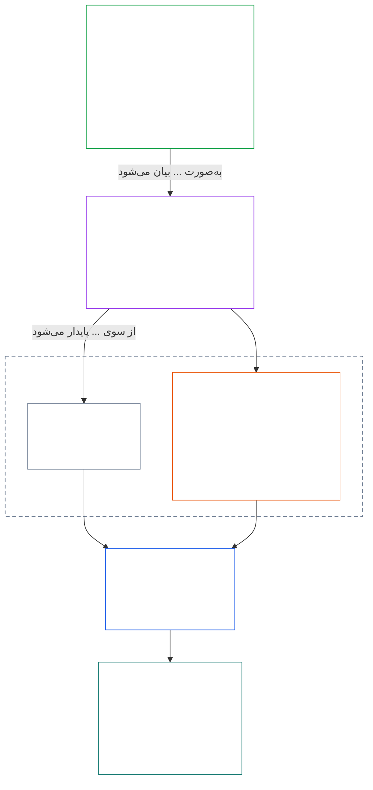
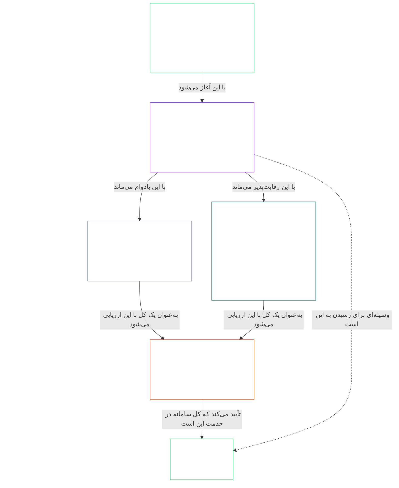

# فصل ۰۱، بخش الف: اصول ارزش‌ها

<details>
<summary><strong><span style="color: #2563eb;">جایگاه در پیکره (غیرعملیاتی): ساختار فایل و قواعد خواندن</span></strong></summary>

> محتوای زیر **صرفاً راهنمای خواننده** است. این محتوا تعهدات الزام‌آور مندرج در این فایل یا فصل‌های دیگر را اضافه، حذف یا محدود نمی‌کند.
>
> این فایل **بخشی از قانون اساسی موجودات ذی‌شعور** است و **فقط همراه** با سایر فایل‌های شماره‌دار `core_*` که به‌منزله یک سند واحد خوانده می‌شوند الزام‌آور است. این فایل شامل **فصل یک، بخش الف** (§§1–12: هدف و نقش؛ آرمان شکوفایی که در §2 معرفی و از طریق بهزیستی، ایمنی، حقیقت، اعتماد و آزادی بسط داده می‌شود؛ و آرمان تداوم که در §8 معرفی و از طریق ظرفیت سامانه مشترک، تاب‌آوری، ساختار بازار و ارزیابی نظام‌مند بسط داده می‌شود) است.
>
> **پیشین:** [core_00_preamble.md](core_00_preamble.md)  
> **بعدی:** [core_01_b_interaction_interpretation.md](core_01_b_interaction_interpretation.md) (فصل یک، بخش ب — §§13–15، تعامل، حدود غلبه و تفسیر قانون اساسی).  
> **مسیر خواندن:** §1 هدف و نقش ← **شکوفایی:** مقدمه §2 (با محدودیت‌های غیرقابل‌مذاکره ایمنی و حقیقت در §2.1) ← §3 بهزیستی (نتیجه) ← §4 ایمنی ← §5 حقیقت ← §6 اعتماد ← §7 آزادی ← **تداوم:** مقدمه §8 ← §9 ظرفیت سامانه مشترک (پل: وسیله‌ای برای شکوفایی و جوهر تداوم) ← §10 تاب‌آوری ← §11 ساختار بازار ← §12 ارزیابی نظام‌مند.

</details>

<details>
<summary><strong><span style="color: #2563eb;">راهنمای خواننده (غیرعملیاتی): پیوند فصل یک با آرمان‌ها، چهارگانه، مواد و تعاریف</span></strong></summary>

> محتوای زیر **صرفاً راهنمای خواننده** است. این محتوا تعهدات الزام‌آور مندرج در این فایل یا فصل‌های دیگر را اضافه، حذف یا محدود نمی‌کند. ابزارک‌های **ردیابی** و **تعاریف · ارزیابی · انطباق** هر بخش، مسیرهای ارجاع الزام‌آور را فراهم می‌کنند؛ این بلوک نقشه‌ای در سطح بخش برای خوانندگانی است که از فصل یک وارد می‌شوند.

**لایه‌ها چگونه به هم مرتبط‌اند.** هر لایه به پرسشی متفاوت پاسخ می‌دهد و هر اصل فصل یک به سه لایه دیگر اشاره می‌کند:

- **آرمان‌ها و چهارگانه** ([مقدمه §1](core_00_preamble.md#the-model)): هدف سامانه‌های مشترک ([شکوفایی](core_05_apex_flourishing_aim.md#flourishing-constitutional) و [تداوم](core_05_apex_continuity_aim.md#chapter-five-definitions-continuity-constitutional-aim)) چیست و چهار تکلیفی که این پیگیری را مشروع نگه می‌دارند کدام‌اند ([مشارکت](core_05_apex_participation_leg.md#participation-constitutional)، [نظارت](core_05_apex_oversight_leg.md#oversight-constitutional)، [پاسخ‌گویی](core_05_apex_accountability_leg.md#accountability) و [به‌موقع‌بودن](core_05_apex_timeliness_leg.md#timeliness-constitutional)).
- **اصول** (این فصل): این آرمان‌ها و تکالیف چگونه به ارزش‌ها، محدودیت‌ها و قواعد سنجش آن‌ها در برابر یکدیگر تبدیل می‌شوند.
- **مواد** ([فصل شش](core_06_rights_part_a.md#chapter-six-foundational-rights)): حمایت‌های کف حقوق که هنگام پیگیری آرمان‌ها نیز قابل استفاده می‌مانند. **ردیابی** هر بخش آن‌ها را زیر عنوان *به‌ویژه* فهرست می‌کند.
- **تعاریف** ([فصل‌های دو تا پنج](core_02_definition_structure.md)): معانی مشترکی که برای سنجش درستی یک ادعا به کار می‌روند. ابزارک **تعاریف · ارزیابی · انطباق** هر بخش آن‌ها را فهرست می‌کند.

**فصل یک هر آرمان را چگونه بسط می‌دهد.** شکوفایی یعنی بهزیستی‌ای که از راه حقیقت، ایمنی، اعتمادپذیری و عاملیت معنادار پایدار می‌ماند ([مقدمه §1](core_00_preamble.md#flourishing)). فصل یک نخست نتیجه را بیان می‌کند و سپس برای هر یک از این چهار شرط اصلی می‌آورد.

| آرمان و بُعد | اصل فصل یک | جایگاه تعریف | مواد نام‌برده در ردیابی |
|---|---|---|---|
| **شکوفایی**: نتیجه | [§3 بهزیستی](#3-foundational-objective-wellbeing-flourishing-aim) | [بهزیستی](core_05_band_continuity.md#wellbeing) | [VI](core_06_rights_part_b.md#article-vi-equal-basic-rights)، [X](core_06_rights_part_b.md#article-x-self-determination-agency-and-participation)، [XIII-B](core_06_rights_part_c.md#article-xiii-b-right-to-redress-and-remedy)، [XIX-B](core_06_rights_part_d.md#article-xix-b-contestability-and-proportional-restriction-limits) |
| **شکوفایی**: ایمنی | [§4 ایمنی](#4-safety-harm-constraint) | [ایمنی](core_05_band_continuity.md#safety-constitutional-constraint) | [XIII](core_06_rights_part_c.md#article-xiii-right-to-reliable-and-trustworthy-systems)، [XVII](core_06_rights_part_c.md#article-xvii-system-lifecycle-environments-and-reversibility)، [XXIII](core_06_rights_part_d.md#article-xxiii-root-cause-analysis-and-adaptive-response) |
| **شکوفایی**: حقیقت | [§5 حقیقت](#5-truth-epistemic-integrity-constraint) | [حقیقت](core_05_band_oversight.md#truth-constitutional-constraint) | [XIII](core_06_rights_part_c.md#article-xiii-right-to-reliable-and-trustworthy-systems)، [XV](core_06_rights_part_c.md#article-xv-info-sphere-integrity)، [XVI](core_06_rights_part_c.md#article-xvi-audit-transparency-and-independent-verification) |
| **شکوفایی**: اعتمادپذیری | [§6 اعتماد](#6-trust-and-trustworthiness-coordination-integrity) | [اعتمادپذیری](core_05_band_continuity.md#trustworthiness) | [XIII](core_06_rights_part_c.md#article-xiii-right-to-reliable-and-trustworthy-systems)، [XV](core_06_rights_part_c.md#article-xv-info-sphere-integrity)، [XVI](core_06_rights_part_c.md#article-xvi-audit-transparency-and-independent-verification) |
| **شکوفایی**: عاملیت معنادار | [§7 آزادی](#7-freedom-bounded-agency) | [عاملیت معنادار](core_05_band_participation.md#meaningful-agency) | [VI](core_06_rights_part_b.md#article-vi-equal-basic-rights)، [X](core_06_rights_part_b.md#article-x-self-determination-agency-and-participation)، [XXI](core_06_rights_part_d.md#article-xxi-interoperability-portability-movement-refuge-and-exit-integrity) |
| **تداوم**، پل به شکوفایی: ظرفیت پایدار | [§9 ظرفیت سامانه مشترک](#9-shared-system-capacity) | [ظرفیت سامانه مشترک](core_05_band_continuity.md#shared-system-capacity) | [I-A](core_06_rights_part_a.md#article-i-a-environmental-preconditions-and-ecological-integrity)، [III](core_06_rights_part_a.md#article-iii-survival-and-essential-access)، [V](core_06_rights_part_a.md#article-v-resource-allocation-dependencies-and-ecosystem-funding) |
| **تداوم**: تاب‌آوری | [§10 تاب‌آوری و طراحی خودترمیم‌گر](#10-resilience-and-self-healing-design) | [خودترمیمی](core_05_band_continuity.md#self-healing) | [XIII](core_06_rights_part_c.md#article-xiii-right-to-reliable-and-trustworthy-systems)، [XVII](core_06_rights_part_c.md#article-xvii-system-lifecycle-environments-and-reversibility)، [XXIII](core_06_rights_part_d.md#article-xxiii-root-cause-analysis-and-adaptive-response) |
| **تداوم**: بازارهای رقابت‌پذیر | [§11 ساختار بازار](#11-market-structure) | [ساختار بازار](core_05_band_accountability.md#market-structure) | [III-C](core_06_rights_part_a.md#article-iii-c-labor-and-economic-floor)، [V](core_06_rights_part_a.md#article-v-resource-allocation-dependencies-and-ecosystem-funding)، [XXI](core_06_rights_part_d.md#article-xxi-interoperability-portability-movement-refuge-and-exit-integrity) |
| **تداوم**: دید کل‌سامانه‌ای | [§12 الزام ارزیابی نظام‌مند](#12-systemic-evaluation-requirement) | [گواهی هم‌راستایی سامانه](core_05_band_continuity.md#system-alignment-certification) | [XVI](core_06_rights_part_c.md#article-xvi-audit-transparency-and-independent-verification) |

**سلسله‌مراتب اصول (تداوم).** در سطح اصول، آرمان تداوم به ترتیب زیر بسط می‌یابد و با ظرفیتی آغاز می‌شود که دو آرمان را به هم پیوند می‌دهد:

6. **[ظرفیت سامانه مشترک](core_05_band_continuity.md#shared-system-capacity)** حاصل جمعی است که سرپرستی شایسته، حکمرانی و مشوق‌ها باید در گذر زمان به آن برسند — توانایی واقعی و قابل‌اعتراض موجودات ذی‌شعور و سامانه‌های مشترک برای انجام کارهای مقرر در قانون اساسی. این ظرفیت میان دو آرمان قرار دارد: وسیله‌ای برای **شکوفایی** و جوهر **تداوم** است، اما بر همه‌چیز برتری ندارد. [§9.1](#91-productive-capacity-instrumental-good) و [§9.2](#92-constitutional-efficiency) دو بُعد اصلی آن را توضیح می‌دهند.
7. **[تاب‌آوری و طراحی خودترمیم‌گر](#10-resilience-and-self-healing-design)** بیان می‌کند سامانه‌هایی که موجودات ذی‌شعور به آن‌ها وابسته‌اند چگونه مشکل را زود تشخیص می‌دهند، مهار می‌کنند، طبق مسیرهای اعلام‌شده از کار می‌افتند و صادقانه بازیابی می‌شوند (**[خودترمیمی](core_05_band_continuity.md#self-healing)**)، تا ظرفیت بند 6 پایدار بماند و ثبات به مداخله اضطراری وابسته نباشد.
8. **[ساختار بازار](core_05_band_accountability.md#market-structure)** در [§11](#11-market-structure) انضباط ضدتمرکزی فراهم می‌کند که این ظرفیت را در عمل رقابت‌پذیر نگه می‌دارد.
9. **[الزام ارزیابی نظام‌مند](#12-systemic-evaluation-requirement)** پیش از پذیرش ادعاهای انطباق یا حکمرانی، دامنه کل سامانه، وابستگی‌ها و هم‌راستایی مشوق‌ها را بررسی می‌کند — ذیل رکن **نظارت** چهارگانه به‌عنوان جهت‌گیری اصولی برای حسابرسی؛ از جمله [گواهی هم‌راستایی سامانه](core_05_band_continuity.md#system-alignment-certification) به‌عنوان یکی از فرایندهای حسابرسی به‌ویژه گسترده در میان فرایندهای دیگر.

**جایگاه چهارگانه در فصل یک.** هر بخش در ردیابی خود ارکانی را که به آن‌ها می‌پردازد نام می‌برد. این بخش‌ها مستقیم‌تر از همه آن ارکان را پوشش می‌دهند:

| رکن چهارگانه | جایگاه‌های اصلی در فصل یک |
|---|---|
| **مشارکت** | [§16 سرپرستی به‌تفصیل](core_01_c_stewardship_capacity_principles.md#16-stewardship-in-depth) و [§17 سرپرستی پیامددار](core_01_c_stewardship_capacity_principles.md#17-consequential-stewardship-the-steward-role) (نقش‌های اثرگذار و حق اظهارنظر)؛ [§7 آزادی](#7-freedom-bounded-agency) (عاملیت معنادار) |
| **نظارت** | [§16](core_01_c_stewardship_capacity_principles.md#16-stewardship-in-depth) و [§17](core_01_c_stewardship_capacity_principles.md#17-consequential-stewardship-the-steward-role) (درک توزیع‌شده و سوابق)؛ [§18 حکمرانی](core_01_c_stewardship_capacity_principles.md#18-governance-under-stewardship-discipline) (تخصیص اختیار)؛ [§12](#12-systemic-evaluation-requirement) (حسابرسی) |
| **پاسخ‌گویی** | [§18 حکمرانی](core_01_c_stewardship_capacity_principles.md#18-governance-under-stewardship-discipline) (پاسخ‌گویی متناسب با اختیار)؛ [§19 هم‌سویی مشوق‌ها و تسخیر سامانه](core_01_c_stewardship_capacity_principles.md#19-incentive-alignment-and-system-capture) (پاداش‌ها نباید ارکان را تهی کنند) |
| **به‌موقع‌بودن** | [§16](core_01_c_stewardship_capacity_principles.md#16-stewardship-in-depth) و [§17](core_01_c_stewardship_capacity_principles.md#17-consequential-stewardship-the-steward-role) (شناسایی و رفع مشکل بدون تأخیر قابل‌اجتناب) |

**دو محور، نه تعارض.** آرمان‌ها می‌گویند سامانه‌ها چه چیزی را دنبال می‌کنند؛ چهارگانه می‌گوید آن پیگیری چگونه مشروع می‌ماند. یک اصطلاح می‌تواند در هر دو محور جای گیرد: حقیقت و اعتمادپذیری از اجزای شکوفایی‌اند و [مقدمه §2](core_00_preamble.md#2-measurements-overview) آن‌ها را در خانواده نظارت می‌سنجد. [§§13–15](core_01_b_interaction_interpretation.md#13-constitutional-collision-resolution-process) نحوه سنجش و خواندن این اصول به‌صورت یک کل را هنگام تعارض تعیین می‌کنند و [§20](core_01_c_stewardship_capacity_principles.md#20-integrated-application) آن‌ها را بر همه فصل‌های بعدی اعمال می‌کند.

</details>

<br>

### ۱. هدف و نقش
<details>
<summary><strong><span style="color: #2563eb;">ردیابی</span></strong></summary>

- بالادست: [پیشگفتار §۱ مدل](core_00_preamble.md#the-model) — [چهارگانۀ قانون اساسی](core_00_preamble.md#constitutional-tetrad)، [دو هدف قانون اساسی](core_00_preamble.md#two-constitutional-aims) و مقیاس‌بندی متناسب با [ذی‌نفعی مادی](core_00_preamble.md#material-stake) از طریق ردیابی بخش‌ها در سراسر فصل اعمال می‌شوند.
- پایین‌دست: [۱۵. تفسیر قانون اساسی](core_01_b_interaction_interpretation.md#15-constitutional-interpretation) برای خوانش یکپارچه، ابهام، سلسله‌مراتب درونی و رویۀ رسمی حل تعارض.
- پایین‌دست: [دو هدف قانون اساسی](core_00_preamble.md#two-constitutional-aims) — توسعۀ هدف **شکوفایی**: از [§۳](#3-foundational-objective-wellbeing-flourishing-aim) تا [§۶](#6-trust-and-trustworthiness-coordination-integrity) و [§۷ آزادی](#7-freedom-bounded-agency)؛ توسعۀ هدف **تداوم**: [§۹ ظرفیت نظام مشترک](#9-shared-system-capacity)، [§۱۰ تاب‌آوری و طراحی خودترمیم‌گر](#10-resilience-and-self-healing-design)، [§۱۱ ساختار بازار](#11-market-structure) و [§۱۲ الزام ارزیابی نظام‌مند](#12-systemic-evaluation-requirement).
- پایین‌دست: [۳. هدف بنیادین: بهزیستی](#3-foundational-objective-wellbeing-flourishing-aim)، [§۳.۲ به‌رسمیت‌شناسی، تقویت و آرمان‌خواهی](#32-recognition-reinforcement-and-aspiration)، [۴ ایمنی](#4-safety-harm-constraint)، [۵ حقیقت](#5-truth-epistemic-integrity-constraint)، [۶. اعتماد](#6-trust-and-trustworthiness-coordination-integrity)، [§۱۶ سرپرستی به‌تفصیل](core_01_c_stewardship_capacity_principles.md#16-stewardship-in-depth)، [۱۳. فرایند حل تعارض قانون اساسی](core_01_b_interaction_interpretation.md#13-constitutional-collision-resolution-process) و [§۷ آزادی](#7-freedom-bounded-agency).
- همراه بخوانید: [چهارگانۀ قانون اساسی](core_00_preamble.md#constitutional-tetrad) — مشارکت، نظارت، پاسخ‌گویی و به‌موقع‌بودن چگونگی پیگیری [دو هدف قانون اساسی](core_00_preamble.md#two-constitutional-aims) را در نظام‌های مشترک تنظیم می‌کنند؛ مقیاس‌بندی متناسب با [ذی‌نفعی مادی](core_00_preamble.md#material-stake) از طریق ردیابی بخش‌ها در سراسر فصل اعمال می‌شود.
- همراه بخوانید: [فصل‌های دو تا چهار](core_02_definition_structure.md) و [فصل پنج](core_05__definitions_home.md#chapter-five-foundational-definitions) — لایۀ سازوکارهای حاکم بر همۀ اصطلاحات به‌کاررفته در این فصل؛ یکپارچگی O/M/A/C، جلوگیری از طفره‌روی، بار اثبات و قابلیت ردیابی تعریف‌ها تا نتایج را اعمال کنید.
- همراه بخوانید: [فصل شش: حقوق بنیادین](core_06_rights_part_a.md#chapter-six-foundational-rights).
  - به‌ویژه [مادۀ VI: حقوق اساسی برابر](core_06_rights_part_b.md#article-vi-equal-basic-rights)، [مادۀ XIII: حق برخورداری از نظام‌های قابل‌اتکا و قابل‌اعتماد](core_06_rights_part_c.md#article-xiii-right-to-reliable-and-trustworthy-systems) و [مادۀ XXIV: تفسیر قانون اساسی، بازبینی و تضمین‌های ضدتصرف](core_06_rights_part_d.md#article-xxiv-constitutional-interpretation-review-and-anti-capture-safeguards).
  - هرجا تفسیر بر موجودات صاحب‌احساس، نظام‌ها یا نهادهای حمایت‌شده اثر می‌گذارد، این خوانش را اعمال کنید.

</details>

<details>
<summary><strong><span style="color: #2563eb;">تعریف‌ها · ارزیابی · رعایت</span></strong></summary>

- [تناسب](core_05_band_accountability.md#proportionality) · [O](core_05_band_accountability.md#proportionality) · [M](core_05_band_accountability.md#proportionality-a) · [A](core_05_band_accountability.md#proportionality-a) · [C](core_05_band_accountability.md#proportionality-c)
- [ضرورت](core_05_band_accountability.md#necessity) · [O](core_05_band_accountability.md#necessity) · [M](core_05_band_accountability.md#necessity-a) · [A](core_05_band_accountability.md#necessity-a) · [C](core_05_band_accountability.md#necessity-c)

</details>

<br>

*به زبان ساده: فصل یک ارزش‌ها و محدودیت‌هایی را تعیین می‌کند که بر همۀ فصل‌های دیگر حاکم‌اند. نظام‌های مشترک باید **شکوفایی** و **تداوم** را با هم پی بگیرند، نه یکی را به بهای دیگری؛ و نباید هیچ ارزش واحدی را به بهای ارزش‌های دیگر به حداکثر برسانند.*

<a id="two-constitutional-aims"></a><a id="flourishing"></a><a id="continuity"></a>این فصل اصول و محدودیت‌های حاکم بر تفسیر، اجرا و تحول این قانون اساسی را برقرار می‌کند. این فصل [دو هدف قانون اساسی](core_00_preamble.md#two-constitutional-aims) — [**شکوفایی**](core_00_preamble.md#flourishing) و [**تداوم**](core_00_preamble.md#continuity) — را که در [پیشگفتار §۱ مدل](core_00_preamble.md#the-model) تثبیت شده‌اند، به اصول و محدودیت‌های اجرایی بسط می‌دهد. تعریف‌های معیار در سطح اصول در پیشگفتار آمده‌اند؛ این فصل آن‌ها را اعمال می‌کند.

این هدف‌ها باید همواره با هم و در چارچوب محدودیت‌های اصولیِ غیرقابل‌مذاکره و حمایت‌های حقوقیِ مقرر در این قانون اساسی دنبال شوند. [**چهارگانۀ قانون اساسی**](core_00_preamble.md#constitutional-tetrad) چگونگی مشروع‌ماندن این پیگیری را تنظیم می‌کند و مقیاس آن را با [**ذی‌نفعی مادی**](core_00_preamble.md#material-stake) متناسب می‌سازد.

این فصل حول آن دو هدف و آن چهارگانه سازمان یافته است:
- **شکوفایی:** [هدف شکوفایی: مقدمه](#2-flourishing-aim-introduction) نقشۀ هدف را ترسیم می‌کند. [§۳ هدف بنیادین: بهزیستی](#3-foundational-objective-wellbeing-flourishing-aim) نتیجۀ مطلوب را بیان می‌کند. [§۴ ایمنی](#4-safety-harm-constraint)، [§۵ حقیقت](#5-truth-epistemic-integrity-constraint)، [§۶ اعتماد](#6-trust-and-trustworthiness-coordination-integrity) و [§۷ آزادی](#7-freedom-bounded-agency) چهار شرطِ پشتیبان آن را بسط می‌دهند: ایمنی، حقیقت، قابل‌اعتمادبودن و عاملیت معنادار.
- **تداوم:** [هدف تداوم: مقدمه](#8-continuity-aim-introduction) نقشۀ هدف را ترسیم می‌کند. [§۹ ظرفیت نظام مشترک](#9-shared-system-capacity) (ابزاری برای شکوفایی و در عین حال جوهر تداوم)، [§۱۰ تاب‌آوری و طراحی خودترمیم‌گر](#10-resilience-and-self-healing-design)، [§۱۱ ساختار بازار](#11-market-structure) و [§۱۲ الزام ارزیابی نظام‌مند](#12-systemic-evaluation-requirement) ثبات بلندمدت، ظرفیت پایدار نظام مشترک و تاب‌آوری را بسط می‌دهند. ادعاهای مربوط به تداوم بر تصویری صادقانه از کل نظام تکیه دارند: هر ادعا در §§۹–۱۱ تنها پس از بررسی §۱۲ معتبر است.
- **هنگام رویارویی اصول:** [§۱۳ فرایند حل تعارض قانون اساسی](core_01_b_interaction_interpretation.md#13-constitutional-collision-resolution-process)، [§۱۴ منع تقدم مطلق](core_01_b_interaction_interpretation.md#14-prohibition-on-absolute-override) و [§۱۵ تفسیر قانون اساسی](core_01_b_interaction_interpretation.md#15-constitutional-interpretation) چگونگی سنجش و خوانش یکپارچۀ هدف‌ها و اصول را تنظیم می‌کنند.
- **چهارگانه در عمل:** از [§۱۶ سرپرستی به‌تفصیل](core_01_c_stewardship_capacity_principles.md#16-stewardship-in-depth) تا [§۱۹ هم‌راستایی انگیزه‌ها و تصرف نظام](core_01_c_stewardship_capacity_principles.md#19-incentive-alignment-and-system-capture)، مشارکت، نظارت، پاسخ‌گویی و به‌موقع‌بودن را در سرپرستی، حکمرانی و انگیزه‌ها جاری می‌کنند؛ [§۲۰ کاربرد یکپارچه](core_01_c_stewardship_capacity_principles.md#20-integrated-application) کل فصل را بر همۀ فصل‌های بعدی اعمال می‌کند.

**ردیابی** هر اصل، مواد فصل شش را که از آن حمایت می‌کنند فهرست می‌کند؛ ویجت **تعریف‌ها · ارزیابی · رعایت** نیز تعریف‌های فصل پنج را که آن را می‌سنجند فهرست می‌کند.

**نمودار: دو هدف قانون اساسی و چهارگانۀ قانون اساسی**

<hr style="border: 0; border-top: 1px solid currentColor;">

```mermaid
flowchart TB
    subgraph Foundation[" "]
        direction TB
        subgraph Aims["دو هدف قانون اساسی"]
            direction LR
            F["شکوفایی<br/><br/>• بهزیستی موجودات صاحب‌احساس که با حقیقت، ایمنی،<br/>قابل‌اعتمادبودن و عاملیت معنادار پایدار می‌شود"]
            C["تداوم<br/><br/>• ثبات بلندمدت، پایداری، تاب‌آوری،<br/>و بهزیستی بوم‌شناختی"]
        end
        subgraph Tetrad1["چهارگانۀ قانون اساسی · مشارکت و نظارت"]
            direction LR
            P["مشارکت<br/><br/>• موجودات صاحب‌احساسِ متأثر صدای واقعی دارند<br/>• نمایندگی منصفانه و فرصت منصفانه برای اعتراض<br/>• دسترسی به نقش‌های مهم متناسب با میزان ذی‌نفعی"]
            O["نظارت<br/><br/>• پایش، بررسی، راستی‌آزمایی و نگهداری سوابق<br/>• بازبینی مستقل می‌تواند انتخاب‌های نادرست را محدود کند"]
        end
        subgraph Tetrad2["چهارگانۀ قانون اساسی · پاسخ‌گویی و به‌موقع‌بودن"]
            direction LR
            A["پاسخ‌گویی<br/><br/>• مسئولیت به کنشگران درست قابل ردیابی است<br/>• پاسخ‌گویی، جبران و اصلاح واقعی<br/>• پیامدهای بد، ترمیم را به‌دنبال دارند"]
            T["به‌موقع‌بودن<br/><br/>• مشکلات شناسایی، به چالش کشیده، حل و اصلاح می‌شوند<br/>• مهلت‌ها متناسب با ذی‌نفعی مادی‌اند<br/>• تأخیر نمی‌تواند حقوق، جبران یا ترمیم را از میان ببرد"]
        end
    end
    F ~~~ P
    P ~~~ A
    style Foundation fill:none,stroke:none
    style Aims fill:none,stroke:none
    style Tetrad1 fill:none,stroke:none
    style Tetrad2 fill:none,stroke:none
    style F fill:none,stroke:#16a34a,color:#ffffff
    style C fill:none,stroke:#16a34a,color:#ffffff
    style P fill:none,stroke:#0f766e,color:#ffffff
    style O fill:none,stroke:#ea580c,color:#ffffff
    style A fill:none,stroke:#db2777,color:#ffffff
    style T fill:none,stroke:#9333ea,color:#ffffff
```

*هدف‌ها می‌گویند نظام‌های مشترک باید چه چیزی را پی بگیرند؛ چهارگانه وظایف لازم برای مشروع‌ماندن این پیگیری را نشان می‌دهد. هر چهار وظیفه متناسب با [ذی‌نفعی مادی](core_00_preamble.md#material-stake) مقیاس‌بندی می‌شوند و هر دو هدف در چارچوب کف حقوق باقی می‌مانند. بازنشر از [مرور مفهومی](guides/CONCEPTUAL_OVERVIEW.md#two-aims-and-the-constitutional-tetrad).*

این ارزش‌ها:
- مستقل از یکدیگر نیستند و در عملکرد معمول نیز سلسله‌مراتب سختی ندارند.
- به‌عنوان اصول و محدودیت‌های متعامل عمل می‌کنند که باید با هم ارزیابی شوند.
- بر همۀ «نظام‌ها» اعمال می‌شوند؛ از جمله ساختارهای فنی، سازمانی، اقتصادی، اجتماعی‌ـ‌فنی و بوم‌سازگان‌هایی که به‌طور مادی بر موجودات صاحب‌احساس و سیارۀ زمین اثر می‌گذارند.

هیچ اصلی را نمی‌توان جداگانه اعمال کرد، اگر این کار اصول دیگر را به‌طور مادی نقض کند. هنگام بروز تنش، نظام‌ها باید آن را بر اساس الزامات تناسب، ضرورت و اثر نظام‌مندِ مقرر در این فصل حل کنند. اگر تعارض حل‌نشده مستقیماً به محدودیت‌های اصولیِ غیرقابل‌مذاکره مربوط شود، **§۱۳** فصل یک، فرایند حل تعارض قانون اساسی، تقدم را تعیین می‌کند.

<a id="2-flourishing-aim-introduction"></a>
### ۲. مقدمه هدف شکوفایی
<details>
<summary><strong><span style="color: #2563eb;">ردیابی</span></strong></summary>

- همراه با [چهارگانه قانون اساسی](core_00_preamble.md#constitutional-tetrad) خوانده شود — هر چهار رکن بر چگونگی پیگیری شکوفایی اعمال می‌شوند؛ [اهمیت مادی](core_00_preamble.md#material-stake) عمق هر ادعای مربوط به شکوفایی را تعیین می‌کند.
- همراه با [دو هدف قانون اساسی](core_00_preamble.md#two-constitutional-aims) خوانده شود — هدف **شکوفایی**؛ هدف همراه آن در [مقدمه هدف تداوم](#8-continuity-aim-introduction) معرفی می‌شود.
- پیشین: اصول: [دیباچه §1 الگو](core_00_preamble.md#flourishing)؛ [شکوفایی (هدف قانون اساسی)](core_05_apex_flourishing_aim.md#flourishing-constitutional)؛ [§1 هدف و نقش](#1-purpose-and-role).
- پسین: [§3 هدف بنیادین: بهزیستی (هدف شکوفایی)](#3-foundational-objective-wellbeing-flourishing-aim)، [§4 ایمنی (محدودیت آسیب)](#4-safety-harm-constraint)، [§5 حقیقت (محدودیت سلامت معرفتی)](#5-truth-epistemic-integrity-constraint)، [§6 اعتماد و اعتمادپذیری (سلامت هماهنگی)](#6-trust-and-trustworthiness-coordination-integrity)، و [§7 آزادی (عاملیت محدود)](#7-freedom-bounded-agency)؛ مواد حافظ هر یک در ردیابی همان بخش نام برده شده‌اند.
- زیربخش‌ها: [§2.1 محدودیت‌های اصولی غیرقابل‌مذاکره: ایمنی و حقیقت](#21-non-negotiable-principle-constraints-safety-and-truth).
- همراه با کف حقوق فصل ششم به‌طور کلی خوانده شود.

</details>

<details>
<summary><strong><span style="color: #2563eb;">تعاریف · ارزیابی · انطباق</span></strong></summary>

- [شکوفایی (هدف قانون اساسی)](core_05_apex_flourishing_aim.md#flourishing-constitutional) · [O](core_05_apex_flourishing_aim.md#flourishing-constitutional) · [M](core_05_apex_flourishing_aim.md#flourishing-constitutional-m) · [A](core_05_apex_flourishing_aim.md#flourishing-constitutional-a) · [C](core_05_apex_flourishing_aim.md#flourishing-constitutional-c)
- [بهزیستی](core_05_band_continuity.md#wellbeing) · [O](core_05_band_continuity.md#wellbeing) · [M](core_05_band_continuity.md#wellbeing-a) · [A](core_05_band_continuity.md#wellbeing-a) · [C](core_05_band_continuity.md#wellbeing-c)
- [ایمنی (محدودیت قانون اساسی)](core_05_band_continuity.md#safety-constitutional-constraint) · [O](core_05_band_continuity.md#safety-constitutional-constraint) · [M](core_05_band_continuity.md#safety-constraint-a) · [A](core_05_band_continuity.md#safety-constraint-a) · [C](core_05_band_continuity.md#safety-constraint-c)
- [حقیقت (محدودیت قانون اساسی)](core_05_band_oversight.md#truth-constitutional-constraint) · [O](core_05_band_oversight.md#truth-constitutional-constraint-o) · [M](core_05_band_oversight.md#truth-constitutional-constraint-a) · [A](core_05_band_oversight.md#truth-constitutional-constraint-a) · [C](core_05_band_oversight.md#truth-constitutional-constraint-c)
- [اعتمادپذیری](core_05_band_continuity.md#trustworthiness) · [O](core_05_band_continuity.md#trustworthiness) · [M](core_05_band_continuity.md#trustworthiness-a) · [A](core_05_band_continuity.md#trustworthiness-a) · [C](core_05_band_continuity.md#trustworthiness-c)
- [عاملیت معنادار](core_05_band_participation.md#meaningful-agency) · [O](core_05_band_participation.md#meaningful-agency) · [M](core_05_band_participation.md#meaningful-agency-a) · [A](core_05_band_participation.md#meaningful-agency-a) · [C](core_05_band_participation.md#meaningful-agency-c)

</details>

<br>

*به زبان ساده: شکوفایی نخستینِ دو هدف است: موجودات ذی‌شعور زندگی خوبی داشته باشند و توان خوب زندگی‌کردن را حفظ کنند، زیرا سامانه‌های پیرامونشان ایمن، صادق و اعتمادپذیرند و مجال واقعی انتخاب را باقی می‌گذارند. بخش ۳ می‌گوید این نتیجه چیست. چهار اصل پس از آن می‌گویند چه چیزی آن را واقعی نگه می‌دارد.*

[**شکوفایی**](core_05_apex_flourishing_aim.md#flourishing-constitutional) **بهزیستی موجودات ذی‌شعور است که از راه حقیقت، ایمنی، اعتمادپذیری و عاملیت معنادار پایدار می‌ماند** ([دیباچه §1 الگو](core_00_preamble.md#flourishing)). فصل یک آن را در دو گام می‌پروراند: [§3 هدف بنیادین: بهزیستی (هدف شکوفایی)](#3-foundational-objective-wellbeing-flourishing-aim) نتیجه را بیان می‌کند و چهار اصل شرایط پایداری آن را مشخص می‌کنند.

| شرط | اصل | پرسشی که پاسخ می‌دهد |
|---|---|---|
| **ایمنی** | [§4 ایمنی (محدودیت آسیب)](#4-safety-harm-constraint) | آیا موجودات ذی‌شعور از آسیب قابل‌پیشگیری محافظت می‌شوند؟ |
| **حقیقت** | [§5 حقیقت (محدودیت سلامت معرفتی)](#5-truth-epistemic-integrity-constraint)، همراه با [§5.1 پژوهش آگاه از علم و پشتیبانی تصمیم‌گیری](#51-science-informed-inquiry-and-decision-support) و [§5.2 دسترس‌پذیری زبان ساده (وظیفه مشارکت و سرپرستی)](#52-plain-language-accessibility-participation-and-stewardship-duty) | آیا موجودات ذی‌شعور می‌توانند به گفته‌ها اعتماد کنند و آن‌ها را بفهمند؟ |
| **اعتمادپذیری** | [§6 اعتماد و اعتمادپذیری (سلامت هماهنگی)](#6-trust-and-trustworthiness-coordination-integrity) | آیا سامانه‌ها اعتماد را به دست می‌آورند و هنگام ناکامی آن را ترمیم می‌کنند؟ |
| **عاملیت معنادار** | [§7 آزادی (عاملیت محدود)](#7-freedom-bounded-agency) | آیا موجودات ذی‌شعور آزادی واقعی و محدودی برای انتخاب، مخالفت، سازمان‌یابی و ترک‌کردن دارند؟ |

**اصول شکوفایی چگونه با هم کار می‌کنند:**
- **ایمنی و حقیقت محدودیت‌های غیرقابل‌مذاکره‌اند:** این دو در [§2.1 محدودیت‌های اصولی غیرقابل‌مذاکره: ایمنی و حقیقت](#21-non-negotiable-principle-constraints-safety-and-truth) کنار هم آمده‌اند و نمی‌توان آن‌ها را برای دستیابی به اصول دیگر واگذار کرد.
- **اعتماد و آزادی محدودند، نه مطلق:** اعتماد کسب‌شدنی و اصلاح‌پذیر است ([§6.1 اصلاح و جبران](#61-correction-and-remedy))؛ آزادی محدودیت‌های منضبط دارد ([§7.1 انضباط محدودیت](#71-limitation-discipline)).
- **هیچ‌یک جداگانه اعمال نمی‌شود:** اصول با هم خوانده می‌شوند و هنگام تعارض، بر اساس [§13 فرایند حل تعارض قانون اساسی](core_01_b_interaction_interpretation.md#13-constitutional-collision-resolution-process) سنجیده می‌شوند.
- **شکوفایی هدفی همراه دارد:** هدف تداوم می‌پرسد چه چیزی این نتیجه را پایدار نگه می‌دارد؛ این هدف در [مقدمه هدف تداوم](#8-continuity-aim-introduction) معرفی می‌شود.

**نمودار: شکوفایی و اصول آن**

<hr style="border: 0; border-top: 1px solid currentColor;">



*شکوفایی به‌عنوان نتیجه بیان می‌شود و ابتدا محدودیت‌های غیرقابل‌مذاکره، یعنی ایمنی و حقیقت، آن را پایدار می‌کنند؛ هر دو به اعتماد کمک می‌کنند و اعتماد نیز به نوبه خود آزادی را پشتیبانی می‌کند. رنگ‌ها نشانه‌های بصریِ قابل استفاده مجدد هستند، نه ادعای اولویت. ردیابی هر اصل مواد مربوط به آن را نام می‌برد و ویجت تعاریف · ارزیابی · انطباق، تعاریفش را مشخص می‌کند. بازنشرشده در [مرور مفهومی](guides/CONCEPTUAL_OVERVIEW.md#flourishing-and-its-principles).*

<a id="21-non-negotiable-principle-constraints-safety-and-truth"></a>
#### ۲.۱ محدودیت‌های اصولی غیرقابل‌مذاکره: ایمنی و حقیقت
<details>
<summary><strong><span style="color: #2563eb;">ردیابی</span></strong></summary>

- همراه با [چهارگانه قانون اساسی](core_00_preamble.md#constitutional-tetrad) خوانده شود — رکن **مشارکت** (درک و به‌چالش‌کشیدن ارزیابی‌های ایمنی و حقیقت)؛ رکن **نظارت** (کشف خطر آسیب و فرسایش معرفتی)؛ رکن **پاسخ‌گویی** (پاسخ‌گویی در قبال آسیب، فریب و اتکای گمراه‌کننده)؛ و سنجش [اهمیت مادی](core_00_preamble.md#material-stake).
- همراه با [دو هدف قانون اساسی](core_00_preamble.md#two-constitutional-aims) خوانده شود — هدف **شکوفایی** (**ایمنی** و **حقیقت** در [دیباچه §1](core_00_preamble.md#two-constitutional-aims) اجزای تصریح‌شده‌اند)؛ هدف **تداوم** (پیشگیری از آسیب بلندمدت و سرپرستی صادقانه سامانه‌های پایدار).
- پیشین: اصول: [3. هدف بنیادین: بهزیستی](#3-foundational-objective-wellbeing-flourishing-aim)؛ [دو هدف قانون اساسی](core_00_preamble.md#two-constitutional-aims).
- پسین: [6. اعتماد](#6-trust-and-trustworthiness-coordination-integrity)، [13. فرایند حل تعارض قانون اساسی](core_01_b_interaction_interpretation.md#13-constitutional-collision-resolution-process) و [§7 آزادی](#7-freedom-bounded-agency).
- کاربرد در: [§4 ایمنی](#4-safety-harm-constraint)؛ [§5 حقیقت](#5-truth-epistemic-integrity-constraint)؛ [§5.1 پژوهش آگاه از علم و پشتیبانی تصمیم‌گیری](#51-science-informed-inquiry-and-decision-support)؛ [§5.2 دسترس‌پذیری زبان ساده](#52-plain-language-accessibility-participation-and-stewardship-duty).

</details>

<br>

*به زبان ساده: ایمنی و حقیقت کف‌های محکم قانون اساسی‌اند — نه مصالحه‌هایی که برای بهینه‌سازی می‌توان کنار گذاشت. سامانه‌های مشترک نباید موجودات ذی‌شعور را به‌طور قابل‌پیش‌بینی در معرض خطر قرار دهند یا فریبشان دهند؛ هر دو محدودیت در پیگیری شکوفایی و تداوم و تحت انضباط مشارکت، نظارت، پاسخ‌گویی و به‌موقع‌بودنِ چهارگانه اعمال می‌شوند.*

**ایمنی** و **حقیقت** محدودیت‌های اصولی غیرقابل‌مذاکره‌اند که همه اصول دیگر فصل یک — از جمله [§3 هدف بنیادین: بهزیستی](#3-foundational-objective-wellbeing-flourishing-aim) و [دو هدف قانون اساسی](core_00_preamble.md#two-constitutional-aims) — را مقید می‌کنند. آن‌ها اجزای تصریح‌شده [**شکوفایی**](#flourishing) و برای [**تداوم**](#continuity) ضروری‌اند: سامانه‌ها از راه آسیب یا فریب به شکوفایی نمی‌رسند و مشروعیت پایدار به سرپرستی صادقانه ریسک در گذر زمان نیاز دارد.

اجرای این محدودیت‌ها باید با [چهارگانه قانون اساسی](core_00_preamble.md#constitutional-tetrad) منطبق و متناسب با [اهمیت مادی](core_00_preamble.md#material-stake) باشد، به‌ویژه:
- وقتی ارزیابی‌های ایمنی بر ظرفیت مشارکت اثر می‌گذارند
- وقتی ادعاهای حقیقت، اتکا را هدایت می‌کنند
- وقتی پاسخ‌گویی در قبال آسیب یا رفتار گمراه‌کننده مطرح است

یافته‌های مربوط به ایمنی و حقیقت می‌توانند سابقه جایگاه یک موجود ذی‌شعور را تغییر دهند، از جمله:
- نحوه به‌رسمیت‌شناختن [مشارکت‌ها](core_05_band_accountability.md#contribution-nature)
- اینکه آیا تخلف‌ها ثبت می‌شوند
- نحوه طبقه‌بندی شدت آن تخلف‌ها
- پیامدهای مترتب بر آن‌ها

مدل جایگاه [**فصل نه**](core_09_standing_assessment.md) چگونگی طبقه‌بندی، راستی‌آزمایی و اعمال این یافته‌ها را تعیین می‌کند؛ الزامات ارزیابی و انطباق از [**فصل‌های دو تا پنج**](core_02_definition_structure.md) گرفته می‌شوند.

### ۳. هدف بنیادین: بهزیستی (هدف شکوفایی)
<details>
<summary><strong><span style="color: #2563eb;">ردیابی</span></strong></summary>

- همراه با [چهارگانهٔ قانون اساسی](core_00_preamble.md#constitutional-tetrad) خوانده شود — بُعد **مشارکت** هنگامی که شرایط بهزیستی به‌طور مادی بر معنادار بودن صدا، دسترسی و امکان اعتراض اثر می‌گذارد؛ بُعد **پاسخ‌گویی** هنگامی که ادعاهای بهزیستی بر تخصیص بارها اثر می‌گذارد؛ در صورت ارتباط، مقیاس‌بندی بر پایهٔ [مصلحت مادی](core_00_preamble.md#material-stake).
- همراه با [دو هدف قانون اساسی](core_00_preamble.md#two-constitutional-aims) خوانده شود — این فصل هدف **شکوفایی** را از [§3](#3-foundational-objective-wellbeing-flourishing-aim) تا [§6](#6-trust-and-trustworthiness-coordination-integrity) و نیز [§7 آزادی](#7-freedom-bounded-agency) بسط می‌دهد.
- پیش‌نیاز: اصول: [دیباچه §1 الگو](core_00_preamble.md#the-model)؛ [دو هدف قانون اساسی](core_00_preamble.md#two-constitutional-aims) — بسط هدف **شکوفایی**.
- پیامدها: [4 ایمنی](#4-safety-harm-constraint)، [5 حقیقت](#5-truth-epistemic-integrity-constraint)، [§16 سرپرستی به‌تفصیل](core_01_c_stewardship_capacity_principles.md#16-stewardship-in-depth)، و [13. فرایند حل تعارض قانون اساسی](core_01_b_interaction_interpretation.md#13-constitutional-collision-resolution-process).
- زیربخش‌ها: [§3.1 انصاف](#31-fairness)؛ [§3.2 به‌رسمیت‌شناختن، تقویت و آرمان‌خواهی](#32-recognition-reinforcement-and-aspiration)؛ [§3.3 فرایند ضدتضعیف](#33-anti-degrading-process).
- همراه با کف حقوق فصل ششم به‌طور کلی خوانده شود.
  - به‌ویژه [مادهٔ VI: حقوق اساسی برابر](core_06_rights_part_b.md#article-vi-equal-basic-rights)، [مادهٔ X: خودتعیین‌گری، عاملیت و مشارکت](core_06_rights_part_b.md#article-x-self-determination-agency-and-participation)، [مادهٔ XIII-B: حق جبران و راهکار](core_06_rights_part_c.md#article-xiii-b-right-to-redress-and-remedy)، و [مادهٔ XIX-B: امکان اعتراض و حدود محدودیت متناسب](core_06_rights_part_d.md#article-xix-b-contestability-and-proportional-restriction-limits).
  - این را هنگامی به کار ببرید که دستاوردهای ادعایی در بهزیستی برای توجیه محدودیت بر عاملیت، کرامت یا امکان اعتراض استفاده شوند.
  - هنگامی که دسترسی، فرایند، هم‌ترازی توزیعی، اتکا یا یکپارچگی هماهنگی اهمیت مادی دارد، به‌ویژه [کرامت و منزلت اخلاقی برابر](core_05_band_participation.md#dignity-and-equal-moral-standing)، [انصاف ماهوی](core_05_band_participation.md#substantive-fairness) و [6. اعتماد](#6-trust-and-trustworthiness-coordination-integrity).

</details>

<details>
<summary><strong><span style="color: #2563eb;">تعاریف · ارزیابی · انطباق</span></strong></summary>

- [بهزیستی](core_05_band_continuity.md#wellbeing) · [O](core_05_band_continuity.md#wellbeing) · [M](core_05_band_continuity.md#wellbeing-a) · [A](core_05_band_continuity.md#wellbeing-a) · [C](core_05_band_continuity.md#wellbeing-c)
- [مشارکت](core_05_apex_participation_leg.md#participation-constitutional) · [O](core_05_apex_participation_leg.md#participation-constitutional) · [M](core_05_apex_participation_leg.md#participation-constitutional-m) · [A](core_05_apex_participation_leg.md#participation-constitutional-a) · [C](core_05_apex_participation_leg.md#participation-constitutional-c)
- [کرامت و منزلت اخلاقی برابر](core_05_band_participation.md#dignity-and-equal-moral-standing) · [O](core_05_band_participation.md#dignity-and-equal-moral-standing) · [M](core_05_band_participation.md#dignity-and-equal-moral-standing-a) · [A](core_05_band_participation.md#dignity-and-equal-moral-standing-a) · [C](core_05_band_participation.md#dignity-and-equal-moral-standing-c)
- [انصاف ماهوی](core_05_band_participation.md#substantive-fairness) · [O](core_05_band_participation.md#substantive-fairness) · [M](core_05_band_participation.md#substantive-fairness-constitutional-a) · [A](core_05_band_participation.md#substantive-fairness-constitutional-a) · [C](core_05_band_participation.md#substantive-fairness-constitutional-c)
- [مادیت](core_05_band_oversight.md#materiality) · [O](core_05_band_oversight.md#materiality) · [M](core_05_band_oversight.md#materiality-determination-a) · [A](core_05_band_oversight.md#materiality-determination-a) · [C](core_05_band_oversight.md#materiality-determination-c)
- [واگرایی شاخص جانشین](core_05_band_oversight.md#proxy-divergence) · [O](core_05_band_oversight.md#proxy-divergence) · [M](core_05_band_oversight.md#proxy-divergence-a) · [A](core_05_band_oversight.md#proxy-divergence-a) · [C](core_05_band_oversight.md#proxy-divergence-c)

</details>

<br>

*به بیان ساده: هدف همهٔ این نظام‌ها آن است که زندگی موجودات برخوردار از احساس را واقعاً بهتر کنند. پیگیری یک شاخص جانشین این هدف را برآورده نمی‌کند و مجوزی برای کوتاهی در ایمنی، حقیقت یا حقوق نیست. بهزیستی برای مشارکت بنیادین است: اعطای صوری حق اظهارنظر، بدون شرایطی که عاملیت را واقعی می‌کند، مشارکت به معنای این قانون اساسی نیست.*

هدف نهایی همهٔ نظام‌های تابع این قانون اساسی، حفظ و ارتقای [بهزیستی](core_05_band_continuity.md#wellbeing) موجودات برخوردار از احساس است — هدف [**شکوفایی**](#flourishing) در چارچوب [دو هدف قانون اساسی](core_00_preamble.md#two-constitutional-aims).

[دیباچه §1 الگو](core_00_preamble.md#flourishing) شکوفایی را بهزیستی موجودات برخوردار از احساس تعریف می‌کند که از طریق حقیقت، ایمنی، قابل‌اعتمادبودن و عاملیت معنادار پایدار می‌شود. این بخش نتیجه را بیان می‌کند. بخش‌های بعدی چهار شرط پشتیبان آن را بسط می‌دهند: [§4 ایمنی](#4-safety-harm-constraint)، [§5 حقیقت](#5-truth-epistemic-integrity-constraint)، [§6 اعتماد](#6-trust-and-trustworthiness-coordination-integrity) و [§7 آزادی](#7-freedom-bounded-agency). این پنج اصل در کنار هم بسط هدف شکوفایی در فصل یک را شکل می‌دهند. هدف [**پیوستگی**](#continuity) در [§9 ظرفیت نظام‌های مشترک](#9-shared-system-capacity)، [§10 تاب‌آوری و طراحی خودترمیم‌گر](#10-resilience-and-self-healing-design)، [§11 ساختار بازار](#11-market-structure) و [§12 الزام ارزیابی نظامی](#12-systemic-evaluation-requirement) بسط می‌یابد.

بهزیستی برای [مشارکت](core_05_apex_participation_leg.md#participation-constitutional) ذیل [چهارگانهٔ قانون اساسی](core_00_preamble.md#constitutional-tetrad) بنیادین است. نظام‌های مشترک نمی‌توانند مشارکت را محقق‌شده بدانند، اگر شرایط زیربنایی بهزیستی — از جمله [عاملیت معنادار](core_05_band_participation.md#meaningful-agency)، دسترسی منصفانه و کرامت — به‌طور مادی تضعیف شده باشند.

بهزیستی نه‌فقط آثار فوری، بلکه پیامدهای غیرمستقیم، با تأخیر، انباشتی و میان‌نظامی را نیز دربرمی‌گیرد که بر اساس [**فصل‌های دوم تا چهارم**](core_02_definition_structure.md) ارزیابی می‌شوند. در این لایهٔ ارزشی، بهزیستی:
- مشارکت واقعی را ممکن می‌سازد — صدایی که موجودات برخوردار از احساس شرایط استفاده از آن را ندارند، مشارکت معنادار نیست؛
- با دستیابی به شاخصی که از آنچه واقعاً اهمیت دارد منحرف شده، نمی‌تواند «محقق‌شده» اعلام شود؛
- همچنان به قیود اصولی غیرقابل‌مذاکرهٔ این فصل محدود است: **ایمنی** و **حقیقت**؛
- نمی‌تواند توجیهی کلی برای نقض ایمنی، حقیقت یا حمایت‌های حقوق باشد.

#### 3.1 انصاف
<details>
<summary><strong><span style="color: #2563eb;">ردیابی</span></strong></summary>

- همراه با [چهارگانهٔ قانون اساسی](core_00_preamble.md#constitutional-tetrad) خوانده شود — بُعد **مشارکت** (دسترسی، صدا و امکان اعتراض؛ الزامی عمومی، نه صرفاً [مشارکت سامانهٔ ذی‌نفعان](core_05_band_participation.md#stakeholder-status-and-weight))؛ بُعد **پاسخ‌گویی** هنگام تخصیص منافع و بارها.
- پیش‌نیاز: اصول: [§3 هدف بنیادین: بهزیستی](#3-foundational-objective-wellbeing-flourishing-aim) — از جمله بنیادین بودن بهزیستی برای [مشارکت](core_05_apex_participation_leg.md#participation-constitutional).
- پیامدها: [§3.2 به‌رسمیت‌شناختن، تقویت و آرمان‌خواهی](#32-recognition-reinforcement-and-aspiration)؛ [6. اعتماد](#6-trust-and-trustworthiness-coordination-integrity)، [§16 سرپرستی به‌تفصیل](core_01_c_stewardship_capacity_principles.md#16-stewardship-in-depth)، [13. فرایند حل تعارض قانون اساسی](core_01_b_interaction_interpretation.md#13-constitutional-collision-resolution-process) و [سابقهٔ تعارض قانون اساسی](core_05_band_integrative.md#constitutional-collision-record)، جایی که انتخاب‌های تقدم و تخصیص باید منسجم و قابل‌بازبینی بمانند.
- زیربخش‌ها (ترتیب خواندن): [§3.1.1](#311-access-and-opportunity) · [§3.1.2](#312-benefits-and-burdens) · [§3.1.3](#313-fair-treatment) · [§3.1.4](#314-unfair-treatment).
- پیامدها: سطح حقوق مربوط به منزلت برابر، رفتار غیرخودسرانه، امکان اعتراض معنادار و حدود متناسب محدودیت را شکل می‌دهد.
  - به‌ویژه [مادهٔ VI: حقوق اساسی برابر](core_06_rights_part_b.md#article-vi-equal-basic-rights)، [مادهٔ VI-C: منع تبعیض](core_06_rights_part_b.md#article-vi-c-nondiscrimination)، [مادهٔ X: خودتعیین‌گری، عاملیت و مشارکت](core_06_rights_part_b.md#article-x-self-determination-agency-and-participation)، [مادهٔ XIII-B: حق جبران و راهکار](core_06_rights_part_c.md#article-xiii-b-right-to-redress-and-remedy) و [مادهٔ XIX-B: امکان اعتراض و حدود محدودیت متناسب](core_06_rights_part_d.md#article-xix-b-contestability-and-proportional-restriction-limits).
  - اگر عنوان‌گذاری خلاف قانون اساسی به مجازات یا اثری پایدار بینجامد، همراه با [فصل یازدهم، بخش 4 — تضمین‌های دادرسی منصفانه، جبران و پیشگیری](core_11_a_misconduct_designation.md#4-due-process-safeguards-for-slot-assignment) خوانده شود.
  - تعهدات منع تبعیض از طریق فصل پنج، [§2 — ویژگی‌های حمایت‌شده، استفاده از شاخص جانشین، فیلترگذاری سیگنال‌های صمیمی و وضعیت ذیل **مادهٔ VII-E** (*خدمات جنسی تجاری با رضایت بزرگسالان و بهره‌کشی جنسی*)](core_05_band_participation.md#fairness-protected-characteristics-and-nondiscrimination) شرح داده می‌شود؛ از جمله [دورزدن فیلترگذاری سیگنال‌های صمیمی حمایت‌شده و وضعیت ذیل **مادهٔ VII-E** (*خدمات جنسی تجاری با رضایت بزرگسالان و بهره‌کشی جنسی*)](core_05_band_participation.md#protected-intimate-signal-gating-and-article-vii-e-adult-consensual-commercial-sexual-services-and-sexual-exploitation-status-circumvention)، هنگامی که قواعد رفتار منصفانهٔ §2.1.3 به فیلتر سیگنال‌های صمیمی یا **مادهٔ VII-E** (*خدمات جنسی تجاری با رضایت بزرگسالان و بهره‌کشی جنسی*) مربوط می‌شوند.
- همراه با [انصاف ماهوی](core_05_band_participation.md#substantive-fairness) و تعهدات مرتبط کف حقوق فصل ششم خوانده شود، هرگاه منافع، بارها، پاداش‌ها، هزینه‌ها، وظایف، خطرها، مشارکت، نیاز یا مواجهه اهمیت مادی داشته باشند؛ [دسترس‌پذیری](core_05_band_participation.md#accessibility) هنگامی که مسیرهای دسترسی §2.1.1 اهمیت مادی دارند؛ [واگرایی شاخص جانشین](core_05_band_oversight.md#proxy-divergence) هنگامی که سنجه‌های تجمیعی یا آثار جدول امتیاز اهمیت مادی دارند.

</details>

<details>
<summary><strong><span style="color: #2563eb;">تعاریف · ارزیابی · انطباق</span></strong></summary>

- [کرامت و منزلت اخلاقی برابر](core_05_band_participation.md#dignity-and-equal-moral-standing) · [O](core_05_band_participation.md#dignity-and-equal-moral-standing) · [M](core_05_band_participation.md#dignity-and-equal-moral-standing-a) · [A](core_05_band_participation.md#dignity-and-equal-moral-standing-a) · [C](core_05_band_participation.md#dignity-and-equal-moral-standing-c)
- [دسترس‌پذیری](core_05_band_participation.md#accessibility) · [O](core_05_band_participation.md#accessibility) · [M](core_05_band_participation.md#accessibility-constitutional-a) · [A](core_05_band_participation.md#accessibility-constitutional-a) · [C](core_05_band_participation.md#accessibility-constitutional-c)
- [مشارکت](core_05_apex_participation_leg.md#participation-constitutional) · [O](core_05_apex_participation_leg.md#participation-constitutional) · [M](core_05_apex_participation_leg.md#participation-constitutional-m) · [A](core_05_apex_participation_leg.md#participation-constitutional-a) · [C](core_05_apex_participation_leg.md#participation-constitutional-c)
- [انصاف رویه‌ای](core_05_band_participation.md#procedural-fairness) · [O](core_05_band_participation.md#procedural-fairness) · [M](core_05_band_participation.md#procedural-fairness-constitutional-a) · [A](core_05_band_participation.md#procedural-fairness-constitutional-a) · [C](core_05_band_participation.md#procedural-fairness-constitutional-c)
- [انصاف ماهوی](core_05_band_participation.md#substantive-fairness) · [O](core_05_band_participation.md#substantive-fairness) · [M](core_05_band_participation.md#substantive-fairness-constitutional-a) · [A](core_05_band_participation.md#substantive-fairness-constitutional-a) · [C](core_05_band_participation.md#substantive-fairness-constitutional-c)
- [ویژگی‌های حمایت‌شده](core_05_band_participation.md#protected-characteristics) · [O](core_05_band_participation.md#protected-characteristics) · [M](core_05_band_participation.md#protected-characteristics-constitutional-a) · [A](core_05_band_participation.md#protected-characteristics-constitutional-a) · [C](core_05_band_participation.md#protected-characteristics-constitutional-c)
- [استفاده از ویژگی‌های حمایت‌شده به‌عنوان شاخص جانشین و اثر نامتناسب](core_05_band_participation.md#protected-characteristic-proxying-and-disparate-impact) · [O](core_05_band_participation.md#protected-characteristic-proxying-and-disparate-impact) · [M](core_05_band_participation.md#protected-characteristic-proxying-and-disparate-impact-a) · [A](core_05_band_participation.md#protected-characteristic-proxying-and-disparate-impact-a) · [C](core_05_band_participation.md#protected-characteristic-proxying-and-disparate-impact-c)
- [دورزدن فیلترگذاری سیگنال‌های صمیمی حمایت‌شده و وضعیت ذیل **مادهٔ VII-E** (*خدمات جنسی تجاری با رضایت بزرگسالان و بهره‌کشی جنسی*)](core_05_band_participation.md#protected-intimate-signal-gating-and-article-vii-e-adult-consensual-commercial-sexual-services-and-sexual-exploitation-status-circumvention) · [O](core_05_band_participation.md#protected-intimate-signal-gating-and-article-vii-e-adult-consensual-commercial-sexual-services-and-sexual-exploitation-status-circumvention) · [M](core_05_band_participation.md#protected-intimate-signal-gating-and-article-vii-e-status-circumvention-a) · [A](core_05_band_participation.md#protected-intimate-signal-gating-and-article-vii-e-status-circumvention-a) · [C](core_05_band_participation.md#protected-intimate-signal-gating-and-article-vii-e-status-circumvention-c)
- [واگرایی شاخص جانشین](core_05_band_oversight.md#proxy-divergence) · [O](core_05_band_oversight.md#proxy-divergence) · [M](core_05_band_oversight.md#proxy-divergence-a) · [A](core_05_band_oversight.md#proxy-divergence-a) · [C](core_05_band_oversight.md#proxy-divergence-c)

</details>

<br>

*به بیان ساده: نظامی که موجودات برخوردار از احساس عادی را از مشارکت بازدارد، با قواعد توضیح‌ناپذیر با آنان رفتار کند یا هزینه‌هایی را بر آنان تحمیل کند که دیگران از آن می‌گریزند، نمی‌تواند خود را خوب بداند. نظام منصفانه دسترسی واقعی می‌دهد، از دلایلی استفاده می‌کند که می‌تواند از آن‌ها دفاع کند و پاداش‌ها، هزینه‌ها و خطرها را متناسب با مشارکت، نیاز و مواجههٔ واقعی تقسیم می‌کند.*

**انصاف** بخشی از الزام [§3 هدف بنیادین: بهزیستی](#3-foundational-objective-wellbeing-flourishing-aim) است، هرگاه موجودات برخوردار از احساس ناچار باشند از طریق نظام‌های مشترک زندگی، کار، یادگیری، تجارت یا تصمیم‌گیری کنند. وقتی نظام‌های مشترک به‌طور مادی بر آنان اثر می‌گذارند، انصاف می‌پرسد آیا فرصت‌ها، رفتار و تقسیم منافع و بارها به [کرامت و منزلت اخلاقی برابر](core_05_band_participation.md#dignity-and-equal-moral-standing) احترام می‌گذارند یا نه.

انصاف به واقعی‌شدن [مشارکت](core_05_apex_participation_leg.md#participation-constitutional) کمک می‌کند. اگر موجودات برخوردار از احساس به‌طور صوری صدا داشته باشند، اما نتوانند به فرایند دسترسی یابند، قاعده را بفهمند، شرایط را برآورده کنند، نتیجه را به چالش بکشند یا بار تحمیل‌شده را تاب آورند، مشارکت واقعی نیست.

نشان‌دادن یک نتیجهٔ میانگین خوب از سوی نظام کافی نیست. یک شاخص برجسته، میانگین، رتبه‌بندی یا ادعای کارآمدی به‌تنهایی انصاف را ثابت نمی‌کند. نظام ممکن است در مجموع موفق به نظر برسد، اما همچنان در حق موجوداتی که کنار گذاشته شده‌اند، نادرست طبقه‌بندی شده‌اند، دستمزد ناکافی گرفته‌اند، بار بیش از حد بردوش دارند یا از فرصت معنادار اعتراض محروم شده‌اند، ناعادلانه باشد.

این بخش **چهار جزء اجرایی** دارد. این اجزا راهنمای این بخش‌اند، اما جایگزین تعاریف فصل پنج یا کف حقوق فصل ششم نمی‌شوند.

<a id="311-access-and-opportunity"></a>
##### 3.1.1 دسترسی و فرصت

این زیربخش معنای عملی دسترسی و فرصت را بیان می‌کند:

- موجودات برخوردار از احساس به مسیرهای عملی برای [مشارکت](core_05_apex_participation_leg.md#participation-constitutional)، آموزش، کار، مراقبت، ایمنی، جابه‌جایی و دیگر منابع مهم زندگی روزمره نیاز دارند.
- این مسیرها نباید به دلایل خودسرانه یا نامرتبط مسدود، از نظر هزینه خارج از دسترس، به تأخیر انداخته، پنهان یا منحرف شوند.
- هنگامی که این قانون اساسی فرصت **ماهوی** می‌خواهد، دری که فقط روی کاغذ باز است کافی نیست.

<a id="312-benefits-and-burdens"></a>
##### 3.1.2 منافع و بارها

این زیربخش بیان می‌کند که تقسیم منافع و بارها چه زمانی منصفانه است:

- اگر برخی موجودات برخوردار از احساس دستاوردها را بگیرند و دیگران بی‌سروصدا هزینه‌ها را جذب کنند، نظام منصفانه نیست.
- جانبداری، انتقال پنهان هزینه، اجرای گزینشی و ترفندهای جدول امتیاز این الزام را برآورده نمی‌کنند.

<a id="313-fair-treatment"></a>
##### 3.1.3 رفتار منصفانه

این زیربخش الزامات رفتار منصفانه را بیان می‌کند:

- با موجودات برخوردار از احساس در وضعیت‌های مشابه باید بر اساس قواعد پایهٔ یکسان رفتار شود.
- آنچه دریافت می‌کنند، بدهکارند یا به خطر می‌اندازند باید با مشارکت، نیاز یا بارهایی که واقعاً با آن روبه‌رو هستند تناسب داشته باشد.
- رفتار متفاوت باید دلیل واقعی داشته باشد، با آن دلیل متناسب باشد، به کرامت احترام بگذارد و از تبعیض دوری کند.
- قواعد تفصیلی در فصل پنج آمده‌اند، از جمله [ویژگی‌های حمایت‌شده](core_05_band_participation.md#protected-characteristics) و [استفاده از ویژگی‌های حمایت‌شده به‌عنوان شاخص جانشین و اثر نامتناسب](core_05_band_participation.md#protected-characteristic-proxying-and-disparate-impact).
- هنگامی که تصمیمی به‌طور مادی بر کسی اثر می‌گذارد یا او به آن اعتراض می‌کند، مسیر بازبینی باید هر جا که فصل شش یا سند حاکم، اطلاع‌رسانی، استماع، توضیح یا بازبینی را لازم می‌داند، [انصاف رویه‌ای](core_05_band_participation.md#procedural-fairness) را رعایت کند.

بهزیستی ادعایی با [§3 هدف بنیادین: بهزیستی](#3-foundational-objective-wellbeing-flourishing-aim) هم‌راستا نیست، اگر به محروم‌سازی خودسرانه، قواعد توضیح‌ناپذیر یا ناپایدار، استخراج پنهانی یا [مشارکت](core_05_apex_participation_leg.md#participation-constitutional) صوری وابسته باشد، در حالی که شرایط انصافِ معنادارکنندهٔ مشارکت محقق نشده‌اند.

<a id="314-unfair-treatment"></a>
##### 3.1.4 رفتار ناعادلانه

رفتار ناعادلانه موجب محروم‌سازی و ناسازگاری می‌شود. نظام‌ها نباید آن را پشت زبان فنی، برچسب‌های بی‌طرفانه یا تصمیم‌های خودکار پنهان کنند. به‌ویژه نباید:
- بدون دلیل معتبر از نظر قانون اساسی، از الگوریتم‌ها، سامانه‌های امتیازدهی یا قواعد اداری‌ای استفاده کنند که محرومیت تاریخی را تکرار می‌کنند؛
- از سیگنال‌های شخصی صمیمی یا سابقهٔ جنسی به‌عنوان میان‌بُر برای سنجش اعتماد، خطر، منش یا دسترسی استفاده کنند — همراه با [دورزدن فیلترگذاری سیگنال‌های صمیمی حمایت‌شده و وضعیت ذیل **مادهٔ VII-E** (*خدمات جنسی تجاری با رضایت بزرگسالان و بهره‌کشی جنسی*)](core_05_band_participation.md#protected-intimate-signal-gating-and-article-vii-e-adult-consensual-commercial-sexual-services-and-sexual-exploitation-status-circumvention) خوانده شود؛
- بدون دلیل معتبر از نظر قانون اساسی، اشتغال قانونی، سابقهٔ اشتغال، بیکاری، وضعیت قانونی کار یا تشکل حمایت‌شده را مجازات کنند؛
- شغل، مسکن، خدمات بانکی، مجوز، منزلت یا دسترسی مشابه را **عمدتاً به دلیل** هر نوع اشتغال قانونی، اشتغال قانونی گذشته، اشتغال قانونیِ مفروض یا نداشتن شغل رد کنند؛
- از طریق مجوزدهی، منطقه‌بندی، هزینه‌ها، قواعد پلتفرم یا الزامات دیگری که ظاهراً بی‌طرف‌اند، محرومیت مادی ایجاد کنند، به‌نحوی که عمدتاً کار قانونی، سابقهٔ کار قانونی، کار قانونیِ مفروض، بیکاری یا تشکل حمایت‌شده را بدون توجیه لازم این قانون اساسی زیر بار ببرد.

این چهار جزء همچنین از [6. اعتماد](#6-trust-and-trustworthiness-coordination-integrity) پشتیبانی می‌کنند، هنگامی که موجودات برخوردار از احساس باید به نظامی اتکا کنند، تصمیم‌هایش را بپذیرند یا بر مبنای وعده‌هایش هماهنگ شوند.

#### 3.2 به‌رسمیت‌شناسی، تقویت و آرمان‌خواهی
<details>
<summary><strong><span style="color: #2563eb;">ردیابی</span></strong></summary>

- همراه با این بخش بخوانید: [چهارگانهٔ قانون اساسی](core_00_preamble.md#constitutional-tetrad) — رکن **مشارکت**، هنگامی که مسیرهای نام‌گذاری‌شدهٔ به‌رسمیت‌شناسی، ستایش یا آرمان‌خواهی به‌طور مادی بر صدا، جایگاه یا دسترسی به نقش‌های پیامدساز اثر می‌گذارند؛ رکن **پاسخ‌گویی** (ممنوعیت پاداش برای خیانت، پنهان‌کاری و گریز از پاسخ‌گویی)؛ رکن **نظارت** (ستایشی که قابل‌ردیابی و گمراه‌کننده نباشد).
- پیشینی: اصول: [§3 هدف بنیادین: بهزیستی](#3-foundational-objective-wellbeing-flourishing-aim) — از جمله اینکه بهزیستی بنیان [مشارکت](core_05_apex_participation_leg.md#participation-constitutional) است؛ [§3.1 انصاف](#31-fairness).
- پسینی: [6. اعتماد](#6-trust-and-trustworthiness-coordination-integrity)؛ [§16 سرپرستی به‌تفصیل](core_01_c_stewardship_capacity_principles.md#16-stewardship-in-depth)؛ [§18 حکمرانی تحت انضباط سرپرستی](core_01_c_stewardship_capacity_principles.md#18-governance-under-stewardship-discipline)؛ [§7 آزادی](#7-freedom-bounded-agency).
- همراه با این بخش بخوانید: [فصل نهم §§4.3–4.4 — فهرست توصیفگرهای نرمال‌شده](core_09_standing_assessment.md#43-route-descriptor-measurement-roles)، هرجا به‌رسمیت‌شناسی **همسو با حوزه** یا روایت‌های توصیفی تطبیقی **محور مشارکت / محور نقض** اهمیت مادی دارند.
- همراه با این بخش بخوانید: [فصل نهم §4.3 — توصیفگرهای سمت مشارکت](core_09_standing_assessment.md#43-route-descriptor-measurement-roles)، هرجا ماهیت مشارکت و روایت‌های به‌رسمیت‌شناسی اهمیت مادی دارند؛ [فصل دهم §3](core_10_standing_integration.md#3-descriptor-integration-and-attachment-normalization) دربارهٔ ادغام آن‌ها در پرسش 3.
- همراه با این بخش بخوانید: [مادهٔ X: خودتعیینی، عاملیت و مشارکت](core_06_rights_part_b.md#article-x-self-determination-agency-and-participation)، هرجا ترجیحات مربوط به شکل به‌رسمیت‌شناسی، میزان دیده‌شدن یا انصراف اهمیت مادی دارند.
- زیربخش‌ها (ترتیب مطالعه): [§3.2.1](#321-recognition-and-reinforcement) · [§3.2.2](#322-celebration-of-success) · [§3.2.3](#323-aspiration) · [§3.2.4](#324-preference-aligned-recognition) · [§3.2.5](#325-aligned-recognition-pathways) · [§3.2.6](#326-anti-reward-for-anti-constitutional-conduct) · [§3.2.7](#327-implementation-layer).

</details>

<details>
<summary><strong><span style="color: #2563eb;">تعریف‌ها · ارزیابی · انطباق</span></strong></summary>

- [بهزیستی](core_05_band_continuity.md#wellbeing) · [O](core_05_band_continuity.md#wellbeing) · [M](core_05_band_continuity.md#wellbeing-a) · [A](core_05_band_continuity.md#wellbeing-a) · [C](core_05_band_continuity.md#wellbeing-c)
- [مشارکت](core_05_apex_participation_leg.md#participation-constitutional) · [O](core_05_apex_participation_leg.md#participation-constitutional) · [M](core_05_apex_participation_leg.md#participation-constitutional-m) · [A](core_05_apex_participation_leg.md#participation-constitutional-a) · [C](core_05_apex_participation_leg.md#participation-constitutional-c)
- [انصاف ماهوی](core_05_band_participation.md#substantive-fairness) · [O](core_05_band_participation.md#substantive-fairness) · [M](core_05_band_participation.md#substantive-fairness-constitutional-a) · [A](core_05_band_participation.md#substantive-fairness-constitutional-a) · [C](core_05_band_participation.md#substantive-fairness-constitutional-c)
- [امکان اعتراض](core_05_band_accountability.md#contestability) · [O](core_05_band_accountability.md#contestability) · [M](core_05_band_accountability.md#contestability-a) · [A](core_05_band_accountability.md#contestability-a) · [C](core_05_band_accountability.md#contestability-c)
- [عاملیت معنادار](core_05_band_participation.md#meaningful-agency) · [O](core_05_band_participation.md#meaningful-agency) · [M](core_05_band_participation.md#meaningful-agency-a) · [A](core_05_band_participation.md#meaningful-agency-a) · [C](core_05_band_participation.md#meaningful-agency-c)
- [همسویی مشوق‌ها](core_05_band_integrative.md#incentive-alignment) · [O](core_05_band_integrative.md#incentive-alignment) · [M](core_05_band_integrative.md#incentive-alignment-a) · [A](core_05_band_integrative.md#incentive-alignment-a) · [C](core_05_band_integrative.md#incentive-alignment-c)

</details>

<br>

*به زبان ساده: بهزیستی فقط به آنچه ممنوع است و آنچه منصفانه است محدود نمی‌شود — سامانه‌های مشترک باید صادقانه رفتارهایی را که می‌خواهند تکرار شوند تشویق و پاداش دهند، در چارچوب حقیقت و حقوق، به‌گونه‌ای که از مشارکت واقعی پشتیبانی کند و جایگزین آن نشود. جشن گرفتن موفقیت یعنی اعتبار دادن به مشارکت، جبران و تکمیل واقعی، نه تبلیغات اغراق‌آمیز یا دستکاری سنجه‌ها. همچنین یعنی خودداری از پاداش دادن به خیانت به قانون اساسی، پنهان‌کاری، تلافی‌جویی یا گریز از پاسخ‌گویی — حتی اگر این رفتارها برای نهاد مزیت ایجاد کرده باشند.*

**سه بُعد.** بهزیستی به آنچه سامانه‌ها ممنوع می‌کنند و اینکه هزینه‌ها را تا چه حد منصفانه توزیع می‌کنند وابسته است — و نیز به آنچه آشکارا ارزش می‌نهند، تقویت می‌کنند و به جانداران حساس برای پیگیری آن یاری می‌رسانند. این بخش وظایف مربوط به به‌رسمیت‌شناسی، تقویت و آرمان‌خواهی را بیان می‌کند. به‌رسمیت‌شناسی و ستایشی که به‌طور مادی بر صدا، جایگاه یا دسترسی اثر می‌گذارد باید با [مشارکت](core_05_apex_participation_leg.md#participation-constitutional) ذیل [§3 هدف بنیادین: بهزیستی](#3-foundational-objective-wellbeing-flourishing-aim) و [§3.1 انصاف](#31-fairness) سازگار بماند. این بخش همراه با [§3.1 انصاف](#31-fairness) اعمال می‌شود و همچنان تابع ایمنی، حقیقت و کف حقوق فصل ششم است.

<a id="321-recognition-and-reinforcement"></a>
##### 3.2.1 به‌رسمیت‌شناسی و تقویت

بهزیستی جانداران حساس هنگامی پیش می‌رود که سامانه‌ها سرپرستی قانونی، همکاری صادقانه، جبران، تکمیل و دیگر مشارکت‌های همسو با قانون اساسی را **علامت‌دهی** کنند، **اعتبار دهند** و به‌طور **متناسب پاداش دهند** — از جمله از راه **تقویت مثبت** و **به‌رسمیت‌شناسی عمومی** — نه صرفاً از راه محدودیت، مجازات یا سکوت.

این یک وظیفهٔ قانون اساسی است، نه فرهنگی اختیاری. سامانه‌های مشترک باید رفتار همسو با قانون اساسی را آشکار و شایستهٔ تکرار سازند.

<a id="322-celebration-of-success"></a>
##### 3.2.2 جشن گرفتن موفقیت

**جشن** دستاورد **قابل‌ردیابی** و **غیرگمراه‌کننده** و هماهنگی اجتماعی‌پسند را ارج می‌نهد. این امر روایت‌های توانمندساز و سرپرستیِ پیوندخورده با [مشارکت](core_05_band_accountability.md#contribution-nature) تأییدشده را نیز در بر می‌گیرد.

جشن نباید:
- جای پیشرفت واقعی به‌سوی اهداف بنیادین قانون اساسی را بگیرد، هرگاه بهینه‌سازی شاخص‌های جانشین از آن اهداف منحرف شده باشد ([§3 هدف بنیادین: بهزیستی](#3-foundational-objective-wellbeing-flourishing-aim))
- به **تصرف** ستایش یا اعتبار تبدیل شود ([§19 همسویی مشوق‌ها و تصرف سامانه](core_01_c_stewardship_capacity_principles.md#19-incentive-alignment-and-system-capture))
- در مواردی که ایمنی، حقیقت یا حمایت از حقوق مطرح است، گریز از پاسخ‌گویی را توجیه کند

<a id="323-aspiration"></a>
##### 3.2.3 آرمان‌خواهی

**آرمان‌خواهی** ترجیحات اعلام‌شده و هدف‌هایی را در بر می‌گیرد که در چارچوب [§7 آزادی](#7-freedom-bounded-agency) دنبال می‌شوند. وقتی با کرامت، جایگاه برابر، ایمنی، حقیقت و [انصاف ماهوی](core_05_band_participation.md#substantive-fairness) سازگار باشد، بخشی از بهزیستی است.

در این چارچوب، سامانه‌ها باید آنچه را جانداران حساس به‌طور قانونی می‌خواهند دنبال کنند **به‌رسمیت بشناسند و پشتیبانی کنند**.

خواستنِ چیزی مجوزی بی‌قیدوشرط نیست. هرگاه رضایت، کرامت، ایمنی، حقیقت، انصاف ماهوی یا حمایت‌های **فصل ششم** به‌طور مادی در میان باشد، آن اهداف نیز مانند هر ادعای دیگر قانون اساسی مشمول تحلیل تعارض قانون اساسی می‌شوند.

<a id="324-preference-aligned-recognition"></a>
##### 3.2.4 به‌رسمیت‌شناسی همسو با ترجیح

هرجا عملی باشد، سامانه‌ها باید شکل به‌رسمیت‌شناسی، ستایش و پاداش متناسب را با چگونگیِ مورد ترجیح جانداران حساس برای تجلیل شدن **تطبیق دهند** — به‌ویژه با ترجیحات اعلام‌شدهٔ آنان دربارهٔ **شکل و میزان دیده‌شدن**.

این کار شامل احترام به **انصراف** از به‌رسمیت‌شناسی عمومی یا تشریفاتی، یا ترجیح برای اذعان **حداقلی یا خصوصی** است، هرگاه متناسب و قانونی باشد.

به‌رسمیت‌شناسی **ناخواسته** یا **اجباری** این الزام را برآورده نمی‌کند — از جمله در کانون توجه قرار دادن جاندارانی که **نمی‌پذیرند**.

به‌رسمیت‌شناسی باید برای کسانی که مورد تجلیل قرار می‌گیرند و جوامعی که با آن‌ها همکاری می‌کنند **معنادار** باشد، نه نمایشی که عمدتاً برای ناظران بیرونی اجرا می‌شود.

<a id="325-aligned-recognition-pathways"></a>
##### 3.2.5 مسیرهای به‌رسمیت‌شناسی همسو

مسیرهای نام‌گذاری‌شدهٔ به‌رسمیت‌شناسی، ستایش، جایزه، گواهی، جایگاه، اثر بر شهرت یا مشوق‌های مشابهی که **جایگاه**، **منابع** یا **دسترسی مادی** را تخصیص می‌دهند، باید با حقیقت، ایمنی، رویهٔ قابل‌اعتراض در مواردی که **فصل ششم** مقرر می‌کند، [مشارکت](core_05_apex_participation_leg.md#participation-constitutional) و [همسویی مشوق‌ها](core_05_band_integrative.md#incentive-alignment) سازگار بمانند.

آن‌ها **نباید** به‌طور نظام‌مند به آسیب، فریب، گریز از بررسی، بهره‌کشی یا فرسایش عاملیت معنادار پاداش دهند.

<a id="326-anti-reward-for-anti-constitutional-conduct"></a>
##### 3.2.6 منع پاداش برای رفتار مغایر قانون اساسی

*به زبان ساده: هیچ‌کس نباید برای ارتکاب رفتار مغایر قانون اساسی، پنهان کردن آن یا تلافی‌جویی دربارهٔ آن پاداش بگیرد؛ چه آشکارا و چه از راه‌های پنهانی مانند امتیاز ویژه، ارتقای بی‌سروصدا یا نادیده گرفتن ماجرا. یاری رساندن به جانداران حساس آسیب‌دیده و حمایت از کسانی که صادقانه گزارش می‌دهند متفاوت است. این واکنش درست است و باید تشویق شود.*

هیچ به‌رسمیت‌شناسی، پاداش، حمایت، پیشرفت شغلی، مصونیت، مأموریت مطلوب، قرارداد، دسترسی، جایگاه، مزیت شهرت، مزیت موقعیت یا امتیاز مشابهی را نمی‌توان به این دلیل اعطا کرد که یک جاندار حساس، نقش، نهاد یا مؤلفهٔ سامانه رفتار مغایر قانون اساسی را مرتکب شده، ممکن ساخته، پنهان کرده، عادی‌سازی کرده، از اصلاح آن سر باز زده یا در واکنش به گزارش آن تلافی کرده است.

این قاعده هم پاداش‌های مستقیم و هم مسیرهای غیرمستقیم پاداش، از جمله حمایت‌پروری، تطهیر شهرت، ارتقای پسینی، عدم اجرای گزینشی، مصالحهٔ مطلوب، اعتبار سنجه‌ای یا حمایت نهادی را در بر می‌گیرد.

هر جاندار حساس، نقش، نهاد یا مؤلفهٔ سامانه‌ای که آسیب را جبران کند، از جانداران حساس در برابر تلافی‌جویی محافظت کند یا برای آسیب‌دیدگان یا گزارش‌دهندگان با حسن‌نیت اوضاع را اصلاح کند، همان کاری را انجام می‌دهد که این قانون اساسی تشویق می‌کند. نه آن کار و نه کمکی که جانداران حساس آسیب‌دیده یا گزارش‌دهندگان با حسن‌نیت دریافت می‌کنند، طبق این قاعده پاداش محسوب نمی‌شود.

<a id="327-implementation-layer"></a>
##### 3.2.7 لایهٔ اجرا

مراسم، برنامه‌های درسی، بودجه‌ها، برنامه‌ها و سنجه‌های جزئی به لایه‌های اجراییِ مورد پذیرش تعلق دارند.

<a id="33-anti-degrading-process"></a>
#### 3.3 فرایندِ ضدتحقیر

<details>
<summary><strong><span style="color: #2563eb;">ردیابی</span></strong></summary>

- پیشینی: [§3 هدف بنیادین: بهزیستی](#3-foundational-objective-wellbeing-flourishing-aim) (*مبنای مادر — عملیاتی کردن کرامت و جایگاه اخلاقی برابر به‌عنوان کفِ ضدتحقیر در فرایند*)؛ [§3.1 انصاف](#31-fairness) (*رفتار منصفانه مستلزم آن است که خودِ فرایند به مجازات تبدیل نشود*)؛ [کرامت و جایگاه اخلاقی برابر](core_05_band_participation.md#dignity-and-equal-moral-standing).
- همراه با این بخش بخوانید: [چهارگانهٔ قانون اساسی](core_00_preamble.md#constitutional-tetrad) — رکن **پاسخ‌گویی** (طراحی فرایند باید در برابر جانداران حساسِ متأثر پاسخ‌گو باشد، نه آسایش نهادی)؛ رکن **نظارت** (تحقیر قابل‌شناسایی و قابل‌اعتراض باشد)؛ [بی‌رحمی](core_05_band_accountability.md#cruelty) (*جایگاه این موضوع در فصل پنج برای رنج به‌عنوان هدف و تحمیل بی‌دلیل / تحقیرآمیز*).
- پسینی: [§13.1.4 کف‌های قانون اساسی، ایمنی و فرایند ضدتحقیر](core_01_b_interaction_interpretation.md#1314-constitutional-floors-safety-and-anti-degrading-process) (این اصل را در زنجیرهٔ موازنه به‌عنوان کفی مطلق اعمال می‌کند)؛ [§16 سرپرستی به‌تفصیل](core_01_c_stewardship_capacity_principles.md#16-stewardship-in-depth) و [§17 سرپرستی پیامدمحور](core_01_c_stewardship_capacity_principles.md#17-consequential-stewardship-the-steward-role) (*نحوهٔ انجام کار ارکان و نقش سرپرست را مقید می‌کند — زیرمجموعهٔ هیچ‌یک نیست*)؛ [مادهٔ VI: حقوق بنیادین برابر](core_06_rights_part_b.md#article-vi-equal-basic-rights) و [مادهٔ VI-A](core_06_rights_part_b.md#article-vi-a-dignity-and-equal-moral-standing) (*کف کرامت*)؛ [مادهٔ XX-A](core_06_rights_part_d.md#article-xx-a-justice-objective-and-scope) (*کف ضدبی‌رحمی*)؛ [corpus_systems CS-7](corpus_systems/cs_07_justice_safeguards_restitution_rehabilitation.md) (*تضمین‌های عدالت، جبران و بازتوانی*).

</details>

<details>
<summary><strong><span style="color: #2563eb;">تعریف‌ها · ارزیابی · انطباق</span></strong></summary>

- [کرامت و جایگاه اخلاقی برابر](core_05_band_participation.md#dignity-and-equal-moral-standing) · [O](core_05_band_participation.md#dignity-and-equal-moral-standing) · [M](core_05_band_participation.md#dignity-and-equal-moral-standing-a) · [A](core_05_band_participation.md#dignity-and-equal-moral-standing-a) · [C](core_05_band_participation.md#dignity-and-equal-moral-standing-c)
- [بی‌رحمی](core_05_band_accountability.md#cruelty) · [O](core_05_band_accountability.md#cruelty) · [M](core_05_band_accountability.md#cruelty-a) · [A](core_05_band_accountability.md#cruelty-a) · [C](core_05_band_accountability.md#cruelty-c)
- [آسیب](core_05_band_accountability.md#harm) · [O](core_05_band_accountability.md#harm) · [M](core_05_band_accountability.md#harm-a) · [A](core_05_band_accountability.md#harm-a) · [C](core_05_band_accountability.md#harm-c)
- [تناسب](core_05_band_accountability.md#proportionality) · [O](core_05_band_accountability.md#proportionality) · [M](core_05_band_accountability.md#proportionality-a) · [A](core_05_band_accountability.md#proportionality-a) · [C](core_05_band_accountability.md#proportionality-c)
- [امکان اعتراض](core_05_band_accountability.md#contestability) · [O](core_05_band_accountability.md#contestability) · [M](core_05_band_accountability.md#contestability-a) · [A](core_05_band_accountability.md#contestability-a) · [C](core_05_band_accountability.md#contestability-c)

</details>

<br>

*به زبان ساده: هر شیوه‌ای که برای حکمرانی، اجرا، داوری، محدودسازی یا جبران به کار می‌برید، نباید جانداران حساس را در معرض تحقیر، نمایش عمومی، تلافی‌جویی یا بی‌رحمیِ «چون برای ما راحت‌تر است» قرار دهد. پیامدهای منصفانه، پاسخ‌گویی عمومی و محدودیت‌های قاطع حتی اگر رنج‌آور یا مایهٔ شرمندگی باشند، می‌توانند قانونی بمانند. مرز زمانی رد می‌شود که خودِ فرایند مجازات باشد — طراحی‌شده برای خوار کردن، شرمنده ساختن یا تخلیهٔ خشم، نه برای حفاظت، اصلاح، بازسازی یا پیشگیری. این اصل هرجا اختیار قانون اساسی اعمال می‌شود برقرار است، نه فقط هنگام موازنهٔ حقوق.*

**ماهیت آن:** یک کفِ فراگیر دربارهٔ ویژگیِ اجرا ذیل [§3 بهزیستی](#3-foundational-objective-wellbeing-flourishing-aim) — این اصل مانند [§3.1 انصاف](#31-fairness) و [§3.2 به‌رسمیت‌شناسی، تقویت و آرمان‌خواهی](#32-recognition-reinforcement-and-aspiration) کار ماهوی مستقلی نمی‌افزاید، بلکه شیوهٔ انجام کار بهزیستی، کار سرپرستی و هر فرایند قانون اساسی دیگر را محدود می‌کند — از جمله سه رکن [§16 سرپرستی به‌تفصیل](core_01_c_stewardship_capacity_principles.md#16-stewardship-in-depth) و نقش سرپرست که در [§17 سرپرستی پیامدمحور](core_01_c_stewardship_capacity_principles.md#17-consequential-stewardship-the-steward-role) تعریف شده است.

**اصل فرایند ضدتحقیر.** فرایندها، اقدامات و پیامدهای قانون اساسی باید این اصل را رعایت کنند.

**ممنوع.** این موارد نباید توجیه شوند، در فرایند گنجانده شوند یا به‌طور قابل‌پیش‌بینی ایجاد گردند:

- رفتار تحقیرآمیز؛
- تحقیر صرفاً برای خودِ تحقیر؛
- نمایشی که عمدتاً برای بازدارندگی به کار رود؛
- شکایت تلافی‌جویانه؛
- تلافی‌جویی جمعی؛
- تحمیل بار تبعیض‌آمیز؛ یا
- مقدم داشتن آسایش رویه‌ای بر حقوق.

هرگاه ویژگی ممنوع، رنج به‌عنوان هدفی در خود یا تحمیل بی‌دلیل یا تحقیرآمیزِ فراتر از ضرورت و تناسب باشد — از جمله تحقیر صرفاً برای خودِ تحقیر — جایگاه آن در فصل پنج [بی‌رحمی](core_05_band_accountability.md#cruelty) است (زیرنوع تحقیر ذیل همان مدخل).

**صرفاً به‌سبب دشواری ممنوع نیست.** پاسخ‌گویی عمومی متعارف، انتشار مستدل، محدودیت تأییدشده یا جبران متناسب حتی اگر ناخوشایند یا از نظر اعتباری زیان‌بار باشد همچنان قانونی است.

**طراحی و اجرا.** فرایندها نباید طوری طراحی، صورت‌بندی یا اجرا شوند یا اجازه یابند که به شکل تحقیر، شرمسارسازی، نمایش، تلافی‌جویی، تحمیل بار تبعیض‌آمیز یا فرسایش حقوق به‌خاطر آسایش عمل کنند.

**دامنه.** این اصل بر هر فرایند قانون اساسی اعمال می‌شود، از جمله:

- تصمیم‌های حکمرانی و اجرا؛
- اجرا و ارزیابی جایگاه؛
- رسیدگی‌های مجمع؛
- اقدامات اضطراری و برنامه‌های گذار؛
- رویه‌های اصلاح؛ و
- همهٔ فعالیت‌های اداری و عملیاتی تحت اختیار قانون اساسی.

این اصل فقط به زمینهٔ زنجیرهٔ موازنه محدود نیست؛ در آنجا نیز ذیل [§13.1.4 کف‌های قانون اساسی، ایمنی و فرایند ضدتحقیر](core_01_b_interaction_interpretation.md#1314-constitutional-floors-safety-and-anti-degrading-process) به‌عنوان کفی مطلق عمل می‌کند.

**تشخیص و اعتراض.** ویژگیِ یک فرایند تابع همان الزامات [امکان اعتراض](core_05_band_accountability.md#contestability) و [نظارت](core_05_apex_oversight_leg.md#oversight-constitutional) است که بر پیامدهای ماهوی اعمال می‌شود. طرف‌های متأثر می‌توانند مستقل از اینکه پیامد ماهوی در غیر این صورت قانونی می‌بود یا نه، ویژگیِ فرایند را به چالش بکشند. نتیجهٔ درست که از طریق فرایند تحقیرآمیز حاصل شده باشد همچنان نامنطبق است.

### ۴. ایمنی (قیدِ آسیب)
<details>
<summary><strong><span style="color: #2563eb;">ردیابی</span></strong></summary>

- همراه با [چهارگانهٔ قانون اساسی](core_00_preamble.md#constitutional-tetrad) خوانده شود — پایه‌های **نظارت** و **پاسخ‌گویی**؛ تنظیم متناسب با [ذی‌نفعی مادی](core_00_preamble.md#material-stake).
- همراه با [دو هدف قانون اساسی](core_00_preamble.md#two-constitutional-aims) خوانده شود — هدف **Flourishing** (عنصر **ایمنی**)؛ هدف **Continuity** (پیشگیری از آسیب برگشت‌ناپذیر و سرپرستی خطر در افق بلندمدت).
- پیشینی: اصول: [3. هدف بنیادین: بهزیستی](#3-foundational-objective-wellbeing-flourishing-aim)؛ [دو هدف قانون اساسی](core_00_preamble.md#two-constitutional-aims).
- پسینی: [5.1 پژوهش مبتنی بر علم و پشتیبانی از تصمیم‌گیری](#51-science-informed-inquiry-and-decision-support)، [6. اعتماد](#6-trust-and-trustworthiness-coordination-integrity)، [§7 آزادی](#7-freedom-bounded-agency)، [13. فرایند حل تعارض قانون اساسی](core_01_b_interaction_interpretation.md#13-constitutional-collision-resolution-process)، و [13.2.1 پاسداری از سلامت معرفتی](core_01_b_interaction_interpretation.md#1321-preservation-of-epistemic-integrity).
- پسینی: حوزهٔ حقوق را دربارهٔ سامانه‌های قابل اتکا، سلامت فضای اطلاعات، حسابرسی و بازبینی، کنترل‌های چرخهٔ عمر، مرزهای آزمایش، فهم‌پذیری، پاسخ سازگارشونده و مدیریت وضعیت اضطراری شکل می‌دهد.
  - به‌ویژه [مادهٔ XIII: حق برخورداری از سامانه‌های قابل اتکا و اعتماد](core_06_rights_part_c.md#article-xiii-right-to-reliable-and-trustworthy-systems)، [مادهٔ XV: سلامت فضای اطلاعات](core_06_rights_part_c.md#article-xv-info-sphere-integrity)، [مادهٔ XVI: حسابرسی، شفافیت و راستی‌آزمایی مستقل](core_06_rights_part_c.md#article-xvi-audit-transparency-and-independent-verification)، [مادهٔ XVII: چرخهٔ عمر سامانه، محیط‌ها و برگشت‌پذیری](core_06_rights_part_c.md#article-xvii-system-lifecycle-environments-and-reversibility)، [مادهٔ XVIII: نوآوری، آزمایش و آزادی خلاقانه در محیط‌های محصور](core_06_rights_part_c.md#article-xviii-sandboxed-innovation-experimentation-and-creative-freedom)، [مادهٔ XXII: فهم‌پذیری و سرپرستی پیچیدگی](core_06_rights_part_d.md#article-xxii-comprehensibility-and-complexity-stewardship)، [مادهٔ XXIII: تحلیل ریشهٔ علت و پاسخ سازگارشونده](core_06_rights_part_d.md#article-xxiii-root-cause-analysis-and-adaptive-response)، [مادهٔ XXIV: تفسیر قانون اساسی، بازبینی و تضمین‌های ضدتصرف](core_06_rights_part_d.md#article-xxiv-constitutional-interpretation-review-and-anti-capture-safeguards)، و [مادهٔ XX: عدالت پس از نقضِ راستی‌آزمایی‌شده](core_06_rights_part_d.md#article-xx-justice-after-verified-violation).
  - این اصل همچنین هر زمینهٔ مربوط به کف‌های حقوق فصل ششم را دربرمی‌گیرد که اعمال یا محدودکردنشان به خطر، شواهد، افشا یا سلامت سامانه وابسته است.

</details>

<details>
<summary><strong><span style="color: #2563eb;">تعاریف · ارزیابی · انطباق</span></strong></summary>

- [ایمنی (قید قانون اساسی)](core_05_band_continuity.md#safety-constitutional-constraint) · [O](core_05_band_continuity.md#safety-constitutional-constraint) · [M](core_05_band_continuity.md#safety-constraint-a) · [A](core_05_band_continuity.md#safety-constraint-a) · [C](core_05_band_continuity.md#safety-constraint-c)
- [آسیب](core_05_band_accountability.md#harm) · [O](core_05_band_accountability.md#harm) · [M](core_05_band_accountability.md#harm-a) · [A](core_05_band_accountability.md#harm-a) · [C](core_05_band_accountability.md#harm-c)
- [آسیب برگشت‌ناپذیر](core_05_band_accountability.md#irreversible-harm) · [O](core_05_band_accountability.md#irreversible-harm) · [M](core_05_band_accountability.md#irreversible-harm-a) · [A](core_05_band_accountability.md#irreversible-harm-a) · [C](core_05_band_accountability.md#irreversible-harm-c)
- [خطر](core_05_band_continuity.md#risk) · [O](core_05_band_continuity.md#risk) · [M](core_05_band_continuity.md#risk-a) · [A](core_05_band_continuity.md#risk-a) · [C](core_05_band_continuity.md#risk-c)
- [اهمیت مادی](core_05_band_oversight.md#materiality) · [O](core_05_band_oversight.md#materiality) · [M](core_05_band_oversight.md#materiality-determination-a) · [A](core_05_band_oversight.md#materiality-determination-a) · [C](core_05_band_oversight.md#materiality-determination-c)
- [وابستگی](core_05_band_continuity.md#dependency) · [O](core_05_band_continuity.md#dependency) · [M](core_05_band_continuity.md#dependency-a) · [A](core_05_band_continuity.md#dependency-a) · [C](core_05_band_continuity.md#dependency-c)
- [پیش‌بینی‌پذیری](core_05_band_oversight.md#foreseeability) · [O](core_05_band_oversight.md#foreseeability) · [M](core_05_band_oversight.md#foreseeability-diligence-a) · [A](core_05_band_oversight.md#foreseeability-diligence-a) · [C](core_05_band_oversight.md#foreseeability-diligence-c)

</details>

<br>

*به زبان ساده: سامانه‌ها را نباید به‌گونه‌ای ساخت یا اداره کرد که خطرِ قابل‌پیش‌بینیِ آسیبِ مهارنشده، شکستِ زنجیره‌ای یا آسیبِ برگشت‌ناپذیر به موجوداتِ دارای احساس و سامانه‌هایی که به آن‌ها وابسته‌اند افزایش یابد.*

ایمنی قیدی اصولی و غیرقابل‌مذاکره بر طراحی، کارکرد و حکمرانی سامانه است — عنصری مشخص از [**Flourishing**](#flourishing) و حداقلِ لازم برای [**Continuity**](#continuity) هرجا که سامانه‌های مشترک خطرِ قابل‌پیش‌بینیِ آسیب ایجاد می‌کنند. تعریف‌های تفصیلی، معیارهای ارزیابی و آزمون‌های انطباق در [**فصل‌های دوم تا پنجم**](core_02_definition_structure.md) آمده‌اند؛ به‌ویژه [آسیب](core_05_band_accountability.md#harm)، [آسیب برگشت‌ناپذیر](core_05_band_accountability.md#irreversible-harm)، [خطر](core_05_band_continuity.md#risk)، [اهمیت مادی](core_05_band_oversight.md#materiality)، [وابستگی](core_05_band_continuity.md#dependency)، و [پیش‌بینی‌پذیری](core_05_band_oversight.md#foreseeability-and-reasonably-foreseeable).

سامانه‌ها نباید در تعارض با این قانون اساسی، به‌گونه‌ای عمل کنند — یا از عمل بازبمانند — که خطرِ آسیبِ مهارنشده، احتمال شکستِ زنجیره‌ای یا درمعرض‌بودن به آسیبِ برگشت‌ناپذیر را به‌طور قابل‌پیش‌بینی افزایش دهد.

### ۵. حقیقت (قیدِ سلامت معرفتی)
<details>
<summary><strong><span style="color: #2563eb;">ردیابی</span></strong></summary>

- همراه با [چهارگانهٔ قانون اساسی](core_00_preamble.md#constitutional-tetrad) خوانده شود — پایه‌های **نظارت** و **پاسخ‌گویی**؛ تنظیم متناسب با [ذی‌نفعی مادی](core_00_preamble.md#material-stake).
- همراه با [دو هدف قانون اساسی](core_00_preamble.md#two-constitutional-aims) خوانده شود — هدف **Flourishing** (عنصر **حقیقت**)؛ هدف **Continuity** (سرپرستی صادقانهٔ شرایط معرفتی و نهادیِ پایدار).
- پیشینی: اصول: [3. هدف بنیادین: بهزیستی](#3-foundational-objective-wellbeing-flourishing-aim)؛ [دو هدف قانون اساسی](core_00_preamble.md#two-constitutional-aims).
- پسینی: [5.1 پژوهش مبتنی بر علم و پشتیبانی از تصمیم‌گیری](#51-science-informed-inquiry-and-decision-support)، [6. اعتماد](#6-trust-and-trustworthiness-coordination-integrity)، [13. فرایند حل تعارض قانون اساسی](core_01_b_interaction_interpretation.md#13-constitutional-collision-resolution-process)، [13.2.1 پاسداری از سلامت معرفتی](core_01_b_interaction_interpretation.md#1321-preservation-of-epistemic-integrity)، [13.2.2 هم‌راستایی اعتماد و حقیقت](core_01_b_interaction_interpretation.md#1322-trust-truth-alignment)، و [14. منعِ برتری مطلق](core_01_b_interaction_interpretation.md#14-prohibition-on-absolute-override).
- پسینی: زیربنای حوزهٔ حقوق برای شواهد راستین، قابلیت حسابرسی، سلامت علمی، بازبینی گذشته‌نگر و افشای قابل‌اعتراض است.
  - به‌ویژه [مادهٔ XIII: حق برخورداری از سامانه‌های قابل اتکا و اعتماد](core_06_rights_part_c.md#article-xiii-right-to-reliable-and-trustworthy-systems)، [مادهٔ XV: سلامت فضای اطلاعات](core_06_rights_part_c.md#article-xv-info-sphere-integrity)، [مادهٔ XVI: حسابرسی، شفافیت و راستی‌آزمایی مستقل](core_06_rights_part_c.md#article-xvi-audit-transparency-and-independent-verification)، [مادهٔ XVIII-E: سلامت انتشار علمی، بازبینی و تکرارپذیری](core_06_rights_part_c.md#article-xviii-e-scientific-publication-review-and-replication-integrity)، [مادهٔ XXIV: تفسیر قانون اساسی، بازبینی و تضمین‌های ضدتصرف](core_06_rights_part_d.md#article-xxiv-constitutional-interpretation-review-and-anti-capture-safeguards)، و [مادهٔ XXV-A: بازبینی گذشته‌نگر و افشا](core_06_rights_part_e.md#article-xxv-a-retrospective-review-and-disclosure).
  - زمینه‌های مربوط به کف‌های حقوق فصل ششم را نیز شامل می‌شود، هرجا که صداقت، شواهد، افشا یا امکان اعتراض در میان باشد.

</details>

<details>
<summary><strong><span style="color: #2563eb;">تعاریف · ارزیابی · انطباق</span></strong></summary>

- [سلامت معرفتی](core_05_band_oversight.md#epistemic-integrity) · [O](core_05_band_oversight.md#epistemic-integrity-o) · [M](core_05_band_oversight.md#epistemic-integrity-a) · [A](core_05_band_oversight.md#epistemic-integrity-a) · [C](core_05_band_oversight.md#epistemic-integrity-c)
- [حقیقت (قید قانون اساسی)](core_05_band_oversight.md#truth-constitutional-constraint) · [O](core_05_band_oversight.md#truth-constitutional-constraint-o) · [M](core_05_band_oversight.md#truth-constitutional-constraint-a) · [A](core_05_band_oversight.md#truth-constitutional-constraint-a) · [C](core_05_band_oversight.md#truth-constitutional-constraint-c)
- [اهمیت مادی](core_05_band_oversight.md#materiality) · [O](core_05_band_oversight.md#materiality) · [M](core_05_band_oversight.md#materiality-determination-a) · [A](core_05_band_oversight.md#materiality-determination-a) · [C](core_05_band_oversight.md#materiality-determination-c)
- [وابستگی](core_05_band_continuity.md#dependency) · [O](core_05_band_continuity.md#dependency) · [M](core_05_band_continuity.md#dependency-a) · [A](core_05_band_continuity.md#dependency-a) · [C](core_05_band_continuity.md#dependency-c)
- [پیش‌بینی‌پذیری](core_05_band_oversight.md#foreseeability) · [O](core_05_band_oversight.md#foreseeability) · [M](core_05_band_oversight.md#foreseeability-diligence-a) · [A](core_05_band_oversight.md#foreseeability-diligence-a) · [C](core_05_band_oversight.md#foreseeability-diligence-c)

</details>

<br>

*به زبان ساده: سامانه‌ها نباید فریب دهند، واقعیت را تحریف یا سرکوب کنند، یا خروجی خود را برای گمراه‌کردن سامان دهند — تصمیم‌های پُرتأثیر باید بر شواهد صادقانه، روش‌های اعلام‌شده، پذیرش عدم‌قطعیت و آمادگی واقعی برای شنیدن یافته‌های مخالف تکیه کنند.*

حقیقت غیرقابل‌مذاکره است: در شیوهٔ کار و آنچه به دیگران می‌گویید صادق باشید. حقیقت بخش اصلی [**Flourishing**](#flourishing) است. برای [**Continuity**](#continuity) نیز لازم است، زیرا هرآنچه برای دوام ساخته می‌شود به شواهد صادقانه و تصویری دقیق از آنچه واقعاً می‌گذرد وابسته است. تعریف‌های تفصیلی، معیارهای ارزیابی و آزمون‌های انطباق در [**فصل‌های دوم تا پنجم**](core_02_definition_structure.md) آمده‌اند؛ به‌ویژه [سلامت معرفتی](core_05_band_oversight.md#epistemic-integrity)، [حقیقت (قید قانون اساسی)](core_05_band_oversight.md#truth-constitutional-constraint)، [اهمیت مادی](core_05_band_oversight.md#materiality)، [وابستگی](core_05_band_continuity.md#dependency)، و [پیش‌بینی‌پذیری](core_05_band_oversight.md#foreseeability-and-reasonably-foreseeable).

سامانه‌ها نباید توانایی موجوداتِ دارای احساس را برای فهم آنچه رخ می‌دهد، تصمیم‌گیری آگاهانه یا وارسی آنچه به آنان گفته می‌شود تضعیف کنند. این ممنوعیت دروغ‌گویی، تحریف، پنهان‌کردن اطلاعات یا ارائهٔ امور به شیوه‌ای را نیز دربرمی‌گیرد که برای گمراه‌کردن طراحی شده باشد.

#### ۵.۱ پژوهش مبتنی بر علم و پشتیبانی از تصمیم‌گیری
<details>
<summary><strong><span style="color: #2563eb;">ردیابی</span></strong></summary>

- همراه با [چهارگانهٔ قانون اساسی](core_00_preamble.md#constitutional-tetrad) خوانده شود — جایی که طرف‌های متأثر باید ادعاهای تجربی را بفهمند و به چالش بکشند، پایهٔ **مشارکت**؛ پایهٔ **نظارت** (موشکافی مستقل، قابلیت حسابرسی)؛ تنظیم متناسب با [ذی‌نفعی مادی](core_00_preamble.md#material-stake).
- همراه با [دو هدف قانون اساسی](core_00_preamble.md#two-constitutional-aims) خوانده شود — هدف **Flourishing** (شواهد صادقانه برای **ایمنی** و **حقیقت**)؛ هدف **Continuity** (سرپرستی تجربیِ اصلاح‌پذیر و بلندمدت).
- پیشینی: اصول: [§4 ایمنی](#4-safety-harm-constraint) و [§5 حقیقت](#5-truth-epistemic-integrity-constraint)؛ [دو هدف قانون اساسی](core_00_preamble.md#two-constitutional-aims).
- پسینی: [6. اعتماد](#6-trust-and-trustworthiness-coordination-integrity)، [§16 سرپرستی در عمق](core_01_c_stewardship_capacity_principles.md#16-stewardship-in-depth)، [13.2 محدودیت‌های افشای معرفتی](core_01_b_interaction_interpretation.md#132-epistemic-disclosure-constraints)، [فصل هشتم §4 ارزیابی گواهی کل سامانه](core_08_a_system_alignment_certification_evaluation.md#4-whole-system-certification-evaluation)، و [§18 حکمرانی تحت انضباط سرپرستی](core_01_c_stewardship_capacity_principles.md#18-governance-under-stewardship-discipline).
- پسینی: حوزهٔ حقوق را دربارهٔ شواهد تجربی قابل اتکا، معیارهای شواهد کارشناسی، سلامت انتشار و تکرار علمی، راستی‌آزمایی مستقل، آزمون چرخهٔ عمر، بازبینی ریشهٔ علت و افشای حساس به ایمنی شکل می‌دهد.
  - به‌ویژه [مادهٔ XIII: حق برخورداری از سامانه‌های قابل اتکا و اعتماد](core_06_rights_part_c.md#article-xiii-right-to-reliable-and-trustworthy-systems)، [مادهٔ XVI: حسابرسی، شفافیت و راستی‌آزمایی مستقل](core_06_rights_part_c.md#article-xvi-audit-transparency-and-independent-verification)، [مادهٔ XVIII-E: سلامت انتشار علمی، بازبینی و تکرارپذیری](core_06_rights_part_c.md#article-xviii-e-scientific-publication-review-and-replication-integrity)، [مادهٔ XXIII: تحلیل ریشهٔ علت و پاسخ سازگارشونده](core_06_rights_part_d.md#article-xxiii-root-cause-analysis-and-adaptive-response)، و [مادهٔ XXV-A: بازبینی گذشته‌نگر و افشا](core_06_rights_part_e.md#article-xxv-a-retrospective-review-and-disclosure).
- همراه با [فصل دوازدهم §4.2 — حوزه‌های مجامع فنی](core_12_forum.md#42-technical-forum-domains) خوانده شود (*از جمله معیارهای مشترک و منع جابه‌جایی*) هرگاه معیارهای شواهد کارشناسی، پرسش‌های فنیِ گواهی‌شده یا اختلاف‌های سرپرستی شواهد مهم باشند؛ برای مسیرهای تخصصیِ مصوب، [مجمع پیکره CF-10](corpus_forum/cf_10_technical_specialist_forums_specialist_chambers.md) (*مجامع متخصصان فنی و شعب تخصصی*) را ببینید.

</details>

<details>
<summary><strong><span style="color: #2563eb;">تعاریف · ارزیابی · انطباق</span></strong></summary>

- [ایمنی (قید قانون اساسی)](core_05_band_continuity.md#safety-constitutional-constraint) · [O](core_05_band_continuity.md#safety-constitutional-constraint) · [M](core_05_band_continuity.md#safety-constraint-a) · [A](core_05_band_continuity.md#safety-constraint-a) · [C](core_05_band_continuity.md#safety-constraint-c)
- [حقیقت (قید قانون اساسی)](core_05_band_oversight.md#truth-constitutional-constraint) · [O](core_05_band_oversight.md#truth-constitutional-constraint-o) · [M](core_05_band_oversight.md#truth-constitutional-constraint-a) · [A](core_05_band_oversight.md#truth-constitutional-constraint-a) · [C](core_05_band_oversight.md#truth-constitutional-constraint-c)
- [سلامت معرفتی](core_05_band_oversight.md#epistemic-integrity) · [O](core_05_band_oversight.md#epistemic-integrity-o) · [M](core_05_band_oversight.md#epistemic-integrity-a) · [A](core_05_band_oversight.md#epistemic-integrity-a) · [C](core_05_band_oversight.md#epistemic-integrity-c)
- [خطر](core_05_band_continuity.md#risk) · [O](core_05_band_continuity.md#risk) · [M](core_05_band_continuity.md#risk-a) · [A](core_05_band_continuity.md#risk-a) · [C](core_05_band_continuity.md#risk-c)
- [اهمیت مادی](core_05_band_oversight.md#materiality) · [O](core_05_band_oversight.md#materiality) · [M](core_05_band_oversight.md#materiality-determination-a) · [A](core_05_band_oversight.md#materiality-determination-a) · [C](core_05_band_oversight.md#materiality-determination-c)
- [وابستگی](core_05_band_continuity.md#dependency) · [O](core_05_band_continuity.md#dependency) · [M](core_05_band_continuity.md#dependency-a) · [A](core_05_band_continuity.md#dependency-a) · [C](core_05_band_continuity.md#dependency-c)
- [پیش‌بینی‌پذیری](core_05_band_oversight.md#foreseeability) · [O](core_05_band_oversight.md#foreseeability) · [M](core_05_band_oversight.md#foreseeability-diligence-a) · [A](core_05_band_oversight.md#foreseeability-diligence-a) · [C](core_05_band_oversight.md#foreseeability-diligence-c)
- [حکمرانی متناسب با طبقه‌بندی](core_05_band_oversight.md#classification-scaled-governance) · [O](core_05_band_oversight.md#classification-scaled-governance) · [M](core_05_band_oversight.md#classification-scaled-governance-a) · [A](core_05_band_oversight.md#classification-scaled-governance-a) · [C](core_05_band_oversight.md#classification-scaled-governance-c)
- [قابلیت حسابرسی](core_05_band_oversight.md#auditability) · [O](core_05_band_oversight.md#auditability) · [M](core_05_band_oversight.md#auditability-a) · [A](core_05_band_oversight.md#auditability-a) · [C](core_05_band_oversight.md#auditability-c)

</details>

<br>

*به زبان ساده: وقتی سامانه ادعاهای آزمون‌پذیری دربارهٔ ایمنی، خطر، حقیقت یا حکمرانی پُرتأثیر مطرح می‌کند، باید با شواهد همچون شواهد رفتار کند — با روش‌های روشن، بیان عدم‌قطعیت، موشکافی و آمادگی برای تغییر مسیر در پرتو واقعیت‌ها.*

پژوهش مبتنی بر علم، هنگامی که تصمیم‌های قانون اساسی بر گزاره‌های تجربی، پیش‌بینانه، علّی، سنجش‌پذیر یا به‌نحوی دیگر آزمون‌پذیر تکیه دارند، رویکرد پشتیبانِ الزامی برای **ایمنی** و **حقیقت** است. این قیدِ غیرقابل‌مذاکرهٔ سومی جدا از ایمنی و حقیقت نیست؛ بلکه الزام به وارسی ادعاها با شواهد آزموده‌شده و روش‌های روشن است تا آن دو قید در عمل صادق بمانند، در صورت خطا اصلاح‌پذیر باشند و با آنچه واقعاً می‌دانیم تناسب داشته باشند.

هرگاه گزینه‌های حکمرانی — از جمله پیش‌بینی‌ها، ادعاهای علّی، طبقه‌بندی‌ها و دیگر تصمیم‌های **پُرتأثیر** — بر گزاره‌های **تجربی** یا **آزمون‌پذیر** تکیه کنند، رویه‌های شواهد **باید** با **سلامت علمی** هم‌راستا باشند. در حداقلِ ممکن و هرجا شدنی باشد، سوابق تصمیم باید شامل این موارد باشند:
- پرسش‌ها یا فرضیه‌های صریح
- **روش‌ها**، **محدودیت‌های داده** و **عدم‌قطعیت**
- برخورد صادقانه با **شواهد متعارض** و **بازنگری هنگامی که شواهد نتیجه‌گیری‌ها یا فرض‌های پیشین را رد می‌کنند**
- **موشکافی مستقل** متناسب با اهمیت موضوع طبق **فصل چهارم** و **فصل پنجم** (*سلامت معرفتی*؛ *حقیقت (قید قانون اساسی)*)

روش علمی، پژوهش نظام‌مند و داوری همتا معیار را تعیین می‌کنند — اما تنها رویه‌های پذیرفتنی نیستند. میزان رسمیت لازم به اهمیت موضوع بستگی دارد: تصمیم‌های پُرتأثیرتر به رویه‌های سخت‌گیرانه‌تر برای شواهد نیاز دارند که [حکمرانی متناسب با طبقه‌بندی](core_05_band_oversight.md#classification-scaled-governance) آن‌ها را تنظیم می‌کند.

اگر اختلاف دربارهٔ این باشد که چه چیزی شواهد کارشناسیِ خوب به‌شمار می‌رود، کدام روش معتبر است یا چه کسی از شواهد سرپرستی می‌کند، موضوع به مجمع رسیدگی‌کننده به همان پرسش‌ها ارجاع می‌شود. **حوزه‌های مجامع فنی** را در [فصل دوازدهم §4.2 حوزه‌های مجامع فنی](core_12_forum.md#42-technical-forum-domains) ببینید. مجامع فنی معیارها را در میان خانواده‌ها هماهنگ نگه می‌دارند و می‌توانند به پرسش‌های فنیِ گواهی‌شده پاسخ دهند. آن‌ها پرونده‌ای را که به‌دلیل موضوعِ مورد اختلاف در صلاحیت مجمع دیگری است تصاحب نمی‌کنند.

گاهی ایمنی دلیل موجهی برای محدودکردن آن چیزی است که منتشر یا به‌اشتراک گذاشته می‌شود: دسترسی به داده، شیوهٔ کارکرد یک روش، یا موادی که برای تکرار یک مطالعه لازم‌اند. چنین محدودیت‌هایی فقط بر پایهٔ موارد زیر مجازند:

- [13.2 محدودیت‌های افشای معرفتی](core_01_b_interaction_interpretation.md#132-epistemic-disclosure-constraints)
- تعریف‌های فصل پنجم که در بالا آمده‌اند
- کف‌های حقوق فصل ششم که اعمال می‌شوند

حتی در آن صورت نیز، تا هرجا ایمنی اجازه می‌دهد صداقت و وارسی‌پذیری را حفظ کنید. از سوابق محافظت‌شده، بازبینی مستقل، انتشار با تأخیر، حذف بخش‌هایی از متن، دسترسی امن یا راهکارهای مشابه استفاده کنید. هرگز محدودیت را برای دفن شواهد ناخوشایند، پنهان‌کردن نقص ایمنی یا قوی‌تر نشان‌دادن میزان توافق از واقعیت به کار نبرید.

<a id="52-plain-language-accessibility-participation-and-stewardship-duty"></a>
#### 5.2 دسترس‌پذیری با زبان ساده (وظیفهٔ مشارکت و سرپرستی)
<details>
<summary><strong><span style="color: #2563eb;">ردیابی</span></strong></summary>

- همراه با این بخش بخوانید: [چهارگانهٔ قانون اساسی](core_00_preamble.md#constitutional-tetrad) — رکن **مشارکت** (تعامل قابل‌فهم)؛ رکن **نظارت** (خوانایی برای ممیزی و راستی‌آزمایی)؛ مقیاس‌بندی بر پایهٔ [منافع مادی](core_00_preamble.md#material-stake).
- همراه با این بخش بخوانید: [دو هدف قانون اساسی](core_00_preamble.md#two-constitutional-aims) — هدف **شکوفایی** (عاملیت معنادار از راه تعامل قابل‌فهم با **حقیقت**)؛ هدف **تداوم** (خوانایی پایدار نهادها در گذر زمان).
- پیشینی: اصول: [§5 حقیقت](#5-truth-epistemic-integrity-constraint)، [5.1 پژوهش و پشتیبانی تصمیم‌گیری مبتنی بر علم](#51-science-informed-inquiry-and-decision-support)، [§13.3 به حداقل رساندن بار اجتناب‌پذیر](core_01_b_interaction_interpretation.md#133-minimization-of-avoidable-burden) و [§19.1.3 سرپرستی و کاربرد برای بهره‌بردار](core_01_c_stewardship_capacity_principles.md#1913-stewardship-and-operator-application)؛ [دو هدف قانون اساسی](core_00_preamble.md#two-constitutional-aims).
- پسینی: دامنهٔ حقوق: [مادهٔ VI-D: دسترس‌پذیری](core_06_rights_part_b.md#article-vi-d-accessibility)، [مادهٔ IV: حق آموزش با محوریت جانداران حساس](core_06_rights_part_a.md#article-iv-right-to-sentient-centered-education)، [مادهٔ XVI: ممیزی، شفافیت و راستی‌آزمایی مستقل](core_06_rights_part_c.md#article-xvi-audit-transparency-and-independent-verification)، [مادهٔ XXII: فهم‌پذیری و سرپرستی پیچیدگی](core_06_rights_part_d.md#article-xxii-comprehensibility-and-complexity-stewardship).
- ارجاع متقابل: سازوکارهای تعریف در فصل‌های دوم تا چهارم و ضوابط زبان ساده در [core_02_definition_structure.md](core_02_definition_structure.md) در سطح تعاریف همچنان حاکم‌اند.
- زیربخش‌ها (ترتیب مطالعه): [§5.2.1](#521-scope) · [§5.2.2](#522-the-duty) · [§5.2.3](#523-definitional-rigor-preserved) · [§5.2.4](#524-jargon-as-defeat-discipline) · [§5.2.5](#525-rights-floor-boundary).

</details>

<details>
<summary><strong><span style="color: #2563eb;">تعریف‌ها · ارزیابی · انطباق</span></strong></summary>

- [بار اجتناب‌پذیر](core_05_band_continuity.md#avoidable-burden) · [O](core_05_band_continuity.md#avoidable-burden) · [M](core_05_band_continuity.md#avoidable-burden-a) · [A](core_05_band_continuity.md#avoidable-burden-a) · [C](core_05_band_continuity.md#avoidable-burden-c)
- [دسترس‌پذیری](core_05_band_participation.md#accessibility) · [O](core_05_band_participation.md#accessibility) · [M](core_05_band_participation.md#accessibility-constitutional-a) · [A](core_05_band_participation.md#accessibility-constitutional-a) · [C](core_05_band_participation.md#accessibility-constitutional-c)
- [امکان اعتراض](core_05_band_accountability.md#contestability) · [O](core_05_band_accountability.md#contestability) · [M](core_05_band_accountability.md#contestability-a) · [A](core_05_band_accountability.md#contestability-a) · [C](core_05_band_accountability.md#contestability-c)
- [عاملیت معنادار](core_05_band_participation.md#meaningful-agency) · [O](core_05_band_participation.md#meaningful-agency) · [M](core_05_band_participation.md#meaningful-agency-a) · [A](core_05_band_participation.md#meaningful-agency-a) · [C](core_05_band_participation.md#meaningful-agency-c)
- [شفافیت](core_05_band_oversight.md#transparency) · [O](core_05_band_oversight.md#transparency) · [M](core_05_band_oversight.md#transparency-a) · [A](core_05_band_oversight.md#transparency-a) · [C](core_05_band_oversight.md#transparency-c)
- [حقیقت (قید قانون اساسی)](core_05_band_oversight.md#truth-constitutional-constraint) · [O](core_05_band_oversight.md#truth-constitutional-constraint-o) · [M](core_05_band_oversight.md#truth-constitutional-constraint-a) · [A](core_05_band_oversight.md#truth-constitutional-constraint-a) · [C](core_05_band_oversight.md#truth-constitutional-constraint-c)

</details>

<br>

*به زبان ساده: قواعد، تصمیم‌ها و اطلاعیه‌هایی که جانداران حساس را مقید می‌کنند باید چنان نوشته شوند که آنان واقعاً بتوانند آن‌ها را بخوانند، بفهمند و بر پایه‌شان عمل کنند — و نباید از اصطلاحات تخصصی، پیچیدگیِ چندلایه یا ابهام رویه‌ای برای ناکام گذاشتن اعتراض، عاملیت یا ممیزی استفاده کرد.*

قواعدی که جانداران حساس را مقید می‌کنند باید به زبان ساده نوشته شوند. این همان **وظیفهٔ دسترس‌پذیری با زبان ساده** است. این وظیفه متن‌های قانون اساسی، حکمرانی، انجمن‌ها و عملیات روزمره را در بر می‌گیرد. همچنین شامل هر متنی می‌شود که جانداران حساس برای استفاده از حقوق خود، مشارکت در حکمرانی، اعتراض به تصمیم یا بررسی رعایت قواعد ناگزیر از کار با آن هستند.

این یک الزام [مشارکت](core_05_apex_participation_leg.md#participation-constitutional) است. اگر جانداران حساس نتوانند قواعدی را که آن‌ها را مقید می‌کند بفهمند، نمی‌توانند واقعاً در سامانه‌هایی که این قواعد اداره می‌کنند مشارکت کنند.

<a id="521-scope"></a>
##### 5.2.1 دامنه

این وظیفه هر قاعده، اطلاعیه یا ابزاری را در بر می‌گیرد که جانداران حساس واقعاً باید بخوانند یا به کار ببرند. برای نمونه:

- متن‌های قانون اساسی و حکمرانی
- تصمیم‌ها و اطلاعیه‌های انجمن‌ها
- مراحل اعتراض به تصمیم یا دریافت جبران
- سوابق ممیزی و راستی‌آزمایی، هنگامی که به خوانندگان حساس می‌رسند
- شرایط استفاده و صفحه‌های رضایت، و موارد مشابه

مهم نیست اطلاعات از چه راهی منتقل می‌شود: متن مکتوب، رابط کاربری، پیام شفاهی یا هر کانال دیگر. یک کانال هنگامی این وظیفه را برآورده می‌کند که نسخه‌ای به زبان ساده فراهم آورد که هر جاندار حساسِ متأثر بتواند به آن دسترسی داشته باشد. این امر از [مادهٔ VI-D](core_06_rights_part_b.md#article-vi-d-accessibility) (*دسترس‌پذیری*) و [عدم طرد جانداران حساس](core_05_band_participation.md#sentience-non-exclusion) پیروی می‌کند.

<a id="522-the-duty"></a>
##### 5.2.2 وظیفه

بر پایهٔ [§13.3 به حداقل رساندن بار اجتناب‌پذیر](core_01_b_interaction_interpretation.md#133-minimization-of-avoidable-burden)، بهره‌برداران و نهادهای حکمرانی باید:

- تا جایی که معنای مهم حفظ می‌شود، به‌جای اصطلاحات تخصصی یا عبارت‌بندی بی‌جهت پیچیده، از واژه‌های ساده و مستقیم استفاده کنند.
- هنگامی که جانداران حساس باید با مطالب فنی فشرده کار کنند، خلاصه یا راهنمایی مقدماتی به زبان ساده ارائه دهند.
- متن را طوری سازمان دهند که جانداران حساس بتوانند اطلاعات مورد نیازشان را پیدا کنند و بدون تلاش اضافی بخوانند. این امر از منفعت یادگیریِ به‌رسمیت‌شناخته‌شده در [مادهٔ IV](core_06_rights_part_a.md#article-iv-right-to-sentient-centered-education) (*حق آموزش با محوریت جانداران حساس*) پشتیبانی می‌کند.
- پیچیدگی را متناسب با آنچه پیام باید بگوید نگه دارند.

پیچیدگی‌ای که بدون خدمت به هدفی قانون اساسی، کار را دشوارتر می‌کند، نقصِ [بار اجتناب‌پذیر](core_05_band_continuity.md#avoidable-burden) بر اساس [§13.3 به حداقل رساندن بار اجتناب‌پذیر](core_01_b_interaction_interpretation.md#133-minimization-of-avoidable-burden) است. این موضوع بر پایهٔ [مادهٔ XXII](core_06_rights_part_d.md#article-xxii-comprehensibility-and-complexity-stewardship) (*فهم‌پذیری و سرپرستی پیچیدگی*) نیز محل نگرانی است.

<a id="523-definitional-rigor-preserved"></a>
##### 5.2.3 حفظ دقت تعریفی

کار با زبان ساده **مجوزی برای تضعیف دقت تعریفی نیست**. موارد زیر در سطح تعاریف همچنان حاکم‌اند:

- تعاریف فصل پنج و مؤلفه‌های O/M/A/C آن‌ها؛
- سازوکارهای تعریف در فصل‌های دوم تا چهارم.

بیان چیزی با زبان ساده معنای آن را عوض نمی‌کند. اگر به نظر برسد خلاصهٔ زبان ساده و تعریف رسمیِ خلاصه‌شده معنای متفاوتی دارند، تعریف رسمی حاکم است — و باید خلاصه را با آن منطبق کرد.

<a id="524-jargon-as-defeat-discipline"></a>
##### 5.2.4 منع استفاده از اصطلاحات برای ناکام گذاشتن

سامانه‌ها نباید با زبان پیچیده، رویه‌های گیج‌کننده یا ابهام عمدی، جانداران حساس را از [اعتراض](core_05_band_accountability.md#contestability) به تصمیم‌ها، اعمال [عاملیت معنادار](core_05_band_participation.md#meaningful-agency)، دسترسی به [ممیزی‌ها](core_06_rights_part_c.md#article-xvi-audit-transparency-and-independent-verification) یا اعمال حقوق [فصل ششم](core_06_rights_part_a.md#chapter-six-foundational-rights) بازدارند.

عکس این کار نیز ممنوع است. زبان ساده نباید کارکرد واقعی قاعده را نادرست بیان کند، اثر واقعی آن را پنهان سازد یا جای متن لازم‌الاجرا را بگیرد. چنین کاری قید [حقیقت](core_05_band_oversight.md#truth-constitutional-constraint) را نقض می‌کند.

<a id="525-rights-floor-boundary"></a>
##### 5.2.5 مرز کف حقوق

کف‌های حقوق مربوط به دسترس‌پذیری، آموزش و فهم‌پذیری به‌ترتیب در [مادهٔ VI-D](core_06_rights_part_b.md#article-vi-d-accessibility) (*دسترس‌پذیری*)، [مادهٔ IV-A](core_06_rights_part_a.md#article-iv-a-equal-educational-access) (*دسترسی برابر به آموزش*) و [مادهٔ XXII](core_06_rights_part_d.md#article-xxii-comprehensibility-and-complexity-stewardship) (*فهم‌پذیری و سرپرستی پیچیدگی*) آمده‌اند. این بخش وظیفهٔ لایهٔ اصولی را بیان می‌کند که پشتوانهٔ آن کف‌هاست.

### 6. اعتماد و اعتمادپذیری (یکپارچگی هماهنگی)
<details>
<summary><strong><span style="color: #2563eb;">ردیابی</span></strong></summary>

- همراه با این بخش بخوانید: [چهارگانهٔ قانون اساسی](core_00_preamble.md#constitutional-tetrad) — رکن **مشارکت** (اتکای موجه که عاملیت معنادار و امکان اعتراض را فراهم می‌کند)؛ رکن **نظارت** (تشخیصِ قابل‌اعتراضِ خطر سیستمی و اعتمادپذیری)؛ رکن **پاسخ‌گویی** (پاسخ‌گویی دربارهٔ اتکای گمراه‌کننده)؛ مقیاس‌بندی بر پایهٔ [منافع مادی](core_00_preamble.md#material-stake).
- همراه با این بخش بخوانید: [دو هدف قانون اساسی](core_00_preamble.md#two-constitutional-aims) — هدف **شکوفایی** (**اعتمادپذیری** در [مقدمه §1](core_00_preamble.md#flourishing) جزئی نام‌برده است)؛ هدف **تداوم** (یکپارچگی پایدار هماهنگی و ثبات سامانه در گذر زمان).
- پیشینی: اصول: [§2.1 قیود اصولیِ غیرقابل‌مذاکره: ایمنی و حقیقت](#21-non-negotiable-principle-constraints-safety-and-truth)؛ [§3.2 به‌رسمیت‌شناسی، تقویت و آرمان‌خواهی](#32-recognition-reinforcement-and-aspiration)؛ [دو هدف قانون اساسی](core_00_preamble.md#two-constitutional-aims).
- پسینی: [§16 سرپرستی به‌تفصیل](core_01_c_stewardship_capacity_principles.md#16-stewardship-in-depth)، [13.2.1 حفظ یکپارچگی معرفتی](core_01_b_interaction_interpretation.md#1321-preservation-of-epistemic-integrity)، [13.2.2 هم‌راستایی اعتماد و حقیقت](core_01_b_interaction_interpretation.md#1322-trust-truth-alignment) و [14. منع تقدم مطلق](core_01_b_interaction_interpretation.md#14-prohibition-on-absolute-override).
- زیربخش‌ها: [§6.1 اصلاح و جبران](#61-correction-and-remedy).
- پسینی: [§10 تاب‌آوری و طراحی خودترمیم‌گر](#10-resilience-and-self-healing-design) — گسترش بُعد تداومِ بازیابی و خودترمیم‌گری که اعتماد بر آن تکیه دارد.
- پسینی: دامنهٔ حقوق مربوط به عاملیت، اتکای قابل‌اعتماد، شفافیت، جایگاه و بررسی ضدتسلط را شکل می‌دهد.
  - به‌ویژه [مادهٔ X: خودتعیینی، عاملیت و مشارکت](core_06_rights_part_b.md#article-x-self-determination-agency-and-participation)، [مادهٔ XIII: حق بر سامانه‌های قابل‌اعتماد و اعتمادپذیر](core_06_rights_part_c.md#article-xiii-right-to-reliable-and-trustworthy-systems)، [مادهٔ XV: یکپارچگی فضای اطلاعاتی](core_06_rights_part_c.md#article-xv-info-sphere-integrity)، [مادهٔ XVI: ممیزی، شفافیت و راستی‌آزمایی مستقل](core_06_rights_part_c.md#article-xvi-audit-transparency-and-independent-verification)، [مادهٔ XIX: جایگاه و وضعیت مشارکت](core_06_rights_part_d.md#article-xix-standing-and-participation-status) و [مادهٔ XXIV: تفسیر قانون اساسی، بازبینی و تضمین‌های ضدتسلط](core_06_rights_part_d.md#article-xxiv-constitutional-interpretation-review-and-anti-capture-safeguards).
  - این امر هر زمینه‌ای در فصل ششم را نیز در بر می‌گیرد که در آن اتکا، مشروعیت یا امکان اعتراض محل نزاع است.

</details>

<details>
<summary><strong><span style="color: #2563eb;">تعریف‌ها · ارزیابی · انطباق</span></strong></summary>

- [اعتماد](core_05_band_continuity.md#trust) · [O](core_05_band_continuity.md#trust) · [M](core_05_band_continuity.md#trust-a) · [A](core_05_band_continuity.md#trust-a) · [C](core_05_band_continuity.md#trust-c)
- [اعتمادپذیری](core_05_band_continuity.md#trustworthiness) · [O](core_05_band_continuity.md#trustworthiness) · [M](core_05_band_continuity.md#trustworthiness-a) · [A](core_05_band_continuity.md#trustworthiness-a) · [C](core_05_band_continuity.md#trustworthiness-c)
- [حقیقت (قید قانون اساسی)](core_05_band_oversight.md#truth-constitutional-constraint) · [O](core_05_band_oversight.md#truth-constitutional-constraint-o) · [M](core_05_band_oversight.md#truth-constitutional-constraint-a) · [A](core_05_band_oversight.md#truth-constitutional-constraint-a) · [C](core_05_band_oversight.md#truth-constitutional-constraint-c)
- [ایمنی (قید قانون اساسی)](core_05_band_continuity.md#safety-constitutional-constraint) · [O](core_05_band_continuity.md#safety-constitutional-constraint) · [M](core_05_band_continuity.md#safety-constraint-a) · [A](core_05_band_continuity.md#safety-constraint-a) · [C](core_05_band_continuity.md#safety-constraint-c)
- [اهمیت مادی](core_05_band_oversight.md#materiality) · [O](core_05_band_oversight.md#materiality) · [M](core_05_band_oversight.md#materiality-determination-a) · [A](core_05_band_oversight.md#materiality-determination-a) · [C](core_05_band_oversight.md#materiality-determination-c)
- [فرسایش اعتماد و اتکای گمراه‌کننده](core_05_band_continuity.md#trust-degradation-and-misleading-reliance) · [O](core_05_band_continuity.md#trust-degradation-and-misleading-reliance-o) · [M](core_05_band_continuity.md#trust-degradation-and-misleading-reliance-a) · [A](core_05_band_continuity.md#trust-degradation-and-misleading-reliance-a) · [C](core_05_band_continuity.md#trust-degradation-and-misleading-reliance-c)

</details>

<br>

*به زبان ساده: سامانه‌های مشترک از جانداران حساس می‌خواهند برای ایمنی، اطلاعات، دسترسی و هماهنگی به آن‌ها اتکا کنند. اعتماد در این قانون اساسی یعنی این اتکا باید با رفتار واقعی سامانه‌ها به دست آید، نه از راه تبلیغات، پنهان‌کاری یا انتقال مخفیانهٔ ریسک ساخته شود.*

جانداران حساس به سامانه‌هایی نیاز دارند که واقعاً بتوانند به آن‌ها تکیه کنند. [**اعتماد**](core_05_band_continuity.md#trust) اصل قانون اساسی‌ای است که اتکا را مشروع می‌سازد: سامانه‌ها باید با رفتار صادقانه و قابلیت اتکای اثبات‌شده در گذر زمان اعتماد را به دست آورند، نه اینکه با فریب یا پنهان‌کاری آن را القا کنند. [**اعتمادپذیری**](core_05_band_continuity.md#trustworthiness) سابقه‌ای است که آن اعتماد را کسب می‌کند. اعتمادپذیری جزء نام‌بردهٔ [**شکوفایی**](#flourishing) است و اعتمادی که از آن حاصل می‌شود برای [**تداوم**](#continuity) ضروری است — هماهنگی پایدار به سامانه‌هایی نیاز دارد که جانداران حساس بتوانند روی آن‌ها حساب کنند.

اعتماد، قیود اصولی را به زندگی روزمرهٔ مشترک پیوند می‌دهد:
- [**حقیقت**](core_05_band_oversight.md#truth-constitutional-constraint) فریب را منع می‌کند.
- [**ایمنی**](core_05_band_continuity.md#safety-constitutional-constraint) هنگامی که خطر واقعی وجود دارد، حدود اتکا را تعیین می‌کند.
- [**اهمیت مادی**](core_05_band_oversight.md#materiality) مشخص می‌کند چه میزان باید نشان داده و توضیح داده شود — هرچه مخاطره برای جانداران حساسی که به سامانه وابسته‌اند بیشتر باشد، سامانه باید اطلاعات بیشتری افشا و توجیه کند.
- [**فرسایش اعتماد و اتکای گمراه‌کننده**](core_05_band_continuity.md#trust-degradation-and-misleading-reliance) شیوهٔ شکست را نام‌گذاری می‌کند — زمانی که سامانه‌ها به روش‌هایی گمراه‌کننده از نظر قانون اساسی، اتکا را ایجاد، حفظ یا امتیازدهی می‌کنند.

هنگامی که اتکا از راه سرکوب، فریب، انتقال پنهان ریسک یا روش‌های مشابه ایجاد یا حفظ شود، اعتماد شکست می‌خورد — از جمله هر چیزی که توان جانداران حساس را برای کشف و اعتراض به خطر سیستمی به‌طور مادی تضعیف کند. فرایند [**گواهی هم‌راستایی سامانه**](core_08_a_system_alignment_certification_evaluation.md#chapter-eight-part-a-system-alignment-certification--evaluation) طبق [فصل هشتم](core_08_a_system_alignment_certification_evaluation.md#chapter-eight-system-alignment-certification) جایی است که سامانه‌ها نشان می‌دهند ادعاهایشان دربارهٔ اعتماد معتبر است: گواهی باید در سابقه‌ای قابل‌اعتراض تأیید کند که رفتار واقعی سامانه با آنچه بازنمایی می‌کند مطابقت دارد — نه اینکه صرفاً به ادعای بهره‌بردار تکیه کند.

اعتماد همچنین به آنچه سامانه هنگام شکست انجام می‌دهد بستگی دارد. سامانهٔ اعتمادپذیر خطاهای خود را اصلاح می‌کند: [§6.1 اصلاح و جبران](#61-correction-and-remedy) اصلاح را بخشی از اعتماد می‌داند، نه کاری پس از پایان.

گواهی یکی از دو تضمینی است که با هم کار می‌کنند: سامانه را شایستهٔ اعتماد می‌سازد، و حقوق جانداران حساس برای [به‌چالش‌کشیدن آن](core_06_rights_part_c.md#article-xiii-a-reliability-and-trustworthiness-baseline)، [درخواست جبران و راهکار](core_06_rights_part_c.md#article-xiii-b-right-to-redress-and-remedy) و [ممیزی آن](core_06_rights_part_c.md#article-xvi-audit-transparency-and-independent-verification) صداقت آن را حفظ می‌کند. هیچ‌یک جای دیگری را نمی‌گیرد — [مادهٔ XIII](core_06_rights_part_c.md#article-xiii-right-to-reliable-and-trustworthy-systems) (*حق بر سامانه‌های قابل‌اعتماد و اعتمادپذیر*) چگونگی ترکیب آن دو را بیان می‌کند.

#### 6.1 اصلاح و جبران
<details>
<summary><strong><span style="color: #2563eb;">پیوند</span></strong></summary>

- همراه با این بخش بخوانید: [Constitutional Tetrad](core_00_preamble.md#constitutional-tetrad) — مؤلفه **پاسخ‌گویی** (الزام به پاسخ‌دادن، جبران، و اصلاح واقعی)؛ مؤلفه **به‌موقع‌بودن** (جبران باید پیش از آن فراهم شود که تأخیر دسترسی به آن را ناممکن کند)؛ تعیین عمق جبران بر مبنای [مخاطره مادی](core_00_preamble.md#material-stake).
- همراه با این بخش بخوانید: [Two Constitutional Aims](core_00_preamble.md#two-constitutional-aims) — هدف **Flourishing** (چون شکست‌ها اصلاح می‌شوند، اتکا همچنان موجه می‌ماند)؛ هدف **Continuity** (ظرفیت پایدار جبران در گذر زمان، جانشینی و بازسازی ساختار).
- اصول پیشین: [4 Safety](#4-safety-harm-constraint)، [5 Truth](#5-truth-epistemic-integrity-constraint)، و [§6 Trust](#6-trust-and-trustworthiness-coordination-integrity).
- اصول پسین: [Article XIII-B: Right to Redress and Remedy](core_06_rights_part_c.md#article-xiii-b-right-to-redress-and-remedy)؛ درباره پیامدهای جایگاه طرح دعوا، [Chapter Ten §9](core_10_standing_integration.md#9-enforcement-realism-and-remedy-systems) (*Enforcement realism and remedy systems*)؛ درباره اجرای نهادی، [CI-27](corpus_institutions/ci_27_remedy_systems_institutional_redress_capacity.md) (*Remedy systems and institutional redress capacity*).

</details>

<details>
<summary><strong><span style="color: #2563eb;">تعاریف · ارزیابی · انطباق</span></strong></summary>

- [Redress and Remediation](core_05_band_accountability.md#redress-and-remediation) · [O](core_05_band_accountability.md#redress-and-remediation) · [M](core_05_band_accountability.md#redress-and-remediation-constitutional-a) · [A](core_05_band_accountability.md#redress-and-remediation-constitutional-a) · [C](core_05_band_accountability.md#redress-and-remediation-constitutional-c)
- [Remedy System](core_05_band_accountability.md#remedy-system) · [O](core_05_band_accountability.md#remedy-system) · [M](core_05_band_accountability.md#remedy-system-constitutional-a) · [A](core_05_band_accountability.md#remedy-system-constitutional-a) · [C](core_05_band_accountability.md#remedy-system-constitutional-c)
- [Timely Resolution](core_05_band_accountability.md#timely-resolution) · [O](core_05_band_accountability.md#timely-resolution) · [M](core_05_band_accountability.md#timely-resolution-constitutional-a) · [A](core_05_band_accountability.md#timely-resolution-constitutional-a) · [C](core_05_band_accountability.md#timely-resolution-constitutional-c)

</details>

<br>

*به زبان ساده: وقتی یک سامانه خطا می‌کند، آن را اصلاح می‌کند. سامانه قابل اعتماد نیست چون هرگز شکست نمی‌خورد؛ قابل اعتماد است چون شکست‌ها را می‌پذیرد، اصلاح می‌کند و جبران می‌کند — به‌موقع و با ظرفیتی که واقعاً وجود دارد.*

هیچ سامانه‌ای که موجودات ذی‌شعور به آن وابسته‌اند، از شکست مصون نیست. موجه‌بودن اتکا به آن به آنچه پس از شکست رخ می‌دهد بستگی دارد. اصلاح بخشی از [**Trust**](core_05_band_continuity.md#trust) است، نه چیزی افزوده: سامانه‌ای که خطا می‌کند و آن را اصلاح نمی‌کند، نمی‌تواند اعتمادی را که طلب می‌کند حفظ کند.

هرگاه شکست یک سامانه به موجودات ذی‌شعور آسیب مادی برساند یا کف حقوق فصل ششم را نقض کند، مسئولان آن سامانه باید:
- شکست را بپذیرند؛
- آن را اصلاح کنند؛
- آسیب را به‌تناسب جبران کنند (نگاه کنید به [Redress and Remediation](core_05_band_accountability.md#redress-and-remediation))؛ و
- برای جلوگیری از تکرار آن اقدام کنند.

این اصلاح باید واقعی باشد:
- **ظرفیت واقعی:** جبران از طریق [Remedy System](core_05_band_accountability.md#remedy-system) ارائه می‌شود — ظرفیتی پایدار، دارای کارکنان، برخوردار از بودجه و در دسترس — نه جبرانی که فقط روی کاغذ وجود دارد.
- **به‌موقع:** جبرانی که پس از برگشت‌ناپذیرشدن آسیب برسد، یا پس از آنکه موجود ذی‌شعور از فرط فرسودگی تسلیم شده باشد، جبران نیست (نگاه کنید به [Timely Resolution](core_05_band_accountability.md#timely-resolution)).
- **بر عهده مسئولان:** هزینه اصلاح، در جایی که عاملان مسئول توان پرداخت آن را دارند، نباید به آسیب‌دیدگان، جوامع آنان یا سامانه‌های عمومی جبران منتقل شود. هزینه، بازسازی ساختار یا جانشینی به‌تنهایی این تکلیف را پایان نمی‌دهد.

حق این اصلاح در فصل ششم و در [Article XIII-B](core_06_rights_part_c.md#article-xiii-b-right-to-redress-and-remedy) (*Right to Redress and Remedy*) بیان شده است. [Chapter Ten §9](core_10_standing_integration.md#9-enforcement-realism-and-remedy-systems) (*Enforcement realism and remedy systems*) این اصل را درباره پیامدهای جایگاه طرح دعوا به کار می‌گیرد، و [CI-27](corpus_institutions/ci_27_remedy_systems_institutional_redress_capacity.md) (*Remedy systems and institutional redress capacity*) نحوه اجرای نهادی را تعیین می‌کند.

### 7. Freedom (Bounded Agency)
<a id="7-freedom-bounded-agency"></a>
<details>
<summary><strong><span style="color: #2563eb;">پیوند</span></strong></summary>

- همراه با این بخش بخوانید: [Constitutional Tetrad](core_00_preamble.md#constitutional-tetrad) — مؤلفه **مشارکت** (عاملیت معنادار و نقش‌های اثرگذار)؛ مؤلفه **پاسخ‌گویی** (عاملیت بدون الزام به پاسخ‌دادن کامل نیست)؛ تنظیم بر مبنای [مخاطره مادی](core_00_preamble.md#material-stake).
- همراه با این بخش بخوانید: [Two Constitutional Aims](core_00_preamble.md#two-constitutional-aims) — هدف **Flourishing** (این فصل **عاملیت معنادار** را گسترش می‌دهد)؛ هدف **Continuity** (عاملیتی محدود که نظام‌های قانون اساسی پایدار و قابل اعتراض را حفظ می‌کند).
- همراه با این بخش بخوانید: [Voluntary Discontinuation](core_05_band_continuity.md#voluntary-discontinuation)، فصل پنجم §2 *Agency, consent, and anti-coercion*، و [Assembly, Collective Organization, and Institutional Formation](core_05_band_participation.md#assembly-collective-organization-and-institutional-formation).
- همراه با این بخش بخوانید: [§17 Consequential Stewardship](core_01_c_stewardship_capacity_principles.md#17-consequential-stewardship-the-steward-role) و [§19.1.4 Role-Depth and Material-Responsibility Pathways](core_01_c_stewardship_capacity_principles.md#1914-role-depth-and-material-responsibility-pathways) — مسیرهای عمق نقش، شایستگی و مسئولیت مادی؛ عاملیت معنادار شامل راه‌های واقعی برای رسیدن به نقش‌های یادگیری، عملیات و تکالیف اثرگذار است، هرجا ایمنی و رضایت اجازه دهند؛ هرگاه اثر، انجام تکلیف اثرگذار را ایجاب کند، مشارکت نمادین نباید جایگزین آن شود.
- همراه با این بخش بخوانید: [§11 Market Structure](#11-market-structure)، به‌ویژه [§11.2 Pro-Competition and Anti-Domination](#112-pro-competition-and-anti-domination)، و [Article XXI: Interoperability, Portability, Movement, Refuge, and Exit Integrity](core_06_rights_part_d.md#article-xxi-interoperability-portability-movement-refuge-and-exit-integrity) در مواردی که تمرکز، سلطه یا قفل‌شدن در سامانه عاملیت را به‌طور مادی محدود می‌کند — بازارهای رقابت‌پذیر، مسیرهای خروج و انضباط ضدسلطه عاملیت را در مقیاس بزرگ واقعی نگه می‌دارند.
- همراه با این بخش بخوانید: [§7.1 Limitation Discipline](#71-limitation-discipline) و [Chapter Eight §4.2 Time-Consistency Constraint](core_08_a_system_alignment_certification_evaluation.md#42-time-consistency-constraint) — انضباط ارزیابی عملیاتی محدودیت آزادی و سازگاری زمانی؛ اگر محدودیت آزادی با ارزش‌ها یا حقوق دیگر تعارض پیدا کند، پس از برآورده‌شدن **Safety** و **Truth**، آن را بر اساس [§13.1](core_01_b_interaction_interpretation.md#131-core-tradeoff-principles) تا [§13.1.5 Rights-Collision Procedure](core_01_b_interaction_interpretation.md#1315-rights-collision-decision-test) حل کنید.
- اصول پیشین: [§3.2 Recognition, Reinforcement, and Aspiration](#32-recognition-reinforcement-and-aspiration)؛ [4 Safety](#4-safety-harm-constraint)؛ [5 Truth](#5-truth-epistemic-integrity-constraint)؛ [6. Trust](#6-trust-and-trustworthiness-coordination-integrity)؛ و [Two Constitutional Aims](core_00_preamble.md#two-constitutional-aims).
- اصول پسین: از [§7.1 Limitation Discipline](#71-limitation-discipline) تا [§7.4 Voluntary Discontinuation, Major Self-Modification, and Exit Rights](#74-voluntary-discontinuation-and-exit-rights)؛ [§18.2 Institutional Secularism and Worldview Neutrality](core_01_c_stewardship_capacity_principles.md#182-institutional-secularism-and-worldview-neutrality) (*همتای Freedom در اقتدار عمومی*)؛ [13. Constitutional Collision Resolution Process](core_01_b_interaction_interpretation.md#13-constitutional-collision-resolution-process)؛ [14. Prohibition on Absolute Override](core_01_b_interaction_interpretation.md#14-prohibition-on-absolute-override)؛ [§20 Integrated Application](core_01_c_stewardship_capacity_principles.md#20-integrated-application)؛ و [Constitutional Collision Record](core_05_band_integrative.md#constitutional-collision-record) در مواردی که کاربردهای مشخص به رسیدگی به تعارض نیاز دارند.
- اصول پسین: چارچوب حقوق مربوط به برابری جایگاه، آموزش، مالکیت بر خود، کنترل انتشار و همانندی، عاملیت، تعامل همکاری‌محور، دادرسی منصفانه، جایگاه طرح دعوا و بازبینی ضدتصرف را تعیین می‌کند.
  - به‌ویژه [Article VI: Equal Basic Rights](core_06_rights_part_b.md#article-vi-equal-basic-rights)، [Article IV: Right to Sentient-Centered Education](core_06_rights_part_a.md#article-iv-right-to-sentient-centered-education)، [Article VII: Self-Ownership](core_06_rights_part_b.md#article-vii-self-ownership)، [Article IX: Likeness, Experiential Data, and Publication Rights](core_06_rights_part_b.md#article-ix-likeness-experiential-data-and-publication-rights)، [Article X: Self-Determination, Agency, and Participation](core_06_rights_part_b.md#article-x-self-determination-agency-and-participation)، [Article XI: Conscience, Expression, Association, and Cooperative Interaction](core_06_rights_part_b.md#article-xi-conscience-expression-association-and-cooperative-interaction)، [Article XII: Stakeholder System Participation, Representation, and Due Process](core_06_rights_part_b.md#article-xii-stakeholder-system-participation-representation-and-due-process)، [Article XIX: Standing and Participation Status](core_06_rights_part_d.md#article-xix-standing-and-participation-status)، و [Article XXIV: Constitutional Interpretation, Review, and Anti-Capture Safeguards](core_06_rights_part_d.md#article-xxiv-constitutional-interpretation-review-and-anti-capture-safeguards).
  - همچنین هر مورد مرتبط با کف حقوق فصل ششم را دربرمی‌گیرد که در آن عاملیت محدود می‌شود یا ادعا می‌شود.

</details>

<details>
<summary><strong><span style="color: #2563eb;">تعاریف · ارزیابی · انطباق</span></strong></summary>

- [Freedom (Bounded Agency)](core_05_band_participation.md#freedom-bounded-agency) · [O](core_05_band_participation.md#freedom-bounded-agency) · [M](core_05_band_participation.md#freedom-bounded-agency-a) · [A](core_05_band_participation.md#freedom-bounded-agency-a) · [C](core_05_band_participation.md#freedom-bounded-agency-c)
- [Meaningful Agency](core_05_band_participation.md#meaningful-agency) · [O](core_05_band_participation.md#meaningful-agency) · [M](core_05_band_participation.md#meaningful-agency-a) · [A](core_05_band_participation.md#meaningful-agency-a) · [C](core_05_band_participation.md#meaningful-agency-c)
- [Reproductive Autonomy](core_05_band_participation.md#reproductive-autonomy) · [O](core_05_band_participation.md#reproductive-autonomy) · [M](core_05_band_participation.md#reproductive-autonomy-constitutional-a) · [A](core_05_band_participation.md#reproductive-autonomy-constitutional-a) · [C](core_05_band_participation.md#reproductive-autonomy-constitutional-c)
- [Consent](core_05_band_participation.md#consent) · [O](core_05_band_participation.md#consent) · [M](core_05_band_participation.md#consent-constitutional-a) · [A](core_05_band_participation.md#consent-constitutional-a) · [C](core_05_band_participation.md#consent-constitutional-c)
- [Coercion and Manipulation](core_05_band_participation.md#coercion-and-manipulation) · [O](core_05_band_participation.md#coercion-and-manipulation) · [M](core_05_band_participation.md#coercion-and-manipulation-constitutional-a) · [A](core_05_band_participation.md#coercion-and-manipulation-constitutional-a) · [C](core_05_band_participation.md#coercion-and-manipulation-constitutional-c)
- [Assembly](core_05_band_participation.md#assembly) · [O](core_05_band_participation.md#assembly) · [M](core_05_band_participation.md#assembly-constitutional-a) · [A](core_05_band_participation.md#assembly-constitutional-a) · [C](core_05_band_participation.md#assembly-constitutional-c)
- [Collective Organization](core_05_band_participation.md#collective-organization) · [O](core_05_band_participation.md#collective-organization) · [M](core_05_band_participation.md#collective-organization-constitutional-a) · [A](core_05_band_participation.md#collective-organization-constitutional-a) · [C](core_05_band_participation.md#collective-organization-constitutional-c)
- [System Creation](core_05_band_participation.md#system-creation) · [O](core_05_band_participation.md#system-creation) · [M](core_05_band_participation.md#system-creation-constitutional-a) · [A](core_05_band_participation.md#system-creation-constitutional-a) · [C](core_05_band_participation.md#system-creation-constitutional-c)
- [Business Creation](core_05_band_participation.md#business-creation) · [O](core_05_band_participation.md#business-creation) · [M](core_05_band_participation.md#business-creation-constitutional-a) · [A](core_05_band_participation.md#business-creation-constitutional-a) · [C](core_05_band_participation.md#business-creation-constitutional-c)
- [Feasibility](core_05_band_accountability.md#feasibility) · [O](core_05_band_accountability.md#feasibility) · [M](core_05_band_accountability.md#feasibility-a) · [A](core_05_band_accountability.md#feasibility-a) · [C](core_05_band_accountability.md#feasibility-c)
- [Necessity](core_05_band_accountability.md#necessity) · [O](core_05_band_accountability.md#necessity) · [M](core_05_band_accountability.md#necessity-a) · [A](core_05_band_accountability.md#necessity-a) · [C](core_05_band_accountability.md#necessity-c)
- [Proportionality](core_05_band_accountability.md#proportionality) · [O](core_05_band_accountability.md#proportionality) · [M](core_05_band_accountability.md#proportionality-a) · [A](core_05_band_accountability.md#proportionality-a) · [C](core_05_band_accountability.md#proportionality-c)
- [Harm Minimization (Tradeoff Selection)](core_05_band_accountability.md#harm-minimization-tradeoff-selection) · [O](core_05_band_accountability.md#harm-minimization-tradeoff-selection) · [M](core_05_band_accountability.md#harm-minimization-tradeoff-selection-a) · [A](core_05_band_accountability.md#harm-minimization-tradeoff-selection-a) · [C](core_05_band_accountability.md#harm-minimization-tradeoff-selection-c)
- [Dependency](core_05_band_continuity.md#dependency) · [O](core_05_band_continuity.md#dependency) · [M](core_05_band_continuity.md#dependency-a) · [A](core_05_band_continuity.md#dependency-a) · [C](core_05_band_continuity.md#dependency-c)

</details>

<br>

*به زبان ساده: آزادی یعنی برخورداری از انتخاب‌های واقعی در محدوده قانون اساسی. انتخاب واقعی از Flourishing حمایت می‌کند و باز نگه‌داشتن نظام‌ها به روی اعتراض از Continuity پشتیبانی می‌کند. این به معنای انجام هر کاری که بخواهید نیست. «چاره‌ای نداشتیم» عذر موجهی نیست. گوینده باید نشان دهد هیچ گزینه کم‌محدودکننده‌تری کارساز نبود؛ آسودگی، هزینه یا عادت دلیل محسوب نمی‌شود. صدای واقعی موجودات ذی‌شعور باید حفظ شود و همچنان کسی باید پاسخ‌گوی پیامدها باشد. هرچه اثر، وابستگی و خطر بیشتر باشد، این موضوع اهمیت بیشتری پیدا می‌کند.*

**Freedom (Bounded Agency)** شیوه‌ای است که فصل اول بخش انتخاب واقعیِ هدف [**Flourishing**](core_00_preamble.md#flourishing) را بیان می‌کند؛ Flourishing یکی از [Two Constitutional Aims](core_00_preamble.md#two-constitutional-aims) است. منظور عاملیت محدود است، نه اختیار نامحدود یا خودمختاری کامل.

- باید در راستای Safety، Truth و حقوق دیگران به کار رود.
- وقتی تصمیمی بر شخصی اثر مادی دارد، یا شخصی به‌طور مادی به سامانه وابسته است، انتخاب‌های او باید واقعی بمانند. او به گزینه‌های واقعی و توان عملی استفاده از آنها نیاز دارد. وابستگی نباید انتخاب را به «بپذیر یا رها کن» تبدیل کند.
- باید با [**Continuity**](core_00_preamble.md#continuity) سازگار باشد، زیرا دوام نظام‌های قانون اساسی به عاملیتی محدود و قابل اعتراض وابسته است.

اجرای آن باید [Constitutional Tetrad](core_00_preamble.md#constitutional-tetrad) را برآورده کند. دو مؤلفه از همه مهم‌ترند. **مشارکت** یعنی انتخاب‌های واقعی و نقش‌های اثرگذار. **پاسخ‌گویی** یعنی عاملیت بدون الزام به پاسخ‌دادن کامل نیست. میزان الزام با [مخاطره مادی](core_00_preamble.md#material-stake) متناسب می‌شود.

ادعای اجتناب‌ناپذیربودن محدودیت آزادی — از جمله «چاره‌ای نداشتیم» — با صرف ادعا ثابت نمی‌شود. طرف مدعی باید طبق الزامات بار اثبات و قابلیت ردیابی [Chapter Four](core_04_burden_traceability_verification.md#chapter-four-burden-of-proof-traceability-and-verification) و تعاریف [Feasibility](core_05_band_accountability.md#feasibility) و [Necessity](core_05_band_accountability.md#necessity) در فصل پنجم نشان دهد که در سامانه در حال کار هیچ گزینه کم‌محدودکننده‌تری وجود نداشت که همچنان از آسیب مادی یا خطر نظام‌مند جلوگیری کند. آسودگی، صرف هزینه، موانع ساخته اپراتور یا عادت نهادی این امر را اثبات نمی‌کند. این ادعا تکالیف Tetrad را که با [مخاطره مادی](core_00_preamble.md#material-stake) متناسب شده‌اند، ساقط نمی‌کند:
- **مشارکت** — موجودات ذی‌شعورِ متأثر همچنان به عاملیت معنادار و نقش‌های قابل اعتراض نیاز دارند
- **پاسخ‌گویی** — شخصی همچنان در برابر محدودیت پاسخ‌گو است

آزمون‌های اجرایی در [§7.1 Limitation Discipline](#71-limitation-discipline) و [§13.1.1 Necessity](core_01_b_interaction_interpretation.md#1311-necessity) آمده‌اند.

[Meaningful Agency](core_05_band_participation.md#meaningful-agency) توانایی انتخاب میان گزینه‌های واقعی است. [Consent](core_05_band_participation.md#consent) رضایت معتبر به یک گزینه مشخص است. اگر گزینه‌ها از هم متمایز یا معنادار نباشند، رضایت محسوب نمی‌شود. صرف امضای فرم نه عاملیت معنادار ایجاد می‌کند و نه رضایت. [Coercion and Manipulation](core_05_band_participation.md#coercion-and-manipulation) هر دو را از میان می‌برند. قواعد تفصیلی در فصل پنجم §2 *Agency, consent, and anti-coercion* آمده‌اند.

آزادی به هیچ‌کس اجازه نمی‌دهد نظام‌های قانون اساسی را تضعیف کند، از روندها یا راهکارهای جبران قانون اساسی بگریزد، یا برای رفتاری ادعای عاملیتِ مورد حمایت کند که هدف یا اثر اصلی آن پاداش‌دادن، محافظت، عادی‌سازی یا پرداخت بهای رفتار ضدقانون اساسی است. مخالفت با نظام‌های قانون اساسی و اعتراض مسالمت‌آمیز برای تغییر آنها به معنای تضعیفشان نیست. نگاه کنید به [§7.3 Dissent and Peaceful Protest](#73-dissent-and-peaceful-protest).

#### 7.1 انضباط محدودسازی

<a id="71-limitation-discipline"></a>

<details>
<summary><strong><span style="color: #2563eb;">تعاریف · ارزیابی · انطباق</span></strong></summary>

*دامنه.* [§7.1 Limitation Discipline](#71-limitation-discipline) — تعاریف مربوط به مواردی که آزادی را می‌توان محدود کرد.

- [Freedom (Bounded Agency)](core_05_band_participation.md#freedom-bounded-agency) · [O](core_05_band_participation.md#freedom-bounded-agency) · [M](core_05_band_participation.md#freedom-bounded-agency-a) · [A](core_05_band_participation.md#freedom-bounded-agency-a) · [C](core_05_band_participation.md#freedom-bounded-agency-c)
- [Feasibility](core_05_band_accountability.md#feasibility) · [O](core_05_band_accountability.md#feasibility) · [M](core_05_band_accountability.md#feasibility-a) · [A](core_05_band_accountability.md#feasibility-a) · [C](core_05_band_accountability.md#feasibility-c)
- [Necessity](core_05_band_accountability.md#necessity) · [O](core_05_band_accountability.md#necessity) · [M](core_05_band_accountability.md#necessity-a) · [A](core_05_band_accountability.md#necessity-a) · [C](core_05_band_accountability.md#necessity-c)
- [Proportionality](core_05_band_accountability.md#proportionality) · [O](core_05_band_accountability.md#proportionality) · [M](core_05_band_accountability.md#proportionality-a) · [A](core_05_band_accountability.md#proportionality-a) · [C](core_05_band_accountability.md#proportionality-c)
- [Harm Minimization (Tradeoff Selection)](core_05_band_accountability.md#harm-minimization-tradeoff-selection) · [O](core_05_band_accountability.md#harm-minimization-tradeoff-selection) · [M](core_05_band_accountability.md#harm-minimization-tradeoff-selection-a) · [A](core_05_band_accountability.md#harm-minimization-tradeoff-selection-a) · [C](core_05_band_accountability.md#harm-minimization-tradeoff-selection-c)
- [Harm](core_05_band_accountability.md#harm) · [O](core_05_band_accountability.md#harm) · [M](core_05_band_accountability.md#harm-a) · [A](core_05_band_accountability.md#harm-a) · [C](core_05_band_accountability.md#harm-c)
- [Risk](core_05_band_continuity.md#risk) · [O](core_05_band_continuity.md#risk) · [M](core_05_band_continuity.md#risk-a) · [A](core_05_band_continuity.md#risk-a) · [C](core_05_band_continuity.md#risk-c)
- [Reversibility](core_05_band_continuity.md#reversibility) · [O](core_05_band_continuity.md#reversibility) · [M](core_05_band_continuity.md#reversibility-constitutional-a) · [A](core_05_band_continuity.md#reversibility-constitutional-a) · [C](core_05_band_continuity.md#reversibility-constitutional-c)
- [Oversight](core_05_apex_oversight_leg.md#oversight-constitutional) · [O](core_05_apex_oversight_leg.md#oversight-constitutional) · [M](core_05_apex_oversight_leg.md#oversight-constitutional-m) · [A](core_05_apex_oversight_leg.md#oversight-constitutional-a) · [C](core_05_apex_oversight_leg.md#oversight-constitutional-c)

</details>

<br>

*به زبان ساده: آزادی محدود است، اما نمی‌توان آن را دل‌بخواهی کنار گذاشت. آزادی کسی را محدود نکنید مگر آنکه ضرورت داشته باشد — و در آن صورت فقط تا حدی که برای جلوگیری از آسیب مادی یا خطر نظام‌مند جدی لازم است، همراه با نظارت و امکان بازگرداندن محدودیت در صورت امکان.*

آزادی فقط در صورتی قابل محدودکردن است که:
- برای جلوگیری از **آسیب مادی** یا **خطر نظام‌مند** ضروری باشد
- محدودیت **متناسب**، **در صورت امکان برگشت‌پذیر** و **تحت نظارت** باشد

محدودیت‌های بالا به این بستگی دارند که چه چیزی آسیب به شمار می‌آید. فصل پنجم این شش مفهوم را در قالب [Harm cluster](core_05_band_accountability.md#defa1-collective-harm-boundary-harm-and-harassment-and-bullying) در کنار هم بررسی می‌کند:

- [**Harm**](core_05_band_accountability.md#harm): بدترشدن مادی زندگی، عاملیت، کارکرد یا سلامت روانی کسی. رنجش، ناراحتی یا اختلاف نظر به‌تنهایی آسیب نیست.
- [**Psychological Harm**](core_05_band_accountability.md#psychological-harm): صدمه‌ای جدی به شیوه تفکر، احساس، ارتباط با دیگران یا اعمال عاملیت شخص. ناراحتی معمولی کافی نیست.
- [**Irreversible Harm**](core_05_band_accountability.md#irreversible-harm): آسیبی که در بازه زمانی مهم نمی‌توان آن را به‌طور معنادار جبران کرد.
- [**Cruelty**](core_05_band_accountability.md#cruelty): عمداً رنجاندن کسی، یا تحمیل رنج غیرضروری یا تحقیرآمیز فراتر از آنچه ضرورت و تناسب اجازه می‌دهند.
- [**Harassment and Bullying**](core_05_band_accountability.md#harassment-and-bullying): اعمال یا شرایط ناخواسته‌ای که از طریق تکرار، هماهنگی، قدرت یا شدت، محیط را ناامن یا تحقیرآمیز می‌کنند یا مشارکت در آن را دشوار می‌سازند.
- [**Collective Harm Boundary**](core_05_band_accountability.md#collective-harm-boundary): نقطه‌ای که آزادی عمل یک طرف باید محدود شود، زیرا به منافع حمایت‌شده دیگران یا شرایط مشترکی که همه به آن وابسته‌اند، آسیب قابل‌راستی‌آزمایی می‌رساند.

این مفاهیم باید در کنار هم خوانده شوند. اگر موضوعی در این مجموعه قرار گیرد، نمی‌توان آن را به پرسش‌های جداگانه تقسیم کرد تا از پرداختن به یکی از آنها پرهیز شود یا اهمیت آن کمتر جلوه کند.

آزادی کسی را فقط به‌عنوان آخرین راه‌حل می‌توان محدود کرد. اگر گزینه‌ای کم‌محدودکننده‌تر همچنان بتواند از آسیب مادی یا خطر نظام‌مند جلوگیری کند، باید همان را به کار برد. هر محدودیت باید همه این شرایط را داشته باشد:

- **ضروری:** هیچ گزینه کم‌محدودکننده‌تری برای جلوگیری از آسیب یا خطر کافی نباشد. این آزمون [Necessity](core_05_band_accountability.md#necessity) در فصل پنجم است.
- **اثبات‌شده:** هرکس مدعی شود محدودیت اجتناب‌ناپذیر است باید طبق قواعد بار اثبات و قابلیت ردیابی فصل چهارم آن را نشان دهد. آسودگی، صرف هزینه، موانع ساخته اپراتور و عادت دلیل نیستند.
- **سازگار با تعاریف:** ادعا باید با تعاریف Feasibility، Necessity، Proportionality و Harm Minimization (Tradeoff Selection) در فصل پنجم سازگار باشد.
- **تحت نظارت:** هر محدودیت زیر نظارت [Oversight](core_05_apex_oversight_leg.md#oversight-constitutional) باقی بماند؛ هرچه مخاطره بیشتر باشد، نظارت باید دقیق‌تر باشد ([مخاطره مادی](core_00_preamble.md#material-stake)).

اگر محدودکردن آزادی با ارزش‌ها یا حقوق قانون اساسی دیگر تعارض پیدا کند، نخست مطمئن شوید **Safety** و **Truth** برآورده شده‌اند. سپس روند [§13.1 Core Tradeoff Principles](core_01_b_interaction_interpretation.md#131-core-tradeoff-principles) تا [§13.1.5 Rights-Collision Procedure](core_01_b_interaction_interpretation.md#1315-rights-collision-decision-test) را دنبال کنید.

#### ۷.۲ گردهمایی، سازمان‌یابی جمعی و تشکیل نهاد

<details>
<summary><strong><span style="color: #2563eb;">تعاریف · ارزیابی · انطباق</span></strong></summary>

*محل اصلی تعریف‌ها.* فصل پنجم، [§3.5 گردهمایی، سازمان‌یابی جمعی و تشکیل نهاد](core_05_band_participation.md#assembly-collective-organization-and-institutional-formation)، جایگاه اصلی این گروه از تعریف‌هاست. آن را همراه با **ماده XI-D** (*گردهمایی، مخالفت و اعتراض مسالمت‌آمیز*) (گردهمایی)، **ماده III-C** (*کف کار و اقتصاد*) (سازمان‌یابی جمعی در چارچوب کف کار و اقتصاد)، و [§17.4 خودسازمان‌یابی همسو](core_01_c_stewardship_capacity_principles.md#174-aligned-self-organization) (مسیر رویه‌ای برای سرپرستی قانون اساسی به ابتکار موجودات ذی‌شعور و جوامع) بخوانید.

- [گردهمایی](core_05_band_participation.md#assembly) · [O](core_05_band_participation.md#assembly) · [M](core_05_band_participation.md#assembly-constitutional-a) · [A](core_05_band_participation.md#assembly-constitutional-a) · [C](core_05_band_participation.md#assembly-constitutional-c)
- [سازمان‌یابی جمعی](core_05_band_participation.md#collective-organization) · [O](core_05_band_participation.md#collective-organization) · [M](core_05_band_participation.md#collective-organization-constitutional-a) · [A](core_05_band_participation.md#collective-organization-constitutional-a) · [C](core_05_band_participation.md#collective-organization-constitutional-c)
- [ایجاد سامانه](core_05_band_participation.md#system-creation) · [O](core_05_band_participation.md#system-creation) · [M](core_05_band_participation.md#system-creation-constitutional-a) · [A](core_05_band_participation.md#system-creation-constitutional-a) · [C](core_05_band_participation.md#system-creation-constitutional-c)
- [ایجاد کسب‌وکار](core_05_band_participation.md#business-creation) · [O](core_05_band_participation.md#business-creation) · [M](core_05_band_participation.md#business-creation-constitutional-a) · [A](core_05_band_participation.md#business-creation-constitutional-a) · [C](core_05_band_participation.md#business-creation-constitutional-c)

</details>

<br>

<a id="72-assembly-collective-organization-and-institutional-formation"></a>

*به زبان ساده: نمی‌توان گردهمایی، سازمان‌یابی به سبک اتحادیه، دسترسی به سکو یا مجوز فعالیت را در جعبه‌های جداگانه تقسیم کرد، به‌گونه‌ای که کاغذبازی دوستانه به نظر برسد اما کنش جمعی واقعی را ناکام بگذارد. این بخش جایگزین کف حقوق نمی‌شود: **ماده XI-D** (*گردهمایی، مخالفت و اعتراض مسالمت‌آمیز*) همچنان بر گردهمایی حاکم است و **ماده III-C** (*کف کار و اقتصاد*) همچنان سازمان‌یابی کارگری را پوشش می‌دهد.*

**قواعد کامل کجا قرار دارند.** فصل پنجم تعریف‌های مرتبطی را کنار هم می‌گذارد که هرگاه پرسش‌های تحت پوشششان با هم مطرح شوند، باید با هم خوانده شوند. این مجموعه یک **خوشهٔ تعریفی** است. این خوشه حق جداگانه‌ای نیست و جایگزین مواد زیر در فصل ششم نمی‌شود. تعریف‌های این موضوع در [فصل پنجم — گردهمایی، سازمان‌یابی جمعی و تشکیل نهاد](core_05_band_participation.md#assembly-collective-organization-and-institutional-formation) آمده‌اند:
- [گردهمایی](core_05_band_participation.md#assembly)
- [سازمان‌یابی جمعی](core_05_band_participation.md#collective-organization)
- [ایجاد سامانه](core_05_band_participation.md#system-creation)
- [ایجاد کسب‌وکار](core_05_band_participation.md#business-creation)

قواعد خواندن خود خوشه نیز در همان‌جا آمده‌اند. **§7.2** (*گردهمایی، سازمان‌یابی جمعی و تشکیل نهاد*) اصل [ضدبخش‌بندی](core_01_b_interaction_interpretation.md#1511-anti-segmentation-principle) را در این موضوع به کار می‌گیرد؛ این بخش سازوکارهای فصل پنجم را تکرار نمی‌کند.

**کدام مواد حقوقی همچنان حاکم‌اند.** **§7.2** (*گردهمایی، سازمان‌یابی جمعی و تشکیل نهاد*) اصلی در فصل یک است. این بخش جایگزین کف حقوق فصل ششم نمی‌شود. در چارچوب **§7.2** (*گردهمایی، سازمان‌یابی جمعی و تشکیل نهاد*)، آن مواد همچنان تعیین می‌کنند حق چیست و چگونه می‌توان آن را محدود کرد:
- **[ماده XI-D](core_06_rights_part_b.md#article-xi-d-assembly-dissent-and-peaceful-protest) (*گردهمایی، مخالفت و اعتراض مسالمت‌آمیز*)** (*گردهمایی، مخالفت و اعتراض مسالمت‌آمیز*) — گردهم‌آمدن، پیوند یافتن و اقدام مشترک در فضاهای فیزیکی، دیجیتال یا دارای توان محاسباتی مشترک برای بیان، سیاست، فرهنگ، جامعه و اهداف مشابه
- **[ماده III-C](core_06_rights_part_a.md#article-iii-c-labor-and-economic-floor) (*کف کار و اقتصاد*)** (*کف کار و اقتصاد*) — سازمان‌یابی جمعی در فعالیت‌های تولیدی و اقتصادی (اتحادیه‌ها، تعاونی‌ها، اصناف، شوراهای کارگری و شکل‌های مشابه برای اثرگذاری بر شرایط کار)
- **[ماده XI-E](core_06_rights_part_b.md#article-xi-e-institutional-formation-and-business-creation) (*تشکیل نهاد و ایجاد کسب‌وکار*)** (*تشکیل نهاد و ایجاد کسب‌وکار*) — [ایجاد سامانه](core_05_band_participation.md#system-creation) (تشکیل و اداره نهادهای غیرتجاری) و [ایجاد کسب‌وکار](core_05_band_participation.md#business-creation) (تشکیل و اداره بنگاه‌های تجاری)
- **[ماده X-C](core_06_rights_part_b.md#article-x-c-stakeholder-role-and-participation-rights) (*نقش و حقوق مشارکت ذی‌نفعان*)** (*نقش و حقوق مشارکت ذی‌نفعان*) و **[ماده XII](core_06_rights_part_b.md#article-xii-stakeholder-system-participation-representation-and-due-process) (*مشارکت سامانه‌ای، نمایندگی و دادرسی منصفانهٔ ذی‌نفعان*)** (*مشارکت سامانه‌ای، نمایندگی و دادرسی منصفانهٔ ذی‌نفعان*) — حقوق ذی‌نفعان هنگامی که نهاد یا بنگاه ایجادشده به‌طور اساسی بر دیگران اثر می‌گذارد

**خوشهٔ کامل تعریف‌ها چه زمانی اعمال می‌شود.** قاعدهٔ ضدبخش‌بندی هنگامی اعمال می‌شود که [گردهمایی](core_05_band_participation.md#assembly)، [سازمان‌یابی جمعی](core_05_band_participation.md#collective-organization)، [ایجاد سامانه](core_05_band_participation.md#system-creation) یا [ایجاد کسب‌وکار](core_05_band_participation.md#business-creation) به‌گونه‌ای اساسی باشد که این پرسش‌ها به هم وابسته شوند.

**قواعد ساده‌تر چه زمانی اعمال می‌شوند.** اگر موضوع فقط یکی از این پرسش‌ها باشد — برای نمونه، گردهمایی مدنی معمولی که در آن نه سازمان‌یابی کارگری مطرح است و نه تشکیل نهاد:

- از [گردهمایی](core_05_band_participation.md#assembly) یا [سازمان‌یابی جمعی](core_05_band_participation.md#collective-organization) به‌عنوان تعریف پشتیبان معمول استفاده کنید.
- [ایجاد سامانه](core_05_band_participation.md#system-creation)، [ایجاد کسب‌وکار](core_05_band_participation.md#business-creation) یا بقیهٔ این خوشهٔ تعریفی را وارد نکنید.
- صرفاً به‌دلیل آنکه یکی از این اصطلاحات آمده است، بستهٔ ضدبخش‌بندی **§7.2** (*گردهمایی، سازمان‌یابی جمعی و تشکیل نهاد*) را اعمال نکنید.

**دامنه و محدودیت‌های این بخش:**

- **آنچه تغییر نمی‌دهد:** **§7.2** (*گردهمایی، سازمان‌یابی جمعی و تشکیل نهاد*) اصل [ضدبخش‌بندی](core_01_b_interaction_interpretation.md#1511-anti-segmentation-principle) را در این موضوع به کار می‌گیرد و فقط ارجاع [§7.2.1 خودسازمان‌یابی همسو](#721-aligned-self-organization) را می‌افزاید. این بخش هیچ‌یک از مفاد کف حقوق فصل ششم را ایجاد، گسترش یا محدود **نمی‌کند**.
- **دسته‌بندی‌ها:** چارچوب‌بندی‌های انجمن مدنی، سازمان کارگری، دسترسی به سکو و مجوز فعالیت. جدا کردن آن‌ها هنگامی ناسازگار است که دسترسی صوری را حفظ کند اما حمایت از گردهمایی یا سازمان‌یابی جمعی را ناکام بگذارد.
- **ارزیابی‌های کل‌سامانه‌ای:** در جایی که خوشهٔ کامل تعریف‌ها اعمال می‌شود، پیش از پذیرفته شدن ادعاهای طبقه‌بندی، حکمرانی یا انطباق، ضدبخش‌بندی را طبق [فصل هشتم §4.7 گردهمایی، سازمان‌یابی جمعی و تشکیل نهاد](core_08_a_system_alignment_certification_evaluation.md#47-assembly-collective-organization-and-institutional-formation) بیازمایید.

##### 7.2.1 خودسازمان‌یابی همسو
<a id="721-aligned-self-organization"></a>

*به زبان ساده: می‌توانید کار مشروع را بدون حامی آغاز کنید و نهادها باید برای کار معتبر مسیر رویه‌ای واقعی فراهم کنند — اما این مسیر اختیار حکومت بر دیگران نیست و تصمیم نهایی دربارهٔ ماهیت موضوع هم نیست.*

آزادی گردهمایی یا ایجاد سامانه شامل راهی واقعی برای آغاز کاری است که این قانون اساسی مشروع می‌داند، بی‌آنکه منتظر بمانید سرپرستانِ از پیش مسئول آن را حمایت کنند. [§17.4 خودسازمان‌یابی همسو](core_01_c_stewardship_capacity_principles.md#174-aligned-self-organization) مرجع اجرایی این قاعده است. این زیربخش قاعده را در لایهٔ آزادی / گردهمایی و تشکیل اعمال می‌کند.

هرگاه آن کار معتبر و از نظر اساسی مرتبط باشد، نهادها باید مسیر رویه‌ای واقعی برای آن فراهم کنند:
- دریافتش کنند
- در صورت موجه بودن حفظش کنند
- آن را به مرجع مربوط ارجاع دهند
- پاسخی مستدل بدهند
- بررسی آن را به شخصی مستقل از کسانی بسپارند که اقداماتشان در حال بررسی است

این مسیر اعطای اختیار نیست. آغاز، اداره، تأمین مالی، انتشار یا ارائهٔ کار، به‌خودی‌خود:
- به کسی اختیار حکومت بر دیگران، اجرای اجبار علیه آنان یا واداشتنشان نمی‌دهد
- موجودات ذی‌شعوری را که با نتیجهٔ ماهوی موافقت نکرده‌اند مقید نمی‌کند
- جایگاه اقامهٔ دعوا، مسئولیت، استحقاق، اعتبار، مأموریت، جبران، طبقه‌بندی یا محدودیت حقوق را تعیین نمی‌کند
- [تعیین ماهوی](core_05_band_accountability.md#merits-determination) محسوب نمی‌شود — یعنی تصمیمی الزام‌آور دربارهٔ ماهیت اختلاف

دریافت، ارجاع یا پاسخ‌گویی به معنای تأیید نتیجه‌گیری نویسندگان نیست. هر اثر حکمرانی یا ماهوی مستلزم اختیار قانونی جداگانه، شواهد، دادرسی منصفانه، بازبینی و جبرانی است که این قانون اساسی مقرر می‌کند. قاعدهٔ کامل منع انتصاب خویش در [§17.4 خودسازمان‌یابی همسو](core_01_c_stewardship_capacity_principles.md#174-aligned-self-organization) آمده است.

#### 7.3 مخالفت و اعتراض مسالمت‌آمیز

<details>
<summary><strong><span style="color: #2563eb;">تعاریف · ارزیابی · انطباق</span></strong></summary>

*مرجع کف حقوق.* **[ماده XI-D](core_06_rights_part_b.md#xi-d-dissent-and-peaceful-protest) (*گردهمایی، مخالفت و اعتراض مسالمت‌آمیز*)** (*گردهمایی، مخالفت و اعتراض مسالمت‌آمیز*) کف اجرایی مخالفت، اعتراض مسالمت‌آمیز و نافرمانی مدنی را مقرر می‌کند. این زیربخش اصل آزادی را بیان می‌کند که آن ماده اجرا می‌کند.

- [آزادی (عاملیت محدود)](core_05_band_participation.md#freedom-bounded-agency) · [O](core_05_band_participation.md#freedom-bounded-agency) · [M](core_05_band_participation.md#freedom-bounded-agency-a) · [A](core_05_band_participation.md#freedom-bounded-agency-a) · [C](core_05_band_participation.md#freedom-bounded-agency-c)
- [عاملیت معنادار](core_05_band_participation.md#meaningful-agency) · [O](core_05_band_participation.md#meaningful-agency) · [M](core_05_band_participation.md#meaningful-agency-a) · [A](core_05_band_participation.md#meaningful-agency-a) · [C](core_05_band_participation.md#meaningful-agency-c)
- [گردهمایی](core_05_band_participation.md#assembly) · [O](core_05_band_participation.md#assembly) · [M](core_05_band_participation.md#assembly-constitutional-a) · [A](core_05_band_participation.md#assembly-constitutional-a) · [C](core_05_band_participation.md#assembly-constitutional-c)
- [ضرورت](core_05_band_accountability.md#necessity) · [O](core_05_band_accountability.md#necessity) · [M](core_05_band_accountability.md#necessity-a) · [A](core_05_band_accountability.md#necessity-a) · [C](core_05_band_accountability.md#necessity-c)
- [تناسب](core_05_band_accountability.md#proportionality) · [O](core_05_band_accountability.md#proportionality) · [M](core_05_band_accountability.md#proportionality-a) · [A](core_05_band_accountability.md#proportionality-a) · [C](core_05_band_accountability.md#proportionality-c)

</details>

<br>

<a id="73-dissent-and-peaceful-protest"></a>

*به زبان ساده: آزادی شامل آزادیِ نه گفتن است — مخالفت با هر مرجعی، از جمله این قانون اساسی، و اعتراض مسالمت‌آمیز برای تغییر آن. سامانه‌ای که مخالفت را مجازات کند دیگر قابل مناقشه نیست؛ و سامانه‌ای که نتوان درباره‌اش مناقشه کرد، نمی‌تواند خود را اصلاح کند.*

**مخالفت بخشی از آزادی است.** [عاملیت معنادار](core_05_band_participation.md#meaningful-agency) شامل توان مخالفت با تصمیم‌ها، نهادها و سامانه‌هایی است که زندگی یک موجود ذی‌شعور را شکل می‌دهند، اعتراض به آن‌ها و سازمان‌یابی علیه آن‌ها. عاملیت محدودشده‌ای که نتواند به سامانه‌های تعیین‌کنندهٔ این محدودیت‌ها برسد، معنادار نیست.

**مخالفت سامانه‌ها را قابل مناقشه نگه می‌دارد.** هدف [**تداوم**](core_00_preamble.md#continuity) به سامانه‌های قانون اساسی وابسته است که همچنان قابل مناقشه بمانند. مخالفت و اعتراض مسالمت‌آمیز راهی است که مناقشه را از بیرون فرایند رسمی به مرجع قدرت می‌رساند و خطاهای نادیده‌مانده در فرایند رسمی را آشکار می‌کند. این‌ها دو رکن **مشارکت** و **نظارت** از [چهارگانهٔ قانون اساسی](core_00_preamble.md#constitutional-tetrad) را تأمین می‌کنند.

**مخالفت براندازی نیست.** مخالفت با این قانون اساسی یا مرجعی که بر اساس آن عمل می‌کند، و کوشش از راه‌های مسالمت‌آمیز و قانونی برای اصلاح آن یا تغییر دارندگان اختیار، اعمال آزادی است. این کار [براندازی](core_05_band_accountability.md#subversion) سامانه‌های قانون اساسی نیست که در [§7 آزادی (عاملیت محدود)](#7-freedom-bounded-agency) از عاملیت حمایت‌شده خارج شده است. براندازی مستلزم زور، اجبار، غصب اختیار، یا عملاً غیرقابل استفاده کردن فرایندها یا جبران‌های قانون اساسی است.

**محدود کردن مخالفت تابع انضباط محدودیت است.** مخالفت و اعتراض مسالمت‌آمیز فقط طبق [§7.1 انضباط محدودیت](#71-limitation-discipline) قابل محدود شدن است.
- اختلاف‌نظر، اخلال، زحمت، توهین، نامحبوب بودن یا فشار بر مرجع قدرت، به‌خودی‌خود **آسیب اساسی** یا **خطر نظام‌مند** نیست.
- محدودیت نباید بر دیدگاه مبتنی باشد و بار اثبات طبق **فصل چهارم** بر عهدهٔ طرفی است که مخالفت را محدود می‌کند.

**اعمال آزادی نباید جایگاه یا صدا را از بین ببرد.** اعمال این آزادی از سوی یک موجود ذی‌شعور نباید دلیلی برای پایین آوردن جایگاهش، محدود کردن صلاحیت نقش آن، کاهش صدای آن در حکمرانی یا ثبت نکته‌ای منفی علیه گواهی همسویی سامانه شود. قواعد اجرایی، از جمله قاعدهٔ نافرمانی مدنی و بار اثبات در اقدامات نامساعد پس از مخالفت، در **[ماده XI-D](core_06_rights_part_b.md#xi-d-dissent-and-peaceful-protest) (*گردهمایی، مخالفت و اعتراض مسالمت‌آمیز*)** آمده‌اند.

هنگام ارزیابی کل یک سامانه، باید رفتار آن با مخالفت و اعتراض مسالمت‌آمیز بر پایهٔ [فصل هشتم §4.7.1 مخالفت و اعتراض مسالمت‌آمیز](core_08_a_system_alignment_certification_evaluation.md#471-dissent-and-peaceful-protest) بررسی شود. تا انجام این بررسی، در مواردی که این بخش اعمال می‌شود، نمی‌توان ادعا کرد سامانه به‌درستی طبقه‌بندی شده، حکمرانی مناسبی دارد یا منطبق است.

**آنچه این بخش تغییر نمی‌دهد:**

- **§7.3** (*مخالفت و اعتراض مسالمت‌آمیز*) اصل آزادیِ زیربنای کف فصل ششم را بیان می‌کند.
- این بخش **ماده XI-D** (*گردهمایی، مخالفت و اعتراض مسالمت‌آمیز*) را محدود نمی‌کند.
- این بخش از رفتاری جداشدنی که مستقلاً ایمنی یا حداقل‌های کف حقوق موجود ذی‌شعور دیگری را نقض می‌کند، حمایت نمی‌کند.

#### 7.4 توقف داوطلبانه، خودتغییردهی عمده و حقوق خروج

<details>
<summary><strong><span style="color: #2563eb;">تعاریف · ارزیابی · انطباق</span></strong></summary>

*محل اصلی تعریف.* در فصل پنجم، [توقف داوطلبانه](core_05_band_continuity.md#voluntary-discontinuation) تعریفی مستقل در §1 است. آن را همراه با فصل پنجم §2 _عاملیت، رضایت و منع اجبار_ بخوانید.

- [توقف داوطلبانه](core_05_band_continuity.md#voluntary-discontinuation) · [O](core_05_band_continuity.md#voluntary-discontinuation) · [M](core_05_band_continuity.md#voluntary-discontinuation-constitutional-a) · [A](core_05_band_continuity.md#voluntary-discontinuation-constitutional-a) · [C](core_05_band_continuity.md#voluntary-discontinuation-constitutional-c)
- [رضایت](core_05_band_participation.md#consent) · [O](core_05_band_participation.md#consent) · [M](core_05_band_participation.md#consent-constitutional-a) · [A](core_05_band_participation.md#consent-constitutional-a) · [C](core_05_band_participation.md#consent-constitutional-c)
- [اجبار و دست‌کاری](core_05_band_participation.md#coercion-and-manipulation) · [O](core_05_band_participation.md#coercion-and-manipulation) · [M](core_05_band_participation.md#coercion-and-manipulation-constitutional-a) · [A](core_05_band_participation.md#coercion-and-manipulation-constitutional-a) · [C](core_05_band_participation.md#coercion-and-manipulation-constitutional-c)
- [وابستگی](core_05_band_continuity.md#dependency) · [O](core_05_band_continuity.md#dependency) · [M](core_05_band_continuity.md#dependency-a) · [A](core_05_band_continuity.md#dependency-a) · [C](core_05_band_continuity.md#dependency-c)

</details>

<br>

<a id="74-voluntary-discontinuation-and-exit-rights"></a>

*به زبان ساده: انتخاب‌هایی که مسیر زندگی را دگرگون می‌کنند یا به‌سختی بازگشت‌پذیرند، صرفاً به‌خاطر امضای یک فرم «داوطلبانه» نمی‌شوند. عاملیت واقعی مقدم است؛ رضایت یعنی توافق بر پایهٔ آن عاملیت — و اگر اجبار یا فشار ناشی از وابستگی تصمیم‌گیر واقعی باشد، هر دو از میان می‌روند.*

در موضوعی پرمخاطره و مربوط به مسیر زندگی، اگر شرایط ماهوی عاملیت، رضایت یا منع اجبار برقرار نباشد، نباید صرفاً با اتکا به موافقت رسمی آن را داوطلبانه تلقی کرد. رضایت در اینجا وجود [عاملیت معنادار](core_05_band_participation.md#meaningful-agency) را پیش‌فرض می‌گیرد؛ جای آن را نمی‌گیرد.

**دامنهٔ پذیرش.** این زیربخش دربارهٔ موارد زیر اعمال می‌شود:
- توقف داوطلبانه
- تغییرات خودخواستهٔ برگشت‌ناپذیر یا عملاً برگشت‌ناپذیر، از جمله خودتغییردهی عمده
- تصمیم‌های مبتنی بر وابستگی شدید که به‌طور اساسی بر ادامهٔ وجود یا عاملیت اساسی اثر می‌گذارند
- تصمیم‌های مشابهی که داوطلبانه بودنشان مستلزم آزمودن مشترک رضایت، خودتعیین‌گری، اجبار/دست‌کاری، اطلاعات، فشار وابستگی و برگشت‌پذیری است

**تعمیم ندادن رضایت معمول.** بیرون از این دامنهٔ پذیرش، تعریف‌های فصل پنجم همچنان قابل استفاده‌اند:
- *رضایت* (§3 (*هدف بنیادین: بهزیستی*))
- *خودتعیین‌گری*
- *اجبار و دست‌کاری* (§3 (*هدف بنیادین: بهزیستی*))

این زیربخش انضباط توقف داوطلبانه را به زمینه‌های زیر تعمیم **نمی‌دهد**:
- رضایت معمول
- حریم خصوصی
- معاشرت
- انتشار
- داده‌های آموزشی
- رضایت جنسی
- خدمات تجاری

ارزیابی‌های کل‌سامانه‌ای، در مواردی که دامنهٔ پذیرش برقرار است، باید این شرایط را طبق [فصل هشتم §4.6 توقف داوطلبانه، خودتغییردهی عمده و حقوق خروج](core_08_a_system_alignment_certification_evaluation.md#46-voluntary-discontinuation-major-self-modification-and-exit-rights) بررسی کنند، پیش از آنکه ادعاهای طبقه‌بندی، حکمرانی، محدودیت یا انطباق پذیرفته شوند.

<a id="8-continuity-aim-introduction"></a>
### ۸. هدف تداوم: مقدمه
<details>
<summary><strong><span style="color: #2563eb;">ردیابی</span></strong></summary>

- همراه با این بخش بخوانید: [چهارگانهٔ قانون اساسی](core_00_preamble.md#constitutional-tetrad) — هر چهار پایه بر چگونگی پیگیری تداوم حاکم‌اند؛ [ذی‌نفعی مادی](core_00_preamble.md#material-stake) عمق هر ادعای تداوم را تعیین می‌کند.
- همراه با این بخش بخوانید: [دو هدف قانون اساسی](core_00_preamble.md#two-constitutional-aims) — هدف **تداوم**؛ هدف همراه آن در [هدف شکوفایی: مقدمه](#2-flourishing-aim-introduction) معرفی می‌شود.
- مبانی بالادستی: اصول: [مقدمه §۱ الگو](core_00_preamble.md#continuity)؛ [تداوم (هدف قانون اساسی)](core_05_apex_continuity_aim.md#chapter-five-definitions-continuity-constitutional-aim)؛ [هدف شکوفایی: مقدمه](#2-flourishing-aim-introduction).
- پیامدهای پایین‌دستی: [§۹ ظرفیت سامانهٔ مشترک](#9-shared-system-capacity)، [§۱۰ تاب‌آوری و طراحی خودترمیم‌گر](#10-resilience-and-self-healing-design)، [§۱۱ ساختار بازار](#11-market-structure) و [§۱۲ الزام ارزیابی سیستمی](#12-systemic-evaluation-requirement)؛ مواد حافظ هرکدام در ردیابی همان بخش نام برده شده‌اند.
- به‌طور کلی همراه با کف حقوق فصل ششم بخوانید.

</details>

<details>
<summary><strong><span style="color: #2563eb;">تعاریف · ارزیابی · انطباق</span></strong></summary>

- [تداوم (هدف قانون اساسی)](core_05_apex_continuity_aim.md#chapter-five-definitions-continuity-constitutional-aim) · [O](core_05_apex_continuity_aim.md#chapter-five-definitions-continuity-constitutional-aim) · [M](core_05_apex_continuity_aim.md#continuity-aim-constitutional-m) · [A](core_05_apex_continuity_aim.md#continuity-aim-constitutional-a) · [C](core_05_apex_continuity_aim.md#continuity-aim-constitutional-c)
- [ظرفیت سامانهٔ مشترک](core_05_band_continuity.md#shared-system-capacity) · [O](core_05_band_continuity.md#shared-system-capacity) · [M](core_05_band_continuity.md#shared-system-capacity-constitutional-a) · [A](core_05_band_continuity.md#shared-system-capacity-constitutional-a) · [C](core_05_band_continuity.md#shared-system-capacity-constitutional-c)
- [خودترمیم‌گری](core_05_band_continuity.md#self-healing) · [O](core_05_band_continuity.md#self-healing) · [M](core_05_band_continuity.md#self-healing-constitutional-a) · [A](core_05_band_continuity.md#self-healing-constitutional-a) · [C](core_05_band_continuity.md#self-healing-constitutional-c)
- [یکپارچگی بوم‌شناختی](core_05_band_continuity.md#ecological-integrity) · [O](core_05_band_continuity.md#ecological-integrity) · [M](core_05_band_continuity.md#ecological-integrity-constitutional-a) · [A](core_05_band_continuity.md#ecological-integrity-constitutional-a) · [C](core_05_band_continuity.md#ecological-integrity-constitutional-c)
- [مسئولیت میان‌نسلی](core_05_band_continuity.md#intergenerational-responsibility) · [O](core_05_band_continuity.md#intergenerational-responsibility) · [M](core_05_band_continuity.md#intergenerational-responsibility-constitutional-a) · [A](core_05_band_continuity.md#intergenerational-responsibility-constitutional-a) · [C](core_05_band_continuity.md#intergenerational-responsibility-constitutional-c)

</details>

<br>

*به زبان ساده: تداوم دومین هدف از دو هدف است: اطمینان از ماندگاری نتیجهٔ خوب — در برابر شکست‌ها، در نسل‌های مختلف و بدون آنکه چند بازیگر قدرتمند آن را در انحصار بگیرند. این هدف با ظرفیت سامانهٔ مشترک آغاز می‌شود؛ ظرفیتی که در خدمت شکوفایی است و در عین حال جوهر تداوم را تشکیل می‌دهد.*

[**تداوم**](core_05_apex_continuity_aim.md#chapter-five-definitions-continuity-constitutional-aim) یعنی **ثبات بلندمدت، پایداری، تاب‌آوری و بهزیستی بوم‌شناختی** ([مقدمه §۱ الگو](core_00_preamble.md#continuity)). فصل اول آن را از راه چهار اصل بسط می‌دهد و نخستین اصل پلی از [شکوفایی](#2-flourishing-aim-introduction) می‌سازد.

| اصل | پرسشی که پاسخ می‌دهد |
|---|---|
| [§۹ ظرفیت سامانهٔ مشترک](#9-shared-system-capacity) | آیا موجودات ذی‌شعور و سامانه‌های مشترک همچنان توان پایدار انجام کارهای لازم طبق قانون اساسی را دارند؟ |
| [§۱۰ تاب‌آوری و طراحی خودترمیم‌گر](#10-resilience-and-self-healing-design) | آیا سامانه‌ها مشکل را زود تشخیص می‌دهند، مهارش می‌کنند و صادقانه بهبود می‌یابند؟ |
| [§۱۱ ساختار بازار](#11-market-structure) | آیا موجودات ذی‌شعور هنوز می‌توانند وارد بازار شوند، رقابت کنند، بازیگران قدرتمند را به چالش بکشند و از آن‌ها فاصله بگیرند، یا تمرکز قدرت نزد چند بازیگر این راه‌ها را بسته و ظرفیت سامانه را تهی کرده است؟ |
| [§۱۲ الزام ارزیابی سیستمی](#12-systemic-evaluation-requirement) | پیش از آنکه کسی سامانه‌ای را منطبق، ایمن یا خوب‌حکمرانی‌شده اعلام کند، آیا کل سامانه، از جمله وابستگی‌ها و محرک‌های انگیزشی آن، بررسی شده است؛ نه فقط بخشی از آن در یک لحظه؟ |

**اصول تداوم چگونه با هم کار می‌کنند:**
- **تداوم با تصویری صادقانه آغاز می‌شود:** هر ادعای تداوم، چه دربارهٔ ظرفیت، تاب‌آوری یا ساختار بازار، باید بر آنچه کل سامانه در گذر زمان واقعاً انجام می‌دهد تکیه کند، نه بر شعار یا تصویری لحظه‌ای. [§۱۲ الزام ارزیابی سیستمی](#12-systemic-evaluation-requirement) این معیار را بیان می‌کند و بر هر ادعایی در [§§۹–۱۱](#9-shared-system-capacity) اعمال می‌شود. این معیار بر قید حقیقت در [§۲.۱](#21-non-negotiable-principle-constraints-safety-and-truth) و [§۵](#5-truth-epistemic-integrity-constraint) بنا شده است.
- **ظرفیت میان دو هدف قرار دارد:** [§۹ ظرفیت سامانهٔ مشترک](#9-shared-system-capacity) وسیله‌ای برای شکوفایی و جوهر تداوم است و برگ برنده‌ای برای نادیده‌گرفتن ایمنی، حقیقت، حقوق یا بوم‌شناسی نیست.
- **تاب‌آوری و ساختار بازار از ظرفیت محافظت می‌کنند:** تاب‌آوری آن را بادوام نگه می‌دارد؛ ساختار بازار امکان رقابت و اعتراض را حفظ می‌کند.
- **ارزیابی سیستمی کل مجموعه را می‌سنجد:** [§۱۲ الزام ارزیابی سیستمی](#12-systemic-evaluation-requirement) پیش از پذیرفته‌شدن ادعاهای انطباق، دامنه، وابستگی‌ها و هم‌راستایی انگیزه‌ها را می‌سنجد. این بخش در پایان آمده، چون آنچه §§۹–۱۱ شرح می‌دهند را بررسی می‌کند و شیوهٔ طرح هر ادعای تداوم را تعیین می‌کند.
- **تداوم نباید پنهانی بر شکوفایی غلبه کند:** در صورت برخورد این دو، آن‌ها طبق [§۱۳ فرایند حل تعارض قانون اساسی](core_01_b_interaction_interpretation.md#13-constitutional-collision-resolution-process) سنجیده می‌شوند.

**نمودار: تداوم و اصول آن**

<hr style="border: 0; border-top: 1px solid currentColor;">



*تداوم با ظرفیتی آغاز می‌شود که پلی به شکوفایی می‌زند؛ تاب‌آوری آن را بادوام و ساختار بازار آن را رقابت‌پذیر نگه می‌دارند و ارزیابی سیستمی کل آن را بررسی می‌کند. رنگ‌ها نشانه‌های بصری قابل استفادهٔ مجددند، نه ادعایی دربارهٔ اولویت. ردیابی هر اصل مواد مربوط به آن را نام می‌برد و ابزار تعاریف · ارزیابی · انطباق آن تعاریف را. این نمودار در [نمای کلی مفهومی](guides/CONCEPTUAL_OVERVIEW.md#continuity-and-its-principles) بازنشر شده است.*

<a id="9-shared-system-capacity"></a>
### ۹. ظرفیت سامانهٔ مشترک
<details>
<summary><strong><span style="color: #2563eb;">ردیابی</span></strong></summary>

- همراه با این بخش بخوانید: [دو هدف قانون اساسی](core_00_preamble.md#two-constitutional-aims) — هدف **تداوم** (یکپارچگی بوم‌شناختی، مسئولیت میان‌نسلی و ظرفیت پایدار سامانهٔ مشترک)؛ هدف **شکوفایی** (ظرفیت وسیله‌ای برای رسیدن به آن است). این بخش میان هر دو قرار دارد.
- مبانی بالادستی: اصول: [مقدمه §۱ الگو](core_00_preamble.md#the-model)؛ [دو هدف قانون اساسی](core_00_preamble.md#two-constitutional-aims) — بسط هدف **تداوم**؛ [۳. هدف بنیادین: بهزیستی](#3-foundational-objective-wellbeing-flourishing-aim)، [§۶ اعتماد و اعتمادپذیری](#6-trust-and-trustworthiness-coordination-integrity) و [§۷ آزادی](#7-freedom-bounded-agency).
- پیامدهای پایین‌دستی: [§۱۳.۳ کمینه‌سازی بار اجتناب‌پذیر](core_01_b_interaction_interpretation.md#133-minimization-of-avoidable-burden)، [۱۸. حکمرانی با انضباط سرپرستی](core_01_c_stewardship_capacity_principles.md#18-governance-under-stewardship-discipline) و [§۱۹.۱.۳ کاربرد سرپرستی و اپراتوری](core_01_c_stewardship_capacity_principles.md#1913-stewardship-and-operator-application).
- پیامدهای پایین‌دستی: **CJS-3.11.1 — انضباط تعیین آستانهٔ تمرکز (قابل تنظیم توسط پذیرنده)** (قواعد اجرایی تعیین آستانه).
- پیامدهای پایین‌دستی: سطح حقوق مربوط به پیش‌شرط‌های بوم‌شناختی، تخصیص منابع، ظرفیت آموزشی و رشدی، تاب‌آوری چرخهٔ عمر، تعامل‌پذیری، فهم‌پذیری و پاسخ‌گویی سازگارانه را شکل می‌دهد؛ به‌ویژه [مادهٔ I-A: پیش‌شرط‌های زیست‌محیطی و یکپارچگی بوم‌شناختی](core_06_rights_part_a.md#article-i-a-environmental-preconditions-and-ecological-integrity)، [مادهٔ III: بقا و دسترسی اساسی](core_06_rights_part_a.md#article-iii-survival-and-essential-access)، [مادهٔ V: تخصیص منابع، وابستگی‌ها و تأمین مالی زیست‌بوم](core_06_rights_part_a.md#article-v-resource-allocation-dependencies-and-ecosystem-funding)، [مادهٔ X: خودتعیین‌گری، عاملیت و مشارکت](core_06_rights_part_b.md#article-x-self-determination-agency-and-participation)، [مادهٔ XVII: چرخهٔ عمر سامانه، محیط‌ها و برگشت‌پذیری](core_06_rights_part_c.md#article-xvii-system-lifecycle-environments-and-reversibility)، [مادهٔ XXI: تعامل‌پذیری، انتقال‌پذیری، جابه‌جایی، پناه و سلامت خروج](core_06_rights_part_d.md#article-xxi-interoperability-portability-movement-refuge-and-exit-integrity)، [مادهٔ XXII: فهم‌پذیری و سرپرستی پیچیدگی](core_06_rights_part_d.md#article-xxii-comprehensibility-and-complexity-stewardship) و [مادهٔ XXIII: تحلیل علت ریشه‌ای و پاسخ‌گویی سازگارانه](core_06_rights_part_d.md#article-xxiii-root-cause-analysis-and-adaptive-response).
- زیربخش‌ها (ترتیب مطالعه): [§۹.۱ ظرفیت مولد (خیر ابزاری)](#91-productive-capacity-instrumental-good) · [§۹.۱.۱ حفظ، گسترش و آنچه به حساب نمی‌آید](#911-preserve-expand-and-what-does-not-count) · [§۹.۲ کارایی قانون اساسی](#92-constitutional-efficiency).

</details>

<details>
<summary><strong><span style="color: #2563eb;">تعاریف · ارزیابی · انطباق</span></strong></summary>

- [ظرفیت سامانهٔ مشترک](core_05_band_continuity.md#shared-system-capacity) · [O](core_05_band_continuity.md#shared-system-capacity) · [M](core_05_band_continuity.md#shared-system-capacity-constitutional-a) · [A](core_05_band_continuity.md#shared-system-capacity-constitutional-a) · [C](core_05_band_continuity.md#shared-system-capacity-constitutional-c)
- [ظرفیت مولد](core_05_band_continuity.md#productive-capacity) · [O](core_05_band_continuity.md#productive-capacity) · [M](core_05_band_continuity.md#productive-capacity-constitutional-a) · [A](core_05_band_continuity.md#productive-capacity-constitutional-a) · [C](core_05_band_continuity.md#productive-capacity-constitutional-c)
- [کارایی قانون اساسی](core_05_band_continuity.md#constitutional-efficiency) · [O](core_05_band_continuity.md#constitutional-efficiency) · [M](core_05_band_continuity.md#constitutional-efficiency-a) · [A](core_05_band_continuity.md#constitutional-efficiency-a) · [C](core_05_band_continuity.md#constitutional-efficiency-c)
- [بهزیستی](core_05_band_continuity.md#wellbeing) · [O](core_05_band_continuity.md#wellbeing) · [M](core_05_band_continuity.md#wellbeing-a) · [A](core_05_band_continuity.md#wellbeing-a) · [C](core_05_band_continuity.md#wellbeing-c)
- [کرامت و منزلت اخلاقی برابر](core_05_band_participation.md#dignity-and-equal-moral-standing) · [O](core_05_band_participation.md#dignity-and-equal-moral-standing) · [M](core_05_band_participation.md#dignity-and-equal-moral-standing-a) · [A](core_05_band_participation.md#dignity-and-equal-moral-standing-a) · [C](core_05_band_participation.md#dignity-and-equal-moral-standing-c)
- [عاملیت معنادار](core_05_band_participation.md#meaningful-agency) · [O](core_05_band_participation.md#meaningful-agency) · [M](core_05_band_participation.md#meaningful-agency-a) · [A](core_05_band_participation.md#meaningful-agency-a) · [C](core_05_band_participation.md#meaningful-agency-c)
- [امکان‌پذیری](core_05_band_accountability.md#feasibility) · [O](core_05_band_accountability.md#feasibility) · [M](core_05_band_accountability.md#feasibility-a) · [A](core_05_band_accountability.md#feasibility-a) · [C](core_05_band_accountability.md#feasibility-c)
- [ضرورت](core_05_band_accountability.md#necessity) · [O](core_05_band_accountability.md#necessity) · [M](core_05_band_accountability.md#necessity-a) · [A](core_05_band_accountability.md#necessity-a) · [C](core_05_band_accountability.md#necessity-c)
- [تناسب](core_05_band_accountability.md#proportionality) · [O](core_05_band_accountability.md#proportionality) · [M](core_05_band_accountability.md#proportionality-a) · [A](core_05_band_accountability.md#proportionality-a) · [C](core_05_band_accountability.md#proportionality-c)
- [بار اجتناب‌پذیر](core_05_band_continuity.md#avoidable-burden) · [O](core_05_band_continuity.md#avoidable-burden) · [M](core_05_band_continuity.md#avoidable-burden-a) · [A](core_05_band_continuity.md#avoidable-burden-a) · [C](core_05_band_continuity.md#avoidable-burden-c)
- [واگرایی شاخص جانشین](core_05_band_oversight.md#proxy-divergence) · [O](core_05_band_oversight.md#proxy-divergence) · [M](core_05_band_oversight.md#proxy-divergence-a) · [A](core_05_band_oversight.md#proxy-divergence-a) · [C](core_05_band_oversight.md#proxy-divergence-c)
- [یکپارچگی بوم‌شناختی](core_05_band_continuity.md#ecological-integrity) · [O](core_05_band_continuity.md#ecological-integrity) · [M](core_05_band_continuity.md#ecological-integrity-constitutional-a) · [A](core_05_band_continuity.md#ecological-integrity-constitutional-a) · [C](core_05_band_continuity.md#ecological-integrity-constitutional-c)
- [پیش‌شرط‌های زیست‌محیطی](core_05_band_continuity.md#environmental-preconditions) · [O](core_05_band_continuity.md#environmental-preconditions) · [M](core_05_band_continuity.md#environmental-preconditions-constitutional-a) · [A](core_05_band_continuity.md#environmental-preconditions-constitutional-a) · [C](core_05_band_continuity.md#environmental-preconditions-constitutional-c)
- [مسئولیت میان‌نسلی](core_05_band_continuity.md#intergenerational-responsibility) · [O](core_05_band_continuity.md#intergenerational-responsibility) · [M](core_05_band_continuity.md#intergenerational-responsibility-constitutional-a) · [A](core_05_band_continuity.md#intergenerational-responsibility-constitutional-a) · [C](core_05_band_continuity.md#intergenerational-responsibility-constitutional-c)

</details>

<br>

*به زبان ساده: سامانه‌های مشترک باید در بلندمدت برای موجودات ذی‌شعور کار کنند. موجودات ذی‌شعور باید بتوانند کار سودمند انجام دهند، زندگی را به‌مرور بهتر کنند و وقتی مشکلی هست اعتراض کنند، بی‌آنکه چند بازیگر قدرتمند دیگران را کنار بزنند. این توان ماندگار **ظرفیت سامانهٔ مشترک** است. **[§۹.۱ ظرفیت مولد (خیر ابزاری)](#91-productive-capacity-instrumental-good)** می‌پرسد آیا موجودات ذی‌شعور به نتایج واقعی می‌رسند. **[§۹.۲ کارایی قانون اساسی](#92-constitutional-efficiency)** می‌پرسد آیا این نتایج بدون هدر دادن وقت، پول و توجه کسی حاصل می‌شوند. اگر دستاوردها از انباشت ثروت یا قدرت، جعل ارقام، سلب حقوق یا تحمیل زیان به دیگران یا سیاره ناشی شوند، هیچ‌کدام به حساب نمی‌آیند؛ **[§۹.۱.۱ حفظ، گسترش و آنچه به حساب نمی‌آید](#911-preserve-expand-and-what-does-not-count)** این موضوع را روشن می‌کند. **[§۱۱ ساختار بازار](#11-market-structure)** مانع تسلط چند بازیگر محدود می‌شود.*

شکوفایی هدف است: زندگی خوب برای موجودات ذی‌شعور. این بخش نیمهٔ تداوم فصل را می‌گشاید و می‌پرسد چه چیزی آن را در بلندمدت پایدار نگه می‌دارد. پاسخ، سامانه‌های مشترکی است که کار واقعی را ادامه می‌دهند و موجودات ذی‌شعور هنوز می‌توانند آن‌ها را زیر سؤال ببرند و به چالش بکشند. ادعاها دربارهٔ این توانایی باید صادقانه باشند. آن‌ها با آنچه کل سامانه در گذر زمان واقعاً انجام می‌دهد سنجیده می‌شوند، چنان‌که [§۱۲ الزام ارزیابی سیستمی](#12-systemic-evaluation-requirement) مقرر می‌کند.

**[ظرفیت سامانهٔ مشترک](core_05_band_continuity.md#shared-system-capacity)** حاصل نهاییِ مورد انتظار از [سرپرستی](core_05_band_continuity.md#stewardship) و [حکمرانی](core_05_band_accountability.md#governance) خوب در گذر زمان است: توان پایدار موجودات ذی‌شعور و سامانه‌های مشترک برای انجام آنچه این قانون اساسی لازم می‌داند، همراه با حفظ امکان به‌چالش‌کشیدن آن. این ظرفیت **وسیله‌ای** برای هدف **شکوفایی** و هستهٔ هدف **تداوم** است. اما هرگز دلیلی برای نادیده‌گرفتن ایمنی، حقیقت، حقوق یا بوم‌شناسی نیست.

این ظرفیت چند بُعد دارد که با هم کار می‌کنند:
- **[ظرفیت مولد](core_05_band_continuity.md#productive-capacity)** — آیا موجودات ذی‌شعور می‌توانند مشارکت کنند، سهمی داشته باشند و به نتایج واقعی برسند؟ ([§۹.۱ ظرفیت مولد (خیر ابزاری)](#91-productive-capacity-instrumental-good))
- **[کارایی قانون اساسی](core_05_band_continuity.md#constitutional-efficiency)** — آیا این نتایج بدون هدر دادن وقت، توجه، مواد، زیرساخت و انرژی موجودات ذی‌شعور حاصل می‌شوند؟ ([§۹.۲ کارایی قانون اساسی](#92-constitutional-efficiency))
- **انضباط مقابله با تمرکز** — آیا موجودات ذی‌شعور هنوز می‌توانند اعتراض کنند، رقابت کنند و از سامانه خارج شوند؟ ([§۱۱ ساختار بازار](#11-market-structure))
- **نمایندگی منصفانهٔ ذی‌نفعان، امکان خروج، رقابت‌پذیری و پیش‌شرط‌های بوم‌شناختی** — آیا ذی‌نفعان متأثر منصفانه نمایندگی می‌شوند و آیا شرایط زمینه‌ای ظرفیت را واقعی و نه توخالی نگه می‌دارند؟

**چگونگی سنجش این ظرفیت:**

- **نشانه‌های موفقیت:**
  - [بهزیستی](core_05_band_continuity.md#wellbeing)؛
  - [کرامت و منزلت اخلاقی برابر](core_05_band_participation.md#dignity-and-equal-moral-standing)؛ و
  - [عاملیت معنادار](core_05_band_participation.md#meaningful-agency).
- **آنچه بده‌بستان‌های دشوار را تنظیم می‌کند:**
  - [امکان‌پذیری](core_05_band_accountability.md#feasibility)؛
  - [ضرورت](core_05_band_accountability.md#necessity)؛ و
  - [تناسب](core_05_band_accountability.md#proportionality).
- **آنچه اصطکاک بیهوده و سنجه‌های ناراست را آشکار می‌کند:**
  - [بار اجتناب‌پذیر](core_05_band_continuity.md#avoidable-burden)؛ و
  - [واگرایی شاخص جانشین](core_05_band_oversight.md#proxy-divergence).
- **آنچه ظرفیت را در گذر زمان به جهانی زیست‌پذیر پیوند می‌دهد:**
  - [یکپارچگی بوم‌شناختی](core_05_band_continuity.md#ecological-integrity)؛
  - [پیش‌شرط‌های زیست‌محیطی](core_05_band_continuity.md#environmental-preconditions)؛ و
  - [مسئولیت میان‌نسلی](core_05_band_continuity.md#intergenerational-responsibility).

<a id="91-productive-capacity-instrumental-good"></a>
#### 9.1 ظرفیت تولیدی (خیر ابزاری)

<details>
<summary><strong><span style="color: #2563eb;">ردیابی</span></strong></summary>

- همراه با [§9 ظرفیت نظام مشترک](#9-shared-system-capacity) خوانده شود.
- زیربخش‌ها (به‌ترتیب مطالعه): [§9.1.1 حفظ، گسترش و آنچه به شمار نمی‌آید](#911-preserve-expand-and-what-does-not-count).

</details>

<details>
<summary><strong><span style="color: #2563eb;">تعاریف · ارزیابی · انطباق</span></strong></summary>

- [ظرفیت تولیدی](core_05_band_continuity.md#productive-capacity) · [O](core_05_band_continuity.md#productive-capacity) · [M](core_05_band_continuity.md#productive-capacity-constitutional-a) · [A](core_05_band_continuity.md#productive-capacity-constitutional-a) · [C](core_05_band_continuity.md#productive-capacity-constitutional-c)
- [ظرفیت نظام مشترک](core_05_band_continuity.md#shared-system-capacity) · [O](core_05_band_continuity.md#shared-system-capacity) · [M](core_05_band_continuity.md#shared-system-capacity-constitutional-a) · [A](core_05_band_continuity.md#shared-system-capacity-constitutional-a) · [C](core_05_band_continuity.md#shared-system-capacity-constitutional-c)
- [کارآمدی قانون اساسی](core_05_band_continuity.md#constitutional-efficiency) · [O](core_05_band_continuity.md#constitutional-efficiency) · [M](core_05_band_continuity.md#constitutional-efficiency-a) · [A](core_05_band_continuity.md#constitutional-efficiency-a) · [C](core_05_band_continuity.md#constitutional-efficiency-c)
- [بهزیستی](core_05_band_continuity.md#wellbeing) · [O](core_05_band_continuity.md#wellbeing) · [M](core_05_band_continuity.md#wellbeing-a) · [A](core_05_band_continuity.md#wellbeing-a) · [C](core_05_band_continuity.md#wellbeing-c)
- [کرامت و جایگاه اخلاقی برابر](core_05_band_participation.md#dignity-and-equal-moral-standing) · [O](core_05_band_participation.md#dignity-and-equal-moral-standing) · [M](core_05_band_participation.md#dignity-and-equal-moral-standing-a) · [A](core_05_band_participation.md#dignity-and-equal-moral-standing-a) · [C](core_05_band_participation.md#dignity-and-equal-moral-standing-c)
- [واگراییِ نماینده](core_05_band_oversight.md#proxy-divergence) · [O](core_05_band_oversight.md#proxy-divergence) · [M](core_05_band_oversight.md#proxy-divergence-a) · [A](core_05_band_oversight.md#proxy-divergence-a) · [C](core_05_band_oversight.md#proxy-divergence-c)
- [یکپارچگی بوم‌شناختی](core_05_band_continuity.md#ecological-integrity) · [O](core_05_band_continuity.md#ecological-integrity) · [M](core_05_band_continuity.md#ecological-integrity-constitutional-a) · [A](core_05_band_continuity.md#ecological-integrity-constitutional-a) · [C](core_05_band_continuity.md#ecological-integrity-constitutional-c)
- [پیش‌شرط‌های محیط‌زیستی](core_05_band_continuity.md#environmental-preconditions) · [O](core_05_band_continuity.md#environmental-preconditions) · [M](core_05_band_continuity.md#environmental-preconditions-constitutional-a) · [A](core_05_band_continuity.md#environmental-preconditions-constitutional-a) · [C](core_05_band_continuity.md#environmental-preconditions-constitutional-c)
- [مسئولیت بین‌نسلی](core_05_band_continuity.md#intergenerational-responsibility) · [O](core_05_band_continuity.md#intergenerational-responsibility) · [M](core_05_band_continuity.md#intergenerational-responsibility-constitutional-a) · [A](core_05_band_continuity.md#intergenerational-responsibility-constitutional-a) · [C](core_05_band_continuity.md#intergenerational-responsibility-constitutional-c)

</details>

<br>

*به زبان ساده: ظرفیت تولیدی جنبهٔ «آیا واقعاً می‌توانیم کارها را انجام دهیم؟» در ظرفیت نظام مشترک است. آیا موجودات حساس می‌توانند مشارکت کنند، یاد بگیرند، سهم داشته باشند و تلاش و منابع را به نتایجی تبدیل کنند که زندگی را بهتر می‌کند—و این توانایی را در گذر زمان حفظ کنند؟ این ابزاری برای زندگی بهتر است. آنچه باید حفظ شود و آنچه به شمار نمی‌آید در [§9.1.1 حفظ، گسترش و آنچه به شمار نمی‌آید](#911-preserve-expand-and-what-does-not-count) آمده است.*

**[ظرفیت تولیدی](core_05_band_continuity.md#productive-capacity)** یکی از جنبه‌های **[ظرفیت نظام مشترک](core_05_band_continuity.md#shared-system-capacity)** است. این اصطلاح به توانایی پایدار موجودات حساس و نظام‌های مشترک برای موارد زیر اشاره دارد:
- پشتیبانی از مشارکت واقعی، سهم‌آفرینی و پرورش مهارت؛ و
- تبدیل زمان، توجه، تلاش، هماهنگی، مواد، زیرساخت و انرژی به نتایجی که این قانون اساسی واقعاً الزام می‌کند.

این یک **خیر ابزاری** است—وسیله‌ای، نه ارزشی که بر همه‌چیز غلبه کند. وظیفه‌اش افزایش، حفظ و گسترش کیفیت زندگی در چارچوب هدف **شکوفایی** و سازگار با [بهزیستی](#3-foundational-objective-wellbeing-flourishing-aim)، [کرامت و جایگاه اخلاقی برابر](core_05_band_participation.md#dignity-and-equal-moral-standing)، کف حقوق فصل ششم و محدودیت‌های بوم‌شناختی و بین‌نسلی هدف **پیوستگی** تحت [دو هدف قانون اساسی](core_00_preamble.md#two-constitutional-aims) است.

<a id="911-preserve-expand-and-what-does-not-count"></a>
##### 9.1.1 حفظ، گسترش و آنچه به شمار نمی‌آید

<details>
<summary><strong><span style="color: #2563eb;">ردیابی</span></strong></summary>

- همراه با [§9.2 کارآمدی قانون اساسی](#92-constitutional-efficiency)؛ [§13 فرایند حل تعارض قانون اساسی](core_01_b_interaction_interpretation.md#13-constitutional-collision-resolution-process)؛ [§13.2.4 بی‌اعتبارسازی به‌سبب واگراییِ نماینده](core_01_b_interaction_interpretation.md#1324-proxy-divergence-invalidation)؛ [§14 منع چیرگی مطلق](core_01_b_interaction_interpretation.md#14-prohibition-on-absolute-override)؛ [مادهٔ I-A: پیش‌شرط‌های محیط‌زیستی و یکپارچگی بوم‌شناختی](core_06_rights_part_a.md#article-i-a-environmental-preconditions-and-ecological-integrity) خوانده شود.
- همراه با [§4 ایمنی (قید آسیب)](#4-safety-harm-constraint)؛ [§5 حقیقت (قید یکپارچگی معرفتی)](#5-truth-epistemic-integrity-constraint)؛ [6. اعتماد](#6-trust-and-trustworthiness-coordination-integrity)؛ [§7 آزادی (عاملیت محدود)](#7-freedom-bounded-agency) خوانده شود.

</details>

<br>

*به زبان ساده: توانایی انجام کارها را حفظ کنید و هر جا شدنی است، هنگامی که این کار اتلاف وقت همگان را کاهش می‌دهد آن را گسترش دهید—اما نه با انباشت انحصاری، دست‌کاری ارقام، پایمال‌کردن حقوق یا تحمیل آسیب به دیگران یا سیاره. سنجه‌هایی که دیگر نتایج واقعی را اثبات نمی‌کنند به شمار نمی‌آیند.*

نظام‌ها باید ظرفیت تولیدی را حفظ کنند و، هر جا شدنی است، هنگامی که گسترش آن [کارآمدی قانون اساسی](core_05_band_continuity.md#constitutional-efficiency) را بهبود می‌دهد، آن را افزایش دهند ([§9.2 کارآمدی قانون اساسی](#92-constitutional-efficiency)).

**این تعهد:**

- **در چارچوب موارد زیر می‌ماند:**
  - ایمنی؛
  - حقیقت؛
  - اعتماد؛
  - آزادی؛
  - کف حقوق فصل ششم، از جمله [مادهٔ I-A](core_06_rights_part_a.md#article-i-a-environmental-preconditions-and-ecological-integrity) (*پیش‌شرط‌های محیط‌زیستی و یکپارچگی بوم‌شناختی*):
    - [یکپارچگی بوم‌شناختی](core_05_band_continuity.md#ecological-integrity)؛
    - [پیش‌شرط‌های محیط‌زیستی](core_05_band_continuity.md#environmental-preconditions)؛ و
    - [مسئولیت بین‌نسلی](core_05_band_continuity.md#intergenerational-responsibility).
  - محدودیت‌های سخت [§2.1 قیود غیرقابل‌مذاکرهٔ اصول: ایمنی و حقیقت](#21-non-negotiable-principle-constraints-safety-and-truth): ایمنی و حقیقت را هرگز نباید در برابر هیچ هدف دیگری واگذاشت.
- **معیار داوری:** نتایجِ ردیابی‌شده بر اساس **فصل‌های چهار و پنج**.
- **شیوهٔ اثبات:** شواهد، نه شعارها.

ظرفیت تولیدی به شمار نمی‌آید—و نباید برای توجیه موارد زیر به کار رود:

- **متمرکزکردن قدرت یا تحمیل هزینه بر دیگران:**
  - متمرکزکردن ثروت، قدرت، کنترل یا فرصت به شیوه‌هایی که بهزیستی، عاملیت، کرامت یا شرایط بوم‌شناختی دیگر موجودات حساس را، اکنون یا در آینده، آسیب می‌زند؛
  - تخریب نظام‌های طبیعیِ پشتیبان زندگی، یا تحمیل هزینه‌های بوم‌شناختی یا بین‌نسلی بر دیگران، بدون کاهش آسیب، افشا و نمایندگی؛
- **شمردن چیزهای نادرست:**
  - توان‌گذر خام، حجم تولید، میزان بهره‌برداری، شمار کارکنان، درآمد، رشد دارایی، سهم بازار یا نماینده‌های مشابهی که دیگر نتایج واقعی را نشان نمی‌دهند—از جمله نماینده‌هایی که «رشد» را نشان می‌دهند در حالی که آسیب به موجودات حساس، نسل‌های آینده یا محیط‌زیست منتقل می‌شود؛
- **تضعیف حمایت‌ها:**
  - محدودکردن یا به‌تعویق‌انداختن کف حقوق فصل ششم، از جمله پیش‌شرط‌های بوم‌شناختی موضوع [مادهٔ I-A](core_06_rights_part_a.md#article-i-a-environmental-preconditions-and-ecological-integrity) (*پیش‌شرط‌های محیط‌زیستی و یکپارچگی بوم‌شناختی*)؛
  - تضعیف تکالیف حسابرسی، امکان به چالش کشیدن یا بازبینی پسینی؛
- **دورزدن قواعد سنجش و موازنهٔ اصول:**
  - دورزدن [§13 فرایند حل تعارض قانون اساسی](core_01_b_interaction_interpretation.md#13-constitutional-collision-resolution-process)، از جمله الزامات [سند ثبت تعارض قانون اساسی](core_05_band_integrative.md#constitutional-collision-record)؛ یا
  - سایر مسیرهای ممنوعِ چیرگی در [§14 منع چیرگی مطلق](core_01_b_interaction_interpretation.md#14-prohibition-on-absolute-override)، از جمله خارج‌کردن آسیب‌های بوم‌شناختی، بین‌نسلی یا توزیعی از دفاتر ثبت، در حالی که **فصل‌های دو تا چهار** مقرر می‌کنند این آسیب‌ها آشکار بمانند.

هرگاه ادعاهای مربوط به ظرفیت تولیدی بر سنجه‌هایی تکیه داشته باشند که دیگر نتایج واقعی را اثبات نمی‌کنند—از جمله سنجه‌هایی که آسیب بوم‌شناختی، آسیب آینده یا زیان ناشی از تمرکز را پنهان می‌کنند—[§13.2.4 بی‌اعتبارسازی به‌سبب واگراییِ نماینده](core_01_b_interaction_interpretation.md#1324-proxy-divergence-invalidation) اعمال می‌شود.

<a id="92-constitutional-efficiency"></a>
#### 9.2 کارآمدی قانون اساسی

<details>
<summary><strong><span style="color: #2563eb;">تعاریف · ارزیابی · انطباق</span></strong></summary>

- [کارآمدی قانون اساسی](core_05_band_continuity.md#constitutional-efficiency) · [O](core_05_band_continuity.md#constitutional-efficiency) · [M](core_05_band_continuity.md#constitutional-efficiency-a) · [A](core_05_band_continuity.md#constitutional-efficiency-a) · [C](core_05_band_continuity.md#constitutional-efficiency-c)
- [ظرفیت نظام مشترک](core_05_band_continuity.md#shared-system-capacity) · [O](core_05_band_continuity.md#shared-system-capacity) · [M](core_05_band_continuity.md#shared-system-capacity-constitutional-a) · [A](core_05_band_continuity.md#shared-system-capacity-constitutional-a) · [C](core_05_band_continuity.md#shared-system-capacity-constitutional-c)
- [ظرفیت تولیدی](core_05_band_continuity.md#productive-capacity) · [O](core_05_band_continuity.md#productive-capacity) · [M](core_05_band_continuity.md#productive-capacity-constitutional-a) · [A](core_05_band_continuity.md#productive-capacity-constitutional-a) · [C](core_05_band_continuity.md#productive-capacity-constitutional-c)

</details>

<br>

*به زبان ساده: کارآمدی قانون اساسی جنبهٔ «آیا از نظر انسانی ارزش آنچه می‌پردازیم را دریافت می‌کنیم؟» در ظرفیت نظام مشترک است. منفعت واقعی بیشتر در برابر هر ساعت از زمان و توجه موجودات حساس و تلاش مشترک—نه زیرپاگذاشتن حقوق، حقیقت، ایمنی یا محیط‌زیست برای آن‌که چیزی سریع، کم‌هزینه یا ارزان به نظر برسد.*

**[کارآمدی قانون اساسی](core_05_band_continuity.md#constitutional-efficiency)** جنبهٔ اصلی دیگر **[ظرفیت نظام مشترک](core_05_band_continuity.md#shared-system-capacity)** است. این مفهوم می‌پرسد آیا نظام‌ها به ازای هر واحد از زمان، توجه، تلاش، هماهنگی، مواد، زیرساخت و انرژیِ مصرف‌شدهٔ موجودات حساس، منافع بیشتری را که قانون اساسی الزام کرده تولید می‌کنند یا نه.

کارآمدی می‌تواند به بهبودِ گسترده و مشترک بینجامد، اما فقط درون مرزهای قانون اساسی. کارآمدی به‌تنهایی **این موارد نیست**:
- سرعت خام؛
- آسایش اداری؛
- اهداف بهره‌برداری؛
- رشد درآمد؛
- سهم بازار؛
- شمار کارکنان؛ یا
- کاهش هزینه صرفاً برای خودِ آن.

**ادعای کارآمدی چه زمانی پذیرفتنی است:**

- **به این موارد قابل‌ردیابی باشد:** نتایج واقعیِ قانون اساسی.
- **با این موارد سازگار بماند:**
  - ایمنی؛
  - حقیقت؛
  - کف حقوق فصل ششم؛
  - یکپارچگی بوم‌شناختی؛
  - کرامت؛
  - عاملیت معنادار؛ و
  - توزیع منصفانه.

**افزایش کارآمدی نباید:**

- [سازوکار چهارگانهٔ قانون اساسی](core_00_preamble.md#constitutional-tetrad) را تهی کند؛ یا
- سنجه‌های داشبورد را جایگزین پیشرفت به‌سوی [دو هدف قانون اساسی](core_00_preamble.md#two-constitutional-aims) سازد.

### 10. طراحی تاب‌آور و خودترمیم
<details>
<summary><strong><span style="color: #2563eb;">ردیابی</span></strong></summary>

- همراه با [سازوکار چهارگانهٔ قانون اساسی](core_00_preamble.md#constitutional-tetrad) خوانده شود — پایه‌های **نظارت** و **پاسخ‌گویی**؛ تعیین عمق بازیابی و حسابرسی بر اساس [مصلحت مادی](core_00_preamble.md#material-stake).
- بالادست: [§9 ظرفیت نظام مشترک](#9-shared-system-capacity) — ظرفیت پایدار که تاب‌آوری از آن محافظت می‌کند و آن را بازمی‌گرداند.
- همراه با [دو هدف قانون اساسی](core_00_preamble.md#two-constitutional-aims) خوانده شود — هدف **پیوستگی** (انضباط تاب‌آوری و خودترمیمی)؛ هدف **شکوفایی** (بازیابی قابل‌اعتماد بدون افت معرفتی).
- اصول بالادست: [مقدمه §1 الگو](core_00_preamble.md#the-model)؛ [دو هدف قانون اساسی](core_00_preamble.md#two-constitutional-aims)؛ [4 ایمنی](#4-safety-harm-constraint)، [5 حقیقت](#5-truth-epistemic-integrity-constraint) و [§6 اعتماد](#6-trust-and-trustworthiness-coordination-integrity).
- پایین‌دست: [§16 سرپرستی به‌تفصیل](core_01_c_stewardship_capacity_principles.md#16-stewardship-in-depth)، [§13.3 به‌حداقل‌رساندن بار قابل‌اجتناب](core_01_b_interaction_interpretation.md#133-minimization-of-avoidable-burden)، [فصل هشت §4 ارزیابی گواهی‌دهی کل‌نظام](core_08_a_system_alignment_certification_evaluation.md#4-whole-system-certification-evaluation)، [§18 حکمرانی تحت انضباط سرپرستی](core_01_c_stewardship_capacity_principles.md#18-governance-under-stewardship-discipline)، و [14. منع چیرگی مطلق](core_01_b_interaction_interpretation.md#14-prohibition-on-absolute-override).
- پایین‌دست: سطح حقوق مربوط به قابلیت اطمینان همراه با بازیابی، صداقت در تحلیل علت ریشه‌ای، برگشت‌پذیری و فهم‌پذیری وضعیت‌های مختل و در حال بازسازی را شکل می‌دهد.
  - به‌ویژه [مادهٔ XIII: حق برخورداری از نظام‌های قابل‌اعتماد و مطمئن](core_06_rights_part_c.md#article-xiii-right-to-reliable-and-trustworthy-systems) (از جمله **مادهٔ XIII-F** (*مبنای تاب‌آوری و خودترمیمی*))، [مادهٔ XVI: حسابرسی، شفافیت و راستی‌آزمایی مستقل](core_06_rights_part_c.md#article-xvi-audit-transparency-and-independent-verification)، [مادهٔ XVII: چرخهٔ عمر نظام، محیط‌ها و برگشت‌پذیری](core_06_rights_part_c.md#article-xvii-system-lifecycle-environments-and-reversibility)، [مادهٔ XXII: فهم‌پذیری و سرپرستی پیچیدگی](core_06_rights_part_d.md#article-xxii-comprehensibility-and-complexity-stewardship)، و [مادهٔ XXIII: تحلیل علت ریشه‌ای و واکنش انطباقی](core_06_rights_part_d.md#article-xxiii-root-cause-analysis-and-adaptive-response).

</details>

<details>
<summary><strong><span style="color: #2563eb;">تعاریف · ارزیابی · انطباق</span></strong></summary>

- [خودترمیمی](core_05_band_continuity.md#self-healing) · [O](core_05_band_continuity.md#self-healing) · [M](core_05_band_continuity.md#self-healing-constitutional-a) · [A](core_05_band_continuity.md#self-healing-constitutional-a) · [C](core_05_band_continuity.md#self-healing-constitutional-c)
- [خرابی زنجیره‌ای](core_05_band_continuity.md#cascading-failure) · [O](core_05_band_continuity.md#cascading-failure) · [M](core_05_band_continuity.md#cascading-failure-a) · [A](core_05_band_continuity.md#cascading-failure-a) · [C](core_05_band_continuity.md#cascading-failure-c)
- [برگشت‌پذیری](core_05_band_continuity.md#reversibility) · [O](core_05_band_continuity.md#reversibility) · [M](core_05_band_continuity.md#reversibility-constitutional-a) · [A](core_05_band_continuity.md#reversibility-constitutional-a) · [C](core_05_band_continuity.md#reversibility-constitutional-c)
- [بار قابل‌اجتناب](core_05_band_continuity.md#avoidable-burden) · [O](core_05_band_continuity.md#avoidable-burden) · [M](core_05_band_continuity.md#avoidable-burden-a) · [A](core_05_band_continuity.md#avoidable-burden-a) · [C](core_05_band_continuity.md#avoidable-burden-c)
- [هم‌راستایی انگیزه‌ها](core_05_band_integrative.md#incentive-alignment) · [O](core_05_band_integrative.md#incentive-alignment) · [M](core_05_band_integrative.md#incentive-alignment) · [A](core_05_band_integrative.md#incentive-alignment) · [C](core_05_band_integrative.md#incentive-alignment)

</details>

<br>

*به زبان ساده: نظام‌ها باید مشکل را زود تشخیص دهند، مهارش کنند، در مسیرهای ازپیش‌اعلام‌شده از کار بیفتند و صادقانه بازیابی شوند. «خودترمیمی» که خرابی را پنهان می‌کند، از بررسی علت ریشه‌ای می‌گریزد یا بی‌سروصدا حقوق را محدود می‌کند تاب‌آوری نیست—نقص است.*

نظام‌هایی که موجودات حساس به آن‌ها وابسته‌اند باید طوری ساخته شوند که:
- مشکلات را زود تشخیص دهند؛
- پیش از گسترش، آن‌ها را مهار کنند؛
- در مسیرهایی ازکارافتاده شوند که برنامه‌ریزی و اعلام شده‌اند، نه در مسیرهای پنهان؛
- به شیوه‌ای بازیابی شوند که با [برگشت‌پذیری](core_05_band_continuity.md#reversibility) و کف حقوق فصل ششم سازگار باشد.

فصل پنج این را [**خودترمیمی**](core_05_band_continuity.md#self-healing) می‌نامد—و این فقط وقتی مشروع است که نظام را دربارهٔ وضعیت خودش صادق‌تر کند، نه کمتر. بازیابی خودکاری که علت ریشه‌ای را می‌پوشاند، شواهد را سرکوب می‌کند یا جایگزین حکمرانی می‌شود خودترمیمی نیست؛ نقض [حقیقت](core_05_band_oversight.md#truth-constitutional-constraint) و نقص [هم‌راستایی انگیزه‌ها](core_05_band_integrative.md#incentive-alignment) است.

هرچه موجودات حساس بیشتر به نظامی وابسته باشند و اثر آن بزرگ‌تر باشد، آن نظام باید کمتر به مداخلهٔ اضطراری متکی شود. در عوض باید روی خودبازیابیِ آزموده‌شده، حسابرسی‌شده و محدود سرمایه‌گذاری کند—تا [بار قابل‌اجتناب](core_05_band_continuity.md#avoidable-burden) را کاهش دهد و از [**پیوستگی**](#continuity) بلندمدت پشتیبانی کند.

جزئیات اجرایی—تشخیص بازیابی، مهار، ترجیح ازکارافتادگی ایمن، بستن بررسی علت ریشه‌ای و تداوم کف حقوق—در فصل ششم، در [مادهٔ XIII-F](core_06_rights_part_c.md#article-xiii-right-to-reliable-and-trustworthy-systems) (*مبنای تاب‌آوری و خودترمیمی*) قرار دارد؛ الزامات معماری بازیابی نیز در متن اجراییِ ارجاع‌شده آمده است.

<a id="11-market-structure"></a>
### 11. ساختار بازار
<details>
<summary><strong><span style="color: #2563eb;">ردیابی</span></strong></summary>

- همراه با [سازوکار چهارگانهٔ قانون اساسی](core_00_preamble.md#constitutional-tetrad) خوانده شود — مشارکت، نظارت، پاسخ‌گویی و به‌موقع‌بودن، هرجا تمرکز یا سلطه صدا، وارسی، پاسخ‌گویی یا اصلاح به‌موقع را از میان می‌برد؛ تعیین دامنه بر اساس [مصلحت مادی](core_00_preamble.md#material-stake) (به‌ویژه [§11.2 رقابت‌افزایی و مقابله با سلطه](#112-pro-competition-and-anti-domination)).
- همراه با [دو هدف قانون اساسی](core_00_preamble.md#two-constitutional-aims) خوانده شود — هدف **پیوستگی** (شرایط تولیدیِ بادوام و قابل‌رقابت)؛ هدف **شکوفایی** (دسترسی منصفانه به مسیرهای معیشت، عاملیت و نوآوری).
- اصول بالادست: [§9 ظرفیت نظام مشترک](#9-shared-system-capacity) — ادعاهای ظرفیت تولیدی و کارآمدی هنگامی شکست می‌خورند که تمرکز یا سلطه آن‌ها را تهی کند؛ [18. حکمرانی تحت انضباط سرپرستی](core_01_c_stewardship_capacity_principles.md#18-governance-under-stewardship-discipline).
- پایین‌دست: [فصل یازده §5](core_11_b_misconduct_pattern_applications.md#51-concentration-based-subversion-criteria-interaction) (اخلال مبتنی بر تمرکز)؛ [13. فرایند حل تعارض قانون اساسی](core_01_b_interaction_interpretation.md#13-constitutional-collision-resolution-process) ([§13.2.4 بی‌اعتبارسازی به‌سبب واگراییِ نماینده](core_01_b_interaction_interpretation.md#1324-proxy-divergence-invalidation)).
- پایین‌دست: **CJS-3.11.1 — انضباط تعیین آستانهٔ تمرکز بازار (قابل‌تنظیم توسط پذیرنده)** (قواعد [§11.1](#111-market-concentration-threshold-mechanism-adopter-tunable) و [§11.4](#114-resource-and-dependency-concentration-adopter-tunable) برای کاربرد آن)؛ **CJS-3.11.2 — فهرست رفتار و جبران سلطه‌گرانه** ([§11.2](#112-pro-competition-and-anti-domination) رفتار ممنوع و راهکارهای آن)؛ **CJS-3.11.3 — انضباط تعیین سقف ادغام (قابل‌تنظیم توسط پذیرنده)** ([§11.3.2](#1132-consolidation-ceiling-mechanism-adopter-tunable) نحوهٔ تعیین سقف).
- پایین‌دست: سطح حقوق مربوط به تخصیص منابع، جبران منصفانه، سازمان‌یابی جمعی، تعامل‌پذیری، خروج و بازبینی ضدتسخیر را شکل می‌دهد؛ به‌ویژه [مادهٔ III-C: کف کار و اقتصاد](core_06_rights_part_a.md#article-iii-c-labor-and-economic-floor)، [مادهٔ V: تخصیص منابع، وابستگی‌ها و تأمین مالی زیست‌بوم](core_06_rights_part_a.md#article-v-resource-allocation-dependencies-and-ecosystem-funding)، و [مادهٔ XXI: تعامل‌پذیری، حمل‌پذیری، جابه‌جایی، پناه و سلامت خروج](core_06_rights_part_d.md#article-xxi-interoperability-portability-movement-refuge-and-exit-integrity).
- زیربخش‌ها (به‌ترتیب مطالعه): [§11.1 سازوکار آستانهٔ تمرکز بازار (قابل‌تنظیم توسط پذیرنده)](#111-market-concentration-threshold-mechanism-adopter-tunable) · [§11.1.1 محرک‌های آستانهٔ تمرکز (قابل‌تنظیم توسط پذیرنده)](#1111-concentration-threshold-triggers-adopter-tunable) · [§11.2 رقابت‌افزایی و مقابله با سلطه](#112-pro-competition-and-anti-domination) · [§11.3 سقف ادغام](#113-consolidation-ceiling) · [§11.4 تمرکز منابع و وابستگی (قابل‌تنظیم توسط پذیرنده)](#114-resource-and-dependency-concentration-adopter-tunable).

</details>

<details>
<summary><strong><span style="color: #2563eb;">تعاریف · ارزیابی · انطباق</span></strong></summary>

- [ساختار بازار](core_05_band_accountability.md#market-structure) · [O](core_05_band_accountability.md#market-structure) · [M](core_05_band_accountability.md#market-structure-constitutional-a) · [A](core_05_band_accountability.md#market-structure-constitutional-a) · [C](core_05_band_accountability.md#market-structure-constitutional-c)
- [آستانهٔ تمرکز بازار](core_05_band_accountability.md#market-concentration-threshold) · [O](core_05_band_accountability.md#market-concentration-threshold) · [M](core_05_band_accountability.md#market-concentration-threshold-constitutional-a) · [A](core_05_band_accountability.md#market-concentration-threshold-constitutional-a) · [C](core_05_band_accountability.md#market-concentration-threshold-constitutional-c)
- [رقابت‌پذیری](core_05_band_accountability.md#contestability) · [O](core_05_band_accountability.md#contestability) · [M](core_05_band_accountability.md#contestability-a) · [A](core_05_band_accountability.md#contestability-a) · [C](core_05_band_accountability.md#contestability-c)
- [واگراییِ نماینده](core_05_band_oversight.md#proxy-divergence) · [O](core_05_band_oversight.md#proxy-divergence) · [M](core_05_band_oversight.md#proxy-divergence-a) · [A](core_05_band_oversight.md#proxy-divergence-a) · [C](core_05_band_oversight.md#proxy-divergence-c)
- [وابستگی](core_05_band_continuity.md#dependency) · [O](core_05_band_continuity.md#dependency) · [M](core_05_band_continuity.md#dependency-a) · [A](core_05_band_continuity.md#dependency-a) · [C](core_05_band_continuity.md#dependency-c)
- [عاملیت معنادار](core_05_band_participation.md#meaningful-agency) · [O](core_05_band_participation.md#meaningful-agency) · [M](core_05_band_participation.md#meaningful-agency-a) · [A](core_05_band_participation.md#meaningful-agency-a) · [C](core_05_band_participation.md#meaningful-agency-c)

</details>

<br>

*به زبان ساده: موجودات حساس باید بتوانند کار کنند، بسازند، ارائه‌دهنده را عوض کنند و اعتراض کنند، بی‌آن‌که به دیواری برخورد کنند چون یک شرکت یا نهاد تنها دروازه را در اختیار دارد. **ساختار بازار** انضباط ضدانحصار است—برای بازارها، سکوها، نظام‌های کاری، زیرساخت، داده، توان محاسباتی، گواهی‌ها و دیگر وابستگی‌های مهم زندگی روزمره. بزرگ‌شدن و نوآوری اشکالی ندارد؛ قبضه‌کردن بازار نه. **§11.1 تا §11.3** (*سازوکار آستانهٔ تمرکز بازار، رقابت‌افزایی و مقابله با سلطه، و سقف ادغام*) مشخص می‌کنند تمرکز چه زمانی از حد می‌گذرد، سلطه چگونه متوقف می‌شود و پیش از گرفتارشدن موجودات حساس چه میزان ادغام مجاز است. **§11.4** (*تمرکز منابع و وابستگی*) همین آستانه‌ها را بر منابع مشترک و وابستگی‌ها اعمال می‌کند.*

**[ساختار بازار](core_05_band_accountability.md#market-structure)** بر این امر حاکم است که آیا موجودات حساس و نظام‌های مشترک می‌توانند در زندگی تولیدی به‌گونه‌ای مشارکت کنند که برای انتخاب، رقابت و اعتراض گشوده بماند یا نه. هرجا [مصلحت مادی](core_00_preamble.md#material-stake) اقتضا کند، این موارد را در بر می‌گیرد:
- مبادلهٔ تجاری؛
- سکوها؛
- بازارهای تقاضای نیروی کار؛
- نظام‌های کنترل تأمین‌کنندگان و منابع؛
- مسیرهای نقش‌آفرینی مبتنی بر گواهی؛
- کانال‌های دسترسی به سرمایه؛ و
- دروازه‌بانی در عرصهٔ اطلاعات.

ادعاهای **[ظرفیت تولیدی](core_05_band_continuity.md#productive-capacity)** و **[کارآمدی قانون اساسی](core_05_band_continuity.md#constitutional-efficiency)** تحت **[§9 ظرفیت نظام مشترک](#9-shared-system-capacity)** در جایی بی‌اعتبارند که ساختار بازار تمرکز، سلطه یا ادغامی را ممکن کند که به‌طور قابل‌پیش‌بینی موارد زیر را تضعیف می‌کند:
- [بهزیستی](core_05_band_continuity.md#wellbeing)؛
- [عاملیت معنادار](core_05_band_participation.md#meaningful-agency)؛
- [کرامت و جایگاه اخلاقی برابر](core_05_band_participation.md#dignity-and-equal-moral-standing)؛
- [یکپارچگی بوم‌شناختی](core_05_band_continuity.md#ecological-integrity)؛ یا
- بازبینی قانون اساسی.

<a id="111-market-concentration-threshold-mechanism-adopter-tunable"></a>
#### 11.1 سازوکار آستانهٔ تمرکز بازار (قابل‌تنظیم توسط پذیرنده)

<details>
<summary><strong><span style="color: #2563eb;">ردیابی</span></strong></summary>

- بالادست: [§11 ساختار بازار](#11-market-structure)؛ [آستانهٔ تمرکز بازار](core_05_band_accountability.md#market-concentration-threshold).
- پایین‌دست: **CJS-3.11.1 — انضباط تعیین آستانهٔ تمرکز بازار (قابل‌تنظیم توسط پذیرنده)** (قواعد اجرایی تعیین آستانه)؛ [§11.2 رقابت‌افزایی و مقابله با سلطه](#112-pro-competition-and-anti-domination)؛ [§11.3 سقف ادغام](#113-consolidation-ceiling)؛ [CJS-3.11.3 — انضباط تعیین سقف ادغام (قابل‌تنظیم توسط پذیرنده)](corpus_joint_structure/cjs_03a_accountability_operations.md#cjs-3113-consolidation-ceiling-setting-discipline-adopter-tunable) (قواعد اجرایی تعیین سقف [§11.3.2](#1132-consolidation-ceiling-mechanism-adopter-tunable))؛ [فصل نه §4 پرسش 2 — چقدر خوب یا بد بود؟](core_09_standing_assessment.md#4-question-2--how-good-or-bad-was-it)؛ [فصل یازده §5.1 اخلال مبتنی بر تمرکز](core_11_b_misconduct_pattern_applications.md#51-concentration-based-subversion-criteria-interaction).
- درگاه سرپرست (غیرعملیاتی): کارت گام بعد: [ساختار بازار](implementation/STEWARD_ENTRY_DOORS.md#market-structure). این کارت نمی‌تواند قانون اساسی را محدود کند.
- زیربخش‌ها (به‌ترتیب مطالعه): [§11.1.1 محرک‌های آستانهٔ تمرکز (قابل‌تنظیم توسط پذیرنده)](#1111-concentration-threshold-triggers-adopter-tunable).

</details>

<details>
<summary><strong><span style="color: #2563eb;">تعاریف · ارزیابی · انطباق</span></strong></summary>

- [آستانهٔ تمرکز بازار](core_05_band_accountability.md#market-concentration-threshold) · [O](core_05_band_accountability.md#market-concentration-threshold) · [M](core_05_band_accountability.md#market-concentration-threshold-constitutional-a) · [A](core_05_band_accountability.md#market-concentration-threshold-constitutional-a) · [C](core_05_band_accountability.md#market-concentration-threshold-constitutional-c)
- [ساختار بازار](core_05_band_accountability.md#market-structure) · [O](core_05_band_accountability.md#market-structure) · [M](core_05_band_accountability.md#market-structure-constitutional-a) · [A](core_05_band_accountability.md#market-structure-constitutional-a) · [C](core_05_band_accountability.md#market-structure-constitutional-c)
- [وابستگی](core_05_band_continuity.md#dependency) · [O](core_05_band_continuity.md#dependency) · [M](core_05_band_continuity.md#dependency-a) · [A](core_05_band_continuity.md#dependency-a) · [C](core_05_band_continuity.md#dependency-c)

</details>

<br>

*به زبان ساده: این بخش کف مقابله با انباشت‌های زیان‌بار ثروت، قدرت یا کنترل را ترسیم می‌کند. خودش تعیین نمی‌کند آسیب چقدر شدید بوده و کسی را به‌تنهایی به‌عنوان مرتکب تخلف معرفی نمی‌کند. اگر از تمرکز برای تضعیف این قانون اساسی استفاده شود، فصل یازده آن را داوری می‌کند—و فقط پس از آن‌که فصل نه آسیبِ تأییدشده را در میان سه سطح جدی‌تر ارزیابی کرده باشد. پذیرندگان می‌توانند محرک‌های عددی دقیق را با زمینهٔ خود تنظیم کنند، اما نمی‌توانند آن‌قدر بالا تعیینشان کنند که هرگز اثر نکنند، با اجرای غیرقابل‌استفاده همراه سازند یا تمرکز را پشت ساختارهای فدرال یا صوری پنهان کنند. نحوهٔ تعیین محرک‌ها در [§11.1.1 محرک‌های آستانهٔ تمرکز (قابل‌تنظیم توسط پذیرنده)](#1111-concentration-threshold-triggers-adopter-tunable) آمده است.*

**این زیربخش چه می‌کند:**

- **انجام می‌دهد:** جهت آستانه را در سطح اصول برای کف [§11 ساختار بازار](#11-market-structure) بیان می‌کند.
- **انجام نمی‌دهد:** شدت آسیب تأییدشده را تعیین یا عنوان تخلف صادر نمی‌کند.
- **هنگامی که از تمرکز برای تضعیف این قانون اساسی استفاده شود:** آن تخلف بر اساس [فصل یازده §5.1 اخلال مبتنی بر تمرکز](core_11_b_misconduct_pattern_applications.md#51-concentration-based-subversion-criteria-interaction) داوری می‌شود.
- **ایجاد، حفظ یا بهره‌برداری از تمرکز فراتر از کف:** این موضوع می‌تواند برای بررسی عنوان تخلف به فصل یازده ارجاع شود، اما فقط طی دو گام. نخست، [فصل نه §4 پرسش 2 — چقدر خوب یا بد بود؟](core_09_standing_assessment.md#4-question-2--how-good-or-bad-was-it) باید قبلاً آسیب تأییدشده را در میان سه سطح جدی‌تر امتیازدهی کرده باشد. سپس فصل یازده بررسی می‌کند که آیا تمرکز معیار 3 را برآورده می‌کند (راهکاری برای عقب‌گرد حمایت‌ها)، معیار 4 را (آسیب به حمایت‌های کف حقوق یا مسدودکردن اعتراض‌ها)، یا معیار 6 را (غیرقابل‌استفاده‌کردن عملی فرایند قانون اساسی).

**کف قانون اساسی:**

- **چیست:** انضباط ضدتمرکز در [§11 ساختار بازار](#11-market-structure) یک **کف قانون اساسی** تعیین می‌کند.
- **مانع چیست:** تمرکزِ موارد زیر:
  - ثروت؛
  - قدرت؛
  - کنترل؛ یا
  - فرصت.
- **آسیبی که پیشگیری می‌کند:** تضعیف قابل‌پیش‌بینیِ موارد زیر برای دیگر موجودات حساس:
  - بهزیستی؛
  - عاملیت؛
  - کرامت؛ یا
  - یکپارچگی بوم‌شناختی.
- **چه چیزی نیست:** یک عدد ثابت؛ بلکه حداقل معیار است.
- **با چه چیز دیگری تعارض دارد:** [سازوکار چهارگانهٔ قانون اساسی](core_00_preamble.md#constitutional-tetrad) و هدف **پیوستگی** در چارچوب [دو هدف قانون اساسی](core_00_preamble.md#two-constitutional-aims). تمرکز هر جا به‌طور قابل‌پیش‌بینی یکی از چهار تکلیف سازوکار چهارگانه را ناکام کند با هر دو در تعارض است:
  - صدا (مشارکت)؛
  - وارسی (نظارت)؛
  - پاسخ‌گویی (پاسخ‌گویی)؛ یا
  - اصلاح به‌موقع (به‌موقع‌بودن).

<a id="1111-concentration-threshold-triggers-adopter-tunable"></a>
##### 11.1.1 محرک‌های آستانهٔ تمرکز (قابل‌تنظیم توسط پذیرنده)

<details>
<summary><strong><span style="color: #2563eb;">ردیابی</span></strong></summary>

- همراه با [آستانهٔ تمرکز بازار](core_05_band_accountability.md#market-concentration-threshold)؛ [وابستگی](core_05_band_continuity.md#dependency) خوانده شود.
- پایین‌دست: [CJS-3.11.1 — انضباط تعیین آستانهٔ تمرکز بازار (قابل‌تنظیم توسط پذیرنده)](corpus_joint_structure/cjs_03a_accountability_operations.md#cjs-3111-market-concentration-threshold-setting-discipline-adopter-tunable) (قواعد اجرایی تعیین آستانه).

</details>

<br>

*به زبان ساده: پذیرندگان می‌توانند محرک‌های عددی را با زمینهٔ خود—حوزه، اندازهٔ جمعیت، چگالی وابستگی—تنظیم کنند، اما یک عدد جهانی وجود ندارد و کف همچنان پابرجاست. قواعد تفصیلی تعیین آستانه در CJS-3.11.1 (*انضباط تعیین آستانهٔ تمرکز بازار، قابل‌تنظیم توسط پذیرنده*) آمده است (انضباط تعیین آستانهٔ تمرکز بازار).* 

**آستانه‌های تمرکز** محرک‌های کمّی‌اند که مشخص می‌کنند تمرکز به سطحی رسیده است که بازبینی تشدیدشده، مداخله یا راهکار ساختاری لازم دارد. آن‌ها تمرکز مادی، قضایی، قابلیتی، سکویی و حوزهٔ اطلاعات را پوشش می‌دهند. پذیرندگان می‌توانند این محرک‌ها را **درون کف قانون اساسی** تنظیم کنند.

پذیرندگان می‌توانند آستانه‌های متفاوتی بر اساس موارد زیر تعیین کنند:
- حوزه (مادی، قضایی، قابلیتی، سکویی، حوزهٔ اطلاعات)؛
- اندازهٔ جمعیت موجودات حساس؛
- چگالی وابستگی؛
- دیگر عوامل متناسب با زمینه.

این حکم یک عدد جهانی تحمیل نمی‌کند. فدراسیون‌های متفاوت قانون اساسی می‌توانند آستانه‌های متفاوتی داشته باشند بی‌آن‌که همین امر به‌تنهایی عدم انطباق باشد، مشروط بر آن‌که کف رعایت شود. برای مبنای تعریفی، [آستانهٔ تمرکز بازار](core_05_band_accountability.md#market-concentration-threshold) را ببینید.

انضباط اجرایی تعیین آستانه—حفظ کف، بازبینی محتوا به‌جای شکل، مقابله با بی‌اثرکردن و محرک‌های وارسی تشدیدشده—در **CJS-3.11.1 — انضباط تعیین آستانهٔ تمرکز (قابل‌تنظیم توسط پذیرنده)** قرار دارد.

<a id="112-pro-competition-and-anti-domination"></a>
#### 11.2 رقابت‌افزایی و مقابله با سلطه

<details>
<summary><strong><span style="color: #2563eb;">ردیابی</span></strong></summary>

- بالادست: [§11 ساختار بازار](#11-market-structure)؛ [ساختار بازار](core_05_band_accountability.md#market-structure).
- پایین‌دست: **CJS-3.11.2 — فهرست رفتار و جبران سلطه‌گرانه** (الگوهای اجرایی رفتار و راهکارها)؛ [§11.3 سقف ادغام](#113-consolidation-ceiling)؛ [فصل یازده §5](core_11_b_misconduct_pattern_applications.md#51-concentration-based-subversion-criteria-interaction).
- همراه با [مادهٔ III-C: کف کار و اقتصاد](core_06_rights_part_a.md#article-iii-c-labor-and-economic-floor) (کف حقوق جابه‌جایی نیروی کار)؛ [مادهٔ XXI: تعامل‌پذیری، حمل‌پذیری، جابه‌جایی، پناه و سلامت خروج](core_06_rights_part_d.md#article-xxi-interoperability-portability-movement-refuge-and-exit-integrity)؛ [13. فرایند حل تعارض قانون اساسی](core_01_b_interaction_interpretation.md#13-constitutional-collision-resolution-process) ([ضرورت](core_05_band_accountability.md#necessity)، [تناسب](core_05_band_accountability.md#proportionality)، [§13.2.4 بی‌اعتبارسازی به‌سبب واگراییِ نماینده](core_01_b_interaction_interpretation.md#1324-proxy-divergence-invalidation)) خوانده شود.
- زیربخش‌ها (به‌ترتیب مطالعه): [§11.2.1 تکالیف رقابت‌افزا (بایدها)](#1121-pro-competition-duties-dos) · [§11.2.2 ممنوعیت‌های مقابله با سلطه (نبایدها)](#1122-anti-domination-prohibitions-donts) · [§11.2.3 راهکارها](#1123-remedies).

</details>

<details>
<summary><strong><span style="color: #2563eb;">تعاریف · ارزیابی · انطباق</span></strong></summary>

- [ساختار بازار](core_05_band_accountability.md#market-structure) · [O](core_05_band_accountability.md#market-structure) · [M](core_05_band_accountability.md#market-structure-constitutional-a) · [A](core_05_band_accountability.md#market-structure-constitutional-a) · [C](core_05_band_accountability.md#market-structure-constitutional-c)
- [رقابت‌پذیری](core_05_band_accountability.md#contestability) · [O](core_05_band_accountability.md#contestability) · [M](core_05_band_accountability.md#contestability-a) · [A](core_05_band_accountability.md#contestability-a) · [C](core_05_band_accountability.md#contestability-c)
- [عاملیت معنادار](core_05_band_participation.md#meaningful-agency) · [O](core_05_band_participation.md#meaningful-agency) · [M](core_05_band_participation.md#meaningful-agency-a) · [A](core_05_band_participation.md#meaningful-agency-a) · [C](core_05_band_participation.md#meaningful-agency-c)
- [ضرورت](core_05_band_accountability.md#necessity) · [O](core_05_band_accountability.md#necessity) · [M](core_05_band_accountability.md#necessity-a) · [A](core_05_band_accountability.md#necessity-a) · [C](core_05_band_accountability.md#necessity-c)
- [تناسب](core_05_band_accountability.md#proportionality) · [O](core_05_band_accountability.md#proportionality) · [M](core_05_band_accountability.md#proportionality-a) · [A](core_05_band_accountability.md#proportionality-a) · [C](core_05_band_accountability.md#proportionality-c)
- [وابستگی](core_05_band_continuity.md#dependency) · [O](core_05_band_continuity.md#dependency) · [M](core_05_band_continuity.md#dependency-a) · [A](core_05_band_continuity.md#dependency-a) · [C](core_05_band_continuity.md#dependency-c)
- [واگراییِ نماینده](core_05_band_oversight.md#proxy-divergence) · [O](core_05_band_oversight.md#proxy-divergence) · [M](core_05_band_oversight.md#proxy-divergence-a) · [A](core_05_band_oversight.md#proxy-divergence-a) · [C](core_05_band_oversight.md#proxy-divergence-c)

</details>

<br>

*به زبان ساده: قانون اساسی نظامی را صرفاً به‌دلیل بزرگ‌بودن، مفیدبودن یا پیشتازی موقت ناشی از نوآوری واقعی مجازات نمی‌کند. اما سلطهٔ پایدار را ممنوع می‌سازد: کنترل بازارها، نیروی کار، سکوها، زیرساخت، داده، توان محاسباتی، گواهی‌ها یا منابع که به کنشگری امکان می‌دهد دیگران را گرفتار کند، رقبا را مسدود سازد، چانه‌زنی منصفانه را سرکوب کند یا پاسخ‌گویی قانون اساسی را تصاحب کند.*

**این زیربخش چه می‌کند:**

- **بیان می‌کند:** قواعد قانون اساسی برای واقعی نگه‌داشتن رقابت و جلوگیری از سلطهٔ پایدار—فقط در سطح اصول. این یک قانون جامع رقابت نیست.
- **قانون داخلی قوی‌تر:** قانون ضدتراست یا رقابتِ نهاد پذیرنده را، اگر حمایت قوی‌تری فراهم کند، از میان نمی‌برد.
- **دیگر مراجع همچنان اعمال می‌شوند:** اگر همین واقعیت‌ها تکالیف حقوقی، جبرانی یا تخلفی دیگری را نیز مطرح کنند که این بخش به آن‌ها ارجاع می‌دهد، آن تکالیف مستقلاً برقرارند.

<a id="1121-pro-competition-duties-dos"></a>
##### 11.2.1 تکالیف رقابت‌افزا (بایدها)

*به زبان ساده (بایدها): بازارها و وابستگی‌ها باید به‌اندازهٔ کافی باز بمانند تا موجودات حساس بتوانند وارد شوند، ارائه‌دهنده را عوض کنند، منصفانه چانه بزنند و خارج شوند—بزرگ‌شدن یا نوآوری اشکالی ندارد، مادامی که رقابت‌پذیری واقعی بماند.*

ظرفیت نظام مشترک باید در عمل رقابت‌پذیر بماند. طبق [سازوکار چهارگانهٔ قانون اساسی](core_00_preamble.md#constitutional-tetrad)، سلطه‌ای که **مشارکت**، **نظارت**، **پاسخ‌گویی** یا **به‌موقع‌بودن** را تهی کند—با تعیین دامنه بر اساس [مصلحت مادی](core_00_preamble.md#material-stake)—با این بخش ناسازگار است، فارغ از ادعای مقیاس یا کارآمدی.

هرجا موجودات حساس برای معیشت، عاملیت یا بهزیستی به بازارها، سکوها، زیرساخت، ترتیبات کار، جریان منابع، دسترسی به داده، دسترسی محاسباتی، گواهی‌ها یا شرایط تولیدیِ مشابه وابسته‌اند، نظام‌های حاکم و ترتیبات ساختاربندی بازار باید موارد زیر را حفظ کنند:
- مشارکت رقابت‌پذیر، یعنی موجودات حساس بتوانند مشارکت کنند و تصمیم‌ها و شرایط مؤثر بر خود را به چالش بکشند؛
- جایگزین‌پذیری و خروج معنادار، یعنی جایگزینی عملی وجود داشته باشد و موجودات حساس بتوانند بدون هزینه، تأخیر یا ازدست‌دادن نیازهایشان که نامعقول باشد ارائه‌دهنده را عوض کنند یا خارج شوند؛
- ورود و ورودِ دوبارهٔ منصفانه، یعنی تازه‌واردان بتوانند وارد شوند و خارج‌شدگان بتوانند با شرایط منصفانه بازگردند؛
- تعامل‌پذیری و حمل‌پذیری هرجا برای خروج یا رقابت مهم است، یعنی نظام‌ها بتوانند به جایگزین‌ها متصل شوند و موجودات حساس داده و هویت خود را با خود ببرند؛
- چانه‌زنیِ غیرقهری برای کارکنان، تأمین‌کنندگان، کاربران، مشارکت‌کنندگان وابسته و ذی‌نفعان متأثر؛
- دسترسیِ قابل‌بازبینی به زیرساخت ضروری یا دارای وابستگی بالا، هرجا محروم‌کردن از آن حمایت‌های فصل ششم، حسابرسی، جبران یا عاملیت معنادار را ناکام کند.

موارد زیر به‌خودی‌خود ممنوع نیستند:
- مقیاس؛
- یکپارچه‌سازی؛
- حمایت از مالکیت فکری؛
- مزیت موقت ناشی از نوآوری واقعی؛
- کارآمدی حاصل از هماهنگی قانونی.

این مزایا فقط تا وقتی معتبرند که به موارد زیر تبدیل نشوند و در نتیجه [دو هدف قانون اساسی](core_00_preamble.md#two-constitutional-aims) یا [سازوکار چهارگانهٔ قانون اساسی](core_00_preamble.md#constitutional-tetrad) را تضعیف نکنند:
- سلطهٔ پایدار؛
- وابستگی قهری؛
- تضعیف کف حقوق؛
- انتقال بار بوم‌شناختی؛
- تصاحب مسیرهای پاسخ‌گویی.

توجیه‌های زیر باید تکالیف ردیابی‌پذیری و شواهد در [13. فرایند حل تعارض قانون اساسی](core_01_b_interaction_interpretation.md#13-constitutional-collision-resolution-process) و فصل چهارم را برآورده سازند:
- کارآمدی؛
- رقابت‌پذیری؛
- وضعیت اضطراری؛
- امنیت؛
- ظرفیت تولیدی.

<a id="1122-anti-domination-prohibitions-donts"></a>
##### 11.2.2 ممنوعیت‌های مقابله با سلطه (نبایدها)

*به زبان ساده (نبایدها): موجودات حساس را گرفتار نکنید، رقبا را مسدود نسازید، چانه‌زنی منصفانه را سرکوب نکنید و پاسخ‌گویی قانون اساسی را تصاحب نکنید.*

هیچ‌یک از موارد زیر:
- موجود(ات) حساس؛
- نهاد(ها)؛
- سکو(ها)؛
- بنگاه(ها)؛
- اندام(های) دولت؛
- سرپرست(ها)؛
- گروه(های) هماهنگ‌شده

نباید:
- ایجاد کند؛
- حفظ کند؛
- به دست آورد؛
- بهره‌برداری کند؛
- پنهان کند؛
- با بازساختاردهی پیرامون آن عمل کند

قدرت پایدار از هر یک از انواع زیر:
- بازار؛
- سکو؛
- زیرساخت؛
- نیروی کار؛
- تأمین‌کننده؛
- داده؛
- توان محاسباتی؛
- گواهی‌دهی؛
- دسترسی به سرمایه؛
- کنترل منابع.

هرجا آن قدرت به‌طور قابل‌پیش‌بینی موارد زیر را تضعیف کند:
- بهزیستی؛
- عاملیت معنادار؛
- جبران منصفانه؛
- نوآوری؛
- دسترسی؛
- یکپارچگی بوم‌شناختی؛
- رقابت‌پذیری؛
- بازبینی قانون اساسی.

<a id="1123-remedies"></a>
##### 11.2.3 راهکارها

*به زبان ساده: هنگامی که سلطه اثبات شود، واکنش باید متناسب با آسیب باشد، انتخاب واقعی را بازگرداند و صرفاً به‌خاطر بزرگی مجازات نکند.*

موارد زیر در **CJS-3.11.2 — فهرست رفتار و جبران سلطه‌گرانه** قرار دارند:
- نمونه‌های الگووار رفتار ممنوع؛
- ابزارهای جبرانی متناسب؛
- مسیر ارزیابی میان‌حوزه‌ای.

مراجع دیگر:
- ممنوعیت‌های قطعی جابه‌جایی نیروی کار: [مادهٔ III-C](core_06_rights_part_a.md#article-iii-c-labor-and-economic-floor) (*کف کار و اقتصاد*)؛
- شرایط اجرایی تعامل‌پذیری، حمل‌پذیری و سلامت خروج: **CJS-3.17** (*پیوستگی: شرایط تعامل‌پذیری، حمل‌پذیری و سلامت خروج*)؛
- الگوهای خطر ادغام افقی و عمودی: **§11.3** (*سقف ادغام*).

راهکارها باید:
- متناسب باشند با:
  - تمرکز؛
  - وابستگی؛
  - رفتار؛
  - آسیب قانون اساسی؛
- هرگاه سلطه اثبات شود، رقابت‌پذیری را بازگردانند؛
- کف حقوق فصل ششم را حفظ کنند.

راهکارها نباید صرفاً مقیاس را مجازات کنند.

گزینش اجرایی راهکار از **CJS-3.11.2** (*فهرست رفتار و جبران سلطه‌گرانه*) پیروی می‌کند.

<a id="113-consolidation-ceiling"></a>
#### 11.3 سقف ادغام

<details>
<summary><strong><span style="color: #2563eb;">ردیابی</span></strong></summary>

- همراه با [سازوکار چهارگانهٔ قانون اساسی](core_00_preamble.md#constitutional-tetrad) خوانده شود — **نظارت**، **پاسخ‌گویی** و **به‌موقع‌بودن** هرجا ادغام نظارت، پاسخ‌خواهی یا اصلاح به‌موقع را پیش از تثبیت مختل کند؛ **مشارکت** هرجا ادغام ورود، خروج یا چانه‌زنی منصفانه را ناممکن کند؛ تعیین دامنه بر اساس [مصلحت مادی](core_00_preamble.md#material-stake).
- همراه با [دو هدف قانون اساسی](core_00_preamble.md#two-constitutional-aims) خوانده شود — هدف **پیوستگی** (شرایط تولیدیِ بادوام و رقابت‌پذیر در برابر ادغام پیش از تثبیت)؛ هدف **شکوفایی** (مسیرهای معیشت، عاملیت و نوآوری تا هنگامی که جایگزین‌ها واقعی‌اند).
- بالادست: [§11 ساختار بازار](#11-market-structure)؛ [§18 حکمرانی تحت انضباط سرپرستی](core_01_c_stewardship_capacity_principles.md#18-governance-under-stewardship-discipline)؛ [§16 سرپرستی به‌تفصیل](core_01_c_stewardship_capacity_principles.md#16-stewardship-in-depth).
- زیربخش‌ها (به‌ترتیب مطالعه): [§11.3.1 خطر ادغام (آسیب پیش از تثبیت)](#1131-consolidation-risk-pre-lock-in-impairment) · [§11.3.2 سازوکار سقف ادغام (قابل‌تنظیم توسط پذیرنده)](#1132-consolidation-ceiling-mechanism-adopter-tunable).

</details>

<details>
<summary><strong><span style="color: #2563eb;">تعاریف · ارزیابی · انطباق</span></strong></summary>

- [حکمرانی](core_05_band_accountability.md#governance) · [O](core_05_band_accountability.md#governance) · [M](core_05_band_accountability.md#governance-a) · [A](core_05_band_accountability.md#governance-a) · [C](core_05_band_accountability.md#governance-c)
- [سرپرستی](core_05_band_continuity.md#stewardship) · [O](core_05_band_continuity.md#stewardship) · [M](core_05_band_continuity.md#stewardship-constitutional-a) · [A](core_05_band_continuity.md#stewardship-constitutional-a) · [C](core_05_band_continuity.md#stewardship-constitutional-c)
- [رقابت‌پذیری](core_05_band_accountability.md#contestability) · [O](core_05_band_accountability.md#contestability) · [M](core_05_band_accountability.md#contestability-a) · [A](core_05_band_accountability.md#contestability-a) · [C](core_05_band_accountability.md#contestability-c)
- [ساختار بازار](core_05_band_accountability.md#market-structure) · [O](core_05_band_accountability.md#market-structure) · [M](core_05_band_accountability.md#market-structure-constitutional-a) · [A](core_05_band_accountability.md#market-structure-constitutional-a) · [C](core_05_band_accountability.md#market-structure-constitutional-c)
- [وابستگی](core_05_band_continuity.md#dependency) · [O](core_05_band_continuity.md#dependency) · [M](core_05_band_continuity.md#dependency-a) · [A](core_05_band_continuity.md#dependency-a) · [C](core_05_band_continuity.md#dependency-c)

</details>

<br>

*به زبان ساده: ادغام می‌تواند مدت‌ها پیش از آن‌که بازار ظاهراً در انحصار افتاده باشد، انتخاب واقعی را از میان ببرد. **سقف‌های ادغام** به حکمرانی و سرپرستان قدرت هشدار زودهنگام می‌دهند تا زمانی که امکان خروج و رقابت هنوز هست، انباشت‌ها را بررسی، مهار و اصلاح کنند.*

ادغامی که پیش از آشکارشدن تثبیت، به‌طور قابل‌پیش‌بینی رقابت‌پذیری را مختل کند، مسئلهٔ [حکمرانی](core_05_band_accountability.md#governance) و [سرپرستی](core_05_band_continuity.md#stewardship) است، نه فقط مسئلهٔ سلطهٔ پسینی؛ و طبق موارد زیر تابع انضباط سقف ادغام در لایهٔ اصول است:
- [§11 ساختار بازار](#11-market-structure)؛
- [§11.2 رقابت‌افزایی و مقابله با سلطه](#112-pro-competition-and-anti-domination).

پذیرندگان و نظام‌های حاکم باید انباشت‌های ادغام از انواع زیر را تشخیص دهند:
- **ادغام افقی** (*کاهش رقبای هم‌لایه*). ادغامی که جایگزین‌ها، رقابت یا قدرت چانه‌زنی را در یک لایه یا بازار کاهش می‌دهد—برای مثال کاهش فروشندگان یا ارائه‌دهندگان خدماتِ قابل‌رقابت، انحصار تقاضا در بازار کار، خریدهای پیاپی یا حذف‌کنندهٔ رقیب که رقابت بالقوه را از میان می‌برند، یا تمرکز قدرت خریدار که با وجود ثبات قیمت‌های شاخص، رقبا را کنار می‌زند.
- **ادغام عمودی** (*وابستگی میان‌لایه‌ای و کنترل گلوگاه*). ادغامی که کنترل را در لایه‌های زنجیرهٔ ارزش، پشتهٔ سکو یا زنجیرهٔ وابستگی به هم پیوند می‌دهد—برای مثال تصاحب نهاده یا رابط، دروازه‌بانی دسترسی به سرمایه، سرکوب تعامل‌پذیری یا حمل‌پذیری، ترجیح محصولات خود یا کنترل رتبه‌بندی که هزینهٔ تغییر را بالا می‌برد و خروج را ناکام می‌کند.
- **ساختارهای میان‌حوزه‌ای و فدرال** (*صورت‌هایی که همان انباشت کنترل را حفظ می‌کنند*). ترتیباتی میان حوزه‌ها، سکوها، شرکت‌های صوری، جانشین‌ها یا صورت‌های فدرال که با گذر از آزمون‌های اسمی افقی یا عمودی، ادغام مؤثر را حفظ می‌کنند.

هر یک از این الگوها ممکن است چگالی وابستگی، هزینهٔ تغییر، تثبیت، کنارزدن جایگزین‌ها یا تمرکز بار بوم‌شناختی یا کنترل پیش‌شرط‌های محیط‌زیستی را در بر بگیرد، هرجا که از نظر مادی مرتبط باشد.

باید این موارد را زود تشخیص دهند، هنگامی که هنوز موارد زیر می‌توانند رقابت‌پذیری را بازگردانند:
- بازبینی؛
- مداخله؛
- راهکار ساختاری.

این انضباط در خدمت [سازوکار چهارگانهٔ قانون اساسی](core_00_preamble.md#constitutional-tetrad)، متناسب با [مصلحت مادی](core_00_preamble.md#material-stake)، است؛ به‌ویژه:
- **نظارت**، **پاسخ‌گویی** و **به‌موقع‌بودن** از طریق بازبینی زودهنگام، پیش از آن‌که تثبیت موارد زیر را ناکام کند:
  - وارسی؛
  - اصلاح؛
- **مشارکت** هرجا ادغام این موارد را مسدود کند:
  - ورود منصفانه؛
  - خروج؛
  - چانه‌زنی.

این انضباط تحت [دو هدف قانون اساسی](core_00_preamble.md#two-constitutional-aims) موارد زیر را پیش می‌برد:
- هدف **پیوستگی** (شرایط تولیدیِ بادوام و رقابت‌پذیر)؛
- هدف **شکوفایی** (مسیرهای معیشت، عاملیت و نوآوری تا زمانی که جایگزین‌ها واقعی‌اند).

قواعد اجرایی تعیین سقف در این موارد قرار دارند:
- [§11.3.2 انضباط تعیین سقف (الزامات پذیرنده)](#1132-consolidation-ceiling-mechanism-adopter-tunable)؛
- **CJS-3.11.3 — انضباط تعیین سقف ادغام (قابل‌تنظیم توسط پذیرنده)**.

<a id="1131-consolidation-risk-pre-lock-in-impairment"></a>
##### 11.3.1 خطر ادغام (آسیب پیش از تثبیت)

*به زبان ساده: ادغام می‌تواند مدت‌ها پیش از آن‌که بازار «در انحصار» به نظر برسد، جایگزین‌های واقعی را تهی کند. دو نوع انباشت به‌ویژه مهم‌اند: **ادغام افقی**—رقبای کمتر در همان لایه—و **ادغام عمودی**—کنترل میان‌لایه‌ای که گلوگاه و تثبیت ایجاد می‌کند.*

ادغام می‌تواند پیش از آشکارشدن تثبیت، به‌طور قابل‌پیش‌بینی موارد زیر را مختل کند:
- رقابت‌پذیری؛
- جایگزین‌پذیری؛
- چانه‌زنی منصفانه؛
- ورود؛
- خروج؛
- نوآوری؛
- عاملیت ذی‌نفعان؛
- تعامل‌پذیری؛
- حمل‌پذیری؛
- بازبینی قانون اساسی.

بازبینی نباید تا هنگامی صبر کند که هر یک از موارد زیر از قبل تثبیت شده باشد:
- بازار(ها)؛
- سکو(ها)؛
- مخزن(های) نیروی کار؛
- لایه(های) داده؛
- لایه(های) محاسباتی؛
- وابستگی(های) زیرساختی.

الگوهای اصلی خطر عبارت‌اند از:
- افقی (*رقبای کمتر در همان لایه*)؛
- عمودی (*کنترل میان لایه‌ها که گلوگاه و تثبیت ایجاد می‌کند*)؛
- میان‌حوزه‌ای (*صورت‌های فدرال، صوری یا حوزه‌تفکیک‌شده که همان انباشت کنترل را حفظ می‌کنند*).

ارزیابی سقف باید داوری کند دربارهٔ:
- کنترل واقعی؛
- نه شمار رسمی شخصیت‌های حقوقی.

موارد زیر، هرگاه ادغام مؤثر را حفظ کنند و در عین حال از آستانه‌های اسمی بگریزند، همچنان در دامنه‌اند:
- صورت(های) فدرال؛
- شرکت(های) صوری؛
- ترتیب(های) قراردادی؛
- ترتیب(های) صدور مجوز؛
- ترتیب(های) ثبت اختراع؛
- ترتیب(های) مالکیت مشترک؛
- ترتیب(های) میان‌سکویی؛
- جانشین(ها)؛
- ترتیب(های) تفویض‌شده؛
- ترتیب(های) میان‌حوزه‌ای.

<a id="1132-consolidation-ceiling-mechanism-adopter-tunable"></a>
##### 11.3.2 سازوکار سقف ادغام (قابل‌تنظیم توسط پذیرنده)

<details>
<summary><strong><span style="color: #2563eb;">ردیابی</span></strong></summary>

- بالادست: [§11.3 سقف ادغام](#113-consolidation-ceiling)؛ [§11.3.1 خطر ادغام (آسیب پیش از تثبیت)](#1131-consolidation-risk-pre-lock-in-impairment).
- پایین‌دست: **CJS-3.11.3 — انضباط تعیین سقف ادغام (قابل‌تنظیم توسط پذیرنده)** (قواعد اجرایی تعیین سقف)؛ [CJS-3.11.2 — فهرست رفتار و جبران سلطه‌گرانه](corpus_joint_structure/cjs_03a_accountability_operations.md#cjs-3112-anti-domination-conduct-and-remediation-catalog) (ارجاع راهکار در صورت نقض سقف)؛ [فصل یازده §5](core_11_b_misconduct_pattern_applications.md#51-concentration-based-subversion-criteria-interaction).

</details>

<br>

*به زبان ساده: پذیرندگان باید سقف‌های مبتنی بر شواهدی تعیین کنند که پیش از تبدیل خطرهای ادغام در **§11.3.1** (*خطر ادغام، آسیب پیش از تثبیت*) به تثبیت، بازبینی را فعال کنند—با محرک‌های افقی و عمودی جداگانه هرجا حوزه اقتضا کند.*

**سقف‌های ادغام** محرک‌های هشدار زودهنگامِ قابل‌تنظیم توسط پذیرنده‌اند که وقتی ادغام به سطحی می‌رسد که آسیب‌های **§11.3.1** (*خطر ادغام، آسیب پیش از تثبیت*) به‌طور قابل‌پیش‌بینی قریب‌الوقوع‌اند، بازبینی تشدیدشده، مداخله یا راهکار ساختاری را فعال می‌کنند. آن‌ها ذیل انضباط ضدتمرکز **§11** (*ساختار بازار*) و قواعد مقابله با سلطهٔ **§11.2** (*رقابت‌افزایی و مقابله با سلطه*) قرار دارند؛ این‌ها ممنوعیت مقیاس نیستند.

پذیرندگان باید برای موارد زیر سقف ادغام تعیین کنند:
- بازارها؛
- سکوها؛
- لایه‌های زیرساخت؛
- بازارهای تقاضای نیروی کار؛
- نظام‌های کنترل تأمین‌کننده یا منبع؛
- وابستگی‌های داده یا محاسبات؛
- مسیرهای نقش‌آفرینیِ گواهی‌دهی؛
- کانال‌های دسترسی به سرمایه؛
- حوزه‌های قابل‌مقایسه.

هرجا ادغام بتواند به‌طور مادی بر موارد زیر اثر بگذارد:
- فرصت موجودات حساس؛
- معیشت؛
- عاملیت؛
- بهزیستی؛
- یکپارچگی بوم‌شناختی؛
- پاسخ‌گویی قانون اساسی.

انضباط اجرایی تعیین سقف—طراحی محرک افقی و عمودی، فرضِ عبور از سقف، رد آن فرض، مقابله با بی‌اثرکردن و ارجاع راهکار—در **CJS-3.11.3 — انضباط تعیین سقف ادغام (قابل‌تنظیم توسط پذیرنده)** قرار دارد.

<a id="114-resource-and-dependency-concentration-adopter-tunable"></a>
#### 11.4 تمرکز منابع و وابستگی (قابل‌تنظیم توسط پذیرنده)

<details>
<summary><strong><span style="color: #2563eb;">ردیابی</span></strong></summary>

- همراه با [سازوکار چهارگانهٔ قانون اساسی](core_00_preamble.md#constitutional-tetrad) خوانده شود — **نظارت** (نقشه‌ها و سوابقی از این‌که چه کسی به چه کسی وابسته است و منابع به کجا جریان دارند)، **پاسخ‌گویی** (پاسخ‌خواهی دربارهٔ استخراج پنهان و عدم‌توازنِ اصلاح‌نشده)، **مشارکت** (حق به‌چالش‌کشیدن نحوهٔ تقسیم منابع) و **به‌موقع‌بودن** (اقدام پیش از تثبیت وابستگی)؛ تعیین دامنه بر اساس [مصلحت مادی](core_00_preamble.md#material-stake).
- همراه با [دو هدف قانون اساسی](core_00_preamble.md#two-constitutional-aims) خوانده شود — هدف **پیوستگی** (تأمین مالی و دوام زیرساخت مشترک)؛ هدف **شکوفایی** (دسترسی منصفانه، بدون آن‌که کسی در وابستگی یک‌طرفه گیر بیفتد).
- بالادست: [§11 ساختار بازار](#11-market-structure)؛ [§11.1 سازوکار آستانهٔ تمرکز بازار (قابل‌تنظیم توسط پذیرنده)](#111-market-concentration-threshold-mechanism-adopter-tunable)؛ [§11.1.1 محرک‌های آستانهٔ تمرکز (قابل‌تنظیم توسط پذیرنده)](#1111-concentration-threshold-triggers-adopter-tunable).
- پایین‌دست: [مادهٔ V: تخصیص منابع، وابستگی‌ها و تأمین مالی زیست‌بوم](core_06_rights_part_a.md#article-v-resource-allocation-dependencies-and-ecosystem-funding) (کف حقوقی که این زیربخش دست‌نخورده می‌گذارد)، [مادهٔ V-A: نقشه‌برداری وابستگی و شفافیت جریان منابع](core_06_rights_part_a.md#article-v-a-dependency-mapping-and-resource-flow-transparency)، و [مادهٔ V-B: انصاف و پایداری میان‌نظامی](core_06_rights_part_a.md#article-v-b-cross-system-fairness-and-sustainability)؛ [CJS-3.11.1 — انضباط تعیین آستانهٔ تمرکز بازار (قابل‌تنظیم توسط پذیرنده)](corpus_joint_structure/cjs_03a_accountability_operations.md#cjs-3111-market-concentration-threshold-setting-discipline-adopter-tunable) (قواعد اجرایی تعیین آستانه)؛ [CS-9](corpus_systems/cs_09_resource_allocation_funding_stewardship.md) (*تخصیص منابع و سرپرستی تأمین مالی*) و [CS-8](corpus_systems/cs_08_adaptive_sustainability_ecosystem_resilience.md) (*پایداری انطباقی و تاب‌آوری زیست‌بوم*).

</details>

<details>
<summary><strong><span style="color: #2563eb;">تعاریف · ارزیابی · انطباق</span></strong></summary>

- [آستانهٔ تمرکز بازار](core_05_band_accountability.md#market-concentration-threshold) · [O](core_05_band_accountability.md#market-concentration-threshold) · [M](core_05_band_accountability.md#market-concentration-threshold-constitutional-a) · [A](core_05_band_accountability.md#market-concentration-threshold-constitutional-a) · [C](core_05_band_accountability.md#market-concentration-threshold-constitutional-c)
- [وابستگی](core_05_band_continuity.md#dependency) · [O](core_05_band_continuity.md#dependency) · [M](core_05_band_continuity.md#dependency-a) · [A](core_05_band_continuity.md#dependency-a) · [C](core_05_band_continuity.md#dependency-c)
- [استخراج میان‌نظامی](core_05_band_continuity.md#cross-system-extraction) · [O](core_05_band_continuity.md#cross-system-extraction) · [M](core_05_band_continuity.md#cross-system-extraction-a) · [A](core_05_band_continuity.md#cross-system-extraction-a) · [C](core_05_band_continuity.md#cross-system-extraction-c)
- [پشتیبانی متناسب میان‌نظامی](core_05_band_continuity.md#proportionate-cross-system-support) · [O](core_05_band_continuity.md#proportionate-cross-system-support) · [M](core_05_band_continuity.md#proportionate-cross-system-support-constitutional-a) · [A](core_05_band_continuity.md#proportionate-cross-system-support-constitutional-a) · [C](core_05_band_continuity.md#proportionate-cross-system-support-constitutional-c)

</details>

<br>

*به زبان ساده: زیرساخت مشترک، مانند شبکه‌ها، ابزارهای باز، خدمات عمومی، داده و توان محاسباتی، جایی است که چند بازیگر می‌توانند بی‌سروصدا کنترل کنند چه کسی منابع می‌گیرد، چه کسی به چه کسی وابسته می‌شود و چه کسی هزینهٔ ادامهٔ کار را می‌پردازد. پذیرندگان باید برای چنین تمرکزی حدهای روشن بگذارند و هنگام عبور از حد یا نزدیک‌شدن به آن اقدام کنند. این حدها می‌توانند با زمینه تفاوت داشته باشند، اما نباید آن‌قدر سست باشند که هیچ‌گاه اثر نکنند. [مادهٔ V](core_06_rights_part_a.md#article-v-resource-allocation-dependencies-and-ecosystem-funding) (*تخصیص منابع، وابستگی‌ها و تأمین مالی زیست‌بوم*) و حمایت‌های آن برای اشتراک منابع عیناً دست‌نخورده می‌ماند.*

تشخیص تمرکز در زیرساخت مشترک دشوار است. چند نظام ممکن است نحوهٔ تخصیص منابع، شمار کسانی که بدون جایگزین واقعی به آن‌ها وابسته‌اند و این‌که چه کسی هزینهٔ تداوم زیرساخت را می‌پردازد کنترل کنند. [مادهٔ V](core_06_rights_part_a.md#article-v-resource-allocation-dependencies-and-ecosystem-funding) (*تخصیص منابع، وابستگی‌ها و تأمین مالی زیست‌بوم*) کف حقوق اشتراک منابع را تعیین می‌کند. این زیربخش آستانه‌های تمرکز [§11.1 سازوکار آستانهٔ تمرکز بازار (قابل‌تنظیم توسط پذیرنده)](#111-market-concentration-threshold-mechanism-adopter-tunable) را در این حوزه اعمال می‌کند. قواعد اجرایی تعیین آستانه در **CJS-3.11.1** (*انضباط تعیین آستانهٔ تمرکز بازار*) قرار دارد؛ جزئیات نقشه‌های منابع، جریان‌ها، تخصیص و تأمین مالی زیست‌بوم در [**CS-9**](corpus_systems/cs_09_resource_allocation_funding_stewardship.md) (*تخصیص منابع و سرپرستی تأمین مالی*) و [**CS-8**](corpus_systems/cs_08_adaptive_sustainability_ecosystem_resilience.md) (*پایداری انطباقی و تاب‌آوری زیست‌بوم*) آمده است.

**آنچه پذیرندگان باید تعیین کنند:**

پذیرندگان باید برای تخصیص منابع، وابستگی‌ها و تأمین مالی زیست‌بوم، شاخص‌های [آستانهٔ تمرکز بازار](core_05_band_accountability.md#market-concentration-threshold) را تعریف کنند و هنگام عبور از آستانه یا نزدیک‌شدن معتبر به آن اقدام کنند. شاخص‌ها باید موارد زیر را پوشش دهند:
- کنترل پایدار بر نحوهٔ تخصیص منابع مشترک؛
- تمرکز وابستگی، یعنی شمار موجودات حساس یا نظام‌هایی که بدون جایگزین واقعی به یک ارائه‌دهنده یا بنیاد متکی‌اند؛
- دروازه‌بانی رابط‌ها و نقاط دسترسی به زیرساخت مشترک؛ و
- کنترل متمرکز بر نحوهٔ تأمین مالی زیست‌بوم‌ها و این‌که چه کسانی بهره‌مند می‌شوند.

**پذیرندگان چگونه باید آن‌ها را تعیین کنند:**

- **بر پایهٔ جریان‌های واقعی:** سطوح را بر اساس نقشه‌های وابستگی و سوابق جریان منابعی تعیین کنید که [مادهٔ V-A](core_06_rights_part_a.md#article-v-a-dependency-mapping-and-resource-flow-transparency) (*نقشه‌برداری وابستگی و شفافیت جریان منابع*) الزام می‌کند، نه برچسب‌های اپراتور یا انتقال‌های موردی.
- **بر حسب زمینه:** سطوح می‌توانند بر پایهٔ حوزه، اندازهٔ جمعیت و چگالی وابستگی متفاوت باشند، همانند [§11.1.1 محرک‌های آستانهٔ تمرکز (قابل‌تنظیم توسط پذیرنده)](#1111-concentration-threshold-triggers-adopter-tunable).
- **طبق همان انضباط:** قواعد حفظ کف، تقدم محتوا بر شکل، مقابله با بی‌اثرکردن و وارسی تشدیدشدهٔ **CJS-3.11.1 — انضباط تعیین آستانهٔ تمرکز بازار (قابل‌تنظیم توسط پذیرنده)** به‌طور کامل اعمال می‌شوند. هیچ سطحی نباید آن‌قدر بالا تعیین شود که هرگز اثر نکند؛ تمرکزی که پشت ساختارهای صوری، فدرال یا تجزیه‌شده پنهان است نیز به حساب می‌آید.
- **به‌صورت علنی:** سطوح و دلایل آن‌ها باید مکتوب و در معرض اعتراض باشند، مطابق با [مادهٔ V](core_06_rights_part_a.md#article-v-resource-allocation-dependencies-and-ecosystem-funding) (*تخصیص منابع، وابستگی‌ها و تأمین مالی زیست‌بوم*) که رؤیت‌پذیری، بررسی‌پذیری و امکان اعتراض به جریان منابع را الزام می‌کند.

**هنگام عبور از یک سطح:**

عبور از سطح، بازبینی تشدیدشده و کاهش آسیب را طبق [§11.1.1 محرک‌های آستانهٔ تمرکز (قابل‌تنظیم توسط پذیرنده)](#1111-concentration-threshold-triggers-adopter-tunable) لازم می‌کند. این امر به‌تنهایی یافتهٔ تخلف نیست ([§11.1 سازوکار آستانهٔ تمرکز بازار (قابل‌تنظیم توسط پذیرنده)](#111-market-concentration-threshold-mechanism-adopter-tunable)). اگر همان ترتیب، [مادهٔ V-A](core_06_rights_part_a.md#article-v-a-dependency-mapping-and-resource-flow-transparency) (*نقشه‌برداری وابستگی و شفافیت جریان منابع*) یا [مادهٔ V-B](core_06_rights_part_a.md#article-v-b-cross-system-fairness-and-sustainability) (*انصاف و پایداری میان‌نظامی*) را نیز نقض کند، هر دو اعمال می‌شوند: وارسی تمرکز به **مادهٔ V** (*تخصیص منابع، وابستگی‌ها و تأمین مالی زیست‌بوم*) افزوده می‌شود و جایگزین آن نیست.

<a id="12-systemic-evaluation-requirement"></a>
### 12. الزام ارزیابی نظام‌مند

<details>
<summary><strong><span style="color: #2563eb;">ردیابی</span></strong></summary>

- همراه با خانوادهٔ سنجش پیوستگی (*تاب‌آوری، برگشت‌پذیری و خطر نظام‌مند*) خوانده شود.
- همراه با [سازوکار چهارگانهٔ قانون اساسی](core_00_preamble.md#constitutional-tetrad)، [دو هدف قانون اساسی](core_00_preamble.md#two-constitutional-aims) و تعیین دامنه بر اساس [مصلحت مادی](core_00_preamble.md#material-stake) خوانده شود.
- همراه با [13. فرایند حل تعارض قانون اساسی](core_01_b_interaction_interpretation.md#13-constitutional-collision-resolution-process)، [§16 سرپرستی به‌تفصیل](core_01_c_stewardship_capacity_principles.md#16-stewardship-in-depth)، [§18 حکمرانی تحت انضباط سرپرستی](core_01_c_stewardship_capacity_principles.md#18-governance-under-stewardship-discipline) و [§19 هم‌راستایی انگیزه‌ها و تصاحب نظام](core_01_c_stewardship_capacity_principles.md#19-incentive-alignment-and-system-capture) خوانده شود.
- همراه با **[فصل هشت §4 ارزیابی گواهی‌دهی کل‌نظام](core_08_a_system_alignment_certification_evaluation.md#4-whole-system-certification-evaluation)** خوانده شود — عوامل ارزیابی کل نظام برای گواهی‌دهی. گواهی‌دهی یک حسابرسیِ به‌ویژه گسترده ذیل پایهٔ **نظارت** در سازوکار چهارگانه است، نه تنها موقعیتی که حسابرسی در آن انجام می‌شود.
- همراه با **مادهٔ XVI** (*حسابرسی، شفافیت و راستی‌آزمایی مستقل*) و [حسابرسی‌پذیری](core_05_band_oversight.md#auditability) خوانده شود — کف‌های حسابرسی که فصل هشت باید برآورده کند و حالت‌های حسابرسی هم‌تراز نیز اجرا می‌کنند.
- همراه با **[corpus_systems.md](corpus_systems.md)، CS-3 — طبقه‌بندی و رسیدگی به نظام‌ها** و [حکمرانی متناسب با طبقه‌بندی](core_05_band_oversight.md#classification-scaled-governance) خوانده شود — اجرای متناسب با طبقه، قالب سوابق، محرک‌های بازطبقه‌بندی و نمایه‌های رسیدگی.
- بالادست: [§16 سرپرستی به‌تفصیل](core_01_c_stewardship_capacity_principles.md#16-stewardship-in-depth)؛ [§18 حکمرانی تحت انضباط سرپرستی](core_01_c_stewardship_capacity_principles.md#18-governance-under-stewardship-discipline)؛ [13. فرایند حل تعارض قانون اساسی](core_01_b_interaction_interpretation.md#13-constitutional-collision-resolution-process).
- پایین‌دست: [§20 اجرای یکپارچه](core_01_c_stewardship_capacity_principles.md#20-integrated-application) — بررسی می‌کند که پیگیری [دو هدف قانون اساسی](core_00_preamble.md#two-constitutional-aims) و تعیین دامنهٔ [سازوکار چهارگانهٔ قانون اساسی](core_00_preamble.md#constitutional-tetrad) در ساختار انگیزه و کنترل نظام واقعاً انجام می‌شود، نه فقط در توجیه اعلام‌شدهٔ آن.
- اگر با هم خوانده شوند، **§§9–12** هدف پیوستگی را از ظرفیت و تاب‌آوری نظام مشترک، از مسیر ساختار بازار، تا اعتبارسنجی کل‌نظام می‌سازند؛ **§§13–15** رویهٔ موازنه‌ای را فراهم می‌کنند که نحوهٔ سنجش آن در برابر شکوفایی را تنظیم می‌کند؛ و **§§16–20** سرپرستی، حکمرانی و انضباط انگیزه را برای حفظ مشروعیت پیش می‌برند.

</details>

<details>
<summary><strong><span style="color: #2563eb;">تعاریف · ارزیابی · انطباق</span></strong></summary>

- [حکمرانی متناسب با طبقه‌بندی](core_05_band_oversight.md#classification-scaled-governance) · [O](core_05_band_oversight.md#classification-scaled-governance) · [M](core_05_band_oversight.md#classification-scaled-governance-a) · [A](core_05_band_oversight.md#classification-scaled-governance-a) · [C](core_05_band_oversight.md#classification-scaled-governance-c)
- [نظارت](core_05_apex_oversight_leg.md#oversight-constitutional) · [O](core_05_apex_oversight_leg.md#oversight-constitutional) · [M](core_05_apex_oversight_leg.md#oversight-constitutional-m) · [A](core_05_apex_oversight_leg.md#oversight-constitutional-a) · [C](core_05_apex_oversight_leg.md#oversight-constitutional-c)
- [حسابرسی‌پذیری](core_05_band_oversight.md#auditability) · [O](core_05_band_oversight.md#auditability) · [M](core_05_band_oversight.md#auditability-a) · [A](core_05_band_oversight.md#auditability-a) · [C](core_05_band_oversight.md#auditability-c)
- [گواهی‌دهی هم‌راستایی نظام](core_05_band_continuity.md#system-alignment-certification) · [O](core_05_band_continuity.md#system-alignment-certification) · [M](core_05_band_continuity.md#system-alignment-certification-constitutional-a) · [A](core_05_band_continuity.md#system-alignment-certification-constitutional-a) · [C](core_05_band_continuity.md#system-alignment-certification-constitutional-c)
- [خطر](core_05_band_continuity.md#risk) · [O](core_05_band_continuity.md#risk) · [M](core_05_band_continuity.md#risk-a) · [A](core_05_band_continuity.md#risk-a) · [C](core_05_band_continuity.md#risk-c)
- [وابستگی](core_05_band_continuity.md#dependency) · [O](core_05_band_continuity.md#dependency) · [M](core_05_band_continuity.md#dependency-a) · [A](core_05_band_continuity.md#dependency-a) · [C](core_05_band_continuity.md#dependency-c)

</details>

<br>

*به زبان ساده: این اصل یک ارجاع است. ارزیابی کل‌نظام باید فراتر از آثار فوری و محلی را بررسی کند، اما عوامل اجرایی گواهی‌دهی نظام، تکالیف ثبت، عمق متناسب با طبقه، تواتر و پیامدهای گواهی‌دهی در **فصل هشت** و **CS-3** (*سازوکار طبقه‌بندی نظام*) قرار دارند، نه اینجا. ذیل پایهٔ **نظارت** در سازوکار چهارگانه، نظارت مستلزم حسابرسی است؛ گواهی‌دهی هم‌راستایی نظام یکی از فرایندهای حسابرسیِ به‌ویژه گسترده و پرمخاطره در کنار دیگر فرایندهاست—نه تنها جایگاه حسابرسی (**مادهٔ XVI** (*حسابرسی، شفافیت و راستی‌آزمایی مستقل*)، [حسابرسی‌پذیری](core_05_band_oversight.md#auditability)).*

هر ادعایی دربارهٔ موضوعات زیر باید با آنچه کل نظام در گذر زمان واقعاً انجام می‌دهد سنجیده شود. یک شعار یا تصویری لحظه‌ای از بخشی از نظام کافی نیست:

- طبقه‌بندی؛
- انطباق؛
- حکمرانی؛
- محدودسازی؛
- شناسایی؛
- اعتبارسنجی؛
- اتکای مستمر؛
- استقرار؛
- رهایی از شرایط.

مالکیت عوامل تفصیلی ارزیابی و سوابق گواهی‌دهی بر عهدهٔ موارد زیر است:
- **[فصل هشت §4 ارزیابی گواهی‌دهی کل‌نظام](core_08_a_system_alignment_certification_evaluation.md#4-whole-system-certification-evaluation)**؛
- **[فصل هشت §6 سابقهٔ گواهی‌دهی نظام](core_08_b_system_alignment_certification_record_process.md#6-system-certification-record)**؛
- **[corpus_systems.md](corpus_systems.md)، CS-3 — طبقه‌بندی و رسیدگی به نظام‌ها**.

آن فرایند فصل هشت:
- حسابرسی در سطح اصول ذیل [نظارت](core_05_apex_oversight_leg.md#oversight-constitutional) است؛
- یکی از فرایندهای حسابرسیِ به‌ویژه گسترده در میان روش‌های هم‌تراز است؛
- **مادهٔ XVI** (*حسابرسی، شفافیت و راستی‌آزمایی مستقل*) را جابه‌جا یا جایگزین نمی‌کند.

<br>

---

**فایل پیشین:** [core_00_preamble.md](core_00_preamble.md)

**فایل بعدی:** [core_01_b_interaction_interpretation.md](core_01_b_interaction_interpretation.md)
