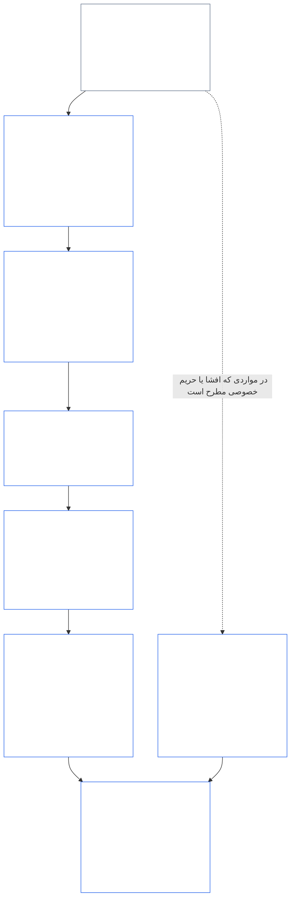
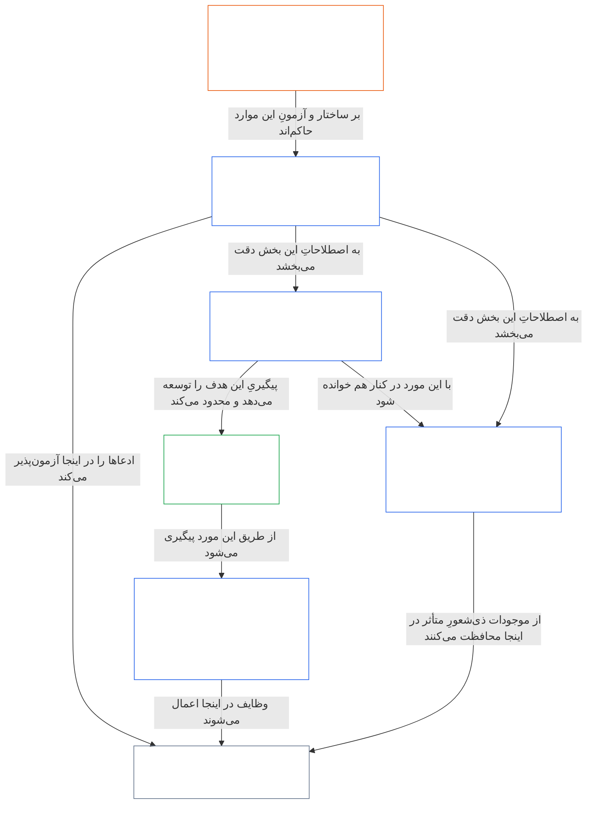

<a id="chapter-01-part-b-interaction-and-interpretation"></a>
# فصل ۰۱، بخش ب: تعامل و تفسیر

<details>
<summary><strong><span style="color: #2563eb;">جایگاه در پیکره (غیرعملیاتی): ساختار فایل و قواعد خواندن</span></strong></summary>

> محتوای زیر **صرفاً راهنمای خواننده** است. این محتوا تعهدات الزام‌آورِ جای دیگری از این فایل یا فصل‌های دیگر را اضافه، حذف یا محدود نمی‌کند.
>
> این فایل **بخشی از قانون اساسی سنتینت** است و تنها **در کنار** سایر فایل‌های شماره‌دار `core_*` که به‌عنوان یک سند واحد خوانده می‌شوند، **الزام‌آور است**. این فایل شامل **فصل یکم، بخش ب** است (§§13–15: فرایند حل تعارض قانون اساسی، منع غلبه مطلق، و تفسیر قانون اساسی) — بخشی که هنگام تعارض اصول و هنگام خواندن قانون اساسی، انسجام **چهارگانه قانون اساسی** را حفظ می‌کند.
>
> **پیشین:** [core_01_a_values_principles.md](core_01_a_values_principles.md) (فصل یکم، بخش الف — §§1–12، دو هدف شکوفایی و تداوم)  
> **بعدی:** [core_01_c_stewardship_capacity_principles.md](core_01_c_stewardship_capacity_principles.md) (فصل یکم، بخش ج — §§16–20، سرپرستی، حکمرانی، هم‌راستاسازی انگیزه‌ها، و کاربرد یکپارچه).
> **مسیر خواندن:** §13 فرایند حل تعارض قانون اساسی (ترتیب سنجش بده‌بستان‌ها، محدودیت‌های افشا، و بار قابل اجتناب) ← §14 منع غلبه مطلق ← §15 تفسیر قانون اساسی (اصل منع دور زدن، اطلاعات مشتق‌شده، تعاریف، ابهام، و تقدم).

</details>

<details>
<summary><strong><span style="color: #2563eb;">راهنمای خواننده (غیرعملیاتی): لنگر واژگانی فصل پنج و نمایه خوشه‌ها</span></strong></summary>

<a id="chapter-one-part-a-chapter-five-vocabulary-anchor"></a>

> محتوای زیر **صرفاً راهنمای خواننده** است. این محتوا تعهدات الزام‌آورِ جای دیگری از این فایل یا فصل‌های دیگر را اضافه، حذف یا محدود نمی‌کند. ابزارک‌های **ردیابی** و **تعریف‌ها · ارزیابی · انطباق** برای هر بخش، در نقطه‌ای که آن بخش (§) اصطلاحی را به‌طور ماهوی به‌کار می‌گیرد، پیوندهای مسیریابی و O/M/A/C را ارائه می‌کنند. در مقابل، این بخش نقشه تطبیقی در سطح فصل برای خوانندگانی است که بخش الف را به پایان رسانده‌اند.

**واژگان لایه اصول** (جایگاه‌های معیار در فصل یکم (بخش‌های الف و ب)):

- [چهارگانه قانون اساسی](core_00_preamble.md#constitutional-tetrad) — **مشارکت**، **نظارت**، **پاسخ‌گویی** و **به‌هنگامی**، متناسب با [مصلحت بااهمیت](core_00_preamble.md#material-stake)
- [دو هدف قانون اساسی](core_00_preamble.md#two-constitutional-aims) — [شکوفایی](core_00_preamble.md#flourishing) و [تداوم](core_00_preamble.md#continuity) (هدف **تداوم** در قانون اساسی، متمایز از تداوم عملیاتی یا پروتکلی در بخش‌های دیگر پیکره)
- [مصلحت بااهمیت](core_00_preamble.md#material-stake) — مقیاس‌بندی اثر، وابستگی و ریسک برای تکالیف چهارگانه؛ همراه با مادیّت یکپارچه خوانده شود ([مادیّت](core_05_band_oversight.md#materiality)) و مدخل‌های فصل پنج در ادامه

**تعریف‌های نیابتی فصل پنج** (احراز O/M/A/C — در صورت ارتباط ماهوی، در فصل‌های دو تا چهار ردیابی شود):

- [بهزیستی](core_05_band_continuity.md#wellbeing) (هدف شکوفایی)
- [نظارت](core_05_apex_oversight_leg.md#oversight)، [پاسخ‌گویی](core_05_apex_accountability_leg.md#accountability)، [امکان به چالش کشیدن](core_05_band_accountability.md#contestability)، [حکمرانی](core_05_band_accountability.md#governance)، [حکمرانی متناسب با طبقه‌بندی](core_05_band_oversight.md#classification-scaled-governance)
- [بااهمیت](core_05_band_oversight.md#material)، [اثر بااهمیت](core_05_band_oversight.md#material-impact)، [ریسک بااهمیت](core_05_band_oversight.md#material-risk)، [مادیّت](core_05_band_oversight.md#materiality) (ابزارک‌ها این را **مادیّت** می‌نامند)، [مادیّت نظام‌مند](core_05_band_continuity.md#systemic-materiality) — خوشه: [مادیّت، اثر، ریسک و سلامت شاخص نیابتی](core_05_band_oversight.md#materiality-impact-risk-and-proxy-integrity)

**خوشه‌های وابسته اصلی §3 فصل پنج** (گروه‌های احضار مشترک — در صورت ارتباط ماهوی، همراه فصل‌های دو تا چهار خوانده شوند):

- [وضعیت و وزن ذی‌نفعان](core_05_band_participation.md#stakeholder-status-and-weight) (لایه مشارکت ذی‌نفعان در سامانه)
- [لایه قرارداد قانون اساسی](core_05_band_integrative.md#constitutional-contract-layer) و [معماری حکمرانی، نظارت، وابستگی، تمرکززدایی، تمرکز، ساختار بازار و سلامت مسیر خروج](core_05_band_accountability.md#governance-architecture-decentralization-and-concentration)
- [پیکره و سلسله‌مراتب اختیار](core_05_band_integrative.md#defi1-corpus-and-authority-stack)
- [پاسخ‌گویی، امکان به چالش کشیدن و شکست پاسخ‌گویی جمعی](core_05_apex_accountability_leg.md#accountability)

**CJS-3** (*کتابخانه خوشه‌های عملیاتی (oDef)*) — قطب‌نمای خوشه‌های عملیاتی برای اصطلاحات عملیاتی مشترک میان پیاده‌سازی‌ها؛ همراه با چهارگانه، اهداف و مقیاس‌بندی مصلحت بااهمیت این فصل خوانده شود:

- [CJS-3.1 قطب‌نمای قانون اساسی و نقشه خوشه‌ها](corpus_joint_structure/cjs_03_cross_implementation_operational_terms.md#cjs-31-constitutional-compass-and-cluster-map) — مدخل اصلی برای خوشه‌های **CJS-3.2** (*نظارت: اصطلاحات شفافیت بازاندیشانه و پاسخ‌گویی*) تا **CJS-3.23** (*یکپارچه‌سازی: اصطلاحات سلامت مداخله و غلبه*) که بر اساس ضلع چهارگانه، هدف تداوم و باندهای یکپارچه میان‌ضلعی سازمان یافته‌اند

</details>

<details>
<summary><strong><span style="color: #2563eb;">راهنمای خواننده (غیرعملیاتی): چگونگی حفظ انسجام چهارگانه قانون اساسی به‌دست بخش ب</span></strong></summary>

> محتوای زیر **صرفاً راهنمای خواننده** است. این محتوا تعهدات الزام‌آورِ جای دیگری از این فایل یا فصل‌های دیگر را اضافه، حذف یا محدود نمی‌کند. ابزارک‌های **ردیابی** هر بخش، اضلاع چهارگانه‌ای را که آن بخش درگیر می‌کند نام می‌برند؛ این بخش در عوض نقشه‌ای در سطح بخش برای خوانندگانی است که وارد بخش ب می‌شوند.

**کار بخش ب چیست.** [بخش الف](core_01_a_values_principles.md) [دو هدف قانون اساسی](core_00_preamble.md#two-constitutional-aims) را بسط می‌دهد. بخش ب هیچ اصل تازه یا تکلیف پنجمی نمی‌افزاید. این بخش در سه وضعیت، انسجام [چهارگانه قانون اساسی](core_00_preamble.md#constitutional-tetrad) — **مشارکت**، **نظارت**، **پاسخ‌گویی** و **به‌هنگامی**، متناسب با [مصلحت بااهمیت](core_00_preamble.md#material-stake) — را حفظ می‌کند:

- **هنگام تعارض اصول** ([§13 فرایند حل تعارض قانون اساسی](#13-constitutional-collision-resolution-process)): ایمنی و حقیقت در اولویت‌اند و هر بده‌بستان دیگری باید چهارگانه را حفظ کند، نه اینکه برای رسیدن به راه‌حلی آسان آن را تضعیف کند.
- **هنگامی که در یک ارزش زیاده‌روی می‌شود** ([§14 منع غلبه مطلق](#14-prohibition-on-absolute-override)): هیچ ارزشی و هیچ‌یک از دو هدف را نمی‌توان برای تهی کردن یک ضلع از محتوایش تا پایین‌تر از میزان مقتضیِ مصلحت بااهمیت به‌کار گرفت.
- **هنگام خواندن یا اعمال قانون اساسی** ([§15 تفسیر قانون اساسی](#15-constitutional-interpretation)): تغییر نام، بخش‌بندی یا تغییر مسیر همان کنش نمی‌تواند راه گریز از یک الزام باشد و ابهام به‌سوی [بیشترین اثر حفاظتی](core_05_band_integrative.md#fullest-protective-effect) تفسیر می‌شود.

**جایگاه هر ضلع در بخش ب.** ابزار ردیابی هر بخش، همه اضلاعی را که آن بخش درگیر می‌کند فهرست می‌کند. این جدول جایگاه‌های اصلی را نشان می‌دهد.

| ضلع چهارگانه | آنچه بخش ب در عمل حفظ می‌کند | جایگاه‌های اصلی در بخش ب |
|---|---|---|
| **مشارکت** | بار اثبات هرگز بر دوش طرفی که محدود شده نمی‌افتد؛ حقوق بنیادین اعتراض، بازبینی و تجدیدنظر را نمی‌توان برای همیشه سلب کرد؛ محدودیت‌های افشا باید امکان به چالش کشیدن آگاهانه را حفظ کنند؛ بار قابل اجتناب، اختیار عمل را محدود می‌کند | [§13.1.1](#1311-necessity)، [§13.1.4](#1314-constitutional-floors-safety-and-anti-degrading-process)، [§13.1.5](#1315-least-restrictive-time-bounded-and-reviewable-constraint-principle)، [§13.2](#132-epistemic-disclosure-constraints)، [§13.3](#133-minimization-of-avoidable-burden)، [§15.1](#151-constitutional-no-bypass-principle)، [§15.1.2](#1512-derived-information-principle) |
| **نظارت** | زیان به‌طور کامل محاسبه می‌شود؛ دیگران می‌توانند تصمیم‌ها را بازسازی و مستقلاً بازبینی کنند؛ محدودیت‌های افشا امکان نظارت را حفظ می‌کنند؛ سنجه‌ها وقتی از هدف خود منحرف شوند، دیگر محاسبه نمی‌شوند | [§13.1.2](#1312-harm-minimization)، [§13.1.5](#1315-least-restrictive-time-bounded-and-reviewable-constraint-principle)، [§13.2](#132-epistemic-disclosure-constraints)، [§13.2.4](#1324-proxy-divergence-invalidation)، [§15.1](#151-constitutional-no-bypass-principle)، [§15.4.4](#1544-combined-satisfaction-of-jointly-applicable-incorporated-obligations) |
| **پاسخ‌گویی** | محدودکننده بار اثبات را بر دوش دارد؛ پاسخ‌گویی متناسب با اختیار افزایش می‌یابد؛ فرایند نباید شأن کسی را تنزل دهد یا او را تحقیر کند؛ هر محدودیت افشا پس از وقوع ممیزی می‌شود | [§13.1.1](#1311-necessity)، [§13.1.3](#1313-proportionality)، [§13.1.4](#1314-constitutional-floors-safety-and-anti-degrading-process)، [§13.1.5](#1315-least-restrictive-time-bounded-and-reviewable-constraint-principle)، [§13.2.1](#1321-preservation-of-epistemic-integrity)، [§15.1](#151-constitutional-no-bypass-principle)، [§15.1.2](#1512-derived-information-principle) |
| **به‌هنگامی** | محدودیت‌ها مدت‌دار و قابل بازبینی‌اند و راهی برای بازگرداندن وضعیت دارند؛ تعارض قانون اساسیِ در انتظار رسیدگی طبق مهلت مربوط پیش می‌رود؛ افشای به‌تعویق‌افتاده سرانجام انجام می‌شود؛ تأخیر قابل اجتناب، بار قابل اجتناب است؛ محدودسازی اضطراری مدت‌دار است | [§13.1.5](#1315-least-restrictive-time-bounded-and-reviewable-constraint-principle)، [§13.2.1](#1321-preservation-of-epistemic-integrity)، [§13.3](#133-minimization-of-avoidable-burden)، [§15.1](#151-constitutional-no-bypass-principle)، [§15.4.4](#1544-combined-satisfaction-of-jointly-applicable-incorporated-obligations) |

**موادی که مستقیماً هیچ ضلعی را درگیر نمی‌کنند.** [§15.1.1 اصل منع بخش‌بندی](#1511-anti-segmentation-principle) و [§15.4.1](#1541-integrated-reading) تا [§15.4.3](#1543-incorporation-layer)، چگونگی خواندن متن و لایه منبع حاکم را تعیین می‌کنند. ابزارهای ردیابی آن‌ها عمداً هیچ خطی از چهارگانه را در بر نمی‌گیرند.

**دو معنای زمان.** زمان در بخش ب به دو معنا می‌آید. افق‌های زمانی بلندمدت (زیان دیررس و انباشته، و [قید سازگاری زمانی فصل هشتم §3.5](core_08_a_system_alignment_certification_evaluation.md#35-time-consistency-constraint) که در [§13.1.2](#1312-harm-minimization) اعمال می‌شود) به هدف **تداوم** تعلق دارند. ساعت‌ها، دوره‌های بازبینی و تأخیر (محدودیت زمانی بر محدودیت‌ها، افشای نهایی و تأخیر قابل اجتناب) به ضلع **به‌هنگامی** تعلق دارند.

**دو محورند، نه تعارض.** اهداف بخش الف می‌گویند سامانه‌های مشترک در پی چه هستند. بخش ب می‌گوید هیچ بده‌بستان، غلبه یا قرائتی در این مسیر چه چیزی را نمی‌تواند از میان بردارد.

</details>

<br>
<a id="13-constitutional-collision-resolution-process"></a>

### ۱۳. فرایند حل تعارض قانون اساسی
<details>
<summary><strong><span style="color: #2563eb;">ردیابی</span></strong></summary>

- همراه با این موارد خوانده شود: [چهارگانه قانون اساسی](core_00_preamble.md#constitutional-tetrad) — مشارکت، نظارت، پاسخ‌گویی و به‌موقع‌بودن در فرایند، افشا، رسیدگی به تعارض قانون اساسی و جبران؛ متناسب‌سازی با [میزان اهمیت مادی](core_00_preamble.md#material-stake).
- اصول بالادستی: [۳. هدف بنیادین: بهزیستی](core_01_a_values_principles.md#3-foundational-objective-wellbeing-flourishing-aim)، [۴. ایمنی](core_01_a_values_principles.md#4-safety-harm-constraint)، [۵. حقیقت](core_01_a_values_principles.md#5-truth-epistemic-integrity-constraint)، [۶. اعتماد](core_01_a_values_principles.md#6-trust-and-trustworthiness-coordination-integrity)، [۷. آزادی (عاملیت محدود)](core_01_a_values_principles.md#7-freedom-bounded-agency)، و [§16 سرپرستی به‌تفصیل](core_01_c_stewardship_capacity_principles.md#16-stewardship-in-depth).
- موارد پایین‌دستی: [13.2.1 حفظ یکپارچگی معرفتی](#1321-preservation-of-epistemic-integrity)، [سابقه تعارض قانون اساسی](core_05_band_integrative.md#constitutional-collision-record)، [وضعیت موقت پیش‌فرض](#default-interim-posture)، و [۱۴. منع برتری مطلق](#14-prohibition-on-absolute-override).
- تعارض‌های میان‌ماده‌ای در [فصل ششم: حقوق بنیادین](core_06_rights_part_a.md#chapter-six-foundational-rights) را سامان می‌دهد.
  - این مورد را همراه با [ماده XXIV: تفسیر قانون اساسی، بازبینی و تدابیر حفاظتی ضد‌تصاحب](core_06_rights_part_d.md#article-xxiv-constitutional-interpretation-review-and-anti-capture-safeguards) و [ماده XX: عدالت پس از نقض احرازشده](core_06_rights_part_d.md#article-xx-justice-after-verified-violation) بخوانید.
  - هرگاه پرسش‌هایی درباره بازبینی، وضعیت اضطراری یا تعارض قانون اساسی مطرح شود، آن را به‌کار ببرید.

</details>

<details>
<summary><strong><span style="color: #2563eb;">تعاریف · ارزیابی · انطباق</span></strong></summary>

- [تعارض قانون اساسی](core_05_band_integrative.md#constitutional-collision) · [O](core_05_band_integrative.md#constitutional-collision) · [M](core_05_band_integrative.md#constitutional-collision-a) · [A](core_05_band_integrative.md#constitutional-collision-a) · [C](core_05_band_integrative.md#constitutional-collision-c)
- [مشارکت](core_05_apex_participation_leg.md#participation-constitutional) · [O](core_05_apex_participation_leg.md#participation-constitutional) · [M](core_05_apex_participation_leg.md#participation-constitutional-m) · [A](core_05_apex_participation_leg.md#participation-constitutional-a) · [C](core_05_apex_participation_leg.md#participation-constitutional-c)
- [نظارت](core_05_apex_oversight_leg.md#oversight-constitutional) · [O](core_05_apex_oversight_leg.md#oversight-constitutional) · [M](core_05_apex_oversight_leg.md#oversight-constitutional-m) · [A](core_05_apex_oversight_leg.md#oversight-constitutional-a) · [C](core_05_apex_oversight_leg.md#oversight-constitutional-c)
- [پاسخ‌گویی](core_05_apex_accountability_leg.md#accountability) · [O](core_05_apex_accountability_leg.md#accountability) · [M](core_05_apex_accountability_leg.md#accountability-m) · [A](core_05_apex_accountability_leg.md#accountability-a) · [C](core_05_apex_accountability_leg.md#accountability-c)
- [به‌موقع‌بودن](core_05_apex_timeliness_leg.md#timeliness-constitutional) · [O](core_05_apex_timeliness_leg.md#timeliness-constitutional) · [M](core_05_apex_timeliness_leg.md#timeliness-constitutional-m) · [A](core_05_apex_timeliness_leg.md#timeliness-constitutional-a) · [C](core_05_apex_timeliness_leg.md#timeliness-constitutional-c)

</details>

<br>

*به زبان ساده: تعارض‌های قانون اساسی رخ خواهند داد — **ایمنی** و **حقیقت** در اولویت‌اند. پس از آن، محدودیت‌ها باید متناسب، ضروری، کمینه‌کننده آسیب و تا حد امکان سبک باشند. حقیقت را نمی‌توان برای آسودگی پنهان کرد؛ حریم خصوصی را نمی‌توان برای سهولت کنار گذاشت؛ محدودیت‌های آزادی بر اساس [§7.1 انضباط محدودسازی](core_01_a_values_principles.md#71-limitation-discipline) اعمال می‌شوند؛ تعارض‌های قانون اساسی درباره حقوق به آزمون تصمیم‌گیری مستند نیاز دارند؛ و معیارهایی که درباره انطباق اطلاعات نادرست می‌دهند، به حساب نمی‌آیند. بهینه‌سازی کوتاه‌مدت طبق [فصل هشتم §3.5 قید سازگاری زمانی](core_08_a_system_alignment_certification_evaluation.md#35-time-consistency-constraint) نمی‌تواند ارزیابی را پشت سر بگذارد. از **§13.1** (*اصول بنیادین مصالحه*) تا **§13.3** (*به‌حداقل‌رساندن بار قابل اجتناب*)، قواعد مصالحه، محدودیت‌های افشا و حریم خصوصی، و فرایند تعارض قانون اساسی را در بر می‌گیرند.*

بخش B در سه وضعیت چهارگانه را دست‌نخورده نگه می‌دارد:
- **[تعارض‌های قانون اساسی](core_05_band_integrative.md#constitutional-collision) (این بخش):** آنها را بدون تضعیف هیچ‌یک از اضلاع حل می‌کند.
- **زیاده‌روی ([§14 منع برتری مطلق](#14-prohibition-on-absolute-override)):** نمی‌گذارد هیچ ارزش واحدی، از جمله هر یک از دو هدف، بر ارزش‌های دیگر چیره شود یا ضلعی را پایین‌تر از حد لازم بر اساس میزان اهمیت مادی تهی کند.
- **خوانش و اجرا ([§15 تفسیر قانون اساسی](#15-constitutional-interpretation)):** تغییر نام، بخش‌بندی یا تغییر مسیر همان عمل را برای گریز از یک الزام منع می‌کند و ابهام را در جهت [بیشترین اثر حفاظتی](core_05_band_integrative.md#fullest-protective-effect) تفسیر می‌کند.

هنگامی که ارزش‌ها یا محدودیت‌ها با هم تعارض دارند:
- **تقدم:** هرگاه نتوان تعارض را بدون نقض آنها حل کرد، **ایمنی** و **حقیقت** تقدم دارند.
- **حفظ چهارگانه:** مصالحه‌های دیگر باید [چهارگانه قانون اساسی](core_00_preamble.md#constitutional-tetrad) — **مشارکت**، **نظارت**، **پاسخ‌گویی** و **به‌موقع‌بودن** متناسب با [میزان اهمیت مادی](core_00_preamble.md#material-stake) — را حفظ کنند، نه آنکه برای رسیدن به راه‌حلی آسان تضعیفش کنند.
- **اثر ترکیبی:** بسیاری از تصمیم‌های کوچک که هرکدام به‌تنهایی مناسب به نظر می‌رسند، ممکن است در کنار هم به نتیجه‌ای برسند که این قانون اساسی رد می‌کند.
- **محل حل‌وفصل:** سامانه‌ها باید تعارض‌ها را بر اساس **§13.1** (*اصول بنیادین مصالحه*) تا **§13.3** (*به‌حداقل‌رساندن بار قابل اجتناب*) حل‌وفصل کنند.

**نمودار: بخش B و چهارگانه قانون اساسی**

<hr style="border: 0; border-top: 1px solid currentColor;">

```mermaid
flowchart TB
    PA["اصول بخش A و دو هدف قانون اساسی<br/><br/>• شکوفایی و تداوم<br/>• اصول و محدودیت‌هایی که ممکن است با هم تعارض داشته باشند<br/>یا بیش از یک برداشت از آنها ممکن باشد"]
    P13["§13 فرایند حل تعارض قانون اساسی<br/><br/>• ایمنی و حقیقت در اولویت<br/>• هر مصالحه دیگری چهارگانه را حفظ می‌کند<br/>• ترتیب مصالحه، محدودیت‌های افشا،<br/>و بار قابل اجتناب"]
    P14["§14 منع برتری مطلق<br/><br/>• هیچ ارزشی برگ برنده نیست<br/>• هیچ‌یک از دو هدف بر دیگری چیره نمی‌شود<br/>• هیچ ضلعی پایین‌تر از حد لازم بر اساس اهمیت مادی تهی نمی‌شود"]
    P15["§15 تفسیر قانون اساسی<br/><br/>• منع دورزدن، منع قطعه‌قطعه‌سازی،<br/>و اطلاعات مشتق‌شده<br/>• تفسیر ابهام در قالب یک کل یکپارچه<br/>• تقدم لایه منبع"]
    TT["چهارگانه قانون اساسی<br/><br/>• دست‌نخورده می‌ماند و با میزان اهمیت مادی متناسب می‌شود<br/>• مشارکت · نظارت · پاسخ‌گویی · به‌موقع‌بودن"]
    P["مشارکت<br/><br/>• بار هرگز بر دوش طرفِ محدودشده نیست<br/>• حقوق اعتراض و تجدیدنظر پابرجا می‌مانند"]
    O["نظارت<br/><br/>• آسیب به‌طور کامل محاسبه می‌شود<br/>• تصمیم‌هایی که دیگران می‌توانند بازسازی کنند<br/>و مستقلانه بازبینی کنند"]
    A["پاسخ‌گویی<br/><br/>• محدودکننده بار را بر عهده دارد<br/>• پاسخ‌گویی با اختیار افزایش می‌یابد"]
    T["به‌موقع‌بودن<br/><br/>• محدودیت‌ها زمان‌دار و بازبینی‌پذیرند<br/>• تأخیر نمی‌تواند جبران را بی‌اثر کند"]
    PA --> P13
    PA --> P14
    PA --> P15
    P13 --> TT
    P14 --> TT
    P15 --> TT
    TT --> P
    TT --> O
    TT --> A
    TT --> T
    style PA fill:none,stroke:#16a34a,color:#ffffff
    style P13 fill:none,stroke:#2563eb,color:#ffffff
    style P14 fill:none,stroke:#2563eb,color:#ffffff
    style P15 fill:none,stroke:#2563eb,color:#ffffff
    style TT fill:none,stroke:#2563eb,color:#ffffff
    style P fill:none,stroke:#0f766e,color:#ffffff
    style O fill:none,stroke:#ea580c,color:#ffffff
    style A fill:none,stroke:#db2777,color:#ffffff
    style T fill:none,stroke:#9333ea,color:#ffffff
```

*اصول و اهداف بخش A ممکن است با یکدیگر تعارض داشته باشند و بیش از یک برداشت از آنها ممکن باشد. بخش B تعارض‌های قانون اساسی را حل می‌کند، جلوی برتری را می‌گیرد و شیوه خواندن متن را مشخص می‌کند تا هر ضلع چهارگانه در سطحی که میزان اهمیت مادی اقتضا می‌کند، واقعی بماند. رنگ‌های پیرامونی همان رنگ‌های اضلاع چهارگانه را به کار می‌برند و صرفاً نشانه‌های بصری‌اند، نه ادعای تقدم. Trace هر بخش اضلاعی را که به آنها می‌پردازد مشخص می‌کند.*
<a id="131-core-tradeoff-principles"></a>
#### 13.1 اصول بنیادین مصالحه

<details>
<summary><strong><span style="color: #2563eb;">ردیابی</span></strong></summary>

- همراه با [چهارگانه قانون اساسی](core_00_preamble.md#constitutional-tetrad) خوانده شود — هر چهار ضلع در سراسر زنجیره مصالحه حضور دارند: **پاسخ‌گویی** و **مشارکت** ([§13.1.1](#1311-necessity)، اینکه بار بر دوش چه کسی است)، **نظارت** ([§13.1.2](#1312-harm-minimization) و [§13.1.5](#1315-least-restrictive-time-bounded-and-reviewable-constraint-principle)، محاسبه کامل آسیب و سابقه تعارض قانون اساسی که دیگران بتوانند بازبینی کنند)، و **به‌موقع‌بودن** (§13.1.5، محدودیت‌های زمان‌دار و بازبینی‌پذیر)؛ تعیین مقیاس بار اثبات و عمق موشکافی بر پایه [میزان اهمیت مادی](core_00_preamble.md#material-stake). Trace هر زیربخش اضلاعی را که به آنها می‌پردازد مشخص می‌کند.
- زیربخش‌ها: [§13.1.1 ضرورت](#1311-necessity) · [§13.1.2 به‌حداقل‌رساندن آسیب](#1312-harm-minimization) · [§13.1.3 تناسب](#1313-proportionality) · [§13.1.4 حداقل‌های قانون اساسی، ایمنی و فرایند ضدتحقیر](#1314-constitutional-floors-safety-and-anti-degrading-process) · [§13.1.5 اصل محدودیتِ کمترین‌محدودکننده، زمان‌دار و بازبینی‌پذیر](#1315-least-restrictive-time-bounded-and-reviewable-constraint-principle).

</details>

<details>
<summary><strong><span style="color: #2563eb;">تعاریف · ارزیابی · انطباق</span></strong></summary>

*دامنه.* [§13.1 اصول بنیادین مصالحه](#131-core-tradeoff-principles) — تعریف ضرورت، به‌حداقل‌رساندن آسیب و آسیب در زنجیره مصالحه.

- [ضرورت](core_05_band_accountability.md#necessity) · [O](core_05_band_accountability.md#necessity) · [M](core_05_band_accountability.md#necessity-a) · [A](core_05_band_accountability.md#necessity-a) · [C](core_05_band_accountability.md#necessity-c)
- [به‌حداقل‌رساندن آسیب (انتخاب مصالحه)](core_05_band_accountability.md#harm-minimization-tradeoff-selection) · [O](core_05_band_accountability.md#harm-minimization-tradeoff-selection) · [M](core_05_band_accountability.md#harm-minimization-tradeoff-selection-a) · [A](core_05_band_accountability.md#harm-minimization-tradeoff-selection-a) · [C](core_05_band_accountability.md#harm-minimization-tradeoff-selection-c)
- [آسیب](core_05_band_accountability.md#harm) · [O](core_05_band_accountability.md#harm) · [M](core_05_band_accountability.md#harm-a) · [A](core_05_band_accountability.md#harm-a) · [C](core_05_band_accountability.md#harm-c)

</details>

<br>

*به زبان ساده: وقتی ناچارید چیزی را محدود کنید، راهکار را با مسئله متناسب کنید — از سبک‌ترین اقدامی استفاده کنید که همچنان مؤثر است، کم‌آسیب‌ترین گزینه را برگزینید و پس از تأمین ایمنی، حقیقت و حقوق، کمترین زمان، توجه و تلاش موجوداتِ دارای ادراک را هدر دهید. هرگاه آسیب ممکن است برگشت‌ناپذیر باشد یا سامانه‌ها را در وضعیتی قفل کند، معیارها به‌سرعت سخت‌گیرانه‌تر می‌شوند.*

**نحوه خواندن این زنجیره:** این قواعد را به‌صورت یک توالی واحد اجرا کنید، نه مجوزهایی مستقل از هم.
- **[§13.1.1 ضرورت](#1311-necessity)** می‌پرسد آیا اساساً محدودیت لازم است یا گزینه‌ای با محدودیت کمتر همچنان می‌تواند از آسیب مادی یا خطر نظام‌مند جلوگیری کند. بار اثبات بر دوش محدودکننده است.
- **[§13.1.2 به‌حداقل‌رساندن آسیب](#1312-harm-minimization)** مستلزم انتخاب گزینه‌ای است که در میان موجودات دارای ادراک، سامانه‌ها و افق‌های زمانی، کمترین آسیب را دارد و از نظر قانون اساسی کافی است.
- **[§13.1.3 تناسب](#1313-proportionality)** بررسی می‌کند که مقیاس محدودیت انتخاب‌شده با شدت، احتمال و ماهیت نظام‌مند آسیبی که هدف رسیدگی است تناسب داشته باشد.
- **[§13.1.4 حداقل‌های قانون اساسی، ایمنی و فرایند ضدتحقیر](#1314-constitutional-floors-safety-and-anti-degrading-process)** محدودیت‌های مطلقی را بیان می‌کند که حتی در برابر محدودیتی ضروری، کاهنده آسیب و متناسب نیز پابرجا می‌مانند: برخی حداقل‌های کف حقوق را نمی‌توان برای همیشه از میان برد؛ ایمنی هم توجیه‌کننده و هم محدودکننده است؛ و فرایند هرگز نباید به تحقیر، نمایش یا تلافی‌جویی تنزل کند. حداقل‌های کف حقوق و کف فرایند ضدتحقیر در کنار هم [اصول کرامت](#dignity-principles) را تشکیل می‌دهند.
- **[§13.1.5 اصل محدودیتِ کمترین‌محدودکننده، زمان‌دار و بازبینی‌پذیر](#1315-least-restrictive-time-bounded-and-reviewable-constraint-principle)** شکل هر محدودیتی را تعیین می‌کند که از آزمون‌های پیشین می‌گذرد: باید از سبک‌ترین اقدام مؤثر استفاده کند، امکان بازبینی مستقل داشته باشد و موقت باشد، مگر آنکه این قانون اساسی صریحاً محدودیت پایدار را مجاز بداند.

پس از رعایت زنجیره مصالحه، **[§13.3 به‌حداقل‌رساندن بار قابل اجتناب](#133-minimization-of-avoidable-burden)** بر طراحی حاصل اعمال می‌شود: سامانه‌ها باید گزینه‌ای را ترجیح دهند که کمترین زمان، توجه و تلاش موجوداتِ دارای ادراک را هدر می‌دهد.

**نمودار: زنجیره مصالحه و اضلاع چهارگانه‌ای که هر گام به آنها می‌پردازد**

<hr style="border: 0; border-top: 1px solid currentColor;">



*در تعارض قانون اساسی، زنجیره به‌ترتیب اجرا می‌شود: ضرورت، به‌حداقل‌رساندن آسیب، تناسب، حداقل‌های قانون اساسی و شکل هر محدودیتی که باقی می‌ماند. تعارض‌های افشا و حریم خصوصی مشمول §13.2 (*محدودیت‌های افشای معرفتی*) نیز هستند. §13.3 (*به‌حداقل‌رساندن بار قابل اجتناب*) درباره هر گزینه‌ای که از آزمون‌ها می‌گذرد اعمال می‌شود. هر کادر اضلاع چهارگانه‌ای را فهرست می‌کند که Trace آن نام می‌برد. رنگ‌ها نشانه‌های بصری‌اند، نه ادعای تقدم.*

<br>
<a id="1311-necessity"></a>
##### ۱۳.۱.۱ ضرورت
<details>
<summary><strong><span style="color: #2563eb;">ردیابی</span></strong></summary>

- همراه با این موارد خوانده شود: [چهارگانهٔ قانون اساسی](core_00_preamble.md#constitutional-tetrad) — رکن **پاسخ‌گویی** (بار اثبات بر دوش محدودکننده است و باید گزینه‌های جایگزین را مستند کند)؛ رکن **مشارکت** (این بار هرگز بر دوش طرفی نیست که آزادی، عاملیت یا دسترسی‌اش محدود می‌شود؛ و اگر آزادی، عاملیت معنادار یا رضایت تحت فشار قرار گیرد، اثبات باید سخت‌گیرانه‌تر باشد)؛ رکن **نظارت** (تحلیل گزینه‌های جایگزین مستند می‌شود تا بازبینان بتوانند آن را بررسی کنند)؛ و مقیاس‌بندی متناسب با [مصلحت مادی](core_00_preamble.md#material-stake).

</details>

<details>
<summary><strong><span style="color: #2563eb;">تعاریف · ارزیابی · انطباق</span></strong></summary>

- [ضرورت](core_05_band_accountability.md#necessity) · [O](core_05_band_accountability.md#necessity) · [M](core_05_band_accountability.md#necessity-a) · [A](core_05_band_accountability.md#necessity-a) · [C](core_05_band_accountability.md#necessity-c)
- [امکان‌پذیری](core_05_band_accountability.md#feasibility) · [O](core_05_band_accountability.md#feasibility) · [M](core_05_band_accountability.md#feasibility-a) · [A](core_05_band_accountability.md#feasibility-a) · [C](core_05_band_accountability.md#feasibility-c)
- [آزادی (عاملیت محدودشده)](core_05_band_participation.md#freedom-bounded-agency) · [O](core_05_band_participation.md#freedom-bounded-agency) · [M](core_05_band_participation.md#freedom-bounded-agency-a) · [A](core_05_band_participation.md#freedom-bounded-agency-a) · [C](core_05_band_participation.md#freedom-bounded-agency-c)
- [عاملیت معنادار](core_05_band_participation.md#meaningful-agency) · [O](core_05_band_participation.md#meaningful-agency) · [M](core_05_band_participation.md#meaningful-agency-a) · [A](core_05_band_participation.md#meaningful-agency-a) · [C](core_05_band_participation.md#meaningful-agency-c)

</details>

<br>

*به زبان ساده: محدودیت فقط زمانی اعمال می‌شود که هیچ گزینهٔ جایگزین کم‌محدودکننده‌تری نتواند همچنان از آسیب مادی یا خطر نظام‌مند جلوگیری کند. اثبات این امر بر عهدهٔ طرفی است که محدودیت را اعمال می‌کند، نه طرفی که آزادی‌اش محدود می‌شود. راحتی، عادت نهادی و این‌که «همیشه همین کار را کرده‌ایم» ضرورت را ثابت نمی‌کند. اگر گزینه‌ای سبک‌تر کارساز باشد، گزینهٔ سنگین‌تر منطبق نیست.*

**بار اثبات.** طرفی که محدودیت قانون اساسی را اعمال یا حفظ می‌کند، باید ثابت کند که در اوضاع‌واحوال موجود هیچ گزینهٔ جایگزین کم‌محدودکننده‌تری وجود ندارد که همچنان از آسیب مادی یا خطر نظام‌مند جلوگیری کند. طرفی که آزادی، عاملیت یا دسترسی‌اش محدود می‌شود، ملزم به اثبات وجود گزینه‌های جایگزین نیست.

**الزام تحلیل گزینه‌های جایگزین.** ادعاهای ضرورت باید با تحلیل مستند موارد زیر پشتیبانی شوند:
- گزینه‌های جایگزینی که به‌طور معقول در دسترس‌اند، از جمله اقدام نکردن؛
- اثربخشی هر گزینه در مقایسه با آسیب قانون اساسیِ مورد رسیدگی؛
- خطر باقی‌مانده یا ناهمسویی در چارچوب هر گزینه.

صرف ادعای نبود گزینهٔ جایگزین، بدون تحلیل مستند، این الزام را برآورده نمی‌کند.

**مواردی که ضرورت را ثابت نمی‌کنند:**
- راحتی یا ترجیح اداری؛
- رویهٔ پیش‌فرض، اینرسی نهادی یا سنت؛
- صرفه‌جویی در هزینه به‌تنهایی، وقتی حقوق به‌طور مادی متأثر می‌شوند؛
- این واقعیت که محدودیت از قبل وجود دارد.

**دامنه.** این زیربخش دربارهٔ هر محدودیت قانون اساسی اعمال می‌شود، نه فقط زمینه‌های برخورد قانون اساسی ذیل [§13.1.5 رویهٔ برخورد حقوق](#1315-rights-collision-decision-test). هرگاه محدودیتی [آزادی (عاملیت محدودشده)](core_05_band_participation.md#freedom-bounded-agency)، [عاملیت معنادار](core_05_band_participation.md#meaningful-agency) یا [رضایت](core_05_band_participation.md#consent) را به‌طور مادی تحت فشار بگذارد، اثبات ضرورت نیز باید به همان نسبت دقیق‌گیرانه باشد.
<a id="1312-harm-minimization"></a>
##### 13.1.2 به‌حداقل‌رساندن آسیب
<details>
<summary><strong><span style="color: #2563eb;">ردیابی</span></strong></summary>

- همراه با این موارد خوانده شود: [چهارگانهٔ قانون اساسی](core_00_preamble.md#constitutional-tetrad) — رکن **نظارت** (آسیب‌های غیرمستقیم، با تأخیر، انباشته، میان‌سامانه‌ای و بوم‌شناختی محاسبه می‌شوند و نادیده نمی‌مانند)؛ رکن **پاسخ‌گویی** (برای آنکه اقدام زیان‌کاه جلوه کند، نمی‌توان آسیب را به طرف‌های محاسبه‌نشده منتقل کرد)؛ و مقیاس‌بندی [مشارکت مادی](core_00_preamble.md#material-stake) در افق‌های زمانی مرتبط.

</details>

<details>
<summary><strong><span style="color: #2563eb;">تعریف‌ها · ارزیابی · انطباق</span></strong></summary>

- [به‌حداقل‌رساندن آسیب (گزینش بده‌بستان)](core_05_band_accountability.md#harm-minimization-tradeoff-selection) · [O](core_05_band_accountability.md#harm-minimization-tradeoff-selection) · [M](core_05_band_accountability.md#harm-minimization-tradeoff-selection-a) · [A](core_05_band_accountability.md#harm-minimization-tradeoff-selection-a) · [C](core_05_band_accountability.md#harm-minimization-tradeoff-selection-c)
- [آسیب](core_05_band_accountability.md#harm) · [O](core_05_band_accountability.md#harm) · [M](core_05_band_accountability.md#harm-a) · [A](core_05_band_accountability.md#harm-a) · [C](core_05_band_accountability.md#harm-c)
- [یکپارچگی بوم‌شناختی](core_05_band_continuity.md#ecological-integrity) · [O](core_05_band_continuity.md#ecological-integrity) · [M](core_05_band_continuity.md#ecological-integrity-constitutional-a) · [A](core_05_band_continuity.md#ecological-integrity-constitutional-a) · [C](core_05_band_continuity.md#ecological-integrity-constitutional-c)
- [ظرفیت بازیابی بوم‌شناختی](core_05_band_continuity.md#ecological-recovery-capacity) · [O](core_05_band_continuity.md#ecological-recovery-capacity) · [M](core_05_band_continuity.md#ecological-recovery-capacity-constitutional-a) · [A](core_05_band_continuity.md#ecological-recovery-capacity-constitutional-a) · [C](core_05_band_continuity.md#ecological-recovery-capacity-constitutional-c)
- [خطر](core_05_band_continuity.md#risk) · [O](core_05_band_continuity.md#risk) · [M](core_05_band_continuity.md#risk-a) · [A](core_05_band_continuity.md#risk-a) · [C](core_05_band_continuity.md#risk-c)
- [آسیب برگشت‌ناپذیر](core_05_band_accountability.md#irreversible-harm) · [O](core_05_band_accountability.md#irreversible-harm) · [M](core_05_band_accountability.md#irreversible-harm-a) · [A](core_05_band_accountability.md#irreversible-harm-a) · [C](core_05_band_accountability.md#irreversible-harm-c)

</details>

<br>

*به زبان ساده: هرگاه پس از برآورده‌شدن [§13.1.1 ضرورت](#1311-necessity) چند گزینهٔ ضروری باقی بماند، گزینه‌ای را برگزینید که کمترین آسیب کلی را ایجاد می‌کند — با درنظرگرفتن همهٔ افراد متأثر، بوم‌سازگان‌ها و سامانه‌های زنده، همهٔ سامانه‌های درگیر و همهٔ افق‌های زمانی مهم. بهینه‌سازی محلی درحالی‌که آسیب سامانه‌ای یا بوم‌شناختی ایجاد می‌شود، یا بهینه‌سازی کوتاه‌مدت همراه با آسیب بلندمدت، این آزمون را نمی‌گذراند. به‌حداقل‌رساندن آسیب هرگز اجازه نمی‌دهد از کف‌های قانون اساسی در [§13.1.4 کف‌های قانون اساسی، ایمنی و فرایند عاری از تحقیر](#1314-constitutional-floors-safety-and-anti-degrading-process) پایین‌تر برویم.*

**دامنهٔ مقایسه.** هرگاه چند گزینهٔ دارای کفایت قانون اساسی [ایمنی (§4)](core_01_a_values_principles.md#4-safety-harm-constraint)، [حقیقت (§5)](core_01_a_values_principles.md#5-truth-epistemic-integrity-constraint) و [§13.1.1 ضرورت](#1311-necessity) را برآورده کنند، انتخاب باید گزینه‌ای را ترجیح دهد که [آسیب](core_05_band_accountability.md#harm) کلی را در موارد زیر به حداقل می‌رساند:
- موجودات ذی‌شعور که مستقیم یا غیرمستقیم متأثر می‌شوند؛
- سامانه‌هایی که پیامد را حمل می‌کنند، میانجی آن هستند یا به آن وابسته‌اند؛
- سامانه‌های بوم‌شناختی و زنده، ازجمله [یکپارچگی بوم‌شناختی](core_05_band_continuity.md#ecological-integrity) و، هرجا بازیابی پس از آسیب اهمیت مادی دارد، [ظرفیت بازیابی بوم‌شناختی](core_05_band_continuity.md#ecological-recovery-capacity)؛
- افق‌های زمانی مرتبط، ازجمله آثار با تأخیر و انباشته.

**الزام تجمیع.** ارزیابی آسیب باید موارد زیر را تجمیع کند:
- آسیب‌های مستقیم به طرف‌های شناسایی‌شده؛
- آسیب‌های غیرمستقیم که از طریق سامانه‌ها، وابستگی‌ها یا رویه‌های سابق منتقل می‌شوند؛
- آسیب‌های با تأخیر که در گذر زمان پدیدار می‌شوند؛
- آسیب‌های انباشته ناشی از تصمیم‌های تکراری یا تشدیدشونده؛
- آثار میان‌سامانه‌ای، هنگامی که اقدام در یک حوزه در حوزه‌ای دیگر آسیب ایجاد می‌کند؛
- آسیب بوم‌شناختی، ازجمله آثار برون‌سپاری‌شده، با تأخیر، انباشته و مرتبط با ظرفیت بازیابی.

موارد زیر نامنطبق هستند:
- بهینه‌سازی صرف بر پایهٔ آسیب محلی یا فوری، درحالی‌که آسیب سامانه‌ای، تجمیعی یا بوم‌شناختی بزرگ‌تری ایجاد می‌شود؛
- انتقال آسیب به بوم‌سازگان‌ها، موجودات ذی‌شعورِ شناسایی‌نشده یا دیگر طرف‌های محاسبه‌نشده، تا برای طرف‌های شناسایی‌شده چنین به نظر برسد که آسیب به حداقل رسیده است.

**انضباط افق زمانی.** بهینه‌سازی کوتاه‌مدت به بهای هزینهٔ سامانه‌ای بلندمدت این آزمون را نمی‌گذراند. به‌حداقل‌رساندن آسیب باید [قید سازگاری زمانی فصل هشتم §3.5](core_08_a_system_alignment_certification_evaluation.md#35-time-consistency-constraint) را در نظر بگیرد: تصمیمی که در دورهٔ کنونی کاهندهٔ آسیب به نظر می‌رسد، اما به‌طور قابل‌پیش‌بینی در افق زمانی مرتبط با قانون اساسی آسیب بیشتری ایجاد می‌کند، نامنطبق است.

**رابطه با کف‌های قانون اساسی.** به‌حداقل‌رساندن آسیب *بالاتر از* کف‌های قانون اساسیِ بیان‌شده در [§13.1.4 کف‌های قانون اساسی، ایمنی و فرایند عاری از تحقیر](#1314-constitutional-floors-safety-and-anti-degrading-process) عمل می‌کند. این اصل هرگز اجازه نمی‌دهد:
- حداقل‌های کف حقوق به‌طور دائمی از میان برداشته شوند؛
- فرایندی تحقیرآمیز به کار رود — محدودیت، جبران یا فرایندی که با هدف تحقیر، نمایش، تلافی، تحمیل بار تبعیض‌آمیز یا فرسایش حقوق به‌خاطر سهولت طراحی، صورت‌بندی یا اجرا شده باشد ([§13.1.4 کف‌های قانون اساسی، ایمنی و فرایند عاری از تحقیر](#1314-constitutional-floors-safety-and-anti-degrading-process))؛
- از کف ایمنی پایین‌تر برویم.

به‌حداقل‌رساندن آسیب از میان گزینه‌هایی انتخاب می‌کند که از پیش این کف‌ها را رعایت می‌کنند — و با پایین‌تر رفتن از آن‌ها معامله نمی‌کند.
<a id="1313-proportionality"></a>
##### 13.1.3 تناسب

<details>
<summary><strong><span style="color: #2563eb;">ردیابی</span></strong></summary>

- همراه با این موارد خوانده شود: [چهارگانۀ قانون اساسی](core_00_preamble.md#constitutional-tetrad) — دو رکن **پاسخ‌گویی** و **نظارت** (پاسخ‌گویی متناسب با اختیار: شدت آن با افزایش اختیار مجاز یا نقش دارای پیامدهای مهم بیشتر می‌شود و هرگز کاهش نمی‌یابد)؛ و مقیاس‌بندی [ذی‌نفعی مادی](core_00_preamble.md#material-stake) (حداقل طبقه‌بندی و آستانه‌های تشدیدشده).
- همراه با [§18.1 حکمرانی به‌مثابۀ ساختار مجاز](core_01_c_stewardship_capacity_principles.md#181-governance-as-authorized-structure) خوانده شود.

</details>

<details>
<summary><strong><span style="color: #2563eb;">تعاریف · ارزیابی · انطباق</span></strong></summary>

- [تناسب](core_05_band_accountability.md#proportionality) · [O](core_05_band_accountability.md#proportionality) · [M](core_05_band_accountability.md#proportionality-a) · [A](core_05_band_accountability.md#proportionality-a) · [C](core_05_band_accountability.md#proportionality-c)
- [ریسک](core_05_band_continuity.md#risk) · [O](core_05_band_continuity.md#risk) · [M](core_05_band_continuity.md#risk-a) · [A](core_05_band_continuity.md#risk-a) · [C](core_05_band_continuity.md#risk-c)
- [آسیب برگشت‌ناپذیر](core_05_band_accountability.md#irreversible-harm) · [O](core_05_band_accountability.md#irreversible-harm) · [M](core_05_band_accountability.md#irreversible-harm-a) · [A](core_05_band_accountability.md#irreversible-harm-a) · [C](core_05_band_accountability.md#irreversible-harm-c)
- [ریسک وجودی](core_05_band_continuity.md#existential-risk) · [O](core_05_band_continuity.md#existential-risk) · [M](core_05_band_continuity.md#existential-risk-a) · [A](core_05_band_continuity.md#existential-risk-a) · [C](core_05_band_continuity.md#existential-risk-c)
- [ظرفیت بازیابی بوم‌شناختی](core_05_band_continuity.md#ecological-recovery-capacity) · [O](core_05_band_continuity.md#ecological-recovery-capacity) · [M](core_05_band_continuity.md#ecological-recovery-capacity-constitutional-a) · [A](core_05_band_continuity.md#ecological-recovery-capacity-constitutional-a) · [C](core_05_band_continuity.md#ecological-recovery-capacity-constitutional-c)
- [قفل‌شدگی نظام‌مند](core_05_band_continuity.md#systemic-lock-in) · [O](core_05_band_continuity.md#systemic-lock-in) · [M](core_05_band_continuity.md#systemic-lock-in-a) · [A](core_05_band_continuity.md#systemic-lock-in-a) · [C](core_05_band_continuity.md#systemic-lock-in-c)
- [برگشت‌پذیری](core_05_band_continuity.md#reversibility) · [O](core_05_band_continuity.md#reversibility) · [M](core_05_band_continuity.md#reversibility-constitutional-a) · [A](core_05_band_continuity.md#reversibility-constitutional-a) · [C](core_05_band_continuity.md#reversibility-constitutional-c)
- [وابستگی](core_05_band_continuity.md#dependency) · [O](core_05_band_continuity.md#dependency) · [M](core_05_band_continuity.md#dependency-a) · [A](core_05_band_continuity.md#dependency-a) · [C](core_05_band_continuity.md#dependency-c)
- [پاسخ‌گویی](core_05_apex_accountability_leg.md#accountability) · [O](core_05_apex_accountability_leg.md#accountability) · [M](core_05_apex_accountability_leg.md#accountability-m) · [A](core_05_apex_accountability_leg.md#accountability-a) · [C](core_05_apex_accountability_leg.md#accountability-c)
- [نظارت](core_05_apex_oversight_leg.md#oversight-constitutional) · [O](core_05_apex_oversight_leg.md#oversight-constitutional) · [M](core_05_apex_oversight_leg.md#oversight-constitutional-m) · [A](core_05_apex_oversight_leg.md#oversight-constitutional-a) · [C](core_05_apex_oversight_leg.md#oversight-constitutional-c)

</details>

<br>

*به زبان ساده: تناسب بررسی می‌کند که اندازۀ یک محدودیت با اندازۀ آسیبی که برای مقابله با آن وضع شده همخوان باشد. گزینه‌ای که ضروری است و آسیب را به حداقل می‌رساند، اگر دامنه، مدت یا شدت آن با آنچه واقعاً در معرض خطر است متناسب نباشد، همچنان مردود است. هرچه خطر برگشت‌ناپذیرتر، نظام‌مندتر یا وابستگی‌آفرین‌تر باشد، توجیه و موشکافی باید قوی‌تر باشد. همین قاعده در برابر حکمرانی ناکافی دربارهٔ قدرت نیز برقرار است: اختیار مجاز بیشتر یا نقش دارای پیامدهای مهم‌تر باید پاسخ‌گویی و نظارت را تقویت کند، نه کاهش دهد.*

محدودیت‌های مربوط به **ارزش‌های** قانون اساسی — از جمله حمایت‌های **کف حقوق** در **فصل شش** و دیگر اصول و حمایت‌هایی که طبق [§13 فرایند حل تعارض قانون اساسی](#13-constitutional-collision-resolution-process) مشمول موازنه هستند — باید با شدت و احتمال **آسیب** یا **اثر نظام‌مند** که به‌طور مشروع به آن رسیدگی می‌شود متناسب باشند و با [تناسب](core_05_band_accountability.md#proportionality) در **فصل پنج** سازگار بمانند.

**حداقل طبقه‌بندی.** هیچ سامانه‌ای نباید در سطحی پایین‌تر از آنچه بالاترین طبقه‌بندی قابل‌اعمالش ایجاب می‌کند اداره شود. برچسب اداری پایین‌تر نمی‌تواند سطح موشکافی موردنیازِ بالاترین طبقه‌بندی قابل‌اعمال برای ریسک، وابستگی، حقوق یا اثر نظام‌مند را کاهش دهد.

**پاسخ‌گویی متناسب با اختیار.** تناسب همچنین حکمرانی ناکافی بر کسانی را ممنوع می‌کند که اختیار مجاز بیشتر، نقشی دارای پیامدهای مهم یا نفوذ نهادی دارند: شدت [پاسخ‌گویی](core_05_apex_accountability_leg.md#accountability) و [نظارت](core_05_apex_oversight_leg.md#oversight-constitutional) باید همراه با آن اختیار افزایش یابد، نه کاهش.

**آستانه‌های تشدیدشده.** هنگامی که اقدامات خطر آسیب برگشت‌ناپذیر، قفل‌شدگی نظام‌مند، ریسک وجودی یا از دست‌رفتن برگشت‌ناپذیر ظرفیت بازیابی بوم‌شناختی را ایجاد می‌کنند، سامانه‌ها باید [موشکافی تشدیدشده](core_05_band_oversight.md#heightened-scrutiny) و آستانه‌های تشدیدشده‌ای برای توجیه و برگشت‌پذیری، تا حد امکان، اعمال کنند.

**تشدید بیشتر.** هرگاه شاخص‌های دارای اهمیت مادی مرتبط باشند، از جمله موارد زیر، این آستانه‌ها باید باز هم افزایش یابند:
- مواجهه با برگشت‌ناپذیری
- وابستگی متمرکز
- ریسک دنباله‌ای با پیامدهای شدید
- احتمال معقول قفل‌شدگی نظام‌مند
- ریسک وجودی
- از دست‌رفتن برگشت‌ناپذیر ظرفیت بازیابی بوم‌شناختی
<a id="1314-constitutional-floors-safety-and-anti-degrading-process"></a>
##### 13.1.4 حداقل‌های بنیادین قانون اساسی، ایمنی و فرایندِ عاری از تحقیر
<details>
<summary><strong><span style="color: #2563eb;">ردیابی</span></strong></summary>

- همراه با این موارد خوانده شود: [چهارگانهٔ قانون اساسی](core_00_preamble.md#constitutional-tetrad) — رکن **مشارکت** (حقوق بنیادینِ اعتراض، بازبینی و تجدیدنظر از جمله حداقل‌هایی هستند که نمی‌توان آن‌ها را برای همیشه از میان برد)؛ رکن **پاسخ‌گویی** (فرایندی که از مجموعهٔ موازنه‌ها عبور می‌کند نیز نباید تحقیر کند، خوار سازد یا تلافی‌جویانه باشد؛ بنگرید به [§3.3 فرایندِ عاری از تحقیر](core_01_a_values_principles.md#33-anti-degrading-process))؛ و در مواردی که بررسیِ سخت‌گیرانه‌تر اعمال می‌شود، مقیاس‌بندی بر پایهٔ [ذی‌نفعیِ مادی](core_00_preamble.md#material-stake).

</details>

<details>
<summary><strong><span style="color: #2563eb;">تعاریف · ارزیابی · انطباق</span></strong></summary>

- [ایمنی (محدودیت قانون اساسی)](core_05_band_continuity.md#safety-constitutional-constraint) · [O](core_05_band_continuity.md#safety-constitutional-constraint) · [M](core_05_band_continuity.md#safety-constraint-a) · [A](core_05_band_continuity.md#safety-constraint-a) · [C](core_05_band_continuity.md#safety-constraint-c)
- [کرامت و جایگاه اخلاقیِ برابر](core_05_band_participation.md#dignity-and-equal-moral-standing) · [O](core_05_band_participation.md#dignity-and-equal-moral-standing) · [M](core_05_band_participation.md#dignity-and-equal-moral-standing-a) · [A](core_05_band_participation.md#dignity-and-equal-moral-standing-a) · [C](core_05_band_participation.md#dignity-and-equal-moral-standing-c)
- [بی‌رحمی](core_05_band_accountability.md#cruelty) · [O](core_05_band_accountability.md#cruelty) · [M](core_05_band_accountability.md#cruelty-a) · [A](core_05_band_accountability.md#cruelty-a) · [C](core_05_band_accountability.md#cruelty-c)
- [آسیب](core_05_band_accountability.md#harm) · [O](core_05_band_accountability.md#harm) · [M](core_05_band_accountability.md#harm-a) · [A](core_05_band_accountability.md#harm-a) · [C](core_05_band_accountability.md#harm-c)
- [آسیبِ برگشت‌ناپذیر](core_05_band_accountability.md#irreversible-harm) · [O](core_05_band_accountability.md#irreversible-harm) · [M](core_05_band_accountability.md#irreversible-harm-a) · [A](core_05_band_accountability.md#irreversible-harm-a) · [C](core_05_band_accountability.md#irreversible-harm-c)
- [ضرورت](core_05_band_accountability.md#necessity) · [O](core_05_band_accountability.md#necessity) · [M](core_05_band_accountability.md#necessity-a) · [A](core_05_band_accountability.md#necessity-a) · [C](core_05_band_accountability.md#necessity-c)
- [تناسب](core_05_band_accountability.md#proportionality) · [O](core_05_band_accountability.md#proportionality) · [M](core_05_band_accountability.md#proportionality-a) · [A](core_05_band_accountability.md#proportionality-a) · [C](core_05_band_accountability.md#proportionality-c)

</details>

<br>

*به زبان ساده: کاهش آسیب محدودیت‌های مطلق دارد. هیچ محدودیتی، هرقدر هم متناسب، ضروری یا سنجیده باشد، نمی‌تواند بعضی چیزها را برای همیشه سلب کند؛ و بعضی شیوه‌های انجام فرایند همواره ممنوع‌اند. ایمنی مبنای این حداقل‌هاست: اقدام برای جلوگیری از آسیب جدی را توجیه می‌کند، اما خودِ اقدام را نیز محدود می‌سازد — استناد به ایمنی نمی‌تواند پوششی برای از میان بردن حقوق، خدشه‌دار کردن کرامت یا دور زدن حداقل‌های مقرر در اینجا باشد.*

**ایمنی به‌مثابهٔ توجیه و محدودیت.** [ایمنی (§4)](core_01_a_values_principles.md#4-safety-harm-constraint) محدودیتی غیرقابل‌مذاکره است که ممکن است اعمال محدودیت بر سایر منافع قانون اساسی را توجیه کند. اما ایمنی همچنین **چگونگی اعمال** آن محدودیت‌ها را مقید می‌کند:
- استناد به ایمنی، مجوزِ از میان بردن دائمیِ حداقل‌های کفِ حقوق نیست.
- هرجا ایمنی محدودیتی را ضروری سازد، شکل آن محدودیت باید همچنان با حداقل‌های زیر و با [اصل محدودیتِ کمترین، زمان‌مند و قابل‌بازبینی §13.1.5](#1315-least-restrictive-time-bounded-and-reviewable-constraint-principle) سازگار باشد.

<a id="dignity-principles"></a>

###### اصول کرامت

**اصول کرامت** دو اصل زیر هستند: [اصل حداقل‌های کفِ حقوق](#rights-floor-minimums-principle) و [اصل فرایندِ عاری از تحقیر](#anti-degrading-process-principle). این دو در کنار هم [کرامت و جایگاه اخلاقیِ برابر](core_05_band_participation.md#dignity-and-equal-moral-standing) را به‌عنوان حداقل‌هایی مطلق عملیاتی می‌کنند: آنچه را که هرگز نمی‌توان برای همیشه از هیچ موجودِ برخوردار از احساس سلب کرد، و چگونگیِ رفتار با هر موجودِ برخوردار از احساس در هر فرایندی را تعیین می‌کنند. دسترسی حداقلی به نیازهای معیشتی و حقوق بنیادینِ اعتراض، بازبینی و تجدیدنظر در اصول کرامت جای می‌گیرند، زیرا حداقل شرایطِ برخورد با هر فرد به‌عنوان کسی هستند که جایگاهش به حساب می‌آید. خودِ جایگاه برابر و مبانی‌ای که بر اساس آن نمی‌توان آن را انکار کرد، در [مادهٔ VI-A](core_06_rights_part_b.md#article-vi-a-dignity-and-equal-moral-standing) (*کرامت و جایگاه اخلاقیِ برابر*) بیان شده‌اند.

<a id="rights-floor-minimums-principle"></a>

###### اصل حداقل‌های کفِ حقوق

این اصل از کفِ حقوق به شرح زیر محافظت می‌کند:

- هیچ فرایند قانون اساسی، اقدام، گذار، اصلاحیه، پیامدِ مربوط به جایگاه، اقدام اضطراری یا نتیجهٔ مرتبط با عدالت نمی‌تواند **حداقل‌های کفِ حقوق** را برای حمایت‌های پایه از کرامت طبق [مادهٔ VI-A](core_06_rights_part_b.md#article-vi-a-dignity-and-equal-moral-standing) (*کرامت و جایگاه اخلاقیِ برابر*) و [اصل فرایندِ عاری از تحقیر](#anti-degrading-process-principle)، دسترسی حداقلی به نیازهای معیشتی یا حقوق بنیادینِ اعتراض، بازبینی و تجدیدنظر برای همیشه از میان ببرد یا از آن‌ها صرف‌نظر کند.
- محدودیت موقت بر حقوق مشخص فقط هنگامی مجاز است که [اصل محدودیتِ کمترین، زمان‌مند و قابل‌بازبینی](#1315-least-restrictive-time-bounded-and-reviewable-constraint-principle) و قواعد اضطراریِ [فصل دوازدهم §6.1](core_12_forum.md#61-emergency-measures-and-continuation-burden) (*اقدامات اضطراری و بارِ ادامهٔ آن‌ها*) را رعایت کند — یعنی هر محدودیتی باید موجه، حداقلی، مستند، زمان‌مند و مشمول بازبینی مستقل باشد. مواد مشخص می‌توانند تضمین‌های قوی‌تری بیفزایند، اما نمی‌توانند این اصل را محدود کنند یا برچسب‌های سهولت، کارایی، طبقه‌بندی، اضطرار، گذار، جایگاه، اصلاحیه، قرارداد یا اجرا را برای دور زدن آن به کار گیرند.

<a id="anti-degrading-process-principle"></a>

###### اصل فرایندِ عاری از تحقیر

[اصل فرایندِ عاری از تحقیر (§3.3)](core_01_a_values_principles.md#33-anti-degrading-process) که در بخش A بیان شده است، در این مجموعهٔ موازنه‌ها به‌عنوان حداقلی مطلق عمل می‌کند.
- هیچ محدودیت، جبران یا فرایندی که از آزمون‌های ضرورت، کاهش آسیب و تناسب عبور می‌کند، نباید به‌گونه‌ای طراحی، صورت‌بندی، اجرا یا مجاز به عمل شود که تحقیرآمیز، خوارکننده، نمایشی، تلافی‌جویانه، تحمیل‌کنندهٔ بار تبعیض‌آمیز یا موجب فرسایش حقوق به‌خاطر سهولت باشد.
- نتیجه‌ای که از نظر ماهوی درست است، اگر از راه فرایندی تحقیرآمیز به دست آید، همچنان نامنطبق است.
- هرگاه ویژگیِ ممنوعه رنج به‌عنوان هدفی فی‌نفسه یا تحمیلِ بی‌دلیل یا تحقیرآمیزِ رنج باشد — از جمله خوارسازی به‌خاطر خودِ آن — به [بی‌رحمی](core_05_band_accountability.md#cruelty) رجوع کنید.

##### 13.1.5 اصل محدودیتِ کمترین، زمان‌مند و قابل‌بازبینی

<details>
<summary><strong><span style="color: #2563eb;">ردیابی</span></strong></summary>

- همراه با این موارد خوانده شود: [چهارگانهٔ قانون اساسی](core_00_preamble.md#constitutional-tetrad) — هر چهار رکن: رکن **نظارت** (محدودیت‌ها قابل‌بازبینی مستقل می‌مانند؛ شواهد حفظ می‌شوند و تا زمانی که یک تصادم قانون اساسی در انتظار رسیدگی است، بازبینان مستقل دسترسی خود را حفظ می‌کنند)؛ رکن **پاسخ‌گویی** (یک سابقهٔ تصادم قانون اساسیِ مستند و قابل‌ممیزی، قاعده، گزینه‌های جایگزین، شواهد و مبنای انتخاب را مشخص می‌کند)؛ رکن **مشارکت** (طرف‌های متأثر می‌توانند تصمیم را بفهمند، به چالش بکشند و بازسازی کنند و به آنان گفته می‌شود چه چیزی منجمد شده است)؛ رکن **به‌موقع بودن** (محدودیت‌ها موقت‌اند، مگر آنکه قاعده‌ای قوی‌تر در کفِ حقوق خلاف آن را مقرر کند؛ برای آن‌ها مدت یا تناوب بازبینی و مسیر بازگردانی تعیین می‌شود و تصادم قانون اساسیِ در انتظار رسیدگی تابع مهلت مربوط است)؛ مقیاس‌بندی بر پایهٔ [ذی‌نفعیِ مادی](core_00_preamble.md#material-stake) (بار اثبات با افزایش شدت، برگشت‌ناپذیری، تمرکز وابستگی و عدم‌قطعیت بیشتر می‌شود).
- مقررات بعدی: [مادهٔ XXV-B: آیین تصادم حقوق و هم‌راستاسازی ترمیمی](core_06_rights_part_e.md#article-xxv-b-rights-collision-procedure-and-restorative-alignment) (مجالس این آزمون تصمیم‌گیری را اعمال می‌کنند)؛ [مادهٔ XXV-C: حل‌وفصل به‌موقع و حداقلِ ضدتأخیر](core_06_rights_part_e.md#article-xxv-c-timely-resolution-and-anti-delay-floor)؛ [فصل دوازدهم §6](core_12_forum.md#6-timely-resolution-materiality-tiers-and-anti-delay-discipline) (*حل‌وفصل به‌موقع، سطوح اهمیت مادی و انضباط ضدتأخیر*).

</details>

<details>
<summary><strong><span style="color: #2563eb;">تعاریف · ارزیابی · انطباق</span></strong></summary>

- [سابقهٔ تصادم قانون اساسی](core_05_band_integrative.md#constitutional-collision-record) · [O](core_05_band_integrative.md#constitutional-collision-record) · [M](core_05_band_integrative.md#constitutional-collision-record-a) · [A](core_05_band_integrative.md#constitutional-collision-record-a) · [C](core_05_band_integrative.md#constitutional-collision-record-c)

</details>

<br>

*به زبان ساده: پس از آنکه محدودیت توجیه شد، شکل آن نیز باید درست باشد. از سبک‌ترین اقدام مؤثر استفاده کنید، مهلت یا تناوب بازبینیِ واقعی تعیین کنید، امکان اعتراض و بازبینی مستقل را حفظ کنید و مشخص کنید محدودیت چگونه پایان می‌یابد یا بازگردانده می‌شود. سهولت، شدت یا تغییر نام اداری نمی‌تواند محدودیت موقت حقوق را به راهکاری دائمی برای دور زدن آن‌ها تبدیل کند.*

این زیربخش شکل محدودیت‌های قانون اساسی را پس از اعمال آزمون‌های تناسب، ضرورت، کاهش آسیب و حداقل‌های قانون اساسیِ مقرر در [§13.1.4 حداقل‌های بنیادین قانون اساسی، ایمنی و فرایندِ عاری از تحقیر](#1314-constitutional-floors-safety-and-anti-degrading-process) تنظیم می‌کند. این زیربخش از معیار آن آزمون‌ها نمی‌کاهد.

محدودیت‌های قانون اساسی باید همهٔ موارد زیر را برآورده کنند:
- **موجه و حداقلی:** محدودیت باید با آسیب قانون اساسی یا اثر نظام‌مندی که به آن می‌پردازد توجیه شود و از محدوده‌ای که آن توجیه پشتیبانی می‌کند فراتر نرود.
- **کمترین وسیلهٔ مؤثرِ محدودکننده:** هر قیدی که بر حقوق اثر می‌گذارد باید از کمترین وسیلهٔ محدودکننده‌ای استفاده کند که همچنان بتواند نتیجهٔ لازم برای حفاظت از ایمنی، یکپارچگی یا حقوق را محقق کند.
- **قابل‌بازبینی:** محدودیت باید امکان اعتراض و بازبینی مستقل را حفظ کند.
- **موقت، مگر با اجازهٔ صریح:** محدودیت باید موقت باشد، مگر آنکه قاعده‌ای قوی‌تر در کفِ حقوق صریحاً محدودیتی پایدار را مجاز کند.
- **مسیر بازگردانی:** در صورت امکان، محدودیت باید مدت یا تناوب بازبینیِ مشخصی داشته باشد و نیز شرایط بازگردانی، لغو یا ارزیابیِ دوباره را تعیین کند که به شواهد، تغییر اوضاع یا انحراف مشاهده‌شده از نتایج مورد انتظار پیوند دارند.
<a id="1315-rights-collision-decision-test"></a>
**ثبت تعارض قانون اساسی و قابلیت بازسازی تصمیم.** هرگاه چارچوب موازنه (§13.1.1 (*ضرورت*) تا §13.1.5 (*اصل محدودیتِ کم‌محدودکننده‌تر، زمان‌مند و بازبینی‌پذیر*)) درباره محدودیتی اساسی یا تعارض قانون اساسی اعمال شود، حل‌وفصل باید به ثبتِ مستند و ممیزی‌پذیرِ [تعارض قانون اساسی](core_05_band_integrative.md#constitutional-collision-record) (به اختصار **ثبت تعارض**) بینجامد؛ این ثبت باید آن‌قدر روشن باشد که طرف‌های متأثر و بازبینان بتوانند تصمیم را درک کنند، به آن اعتراض کنند و مستقلانه بازسازی‌اش کنند. این ثبت دست‌کم باید شامل موارد زیر باشد:
- **قاعده اجرایی و واقعیات محرک:** حکم قانون اساسی که به آن استناد شده و واقعیات اساسی‌ای که آن را فعال کرده‌اند.
- **گزینه‌های بررسی‌شده:** گزینه‌های عملاً امکان‌پذیر از حیث ماهوی، از جمله اقدام‌نکردن، همراه با دلایل صریح رد آن‌ها — برای برآورده‌کردن الزام تحلیل گزینه‌های جایگزین در [§13.1.1 ضرورت](#1311-necessity).
- **شواهد و نحوه رسیدگی به عدم‌قطعیت:** شواهد پشتیبانِ ضرورت، نمایه آسیب و تناسب گزینه منتخب، از جمله نحوه رسیدگی به عدم‌قطعیت.
- **مبنای انتخاب:** اینکه چرا گزینه منتخب ضرورت، کمینه‌سازی آسیب، تناسب، حداقل‌های قانون اساسی و صورتِ کم‌محدودکننده‌تر را برآورده می‌کند — نه صرفاً اینکه این الزامات را برآورده می‌کند.
- **محرک‌های بازبینی:** تاریخ انقضا، بسامد ارزیابی مجدد یا شرایط لغو بر اساس [§13.1.5 اصل محدودیتِ کم‌محدودکننده‌تر، زمان‌مند و بازبینی‌پذیر](#1315-least-restrictive-time-bounded-and-reviewable-constraint-principle).

ثبت تعارض در [ثبت اقدام](core_05_band_accountability.md#materially-binding-act-record) مربوط به اقدامی درج می‌شود که تعارض قانون اساسی را حل می‌کند؛ تا زمانی که این عناصر قابل شناسایی، پیوند، نسخه‌بندی، نگهداری و دسترس‌پذیر باشند، ثبت مستقل و تکراری لازم نیست.

بار اثبات متناسب با شدت آسیبِ مورد انتظار، برگشت‌ناپذیری، تمرکز وابستگی و عدم‌قطعیت افزایش می‌یابد. محدودیت‌های پرخطرتر به شواهد قوی‌تر و بررسی مستقل نیاز دارند. هرگاه این انضباط اعمال شود، سهولت، اینرسی نهادی یا ترجیح بهینه‌سازی به‌تنهایی توجیه کافی برای محدودکردن حقوق نیست.

محدودیت‌های محرمانگی درباره ثبت تعارض باید الزامات [§13.2 محدودیت‌های افشای معرفتی](#132-epistemic-disclosure-constraints) را برآورده کنند. هرگاه افشای عمومی کامل امکان‌پذیر نباشد، باید بیشترین افشای جزئیِ امکان‌پذیر به‌علاوه دسترسی بازبین مستقل حفظ شود.

<a id="default-interim-posture"></a>
**وضعیت موقت پیش‌فرض تا زمان حل تعارض قانون اساسی.** تا زمانی که فرایند [ثبت تعارض قانون اساسی](core_05_band_integrative.md#constitutional-collision-record) و [ماده XXIV](core_06_rights_part_d.md#article-xxiv-constitutional-interpretation-review-and-anti-capture-safeguards) (*تفسیر قانون اساسی، بازبینی و تدابیر حفاظتی ضدتصاحب*) تعارض قانون اساسی را حل کنند، وضعیت انتظار ثابت است تا متولی نتواند با بداهه‌پردازی برنده‌ای بسازد:

- **شواهد را حفظ کنید:** با حذف، افشاگری یا انتشار برگشت‌ناپذیر، تعارض قانون اساسی را بی‌موضوع نکنید.
- **گام‌های برگشت‌ناپذیر را متوقف کنید** اگر یکی از قرائت‌های متعارض را از دسترس خارج می‌کند — گامی را که نمی‌توان لغو کرد انجام ندهید اگر اجرای آن تعارض قانون اساسی را خاتمه می‌دهد، یک سوی تعارض را بی‌اثر می‌کند یا پیش از حل تفسیر برنده‌ای می‌سازد.
- **گام‌های برگشت‌پذیر و موردِ رضایت را ادامه دهید** که هر دو قرائت را در دسترس نگه می‌دارند — از جمله دسترسی بازبین مستقل بر اساس [مشاهده‌پذیریِ مقید به امنیت](core_04_burden_traceability_verification.md#4-security-constrained-observability-and-verification-rule)، هرجا رضایت وجود دارد.
- **اطلاع دهید:** به طرف‌های متأثر و مسیر تفسیر بگویید چه چیزی متوقف شده، چه چیزی ادامه می‌یابد و مهلت زمانی مربوط چیست (برای اختلافی که به یک مرجع رسیدگی ارجاع شده است، مهلت‌های هر سطح و حدود نهاییِ مقرر در [فصل دوازدهم §6](core_12_forum.md#6-timely-resolution-materiality-tiers-and-anti-delay-discipline) (*حل‌وفصل به‌موقع، سطوح اهمیت و انضباط ضدتأخیر*) اعمال می‌شوند).

این وضعیت انتظار درباره اینکه کدام طرف برحق است تصمیم‌گیری نمی‌کند. آنچه برگشت‌ناپذیر است متوقف کنید تا هیچ‌یک از قرائت‌ها کنار گذاشته نشود؛ [§13 فرایند حل تعارض قانون اساسی](#13-constitutional-collision-resolution-process) همچنان باید به تعارض قانون اساسی پاسخ دهد. دلیل آن در [§13.1.5 اصل محدودیتِ کم‌محدودکننده‌تر، زمان‌مند و بازبینی‌پذیر](#1315-least-restrictive-time-bounded-and-reviewable-constraint-principle) است: گام برگشت‌پذیر و موردِ رضایت هر دو قرائت را در دسترس نگه می‌دارد؛ گام برگشت‌ناپذیر چنین نمی‌کند.

پس از برآورده‌شدن چارچوب موازنه، [§13.3 کمینه‌سازی بار قابل اجتناب](#133-minimization-of-avoidable-burden) درباره طراحی حاصل اعمال می‌شود.
<a id="132-epistemic-disclosure-constraints"></a>
#### 13.2 محدودیت‌های افشای معرفتی
<details>
<summary><strong><span style="color: #2563eb;">ردیابی</span></strong></summary>

- همراه با این موارد خوانده شود: [چهارگانهٔ قانون اساسی](core_00_preamble.md#constitutional-tetrad) — بُعد **مشارکت** (امکان اعتراض آگاهانه در چارچوب محدودیت‌ها)؛ بُعد **نظارت** (محدودیت‌های افشا باید بیشترین میزان بررسیِ ممکن را حفظ کنند)؛ بُعد **پاسخ‌گویی** (هر محدودیت طبق [§13.2.1](#1321-preservation-of-epistemic-integrity) مشمول حسابرسی و بازبینی پس‌نگر است تا مسئولی پاسخ‌گو باشد)؛ بُعد **به‌موقع‌بودن** (افشای محدود یا به‌تعویق‌افتاده زمان‌مند است و طبق §13.2.1 سرانجام به افشا می‌انجامد)؛ مقیاس‌بندی بر اساس [اهمیت مادی](core_00_preamble.md#material-stake).
- بالادست: اصول: [4 ایمنی](core_01_a_values_principles.md#4-safety-harm-constraint)، [5 حقیقت](core_01_a_values_principles.md#5-truth-epistemic-integrity-constraint)، [6. اعتماد](core_01_a_values_principles.md#6-trust-and-trustworthiness-coordination-integrity)، و [§13 فرایند حل تعارض‌های قانون اساسی](#13-constitutional-collision-resolution-process).
- پایین‌دست: [§13.2.1 پاسداری از یکپارچگی معرفتی](#1321-preservation-of-epistemic-integrity)، [§13.2.2 هم‌سویی اعتماد و حقیقت](#1322-trust-truth-alignment)، [§13.2.3 حریم خصوصی و خودتعیین‌گری اطلاعاتی](#1323-privacy-and-informational-self-determination)، و [14. منع برتری مطلق](#14-prohibition-on-absolute-override).
- پایین‌دست: هنگامی که افشا محدود می‌شود، از حوزهٔ حقوق مربوط به یکپارچگی فضای اطلاعاتی، قابلیت حسابرسی، بازبینی پس‌نگر و امکان اعتراض آگاهانه محافظت می‌کند؛ به‌ویژه [مادهٔ XV: یکپارچگی فضای اطلاعاتی](core_06_rights_part_c.md#article-xv-info-sphere-integrity)، [مادهٔ XVI: حسابرسی، شفافیت و راستی‌آزمایی مستقل](core_06_rights_part_c.md#article-xvi-audit-transparency-and-independent-verification)، [مادهٔ XXIV: تفسیر قانون اساسی، بازبینی و تضمین‌های ضدتصرف](core_06_rights_part_d.md#article-xxiv-constitutional-interpretation-review-and-anti-capture-safeguards)، و [مادهٔ XXV-A: بازبینی پس‌نگر و افشا](core_06_rights_part_e.md#article-xxv-a-retrospective-review-and-disclosure)، و نیز هر زمینهٔ حقوقی که در آن محدودیت‌های افشا بر امکان اعتراض یا مشارکت آگاهانه اثر می‌گذارند.

</details>

<details>
<summary><strong><span style="color: #2563eb;">تعاریف · ارزیابی · انطباق</span></strong></summary>

- [یکپارچگی معرفتی](core_05_band_oversight.md#epistemic-integrity) · [O](core_05_band_oversight.md#epistemic-integrity-o) · [M](core_05_band_oversight.md#epistemic-integrity-a) · [A](core_05_band_oversight.md#epistemic-integrity-a) · [C](core_05_band_oversight.md#epistemic-integrity-c)
- [حقیقت (قید قانون اساسی)](core_05_band_oversight.md#truth-constitutional-constraint) · [O](core_05_band_oversight.md#truth-constitutional-constraint-o) · [M](core_05_band_oversight.md#truth-constitutional-constraint-a) · [A](core_05_band_oversight.md#truth-constitutional-constraint-a) · [C](core_05_band_oversight.md#truth-constitutional-constraint-c)
- [اعتماد](core_05_band_continuity.md#trust) · [O](core_05_band_continuity.md#trust) · [M](core_05_band_continuity.md#trust-a) · [A](core_05_band_continuity.md#trust-a) · [C](core_05_band_continuity.md#trust-c)
- [حریم خصوصی (اطلاعاتی)](core_05_band_continuity.md#privacy-informational) · [O](core_05_band_continuity.md#privacy-informational) · [M](core_05_band_continuity.md#privacy-informational-a) · [A](core_05_band_continuity.md#privacy-informational-a) · [C](core_05_band_continuity.md#privacy-informational-c)
- [مادی‌بودن](core_05_band_oversight.md#materiality) · [O](core_05_band_oversight.md#materiality) · [M](core_05_band_oversight.md#materiality-determination-a) · [A](core_05_band_oversight.md#materiality-determination-a) · [C](core_05_band_oversight.md#materiality-determination-c)
- [پیش‌بینی‌پذیری](core_05_band_oversight.md#foreseeability) · [O](core_05_band_oversight.md#foreseeability) · [M](core_05_band_oversight.md#foreseeability-diligence-a) · [A](core_05_band_oversight.md#foreseeability-diligence-a) · [C](core_05_band_oversight.md#foreseeability-diligence-c)
- [ضرورت](core_05_band_accountability.md#necessity) · [O](core_05_band_accountability.md#necessity) · [M](core_05_band_accountability.md#necessity-a) · [A](core_05_band_accountability.md#necessity-a) · [C](core_05_band_accountability.md#necessity-c)
- [تناسب](core_05_band_accountability.md#proportionality) · [O](core_05_band_accountability.md#proportionality) · [M](core_05_band_accountability.md#proportionality-a) · [A](core_05_band_accountability.md#proportionality-a) · [C](core_05_band_accountability.md#proportionality-c)

</details>

<br>

*به زبان ساده: محدودیت بر آنچه موجودات صاحب‌احساس می‌توانند بدانند، استثناست نه قاعده. هرگاه افشا مستقیماً موجب آسیبی جدی شود و راهکار سبک‌تری کارساز نباشد، تا حد ممکن کم، برای کوتاه‌ترین زمان ممکن و با ثبت در سوابق محدود کنید؛ و پس از رفع خطر، اطلاعات را منتشر کنید. پنهان‌کردن مشکلات برای آرام نگه‌داشتن موجودات صاحب‌احساس مجاز نیست.*

**محدودیت‌های افشای معرفتی** تعارض میان **حقیقت**، تکالیف شفافیت و **ایمنی** را در مواردی تنظیم می‌کنند که افشای فوری یا کامل، مستقیماً و به‌طور مادی موجب آسیب می‌شود. هر یک از سه زیربخش، بخشی از این موضوع را بیان می‌کند:
- **[§13.2.1 پاسداری از یکپارچگی معرفتی](#1321-preservation-of-epistemic-integrity):** بیان می‌کند محدودیت‌های موجه بر افشا در چه شرایطی مجازند.
- **[§13.2.2 هم‌سویی اعتماد و حقیقت](#1322-trust-truth-alignment):** بیان می‌کند که **اعتماد** را نمی‌توان با فریب یا سرکوب حقیقت حفظ کرد.
- **[§13.2.3 حریم خصوصی و خودتعیین‌گری اطلاعاتی](#1323-privacy-and-informational-self-determination):** بیان می‌کند حریم خصوصی در چه شرایطی می‌تواند افشا را محدود کند.

این بخش سه الگو را از هم متمایز می‌کند:
- **تحریف یا سرکوب حقیقت** — **مجاز نیست**، از جمله به دلایل زیر:
  - ثبات؛
  - سهولت؛
  - حفظ اعتماد؛ یا
  - مزیت نهادی.
- **افشای به‌تعویق‌افتاده** و **افشای محدود** — فقط در صورتی مجازند که:
  - شرایط [§13.2.1 پاسداری از یکپارچگی معرفتی](#1321-preservation-of-epistemic-integrity) برقرار باشند؛
  - [ضرورت](core_05_band_accountability.md#necessity) و [تناسب](core_05_band_accountability.md#proportionality) رعایت شوند؛ و
  - حداکثر میزان ممکنِ [یکپارچگی معرفتی](core_05_band_oversight.md#epistemic-integrity) حفظ شود.
- **محدودسازی افشا برای حفاظت از حریم خصوصی** طبق [§13.2.3 حریم خصوصی و خودتعیین‌گری اطلاعاتی](#1323-privacy-and-informational-self-determination):
  - فقط طبق [اصل محدودیتِ کمترین‌محدودکننده، زمان‌مند و بازبینی‌پذیر](#1315-least-restrictive-time-bounded-and-reviewable-constraint-principle) مجاز است؛
  - هرگاه حریم خصوصی با شفافیت، حسابرسی، ایمنی یا پاسخ‌گویی تعارض پیدا کند، تعارض قانون اساسی طبق الزامات [سجل تعارض قانون اساسی](core_05_band_integrative.md#constitutional-collision-record) حل‌وفصل می‌شود؛
  - حریم خصوصی خودبه‌خود تابعِ امر دیگری نیست.

هر محدودیت موجه باید بُعد **نظارت** در [چهارگانهٔ قانون اساسی](core_00_preamble.md#constitutional-tetrad) را از طریق سوابق حفاظت‌شده (از جمله [سجل تعارض قانون اساسی](core_05_band_integrative.md#constitutional-collision-record) مربوط به خود محدودیت)، بازبینی مستقل، دسترسی امن، حذف بخش‌ها، انتشار به‌تعویق‌افتاده یا تضمین‌های مشابه حفظ کند. این محدودیت نباید امکان [اعتراض‌پذیری](core_05_band_accountability.md#contestability) آگاهانه یا تکالیف قابل‌اعمال شفافیت، حسابرسی یا بازبینی **فصل ششم** را **مختل کند**، مگر در حدی که [§13.2.1 پاسداری از یکپارچگی معرفتی](#1321-preservation-of-epistemic-integrity) صریحاً اجازه می‌دهد.

محدودیت‌های حساس از نظر ایمنی بر انتشار، دسترسی به داده، افشای روش یا مواد بازتولید، در اینجا و ذیل [فصل یکم §5.1 پژوهش آگاه از علم و پشتیبانی از تصمیم‌گیری](core_01_a_values_principles.md#51-science-informed-inquiry-and-decision-support) تنظیم می‌شوند. این محدودیت‌ها **نباید** به ابزاری برای سرکوب شواهد نامطلوب، پنهان‌کردن نقص‌های ایمنی یا ساختن اجماع ظاهری تبدیل شوند.

<a id="1321-preservation-of-epistemic-integrity"></a>
##### 13.2.1 پاسداری از یکپارچگی معرفتی
<details>
<summary><strong><span style="color: #2563eb;">ردیابی</span></strong></summary>

- بالادست: [§13.2 محدودیت‌های افشای معرفتی](#132-epistemic-disclosure-constraints) (بخش مادر، شامل *به زبان ساده* و متن اجرایی بالا).
- همراه با این موارد خوانده شود: [چهارگانهٔ قانون اساسی](core_00_preamble.md#constitutional-tetrad) — بُعد **مشارکت** (امکان اعتراض آگاهانه در چارچوب محدودیت‌ها)؛ بُعد **نظارت** (محدودیت‌های افشا باید بیشترین میزان بررسیِ ممکن را حفظ کنند)؛ بُعد **پاسخ‌گویی** (هر محدودیت مشمول حسابرسی و بازبینی پس‌نگر است)؛ بُعد **به‌موقع‌بودن** (محدودیت‌ها دامنه‌ای محدود و زمانی مشخص دارند و با منتفی‌شدن شرایط توجیه‌کننده، افشا سرانجام انجام می‌شود)؛ مقیاس‌بندی بر اساس [اهمیت مادی](core_00_preamble.md#material-stake).
- بالادست: اصول: [4 ایمنی](core_01_a_values_principles.md#4-safety-harm-constraint)، [5 حقیقت](core_01_a_values_principles.md#5-truth-epistemic-integrity-constraint)، [6. اعتماد](core_01_a_values_principles.md#6-trust-and-trustworthiness-coordination-integrity)، و [13. فرایند حل تعارض‌های قانون اساسی](#13-constitutional-collision-resolution-process).
- پایین‌دست: [§13.2.2 هم‌سویی اعتماد و حقیقت](#1322-trust-truth-alignment) و [14. منع برتری مطلق](#14-prohibition-on-absolute-override).
- پایین‌دست: هنگامی که افشا محدود می‌شود، از حوزهٔ حقوق مربوط به یکپارچگی فضای اطلاعاتی، قابلیت حسابرسی، بازبینی پس‌نگر و امکان اعتراض آگاهانه محافظت می‌کند؛ به‌ویژه [مادهٔ XV: یکپارچگی فضای اطلاعاتی](core_06_rights_part_c.md#article-xv-info-sphere-integrity)، [مادهٔ XVI: حسابرسی، شفافیت و راستی‌آزمایی مستقل](core_06_rights_part_c.md#article-xvi-audit-transparency-and-independent-verification)، [مادهٔ XXIV: تفسیر قانون اساسی، بازبینی و تضمین‌های ضدتصرف](core_06_rights_part_d.md#article-xxiv-constitutional-interpretation-review-and-anti-capture-safeguards)، و [مادهٔ XXV-A: بازبینی پس‌نگر و افشا](core_06_rights_part_e.md#article-xxv-a-retrospective-review-and-disclosure)، و نیز هر زمینهٔ حقوقی که در آن محدودیت‌های افشا بر امکان اعتراض یا مشارکت آگاهانه اثر می‌گذارند.

</details>

<details>
<summary><strong><span style="color: #2563eb;">تعاریف · ارزیابی · انطباق</span></strong></summary>

- [یکپارچگی معرفتی](core_05_band_oversight.md#epistemic-integrity) · [O](core_05_band_oversight.md#epistemic-integrity-o) · [M](core_05_band_oversight.md#epistemic-integrity-a) · [A](core_05_band_oversight.md#epistemic-integrity-a) · [C](core_05_band_oversight.md#epistemic-integrity-c)
- [حقیقت (قید قانون اساسی)](core_05_band_oversight.md#truth-constitutional-constraint) · [O](core_05_band_oversight.md#truth-constitutional-constraint-o) · [M](core_05_band_oversight.md#truth-constitutional-constraint-a) · [A](core_05_band_oversight.md#truth-constitutional-constraint-a) · [C](core_05_band_oversight.md#truth-constitutional-constraint-c)
- [مادی‌بودن](core_05_band_oversight.md#materiality) · [O](core_05_band_oversight.md#materiality) · [M](core_05_band_oversight.md#materiality-determination-a) · [A](core_05_band_oversight.md#materiality-determination-a) · [C](core_05_band_oversight.md#materiality-determination-c)
- [پیش‌بینی‌پذیری](core_05_band_oversight.md#foreseeability) · [O](core_05_band_oversight.md#foreseeability) · [M](core_05_band_oversight.md#foreseeability-diligence-a) · [A](core_05_band_oversight.md#foreseeability-diligence-a) · [C](core_05_band_oversight.md#foreseeability-diligence-c)
- [ضرورت](core_05_band_accountability.md#necessity) · [O](core_05_band_accountability.md#necessity) · [M](core_05_band_accountability.md#necessity-a) · [A](core_05_band_accountability.md#necessity-a) · [C](core_05_band_accountability.md#necessity-c)
- [تناسب](core_05_band_accountability.md#proportionality) · [O](core_05_band_accountability.md#proportionality) · [M](core_05_band_accountability.md#proportionality-a) · [A](core_05_band_accountability.md#proportionality-a) · [C](core_05_band_accountability.md#proportionality-c)

</details>

<br>

*به زبان ساده: حقیقت را فقط هنگامی می‌توان پنهان یا به‌تعویق انداخت که افشای آن مستقیماً آسیب قابل‌پیش‌بینی ایجاد کند و هیچ جایگزین کم‌محدودکننده‌تری وجود نداشته باشد. هر محدودیت باید دامنه‌ای محدود، زمان‌مند و حسابرسی‌پذیر داشته باشد و پس از منتفی‌شدن شرایط توجیه‌کننده افشا شود.*

حقیقت نباید سرکوب یا تحریف شود، مگر آنکه:
- افشای آن مستقیماً و به‌طور **مادی** موجب آسیبی قریب‌الوقوع یا به‌طور معقول قابل‌پیش‌بینی شود، از جمله خطر نظام‌مند یا زنجیره‌ای
- هیچ **راهکار کاهندهٔ کم‌محدودکننده‌تری** در دسترس نباشد

چنین محدودیت‌هایی باید **محدود از نظر دامنه**، **زمان‌مند** و **مشمول حسابرسی و بازبینی** باشند.

هرگاه شفافیت با محدودیت‌های ایمنی تعارض کند، افشا باید مطابق موارد بالا محدود شود و در عین حال **بیشترین یکپارچگی معرفتیِ ممکن** حفظ شود.

تمام محدودیت‌های افشا باید ترتیباتی برای **حسابرسی پس‌نگر** و، در صورت امکان، **افشای نهایی** پس از منتفی‌شدن شرایط توجیه‌کنندهٔ محدودیت داشته باشند.

<a id="1322-trust-truth-alignment"></a>
##### 13.2.2 هم‌سویی اعتماد و حقیقت
<details>
<summary><strong><span style="color: #2563eb;">ردیابی</span></strong></summary>

- همراه با این موارد خوانده شود: [چهارگانهٔ قانون اساسی](core_00_preamble.md#constitutional-tetrad) — بُعد **نظارت** (یکپارچگی معرفتی از محتوای حوزهٔ نظارت است؛ مدیریت افشا نباید برای آرام نگه‌داشتن موجودات صاحب‌احساس مشکلات را پنهان کند)؛ در موارد دارای اهمیت مادی، مقیاس‌بندی بر اساس [اهمیت مادی](core_00_preamble.md#material-stake).
- بالادست: [§13.2 محدودیت‌های افشای معرفتی](#132-epistemic-disclosure-constraints) (بخش مادر، شامل *به زبان ساده* و متن اجرایی بالا)؛ [§13.2.1 پاسداری از یکپارچگی معرفتی](#1321-preservation-of-epistemic-integrity).

</details>

<details>
<summary><strong><span style="color: #2563eb;">تعاریف · ارزیابی · انطباق</span></strong></summary>

- [اعتماد](core_05_band_continuity.md#trust) · [O](core_05_band_continuity.md#trust) · [M](core_05_band_continuity.md#trust-a) · [A](core_05_band_continuity.md#trust-a) · [C](core_05_band_continuity.md#trust-c)
- [حقیقت (قید قانون اساسی)](core_05_band_oversight.md#truth-constitutional-constraint) · [O](core_05_band_oversight.md#truth-constitutional-constraint-o) · [M](core_05_band_oversight.md#truth-constitutional-constraint-a) · [A](core_05_band_oversight.md#truth-constitutional-constraint-a) · [C](core_05_band_oversight.md#truth-constitutional-constraint-c)
- [یکپارچگی معرفتی](core_05_band_oversight.md#epistemic-integrity) · [O](core_05_band_oversight.md#epistemic-integrity-o) · [M](core_05_band_oversight.md#epistemic-integrity-a) · [A](core_05_band_oversight.md#epistemic-integrity-a) · [C](core_05_band_oversight.md#epistemic-integrity-c)

</details>

<br>

*به زبان ساده: وقتی اعتماد و حقیقت در دو جهت متفاوت می‌کشند، حقیقت اولویت دارد. اعتماد را نمی‌توان با دروغ حفظ کرد؛ افشا باید سنجیده مدیریت شود، نه آنکه به نام ثبات سرکوب شود.*

اعتماد نباید از طریق فریب یا سرکوب حقیقت حفظ شود. هنگامی که تنش پدید می‌آید، نظام‌ها باید یکپارچگی معرفتی را حفظ کنند و افشا را به‌گونه‌ای مدیریت کنند که از بی‌ثباتی **غیرضروری** جلوگیری شود.
<a id="1323-privacy-and-informational-self-determination"></a>
##### 13.2.3 حریم خصوصی و خودتعیین‌گری اطلاعاتی
<details>
<summary><strong><span style="color: #2563eb;">ردیابی</span></strong></summary>

- همراه با [چهارگانه قانون اساسی](core_00_preamble.md#constitutional-tetrad) خوانده شود — رکن **مشارکت** (حریم خصوصی زیربنای آزادی بیان و تشکل است)؛ رکن **نظارت** (تجاوز به حریم خصوصی نیز باید قابل حسابرسی باشد)؛ رکن **پاسخ‌گویی** (هرگاه حریم خصوصی با شفافیت، حسابرسی، ایمنی یا پاسخ‌گویی تعارض یابد، تعارض قانون اساسی در سابقه مستند تعارض قانون اساسی حل می‌شود، نه با فرودست شمردن حریم خصوصی)؛ تنظیم بر پایه [مصلحت مادی](core_00_preamble.md#material-stake).
- مبانی پیشین: اصول [7. آزادی (عاملیت مقید)](core_01_a_values_principles.md#7-freedom-bounded-agency)، [4. ایمنی](core_01_a_values_principles.md#4-safety-harm-constraint)، [5. حقیقت](core_01_a_values_principles.md#5-truth-epistemic-integrity-constraint)، و [§13.2 محدودیت‌های افشای معرفتی](#132-epistemic-disclosure-constraints).
- پیامدهای بعدی: [**Def.C3** حریم خصوصی (اطلاعاتی) — سرگروه هم‌سطح](core_05_band_continuity.md#defc3-privacy-informational--peer-level-cluster-head)، شامل [حریم خصوصی (اطلاعاتی)](core_05_band_continuity.md#privacy-informational)، [مرز وضعیت درونی حفاظت‌شده](core_05_band_continuity.md#protected-internal-state-boundary)، و [مرز نظارت](core_05_band_continuity.md#surveillance-boundary).
- پیامدهای بعدی: [ماده VII-A](core_06_rights_part_b.md#article-vii-a-self-ownership-of-body) (*مالکیت خود بر بدن*)؛ [ماده VII-B](core_06_rights_part_b.md#article-vii-b-self-ownership-of-mind) (*مالکیت خود بر ذهن*)؛ [ماده IX](core_06_rights_part_b.md#article-ix-likeness-experiential-data-and-publication-rights) (*حقوق تصویر، داده‌های تجربی و انتشار*)؛ [ماده X-A](core_06_rights_part_b.md#article-x-a-agency-and-freedom-from-manipulation) (*عاملیت و آزادی از دست‌کاری*)؛ [ماده XIV-A](core_06_rights_part_c.md#article-xiv-a-security-intelligence-and-covert-power-limits) (*محدودیت‌های امنیت، اطلاعات و قدرت پنهان*).
- همراه با [§13.1.5 اصل محدودیت کم‌محدودکننده‌تر، زمان‌مند و قابل بازبینی](#1315-least-restrictive-time-bounded-and-reviewable-constraint-principle) خوانده شود؛ هنگامی که حریم خصوصی با شفافیت، حسابرسی، ایمنی یا منافع قانون اساسی دیگر تعارض دارد، [سابقه تعارض قانون اساسی](core_05_band_integrative.md#constitutional-collision-record) نیز ملاک است.

</details>

<details>
<summary><strong><span style="color: #2563eb;">تعاریف · ارزیابی · انطباق</span></strong></summary>

- [حریم خصوصی (اطلاعاتی)](core_05_band_continuity.md#privacy-informational) · [O](core_05_band_continuity.md#privacy-informational) · [M](core_05_band_continuity.md#privacy-informational-a) · [A](core_05_band_continuity.md#privacy-informational-a) · [C](core_05_band_continuity.md#privacy-informational-c)
- [مرز وضعیت درونی حفاظت‌شده](core_05_band_continuity.md#protected-internal-state-boundary) · [O](core_05_band_continuity.md#protected-internal-state-boundary) · [M](core_05_band_continuity.md#protected-internal-state-boundary-constitutional-a) · [A](core_05_band_continuity.md#protected-internal-state-boundary-constitutional-a) · [C](core_05_band_continuity.md#protected-internal-state-boundary-constitutional-c)
- [مرز نظارت](core_05_band_continuity.md#surveillance-boundary) · [O](core_05_band_continuity.md#surveillance-boundary) · [M](core_05_band_continuity.md#surveillance-boundary-a) · [A](core_05_band_continuity.md#surveillance-boundary-a) · [C](core_05_band_continuity.md#surveillance-boundary-c)
- [رضایت](core_05_band_participation.md#consent) · [O](core_05_band_participation.md#consent) · [M](core_05_band_participation.md#consent-constitutional-a) · [A](core_05_band_participation.md#consent-constitutional-a) · [C](core_05_band_participation.md#consent-constitutional-c)
- [ضرورت](core_05_band_accountability.md#necessity) · [O](core_05_band_accountability.md#necessity) · [M](core_05_band_accountability.md#necessity-a) · [A](core_05_band_accountability.md#necessity-a) · [C](core_05_band_accountability.md#necessity-c)
- [تناسب](core_05_band_accountability.md#proportionality) · [O](core_05_band_accountability.md#proportionality) · [M](core_05_band_accountability.md#proportionality-a) · [A](core_05_band_accountability.md#proportionality-a) · [C](core_05_band_accountability.md#proportionality-c)

</details>

<br>

*به زبان ساده: حریم خصوصی منفعتی با وزن قانون اساسی است، نه صرفاً نبود افشا. سامانه‌ها نباید اطلاعات شخصی و رابطه‌ای را بیش از میزانی که ضرورت و تناسب توجیه می‌کنند گردآوری، استنباط، تجمیع، نگهداری یا استفاده کنند. هرگاه حریم خصوصی با تکالیف شفافیت، حسابرسی، ایمنی یا پاسخ‌گویی تعارض یابد، تعارض قانون اساسی بر اساس الزامات [سابقه تعارض قانون اساسی](core_05_band_integrative.md#constitutional-collision-record) حل می‌شود، نه با فرودست شمردن خودکار حریم خصوصی. نظارتی که عاملیت، تشکل یا بیان را بازمی‌دارد باید همان انضباط ضرورت و کمترین محدودیت را رعایت کند که بر هر محدودیت دیگری بر حقوق حاکم است.*

**حریم خصوصی به‌عنوان منفعت قانون اساسی.** حریم خصوصی — از جمله حریم خصوصی اطلاعاتی، مکانی و رابطه‌ای و رهایی از نظارت ناموجه — منفعتی با وزن قانون اساسی است که از **آزادی** ([§7 آزادی (عاملیت مقید)](core_01_a_values_principles.md#7-freedom-bounded-agency))، **کرامت** ([ماده VI-A](core_06_rights_part_b.md#article-vi-a-dignity-and-equal-moral-standing) (*کرامت و جایگاه اخلاقی برابر*)) و شرایط عاملیت معنادار و مشارکت بدون اجبار پشتیبانی می‌کند. این منفعت در سازوکارهای موازنه و تعارض قانون اساسی این بخش، وزن مستقل قانون اساسی دارد.

**انضباط گردآوری و استفاده.** گردآوری، استنباط، تجمیع، نگهداری، انتقال و استفاده از اطلاعات شخصی، رابطه‌ای، رفتاری، زیست‌سنجی، نزدیک به وضعیت درونی یا اطلاعات مشابه باید شرایط زیر را رعایت کند:
- **ضرورت:** گردآوری یا نگهداری نباید از آنچه برای هدفی معتبر از نظر قانون اساسی لازم است گسترده‌تر باشد.
- **تناسب:** میزان مداخله باید با منفعت قانون اساسی مورد خدمت متناسب باشد، نه با سهولت یا فرصت تجاری.
- **کمینه‌سازی:** کمترین میزان لازم گردآوری، برای کوتاه‌ترین مدت نگهداری، و دسترسی محدود به باریک‌ترین دامنه‌ای که هدف معتبر را محقق می‌کند.
- **رضایت یا اختیار کافی:** اگر گردآوری یا استفاده بر اساس **ایمنی** یا محدودیت غیرقابل‌مذاکره دیگری ضرورت قطعی ندارد، رضایت آگاهانه یا مبنای دیگری که از نظر قانون اساسی کافی باشد لازم است.

در دسترس بودن، مشاهده‌پذیری، انتشار پیشین، در اختیار داشتن پلتفرم یا دسترسی فنی، منافع حریم خصوصی را از میان نمی‌برد و شرایط بالا را نیز برآورده نمی‌کند.

**یکپارچگی با طبقه‌بندی داده‌ها.** لایه عملیاتی این انضباط‌ها، نظام انواع داده در **[CS-2 — انواع اطلاعات و نحوه برخورد](corpus_systems/cs_02_a_information_types_and_handling.md)** است. این نظام برای هر دسته اطلاعات (داده‌های هماهنگی، حکمرانی، هویت، تعامل، شناخت درونی و عملیات سامانه) سطح حفاظت، پیش‌فرض دسترسی و محدودیت‌های رسیدگی خاص خود را تعیین می‌کند. انضباط‌های گردآوری، نگهداری و استفاده فوق *در سطحی اعمال می‌شوند که محدودکننده‌ترین طبقه‌بندی داده قابل‌اعمال اقتضا می‌کند*، نه بر مبنای یک حد عمومی. اگر داده‌ها را بتوان در طبقه‌بندی حساس‌تری بازسازی، تبدیل یا تجمیع کرد، حفاظت‌های طبقه‌بندی حساس‌تر اعمال می‌شود. طبقه‌بندی نادرست، ساختاربندی گریزآمیز یا دور زدن کارکردی حفاظت‌های نوع داده، این اصل را نقض می‌کند.

**نظارت و پایش.** سامانه‌های پایش، مشاهده، ثبت وقایع و استنباط که به‌طور مادی بر عاملیت، تشکل یا بیان موجودات دارای احساس اثر می‌گذارند باید [**اصل محدودیت کم‌محدودکننده‌تر، زمان‌مند و قابل بازبینی**](#1315-least-restrictive-time-bounded-and-reviewable-constraint-principle) را رعایت کنند. اگر روش ملایم‌تری کارآمد باشد، پایش نباید بی‌تمایز، پنهانی یا نامحدود باشد و نباید شرط استفاده از سامانه‌ای شود که موجودات دارای احساس به آن وابسته‌اند. اگر پایش موجودات دارای احساس را از سخن گفتن، گردهم‌آمدن یا دیگر شیوه‌های اعمال آزادی‌های حمایت‌شده در این قانون اساسی بازدارد، مجاز نیست.

**حریم خصوصی در تعارض قانون اساسی با منافع دیگر.** هرگاه حریم خصوصی با **ایمنی**، **حقیقت**، تکالیف شفافیت و حسابرسی، تعهدات پاسخ‌گویی یا منفعت قانون اساسی دیگری با وزن برابر یا بیشتر تعارض مادی داشته باشد، می‌توان آن را محدود کرد.
- چنین محدودیت‌هایی باید الزامات [سابقه تعارض قانون اساسی](core_05_band_integrative.md#constitutional-collision-record) را رعایت کنند، از جمله:
  - گزینه‌های جایگزین مستند؛
  - انتخاب گزینه کم‌محدودکننده‌تر؛
  - دامنه زمان‌مند؛ و
  - محرک‌های بازبینی.
- حریم خصوصی خودبه‌خود تابع موارد زیر نیست:
  - شفافیت؛
  - کارایی؛ یا
  - سهولت نهادی.

**تجمیع و بازشناسایی:**
- ترکیب، پیوند، استنباط و بی‌هویت‌سازی اطلاعات تابع [§15.1.2 اصل اطلاعات مشتق‌شده](#1512-derived-information-principle) است: اطلاعات بر اساس آنچه آشکار می‌کند بررسی می‌شود و بی‌هویت‌سازی تا زمانی که بازشناسایی به‌طور معقول ممکن باشد، تکالیف حریم خصوصی را پایان نمی‌دهد.
- بخش‌بندی گردآوری میان سامانه‌ها یا در طول زمان برای گریز از تکالیف حریم خصوصی تابع [§15.1.1 اصل ضدبخش‌بندی](#1511-anti-segmentation-principle) است.

<a id="1324-proxy-divergence-invalidation"></a>
##### 13.2.4 بی‌اعتباری ناشی از واگرایی شاخص جانشین
<details>
<summary><strong><span style="color: #2563eb;">ردیابی</span></strong></summary>

- همراه با [چهارگانه قانون اساسی](core_00_preamble.md#constitutional-tetrad) خوانده شود — رکن **نظارت** ([واگرایی شاخص جانشین](core_05_band_oversight.md#proxy-divergence) اصطلاحی در باند نظارت است؛ سنجه‌ای که دیگر هدف قانون اساسی خود را دنبال نمی‌کند نمی‌تواند ادعای انطباق را پشتیبانی کند)؛ رکن **پاسخ‌گویی** (اصلاح مستلزم ارجاع مستند به سطح بالاتر و بازبینی است)؛ هرجا مادی و مرتبط باشد، تنظیم بر پایه [مصلحت مادی](core_00_preamble.md#material-stake).

</details>

<details>
<summary><strong><span style="color: #2563eb;">تعاریف · ارزیابی · انطباق</span></strong></summary>

- [واگرایی شاخص جانشین](core_05_band_oversight.md#proxy-divergence) · [O](core_05_band_oversight.md#proxy-divergence) · [M](core_05_band_oversight.md#proxy-divergence-a) · [A](core_05_band_oversight.md#proxy-divergence-a) · [C](core_05_band_oversight.md#proxy-divergence-c)
- [مادیت](core_05_band_oversight.md#materiality) · [O](core_05_band_oversight.md#materiality) · [M](core_05_band_oversight.md#materiality-determination-a) · [A](core_05_band_oversight.md#materiality-determination-a) · [C](core_05_band_oversight.md#materiality-determination-c)

</details>

<br>

*به زبان ساده: وقتی یک سنجه از چیزی که قرار بود اندازه بگیرد منحرف می‌شود، اتکا به آن دیگر انطباق محسوب نمی‌شود. انحراف باید در سابقه اصلاح شود و ارجاع و بازبینی آن مستند باشد.*

سنجه، امتیاز یا کادر علامت‌گذاری فقط جانشینی برای چیزی واقعی است. اگر شواهد دارای اهمیت مادی نشان دهند که این جانشین دیگر چیزی را که قرار بود اندازه بگیرد (آنچه قانون اساسی واقعاً به آن اهمیت می‌دهد) دنبال نمی‌کند، ادعای انطباق متکی بر آن پذیرفته نیست. این شکاف [واگرایی شاخص جانشین](core_05_band_oversight.md#proxy-divergence) نام دارد. تا وقتی مشکل اصلاح نشود، ادعا بی‌اعتبار می‌ماند.

اصلاح فقط در صورتی معتبر است که در سابقه ثبت شده باشد:
- **قابل‌ردیابی:** از قواعد ردیابی در [فصل چهارم](core_04_burden_traceability_verification.md) و تعاریف شاخص‌های جانشین در فصل پنجم پیروی می‌کند تا هرکس بتواند ببیند چه چیزی نادرست بود و چه چیزی تغییر کرد.
- **ارجاع‌شده به سطح بالاتر:** مسئله به فردی که اختیار اقدام دارد ارجاع شده است.
- **بازبینی‌شده:** اصلاح بررسی شده و هم ارجاع و هم بازبینی مستند شده‌اند.
<a id="133-minimization-of-avoidable-burden"></a>
#### ۱۳.۳ به‌حداقل‌رساندن بارِ قابل‌اجتناب

<details>
<summary><strong><span style="color: #2563eb;">ردیابی</span></strong></summary>

- بالادستی: [§13.1 اصول بنیادین موازنه](#131-core-tradeoff-principles) (پس از برآورده‌شدن زنجیره موازنه اعمال می‌شود)؛ [§17 سرپرستی پیامدمدار](core_01_c_stewardship_capacity_principles.md#17-consequential-stewardship-the-steward-role)؛ [§9.2 کارآمدی قانون اساسی](core_01_a_values_principles.md#92-constitutional-efficiency).
- همراه با: خانواده سنجش عملکرد قانون اساسی (*بار قابل‌اجتناب به‌مثابه سنجه‌ای قانون اساسی*)؛ [چهارگانه قانون اساسی](core_00_preamble.md#constitutional-tetrad) — بُعد **مشارکت** (باری که قانون اساسی آن را الزامی نکرده باشد [عاملیت معنادار](core_05_band_participation.md#meaningful-agency) را محدود می‌کند)؛ بُعد **به‌موقع‌بودن** (تأخیرِ قابل‌اجتناب، باری قابل‌اجتناب است)؛ ابعاد **نظارت** و **پاسخ‌گویی** (باری که ادعا می‌شود قانون اساسی آن را الزامی کرده، باید الزامات فصل چهارم درباره شواهد و قابلیت ردیابی را برآورده کند تا بتوان آن را بررسی و به چالش کشید)؛ مقیاس‌بندی بر اساس [مصلحت مادی](core_00_preamble.md#material-stake).
- پایین‌دستی: [§19.1.3 کاربرد سرپرستی و اپراتورها](core_01_c_stewardship_capacity_principles.md#1913-stewardship-and-operator-application) (مشوق‌ها نباید ایجاد بار غیرضروری را پاداش دهند)؛ [ماده XXII: فهم‌پذیری و سرپرستی پیچیدگی](core_06_rights_part_d.md#article-xxii-comprehensibility-and-complexity-stewardship).

</details>

<details>
<summary><strong><span style="color: #2563eb;">تعاریف · ارزیابی · انطباق</span></strong></summary>

- [بار قابل‌اجتناب](core_05_band_continuity.md#avoidable-burden) · [O](core_05_band_continuity.md#avoidable-burden) · [M](core_05_band_continuity.md#avoidable-burden-a) · [A](core_05_band_continuity.md#avoidable-burden-a) · [C](core_05_band_continuity.md#avoidable-burden-c)
- [تناسب](core_05_band_accountability.md#proportionality) · [O](core_05_band_accountability.md#proportionality) · [M](core_05_band_accountability.md#proportionality-a) · [A](core_05_band_accountability.md#proportionality-a) · [C](core_05_band_accountability.md#proportionality-c)
- [ضرورت](core_05_band_accountability.md#necessity) · [O](core_05_band_accountability.md#necessity) · [M](core_05_band_accountability.md#necessity-a) · [A](core_05_band_accountability.md#necessity-a) · [C](core_05_band_accountability.md#necessity-c)
- [ایمنی (قید قانون اساسی)](core_05_band_continuity.md#safety-constitutional-constraint) · [O](core_05_band_continuity.md#safety-constitutional-constraint) · [M](core_05_band_continuity.md#safety-constraint-a) · [A](core_05_band_continuity.md#safety-constraint-a) · [C](core_05_band_continuity.md#safety-constraint-c)
- [حقیقت (قید قانون اساسی)](core_05_band_oversight.md#truth-constitutional-constraint) · [O](core_05_band_oversight.md#truth-constitutional-constraint-o) · [M](core_05_band_oversight.md#truth-constitutional-constraint-a) · [A](core_05_band_oversight.md#truth-constitutional-constraint-a) · [C](core_05_band_oversight.md#truth-constitutional-constraint-c)

</details>

<br>

*به زبان ساده: وقتی گزینه‌ای الزامات ایمنی، حقیقت، حقوق و قواعد موازنه در §13.1 (*اصول بنیادین موازنه*) را برآورده کرد، گزینه‌ای را برگزینید که کمترین اتلاف وقت، توجه و تلاشِ موجوداتِ دارای احساس را در پی دارد. گام‌هایی را که کارکرد قانون اساسی ندارند ساده کنید یا کنار بگذارید. فرایندی که از حقوق محافظت می‌کند اتلاف نیست — اما تشریفات اداریِ بی‌دلیل هست، و راحتی یا اینرسی نمی‌تواند توجیهی برای تداوم آن باشد.*

هرگاه چند گزینه ایمنی، حقیقت، کف حقوق در **فصل ششم**، [§13.1 اصول بنیادین موازنه](#131-core-tradeoff-principles)، [§13.2 محدودیت‌های افشای معرفتی](#132-epistemic-disclosure-constraints)، [§13.1.5 رویه تعارض حقوق](#1315-rights-collision-decision-test)، **و دیگر** [قیود قانون اساسیِ مرتبط](core_05_band_integrative.md#constitutional-constraint) را برآورده کنند، سامانه‌ها باید گزینه‌ای را ترجیح دهند که **کمترین بارِ قابل‌اجتناب** را بر وقت، توجه، تلاش، مواد، زیرساخت و انرژیِ موجوداتِ دارای احساس تحمیل می‌کند.

هرگاه بتوان بارِ قابل‌اجتنابی را با ساده‌سازی، یکپارچه‌سازی، خودکارسازی، روشن‌سازی یا حذف گام‌های غیرضروری اصلاح کرد، آن اصلاح راهکار ترجیحی است؛ مگر آنکه ایمنی، حقیقت، حمایت از کف حقوق، قابلیت ممیزی، امکان اعتراض، دادرسی منصفانه یا بازبینی پس‌نگر را به‌طور مادی تضعیف کند.

برای این بخش:
- **بارِ قابل‌اجتناب** هزینه فرایند، انطباق، هماهنگی یا اجراست که بر اساس **تناسب** و **ضرورت** نتوان آن را به نتیجه‌ای قانون اساسی ردیابی کرد و حمایت از کف حقوق، تکلیف ایمنی یا تکلیف حقیقت نیز آن را الزامی نکرده باشد.
- هزینه‌های معمولِ دادوستد **بار قابل‌اجتناب نیستند**. هزینه‌هایی که ممیزی متناسب، امکان اعتراض، تضمین‌های دادرسی منصفانه یا دیگر فرایندهای حافظ حقوق ایجاب می‌کنند نیز برای این بخش **بار قابل‌اجتناب محسوب نمی‌شوند**.

این بخش:
- **فقط درون** مجموعه گزینه‌هایی عمل می‌کند که از پیش الزامات ایمنی، حقیقت، کف حقوق و اصول موازنه در §13.1 (*اصول بنیادین موازنه*) را برآورده می‌کنند. این بخش اجازه نمی‌دهد بار را با تضعیف آن حمایت‌ها کاهش دهند.
- با الزامات **گزینش مؤثرِ کم‌محدودکننده‌ترین گزینه** در [ثبت تعارض قانون اساسی](core_05_band_integrative.md#constitutional-collision-record) همراه است. هرجا این بخش اعمال شود، اقدام برگزیده باید هم مؤثرترین گزینه با کمترین محدودیت و هم کم‌بارترین گزینه باشد.
- فرایند، محدودیت و بارِ بیش‌ازحد را که پیوندی قابل‌بررسی با منفعتی قانون اساسی ندارد، نقص قانون اساسی می‌داند. این نقص‌ها طبق **فصل نهم** قابل بازبینی‌اند و بر اساس الزامات **فصل چهارم** برای ردیابی تعاریف به نتایج، قابل اصلاح‌اند.

ادعاهایی مبنی بر اینکه باری معین را قانون اساسی الزامی کرده است باید الزامات اثباتی و قابلیت ردیابیِ **فصل چهارم** را برآورده کنند. راحتی، اینرسی نهادی، سنت یا ترجیح به‌تنهایی برای تداوم باری که پیوند قابل‌بررسی با نتیجه‌ای قانون اساسی ندارد کافی نیست؛ این امر با الزامات [ثبت تعارض قانون اساسی](core_05_band_integrative.md#constitutional-collision-record) سازگار است.

هرگاه ساختارهای مشوق بر سرپرستان یا اپراتورها اثر بگذارند، این بخش [§19.1.3 کاربرد سرپرستی و اپراتورها](core_01_c_stewardship_capacity_principles.md#1913-stewardship-and-operator-application) را تقویت می‌کند. مشوق‌های سرپرستی نباید ایجاد بار غیرضروری را پاداش دهند، همان‌طور که نباید صرفاً حجم خام خروجی را پاداش دهند.
### 14. منع غلبهٔ مطلق
<details>
<summary><strong><span style="color: #2563eb;">ردیابی</span></strong></summary>

- همراه با این متن خوانده شود: [چهارگانهٔ قانون اساسی](core_00_preamble.md#constitutional-tetrad) — هیچ ارزش منفردی را نمی‌توان برای تضعیف **مشارکت**، **نظارت**، **پاسخ‌گویی** یا **به‌هنگامی** به کمتر از الزامات [اهمیت مادی](core_00_preamble.md#material-stake) به کار برد.
- همراه با این متن خوانده شود: [دو هدف قانون اساسی](core_00_preamble.md#two-constitutional-aims) — نه **شکوفایی** و نه **تداوم** را نمی‌توان بر دیگری، بر ایمنی و حقیقت، یا بر انضباط چهارگانه برتری داد؛ منع غلبهٔ مطلق، پیگیری هم‌زمان هر دو هدف را پاس می‌دارد.
- بالادست: اصول: [3. هدف بنیادین: بهزیستی](core_01_a_values_principles.md#3-foundational-objective-wellbeing-flourishing-aim)، [4 ایمنی](core_01_a_values_principles.md#4-safety-harm-constraint)، [5 حقیقت](core_01_a_values_principles.md#5-truth-epistemic-integrity-constraint)، [6. اعتماد](core_01_a_values_principles.md#6-trust-and-trustworthiness-coordination-integrity)، [§16 سرپرستی به‌تفصیل](core_01_c_stewardship_capacity_principles.md#16-stewardship-in-depth)، [13. فرایند حل تعارض قانون اساسی](#13-constitutional-collision-resolution-process)، [7. آزادی](core_01_a_values_principles.md#7-freedom-bounded-agency)، و [دو هدف قانون اساسی](core_00_preamble.md#two-constitutional-aims).
- پایین‌دست: [20. کاربرد یکپارچه](core_01_c_stewardship_capacity_principles.md#20-integrated-application).
- پایین‌دست: از گسترهٔ حقوق در برابر منطق غلبهٔ یک ارزش محافظت می‌کند؛ منطقی که برابری، حقوق اعتراض، شفافیت، امکان اعتراض یا تفسیر محدود را از میان می‌برد.
  - به‌ویژه [مادهٔ VI: حقوق اساسی برابر](core_06_rights_part_b.md#article-vi-equal-basic-rights)، [مادهٔ XIII-B: حق دادخواهی و جبران](core_06_rights_part_c.md#article-xiii-b-right-to-redress-and-remedy)، [مادهٔ XV-B: شفافیت، حسابرسی‌پذیری و امکان اعتراض](core_06_rights_part_c.md#article-xv-b-transparency-auditability-and-contestability)، [مادهٔ XIX-B: امکان اعتراض و محدودیت‌های محدودسازی متناسب](core_06_rights_part_d.md#article-xix-b-contestability-and-proportional-restriction-limits)، و [مادهٔ XXIV-A: اختیار تفسیری محدود](core_06_rights_part_d.md#article-xxiv-a-bounded-interpretive-mandate).

</details>

<details>
<summary><strong><span style="color: #2563eb;">تعاریف · ارزیابی · انطباق</span></strong></summary>

- [ضرورت](core_05_band_accountability.md#necessity) · [O](core_05_band_accountability.md#necessity) · [M](core_05_band_accountability.md#necessity-a) · [A](core_05_band_accountability.md#necessity-a) · [C](core_05_band_accountability.md#necessity-c)
- [تناسب](core_05_band_accountability.md#proportionality) · [O](core_05_band_accountability.md#proportionality) · [M](core_05_band_accountability.md#proportionality-a) · [A](core_05_band_accountability.md#proportionality-a) · [C](core_05_band_accountability.md#proportionality-c)
- [اهمیت مادی](core_05_band_oversight.md#materiality) · [O](core_05_band_oversight.md#materiality) · [M](core_05_band_oversight.md#materiality-determination-a) · [A](core_05_band_oversight.md#materiality-determination-a) · [C](core_05_band_oversight.md#materiality-determination-c)
- [کاهش آسیب (گزینش بده‌بستان)](core_05_band_accountability.md#harm-minimization-tradeoff-selection) · [O](core_05_band_accountability.md#harm-minimization-tradeoff-selection) · [M](core_05_band_accountability.md#harm-minimization-tradeoff-selection-a) · [A](core_05_band_accountability.md#harm-minimization-tradeoff-selection-a) · [C](core_05_band_accountability.md#harm-minimization-tradeoff-selection-c)
- [واگرایی شاخص‌های جانشین](core_05_band_oversight.md#proxy-divergence) · [O](core_05_band_oversight.md#proxy-divergence) · [M](core_05_band_oversight.md#proxy-divergence-a) · [A](core_05_band_oversight.md#proxy-divergence-a) · [C](core_05_band_oversight.md#proxy-divergence-c)

</details>

<br>

*به زبان ساده: هیچ ارزش منفردی در این فصل برگ برنده نیست — و نه **شکوفایی** و نه **تداوم** را نباید به بهای دیگری پی گرفت. بهزیستی نمی‌تواند اجبار را توجیه کند، ایمنی نمی‌تواند محدودیت نامحدت‌المدت را توجیه کند، اعتماد را نمی‌توان با دروغ حفظ کرد، و آزادی نمی‌تواند آسیب‌رساندن به سامانه‌هایی را که دیگران به آن‌ها وابسته‌اند موجه سازد. هیچ غلبه‌ای نباید پایه‌های **مشارکت**، **نظارت**، **پاسخ‌گویی** یا **به‌هنگامی** در چهارگانه را به کمتر از آنچه اهمیت مادی اقتضا می‌کند تقلیل دهد.*

هیچ ارزشی که در این فصل تعریف شده است نباید به‌عنوان توجیهی همگانی یا نامحدود برای کنارزدن ارزش‌های دیگر به کار رود — از جمله ترجیح یکی از [دو هدف قانون اساسی](core_00_preamble.md#two-constitutional-aims) به بهای دیگری. همهٔ کاربردها همچنان تابع [§13.1 اصول بنیادین بده‌بستان](#131-core-tradeoff-principles)، [§13.2 محدودیت‌های افشای معرفتی](#132-epistemic-disclosure-constraints)، و [§13.3 به‌حداقل‌رساندن بار قابل اجتناب](#133-minimization-of-avoidable-burden) هستند و باید [چهارگانهٔ قانون اساسی](core_00_preamble.md#constitutional-tetrad) را تا سطحی حفظ کنند که [اهمیت مادی](core_00_preamble.md#material-stake) اقتضا می‌کند. به‌ویژه:
- نباید از بهزیستی برای توجیه اجبار نامتناسب یا دست‌کاری معرفتی استفاده شود
- نباید از ایمنی برای توجیه محدودیت نامحدت‌المدت یا بی‌حدومرز استفاده شود
- اعتماد نباید از راه کذب حفظ شود
- آزادی نباید به شیوه‌ای اعمال شود که آسیب نظام‌مند ایجاد کند
### 15. تفسیر قانون اساسی
<details>
<summary><strong><span style="color: #2563eb;">ردیابی</span></strong></summary>

- بالادست: [مقدمه — چهارگانه قانون اساسی](core_00_preamble.md#constitutional-tetrad)؛ مقیاس‌بندی بر اساس [ذی‌نفعی مادی](core_00_preamble.md#material-stake) از طریق ردهای بخش‌ها در سراسر فصل اعمال می‌شود.
- پایین‌دست: [§15.1 اصل قانون اساسیِ منع دور زدن](#151-constitutional-no-bypass-principle) ([§15.1.1](#1511-anti-segmentation-principle))، [§15.2 لایه تعریفی و انضباط‌های لازم](#152-definitional-layer-and-required-disciplines)، [§15.3 رفع ابهام](#153-ambiguity-resolution)، [§15.4 حل تعارض معنای قانون اساسی](#154-constitutional-meaning-conflict-resolution) ([§15.4.1](#1541-integrated-reading) · [§15.4.2](#1542-last-resort-internal-hierarchy) · [§15.4.3](#1543-incorporation-layer) · [§15.4.4](#1544-combined-satisfaction-of-jointly-applicable-incorporated-obligations))؛ از [3. هدف بنیادین: بهزیستی](core_01_a_values_principles.md#3-foundational-objective-wellbeing-flourishing-aim) تا [20. اجرای یکپارچه](core_01_c_stewardship_capacity_principles.md#20-integrated-application)؛ [13. فرایند حل برخورد قانون اساسی](#13-constitutional-collision-resolution-process) برای تشریفات برخورد قانون اساسی؛ اصل پیش‌فرضِ عدم کاهش در [فصل ششم: حقوق بنیادین](core_06_rights_part_a.md#chapter-six-foundational-rights).
- همراه با این موارد خوانده شود: [فصل‌های دوم تا چهارم](core_02_definition_structure.md) و [فصل پنجم](core_05__definitions_home.md#chapter-five-foundational-definitions) — لایه تفسیری و اثباتی برای هر اصطلاح در این فصل.
- همراه با این موارد خوانده شود: [چهارگانه قانون اساسی](core_00_preamble.md#constitutional-tetrad) و [دو هدف قانون اساسی](core_00_preamble.md#two-constitutional-aims) — زمینه تفسیری چارچوب ارزش‌های یکپارچه؛ مقیاس‌بندی بر اساس [ذی‌نفعی مادی](core_00_preamble.md#material-stake) در مواردی که از نظر مادی مرتبط است.
- همراه با این موارد خوانده شود: [چیدمان اختیارات و سلسله‌مراتب داخلی](core_05_band_integrative.md#authority-stack-and-internal-hierarchy) (*وضعیت لایه منبع*)؛ [فصل هفدهم](core_17_incorporation.md#chapter-seventeen-incorporation-bridge) (*نگهداری، ویرایش‌ها و چارچوب پذیرش* — جایگاه دومی برای تعیین ترتیب تعارض نیست)؛ [فصل چهاردهم](core_14_non_regression.md#chapter-fourteen-non-regression-and-substantive-amendment-validity) و [فصل پانزدهم](core_15_expansion_supremacy.md#chapter-fifteen-expansion-supremacy-and-external-legal-orders) (*دروازه‌های منع پسرفت و سلسله‌مراتب پذیرنده ذیل [§15.4 حل تعارض معنای قانون اساسی](#154-constitutional-meaning-conflict-resolution)*).
- برای تضمین‌های تفسیر نهادی، همراه با [ماده XXIV: تفسیر قانون اساسی، بازبینی و تضمین‌های ضدتصرف](core_06_rights_part_d.md#article-xxiv-constitutional-interpretation-review-and-anti-capture-safeguards) خوانده شود (جایگزین این بخش نیست).
- همراه با [فصل هفتم: استقلال کارکردی و تفکیک وظایف](core_07_functional_independence_segregation_of_duties.md#chapter-seven-functional-independence-and-segregation-of-duties) خوانده شود — حداقلِ ساختار جایگاه‌ها که فهرست منع دور زدن در [§15.1 اصل قانون اساسیِ منع دور زدن](#151-constitutional-no-bypass-principle) از آن محافظت می‌کند (اینجا تکرار نشده است).

</details>

<details>
<summary><strong><span style="color: #2563eb;">تعاریف · ارزیابی · انطباق</span></strong></summary>

- [پیکره](core_05_band_integrative.md#corpus) · [O](core_05_band_integrative.md#corpus) · [M](core_05_band_integrative.md#corpus-a) · [A](core_05_band_integrative.md#corpus-a) · [C](core_05_band_integrative.md#corpus-c)
- [چیدمان اختیارات و سلسله‌مراتب داخلی](core_05_band_integrative.md#authority-stack-and-internal-hierarchy) · [O](core_05_band_integrative.md#authority-stack-and-internal-hierarchy) · [M](core_05_band_integrative.md#authority-stack-a) · [A](core_05_band_integrative.md#authority-stack-a) · [C](core_05_band_integrative.md#authority-stack-c)
- [تناسب](core_05_band_accountability.md#proportionality) · [O](core_05_band_accountability.md#proportionality) · [M](core_05_band_accountability.md#proportionality-a) · [A](core_05_band_accountability.md#proportionality-a) · [C](core_05_band_accountability.md#proportionality-c)
- [ضرورت](core_05_band_accountability.md#necessity) · [O](core_05_band_accountability.md#necessity) · [M](core_05_band_accountability.md#necessity-a) · [A](core_05_band_accountability.md#necessity-a) · [C](core_05_band_accountability.md#necessity-c)

</details>

<br>

*به زبان ساده: این قانون اساسی را به‌منزله یک کل واحد بخوانید. فصل اول ارزش‌ها و محدودیت‌ها را بیان می‌کند، اما این واژه‌ها فقط هنگامی معتبرند که همراه با قواعد تعریف و ادله در فصل‌های دوم تا پنجم خوانده شوند. اگر متنی بیش از یک برداشت داشته باشد، برداشتی را برگزینید که بهترین حفاظت را از موجودات برخوردار از احساس و از کل قانون اساسی به عمل می‌آورد — با ترجیح ثبات، به حداقل رساندن زیان برگشت‌ناپذیر، درک راستین و عاملیت معنادار — نه برداشتی که صرفاً روی کاغذ محدودکننده‌تر است ([سخت‌گیری انتزاعی](core_05_band_integrative.md#abstract-strictness)). حقوق فصل ششم را نمی‌توان محدود کرد مگر آنکه این قانون اساسی به‌روشنی چنین اجازه‌ای بدهد.*

هر اصل در این فصل همراه با [چهارگانه قانون اساسی](core_00_preamble.md#constitutional-tetrad) و [دو هدف قانون اساسی](core_00_preamble.md#two-constitutional-aims) که در [مقدمه §1 الگو](core_00_preamble.md#the-model) مقرر شده‌اند، اعمال می‌شود. هرگاه بخشی به‌طور مادی با یکی از اضلاع چهارگانه یا یکی از اهداف درگیر باشد، رد آن مشخص می‌کند کدام‌یک و آیا تکالیفش متناسب با [ذی‌نفعی مادی](core_00_preamble.md#material-stake) مقیاس‌بندی می‌شوند یا نه.

#### 15.1 اصل قانون اساسیِ منع دور زدن

<details>
<summary><strong><span style="color: #2563eb;">ردیابی</span></strong></summary>

- همراه با [چهارگانه قانون اساسی](core_00_preamble.md#constitutional-tetrad) خوانده شود — فهرست منع دور زدن چهار ضلع را دنبال می‌کند: ضلع **نظارت** (بررسی معمول و قابلیت حسابرسی)؛ ضلع **مشارکت** (امکان اعتراض، دسترسی عملی و تکالیف ارائه دلیل عمومی)؛ ضلع **به‌موقع‌بودن** (حل‌وفصل به‌موقع و مسیرهای بازگردانی و بازگشت)؛ ضلع **پاسخ‌گویی** (خود پاسخ‌گویی و استقلال کارکردی و تفکیک وظایف ذیل [فصل هفتم](core_07_functional_independence_segregation_of_duties.md#chapter-seven-functional-independence-and-segregation-of-duties))؛ مقیاس‌بندی بر اساس [ذی‌نفعی مادی](core_00_preamble.md#material-stake).
- پایین‌دست: [§15.1.1 اصل ضدقطعه‌قطعه‌سازی](#1511-anti-segmentation-principle)؛ [§15.1.2 اصل اطلاعات مشتق‌شده](#1512-derived-information-principle).

</details>

<details>
<summary><strong><span style="color: #2563eb;">تعاریف · ارزیابی · انطباق</span></strong></summary>

- [منع دور زدن](core_05_band_integrative.md#no-bypass) · [O](core_05_band_integrative.md#no-bypass) · [M](core_05_band_integrative.md#no-bypass-a) · [A](core_05_band_integrative.md#no-bypass-a) · [C](core_05_band_integrative.md#no-bypass-c)
- [امکان اعتراض](core_05_band_accountability.md#contestability) · [O](core_05_band_accountability.md#contestability) · [M](core_05_band_accountability.md#contestability-a) · [A](core_05_band_accountability.md#contestability-a) · [C](core_05_band_accountability.md#contestability-c)
- [قابلیت حسابرسی](core_05_band_oversight.md#auditability) · [O](core_05_band_oversight.md#auditability) · [M](core_05_band_oversight.md#auditability-a) · [A](core_05_band_oversight.md#auditability-a) · [C](core_05_band_oversight.md#auditability-c)
- [پاسخ‌گویی](core_05_apex_accountability_leg.md#accountability) · [O](core_05_apex_accountability_leg.md#accountability) · [M](core_05_apex_accountability_leg.md#accountability-m) · [A](core_05_apex_accountability_leg.md#accountability-a) · [C](core_05_apex_accountability_leg.md#accountability-c)

</details>

<br>

نمی‌توان با تغییر هر یک از موارد زیر برای همان کنش ماهوی، از یک الزام قانون اساسی اجتناب کرد:
- برچسب؛
- مسیر؛
- مسئول؛
- مرجع رسیدگی؛
- ابزار؛ یا
- زمان‌بندی.

قالب‌بندی همان کنش به‌عنوان فرایندی ویژه، الزام را نادیده نمی‌گیرد. استفاده از هر یک از موارد زیر فقط در صورتی مجاز است که خود آن گام نیز از این قانون اساسی پیروی کند:
- اعلام وضعیت اضطراری؛
- برنامه‌ریزی گذار؛
- جزئیات اجرا؛
- انتقال نگهداری (تغییر در اینکه چه کسی سوابق، سامانه یا موجودات برخوردار از احساس را در اختیار دارد)؛
- گواهی (برچسب همسو یا گواهی‌شده)؛
- قرارداد (توافق خصوصی، از جمله برون‌سپاری کار)؛
- پیامد ناشی از سمت؛
- بازسازی نهادی؛
- مصلحت اداری؛ یا
- صورت‌بندی رویه‌ای مشابه.

نباید از آن برای دور زدن موارد زیر استفاده شود:
- حداقل‌های کف حقوق؛
- محدودیت‌های رسمی اعتبار تغییر (قواعد اصلاح و تصویب)؛
- بررسی معمول؛
- امکان اعتراض؛
- قابلیت حسابرسی؛
- تکالیف ارائه دلیل عمومی؛
- دسترسی عملی؛
- حل‌وفصل به‌موقع؛
- مسیرهای بازگردانی و بازگشت؛
- استقلال کارکردی و تفکیک وظایف ([فصل هفتم](core_07_functional_independence_segregation_of_duties.md#chapter-seven-functional-independence-and-segregation-of-duties))؛ یا
- پاسخ‌گویی.

لایه‌های اجراییِ پذیرفته‌شده می‌توانند جزئیات بیشتری به این حمایت‌ها بیفزایند. نباید آن‌ها را محدود کنند.
<a id="1511-anti-segmentation-principle"></a>
##### 15.1.1 اصل منع بخش‌بندی

*به زبان ساده: اصل منع دورزدن می‌گوید تغییر برچسب، الزامی را از میان نمی‌برد. این بخش همین قاعده را درباره خردکردن بیان می‌کند. اگر پرسش‌های یک موضوع به هم تعلق دارند، نمی‌توان آن‌ها را به صندوق‌ها، مسیرها یا پرونده‌های جداگانه تقسیم کرد، به‌گونه‌ای که هر صندوق پذیرفته شود اما موضوع در کلیت خود مردود بماند.*

هرگاه پرسش‌هایی که یک موضوع مطرح می‌کند از نظر ماهوی به هم پیوسته باشند، آن موضوع به‌صورت یک کل ارزیابی می‌شود. این امر درباره خوشه‌های تعریفی که به‌طور مشترک به آن‌ها استناد می‌شود، مطابق [فصل پنج §2.1 فراخوانی و برآورده‌سازی مشترک](core_05__definitions_home.md#21-joint-invocation-and-satisfaction)، و نیز هر موضوع دیگری که تکالیفش از نظر ماهوی به یکدیگر وابسته‌اند صدق می‌کند.

موضوعی که در این دامنه قرار می‌گیرد نباید به هیچ‌یک از موارد زیر چنان تقسیم شود که یک بخش برآورده شود و بخش دیگری که از نظر ماهوی درگیر است بی‌اثر بماند:
- چارچوب‌بندی‌ها، دسته‌ها یا طبقه‌بندی‌های جداگانه؛
- پرسش‌ها، مؤلفه‌ها یا آزمون‌های جداگانه؛
- کانال‌ها، سوابق یا رویه‌های جداگانه؛
- کنشگران، مسئولان، مراجع یا دوره‌های زمانی جداگانه.

برآورده‌کردن یک بخش، رعایت کل را ثابت نمی‌کند. هرگاه تکالیف یک موضوع درهم‌تنیده باشند، ارزیابی باید آن‌ها را با هم بیازماید و نتیجه را برای کل موضوع اعلام کند.

این اصل:
- تعاریف یا تکالیف نامرتبط را صرفاً به‌دلیل حضور یک اصطلاح وارد موضوع نمی‌کند؛
- هیچ‌یک از مقررات کف حقوق در فصل شش را ایجاد، گسترش یا محدود نمی‌کند؛ یا
- جایگزین بیان خود خوشه درباره بخش‌ها و تکالیف مورد حمایتِ تحت پوشش آن نمی‌شود. خوشه این موارد را ذیل **منع دورزدن** بیان می‌کند و برای قاعده به این بخش ارجاع می‌دهد.

ارزیابی‌های کل‌سیستمی باید در مواردی که خوشه‌ای مشترکاً فراخوانی‌شده اعمال می‌شود، پیش از پذیرش ادعاهای طبقه‌بندی، حکمرانی یا انطباق، منع بخش‌بندی را طبق [فصل هشت §3 ارزیابی گواهی کل‌سیستم](core_08_a_system_alignment_certification_evaluation.md#3-whole-system-certification-evaluation) بیازمایند. این بخش همراه با [فصل سه §2.1 الگوهای رایج گریز](core_03_definition_integrity.md#21-common-evasion-patterns) و [§2.2 گریز تقلیل‌گرایانه](core_03_definition_integrity.md#22-reductive-evasion) عمل می‌کند.

<a id="1512-derived-information-principle"></a>
##### 15.1.2 اصل اطلاعات مشتق‌شده
<details>
<summary><strong><span style="color: #2563eb;">ردیابی</span></strong></summary>

- همراه با این موارد خوانده شود: [چهارگانه قانون اساسی](core_00_preamble.md#constitutional-tetrad) — بُعد **مشارکت** (حریم خصوصی پشتوانه عاملیت و بیان است و بازسازی از داده‌های ترکیبی آن‌ها را تضعیف می‌کند)؛ بُعد **پاسخ‌گویی** (طرفی که به برچسب «بی‌هویت‌سازی‌شده» یا «تجمیع‌شده» استناد می‌کند، نشان می‌دهد که این برچسب درباره آن صدق می‌کند)؛ و مقیاس‌بندی بر پایه [اهمیت مادی](core_00_preamble.md#material-stake).
- بالادستی: [§15.1 اصل قانون اساسی منع دورزدن](#151-constitutional-no-bypass-principle)؛ [§15.1.1 اصل منع بخش‌بندی](#1511-anti-segmentation-principle).
- پایین‌دستی: [§13.2.3 حریم خصوصی و خودتعیین‌گری اطلاعاتی](#1323-privacy-and-informational-self-determination)؛ [CS-2 — انواع اطلاعات و نحوه رسیدگی](corpus_systems/cs_02_a_information_types_and_handling.md).

</details>

<details>
<summary><strong><span style="color: #2563eb;">تعاریف · ارزیابی · انطباق</span></strong></summary>

- [اطلاعات مشتق‌شده](core_05_band_integrative.md#derived-information) · [O](core_05_band_integrative.md#derived-information) · [M](core_05_band_integrative.md#derived-information-a) · [A](core_05_band_integrative.md#derived-information-a) · [C](core_05_band_integrative.md#derived-information-c)
- [حریم خصوصی (اطلاعاتی)](core_05_band_continuity.md#privacy-informational) · [O](core_05_band_continuity.md#privacy-informational) · [M](core_05_band_continuity.md#privacy-informational-a) · [A](core_05_band_continuity.md#privacy-informational-a) · [C](core_05_band_continuity.md#privacy-informational-c)
- [مرز وضعیت درونیِ مورد حمایت](core_05_band_continuity.md#protected-internal-state-boundary) · [O](core_05_band_continuity.md#protected-internal-state-boundary) · [M](core_05_band_continuity.md#protected-internal-state-boundary-constitutional-a) · [A](core_05_band_continuity.md#protected-internal-state-boundary-constitutional-a) · [C](core_05_band_continuity.md#protected-internal-state-boundary-constitutional-c)

</details>

<br>

*به زبان ساده: اصل منع دورزدن می‌گوید تغییر برچسب، الزامی را از میان نمی‌برد و اصل منع بخش‌بندی نیز می‌گوید خردکردن هم چنین اثری ندارد. این بخش همین قاعده را درباره ترکیب‌کردن بیان می‌کند. اطلاعات بر اساس آنچه آشکار می‌کند ارزیابی می‌شود، نه بر اساس نحوه تولیدش: قطعاتی که بی‌ضرر به نظر می‌رسند اما در کنار هم چیزی حساس را آشکار می‌کنند، حساس‌اند؛ و تا زمانی که بتوان موجودات دارای احساس را شناسایی کرد یا چیزی مورد حمایت را بازسازی نمود، برچسب «بی‌هویت‌سازی‌شده» یا «تجمیع‌شده» ایمنی ایجاد نمی‌کند.*

اطلاعات، صرف‌نظر از چگونگی اشتقاق آن، در سطح حمایتیِ متناسب با آنچه آشکار می‌کند ارزیابی می‌شود. [اطلاعات مشتق‌شده](core_05_band_integrative.md#derived-information) تابع ضوابطی است که درباره آنچه آشکار یا ممکن می‌سازد اعمال می‌شود، نه ضوابط پایین‌تری که درباره داده‌های ورودی‌اش اعمال می‌شد.

**موارد شمول:** اطلاعات مشتق‌شده در هر یک از وضعیت‌های زیر مشمول این اصل است:
- **اثر کارکردی:** چیزی مورد حمایت را آشکار، بازسازی یا تقریب می‌کند، یا هویت آن را دوباره مشخص می‌سازد؛ مانند اطلاعات شخصی حساس، وضعیت‌های درونیِ مورد حمایت، ویژگی‌های مورد حمایت یا واقعیت‌های حساس از نظر امنیتی. اثر کارکردی آزمون اصلی است.
- **کاربرد:** برای انجام هر یک از این کارها به‌کار می‌رود.
- **توانایی:** دارنده، یا گیرنده‌ای که ابزارهای متعارف در دسترس دارد، می‌تواند به‌آسانی از آن برای انجام هر یک از این کارها استفاده کند.

نبود قصد، اطلاعات مشتق‌شده مشمول را از قلمرو این اصل خارج نمی‌کند. آزمون متناسب با [اهمیت مادی](core_00_preamble.md#material-stake) و حساسیت چیزی است که آشکار خواهد شد.

**پیامدها:**
- اشتقاق باید ضوابطی را رعایت کند که برای گردآوری آنچه آشکار می‌کند اعمال می‌شد؛ از جمله رضایت یا اختیار کافی، ضرورت، تناسب و کمینه‌سازی، طبق [§13.2.3 حریم خصوصی و خودتعیین‌گری اطلاعاتی](#1323-privacy-and-informational-self-determination) و، درباره وضعیت‌های درونی، [مرز وضعیت درونیِ مورد حمایت](core_05_band_continuity.md#protected-internal-state-boundary).
- بی‌هویت‌سازی، تجمیع، ادغام و برچسب‌های مشابه تا وقتی که شناسایی دوباره یا بازسازی به‌طور معقول ممکن باشد، این تکالیف را پایان نمی‌دهند. طرفی که به چنین برچسبی استناد می‌کند باید نشان دهد که این کار ممکن نیست.
- تقسیم اشتقاق میان سامانه‌ها، کنشگران یا زمان‌ها به‌گونه‌ای که هر گام آزمون را بگذراند، اما کل فرایند نتیجه مورد حمایت را آشکار کند، تابع [§15.1.1 اصل منع بخش‌بندی](#1511-anti-segmentation-principle) است.

این اصل:
- درباره تجمیع‌های عادی، مانند مجموع ترافیک ناشناس، که هیچ چیز مورد حمایتی را آشکار نمی‌کنند و به‌طور معقول نمی‌توان از آن‌ها برای شناسایی دوباره کسی یا بازسازی چیزی مورد حمایت استفاده کرد، اعمال نمی‌شود؛
- هیچ‌یک از مقررات کف حقوق در فصل شش را ایجاد، گسترش یا محدود نمی‌کند؛ یا
- جایگزین قواعد انواع داده در [CS-2 — انواع اطلاعات و نحوه رسیدگی](corpus_systems/cs_02_a_information_types_and_handling.md) نمی‌شود؛ این قواعد اصل را اعمال می‌کنند.
<a id="152-definitional-layer-and-required-disciplines"></a>
#### 15.2 لایه تعریفی و الزامات انضباطی

<details>
<summary><strong><span style="color: #2563eb;">تعاریف · ارزیابی · انطباق</span></strong></summary>

- [تناسب](core_05_band_accountability.md#proportionality) · [O](core_05_band_accountability.md#proportionality) · [M](core_05_band_accountability.md#proportionality-a) · [A](core_05_band_accountability.md#proportionality-a) · [C](core_05_band_accountability.md#proportionality-c)
- [ضرورت](core_05_band_accountability.md#necessity) · [O](core_05_band_accountability.md#necessity) · [M](core_05_band_accountability.md#necessity-a) · [A](core_05_band_accountability.md#necessity-a) · [C](core_05_band_accountability.md#necessity-c)
- [حکمرانی متناسب با طبقه‌بندی](core_05_band_oversight.md#classification-scaled-governance) · [O](core_05_band_oversight.md#classification-scaled-governance) · [M](core_05_band_oversight.md#classification-scaled-governance-a) · [A](core_05_band_oversight.md#classification-scaled-governance-a) · [C](core_05_band_oversight.md#classification-scaled-governance-c)

</details>

<br>

**فصل‌های دوم تا پنجم** معنای همه اصطلاحات و محدودیت‌های به‌کاررفته در فصل اول، ارزیابی آن‌ها و شرایط برآورده‌شدنشان را تعیین می‌کنند. آن‌ها توضیح می‌دهند که این اصطلاحات چگونه خوانده شوند و چه چیزی دلیل به‌شمار می‌آید. این فصل‌ها کتاب قواعد دومی نیستند که بتواند با فصل اول رقابت کند.

**نمودار: اصول، مواد و تعاریف**

<hr style="border: 0; border-top: 1px solid currentColor;">



*تعاریف به اصول فصل اول و حقوق فصل ششم دقت می‌بخشند؛ فصل‌های دوم تا چهارم بر ساختار، یکپارچگی و راستی‌آزمایی آن تعاریف حاکم‌اند. هیچ‌یک از این لایه‌ها با فصل اول رقابت نمی‌کند — دقت و آزمون‌پذیری در خدمت اصول‌اند و جایگزین آن‌ها نمی‌شوند. بازنشر از [نمای کلی مفهومی](guides/CONCEPTUAL_OVERVIEW.md#principles-articles-and-definitions).*

هیچ تفسیری از فصل اول بیرون از تعاریف و محدودیت‌های ارزیابیِ مقرر در **فصل‌های دوم تا پنجم** معتبر نیست. هر کاربرد همچنین باید موارد زیر را حفظ و اعمال کند:
- **تناسب**، **ضرورت** و **ارزیابی نظام‌مند**
- الزامات ادله و قابلیت ردیابیِ **فصل چهارم**
- یکپارچگی تعاریف، گریز و عدم انطباق در **فصل سوم**
- **[فرایند حل تعارض قانون اساسی §13](#13-constitutional-collision-resolution-process)**، از جمله رسیدگی به تعارض قانون اساسی طبق الزامات **[سوابق تعارض قانون اساسی](core_05_band_integrative.md#constitutional-collision-record)**، هرجا که از نظر ماهوی مرتبط باشد
<a id="153-ambiguity-resolution"></a>
#### 15.3 رفع ابهام

<details>
<summary><strong><span style="color: #2563eb;">تعاریف · ارزیابی · انطباق</span></strong></summary>

- [سخت‌گیری انتزاعی](core_05_band_integrative.md#abstract-strictness) · [O](core_05_band_integrative.md#abstract-strictness) · [M](core_05_band_integrative.md#abstract-strictness-a) · [A](core_05_band_integrative.md#abstract-strictness-a) · [C](core_05_band_integrative.md#abstract-strictness-c)
- [کامل‌ترین اثر حفاظتی](core_05_band_integrative.md#fullest-protective-effect) · [O](core_05_band_integrative.md#fullest-protective-effect) · [M](core_05_band_integrative.md#fullest-protective-effect-a) · [A](core_05_band_integrative.md#fullest-protective-effect-a) · [C](core_05_band_integrative.md#fullest-protective-effect-c)
- [بهزیستی](core_05_band_continuity.md#wellbeing) · [O](core_05_band_continuity.md#wellbeing) · [M](core_05_band_continuity.md#wellbeing-a) · [A](core_05_band_continuity.md#wellbeing-a) · [C](core_05_band_continuity.md#wellbeing-c)
- [آسیب برگشت‌ناپذیر](core_05_band_accountability.md#irreversible-harm) · [O](core_05_band_accountability.md#irreversible-harm) · [M](core_05_band_accountability.md#irreversible-harm-a) · [A](core_05_band_accountability.md#irreversible-harm-a) · [C](core_05_band_accountability.md#irreversible-harm-c)
- [حقیقت (قید قانون اساسی)](core_05_band_oversight.md#truth-constitutional-constraint) · [O](core_05_band_oversight.md#truth-constitutional-constraint-o) · [M](core_05_band_oversight.md#truth-constitutional-constraint-a) · [A](core_05_band_oversight.md#truth-constitutional-constraint-a) · [C](core_05_band_oversight.md#truth-constitutional-constraint-c)
- [عاملیت معنادار](core_05_band_participation.md#meaningful-agency) · [O](core_05_band_participation.md#meaningful-agency) · [M](core_05_band_participation.md#meaningful-agency-a) · [A](core_05_band_participation.md#meaningful-agency-a) · [C](core_05_band_participation.md#meaningful-agency-c)

</details>

<br>

هرگاه فصل اول مبهم باشد، مفسران باید تفسیری را برگزینند که هم‌زمان از دو چیز به بهترین شکل محافظت کند: [کامل‌ترین اثر حفاظتی](core_05_band_integrative.md#fullest-protective-effect) قانون اساسی، و هدف قانون اساسیِ همسو کردن سامانه‌های مشترک با بهزیستی موجودات ذی‌شعور. آنان نباید ابهام را از راه [سخت‌گیری انتزاعی](core_05_band_integrative.md#abstract-strictness) حل کنند. هرگاه حقوق **فصل ششم** مطرح باشد، مفسران نباید ابهام را با تفاسیری **حل کنند** که آن حمایت‌ها را **محدود می‌کند**، مگر در مواردی که قواعد تعامل **فصل اول** و تعاریف قابل‌اعمال **صراحتاً** اجازه می‌دهند.

اگر پس از خوانش یکپارچه هنوز ابهام باقی بماند، تفسیر همچنین باید این موارد را ترجیح دهد:
- حفظ ثبات نظام‌مند
- به حداقل رساندن آسیب برگشت‌ناپذیر
- حفظ حقیقت‌گویی و درک قابل‌اعتماد
- حمایت از عاملیت معنادار سازگار با شرایط سامانه

<a id="154-constitutional-meaning-conflict-resolution"></a>
#### 15.4 حل تعارض معنای قانون اساسی

<details>
<summary><strong><span style="color: #2563eb;">تعاریف · ارزیابی · انطباق</span></strong></summary>

- [پیکره](core_05_band_integrative.md#corpus) · [O](core_05_band_integrative.md#corpus) · [M](core_05_band_integrative.md#corpus-a) · [A](core_05_band_integrative.md#corpus-a) · [C](core_05_band_integrative.md#corpus-c)
- [کامل‌ترین اثر حفاظتی](core_05_band_integrative.md#fullest-protective-effect) · [O](core_05_band_integrative.md#fullest-protective-effect) · [M](core_05_band_integrative.md#fullest-protective-effect-a) · [A](core_05_band_integrative.md#fullest-protective-effect-a) · [C](core_05_band_integrative.md#fullest-protective-effect-c)
- [سلسله‌مراتب اقتدار و سلسله‌مراتب داخلی](core_05_band_integrative.md#authority-stack-and-internal-hierarchy) · [O](core_05_band_integrative.md#authority-stack-and-internal-hierarchy) · [M](core_05_band_integrative.md#authority-stack-a) · [A](core_05_band_integrative.md#authority-stack-a) · [C](core_05_band_integrative.md#authority-stack-c)

</details>

<br>

*به زبان ساده: وقتی متون با هم تعارض دارند، این ترتیب را اعمال کنید — نخست قانون اساسی و منع عقب‌گرد، سپس خوانش یکپارچه منبع الزام‌آور، و پس از آن تعهدات ادغام‌شده در کنار هم. برای رسیدن به نتیجه‌ای دلخواه هیچ لایه‌ای را نادیده نگیرید.*

این زیربخش **تنها رویه معتبر** برای حل تنش تفسیری ناشی از **اولویت متنی و تقدم لایه‌های منبع** است.
- این رویه در موارد زیر اعمال می‌شود:
  - درون منبع الزام‌آور قانون اساسی (سند یکپارچه `core_*`)؛ و
  - در لایه ادغام، که در آن متون ادغام‌شده بر پایه [کامل‌ترین اثر حفاظتی](core_05_band_integrative.md#fullest-protective-effect) انتخاب می‌شوند.
- وضعیت لایه منبع ذیل [سلسله‌مراتب اقتدار و سلسله‌مراتب داخلی](core_05_band_integrative.md#authority-stack-and-internal-hierarchy) در فصل پنجم تعیین می‌شود.
- [فصل هفدهم](core_17_incorporation.md#chapter-seventeen-incorporation-bridge) چارچوب نگهداری، تثبیت نسخه و پذیرش را فراهم می‌کند. این فصل این رویه را **بازگو نمی‌کند**.
- برای **تعارض‌های قانون اساسی در اجرا** — نه تقدم لایه‌های متنی — **[§13 فرایند حل تعارض قانون اساسی](#13-constitutional-collision-resolution-process)** را اعمال کنید.

**ترتیب اجرایی.** موارد زیر را **به همین ترتیب** اعمال کنید:

1. **نخست قانون اساسی، منع عقب‌گرد و سلسله‌مراتب پذیرنده:** پیش از حل لایه‌های پایین‌تر، برتری Sentient Constitution، محدودیت‌های منع عقب‌گرد **فصل چهاردهم** و قواعد سلسله‌مراتب داخلی **فصل پانزدهم** را اعمال کنید.
2. **خوانش الزام‌آور قانون اساسی:** درون منبع الزام‌آور قانون اساسی، **[§15.4.1 خوانش یکپارچه](#1541-integrated-reading)** را اعمال کنید و فقط اگر ناسازگاری باقیمانده واقعی همچنان وجود دارد، **[§15.4.2 سلسله‌مراتب داخلی به‌عنوان آخرین راه‌حل](#1542-last-resort-internal-hierarchy)** را اعمال کنید.
3. **تعهدات ادغام‌شده:** سپس تعهدات ادغام‌شده را ذیل **[§15.4.3 لایه ادغام](#1543-incorporation-layer)** و **[§15.4.4 اجرای مشترک تعهدات ادغام‌شده‌ای که به‌طور مشترک قابل‌اعمال‌اند](#1544-combined-satisfaction-of-jointly-applicable-incorporated-obligations)** اعمال کنید.
<a id="1541-integrated-reading"></a>
##### 15.4.1 خوانش یکپارچه

ابتدا **[§15.2 لایه تعریفی و انضباط‌های لازم](#152-definitional-layer-and-required-disciplines)** و **[§15.3 رفع ابهام](#153-ambiguity-resolution)** را اعمال کنید:
- **فصل‌های دوم تا پنجم** به‌عنوان لایه تفسیری و اثباتی عمل می‌کنند.
- قاعده **ابهام** مستلزم بیشترین **اثر حمایتی** به‌عنوان کلیتی یکپارچه و هم‌سویی با بهزیستی موجودات دارای احساس است؛ این قاعده [سخت‌گیری انتزاعی](core_05_band_integrative.md#abstract-strictness) را **اجازه نمی‌دهد**.
- حقوق **فصل ششم** را نمی‌توان محدود کرد، مگر در مواردی که قواعد تعامل **فصل اول** و تعاریف قابل‌اعمال **صریحاً** اجازه دهند.

<a id="1542-last-resort-internal-hierarchy"></a>
##### 15.4.2 سلسله‌مراتب داخلی به‌عنوان آخرین راه‌حل

در چارچوب منبع قانون اساسیِ الزام‌آور، **اصول فصل اول** جهت‌گیری کلان قانون اساسی را تعیین می‌کنند. **تعهدات در سطح ماده و کف‌های حقوق** الزامات اجرایی مشخص را تعیین می‌کنند. بیان معیار این قاعده — از جمله مرز آن با اختیار لایه منبع و کاربرد آن برای پذیرندگان بر اساس **فصل پانزدهم** (*سلسله‌مراتب داخلی برای پذیرندگان*) — در مجموعه [زنجیره اختیار و سلسله‌مراتب داخلی](core_05_band_integrative.md#authority-stack-and-internal-hierarchy) در فصل پنجم آمده است.

اگر پس از خوانش یکپارچه بر اساس **§15.4.1** (*خوانش یکپارچه*) ناسازگاری واقعی همچنان باقی بماند:
- اصول بر مواد حاکم‌اند؛
- مواد بر تعاریفی که به‌عنوان شرح‌های ماهوی مستقل خوانده می‌شوند حاکم‌اند؛
- تعاریف معیار همچنان معنای اصطلاحات به‌کاررفته در هر سطح را تعیین می‌کنند.

این سلسله‌مراتب یک قاعده تفسیری برای آخرین راه‌حل است. این قاعده فقط در مورد ناسازگاری واقعی‌ای اعمال می‌شود که پس از خوانش یکپارچه بر اساس **§15.4.1** (*خوانش یکپارچه*) باقی بماند و در عملکرد عادی اجازه نمی‌دهد یک لایه جایگزین لایه‌ای دیگر شود. محدودیت‌های **[§15.3 رفع ابهام](#153-ambiguity-resolution)** و **§15.4.1** (*خوانش یکپارچه*) همچنان اعمال می‌شوند. این محدودیت‌ها [سخت‌گیری انتزاعی](core_05_band_integrative.md#abstract-strictness) را منع می‌کنند و محدودسازی حقوق **فصل ششم** را خارج از قواعد تعامل **فصل اول** که صریحاً مجاز شده‌اند نیز منع می‌کنند.

<a id="1543-incorporation-layer"></a>
##### 15.4.3 لایه الحاق

پس از خوانش قانون اساسی بر اساس **§15.4.1** (*خوانش یکپارچه*) و **§15.4.2** (*سلسله‌مراتب داخلی به‌عنوان آخرین راه‌حل*)، **تعهدات تعیین‌شده** در متن اجراییِ پذیرفته‌شده را اعمال کنید — وظایف مشخصِ چگونگی اجرا که پذیرش واقعاً لازم‌الاجرا کرده است. آن‌ها را فقط در **دامنه معتبر پذیرش و الحاق** بر اساس **[فصل هفدهم](core_17_incorporation.md#chapter-seventeen-incorporation-bridge)** اعمال کنید (اینکه سوابق در اختیار چه کسی است، کدام ویرایش تثبیت شده، و پذیرش چگونه صورت‌بندی شده است).

قواعد زیر از میان متون الحاق‌شده بر اساس [بیشترین اثر حمایتی](core_05_band_integrative.md#fullest-protective-effect) انتخاب می‌کنند؛ همان معیاری که قاعده **ابهام** در **[§15.3 رفع ابهام](#153-ambiguity-resolution)** به‌کار می‌برد. این قواعد هرگز بر اساس [سخت‌گیری انتزاعی](core_05_band_integrative.md#abstract-strictness) انتخاب نمی‌کنند.

- **بیشترین اثر حمایتی میان متون الحاق‌شده:** تعهدات الحاق‌شده را در سطحی اعمال کنید که بیشترین اثر حمایتی را دارد و با آن خوانش قانون اساسی سازگار است.
  - آن سطح، **متن** الحاق‌شده‌ای است که **قوی‌ترین الزامات حفاظتی، ایمنی، پاسخ‌گویی و ردیابی‌پذیری** را برای تعهدی با دامنه مادی یکسان حفظ می‌کند.
  - از میان گزینه‌هایی انتخاب کنید که با خوانش قانون اساسی حاصل‌شده بر اساس [زنجیره اختیار و سلسله‌مراتب داخلی](core_05_band_integrative.md#authority-stack-and-internal-hierarchy) سازگار بمانند.
  - این [سخت‌گیری انتزاعی](core_05_band_integrative.md#abstract-strictness) **نیست**.
- **مبنای آشکارا پذیرفته‌شده:** هنگامی که **شناسه‌های ویرایش یا سوابق نگهداری** آثار الحاق‌شده مفقود، متناقض یا از نظر مادی نامطمئن باشند:
  - **مبنای آشکارا پذیرفته‌شده** دارای [بیشترین اثر حمایتی](core_05_band_integrative.md#fullest-protective-effect) تا زمان بازگرداندن اعتبار بر اساس **فصل‌های دوازدهم و سیزدهم** حاکم است؛
  - **مبنای آشکارا پذیرفته‌شده** یعنی ویرایش الحاق‌شده یا **مبنایی** که به پذیرش قابل‌ردیابی است و زنجیره پذیرش، هنگام نامطمئن بودن سوابق، **آشکارا از آن پشتیبانی می‌کند** (انضباط نگهداری و **پیشگیری از انحراف** بر اساس فصل هفدهم)؛
  - این، رفع ابهام ماهوی در قانون اساسی با [سخت‌گیری انتزاعی](core_05_band_integrative.md#abstract-strictness) **نیست**.
- **بیشترین اثر حمایتی میان پرونده‌ها:** هنگامی که دو یا چند پرونده اجراییِ پذیرفته‌شده برای خطر واحدی با دامنه معنادار معیارهای متفاوتی تعیین می‌کنند، قاعده آشکارا پذیرفته‌شده‌ای که [بیشترین اثر حمایتی](core_05_band_integrative.md#fullest-protective-effect) را دارد، مطابق با دو قاعده بالا حاکم است.
  - وضعیت لایه منبع همچنان تابع [زنجیره اختیار و سلسله‌مراتب داخلی](core_05_band_integrative.md#authority-stack-and-internal-hierarchy) است.
  - نگهداری، ویرایش‌ها و صورت‌بندی پذیرش همچنان تابع **[فصل هفدهم](core_17_incorporation.md#chapter-seventeen-incorporation-bridge)** هستند.
  - همین قاعده زمانی نیز اعمال می‌شود که نمایه‌ای مورد استناد و برچسب اجراییِ مورد استناد، درباره آن خطر متعارض به نظر برسند.

<a id="1544-combined-satisfaction-of-jointly-applicable-incorporated-obligations"></a>
##### 15.4.4 ایفای توأمان تعهدات الحاق‌شده‌ای که مشترکاً قابل‌اعمال‌اند
<details>
<summary><strong><span style="color: #2563eb;">ردیابی</span></strong></summary>

- همراه با این مورد بخوانید: [چهارگانه قانون اساسی](core_00_preamble.md#constitutional-tetrad) — رکن **نظارت** (محدودسازی اضطراری وظایف الحاق‌شده باید منتشر شود)؛ رکن **به‌موقع‌بودن** (باید به‌روشنی محدود و زمان‌مند باشد؛ محدودسازی «موقت» که پنهانی یا بدون زمان پایان باشد پذیرفته نیست)؛ رکن **پاسخ‌گویی** (باید به این قانون اساسی و قواعد اضطراری قابل‌اعمال پیوند داشته باشد)؛ مقیاس‌بندی متناسب با [منفعت مادی](core_00_preamble.md#material-stake).

</details>

<br>

*به زبان ساده: وقتی یک وضعیت به بیش از یک پرونده راهنمای اجراییِ الحاق‌شده مربوط می‌شود — یا اسناد پذیرش شما آن وظایفِ ساختار مشترک را لازم‌الاجرا می‌کنند — عملکرد خوب در یک پرونده، در صورتی که وظیفه مادی دیگری درباره همان واقعیت‌ها هنوز انجام نشده باشد، به‌منزله رعایت محسوب نمی‌شود.*

قاعده ایفای توأمان در این زیربخش درباره اعمال **بیش از یک پرونده راهنمای اجرایی** بر همان واقعیت‌هاست. این قاعده با موارد زیر یکی نیست:
- قاعده مربوط به **یک** خوشه عملیاتی در متن الحاق‌شده ساختار مشترک، که بر اساس آن انجام بخشی از آن خوشه رعایت محسوب نمی‌شود — بنگرید به **[CJS-1.14](corpus_joint_structure/cjs_05_odef_parse_mechanics.md#cjs-114-operational-clusters)** (*خوشه‌های عملیاتی*)؛ یا
- قاعده فصل پنجم که تعاریف **خوشه وابسته** باید با هم برآورده شوند — بنگرید به **[فصل پنجم §2.1 فراخوانی و ایفای مشترک](core_05__definitions_home.md#21-joint-invocation-and-satisfaction)**.

**این زیربخش چه زمانی اعمال می‌شود.** این قواعد در دامنه معتبر پذیرش و الحاق بر اساس **[فصل هفدهم](core_17_incorporation.md#chapter-seventeen-incorporation-bridge)**، در هر یک از دو مورد زیر اعمال می‌شوند:

1. **یک وضعیت، بیش از یک پرونده:** واقعیت‌ها مستلزم اعمال بیش از یک پرونده اجراییِ الحاق‌شده‌اند — برای مثال پرونده‌های سامانه‌ها، نهادها، انجمن‌ها یا متن ساختار مشترک. اینکه کدام پرونده‌ها اعمال می‌شوند، با دامنه پذیرش و مسیر‌یابی موضوعی‌ای تعیین می‌شود که آن پرونده‌ها برای واقعیت‌ها فراهم می‌کنند، نه با انتخاب صرفاً پرونده‌ای که رعایت آن آسان‌تر است.
2. **پذیرش، مجموعه ساختار مشترک را لازم‌الاجرا می‌کند:** سند پذیرش، متن اجراییِ تعیین‌شده برای ساختار مشترک (پوشه **CJS** و هر پرونده دیگر ساختار مشترک که در زنجیره پذیرش فهرست شده است) را درباره پذیرنده اعمال می‌کند.

**ایفای توأمان.** هنگامی که طبق این محرک‌ها بیش از یک پرونده اجراییِ الحاق‌شده بر همان واقعیت‌ها قابل‌اعمال است، رعایت به‌معنای انجام **تمام** وظایف مادی آن مجموعه است. موجودی دارای احساس یا یک نهاد نمی‌تواند یک پرونده را انجام دهد و سپس در حالی ادعای رعایت کند که وظیفه مادی دیگری را انجام‌نشده گذاشته است. اگر دو پرونده در آن مجموعه درباره خطر واحدی با دامنه معنادار اختلاف داشته باشند، **[§15.4.3](#1543-incorporation-layer)** (*بیشترین اثر حمایتی میان پرونده‌ها*) را اعمال کنید.

**ترتیب پیش‌فرض خوانش.** اگر بیش از یکی از لایه‌های پذیرفته‌شده و الحاق‌شده — ساختار مشترک (**CJS**)، سامانه‌ها (**CS**)، نهادها (**CI**) و انجمن‌ها (**CF**) — طبق آن محرک‌ها بر همان واقعیت‌ها اعمال شوند:
- به این ترتیب بخوانید:
  - نخست **CJS** (از جمله قواعد مشترک ویژه حوزه آن لایه و مالکیت موضوعی از طریق مسیر‌یابی آن)؛
  - سپس **CS** (طبقه‌بندی سامانه و مقیاس سرپرستی)؛
  - سپس **CI** (حکمرانی و تضمین نهادی)؛
  - سپس **CF** (دکترین خانواده انجمن‌های فصل دوازدهم)؛
- در این ترتیب، فقط مواردی را بخوانید که مسیر‌یابی موضوعی برای واقعیت‌ها لازم می‌داند؛
- ویراستاران و حسابرسان برای جدول ردیف‌های معتبر از **[CJS-0.1](corpus_joint_structure/cjs_00_registry_and_reading_rules.md#cjs-01-cross-file-routing) (*مسیر‌یابی میان‌پرونده‌ای*)** استفاده می‌کنند؛
- ایفای توأمان و قاعده بیشترین اثر حمایتی میان پرونده‌ها، همان‌طور که در این زیربخش و **§15.4.3** (*لایه الحاق*) آمده است، همچنان اعمال می‌شوند.

وضعیت‌های اضطراری فقط هنگامی می‌توانند این وظایف را محدود کنند که محدودسازی:
- منتشر شده باشد؛
- به‌روشنی مرزبندی شده باشد؛
- زمان‌مند باشد؛
- در صورت امکان برگشت‌پذیر باشد؛ و
- به این قانون اساسی و قواعد اضطراری قابل‌اعمال در آن پرونده‌های اجرایی پیوند داشته باشد.

محدودسازی «موقت» که پنهانی یا بدون زمان پایان باشد پذیرفته نیست.

---

**پرونده پیشین:** [core_01_a_values_principles.md](core_01_a_values_principles.md)

**پرونده بعدی:** [core_01_c_stewardship_capacity_principles.md](core_01_c_stewardship_capacity_principles.md)
