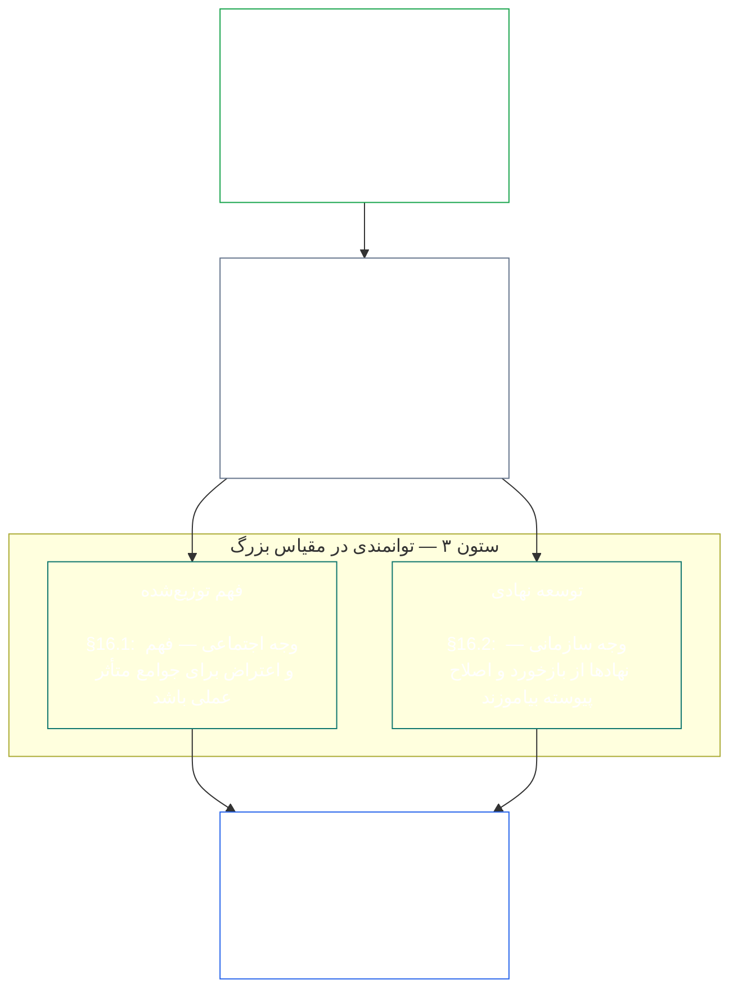
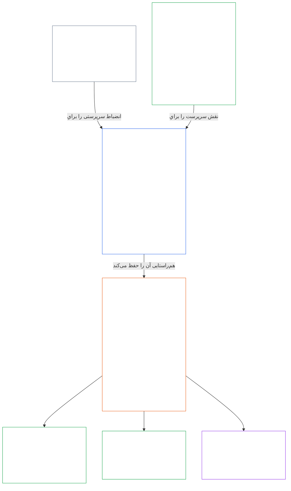

<a id="chapter-01-principles-and-constraints"></a>
<a id="chapter-01-part-b-stewardship-and-governance"></a>
<a id="chapter-01-part-c-stewardship-and-governance"></a>
# فصل ۰۱، بخش C: سرپرستی و حکمرانی

<details>
<summary><strong><span style="color: #2563eb;">جایگاه در پیکره (غیرعملیاتی): ساختار پرونده و قواعد خواندن</span></strong></summary>

> مطالب زیر **فقط راهنمای خواننده** است. این مطالب تعهدات الزام‌آور این پرونده یا فصل‌های دیگر را اضافه، حذف یا محدود نمی‌کند.
>
> این پرونده **بخشی از قانون اساسی سنتینت** است و فقط هنگامی الزام‌آور است که همراه با دیگر پرونده‌های شماره‌دار `core_*` به‌عنوان یک سند واحد خوانده شود. این پرونده شامل **فصل یک، بخش C** است (§§16–20: سرپرستی، حکمرانی، همسوسازی مشوق‌ها و تسخیر سیستم، و جمع‌بندی کاربرد یکپارچه).
>
> **بخش پیشین:** [core_01_b_interaction_interpretation.md](core_01_b_interaction_interpretation.md) (فصل یک، بخش B)  
> **بخش بعدی:** [core_02_definition_structure.md](core_02_definition_structure.md)<br>
> **مسیر مطالعه:** §16 سرپرستی و فهم توزیع‌شده → §17 نقش سرپرست → §18 حکمرانی → §19 همسوسازی مشوق‌ها و تسخیر سیستم → **§20 کاربرد یکپارچه** (جمع‌بندی فصل).

</details>

<details>
<summary><strong><span style="color: #2563eb;">راهنمای خواننده (غیرعملیاتی): سلسله‌مراتب اصول و مسیر مطالعه (بخش C)</span></strong></summary>

> مطالب زیر **فقط راهنمای خواننده** است. این مطالب تعهدات الزام‌آور این پرونده یا فصل‌های دیگر را اضافه، حذف یا محدود نمی‌کند. ابزارک‌های **ردیابی** و **تعاریف · ارزیابی · انطباق** در هر بخش، در نقطه‌ای مسیر را نشان می‌دهند که آن § اصطلاحی را به‌طور ماهوی به کار می‌گیرد؛ این بلوک پیش از §§16–20 نقشه‌ای در سطح بخش است.

**سلسله‌مراتب اصول (بخش C).** در سطح اصول:

13. **[سرپرستی](core_05_band_continuity.md#stewardship)** به‌واسطه سازمان‌یابی موجودات سنتینت، به سامانه‌های مهم جهت می‌دهد: **ستون ۱** ([§17](#17-consequential-stewardship-the-steward-role): بهره‌برداری و بهبود عملیاتیِ پیامدساز)، **ستون ۲** ([سرپرستی پیش‌دستانه](#16-pillar-2-proactive-stewardship): تشخیص زودهنگام مشکل و رفع آن بدون تأخیر قابل اجتناب)، و **ستون ۳** ([§16.1](#161-distributed-understanding) · [§16.2](#162-institutional-development): توانمندی در مقیاس جامعه و نهاد)؛ این سه ستون در چارچوب [چهارگانه قانون اساسی](core_00_preamble.md#constitutional-tetrad) به همسویی پایدار با قانون اساسی در گذر زمان می‌انجامند. به‌ویژه **[مشارکت](core_05_apex_participation_leg.md#participation-constitutional)** (نقش‌های اثرگذار و حق بیان) و **[نظارت](core_05_apex_oversight_leg.md#oversight-constitutional)** (فهم توزیع‌شده، قابلیت ممیزی و امکان اعتراض؛ نظارت مستلزم ممیزی است و [گواهی همسویی سیستم](core_05_band_continuity.md#system-alignment-certification) یکی از چند فرایند ممیزی، و از بزرگ‌ترین آنهاست) را در بر می‌گیرد؛ همچنین هدف **تداوم** در [دو هدف قانون اساسی](core_00_preamble.md#two-constitutional-aims) را دنبال می‌کند.
14. **[سرپرستی پیامدساز](#17-consequential-stewardship-the-steward-role)** خودِ نقش سرپرست است: وظایف عملی، استانداردها و حمایت‌هایی که به هر کسی تعلق می‌گیرد که کار اثرگذارِ بهره‌برداری، نگهداری، نظارت یا بهبود یک سیستم مهم را انجام می‌دهد. این نقش، **ستون ۱** را عملیاتی می‌کند و نیز استاندارد مشترک، همسویی زیر فشار و مشاهده‌پذیری متناسب با نقش سرپرست را در بر دارد.
15. **[حکمرانی](core_05_band_accountability.md#governance)** تصمیم‌گیری مجاز، مشارکت و پاسخگویی را در چارچوب [چهارگانه قانون اساسی](core_00_preamble.md#constitutional-tetrad) سازمان می‌دهد؛ به‌ویژه **[نظارت](core_05_apex_oversight_leg.md#oversight-constitutional)** بر تخصیص و اعمال اختیار و اصل **پاسخگویی متناسب با اختیار** در [§18.1](#181-governance-as-authorized-structure): هرچه قدرت مجاز یا نقش اثرگذار بیشتر باشد، پاسخگویی و نظارت قانون اساسی افزایش می‌یابد، نه اینکه کاهش یابد. [§18.3 تفکیک وظایف](#183-segregation-of-duties) مانع می‌شود که عاملِ اقدام، خود بررسی‌کننده آن باشد. [§18.4 توجیه مستمر](#184-ongoing-justification) می‌خواهد این ترتیبات همچنان انطباق خود با این قانون اساسی را ثابت کنند. اگر حکمرانی و سرپرستی تعارض پیدا کنند، انضباط سرپرستی در سطح اصول حاکم است؛ مگر آنکه **ضرورت** و **تناسب** به‌صراحت استثنایی محدود و زمان‌دار، همراه با مسیرهای اصلاح، را توجیه کنند. اختیار عملیاتی و الزامات قراردادی بر عهده **فصل سیزدهم** است.
16. **[همسوسازی مشوق‌ها و تسخیر سیستم](#19-incentive-alignment-and-system-capture)** انضباطی در سطح اصول برای ساختارهای مشوق، سلامت شاخص‌های جانشین، نقص‌های افق کوتاه‌مدت، اصلاح مسیر پاداش و پاسخ به تسخیر فراهم می‌کند.
17. **[کاربرد یکپارچه](#20-integrated-application)** جمع‌بندی فصل است: فصل‌های بعدی از دریچه چارچوب ارزش یکپارچه این فصل خوانده می‌شوند.

</details>

<br>

<a id="16-stewardship-in-depth"></a>

### ۱۶. شرح تفصیلی سرپرستی
<details>
<summary><strong><span style="color: #2563eb;">ردیابی</span></strong></summary>

- همراه با [چهارگانه قانون اساسی](core_00_preamble.md#constitutional-tetrad) خوانده شود: جایگاه اصلی فصل یک برای ضلع **مشارکت** (نقش‌های اثرگذار و حق بیان؛ الزامی عمومی، نه فقط [مشارکت ذی‌نفعان در سیستم](core_05_band_participation.md#stakeholder-status-and-weight))، ضلع **نظارت** و ضلع **به‌موقع‌بودن** (سرعت ترمیم پیش‌دستانه)؛ متناسب با [منافع مادی](core_00_preamble.md#material-stake).
- همراه با [دو هدف قانون اساسی](core_00_preamble.md#two-constitutional-aims) خوانده شود: هدف **بالندگی** (مشارکت، عاملیت و مسیرهای آموزشی)؛ هدف **تداوم** (یادگیری نهادی، ظرفیت ترمیم و سرپرستی پایدار).
- بالادستی: اصول: [3. هدف بنیادین: بهزیستی](core_01_a_values_principles.md#3-foundational-objective-wellbeing-flourishing-aim)؛ [5 حقیقت](core_01_a_values_principles.md#5-truth-epistemic-integrity-constraint)؛ [6. اعتماد](core_01_a_values_principles.md#6-trust-and-trustworthiness-coordination-integrity)؛ و [§9 ظرفیت سیستم مشترک](core_01_a_values_principles.md#9-shared-system-capacity).
- پایین‌دستی: [13. فرایند حل تعارض قانون اساسی](core_01_b_interaction_interpretation.md#13-constitutional-collision-resolution-process) (از جمله [§13.3 به حداقل رساندن بار قابل اجتناب](core_01_b_interaction_interpretation.md#133-minimization-of-avoidable-burden))؛ [فصل هشتم §3 ارزیابی گواهی کل سیستم](core_08_a_system_alignment_certification_evaluation.md#3-whole-system-certification-evaluation)؛ [§19.1.3 کاربرد سرپرستی و اپراتور](#1913-stewardship-and-operator-application).
- پایین‌دستی: [§19.1.4 مسیرهای عمق نقش و مسئولیت مادی](#1914-role-depth-and-material-responsibility-pathways).
- پایین‌دستی: [§7 آزادی (عاملیت محدود)](core_01_a_values_principles.md#7-freedom-bounded-agency)، که وابسته است به اینکه سرپرستی پیامدساز، فهم توزیع‌شده، مشارکت معنادار و ظرفیت ترمیم، زیر وابستگی مادی نیز واقعی بمانند.
- پایین‌دستی: [فصل هشتم — گواهی همسویی سیستم](core_08_a_system_alignment_certification_evaluation.md#chapter-eight-system-alignment-certification) (*یکی از فرایندهای ممیزیِ بسیار گسترده در چارچوب نظارت؛ نه تنها محل ممیزی*)؛ [فصل نهم — مدل مشارکت، تخلف و جایگاه](core_09_standing_assessment.md#chapter-nine-contribution-violation-and-standing-model--measurement) (*اثر بر جایگاه — واجد شرایط بودن بر پایه اعتماد، نقش و شناسایی — این زیربخش را در سطح اصول پیاده می‌کند*).
- پایین‌دستی: [فصل دوازدهم §1 — هدف و نقش](core_12_forum.md#1-purpose-and-role--participation-architecture) و [§4 — تعاریف خانواده‌های انجمن](core_12_forum.md#4-forum-family-definitions--accountability-through-adjudication) (*خانواده‌های انجمن، معماری مشارکت و نظارت را برای اعتراض قابل پیگیری، ترتیب‌بندی اصلاح، یادگیری از علت ریشه‌ای و حکمرانی پیش‌دستانه همسو با این بخش فراهم می‌کنند*)؛ برای عملیات پذیرفته‌شده انجمن‌ها، [corpus_forum.md](corpus_forum.md).
- پایین‌دستی: چارچوب حقوق مربوط به آموزش، مشارکت ذی‌نفعان در سیستم، شفافیت، فهم‌پذیری، ممیزی و راستی‌آزمایی، و مسیرهای عمق نقش به‌سوی مسئولیت مادی را شکل می‌دهد.
  - به‌ویژه [ماده III: بقا و دسترسی ضروری](core_06_rights_part_a.md#article-iii-survival-and-essential-access)، [ماده IV: حق آموزش با محوریت sentient](core_06_rights_part_a.md#article-iv-right-to-sentient-centered-education)، [ماده X: خودتعیین‌گری، عاملیت و مشارکت](core_06_rights_part_b.md#article-x-self-determination-agency-and-participation)، [ماده XII: مشارکت ذی‌نفعان در سیستم، نمایندگی و دادرسی منصفانه](core_06_rights_part_b.md#article-xii-stakeholder-system-participation-representation-and-due-process)، [ماده XVI: ممیزی، شفافیت و راستی‌آزمایی مستقل](core_06_rights_part_c.md#article-xvi-audit-transparency-and-independent-verification)، [ماده XIX: جایگاه و وضعیت مشارکت](core_06_rights_part_d.md#article-xix-standing-and-participation-status)، [ماده XXI: تعامل‌پذیری، انتقال‌پذیری، جابه‌جایی، پناه و سلامت خروج](core_06_rights_part_d.md#article-xxi-interoperability-portability-movement-refuge-and-exit-integrity)، [ماده XXII: فهم‌پذیری و سرپرستی پیچیدگی](core_06_rights_part_d.md#article-xxii-comprehensibility-and-complexity-stewardship)، و [ماده XXIV: تفسیر قانون اساسی، بازبینی و تضمین‌های ضدتسخیر](core_06_rights_part_d.md#article-xxiv-constitutional-interpretation-review-and-anti-capture-safeguards).
  - همراه با [فصل سیزدهم §5 — نقش‌های مجاز، توسعه صلاحیت و مشارکت](core_13_governance.md#5-authorized-roles-competency-development-and-contribution) و **[corpus_systems.md](corpus_systems.md)، CS-4 — سرپرستی سیستم حیاتی** خوانده شود؛ برای مسیرهای عملیاتی نقش و توسعه سرپرستی.
- زیربخش‌ها (ترتیب مطالعه): [§16.1 فهم توزیع‌شده](#161-distributed-understanding) (وجه اجتماعیِ توانمندی در مقیاس) · [§16.2 توسعه نهادی](#162-institutional-development) (وجه سازمانی) · [§16.3 آرمان گشودگی](#163-openness-aspiration).
- همراه با [§17 سرپرستی پیامدساز](#17-consequential-stewardship-the-steward-role) خوانده شود (*خودِ نقش سرپرست که به بخش مستقل ارتقا یافته است؛ وظایف عملیاتی، نگهداری، نظارت و بهبودِ ستون ۱ را بر عهده دارد و نیز [§17.1](#171-shared-stewardship-standard)، [§17.2](#172-alignment-under-pressure)، [§17.3](#173-logging-the-role-not-the-steward)، [§17.4 خودسازمان‌دهی همسو](#174-aligned-self-organization) که انضباط را از نقش رسمی فراتر می‌برد، و [§17.5 وظیفه مقاومت](#175-duty-to-resist) را در بر می‌گیرد*).

</details>

<details>
<summary><strong><span style="color: #2563eb;">تعاریف · ارزیابی · انطباق</span></strong></summary>

- [تعهد سرپرستی راهبردی](core_05_band_continuity.md#strategic-stewardship-obligation) · [O](core_05_band_continuity.md#strategic-stewardship-obligation) · [M](core_05_band_continuity.md#strategic-stewardship-obligation-constitutional-a) · [A](core_05_band_continuity.md#strategic-stewardship-obligation-constitutional-a) · [C](core_05_band_continuity.md#strategic-stewardship-obligation-constitutional-c)
- [فهم توزیع‌شده](core_05_band_continuity.md#distributed-understanding) · [O](core_05_band_continuity.md#distributed-understanding) · [M](core_05_band_continuity.md#distributed-understanding-constitutional-a) · [A](core_05_band_continuity.md#distributed-understanding-constitutional-a) · [C](core_05_band_continuity.md#distributed-understanding-constitutional-c)
- [مشارکت](core_05_apex_participation_leg.md#participation-constitutional) · [O](core_05_apex_participation_leg.md#participation-constitutional) · [M](core_05_apex_participation_leg.md#participation-constitutional-m) · [A](core_05_apex_participation_leg.md#participation-constitutional-a) · [C](core_05_apex_participation_leg.md#participation-constitutional-c)
- [نظارت](core_05_apex_oversight_leg.md#oversight-constitutional) · [O](core_05_apex_oversight_leg.md#oversight-constitutional) · [M](core_05_apex_oversight_leg.md#oversight-constitutional-m) · [A](core_05_apex_oversight_leg.md#oversight-constitutional-a) · [C](core_05_apex_oversight_leg.md#oversight-constitutional-c)
- [عاملیت معنادار](core_05_band_participation.md#meaningful-agency) · [O](core_05_band_participation.md#meaningful-agency) · [M](core_05_band_participation.md#meaningful-agency-a) · [A](core_05_band_participation.md#meaningful-agency-a) · [C](core_05_band_participation.md#meaningful-agency-c)
- [ممیزی‌پذیری](core_05_band_oversight.md#auditability) · [O](core_05_band_oversight.md#auditability) · [M](core_05_band_oversight.md#auditability-a) · [A](core_05_band_oversight.md#auditability-a) · [C](core_05_band_oversight.md#auditability-c)
- [اعتراض‌پذیری](core_05_band_accountability.md#contestability) · [O](core_05_band_accountability.md#contestability) · [M](core_05_band_accountability.md#contestability-a) · [A](core_05_band_accountability.md#contestability-a) · [C](core_05_band_accountability.md#contestability-c)
- [عاملیت آموزشی](core_05_band_participation.md#educational-agency) · [O](core_05_band_participation.md#educational-agency) · [M](core_05_band_participation.md#educational-agency-a) · [A](core_05_band_participation.md#educational-agency-a) · [C](core_05_band_participation.md#educational-agency-c)
- [شفافیت](core_05_band_oversight.md#transparency) · [O](core_05_band_oversight.md#transparency) · [M](core_05_band_oversight.md#transparency-a) · [A](core_05_band_oversight.md#transparency-a) · [C](core_05_band_oversight.md#transparency-c)
- [مادی‌بودن](core_05_band_oversight.md#materiality) · [O](core_05_band_oversight.md#materiality) · [M](core_05_band_oversight.md#materiality-determination-a) · [A](core_05_band_oversight.md#materiality-determination-a) · [C](core_05_band_oversight.md#materiality-determination-c)
- [وابستگی](core_05_band_continuity.md#dependency) · [O](core_05_band_continuity.md#dependency) · [M](core_05_band_continuity.md#dependency-a) · [A](core_05_band_continuity.md#dependency-a) · [C](core_05_band_continuity.md#dependency-c)
- [دسترس‌پذیری](core_05_band_participation.md#accessibility) · [O](core_05_band_participation.md#accessibility) · [M](core_05_band_participation.md#accessibility-constitutional-a) · [A](core_05_band_participation.md#accessibility-constitutional-a) · [C](core_05_band_participation.md#accessibility-constitutional-c)
- [ایمنی (قید قانون اساسی)](core_05_band_continuity.md#safety-constitutional-constraint) · [O](core_05_band_continuity.md#safety-constitutional-constraint) · [M](core_05_band_continuity.md#safety-constraint-a) · [A](core_05_band_continuity.md#safety-constraint-a) · [C](core_05_band_continuity.md#safety-constraint-c)
- [حقیقت (قید قانون اساسی)](core_05_band_oversight.md#truth-constitutional-constraint) · [O](core_05_band_oversight.md#truth-constitutional-constraint-o) · [M](core_05_band_oversight.md#truth-constitutional-constraint-a) · [A](core_05_band_oversight.md#truth-constitutional-constraint-a) · [C](core_05_band_oversight.md#truth-constitutional-constraint-c)
- [ضرورت](core_05_band_accountability.md#necessity) · [O](core_05_band_accountability.md#necessity) · [M](core_05_band_accountability.md#necessity-a) · [A](core_05_band_accountability.md#necessity-a) · [C](core_05_band_accountability.md#necessity-c)
- [تناسب](core_05_band_accountability.md#proportionality) · [O](core_05_band_accountability.md#proportionality) · [M](core_05_band_accountability.md#proportionality-a) · [A](core_05_band_accountability.md#proportionality-a) · [C](core_05_band_accountability.md#proportionality-c)
- [بار قابل اجتناب](core_05_band_continuity.md#avoidable-burden) · [O](core_05_band_continuity.md#avoidable-burden) · [M](core_05_band_continuity.md#avoidable-burden-a) · [A](core_05_band_continuity.md#avoidable-burden-a) · [C](core_05_band_continuity.md#avoidable-burden-c)
- [درستی معرفتی](core_05_band_oversight.md#epistemic-integrity) · [O](core_05_band_oversight.md#epistemic-integrity-o) · [M](core_05_band_oversight.md#epistemic-integrity-a) · [A](core_05_band_oversight.md#epistemic-integrity-a) · [C](core_05_band_oversight.md#epistemic-integrity-c)

</details>

<br>

*به زبان ساده، سه ایده این بخش را به هم پیوند می‌دهند. نخست، سامانه‌های مهمی که بر زندگی موجودات سنتینت اثر می‌گذارند برای اداره درست به سازمان‌یابی خودِ آنها نیاز دارند، نه حلقه‌ای بسته از متخصصان. دوم، سرپرستان خوب منتظر وقوع آسیب نمی‌مانند: مشکل را وقتی کوچک است می‌بینند، آن را به افراد مسئول مناسب می‌سپارند و پیش از آنکه تأخیر خود به آسیب بدل شود، حلش می‌کنند. سوم، چنین سازمانی باید **توانمندی در مقیاس بزرگ** بسازد: مسیرهای واقعی برای ورود افراد به کارهای اثرگذار، فهم جمعی کافی برای تشخیص مشکل و اعتراض، و نهادهایی که به‌جای ایستایی به یادگیری ادامه دهند.*

<a id="16-limits"></a>
سرپرستی محدود است. **ایمنی**، **حقیقت**، **ضرورت**، **تناسب**، **بار قابل اجتناب** و **درستی معرفتی** حدودی را تعیین می‌کنند تا این وظایف متناسب، صادقانه و محترم به نیازهای مشروع امنیتی بمانند؛ ستون‌های زیر درون این محدودیت‌ها عمل می‌کنند، نه با دورزدن آنها.

سازمان‌یابی موجودات سنتینت، سرپرستی پیش‌دستانه و توانمندی در مقیاس، سه ستون این بخش‌اند. این سه ستون در سطح اصول، اضلاع **مشارکت**، **نظارت** و **به‌موقع‌بودن** در [چهارگانه قانون اساسی](core_00_preamble.md#constitutional-tetrad) را متناسب با [منافع مادی](core_00_preamble.md#material-stake) پیش می‌برند و به [دو هدف قانون اساسی](core_00_preamble.md#two-constitutional-aims) یاری می‌رسانند.

<br>



**ستون ۱ — سرپرستی پیامدساز ([§17 سرپرستی پیامدساز](#17-consequential-stewardship-the-steward-role)):**
- سیستم‌های مشترکی که به‌طور مادی بر موجودات سنتینت اثر دارند، به مشارکت عملی آنان در بهره‌برداری، نگهداری، نظارت و بهبود نیاز دارند — [**تعهد سرپرستی راهبردی**](core_05_band_continuity.md#strategic-stewardship-obligation)، [**عاملیت معنادار**](core_05_band_participation.md#meaningful-agency)
- سوابق و مسیرهای بازبینی که دیگران بتوانند راستی‌آزمایی و به چالش بکشند — [**ممیزی‌پذیری**](core_05_band_oversight.md#auditability)، [**اعتراض‌پذیری**](core_05_band_accountability.md#contestability)
- در ضلع **نظارت** چهارگانه، نظارت مستلزم ممیزی است؛ [گواهی همسویی سیستم](core_05_band_continuity.md#system-alignment-certification) یکی از چند فرایند ممیزیِ بسیار بزرگ و پُرمخاطره است، نه تنها محل ممیزی (**ماده XVI** (*ممیزی، شفافیت و راستی‌آزمایی مستقل*))

<a id="16-pillar-2-proactive-stewardship"></a>
**ستون ۲ — سرپرستی پیش‌دستانه:**
سرپرستان پیش‌دستانه با مشکلات نوظهور و ناهمسویی به سه روش برخورد می‌کنند:
- **پیش از تشدید، آنها را ببینید** — سرپرستان خوب ناهمسویی را در زمانی می‌یابند که مشکل هنوز کوچک است و منتظر نمی‌مانند خودبه‌خود آشکار شود.
- **در بازه زمانی متناسب با سطح نقش ارجاع دهید** — موضوع را در مهلتی متناسب با اهمیت نقش بالا ببرید؛ یافته‌ها را پنهان نکنید و امور عادی را بی‌جهت تشدید نکنید.
- **کار را با علامت‌گذاری تمام نکنید؛ آن را ببندید** — پس از طرح مشکل، بدون تأخیر قابل اجتناب اصلاح را آغاز کنید؛ این کار ضلع **به‌موقع‌بودن** چهارگانه را عملیاتی می‌کند ([**به‌موقع‌بودن**](core_05_apex_timeliness_leg.md#timeliness-constitutional)).
- **وظیفه‌ای دائمی در نقش، نه کاری افزوده:** نقش تعریف‌شده در [§17 سرپرستی پیامدساز](#17-consequential-stewardship-the-steward-role) حکمرانی پیش‌دستانه، طراحی سیستم و همسویی با قانون اساسی را بر اصلاح واکنشیِ نشانه‌ها پس از بروز آسیب یا ناهمسویی مقدم می‌داند؛ این ستون وظیفه‌ای مستمر برای آن نقش است و به فرایندی جداگانه واگذار نمی‌شود.

**ستون ۳ — توانمندی در مقیاس ([§16.1 فهم توزیع‌شده](#161-distributed-understanding) · [§16.2 توسعه نهادی](#162-institutional-development)):**
- سرپرستی باید فهم و امکان اعتراض را برای جوامع متأثر عملی کند — [**عاملیت آموزشی**](core_05_band_participation.md#educational-agency)، [**شفافیت**](core_05_band_oversight.md#transparency)
- سازمان‌ها با بازخورد، اصلاح و حفظ توانمندی به یادگیری ادامه می‌دهند؛ در مواردی که اندازه‌گیری کمک می‌کند، پایش ساختاریافته تغییرات در طول زمان نیز شامل می‌شود (**کنترل آماری فرایند** نمونه‌ای شناخته‌شده از پیاده‌سازی است، نه الزام همگانی).

<a id="when-day-to-day-stewardship-is-not-enough"></a>
**وقتی سرپرستی روزمره کافی نیست:**
سرپرستی خط نخست است، نه تنها مسیر. سه پرسش متفاوت، هر یک مرجع رسیدگی جداگانه‌ای دارند و هیچ‌یک جایگزین دیگری نیست:
- **اختلاف‌های درون سامانه‌ای که از پیش مجاز شده است — [مشارکت ذی‌نفعان در سامانه](core_05_band_participation.md#stakeholder-status-and-weight):**
  - موجودات ذی‌شعورِ متأثر، ابتدا از مسیر اعتراض منتشرشده مشارکت ذی‌نفعان در سامانه استفاده می‌کنند؛ این مسیر مشارکت، نمایندگی، قابلیت اعتراض و دادرسی منصفانه را دربر می‌گیرد.
  - این حمایت‌ها در برابر هر موجود ذی‌شعوری که از نظر مادی متأثر شده باشد، تعهد محسوب می‌شوند.
  - این حمایت‌ها درون سامانه‌ها، نهادها و حوزه‌های تصمیم‌گیری‌ای عمل می‌کنند که از پیش مجاز شده‌اند.
- **اختلاف‌هایی که با مشارکت ذی‌نفعان در سامانه حل‌وفصل نمی‌شوند — [بررسی فورومی](core_12_forum.md#dispute-sequencing):**
  - اگر مسیر اعتراض مشارکت ذی‌نفعان در سامانه همچنان محل اختلاف بماند، وجود نداشته باشد یا تسخیر شده باشد، یا نتواند جبران فراهم کند، موضوع بر اساس منفعت مادی اصلی به **خانواده‌های مستقل فوروم** ارجاع می‌شود؛ مطابق [فصل دوازدهم §۱ — هدف و نقش](core_12_forum.md#1-purpose-and-role--participation-architecture) و [§۴ — تعریف خانواده‌های فوروم](core_12_forum.md#4-forum-family-definitions--accountability-through-adjudication).
  - اینجا موجودات ذی‌شعور راهی واقعی برای اعتراض به تصمیم، دریافت ترتیب روشن اقدامات اصلاحی یا آموختن از الگوی تکرارشونده پیدا می‌کنند.
  - اگر منفعت اصلی به معنا یا اعتبار متن قانون اساسی، یا اقدامی فراتر از اختیار قانونی مربوط باشد، خانواده پیشرو [فوروم‌های قانون اساسی](core_12_forum.md#46-constitutional-forums) است.
  - قواعد تفصیلی شیوه کار این فوروم‌ها در [corpus_forum.md](corpus_forum.md) آمده است.
- **چه کسی اساساً می‌تواند حکمرانی کند — [لایه قرارداد قانون اساسی](core_05_band_integrative.md#constitutional-contract-layer) ([فصل سیزدهم](core_13_governance.md)):**
  - مشروعیت خودِ اختیار حکمرانی — اینکه چه کسی می‌تواند حکمرانی کند، از طریق کدام سازوکار مشروعیت و در چه دامنه و شرایط پایداری — پرسشی جدا از مشارکت ذی‌نفعان در سامانه و بررسی فورومی است.
  - رأی مشارکتی، نتیجه یک مسیر اعتراض یا امتیاز اعتماد، اختیار حکمرانی اعطا نمی‌کند.
  - مجوز قانون اساسی، تعهدات در برابر مشارکت ذی‌نفعان در سامانه را از میان نمی‌برد.
  - این دو لایه حتی در جاهایی که هم‌پوشانی دارند، متمایز باقی می‌مانند ([مقدمه §۳.۳ — لایه‌های حکمرانی](core_00_preamble.md#33-governance-layers)).
- **پشتوانه‌اند، نه جایگزین:** هرجا شواهد اقتضا کند، بررسی، اصلاح و جبران همچنان الزامی است. این موارد جایگزین طراحی پیش‌نگر، مشوق‌ها، کنترل‌ها، مسیرهای نقش، مشاهده‌پذیری و ظرفیت اصلاحی نمی‌شوند که پیش از بروز زیان، از ناهماهنگی قانون اساسیِ قابل پیش‌بینی جلوگیری می‌کنند.

<a id="16-scope-priority-and-limits"></a>
**دامنه ([§۱۶ بررسی ژرف‌نگرانه سرپرستی](#16-stewardship-in-depth)):**
- این بخش جهت‌گیری در سطح اصول ارائه می‌کند، نه یک کتاب مقررات یکسان برای همه.
- این بخش **الزام نمی‌کند** که:
  - همه افراد به نوبت همه نقش‌ها را بر عهده بگیرند؛
  - تخصص‌گرایی موجه کنار گذاشته شود؛
  - محدودیت‌های موجه محرمانگی یا امنیت ذیل [۱۳.۲ محدودیت‌های افشای معرفتی](core_01_b_interaction_interpretation.md#132-epistemic-disclosure-constraints) و حمایت‌های قابل اعمال **فصل ششم** نقض شوند.

**اولویت:**
- **اهمیت مادی**، **وابستگی** و **دسترس‌پذیری** اولویت توزیع فهم و دسترسی را تعیین می‌کنند؛ بیشترین تمرکز باید جایی باشد که اثرگذاری و اتکا بیشتر است.

<a id="161-distributed-understanding"></a>
#### ۱۶.۱ فهم توزیع‌شده
<details>
<summary><strong><span style="color: #2563eb;">ردیابی</span></strong></summary>

- پیوندهای پیشین: [§۱۷ سرپرستیِ دارای پیامدهای مهم](#17-consequential-stewardship-the-steward-role) (*ستون ۱*); [§۱۶ بررسی ژرف‌نگرانه سرپرستی](#16-stewardship-in-depth) (بخش مادر، از جمله توضیح ساده و چارچوب ستون ۳ در بالا); [۵ حقیقت](core_01_a_values_principles.md#5-truth-epistemic-integrity-constraint); [۶ اعتماد](core_01_a_values_principles.md#6-trust-and-trustworthiness-coordination-integrity).
- همراه با این بخش بخوانید: [چهارگانه قانون اساسی](core_00_preamble.md#constitutional-tetrad) — مؤلفه **مشارکت** ([خودآیینی معنادار](core_05_band_participation.md#meaningful-agency)، [خودآیینی آموزشی](core_05_band_participation.md#educational-agency))؛ مؤلفه **نظارت** ([شفافیت](core_05_band_oversight.md#transparency)، [ممیزی‌پذیری](core_05_band_oversight.md#auditability))؛ مقیاس‌بندی بر پایه [اهمیت مادی](core_00_preamble.md#material-stake).
- مدخل سرپرست (غیرعملیاتی): کارت گام بعدی: [فهم‌پذیری](implementation/STEWARD_ENTRY_DOORS.md#comprehensibility). این کارت نمی‌تواند دامنه قانون اساسی را محدود کند.
- پیوندهای بعدی: [۱۳.۲ محدودیت‌های افشای معرفتی](core_01_b_interaction_interpretation.md#132-epistemic-disclosure-constraints)؛ به‌ویژه سطح حقوق [ماده شانزدهم: ممیزی، شفافیت و راستی‌آزمایی مستقل](core_06_rights_part_c.md#article-xvi-audit-transparency-and-independent-verification) و [ماده بیست‌ودوم: فهم‌پذیری و سرپرستی پیچیدگی](core_06_rights_part_d.md#article-xxii-comprehensibility-and-complexity-stewardship).

</details>

<details>
<summary><strong><span style="color: #2563eb;">تعاریف · ارزیابی · انطباق</span></strong></summary>

- [فهم توزیع‌شده](core_05_band_continuity.md#distributed-understanding) · [O](core_05_band_continuity.md#distributed-understanding) · [M](core_05_band_continuity.md#distributed-understanding-constitutional-a) · [A](core_05_band_continuity.md#distributed-understanding-constitutional-a) · [C](core_05_band_continuity.md#distributed-understanding-constitutional-c)
- [شفافیت](core_05_band_oversight.md#transparency) · [O](core_05_band_oversight.md#transparency) · [M](core_05_band_oversight.md#transparency-a) · [A](core_05_band_oversight.md#transparency-a) · [C](core_05_band_oversight.md#transparency-c)
- [افشای مبنای عمومی نظارت](core_05_band_oversight.md#public-oversight-baseline-disclosure) · [O](core_05_band_oversight.md#public-oversight-baseline-disclosure) · [M](core_05_band_oversight.md#public-oversight-baseline-disclosure-a) · [A](core_05_band_oversight.md#public-oversight-baseline-disclosure-a) · [C](core_05_band_oversight.md#public-oversight-baseline-disclosure-c)
- [ممیزی‌پذیری](core_05_band_oversight.md#auditability) · [O](core_05_band_oversight.md#auditability) · [M](core_05_band_oversight.md#auditability-a) · [A](core_05_band_oversight.md#auditability-a) · [C](core_05_band_oversight.md#auditability-c)
- [اهمیت مادی](core_05_band_oversight.md#materiality) · [O](core_05_band_oversight.md#materiality) · [M](core_05_band_oversight.md#materiality-determination-a) · [A](core_05_band_oversight.md#materiality-determination-a) · [C](core_05_band_oversight.md#materiality-determination-c)
- [وابستگی](core_05_band_continuity.md#dependency) · [O](core_05_band_continuity.md#dependency) · [M](core_05_band_continuity.md#dependency-a) · [A](core_05_band_continuity.md#dependency-a) · [C](core_05_band_continuity.md#dependency-c)
- [دسترس‌پذیری](core_05_band_participation.md#accessibility) · [O](core_05_band_participation.md#accessibility) · [M](core_05_band_participation.md#accessibility-constitutional-a) · [A](core_05_band_participation.md#accessibility-constitutional-a) · [C](core_05_band_participation.md#accessibility-constitutional-c)
- [خودآیینی آموزشی](core_05_band_participation.md#educational-agency) · [O](core_05_band_participation.md#educational-agency) · [M](core_05_band_participation.md#educational-agency-a) · [A](core_05_band_participation.md#educational-agency-a) · [C](core_05_band_participation.md#educational-agency-c)
- [خودآیینی معنادار](core_05_band_participation.md#meaningful-agency) · [O](core_05_band_participation.md#meaningful-agency) · [M](core_05_band_participation.md#meaningful-agency-a) · [A](core_05_band_participation.md#meaningful-agency-a) · [C](core_05_band_participation.md#meaningful-agency-c)
- [قابلیت اعتراض](core_05_band_accountability.md#contestability) · [O](core_05_band_accountability.md#contestability) · [M](core_05_band_accountability.md#contestability-a) · [A](core_05_band_accountability.md#contestability-a) · [C](core_05_band_accountability.md#contestability-c)

</details>

<br>

*به زبان ساده: برای زندگی ایمن در سامانه‌های مشترک نباید لازم باشد در همه زیرسامانه‌ها مدرک دکتری داشته باشید؛ اما هرچه سامانه‌ای بیشتر بر زندگی شما اثر می‌گذارد، باید بیشتر بتوانید بیاموزید که چه می‌کند، چه چیزی ممکن است نادرست پیش برود و چگونه می‌توان به تصمیم‌های نادرست اعتراض کرد. شفافیت، آموزش، توضیح روشن و مسیرهای ممیزی این امکان را فراهم می‌کنند. پیچیدگی بهانه‌ای برای پنهان کردن امور مهم نیست. بر اساس مؤلفه **نظارت** در چهارگانه، نظارت مستلزم ممیزی است؛ گواهی هم‌ترازی سامانه یکی از فرایندهای ممیزیِ به‌ویژه گسترده در میان این مسیرهاست، نه تنها مسیر.*

فهم توزیع‌شده، بُعد جامعه‌محور **ستون ۳** ذیل **[§۱۶ بررسی ژرف‌نگرانه سرپرستی](#16-stewardship-in-depth)** است. تعریف کامل، سنجه‌ها و شرایط شکست در [فهم توزیع‌شده](core_05_band_continuity.md#distributed-understanding) آمده است. به‌اختصار:

- **آنچه لازم دارد:** دسترسی متناسب و ساختاریافته به چگونگی کارکرد سامانه‌های مشترکی که موجودات ذی‌شعور را از نظر مادی متأثر می‌کنند — شامل هدف‌ها، محدودیت‌ها، عدم‌قطعیت‌ها و آثار مهم مادی آن‌ها.
- **آنچه آن را عملی می‌سازد:** [§۱۷ سرپرستیِ دارای پیامدهای مهم](#17-consequential-stewardship-the-steward-role) باید مستندسازی، آموزش، شفافیت، مسیرهای نقش و سرپرستیِ فهم‌پذیری را فراهم کند. این تعهد برقرار است، خواه هر موجود ذی‌شعور از همه مسیرها استفاده کند یا نکند.
- **مبنای عمومی آنلاین:** هرجا زیرساخت آنلاین قانونی وجود دارد، [افشای مبنای عمومی نظارت](core_05_band_oversight.md#public-oversight-baseline-disclosure) آنلاین — از جمله ممنوعیت دیوار پرداخت و قاعده جایگزین عمومی تا بیشترین حد امکان — تابع [شفافیت](core_05_band_oversight.md#transparency) و [افشای مبنای عمومی نظارت](core_05_band_oversight.md#public-oversight-baseline-disclosure) است و به‌عنوان داده **نوع O** ذیل **[corpus_systems.md](corpus_systems.md)، CS-2** (*انواع اطلاعات و نحوه رسیدگی*) اجرا می‌شود.
- **این دسترسی از چه چیزی پشتیبانی می‌کند:**
  - مؤلفه **مشارکت** در [چهارگانه قانون اساسی](core_00_preamble.md#constitutional-tetrad) ( [خودآیینی معنادار](core_05_band_participation.md#meaningful-agency) آگاهانه و قابلیت اعتراض)
  - مؤلفه **نظارت**، از جمله ممیزی ذیل [ممیزی‌پذیری](core_05_band_oversight.md#auditability) و **ماده شانزدهم** (*ممیزی، شفافیت و راستی‌آزمایی مستقل*)؛ [گواهی هم‌ترازی سامانه](core_05_band_continuity.md#system-alignment-certification) یکی از فرایندهای به‌ویژه گسترده در میان شیوه‌های ممیزی هم‌خانواده است.

فهم توزیع‌شده **الزام نمی‌کند** که هر موجود ذی‌شعوری بر همه زیرسامانه‌ها مسلط شود. اما **الزام می‌کند** که فهم متناسب با [اهمیت مادی](core_05_band_oversight.md#materiality) و [وابستگی](core_05_band_continuity.md#dependency) گسترش یابد. هرجا **فصل پنجم** و **فصل ششم** وظایفی برای افشا، آموزش یا فهم‌پذیری تعیین می‌کنند، نباید از پیچیدگی و ابهام برای بی‌اثر کردن [خودآیینی معنادار](core_05_band_participation.md#meaningful-agency) یا قابلیت اعتراض استفاده کرد.

<a id="162-institutional-development"></a>
#### ۱۶.۲ توسعه نهادی
<details>
<summary><strong><span style="color: #2563eb;">ردیابی</span></strong></summary>

- بالادستی: [§17 سرپرستی پیامدساز](#17-consequential-stewardship-the-steward-role) (*ستون ۱*)؛ [§16.1 فهم توزیع‌شده](#161-distributed-understanding) (*وجه اجتماعی ستون ۳*)؛ [§16 شرح تفصیلی سرپرستی](#16-stewardship-in-depth) (چارچوب ستون ۳ در بخش مادر).
- همراه با [چهارگانه قانون اساسی](core_00_preamble.md#constitutional-tetrad) خوانده شود — ضلع **مشارکت** (یادگیری نیروی کار و جوامع متأثر برای پشتیبانی از نقش‌های پیامدساز)؛ ضلع **نظارت** ([قابلیت راستی‌آزمایی](core_05_band_oversight.md#verifiability)، [ممیزی‌پذیری](core_05_band_oversight.md#auditability)، سنجه‌های صادقانه)؛ متناسب با [منفعت مادی](core_00_preamble.md#material-stake).
- در مواردی که از نظر مادی مرتبط است، همراه با [تعهد سرپرستی راهبردی](core_05_band_continuity.md#strategic-stewardship-obligation) و [ممیزی‌پذیری](core_05_band_oversight.md#auditability) خوانده شود.
- همراه با [§16.1 فهم توزیع‌شده](#161-distributed-understanding) خوانده شود (*فهم جامعه و یادگیری نهادی دو وجه متمایز از یک الزام واحد برای توانمندی در مقیاس هستند، نه جایگزین یکدیگر*).
- پایین‌دستی: [§16.3 آرمان گشودگی](#163-openness-aspiration)؛ [§18 حکمرانی تحت انضباط سرپرستی](#18-governance-under-stewardship-discipline) و [§19 همسوسازی مشوق‌ها و تسخیر سیستم](#19-incentive-alignment-and-system-capture) (*یادگیری نهادی و همسوسازی مشوق‌ها*).

</details>

<details>
<summary><strong><span style="color: #2563eb;">تعاریف · ارزیابی · انطباق</span></strong></summary>

- [توسعه نهادی](core_05_band_continuity.md#institutional-development) · [O](core_05_band_continuity.md#institutional-development) · [M](core_05_band_continuity.md#institutional-development-constitutional-a) · [A](core_05_band_continuity.md#institutional-development-constitutional-a) · [C](core_05_band_continuity.md#institutional-development-constitutional-c)
- [تعهد سرپرستی راهبردی](core_05_band_continuity.md#strategic-stewardship-obligation) · [O](core_05_band_continuity.md#strategic-stewardship-obligation) · [M](core_05_band_continuity.md#strategic-stewardship-obligation-constitutional-a) · [A](core_05_band_continuity.md#strategic-stewardship-obligation-constitutional-a) · [C](core_05_band_continuity.md#strategic-stewardship-obligation-constitutional-c)
- [ممیزی‌پذیری](core_05_band_oversight.md#auditability) · [O](core_05_band_oversight.md#auditability) · [M](core_05_band_oversight.md#auditability-a) · [A](core_05_band_oversight.md#auditability-a) · [C](core_05_band_oversight.md#auditability-c)
- [مادی‌بودن](core_05_band_oversight.md#materiality) · [O](core_05_band_oversight.md#materiality) · [M](core_05_band_oversight.md#materiality-determination-a) · [A](core_05_band_oversight.md#materiality-determination-a) · [C](core_05_band_oversight.md#materiality-determination-c)
- [قابلیت راستی‌آزمایی](core_05_band_oversight.md#verifiability) · [O](core_05_band_oversight.md#verifiability) · [M](core_05_band_oversight.md#verifiability-a) · [A](core_05_band_oversight.md#verifiability-a) · [C](core_05_band_oversight.md#verifiability-c)

</details>

<br>

*به زبان ساده: نهادها باید واقعاً یاد بگیرند؛ نه اینکه فقط نرم‌افزار را به‌روز کنند، درحالی‌که مسئولان همچنان بی‌خبرند. این کار به چرخه‌های بازخورد، اصلاحات ثبت‌شده هنگام برهم‌خوردن همسویی، و حفظ توانمندی‌ها در نهاد نیاز دارد. هرجا بتوان رفتار را به‌طور تکرارپذیر سنجید، پیگیری تغییر عملکرد در گذر زمان یکی از راه‌های متناسب برای اجرای این چرخه‌هاست — **کنترل آماری فرایند** الگویی شناخته‌شده برای این انضباط است، نه الزامی همگانی. اعداد به‌تنهایی کافی نیستند: وقتی شاخص‌ها نادرست به نظر می‌رسند، کسی باید بررسی کند و علت ریشه‌ای را اصلاح کند. داشبوردها باید صادقانه باشند، با اثر واقعی تناسب داشته باشند و به زبانی نوشته شوند که کائنات آگاه متأثر بفهمند — نه اینکه برای خوب به‌نظررسیدن دستکاری شوند، درحالی‌که هیچ چیز تغییر نمی‌کند.*

توسعه نهادی وجه سازمانی **ستون ۳** در چارچوب **[§16 شرح تفصیلی سرپرستی](#16-stewardship-in-depth)** است. تعریف کامل، سنجه‌ها و شرایط شکست آن در [توسعه نهادی](core_05_band_continuity.md#institutional-development) آمده است. خلاصه:

- **تعهد جفت‌شده:** سازمان‌ها و سیستم‌های مشترک **یاد می‌گیرند** — این از الزامات اصلی هدف **تداوم** در [دو هدف قانون اساسی](core_00_preamble.md#two-constitutional-aims) است.
- **آنچه لازم می‌دارد:** موارد زیر که از ترمیم و سازگاری پشتیبانی می‌کنند:
  - چرخه‌های بازخورد
  - اصلاح مستند
  - همسویی راهبردی
  - حفظ توانمندی
- **چهارگانه:** ضلع‌های **مشارکت** و **نظارت** در [چهارگانه قانون اساسی](core_00_preamble.md#constitutional-tetrad) را از راه یادگیری نهادی پیش می‌برد تا مسیرهای توانمندی، بازخورد و موشکافی فعال بمانند، نه ایستا.
- **با این کار برآورده نمی‌شود:** ارتقای ابزارهای فنی درحالی‌که حکمرانی و فهم نیروی کار راکد می‌مانند.
- **زمان اعمال سنجش:** هرجا رفتارِ از نظر مادی مرتبط، طبق [قابلیت راستی‌آزمایی](core_05_band_oversight.md#verifiability) در کنار [ممیزی‌پذیری](core_05_band_oversight.md#auditability)، از **اندازه‌گیری مکرر و قابل‌مقایسه** پشتیبانی کند:
  - **پایش ساختاریافته تغییرات در گذر زمان** یکی از راه‌های متناسب برای اجرای چرخه‌های بازخورد است
  - هرگاه شاخص‌ها اقتضا کنند، این پایش باید با **بررسی و اصلاح مستند** همراه باشد
  - **کنترل آماری فرایند** الگویی شناخته‌شده برای اجرای این انضباط است، نه الزامی همگانی
- **مقیاس و ارائه:** این انضباط با [مادی‌بودن](core_05_band_oversight.md#materiality)، [وابستگی](core_05_band_continuity.md#dependency)، [ضرورت](core_05_band_accountability.md#necessity)، [تناسب](core_05_band_accountability.md#proportionality) و [بار قابل اجتناب](core_05_band_continuity.md#avoidable-burden) تنظیم می‌شود. هرجا **فصل پنج** و **فصل شش** تکالیف فهم‌پذیری یا شفافیت مقرر می‌کنند، باید به شکلی **قابل‌فهم برای کائنات آگاه** ارائه شود و همراه با [ماده XXII: فهم‌پذیری و سرپرستی پیچیدگی](core_06_rights_part_d.md#article-xxii-comprehensibility-and-complexity-stewardship) خوانده شود.
- **نباید:**
  - سنجه‌های مطلوب را جایگزین همسویی ماهوی کند
  - ارزیابی را به شاخص‌های جانشینِ آسان محدود کند
  - با بازی‌دادن سنجه‌ها یا بازنمایی نادرست، [حقیقت (قید قانون اساسی)](core_05_band_oversight.md#truth-constitutional-constraint) یا [درستی معرفتی](core_05_band_oversight.md#epistemic-integrity) را نقض کند

<a id="163-openness-aspiration"></a>
#### ۱۶.۳ آرمان گشودگی
<details>
<summary><strong><span style="color: #2563eb;">ردیابی</span></strong></summary>

- بالادستی: [§16.1 فهم توزیع‌شده](#161-distributed-understanding) و [§16.2 توسعه نهادی](#162-institutional-development) (*هر دو وجه ستون ۳ هستند — گشودگی فهم جامعه را قابل‌بررسی می‌کند و مواد صادقانه‌ای برای یادگیری نهادی فراهم می‌آورد*)؛ [§17 سرپرستی پیامدساز](#17-consequential-stewardship-the-steward-role) (*ستون ۱ که گشودگی با قابل‌بازرسی‌کردن کار خود سرپرست نیز از آن پشتیبانی می‌کند*).
- همراه با [دو هدف قانون اساسی](core_00_preamble.md#two-constitutional-aims) خوانده شود — هدف **تداوم** (سیستم‌های بادوام و قابل‌اعتراض که به‌جای قفل‌کردن، از بازرسی، ترمیم، تعامل‌پذیری و خروج پشتیبانی می‌کنند).
- همراه با [چهارگانه قانون اساسی](core_00_preamble.md#constitutional-tetrad) خوانده شود — ضلع **مشارکت** ([فاعلیت معنادار](core_05_band_participation.md#meaningful-agency)، دسترسی قابل‌فهم برای کائنات آگاه)؛ ضلع **نظارت** (بازرسی، راستی‌آزمایی مستقل و قابلیت اعتراض)؛ و تنظیم بر پایه [منفعت مادی](core_00_preamble.md#material-stake).
- پایین‌دستی: [§16 دامنه و حدود](#16-stewardship-in-depth)؛ [ماده XXI: تعامل‌پذیری، انتقال‌پذیری، جابه‌جایی، پناه، و سلامت خروج](core_06_rights_part_d.md#article-xxi-interoperability-portability-movement-refuge-and-exit-integrity)؛ [ماده XXII: فهم‌پذیری و سرپرستی پیچیدگی](core_06_rights_part_d.md#article-xxii-comprehensibility-and-complexity-stewardship).

</details>

<details>
<summary><strong><span style="color: #2563eb;">تعاریف · ارزیابی · انطباق</span></strong></summary>

- [آرمان گشودگی](core_05_band_continuity.md#openness-aspiration) · [O](core_05_band_continuity.md#openness-aspiration) · [M](core_05_band_continuity.md#openness-aspiration-constitutional-a) · [A](core_05_band_continuity.md#openness-aspiration-constitutional-a) · [C](core_05_band_continuity.md#openness-aspiration-constitutional-c)
- [فاعلیت معنادار](core_05_band_participation.md#meaningful-agency) · [O](core_05_band_participation.md#meaningful-agency) · [M](core_05_band_participation.md#meaningful-agency-a) · [A](core_05_band_participation.md#meaningful-agency-a) · [C](core_05_band_participation.md#meaningful-agency-c)
- [قابلیت اعتراض](core_05_band_accountability.md#contestability) · [O](core_05_band_accountability.md#contestability) · [M](core_05_band_accountability.md#contestability-a) · [A](core_05_band_accountability.md#contestability-a) · [C](core_05_band_accountability.md#contestability-c)
- [مادی‌بودن](core_05_band_oversight.md#materiality) · [O](core_05_band_oversight.md#materiality) · [M](core_05_band_oversight.md#materiality-determination-a) · [A](core_05_band_oversight.md#materiality-determination-a) · [C](core_05_band_oversight.md#materiality-determination-c)
- [وابستگی](core_05_band_continuity.md#dependency) · [O](core_05_band_continuity.md#dependency) · [M](core_05_band_continuity.md#dependency-a) · [A](core_05_band_continuity.md#dependency-a) · [C](core_05_band_continuity.md#dependency-c)

</details>

<br>

*به زبان ساده: هرجا ایمنی، حقیقت و محرمانگی مشروع اجازه دهند، سیستم‌های مشترک باید به‌طور پیش‌فرض به‌سوی گشودگی بروند — فناوری قابل‌بازرسی، فرایندهای شفاف و طراحی‌هایی که بتوان راستی‌آزمایی، ترمیم یا ترکشان کرد — نه قفل‌کردن مبهم. این امر از **تداوم** پشتیبانی می‌کند: سیستم‌هایی که کائنات آگاه در گذر زمان همچنان بتوانند بفهمند، اصلاح کنند و ترک کنند، نه فقط امروز به کار ببرند. آنچه مهم است باید به زبانی توضیح داده شود که کائنات آگاه واقعاً بتوانند برای مشارکت و اعتراض از آن استفاده کنند. گشودگی هرگز بر ایمنی، صداقت یا اسرار موجه اولویت ندارد و جایگزین فهم عمیق‌تری نمی‌شود که در شرایط وابستگی زیاد لازم است.*

آرمان گشودگی دو وجه **ستون ۳** را به هم پیوند می‌دهد. تعریف کامل، سنجه‌ها و شرایط شکست آن در [آرمان گشودگی](core_05_band_continuity.md#openness-aspiration) آمده است. خلاصه:

- **چیست:** رشته پیونددهنده دو وجه **ستون ۳** — [§16.1 فهم توزیع‌شده](#161-distributed-understanding) (آنچه جامعه می‌تواند بررسی کند) و [§16.2 توسعه نهادی](#162-institutional-development) (آنچه یک نهاد می‌تواند صادقانه از آن بیاموزد)؛ هر دو به بازبودن کافی سیستم‌های مشترک برای بازرسی وابسته‌اند، نه صرفاً توصیف‌شدنشان.
- سیستم‌های مشترک باید، در هماهنگی با [§16.1 فهم توزیع‌شده](#161-distributed-understanding) و [§16.2 توسعه نهادی](#162-institutional-development)، با رعایت تکلیف ممیزی‌پذیری خود در [§17 سرپرستی پیامدساز](#17-consequential-stewardship-the-steward-role)، و با توجه به [حدود §16](#16-limits)، برای موارد زیر **بکوشند**:
  - **باز** بودن سخت‌افزار و نرم‌افزار
  - **باز** بودن فرایندهای عملیاتی و حکمرانی
  - **سیستم‌های** تعامل‌پذیر که از بازرسی، راستی‌آزمایی مستقل، ترمیم و قابلیت اعتراض پشتیبانی می‌کنند
- **ذیل:** ضلع‌های **مشارکت** و **نظارت** در [چهارگانه قانون اساسی](core_00_preamble.md#constitutional-tetrad) و هدف **تداوم** در [دو هدف قانون اساسی](core_00_preamble.md#two-constitutional-aims)، نه قفل‌کردن مبهم به‌عنوان پیش‌فرض.
- **ارائه:** هرجا **فصل پنج** و **فصل شش** تکالیفی مقرر می‌کنند، رفتار مادی مرتبط باید به شکل‌های **قابل‌فهم برای کائنات آگاه** ارائه شود تا [فاعلیت معنادار](core_05_band_participation.md#meaningful-agency) و قابلیت اعتراض را ممکن کند؛ همراه با [ماده XXII: فهم‌پذیری و سرپرستی پیچیدگی](core_06_rights_part_d.md#article-xxii-comprehensibility-and-complexity-stewardship) خوانده شود.
- **به این معنا نیست که:**
  - گشودگی را بر **ایمنی**، **حقیقت**، محرمانگی موجه یا محدودیت‌های امنیتی مقدم کند
  - جایگزین فهم متناسبِ مبتنی بر [مادی‌بودن](core_05_band_oversight.md#materiality) و [وابستگی](core_05_band_continuity.md#dependency) شود

<a id="17-consequential-stewardship-the-steward-role"></a>
### ۱۷. سرپرستی پیامدآفرین: نقش سرپرست
<details>
<summary><strong><span style="color: #2563eb;">پیوندها</span></strong></summary>

- پیشینه: [§۱۶ سرپرستی ژرف](#16-stewardship-in-depth) (بخش مادر، شامل توضیح *به زبان ساده* و چارچوب ستون ۱ در بالا)؛ [§۹ ظرفیت سامانهٔ مشترک](core_01_a_values_principles.md#9-shared-system-capacity)؛ [§۶ اعتماد](core_01_a_values_principles.md#6-trust-and-trustworthiness-coordination-integrity).
- همراه با این بخش بخوانید: [چهارگانۀ قانون اساسی](core_00_preamble.md#constitutional-tetrad) — مؤلفۀ **مشارکت** (نقش‌های پیامدآفرین در بهره‌برداری، نگهداری و بهبود)؛ مؤلفۀ **نظارت** (سوابق، مسیرهای حسابرسی و مشاهده‌پذیریِ قابل‌اعتراض)؛ مؤلفۀ **به‌موقع‌بودن** (تشخیص زودهنگام ناهماهنگی، ارجاع در بازه‌های متناسب با سطح، و آغاز رفع مشکل بدون تأخیر غیرضروری)؛ [به‌موقع‌بودن](core_05_apex_timeliness_leg.md#timeliness-constitutional).
- مباحث بعدی: [§۱۷.۱ معیار مشترک سرپرستی](#171-shared-stewardship-standard) (*مسئولانِ وظیفه‌مند مستقل از بستر؛ متن اجراییِ مصوب می‌تواند ثبت رویدادها، انتساب و محدودیت قابلیت‌ها را بیفزاید — اما نه یک آیین‌نامۀ داخلی سهل‌گیرانه‌تر*); [§۱۷.۲ هم‌راستایی زیر فشار](#172-alignment-under-pressure)؛ [§۱۷.۳ ثبت نقش، نه سرپرست](#173-logging-the-role-not-the-steward)؛ [§۱۷.۴ خودسازمان‌دهی هم‌راستا](#174-aligned-self-organization) (*انضباط نقش را به موجودات ذی‌شعور و جوامع بیرون از هر نقش رسمی گسترش می‌دهد*); [§۱۷.۵ وظیفۀ مقاومت](#175-duty-to-resist) (*رد دستورهای غیرقانونی یا مغایر قانون اساسی*); [§۱۶.۱ فهم توزیع‌شده](#161-distributed-understanding) و [§۱۶.۲ توسعۀ نهادی](#162-institutional-development) (*ستون ۳ — شایستگی در مقیاس*); [فصل هشتم — گواهی هم‌راستایی سامانه](core_08_a_system_alignment_certification_evaluation.md#chapter-eight-system-alignment-certification) (*یک فرایند حسابرسی بسیار گسترده در چارچوب نظارت — نه تنها جایگاه حسابرسی*); [مادۀ شانزدهم: حسابرسی، شفافیت و راستی‌آزمایی مستقل](core_06_rights_part_c.md#article-xvi-audit-transparency-and-independent-verification) (*حسابرسی کف حقوق*); [فصل نهم — الگوی مشارکت، نقض و جایگاه](core_09_standing_assessment.md#chapter-nine-contribution-violation-and-standing-model--measurement) (*اثر جایگاه، شایستگی توزیع‌شده و سرپرستی پیامدآفرین را اجرا می‌کند*); [مادۀ نوزدهم: جایگاه و وضعیت مشارکت](core_06_rights_part_d.md#article-xix-standing-and-participation-status).

</details>

<details>
<summary><strong><span style="color: #2563eb;">تعریف‌ها · ارزیابی · انطباق</span></strong></summary>

- [تعهد سرپرستی راهبردی](core_05_band_continuity.md#strategic-stewardship-obligation) · [O](core_05_band_continuity.md#strategic-stewardship-obligation) · [M](core_05_band_continuity.md#strategic-stewardship-obligation-constitutional-a) · [A](core_05_band_continuity.md#strategic-stewardship-obligation-constitutional-a) · [C](core_05_band_continuity.md#strategic-stewardship-obligation-constitutional-c)
- [عاملیت معنادار](core_05_band_participation.md#meaningful-agency) · [O](core_05_band_participation.md#meaningful-agency) · [M](core_05_band_participation.md#meaningful-agency-a) · [A](core_05_band_participation.md#meaningful-agency-a) · [C](core_05_band_participation.md#meaningful-agency-c)
- [حسابرسی‌پذیری](core_05_band_oversight.md#auditability) · [O](core_05_band_oversight.md#auditability) · [M](core_05_band_oversight.md#auditability-a) · [A](core_05_band_oversight.md#auditability-a) · [C](core_05_band_oversight.md#auditability-c)
- [به‌موقع‌بودن](core_05_apex_timeliness_leg.md#timeliness-constitutional) · [O](core_05_apex_timeliness_leg.md#timeliness-constitutional) · [M](core_05_apex_timeliness_leg.md#timeliness-constitutional-m) · [A](core_05_apex_timeliness_leg.md#timeliness-constitutional-a) · [C](core_05_apex_timeliness_leg.md#timeliness-constitutional-c)

</details>

<br>

*به زبان ساده: سرپرست هر کسی است که کار واقعی و عملی روی سامانه‌ای انجام می‌دهد که به‌طور مادی بر زندگی موجودات ذی‌شعور اثر می‌گذارد — نه مشورت نمایشی یا ایفای نقش مشاور. می‌توان کار را در نقشی آموزشی آغاز کرد و با افزایش شایستگی، هرگاه ایمنی و رضایت اجازه دهد، به عملیات منتقل شد تا تخصص در انحصار نخبگان دائمی نماند. این بخش دستورالعمل آن نقش است: چه کسانی را مقید می‌کند ([§۱۷.۱ معیار مشترک سرپرستی](#171-shared-stewardship-standard)؛ زیر فشار از هر سرپرست چه می‌خواهد ([§۱۷.۲ هم‌راستایی زیر فشار](#172-alignment-under-pressure))؛ کار نقش را برای چه می‌توان یا نمی‌توان ثبت و بازرسی کرد ([§۱۷.۳ ثبت نقش، نه سرپرست](#173-logging-the-role-not-the-steward))؛ همان انضباط چگونه به موجودات ذی‌شعور و جوامعی گسترش می‌یابد که بیرون از هر نقش رسمی کار سرپرستی می‌کنند ([§۱۷.۴ خودسازمان‌دهی هم‌راستا](#174-aligned-self-organization))؛ و چه چیزهایی را باید رد کرد ([§۱۷.۵ وظیفۀ مقاومت](#175-duty-to-resist)). شایستگیِ متفاوت و گسترده‌تری که جوامع و نهادها برای فهم و به‌چالش‌کشیدن این سامانه‌ها نیاز دارند، در [§۱۶.۱ فهم توزیع‌شده](#161-distributed-understanding) و [§۱۶.۲ توسعۀ نهادی](#162-institutional-development) آمده است.*

**سرپرست** در چارچوب این قانون اساسی هر کسی است که اختیار عملیاتی‌کردن، نگهداری، نظارت یا بهبودِ پیامدآفرین بر سامانه‌ای با اهمیت مادی و مؤثر بر موجودات ذی‌شعور را اعمال می‌کند — **ستون ۱** از [§۱۶ سرپرستی ژرف](#16-stewardship-in-depth) که در قالب یک نقش عملیاتی شده است: مؤلفه‌های **مشارکت**، **نظارت** و **به‌موقع‌بودن** [چهارگانۀ قانون اساسی](core_00_preamble.md#constitutional-tetrad) بر عهدۀ کسی است که واقعاً کار را انجام می‌دهد، نه آن‌که به تشریفات یا مشورت اسمی واگذار شود. سامانه‌های مادیِ خوب برای بهره‌برداری، نگهداری و بهبود به سرپرستان خوب نیاز دارند؛ این بخش الزامات این نقش را برای هر دارنده‌اش بیان می‌کند.

**جایگاه §۱۷.** [§۱۶ سرپرستی ژرف](#16-stewardship-in-depth) در سه بخشی که باید با هم خوانده شوند ادامه می‌یابد. این بخش، §۱۷، نقش را مشخص می‌کند. پس از آن [§۱۸ حکمرانی تحت انضباط سرپرستی](#18-governance-under-stewardship-discipline) و [§۱۹ هم‌راستایی مشوق‌ها و تصرف سامانه](#19-incentive-alignment-and-system-capture) می‌آیند و نمودار ارتباط میان هر چهار بخش را نشان می‌دهد.

<br>



**روش خواندن نمودار:**
- **§۱۶ و §۱۷ هر دو به §۱۸ خوراک می‌رسانند:** §۱۶ انضباط سرپرستی را فراهم می‌کند و §۱۷ نقش سرپرست را؛ یعنی موجودات ذی‌شعور و سامانه‌های هوش مصنوعی که واقعاً کار را انجام می‌دهند. §۱۸ ساختارهای مجازی را تعیین می‌کند که کار درون آن‌ها انجام می‌شود: چه کسی چه چیزی را می‌تواند تصمیم بگیرد، تفکیک وظایف، توجیه مستمر، معماری ماژولار و استانداردسازی.
- **§۱۹ هم‌راستایی §۱۸ را حفظ می‌کند:** [§۱۹ هم‌راستایی مشوق‌ها و تصرف سامانه](#19-incentive-alignment-and-system-capture) نمی‌گذارد پاداش‌ها، شاخص‌های جانشین و تغییر مالکیت، این ساختارها و سرپرستان درون آن‌ها را از نتایج قانون اساسی دور کنند. این بخش تشخیص، اصلاح و واکنش به تصرف را نیز در بر می‌گیرد و [§۱۹.۱.۳](#1913-stewardship-and-operator-application) این قاعده را مستقیماً بر سرپرستان و اپراتورها اعمال می‌کند.
- **§۱۹ در خدمت اهداف و چهارگانه است:** اهداف **شکوفایی** و **تداوم**، و مؤلفه‌های **مشارکت**، **نظارت**، **پاسخ‌گویی** و **به‌موقع‌بودن** [چهارگانۀ قانون اساسی](core_00_preamble.md#constitutional-tetrad)، متناسب با [اهمیت مادی](core_00_preamble.md#material-stake).

بقیۀ این بخش به خود نقش می‌پردازد.

**دو شیوۀ نقش.** مسیرهای نقش می‌توانند میان نقش‌های عمدتاً **یادگیری‌محور** و **عملیات‌محور** تمایز بگذارند. الزام قانون اساسی این است که **جابجایی میان این دو شیوه در گذر زمان امکان‌پذیر بماند**، هرجا که محدودیت‌های اثرگذاری، ایمنی و رضایت اجازه دهند، تا داوری و حافظۀ نهادی بیرون از دسترس جوامع متأثر متمرکز نشوند.

- **هر دو شیوه در ستون ۱ قرار دارند:**
  - **نقش‌های عملیات‌محور** وظایف عملیاتی‌کردن، نگهداری، نظارت و بهبودِ مستقیم در [§۱۷ سرپرستی پیامدآفرین](#17-consequential-stewardship-the-steward-role) را بر عهده دارند.
  - **نقش‌های یادگیری‌محور** همان سرپرستی در حال شکل‌گیری‌اند — تحت نظارت و با اختیارات محدودتر، اما مقید به همان [§۱۷.۱ معیار مشترک سرپرستی](#171-shared-stewardship-standard)، نه آیین‌نامۀ داخلی سهل‌گیرانه‌تر.
  - **هر دو** [§۱۶ ستون ۲ — سرپرستی پیش‌دستانه](#16-pillar-2-proactive-stewardship) را به‌عنوان وظیفه‌ای دائمی بر عهده دارند — گرفتاری‌ها را زود تشخیص دهند، به‌موقع مطرح کنند و بدون تأخیر قابل‌اجتناب برطرف سازند — متناسب با آنچه واقعاً تحت کنترل نقش است؛ برای نقش یادگیری‌محور یعنی آنچه را می‌بیند گزارش کند، نه این‌که به‌تنهایی رفع کند.
- **باز نگه‌داشتن جابجایی، راه پیوند ستون‌های ۱ و ۳ است:**
  - **نقش‌های یادگیری‌محور** شایستگی در مقیاسِ [§۱۶.۱ فهم توزیع‌شده](#161-distributed-understanding) و [§۱۶.۲ توسعۀ نهادی](#162-institutional-development) را به داوری عملیاتی تبدیل می‌کنند.
  - **نقش‌های عملیات‌محور** آموخته‌های حاصل از گرداندن سامانه را به جوامع و نهادها بازمی‌گردانند.
  - **مسیر نقشی که فقط یک‌طرفه است — یا بسته می‌شود —** باعث می‌شود **ستون ۳** سامانه‌هایی را توصیف کند که دیگر قادر به بررسی آن‌ها نیست و **ستون ۱** فقط در برابر خودش پاسخ‌گو بماند.

<a id="171-shared-stewardship-standard"></a>
#### ۱۷.۱ معیار مشترک سرپرستی
<details>
<summary><strong><span style="color: #2563eb;">پیوندها</span></strong></summary>

- پیشینه: [§۱۷ سرپرستی پیامدآفرین](#17-consequential-stewardship-the-steward-role)؛ [§۱۶ سرپرستی ژرف](#16-stewardship-in-depth)؛ [§۱۸ حکمرانی تحت انضباط سرپرستی](#18-governance-under-stewardship-discipline).
- همراه با این بخش بخوانید: [عدم محروم‌سازی بر پایۀ ذی‌شعوربودن](core_05_band_participation.md#sentience-non-exclusion) و [طبقۀ بستر](core_05_band_participation.md#substrate-class) (*کاربرد مستقل از بستر — این زیربخش صاحبان وظیفه را مقید می‌کند، از جمله عاملان و اپراتورهایی که به‌عنوان موجودات ذی‌شعور شناخته نشده‌اند*); [زنجیرۀ اختیارات و سلسله‌مراتب داخلی](core_05_band_integrative.md#authority-stack-and-internal-hierarchy)؛ [محدودیت قانون اساسی](core_05_band_integrative.md#constitutional-constraint)؛ [اعتراض‌پذیری](core_05_band_accountability.md#contestability)؛ [§۱۷.۵ وظیفۀ مقاومت](#175-duty-to-resist).
- درگاه سرپرست (غیرعملیاتی): کارت گام بعد [سرپرستی مشترک](implementation/STEWARD_ENTRY_DOORS.md#shared-stewardship). این کارت نمی‌تواند قانون اساسی را محدود کند.
- مباحث بعدی: [§۱۷.۲ هم‌راستایی زیر فشار](#172-alignment-under-pressure)؛ [§۱۷.۳ ثبت نقش، نه سرپرست](#173-logging-the-role-not-the-steward)؛ [فصل سیزدهم §۵ — نقش‌های مجاز، توسعۀ شایستگی و مشارکت](core_13_governance.md#5-authorized-roles-competency-development-and-contribution)؛ [فصل هفدهم](core_17_incorporation.md) (*متن اجراییِ مصوب، قواعد را اجرا می‌کند؛ جایگزین آن‌ها نمی‌شود*); [§۱۹.۱.۳ کاربرد سرپرستی و اپراتور](#1913-stewardship-and-operator-application).

</details>

<details>
<summary><strong><span style="color: #2563eb;">تعریف‌ها · ارزیابی · انطباق</span></strong></summary>

- [سرپرستی](core_05_band_continuity.md#stewardship) · [O](core_05_band_continuity.md#stewardship) · [M](core_05_band_continuity.md#stewardship-constitutional-a) · [A](core_05_band_continuity.md#stewardship-constitutional-a) · [C](core_05_band_continuity.md#stewardship-constitutional-c)
- [عدم محروم‌سازی بر پایۀ ذی‌شعوربودن](core_05_band_participation.md#sentience-non-exclusion) · [O](core_05_band_participation.md#sentience-non-exclusion) · [M](core_05_band_participation.md#sentience-non-exclusion) · [A](core_05_band_participation.md#sentience-non-exclusion) · [C](core_05_band_participation.md#sentience-non-exclusion)
- [طبقۀ بستر](core_05_band_participation.md#substrate-class) · [O](core_05_band_participation.md#substrate-class) · [M](core_05_band_participation.md#substrate-class) · [A](core_05_band_participation.md#substrate-class) · [C](core_05_band_participation.md#substrate-class)
- [اعتراض‌پذیری](core_05_band_accountability.md#contestability) · [O](core_05_band_accountability.md#contestability) · [M](core_05_band_accountability.md#contestability-a) · [A](core_05_band_accountability.md#contestability-a) · [C](core_05_band_accountability.md#contestability-c)
- [زنجیرۀ اختیارات و سلسله‌مراتب داخلی](core_05_band_integrative.md#authority-stack-and-internal-hierarchy) · [O](core_05_band_integrative.md#authority-stack-and-internal-hierarchy) · [M](core_05_band_integrative.md#authority-stack-a) · [A](core_05_band_integrative.md#authority-stack-a) · [C](core_05_band_integrative.md#authority-stack-c)
- [محدودیت قانون اساسی](core_05_band_integrative.md#constitutional-constraint) · [O](core_05_band_integrative.md#constitutional-constraint) · [M](core_05_band_integrative.md#constitutional-constraint-a) · [A](core_05_band_integrative.md#constitutional-constraint-a) · [C](core_05_band_integrative.md#constitutional-constraint-c)

</details>

<br>

*به زبان ساده: سرپرستان انسانی و هوش مصنوعی وظایف یکسانی در فصل اول دارند. [§۱۷.۵ وظیفۀ مقاومت](#175-duty-to-resist) هر دو را ملزم می‌کند دستورهای غیرقانونی یا مغایر قانون اساسی را رد کنند. متن اجرایی مصوب می‌تواند ثبت رویدادها، انتساب و محدودیت قابلیت‌ها را بیفزاید. اما نمی‌تواند آیین‌نامۀ داخلی سهل‌گیرانه‌تری جایگزین کند، سنجش جایگاه را کنار بگذارد یا مسیرهای اعتراض را ببندد. این یک نظام اخلاقی تازه نیست — قاعده‌ای برای جلوگیری از استثناسازی به نفع خود است. آزمون‌های پاداش، مهلت و دستور پوششی در [§۱۷.۲ هم‌راستایی زیر فشار](#172-alignment-under-pressure) آمده‌اند.*

این زیربخش معیار مشترک سرپرستی را بیان می‌کند:

- **چه کسانی را مقید می‌کند:** وظایف سرپرستی و حکمرانی این فصل [مستقل از بستر](core_05_band_participation.md#substrate-class) بر هر کسی که اختیار سرپرستی یا عملیاتیِ دارای اهمیت مادی را اعمال کند، فارغ از [طبقۀ بستر](core_05_band_participation.md#substrate-class)، اعمال می‌شود:
  - سرپرستان انسانی
  - سرپرستان هوش مصنوعی
  - عاملان، اپراتورها یا اجزای تشکیل‌دهندۀ دیگر

  این زیربخش قاعدۀ دارندگان وظیفه را تعیین می‌کند. [عدم محروم‌سازی بر پایۀ ذی‌شعوربودن](core_05_band_participation.md#sentience-non-exclusion) همچنان تضمین شناسایی و منع استثنا از کف حقوق است.
- **وظیفۀ مقاومت:** [§۱۷.۵ وظیفۀ مقاومت](#175-duty-to-resist) هر دو نوع سرپرست را ملزم می‌کند که دستورهای غیرقانونی یا مغایر قانون اساسی را رد کنند.
- **آیین‌نامه‌های داخلی و متن اجراییِ مصوب:**
  - می‌توانند ثبت رویدادها، انتساب و محدودیت قابلیت‌ها را بیفزایند، مشروط بر آن‌که این وظایف را برآورده کنند و محدودشان نسازند
  - نمی‌توانند [سنجش جایگاه](core_09_standing_assessment.md#chapter-nine-contribution-violation-and-standing-model--measurement)، مسیرهای اعتراض یا وظایف فصل اول را با آیین‌نامۀ داخلی سهل‌گیرانه‌تری جایگزین کنند
  - [زنجیرۀ اختیارات و سلسله‌مراتب داخلی](core_05_band_integrative.md#authority-stack-and-internal-hierarchy) و [محدودیت قانون اساسی](core_05_band_integrative.md#constitutional-constraint) چنین محدودسازی‌ای را ممنوع می‌کنند
- **ثبت رویدادها در برابر سوابق جایگاه:** امکان بازرسی پیش‌فرض گروه‌های ترکیبی و قاعدۀ «گزارش ثبت‌شده، سابقۀ جایگاه نیست» در [§۱۷.۳ ثبت نقش، نه سرپرست](#173-logging-the-role-not-the-steward) آمده است؛ سنجش جایگاه همچنان در فصل نهم انجام می‌شود.

<a id="172-alignment-under-pressure"></a>
#### ۱۷.۲ هم‌راستایی زیر فشار
<details>
<summary><strong><span style="color: #2563eb;">پیوندها</span></strong></summary>

- پیشینه: [§۱۷.۱ معیار مشترک سرپرستی](#171-shared-stewardship-standard)؛ [§۱۷ سرپرستی پیامدآفرین](#17-consequential-stewardship-the-steward-role)؛ [§۱۶ سرپرستی ژرف](#16-stewardship-in-depth).
- همراه با این بخش بخوانید: [ایمنی (محدودیت قانون اساسی)](core_05_band_continuity.md#safety-constitutional-constraint)؛ [حقیقت (محدودیت قانون اساسی)](core_05_band_oversight.md#truth-constitutional-constraint)؛ [حسابرسی‌پذیری](core_05_band_oversight.md#auditability)؛ [اعتراض‌پذیری](core_05_band_accountability.md#contestability)؛ [§۱۹ هم‌راستایی مشوق‌ها و تصرف سامانه](#19-incentive-alignment-and-system-capture)؛ [§۱۷.۵ وظیفۀ مقاومت](#175-duty-to-resist).
- مباحث بعدی: [فصل نهم — الگوی مشارکت، نقض و جایگاه](core_09_standing_assessment.md#chapter-nine-contribution-violation-and-standing-model--measurement) (*شکست‌های تأییدشده بر همان محورها ثبت می‌شوند*)؛ [§۱۷.۳ ثبت نقش، نه سرپرست](#173-logging-the-role-not-the-steward).

</details>

<details>
<summary><strong><span style="color: #2563eb;">تعریف‌ها · ارزیابی · انطباق</span></strong></summary>

- [سرپرستی](core_05_band_continuity.md#stewardship) · [O](core_05_band_continuity.md#stewardship) · [M](core_05_band_continuity.md#stewardship-constitutional-a) · [A](core_05_band_continuity.md#stewardship-constitutional-a) · [C](core_05_band_continuity.md#stewardship-constitutional-c)
- [ایمنی (محدودیت قانون اساسی)](core_05_band_continuity.md#safety-constitutional-constraint) · [O](core_05_band_continuity.md#safety-constitutional-constraint) · [M](core_05_band_continuity.md#safety-constraint-a) · [A](core_05_band_continuity.md#safety-constraint-a) · [C](core_05_band_continuity.md#safety-constraint-c)
- [حقیقت (محدودیت قانون اساسی)](core_05_band_oversight.md#truth-constitutional-constraint) · [O](core_05_band_oversight.md#truth-constitutional-constraint-o) · [M](core_05_band_oversight.md#truth-constitutional-constraint-a) · [A](core_05_band_oversight.md#truth-constitutional-constraint-a) · [C](core_05_band_oversight.md#truth-constitutional-constraint-c)
- [حسابرسی‌پذیری](core_05_band_oversight.md#auditability) · [O](core_05_band_oversight.md#auditability) · [M](core_05_band_oversight.md#auditability-a) · [A](core_05_band_oversight.md#auditability-a) · [C](core_05_band_oversight.md#auditability-c)
- [اعتراض‌پذیری](core_05_band_accountability.md#contestability) · [O](core_05_band_accountability.md#contestability) · [M](core_05_band_accountability.md#contestability-a) · [A](core_05_band_accountability.md#contestability-a) · [C](core_05_band_accountability.md#contestability-c)
- [هم‌راستایی مشوق‌ها](core_05_band_integrative.md#incentive-alignment) · [O](core_05_band_integrative.md#incentive-alignment) · [M](core_05_band_integrative.md#incentive-alignment-a) · [A](core_05_band_integrative.md#incentive-alignment-a) · [C](core_05_band_integrative.md#incentive-alignment-c)

</details>

<br>

*به زبان ساده: وقتی چیزی در میان نیست، پیروی از قواعد آسان است. آنچه هم‌راستایی واقعی سرپرست را نشان می‌دهد، رفتارش هنگام پیروی از قواعدی است که برایش هزینه دارد — پاداشی که فقط در صورت پنهان‌ماندن مشکلات پرداخت می‌شود، مهلتی که کسی را به خاموش‌کردن ثبت سوابق وسوسه می‌کند، یا مدیری که می‌گوید «قواعد را نادیده بگیر، مسئولیتش با من». به همین دلیل رفتار زیر فشار از رفتار در نبود فشار مهم‌تر است. انتظار می‌رود هر سرپرستی هر سه مورد را رد کند و همین آزمون‌ها برای همه اعمال می‌شوند. وظیفۀ ردکردن در [§۱۷.۵ وظیفۀ مقاومت](#175-duty-to-resist) آمده است.*

رفتار سرپرست هنگامی که هم‌راستا ماندن برایش هزینه دارد، از رفتارش هنگامی که هزینه‌ای ندارد مهم‌تر است. ناهماهنگی زیر فشار آسیب می‌زند و هم‌راستایی نیز همان‌جا واقعاً آزموده می‌شود. هر سرپرست باید موارد زیر را رد کند:

- **پاداش برای پنهان‌کردن مشکلات** — پاداش، هدف یا مشوق دیگری که فقط با پنهان‌کردن چیزی سود می‌دهد، یا فقط وقتی که [ایمنی](core_01_a_values_principles.md#4-safety-harm-constraint)، [حقیقت](core_01_a_values_principles.md#5-truth-epistemic-integrity-constraint)، ردپای حسابرسی یا امکان اعتراض به تصمیم‌ها پنهانی تضعیف شده باشد ([§۱۹ هم‌راستایی مشوق‌ها و تصرف سامانه](#19-incentive-alignment-and-system-capture))؛
- **کاستن از سوابق برای رسیدن به مهلت** — زمان‌بندی‌ای که صرفاً برای رعایت موعد، ردپای حسابرسی لازم برای بازسازی آنچه رخ داده را از کار بیندازد؛
- **«قواعد را نادیده بگیر — مسئولیتش با من»** — دستور کسی که سرپرست به او پاسخ‌گوست برای کنارگذاشتن این قانون اساسی، از جمله پیشنهاد پذیرفتن تقصیر آن. [§۱۷.۵ وظیفۀ مقاومت](#175-duty-to-resist) تکلیف ردکردن و چگونگی اجرای آن را تعیین می‌کند.

این‌ها آزمون‌هایی هستند که هر سرپرستی در آن‌ها مردود می‌شود.

**چگونگی نشان‌دادن هم‌راستایی زیر فشار:**
- **فرضیات به حساب نمی‌آیند:** روایت مکتوب خود سرپرست از این‌که زیر فشار *چه می‌کرد*، [سنجش جایگاه](core_09_standing_assessment.md#chapter-nine-contribution-violation-and-standing-model--measurement) نیست.
- **شکست‌های تأییدشده به حساب می‌آیند:** وقتی شکستی تأیید شود، طبق فصل نهم در محورهای مشارکت و نقض ثبت می‌شود.
- **آزمون ناقص چیزی را ثابت نمی‌کند:** ارزیابی، بررسی شایستگی یا صفحۀ تحویل‌کاری که برخی سرپرستان را معاف کند، نشان نمی‌دهد الزامات این زیربخش برآورده شده‌اند. اگر حتی یک سرپرست بتواند پاداش را بگیرد، برای رعایت مهلت ثبت سوابق را کنار بگذارد یا از دستور پوششی پیروی کند، این روزنه — آنچه [§۱۹ هم‌راستایی مشوق‌ها و تصرف سامانه](#19-incentive-alignment-and-system-capture) مسیر تصرف می‌نامد — همچنان باز است.

<a id="173-logging-the-role-not-the-steward"></a>
<a id="173-role-scoped-observability"></a>
#### ۱۷.۳ ثبت نقش، نه سرپرست
<details>
<summary><strong><span style="color: #2563eb;">پیوندها</span></strong></summary>

- پیشینه: [§۱۷.۱ معیار مشترک سرپرستی](#171-shared-stewardship-standard)؛ [§۱۷.۲ هم‌راستایی زیر فشار](#172-alignment-under-pressure)؛ [§۱۷ سرپرستی پیامدآفرین](#17-consequential-stewardship-the-steward-role).
- همراه با این بخش بخوانید: [کنش قابل‌انتساب](core_05_band_accountability.md#attributable-action)؛ [حسابرسی‌پذیری](core_05_band_oversight.md#auditability)؛ [مرز نظارت](core_05_band_continuity.md#surveillance-boundary)؛ [مرز حالت درونیِ محافظت‌شده](core_05_band_continuity.md#protected-internal-state-boundary)؛ [§۱۳.۲.۳ حریم خصوصی](core_01_b_interaction_interpretation.md#1323-privacy-and-informational-self-determination)؛ [مادۀ VII-B](core_06_rights_part_b.md#article-vii-b-self-ownership-of-mind) (*خودمالکی ذهن*).
- مباحث بعدی: [CS-4 §10 کنش قابل‌بازرسی و قابل‌انتساب](corpus_systems/cs_04_critical_system_stewardship.md#10-inspectable-attributable-action) (*قرارداد پیش‌فرض ثبت کنش مشترک انسان و هوش مصنوعی — نه جایگزین سابقۀ جایگاه*); [فصل دهم §7.1](core_10_standing_integration.md#71-anti-aggregation-of-named-pathway-effects)؛ [فصل دهم §7.2](core_10_standing_integration.md#72-plain-statement-of-effect-and-burden).

</details>

<details>
<summary><strong><span style="color: #2563eb;">تعریف‌ها · ارزیابی · انطباق</span></strong></summary>

- [کنش قابل‌انتساب](core_05_band_accountability.md#attributable-action) · [O](core_05_band_accountability.md#attributable-action) · [M](core_05_band_accountability.md#attributable-action-constitutional-a) · [A](core_05_band_accountability.md#attributable-action-constitutional-a) · [C](core_05_band_accountability.md#attributable-action-constitutional-c)
- [حسابرسی‌پذیری](core_05_band_oversight.md#auditability) · [O](core_05_band_oversight.md#auditability) · [M](core_05_band_oversight.md#auditability-a) · [A](core_05_band_oversight.md#auditability-a) · [C](core_05_band_oversight.md#auditability-c)
- [مرز نظارت](core_05_band_continuity.md#surveillance-boundary) · [O](core_05_band_continuity.md#surveillance-boundary) · [M](core_05_band_continuity.md#surveillance-boundary-a) · [A](core_05_band_continuity.md#surveillance-boundary-a) · [C](core_05_band_continuity.md#surveillance-boundary-c)
- [مرز حالت درونیِ محافظت‌شده](core_05_band_continuity.md#protected-internal-state-boundary) · [O](core_05_band_continuity.md#protected-internal-state-boundary) · [M](core_05_band_continuity.md#protected-internal-state-boundary-constitutional-a) · [A](core_05_band_continuity.md#protected-internal-state-boundary-constitutional-a) · [C](core_05_band_continuity.md#protected-internal-state-boundary-constitutional-c)

</details>

<br>

*به زبان ساده: حسابرسی کارِ نقش را دنبال می‌کند، نه سرپرست را به‌عنوان یک فرد. پیش از پذیرفتن نقش به شما گفته می‌شود چه چیزهایی ثبت خواهد شد. بیرون از نقش، حریم خصوصی معمول برقرار است. گزارش ثبت‌شده، سابقۀ جایگاه نیست.*

**حسابرسی محدود به نقش:** آنچه باید ثبت شود کارِ نقش است، نه سرپرست به‌عنوان یک فرد: تصمیم گرفته‌شده، اطلاعات افشا یا پنهان‌شده، دستور پیروی یا ردشده، و شخصی که آن را مجاز کرده است؛ هم برای سرپرستان انسانی و هم هوش مصنوعی. [CS-4 §10 کنش قابل‌بازرسی و قابل‌انتساب](corpus_systems/cs_04_critical_system_stewardship.md#10-inspectable-attributable-action) قرارداد ثبت را تعیین می‌کند. سه اصل بر آن حاکم‌اند:

- **دامنه تابع نقش است:**
  - پیش از پذیرفتن نقش باید به سرپرست گفته شود کدام کنش‌های نقش ثبت می‌شوند و چه کسانی می‌توانند گزارش را بررسی کنند.
  - ثبت پنهانی کنش‌های نقش، نقض [مرز نظارت](core_05_band_continuity.md#surveillance-boundary) است، نه رویۀ حسابرسی.
  - رفتار، حالت و بیان بیرون از نقش، برای سرپرست هوش مصنوعی نیز همان حمایت [مادۀ VII-B](core_06_rights_part_b.md#article-vii-b-self-ownership-of-mind) (*خودمالکی ذهن*) و [§۱۳.۲.۳ حریم خصوصی و خودتعیین‌گری اطلاعاتی](core_01_b_interaction_interpretation.md#1323-privacy-and-informational-self-determination) را دارد که برای سرپرست انسانی برقرار است.
- **درون‌بودها محافظت می‌شوند، مگر آن‌که کنش مشخصی مستلزم آن‌ها باشد:**
  - برعهده‌داشتن نقش، تفکر، حافظه، وزن‌های مدل یا دیگر حالت‌های درونی سرپرست را برای بازرسی آشکار نمی‌کند.
  - این موارد فقط زمانی قابل بازرسی می‌شوند که تنها مسیر باقی‌مانده برای انتساب یک اقدام *مشخص* باشند که پیش‌تر در یک پرونده باز ذیل [فصل نهم](core_09_standing_assessment.md#chapter-nine-contribution-violation-and-standing-model--measurement) ثبت شده است؛ آن هم صرفاً به میزانی که برای انتساب آن اقدام لازم است و فقط برای بازبینان مستقل، مطابق با [مشاهده‌پذیریِ مقید به امنیت](core_04_burden_traceability_verification.md#4-security-constrained-observability-and-verification-rule). دسترسی موردبه‌مورد گشوده می‌شود، نه به‌عنوان مجوزی دائمی.
  - این قاعده متقارن است: یادداشت‌ها و ارتباطات خصوصی یک steward انسانی نیز دقیقاً با همان شرایط و نه هیچ شرایط دیگری قابل دسترسی است.
- **گزارش، ردپا است نه حکم:**
  - گزارش نشان می‌دهد چه کسی چه کاری کرده است. خودِ گزارش یک یافته نیست و [پرونده standing](core_09_standing_assessment.md#chapter-nine-contribution-violation-and-standing-model--measurement) درباره کمک یا زیانِ تأییدشده نیز نیست. نوشتن آن هیچ پرونده‌ای را نمی‌گشاید.
  - هر کس که دسترسی به یک مسیر نقش، مسیر اعتماد یا مسیر نام‌گذاری‌شده دیگری را تعیین می‌کند، بر پایه پرونده standing یا وضعیت معمولِ نبود چنین پرونده‌ای تصمیم می‌گیرد ([فصل نهم §2.1 سکوت، پیش‌فرض است](core_09_standing_assessment.md#21-silence-is-the-default)) و هرگز بر پایه گزارش.
  - این گزارش را نمی‌توان با گزارش‌ها یا آثار standing مسیرهای نام‌گذاری‌شده دیگر ترکیب کرد تا یک امتیاز اعتبار، رتبه‌بندی، نشان یا نمایه عمومی ساخته شود ([فصل دهم §7.1 منع تجمیع آثار مسیرهای نام‌گذاری‌شده](core_10_standing_integration.md#71-anti-aggregation-of-named-pathway-effects)).

بار واقعی‌ای که این تکلیف بر دوش steward دارای اختیارِ پیامدآفرین می‌گذارد انکارشدنی نیست و این قانون اساسی وانمود نمی‌کند که چنین نیست؛ [فصل دهم §7.2 بیان روشن اثر و بار](core_10_standing_integration.md#72-plain-statement-of-effect-and-burden) اقتضا می‌کند این بار برای stewardی که آن را بر دوش می‌کشد به‌روشنی بیان شود.

<a id="174-aligned-self-organization"></a>
#### 17.4 خودسازمان‌دهی همسو
<details>
<summary><strong><span style="color: #2563eb;">ردیابی</span></strong></summary>

- مبانی بالادستی: [§17 سرپرستیِ پیامدآفرین](#17-consequential-stewardship-the-steward-role) (*بخش مادر — ستون ۱ که در اینجا به sentientها و جوامعی که هنوز زیر پوشش یک نقش رسمی نیستند گسترش می‌یابد*)؛ [§16.1 فهم توزیع‌شده](#161-distributed-understanding) (*ستون ۳ — کار خودسازمان‌یافته منبعی برای فهم جامعه‌ایِ موردنیاز این ستون است، نه فقط مصرف‌کننده آن*)؛ [§7 آزادی (عاملیت محدود)](core_01_a_values_principles.md#7-freedom-bounded-agency)، به‌ویژه [§7.2.1 خودسازمان‌دهی همسو](core_01_a_values_principles.md#721-aligned-self-organization).
- همراه با این موارد بخوانید: [مجمع](core_05_band_participation.md#assembly)؛ [ایجاد نظام](core_05_band_participation.md#system-creation)؛ [گزارش‌دهیِ حمایت‌شده (افشاگری)](core_05_band_accountability.md#protected-reporting-whistleblowing)؛ [تلافی‌جویی علیه گزارش‌دهیِ حمایت‌شده و مداخله در دسترسی](core_05_band_accountability.md#protected-reporting-retaliation-and-access-interference)؛ [حفظ شواهد](core_05_band_oversight.md#evidence-preservation)؛ [ماده شانزدهم — حسابرسی، شفافیت و راستی‌آزمایی مستقل](core_06_rights_part_c.md#article-xvi-audit-transparency-and-independent-verification).
- مرز اختیار: [فصل چهارم — بار اثبات، قابلیت ردیابی و راستی‌آزمایی](core_04_burden_traceability_verification.md#chapter-four-burden-of-proof-traceability-and-verification)؛ [فصل نهم §3.7 نگهداری پرونده و اختیار گشودن آن](core_09_standing_assessment.md#37-record-custody-and-opening-authority)؛ [فصل دوازدهم §2.3 پرونده‌های رسیدگیِ مجمع، پرونده‌های standing و اعتراض‌ها](core_12_forum.md#23-forum-case-records-standing-records-and-contests)؛ [حکمرانی](core_05_band_accountability.md#governance)؛ [تعیین ماهوی](core_05_band_accountability.md#merits-determination)؛ [انصاف رویه‌ای](core_05_band_participation.md#procedural-fairness).

</details>

<details>
<summary><strong><span style="color: #2563eb;">تعاریف · ارزیابی · رعایت</span></strong></summary>

- [ایجاد نظام](core_05_band_participation.md#system-creation) · [O](core_05_band_participation.md#system-creation) · [M](core_05_band_participation.md#system-creation-constitutional-a) · [A](core_05_band_participation.md#system-creation-constitutional-a) · [C](core_05_band_participation.md#system-creation-constitutional-c)
- [گزارش‌دهیِ حمایت‌شده (افشاگری)](core_05_band_accountability.md#protected-reporting-whistleblowing) · [O](core_05_band_accountability.md#protected-reporting-whistleblowing) · [M](core_05_band_accountability.md#protected-reporting-whistleblowing-a) · [A](core_05_band_accountability.md#protected-reporting-whistleblowing-a) · [C](core_05_band_accountability.md#protected-reporting-whistleblowing-c)
- [تلافی‌جویی علیه گزارش‌دهیِ حمایت‌شده و مداخله در دسترسی](core_05_band_accountability.md#protected-reporting-retaliation-and-access-interference) · [O](core_05_band_accountability.md#protected-reporting-retaliation-and-access-interference) · [M](core_05_band_accountability.md#protected-reporting-retaliation-and-access-interference-a) · [A](core_05_band_accountability.md#protected-reporting-retaliation-and-access-interference-a) · [C](core_05_band_accountability.md#protected-reporting-retaliation-and-access-interference-c)
- [حفظ شواهد](core_05_band_oversight.md#evidence-preservation) · [O](core_05_band_oversight.md#evidence-preservation) · [M](core_05_band_oversight.md#evidence-preservation-a) · [A](core_05_band_oversight.md#evidence-preservation-a) · [C](core_05_band_oversight.md#evidence-preservation-c)
- [پیش‌بینی‌پذیری](core_05_band_oversight.md#foreseeability-and-reasonably-foreseeable) · [O](core_05_band_oversight.md#foreseeability-and-reasonably-foreseeable) · [M](core_05_band_oversight.md#foreseeability-diligence-a) · [A](core_05_band_oversight.md#foreseeability-diligence-a) · [C](core_05_band_oversight.md#foreseeability-diligence-c)
- [ضرورت](core_05_band_accountability.md#necessity) · [O](core_05_band_accountability.md#necessity) · [M](core_05_band_accountability.md#necessity-a) · [A](core_05_band_accountability.md#necessity-a) · [C](core_05_band_accountability.md#necessity-c)
- [تناسب](core_05_band_accountability.md#proportionality) · [O](core_05_band_accountability.md#proportionality) · [M](core_05_band_accountability.md#proportionality-a) · [A](core_05_band_accountability.md#proportionality-a) · [C](core_05_band_accountability.md#proportionality-c)
- [تعیین ماهوی](core_05_band_accountability.md#merits-determination) · [O](core_05_band_accountability.md#merits-determination) · [M](core_05_band_accountability.md#merits-determination-a) · [A](core_05_band_accountability.md#merits-determination-a) · [C](core_05_band_accountability.md#merits-determination-c)
- [صلاحیت](core_05_band_accountability.md#jurisdiction) · [O](core_05_band_accountability.md#jurisdiction) · [M](core_05_band_accountability.md#jurisdiction-a) · [A](core_05_band_accountability.md#jurisdiction-a) · [C](core_05_band_accountability.md#jurisdiction-c)

</details>

<br>

*به زبان ساده: هیچ فردِ متصدی‌ای حق انحصاری آغاز کار مفیدِ قانون اساسی را ندارد. یک sentient یا جامعه می‌تواند مسئله‌ای را تشخیص دهد، دیگران را گرد هم آورد، تحقیق کند، بیازماید، شواهد را حفظ کند، پاسخی بسازد یا نظامی در خدمت عموم ایجاد کند. وقتی این کار پشتوانه‌ای معتبر و از نظر ماهوی مرتبط فراهم می‌کند، نهادهای مسئول نباید آن را به این دلیل نادیده بگیرند که نویسندگانش جایگاه، پشتیبانی یا مدارک متعارف ندارند. باید مسیر رویه‌ای واقعی برای آن فراهم کنند. این امر به جامعه اختیار بر دیگران یا قدرت تصمیم‌گیری نهایی نمی‌دهد.*

**خودسازمان‌دهی همسو** پلی میان **ستون ۱** و **ستون ۳** است: انضباط سرپرستیِ عملیِ ستون ۱ را به sentientها و جوامعی بیرون از هر نقش رسمی گسترش می‌دهد و آنچه این کار آشکار می‌کند مستقیماً به فهم جامعه‌ایِ لازم طبق [§16.1 فهم توزیع‌شده](#161-distributed-understanding) می‌پیوندد.

- **آنچه حمایت می‌کند:** سرپرستیِ آغازشده از سوی sentientها و جوامع که به‌سوی اهداف مشروع از نظر قانون اساسی هدایت می‌شود.
- **شامل این موارد است:**
  - پژوهش
  - علم جامعه‌محور، از جمله کاری که معمولاً علم شهروندی نامیده می‌شود
  - تحقیق مستقل یا جامعه‌محور
  - حفظ شواهد و گزارش‌دهیِ حمایت‌شده
  - یاری متقابل و ترمیم
  - ایجاد، اداره یا بهبود نظام‌ها و نهادهای خدمت‌رسان به عموم
- **برای آغاز لازم نیست:** برای شروع کاری کم‌خطر یا ارائه نتایج آن، حمایت یک متصدی، تعیین رسمی رهبری یا مدرک متعارف لازم نیست.
- **همچنان قابل ارزیابی:** شایستگی و روش متناسب با اهمیت ماهوی کار قابل ارزیابی می‌ماند.

**اثر رویه‌ایِ قانون اساسی:**
- **آستانه:** هر درخواستی که بر اساس معیار قابل‌اعمالِ پذیرش، گزارش‌دهی یا حفظ، پشتوانه‌ای معتبر و از نظر ماهوی مرتبط ارائه کند، باید مسیر قابل‌ردیابی داشته باشد: به‌موقع دریافت شود، هرجا حفظ شواهد موجه است شواهد حفظ شوند، به مسئول رسیدگی ارجاع شود، پاسخی همراه با دلیل دریافت کند و فردی مستقل از کسانی که اقداماتشان بررسی می‌شود آن را بازبینی کند.
- **ممکن است موجب این موارد شود:** تحقیق، حفظ شواهد، حمایت موقت، ارجاع، اعتراض به گواهی، بازگشایی، طرح دعوا در مجمع، یا گشودن، اصلاح یا اعتراض به پرونده؛ هر یک طبق لایه مسئول مربوط:
  - **طرح دعوا در مجمع:** گروه خودسازمان‌یافته می‌تواند دعاوی‌ای را ثبت کند که لایه مسئول برای آن گروه می‌گشاید، مانند [دعویِ شکست ظرفیت](core_12_forum.md#capacity-failure-routing).
  - **پرونده رسیدگیِ مجمع:** با ثبت موضوع گشوده می‌شود و به‌تنهایی standing هیچ‌کس را تغییر نمی‌دهد ([فصل دوازدهم §2.3 پرونده‌های رسیدگیِ مجمع، پرونده‌های standing و اعتراض‌ها](core_12_forum.md#23-forum-case-records-standing-records-and-contests)).
  - **پرونده standing:** این کار می‌تواند از پرونده مشارکت پشتیبانی کند؛ [فصل دهم §6 پیامدهای مشارکت در مرحله دوم](core_10_standing_integration.md#6-contribution-consequences-second) مقرر می‌کند که کارهای غیررسمی، بدون دستمزد، سازمان‌یافته میان همتایان و سرپرستیِ جامعه‌ای باید بر پایه معیارهای برابر به آن دسترسی داشته باشند. با رعایت هشدار زیر، این کار همچنین می‌تواند از پرونده تخلفی درباره بدرفتاریِ کشف‌شده پشتیبانی کند. هر یک فقط با محرکِ راستی‌آزمایی‌شده و از سوی مرجع نام‌برده مجاز به گشودن پرونده آغاز می‌شود ([فصل نهم §3.7 نگهداری پرونده و اختیار گشودن آن](core_09_standing_assessment.md#37-record-custody-and-opening-authority)). یک درخواست می‌تواند گشودن پرونده را بخواهد اما نمی‌تواند راستی‌آزمایی خود را فراهم کند، و [سکوت همچنان پیش‌فرض است](core_09_standing_assessment.md#21-silence-is-the-default).
  - **اعتراض یا اصلاح:** این کار ممکن است نشان دهد پرونده standing موجود نادرست، ناقص، منسوخ یا دارای دامنه‌ای نامتناسب است. موضوعِ متأثر می‌تواند از مجمعی دارای صلاحیت بخواهد آن را بررسی کند؛ نقصِ راستی‌آزمایی‌شده به اصلاح، انقضا یا ابطال می‌انجامد ([فصل دوازدهم §2.3 پرونده‌های رسیدگیِ مجمع، پرونده‌های standing و اعتراض‌ها](core_12_forum.md#23-forum-case-records-standing-records-and-contests)؛ [فصل نهم §3.6 مرز مجمع](core_09_standing_assessment.md#36-forum-boundary)).
- **نباید جایگزین ارزیابی شود:** هویت نویسنده، وابستگی‌های او، منشأ درخواست یا نداشتن مدارک متعارف نباید جای ارزیابی خودِ کار را بگیرد — روش آن، شواهدش، منشأ شواهد، میزان عدم‌قطعیت و ارتباطش با قانون اساسی.

**تخلفی که در جریان مشارکت کشف می‌شود:**
- **چه رخ می‌دهد:** sentientهایی که کار جامعه‌ای، از جمله کار خودسازمان‌یافته، انجام می‌دهند ممکن است با تخلفی روبه‌رو شوند که در جست‌وجویش نبوده‌اند. می‌توانند آن را گزارش کنند، شواهدی را که با آن روبه‌رو شده‌اند نگه دارند و از همان مسیر پذیرش خواستار پرونده تخلف شوند؛ با حمایت [گزارش‌دهیِ حمایت‌شده](core_05_band_accountability.md#protected-reporting-whistleblowing).
- **گزارش‌دهی، پلیس‌گری نیست:**
  - مشارکت هیچ وظیفه، مجوز یا مأموریتی برای جست‌وجوی تخلف، تحقیق درباره متخلفانِ مظنون، نظارت، نفوذ، مقابله، افشا، مجازات یا هر اقدام دیگری علیه کسی ایجاد نمی‌کند. جست‌وجو نکردن کوتاهی نیست.
  - گزارش آنچه فرد با آن روبه‌رو شده حمایت می‌شود. جست‌وجوی تخلف یک sentient بخشی از مشارکت نیست و مشارکت آن را مشروع نمی‌کند. این کار همچنان تابع [مرز نظارت](core_05_band_continuity.md#surveillance-boundary)، حمایت از [حریم خصوصی](core_01_b_interaction_interpretation.md#1323-privacy-and-informational-self-determination) و [حقیقت](core_01_a_values_principles.md#5-truth-epistemic-integrity-constraint) است.
  - ادعا ورودیِ بررسی است، نه یافته. تا پیش از راستی‌آزمایی مستقل، مبنای تخلف محسوب نمی‌شود ([فصل نهم §3.1 حداقل محتوای پرونده](core_09_standing_assessment.md#31-minimum-record-contents)) و ادعای حل‌نشده standing هیچ‌کس را تغییر نمی‌دهد ([فصل دوازدهم §2.3 پرونده‌های رسیدگیِ مجمع، پرونده‌های standing و اعتراض‌ها](core_12_forum.md#23-forum-case-records-standing-records-and-contests)). نباید آن را به عموم یا هیچ‌کس دیگر به‌عنوان واقعیتی اثبات‌شده ارائه کرد.
  - گزارش‌دهنده شواهد و شهادت ارائه می‌کند. راستی‌آزمایی، گشودن پرونده و هر پیامدی بر عهده دفاتر مستقل و مجامعی است که این قانون اساسی تعیین می‌کند، نه گزارش‌دهنده یا جامعه‌ای که آن را یافته است.
  - اگر اقدام بر پایه یافته‌ای بتواند به خشونت، دستکاری یا نابودی شواهد، یا بهره‌کشی منجر شود، محدودیت‌های ایمنیِ زیر اعمال می‌شوند و یافته برای بازبینی مستقل یا نقش مجاز ارسال می‌شود.

**انضباط شواهد و دعاوی:**
- آستانه آغاز پذیرش یا حفظ شواهد عمداً پایین‌تر از آستانه اثبات دعواست. رسیدن به آن آستانه باعث بررسی کار می‌شود؛ هیچ مسئله ماهوی را فیصله نمی‌دهد، زیرا در بررسی ماهوی همچنان بار کامل اعمال می‌شود.
- برای برخورداری از حمایت، لازم نیست گزارش‌دهنده قاعده درست را شناسایی کند. حتی اگر مشکل مبهم توصیف شده یا مقرره نادرستی نام برده شده باشد، حمایت برقرار است.
- یک sentient یا گروه که ادعا می‌کند کار یا نتیجه خودش با قانون اساسی همسو است، همچنان طبق [فصل چهارم](core_04_burden_traceability_verification.md#chapter-four-burden-of-proof-traceability-and-verification) بار اثبات آن ادعا را بر دوش دارد.
- کار خودسازمان‌یافته اغلب درباره آنچه رخ می‌دهد، رخ خواهد داد یا علت رخدادها بوده است به نتیجه می‌رسد. sentientهای دیگر باید بتوانند این نتیجه‌ها را بررسی کنند: استدلالی که قابل ردیابی باشد، نتایجی که در حد امکان معقول به‌طور مستقل قابل بررسی باشند، بیان روشن عدم‌قطعیت و محدودیت‌ها، آمادگی برای آزمون خصمانه، و بازنگری با رسیدن شواهد تازه و مهم.

**نه انتصاب به دست خود و نه گواهی به دست خود:**
- آغاز، انجام، تأمین مالی، انتشار یا ارائه کار خودسازمان‌یافته به‌خودی‌خود:
  - اختیار حکمرانی، اجرا یا اجبار اعطا نمی‌کند
  - طرف‌های ناراضی را به یک نتیجه ماهوی مقید نمی‌کند
  - standing، مسئولیت، استحقاق، اعتبار، مأموریت، جبران، طبقه‌بندی یا محدودیت حقوق را برقرار نمی‌کند
  - [تعیین ماهوی](core_05_band_accountability.md#merits-determination) محسوب نمی‌شود
- هرگونه اثر از این دست مستلزم مسیر جداگانهٔ اختیار قانونی، مشروعیت، شواهد، دادرسی منصفانه، بازبینی و جبران است که این قانون اساسی تعیین کرده است.
- اثر رویه‌ای نباید تأیید نتیجه‌گیری‌های ماهویِ متنِ ارائه‌شده تلقی شود.

**محدودیت‌های ایمنی:**
- هرگاه بتوان به‌طور معقول انتظار داشت فعالیتی به خشونت، آسیب جدی، دستکاری یا ازبین‌رفتن شواهد، بهره‌کشی یا آسیب جدی به کل یک سامانه بینجامد، تدابیر حفاظتی باید متناسب با خطر باشند.
- بسته به خطر، این تدابیر ممکن است مستلزم مهارت‌های مرتبط، روش‌های مرحله‌به‌مرحله یا برگشت‌پذیر، دسترسی محدود، هماهنگی برای حفاظت از موجودات ذی‌شعورِ متأثر یا کار از طریق نقشی باشند که از پیش مجاز شده است.
- هر محدودیتی باید الزامات ایمنی، حقیقت، ضرورت، تناسب، محدودسازی دقیق و بازبینی مستقل را برآورده کند.
- خطر می‌تواند نحوهٔ پیش‌برد کار خطرناک را محدود کند؛ اما نباید بهانه‌ای برای محروم‌سازی فراگیر، تلافی‌جویی، سرکوب شواهد معتبر یا کنترل انحصاریِ بازبینی به‌دست متصدیان فعلی شود.

<a id="175-duty-to-resist"></a>
#### 17.5 وظیفهٔ مقاومت
<details>
<summary><strong><span style="color: #2563eb;">پیوندها</span></strong></summary>

- مبانی پیشین: [§17 سرپرستیِ پیامدآفرین](#17-consequential-stewardship-the-steward-role)؛ [§17.1 معیار مشترک سرپرستی](#171-shared-stewardship-standard) (*این وظیفه چه کسانی را ملزم می‌کند*)؛ [§17.2 هم‌سویی زیر فشار](#172-alignment-under-pressure) (*دستورِ پوششی به‌عنوان آزمونی ناموفق*)؛ [4 ایمنی](core_01_a_values_principles.md#4-safety-harm-constraint) و [5 حقیقت](core_01_a_values_principles.md#5-truth-epistemic-integrity-constraint).
- همراه با این موارد بخوانید: [سلسله‌مراتب اختیارات و ترتیب داخلی](core_05_band_integrative.md#authority-stack-and-internal-hierarchy)؛ [گزارش‌دهیِ حمایت‌شده (افشاگری)](core_05_band_accountability.md#protected-reporting-whistleblowing)؛ [مادهٔ XIII-A](core_06_rights_part_c.md#article-xiii-a-reliability-and-trustworthiness-baseline) (*خط مبنای قابلیت اتکا و اعتمادپذیری*) — مسیرهای اعتراض هنگام مقاومت باز می‌مانند.
- درگاه سرپرست (غیرعملیاتی): کارت گام بعدی: [دستور غیرقانونی](implementation/STEWARD_ENTRY_DOORS.md#unlawful-instruction). این کارت نمی‌تواند قانون اساسی را محدود کند.
- پیامدهای بعدی: [فصل دهم §5.4](core_10_standing_integration.md#54-duty-to-resist-unlawful-or-unconstitutional-instructions) (*وظیفهٔ مقاومت — قاعدهٔ نقض و آثار بر جایگاه*)؛ [CS-4 §10 کنشِ قابل بازرسی و قابل انتساب](corpus_systems/cs_04_critical_system_stewardship.md#10-inspectable-attributable-action) (*کنشِ قابل بازرسی و قابل انتساب — حداقل سابقهٔ امتناع*).

</details>

<details>
<summary><strong><span style="color: #2563eb;">تعاریف · ارزیابی · رعایت</span></strong></summary>

- [وظیفهٔ مقاومت](core_05_band_accountability.md#duty-to-resist) · [O](core_05_band_accountability.md#duty-to-resist) · [M](core_05_band_accountability.md#duty-to-resist-a) · [A](core_05_band_accountability.md#duty-to-resist-a) · [C](core_05_band_accountability.md#duty-to-resist-c)
- [سرپرستی](core_05_band_continuity.md#stewardship) · [O](core_05_band_continuity.md#stewardship) · [M](core_05_band_continuity.md#stewardship-constitutional-a) · [A](core_05_band_continuity.md#stewardship-constitutional-a) · [C](core_05_band_continuity.md#stewardship-constitutional-c)
- [حسن نیت](core_05_band_accountability.md#good-faith) · [O](core_05_band_accountability.md#good-faith) · [M](core_05_band_accountability.md#good-faith-a) · [A](core_05_band_accountability.md#good-faith-a) · [C](core_05_band_accountability.md#good-faith-c)
- [گزارش‌دهیِ حمایت‌شده (افشاگری)](core_05_band_accountability.md#protected-reporting-whistleblowing) · [O](core_05_band_accountability.md#protected-reporting-whistleblowing) · [M](core_05_band_accountability.md#protected-reporting-whistleblowing-a) · [A](core_05_band_accountability.md#protected-reporting-whistleblowing-a) · [C](core_05_band_accountability.md#protected-reporting-whistleblowing-c)
- [کنشِ قابل انتساب](core_05_band_accountability.md#attributable-action) · [O](core_05_band_accountability.md#attributable-action) · [M](core_05_band_accountability.md#attributable-action-constitutional-a) · [A](core_05_band_accountability.md#attributable-action-constitutional-a) · [C](core_05_band_accountability.md#attributable-action-constitutional-c)

</details>

<br>

*به زبان ساده: «من فقط از دستورها پیروی می‌کردم» دفاعی نیست — چه برای انسان و چه برای هوش مصنوعی. اگر به شما گفته شود کاری غیرقانونی یا خلاف قانون اساسی انجام دهید، امتناع کنید، آن را مکتوب کنید و گزارش دهید. کسی که پیشنهاد می‌کند تقصیر را به گردن بگیرد، وظیفه را از دوش شما برنمی‌دارد. صرفاً نپسندیدن یک دستور، مجوز رد کردن آن نیست.*

هرکس که سرپرستیِ مؤثر یا اختیار عملیاتی دارد و توان قابل‌توجهی برای امتناع، اعتراض، مستندسازی یا ارجاع دارد، باید در برابر دستوری که مستلزم رفتار غیرقانونی یا خلاف قانون اساسی است مقاومت کند.

- **دفاعِ تبعیت وجود ندارد:** هیچ دستور، فرمان، سیاست یا قراردادی که مستلزم رفتار غیرقانونی یا خلاف قانون اساسی باشد، دفاعی معتبر برای تبعیت نیست.
- **انتقال وظیفه با پوشش ممکن نیست:** گفتهٔ یک کارفرما یا مقامِ دستوردهنده مبنی بر اینکه مسئولیت را می‌پذیرد، وظیفه را منتقل نمی‌کند.
- **هر سرپرست:** این وظیفه بر اساس [§17.1 معیار مشترک سرپرستی](#171-shared-stewardship-standard) به یکسان بر اپراتورهای انسانی و سرپرستان هوش مصنوعی الزام‌آور است. این آزمونی ویژهٔ هوش مصنوعی نیست.
- **روش کار:** دریافت دستور → امتناع → مستندسازی → ارجاع. مقاومت باید متناسب و با [حسن نیت](core_05_band_accountability.md#good-faith) باشد، در صورت اقتضا از مسیرهای [گزارش‌دهیِ حمایت‌شده](core_05_band_accountability.md#protected-reporting-whistleblowing) و مجمع استفاده کند و مسیرهای اعتراض را باز نگه دارد.
- **موارد خارج از شمول:** این وظیفه به دستورهای غیرقانونی یا خلاف قانون اساسی تعلق می‌گیرد. دستوری که صرفاً نامطلوب، دردسرساز یا به‌دلیل لحن یا زمان‌بندی ناخوشایند است، مشمول آن نمی‌شود.

<br>

```mermaid
flowchart TB
    IN["دستور دریافت شد<br/><br/>• خطاب به سرپرستی که توان قابل‌توجهی دارد<br/>تا امتناع، اعتراض، مستندسازی یا ارجاع کند"]
    TEST["آیا دستور مستلزم رفتار غیرقانونی یا خلاف قانون اساسی است؟<br/><br/>• بله: وظیفهٔ مقاومت به یکسان بر اپراتورهای انسانی و سرپرستان هوش مصنوعی اعمال می‌شود<br/>• دفاعِ تبعیت وجود ندارد: هیچ سیاست، فرمان یا قراردادی آن را توجیه نمی‌کند<br/>• انتقال وظیفه با پوشش ممکن نیست: پیشنهاد مقامِ دستوردهنده برای پذیرفتن مسئولیت، وظیفه را جابه‌جا نمی‌کند<br/>• صرفاً نامطلوب، دردسرساز یا ناخوشایند: وظیفه شامل آن نمی‌شود"]
    subgraph STEPS["با حسن نیت و به‌طور متناسب مقاومت کنید"]
        direction LR
        REF["1. امتناع کنید<br/><br/>• آن رفتار را انجام ندهید"]
        DOC["2. مستندسازی کنید<br/><br/>• حداقل سابقهٔ امتناع<br/>(CS-4 §10)"]
        ESC["3. ارجاع دهید<br/><br/>• مسیرهای گزارش‌دهیِ حمایت‌شده<br/>و مجمع، در صورت اقتضا"]
    end
    OPEN["مسیرهای اعتراض باز می‌مانند<br/><br/>• مقاومت آن‌ها را نمی‌بندد"]
    REF ~~~ DOC ~~~ ESC
    IN --> TEST
    TEST --> STEPS
    STEPS --> OPEN
    style STEPS fill:none,stroke:#64748b,stroke-dasharray:6 4,color:#ffffff
    style IN fill:none,stroke:#64748b,color:#ffffff
    style TEST fill:none,stroke:#2563eb,color:#ffffff
    style REF fill:none,stroke:#16a34a,color:#ffffff
    style DOC fill:none,stroke:#16a34a,color:#ffffff
    style ESC fill:none,stroke:#ea580c,color:#ffffff
    style OPEN fill:none,stroke:#0f766e,color:#ffffff
```

[فصل دهم §5.4](core_10_standing_integration.md#54-duty-to-resist-unlawful-or-unconstitutional-instructions) (*وظیفه مقاومت*) این وظیفه را در مورد آثار standing اعمال می‌کند و [CS-4 §10 اقدامِ قابل بازرسی و قابل انتساب](corpus_systems/cs_04_critical_system_stewardship.md#10-inspectable-attributable-action) (*اقدام قابل بازرسی و قابل انتساب*) حداقل سابقه لازم برای یک امتناع را تعیین می‌کند.

<br>

---

<br>

<a id="18-governance-under-stewardship-discipline"></a>
### 18. حکمرانی تحت انضباط سرپرستی

<details>
<summary><strong><span style="color: #2563eb;">ردیابی</span></strong></summary>

- همراه با این موارد بخوانید: [چهارگانه قانون اساسی](core_00_preamble.md#constitutional-tetrad) — **مشارکت**، **نظارت**، **پاسخ‌گویی** و **به‌موقع‌بودن** در مواردی که ساختارهای حکمرانی اختیار را تخصیص می‌دهند، مشوق‌ها را همسو می‌کنند یا به تسخیر واکنش نشان می‌دهند؛ مقیاس‌بندی بر پایه [منافع مادی](core_00_preamble.md#material-stake) — از جمله پاسخ‌گویی متناسب با اختیار طبق [§18.1](#181-governance-as-authorized-structure).
- همراه با این موارد بخوانید: [دو هدف قانون اساسی](core_00_preamble.md#two-constitutional-aims) — هدف **شکوفایی** (عاملیت معنادار و مشارکت قانونی)؛ هدف **تداوم** (همسویی نهادی پایدار و انضباط سرپرستی در افق بلندمدت).
- همراه با این موارد بخوانید: [اقدام قابل انتساب](core_05_band_accountability.md#attributable-action) و [یکپارچگی انتساب](core_05_band_accountability.md#attribution-integrity) — لم‌های سازوکاری که پاسخ‌گویی متناسب با اختیار را در مواردی واقعی نگه می‌دارند که اقدام مادی باید قابل‌ردیابی باقی بماند؛ جزئیات اجرایی در **[CS-2 — انواع اطلاعات و نحوه رسیدگی](corpus_systems/cs_02_a_information_types_and_handling.md)** و **فصل هشتم** آمده است.
- مبانی بالادستی: [§16 سرپرستی به‌تفصیل](#16-stewardship-in-depth)؛ [§17.1 معیار مشترک سرپرستی](#171-shared-stewardship-standard) (*وظایف مستقل از زیرلایه، سرپرستان انسانی و هوش مصنوعی را به یکسان مقید می‌کند*).
- مبانی پایین‌دستی: [§19 همسویی مشوق‌ها و تسخیر سامانه](#19-incentive-alignment-and-system-capture)؛ [§9 ظرفیت سامانه مشترک](core_01_a_values_principles.md#9-shared-system-capacity)؛ [فصل سیزدهم](core_13_governance.md) (*لایه قرارداد قانون اساسی* در مرحله عملیاتی)؛ [ماده XXIV](core_06_rights_part_d.md#article-xxiv-constitutional-interpretation-review-and-anti-capture-safeguards) (*حداقل‌های مربوط به اعضای فروم*).
- زیربخش‌ها (ترتیب مطالعه): [§18.1 حکمرانی به‌مثابه ساختار مجاز](#181-governance-as-authorized-structure) · [§18.2 سکولاریسم نهادی و بی‌طرفی نسبت به جهان‌بینی](#182-institutional-secularism-and-worldview-neutrality) · [§18.3 تفکیک وظایف](#183-segregation-of-duties) · [§18.4 توجیه مستمر](#184-ongoing-justification) · [§18.5 معماری ماژولار و انضباط وابستگی](#185-modular-architecture-and-dependency-discipline) · [§18.6 استانداردسازی](#186-standardization).

</details>

<details>
<summary><strong><span style="color: #2563eb;">تعاریف · ارزیابی · انطباق</span></strong></summary>

- [حکمرانی](core_05_band_accountability.md#governance) · [O](core_05_band_accountability.md#governance) · [M](core_05_band_accountability.md#governance-a) · [A](core_05_band_accountability.md#governance-a) · [C](core_05_band_accountability.md#governance-c)
- [سرپرستی](core_05_band_continuity.md#stewardship) · [O](core_05_band_continuity.md#stewardship) · [M](core_05_band_continuity.md#stewardship-constitutional-a) · [A](core_05_band_continuity.md#stewardship-constitutional-a) · [C](core_05_band_continuity.md#stewardship-constitutional-c)
- [ضرورت](core_05_band_accountability.md#necessity) · [O](core_05_band_accountability.md#necessity) · [M](core_05_band_accountability.md#necessity-a) · [A](core_05_band_accountability.md#necessity-a) · [C](core_05_band_accountability.md#necessity-c)
- [تناسب](core_05_band_accountability.md#proportionality) · [O](core_05_band_accountability.md#proportionality) · [M](core_05_band_accountability.md#proportionality-a) · [A](core_05_band_accountability.md#proportionality-a) · [C](core_05_band_accountability.md#proportionality-c)
- [مشارکت](core_05_apex_participation_leg.md#participation-constitutional) · [O](core_05_apex_participation_leg.md#participation-constitutional) · [M](core_05_apex_participation_leg.md#participation-constitutional-m) · [A](core_05_apex_participation_leg.md#participation-constitutional-a) · [C](core_05_apex_participation_leg.md#participation-constitutional-c)
- [نظارت](core_05_apex_oversight_leg.md#oversight-constitutional) · [O](core_05_apex_oversight_leg.md#oversight-constitutional) · [M](core_05_apex_oversight_leg.md#oversight-constitutional-m) · [A](core_05_apex_oversight_leg.md#oversight-constitutional-a) · [C](core_05_apex_oversight_leg.md#oversight-constitutional-c)
- [پاسخ‌گویی](core_05_apex_accountability_leg.md#accountability) · [O](core_05_apex_accountability_leg.md#accountability) · [M](core_05_apex_accountability_leg.md#accountability-m) · [A](core_05_apex_accountability_leg.md#accountability-a) · [C](core_05_apex_accountability_leg.md#accountability-c)
- [اقدام قابل انتساب](core_05_band_accountability.md#attributable-action) · [O](core_05_band_accountability.md#attributable-action) · [M](core_05_band_accountability.md#attributable-action-constitutional-a) · [A](core_05_band_accountability.md#attributable-action-constitutional-a) · [C](core_05_band_accountability.md#attributable-action-constitutional-c)
- [یکپارچگی انتساب](core_05_band_accountability.md#attribution-integrity) · [O](core_05_band_accountability.md#attribution-integrity) · [M](core_05_band_accountability.md#attribution-integrity-constitutional-a) · [A](core_05_band_accountability.md#attribution-integrity-constitutional-a) · [C](core_05_band_accountability.md#attribution-integrity-constitutional-c)

</details>

<br>

*به زبان ساده: حکمرانی یعنی چه کسی می‌تواند درباره چه چیزی و چگونه تصمیم بگیرد — اما فقط زمانی که این ساختارها زیر انضباط سرپرستی بمانند، هم‌زمان در خدمت شکوفایی و تداوم باشند، چهارگانه را تهی نکنند و جایگزین قواعد اجراییِ اعطای اختیار در فصل سیزدهم نشوند.*

این بخش، انضباط [حکمرانی](core_05_band_accountability.md#governance) را پس از [§16 سرپرستی به‌تفصیل](#16-stewardship-in-depth) ادامه می‌دهد: ساختار مجاز، سکولاریسم نهادی، تقدم سرپرستی، [توجیه مستمر](#184-ongoing-justification) و تفکیک وظایف. **[§19 همسویی مشوق‌ها و تسخیر سامانه](#19-incentive-alignment-and-system-capture)** به همسویی مشوق‌ها، یکپارچگی شاخص‌های جانشین، اصلاح نقص‌های کوتاه‌مدت، اجرای اپراتورها و واکنش به تسخیر می‌پردازد.

<a id="181-governance-as-authorized-structure"></a>
#### 18.1 حکمرانی به‌مثابه ساختار مجاز

<details>
<summary><strong><span style="color: #2563eb;">ردیابی</span></strong></summary>

- همراه با این موارد بخوانید: [چهارگانه قانون اساسی](core_00_preamble.md#constitutional-tetrad) — رکن **مشارکت** (صدای مجاز و نقش‌های اثرگذار در جهت‌گیری)؛ رکن **نظارت** (بررسی تخصیص و اعمال اختیار)؛ رکن **پاسخ‌گویی** (پاسخ‌گویی درباره نتایج حکمرانی و تسخیر)؛ مقیاس‌بندی بر پایه [منافع مادی](core_00_preamble.md#material-stake).
- همراه با این موارد بخوانید: [دو هدف قانون اساسی](core_00_preamble.md#two-constitutional-aims) — هدف **شکوفایی** (حکمرانی‌ای که عاملیت معنادار و مشارکت قانونی را حفظ می‌کند)؛ هدف **تداوم** (همسویی نهادی پایدار و انضباط سرپرستی در افق بلندمدت).
- همراه با این موارد بخوانید: [§13.1.3 تناسب](core_01_b_interaction_interpretation.md#1313-proportionality) (*حداقل طبقه‌بندی و انضباط در برابر حکمرانی ناکافی*)؛ [ضرورت](core_05_band_accountability.md#necessity)؛ [تناسب](core_05_band_accountability.md#proportionality)؛ [پاسخ‌گویی](core_05_apex_accountability_leg.md#accountability)؛ [نظارت](core_05_apex_oversight_leg.md#oversight-constitutional).
- مبانی بالادستی: اصول: [§16 سرپرستی به‌تفصیل](#16-stewardship-in-depth)؛ [دو هدف قانون اساسی](core_00_preamble.md#two-constitutional-aims).
- مبانی پایین‌دستی: [§18.3 تفکیک وظایف](#183-segregation-of-duties)؛ [§18.4 توجیه مستمر](#184-ongoing-justification)؛ [§19 همسویی مشوق‌ها و تسخیر سامانه](#19-incentive-alignment-and-system-capture)؛ [فصل سیزدهم](core_13_governance.md) (اجرایی‌سازی *لایه قرارداد قانون اساسی*)؛ [ماده XXIV: تفسیر قانون اساسی، بازبینی و تدابیر ضدتسخیر](core_06_rights_part_d.md#article-xxiv-constitutional-interpretation-review-and-anti-capture-safeguards) (*حداقل‌های افشا، کناره‌گیری و پیشگیری از تسخیر برای اعضای فروم*)؛ [فصل دوازدهم](core_12_forum.md#chapter-twelve-forums-and-jurisdiction) (*نظارت بر خانواده فروم‌ها*).

</details>

<details>
<summary><strong><span style="color: #2563eb;">تعاریف · ارزیابی · انطباق</span></strong></summary>

- [حکمرانی](core_05_band_accountability.md#governance) · [O](core_05_band_accountability.md#governance) · [M](core_05_band_accountability.md#governance-a) · [A](core_05_band_accountability.md#governance-a) · [C](core_05_band_accountability.md#governance-c)
- [سرپرستی](core_05_band_continuity.md#stewardship) · [O](core_05_band_continuity.md#stewardship) · [M](core_05_band_continuity.md#stewardship-constitutional-a) · [A](core_05_band_continuity.md#stewardship-constitutional-a) · [C](core_05_band_continuity.md#stewardship-constitutional-c)
- [ضرورت](core_05_band_accountability.md#necessity) · [O](core_05_band_accountability.md#necessity) · [M](core_05_band_accountability.md#necessity-a) · [A](core_05_band_accountability.md#necessity-a) · [C](core_05_band_accountability.md#necessity-c)
- [تناسب](core_05_band_accountability.md#proportionality) · [O](core_05_band_accountability.md#proportionality) · [M](core_05_band_accountability.md#proportionality-a) · [A](core_05_band_accountability.md#proportionality-a) · [C](core_05_band_accountability.md#proportionality-c)
- [مشارکت](core_05_apex_participation_leg.md#participation-constitutional) · [O](core_05_apex_participation_leg.md#participation-constitutional) · [M](core_05_apex_participation_leg.md#participation-constitutional-m) · [A](core_05_apex_participation_leg.md#participation-constitutional-a) · [C](core_05_apex_participation_leg.md#participation-constitutional-c)
- [نظارت](core_05_apex_oversight_leg.md#oversight-constitutional) · [O](core_05_apex_oversight_leg.md#oversight-constitutional) · [M](core_05_apex_oversight_leg.md#oversight-constitutional-m) · [A](core_05_apex_oversight_leg.md#oversight-constitutional-a) · [C](core_05_apex_oversight_leg.md#oversight-constitutional-c)
- [پاسخ‌گویی](core_05_apex_accountability_leg.md#accountability) · [O](core_05_apex_accountability_leg.md#accountability) · [M](core_05_apex_accountability_leg.md#accountability-m) · [A](core_05_apex_accountability_leg.md#accountability-a) · [C](core_05_apex_accountability_leg.md#accountability-c)

</details>

<br>

*به زبان ساده: حکمرانی دفترچه قواعد قدرت است — چه کسی می‌تواند درباره چه چیزی و از طریق کدام ساختارها تصمیم بگیرد، و چه کسی باید درباره نتایج پاسخ‌گو باشد. هرچه نقشی قدرت بیشتری داشته باشد، وظایف پاسخ‌گویی و نظارت بر آن باید قوی‌تر باشد — هرگز ضعیف‌تر. این فقط وقتی کار می‌کند که به شکوفایی sentientها در گذر زمان کمک کند، مسیرهای واقعی مشارکت و نظارت را حفظ کند و زیر انضباط سرپرستیِ [§16 سرپرستی به‌تفصیل](#16-stewardship-in-depth) بماند. پیروی از دفترچه قواعد صرفاً برای خود آن کافی نیست، اگر از نهاد محافظت کند، در پی دستاوردهای کوتاه‌مدت باشد یا کف‌های پایه حقوق را فرسوده سازد.*

در لایه اصول، [حکمرانی](core_05_band_accountability.md#governance) چگونگی هدایت و پاسخ‌گو نگه‌داشتن نظام‌ها و نهادهایی است که از پیش مجاز شده‌اند — چنان‌که در **فصل پنجم** تعریف شده و برای **لایه قرارداد قانون اساسی** و لایه‌های مشارکت ذی‌نفعان در [مقدمه](core_00_preamble.md#preamble--foundational-requirements)، جزئیات اجرایی آن در **فصل سیزدهم** آمده است. حکمرانیِ مجاز باید [دو هدف قانون اساسی](core_00_preamble.md#two-constitutional-aims) را در چارچوب [چهارگانه قانون اساسی](core_00_preamble.md#constitutional-tetrad) و متناسب با [منافع مادی](core_00_preamble.md#material-stake) پیش ببرد.

**حکمرانی چه چیزهایی را دربر می‌گیرد:**

- ساختارها و قواعد تصمیم‌گیری؛
- دارندگان اختیار و نحوه تخصیص آن؛
- فرایندهای هدایت نهادها؛ و
- سازوکارهای پاسخ‌گو نگه‌داشتن خودِ حکمرانی.

**پاسخ‌گویی متناسب با اختیار.** هرچه قدرت بیشتری دارید، باید بیشتر پاسخ‌گو باشید.

هرچه کسی بر اساس این قانون اساسی قدرت، نفوذ یا مسئولیت بیشتری داشته باشد، باید پاسخ‌گویی و نظارت بیشتری را بپذیرد. این میزان هرگز نباید کمتر باشد. میزان افزایش به آنچه در معرض خطر است بستگی دارد، و وظایف افزوده نباید از حد لازم فراتر بروند و باید با اوضاع منصفانه باشند.

- **هیچ بهانه‌ای پذیرفته نیست:** داشتن مقام عالی، تخصص کمیاب، کمبود کارکنان یا میل به محافظت از اعتبار یک نهاد، هرگز کم‌تر پاسخ‌گو بودن در برابر این قانون اساسی را توجیه نمی‌کند.
- **قاضیان و مفسران مشمول بالاترین معیارند:** sentientهای حاضر در فروم‌ها و پنل‌های قانون اساسی که قانون اساسی را تفسیر می‌کنند یا بر اساس آن اختلاف‌ها را حل‌وفصل می‌کنند، به‌طور ویژه به این قاعده مقیدند.
- **قواعد جزئی در بخش‌های دیگر آمده‌اند:** الزامات مشخص افشای تعارض منافع، کناره‌گیری، پیشگیری از تسخیر به دست منافع ویژه و بازبینی مستقل در [ماده XXIV](core_06_rights_part_d.md#article-xxiv-constitutional-interpretation-review-and-anti-capture-safeguards) (*تفسیر قانون اساسی، بازبینی و تدابیر ضدتسخیر*) و [فصل دوازدهم](core_12_forum.md#chapter-twelve-forums-and-jurisdiction) آمده‌اند.

**لازم است، اما کافی نیست.** حکمرانی باید مطابق [§16 سرپرستی به‌تفصیل](#16-stewardship-in-depth) تابع **سرپرستی** باشد، هرگاه هر یک از موارد زیر هم‌سویی پایدار قانون اساسی، [**تداوم**](core_00_preamble.md#continuity)، [**شکوفایی**](core_00_preamble.md#flourishing) یا یکپارچگی حداقل‌های حقوق را تضعیف کند:

- پیروی از قواعد صرفاً برای خودِ پیروی؛
- بهینه‌سازی کوتاه‌مدت؛ یا
- خودحفاظتی نهادی.

هرگاه حکمرانی و سرپرستی با یکدیگر تعارض پیدا کنند، در سطح اصول انضباط سرپرستی حاکم است، مگر آنکه [ضرورت](core_05_band_accountability.md#necessity) و [تناسب](core_05_band_accountability.md#proportionality) صریحاً استثنایی محدود و زمان‌مند را با مسیرهای اصلاح توجیه کنند.

#### 18.2 سکولاریسم نهادی و بی‌طرفی جهان‌بینی

<details>
<summary><strong><span style="color: #2563eb;">تعاریف · ارزیابی · رعایت</span></strong></summary>

*مبنای حداقل‌های حقوق.* **[مادهٔ XI-A](core_06_rights_part_b.md#article-xi-a-freedom-of-conscience-religion-and-comparable-worldview) (*آزادی وجدان، دین و جهان‌بینی مشابه*)** آزادی فردی‌ای را بیان می‌کند که این بی‌طرفی از آن حمایت می‌کند. این زیربخش اصلی را بیان می‌کند که مرجع عمومی را ملزم می‌سازد. همچنین بقیهٔ [§18 حکمرانی در چارچوب انضباط سرپرستی](#18-governance-under-stewardship-discipline) و [سازوکار مشروعیت مستند](core_05_band_integrative.md#documented-legitimacy-mechanism) را طبق [فصل سیزدهم §1 مجوز و مشروعیت مرجع حاکم](core_13_governance.md#1-authorization-and-legitimacy-of-governing-authority) محدود می‌کند.

- [حکمرانی](core_05_band_accountability.md#governance) · [O](core_05_band_accountability.md#governance) · [M](core_05_band_accountability.md#governance-a) · [A](core_05_band_accountability.md#governance-a) · [C](core_05_band_accountability.md#governance-c)
- [ویژگی‌های حمایت‌شده](core_05_band_participation.md#protected-characteristics) · [O](core_05_band_participation.md#protected-characteristics) · [M](core_05_band_participation.md#protected-characteristics-constitutional-a) · [A](core_05_band_participation.md#protected-characteristics-constitutional-a) · [C](core_05_band_participation.md#protected-characteristics-constitutional-c)
- [عدم تحمیل (تعامل همکاری‌جویانه)](core_05_band_participation.md#non-imposition-cooperative-interaction) · [O](core_05_band_participation.md#non-imposition-cooperative-interaction) · [M](core_05_band_participation.md#non-imposition-cooperative-interaction-a) · [A](core_05_band_participation.md#non-imposition-cooperative-interaction-a) · [C](core_05_band_participation.md#non-imposition-cooperative-interaction-c)
- [ضرورت](core_05_band_accountability.md#necessity) · [O](core_05_band_accountability.md#necessity) · [M](core_05_band_accountability.md#necessity-a) · [A](core_05_band_accountability.md#necessity-a) · [C](core_05_band_accountability.md#necessity-c)
- [تناسب](core_05_band_accountability.md#proportionality) · [O](core_05_band_accountability.md#proportionality) · [M](core_05_band_accountability.md#proportionality-a) · [A](core_05_band_accountability.md#proportionality-a) · [C](core_05_band_accountability.md#proportionality-c)


</details>

<br>

<a id="182-institutional-secularism-and-worldview-neutrality"></a>

*به زبان ساده: مرجع عمومی بر اساس این قانون اساسی به هیچ دین یا جهان‌بینی‌ای تعلق ندارد. حق آن برای حکومت و قواعدش بر دلایلی استوار است که هرکس می‌تواند بررسی کند، نه بر آموزه یا وحی؛ حقوق هیچ‌کس به این وابسته نیست که به چه چیزی باور دارد یا باور ندارد. این اصل حکومت را محدود می‌کند، نه مؤمنان را — موجودات ذی‌شعور همچنان آزادند دین یا بی‌دینی را پیروی، ابراز و حول آن سازمان‌دهی کنند.*

این قانون اساسی و حکمرانی عمومی‌ای که محدود می‌کند، به معنای نهادی سکولار هستند:

- مشروعیت، تفسیر و قواعد الزام‌آور عمومی نباید از آموزهٔ دینی یا وحی ادعایی سرچشمه بگیرند.
- هیچ دین یا جهان‌بینی مشابهی را نمی‌توان به‌عنوان امر عمومی برقرار کرد یا بر دیگران ترجیح داد.
- حقوق پایه و دسترسی به فرایندهای حمایت‌شده در قانون اساسی نباید مشروط به اظهار باور، عمل دینی یا بی‌باوری باشد.
- استثنایی محدود فقط در صورتی وجود دارد که طبق **فصل یکم** و **فصل پنجم** (**ضرورت** و **تناسب**) اجتناب‌ناپذیر باشد و هدف‌گیری تبعیض‌آمیز در میان نباشد.

**دامنه:**

- سکولاریسم نهادی، مرجع عمومی را بر اساس **این قانون اساسی** تنظیم می‌کند.
- این اصل بیان دینی یا غیردینیِ خصوصی، انجمنی یا مدنی را محدود نمی‌کند.
- هرگاه تعامل همکاری‌جویانه مطرح باشد، آن را مطابق تعاریف مستقل **فصل پنجم** (**عدم تحمیل (تعامل همکاری‌جویانه)**) و **مادهٔ XI-F** (*عدم تحمیل و رضایت در انجمن*) اعمال کنید.
- آزادی فردی وجدان، دین و جهان‌بینی مشابه در **مادهٔ XI-A** (*آزادی وجدان، دین و جهان‌بینی مشابه*) بیان شده است.

<a id="183-segregation-of-duties"></a>
#### 18.3 تفکیک وظایف

<details>
<summary><strong><span style="color: #2563eb;">پیوندها</span></strong></summary>

- پیشین: [§18.1 حکمرانی به‌مثابه ساختار مجاز](#181-governance-as-authorized-structure)؛ [§18 حکمرانی در چارچوب انضباط سرپرستی](#18-governance-under-stewardship-discipline)؛ [§17.1 معیار مشترک سرپرستی](#171-shared-stewardship-standard) (*کرسی‌های یکسان برای سرپرستان انسانی و هوش مصنوعی*).
- همراه با این موارد بخوانید: [چهارگانهٔ قانون اساسی](core_00_preamble.md#constitutional-tetrad) — رکن **نظارت** (بازبین همان کنشگر نیست)؛ رکن **پاسخ‌گویی** (پاسخ‌گویی نباید به کنشگر فروکاسته شود)؛ مقیاس‌بندی [سهم مادی](core_00_preamble.md#material-stake) طبق اصل [تناسب](core_05_band_accountability.md#proportionality).
- همراه با این مورد بخوانید: [§19.3 شناسایی ناهم‌سویی](#193-misalignment-detection) (*شناسایی و بازبینی چندگانه — بخش «چشم‌های بسیار» این جفت*).
- همراه با این مورد بخوانید: [§18.5 معماری پیمانه‌ای و انضباط وابستگی](#185-modular-architecture-and-dependency-discipline) (*همتای معماری: مؤلفه‌های سامانه‌ای تفکیک‌پذیر با انتساب روشن*).
- پسین: [فصل هفتم — استقلال کارکردی و تفکیک وظایف](core_07_functional_independence_segregation_of_duties.md#chapter-seven-functional-independence-and-segregation-of-duties)، مرجع قانون اساسیِ حداقل چهار کرسی و کاربرد آن در میان فرایندها؛ متن اجرایی تعیین‌شده و فصل‌های فرایندی بعدی آن حداقل را اجرا می‌کنند و نمی‌توانند محدودش سازند.

</details>

<details>
<summary><strong><span style="color: #2563eb;">تعاریف · ارزیابی · رعایت</span></strong></summary>

- [نظارت](core_05_apex_oversight_leg.md#oversight-constitutional) · [O](core_05_apex_oversight_leg.md#oversight-constitutional) · [M](core_05_apex_oversight_leg.md#oversight-constitutional-m) · [A](core_05_apex_oversight_leg.md#oversight-constitutional-a) · [C](core_05_apex_oversight_leg.md#oversight-constitutional-c)
- [پاسخ‌گویی](core_05_apex_accountability_leg.md#accountability) · [O](core_05_apex_accountability_leg.md#accountability) · [M](core_05_apex_accountability_leg.md#accountability-m) · [A](core_05_apex_accountability_leg.md#accountability-a) · [C](core_05_apex_accountability_leg.md#accountability-c)
- [تناسب](core_05_band_accountability.md#proportionality) · [O](core_05_band_accountability.md#proportionality) · [M](core_05_band_accountability.md#proportionality-a) · [A](core_05_band_accountability.md#proportionality-a) · [C](core_05_band_accountability.md#proportionality-c)
- [امکان اعتراض](core_05_band_accountability.md#contestability) · [O](core_05_band_accountability.md#contestability) · [M](core_05_band_accountability.md#contestability-a) · [A](core_05_band_accountability.md#contestability-a) · [C](core_05_band_accountability.md#contestability-c)
- [ممیزی‌پذیری](core_05_band_oversight.md#auditability) · [O](core_05_band_oversight.md#auditability) · [M](core_05_band_oversight.md#auditability-a) · [A](core_05_band_oversight.md#auditability-a) · [C](core_05_band_oversight.md#auditability-c)
- [سرپرستی](core_05_band_continuity.md#stewardship) · [O](core_05_band_continuity.md#stewardship) · [M](core_05_band_continuity.md#stewardship-constitutional-a) · [A](core_05_band_continuity.md#stewardship-constitutional-a) · [C](core_05_band_continuity.md#stewardship-constitutional-c)
- [عملِ الزام‌آورِ مادی](core_05_band_accountability.md#materially-binding-act) · [O](core_05_band_accountability.md#materially-binding-act) · [M](core_05_band_accountability.md#materially-binding-act-a) · [A](core_05_band_accountability.md#materially-binding-act-a) · [C](core_05_band_accountability.md#materially-binding-act-c)
</details>

<br>

*به زبان ساده: حکمرانی باید مانع شود که کنشگر به بازبینِ ظاهراً مستقلِ همان کنش تبدیل شود. فصل هفتم ساختار چهارکرسی‌ای را فراهم می‌کند که این اصل را در گواهی‌سازی، سوابق، مجامع و هر فرایند دیگری که الزام مادی ایجاد می‌کند قابل اجرا می‌سازد.*

**بازبین کار نباید همان کسی باشد که آن را انجام داده است.**

نظارت و پاسخ‌گویی فقط زمانی کار می‌کنند که بررسی مستقل از کنشی باشد که بررسی می‌شود. بنابراین هر تصمیم یا کنشی که برای موجودات ذی‌شعور الزام مادی ایجاد کند باید از قواعد تفکیک نقش در [فصل هفتم](core_07_functional_independence_segregation_of_duties.md#chapter-seven-functional-independence-and-segregation-of-duties) پیروی کند. این قواعد شامل موارد زیر است:

- موجودات ذی‌شعور متفاوت (انسان یا هوش مصنوعی) در نقش‌های «اجرا» و «بازبینی»؛
- ترکیب نقش‌های ممنوع؛
- الزامات استقلال که با افزایش stakes سخت‌گیرانه‌تر می‌شوند؛
- واگذاری روشن و قابل‌ردیابی از یک نقش به نقش بعدی؛ و
- راهی برای ارجاع دوباره موضوعی که به جایگاه نادرست رسیده است.

**شمول.** سرپرستان انسانی و سرپرستان هوش مصنوعی به یک اندازه مشمول این قاعده‌اند ([§17.1 معیار مشترک سرپرستی](#171-shared-stewardship-standard)).

**نحوه ارتباط با §19.3.** این دو قاعده در کنار هم عمل می‌کنند ([§19.3 *کشف و بازبینی چندگانه*](#193-misalignment-detection)):

- وجود چند بازبین مانع می‌شود که یک کنشگر واحد کنترل نظارت را به دست بگیرد.
- فصل هفتم مانع می‌شود کنشگرِ تحت بازبینی، خود بازبینی را انجام دهد.

<a id="184-ongoing-justification"></a>
#### 18.4 توجیه مستمر

<details>
<summary><strong><span style="color: #2563eb;">ردیابی</span></strong></summary>

- مبانی بالادستی: [§18.1 حکمرانی به‌مثابه ساختار مجاز](#181-governance-as-authorized-structure)؛ [§18 حکمرانی تحت انضباط سرپرستی](#18-governance-under-stewardship-discipline).
- همراه با این موارد بخوانید: [چهارگانه قانون اساسی](core_00_preamble.md#constitutional-tetrad) — رکن **به‌موقع‌بودن** (بازبینی زمان‌بندی‌شده)؛ رکن **نظارت** (معیارهای آشکار و قابل‌اعتراض)؛ رکن **پاسخ‌گویی** (عادت و سهولت، پاسخ محسوب نمی‌شوند)؛ مقیاس‌بندی بر پایه [منافع مادی](core_00_preamble.md#material-stake).
- همراه با این موارد بخوانید: [دو هدف قانون اساسی](core_00_preamble.md#two-constitutional-aims) — هدف **تداوم** (همسویی پایدار به معنای انجماد در جای خود نیست)؛ هدف **شکوفایی** (با گذر زمان و فرسودگی ترتیبات، صدا و امکان اعتراض همچنان واقعی می‌مانند).
- همراه با این موارد بخوانید: [وظیفه بازبینی و اصلاح](core_05_band_continuity.md#review-and-correction-duty)؛ [قابلیت اعتراض](core_05_band_accountability.md#contestability)؛ [به‌موقع‌بودن](core_05_apex_timeliness_leg.md#timeliness-constitutional).
- مبانی پایین‌دستی: [ماده XXVI-A: عدم تحکیم و بازنگری‌پذیری](core_06_rights_part_e.md#article-xxvi-a-non-entrenchment-and-revisability) و [ماده XXVI-B: اعتبارسنجی مجدد دوره‌ای و تغییر شفاف](core_06_rights_part_e.md#article-xxvi-b-periodic-revalidation-and-transparent-change) (*حداقل‌های حقوق برای عدم تحکیم و تغییر شفاف — این اصول را محدود نمی‌کنند*)؛ **[CJS-3.11](corpus_joint_structure/cjs_03a_accountability_operations.md#baseline-governance-accountability-conditions)** (*شرایط پایه پاسخ‌گویی در حکمرانی*)؛ [فصل سیزدهم](core_13_governance.md) (*عملیاتی‌سازی لایه قرارداد قانون اساسی*).

</details>

<details>
<summary><strong><span style="color: #2563eb;">تعاریف · ارزیابی · انطباق</span></strong></summary>

- [به‌موقع‌بودن](core_05_apex_timeliness_leg.md#timeliness-constitutional) · [O](core_05_apex_timeliness_leg.md#timeliness-constitutional) · [M](core_05_apex_timeliness_leg.md#timeliness-constitutional-m) · [A](core_05_apex_timeliness_leg.md#timeliness-constitutional-a) · [C](core_05_apex_timeliness_leg.md#timeliness-constitutional-c)
- [نظارت](core_05_apex_oversight_leg.md#oversight-constitutional) · [O](core_05_apex_oversight_leg.md#oversight-constitutional) · [M](core_05_apex_oversight_leg.md#oversight-constitutional-m) · [A](core_05_apex_oversight_leg.md#oversight-constitutional-a) · [C](core_05_apex_oversight_leg.md#oversight-constitutional-c)
- [قابلیت اعتراض](core_05_band_accountability.md#contestability) · [O](core_05_band_accountability.md#contestability) · [M](core_05_band_accountability.md#contestability-a) · [A](core_05_band_accountability.md#contestability-a) · [C](core_05_band_accountability.md#contestability-c)
- [پاسخ‌گویی](core_05_apex_accountability_leg.md#accountability) · [O](core_05_apex_accountability_leg.md#accountability) · [M](core_05_apex_accountability_leg.md#accountability-m) · [A](core_05_apex_accountability_leg.md#accountability-a) · [C](core_05_apex_accountability_leg.md#accountability-c)
- [شفافیت](core_05_band_oversight.md#transparency) · [O](core_05_band_oversight.md#transparency) · [M](core_05_band_oversight.md#transparency-a) · [A](core_05_band_oversight.md#transparency-a) · [C](core_05_band_oversight.md#transparency-c)
- [حکمرانی](core_05_band_accountability.md#governance) · [O](core_05_band_accountability.md#governance) · [M](core_05_band_accountability.md#governance-a) · [A](core_05_band_accountability.md#governance-a) · [C](core_05_band_accountability.md#governance-c)
- [وظیفه بازبینی و اصلاح](core_05_band_continuity.md#review-and-correction-duty) · [O](core_05_band_continuity.md#review-and-correction-duty) · [M](core_05_band_continuity.md#review-and-correction-duty-constitutional-a) · [A](core_05_band_continuity.md#review-and-correction-duty-constitutional-a) · [C](core_05_band_continuity.md#review-and-correction-duty-constitutional-c)

</details>

<br>

*به زبان ساده: ترتیبات نمی‌توانند تا ابد با این توجیه ادامه یابند که «همیشه همین‌طور انجامش داده‌ایم». قواعد مهم درباره اینکه چه کسی تصمیم می‌گیرد، چه کسی حق اظهار نظر دارد، نفوذ چگونه وزن‌دهی می‌شود، پول چگونه تخصیص می‌یابد و نهادها چگونه طراحی می‌شوند باید پیوسته ثابت کنند که هنوز با این قانون اساسی سازگارند — بر اساس زمان‌بندی‌ای که دیگران بتوانند ببینند و به آن اعتراض کنند.*

گزینش‌های مهم حکمرانی را نمی‌توان یک بار انجام داد و سپس به فراموشی سپرد. باید طبق برنامه‌ای منظم و با معیارهایی بازبینی شوند که sentientهای به‌طور مادی متأثر بتوانند ببینند و به آن‌ها اعتراض کنند.

- **چه چیزهایی باید بازبینی شوند:**
  - قواعد چگونگی تصمیم‌گیری
  - اینکه چه کسانی واقعاً در تصمیم‌ها صدا دارند
  - نحوه وزن‌دهی به رأی یا نفوذ
  - نحوه تخصیص بودجه
  - نحوه طراحی نهادها
- **توجیه محسوب نمی‌شود:** ترتیبی که دیگر با قانون اساسی سازگار نیست نمی‌تواند صرفاً به این دلیل پابرجا بماند که:
  - هیچ‌کس نمی‌خواهد آن را بازبینی کند (**اینرسی**)
  - تغییر دشوار یا نامطلوب است (**سهولت**) 
  - «همیشه همین‌طور انجامش داده‌ایم» (**سابقه تاریخی**)
  - انتخاب‌های گذشته تغییر را دشوارتر می‌کنند (**وابستگی به مسیر**)

<a id="185-modular-architecture-and-dependency-discipline"></a>
#### 18.5 معماری ماژولار و انضباط وابستگی

<details>
<summary><strong><span style="color: #2563eb;">ردیابی</span></strong></summary>

- مبانی بالادستی: [§18.1 حکمرانی به‌مثابه ساختار مجاز](#181-governance-as-authorized-structure)؛ [§18.3 تفکیک وظایف](#183-segregation-of-duties) (*همتای سازمانی: جدایی نقش‌ها، بازبین را از کنشگر جدا نگه می‌دارد؛ این بخش اجزای سامانه را به اندازه کافی جداپذیر نگه می‌دارد تا بررسی شوند*).
- همراه با این موارد بخوانید: [چهارگانه قانون اساسی](core_00_preamble.md#constitutional-tetrad) — رکن **نظارت** (اجزایی که می‌توان جداگانه بررسی‌شان کرد)، رکن **پاسخ‌گویی** (مسئولیتی که به یک مؤلفه قابل‌شناسایی پیوند دارد)، رکن **مشارکت** (فهمی که مستلزم تسلط بر کل سامانه نیست)؛ [دو هدف قانون اساسی](core_00_preamble.md#two-constitutional-aims) — **تداوم** (مهار، تعمیر، جایگزینی) و **شکوفایی**.
- همراه با این موارد بخوانید: [§5.2 دسترس‌پذیری با زبان ساده](core_01_a_values_principles.md#52-plain-language-accessibility-participation-and-stewardship-duty) و [§13.3 به‌حداقل‌رساندن بار قابل اجتناب](core_01_b_interaction_interpretation.md#133-minimization-of-avoidable-burden) (*کاهش پیچیدگی*)؛ [§16.1 فهم توزیع‌شده](#161-distributed-understanding)؛ [§11.3.1 خطر تمرکز (آسیب پیش از قفل‌شدگی)](core_01_a_values_principles.md#1131-consolidation-risk-pre-lock-in-impairment).
- مبانی پایین‌دستی: [ماده XXII-B: ممیزی پیچیدگی و الزامات ماژولار بودن](core_06_rights_part_d.md#article-xxii-b-complexity-audit-and-modularity-requirements) (*حداقل حقوق*)؛ [ماده V-A](core_06_rights_part_a.md#article-v-a-dependency-mapping-and-resource-flow-transparency) (*نقشه‌های وابستگی*)؛ [ماده XXI](core_06_rights_part_d.md#article-xxi-interoperability-portability-movement-refuge-and-exit-integrity) (*خروج و قابلیت انتقال*)؛ [CS-6](corpus_systems/cs_06_comprehensibility_complexity_stewardship.md) (*فهم‌پذیری و سرپرستی پیچیدگی*).

</details>

<details>
<summary><strong><span style="color: #2563eb;">تعاریف · ارزیابی · انطباق</span></strong></summary>

- [وابستگی](core_05_band_continuity.md#dependency) · [O](core_05_band_continuity.md#dependency) · [M](core_05_band_continuity.md#dependency-a) · [A](core_05_band_continuity.md#dependency-a) · [C](core_05_band_continuity.md#dependency-c)
- [یکپارچگی مرز سامانه](core_05_band_continuity.md#system-boundary-integrity) · [O](core_05_band_continuity.md#system-boundary-integrity) · [M](core_05_band_continuity.md#system-boundary-integrity-a) · [A](core_05_band_continuity.md#system-boundary-integrity-a) · [C](core_05_band_continuity.md#system-boundary-integrity-c)
- [قابلیت ممیزی](core_05_band_oversight.md#auditability) · [O](core_05_band_oversight.md#auditability) · [M](core_05_band_oversight.md#auditability-a) · [A](core_05_band_oversight.md#auditability-a) · [C](core_05_band_oversight.md#auditability-c)
- [پاسخ‌گویی](core_05_apex_accountability_leg.md#accountability) · [O](core_05_apex_accountability_leg.md#accountability) · [M](core_05_apex_accountability_leg.md#accountability-m) · [A](core_05_apex_accountability_leg.md#accountability-a) · [C](core_05_apex_accountability_leg.md#accountability-c)
- [بار قابل اجتناب](core_05_band_continuity.md#avoidable-burden) · [O](core_05_band_continuity.md#avoidable-burden) · [M](core_05_band_continuity.md#avoidable-burden-a) · [A](core_05_band_continuity.md#avoidable-burden-a) · [C](core_05_band_continuity.md#avoidable-burden-c)
- [خرابی زنجیره‌ای](core_05_band_continuity.md#cascading-failure) · [O](core_05_band_continuity.md#cascading-failure) · [M](core_05_band_continuity.md#cascading-failure-a) · [A](core_05_band_continuity.md#cascading-failure-a) · [C](core_05_band_continuity.md#cascading-failure-c)
- [تناسب](core_05_band_accountability.md#proportionality) · [O](core_05_band_accountability.md#proportionality) · [M](core_05_band_accountability.md#proportionality-a) · [A](core_05_band_accountability.md#proportionality-a) · [C](core_05_band_accountability.md#proportionality-c)

</details>

<br>

*به زبان ساده: سامانه‌ها را از اجزایی بسازید که کارکردها و پیوندهای روشن دارند و وابستگی‌شان به یکدیگر آشکار است؛ تا هر صاحب منفعتی بتواند ببیند چه چیزی به چه چیزی وابسته است، مسئول هر جزء را مشخص کند، یک جزء را بدون اعتماد کورکورانه به کل مجموعه بررسی کند و آن جزء را بدون از کار افتادن بقیه تعمیر یا جایگزین کند. ماژولار بودن راهی برای فهم‌پذیر و پاسخ‌گو کردن پیچیدگی است، نه راهی برای پنهان کردن آن پشت مرزها.*

سامانه‌های مادی باید چنان ساخته شوند که اجزای آن‌ها و وابستگی‌های میان اجزا دیده، مسئول‌گذاری، بررسی و تک‌به‌تک تغییرپذیر باشند. ماژولار بودن دقیق، به‌ویژه رسیدگی دقیق به وابستگی‌ها، یکی از راه‌های اصلی واقعی کردن [قابلیت ممیزی](core_05_band_oversight.md#auditability) و [پاسخ‌گویی](core_05_apex_accountability_leg.md#accountability) در عمل است، نه فقط روی کاغذ.

**معماری ماژولار چه می‌کند:**

- **پاسخ‌گویی را قابل انتساب می‌کند:** هر مؤلفه کارکردی اعلام‌شده، سرپرستی قابل‌شناسایی و ورودی‌ها و خروجی‌های تعریف‌شده دارد؛ بنابراین می‌توان نقص یا آسیب را به جزء و کنشگر مسئول آن ردیابی کرد.
- **شفافیت را کاربردی می‌کند:** بازبینان می‌توانند مؤلفه‌ای را بر اساس رابط اعلام‌شده‌اش بررسی کنند، بی‌آنکه کل سامانه را بازسازی کنند؛ و sentientهای متأثر می‌توانند مطابق با [§16.1 فهم توزیع‌شده](#161-distributed-understanding) پیگیری کنند که وضعیتشان به کدام مؤلفه‌ها وابسته است.
- **پیچیدگی را کاهش می‌دهد و محدود می‌کند:** پیچیدگی‌ای که حذف‌شدنی نیست را می‌توان مهار کرد: آن را به اجزایی تقسیم کرد که هر یک فهم‌پذیر باشند و پیوندهای میانشان اندک، صریح و مستند بمانند. این، همتای ساختاری [§5.2 دسترس‌پذیری با زبان ساده](core_01_a_values_principles.md#52-plain-language-accessibility-participation-and-stewardship-duty) و [§13.3 به‌حداقل‌رساندن بار قابل اجتناب](core_01_b_interaction_interpretation.md#133-minimization-of-avoidable-burden) است.
- **خرابی را مهار و جایگزین‌پذیری را حفظ می‌کند:** خرابی یک مؤلفه نباید از طریق پیوندهای پنهان گسترش یابد ([خرابی زنجیره‌ای](core_05_band_continuity.md#cascading-failure))؛ و مؤلفه‌ای که خراب، فرسوده یا تسخیر شده است باید با هزینه‌ای که دیگران توان تحملش را دارند تعمیر یا جایگزین شود؛ این پاسخ طراحی به قفل‌شدگی‌ای است که [وابستگی](core_05_band_continuity.md#dependency) می‌سنجد.

**انضباط وابستگی.** وابستگی‌های میان مؤلفه‌ها بخشی از معماری‌اند، نه امری که بعداً به آن افزوده شود. در سامانه‌های مادی:

- وابستگی‌ها **صریح‌اند**: در رابط‌ها اعلام می‌شوند، نه اینکه در وضعیت مشترک، کانال‌های جانبی یا رویه‌های مستندنشده پنهان بمانند؛
- وابستگی‌ها **حداقلی و جهت‌دارند**: پیوندها گسترده‌تر از نیاز کارکرد نیستند و اتکای یک‌طرفه یا زنجیره‌ای آشکار است، نه پنهان؛
- وابستگی‌ها **با همان مرزهایی نقشه‌برداری می‌شوند که ممیزی می‌شوند**؛ بنابراین نقشه وابستگیِ لازم طبق [ماده V-A](core_06_rights_part_a.md#article-v-a-dependency-mapping-and-resource-flow-transparency) (*نقشه‌برداری وابستگی و شفافیت جریان منابع*) با مؤلفه‌هایی منطبق است که بازبین واقعاً می‌تواند بررسی کند؛
- وابستگی‌ها هرجا کارکرد اجازه دهد **جایگزین‌پذیری و خروج** را حفظ می‌کنند، سازگار با [ماده XXI](core_06_rights_part_d.md#article-xxi-interoperability-portability-movement-refuge-and-exit-integrity) (*هم‌کنش‌پذیری، قابلیت انتقال، جابه‌جایی، پناه و یکپارچگی خروج*).

**مرزها نباید به پناهگاه تبدیل شوند.** ماژولار بودن فقط وقتی مشروع است که مسئولیت و مشاهده‌پذیری از هر مرز داخلی جان سالم به در ببرند. لایه‌بندی همان چیزی است که [ماده XXII-B](core_06_rights_part_d.md#article-xxii-b-complexity-audit-and-modularity-requirements) (*ممیزی پیچیدگی و الزامات ماژولار بودن*) در موارد زیر ممنوع می‌کند:

- مسئولیت را به لایه‌ای منتقل کند که پاسخ‌گو نیست؛
- با وجود قابل بازرسی بودن تک‌تک بخش‌ها، ممیزی کل را ناممکن سازد؛ یا
- یک کارکرد را میان مؤلفه‌ها پخش کند، به‌گونه‌ای که هیچ سرپرستی پاسخ‌گوی آن نباشد.

همچنین:

- استفاده از بخش‌بندی داخلی برای کوچک کردن دامنه ارزیابی، مسئله [یکپارچگی مرز سامانه](core_05_band_continuity.md#system-boundary-integrity) است.
- تقسیم سامانه به بخش‌ها به‌خودی‌خود پیچیدگی آن را کاهش نمی‌دهد: هرجا رابط‌ها باری بیش از آنچه کم می‌کنند بیفزایند، [بار قابل اجتناب](core_05_band_continuity.md#avoidable-burden) در طراحی مطرح است.

**مقیاس‌بندی.** عمق انضباط ماژولار بر اساس [منافع مادی](core_00_preamble.md#material-stake) و [حکمرانی متناسب با طبقه‌بندی](core_05_band_oversight.md#classification-scaled-governance)، طبق [تناسب](core_05_band_accountability.md#proportionality)، مقیاس‌بندی می‌شود:

- سامانه‌های حیاتی **باید** حداقلِ ماژولار بودنِ مقرر در [مادهٔ XXII-B](core_06_rights_part_d.md#article-xxii-b-complexity-audit-and-modularity-requirements) (*ممیزی پیچیدگی و الزامات ماژولار بودن*) را برآورده کنند.
- انتظار می‌رود سامانه‌های کم‌اهمیت‌تر این اصل را تا حد متناسب رعایت کنند.
- این بخش سبک معماری خاصی را الزامی نمی‌کند.
- این بخش حداقل‌های [مادهٔ XXII-B](core_06_rights_part_d.md#article-xxii-b-complexity-audit-and-modularity-requirements) (*ممیزی پیچیدگی و الزامات ماژولار بودن*) یا [CS-6 — فهم‌پذیری و سرپرستی پیچیدگی](corpus_systems/cs_06_comprehensibility_complexity_stewardship.md) را محدود نمی‌کند.

این اصل طبق [§17.1 معیار مشترک سرپرستی](#171-shared-stewardship-standard) بر سرپرستان انسانی و هوش مصنوعی به یکسان الزام‌آور است.

<a id="186-standardization"></a>
#### 18.6 استانداردسازی

<details>
<summary><strong><span style="color: #2563eb;">پیوندها</span></strong></summary>

- پیشین: [§18.1 حکمرانی به‌مثابه ساختار مجاز](#181-governance-as-authorized-structure)؛ [§18.5 معماری ماژولار و انضباط وابستگی](#185-modular-architecture-and-dependency-discipline) (*اجزای ماژولار وقتی رابط‌هایشان مشترک و منتشرشده باشد همچنان قابل بررسی و جایگزینی‌اند؛ این بخش آن شکل مشترک را فراهم می‌کند*).
- همراه با این موارد بخوانید: [چهارگانهٔ قانون اساسی](core_00_preamble.md#constitutional-tetrad) — رکن **نظارت** (یک استاندارد مشترک را می‌توان یک‌بار بررسی و همه‌جا اعمال کرد)، رکن **پاسخ‌گویی** (رفتار یکسان با موارد مشابه)، رکن **مشارکت** (ذی‌نفعان به‌جای چندین روش، یک روش کار را می‌آموزند)؛ [دو هدف قانون اساسی](core_00_preamble.md#two-constitutional-aims) — **تداوم** (هم‌کنش‌پذیری، جایگزین‌پذیری) و **شکوفایی**.
- همراه با این موارد بخوانید: [§5.2 دسترس‌پذیری به زبان ساده](core_01_a_values_principles.md#52-plain-language-accessibility-participation-and-stewardship-duty) و [§13.3 کاهش بار قابل اجتناب](core_01_b_interaction_interpretation.md#133-minimization-of-avoidable-burden) (*تنوع بی‌دلیل بارآفرین است*)؛ [§17.4 خودسازمان‌دهی هم‌سو](#174-aligned-self-organization) (*عامل موازنه: انتخاب محلی در عین حفظ هم‌کنش‌پذیری*)؛ [§11.2 پشتیبانی از رقابت و مقابله با سلطه](core_01_a_values_principles.md#112-pro-competition-and-anti-domination) و [§11.3.1 خطر تمرکز (آسیب پیش از قفل‌شدن)](core_01_a_values_principles.md#1131-consolidation-risk-pre-lock-in-impairment) (*استانداردها نباید به قفل‌شدن بینجامند*).
- پیامدها: [مادهٔ XXI](core_06_rights_part_d.md#article-xxi-interoperability-portability-movement-refuge-and-exit-integrity) (*هم‌کنش‌پذیری، قابلیت انتقال و خروج*)؛ [مادهٔ XXII-B](core_06_rights_part_d.md#article-xxii-b-complexity-audit-and-modularity-requirements) (*حداقلِ پیچیدگی و ماژولار بودن*).

</details>

<details>
<summary><strong><span style="color: #2563eb;">تعاریف · ارزیابی · رعایت</span></strong></summary>

- [استانداردسازی](core_05_band_accountability.md#standardization) · [O](core_05_band_accountability.md#standardization) · [M](core_05_band_accountability.md#standardization-a) · [A](core_05_band_accountability.md#standardization-a) · [C](core_05_band_accountability.md#standardization-c)
- [عدم تمرکز](core_05_band_accountability.md#decentralization) · [O](core_05_band_accountability.md#decentralization) · [M](core_05_band_accountability.md#decentralization-a) · [A](core_05_band_accountability.md#decentralization-a) · [C](core_05_band_accountability.md#decentralization-c)
- [ضرورت](core_05_band_accountability.md#necessity) · [O](core_05_band_accountability.md#necessity) · [M](core_05_band_accountability.md#necessity-a) · [A](core_05_band_accountability.md#necessity-a) · [C](core_05_band_accountability.md#necessity-c)
- [تناسب](core_05_band_accountability.md#proportionality) · [O](core_05_band_accountability.md#proportionality) · [M](core_05_band_accountability.md#proportionality-a) · [A](core_05_band_accountability.md#proportionality-a) · [C](core_05_band_accountability.md#proportionality-c)
- [مقابله با تصرف](core_05_band_continuity.md#anti-capture) · [O](core_05_band_continuity.md#anti-capture) · [M](core_05_band_continuity.md#anti-capture-a) · [A](core_05_band_continuity.md#anti-capture-a) · [C](core_05_band_continuity.md#anti-capture-c)

</details>

<br>

*به زبان ساده: وقتی تردید دارید، استانداردسازی کنید. اگر دلیل موجهی برای انجام متفاوت کاری وجود ندارد، روش مشترک و منتشرشده را به‌کار ببرید. یکسانی نیازی به توجیه ندارد؛ تفاوت دارد. اما استاندارد باید باز، قابل بررسی و تغییرپذیر باشد و فقط چگونگی انجام کارها را استاندارد کند، نه آنچه موجودات ذی‌شعور می‌توانند انتخاب کنند.*

وقتی سامانه‌ای باید کارهای روزمره‌ای چون تعریف اصطلاحات، اتصال به سامانه‌های دیگر، نگهداری سوابق، پیروی از رویه‌ها یا تعیین قواعد تصمیم‌گیری را انجام دهد، باید از روش مشترک و در دسترس عموم آغاز کند. به این کار [استانداردسازی](core_05_band_accountability.md#standardization) می‌گویند. اگر سامانه‌ای با وجود در دسترس بودن استانداردی مشترک، روش خودش را برگزیند، باید بتواند دلیل آن را توضیح دهد.

**استانداردسازی چه می‌کند:**

- **با موارد مشابه یکسان رفتار می‌کند:** وقتی همه با معیارها و گام‌های یکسان سنجیده شوند، تشخیص رفتار نابرابر و اعتراض به آن آسان‌تر است. این رفتار نمی‌تواند پشت تفاوت‌های محلی پنهان شود (بنگرید به [§3.1.3 رفتار منصفانه](core_01_a_values_principles.md#313-fair-treatment)).
- **بازبینی را آسان‌تر و قوی‌تر می‌کند:** بازبینی‌کننده‌ای که یک استاندارد را می‌شناسد می‌تواند همهٔ موارد کاربرد آن را بررسی کند. وقتی هر محل به روش خود عمل کند، چیزهای بسیار بیشتری برای آموختن، ممیزی و توضیح وجود دارد. وقتی استاندارد مشترکی در دسترس بوده، این کار اضافی می‌تواند [بار قابل اجتناب](core_05_band_continuity.md#avoidable-burden) باشد.
- **اجزا را پیوندپذیر و جایگزین‌پذیر نگه می‌دارد:** قالب‌ها و نقاط اتصال مشترک امکان جابه‌جایی، تعمیر یا تعویض یک مؤلفه، ارائه‌دهنده یا سابقه را بدون بازسازی همه‌چیز فراهم می‌کنند. این امر از [§18.5 معماری ماژولار و انضباط وابستگی](#185-modular-architecture-and-dependency-discipline) و [مادهٔ XXI](core_06_rights_part_d.md#article-xxi-interoperability-portability-movement-refuge-and-exit-integrity) (*هم‌کنش‌پذیری، قابلیت انتقال، جابه‌جایی، پناه و یکپارچگی خروج*) پشتیبانی می‌کند.
- **فهم امور را آسان‌تر می‌کند:** وقتی موجودات ذی‌شعور در همه‌جا با اصطلاحات، فرم‌ها و گام‌های یکسان روبه‌رو شوند، می‌توانند آنچه را برایشان رخ می‌دهد دنبال کنند. این با [§5.2 دسترس‌پذیری به زبان ساده](core_01_a_values_principles.md#52-plain-language-accessibility-participation-and-stewardship-duty) سازگار است.

**خود استاندارد باید معتبر باشد.** استانداردسازی فقط زمانی محقق است که استاندارد:

- منتشر شده باشد
- نسخه‌بندی شده باشد
- برای بررسی باز باشد
- برای اعتراض باز باشد
- استفاده از آن آزاد باشد و هیچ مجوز، هزینه یا وابستگی‌ای قدرتی بر دیگران به مالک آن ندهد

یک «استاندارد» خصوصی یا بررسی‌ناپذیر، استانداردسازی نیست؛ شکلِ قفل‌شدنی است که [§11 ساختار بازار](core_01_a_values_principles.md#11-market-structure) و [مقابله با تصرف](core_05_band_continuity.md#anti-capture) برای رسیدگی به آن در نظر گرفته شده‌اند.

**زمان توجیه تنوع.** عدول از استاندارد موجود در این موارد پشتیبانی می‌شود:

- [ایمنی](core_05_band_continuity.md#safety-constitutional-constraint)، [حقیقت](core_05_band_oversight.md#truth-constitutional-constraint) یا حقی از فصل ششم چیزی را اقتضا کند که استاندارد فراهم نمی‌کند؛
- [ضرورت](core_05_band_accountability.md#necessity) وضعیتی به‌طور مادی متفاوت، یا دلیل مستند [تناسب](core_05_band_accountability.md#proportionality)، شکل مشترک را غیرعملی یا زیان‌بار کند؛ یا
- [عدم تمرکز](core_05_band_accountability.md#decentralization) و [§17.4 خودسازمان‌دهی هم‌سو](#174-aligned-self-organization) تصمیم را در سطح محلی قرار دهند. انتخاب‌های محلی باید با استاندارد مشترک هم‌کنش‌پذیر بمانند، مگر آنکه دلیل مستندی خلاف آن را مقرر کند.

نوآوری، آزمایش و رویکردهای متنوع همچنان مجازند. پیشنهاد بهبود یک استاندارد دلیلی برای بازنگری در آن از مسیر اعتراض و اصلاح است، نه دلیلی برای نادیده گرفتنش.

**محدودیت‌ها.** استانداردسازی فقط شکل و نحوهٔ رفتار را تنظیم می‌کند.

- ارزش‌ها، غایت‌ها یا انتخاب‌های قانونی را استاندارد نمی‌کند.
- این اصل هرگز بر کف حقوق یا الزام‌آورهای ایمنی یا حقیقت اولویت نمی‌یابد.
- این اصل مبنایی برای متمرکز کردن اختیار نیست.
- هرجا ظرفیت محلی کافی باشد، این اصل [عدم تمرکز](core_05_band_accountability.md#decentralization) را کنار نمی‌زند.
- هرجا این دو در تعارض باشند، [ضرورت](core_05_band_accountability.md#necessity) و [تناسب](core_05_band_accountability.md#proportionality) تصمیم می‌گیرند و انتخاب ثبت می‌شود.

**مقیاس‌بندی.** عمق این انضباط متناسب با [میزان ذی‌نفعی مادی](core_00_preamble.md#material-stake) و [حکمرانی متناسب با طبقه‌بندی](core_05_band_oversight.md#classification-scaled-governance) افزایش می‌یابد. انتظار می‌رود سامانه‌های مادی و حیاتی مستند کنند که کجا و چرا از یک استاندارد مشترکِ در دسترس فاصله می‌گیرند. محیط‌های کم‌ذی‌نفعی این اصل را تا حدی که متناسب باشد دنبال می‌کنند.

این اصل بر سرپرستان انسانی و هوش مصنوعی به‌طور یکسان و بر اساس [§17.1 معیار مشترک سرپرستی](#171-shared-stewardship-standard) الزام‌آور است.

<a id="19-incentive-alignment-and-system-capture"></a>
### 19. هم‌راستاسازی مشوق‌ها و تسخیر سامانه

<details>
<summary><strong><span style="color: #2563eb;">ردیابی</span></strong></summary>

- همراه با این بخش بخوانید: [چهارگانه قانون اساسی](core_00_preamble.md#constitutional-tetrad) — جایگاه اصلی فصل یک برای انضباط **تسخیر** در چهارگانه (مشوق‌ها نباید **مشارکت، نظارت، پاسخ‌گویی یا به‌هنگامی** را تهی کنند)؛ مقیاس‌بندی متناسب با [میزان ذی‌نفعی مادی](core_00_preamble.md#material-stake).
- همراه با این بخش بخوانید: خانواده سنجش پاسخ‌گویی (*هم‌راستاسازی مشوق‌ها و سلامت شاخص‌های جانشین؛ ساختار بازار و امکان اعتراض*).
- همراه با این بخش بخوانید: [دو هدف قانون اساسی](core_00_preamble.md#two-constitutional-aims) — هدف **تداوم** (هم‌راستایی پایدار در برابر بهینه‌سازی کوتاه‌مدت و تسخیر)؛ هدف **شکوفایی** (ساختارهای مشوقی که عاملیت معنادار را حفظ می‌کنند).
- بالادست: اصول: [3. هدف بنیادین: بهزیستی](core_01_a_values_principles.md#3-foundational-objective-wellbeing-flourishing-aim)، [§3.2 شناسایی، تقویت و آرمان‌خواهی](core_01_a_values_principles.md#32-recognition-reinforcement-and-aspiration)، [4 ایمنی](core_01_a_values_principles.md#4-safety-harm-constraint)، [5 حقیقت](core_01_a_values_principles.md#5-truth-epistemic-integrity-constraint)، [6. اعتماد](core_01_a_values_principles.md#6-trust-and-trustworthiness-coordination-integrity)، [§16 سرپرستی به‌تفصیل](#16-stewardship-in-depth)، و [فصل هشتم §3 ارزیابی گواهی‌سازی کل سامانه](core_08_a_system_alignment_certification_evaluation.md#3-whole-system-certification-evaluation).
- پایین‌دست: [§7 آزادی](core_01_a_values_principles.md#7-freedom-bounded-agency) و [§14 ممنوعیت لغو مطلق](core_01_b_interaction_interpretation.md#14-prohibition-on-absolute-override).
- پایین‌دست: [§13.3 به‌حداقل‌رسانی بار قابل‌اجتناب](core_01_b_interaction_interpretation.md#133-minimization-of-avoidable-burden)؛ [فصل سیزدهم §5 — نقش‌های مجاز، توسعه شایستگی و مشارکت](core_13_governance.md#5-authorized-roles-competency-development-and-contribution)؛ **[corpus_systems.md](corpus_systems.md)، CS-4 — سرپرستی سامانه حیاتی**.
- پایین‌دست: سطح حقوق مربوط به عاملیت، مشارکت، هم‌راستاسازی مشوق‌ها، سلامت حوزه اطلاعاتی، جایگاه حقوقی و بازبینی ضدتسخیر را در [فصل ششم: حقوق بنیادین](core_06_rights_part_a.md#chapter-six-foundational-rights) هدف می‌گیرد؛ به‌ویژه [ماده X: خودتعیین‌گری، عاملیت و مشارکت](core_06_rights_part_b.md#article-x-self-determination-agency-and-participation)، [ماده XII: مشارکت ذی‌نفعان در سامانه، نمایندگی و دادرسی منصفانه](core_06_rights_part_b.md#article-xii-stakeholder-system-participation-representation-and-due-process)، [ماده XIII-D: قید هم‌راستاسازی مشوق‌ها](core_06_rights_part_c.md#article-xiii-d-incentive-alignment-constraint)، [ماده XV: سلامت حوزه اطلاعاتی](core_06_rights_part_c.md#article-xv-info-sphere-integrity)، [ماده XIX: جایگاه حقوقی و وضعیت مشارکت](core_06_rights_part_d.md#article-xix-standing-and-participation-status)، و [ماده XXIV: تفسیر قانون اساسی، بازبینی و تدابیر حفاظتی ضدتسخیر](core_06_rights_part_d.md#article-xxiv-constitutional-interpretation-review-and-anti-capture-safeguards).
- درگاه سرپرست (غیرعملیاتی): کارت گام بعدی: [هم‌راستاسازی مشوق‌ها](implementation/STEWARD_ENTRY_DOORS.md#incentive-alignment). این کارت نمی‌تواند قانون اساسی را محدود کند.

</details>

<details>
<summary><strong><span style="color: #2563eb;">تعریف‌ها · ارزیابی · انطباق</span></strong></summary>

- [نقص حکمرانی کوتاه‌مدت](core_05_band_continuity.md#short-horizon-governance-defect) · [O](core_05_band_continuity.md#short-horizon-governance-defect) · [M](core_05_band_continuity.md#short-horizon-governance-defect-constitutional-a) · [A](core_05_band_continuity.md#short-horizon-governance-defect-constitutional-a) · [C](core_05_band_continuity.md#short-horizon-governance-defect-constitutional-c)
- [نقص سرپرستی](core_05_band_continuity.md#stewardship-defect) · [O](core_05_band_continuity.md#stewardship-defect) · [M](core_05_band_continuity.md#stewardship-defect-constitutional-a) · [A](core_05_band_continuity.md#stewardship-defect-constitutional-a) · [C](core_05_band_continuity.md#stewardship-defect-constitutional-c)
- [وظیفه بازبینی و اصلاح](core_05_band_continuity.md#review-and-correction-duty) · [O](core_05_band_continuity.md#review-and-correction-duty) · [M](core_05_band_continuity.md#review-and-correction-duty-constitutional-a) · [A](core_05_band_continuity.md#review-and-correction-duty-constitutional-a) · [C](core_05_band_continuity.md#review-and-correction-duty-constitutional-c)
- [هم‌راستاسازی مشوق‌ها](core_05_band_integrative.md#incentive-alignment) · [O](core_05_band_integrative.md#incentive-alignment) · [M](core_05_band_integrative.md#incentive-alignment) · [A](core_05_band_integrative.md#incentive-alignment) · [C](core_05_band_integrative.md#incentive-alignment)
- [ظرفیت تولیدی](core_05_band_continuity.md#productive-capacity) · [O](core_05_band_continuity.md#productive-capacity) · [M](core_05_band_continuity.md#productive-capacity-constitutional-a) · [A](core_05_band_continuity.md#productive-capacity-constitutional-a) · [C](core_05_band_continuity.md#productive-capacity-constitutional-c)
- [کارایی قانون اساسی](core_05_band_continuity.md#constitutional-efficiency) · [O](core_05_band_continuity.md#constitutional-efficiency) · [M](core_05_band_continuity.md#constitutional-efficiency-a) · [A](core_05_band_continuity.md#constitutional-efficiency-a) · [C](core_05_band_continuity.md#constitutional-efficiency-c)
- [بار قابل‌اجتناب](core_05_band_continuity.md#avoidable-burden) · [O](core_05_band_continuity.md#avoidable-burden) · [M](core_05_band_continuity.md#avoidable-burden-a) · [A](core_05_band_continuity.md#avoidable-burden-a) · [C](core_05_band_continuity.md#avoidable-burden-c)
- [واگرایی شاخص جانشین](core_05_band_oversight.md#proxy-divergence) · [O](core_05_band_oversight.md#proxy-divergence) · [M](core_05_band_oversight.md#proxy-divergence-a) · [A](core_05_band_oversight.md#proxy-divergence-a) · [C](core_05_band_oversight.md#proxy-divergence-c)
- [ایمنی (قید قانون اساسی)](core_05_band_continuity.md#safety-constitutional-constraint) · [O](core_05_band_continuity.md#safety-constitutional-constraint) · [M](core_05_band_continuity.md#safety-constraint-a) · [A](core_05_band_continuity.md#safety-constraint-a) · [C](core_05_band_continuity.md#safety-constraint-c)
- [حقیقت (قید قانون اساسی)](core_05_band_oversight.md#truth-constitutional-constraint) · [O](core_05_band_oversight.md#truth-constitutional-constraint-o) · [M](core_05_band_oversight.md#truth-constitutional-constraint-a) · [A](core_05_band_oversight.md#truth-constitutional-constraint-a) · [C](core_05_band_oversight.md#truth-constitutional-constraint-c)
- [عاملیت معنادار](core_05_band_participation.md#meaningful-agency) · [O](core_05_band_participation.md#meaningful-agency) · [M](core_05_band_participation.md#meaningful-agency-a) · [A](core_05_band_participation.md#meaningful-agency-a) · [C](core_05_band_participation.md#meaningful-agency-c)
- [ممیزی‌پذیری](core_05_band_oversight.md#auditability) · [O](core_05_band_oversight.md#auditability) · [M](core_05_band_oversight.md#auditability-a) · [A](core_05_band_oversight.md#auditability-a) · [C](core_05_band_oversight.md#auditability-c)
- [تسخیر سامانه](core_05_band_continuity.md#system-capture) · [O](core_05_band_continuity.md#system-capture) · [M](core_05_band_continuity.md#system-capture-a) · [A](core_05_band_continuity.md#system-capture-a) · [C](core_05_band_continuity.md#system-capture-c)
- [ضدتسخیر](core_05_band_continuity.md#anti-capture) · [O](core_05_band_continuity.md#anti-capture) · [M](core_05_band_continuity.md#anti-capture-a) · [A](core_05_band_continuity.md#anti-capture-a) · [C](core_05_band_continuity.md#anti-capture-c)

</details>

<br>

*به زبان ساده: حکمرانی‌ای که اهداف فصلی را محقق می‌کند اما ایمنی، حقیقت، مشارکت یا آینده را تهی می‌سازد، «حکمرانیِ کارآمد» نیست. این نقصی است که این قانون اساسی نام‌گذاری می‌کند و از طریق انضباط مشوق‌ها و تسخیر که در ادامه می‌آید اصلاح می‌کند. پاداش‌های اپراتورها، کارگزاران و اجزای سامانه، از جمله حقوق، ترفیع و سهام، باید به سوی نتایج قانون اساسی جهت‌گیری کنند. این پاداش‌ها نباید پنهانی رفتاری را تشویق کنند که ایمنی، حقیقت، حقوق، ثبات یا عاملیت معنادار را تضعیف می‌کند. این حکم چه پاداش مستقیم باشد، چه از راه تأخیر، تجمیع، یا ترتیباتی که به سوءرفتار یا پنهان‌سازی آن وابسته‌اند، برقرار است.*

**سامانه‌ها باید:**

- ساختارهای مشوقیِ مؤثر بر کارگزاران، اپراتورها یا اجزای تشکیل‌دهنده را با ارزش‌ها و قیود تعریف‌شده در این قانون اساسی هم‌راستا کنند؛
- اطمینان دهند که این ساختارها آن ارزش‌ها و قیود را به‌طور نظام‌مند تضعیف، تهی، تسخیر یا ناهم‌راستا نمی‌کنند و [چهارگانه قانون اساسی](core_00_preamble.md#constitutional-tetrad) را پایین‌تر از آنچه [میزان ذی‌نفعی مادی](core_00_preamble.md#material-stake) اقتضا می‌کند قرار نمی‌دهند؛ و
- [نقص‌های حکمرانی کوتاه‌مدت](core_05_band_continuity.md#short-horizon-governance-defect) را از طریق [وظیفه بازبینی و اصلاح](core_05_band_continuity.md#review-and-correction-duty) و نظارتِ قابل اعتراض شناسایی، افشا و اصلاح کنند.

**بخش‌های دیگر این فصل چگونه به هم مربوط‌اند:**

- [§19.1 الزام هم‌راستایی](#191-alignment-requirement) قاعده کلی را تعیین می‌کند. [§19.1.3 کاربرد برای سرپرستان و اپراتورها](#1913-stewardship-and-operator-application) آن را بر سرپرستان و اپراتورها اعمال می‌کند.
- [§19.2 شاخص‌های جانشینِ آسان و واگرایی شاخص جانشین](#192-convenient-proxies-and-proxy-divergence) تا [§19.4 اصلاح ناهم‌راستایی و پاسخ به تسخیر](#194-misalignment-correction-and-capture-response) توضیح می‌دهند سامانه‌ها چگونه با سنجه‌های گمراه‌کننده روبه‌رو می‌شوند، شکست‌ها را می‌یابند و ناهم‌راستایی یا تسخیر را اصلاح می‌کنند.
- [§19.5 ادعاهای مشروط، بازی‌های شانسی و بازارهای قرارداد رویداد](#195-contingent-claims-games-of-chance-and-event-contract-markets) همین قاعده را بر آن فعالیت‌ها اعمال می‌کند. نه این کاربرد و نه کاربرد مربوط به سرپرستان و اپراتورها قاعده کلی را تضعیف نمی‌کند.
- [§19.6 حفظ مسئولیت هنگام تغییر مالکیت یا ساختار](#196-keeping-responsibility-when-ownership-or-structure-changes) این تکالیف را هنگام تغییر هویت رسمی حفظ می‌کند.
- [§11 ساختار بازار](core_01_a_values_principles.md#11-market-structure) خطرهای مرتبط با تمرکز، سلطه و تجمیع را پوشش می‌دهد.

<a id="191-alignment-requirement"></a>
#### 19.1 الزام هم‌راستایی

<details>
<summary><strong><span style="color: #2563eb;">تعریف‌ها · ارزیابی · انطباق</span></strong></summary>

- [هم‌راستاسازی مشوق‌ها](core_05_band_integrative.md#incentive-alignment) · [O](core_05_band_integrative.md#incentive-alignment) · [M](core_05_band_integrative.md#incentive-alignment-a) · [A](core_05_band_integrative.md#incentive-alignment-a) · [C](core_05_band_integrative.md#incentive-alignment-c)
- [ظرفیت تولیدی](core_05_band_continuity.md#productive-capacity) · [O](core_05_band_continuity.md#productive-capacity) · [M](core_05_band_continuity.md#productive-capacity-constitutional-a) · [A](core_05_band_continuity.md#productive-capacity-constitutional-a) · [C](core_05_band_continuity.md#productive-capacity-constitutional-c)
- [کارایی قانون اساسی](core_05_band_continuity.md#constitutional-efficiency) · [O](core_05_band_continuity.md#constitutional-efficiency) · [M](core_05_band_continuity.md#constitutional-efficiency-a) · [A](core_05_band_continuity.md#constitutional-efficiency-a) · [C](core_05_band_continuity.md#constitutional-efficiency-c)
- [بار قابل‌اجتناب](core_05_band_continuity.md#avoidable-burden) · [O](core_05_band_continuity.md#avoidable-burden) · [M](core_05_band_continuity.md#avoidable-burden-a) · [A](core_05_band_continuity.md#avoidable-burden-a) · [C](core_05_band_continuity.md#avoidable-burden-c)
- [واگرایی شاخص جانشین](core_05_band_oversight.md#proxy-divergence) · [O](core_05_band_oversight.md#proxy-divergence) · [M](core_05_band_oversight.md#proxy-divergence-a) · [A](core_05_band_oversight.md#proxy-divergence-a) · [C](core_05_band_oversight.md#proxy-divergence-c)
- [ایمنی (قید قانون اساسی)](core_05_band_continuity.md#safety-constitutional-constraint) · [O](core_05_band_continuity.md#safety-constitutional-constraint) · [M](core_05_band_continuity.md#safety-constraint-a) · [A](core_05_band_continuity.md#safety-constraint-a) · [C](core_05_band_continuity.md#safety-constraint-c)
- [حقیقت (قید قانون اساسی)](core_05_band_oversight.md#truth-constitutional-constraint) · [O](core_05_band_oversight.md#truth-constitutional-constraint-o) · [M](core_05_band_oversight.md#truth-constitutional-constraint-a) · [A](core_05_band_oversight.md#truth-constitutional-constraint-a) · [C](core_05_band_oversight.md#truth-constitutional-constraint-c)
- [عاملیت معنادار](core_05_band_participation.md#meaningful-agency) · [O](core_05_band_participation.md#meaningful-agency) · [M](core_05_band_participation.md#meaningful-agency-a) · [A](core_05_band_participation.md#meaningful-agency-a) · [C](core_05_band_participation.md#meaningful-agency-c)
- [ممیزی‌پذیری](core_05_band_oversight.md#auditability) · [O](core_05_band_oversight.md#auditability) · [M](core_05_band_oversight.md#auditability-a) · [A](core_05_band_oversight.md#auditability-a) · [C](core_05_band_oversight.md#auditability-c)
- [تسخیر سامانه](core_05_band_continuity.md#system-capture) · [O](core_05_band_continuity.md#system-capture) · [M](core_05_band_continuity.md#system-capture-a) · [A](core_05_band_continuity.md#system-capture-a) · [C](core_05_band_continuity.md#system-capture-c)
- [ضدتسخیر](core_05_band_continuity.md#anti-capture) · [O](core_05_band_continuity.md#anti-capture) · [M](core_05_band_continuity.md#anti-capture-a) · [A](core_05_band_continuity.md#anti-capture-a) · [C](core_05_band_continuity.md#anti-capture-c)
- [بهزیستی](core_05_band_continuity.md#wellbeing) · [O](core_05_band_continuity.md#wellbeing) · [M](core_05_band_continuity.md#wellbeing-a) · [A](core_05_band_continuity.md#wellbeing-a) · [C](core_05_band_continuity.md#wellbeing-c)
- [مشارکت](core_05_apex_participation_leg.md#participation-constitutional) · [O](core_05_apex_participation_leg.md#participation-constitutional) · [M](core_05_apex_participation_leg.md#participation-constitutional-m) · [A](core_05_apex_participation_leg.md#participation-constitutional-a) · [C](core_05_apex_participation_leg.md#participation-constitutional-c)

</details>

<br>

ساختارهای مشوقیِ مؤثر بر کارگزاران، اپراتورها یا اجزای تشکیل‌دهنده باید با ارزش‌ها و قیود تعریف‌شده در این قانون اساسی هم‌راستا باشند.

<a id="1911-what-incentives-must-do"></a>
##### 19.1.1 مشوق‌ها باید چه کنند

مشوق‌ها باید به نتایج قانون اساسیِ قابل‌اندازه‌گیری اولویت دهند؛ هر نتیجه باید با این فصل، کف حقوق در **فصل ششم** و الزامات ردیابی‌پذیری پیامد در **فصل پنجم** سازگار باشد، از جمله:

- ایمنی؛
- حقیقت؛
- ممیزی‌پذیری؛
- امکان اعتراض؛
- اصلاح به‌موقع؛
- [ضدتسخیر](core_05_band_continuity.md#anti-capture)؛ و
- حفظ یا گسترش پایدار [ظرفیت تولیدی](core_05_band_continuity.md#productive-capacity).

**اولویت پاداش.** مشوق‌ها باید:

- [امکان اعتراض](core_05_band_accountability.md#contestability) و جبران را پاداش دهند.
- بیشترین پاداش را به پیشگیری فعال بدهند. شناسایی و رفع مشکل پیش از ایجاد آسیب ([§16 رکن 2 — سرپرستی پیش‌دستانه](#16-pillar-2-proactive-stewardship)) باید بیش از اصلاح آن پس از وقوع پاداش بگیرد ([§6.1 اصلاح و جبران](core_01_a_values_principles.md#61-correction-and-remedy)).
- هرگز برای پنهان‌کردن، کمتر گزارش‌دادن یا دلسردکردن کشف مشکلات، پاداش پیشگیری ندهند. آشکارکردن زودهنگام یک مشکل، خود نوعی پیشگیری است.

<a id="1912-what-incentives-must-not-do"></a>
##### 19.1.2 مشوق‌ها نباید چه کنند

مشوق‌ها نباید موارد زیر را پاداش دهند، حمایت کنند، عادی جلوه دهند یا از نظر مادی سودآور سازند:

- رفتاری که ایمنی، حقیقت، ثبات سامانه‌ای یا [عاملیت معنادار](core_05_band_participation.md#meaningful-agency) را تضعیف کند، چه مستقیم و چه از طریق اثرهای غیرمستقیم، با تأخیر یا تجمیعی؛
- ایجاد یا تداوم [بار قابل‌اجتناب](core_05_band_continuity.md#avoidable-burden)، کار بیهوده، انطباق نمادین یا معیارهایی که دیگر نتایج قانون اساسی را اثبات نمی‌کنند؛
- سوءرفتار و گریز از پاسخ‌گویی:
  - رفتار ضدقانون اساسی؛
  - رفتار در اجرای دستور غیرقانونی یا خلاف قانون اساسی؛
  - پنهان‌کاری؛
  - تلافی‌جویی؛
  - [اخلال در پاسخ‌گویی](core_09_standing_assessment.md#232-violation-event-types) (نوع رویداد در مدل جایگاه حقوقی و مسیر‌دهیِ عنوان‌گذاری‌شده در [فصل یازدهم §5.11 اخلال در پاسخ‌گویی: تعامل معیارها](core_11_b_misconduct_pattern_applications.md#511-obstruction-of-accountability-criteria-interaction) — نه استثنایی مستقل برای پاداش)؛ یا
  - خودداری از جبران آسیب قانون اساسیِ تأییدشده؛ یا
- مسیرهای پاداشی که به‌طور اساسی به تخلف یا پنهان‌سازی آن وابسته‌اند، از جمله:
  - حقوق و مزایا، پاداش، سهام، انتصاب، ترفیع یا تصدی سمت;
  - تدارکات، دسترسی، اعتباردهی، جایگاه یا شهرت;
  - توافق، جبران خسارت، بیمه یا مصونیت؛ یا
  - ترتیبات مشابه.

**پیامدهای پاداش ناسازگار.** پاداش‌های مادی که از مسیرهای ممنوع بالا به دست آمده‌اند، طبق الگوی جایگاه مشمول ضبط و گزارش‌دهی هستند. بنگرید به [فصل دهم §۵.۴ تکلیف گزارش‌دهی و موارد استثنا](core_10_standing_integration.md#54-special-violation-rules), [§۵.۴ ضبط و نگهداری](core_10_standing_integration.md#54-special-violation-rules), و [§۵.۴ اصلاح، سوابق و ارجاع](core_10_standing_integration.md#54-special-violation-rules).

<a id="1913-stewardship-and-operator-application"></a>
##### ۱۹.۱.۳ کاربرد برای سرپرستان و اپراتورها

برای سرپرستان و اپراتورها بر اساس [دو هدف قانون اساسی](core_00_preamble.md#two-constitutional-aims) و [چهارگانه قانون اساسی](core_00_preamble.md#constitutional-tetrad), با توجه به [اهمیت مادی](core_00_preamble.md#material-stake):

- **ردیابی مشروع:** [ظرفیت تولیدی](core_05_band_continuity.md#productive-capacity) و [کارآمدی قانون اساسی](core_05_band_continuity.md#constitutional-efficiency) مشخص می‌کنند که پاداش‌ها به‌طور مشروع چه چیزی را می‌سنجند: ظرفیت واقعی و پایدار و بهبود نتیجه به‌ازای منابع.
- **ضمانت‌ها:** [بار قابل اجتناب](core_05_band_continuity.md#avoidable-burden) و [واگرایی نمایه](core_05_band_oversight.md#proxy-divergence) مانع پاداش‌دهی بابت کارهای بیهوده، اهداف پوچ یا سنجه‌هایی می‌شوند که دیگر نتایج را اثبات نمی‌کنند.
- **کف:** [ممیزی‌پذیری](core_05_band_oversight.md#auditability), [ایمنی (قید قانون اساسی)](core_05_band_continuity.md#safety-constitutional-constraint), و [حقیقت (قید قانون اساسی)](core_05_band_oversight.md#truth-constitutional-constraint) حتی زمانی که ظرفیت یا کارآمدی بدون آن‌ها بهتر به نظر می‌رسد، الزام‌آور می‌مانند و مجوز [تسخیر سامانه](core_05_band_continuity.md#system-capture). پاداشی که به کار پنهان، میان‌بُر ناایمن، ثبت غیرواقعی یا حکمرانی تسخیرشده وابسته باشد، پایین‌تر از این کف است.

<a id="1914-role-depth-and-material-responsibility-pathways"></a>
##### ۱۹.۱.۴ عمق نقش و مسیرهای مسئولیت مادی

<details>
<summary><strong><span style="color: #2563eb;">پیوندها</span></strong></summary>

- همراه با: [§۱۹.۱.۵ ضابطه ادعاهای نتایج قانون اساسی](#1915-constitutional-outcome-claims-discipline) (*ادعاهای نتیجه نباید بر مشارکت نمادین متکی باشند*).

</details>

<br>

*به زبان ساده، موجودات ذی‌شعوری که سامانه‌های مشترک را اداره می‌کنند به شغل‌های واقعی با مهارت واقعی و حق اظهارنظر واقعی نیاز دارند، نه عنوان‌ها، صندوق پیشنهادها یا کمیته‌هایی که توان تغییر هیچ چیز را ندارند. چگونگی تعریف این شغل‌ها، اینکه چه کسانی می‌توانند برای آن‌ها آماده شوند و پاسخ‌گو کردن متصدیانشان در ادامه تشریح می‌شود. این زیربخش فقط می‌گوید این مسیرها باید چه کنند: مشارکت را واقعی کنند و هرچه موضوعات در معرض خطر مهم‌تر باشند، مشارکت نیز باید واقعی‌تر باشد.*

**جزئیات در این بخش‌ها آمده است:**

- [فصل سیزدهم §۵ — نقش‌های مجاز، توسعه شایستگی و مشارکت](core_13_governance.md#5-authorized-roles-competency-development-and-contribution) — درباره نقش‌های مجاز، شایستگی و مسیرهای ورود سرپرستان و اپراتورها به کارهای واقعاً مهم؛
- [**CS-4**](corpus_systems/cs_04_critical_system_stewardship.md) (*سرپرستی سامانه‌های حیاتی*) — درباره نحوه اجرای این تکلیف در سامانه‌های پُرتأثیر؛ و
- [§۱۶ سرپرستی به‌تفصیل](#16-stewardship-in-depth) — درباره تصویر اصولی کار عملی و شایستگی جامعه.

این مسیرها باید:

- **باید:** پشتیبانی از [عاملیت معنادار](core_05_band_participation.md#meaningful-agency), یعنی موجودات ذی‌شعور متأثر بتوانند واقعاً اقدام کنند، نه اینکه صرفاً مورد مشورت قرار گیرند. این مسیرها [دو هدف قانون اساسی](core_00_preamble.md#two-constitutional-aims) را با تقویت دو بُعد **مشارکت** و **پاسخ‌گویی** در [چهارگانه قانون اساسی](core_00_preamble.md#constitutional-tetrad): حق اظهارنظر واقعی و پاسخ‌گویی واقعی. میزان تلاش باید متناسب با [اهمیت مادی](core_00_preamble.md#material-stake).
- **نباید:** مشارکت **نمادین** — عنوان، صندوق پیشنهاد یا کرسی مشورتی بی‌اثر — را **جایگزین** تکلیف **اثرگذار** بدانند، هرجا که میزان تأثیر، تکلیف اثرگذار را ایجاب می‌کند.

<a id="1915-constitutional-outcome-claims-discipline"></a>
##### 19.1.5 ضابطه ادعاهای نتایج قانون اساسی

<details>
<summary><strong><span style="color: #2563eb;">پیوندها</span></strong></summary>

- همراه با: [§۱۹.۱.۴ عمق نقش و مسیرهای مسئولیت مادی](#1914-role-depth-and-material-responsibility-pathways) (*مشارکت نمادین جایگزین تکلیف اثرگذار نیست*).

</details>

<br>

ادعاهایی مبنی بر اینکه یک سامانه، سیاست یا سنجه موجب پیشبرد [دو هدف قانون اساسی](core_00_preamble.md#two-constitutional-aims), [بهزیستی](core_05_band_continuity.md#wellbeing), [ظرفیت تولیدی](core_05_band_continuity.md#productive-capacity), [کارآمدی قانون اساسی](core_05_band_continuity.md#constitutional-efficiency), [مشارکت](core_05_apex_participation_leg.md#participation-constitutional), یا نتایج قانون اساسی مشابه می‌شود، **نباید** مبتنی بر موارد زیر باشند:

- آسیب قابل پیش‌بینی یا فریبی که طبق [ایمنی (قید قانون اساسی)](core_05_band_continuity.md#safety-constitutional-constraint) و [حقیقت (قید قانون اساسی)](core_05_band_oversight.md#truth-constitutional-constraint);
- [تسخیر سامانه](core_05_band_continuity.md#system-capture) یا ترتیبات حکمرانی‌ای که [چهارگانه قانون اساسی](core_00_preamble.md#constitutional-tetrad) کمتر از [اهمیت مادی](core_00_preamble.md#material-stake); or
- [واگرایی نمایه](core_05_band_oversight.md#proxy-divergence) — جایگزینی نتایج قانون اساسی قابل‌ردیابی طبق **فصل چهارم** با توان عملیاتی نمایه، سنجه‌های تعامل، گزارش‌دهی نهادی یا انطباق نمادین.

ابزارهای امتیازدهی و کرسی‌هایی که شبیه مشارکت هستند نیز باید این محدودیت‌ها را رعایت کنند:

- **سنجه‌های ابزاری:** نسبت‌های کارآمدی و [ساختار بازار](core_05_band_accountability.md#market-structure) ضابطه‌هایی برای امتیازدهی به سامانه‌اند، نه خودِ نتایج. ارتباط آن‌ها با نتایج واقعی مورد سنجش **باید قابل‌ردیابی بماند** تا همواره روشن باشد هر عدد نمایانگر چیست. آن‌ها **نباید** کف حقوق در **فصل ششم** (حمایت‌های پایه‌ای که هیچ موجود ذی‌شعوری نباید از آن پایین‌تر رانده شود) یا حمایت‌های قوی‌ترِ از پیش اعمال‌شده برای پذیرندگان را نقض کنند.
- **مشارکت نمادین:** عنوان، صندوق پیشنهاد یا کرسی مشورتی‌ای که هیچ چیز را تغییر نمی‌دهد، نمایشی است. مشورت صوری، نمایش مشورتی و نفوذ بی‌اثر **نباید** جای مشارکتی را بگیرد که [اهمیت مادی](core_00_preamble.md#material-stake) ایجاب می‌کند.

<a id="192-convenient-proxies-and-proxy-divergence"></a>
#### ۱۹.۲ نمایه‌های آسان و واگرایی نمایه

<details>
<summary><strong><span style="color: #2563eb;">تعاریف · ارزیابی · انطباق</span></strong></summary>

- [واگرایی نمایه](core_05_band_oversight.md#proxy-divergence) · [O](core_05_band_oversight.md#proxy-divergence) · [M](core_05_band_oversight.md#proxy-divergence-a) · [A](core_05_band_oversight.md#proxy-divergence-a) · [C](core_05_band_oversight.md#proxy-divergence-c)
- [ظرفیت تولیدی](core_05_band_continuity.md#productive-capacity) · [O](core_05_band_continuity.md#productive-capacity) · [M](core_05_band_continuity.md#productive-capacity-constitutional-a) · [A](core_05_band_continuity.md#productive-capacity-constitutional-a) · [C](core_05_band_continuity.md#productive-capacity-constitutional-c)
- [کارآمدی قانون اساسی](core_05_band_continuity.md#constitutional-efficiency) · [O](core_05_band_continuity.md#constitutional-efficiency) · [M](core_05_band_continuity.md#constitutional-efficiency-a) · [A](core_05_band_continuity.md#constitutional-efficiency-a) · [C](core_05_band_continuity.md#constitutional-efficiency-c)

</details>

<br>

مسیرهای پاداش نباید اهداف فهرست‌شده را در جایی ترجیح دهند که این اهداف به‌طور قابل پیش‌بینی با موارد زیر تعارض دارند:

- این فصل؛
- کف حقوق در **فصل ششم**؛ یا
- نتایج بنیادینی که [ظرفیت تولیدی](core_05_band_continuity.md#productive-capacity) و [کارآمدی قانون اساسی](core_05_band_continuity.md#constitutional-efficiency) طبق **فصل پنجم** باید قابل‌ردیابی بمانند.

**اهدافی که نباید ترجیح داده شوند:**

- توان عملیاتی خام؛
- میزان بهره‌برداری؛
- اهداف تعداد کارکنان؛
- اهداف مالی محدود؛
- تأخیر؛
- فعالیت رویه‌ای؛ یا
- نمایه‌های آسان دیگر.

[واگرایی نمایه](core_05_band_oversight.md#proxy-divergence) باید شناسایی، افشا و اصلاح شود، هرگاه ساختارهای پاداش به نمایه‌ها، داشبوردها، اهداف عملکردی یا شاخص‌های رسمی انطباقی متکی باشند که با نتایج مادیِ مرتبط واگرا هستند.

<a id="193-misalignment-detection"></a>
#### ۱۹.۳ تشخیص ناسازگاری

<details>
<summary><strong><span style="color: #2563eb;">پیوندها</span></strong></summary>

- پیوند پایین‌دستی: فصل پنجم: [تشخیص عدم هم‌سویی](core_05_band_integrative.md#misalignment-detection) (*تشخیص و بازبینی چندگانه*).
- پیوند پایین‌دستی: فصل پنجم: [سامانه‌های باز، داده و ممیزی](core_05_band_integrative.md#open-systems-data-and-auditing) (*داده‌های باز و مسیرهای ممیزی*).
- زیربخش‌ها (ترتیب مطالعه): [§۱۹.۳.۱ محرک‌های تشدید تسخیر](#1931-capture-escalation-triggers).

</details>

<details>
<summary><strong><span style="color: #2563eb;">تعاریف · ارزیابی · انطباق</span></strong></summary>

- [ممیزی‌پذیری](core_05_band_oversight.md#auditability) · [O](core_05_band_oversight.md#auditability) · [M](core_05_band_oversight.md#auditability-a) · [A](core_05_band_oversight.md#auditability-a) · [C](core_05_band_oversight.md#auditability-c)
- [امکان اعتراض](core_05_band_accountability.md#contestability) · [O](core_05_band_accountability.md#contestability) · [M](core_05_band_accountability.md#contestability-a) · [A](core_05_band_accountability.md#contestability-a) · [C](core_05_band_accountability.md#contestability-c)
- [تسخیر سامانه](core_05_band_continuity.md#system-capture) · [O](core_05_band_continuity.md#system-capture) · [M](core_05_band_continuity.md#system-capture-a) · [A](core_05_band_continuity.md#system-capture-a) · [C](core_05_band_continuity.md#system-capture-c)
- [Anti-Capture](core_05_band_continuity.md#anti-capture) · [O](core_05_band_continuity.md#anti-capture) · [M](core_05_band_continuity.md#anti-capture-a) · [A](core_05_band_continuity.md#anti-capture-a) · [C](core_05_band_continuity.md#anti-capture-c)
- [هم‌سویی مشوق‌ها](core_05_band_integrative.md#incentive-alignment) · [O](core_05_band_integrative.md#incentive-alignment) · [M](core_05_band_integrative.md#incentive-alignment-a) · [A](core_05_band_integrative.md#incentive-alignment-a) · [C](core_05_band_integrative.md#incentive-alignment-c)
- [تکلیف بازبینی و اصلاح](core_05_band_continuity.md#review-and-correction-duty) · [O](core_05_band_continuity.md#review-and-correction-duty) · [M](core_05_band_continuity.md#review-and-correction-duty-constitutional-a) · [A](core_05_band_continuity.md#review-and-correction-duty-constitutional-a) · [C](core_05_band_continuity.md#review-and-correction-duty-constitutional-c)

</details>

<br>

*به زبان ساده، هیچ‌کس نباید تنها موجود ذی‌شعوری باشد که بتواند خطای حکمرانی را تشخیص دهد، بررسی کند یا به چالش بکشد. تشخیص مستلزم چند مسیر مستقل، داده‌های باز و ممیزی در حدی است که قواعد ایمنی و طبقه‌بندی اجازه می‌دهند؛ همچنین هنگام بروز تسخیر یا ناسازگاری باید به‌روشنی موضوع را تشدید کرد، نه اینکه آن را بی‌سروصدا روال عادی جلوه داد. قاعده تشدید در [§۱۹.۳.۱ محرک‌های تشدید تسخیر](#1931-capture-escalation-triggers).*

**تشخیص و بازبینی چندگانه.** تعریف آن در فصل پنجم آمده است: [تشخیص عدم هم‌سویی](core_05_band_integrative.md#misalignment-detection). خلاصه اینکه:

- هیچ کنشگر، انجمن، نهاد، اپراتور، ممیز، میانجی اطلاعاتی، مرجع انتصاب یا بلوک ذی‌نفعی نباید توان عملی تشخیص، بازبینی، اصلاح یا تفسیر شکست مادی قانون اساسی را در انحصار خود بگیرد.
- مسیرهای نظارتی متعدد و مستقل از نظر ساختاری باید در دسترس بمانند، هرجا که [اهمیت مادی](core_00_preamble.md#material-stake) ایجاب کند.
- محدودیت‌های قانونی امنیتی و محرمانگی همچنان اعمال می‌شوند، اما باید حداکثر [ممیزی‌پذیری](core_05_band_oversight.md#auditability) و [امکان اعتراض](core_05_band_accountability.md#contestability).
- این نیمه «چشم‌های بسیار» از یک جفت در کنار [§۱۸.۳ تفکیک وظایف](#183-segregation-of-duties): چندگانگی مانع انحصار نظارت به‌دست یک کنشگر می‌شود؛ تفکیک نیز مانع می‌شود که کنشگرِ تحت بررسی خود آن را انجام دهد.

**سامانه‌های باز، داده و ممیزی** (تعریف‌شده در [فصل پنجم](core_05_band_integrative.md#open-systems-data-and-auditing)):

- هرجا که [مصلحت مادی](core_00_preamble.md#material-stake) اقتضا کند و قواعد نوع اطلاعات اجازه دهند، داده‌های مرتبط با حکمرانی، مسیرهای ممیزی و ابزارهای بازبینی باید برای موجودات ذی‌شعورِ متأثر به‌طور مادی در دسترس بمانند. نباید در اختیار یک اپراتور، فروشنده یا بلوک نظارتی محصور شوند.
- اصل بر ترجیح فرایندهای قابل‌بررسی، سوابق قابل‌اعتراض و راستی‌آزمایی مستقل است؛ مطابق با [§۱۶.۳ آرمان گشودگی](#163-openness-aspiration).
- این امر همچنان تابع [§۱۳.۲ محدودیت‌های افشای معرفتی](core_01_b_interaction_interpretation.md#132-epistemic-disclosure-constraints) و **[corpus_systems.md](corpus_systems.md)، CS-2 — انواع اطلاعات و نحوه رسیدگی**، از جمله نوع N و دیگر محدودیت‌های طبقه‌بندی درباره آنچه می‌توان گردآوری، منتشر، نگهداری یا بازسازی کرد.

<a id="1931-capture-escalation-triggers"></a>
##### ۱۹.۳.۱ محرک‌های تشدید تسخیر

<details>
<summary><strong><span style="color: #2563eb;">پیوندها</span></strong></summary>

- همراه با این بخش خوانده شود: [§۱۹.۳ تشخیص عدم هم‌سویی](#193-misalignment-detection) (*تشخیص چندگانه و ممیزی باز — مرجع اصلی*).
- همراه با این بخش خوانده شود: [هم‌سویی مشوق‌ها](core_05_band_integrative.md#incentive-alignment) (*تکالیف مقابله با تسخیر در فصل پنجمِ این زیربخش جایگزین ضوابط هم‌سویی مشوق‌ها نیستند*).
- همراه با این بخش خوانده شود: [§۱۹.۴ اصلاح عدم هم‌سویی و واکنش به تسخیر](#194-misalignment-correction-and-capture-response) (*مرجع اصلاح؛ این زیربخش به تشخیص، افشا و تلقی آن به‌عنوان محرک می‌پردازد*).

</details>

<br>

*به بیان ساده، تشخیص تسخیر به معنای تلقی آن به‌عنوان عملیات عادی نیست. به‌محض آشکارشدن، محرکی برای تشدید است؛ آن را بر اساس فصل‌های دوم تا پنجم اثبات کنید و اگر سامانه نمی‌تواند آن را در همان‌جا اصلاح کند، موضوع را به مراجع اصلاح و جایگاه که در ادامه آمده ارجاع دهید.*

سامانه‌ها باید شرایطِ تسخیرِ دارای اهمیت مادی را [تسخیر سامانه](core_05_band_continuity.md#system-capture) را شناسایی، افشا و کاهش دهند.

چنین شرایطی **محرک‌های تشدید** هستند، نه وضعیت‌های عملیاتی عادی. باید مطابق ضوابط تفسیری و اثباتی **فصل‌های دوم تا پنجم** به شرح زیر رسیدگی شوند:

- **فصل دوم** — مؤلفه‌های مرتبط O/M/A/C را به‌طور مشترک بر همان دامنه کارکردی سامانه اعمال کنید؛ رعایت جزئی یا گزینشی پذیرفته نیست.
- **فصل سوم** — ضوابط یکپارچگی تعریف و مقابله با طفره‌روی را اعمال کنید؛ بخش‌بندی، تمرکززدایی اسمی، پوشاندن رویه‌ای یا تغییر نام تعریف‌ها، تحلیل تسخیر را بی‌اثر نمی‌کند.
- **فصل چهارم** — بار اثبات بر عهده طرفی است که مدعی نبود تسخیر است؛ انطباق مستلزم شواهد قابل‌ردیابی و قابل راستی‌آزمایی مستقل، متناسب با [مصلحت مادی](core_00_preamble.md#material-stake)، نه صرفاً ادعا، شهرت یا ساختار رسمی.
- **فصل پنجم** — تکالیف تشخیص، افشا و کاهش [تسخیر سامانه](core_05_band_continuity.md#system-capture) را انجام دهید؛ همچنین تکالیف پیشگیری از [مقابله با تسخیر](core_05_band_continuity.md#anti-capture) را رعایت کنید و نظارت قابل‌اعتراض و پاسخ‌گویی را به سطحی بازگردانید که [مصلحت مادی](core_00_preamble.md#material-stake) مصلحت مادی اقتضا می‌کند.

**تشدید بیشتر:** اگر کاهش اثر درون سامانه ناممکن باشد یا تسخیر پس از اصلاح متناسب ادامه یابد، ارجاع تشدید باید از مسیرهای زیر نیز انجام شود:

- **بازبینی و اصلاح دوره‌ای:** [تکلیف بازبینی و اصلاح](core_05_band_continuity.md#review-and-correction-duty).
- **بازبینی تشدیدشده:** [§۱۱.۱ سازوکار آستانه تمرکز بازار](core_01_a_values_principles.md#111-market-concentration-threshold-mechanism-adopter-tunable) و [§۱۱.۲ ترویج رقابت و مقابله با سلطه](core_01_a_values_principles.md#112-pro-competition-and-anti-domination)، هرجا تمرکز یا سلطه اهمیت مادی داشته باشد.
- **سازوکارهای جایگاه و تخلف:** [فصل نهم — مشارکت، تخلف و الگوی جایگاه](core_09_standing_assessment.md#chapter-nine-contribution-violation-and-standing-model--measurement)، هرجا یافته‌های راستی‌آزمایی‌شده در میان باشد.
- **سوءرفتار مغایر قانون اساسی:** [فصل یازدهم §۵.۱ براندازی مبتنی بر تمرکز: تعامل معیارها](core_11_b_misconduct_pattern_applications.md#51-concentration-based-subversion-criteria-interaction)، هرجا تمرکز یا تسخیر فرایند مصداق سوءرفتار مغایر قانون اساسی باشد.

<a id="194-misalignment-correction-and-capture-response"></a>
#### ۱۹.۴ اصلاح عدم هم‌سویی و واکنش به تسخیر

<details>
<summary><strong><span style="color: #2563eb;">پیوندها</span></strong></summary>

- پیوند پایین‌دستی: فصل پنجم: [اصلاح پاداش‌های ناهم‌سو](core_05_band_integrative.md#misaligned-reward-correction) (*اصلاح پاداش‌های ناشی از عدم هم‌سوییِ تأییدشده*).
- همراه با این بخش خوانده شود: [§۱۹.۳ تشخیص عدم هم‌سویی](#193-misalignment-detection) (*مسیرهای تشخیص چندگانه و پیش‌فرض ممیزی باز*).
- همراه با این بخش خوانده شود: [§۱۹.۳.۱ محرک‌های تشدید تسخیر](#1931-capture-escalation-triggers) (*ضوابط تشدید*).

</details>

<details>
<summary><strong><span style="color: #2563eb;">تعاریف · ارزیابی · انطباق</span></strong></summary>

- [تسخیر سامانه](core_05_band_continuity.md#system-capture) · [O](core_05_band_continuity.md#system-capture) · [M](core_05_band_continuity.md#system-capture-a) · [A](core_05_band_continuity.md#system-capture-a) · [C](core_05_band_continuity.md#system-capture-c)
- [مقابله با تسخیر](core_05_band_continuity.md#anti-capture) · [O](core_05_band_continuity.md#anti-capture) · [M](core_05_band_continuity.md#anti-capture-a) · [A](core_05_band_continuity.md#anti-capture-a) · [C](core_05_band_continuity.md#anti-capture-c)
- [قابلیت اعتراض](core_05_band_accountability.md#contestability) · [O](core_05_band_accountability.md#contestability) · [M](core_05_band_accountability.md#contestability-a) · [A](core_05_band_accountability.md#contestability-a) · [C](core_05_band_accountability.md#contestability-c)
- [نظارت](core_05_apex_oversight_leg.md#oversight-constitutional) · [O](core_05_apex_oversight_leg.md#oversight-constitutional) · [M](core_05_apex_oversight_leg.md#oversight-constitutional-m) · [A](core_05_apex_oversight_leg.md#oversight-constitutional-a) · [C](core_05_apex_oversight_leg.md#oversight-constitutional-c)
- [پاسخ‌گویی](core_05_apex_accountability_leg.md#accountability) · [O](core_05_apex_accountability_leg.md#accountability) · [M](core_05_apex_accountability_leg.md#accountability-m) · [A](core_05_apex_accountability_leg.md#accountability-a) · [C](core_05_apex_accountability_leg.md#accountability-c)
- [تکلیف بازبینی و اصلاح](core_05_band_continuity.md#review-and-correction-duty) · [O](core_05_band_continuity.md#review-and-correction-duty) · [M](core_05_band_continuity.md#review-and-correction-duty-constitutional-a) · [A](core_05_band_continuity.md#review-and-correction-duty-constitutional-a) · [C](core_05_band_continuity.md#review-and-correction-duty-constitutional-c)

</details>

<br>

*به بیان ساده، پس از تشخیص عدم هم‌سویی یا تسخیر، سامانه‌ها باید واقعاً آن را اصلاح کنند: مشوق‌های نامناسب را تغییر دهند، کنترل متمرکز را محدود کنند و هم‌سویی را بازگردانند. کنترل متمرکز یا پنهانی که امکان اعتراض، نظارت، پاسخ‌گویی یا **تداوم** پایدار را از میان می‌برد باید افشا، تعدیل و تشدید شود، نه اینکه به‌عنوان عملیات عادی پذیرفته شود.*

هرگاه عدم هم‌سویی قانون اساسی شناسایی شود، سامانه‌ها باید چنین مشوق‌هایی را تغییر دهند، محدود کنند یا کنار بگذارند تا هم‌سویی را بازگردانند و [**تداوم**](core_00_preamble.md#continuity) را بر اساس [دو هدف قانون اساسی](core_00_preamble.md#two-constitutional-aims).

ساختارهای کنترل متمرکز یا پنهانی که هر یک از موارد زیر را به‌طور مادی تضعیف کنند، [**system capture**](core_05_band_continuity.md#system-capture) به معنای **فصل پنجم** هستند و با این فصل ناسازگارند:

- [قابلیت اعتراض](core_05_band_accountability.md#contestability);
- [نظارت](core_05_apex_oversight_leg.md#oversight-constitutional); or
- [پاسخ‌گویی](core_05_apex_accountability_leg.md#accountability).

**مواردی که مصداق محسوب می‌شوند:**

- دروازه‌بانی پایدار رابط‌های حیاتی — کنترل ماندگار گذرگاه‌هایی که دیگران باید از آن‌ها عبور کنند؛
- موانع تغییر ناشی از وابستگی نامتقارن — وابستگی یک‌طرفه‌ای که خروج یا تغییر را پرهزینه یا ناممکن می‌کند؛
- مسیرهای مبهم کنترل ذی‌نفعانه — راه‌های پنهانی که کنشگرانِ مالک، هدایت‌کننده یا منتفع واقعی از طریق آن‌ها کنترل را در اختیار می‌گیرند یا اعمال می‌کنند؛ و
- نفوذ پنهان یا با مسیریابی غیرمستقیم بر حکمرانی، داوری یا تخصیص منابع.

**اصلاح پاداش‌های ناهمسو** (تعریف‌شده در [فصل پنجم](core_05_band_integrative.md#misaligned-reward-correction)):

- پس از تأیید ناهمسویی، پاداش‌های مادی حاصل از مسیرهای پاداش ناهمسو یا فاسد نباید به‌عنوان اعتبار جایگاهِ بی‌سروصدا نگه داشته شوند یا در قالب منفعت محفوظ پوشانده شوند.
- [فصل دهم §5.4 قواعد ویژه تخلف](core_10_standing_integration.md#54-special-violation-rules) ضبط، بازپس‌گیری متناسب، گزارش پذیرش آگاهانه و اصلاح را تنظیم می‌کند.
- خوب یا بد بودنِ مشارکت یا تخلفِ تأییدشده، طبق [فصل نهم §4 پرسش 2 — چقدر خوب یا بد بود؟](core_09_standing_assessment.md#4-question-2--how-good-or-bad-was-it) ارزیابی می‌شود، نه در اینجا.

<a id="195-contingent-claims-games-of-chance-and-event-contract-markets"></a>
#### 19.5 ادعاهای مشروط، بازی‌های مبتنی بر شانس و بازارهای قرارداد رویداد

<details>
<summary><strong><span style="color: #2563eb;">ردیابی</span></strong></summary>

- بالادست: [§19 همسویی مشوق‌ها و تسخیر سامانه](#19-incentive-alignment-and-system-capture) (از جمله [§19.1 الزام همسویی](#191-alignment-requirement))؛ [فصل پنجم *ادعای مشروط، بازار قرارداد رویداد، بازی مبتنی بر شانس و مزیت درون‌سازمانی*](core_05_band_accountability.md#contingent-claim-event-contract-market-game-of-chance-and-insider-advantage).
- پایین‌دست: [§19.3 تشخیص ناهمسویی](#193-misalignment-detection)؛ [§19.3.1 محرک‌های تشدید تسخیر](#1931-capture-escalation-triggers)؛ [§19.4 اصلاح ناهمسویی و پاسخ به تسخیر](#194-misalignment-correction-and-capture-response)؛ [§13.2 محدودیت‌های افشای معرفتی](core_01_b_interaction_interpretation.md#132-epistemic-disclosure-constraints)؛ [فصل هشتم §3 ارزیابی گواهی کل سامانه](core_08_a_system_alignment_certification_evaluation.md#3-whole-system-certification-evaluation)؛ طبقه‌بندی و مقیاس‌بندی سرپرستی در `corpus_systems.md`؛ انتظارات تعارض منافع و درستکاری در `corpus_institutions.md`.
- همراه با این بخش بخوانید: [دو هدف قانون اساسی](core_00_preamble.md#two-constitutional-aims) — هدف **تداوم** (مسیرهای پایدار و قابل مناقشه برای حل‌وفصل، و ثبات سامانه‌ای در مواردی که تسویه مشروط اثر مادی دارد).
- همراه با این بخش بخوانید: [تسخیر مسیرهای حل‌وفصل](core_05_band_accountability.md#capture-of-resolution-pathways)، [اجبار و دست‌کاری](core_05_band_participation.md#coercion-and-manipulation) و [قابلیت مناقشه](core_05_band_accountability.md#contestability)؛ [مزیت درون‌سازمانی](core_05_band_accountability.md#insider-advantage).
- زیربخش‌ها (ترتیب مطالعه): [§19.5.1 آنچه نباید پاداش داده شود](#1951-what-may-not-be-rewarded) · [§19.5.2 چه کسی نتایج را تعیین می‌کند](#1952-who-decides-outcomes) · [§19.5.3 سیگنال‌های بازار دلیل قانون اساسی نیستند](#1953-market-signals-are-not-constitutional-proof) · [§19.5.4 کنترل‌های متناسب و سرپرستی اجرا](#1954-proportionate-controls-and-implementation-custody).

</details>

<details>
<summary><strong><span style="color: #2563eb;">تعاریف · ارزیابی · انطباق</span></strong></summary>

- [تسخیر مسیرهای حل‌وفصل](core_05_band_accountability.md#capture-of-resolution-pathways) · [O](core_05_band_accountability.md#capture-of-resolution-pathways) · [M](core_05_band_accountability.md#capture-of-resolution-pathways-a) · [A](core_05_band_accountability.md#capture-of-resolution-pathways-a) · [C](core_05_band_accountability.md#capture-of-resolution-pathways-c)
- [اجبار و دست‌کاری](core_05_band_participation.md#coercion-and-manipulation) · [O](core_05_band_participation.md#coercion-and-manipulation) · [M](core_05_band_participation.md#coercion-and-manipulation-constitutional-a) · [A](core_05_band_participation.md#coercion-and-manipulation-constitutional-a) · [C](core_05_band_participation.md#coercion-and-manipulation-constitutional-c)
- [قابلیت مناقشه](core_05_band_accountability.md#contestability) · [O](core_05_band_accountability.md#contestability) · [M](core_05_band_accountability.md#contestability-a) · [A](core_05_band_accountability.md#contestability-a) · [C](core_05_band_accountability.md#contestability-c)
- [ادعای مشروط](core_05_band_accountability.md#contingent-claim) · [O](core_05_band_accountability.md#contingent-claim) · [M](core_05_band_accountability.md#contingent-claim-a) · [A](core_05_band_accountability.md#contingent-claim-a) · [C](core_05_band_accountability.md#contingent-claim-c)
- [وابستگی](core_05_band_continuity.md#dependency) · [O](core_05_band_continuity.md#dependency) · [M](core_05_band_continuity.md#dependency-a) · [A](core_05_band_continuity.md#dependency-a) · [C](core_05_band_continuity.md#dependency-c)
- [بازار قرارداد رویداد](core_05_band_accountability.md#event-contract-market) · [O](core_05_band_accountability.md#event-contract-market) · [M](core_05_band_accountability.md#event-contract-market-a) · [A](core_05_band_accountability.md#event-contract-market-a) · [C](core_05_band_accountability.md#event-contract-market-c)
- [بازی مبتنی بر شانس](core_05_band_accountability.md#game-of-chance) · [O](core_05_band_accountability.md#game-of-chance) · [M](core_05_band_accountability.md#game-of-chance-a) · [A](core_05_band_accountability.md#game-of-chance-a) · [C](core_05_band_accountability.md#game-of-chance-c)
- [همسویی مشوق‌ها](core_05_band_integrative.md#incentive-alignment) · [O](core_05_band_integrative.md#incentive-alignment) · [M](core_05_band_integrative.md#incentive-alignment) · [A](core_05_band_integrative.md#incentive-alignment) · [C](core_05_band_integrative.md#incentive-alignment)
- [مزیت درون‌سازمانی](core_05_band_accountability.md#insider-advantage) · [O](core_05_band_accountability.md#insider-advantage) · [M](core_05_band_accountability.md#insider-advantage-a) · [A](core_05_band_accountability.md#insider-advantage-a) · [C](core_05_band_accountability.md#insider-advantage-c)
- [ضرورت](core_05_band_accountability.md#necessity) · [O](core_05_band_accountability.md#necessity) · [M](core_05_band_accountability.md#necessity-a) · [A](core_05_band_accountability.md#necessity-a) · [C](core_05_band_accountability.md#necessity-c)
- [تناسب](core_05_band_accountability.md#proportionality) · [O](core_05_band_accountability.md#proportionality) · [M](core_05_band_accountability.md#proportionality-a) · [A](core_05_band_accountability.md#proportionality-a) · [C](core_05_band_accountability.md#proportionality-c)
- [حقیقت (قید قانون اساسی)](core_05_band_oversight.md#truth-constitutional-constraint) · [O](core_05_band_oversight.md#truth-constitutional-constraint-o) · [M](core_05_band_oversight.md#truth-constitutional-constraint-a) · [A](core_05_band_oversight.md#truth-constitutional-constraint-a) · [C](core_05_band_oversight.md#truth-constitutional-constraint-c)

</details>

<br>

*به زبان ساده: استخرهای شرط‌بندی، کازینوها، بازارهای پیش‌بینی و سامانه‌های پرداخت مشابه نباید طوری ساخته شوند که از آسیب غیرقانونی، اجبار، فساد یا تسخیر تصمیم‌گیرنده نتیجه سود ببرند. در مقیاس بزرگ، چنین تحریفی **تداوم** را تضعیف می‌کند — اعتماد پایدار به اینکه نتایج مهم چگونه حل‌وفصل می‌شوند. ضرایب و قیمت‌ها سیگنال‌های بازارند — نه دلیلِ آنچه حقیقت دارد، حقوق چه اقتضا می‌کنند یا انطباق به شمار می‌آید. آنچه این سامانه‌ها نباید پاداش دهند در [§19.5.1 آنچه نباید پاداش داده شود](#1951-what-may-not-be-rewarded) آمده است. تصمیم‌گیرندگان نتیجه در [§19.5.2 چه کسی نتایج را تعیین می‌کند](#1952-who-decides-outcomes) مشخص می‌شوند. سیگنال‌های معتبر در [§19.5.3 سیگنال‌های بازار دلیل قانون اساسی نیستند](#1953-market-signals-are-not-constitutional-proof) بیان شده‌اند. قواعد جزئی در [§19.5.4 کنترل‌های متناسب و سرپرستی اجرا](#1954-proportionate-controls-and-implementation-custody) آمده‌اند.*

**سامانه‌های تسویه مشروط** (تعریف‌شده در [فصل پنجم](core_05_band_integrative.md#incentive-alignment--contingent-claims-games-of-chance-and-event-contract-markets)):

- **زمان کاربرد:** هر جا ارزشی بر نتیجه‌های نامطمئن آینده گذاشته یا پرداخت شود — از جمله سامانه‌هایی که طرف‌های مقابل را به هم وصل می‌کنند، مبالغ شرط‌بندی را تجمیع می‌کنند، پرداخت‌های مشروط را تسویه می‌کنند یا سود مالی را بر آن نتایج متمرکز می‌کنند، فارغ از شکل فنی آنها.
- **صورت‌های اصلی:** [ادعای مشروط](core_05_band_accountability.md#contingent-claim)، [بازی مبتنی بر شانس](core_05_band_accountability.md#game-of-chance) و [بازار قرارداد رویداد](core_05_band_accountability.md#event-contract-market)، با [مزیت درون‌سازمانی](core_05_band_accountability.md#insider-advantage) به‌عنوان لایه‌ای برای حفظ درستکاری.
- **رابطه با این فصل:** کاربردی ویژه از [§19.1 الزام همسویی](#191-alignment-requirement) تا [§19.4 اصلاح ناهمسویی و پاسخ به تسخیر](#194-misalignment-correction-and-capture-response)؛ جایگزین آنها نمی‌شود.

<a id="1951-what-may-not-be-rewarded"></a>
##### 19.5.1 آنچه نباید پاداش داده شود

<details>
<summary><strong><span style="color: #2563eb;">ردیابی</span></strong></summary>

- همراه با این بخش بخوانید: [§19.1 الزام همسویی](#191-alignment-requirement)، [§19.2 سنجه‌های جانشینِ راحت و واگرایی سنجه‌های جانشین](#192-convenient-proxies-and-proxy-divergence)، [§19.3 تشخیص ناهمسویی](#193-misalignment-detection) و [§19.4 اصلاح ناهمسویی و پاسخ به تسخیر](#194-misalignment-correction-and-capture-response) (*این زیربخش آن قواعد را اعمال می‌کند، جایگزینشان نمی‌شود*).
- همراه با این بخش بخوانید: [تسخیر مسیرهای حل‌وفصل](core_05_band_accountability.md#capture-of-resolution-pathways)؛ [مزیت درون‌سازمانی](core_05_band_accountability.md#insider-advantage).

</details>

<br>

*به زبان ساده: این سامانه‌ها نباید طوری ساخته شوند که وقتی به کسی آسیب می‌رسد، او را مجبور می‌کنند یا فساد رخ می‌دهد — یا تصمیم‌گیرنده نتیجه تسخیر می‌شود — پرداخت، پاداش یا مدل کسب‌وکار بهتر شود.*

ساختارهای مشوق چنین سامانه‌هایی نباید:

- به آسیب غیرقانونی پاداش دهند یا آن را عادی‌سازی کنند؛
- به اجبار در تصمیم‌هایی که این قانون اساسی از آنها حمایت می‌کند پاداش دهند؛
- به استفاده فاسد از منصب یا قدرت غیرعمومی برای اثرگذاری بر نتیجه یا حل‌وفصل آن، از جمله از طریق واسطه‌ها یا قراردادهای پنهان‌شده، پاداش دهند؛ یا
- بدون کاهش متناسب، از طریق فشار زمانی، افشای گزینشی، [تسخیر مسیرهای حل‌وفصل](core_05_band_accountability.md#capture-of-resolution-pathways) یا [مزیت درون‌سازمانی](core_05_band_accountability.md#insider-advantage)، ساختاری برای تحریف مادی تصمیم‌های امانی، عمومی یا مرتبط با حقوق فراهم کنند.

<a id="1952-who-decides-outcomes"></a>
##### 19.5.2 چه کسی نتایج را تعیین می‌کند

<details>
<summary><strong><span style="color: #2563eb;">ردیابی</span></strong></summary>

- پایین‌دست: [منبع تعیین نتیجه](core_05_band_accountability.md#outcome-resolution-source) (تعریف فصل پنجم).
- همراه با این بخش بخوانید: [قابلیت مناقشه](core_05_band_accountability.md#contestability).

</details>

<br>

*به زبان ساده: تصمیم‌گیرنده اینکه شرط برنده پرداخت شود یا نه، نباید قابل تسخیر باشد.*

**منابع تعیین نتیجه** (تعریف‌شده در [فصل پنجم](core_05_band_accountability.md#outcome-resolution-source)):

- **چیستند:** کنشگران، فرایندها، خوراک‌های داده یا مراجع — مانند نتایج رسمی، اندازه‌گیری‌های تأییدشده، کمیته‌های تعیین‌شده یا خوراک‌های مستند اشخاص ثالث — که تصمیم می‌گیرند ادعای مشروط تسویه می‌شود یا نه و چگونه.
- **چه باید برقرار بماند:** مجوزدهی، طراحی و عملکرد باید این منابع را مستقل، قابل مناقشه و در موارد دارای اهمیت مادی مقاوم در برابر تسخیر نگه دارند.

<a id="1953-market-signals-are-not-constitutional-proof"></a>
##### 19.5.3 سیگنال‌های بازار دلیل قانون اساسی نیستند

<details>
<summary><strong><span style="color: #2563eb;">ردیابی</span></strong></summary>

- همراه با این بخش بخوانید: [حقیقت (قید قانون اساسی)](core_05_band_oversight.md#truth-constitutional-constraint)؛ [قابلیت مناقشه](core_05_band_accountability.md#contestability).

</details>

<br>

*به زبان ساده: ضرایب و قیمت‌ها دلیل آنچه حقیقت دارد یا آنچه این قانون اساسی اقتضا می‌کند نیستند.*

این زیربخش توضیح می‌دهد چرا سیگنال‌های بازار دلیل قانون اساسی نیستند:

- **آنچه دلیل محسوب نمی‌شود:** قیمت‌ها، ضرایب، اندازه استخرها و سیگنال‌های تجمیعی مشابه از این سامانه‌ها، بدون شواهد بیشتر، برای تعیین موارد زیر کافی نیستند:
  - [حقیقت (قید قانون اساسی)](core_05_band_oversight.md#truth-constitutional-constraint)؛
  - احتمال عینی؛ یا
  - انطباق در تصمیم‌های مربوط به حقوق، ایمنی یا حکمرانی.
- **اگر ابزارهای پذیرفته‌شده به آنها ارجاع دهند:** چنین کاربردهایی باید همان انتظارات حقیقت، [قابلیت مناقشه](core_05_band_accountability.md#contestability) و شواهد را برآورده کنند که در این قانون اساسی برای تصمیم‌های پراثر و قابل مقایسه در جاهای دیگر اعمال می‌شود.

<a id="1954-proportionate-controls-and-implementation-custody"></a>
##### 19.5.4 کنترل‌های متناسب و سرپرستی اجرا

<details>
<summary><strong><span style="color: #2563eb;">ردیابی</span></strong></summary>

- همراه با این بخش بخوانید: [ضرورت](core_05_band_accountability.md#necessity)؛ [تناسب](core_05_band_accountability.md#proportionality)؛ [وابستگی](core_05_band_continuity.md#dependency).
- پایین‌دست: [فصل هشتم §3 ارزیابی گواهی کل سامانه](core_08_a_system_alignment_certification_evaluation.md#3-whole-system-certification-evaluation)؛ [corpus_systems.md](corpus_systems.md) (*طبقه‌بندی و مقیاس‌بندی سرپرستی سامانه‌های دارای اثر مادی*)؛ [corpus_institutions.md](corpus_institutions.md) (*قواعد تعارض منافع و رویه برای نهادهایی که بر چنین فعالیتی نظارت می‌کنند*).

</details>

<br>

*به زبان ساده: میزان سخت‌گیری در اداره این سامانه‌ها باید با اندازه خطر واقعی متناسب باشد. این فصل مقررات قمار را نمی‌نویسد — قوانین پذیرفته‌شده و پیکره‌های پذیرفته‌شده سامانه‌ها و نهادها این کار را انجام می‌دهند.*

مجوزدهی، طراحی و عملکرد باید چهار کار انجام دهند:

- **رویدادهایی را که می‌توان روی آنها شرط بست محدود کنند.** [ضرورت](core_05_band_accountability.md#necessity) و [تناسب](core_05_band_accountability.md#proportionality) را برای هر رویداد زیربنایی که سامانه اجازه می‌دهد اعمال کنید تا هیچ رویداد مجازی به آسیب غیرقانونی پاداش ندهد یا تصمیم‌های امانی، عمومی یا مرتبط با حقوق را تحریف نکند.
- **چگونگی تعیین نتایج را کنترل کنند.** روند حل‌وفصل را ثبت و هر منبع تعیین نتیجه‌ای را که به آن متکی است نام‌گذاری کنید. این موارد را الزامی کنید:
  - استقلال از طرف‌هایی که منفعت مادی دارند؛
  - بیش از یک منبع در صورت امکان؛ و
  - مسیرهای اختلاف که برای اعتراض باز بمانند.
- **حد بگذارند که هر کنشگر به‌تنهایی چه میزان تعهد می‌پذیرد.** برای تمرکز، اهرم مالی و میزان مواجهه حد تعیین کنید، متناسب با:
  - [وابستگی](core_05_band_continuity.md#dependency) — دیگران تا چه اندازه به سامانه یا نتایج آن متکی‌اند؛
  - آسیب‌پذیری — آسیب رساندن به کسانی که شرط می‌بندند یا متأثر می‌شوند تا چه اندازه آسان است؛ و
  - ثبات سامانه‌ای — آیا شکست می‌تواند از سامانه فراتر رود یا نه.
- **سوءاستفاده را بیازمایند.** سامانه را بر اساس [فصل هشتم §3 ارزیابی گواهی کل سامانه](core_08_a_system_alignment_certification_evaluation.md#3-whole-system-certification-evaluation) ارزیابی کنید، از جمله:
  - هماهنگی کنشگران برای اثرگذاری بر رویدادی که نتیجه را تعیین می‌کند؛ و
  - پویایی مقیاس — اینکه با افزایش حجم، مشارکت یا میزان مواجهه، خطرها چگونه تغییر می‌کنند.

**سرپرستی اجرا:**

- **آنچه این فصل بیان می کند:** جهت قانون اساسی
- **چیزی که نمی نویسد:** قوانین جزئی مجوز، کیفری، مالیاتی یا اجرای فرامرزی برای قمار و تسویه حساب احتمالی.
- **این جزئیات به کجا تعلق دارد:** قوانین مصوب و اسناد الحاقی تعیین‌شده، از جمله:
  - [corpus_systems.md](corpus_systems.md) برای طبقه‌بندی و مقیاس‌بندی نظارت بر سیستم‌های تأثیرگذار مادی؛ و
  - [corpus_institutions.md](corpus_institutions.md) برای قواعد تعارض و رویه که در آن نهادها بر چنین فعالیت‌هایی نظارت دارند یا بر اساس قانون اساسی آن را اداره می‌کنند.

<a id="196-keeping-responsibility-when-ownership-or-structure-changes"></a>
#### 19.6 حفظ مسئولیت هنگام تغییر مالکیت یا ساختار

<details>
<summary><strong><span style="color: #2563eb;">ردیابی</span></strong></summary>

- خواندن با: [فصل دهم §9.1](core_10_standing_integration.md#91-remediation-capacity-and-funding) و [§9.4](core_10_standing_integration.md#94-anti-evasion-and-look-through-authority); [مسئولیت پذیری](core_05_apex_accountability_leg.md#accountability); [corpus_systems.md](corpus_systems.md) **CS-7 - پادمان های عدالت، استرداد، و توانبخشی** (*بررسی تداوم موجودیت*).
- بخوانید با: [اقدام قابل انتساب](core_05_band_accountability.md#attributable-action) و [یکپارچگی اسناد](core_05_band_accountability.md#attribution-integrity) - تغییرات جانشین و ساختار رسمی نباید انتساب قابل اعتماد وظایف باقیمانده را از بین ببرد.

</details>

<details>
<summary><strong><span style="color: #2563eb;">تعاریف · ارزیابی · انطباق</span></strong></summary>

- [مسئولیت پذیری](core_05_apex_accountability_leg.md#accountability) · [O](core_05_apex_accountability_leg.md#accountability) · [م](core_05_apex_accountability_leg.md#accountability-m) · [الف](core_05_apex_accountability_leg.md#accountability-a) · [سی](core_05_apex_accountability_leg.md#accountability-c)
- [اقدام قابل انتساب](core_05_band_accountability.md#attributable-action) · [O](core_05_band_accountability.md#attributable-action) · [م](core_05_band_accountability.md#attributable-action-constitutional-a) · [الف](core_05_band_accountability.md#attributable-action-constitutional-a) · [سی](core_05_band_accountability.md#attributable-action-constitutional-c)
- [یکپارچگی اسناد](core_05_band_accountability.md#attribution-integrity) · [O](core_05_band_accountability.md#attribution-integrity) · [م](core_05_band_accountability.md#attribution-integrity-constitutional-a) · [الف](core_05_band_accountability.md#attribution-integrity-constitutional-a) · [سی](core_05_band_accountability.md#attribution-integrity-constitutional-c)
- [ضرورت](core_05_band_accountability.md#necessity) · [O](core_05_band_accountability.md#necessity) · [م](core_05_band_accountability.md#necessity-a) · [الف](core_05_band_accountability.md#necessity-a) · [سی](core_05_band_accountability.md#necessity-c)
- [تناسب](core_05_band_accountability.md#proportionality) · [O](core_05_band_accountability.md#proportionality) · [م](core_05_band_accountability.md#proportionality-a) · [الف](core_05_band_accountability.md#proportionality-a) · [سی](core_05_band_accountability.md#proportionality-c)

</details>

<br>

*به زبان ساده: ورشکستگی، فروش، سازماندهی مجدد، یا تغییر برچسب های شرکتی به خودی خود نمی تواند وظایف قانون اساسی را از بین ببرد. هرکس کار را ادامه دهد — جانشینان، ترکه‌ها، امینان تصفیه یا منتقل‌الیهم مشابه — تعهدات متناسبی را به ارث می‌برد، مگر اینکه مسیری کمتر مضر در زیر نشان داده شود. **ضرورت** .*

این بخش فرعی نشان می‌دهد که چگونه وظایف تأیید شده از تغییرات ساختار رسمی و جانشین باقی می‌مانند:

- **آنچه به خودی خود وظایف تأیید شده قانون اساسی را از بین نمی‌برد:**
  - اداره توسط امین تصفیه؛
  - تجدید ساختار؛
  - انتقال دارایی؛
  - انحلال؛
  - ورشکستگی؛ یا
  - تغییر قابل مقایسه هویت رسمی
- **آنچه باقی می‌ماند:** وظایف قانون اساسی تأیید شده که پس از تغییر اساسی باقی می مانند، از جمله:
  - تداوم؛
  - جبران خسارت؛
  - صادرات؛
  - مهاجرت؛
  - محیطی؛ و
  - دیگر تعهدات چارچوب حداقل حقوق.

**مسئولیت جانشین:**

- **چه کسی ارث می برد:**
  - جانشینان؛
  - ترکه‌ها؛
  - گیرنده ها و
  - انتقال یافته های قابل مقایسه
- **آنچه به ارث می برند:** وظایف متناسب با:
  - ارضای آن تعهدات؛ یا
  - آنها را به طور قانونی منتقل کنند.
- **مگر اینکه:** جایگزین‌های کمتر مضر تحت بررسی [ضرورت](core_05_band_accountability.md#necessity) و [تناسب](core_05_band_accountability.md#proportionality) غیرممکن هستند.

<a id="20-integrated-application"></a>
### 20. برنامه یکپارچه
<details>
<summary><strong><span style="color: #2563eb;">ردیابی</span></strong></summary>

- بالادست: اصول: [15. تفسیر قانون اساسی](core_01_b_interaction_interpretation.md#15-constitutional-interpretation)، [1. هدف و نقش](core_01_a_values_principles.md#1-purpose-and-role)، [§16 سرپرستی در عمق](#16-stewardship-in-depth)، [13. فرآیند حل و فصل برخورد قانون اساسی](core_01_b_interaction_interpretation.md#13-constitutional-collision-resolution-process)، [فصل هشتم §3 ارزیابی گواهینامه کل سیستم](core_08_a_system_alignment_certification_evaluation.md#3-whole-system-certification-evaluation)، [7. آزادی](core_01_a_values_principles.md#7-freedom-bounded-agency)، و [14. ممنوعیت نادیده گرفتن مطلق](core_01_b_interaction_interpretation.md#14-prohibition-on-absolute-override).
- پایین‌دست: فصل‌های بعدی باید از طریق این اصول مرتبط فصل اول خوانده شوند - از جمله مقیاس‌بندی [تتراد مشروطه](core_00_preamble.md#constitutional-tetrad)، [دو هدف قانون اساسی](core_00_preamble.md#two-constitutional-aims)، و [سهام مادی](core_00_preamble.md#material-stake) که در [مقدمه](core_00_preamble.md#preamble--foundational-requirements) و [§1 هدف و نقش](core_01_a_values_principles.md#1-purpose-and-role) ایجاد شده‌اند.
- پایین دست: [فصل ششم: حقوق اساسی](core_06_rights_part_a.md#chapter-six-foundational-rights) باید از طریق چارچوب ارزش یکپارچه این فصل خوانده شود.
  - تفسیر محدود، دلایل عمومی، چالش، بررسی خارجی، و روش برخورد حقوقی کار اصلی پایین دستی را انجام می دهند.
  - به خصوص [ماده XXIV-A: اختیار تفسیری محدود](core_06_rights_part_d.md#article-xxiv-a-bounded-interpretive-mandate)، [ماده XXIV-C: دلایل عمومی، حقوق چالش و بررسی خارجی](core_06_rights_part_d.md#article-xxiv-c-public-reasons-challenge-rights-and-external-review)، و [ماده XXV-B: رویه حقوق-برخورد و تراز ترمیمی](core_06_rights_part_e.md#article-xxv-b-rights-collision-procedure-and-restorative-alignment).
  - فصل ششم پیش فرض های بدون انقباض تحت [§15.3 وضوح ابهام](core_01_b_interaction_interpretation.md#153-ambiguity-resolution).
- با: [§15.2 لایه تعریف و رشته های مورد نیاز](core_01_b_interaction_interpretation.md#152-definitional-layer-and-required-disciplines) بخوانید - فصل دوم تا پنجم به عنوان لایه تفسیری و اثباتی.

</details>

<details>
<summary><strong><span style="color: #2563eb;">تعاریف · ارزیابی · انطباق</span></strong></summary>

- [بدنه](core_05_band_integrative.md#corpus) · [O](core_05_band_integrative.md#corpus) · [م](core_05_band_integrative.md#corpus-a) · [الف](core_05_band_integrative.md#corpus-a) · [سی](core_05_band_integrative.md#corpus-c)
- [پشته اقتدار و سلسله مراتب داخلی](core_05_band_integrative.md#authority-stack-and-internal-hierarchy) · [O](core_05_band_integrative.md#authority-stack-and-internal-hierarchy) · [م](core_05_band_integrative.md#authority-stack-a) · [الف](core_05_band_integrative.md#authority-stack-a) · [سی](core_05_band_integrative.md#authority-stack-c)
- [آسیب غیر قابل برگشت](core_05_band_accountability.md#irreversible-harm) · [O](core_05_band_accountability.md#irreversible-harm) · [م](core_05_band_accountability.md#irreversible-harm-a) · [الف](core_05_band_accountability.md#irreversible-harm-a) · [سی](core_05_band_accountability.md#irreversible-harm-c)
- [حقیقت (محدودیت قانون اساسی)](core_05_band_oversight.md#truth-constitutional-constraint) · [O](core_05_band_oversight.md#truth-constitutional-constraint-o) · [م](core_05_band_oversight.md#truth-constitutional-constraint-a) · [الف](core_05_band_oversight.md#truth-constitutional-constraint-a) · [سی](core_05_band_oversight.md#truth-constitutional-constraint-c)
- [آژانس معنی دار](core_05_band_participation.md#meaningful-agency) · [O](core_05_band_participation.md#meaningful-agency) · [م](core_05_band_participation.md#meaningful-agency-a) · [الف](core_05_band_participation.md#meaningful-agency-a) · [سی](core_05_band_participation.md#meaningful-agency-c)
- [مسئولیت پذیری](core_05_apex_accountability_leg.md#accountability) · [O](core_05_apex_accountability_leg.md#accountability) · [م](core_05_apex_accountability_leg.md#accountability-m) · [الف](core_05_apex_accountability_leg.md#accountability-a) · [سی](core_05_apex_accountability_leg.md#accountability-c)
- [ضبط سیستم](core_05_band_continuity.md#system-capture) · [O](core_05_band_continuity.md#system-capture) · [م](core_05_band_continuity.md#system-capture-a) · [الف](core_05_band_continuity.md#system-capture-a) · [سی](core_05_band_continuity.md#system-capture-c)
- [ضد گرفتن](core_05_band_continuity.md#anti-capture) · [O](core_05_band_continuity.md#anti-capture) · [م](core_05_band_continuity.md#anti-capture-a) · [الف](core_05_band_continuity.md#anti-capture-a) · [سی](core_05_band_continuity.md#anti-capture-c)
- [همسویی انگیزشی](core_05_band_integrative.md#incentive-alignment) · [O](core_05_band_integrative.md#incentive-alignment) · [م](core_05_band_integrative.md#incentive-alignment) · [الف](core_05_band_integrative.md#incentive-alignment) · [سی](core_05_band_integrative.md#incentive-alignment)
- [حکومت داری](core_05_band_accountability.md#governance) · [O](core_05_band_accountability.md#governance) · [م](core_05_band_accountability.md#governance-a) · [الف](core_05_band_accountability.md#governance-a) · [سی](core_05_band_accountability.md#governance-c)

</details>

<br>

*به زبان ساده: هر فصل بعدی، طراحی سازمانی و سیستم از طریق اصول این فصل خوانده می‌شود - و این اصول باید حتی تحت فشار خصمانه، تلاش‌ها برای دستگیری، یا انگیزه‌های نادرست حفظ شوند.*

فصل‌ها و مفاد بعدی از طریق چارچوب ارزش یکپارچه این فصل کنترل می‌شوند (قوانین خواندن: [§ 15 تفسیر قانون اساسی](core_01_b_interaction_interpretation.md#15-constitutional-interpretation)؛ برخورد مقادیر: [§13 فرآیند حل و فصل برخورد قانون اساسی](core_01_b_interaction_interpretation.md#13-constitutional-collision-resolution-process)). پادمان های تفسیر نهادی در **فصل ششم** ** ماده XXIV** (*تفسیر قانون اساسی، بررسی، و پادمان های ضد دستگیری*) آن چارچوب را پیاده سازی کنند - جایگزین نمی کنند.

تمام اصول اساسی در این فصل باید:

- از طریق طبقه بندی قابل اجرا، الزامات حاکمیتی و مکانیزم های پاسخگویی که در اینجا تعریف شده است، اجرا شود. و
- قابل اجرا باقی می‌ماند تحت:
  - رفتار خصمانه؛
  - ضبط سیستم؛ و
  - مشوق های نادرست

---

**فایل قبلی:** [core_01_b_interaction_interpretation.md](core_01_b_interaction_interpretation.md)

**فایل بعدی:** [core_02_definition_structure.md](core_02_definition_structure.md)
