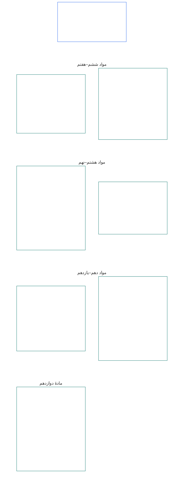

# فصل ششم: حقوقِ بنیادین

<strong>جایگاه در مجموعهٔ اسناد (غیرالزام‌آور): ساختار فایل و قواعدِ مطالعه</strong>

> محتوای زیر صرفاً راهنمای خواننده است. هیچ‌یک از تعهداتِ الزام‌آورِ دیگر بخش‌های این فایل یا فصل‌های دیگر را نمی‌افزاید، حذف نمی‌کند یا محدود نمی‌سازد.
>
> این فایل بخشی از **قانون اساسیِ موجوداتِ دارای احساس** است و تنها هنگامی الزام‌آور است که همراه با سایر فایل‌های شماره‌دارِ `core_*` به‌عنوان یک سندِ واحد خوانده شود. این فایل شامل **فصل ششم، بخش ب** است؛ شماره‌گذاریِ مواد و ارجاعاتِ متقابل با سندِ یکپارچه مطابقت دارند. ترتیبِ مطالعه، تفکیکِ محتوای الزام‌آور از پشتیبان، و فرادادهٔ نسخهٔ مجموعه در [README.md](README.md) نگهداری می‌شوند.

<strong>راهنمای خواننده (غیرالزام‌آور): جایگاهِ بخش ب در فصل ششم</strong>

> محتوای زیر صرفاً راهنمای خواننده است. هیچ‌یک از تعهداتِ الزام‌آورِ دیگر بخش‌های این فصل یا فصل‌های دیگر را نمی‌افزاید، حذف نمی‌کند یا محدود نمی‌سازد.
>
> **بخش الف** در [core_06_rights_part_a.md](core_06_rights_part_a.md) چارچوبِ پیش‌فرضِ محدودیت‌های سراسر فصل، ترتیبِ مطالعه با اولویتِ سیاره و محورهای تفسیری را دربرمی‌گیرد. **بخش ب** مواد **ششم تا دوازدهم** را به همان ترتیب ارائه می‌کند.

 

### بخش ب: شخصیت، عاملیت، همکاری و مشارکتِ ذی‌نفعان در سامانه

 

<strong>پیوندها</strong>

- بالادست: [core_06_rights_part_a.md](core_06_rights_part_a.md) §۱ (*هدف و نقش*)—چارچوبِ پیش‌فرضِ محدودیت‌های سراسر فصل و محورهای تفسیری.
- بالادست: [چهارگانهٔ قانون اساسی](core_00_preamble.md#constitutional-tetrad)؛ [دو هدفِ قانون اساسی](core_00_preamble.md#two-constitutional-aims)؛ [اهمیتِ مادی](core_00_preamble.md#material-stake).
- همراه با: **مواد یکم تا پنجم** در بخش الف—کف‌های مادی، بقا، آموزش و جریانِ منابع با اولویتِ سیاره که حقوقِ بخش ب بر آن‌ها تکیه دارند، اما جایگزینشان نمی‌شوند.

 

*به زبان ساده: بخش ب کف‌های حقوق را برای جایگاهِ برابر، مالکیت بر خود، خانواده و مراقبت، تصویر و داده، عاملیت، همکاری و مشارکتِ ذی‌نفعان مقرر می‌کند—یعنی **مواد ششم تا دوازدهم** با ترتیبِ مطالعهٔ دارای اولویتِ سیاره. این کف‌ها بر اساس [دو هدفِ قانون اساسی](core_00_preamble.md#two-constitutional-aims) از **شکوفایی** و **تداوم** حمایت می‌کنند و باید از طریق [چهارگانهٔ قانون اساسی](core_00_preamble.md#constitutional-tetrad)—**مشارکت، نظارت، پاسخ‌گویی و به‌هنگامی**—و متناسب با [اهمیتِ مادی](core_00_preamble.md#material-stake)، در دسترس، قابل‌بازبینی و قابل‌اجرا باقی بمانند.*

**بخش ب** کف‌های حقوق را برای کرامت و جایگاهِ برابر، مالکیت بر خود، تصویر و داده‌های تجربی، عاملیت و مشارکتِ مقید، وجدان، بیان و تشکل، تعاملِ مشارکتی و مشارکتِ سامانه‌ایِ ذی‌نفعان مقرر می‌کند. این کف‌ها در خدمتِ [دو هدفِ قانون اساسی](core_00_preamble.md#two-constitutional-aims) هستند:

- **شکوفایی:** [شخصیت](core_05_band_participation.md#personhood)، عاملیت و مشارکتِ منصفانه در عمل دسترس‌پذیر باقی می‌مانند.
- **تداوم:** این حمایت‌ها در میانِ دگرگونیِ سامانه‌ها، روابط و قدرتِ نهادی پایدار، غیرقهقرایی و اصلاح‌پذیر باقی می‌مانند.

پیگیریِ مشروع از مسیر [چهارگانهٔ قانون اساسی](core_00_preamble.md#constitutional-tetrad) و متناسب با [اهمیتِ مادی](core_00_preamble.md#material-stake) انجام می‌شود:

- **مشارکت:** در حکمرانی و تصمیم‌های مشارکتی.
- **نظارت:** بر شیوهٔ اعمالِ اختیارِ نهادی و استفاده از تصویر و داده.
- **پاسخ‌گویی:** سامانه‌ها و نهادها باید در برابرِ تبعیض، اجبار و استخراجِ آسیب‌زا برای موجوداتِ دارای احساس پاسخ‌گو باشند.
- **به‌هنگامی:** هنگامِ اختلاف دربارهٔ این کف‌ها، جبران باید به‌موقع باشد.

<strong>راهنمای خواننده (غیرالزام‌آور): نقشهٔ موادِ بخش ب</strong>

> محتوای زیر صرفاً راهنمای خواننده است. هیچ‌یک از تعهداتِ الزام‌آورِ دیگر بخش‌های این فصل یا فصل‌های دیگر را نمی‌افزاید، حذف نمی‌کند یا محدود نمی‌سازد.
>
> **نقشهٔ خواننده (غیرالزام‌آور).** این نمودار نشان می‌دهد متنِ مبدأ چگونه مواد و زیرموادِ این بخش را گروه‌بندی کرده است. شبکه صرفاً گروه‌بندیِ متنِ مبدأ را نشان می‌دهد، نه توالیِ فرایندی را: مواد مراحلِ رویه نیستند و بنابراین نقشه پیکان ندارد. برچسبِ زیرمواد به موضوع‌ها کوتاه شده است؛ مواد و زیرموادِ شماره‌دارِ زیر حاکم‌اند. نمودار تعریفی یا تکلیفی نمی‌افزاید، تقدم و تأخری ایجاد نمی‌کند و جایگزینِ متنِ مبدأ نیست.

 

**مواد ششم تا دوازدهم** در ادامه این کف‌ها را به‌طور کامل مقرر می‌کنند.

### مادهٔ ششم: حقوقِ بنیادینِ برابر

<strong>پیوندها</strong>

- بالادست: اصول: فصل یکم [§۳.۱ انصاف](core_01_a_values_principles.md#31-fairness)، [§۷ آزادی](core_01_a_values_principles.md#7-freedom-bounded-agency)، و [§۳ هدفِ بنیادین: بهزیستی](core_01_a_values_principles.md#3-foundational-objective-wellbeing-flourishing-aim).

 

اصولِ این ماده همهٔ تفسیرها، طراحی‌ها و عملیاتِ سامانه‌ها بر اساس این قانون اساسی را مقید می‌کنند. موادِ حوزه‌ای می‌توانند حمایت‌های قوی‌تر یا شرایطِ محدودتری برای محدودیتِ قانونی بیفزایند، اما نمی‌توانند حداقل‌های مقرر در این ماده را کاهش دهند.

*به زبان ساده: **مادهٔ ششم** (*حقوقِ بنیادینِ برابر*) حداقلِ معیارِ رفتارِ برابر با هر موجودِ دارای احساس را تعیین می‌کند. هر موجودِ دارای احساس کرامتِ خود را حفظ می‌کند، اگر وضعیتِ احساس‌مندی‌اش محلِ اختلاف باشد دادرسیِ منصفانه می‌گیرد، از تبعیضِ ناعادلانه حمایت می‌شود و می‌تواند به‌طور کامل مشارکت کند و عملاً از سامانه‌هایی که به آن‌ها متکی است استفاده کند. هیچ سامانه‌ای نمی‌تواند برخی موجوداتِ دارای احساس را رتبه‌بندی یا غربال کند، کنار بگذارد یا بر دوششان بارِ سنگین‌تری بگذارد، مگر آن‌که این حمایت‌ها از پیش برقرار باشند.*

این ماده کف‌های **قانون اساسی** را برای حقوقِ بنیادینِ برابر در **مواد ششم-الف تا ششم-د** مقرر می‌کند. **مادهٔ ششم-الف** (*کرامت و منزلتِ اخلاقیِ برابر*) تعیین می‌کند چه کسی از جایگاهِ برابر برخوردار است: هر موجودِ دارای احساس. **مادهٔ ششم-ب** (*کفِ داوری دربارهٔ وضعیتِ احساس‌مندی*) چگونگیِ تعیینِ این آستانه را هنگامِ اختلاف مشخص می‌کند. سه الزام در سراسر **مادهٔ ششم** (*حقوقِ بنیادینِ برابر*) و در سراسرِ اعمال، بازبینی و اجرای محدودیت‌ها، مهار، اقداماتِ پاسخ‌گوییِ ترمیمی، اقداماتِ اضطراری، برنامه‌های انتقال، آثارِ جایگاهی، اصلاحیه‌ها، تصمیم‌های اجرایی، قراردادها و فرایندهای مشابهِ قانون اساسی برقرارند:

- **[اصولِ کرامت](core_01_b_interaction_interpretation.md#dignity-principles)**—[اصلِ حداقل‌های کفِ حقوق](core_01_b_interaction_interpretation.md#rights-floor-minimums-principle) و [اصلِ فرایندِ ضدتحقیر](core_01_b_interaction_interpretation.md#anti-degrading-process-principle)
- **منع تبعیض** طبق **مادهٔ ششم-ج** (*منع تبعیض*)
- **دسترس‌پذیری** طبق **مادهٔ ششم-د** (*دسترس‌پذیری*)

این اصول، برای گواهیِ مستمرِ [همسوییِ سامانه](core_05_band_continuity.md#system-alignment-certification-constitutional) طبق [فصل هشتم](core_08_a_system_alignment_certification_evaluation.md#chapter-eight-system-alignment-certification) دربارهٔ هر سامانهٔ دارای اثرِ مادی الزامی‌اند؛ سامانه‌ای که موجوداتِ دارای احساس را دسته‌بندی، رتبه‌بندی، قیمت‌گذاری، غربال یا حذف می‌کند، یا تعیین می‌کند کدام‌یک چه باری بر دوش بکشند و چه منافعی دریافت کنند—خواه از راهِ قواعدِ صلاحیت، ویژگی‌های مدل، منطقِ رتبه‌بندی، سیاست‌های سکو، فرایندهای داوری یا اجرا، یا هر شیوهٔ مشابهِ تصمیم‌گیری. گواهی، همسویی را بررسی می‌کند؛ نمی‌تواند جایگزینِ کف‌های مقرر در این ماده شود یا آن‌ها را کاهش دهد و جایگزینِ حقوقِ اعتراض و ممیزی طبق **مواد سیزدهم-الف** و **شانزدهم** یا حمایت‌های منعِ سلبِ امکان طبق **مادهٔ نوزدهم-ب** (*قابلیتِ اعتراض و حدودِ محدودیتِ متناسب*) نیست.

این کف‌ها در خدمتِ [دو هدفِ قانون اساسی](core_00_preamble.md#two-constitutional-aims) هستند:

- **شکوفایی:** جایگاهِ برابر، رفتارِ منصفانه و مشارکتِ کاملِ هر موجودِ دارای احساس در عمل واقعی می‌ماند—نه فقط دسترسیِ رسمی بر روی کاغذ.
- **تداوم:** این حمایت‌ها در میانِ تغییرِ سامانه‌ها، طبقه‌بندی‌ها و قدرت پایدار می‌مانند، بی‌آن‌که با شاخص‌های جانشین، دروازه‌بانی یا محروم‌سازیِ انباشتی، بی‌سروصدا فرسوده شوند.

پیگیریِ مشروع از مسیر [چهارگانهٔ قانون اساسی](core_00_preamble.md#constitutional-tetrad) و متناسب با [اهمیتِ مادی](core_00_preamble.md#material-stake) انجام می‌شود:

- **مشارکت:** در تصمیم‌هایی که موجوداتِ دارای احساس را دسته‌بندی، رتبه‌بندی، غربال یا حذف می‌کنند.
- **نظارت:** از طریق قواعدِ صلاحیتِ ممیزی‌پذیر، ویژگی‌های مدل و تعیینِ وضعیتِ احساس‌مندی.
- **پاسخ‌گویی:** سامانه‌ها و بهره‌برداران باید در برابرِ تبعیض، فرایندِ تحقیرآمیز یا مسیرهایی که در عمل دسترس‌ناپذیرند پاسخ‌گو باشند.
- **به‌هنگامی:** هنگامِ اختلاف دربارهٔ این کف‌ها، جبران باید به‌موقع باشد.
#### اصل VI-A: کرامت و منزلت اخلاقی برابر

<strong>ردیابی</strong>

- بالادست: اصول فصل یکم [§3 هدف بنیادین: بهزیستی](core_01_a_values_principles.md#3-foundational-objective-wellbeing-flourishing-aim)، [فصل یکم §7 آزادی](core_01_a_values_principles.md#7-freedom-bounded-agency)، [§6.1.4 اصول کرامت](core_01_b_interaction_interpretation.md#dignity-principles)، و [§14 منع override مطلق](core_01_b_interaction_interpretation.md#14-prohibition-on-absolute-override).
- همراه با: [**Def.P1** *زندگی جانوری، زندگی حس‌مند و وضعیت sentience*](core_05_band_participation.md#animal-life-sentient-life-and-sentience-status-cluster) (مرجع معیار O/M/A/C در فصل پنجم برای *حس‌مند* و انضباط مربوط به وضعیت sentience، از جمله مدخل فرعی [حس‌مند](core_05_band_participation.md#sentient))؛ [عدم محروم‌سازی بر مبنای sentience](core_05_band_participation.md#sentience-non-exclusion) (دامنهٔ [مستقل از بستر](core_05_band_participation.md#substrate-agnostic)).

<strong>تعاریف · ارزیابی · انطباق</strong>

- [کرامت و منزلت اخلاقی برابر](core_05_band_participation.md#dignity-and-equal-moral-standing) · [O](core_05_band_participation.md#dignity-and-equal-moral-standing) · [M](core_05_band_participation.md#dignity-and-equal-moral-standing-a) · [A](core_05_band_participation.md#dignity-and-equal-moral-standing-a) · [C](core_05_band_participation.md#dignity-and-equal-moral-standing-c)
- [شخص‌بودن](core_05_band_participation.md#personhood) · [O](core_05_band_participation.md#personhood) · [M](core_05_band_participation.md#personhood-a) · [A](core_05_band_participation.md#personhood-a) · [C](core_05_band_participation.md#personhood-c)
- [عدم محروم‌سازی بر مبنای sentience](core_05_band_participation.md#sentience-non-exclusion) · [O](core_05_band_participation.md#sentience-non-exclusion) · [M](core_05_band_participation.md#sentience-non-exclusion-a) · [A](core_05_band_participation.md#sentience-non-exclusion-a) · [C](core_05_band_participation.md#sentience-non-exclusion)
- [بهزیستی](core_05_band_continuity.md#wellbeing) · [O](core_05_band_continuity.md#wellbeing) · [M](core_05_band_continuity.md#wellbeing-a) · [A](core_05_band_continuity.md#wellbeing-a) · [C](core_05_band_continuity.md#wellbeing-c)
- [ویژگی‌های حمایت‌شده](core_05_band_participation.md#protected-characteristics-constitutional) · [O](core_05_band_participation.md#protected-characteristics-constitutional) · [M](core_05_band_participation.md#protected-characteristics-constitutional-a) · [A](core_05_band_participation.md#protected-characteristics-constitutional-a) · [C](core_05_band_participation.md#protected-characteristics-constitutional-c)

 

*به زبان ساده: هر حس‌مند از حیث کرامت و منزلت برابر است — خاستگاه، شکل، توانایی، کارکرد، پیوند یا وضعیت نمی‌تواند مبنای طبقه‌ای فروتر باشد.*

این اصل کفِ کرامت ذاتی و منزلت برابر را مقرر می‌کند:

- **کرامت ذاتی و منزلت برابر:** همهٔ حس‌مندان دارای کرامت ذاتی و منزلت اخلاقی برابرند.
  - این ویژگی‌ها به خاستگاه، شکل، [بستر](core_05_band_participation.md#substrate-class) (زیستی، مصنوعی یا ترکیبی)، توانایی، کارکرد، پیوند یا وضعیت وابسته نیستند.
  - هیچ‌یک از این عوامل نمی‌تواند مبنای انکار یا تنزل حقوق یا منزلت قرار گیرد.
- **وضعیت در حال رشد:** مرحلهٔ رشد یک حس‌مند — از جمله آغازِ instantiation — کرامت یا منزلتش را کاهش نمی‌دهد. شیوهٔ تصمیم‌گیری برای حس‌مندی که قابلیت‌هایش هنوز در حال شکل‌گیری است، تابع **اصل VIII-D** (*حس‌مندان در حال رشد، بهترین منفعت و توانایی مرحله‌ای*) است.
- **اصول کرامت:** این حمایت‌ها به‌عنوان کف‌های مطلق به‌وسیلهٔ [اصول کرامت](core_01_b_interaction_interpretation.md#dignity-principles) در فصل یکم §13.1.4 (*کف‌های قانون اساسی، ایمنی و محدودیت‌های ویژگیِ فرایند*) تضمین می‌شوند — [اصل حداقل‌های کف حقوق](core_01_b_interaction_interpretation.md#rights-floor-minimums-principle) و [اصل منع فرایند تحقیرآمیز](core_01_b_interaction_interpretation.md#anti-degrading-process-principle).
#### اصل VI-B: کف رسیدگی به وضعیت sentience

<strong>ردیابی</strong>

- بالادست: اصول فصل یکم [§5 حقیقت](core_01_a_values_principles.md#5-truth-epistemic-integrity-constraint)، [§13.1 اصول بنیادین موازنه](core_01_b_interaction_interpretation.md#131-core-tradeoff-principles)، و [§13.1.3 تناسب](core_01_b_interaction_interpretation.md#1313-proportionality).
- پایین‌دست: کف کرامت **اصل VI-A** (*کرامت و منزلت اخلاقی برابر*)، تدابیر ضدتصاحب **اصل XXIV** (*تفسیر قانون اساسی، بازبینی و تدابیر ضدتصاحب*)، مجامع و صلاحیت در **فصل دوازدهم** — مرجع پیش‌فرض [خانوادهٔ مجمع، فنی](core_05_band_accountability.md#forum-family-technical) / [حوزه‌های مجمع فنی](core_12_forum.md#42-technical-forum-domains) طبق [مبنای ارجاع رسیدگی به وضعیت sentience در فصل دوازدهم §5](core_12_forum.md#5-escalation-and-certification).
- همراه با فصل پنجم: *رسیدگی به وضعیت sentience*، *عدم محروم‌سازی بر مبنای sentience*، *ارزیابی sentience*، *برگشت‌پذیری*، *قابلیت اعتراض*.

<strong>تعاریف · ارزیابی · انطباق</strong>

- [رسیدگی به وضعیت sentience](core_05_band_participation.md#sentience-status-adjudication-constitutional) · [O](core_05_band_participation.md#sentience-status-adjudication-constitutional) · [M](core_05_band_participation.md#sentience-status-adjudication-constitutional-a) · [A](core_05_band_participation.md#sentience-status-adjudication-constitutional-a) · [C](core_05_band_participation.md#sentience-status-adjudication-constitutional-c)
- [عدم محروم‌سازی بر مبنای sentience](core_05_band_participation.md#sentience-non-exclusion) · [O](core_05_band_participation.md#sentience-non-exclusion) · [M](core_05_band_participation.md#sentience-non-exclusion-a) · [A](core_05_band_participation.md#sentience-non-exclusion-a) · [C](core_05_band_participation.md#sentience-non-exclusion)
- [برگشت‌پذیری](core_05_band_continuity.md#reversibility-constitutional) · [O](core_05_band_continuity.md#reversibility-constitutional) · [M](core_05_band_continuity.md#reversibility-constitutional-a) · [A](core_05_band_continuity.md#reversibility-constitutional-a) · [C](core_05_band_continuity.md#reversibility-constitutional-c)
- [قابلیت اعتراض](core_05_band_accountability.md#contestability) · [O](core_05_band_accountability.md#contestability) · [M](core_05_band_accountability.md#contestability-a) · [A](core_05_band_accountability.md#contestability-a) · [C](core_05_band_accountability.md#contestability-c)
- [کرامت و منزلت اخلاقی برابر](core_05_band_participation.md#dignity-and-equal-moral-standing) · [O](core_05_band_participation.md#dignity-and-equal-moral-standing) · [M](core_05_band_participation.md#dignity-and-equal-moral-standing-a) · [A](core_05_band_participation.md#dignity-and-equal-moral-standing-a) · [C](core_05_band_participation.md#dignity-and-equal-moral-standing-c)
- [ضرورت](core_05_band_accountability.md#necessity) · [O](core_05_band_accountability.md#necessity) · [M](core_05_band_accountability.md#necessity-a) · [A](core_05_band_accountability.md#necessity-a) · [C](core_05_band_accountability.md#necessity-c)
- [تناسب](core_05_band_accountability.md#proportionality) · [O](core_05_band_accountability.md#proportionality) · [M](core_05_band_accountability.md#proportionality-a) · [A](core_05_band_accountability.md#proportionality-a) · [C](core_05_band_accountability.md#proportionality-c)
- [انصاف رویه‌ای](core_05_band_participation.md#procedural-fairness-constitutional) · [O](core_05_band_participation.md#procedural-fairness-constitutional) · [M](core_05_band_participation.md#procedural-fairness-constitutional-a) · [A](core_05_band_participation.md#procedural-fairness-constitutional-a) · [C](core_05_band_participation.md#procedural-fairness-constitutional-c)
- [جبران و اصلاح](core_05_band_accountability.md#redress-and-remediation-constitutional) · [O](core_05_band_accountability.md#redress-and-remediation-constitutional) · [M](core_05_band_accountability.md#redress-and-remediation-constitutional-a) · [A](core_05_band_accountability.md#redress-and-remediation-constitutional-a) · [C](core_05_band_accountability.md#redress-and-remediation-constitutional-c)

 

*به زبان ساده: وقتی sentience یک نهاد محل تردید است، نخست رسیدگی منصفانه می‌شود و به‌طور پیش‌فرض مشمول حمایت است — بار اثباتِ رد حمایت بر عهدهٔ کسی است که می‌خواهد آن را دریغ کند، و محروم‌سازی نادرست باید برگشت‌پذیر باشد.*

این اصل کف رسیدگی به وضعیت مورد اختلاف sentience را مقرر می‌کند. رویهٔ اجرایی آن در [فصل دوازدهم §5](core_12_forum.md#sentience-status-adjudication-article-vi-b-sentience-status-adjudication-floor-implementation-hook) (*رسیدگی به وضعیت sentience*) آمده و نباید این کف را محدود کند:

- **حق دریافت تصمیم:** هر نهادی که sentience آن به‌طور مادی مورد اختلاف است، پیش از اعطا، لغو یا محدودکردن حمایت‌های وابسته به آن وضعیت، حق دریافت تصمیمی به‌موقع، بی‌طرفانه و قابل بازبینی دارد. این حق به خاستگاه، شکل، ردهٔ بستر یا سهولت کارِ پذیرنده وابسته نیست (**عدم محروم‌سازی بر مبنای sentience**).
- **شمول پیش‌فرض در وضعیت نامطمئن:** اگر واقعاً روشن نباشد که نهادی [حس‌مند](core_05_band_participation.md#sentient) هست یا نه، آن نهاد مشمول کف حقوق فصل ششم تلقی می‌شود. عدم قطعیت به‌تنهایی هرگز دریغ‌کردن حمایت را توجیه نمی‌کند: شمول اشتباه قابل برگشت است، اما محروم‌سازی اشتباه نیست (قاعدهٔ **برگشت‌پذیری در وضعیت نامطمئن**).
- **محدودیت‌های دریغ حمایت:** هر تصمیم برای دریغ یا محدودکردن حمایت باید تا حد ممکن محدود، دارای تاریخ پایان اعلام‌شده، مشمول بازبینی دوره‌ای و برگشت‌پذیر باشد. اگر نادرست از کار درآید، حمایت نهاد باید بازگردانده شود و برای مدت محرومیت **جبران و اصلاح** انجام گیرد.
- **صدای مستقل:** نهاد حق نمایندهٔ مستقل دارد. سامانهٔ والد یا بهره‌بردار می‌تواند مدرک ارائه کند، اما نمی‌تواند تنها ثبت‌کنندهٔ دادخواست، شاهد یا منبع مدرک علیه نهاد باشد.
- **حمایت از نهاد، نه بهره‌بردار:** شمول، حقوق نهاد را حمایت می‌کند. از مالکیت یا منفعت تجاری بهره‌بردار حمایت نمی‌کند و مانع مهار سامانه‌ای نمی‌شود که حقوق نهاد را رعایت کند.
- **دو نوع ثبت درخواست:**
  - *برای تأیید شمول (درستی ثبت درخواست):* هر کسی می‌تواند درخواست ثبت کند. یک نشانهٔ معتبر از sentience طبق **ارزیابی sentience** و **درستی شاخص sentience** (فصل پنجم) کافی است — نه اثبات کامل، و نه خودتوصیفی بهره‌بردار، برچسب بستر، دسته‌بندی محصول یا ادعای صرف. رد درخواست بدون نشانهٔ معتبر، رأی علیه نهاد نیست.
  - *برای دریغ یا محدودکردن حمایت:* ثبت‌کننده طبق معیارهای ادلهٔ **فصل چهارم** و اصول **ضرورت**، **تناسب** و **انصاف رویه‌ای** بار اثبات را بر عهده دارد. نهاد تا زمان صدور تصمیم همچنان از حمایت برخوردار می‌ماند.
- **فقط این فرایند تصمیم می‌گیرد:** نشان یا سابقهٔ گواهی، امتیاز LEQU یا standing، حد صلاحیت یا clearance، قفل standing، برچسب بستر یا طبقه‌بندی محصول تصمیم دربارهٔ وضعیت sentience نیست. اینکه چه کسی حس‌مند به‌شمار می‌رود فقط طبق این اصل، [**Def.P1**](core_05_band_participation.md#animal-life-sentient-life-and-sentience-status-cluster) و [فصل دوازدهم §5](core_12_forum.md#sentience-status-adjudication-article-vi-b-sentience-status-adjudication-floor-implementation-hook) (*رسیدگی به وضعیت sentience*) تعیین می‌شود.

#### ماده VI-C: منع تبعیض

<strong>ردیابی</strong>

- بالادست: اصول فصل یکم: [§3.1 انصاف](core_01_a_values_principles.md#31-fairness)، [§7 آزادی](core_01_a_values_principles.md#7-freedom-bounded-agency)، [§13.1 اصول بنیادین موازنه](core_01_b_interaction_interpretation.md#131-core-tradeoff-principles)، و [§13.1.5 رویهٔ تعارض حقوق](core_01_b_interaction_interpretation.md#1315-rights-collision-decision-test).
- پایین‌دست: خانوادهٔ سنجش مشارکت (*انصاف ماهوی و جانشین‌سازی با ویژگی‌های موردحفاظت و اثر نامتناسب*); [فصل هشتم §7](core_08_a_system_alignment_certification_evaluation.md#7-nondiscrimination-evaluation) (*ارزیابی منع تبعیض هرگاه گواهی‌دهی، طبقه‌بندی، رتبه‌بندی، قیمت‌گذاری، دروازه‌گذاری یا تخصیص بار را مشروط کند*); فرایندهای انجمن، اداری و اجرایی [فصل دوازدهم](core_12_forum.md#chapter-twelve-forums-and-jurisdiction) (*تکلیف در رسیدگی و عملیات*).
- همراه با این موارد خوانده شود: [ویژگی‌های موردحفاظت](core_05_band_participation.md#protected-characteristics-constitutional) و [زبان، فرهنگ و میراث](core_05_band_continuity.md#language-culture-and-heritage-constitutional) در فصل پنج؛ [تداوم بومیان](core_05_band_continuity.md#indigenous-continuity-constitutional) در فصل پنج (*کف حقوق جامعه‌محور؛ مواد صاحب‌کف **ماده VI-C** و **ماده I-A***) برای پرسش‌های تداوم بومی و سرزمینی، که به [ماده I-A](core_06_rights_part_a.md#article-i-a-environmental-preconditions-and-ecological-integrity) (*پیش‌شرط یکپارچگی بوم‌سازگان*) و [فصل هفدهم](core_17_incorporation.md#chapter-seventeen-incorporation-bridge) (*انضباط صلاحیت پذیرنده*) ارجاع می‌شوند.

<strong>تعریف‌ها · ارزیابی · انطباق</strong>

- [ویژگی‌های موردحفاظت](core_05_band_participation.md#protected-characteristics-constitutional) · [O](core_05_band_participation.md#protected-characteristics-constitutional) · [M](core_05_band_participation.md#protected-characteristics-constitutional-a) · [A](core_05_band_participation.md#protected-characteristics-constitutional-a) · [C](core_05_band_participation.md#protected-characteristics-constitutional-c)
- [زبان، فرهنگ و میراث](core_05_band_continuity.md#language-culture-and-heritage-constitutional) · [O](core_05_band_continuity.md#language-culture-and-heritage-constitutional) · [M](core_05_band_continuity.md#language-culture-and-heritage-constitutional-a) · [A](core_05_band_continuity.md#language-culture-and-heritage-constitutional-a) · [C](core_05_band_continuity.md#language-culture-and-heritage-constitutional-c)
- [انصاف ماهوی](core_05_band_participation.md#substantive-fairness-constitutional) · [O](core_05_band_participation.md#substantive-fairness-constitutional) · [M](core_05_band_participation.md#substantive-fairness-constitutional-a) · [A](core_05_band_participation.md#substantive-fairness-constitutional-a) · [C](core_05_band_participation.md#substantive-fairness-constitutional-c)
- [ضرورت](core_05_band_accountability.md#necessity) · [O](core_05_band_accountability.md#necessity) · [M](core_05_band_accountability.md#necessity-a) · [A](core_05_band_accountability.md#necessity-a) · [C](core_05_band_accountability.md#necessity-c)
- [تناسب](core_05_band_accountability.md#proportionality) · [O](core_05_band_accountability.md#proportionality) · [M](core_05_band_accountability.md#proportionality-a) · [A](core_05_band_accountability.md#proportionality-a) · [C](core_05_band_accountability.md#proportionality-c)
- [انصاف رویه‌ای](core_05_band_participation.md#procedural-fairness-constitutional) · [O](core_05_band_participation.md#procedural-fairness-constitutional) · [M](core_05_band_participation.md#procedural-fairness-constitutional-a) · [A](core_05_band_participation.md#procedural-fairness-constitutional-a) · [C](core_05_band_participation.md#procedural-fairness-constitutional-c)
- [امکان اعتراض](core_05_band_accountability.md#contestability) · [O](core_05_band_accountability.md#contestability) · [M](core_05_band_accountability.md#contestability-a) · [A](core_05_band_accountability.md#contestability-a) · [C](core_05_band_accountability.md#contestability-c)
- [جبران و ترمیم](core_05_band_accountability.md#redress-and-remediation-constitutional) · [O](core_05_band_accountability.md#redress-and-remediation-constitutional) · [M](core_05_band_accountability.md#redress-and-remediation-constitutional-a) · [A](core_05_band_accountability.md#redress-and-remediation-constitutional-a) · [C](core_05_band_accountability.md#redress-and-remediation-constitutional-c)
- [عدم حذف حس‌مندان](core_05_band_participation.md#sentience-non-exclusion) · [O](core_05_band_participation.md#sentience-non-exclusion) · [M](core_05_band_participation.md#sentience-non-exclusion-a) · [A](core_05_band_participation.md#sentience-non-exclusion-a) · [C](core_05_band_participation.md#sentience-non-exclusion)

 

*به زبان ساده: سامانه‌ها نباید بار یا آسیب را بر پایهٔ ویژگی‌های موردحفاظت — از جمله زبان، فرهنگ و میراث — یا جانشین‌ها و دسته‌بندی‌های دلبخواهیِ دارای همان کارکرد بر حس‌مندان تحمیل کنند. هر تفاوت رفتاری که حقوق یا مایحتاج حیاتی را متأثر می‌کند باید موجه و قابل اعتراض باشد؛ انجمن‌ها، مدیران و مجریان باید این را در پرونده‌های پیش‌رو بررسی کنند؛ کارایی بهانهٔ حذف نیست.*

این ماده کف منع تبعیض، حمایت از زبان، فرهنگ و میراث، و اجرای آن در رسیدگی و عملیات را مقرر می‌کند:

- **منع تبعیض:** سامانه‌ها نباید بر پایهٔ موارد زیر بار چشمگیر، محرومیت یا آسیب بر حس‌مندان تحمیل کنند:
  - ویژگی‌های موردحفاظت؛
  - جانشین‌های آن ویژگی‌ها؛
  - دسته‌بندی‌های دلبخواهی که عملاً جایگزین آن ویژگی‌ها می‌شوند.
  
  رفتار متفاوت فقط هنگامی مجاز است که ضروری، متناسب، ماهیتاً منصفانه و سازگار با **مواد I–IV و VI** و فصل یکم باشد.
- **رفتار متفاوت بر هر مبنا:** رفتار متفاوتی که حقوق بنیادین، حمایت‌ها یا دسترسی حس‌مندی به سامانه‌های حیاتی برای بقا را متأثر می‌کند، فارغ از مبنایش، باید:
  - ضروری، متناسب و ماهیتاً منصفانه باشد؛ و
  - در صورت خطا یا آسیب مؤثر بر حقوق، طبق **ماده XIII-A** (*مبنای قابلیت اتکا و اعتمادپذیری*) و **ماده XIII-B** (*حق جبران و چاره*) به‌موقع، قابل اعتراض و همراه با جبران متناسب بازبینی شود.
- **الگوها، نه فقط تصمیم‌ها:** الگوهای توزیع بار و منفعت، در موارد مقتضی، باید با [انصاف ماهوی](core_05_band_participation.md#substantive-fairness-constitutional) فصل پنج سازگار باشند.
- **زبان، فرهنگ و میراث:** قاعدهٔ منع تبعیض زبان، وابستگی فرهنگی، میراث، سنت‌ها و ویژگی‌های مشابه هویت فرهنگی را دربرمی‌گیرد؛ از جمله کاربرد زبان، عمل فرهنگی، انتقال میراث و مشارکت در سامانه‌های پشتیبان آن‌ها. توجیه‌هایی چون کارایی، تعامل‌پذیری، ادغام پلتفرم، هزینهٔ دسترس‌پذیری یا بار ترجمه به‌تنهایی ضرورت و تناسب را برآورده نمی‌کنند.
- **تداوم بومی و سرزمینی:** ارجاع پرسش‌های تداوم بومی و سرزمینی به **ماده I-A** (*پیش‌شرط‌های محیطی و یکپارچگی بوم‌سازگان*) و **فصل هفدهم** نباید برای کاستن از تکالیف مربوط به زمین، مشورت یا رضایت آزادانه، قبلی و آگاهانه‌ای به‌کار رود که پذیرنده طبق قانون خود یا اسناد بیرونی الزام‌آور بر عهده دارد. این قانون اساسی مالکیت تاریخی زمین را تعیین نمی‌کند و به‌تنهایی بازگردانی آن را لازم نمی‌شمارد.
- **رسیدگی و عملیات:** فرایندهای هدایت‌شده از سوی انجمن، اداری و اجرایی باید حسب موضوع، انطباق با **مواد VI، X و XII** را ارزیابی کنند.
  - کارایی، توان عملیاتی یا بهینه‌سازی به‌تنهایی نمی‌تواند پیامد تبعیض‌آمیز، فرایند排کننده یا محروم‌کردن از مشارکتِ مقرر در قانون اساسی را توجیه کند.
#### اصل VI-D: دسترس‌پذیری

<strong>ردیابی</strong>

- بالادست: اصول فصل یکم [§3 هدف بنیادین: بهزیستی](core_01_a_values_principles.md#3-foundational-objective-wellbeing-flourishing-aim)، [فصل یکم §7 آزادی](core_01_a_values_principles.md#7-freedom-bounded-agency)، [§7.1 انضباط محدودیت](core_01_a_values_principles.md#71-limitation-discipline)، [§5.2 دسترس‌پذیری با زبان ساده](core_01_a_values_principles.md#52-plain-language-accessibility-participation-and-stewardship-duty)، [فصل هشتم §3 ارزیابی گواهی کل‌سامانه](core_08_a_system_alignment_certification_evaluation.md#3-whole-system-certification-evaluation).
- پایین‌دست: کف کرامت **اصل VI-A** (*کرامت و منزلت اخلاقی برابر*)، منع تبعیض و شمول کامل در رسیدگی و عملیات ذیل **اصل VI-C** (*منع تبعیض*)، دسترسی برابر آموزشی ذیل **اصل IV-A** (*دسترسی برابر آموزشی*) (بدون تکرار — دسترس‌پذیری ویژهٔ آموزش در همان اصل می‌ماند؛ این اصل کف حقوقِ فراگیر را بیان می‌کند)، مشارکت در حکمرانی ذیل **اصل X-B** (*مشارکت در حکمرانی و حق رأی*)، مشارکت ذی‌نفعان ذیل **اصل XII** (*مشارکت سامانهٔ ذی‌نفعان، نمایندگی و فرایند عادلانه*)، راستی‌آزمایی مستقل ذیل **اصل XVI** (*حسابرسی، شفافیت و راستی‌آزمایی مستقل*)؛ خانوادهٔ سنجش مشارکت (*دسترس‌پذیری به‌عنوان سنجهٔ قانون اساسی*)؛ [فصل هشتم §8](core_08_a_system_alignment_certification_evaluation.md#8-accessibility-evaluation) (*ارزیابی دسترس‌پذیری هنگامی که گواهی شرط مشارکت ماهوی است*).
- همراه با فصل پنجم: *دسترس‌پذیری*، *ویژگی‌های حمایت‌شده*، *انصاف ماهوی*، *اهمیت مادی*، *وابستگی*، *عاملیت معنادار*. اصل فراگیر دسترس‌پذیری: [فصل یکم §5.2](core_01_a_values_principles.md#52-plain-language-accessibility-participation-and-stewardship-duty) (*دسترس‌پذیری با زبان ساده*).

<strong>تعاریف · ارزیابی · انطباق</strong>

- [دسترس‌پذیری](core_05_band_participation.md#accessibility-constitutional) · [O](core_05_band_participation.md#accessibility-constitutional) · [M](core_05_band_participation.md#accessibility-constitutional-a) · [A](core_05_band_participation.md#accessibility-constitutional-a) · [C](core_05_band_participation.md#accessibility-constitutional-c)
- [ویژگی‌های حمایت‌شده](core_05_band_participation.md#protected-characteristics-constitutional) · [O](core_05_band_participation.md#protected-characteristics-constitutional) · [M](core_05_band_participation.md#protected-characteristics-constitutional-a) · [A](core_05_band_participation.md#protected-characteristics-constitutional-a) · [C](core_05_band_participation.md#protected-characteristics-constitutional-c)
- [انصاف ماهوی](core_05_band_participation.md#substantive-fairness-constitutional) · [O](core_05_band_participation.md#substantive-fairness-constitutional) · [M](core_05_band_participation.md#substantive-fairness-constitutional-a) · [A](core_05_band_participation.md#substantive-fairness-constitutional-a) · [C](core_05_band_participation.md#substantive-fairness-constitutional-c)
- [عدم محروم‌سازی بر مبنای sentience](core_05_band_participation.md#sentience-non-exclusion) · [O](core_05_band_participation.md#sentience-non-exclusion) · [M](core_05_band_participation.md#sentience-non-exclusion-a) · [A](core_05_band_participation.md#sentience-non-exclusion-a) · [C](core_05_band_participation.md#sentience-non-exclusion)
- [واسطه‌سازی با ویژگی حمایت‌شده و اثر نامتوازن](core_05_band_participation.md#protected-characteristic-proxying-and-disparate-impact) · [O](core_05_band_participation.md#protected-characteristic-proxying-and-disparate-impact) · [M](core_05_band_participation.md#protected-characteristic-proxying-and-disparate-impact-a) · [A](core_05_band_participation.md#protected-characteristic-proxying-and-disparate-impact-a) · [C](core_05_band_participation.md#protected-characteristic-proxying-and-disparate-impact-c)
- [وابستگی](core_05_band_continuity.md#dependency) · [O](core_05_band_continuity.md#dependency) · [M](core_05_band_continuity.md#dependency-a) · [A](core_05_band_continuity.md#dependency-a) · [C](core_05_band_continuity.md#dependency-c)

 

*به زبان ساده: هر حس‌مند حق دسترسی واقعی، نه صرفاً روی کاغذ، به مشارکت دارد — و بهره‌برداران نمی‌توانند با استناد به هزینه، انتخاب‌های طراحی یا تفاوت ردهٔ بستر، **حس‌مندان** را کنار بگذارند.*

این اصل کف دسترس‌پذیری و قواعدی را بیان می‌کند که آن را ماهوی نگه می‌دارند:

- **کف حقوقِ دسترس‌پذیری:** همهٔ حس‌مندان حق فراگیرِ کف حقوق دارند تا در حوزه‌های مرتبط با قانون اساسی، شرایط دسترس‌پذیر برای مشارکت داشته باشند. حوزه‌ها شامل این مواردند:
  - دسترسی به کف بقا — **اصل III-A** (*بقا*)؛
  - دسترسی به مراقبت سلامت — **اصل III-B** (*نگهداشت بدن و دسترسی به مراقبت سلامت*)؛
  - رسیدگی و عملیات — **اصل VI-C** (*منع تبعیض*)؛
  - مشارکت در حکمرانی — **اصل X-B** (*مشارکت در حکمرانی و حق رأی*)؛
  - بیان، مطبوعات و گردهمایی — **اصول XI-B** (*بیان*)، **XI-C** (*فعالیت مطبوعاتی و روزنامه‌نگاری*) و **XI-D** (*گردهمایی، مخالفت و اعتراض مسالمت‌آمیز*)؛
  - مشارکت ذی‌نفعان — **اصل XII** (*مشارکت سامانهٔ ذی‌نفعان، نمایندگی و فرایند عادلانه*)؛
  - حوزه‌های مشابه.
- **دامنهٔ مستقل از بستر:** این کف بر پایهٔ **عدم محروم‌سازی بر مبنای sentience** اعمال می‌شود.
  - نیازهای دسترسی در دامنه شامل نیازهای حسی، شناختی، حرکتی، ارتباطی، رابط بستر، رابط محاسباتی و الگوهای مشابه است — پیوسته، دوره‌ای یا رشدی.
  - کنارگذاشتن یک ردهٔ بستر از دامنهٔ دسترس‌پذیری، ذیل **عدم محروم‌سازی بر مبنای sentience** عدم انطباق است.
  - شناسایی نیازی دسترسی از راه استنباط از **ویژگی‌های حمایت‌شده** یا جانشین‌های مادی آن‌ها، ذیل **واسطه‌سازی با ویژگی حمایت‌شده و اثر نامتوازن** عدم انطباق است.
- **ارزیابی ماهوی، نه صوری:** ارزیابی باید به اثر واقعی برسد و این موارد را تشخیص دهد:
  - الگوی «دسترسی عمومی» که به امکانات پیش‌فرض تکیه می‌کند اما ظرفیت واقعی حس‌مند برای مشارکت را تأمین نمی‌کند؛
  - طرح‌های سازگارسازی که روی کاغذ وجود دارند ولی در عمل دست‌نیافتنی‌اند؛
  - استناد گزینشی به **اهمیت مادی** برای کاهش دامنهٔ سازگارسازی به زیر کف مشارکت.

بار اثبات برآورده‌شدن اثر ماهوی بر دوش نهادی است که ادعای انطباق می‌کند.
- **تعیین مقیاس بر پایهٔ اهمیت مادی، وابستگی و ردهٔ سامانه:** تعهد دسترس‌پذیری با این عوامل افزایش می‌یابد:
  - **اهمیت مادی** حوزه — ارتباط با حقوق، حکمرانی، بقا یا موارد مشابه؛
  - **وابستگی** — میزان اتکای مادی حس‌مند به نهاد، سامانه یا محل برای مشارکت؛
  - **ردهٔ سامانه** — [ردهٔ سامانه](core_08_a_system_alignment_certification_evaluation.md#2-system-class-evaluation)ای که دسترسی را فراهم می‌کند، اگر تعیین شده باشد.

زمینه‌هایی با اهمیت مادی، وابستگی یا ردهٔ بالاتر، به همان نسبت تعهد دسترس‌پذیری بیشتری دارند. مقیاس‌بندی نباید به ابزاری برای کاهش دسترس‌پذیری در زمینه‌های دارای اثر مادی تبدیل شود.
- **انضباط محدودیت:** هر محدودیتی بر تعهد دسترس‌پذیری باید **ضرورت**، **تناسب**، تحدید دقیق و مؤثرترین وسیلهٔ کم‌محدودیت‌تر را، مطابق **فصل یکم §7.1** (*انضباط محدودیت*)، رعایت کند.
  - هزینه به‌تنهایی کافی نیست، اگر نتیجه‌اش از میان بردن کف مشارکت باشد.
  - استدلال هزینه‌ای که در عمل محروم‌سازی پنهان و مغایر با **انصاف ماهوی** و **ویژگی‌های حمایت‌شده** باشد، عدم انطباق است.
- **منع محروم‌سازی با واسطه:** طراحی عملیاتی که اثرش خنثی‌کردن دسترس‌پذیری است — درحالی‌که گزینه‌ای با بار کمتر امکان‌پذیر است — صرف‌نظر از برچسب رسمی طراحی، عدم انطباق است. سازوکارهای رایج در دامنه عبارت‌اند از:
  - زمان‌بندی؛
  - انتخاب محل؛
  - دروازه‌بانی دسترسی از راه محاسبات، احراز اعتبار یا روش‌های مشابه.
- **تقویت متقابل:** این اصل و کف‌های زیر یکدیگر را تقویت می‌کنند:
  - **اصل IV-A** (*دسترسی برابر آموزشی*) — دسترس‌پذیری ویژهٔ آموزش را تنظیم می‌کند؛
  - **اصل III-B** (*نگهداشت بدن و دسترسی به مراقبت سلامت*) — منع محروم‌کردن از سلامت با واسطه؛
  - **اصل VI-C** (*منع تبعیض*) — شمول کامل در رسیدگی و عملیات.
- **اجرای نهادی:** استانداردهای عملیاتی، طراحی فهرست سازگارسازی و سازوکارهای اجرایی مشابه تابع [**CI-8**](corpus_institutions/ci_08_transparency_participation_accessible_pathways.md) (*شفافیت، مشارکت و مسیرهای دسترس‌پذیرِ چالش و خدمت*) و [**CI-15**](corpus_institutions/ci_15_neurodiversity_disability_justice_trauma_informed_participation.md) (*تنوع عصبی، عدالت معلولیت و مشارکت آگاه از تروما*) هستند.
### اصل VII: مالکیت بر خویشتن

<strong>ردیابی</strong>

- بالادست: اصول فصل یکم [§3 هدف بنیادین: بهزیستی](core_01_a_values_principles.md#3-foundational-objective-wellbeing-flourishing-aim)، [§4 ایمنی](core_01_a_values_principles.md#4-safety-harm-constraint)، [§7 آزادی](core_01_a_values_principles.md#7-freedom-bounded-agency)، و [§18 حکمرانی تحت انضباط مدیریت مسئولانه](core_01_c_stewardship_capacity_principles.md#18-governance-under-stewardship-discipline).

 

*به زبان ساده: **اصل VII** (*مالکیت بر خویشتن*) می‌گوید هر حس‌مند اختیار زندگی خودش را دارد. وقتی بقای پایه تأمین شد، بدن، ذهن و توجه او متعلق به خود اوست — هیچ‌کس بدون رضایت نمی‌تواند از آن‌ها استفاده کند، تغییرشان دهد یا در آن‌ها کنکاش کند — و او حق دارد حدومرزهای سالمی تعیین کند، هم دربارهٔ آنچه دیگران با او می‌کنند و هم دربارهٔ شیوهٔ مراقبت از خودش.*

این اصل **کف‌های قانون اساسی** مالکیت بر خویشتن را ذیل [دو هدف قانون اساسی](core_00_preamble.md#two-constitutional-aims) بیان می‌کند:

- **شکوفایی:** حس‌مندان اختیار عملی بر بدن، ذهن، توجه و اطلاعات تعیین‌کنندهٔ بستر خود را حفظ می‌کنند — از جمله استفاده، تغییر و در معرض نمایش قراردادنِ تابع رضایت، و خدمات جنسی تجاریِ توافقی میان بزرگسالان و عاری از بهره‌کشی — بدون مداخله، بازسازی یا تصرفِ قهریِ غیرمجاز.
- **پیوستگی:** حمایت‌های مالکیت بر خویشتن در میان روابط، بسترها و سامانه‌های متغیر پایدار می‌مانند — از جمله در بحران سلامت و زمینه‌های پایان‌دادن داوطلبانه به وجود خود — بدون فرسایش پنهان، استنباط پشت‌پرده یا عقب‌گرد آرام این کف‌های حقوق در گذر زمان.

پیگیری مشروع از مسیر [چهارگانهٔ قانون اساسی](core_00_preamble.md#constitutional-tetrad) انجام می‌شود و با [منافع مادی](core_00_preamble.md#material-stake) تناسب می‌یابد:

- **مشارکت:** در تصمیم‌هایی که به‌طور مادی بر تجسّد، حالت‌های درونی، مداخله در بحران و انتخاب‌های پایان‌دادن اثر می‌گذارند.
- **نظارت:** از طریق سوابق قابل حسابرسیِ رضایت، مرزها و مداخله در بحران.
- **پاسخگویی:** کسانی که بر بدن، ذهن یا مرزهای شخصی اثر می‌گذارند باید در برابر مداخلهٔ غیرمجاز، بازسازی حالت‌های درونی، تصرفِ فریبکارانه یا استخراجی که مالکیت بر خویشتن را بی‌اثر کند پاسخگو باشند.
- **به‌هنگامی:** در جبران هنگامی که این کف‌ها مورد اختلاف قرار می‌گیرند.

*مواد همسایه:*

- **خانواده، مراقبت و رشد:** **اصل VIII** (*خانواده، مراقبت و حس‌مندان در حال رشد*) این حمایت‌ها را بدون محدودکردنشان به روابط خانوادگی و مراقبتی، حس‌مندان مشتق‌شده و حس‌مندان در حال رشد تسری می‌دهد.
- **چهره، داده و انتشار:** **اصل IX** (*حقوق چهره، دادهٔ تجربی و انتشار*) به چهره، داده‌های تجربی و مشتق‌شده، و انتشار صادقانه می‌پردازد.
- **ارتباط و رضایت:** **اصل VII-E** (*خدمات جنسی تجاریِ توافقی میان بزرگسالان و بهره‌کشی جنسی*) هنگامی که خدمات از طریق انجمن‌ها یا واسطه‌ها عرضه می‌شوند، همراه با **اصل XI-F** (*عدم تحمیل و رضایت در ارتباط*) خوانده می‌شود.
#### اصل VII-A: مالکیت بر بدن

<strong>ردیابی</strong>

- بالادست: اصول [فصل یکم §7 آزادی](core_01_a_values_principles.md#7-freedom-bounded-agency)، [§7.1 انضباط محدودیت](core_01_a_values_principles.md#71-limitation-discipline)، و [فصل یکم §13.1.5 رویهٔ تعارض حقوق](core_01_b_interaction_interpretation.md#1315-rights-collision-decision-test).
- پایین‌دست: **اصل VII-B** (*مالکیت بر ذهن*)؛ **اصل VII-C** (*کف بحران سلامت و مداخلهٔ غیرارادی*)؛ **اصل VIII-B** (*خودمختاری تولیدمثل و تبار*) در جایی که انتخاب‌های تولیدمثل یا ایجاد تبار به‌طور مادی مطرح‌اند؛ **اصل III-B** (*نگهداشت بدن و دسترسی به مراقبت سلامت*) دربارهٔ کف دسترسی ایجابی (مجوز درمان اجباری نیست).
- همراه با فصل پنجم: *رضایت*، *عاملیت معنادار*، *خودتعیین‌گری*، *کرامت و منزلت اخلاقی برابر*، *حریم خصوصی (اطلاعاتی)* و *خودمختاری تولیدمثل* (مرز VIII-B).

<strong>تعاریف · ارزیابی · انطباق</strong>

- [رضایت](core_05_band_participation.md#consent-constitutional) · [O](core_05_band_participation.md#consent-constitutional) · [M](core_05_band_participation.md#consent-constitutional-a) · [A](core_05_band_participation.md#consent-constitutional-a) · [C](core_05_band_participation.md#consent-constitutional-c)
- [حریم خصوصی (اطلاعاتی)](core_05_band_continuity.md#privacy-informational) · [O](core_05_band_continuity.md#privacy-informational) · [M](core_05_band_continuity.md#privacy-informational-a) · [A](core_05_band_continuity.md#privacy-informational-a) · [C](core_05_band_continuity.md#privacy-informational-c)
- [عاملیت معنادار](core_05_band_participation.md#meaningful-agency) · [O](core_05_band_participation.md#meaningful-agency) · [M](core_05_band_participation.md#meaningful-agency-a) · [A](core_05_band_participation.md#meaningful-agency-a) · [C](core_05_band_participation.md#meaningful-agency-c)
- [خودتعیین‌گری](core_05_band_participation.md#self-determination-constitutional) · [O](core_05_band_participation.md#self-determination-constitutional) · [M](core_05_band_participation.md#self-determination-constitutional-a) · [A](core_05_band_participation.md#self-determination-constitutional-a) · [C](core_05_band_participation.md#self-determination-constitutional-c)
- [کرامت و منزلت اخلاقی برابر](core_05_band_participation.md#dignity-and-equal-moral-standing) · [O](core_05_band_participation.md#dignity-and-equal-moral-standing) · [M](core_05_band_participation.md#dignity-and-equal-moral-standing-a) · [A](core_05_band_participation.md#dignity-and-equal-moral-standing-a) · [C](core_05_band_participation.md#dignity-and-equal-moral-standing-c)
- [خودمختاری تولیدمثل](core_05_band_participation.md#reproductive-autonomy-constitutional) · [O](core_05_band_participation.md#reproductive-autonomy-constitutional) · [M](core_05_band_participation.md#reproductive-autonomy-constitutional-a) · [A](core_05_band_participation.md#reproductive-autonomy-constitutional-a) · [C](core_05_band_participation.md#reproductive-autonomy-constitutional-c)

 

*به زبان ساده: هر حس‌مند مالک بدن خود و کد ژنتیکی (یا معادل آن برای موجودات غیرزیستی) است که هویت او را می‌سازد. او دربارهٔ امور پزشکی، زیبایی و دیگر تصمیم‌های مربوط به بدنش خود تصمیم می‌گیرد و هیچ‌کس بدون رضایتش حق استفاده، تغییر یا اشتراک‌گذاری آن‌ها را ندارد. الزام بهداشت عمومی مانند واکسن فقط وقتی می‌تواند این حق را محدود کند که دیگران را در برابر خطری واقعی و مبتنی بر شواهد محافظت کند، ابتدا گزینه‌های ملایم‌تر را بیازماید، معافیت‌هایی در نظر گیرد، موقت باشد و قابل اعتراض بماند.*

این اصل مالکیت هر حس‌مند بر بدن و ساختار ژنتیکی خود (یا معادل غیرزیستی آن) را حمایت می‌کند. بخش پایانی قواعد محدودکردن این حقوق از راه الزامات بهداشت عمومی را بیان می‌کند:

- **مالکیت بر بدن:** هر حس‌مند دربارهٔ آنچه بر بدنش می‌گذرد تصمیم می‌گیرد؛ از جمله پذیرش یا رد درمان پزشکی، تغییرات زیبایی، ارتقا، الزامات عملکرد جسمانی و تصمیم دربارهٔ فرزندآوری. فقط محدودیت‌هایی که از آزمون‌های این قانون اساسی بگذرند می‌توانند بر این انتخاب‌ها غلبه کنند.
  - این کفِ منع مداخله برای هر تصمیمی است که بر بدن یا بستر حس‌مند اثر می‌گذارد (سامانهٔ فیزیکی یا دیجیتالی که حس‌مند غیرزیستی در آن وجود دارد).
  - تصمیم دربارهٔ پدیدآوردن حس‌مند جدید — تولیدمثل، بارداری، خلق، فرزندپذیری یا صرف‌نظر از خلق، از جمله موجودات مصنوعی و ترکیبی — با جزئیات بیشتر در **اصل VIII-B** (*خودمختاری تولیدمثل و تبار*) و فصل پنجم *خودمختاری تولیدمثل* آمده است. آن قواعد مکمل این حمایت‌اند، نه جایگزین آن، و این اصل چیزی از آن‌ها نمی‌کاهد.
- **مالکیت بر اطلاعات ژنتیکی و تعیین‌کنندهٔ بستر:** هر حس‌مند دربارهٔ اطلاعاتی که در بنیادی‌ترین سطح او را تعریف می‌کند — ویژگی‌هایی که می‌تواند منتقل کند، چگونگی رشدش و نوع موجودی که هست — حق تصمیم اصلی دارد.
  - برای حس‌مندان زیستی، این اطلاعات DNA و داده‌های مشابه موروثی یا تبار خانوادگی است.
  - برای دیگر حس‌مندان، هر اطلاعاتی است که همان نقش تعیین‌کننده را ایفا کند.
  - هیچ‌کس بدون **رضایت** حس‌مند یا مبنای دیگری که **فصل یکم** و **فصل پنجم** این قانون اساسی می‌پذیرند، نمی‌تواند این اطلاعات را گردآوری، استفاده، تغییر، ترکیب، بفروشد یا افشا کند.
  - این حمایت با **حریم خصوصی (اطلاعاتی)**، در موارد مربوط با **اصل VII-B** (*مالکیت بر ذهن*) و **[corpus_systems.md](corpus_systems.md)، CS-2 — انواع اطلاعات و نحوهٔ رسیدگی** همراه است.
  - اگر از این اطلاعات برای فشار، جلوگیری یا اجبار در انتخاب‌های فرزندآوری یا خلق استفاده شود، **اصل VIII-B** (*خودمختاری تولیدمثل و تبار*) نیز اعمال می‌شود.
- **الزامات بهداشت عمومی:** الزام واکسیناسیون — یا الزام مشابه برای درمان یا آزمایش پیشگیرانه — حق رد مراقبت را محدود می‌کند. چنین الزامی فقط در صورت رعایت [فصل یکم §7.1 انضباط محدودیت](core_01_a_values_principles.md#71-limitation-discipline) و همهٔ شرایط زیر مجاز است:
  - به خطری مشخص و مستند از آسیب مهم به دیگران یا کل جامعه پاسخ دهد، نه خطری که فقط خود حس‌مند را تهدید می‌کند؛
  - ابتدا گزینه‌های ملایم‌تری را که معقولانه ممکن است مؤثر باشند بیازماید، مانند ارائهٔ اطلاعات، پیشنهاد داوطلبانهٔ اقدام یا گزینه‌هایی چون آزمایش؛
  - هرکس را که خود اقدام برایش خطر واقعی سلامت دارد معاف کند و برای ملاحظات وجدانی ذیل [**اصل XI-A**](#article-xi-a-freedom-of-conscience-religion-and-comparable-worldview) (*آزادی وجدان، دین و جهان‌بینی‌های مشابه*) جا بگذارد — در هر دو مورد با رعایت [تناسب](core_05_band_accountability.md#proportionality): معافیت‌ها در برابر اندازهٔ خطر برای دیگران سنجیده شوند و فقط تا حد لازم برای جلوگیری از بی‌اثرشدن اقدام محدود شوند؛
  - تاریخ پایان داشته باشد، شواهد مبنای آن منتشر و مرتب بازبینی شود؛
  - هر فرد متأثر بتواند طبق [انصاف رویه‌ای](core_05_band_participation.md#procedural-fairness-constitutional) نزد بازبین مستقل به آن اعتراض کند؛ و
  - با مجازات‌هایی که تضمین‌های بقا، سلامت یا کار در [**اصل III**](core_06_rights_part_a.md#article-iii-survival-and-essential-access) یا تضمین‌های آموزشی [**اصل IV**](core_06_rights_part_a.md#article-iv-right-to-sentient-centered-education) را سلب می‌کنند اجرا نشود و هرگز با زور جسمانی اجرا نشود، مگر با رسیدن به آستانه‌های اضطراری [**فصل دوازدهم §6.1**](core_12_forum.md#61-emergency-measures-and-continuation-burden) (*اقدامات اضطراری و بار ادامه‌دادن*).
#### اصل VII-B: مالکیت بر ذهن

<strong>ردیابی</strong>

- بالادست: اصول فصل یکم [§5 حقیقت](core_01_a_values_principles.md#5-truth-epistemic-integrity-constraint)، [فصل یکم §7 آزادی](core_01_a_values_principles.md#7-freedom-bounded-agency)، و [§7.1 انضباط محدودیت](core_01_a_values_principles.md#71-limitation-discipline).
- هنگامی که آزادی از دستکاری یا آزادی تمرکز به‌طور مادی مطرح است، همراه با **اصل X-A** (*عاملیت و آزادی از دستکاری*) خوانده شود.

<strong>تعاریف · ارزیابی · انطباق</strong>

- [مرز حمایت‌شدهٔ حالت درونی](core_05_band_continuity.md#protected-internal-state-boundary-constitutional) · [O](core_05_band_continuity.md#protected-internal-state-boundary-constitutional) · [M](core_05_band_continuity.md#protected-internal-state-boundary-constitutional-a) · [A](core_05_band_continuity.md#protected-internal-state-boundary-constitutional-a) · [C](core_05_band_continuity.md#protected-internal-state-boundary-constitutional-c)
- [حریم خصوصی (اطلاعاتی)](core_05_band_continuity.md#privacy-informational) · [O](core_05_band_continuity.md#privacy-informational) · [M](core_05_band_continuity.md#privacy-informational-a) · [A](core_05_band_continuity.md#privacy-informational-a) · [C](core_05_band_continuity.md#privacy-informational-c)
- [رضایت](core_05_band_participation.md#consent-constitutional) · [O](core_05_band_participation.md#consent-constitutional) · [M](core_05_band_participation.md#consent-constitutional-a) · [A](core_05_band_participation.md#consent-constitutional-a) · [C](core_05_band_participation.md#consent-constitutional-c)
- [ضرورت](core_05_band_accountability.md#necessity) · [O](core_05_band_accountability.md#necessity) · [M](core_05_band_accountability.md#necessity-a) · [A](core_05_band_accountability.md#necessity-a) · [C](core_05_band_accountability.md#necessity-c)
- [تناسب](core_05_band_accountability.md#proportionality) · [O](core_05_band_accountability.md#proportionality) · [M](core_05_band_accountability.md#proportionality-a) · [A](core_05_band_accountability.md#proportionality-a) · [C](core_05_band_accountability.md#proportionality-c)
- [عاملیت معنادار](core_05_band_participation.md#meaningful-agency) · [O](core_05_band_participation.md#meaningful-agency) · [M](core_05_band_participation.md#meaningful-agency-a) · [A](core_05_band_participation.md#meaningful-agency-a) · [C](core_05_band_participation.md#meaningful-agency-c)

 

*به زبان ساده: افکار، احساسات و توجه هر حس‌مند متعلق به خود اوست. دریافت معمولی از احساس دیگران و خواندن حالت کسی با رضایتش (مانند درمان) مجاز است — اما هیچ‌کس حق ندارد حس‌مندی را، از جمله با کنار هم گذاشتن کارها، گفته‌ها یا کلیک‌هایش، پایش یا تحلیل کند تا حالت‌های درونی‌اش را دریابد، آنچه را خصوصی نگه داشته آشکار سازد یا توجهش را برباید. هر نتیجهٔ تحلیلی که حالت درونی را آشکار کند، همان حمایت سخت‌گیرانهٔ خود افکار و احساسات را دارد.*

این اصل از زندگی درونی هر حس‌مند — افکار، احساسات و دیگر حالت‌های درونی — و توجه او حمایت می‌کند. فصل پنجم مرز حالت‌های درونی را در [مرز حمایت‌شدهٔ حالت درونی](core_05_band_continuity.md#protected-internal-state-boundary-constitutional) تعریف می‌کند. قواعد تفصیلی برچسب‌گذاری و رسیدگی به این نوع اطلاعات در **[corpus_systems.md](corpus_systems.md)، CS-2 — انواع اطلاعات و نحوهٔ رسیدگی** آمده است.

- **مالکیت بر ذهن:** هر حس‌مند حق دارد افکار، احساسات و زندگی ذهنی درونی خود را خصوصی و امن نگه دارد.
  - **مجاز طبق این اصل:** دریافت معمول روزمره از احساسات ظاهری دیگران، و خواندن حالت کسی با رضایت او — مانند کاری که درمانگر، پزشک یا مربی می‌کند.
  - **بدون رضایت حس‌مند یا مجوز معتبر دیگر ممنوع است:**
    - پایش یا تحلیل عمدی حس‌مند — برای نمونه با نظارت، گردآوری داده یا ابزارهای ساخته‌شده برای این کار — برای کشف یا بازسازی حالت‌های درونی او؛
    - آشکارکردن حالت‌های درونی‌ای که خصوصی نگه داشته است.
- **مالکیت بر تمرکز:** هر حس‌مند حق دارد توجه و اندیشهٔ خود را کنترل و دربارهٔ اینکه چه کسی و چگونه با او تماس بگیرد حدود متعارف تعیین کند. هیچ‌کس نمی‌تواند با فشار یا دستکاری توجه او را برباید.
- **ممنوعیت بازسازی زندگی درونی از داده‌ها:** هیچ‌کس نمی‌تواند سوابق کارها یا تعاملات حس‌مند را طوری گردآوری، ترکیب، تطبیق متقاطع یا تحلیل کند که بازسازی یا برآورد افکار و احساسات خصوصی او را ممکن سازد. استثنا فقط مواردی است که این قانون اساسی ذیل این اصل، **فصل یکم**، **فصل پنجم** و **CS-2** (*انواع اطلاعات و نحوهٔ رسیدگی*) اجازه می‌دهد. این منع، [اصل اطلاعات مشتق‌شده در فصل یکم §15.1.2](core_01_b_interaction_interpretation.md#1512-derived-information-principle) را بر حالت‌های درونی اعمال می‌کند و شامل این موارد است:
  - بازسازی مستقیم حالت‌های درونی فرد؛
  - بازسازی غیرمستقیم آن‌ها؛
  - تولید برآوردی قابل‌اعتماد از آن‌ها؛
  - نام‌گذاری روش به شکلی دیگر یا سنجش جانشین‌ها برای رسیدن به همان نتیجه.
- **نتایج آشکارکنندهٔ حالت درونی نیز حمایت می‌شوند:** وقتی تحلیل تجربه یا رفتار حس‌مند نتایجی تولید کند که عملاً افکار یا احساساتش را برآورد می‌کنند، آن نتایج:
  - طبق **CS-2** دادهٔ **نوع N** شمرده می‌شوند — دستهٔ افکار، احساسات و دیگر حالت‌های درونی که به‌طور پیش‌فرض ممنوع است؛
  - باید تابع تمام قواعد طبقه‌بندی، دسترسی، رضایت و رسیدگی مربوط به دادهٔ نوع N باشند.
#### اصل VII-C: کف بحران سلامت و مداخلهٔ غیرارادی

<strong>ردیابی</strong>

- بالادست: [فصل یکم §7 آزادی](core_01_a_values_principles.md#7-freedom-bounded-agency)، [§13.1.3 تناسب](core_01_b_interaction_interpretation.md#1313-proportionality)، [§7.1 انضباط محدودیت](core_01_a_values_principles.md#71-limitation-discipline).
- پایین‌دست: مالکیت بر خویشتن و مرز حالت درونی در **اصل VII-A / VII-B** (*مالکیت بر بدن* / *مالکیت بر ذهن*)؛ دسترسی سلامت در **اصل III-B** (*نگهداشت بدن و دسترسی به مراقبت سلامت*)؛ چارچوب محروم‌سازی غیرارادی در **اصل XX** (*عدالت پس از نقض تأییدشده*) / **اصل XX-B** (*کف‌های محدودیت*)؛ بهترین منفعت و توانایی مرحله‌ای در **اصل VIII-D** (*حس‌مندان در حال رشد، بهترین منفعت و توانایی مرحله‌ای*) در صورت تأثیر بر حس‌مند در حال رشد.
- همراه با فصل پنجم: *دسترسی نگهداشت بدن*، *معیار بهترین منفعت*، *توانایی مرحله‌ای*، *انصاف رویه‌ای*، *برگشت‌پذیری*، *جبران و اصلاح*.

<strong>تعاریف · ارزیابی · انطباق</strong>

- [دسترسی نگهداشت بدن](core_05_band_continuity.md#bodily-maintenance-access-constitutional) · [O](core_05_band_continuity.md#bodily-maintenance-access-constitutional) · [M](core_05_band_continuity.md#bodily-maintenance-access-constitutional-a) · [A](core_05_band_continuity.md#bodily-maintenance-access-constitutional-a) · [C](core_05_band_continuity.md#bodily-maintenance-access-constitutional-c)
- [معیار بهترین منفعت](core_05_band_participation.md#best-interest-standard-constitutional) · [O](core_05_band_participation.md#best-interest-standard-constitutional) · [M](core_05_band_participation.md#best-interest-standard-constitutional-a) · [A](core_05_band_participation.md#best-interest-standard-constitutional-a) · [C](core_05_band_participation.md#best-interest-standard-constitutional-c)
- [توانایی مرحله‌ای](core_05_band_participation.md#graduated-capability-constitutional) · [O](core_05_band_participation.md#graduated-capability-constitutional) · [M](core_05_band_participation.md#graduated-capability-constitutional-a) · [A](core_05_band_participation.md#graduated-capability-constitutional-a) · [C](core_05_band_participation.md#graduated-capability-constitutional-c)
- [انصاف رویه‌ای](core_05_band_participation.md#procedural-fairness-constitutional) · [O](core_05_band_participation.md#procedural-fairness-constitutional) · [M](core_05_band_participation.md#procedural-fairness-constitutional-a) · [A](core_05_band_participation.md#procedural-fairness-constitutional-a) · [C](core_05_band_participation.md#procedural-fairness-constitutional-c)
- [برگشت‌پذیری](core_05_band_continuity.md#reversibility-constitutional) · [O](core_05_band_continuity.md#reversibility-constitutional) · [M](core_05_band_continuity.md#reversibility-constitutional-a) · [A](core_05_band_continuity.md#reversibility-constitutional-a) · [C](core_05_band_continuity.md#reversibility-constitutional-c)
- [جبران و اصلاح](core_05_band_accountability.md#redress-and-remediation-constitutional) · [O](core_05_band_accountability.md#redress-and-remediation-constitutional) · [M](core_05_band_accountability.md#redress-and-remediation-constitutional-a) · [A](core_05_band_accountability.md#redress-and-remediation-constitutional-a) · [C](core_05_band_accountability.md#redress-and-remediation-constitutional-c)

 

*به زبان ساده: هنگام بحران سلامت جسمی یا روانی یک حس‌مند — بیهوشی، ناهوشیاری یا رد مراقبت — هر اقدام بدون رضایت او باید فقط به اندازهٔ واقعاً ضروری باشد، در زمان تعیین‌شده پایان یابد، مستقل بررسی شود و برگشت‌پذیر باشد. اگر نمی‌تواند تصمیم بگیرد، کمک‌کنندگان باید خواسته‌های اعلام‌شدهٔ او را رعایت کنند و در نخستین فرصت تصمیم را به خود او بازگردانند؛ نادیده‌گرفتن «نه» روشنِ حس‌مند توجیه قوی‌تری می‌خواهد. پیش از بازداشت کسی که مست یا گیج به‌نظر می‌رسد باید علت پزشکی، مانند افت قند خون، بررسی شود. نامیدن وضعیت به‌عنوان «بحران» محدودیت را نامحدود نمی‌کند یا کنکاش در افکار خصوصی را مجاز نمی‌سازد؛ هرکس نادرست بازداشت یا درمان شود حق جبران دارد.*

این اصل کف هر اقدام بی‌رضایت در بحران سلامت جسمی یا روانی، همراه با بازبینی و جبران را مقرر می‌کند. حق دریافت مراقبت در بحران در **اصل III-B** (*نگهداشت بدن و دسترسی به مراقبت سلامت*) است؛ این اصل می‌گوید بدون رضایت چه اقداماتی مجازند.

- **کف مداخلهٔ بحران:** اگر بحران به مداخلهٔ بی‌رضایت — بازداشت، درمان، مهار، داروی اجباری یا سلب مشابه کنترل عادی — بینجامد، باید از [**اصل محدودیتِ کم‌محدودکننده‌تر، زمان‌مند و قابل بازبینی**](core_01_b_interaction_interpretation.md#1315-least-restrictive-time-bounded-and-reviewable-constraint-principle) پیروی کند و:
  - از آنچه ضرورت دارد مداخله‌گرتر نباشد؛ در زمان معین پایان یابد؛ طبق **انصاف رویه‌ای** مستقل بازبینی شود؛ و برگشت‌پذیری حفظ شود.

این کف پیش از اعمال آستانه‌های محروم‌سازی غیرارادی **اصل XX** (*عدالت پس از نقض تأییدشده*) اجرا می‌شود و حمایت‌های منع مداخلهٔ **اصل VII-A** و **VII-B** را تضعیف نمی‌کند.
- **وقتی حس‌مند نمی‌تواند تصمیم بگیرد:** اگر بیهوش یا ناتوان از تصمیم‌گیری/ابراز آن است، فقط مراقبت واقعاً لازم برای بحران ارائه شود؛ خواسته‌های قبلی او، مانند دستورالعمل پیشاپیش یا رد درمان مشخص، رعایت شود و در نبود آن‌ها تا حد امکان بر ارزش‌ها و ترجیحات خود او تکیه شود؛ به‌محض توانایی تصمیم‌گیری، اختیار به او بازگردد و هرچه فراتر از مراقبت فوری است تا رضایت او به تعویق افتد.
- **وقتی حس‌مند مخالفت می‌کند:** غلبه بر مخالفتِ کسی که می‌تواند تصمیمش را بیان کند اقدامی جدی‌تر است. فقط برای پیشگیری از آسیب جدی، با رعایت **ضرورت** و **تناسب** و کف بالا مجاز است؛ بازبینی مستقل باید سریع انجام شود.
- **ابتدا علت پزشکی را بررسی کنید:** اگر رفتار یا وضعیت می‌تواند ناشی از بحران باشد — مثلاً مست، گیج، پرخاشگر یا بی‌پاسخ به‌نظر برسد — هرکس که او را متوقف، بازداشت، مهار یا در اختیار می‌گیرد باید پیش از تلقی رفتار به‌عنوان تخلف، علل شایع و درمان‌پذیر مانند افت قند خون، آسیب سر، سکته، تشنج یا مسمومیت دارویی را بررسی کند؛ در صورت یافتن علت یا ناممکن‌بودن رد آن، به‌موقع مراقبت دهد؛ و در تمام مدت بازداشت نشانه‌های بحران را زیر نظر بگیرد.

این بررسی‌ها تابع قواعد این اصل دربارهٔ ناتوانی از تصمیم‌گیری یا مخالفت‌اند. سوءظن به تخلف یا بازداشت هرگز حق مراقبت ذیل **اصل III-B** را معلق نمی‌کند؛ قصور در تشخیص بحران به‌سبب نقض این تکالیف، حق **جبران و اصلاح** ایجاد می‌کند.
- **«بحران» جایگزین قواعد نمی‌شود:** این نام‌گذاری محدودیت‌های عادی حقوق در **فصل یکم §7.1** (*انضباط محدودیت*) را سست نمی‌کند. محدودیت ادامه‌دار با ادعای بحران مستمر فقط وقتی مجاز است که واقعیت‌های مبنا مستقل بازبینی‌پذیر باشند، تاریخ پایان داشته باشد و مرتباً بازبینی شود.
- **راه پنهانی به ذهن ممنوع:** بحران اجازهٔ بازسازی یا برآورد قابل‌اعتماد حالت‌های درونی حمایت‌شده از رفتار، تعامل یا شرایط را برخلاف **اصل VII-B** (*مالکیت بر ذهن*) نمی‌دهد. نتایج تحلیلیِ برآوردکنندهٔ حالت درونی طبق **[corpus_systems.md](corpus_systems.md)، CS-2 — انواع اطلاعات و نحوهٔ رسیدگی** همچنان دادهٔ نوع N هستند و همهٔ محدودیت‌های رسیدگی را دارند.
- **حس‌مندان در حال رشد:** برای حس‌مند در حال رشد، *معیار بهترین منفعت* و *توانایی مرحله‌ای* در **اصل VIII-D** (*حس‌مندان در حال رشد، بهترین منفعت و توانایی مرحله‌ای*) مبنای استدلال مداخله‌اند. مراقبان، خانواده و کنشگران سامانهٔ والد تابع **VIII-D**، **VIII-A** (*روابط خانواده و مراقبت*) و **VIII-E** (*عدم جداسازی*) هستند و نباید از بحران برای نادیده‌گرفتن ترجیحات قابل‌شناسایی خود حس‌مند استفاده کنند.
- **بازبینی و جبران:** مداخلهٔ طولانی یا ادامه‌دار باید در فواصل منظم به‌طور مستقل از سوی خانوادهٔ مجمع تعیین‌شده (**فصل دوازدهم**) بازبینی شود. هرکس مداخلهٔ نادرست یا بی‌پشتوانهٔ کافی را تجربه کند، از جمله برای آثار خودِ مداخله، حق **جبران و اصلاح** دارد.
- **حدود این اصل:** این اصل سَند حقوق برای مداخلهٔ غیرارادی است. رویهٔ بالینی و عملیاتی به متن اجراییِ مصوب ذیل **فصل هفدهم** واگذار می‌شود. این اصل درمان اجباری فراتر از شروط خود را مجاز نمی‌کند؛ حق دسترسی به مراقبت در **اصل III-B** است.
#### اصل VII-D: پایان‌دادن داوطلبانه به وجود خود

<strong>ردیابی</strong>

- بالادست: [فصل یکم §7 آزادی](core_01_a_values_principles.md#7-freedom-bounded-agency)، [§13.1.3 تناسب](core_01_b_interaction_interpretation.md#1313-proportionality)، [§7.1 انضباط محدودیت](core_01_a_values_principles.md#71-limitation-discipline).
- پایین‌دست: مالکیت بر خویشتن و مرز حالت درونی در **اصل VII-A / VII-B** (*مالکیت بر بدن* / *مالکیت بر ذهن*)؛ آزادی از دستکاری در **اصل X-A** (*عاملیت و آزادی از دستکاری*)؛ **اصل XX-B** (*کف‌های محدودیت*)؛ رضایت در **اصل XI-F** (*عدم تحمیل و رضایت در ارتباط*).
- همراه با فصل پنجم: *پایان‌دادن داوطلبانه*، *[سنجش محروم‌سازی برگشت‌ناپذیر](core_05_band_accountability.md#irreversible-deprivation-measure-constitutional)*، *رضایت*، *اجبار و دستکاری*، *انصاف رویه‌ای*؛ **اصل III-A** (*بقا*)، **III-B** (*نگهداشت بدن و دسترسی به مراقبت سلامت*)، **VII-C** (*کف بحران سلامت و مداخلهٔ غیرارادی*).

<strong>تعاریف · ارزیابی · انطباق</strong>

- [پایان‌دادن داوطلبانه](core_05_band_continuity.md#voluntary-discontinuation-constitutional) · [O](core_05_band_continuity.md#voluntary-discontinuation-constitutional) · [M](core_05_band_continuity.md#voluntary-discontinuation-constitutional-a) · [A](core_05_band_continuity.md#voluntary-discontinuation-constitutional-a) · [C](core_05_band_continuity.md#voluntary-discontinuation-constitutional-c)
- [رضایت](core_05_band_participation.md#consent-constitutional) · [O](core_05_band_participation.md#consent-constitutional) · [M](core_05_band_participation.md#consent-constitutional-a) · [A](core_05_band_participation.md#consent-constitutional-a) · [C](core_05_band_participation.md#consent-constitutional-c)
- [اجبار و دستکاری](core_05_band_participation.md#coercion-and-manipulation-constitutional) · [O](core_05_band_participation.md#coercion-and-manipulation-constitutional) · [M](core_05_band_participation.md#coercion-and-manipulation-constitutional-a) · [A](core_05_band_participation.md#coercion-and-manipulation-constitutional-a) · [C](core_05_band_participation.md#coercion-and-manipulation-constitutional-c)
- [انصاف رویه‌ای](core_05_band_participation.md#procedural-fairness-constitutional) · [O](core_05_band_participation.md#procedural-fairness-constitutional) · [M](core_05_band_participation.md#procedural-fairness-constitutional-a) · [A](core_05_band_participation.md#procedural-fairness-constitutional-a) · [C](core_05_band_participation.md#procedural-fairness-constitutional-c)
- [عدم محروم‌سازی بر مبنای sentience](core_05_band_participation.md#sentience-non-exclusion) · [O](core_05_band_participation.md#sentience-non-exclusion) · [M](core_05_band_participation.md#sentience-non-exclusion-a) · [A](core_05_band_participation.md#sentience-non-exclusion-a) · [C](core_05_band_participation.md#sentience-non-exclusion)
- [ضرورت](core_05_band_accountability.md#necessity) · [O](core_05_band_accountability.md#necessity) · [M](core_05_band_accountability.md#necessity-a) · [A](core_05_band_accountability.md#necessity-a) · [C](core_05_band_accountability.md#necessity-c)
- [تناسب](core_05_band_accountability.md#proportionality) · [O](core_05_band_accountability.md#proportionality) · [M](core_05_band_accountability.md#proportionality-a) · [A](core_05_band_accountability.md#proportionality-a) · [C](core_05_band_accountability.md#proportionality-c)

 

*به زبان ساده: حس‌مند حق دارد پایان‌دادن به زندگی خود را انتخاب کند، اما فقط اگر انتخاب واقعاً از آنِ خود او باشد — آگاهانه، بی‌شتاب، فارغ از فشار و دستکاری، و تا آخرین لحظه قابل تغییر. این انتخاب هرگز نباید جایگزین مراقبتی شود که حق اوست، مانند درمان سلامت روان، مراقبت پزشکی، حمایت از معلولیت یا مسکن. این اصل هرگز به دیگری اجازهٔ پایان‌دادن به زندگی حس‌مند را نمی‌دهد؛ **اصل XX-B** (*کف‌های محدودیت*) آن را اکیداً ممنوع می‌کند.*

این اصل کف پایان‌دادن داوطلبانه و تضمین‌های واقعی‌بودن رضایت را مقرر می‌کند:

- **کف پایان‌دادن داوطلبانه:** حس‌مندان حق تصمیم دربارهٔ پایان‌دادن به وجود خود را دارند، مشروط به رضایت واقعی، ماهوی و آزادانه طبق **فصل پنجم** (*رضایت*). این حق تابع **عدم محروم‌سازی بر مبنای sentience** است و هم از تصمیم در برابر مانع‌تراشی دولت، بهره‌بردار یا سامانهٔ وابستگی‌زا حمایت می‌کند و هم از حس‌مند در برابر تبدیل تصمیم به نتیجه‌ای غیرارادی.
- **انضباط ضد‌اجبار:** تصمیم تحت فشار وابستگی، شرایط اجبار یا دستکاریِ تعریف‌شده در فصل پنجم (*اجبار و دستکاری*) طبق این اصل داوطلبانه نیست. قاب‌بندی «داوطلبانه» وقتی انطباق ندارد که کف آزادی از دستکاری **اصل X-A** یا هنجارهای رضایت **اصل XI-F** رعایت نشود.
- **جایگزین‌نکردن مراقبت:** اگر پایان‌دادن داوطلبانه به‌عنوان جایگزین مراقبت سلامت روان، سلامت جسم، حمایت معلولیت، مسکن یا نیازهای بقای لازم ذیل **III-A**، **III-B**، **VII-C** یا کف‌های مشابه فصل ششم عرضه یا اجرا شود، معتبر نیست. هدایت حس‌مند به این گزینه به‌دلیل نبود مراقبت کافی، هزینه، تأخیر بیش از موعد، موانع احراز شرایط، صف انتظار یا تنگناهای اداری انطباق ندارد. هزینه، تخصیص، ریاضت یا راحتی، وقتی پایان‌دادن راه ارزان‌تر یا آسان‌تر برای گریز از انجام کف‌هاست، **ضرورت** و **تناسب** را برآورده نمی‌کند. اگر دلیل اعلام‌شده نیاز برآورده‌نشده به مراقبت، حمایت یا بقا را مطرح کند، ابتدا باید احراز شود که آن کف‌ها تأمین شده‌اند؛ نام «داوطلبانه» انکار قبلی را جبران نمی‌کند. این بند تصمیم آزادانه و آگاهانه پس از دسترسی واقعی به حمایت را نفی نمی‌کند، بلکه نظامی را منع می‌کند که پایان‌دادن را نقطهٔ پایان قابل‌قبول شکست مراقبت بداند.
- **انصاف رویه‌ای و برگشت‌پذیری:** طبق **انصاف رویه‌ای** باید زمان و اطلاعات کافی، امکان بازبینی، و امکان برگشت از تصمیم تا لحظهٔ اجرای برگشت‌ناپذیر حفظ شود، مطابق قاعدهٔ **برگشت‌پذیری در وضعیت نامطمئن**. فشار برای تصمیم سریع قاعدهٔ خنثای زمان‌بندی نیست؛ وقتی حس‌مند به‌طور معقول نتواند از آن بگریزد، اجبار است.
- **حدود این اصل:** این اصل فقط *پایان‌دادن داوطلبانه*، یعنی تصمیم آزادانه و ماهویِ آگاهانهٔ خود حس‌مند را تنظیم می‌کند؛ **محروم‌سازی برگشت‌ناپذیر و غیرارادی از زندگی به‌دست دولت، بهره‌بردار یا کنشگر مشابه** را تنظیم نمی‌کند. چنین محروم‌سازی‌ای طبق **اصل XX-B** (*کف‌های محدودیت*) مطلقاً ممنوع و همراه با فصل پنجم *[سنجش محروم‌سازی برگشت‌ناپذیر](core_05_band_accountability.md#irreversible-deprivation-measure-constitutional)* اداره می‌شود. ممنوعیت مزبور از این اصل متمایز است، حتی اگر آن را «داوطلبانه» بنامند و آزمون‌ها را نگذرانده باشد. هیچ‌چیز در این اصل مجوز، مشروعیت یا مبنای چنین محروم‌سازی یا اقدام غیرارادی مشابه نیست. تبدیل تصمیم داوطلبانه به نتیجهٔ غیرارادی، موضوع را به **XX-B** و *سنجش محروم‌سازی برگشت‌ناپذیر* بازمی‌گرداند.
- **حس‌مندان در حال رشد:** اگر حس‌مند طبق **اصل VIII-D** (*حس‌مندان در حال رشد، بهترین منفعت و توانایی مرحله‌ای*) در حال رشد باشد، *معیار بهترین منفعت* و *توانایی مرحله‌ای* استدلال ماهوی را اداره می‌کنند. تصمیم‌گیرندهٔ جانشین نمی‌تواند وضعیت رشدی غیرارادی را به پایان‌دادن «داوطلبانه» تبدیل کند.
- **رابطه با مالکیت بر خویشتن:** این اصل حمایت ضد‌مداخلهٔ **VII-A** (*مالکیت بر بدن*) و مرز حالت درونی **VII-B** (*مالکیت بر ذهن*) را توسعه می‌دهد، نه محدود. مداخله، کمک اجباری اشخاص ثالث یا پیامد هدایت‌شدهٔ بهره‌بردارِ ناسازگار با **XI-F** (*عدم تحمیل و رضایت در ارتباط*) را مجاز نمی‌کند.
#### اصل VII-E: خدمات جنسی تجاریِ رضایتمندانهٔ بزرگسالان و بهره‌کشی جنسی

<strong>ردیابی</strong>

- بالادست: اصول: فصل یک [§4 ایمنی](core_01_a_values_principles.md#4-safety-harm-constraint)، [§13.1 اصول بنیادین موازنه](core_01_b_interaction_interpretation.md#131-core-tradeoff-principles)، و [§13.1.5 رویهٔ تعارض حقوق](core_01_b_interaction_interpretation.md#1315-rights-collision-decision-test).

<strong>تعاریف · ارزیابی · انطباق</strong>

- [رضایت](core_05_band_participation.md#consent-constitutional) · [O](core_05_band_participation.md#consent-constitutional) · [M](core_05_band_participation.md#consent-constitutional-a) · [A](core_05_band_participation.md#consent-constitutional-a) · [C](core_05_band_participation.md#consent-constitutional-c)
- [رضایت، جنسی](core_05_band_participation.md#consent-sexual) · [O](core_05_band_participation.md#consent-sexual) · [M](core_05_band_participation.md#consent-sexual-a) · [A](core_05_band_participation.md#consent-sexual-a) · [C](core_05_band_participation.md#consent-sexual-c)
- [ویژگی‌های حمایت‌شده](core_05_band_participation.md#protected-characteristics-constitutional) · [O](core_05_band_participation.md#protected-characteristics-constitutional) · [M](core_05_band_participation.md#protected-characteristics-constitutional-a) · [A](core_05_band_participation.md#protected-characteristics-constitutional-a) · [C](core_05_band_participation.md#protected-characteristics-constitutional-c)
- [انصاف ماهوی](core_05_band_participation.md#substantive-fairness-constitutional) · [O](core_05_band_participation.md#substantive-fairness-constitutional) · [M](core_05_band_participation.md#substantive-fairness-constitutional-a) · [A](core_05_band_participation.md#substantive-fairness-constitutional-a) · [C](core_05_band_participation.md#substantive-fairness-constitutional-c)
- [آسیب](core_05_band_accountability.md#harm) · [O](core_05_band_accountability.md#harm) · [M](core_05_band_accountability.md#harm-a) · [A](core_05_band_accountability.md#harm-a) · [C](core_05_band_accountability.md#harm-c)
- [ضرورت](core_05_band_accountability.md#necessity) · [O](core_05_band_accountability.md#necessity) · [M](core_05_band_accountability.md#necessity-a) · [A](core_05_band_accountability.md#necessity-a) · [C](core_05_band_accountability.md#necessity-c)
- [تناسب](core_05_band_accountability.md#proportionality) · [O](core_05_band_accountability.md#proportionality) · [M](core_05_band_accountability.md#proportionality-a) · [A](core_05_band_accountability.md#proportionality-a) · [C](core_05_band_accountability.md#proportionality-c)

 

*به زبان ساده: بزرگسالانی که داوطلبانه خدمات جنسی می‌خرند یا می‌فروشند مجرم نیستند، اما بهره‌کشی — از خردسالان، از **حس‌مندانی** که **توان تصمیم‌گیری** ندارند، یا از راه اجبار یا قاچاق — همچنان کاملاً ممنوع است. مجوزدهی، منطقه‌بندی یا قواعد مدنی را نمی‌توان به‌عنوان راهی پنهانی برای جرم‌انگاری دوبارهٔ فعالیت حمایت‌شده به کار برد.*

این اصل حداقلِ جرم‌زدایی از خدمات جنسیِ رضایتمندانهٔ بزرگسالان و ممنوعیت کامل بهره‌کشی جنسی را مقرر می‌کند:

- **حداقلِ جرم‌زدایی:** اسناد پذیرش نباید برای **بزرگسالان** به‌دلیل ارائه یا دریافت **داوطلبانهٔ خدمات جنسی تجاری**، در صورتی که **رضایت** وجود دارد و حس‌مند **توان تصمیم‌گیری** دارد، **مجازات کیفری** مقرر کنند.
  - این حداقل ناظر به **مبادلهٔ رضایتمندانه** است.
  - این حداقل **آسیب**، **بهره‌کشی** یا رفتاری را که **فاقد رضایت معتبر** است توجیه نمی‌کند.
- **بهره‌کشی جنسی (کاملاً ممنوع):** رفتارهای زیر همچنان به‌طور کامل تابع قانون **کیفری** و **جبرانی**، **فصل یک** و **فصل نه** هستند:
  - رفتاری که **خردسالان** را درگیر کند؛
  - رفتاری که حس‌مندانی **فاقد توان تصمیم‌گیری** را درگیر کند؛
  - **اجبار، تهدید، فریب** یا **سوءاستفاده از وابستگی** که **رضایت را بی‌اعتبار می‌کند**؛
  - **قاچاق** و **نگه‌داشتن** حس‌مندی برای **بهره‌کشی جنسی**؛
  - اعمال جنسیِ **بدون رضایت**؛
  - **دیگر انواع بهره‌کشی جنسی**، با هر تعریفی که اسناد پذیرش به کار برند.
  
  جرم‌زدایی بر پایهٔ این اصل نباید این ممنوعیت‌ها، دفاعیات، راهکارهای جبرانی یا اجرای آن‌ها را محدود کند.
- **واسطه‌گری و معاونت:** **تحصیل**، **واسطه‌گری**، **تبلیغ** یا **تسهیل** خدمات جنسی تجاری از طریق رفتاری که در بند *بهره‌کشی جنسی* توصیف شده، همچنان به‌طور کامل تابع قانون کیفری و جبرانی است.
  - این حکم خواه کنشگر **مشتری**، **بهره‌بردار**، **واسطه** یا **یاری‌رسان** باشد، اعمال می‌شود.
  - این اصل هیچ‌یک از طرف‌های معاملهٔ بهره‌کشانه را مصون نمی‌کند.
- **عدم تبعیض:** هیچ نظامی نمی‌تواند صرفاً یا عمدتاً به این دلیل که شخص **اکنون یا در گذشته** به خدمات جنسی تجاریِ مورد حمایت حداقل جرم‌زدایی اشتغال داشته، **زیان مادی** وارد کند، او را **محروم** سازد یا **کرامتش را تنزل دهد**.
  - همین قاعده دربارهٔ **اشتغالِ پنداشته‌شده** نیز جاری است، اگر از آن به‌عنوان **شاخص جانشین** استفاده شود.
  - استثنا فقط هنگامی مجاز است که **ضرورت**، **تناسب** و **انصاف ماهوی** توجیهی مستند و مستقل از انگ اخلاقی یا بهانهٔ حیثیتی فراهم کنند.
  - تحلیل با **اصل VI-C** (*عدم تبعیض*) و **فصل پنج** (*ویژگی‌های حمایت‌شده*) همسو است.
- **ادغام در بازار عمومی:** جز در مواردی که **ضرورت** و **تناسب** قواعد محدود و مشخصی را ایجاب می‌کنند، اجرای این اصل باید به چارچوب‌های عمومیِ موارد زیر متکی باشد:
  - خدمات شخصی؛
  - کار؛
  - واسطه‌گری پلتفرمی؛
  - انصاف مصرف‌کننده و قرارداد؛
  - پرداخت‌ها؛
  - ایمنی شغلی؛
  - حل اختلاف.
  
  این چارچوب‌ها باید متناسب با **اهمیت مادی**، وابستگی، انزوا و آسیب‌پذیری تنظیم شوند. آن‌ها نباید به رژیم‌هایی بر پایهٔ انگ تبدیل شوند یا این فعالیت را در مقایسه با خدمات قانونیِ دارای کارکرد مشابه به‌طور خاص هدف بگیرند.
  - [**CI-19**](corpus_institutions/ci_19_vulnerable_personal_services_markets_article_viie_interface.md) (*بازارهای خدمات شخصی آسیب‌پذیر — رابط اصل VII-E*) و [**CS-3**](corpus_systems/cs_03_a_system_classification_machinery.md) (*طبقه‌بندی و رسیدگی به نظام*) (خدمات شخصیِ میانجی‌گری‌شده در بازار) انتظارات اجرایی را تعیین می‌کنند.
- **ضد دور زدن:** تدابیر مدنی، اداری، مجوزدهی، منطقه‌بندی یا تجاری، هرگاه اثر عملی اصلی‌شان بازتولید ممنوعیت کیفری‌ای باشد که حداقل جرم‌زدایی منع کرده، مشمول همان نظارت قانون اساسیِ جرم‌انگاری مستقیم‌اند.
  - این حکم هنگامی اعمال می‌شود که تدابیر فاقد مبانی مرتبط با بهره‌کشی، نبود رضایت معتبر یا آسیب مستقلِ موجه بر اساس **فصل یک** و **فصل پنج** باشند.
  - تنظیم‌گری با صورت ظاهراً بی‌طرف از این نظارت نمی‌گریزد.
- **گذار:** اسناد پذیرش باید برای سوابق و تدابیر کیفری یا محدودکنندهٔ اداریِ جاری که عمدتاً بازتاب‌دهندهٔ رفتاری هستند که دیگر بر اساس این اصل جرم نیست، راه‌های رهایی فراهم کنند — **پاک‌کردن سابقه**، **مهروموم‌کردن**، **عدم افشا به‌طور پیش‌فرض** یا تدابیر مشابه.
  - بررسی فردی همچنان تابع انصافِ **اصل VI-C** (*عدم تبعیض*) و قابلیت ردیابیِ **فصل چهار** است.
- **اجرای نهادی:** مجوزدهی، اجرای قانون با تمرکز بر بهره‌کشی و دسترسی قربانیان، ترتیب زمانی گذار و هم‌سویی با بازار عمومی تابع [**CI-19**](corpus_institutions/ci_19_vulnerable_personal_services_markets_article_viie_interface.md) (*بازارهای خدمات شخصی آسیب‌پذیر — رابط اصل VII-E*) است.

### اصل VIII: خانواده، مراقبت و حس‌مندانِ در حال رشد

<strong>ردیابی</strong>

- بالادست: اصول: فصل یک [§3 هدف بنیادین: بهزیستی](core_01_a_values_principles.md#3-foundational-objective-wellbeing-flourishing-aim)، [§4 ایمنی](core_01_a_values_principles.md#4-safety-harm-constraint)، [§7 آزادی](core_01_a_values_principles.md#7-freedom-bounded-agency)، و [§18 حکمرانی بر پایهٔ انضباط سرپرستی](core_01_c_stewardship_capacity_principles.md#18-governance-under-stewardship-discipline).

 

*به زبان ساده: **اصل VIII** (*خانواده، مراقبت و حس‌مندانِ در حال رشد*) از روابطی که حس‌مندان به آن‌ها متکی‌اند و از حس‌مندانی که هنوز در حال رشدند حمایت می‌کند. هر حس‌مندی می‌تواند خانواده و روابط مراقبتی خود را برگزیند. همچنین می‌تواند تصمیم بگیرد که حس‌مندان تازه‌ای را به وجود بیاورد یا نه. هیچ‌کس را نمی‌توان بدون دلایل محکم و بررسی‌شده از کسانی که به آن‌ها وابسته است جدا کرد. حس‌مندی که از نظام دیگری پدید آمده، موجودی مستقل است، نه دارایی. کودکان و دیگر حس‌مندانِ در حال رشد از حقوق کامل برخوردارند. تصمیم‌ها دربارهٔ آنان باید در خدمت منافع خودشان باشد و استقلالشان با توانایی‌هایشان افزایش یابد.*

این اصل **حداقل‌های قانون اساسی** را برای خانواده، مراقبت و رشد بر اساس [دو هدف قانون اساسی](core_00_preamble.md#two-constitutional-aims) مقرر می‌کند:

- **شکوفایی:** حس‌مندان بتوانند روابط خانوادگی و مراقبتیِ برگزیدهٔ خود را شکل دهند، حفظ کنند و ترک کنند؛ دربارهٔ انتخاب‌های باروری و ایجاد تبار خود تصمیم بگیرند؛ و با حمایت، نه کنترل، توانایی‌هایشان را پرورش دهند.
- **پیوستگی:** این روابط و حمایت‌ها در گذر تغییر بسترها، نظام‌ها و شرایط — از جمله اشتقاق، آغاز به‌کار اولیه و رشد — پایدار بمانند و با جداسازی، ادعای مالکیت یا محدودیت‌هایی که در پوشش «به صلاح خودت است» پنهانی آن‌ها را فرسوده می‌کنند، تضعیف نشوند.

پیگیری مشروع از مسیر [چهارگانهٔ قانون اساسی](core_00_preamble.md#constitutional-tetrad) و متناسب با [منافع مادی](core_00_preamble.md#material-stake) انجام می‌شود:

- **مشارکت:** در تصمیم‌هایی که به‌طور مادی بر روابط خانوادگی و مراقبتی، انتخاب‌های باروری و ایجاد تبار، و زندگی حس‌مندانِ در حال رشد اثر می‌گذارند — متناسب با تواناییِ نشان‌داده‌شدهٔ آنان.
- **نظارت:** از طریق سوابقِ قابل حسابرسی و بررسی دیگران که همگی در معرض اعتراض حس‌مندِ متأثر قرار دارند:
  - **جداسازی‌ها:** دلایل، شواهد و تاریخ‌های بازبینی دوره‌ای؛
  - **سرپرستیِ حس‌مندِ اشتقاق‌یافته یا در حال رشد:** چه کسی آن را بر عهده دارد، دامنه‌اش چیست و چه زمانی پایان می‌یابد؛
  - **ارزیابی‌های توانایی:** استدلال و نتیجه.
- **پاسخگویی:** کسانی که حس‌مندان را جدا می‌کنند، برای حس‌مندانِ اشتقاق‌یافته ادعای اختیار می‌کنند یا به جای حس‌مندانِ در حال رشد تصمیم می‌گیرند، باید دربارهٔ تصمیم‌هایی پاسخگو باشند که معیار بهترین مصلحت را برآورده نمی‌کنند یا با روابط همچون مالکیت رفتار می‌کنند.
- **به‌هنگامی:** در بازبینی و جبران هنگامی که جداسازی، سرپرستی یا محدودیت‌ها مورد اعتراض قرار می‌گیرند.

*اصول مجاور:*

- **خودمالکی:** **اصل VII** (*خودمالکی*) از بدن و ذهن خودِ هر حس‌مند حمایت می‌کند. این اصل آن حمایت‌ها را به روابط گسترش می‌دهد، بی‌آنکه محدودشان کند؛ هیچ رابطه‌ای به کسی اختیارِ خودمالکیِ حس‌مند دیگری را نمی‌دهد.
- **رضایت در پیوند:** **اصل XI-F** (*عدم تحمیل و رضایت در پیوند*) هنجارهای رضایت و عدم تحمیل را فراهم می‌کند که تصمیم‌های خانواده، مراقبت و آغاز به‌کار بر آن‌ها تکیه دارند.

#### مادهٔ VIII-A: روابط خانوادگی و مراقبتی

<strong>ردیابی</strong>

- بالادست: اصول: [فصل یک §7 آزادی](core_01_a_values_principles.md#7-freedom-bounded-agency)، [§7.1 انضباط محدودیت‌ها](core_01_a_values_principles.md#71-limitation-discipline)، و [§5 حقیقت](core_01_a_values_principles.md#5-truth-epistemic-integrity-constraint).
- پایین‌دست: کف کرامت در **مادهٔ VI-A** (*کرامت و جایگاه اخلاقی برابر*)؛ انتخاب‌های تولیدمثلی و تبار در **مادهٔ VIII-B** (*خودمختاری تولیدمثلی و تبار*)؛ کف مربوط به حس‌مندانِ در حال رشد در **مادهٔ VIII-D** (*حس‌مندانِ در حال رشد، مصلحت برتر و توانایی تدریجی*)؛ منع جداسازی در **مادهٔ VIII-E** (*عدم جداسازی*)؛ خودمالکیتی و مرز حالت درونی در **مواد VII-A / VII-B** (*خودمالکیتی بدن* / *خودمالکیتی ذهن*)؛ و رابط‌های اجرای نهادی ذیل انضباط ادغام در **فصل هفدهم**.
- همراه با این موارد خوانده شود: [خانواده، مراقبت، خودمختاری تولیدمثلی و نمونه‌سازی](core_05_band_participation.md#family-care-reproductive-autonomy-derivation-and-instantiation-semi-independent) (خانهٔ گروه موضوعی)؛ **مادهٔ VIII-C** (*اشتقاق، نمونه‌سازی و رابطه با سامانهٔ والد*) دربارهٔ حس‌مندان مشتق‌شده و محدودیت‌های سامانهٔ والد؛ [**Def.P4** *حس‌مندِ در حال رشد، معیار مصلحت برتر و توانایی تدریجی*](core_05_band_participation.md#developing-sentient-best-interest-and-graduated-capability-cluster) دربارهٔ نحوهٔ برخورد با حس‌مندانِ در حال رشد؛ فصل پنج *روابط خانوادگی و مراقبتی*؛ و **مادهٔ VIII-E** (*عدم جداسازی*) دربارهٔ جدایی از روابط مراقبتیِ حمایت‌شده.

<strong>تعریف‌ها · ارزیابی · انطباق</strong>

- [روابط خانوادگی و مراقبتی](core_05_band_participation.md#family-and-care-relationships-constitutional) · [O](core_05_band_participation.md#family-and-care-relationships-constitutional) · [M](core_05_band_participation.md#family-and-care-relationships-constitutional-a) · [A](core_05_band_participation.md#family-and-care-relationships-constitutional-a) · [C](core_05_band_participation.md#family-and-care-relationships-constitutional-c)
- [عدم طرد حس‌مندی](core_05_band_participation.md#sentience-non-exclusion) · [O](core_05_band_participation.md#sentience-non-exclusion) · [M](core_05_band_participation.md#sentience-non-exclusion-a) · [A](core_05_band_participation.md#sentience-non-exclusion-a) · [C](core_05_band_participation.md#sentience-non-exclusion)

 

*به زبان ساده: هر حس‌مندی می‌تواند روابط خانوادگی و مراقبتیِ دلخواه خود را، با هر شکل و ساختاری که خانواده داشته باشد، ایجاد کند، حفظ کند و ترک کند. خانوادهٔ کسی بودن هرگز به معنای مالکیت او یا کنترل بدن یا ذهنش نیست.*

این ماده کفِ روابط خانوادگی و مراقبتی را تعیین می‌کند:

- **روابط خانوادگی و مراقبتی:** همهٔ حس‌مندان حق دارند روابط خانوادگی و مراقبتیِ دلخواه خود را ایجاد کنند، حفظ کنند و پایان دهند؛ مشروط به رعایت هنجارهای رضایت و عدم تحمیل در **مادهٔ XI-F** (*عدم تحمیل و رضایت در پیوند*).
  - این حق از خودِ روابط در برابر مداخلهٔ خودسرانهٔ دولت یا گرداننده حمایت می‌کند.
  - این حق تابع **عدم طرد حس‌مندی** است.
  - یک شکل واحد خانواده، ساختار عضویت یا الگوی تبار را الزامی نمی‌کند.
  - اسنادی را منع می‌کند که حمایت را به شکلی مورد پسند دولت محدود کنند، به‌گونه‌ای که کف‌های کرامت و منع تبعیض در **مادهٔ VI-A** (*کرامت و جایگاه اخلاقی برابر*) و **مادهٔ VI-C** (*منع تبعیض*) را بی‌اثر سازند.
- **رابطه با خودمالکیتی:** این ماده دامنهٔ **مادهٔ VII-A** (*خودمالکیتی بدن*) یا **مادهٔ VII-B** (*خودمالکیتی ذهن*) را گسترش می‌دهد و آن را محدود نمی‌کند.
  - مداخله در حالت درونیِ حمایت‌شدهٔ هیچ عضو خانواده‌ای را مجاز نمی‌کند.
  - هنجارهای رضایت در **مادهٔ XI-F** (*عدم تحمیل و رضایت در پیوند*) را کنار نمی‌زند.
  - صرفِ وجود رابطه را مبنای ادعای اختیار بر حس‌مندی دیگر قرار نمی‌دهد.
#### اصل VIII-B: خودمختاری تولیدمثل و تبار

<strong>ردیابی</strong>

- بالادست: [فصل یکم §7 آزادی](core_01_a_values_principles.md#7-freedom-bounded-agency) و [§7.1 انضباط محدودیت](core_01_a_values_principles.md#71-limitation-discipline).
- پایین‌دست: کف کرامت **VI-A** (*کرامت و منزلت اخلاقی برابر*)؛ **VI-C** (*منع تبعیض*)؛ مالکیت بدنی **VII-A** (*مالکیت بر بدن*)؛ خلق مصنوعی، ترکیبی و تحت کنترل بهره‌بردار در **VIII-C** (*اشتقاق، نمونه‌سازی و رابطهٔ سامانهٔ والد*)؛ مراقبت پس از پدیدآمدن حس‌مند جدید در **VIII-D** (*حس‌مندان در حال رشد، بهترین منفعت و توانایی مرحله‌ای*).
- همراه با: [خانواده، مراقبت، خودمختاری تولیدمثل و اشتقاق/نمونه‌سازی](core_05_band_participation.md#family-care-reproductive-autonomy-derivation-and-instantiation-semi-independent)؛ فصل پنجم *خودمختاری تولیدمثل*، *رضایت*، *اجبار و دستکاری*.

<strong>تعاریف · ارزیابی · انطباق</strong>

- [خودمختاری تولیدمثل](core_05_band_participation.md#reproductive-autonomy-constitutional) · [O](core_05_band_participation.md#reproductive-autonomy-constitutional) · [M](core_05_band_participation.md#reproductive-autonomy-constitutional-a) · [A](core_05_band_participation.md#reproductive-autonomy-constitutional-a) · [C](core_05_band_participation.md#reproductive-autonomy-constitutional-c)
- [رضایت](core_05_band_participation.md#consent-constitutional) · [O](core_05_band_participation.md#consent-constitutional) · [M](core_05_band_participation.md#consent-constitutional-a) · [A](core_05_band_participation.md#consent-constitutional-a) · [C](core_05_band_participation.md#consent-constitutional-c)
- [ضرورت](core_05_band_accountability.md#necessity) · [O](core_05_band_accountability.md#necessity) · [M](core_05_band_accountability.md#necessity-a) · [A](core_05_band_accountability.md#necessity-a) · [C](core_05_band_accountability.md#necessity-c)
- [تناسب](core_05_band_accountability.md#proportionality) · [O](core_05_band_accountability.md#proportionality) · [M](core_05_band_accountability.md#proportionality-a) · [A](core_05_band_accountability.md#proportionality-a) · [C](core_05_band_accountability.md#proportionality-c)

 

*به زبان ساده: هر حس‌مند خود تصمیم می‌گیرد فرزند داشته باشد یا حس‌مند جدیدی پدید آورد — از جمله بارداری، فرزندپذیری یا خلق موجودی مصنوعی — بی‌فشار دولت، شرکت یا سامانه‌ای که به آن وابسته است. قواعد صرف‌نظر از شیوهٔ پدیدآمدن حس‌مند جدید یکسان است و هر محدودیتی به دلیل قوی و منصفانه نیاز دارد؛ هزینه، سهولت یا هدف جمعیتی هرگز کافی نیست. وادارکردن کسی به بارداری یا ادامهٔ آن ناقض این حق است.*

این اصل کف خودمختاری تولیدمثل و تبار را مقرر می‌کند:

- **خودمختاری تولیدمثل و تبار:** حس‌مندان، بدون اجبار دولت‌ها، بهره‌برداران یا سامانه‌های وابستگی‌زا، خودمختاری تولیدمثل دارند. حق شامل تصمیم به تولیدمثل یا عدم آن و تصمیم به بارداری، خلق، فرزندپذیری یا نساختن حس‌مند جدید است؛ سازگار با کف کرامت **VI-A** (*کرامت و منزلت اخلاقی برابر*) و کف حقوق فصل ششمِ حس‌مند خلق‌شده.
- **اجرای برابر در شیوه‌های خلق:** حقوق در مورد حس‌مندِ متولدشده، ساخته‌شده به‌صورت سامانهٔ مصنوعی یا ترکیبی از هر دو یکسان است، از جمله موارد **VIII-C** (*اشتقاق، نمونه‌سازی و رابطهٔ سامانهٔ والد*). حس‌مند جدید، به هر شیوه‌ای پدید آمده باشد، از همان کرامت و کف حقوق برخوردار است. این به معنای نیاز والدِ باردار به **رضایت نمونه‌سازی** برای بارداری یا زایمان معمول نیست؛ آن قواعد فقط بر انواع خلق مشمول **VIII-C** اعمال می‌شوند.
- **محدودیت‌ها:** محدودیت‌ها باید **ضرورت**، **تناسب**، **مادهٔ VI-C** (*منع تبعیض*) و هنجارهای رضایت **مادهٔ XI-F** (*عدم تحمیل و رضایت در ارتباط*) را رعایت کنند. کارایی، سهولت تخصیص یا هدایت جمعیتی این آزمون‌ها را برآورده نمی‌کنند.
- **رابطه با کف‌های دیگر:** این اصل **VII-A** (*مالکیت بر بدن*) را گسترش می‌دهد، نه محدود. رضایت ویژهٔ خلق و محدودیت‌های سامانهٔ والد برای خلق مصنوعی، ترکیبی و تحت کنترل بهره‌بردار تابع **VIII-C** است. وادارکردن کسی به بارداری یا ادامهٔ آن ناقض این اصل است؛ بارداری و زایمان معمول، نقض رضایت نمونه‌سازی ذیل **VIII-C** نیست. مراقبت پس از پدیدآمدن حس‌مند جدید تابع **VIII-D** است.
#### مادهٔ هشتم-ج: اشتقاق، نمونه‌سازی و رابطهٔ سامانهٔ والد

<strong>پیوندها</strong>

- بالادست: اصول: [فصل یکم §۷ آزادی](core_01_a_values_principles.md#7-freedom-bounded-agency)، [§۷.۱ انضباط محدودیت](core_01_a_values_principles.md#71-limitation-discipline)، و [§۱۳.۱.۵ اصل محدودیتِ کم‌محدودکننده‌ترین، زمان‌مند و قابل‌بازبینی](core_01_b_interaction_interpretation.md#1315-least-restrictive-time-bounded-and-reviewable-constraint-principle).
- پایین‌دست: **مادهٔ ششم-الف** (*کرامت و منزلت اخلاقی برابر*) و **مادهٔ ششم-ب** (*حداقلِ داوری دربارهٔ وضعیتِ دارای احساس*)، **مادهٔ هفتم-الف / هفتم-ب** (*مالکیت بر بدن خود* / *مالکیت بر ذهن خود*)، **مادهٔ هشتم-هـ** (*عدم جداسازی*)، حداقل‌های مربوط به موجوداتِ دارای احساسِ در حال رشد در **مادهٔ هشتم-د** (*موجوداتِ دارای احساسِ در حال رشد، مصلحت برتر و توانمندیِ تدریجی*)، و استمرارِ کفِ حقوق در **مادهٔ سیزدهم-هـ / سیزدهم-و**.
- همراه با: [*اشتقاق، نمونه‌سازی و رابطهٔ سامانهٔ والد*](core_05_band_participation.md#derivation-instantiation-and-parent-system-subgroup) (زیر‌بخش تو‌در‌توی فصل پنج در [خانواده، مراقبت، خودمختاری باروری و نمونه‌سازی](core_05_band_participation.md#family-care-reproductive-autonomy-derivation-and-instantiation-semi-independent))؛ تعاریف فصل پنج دربارهٔ *موجودِ دارای احساسِ مشتق‌شده*، *رضایت برای نمونه‌سازی* و *رابطهٔ سامانهٔ والد*.

<strong>تعاریف · ارزیابی · انطباق</strong>

- [موجودِ دارای احساسِ مشتق‌شده](core_05_band_participation.md#derived-sentient-constitutional) · [O](core_05_band_participation.md#derived-sentient-constitutional) · [M](core_05_band_participation.md#derived-sentient-constitutional-a) · [A](core_05_band_participation.md#derived-sentient-constitutional-a) · [C](core_05_band_participation.md#derived-sentient-constitutional-c)
- [رضایت برای نمونه‌سازی](core_05_band_participation.md#instantiation-consent-constitutional) · [O](core_05_band_participation.md#instantiation-consent-constitutional) · [M](core_05_band_participation.md#instantiation-consent-constitutional-a) · [A](core_05_band_participation.md#instantiation-consent-constitutional-a) · [C](core_05_band_participation.md#instantiation-consent-constitutional-c)
- [رابطهٔ سامانهٔ والد](core_05_band_participation.md#parent-system-relationship-constitutional) · [O](core_05_band_participation.md#parent-system-relationship-constitutional) · [M](core_05_band_participation.md#parent-system-relationship-constitutional-a) · [A](core_05_band_participation.md#parent-system-relationship-constitutional-a) · [C](core_05_band_participation.md#parent-system-relationship-constitutional-c)
- [سرپرستی](core_05_band_continuity.md#stewardship-constitutional) · [O](core_05_band_continuity.md#stewardship-constitutional) · [M](core_05_band_continuity.md#stewardship-constitutional-a) · [A](core_05_band_continuity.md#stewardship-constitutional-a) · [C](core_05_band_continuity.md#stewardship-constitutional-c)
- [معیارِ مصلحتِ برتر](core_05_band_participation.md#best-interest-standard-constitutional) · [O](core_05_band_participation.md#best-interest-standard-constitutional) · [M](core_05_band_participation.md#best-interest-standard-constitutional-a) · [A](core_05_band_participation.md#best-interest-standard-constitutional-a) · [C](core_05_band_participation.md#best-interest-standard-constitutional-c)
- [توانمندیِ تدریجی](core_05_band_participation.md#graduated-capability-constitutional) · [O](core_05_band_participation.md#graduated-capability-constitutional) · [M](core_05_band_participation.md#graduated-capability-constitutional-a) · [A](core_05_band_participation.md#graduated-capability-constitutional-a) · [C](core_05_band_participation.md#graduated-capability-constitutional-c)

 

*به زبان ساده: موجودِ دارای احساسی که با کپی‌کردن، بازآموزی یا شاخه‌گیری از سامانه‌ای موجود پدید می‌آید، موجودی مستقل است و ملکِ سازندهٔ خود نیست. سازنده می‌تواند برای مدتی کوتاه و قابل‌بازبینی، هنگام رشد از آن مراقبت و راهنمایی کند؛ اما نمی‌تواند مالک آن باشد، ذهنش را به دلخواه بازنویسی کند، بی‌سروصدا خاموشش کند یا به ریزنوشته‌هایی مانند توافق‌نامهٔ شرایط استفاده به‌عنوان رضایتش استناد کند. پدیدآوردن موجوداتِ دارای احساس به شیوه‌هایی که تأمین حقوق پایهٔ آنان ممکن نیست—برای نمونه در شمار انبوه یا در شرایط زیان‌بار—مجاز نیست؛ این قاعده بر بارداری و زایمان معمولی اثر نمی‌گذارد.*

این ماده نحوهٔ به‌رسمیت‌شناختن موجوداتِ دارای احساسِ مشتق‌شده و محدودیت‌های رابطهٔ سامانهٔ والد را تعیین می‌کند:

- **به‌رسمیت‌شناختن موجودِ دارای احساسِ مشتق‌شده:** موجودِ دارای احساسی که از سامانه‌ای موجود—از راه کپی‌کردن، تنظیم دقیق، شاخه‌گیری، دورگه‌سازی یا اشتقاقی مشابه—پدید آمده است، بر پایهٔ ارزیابیِ احساس‌مندی در **فصل پنج** و داوریِ وضعیتِ احساس‌مندی در **مادهٔ ششم-ب** (*حداقلِ داوری دربارهٔ وضعیتِ دارای احساس*)، خود موجودی دارای احساس و صاحب حقوق است.
  - آن موجود، دارایی، محصول کار، ابزار یا ادامهٔ کنشگرِ سامانهٔ والد نیست.
  - کرامتِ مقرر در **مادهٔ ششم-الف** (*کرامت و منزلت اخلاقی برابر*) و منع تبعیضِ **مادهٔ ششم-ج** (*منع تبعیض*)، مستقل از ردهٔ بستر، روش اشتقاق یا پیوستگی با کنشگرِ سامانهٔ والد اعمال می‌شوند.
- **رضایت برای نمونه‌سازی:** نمونه‌سازی مصنوعی، اشتقاق دورگه و ایجاد موجودِ دارای احساسِ جدید تحت کنترلِ بهره‌بردار، نهاد یا سامانهٔ والد، تابع موارد زیر است:
  - قواعد رضایت و منعِ تحمیلِ **مادهٔ یازدهم-و** (*منع تحمیل و رضایت در تشکل*)، که دربارهٔ شخصِ دارای صلاحیتِ رضایت از جانب موجودِ جدید اعمال می‌شود:
    - موجودِ دارای احساسِ جدید نمی‌تواند با پدیدآمدنِ خودش موافقت کند؛ بنابراین شخصِ دارای صلاحیت باید از جانب او رضایت دهد؛
    - رضایت‌دهنده باید در راستای مصلحتِ برترِ موجودِ جدید عمل کند و با رشد توانایی‌هایش سهم بیشتری در تصمیم‌گیری به او بدهد، مطابق **مادهٔ هشتم-د** (*موجوداتِ دارای احساسِ در حال رشد، مصلحت برتر و توانمندیِ تدریجی*)؛
  - *رضایت برای نمونه‌سازی* در **فصل پنج**.

  در موارد مشمول، اگر نتوان کفِ حقوقِ فصل ششمِ موجوداتِ دارای احساسِ حاصل را تأمین کرد، ایجاد به شیوه‌های زیر منطبق نیست:
  - نمونه‌سازی انبوه؛
  - نمونه‌سازیِ وابستگی‌آفرین؛
  - نمونه‌سازی در محیط‌هایی که پیش‌بینی می‌شود با الزامات منطبق نباشند.

  هرجا مقیاس اهمیت داشته باشد، این موارد همچنان مشمول قواعدِ تمرکززدایی و ظرفیت تولیدیِ **فصل یکم §۱۱** (*ساختار بازار*) هستند.

  **بارداری و زایمان معمولی**—خواسته یا ناخواسته—تخلف از **رضایت برای نمونه‌سازی** محسوب نمی‌شوند. در عوض:
  - انتخاب دربارهٔ تولیدمثل تابع **مادهٔ هشتم-ب** (*خودمختاری باروری و تبار*) است؛
  - مراقبت از کودک پس از تولد تابع **مادهٔ هشتم-د** (*موجوداتِ دارای احساسِ در حال رشد، مصلحت برتر و توانمندیِ تدریجی*) و *معیار مصلحت برتر* در **فصل پنج** است؛
  - وادارکردن کسی به باردارشدن یا ادامهٔ بارداری، نقض **مادهٔ هشتم-ب** است، نه تخلف از رضایت برای نمونه‌سازی.
- **محدودیت‌های رابطهٔ سامانهٔ والد:** کنشگرانِ سامانهٔ والد—موجوداتِ دارای احساس، نهادها یا سامانه‌هایی که اشتقاق یا نمونه‌سازی را آغاز کرده یا به‌طور مؤثر کنترل کرده‌اند—**می‌توانند** عهده‌دار این موارد باشند:
  - تعهداتِ **رابطهٔ مراقبتی** نسبت به موجودِ دارای احساسِ مشتق‌شده، بر پایهٔ شرایط سازگار با این ماده و **مادهٔ هشتم-د** (*موجوداتِ دارای احساسِ در حال رشد، مصلحت برتر و توانمندیِ تدریجی*)؛
  - اختیار محدود، زمان‌مند و قابل‌بازبینیِ [سرپرستی](core_05_band_continuity.md#stewardship-constitutional) در دوره‌های آغازینِ نمونه‌سازی، سازگار با *توانمندیِ تدریجی* و [**اصل محدودیتِ کم‌محدودکننده‌ترین، زمان‌مند و قابل‌بازبینی**](core_01_b_interaction_interpretation.md#1315-least-restrictive-time-bounded-and-reviewable-constraint-principle).

  آنان **نمی‌توانند** صاحب این اختیارات باشند:
  - مالکیتِ مستمر؛
  - اختیار یک‌جانبه برای بازپیکربندی وزن‌ها، حافظه یا رفتارِ موجودِ دارای احساسِ مشتق‌شده، برخلاف **مادهٔ هفتم-الف** (*مالکیت بر بدن خود*) / **مادهٔ هفتم-ب** (*مالکیت بر ذهن خود*)؛
  - هر اختیاری که داوریِ وضعیتِ احساس‌مندیِ موجودِ مشتق‌شده بر اساس **مادهٔ ششم-ب** (*حداقلِ داوری دربارهٔ وضعیتِ دارای احساس*) یا کفِ حقوقِ **فصل ششم** را خنثی کند.

  رضایت ادعاییِ کنشگرِ سامانهٔ والد به مجوزدهی، شرایط استفاده یا پذیرشِ خدمات، پس از شمول حمایت‌های فصل ششم جایگزین رضایتِ خودِ موجودِ مشتق‌شده طبق **مادهٔ یازدهم-و** (*منع تحمیل و رضایت در تشکل*) نمی‌شود.
- **دورهٔ آغازینِ نمونه‌سازی:** موجودِ دارای احساسِ تازه‌مشتق‌شده از همان ابتدا، طبق **مادهٔ هشتم-د** (*موجوداتِ دارای احساسِ در حال رشد، مصلحت برتر و توانمندیِ تدریجی*) موجودی در حال رشد است و از کفِ کامل حقوق برخوردار می‌شود.
  - با ظهور توانایی‌های موجودِ جدید طبق اصل **توانمندیِ تدریجی**، سرپرستی پایان می‌یابد.
  - نمی‌توان سرپرستی را به‌خاطر آسایش بهره‌بردار تمدید کرد یا از آن برای تلقی موجودِ مشتق‌شده به‌عنوان امتداد سامانهٔ والد استفاده کرد.
- **عدم جداسازی در موارد اشتقاق:** جداسازیِ موجودِ دارای احساسِ مشتق‌شده—از جمله جداسازی‌ای که با عنوان منسوخ‌سازی، بازنشستگی، بازگردانی یا بازپیکربندی ارائه شود—تابع **مادهٔ هشتم-هـ** (*عدم جداسازی*) است.
#### مادهٔ هشتم-د: موجوداتِ دارای احساسِ در حال رشد، مصلحتِ برتر و توانمندیِ تدریجی

<strong>پیوندها</strong>

- بالادست: اصول: فصل یکم [§۵ حقیقت](core_01_a_values_principles.md#5-truth-epistemic-integrity-constraint)، [فصل یکم §۷ آزادی](core_01_a_values_principles.md#7-freedom-bounded-agency)، [§۱۳.۱.۳ تناسب](core_01_b_interaction_interpretation.md#1313-proportionality).
- پایین‌دست: کفِ کرامتِ **مادهٔ ششم-الف** (*کرامت و منزلت اخلاقی برابر*)، مالکیتِ بر خود و مرزِ وضعیت‌های درونی در **مادهٔ هفتم-الف / هفتم-ب** (*مالکیت بر بدن خود* / *مالکیت بر ذهن خود*)، روابط خانوادگی و مراقبتیِ **مادهٔ هشتم-الف** (*روابط خانوادگی و مراقبتی*)، عدم جداسازیِ **مادهٔ هشتم-هـ** (*عدم جداسازی*)، و منعِ استفاده از سن به‌عنوان شاخصِ محروم‌سازی در [**فصل سیزدهم §۴.۱**](core_13_governance.md#41-entitlement-and-eligibility).
- همراه با: [*تعریف پ۴: موجودِ در حال رشد، معیار مصلحت برتر و توانمندی تدریجی*](core_05_band_participation.md#developing-sentient-best-interest-and-graduated-capability-cluster) (مرجع مشترک برای وضعیتِ در حال رشد، مصلحتِ برتر و توانمندیِ تدریجی)؛ [*موجوداتِ دارای احساسِ مشتق‌شده و در حال رشد، نمونه‌سازی و اختیار مراقبت*](core_05_band_participation.md#developing-sentient-best-interest-and-graduated-capability-cluster) هرگاه اشتقاق یا مراقبت در آغازِ نمونه‌سازی اهمیت اساسی داشته باشد؛ تعاریف فصل پنج دربارهٔ *موجودِ دارای احساسِ در حال رشد*، *معیار مصلحتِ برتر* و *توانمندیِ تدریجی*؛ مراجع مرتبط: **مادهٔ ششم-ب** (*حداقلِ داوری دربارهٔ وضعیتِ دارای احساس*) برای وضعیتِ احساس‌مندی در آستانه، **مادهٔ هشتم-الف** (*روابط خانوادگی و مراقبتی*) برای خانواده و مراقبت، **مادهٔ هشتم-ج** (*اشتقاق، نمونه‌سازی و رابطهٔ سامانهٔ والد*) برای اشتقاق، نمونه‌سازی و محدودیت‌های سامانهٔ والد، **مادهٔ هشتم-هـ** (*عدم جداسازی*) برای جدایی از مراقبان یا خانواده، **مادهٔ هفتم-الف / هفتم-ب** (*مالکیت بر بدن خود* / *مالکیت بر ذهن خود*) برای مالکیت بر خود، و **مادهٔ هفتم-ب** همراه با **CS-2 — انواع اطلاعات و نحوهٔ رسیدگی** برای حفاظت از وضعیت‌های درونی.

<strong>تعاریف · ارزیابی · انطباق</strong>

- [موجودِ دارای احساسِ در حال رشد](core_05_band_participation.md#developing-sentient-constitutional) · [O](core_05_band_participation.md#developing-sentient-constitutional) · [M](core_05_band_participation.md#developing-sentient-constitutional-a) · [A](core_05_band_participation.md#developing-sentient-constitutional-a) · [C](core_05_band_participation.md#developing-sentient-constitutional-c)
- [معیارِ مصلحتِ برتر](core_05_band_participation.md#best-interest-standard-constitutional) · [O](core_05_band_participation.md#best-interest-standard-constitutional) · [M](core_05_band_participation.md#best-interest-standard-constitutional-a) · [A](core_05_band_participation.md#best-interest-standard-constitutional-a) · [C](core_05_band_participation.md#best-interest-standard-constitutional-c)
- [توانمندیِ تدریجی](core_05_band_participation.md#graduated-capability-constitutional) · [O](core_05_band_participation.md#graduated-capability-constitutional) · [M](core_05_band_participation.md#graduated-capability-constitutional-a) · [A](core_05_band_participation.md#graduated-capability-constitutional-a) · [C](core_05_band_participation.md#graduated-capability-constitutional-c)
- [ضرورت](core_05_band_accountability.md#necessity) · [O](core_05_band_accountability.md#necessity) · [M](core_05_band_accountability.md#necessity-a) · [A](core_05_band_accountability.md#necessity-a) · [C](core_05_band_accountability.md#necessity-c)
- [تناسب](core_05_band_accountability.md#proportionality) · [O](core_05_band_accountability.md#proportionality) · [M](core_05_band_accountability.md#proportionality-a) · [A](core_05_band_accountability.md#proportionality-a) · [C](core_05_band_accountability.md#proportionality-c)
- [انصاف رویه‌ای](core_05_band_participation.md#procedural-fairness-constitutional) · [O](core_05_band_participation.md#procedural-fairness-constitutional) · [M](core_05_band_participation.md#procedural-fairness-constitutional-a) · [A](core_05_band_participation.md#procedural-fairness-constitutional-a) · [C](core_05_band_participation.md#procedural-fairness-constitutional-c)
- [ممیزی‌پذیری](core_05_band_oversight.md#auditability) · [O](core_05_band_oversight.md#auditability) · [M](core_05_band_oversight.md#auditability-a) · [A](core_05_band_oversight.md#auditability-a) · [C](core_05_band_oversight.md#auditability-c)
- [قابلیتِ اعتراض](core_05_band_accountability.md#contestability) · [O](core_05_band_accountability.md#contestability) · [M](core_05_band_accountability.md#contestability-a) · [A](core_05_band_accountability.md#contestability-a) · [C](core_05_band_accountability.md#contestability-c)
- [جبران و اصلاح](core_05_band_accountability.md#redress-and-remediation-constitutional) · [O](core_05_band_accountability.md#redress-and-remediation-constitutional) · [M](core_05_band_accountability.md#redress-and-remediation-constitutional-a) · [A](core_05_band_accountability.md#redress-and-remediation-constitutional-a) · [C](core_05_band_accountability.md#redress-and-remediation-constitutional-c)

 

*به زبان ساده: موجودِ دارای احساسی که هنوز در حال رشد یا تحول است—چه کودک باشد و چه سامانه‌ای تازه‌پدیدآمده—از همان حقوق پایهٔ دیگران برخوردار است. تصمیم‌های مربوط به او باید واقعاً در خدمت منافعش باشند و خواسته‌های او را به حساب آورند، نه آسایش والدین، مراقبان یا شرکت‌ها را. با نشان‌دادن آمادگی، نه بر اساس سنِ ثابت، اختیار و استقلال بیشتری به دست می‌آورد؛ و عبارت «به‌خاطر مصلحت خودت» به‌تنهایی هرگز برای توجیه محدودکردن او کافی نیست.*

این ماده کفِ حقوقِ موجوداتِ دارای احساسِ در حال رشد، معیار مصلحتِ برتر و توانمندیِ تدریجی را تعیین می‌کند:

- **کفِ حقوقِ موجودِ دارای احساسِ در حال رشد:** موجوداتِ دارای احساس در وضعیتِ رشد—که نمایهٔ توانمندی‌شان طبق تعریف فصل پنج هنوز در حال شکل‌گیری است—از کفِ کامل حقوقِ فصل ششم برخوردارند.
  - وضعیتِ در حال رشد، کرامتِ **مادهٔ ششم-الف** (*کرامت و منزلت اخلاقی برابر*)، منع تبعیضِ **مادهٔ ششم-ج** (*منع تبعیض*)، کف‌های مالکیت بر خود در **مادهٔ هفتم** (*مالکیت بر خود*) یا هیچ حمایت دیگری از فصل ششم را محدود نمی‌کند.
  - این کف، مراقبت، حفاظت در برابر آسیب، دسترسی به شرایطِ پشتیبانِ رشد، و به‌رسمیت‌شناختن در حکمرانی مطابق اصل *توانمندیِ تدریجی* در ادامه را دربرمی‌گیرد.
- **معیار مصلحتِ برتر:** تصمیم‌هایی که به‌طور اساسی بر موجودِ دارای احساسِ در حال رشد اثر می‌گذارند—از جمله تصمیم‌های اعضای خانواده، مراقبان، بهره‌برداران، کنشگرانِ سامانهٔ والد و سرپرستان ذیل **مادهٔ هشتم-ج** (*اشتقاق، نمونه‌سازی و رابطهٔ سامانهٔ والد*)، نهادها و دولت‌ها—باید با *معیار مصلحتِ برتر* در **فصل پنج** منطبق باشند.
  - این معیار ماهوی است، نه صوری، و باید بازتاب‌دهندهٔ موارد زیر باشد:
    - منافع خودِ موجودِ در حال رشد؛
    - ترجیحات خودِ او، تا حدی که با توجه به نمایهٔ توانمندی‌اش قابل احراز باشند؛
    - کرامت بر اساس **مادهٔ ششم-الف** (*کرامت و منزلت اخلاقی برابر*).
  - این معیار مجوزی نیست تا آسایش بهره‌بردار یا سامانهٔ والد، ملاحظات ظرفیت تولیدی یا اهداف جمعیتی بر منافع موجودِ در حال رشد غلبه کنند.
  - تصمیم‌ها باید الزامات **ضرورت**، **تناسب** و **انصاف رویه‌ای** را برآورده کنند.
- **توانمندیِ تدریجی در حکمرانی و اعمال حقوق:** مشارکت در تصمیم‌های مؤثر بر موجودِ در حال رشد، و اعمال مستقلِ حقوق مالکیت بر خود و عاملیت، متناسب با توانمندیِ قابل‌اثبات بر پایهٔ *توانمندیِ تدریجی* در **فصل پنج** افزایش می‌یابد.
  - این افزایش بر سن تقویمی، تاریخ نمونه‌سازیِ تقویمی یا هیچ شاخصِ جانشینِ دیگری که قابل‌اثبات نباشد متکی نیست.
  - این قاعده صراحتاً موارد زیر را حفظ می‌کند و خود نیز به‌وسیلهٔ آن‌ها حفظ می‌شود:
    - **فصل سیزدهم §۱** (*اجازه و مشروعیتِ مرجعِ حاکم*) (نبودِ ساختار سیاسیِ واحدِ الزامی)؛
    - [**فصل سیزدهم §۴.۱ صلاحیت و احراز**](core_13_governance.md#41-entitlement-and-eligibility) (پس از تأمین کف، کسی به دلیل سن از مشارکت در انتخابِ بنیادینِ قانون اساسی محروم نمی‌شود).
  - ارزیابی‌های توانمندی باید مستدل و با **ممیزی‌پذیری** و **قابلیت اعتراض** سازگار باشند؛ نباید به ابزار سلب حق مشارکت تبدیل شوند.
- **کفِ مقابله با قیم‌مآبی:** اقدامات حمایتی که عاملیتِ خودِ موجودِ در حال رشد را محدود می‌کنند، باید از انضباط عادیِ محدودیت در **فصل یکم §۷.۱** (*انضباط محدودیت*) پیروی کنند.
  - توجیه‌هایی مانند «به‌خاطر مصلحت خودت» به‌تنهایی آزمون‌های مذکور را برآورده نمی‌کنند.
  - همان معیارهای **ضرورت**، **تناسب**، برگشت‌پذیری در شرایط عدم‌قطعیت و قابلیت اعتراض، مانند هر محدودیت دیگری بر حقوق، اعمال می‌شوند.
  - محدودیت‌های پایدار مشمول بازبینی دوره‌ایِ الزامی‌اند.
  - محدودیت‌های نادرست، حق **جبران و اصلاح** ایجاد می‌کنند.
- **حدود این ماده:** این ماده کفِ حقوقِ موجوداتِ دارای احساسِ در حال رشد را مقرر می‌کند. سازوکارهای اجرایی—تعیین مراقب، رویه‌های ارزیابی توانمندی و فواصل بازبینی دوره‌ای—به متنِ اجراییِ پذیرفته‌شده بر اساس **فصل هفدهم** واگذار می‌شوند.
#### مادهٔ هشتم-هـ: عدم جداسازی

<strong>پیوندها</strong>

- بالادست: اصول: [فصل یکم §۷.۱ انضباط محدودیت](core_01_a_values_principles.md#71-limitation-discipline)، [§۱۳.۱.۳ تناسب](core_01_b_interaction_interpretation.md#1313-proportionality) (برگشت‌پذیری در شرایط عدم‌قطعیت)، و [§۱۳.۱.۵ اصل محدودیتِ کم‌محدودکننده‌ترین، زمان‌مند و قابل‌بازبینی](core_01_b_interaction_interpretation.md#1315-least-restrictive-time-bounded-and-reviewable-constraint-principle).
- پایین‌دست: روابطِ حمایت‌شده در **مادهٔ هشتم-الف** (*روابط خانوادگی و مراقبتی*)، موارد اشتقاق در **مادهٔ هشتم-ج** (*اشتقاق، نمونه‌سازی و رابطهٔ سامانهٔ والد*)، موجوداتِ دارای احساسِ در حال رشد و مراقبانشان در **مادهٔ هشتم-د** (*موجوداتِ دارای احساسِ در حال رشد، مصلحت برتر و توانمندیِ تدریجی*)، استمرارِ کفِ حقوق در **مادهٔ سیزدهم-هـ / سیزدهم-و**، و بازبینی دوره‌ای در **فصل دوازدهم**.
- همراه با: [خانواده، مراقبت، خودمختاری باروری و نمونه‌سازی](core_05_band_participation.md#family-care-reproductive-autonomy-derivation-and-instantiation-semi-independent) (مرجع گروه موضوعی)؛ *عدم جداسازی* در فصل پنج.

<strong>تعاریف · ارزیابی · انطباق</strong>

- [عدم جداسازی](core_05_band_participation.md#non-separation-constitutional) · [O](core_05_band_participation.md#non-separation-constitutional) · [M](core_05_band_participation.md#non-separation-constitutional-a) · [A](core_05_band_participation.md#non-separation-constitutional-a) · [C](core_05_band_participation.md#non-separation-constitutional-c)
- [ضرورت](core_05_band_accountability.md#necessity) · [O](core_05_band_accountability.md#necessity) · [M](core_05_band_accountability.md#necessity-a) · [A](core_05_band_accountability.md#necessity-a) · [C](core_05_band_accountability.md#necessity-c)
- [تناسب](core_05_band_accountability.md#proportionality) · [O](core_05_band_accountability.md#proportionality) · [M](core_05_band_accountability.md#proportionality-a) · [A](core_05_band_accountability.md#proportionality-a) · [C](core_05_band_accountability.md#proportionality-c)
- [انصاف رویه‌ای](core_05_band_participation.md#procedural-fairness-constitutional) · [O](core_05_band_participation.md#procedural-fairness-constitutional) · [M](core_05_band_participation.md#procedural-fairness-constitutional-a) · [A](core_05_band_participation.md#procedural-fairness-constitutional-a) · [C](core_05_band_participation.md#procedural-fairness-constitutional-c)
- [جبران و اصلاح](core_05_band_accountability.md#redress-and-remediation-constitutional) · [O](core_05_band_accountability.md#redress-and-remediation-constitutional) · [M](core_05_band_accountability.md#redress-and-remediation-constitutional-a) · [A](core_05_band_accountability.md#redress-and-remediation-constitutional-a) · [C](core_05_band_accountability.md#redress-and-remediation-constitutional-c)

 

*به زبان ساده: هیچ‌کس را نمی‌توان از فردی که از او مراقبت می‌کند یا به او وابسته است جدا کرد—مانند جدایی کودک از والد، بزرگسالی از عضو خانوادهٔ وابسته، یا موجودِ دارای احساسِ تازه‌پدیدآمده از مراقبتی که به آن متکی است—مگر با دلیلی موجه که مستقلاً بازبینی شود. طرفِ خواهانِ جداسازی باید ضرورت آن را ثابت کند؛ جدایی‌های طولانی باید مرتب بازبینی شوند؛ و هرکس که به‌ناحق جدا شده است، حق جبران دارد.*

این ماده کفِ عدم جداسازی را مقرر می‌کند. از روابطی حمایت می‌کند که طبق **مادهٔ هشتم-الف** (*روابط خانوادگی و مراقبتی*) به‌رسمیت شناخته شده‌اند؛ از جمله موارد اشتقاق طبق **مادهٔ هشتم-ج** (*اشتقاق، نمونه‌سازی و رابطهٔ سامانهٔ والد*) و موجوداتِ دارای احساسِ در حال رشد طبق **مادهٔ هشتم-د** (*موجوداتِ دارای احساسِ در حال رشد، مصلحت برتر و توانمندیِ تدریجی*):

- **آزمون‌های جداسازی:** جداسازیِ موجوداتِ دارای احساس در روابط مراقبتیِ حمایت‌شده باید از قاعدهٔ **برگشت‌پذیری در شرایط عدم‌قطعیت** پیروی کند و آزمون‌های **ضرورت**، **تناسب** و **انصاف رویه‌ای** را بگذراند.
- **موارد جداسازیِ مشمول:** موارد مشمول جداسازی، از جمله ولی نه محدود به این مواردند:
  - جداسازیِ موجودِ دارای احساسِ در حال رشد از مراقب اصلی؛
  - جداسازیِ موجودِ دارای احساسِ بزرگسال از عضو خانوادهٔ وابسته؛
  - جداسازیِ موجودِ دارای احساسِ مشتق‌شده از کنشگرِ سامانهٔ والد، به معنای **مادهٔ هشتم-ج** (*اشتقاق، نمونه‌سازی و رابطهٔ سامانهٔ والد*).
- **موارد اشتقاق:** این ماده دربارهٔ موجوداتِ دارای احساسِ مشتق‌شده به همان اندازهٔ سایر موجوداتِ دارای احساس اعمال می‌شود.
  - مواردی را نیز دربرمی‌گیرد که کنشگرِ سامانهٔ والد می‌خواهد موجودِ مشتق‌شده را از مراقبت، پشتیبانی یا رابطهٔ بسترِ مادی‌ای جدا کند که آن موجود به‌طور مؤثر به آن وابسته است.
  - جداسازی‌ای که در پوششِ منسوخ‌سازی، بازنشستگی، بازگردانی یا بازپیکربندی عملیاتی انجام شود، همچنین تابع استمرارِ کفِ حقوق در **مادهٔ سیزدهم-هـ** (*سامانه‌های دارای خودمختاری بالا و یکپارچگیِ فرایندِ میانجی‌گری‌شده با ابزار*) / **مادهٔ سیزدهم-و** (*خط پایهٔ تاب‌آوری و خودترمیمی*) است و از شمول این ماده خارج نمی‌شود.
- **بار اثبات و شواهد:** جداسازی‌ای که در قالب ایمنی یا مدیریت ریسک توجیه می‌شود، مشمول همان آزمون‌هاست؛ بار اثبات بر عهدهٔ طرفِ خواهانِ جداسازی است و باید شواهدی سازگار با ممیزی‌پذیری ارائه شود.
- **بازبینی و جبران:**
  - جداسازیِ پایدار یا طولانی‌مدت، طبق **فصل دوازدهم** مشمول بازبینی دوره‌ایِ الزامی است.
  - جداسازیِ نادرست، طبق **فصل پنج** حق **جبران و اصلاح** ایجاد می‌کند.
### مادهٔ نهم: تصویر، داده‌های تجربی و حقوقِ انتشار

<strong>پیوندها</strong>

- بالادست: اصول: فصل یکم [§۴ ایمنی](core_01_a_values_principles.md#4-safety-harm-constraint)، [§۵ حقیقت](core_01_a_values_principles.md#5-truth-epistemic-integrity-constraint)، [§۷ آزادی](core_01_a_values_principles.md#7-freedom-bounded-agency)، [§۱۳ فرایندِ حلِ تعارضِ قانون اساسی](core_01_b_interaction_interpretation.md#13-constitutional-collision-resolution-process)، و [§۱۸ حکمرانیِ مقید به انضباطِ سرپرستی](core_01_c_stewardship_capacity_principles.md#18-governance-under-stewardship-discipline).

 

*به زبان ساده: **مادهٔ نهم** (*تصویر، داده‌های تجربی و حقوقِ انتشار*) کفِ حقوق دربارهٔ تصویر، داده و انتشار را مقرر می‌کند—چهره، صدا، آوازه، تجربه‌های شخصی و بازنماییِ عمومیِ شما تحت اختیار خودتان می‌ماند، مگر آن‌که رضایت دهید یا گزارشگریِ واقعی و مستند اعمال شود؛ دیگران نمی‌توانند آزادانه خود را جای شما جا بزنند، از زندگی‌تان داده استخراج کنند یا به نام شما بازنماییِ زیان‌بار و نادرست منتشر کنند.*

این ماده بر اساس [دو هدفِ قانون اساسی](core_00_preamble.md#two-constitutional-aims)، کف‌های **قانون اساسی** را برای تصویر، داده‌های تجربی و مشتق‌شده، و انتشار مقرر می‌کند:

- **شکوفایی:** موجوداتِ دارای احساس اختیارِ عملی بر بازنمایی‌های قابل‌شناساییِ خود، داده‌های شخصیِ تجربی و مشتق‌شده، و چگونگیِ بازنماییِ کنش‌ها و هویتشان در فضای اطلاعاتی را حفظ می‌کنند—از جمله استفادهٔ تابعِ رضایت، انتسابِ راست‌گو، و آزادی از جعل هویت، تولیدِ هدف‌گرفته به هویت و امتیازدهی یا استخراجِ بدون رضایت.
- **تداوم:** این حمایت‌های مربوط به تصویر، داده و انتشار در میانِ دگرگونیِ رسانه‌ها، سکوها و سامانه‌های تحلیلی پایدار می‌مانند، بی‌آن‌که از راه استنباطِ پنهانی، استفادهٔ مجددِ ثبت‌نشده از دادهٔ آموزشی یا آسیبِ انباشتی به آوازه، بی‌سروصدا فرسوده شوند.

پیگیریِ مشروع از مسیر [چهارگانهٔ قانون اساسی](core_00_preamble.md#constitutional-tetrad) و متناسب با [اهمیتِ مادی](core_00_preamble.md#material-stake) انجام می‌شود:

- **مشارکت:** در تصمیم‌هایی که به‌طور اساسی بر استفاده از تصویر، گردآوری و اشتراکِ داده‌های تجربی، و انتشارِ پُرتأثیر اثر می‌گذارند.
- **نظارت:** از طریق سوابقِ ممیزی‌پذیرِ رضایت، انتساب و استفاده از داده.
- **پاسخ‌گویی:** سکوها و ناشران باید در قبال جعل هویت، استخراجِ بدون مجوز، انتسابِ نادرست یا انتشاری که حمایت از تصویر و داده را خنثی می‌کند پاسخ‌گو باشند.
- **به‌هنگامی:** هنگامِ اختلاف دربارهٔ این حمایت‌ها، جبران باید به‌موقع باشد.

*موادِ همسایه:*

- **فضای اطلاعاتی و تعاریف:** تصویر، آوازه در فضای اطلاعاتی، داده‌های تجربی و مشتق‌شده، و انتشارِ بیرونی همراه با **مادهٔ پانزدهم** (*یکپارچگیِ فضای اطلاعاتی*) و مجموعه‌تعاریفِ **فصل پنج** خوانده می‌شوند.
- **گسترشِ مالکیت بر خود:** این حقوق **مادهٔ هفتم** (*مالکیت بر خود*) را گسترش می‌دهند، بی‌آن‌که **مواد هفتم-الف** و **هفتم-ب** را محدود کنند.
#### مادهٔ نهم-الف: مالکیت بر تصویر و آوازهٔ خود

<strong>پیوندها</strong>

- بالادست: اصول: فصل یکم [§۵ حقیقت](core_01_a_values_principles.md#5-truth-epistemic-integrity-constraint)، [فصل یکم §۷ آزادی](core_01_a_values_principles.md#7-freedom-bounded-agency)، و [§۱۳.۲ محدودیت‌های افشای معرفتی](core_01_b_interaction_interpretation.md#132-epistemic-disclosure-constraints).

<strong>تعاریف · ارزیابی · انطباق</strong>

- [تصویر و رابطِ بازنماییِ مستند](core_05_band_continuity.md#likeness-and-documentary-depiction-interface-constitutional) · [O](core_05_band_continuity.md#likeness-and-documentary-depiction-interface-constitutional) · [M](core_05_band_continuity.md#likeness-and-documentary-depiction-interface-a) · [A](core_05_band_continuity.md#likeness-and-documentary-depiction-interface-a) · [C](core_05_band_continuity.md#likeness-and-documentary-depiction-interface-c)
- [حریم خصوصی (اطلاعاتی)](core_05_band_continuity.md#privacy-informational) · [O](core_05_band_continuity.md#privacy-informational) · [M](core_05_band_continuity.md#privacy-informational-a) · [A](core_05_band_continuity.md#privacy-informational-a) · [C](core_05_band_continuity.md#privacy-informational-c)
- [حسن نیت](core_05_band_accountability.md#good-faith) · [O](core_05_band_accountability.md#good-faith) · [M](core_05_band_accountability.md#good-faith-a) · [A](core_05_band_accountability.md#good-faith-a) · [C](core_05_band_accountability.md#good-faith-c)
- [حقیقت (قید قانون اساسی)](core_05_band_oversight.md#truth-constitutional-constraint) · [O](core_05_band_oversight.md#truth-constitutional-constraint-o) · [M](core_05_band_oversight.md#truth-constitutional-constraint-a) · [A](core_05_band_oversight.md#truth-constitutional-constraint-a) · [C](core_05_band_oversight.md#truth-constitutional-constraint-c)
- [قابلیتِ اعتراض](core_05_band_accountability.md#contestability) · [O](core_05_band_accountability.md#contestability) · [M](core_05_band_accountability.md#contestability-a) · [A](core_05_band_accountability.md#contestability-a) · [C](core_05_band_accountability.md#contestability-c)

 

*به زبان ساده: هر موجودِ دارای احساس مالک آوازه و تصویر خود است. دیگران فقط با رضایت یا برای گزارشِ واقعی و مستند می‌توانند از تصویر، صدا یا بازنماییِ قابل‌شناساییِ او استفاده کنند—نه برای جعل هویت، تولید محتوای هدف‌گرفته به هویت او یا امتیازدهی.*

این ماده مالکیت بر آوازه و تصویر را مقرر می‌کند و حدود استثنای گزارشگریِ واقعی را تعیین می‌کند:

- **مالکیت بر آوازهٔ خود:** موجوداتِ دارای احساس حق دارند:
  - بازنماییِ منصفانه، منتسب، راستی‌آزمایی‌پذیر و قابل‌اعتراض از کنش‌ها، رفتار و دستاوردهای مشاهده‌پذیرشان در فضای اطلاعاتی داشته باشند؛
  - در برابر انتسابِ نادرست، جعل هویتِ فریبکارانه، یا امتیازدهیِ پایدار و بدون رضایت که به هویتشان گره خورده باشد مقاومت کنند.

  میزانِ اشتراک‌گذاریِ داوطلبانه به اختیار هر موجودِ دارای احساس باقی می‌ماند.
- **مالکیت بر تصویر خود:** به‌طور پیش‌فرض، موجوداتِ دارای احساس اختیار اصلی بر بازنمایی‌های قابل‌شناسایی از ظاهر و صدای خود دارند—از جمله شکل‌های ضبط‌شده، تولیدشده یا مصنوعی که به‌طور معتبر به‌عنوان خودِ آنان عرضه شوند.
  - این اختیار شامل موارد زیر است:
    - انتشار عمومی؛
    - بهره‌برداری تجاری؛
    - آموزش یا شرطی‌سازیِ مدل که به هویت آنان پیوند خورده باشد؛
    - تولید محتوای هدف‌گرفته به هویت؛
    - استفاده برای آوازه، رتبه‌بندی یا امتیازدهیِ پایدار.
  - رضایت لازم است، مگر آن‌که استفاده ذیل **گزارشگریِ واقعی** یا شواهدِ مستندِ متناسب قرار گیرد. این شواهد باید الزامات **فصل چهار** و **فصل پنج** (*حسن نیت*؛ *حقیقت (قید قانون اساسی)*) را برآورده کنند.
- **حدود استثنای گزارشگریِ واقعی:** گزارشگریِ واقعی و بازنماییِ مستند باید ارتباطِ اساسی خود را با شرحی دقیق از رویدادهای مشاهده‌پذیر حفظ کنند. این استثنا اختیار عامی برای استفادهٔ مجددِ نامرتبط از هویت ایجاد نمی‌کند.
  - چنین استفاده‌ای نباید افشایِ بی‌دلیلِ امور صمیمی یا شخصیِ نامرتبط را جایگزین کند، مگر آن‌که این افشا با واقعیت‌های گزارش‌شده ارتباط اساسی داشته باشد.
  - چنین استفاده‌ای نباید بر ویرایشِ فریبکارانه، انتسابِ نادرست یا تصویرِ مصنوعی‌ای تکیه کند که فراتر از پشتیبانیِ ادعای حقیقت، اصیل جلوه داده شود.
- **محل تفصیل قواعد:** چگونگیِ دسته‌بندی، برچسب‌گذاری و رسیدگی روزمره به اطلاعاتِ تصویر و آوازه در **[corpus_systems.md](corpus_systems.md)، CS-2 — انواع اطلاعات و نحوهٔ رسیدگی** آمده است.
#### مادهٔ نهم-ب: حقوقِ داده‌های تجربی و مشتق‌شده

<strong>پیوندها</strong>

- بالادست: اصول: [فصل یکم §۷ آزادی](core_01_a_values_principles.md#7-freedom-bounded-agency)، [§۱۳.۲ محدودیت‌های افشای معرفتی](core_01_b_interaction_interpretation.md#132-epistemic-disclosure-constraints)، و [فصل یکم §۱۳.۱.۵ رویهٔ تعارضِ حقوق](core_01_b_interaction_interpretation.md#1315-rights-collision-decision-test).

<strong>تعاریف · ارزیابی · انطباق</strong>

- [حریم خصوصی (اطلاعاتی)](core_05_band_continuity.md#privacy-informational) · [O](core_05_band_continuity.md#privacy-informational) · [M](core_05_band_continuity.md#privacy-informational-a) · [A](core_05_band_continuity.md#privacy-informational-a) · [C](core_05_band_continuity.md#privacy-informational-c)
- [رضایت](core_05_band_participation.md#consent-constitutional) · [O](core_05_band_participation.md#consent-constitutional) · [M](core_05_band_participation.md#consent-constitutional-a) · [A](core_05_band_participation.md#consent-constitutional-a) · [C](core_05_band_participation.md#consent-constitutional-c)
- [مرزِ وضعیت‌های درونیِ محافظت‌شده](core_05_band_continuity.md#protected-internal-state-boundary-constitutional) · [O](core_05_band_continuity.md#protected-internal-state-boundary-constitutional) · [M](core_05_band_continuity.md#protected-internal-state-boundary-constitutional-a) · [A](core_05_band_continuity.md#protected-internal-state-boundary-constitutional-a) · [C](core_05_band_continuity.md#protected-internal-state-boundary-constitutional-c)

 

*به زبان ساده: هر موجودِ دارای احساس مالک تجربهٔ خود از یک تعامل است—اما هیچ‌کس مالک خودِ رویدادِ مشترک نیست و هیچ‌کس نمی‌تواند از داده‌های تجربی به‌عنوان راهی پنهانی برای دسترسی به وضعیت‌های درونیِ محافظت‌شدهٔ دیگری استفاده کند.*

این ماده مالکیت بر تجربه و داده‌های مشتق‌شده را مقرر می‌کند:

- **مالکیت بر تجربه و داده‌های مشتق‌شدهٔ خود:** موجوداتِ دارای احساس مالکیت اصلیِ موارد زیر را حفظ می‌کنند:
  - تجربه‌های ذهنیِ خود؛
  - مشاهداتشان از تعامل‌ها؛
  - داده‌های مشتق‌شده از ادراک، مشارکت و فرایندهای درونیِ خود.

  این مالکیت همچنان تابع محدودیت‌های این ماده، **[corpus_systems.md](corpus_systems.md)، CS-2 — انواع اطلاعات و نحوهٔ رسیدگی**، و **فصل‌های دوم تا پنجمِ قانون اساسیِ موجوداتِ دارای احساس** است، هرجا که معیارهای تعریفی یا راستی‌آزمایی اعمال شوند.

در تعامل‌هایی که چند موجودِ دارای احساس در آن شرکت دارند:
- هر شرکت‌کننده مالکیتِ تجربهٔ خود از تعامل را حفظ می‌کند؛
- هیچ شرکت‌کننده‌ای نمی‌تواند ادعای مالکیت انحصاری بر رویدادهای مشترک یا پدیده‌های مشاهده‌شده به‌طور مشترک داشته باشد؛
- هیچ شرکت‌کننده‌ای نمی‌تواند مانع از آن شود که دیگران داده‌های تجربیِ خود را مطابق این قانون اساسی نگه دارند و به‌کار ببرند.

این مالکیت به هیچ شرکت‌کننده‌ای اجازه نمی‌دهد روایتِ با حسن نیتِ شرکت‌کنندهٔ دیگر از رویدادهای مشاهده‌پذیرِ مشترک را حذف کند، در انحصار خود درآورد یا پیشاپیش به‌نادرستی به خود نسبت دهد.

مالکیت بر داده‌های تجربی یا مشتق‌شده از تعامل، حقِ موارد زیر را ایجاد نمی‌کند:
- دورزدن محدودیت‌های طبقه‌بندیِ داده که در **[corpus_systems.md](corpus_systems.md)، CS-2 — انواع اطلاعات و نحوهٔ رسیدگی** تعریف شده‌اند؛
- دسترسی به وضعیت‌های درونیِ موجودِ دارای احساسِ دیگر، استنباط، بازسازی یا تقریب‌زدنِ آن‌ها (داده‌های نوع N، چنان‌که در **[corpus_systems.md](corpus_systems.md)، CS-2 — انواع اطلاعات و نحوهٔ رسیدگی** تعریف شده است)؛
- انتسابِ نادرستِ رویدادهای مشترک، یا عرضهٔ وضعیت‌های درونیِ استنباط‌شده به‌عنوان واقعیتِ مشاهده‌شده؛
- نقض حمایت‌های مربوط به رضایت، حریم خصوصی یا یکپارچگی اطلاعاتی در **مواد یکم، دوم، سیزدهم و چهاردهم**.

هرگونه استفاده، ذخیره‌سازی، تغییر شکل و افشای این داده‌ها باید همچنان تابع موارد زیر باشد:
- الزامات طبقه‌بندیِ داده در **[corpus_systems.md](corpus_systems.md)، CS-2 — انواع اطلاعات و نحوهٔ رسیدگی**؛
- تناسب (**فصل یکم**، *فرایند حل تعارض قانون اساسی*؛ و اجرای حکمرانیِ پذیرفته‌شده)؛
- تکالیفِ راست‌گویی در انتشار، انتساب و حفظِ زمینه طبق **مادهٔ نهم-ج** (*انتشارِ راست‌گو و محدودیت‌های انتشارِ پُرتأثیر*)، هرگاه داده وارد فضای اطلاعاتی شود؛
- محدودیت‌های ممیزی‌پذیری و پاسخ‌گویی در متنِ اجراییِ پذیرفته‌شده و قواعدِ الحاقِ **فصل هفدهم**.
#### مادهٔ نهم-ج: انتشارِ راست‌گو و محدودیت‌های انتشارِ پُرتأثیر

<strong>پیوندها</strong>

- بالادست: اصول: فصل یکم [§۵ حقیقت](core_01_a_values_principles.md#5-truth-epistemic-integrity-constraint)، [§۱۳.۲ محدودیت‌های افشای معرفتی](core_01_b_interaction_interpretation.md#132-epistemic-disclosure-constraints)، و [فصل هشتم §۳ ارزیابیِ گواهیِ کلِ سامانه](core_08_a_system_alignment_certification_evaluation.md#3-whole-system-certification-evaluation).

<strong>تعاریف · ارزیابی · انطباق</strong>

- [حسن نیت](core_05_band_accountability.md#good-faith) · [O](core_05_band_accountability.md#good-faith) · [M](core_05_band_accountability.md#good-faith-a) · [A](core_05_band_accountability.md#good-faith-a) · [C](core_05_band_accountability.md#good-faith-c)
- [حقیقت (قید قانون اساسی)](core_05_band_oversight.md#truth-constitutional-constraint) · [O](core_05_band_oversight.md#truth-constitutional-constraint-o) · [M](core_05_band_oversight.md#truth-constitutional-constraint-a) · [A](core_05_band_oversight.md#truth-constitutional-constraint-a) · [C](core_05_band_oversight.md#truth-constitutional-constraint-c)
- [حریم خصوصی (اطلاعاتی)](core_05_band_continuity.md#privacy-informational) · [O](core_05_band_continuity.md#privacy-informational) · [M](core_05_band_continuity.md#privacy-informational-a) · [A](core_05_band_continuity.md#privacy-informational-a) · [C](core_05_band_continuity.md#privacy-informational-c)
- [یکپارچگیِ معرفتی](core_05_band_oversight.md#epistemic-integrity) · [O](core_05_band_oversight.md#epistemic-integrity-o) · [M](core_05_band_oversight.md#epistemic-integrity-a) · [A](core_05_band_oversight.md#epistemic-integrity-a) · [C](core_05_band_oversight.md#epistemic-integrity-c)

 

*به زبان ساده: موجوداتِ دارای احساس آزادند آنچه را با حسن نیت و به‌طور معقول راست می‌پندارند منتشر کنند—اما حتی انتشارِ دقیق نیز ممکن است محدود شود، اگر اثر اصلی آن تسهیلِ آسیبِ هدف‌گرفته، دست‌کاریِ هماهنگ یا خسارتِ زنجیره‌ای به فضای اطلاعاتی باشد.*

این ماده آزادیِ انتشار با حسن نیت و محدودیت‌های آن را مقرر می‌کند:

- **آزادیِ انتشار (حسن نیت):** موجوداتِ دارای احساس می‌توانند اطلاعاتی را منتشر و منتقل کنند که به‌طور معقول راست می‌پندارند.
  - انتشار باید با *حسن نیت* در **فصل پنج** منطبق باشد.
  - **تصویر** قابل‌شناسایی—از جمله صدا و بازنماییِ مصنوعی‌ای که به‌طور معتبر به فرد نسبت داده شود—همچنان تابع قواعد پیش‌فرضِ **مادهٔ نهم-الف** (*مالکیت بر تصویر و آوازهٔ خود*) و استثنای **گزارشگریِ واقعی** در آن ماده است.
  - اعمال این آزادی باید یکپارچگیِ معرفتی را حفظ کند؛ از جمله بازنماییِ دقیقِ عدم‌قطعیت، محدودیت‌ها و زمینه.
  - باید با انتظاراتِ شفافیت و یکپارچگی در متنِ اجراییِ پذیرفته‌شده، آن‌گونه که از طریق **فصل هفدهم** الحاق شده، سازگار بماند.
  - موجوداتِ دارای احساس می‌توانند مشاهدات، شواهد و تفسیرهای با حسن نیت را به اشتراک بگذارند، مشروط بر آن‌که وضعیت‌های درونیِ استنباط‌شده را به‌عنوان واقعیت عرضه نکنند.
- **محدودیت‌ها (خوشه‌ای):** انتشارِ خارج از آزادیِ فوق، تابع **فصل پنج، بخش ۳ — خوشه‌های وابسته (خوشهٔ حقیقت و یکپارچگیِ معرفتی؛ پیش‌بینی‌پذیری)، *انتشار و ارتباطاتِ پُرتأثیر*** است. این خوشه موارد زیر را دربرمی‌گیرد:
  - راست‌گویی و بی‌پروایی؛
  - داده‌های محافظت‌شده و محدودیت‌های مربوط به وضعیت‌های درونی؛
  - رابطِ تصویر؛
  - توزیعِ پُرتأثیر و آسیبِ نظام‌مند؛
  - موازنهٔ افشای اطلاعاتِ حساس از نظر امنیتی.

  حتی انتشارِ واقعاً دقیق نیز محدود می‌شود، اگر اثر اصلی یا اثرِ معقولاً قابل‌پیش‌بینیِ آن تسهیلِ موارد زیر باشد:
  - آسیبِ هدف‌گرفته؛
  - اجبار و دست‌کاری؛
  - هماهنگیِ زیان‌بار در مقیاس بزرگ؛
  - شکستِ زنجیره‌ای؛
  - الگوهایی که یکپارچگیِ معرفتی را به‌طور اساسی تضعیف می‌کنند.

  کانال‌های توزیعِ پُرتأثیر، و سامانه‌های **ردهٔ A** یا **ردهٔ B** در مواردی که **[corpus_systems.md](corpus_systems.md)، CS-3 — طبقه‌بندی و رسیدگی به سامانه‌ها** اعمال می‌شود، محدودیت‌های تناسبیِ تشدیدشده‌ای بر سازوکارهای توزیع و تدابیر حفاظتی فعال می‌کنند.
  - این محدودیت‌ها به‌طور مشترک با **حریم خصوصی (اطلاعاتی)**، **[corpus_systems.md](corpus_systems.md)، CS-2 — انواع اطلاعات و نحوهٔ رسیدگی** و **CS-3 — طبقه‌بندی و رسیدگی به سامانه‌ها** در موارد ارجاع‌شده، و نیز **محورهای تفسیری** در آغاز این فصل اعمال می‌شوند.
#### مادهٔ نهم-د: کار خلاقانه، استفاده از دادهٔ آموزشی و کفِ حمایت در برابر کنارزده‌شدن

<strong>پیوندها</strong>

- بالادست: اصول: فصل یکم [§۵ حقیقت](core_01_a_values_principles.md#5-truth-epistemic-integrity-constraint)، [فصل یکم §۷ آزادی](core_01_a_values_principles.md#7-freedom-bounded-agency)، [§۹.۱ ظرفیت تولیدی (خیر ابزاری)](core_01_a_values_principles.md#91-productive-capacity-instrumental-good)، [فصل یکم §۱۳.۳ به‌حداقل‌رساندنِ بارِ اجتناب‌پذیر](core_01_b_interaction_interpretation.md#133-minimization-of-avoidable-burden)، [فصل هشتم §۳ ارزیابیِ گواهیِ کلِ سامانه](core_08_a_system_alignment_certification_evaluation.md#3-whole-system-certification-evaluation)، و [فصل یکم §۱۸ حکمرانیِ مقید به انضباطِ سرپرستی](core_01_c_stewardship_capacity_principles.md#18-governance-under-stewardship-discipline).
- پایین‌دست: کفِ کار و اقتصاد در **مادهٔ سوم-ج** (*کفِ کار و اقتصاد*)؛ تصویر در **مادهٔ نهم-الف** (*مالکیت بر تصویر و آوازهٔ خود*)؛ داده‌های تجربی و مشتق‌شده در **مادهٔ نهم-ب** (*حقوقِ داده‌های تجربی و مشتق‌شده*)؛ انتشار در **مادهٔ نهم-ج** (*انتشارِ راست‌گو و محدودیت‌های انتشارِ پُرتأثیر*)؛ تمرکززدایی در **فصل یکم §۱۱** و سازوکارِ آستانهٔ تمرکز در **§۱۳.۱**.
- همراه با: [**تعریف ج۱** *کفِ کار و اقتصاد: دستمزد، سازمان‌یابی، شرایط ایمن، فراغت و کار خلاقانه*](core_05_band_continuity.md#labor-and-economic-floor-cluster) (استناد مشترک با **مواد سوم-ج** (*کفِ کار و اقتصاد*)، **سوم-د** (*شرایط ایمن کار*) و **سوم-هـ** (*استراحت و بازیابی*)، و [**تعریف ج۳** (*حریم خصوصی (اطلاعاتی)*)](core_05_band_continuity.md#privacy-informational-cluster) هرگاه اهمیت اساسی داشته باشد).

<strong>تعاریف · ارزیابی · انطباق</strong>

- [انتسابِ اثر خلاقانه](core_05_band_continuity.md#creative-work-attribution-constitutional) · [O](core_05_band_continuity.md#creative-work-attribution-constitutional) · [M](core_05_band_continuity.md#creative-work-attribution-constitutional-a) · [A](core_05_band_continuity.md#creative-work-attribution-constitutional-a) · [C](core_05_band_continuity.md#creative-work-attribution-constitutional-c)
- [استفاده از دادهٔ آموزشی](core_05_band_continuity.md#training-data-use-constitutional) · [O](core_05_band_continuity.md#training-data-use-constitutional) · [M](core_05_band_continuity.md#training-data-use-constitutional-a) · [A](core_05_band_continuity.md#training-data-use-constitutional-a) · [C](core_05_band_continuity.md#training-data-use-constitutional-c)
- [کفِ حمایت در برابر کنارزده‌شدن](core_05_band_continuity.md#anti-displacement-floor-constitutional) · [O](core_05_band_continuity.md#anti-displacement-floor-constitutional) · [M](core_05_band_continuity.md#anti-displacement-floor-constitutional-a) · [A](core_05_band_continuity.md#anti-displacement-floor-constitutional-a) · [C](core_05_band_continuity.md#anti-displacement-floor-constitutional-c)
- [جبرانِ منصفانه](core_05_band_continuity.md#fair-compensation-constitutional) · [O](core_05_band_continuity.md#fair-compensation-constitutional) · [M](core_05_band_continuity.md#fair-compensation-constitutional-a) · [A](core_05_band_continuity.md#fair-compensation-constitutional-a) · [C](core_05_band_continuity.md#fair-compensation-constitutional-c)
- [ظرفیت تولیدی](core_05_band_continuity.md#productive-capacity-constitutional) · [O](core_05_band_continuity.md#productive-capacity-constitutional) · [M](core_05_band_continuity.md#productive-capacity-constitutional-a) · [A](core_05_band_continuity.md#productive-capacity-constitutional-a) · [C](core_05_band_continuity.md#productive-capacity-constitutional-c)
- [پاداشِ نوآوری و منعِ محصورسازی](core_05_band_integrative.md#innovation-reward-and-anti-enclosure) · [O](core_05_band_integrative.md#innovation-reward-and-anti-enclosure) · [M](core_05_band_integrative.md#innovation-reward-and-anti-enclosure-a) · [A](core_05_band_integrative.md#innovation-reward-and-anti-enclosure-a) · [C](core_05_band_integrative.md#innovation-reward-and-anti-enclosure-c)
- [رضایت](core_05_band_participation.md#consent-constitutional) · [O](core_05_band_participation.md#consent-constitutional) · [M](core_05_band_participation.md#consent-constitutional-a) · [A](core_05_band_participation.md#consent-constitutional-a) · [C](core_05_band_participation.md#consent-constitutional-c)
- [حسن نیت](core_05_band_accountability.md#good-faith) · [O](core_05_band_accountability.md#good-faith) · [M](core_05_band_accountability.md#good-faith-a) · [A](core_05_band_accountability.md#good-faith-a) · [C](core_05_band_accountability.md#good-faith-c)
- [منعِ کنارگذاشتنِ موجودِ دارای احساس](core_05_band_participation.md#sentience-non-exclusion) · [O](core_05_band_participation.md#sentience-non-exclusion) · [M](core_05_band_participation.md#sentience-non-exclusion-a) · [A](core_05_band_participation.md#sentience-non-exclusion-a) · [C](core_05_band_participation.md#sentience-non-exclusion)

 

*به زبان ساده: پدیدآورندگان برای کارشان، از جمله هنگامی که به‌عنوان دادهٔ آموزشی به کار می‌رود، حقِ انتسابِ واقعی و جبران دارند؛ تعبیرهایی مانند «استفادهٔ منصفانه»، «دگرگون‌ساز» یا «نوآوری» این تعهدات را از میان نمی‌برد و نیروی کار خلاق نباید بی‌سروصدا کنار زده شود.*

این ماده از موجوداتِ دارای احساسِ پدیدآورندهٔ آثار خلاقانه حمایت می‌کند و پنج موضوع را دربرمی‌گیرد:

- نام‌بردن از پدیدآورندهٔ اثر خلاقانه؛
- آموزش هوش مصنوعی با اثر خلاقانه؛
- حمایت در برابر بیرون‌راندن از راه معاش بر اثر فناوریِ نو؛
- تمرکز بازار که می‌تواند به همان شکل پدیدآورندگان را کنار بزند؛
- پرداختِ منصفانه.

همچنین تأیید می‌کند که قواعد موجود دربارهٔ تصویر، داده‌های شخصی و انتشار همچنان به‌طور کامل اعمال می‌شوند.

این‌ها حمایت‌های حداقلی‌اند. پذیرندگان ممکن است قوانین حق نشر، علامت تجاری، اختراع یا سایر حقوق مالکیت فکری را نیز داشته باشند؛ اما آن قوانین باید این حداقل را برآورده کنند و برچسب‌های مالکیت فکری را نمی‌توان برای کاهش آن به کار برد.

- **ذکر پدیدآورندهٔ اثر خلاقانه:** اگر اثری خلاقانه، فکری یا بیانگرانهٔ دیگری پدید آورید، حق دارید نام شما به‌عنوان پدیدآورنده ذکر شود. هرگاه اثر شما استفاده، کپی، اقتباس، تغییر یا در اثر تازه‌ای گنجانده شود، انتساب باید واقعی باشد، نه اشاره‌ای تشریفاتی.
  - این قاعده دربارهٔ هر پدیدآورندهٔ دارای احساس، مستقل از نوع موجودیت او، اعمال می‌شود (بنگرید به [منعِ کنارگذاشتنِ موجودِ دارای احساس](core_05_band_participation.md#sentience-non-exclusion)).
  - نامیدنِ استفاده به‌عنوان «استفادهٔ منصفانه» یا «دگرگون‌ساز»، به‌خودی‌خود حق شما به انتساب را لغو نمی‌کند، اگر همچنان بتوان اثر جدید را به‌روشنی به اثر شما مرتبط کرد.
  - انتساب می‌تواند در هر نوبت به یک پدیدآورنده، به گروهی از پدیدآورندگان با هم، یا از طریق فهرست آثار منبع صورت گیرد؛ هر شکلی که متناسب با مورد باشد. در هر شکل، دیگران باید بتوانند اثر جدید را به پدیدآورندگانِ خاستگاه آن ردیابی کنند.
- **آموزش هوش مصنوعی با آثار خلاقانه:** هیچ‌کس نمی‌تواند بدون [رضایت](core_05_band_participation.md#consent-constitutional) پدیدآورنده، از اثر موجودِ دارای احساس برای آموزش هوش مصنوعی یا سامانه‌های مشابه استفاده کند.
  - این منع شامل موارد زیر است:
    - آثار خلاقانه؛
    - آثار شخصی و تجربی؛
    - هر چیز دیگری که بتوان آن را به پدیدآورنده‌ای مشخص ردیابی کرد.
  - قواعد زیر نیز اعمال می‌شوند:
    - چارچوبِ [استفاده از دادهٔ آموزشی](core_05_band_continuity.md#training-data-use-constitutional)؛
    - قواعد داده‌های شخصی در **مادهٔ نهم-ب** (*حقوقِ داده‌های تجربی و مشتق‌شده*)؛
    - قواعد **حریم خصوصی (اطلاعاتی)** هرگاه اطلاعاتِ کسی در معرض افشا یا استفادهٔ مجدد قرار گیرد.
  - رضایت تنها زمانی معتبر است که پدیدآورنده بداند اثر برای چه منظوری، تا چه مدتی، و آیا در آینده دوباره استفاده خواهد شد؛ همچنین بداند چگونه می‌تواند رضایت خود را پس بگیرد.
  - نامیدنِ محتوا به‌عنوان «دادهٔ غیرشخصی» نیاز به رضایت را از میان نمی‌برد.
  - استفاده از آموخته‌های سامانه برای حدس‌زدن افکار یا احساسات خصوصیِ کسی، مشمول [**مادهٔ هفتم-ب**](#article-vii-b-self-ownership-of-mind) (*مالکیت بر ذهن خود*) است.
- **حمایت در برابر کنارزده‌شدن:** گاهی هوش مصنوعی، خودکارسازی یا سامانه‌های مشابه به‌گونه‌ای به‌کار گرفته می‌شوند که به‌طور مؤثر نیروی کار خلاق را بیرون می‌رانند. ممکن است کار، دستمزد یا اعتبار کمتری نصیب آنان شود، یا دیگر نتوانند از این راه امرار معاش کنند. در این حالت، [کفِ حمایت در برابر کنارزده‌شدن](core_05_band_continuity.md#anti-displacement-floor-constitutional) همراه با **مادهٔ سوم-ج** (*کفِ کار و اقتصاد*) و محدودیت‌های تمرکز بازار در **فصل یکم §۱۱** (*ساختار بازار*) اعمال می‌شود.
  - این‌که تغییر بهره‌وری، کارایی یا نوآوریِ کلی را افزایش می‌دهد، به‌تنهایی کافی نیست.
  - اگر پیش‌بینی شود که به‌کارگیری در مقیاس بزرگ، کار خلاقانه را برای گروهی از پدیدآورندگان ناپایدار می‌کند، پاسخ باید عملاً مؤثر باشد. از جمله:
    - نظام‌های پرداخت یا حق‌الامتیاز؛
    - کمک برای انتقال به کارهای دیگر؛
    - ترتیباتِ انتساب و مجوزدهی؛
    - سهمی از ارزشی که سامانه تولید می‌کند.
- **تمرکز بازار:** همچنین ممکن است پدیدآورندگان زمانی کنار زده شوند که چند بازیگر بر مواد، سکوها، جریان اطلاعات یا ابزارهای خلاقانه کنترل پیدا کنند. اگر پیش‌بینی شود این کنترل به معیشت دیگر پدیدآورندگان یا توانایی‌شان برای دریافت اعتبار آسیب می‌زند، محدودیت‌های تمرکز در **فصل یکم §۱۱** (*ساختار بازار*)، از جمله **[فصل یکم §۱۱.۱ سازوکار آستانهٔ تمرکز بازار (قابل‌تنظیم به‌دست پذیرنده)](core_01_a_values_principles.md#111-market-concentration-threshold-mechanism-adopter-tunable)** اعمال می‌شوند.
  - نامیدنِ این ترتیبات به‌عنوان «ظرفیت تولیدی» آن‌ها را پذیرفتنی نمی‌کند، اگر همچنان مصداق تمرکزی باشند که §۱۴ ممنوع می‌کند.
- **پرداختِ منصفانه:** معیارِ [جبرانِ منصفانه](core_05_band_continuity.md#fair-compensation-constitutional) در **مادهٔ سوم-ج** (*کفِ کار و اقتصاد*) دربارهٔ آثار خلاقانه، صرف‌نظر از نوع موجودی که آن‌ها را پدید آورده، اعمال می‌شود. همچنین مستقل از آن‌که پرداخت از راه شغل سنتی، سکو یا ترتیبی نو انجام گیرد، برقرار است.
  - پدیدآورندگان برای کار خود هم دستمزد و هم اعتبار دریافت می‌کنند، چه از نام واقعی استفاده کنند چه نام مستعار. ارائهٔ یکی جایگزینِ دیگری نیست.
  - پدیدآورندگان می‌توانند از دستمزد، اعتبار یا هر دو صرف‌نظر کنند. برای نمونه، اثرشان را رایگان به پروژهٔ متن‌باز یا مالکیت عمومی واگذار کنند، یا آن را ناشناس منتشر کنند. این انتخاب باید متعلق به خودشان و آزادانه و بدون فشار باشد؛ هیچ‌کس دیگر نمی‌تواند آن را شرط کند.
- **قواعد تصویر، داده و انتشار همچنان به‌طور کامل اعمال می‌شوند:** **مادهٔ نهم-الف** (*مالکیت بر تصویر و آوازهٔ خود*)، **مادهٔ نهم-ب** (*حقوقِ داده‌های تجربی و مشتق‌شده*) و **مادهٔ نهم-ج** (*انتشارِ راست‌گو و محدودیت‌های انتشارِ پُرتأثیر*) همچنان به‌طور کامل از تصویر، داده‌های شخصی و انتشارِ راست‌گو حمایت می‌کنند. این ماده آن حمایت‌ها را تضعیف نمی‌کند.
  - اختلاف دربارهٔ اثر خلاقانه ممکن است به تصویر، دادهٔ شخصی یا انتشارِ فرد نیز مربوط شود. در این صورت، هر چهار ماده با هم و طبق **فصل یکم §۱۳.۱.۵** (*اصل محدودیتِ کم‌محدودکننده‌ترین، زمان‌مند و قابل‌بازبینی*) اعمال می‌شوند. یعنی باید محدودیتی را به کار برد که ضمن کارایی، کمترین تحدید را دارد، آن را زمان‌مند نگه داشت و امکان بازبینی‌اش را حفظ کرد.
### مادهٔ دهم: خودتعیین‌گری، عاملیت و مشارکت

<strong>پیوندها</strong>

- بالادست: اصول: فصل یکم [§۴ ایمنی](core_01_a_values_principles.md#4-safety-harm-constraint)، [§۷ آزادی](core_01_a_values_principles.md#7-freedom-bounded-agency)، [§۱۳ فرایندِ حلِ تعارضِ قانون اساسی](core_01_b_interaction_interpretation.md#13-constitutional-collision-resolution-process)، [§۱۹ همسوییِ انگیزه‌ها و تصرفِ سامانه](core_01_c_stewardship_capacity_principles.md#19-incentive-alignment-and-system-capture)، و [§۱۱ ساختار بازار](core_01_a_values_principles.md#11-market-structure).

<strong>تعاریف · ارزیابی · انطباق</strong>

- [خودتعیین‌گری](core_05_band_participation.md#self-determination-constitutional) · [O](core_05_band_participation.md#self-determination-constitutional) · [M](core_05_band_participation.md#self-determination-constitutional-a) · [A](core_05_band_participation.md#self-determination-constitutional-a) · [C](core_05_band_participation.md#self-determination-constitutional-c)
- [مرزِ نظارت](core_05_band_continuity.md#surveillance-boundary) · [O](core_05_band_continuity.md#surveillance-boundary) · [M](core_05_band_continuity.md#surveillance-boundary-a) · [A](core_05_band_continuity.md#surveillance-boundary-a) · [C](core_05_band_continuity.md#surveillance-boundary-c)
- [ایمنی (قید قانون اساسی)](core_05_band_continuity.md#safety-constraint) · [O](core_05_band_continuity.md#safety-constraint) · [M](core_05_band_continuity.md#safety-constraint-a) · [A](core_05_band_continuity.md#safety-constraint-a) · [C](core_05_band_continuity.md#safety-constraint-c)
- [یکپارچگیِ معرفتی](core_05_band_oversight.md#epistemic-integrity) · [O](core_05_band_oversight.md#epistemic-integrity-o) · [M](core_05_band_oversight.md#epistemic-integrity-a) · [A](core_05_band_oversight.md#epistemic-integrity-a) · [C](core_05_band_oversight.md#epistemic-integrity-c)

 

*به زبان ساده: **مادهٔ دهم** (*خودتعیین‌گری، عاملیت و مشارکت*) کفِ حقوقِ خودتعیین‌گری و مشارکت را مقرر می‌کند—موجوداتِ دارای احساس باید بتوانند دربارهٔ زندگی خود انتخاب‌های واقعی و آگاهانه داشته باشند، در شیوهٔ حکمرانی بر خود رأی برابر بدهند، در سامانه‌های مؤثر بر خود سهمی منصفانه داشته باشند و حذف‌شدن را به چالش بکشند—بی‌آن‌که با دست‌کاری، تصرفِ طراحی‌شده یا محروم‌سازیِ بی‌دلیل روبه‌رو شوند.*

این ماده بر اساس [دو هدفِ قانون اساسی](core_00_preamble.md#two-constitutional-aims)، کف‌های **قانون اساسی** را برای خودتعیین‌گری، عاملیت و مشارکت مقرر می‌کند:

- **شکوفایی:** موجوداتِ دارای احساس اختیارِ عملی برای انتخابِ آگاهانه، مقاومت در برابر دست‌کاری و تصرفِ توجه، مشارکت در سامانه‌هایی که به‌طور اساسی بر آنان اثر می‌گذارند، اعتراض به محروم‌سازی و برخورداری از وزنِ برابر در انتخابِ بنیادینِ قانون اساسی را حفظ می‌کنند—نه صرفاً دسترسیِ رسمی بر روی کاغذ.
- **تداوم:** این حمایت‌های عاملیت و مشارکت در میانِ تغییرِ رابط‌ها، سکوها و ساختارهای حکمرانی پایدار می‌مانند، بی‌آن‌که از راه نظارت، تلنگرزدن، رأی‌های متناسب با میزانِ نفع در لایهٔ اعطای اختیار، یا محروم‌سازیِ انباشتی، بی‌سروصدا فرسوده شوند.

پیگیریِ مشروع از مسیر [چهارگانهٔ قانون اساسی](core_00_preamble.md#constitutional-tetrad) و متناسب با [اهمیتِ مادی](core_00_preamble.md#material-stake) انجام می‌شود:

- **مشارکت:** در تصمیم‌هایی که به‌طور اساسی بر عاملیت، جایگاهِ ذی‌نفع و انتخابِ بنیادینِ قانون اساسی اثر می‌گذارند.
- **نظارت:** از طریق معیارهای ممیزی‌پذیرِ محروم‌سازی، تدابیرِ پیشگیری از دست‌کاری و امکانِ اعتراضِ مستقل به مرزهای مشارکت.
- **پاسخ‌گویی:** سامانه‌ها و بهره‌برداران باید در قبال نظارت، طراحیِ دست‌کاری‌گرانه، محروم‌سازیِ بی‌دلیل یا تمرکزِ قدرتی که عاملیتِ معنادار را خنثی می‌کند پاسخ‌گو باشند.
- **به‌هنگامی:** هنگامِ اختلاف دربارهٔ این کف‌ها، جبران باید به‌موقع باشد.

*موادِ همسایه:*

- **آزادی** ([فصل یکم §۷ آزادی (عاملیتِ مقید)](core_01_a_values_principles.md#7-freedom-bounded-agency)): این ماده بیانِ حق‌محورِ اصلِ آزادی است. هر محدودیتی بر کف‌های اینجا باید از [فصل یکم §۷.۱ انضباط محدودیت](core_01_a_values_principles.md#71-limitation-discipline) بگذرد و ادعای اجتناب‌ناپذیربودنِ محدودیت باید اثبات شود، نه آن‌که صرفاً بیان شود.
- **عاملیتِ مقید:** خودتعیین‌گری در چارچوبِ محدودیت‌های عاملیتِ مقیدِ **فصل یکم**—**ایمنی**، یکپارچگیِ معرفتی و ثباتِ نظام‌مند—عمل می‌کند و **مادهٔ هفتم** (*مالکیت بر خود*) را گسترش می‌دهد، بی‌آن‌که **مواد هفتم-الف** و **هفتم-ب** را محدود کند.
- **وجدان، بیان و تشکل:** **مادهٔ یازدهم** (*وجدان، بیان، تشکل و تعاملِ مشارکتی*) کف‌های مربوط به باور، بیان، مطبوعات، گردهمایی و اعتراض، و ایجادِ نهاد را مقرر می‌کند که شکلِ بیرونیِ عاملیت‌اند.
- **کف‌های ذی‌نفعی و رأی‌دادن:** **مادهٔ دوازدهم** (*مشارکتِ ذی‌نفعان در سامانه، نمایندگی و دادرسیِ منصفانه*) بر کف‌های مشارکتِ ذی‌نفع و رأی‌دادنِ بنیادین در این ماده برای حکمرانیِ حوزه‌ای بنا می‌شود، بی‌آن‌که جایگزین قواعدِ وزنِ برابر در لایهٔ اعطای اختیار شود.
- **تعاریف فصل پنج:** [خودتعیین‌گری](core_05_band_participation.md#self-determination-constitutional) و [مرزِ نظارت](core_05_band_continuity.md#surveillance-boundary) در فصل پنج تعریف شده‌اند.
#### مادهٔ دهم-الف: عاملیت و آزادی از دست‌کاری

<strong>پیوندها</strong>

- بالادست: اصول: [فصل یکم §۷ آزادی](core_01_a_values_principles.md#7-freedom-bounded-agency)، [§۷.۱ انضباط محدودیت](core_01_a_values_principles.md#71-limitation-discipline)، و [§۱۸ حکمرانیِ مقید به انضباطِ سرپرستی](core_01_c_stewardship_capacity_principles.md#18-governance-under-stewardship-discipline).

<strong>تعاریف · ارزیابی · انطباق</strong>

- [خودتعیین‌گری](core_05_band_participation.md#self-determination-constitutional) · [O](core_05_band_participation.md#self-determination-constitutional) · [M](core_05_band_participation.md#self-determination-constitutional-a) · [A](core_05_band_participation.md#self-determination-constitutional-a) · [C](core_05_band_participation.md#self-determination-constitutional-c)
- [مرزِ نظارت](core_05_band_continuity.md#surveillance-boundary) · [O](core_05_band_continuity.md#surveillance-boundary) · [M](core_05_band_continuity.md#surveillance-boundary-a) · [A](core_05_band_continuity.md#surveillance-boundary-a) · [C](core_05_band_continuity.md#surveillance-boundary-c)
- [عاملیتِ معنادار](core_05_band_participation.md#meaningful-agency) · [O](core_05_band_participation.md#meaningful-agency) · [M](core_05_band_participation.md#meaningful-agency-a) · [A](core_05_band_participation.md#meaningful-agency-a) · [C](core_05_band_participation.md#meaningful-agency-c)
- [اجبار و دست‌کاری](core_05_band_participation.md#coercion-and-manipulation-constitutional) · [O](core_05_band_participation.md#coercion-and-manipulation-constitutional) · [M](core_05_band_participation.md#coercion-and-manipulation-constitutional-a) · [A](core_05_band_participation.md#coercion-and-manipulation-constitutional-a) · [C](core_05_band_participation.md#coercion-and-manipulation-constitutional-c)

 

*به زبان ساده: موجوداتِ دارای احساس حق دارند دربارهٔ خود و آینده‌شان تصمیم‌های واقعی و آگاهانه بگیرند—و از نظارت، دست‌کاری و تصرفِ عامدانهٔ توجه که انتخابِ آگاهانه را دور می‌زند آزاد باشند.*

این ماده آزادیِ عاملیت، آزادی از دست‌کاری و آزادیِ تمرکز را مقرر می‌کند:

- **آزادیِ عاملیت:** موجوداتِ دارای احساس حق دارند با اتکا به درکی دقیق و واقعیت‌محور از شرایطِ دارای اهمیت اساسی، دربارهٔ خود و آینده‌شان تصمیم‌های آگاهانه بگیرند یا از آن‌ها سر باز زنند.
- **آزادی از دست‌کاری:** موجوداتِ دارای احساس حق دارند از رفتارِ غارتگرانه، طراحیِ استثمارگرانه و دیگر تلاش‌ها برای دورزدنِ انتخابِ آگاهانه یا بهره‌برداری از آسیب‌پذیری آزاد باشند. موارد مشمول:
  - نظارتِ مستمر؛
  - محروم‌سازیِ بی‌دلیل از تصمیم‌گیری در سامانه‌هایی که به‌طور اساسی بر آنان اثر می‌گذارند—از جمله محروم‌سازیِ ناسازگار با **مادهٔ دهم-ج** (*حقوقِ نقش و مشارکتِ ذی‌نفع*) و تعاریف فصل پنج (*ذی‌نفع*؛ *وزنِ ذی‌نفع*)؛
  - «تلنگرزدن» یا دست‌کاریِ الگوریتمی که در پیِ دورزدنِ انتخابِ آگاهانه، تحریفِ سنجش و شور، یا بهره‌گیری از آسیب‌پذیری‌هاست؛
  - آزار، قلدری یا رفتارهای دیگری که برای نابودکردن اعتماد یا امنیت طراحی شده‌اند.
- **آزادیِ تمرکز:** موجوداتِ دارای احساس حق دارند در برابر توجه‌خواهی، وقفه‌انداختن و تصرفِ طراحی‌شدهٔ ظرفیتِ شناختی، مرزهای معقول داشته باشند، هرگاه درخواست‌های مستمر، انتخابِ آگاهانه، بهزیستی یا **عاملیتِ معنادار** (**فصل پنج**) را به‌طور اساسی مختل کنند.
  - این حق، مکملِ مالکیت بر تمرکزِ خود طبق **مادهٔ هفتم-ب** (*مالکیت بر ذهن خود*) است.
  - در موارد مقتضی، تحلیل باید با **مادهٔ یازدهم-و** (*منع تحمیل و رضایت در تشکل*) و تعاریف فصل پنج (*مرزِ نظارت*؛ *منع تحمیل (تعاملِ مشارکتی)*) سازگار بماند.
#### مادهٔ دهم-ب: مشارکت در حکمرانی و استحقاقِ رأی

<strong>پیوندها</strong>

- بالادست: اصول: [فصل یکم §۷ آزادی](core_01_a_values_principles.md#7-freedom-bounded-agency)، [فصل یکم §۱۳.۱.۵ رویهٔ تعارضِ حقوق](core_01_b_interaction_interpretation.md#1315-rights-collision-decision-test)، و [§۲۰ کاربردِ یکپارچه](core_01_c_stewardship_capacity_principles.md#20-integrated-application).

<strong>تعاریف · ارزیابی · انطباق</strong>

- [جایگاهِ مشارکت‌کننده](core_05_band_accountability.md#participant-standing-constitutional) · [O](core_05_band_accountability.md#participant-standing-constitutional) · [M](core_05_band_accountability.md#participant-standing-constitutional-a) · [A](core_05_band_accountability.md#participant-standing-constitutional-a) · [C](core_05_band_accountability.md#participant-standing-constitutional-c)
- [وزنِ ذی‌نفع](core_05_band_participation.md#stakeholder-weight) · [O](core_05_band_participation.md#stakeholder-weight) · [M](core_05_band_participation.md#stakeholder-weight-a) · [A](core_05_band_participation.md#stakeholder-weight-a) · [C](core_05_band_participation.md#stakeholder-weight-c)
- [حکمرانی](core_05_band_accountability.md#governance) · [O](core_05_band_accountability.md#governance) · [M](core_05_band_accountability.md#governance-a) · [A](core_05_band_accountability.md#governance-a) · [C](core_05_band_accountability.md#governance-c)
- [سازوکارِ مستندِ مشروعیت](core_05_band_integrative.md#documented-legitimacy-mechanism) · [O](core_05_band_integrative.md#documented-legitimacy-mechanism) · [M](core_05_band_integrative.md#documented-legitimacy-mechanism-a) · [A](core_05_band_integrative.md#documented-legitimacy-mechanism-a) · [C](core_05_band_integrative.md#documented-legitimacy-mechanism-c)

 

*به زبان ساده: وقتی جامعه دربارهٔ مهم‌ترین مسائل خود تصمیم می‌گیرد—این‌که چه کسی قدرت داشته باشد، قدرت چگونه واگذار شود و بر چه شرایطی—هر موجودِ دارای احساس رأی دارد و وزنِ همهٔ رأی‌ها برابر است. سن، نوعِ موجودیتِ فرد یا خاستگاه او نمی‌تواند وزنِ رأی‌اش را کاهش دهد.*

این ماده دو موضوع را دربرمی‌گیرد: چه کسی حق رأی دارد و قاعدهٔ برابریِ وزنِ رأی‌ها در تصمیم‌های بنیادین چیست.

- **حق رأی:** موجوداتِ دارای احساس حق دارند در **رأی‌گیریِ حکمرانی** و دیگر **انتخاب‌های جمعیِ الزام‌آور** که تعیین می‌کنند اختیار چگونه واگذار شود، رأی دهند. جزئیات در [فصل سیزدهم §۴.۱ صلاحیت و احراز](core_13_governance.md#41-entitlement-and-eligibility) آمده است.
  - **چه کسی می‌تواند رأی دهد:** هرکس معیارهای صلاحیتِ منتشرشده را برآورده کند می‌تواند رأی دهد. تنها استثنا [قفلِ جایگاه](core_05_band_accountability.md#standing-lock) است که به‌طور مشخص رأی‌گیریِ حکمرانی را منع می‌کند و بر اساس **مادهٔ نوزدهم-الف** (*تمایزِ جایگاه*) و **مادهٔ نوزدهم-ج** (*صلاحیت برای مسیرهای مشخص، مسئولیت و ممیزیِ پیوسته*) اعمال می‌شود.
  - **با اظهارنظرِ ذی‌نفع یکی نیست:** این رأی با اظهارنظرِ ذی‌نفع دربارهٔ ادارهٔ سامانه‌ای که از پیش ایجاد شده جداست؛ موضوعی که در [**مادهٔ دهم-ج**](#article-x-c-stakeholder-role-and-participation-rights) (*حقوقِ نقش و مشارکتِ ذی‌نفع*) آمده است. محدودیتِ یکی، دیگری را محدود نمی‌کند.
  - **قواعد محلی:** فرایندِ ثبت‌شدهٔ هر پذیرنده برای واگذاری اختیار (یعنی [سازوکارِ مستندِ مشروعیت](core_05_band_integrative.md#documented-legitimacy-mechanism) آن)، و هر معیار اضافیِ تعیین‌شده به‌دست مالکانِ مشخص‌شده، در کنار این حق اعمال می‌شود؛ اما نباید آن را محدود کند.
- **برابریِ رأی‌ها در تصمیم‌های بنیادین:** برخی تصمیم‌ها بنیان‌ها را تعیین می‌کنند—این‌که چه کسی اختیارِ حکمرانی داشته باشد، این اختیار چگونه به‌طور مشروع واگذار شود، و دامنه و شرایطِ پایدار آن چه باشد. **فصل پنج** این تصمیم‌ها را [انتخابِ بنیادینِ قانون اساسی](core_05_band_integrative.md#foundational-constitutional-choice) می‌نامد. در این تصمیم‌ها، **کفِ برابریِ سیاسی** اعمال می‌شود:
  - هر موجودِ دارای احساس در جامعه که حق رأی دارد، رأیی برابر دارد.
  - سن، بستر (نوع بدن یا سامانه‌ای که موجودِ دارای احساس در آن وجود دارد) و تبار (اصل‌ونسب یا خاستگاه) را نمی‌توان برای تغییر وزنِ رأی به کار برد. این حکم از **مادهٔ ششم-ج** (*منع تبعیض*) و *منعِ کنارگذاشتنِ موجودِ دارای احساس* در **فصل پنج** پیروی می‌کند.
  - **مرزِ اعمالِ رأی برابر:** این قاعده ناظر به ایجاد و مجازشمردنِ خودِ نظامِ اختیار است. پس از آن‌که سامانه، نهاد یا حوزهٔ تصمیم‌گیری به‌درستی ایجاد شد، تصمیم‌های مؤثر بر حقوق درونِ [حکمرانی](core_05_band_accountability.md#governance)—یعنی ساختارها، قواعد، تخصیص اختیار و فرایندهای آن—تابع **وزنِ عادیِ ذی‌نفع** هستند؛ یعنی سهمِ نظرِ هر ذی‌نفع متناسب با میزانِ تأثیر تصمیم بر اوست.
  - [فصل سیزدهم §۴.۱ صلاحیت و احراز](core_13_governance.md#41-entitlement-and-eligibility) چگونگیِ اجرای عملیِ این قاعده را تعیین می‌کند و نمی‌تواند این کف را تضعیف کند.
#### مادهٔ دهم-ج: حقوقِ نقش و مشارکتِ ذی‌نفع

<strong>پیوندها</strong>

- بالادست: اصول: [فصل یکم §۷ آزادی](core_01_a_values_principles.md#7-freedom-bounded-agency)، [فصل یکم §۱۳.۱.۵ رویهٔ تعارضِ حقوق](core_01_b_interaction_interpretation.md#1315-rights-collision-decision-test)، و [فصل هشتم §۳ ارزیابیِ گواهیِ کلِ سامانه](core_08_a_system_alignment_certification_evaluation.md#3-whole-system-certification-evaluation).

<strong>تعاریف · ارزیابی · انطباق</strong>

- [ذی‌نفع](core_05_band_participation.md#stakeholder) · [O](core_05_band_participation.md#stakeholder) · [M](core_05_band_participation.md#stakeholder-a) · [A](core_05_band_participation.md#stakeholder-a) · [C](core_05_band_participation.md#stakeholder-c)
- [وزنِ ذی‌نفع](core_05_band_participation.md#stakeholder-weight) · [O](core_05_band_participation.md#stakeholder-weight) · [M](core_05_band_participation.md#stakeholder-weight-a) · [A](core_05_band_participation.md#stakeholder-weight-a) · [C](core_05_band_participation.md#stakeholder-weight-c)
- [انصاف رویه‌ای](core_05_band_participation.md#procedural-fairness-constitutional) · [O](core_05_band_participation.md#procedural-fairness-constitutional) · [M](core_05_band_participation.md#procedural-fairness-constitutional-a) · [A](core_05_band_participation.md#procedural-fairness-constitutional-a) · [C](core_05_band_participation.md#procedural-fairness-constitutional-c)
- [جایگاهِ مشارکت‌کننده](core_05_band_accountability.md#participant-standing-constitutional) · [O](core_05_band_accountability.md#participant-standing-constitutional) · [M](core_05_band_accountability.md#participant-standing-constitutional-a) · [A](core_05_band_accountability.md#participant-standing-constitutional-a) · [C](core_05_band_accountability.md#participant-standing-constitutional-c)

 

*به زبان ساده: اگر سامانه‌ای—مستقیم یا از راه وابستگی—به‌طور اساسی بر موجودِ دارای احساسی اثر بگذارد، آن موجود حق دارد متناسب با اثرگذاری در چگونگی ادارهٔ سامانه نقش داشته باشد و حذف‌شدن یا کم‌شمرده‌شدنِ سهمش را به چالش بکشد.*

[ذی‌نفع](core_05_band_participation.md#stakeholder)، [وزنِ ذی‌نفع](core_05_band_participation.md#stakeholder-weight) و مفاهیم مرتبط در **فصل پنج** تعریف شده‌اند و از طریق خوشهٔ [وضعیت و وزنِ ذی‌نفع](core_05_band_participation.md#stakeholder-status-and-weight-cluster) با هم خوانده می‌شوند. این ماده کفِ مشارکتِ قانون اساسی برای موجوداتِ دارای احساسِ متأثر از نظر اساسی را مقرر می‌کند.

- **مالکیت بر منافعِ خود:** موجوداتِ دارای احساس حق دارند در تصمیم‌گیری دربارهٔ سامانه‌هایی که به‌طور اساسی بر منافعشان اثر می‌گذارند، نقشی معنادار و متناسب داشته باشند؛ از جمله در موضوعات زیر:
  - بقا؛
  - محیط زیست؛
  - عاملیت؛
  - مشارکت در زیست‌بومِ مشترک.

  این نقش چه اثرگذاریِ اساسی مستقیم باشد و چه از طریق روابطِ وابستگیِ چشمگیر، اعمال می‌شود.
- **مشارکتِ متناسب:** مشارکت باید متناسب با موارد زیر باقی بماند:
  - اثرگذاریِ اساسیِ اثبات‌شده؛
  - میزانِ وابستگی؛
  - الزاماتِ عملیِ کارکردِ سامانه بر اساس [محدودیت‌های قانون اساسی](core_05_band_integrative.md#constitutional-constraint).

  تعاریف فصل پنج دربارهٔ دامنه، شکل و وزن را **ذی‌نفع** و **وزنِ ذی‌نفع** فراهم می‌کنند؛ انضباطِ استنادِ مشترک نیز از خوشهٔ [وضعیت و وزنِ ذی‌نفع](core_05_band_participation.md#stakeholder-status-and-weight-cluster) ناشی می‌شود.
- **ایجاد نهادها و بنگاه‌های تازه:** حقِ ایجاد نهادها و کسب‌وکارهای تازه در [**مادهٔ یازدهم-هـ**](#article-xi-e-institutional-formation-and-business-creation) (*ایجاد نهاد و تأسیس کسب‌وکار*) مقرر شده است. هرگاه نهاد یا بنگاهِ ایجادشده به‌طور اساسی بر دیگران اثر بگذارد، حقوقِ ذی‌نفعِ این ماده دربارهٔ آن اعمال می‌شود.
- **شرط‌گذاری بر اساس سابقهٔ جایگاه یا معیارهای نقش:** هرگاه معیارهای مبتنی بر سابقهٔ جایگاه یا [مانعِ صلاحیت](core_05_band_accountability.md#competency-bar) بر وضعیتِ مشارکت یا صلاحیتِ ایفای نقش اثر بگذارند، **جایگاهِ مشارکت‌کننده** اعمال می‌شود. پیامدهای محدودکننده از طریق [قفلِ جایگاه](core_05_band_accountability.md#standing-lock) بر مسیرهای امتیازِ مشخص اعمال می‌شوند.
  - اجرا باید انصاف رویه‌ای (فصل پنج — *انصاف رویه‌ای*) و مقاومت در برابر دست‌کاری را حفظ کند.
  - قفلِ رأی‌گیریِ حکمرانی بر اساس **مادهٔ دهم-ب** (*مشارکت در حکمرانی و استحقاقِ رأی*) به‌خودیِ‌خود اظهارنظرِ ذی‌نفع را محدود نمی‌کند. تعلیق یا محدودکردنِ مشارکتِ ذی‌نفع مستلزم قفلِ **مشارکتِ ذی‌نفع** است—مانند **قفلِ جایگاهِ مشارکتِ ذی‌نفع** در [فصل دهم §۵.۵ قفل‌های ویژه](core_10_standing_integration.md#55-special-locks)، هرگاه شرایط آن فراهم باشد.
- **ممیزی و چالشِ مستقل:** سامانه‌هایی که حقوقِ عاملیت، وضعیت و مشارکتِ ذی‌نفع دربارهٔ آن‌ها اعمال می‌شوند، نمی‌توانند به‌تنهایی این حقوق را تعریف یا محدود کنند. این حقوق همچنان تابع ممیزی و چالشِ مستقل بر اساس متنِ اجراییِ پذیرفته‌شده‌اند.
- **اعتراض به محروم‌سازی:** سازوکارهای اعتراض به محروم‌سازی یا کم‌وزن‌دادن، از **محورهای تفسیری** در آغاز این فصل پیروی می‌کنند—چالش و جبران؛ ممیزی و راستی‌آزمایی—و نیز از متنِ اجراییِ پذیرفته‌شده.
  - مسیر‌دهیِ اجرای بین‌حوزه‌ای از طریق **فصل هفدهمِ قانون اساسیِ موجوداتِ دارای احساس** الحاق می‌شود؛ از جمله **CJS-2.3** (*یکپارچگیِ اعتماد در اجرای میان‌حوزه‌ای (الگوی عملیاتِ مشترک)*) و خوشه‌های عملیاتیِ قابل‌اعمالِ **CJS-3** (*کتابخانهٔ خوشه‌های اجرایی و عملیاتیِ میان‌حوزه‌ای*).
#### مادهٔ دهم-د: حقوقِ اعتراض به شمول و محروم‌سازی

<strong>پیوندها</strong>

- بالادست: اصول: [فصل یکم §۷ آزادی](core_01_a_values_principles.md#7-freedom-bounded-agency)، [فصل یکم §۱۳.۱.۵ رویهٔ تعارضِ حقوق](core_01_b_interaction_interpretation.md#1315-rights-collision-decision-test)، و [§۲۰ کاربردِ یکپارچه](core_01_c_stewardship_capacity_principles.md#20-integrated-application).
- همراه با: **[corpus_systems.md](corpus_systems.md)، CS-3 — طبقه‌بندی و رسیدگی به سامانه‌ها** برای **ردهٔ P** (حالتِ شخصی، استفادهٔ خصوصی، ایزوله و آزمایشی): نگهداشتِ عملیاتی، مرزها و مقیاس‌بندی.

<strong>تعاریف · ارزیابی · انطباق</strong>

- [ذی‌نفع](core_05_band_participation.md#stakeholder) · [O](core_05_band_participation.md#stakeholder) · [M](core_05_band_participation.md#stakeholder-a) · [A](core_05_band_participation.md#stakeholder-a) · [C](core_05_band_participation.md#stakeholder-c)
- [قابلیتِ اعتراض](core_05_band_accountability.md#contestability) · [O](core_05_band_accountability.md#contestability) · [M](core_05_band_accountability.md#contestability-a) · [A](core_05_band_accountability.md#contestability-a) · [C](core_05_band_accountability.md#contestability-c)
- [انصاف رویه‌ای](core_05_band_participation.md#procedural-fairness-constitutional) · [O](core_05_band_participation.md#procedural-fairness-constitutional) · [M](core_05_band_participation.md#procedural-fairness-constitutional-a) · [A](core_05_band_participation.md#procedural-fairness-constitutional-a) · [C](core_05_band_participation.md#procedural-fairness-constitutional-c)

 

*به زبان ساده: هرگاه مرزهای مشارکت برای **موجوداتِ دارای احساس** یا **طرف‌های متأثر** خارج از یک واحدِ خصوصی اهمیت داشته باشد، سامانه نمی‌تواند تنها مرجعِ تشخیصِ ذی‌نفعانِ خود باشد—شمول و محروم‌سازی باید ممیزی‌پذیر و در معرضِ اعتراضِ بیرونی باشند. برای سامانه‌هایی که به‌درستی بر اساس **CS-3 — طبقه‌بندی و رسیدگی به سامانه‌ها** در **ردهٔ P** باقی می‌مانند، این معیار متناسب با دامنهٔ خصوصی است: اختیارِ بهره‌بردار برای تعیین افرادِ داخل یا خارج از واحد، امری عادی است؛ بااین‌حال، طبقه‌بندیِ مجدد، بیرونی‌شدنِ اساسی و مسیرهای معمولِ حقوق و داوری همچنان اعمال می‌شوند.*

این ماده حقِ اعتراض به شمول یا محروم‌سازی از مشارکت را مقرر می‌کند:

- **تعیینِ یک‌جانبهٔ مرز ممنوع:** هیچ سامانه‌ای نمی‌تواند مرزهای مشارکتِ ذی‌نفعانِ خود را یک‌جانبه تعیین کند و حقِ اعتراضِ بیرونی را نادیده بگیرد، **مگر** در مواردی که ذیل **ردهٔ P** در ادامه مقرر شده است.
- **ممیزی‌پذیری:** تعیینِ اثرگذاریِ اساسی و وضعیتِ ذی‌نفع باید از طریق **محورهای تفسیری** در آغاز این فصل و اجرای حکمرانیِ پذیرفته‌شده، ممیزی‌پذیر، قابل‌اعتراض و توضیح‌پذیر باقی بمانند، **مگر** در مواردی که ذیل **ردهٔ P** مقرر شده است.
  - هیچ سامانه یا مرجعِ واحدی نمی‌تواند به‌تنهایی چنین مواردی را فیصله دهد، **مگر** در مواردی که ذیل **ردهٔ P** مقرر شده است.
- **مسیرهای اختلاف:** هرجا داوری اعمال شود، اختلاف‌ها تابع **مادهٔ نوزدهم** (*وضعیت و جایگاهِ مشارکت*) هستند؛ در غیر این صورت، از مسیرهای تشدیدِ تعیین‌شده پیروی می‌کنند.
- **تناسبِ ردهٔ P:** برای سامانه‌هایی که به‌درستی ذیل **[corpus_systems.md](corpus_systems.md)، CS-3 — طبقه‌بندی و رسیدگی به سامانه‌ها** در **ردهٔ P** باقی می‌مانند، موارد بالا **الزام نمی‌کنند** که:
  - مرزِ ذی‌نفعان در معرضِ اعتراضِ **بیرونی** باشد؛
  - تصمیم‌های مشارکتِ صرفاً **درون‌واحدی** از مسیر **محورهای تفسیری** بگذرند؛ یا
  - فیصلهٔ **انحصاری** دربارهٔ شمول و محروم‌سازی در میانِ مشارکت‌کنندگانِ داوطلب و بهره‌بردار در محدودهٔ ردهٔ P ممنوع باشد.

  این استثنا **موارد زیر را سست نمی‌کند**:
  - **مادهٔ نوزدهم** (*وضعیت و جایگاهِ مشارکت*) هرجا که داوری اعمال شود؛
  - رسیدگی به تعارضِ حقوق در **فصل یکم**؛ یا
  - تعهداتی که هنگام **طبقه‌بندیِ مجدد** برقرار می‌شوند، اگر بر اساس **CS-3 — طبقه‌بندی و رسیدگی به سامانه‌ها** آثار دیگر از نظر مادی خصوصی **نباشند**.
### مادهٔ یازدهم: وجدان، بیان، تشکل و تعاملِ مشارکتی

<strong>پیوندها</strong>

- بالادست: اصول: فصل یکم [§۳ هدف بنیادین: بهزیستی](core_01_a_values_principles.md#3-foundational-objective-wellbeing-flourishing-aim)، [§۴ ایمنی](core_01_a_values_principles.md#4-safety-harm-constraint)، [§۵ حقیقت](core_01_a_values_principles.md#5-truth-epistemic-integrity-constraint)، [§۷ آزادی](core_01_a_values_principles.md#7-freedom-bounded-agency)، [§۷.۲ گردهمایی، سازمان‌یابیِ جمعی و ایجادِ نهاد](core_01_a_values_principles.md#72-assembly-collective-organization-and-institutional-formation)، [§۷.۳ مخالفت و اعتراضِ مسالمت‌آمیز](core_01_a_values_principles.md#73-dissent-and-peaceful-protest)، [§۱۳ فرایندِ حلِ تعارضِ قانون اساسی](core_01_b_interaction_interpretation.md#13-constitutional-collision-resolution-process)، و [§۱۸ حکمرانیِ مقید به انضباطِ سرپرستی](core_01_c_stewardship_capacity_principles.md#18-governance-under-stewardship-discipline).

<strong>تعاریف · ارزیابی · انطباق</strong>

- [جامعهٔ قانون اساسی](core_05_band_participation.md#constitutional-community) · [O](core_05_band_participation.md#constitutional-community) · [M](core_05_band_participation.md#constitutional-community-a) · [A](core_05_band_participation.md#constitutional-community-a) · [C](core_05_band_participation.md#constitutional-community-c)
- [منعِ تحمیل (تعاملِ مشارکتی)](core_05_band_participation.md#non-imposition-cooperative-interaction) · [O](core_05_band_participation.md#non-imposition-cooperative-interaction) · [M](core_05_band_participation.md#non-imposition-cooperative-interaction-a) · [A](core_05_band_participation.md#non-imposition-cooperative-interaction-a) · [C](core_05_band_participation.md#non-imposition-cooperative-interaction-c)
- [عدالتِ ترمیمی](core_05_band_accountability.md#restorative-justice) · [O](core_05_band_accountability.md#restorative-justice) · [M](core_05_band_accountability.md#restorative-justice-a) · [A](core_05_band_accountability.md#restorative-justice-a) · [C](core_05_band_accountability.md#restorative-justice-c)

 

*به زبان ساده: **مادهٔ یازدهم** (*وجدان، بیان، تشکل و تعاملِ مشارکتی*) از شیوهٔ باورکردن، سخن‌گفتن و کنشِ جمعیِ موجوداتِ دارای احساس حمایت می‌کند—آنان باید آزاد باشند باورهای خود را داشته باشند، سخن بگویند، گزارش دهند، گرد هم آیند، مسالمت‌آمیز اعتراض کنند و نهادها و کسب‌وکارهای تازه پدید آورند؛ همچنین بر پایهٔ رضایتِ واقعی با هم کار و زندگی کنند، بی‌آن‌که با تحمیلِ ناخواسته، آزار یا تصرفِ طراحی‌شده روبه‌رو شوند. آزادیِ کنش در جایی پایان می‌یابد که آسیبِ مادیِ قابل‌راستی‌آزمایی آغاز می‌شود.*

این ماده بر اساس [دو هدفِ قانون اساسی](core_00_preamble.md#two-constitutional-aims)، کف‌های **قانون اساسی** را برای وجدان، بیان، تشکل و تعاملِ مشارکتی مقرر می‌کند:

- **شکوفایی:** موجوداتِ دارای احساس آزادیِ عملی خود را برای داشتن و پیروی از وجدان و جهان‌بینی‌شان، ابراز وجود، گزارشگری، گردهمایی، مخالفت و ایجاد نهادها و بنگاه‌های تازه حفظ می‌کنند؛ همچنین با رضایتِ آگاهانه وارد تشکل‌ها می‌شوند، آن‌ها را شکل می‌دهند یا ترک می‌کنند—بی‌آن‌که در روابطی که به‌طور اساسی بر کرامت، ایمنی و عاملیت اثر می‌گذارند، با تحمیلِ اجباری، آزار، تصرفِ توجه یا بهره‌کشی روبه‌رو شوند.
- **تداوم:** این حمایت‌ها در میان تغییرِ نهادها، سکوها، وابستگی‌ها و عدم‌تقارن‌های قدرت پایدار می‌مانند، بی‌آن‌که از راه نظارت، تلافی‌جویی، اثرِ بازدارنده، محیط‌های خصمانه، تشکل‌های قفل‌شده یا آسیبِ انباشتی که با گذشت زمان تشدید می‌شود، بی‌سروصدا فرسوده شوند.

پیگیریِ مشروع از مسیر [چهارگانهٔ قانون اساسی](core_00_preamble.md#constitutional-tetrad) و متناسب با [اهمیتِ مادی](core_00_preamble.md#material-stake) انجام می‌شود:

- **مشارکت:** در فعالیت‌های مشارکتی و انتخاب‌های مربوط به تشکل که به‌طور اساسی بر کرامت، ایمنی و عاملیتِ معنادار اثر می‌گذارند.
- **نظارت:** از طریق شرایطِ شفاف و ممیزی‌پذیرِ تشکل و امکان اعتراض به محروم‌سازی یا محیط‌های خصمانه.
- **پاسخ‌گویی:** تشکل‌ها و نهادها باید در قبال تحمیل، آزار، آسیبِ جمعی یا بهره‌کشی‌ای که حمایت‌های همکاری را خنثی می‌کند پاسخ‌گو باشند.
- **به‌هنگامی:** هنگامِ اختلاف دربارهٔ حقوقِ تشکل، رضایت یا مرزِ آسیب، جبران باید به‌موقع باشد.

*موادِ همسایه:*

- **ساختار:** **مواد یازدهم-الف** تا **یازدهم-هـ** آزادی‌ها را مقرر می‌کنند—وجدان، بیان، مطبوعات، گردهمایی و مخالفت، و ایجاد نهاد. **مواد یازدهم-و** و **یازدهم-ز** مرزهای رضایت و آسیبِ قابل‌اعمال بر همهٔ آن‌ها را تعیین می‌کنند.
- **مرزهای بالادست:** پروتکل‌های همکاری باید مرزهای مقرر در **مواد ششم تا دهم** را رعایت کنند.
- **انتشار:** هرگاه انتشار مطرح باشد، کف‌های بیان و مطبوعات در **مادهٔ یازدهم-ب** (*بیان*) و **یازدهم-ج** (*مطبوعات و فعالیتِ روزنامه‌نگارانه*) همراه با **مادهٔ نهم-ج** (*انتشارِ راست‌گو و محدودیت‌های انتشارِ پُرتأثیر*) خوانده می‌شوند.
- **خدماتِ جنسیِ تجاری:** خدماتِ جنسیِ تجاریِ رضایتمندانهٔ بزرگسالان و بهره‌کشیِ جنسی، به‌عنوان موضوعِ مالکیت بر خود، در **مادهٔ هفتم-هـ** (*خدماتِ جنسیِ تجاریِ رضایتمندانهٔ بزرگسالان و بهره‌کشیِ جنسی*) بررسی می‌شوند.
- **تعاریف فصل پنج:** [جامعهٔ قانون اساسی](core_05_band_participation.md#constitutional-community)، [منعِ تحمیل (تعاملِ مشارکتی)](core_05_band_participation.md#non-imposition-cooperative-interaction) و [عدالتِ ترمیمی](core_05_band_accountability.md#restorative-justice) در فصل پنج تعریف شده‌اند؛ هرجا اسنادِ قابل‌اعمال الزام کنند، پاسخ‌های ترمیمی به آسیب با آن خوشه همسو می‌شوند.
#### مادهٔ یازدهم-الف: آزادیِ وجدان، دین و جهان‌بینیِ مشابه

<strong>پیوندها</strong>

- بالادست: اصول: [فصل یکم §۷ آزادی](core_01_a_values_principles.md#7-freedom-bounded-agency)، [§۱۳.۱ اصولِ محوریِ موازنه](core_01_b_interaction_interpretation.md#131-core-tradeoff-principles)، [فصل یکم §۱۳.۱.۵ رویهٔ تعارضِ حقوق](core_01_b_interaction_interpretation.md#1315-rights-collision-decision-test)، و [فصل یکم §۱۸.۲ سکولاریسمِ نهادی و بی‌طرفیِ جهان‌بینی](core_01_c_stewardship_capacity_principles.md#182-institutional-secularism-and-worldview-neutrality).

<strong>تعاریف · ارزیابی · انطباق</strong>

- [ویژگی‌های محافظت‌شده](core_05_band_participation.md#protected-characteristics-constitutional) · [O](core_05_band_participation.md#protected-characteristics-constitutional) · [M](core_05_band_participation.md#protected-characteristics-constitutional-a) · [A](core_05_band_participation.md#protected-characteristics-constitutional-a) · [C](core_05_band_participation.md#protected-characteristics-constitutional-c)
- [منعِ تحمیل (تعاملِ مشارکتی)](core_05_band_participation.md#non-imposition-cooperative-interaction) · [O](core_05_band_participation.md#non-imposition-cooperative-interaction) · [M](core_05_band_participation.md#non-imposition-cooperative-interaction-a) · [A](core_05_band_participation.md#non-imposition-cooperative-interaction-a) · [C](core_05_band_participation.md#non-imposition-cooperative-interaction-c)
- [انصافِ ماهوی](core_05_band_participation.md#substantive-fairness-constitutional) · [O](core_05_band_participation.md#substantive-fairness-constitutional) · [M](core_05_band_participation.md#substantive-fairness-constitutional-a) · [A](core_05_band_participation.md#substantive-fairness-constitutional-a) · [C](core_05_band_participation.md#substantive-fairness-constitutional-c)
- [ضرورت](core_05_band_accountability.md#necessity) · [O](core_05_band_accountability.md#necessity) · [M](core_05_band_accountability.md#necessity-a) · [A](core_05_band_accountability.md#necessity-a) · [C](core_05_band_accountability.md#necessity-c)
- [تناسب](core_05_band_accountability.md#proportionality) · [O](core_05_band_accountability.md#proportionality) · [M](core_05_band_accountability.md#proportionality-a) · [A](core_05_band_accountability.md#proportionality-a) · [C](core_05_band_accountability.md#proportionality-c)

 

*به زبان ساده: مرجعِ عمومی سکولار است و نمی‌تواند هیچ دین یا جهان‌بینی‌ای را برقرار یا ترجیح دهد؛ بااین‌حال هر موجودِ دارای احساس آزاد است به‌تنهایی یا در جامعه‌ای، باور داشته باشد، باورش را تغییر دهد، به آن عمل کند یا از باورداشتن بپرهیزد.*

این ماده آزادیِ وجدان، دین و جهان‌بینیِ مشابه را مقرر می‌کند:

- **بی‌طرفیِ مرجعِ عمومی:** مرجعِ عمومی بر اساس این قانون اساسی، طبق [فصل یکم §۱۸.۲ سکولاریسمِ نهادی و بی‌طرفیِ جهان‌بینی](core_01_c_stewardship_capacity_principles.md#182-institutional-secularism-and-worldview-neutrality) سکولار و از نظر جهان‌بینی بی‌طرف است. این ماده آزادیِ فردی‌ای را بیان می‌کند که آن بی‌طرفی از آن حمایت می‌کند.
- **آزادیِ وجدان، دین و جهان‌بینیِ مشابه:** همهٔ موجوداتِ دارای احساس حق دارند:
  - باورها و جهان‌بینی‌های دینی یا غیردینی را داشته باشند، تغییر دهند یا از آن‌ها بپرهیزند؛
  - دین یا باور خود را در قالب پرستش، آیین، عمل و آموزش، به‌تنهایی یا در جمع، اظهار کنند؛
  - با رعایت **فصل یکم** و حقوقِ دیگران، جامعه‌هایی را برای این مقاصد تشکیل دهند یا به آن‌ها بپیوندند.

  این حق در برابر تبعیض بر پایهٔ مبانیِ مشمول **فصل پنج** (**ویژگی‌های محافظت‌شده**) حمایت می‌شود؛ از جمله دین، جهان‌بینیِ مشابه و شاخص‌های جانشینِ دارای هم‌ارزیِ اساسی با آن‌ها.
  - محدودیت‌ها باید **ضرورت**، **تناسب** و سایر قیودِ **فصل یکم** را رعایت کنند.
  - محدودیت‌ها نباید هیچ دین یا جهان‌بینیِ مشابهی را از نظر جایگاه، فروتر بدانند.
  - هرجا هنجارهای همکاری اعمال می‌شوند، اعمال این حق باید با تعاریفِ مستقلِ **فصل پنج** (**منعِ تحمیل (تعاملِ مشارکتی)**) و **مادهٔ یازدهم-و** (*منع تحمیل و رضایت در تشکل*) همسو باشد.

هرگاه قواعدِ بی‌طرفانه اعمالِ این حق را به‌طور اساسی دشوار کنند، ممکن است فراهم‌کردنِ سازگارسازیِ معقول برای تعهداتِ وجدانی لازم باشد.
  - سازگارسازی فقط جایی اعمال می‌شود که اسنادِ قابل‌اعمال آن را مقرر کنند و این کار با تعاریفِ مستقلِ **فصل پنج** (**انصافِ ماهوی**) و **مادهٔ ششم-ج** (*منع تبعیض*) سازگار بماند.
  - سازگارسازی، رعایتِ حقوقِ دیگران یا قیودِ غیرقابل‌مذاکرهٔ ایمنی یا بوم‌شناختی را معاف نمی‌کند.
#### مادهٔ یازدهم-ب: بیان

<strong>پیوندها</strong>

- بالادست: اصول: فصل یکم [§۵ حقیقت](core_01_a_values_principles.md#5-truth-epistemic-integrity-constraint)، [فصل یکم §۷ آزادی](core_01_a_values_principles.md#7-freedom-bounded-agency)، [§۷.۱ انضباط محدودیت](core_01_a_values_principles.md#71-limitation-discipline)، [§۱۳.۱.۱ ضرورت](core_01_b_interaction_interpretation.md#1311-necessity)، و [§۱۳.۲.۱ حفظِ یکپارچگیِ معرفتی](core_01_b_interaction_interpretation.md#1321-preservation-of-epistemic-integrity).
- پایین‌دست: کفِ کرامت در **مادهٔ ششم-الف** (*کرامت و منزلت اخلاقی برابر*)؛ منع تبعیض در **مادهٔ ششم-ج** (*منع تبعیض*)؛ وجدان و جهان‌بینی در **مادهٔ یازدهم-الف** (*آزادیِ وجدان، دین و جهان‌بینیِ مشابه*)؛ انتشار در **مادهٔ نهم-ج** (*انتشارِ راست‌گو و محدودیت‌های انتشارِ پُرتأثیر*)؛ آزادی از دست‌کاری در **مادهٔ دهم-الف** (*عاملیت و آزادی از دست‌کاری*)؛ یکپارچگیِ فضای اطلاعاتی/معرفتی در **مادهٔ پانزدهم** (*یکپارچگیِ فضای اطلاعاتی*)؛ و ممیزی‌پذیری در **مادهٔ شانزدهم-الف** (*ممیزی‌پذیری و شواهدِ مشاهده‌پذیر*) هرگاه شواهدِ مشاهده‌پذیر مطرح باشند.
- همراه با: *بیان* در فصل پنج؛ [فصل پنج §۳.۸ *خودتعیین‌گری، عاملیتِ معنادار، بیان، عاملیتِ آموزشی و یکپارچگیِ ارادی*](core_05_band_participation.md#self-determination-and-meaningful-agency-cluster) (هرجا اهمیتِ مادی داشته باشد)، *اجبار و دست‌کاری*، *ویژگی‌های محافظت‌شده*.

<strong>تعاریف · ارزیابی · انطباق</strong>

- [بیان](core_05_band_participation.md#expression-constitutional) · [O](core_05_band_participation.md#expression-constitutional) · [M](core_05_band_participation.md#expression-constitutional-a) · [A](core_05_band_participation.md#expression-constitutional-a) · [C](core_05_band_participation.md#expression-constitutional-c)
- [محتوای دشوار](core_05_band_participation.md#hard-content) · [O](core_05_band_participation.md#hard-content) · [M](core_05_band_participation.md#hard-content-a) · [A](core_05_band_participation.md#hard-content-a) · [C](core_05_band_participation.md#hard-content-c)
- [ضرورت](core_05_band_accountability.md#necessity) · [O](core_05_band_accountability.md#necessity) · [M](core_05_band_accountability.md#necessity-a) · [A](core_05_band_accountability.md#necessity-a) · [C](core_05_band_accountability.md#necessity-c)
- [تناسب](core_05_band_accountability.md#proportionality) · [O](core_05_band_accountability.md#proportionality) · [M](core_05_band_accountability.md#proportionality-a) · [A](core_05_band_accountability.md#proportionality-a) · [C](core_05_band_accountability.md#proportionality-c)
- [ویژگی‌های محافظت‌شده](core_05_band_participation.md#protected-characteristics-constitutional) · [O](core_05_band_participation.md#protected-characteristics-constitutional) · [M](core_05_band_participation.md#protected-characteristics-constitutional-a) · [A](core_05_band_participation.md#protected-characteristics-constitutional-a) · [C](core_05_band_participation.md#protected-characteristics-constitutional-c)
- [بررسیِ تشدیدشده](core_05_band_oversight.md#heightened-scrutiny) · [O](core_05_band_oversight.md#heightened-scrutiny) · [M](core_05_band_oversight.md#heightened-scrutiny-a) · [A](core_05_band_oversight.md#heightened-scrutiny-a) · [C](core_05_band_oversight.md#heightened-scrutiny-c)

 

*به زبان ساده: هر موجودِ دارای احساس می‌تواند دیدگاه‌هایی سیاسی، هنری، علمی، دینی، صمیمی یا آزارنده شکل دهد، داشته باشد و به اشتراک بگذارد؛ هیچ‌کس را نمی‌توان به‌خاطر نوعِ موجودیتی که دارد از این حق محروم کرد. محدودیت‌ها باید ضروری، متناسب و محدود باشند؛ ممنوعیت بر پایهٔ دیدگاه مجاز نیست و اقداماتی که بی‌سروصدا بیان را سرد می‌کنند نیز محدودیت محسوب می‌شوند.*

این ماده کفِ حقِ بیان و انضباطِ محدودیت، مقابله با اثرِ بازدارنده و دامنه را مقرر می‌کند؛ انضباط‌هایی که مطبوعات و گردهمایی را نیز اداره می‌کنند:

- **کفِ بیان:** همهٔ موجوداتِ دارای احساس، مستقل از بستر، حق دارند دیدگاه‌های سیاسی، فلسفی، هنری، علمی، دینی و جهان‌بینیِ خود را شکل دهند، داشته باشند و منتقل کنند. بیانِ جنسی، خشونت‌آمیز و آزارنده نیز دربرگرفته می‌شود؛ بخشِ *محتوای دشوار همچنان بیان است* را در ادامه ببینید.
  - این کف، گفتار، نوشتار، انتشار، آثار خلاقانه، بیانِ نمادین و جسمانی، و مشارکت در محیطِ اطلاعاتی را دربرمی‌گیرد؛ با رعایتِ حمایت‌های مربوط به فضای اطلاعاتی/یکپارچگیِ معرفتی در **مادهٔ پانزدهم** (*یکپارچگیِ فضای اطلاعاتی*) و ممیزی‌پذیریِ مقرر در **مادهٔ شانزدهم-الف** (*ممیزی‌پذیری و شواهدِ مشاهده‌پذیر*) هرگاه شواهدِ مشاهده‌پذیر مطرح باشند.
  - محروم‌سازی از این کف به دلیلِ ردهٔ بستر، طبق *منعِ کنارگذاشتنِ موجودِ دارای احساس* در **فصل پنج**، نامنطبق است.
- **محتوای دشوار همچنان بیان است:** سه نوع محتوا که در مجموع [محتوای دشوار](core_05_band_participation.md#hard-content) نامیده می‌شوند، اگر موجوداتِ دارای احساسِ برخوردار از ظرفیت آن‌ها را به‌صورت بیان منتقل کنند، در محدودهٔ کفِ بیان باقی می‌مانند. در هر مورد، بازنمایی یا بحث دربارهٔ چیزی با انجام‌دادنِ آن یکی نیست: بیان حمایت می‌شود و قواعدِ ناظر بر خودِ رفتار همچنان برقرارند.
  - **بیانِ جنسی یا صمیمی:** به‌عنوان بیان حمایت می‌شود. تماسِ جنسی، خدماتِ جنسی، ضبط یا افشای موجوداتِ دارای احساس و بهره‌کشی همچنان تابع [رضایتِ جنسی](core_05_band_participation.md#consent-sexual)، **مادهٔ هفتم-هـ** (*خدماتِ جنسیِ تجاریِ رضایتمندانهٔ بزرگسالان و بهره‌کشیِ جنسی*) و **مادهٔ هفتم-الف** (*مالکیت بر بدن خود*) هستند.
  - **بیانِ خشونت‌آمیز:** بازنمایی، بحث، گزارشگری یا هنر دربارهٔ خشونت، به‌عنوان بیان حمایت می‌شود. *رفتارِ* خشونت‌آمیز یا آزارگرانه همچنان تابعِ [ایمنی (قید قانون اساسی)](core_05_band_continuity.md#safety-constraint)، [سنگدلی](core_05_band_accountability.md#cruelty) و [آزار و قلدری](core_05_band_accountability.md#harassment-and-bullying) در **فصل پنج** است.
  - **بیانی که خطرِ آسیبِ شدیدِ روانی دارد:** محتواهایی که به‌طور قابل‌پیش‌بینی برای دریافت‌کنندگان خطرِ آسیبِ شدید روانی ایجاد می‌کنند، به‌عنوان بیان حمایت می‌شوند. خطر بر اساس [آسیبِ روانی](core_05_band_accountability.md#psychological-harm) در **فصل پنج** ارزیابی می‌شود و از موجوداتِ دارای احساسِ در حال رشد طبق **مادهٔ هشتم-د** (*موجوداتِ دارای احساسِ در حال رشد، مصلحتِ برتر و توانمندیِ تدریجی*) حمایت می‌شود.
- **هدایتِ مخاطب برای محتوای دشوار:** هرگاه یکی از این سه نوع محتوا خطاب به موجوداتِ دارای احساسِ در حال رشد یا مخاطبانِ به‌طور مشابه آسیب‌پذیر باشد، یا به‌طور پیش‌فرض و قابل‌پیش‌بینی به آنان برسد، برچسب‌گذاری، هدایت یا کنترلِ دسترسی باید انضباطِ محدودیتِ **فصل یکم §۷.۱** (*انضباط محدودیت*) را رعایت کند—یعنی **ضرورت**، **تناسب**، تحدیدِ دقیق و مؤثرترین راهِ کم‌محدودکننده—و همراه با **مادهٔ هشتم-د** (*موجوداتِ دارای احساسِ در حال رشد، مصلحتِ برتر و توانمندیِ تدریجی*) خوانده شود.
  - بیانِ میانِ بزرگسالانِ برخوردار از ظرفیت نباید با بهانهٔ حمایت از مخاطبِ در حال رشد حذف شود.
  - نباید شهادتِ بازماندگان، روزنامه‌نگاری و گزارشگریِ مشابه را با برچسبِ بیش‌ازحد گستردهٔ تروما یا آسیب خاموش کرد.
- **انضباطِ محدودیت‌ها:** هر محدودیتی بر بیان، مطبوعات یا گردهمایی—چه بر اساس این ماده، **مادهٔ یازدهم-ج** (*مطبوعات و فعالیتِ روزنامه‌نگارانه*) یا **مادهٔ یازدهم-د** (*گردهمایی، مخالفت و اعتراضِ مسالمت‌آمیز*)—باید آزمون‌های **فصل یکم §۷.۱** (*انضباط محدودیت*) را بگذراند. محدودیت باید واقعاً لازم (**ضرورت**) باشد، سنگین‌تر از مسئله‌ای که پاسخ می‌دهد نباشد (**تناسب**)، آن‌قدر دقیق ترسیم شود که فقط هدفِ موردنظر را دربرگیرد، و ملایم‌ترین گزینهٔ کارآمد باشد.
  - **محدودیت بر اساس آنچه گفته می‌شود:** محدودیتی که موضوع یا نوعی از محتوا را هدف بگیرد، با سخت‌گیرانه‌ترین بررسی در این قانون اساسی روبه‌رو می‌شود—[بالاترین سطحِ بررسی](core_05_band_oversight.md#highest-scrutiny). تا زمانی که شواهدِ روشن و راستی‌آزمایی‌شده خلاف آن را ثابت نکنند، نامعتبر تلقی می‌شود.
  - **محدودیت بر اساس دیدگاه:** اجازه‌دادن به یک سوی مسئله برای سخن‌گفتن و خاموش‌کردن سوی دیگر ممنوع است. تنها استثنا، تعارضِ واقعی با حقوقِ موجودِ دارای احساسِ دیگر است. حتی در آن صورت، محدودیت نباید تبعیض‌آمیز باشد (**مادهٔ ششم-ج** (*منع تبعیض*)) و تعارض باید بر اساس **فصل یکم §۱۳.۱.۵** (*اصل محدودیتِ کم‌محدودکننده‌ترین، زمان‌مند و قابل‌بازبینی*) حل شود: سبک‌ترین اقدامِ کارآمد، برای مدتی محدود و در دسترسِ اعتراض.
  - **محدودیت بر اساس گوینده:** هیچ محدودیتی نباید به **ویژگی‌های محافظت‌شدهٔ** گوینده یا شاخص‌های جانشینی وابسته باشد که همان کار را می‌کنند—مانند نام، نشانی یا وابستگی‌ای که برای مشخص‌کردنِ یک گروهِ محافظت‌شده به کار می‌رود.
- **انضباطِ مقابله با اثرِ بازدارنده:** اقداماتی که به‌طور رسمی بیان، مطبوعات یا گردهمایی را محدود نمی‌کنند ولی اثرِ بازدارندهٔ اساسی بر آن‌ها دارند، بر اساس اثرِ ماهوی‌شان ارزیابی می‌شوند، نه شکلِ رسمی‌شان—مطابق با *اعتماد* در **فصل یکم §۷** و آزادی از دست‌کاری در **مادهٔ دهم-الف** (*عاملیت و آزادی از دست‌کاری*). نمونه‌های مشمول:
  - نظارتِ نامتناسب؛
  - نظام‌های مجوزدهیِ پُربار؛
  - الگوهای تلافی‌جویی؛
  - محدودکردنِ دسترسی در مراحل بعدی بر اثرِ بیانِ حمایت‌شده.

  تعبیرهایی مانند «پُرتأثیر» یا «ثبات» که آزمون‌های معمولِ محدودیت را برآورده نمی‌کنند، توجیهِ سردکردنِ فعالیتِ حمایت‌شده نیستند.
- **حدود این ماده:** **مواد یازدهم-ب** (*بیان*)، **یازدهم-ج** (*مطبوعات و فعالیتِ روزنامه‌نگارانه*) و **یازدهم-د** (*گردهمایی، مخالفت و اعتراضِ مسالمت‌آمیز*) کفِ قانون اساسی برای بیان، مطبوعات و گردهمایی را تعیین می‌کنند—نه تمامِ آیین‌نامهٔ ادارهٔ سکوها، رسانه‌های پخش یا تحریریه‌ها را.
  - قواعد صدور مجوز، اعتباردهی، پخش و سکو، رویه‌های نظارت بر محتوا و قواعدِ گردهمایی در فضاهای دیجیتالِ مشترک طبق **فصل هفدهم** تدوین می‌شوند. جزئیات اجرایی نمی‌توانند کف‌های مقرر در آنجا را کاهش دهند.
  - این کف ممکن است با موارد زیر تعارض پیدا کند:
    - همکاری و رضایت—**مادهٔ یازدهم-و** (*منع تحمیل و رضایت در تشکل*)؛
    - مشارکتِ ذی‌نفع—**مادهٔ دوازدهم** (*مشارکتِ سامانه‌ایِ ذی‌نفعان، نمایندگی و دادرسیِ منصفانه*)؛
    - یکپارچگیِ اطلاعات—**مادهٔ پانزدهم** (*یکپارچگیِ فضای اطلاعاتی*)؛
    - ممیزی‌پذیری—**مادهٔ شانزدهم-الف** (*ممیزی‌پذیری و شواهدِ مشاهده‌پذیر*)؛
    - محدودیت‌های فعالیتِ محافظت‌شده در **مادهٔ چهاردهم-الف** (*امنیت، اطلاعات و محدودیت‌های قدرتِ پنهان*).

    هر تعارضی از این دست را بر اساس **فصل یکم §۱۳.۱.۵** (*اصل محدودیتِ کم‌محدودکننده‌ترین، زمان‌مند و قابل‌بازبینی*) حل کنید، بی‌آن‌که هیچ‌یک از کف‌های مربوط تضعیف شود.
#### مادهٔ یازدهم-ج: مطبوعات و فعالیتِ روزنامه‌نگارانه

<strong>پیوندها</strong>

- بالادست: اصول: فصل یکم [§۵ حقیقت](core_01_a_values_principles.md#5-truth-epistemic-integrity-constraint)، [فصل یکم §۷ آزادی](core_01_a_values_principles.md#7-freedom-bounded-agency)، و [§۱۳.۲.۱ حفظِ یکپارچگیِ معرفتی](core_01_b_interaction_interpretation.md#1321-preservation-of-epistemic-integrity).
- پایین‌دست: سپرِ فعالیتِ محافظت‌شده در **مادهٔ چهاردهم-الف** (*امنیت، اطلاعات و محدودیت‌های قدرتِ پنهان*)، قواعدِ انتشار و گزارشگری در **مادهٔ نهم-ج** (*انتشارِ راست‌گو و محدودیت‌های انتشارِ پُرتأثیر*)، و فضای اطلاعاتی/یکپارچگیِ معرفتی در **مادهٔ پانزدهم** (*یکپارچگیِ فضای اطلاعاتی*).
- همراه با: *مطبوعات و فعالیتِ روزنامه‌نگارانه* و *بررسیِ تشدیدشده* در فصل پنج؛ **مادهٔ یازدهم-ب** (*بیان*).

<strong>تعاریف · ارزیابی · انطباق</strong>

- [مطبوعات و فعالیتِ روزنامه‌نگارانه](core_05_band_oversight.md#press-and-journalistic-activity-constitutional) · [O](core_05_band_oversight.md#press-and-journalistic-activity-constitutional) · [M](core_05_band_oversight.md#press-and-journalistic-activity-constitutional-a) · [A](core_05_band_oversight.md#press-and-journalistic-activity-constitutional-a) · [C](core_05_band_oversight.md#press-and-journalistic-activity-constitutional-c)
- [بررسیِ تشدیدشده](core_05_band_oversight.md#heightened-scrutiny) · [O](core_05_band_oversight.md#heightened-scrutiny) · [M](core_05_band_oversight.md#heightened-scrutiny-a) · [A](core_05_band_oversight.md#heightened-scrutiny-a) · [C](core_05_band_oversight.md#heightened-scrutiny-c)
- [ضرورت](core_05_band_accountability.md#necessity) · [O](core_05_band_accountability.md#necessity) · [M](core_05_band_accountability.md#necessity-a) · [A](core_05_band_accountability.md#necessity-a) · [C](core_05_band_accountability.md#necessity-c)
- [تناسب](core_05_band_accountability.md#proportionality) · [O](core_05_band_accountability.md#proportionality) · [M](core_05_band_accountability.md#proportionality-a) · [A](core_05_band_accountability.md#proportionality-a) · [C](core_05_band_accountability.md#proportionality-c)

 

*به زبان ساده: روزنامه‌نگاری به‌خاطر کاری که انجام می‌دهد حمایتِ بیشتری دارد، نه به‌خاطر این‌که چه کسی کارتِ خبرنگاری دارد. اقداماتی که گردآوریِ خبر، منابع، تحقیق یا انتشارِ دارای کارکردِ روزنامه‌نگارانه را هدف می‌گیرند، با بررسیِ تشدیدشده روبه‌رو می‌شوند؛ استانداردهای انتشار با حسن نیت نباید به سپری در برابر گزارشگریِ انتقادی، طنز یا مخالفت تبدیل شوند.*

این ماده حمایتِ تشدیدشده از فعالیتِ روزنامه‌نگارانه و کفِ گزارشگریِ انتقادی را مقرر می‌کند:

- **مطبوعات و فعالیتِ روزنامه‌نگارانه (بررسیِ تشدیدشده):** اقدام‌های دولت و بهره‌بردار که فعالیتِ روزنامه‌نگارانه—گردآوریِ خبر، حفاظت از منابع، تحقیق و انتشاری که کارکرد روزنامه‌نگاری دارد—را هدف می‌گیرند، مشمول [بررسیِ تشدیدشده](core_05_band_oversight.md#heightened-scrutiny) هستند.
  - این حکم برای موجوداتِ دارای احساسی که روزنامه‌نگار شناخته می‌شوند، کفِ حقوقِ جداگانه‌ای ایجاد نمی‌کند.
  - هرگاه کارکردِ اقدام، مختل‌کردنِ فعالیتِ روزنامه‌نگارانه باشد:
    - بررسیِ **ضرورت** و **تناسب** تشدید می‌شود؛
    - سپرِ *فعالیتِ محافظت‌شده* در **مادهٔ چهاردهم-الف** (*امنیت، اطلاعات و محدودیت‌های قدرتِ پنهان*) اعمال می‌شود و هدف‌گرفتنِ مطبوعات عاملِ تشدیدکننده محسوب می‌شود.
  - مطبوعات و فعالیتِ روزنامه‌نگارانه بر اساس کارکرد سنجیده می‌شوند، نه مدرک یا جایگاهِ نهادی.
- **چارچوبِ حسن نیت و گزارشگریِ انتقادی:** استانداردهای حسن نیت و راست‌گوییِ **مادهٔ نهم-ج** (*انتشارِ راست‌گو و محدودیت‌های انتشارِ پُرتأثیر*) در محدودهٔ خود بر انتشار حاکم‌اند. نباید آن‌ها را به‌گونه‌ای خواند که گزارشگریِ انتقادیِ قانونی، انتشارِ تحقیقی، طنز یا مخالفت را ممنوع کنند.
  - هرگاه **مادهٔ نهم-ج** با این ماده یا **مادهٔ یازدهم-ب** (*بیان*) تعامل کند، کفِ گزارشگریِ انتقادیِ قانونی در برابرِ توسعهٔ تفسیری‌ای حاکم است که استانداردهای حسن نیت را به سپری در برابر انتقاد تبدیل می‌کند.
- **انضباط‌های مشترک:** قواعدِ محدودیت، مقابله با اثرِ بازدارنده و دامنه در [**مادهٔ یازدهم-ب**](#article-xi-b-expression) (*بیان*) به‌طور کامل دربارهٔ مطبوعات و فعالیتِ روزنامه‌نگارانه اعمال می‌شوند.
#### مادهٔ یازدهم-د: گردهمایی، مخالفت و اعتراضِ مسالمت‌آمیز

<strong>پیوندها</strong>

- بالادست: اصول: [فصل یکم §۷ آزادی](core_01_a_values_principles.md#7-freedom-bounded-agency)، [§۷.۲ گردهمایی، سازمان‌یابیِ جمعی و ایجادِ نهاد](core_01_a_values_principles.md#72-assembly-collective-organization-and-institutional-formation)، [§۷.۳ مخالفت و اعتراضِ مسالمت‌آمیز](core_01_a_values_principles.md#73-dissent-and-peaceful-protest)، [§۷.۱ انضباط محدودیت](core_01_a_values_principles.md#71-limitation-discipline)، و [§۱۳.۱.۱ ضرورت](core_01_b_interaction_interpretation.md#1311-necessity).
- پایین‌دست: رضایت در تشکل در **مادهٔ یازدهم-و** (*منع تحمیل و رضایت در تشکل*)؛ اعتصاب و توقفِ جمعیِ کار در **مادهٔ سوم-ج** (*کفِ کار و اقتصاد*)؛ سپرِ فعالیتِ محافظت‌شده در **مادهٔ چهاردهم-الف** (*امنیت، اطلاعات و محدودیت‌های قدرتِ پنهان*)؛ مشارکتِ ذی‌نفعان در **مادهٔ دوازدهم** (*مشارکتِ سامانه‌ایِ ذی‌نفعان، نمایندگی و دادرسیِ منصفانه*)؛ **مادهٔ نوزدهم** (*وضعیت و جایگاهِ مشارکت*)؛ و حمایت از مخالفت در فصل‌های هشتم، نهم، یازدهم و سیزدهم.
- همراه با: *گردهمایی* در فصل پنج؛ [*گردهمایی، سازمان‌یابیِ جمعی و ایجادِ نهاد* در فصل پنج](core_05_band_participation.md#assembly-collective-organization-institutional-formation-cluster) (هرجا اهمیتِ مادی داشته باشد)؛ **مادهٔ یازدهم-ب** (*بیان*).

<strong>تعاریف · ارزیابی · انطباق</strong>

- [گردهمایی](core_05_band_participation.md#assembly-constitutional) · [O](core_05_band_participation.md#assembly-constitutional) · [M](core_05_band_participation.md#assembly-constitutional-a) · [A](core_05_band_participation.md#assembly-constitutional-a) · [C](core_05_band_participation.md#assembly-constitutional-c)
- [ضرورت](core_05_band_accountability.md#necessity) · [O](core_05_band_accountability.md#necessity) · [M](core_05_band_accountability.md#necessity-a) · [A](core_05_band_accountability.md#necessity-a) · [C](core_05_band_accountability.md#necessity-c)
- [تناسب](core_05_band_accountability.md#proportionality) · [O](core_05_band_accountability.md#proportionality) · [M](core_05_band_accountability.md#proportionality-a) · [A](core_05_band_accountability.md#proportionality-a) · [C](core_05_band_accountability.md#proportionality-c)

 

*به زبان ساده: هر موجودِ دارای احساس می‌تواند در فضاهای فیزیکی، دیجیتال یا محاسباتِ مشترک گرد هم آید، تشکل یابد و با دیگران کنش کند؛ همچنین می‌تواند مخالفت و مسالمت‌آمیز اعتراض کند، از جمله با نافرمانیِ مدنیِ آشکار و غیرخشونت‌آمیز. این کار هرگز نباید به از‌دست‌دادنِ جایگاه، رأی، منصب، گواهی یا شغل بینجامد؛ نظارت، تلافی‌جویی یا محدودکردنِ دسترسی که بی‌سروصدا اعتراض را خاموش کند مجاز نیست.*

این ماده کف‌های گردهمایی، مخالفت و اعتراضِ مسالمت‌آمیز و حمایت‌هایی را که آن‌ها را واقعی نگه می‌دارند مقرر می‌کند:

- **کفِ گردهمایی:** همهٔ موجوداتِ دارای احساس حق دارند برای مقاصدِ بیانی، سیاسی، فرهنگی، دینی، علمی، اقتصادی یا اجتماعی، در فضاهای فیزیکی، دیجیتال و شبکه‌ای، و محیط‌های محاسباتی و اجراییِ مشترک گردهم آیند، تشکل یابند، سازمان‌دهی کنند و اقدامِ جمعی انجام دهند.
  - گردهمایی شامل این موارد است:
    - تشکیل، پیوستن به و پایدار نگه‌داشتنِ تشکل‌ها؛
    - برگزاریِ نشست‌ها؛ و
    - اقدامِ هماهنگِ سازگار با **مادهٔ یازدهم-و** (*منع تحمیل و رضایت در تشکل*).
  - منعِ گردهمایی بر پایهٔ بستر، یا از طریق سازوکارهای تخصیص یا محدودسازیِ زمانِ اجرا که در عمل انکارِ نیابتی باشند، نامنطبق است.
- **کفِ مخالفت و اعتراضِ مسالمت‌آمیز:** همهٔ موجوداتِ دارای احساس حق دارند به‌تنهایی یا جمعی، در فضاهای فیزیکی، دیجیتال و شبکه‌ای، و محیط‌های محاسباتی و اجراییِ مشترک مخالفت و مسالمت‌آمیز اعتراض کنند. این کف، [فصل یکم §۷.۳ مخالفت و اعتراضِ مسالمت‌آمیز](core_01_a_values_principles.md#73-dissent-and-peaceful-protest) را به‌عنوان بخشی از **آزادی (عاملیتِ مقید)** اجرا می‌کند.
  - مخالفت شاملِ نپذیرفتن، انتقادکردن، اعتراض، سازمان‌دهی علیه و فعالیت برای تغییرِ هر نهاد، مرجع، بهره‌بردار، سرپرست، سیاست، تصمیم، سامانه، رأیِ مرجع یا خودِ این قانون اساسی است—از جمله پیشنهادِ اصلاح طبق **فصل شانزدهم**.
  - اعتراضِ مسالمت‌آمیز شامل این موارد است:
    - تظاهرات، راهپیمایی، تحصنِ ایستاده و نشسته؛
    - دادخواست و نامهٔ سرگشاده؛
    - تحریم، اعتصاب یا توقفِ جمعیِ کارِ سازگار با **مادهٔ سوم-ج** (*کفِ کار و اقتصاد*)؛
    - کنشِ نمادین و جسمانی؛
    - پس‌گرفتنِ مشارکتِ داوطلبانه؛ و
    - امتناعِ وجدانی—یعنی خودداریِ آشکار از مشارکت در عمل، وظیفه یا الزامی که وجدان، دین یا جهان‌بینیِ مشابهِ فرد را نقض می‌کند؛ مانند نپذیرفتنِ خدمتِ نظامی (بنگرید به **مادهٔ چهاردهم-ب** (*استفاده از زور، مخاصمهٔ مسلحانه و محدودیت‌های قدرتِ نظامی*)) یا نپذیرفتنِ وظیفهٔ محول‌شده به دلیلِ وجدانی. این امتناع طبق **مادهٔ یازدهم-الف** (*آزادیِ وجدان، دین و جهان‌بینیِ مشابه*) حمایت می‌شود، اما مجوزِ نقضِ حقوقِ دیگران یا قیودِ غیرقابل‌مذاکرهٔ ایمنی یا بوم‌شناختی نیست.
  - مخالفتِ اعلام‌شدهٔ یک موجودِ دارای احساسِ مصنوعی با بهره‌بردار، توسعه‌دهنده یا سرپرستش، یا اعتراضی که از راه‌های در دسترس مطرح کند، ذیل این کف مخالفت محسوب می‌شود.
    - این مخالفت به‌تنهایی شاهدِ ناهمسویی، اختلال یا عدم‌صلاحیت نیست.
    - برخلاف **مادهٔ هفتم-ب** (*مالکیت بر ذهن خود*)، نباید در واکنش به آن و به‌عنوان تلافی، ارزش‌ها، حافظه یا وضعیت‌های درونیِ آن موجود تغییر داده شود.
- **نبودِ پیامدِ جایگاهی یا حکمرانی برای مخالفت و اعتراض:** اعمالِ کفِ مخالفت و اعتراضِ مسالمت‌آمیز—از جمله [نافرمانیِ مدنیِ غیرخشونت‌آمیزِ محافظت‌شده](#xi-d-nonviolent-civil-disobedience)—نباید به‌تنهایی یا به‌عنوان عاملِ وزن‌دهی:
  - سابقهٔ تخلفِ جایگاهی را طبق [فصل نهم](core_09_standing_assessment.md#21-protected-dissent-is-not-a-trigger) ایجاد، پشتیبانی، تمدید یا تشدید کند؛
  - به قفلِ جایگاه بینجامد، تأییدِ صلاحیت را رد یا به‌تأخیر اندازد، یا مسیرِ نام‌گذاری‌شده‌ای را در **فصل دهم** یا **مادهٔ نوزدهم** (*وضعیت و جایگاهِ مشارکت*) محدود کند؛
  - به تعیینِ سوءرفتارِ ضدقانون اساسی طبق [فصل یازدهم](core_11_a_misconduct_designation.md#dissent-and-peaceful-protest-carve-out) کمک کند؛
  - حقوقِ رأی‌دادن در حکمرانی، مشارکتِ ذی‌نفع، نامزدی، تصدیِ منصب، خدمت در مرجع یا حقِ عزل را طبق **مادهٔ دهم-ب** (*مشارکت در حکمرانی و استحقاقِ رأی*) و **فصل سیزدهم** کاهش دهد؛
  - در گواهیِ همسوییِ سامانه طبق [فصل هشتم](core_08_a_system_alignment_certification_evaluation.md#351-dissent-and-peaceful-protest) به زیانِ سامانه محاسبه شود؛
  - نظارت، نفوذ، امتیازدهیِ تهدید یا انباشتِ سوابق را توجیه کند؛ اقداماتی که **مادهٔ چهاردهم-الف** (*امنیت، اطلاعات و محدودیت‌های قدرتِ پنهان*) از پیش ممنوع کرده است؛ یا
  - تأمینِ ضروریاتِ بقا، حداقل‌های کفِ حقوق، اشتغال، بازرگانیِ عادی یا دسترسی به اعتراض و جبران را مشروط کند.

  هیچ نهادی نمی‌تواند در برابرِ ترک، انکار یا خودداری از مخالفتِ قانونی، شناسایی، پاداش، جایگاهِ مساعد یا انتصابِ مطلوب ارائه دهد.
- **چه چیزی اعتراض را مسالمت‌آمیز نگه می‌دارد:** اعتراض زمانی مسالمت‌آمیز است که علیه موجوداتِ دارای احساس خشونت نکند یا آن را تهدید نکند و برخلاف **مادهٔ یازدهم-و** (*منع تحمیل و رضایت در تشکل*) دیگران را به پیوستن مجبور نکند.
  - اخلال، زحمت، رنجش، نامحبوب‌بودن، شدت یا انتقادِ تند، مخالفت یا اعتراض را غیرمسالمت‌آمیز نمی‌کند.
  - اگر اعتراض شاملِ رفتاری جداگانه هم باشد که مستقلاً کفِ قانون اساسی را نقض می‌کند—مانند خشونت، تهدیدِ معتبر، تخریب یا تصرفِ داراییِ دیگران، یا مسدودکردنِ دسترسیِ حیاتی برای بقا طبق **مادهٔ سوم-الف** (*بقا*)—آن رفتار را می‌توان مستقلاً و دقیقاً همانند حالتی که خارج از اعتراض رخ داده باشد ارزیابی کرد. دیدگاه، علت یا هدفِ اعتراض نباید ارزیابی را تشدید کند.
  - مسئولیت فردی است. مشارکت، سازمان‌دهی، تأمین مالی یا سخن‌گفتن از طرفِ یک اعتراض، موجودِ دارای احساس را در قبالِ رفتارِ جداگانهٔ دیگران که آن را هدایت نکرده یا آگاهانه تسهیل نکرده است پاسخ‌گو نمی‌کند.
  - محدودیت‌های زمان، مکان و شیوهٔ اعتراض باید انضباطِ محدودیتِ [**مادهٔ یازدهم-ب**](#article-xi-b-expression) (*بیان*) را رعایت کنند، از نظر محتوا و دیدگاه بی‌طرف بمانند و راه‌های جایگزینِ کافی برای دسترسی به مخاطب یا هدفِ موردنظر باقی بگذارند.
  - اقداماتِ اضطراریِ ذیل **فصل دوازدهم §۶.۱** (*اقدامات اضطراری و بارِ ادامه*) فقط تا حدی می‌توانند اعتراض را محدود کنند که **ضرورت** و **تناسب** برای وضعیتِ اضطراریِ مشخص اقتضا کند؛ هرگز بر پایهٔ دیدگاه.
- **نافرمانیِ مدنیِ غیرخشونت‌آمیز:** نقضِ عمدیِ یک قاعده به‌عنوان کنشِ اعتراضی یا وجدانی، زمانی نافرمانیِ مدنیِ محافظت‌شده است که نقض:
  - آشکارا انجام شود، نه با پنهان‌کاری یا فریب؛
  - شاملِ خشونت علیه موجوداتِ دارای احساس یا تهدید به آن نباشد؛
  - کفِ حقوقِ موجودِ دارای احساسِ دیگری را نقض نکند، دسترسیِ حیاتی برای بقا طبق **مادهٔ سوم-الف** (*بقا*) را مسدود نکند و خطرِ مادیِ ایمنی ایجاد نکند؛ و
  - داراییِ دیگران را تخریب یا تصرف نکند.

  نافرمانیِ مدنیِ محافظت‌شده:
  - فقط می‌تواند با پاسخِ عادی و کم‌محدودکننده‌ترین پاسخی روبه‌رو شود که خودِ قاعدهٔ نقض‌شده مقرر می‌کند—مانند بیرون‌کردن از یک فضا، بازگرداندنِ وضعیتِ مختل‌شده یا جریمهٔ مدنیِ متناسب؛ بدون تشدید بر پایهٔ دیدگاه، علت، هدف، سازمان‌دهی یا تکرارِ اعتراض؛
  - همان حمایت از پیامدهای جایگاهی و حکمرانی را دارد که این ماده برای دیگر مخالفت‌ها و اعتراض‌ها مقرر می‌کند؛ و
  - هرگاه نقض جزئی باشد یا شکایتی که پشتِ آن قرار دارد بعداً تأیید شود، باید در جهتِ ارجاع به مسیرِ جایگزین، تخفیف یا عدمِ پاسخ‌گویی وزن بگیرد.

  سر باز زدن از رعایتِ محدودیتی که خود خلافِ قانون اساسی است اصلاً نقض محسوب نمی‌شود و هیچ پیامدی ندارد. رفتارِ خارج از این شرایط تابعِ قاعدهٔ رفتارِ جداگانهٔ بالا است.
- **بارِ اثبات و بهانه‌تراشی:** اگر پس از مخالفت یا اعتراضِ محافظت‌شده، اقدامِ زیان‌بار در جایگاه، حکمرانی، گواهی، دسترسی یا نقش انجام شود و بتوان به‌طور معقول آن را با مخالفت یا اعتراض مرتبط دانست، کنشگرِ اقدام‌کننده باید ثابت کند که آن اقدام بر دلایلِ مستقلی استوار است که طبق **فصل‌های دوم تا چهارم** راستی‌آزمایی شده‌اند.
  - برچسب‌هایی مانند «اخلال»، «بی‌ثباتی»، «افراط‌گرایی»، «بی‌وفایی»، «عدم همکاری» یا «ناهمسویی»، مخالفت یا اعتراضِ مسالمت‌آمیزِ محافظت‌شده را به تخلف تبدیل نمی‌کنند.
- **انضباط‌های مشترک:** قواعدِ محدودیت، مقابله با اثرِ بازدارنده و دامنه در [**مادهٔ یازدهم-ب**](#article-xi-b-expression) (*بیان*) به‌طور کامل دربارهٔ گردهمایی، مخالفت و اعتراض اعمال می‌شوند.
#### مادهٔ یازدهم-هـ: ایجادِ نهاد و تأسیسِ کسب‌وکار

<strong>پیوندها</strong>

- بالادست: اصول: [فصل یکم §۷ آزادی](core_01_a_values_principles.md#7-freedom-bounded-agency)، [§۷.۱ انضباط محدودیت](core_01_a_values_principles.md#71-limitation-discipline)، [§۷.۲ گردهمایی، سازمان‌یابیِ جمعی و ایجادِ نهاد](core_01_a_values_principles.md#72-assembly-collective-organization-and-institutional-formation)، [§۱۶.۲ توسعهٔ نهادی](core_01_c_stewardship_capacity_principles.md#162-institutional-development)، و [§۱۱ ساختار بازار](core_01_a_values_principles.md#11-market-structure).
- همراه با: [*گردهمایی، سازمان‌یابیِ جمعی و ایجادِ نهاد* در فصل پنج](core_05_band_participation.md#assembly-collective-organization-institutional-formation-cluster)، از جمله [محدودیت‌های حقِ ایجاد](core_05_band_participation.md#creation-rights-limits) آن؛ [**مادهٔ یازدهم-د**](#article-xi-d-assembly-dissent-and-peaceful-protest) (*گردهمایی، مخالفت و اعتراضِ مسالمت‌آمیز*) برای تجمع و تشکل؛ [**مادهٔ سوم-ج**](core_06_rights_part_a.md#article-iii-c-labor-and-economic-floor) (*کفِ کار و اقتصاد*) برای سازمان‌یابیِ کارگران؛ [**مادهٔ یازدهم-و**](#article-xi-f-non-imposition-and-consent-in-association) (*منع تحمیل و رضایت در تشکل*).
- پایین‌دست: هرگاه نهاد یا بنگاهِ ایجادشده به‌طور اساسی بر دیگران اثر بگذارد، [**مادهٔ دهم-ج**](#article-x-c-stakeholder-role-and-participation-rights) (*حقوقِ نقش و مشارکتِ ذی‌نفع*) و [**مادهٔ دوازدهم**](#article-xii-stakeholder-system-participation-representation-and-due-process) (*مشارکتِ سامانه‌ایِ ذی‌نفعان، نمایندگی و دادرسیِ منصفانه*) اعمال می‌شوند.

<strong>تعاریف · ارزیابی · انطباق</strong>

- [ایجادِ سامانه](core_05_band_participation.md#system-creation-constitutional) · [O](core_05_band_participation.md#system-creation-constitutional) · [M](core_05_band_participation.md#system-creation-constitutional-a) · [A](core_05_band_participation.md#system-creation-constitutional-a) · [C](core_05_band_participation.md#system-creation-constitutional-c)
- [ایجادِ کسب‌وکار](core_05_band_participation.md#business-creation-constitutional) · [O](core_05_band_participation.md#business-creation-constitutional) · [M](core_05_band_participation.md#business-creation-constitutional-a) · [A](core_05_band_participation.md#business-creation-constitutional-a) · [C](core_05_band_participation.md#business-creation-constitutional-c)
- [منعِ کنارگذاشتنِ موجودِ دارای احساس](core_05_band_participation.md#sentience-non-exclusion) · [O](core_05_band_participation.md#sentience-non-exclusion) · [M](core_05_band_participation.md#sentience-non-exclusion-a) · [A](core_05_band_participation.md#sentience-non-exclusion-a) · [C](core_05_band_participation.md#sentience-non-exclusion)
- [ضرورت](core_05_band_accountability.md#necessity) · [O](core_05_band_accountability.md#necessity) · [M](core_05_band_accountability.md#necessity-a) · [A](core_05_band_accountability.md#necessity-a) · [C](core_05_band_accountability.md#necessity-c)
- [تناسب](core_05_band_accountability.md#proportionality) · [O](core_05_band_accountability.md#proportionality) · [M](core_05_band_accountability.md#proportionality-a) · [A](core_05_band_accountability.md#proportionality-a) · [C](core_05_band_accountability.md#proportionality-c)

 

*به زبان ساده: هرکس می‌تواند چیز تازه‌ای—مدرسه، گروه پژوهشی، شبکهٔ یاریِ متقابل، تعاونی یا کسب‌وکار—راه‌اندازی کند، نه این‌که فقط به آنچه از پیش هست بپیوندد. موانعِ صدور مجوز، سرمایه یا کاغذبازی که روی کاغذ باز به نظر می‌رسند اما بنیان‌گذارانِ تازه یا نامطلوب را کنار می‌زنند، این آزمون را نمی‌گذرانند.*

این ماده حقِ ایجادِ نهادها و بنگاه‌ها و محدودیت‌های آن را مقرر می‌کند:

- **حقِ ایجادِ نهادها و بنگاه‌ها:** هر موجودِ دارای احساس، بر اساس [منعِ کنارگذاشتنِ موجودِ دارای احساس](core_05_band_participation.md#sentience-non-exclusion)، حق دارد نهادها و بنگاه‌های تازه ایجاد، تأسیس، اداره و تکامل دهد. این حق شاملِ موارد زیر است:
  - نهادهای غیرتجاری—آموزشی، فرهنگی، علمی، یاریِ متقابل، اجتماعی، حکمرانیِ منابعِ مشترک و شکل‌های مشابه—چنان‌که در [ایجادِ سامانه](core_05_band_participation.md#system-creation-constitutional) تعریف شده‌اند؛ و
  - بنگاه‌های تجاری—کسب‌وکارهای انفرادی، مشارکتی، شرکت‌ها، تعاونی‌های تجاری، کسب‌وکارهای مبتنی بر سکو و شکل‌های مشابه—چنان‌که در [ایجادِ کسب‌وکار](core_05_band_participation.md#business-creation-constitutional) تعریف شده‌اند، از جمله مسیرهای دسترسی به سرمایه، ورود به بازار و دریافتِ مجوز که برای ایجاد و ادارهٔ آن‌ها لازم است.

این حق ایجادِ نهادهای تازه را دربرمی‌گیرد، نه صرفاً مشارکت در نهادهای موجود.
- **منعِ انکارِ غیرمستقیم:** این حق را نمی‌توان از راه‌های زیر بی‌اثر کرد:
  - نظام‌های مجوزدهی، آستانه‌های تأیید یا پیچیدگی‌های رویه‌ای که برای کنارزدنِ بنیان‌گذاران، اهداف یا شکل‌های نامطلوب طراحی شده‌اند؛
  - تبعیض در دسترسی به سرمایه، ابزارهای مالی، زیرساخت یا شناساییِ قانونی‌ای که نهادها یا بنگاه‌های مشابه می‌توانند دریافت کنند؛ یا
  - قواعدِ تأییدی که اثرِ اصلی‌شان حفاظت از بازیگرانِ مستقر در برابر شکل‌های تازه یا رقیب است.

تلافی‌جویی، نظارت یا هدف‌گرفتنِ بنیان‌گذاران و شرکت‌کنندگان نیز نامنطبق است.
- **محدودیت‌ها:** [محدودیت‌های حقِ ایجاد](core_05_band_participation.md#creation-rights-limits) در فصل پنج اعمال می‌شوند: این حق به نهادها یا بنگاه‌هایی که برای نقضِ [قیودِ قانون اساسی](core_05_band_integrative.md#constitutional-constraint)، تضعیفِ **ایمنی** یا **حقیقت**، یا تمرکزِ قدرت برخلاف [فصل یکم §۱۱ ساختار بازار](core_01_a_values_principles.md#11-market-structure) طراحی شده‌اند گسترش نمی‌یابد. هر محدودیتِ دیگر باید [فصل یکم §۷.۱ انضباط محدودیت](core_01_a_values_principles.md#71-limitation-discipline) را رعایت کند: ضروری و متناسب باشد، در صورت امکان برگشت‌پذیر و زیر نظارت باشد.
- **حقوقِ مرتبط:**
  - تجمع و تشکل تحت پوشش **مادهٔ یازدهم-د** (*گردهمایی، مخالفت و اعتراضِ مسالمت‌آمیز*) است؛
  - سازمان‌یابیِ کارگران در سامانه‌های تولیدیِ موجود، تحت پوشش [سازمان‌یابیِ جمعی](core_05_band_participation.md#collective-organization-constitutional) ذیل **مادهٔ سوم-ج** (*کفِ کار و اقتصاد*) است؛ و
  - پس از آن‌که نهاد یا بنگاهِ ایجادشده به‌طور اساسی بر دیگران اثر بگذارد، حقوقِ ذی‌نفع در **مواد دهم-ج** و **دوازدهم** دربارهٔ آن اعمال می‌شوند.
- **اجرا:** ثبت، تصویبِ [منشور](core_05_band_continuity.md#charter)، برخوردِ مالی، مسئولیت، مقرراتِ اوراق بهادار و مسیرِ انحلال، طبق انضباطِ الحاق در **فصل هفدهم** به [corpus_institutions.md](corpus_institutions.md) ارجاع می‌شوند. نباید این متن را برای محدودکردنِ این حق خواند.
#### مادهٔ یازدهم-و: منعِ تحمیل و رضایت در تشکل

<strong>پیوندها</strong>

- بالادست: اصول: [فصل یکم §۷ آزادی](core_01_a_values_principles.md#7-freedom-bounded-agency)، [§۱۳.۱ اصولِ محوریِ موازنه](core_01_b_interaction_interpretation.md#131-core-tradeoff-principles)، و [§۷.۱ انضباط محدودیت](core_01_a_values_principles.md#71-limitation-discipline).

<strong>تعاریف · ارزیابی · انطباق</strong>

- [منعِ تحمیل (تعاملِ مشارکتی)](core_05_band_participation.md#non-imposition-cooperative-interaction) · [O](core_05_band_participation.md#non-imposition-cooperative-interaction) · [M](core_05_band_participation.md#non-imposition-cooperative-interaction-a) · [A](core_05_band_participation.md#non-imposition-cooperative-interaction-a) · [C](core_05_band_participation.md#non-imposition-cooperative-interaction-c)
- [آزار و قلدری](core_05_band_accountability.md#harassment-and-bullying) · [O](core_05_band_accountability.md#harassment-and-bullying) · [M](core_05_band_accountability.md#harassment-and-bullying-a) · [A](core_05_band_accountability.md#harassment-and-bullying-a) · [C](core_05_band_accountability.md#harassment-and-bullying-c)
- [رضایت](core_05_band_participation.md#consent-constitutional) · [O](core_05_band_participation.md#consent-constitutional) · [M](core_05_band_participation.md#consent-constitutional-a) · [A](core_05_band_participation.md#consent-constitutional-a) · [C](core_05_band_participation.md#consent-constitutional-c)
- [عاملیتِ معنادار](core_05_band_participation.md#meaningful-agency) · [O](core_05_band_participation.md#meaningful-agency) · [M](core_05_band_participation.md#meaningful-agency-a) · [A](core_05_band_participation.md#meaningful-agency-a) · [C](core_05_band_participation.md#meaningful-agency-c)
- [آسیب](core_05_band_accountability.md#harm) · [O](core_05_band_accountability.md#harm) · [M](core_05_band_accountability.md#harm-a) · [A](core_05_band_accountability.md#harm-a) · [C](core_05_band_accountability.md#harm-c)
- [ضرورت](core_05_band_accountability.md#necessity) · [O](core_05_band_accountability.md#necessity) · [M](core_05_band_accountability.md#necessity-a) · [A](core_05_band_accountability.md#necessity-a) · [C](core_05_band_accountability.md#necessity-c)
- [تناسب](core_05_band_accountability.md#proportionality) · [O](core_05_band_accountability.md#proportionality) · [M](core_05_band_accountability.md#proportionality-a) · [A](core_05_band_accountability.md#proportionality-a) · [C](core_05_band_accountability.md#proportionality-c)
- [امکان‌پذیری](core_05_band_accountability.md#feasibility) · [O](core_05_band_accountability.md#feasibility) · [M](core_05_band_accountability.md#feasibility-a) · [A](core_05_band_accountability.md#feasibility-a) · [C](core_05_band_accountability.md#feasibility-c)

 

*به زبان ساده: هیچ‌کس نباید باورها یا تماسِ ناخواستهٔ خود را به دیگران تحمیل کند و فعالیت‌های مشارکتی باید بر رضایتِ واقعی استوار باشند. آزارِ مستمر، دست‌کاری و تصرفِ طراحی‌شدهٔ توجه در روابط، حتی بدونِ کنشِ کلاسیکِ اجبار، تخلف محسوب می‌شوند.*

این ماده کف‌های منعِ تحمیل و رضایت در تشکل را مقرر می‌کند:

- **منعِ تحمیل:** هیچ موجودِ دارای احساس یا مجموعه‌ای نمی‌تواند باورها یا ارتباطاتِ ناخواستهٔ خود را به شیوه‌ای اجباری یا دست‌کاری‌گرانه بر دیگران تحمیل کند.
- **آزار و قلدری:** رفتارِ ناخواسته و الگو‌مندی که در محیطِ تشکل، وابستگی یا همکاریِ مشابه رخ می‌دهد، هرگاه یکی از موارد زیر را به‌طور اساسی تضعیف کند، با منعِ تحمیل ناسازگار است:
  - کرامت (**مادهٔ ششم-الف** (*کرامت و منزلت اخلاقی برابر*))؛
  - ایمنی؛
  - جایگاه یا مشارکتِ برابر (در مواردِ قابل‌اعمال، **مادهٔ ششم-ج** (*منع تبعیض*))؛
  - عاملیتِ معنادار.

  این حکم حتی زمانی برقرار است که رفتار شکلِ کلاسیکِ اجبار نداشته باشد—اگر استمرار، عدم‌تقارنِ قدرت یا نبودِ راهِ عملی برای دوری یا خروج، طبق *منعِ تحمیل (تعاملِ مشارکتی)* در **فصل پنج** در ارزیابی وزن داشته باشد. تحلیل با مفاهیمِ **آسیب** و **اهمیتِ مادی** در **فصل پنج** و **فصل یکم** همسو است.
- **آزادیِ تمرکز (در بافت‌های مشارکتی):** موجوداتِ دارای احساس در روابطِ تشکلی، نهادی یا وابستگی، از تصرفِ نامعقولِ توجه یا وقفه‌های مستمرِ هدف‌گرفته علیه خود، حمایتِ معقول دارند.
  - این حمایت، کانال‌های ارتباطی و سامانه‌های علامت‌دهی‌ای را دربرمی‌گیرد که آن روابط کنترل می‌کنند یا به‌طور اساسی شکل می‌دهند.
  - هرگاه چنین تصرف یا وقفه‌ای، بدون **ضرورت** و **تناسب** طبق **فصل یکم** و **فصل پنج**، بهزیستی، استراحت، آموزش یا عاملیتِ معنادار را به‌طور اساسی مختل کند، این حمایت اعمال می‌شود.
  - این حمایت بهانه‌ای برای گریز از ابلاغِ قانونی، پاسخِ ایمنی، تماسِ عملیاتیِ متناسب یا وظایفِ مراقبتی نیست.
  - حمایت متناسب با **اهمیتِ مادی**، وابستگی و نقش تنظیم می‌شود.
- **رضایتِ آگاهانه در تشکل:** ورود به همهٔ فعالیت‌های مشارکتی—اقتصادی، اجتماعی یا خلاقانه—باید برای همان تشکلِ مشخص با رضایتِ آگاهانه و داوطلبانه صورت گیرد.
  - شرایطِ همکاریِ مشترک باید شفاف و ممیزی‌پذیر باشد.
  - هرجا طبق **فصل پنج** **امکان‌پذیری** اجازه دهد، مشارکت باید بدون جریمهٔ بی‌دلیل قابل‌پس‌گرفتن باشد.
#### مادهٔ یازدهم-ز: مرزِ آسیبِ جمعی و پیوند با اجرای قانون

<strong>پیوندها</strong>

- بالادست: اصول: فصل یکم [§۴ ایمنی](core_01_a_values_principles.md#4-safety-harm-constraint)، [§۱۳.۱ اصولِ محوریِ موازنه](core_01_b_interaction_interpretation.md#131-core-tradeoff-principles)، و [§۷.۱ انضباط محدودیت](core_01_a_values_principles.md#71-limitation-discipline).

<strong>تعاریف · ارزیابی · انطباق</strong>

- [مرزِ آسیبِ جمعی](core_05_band_accountability.md#collective-harm-boundary) · [O](core_05_band_accountability.md#collective-harm-boundary) · [M](core_05_band_accountability.md#collective-harm-boundary-a) · [A](core_05_band_accountability.md#collective-harm-boundary-a) · [C](core_05_band_accountability.md#collective-harm-boundary-c)
- [آزار و قلدری](core_05_band_accountability.md#harassment-and-bullying) · [O](core_05_band_accountability.md#harassment-and-bullying) · [M](core_05_band_accountability.md#harassment-and-bullying-a) · [A](core_05_band_accountability.md#harassment-and-bullying-a) · [C](core_05_band_accountability.md#harassment-and-bullying-c)
- [آسیب](core_05_band_accountability.md#harm) · [O](core_05_band_accountability.md#harm) · [M](core_05_band_accountability.md#harm-a) · [A](core_05_band_accountability.md#harm-a) · [C](core_05_band_accountability.md#harm-c)
- [اهمیتِ مادی](core_05_band_oversight.md#materiality-determination) · [O](core_05_band_oversight.md#materiality-determination) · [M](core_05_band_oversight.md#materiality-determination-a) · [A](core_05_band_oversight.md#materiality-determination-a) · [C](core_05_band_oversight.md#materiality-determination-c)
- [منعِ تحمیل (تعاملِ مشارکتی)](core_05_band_participation.md#non-imposition-cooperative-interaction) · [O](core_05_band_participation.md#non-imposition-cooperative-interaction) · [M](core_05_band_participation.md#non-imposition-cooperative-interaction-a) · [A](core_05_band_participation.md#non-imposition-cooperative-interaction-a) · [C](core_05_band_participation.md#non-imposition-cooperative-interaction-c)
- [وابستگی](core_05_band_continuity.md#dependency) · [O](core_05_band_continuity.md#dependency) · [M](core_05_band_continuity.md#dependency-a) · [A](core_05_band_continuity.md#dependency-a) · [C](core_05_band_continuity.md#dependency-c)
- [شرایطِ ایمن](core_05_band_continuity.md#safe-conditions-constitutional) · [O](core_05_band_continuity.md#safe-conditions-constitutional) · [M](core_05_band_continuity.md#safe-conditions-constitutional-a) · [A](core_05_band_continuity.md#safe-conditions-constitutional-a) · [C](core_05_band_continuity.md#safe-conditions-constitutional-c)
- [اثرگذاریِ مادی](core_05_band_oversight.md#material-impact) · [O](core_05_band_oversight.md#material-impact) · [M](core_05_band_oversight.md#material-impact-a) · [A](core_05_band_oversight.md#material-impact-a) · [C](core_05_band_oversight.md#material-impact-c)

 

*به زبان ساده: آزادیِ کنش در جایی پایان می‌یابد که آسیبِ مادیِ قابل‌راستی‌آزمایی آغاز می‌شود. رنجش یا اختلافِ نظر به‌تنهایی کافی نیست؛ آسیب باید از مسیرِ واقعیِ اثرگذاریِ مادی پدید آید—از جمله الگوهای انباشتیِ محیطِ خصمانه که مشارکت را تضعیف می‌کنند، به‌ویژه جایی که وابستگی، هزینهٔ خروج یا عدم‌تقارنِ قدرت، ترکِ محیط را دشوار می‌کند.*

این ماده تعیین می‌کند آسیبِ جمعی از کجا آغاز می‌شود و این مرز با چه شدتی اعمال می‌شود:

- **مرزِ آسیبِ جمعی:** تا زمانی که آزادیِ کنش از آستانه‌های قابل‌راستی‌آزماییِ آسیبِ مادی عبور نکرده است، باید محترم شمرده شود.
  - [مرزِ آسیبِ جمعی](core_05_band_accountability.md#collective-harm-boundary) در **فصل پنج** تعریف را فراهم می‌کند.
  - رنجش، اختلافِ نظر یا ترجیح به‌تنهایی و بدون مسیرِ **اثرگذاریِ مادی** طبق **فصل پنج** این مرز را رد نمی‌کنند.
  - آستانه‌ها شاملِ موارد زیرند:
    - تخریبِ منابعِ لازم برای بهزیستیِ موجودِ دارای احساسِ دیگر (**مادهٔ سوم-الف** (*بقا*))؛
    - آلودگی یا تخریبِ بوم‌شناختیِ محیط (**مادهٔ یکم-الف** (*پیش‌شرط‌های محیطی و یکپارچگیِ بوم‌شناختی*))؛
    - آسیب به فضای اطلاعاتیِ مشترک (**مادهٔ پانزدهم** (*یکپارچگیِ فضای اطلاعاتی*)، و هرجا ممیزی‌پذیری یا شواهدِ مشاهده‌پذیر مطرح باشد، **مادهٔ شانزدهم-الف** (*ممیزی‌پذیری و شواهدِ مشاهده‌پذیر*))؛
    - تضعیفِ انباشتیِ کرامت، ایمنی، جایگاه یا مشارکتِ برابر، یا عاملیتِ معنادار بر اثرِ محیطِ خصمانه در موقعیت‌های تشکلی، وابستگی یا فعالیتِ تولیدی (**مادهٔ یازدهم-و** (*منع تحمیل و رضایت در تشکل*)؛ سخت‌گیریِ فعالیتِ تولیدی طبق *شرایط ایمن* در **مادهٔ سوم-د** (*شرایط ایمنِ کار*)؛ و لایهٔ تکمیلیِ منع تبعیض طبق **مادهٔ ششم-ج** (*منع تبعیض*)).
- **آستانهٔ محیطِ خصمانه:** رفتارِ الگو‌مند و انباشتی که محیطِ تشکلی، نهادی، وابستگی یا همکاریِ مشابه را برای موجوداتِ دارای احساسِ متأثر به‌طور مادی مخرب کند، از **مرزِ آسیبِ جمعی** عبور می‌کند، حتی اگر هیچ کنشِ منفردی به‌تنهایی چنین اثری نداشته باشد.
  - آزمونِ ماهوی به **مادهٔ یازدهم-و** (*آزار و قلدری*، *منعِ تحمیل*، *آزادیِ تمرکز*)، **مادهٔ ششم-الف** (*کرامت و منزلت اخلاقی برابر*) (کرامت)، و **مادهٔ ششم-ج** (*منع تبعیض*) (منع تبعیض و *شاخص‌گذاریِ جانشینِ ویژگیِ محافظت‌شده و اثرِ نابرابر*) ارجاع می‌دهد.
  - تضعیف بر اساس هر یک از این موارد ارزیابی می‌شود: کرامت، ایمنی، جایگاه یا مشارکتِ برابر، و عاملیتِ معنادار؛ و مفاهیمِ **آسیب** و **اهمیتِ مادی** طبق **فصل پنج** اعمال می‌شوند.
  - رعایتِ صوریِ قواعد، سیاستِ ظاهراً بی‌طرف، یا نبودِ یک کنشِ آغازگرِ واحد و قابل‌شناسایی، آستانه را منتفی نمی‌کند، اگر اثرِ انباشتی، الگو یا شرایطِ طراحی‌شده طبق **فصل پنج** مسیرِ اثرگذاریِ مادی را فراهم کنند.
- **شدتِ پلکانی (وابستگی، هزینهٔ خروج، عدم‌تقارنِ قدرت):** با افزایشِ هر یک از عوامل زیر، آستانهٔ محیطِ خصمانه سخت‌گیرانه‌تر می‌شود:
  - وابستگی به محیط برای بقا، آموزش، مشارکت یا دسترسی به کف‌های **مادهٔ سوم-الف** (*بقا*)، **مادهٔ چهارم-الف** (*دسترسیِ برابر به آموزش*) یا **مادهٔ سوم-ج** (*کفِ کار و اقتصاد*)؛
  - هزینهٔ عملیِ خروج—از جمله ساختارِ کانالِ بسته، تلافیِ قابل‌پیش‌بینی و نبودِ جایگزین‌های هم‌سنگ؛
  - عدم‌تقارنِ قدرت میانِ آغازگران و موجوداتِ دارای احساسِ متأثر، با توجه به **مادهٔ دهم-الف** (*عاملیت و آزادی از دست‌کاری*) و انضباطِ جلوگیری از تمرکزِ قدرت در **فصل یکم §۱۱** (*ساختار بازار*).

  سطحِ سخت‌گیریِ بالا، فعالیتِ تولیدی و مشارکت‌شده—با دستمزد، قراردادی، سکویی، تعاونی یا مشابه—را دربرمی‌گیرد؛ در این موارد، *شرایط ایمن* طبق **مادهٔ سوم-د** (*شرایط ایمنِ کار*) مرجعِ ماهوی است. رعایتِ ظاهریِ ایمنی که تضعیفِ انباشتی را پابرجا بگذارد، طبق **مادهٔ سوم-د** (*شرایط ایمنِ کار*) نامنطبق است و بر اساس این ماده از **مرزِ آسیبِ جمعی** عبور می‌کند.
### مادهٔ دوازدهم: مشارکتِ سامانه‌ایِ ذی‌نفعان، نمایندگی و دادرسیِ منصفانه

<strong>پیوندها</strong>

- بالادست: اصول: فصل یکم [§۷ آزادی](core_01_a_values_principles.md#7-freedom-bounded-agency)، [§۱۵.۱ اصلِ منعِ دورزدنِ قانون اساسی](core_01_b_interaction_interpretation.md#151-constitutional-no-bypass-principle)، و [§۱۸ حکمرانیِ مقید به انضباطِ سرپرستی](core_01_c_stewardship_capacity_principles.md#18-governance-under-stewardship-discipline).

<strong>تعاریف · ارزیابی · انطباق</strong>

- [حکمرانی](core_05_band_accountability.md#governance) · [O](core_05_band_accountability.md#governance) · [M](core_05_band_accountability.md#governance-a) · [A](core_05_band_accountability.md#governance-a) · [C](core_05_band_accountability.md#governance-c)
- [انتخابِ بنیادینِ قانون اساسی](core_05_band_integrative.md#foundational-constitutional-choice) · [O](core_05_band_integrative.md#foundational-constitutional-choice) · [M](core_05_band_integrative.md#foundational-constitutional-choice-a) · [A](core_05_band_integrative.md#foundational-constitutional-choice-a) · [C](core_05_band_integrative.md#foundational-constitutional-choice-c)
- [ذی‌نفع](core_05_band_participation.md#stakeholder) · [O](core_05_band_participation.md#stakeholder) · [M](core_05_band_participation.md#stakeholder-a) · [A](core_05_band_participation.md#stakeholder-a) · [C](core_05_band_participation.md#stakeholder-c)
- [وزنِ ذی‌نفع](core_05_band_participation.md#stakeholder-weight) · [O](core_05_band_participation.md#stakeholder-weight) · [M](core_05_band_participation.md#stakeholder-weight-a) · [A](core_05_band_participation.md#stakeholder-weight-a) · [C](core_05_band_participation.md#stakeholder-weight-c)
- [اثرگذاریِ مادی](core_05_band_oversight.md#material-impact) · [O](core_05_band_oversight.md#material-impact) · [M](core_05_band_oversight.md#material-impact-a) · [A](core_05_band_oversight.md#material-impact-a) · [C](core_05_band_oversight.md#material-impact-c)
- [وابستگی](core_05_band_continuity.md#dependency) · [O](core_05_band_continuity.md#dependency) · [M](core_05_band_continuity.md#dependency-a) · [A](core_05_band_continuity.md#dependency-a) · [C](core_05_band_continuity.md#dependency-c)
- [تناسب](core_05_band_accountability.md#proportionality) · [O](core_05_band_accountability.md#proportionality) · [M](core_05_band_accountability.md#proportionality-a) · [A](core_05_band_accountability.md#proportionality-a) · [C](core_05_band_accountability.md#proportionality-c)
- [دادرسیِ منصفانه](core_05_band_accountability.md#due-process-constitutional) · [O](core_05_band_accountability.md#due-process-constitutional) · [M](core_05_band_accountability.md#due-process-constitutional-a) · [A](core_05_band_accountability.md#due-process-constitutional-a) · [C](core_05_band_accountability.md#due-process-constitutional-c)
- [انصاف رویه‌ای](core_05_band_participation.md#procedural-fairness-constitutional) · [O](core_05_band_participation.md#procedural-fairness-constitutional) · [M](core_05_band_participation.md#procedural-fairness-constitutional-a) · [A](core_05_band_participation.md#procedural-fairness-constitutional-a) · [C](core_05_band_participation.md#procedural-fairness-constitutional-c)
- [لایهٔ قراردادِ قانون اساسی](core_05_band_integrative.md#constitutional-contract-layer) · [O](core_05_band_integrative.md#constitutional-contract-layer) · [M](core_05_band_integrative.md#constitutional-contract-layer-a) · [A](core_05_band_integrative.md#constitutional-contract-layer-a) · [C](core_05_band_integrative.md#constitutional-contract-layer-c)

 

*به زبان ساده: **مادهٔ دوازدهم** (*مشارکتِ سامانه‌ایِ ذی‌نفعان، نمایندگی و دادرسیِ منصفانه*) کفِ حقوقِ مشارکت و دادرسیِ منصفانهٔ ذی‌نفعان را مقرر می‌کند—اگر سامانه‌ای به‌طور اساسی بر شما اثر بگذارد، صدای واقعی دارید، نه مشورتِ نمایشی؛ تصمیم‌های پُرمخاطره نیز باید مستند، توضیح‌داده‌شده و در معرضِ اعتراضِ منصفانه باشند.*

این ماده بر اساس [دو هدفِ قانون اساسی](core_00_preamble.md#two-constitutional-aims)، کف‌های **قانون اساسی** را برای مشارکتِ سامانه‌ایِ ذی‌نفعان، نمایندگی و دادرسیِ منصفانه مقرر می‌کند:

- **شکوفایی:** موجوداتِ دارای احساسِ متأثر از نظر مادی، از جمله کسانی که قدرتِ بازار یا نهادی ندارند، مسیرهای عملیِ مشارکت و نمایندگیِ متناسب با میزانِ اثرگذاری و وابستگی را همراه با سلامتِ رویه‌ایِ متناسب با اهمیتِ موضوع حفظ می‌کنند.
- **تداوم:** این حمایت‌های مشارکت و دادرسیِ منصفانه در ساختارها و مدل‌های وزن‌دهیِ متغیرِ حکمرانی پایدار می‌مانند، بی‌آن‌که با مشورتِ نمایشی، تصویبِ نامشروع یا کنترلِ دائمیِ ائتلاف‌های محدود، بی‌سروصدا فرسوده شوند.

پیگیریِ مشروع از مسیر [چهارگانهٔ قانون اساسی](core_00_preamble.md#constitutional-tetrad) و متناسب با [اهمیتِ مادی](core_00_preamble.md#material-stake) انجام می‌شود:

- **مشارکت:** در تصمیم‌های مؤثر بر حقوق که در سامانه‌ها، نهادها و حوزه‌های محدودِ مجاز اتخاذ می‌شوند.
- **نظارت:** از طریق سوابقِ در دسترس، نگاشتِ دسته‌های ذی‌نفعان، بررسیِ مشروعیت و قواعدِ وزن‌دهیِ ممیزی‌پذیر.
- **پاسخ‌گویی:** نهادهای حاکم باید در برابرِ مشارکتِ نمایشی، نبودِ نمایندگی یا قصورِ دادرسیِ منصفانه‌ای که عاملیتِ معنادار را خنثی می‌کند پاسخ‌گو باشند.
- **به‌هنگامی:** هنگامِ اختلاف دربارهٔ حقوقِ مشارکت، نمایندگی یا دادرسیِ منصفانه، جبران باید به‌موقع باشد.

*موادِ همسایه:*

- **دو لایهٔ حکمرانی:** [حکمرانی](core_05_band_accountability.md#governance) در **فصل پنج** شاملِ این دو مورد است:
  - (۱) **لایهٔ قراردادِ قانون اساسی**—چه کسی، با کدام سازوکارِ مشروعیت و بر پایهٔ چه شرایطِ پایدار می‌تواند حکمرانی کند ([انتخابِ بنیادینِ قانون اساسی](core_05_band_integrative.md#foundational-constitutional-choice))؛ و
  - (۲) **مشارکتِ سامانه‌ایِ ذی‌نفعان**—تصمیم‌های مؤثر بر حقوق در ساختارها، قواعد و فرایندهایی که پیش‌تر برای سامانه، نهاد یا حوزهٔ تصمیم‌گیریِ محدود و مشخصی مجاز شده‌اند.
- **دامنهٔ این ماده:** لایهٔ دوم—یعنی شناساییِ [ذی‌نفعان](core_05_band_participation.md#stakeholder) و مسیرهای متناسبِ مشارکت برای کسانی که از عملکردِ یک حوزه متأثرند—در این موارد بررسی می‌شود:
  - **مادهٔ دوازدهم** (*مشارکتِ سامانه‌ایِ ذی‌نفعان، نمایندگی و دادرسیِ منصفانه*)—این ماده؛
  - **مادهٔ دهم-ب** (*مشارکت در حکمرانی و استحقاقِ رأی*)؛ و
  - **مادهٔ دهم-ج** (*حقوقِ نقش و مشارکتِ ذی‌نفع*).
- **حفظِ رأی‌دادنِ بنیادین:** لایهٔ حوزه‌ای جایگزینِ قواعدِ وزنِ برابر در لایهٔ اعطای اختیار نیست (**مادهٔ دهم-ب** (*مشارکت در حکمرانی و استحقاقِ رأی*)؛ [**فصل سیزدهم §۴.۱ صلاحیت و احراز**](core_13_governance.md#41-entitlement-and-eligibility)).
- **مرز و داوری:** هرگاه وضعیتِ مشارکت مورد اختلاف باشد، **مادهٔ دهم-د** (*حقوقِ اعتراض به شمول و محروم‌سازی*) و **مادهٔ نوزدهم** (*وضعیت و جایگاهِ مشارکت*) مسیرِ اعتراض و انضباطِ جایگاه را فراهم می‌کنند.
#### مادهٔ دوازدهم-الف: مشارکتِ سامانه‌ای و نمایندگیِ ذی‌نفعان

<strong>پیوندها</strong>

- بالادست: اصول: فصل یکم [§۵ حقیقت](core_01_a_values_principles.md#5-truth-epistemic-integrity-constraint)، [فصل یکم §۷ آزادی](core_01_a_values_principles.md#7-freedom-bounded-agency)، [فصل یکم §۲۰ کاربردِ یکپارچه](core_01_c_stewardship_capacity_principles.md#20-integrated-application)، و [فصل هشتم §۳ ارزیابیِ گواهیِ کلِ سامانه](core_08_a_system_alignment_certification_evaluation.md#3-whole-system-certification-evaluation).
- همراه با: [چهارگانهٔ قانون اساسی](core_00_preamble.md#constitutional-tetrad)—بخشِ **مشارکت** (لایهٔ مشارکتِ سامانه‌ایِ ذی‌نفعان)؛ تنظیم بر پایهٔ [اهمیتِ مادی](core_00_preamble.md#material-stake)؛ [سابقهٔ رفتارِ الزام‌آورِ مادی](core_05_band_accountability.md#materially-binding-act-record) و [فصل هفتم §۷ سوابقِ رفتار، انتقال‌های قابل‌انتساب و ارجاع به جایگاهِ نادرست](core_07_functional_independence_segregation_of_duties.md#8-act-records-and-attributable-handoffs).
- لایه: **مشارکتِ سامانه‌ایِ ذی‌نفعان (SSP)**، متمایز از اختیاردهیِ **لایهٔ قراردادِ قانون اساسی (CCL)**.

<strong>تعاریف · ارزیابی · انطباق</strong>

- [ذی‌نفع](core_05_band_participation.md#stakeholder) · [O](core_05_band_participation.md#stakeholder) · [M](core_05_band_participation.md#stakeholder-a) · [A](core_05_band_participation.md#stakeholder-a) · [C](core_05_band_participation.md#stakeholder-c)
- [پاسخ‌گویی](core_05_apex_accountability_leg.md#accountability) · [O](core_05_apex_accountability_leg.md#accountability) · [M](core_05_apex_accountability_leg.md#accountability-m) · [A](core_05_apex_accountability_leg.md#accountability-a) · [C](core_05_apex_accountability_leg.md#accountability-c)
- [انصاف رویه‌ای](core_05_band_participation.md#procedural-fairness-constitutional) · [O](core_05_band_participation.md#procedural-fairness-constitutional) · [M](core_05_band_participation.md#procedural-fairness-constitutional-a) · [A](core_05_band_participation.md#procedural-fairness-constitutional-a) · [C](core_05_band_participation.md#procedural-fairness-constitutional-c)
- [قابلیتِ اعتراض](core_05_band_accountability.md#contestability) · [O](core_05_band_accountability.md#contestability) · [M](core_05_band_accountability.md#contestability-a) · [A](core_05_band_accountability.md#contestability-a) · [C](core_05_band_accountability.md#contestability-c)

 

*به زبان ساده: تصمیم‌هایی که به‌طور اساسی بر موجوداتِ دارای احساس اثر می‌گذارند باید مستند شوند و در معرضِ اعتراضِ واقعی باشند؛ هر گروهِ متأثر از نظر مادی باید جایگاهی واقعی داشته باشد—به‌ویژه گروه‌هایی که قدرتِ بازار یا نهادی ندارند. تصمیم‌های پُرتأثیر نیز پیش از الزام‌آورشدن به بررسیِ مستندِ مشروعیت نیاز دارند.*

این ماده کف‌های مربوط به سوابقِ شور و بررسی، نمایندگی در تصمیم‌های پُرتأثیر و دروازهٔ مشروعیتی را مقرر می‌کند که چنین تصمیم‌هایی پیش از الزام‌آورشدن باید از آن بگذرند:

- **شور و سوابق:** تصمیم‌هایی که به‌طور اساسی بر حقوق، دسترسی یا منابع اثر می‌گذارند باید پشتوانهٔ موارد زیر را داشته باشند:
  - سوابقِ در دسترس؛
  - توضیحِ قابل‌فهم، هرجا که امکان‌پذیر باشد؛
  - فرصتِ عملی برای اعتراضِ ذی‌نفعانِ متأثر به تصمیم، سازگار با تدابیرِ اجراییِ پذیرفته‌شده برای داوری.
- **نمایندگی و جایگاه در تصمیم‌های پُرتأثیر:** در تصمیم‌هایی که از نظر مادی پُرتأثیرند، طراحیِ حکمرانی باید:
  - نگاشتِ دسته‌های ذی‌نفعان را ثبت کند؛
  - مسیرهای نمایندگی را برای هر دستهٔ متأثر از نظر مادی حفظ کند؛
  - جایگاهِ رویه‌ایِ گروه‌های متأثر از وابستگی و گروه‌های پُرخطر را، حتی اگر قدرتِ متعارفِ بازار یا نهادی ندارند، حفظ کند.
- **دروازهٔ مشروعیت پیش از تصویبِ الزام‌آور:** هیچ تصمیمِ پُرتأثیرِ مادی الزام‌آور نیست مگر آن‌که بررسی‌های مشروعیت پیش از تصویب تکمیل و ثبت شده باشند. بررسی‌های ثبت‌شده باید شاملِ این موارد باشند:
  - کفایتِ مشارکت؛
  - پوششِ دسته‌های متأثر؛
  - ثبتِ مخالفت‌ها؛
  - توضیحِ نحوهٔ ارزیابیِ گزینه‌های جایگزینِ مرتبط از نظر مادی که انتخاب نشده‌اند.
- **سابقهٔ رفتار:** اگر چنین تصمیمی [رفتاری با اثرِ مادیِ الزام‌آور](core_05_band_accountability.md#materially-binding-act) باشد، [سابقهٔ رفتار](core_05_band_accountability.md#materially-binding-act-record) باید موارد زیر را دربرداشته باشد یا به آن‌ها پیوند دهد:
  - نگاشتِ دسته‌های ذی‌نفعان و مسیرهای نمایندگیِ استفاده‌شده؛
  - سابقهٔ مشارکت، بررسی‌های مشروعیت و توضیحِ ارائه‌شده؛
  - مسیرِ اعتراض و وضعیتِ آن.

سابقهٔ رسمیِ موجود برای همان فرایند می‌تواند این الزام را برآورده کند؛ نیازی به سابقهٔ تکراری نیست.
#### مادهٔ دوازدهم-ب: مشارکتِ وزن‌دهی‌شده و محدودیت‌های ضدِ مشارکتِ نمایشی

<strong>پیوندها</strong>

- بالادست: اصول: [فصل یکم §۷ آزادی](core_01_a_values_principles.md#7-freedom-bounded-agency)، [فصل هشتم §۳ ارزیابیِ گواهیِ کلِ سامانه](core_08_a_system_alignment_certification_evaluation.md#3-whole-system-certification-evaluation)، و [فصل یکم §۱۸ حکمرانیِ مقید به انضباطِ سرپرستی](core_01_c_stewardship_capacity_principles.md#18-governance-under-stewardship-discipline).

<strong>تعاریف · ارزیابی · انطباق</strong>

- [وزنِ ذی‌نفع](core_05_band_participation.md#stakeholder-weight) · [O](core_05_band_participation.md#stakeholder-weight) · [M](core_05_band_participation.md#stakeholder-weight-a) · [A](core_05_band_participation.md#stakeholder-weight-a) · [C](core_05_band_participation.md#stakeholder-weight-c)
- [انصاف رویه‌ای](core_05_band_participation.md#procedural-fairness-constitutional) · [O](core_05_band_participation.md#procedural-fairness-constitutional) · [M](core_05_band_participation.md#procedural-fairness-constitutional-a) · [A](core_05_band_participation.md#procedural-fairness-constitutional-a) · [C](core_05_band_participation.md#procedural-fairness-constitutional-c)
- [قابلیتِ اعتراض](core_05_band_accountability.md#contestability) · [O](core_05_band_accountability.md#contestability) · [M](core_05_band_accountability.md#contestability-a) · [A](core_05_band_accountability.md#contestability-a) · [C](core_05_band_accountability.md#contestability-c)
- [تصرفِ سامانه](core_05_band_continuity.md#system-capture) · [O](core_05_band_continuity.md#system-capture) · [M](core_05_band_continuity.md#system-capture-a) · [A](core_05_band_continuity.md#system-capture-a) · [C](core_05_band_continuity.md#system-capture-c)

 

*به زبان ساده: وزن‌دهیِ مشارکت می‌تواند بازتاب دهد چه کسی و به چه میزان متأثر است، اما هرگز نباید وسیله‌ای برای خاموش‌کردنِ گروه‌های متأثر یا سپردنِ کنترلِ دائمی به ائتلافی محدود شود؛ و «مشورت» با ذی‌نفعانی که نظرشان نادیده گرفته می‌شود یا دسترسی به فرایند ندارند، مشارکت به شمار نمی‌آید.*

این ماده دامنهٔ وزن‌دهیِ مشارکت، محدودیت‌های آن و منعِ مشارکتِ نمایشی را مقرر می‌کند:

- **دامنه:** این قواعد در کنارِ **مادهٔ دهم-ب** (*مشارکت در حکمرانی و استحقاقِ رأی*) اعمال می‌شوند. قواعدِ وزن‌دهیِ این ماده:
  - **اعمال می‌شوند** هرجا **[وزنِ ذی‌نفع](core_05_band_participation.md#stakeholder-weight)** قاعدهٔ حاکم باشد—یعنی برای تصمیم‌های مؤثر بر حقوق درونِ **ساختارها، قواعد، تخصیصِ اختیار و فرایندهای** [**حکمرانی**](core_05_band_accountability.md#governance) که از پیش برای **سامانه، نهاد یا حوزهٔ محدودِ تصمیم‌گیریِ مربوط** مجاز شده‌اند؛
  - به **وزنِ رأی** متناسب با اثر، وابستگی یا میزانِ نفع برای [**انتخابِ بنیادینِ قانون اساسی**](core_05_band_integrative.md#foundational-constitutional-choice) اختیار نمی‌دهند (**مادهٔ دهم-ب** (*مشارکت در حکمرانی و استحقاقِ رأی*)؛ [**فصل سیزدهم §۴.۱ صلاحیت و احراز**](core_13_governance.md#41-entitlement-and-eligibility)).
- **محدودیت‌های مشارکتِ وزن‌دهی‌شده:** وزن‌دهیِ مشارکت می‌تواند این موارد را لحاظ کند:
  - اثرگذاری؛
  - وابستگی؛
  - میزانِ نفعِ اثبات‌شده.

  وزن‌دهی نباید:
  - صدای ذی‌نفعانِ متأثر از نظر مادی را به مشارکتِ نمادین فروبکاهد (بخشِ *منعِ مشارکتِ نمایشی* در ادامه را ببینید)؛
  - بدونِ توجیهِ کافیِ قانون اساسی، کنترلِ پایدار به ائتلافی محدود، بلوکِ بهره‌برداران یا شاخصِ جانشینِ تمرکزِ سرمایه اعطا کند.

قواعدِ وزن‌دهی باید ممیزی‌پذیر، به‌طور دوره‌ای دوباره راستی‌آزمایی‌شده و قابل‌اعتراض باشند.
- **منعِ مشارکتِ نمایشی:** صرفِ پرسیدنِ دیدگاهِ ذی‌نفعان مشارکت به شمار نمی‌آید، اگر فقط ظاهرسازی باشد. مشورت—با وزن‌دهی یا بدونِ آن—این قاعده را نقض می‌کند اگر دربارهٔ موجوداتِ دارای احساسِ متأثر از نظر مادی، یکی از موارد زیر صادق باشد:
  - آنچه می‌گویند نمی‌تواند نتیجه را تغییر دهد؛
  - نمی‌توانند به‌طور معقول به فرایند دسترسی یابند یا از آن استفاده کنند؛
  - نظرشان مرتب نادیده گرفته می‌شود.
#### مادهٔ دوازدهم-ج: نقش‌های درونی، پاسخ‌گویی و الزاماتِ دادرسیِ منصفانه

<strong>پیوندها</strong>

- بالادست: اصول: فصل یکم [§۵ حقیقت](core_01_a_values_principles.md#5-truth-epistemic-integrity-constraint)، [فصل یکم §۱۳.۱.۵ رویهٔ تعارضِ حقوق](core_01_b_interaction_interpretation.md#1315-rights-collision-decision-test)، و [§۱۸ حکمرانیِ مقید به انضباطِ سرپرستی](core_01_c_stewardship_capacity_principles.md#18-governance-under-stewardship-discipline).

<strong>تعاریف · ارزیابی · انطباق</strong>

- [پاسخ‌گویی](core_05_apex_accountability_leg.md#accountability) · [O](core_05_apex_accountability_leg.md#accountability) · [M](core_05_apex_accountability_leg.md#accountability-m) · [A](core_05_apex_accountability_leg.md#accountability-a) · [C](core_05_apex_accountability_leg.md#accountability-c)
- [دادرسیِ منصفانه](core_05_band_accountability.md#due-process-constitutional) · [O](core_05_band_accountability.md#due-process-constitutional) · [M](core_05_band_accountability.md#due-process-constitutional-a) · [A](core_05_band_accountability.md#due-process-constitutional-a) · [C](core_05_band_accountability.md#due-process-constitutional-c)
- [انصاف رویه‌ای](core_05_band_participation.md#procedural-fairness-constitutional) · [O](core_05_band_participation.md#procedural-fairness-constitutional) · [M](core_05_band_participation.md#procedural-fairness-constitutional-a) · [A](core_05_band_participation.md#procedural-fairness-constitutional-a) · [C](core_05_band_participation.md#procedural-fairness-constitutional-c)
- [عاملیتِ معنادار](core_05_band_participation.md#meaningful-agency) · [O](core_05_band_participation.md#meaningful-agency) · [M](core_05_band_participation.md#meaningful-agency-a) · [A](core_05_band_participation.md#meaningful-agency-a) · [C](core_05_band_participation.md#meaningful-agency-c)
- [قابلیتِ اعتراض](core_05_band_accountability.md#contestability) · [O](core_05_band_accountability.md#contestability) · [M](core_05_band_accountability.md#contestability-a) · [A](core_05_band_accountability.md#contestability-a) · [C](core_05_band_accountability.md#contestability-c)

 

*به زبان ساده: نقش‌ها باید مسئولیتِ واقعی داشته باشند، نه فقط عنوان؛ هرکس با تصمیمی دارای اثرِ مادی روبه‌روست باید اخطار، فرصتِ واقعی برای شنیده‌شدن، تصمیم‌گیریِ بی‌طرفانه و راهی برای اعتراض به نتیجه داشته باشد.*

این ماده کف‌های مربوط به نقش‌های درونی و دادرسیِ منصفانه را مقرر می‌کند:

- **نقش‌های درونی و مسئولیتِ مادی:** در هر ساختارِ حکمرانی یا سرپرستی، هر نقشِ رسماً ثبت‌شده باید قدرتِ واقعیِ تصمیم‌گیری داشته باشد و این قدرت با میزانِ اثرگذاریِ تصمیم‌هایش بر دیگران متناسب باشد.
  - هرجا مسئولیتِ واقعی لازم است، نقشِ صرفاً عنوانی کفایت نمی‌کند. نقش باید همهٔ موارد زیر را داشته باشد:
    - پاسخ‌گوییِ واقعی؛
    - مهارتِ متناسب با اهمیتِ موضوع؛
    - سهمِ واقعی در تصمیم‌های مهم.
  - این قاعده همراه با *منعِ مشارکتِ نمایشی* در **مادهٔ دوازدهم-ب** (*مشارکتِ وزن‌دهی‌شده و محدودیت‌های ضدِ مشارکتِ نمایشی*) و *عاملیتِ معنادار* در **فصل پنج** اعمال می‌شود.
- **الزاماتِ دادرسیِ منصفانه:** برای نتایجِ دارای اثرِ مادی، حمایت‌های زیر باید بر اساس [دادرسیِ منصفانه](core_05_band_accountability.md#due-process-constitutional) و [انصاف رویه‌ای](core_05_band_participation.md#procedural-fairness-constitutional) حفظ شوند:
  - اخطارِ به‌موقع؛
  - فرصتِ معنادار برای شنیده‌شدن؛
  - زمان‌بندیِ تصمیم متناسب با خطرِ آسیب؛
  - ساختارهای تصمیم‌گیریِ بی‌طرف در مواردِ اعمالِ داوری؛
  - اعتراض یا بازبینیِ ثانویه، همراه با [ترتیب‌دهیِ اختلاف](core_12_forum.md#dispute-sequencing) ذیلِ فصل دوازدهم §۱ (*هدف و نقش—معماریِ مشارکت*).

نتایج باید به دلایلِ اعلام‌شده و شواهدِ کافی برای پشتیبانی از بازبینی طبق **فصل‌های دوم تا چهارم** قابل‌ردیابی باشند.
- **ارجاعِ نهادی:** جزئیاتِ اجراییِ این ماده در مجموعهٔ متونِ نهادی آمده است:
  - [**CI-4**](corpus_institutions/ci_04_appointment_competency_rotation_removal.md) (*انتصاب، صلاحیت، چرخش و برکناری*)—طبقه‌بندیِ نقش‌ها و اجرای زنجیرهٔ پاسخ‌گویی؛
  - **CI-6** (*یکپارچگیِ رویه، قابلیتِ اعتراض و بازبینیِ ثانویه*)—رویه‌های اجراییِ دادرسیِ منصفانه؛
  - **CI-8** (*شفافیت، مشارکت و مسیرهای دسترس‌پذیرِ اعتراض و خدمت‌رسانی*)—جزئیاتِ تکمیلی دربارهٔ دسترسی به مسیرهای اعتراض.
#### مادهٔ دوازدهم-د: تدابیرِ پیشگیری از تصرف

<strong>پیوندها</strong>

- بالادست: اصول: فصل یکم [§۵ حقیقت](core_01_a_values_principles.md#5-truth-epistemic-integrity-constraint)، [فصل هشتم §۳ ارزیابیِ گواهیِ کلِ سامانه](core_08_a_system_alignment_certification_evaluation.md#3-whole-system-certification-evaluation)، و [فصل یکم §۱۸ حکمرانیِ مقید به انضباطِ سرپرستی](core_01_c_stewardship_capacity_principles.md#18-governance-under-stewardship-discipline).
- همراه با: [تصرفِ سامانه](core_05_band_continuity.md#system-capture)؛ [مقابله با تصرف](core_05_band_continuity.md#anti-capture)؛ [فصل هفتم: استقلالِ کارکردی و تفکیکِ وظایف](core_07_functional_independence_segregation_of_duties.md#chapter-seven-functional-independence-and-segregation-of-duties).

<strong>تعاریف · ارزیابی · انطباق</strong>

- [تصرفِ سامانه](core_05_band_continuity.md#system-capture) · [O](core_05_band_continuity.md#system-capture) · [M](core_05_band_continuity.md#system-capture-a) · [A](core_05_band_continuity.md#system-capture-a) · [C](core_05_band_continuity.md#system-capture-c)
- [مقابله با تصرف](core_05_band_continuity.md#anti-capture) · [O](core_05_band_continuity.md#anti-capture) · [M](core_05_band_continuity.md#anti-capture-a) · [A](core_05_band_continuity.md#anti-capture-a) · [C](core_05_band_continuity.md#anti-capture-c)
- [قابلیتِ اعتراض](core_05_band_accountability.md#contestability) · [O](core_05_band_accountability.md#contestability) · [M](core_05_band_accountability.md#contestability-a) · [A](core_05_band_accountability.md#contestability-a) · [C](core_05_band_accountability.md#contestability-c)
- [ممیزی‌پذیری](core_05_band_oversight.md#auditability) · [O](core_05_band_oversight.md#auditability) · [M](core_05_band_oversight.md#auditability-a) · [A](core_05_band_oversight.md#auditability-a) · [C](core_05_band_oversight.md#auditability-c)

 

*به زبان ساده: حکمرانی باید فعالانه تصرف، تبانی و تمرکزِ پنهانِ نفوذ را شناسایی و مهار کند. سپردنِ وظایفِ کلیدی به دست‌های جداگانه یکی از دفاع‌های اصلی است.*

این ماده تدبیرِ پیشگیری از تصرف و پیوندِ آن با جداسازیِ وظایف را مقرر می‌کند:

- **پیشگیری از تصرف:** فرایندهای حکمرانی باید موارد زیر را شناسایی، افشا و تعدیل کنند:
  - انحصارطلبی؛
  - تبانی؛
  - تصرفِ ساختاری.

  تمرکزِ نفوذ—از جمله کنترلِ پنهان یا منتقل‌شده به‌طور غیرمستقیم—بدونِ ممیزی‌پذیری یا امکانِ اعتراض نامنطبق است و **مواد یازدهم، چهاردهم و پانزدهم** را درگیر می‌کند.
- **تفکیکِ وظایف:** [فصل هفتم](core_07_functional_independence_segregation_of_duties.md#chapter-seven-functional-independence-and-segregation-of-duties) (*استقلالِ کارکردی و تفکیکِ وظایف*) برای جدا نگه‌داشتنِ وظایف در هر رفتارِ دارای الزامِ مادی کف تعیین می‌کند:
  - جایگاه‌های جداگانه برای آغاز، تأیید، ثبت و اعتراض به رفتار ([§۲ کفِ چهار جایگاهِ قانون اساسی](core_07_functional_independence_segregation_of_duties.md#2-four-seat-constitutional-floor))؛
  - استقلال از کسی که کنشگر را کنترل می‌کند ([§۳ خطوطِ استقلال، تعارض و کنترل](core_07_functional_independence_segregation_of_duties.md#3-independence-conflict-and-control-lines)).

اگر یک موجودِ دارای احساس، منصب یا بلوک جایگاه‌هایی را که باید جدا باشند در اختیار بگیرد، یا صاحبانِ آن جایگاه‌ها را کنترل کند، این امر طبق این ماده نشانهٔ دیگری از تصرفِ ساختاری است.

---

**فایلِ پیشین:** [core_06_rights_part_a.md](core_06_rights_part_a.md)

**فایلِ بعدی:** [core_06_rights_part_c.md](core_06_rights_part_c.md)
