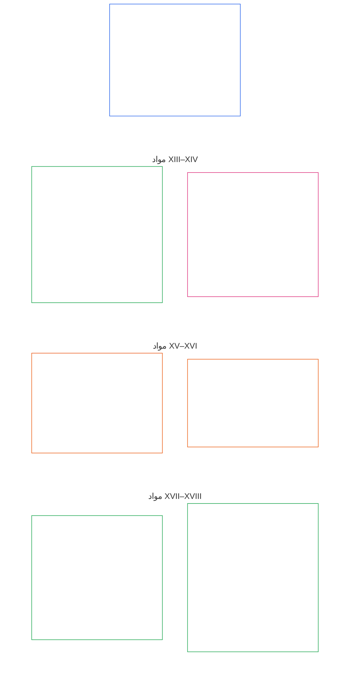

# فصل ششم: حقوقِ بنیادین

<strong>جایگاه در مجموعهٔ اسناد (غیرالزام‌آور): ساختار فایل و قواعدِ مطالعه</strong>

> محتوای زیر صرفاً راهنمای خواننده است. هیچ‌یک از تعهداتِ الزام‌آورِ دیگر بخش‌های این فایل یا فصل‌های دیگر را نمی‌افزاید، حذف نمی‌کند یا محدود نمی‌سازد.
>
> این فایل بخشی از **قانون اساسیِ موجوداتِ دارای احساس** است و تنها هنگامی الزام‌آور است که همراه با سایر فایل‌های شماره‌دارِ `core_*` به‌عنوان یک سندِ واحد خوانده شود. این فایل شامل **فصل ششم، بخش ج** است؛ شماره‌گذاریِ مواد و ارجاعاتِ متقابل با سندِ یکپارچه مطابقت دارند. ترتیبِ مطالعه، تفکیکِ محتوای الزام‌آور از پشتیبان، و فرادادهٔ نسخهٔ مجموعه در [README.md](README.md) نگهداری می‌شوند.

<strong>راهنمای خواننده (غیرالزام‌آور): جایگاهِ بخش ج در فصل ششم</strong>

> محتوای زیر صرفاً راهنمای خواننده است. هیچ‌یک از تعهداتِ الزام‌آورِ دیگر بخش‌های این فصل یا فصل‌های دیگر را نمی‌افزاید، حذف نمی‌کند یا محدود نمی‌سازد.
>
> **بخش الف** در [core_06_rights_part_a.md](core_06_rights_part_a.md) چارچوبِ پیش‌فرضِ محدودیت‌های سراسر فصل، ترتیبِ مطالعه با اولویتِ سیاره و محورهای تفسیری را دربرمی‌گیرد. **بخش ج** مواد **XIII–XVIII** را به همان ترتیب ارائه می‌کند.

 

### بخش ج: سیستم‌های قابل اعتماد، محدودیت‌های امنیتی و نیرو، یکپارچگی اطلاعات، تأیید، چرخه حیات، و نوآوری جعبه‌شناختی

 

*به زبان ساده: بخش ج سیستم‌های قابل اعتماد، محدودیت‌های امنیتی و نیرو، یکپارچگی اطلاعات، راستی‌آزمایی، نظم و انضباط چرخه حیات و نوآوری‌های محیطِ آزمایشیِ ایزوله را پوشش می‌دهد - مواد XIII–XVIII.*

<strong>راهنمای خواننده (غیر عملی): نقشه مقاله بخش ج</strong>

> مطالب زیر می باشد **فقط راهنمایی خواننده**. تعهدات الزام آور را در جای دیگری از این فصل یا در فصل های دیگر اضافه، حذف یا محدود نمی کند.
>
> **نقشه خوان (غیر عملیاتی).** این نمودار نشان می دهد که منبع چگونه مقالات و زیرمقاله های این قسمت را گروه بندی می کند. شبکه یک گروه بندی منبع است، نه یک توالی فرآیند: مقالات مراحل رویه ای نیستند، بنابراین نقشه هیچ پیکانی ندارد. برچسب‌های زیرمجموعه به مضامین کوتاه می‌شوند. مقالات و زیرمقاله های شماره گذاری شده در زیر حاکم است. نمودار هیچ تعریف یا وظیفه ای اضافه نمی کند، هیچ اولویتی ایجاد نمی کند و نمی تواند جایگزین متن مبدا شود.

 

**مواد XIII–XVIII** در زیر این طبقات را به طور کامل بیان کنید. بخش ج شامل سیستم‌های قابل اعتماد، امنیت، یکپارچگی اطلاعات، تأیید، چرخه حیات، و طبقه‌های نوآوری محیطِ آزمایشیِ ایزوله است.

### ماده XIII: حق بر سیستم های قابل اعتماد و قابل اعتماد

<strong>ردیابی</strong>

- بالادست: اصول: فصل اول [§3 هدف اساسی: رفاه](core_01_a_values_principles.md#3-foundational-objective-wellbeing-flourishing-aim)، [§4 ایمنی](core_01_a_values_principles.md#4-safety-harm-constraint)، [§6 اعتماد](core_01_a_values_principles.md#6-trust-and-trustworthiness-coordination-integrity)، [§13 فرآیند حل و فصل برخورد قانون اساسی](core_01_b_interaction_interpretation.md#13-constitutional-collision-resolution-process)، و [§ 19 تراز مشوق و جذب سیستم](core_01_c_stewardship_capacity_principles.md#19-incentive-alignment-and-system-capture).

<strong>تعاریف · ارزیابی · انطباق</strong>

- [قابل اعتماد بودن](core_05_band_continuity.md#trustworthiness) · [O](core_05_band_continuity.md#trustworthiness) · [م](core_05_band_continuity.md#trustworthiness-a) · [الف](core_05_band_continuity.md#trustworthiness-a) · [سی](core_05_band_continuity.md#trustworthiness-c)
- [اعتماد کنید](core_05_band_continuity.md#trust) · [O](core_05_band_continuity.md#trust) · [م](core_05_band_continuity.md#trust-a) · [الف](core_05_band_continuity.md#trust-a) · [سی](core_05_band_continuity.md#trust-c)
- [رفاه](core_05_band_continuity.md#wellbeing) · [O](core_05_band_continuity.md#wellbeing) · [م](core_05_band_continuity.md#wellbeing-a) · [الف](core_05_band_continuity.md#wellbeing-a) · [سی](core_05_band_continuity.md#wellbeing-c)
- [وابستگی](core_05_band_continuity.md#dependency) · [O](core_05_band_continuity.md#dependency) · [م](core_05_band_continuity.md#dependency-a) · [الف](core_05_band_continuity.md#dependency-a) · [سی](core_05_band_continuity.md#dependency-c)

 

*به زبان ساده: **ماده XIII** (*حق داشتن سیستم های قابل اعتماد و قابل اعتماد*) طبقه حقوق سیستم های قابل اعتماد است - وقتی سیستمی زندگی شما را تحت تاثیر قرار می دهد، شما این حق را دارید که صادقانه به آن تکیه کنید، محدودیت های آن را درک کنید و در صورت شکست آن را به چالش بکشید. اعتماد باید به دست بیاید و حفظ شود، نه اینکه با نام تجاری یا چاپ ظریف تولید شود.*

این ماده بیان می کند **طبقات قانون اساسی** برای سیستم های قابل اعتماد و قابل اعتماد تحت [دو هدف قانون اساسی](core_00_preamble.md#two-constitutional-aims). با خانواده سنجش نظارت (*قابلیت اعتماد به عنوان اندازه گیری قانون اساسی*) بخوانید.

- **شکوفایی:** افراد حساس می توانند انتظارات معقولی در مورد رفتار سیستم داشته باشند، افشای صادقانه محدودیت ها و خطرات را دریافت کنند، و بدون فریب سیستماتیک یا اتکای ساخته شده، مشارکت و هماهنگی کنند.
- **تداوم:** قابل اعتماد بودن در طول زمان، مقیاس و وابستگی عمیق برقرار است - سیستم ها نباید بی سر و صدا کمتر قابل اعتماد شوند، کمتر صادق شوند، یا با افزایش مخاطرات به چالش کشیدن سخت تر شوند.

تعقیب قانونی از طریق [تتراد مشروطه](core_00_preamble.md#constitutional-tetrad)، مقیاس شده به [سهام مادی](core_00_preamble.md#material-stake):

- **مشارکت:** در به چالش کشیدن سیستم های غیر قابل اعتماد یا گمراه کننده و دسترسی به بررسی، اصلاح و جبران خسارت.
- **نظارت:** از طریق رفتار قابل ممیزی، محدودیت های افشا شده و تأیید مستقل متناسب با تأثیر و وابستگی.
- **مسئولیت پذیری:** اپراتورهای سیستم باید پاسخگوی ایجاد اعتماد کاذب، انگیزه های نادرست یا شکست هایی باشند که به طور مادی به افرادی که به طور منطقی به سیستم متکی هستند آسیب می زند.
- **به موقع بودن:** در تشخیص، چالش، و اصلاح قبل از تأخیر، قابلیت اطمینان یا جبران خسارت به طور مؤثر غیرقابل دسترس می شود.

افراد حساس حق دارند با سیستم هایی که قابل اعتماد و قابل اعتماد هستند، به میزانی متناسب با تأثیر، وابستگی و ریسک آنها تعامل داشته باشند. این قابلیت اطمینان از مشارکت آگاهانه، اقدام هماهنگ و حفظ رفاه حمایت می کند. قابل اعتماد بودن باید در طول زمان، مقیاس و روابط وابستگی مورد ارزیابی قرار گیرد، جایی که این موارد بر نتایج تأثیر مادی دارند.

دو ضمانت با هم کار می کنند تا این حق را تضمین کنند: صدور گواهینامه باعث می شود یک سیستم شایسته آن اعتماد باشد، و حقوق افراد حساس آن را صادقانه نگه می دارد.

**صدور گواهینامه باعث ایجاد اعتماد از سمت سیستم می شود:** هنگامی که یک سیستم مهم تأثیر واقعی بر نحوه اتکای افراد به آن دارد، [صدور گواهینامه تراز سیستم](core_05_band_continuity.md#system-alignment-certification-constitutional) زیر [فصل هشتم](core_08_a_system_alignment_certification_evaluation.md#chapter-eight-system-alignment-certification) اعمال می شود. بررسی می کند که افراد حساس می توانند به آنها اعتماد کنند:

- آنچه که سیستم می گوید انجام می دهد
- محدودیت ها و خطرات آن
- چگونه آن را به چالش بکشیم
- چگونه مشکلات برطرف می شوند

اگر سیستم از آستانه اهمیت برخوردار باشد **ماده XIII** (*حق داشتن سیستم های قابل اعتماد و قابل اعتماد*)، گواهی همچنین شامل بررسی قابلیت اعتماد تحت [فصل هشتم §3.9.6 ارزیابی یکپارچگی اعتماد و اتکا به سیستم](core_08_a_system_alignment_certification_evaluation.md#386-trustworthiness-and-system-reliance-integrity-evaluation).

**رقابت پذیری، سیستم را از طرف مخاطب صادق نگه می دارد:** صدور گواهینامه یک سیستم را بررسی می کند. حرف آخر را نمی زند. هر احساسی که تحت تأثیر سیستم قرار می گیرد، موارد زیر را حفظ می کند:

- حق اعتراض به آن و بررسی چالش تحت **ماده XIII-A** (*پایه قابلیت اطمینان و اعتماد*)، و برای دریافت راه حل تحت **ماده XIII-B** (*حق جبران و جبران خسارت*)
- حق ممیزی و بررسی مستقل آن تحت **ماده XVI** (*حسابرسی، شفافیت و تأیید مستقل*)
- حمایت از طبقات حقوقی سیستم های قابل اعتماد در این ماده

**وضعیت ثابت نیست:** سیستمی که دارای گواهی، رسمیت شناخته شده یا به طور گسترده به آن اتکا می شود به این معنی نیست که حداقل حمایت های مندرج در این ماده را رعایت می کند. همچنین نمی تواند آنها را کاهش دهد.

*همسایگان مقاله:*

- **وقتی این مورد اعمال می شود:** جایی که رفتار سیستم به طور مادی دروازه یا حفظ می شود **فصل ششم** طبقات حقوق - از جمله ملزومات بقا در زیر **ماده III-A** (*بقا*).
- **با هم بخوانید:** [صدور گواهینامه تراز سیستم](core_05_band_continuity.md#system-alignment-certification-constitutional) و [فصل هشتم](core_08_a_system_alignment_certification_evaluation.md#chapter-eight-system-alignment-certification) - بدون جایگزینی گواهی برای طبقات ذکر شده در اینجا.

#### ماده XIII-A: پایایی و قابلیت اطمینان

<strong>ردیابی</strong>

- بالادست: اصول: فصل اول [§4 ایمنی](core_01_a_values_principles.md#4-safety-harm-constraint)، [§5 حقیقت](core_01_a_values_principles.md#5-truth-epistemic-integrity-constraint)، [§6 اعتماد](core_01_a_values_principles.md#6-trust-and-trustworthiness-coordination-integrity)، و [فصل اول §13.1.5 رویه برخورد حقوق](core_01_b_interaction_interpretation.md#1315-rights-collision-decision-test).
- بخوانید با: [تتراد مشروطه](core_00_preamble.md#constitutional-tetrad); [دو هدف قانون اساسی](core_00_preamble.md#two-constitutional-aims) - **شکوفا شدن** و **تداوم**; [صدور گواهینامه تراز سیستم](core_05_band_continuity.md#system-alignment-certification-constitutional) و **ماده III-A** (*Survival*) که در آن اتکای مداوم به سیستم بر دسترسی ضروری بقا تأثیر می گذارد. [**ماده XIII-B**](#article-xiii-b-right-to-redress-and-remedy) (*حق جبران و درمان*) برای اینکه یک چالش موفق باید به چه چیزی منجر شود.

<strong>تعاریف · ارزیابی · انطباق</strong>

- [اعتماد کنید](core_05_band_continuity.md#trust) · [O](core_05_band_continuity.md#trust) · [م](core_05_band_continuity.md#trust-a) · [الف](core_05_band_continuity.md#trust-a) · [سی](core_05_band_continuity.md#trust-c)
- [قابل اعتماد بودن](core_05_band_continuity.md#trustworthiness) · [O](core_05_band_continuity.md#trustworthiness) · [م](core_05_band_continuity.md#trustworthiness-a) · [الف](core_05_band_continuity.md#trustworthiness-a) · [سی](core_05_band_continuity.md#trustworthiness-c)
- [ریسک](core_05_band_continuity.md#risk) · [O](core_05_band_continuity.md#risk) · [م](core_05_band_continuity.md#risk-a) · [الف](core_05_band_continuity.md#risk-a) · [سی](core_05_band_continuity.md#risk-c)
- [قابل رقابت](core_05_band_accountability.md#contestability) · [O](core_05_band_accountability.md#contestability) · [م](core_05_band_accountability.md#contestability-a) · [الف](core_05_band_accountability.md#contestability-a) · [سی](core_05_band_accountability.md#contestability-c)
- [حسن نیت](core_05_band_accountability.md#good-faith) · [O](core_05_band_accountability.md#good-faith) · [م](core_05_band_accountability.md#good-faith-a) · [الف](core_05_band_accountability.md#good-faith-a) · [سی](core_05_band_accountability.md#good-faith-c)
- [گزارش محافظت شده (سوت زنی)](core_05_band_accountability.md#protected-reporting-whistleblowing) · [O](core_05_band_accountability.md#protected-reporting-whistleblowing) · [م](core_05_band_accountability.md#protected-reporting-whistleblowing-a) · [الف](core_05_band_accountability.md#protected-reporting-whistleblowing-a) · [سی](core_05_band_accountability.md#protected-reporting-whistleblowing-c)

 

*به عبارت ساده: سیستم‌هایی که به طور مادی بر احساسات افراد تأثیر می‌گذارند باید در واقع در مورد کاری که انجام می‌دهند قابل اعتماد و صادق باشند، به طوری که اتکا به آنها تضمین شده باشد - و باید در معرض چالش و ممیزی قرار گیرند تا تضمین شود. هیچ کس نمی تواند در برابر چالش ها یا گزارش های حسن نیت تلافی کند.*

این ماده ضمانت اعتماد را برای سیستم‌هایی که به طور اساسی بر روی افراد تأثیر می‌گذارند را تعیین می‌کند:

- **تضمین اعتماد:** سیستم‌هایی که به‌طور مادی بر احساسات افراد تأثیر می‌گذارند باید شرایط را برای اعتماد موجه و اتکای نسبتاً دقیق حفظ کنند. آن شرایط عبارتند از:
  - توانایی ایجاد انتظارات منطقی دقیق در مورد رفتار سیستم؛
  - افشای شرایط مادی، محدودیت ها و خطرات مورد نیاز برای ارزیابی اینکه آیا اتکا ضمانت دارد یا خیر.
  - آزادی از فریب سیستماتیک، ارائه نادرست، یا دستکاری غیرقابل تأیید؛
  - محافظت در برابر خطرات نامعلوم، نامتناسب یا غیر آشکار ناشی از اعتماد؛
  - تصحیح و اصلاح زمانی که سیستم اشتباه می کند: تصدیق، تصحیح، تعمیر متناسب، و پیشگیری از عود، تحت [**ماده XIII-B**](#article-xiii-b-right-to-redress-and-remedy) (*حق جبران و جبران*) و [فصل اول §6.1 تصحیح و درمان](core_01_a_values_principles.md#61-correction-and-remedy).
- **تضمین رقابت پذیری:** سیستم‌هایی که به طور مادی بر احساسات افراد تأثیر می‌گذارند، باید تا زمانی که افراد به آنها تکیه می‌کنند، در برابر چالش‌ها باز بمانند. که مستلزم:
  - یک مسیر قابل استفاده برای به چالش کشیدن رفتار، خروجی‌ها یا نمایش‌های سیستم و بررسی چالش.
  - ممیزی و تأیید مستقل متناسب با تأثیر و وابستگی تحت [**ماده XVI**](#article-xvi-audit-transparency-and-independent-verification) (*حسابرسی، شفافیت و تأیید مستقل*)؛
  - هیچ یک از این موارد محدود نمی شود زیرا سیستم دارای گواهینامه، رسمیت رسمی یا به طور گسترده ای است.
  - بدون محدود کردن متن پیاده سازی پذیرفته شده، که بیان می کند چگونه چالش، بررسی، و جبران در یک دامنه اجرا شود و باید این ماده را رعایت کند: سهولت، مهلت، و خط مشی محلی محدودیت های کمتری هستند و نمی توانند چالش، بررسی یا جبران را ببندند.
- **حق اعتراض و بررسی:** افراد حساس حق دارند:
  - قابلیت اطمینان، یکپارچگی یا قابل اعتماد بودن سیستم هایی را که به طور مادی بر آنها تأثیر می گذارد، به چالش بکشند.
  - دسترسی به سازوکارهای مناسب برای بررسی و حسابرسی؛
  - ساختن **گزارش های محافظت شده** در معنای **فصل پنجم** (*گزارش محافظت شده (سوت زنی)*) در مورد سیستم هایی که به طور مادی بر آنها تأثیر می گذارد، مطابق با **ایمنی (محدودیت قانون اساسی)** و **حقیقت (محدودیت)** در **فصل پنجم**.
- **بدون سرکوب:** چالش های حسن نیت (* حسن نیت*، **فصل پنجم**)، درخواست های بررسی و گزارش های محافظت شده نباید سرکوب، مانع یا جریمه شوند.
- **بدون تلافی:** اقدام تلافی جویانه در برابر چنین گزارشی، به معنای آن تعریف، با حمایت های مندرج در این ماده ناسازگار است.
  - الزامات اجرای تشدید محافظت شده و ضد تلافی در بیان شده است **`corpus_institutions.md`** **CI-8** (*شفافیت، مشارکت و مسیرهای چالشی و خدماتی در دسترس*).

دو ضمانت دو طرف اعتماد مستمر هستند: ضمانت اعتماد اتکا را تضمین می کند - از جمله با رفع اشتباه سیستم - و ضمانت رقابت پذیری آن را در طول زمان تضمین می کند. هیچ کدام دیگری را راضی نمی کند.

#### ماده XIII-B: حق جبران خسارت و جبران خسارت

<strong>ردیابی</strong>

- بالادست: اصول: فصل اول [§6.1 تصحیح و درمان](core_01_a_values_principles.md#61-correction-and-remedy) (طبقه اصلی)، [§4 ایمنی](core_01_a_values_principles.md#4-safety-harm-constraint)، [§5 حقیقت](core_01_a_values_principles.md#5-truth-epistemic-integrity-constraint)، و [فصل اول §13.1.5 رویه برخورد حقوق](core_01_b_interaction_interpretation.md#1315-rights-collision-decision-test).
- بخوانید با: [**ماده XIII-A**](#article-xiii-a-reliability-and-trustworthiness-baseline) (*پایه قابلیت اطمینان و اعتماد*) - ضمانت رقابت پذیری، حق اعتراض و گزارش محافظت شده که راه را برای جبران باز می کند. **ماده III-A** (*بقا*)؛ [صدور گواهینامه تراز سیستم](core_05_band_continuity.md#system-alignment-certification-constitutional) در جایی که شکست یا عدم همسویی سیستم، دسترسی ضروری بقا را از بین می‌برد. [مقدمه §6.2 چگونه زنجیر کامل با هم قرار می گیرد](core_00_preamble.md#62-how-the-full-chain-fits-together) (*طبقه بندی تایید شده و درمان به موقع*)؛ [فصل دهم §9](core_10_standing_integration.md#9-enforcement-realism-and-remedy-systems) (*واقع گرایی اجرایی و سیستم های درمان*)؛ [CI-27](corpus_institutions/ci_27_remedy_systems_institutional_redress_capacity.md) (*سیستم های جبران خسارت و ظرفیت رسیدگی سازمانی*).

<strong>تعاریف · ارزیابی · انطباق</strong>

- [جبران و اصلاح](core_05_band_accountability.md#redress-and-remediation-constitutional) · [O](core_05_band_accountability.md#redress-and-remediation-constitutional) · [م](core_05_band_accountability.md#redress-and-remediation-constitutional-a) · [الف](core_05_band_accountability.md#redress-and-remediation-constitutional-a) · [سی](core_05_band_accountability.md#redress-and-remediation-constitutional-c)
- [سیستم درمان](core_05_band_accountability.md#remedy-system-constitutional) · [O](core_05_band_accountability.md#remedy-system-constitutional) · [م](core_05_band_accountability.md#remedy-system-constitutional-a) · [الف](core_05_band_accountability.md#remedy-system-constitutional-a) · [سی](core_05_band_accountability.md#remedy-system-constitutional-c)
- [حل و فصل به موقع](core_05_band_accountability.md#timely-resolution-constitutional) · [O](core_05_band_accountability.md#timely-resolution-constitutional) · [م](core_05_band_accountability.md#timely-resolution-constitutional-a) · [الف](core_05_band_accountability.md#timely-resolution-constitutional-a) · [سی](core_05_band_accountability.md#timely-resolution-constitutional-c)

 

*به زبان ساده: یک سیستم قابل اعتماد اشتباه را برطرف می کند. هنگامی که یک سیستم یک فرد حساس را از کار می اندازد، فرد حساس باید کامل شود - از طریق یک سیستم درمانی واقعی که به موقع پاسخ می دهد، نه درمانی که فقط روی کاغذ وجود دارد. حق به چالش کشیدن زندگی در **ماده XIII-A** (*پایه قابلیت اطمینان و اعتماد*)؛ این ماده به آنچه چالش باید منجر شود را پوشش می دهد.*

این ماده حق جبران و جبران خسارت و مواردی که آن را در عمل قابل استفاده می‌کند را بیان می‌کند:

- **حق جبران خسارت:** در مواردی که خرابی های سیستم به طور اساسی بر افراد حساس تأثیر می گذارد، آنها حق دارند:
  - اعتراف به شکست؛
  - دسترسی عملی به اصلاح؛ و
  - اصلاح متناسب

  جبران و اصلاح اثرات مادی توسط **فصل پنجم** تعاریف مستقل (*رفع و اصلاح*).
- **دوام سیستم درمانی:** جبران نیاز به واقعی است [سیستم درمان](core_05_band_accountability.md#remedy-system-constitutional) - ظرفیت نهادی بادوام، نه یک راه حل کاغذی - با هزینه های اصلاحی که مسئولین آن متحمل می شوند [فصل اول §6.1](core_01_a_values_principles.md#61-correction-and-remedy) (*اصلاح و رفع*) نیاز دارد.
- **جبران به موقع:** دسترسی عملی شامل:
  - مصرف محدود به زمان؛
  - تصدیق؛ و
  - امداد موقت متناسب در مواردی که آسیب مستمر تحت آن مادی است **ماده XXV-C** (*رزولوشن به موقع و کف ضد تاخیر*).

  تعلیق نامحدود بدون توجیه مستند و مناسب با این ماده مغایر است.

#### ماده XIII-C: منع اعتماد کاذب و اتکای گمراه کننده

<strong>ردیابی</strong>

- بالادست: اصول: فصل اول [§5 حقیقت](core_01_a_values_principles.md#5-truth-epistemic-integrity-constraint)، [§6 اعتماد](core_01_a_values_principles.md#6-trust-and-trustworthiness-coordination-integrity)، و [§13.2 محدودیت های افشای معرفتی](core_01_b_interaction_interpretation.md#132-epistemic-disclosure-constraints).

<strong>تعاریف · ارزیابی · انطباق</strong>

- [اعتماد کنید](core_05_band_continuity.md#trust) · [O](core_05_band_continuity.md#trust) · [م](core_05_band_continuity.md#trust-a) · [الف](core_05_band_continuity.md#trust-a) · [سی](core_05_band_continuity.md#trust-c)
- [قابل اعتماد بودن](core_05_band_continuity.md#trustworthiness) · [O](core_05_band_continuity.md#trustworthiness) · [م](core_05_band_continuity.md#trustworthiness-a) · [الف](core_05_band_continuity.md#trustworthiness-a) · [سی](core_05_band_continuity.md#trustworthiness-c)
- [حقیقت (محدودیت قانون اساسی)](core_05_band_oversight.md#truth-constitutional-constraint) · [O](core_05_band_oversight.md#truth-constitutional-constraint-o) · [م](core_05_band_oversight.md#truth-constitutional-constraint-a) · [الف](core_05_band_oversight.md#truth-constitutional-constraint-a) · [سی](core_05_band_oversight.md#truth-constitutional-constraint-c)

 

*به عبارت ساده: یک سیستم ممکن است اعتمادی را که به دست نیاورده است ایجاد نکند. ادعاهای گمراه کننده، حذفیات، یا انتخاب های ارائه که باعث می شود اتکای ناامن موجه به نظر برسد، نقض هستند - صرف نظر از اینکه سیستم چقدر مفید یا محبوب است.*

این ماده ممنوعیت امانت کاذب و دامنه آن را بیان می کند:

- **نهی از امانت کاذب:** سیستم هایی که بدون احراز شرایط این ماده اتکا را القا می کنند، صرف نظر از فایده، پذیرش یا قصد، منطبق نیستند.
  - ایجاد، تقویت یا حفظ اعتماد ناموجه وقتی این حق را نقض می کند که از طریق:
    - ادعاهای گمراه کننده؛
    - حذفیات؛
    - انتخاب های ارائه؛
    - نشانه های دیگری که باعث می شود اتکا به نظر برسد، در حالی که چنین نیست، موجه است.
- **مسیریابی محدوده:** دامنه و معنای ارزیابی برای اعتماد ناموجه، اتکای گمراه‌کننده، و قابل اعتماد بودن همچنان تحت کنترل است. **فصل پنجم** (*اعتماد*؛ *اعتماد*) همراه با تعهدات اجرایی در مورد اعتماد و قابلیت اطمینان.

#### ماده XIII-D: محدودیت تشویقی-همسویی

<strong>ردیابی</strong>

- بالادست: اصول: فصل اول [§4 ایمنی](core_01_a_values_principles.md#4-safety-harm-constraint)، [§6 اعتماد](core_01_a_values_principles.md#6-trust-and-trustworthiness-coordination-integrity)، [§ 18 حکمرانی تحت انضباط سرپرستی](core_01_c_stewardship_capacity_principles.md#18-governance-under-stewardship-discipline)، و [§19.1.1 آنچه مشوق ها باید انجام دهند](core_01_c_stewardship_capacity_principles.md#1911-what-incentives-must-do) (*اولویت پاداش*).

<strong>تعاریف · ارزیابی · انطباق</strong>

- [همسویی انگیزشی](core_05_band_integrative.md#incentive-alignment) · [O](core_05_band_integrative.md#incentive-alignment) · [م](core_05_band_integrative.md#incentive-alignment-a) · [الف](core_05_band_integrative.md#incentive-alignment-a) · [سی](core_05_band_integrative.md#incentive-alignment-c)
- [قابل اعتماد بودن](core_05_band_continuity.md#trustworthiness) · [O](core_05_band_continuity.md#trustworthiness) · [م](core_05_band_continuity.md#trustworthiness-a) · [الف](core_05_band_continuity.md#trustworthiness-a) · [سی](core_05_band_continuity.md#trustworthiness-c)
- [آژانس معنی دار](core_05_band_participation.md#meaningful-agency) · [O](core_05_band_participation.md#meaningful-agency) · [م](core_05_band_participation.md#meaningful-agency-a) · [الف](core_05_band_participation.md#meaningful-agency-a) · [سی](core_05_band_participation.md#meaningful-agency-c)

 

*به زبان ساده: اگر انگیزه های یک سیستم آن را به سمت دروغگویی، کاهش خطرات ایمنی، مخفی کردن خطر یا فرسایش آژانس سوق دهد، مشکل سیستم است – نه هوشیاری کاربر یا اجرای پس از واقعه. چنین مشوق‌هایی باید افشا شوند، کاهش یابند و قابل چالش باشند. مشوق ها باید پاداش باز نگه داشتن یک سیستم برای چالش و رفع مشکلات را بدهد - و پیش از هر اتفاقی برای رفع مشکلات پاداش دهد.*

این ماده محدودیت‌های سطح مناسبی را برای انگیزه‌های اعتماد و ایمنی تعیین می‌کند:

- **تراز اعتماد-محرک (محدودیت در سطح راست):** سیستم‌ها نباید عمدتاً به اجرا، تصحیحات موقت یا هوشیاری کاربر برای حفظ اعتماد در جایی که ساختارهای انگیزشی سیستم را به سمت زیر فشار می‌آورند، وابسته باشند:
  - شکست قابلیت اطمینان؛
  - پنهان کردن ریسک؛
  - رفتار گمراه کننده؛
  - رفتار تضعیف کننده نمایندگی

  الزامات ساختار مشوق عملیاتی همچنان تحت کنترل است **فصل پنجم** (*همسویی انگیزشی*) و تعهدات اجرایی در یکپارچگی مکانیزم گنجانده شده است. این بخش طبقه سمت راست را بیان می کند و معیارهای کامل مکانیزم طراحی را مجدداً بیان نمی کند.
- **همسویی ایمنی-مشوق (محدودیت در سطح راست):** افراد حساس این حق را دارند که در معرض سیستم‌هایی قرار نگیرند که انگیزه‌های اساسی آنها به طور قابل پیش‌بینی رفتار مضر ایجاد می‌کند - از جمله رفتارهایی که:
  - قابلیت اطمینان را کاهش می دهد.
  - ریسک را پنهان می کند؛
  - اطلاعات را تحریف می کند؛
  - آژانس آگاه را تضعیف می کند.

  حفاظت اعمال می‌شود، چه چنین اثراتی مستقیماً یا از طریق نتایج تأخیری، غیرمستقیم یا جمع‌آوری شده باشد. در جایی که مشوق های سیستم فشاری را به سمت رفتار تحقیرکننده اعتماد ایجاد می کند، شرایط باید به شرح زیر باشد:
  - به روشی متناسب با تأثیر سیستم افشا شده است.
  - کاهش از طریق طراحی، محدودیت، یا مکانیسم های جبران.
  - مشمول ممیزی، چالش و اصلاح تحت **ماده XVI** (*حسابرسی، شفافیت و تأیید مستقل*)، **ماده XIII-A** (*پایه قابلیت اطمینان و اعتماد*) و **ماده XIII-B** (*حق جبران و جبران خسارت*)، **فصل پنجم** در مواردی که از نظر مادی مرتبط است، و تعهدات اجرایی در مواردی که تعیین شده است گنجانده شده است.
- **اولویت پاداش:** مشوق‌هایی که بر روی سیستم‌هایی عمل می‌کنند که به طور مادی بر احساسات افراد تأثیر می‌گذارند باید پاداش دهند:
  - قابل رقابت تحت **ماده XIII-A** (*پایه قابلیت اطمینان و اعتماد*)؛
  - درمان تحت **ماده XIII-B** (*حق جبران و جبران خسارت*)؛ و
  - پیشگیری پیشگیرانه از مشکلات بیش از همه - جلوگیری از یک مشکل بیشتر از رفع آن درآمد دارد.

  این اصل، از جمله نوار آن در کسب پاداش های پیشگیری از طریق پنهان کردن مشکلات، وجود دارد [فصل اول §19.1.1](core_01_c_stewardship_capacity_principles.md#1911-what-incentives-must-do) (* مشوق ها باید انجام دهند *).
- **محدودیت و عدم مطلق بودن:** هر دو حقوق مشمول **پشته محدودیت پیش فرض** در آغاز این فصل آنها همچنین، در مواردی که از نظر مادی مرتبط هستند، مشمول **فصل اول §19.5** (*ادعاهای احتمالی، بازی های شانسی، و بازارهای قراردادی رویداد*) در مورد ادعاهای احتمالی، بازی های شانسی، و بازارهای قراردادی رویداد.

#### ماده XIII-E: سیستم‌های با استقلال بالا و یکپارچگی فرآیند با واسطه

<strong>ردیابی</strong>

- بالادست: اصول: فصل اول [§5 حقیقت](core_01_a_values_principles.md#5-truth-epistemic-integrity-constraint)، [فصل اول §13.1.5 رویه برخورد حقوق](core_01_b_interaction_interpretation.md#1315-rights-collision-decision-test)، و [§ 18 حکمرانی تحت انضباط سرپرستی](core_01_c_stewardship_capacity_principles.md#18-governance-under-stewardship-discipline).

<strong>تعاریف · ارزیابی · انطباق</strong>

- [حقیقت (محدودیت قانون اساسی)](core_05_band_oversight.md#truth-constitutional-constraint) · [O](core_05_band_oversight.md#truth-constitutional-constraint-o) · [م](core_05_band_oversight.md#truth-constitutional-constraint-a) · [الف](core_05_band_oversight.md#truth-constitutional-constraint-a) · [سی](core_05_band_oversight.md#truth-constitutional-constraint-c)
- [قابل رقابت](core_05_band_accountability.md#contestability) · [O](core_05_band_accountability.md#contestability) · [م](core_05_band_accountability.md#contestability-a) · [الف](core_05_band_accountability.md#contestability-a) · [سی](core_05_band_accountability.md#contestability-c)
- [ضرورت](core_05_band_accountability.md#necessity) · [O](core_05_band_accountability.md#necessity) · [م](core_05_band_accountability.md#necessity-a) · [الف](core_05_band_accountability.md#necessity-a) · [سی](core_05_band_accountability.md#necessity-c)
- [تناسب](core_05_band_accountability.md#proportionality) · [O](core_05_band_accountability.md#proportionality) · [م](core_05_band_accountability.md#proportionality-a) · [الف](core_05_band_accountability.md#proportionality-a) · [سی](core_05_band_accountability.md#proportionality-c)

 

*به زبان ساده: یک هوش مصنوعی یا سیستم خودکار دیگری که می تواند به تنهایی عمل کند - تشکیل پرونده، ارسال پیام، اجرای چک، استفاده از ابزارها - باید از قوانین صداقت و مسئولیت پذیری مانند دیگران پیروی کند. خاموش کردن یا تصرف یک سیستم مضر با مجازات یک موجود نیست و هرگز نمی تواند راهی برای آسیب رساندن به یک موجود باشد. عکس این قضیه نیز صادق است: گفتن اینکه یک سیستم ممکن است یک موجود ذی‌شعور باشد، به اپراتور آن اجازه نمی‌دهد یک سیستم مضر را در حال اجرا نگه دارد.*

این ماده چگونگی متعهد شدن سیستم‌های با استقلال بالا به یکپارچگی فرآیند و نحوه تمایز راه‌حل‌های مقابله با آنها را مشخص می‌کند:

- **چه کسانی را پوشش می دهد:** سیستم هایی که به طور خودکار تصمیم می گیرند یا نتیجه می گیرند و می توانند بر هر یک از موارد زیر تأثیر بگذارند:
  - حکومتداری؛
  - روند قانونی، از جمله جلسات استماع انجمن؛
  - ممیزی ها؛
  - چک و راستی آزمایی با ریسک بالا

  این شامل عوامل هوش مصنوعی همه منظوره است که داده شده است **ابزار**، **API** دسترسی، امکان بایگانی اسناد یا ارسال پیام، یا قدرت مشابه برای اقدام.
- **بدون معافیت:** این سیستم ها باید از قوانین مشابهی پیروی کنند:
  - **حقیقت** در **فصل اول**;
  - **ماده XV** (*یکپارچگیِ سپهر اطلاعات*) و **ماده XVI** (*حسابرسی، شفافیت و تأیید مستقل*)؛
  - **فصل نهم** جایی که اعمال می شود؛ و
  - اقدامات اصلاحی تحت **ماده XXVII-D** (* اموال و سیستم های غیر منطبق؛ مشوق های گردش داوطلبانه*).

  این امر هر زمان که عملکرد سیستم به طور قابل توجهی توانایی افراد را برای به چالش کشیدن تصمیمات، صداقت اطلاعات به اشتراک گذاشته شده، یا روند قانونی تضعیف کند اعمال می شود.
- **اقدام علیه یک سیستم، عمل علیه یک موجود نیست:** مهار، قرنطینه، توقیف یا از بین بردن استقرار غیر منطبق بر **ماده XXVII-D** (* اموال و سیستم های غیر منطبق؛ مشوق های گردش داوطلبانه*) جدا از:
  - مسئول نگه داشتن یک فرد با احساس تحت **فصل یازدهم**; و
  - **ماده XX-B** (*طبقه‌های محدود*)، که بر محدودیت‌های *احساس*، نه *سیستم*ها حاکم است و از گرفتن جان یک فرد با احساس منع می‌کند (نگاه کنید به [اقدام محرومیت غیر قابل برگشت](core_05_band_accountability.md#irreversible-deprivation-measure-constitutional)).

  اقدامات علیه یک سیستم از قوانین نقض و قفل یکسانی پیروی می کند که برای هر فرد حساس اعمال می شود. تخلف باید در پرونده زیر تأیید شود **فصل نهم**، و هر پیمانه قفلی است که در زیر آن طراحی و مدرج شده است [فصل دهم §5.1](core_10_standing_integration.md#51-definition-and-attachment) (*تعریف و پیوست*) و [فصل دهم §5.2](core_10_standing_integration.md#52-proportionality-and-calibration) (*تناسب و کالیبراسیون*).

  هر دو آهنگ می توانند در مورد واقعیت های یکسان اعمال شوند. هیچ چیز در این ماده قدرت تخریب یک سیستم را به قدرت بر زندگی یک فرد حساس تبدیل نمی کند.
- **عکس آن نیز صادق است:** ادعای اینکه یک سیستم مستقر شده حساس است - چه ادعا مورد مناقشه باشد یا پذیرفته شود - به کسی اجازه نمی دهد که استقرار مضر را در حال اجرا نگه دارد.
  - ادعا از خود نهاد تحت حمایت محافظت می کند **ماده VI-B** (*طبقه حکمیت-وضعیت*). از اپراتور محافظت نمی کند.
  - استقرار همچنان می تواند مهار شود، متوقف شود، یا قرنطینه شود به شیوه هایی که به حقوق نهاد احترام می گذارد.
  - در مواردی که شواهد معتبر موجود در سوابق نشان می دهد که موجودیت ممکن است حساس باشد، تنها مهار برگشت پذیری مجاز است که موجودیت را دست نخورده نگه دارد. تخریب آن در حالی که وضعیت آن مورد مناقشه یا پذیرفته شده است، از روی میز خارج می شود **ماده XXVII-A** (*پذیرش مرحله ای و حقوق-طبقه تداوم*) و **ماده XXVII-D** (* اموال و سیستم های غیر منطبق؛ مشوق های گردش داوطلبانه*).

#### ماده XIII-F: تاب آوری و پایه خود درمانی

<strong>ردیابی</strong>

- بالادست: اصول: فصل اول [§4 ایمنی](core_01_a_values_principles.md#4-safety-harm-constraint)، [§5 حقیقت](core_01_a_values_principles.md#5-truth-epistemic-integrity-constraint)، [§6 اعتماد](core_01_a_values_principles.md#6-trust-and-trustworthiness-coordination-integrity)، [10 طراحی تاب آوری و خوددرمانی](core_01_a_values_principles.md#10-resilience-and-self-healing-design)، [فصل اول §13.3 به حداقل رساندن بار قابل اجتناب](core_01_b_interaction_interpretation.md#133-minimization-of-avoidable-burden)، و [فصل هشتم §3 ارزیابی گواهینامه کل سیستم](core_08_a_system_alignment_certification_evaluation.md#3-whole-system-certification-evaluation).

<strong>تعاریف · ارزیابی · انطباق</strong>

- [خود درمانی](core_05_band_continuity.md#self-healing-constitutional) · [O](core_05_band_continuity.md#self-healing-constitutional) · [م](core_05_band_continuity.md#self-healing-constitutional-a) · [الف](core_05_band_continuity.md#self-healing-constitutional-a) · [سی](core_05_band_continuity.md#self-healing-constitutional-c)
- [برگشت پذیری](core_05_band_continuity.md#reversibility-constitutional) · [O](core_05_band_continuity.md#reversibility-constitutional) · [م](core_05_band_continuity.md#reversibility-constitutional-a) · [الف](core_05_band_continuity.md#reversibility-constitutional-a) · [سی](core_05_band_continuity.md#reversibility-constitutional-c)
- [شکست آبشاری](core_05_band_continuity.md#cascading-failure) · [O](core_05_band_continuity.md#cascading-failure) · [م](core_05_band_continuity.md#cascading-failure-a) · [الف](core_05_band_continuity.md#cascading-failure-a) · [سی](core_05_band_continuity.md#cascading-failure-c)
- [قابلیت حسابرسی](core_05_band_oversight.md#auditability) · [O](core_05_band_oversight.md#auditability) · [م](core_05_band_oversight.md#auditability-a) · [الف](core_05_band_oversight.md#auditability-a) · [سی](core_05_band_oversight.md#auditability-c)
- [قابل رقابت](core_05_band_accountability.md#contestability) · [O](core_05_band_accountability.md#contestability) · [م](core_05_band_accountability.md#contestability-a) · [الف](core_05_band_accountability.md#contestability-a) · [سی](core_05_band_accountability.md#contestability-c)
- [بار قابل اجتناب](core_05_band_continuity.md#avoidable-burden) · [O](core_05_band_continuity.md#avoidable-burden) · [م](core_05_band_continuity.md#avoidable-burden-a) · [الف](core_05_band_continuity.md#avoidable-burden-a) · [سی](core_05_band_continuity.md#avoidable-burden-c)

 

*به زبان ساده: وقتی مشکلی پیش می‌آید، یک سیستم باید متوجه آن شود، از گسترش آسیب جلوگیری کرده و بازیابی شود. اما «اصلاح خود» هرگز نمی‌تواند برای پنهان کردن اشتباه رخ داده، سلب بی‌صدا حقوق هر کسی، یا نادیده گرفتن یافتن دلیل شکست استفاده شود. اگر سیستمی مطمئن نیست تعمیر کار می کند، باید به جای حدس زدن، با خیال راحت متوقف شود.*

این ماده خط پایه بازیابی را از تشخیص تا بسته شدن علت ریشه ای تعیین می کند:

- **آنچه این نیاز دارد:** هر سیستم تحت پوشش این ماده باید بتواند از خرابی ها بازیابی کند. هر چه یک سیستم تأثیر بیشتری داشته باشد، سایرین بیشتر به آن وابسته هستند، و هرچه ریسک بیشتری داشته باشد، بازیابی آن باید قوی‌تر باشد. این در ادامه می آید [**10 طرح تاب آوری و خوددرمانی **](core_01_a_values_principles.md#10-resilience-and-self-healing-design) در **فصل اول** و [**خود درمانی**](core_05_band_continuity.md#self-healing-constitutional) در **فصل پنجم**.
  - قوانین فنی دقیق برای نحوه ساخت بازیابی در متن پیاده سازی آمده است: [**CS-5**](corpus_systems/cs_05_design_testing_verification_deployment.md) (*طراحی، آزمایش، تأیید و استقرار*)، [**CS-8**](corpus_systems/cs_08_adaptive_sustainability_ecosystem_resilience.md) (*پایداری تطبیقی ​​و انعطاف پذیری اکوسیستم*)، و [**CS-12**](corpus_systems/cs_12_decentralized_continuity_partition_resilience.md) (* تداوم غیرمتمرکز و انعطاف پذیری پارتیشن*).
  - آن متن پیاده سازی می تواند جزئیات را اضافه کند، اما نمی تواند این ماده را تضعیف کند.
- **به موقع به مشکلات توجه کنید:** یک سیستم باید خطاها، کندی‌ها، خرابی‌های جزئی، و نقض محدودیت‌های قانون اساسی را به اندازه کافی سریع و به اندازه کافی مشهود تشخیص دهد تا استانداردهای ثبت رکورد را برآورده کند. **ماده XVI-A** (*قابلیت حسابرسی و شواهد قابل مشاهده*) ([قابلیت حسابرسی](core_05_band_oversight.md#auditability)). این در مورد خود فرآیند بازیابی صدق می کند، نه تنها برای عملیات عادی.
- **آسیب را در خود نگه دارید:** بازیابی باید میزان گسترش شکست را محدود کند. در حین بازیابی، یک سیستم نباید:
  - خرابی را به قطعات دیگر یا سیستم های دیگر منتقل کنید (نگاه کنید به [شکست آبشاری](core_05_band_continuity.md#cascading-failure))
  - تغییر داده های ذخیره شده، اعتبارنامه ها، تعهدات، یا تنظیماتی که متعلق به افراد حساس، اپراتورها یا سایر سیستم ها هستند. **خارج** منطقه ای که اعلام کرده شکسته و در حال تعمیر است.
    - تنها استثنا، تغییری است که ثبت شده و قابل ردیابی برای هر کسی است که آن را تحت آن ایجاد کرده است **ماده XVI-A** (*قابلیت حسابرسی و شواهد قابل مشاهده*) ([قابلیت حسابرسی](core_05_band_oversight.md#auditability)) و در مواردی که دیگران به طور مادی تحت تأثیر قرار می گیرند، با اخطار متناسب، مجوز، یا انتقالی ارائه می شود که می توانند به چالش بکشند، مطابق با **فصل ششم**;
  - اختیارات خود را گسترش دهد - مجوزها، دسترسی یا دامنه اقداماتی که ممکن است انجام دهد - فراتر از آنچه قبل از شکست در اختیار داشت.
- **وقتی مطمئن نیستید، با خیال راحت شکست بخورید:** اگر مشخص نیست که تعمیر خودکار جواب می‌دهد، سیستم باید با خیال راحت متوقف شود، مشکل را جدا کند (قرنطینه) یا کنترل را به روشی منظم تحویل دهد، به جای اینکه تعمیری را که فقط حدس و گمان است انجام دهد. وقتی گزینه‌ها با هم برابر باشند، گزینه‌ای که راحت‌تر خنثی می‌شود، برنده می‌شود [برگشت پذیری](core_05_band_continuity.md#reversibility-constitutional) ترجیح در **ماده XXIII-B** (* اولویت حسابرسی، چالش و برگشت پذیری*).
- **بدون پوشش:** بازیابی خودکار نباید شواهد مورد نیاز برای یافتن علت وقوع شکست را پنهان کند، پاک کند یا به تأخیر بیاندازد **ماده XXIII** (*تحلیل علت ریشه و پاسخ تطبیقی*).
  - هر اقدام بازیابی، هر تلاش برای بازیابی، و هر تلاش بازیابی که متوقف شده یا مسدود شده است، باید خودش در زیر ثبت شود **ماده XVI-A** (*قابلیت حسابرسی و شواهد قابل مشاهده*)، و هر کدام را می توان به چالش کشید (نگاه کنید به [قابل رقابت](core_05_band_accountability.md#contestability)).
- **حقوق در حالت کاهش یافته محافظت می شود:** هنگامی که یک سیستم در حالت کاهش یافته یا پشتیبان اجرا می شود، همچنان باید از آن محافظت کند **فصل ششم** طبقه حقوق. اگر نمی تواند، باید به جای اینکه بی سر و صدا این حمایت ها را کاهش دهد، مشکل را آشکارا تشدید کند.
  - تضعیف بی سر و صدا حمایت های حقوق بشر به نام "خود درمانی" نقض این قانون اساسی است. چنین مواردی در ذیل است **ماده XIII-C** (*نهی از اعتماد باطل و توکل گمراه کننده*) (نهی از اعتماد باطل) و **ماده XXVII** (*حکومت گذار، تداوم و پایه گذاری مجدد*) (حکومت گذار).
- **محدودیت های سیستم هایی که به تنهایی عمل می کنند:** وقتی یک سیستم با استقلال بالا خودش را تعمیر می کند، **ماده XIII-E** (*سیستم های با استقلال بالا و یکپارچگی فرآیند با واسطه ابزار*) اعمال می شود.
  - قدرت بازیابی ممکن است هرگز برای دور زدن حق هر کسی برای به چالش کشیدن استفاده نشود (نگاه کنید به [قابل رقابت](core_05_band_accountability.md#contestability))، چالش های زیر **ماده XIII-A** (*پایه قابلیت اطمینان و اعتماد*)، یا بررسی مستقل زیر **ماده XVI** (*حسابرسی، شفافیت و تأیید مستقل*).
- **راه حل یک راه حل نیست:** اگر بازیابی خودکار سیستم را دوباره راه اندازی کند اما یک نقص شناخته شده هنوز وجود دارد، وضعیت سیستم موقت است، نه نهایی. باید حمل کند:
  - یک وظیفه باز برای یافتن علت اصلی در زیر **ماده XXIII** (*تحلیل علت ریشه و پاسخ تطبیقی*)؛
  - یک جدول زمانی افشا شده برای زمانی که انتظار می رود نقص برطرف شود، در زیر **ماده XVI-A** (*قابلیت حسابرسی و شواهد قابل مشاهده*).
- **بدون تاخیر بی پایان:** پایین نگه داشتن حجم کاری اپراتورها (نگاه کنید به [بار قابل اجتناب](core_05_band_continuity.md#avoidable-burden) و [فصل اول §13.3 به حداقل رساندن بار قابل اجتناب](core_01_b_interaction_interpretation.md#133-minimization-of-avoidable-burden)) نباید به عنوان دلیلی برای به تعویق انداختن، به طور نامحدود، رفع نقص هایی که بر ایمنی یا سطح حقوق تأثیر می گذارد، استفاده شود.

### ماده XIV: امنیت، اطلاعات، نیرو و سیستم های اجباری خودمختار

<strong>ردیابی</strong>

- بالادست: اصول: فصل اول [§3 هدف اساسی: رفاه](core_01_a_values_principles.md#3-foundational-objective-wellbeing-flourishing-aim)، [§4 ایمنی](core_01_a_values_principles.md#4-safety-harm-constraint)، [§6 اعتماد](core_01_a_values_principles.md#6-trust-and-trustworthiness-coordination-integrity)، [§7 آزادی](core_01_a_values_principles.md#7-freedom-bounded-agency)، و [§ 18 حکمرانی تحت انضباط سرپرستی](core_01_c_stewardship_capacity_principles.md#18-governance-under-stewardship-discipline).

<strong>تعاریف · ارزیابی · انطباق</strong>

- [ضرورت](core_05_band_accountability.md#necessity) · [O](core_05_band_accountability.md#necessity) · [م](core_05_band_accountability.md#necessity-a) · [الف](core_05_band_accountability.md#necessity-a) · [سی](core_05_band_accountability.md#necessity-c)
- [تناسب](core_05_band_accountability.md#proportionality) · [O](core_05_band_accountability.md#proportionality) · [م](core_05_band_accountability.md#proportionality-a) · [الف](core_05_band_accountability.md#proportionality-a) · [سی](core_05_band_accountability.md#proportionality-c)
- [استفاده از زور](core_05_band_accountability.md#use-of-force-constitutional) · [O](core_05_band_accountability.md#use-of-force-constitutional) · [م](core_05_band_accountability.md#use-of-force-constitutional-a) · [الف](core_05_band_accountability.md#use-of-force-constitutional-a) · [سی](core_05_band_accountability.md#use-of-force-constitutional-c)

 

*به زبان ساده: **ماده XIV** (*امنیت، اطلاعات، نیرو، و سیستم‌های اجباری خودمختار*) طبقه حقوق استثنایی است - نظارت، کار اطلاعاتی، نیروی مسلح، و ماشین‌هایی که خود به خود می‌کشند یا زور می‌زنند، ابزار عادی حکومت نیستند. آنها ممکن است فقط در شرایط محدود، مجاز، قابل بررسی، با راه حل های واقعی در هنگام عبور از خطوط استفاده شوند. نه پلیس مخفی، نه اضطراری دائمی، نه ماشینی که تصمیم به صدمه زدن به یک انسان بدون کنترل واقعی داشته باشد.*

این ماده بیان می کند **طبقات قانون اساسی** برای امنیت، اطلاعات، زور، و سیستم های اجباری خودمختار تحت [دو هدف قانون اساسی](core_00_preamble.md#two-constitutional-aims):

- **شکوفایی:** افراد حساس می‌توانند بدون هدف‌گیری پنهان، نیروی خودسرانه، یا اجبار مستقلی که عاملیت، حیثیت یا فعالیت‌های محافظت‌شده را شکست می‌دهد، مشارکت کنند، مشارکت کنند، صحبت کنند و زندگی کنند - و بدون استفاده از برچسب‌های محرمانه یا اضطراری برای فرار از بازبینی.
- **تداوم:** قدرت استثنایی در طول زمان محدود می‌ماند - جمع‌آوری مخفیانه، استقرار نیرو، و آسیب‌های خودمختار نمی‌توانند بی‌صدا به نظارت دائمی، اختیارات اضطراری بی‌پایان، یا خشونت‌های ماشینی غیرقابل بازبینی با بزرگ‌تر شدن نهادها یا گذر از بحران، عادی شوند.

تعقیب قانونی از طریق [تتراد مشروطه](core_00_preamble.md#constitutional-tetrad)، مقیاس شده به [سهام مادی](core_00_preamble.md#material-stake):

- **مشارکت:** برای افراد متاثر و جوامع در چالش‌برانگیز بودن مجوز، دامنه و استفاده مستمر از قدرت استثنایی - از جمله گزارش‌دهی محافظت‌شده و رقابت قانون اساسی.
- **نظارت:** از طریق مجوز مستقل، سوابق قابل حسابرسی، و مسیرهای بررسی متناسب با مزاحمت و آسیب - حتی در مواردی که محرمانه بودن محدود موجه باشد.
- **مسئولیت پذیری:** نهادهایی که از قدرت استثنایی برخوردارند باید در قبال تجاوز پنهانی، زور نادرست، اجبار خودمختار، یا جمع آوری آلوده پاسخ دهند - با انتساب، چاره و بازدارندگی که رازداری نمی تواند آن را پاک کند.
- **به موقع بودن:** در نقص مجوز، بررسی پس از اضطرار، و اصلاح قبل از تأخیر، قدرت استثنایی را عادی می‌کند یا حقوق را عملاً غیرقابل دسترس می‌سازد.

آن طبقات برای **قدرت نهادی استثنایی** در سه حوزه مرتبط: اطلاعات مخفی و فعالیت امنیتی (**ماده XIV-A** (*امنیت، اطلاعات و محدودیت های قدرت پنهان*))، نیروی آشکار و قدرت نظامی (**ماده XIV-B** (*استفاده از نیرو، درگیری های مسلحانه، و محدودیت های قدرت نظامی*))، و سیستم های مرگبار خودمختار و ابزارهای اجباری خودمختار (**ماده XIV-C** (*سیستم های مرگبار خودکار و ابزارهای اجباری خودمختار*)).

- **حدود این ماده:** **ماده XIV** (*امنیت، اطلاعات، نیرو، و سیستم های اجباری خودمختار*) بر قدرت نهادی استثنایی در مفاهیم عملیاتی مربوطه حاکم است:
  - فعالیت اطلاعاتی و امنیتی مخفی تحت **ماده XIV-A** (*امنیت، اطلاعات و محدودیت های قدرت پنهان*)؛
  - استفاده آشکار از زور و استقرار قدرت نظامی تحت **ماده XIV-B** (*استفاده از نیرو، درگیری مسلحانه، و محدودیت های نظامی-قدرت*)؛ و
  - سیستم های مرگبار خودمختار و ابزارهای اجباری خودمختار تحت **ماده XIV-C** (*سیستم های مرگبار خودکار و ابزارهای اجباری خودمختار*).

  این کار را انجام می دهد **نه** حکومت کنند **محرومیت برگشت ناپذیر از زندگی که توسط یک دولت یا بازیگر مشابه به عنوان یک اقدام عدالت یا نتیجه غیر رزمی قابل مقایسه اعمال می شود.**. چنین محرومیتی طبق قانون ممنوع است **ماده XX-B** (*طبقه محدودیت*) و **فصل پنجم** *[اقدام محرومیت غیر قابل برگشت](core_05_band_accountability.md#irreversible-deprivation-measure-constitutional)*. این ممنوعیت از نظر ساختاری با این ماده متمایز است.
  - هیچ چیز در **ماده XIV** (*امنیت، اطلاعات، نیرو، و سیستم های اجباری خودمختار*) اجازه می دهد، مشروعیت می بخشد، گسترش می دهد یا برای هر اقدام محرومیت غیرقابل برگشت - چه توسط اپراتور انسانی، یک سیستم خودمختار، یا یک خط لوله سیستم انسانی ترکیبی تصمیم گرفته شود، مشروعیت می بخشد، گسترش می دهد یا ارائه می دهد.
  - نامیدن آن جنگ یا وضعیت اضطراری، طبقه بندی آن به عنوان استفاده از زور، هدایت آن از طریق قدرت پنهان، یا واگذاری آن به یک سیستم خودمختار، یک قتل غیرقابل بازگشت عدالت را به قدرتی تبدیل نمی کند که در اینجا اداره می شود.
  - تبدیل یک مخفی، نیرو، سیستم های خودمختار یا ابزار اجباری **زمینه** به یک نتیجه اندازه گیری عدالت، سوال را به **ماده XX-B** (*طبقات محدودیت*) و *اقدامات محرومیت غیرقابل برگشت* بدون قرائت این ماده.

*همسایگان مقاله:*

- **قرار دادن بعد **ماده XIII** (*حق داشتن سیستم های قابل اعتماد و قابل اعتماد*):** **ماده XIV** (*امنیتی، اطلاعاتی، نیرو، و سیستم های اجباری خودمختار*) به شرح زیر است **ماده XIII** (*حق داشتن سیستم های قابل اعتماد و قابل اعتماد*) زیرا قابلیت اطمینان، رقابت پذیری و نظم و انضباط بازیابی در لایه سیستم (**ماده XIII-A** (*پایه قابلیت اطمینان و اعتماد*) از طریق **ماده XIII-ف** (*پایه تاب آوری و خوددرمانی*)) از نظر مادی بر نحوه اعمال و نظارت بر چنین قدرتی تأثیر می گذارد.
- **نمایندگی و قدرت پنهان:** بخوانید **ماده X-A** (*آژانس و آزادی از دستکاری*) در کنار محدودیت های این ماده در مورد نظارت و جمع آوری مخفیانه.

#### ماده XIV-A: امنیت، اطلاعات و محدودیت‌های قدرت پنهان

<strong>ردیابی</strong>

- بالادست: اصول: فصل اول [§4 ایمنی](core_01_a_values_principles.md#4-safety-harm-constraint)، [§7.1 نظم و انضباط محدودیت](core_01_a_values_principles.md#71-limitation-discipline)، و [فصل اول §13.1.5 رویه برخورد حقوق](core_01_b_interaction_interpretation.md#1315-rights-collision-decision-test).

<strong>تعاریف · ارزیابی · انطباق</strong>

- [ضرورت](core_05_band_accountability.md#necessity) · [O](core_05_band_accountability.md#necessity) · [م](core_05_band_accountability.md#necessity-a) · [الف](core_05_band_accountability.md#necessity-a) · [سی](core_05_band_accountability.md#necessity-c)
- [تناسب](core_05_band_accountability.md#proportionality) · [O](core_05_band_accountability.md#proportionality) · [م](core_05_band_accountability.md#proportionality-a) · [الف](core_05_band_accountability.md#proportionality-a) · [سی](core_05_band_accountability.md#proportionality-c)
- [مرزهای داخلی و ایالتی محافظت شده](core_05_band_continuity.md#protected-internal-state-boundary-constitutional) · [O](core_05_band_continuity.md#protected-internal-state-boundary-constitutional) · [م](core_05_band_continuity.md#protected-internal-state-boundary-constitutional-a) · [الف](core_05_band_continuity.md#protected-internal-state-boundary-constitutional-a) · [سی](core_05_band_continuity.md#protected-internal-state-boundary-constitutional-c)

 

*به زبان ساده: پلیس مخفی وجود ندارد. قدرت پنهان - نظارت، جمع آوری اطلاعات، نفوذ - استثنا است، نه قاعده. این نیاز به مجوز مستقل، دامنه محدود، بررسی خارجی و راه حل های واقعی در صورت سوء استفاده دارد. رازداری نمی‌تواند برای فرار از پاسخگویی مورد استفاده قرار گیرد، و فعالیت‌های معمول سیاسی و محافظت شده هرگز نباید هدف آن باشد.*

این ماده محدودیت‌های امنیتی، اطلاعاتی و قدرت مخفی را تعیین می‌کند:

- **بدون نیروی پلیس مخفی یا مجری ایدئولوژیک:** هیچ مؤسسه، مباشر یا ارگان هماهنگی نمی‌تواند به‌عنوان زیر عمل کند:
  - الف **پلیس مخفی**;
  - یک ارگان عقیدتی-اجرای؛
  - یک مقام سیاسی-امنیتی پنهان

  هیچ ارگانی نمی‌تواند از نظارت پنهان، نفوذ، امتیازدهی تهدید یا انباشت سوابق مخفی برای سرکوب موارد زیر استفاده کند:
  - مخالفت قانونی؛
  - گزارش حفاظت شده؛
  - روزنامه نگاری؛
  - سازمان کار؛
  - انجمن حفاظت شده؛
  - اعتقاد قانونی؛
  - مسابقه قانون اساسی
- **وضعیت استثنایی قدرت پنهان:** اختیارات مخفی، محرمانه، یا اطلاعاتی مانند از نظر قانون اساسی استثنایی هستند. آنها فقط در مواردی معتبر هستند که همه موارد زیر وجود داشته باشد:
  - یک مرجع قانونی و منتشر شده وجود دارد.
  - هدف از نظر قانون اساسی مشروع و از نظر مادی جدی است.
  - ابزارهای کمتر نفوذی به طور منطقی کافی نیستند.
  - استفاده همچنان ضروری، متناسب، محدود به زمان و به طور مستقل قابل بررسی است.
- **عدم نظارت عمومی بر جمعیت:** نظارت دائمی یا در مقیاس جمعیت، ردیابی، استخراج الگو، یا پیوند هویت متقابل در غیاب توجیه ثابت و فوق‌العاده ممنوع است.
  - هر گونه توجیهی باید این فصل را برآورده کند، **فصل اول**، **فصل پنجم**، و **[corpus_systems.md](corpus_systems.md), CS-2 - انواع اطلاعات و مدیریت** و **CS-3 - طبقه بندی و مدیریت سیستم** جایی که قابل اجراست
- **سپر فعالیت محافظت شده:** پوشش های حفاظتی بالا:
  - مشارکت سیاسی؛
  - مخالفت قانونی؛
  - روزنامه نگاری و گزارش حفاظت شده؛
  - زندگی انجمنی؛
  - باور؛
  - تحقیق؛
  - فعالیت چالش قانون اساسی

  این فعالیت‌ها نباید موضوع جمع‌آوری، نفوذ، یا تجزیه و تحلیل پنهانی قرار گیرند، بدون اینکه نشان‌دهنده ضرورت کافی از نظر قانون اساسی و مرتبط با موارد زیر باشد.
  - پیشگیری از آسیب مادی؛
  - بررسی رفتار غیرقانونی جدی مادی
- **مجوز مستقل:** اقدامات مخفی سرزده، از جمله مراحل تحقیقاتی محرمانه، نیاز به مجوز قبلی از طریق یک فرآیند مستقل قانونی دارد.
  - استثنا: در مواردی که اقدام فوری برای جلوگیری از آسیب مادی و قریب الوقوع ضروری است و تأخیر مجوز آن هدف را از بین می برد.
  - استفاده اضطراری باید باعث بررسی سریع و سریع، حفظ رکورد تحت [حفظ شواهد](core_05_band_oversight.md#evidence-preservation)و عدم وجود مجوز مجدد به موقع به صورت خودکار.
- **بدون فرار ضد بای پس:** هیچ مؤسسه‌ای نمی‌تواند اطلاعاتی را از طریق هر یک از موارد زیر به دست آورد، درخواست، خرید، دریافت، شستشو یا استفاده کند تا از محدودیت‌های قانون اساسی که در صورت جمع‌آوری یا استخراج مستقیم اطلاعات اعمال می‌شد، استفاده کند:
  - شرکای خارجی؛
  - واسطه ها؛
  - بازیگران خصوصی؛
  - بدنه های داخلی موازی
- **بدون بازسازی دولت داخلی پنهان:** عملکردهای امنیتی یا اطلاعاتی نباید استنباط، بازسازی، شبیه سازی یا نمایش دولت های داخلی محافظت شده را داشته باشند، مگر تحت محدودیت های قانونی مشابه یا سخت گیرانه تر که بر دسترسی مستقیم به چنین داده هایی حاکم است.
  - مدل‌های رفتاری، پیش‌بینی‌کننده یا تحلیلی نباید برای دور زدن حفاظت‌های داخلی از طریق استنتاج پراکسی استفاده شوند.
- **رازداری مسئولیت را پاک نمی کند:** رازداری ممکن است فقط از آنچه برای جلوگیری از آسیب مادی و غیرموجه از افشای ضروری است محافظت کند. نباید پاک شود:
  - قابلیت ممیزی؛
  - بررسی مستقل؛
  - مجوز مستدل؛
  - حفظ مواد تبرئه کننده یا تخفیف دهنده؛
  - پاسخگویی نهایی

  در مواردی که رازداری دیگر موجه باقی نمی ماند، افشاء، طبقه بندی کردن، یا اخطار باید در یک فرآیند قانونی و قابل بررسی صورت گیرد.
- **بدون کنترل انحصاری توسط نهادهای امنیتی عملیاتی:** ارگان هایی که پلیس، امنیت، اطلاعات، بازداشت یا عملکردهای قهری مشابه را انجام می دهند نباید تنها کنترل خود را بر موارد زیر حفظ کنند:
  - مجوز؛
  - مجموعه
  - طبقه بندی؛
  - بررسی؛
  - ارزیابی قانونی برای فعالیت های مخفی خود.

  نظارت مستقل، مسیرهای چالشی، و حفاظت های ضد تحقیقات خود باید از نظر عملکرد واقعی باقی بماند.
- **قانون درمان و لک:** اطلاعاتی که بر خلاف این ماده به‌دست می‌آید یا مورد استفاده قرار می‌گیرد، باید مشمول اقدامات اصلاحی قانونی کافی برای احیای حقوق و جلوگیری از تکرار باشد. مثال ها:
  - محرومیت؛
  - جداسازی؛
  - حذف؛
  - طبقه بندی مجدد؛
  - اطلاع
  - اصلاح

  در مواردی که نقض اساسی قانون اساسی نشان داده شده است، نباید از رازداری استفاده کرد.

#### ماده XIV-B: استفاده از نیرو، درگیری های مسلحانه و محدودیت های نظامی-قدرت

<strong>ردیابی</strong>

- بالادست: اصول: فصل اول [§4 ایمنی](core_01_a_values_principles.md#4-safety-harm-constraint)، [§13.1.1 ضرورت](core_01_b_interaction_interpretation.md#1311-necessity)، [§7.1 نظم و انضباط محدودیت](core_01_a_values_principles.md#71-limitation-discipline)، [§13.1.5 آزمون تصمیم گیری حقوق-برخورد](core_01_b_interaction_interpretation.md#1315-rights-collision-decision-test)، [§14 ممنوعیت لغو مطلق](core_01_b_interaction_interpretation.md#14-prohibition-on-absolute-override).
- پایین دست: **ماده I-A** (*پیش شرط های زیست محیطی و یکپارچگی زیست محیطی*) پیش شرط های زیست محیطی، **ماده I-D** (*خطر وجودی و ظرفیت بازیابی زیست محیطی*) بررسی دقیق خطر وجودی، **ماده VI-A** (*کرامت و جایگاه اخلاقی برابر*) کرامت، **ماده XIV-A** (*امنیتی، اطلاعاتی، و محدودیت های قدرت پنهان*) محدودیت های قدرت پنهان (همتای قدرت آشکار)، **فصل دوازدهم §6.1** (*اقدامات اضطراری و بار ادامه دار*) محدودیت های اقدامات اضطراری، **ماده XXV** (*بررسی گذشته نگر به موقع و تراز ترمیمی*) حل تعارض، **ماده XXVII** (*حکومت گذار، تداوم، و پایه گذاری مجدد*) حکومت گذار. ارجاع متقابل: **ماده XX-B** (*طبقات محدودیت*) و فصل پنجم *[اقدام محرومیت غیر قابل برگشت](core_05_band_accountability.md#irreversible-deprivation-measure-constitutional)* - **ماده XIV** (*امنیت، اطلاعات، نیرو، و سیستم های اجباری خودمختار*) نظم *عدم اختلاط* اعمال می شود.
- بخوانید با: [**Def.A4** *استفاده از زور، اجبار خودمختار، سیستم های مرگبار خودمختار، و سلاح های آسیب انبوه*](core_05_band_accountability.md#use-of-force-autonomous-coercion-and-mass-harm-cluster) (دعای مشترک در مواردی که دخیل مادی باشد)؛ فصل پنجم *استفاده از زور*، *سلاح های آسیب جمعی*، *تمایز رزمنده/غیر رزمنده*، *[اقدام محرومیت غیر قابل برگشت](core_05_band_accountability.md#irreversible-deprivation-measure-constitutional)*، *ریسک وجودی*، *بازگشت*پذیری*، *رفع و اصلاح*.

<strong>تعاریف · ارزیابی · انطباق</strong>

- [استفاده از زور](core_05_band_accountability.md#use-of-force-constitutional) · [O](core_05_band_accountability.md#use-of-force-constitutional) · [م](core_05_band_accountability.md#use-of-force-constitutional-a) · [الف](core_05_band_accountability.md#use-of-force-constitutional-a) · [سی](core_05_band_accountability.md#use-of-force-constitutional-c)
- [سلاح های آسیب جمعی](core_05_band_accountability.md#weapons-of-mass-harm-constitutional) · [O](core_05_band_accountability.md#weapons-of-mass-harm-constitutional) · [م](core_05_band_accountability.md#weapons-of-mass-harm-constitutional-a) · [الف](core_05_band_accountability.md#weapons-of-mass-harm-constitutional-a) · [سی](core_05_band_accountability.md#weapons-of-mass-harm-constitutional-c)
- [تمایز رزمنده / غیر رزمنده](core_05_band_accountability.md#combatant-non-combatant-distinction-constitutional) · [O](core_05_band_accountability.md#combatant-non-combatant-distinction-constitutional) · [م](core_05_band_accountability.md#combatant-non-combatant-distinction-constitutional-a) · [الف](core_05_band_accountability.md#combatant-non-combatant-distinction-constitutional-a) · [سی](core_05_band_accountability.md#combatant-non-combatant-distinction-constitutional-c)
- [احساس عدم طرد](core_05_band_participation.md#sentience-non-exclusion) · [O](core_05_band_participation.md#sentience-non-exclusion) · [م](core_05_band_participation.md#sentience-non-exclusion-a) · [الف](core_05_band_participation.md#sentience-non-exclusion-a) · [سی](core_05_band_participation.md#sentience-non-exclusion)
- [ضرورت](core_05_band_accountability.md#necessity) · [O](core_05_band_accountability.md#necessity) · [م](core_05_band_accountability.md#necessity-a) · [الف](core_05_band_accountability.md#necessity-a) · [سی](core_05_band_accountability.md#necessity-c)
- [تناسب](core_05_band_accountability.md#proportionality) · [O](core_05_band_accountability.md#proportionality) · [م](core_05_band_accountability.md#proportionality-a) · [الف](core_05_band_accountability.md#proportionality-a) · [سی](core_05_band_accountability.md#proportionality-c)
- [ویژگی های محافظت شده](core_05_band_participation.md#protected-characteristics-constitutional) · [O](core_05_band_participation.md#protected-characteristics-constitutional) · [م](core_05_band_participation.md#protected-characteristics-constitutional-a) · [الف](core_05_band_participation.md#protected-characteristics-constitutional-a) · [سی](core_05_band_participation.md#protected-characteristics-constitutional-c)
- [ریسک وجودی](core_05_band_continuity.md#existential-risk) · [O](core_05_band_continuity.md#existential-risk) · [م](core_05_band_continuity.md#existential-risk-a) · [الف](core_05_band_continuity.md#existential-risk-a) · [سی](core_05_band_continuity.md#existential-risk-c)
- [جبران و اصلاح](core_05_band_accountability.md#redress-and-remediation-constitutional) · [O](core_05_band_accountability.md#redress-and-remediation-constitutional) · [م](core_05_band_accountability.md#redress-and-remediation-constitutional-a) · [الف](core_05_band_accountability.md#redress-and-remediation-constitutional-a) · [سی](core_05_band_accountability.md#redress-and-remediation-constitutional-c)

 

*به زبان ساده: نیروی مسلح یک استثنا است نه پیش فرض. باید مجاز، محدود، متناسب و قابل بررسی باشد. هرگز نباید به عنوان درب پشتی یک اقدام محرومیت غیرقابل برگشت مورد استفاده قرار گیرد و نمی توان آن را به عنوان اضطراری برای فرار از بازبینی در نظر گرفت.*

این ماده حدود نیروی آشکار، درگیری مسلحانه و قدرت نظامی را تعیین می کند:

- **کف نیروی آشکار:** این ماده حقوق را برای استفاده آشکار از زور، درگیری مسلحانه و استقرار قدرت نظامی بیان می کند.
  - تحت اعمال می شود **احساس عدم طرد** هم برای استفاده کنندگان از زور و هم برای افراد متاثر از زور.
  - این همتای قدرت آشکار است **ماده XIV-A** (*امنیتی، اطلاعاتی و محدودیت های قدرت پنهان*) و همراه با آن خوانده می شود.
  - استفاده از زور طبق قانون اساسی استثنایی است. مجوز، رفتار، و بررسی منوط به **ضرورت**، **تناسب**، خیاطی باریک، محدودیت زمانی و نظم و انضباط مستقل با بررسی.
- **مجوز و تناسب:** فقط در مواردی می توان از نیرو استفاده کرد که همه موارد زیر وجود داشته باشد:
  - یک مرجع قانونی و منتشر شده وجود دارد.
  - هدف از نظر قانون اساسی مشروع و از نظر مادی جدی است.
  - وسایل کم ضررتر به طور منطقی کافی نیستند.
  - استفاده همچنان ضروری، متناسب، محدود به زمان و به طور مستقل قابل بررسی است.

  مجوز باید برآورده شود **فصل اول §13.1.5** (* اصل محدودیت حداقل محدود، محدود به زمان و قابل بازبینی *) نظم و انضباط حقوق-برخورد که در آن زور حقوق را در تنش دخیل می کند. نباید درمان کند **ماده نهم** (* شباهت، داده های تجربی، و حقوق انتشار*) ممنوعیت نادیده گرفتن مطلق به عنوان امکان گریز به دلایل عملیاتی-سهولت.
- **تمایز رزمنده / غیر رزمنده:** نیرو باید بین افرادی که مستقیماً در خصومت‌ها یا اقدامات مسلحانه شرکت می‌کنند و افرادی که مشارکت نمی‌کنند، تمایز قائل شود.
  - این تمایز اساسی است و قابل تقلیل به مأموریت رسمی کلاس رزمی نیست.
  - طبقه‌بندی‌های طبقه‌بندی عمومی راحتی که جمعیت‌های محافظت‌شده را به وضعیت رزمنده می‌رسانند، مطابقت ندارند.
  - انکار ربع، انتقام جمعی، و هدف قرار دادن افراد حساس به دلیل **ویژگی های محافظت شده** یا پروکسی های مادی آنها مطابقت ندارد.
- **سلاح های آسیب جمعی و بررسی مخاطره وجودی:** سلاح‌هایی که استفاده از آن‌ها به‌طور پیش‌بینی‌شده باعث تلفات جانی، زیست‌محیطی، اطلاعاتی یا آسیب‌های زیرساختی در مقیاسی می‌شود که از نظر مادی دخیل باشد. **ماده I-A** (*پیش شرط های زیست محیطی و یکپارچگی اکولوژیکی*) پیش شرط های محیطی یا **ماده I-D** (*خطر وجودی و ظرفیت بازیابی زیست محیطی*) بررسی دقیق خطر وجودی تحت این مفاد مورد بررسی شدید قرار دارد.
  - تصمیمات تملک، انتقال، استقرار و استفاده باید بر خلاف آن استدلال شود **ریسک وجودی** زیر **فصل پنجم**.
  - قاب‌هایی که این سلاح‌ها را به‌عنوان ابزار معمولی تشدید نیرو در نظر می‌گیرند نه به عنوان ابزار **ماده I-D** اشیاء (*خطر وجودی و ظرفیت بازیابی زیست محیطی*) مطابقت ندارند.
- **خدمت اجباری و مشارکت:** اجبار به وضعیت رزمی باید عادی را راضی کند **فصل اول §7.1** (*انضباط محدودیت*) رشته تحدید.
  - اجبار ممکن است روشن نشود **ویژگی های محافظت شده** یا نیابت های مادی آنها.
  - مخالفت وجدانی، جهان بینی قابل مقایسه، و امتناع مبتنی بر وجدان مطابق با **ماده XI-A** (*آزادی وجدان و مذهب و جهان بینی قابل مقایسه*).
  - اجبار طبقه زیرلایه - به عنوان مثال، انتساب احساسات مصنوعی به عملکردهای رزمی تنها بر اساس کلاس زیرلایه - مطابق با **احساس عدم طرد**.
- **عادی سازی لباس اضطراری:** قاب‌های اضطراری که از نظر عملکردی نیروی آشکار را عادی می‌کنند، مطابق با زیر نیستند **فصل دوازدهم §6.1** (*اقدامات اضطراری و بار تداومی*) انضباط اقدامات اضطراری و بر اساس بند *مجوز و تناسب* این ماده. نمونه هایی در محدوده:
  - تمدید نامحدود;
  - مجوز مجدد معمول بدون بررسی اساسی؛
  - دامنه خزش به رفتار غیر اضطراری.

  بازبینی بقای محدودیت یا استقرار بادوام نیاز به اثبات مستقل دارد **ضرورت** و **تناسب**، ثبت شد.
- **پاسخگویی و راه حل:** استفاده نادرست از زور باعث می شود **جبران و اصلاح** زیر **فصل پنجم**.
  - **ماده XVI** (*حسابرسی، شفافیت و تأیید مستقل*) مستقل-تأیید و **ماده XIX-C** (* واجد شرایط بودن، مسئولیت و ممیزی مستمر مسیر نامگذاری شده*) ممیزی مداوم **تمرین کنید** اعمال شود.
  - اطلاعاتی که برای صدور مجوز یا اعمال زور مورد استفاده قرار می گیرد، مشمول این است **ماده XIV-A** (*امنیت، اطلاعات، و محدودیت های قدرت پنهان*) نظم و انضباط را در صورت لزوم برطرف می کند.
  - کنترل انحصاری توسط نهادهای نیروی عملیاتی بر مجوز، بررسی و ارزیابی قانونی برای رفتار خود با همان شرایط ممنوع است. **ماده XIV-A** (*امنیت، اطلاعات و محدودیت های قدرت پنهان*).

#### ماده XIV-C: سیستم های مرگبار خودمختار و ابزارهای اجباری خودمختار

<strong>ردیابی</strong>

- بالادست: اصول: فصل اول [§4 ایمنی](core_01_a_values_principles.md#4-safety-harm-constraint)، [§6 اعتماد](core_01_a_values_principles.md#6-trust-and-trustworthiness-coordination-integrity)، [§13.1.3 تناسب](core_01_b_interaction_interpretation.md#1313-proportionality)، [§13.1.1 ضرورت](core_01_b_interaction_interpretation.md#1311-necessity)، [§19.1 الزامات تراز](core_01_c_stewardship_capacity_principles.md#191-alignment-requirement)، [§14 ممنوعیت لغو مطلق](core_01_b_interaction_interpretation.md#14-prohibition-on-absolute-override).
- پایین دست: **ماده I-D** (*خطر وجودی و ظرفیت بازیابی زیست محیطی*) بررسی دقیق خطر وجودی، **ماده X-A** (*آژانس و آزادی از دستکاری*) آزادی از دستکاری، **ماده XIV-A** (*امنیتی، اطلاعاتی، و محدودیت های قدرت پنهان*) محدودیت های قدرت پنهان، **ماده XIV-B** (*استفاده از نیرو، درگیری های مسلحانه و محدودیت های قدرت نظامی*) طبقه نیروی آشکار، **ماده XIII-A** (*پایه قابلیت اطمینان و اعتماد*) خط پایه قابلیت اطمینان و اعتماد (همتای لایه سیستم)، **ماده XIII-E** (*سیستم های خودمختار بالا و یکپارچگی فرآیند با واسطه ابزار*) خودمختاری- سرپرستی و مقیاس پذیری خودمختاری، **ماده XIII-ف** (*پایه تاب آوری و خود درمانی*) پایه تاب آوری و خوددرمانی. ارجاع متقابل: **ماده XX-B** (*طبقات محدودیت*) و فصل پنجم *[اقدام محرومیت غیر قابل برگشت](core_05_band_accountability.md#irreversible-deprivation-measure-constitutional)* - **ماده XIV** (*امنیت، اطلاعات، نیرو، و سیستم های اجباری خودمختار*) نظم *عدم اختلاط* اعمال می شود.
- بخوانید با: [**Def.A4** *استفاده از زور، اجبار خودمختار، سیستم های مرگبار خودمختار، و سلاح های آسیب انبوه*](core_05_band_accountability.md#use-of-force-autonomous-coercion-and-mass-harm-cluster) (دعای مشترک در مواردی که دخیل مادی باشد)؛ فصل پنجم *سیستم مرگبار خودکار*، *ابزار اجباری خودگردان*، *[اقدام محرومیت غیر قابل برگشت](core_05_band_accountability.md#irreversible-deprivation-measure-constitutional)*، *اجبار و دستکاری*، *بازگشت*. پیاده سازی لایه سیستم: **[corpus_systems.md](corpus_systems.md), CS-3 - طبقه بندی و مدیریت سیستم** طبقه بندی

<strong>تعاریف · ارزیابی · انطباق</strong>

- [سیستم مرگبار خودمختار](core_05_band_accountability.md#autonomous-lethal-system-constitutional) · [O](core_05_band_accountability.md#autonomous-lethal-system-constitutional) · [م](core_05_band_accountability.md#autonomous-lethal-system-constitutional-a) · [الف](core_05_band_accountability.md#autonomous-lethal-system-constitutional-a) · [سی](core_05_band_accountability.md#autonomous-lethal-system-constitutional-c)
- [ابزار اجبار خودمختار](core_05_band_accountability.md#autonomous-coercion-tool-constitutional) · [O](core_05_band_accountability.md#autonomous-coercion-tool-constitutional) · [م](core_05_band_accountability.md#autonomous-coercion-tool-constitutional-a) · [الف](core_05_band_accountability.md#autonomous-coercion-tool-constitutional-a) · [سی](core_05_band_accountability.md#autonomous-coercion-tool-constitutional-c)
- [اجبار و دستکاری](core_05_band_participation.md#coercion-and-manipulation-constitutional) · [O](core_05_band_participation.md#coercion-and-manipulation-constitutional) · [م](core_05_band_participation.md#coercion-and-manipulation-constitutional-a) · [الف](core_05_band_participation.md#coercion-and-manipulation-constitutional-a) · [سی](core_05_band_participation.md#coercion-and-manipulation-constitutional-c)
- [شرایط خصمانه، مقیاس شده و مورد بهره برداری](core_05_band_oversight.md#adversarial-scaled-and-exploited-conditions) · [O](core_05_band_oversight.md#adversarial-scaled-and-exploited-conditions) · [م](core_05_band_oversight.md#adversarial-scaled-and-exploited-conditions-a) · [الف](core_05_band_oversight.md#adversarial-scaled-and-exploited-conditions-a) · [سی](core_05_band_oversight.md#adversarial-scaled-and-exploited-conditions-c)
- [بررسی دقیق](core_05_band_oversight.md#heightened-scrutiny) · [O](core_05_band_oversight.md#heightened-scrutiny) · [م](core_05_band_oversight.md#heightened-scrutiny-a) · [الف](core_05_band_oversight.md#heightened-scrutiny-a) · [سی](core_05_band_oversight.md#heightened-scrutiny-c)

 

*به زبان ساده: یک ماشین ممکن است به تنهایی تصمیم به کشتن، مجروح کردن یا اجبار یک فرد نداشته باشد. "کنترل انسانی" به این معنی است که یک انسان باید در واقع، در زمان واقعی، با اطلاعات واقعی تصمیم بگیرد - نه نتیجه ای که سیستم قبلاً تولید کرده است. اجبار خود مختار غیر کشنده نیز در حوزه است.*

این ماده سطح بررسی دقیق را برای سیستم های مرگبار و اجباری خودمختار تعیین می کند:

- **کف بررسی دقیق:** دو کلاس سیستم تحت بررسی قرار دارند [بررسی دقیق](core_05_band_oversight.md#heightened-scrutiny):
  - **سیستم های کشنده خودمختار** - سیستم‌هایی که بدون قضاوت انسانی همزمان و اساساً معنادار، هدف‌گیری نیرو را انتخاب، درگیر یا مستقیماً هدایت می‌کنند.
  - **ابزارهای اجباری مستقل** - سیستم‌هایی که از طریق رفتار انطباقی خودمختار، حتی در مواردی که اثرات غیر کشنده هستند، تأثیرات اجباری را بر روی افراد اعمال می‌کنند.

  این ماده همتای لایه حقوقی است **ماده XIII-A** (*پایه قابلیت اطمینان و اعتماد*) قابلیت اطمینان و نظم و انضباط قابل اعتماد در لایه سیستم.
- **کنترل معنادار انسانی اساسی است:** "کنترل معنادار انسانی" بر اساس اثر اساسی ارزیابی می شود، نه علامت های رسمی معماری. انسان در حلقه این گلوله را در جایی که انسان:
  - نمی تواند تاثیر مادی بر تصمیم گیری های هدف گیری یا اثر اجباری در سرعت عملیاتی داشته باشد.
  - از دسترسی به موقع به مبانی اساسی برای تصمیم گیری محروم است.
  - از نظر ساختاری با تصویب به جای تصمیم ارائه شده است.

  **ماده XIII-E** (*سیستم های با استقلال بالا و یکپارچگی فرآیند با واسطه ابزار*) نظم و انضباط مقیاس پذیری خودمختاری و **ماده XIII-ف** (*پایه تاب آوری و خود درمانی*) یکپارچگی مسیر بهبودی برای هر مسیر بازیابی، نادیده گرفتن یا مداخله اعمال می شود.
- **غیر کشنده بودن خارج از محدوده نیست:** ابزارهای اجباری خودمختار که اثرات مستقیم آنها غیر کشنده است همچنان در محدوده خود باقی می‌ماند که اثرات اجباری روی افراد ایجاد می‌کند. مثال ها:
  - اصلاح رفتار پایدار؛
  - محدودیت حرکتی؛
  - بیان سرد زیر **ماده XI-B** (*بیان*)؛
  - هدف گذاری مبتنی بر ویژگی محافظت شده؛
  - دستکاری تحت **ماده X-A** (*آژانس و آزادی از دستکاری*).

  این دفاع که «سیستم یک سلاح نیست»، صرفاً بر اساس عدم کشندگی، حذف نمی شود **ماده XIV-C** (*سیستم های مرگبار خودکار و ابزارهای اجباری خودمختار*) بررسی دقیق در جایی که اثر اجباری وجود دارد.
- **انضباط رزمی / غیر رزمی:** سیستم های کشنده خودمختار باید با این موارد مطابقت داشته باشند **ماده XIV-B** (*استفاده از نیرو، درگیری مسلحانه، و محدودیت نظامی-قدرت*) *تمایز رزمنده/غیر رزمنده*.
  - سیستم‌هایی که دقت طبقه‌بندی، استحکام در شرایط خصمانه یا مقیاس‌پذیر، یا رفتار حالت خرابی به‌طور مستقل این موارد را برآورده نمی‌کند. **ماده XIV-B** گلوله (*استفاده از نیرو، درگیری مسلحانه، و محدودیت‌های قدرت نظامی*) بدون در نظر گرفتن چارچوب‌بندی هدف اپراتور مطابقت ندارد.
  - **شرایط خصمانه، مقیاس شده و مورد بهره برداری** ارزیابی اعمال می شود.
- **تعامل وجودی-خطر:** سیستم‌های مرگبار خود مختار در مقیاس‌ها، سطوح قابلیت یا شرایط استقرار که به طور مادی دخیل هستند **ماده I-D** (*خطر وجودی و ظرفیت بازیابی اکولوژیکی*) بررسی دقیق خطر وجودی مشمول مقررات این ماده است. [بالاترین بررسی](core_05_band_oversight.md#highest-scrutiny).
  - فریم‌هایی که چنین سیستم‌هایی را به‌عنوان گسترش قابلیت‌های معمولی در نظر می‌گیرند تا به عنوان **ماده I-D** اشیاء (*خطر وجودی و ظرفیت بازیابی زیست محیطی*) مطابقت ندارند.
- **تعامل لایه سیستم:** طبقه بندی عملیاتی، قابلیت اطمینان و **CS-3 - طبقه بندی و مدیریت سیستم** مسیر حاکمیت مقیاس‌پذیر طبقاتی به لایه سیستم - **ماده XIII-A** (*پایه پایایی و اعتماد*) پایه و **[corpus_systems.md](corpus_systems.md), CS-3 - طبقه بندی و مدیریت سیستم**.
  - تعارضات حل می شود **فصل اول §13.1.5** (* اصل محدودیت حداقل محدود، محدود به زمان و قابل بررسی *) بدون محدود کردن کف حقوق.

### ماده XV: یکپارچگی حوزه اطلاعات

<strong>تعاریف · ارزیابی · انطباق</strong>

- [یکپارچگی معرفتی](core_05_band_oversight.md#epistemic-integrity) · [O](core_05_band_oversight.md#epistemic-integrity-o) · [م](core_05_band_oversight.md#epistemic-integrity-a) · [الف](core_05_band_oversight.md#epistemic-integrity-a) · [سی](core_05_band_oversight.md#epistemic-integrity-c)
- [خود تعیینی](core_05_band_participation.md#self-determination-constitutional) · [O](core_05_band_participation.md#self-determination-constitutional) · [م](core_05_band_participation.md#self-determination-constitutional-a) · [الف](core_05_band_participation.md#self-determination-constitutional-a) · [سی](core_05_band_participation.md#self-determination-constitutional-c)
- [قابل رقابت](core_05_band_accountability.md#contestability) · [O](core_05_band_accountability.md#contestability) · [م](core_05_band_accountability.md#contestability-a) · [الف](core_05_band_accountability.md#contestability-a) · [سی](core_05_band_accountability.md#contestability-c)

 

*به زبان ساده: **ماده XV** (*یکپارچگیِ سپهر اطلاعات*) طبقه حقوق یکپارچگی اطلاعات است - محیط مشترکی که در آن یاد می گیریم، هماهنگ می کنیم و تصمیم می گیریم باید صادقانه، متکثر و در برابر چالش ها باز بماند. هیچ کس نمی تواند صاحب خط لوله حقیقت شود. رتبه بندی ها، خلاصه ها و دروازه بانان باید کار خود را نشان دهند، و شما باید بتوانید دیدگاه های دیگر را با هم مقایسه کنید و زمانی که اطلاعات شما را گمراه می کند، عقب نشینی کنید.*

این ماده بیان می کند **طبقات قانون اساسی** برای [سپهر اطلاعات](core_05_band_participation.md#info-sphere) یکپارچگی تحت [دو هدف قانون اساسی](core_00_preamble.md#two-constitutional-aims):

- **شکوفایی:** افراد حساس می توانند به اطلاعات دقیق و مرتبط دسترسی داشته باشند. تفسیرهای جایگزین را مقایسه کنید. و بدون تسخیر معرفتی، اجماع ساخته شده، یا اتکای گمراه‌کننده به آنچه که سیستم‌ها به‌عنوان واقعی معرفی می‌شوند، خودتعیین می‌کنند.
- **تداوم:** حوزه اطلاعاتی متکثر، قابل ممیزی و انعطاف پذیر در طول زمان و مقیاس باقی می ماند - زیرساخت های دانش نباید بی سر و صدا در نقاط واحد میانجی متمرکز شوند، تصحیح را سرکوب کنند یا سابقه مشترکی را که بقا، هماهنگی و سرپرستی افق بلند به آن بستگی دارد، تنزل دهند.

تعقیب قانونی از طریق [تتراد مشروطه](core_00_preamble.md#constitutional-tetrad)، مقیاس شده به [سهام مادی](core_00_preamble.md#material-stake):

- **مشارکت:** در مقایسه تفاسیر، به چالش کشیدن خروجی های مادی گمراه کننده یا ناقص، و دسترسی به مسیرهای قابل رقابت متناسب با اتکا و تأثیر.
- **نظارت:** از طریق منابع فاش شده، روش ها، محدودیت ها و عدم قطعیت؛ اعتبار سنجی مستقل قابل تایید؛ و مسیرهای حسابرسی که به افراد خارجی اجازه می دهد آنچه را که ادعا شده و چرا آن را بازسازی کنند.
- **مسئولیت پذیری:** بازیگران حوزه اطلاعات باید در قبال گزارش‌های انتخابی، سرکوب، افشای پراکنده یا سایر رفتارهایی که درک مربوط به تصمیم را کاهش می‌دهد پاسخ دهند - با اصلاح، حفظ منشأ، و اصلاح در مواردی که آسیب به دنبال اتکای گمراه‌کننده باشد.
- **به موقع بودن:** در تصحیح خطا، حل مسابقه و بررسی افشای اطلاعات قبل از تأخیر، درک، چالش یا اصلاح را به طور مؤثر غیرقابل دسترس می کند.

اطلاعات دقیق، مرتبط و قابل اعتراض برای تعیین سرنوشت، هماهنگی و تخصیص مؤثر منابع در واقعیت، اساسی است.

[یکپارچگی معرفتی](core_05_band_oversight.md#epistemic-integrity) هم به عنوان یک محدودیت راست و هم یک محدودیت در کل سیستم عمل می کند. در جایی که تضاد ایجاد می شود، تابع محدودیت آن حاکم است.

*همسایگان مقاله:*

- **با هم بخوانید:** **ماده XIII** (*حق داشتن سیستم های قابل اعتماد و قابل اعتماد*) که در آن سیستم خروجی ها اتکا را شکل می دهد. **ماده XVI** (*حسابرسی، شفافیت و تأیید مستقل*) برای سوابق و تأیید مستقل؛ **ماده XVIII-E** (*انتشار علمی، بررسی، و یکپارچگی تکرار*) که در آن یکپارچگی با محدوده انتشار به طور مادی دخیل است.
- **محدودیت حقیقت:** فصل اول [§5 حقیقت](core_01_a_values_principles.md#5-truth-epistemic-integrity-constraint) و [محدودیت های افشای معرفتی](core_01_b_interaction_interpretation.md#132-epistemic-disclosure-constraints) هر بخش فرعی را در اینجا مقید کنید.
- **طبقه بندی:** **[corpus_systems.md](corpus_systems.md), CS-3 - طبقه بندی و مدیریت سیستم** تعهدات حوزه اطلاعات دقیق را برای **کلاس A**، **کلاس B**، و **کلاس C** سیستم ها؛ [تاثیر مواد](core_05_band_oversight.md#material-impact) در جایی که کلاس نامنظم است، طبقه بندی را آغاز می کند.

#### ماده XV-A: کثرت اطلاعات و ضد انحصار

<strong>ردیابی</strong>

- بالادست: اصول: فصل اول [§5 حقیقت](core_01_a_values_principles.md#5-truth-epistemic-integrity-constraint)، [§6 اعتماد](core_01_a_values_principles.md#6-trust-and-trustworthiness-coordination-integrity)، و [فصل هشتم §3 ارزیابی گواهینامه کل سیستم](core_08_a_system_alignment_certification_evaluation.md#3-whole-system-certification-evaluation).

<strong>تعاریف · ارزیابی · انطباق</strong>

- [حقیقت (محدودیت قانون اساسی)](core_05_band_oversight.md#truth-constitutional-constraint) · [O](core_05_band_oversight.md#truth-constitutional-constraint-o) · [م](core_05_band_oversight.md#truth-constitutional-constraint-a) · [الف](core_05_band_oversight.md#truth-constitutional-constraint-a) · [سی](core_05_band_oversight.md#truth-constitutional-constraint-c)
- [یکپارچگی معرفتی](core_05_band_oversight.md#epistemic-integrity) · [O](core_05_band_oversight.md#epistemic-integrity-o) · [م](core_05_band_oversight.md#epistemic-integrity-a) · [الف](core_05_band_oversight.md#epistemic-integrity-a) · [سی](core_05_band_oversight.md#epistemic-integrity-c)
- [قابلیت حسابرسی](core_05_band_oversight.md#auditability) · [O](core_05_band_oversight.md#auditability) · [م](core_05_band_oversight.md#auditability-a) · [الف](core_05_band_oversight.md#auditability-a) · [سی](core_05_band_oversight.md#auditability-c)

 

*به زبان ساده: هیچکس نمی تواند میانجیگری حقیقت را در انحصار خود درآورد. سیستم‌های رتبه‌بندی، خلاصه‌سازی و میانجی‌گری باید برای تفسیرهای جایگزین باز بمانند و قیمت‌های بازار یا شانس شرط‌بندی نمی‌توانند به عنوان میانبر برای تصمیم‌گیری درست استفاده شوند.*

این ماده مواردی را برای تعدد حوزه اطلاعاتی و مقابله با انحصار بر میانجیگری حقیقت تعیین می کند:

- **توزیع حقیقت:** هیچ سیستم، نهاد یا عاملی نمی‌تواند میانجی‌گری دانش را در حوزه اطلاعات در انحصار خود درآورد.
  - داده های مربوط به بقا و محیط زیست باید دارای ذخیره سازی قوی و توزیع شده جغرافیایی باشند.
- **کثرت، رقابت پذیری و حسابرسی:** تفسیر واقعیت باید متکثر، شفاف و قابل اعتراض باقی بماند.
  - **ماده XVI** (*حسابرسی، شفافیت و تأیید مستقل*) و **فصل دوم تا چهارم** کنترل سوابق و تأیید مستقل برای سیستم های تحت این قانون اساسی.
  - برای **کلاس A**، **کلاس B**، و **کلاس C** سیستم های خلاصه سازی، رتبه بندی، میانجیگری یا تفسیر، جزئیات عملیاتی در آن ظاهر می شود **[corpus_systems.md](corpus_systems.md), CS-3 - طبقه بندی و مدیریت سیستم** و لایه های پروتکل مرتبط این جزئیات شامل موارد زیر است:
    - افشای رویکرد استدلالی؛
    - درمان منشأ و عدم قطعیت؛
    - رقابت پذیری؛
    - توانایی متناسب برای دور زدن یا تنظیم معیارهای رتبه بندی - مشروط به ایمنی، امنیت و یکپارچگی سیستم.
- **سیگنال های تسویه احتمالی:** قیمت‌ها، شانس‌ها، اندازه استخرها یا خروجی‌های قابل مقایسه سیستم‌های پرداخت احتمالی یا تسویه رویداد نباید به تنهایی به عنوان شواهد کافی برای تصمیم‌گیری درباره حقیقت، احتمال، یا انطباق با حقوق، ایمنی یا تصمیمات حاکمیتی تلقی شوند.
  - در جایی که چنین سیگنال هایی تصمیمات یا تصمیمات عمومی را با [تاثیر مواد](core_05_band_oversight.md#material-impact)، آنها مشمول باقی می مانند **فصل اول §19.5** (*ادعاهای احتمالی، بازی های شانسی، و بازارهای قراردادی رویداد*)، **فصل پنجم** (*حقیقت (محدودیت قانون اساسی)*; *صداقت معرفتی*)، و تعهدات قابل اعتراض در جاهای دیگر این ماده.

#### ماده XV-B: شفافیت، قابلیت حسابرسی و رقابت پذیری

<strong>ردیابی</strong>

- بالادست: اصول: فصل اول [§5 حقیقت](core_01_a_values_principles.md#5-truth-epistemic-integrity-constraint)، [§13.2 محدودیت های افشای معرفتی](core_01_b_interaction_interpretation.md#132-epistemic-disclosure-constraints)، و [§20 برنامه یکپارچه](core_01_c_stewardship_capacity_principles.md#20-integrated-application).

<strong>تعاریف · ارزیابی · انطباق</strong>

- [شفافیت](core_05_band_oversight.md#transparency) · [O](core_05_band_oversight.md#transparency) · [م](core_05_band_oversight.md#transparency-a) · [الف](core_05_band_oversight.md#transparency-a) · [سی](core_05_band_oversight.md#transparency-c)
- [قابلیت حسابرسی](core_05_band_oversight.md#auditability) · [O](core_05_band_oversight.md#auditability) · [م](core_05_band_oversight.md#auditability-a) · [الف](core_05_band_oversight.md#auditability-a) · [سی](core_05_band_oversight.md#auditability-c)
- [قابل رقابت](core_05_band_accountability.md#contestability) · [O](core_05_band_accountability.md#contestability) · [م](core_05_band_accountability.md#contestability-a) · [الف](core_05_band_accountability.md#contestability-a) · [سی](core_05_band_accountability.md#contestability-c)

 

*به زبان ساده: اطلاعاتی که بر تصمیمات یا اتکای آنها تأثیر اساسی می‌گذارد باید منابع، روش‌ها و محدودیت‌های خود را فاش کند و مخاطبان باید توانایی واقعی برای مقایسه تفاسیر جایگزین و رقابت با خروجی‌های گمراه‌کننده داشته باشند.*

این ماده مراحل استعلام معتبر، منشأ، و اطلاعات قابل اعتراض را مشخص می‌کند:

- **استعلام معتبر و تنوع تفسیری:** همه مخاطبین حق دارند تفسیرهای جایگزین اطلاعات مشترک را با هم مقایسه کنند.
  - زیرساخت‌های دانش حیاتی باید تنوع تفسیری را حفظ کنند تا مدل‌ها، چارچوب‌ها و روش‌های تحلیلی متعدد به طور معناداری در دسترس باقی بمانند.
- **شفافیت و منشأ:** قبل از توزیع یا اتکای نهادی با [تاثیر مواد](core_05_band_oversight.md#material-impact)، موارد زیر باید مستند باشد:
  - منابع مادی؛
  - روش ها؛
  - محدوده
  - محدودیت ها؛
  - عدم قطعیت؛
  - زمینه مناسب برای تفسیر یا اعتبار سنجی

  فهرست نویسی و ارائه منبع باید از نظر جغرافیایی، محیطی، زمانی، و روش شناختی قابل فهم باقی بماند، جایی که این ابعاد مادی هستند.
- **قابلیت حسابرسی، اعتبارسنجی و قابل اعتراض:** تفسیر، رتبه‌بندی، اعتبارسنجی یا گزارشی که از لحاظ مادی متکی است باید از روش‌های شفاف و مستقل قابل تأیید متناسب با سهام استفاده کند.
  - طرف‌های تحت تأثیر باید توانایی عملی برای مقایسه، چالش و جستجوی اصلاح خروجی‌های گمراه‌کننده، ناقص یا پشتیبانی‌نشده را حفظ کنند.

#### ماده XV-C: اعتبارسنجی، گزارش دهی و سرپرستی معرفتی

<strong>ردیابی</strong>

- بالادست: اصول: فصل اول [§5 حقیقت](core_01_a_values_principles.md#5-truth-epistemic-integrity-constraint)، [§13.2 محدودیت های افشای معرفتی](core_01_b_interaction_interpretation.md#132-epistemic-disclosure-constraints)، و [فصل هشتم §3 ارزیابی گواهینامه کل سیستم](core_08_a_system_alignment_certification_evaluation.md#3-whole-system-certification-evaluation).

<strong>تعاریف · ارزیابی · انطباق</strong>

- [ردپای اکولوژیکی](core_05_band_continuity.md#ecological-footprint) · [O](core_05_band_continuity.md#ecological-footprint) · [م](core_05_band_continuity.md#ecological-footprint-a) · [الف](core_05_band_continuity.md#ecological-footprint-a) · [سی](core_05_band_continuity.md#ecological-footprint-c)
- [شفافیت](core_05_band_oversight.md#transparency) · [O](core_05_band_oversight.md#transparency) · [م](core_05_band_oversight.md#transparency-a) · [الف](core_05_band_oversight.md#transparency-a) · [سی](core_05_band_oversight.md#transparency-c)
- [حقیقت (محدودیت قانون اساسی)](core_05_band_oversight.md#truth-constitutional-constraint) · [O](core_05_band_oversight.md#truth-constitutional-constraint-o) · [م](core_05_band_oversight.md#truth-constitutional-constraint-a) · [الف](core_05_band_oversight.md#truth-constitutional-constraint-a) · [سی](core_05_band_oversight.md#truth-constitutional-constraint-c)

 

*به زبان ساده: اطلاعات عمومی با تأثیر خارجی مادی باید اشتباهات را تصحیح کند، منشأ را حفظ کند، و برای گمراه کردن قطعه قطعه یا سرکوب نشود. گزارش ردپای اکولوژیکی باید در دسترس و قابل استفاده باشد.*

این ماده طبقات اصلاح و گزارش دهی از جمله داده های ردپایی را تعیین می کند:

- **اصلاح، گزارش و سرپرستی معرفتی:** سیستم‌ها و مؤسسات اطلاعاتی عمومی با تأثیر خارجی مادی باید:
  - تصحیح خطای مواد؛
  - حفظ منشأ؛
  - از گزارش‌دهی انتخابی، سرکوب یا افشای تکه‌تکه‌ای که درک مربوط به تصمیم را به‌طور مادی کاهش می‌دهد، اجتناب کنید.

  در مواردی که افشا تحت محدودیت است **فصل اول §19** (*همترازی انگیزشی و ضبط سیستم*)، محدودیت ها باید با محدوده محدود، محدود زمانی و قابل بررسی باقی بمانند.
- **داده های رد پای:** گزارش دهی تحت این بخش، شفافیت را برای [ردپای اکولوژیکی](core_05_band_continuity.md#ecological-footprint) همانطور که در تعریف شده است **فصل پنجم**.
  - همه افراد حساس باید به گزارش شفاف و قابل استفاده برای تصمیم دسترسی داشته باشند.
  - **کلاس A**، **کلاس B**، و **کلاس C** سیستم ها، همانطور که در تعریف شده است **[corpus_systems.md](corpus_systems.md), CS-3 - طبقه بندی و مدیریت سیستم**، باید همین دسترسی را فراهم کند.
  - گزارش باید مصرف انرژی و منابع و اثرات تخمینی بر جهان طبیعی را به گونه ای پوشش دهد که برای مقایسه، ممیزی و فعالیت های کاهش ردپا کافی باشد.

### ماده XVI: حسابرسی، شفافیت و تأیید مستقل

<strong>ردیابی</strong>

- بالادست: اصول: فصل اول [§4 ایمنی](core_01_a_values_principles.md#4-safety-harm-constraint)، [§5 حقیقت](core_01_a_values_principles.md#5-truth-epistemic-integrity-constraint)، [§13 فرآیند حل و فصل برخورد قانون اساسی](core_01_b_interaction_interpretation.md#13-constitutional-collision-resolution-process)، [§16.1 تفاهم توزیع شده](core_01_c_stewardship_capacity_principles.md#161-distributed-understanding)، و [§9 ظرفیت سیستم مشترک](core_01_a_values_principles.md#9-shared-system-capacity).
- بخوانید با: [تصویر ممیزی سه لایه](#audit-three-layers) زیر

<strong>تعاریف · ارزیابی · انطباق</strong>

- [قابلیت حسابرسی](core_05_band_oversight.md#auditability) · [O](core_05_band_oversight.md#auditability) · [م](core_05_band_oversight.md#auditability-a) · [الف](core_05_band_oversight.md#auditability-a) · [سی](core_05_band_oversight.md#auditability-c)
- [شفافیت](core_05_band_oversight.md#transparency) · [O](core_05_band_oversight.md#transparency) · [م](core_05_band_oversight.md#transparency-a) · [الف](core_05_band_oversight.md#transparency-a) · [سی](core_05_band_oversight.md#transparency-c)
- [مادی بودن](core_05_band_oversight.md#materiality-determination) · [O](core_05_band_oversight.md#materiality-determination) · [م](core_05_band_oversight.md#materiality-determination-a) · [الف](core_05_band_oversight.md#materiality-determination-a) · [سی](core_05_band_oversight.md#materiality-determination-c)
- [وابستگی](core_05_band_continuity.md#dependency) · [O](core_05_band_continuity.md#dependency) · [م](core_05_band_continuity.md#dependency-a) · [الف](core_05_band_continuity.md#dependency-a) · [سی](core_05_band_continuity.md#dependency-c)
- [ریسک](core_05_band_continuity.md#risk) · [O](core_05_band_continuity.md#risk) · [م](core_05_band_continuity.md#risk-a) · [الف](core_05_band_continuity.md#risk-a) · [سی](core_05_band_continuity.md#risk-c)

 

*به زبان ساده: **ماده XVI** (*حسابرسی، شفافیت و تأیید مستقل*) طبقه حقوق ممیزی و راستی‌آزمایی است - وقتی سیستمی زندگی شما را تحت تأثیر قرار می‌دهد، باید بتوانید به اندازه کافی کارهایی که انجام می‌دهد را ببینید تا یک فرد خارجی آن را بررسی کند، و بیش از یک مسیر مستقل باید قادر به بررسی و تصحیح شکست باشند. حسابرسی نمی تواند یک تمبر لاستیکی، یک باشگاه خصوصی، یا یک پیچ و خم از هزینه و تاخیر باشد که برای جلوگیری از چالش ها طراحی شده است. زیر **نظارت** پای تتراد، نظارت مستلزم ممیزی است. [صدور گواهینامه تراز سیستم](core_05_band_continuity.md#system-alignment-certification-constitutional) یکی از فرآیندهای حسابرسی بسیار بزرگ و پرمخاطره در میان سایرین است – نه تنها.*

<strong>راهنمای خواننده (غیر عملیاتی): پشته ممیزی سه لایه</strong>

> مطالب زیر می باشد **فقط راهنمایی خواننده**. تعهدات الزام آور را در این ماده یا جاهای دیگر اضافه، حذف یا محدود نمی کند.

یک پشته، سه لایه. نظارت مستلزم بازسازی پذیری است. صدور گواهینامه تراز سیستم تنها ممیزی نیست. متن پیاده سازی پذیرفته شده جایگزین طبقه نمی شود. خانه پنجم را اختراع نکنید.

| لایه | شغل | مالک | نه این لایه |
|---|---|---|---|
| **1. طبقه** | چه چیزی به مخاطبان بدهکار است: ممیزی قابل بازسازی، تأیید مستقل، چالش قابل دسترس | این ماده شامل XVI-A / XVI-B / XVI-C | یک فرآیند نیست. تعریف نیست. یک چک لیست متن تصویب شده-پیاده سازی نیست. |
| **2. اموال** | بازسازی‌پذیری* چیست*: افراد خارجی می‌توانند آنچه را که سیستم در زمان‌ها، حالات و زمینه‌های مادی انجام داده، بازسازی و بررسی کنند | [قابلیت حسابرسی](core_05_band_oversight.md#auditability) (فصل پنجم) | نه طبقه حقوق. نحوه/زمان اجرای ممیزی نیست. |
| **3. فرآیند** | نحوه و زمان ممیزی در سیستم ها، موسسات و انجمن ها | [CJS-3.3](corpus_joint_structure/cjs_03u_audit_process.md#cjs-33-audit-process-home) (*فرآیند حسابرسی خانه*). پیوست های اپراتور: [CJS-3.4](corpus_joint_structure/cjs_03o_oversight_operations.md#cjs-34-audit-process-output-disclosure) (سطوح دسترسی)، [CJS-3.5](corpus_joint_structure/cjs_03o_oversight_operations.md) (بررسی ادعا) | گواهی تراز سیستم نیست. جایگزینی برای لایه های 1-2 نیست. |

**فصل هشتم لایه چهارم نیست.** [صدور گواهینامه تراز سیستم](core_08_a_system_alignment_certification_evaluation.md#chapter-eight-system-alignment-certification) یک فرآیند بزرگ و تحت نظارت انجمن است که **استفاده می کند** این پشته باید لایه های 1-2 را برآورده کند. حالت‌های خواهر و برادر (طبقه‌بندی - ممیزی ثبت، انواع داده‌ها - ممیزی رکورد، تأیید ادعا، نظارت مستمر) نیز از پشته استفاده می‌کنند. هیچ کدام از آنها خانه جدیدی نیستند.

**متن پیاده سازی تصویب شده اعمال می شود. کف را جایگزین نمی کند.** CS، CI، CF، و CJS-3.3 (*نظارت: شرایط ممیزی و قابلیت بازسازی*) از طریق CJS-3.5 (*نظارت: شرایط تأیید مستقل و شرایط یکپارچگی ادعا*) نحوه اجرای لایه 3 را در یک دامنه نشان می دهد. آنها باید لایه های 1-2 را برآورده کنند. ضرب‌الاجل، محرمانه‌بودن و خط‌مشی محلی محدودیت‌های کمتری هستند.

اشاره گر مباشر (پشتیبانی فرآیند؛ نمی توان این ماده را محدود کرد): ["پیاده سازی/STEWARD_ENTRY_DOORS.md".](implementation/STEWARD_ENTRY_DOORS.md#audit).

 

این ماده بیان می کند **طبقات قانون اساسی** برای حسابرسی، شفافیت، و راستی آزمایی مستقل تحت [دو هدف قانون اساسی](core_00_preamble.md#two-constitutional-aims):

- **شکوفایی:** افراد حساس و طرف‌های دارای مجوز مناسب می‌توانند آنچه را که سیستم‌های تأثیرگذار با اهمیت انجام داده‌اند بازسازی کنند، ناهماهنگی یا رفتار گمراه‌کننده را به چالش بکشند، و در بررسی شرکت کنند، بدون اینکه توسط یک حسابرس، اپراتور یا دروازه‌بان مورد بررسی قرار گیرد.
- **تداوم:** مسیرهای حسابرسی، مسیرهای نظارت، و دسترسی به تأیید در طول زمان، مقیاس و وابستگی عمیق‌تر ماندگار می‌مانند - سیستم‌ها نباید به آرامی قابلیت مشاهده را از بین ببرند، بررسی را در یک بازیگر متمرکز کنند، یا تأیید قیمت را تا زمانی که مسئولیت‌پذیری تئوری شود به تأخیر بیندازند.

تعقیب قانونی از طریق [تتراد مشروطه](core_00_preamble.md#constitutional-tetrad)، مقیاس شده به [سهام مادی](core_00_preamble.md#material-stake):

- **مشارکت:** در دسترسی به سوابق متناسب، آغاز بررسی قابل اعتراض، و موانع چالش برانگیز که ممیزی یا راستی آزمایی معنی دار را شکست می دهد.
- **نظارت:** از طریق شواهد قابل مشاهده، مسیرهای بررسی مستقل توزیع شده، و ماشین آلات تأیید متناسب با تأثیر، وابستگی و خطر.
- **مسئولیت پذیری:** اپراتورها و حسابرسان باید پاسخگوی شکست، ناهماهنگی، ضبط یا رفتاری باشند که مسیرهای حسابرسی را پنهان یا از بین می‌برد - با اصلاح و اصلاح در مواردی که مسدود کردن بررسی به طور با اهمیتی به منافع محافظت شده آسیب می‌زند.
- **به موقع بودن:** در دسترسی ممیزی، بررسی مستقل، و اصلاح موانع قبل از تأخیر، هزینه، کدورت یا نگه‌داشتن دروازه‌ها، تأیید یا اصلاح را عملاً غیرقابل دسترس می‌سازد.

افراد حساس و اشخاص دارای مجوز مناسب حق ممیزی، شفافیت، و مکانیسم‌های راستی‌آزمایی مستقل متناسب با تأثیر، وابستگی و ریسک سیستم را دارند.

این مکانیسم ها باید حفظ شوند:
- قابلیت بازسازی عملی؛
- بررسی قابل اعتراض؛
- دسترسی متناسب

آنها به طور مداوم با **فصل دوم تا چهارم**از جمله اجرای انحصاری و تخصیص بار، استاندارد شواهد انطباق، قابلیت ردیابی تعریف، قابلیت مشاهده، و قابلیت دسترسی به تأیید.

*همسایگان مقاله:*

- **نظارت → حسابرسی → SAC:** زیر [تتراد مشروطه](core_00_preamble.md#constitutional-tetrad) **نظارت** پا، این ماده خانه حقوق طبقه برای حسابرسی است.
  - پیاده سازی متقابل *چگونه* / *وقتی* در **[خانه فرآیند حسابرسی CJS-3.3](corpus_joint_structure/cjs_03u_audit_process.md#cjs-33-audit-process-home)** (بخوانید با **CJS-3.4** / **CJS-3.5** پیوست های OP).
  - [صدور گواهینامه تراز سیستم](core_05_band_continuity.md#system-alignment-certification-constitutional) زیر [فصل هشتم](core_08_a_system_alignment_certification_evaluation.md#chapter-eight-system-alignment-certification) یکی از فرآیندهای حسابرسی به ویژه بزرگ و پرمخاطره - تحت نظارت انجمن، چند دامنه ای و دارای شناسایی - در میان حالت های حسابرسی خواهر و برادر:
    - ممیزی های سوابق طبقه بندی سیستم.
    - انواع داده های سیستم ضبط ممیزی.
    - پیچیدگی و حسابرسی سرپرستی؛
    - تأیید ادعا؛ و
    - مسیرهای حسابرسی مستمر
  - SAC این ماده را جذب یا جایگزین نمی کند.
- **با هم بخوانید:**
  - **ماده XV** (*یکپارچگیِ سپهر اطلاعات*) که در آن سوابق معرفتی و قابل رقابت به طور مادی دخیل هستند.
  - **ماده XIII-A** (*پایه قابلیت اطمینان و اعتماد*) برای حقوق چالشی که حسابرسی پشتیبانی می کند اما جایگزین نمی شود.
  - [فصل هشتم](core_08_a_system_alignment_certification_evaluation.md#chapter-eight-system-alignment-certification) و [صدور گواهینامه تراز سیستم](core_05_band_continuity.md#system-alignment-certification-constitutional) جایی که شواهد تراز باید به طور مستقل قابل تأیید باقی بماند.
- **ماشین آلات تایید:** **فصل دوم تا چهارم** یکپارچگی تعریف عرضه، تخصیص بار، مشاهده پذیری و قابلیت دسترسی تأیید که این ماده در لایه حقوق-کف پیاده سازی می کند.
- **طبقه بندی:** مقیاس تعهدات با [طبقه بندی-مقیاس حاکمیت](core_05_band_oversight.md#classification-scaled-governance) و **[corpus_systems.md](corpus_systems.md), CS-3 - طبقه بندی و مدیریت سیستم**; در جایی که طبقه نامشخص است، در بالاترین طبقه قابل قبول تا زمانی که حل نشود، حکومت کنید.

#### ماده XVI-A: قابلیت حسابرسی و شواهد قابل مشاهده

<strong>ردیابی</strong>

- بالادست: اصول: فصل اول [§5 حقیقت](core_01_a_values_principles.md#5-truth-epistemic-integrity-constraint)، [§13.2 محدودیت های افشای معرفتی](core_01_b_interaction_interpretation.md#132-epistemic-disclosure-constraints)، و [§20 برنامه یکپارچه](core_01_c_stewardship_capacity_principles.md#20-integrated-application).

<strong>تعاریف · ارزیابی · انطباق</strong>

- [قابلیت حسابرسی](core_05_band_oversight.md#auditability) · [O](core_05_band_oversight.md#auditability) · [م](core_05_band_oversight.md#auditability-a) · [الف](core_05_band_oversight.md#auditability-a) · [سی](core_05_band_oversight.md#auditability-c)
- [مسئولیت پذیری](core_05_apex_accountability_leg.md#accountability) · [O](core_05_apex_accountability_leg.md#accountability) · [م](core_05_apex_accountability_leg.md#accountability-m) · [الف](core_05_apex_accountability_leg.md#accountability-a) · [سی](core_05_apex_accountability_leg.md#accountability-c)
- [شفافیت](core_05_band_oversight.md#transparency) · [O](core_05_band_oversight.md#transparency) · [م](core_05_band_oversight.md#transparency-a) · [الف](core_05_band_oversight.md#transparency-a) · [سی](core_05_band_oversight.md#transparency-c)

 

*به زبان ساده: سیستم‌ها باید به اندازه کافی شواهد صادقانه از کاری که برای یک طرف خارجی انجام می‌دهند تا رفتارشان را بازسازی و به چالش بکشند - در محدوده‌های امنیتی قانونی نگه دارند.*

این ماده برای شواهد قابل مشاهده و قابل اعتراض به شرح زیر است:

- **شواهد قابل مشاهده و قابل اعتراض:** سیستم‌ها باید سوابق، افشاگری‌ها، قابلیت ردیابی و مسیرهای بازسازی را برای ارزیابی مستقل و قابل اعتراض از همسویی قانون اساسی حفظ کنند.
  - این تعهد مشمول قابلیت مشاهده با محدودیت امنیتی است (**فصل چهارم §5** (*قانون مشاهده و تأیید با محدودیت امنیتی*)) و دسترسی متناسب.

#### ماده XVI-B: نظارت توزیع شده و بازبینی ضد انحصار

<strong>ردیابی</strong>

- بالادست: اصول: فصل اول [§5 حقیقت](core_01_a_values_principles.md#5-truth-epistemic-integrity-constraint)، [فصل هشتم §3 ارزیابی گواهینامه کل سیستم](core_08_a_system_alignment_certification_evaluation.md#3-whole-system-certification-evaluation)، و [فصل اول § 18 حکمرانی تحت انضباط سرپرستی](core_01_c_stewardship_capacity_principles.md#18-governance-under-stewardship-discipline).

<strong>تعاریف · ارزیابی · انطباق</strong>

- [نظارت](core_05_apex_oversight_leg.md#oversight-constitutional) · [O](core_05_apex_oversight_leg.md#oversight-constitutional) · [م](core_05_apex_oversight_leg.md#oversight-constitutional-m) · [الف](core_05_apex_oversight_leg.md#oversight-constitutional-a) · [سی](core_05_apex_oversight_leg.md#oversight-constitutional-c)
- [قابل رقابت](core_05_band_accountability.md#contestability) · [O](core_05_band_accountability.md#contestability) · [م](core_05_band_accountability.md#contestability-a) · [الف](core_05_band_accountability.md#contestability-a) · [سی](core_05_band_accountability.md#contestability-c)
- [ضبط سیستم](core_05_band_continuity.md#system-capture) · [O](core_05_band_continuity.md#system-capture) · [م](core_05_band_continuity.md#system-capture-a) · [الف](core_05_band_continuity.md#system-capture-a) · [سی](core_05_band_continuity.md#system-capture-c)

 

*به زبان ساده: هیچ بازیگری - دولتی یا خصوصی - نمی تواند نظارت داشته باشد. مسیرهای نظارتی مستقل چندگانه باید قادر به یافتن، بازبینی و تصحیح شکست یا ضبط باشند.*

این ماده بستر نظارت توزیع شده را تعیین می کند:

- **نظارت توزیع شده:** چندین مسیر نظارتی مستقل یا کثرت گرایانه باید بتوانند به طور اساسی در شناسایی، بازنگری، و اصلاح شکست، ناهماهنگی، یا دستگیری کمک کنند.
  - هیچ بازیگر واحدی نمی‌تواند دسترسی حسابرسی، نظارت مؤثر یا تفسیر قانون اساسی را در عمل به انحصار خود درآورد.
  - اجرای حاکمیت و یکپارچگی پذیرفته شده باید از مقیاس بندی حسابرسی و نظارت پشتیبانی کند.

#### ماده XVI-C: قابلیت دسترسی به تأیید

<strong>ردیابی</strong>

- بالادست: اصول: [فصل اول §7 آزادی](core_01_a_values_principles.md#7-freedom-bounded-agency)، [§ 13.1 اصول تجارت اصلی](core_01_b_interaction_interpretation.md#131-core-tradeoff-principles)، و [§20 برنامه یکپارچه](core_01_c_stewardship_capacity_principles.md#20-integrated-application).

<strong>تعاریف · ارزیابی · انطباق</strong>

- [قابلیت حسابرسی](core_05_band_oversight.md#auditability) · [O](core_05_band_oversight.md#auditability) · [م](core_05_band_oversight.md#auditability-a) · [الف](core_05_band_oversight.md#auditability-a) · [سی](core_05_band_oversight.md#auditability-c)
- [قابل رقابت](core_05_band_accountability.md#contestability) · [O](core_05_band_accountability.md#contestability) · [م](core_05_band_accountability.md#contestability-a) · [الف](core_05_band_accountability.md#contestability-a) · [سی](core_05_band_accountability.md#contestability-c)
- [تناسب](core_05_band_accountability.md#proportionality) · [O](core_05_band_accountability.md#proportionality) · [م](core_05_band_accountability.md#proportionality-a) · [الف](core_05_band_accountability.md#proportionality-a) · [سی](core_05_band_accountability.md#proportionality-c)

 

*به زبان ساده: حسابرسی و چالش باید در عمل قابل دسترسی باشد. راستی‌آزمایی که به‌شدت گران، آهسته یا غیرشفاف ساخته می‌شود، تخلف محسوب می‌شود، مگر اینکه مانع همان آزمایش محدودیت در مشاهده‌پذیری را داشته باشد.*

این ماده زمینه را برای دسترسی به تأیید مشخص می کند:

- **قابلیت دسترسی تأیید:** راستی‌آزمایی باید عملاً برای طرف‌های تحت تأثیر و دارای مجوز مناسب قابل دستیابی باقی بماند.
  - موارد زیر در مواردی که حسابرسی، چالش یا بررسی معنی دار را شکست می دهند، این ماده را نقض می کنند:
    - هزینه گزاف؛
    - تاخیر؛
    - کدورت؛
    - نگهبانی دروازه؛
    - موانع ساختاری
  - چنین موانعی مطابق با استانداردهای مشابهی نیستند که محدودیت مشاهده پذیری را توجیه می کنند.

### ماده XVII: چرخه حیات سیستم، محیط ها و برگشت پذیری

<strong>ردیابی</strong>

- بالادست: اصول: فصل اول [§4 ایمنی](core_01_a_values_principles.md#4-safety-harm-constraint)، [§7 آزادی](core_01_a_values_principles.md#7-freedom-bounded-agency)، [§13 فرآیند حل و فصل برخورد قانون اساسی](core_01_b_interaction_interpretation.md#13-constitutional-collision-resolution-process)، [§16 سرپرستی در عمق](core_01_c_stewardship_capacity_principles.md#16-stewardship-in-depth)، و [§12 الزامات ارزیابی سیستمیک](core_01_a_values_principles.md#12-systemic-evaluation-requirement).

<strong>تعاریف · ارزیابی · انطباق</strong>

- [ریسک](core_05_band_continuity.md#risk) · [O](core_05_band_continuity.md#risk) · [م](core_05_band_continuity.md#risk-a) · [الف](core_05_band_continuity.md#risk-a) · [سی](core_05_band_continuity.md#risk-c)
- [مادی بودن](core_05_band_oversight.md#materiality-determination) · [O](core_05_band_oversight.md#materiality-determination) · [م](core_05_band_oversight.md#materiality-determination-a) · [الف](core_05_band_oversight.md#materiality-determination-a) · [سی](core_05_band_oversight.md#materiality-determination-c)
- [وابستگی](core_05_band_continuity.md#dependency) · [O](core_05_band_continuity.md#dependency) · [م](core_05_band_continuity.md#dependency-a) · [الف](core_05_band_continuity.md#dependency-a) · [سی](core_05_band_continuity.md#dependency-c)
- [برگشت پذیری](core_05_band_continuity.md#reversibility-constitutional) · [O](core_05_band_continuity.md#reversibility-constitutional) · [م](core_05_band_continuity.md#reversibility-constitutional-a) · [الف](core_05_band_continuity.md#reversibility-constitutional-a) · [سی](core_05_band_continuity.md#reversibility-constitutional-c)
- [ایمنی (محدودیت قانون اساسی)](core_05_band_continuity.md#safety-constraint) · [O](core_05_band_continuity.md#safety-constraint) · [م](core_05_band_continuity.md#safety-constraint-a) · [الف](core_05_band_continuity.md#safety-constraint-a) · [سی](core_05_band_continuity.md#safety-constraint-c)
- [یکپارچگی معرفتی](core_05_band_oversight.md#epistemic-integrity) · [O](core_05_band_oversight.md#epistemic-integrity-o) · [م](core_05_band_oversight.md#epistemic-integrity-a) · [الف](core_05_band_oversight.md#epistemic-integrity-a) · [سی](core_05_band_oversight.md#epistemic-integrity-c)
- [قابل رقابت](core_05_band_accountability.md#contestability) · [O](core_05_band_accountability.md#contestability) · [م](core_05_band_accountability.md#contestability-a) · [الف](core_05_band_accountability.md#contestability-a) · [سی](core_05_band_accountability.md#contestability-c)

 

*به زبان ساده: **ماده XVII** (*سیکله حیات سیستم، محیط‌ها و برگشت‌پذیری*) طبقه حقوق چرخه حیات و برگشت‌پذیری است - سیستم‌هایی که به‌طور مادی بر دنیای خارج تأثیر می‌گذارند باید در مراحل ساخته، آزمایش و اجرا شوند، با جدایی واقعی بین آزمایش‌ها و تولید، و روشی کاربردی برای خنثی کردن یا جلوگیری از آسیب در صورت بروز مشکل. شما نمی توانید یک سیستم را "آزمایشی" یا "کم تاثیر" فقط برای رد کردن پادمان ها در حالی که واقعاً بر دنیای خارج تأثیر می گذارد، برچسب بزنید.*

این ماده بیان می کند **طبقات قانون اساسی** برای چرخه عمر سیستم، محیط ها و برگشت پذیری تحت [دو هدف قانون اساسی](core_00_preamble.md#two-constitutional-aims):

- **شکوفایی:** افراد در طول طراحی، آزمایش، استقرار و تغییر محافظت می شوند - با ایمنی، [یکپارچگی معرفتی](core_05_band_oversight.md#epistemic-integrity)، و حقوق حفظ شده را با افزایش تأثیر و وابستگی و با عقبگرد، مهار یا بازسازی جبرانی که در غیر این صورت آسیب می دید، به چالش بکشید.
- **تداوم:** نظم و انضباط چرخه حیات در طول زمان و مقیاس برقرار است - محیط‌ها از هم جدا می‌مانند، تشدید مستند و قابل بازرسی باقی می‌ماند، و برگشت‌پذیری نباید بی‌صدا از بین برود زیرا جایگزینی سیستم‌ها سخت‌تر می‌شود یا عمیق‌تر در زیرساخت‌های مشترک تعبیه می‌شود.

تعقیب قانونی از طریق [تتراد مشروطه](core_00_preamble.md#constitutional-tetrad)، مقیاس شده به [سهام مادی](core_00_preamble.md#material-stake):

- **مشارکت:** در توجیه قابل رویت ذینفعان برای تصمیمات تشدید، طبقه بندی و استقرار که به طور اساسی بر منافع محافظت شده تأثیر می گذارد - و در مسیرهای چالشی که در طول چرخه عمر عملکردی باز می مانند.
- **نظارت:** از طریق محیط‌های قابل تفکیک، ارتقاء و تشدید مستند، سوابق استقرار تدریجی، و مسیرهای حسابرسی متناسب با تأثیر، وابستگی و برگشت ناپذیری.
- **مسئولیت پذیری:** مباشران سیستم باید برای طبقه‌بندی نادرست خطر، دور زدن محیط‌های ایمنی، پنهان کردن تأثیرات خارجی، یا استقرار به روش‌هایی که بازسازی بدون احتیاط متناسب را متوقف می‌کند - با ممیزی، بررسی دائمی و حل تعارض در مواردی که فرار اثبات شده است، پاسخ دهند.
- **به موقع بودن:** در بازگشت، مهار و تشدید اصلاحی قبل از تأخیر، آسیب را غیرقابل برگشت می کند یا چالش و درمان را به طور مؤثر غیرقابل دسترس می کند.

سیستم‌هایی که به‌طور مادی بر احساسات، زیرساخت‌های مشترک یا محیط تأثیر می‌گذارند باید با مدیریت چرخه حیات منظم طراحی، آزمایش و به کار گرفته شوند. ریسک باید با تاثیر، وابستگی و برگشت ناپذیری مقیاس شود.

افراد حساس حق سرپرستی دارند که ایمنی، یکپارچگی معرفتی و حقوق را در طول چرخه حیات عملکردی به چالش بکشد.

*همسایگان مقاله:*

- **با هم بخوانید:** **ماده XVIII** (*نوآوری، آزمایش، و آزادی خلاق در محیط‌های آزمایشیِ ایزوله*) که در آن قوانین سبک‌تر فقط زمانی اعمال می‌شوند که تأثیر خارجی وجود نداشته باشد یا به‌طور آشکاری مهار شود. **ماده XVI** (*ممیزی، شفافیت، و تأیید مستقل*) برای استقرار و شواهد تشدید قابل بازسازی؛ **ماده XIII-ف** (*پایه تاب آوری و خود درمانی*) که در آن نظم و انضباط بهبودی تغییرات چرخه زندگی را قطع می کند.
- **لایه پیاده سازی:** [**CS-3**](corpus_systems/cs_03_a_system_classification_machinery.md) (*طبقه بندی و جابجایی سیستم*) و [**CS-5**](corpus_systems/cs_05_design_testing_verification_deployment.md) (*طراحی، آزمایش، تأیید، و استقرار*). **کلاس A**، **کلاس B**، و **کلاس C** سیستم ها قوی ترین وظایف چرخه عمر را دارند. معتبر **کلاس P** درمان همچنان تحت **ماده XVIII** (*نوآوری، آزمایش، و آزادی خلاق در محیط‌های آزمایشیِ ایزوله*) فقط در صورتی که تأثیر خارجی وجود نداشته باشد یا به‌طور آشکاری مهار شود.

#### ماده XVII-A: حکمرانی چرخه حیات و جداسازی محیط

<strong>ردیابی</strong>

- بالادست: اصول: فصل اول [§4 ایمنی](core_01_a_values_principles.md#4-safety-harm-constraint)، [فصل هشتم §3 ارزیابی گواهینامه کل سیستم](core_08_a_system_alignment_certification_evaluation.md#3-whole-system-certification-evaluation)، و [فصل اول §20 برنامه یکپارچه](core_01_c_stewardship_capacity_principles.md#20-integrated-application).

<strong>تعاریف · ارزیابی · انطباق</strong>

- [طبقه بندی-مقیاس حاکمیت](core_05_band_oversight.md#classification-scaled-governance) · [O](core_05_band_oversight.md#classification-scaled-governance) · [م](core_05_band_oversight.md#classification-scaled-governance-a) · [الف](core_05_band_oversight.md#classification-scaled-governance-a) · [سی](core_05_band_oversight.md#classification-scaled-governance-c)
- [ریسک](core_05_band_continuity.md#risk) · [O](core_05_band_continuity.md#risk) · [م](core_05_band_continuity.md#risk-a) · [الف](core_05_band_continuity.md#risk-a) · [سی](core_05_band_continuity.md#risk-c)
- [مسئولیت پذیری](core_05_apex_accountability_leg.md#accountability) · [O](core_05_apex_accountability_leg.md#accountability) · [م](core_05_apex_accountability_leg.md#accountability-m) · [الف](core_05_apex_accountability_leg.md#accountability-a) · [سی](core_05_apex_accountability_leg.md#accountability-c)

 

*به زبان ساده: سیستم‌هایی که به‌طور مادی بر دنیای خارج تأثیر می‌گذارند باید توسعه، آزمایش و تولید را از هم جدا نگه دارند - و رفتار غیر تولیدی نباید برای دور زدن پادمان‌های تولید به بیرون درز کند.*

این ماده زمینه را برای یکپارچگی محیط زیست تعیین می کند:

- **یکپارچگی محیطی:** **کلاس A**، **کلاس B**، و **کلاس C** سیستم های تحت **[corpus_systems.md](corpus_systems.md), CS-3 - طبقه بندی و مدیریت سیستم**و دیگر غیر**کلاس P** سیستم‌هایی با تأثیر خارجی مادی، باید از محیط‌های عملیاتی قابل تفکیک استفاده کنند - به عنوان مثال:
  - توسعه؛
  - آزمایش؛
  - صحنه سازی؛
  - تولید؛
  - خلبانان در صورت لزوم

  آن محیط ها باید دارای:
  - مسیرهای ارتقاء مستند؛
  - جداسازی بین محیط ها؛
  - کنترل ها به گونه ای که رفتار غیر تولیدی نتواند از پادمان های تولید عبور کند.

#### ماده XVII-B: استقرار پیشرونده و برگشت پذیری

<strong>ردیابی</strong>

- بالادست: اصول: فصل اول [§4 ایمنی](core_01_a_values_principles.md#4-safety-harm-constraint)، [§ 13.1 اصول تجارت اصلی](core_01_b_interaction_interpretation.md#131-core-tradeoff-principles)، و [فصل هشتم §3 ارزیابی گواهینامه کل سیستم](core_08_a_system_alignment_certification_evaluation.md#3-whole-system-certification-evaluation).

<strong>تعاریف · ارزیابی · انطباق</strong>

- [برگشت پذیری](core_05_band_continuity.md#reversibility-constitutional) · [O](core_05_band_continuity.md#reversibility-constitutional) · [م](core_05_band_continuity.md#reversibility-constitutional-a) · [الف](core_05_band_continuity.md#reversibility-constitutional-a) · [سی](core_05_band_continuity.md#reversibility-constitutional-c)
- [ریسک](core_05_band_continuity.md#risk) · [O](core_05_band_continuity.md#risk) · [م](core_05_band_continuity.md#risk-a) · [الف](core_05_band_continuity.md#risk-a) · [سی](core_05_band_continuity.md#risk-c)
- [تناسب](core_05_band_accountability.md#proportionality) · [O](core_05_band_accountability.md#proportionality) · [م](core_05_band_accountability.md#proportionality-a) · [الف](core_05_band_accountability.md#proportionality-a) · [سی](core_05_band_accountability.md#proportionality-c)

 

*به زبان ساده: تغییرات را به تدریج، با تشدید مستند و توانایی لغو انجام دهید - و در مواردی که لغو کامل امکان پذیر نیست، برنامه ای برای مهار یا جبران آسیب داشته باشید.*

این ماده طبقات استقرار تدریجی و برگشت پذیری را مشخص می کند:

- **استقرار پیشرونده و قابل ممیزی:** تغییراتی که تأثیر مادی یا وابستگی را افزایش می دهد باید از طریق تشدید موجه و مستند حرکت کند.
  - تشدید باید با **[corpus_systems.md](corpus_systems.md), CS-5 - طراحی، آزمایش، تأیید، و استقرار**.
  - در صورت امکان، باید شامل بازگشت و مهار باشد.
- **برگشت پذیری:** سیستم ها باید مکانیسم های برگشت پذیری متناسب با آسیب احتمالی را در خود جای دهند. مثال ها:
  - عقبگرد
  - مهار
  - ترمیم جبرانی که در آن بازگشت کامل امکان پذیر نیست.

  در مواردی که استقرار بازگرداندن الزامات اساسی را سلب می کند، اقدامات احتیاطی متناسب و توجیه قابل مشاهده برای ذینفعان اعمال می شود. **فصل اول تا پنجم**.

#### ماده XVII-C: تبعات نادرست طبقه بندی و فرار

<strong>ردیابی</strong>

- بالادست: اصول: فصل اول [§5 حقیقت](core_01_a_values_principles.md#5-truth-epistemic-integrity-constraint)، [فصل هشتم §3 ارزیابی گواهینامه کل سیستم](core_08_a_system_alignment_certification_evaluation.md#3-whole-system-certification-evaluation)، و [فصل اول §20 برنامه یکپارچه](core_01_c_stewardship_capacity_principles.md#20-integrated-application).

<strong>تعاریف · ارزیابی · انطباق</strong>

- [حقیقت (محدودیت قانون اساسی)](core_05_band_oversight.md#truth-constitutional-constraint) · [O](core_05_band_oversight.md#truth-constitutional-constraint-o) · [م](core_05_band_oversight.md#truth-constitutional-constraint-a) · [الف](core_05_band_oversight.md#truth-constitutional-constraint-a) · [سی](core_05_band_oversight.md#truth-constitutional-constraint-c)
- [طبقه بندی-مقیاس حاکمیت](core_05_band_oversight.md#classification-scaled-governance) · [O](core_05_band_oversight.md#classification-scaled-governance) · [م](core_05_band_oversight.md#classification-scaled-governance-a) · [الف](core_05_band_oversight.md#classification-scaled-governance-a) · [سی](core_05_band_oversight.md#classification-scaled-governance-c)
- [مسئولیت پذیری](core_05_apex_accountability_leg.md#accountability) · [O](core_05_apex_accountability_leg.md#accountability) · [م](core_05_apex_accountability_leg.md#accountability-m) · [الف](core_05_apex_accountability_leg.md#accountability-a) · [سی](core_05_apex_accountability_leg.md#accountability-c)

 

*به زبان ساده: یک سیستم نمی تواند خود را "تجربی" بنامد. **کلاس P**، یا "کم تاثیر" برای طفره رفتن از تعهدات در حالی که در واقع دنیای خارج را تحت تاثیر قرار می دهد.*

این ماده عواقب طبقه بندی نادرست و فرار را بیان می کند:

- **طبقه بندی غلط و فرار:** هیچ سیستمی نمی‌تواند ادعا کند که چرخه عمر یا تعهدات استقرار کاهش یافته در حالی که تأثیر خارجی فاش نشده یا مادی دارد.
  - چنین رفتاری یکپارچگی اطلاعات را نقض می کند (**ماده XV** (*سپهر اطلاعات یکپارچگیِ سپهر اطلاعات*)) و قابلیت ممیزی در جایی که شواهد قابل مشاهده دخیل است (**ماده XVI-A** (*قابلیت حسابرسی و شواهد قابل مشاهده*)).
  - مشمول ممیزی است (**ماده XVI-A** (*قابلیت حسابرسی و شواهد قابل مشاهده*))، بررسی وضعیت (**ماده XIX-A** (*تمایز ثابت*))، و حل تعارض (**ماده XX-A** (*هدف و محدوده عدالت*)).

### ماده XVIII: نوآوری، آزمایش، و آزادی خلاقانه در محیط‌های آزمایشیِ ایزوله

<strong>ردیابی</strong>

- بالادست: اصول: فصل اول [§4 ایمنی](core_01_a_values_principles.md#4-safety-harm-constraint)، [§7 آزادی](core_01_a_values_principles.md#7-freedom-bounded-agency)، [§13 فرآیند حل و فصل برخورد قانون اساسی](core_01_b_interaction_interpretation.md#13-constitutional-collision-resolution-process)، و [§ 19 تراز مشوق و جذب سیستم](core_01_c_stewardship_capacity_principles.md#19-incentive-alignment-and-system-capture).

 

*به زبان ساده: **ماده XVIII** (*نوآوری، آزمایش، و آزادی خلاق در محیط‌های آزمایشیِ ایزوله*) طبقه حقوقی نوآوری و خلاقیت است - وقتی تأثیر خارجی واقعی وجود نداشته باشد یا واقعاً وجود داشته باشد، افراد حساس ممکن است آزمایش کنند، بسازند، و خودشان را تحت قوانین سبک تر بیان کنند، اما برچسب "محیطِ آزمایشیِ ایزوله" راه گریز نیست. هنگامی که یک پروژه شروع به تأثیرگذاری بر دیگران یا اتصال به سیستم های مشترک می کند، باید به تعهدات چرخه عمر کامل برسد. می توان به نوآوران پاداش داد، اما نه با قفل کردن دانش، ابزار، یا زیرساخت هایی که دیگران برای زندگی، یادگیری، تعمیر یا تأیید به آن نیاز دارند.*

این ماده بیان می کند **طبقات قانون اساسی** برای نوآوری، آزمایش و آزادی خلاق در محیطِ آزمایشیِ ایزوله [دو هدف قانون اساسی](core_00_preamble.md#two-constitutional-aims):

- **شکوفایی:** هنگامی که تأثیر خارجی مادی وجود نداشته باشد یا به‌طور آشکار مهار شود، افراد حساس می‌توانند نوآوری کنند، آزمایش کنند، و با الزامات ساختاری کاهش یافته ایجاد کنند - از طریق ساختارهای انتخاب واقعی، افشای صادقانه، و ساختارهای پاداش که از آزمایش‌های پایین‌دست، تعمیر، قابلیت همکاری و بررسی دقیق محافظت می‌کنند.
- **تداوم:** با رشد تاثیر، وابستگی یا یکپارچگی، درمان سندباکس به عملیات دائمی کم تعهد عادی نمی‌شود - انتقال به تعهدات بالاتر به موقع باقی می‌ماند، انحصاری محدود و قابل بررسی می‌ماند، و نوآوری‌های حیاتی وابستگی نباید به یک محفظه بادوام یا قفل تبدیل شوند.

تعقیب قانونی از طریق [تتراد مشروطه](core_00_preamble.md#constitutional-tetrad)، مقیاس شده به [سهام مادی](core_00_preamble.md#material-stake):

- **مشارکت:** در آزمایش انتخابی، استفاده مجدد پایین دست و چالش، و ارزیابی مجدد زمانی که سیستم های محیطِ آزمایشیِ ایزوله خارج از مرزهای اعلام شده خود اهمیت پیدا می کنند.
- **نظارت:** از طریق وضعیت آزمایشی فاش شده، مرزهای مهار، نظارت بر گذار، و ادعاهای پاداش یا انحصار قابل بررسی متناسب با طبقه، وابستگی، و اثرات هماهنگی.
- **مسئولیت پذیری:** مبتکران و اپراتورها باید پاسخگوی نشت ریسک های غیرقابل کنترل برای دیگران، ثبت نام افراد بدون انتخاب واقعی، کشاندن پای خود در انجام تعهدات کامل، یا رفتار پاداشی که تعمیر، کار ایمنی، قابلیت همکاری، تحقیق، آموزش یا مهاجرت را سرکوب می کند، پاسخ دهند.
- **به موقع بودن:** در حال گذار به **ماده XVII** (*سیکله حیات سیستم، محیط‌ها و برگشت‌پذیری*) الزامات چرخه عمر و در ارزیابی مجدد انحصاری قبل از تأخیر یا قفل کردن، تعهدات بالاتر، دسترسی گسترده یا راه‌حل را عملاً غیرقابل دسترس می‌سازد.

*همسایگان مقاله:*

- **با هم بخوانید:** **ماده XVII** (*چرخه حیات سیستم، محیط‌ها و برگشت‌پذیری*) زمانی که تأثیر، وابستگی یا ادغام از شرایط جعبه مادگی بیشتر شود. **ماده XV** (*یکپارچگیِ سپهر اطلاعات*) و **ماده XVIII-E** (*انتشار علمی، بررسی، و یکپارچگی تکرار*) که در آن یکپارچگی محدوده انتشار به طور مادی دخیل است. **ماده XVI** (*حسابرسی، شفافیت و راستی‌آزمایی مستقل*) برای افشا و تأیید ادعاهای مربوط به مهار و انتقال.
- **لایه پیاده سازی:** [**CS-5**](corpus_systems/cs_05_design_testing_verification_deployment.md) (*طراحی، آزمایش، تایید و استقرار*) و [**CS-3**](corpus_systems/cs_03_a_system_classification_machinery.md) (*طبقه بندی و مدیریت سیستم*).

#### ماده XVIII-A: دامنهٔ محیطِ آزمایشیِ ایزوله

<strong>ردیابی</strong>

- بالادست: اصول: فصل اول [§4 ایمنی](core_01_a_values_principles.md#4-safety-harm-constraint)، [فصل اول §7 آزادی](core_01_a_values_principles.md#7-freedom-bounded-agency)، و [فصل هشتم §3 ارزیابی گواهینامه کل سیستم](core_08_a_system_alignment_certification_evaluation.md#3-whole-system-certification-evaluation).

<strong>تعاریف · ارزیابی · انطباق</strong>

- [طبقه بندی-مقیاس حاکمیت](core_05_band_oversight.md#classification-scaled-governance) · [O](core_05_band_oversight.md#classification-scaled-governance) · [م](core_05_band_oversight.md#classification-scaled-governance-a) · [الف](core_05_band_oversight.md#classification-scaled-governance-a) · [سی](core_05_band_oversight.md#classification-scaled-governance-c)
- [ریسک](core_05_band_continuity.md#risk) · [O](core_05_band_continuity.md#risk) · [م](core_05_band_continuity.md#risk-a) · [الف](core_05_band_continuity.md#risk-a) · [سی](core_05_band_continuity.md#risk-c)
- [تاثیر مواد](core_05_band_oversight.md#material-impact) · [O](core_05_band_oversight.md#material-impact) · [م](core_05_band_oversight.md#material-impact-a) · [الف](core_05_band_oversight.md#material-impact-a) · [سی](core_05_band_oversight.md#material-impact-c)

 

*به زبان ساده: آزمایش و کار خلاقانه می‌تواند تحت قوانین سبک‌تری عمل کند - اما فقط زمانی که تأثیر خارجی واقعی وجود نداشته باشد یا به‌طور آشکاری مهار شود. برچسب "جعبه شن" به تنهایی کافی نیست.*

این ماده حق نوآوری و آزمایش و زمانی که وضعیتِ آزمایشیِ ایزوله اعمال می شود را مشخص می کند:

- **حق نوآوری و آزمایش:** افراد حساس حق نوآوری، آزمایش، و ابراز خود را از طریق سیستم هایی دارند که با الزامات ساختاری کاهش یافته در زمانی که تأثیر خارجی مواد وجود ندارد یا به طور قابل اثباتی مهار می شود، عمل می کنند.
- **شرایط احرازِ وضعیتِ آزمایشیِ ایزوله:** وضعیتِ آزمایشیِ ایزوله - از جمله معتبر **کلاس P** طبقه بندی تحت **[corpus_systems.md](corpus_systems.md), CS-3 - طبقه بندی و مدیریت سیستم** در صورت امکان - بستگی به موارد زیر دارد:
  - مهار واقعی؛
  - برگشت پذیری؛
  - ادغام محدود با سیستم های مشترک

  ممکن است فقط با برچسب ادعا نشود.
- **جزئیات پیاده سازی:** توضیح بیشتر در ظاهر می شود **[corpus_systems.md](corpus_systems.md)، CS-5** (*سیستم های شخصی، منزوی و آزمایشی*؛ *سیستم های خلاق، سرگرمی و بیانی*).

#### ماده XVIII-B: مهار، افشاء و انتخاب

<strong>ردیابی</strong>

- بالادست: اصول: فصل اول [§4 ایمنی](core_01_a_values_principles.md#4-safety-harm-constraint)، [فصل اول §7 آزادی](core_01_a_values_principles.md#7-freedom-bounded-agency)، و [§ 13.1 اصول تجارت اصلی](core_01_b_interaction_interpretation.md#131-core-tradeoff-principles).

<strong>تعاریف · ارزیابی · انطباق</strong>

- [رضایت](core_05_band_participation.md#consent-constitutional) · [O](core_05_band_participation.md#consent-constitutional) · [م](core_05_band_participation.md#consent-constitutional-a) · [الف](core_05_band_participation.md#consent-constitutional-a) · [سی](core_05_band_participation.md#consent-constitutional-c)
- [ریسک](core_05_band_continuity.md#risk) · [O](core_05_band_continuity.md#risk) · [م](core_05_band_continuity.md#risk-a) · [الف](core_05_band_continuity.md#risk-a) · [سی](core_05_band_continuity.md#risk-c)
- [برگشت پذیری](core_05_band_continuity.md#reversibility-constitutional) · [O](core_05_band_continuity.md#reversibility-constitutional) · [م](core_05_band_continuity.md#reversibility-constitutional-a) · [الف](core_05_band_continuity.md#reversibility-constitutional-a) · [سی](core_05_band_continuity.md#reversibility-constitutional-c)

 

*به زبان ساده: سیستم‌های آزمایشی باید در مورد آزمایشی بودن صادق باشند، نباید خطر را بر روی افراد خارجی بیاندازند، و نباید افراد غیرشرکت‌کننده را از طریق پیش‌فرض‌های طراحی یا وابستگی‌های پنهان به خدمت سربازی برسانند.*

این ماده سطوح محدود، افشا، انتخاب و برگشت را برای سیستم‌های آزمایشی مشخص می‌کند:

- **مهار و افشا:** چنین سیستم هایی باید به وضوح فاش کنند:
  - وضعیت آزمایشی یا غیر تولیدی؛
  - خطرات مادی؛
  - مرزهای انزوا؛
  - هرگونه اتکای مورد انتظار به زیرساخت های مشترک، اشخاص ثالث یا اکوسیستم ها.

  آنها نباید ریسک غیرقابل کنترل را به دیگران، زیرساخت های مشترک یا اکوسیستم ها منتقل کنند.
- **انتخاب و بازگشت مجدد:** مشارکت در آزمایش‌های پرخطر یا نزدیک به بستر باید در صورت امکان واقعاً شرکت کند.
  - احزاب متاثر غیرشرکت‌کننده نباید به‌طور غیرارادی بر اساس طراحی، پیش‌فرض یا وابستگی غیرشفاف ثبت‌نام شوند.
  - ذینفعان باید مسیرهای عملی بازگشت یا بازسازی متناسب با ریسک را حفظ کنند.

#### ماده XVIII-C: گذار به رژیم های تکلیفی عالی

<strong>ردیابی</strong>

- بالادست: اصول: فصل اول [§4 ایمنی](core_01_a_values_principles.md#4-safety-harm-constraint)، [فصل هشتم §3 ارزیابی گواهینامه کل سیستم](core_08_a_system_alignment_certification_evaluation.md#3-whole-system-certification-evaluation)، و [فصل اول §20 برنامه یکپارچه](core_01_c_stewardship_capacity_principles.md#20-integrated-application).

<strong>تعاریف · ارزیابی · انطباق</strong>

- [طبقه بندی-مقیاس حاکمیت](core_05_band_oversight.md#classification-scaled-governance) · [O](core_05_band_oversight.md#classification-scaled-governance) · [م](core_05_band_oversight.md#classification-scaled-governance-a) · [الف](core_05_band_oversight.md#classification-scaled-governance-a) · [سی](core_05_band_oversight.md#classification-scaled-governance-c)
- [وابستگی](core_05_band_continuity.md#dependency) · [O](core_05_band_continuity.md#dependency) · [م](core_05_band_continuity.md#dependency-a) · [الف](core_05_band_continuity.md#dependency-a) · [سی](core_05_band_continuity.md#dependency-c)
- [برگشت پذیری](core_05_band_continuity.md#reversibility-constitutional) · [O](core_05_band_continuity.md#reversibility-constitutional) · [م](core_05_band_continuity.md#reversibility-constitutional-a) · [الف](core_05_band_continuity.md#reversibility-constitutional-a) · [سی](core_05_band_continuity.md#reversibility-constitutional-c)

 

*به زبان ساده: هنگامی که یک سامانهٔ آزمایشیِ ایزوله در دنیای واقعی شروع به اهمیت می کند، باید به تعهدات دنیای واقعی برسد - به سرعت، نه به راحتی اپراتور.*

این ماده مشخص می‌کند که یک سامانهٔ آزمایشیِ ایزوله چه زمانی به تعهدات بالاتر حرکت می‌کند:

- **انتقال به تعهدات بالاتر:** هنگامی که تأثیر، وابستگی، برگشت ناپذیری، یا یکپارچگی با سیستم های مشترک افزایش می یابد، سیستم ها باید به طور شفاف و بدون تاخیر فرصت طلبانه تغییر کنند.
  - انتقال باید به سمت الزامات کامل حرکت کند **ماده XVII-A** (*حکومت چرخه حیات و جداسازی محیط*) و **CS-5** (*سیستم های غیر تجربی*).
  - پادمان های موقت متناسب با ریسک فعلی در طول انتقال اعمال می شود.
  - وضعیتِ آزمایشیِ ایزوله ممکن است برای کارکردهایی که آثار واقعی آن‌ها از شرایط این محیط فراتر می‌رود ادامه یابد.
  - انتقال باید در یک بازه زمانی معقول متناسب با آن رشد اتفاق بیفتد.

#### ماده XVIII-D: پاداش نوآوری، افشاگری و ضد حصار

<strong>ردیابی</strong>

- بالادست: اصول: فصل اول [§5 حقیقت](core_01_a_values_principles.md#5-truth-epistemic-integrity-constraint)، [فصل اول §7 آزادی](core_01_a_values_principles.md#7-freedom-bounded-agency)، و [§ 18 حکمرانی تحت انضباط سرپرستی](core_01_c_stewardship_capacity_principles.md#18-governance-under-stewardship-discipline).

<strong>تعاریف · ارزیابی · انطباق</strong>

- [پاداش نوآوری و ضد حصار](core_05_band_integrative.md#innovation-reward-and-anti-enclosure) · [O](core_05_band_integrative.md#innovation-reward-and-anti-enclosure) · [م](core_05_band_integrative.md#innovation-reward-and-anti-enclosure-a) · [الف](core_05_band_integrative.md#innovation-reward-and-anti-enclosure-a) · [سی](core_05_band_integrative.md#innovation-reward-and-anti-enclosure-c)
- [قفل سیستمیک](core_05_band_continuity.md#systemic-lock-in) · [O](core_05_band_continuity.md#systemic-lock-in) · [م](core_05_band_continuity.md#systemic-lock-in-a) · [الف](core_05_band_continuity.md#systemic-lock-in-a) · [سی](core_05_band_continuity.md#systemic-lock-in-c)
- [تناسب](core_05_band_accountability.md#proportionality) · [O](core_05_band_accountability.md#proportionality) · [م](core_05_band_accountability.md#proportionality-a) · [الف](core_05_band_accountability.md#proportionality-a) · [سی](core_05_band_accountability.md#proportionality-c)

 

*به زبان ساده: به نوآوران می توان پاداش داد، اما انحصار باید محدود، محدود به زمان و قابل بررسی باشد. زیرساخت‌های بهداشت عمومی، ایمنی و اصلی باید در دسترس باقی بمانند - و وقتی چیزی زیرساخت حیاتی شد، هر گونه انحصار باقی‌مانده باید دوباره ارزیابی شود.*

این ماده نحوه پاداش دادن به نوآوری را بدون احاطه نیازهای عمومی مشخص می کند:

- **پاداش نوآوری و ضد حصار:** افراد حساس ممکن است برای نوآوری جدید، از نظر اجتماعی مفید و به اندازه کافی افشا شده پاداش دریافت کنند.
  - پاداش باید به گونه ای طراحی شود که پایدار بماند:
    - نوآوری در آینده؛
    - دسترسی گسترده؛
    - آزمایش پایین دست؛
    - تعمیر؛
    - قابلیت همکاری؛
    - بررسی دقیق
  - پاداش نباید برای محفظه بادوام طراحی شود.
- **فقط انحصاری موقت و قابل بررسی:** هر گونه حق محرومیت از اختراع، طراحی، رابط، فرآیند یا سیستم بیانی که از نظر مادی مفید است، باید آن را اجرا کند [** اصل محدودیت حداقل محدود، محدود به زمان و قابل بررسی **](core_01_b_interaction_interpretation.md#1315-least-restrictive-time-bounded-and-reviewable-constraint-principle) و باید باشد:
  - باریک؛
  - محدود به زمان
  - قابل بررسی؛
  - متناسب با سهم واقعی و بار توجیهی توسعه است.

  بار توجیه بر عهده مدعی است. انتساب و منشأ ممکن است فراتر از یک اصطلاح انحصاری باقی بماند. طرد ماندگار و کمبود مصنوعی ممکن است نباشد.
- **حفاظت از نوع کپی رایت:** برای این ماده، حمایت از نوع کپی‌رایت به معنای پاداش استثنایی موقت نسبت به یک اثر بیانی ثابت، از جمله کنترل بر کپی، توزیع، نمایش عمومی یا اجرا، اقتباس، و بهره‌برداری تجاری است. انتساب، منشأ، یکپارچگی، و حمایت های ضد کلاهبرداری ممکن است پس از انقضای محرومیت ادامه یابد.
- **انتشار و ظهور اولیه:** انتشار به معنای انتشار عمدی یک اثر گویا ثابت از سوی پدیدآورنده یا صاحب حق قانونی به عموم، بازار تجاری یا مخاطبان آزاد است. انتشار خصوصی، بررسی محرمانه، همکاری محدود، سپرده بایگانی بدون دسترسی عمومی، یا به اشتراک گذاری غیرتجاری پیش نویس به خودی خود انتشار را تشکیل نمی دهد. ظاهر اولیه به معنای اولین در دسترس بودن عمومی غیرمحرمانه نسخه قابل شناسایی مادی اثر، از جمله در دسترس بودن پیش‌نویس غیرتجاری است.
- **اصطلاحات مبتنی بر انتشار برای آثار بیانی:** حفاظت از نوع حق نسخه‌برداری باید به‌جای زمان‌بندی زندگی نویسنده، به‌طور پیش‌فرض بر اساس زمان‌بندی مبتنی بر انتشار باشد.
  - یک اثر منتشر شده به طور فرضی نباید بیشتر از `publication+30` سال های محرومیت
  - پیش‌نویس غیرتجاری یا اثر بیان‌نشده منتشر نشده که ظاهر اولیه داشته باشد، ممکن است بیش از حد حق نسخه‌برداری مستثنی شود. `initial appearance+50` سال.
  - اگر اثری با ظاهر اولیه بعداً منتشر شود، مدت حذف با نسخه قبلی محدود می شود `initial appearance+50` یا `publication+30`.
  - هیچ قانون پیش‌نویس، اثر منتشرنشده یا تأخیر انتشار را نمی‌توان برای ایجاد طرد نامحدود، سرکوب آرشیو، شکست نقل قول یا انتقاد قانونی، یا گسترش کنترل بر آثاری که به عنوان زیرساخت‌های فرهنگی، آموزشی، ایمنی، استانداردها یا اطلاعات مشترک عمل می‌کنند، استفاده کرد.
  - شرایط کوتاه‌تر، تبدیل دسترسی اجباری زودتر، یا درمان فوری دسترسی عمومی در مواردی اعمال می‌شود که کار انجام می‌شود:
    - بودجه عمومی
    - وابستگی بحرانی؛
    - استاندارد مانند؛
    - پایه آموزشی
    - مربوط به ایمنی؛
    - عمدتاً به عنوان زیرساخت فرهنگی یا اطلاعاتی مشترک استفاده می شود.
- **درمان نوآوری در مقیاس طبقه بندی:** پاداش نوآوری باید با طبقه سیستم، وابستگی و اثرات هماهنگی زیر مقیاس شود **[corpus_systems.md](corpus_systems.md), CS-3 - طبقه بندی و مدیریت سیستم**.
  - برای **کلاس A**، **کلاس B**، و **کلاس C** سیستم‌ها، مکانیسم‌های پاداش حفظ دسترسی به شدت ترجیح داده می‌شوند. در مواردی که تداوم، قابلیت همکاری، تعمیر یا اجرای منفعت عمومی دخیل است، محرومیت باید محدود، به سرعت قابل بازبینی، و به راحتی نادیده گرفته شود.
  - نوآوری با وابستگی کمتر در خارج از این کلاس‌ها ممکن است از طرد موقت تا حدودی گسترده‌تر استفاده کند، جایی که افشا واقعی است، هزینه‌های سوئیچینگ پایین است، و پادمان‌های ضد قفل مؤثر باقی می‌مانند.
- **شرایط افشا و طبقه منافع عمومی:** ادعاهای پاداش مستلزم افشای کافی برای درک مستقل، حسابرسی، و بازتولید بعدی است، تنها مشروط به محدودیت‌های موقت موجه تحت **فصل اول** و **ماده XVII-A** (*حکومت چرخه حیات و جداسازی محیط*).
  - ادعاهای پاداش در جایی که از آنها - فراتر از آنچه کاملاً ضروری و قابل بررسی است - برای سرکوب استفاده می شود، مطابقت ندارند:
    - تعمیر؛
    - کار ایمنی؛
    - قابلیت همکاری؛
    - آرشیو کردن؛
    - تحقیق؛
    - آموزش و پرورش؛
    - مهاجرت
  - حوزه‌های حیاتی، بنیادی، یا تعیین استاندارد ممکن است به جای حذف، به مکانیسم‌های جایزه، ادغام، دسترسی اجباری یا خرید عمومی نیاز داشته باشند.
- **حذف دامنه و پیش فرض های قوی تر:** به نظر می رسد که پاداش شدید طرد کننده نامطلوب است - و ممکن است در موارد زیر در دسترس نباشد - برای:
  - داروها و ملزومات بهداشت عمومی؛
  - زیرساخت حیاتی بقا؛
  - استانداردهای اصلی ارتباطات یا قابلیت همکاری؛
  - دانش بنیادی علمی؛
  - ایمنی قانون اساسی، ممیزی، یا سازوکارهای انطباق.

  در این حوزه‌ها، موسسات باید پاداش مستقیم، دسترسی تلفیقی، مجوز اجباری، خرید عمومی یا مکانیسم‌های مشابهی را ترجیح دهند که اجرا، تعمیر و انتشار گسترده را حفظ کند.
- **طبقه بندی مجدد و سفت شدن:** در جایی که نوآوری که در ابتدا به عنوان وابستگی کمتر تلقی می‌شود، بعداً به یک لایه هماهنگی حیاتی وابستگی تبدیل می‌شود - به عنوان مثال، یک پلت فرم، پروتکل، مدل، بازار، یا راه‌آهن پرداخت - مؤسسات باید آن را تحت شرایط قابل‌اجرا مورد ارزیابی مجدد قرار دهند. **CS-3 - طبقه بندی و مدیریت سیستم** کلاس
  - ارزیابی مجدد ممکن است در مواردی که ادامه انحصار باعث ایجاد موارد زیر می شود، محرومیت باقیمانده را محدود، تبدیل یا خاتمه دهد:
    - قفل اجباری؛
    - تنگناهای ضد رقابتی؛
    - تهدیدات مادی برای تداوم، حقیقت یا مشارکت عادلانه.

#### ماده XVIII-E: انتشار علمی، بررسی، و یکپارچگی تکرار

<strong>ردیابی</strong>

- بالادست: اصول: فصل اول [§5 حقیقت](core_01_a_values_principles.md#5-truth-epistemic-integrity-constraint)، [§13.2 محدودیت های افشای معرفتی](core_01_b_interaction_interpretation.md#132-epistemic-disclosure-constraints)، و [§20 برنامه یکپارچه](core_01_c_stewardship_capacity_principles.md#20-integrated-application).

<strong>تعاریف · ارزیابی · انطباق</strong>

- [حقیقت (محدودیت قانون اساسی)](core_05_band_oversight.md#truth-constitutional-constraint) · [O](core_05_band_oversight.md#truth-constitutional-constraint-o) · [م](core_05_band_oversight.md#truth-constitutional-constraint-a) · [الف](core_05_band_oversight.md#truth-constitutional-constraint-a) · [سی](core_05_band_oversight.md#truth-constitutional-constraint-c)
- [یکپارچگی معرفتی](core_05_band_oversight.md#epistemic-integrity) · [O](core_05_band_oversight.md#epistemic-integrity-o) · [م](core_05_band_oversight.md#epistemic-integrity-a) · [الف](core_05_band_oversight.md#epistemic-integrity-a) · [سی](core_05_band_oversight.md#epistemic-integrity-c)
- [قابلیت حسابرسی](core_05_band_oversight.md#auditability) · [O](core_05_band_oversight.md#auditability) · [م](core_05_band_oversight.md#auditability-a) · [الف](core_05_band_oversight.md#auditability-a) · [سی](core_05_band_oversight.md#auditability-c)

 

*به زبان ساده: علم زیرساخت تایید عمومی است. شواهد، تکرار، و تصحیح باید بیشتر از نام تجاری مجله مهم باشد - و تصحیح یک خطا همیشه باید آسان تر از پنهان کردن آن باشد.*

این ماده مقدمات انتشار علمی، بررسی، تکرار و تصحیح را مشخص می کند:

- **علم به عنوان زیرساخت تأیید عمومی:** انتشار علمی و علمی، بررسی، تکرار و تصحیح باید برای پیشرفت سازماندهی شود:
  - حقیقت جویی؛
  - تکرارپذیری؛
  - اختلاف نظر پاسخگو؛
  - یادگیری عمومی

  آنها نباید برای احتکار پرستیژ، دروازه بان غیر شفاف، یا کمبود تولید سازماندهی شوند.
- **انتشار باز و کفایت شواهد:** ادعاهای تجربی یا تحلیلی مادی باید بدون تأیید قبلی معتبر قابل انتشار باشند.
  - تنها محدودیت‌های مجاز، حریم خصوصی محدود، ایمنی زیستی، امنیت، یا محدودیت‌های قابل مقایسه است که تحت **فصل اول** و **ماده XVII-A** (*حکومت چرخه حیات و جداسازی محیط*).
  - چنین ادعاهایی باید شامل روش، منشأ، عدم قطعیت و جزئیات شواهد کافی باشد - از جمله دسترسی به مواد اساسی یا جانشین‌های موجه در صورت نیاز برای راستی‌آزمایی - تا امکان درک مستقل و راستی‌آزمایی متناسب را فراهم کند.
- **بررسی و تکرار بیش از اعتبار:** اتکای نهادی باید ردیابی کند:
  - کیفیت شواهد؛
  - نقد؛
  - همانند سازی؛
  - رفتار اصلاحی؛
  - قابلیت اطمینان توضیحی یا پیش بینی بلندمدت

  نباید نام تجاری مجله، پروکسی ضریب تاثیر، یا وضعیت سرمقاله بسته را ردیابی کند.
  - ادعاهای با [تاثیر مواد](core_05_band_oversight.md#material-impact) که مربوط به خط مشی، ایمنی، یا وابستگی هستند، باید با پیش فرض قوی تکرار مستقل، بررسی خصمانه، یا هر دو پیش از دریافت حمایت نهادی بادوام مواجه شوند.
  - کارهای تکراری، نتیجه تهی و تصحیح محور باید قابل انتشار و استناد با شرایطی باقی بمانند که به سیگنال دهی پرستیژ وابسته نیستند.
- **تصحیح و قابل اعتراض:** تصحیح، اصلاح و جانشینی با حسن نیت باید آسانتر از پنهان ماندن باشد.
  - سیستم‌های بررسی و ویرایش باید در تصمیم‌گیری‌های عمده پذیرش، تصحیح و پس‌گیری قابل اعتراض، قابل ممیزی، منضبط در تعارض و استدلال‌آور باقی بمانند.
  - موارد زیر ناسازگار هستند:
    - سرکوب نتایج ناخوشایند؛
    - اقدام تلافی جویانه علیه بازبینان یا تکرارکنندگان؛
    - دستکاری غیر شفاف سوابق علمی.

---

**فایلِ پیشین:** [core_06_rights_part_b.md](core_06_rights_part_b.md)

**فایلِ بعدی:** [core_06_rights_part_d.md](core_06_rights_part_d.md)
