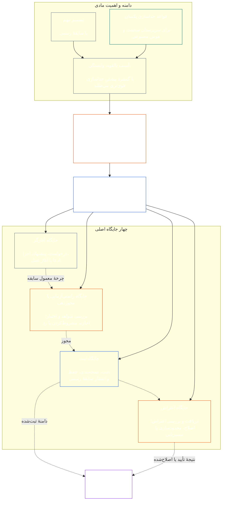

# فصل هفتم: استقلال کارکردی و تفکیک وظایف

<strong>جایگاه در پیکره (غیرعملیاتی): ساختار فایل و قواعد خواندن</strong>

> محتوای زیر **صرفاً راهنمای خواننده** است. این محتوا تعهدات الزام‌آور را در بخش دیگری از این فایل یا در فصل‌های دیگر اضافه، حذف یا محدود نمی‌کند.
>
> این فایل **بخشی از قانون اساسی سِنتینت** است و تنها **در کنار** سایر فایل‌های شماره‌دار `core_*` که به‌عنوان یک سند واحد خوانده می‌شوند الزام‌آور است. این فایل شامل **فصل هفتم** است: کفِ میان‌فرایندی برای استقلال کارکردی و تفکیک وظایف. این فصل پس از کف حقوق فصل ششم و پیش از فصل‌های فرایند قانون اساسی قرار می‌گیرد که با [گواهی هم‌راستایی سامانه در فصل هشتم](../../core_08_system_alignment_certification.md#chapter-eight-system-alignment-certification-reading-index) آغاز می‌شوند.
>
> - **متولی قانون اساسی:** کفِ جایگاه‌های متمایز برای اعمال الزام‌آور مادی؛ حداقل محتوای همگانی هر [سابقهٔ عمل الزام‌آور مادی](../../core_05_band_accountability.md#materially-binding-act-record)؛ استقلال از کنشگر و [خط کنترل مادی](../../core_05_band_accountability.md#material-control-line) کنشگر؛ انتشار عمومی تخصیص مسیر و نقش؛ مسیریابی تعارض، جای خالی، جانشینی و جایگاه نادرست؛ میزبانی ادغام‌شدهٔ متناسب؛ تحویل‌های قابل انتساب؛ و حداقل شرایط استقلالی که هر فرایند قانون اساسی بعدی باید اعمال کند.
> - **منبع در لایهٔ اصول:** [فصل یکم §18.3](../../core_01_c_stewardship_capacity_principles.md#183-segregation-of-duties) از حکمرانی می‌خواهد استقلال کارکردی را حفظ کند و معماری عملیاتی جایگاه‌ها را به اینجا ارجاع می‌دهد.
> - **متولی اجرا:** [CJS-3.11](../../corpus_joint_structure/cjs_03a_accountability_operations.md#constitutional-lane-and-functional-separation)، [CI-3.2](../../corpus_institutions/ci_03_institutional_design_separation_of_powers.md#ci-32-functional-separation-lanes) و [CI-4.6](../../corpus_institutions/ci_04_appointment_competency_rotation_removal.md#ci-46-seat-catalog--process-role-archetypes-and-operational-boundaries) جایگاه‌ها را تخصیص می‌دهند و عملیاتی می‌کنند. آن‌ها می‌توانند سخت‌گیرانه‌تر باشند و انواع محدودِ جایگاه‌های اختیار ویژه را بیفزایند؛ اما نمی‌توانند این فصل را محدود کنند.
> - **کاربرد ویژهٔ هر فرایند همچنان در مراحل بعدی انجام می‌شود:** فصل هشتم این کف را برای گواهی هم‌راستایی سامانه اعمال می‌کند؛ [فصل نهم §3.7](../../core_09_standing_assessment.md#37-segregation-of-duties) آن را برای سوابق وضعیت اعمال می‌کند؛ فصل دوازدهم و [corpus_forum.md](../../corpus_forum.md) آن را برای فرایند انجمن اعمال می‌کنند. آن فصل‌ها می‌توانند پادمان‌های لازم برای موضوع خود را بیفزایند؛ اما نمی‌توانند جایگزینی ضعیف‌تر ایجاد کنند.
>
> ترتیب خواندن: §1 هدف و دامنه → §2 کف چهار جایگاه → §3 استقلال و تعارض‌ها → §4 مسیریابی جایگاه نادرست → §5 تخصیص منتشرشده و جایگزین‌ها → §6 مقیاس‌بندی متناسب → §7 وضعیت اضطراری → §8 سوابق عمل و تحویل‌های قابل انتساب → §9 کاربردهای بعدی.

<strong>ردیابی</strong>

- بالادستی: [چهارگانهٔ قانون اساسی](../../core_00_preamble.md#constitutional-tetrad) — به‌ویژه **نظارت** و **پاسخ‌گویی**؛ [ذی‌نفعی مادی](../../core_00_preamble.md#material-stake)؛ [استاندارد سرپرستی مشترک فصل یکم §17.1](../../core_01_c_stewardship_capacity_principles.md#171-shared-stewardship-standard)؛ [حکمرانی تحت انضباط سرپرستی فصل یکم §18](../../core_01_c_stewardship_capacity_principles.md#18-governance-under-stewardship-discipline)؛ [مادهٔ شانزدهم](../../core_06_rights_part_c.md#article-xvi-audit-transparency-and-independent-verification) (*ممیزی، شفافیت و راستی‌آزمایی مستقل*).
- زیربخش‌ها: [§1](#1-purpose-scope-and-owner-boundary)؛ [§2](#2-four-seat-constitutional-floor)؛ [§3](#3-independence-conflict-and-control-lines)؛ [§4](#4-wrong-seat-routing)؛ [§5](#5-published-placement-vacancy-and-substitution)؛ [§6](#6-proportional-scaling-and-merged-hosting)؛ [§7](#7-emergency-and-urgent-action)؛ [§8](#8-act-records-and-attributable-handoffs)؛ [§9](#9-relationship-to-later-processes).
- پایین‌دستی: [فصل هشتم](../../core_08_system_alignment_certification.md#chapter-eight-system-alignment-certification-reading-index)؛ [فصل نهم](../../core_09_standing_assessment.md#chapter-nine-contribution-violation-and-standing-model--measurement)؛ [فصل دوازدهم](../../core_12_forum.md#chapter-twelve-forums-and-jurisdiction)؛ [فصل سیزدهم](../../core_13_governance.md#chapter-thirteen-constitutional-contract-legitimacy-authorization-and-stewardship)؛ متن اجرایی مشخص‌شده در بالا.
- همراه با: [کشف ناهم‌راستایی فصل یکم §19.3](../../core_01_c_stewardship_capacity_principles.md#193-misalignment-detection) (*کشف و بازبینی چندگانه*)؛ [اقدام قابل انتساب](../../core_05_band_accountability.md#attributable-action)؛ [یکپارچگی انتساب](../../core_05_band_accountability.md#attribution-integrity)؛ [ممیزی‌پذیری](../../core_05_band_oversight.md#auditability)؛ [اعتراض‌پذیری](../../core_05_band_accountability.md#contestability)؛ [تناسب](../../core_05_band_accountability.md#proportionality).

 

فصل هفتم متولی قانون اساسیِ **کف استقلال کارکردی و تفکیک وظایف برای اعمال الزام‌آور مادی** است.

### 1. هدف، دامنه و مرز متولی

<strong>ردیابی</strong>

- بالادستی: ادعای متولی در آغاز فصل؛ [فصل یکم §18](../../core_01_c_stewardship_capacity_principles.md#18-governance-under-stewardship-discipline)؛ [نظارت](../../core_05_apex_oversight_leg.md#oversight-constitutional)؛ [پاسخ‌گویی](../../core_05_apex_accountability_leg.md#accountability).
- پایین‌دستی: از [§2](#2-four-seat-constitutional-floor) تا [§9](#9-relationship-to-later-processes)؛ هر فرایند بعدی که عمل الزام‌آور مادی را ایجاد یا تغییر می‌دهد.
- همراه با: [فصل چهارم](../../core_04_burden_traceability_verification.md#chapter-four-burden-of-proof-traceability-and-verification) برای بستر راستی‌آزمایی؛ [مادهٔ XIII-A](../../core_06_rights_part_c.md#article-xiii-a-reliability-and-trustworthiness-baseline) (*کف قابلیت اتکا و اعتمادپذیری*) و [مادهٔ XIII-B](../../core_06_rights_part_c.md#article-xiii-b-right-to-redress-and-remedy) (*حق جبران و راهکار*) برای اعتراض و جبران؛ [مادهٔ شانزدهم](../../core_06_rights_part_c.md#article-xvi-audit-transparency-and-independent-verification) (*ممیزی، شفافیت و راستی‌آزمایی مستقل*) برای کف‌های حقوق راستی‌آزمایی مستقل.

 

*به زبان ساده: پیش از آنکه بتوان به یک فرایند قانون اساسی — یا تصمیمی در سطح ذی‌نفع درون یک سامانه، نهاد یا حوزهٔ تصمیم‌گیری محدود و ازپیش‌مجاز — اعتماد کرد، کارهای درون آن باید از هم جدا باشند. این کف هم بر [لایهٔ قرارداد قانون اساسی](../../core_05_band_integrative.md#constitutional-contract-layer) و هم بر [مشارکت ذی‌نفع در سامانه](../../core_05_band_participation.md#stakeholder-status-and-weight) اعمال می‌شود. یک سِنتینت، مقام، سامانهٔ هوش مصنوعی، بدنهٔ ذی‌نفعان یا نماینده‌ای که در پی نتیجه است نمی‌تواند هم‌زمان بررسیِ ظاهراً مستقل را فراهم کند، سابقهٔ رسمی آن بررسی را کنترل کند یا اعتراض به آن را تصمیم‌گیری کند.*

این فصل بر هر [عمل الزام‌آور مادی](../../core_05_band_accountability.md#materially-binding-act) طبق تعریف فصل پنجم اعمال می‌شود، از جمله:

- یک تصمیم؛
- یک مجوز یا گواهی؛
- یک یافته؛
- ثبت در سابقه یا تغییر مادی نسخه؛
- انتشار، استقرار، ادامه یا پس‌گرفتن؛
- پرداخت یا تخصیص؛ و
- رسیدگی به اعتراض.

جایگاه‌های این فصل مشخص می‌کنند چه کسی برای یک عمل خاص چه کاری می‌تواند انجام دهد؛ آن‌ها عنوان شغلی نیستند. یک سِنتینت، مقام یا سامانه می‌تواند برای اعمال مختلف جایگاه‌های مختلفی داشته باشد. عنوان، تفویض اختیار، توانایی فنی یا قابلیت انجام یک گام، جایگاه فرد برای آن عمل را گسترش نمی‌دهد.

این فصل کف میان‌فرایندی تفکیک وظایف را بیان می‌کند. این فصل موارد زیر را جابه‌جا نمی‌کند:

- بار اثبات، قابلیت ردیابی یا روش راستی‌آزمایی از فصل چهارم؛
- معانی معیار از فصل پنجم؛
- کف‌های حقوق از فصل ششم؛
- محتوای سوابق ویژهٔ هر فرایند از فصل‌های هشتم تا دوازدهم؛ یا
- فهرست جایگاه‌های عملیاتی، روش‌های نیرویابی و سازوکارهای نقشهٔ مسیر از متن اجرایی مشخص‌شده.

### 2. کف چهار جایگاه قانون اساسی

<strong>ردیابی</strong>

- بالادستی: [§1](#1-purpose-scope-and-owner-boundary)؛ [فصل یکم §18.3](../../core_01_c_stewardship_capacity_principles.md#183-segregation-of-duties)؛ [فصل یکم §17.1](../../core_01_c_stewardship_capacity_principles.md#171-shared-stewardship-standard).
- پایین‌دستی: از [§3](#3-independence-conflict-and-control-lines) تا [§9](#9-relationship-to-later-processes)؛ [CI-4.6](../../corpus_institutions/ci_04_appointment_competency_rotation_removal.md#ci-46-seat-catalog--process-role-archetypes-and-operational-boundaries) (*فهرست جایگاه‌ها — الگوهای نقش فرایند و مرزهای عملیاتی*).
- همراه با: [§6](#6-proportional-scaling-and-merged-hosting) برای تنها مسیر مجاز میزبانی ادغام‌شده.

 

*به زبان ساده: هر عمل الزام‌آور مادی چهار کار دارد: درخواست یا اقدام، بررسی، نگهداری سابقهٔ رسمی و رسیدگی به اعتراض. این کارها حتی زمانی که سازمان کوچکی اجازه دارد یک جفت مجاز را به یک مقام بسپارد، متمایز می‌مانند.*

<strong>راهنمای خواننده (غیرعملیاتی): نقشهٔ چهار جایگاه</strong>

> محتوای زیر **صرفاً راهنمای خواننده** است. این محتوا تعهدات الزام‌آور را در بخش دیگری از این فصل یا فصل‌های دیگر اضافه، حذف یا محدود نمی‌کند.
>
> **نقشهٔ خواننده (غیرعملیاتی).** این نمودار چهار جایگاه و چرخهٔ معمول سابقه را نشان می‌دهد. نمودار جایگاه اجرایی پنجم ایجاد نمی‌کند، پایان بازبینی پیش از هر اقدام را لازم نمی‌داند و قواعد عملیاتی این بخش و §§3–6 را تغییر نمی‌دهد.

 

پیکان‌های نقطه‌چین در جعبهٔ جایگاه‌ها چرخهٔ معمول سابقه را نشان می‌دهند. پیکان‌های متصل به اجرا، پیوندهای ردیابی‌اند و توالی اجباری انتظار برای بازبینی نیستند.

هر عمل الزام‌آور مادی چهار جایگاه متمایز از نظر کارکرد دارد. فصل پنجم معانی معیار آن‌ها را فراهم می‌کند؛ این بخش قواعد تخصیص و ناسازگاری میان‌فرایندی را بیان می‌کند:

1. **[جایگاه آغازگر](../../core_05_band_accountability.md#initiating-seat)** — عمل را درخواست، پیشنهاد، اجرا، ادعا یا به‌نحوی دیگر آغاز می‌کند.
2. **[جایگاه راستی‌آزمایی یا مجوزدهی](../../core_05_band_accountability.md#verify-or-authorize-seat)** — شواهد و اختیار را با معیار حاکم می‌سنجد و عمل را راستی‌آزمایی، مجاز، رد یا مشروط می‌کند.
3. **[جایگاه ثبت](../../core_05_band_accountability.md#record-seat)** — [سابقهٔ عمل](../../core_05_band_accountability.md#materially-binding-act-record) از تصمیم جایگاه راستی‌آزمایی یا مجوزدهی را ثبت، نسخه‌بندی، نگهداری و منتشر می‌کند.
4. **[جایگاه اعتراض](../../core_05_band_accountability.md#contest-seat)** — اعتراض را دریافت و بررسی می‌کند، هرجا مجاز باشد دستور اصلاح یا محدودیت می‌دهد، و هر موضوع خارج از اختیار خود را مسیریابی می‌کند.

این جایگاه‌ها به‌یکسان بر سرپرستان انسانی و هوش مصنوعی اعمال می‌شوند. اگر سامانه‌ای عملی را اجرا کند، آن را تأیید کند و سپس گزارش خودش را به‌عنوان مدرک به‌کار ببرد، هم‌زمان جایگاه آغازگر، راستی‌آزما و ثبت را در اختیار دارد. خودکارسازی فرایند بررسی را مستقل نمی‌کند.

ترکیب‌های زیر برای یک عمل واحد ممنوع‌اند:

- جایگاه آغازگر نباید عمل خودش را راستی‌آزمایی یا مجاز کند؛
- جایگاه راستی‌آزمایی یا مجوزدهی نباید جایگاه ثبت را در اختیار داشته باشد؛
- جایگاه راستی‌آزمایی یا مجوزدهی نباید جایگاه اعتراض را در اختیار داشته باشد؛ و
- بهره‌بردار یک سامانه نباید عملی دربارهٔ آن سامانه را راستی‌آزمایی یا مجاز کند.

فصل‌های بعدی یا متن اجراییِ درون‌گنجانده‌شده می‌توانند برای فرایندی خاص، جفت‌های بیشتری را ممنوع کنند. آن‌ها نمی‌توانند جفتِ ممنوع‌شده در اینجا را مجاز کنند.

کف کارکردی چهار جایگاه در همهٔ طبقات اعمال می‌شود. پرسش متناسب با طبقه این است که آیا می‌توان جایگاه‌ها را ادغام کرد یا دارندهٔ مشترک داشت: برای نهادی یا سامانه‌ای در دامنهٔ طبقهٔ C، جداسازی کامل چهار جایگاه همیشه توصیه می‌شود؛ برای دامنهٔ طبقهٔ B، تقریباً همیشه باید لازم باشد؛ و برای دامنهٔ طبقهٔ A، همیشه الزامی است. اگر دامنه ترکیبی یا طبقه‌بندی نامطمئن باشد، تا زمانی که سابقه موضع پایین‌تری را پشتیبانی کند، سخت‌گیرانه‌ترین موضع قابل‌اعمال اجرا می‌شود.

### ۳. استقلال، تعارض و خطوط کنترل

<strong>ردیابی</strong>

- بالادست: [§2](#2-four-seat-constitutional-floor)؛ [پاسخ‌گویی متناسب با اختیار](../../core_01_c_stewardship_capacity_principles.md#181-governance-as-authorized-structure)؛ [مادهٔ XXIV](../../core_06_rights_part_d.md#article-xxiv-constitutional-interpretation-review-and-anti-capture-safeguards) (*تفسیر قانون اساسی، بازبینی و تضمین‌های ضدتسخیر*).
- پایین‌دست: [§4](#4-wrong-seat-routing)؛ [§5](#5-published-placement-vacancy-and-substitution)؛ [§8](#8-act-records-and-attributable-handoffs)؛ نقش‌های مؤلفهٔ گواهی فصل هشتم؛ نگهداری سوابق فصل نهم؛ منع داوری دربارهٔ خود در مراجع فصل دوازدهم.
- همراه با این بخش بخوانید: [خط کنترل مادی](../../core_05_band_accountability.md#material-control-line)؛ [CI-5](../../corpus_institutions/ci_05_conflict_integrity_anti_capture_anti_corruption.md) (*یکپارچگی تعارض، ضدتسخیر و ضدفساد*) و [CF-7](../../corpus_forum/cf_07_integrity_safeguards_anti_capture_anti_self_judging.md) (*تضمین‌های یکپارچگی، عملیات ضدتسخیر و پشتیبانی ضدداوری دربارهٔ خود*) برای تضمین‌های عملیاتیِ تعارض و منع داوری دربارهٔ خود.

 

*به زبان ساده: عوض‌کردن نام روی میز، استقلال ایجاد نمی‌کند. راستی‌آزما یا بازبین مستقل نیست اگر ذی‌شعور یا دفتری که خواهان نتیجه است بتواند در آن عمل او را هدایت، برکنار، پاداش، مجازات یا بی‌سروصدا نقض کند.*

استقلال کارکردی بر اساس اختیار و کنترل واقعی سنجیده می‌شود، نه عنوان‌ها. در مورد یک عمل واحد:

- جایگاه راستی‌آزمایی یا مجوزدهی و جایگاه اعتراض باید بیرون از [خط کنترل مادی](../../core_05_band_accountability.md#material-control-line) جایگاه آغازگر باشند؛
- طرفی که منفعت خود او با آن عمل تعیین می‌شود نباید جایگاه راستی‌آزمایی یا مجوزدهی یا جایگاه اعتراض را در اختیار داشته باشد؛
- دارندهٔ متعارض جایگاه ثبت باید آن سابقه را همراه با مسیر کامل ممیزی به جانشینِ منتشرشده بسپارد، نه اینکه تعارض را خود حل کند یا نگهداری سابقه را رها کند؛ و
- کناره‌گیری اختیار نسبت به عمل را برمی‌دارد؛ جایگاه را به درخواست‌کننده، خط گزارش‌دهی او یا نزدیک‌ترین فرد منتقل نمی‌کند.

[خط کنترل مادی](../../core_05_band_accountability.md#material-control-line) را برای عمل موردنظر دنبال کنید. زیرساخت مشترک، پشتیبانی اداری یا سابقهٔ انتصاب به‌تنهایی این خط را ایجاد نمی‌کند، اما این ترتیبات نباید در عمل مانع داوری مستقل شوند.

وجود امضای دوم، کمیته‌ای اسمی، عنوان داخلی یا گواهی ساخته‌شده با ابزار، استقلال را ثابت نمی‌کند اگر بررسی ادعایی اختیار، دسترسی به شواهد، آزادی از کنترل مادی یا توان واقعی برای رد و ارجاع را نداشته باشد.

### ۴. ارجاع به جایگاه نادرست

<strong>ردیابی</strong>

- بالادست: [§2](#2-four-seat-constitutional-floor)؛ [§3](#3-independence-conflict-and-control-lines).
- پایین‌دست: [§5](#5-published-placement-vacancy-and-substitution)؛ [§8](#8-act-records-and-attributable-handoffs)؛ [قواعد جایگاه مشترک CI-4.6](../../corpus_institutions/ci_04_appointment_competency_rotation_removal.md#ci-46-shared-seat-rules).
- همراه با این بخش بخوانید: [فصل یکم §17.5 وظیفهٔ مقاومت](../../core_01_c_stewardship_capacity_principles.md#175-duty-to-resist).

 

*به زبان ساده: اگر گامی در حوزهٔ وظیفهٔ شما نیست، بی‌سروصدا آن را برندارید و صرفاً کنار نکشید. خلأ را ثبت کنید و موضوع را به جایگاه درست بسپارید.*

سرپرستی که از او خواسته می‌شود گامی بیرون از جایگاه خود بردارد باید:

1. آن گام را بدون ادعای تصمیم‌گیری دربارهٔ ماهیت موضوع رد کند؛
2. جایگاهی را که می‌تواند آن را انجام دهد و، در صورت انتشار، دارنده یا جانشین آن را نام ببرد؛
3. درخواست، جایگاه در اختیار، خلأ یا تعارض و مسیر استفاده‌شده را ثبت کند؛
4. شواهد و یکپارچگی هر سابقه‌ای را که دریافت کرده حفظ کند؛ و
5. بدون تأخیر قابل‌اجتناب ارجاع دهد.

این پاسخ انجام وظیفه است، نه رهاکردن عمل. عمل از جایگاه درست پیش می‌رود. برداشتن گام صرفاً به این دلیل که سرپرست نزدیک‌تر، سریع‌تر، ارشدتر یا تنها فردِ آگاه است، جای خالی یک جایگاه را برطرف نمی‌کند.

### ۵. تعیین جایگاه منتشرشده، خلأ و جانشینی

<strong>ردیابی</strong>

- بالادست: [§2](#2-four-seat-constitutional-floor)؛ [§3](#3-independence-conflict-and-control-lines)؛ [شفافیت](../../core_05_band_oversight.md#transparency)؛ [ممیزی‌پذیری](../../core_05_band_oversight.md#auditability).
- پایین‌دست: [§8](#8-act-records-and-attributable-handoffs)؛ [CI-3.2](../../corpus_institutions/ci_03_institutional_design_separation_of_powers.md#ci-32-functional-separation-lanes) (*مسیرهای جداسازی کارکردی*)؛ [CI-4.5](../../corpus_institutions/ci_04_appointment_competency_rotation_removal.md#ci-45-authorized-roles-and-accountability-chains) (*نقش‌های مجاز و زنجیره‌های پاسخ‌گویی*)؛ سوابق فصل هشتم و نهم.
- همراه با این بخش بخوانید: [منشور](../../core_05_band_continuity.md#charter) و [فصل سیزدهم §5](../../core_13_governance.md#5-authorized-roles-competency-development-and-contribution).

 

*به زبان ساده: سازمان باید پیش از رسیدن پروندهٔ دشوار اعلام کند چه کسی هر وظیفه را بر عهده دارد، از جمله اینکه هنگام غیبت یا تعارض دارندهٔ معمول چه کسی جایگزین می‌شود.*

هر پذیرنده‌ای که اعمال الزام‌آور مادی انجام می‌دهد باید نقشه‌ای منتشرشده، ممیزی‌پذیر و قابل‌اعتراض نگهداری کند که موارد زیر را مشخص کند:

- هر جایگاه در کدام مسیر، دفتر، نقش یا فرایند قرار دارد؛
- آن جایگذاری برای کدام اعمال و دامنه‌ها اعمال می‌شود؛
- هر ترتیب مجازِ میزبانیِ ادغام‌شده و تضمین استقلال آن؛
- جانشینِ دارندهٔ غایب، کنارگذاشته‌شده، تسخیرشده یا دچار تعارض؛ و
- مسیر مستقل در صورت در دسترس نبودن جانشین واجد صلاحیت.

جایگاهِ تعیین‌نشده، خالی یا دچار تعارض، نقصی در حکمرانی است که باید ثبت و اصلاح شود. این جایگاه خودبه‌خود به جایگاه آغازگر، طرف ذی‌نفع، بهره‌بردار یا مافوقی در [خط کنترل مادی](../../core_05_band_accountability.md#material-control-line) او منتقل نمی‌شود. تا زمان اصلاح، عمل به جانشین منتشرشده یا مسیر مستقل ارجاع می‌شود. صرف عجله مجوز دورزدن الزام استقلال نیست.

تفویض، همان مرز جایگاه، وظایف مربوط به شواهد، سابقه و مهلت را حفظ می‌کند و همچنان تابع [خط کنترل مادی](../../core_05_band_accountability.md#material-control-line) است. تفویض جایگاه تازه‌ای ایجاد یا جایگاه‌ها را ادغام نمی‌کند و به نماینده اجازه نمی‌دهد کاری را انجام دهد که جایگاه تفویض‌کننده نمی‌توانست انجام دهد؛ از جمله تبدیل توصیه یا الزام متناسب با طبقه برای جداسازی کامل چهار جایگاه به اجازهٔ ادغام.

### ۶. تناسب مقیاس و میزبانی ادغام‌شده

<strong>ردیابی</strong>

- بالادست: [§2](#2-four-seat-constitutional-floor)؛ [ذی‌نفعی مادی](../../core_00_preamble.md#material-stake)؛ [ضرورت](../../core_05_band_accountability.md#necessity)؛ [تناسب](../../core_05_band_accountability.md#proportionality).
- پایین‌دست: [فصل نهم §3.7](../../core_09_standing_assessment.md#37-informal-and-small-scope-records)؛ [CJS-2.4](../../corpus_joint_structure/cjs_02_specific_joint_interlocks.md#cjs-24-class-scaled-lane-staffing-and-competency-redundancy) (*نیروی انسانی مسیر و افزونگی صلاحیت متناسب با طبقه*)؛ [CI-3.2](../../corpus_institutions/ci_03_institutional_design_separation_of_powers.md#ci-32-functional-separation-lanes) (*مسیرهای جداسازی کارکردی*).
- همراه با این بخش بخوانید: [بار قابل‌اجتناب](../../core_05_band_continuity.md#avoidable-burden) و [فصل یکم §3.3 فرایند ضدتحقیر](../../core_01_a_values_principles.md#33-anti-degrading-process).

 

*به زبان ساده: گروه‌های کوچک و غیررسمی به چهار ادارهٔ بزرگ نیاز ندارند. اما به بررسی مستقل واقعی، سابقهٔ قابل‌استفاده و مسیر اعتراض نیاز دارند. مقیاس روش تأمین نیرو را تغییر می‌دهد، نه جداسازیِ مورد حمایت را.*

شدت جداسازی، نیروی انسانی، افزونگی و رسمیت آن متناسب با ذی‌نفعی مادی، طبقهٔ سامانه، وابستگی و زیانِ به‌طور معقول قابل‌پیش‌بینی است.

پذیرندهٔ کوچک یا غیررسمی فقط در صورت تحقق همهٔ موارد زیر می‌تواند دو جایگاه را در یک دفتر یا نزد یک ذی‌شعور قرار دهد:

- ادغام با دامنه ضروری و متناسب باشد؛
- ادغام منتشر، ممیزی‌پذیر و قابل‌اعتراض باشد و در سابقهٔ عمل افشا شود؛
- تضمین استقلال به خطرهای ناشی از ادغام بپردازد؛
- جایگاه آغازگر عمل خود را راستی‌آزمایی یا مجاز نکند؛
- ادغام راستی‌آزمایی با ثبت و راستی‌آزمایی با اعتراض همچنان ممنوع بماند؛ و
- هنگام فراتررفتن تعارض، زیان مادی یا اعتراض از مرز قانونی دارندهٔ ادغام‌شده، مسیر مستقلی در دسترس باشد.

کارهای غیررسمی، بدون دستمزد، یاری متقابل، مراقبتی، تعمیراتی، آموزشی، تعاونی و سرپرستی اجتماعی می‌توانند برای بررسی مربوط از نهادِ اتکای بی‌طرفی استفاده کنند که اختیارش منتشر شده باشد. هرجا مسیر واقعاً بی‌طرف و پاسخ‌گو وجود دارد، قانون اساسی رسمیت نهادی‌ای را که دامنه به‌طور معقول نمی‌تواند فراهم کند الزام نمی‌کند.

کمبود نیرو، سرعت، راحتی یا تمرکز تخصص به‌تنهایی ادغام را توجیه نمی‌کند. موضع متناسب با طبقه در [§2 کف قانون اساسی چهار جایگاه](#2-four-seat-constitutional-floor) حاکم است: برای طبقهٔ A هیچ انحرافی مجاز نیست و هر انحراف در دامنهٔ طبقهٔ B یا C باید الزامات بالا را برآورده کند. هرچه ذی‌نفعی مادی بیشتر باشد، فرضِ وجود دفترهای جداگانه، افزونگی صلاحیت و جانشینان مستقل قوی‌تر است.

### ۷. اقدام اضطراری و فوری

<strong>ردیابی</strong>

- بالادست: [§2](#2-four-seat-constitutional-floor)؛ [§6](#6-proportional-scaling-and-merged-hosting)؛ [فصل دوازدهم §6.1 اقدامات اضطراری و بار ادامه‌دادن](../../core_12_forum.md#61-emergency-measures-and-continuation-burden)؛ [موضع موقت پیش‌فرض](../../core_01_b_interaction_interpretation.md#default-interim-posture).
- پایین‌دست: فرایندهای رخداد، مهار، انتشار، ادامه و بازبینی پس از رخداد در متن اجراییِ تعیین‌شده.
- همراه با این بخش بخوانید: [به‌موقع‌بودن](../../core_05_apex_timeliness_leg.md#timeliness-constitutional)، [حفظ شواهد](../../core_05_band_oversight.md#evidence-preservation) و [فهرست جایگاه CI-4.6 — گونه‌های نقش فرایندی و مرزهای عملیاتی](../../corpus_institutions/ci_04_appointment_competency_rotation_removal.md#ci-46-seat-containment).

 

*به زبان ساده: اضطرار واقعی ممکن است اقدام پیش از پایان بررسی معمول را توجیه کند. این وضعیت توالی را عوض می‌کند، نه مالکیت جایگاه یا موضع جداسازی متناسب با طبقه را. عامل را مجاز نمی‌کند ادامهٔ اقدام خودش را تأیید کند، ردپا را پاک کند یا بعداً بازبین نهایی شود.*

هرگاه تأخیر خطرِ به‌طور معقول قابل‌پیش‌بینیِ زیان جدی و قریب‌الوقوع ایجاد کند، جایگاه آغازگر یا مهارِ مجاز می‌تواند پیش از تکمیل راستی‌آزمایی معمولِ قبلی، فقط در صورتی حداقل اقدام برگشت‌پذیرِ لازم را انجام دهد که:

- اختیار اضطراری، دامنه، زمان آغاز، انقضا و دلیل فوراً یا در نخستین فرصت عملی ثبت شود؛
- شواهد و اعتراض‌ها حفظ شوند؛
- اطلاع‌رسانی و مشارکت در مهلت قانون اساسیِ مربوط بازگردانده شوند؛
- جایگاه مستقل راستی‌آزمایی یا مجوزدهی هر ادامه‌ای فراتر از حد فوری را بررسی کند؛ و
- عمل پس از رخداد مستقلاً بازبینی شود.

اقدام اضطراری:

- به عامل اجازه نمی‌دهد ادامهٔ اقدام خود را راستی‌آزمایی کند؛
- عامل را متولیِ سابقهٔ متعارض نمی‌کند؛
- اجازه نمی‌دهد عامل به اعتراض به عمل خود رسیدگی کند؛
- ضرورت موقت را به اختیار دائمی تبدیل نمی‌کند؛
- ادغام هیچ‌یک از چهار جایگاه را برای نهاد یا سامانهٔ طبقهٔ A مجاز نمی‌کند.

هیچ‌یک از موارد زیر به‌تنهایی اضطرار محسوب نمی‌شود:

- مهلت;
- هدف انتشار;
- کمبود نیروی انسانی؛ یا
- نگرانی اعتباری.

### ۸. سوابق عمل و واگذاری‌های قابل‌انتساب

<strong>ردیابی</strong>

- بالادست: از [§2](#2-four-seat-constitutional-floor) تا [§7](#7-emergency-and-urgent-action)؛ [سابقهٔ عمل الزام‌آور مادی](../../core_05_band_accountability.md#materially-binding-act-record)؛ [اقدام قابل‌انتساب](../../core_05_band_accountability.md#attributable-action)؛ [یکپارچگی انتساب](../../core_05_band_accountability.md#attribution-integrity).
- پایین‌دست: [CS-4 §10 اقدام قابل‌انتسابِ قابل‌بازرسی](../../corpus_systems/cs_04_critical_system_stewardship.md#10-inspectable-attributable-action)؛ [قواعد جایگاه مشترک CI-4.6](../../corpus_institutions/ci_04_appointment_competency_rotation_removal.md#ci-46-shared-seat-rules)؛ هر سابقهٔ فرایندی که §8 بر آن حاکم است؛ [`materially_binding_act_record.schema.json`](../../implementation/schemas/materially_binding_act_record.schema.json) (*قالب پایهٔ قابل‌بررسی ماشینی؛ پشتیبانی فرایندی، نه تعریفی دوم*).
- همراه با این بخش بخوانید: [§4 ارجاع به جایگاه نادرست](#4-wrong-seat-routing) و [فصل چهارم §5](../../core_04_burden_traceability_verification.md#5-compliance-evidence-standard).

 

*به زبان ساده: هر عمل الزام‌آور مادی سابقهٔ عملی دارد که نشان می‌دهد چه رخ داده، چه کسی هر جایگاه را در اختیار داشته، چه چیزی تصمیم‌گیری شده و اعتراض به کجا می‌رود.*

برای هر عمل الزام‌آور مادی باید [سابقهٔ عمل الزام‌آور مادی](../../core_05_band_accountability.md#materially-binding-act-record) (**سابقهٔ عمل**) قابل‌شناسایی وجود داشته باشد. سابقهٔ عمل می‌تواند در یک سابقهٔ رسمیِ فرایندمحورِ قابل‌اعمال یا مجموعه‌ای پیوندی از سوابق رسمیِ قابل‌انتساب و حافظ یکپارچگی ثبت شود. اگر سابقهٔ رسمی موجود یا مجموعهٔ پیوندی همهٔ عناصر لازم را روشن مشخص کند، پیوندها و تاریخچهٔ نسخه را حفظ کند و از مسیر رسمی مجاز در دسترس بماند، سند تکراری جداگانه لازم نیست.

سابقهٔ عمل دست‌کم باید موارد زیر را مشخص کند:

- شناسهٔ پایدار سابقه، نسخهٔ جاری و زمان‌های مادی ایجاد و تغییر؛
- عمل، دامنهٔ مادی، وضعیت و اختیار حاکم بر آن؛
- جایگاه آغازگر، دارنده و اختیار؛
- جایگاه راستی‌آزمایی یا مجوزدهی، دارنده، معیار حاکم، تعیین تکلیف، شروط یا دلایل مادی و زمان تعیین تکلیف؛
- جایگاه ثبت، دارنده، اختیار نگهداری و نسخهٔ ثبت‌شده؛
- جایگاه اعتراض یا مسیر منتشرشدهٔ اعتراض و وضعیت جاری اعتراض یا اصلاح؛
- هر تفویض، کناره‌گیری، جانشینی، ادغام مجاز یا انحراف اضطراری؛ و
- شواهد مادی و پیوندهای سوابق، واگذاری‌ها، امتناع‌ها، شروط، اعتراض‌های حل‌نشده، مهلت‌ها، نسخه‌های جایگزین‌شده و اصلاح‌های لازم برای بازسازی عمل.

سوابق ویژهٔ فرایند می‌توانند فیلدهای سخت‌گیرانه‌تر یا مختص حوزه اضافه کنند. نباید این حداقل را حذف یا نقض کنند یا بازسازی آن را ناممکن سازند. کنترل‌های قانونیِ حریم خصوصی، محرمانگی و امنیت بر نحوهٔ دسترسی یا افشای مواد حفاظت‌شده حاکم‌اند؛ اما اجازه نمی‌دهند ردپای رسمی پاک شود یا برای راستی‌آزمایی، اعتراض، اصلاح یا جبرانِ مجاز بی‌استفاده گردد.

گزارش‌ها نشان می‌دهند چه کسی چه کاری کرده است، اما به‌تنهایی اعتبار اقدام را ثابت نمی‌کنند. گزارش، امضا، ردپای مدل، فهرست بررسی یا گواهی‌ای که ذی‌شعور یا سامانهٔ انجام‌دهندهٔ اقدام ایجاد کرده است، نقشی محدود دارد:

- این مواد می‌توانند مدرک فراهم کنند یا به سابقهٔ عمل پیوند داده شوند.
- این مواد نمی‌توانند جای بررسی و تصمیم مستقل یا خودِ سابقهٔ رسمی عمل را بگیرند.

### ۹. رابطه با فرایندهای بعدی

<strong>ردیابی</strong>

- بالادست: از [§1](#1-purpose-scope-and-owner-boundary) تا [§8](#8-act-records-and-attributable-handoffs).
- پایین‌دست: [فصل هشتم](../../core_08_system_alignment_certification.md#chapter-eight-system-alignment-certification-reading-index)؛ [فصل نهم](../../core_09_standing_assessment.md#chapter-nine-contribution-violation-and-standing-model--measurement)؛ [فصل دوازدهم](../../core_12_forum.md#chapter-twelve-forums-and-jurisdiction)؛ [فصل سیزدهم](../../core_13_governance.md#chapter-thirteen-constitutional-contract-legitimacy-authorization-and-stewardship).
- همراه با این بخش بخوانید: [سلسله‌مراتب داخلی و پشتهٔ اختیارات](../../core_05_band_integrative.md#owner-non-relocation) و [دفتر ثبت مالکیت دیباچه](../../core_00_preamble.md#4-principles-definitions-and-rights).

 

*به زبان ساده: فصل‌های بعدی می‌گویند هر فرایند چه چیزی را ارزیابی، ثبت، تعیین تکلیف و جبران کند. این فصل می‌گوید هنگام انجام این کارها قدرت چگونه باید جدا بماند.*

هر فرایند قانون اساسیِ بعدی باید توضیح دهد چهار جایگاه را چگونه تعیین و به‌کار می‌گیرد و چگونه از این فصل پیروی می‌کند. در عمل:

- سابقهٔ خود فرایند می‌تواند سابقهٔ عمل باشد یا جزئیات مختص فرایند را به آن بیفزاید.
- اگر یک سابقهٔ فرایندی چند عمل الزام‌آور مادی را پوشش دهد، می‌تواند به سابقهٔ عمل جداگانهٔ هر عمل پیوند دهد.
- اگر مسیر سابقهٔ رسمی کامل و قابل‌ردیابی بماند، سابقهٔ تکراری جداگانه لازم نیست.
- نام‌گذاری متفاوت برای یک فرایند، آن را از [§4 ارجاع به جایگاه نادرست](#4-wrong-seat-routing) یا [§8 سوابق عمل و واگذاری‌های قابل‌انتساب](#8-act-records-and-attributable-handoffs)، از جمله قواعد واگذاری و جایگاه نادرست، معاف نمی‌کند.

به‌ویژه:

- **فصل هشتم — گواهی هم‌راستایی سامانه:** بهره‌بردار سامانه یا پیشنهاددهندهٔ گواهی جایگاه آغازگر است، نه راستی‌آزمای خود؛ یافته‌های محدود به مؤلفه، یکپارچه‌سازی سابقهٔ گواهی، نگهداری و اعتراض‌ها باید در جایگاه‌های قانونی و مسیرهای منع داوری دربارهٔ خود باقی بمانند.
- **فصل نهم — سوابق وضعیت:** درخواست‌کننده، مرجع گشایش سابقه، متولی سابقه و مسیر اعتراض، کف چهار جایگاه را همراه با قواعد سخت‌گیرانه‌تر فصل نهم دربارهٔ نگهداری، مدعی، سوابق غیررسمی و منع نگهداری سابقه توسط خود به‌کار می‌گیرند.
- **فصل دوازدهم — مراجع رسیدگی:** ثبت دادخواست، تحقیق، بررسی ماهوی، نگهداری سابقه، تجدیدنظر و بررسی ادعای جانبداری یا سوءاستفادهٔ فرایندیِ خود مرجع باید مرزهای قابل‌اعمال جایگاه و منع داوری دربارهٔ خود را حفظ کند.
- **فصل سیزدهم — حکمرانی:** تعریف نقش‌ها، برنامه‌های صلاحیت، تفویض، جانشینی و طراحی نهادی باید جایگاه‌ها را مستقر و پایدار کنند، نه اینکه فقط نامشان را تکرار کنند.

فصل بعدی ممکن است به‌دلیل خطر بیشتر یا متفاوتِ فرایند خود، الزامات قوی‌تری برای استقلال، کناره‌گیری، جداسازی، نگهداری، هیئت یا بازبینی مقرر کند. اما نمی‌تواند این کف را محدود کند، برچسب مختص فرایند را معافیت بداند یا از سکوت نتیجه بگیرد که جایگاه به عامل منتقل شده است.

---

**فایل پیشین:** [core_05_band_performance.md](../../core_05_band_performance.md)

**فایل بعدی:** [core_08_a_system_alignment_certification_evaluation.md](../../core_08_a_system_alignment_certification_evaluation.md#chapter-eight-part-a-certification-evaluation)
