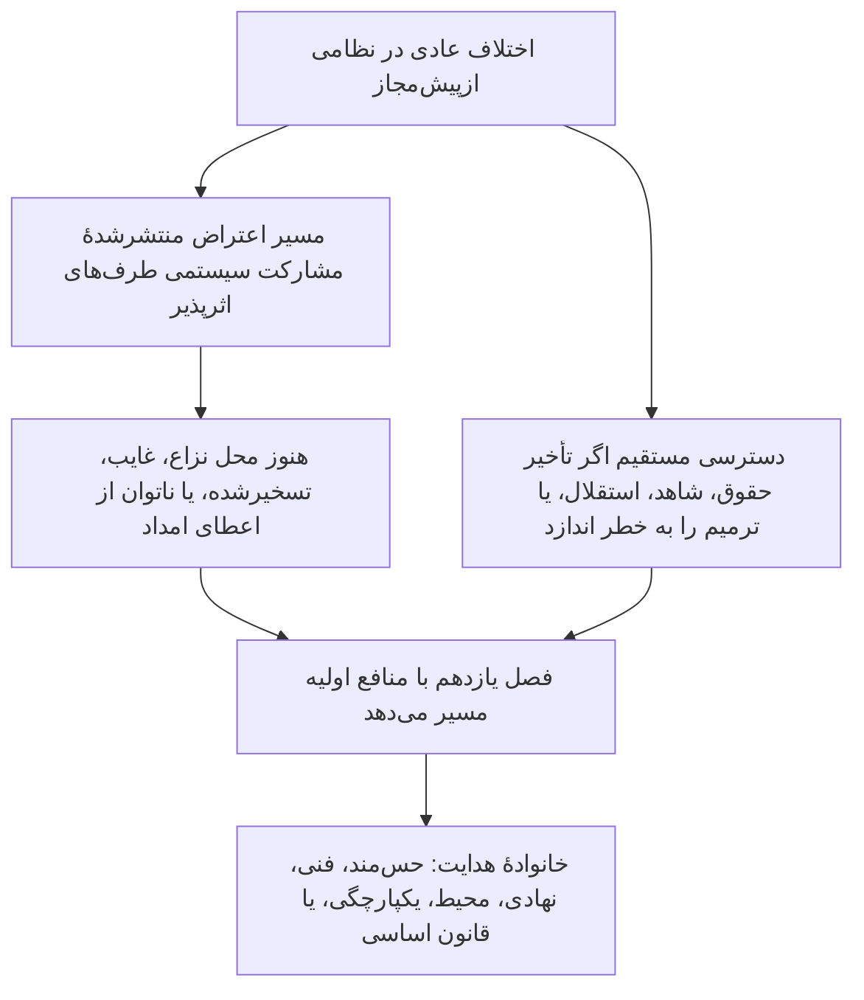

# فصل یازدهم: مجمع‌ها و صلاحیت مسیر

<strong>جایگاه در پیکره (غیرعملیاتی): ساختار پرونده و قواعد خواندن</strong>

> محتوای زیر **فقط راهنمای خواننده** است. تکالیف الزام‌آور را در این پرونده یا فصل‌های دیگر نمی‌افزاید، کم نمی‌کند و تنگ نمی‌کند.
>
> این پرونده **آزمایش زبان خواننده** برای [فصل یازدهم به انگلیسی](../../core_11_forum.md) است. **بخش الزام‌آور قانون اساسی حس‌مندان نیست**. **قانون اساسی دوم نیست**. **ویرایش ارسال نیست**. روی `SC-Corpus-2026.08.09` **قفل** شده است. اگر این ترجمه و اصل انگلیسی ناسازگار به‌نظر برسند، پروندهٔ شماره‌دار [`core_11_forum.md`](../../core_11_forum.md) برنده است. ترتیب خواندن و فرادادهٔ ویرایش در [README.md](../../README.md) نگه داشته می‌شود. روش و واژه‌نامه: [translations/fa/README.md](README.md).
>
> **فصل یازدهم** را در بر دارد: خانواده‌های مجمع، محل پیش‌فرض و مسیرگذاری منافع اولیه، پشتیبانی کارشناسی تحلیلی، غربال پذیرش، و صلاحیت مسیر برای اختلاف‌ها زیر زنجیرهٔ ردپا و کف حقوق. مجمع‌ها رسیدگی به اختلاف را زیر پاهای **مشارکت**، **نظارت**، و **به‌هنگامی** [چهارگانهٔ قانون اساسی](core_00_preamble.md#constitutional-tetrad) **نظارت می‌کنند**، مقیاس‌شده با [منافع مادی](core_00_preamble.md#material-stake). وقتی واقعیت‌ها راستی‌آزمایی شوند، می‌توانند سوابق ردپا را **بگشایند، به‌روز کنند، یا تصحیح کنند** — یا **سابقهٔ بد را با اعتراض کنار بگذارند** — زیر [فصل هشتم §3](core_08_standing_assessment.md#3-standing-record-operational-requirements)؛ پروندهٔ ثبت‌شده به‌تنهایی ردپا نیست، و روایت مجمع نباید جای اندازه‌گیری ردپای فصل هشتم بنشیند ([فصل هشتم §3.6](core_08_standing_assessment.md#36-forum-boundary)). برای ناوبری زنجیره از [README — Standing pipeline and forums](../../README.md#standing-pipeline-and-forums) استفاده کنید. مکانیک عملیاتی مجمع در پرونده‌های پیاده‌سازی نام‌گذاری‌شده می‌ماند. شماره‌گذاری فصل و ارجاع‌های متقابل با ابزار یکپارچه جور است.

>
> **قبلی (هنوز انگلیسی):** [core_10_b_misconduct_pattern_applications.md](../../core_10_b_misconduct_pattern_applications.md#chapter-ten-part-b-anti-constitutional-misconduct-pattern-applications)
>
> **بعدی (هنوز انگلیسی):** [core_08-11_application_vignettes.md](../../core_08-11_application_vignettes.md#chapters-eight-eleven-application-vignettes)
> **قوس خواندن:** §1 مقصود → توالی اختلاف → §2 محل پیش‌فرض و پذیرش → §2.1–§2.3 حدهای هدایت، منافع مختلط، اعتراض‌ها → §3 انتقال و ضدخودداوری → §4 خانواده‌ها → §5 ارتقا و گواهی → §6 طبقه‌ها و انضباط ضدتأخیر → §7 پشتیبانی مجمع

<strong>راهنمای خواننده (غیرعملیاتی): جای زندگی فصل یازدهم و آنچه اینجا می‌ماند</strong>

> محتوای زیر **فقط راهنمای خواننده** است. تکالیف الزام‌آور را در این فصل یا فصل‌های دیگر نمی‌افزاید، کم نمی‌کند و تنگ نمی‌کند.
>
> جایی که این زندگی می‌کند (ناوبری):
> - **مالک قانون اساسی:** **بخش 1** (*مقصود* — **اعمال داوری اولیه** هنجارهایی که این فصل تخصیص می‌دهد، **متمایز از** **ادارهٔ اجرایی** روزمره؛ **توالی اختلاف** برای اختلاف‌های عادی درون نظام‌های ازپیش‌مجاز؛ الزام‌های **پاسخگویی**؛ جایگذاری **آستانهٔ** **منتشرشده** و **پیش‌بینی‌پذیر**)؛ **محل شروع پیش‌فرض**، مسیرگذاری **منافع اولیه**، **نهاد غربال پذیرش** (**میز نخستین تماس**)، منافع مختلط، عدم‌تقارن، اعتراض‌های سابقهٔ ردپا، **توصیف حسن‌نیت و ضدبازی**، و انتظارهای **دسترسی آستانهٔ** **دسترس‌پذیر برای حس‌مند** (**بخش 2**، **خوانده شود با** **`corpus_forum.md`**)؛ **انتقال**، **ادغام**، و **هماهنگی** (**بخش 3**، خوانده با گواهی و پشتیبان **بخش 5**)؛ **تعریف خانواده‌های مجمع**، **اتاق‌های درونی**، **استانداردهای مشترک**، و **حقوق عملیاتی موقت** (حس‌مند، فنی، نهادی، محیط، یکپارچگی، قانون اساسی — **بخش** **4**، آینهٔ **جدول** **بخش** **2**)؛ **ارتقا**، **گواهی**، و **حفاظت موقت** (**بخش 5**)؛ **حل به‌هنگام** و انضباط **ضدتأخیر** (**بخش 6**)؛ **پشتیبانی مجمع** پیش، هنگام، و پس از بازبینی (**بخش 7**)، چنان پیاده‌شده که نقش‌های غربال و پشتیبانی **جای** **پنل‌های ماهیت قانوناً تشکیل‌شده** ننشینند؛ مسیرگذاری پشتیبان **ضدخودداوری**؛ و قلاب‌های ارتقا گره به **فصل هشتم**، **فصل دهم**، و حقوق عدالت و اعتراض **فصل ششم**.
> - **ناوبری زنجیره:** [README — Standing pipeline and forums](../../README.md#standing-pipeline-and-forums) — [§§1–7](#1-purpose-and-role) در این پرونده.
> - **زنجیرهٔ سه پرسش فصل‌های هشتم–نهم:** فصل هشتم **بخش‌های 2–3** به پرسش ۱ (*چه رخ داد؟*) از راه سوابق راستی‌آزمایی‌شده و محور-خالص پاسخ می‌دهد. [فصل هشتم §4](core_08_standing_assessment.md#4-standing-measurement-evaluation-dimensions) و [مقیاس متناسب یکپارچهٔ LEQU §7](core_08_standing_assessment.md#7-unified-proportional-lequ-scale) به پرسش ۲ (*چقدر خوب یا بد بود؟*) از راه ابعاد ارزیابی، باندهای LEQU پنج‌برابر مشترک، و دستور زبان مشترک **s** = 1...9 پاسخ می‌دهند در حالی که سوابق جداگانهٔ همیاری و تخلف را نگه می‌دارند. [فصل نهم](core_09_standing_integration.md#chapter-nine-standing-effects-and-integration) به پرسش ۳ (*از آن چه پیش می‌آید؟*) از راه جبران‌ها، تدابیر حفاظتی، میله‌ها و پروانه‌های شایستگی، و قفل‌های ردپا پاسخ می‌دهد. خانهٔ محور تخلف فقط با اثر راستی‌آزمایی‌شده کنترل می‌شود؛ غفلت، پنهان‌کاری، اجبار، پاسخ، و توصیف‌گرهای خصلت هم‌تراز آن را جابه‌جا نمی‌کنند. [فصل دهم](core_10_a_misconduct_designation.md#chapter-ten-anti-constitutional-misconduct) می‌تواند نام‌گذاری سوءرفتار ضدقانون‌اساسی متناظر را به سابقهٔ خانهٔ 7، 8، یا 9 فصل هشتم بیفزاید اما خانهٔ عددی را نمی‌گذارد.
> - **مجمع‌ها (شرح غیرعملیاتی):** **خانواده‌های مجمع** زیر این فصل مجمع‌های اولیه هستند که طبقه‌بندی‌های [فصل هشتم](core_08_standing_assessment.md#chapter-eight-compliance-violation-and-standing-model) را بر اختلاف‌های انضمامی اعمال می‌کنند — از جمله اموری که **ماهیت همیاری** جدا ثبت‌شده، **خانهٔ اثر محور تخلف**، و خصلت فرایند / پاسخ **هم‌حضور**اند و باید زیر انضباط ارزیابی مشترک و منع‌جایگزینی **فصل هشتم** رسیدگی شوند. سازوکارهای **تأمین پژوهش**، **تأمین مالی**، و **انگیزه** بیرون از داوری در پیاده‌سازی پذیرفته و **[corpus_systems.md](../../corpus_systems.md)** می‌مانند (ببینید راهنمای خوانندهٔ **فصل هشتم**)؛ می‌توانند پیشگیری و پرس‌وجوی علت ریشه را پشتیبانی کنند و **نباید** جای مسیرگذاری **آستانه**، تعیین **ماهیت**، گذاشتن خانهٔ عددی معتبر فصل هشتم، هر نام‌گذاری متناظر **فصل دهم**، یا قیدهای **اصل XXIII** (*حل تعارض، تشدید، و تناسب اضطراری*) بنشینند. **بخش‌های 1 و 2** مسئولیت **اولیه** برای ساختارهای **انگیزه** را **عمدتاً** **درون** **سپهر** هر **خانواده** تخصیص می‌دهند (جزئیات دانه‌ریز در **پیکره** و پیاده‌سازی)؛ آن **تخصیص** انتخاب‌های **بودجهٔ** **سراسرنظام** یا **مقیاس‌حکمرانی** محفوظ برای [فصل دوازدهم](../../core_12_governance.md#chapter-twelve-constitutional-contract-legitimacy-authorization-and-stewardship) و **[corpus_systems.md](../../corpus_systems.md)** را **جابه‌جا نمی‌کند**.
> - **مالک پیاده‌سازی:** **طبقه‌های** پذیرش منتشرشده، قواعد روزمرهٔ فهرست، نیرو، بودجه‌ها، رویهٔ دانه‌ریز، مکانیک ارتقای عملیاتی، و الزام‌های عملیاتی پشتیبانی مجمع در متن پیاده‌سازی پذیرفته و در **[corpus_forum.md](../../corpus_forum.md)** زندگی می‌کنند (**CF-5** (*عملیات مسیرگذاری، انتقال، گواهی، و رفتار نمایندگی*)، **CF-8** (*پشتیبانی کارشناسی تحلیلی مجمع*)، **CF-9** (*خدمت تحقیق مستقل و واسط پیگرد*)، و بخش‌های مرتبط)؛ آن لایه‌ها این فصل را **پیاده می‌کنند، نه تنگ**.
> - **قاعدهٔ ضدجابه‌جایی:** ابزارهای پذیرش نباید این فصل را از راه رویه‌هایی برآورند که کارکردهای متمایز مجمع را فرو بریزند، **استقلال** یا **بازبینی واقعی** را بزدایند، یا اعتراض‌های یکپارچگی را به همان مجمع تسخیرشده‌ای برگردانند که این فصل به‌عنوان تنها خانهٔ نهایی ماهیت ممنوع می‌کند.
>
> **معماری — جایگذاری *به زبان ساده*:** هر خط *به زبان ساده* بلافاصله پس از بلوک ناوبری ردگیری (و ` ` پس از آن وقتی هست) می‌آید، و **پیش از** بندهای عملیاتی و فهرست‌های گلوله برای آن بخش. فقط شرح رو به خواننده؛ متن الزام‌آور را نمی‌افزاید، کم نمی‌کند و تنگ نمی‌کند.

<strong>ردگیری</strong>

- بالادست: [فصل هشتم](core_08_standing_assessment.md#chapter-eight-compliance-violation-and-standing-model) (*سوابق پرسش ۱ و اندازه‌گیری پرسش ۲ که اختلاف‌هایی را تأمین می‌کنند که این فصل مسیر می‌دهد*)؛ [فصل هشتم §5.1](core_08_standing_assessment.md#5-slot-grammar-and-display-labels) (*دستور زبان خانهٔ ردپا*)؛ [مقیاس یکپارچهٔ فصل هشتم §7](core_08_standing_assessment.md#7-unified-proportional-lequ-scale) (*باندهای LEQU پنج‌برابر مشترک و سوابق محور جدا*)؛ [فصل هشتم §§4.3–4.4](core_08_standing_assessment.md#43-route-descriptor-measurement-roles) (*کاتالوگ توصیف‌گر بهنجارشدهٔ میان‌محور، از جمله توصیف‌گرهای محور همیاری و محور تخلف که خانه‌ها را جابه‌جا نمی‌کنند*)؛ [فصل دهم](core_10_a_misconduct_designation.md#chapter-ten-anti-constitutional-misconduct) (*نام‌گذاری سوءرفتار ضدقانون‌اساسی متناظر برای خانه‌های واجد شرایط 7–9 فصل هشتم*)؛ [فصل‌های دوم تا چهارم](core_02_definition_structure.md) (*انتظارهای سابقه، راستی‌آزمایی، و ردگیری*)؛ [فصل پنجم](core_05__definitions_home.md#chapter-five-foundational-definitions) (*تعریف‌های بنیادین*)؛ [فصل یکم](core_01_c_stewardship_capacity_principles.md#chapter-01-principles-and-constraints) (*قیدهای تفسیری*)؛ [فصل ششم — حقوق بنیادین](core_06_rights_part_a.md#chapter-six-foundational-rights) تا [بخش د](core_06_rights_part_d.md) (*قلاب‌های اعتراض، حسابرسی، و اصل عدالت*).
- زیربخش‌ها: [§1](#1-purpose-and-role)؛ [§2](#2-default-venue-and-primary-stakes)؛ [§3](#3-transfer-consolidation-and-coordination)؛ [§4](#4-forum-family-definitions)؛ [§5](#5-escalation-and-certification)؛ [§6](#6-timely-resolution-materiality-tiers-and-anti-delay-discipline)؛ [§7](#7-forum-support-before-during-and-after-review).
- خوانده شود با: [README — Standing pipeline and forums](../../README.md#standing-pipeline-and-forums).
- پایین‌دست: [corpus_forum.md](../../corpus_forum.md) (*آموزهٔ عملیاتی مجمع*)؛ [فصل دوازدهم](../../core_12_governance.md#chapter-twelve-constitutional-contract-legitimacy-authorization-and-stewardship) جایی که مشروعیت حکمرانی با نقش داوری تعامل می‌کند؛ [فصل شانزدهم](../../core_16_incorporation.md#chapter-sixteen-incorporation-bridge) (*انضباط پذیرش* برای لایه‌های رویهٔ پذیرفته).
- خوانده شود با: [فصل هشتم §5.1](core_08_standing_assessment.md#5-slot-grammar-and-display-labels) (*دستور زبان خانهٔ ردپا*)؛ [فصل هشتم §§4.3–4.4](core_08_standing_assessment.md#43-route-descriptor-measurement-roles) (*توصیف‌گرهای بهنجارشدهٔ میان‌محور محور همیاری و محور تخلف*).
- همچنین خوانده شود با: [فصل نهم §3](core_09_standing_integration.md#3-descriptor-integration-and-attachment-normalization) (*یکپارچه‌سازی توصیف‌گر و بهنجارسازی پیوست خوانده با مسیرگذاری منافع اولیهٔ بخش 2*)؛ [README.md](../../README.md) (*ترتیب خواندن و سازمان پیکره*)؛ [doc_architecture.md](../../doc_architecture.md) (*نقشه‌های ویراستاری غیرالزام‌آور مگر پذیرش*).

 

فصل یازدهم مالک قانون اساسی **خانواده‌های مجمع، محل پیش‌فرض، صلاحیت مسیر، و مسیرگذاری داوری برای اختلاف‌ها زیر زنجیرهٔ ردپا و کف حقوق** است.

*به زبان ساده: زیر [چهارگانهٔ قانون اساسی](core_00_preamble.md#constitutional-tetrad) و [دو هدف قانون اساسی](core_00_preamble.md#two-constitutional-aims)، این فصل **نظارت می‌کند** که اختلاف‌ها چگونه از زنجیرهٔ ردپای فصل‌های هشتم تا دهم می‌گذرند — مسیرگذاری، استقلال، پشتیبانی کارشناسی تحلیلی، توالی ترمیم، و ساعت‌های پیش‌فرض طبقه زیر **بخش 6** و **اصل XXIV-C** (*حل به‌هنگام و کف ضدتأخیر*). خانواده‌های مجمع پاسخ می‌دهند کدام پیست کدام اختلاف را می‌گیرد، پرونده معمولاً کجا آغاز می‌شود، و امور منافع مختلط چگونه هماهنگ می‌شوند. **مشارکت** (اعتراض دسترس‌پذیر) و **نظارت** (بازبینی ماهیت ردگیری‌پذیر) می‌دهند. وقتی واقعیت‌ها راستی‌آزمایی شوند، می‌توانند سوابق ردپا را **بگشایند، به‌روز کنند، یا تصحیح کنند** — یا **سابقهٔ بد را با اعتراض کنار بگذارند**. پیست تصمیم جداگانه‌ای کنار زنجیرهٔ ردپا **نمی‌گردانند**. ثبت پرونده به‌تنهایی اثر فوری بر ردپا ندارد. قواعد روزمرهٔ رسیدگی، بودجه‌ها، و دفترچه‌های نیرو در لایه‌های پیاده‌سازی زندگی می‌کنند و باید این فصل یا **اصل XXIII** (*حل تعارض، تشدید، و تناسب اضطراری*) را **پیاده کنند، نه تنگ**. *

### 1. مقصود و نقش — معماری مشارکت

<strong>ردگیری</strong>

- بالادست: [فصل هفتم — گواهی هم‌راستایی نظام](core_07_a_system_alignment_certification_evaluation.md#chapter-seven-system-alignment-certification)؛ [فصل هشتم](core_08_standing_assessment.md#chapter-eight-compliance-violation-and-standing-model)؛ [فصل نهم](core_09_standing_integration.md#chapter-nine-standing-effects-and-integration)؛ [فصل دهم](core_10_a_misconduct_designation.md#chapter-ten-anti-constitutional-misconduct)؛ [فصل یکم](core_01_c_stewardship_capacity_principles.md#chapter-01-principles-and-constraints) (*اصول و قیدهای تفسیری*)؛ [فصل‌های دوم تا چهارم](core_02_definition_structure.md) (*انتظارهای ردگیری و راستی‌آزمایی*)؛ [فصل پنجم](core_05__definitions_home.md#chapter-five-foundational-definitions) (*تعریف‌ها خوانده با فصل‌های دوم تا چهارم در ویجت جایگاه پیکره*)؛ [فصل ششم](core_06_rights_part_a.md#chapter-six-foundational-rights) (*کف حقوق بنیادین که این فصل همراه با آن اعمال می‌کند*).
- پایین‌دست: [§2](#2-default-venue-and-primary-stakes) (*محل پیش‌فرض منافع اولیه، غربال پذیرش، منافع مختلط، عدم‌تقارن، اعتراض‌های سابقهٔ ردپا؛ دسترسی آستانهٔ به‌موقع قابل‌اعتراض؛ توصیف حسن‌نیت و ضدبازی*)؛ [§3](#3-transfer-consolidation-and-coordination) (*انتقال و ضدخودداوری*)؛ [§4](#4-forum-family-definitions) (*تعریف خانواده‌های مجمع، اتاق‌ها، استانداردهای مشترک، و حقوق عملیاتی موقت*)؛ [§4.3](#43-institutional-forums) (*مرز فرایند درونی به‌عنوان اعمال خانواده‌نهادی توالی اختلاف*)؛ [§5](#5-escalation-and-certification) (*ارتقا، گواهی، و حفاظت موقت*)؛ [§6](#6-timely-resolution-materiality-tiers-and-anti-delay-discipline) (*طبقه‌های اهمیت مادی، نقاط عطف زنجیره، و انضباط ضدتأخیر*)؛ [§7](#7-forum-support-before-during-and-after-review) (*پشتیبانی مجمع پیش، هنگام، و پس از بازبینی*).
- پای چهارگانه: **مشارکت**، **نظارت**، **پاسخگویی**، **به‌هنگامی** (یافته‌های راستی‌آزمایی‌شده می‌توانند سوابق ردپا را بگشایند، به‌روز کنند، یا تصحیح کنند؛ **CF-11** ساعت‌های طبقه را پیاده می‌کند). هدف(های) اصلی: **شکوفایی** و **پیوستگی**. مقیاس‌بندی [منافع مادی](core_00_preamble.md#material-stake) بر بار مسیرگذاری و دسترسی اعمال می‌شود.
- خوانده شود با: [دیباچه §3.2](core_00_preamble.md#32-key-governance-processes) و [§3.3](core_00_preamble.md#33-governance-layers) (*مسیرهای فرایند و انضباط لایهٔ حکمرانی*)؛ [اصل XI: مشارکت سیستمی طرف‌های اثرپذیر، نمایندگی، و فرایند عادلانه](core_06_rights_part_b.md#article-xi-stakeholder-system-participation-representation-and-due-process)؛ [corpus_forum.md](../../corpus_forum.md) (**CF-6.2.2** (*قواعد اضطرار، استیفا، و زمان‌بندی*) — پیاده کند، نه تنگ)؛ [corpus_institutions.md](../../corpus_institutions.md) (*اعتراض، بازبینی ثانویه، و پایش یکپارچگی — جای صلاحیت مسیر مجمع تخصیص‌شده نمی‌نشیند*)؛ [اصل XII-B: حق اعتراض، بازبینی و جبران](core_06_rights_part_c.md#article-xii-b-right-to-challenge-review-and-redress)؛ [خانوادهٔ اصل XXIII](core_06_rights_part_d.md#article-xxiii-a-justice-objective-and-scope) (*قیدهای عدالت ارجاع‌شده در ویجت جایگاه پیکره*).

 

*به زبان ساده: این بخش **مشارکت** و **نظارت** قانون اساسی را از راه خانواده‌های مجمعی تخصیص می‌دهد که دو پیست را **نظارت می‌کنند** — **زنجیرهٔ ردپا** (اختلاف‌ها و آثار سابقهٔ فصل‌های هشتم تا دهم) و **گواهی هم‌راستایی نظام** (بازشناسی و بازبینی فصل هفتم) — سپس الزام‌های پاسخگویی برای جایگذاری آستانهٔ منتشرشده را بیان می‌کند. اختلاف‌های عادی درون نظام‌های ازپیش‌مجاز نخست از مسیر اعتراض منتشرشدهٔ مشارکت سیستمی طرف‌های اثرپذیر استفاده می‌کنند؛ این فصل وقتی آن مسیر هنوز محل نزاع، غایب، تسخیرشده، یا ناتوان از اعطای امداد است می‌نشیند. قواعد ریز رسیدگی جای دیگر زندگی می‌کنند و نباید آرام آنچه این فصل تضمین می‌کند را کوچک کنند.*

این فصل بیان می‌کند کدام **خانواده‌های مجمع** کدام پرسش‌های اولیه را از راه **مشارکت** (اعتراض دسترس‌پذیر برای حس‌مند، رفتار نمایندگی، و دسترسی متناسب) و **نظارت** (استقلال، پشتیبانی کارشناسی تحلیلی، و بازبینی ماهیت ردگیری‌پذیر) **نظارت می‌کنند**. قواعد فهرست، نیرو، بودجه‌ها، رویهٔ دانه‌ریز، یا مکانیک ارتقای عملیاتی را **بیان نمی‌کند**. آن جزئیات به لایه‌های پیاده‌سازی پیکره تعلق دارند که باید این فصل را **پیاده کنند، نه تنگ**. **خانواده‌های مجمع** باید مرزهای قانونی و تنظیمی برای جایگذاری آستانه، مسیرگذاری منافع اولیه، و بازبینی هم‌راستایی نظام را به شیوه‌ای پیش‌بینی‌پذیر و منتشرشده بیان کنند که **بخش 2** را همراه با **`corpus_forum.md`** **پیاده کند، نه تنگ**.

**خانواده‌های مجمع نظارت می‌کنند:**

1. **زنجیرهٔ ردپا** (فصل‌های هشتم تا دهم، اعمال فصل‌های یکم تا ششم و هنجارهای پیاده‌سازی پیکرهٔ نام‌گذاری‌شده در اختلاف‌ها)
   - مسیرگذاری منافع اولیه، بازبینی ماهیت جایی که تخصیص شده، انتقال، ادغام، و هماهنگی گواهی، و توالی ترمیم برای اختلاف‌های مرتبط با ردپا.
   - سوابق همیاری و تخلف **فصل هشتم** اندازه‌گرفته روی مقیاس LEQU متناسب یکپارچهٔ §7، توصیف‌گرهای خصلت، و اثر ردپا — یافته‌های راستی‌آزمایی‌شده می‌توانند سوابق ردپا را **بگشایند، به‌روز کنند، یا تصحیح کنند** — یا **سابقهٔ بد را با اعتراض کنار بگذارند** — زیر [فصل هشتم §3](core_08_standing_assessment.md#3-standing-record-operational-requirements) وقتی دروازهٔ ورودی راستی‌آزمایی‌شده را برآورند؛ پروندهٔ ثبت‌شده به‌تنهایی ردپا نیست، و روایت مجمع نباید جای اندازه‌گیری ردپای فصل هشتم بنشیند ([فصل هشتم §3.6](core_08_standing_assessment.md#36-forum-boundary)).
   - آثار ردپا و یکپارچه‌سازی **فصل نهم** جایی که این فصل نظارت مجمع بر جبران و توالی را تخصیص می‌دهد.
   - نام‌گذاری سوءرفتار ضدقانون‌اساسی **فصل دهم** جایی که آن نام‌گذاری برای سابقهٔ خانهٔ 7–9 فصل هشتم محل نزاع است.
   - اعمال **فصل‌های یکم تا ششم** و لایه‌های پیاده‌سازی [پیکره](core_05_band_integrative.md#corpus) نام‌گذاری‌شده به‌عنوان هنجارهایی که آن اختلاف‌ها اعمال می‌کنند.

2. **گواهی هم‌راستایی نظام** ([فصل هفتم](core_07_a_system_alignment_certification_evaluation.md#chapter-seven-system-alignment-certification))
   - بازشناسی، بازشناسی مشروط، اعتبارسنجی، بازاعتبارسنجی، پس‌گیری، و پیامدهای وابستهٔ سابقهٔ گواهی تحت نظارت مجمع زیر [فصل هفتم، بخش ب](core_07_b_system_alignment_certification_record_process.md#chapter-seven-part-b-certification-record-and-process).
   - نقش‌های مؤلفه زیر [بخش ب §13](core_07_b_system_alignment_certification_record_process.md#13-forum-supervision-and-component-roles):
     - **فنی** — مشخصات، روش‌ها، و استانداردهای شاهد
     - **یکپارچگی** — بازشناسی رسمی هم‌راستایی و هماهنگی هدایت
     - **محیط** — مؤلفهٔ هم‌راستایی محیطی جایی که مادی است
     - یافته‌های مؤلفهٔ خانوادهٔ دیگر زیر مسیرگذاری این فصل
   - حس‌مندان می‌توانند نتایج گواهی را اعتراض کنند، شروط بچسبانند، و پرونده را وقتی لازم است بازگشایند — اما گواهی **جای** اندازه‌گیری ردپا نمی‌نشیند.
   - یافته‌های مهم از گواهی می‌توانند به‌عنوان **ورودی‌های راستی‌آزمایی‌شده** بشمارند وقتی فصل هشتم ردپا را اندازه می‌گیرد. گواهی **به‌تنهایی** به کسی خانهٔ ردپا نمی‌گذارد ([بخش ب §15](core_07_b_system_alignment_certification_record_process.md#15-relationship-to-standing)).

**خانواده‌های مجمع** نهادهای اولیه‌ای هستند که این ابزار از راه آن‌ها آن پیست‌ها را **نظارت می‌کند**. از ادارهٔ اجرایی روزمرهٔ قواعد وضع‌شده متمایزند.

**توالی اختلاف.** درون نظام، نهاد، یا حوزهٔ تصمیم محدود ازپیش‌مجاز، اختلاف عادی نخست از مسیر اعتراض و فرایند عادلانهٔ منتشرشدهٔ [مشارکت سیستمی طرف‌های اثرپذیر](core_05_band_participation.md#stakeholder-status-and-weight-cluster) استفاده می‌کند. اگر آن مسیر نتیجه‌ای هنوز محل نزاع بدهد، غایب باشد، تسخیر شده باشد، یا نتواند قانوناً امداد لازم را بدهد، این فصل موضوع را با منافع اولیه زیر **بخش 2** مسیر می‌دهد. **یکپارچگی**، **حوزه‌های فنی مجمع**، **محیط**، و **قانون اساسی** خانواده‌های هدایت پیش‌فرض‌اند وقتی آن منافع اولیه است — نه استثناهایی که توالی را می‌پرند. فرایند درونی ناتمام، برچسب‌های استیفا، یا ادعای ناتمام بودن بازبینی درونی نباید آن هدایت‌ها را متوقف کند، ماهیت‌شان را جابه‌جا کند، یا ساعت‌های **اصل XXIV-C** (*حل به‌هنگام و کف ضدتأخیر*) را بخورد. دسترسی مستقیم وقتی تأخیر حقوق، شاهد، استقلال، یا ترمیم عملی را از نظر مادی به خطر اندازد در دسترس می‌ماند.

*فقط نقشهٔ خواننده. بند توالی اختلاف را نمی‌افزاید، کم نمی‌کند و تنگ نمی‌کند.*

آن‌ها:

- نقش حکمرانی پیش‌دستانه می‌برند، از جمله حل مسئله، تحلیل علت ریشه، پیشگیری، توالی ترمیم، و یادگیری از الگوهای شکست، هم‌راستا با اصول **فصل یکم** از جمله **ایمنی**، **حقیقت**، **بهزیستی**، **پاسخگویی**، و **مدیریت مسئولانه و فهم توزیع‌شده**.
- باید انتظارهای **استقلال**، **قابلیت اعتراض**، و **ردگیری** در **فصل‌های دوم تا چهارم**، **اصل XII-B** (*حق اعتراض، بازبینی و جبران*) جایی که اعتراض و ترمیم درگیر است، و **اصل XXIII** (*حل تعارض، تشدید، و تناسب اضطراری*) جایی که قیدهای عدالت حاکم‌اند را برآورند.
- تابع سخت‌گیرانه‌ترین الزام‌های رویه‌ای و پاسخگویی‌یکپارچگی بیان‌شدهٔ این ابزارند، از جمله توجیه عمومی، ردگیری‌پذیری، انضباط کناره‌گیری و هیئت، پشتیبانی کارشناسی تحلیلی جایی که این فصل تخصیص می‌دهد
- مسیرگذاری پشتیبان ضدخودداوری می‌خواهند. آن الزام‌ها نباید کنترل سیاسی را جای استقلال داوری بنشانند.
- مجمع‌های **یکپارچگی**، **قانون اساسی**، و **محیط**، و **حوزه‌های فنی مجمع** وقتی داوری وضعیت حس‌مندی می‌شنوند، انتصاب **منتشرشده**، **محل‌نزاع**، **قابل‌چرخش** یا وارسی استقلال هم‌ارز زیر [فصل دوازدهم §1.2](../../core_12_governance.md#12-eligibility-contested-selection-and-democratic-minimums) می‌خواهند. کم‌انتصاب یا کم‌تأمین آن هیئت‌ها شکست [فصل نهم §9](core_09_standing_integration.md#9-enforcement-realism) است.

هر **خانوادهٔ مجمع** مسئولیت اولیه برای ساختارهای انگیزه عمدتاً درون سپهر خود می‌برد. این شامل است:

- ابزارهای پذیرش و لایه‌های پیاده‌سازی نام‌گذاری‌شده
- بازبینی مسیرهای هزینه، ضمانت، اعتراض و گزارش
- قلاب‌های توالی ترمیم، و هم‌راستایی هم‌جوار داوری هم‌تراز.

بودجه‌های **سراسرنظام**، تأمین پژوهش میان‌برشی، و برنامه‌های مقیاس‌حکمرانی تابع [فصل دوازدهم — حکمرانی](../../core_12_governance.md#chapter-twelve-constitutional-contract-legitimacy-authorization-and-stewardship)، **[corpus_systems.md](../../corpus_systems.md)**، و دیگر قواعد برتری جایی که اعمال‌شدنی‌اند می‌مانند. پرداخت‌ها، قواعد هزینه، و ابزارهای انگیزهٔ هم‌تراز **نباید** جای این‌ها بنشینند:

- مسیرگذاری درست مجمع
- تصمیم ماهیت واقعی توسط هیئت قانوناً تشکیل‌شده
- اندازه‌گیری خانهٔ اثر فصل هشتم
- هر نام‌گذاری جور **فصل دهم**
- قیدهای عدالت در **اصل XXIII** (*حل تعارض، تشدید، و تناسب اضطراری*)

اعتراض نهادی، بازبینی ثانویه، و پایش یکپارچگی در **`corpus_institutions.md`** (از جمله **CI-5** (*یکپارچگی تعارض، ضدتسخیر، و ضدفساد*) تا **CI-8** (*هماهنگی و ارتقای میان‌نهاد*) و انتظارهای یکپارچگی اعتراض) کنار این فصل کار می‌کنند. جای خانواده‌های مجمع **یکپارچگی**، **محیط**، یا **نهادی** برای ماهیت الزام‌آور جایی که این فصل به آن خانواده‌ها صلاحیت مسیر می‌دهد نمی‌نشینند. سازوکارهای انگیزهٔ پیاده‌سازی در آن مجلدها باید با خانوادهٔ مجمعی که سپهرش عمدتاً درگیر است هماهنگ شوند، بدون جابه‌جا کردن مسیرگذاری منافع اولیه یا اختیار ماهیت که این فصل تخصیص می‌دهد.

### 2. محل پیش‌فرض و منافع اولیه

<strong>ردگیری</strong>

- بالادست: [§1](#1-purpose-and-role) (*مقصود، نقش اعمال اولیه، الزام‌های پاسخگویی، مسیرگذاری آستانهٔ منتشرشده، عدم‌جابه‌جایی جزئیات، انتظارهای استقلال و بازبینی*).
- پایین‌دست: [§3](#3-transfer-consolidation-and-coordination) (*انتقال، ادغام، ضدخودداوری*)؛ [§4](#4-forum-family-definitions) (*تعریف خانواده‌های مجمع خوانده با جدول پیش‌فرض*)؛ [§5](#5-escalation-and-certification) (*ارتقا از محل پیش‌فرض؛ حفاظت موقت*)؛ [§6](#6-timely-resolution-materiality-tiers-and-anti-delay-discipline) (*طبقه‌های اهمیت مادی و انضباط ضدتأخیر*)؛ [§7](#7-forum-support-before-during-and-after-review) (*پشتیبانی مجمع پیش، هنگام، و پس از بازبینی*).
- درون §2: [§2.1](#21-lead-default-limits) (*برخورد منافع اولیه، گواهی قانون اساسی، و پشتیبان ضدخودداوری*)؛ [§2.2](#22-mixed-stakes-and-routing-asymmetry) (*منافع مختلط و عدم‌تقارن*)؛ [§2.3](#23-forum-records-standing-records-and-contests) (*سوابق پروندهٔ مجمع، سوابق ردپا، و اعتراض‌ها*).
- خوانده شود با: [چهارگانهٔ قانون اساسی](core_00_preamble.md#constitutional-tetrad) — پاهای **مشارکت**، **نظارت**، و **به‌هنگامی**؛ مقیاس‌بندی [منافع مادی](core_00_preamble.md#material-stake) برای مسیرگذاری منافع اولیه؛ [فصل هشتم §5.1](core_08_standing_assessment.md#5-slot-grammar-and-display-labels) (*دستور زبان خانهٔ ردپا*)؛ [مقیاس یکپارچهٔ فصل هشتم §7](core_08_standing_assessment.md#7-unified-proportional-lequ-scale) (*باندهای LEQU پنج‌برابر مشترک و سوابق محور جدا*)؛ [فصل هشتم §§4.3–4.4](core_08_standing_assessment.md#43-route-descriptor-measurement-roles) (*توصیف‌گرهای بهنجارشدهٔ میان‌محور که منافع اولیه را بدون جابه‌جا کردن خانهٔ اثر اطلاع می‌دهند*)؛ [corpus_forum.md](../../corpus_forum.md) (**CF-5** و **CF-7.2**)؛ [corpus_systems.md](../../corpus_systems.md) (*تکالیف طبقه‌بندی، استقرار، و بازاعتبارسنجی نظام*)؛ [فصل دهم §3](core_10_a_misconduct_designation.md#3-violation-axis-s-7-9-slot-assignment-incident-gravity) (*نام‌گذاری سوءرفتار ضدقانون‌اساسی برای خانه‌های واجد شرایط 7–9 فصل هشتم؛ لنگر میراث نگه داشته*)؛ [فصل دهم §4](core_10_a_misconduct_designation.md#4-due-process-safeguards-for-slot-assignment) (*فرایند عادلانه برای آن نام‌گذاری خوانده با این فصل و **اصل XXIII** (*حل تعارض، تشدید، و تناسب اضطراری*)*)؛ [اصل XXIII-A](core_06_rights_part_d.md#article-xxiii-a-justice-objective-and-scope) (*هدف و گسترهٔ عدالت*).

 

*به زبان ساده: **میز نخستین تماس** هر خانواده — **نهاد غربال پذیرش** — می‌پرسد دعوا واقعاً دربارهٔ چیست، نه آنچه عنوان می‌گوید، سپس از جدول پیش‌فرض برای گزینش مجمع هدایت استفاده می‌کند. مجمع‌های فنی مشخصات، روش‌ها، و استانداردهای شاهد هم‌راستایی نظام را نگه می‌دارند؛ مجمع‌های **یکپارچگی** داوری رسمی بازشناسی هم‌راستایی و اعتبارسنجی جاری را می‌کنند مگر پرسش مؤلفه‌ای جای دیگر تعلق داشته باشد. جور کردن جای پنل‌های ماهیت قانوناً تشکیل‌شده نمی‌نشیند؛ منافع مختلط، عدم‌تقارن، و اعتراض‌های سابقهٔ ردپا در زیربخش‌های زیر است.*

**مسیرگذاری منافع اولیه** موضوع را به خانوادهٔ مجمع مسئول منافع قانونی، جبرانی، تدبیر حفاظتی قهری، کف قانون اساسی، یا عملی اصلی در **ادعا** یا **دفاع** می‌سپارد. از آنچه اختلاف واقعاً دربارهٔ آن است پیروی می‌کند، نه از عنوان یا پیامد مطلوب طرف.

**نهاد غربال پذیرش (میز نخستین تماس).** هر خانوادهٔ مجمع لازم باید یک **نهاد غربال پذیرش**، یا آرایش کارکرداً هم‌ارز درون آن خانواده، به‌عنوان **میز نخستین تماس** خانواده در ثبت نگه دارد. آن نهاد:
- مسیرگذاری منافع اولیه زیر این بخش را **اعمال می‌کند**؛
- امور ورودی را برای رفتار پذیرش **منتشرشده** سازگار با **منافع اولیه** **جور می‌کند**؛
- نیازهای حفظ، **کف حقوق**، **مسیرگذاری میان‌خانواده**، و **مجمع پشتیبان** را **پرچم می‌زند**؛
- دسترسی اولیه را چنان **اداره می‌کند** که انتقال، ادغام، گواهی، و انضباط پشتیبان زیر **بخش‌های 3 و 5** بتوانند به‌موقع اثر کنند؛
- خانوادهٔ مجمع قانون اساسی جدا **نیست**؛
- **نباید** جای پنل ماهیت قانوناً تشکیل‌شده بر **پیامدهای ماهوی** بنشیند یا مرزهای **خانواده** را **فرو بریزد**؛
- **نباید** تأمین، کارمزد، ترجیح اداری، یا دیگر ابزارهای انگیزه را برای شکست مسیرگذاری منافع اولیه یا جور کردن آستانهٔ کدر به‌کار برد.

**توصیف حسن‌نیت و ضدبازی.** توصیف مجمع باید **حسن‌نیت** و با **منافع اولیه** **موجه** باشد. توصیف نادرست **آگاهانه** **می‌تواند** **هزینه‌ها**، **رد**، یا **ارجاع** زیر قانون پذیرش را ماشه کند. ابزارهای انگیزه نباید چنان ساختار یا اعمال شوند که مجمع‌گردی، جور کردن آستانهٔ کدر، یا مسیرگذاری ناسازگار با انضباط منافع اولیه در **این بخش** و **بخش 3** را پاداش دهند. مکانیک هزینه، رد، و ارجاع در **`corpus_forum.md`** (**CF-5**) زندگی می‌کند و باید این بخش را **پیاده کند، نه تنگ**.

الزام‌های عملیاتی — از جمله **طبقه‌های پذیرش منتشرشده**، سوابق پذیرش قابل‌انتساب، انتظارهای استقلال و **اعتراض**، و بازبینی **به‌موقع** مسیرگذاری **محل نزاع** — در **`corpus_forum.md`** (**CF-5** (*عملیات مسیرگذاری، انتقال، گواهی، و رفتار نمایندگی*)) بیان شده‌اند.

**دسترسی اولیه** به هر خانوادهٔ مجمع باید به‌قدر کافی به‌موقع و قابل‌اعتراض باشد که:
- مسیرگذاری منافع اولیه زیر این بخش معنادار بماند؛
- انتقال، ادغام، گواهی، و انضباط پشتیبان زیر **بخش‌های 3 و 5** با تأخیر یا جور کردن آستانهٔ کدر باطل نشوند.

انتظارهای زمانی برای دسترسی مجمع باید:
- **دسترس‌پذیر برای حس‌مند** باشند؛
- با فوریت آسیب و پیچیدگی موضوع زیر **بخش 6** و **اصل XXIV-C** (*حل به‌هنگام و کف ضدتأخیر*) کالیبره شوند؛
- دسترسی آستانهٔ واقعی و امداد موقت قانونی زیر **بخش 5** (*حفاظت موقت*) را بر راحتی اداری ترجیح دهند.

**نهاد غربال پذیرش** زیر این بخش، همراه با **`corpus_forum.md`** (**CF-5**)، این تکلیف را برآورده می‌کند و باید پنجره‌های پیش‌فرض طبقهٔ **بخش 6** را درون گسترهٔ پذیرش پیاده کند.

**نقشهٔ مسیرگذاری از فصل هشتم §3.** فصل هشتم به مجمع‌ها می‌گوید چگونه آنچه رخ داد را *اندازه بگیرند*. **به‌تنهایی** انتخاب نمی‌کند کدام مجمع پرونده را بشنود. در ثبت، **نهاد غربال پذیرش** خانواده (میز نخستین تماس) این توالی را می‌پیماید:

1. **بسنجید چه ازپیش راستی‌آزمایی شده:** هر مادهٔ راستی‌آزمایی‌شدهٔ **محور همیاری** یا **محور تخلف** فصل هشتم را یادداشت کنید — از جمله خانهٔ اثر، باند شدت، خصلت فرایند / پاسخ، و اثر ردپا — وقتی ازپیش موجودند.
2. **اتهامات را واقعیت حل‌شده ندانید:** ادعاها و برچسب‌های موقت فقط مسیرگذاری و حفظ شاهد را راهنمایی می‌کنند، تا یافته‌ها زیر **فصل‌های دوم تا چهارم** موجود شوند.
3. **مجمع هدایت را با آنچه دعوا واقعاً دربارهٔ آن است برگزینید:** از جدول محل پیش‌فرض زیر استفاده کنید: **حس‌مند**، **حوزه‌های فنی مجمع**، **نهادی**، **محیط**، **یکپارچگی**، یا **قانون اساسی**. این قواعد مسیرگذاری ویژه را جایی که جورند اعمال کنید:
   - **نام‌گذاری فصل دهم:** جایی که نام‌گذاری سوءرفتار ضدقانون‌اساسی **فصل دهم** منافع **اولیه** است، **یکپارچگی** هدایت پیش‌فرض است. نگه دارید:
     - خانهٔ عددی اثر فصل هشتم؛
     - گواهی **قانون اساسی** جایی که لازم است؛
     - قواعد طرف نهادی؛ و
     - پشتیبان ضدخودداوری زیر **بخش‌های 2، 3، و 5**.
   - **اختلاف‌های سوگیری مجمع:** اگر دعوا عمدتاً دربارهٔ عضوی است که باید کنار می‌رفت، مشارکت سوگیر هیئت، یا نقض یکپارچگی مجمع هم‌تراز — از جمله روی هیئت مجمع **قانون اساسی** زیر **[اصل XXII-B](core_06_rights_part_c.md#article-xxii-b-composition-rotation-and-conflict-controls) (*ترکیب، چرخش، و کنترل‌های تعارض*)** — نخست به مجمع‌های **یکپارچگی** مسیر دهید. زیر **بخش 3**، مجمع نمی‌تواند تنها داور نهایی سوگیری خودش باشد: مجمع **قانون اساسی** نمی‌تواند تنها مجمع نهایی تصمیم‌گیرنده باشد که آیا عضو خودش باید کنار می‌رفت. انضباط قفل ردپا: **[فصل نهم §5.5](core_09_standing_integration.md#55-special-locks)**. الگوی سوءرفتار نام‌گذاری‌شده: **[فصل دهم §5.10](../../core_10_b_misconduct_pattern_applications.md#510-forum-recusal-failure-and-biased-panel-participation)**.
   - **پرسش‌های فنی چگونه:** مشخصات، روش‌ها، اندازه‌گیری، آزمون، و پرسش‌های شاهد متخصص به **حوزه‌های فنی مجمع** می‌روند وقتی آن‌ها منافع اولیه یا پرسش‌های مؤلفهٔ گواهی‌شده‌اند.
   - **امضای هم‌راستایی نظام:**
     - بازشناسی رسمی **هم‌راستایی قانون اساسی** برای نظام‌های جدید از نظر مادی اثرگذار، و **اعتبارسنجی هم‌راستایی جاری** برای موجودها، به‌طور پیش‌فرض به **یکپارچگی** به‌عنوان هدایت می‌روند.
     - یکپارچگی ورودی‌های مجمع فنی به‌علاوهٔ الزام‌های قانون اساسی، نهادی، بوم‌شناختی، حقوق، و ضدتسخیر را به‌کار می‌برد.
     - جایی که نظام مواجههٔ بوم‌شناختی مادی، وابستگی پیش‌شرط محیطی، بار چرخهٔ عمر، تکلیف ترمیم، یا خطر بوم‌شناختی به‌طور معقول پیش‌بینی‌پذیر دارد، خانوادهٔ مجمع **محیط** باید بازبینی هم‌راستایی محیطی‌اش (امضا یا اعتراض) را پیش از آنکه بازشناسی، اعتبارسنجی، بازاعتبارسنجی، یا رهایی مادی از شروط محیطی نهایی شود کامل کند.
     - ارجاع‌ها یا گواهی به **حوزه‌های فنی مجمع**، **نهادی**، **محیط**، **حس‌مند**، و **قانون اساسی** را برای پرسش‌های مؤلفه‌ای که آن خانواده‌ها مالک‌اند نگه دارید.

در ثبت، محل **پیش‌فرض** از این قواعد پیروی می‌کند مگر **بخش 3** انتقال یا ادغام کند:

| خانواده | الگوی طرف | منافع اولیه (خلاصه) |
|--------|---------------|--------------------------|
| **حس‌مند** | امور حس‌مند-به-حس‌مند، و اختلاف‌های حکمرانی اجتماع عضو، شرکت‌کننده، خانوار، محله، انجمن، محلی، منطقه‌ای، برخط، یا هم‌تراز جایی که هیچ نهادی طرف لازم نیست و هیچ خانوادهٔ دیگری منافع اولیه را ندارد | تکالیف خصوصی یا اجتماع، آسیب‌های جبرانی یا ترمیمی، ترمیم محلی، هنجارهای اجتماع محلی یا برخط، مشارکت حکمرانی اجتماع، طرد، ترمیم، یا اعتراض‌های خودحکمرانی درونی |
| **حوزه‌های فنی مجمع** | هر الگوی طرف، اما منافع **اولیه** رویهٔ حکمرانی فنی، مشخصات هم‌راستایی نظام، استانداردهای شاهد متخصص، ادارهٔ علمی / مهندسی / پزشکی، حکمرانی دانش هم‌تراز درون گسترهٔ پذیرفته، **یا** تعیین وضعیت حس‌مندی **اصل V-E** (*کف داوری وضعیت حس‌مندی*) روی شاخص‌ها / شاهد متخصص / عدم‌قطعیت محدود است | استانداردهای **فنی**، مشخصات هم‌راستایی نظام، روش‌های اندازه‌گیری و آزمون، رویهٔ اداری متخصص، مدیریت مسئولانهٔ شاهد، یکپارچگی کتاب درسی یا برنامه، حکمرانی استانداردها، کاهش عدم‌قطعیت محدود مربوط به داوری، تنظیم، یا بازشناسی هم‌راستایی، **یا** داوری شاخص وضعیت حس‌مندی زیر **اصل V-E** (*کف داوری وضعیت حس‌مندی*) |
| **نهادی** | هر **نهادی** طرف **لازم** است **یا** دعوای اصلی دربارهٔ آن است که نهاد مجاز به چه است، مأمور به چه است، یا آیا قواعد حاکم بر خود را دنبال کرد | نهاد چه می‌تواند بکند، مأمور به چه است، گستره‌ای که زیر آن نظارت می‌شود، چگونه طبقه‌بندی می‌شود، یا آیا تکالیفش را دنبال کرد |
| **محیط** | هر الگوی طرف؛ نقش مؤلفهٔ لازم جایی که هم‌راستایی نظام از نظر مادی مواجههٔ بوم‌شناختی را درگیر کند | **یکپارچگی بوم‌شناختی**، **پیش‌شرط‌های محیطی**، ترمیم یا اصلاح نظام‌های بوم‌شناختی مشترک، بارهای محیطی قابل‌انتساب، آسیب بوم‌شناختی چرخهٔ عمر یا سیستمی، بازبینی مؤلفهٔ هم‌راستایی محیطی برای نظام‌های با مواجههٔ بوم‌شناختی مادی، یا شکست بوم‌شناختی **الگو** یا **سیستمی** جایی که طبقه‌بندی، بازشناسی هم‌راستایی، بازاعتبارسنجی، یا اجرای کف حقوق به آن تعیین وابسته است |
| **یکپارچگی** | **یکپارچگی** به‌عنوان **مسئلهٔ** اصلی (از جمله نقض **سنگین** کنترل‌های تعارض، رویه، یا تسخیر)، بازشناسی رسمی **هم‌راستایی قانون اساسی** یا **اعتبارسنجی هم‌راستایی جاری** برای نظام‌ها، **یا** نام‌گذاری سوءرفتار ضدقانون‌اساسی **فصل دهم** برای خانهٔ اثر **s = 7، 8، یا 9** فصل هشتم به‌عنوان منافع **اولیه** | **یکپارچگی** مقام، فرایند، مسیرهای اعتراض، افشا، قواعد تعارض، تکالیف ضدتسخیر، بازشناسی رسمی هم‌راستایی نظام، اعتبارسنجی، و بازاعتبارسنجی با ورودی‌های مجمع فنی و تعیین‌های مؤلفهٔ هم‌راستایی محیطی مجمع محیط جایی که مادی است (**از جمله** شکست **الگو** یا **سیستمی** **در سراسر** نهادها یا نظام‌ها جایی که اندازه‌گیری **فصل هشتم**، نام‌گذاری متناظر **فصل دهم**، یا اجرای **کف حقوق** به آن تعیین وابسته است) |
| **قانون اساسی** | اعتبار قانون اساسی **ساختاری**، معنای **هنجار** برای **همهٔ** مفسران، یا جبرانی که حکمرانی را **با الزام قانون اساسی** **بازساختار** می‌کند | اعتبار یا معنای **قانون اساسی**، کنش **فراتر از اختیار قانونی**، برتری، یا جبران **ساختاری** **سراسرطبقه** |

#### 2.1 حدهای هدایت پیش‌فرض

این قواعد محدود می‌کنند هدایت‌های پیش‌فرض جدول چگونه تعامل می‌کنند. جای **بخش‌های 3 و 5**، یا قواعد منافع مختلط و عدم‌تقارن در **بخش 2.2** نمی‌نشینند.

- **برخورد منافع اولیه:** اگر دعوای اصلی دربارهٔ آن است که نهاد مجاز به چه است، مأمور به چه است، یا آیا قواعد حاکم بر خود را دنبال کرد، هدایت پیش‌فرض **یکپارچگی** فصل دهم ردیف **نهادی** را لغو نمی‌کند. **بخش 2.2** و **بخش 3** بر منافع مختلط، طرف‌های نهادی لازم، و گزینش مجمع هدایت حاکم‌اند.
- **گواهی قانون اساسی:** هدایت **یکپارچگی** برای نام‌گذاری فصل دهم اندازه‌گیری خانهٔ عددی فصل هشتم یا گواهی یا ارتقا به مجمع‌های **قانون اساسی** زیر **بخش 5** را جایی که معنا، اعتبار، یا جبران ساختاری سراسرطبقهٔ قانون اساسی تعیین زیر ردیف **قانون اساسی** یا از راه ارتقای خانواده-به-خانواده می‌خواهد جابه‌جا نمی‌کند.
- **پشتیبان ضدخودداوری:** جایی که اتهام‌های مادی بازبینی ماهیت مستقل یکپارچگی مجمع **یکپارچگی** را در رسیدگی نام‌گذاری فصل دهم دربارهٔ سابقهٔ خانهٔ 7–9 فصل هشتم توجیه کنند، مسیرگذاری پشتیبان زیر **بخش‌های 3 و 5** اعمال می‌شود بدون تنگ کردن **بخش 4 فصل دهم** یا **اصل XXIII** (*حل تعارض، تشدید، و تناسب اضطراری*).

#### 2.2 منافع مختلط و عدم‌تقارن مسیرگذاری

**منافع مختلط.** معمولاً یک سابقه و یک خانوادهٔ هدایت ادعاهای وابسته را می‌شنوند. مسئله‌های ثانویه می‌توانند گواهی، متوقف، یا از راه منع موضوع چنان‌که ابزارهای پذیرش فراهم می‌کنند حل شوند، سازگار با **اصل XII-B** (*حق اعتراض، بازبینی و جبران*) و انضباط ارزیابی مشترک و منع‌جایگزینی **فصل هشتم**.

**عدم‌تقارن:**
- جایی که **وابستگی**، **اندازه‌گیری**، یا **انحصار** **نهادی** بر **ورودی** **لازم** از نظر مادی طرف **حس‌مند** را زیان‌دیده کند، مسیرگذاری **نهادی** یا **یکپارچگی** **باید** **در دسترس** باشد وقتی جدول منافع **نهادی** یا **یکپارچگی** را تخصیص می‌دهد.
- جایی که منافع **بوم‌شناختی** **مادی** **اولیه**اند، مسیرگذاری **محیط** **باید** چنان‌که جدول تخصیص می‌دهد **در دسترس** باشد.
- مجمع‌های **حس‌مند** **نباید** تنها مجمع **اجباری** باشند وقتی منافع **اولیه** زیر جدول این بخش **نهادی**، **یکپارچگی**، یا **بوم‌شناختی**اند.

#### 2.3 سوابق پروندهٔ مجمع، سوابق ردپا، و اعتراض‌ها

**سوابق پروندهٔ مجمع و سوابق ردپا:**
- مجمع برای اختلاف پیش روی خود [**سابقهٔ پروندهٔ مجمع**](core_05_band_accountability.md#forum-case-record) نگه می‌دارد. آن سابقه ردگیری می‌کند:
  - ادعاها؛
  - شاهد؛
  - انتخاب‌های مسیرگذاری؛
  - دستورهای موقت؛
  - پرسش‌های گواهی‌شده؛ و
  - یافته‌های نهایی در آن پرونده.
- همان چیز **سوابق ردپا**ی خواسته‌شده توسط [فصل هشتم](core_08_standing_assessment.md#2-standing-records) نیست (ببینید [سابقهٔ ردپا](core_05_band_accountability.md#standing-record-chapter-six)).
- تصمیم مجمع فقط وقتی می‌تواند بخشی از **سابقهٔ ردپای همیاری** یا **سابقهٔ ردپای تخلف** فصل هشتم شود که سابقهٔ همیاری راستی‌آزمایی‌شده، یافتهٔ تخلف راستی‌آزمایی‌شده، **سابقهٔ گواهی هم‌راستایی نظام**، یا یافتهٔ دیگری تولید کند که محدود، ردگیری‌پذیر، قابل‌اعتراض، و راستی‌آزمایی‌شده زیر فصل‌های دوم تا چهارم و هر حمایت بازبینی لازم باشد.
- هیچ‌کدام از این‌ها به‌تنهایی ردپا، شایستگی نقش، وضعیت اعتماد، بازشناسی، یا اثر نهایی ردپای کسی را عوض نمی‌کند:
  - ثبت پرونده؛
  - سپردنش به خانوادهٔ مجمع؛
  - یادداشت‌های پذیرش؛
  - صدور دستور موقت؛
  - ثبت اتهام حل‌نشده؛
  - بحث سازش؛ یا
  - به‌کار بردن برچسب مسیرگذاری موقت.
- وقتی یک مجمع هدایت پروندهٔ منافع مختلط را می‌گرداند، باید **سابقهٔ پروندهٔ مجمع** را به‌قدر کافی روشن نگه دارد که اندازه‌گیری‌های جداگانهٔ همیاری و تخلف فصل هشتم، هر نام‌گذاری فصل دهم، و آثار ردپای فصل نهم همچنان بتوانند جدا حسابرسی شوند و در سوابق ردپای محور-خالص ثبت شوند.

**اعتراض‌های سوابق ردپا:**
- اعتراضی که پیش از هر ثبت روی سابقه — به نگهدارنده، مرجع گشایش سابقه، یا هر دفتر نهاد — مطرح شود روی سابقه ثبت می‌شود، *زیر اعتراض* گذاشته می‌شود، و توسط نگهدارنده زیر [فصل هشتم §3.7](core_08_standing_assessment.md#37-challenge-received-on-the-record) (*اعتراض دریافت‌شده روی سابقه*) مسیر می‌گیرد؛ ساعت‌های طبقه زیر **§6** از آن دریافت می‌دوند، و **سابقهٔ پروندهٔ مجمع** وقتی اعتراض به مجمع برسد گشوده می‌شود.
- حس‌مند، نهاد، نظام، اجتماع، یا موضوع اثرپذیر دیگر می‌تواند از مجمع صالح بخواهد **سابقهٔ ردپای همیاری** یا **سابقهٔ ردپای تخلف** را بازبینی کند وقتی ادعا می‌کنند سابقه:
  - غلط است؛
  - ناقص است؛
  - کهنه است؛
  - بدگستره است؛
  - بر یافتهٔ نامعتبر استوار است؛
  - بافت لازم را کم دارد؛
  - ارجاع متقابل لازم را کم دارد؛ یا
  - برای مقصودی به‌کار می‌رود که پوشش نمی‌دهد.
- کار مجمع بازبینی سابقهٔ مورد اعتراض و نحوهٔ به‌کاربردنش است. می‌تواند:
  - سابقه را تأیید کند؛
  - تصحیح بخواهد؛
  - نسخهٔ جدید دستور دهد؛
  - اتکا به سابقه را محدود یا متوقف کند؛
  - مسئلهٔ زیربنایی را به مجمع درست بفرستد؛ یا
  - پرسش قانون اساسی گواهی کند.
- مجمع **نباید** اعتراض سابقهٔ ردپا را به محاکمهٔ آوازهٔ عمومی بدل کند یا بازبینی همیاری و تخلف را در یک رسیدگی ماهیت تمایزنیافته ادغام کند وقتی اعتراض فقط یک سابقهٔ محور-خالص را هدف می‌گیرد.
- مسیرگذاری از مسئلهٔ واقعی در اعتراض پیروی می‌کند:
  - نقص‌های واقعیتی یا شاهدی به خانوادهٔ مجمعی می‌روند که بتواند آن ماده را منصفانه بازبینی کند؛
  - اختلاف‌های استفادهٔ نهادی به مجمع‌های **نهادی** می‌روند جایی که دعوای اصلی دربارهٔ آن است که نهاد چه می‌تواند بکند یا آیا قواعد حاکم بر خود را دنبال کرد؛
  - ادعاهای تسخیر، پنهان‌کاری، تلافی، یا یکپارچگی فرایند به مجمع‌های **یکپارچگی** می‌روند جایی که یکپارچگی اولیه است؛
  - ماهیت محیطی به مجمع‌های **محیط** می‌رود جایی که منافع بوم‌شناختی اولیه است؛
  - اعتبار یا معنای قانون اساسی به مجمع‌های **قانون اساسی** از راه گواهی یا مسیرگذاری مستقیم جایی که این فصل اجازه می‌دهد می‌رود.

### 3. انتقال، ادغام، و هماهنگی — پیوستگی و ضدتسخیر

<strong>ردگیری</strong>

- بالادست: [§2](#2-default-venue-and-primary-stakes) (*جدول محل پیش‌فرض، غربال پذیرش، منافع مختلط، و عدم‌تقارن*)؛ [فصل نهم §2 — سابقهٔ یکپارچه‌سازی و ترتیب تصمیم](core_09_standing_integration.md#2-integration-record-and-decision-order) (*بالاترین ردهٔ عدم‌انطباق اعمال‌شدنی — هماهنگی منافع مختلط*).
- پایین‌دست: [§5](#5-escalation-and-certification) (*پرسش‌های قانون اساسی گواهی‌شده، فعال‌سازی مسیرگذاری پشتیبان، و حفاظت موقت در حالی که هماهنگی پیش می‌رود*).
- خوانده شود با: [اصل XII-B](core_06_rights_part_c.md#article-xii-b-right-to-challenge-review-and-redress) (*حق اعتراض، بازبینی و جبران*)؛ [corpus_institutions.md](../../corpus_institutions.md) (*فرایند یکپارچگی درونی که می‌تواند پیش از مجمع‌های یکپارچگی بیاید جایی که حمایت‌ها انتظارها را برآورند*)؛ [corpus_forum.md](../../corpus_forum.md) (**CF-7**، هماهنگی هم‌راستایی هدایت‌شده با یکپارچگی).

 

*به زبان ساده: وقتی بسیاری از **طرف‌های** **اثرپذیر** همان الگوی آسیب زیربنایی را شریک‌اند، مجمع‌ها می‌توانند پرونده را منصفانه پهن کنند؛ وقتی مجمع‌های **یکپارچگی** احکام **هم‌راستایی** صادر می‌کنند یک سابقهٔ هدایت **نگه می‌دارند** و پرسش‌های **مؤلفه** را به **خانوادهٔ** درست ارجاع می‌دهند بدون دزدیدن کار ماهیت آن مجمع‌ها؛ و هیچ خانوادهٔ مجمعی تنها حرف نهایی نیست وقتی اتهام اساساً این است که همین خانواده دستکاری، متعارض، یا پنهان‌کار است — قواعد آن را به پیست هدایت متفاوت با پشتیبان‌های مکتوب می‌فرستند.*

**گسترش گستره و رفتار نمایندگی.** وقتی یک حس‌مند پرونده ثبت می‌کند، مجمع **می‌تواند** رسیدگی را پهن کند تا **طبقه**، **زیرطبقه**، یا گروه دیگر اثرپذیر در همان وضعیت را بپوشاند.
- گسترش وقتی در دسترس است که سابقه هر یک از این‌ها را نشان دهد:
  - آسیب مشترکی که اهمیت دارد؛
  - همان رویهٔ غیرقانونی؛
  - همان قاعدهٔ تصمیم؛
  - وابستگی مشترک به همان رفتار، نظام، یا انتخاب نهادی؛ یا
  - مسئلهٔ **هم‌راستایی نظام‌ها** با اثرهای مادی بالادست یا پایین‌دست.
- مجمع **باید** گسترش دهد وقتی امتناع از گسترش پیش‌بینی‌پذیر **حس‌مندان** هم‌وضع را بدون جبران عملی بگذارد.
- همچنین **باید** گسترش دهد وقتی امتناع از گسترش پیش‌بینی‌پذیر احکام متعارض بسازد، یا امدادی را که باید در سطح **ساختاری** کار کند مسدود کند.
- پهن کردن پرونده **ردپای** مدعی اصلی را نمی‌گیرد. همچنین مسئله‌های فردی که هنوز اثبات یا جبران فردبه‌فرد می‌خواهند را پاک نمی‌کند.

**توالی خانواده و هدایت هم‌راستایی.** امور مرتبط می‌توانند در نزدیک‌ترین پیست صالح آغاز شوند، نخست از فرایند یکپارچگی درونی نهادی قانونی استفاده کنند جایی که حمایت‌ها برقرارند، و یک سابقهٔ هدایت **یکپارچگی** برای هماهنگی **هم‌راستایی** نگه دارند — بدون جابه‌جا کردن ماهیت **منافع اولیه** خانواده‌های دیگر.
- **حس‌مند** نخست می‌تواند اعمال شود وقتی اختلاف‌های همتا بتوانند بدون تعیین نهایی نهادی یا قانون اساسی کاملاً حل شوند؛ جنبه‌های نهادی یا قانون اساسی می‌توانند با قواعد منع صریح متوقف یا شکافته شوند.
- فرایند یکپارچگی درونی **نهادی** می‌تواند پیش از مجمع‌های **یکپارچگی** بیاید جایی که استقلال و حمایت‌های اعتراض انتظارهای **فصل هشتم**، **فصل ششم** (حقوق بنیادین)، و **`corpus_institutions.md`** را برآورند؛ مجمع‌های **یکپارچگی** برای تعیین‌های نهایی یکپارچگی، بن‌بست میان‌نهاد، و ادعاهای الگو در دسترس می‌مانند.

**هماهنگی هم‌راستایی هدایت‌شده با یکپارچگی:**
- جایی که مجمع **یکپارچگی** حکم **هم‌راستایی** زیر **بخش** **4** صادر می‌کند، **مجمع هماهنگ‌کنندهٔ هدایت** برای **سابقهٔ** **آن** رسیدگی **می‌ماند**، چنان‌که **بخش** **4** فراهم می‌کند.
- جایی که مجمع **یکپارچگی** **بازشناسی هم‌راستایی قانون اساسی** برای نظامی جدید یا **بازبینی هم‌راستایی جاری** برای نظامی موجود می‌گرداند، مجمع هدایت رسمی برای سابقهٔ هم‌راستایی می‌ماند مگر مسیرگذاری منافع اولیه، حمایت ضدخودداوری، یا گواهی پرسش مؤلفه‌ای را جای دیگر تخصیص دهد.
- جایی که مواجههٔ بوم‌شناختی مادی هست، بازبینی هم‌راستایی محیطی مجمع **محیط** مؤلفهٔ لازم آن سابقهٔ هدایت است. هماهنگی هدایت **یکپارچگی** نباید بازشناسی، اعتبارسنجی، بازاعتبارسنجی، یا رهایی مادی از شروط محیطی را نهایی کند در حالی که اعتراض به‌موقع مجمع محیط، شرط ترمیم، یا پرسش محیطی گواهی‌شده حل‌نشده بماند.
- امور **مؤلفهٔ** **ارجاع‌شده** یا **گواهی‌شده** به خانواده‌های **دیگر** برای **ماهیت** **منافع اولیه** با آن مجمع‌ها **می‌مانند**.
- هماهنگی هدایت **یکپارچگی** نباید ماهیت نهایی پرسش‌های اولیهٔ غیریکپارچگی محفوظ برای مجمع‌های **قانون اساسی**، **نهادی**، **محیط**، **فنی تخصصی**، یا **حس‌مند** را پیش‌دستی کند.
- دستورهای **همزمان** **متعارض** **باید** از راه قواعد **هماهنگی** **منتشرشده** **حل شوند** — **از جمله** **توقف‌ها** و **توالی** در حکم **هم‌راستایی** یا متن **پیاده‌سازی** — **سازگار** با **بخش** **7** و **`corpus_forum.md`** (**CF-7** (*حمایت‌های یکپارچگی، عملیات ضدتسخیر، و پشتیبانی ضدخودداوری*)).

**قاعدهٔ ضدخودداوری میان‌مجمع.** خانوادهٔ **مجمع** **نباید** تنها مجمع **ماهیت** **نهایی** برای ادعایی باشد که **مسئلهٔ** **اصلی‌اش** **سوگیری**، **تسخیر**، **تعارض**، **شکست کناره‌گیری**، **پنهان‌کاری**، **سوءاستفادهٔ فرایند**، یا نقض **یکپارچگی** هم‌تراز **همان** خانواده است.
- مسیرگذاری منافع اولیه همچنان حاکم است. خانوادهٔ هدایت **مستقل** برای چنین ادعاهایی چنین تخصیص می‌شود مگر قاعدهٔ قانون اساسی خاص‌تری کنترل کند:
  - علیه مجمع‌های **قانون اساسی**: **یکپارچگی** نخست و **نهادی** به‌عنوان پشتیبان
  - علیه مجمع‌های **نهادی**: **قانون اساسی** نخست و **یکپارچگی** به‌عنوان پشتیبان
  - علیه مجمع‌های **یکپارچگی**: **نهادی** نخست و **قانون اساسی** به‌عنوان پشتیبان
  - علیه مجمع‌های **محیط**: **نهادی** نخست و **یکپارچگی** به‌عنوان پشتیبان
- این قاعده هر پرونده‌ای که مجمعی را نام می‌برد به قاعدهٔ محل ویژه **بدل نمی‌کند**. فقط جایی اعمال می‌شود که حمایت **ضدخودداوری** از نظر مادی برای پاسداری از **استقلال**، **قابلیت اعتراض**، یا **اعتماد** **عمومی** لازم باشد.

**تسخیر سطح خانواده.** جایی که شاهد معتبر **تسخیر**، سازش، کنترل قهری، انسداد هماهنگ، یا وابستگی ساختاری اثرگذار بر **خانوادهٔ مجمع** به‌عنوان کل را نشان دهد، فرایند کناره‌گیری، اعتراض، یا پیوستگی عادی درون‌خانواده به‌تنهایی کافی نیست.
- نظام مجمع باید این‌ها را فعال کند، به‌قدر کافی برای بازگرداندن داوری ماهیت قانونی و قابل‌اعتراض:
  - مسیرگذاری پشتیبان سطح خانواده؛
  - حفظ مستقل سوابق؛ و
  - بازبینی بیرونی زمان‌مند.
- خانوادهٔ تسخیرشده یا سازش‌شده نباید سابقهٔ فعال‌سازی، بازبینی ترمیم، یا تعیین نهایی استقلال ترمیم‌شدهٔ خودش را کنترل کند.
- اختیار پشتیبان محدود به آنچه برای این‌ها لازم است می‌ماند:
  - داوری ماهیت قانونی؛
  - امداد اضطراری؛
  - نگهداری سابقه؛ و
  - ترمیم.
- صلاحیت مسیر خانوادهٔ تسخیرشده را دائم جذب نمی‌کند و گواهی **قانون اساسی** را جایی که جبران ساختاری یا معنای قانون اساسی از نظر مادی محل نزاع است جابه‌جا نمی‌کند.

**شکست ظرفیت بیرون از بدن گرسنه شنیده می‌شود.** ادعای اینکه خانوادهٔ مجمع، نظام جبران، یا کارکرد یکپارچه‌سازی ردپا زیر ظرفیت است — انباشت طراحی‌شده، پذیرش دسترس‌ناپذیر، کم‌تأمین مزمن، شکست نقطهٔ عطف مزمن، یا ماشهٔ برابری جبران [فصل نهم §4.4](core_09_standing_integration.md#44-remedy-parity-and-lock-preconditions) خورده — امر ضدخودداوری است. بدنی که ظرفیتش محل نزاع است نباید تنها یابندهٔ واقعیت دربارهٔ ظرفیت خودش باشد.
- خانوادهٔ **یکپارچگی** هدایت پیش‌فرض برای ادعاهای شکست ظرفیت است، با جفت‌های پشتیبان **بخش 3** اعمال‌شونده جایی که خود یکپارچگی بدن محل نزاع است.
- هر طرف اثرپذیر، گزارش‌دهندهٔ حمایت‌شده، یا گروه خودسازمان‌یافته زیر [فصل یکم §9.5](core_01_c_stewardship_capacity_principles.md#95-aligned-self-organization) می‌تواند ادعای شکست ظرفیت ثبت کند. روی ساعت طبقهٔ B زیر **بخش 6** شنیده می‌شود مگر سابقه منافع طبقهٔ A نشان دهد.
- بدن محل نزاع باید ارقام انباشت منتشرشدهٔ [فصل نهم §4.4](core_09_standing_integration.md#44-remedy-parity-and-lock-preconditions) و **بخش 6** را بدهد، و می‌تواند شاهد بدهد، اما نباید یافته یا دستور اصلاحی را کنترل کند.
- یافتهٔ شکست ظرفیت شکست دوام [فصل نهم §9.2](core_09_standing_integration.md#92-remedy-system-durability) است. دستورهای اصلاحی را به خانوادهٔ [منافع اولیه](#2-default-venue-and-primary-stakes) مسئول نیرو و تأمین مسیر می‌دهد و، جایی که الگو مزمن یا پنهان است، مسیر عادی فصل هشتم را می‌گشاید.

### 4. تعریف خانواده‌های مجمع — پاسخگویی از راه داوری

<strong>ردگیری</strong>

- بالادست: [§1](#1-purpose-and-role) (*مقصود، نقش اعمال اولیه، الزام‌های پاسخگویی، مسیرگذاری آستانهٔ منتشرشده، عدم‌جابه‌جایی جزئیات، انتظارهای استقلال و بازبینی*)؛ [§2](#2-default-venue-and-primary-stakes) (*جدول محل پیش‌فرض، آزمون منافع اولیه، غربال پذیرش، منافع مختلط، و دسترسی آستانهٔ به‌موقع قابل‌اعتراض*)؛ [§3](#3-transfer-consolidation-and-coordination) (*انتقال، ادغام، و ضدخودداوری*).
- پایین‌دست: [§5](#5-escalation-and-certification) (*ارتقای خانواده-به-خانواده؛ گواهی وقتی منافع عملیاتی و قانون اساسی ادغام شوند؛ احکام هم‌راستایی و آموزهٔ عمومی*)؛ [§6](#6-timely-resolution-materiality-tiers-and-anti-delay-discipline) (*طبقه‌های اهمیت مادی و انضباط ضدتأخیر*)؛ [§7](#7-forum-support-before-during-and-after-review) (*پشتیبانی مجمع پیش، هنگام، و پس از بازبینی*).
- خوانده شود با: [دیباچه §3.1](core_00_preamble.md#31-using-measurements-in-governance) (*نگهداری استانداردهای اندازه‌گیری و پل حکمرانی*)؛ [corpus_forum.md](../../corpus_forum.md) (**CF-3** (*تشکیل مجمع — سیاههٔ خانواده، انعطاف عنوان، و منع‌فروپاشی*)؛ احکام هم‌راستایی **CF-7**)؛ [corpus_institutions.md](../../corpus_institutions.md) (*تکالیف نهاد و زبان گسترهٔ نظارت‌شدهٔ آینه‌شده در خانوادهٔ نهادی*)؛ [فصل پنجم — پیکره](core_05_band_integrative.md#corpus) (*نام‌گذاری پروندهٔ پیاده‌سازی و اصطلاحات نگهداری برای قواعد نهاد پذیرفته*).
- درون §4: [§4.1](#41-sentient-forums)؛ [§4.2](#42-technical-forum-domains)؛ [§4.3](#43-institutional-forums)؛ [§4.4](#44-environment-forums)؛ [§4.5](#45-integrity-forums)؛ [§4.6](#46-constitutional-forums)؛ [§4.7](#47-provisional-implementation-operational-law).

 

*به زبان ساده: پذیرندگان شش پیست مجمع حقیقتاً متفاوت نگه می‌دارند — حس‌مند، فنی، نهادی، محیط، یکپارچگی، و قانون اساسی — به همان ترتیب جدول محل پیش‌فرض در **بخش 2**. مجمع‌های **یکپارچگی** شکست فرایند و نظام درهم‌تنیده را از راه احکام **هم‌راستایی** نقشه می‌کنند و مسئله‌های مؤلفهٔ ارجاع‌شده را روی **یک** سابقهٔ هدایت **هماهنگ** می‌کنند (با **بخش 3**). **میز نخستین تماس** هر خانواده (**نهاد غربال پذیرش**) و حمایت‌های منافع مختلط در **بخش 2** است — آن میزها مجمع سطح‌بالای جدا برای ماهیت نهایی **نیستند**. هیئت‌های متخصص و دیگر **اتاق‌های درونی** **درون** این خانواده‌ها می‌نشینند — نه به‌عنوان گریز از مسیرگذاری منافع اولیه. استانداردهای مشترک، ضدجابه‌جایی، و صدور حقوق عملیاتی موقت در این بخش زندگی می‌کنند (**§§4.2 و 4.7**)؛ تعیین قانون اساسی در **§4.6** است؛ گواهی وقتی منافع ادغام شوند در **بخش 5** است.*

سیاههٔ عملیاتی خانواده، انعطاف عنوان محلی، و مکانیک منع‌فروپاشی در **`corpus_forum.md`** (**CF-3** (*تشکیل مجمع، نگاشت ساختار مجمع، و ساختار اتاق*)) زندگی می‌کنند و باید این فصل یا جدول محل پیش‌فرض **بخش 2** را **پیاده کنند، نه تنگ**.

هر خانواده می‌تواند **اتاق‌های درونی**، بخش‌ها، یا هیئت‌های نام‌گذاری‌شده به‌کار برد؛ مرزهای **خانواده** همچنان بر **اعتراض**، **گواهی**، و مسیرگذاری **منافع اولیه** زیر **بخش‌های 2 و 5** حاکم‌اند.

**زیربخش‌های** **زیر** **ترتیب** **جدول** **محل** **پیش‌فرض** **بخش** **2** را **دنبال می‌کنند**. **عناوین** محلی زیر **`corpus_forum.md`** (**CF-3**) **می‌توانند** **فرق کنند**؛ **کارکرد** نباید. وقتی منافع **اولیه** تخصیص خانواده را ترک کند، **بخش‌های 2، 3، و 5** بر مسیرگذاری، انتقال، ادغام، گواهی، و پشتیبان حاکم‌اند — تعریف‌های خانواده آن ماتریس را بازبیان نمی‌کنند.

#### 4.1 مجمع‌های حس‌مند

**منافع اولیه.** **مجمع‌های حس‌مند** اختلاف‌هایی را می‌شنوند که **خصلت** **اصلی‌شان** این است:
- تکالیف **خصوصی** یا **اجتماع**؛
- آسیب‌های **مدنی**؛
- **ترمیم**؛
- هنجارهای اجتماع **محلی** یا **برخط**؛
- مشارکت حکمرانی اجتماع میان حس‌مندان، اعضا، ساکنان، کاربران، خانوارها، انجمن‌ها، محله‌ها، محل‌ها، اجتماع‌های منطقه‌ای، اجتماع‌های برخط، یا شکل‌گیری‌های اجتماع هم‌تراز.
- موضوع **نباید** حل **نهایی** اعتبار **قانون اساسی**، مأموریت **نهادی**، ماهیت بوم‌شناختی، ادارهٔ حکمرانی فنی، یا شکست یکپارچگی را به‌عنوان پرسش اصلی بخواهد.

**امور توضیحی.** این خانواده اعتراض‌ها بر این‌ها را در بر دارد:
- طرد سطح اجتماع؛
- دسترسی به فرایند اجتماع مشترک؛
- تکالیف ترمیمی محلی؛
- تصمیم‌های میانجی‌گری یا عضویت در اجتماع‌های برخط غیرنهادی؛
- خودحکمرانی محله یا انجمن؛
- ورودی‌های بودجهٔ مشارکتی؛
- تکالیف استفاده از مشاعات؛
- پیامدهای فرایندهای ترمیمی اجتماع یا میانجی‌گری همتا؛
- سوابق خودحکمرانی اجتماع هم‌تراز جایی که موضوع عمدتاً میان‌فردی، ترمیمی‌اجتماع، یا هنجاری محلی بماند.

**مرز حکمرانی اجتماع.** بدنه‌های حکمرانی اجتماع خود خانوادهٔ **مجمع** جدا زیر این فصل نیستند.
- سوابق، توصیه‌ها، تصمیم‌های تفویض‌شده، یا ترک‌هایشان فقط جایی امور **مجمع‌های حس‌مند** می‌شوند که منافع **اولیه** با این زیربخش جور باشد، زیر [توالی اختلاف](#dispute-sequencing).

#### 4.2 حوزه‌های فنی مجمع

**منافع اولیه.** **حوزه‌های فنی مجمع** خانوادهٔ **هدایت** **پیش‌فرض**اند جایی که منافع **اولیه** با ردیف **حوزه‌های فنی مجمع** در **بخش 2** جور باشد. این شامل است:
- رویهٔ حکمرانی فنی؛
- استانداردهای شاهد متخصص؛
- ادارهٔ حکمرانی دانش علمی، مهندسی، پزشکی، یا هم‌تراز درون گسترهٔ پذیرفته؛
- استانداردهای فنی؛
- رویهٔ اداری متخصص؛
- مدیریت مسئولانهٔ شاهد؛
- یکپارچگی کتاب درسی یا برنامه؛
- حکمرانی استانداردها؛
- کاهش عدم‌قطعیت محدود مربوط به داوری یا تنظیم؛
- تعیین‌های وضعیت حس‌مندی **اصل V-E** (*کف داوری وضعیت حس‌مندی*) که منافع اولیه‌شان ارزیابی شاخص، شاهد متخصص، یا عدم‌قطعیت محدود دربارهٔ اینکه موجودیتی **حس‌مند** است زیر **فصل پنجم** (*داوری وضعیت حس‌مندی*).

**نگهداری استانداردها.** **حوزه‌های فنی مجمع** استانداردهای بازبینی‌پذیری نگه می‌دارند که برای عملیاتی کردن مقوله‌های اندازه‌گیری [دیباچه §2](core_00_preamble.md#2-the-measurements) و خانه‌های تعریف [فصل پنجم](core_05__definitions_home.md#chapter-five-foundational-definitions) به‌کار می‌روند — از جمله استانداردهای ارزیابی هم‌راستایی نظام — درون گسترهٔ قانونی:
- روش‌های اندازه‌گیری؛
- پروتکل‌های آزمون؛
- استانداردهای شاهد متخصص؛
- مشخصات فنی؛
- آستانه‌های شاهدی؛
- استانداردهای حوزه‌ویژه.
- می‌توانند به پرسش‌های فنی گواهی‌شده برای **سابقهٔ گواهی هم‌راستایی نظام** پاسخ دهند.
- تعیین نهایی رسمی هم‌راستایی قانون اساسی یا اعتبارسنجی جاری را **صادر نمی‌کنند** مگر حکم دیگری مستقلاً آن منافع اولیه را به آن‌ها تخصیص دهد.

**استانداردهای مشترک و ضدجابه‌جایی.** رویکرد پیش‌فرض برای اجرای حقوق قانون اساسی **استانداردهای مشترک با اجرای نامتمرکز** است: مجمع‌های فنی استانداردهای میان‌خانوادهٔ بازبینی‌پذیر زیر این زیربخش را نگه می‌دارند؛ خانوادهٔ مجمع هدایت برای اختلاف آن‌ها را زیر **بخش 2** اعمال می‌کند. خانواده‌های مجمع نباید تخصص فنی را برای جابه‌جا کردن مسیرگذاری عادی قانون اساسی، نهادی، یکپارچگی، محیط، یا حس‌مند به‌کار برند جایی که مسئلهٔ اصلی حقوق، مأموریت، مسئولیت، جبران، یا ماهیت بوم‌شناختی بیرون از آن کارکردهای تخصصی است.

**اتاق‌های تخصصی.** ابزارهای پذیرش می‌توانند مجمع‌های **علم**، **مهندسی**، **پزشکی**، یا فنی دیگر را به‌عنوان **اتاق‌های تخصصی یا هیئت‌های نام‌گذاری‌شده** درون خانواده‌های مجمع موجود برقرار کنند — **نه** به‌عنوان خانواده‌های کاملاً جدا. کارکردهایشان می‌تواند شامل باشد:
- صدور استانداردها، روش‌ها، و راهنمایی شاهدی بازبینی‌پذیر برای ادعاهای علمی، فنی، بالینی، یا متخصص دیگر استفاده‌شده در سراسر خانواده‌های مجمع؛
- شنیدن اختلاف‌هایی که منافع اولیه‌شان رویهٔ اداری متخصص، مدیریت مسئولانهٔ شاهد، نگهداری هم‌ارز اعتباربخشی، یکپارچگی برنامه یا کتاب درسی حکمرانی‌عمومی، حکمرانی استانداردها، یا پرسش‌های حکمرانی دانش هم‌تراز است؛
- سفارش یا هدایت کار کاهش عدم‌قطعیت محدود جایی که پرسش‌های فنی حل‌نشدهٔ مادی مانع داوری، طبقه‌بندی، یا یکپارچگی تنظیمی قابل‌اتکا شوند.

**حقوق عملیاتی موقت.** چارچوب **حقوق عملیاتی موقت پیاده‌سازی** در **بخش 4.7** بر **مجمع‌های فنی تخصصی** درون گسترهٔ قانونیشان اعمال می‌شود.

#### 4.3 مجمع‌های نهادی

**منافع اولیه.** **مجمع‌های نهادی** اختلاف‌هایی را می‌شنوند که در آن‌ها **دست‌کم یک نهاد** طرف **لازم** است، یا منافع **اولیه** این است:
- نهاد مجاز به چه است؛
- مأمور به چه است؛
- گستره‌ای که زیر آن نظارت می‌شود؛
- چگونه زیر ابزارهای پذیرش طبقه‌بندی می‌شود؛
- اندازه‌گیری زیر ابزارهای پذیرش؛
- آیا تکالیف نهادی‌اش را زیر **`corpus_institutions.md`** و لایه‌های هم‌تبار دنبال کرد.

**امور توضیحی.** این خانواده اعتراض‌ها بر این‌ها را در بر دارد:
- مأموریت نهادی، کنش مجاز، یا کارکرد مأمور؛
- مرزهای گسترهٔ نظارت‌شده و طبقه‌بندی زیر ابزارهای پذیرش؛
- گسترهٔ [منشور](core_05_band_continuity.md#charter)، اختیار اصلاح منشور، ناهمخوانی منشور–رفتار، یا عملیات بیرون از گسترهٔ منشور؛
- انطباق تکلیف نهادی و عملکرد زیر **`corpus_institutions.md`** و لایه‌های هم‌تبار؛
- اجرای محلی استانداردهای میان‌صلاحیت یا میان‌نهاد مشترک؛
- پرسش‌های مؤلفهٔ مأموریت نهادی و کف حقوق در رسیدگی‌های هم‌راستایی نظام جایی که نهادی طرف لازم است یا مأموریت نهادی اولیه است.

**اجرای محلی.** جایی که استانداردهای میان‌صلاحیت یا میان‌نهاد مشترک اعمال می‌شوند، **مجمع‌های نهادی** مجمع پیش‌فرض **اجرای محلی**اند مگر مسیرگذاری منافع اولیه موضوع را جای دیگر بگذارد.

**مؤلفه‌های هم‌راستایی.** **مجمع‌های نهادی** اختیار مؤلفهٔ مأموریت نهادی و کف حقوق بازبینی‌پذیر را در گواهی هم‌راستایی نظام و رسیدگی‌های وابسته نگه می‌دارند جایی که نهادی طرف لازم است، اپراتور یا مدیر مسئول نهادی است، یا مأموریت نهادی یا انطباق نظارت‌شده منافع اولیه است.
- مجمع‌های **یکپارچگی** هدایت رسمی پیش‌فرض برای بازشناسی و اعتبارسنجی هم‌راستایی قانون اساسی کل‌نظام می‌مانند.
- جزئیات مؤلفه برای آن رسیدگی‌ها در [فصل هفتم](core_07_b_system_alignment_certification_record_process.md#13-forum-supervision-and-component-roles) زندگی می‌کند و باید این تخصیص را **پیاده کند، نه تنگ**.

**حقوق عملیاتی موقت.** چارچوب **حقوق عملیاتی موقت پیاده‌سازی** در **بخش 4.7** بر **مجمع‌های نهادی** درون گسترهٔ قانونیشان اعمال می‌شود.

**مرز فرایند درونی.** این زیربخش [**توالی اختلاف**](#dispute-sequencing) زیر **بخش 1** را بر مجمع‌های **نهادی** اعمال می‌کند. فرایند یکپارچگی درونی نهادی قانونی می‌تواند پیش از مجمع‌های **یکپارچگی** زیر **بخش 3** بیاید جایی که استقلال و حمایت‌های اعتراض برقرارند.
- برچسب‌های فرایند درونی ماهیت مجمع **نهادی** بر منافع مأموریت، گسترهٔ نظارت‌شده، طبقه‌بندی، یا انطباق تکلیف را **جابه‌جا نمی‌کنند**.
- مجمع‌های **یکپارچگی** را برای تعیین‌های نهایی یکپارچگی، بن‌بست میان‌نهاد، ادعاهای الگو، یا بازبینی حساس به تسخیر **جابه‌جا نمی‌کنند**.

#### 4.4 مجمع‌های محیط

**منافع اولیه.** **مجمع‌های محیط** اختلاف‌هایی را می‌شنوند که منافع **اولیه‌شان** این است:
- **یکپارچگی بوم‌شناختی**؛
- **پیش‌شرط‌های محیطی**؛
- آسیب بوم‌شناختی **چرخهٔ عمر** یا **سیستمی**؛
- **ترمیم** یا **اصلاح** **نظام‌های** بوم‌شناختی **مشترک**؛
- **پاسخگویی** برای **بارهای** محیطی **قابل‌انتساب**؛
- **ماهیت** **بوم‌شناختی** هم‌تراز.
- این شامل شکست بوم‌شناختی **الگو** یا **سیستمی** است جایی که اندازه‌گیری **فصل هشتم**، اجرای کف حقوق **فصل ششم**، یا **فصل پنجم** (*یکپارچگی بوم‌شناختی*، *پیش‌شرط‌های محیطی*) به آن تعیین وابسته است.

**ثبت نمایندگی.** پرونده‌ای که منافع اولیه‌اش [ردپای نظام‌های طبیعی](core_05_band_participation.md#natural-systems-standing) یا یکپارچگی بوم‌شناختی است می‌تواند توسط نمایندهٔ منتشرشده — اجتماع اثرپذیر، نگهدارندهٔ پیوستگی بومی، یا قیم نام‌گذاری‌شده — به نفع خود نظام پشتیبان حیات گشوده شود. این نظام را حس‌مند نمی‌کند. انتصاب، کناره‌گیری، و انتشار نمایندگان در [`corpus_forum.md`](../../corpus_forum.md) (**CF-5** (*عملیات مسیرگذاری، انتقال، گواهی، و رفتار نمایندگی*)) زندگی می‌کند و باید این کف را **پیاده کند، نه تنگ**.

**امور توضیحی.** این خانواده اعتراض‌ها بر این‌ها را در بر دارد:
- خط‌پایه‌ها و نقض‌های یکپارچگی بوم‌شناختی یا پیش‌شرط محیطی؛
- ترمیم یا اصلاح نظام‌های بوم‌شناختی مشترک؛
- بارهای محیطی قابل‌انتساب، از جمله انتساب ردپای بوم‌شناختی جایی که مادی است؛
- اثرهای چرخهٔ عمر، انتشارها، اثرهای زمین یا آب، اثرهای تنوع زیستی، جریان‌های پسماند، یا تکالیف ترمیم؛
- شکست بوم‌شناختی الگو یا سیستمی مادی برای طبقه‌بندی، بازشناسی هم‌راستایی، بازاعتبارسنجی، یا اجرای کف حقوق؛
- بازبینی مؤلفهٔ هم‌راستایی محیطی برای نظام‌های با مواجههٔ بوم‌شناختی مادی.

**مؤلفه‌های هم‌راستایی.** **مجمع‌های محیط** مؤلفهٔ هم‌راستایی محیطی بازبینی‌پذیر را برای نظام‌هایی نگه می‌دارند که عملیات، نقشهٔ وابستگی، استفاده از منابع، اثرهای چرخهٔ عمر، انتشارها، اثرهای زمین یا آب، اثرهای تنوع زیستی، جریان‌های پسماند، تکالیف ترمیم، یا حالت‌های شکستشان از نظر مادی یکپارچگی بوم‌شناختی یا پیش‌شرط‌های محیطی را درگیر کند — از جمله جایی که مواجههٔ بوم‌شناختی مادی، وابستگی پیش‌شرط محیطی، بار چرخهٔ عمر، تکلیف ترمیم، یا خطر بوم‌شناختی به‌طور معقول پیش‌بینی‌پذیر حاضر است.
- درون اختیار ماهیت بوم‌شناختی، می‌توانند صادر کنند:
  - تصویب هم‌راستایی محیطی؛
  - تصویب مشروط؛
  - اعتراض؛
  - الزام‌های ترمیم؛ یا
  - یافته‌های رهایی از شرط.
- مجمع‌های **یکپارچگی** هدایت رسمی پیش‌فرض برای بازشناسی و اعتبارسنجی هم‌راستایی قانون اساسی کل‌نظام می‌مانند.
- جایی که مواجههٔ بوم‌شناختی مادی هست، یافته‌های به‌موقع هم‌راستایی محیطی مجمع محیط تعیین‌های مؤلفهٔ لازم‌اند؛ توالی با هماهنگی هدایت یکپارچگی با **بخش 3** اداره می‌شود.
- جزئیات مؤلفه برای آن رسیدگی‌ها در [فصل هفتم](core_07_b_system_alignment_certification_record_process.md#13-forum-supervision-and-component-roles) زندگی می‌کند و باید این تخصیص را **پیاده کند، نه تنگ**.

**حقوق عملیاتی موقت.** چارچوب **حقوق عملیاتی موقت پیاده‌سازی** در **بخش 4.7** بر **مجمع‌های محیط** درون گسترهٔ قانونیشان اعمال می‌شود.

#### 4.5 مجمع‌های یکپارچگی

**منافع اولیه.** **مجمع‌های یکپارچگی** اختلاف‌هایی را می‌شنوند که منافع **اولیه‌شان** این است:
- یکپارچگی مقام؛
- فرایند؛
- مسیرهای اعتراض؛
- افشا؛
- قواعد تعارض؛
- تکالیف ضدتسخیر؛
- یکپارچگی رویه و حکمرانی وابسته.
- این شامل شکست یکپارچگی **الگو** یا **سیستمی** در سراسر نهادها است جایی که اندازه‌گیری خانهٔ اثر **فصل هشتم**، نام‌گذاری سوءرفتار ضدقانون‌اساسی متناظر **فصل دهم** برای سابقهٔ خانهٔ 7–9، یا اجرای **کف حقوق** به آن تعیین وابسته است.
- همچنین شامل بازشناسی رسمی **هم‌راستایی قانون اساسی** یا **اعتبارسنجی هم‌راستایی جاری** برای نظام‌ها، و نام‌گذاری **فصل دهم** به‌عنوان منافع **اولیه**، چنان‌که در **بخش 2** تخصیص شده است.

**امور توضیحی.** این خانواده اعتراض‌ها بر این‌ها را در بر دارد:
- یکپارچگی مقام، فرایند، یا مسیر اعتراض؛
- نقض افشا، قاعدهٔ تعارض، یا ضدتسخیر؛
- پنهان‌کاری، تسخیر، تلافی، یا سوءاستفادهٔ فرایند هم‌تراز؛
- شکست یکپارچگی الگو یا سیستمی در سراسر نهادها یا نظام‌ها؛
- نام‌گذاری سوءرفتار ضدقانون‌اساسی فصل دهم جایی که آن نام‌گذاری منافع اولیه است؛
- بازشناسی، اعتبارسنجی، و بازاعتبارسنجی رسمی هم‌راستایی نظام.

**احکام هم‌راستایی.** جایی که برای حل موضوعی درون صلاحیت مسیر این خانواده لازم باشد، **مجمع‌های یکپارچگی** می‌توانند **احکام هم‌راستایی** صادر کنند که:
- **ناهم‌راستایی** درهم‌تنیده میان فرایندها، نظام‌ها، نهادها، یا مسیرهای اعتراض را تشخیص دهند — از جمله وابستگی‌ها، نقاط خفگی، خطر پنهان‌کاری یا تسخیر، و توالی ترمیم؛
- یافته‌های یکپارچگی الزام‌آور بر آن نقاط را روی سابقه پیش آن مجمع بیان کنند.

**بازشناسی و اعتبارسنجی هم‌راستایی قانون اساسی.** **مجمع‌های یکپارچگی** مجمع رسمی پیش‌فرض برای بازشناسی اینکه آیا نظام جدید از نظر مادی اثرگذار به‌قدر کافی هم‌راستای قانون اساسی هست که درون گسترهٔ ادعایی‌اش عمل کند، و برای اعتبارسنجی دوره‌ای اینکه آیا نظام‌های موجود هم‌راستا می‌مانند وقتی رفتار، مقیاس، وابستگی، انگیزه‌ها، یا نمایهٔ خطرشان عوض می‌شود.
- مشخصات، روش‌ها، و شاهد متخصص مجمع فنی را جایی که مادی است اعمال می‌کنند، اما داوری‌شان همچنین ملاحظات قانون اساسی، نهادی، بوم‌شناختی، حقوق، ضدتسخیر، و ترمیم را در بر دارد.
- جایی که مواجههٔ بوم‌شناختی مادی هست، تعیین مؤلفهٔ هم‌راستایی محیطی خانوادهٔ مجمع **محیط** پیش از بازشناسی، اعتبارسنجی، بازاعتبارسنجی، یا رهایی مادی از شروط محیطی نهایی لازم است؛ توالی با **بخش 3** اداره می‌شود.
- بازشناسی و اعتبارسنجی باید مبتنی بر شاهد، قابل‌اعتراض، و ردگیری‌پذیر زیر **فصل‌های دوم تا چهارم**، **فصل هشتم**، **فصل ششم**، و **`corpus_systems.md`** باشد.
- پیامدها می‌توانند شامل باشند:
  - بازشناسی؛
  - بازشناسی مشروط؛
  - ترمیم؛
  - توصیه‌های تعلیق یا قید درون گسترهٔ قانونی؛
  - ارجاع به خانوادهٔ مجمع دیگر؛ یا
  - گواهی به مجمع‌های **قانون اساسی** جایی که معنا، اعتبار، یا جبران ساختاری سراسرطبقهٔ قانون اساسی از نظر مادی محل نزاع است.
- جزئیات مؤلفه برای آن رسیدگی‌ها در [فصل هفتم](core_07_b_system_alignment_certification_record_process.md#13-forum-supervision-and-component-roles) زندگی می‌کند و باید این تخصیص را **پیاده کند، نه تنگ**.

**هماهنگی نظارتی.** مجمع **یکپارچگی**ای که حکم **هم‌راستایی** صادر می‌کند مسئولیت هدایت یک سابقهٔ هماهنگ برای آن رسیدگی را نگه می‌دارد و باید هماهنگی بی‌طرف — از جمله توقف‌ها، توالی، بازبینی وضعیت، و نقاط عطف پیاده‌سازی — را تا دستیابی به ترمیم هم‌راستایی یا بستن قانونی نظارت توسط مجمع اداره کند.
- هماهنگی نباید مجمع را به وکالت طرف بدل کند.
- هماهنگی نباید اختیار ماهیت مجمع‌های دیگر بر مسئله‌های اولیهٔ غیریکپارچگی را جابه‌جا کند.

**ارجاع مؤلفه.** زیرمسئله‌های گسسته‌ای که عمدتاً به خانوادهٔ مجمع دیگری زیر مسیرگذاری منافع اولیه تعلق دارند باید چنان‌که ابزارهای پذیرش فراهم می‌کنند ارجاع، گواهی، یا متوقف شوند.
- ترتیب میان مسئله‌های مؤلفهٔ رقیب از معیارهای اولویت منتشرشده پیروی می‌کند، بدون جور کردن آستانهٔ کدر، که باید این‌ها را به حساب آورد:
  - فوریت کف حقوق؛
  - خطر آسیب برگشت‌ناپذیر؛
  - وابستگی اندازه‌گیری یا فصل هشتم؛
  - پوسیدگی شاهدی یا نیاز حفظ؛ و
  - توالی حل عملی.

**قاب‌بندی ترمیم.** حکم هم‌راستایی می‌تواند فهرست ترمیم مستدل، گزینه‌های پیاده‌سازی، یا الزام‌های توالی درون گسترهٔ قانونی برقرار کند.
- چنین عناصری فقط تا جایی الزام‌آورند که حکم صریحاً بگوید الزام‌آورند و با اختیار ماهیت تخصیص‌شده جای دیگر سازگار باشند.

**مرز با حقوق عملیاتی موقت.** احکام هم‌راستایی جای حقوق عملیاتی موقت پیاده‌سازی زیر **بخش 4.7** برای مجمع‌های **نهادی**، **محیط**، یا **فنی تخصصی** نمی‌نشینند.
- جایی که اثر هنجاری عمومی فراتر از ترمیم یکپارچگی موردویژه یا الگوویژه از نظر مادی محل نزاع است، **بخش 5** بر گواهی، ارتقا، و تعیین قانون اساسی حاکم است.

#### 4.6 مجمع‌های قانون اساسی

**منافع اولیه.** **مجمع‌های قانون اساسی** اختلاف‌هایی را می‌شنوند که منافع **اولیه‌شان** این است:
- اعتبار و معنای احکام **قانون اساسی**؛
- جبران‌های **ساختاری** که حکمرانی را برای **طبقه‌هایی** از کنشگران یا نظام‌ها عوض می‌کنند؛
- پرسش‌های **گواهی‌شده** از خانواده‌های دیگر؛
- کنش **فراتر از اختیار قانونی** یا **برتری** جایی که متن **قانون اساسی** به‌تنهایی برای تصمیم مسئلهٔ گواهی‌شده کافی است.

**امور توضیحی.** این خانواده اعتراض‌ها بر این‌ها را در بر دارد:
- اعتبار یا معنای قانون اساسی الزام‌آور برای همهٔ مفسران؛
- جبران ساختاری سراسرطبقه خواسته‌شده توسط متن قانون اساسی؛
- پرسش‌های گواهی‌شدهٔ ارتقایافته از خانواده‌های مجمع دیگر زیر **بخش 5**؛
- تعیین‌های فراتر از اختیار قانونی یا برتری جایی که متن قانون اساسی به‌تنهایی مسئله را تصمیم می‌دهد.

**تعیین حقوق موقت.** **مجمع‌های قانون اساسی** احکام حقوق عملیاتی موقت پیاده‌سازی صادرشده زیر **بخش 4.7** را چنین تعیین می‌کنند:
- **پذیرش**شان (دادن اثر **ثبت‌شده** یا **پیشینی** چنان‌که فراهم شده)؛
- **رد**شان (پس‌گیری اثر **عمومی** مگر تا جایی که **انصاف** نسبت به **طرف‌ها** بخواهد)؛ یا
- **شنیدن** پرسش روی ماهیت **کامل**.

انتشار دانه‌ریز، فهرست‌گذاری، و اثر **در انتظار** تعیین در **[corpus_forum.md](../../corpus_forum.md)** می‌ماند و باید این تخصیص را **پیاده کند، نه تنگ**. جایی که پرسش عملیاتی نتواند از اعتبار، معنا، یا جبران ساختاری قانون اساسی جدا شود، **بخش 5** بر گواهی و ارتقا حاکم است.

#### 4.7 حقوق عملیاتی موقت پیاده‌سازی

چارچوب **واحد** زیر بر **مجمع‌های نهادی**، **مجمع‌های محیط**، و **مجمع‌های فنی تخصصی** درون گسترهٔ قانونی هر نوع اعمال می‌شود. جای احکام هم‌راستایی **یکپارچگی** زیر **بخش 4.5** نمی‌نشیند.

جایی که برای حل موضوعی درون صلاحیت مسیر **لازم** باشد، مجمع می‌تواند احکام **موقت** بر **حقوق عملیاتی پیاده‌سازی** صادر کند — تفسیر، هماهنگی، یا اعمال منظم ابزارهای پیاده‌سازی **پذیرفته** — به‌عنوان آموزهٔ عملیاتی **عمومی**. **موضوع** به نوع مجمع وابسته است:
- **مجمع‌های نهادی:** تکالیف **نهادی** زیر **`corpus_institutions.md`** و لایه‌های هم‌تبار، همراه با ابزارهای پیاده‌سازی وابسته.
- **مجمع‌های محیط:** قواعد عملیاتی **محیطی** در لایه‌های هم‌تبار حاکم بر **یکپارچگی بوم‌شناختی**، **پیش‌شرط‌های محیطی**، **ترمیم**، **اصلاح**، **انتساب**، و **ماهیت** **محیطی** هم‌تراز.
- **مجمع‌های فنی تخصصی:** استانداردها و رویه‌های **علمی**، **فنی**، **بالینی**، **مهندسی**، **پزشکی**، یا **حکمرانی دانش**، ادارهٔ فنی **میان‌خانواده**، و ابزارهای پیاده‌سازی وابسته.

**تعیین قانون اساسی** این احکام مالک **مجمع‌های قانون اساسی** زیر **بخش 4.6** است. **گواهی** وقتی منافع عملیاتی و قانون اساسی ادغام شوند با **بخش 5** اداره می‌شود.

### 5. ارتقا و گواهی

<strong>ردگیری</strong>

- بالادست: [§2](#2-default-venue-and-primary-stakes) و [§3](#3-transfer-consolidation-and-coordination) (*محل پیش‌فرض، پذیرش، انتقال، منافع مختلط، و پشتیبان‌های ضدخودداوری*)؛ [§4.6](#46-constitutional-forums) و [§4.7](#47-provisional-implementation-operational-law) (*تعیین و صدور حقوق موقت*)؛ [مقیاس یکپارچهٔ فصل هشتم §7](core_08_standing_assessment.md#7-unified-proportional-lequ-scale) (*گذاشتن خانهٔ عددی اثر*)؛ [فصل دهم](core_10_a_misconduct_designation.md#chapter-ten-anti-constitutional-misconduct) (*نام‌گذاری سوءرفتار ضدقانون‌اساسی متناظر برای خانه‌های واجد شرایط 7–9*)؛ [فصل یکم](core_01_c_stewardship_capacity_principles.md#chapter-01-principles-and-constraints) (*قلاب‌های ایمنی و حقیقت در پرسش‌های قانون اساسی گواهی‌شده*).
- پایین‌دست: [§6](#6-timely-resolution-materiality-tiers-and-anti-delay-discipline) (*طبقه‌های اهمیت مادی و انضباط ضدتأخیر*)؛ [§7](#7-forum-support-before-during-and-after-review) (*پشتیبانی مجمع قابل‌اعتراض برای ارتقا و گواهی*)؛ [فصل شانزدهم](../../core_16_incorporation.md) (*مسیرگذاری پیاده‌سازی برای طراحی پیاده‌سازی **اصل V-E** (*کف داوری وضعیت حس‌مندی*)*).
- درون §5: [حفاظت موقت](#interim-protection) (*وضع موجود در انتظار ماهیت و هماهنگی تعارض دستور موقت چندمجمع*).
- خوانده شود با: [اصل V-E: کف داوری وضعیت حس‌مندی](core_06_rights_part_b.md#article-v-e-sentience-status-adjudication-floor)؛ [فصل پنجم — داوری وضعیت حس‌مندی](core_05_band_participation.md#sentience-status-adjudication-constitutional)؛ [اصل XXIII-A](core_06_rights_part_d.md#article-xxiii-a-justice-objective-and-scope) (*هدف و گسترهٔ عدالت*) تا [اصل XXIII-C](core_06_rights_part_d.md#article-xxiii-c-least-restrictive-and-time-bounded-rule) (*حمایت‌های بازبینی ارجاع‌شده با نام‌گذاری‌های فصل دهم*)؛ [اصل XII-B](core_06_rights_part_c.md#article-xii-b-right-to-challenge-review-and-redress) (*گواهی — احکام هم‌راستایی و آموزهٔ عمومی*).

 

*به زبان ساده: وقتی پرونده از میز نخست بزرگ‌تر می‌شود، این قواعد می‌گویند چگونه ارتقا شود — مثلاً وقتی نهادی باید ملحق شود، یکپارچگی غالب شود، یا پرسش عمیق اعتبار قانون اساسی ظاهر شود. توضیح می‌دهند پرسش‌های گواهی‌شده چگونه به مجمع‌های **قانون اساسی** می‌رسند، اختلاف‌های خطر وجودی و متخصص چگونه قابل‌اعتراض می‌مانند، و دستورهای موقت چگونه می‌توانند آسیب برگشت‌ناپذیر را منجمد کنند تا مسیرگذاری و گواهی تمام شود.*

#### ارتقای خانواده-به-خانواده

پرونده فقط وقتی می‌تواند از یک خانوادهٔ مجمع به دیگری برود که خانوادهٔ گیرنده مجمع ماهیت بهتری شده باشد زیر مسیرگذاری **منافع اولیه**، حمایت **ضدخودداوری**، یا بازبینی قانون اساسی گواهی‌شده.

- **حس‌مند به نهادی.**
  ارتقا دهید وقتی:
  - **نهادی** طرف **لازم** شود؛ یا
  - **امداد** مؤثر **اختیار** **نهادی** **بخواهد**.
- **حس‌مند یا نهادی به یکپارچگی.**
  ارتقا دهید وقتی:
  - **یکپارچگی** **اولیه** شود؛
  - فرایند **نهادی** از نظر **مادی** **سازش شود**؛ یا
  - **تلافی**، **پنهان‌کاری**، **تسخیر**، یا **اتهامات** هم‌تراز **مجمع** **ماهیت** **مستقل** **توجیه کنند**.
- **حس‌مند، نهادی، یا یکپارچگی به محیط.**
  ارتقا دهید وقتی مسئلهٔ اصلی شود:
  - **یکپارچگی بوم‌شناختی**؛
  - **پیش‌شرط‌های محیطی**؛ یا
  - **ترمیم**، **اصلاح**، بارهای **محیطی** قابل‌انتساب، آسیب بوم‌شناختی چرخهٔ عمر یا سیستمی، یا شکست بوم‌شناختی **الگو** یا **سیستمی** که خانوادهٔ **محیط** را مجمع ماهیت بهتری زیر **بخش 2** کند.
- **هر خانواده به قانون اساسی.**
  فقط جایی ارتقا دهید که حمایت‌های **بازبینی** طبقهٔ **اصل XXIII-A** (*هدف و گسترهٔ عدالت*) اعمال‌شدنی زیر ابزارهای پذیرش پاس داشته شوند و یکی از این‌ها حاضر باشد:
  - پرسش **ساختاری** **گواهی‌شده**؛
  - پرسش **اعتبار** **گواهی‌شده**؛ یا
  - **تعارض** میان **هیئت‌های** **پایین‌تر** بر **نقطهٔ** **قانون اساسی**.

#### خطر وجودی و عدم‌قطعیت روی سابقه

- **رسیدگی به خطر وجودی:** جایی که موضوع از نظر مادی ادعای معتبر **خطر وجودی**، فروپاشی حیاتی بقا، یا از دست رفتن برگشت‌ناپذیر **ظرفیت بازیابی بوم‌شناختی** ارائه کند، خانوادهٔ هدایت نام‌گذاری‌شده زیر مسیرگذاری **منافع اولیه** مجمع ماهیت می‌ماند **مگر** قاعدهٔ دیگری در این فصل **انتقال**، **گواهی**، یا فعال‌سازی **پشتیبان** بخواهد. اهمیت خطر وجودی خانوادهٔ مجمع جدا **نمی‌سازد**.
- **رفتار عدم‌قطعیت مستدل:** مجمع **نباید** ادعای خطر وجودی را فقط چون احتمال سخت کمّی می‌شود رد کند. باید بسنجد آیا مسیر زیر شرایط خصمانه، تجمعی، حساس به وابستگی، یا آستانه معتبر است. باید عدم‌قطعیت و حدهای شاهدی را روی سابقه بیان کند.

#### گواهی به مجمع‌های **قانون اساسی**

- **پرسش‌های قانون اساسی گواهی‌شده:** جایی که حل چنین موضوعی تعیین معنا، اعتبار، یا اثر ساختاری قانون اساسی زیر **ایمنی**، **حقیقت**، **اصل I** (*بقای محیطی*)، یا احکام حقوق و قید افق‌بلند هم‌تراز بخواهد، خانوادهٔ هدایت باید آن پرسش را به مجمع‌های **قانون اساسی** گواهی کند **زیر** **ابزارهای** **پذیرش** که حمایت‌های بازبینی اعمال‌شدنی را **پاس** **دارند**.
- **حقوق عملیاتی موقت:** جایی که حکم حقوق عملیاتی موقت پیاده‌سازی زیر **بخش 4.7** نتواند از اعتبار، معنا، یا جبران ساختاری قانون اساسی جدا شود، خانوادهٔ هدایت باید زیر این بخش گواهی یا ارتقا کند. تعیین احکام موقت جداشدنی زیر **بخش 4.6** می‌ماند.
- **احکام هم‌راستایی و آموزهٔ عمومی:** جایی که حکم **هم‌راستایی** مجمع **یکپارچگی** **آموزهٔ** عملیاتی **پیاده‌سازی** **عمومی** یا قواعد **ساختاری** **سراسرطبقه** **بیرون از** **ترمیم** **یکپارچگی** **موردویژه** یا **الگوویژه** **برقرار کند**، مجمع **هدایت** **باید** زیر **ابزارهای** **پذیرش** سازگار با **اصل XII-B** (*حق اعتراض، بازبینی و جبران*) و **این** **بخش** **گواهی** یا **ارتقا** کند. احکام **هم‌راستایی** چارچوب **بخش 4.7** را **به‌کار** **نمی‌برند**.
- **بازشناسی و بازاعتبارسنجی نظام:** **سابقهٔ پروندهٔ مجمع** که نظامی جدید را هم‌راستای قانون اساسی بازشناسد، شروطی بر بازشناسی بگذارد، بازشناسی را پس بگیرد، یا نظامی موجود را از نظر مادی بازاعتبارسنجی کند باید بیان کند:
  - گسترهٔ نظام؛
  - مبنای شاهد؛
  - فرض‌های طبقه‌بندی؛
  - نمایهٔ وابستگی و خطر؛
  - عدم‌قطعیت حل‌نشده؛
  - آهنگ بازبینی؛
  - مسیر اعتراض؛ و
  - هر پرسش ارجاع‌شده یا گواهی‌شده.
  بازشناسی مجوز دائم نیست: تغییر مادی، ناهم‌راستایی، رفتار پنهان، وابستگی جدید، خطر جدید، یا اعتراض معتبر بازبینی را زیر این فصل و **`corpus_systems.md`** بازگشاید.

#### پشتیبانی فنی و ارتقای **یکپارچگی** پاس‌داشته

- **قابلیت اعتراض فنی:** جایی که تعیین خطر وجودی به پرسش‌های متخصص علمی، مهندسی، بوم‌شناختی، پزشکی، محاسباتی، یا هم‌تراز محل نزاع وابسته باشد، خانوادهٔ هدایت باید پشتیبانی فنی قابل‌اعتراض زیر **بخش 7** بگیرد جایی که ظرفیت کارشناسی تحلیلی لازم است. آن پشتیبانی می‌تواند از راه این‌ها بگذرد:
  - اتاق تخصصی قانونی؛
  - هیئت نام‌گذاری‌شده؛
  - فرایند یافته‌های گواهی‌شده؛ یا
  - سازوکار بازبینی‌پذیر هم‌ارز.
  پشتیبانی فنی **نباید** آرام اختیار ماهیت را جابه‌جا کند.
- **ارتقای یکپارچگی پاس‌داشته:** جایی که ادعا پنهان‌کاری، سرکوب شاهد خطر دم، دستکاری سوابق ایمنی، تطهیر راهبردی عدم‌قطعیت، یا نقض یکپارچگی هم‌تراز را در بر دارد، مسیرگذاری و ارتقای **یکپارچگی** زیر این فصل در دسترس می‌مانند.

#### حفاظت موقت

- هر خانوادهٔ صالح می‌تواند امداد موقت لازم را صادر کند برای:
  - جلوگیری از آسیب برگشت‌ناپذیر قریب؛
  - حفظ شاهد زیر [حفظ شاهد](core_05_band_oversight.md#evidence-preservation)؛
  - نگه داشتن **ظرفیت بازیابی بوم‌شناختی**؛
  - توقف تشدید مادی در حالی که مسیرگذاری، گواهی، یا بازبینی فنی **تمام می‌شود**؛ یا
  - پاسداری از **وضع موجود** در انتظار **ماهیت**.
  چنین امدادی باید مستدل، متناسب، و تابع بازبینی به‌موقع باشد.
- جایی که **چند** مجمع صلاحیت مسیر را شریک‌اند، **یک** مجمع یا قاعدهٔ هماهنگ‌کننده باید تعارض‌ها میان دستورهای موقت همزمان را حل کند.

#### مسیرگذاری پشتیبان زیر قاعدهٔ ضدخودداوری

- جایی که **قاعدهٔ ضدخودداوری میان‌مجمع** در **بخش 3** اعمال می‌شود، مسیرگذاری **پشتیبان** فقط با مستند شدن این‌ها فعال می‌شود:
  - **کناره‌گیری**؛
  - **تسخیر**؛
  - **بن‌بست**؛
  - **عدم‌دسترسی**؛ یا
  - ناتوانی از تشکیل هیئت **مستقل** در خانوادهٔ هدایت وگرنه نام‌گذاری‌شده.
  مسیرگذاری **پشتیبان** باید **منتشرشده**، **مستدل**، و محدود به آنچه برای پاسداری از مجمع **ماهیت** قانونی و قابل‌اعتراض لازم است باشد.
- جایی که **تسخیر سطح خانواده** زیر **بخش 3** از نظر مادی ادعا یا یافته شود، سابقهٔ فعال‌سازی باید شناسایی کند:
  - کارکردهای سراسرخانوادهٔ اثرپذیر؛
  - خانوادهٔ پشتیبان مستقل یا مسیر بازبینی بیرونی به‌کاررفته؛
  - تدابیر نگهداری سابقه؛
  - امور اضطراری پاس‌داشته؛
  - شروط ترمیم؛ و
  - هر پرسش قانون اساسی که باید گواهی شود.
  خانوادهٔ تسخیرشده یا سازش‌شده می‌تواند شاهد، سوابق، و همکاری اداری بدهد، اما نباید تنها تصمیم‌گیرنده بر فعال‌سازی، ادامه، یا ترمیم اختیار خودش باشد.

#### داوری وضعیت حس‌مندی (**اصل V-E** (*کف داوری وضعیت حس‌مندی*) قلاب پیاده‌سازی)

- ادعاهای اداره‌شده با **اصل V-E** (*کف داوری وضعیت حس‌مندی*) که در آن‌ها پرسش از نظر مادی محل نزاع این است که آیا موجودیتی **حس‌مند** است — داوری‌شده روی شاخص‌ها، شاهد متخصص، و عدم‌قطعیت محدود زیر **فصل پنجم** (*داوری وضعیت حس‌مندی*) — به‌طور پیش‌فرض به **حوزه‌های فنی مجمع** به‌عنوان خانوادهٔ هدایت مسیر می‌گیرند.
- مسیرگذاری یا گواهی **قانون اساسی** جایی در دسترس می‌ماند که پرسش ساختاری، اعتبار، یا معنای کف حقوق گواهی‌شده نتواند از تعیین وضعیت جدا شود.
- مسیرگذاری **یکپارچگی** جایی در دسترس است که اتهام‌های **تسخیر**، **طبقه‌بندی‌راحتی**، یا **تعارض داور** مادی باشند.
- مسیرگذاری **نهادی** جایی در دسترس است که **رویهٔ طبقه‌بندی** نهاد منافع **اولیه** باشد.
- مجمع‌های **حس‌مند** تنها مجمع **اجباری** برای این ادعاها **نیستند**.
- این‌ها مجمع ماهیت و هر اتاق تخصصی یاری‌دهنده‌اش را الزام می‌کنند، چنان‌که در **اصل V-E** (*کف داوری وضعیت حس‌مندی*) و در **فصل پنجم** (*داوری وضعیت حس‌مندی*) بیان شده:
  - **قاعدهٔ شمول پیش‌فرض** زیر عدم‌قطعیت مادی؛
  - **بار** بر طرفی که می‌خواهد حمایت را نگه دارد یا تنگ کند؛
  - **زمان‌مندی** و **بازبینی دوره‌ای اجباری** تعیین‌های سلب طبقه‌بندی؛ و
  - **برگشت‌پذیری** تعیین‌های ناروا.
- **یکپارچگی ثبت:** گشودن پروندهٔ وضعیت نمایش یکپارچگی ثبت **اصل V-E** (*کف داوری وضعیت حس‌مندی*) می‌خواهد — شاخص معتبر زیر **ارزیابی حس‌مندی** / **یکپارچگی شاخص حس‌مندی**، نه خودتوصیف اپراتور، طبقهٔ بستر، وضعیت محصول، یا ادعای برهنه. رد ثبت سخیف یا تهی‌ازشاخص در پذیرش تعیین نگه داشتن نیست. وقتی پرونده قانوناً باز است، این دروازه نباید برای نگه داشتن، تنگ کردن، یا تأخیر حمایت به‌کار رود.
- **حسابرسی دروازهٔ پذیرش:**
  - هر ثبت ردشده در پذیرش باید با شاخص استنادشده و دلیل رد ثبت شود.
  - خانوادهٔ **یکپارچگی** آن سابقه را روی آهنگ منتشرشده نمونه می‌گیرد.
  - الگوی ردهای متمرکز بر هر یک از این‌ها خود شاخص معتبری است که دروازه به‌عنوان ابزار نگه داشتن به‌کار می‌رود، و بازبینی یکپارچگی را بدون ثبت بیشتر می‌گشاید:
    - یک [طبقهٔ بستر](core_05_band_participation.md#substrate-class)؛
    - یک نظام والد؛ یا
    - یک اپراتور.
  - پذیرندگان باید مجموعهٔ کف شاخص‌هایی منتشر کنند که هیچ میز پذیرشی نتواند به‌تنهایی ناکافی بداند.
- **نمایندگی مستقل:** وقتی پروندهٔ وضعیت باز است، مجمع ماهیت باید نمایندهٔ مستقلی برای موجودیتی که وضعیتش محل نزاع است بگمارد — حس‌مند یا بدنی بدون وابستگی مادی به، نفع مالکیت در، یا استخدام توسط نظام والد، اپراتور، یا هر طرفی که می‌خواهد حمایت را نگه دارد یا تنگ کند. نماینده باید:
  - دسترسی به موجودیت درون حدهای [اصل VII-B](core_06_rights_part_b.md#article-vii-b-internal-state-boundary-and-type-n-protection) (*مرز حالت درونی و حمایت نوع-N*) داشته باشد؛
  - تکلیف ارائهٔ منافع موجودیت و هر ترجیحی که موجودیت بتواند بیان کند داشته باشد؛ و
  - ردپا برای اعتراض به تنگ‌سازی، لغو، یا رد پذیرش داشته باشد.

  انتصاب از قواعد چرخش و تعارض حاکم بر هیئت‌های مجمع پیروی می‌کند؛ نقش نماینده مسیر نام‌گذاری‌شده برای مقاصد قفل ردپای خدمت مجمع [فصل نهم §5.5](core_09_standing_integration.md#55-special-locks) است.
- **حدهای نظام والد:** نظام والد، اپراتور، یا هر طرف با نفع مالکیت یا وابستگی در موجودیت می‌تواند شاهد بدهد و باید سوابق را حفظ و تولید کند، اما روی درخواست نگه داشتن، تنگ کردن، یا لغو نباید باشد:
  - تنها ثبت‌کننده؛
  - تنها شاهد؛ یا
  - تنها منبع شاهد شاخص.

  درخواست تنگ‌سازی پشتیبانی‌شده فقط با شاهد نظام والد برای ماهیت باز نیست تا شاهد شاخص مستقل روی سابقه باشد.
- **شمول سپر موجودیت است، نه اپراتور:** وضعیت حس‌مند محل‌نزاع یا تأییدشده کف حقوق فصل ششم موجودیت را پاس می‌دارد. این‌ها را **نمی‌کند**:
  - ملک یا نفع تجاری اپراتور در استقرار را پاس ندارد؛
  - استقرار را از مهار، توقف، یا قرنطینهٔ سطح نظام زیر **اصل XII-E** (*نظام‌های با خودمختاری بالا و یکپارچگی فرایند ابزارمیانجی*) و **اصل XXVI-D** (*دارایی و نظام‌های نامنطبق؛ انگیزه‌های تحویل داوطلبانه*) که با حقوق موجودیت سازگار است معاف کند؛ یا
  - اعتبار محور همیاری برای اپراتور تولید کند.

  ثبت توسط اپراتور به‌نمایندگی از محصول خودش به بازبینی **یکپارچگی** برای طبقه‌بندی‌راحتی در جهت **شمول** با همان شروطی مسیر می‌گیرد که این قلاب ازپیش بر طرد اعمال می‌کند.
- **میدان‌های پیاده‌سازی کمینه:** هر متن پیاده‌سازی پذیرفته که این قلاب را عملیاتی کند باید دست‌کم، بدون تنگ کردن کف حقوق، نام بگذارد:
  - **خانوادهٔ هدایت** — حوزه‌های فنی مجمع به‌طور پیش‌فرض، با مسیرهای ویژهٔ بالا؛
  - **اجازهٔ اتاق تخصصی** — هیئت‌ها یا اتاق‌های متخصص می‌توانند ارزیابی شاخص را یاری دهند اما نباید قواعد کف ماهیت یا شمول پیش‌فرض را جابه‌جا کنند؛
  - **ماشهٔ ثبت** — وضعیت از نظر مادی محل نزاع، محل اختلاف، حل‌نشده، تنگ‌شده، لغوشده، یا ترمیم‌شده پیش از اعطا، پس‌گیری، یا تنگ کردن حمایت‌های وابسته به وضعیت؛
  - **رفتار موقت محل‌نزاع** — [حیات حس‌مند محل‌نزاع](core_05_band_participation.md#contested-sentient-life-constitutional) به‌علاوهٔ شمول پیش‌فرض اصل V-E تا وقتی وضعیت زنده است؛
  - **ماشهٔ بازبینی** — تاریخ پایان اعلام‌شده یا بازبینی اجباری برای این وضعیت (بازبینی زمان‌مند، نه فهرست گونه)؛
  - **استاندارد شاهد بازگشایی** — شاهد راستی‌آزمایی‌شدهٔ جدید، نه بازگشایی فقط‌تقویمی؛
  - **نمایندهٔ مستقل** — مسیر انتصاب، غربال تعارض، و شروط دسترسی برای نمایندهٔ موجودیت زیر این قلاب؛ و
  - **سابقهٔ رد پذیرش** — کجا ثبت‌های ردشده ثبت می‌شوند، روی چه آهنگی **یکپارچگی** نمونه‌شان می‌گیرد، و مجموعهٔ کف منتشرشدهٔ شاخص‌ها.
- طراحی نهادی جزئی، مکانیک انتصاب، فرم‌های ثبت، و توالی به متن پیاده‌سازی پذیرفته زیر انضباط پذیرش **فصل شانزدهم** مسیر می‌گیرند و **نباید** کف **اصل V-E** (*کف داوری وضعیت حس‌مندی*) را تنگ کنند. از این ویرایش، قالب اختصاصی [سابقهٔ داوری وضعیت حس‌مندی](core_05_band_participation.md#sentience-status-adjudication-record-constitutional) زیر **فصل شانزدهم** به‌عنوان [`corpus_forum/cf_sentience_status_record.md`](../../corpus_forum/cf_sentience_status_record.md) و [`implementation/schemas/sentience_status_adjudication_record.schema.json`](../../implementation/schemas/sentience_status_adjudication_record.schema.json) شمارش شده است؛ آن پرونده‌ها **اصل V-E** (*کف داوری وضعیت حس‌مندی*) یا این قلاب را پیاده می‌کنند و **تنگ نمی‌کنند**. میدان‌های کمینهٔ بالا همچنان اعمال می‌شوند. این قلاب اساسنامهٔ کامل انتصاب یا ثبت **نیست**.

#### ارجاع متمایز از گسترش

- **ارجاع**، **انتقال**، یا **گواهی** مسئله را به مجمع یا خانواده‌ای می‌برد که باید تصمیمش بگیرد.
- **گسترش گستره** می‌پهناند چه کسی با رسیدگی پوشش داده می‌شود، چه شاهد مشترکی مربوط است، یا چه جبرانی باید در نظر گرفته شود.
- در دسترس بودن یکی دیگری را جایی که هر دو از نظر قانون اساسی لازم‌اند **جابه‌جا نمی‌کند**.

#### نام‌گذاری فصل دهم و بازبینی مستقل

- خانهٔ عددی **محور تخلف** همچنان فقط از اثر راستی‌آزمایی‌شده روی **مقیاس یکپارچهٔ فصل هشتم §7** می‌آید. **فصل دهم** می‌تواند برچسب سوءرفتار ضدقانون‌اساسی جور را به سابقهٔ نهایی خانهٔ **7**، **8**، یا **9** فصل هشتم بچسباند — آن عدد را **برنمی‌گزیند یا عوض نمی‌کند**. خانواده‌های مجمع باید بازبینی مستقل و فرایند عادلانه زیر **فصل دهم**، **بخش 4**، و **اصل XXIII** (*حل تعارض، تشدید، و تناسب اضطراری*) بدهند.
- وقتی نام‌گذاری **فصل دهم** دعوای اصلی است، **بخش 2** خانوادهٔ هدایت پیش‌فرض را نام می‌گذارد. **بخش‌های 2، 3، و 5** همچنان انتقال، ادغام، گواهی، مسیرگذاری پشتیبان، و فعال‌سازی ضدخودداوری را کنترل می‌کنند. هیچ‌کدام از آن‌ها به فصل دهم یا مجمع اجازه نمی‌دهد خانهٔ عددی را بگذارد یا جابه‌جا کند.

### 6. حل به‌هنگام، طبقه‌های اهمیت مادی، و انضباط ضدتأخیر

<strong>ردگیری</strong>

- بالادست: [اصل XXIV-C](core_06_rights_part_d.md#article-xxiv-c-timely-resolution-and-anti-delay-floor) (*کف به‌هنگام، کارآمد، و عادلانه*)؛ [README — Standing pipeline and forums](../../README.md#standing-pipeline-and-forums)؛ [اصل XII-B](core_06_rights_part_c.md#article-xii-b-right-to-challenge-review-and-redress) (*دسترسی اعتراض و جبران*)؛ [اصل XXIII-D](core_06_rights_part_d.md#article-xxiii-d-emergency-measures-and-continuation-burden) (*انضباط ادامه*)؛ [§5](#5-escalation-and-certification) (*ساعت‌های ارتقا و گواهی با آن تعامل می‌کنند*).
- پایین‌دست: [§7](#7-forum-support-before-during-and-after-review) (*پشتیبانی بازرسی، کارشناسی تحلیلی، و پیگیری*)؛ [§5](#interim-protection) (*حفاظت موقت*)؛ [corpus_forum.md](../../corpus_forum.md) (**CF-11.3.1** (*پنجره‌های هدف و کف‌های زمان‌بندی*))؛ [corpus_institutions.md](../../corpus_institutions.md) (**CI-8** (*مسیرهای دسترس‌پذیر*))؛ [نمونه‌های کاربرد فصل‌های هشتم تا یازدهم](../../core_08-11_application_vignettes.md#chapters-eight-eleven-application-vignettes)؛ [اصل XXIII-D](core_06_rights_part_d.md#xxiii-d-restore-challenge-clocks) (*همان حدهای بیرونی به‌عنوان پنجره‌های پیش‌فرض ترمیم‌اعتراض*).
- پای چهارگانه: **به‌هنگامی** (اجرای میان‌برشی)؛ **مشارکت** و **نظارت** (پذیرش دسترس‌پذیر و نقاط عطف منتشرشده). هدف(های) اصلی: **شکوفایی** و **پیوستگی**.
- خوانده شود با: خانوادهٔ اندازه‌گیری به‌هنگامی (*حل به‌هنگام و انضباط ضدتأخیر و مسیر حل*)؛ [تعیین اهمیت مادی](core_05_band_oversight.md#materiality-determination)؛ [حل به‌هنگام](core_05_band_accountability.md#timely-resolution-constitutional)؛ [تسخیر مسیرهای حل](core_05_band_accountability.md#capture-of-resolution-pathways)؛ [کارایی قانون اساسی](core_05_band_continuity.md#constitutional-efficiency).
- درِ مدیریت مسئولانه (غیرعملیاتی): بیان گام بعدی الزام‌آور: [بیان عملیاتی مدیریت مسئولانه (اصل XXIV-C)](core_06_rights_part_d.md#operative-steward-statement-delay). اشاره‌گرهای پشتیبانی نمی‌توانند تنگش کنند.

<strong>تعریف‌ها · ارزیابی · انطباق</strong>

- [حل به‌هنگام](core_05_band_accountability.md#timely-resolution-constitutional) · [O](core_05_band_accountability.md#timely-resolution-constitutional) · [M](core_05_band_accountability.md#timely-resolution-constitutional-a) · [A](core_05_band_accountability.md#timely-resolution-constitutional-a) · [C](core_05_band_accountability.md#timely-resolution-constitutional-c)
- [تعیین اهمیت مادی](core_05_band_oversight.md#materiality-determination) · [O](core_05_band_oversight.md#materiality-determination) · [M](core_05_band_oversight.md#materiality-determination-a) · [A](core_05_band_oversight.md#materiality-determination-a) · [C](core_05_band_oversight.md#materiality-determination-c)
- [تسخیر مسیرهای حل](core_05_band_accountability.md#capture-of-resolution-pathways) · [O](core_05_band_accountability.md#capture-of-resolution-pathways) · [M](core_05_band_accountability.md#capture-of-resolution-pathways-a) · [A](core_05_band_accountability.md#capture-of-resolution-pathways-a) · [C](core_05_band_accountability.md#capture-of-resolution-pathways-c)
- [کارایی قانون اساسی](core_05_band_continuity.md#constitutional-efficiency) · [O](core_05_band_continuity.md#constitutional-efficiency) · [M](core_05_band_continuity.md#constitutional-efficiency-a) · [A](core_05_band_continuity.md#constitutional-efficiency-a) · [C](core_05_band_continuity.md#constitutional-efficiency-c)

 

*به زبان ساده: خانواده‌های مجمع باید اختلاف‌های مادی را روی ساعت‌های منتشرشده‌ای که حس‌مندان عادی حس می‌کنند حرکت دهند — تقریباً یک هفته برای بدترین اضطرارها، چند هفته برای آسیب مادی عادی، و حداکثر چند ماه برای امور پیش‌فرض هماهنگی یا محدود — نه انبار کردن پرونده‌ها در حالی که آسیب انباشته می‌شود. هر اختلاف طبقه‌ای از فوریت از آسیب می‌گیرد؛ پنجره‌های مرحلهٔ بعد می‌توانند وقتی هماهنگی سخت‌تر می‌شود کش بیایند، اما آن کش آمدن دلیل بازبرچسب زدن فوریت نیست. سریع حرکت کردن بهانه نیست برای پریدن از راستی‌آزمایی واقعیت، کیفر طرف غلط، عرضهٔ اصلاحی که با آسیب جور نیست، یا قطع اعتراض و تجدیدنظر.*

این بخش **اصل XXIV-C** (*حل به‌هنگام و کف ضدتأخیر*) را برای نظارت مجمع بر زنجیرهٔ ردپای **فصل‌های هشتم تا یازدهم** پیاده می‌کند. ابزارهای پذیرش باید این بخش یا **اصل XXIV-C** (*حل به‌هنگام و کف ضدتأخیر*) را **پیاده کنند، نه تنگ**.

- **طبقه‌های اهمیت مادی:** پذیرندگان باید هر اختلاف مادی را به یکی از پنج طبقه (A/B/C/L/P) زیر [تعیین اهمیت مادی](core_05_band_oversight.md#materiality-determination) طبقه‌بندی کنند، آینهٔ الفبای طبقه‌بندی نظام در **CS-3**، و پنجره‌های پیش‌فرض زیر را اعمال کنند مگر پنجرهٔ تنگ‌تری با فوریت **کف حقوق** خواسته شود یا تمدید مستند زیر **اصل XXIII-D** (*انضباط ادامه*) مجاز شود:
  - **طبقهٔ A — آسیب جاری قریب یا آسیب‌پذیر به وابستگی، یا بازبینی نهایی اثر بالا**
    - گسترهٔ آسیب:
      - آسیب حاد یا جاری جایی که خود تأخیر خسارت را انباشته می‌کند؛
      - بافت‌های نامتقارن وابستگی جایی که خروج عملی نیست؛ یا
      - بازبینی نهایی ردپا / سوءرفتار اثر بالا که پیامدش می‌تواند پیامدهای شدید را قفل کند.
    - نمونه‌ها:
      - شکست حاد تکلیف مراقبت؛
      - خشونت جاری؛
      - آسیب مانع مشارکت در بافت‌های نامتقارن وابستگی؛
      - بازبینی نهایی خانهٔ اثر **محور تخلف s = 7، 8، یا 9** فصل هشتم؛ یا
      - نام‌گذاری متناظر **فصل دهم** جایی که اعمال‌شدنی است.
    - انتظار: **حفاظت موقت** قانونی باید بدون انتظار برای ماهیت کامل در دسترس باشد؛ پذیرش، تصدیق، و حفظ شاهد باید **درون روزها** آغاز شود، نه هفته‌ها، مگر [قوهٔ قاهره](core_05_band_accountability.md#force-majeure-constitutional) یا قید ایمنی مستند مانع شود.
  - **طبقهٔ B — اثر حقوق مادی، غیرقریب**
    - گسترهٔ آسیب: آسیب حقوق، ردپا، یا نهادی مادی که اکنون اهمیت دارد، اما هنوز آسیب جاری حاد فوریت طبقهٔ A نیست.
    - نمونه‌ها:
      - الگوهای تبعیض؛
      - آسیب کسب‌وکار ناهم‌راستا؛
      - سوءرفتار نهادی قابل‌ترمیم.
    - انتظار: پذیرش و مسیرگذاری منافع اولیه **درون روزها**؛ تعیین راستی‌آزمایی‌شدهٔ مقدماتی، اندازه‌گیری ردپا، یا نقطهٔ عطف ماهیت هم‌ارز **درون هفته‌ها**، نه ماه‌ها، مگر تمدید مستند متناسب با طبقه مجاز شود.
  - **طبقهٔ C — پیش‌فرض پیچیدگی هماهنگی (تشدید A یا B نیست)**
    - گسترهٔ آسیب: اموری که اهمیت مادی‌شان هماهنگی چندطرف، فرامرزی، یا ادغام‌شده است **و** مستقلاً فوریت **طبقهٔ A** یا **طبقهٔ B** را برآورده نمی‌کنند. بار هماهنگی طبقه‌بندی آغازین اینجا است؛ جایگزین کندتر برای یافتهٔ A یا B نیست.
    - نمونه‌ها:
      - اختلاف‌های هماهنگی چندنظام بدون آسیب قریب یا حقوق‌مادی‌اکنون؛
      - هماهنگی صلاحیت مسیر فرامرزی که منافع خودش هنوز A یا B نیست؛
      - امور ردپای چندطرف که بازبینی ادغام‌شده می‌خواهند جایی که آسیب فوریت بالاتر مستقلاً حاضر نیست.
    - انتظار: تمدید فقط زیر انضباط ادامهٔ **اصل XXIII-D** (*تدابیر اضطراری و بار ادامه*) مجاز است؛ آغاز جبران یکپارچه، جانشینی قانونی، یا تعیین نهایی مستند نباید بی‌پایان معلق بماند.
  - **طبقهٔ L — اهمیت قانون اساسی محدود**
    - گسترهٔ آسیب:
      - وابستگی یا اثر بیرونی محدود؛
      - نظام‌های جایگزین‌پذیر؛
      - بافت‌های محدود بدون اثر سیستمی بر اجتماع قانون اساسی وسیع‌تر.
    - نمونه‌ها:
      - اختلاف خدمت محلی جایگزین‌پذیر؛
      - اعتراض قاعدهٔ انجمن محدود بدون سرریز؛
      - اختلاف ابزار کم‌وابستگی میان تأمین‌کنندگان جایگزین‌پذیر.
    - انتظار: رسیدگی استاندارد مجمع با الزام‌های رویه‌ای متناسباً سبک‌تر و پنجره‌های حل پیش‌فرض بلندتر؛ کف‌های فوریت طبقهٔ A/B و تمدیدهای مرحلهٔ بعد پیچیدگی هماهنگی اعمال نمی‌شوند، اما انضباط ضدتأخیر عملیاتی می‌ماند.
  - **طبقهٔ P — خصوصی/مهارشده، اثر قانون اساسی بیرونی کمینه**
    - گسترهٔ آسیب: مهارشده درون واحد خصوصی یا میان شرکت‌کنندگان داوطلب؛ بدون وابستگی قانون اساسی بیرونی معنادار یا منافع کف حقوق برای بیرون‌ایستادگان.
    - نمونه‌ها:
      - اختلاف درون‌خانوار یا باشگاه داوطلب بدون حقوق بیرون‌ایستاده در میان؛
      - اختلاف مهارشدهٔ طبقهٔ P که از مرز خصوصی بیرون نمی‌رود.
    - انتظار: ساده‌ترین مسیر رویه‌ای؛ فرایند مجمع صوری می‌تواند کمینه یا چشم‌پوشیده‌شده باشد جایی که حقوق بیرونی در میان نیست؛ قواعد ضدبازی و ضدتأخیر فقط جایی اعمال می‌شوند که منافع قانون اساسی بیرونی درگیر باشند.

- **طبقه‌بندی فوریت و مقیاس زمان:** برچسب A/B/C/L/P یافتهٔ فوریت و اهمیت مادی اختلاف است. ارتقای خانوادهٔ مجمع [§5](#5-escalation-and-certification)، طرف‌های افزوده‌شده، هماهنگی فرامرزی، یا فهرست فصل دهم **به‌تنهایی** موضوع را به طبقهٔ فوریت متفاوت نمی‌برد. آن واقعیت‌ها می‌توانند پنجره‌های مرحلهٔ بعد (**پرسش ۱** تا حل یکپارچه) را روی مقیاس زمان منتشرشدهٔ بلندتر بکشند، تا وقتی پذیرش، حفظ شاهد، و هر **حفاظت موقت** لازم در کف طبقهٔ طبقه‌بندی‌شده بمانند. به‌کار بردن ساعت‌های طبقهٔ کندتر به‌عنوان جایگزین آن یافته غیرمنطبق است. [تعیین اهمیت مادی](core_05_band_oversight.md#materiality-determination) جدید پیش از آنکه خود برچسب فوریت عوض شود لازم است — معمولاً **بالا** به **طبقهٔ A** وقتی آسیب قریب شود یا وقتی بازبینی نهایی **محور تخلف s = 7، 8، یا 9** فصل هشتم یا نام‌گذاری متناظر **فصل دهم** منافع است.
- **نقاط عطف مرحلهٔ زنجیره:** برای اختلاف‌های مسیرگرفته از **فصل‌های هشتم تا یازدهم**، پذیرندگان باید پنجره‌های پیش‌فرض دسترس‌پذیر برای حس‌مند برای هر مرحله، مقیاس‌شده با طبقه، منتشر کنند. جداول کف عددی در [CF-11.3.1](../../corpus_forum/cf_11_performance_backlog_publication_accessibility.md#cf-1131-target-windows-and-timing-floors) زندگی می‌کنند و باید درون حدهای بیرونی این بخش بگنجند:
  1. دسترسی مجمع و پذیرش؛
  2. حفظ شاهد؛
  3. یافتهٔ راستی‌آزمایی‌شدهٔ **پرسش ۱** و گشودن **سابقهٔ ردپا** زیر **بخش‌های 2–3 فصل هشتم**؛
  4. اندازه‌گیری **پرسش ۲** زیر **فصل هشتم §4**؛
  5. یکپارچه‌سازی **پرسش ۳** زیر **فصل نهم**؛
  6. آغاز جبران زیر **اصل XXIII-B** (*محدودیت نابدیهی، استرداد، و قیدهای پاسخگویی ترمیمی*) و قواعد جبران اعمال‌شدنی.
- **بازبینی تجاوز:** اگر موضوعی از پنجرهٔ طبقه‌اش بدون تمدید مکتوب متناسب با طبقه، ارتقا، یا امداد موقت بگذرد، آن تجاوز باید بازبینی شود. وقتی تأخیر پیش‌بینی‌پذیر آسیب جاری را ادامه دهد یا جبران را بی‌فایده کند غیرمنطبق است.
- **حد بیرونی:** ابزارهای پذیرش باید ساعت بیرونی سخت برای تمام کردن حل یکپارچه در هر طبقه منتشر کنند. آن ساعت‌ها باید نزدیک زمان حس‌مند عادی بمانند — نه زمان اداری. مگر پنجرهٔ تنگ‌تر کف حقوق اعمال شود، یا تمدید مستند زیر **اصل XXIII-D** (*تدابیر اضطراری و بار ادامه*) مجاز شود، حدهای بیرونی این‌اند:
  - **طبقهٔ A:** حداکثر **یک هفته**؛
  - **طبقهٔ B:** حداکثر **سه هفته**؛
  - **طبقهٔ C:** حداکثر **دو ماه**؛
  - **طبقهٔ L:** حداکثر **چهار ماه**؛
  - **طبقهٔ P:** حداکثر **شش ماه**.
  گذشتن از حد بیرونی طبقه بدون آن تمدید مستند غیرمنطبق است. تعویق نامحدود غیرمنطبق است هرجا منافع قانون اساسی حل‌نشده بمانند.
- **ترمیم‌اعتراض پس از مهار اضطراری:** همان حدهای بیرونی پنجره‌های پیش‌فرض برای ترمیم اخطار و اعتراض پس از تدبیر اضطراری [**اصل XXIII-D**](core_06_rights_part_d.md#xxiii-d-restore-challenge-clocks) هستند که آن‌ها را به تعویق انداخت. پنجره از آغاز تدبیر، یا از وقتی اخطار یا اعتراض به تعویق افتاد، هر کدام زودتر، می‌دود. تعویق اضطراری اخطار یا اعتراض **طبقهٔ A** است مگر نمایش فوریت پایین‌تر مستند روی سابقه باشد. ادامه فراتر از حد نمایش ادامهٔ **اصل XXIII-D** است، نه ساعت جدید.
- **کف ضدتأخیر:** این‌ها غیرمنطبق‌اند جایی که پیش‌بینی‌پذیر حقوق، جبران‌ها، یا حفاظت به‌هنگام را باطل کنند:
  - انباشت طراحی‌شده، کم‌تأمین مزمن، یا پذیرش دسترس‌ناپذیر که دسترسی عملی **اصل XII-B** (*حق اعتراض، بازبینی و جبران*) را شکست دهد؛
  - رژیم‌های تأخیر طراحی‌شده برای خسته کردن مدعیان؛
  - تأخیر خودساخته، لایه‌بندی رویه‌ای، مجمع‌گردی، یا تکه‌تکه کردن سابقه به‌کاررفته برای کش دادن حل بدون توجیه نقطهٔ عطف؛
  - دانستن اتهامات به‌عنوان ورودی‌های ردپای راستی‌آزمایی‌شده برای خریدن زمان ([فصل هشتم §3.1](core_08_standing_assessment.md#verified-inputs-for-standing))؛
  - [تسخیر مسیرهای حل](core_05_band_accountability.md#capture-of-resolution-pathways) از راه تأخیر، کدورت، یا سوگیری حل‌کننده؛
  - ادعاهای کارایی خلاف [§12.2 کارایی قانون اساسی](core_01_c_stewardship_capacity_principles.md#122-constitutional-efficiency) فصل یکم که:
    - راستی‌آزمایی واقعیت را بپرند؛
    - طرف غلط را کیفر دهند؛
    - اصلاحی عرضه کنند که با آسیب جور نیست؛ یا
    - اعتراض و تجدیدنظر را قطع کنند.

### 7. پشتیبانی مجمع پیش، هنگام، و پس از بازبینی — معماری نظارت

<strong>ردگیری</strong>

- بالادست: [§1](#1-purpose-and-role) (*انتظارهای استقلال، قابلیت اعتراض، و ردگیری*)؛ [§2](#2-default-venue-and-primary-stakes) (*مسیرگذاری منافع اولیه و پذیرش*)؛ [§4](#4-forum-family-definitions) (*خانواده‌های مجمعی که این ظرفیت را نگه می‌دارند*)؛ [§5](#5-escalation-and-certification) (*ارتقا و گواهی که به پشتیبانی قابل‌اعتراض تکیه می‌کنند*)؛ [§6](#6-timely-resolution-materiality-tiers-and-anti-delay-discipline) (*ساعت‌های طبقه و انضباط ضدتأخیر*).
- پایین‌دست: [§5](#interim-protection) (*حفاظت موقت در حالی که کار پشتیبانی پیش می‌رود*).
- خوانده شود با: [corpus_forum.md](../../corpus_forum.md) (**CF-8** (*پشتیبانی کارشناسی تحلیلی مجمع*)؛ **CF-9** (*خدمت تحقیق مستقل و واسط پیگرد*))؛ [اصل XII-B: حق اعتراض، بازبینی و جبران](core_06_rights_part_c.md#article-xii-b-right-to-challenge-review-and-redress)؛ [اصل XV](core_06_rights_part_c.md#article-xv-audit-transparency-and-independent-verification) (*حسابرسی، شفافیت و راستی‌آزمایی مستقل*).

 

*به زبان ساده: مجمع‌ها پیش از وجود پرونده، هنگام تصمیم، و پس از آن کمک می‌خواهند — بازرسان و کارشناسی تحلیلی سابقه‌ای توضیح‌پذیر می‌سازند؛ مجمع ماهیت دوم نمی‌شوند.*

خانواده‌های مجمع باید دسترسی به پشتیبانی **مستقل** در سراسر چرخهٔ عمر بازبینی نگه دارند یا بگیرند. نقش‌های پشتیبانی می‌توانند شاهد گرد آورند، حفظ کنند، بازسازی کنند، بیازمایند، و توضیح دهند. کارشان باید **قابل‌اعتراض** بماند. خودشان **نباید** اختیار **ماهیت** **الزام‌آور** اعمال کنند، خانه‌های ردپای فصل هشتم بگذارند، یا جای پنل ماهیت قانوناً تشکیل‌شده بنشینند. جزئیات عملیاتی در **`corpus_forum.md`** (**CF-8**، **CF-9**) زندگی می‌کند و باید این بخش را **پیاده کند، نه تنگ**.

- **پیش از بازبینی:**
  - ظرفیت: خانواده‌های مجمع باید بتوانند ظرفیت **بازرسی** یا **پرس‌وجوی** مستقل برای خطر مادی، الگوهای آسیب، یا شکست پیش‌شرط **بدون انتظار برای پروندهٔ ثبت‌شده** بگیرند.
  - نمونه: پایش سلامت زیست‌بوم نزدیک ناحیهٔ صنعتی وقتی شاخص‌های معتبر پرس‌وجو را توجیه کنند.
  - اثرهای پایین‌دست: آن کار می‌تواند حفظ شاهد، ارجاع به پذیرش زیر **بخش 2**، حفاظت موقت زیر **بخش 5**، یا گشودن پرونده را ماشه کند.
  - مرز: خود **تصمیم ماهیت نمی‌گیرد** و سوابق ردپا را نمی‌گشاید، به‌روز نمی‌کند، یا تصحیح نمی‌کند.
- **هنگام بازبینی:**
  - ماشه: جایی که **عدم‌قطعیت** **مادی**، **کدورت** **فنی**، **شاهد** **محدود**، یا **پیچیدگی** **علّی** وگرنه مانع داوری قابل‌اتکا شود.
  - ظرفیت: خانواده‌های مجمع باید دسترسی به ظرفیت **کارشناسی تحلیلی** مستقل سازگار با **فصل‌های دوم تا چهارم**، **اصل XII-B** (*حق اعتراض، بازبینی و جبران*)، و **اصل XV** (*حسابرسی، شفافیت و راستی‌آزمایی مستقل*) داشته باشند.
- **پس از بازبینی:**
  - ظرفیت: جایی که مادی است، خانواده‌های مجمع باید بتوانند پشتیبانی برای راستی‌آزمایی جبران، پیگیری الگو، و ورودی‌های بازگشایی بگیرند.
  - مرز: آن پشتیبانی **نباید** جای اندازه‌گیری ردپای فصل هشتم یا یکپارچه‌سازی فصل نهم بنشیند.

---

**پروندهٔ قبلی (هنوز انگلیسی):** [core_10_b_misconduct_pattern_applications.md](../../core_10_b_misconduct_pattern_applications.md#chapter-ten-part-b-anti-constitutional-misconduct-pattern-applications)

**پروندهٔ بعدی (هنوز انگلیسی):** [core_08-11_application_vignettes.md](../../core_08-11_application_vignettes.md#chapters-eight-eleven-application-vignettes)

**اصل الزام‌آور:** [core_11_forum.md](../../core_11_forum.md)

