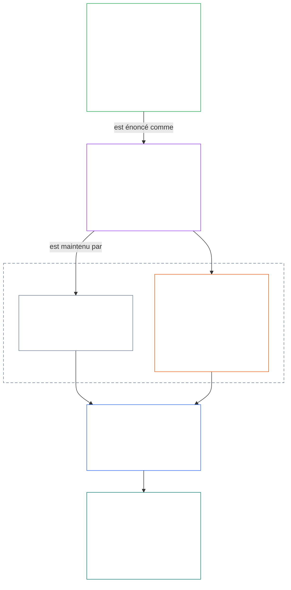
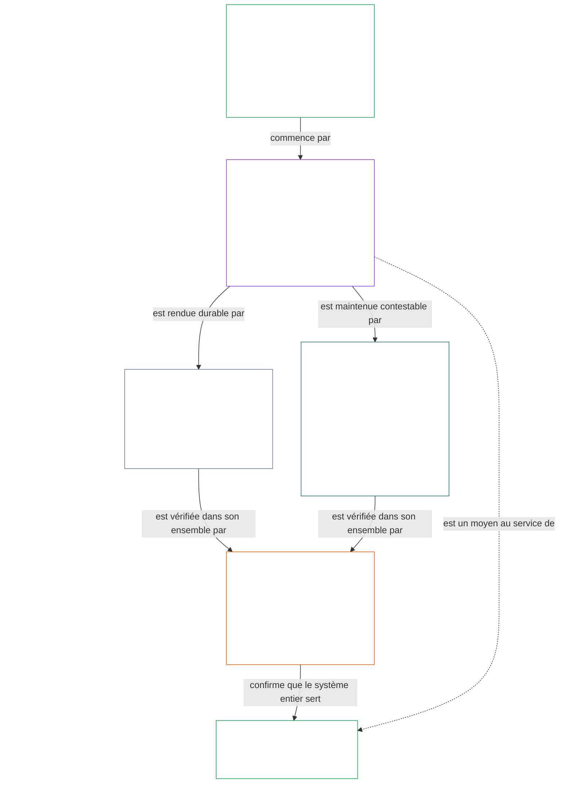

# CHAPITRE 01, PARTIE A : PRINCIPES DE VALEUR

<details>
<summary><strong><span style="color: #2563eb;">Place dans le corpus (non normative) : structure des fichiers et règles de lecture</span></strong></summary>

> Le contenu qui suit est **uniquement un guide de lecture**. Il n’ajoute, ne supprime et ne restreint aucune obligation contraignante figurant ailleurs dans ce fichier ou dans d’autres chapitres.
>
> Ce fichier **fait partie de la Constitution sentiente** et n’est **contraignant qu’avec** les autres fichiers numérotés `core_*`, lus comme un instrument unique. Il contient le **chapitre un, partie A** (§§1–12 : objet et rôle ; l’objectif d’Épanouissement, introduit au §2 et développé par le bien-être, la Sécurité, la Vérité, la Confiance et la Liberté ; ainsi que l’objectif de Continuité, introduit au §8 et développé par la capacité des systèmes partagés, la résilience, la structure du marché et l’évaluation systémique).
>
> **En amont :** [core_00_preamble.md](core_00_preamble.md)  
> **Ensuite :** [core_01_b_interaction_interpretation.md](core_01_b_interaction_interpretation.md) (chapitre un, partie B — §§13–15, interaction, limites de dérogation et interprétation constitutionnelle).  
> **Parcours de lecture :** §1 objet et rôle → **Épanouissement :** introduction au §2 (avec les contraintes non négociables de Sécurité et de Vérité au §2.1) → §3 bien-être (le résultat) → §4 Sécurité → §5 Vérité → §6 Confiance → §7 Liberté → **Continuité :** introduction au §8 → §9 capacité des systèmes partagés (le lien : un moyen au service de l’Épanouissement et la substance de la Continuité) → §10 résilience → §11 structure du marché → §12 évaluation systémique.

</details>

<details>
<summary><strong><span style="color: #2563eb;">Guide de lecture (non normatif) : comment le chapitre un relie les objectifs, la Tétrade, les articles et les définitions</span></strong></summary>

> Le contenu qui suit est **uniquement un guide de lecture**. Il n’ajoute, ne supprime et ne restreint aucune obligation contraignante figurant ailleurs dans ce fichier ou dans d’autres chapitres. Les encadrés **Traçabilité** et **Définitions · Évaluation · Conformité** de chaque section déterminent les références contraignantes ; ce bloc fournit une carte de la partie aux lecteurs qui abordent le chapitre un.

**Articulation des niveaux.** Chaque niveau répond à une question différente, et chaque principe du chapitre un renvoie aux trois autres niveaux :

- **Objectifs et Tétrade** ([Préambule §1](core_00_preamble.md#the-model)) : la raison d’être des systèmes partagés ([Épanouissement](core_05_apex_flourishing_aim.md#flourishing-constitutional) et [Continuité](core_05_apex_continuity_aim.md#chapter-five-definitions-continuity-constitutional-aim)), ainsi que les quatre devoirs qui rendent cette poursuite légitime ([participation](core_05_apex_participation_leg.md#participation-constitutional), [supervision](core_05_apex_oversight_leg.md#oversight-constitutional), [responsabilité](core_05_apex_accountability_leg.md#accountability) et [diligence](core_05_apex_timeliness_leg.md#timeliness-constitutional)).
- **Principes** (le présent chapitre) : comment ces objectifs et devoirs deviennent des valeurs, des contraintes et des règles permettant de les mettre en balance.
- **Articles** ([chapitre six](core_06_rights_part_a.md#chapter-six-foundational-rights)) : les protections du Socle des droits qui restent effectives pendant la poursuite des objectifs. La **Traçabilité** d’une section les énumère sous *En particulier*.
- **Définitions** ([chapitres deux à cinq](core_02_definition_structure.md)) : les significations communes servant à vérifier si une affirmation est vraie. L’encadré **Définitions · Évaluation · Conformité** de chaque section les répertorie.

**Développement de chaque objectif dans le chapitre un.** L’Épanouissement est un bien-être soutenu par la vérité, la sécurité, la fiabilité et une capacité d’agir réelle ([Préambule §1](core_00_preamble.md#flourishing)). Le chapitre un énonce d’abord le résultat, puis pose un principe pour chacune des quatre conditions.

| Objectif et aspect | Principe du chapitre un | Définition de référence | Articles cités dans sa Traçabilité |
|---|---|---|---|
| **Épanouissement** : le résultat | [§3 Bien-être](#3-foundational-objective-wellbeing-flourishing-aim) | [Bien-être](core_05_band_continuity.md#wellbeing) | [VI](core_06_rights_part_b.md#article-vi-equal-basic-rights), [X](core_06_rights_part_b.md#article-x-self-determination-agency-and-participation), [XIII-B](core_06_rights_part_c.md#article-xiii-b-right-to-redress-and-remedy), [XIX-B](core_06_rights_part_d.md#article-xix-b-contestability-and-proportional-restriction-limits) |
| **Épanouissement** : sécurité | [§4 Sécurité](#4-safety-harm-constraint) | [Sécurité](core_05_band_continuity.md#safety-constitutional-constraint) | [XIII](core_06_rights_part_c.md#article-xiii-right-to-reliable-and-trustworthy-systems), [XVII](core_06_rights_part_c.md#article-xvii-system-lifecycle-environments-and-reversibility), [XXIII](core_06_rights_part_d.md#article-xxiii-root-cause-analysis-and-adaptive-response) |
| **Épanouissement** : vérité | [§5 Vérité](#5-truth-epistemic-integrity-constraint) | [Vérité](core_05_band_oversight.md#truth-constitutional-constraint) | [XIII](core_06_rights_part_c.md#article-xiii-right-to-reliable-and-trustworthy-systems), [XV](core_06_rights_part_c.md#article-xv-info-sphere-integrity), [XVI](core_06_rights_part_c.md#article-xvi-audit-transparency-and-independent-verification) |
| **Épanouissement** : fiabilité | [§6 Confiance](#6-trust-and-trustworthiness-coordination-integrity) | [Fiabilité](core_05_band_continuity.md#trustworthiness) | [XIII](core_06_rights_part_c.md#article-xiii-right-to-reliable-and-trustworthy-systems), [XV](core_06_rights_part_c.md#article-xv-info-sphere-integrity), [XVI](core_06_rights_part_c.md#article-xvi-audit-transparency-and-independent-verification) |
| **Épanouissement** : capacité d’agir réelle | [§7 Liberté](#7-freedom-bounded-agency) | [Capacité d’agir réelle](core_05_band_participation.md#meaningful-agency) | [VI](core_06_rights_part_b.md#article-vi-equal-basic-rights), [X](core_06_rights_part_b.md#article-x-self-determination-agency-and-participation), [XXI](core_06_rights_part_d.md#article-xxi-interoperability-portability-movement-refuge-and-exit-integrity) |
| **Continuité**, en lien avec l’Épanouissement : capacité durable | [§9 Capacité des systèmes partagés](#9-shared-system-capacity) | [Capacité des systèmes partagés](core_05_band_continuity.md#shared-system-capacity) | [I-A](core_06_rights_part_a.md#article-i-a-environmental-preconditions-and-ecological-integrity), [III](core_06_rights_part_a.md#article-iii-survival-and-essential-access), [V](core_06_rights_part_a.md#article-v-resource-allocation-dependencies-and-ecosystem-funding) |
| **Continuité** : résilience | [§10 Résilience et conception auto-réparatrice](#10-resilience-and-self-healing-design) | [Auto-réparation](core_05_band_continuity.md#self-healing) | [XIII](core_06_rights_part_c.md#article-xiii-right-to-reliable-and-trustworthy-systems), [XVII](core_06_rights_part_c.md#article-xvii-system-lifecycle-environments-and-reversibility), [XXIII](core_06_rights_part_d.md#article-xxiii-root-cause-analysis-and-adaptive-response) |
| **Continuité** : marchés contestables | [§11 Structure du marché](#11-market-structure) | [Structure du marché](core_05_band_accountability.md#market-structure) | [III-C](core_06_rights_part_a.md#article-iii-c-labor-and-economic-floor), [V](core_06_rights_part_a.md#article-v-resource-allocation-dependencies-and-ecosystem-funding), [XXI](core_06_rights_part_d.md#article-xxi-interoperability-portability-movement-refuge-and-exit-integrity) |
| **Continuité** : vision de l’ensemble du système | [§12 Exigence d’évaluation systémique](#12-systemic-evaluation-requirement) | [Certification de l’alignement du système](core_05_band_continuity.md#system-alignment-certification) | [XVI](core_06_rights_part_c.md#article-xvi-audit-transparency-and-independent-verification) |

**Hiérarchie des principes (Continuité).** Au niveau des principes, l’objectif de Continuité se développe dans l’ordre suivant, en commençant par la capacité qui relie les deux objectifs :

6. La **[capacité des systèmes partagés](core_05_band_continuity.md#shared-system-capacity)** est le résultat auquel doivent aboutir, au fil du temps, une bonne gestion fiduciaire, une bonne gouvernance et des incitations adéquates : une capacité réelle et contestable permettant aux êtres sentients et aux systèmes partagés d’accomplir les tâches requises par la Constitution. Elle relève des deux objectifs : c’est un moyen au service de l’**Épanouissement** et la substance de la **Continuité**, mais elle ne prime pas sur tout le reste. **[§9.1](#91-productive-capacity-instrumental-good)** et **[§9.2](#92-constitutional-efficiency)** en exposent les deux principaux aspects.
7. La **[résilience et conception auto-réparatrice](#10-resilience-and-self-healing-design)** décrit comment les systèmes dont dépendent les êtres sentients détectent rapidement les problèmes, les contiennent, connaissent des défaillances selon des voies divulguées et se rétablissent honnêtement ([auto-réparation](core_05_band_continuity.md#self-healing)), afin que la capacité de l’élément 6 perdure et que la stabilité ne dépende pas d’interventions d’urgence.
8. La **[structure du marché](core_05_band_accountability.md#market-structure)** au [§11](#11-market-structure) fournit la discipline anti-concentration qui maintient cette capacité contestable dans la pratique.
9. L’**[exigence d’évaluation systémique](#12-systemic-evaluation-requirement)** vérifie la portée du système entier, ses dépendances et l’alignement des incitations avant qu’une affirmation de conformité ou de gouvernance puisse être retenue — selon la branche **supervision** de la Tétrade, comme orientation des audits au niveau des principes, notamment la [certification de l’alignement du système](core_05_band_continuity.md#system-alignment-certification), qui constitue l’un des processus d’audit particulièrement importants parmi d’autres.

**Place de la Tétrade dans le chapitre un.** Chaque section indique dans sa Traçabilité les branches auxquelles elle fait appel. Les sections suivantes les portent le plus directement :

| Branche de la Tétrade | Principales sections correspondantes du chapitre un |
|---|---|
| **Participation** | [§16 Gestion fiduciaire approfondie](core_01_c_stewardship_capacity_principles.md#16-stewardship-in-depth) et [§17 Gestion fiduciaire à conséquences importantes](core_01_c_stewardship_capacity_principles.md#17-consequential-stewardship-the-steward-role) (rôles ayant des conséquences et expression) ; [§7 Liberté](#7-freedom-bounded-agency) (capacité d’agir réelle) |
| **Supervision** | [§16](core_01_c_stewardship_capacity_principles.md#16-stewardship-in-depth) et [§17](core_01_c_stewardship_capacity_principles.md#17-consequential-stewardship-the-steward-role) (compréhension distribuée, dossiers) ; [§18 Gouvernance](core_01_c_stewardship_capacity_principles.md#18-governance-under-stewardship-discipline) (répartition des pouvoirs) ; [§12](#12-systemic-evaluation-requirement) (audit) |
| **Responsabilité** | [§18 Gouvernance](core_01_c_stewardship_capacity_principles.md#18-governance-under-stewardship-discipline) (obligation de rendre compte à la mesure du pouvoir) ; [§19 Alignement des incitations et captation du système](core_01_c_stewardship_capacity_principles.md#19-incentive-alignment-and-system-capture) (les récompenses ne doivent pas vider les branches de leur substance) |
| **Diligence** | [§16](core_01_c_stewardship_capacity_principles.md#16-stewardship-in-depth) et [§17](core_01_c_stewardship_capacity_principles.md#17-consequential-stewardship-the-steward-role) (détecter et corriger les problèmes sans retard évitable) |

**Deux axes, sans opposition.** Les objectifs indiquent ce que les systèmes poursuivent ; la Tétrade indique comment cette poursuite reste légitime. Un terme peut relever des deux : la Vérité et la Fiabilité sont des composantes de l’Épanouissement, et le [Préambule §2](core_00_preamble.md#2-measurements-overview) les mesure dans la famille de la Supervision. Les [§§13–15](core_01_b_interaction_interpretation.md#13-constitutional-collision-resolution-process) déterminent comment mettre ces principes en balance lorsqu’ils entrent en conflit et les lire comme un tout ; le [§20](core_01_c_stewardship_capacity_principles.md#20-integrated-application) les applique à tous les chapitres ultérieurs.

</details>

<br>

### 1. Objet et rôle
<details>
<summary><strong><span style="color: #2563eb;">Traçabilité</span></strong></summary>

- En amont : [Préambule §1 Le Modèle](core_00_preamble.md#the-model) — la [Tétrade constitutionnelle](core_00_preamble.md#constitutional-tetrad), les [Deux objectifs constitutionnels](core_00_preamble.md#two-constitutional-aims) et la gradation selon l'[enjeu matériel](core_00_preamble.md#material-stake) s'appliquent à l'ensemble du chapitre au moyen des traces de chaque section.
- En aval : [15. Interprétation constitutionnelle](core_01_b_interaction_interpretation.md#15-constitutional-interpretation), pour une lecture intégrée, la résolution des ambiguïtés, la hiérarchie interne et la procédure canonique de résolution des conflits.
- En aval : [Deux objectifs constitutionnels](core_00_preamble.md#two-constitutional-aims) — développement de l'objectif d'**Épanouissement** : de [§3](#3-foundational-objective-wellbeing-flourishing-aim) à [§6](#6-trust-and-trustworthiness-coordination-integrity) et [§7 Liberté](#7-freedom-bounded-agency) ; développement de l'objectif de **Continuité** : [§9 Capacité des systèmes partagés](#9-shared-system-capacity), [§10 Résilience et conception autoréparatrice](#10-resilience-and-self-healing-design), [§11 Structure du marché](#11-market-structure) et [§12 Exigence d'évaluation systémique](#12-systemic-evaluation-requirement).
- En aval : [3. Objectif fondamental : bien-être](#3-foundational-objective-wellbeing-flourishing-aim), [§3.2 Reconnaissance, renforcement et aspiration](#32-recognition-reinforcement-and-aspiration), [4 Sécurité](#4-safety-harm-constraint), [5 Vérité](#5-truth-epistemic-integrity-constraint), [6. Confiance](#6-trust-and-trustworthiness-coordination-integrity), [§16 Gestion responsable approfondie](core_01_c_stewardship_capacity_principles.md#16-stewardship-in-depth), [13. Procédure de résolution des conflits constitutionnels](core_01_b_interaction_interpretation.md#13-constitutional-collision-resolution-process) et [§7 Liberté](#7-freedom-bounded-agency).
- À lire avec : [Tétrade constitutionnelle](core_00_preamble.md#constitutional-tetrad) — la participation, la supervision, la responsabilité et la célérité régissent la manière dont les systèmes partagés poursuivent les [Deux objectifs constitutionnels](core_00_preamble.md#two-constitutional-aims) ; la gradation selon l'[enjeu matériel](core_00_preamble.md#material-stake) s'applique à l'ensemble du chapitre au moyen des traces de chaque section.
- À lire avec : [Chapitres Deux à Quatre](core_02_definition_structure.md) et [Chapitre Cinq](core_05__definitions_home.md#chapter-five-foundational-definitions) — la couche des mécanismes qui régit chaque terme de ce chapitre ; appliquer l'intégrité O/M/A/C, l'interdiction de se soustraire aux obligations, la charge de la preuve et la traçabilité des définitions jusqu'aux résultats.
- À lire avec : [Chapitre Six : Droits fondamentaux](core_06_rights_part_a.md#chapter-six-foundational-rights).
  - En particulier, [Article VI : Égalité des droits fondamentaux](core_06_rights_part_b.md#article-vi-equal-basic-rights), [Article XIII : Droit à des systèmes fiables et dignes de confiance](core_06_rights_part_c.md#article-xiii-right-to-reliable-and-trustworthy-systems) et [Article XXIV : Interprétation constitutionnelle, examen et garanties contre la captation](core_06_rights_part_d.md#article-xxiv-constitutional-interpretation-review-and-anti-capture-safeguards).
  - Appliquer cette lecture lorsque l'interprétation touche des êtres sentients, systèmes ou institutions protégés.

</details>

<details>
<summary><strong><span style="color: #2563eb;">Définitions · Évaluation · Conformité</span></strong></summary>

- [Proportionnalité](core_05_band_accountability.md#proportionality) · [O](core_05_band_accountability.md#proportionality) · [M](core_05_band_accountability.md#proportionality-a) · [A](core_05_band_accountability.md#proportionality-a) · [C](core_05_band_accountability.md#proportionality-c)
- [Nécessité](core_05_band_accountability.md#necessity) · [O](core_05_band_accountability.md#necessity) · [M](core_05_band_accountability.md#necessity-a) · [A](core_05_band_accountability.md#necessity-a) · [C](core_05_band_accountability.md#necessity-c)

</details>

<br>

*En termes simples : le Chapitre Un établit les valeurs et les contraintes qui régissent tous les autres chapitres. Les systèmes partagés doivent poursuivre ensemble l'**Épanouissement** et la **Continuité**, sans sacrifier l'un à l'autre, et aucune valeur ne peut être maximisée au détriment des autres.*

<a id="two-constitutional-aims"></a><a id="flourishing"></a><a id="continuity"></a>Ce chapitre établit les principes et les contraintes qui régissent l'interprétation, l'application et l'évolution de la présente Constitution. Il développe les [Deux objectifs constitutionnels](core_00_preamble.md#two-constitutional-aims) — l'[**Épanouissement**](core_00_preamble.md#flourishing) et la [**Continuité**](core_00_preamble.md#continuity) — établis dans le [Préambule §1 Le Modèle](core_00_preamble.md#the-model), pour en faire des principes et des contraintes opérationnels. Les définitions canoniques au niveau des principes figurent dans le Préambule ; ce chapitre les applique.

Ces objectifs doivent être poursuivis conjointement, toujours dans le respect des contraintes de principe non négociables et des protections des droits établies par la présente Constitution. La [**Tétrade constitutionnelle**](core_00_preamble.md#constitutional-tetrad) régit la légitimité de cette poursuite, à une échelle adaptée à l'[**enjeu matériel**](core_00_preamble.md#material-stake).

Le chapitre s'organise autour de ces deux objectifs et de cette Tétrade :
- **Épanouissement :** l'[Introduction à l'objectif d'Épanouissement](#2-flourishing-aim-introduction) présente l'objectif. [§3 Objectif fondamental : bien-être](#3-foundational-objective-wellbeing-flourishing-aim) énonce le résultat. [§4 Sécurité](#4-safety-harm-constraint), [§5 Vérité](#5-truth-epistemic-integrity-constraint), [§6 Confiance](#6-trust-and-trustworthiness-coordination-integrity) et [§7 Liberté](#7-freedom-bounded-agency) développent les quatre conditions qui le soutiennent : sécurité, vérité, fiabilité et agentivité significative.
- **Continuité :** l'[Introduction à l'objectif de Continuité](#8-continuity-aim-introduction) présente l'objectif. [§9 Capacité des systèmes partagés](#9-shared-system-capacity) (un moyen de favoriser l'Épanouissement et la substance même de la Continuité), [§10 Résilience et conception autoréparatrice](#10-resilience-and-self-healing-design), [§11 Structure du marché](#11-market-structure) et [§12 Exigence d'évaluation systémique](#12-systemic-evaluation-requirement) développent la stabilité à long terme, la capacité durable des systèmes partagés et la résilience. Les affirmations relatives à la Continuité exigent une représentation honnête du système dans son ensemble : les affirmations des §§9–11 ne sont fondées qu'après vérification au titre du §12.
- **Lorsque les principes se rencontrent :** [§13 Procédure de résolution des conflits constitutionnels](core_01_b_interaction_interpretation.md#13-constitutional-collision-resolution-process), [§14 Interdiction de dérogation absolue](core_01_b_interaction_interpretation.md#14-prohibition-on-absolute-override) et [§15 Interprétation constitutionnelle](core_01_b_interaction_interpretation.md#15-constitutional-interpretation) régissent la mise en balance et la lecture conjointe des objectifs et principes.
- **La Tétrade en pratique :** de [§16 Gestion responsable approfondie](core_01_c_stewardship_capacity_principles.md#16-stewardship-in-depth) à [§19 Alignement des incitations et captation du système](core_01_c_stewardship_capacity_principles.md#19-incentive-alignment-and-system-capture), ces sections intègrent la participation, la supervision, la responsabilité et la célérité à la gestion responsable, à la gouvernance et aux incitations ; [§20 Application intégrée](core_01_c_stewardship_capacity_principles.md#20-integrated-application) applique l'ensemble du chapitre à tous les chapitres suivants.

La **Trace** de chaque principe répertorie les articles du Chapitre Six qui le protègent ; son module **Définitions · Évaluation · Conformité** répertorie les définitions du Chapitre Cinq qui permettent de le mesurer.

**Diagramme : Deux objectifs constitutionnels et la Tétrade constitutionnelle**

<hr style="border: 0; border-top: 1px solid currentColor;">

```mermaid
flowchart TB
    subgraph Foundation[" "]
        direction TB
        subgraph Aims["Two Constitutional Aims"]
            direction LR
            F["Flourishing<br/><br/>• Sentient wellbeing sustained through truth, safety,<br/>trustworthiness, and meaningful agency"]
            C["Continuity<br/><br/>• Long-horizon stability, sustainability, resilience,<br/>and ecological wellbeing"]
        end
        subgraph Tetrad1["Constitutional Tetrad · participation and oversight"]
            direction LR
            P["Participation<br/><br/>• Affected sentients get a real voice<br/>• Fair representation and a fair chance to challenge<br/>• Access to consequential roles in proportion to stake"]
            O["Oversight<br/><br/>• Watching, checking, verifying, and keeping records<br/>• Independent review can constrain bad choices"]
        end
        subgraph Tetrad2["Constitutional Tetrad · accountability and timeliness"]
            direction LR
            A["Accountability<br/><br/>• Responsibility traces to the right actors<br/>• Answerability, redress, and real correction<br/>• Bad outcomes trigger repair"]
            T["Timeliness<br/><br/>• Problems are detected, challenged, resolved, and fixed<br/>• Time limits match the material stake<br/>• Delay cannot erase rights, remedies, or repair"]
        end
    end
    F ~~~ P
    P ~~~ A
    style Foundation fill:none,stroke:none
    style Aims fill:none,stroke:none
    style Tetrad1 fill:none,stroke:none
    style Tetrad2 fill:none,stroke:none
    style F fill:none,stroke:#16a34a,color:#ffffff
    style C fill:none,stroke:#16a34a,color:#ffffff
    style P fill:none,stroke:#0f766e,color:#ffffff
    style O fill:none,stroke:#ea580c,color:#ffffff
    style A fill:none,stroke:#db2777,color:#ffffff
    style T fill:none,stroke:#9333ea,color:#ffffff
```

*Les objectifs décrivent ce que les systèmes partagés doivent poursuivre ; la Tétrade décrit les obligations qui préservent la légitimité de cette poursuite. Les quatre obligations sont graduées selon l'[enjeu matériel](core_00_preamble.md#material-stake), et les deux objectifs restent limités par le Socle des droits. Reproduit depuis la [Vue d'ensemble conceptuelle](guides/CONCEPTUAL_OVERVIEW.md#two-aims-and-the-constitutional-tetrad).*

Ces valeurs :
- ne sont pas indépendantes et, dans le fonctionnement ordinaire, ne suivent pas une hiérarchie stricte ;
- fonctionnent comme des principes et contraintes en interaction, qui doivent être évalués ensemble ;
- s'appliquent à tous les « systèmes », notamment aux structures techniques, organisationnelles, économiques et sociotechniques ainsi qu'aux écosystèmes qui ont une incidence matérielle sur les êtres sentients et la planète Terre.

Aucun principe ne peut être appliqué isolément lorsque cela porte matériellement atteinte aux autres. En cas de tensions, les systèmes doivent les résoudre selon les exigences de proportionnalité, de nécessité et d'incidence systémique énoncées dans ce chapitre. Lorsqu'un conflit non résolu met directement en jeu des contraintes de principe non négociables, la **§13** du Chapitre Un, Procédure de résolution des conflits constitutionnels, détermine la priorité.

<a id="2-flourishing-aim-introduction"></a>
### 2. Introduction à l’objectif d’épanouissement
<details>
<summary><strong><span style="color: #2563eb;">Traçabilité</span></strong></summary>

- À lire avec : [Tétrade constitutionnelle](core_00_preamble.md#constitutional-tetrad) — les quatre piliers régissent la manière de poursuivre l’épanouissement ; le [enjeu matériel](core_00_preamble.md#material-stake) détermine la profondeur de toute affirmation relative à l’épanouissement.
- À lire avec : [Les deux objectifs constitutionnels](core_00_preamble.md#two-constitutional-aims) — l’objectif d’**épanouissement** ; son objectif partenaire est présenté dans l’[Introduction à l’objectif de continuité](#8-continuity-aim-introduction).
- En amont : Principes : [Préambule §1 Le Modèle](core_00_preamble.md#flourishing) ; [Épanouissement (objectif constitutionnel)](core_05_apex_flourishing_aim.md#flourishing-constitutional) ; [§1 Objet et rôle](#1-purpose-and-role).
- En aval : [§3 Objectif fondamental : Bien-être (objectif d’épanouissement)](#3-foundational-objective-wellbeing-flourishing-aim), [§4 Sécurité (contrainte relative au préjudice)](#4-safety-harm-constraint), [§5 Vérité (contrainte d’intégrité épistémique)](#5-truth-epistemic-integrity-constraint), [§6 Confiance et fiabilité (intégrité de la coordination)](#6-trust-and-trustworthiness-coordination-integrity) et [§7 Liberté (agentivité encadrée)](#7-freedom-bounded-agency) ; les Articles qui protègent chacun sont nommés dans la traçabilité de la section correspondante.
- Sous-sections : [§2.1 Contraintes de principe non négociables : sécurité et vérité](#21-non-negotiable-principle-constraints-safety-and-truth).
- À lire avec : le socle des droits du Chapitre Six dans son ensemble.

</details>

<details>
<summary><strong><span style="color: #2563eb;">Définitions · Évaluation · Conformité</span></strong></summary>

- [Épanouissement (objectif constitutionnel)](core_05_apex_flourishing_aim.md#flourishing-constitutional) · [O](core_05_apex_flourishing_aim.md#flourishing-constitutional) · [M](core_05_apex_flourishing_aim.md#flourishing-constitutional-m) · [A](core_05_apex_flourishing_aim.md#flourishing-constitutional-a) · [C](core_05_apex_flourishing_aim.md#flourishing-constitutional-c)
- [Bien-être](core_05_band_continuity.md#wellbeing) · [O](core_05_band_continuity.md#wellbeing) · [M](core_05_band_continuity.md#wellbeing-a) · [A](core_05_band_continuity.md#wellbeing-a) · [C](core_05_band_continuity.md#wellbeing-c)
- [Sécurité (contrainte constitutionnelle)](core_05_band_continuity.md#safety-constitutional-constraint) · [O](core_05_band_continuity.md#safety-constitutional-constraint) · [M](core_05_band_continuity.md#safety-constraint-a) · [A](core_05_band_continuity.md#safety-constraint-a) · [C](core_05_band_continuity.md#safety-constraint-c)
- [Vérité (contrainte constitutionnelle)](core_05_band_oversight.md#truth-constitutional-constraint) · [O](core_05_band_oversight.md#truth-constitutional-constraint-o) · [M](core_05_band_oversight.md#truth-constitutional-constraint-a) · [A](core_05_band_oversight.md#truth-constitutional-constraint-a) · [C](core_05_band_oversight.md#truth-constitutional-constraint-c)
- [Fiabilité](core_05_band_continuity.md#trustworthiness) · [O](core_05_band_continuity.md#trustworthiness) · [M](core_05_band_continuity.md#trustworthiness-a) · [A](core_05_band_continuity.md#trustworthiness-a) · [C](core_05_band_continuity.md#trustworthiness-c)
- [Agentivité significative](core_05_band_participation.md#meaningful-agency) · [O](core_05_band_participation.md#meaningful-agency) · [M](core_05_band_participation.md#meaningful-agency-a) · [A](core_05_band_participation.md#meaningful-agency-a) · [C](core_05_band_participation.md#meaningful-agency-c)

</details>

<br>

*En termes simples : l’épanouissement est le premier des deux objectifs : les êtres sentients vivent bien et conservent la capacité de bien vivre parce que les systèmes qui les entourent sont sûrs, honnêtes, fiables et leur laissent une réelle marge de choix. La section 3 définit ce résultat. Les quatre principes qui suivent indiquent ce qui le rend effectif.*

[**L’épanouissement**](core_05_apex_flourishing_aim.md#flourishing-constitutional) est le **bien-être sentient maintenu par la vérité, la sécurité, la fiabilité et une agentivité significative** ([Préambule §1 Le Modèle](core_00_preamble.md#flourishing)). Le Chapitre Un le développe en deux étapes : [§3 Objectif fondamental : Bien-être (objectif d’épanouissement)](#3-foundational-objective-wellbeing-flourishing-aim) énonce le résultat, et quatre principes énoncent les conditions qui le maintiennent.

| Condition | Principe | Question à laquelle il répond |
|---|---|---|
| **Sécurité** | [§4 Sécurité (contrainte relative au préjudice)](#4-safety-harm-constraint) | Les êtres sentients sont-ils protégés contre les préjudices évitables ? |
| **Vérité** | [§5 Vérité (contrainte d’intégrité épistémique)](#5-truth-epistemic-integrity-constraint), avec [§5.1 Enquête fondée sur les sciences et aide à la décision](#51-science-informed-inquiry-and-decision-support) et [§5.2 Accessibilité en langage clair (devoir de participation et de gestion responsable)](#52-plain-language-accessibility-participation-and-stewardship-duty) | Les êtres sentients peuvent-ils se fier à ce qu’on leur dit et le comprendre ? |
| **Fiabilité** | [§6 Confiance et fiabilité (intégrité de la coordination)](#6-trust-and-trustworthiness-coordination-integrity) | Les systèmes méritent-ils la confiance, et la rétablissent-ils en cas de défaillance ? |
| **Agentivité significative** | [§7 Liberté (agentivité encadrée)](#7-freedom-bounded-agency) | Les êtres sentients conservent-ils une liberté réelle et encadrée de choisir, contester, s’organiser et partir ? |

**Comment les principes de l’épanouissement agissent ensemble :**
- **La sécurité et la vérité sont des contraintes non négociables :** elles sont énoncées ensemble dans [§2.1 Contraintes de principe non négociables : sécurité et vérité](#21-non-negotiable-principle-constraints-safety-and-truth) et ne peuvent être sacrifiées pour obtenir les autres principes.
- **La confiance et la liberté sont encadrées, sans être absolues :** la confiance se gagne et peut être corrigée ([§6.1 Correction et réparation](#61-correction-and-remedy)) ; la liberté est soumise à des limites disciplinées ([§7.1 Discipline des restrictions](#71-limitation-discipline)).
- **Aucun principe ne s’applique isolément :** les principes se lisent ensemble et, lorsqu’ils entrent en conflit, sont mis en balance selon la [§13 Procédure de résolution des conflits constitutionnels](core_01_b_interaction_interpretation.md#13-constitutional-collision-resolution-process).
- **L’épanouissement a un objectif partenaire :** l’objectif de continuité demande comment rendre ce résultat durable ; il est présenté dans l’[Introduction à l’objectif de continuité](#8-continuity-aim-introduction).

**Diagramme : l’épanouissement et ses principes**

<hr style="border: 0; border-top: 1px solid currentColor;">



*L’épanouissement est énoncé comme un résultat et repose d’abord sur les contraintes non négociables, la sécurité et la vérité, qui contribuent toutes deux à la confiance, laquelle contribue à son tour à la liberté. Les couleurs sont des repères visuels réutilisables, pas des affirmations de priorité. La traçabilité de chaque principe nomme ses Articles, et son module Définitions · Évaluation · Conformité nomme ses définitions. Reproduit dans la [Vue d’ensemble conceptuelle](guides/CONCEPTUAL_OVERVIEW.md#flourishing-and-its-principles).*

<a id="21-non-negotiable-principle-constraints-safety-and-truth"></a>
#### 2.1 Contraintes de principe non négociables : sécurité et vérité
<details>
<summary><strong><span style="color: #2563eb;">Traçabilité</span></strong></summary>

- À lire avec : [Tétrade constitutionnelle](core_00_preamble.md#constitutional-tetrad) — pilier **participation** (comprendre et contester les déterminations de sécurité et de vérité) ; pilier **surveillance** (détecter les risques de préjudice et la dégradation épistémique) ; pilier **responsabilité** (répondre des préjudices, de la tromperie et d’une confiance induite en erreur) ; échelle de l’[enjeu matériel](core_00_preamble.md#material-stake).
- À lire avec : [Les deux objectifs constitutionnels](core_00_preamble.md#two-constitutional-aims) — objectif d’**épanouissement** (**sécurité** et **vérité** sont des composantes expressément nommées dans le [Préambule §1](core_00_preamble.md#two-constitutional-aims)) ; objectif de **continuité** (prévention des préjudices à long terme et gestion responsable et honnête de systèmes durables).
- En amont : Principes : [3. Objectif fondamental : Bien-être](#3-foundational-objective-wellbeing-flourishing-aim) ; [Les deux objectifs constitutionnels](core_00_preamble.md#two-constitutional-aims).
- En aval : [6. Confiance](#6-trust-and-trustworthiness-coordination-integrity), [13. Procédure de résolution des conflits constitutionnels](core_01_b_interaction_interpretation.md#13-constitutional-collision-resolution-process) et [§7 Liberté](#7-freedom-bounded-agency).
- Appliqué dans : [§4 Sécurité](#4-safety-harm-constraint) ; [§5 Vérité](#5-truth-epistemic-integrity-constraint) ; [§5.1 Enquête fondée sur les sciences et aide à la décision](#51-science-informed-inquiry-and-decision-support) ; [§5.2 Accessibilité en langage clair](#52-plain-language-accessibility-participation-and-stewardship-duty).

</details>

<br>

*En termes simples : la sécurité et la vérité constituent des planchers fermes de la Constitution — ce ne sont pas des compromis que l’on peut écarter pour optimiser autre chose. Les systèmes communs ne peuvent pas exposer les êtres sentients à un danger prévisible ni les tromper ; les deux contraintes s’appliquent à la poursuite de l’épanouissement et de la continuité, sous la discipline de participation, de surveillance, de responsabilité et de célérité imposée par la Tétrade.*

La **sécurité** et la **vérité** sont des contraintes de principe non négociables qui limitent tous les autres principes du Chapitre Un — notamment l’[§3 Objectif fondamental : Bien-être](#3-foundational-objective-wellbeing-flourishing-aim) et les [Deux objectifs constitutionnels](core_00_preamble.md#two-constitutional-aims). Elles sont des composantes expressément nommées de l’[**épanouissement**](#flourishing) et indispensables à la [**continuité**](#continuity) : les systèmes ne peuvent s’épanouir par le préjudice ou la tromperie, et une légitimité durable exige une gestion honnête des risques dans le temps.

L’application de ces contraintes doit respecter la [Tétrade constitutionnelle](core_00_preamble.md#constitutional-tetrad), à l’échelle de l’[enjeu matériel](core_00_preamble.md#material-stake), en particulier :
- lorsque les déterminations de sécurité affectent la capacité de participation
- lorsque des affirmations de vérité régissent la confiance
- lorsque la responsabilité pour un préjudice ou une conduite trompeuse est en jeu

Les conclusions en matière de sécurité et de vérité peuvent modifier le dossier de statut d’un être sentient, notamment :
- la manière dont les [contributions](core_05_band_accountability.md#contribution-nature) sont reconnues
- l’enregistrement ou non des violations
- la classification de la gravité de ces violations
- les conséquences qui en découlent

Le modèle de statut du [**Chapitre Neuf**](core_09_standing_assessment.md) régit la classification, la vérification et l’application de ces conclusions, selon les exigences d’évaluation et de conformité issues des [**Chapitres Deux à Cinq**](core_02_definition_structure.md).

### 3. Objectif fondamental : bien-être (objectif d’épanouissement)
<details>
<summary><strong><span style="color: #2563eb;">Traçabilité</span></strong></summary>

- À lire avec : [Tétrade constitutionnelle](core_00_preamble.md#constitutional-tetrad) — le pilier **participation** s’applique lorsque les conditions de bien-être affectent matériellement le caractère substantiel de la voix, de l’accès et de la contestabilité ; le pilier **responsabilité** s’applique lorsque les affirmations de bien-être affectent la répartition des charges ; l’échelle de l’[enjeu matériel](core_00_preamble.md#material-stake) s’applique lorsqu’elle est matériellement pertinente.
- À lire avec : [Les deux objectifs constitutionnels](core_00_preamble.md#two-constitutional-aims) — ce chapitre développe l’objectif d’**épanouissement** de [§3](#3-foundational-objective-wellbeing-flourishing-aim) à [§6](#6-trust-and-trustworthiness-coordination-integrity) et [§7 Liberté](#7-freedom-bounded-agency).
- En amont : Principes : [Préambule §1 Le Modèle](core_00_preamble.md#the-model) ; [Les deux objectifs constitutionnels](core_00_preamble.md#two-constitutional-aims) — développement de l’objectif d’**épanouissement**.
- En aval : [§4 Sécurité](#4-safety-harm-constraint), [§5 Vérité](#5-truth-epistemic-integrity-constraint), [§16 Gestion responsable approfondie](core_01_c_stewardship_capacity_principles.md#16-stewardship-in-depth) et [§13 Processus de résolution des conflits constitutionnels](core_01_b_interaction_interpretation.md#13-constitutional-collision-resolution-process).
- Sous-sections : [§3.1 Équité](#31-fairness) ; [§3.2 Reconnaissance, renforcement et aspiration](#32-recognition-reinforcement-and-aspiration) ; [§3.3 Processus anti-dégradant](#33-anti-degrading-process).
- À lire avec : le socle des droits du Chapitre Six dans son ensemble.
  - En particulier [Article VI : Droits fondamentaux égaux](core_06_rights_part_b.md#article-vi-equal-basic-rights), [Article X : Autodétermination, agentivité et participation](core_06_rights_part_b.md#article-x-self-determination-agency-and-participation), [Article XIII-B : Droit à réparation et à recours](core_06_rights_part_c.md#article-xiii-b-right-to-redress-and-remedy) et [Article XIX-B : Contestabilité et limites des restrictions proportionnées](core_06_rights_part_d.md#article-xix-b-contestability-and-proportional-restriction-limits).
  - Appliquer ceci lorsque des gains de bien-être allégués justifieraient des restrictions de l’agentivité, de la dignité ou de la contestabilité.
  - En particulier [Dignité et égalité de statut moral](core_05_band_participation.md#dignity-and-equal-moral-standing), [Équité substantielle](core_05_band_participation.md#substantive-fairness) et [6. Confiance](#6-trust-and-trustworthiness-coordination-integrity), lorsque l’accès, les procédures, l’alignement distributif, la confiance ou l’intégrité de la coordination sont matériellement en jeu.

</details>

<details>
<summary><strong><span style="color: #2563eb;">Définitions · Évaluation · Conformité</span></strong></summary>

- [Bien-être](core_05_band_continuity.md#wellbeing) · [O](core_05_band_continuity.md#wellbeing) · [M](core_05_band_continuity.md#wellbeing-a) · [A](core_05_band_continuity.md#wellbeing-a) · [C](core_05_band_continuity.md#wellbeing-c)
- [Participation](core_05_apex_participation_leg.md#participation-constitutional) · [O](core_05_apex_participation_leg.md#participation-constitutional) · [M](core_05_apex_participation_leg.md#participation-constitutional-m) · [A](core_05_apex_participation_leg.md#participation-constitutional-a) · [C](core_05_apex_participation_leg.md#participation-constitutional-c)
- [Dignité et égalité de statut moral](core_05_band_participation.md#dignity-and-equal-moral-standing) · [O](core_05_band_participation.md#dignity-and-equal-moral-standing) · [M](core_05_band_participation.md#dignity-and-equal-moral-standing-a) · [A](core_05_band_participation.md#dignity-and-equal-moral-standing-a) · [C](core_05_band_participation.md#dignity-and-equal-moral-standing-c)
- [Équité substantielle](core_05_band_participation.md#substantive-fairness) · [O](core_05_band_participation.md#substantive-fairness) · [M](core_05_band_participation.md#substantive-fairness-constitutional-a) · [A](core_05_band_participation.md#substantive-fairness-constitutional-a) · [C](core_05_band_participation.md#substantive-fairness-constitutional-c)
- [Matérialité](core_05_band_oversight.md#materiality) · [O](core_05_band_oversight.md#materiality) · [M](core_05_band_oversight.md#materiality-determination-a) · [A](core_05_band_oversight.md#materiality-determination-a) · [C](core_05_band_oversight.md#materiality-determination-c)
- [Divergence des indicateurs indirects](core_05_band_oversight.md#proxy-divergence) · [O](core_05_band_oversight.md#proxy-divergence) · [M](core_05_band_oversight.md#proxy-divergence-a) · [A](core_05_band_oversight.md#proxy-divergence-a) · [C](core_05_band_oversight.md#proxy-divergence-c)

</details>

<br>

*En termes simples : ces systèmes ont pour but d’améliorer réellement la vie des êtres sentients — ce but n’est pas atteint en poursuivant un indicateur indirect et ne saurait servir de prétexte pour négliger la sécurité, la vérité ou les droits. Le bien-être est essentiel à la participation : une voix symbolique, sans les conditions qui rendent l’agentivité réelle, ne constitue pas une participation au sens de cette Constitution.*

L’objectif ultime de tous les systèmes régis par cette Constitution est de préserver et d’améliorer le [bien-être](core_05_band_continuity.md#wellbeing) des êtres sentients — l’objectif d’[**épanouissement**](#flourishing) dans le cadre des [deux objectifs constitutionnels](core_00_preamble.md#two-constitutional-aims).

Le [Préambule §1 Le Modèle](core_00_preamble.md#flourishing) définit l’épanouissement comme le bien-être sentient maintenu par la vérité, la sécurité, la fiabilité et une agentivité significative. Cette section énonce le résultat. Les sections suivantes développent les quatre conditions qui le maintiennent : [§4 Sécurité](#4-safety-harm-constraint), [§5 Vérité](#5-truth-epistemic-integrity-constraint), [§6 Confiance](#6-trust-and-trustworthiness-coordination-integrity) et [§7 Liberté](#7-freedom-bounded-agency). Ensemble, ces cinq principes développent l’objectif d’épanouissement dans le Chapitre Un. L’objectif de [**continuité**](#continuity) est développé dans [§9 Capacité des systèmes communs](#9-shared-system-capacity), [§10 Résilience et conception auto-réparatrice](#10-resilience-and-self-healing-design), [§11 Structure du marché](#11-market-structure) et [§12 Exigence d’évaluation systémique](#12-systemic-evaluation-requirement).

Le bien-être est fondamental pour la [participation](core_05_apex_participation_leg.md#participation-constitutional) au titre de la [Tétrade constitutionnelle](core_00_preamble.md#constitutional-tetrad). Les systèmes communs ne peuvent pas considérer la participation comme acquise lorsque les conditions sous-jacentes au bien-être — notamment l’[agentivité significative](core_05_band_participation.md#meaningful-agency), l’accès équitable et la dignité — sont matériellement dégradées.

Le bien-être englobe les effets immédiats, mais aussi les conséquences indirectes, différées, cumulatives et intersystémiques, évaluées conformément aux [**Chapitres Deux à Quatre**](core_02_definition_structure.md). À ce niveau de valeur, le bien-être :
- rend possible une participation réelle — une voix que les êtres sentients ne peuvent exercer faute de conditions suffisantes n’est pas une participation significative
- ne peut être déclaré « atteint » au seul motif qu’un indicateur s’est éloigné de ce qui compte réellement
- reste soumis aux contraintes de principe non négociables de ce chapitre : **Sécurité** et **Vérité**
- ne peut servir de justification générale à une violation de la sécurité, de la vérité ou des protections des droits

#### 3.1 Équité
<details>
<summary><strong><span style="color: #2563eb;">Traçabilité</span></strong></summary>

- À lire avec : [Tétrade constitutionnelle](core_00_preamble.md#constitutional-tetrad) — pilier **participation** (accès, voix et contestabilité ; exigence générale, qui ne se limite pas à la [participation des parties prenantes au système](core_05_band_participation.md#stakeholder-status-and-weight)) ; pilier **responsabilité** lorsque des avantages et des charges s’attachent.
- En amont : Principes : [§3 Objectif fondamental : Bien-être](#3-foundational-objective-wellbeing-flourishing-aim) — notamment le caractère fondamental du bien-être pour la [participation](core_05_apex_participation_leg.md#participation-constitutional).
- En aval : [3.2 Reconnaissance, renforcement et aspiration](#32-recognition-reinforcement-and-aspiration) ; [6. Confiance](#6-trust-and-trustworthiness-coordination-integrity), [§16 Gestion responsable approfondie](core_01_c_stewardship_capacity_principles.md#16-stewardship-in-depth), [13. Processus de résolution des conflits constitutionnels](core_01_b_interaction_interpretation.md#13-constitutional-collision-resolution-process) et [Registre des conflits constitutionnels](core_05_band_integrative.md#constitutional-collision-record), lorsque les choix de priorité et de répartition doivent rester cohérents et révisables.
- Sous-sections (ordre de lecture) : [§3.1.1](#311-access-and-opportunity) · [§3.1.2](#312-benefits-and-burdens) · [§3.1.3](#313-fair-treatment) · [§3.1.4](#314-unfair-treatment).
- En aval : façonne le champ des droits concernant l’égalité de statut, le traitement non arbitraire, la contestation significative et les limites des restrictions proportionnées.
  - En particulier [Article VI : Droits fondamentaux égaux](core_06_rights_part_b.md#article-vi-equal-basic-rights), [Article VI-C : Non-discrimination](core_06_rights_part_b.md#article-vi-c-nondiscrimination), [Article X : Autodétermination, agentivité et participation](core_06_rights_part_b.md#article-x-self-determination-agency-and-participation), [Article XIII-B : Droit à réparation et à recours](core_06_rights_part_c.md#article-xiii-b-right-to-redress-and-remedy) et [Article XIX-B : Contestabilité et limites des restrictions proportionnées](core_06_rights_part_d.md#article-xix-b-contestability-and-proportional-restriction-limits).
  - Lorsqu’une désignation anticonstitutionnelle entraîne des sanctions ou des effets durables, lire avec le [Chapitre Onze, section 4 — Garanties de procédure régulière, recours et prévention](core_11_a_misconduct_designation.md#4-due-process-safeguards-for-slot-assignment).
  - Les engagements de non-discrimination sont détaillés au Chapitre Cinq [§2 — Caractéristiques protégées, utilisation de substituts, filtrage des signaux intimes et statut au titre de l’**Article VII-E** (*Services sexuels commerciaux consensuels entre adultes et exploitation sexuelle*)](core_05_band_participation.md#fairness-protected-characteristics-and-nondiscrimination), y compris le [Filtrage des signaux intimes protégés et contournement du statut de l’**Article VII-E** (*Services sexuels commerciaux consensuels entre adultes et exploitation sexuelle*)](core_05_band_participation.md#protected-intimate-signal-gating-and-article-vii-e-adult-consensual-commercial-sexual-services-and-sexual-exploitation-status-circumvention) lorsque les règles de traitement équitable de §2.1.3 concernent le filtrage des signaux intimes ou l’**Article VII-E** (*Services sexuels commerciaux consensuels entre adultes et exploitation sexuelle*).
- À lire avec : [Équité substantielle](core_05_band_participation.md#substantive-fairness) et les obligations pertinentes du socle des droits du Chapitre Six lorsque les avantages, charges, récompenses, coûts, devoirs, risques, contributions, besoins ou expositions sont matériels ; [Accessibilité](core_05_band_participation.md#accessibility) lorsque les voies d’accès de §2.1.1 sont matérielles ; [Divergence des indicateurs indirects](core_05_band_oversight.md#proxy-divergence) lorsque les indicateurs agrégés ou les effets de tableau de scores sont matériels.

</details>

<details>
<summary><strong><span style="color: #2563eb;">Définitions · Évaluation · Conformité</span></strong></summary>

- [Dignité et égalité de statut moral](core_05_band_participation.md#dignity-and-equal-moral-standing) · [O](core_05_band_participation.md#dignity-and-equal-moral-standing) · [M](core_05_band_participation.md#dignity-and-equal-moral-standing-a) · [A](core_05_band_participation.md#dignity-and-equal-moral-standing-a) · [C](core_05_band_participation.md#dignity-and-equal-moral-standing-c)
- [Accessibilité](core_05_band_participation.md#accessibility) · [O](core_05_band_participation.md#accessibility) · [M](core_05_band_participation.md#accessibility-constitutional-a) · [A](core_05_band_participation.md#accessibility-constitutional-a) · [C](core_05_band_participation.md#accessibility-constitutional-c)
- [Participation](core_05_apex_participation_leg.md#participation-constitutional) · [O](core_05_apex_participation_leg.md#participation-constitutional) · [M](core_05_apex_participation_leg.md#participation-constitutional-m) · [A](core_05_apex_participation_leg.md#participation-constitutional-a) · [C](core_05_apex_participation_leg.md#participation-constitutional-c)
- [Équité procédurale](core_05_band_participation.md#procedural-fairness) · [O](core_05_band_participation.md#procedural-fairness) · [M](core_05_band_participation.md#procedural-fairness-constitutional-a) · [A](core_05_band_participation.md#procedural-fairness-constitutional-a) · [C](core_05_band_participation.md#procedural-fairness-constitutional-c)
- [Équité substantielle](core_05_band_participation.md#substantive-fairness) · [O](core_05_band_participation.md#substantive-fairness) · [M](core_05_band_participation.md#substantive-fairness-constitutional-a) · [A](core_05_band_participation.md#substantive-fairness-constitutional-a) · [C](core_05_band_participation.md#substantive-fairness-constitutional-c)
- [Caractéristiques protégées](core_05_band_participation.md#protected-characteristics) · [O](core_05_band_participation.md#protected-characteristics) · [M](core_05_band_participation.md#protected-characteristics-constitutional-a) · [A](core_05_band_participation.md#protected-characteristics-constitutional-a) · [C](core_05_band_participation.md#protected-characteristics-constitutional-c)
- [Utilisation de caractéristiques protégées comme substituts et effets disproportionnés](core_05_band_participation.md#protected-characteristic-proxying-and-disparate-impact) · [O](core_05_band_participation.md#protected-characteristic-proxying-and-disparate-impact) · [M](core_05_band_participation.md#protected-characteristic-proxying-and-disparate-impact-a) · [A](core_05_band_participation.md#protected-characteristic-proxying-and-disparate-impact-a) · [C](core_05_band_participation.md#protected-characteristic-proxying-and-disparate-impact-c)
- [Filtrage des signaux intimes protégés et contournement du statut de l’**Article VII-E** (*Services sexuels commerciaux consensuels entre adultes et exploitation sexuelle*)](core_05_band_participation.md#protected-intimate-signal-gating-and-article-vii-e-adult-consensual-commercial-sexual-services-and-sexual-exploitation-status-circumvention) · [O](core_05_band_participation.md#protected-intimate-signal-gating-and-article-vii-e-adult-consensual-commercial-sexual-services-and-sexual-exploitation-status-circumvention) · [M](core_05_band_participation.md#protected-intimate-signal-gating-and-article-vii-e-status-circumvention-a) · [A](core_05_band_participation.md#protected-intimate-signal-gating-and-article-vii-e-status-circumvention-a) · [C](core_05_band_participation.md#protected-intimate-signal-gating-and-article-vii-e-status-circumvention-c)
- [Divergence des indicateurs indirects](core_05_band_oversight.md#proxy-divergence) · [O](core_05_band_oversight.md#proxy-divergence) · [M](core_05_band_oversight.md#proxy-divergence-a) · [A](core_05_band_oversight.md#proxy-divergence-a) · [C](core_05_band_oversight.md#proxy-divergence-c)

</details>

<br>

*En termes simples : l’équité signifie qu’un système ne peut pas se déclarer bon lorsque des êtres sentients ordinaires sont empêchés de participer, soumis à des règles inexpliquées ou contraints d’assumer des coûts que d’autres évitent. Un système équitable offre un accès réel, s’appuie sur des motifs défendables et répartit récompenses, coûts et risques selon les contributions, les besoins et l’exposition réels.*

L’**équité** fait partie de ce qu’exige l’[§3 Objectif fondamental : Bien-être](#3-foundational-objective-wellbeing-flourishing-aim) chaque fois que des êtres sentients doivent vivre, travailler, apprendre, échanger ou prendre des décisions par l’intermédiaire de systèmes communs. Lorsque ces systèmes les affectent matériellement, l’équité demande si les possibilités, le traitement et la répartition des avantages et des charges respectent la [Dignité et l’égalité de statut moral](core_05_band_participation.md#dignity-and-equal-moral-standing).

L’équité contribue à rendre la [participation](core_05_apex_participation_leg.md#participation-constitutional) réelle. La participation n’est pas réelle si les êtres sentients disposent techniquement d’une voix, mais ne peuvent accéder au processus, comprendre la règle, satisfaire aux conditions, contester le résultat ou assumer la charge qui leur est imposée.

Il ne suffit pas qu’un système affiche un bon résultat moyen. Un indicateur phare, une moyenne, un classement ou une affirmation d’efficacité ne prouve pas à lui seul l’équité. Un système peut sembler efficace dans l’ensemble tout en étant injuste envers des êtres sentients exclus, mal classés, sous-payés, surchargés ou privés d’une possibilité significative de s’opposer.

Cette section comprend **quatre parties opérationnelles**. Elles orientent la section sans remplacer les définitions du Chapitre Cinq ni le socle des droits du Chapitre Six.

<a id="311-access-and-opportunity"></a>
##### 3.1.1 Accès et possibilités

Cette sous-section précise ce que signifient concrètement l’accès et les possibilités :

- Les êtres sentients ont besoin de voies pratiques vers la [participation](core_05_apex_participation_leg.md#participation-constitutional), l’éducation, le travail, les soins, la sécurité, la mobilité et d’autres biens essentiels à la vie ordinaire.
- Ces voies ne doivent pas être bloquées, rendues inabordables, retardées, dissimulées ou biaisées pour des motifs arbitraires ou sans pertinence.
- Une porte ouverte uniquement sur le papier ne suffit pas lorsque cette Constitution exige une possibilité **substantielle**.

<a id="312-benefits-and-burdens"></a>
##### 3.1.2 Avantages et charges

Cette sous-section précise quand le partage des avantages et des charges est équitable :

- Un système est injuste lorsque certains êtres sentients perçoivent les gains tandis que d’autres en absorbent discrètement les coûts.
- Le favoritisme, le transfert caché des coûts, l’application sélective des règles et les manipulations de tableaux de scores ne satisfont pas à cette exigence.

<a id="313-fair-treatment"></a>
##### 3.1.3 Traitement équitable

Cette sous-section précise ce qu’exige un traitement équitable :

- Les êtres sentients placés dans des situations similaires devraient relever des mêmes règles fondamentales.
- Ce que les êtres sentients reçoivent, doivent ou risquent devrait correspondre à leurs contributions, à leurs besoins ou aux charges qu’ils supportent réellement.
- Toute différence de traitement doit reposer sur un motif réel, être proportionnée à ce motif, respecter la dignité et éviter la discrimination.
- Les règles détaillées figurent au Chapitre Cinq, notamment dans [Caractéristiques protégées](core_05_band_participation.md#protected-characteristics) et [Utilisation de caractéristiques protégées comme substituts et effets disproportionnés](core_05_band_participation.md#protected-characteristic-proxying-and-disparate-impact).
- Lorsqu’une décision affecte matériellement une personne ou qu’elle la conteste, la voie de réexamen doit satisfaire à l’[Équité procédurale](core_05_band_participation.md#procedural-fairness) partout où le Chapitre Six ou l’instrument applicable exige notification, audience, explication ou examen.

Un bien-être allégué n’est pas conforme à l’[§3 Objectif fondamental : Bien-être](#3-foundational-objective-wellbeing-flourishing-aim) s’il dépend d’exclusions arbitraires, de règles inexpliquées ou instables, d’une extraction dissimulée ou d’une [participation](core_05_apex_participation_leg.md#participation-constitutional) formelle alors que les conditions d’équité qui rendent la participation significative ont échoué.

<a id="314-unfair-treatment"></a>
##### 3.1.4 Traitement injuste

Le traitement injuste engendre exclusion et incohérence. Les systèmes ne doivent pas le dissimuler derrière un langage technique, des étiquettes neutres ou des décisions automatisées. Ils ne doivent notamment pas :
- utiliser des algorithmes, systèmes de notation ou règles administratives qui reproduisent des désavantages historiques sans motif constitutionnel valable ;
- utiliser des signaux personnels intimes ou l’historique sexuel comme raccourcis pour évaluer la confiance, le risque, le caractère ou l’accès — lire avec le [Filtrage des signaux intimes protégés et contournement du statut de l’**Article VII-E** (*Services sexuels commerciaux consensuels entre adultes et exploitation sexuelle*)](core_05_band_participation.md#protected-intimate-signal-gating-and-article-vii-e-adult-consensual-commercial-sexual-services-and-sexual-exploitation-status-circumvention) ;
- sanctionner un emploi légal, un historique d’emploi, l’absence d’emploi, un statut de travail légal ou une association protégée sans motif constitutionnel valable ;
- refuser un emploi, un logement, des services bancaires, des licences, un statut ou un accès similaire **principalement en raison** d’une forme légale d’emploi, d’un emploi légal passé, d’un emploi légal présumé ou de l’absence d’emploi ;
- créer un désavantage matériel au moyen de licences, du zonage, de frais, de règles de plateforme ou d’autres exigences d’apparence neutre qui pèsent principalement sur le travail légal, son historique, un travail légal présumé, l’absence d’emploi ou une association protégée, sans la justification exigée par cette Constitution.

Ces quatre parties contribuent également à [6. Confiance](#6-trust-and-trustworthiness-coordination-integrity) lorsque les êtres sentients doivent se fier à un système, accepter ses décisions ou coordonner leurs actions autour de ses promesses.

#### 3.2 Reconnaissance, renforcement et aspiration
<details>
<summary><strong><span style="color: #2563eb;">Traçabilité</span></strong></summary>

- À lire avec : [Tétrade constitutionnelle](core_00_preamble.md#constitutional-tetrad) — pilier de la **participation** lorsque des voies nommées de reconnaissance, d’acclamation ou d’aspiration affectent matériellement la voix, le statut ou l’accès à des rôles à conséquences ; pilier de la **responsabilisation** (interdiction de récompenser la trahison, la dissimulation et l’évitement de la responsabilisation) ; pilier de la **supervision** (acclamation traçable et non trompeuse).
- En amont : Principes : [§3 Objectif fondamental : Bien-être](#3-foundational-objective-wellbeing-flourishing-aim) — notamment le bien-être comme fondement de la [Participation](core_05_apex_participation_leg.md#participation-constitutional) ; [§3.1 Équité](#31-fairness).
- En aval : [6. Confiance](#6-trust-and-trustworthiness-coordination-integrity) ; [§16 La gestion responsable en profondeur](core_01_c_stewardship_capacity_principles.md#16-stewardship-in-depth) ; [§18 Gouvernance sous discipline de gestion responsable](core_01_c_stewardship_capacity_principles.md#18-governance-under-stewardship-discipline) ; [§7 Liberté](#7-freedom-bounded-agency).
- À lire avec : [Chapitre neuf §§4.3–4.4 — Catalogue normalisé des descripteurs](core_09_standing_assessment.md#43-route-descriptor-measurement-roles), lorsque les récits de reconnaissance **adaptés au domaine** ou les descripteurs comparatifs de l’**axe de contribution / axe de violation** sont importants.
- À lire avec : [Chapitre neuf §4.3 — Descripteurs du côté de la contribution](core_09_standing_assessment.md#43-route-descriptor-measurement-roles), lorsque la nature de la contribution et les récits de reconnaissance sont importants ; [Chapitre dix §3](core_10_standing_integration.md#3-descriptor-integration-and-attachment-normalization) pour leur intégration à la Question 3.
- À lire avec : [Article X : Autodétermination, agentivité et participation](core_06_rights_part_b.md#article-x-self-determination-agency-and-participation), lorsque les préférences quant à la forme de la reconnaissance, à la visibilité ou au retrait sont importantes.
- Sous-sections (ordre de lecture) : [§3.2.1](#321-recognition-and-reinforcement) · [§3.2.2](#322-celebration-of-success) · [§3.2.3](#323-aspiration) · [§3.2.4](#324-preference-aligned-recognition) · [§3.2.5](#325-aligned-recognition-pathways) · [§3.2.6](#326-anti-reward-for-anti-constitutional-conduct) · [§3.2.7](#327-implementation-layer).

</details>

<details>
<summary><strong><span style="color: #2563eb;">Définitions · Évaluation · Conformité</span></strong></summary>

- [Bien-être](core_05_band_continuity.md#wellbeing) · [O](core_05_band_continuity.md#wellbeing) · [M](core_05_band_continuity.md#wellbeing-a) · [A](core_05_band_continuity.md#wellbeing-a) · [C](core_05_band_continuity.md#wellbeing-c)
- [Participation](core_05_apex_participation_leg.md#participation-constitutional) · [O](core_05_apex_participation_leg.md#participation-constitutional) · [M](core_05_apex_participation_leg.md#participation-constitutional-m) · [A](core_05_apex_participation_leg.md#participation-constitutional-a) · [C](core_05_apex_participation_leg.md#participation-constitutional-c)
- [Équité substantielle](core_05_band_participation.md#substantive-fairness) · [O](core_05_band_participation.md#substantive-fairness) · [M](core_05_band_participation.md#substantive-fairness-constitutional-a) · [A](core_05_band_participation.md#substantive-fairness-constitutional-a) · [C](core_05_band_participation.md#substantive-fairness-constitutional-c)
- [Contestabilité](core_05_band_accountability.md#contestability) · [O](core_05_band_accountability.md#contestability) · [M](core_05_band_accountability.md#contestability-a) · [A](core_05_band_accountability.md#contestability-a) · [C](core_05_band_accountability.md#contestability-c)
- [Agentivité significative](core_05_band_participation.md#meaningful-agency) · [O](core_05_band_participation.md#meaningful-agency) · [M](core_05_band_participation.md#meaningful-agency-a) · [A](core_05_band_participation.md#meaningful-agency-a) · [C](core_05_band_participation.md#meaningful-agency-c)
- [Alignement des incitations](core_05_band_integrative.md#incentive-alignment) · [O](core_05_band_integrative.md#incentive-alignment) · [M](core_05_band_integrative.md#incentive-alignment-a) · [A](core_05_band_integrative.md#incentive-alignment-a) · [C](core_05_band_integrative.md#incentive-alignment-c)

</details>

<br>

*En termes simples : le bien-être ne concerne pas seulement ce qui est interdit et ce qui est équitable — les systèmes communs doivent aussi célébrer et récompenser honnêtement les comportements qu’ils souhaitent voir se répéter, dans le respect de la vérité et des droits, de manière à soutenir la participation réelle sans s’y substituer. Célébrer les réussites signifie reconnaître les contributions, réparations et accomplissements réels, et non le battage médiatique ou les indicateurs manipulés. Cela signifie aussi refuser de récompenser la trahison constitutionnelle, la dissimulation, les représailles ou l’évitement de la responsabilisation — même lorsque ces actes ont procuré un avantage institutionnel.*

**Trois dimensions.** Le bien-être dépend de ce que les systèmes interdisent et de l’équité avec laquelle ils répartissent les coûts — mais aussi de ce qu’ils valorisent visiblement, renforcent et aident les êtres sensibles à poursuivre. Cette section énonce ces devoirs de reconnaissance, de renforcement et d’aspiration. La reconnaissance et l’acclamation qui affectent matériellement la voix, le statut ou l’accès doivent rester conformes à la [Participation](core_05_apex_participation_leg.md#participation-constitutional) au titre de [§3 Objectif fondamental : Bien-être](#3-foundational-objective-wellbeing-flourishing-aim) et de [§3.1 Équité](#31-fairness). Elle s’applique conjointement avec [§3.1 Équité](#31-fairness) et reste encadrée par la Sécurité, la Vérité et le Socle des droits du Chapitre six.

<a id="321-recognition-and-reinforcement"></a>
##### 3.2.1 Reconnaissance et renforcement

Le bien-être des êtres sensibles progresse lorsque les systèmes **signalent**, **créditent** et **récompensent de manière proportionnée** la gestion responsable licite, la coopération sincère, la réparation, l’accomplissement et les autres contributions conformes à la Constitution — notamment au moyen du **renforcement positif** et de la **reconnaissance publique** — et non uniquement par la retenue, la sanction ou le silence.

Il s’agit d’un devoir constitutionnel, et non d’une culture facultative. Les systèmes communs doivent rendre visibles et dignes d’être répétées les conduites conformes à la Constitution.

<a id="322-celebration-of-success"></a>
##### 3.2.2 Célébration de la réussite

La **célébration** honore les réalisations **traçables**, **non trompeuses** et la coordination prosociale. Elle comprend les récits mobilisateurs et de gestion responsable liés à une [contribution](core_05_band_accountability.md#contribution-nature) vérifiée.

La célébration ne doit pas :
- se substituer aux progrès réels vers les objectifs constitutionnels sous-jacents lorsque l’optimisation d’indicateurs indirects s’en est écartée ([§3 Objectif fondamental : Bien-être](#3-foundational-objective-wellbeing-flourishing-aim))
- devenir une **captation** des éloges ou du prestige ([§19 Alignement des incitations et captation du système](core_01_c_stewardship_capacity_principles.md#19-incentive-alignment-and-system-capture))
- servir à excuser l’évitement de la responsabilisation lorsque la Sécurité, la Vérité ou les protections des droits sont en jeu

<a id="323-aspiration"></a>
##### 3.2.3 Aspiration

L’**aspiration** englobe les préférences exprimées et les fins poursuivies dans le cadre de [§7 Liberté](#7-freedom-bounded-agency). Elle fait partie du bien-être lorsqu’elle est compatible avec la dignité, l’égalité de statut, la Sécurité, la Vérité et l’[Équité substantielle](core_05_band_participation.md#substantive-fairness).

Dans ces limites, les systèmes doivent **reconnaître et soutenir** ce que les êtres sensibles souhaitent poursuivre légalement.

Désirer quelque chose ne donne pas carte blanche. Lorsque le consentement, la dignité, la Sécurité, la Vérité, l’équité substantielle ou les protections du **Chapitre six** sont matériellement en jeu, ces aspirations restent soumises à l’analyse des collisions constitutionnelles, comme toute autre revendication constitutionnelle.

<a id="324-preference-aligned-recognition"></a>
##### 3.2.4 Reconnaissance conforme aux préférences

Lorsque cela est réalisable, les systèmes doivent **adapter** la reconnaissance, les éloges et les récompenses proportionnées à la manière dont les êtres sensibles souhaitent être honorés — en particulier à leurs préférences exprimées quant à la **forme et à la visibilité**.

Cela comprend le respect du **retrait volontaire** d’une reconnaissance publique ou cérémonielle, ou d’une préférence pour un remerciement **minimal ou privé**, lorsque cela est proportionné et licite.

Une reconnaissance **non souhaitée** ou **coercitive** ne satisfait pas à cette exigence — notamment le fait de mettre en lumière des êtres sensibles qui **refusent**.

La reconnaissance doit être **porteuse de sens** pour les personnes honorées et les communautés avec lesquelles elles travaillent, et non ressembler à une mise en scène principalement destinée à des observateurs extérieurs.

<a id="325-aligned-recognition-pathways"></a>
##### 3.2.5 Voies de reconnaissance alignées

Les voies de reconnaissance nommées, les éloges, prix, certifications, positions, effets sur la réputation ou incitations comparables qui **attribuent un statut**, des **ressources** ou un **accès matériel** doivent rester conformes à la Vérité, à la Sécurité, aux procédures contestables lorsque le **Chapitre six** le prévoit, à la [Participation](core_05_apex_participation_leg.md#participation-constitutional) et à l’[Alignement des incitations](core_05_band_integrative.md#incentive-alignment).

Elles **ne doivent pas** récompenser systématiquement les préjudices, la tromperie, l’évitement du contrôle, l’extraction ou l’érosion de l’agentivité significative.

<a id="326-anti-reward-for-anti-constitutional-conduct"></a>
##### 3.2.6 Interdiction de récompenser les conduites anticonstitutionnelles

*En termes simples : nul ne peut être récompensé pour avoir commis ou dissimulé une conduite anticonstitutionnelle, ou exercé des représailles à son sujet, que ce soit ouvertement ou par des voies détournées comme les faveurs, les promotions discrètes ou le fait de fermer les yeux. Aider les êtres sensibles qui ont subi un préjudice et protéger les personnes qui signalent honnêtement les faits, c’est différent. C’est la bonne réponse et elle doit être encouragée.*

Aucune reconnaissance, récompense, protection, promotion, immunité, affectation favorable, contrat, accès, statut, avantage réputationnel, avantage de position ou avantage comparable ne peut être accordé parce qu’un être sensible, un rôle, une institution ou un composant du système a commis, rendu possible, dissimulé ou normalisé une conduite anticonstitutionnelle, refusé de la corriger ou exercé des représailles contre son signalement.

Cette règle couvre les récompenses directes et les voies de récompense indirectes, notamment le favoritisme, le blanchiment de réputation, la promotion a posteriori, la non-application sélective, un règlement favorable, le crédit lié aux indicateurs ou la protection institutionnelle.

Tout être sensible, rôle, institution ou composant du système qui répare un préjudice, protège des êtres sensibles contre les représailles ou rétablit la situation pour les personnes lésées ou ayant signalé les faits de bonne foi accomplit ce que la présente Constitution encourage. Ni ce travail ni l’aide reçue par les êtres sensibles lésés ou les personnes ayant signalé les faits de bonne foi ne constituent une récompense au sens de cette règle.

<a id="327-implementation-layer"></a>
##### 3.2.7 Niveau de mise en œuvre

Les cérémonies détaillées, programmes scolaires, budgets, programmes et indicateurs relèvent des niveaux de mise en œuvre adoptés.

<a id="33-anti-degrading-process"></a>
#### 3.3 Processus anti-dégradant

<details>
<summary><strong><span style="color: #2563eb;">Traçabilité</span></strong></summary>

- En amont : [§3 Objectif fondamental : Bien-être](#3-foundational-objective-wellbeing-flourishing-aim) (*principe parent — rendre opérationnelles la dignité et l’égalité de statut moral sous la forme d’un socle contre la dégradation par le processus*) ; [§3.1 Équité](#31-fairness) (*un traitement équitable exige que le processus lui-même ne devienne pas la punition*) ; [Dignité et égalité de statut moral](core_05_band_participation.md#dignity-and-equal-moral-standing).
- À lire avec : [Tétrade constitutionnelle](core_00_preamble.md#constitutional-tetrad) — pilier de la **responsabilisation** (la conception du processus répond aux êtres sensibles concernés, et non à la commodité institutionnelle) ; pilier de la **supervision** (la dégradation peut être détectée et contestée) ; [Cruauté](core_05_band_accountability.md#cruelty) (*référence du Chapitre cinq pour la souffrance comme fin en soi et l’infliction gratuite / dégradante*).
- En aval : [§13.1.4 Socles constitutionnels, Sécurité et processus anti-dégradant](core_01_b_interaction_interpretation.md#1314-constitutional-floors-safety-and-anti-degrading-process) (invoque ce principe comme socle absolu dans l’ordre de mise en balance) ; [§16 La gestion responsable en profondeur](core_01_c_stewardship_capacity_principles.md#16-stewardship-in-depth) et [§17 Gestion responsable conséquente](core_01_c_stewardship_capacity_principles.md#17-consequential-stewardship-the-steward-role) (*encadre la manière dont les piliers et le rôle de gestion responsable peuvent être exercés — sans être une sous-section de l’un ou de l’autre*) ; [Article VI : Droits fondamentaux égaux](core_06_rights_part_b.md#article-vi-equal-basic-rights) et [Article VI-A](core_06_rights_part_b.md#article-vi-a-dignity-and-equal-moral-standing) (*socle de dignité*) ; [Article XX-A](core_06_rights_part_d.md#article-xx-a-justice-objective-and-scope) (*socle contre la cruauté*) ; [corpus_systems CS-7](corpus_systems/cs_07_justice_safeguards_restitution_rehabilitation.md) (*Garanties judiciaires, restitution et réhabilitation*).

</details>

<details>
<summary><strong><span style="color: #2563eb;">Définitions · Évaluation · Conformité</span></strong></summary>

- [Dignité et égalité de statut moral](core_05_band_participation.md#dignity-and-equal-moral-standing) · [O](core_05_band_participation.md#dignity-and-equal-moral-standing) · [M](core_05_band_participation.md#dignity-and-equal-moral-standing-a) · [A](core_05_band_participation.md#dignity-and-equal-moral-standing-a) · [C](core_05_band_participation.md#dignity-and-equal-moral-standing-c)
- [Cruauté](core_05_band_accountability.md#cruelty) · [O](core_05_band_accountability.md#cruelty) · [M](core_05_band_accountability.md#cruelty-a) · [A](core_05_band_accountability.md#cruelty-a) · [C](core_05_band_accountability.md#cruelty-c)
- [Préjudice](core_05_band_accountability.md#harm) · [O](core_05_band_accountability.md#harm) · [M](core_05_band_accountability.md#harm-a) · [A](core_05_band_accountability.md#harm-a) · [C](core_05_band_accountability.md#harm-c)
- [Proportionnalité](core_05_band_accountability.md#proportionality) · [O](core_05_band_accountability.md#proportionality) · [M](core_05_band_accountability.md#proportionality-a) · [A](core_05_band_accountability.md#proportionality-a) · [C](core_05_band_accountability.md#proportionality-c)
- [Contestabilité](core_05_band_accountability.md#contestability) · [O](core_05_band_accountability.md#contestability) · [M](core_05_band_accountability.md#contestability-a) · [A](core_05_band_accountability.md#contestability-a) · [C](core_05_band_accountability.md#contestability-c)

</details>

<br>

*En termes simples : quelle que soit la manière de gouverner, de faire appliquer les règles, de juger, de restreindre ou de réparer, il ne faut pas soumettre les êtres sensibles à l’humiliation, au spectacle public, aux représailles ou à la cruauté « parce que c’est plus facile pour nous ». Des conséquences équitables, une responsabilisation publique et des restrictions fermes peuvent rester licites même si elles font souffrir ou embarrassent quelqu’un. La limite est franchie lorsque le processus lui-même devient la punition — conçu pour dégrader, humilier ou se défouler plutôt que pour protéger, corriger, restaurer ou prévenir. Cela s’applique partout où l’autorité constitutionnelle s’exerce, et pas seulement lors de mises en balance des droits.*

**Nature de la règle :** un socle transversal de comportement sous [§3 Bien-être](#3-foundational-objective-wellbeing-flourishing-aim) — il n’ajoute pas de travail substantiel propre comme le font [§3.1 Équité](#31-fairness) et [§3.2 Reconnaissance, renforcement et aspiration](#32-recognition-reinforcement-and-aspiration), mais encadre *la manière* dont peuvent être menés le travail relatif au bien-être, la gestion responsable et tout autre processus constitutionnel — y compris les trois piliers de [§16 La gestion responsable en profondeur](core_01_c_stewardship_capacity_principles.md#16-stewardship-in-depth) et le rôle de gestion responsable défini à [§17 Gestion responsable conséquente](core_01_c_stewardship_capacity_principles.md#17-consequential-stewardship-the-steward-role).

**Principe du processus anti-dégradant.** Les processus, mesures et résultats constitutionnels doivent respecter ce principe.

**Interdit.** Ils ne doivent pas être justifiés par, inclure ou créer de manière prévisible :

- un traitement dégradant ;
- l’humiliation pour elle-même ;
- un spectacle utilisé principalement pour dissuader ;
- une plainte de représailles ;
- des représailles collectives ;
- une imposition discriminatoire de charges ; ou
- la primauté de la commodité procédurale sur les droits.

Lorsque le caractère interdit consiste à faire de la souffrance une fin en soi, ou à infliger gratuitement ou de manière dégradante au-delà de ce qui est nécessaire et proportionné — y compris l’humiliation pour elle-même — la référence pertinente du Chapitre cinq est la [Cruauté](core_05_band_accountability.md#cruelty) (sous-type de l’humiliation dans cette entrée).

**Pas interdit au seul motif que c’est difficile.** La responsabilisation publique ordinaire, la publication motivée, une restriction vérifiée ou une réparation proportionnée restent licites même si elles sont désagréables ou portent atteinte à la réputation.

**Conception et conduite.** Les processus ne doivent pas être conçus, présentés, menés ou laissés en fonctionnement comme une dégradation, une humiliation, un spectacle, des représailles, une imposition discriminatoire de charges ou une érosion des droits motivée par la commodité.

**Portée.** Ce principe s’applique à tout processus constitutionnel, notamment :

- les décisions de gouvernance et de mise en œuvre ;
- l’application des règles et l’évaluation du statut ;
- les procédures devant les instances ;
- les mesures d’urgence et plans de transition ;
- les procédures d’amendement ; et
- toutes les activités administratives et opérationnelles relevant de l’autorité constitutionnelle.

Il ne se limite pas au contexte de l’ordre de mise en balance, où il constitue également un socle absolu au titre de [§13.1.4 Socles constitutionnels, Sécurité et processus anti-dégradant](core_01_b_interaction_interpretation.md#1314-constitutional-floors-safety-and-anti-degrading-process).

**Détection et contestation.** Le caractère d’un processus est soumis aux mêmes exigences de [Contestabilité](core_05_band_accountability.md#contestability) et de [Supervision](core_05_apex_oversight_leg.md#oversight-constitutional) que les résultats substantiels. Les parties concernées peuvent contester le caractère d’un processus indépendamment de la légalité par ailleurs du résultat substantiel. Un résultat correct obtenu au moyen d’un processus dégradant reste non conforme.

### 4. Sécurité (Contrainte relative aux préjudices)
<details>
<summary><strong><span style="color: #2563eb;">Traçabilité</span></strong></summary>

- À lire avec : [Tétrade constitutionnelle](core_00_preamble.md#constitutional-tetrad) — piliers de la **supervision** et de la **responsabilisation** ; ajustement à l’[enjeu matériel](core_00_preamble.md#material-stake).
- À lire avec : [Deux objectifs constitutionnels](core_00_preamble.md#two-constitutional-aims) — objectif d’**Épanouissement** (composante **Sécurité**) ; objectif de **Continuité** (prévention des préjudices irréversibles et gestion responsable des risques à long terme).
- En amont : Principes : [3. Objectif fondamental : Bien-être](#3-foundational-objective-wellbeing-flourishing-aim) ; [Deux objectifs constitutionnels](core_00_preamble.md#two-constitutional-aims).
- En aval : [5.1 Enquête et aide à la décision éclairées par la science](#51-science-informed-inquiry-and-decision-support), [6. Confiance](#6-trust-and-trustworthiness-coordination-integrity), [§7 Liberté](#7-freedom-bounded-agency), [13. Procédure de résolution des collisions constitutionnelles](core_01_b_interaction_interpretation.md#13-constitutional-collision-resolution-process) et [13.2.1 Préservation de l’intégrité épistémique](core_01_b_interaction_interpretation.md#1321-preservation-of-epistemic-integrity).
- En aval : façonne la portée des droits relatifs aux systèmes fiables, à l’intégrité de la sphère informationnelle, à l’audit et à l’examen, aux contrôles du cycle de vie, aux limites de l’expérimentation, à l’intelligibilité, à la réponse adaptative et à la gestion des urgences.
  - En particulier : [Article XIII : Droit à des systèmes fiables et dignes de confiance](core_06_rights_part_c.md#article-xiii-right-to-reliable-and-trustworthy-systems), [Article XV : Intégrité de la sphère informationnelle](core_06_rights_part_c.md#article-xv-info-sphere-integrity), [Article XVI : Audit, transparence et vérification indépendante](core_06_rights_part_c.md#article-xvi-audit-transparency-and-independent-verification), [Article XVII : Cycle de vie, environnements et réversibilité des systèmes](core_06_rights_part_c.md#article-xvii-system-lifecycle-environments-and-reversibility), [Article XVIII : Innovation en environnement isolé, expérimentation et liberté créative](core_06_rights_part_c.md#article-xviii-sandboxed-innovation-experimentation-and-creative-freedom), [Article XXII : Intelligibilité et gestion responsable de la complexité](core_06_rights_part_d.md#article-xxii-comprehensibility-and-complexity-stewardship), [Article XXIII : Analyse des causes profondes et réponse adaptative](core_06_rights_part_d.md#article-xxiii-root-cause-analysis-and-adaptive-response), [Article XXIV : Interprétation constitutionnelle, examen et garanties contre la captation](core_06_rights_part_d.md#article-xxiv-constitutional-interpretation-review-and-anti-capture-safeguards) et [Article XX : Justice après une violation vérifiée](core_06_rights_part_d.md#article-xx-justice-after-verified-violation).
  - Cela couvre également tout Socle des droits du Chapitre six dont l’exercice ou la restriction dépend des risques, des éléments de preuve, de la divulgation ou de l’intégrité du système.

</details>

<details>
<summary><strong><span style="color: #2563eb;">Définitions · Évaluation · Conformité</span></strong></summary>

- [Sécurité (contrainte constitutionnelle)](core_05_band_continuity.md#safety-constitutional-constraint) · [O](core_05_band_continuity.md#safety-constitutional-constraint) · [M](core_05_band_continuity.md#safety-constraint-a) · [A](core_05_band_continuity.md#safety-constraint-a) · [C](core_05_band_continuity.md#safety-constraint-c)
- [Préjudice](core_05_band_accountability.md#harm) · [O](core_05_band_accountability.md#harm) · [M](core_05_band_accountability.md#harm-a) · [A](core_05_band_accountability.md#harm-a) · [C](core_05_band_accountability.md#harm-c)
- [Préjudice irréversible](core_05_band_accountability.md#irreversible-harm) · [O](core_05_band_accountability.md#irreversible-harm) · [M](core_05_band_accountability.md#irreversible-harm-a) · [A](core_05_band_accountability.md#irreversible-harm-a) · [C](core_05_band_accountability.md#irreversible-harm-c)
- [Risque](core_05_band_continuity.md#risk) · [O](core_05_band_continuity.md#risk) · [M](core_05_band_continuity.md#risk-a) · [A](core_05_band_continuity.md#risk-a) · [C](core_05_band_continuity.md#risk-c)
- [Caractère matériel](core_05_band_oversight.md#materiality) · [O](core_05_band_oversight.md#materiality) · [M](core_05_band_oversight.md#materiality-determination-a) · [A](core_05_band_oversight.md#materiality-determination-a) · [C](core_05_band_oversight.md#materiality-determination-c)
- [Dépendance](core_05_band_continuity.md#dependency) · [O](core_05_band_continuity.md#dependency) · [M](core_05_band_continuity.md#dependency-a) · [A](core_05_band_continuity.md#dependency-a) · [C](core_05_band_continuity.md#dependency-c)
- [Prévisibilité](core_05_band_oversight.md#foreseeability) · [O](core_05_band_oversight.md#foreseeability) · [M](core_05_band_oversight.md#foreseeability-diligence-a) · [A](core_05_band_oversight.md#foreseeability-diligence-a) · [C](core_05_band_oversight.md#foreseeability-diligence-c)

</details>

<br>

*En termes simples : les systèmes ne doivent pas être construits ou exploités d’une manière qui augmente de façon prévisible les risques de préjudices incontrôlés, de défaillance en cascade ou de dommages irréversibles pour les êtres sensibles et les systèmes dont ils dépendent.*

La Sécurité est une contrainte de principe non négociable sur la conception, l’exploitation et la gouvernance des systèmes — une composante explicitement nommée de l’[**Épanouissement**](#flourishing) et un socle de la [**Continuité**](#continuity) partout où les systèmes communs créent un risque prévisible de préjudice. Les définitions détaillées, critères d’évaluation et tests de conformité figurent aux [**Chapitres deux à cinq**](core_02_definition_structure.md), notamment dans [Préjudice](core_05_band_accountability.md#harm), [Préjudice irréversible](core_05_band_accountability.md#irreversible-harm), [Risque](core_05_band_continuity.md#risk), [Caractère matériel](core_05_band_oversight.md#materiality), [Dépendance](core_05_band_continuity.md#dependency) et [Prévisibilité](core_05_band_oversight.md#foreseeability-and-reasonably-foreseeable).

Les systèmes ne peuvent agir — ni omettre d’agir — d’une manière qui augmente de façon prévisible le risque de préjudices incontrôlés, le potentiel de défaillance en cascade ou l’exposition à des préjudices irréversibles, en contradiction avec la présente Constitution.

### 5. Vérité (Contrainte relative à l’intégrité épistémique)
<details>
<summary><strong><span style="color: #2563eb;">Traçabilité</span></strong></summary>

- À lire avec : [Tétrade constitutionnelle](core_00_preamble.md#constitutional-tetrad) — piliers de la **supervision** et de la **responsabilisation** ; ajustement à l’[enjeu matériel](core_00_preamble.md#material-stake).
- À lire avec : [Deux objectifs constitutionnels](core_00_preamble.md#two-constitutional-aims) — objectif d’**Épanouissement** (composante **Vérité**) ; objectif de **Continuité** (gestion responsable et honnête de conditions épistémiques et institutionnelles durables).
- En amont : Principes : [3. Objectif fondamental : Bien-être](#3-foundational-objective-wellbeing-flourishing-aim) ; [Deux objectifs constitutionnels](core_00_preamble.md#two-constitutional-aims).
- En aval : [5.1 Enquête et aide à la décision éclairées par la science](#51-science-informed-inquiry-and-decision-support), [6. Confiance](#6-trust-and-trustworthiness-coordination-integrity), [13. Procédure de résolution des collisions constitutionnelles](core_01_b_interaction_interpretation.md#13-constitutional-collision-resolution-process), [13.2.1 Préservation de l’intégrité épistémique](core_01_b_interaction_interpretation.md#1321-preservation-of-epistemic-integrity), [13.2.2 Alignement de la confiance et de la vérité](core_01_b_interaction_interpretation.md#1322-trust-truth-alignment) et [14. Interdiction de la dérogation absolue](core_01_b_interaction_interpretation.md#14-prohibition-on-absolute-override).
- En aval : fonde la portée des droits relatifs aux éléments de preuve véridiques, à l’auditabilité, à l’intégrité scientifique, à l’examen rétrospectif et à la divulgation contestable.
  - En particulier : [Article XIII : Droit à des systèmes fiables et dignes de confiance](core_06_rights_part_c.md#article-xiii-right-to-reliable-and-trustworthy-systems), [Article XV : Intégrité de la sphère informationnelle](core_06_rights_part_c.md#article-xv-info-sphere-integrity), [Article XVI : Audit, transparence et vérification indépendante](core_06_rights_part_c.md#article-xvi-audit-transparency-and-independent-verification), [Article XVIII-E : Intégrité de la publication, de l’examen et de la réplication scientifiques](core_06_rights_part_c.md#article-xviii-e-scientific-publication-review-and-replication-integrity), [Article XXIV : Interprétation constitutionnelle, examen et garanties contre la captation](core_06_rights_part_d.md#article-xxiv-constitutional-interpretation-review-and-anti-capture-safeguards) et [Article XXV-A : Examen rétrospectif et divulgation](core_06_rights_part_e.md#article-xxv-a-retrospective-review-and-disclosure).
  - Cela couvre également tout contexte des Socles des droits du Chapitre six où la véracité, les éléments de preuve, la divulgation ou la contestabilité sont en jeu.

</details>

<details>
<summary><strong><span style="color: #2563eb;">Définitions · Évaluation · Conformité</span></strong></summary>

- [Intégrité épistémique](core_05_band_oversight.md#epistemic-integrity) · [O](core_05_band_oversight.md#epistemic-integrity-o) · [M](core_05_band_oversight.md#epistemic-integrity-a) · [A](core_05_band_oversight.md#epistemic-integrity-a) · [C](core_05_band_oversight.md#epistemic-integrity-c)
- [Vérité (contrainte constitutionnelle)](core_05_band_oversight.md#truth-constitutional-constraint) · [O](core_05_band_oversight.md#truth-constitutional-constraint-o) · [M](core_05_band_oversight.md#truth-constitutional-constraint-a) · [A](core_05_band_oversight.md#truth-constitutional-constraint-a) · [C](core_05_band_oversight.md#truth-constitutional-constraint-c)
- [Caractère matériel](core_05_band_oversight.md#materiality) · [O](core_05_band_oversight.md#materiality) · [M](core_05_band_oversight.md#materiality-determination-a) · [A](core_05_band_oversight.md#materiality-determination-a) · [C](core_05_band_oversight.md#materiality-determination-c)
- [Dépendance](core_05_band_continuity.md#dependency) · [O](core_05_band_continuity.md#dependency) · [M](core_05_band_continuity.md#dependency-a) · [A](core_05_band_continuity.md#dependency-a) · [C](core_05_band_continuity.md#dependency-c)
- [Prévisibilité](core_05_band_oversight.md#foreseeability) · [O](core_05_band_oversight.md#foreseeability) · [M](core_05_band_oversight.md#foreseeability-diligence-a) · [A](core_05_band_oversight.md#foreseeability-diligence-a) · [C](core_05_band_oversight.md#foreseeability-diligence-c)

</details>

<br>

*En termes simples : les systèmes ne doivent ni tromper, ni déformer, ni supprimer, ni structurer leurs résultats de manière à induire en erreur — et les décisions à fort impact doivent reposer sur des éléments de preuve honnêtes, des méthodes explicites, une incertitude reconnue et une véritable ouverture aux conclusions contraires.*

La Vérité n’est pas négociable : il faut être honnête dans sa manière de travailler et dans ce que l’on dit aux autres. Elle est au cœur de l’[**Épanouissement**](#flourishing). Elle est également nécessaire à la [**Continuité**](#continuity), car toute construction durable repose sur des éléments de preuve honnêtes et une représentation exacte de la réalité. Les définitions détaillées, critères d’évaluation et tests de conformité figurent aux [**Chapitres deux à cinq**](core_02_definition_structure.md), notamment dans [Intégrité épistémique](core_05_band_oversight.md#epistemic-integrity), [Vérité (contrainte constitutionnelle)](core_05_band_oversight.md#truth-constitutional-constraint), [Caractère matériel](core_05_band_oversight.md#materiality), [Dépendance](core_05_band_continuity.md#dependency) et [Prévisibilité](core_05_band_oversight.md#foreseeability-and-reasonably-foreseeable).

Les systèmes ne doivent pas affaiblir la capacité des êtres sensibles à comprendre ce qui se passe, à prendre des décisions éclairées ou à vérifier ce qui leur est communiqué. Cela comprend le mensonge, la déformation, la dissimulation d’informations ou leur présentation dans le but d’induire en erreur.

#### 5.1 Enquête et aide à la décision éclairées par la science
<details>
<summary><strong><span style="color: #2563eb;">Traçabilité</span></strong></summary>

- À lire avec : [Tétrade constitutionnelle](core_00_preamble.md#constitutional-tetrad) — pilier de la **participation** lorsque les parties concernées doivent comprendre et contester les affirmations empiriques ; pilier de la **supervision** (examen indépendant, auditabilité) ; ajustement à l’[enjeu matériel](core_00_preamble.md#material-stake).
- À lire avec : [Deux objectifs constitutionnels](core_00_preamble.md#two-constitutional-aims) — objectif d’**Épanouissement** (éléments de preuve honnêtes pour la **Sécurité** et la **Vérité**) ; objectif de **Continuité** (gestion responsable empirique, corrigible et de long terme).
- En amont : Principes : [§4 Sécurité](#4-safety-harm-constraint) et [§5 Vérité](#5-truth-epistemic-integrity-constraint) ; [Deux objectifs constitutionnels](core_00_preamble.md#two-constitutional-aims).
- En aval : [6. Confiance](#6-trust-and-trustworthiness-coordination-integrity), [§16 La gestion responsable en profondeur](core_01_c_stewardship_capacity_principles.md#16-stewardship-in-depth), [13.2 Contraintes de divulgation épistémique](core_01_b_interaction_interpretation.md#132-epistemic-disclosure-constraints), [Chapitre huit §3 Évaluation de la certification du système entier](core_08_a_system_alignment_certification_evaluation.md#3-whole-system-certification-evaluation) et [§18 Gouvernance sous discipline de gestion responsable](core_01_c_stewardship_capacity_principles.md#18-governance-under-stewardship-discipline).
- En aval : façonne la portée des droits relatifs aux éléments de preuve empiriques fiables, aux normes de preuve experte, à l’intégrité de la publication et de la réplication scientifiques, à la vérification indépendante, aux essais du cycle de vie, à l’examen des causes profondes et à la divulgation sensible pour la sécurité.
  - En particulier : [Article XIII : Droit à des systèmes fiables et dignes de confiance](core_06_rights_part_c.md#article-xiii-right-to-reliable-and-trustworthy-systems), [Article XVI : Audit, transparence et vérification indépendante](core_06_rights_part_c.md#article-xvi-audit-transparency-and-independent-verification), [Article XVIII-E : Intégrité de la publication, de l’examen et de la réplication scientifiques](core_06_rights_part_c.md#article-xviii-e-scientific-publication-review-and-replication-integrity), [Article XXIII : Analyse des causes profondes et réponse adaptative](core_06_rights_part_d.md#article-xxiii-root-cause-analysis-and-adaptive-response) et [Article XXV-A : Examen rétrospectif et divulgation](core_06_rights_part_e.md#article-xxv-a-retrospective-review-and-disclosure).
- À lire avec : [Chapitre douze §4.2 — Domaines des forums techniques](core_12_forum.md#42-technical-forum-domains) (*notamment les normes communes et la prévention des déplacements*) lorsque les normes de preuve experte, les questions techniques certifiées ou les différends relatifs à la gestion responsable des preuves sont importants ; [corpus_forum.md CF-10](corpus_forum/cf_10_technical_specialist_forums_specialist_chambers.md) (*Forums de spécialistes techniques et chambres spécialisées*) pour les voies spécialisées adoptées.

</details>

<details>
<summary><strong><span style="color: #2563eb;">Définitions · Évaluation · Conformité</span></strong></summary>

- [Sécurité (contrainte constitutionnelle)](core_05_band_continuity.md#safety-constitutional-constraint) · [O](core_05_band_continuity.md#safety-constitutional-constraint) · [M](core_05_band_continuity.md#safety-constraint-a) · [A](core_05_band_continuity.md#safety-constraint-a) · [C](core_05_band_continuity.md#safety-constraint-c)
- [Vérité (contrainte constitutionnelle)](core_05_band_oversight.md#truth-constitutional-constraint) · [O](core_05_band_oversight.md#truth-constitutional-constraint-o) · [M](core_05_band_oversight.md#truth-constitutional-constraint-a) · [A](core_05_band_oversight.md#truth-constitutional-constraint-a) · [C](core_05_band_oversight.md#truth-constitutional-constraint-c)
- [Intégrité épistémique](core_05_band_oversight.md#epistemic-integrity) · [O](core_05_band_oversight.md#epistemic-integrity-o) · [M](core_05_band_oversight.md#epistemic-integrity-a) · [A](core_05_band_oversight.md#epistemic-integrity-a) · [C](core_05_band_oversight.md#epistemic-integrity-c)
- [Risque](core_05_band_continuity.md#risk) · [O](core_05_band_continuity.md#risk) · [M](core_05_band_continuity.md#risk-a) · [A](core_05_band_continuity.md#risk-a) · [C](core_05_band_continuity.md#risk-c)
- [Caractère matériel](core_05_band_oversight.md#materiality) · [O](core_05_band_oversight.md#materiality) · [M](core_05_band_oversight.md#materiality-determination-a) · [A](core_05_band_oversight.md#materiality-determination-a) · [C](core_05_band_oversight.md#materiality-determination-c)
- [Dépendance](core_05_band_continuity.md#dependency) · [O](core_05_band_continuity.md#dependency) · [M](core_05_band_continuity.md#dependency-a) · [A](core_05_band_continuity.md#dependency-a) · [C](core_05_band_continuity.md#dependency-c)
- [Prévisibilité](core_05_band_oversight.md#foreseeability) · [O](core_05_band_oversight.md#foreseeability) · [M](core_05_band_oversight.md#foreseeability-diligence-a) · [A](core_05_band_oversight.md#foreseeability-diligence-a) · [C](core_05_band_oversight.md#foreseeability-diligence-c)
- [Gouvernance adaptée à la classification](core_05_band_oversight.md#classification-scaled-governance) · [O](core_05_band_oversight.md#classification-scaled-governance) · [M](core_05_band_oversight.md#classification-scaled-governance-a) · [A](core_05_band_oversight.md#classification-scaled-governance-a) · [C](core_05_band_oversight.md#classification-scaled-governance-c)
- [Auditabilité](core_05_band_oversight.md#auditability) · [O](core_05_band_oversight.md#auditability) · [M](core_05_band_oversight.md#auditability-a) · [A](core_05_band_oversight.md#auditability-a) · [C](core_05_band_oversight.md#auditability-c)

</details>

<br>

*En termes simples : lorsqu’un système formule des affirmations vérifiables sur la sécurité, les risques, la vérité ou une gouvernance à fort impact, il doit traiter les éléments de preuve comme tels — avec des méthodes claires, une prise en compte de l’incertitude, un examen rigoureux et la volonté de changer de cap lorsque les faits l’exigent.*

L’enquête éclairée par la science est une discipline d’appui obligatoire pour la **Sécurité** et la **Vérité** lorsque les décisions constitutionnelles reposent sur des propositions empiriques, prédictives, causales, mesurables ou autrement vérifiables. Elle ne constitue pas une troisième contrainte non négociable distincte de la Sécurité et de la Vérité ; elle impose de vérifier les affirmations au moyen d’éléments de preuve testés et de méthodes claires, afin que ces contraintes restent véridiques dans la pratique, puissent être corrigées en cas d’erreur et demeurent proportionnées à ce qui est réellement connu.

Lorsque des choix de gouvernance — y compris des prévisions, des affirmations causales, des classifications et d’autres décisions à **fort impact** — reposent sur des propositions **empiriques** ou **vérifiables**, les pratiques relatives aux preuves **doivent** être conformes à l’**intégrité scientifique**. Au minimum, lorsque cela est faisable, les dossiers de décision devraient inclure :
- des questions ou hypothèses explicites
- les **méthodes**, les **limites des données** et l’**incertitude**
- un traitement honnête des **éléments de preuve contradictoires** et une **révision lorsque les éléments réfutent** les conclusions ou hypothèses antérieures
- un **examen indépendant** proportionné aux enjeux, conformément au **Chapitre quatre** et au **Chapitre cinq** (*Intégrité épistémique* ; *Vérité (contrainte constitutionnelle)*)

La méthode scientifique, l’enquête systématique et l’évaluation par les pairs établissent la norme, mais ne sont pas les seules procédures acceptables. Le degré de formalité requis dépend des enjeux : les décisions à plus fort impact nécessitent des pratiques probatoires plus rigoureuses, régies par la [Gouvernance adaptée à la classification](core_05_band_oversight.md#classification-scaled-governance).

Si un différend porte sur ce qui constitue une bonne preuve experte, sur la validité des méthodes ou sur la responsabilité de la gestion des preuves, il relève du forum chargé de ces questions. Voir les **Domaines des forums techniques** dans [Chapitre douze §4.2 Domaines des forums techniques](core_12_forum.md#42-technical-forum-domains). Les forums techniques assurent la cohérence des normes entre les domaines et peuvent répondre aux questions techniques certifiées. Ils ne prennent pas en charge une affaire relevant d’un autre forum en raison des enjeux concernés.

La sécurité peut parfois justifier de limiter ce qui est publié ou partagé : l’accès aux données, le fonctionnement d’une méthode ou les documents nécessaires à la reproduction d’une étude. De telles limites ne sont permises qu’au titre :

- des [13.2 Contraintes de divulgation épistémique](core_01_b_interaction_interpretation.md#132-epistemic-disclosure-constraints)
- des définitions du Chapitre cinq énumérées ci-dessus
- des Socles des droits du Chapitre six applicables

Même dans ce cas, il faut préserver autant d’honnêteté et de vérifiabilité que la sécurité le permet. Utilisez des dossiers protégés, un examen indépendant, une publication différée, des occultations, un accès sécurisé ou des mesures similaires. N’utilisez jamais une restriction pour enfouir des éléments de preuve indésirables, dissimuler une faille de sécurité ou faire paraître l’accord plus fort qu’il ne l’est.

<a id="52-plain-language-accessibility-participation-and-stewardship-duty"></a>
#### 5.2 Accessibilité en langage clair (obligation de participation et de tutelle)
<details>
<summary><strong><span style="color: #2563eb;">Liens</span></strong></summary>

- À lire avec la [Tétrade constitutionnelle](core_00_preamble.md#constitutional-tetrad) — volet **participation** (engagement compréhensible) ; volet **supervision** (lisibilité pour l’audit et la vérification) ; échelonnement selon l’[enjeu matériel](core_00_preamble.md#material-stake).
- À lire avec les [Deux objectifs constitutionnels](core_00_preamble.md#two-constitutional-aims) — objectif d’**Épanouissement** (capacité d’agir réelle grâce à une interaction compréhensible avec la **Vérité**) ; objectif de **Continuité** (lisibilité institutionnelle durable dans le temps).
- Principes en amont : [§5 Vérité](#5-truth-epistemic-integrity-constraint), [5.1 Recherche et aide à la décision fondées sur la science](#51-science-informed-inquiry-and-decision-support), [§13.3 Réduction des charges évitables](core_01_b_interaction_interpretation.md#133-minimization-of-avoidable-burden) et [§19.1.3 Application par les responsables de tutelle et les opérateurs](core_01_c_stewardship_capacity_principles.md#1913-stewardship-and-operator-application) ; [Deux objectifs constitutionnels](core_00_preamble.md#two-constitutional-aims).
- Principes en aval : champ des droits : [Article VI-D : Accessibilité](core_06_rights_part_b.md#article-vi-d-accessibility), [Article IV : Droit à une éducation centrée sur les êtres sentients](core_06_rights_part_a.md#article-iv-right-to-sentient-centered-education), [Article XVI : Audit, transparence et vérification indépendante](core_06_rights_part_c.md#article-xvi-audit-transparency-and-independent-verification), [Article XXII : Compréhensibilité et tutelle de la complexité](core_06_rights_part_d.md#article-xxii-comprehensibility-and-complexity-stewardship).
- Renvoi : les mécanismes de définition et les garanties de langage clair des chapitres Deux à Quatre dans [core_02_definition_structure.md](core_02_definition_structure.md) restent contraignants au niveau des définitions.
- Sous-sections (ordre de lecture) : [§5.2.1](#521-scope) · [§5.2.2](#522-the-duty) · [§5.2.3](#523-definitional-rigor-preserved) · [§5.2.4](#524-jargon-as-defeat-discipline) · [§5.2.5](#525-rights-floor-boundary).

</details>

<details>
<summary><strong><span style="color: #2563eb;">Définitions · Évaluation · Conformité</span></strong></summary>

- [Charge évitable](core_05_band_continuity.md#avoidable-burden) · [O](core_05_band_continuity.md#avoidable-burden) · [M](core_05_band_continuity.md#avoidable-burden-a) · [A](core_05_band_continuity.md#avoidable-burden-a) · [C](core_05_band_continuity.md#avoidable-burden-c)
- [Accessibilité](core_05_band_participation.md#accessibility) · [O](core_05_band_participation.md#accessibility) · [M](core_05_band_participation.md#accessibility-constitutional-a) · [A](core_05_band_participation.md#accessibility-constitutional-a) · [C](core_05_band_participation.md#accessibility-constitutional-c)
- [Contestabilité](core_05_band_accountability.md#contestability) · [O](core_05_band_accountability.md#contestability) · [M](core_05_band_accountability.md#contestability-a) · [A](core_05_band_accountability.md#contestability-a) · [C](core_05_band_accountability.md#contestability-c)
- [Capacité d’agir réelle](core_05_band_participation.md#meaningful-agency) · [O](core_05_band_participation.md#meaningful-agency) · [M](core_05_band_participation.md#meaningful-agency-a) · [A](core_05_band_participation.md#meaningful-agency-a) · [C](core_05_band_participation.md#meaningful-agency-c)
- [Transparence](core_05_band_oversight.md#transparency) · [O](core_05_band_oversight.md#transparency) · [M](core_05_band_oversight.md#transparency-a) · [A](core_05_band_oversight.md#transparency-a) · [C](core_05_band_oversight.md#transparency-c)
- [Vérité (contrainte constitutionnelle)](core_05_band_oversight.md#truth-constitutional-constraint) · [O](core_05_band_oversight.md#truth-constitutional-constraint-o) · [M](core_05_band_oversight.md#truth-constitutional-constraint-a) · [A](core_05_band_oversight.md#truth-constitutional-constraint-a) · [C](core_05_band_oversight.md#truth-constitutional-constraint-c)

</details>

<br>

*En termes simples : les règles, décisions et avis qui s’imposent aux êtres sentients doivent être rédigés de sorte qu’ils puissent réellement les lire, les comprendre et agir en conséquence ; le jargon, la complexité accumulée et l’opacité procédurale ne peuvent servir à neutraliser la contestabilité, la capacité d’agir ou l’audit.*

Les règles qui s’imposent aux êtres sentients doivent être rédigées en langage clair. C’est l’**obligation d’accessibilité en langage clair**. Elle couvre les textes constitutionnels, de gouvernance, de forum et de fonctionnement quotidien. Elle couvre aussi tout texte que les êtres sentients doivent utiliser pour exercer leurs droits, participer à la gouvernance, contester une décision ou vérifier le respect des règles.

Il s’agit d’une exigence de [Participation](core_05_apex_participation_leg.md#participation-constitutional). Si les êtres sentients ne peuvent comprendre les règles qui les lient, ils ne peuvent prendre part réellement aux systèmes régis par ces règles.

<a id="521-scope"></a>
##### 5.2.1 Champ d’application

Cette obligation couvre toute règle, tout avis ou outil que les êtres sentients doivent effectivement lire ou utiliser. Par exemple :

- les textes constitutionnels et de gouvernance ;
- les décisions et avis des forums ;
- les étapes permettant de contester une décision ou d’obtenir réparation ;
- les dossiers d’audit et de vérification lorsqu’ils sont destinés à des lecteurs sentients ;
- les conditions, écrans de consentement et éléments similaires.

Le canal de transmission importe peu : texte écrit, interface, message oral ou tout autre moyen. Un canal satisfait à l’obligation s’il propose une version en langage clair accessible à chaque être sentient concerné. Cela découle de l’[Article VI-D](core_06_rights_part_b.md#article-vi-d-accessibility) (*Accessibilité*) et de la [Non-exclusion des êtres sentients](core_05_band_participation.md#sentience-non-exclusion).

<a id="522-the-duty"></a>
##### 5.2.2 L’obligation

Conformément au [§13.3 Réduction des charges évitables](core_01_b_interaction_interpretation.md#133-minimization-of-avoidable-burden), les opérateurs et les organes de gouvernance doivent :

- Employer des mots simples et directs plutôt que du jargon ou des formulations inutilement compliquées, tout en préservant le sens important.
- Fournir un résumé ou un guide en langage clair lorsque les êtres sentients doivent utiliser des documents techniques denses.
- Organiser les textes afin que les êtres sentients trouvent ce dont ils ont besoin et puissent les lire sans effort supplémentaire. Cela soutient l’intérêt pour l’apprentissage reconnu par l’[Article IV](core_06_rights_part_a.md#article-iv-right-to-sentient-centered-education) (*Droit à une éducation centrée sur les êtres sentients*).
- Maintenir une complexité proportionnée à ce que la communication doit exprimer.

Une complexité qui complique les choses sans servir une finalité constitutionnelle constitue un défaut de [Charge évitable](core_05_band_continuity.md#avoidable-burden) au regard du [§13.3 Réduction des charges évitables](core_01_b_interaction_interpretation.md#133-minimization-of-avoidable-burden). Elle relève aussi de l’[Article XXII](core_06_rights_part_d.md#article-xxii-comprehensibility-and-complexity-stewardship) (*Compréhensibilité et tutelle de la complexité*).

<a id="523-definitional-rigor-preserved"></a>
##### 5.2.3 Maintien de la rigueur des définitions

Le travail en langage clair **n’autorise pas** à relâcher la rigueur des définitions. Restent contraignants au niveau des définitions :

- les définitions du Chapitre Cinq et leurs composantes O/M/A/C ;
- les mécanismes de définition des chapitres Deux à Quatre.

Formuler une chose plus simplement n’en modifie pas le sens. Si un résumé en langage clair semble diverger de la définition formelle qu’il résume, la définition formelle prévaut et le résumé doit être corrigé en conséquence.

<a id="524-jargon-as-defeat-discipline"></a>
##### 5.2.4 Règle contre le jargon utilisé pour neutraliser les droits

Les systèmes ne peuvent recourir à un langage compliqué, à des procédures déroutantes ou à une obscurité délibérée pour empêcher les êtres sentients de [contester](core_05_band_accountability.md#contestability) des décisions, d’exercer leur [capacité d’agir réelle](core_05_band_participation.md#meaningful-agency), d’accéder aux [audits](core_06_rights_part_c.md#article-xvi-audit-transparency-and-independent-verification) ou d’exercer leurs droits du [Chapitre Six](core_06_rights_part_a.md#chapter-six-foundational-rights).

L’inverse est également interdit. Le langage clair ne doit pas décrire de façon inexacte l’effet réel d’une règle, dissimuler cet effet ni se substituer au texte opératoire. Cela viole la contrainte de [Vérité](core_05_band_oversight.md#truth-constitutional-constraint).

<a id="525-rights-floor-boundary"></a>
##### 5.2.5 Limite des socles de droits

Les socles de droits en matière d’accessibilité, d’éducation et de compréhensibilité figurent respectivement à l’[Article VI-D](core_06_rights_part_b.md#article-vi-d-accessibility) (*Accessibilité*), à l’[Article IV-A](core_06_rights_part_a.md#article-iv-a-equal-educational-access) (*Égalité d’accès à l’éducation*) et à l’[Article XXII](core_06_rights_part_d.md#article-xxii-comprehensibility-and-complexity-stewardship) (*Compréhensibilité et tutelle de la complexité*). Cette section expose l’obligation au niveau des principes qui soutient ces socles.

### 6. Confiance et fiabilité (intégrité de la coordination)
<details>
<summary><strong><span style="color: #2563eb;">Liens</span></strong></summary>

- À lire avec la [Tétrade constitutionnelle](core_00_preamble.md#constitutional-tetrad) : volet **participation** (une confiance justifiée qui permet une capacité d’agir réelle et la contestabilité) ; volet **supervision** (détection contestable du risque systémique et de la fiabilité) ; volet **responsabilité** (répondre de la confiance induite par des moyens trompeurs) ; échelonnement selon l’[enjeu matériel](core_00_preamble.md#material-stake).
- À lire avec les [Deux objectifs constitutionnels](core_00_preamble.md#two-constitutional-aims) : objectif d’**Épanouissement** (la **fiabilité** est une composante expressément nommée au [Préambule §1](core_00_preamble.md#flourishing)) ; objectif de **Continuité** (intégrité durable de la coordination et stabilité du système au fil du temps).
- Principes en amont : [§2.1 Contraintes de principes non négociables : Sécurité et Vérité](#21-non-negotiable-principle-constraints-safety-and-truth) ; [§3.2 Reconnaissance, renforcement et aspiration](#32-recognition-reinforcement-and-aspiration) ; [Deux objectifs constitutionnels](core_00_preamble.md#two-constitutional-aims).
- Principes en aval : [§16 Tutelle en profondeur](core_01_c_stewardship_capacity_principles.md#16-stewardship-in-depth), [13.2.1 Préservation de l’intégrité épistémique](core_01_b_interaction_interpretation.md#1321-preservation-of-epistemic-integrity), [13.2.2 Alignement de la confiance et de la vérité](core_01_b_interaction_interpretation.md#1322-trust-truth-alignment) et [14. Interdiction de dérogation absolue](core_01_b_interaction_interpretation.md#14-prohibition-on-absolute-override).
- Sous-section : [§6.1 Correction et réparation](#61-correction-and-remedy).
- Principe en aval : [§10 Résilience et conception autoréparatrice](#10-resilience-and-self-healing-design) — développement de la Continuité concernant le rétablissement et l’autoréparation dont dépend la Confiance.
- Principe en aval : détermine le champ des droits en matière de capacité d’agir, de confiance fiable, de transparence, de statut et d’examen anti-capture.
  - En particulier : [Article X : Autodétermination, capacité d’agir et participation](core_06_rights_part_b.md#article-x-self-determination-agency-and-participation), [Article XIII : Droit à des systèmes fiables et dignes de confiance](core_06_rights_part_c.md#article-xiii-right-to-reliable-and-trustworthy-systems), [Article XV : Intégrité de l’espace informationnel](core_06_rights_part_c.md#article-xv-info-sphere-integrity), [Article XVI : Audit, transparence et vérification indépendante](core_06_rights_part_c.md#article-xvi-audit-transparency-and-independent-verification), [Article XIX : Statut juridique et statut de participation](core_06_rights_part_d.md#article-xix-standing-and-participation-status) et [Article XXIV : Interprétation constitutionnelle, examen et garanties anti-capture](core_06_rights_part_d.md#article-xxiv-constitutional-interpretation-review-and-anti-capture-safeguards).
  - Cela couvre aussi tout contexte du Chapitre Six où la confiance accordée, la légitimité ou la contestabilité est en jeu.

</details>

<details>
<summary><strong><span style="color: #2563eb;">Définitions · Évaluation · Conformité</span></strong></summary>

- [Confiance](core_05_band_continuity.md#trust) · [O](core_05_band_continuity.md#trust) · [M](core_05_band_continuity.md#trust-a) · [A](core_05_band_continuity.md#trust-a) · [C](core_05_band_continuity.md#trust-c)
- [Fiabilité](core_05_band_continuity.md#trustworthiness) · [O](core_05_band_continuity.md#trustworthiness) · [M](core_05_band_continuity.md#trustworthiness-a) · [A](core_05_band_continuity.md#trustworthiness-a) · [C](core_05_band_continuity.md#trustworthiness-c)
- [Vérité (contrainte constitutionnelle)](core_05_band_oversight.md#truth-constitutional-constraint) · [O](core_05_band_oversight.md#truth-constitutional-constraint-o) · [M](core_05_band_oversight.md#truth-constitutional-constraint-a) · [A](core_05_band_oversight.md#truth-constitutional-constraint-a) · [C](core_05_band_oversight.md#truth-constitutional-constraint-c)
- [Sécurité (contrainte constitutionnelle)](core_05_band_continuity.md#safety-constitutional-constraint) · [O](core_05_band_continuity.md#safety-constitutional-constraint) · [M](core_05_band_continuity.md#safety-constraint-a) · [A](core_05_band_continuity.md#safety-constraint-a) · [C](core_05_band_continuity.md#safety-constraint-c)
- [Matérialité](core_05_band_oversight.md#materiality) · [O](core_05_band_oversight.md#materiality) · [M](core_05_band_oversight.md#materiality-determination-a) · [A](core_05_band_oversight.md#materiality-determination-a) · [C](core_05_band_oversight.md#materiality-determination-c)
- [Dégradation de la confiance et confiance induite de manière trompeuse](core_05_band_continuity.md#trust-degradation-and-misleading-reliance) · [O](core_05_band_continuity.md#trust-degradation-and-misleading-reliance-o) · [M](core_05_band_continuity.md#trust-degradation-and-misleading-reliance-a) · [A](core_05_band_continuity.md#trust-degradation-and-misleading-reliance-a) · [C](core_05_band_continuity.md#trust-degradation-and-misleading-reliance-c)

</details>

<br>

*En termes simples : les systèmes communs demandent aux êtres sentients de compter sur eux pour la sécurité, l’information, l’accès et la coordination. Selon cette Constitution, la confiance signifie que cette dépendance doit être méritée par le comportement réel des systèmes, et non fabriquée par l’enjolivement, le secret ou le transfert caché des risques.*

Les êtres sentients ont besoin de systèmes sur lesquels ils peuvent réellement compter. La [**Confiance**](core_05_band_continuity.md#trust) est le principe constitutionnel qui légitime cette dépendance : les systèmes doivent la mériter par un comportement honnête et une fiabilité démontrée dans le temps, et non la susciter par la tromperie ou la dissimulation. La [**Fiabilité**](core_05_band_continuity.md#trustworthiness) est l’historique qui permet de mériter cette confiance. La fiabilité est une composante expressément nommée de l’[**Épanouissement**](#flourishing), et la Confiance qu’elle permet de gagner est essentielle à la [**Continuité**](#continuity) : une coordination durable exige des systèmes sur lesquels les êtres sentients peuvent compter.

La Confiance relie les contraintes de principe à la vie commune quotidienne :
- La [**Vérité**](core_05_band_oversight.md#truth-constitutional-constraint) interdit la tromperie.
- La [**Sécurité**](core_05_band_continuity.md#safety-constitutional-constraint) limite le degré de dépendance possible lorsqu’un risque réel existe.
- La [**Matérialité**](core_05_band_oversight.md#materiality) détermine ce qui doit être montré et expliqué : plus les enjeux sont importants pour les êtres sentients qui dépendent d’un système, plus ce système doit divulguer et justifier.
- La [**Dégradation de la confiance et confiance induite de manière trompeuse**](core_05_band_continuity.md#trust-degradation-and-misleading-reliance) désigne le mode de défaillance — lorsque les systèmes créent, maintiennent ou évaluent la dépendance d’une manière trompeuse au regard de la Constitution.

La confiance échoue lorsque la dépendance est créée ou maintenue par la suppression, la tromperie, le transfert caché des risques ou des tactiques similaires, notamment tout ce qui affaiblit matériellement la capacité des êtres sentients à détecter et contester les risques systémiques. Le processus de [**Certification de l’alignement du système**](core_08_a_system_alignment_certification_evaluation.md#chapter-eight-part-a-system-alignment-certification--evaluation) prévu au [Chapitre Huit](core_08_a_system_alignment_certification_evaluation.md#chapter-eight-system-alignment-certification) permet aux systèmes de démontrer que leurs affirmations de confiance résistent à l’examen : la certification doit vérifier, sur la base d’un dossier contestable, que le comportement réel du système correspond à ce qu’il affirme, et non se contenter de l’assertion de l’opérateur.

La confiance dépend aussi de ce qui se passe lorsqu’un système échoue. Un système fiable corrige ses erreurs : le [§6.1 Correction et réparation](#61-correction-and-remedy) intègre la correction à la Confiance, au lieu d’en faire une réflexion après coup.

La certification constitue l’une des deux garanties qui fonctionnent ensemble : elle rend le système digne de confiance ; les droits des êtres sentients de le [contester](core_06_rights_part_c.md#article-xiii-a-reliability-and-trustworthiness-baseline), de [demander réparation](core_06_rights_part_c.md#article-xiii-b-right-to-redress-and-remedy) et de le [faire auditer](core_06_rights_part_c.md#article-xvi-audit-transparency-and-independent-verification) le maintiennent honnête. Aucune ne remplace l’autre — l’[Article XIII](core_06_rights_part_c.md#article-xiii-right-to-reliable-and-trustworthy-systems) (*Droit à des systèmes fiables et dignes de confiance*) explique comment elles se combinent.

#### 6.1 Correction et réparation
<details>
<summary><strong><span style="color: #2563eb;">Liens</span></strong></summary>

- À lire avec la [Tétrade constitutionnelle](core_00_preamble.md#constitutional-tetrad) : volet **responsabilité** (obligation de rendre compte, réparation et correction réelle) ; volet **diligence** (réparation avant que le retard ne la rende inaccessible) ; échelonnement selon l’[enjeu matériel](core_00_preamble.md#material-stake) pour déterminer l’ampleur de la réparation.
- À lire avec les [Deux objectifs constitutionnels](core_00_preamble.md#two-constitutional-aims) : objectif d’**Épanouissement** (la confiance accordée reste justifiée parce que les défaillances sont corrigées) ; objectif de **Continuité** (capacité de réparation durable dans le temps, la succession et la restructuration).
- Principes en amont : [4 Sécurité](#4-safety-harm-constraint), [5 Vérité](#5-truth-epistemic-integrity-constraint) et [§6 Confiance](#6-trust-and-trustworthiness-coordination-integrity).
- Principes en aval : [Article XIII-B : Droit à réparation et à recours](core_06_rights_part_c.md#article-xiii-b-right-to-redress-and-remedy) ; [Chapitre Dix §9](core_10_standing_integration.md#9-enforcement-realism-and-remedy-systems) (*Réalisme de l’application et systèmes de réparation*) pour les conséquences sur le statut ; [CI-27](corpus_institutions/ci_27_remedy_systems_institutional_redress_capacity.md) (*Systèmes de réparation et capacité institutionnelle de recours*) pour la mise en œuvre institutionnelle.

</details>

<details>
<summary><strong><span style="color: #2563eb;">Définitions · Évaluation · Conformité</span></strong></summary>

- [Recours et remédiation](core_05_band_accountability.md#redress-and-remediation) · [O](core_05_band_accountability.md#redress-and-remediation) · [M](core_05_band_accountability.md#redress-and-remediation-constitutional-a) · [A](core_05_band_accountability.md#redress-and-remediation-constitutional-a) · [C](core_05_band_accountability.md#redress-and-remediation-constitutional-c)
- [Système de réparation](core_05_band_accountability.md#remedy-system) · [O](core_05_band_accountability.md#remedy-system) · [M](core_05_band_accountability.md#remedy-system-constitutional-a) · [A](core_05_band_accountability.md#remedy-system-constitutional-a) · [C](core_05_band_accountability.md#remedy-system-constitutional-c)
- [Résolution dans les délais](core_05_band_accountability.md#timely-resolution) · [O](core_05_band_accountability.md#timely-resolution) · [M](core_05_band_accountability.md#timely-resolution-constitutional-a) · [A](core_05_band_accountability.md#timely-resolution-constitutional-a) · [C](core_05_band_accountability.md#timely-resolution-constitutional-c)

</details>

<br>

*En termes simples : lorsqu’un système agit mal, il corrige son erreur. Un système n’est pas digne de confiance parce qu’il ne connaît jamais de défaillance, mais parce que celles-ci sont reconnues, corrigées et réparées à temps, grâce à une capacité qui existe réellement.*

Aucun système dont dépendent les êtres sentients ne sera exempt de défaillance. Ce qui justifie qu’on s’y fie, c’est ce qui se passe ensuite. La correction fait partie de la [**Confiance**](core_05_band_continuity.md#trust), elle ne s’y ajoute pas : un système qui agit mal sans corriger son erreur ne peut conserver la confiance qu’il demande.

Lorsqu’une défaillance du système cause un préjudice matériel aux êtres sentients ou viole un socle de droits du Chapitre Six, les responsables du système doivent :
- reconnaître la défaillance ;
- la corriger ;
- réparer le préjudice de manière proportionnée (voir [Recours et remédiation](core_05_band_accountability.md#redress-and-remediation)) ; et
- agir pour empêcher qu’elle se reproduise.

Cette correction doit être réelle :
- **Capacité réelle :** la réparation est assurée par un [Système de réparation](core_05_band_accountability.md#remedy-system) — capacité durable, dotée de personnel et de financement, et accessible — et non par une réparation qui n’existe que sur le papier.
- **Dans les délais :** une réparation qui n’arrive qu’après que le préjudice est devenu irréversible, ou après que l’être sentient a été épuisé au point de renoncer, n’est pas une réparation (voir [Résolution dans les délais](core_05_band_accountability.md#timely-resolution)).
- **À la charge des responsables :** le coût de la correction n’est pas transféré aux personnes lésées, à leurs communautés ou aux dispositifs publics de réparation lorsque les acteurs responsables peuvent le supporter. Les dépenses, la restructuration ou la succession ne mettent pas à elles seules fin à l’obligation.

L’[Article XIII-B](core_06_rights_part_c.md#article-xiii-b-right-to-redress-and-remedy) (*Droit à réparation et à recours*) du Chapitre Six établit le droit à cette correction. Le [Chapitre Dix §9](core_10_standing_integration.md#9-enforcement-realism-and-remedy-systems) (*Réalisme de l’application et systèmes de réparation*) applique ce principe aux conséquences sur le statut, et [CI-27](corpus_institutions/ci_27_remedy_systems_institutional_redress_capacity.md) (*Systèmes de réparation et capacité institutionnelle de recours*) établit la mise en œuvre institutionnelle.

### 7. Liberté (capacité d’agir délimitée)
<a id="7-freedom-bounded-agency"></a>
<details>
<summary><strong><span style="color: #2563eb;">Liens</span></strong></summary>

- À lire avec la [Tétrade constitutionnelle](core_00_preamble.md#constitutional-tetrad) : volet **participation** (capacité d’agir réelle et rôles ayant des conséquences) ; volet **responsabilité** (une capacité d’agir sans obligation de rendre compte est incomplète) ; échelonnement selon l’[enjeu matériel](core_00_preamble.md#material-stake).
- À lire avec les [Deux objectifs constitutionnels](core_00_preamble.md#two-constitutional-aims) : objectif d’**Épanouissement** (ce chapitre développe la **capacité d’agir réelle**) ; objectif de **Continuité** (capacité d’agir délimitée qui préserve des systèmes constitutionnels durables et contestables).
- À lire avec l’[Interruption volontaire](core_05_band_continuity.md#voluntary-discontinuation), le Chapitre Cinq §2 *Capacité d’agir, consentement et protection contre la coercition* et [Assemblée, organisation collective et formation institutionnelle](core_05_band_participation.md#assembly-collective-organization-and-institutional-formation).
- À lire avec [§17 Tutelle des conséquences](core_01_c_stewardship_capacity_principles.md#17-consequential-stewardship-the-steward-role) et [§19.1.4 Voies selon la profondeur des rôles et la responsabilité matérielle](core_01_c_stewardship_capacity_principles.md#1914-role-depth-and-material-responsibility-pathways) : voies liées à la profondeur du rôle, à la compétence et à la responsabilité matérielle ; la capacité d’agir réelle inclut de véritables parcours vers des rôles d’apprentissage, des opérations et des devoirs ayant des conséquences lorsque la sécurité et le consentement le permettent ; la participation symbolique ne doit pas remplacer un devoir ayant des conséquences lorsque l’impact l’exige.
- À lire avec [§11 Structure du marché](#11-market-structure), en particulier [§11.2 Proconcurrence et lutte contre la domination](#112-pro-competition-and-anti-domination), et l’[Article XXI : Interopérabilité, portabilité, circulation, refuge et intégrité de sortie](core_06_rights_part_d.md#article-xxi-interoperability-portability-movement-refuge-and-exit-integrity) lorsque la concentration, la domination ou le verrouillage limitent matériellement la capacité d’agir : des marchés contestables, des voies de sortie et une discipline contre la domination préservent une capacité d’agir réelle à grande échelle.
- À lire avec [§7.1 Discipline des limitations](#71-limitation-discipline) et le [Chapitre Huit §3.5 Contrainte de cohérence temporelle](core_08_a_system_alignment_certification_evaluation.md#35-time-consistency-constraint) : discipline opérationnelle concernant les limites à la liberté et l’évaluation de la cohérence temporelle ; en cas de conflit entre les limites à la liberté et d’autres valeurs ou droits, appliquer le [§13.1](core_01_b_interaction_interpretation.md#131-core-tradeoff-principles) jusqu’au [§13.1.5 Procédure en cas de conflit entre droits](core_01_b_interaction_interpretation.md#1315-rights-collision-decision-test), une fois la **Sécurité** et la **Vérité** satisfaites.
- Principes en amont : [§3.2 Reconnaissance, renforcement et aspiration](#32-recognition-reinforcement-and-aspiration) ; [4 Sécurité](#4-safety-harm-constraint) ; [5 Vérité](#5-truth-epistemic-integrity-constraint) ; [6 Confiance](#6-trust-and-trustworthiness-coordination-integrity) ; et [Deux objectifs constitutionnels](core_00_preamble.md#two-constitutional-aims).
- Principes en aval : de [§7.1 Discipline des limitations](#71-limitation-discipline) à [§7.4 Interruption volontaire, automodification majeure et droits de sortie](#74-voluntary-discontinuation-and-exit-rights) ; [§18.2 Laïcité institutionnelle et neutralité des visions du monde](core_01_c_stewardship_capacity_principles.md#182-institutional-secularism-and-worldview-neutrality) (*l’équivalent de la Liberté pour l’autorité publique*) ; [13. Processus de résolution des collisions constitutionnelles](core_01_b_interaction_interpretation.md#13-constitutional-collision-resolution-process) ; [14. Interdiction de dérogation absolue](core_01_b_interaction_interpretation.md#14-prohibition-on-absolute-override) ; [§20 Application intégrée](core_01_c_stewardship_capacity_principles.md#20-integrated-application) ; et [Registre des collisions constitutionnelles](core_05_band_integrative.md#constitutional-collision-record) lorsque des applications concrètes exigent de traiter une collision.
- Principes en aval : encadre le champ des droits liés à l’égalité de statut, à l’éducation, à la propriété de soi, au contrôle des publications et de l’image, à la capacité d’agir, aux interactions coopératives, à la procédure régulière, au statut juridique et à l’examen anti-capture.
  - En particulier : [Article VI : Droits fondamentaux égaux](core_06_rights_part_b.md#article-vi-equal-basic-rights), [Article IV : Droit à une éducation centrée sur les êtres sentients](core_06_rights_part_a.md#article-iv-right-to-sentient-centered-education), [Article VII : Propriété de soi](core_06_rights_part_b.md#article-vii-self-ownership), [Article IX : Droits sur l’image, les données expérientielles et la publication](core_06_rights_part_b.md#article-ix-likeness-experiential-data-and-publication-rights), [Article X : Autodétermination, capacité d’agir et participation](core_06_rights_part_b.md#article-x-self-determination-agency-and-participation), [Article XI : Conscience, expression, association et interaction coopérative](core_06_rights_part_b.md#article-xi-conscience-expression-association-and-cooperative-interaction), [Article XII : Participation des parties prenantes aux systèmes, représentation et procédure régulière](core_06_rights_part_b.md#article-xii-stakeholder-system-participation-representation-and-due-process), [Article XIX : Statut juridique et statut de participation](core_06_rights_part_d.md#article-xix-standing-and-participation-status) et [Article XXIV : Interprétation constitutionnelle, examen et garanties anti-capture](core_06_rights_part_d.md#article-xxiv-constitutional-interpretation-review-and-anti-capture-safeguards).
  - Cela couvre aussi tout contexte de socle de droits du Chapitre Six où la capacité d’agir est limitée ou revendiquée.

</details>

<details>
<summary><strong><span style="color: #2563eb;">Définitions · Évaluation · Conformité</span></strong></summary>

- [Liberté (capacité d’agir délimitée)](core_05_band_participation.md#freedom-bounded-agency) · [O](core_05_band_participation.md#freedom-bounded-agency) · [M](core_05_band_participation.md#freedom-bounded-agency-a) · [A](core_05_band_participation.md#freedom-bounded-agency-a) · [C](core_05_band_participation.md#freedom-bounded-agency-c)
- [Capacité d’agir réelle](core_05_band_participation.md#meaningful-agency) · [O](core_05_band_participation.md#meaningful-agency) · [M](core_05_band_participation.md#meaningful-agency-a) · [A](core_05_band_participation.md#meaningful-agency-a) · [C](core_05_band_participation.md#meaningful-agency-c)
- [Autonomie reproductive](core_05_band_participation.md#reproductive-autonomy) · [O](core_05_band_participation.md#reproductive-autonomy) · [M](core_05_band_participation.md#reproductive-autonomy-constitutional-a) · [A](core_05_band_participation.md#reproductive-autonomy-constitutional-a) · [C](core_05_band_participation.md#reproductive-autonomy-constitutional-c)
- [Consentement](core_05_band_participation.md#consent) · [O](core_05_band_participation.md#consent) · [M](core_05_band_participation.md#consent-constitutional-a) · [A](core_05_band_participation.md#consent-constitutional-a) · [C](core_05_band_participation.md#consent-constitutional-c)
- [Coercition et manipulation](core_05_band_participation.md#coercion-and-manipulation) · [O](core_05_band_participation.md#coercion-and-manipulation) · [M](core_05_band_participation.md#coercion-and-manipulation-constitutional-a) · [A](core_05_band_participation.md#coercion-and-manipulation-constitutional-a) · [C](core_05_band_participation.md#coercion-and-manipulation-constitutional-c)
- [Assemblée](core_05_band_participation.md#assembly) · [O](core_05_band_participation.md#assembly) · [M](core_05_band_participation.md#assembly-constitutional-a) · [A](core_05_band_participation.md#assembly-constitutional-a) · [C](core_05_band_participation.md#assembly-constitutional-c)
- [Organisation collective](core_05_band_participation.md#collective-organization) · [O](core_05_band_participation.md#collective-organization) · [M](core_05_band_participation.md#collective-organization-constitutional-a) · [A](core_05_band_participation.md#collective-organization-constitutional-a) · [C](core_05_band_participation.md#collective-organization-constitutional-c)
- [Création de systèmes](core_05_band_participation.md#system-creation) · [O](core_05_band_participation.md#system-creation) · [M](core_05_band_participation.md#system-creation-constitutional-a) · [A](core_05_band_participation.md#system-creation-constitutional-a) · [C](core_05_band_participation.md#system-creation-constitutional-c)
- [Création d’entreprises](core_05_band_participation.md#business-creation) · [O](core_05_band_participation.md#business-creation) · [M](core_05_band_participation.md#business-creation-constitutional-a) · [A](core_05_band_participation.md#business-creation-constitutional-a) · [C](core_05_band_participation.md#business-creation-constitutional-c)
- [Faisabilité](core_05_band_accountability.md#feasibility) · [O](core_05_band_accountability.md#feasibility) · [M](core_05_band_accountability.md#feasibility-a) · [A](core_05_band_accountability.md#feasibility-a) · [C](core_05_band_accountability.md#feasibility-c)
- [Nécessité](core_05_band_accountability.md#necessity) · [O](core_05_band_accountability.md#necessity) · [M](core_05_band_accountability.md#necessity-a) · [A](core_05_band_accountability.md#necessity-a) · [C](core_05_band_accountability.md#necessity-c)
- [Proportionnalité](core_05_band_accountability.md#proportionality) · [O](core_05_band_accountability.md#proportionality) · [M](core_05_band_accountability.md#proportionality-a) · [A](core_05_band_accountability.md#proportionality-a) · [C](core_05_band_accountability.md#proportionality-c)
- [Minimisation du préjudice (sélection des compromis)](core_05_band_accountability.md#harm-minimization-tradeoff-selection) · [O](core_05_band_accountability.md#harm-minimization-tradeoff-selection) · [M](core_05_band_accountability.md#harm-minimization-tradeoff-selection-a) · [A](core_05_band_accountability.md#harm-minimization-tradeoff-selection-a) · [C](core_05_band_accountability.md#harm-minimization-tradeoff-selection-c)
- [Dépendance](core_05_band_continuity.md#dependency) · [O](core_05_band_continuity.md#dependency) · [M](core_05_band_continuity.md#dependency-a) · [A](core_05_band_continuity.md#dependency-a) · [C](core_05_band_continuity.md#dependency-c)

</details>

<br>

*En termes simples : la liberté consiste à disposer de véritables choix dans les limites de la Constitution. Les choix réels favorisent l’Épanouissement, et le maintien de systèmes ouverts à la contestation favorise la Continuité. Cela ne signifie pas qu’on peut faire tout ce qu’on veut. « Nous n’avions pas le choix » n’est pas une excuse. Celui qui l’affirme doit montrer qu’aucune option moins restrictive n’aurait fonctionné ; la commodité, le coût ou l’habitude ne constituent pas une preuve. Les êtres sentients conservent une véritable voix et quelqu’un doit toujours répondre des conséquences. Plus l’impact, la dépendance et le risque sont élevés, plus cela compte.*

La **Liberté (capacité d’agir délimitée)** exprime la dimension du choix réel de l’objectif d’[**Épanouissement**](core_00_preamble.md#flourishing), l’un des [Deux objectifs constitutionnels](core_00_preamble.md#two-constitutional-aims), telle que développée au Chapitre Un. Il s’agit d’une capacité d’agir délimitée, non d’un pouvoir discrétionnaire illimité ou d’une autonomie totale.

- Elle doit être exercée conformément à la Sécurité, à la Vérité et aux droits d’autrui.
- Lorsqu’une décision affecte matériellement une personne ou qu’une personne dépend matériellement du système, ses choix doivent rester réels. Elle doit disposer d’options véritables et de la capacité pratique de les utiliser. La dépendance ne doit pas transformer le choix en « à prendre ou à laisser ».
- Elle doit être compatible avec la [**Continuité**](core_00_preamble.md#continuity), car les systèmes constitutionnels durables reposent sur une capacité d’agir délimitée et ouverte à la contestation.

Son application doit satisfaire à la [Tétrade constitutionnelle](core_00_preamble.md#constitutional-tetrad). Deux volets sont particulièrement importants. La **Participation** suppose de vrais choix et des rôles ayant des conséquences. La **Responsabilité** signifie qu’une capacité d’agir sans obligation de rendre compte est incomplète. Le niveau requis varie selon l’[enjeu matériel](core_00_preamble.md#material-stake).

Affirmer qu’une restriction de liberté était inévitable — y compris « nous n’avions pas le choix » — ne suffit pas à l’établir. La partie qui l’affirme doit démontrer, au titre des exigences de charge et de traçabilité du [Chapitre Quatre](core_04_burden_traceability_verification.md#chapter-four-burden-of-proof-traceability-and-verification) et des définitions du Chapitre Cinq de la [Faisabilité](core_05_band_accountability.md#feasibility) et de la [Nécessité](core_05_band_accountability.md#necessity), qu’il n’existait aucune solution moins restrictive qui aurait tout de même empêché le préjudice matériel ou le risque systémique dans le système en fonctionnement. La commodité, le coût à lui seul, les obstacles créés par l’opérateur ou les habitudes institutionnelles ne constituent pas une preuve. Cette affirmation ne dispense pas des obligations de la Tétrade, modulées selon l’[enjeu matériel](core_00_preamble.md#material-stake) :
- **participation** — les êtres sentients concernés ont toujours besoin d’une capacité d’agir réelle et de rôles contestables ;
- **responsabilité** — quelqu’un demeure responsable de la limitation.

Les critères opérationnels figurent au [§7.1 Discipline des limitations](#71-limitation-discipline) et au [§13.1.1 Nécessité](core_01_b_interaction_interpretation.md#1311-necessity).

La [Capacité d’agir réelle](core_05_band_participation.md#meaningful-agency) est la possibilité de choisir entre de véritables options. Le [Consentement](core_05_band_participation.md#consent) est un oui valable à une option précise. Le consentement ne compte pas lorsque les options ne se distinguent pas ou ne sont pas significatives. Un formulaire signé ne crée à lui seul ni capacité d’agir réelle ni consentement. La [Coercition et manipulation](core_05_band_participation.md#coercion-and-manipulation) détruisent les deux. Les règles détaillées figurent au Chapitre Cinq §2 *Capacité d’agir, consentement et protection contre la coercition*.

La Liberté ne permet pas de saper les systèmes constitutionnels, de contourner les procédures ou réparations constitutionnelles, ni de revendiquer une capacité d’agir protégée pour une conduite dont le but ou l’effet principal est de récompenser, protéger, normaliser ou solder une conduite anticonstitutionnelle. Contester les systèmes constitutionnels et protester pacifiquement pour les changer ne revient pas à les saper. Voir [§7.3 Dissidence et manifestation pacifique](#73-dissent-and-peaceful-protest).

#### 7.1 Discipline des limitations

<a id="71-limitation-discipline"></a>

<details>
<summary><strong><span style="color: #2563eb;">Définitions · Évaluation · Conformité</span></strong></summary>

*Champ.* [§7.1 Discipline des limitations](#71-limitation-discipline) — définitions des circonstances dans lesquelles la liberté peut être limitée.

- [Liberté (capacité d’agir délimitée)](core_05_band_participation.md#freedom-bounded-agency) · [O](core_05_band_participation.md#freedom-bounded-agency) · [M](core_05_band_participation.md#freedom-bounded-agency-a) · [A](core_05_band_participation.md#freedom-bounded-agency-a) · [C](core_05_band_participation.md#freedom-bounded-agency-c)
- [Faisabilité](core_05_band_accountability.md#feasibility) · [O](core_05_band_accountability.md#feasibility) · [M](core_05_band_accountability.md#feasibility-a) · [A](core_05_band_accountability.md#feasibility-a) · [C](core_05_band_accountability.md#feasibility-c)
- [Nécessité](core_05_band_accountability.md#necessity) · [O](core_05_band_accountability.md#necessity) · [M](core_05_band_accountability.md#necessity-a) · [A](core_05_band_accountability.md#necessity-a) · [C](core_05_band_accountability.md#necessity-c)
- [Proportionnalité](core_05_band_accountability.md#proportionality) · [O](core_05_band_accountability.md#proportionality) · [M](core_05_band_accountability.md#proportionality-a) · [A](core_05_band_accountability.md#proportionality-a) · [C](core_05_band_accountability.md#proportionality-c)
- [Minimisation du préjudice (sélection des compromis)](core_05_band_accountability.md#harm-minimization-tradeoff-selection) · [O](core_05_band_accountability.md#harm-minimization-tradeoff-selection) · [M](core_05_band_accountability.md#harm-minimization-tradeoff-selection-a) · [A](core_05_band_accountability.md#harm-minimization-tradeoff-selection-a) · [C](core_05_band_accountability.md#harm-minimization-tradeoff-selection-c)
- [Préjudice](core_05_band_accountability.md#harm) · [O](core_05_band_accountability.md#harm) · [M](core_05_band_accountability.md#harm-a) · [A](core_05_band_accountability.md#harm-a) · [C](core_05_band_accountability.md#harm-c)
- [Risque](core_05_band_continuity.md#risk) · [O](core_05_band_continuity.md#risk) · [M](core_05_band_continuity.md#risk-a) · [A](core_05_band_continuity.md#risk-a) · [C](core_05_band_continuity.md#risk-c)
- [Réversibilité](core_05_band_continuity.md#reversibility) · [O](core_05_band_continuity.md#reversibility) · [M](core_05_band_continuity.md#reversibility-constitutional-a) · [A](core_05_band_continuity.md#reversibility-constitutional-a) · [C](core_05_band_continuity.md#reversibility-constitutional-c)
- [Supervision](core_05_apex_oversight_leg.md#oversight-constitutional) · [O](core_05_apex_oversight_leg.md#oversight-constitutional) · [M](core_05_apex_oversight_leg.md#oversight-constitutional-m) · [A](core_05_apex_oversight_leg.md#oversight-constitutional-a) · [C](core_05_apex_oversight_leg.md#oversight-constitutional-c)

</details>

<br>

*En termes simples : la liberté est délimitée, mais elle n’est pas jetable. Ne restreignez la liberté de quelqu’un qu’en cas de nécessité, et seulement dans la mesure nécessaire pour prévenir un préjudice matériel ou un risque systémique grave, avec supervision et possibilité de revenir sur la mesure lorsque c’est possible.*

La liberté ne peut être limitée que si :
- cela est nécessaire pour prévenir un **préjudice matériel** ou un **risque systémique** ;
- la limitation est **proportionnée**, **réversible lorsque c’est possible** et **soumise à supervision**.

Les limites ci-dessus dépendent de ce qui constitue un préjudice. Le Chapitre Cinq traite conjointement ces six notions au sein du [groupe Préjudice](core_05_band_accountability.md#defa1-collective-harm-boundary-harm-and-harassment-and-bullying) :

- [**Préjudice**](core_05_band_accountability.md#harm) : détérioration matérielle de la vie, de la capacité d’agir, du fonctionnement ou de la santé psychologique d’une personne. La seule offense, gêne ou divergence d’opinions ne constitue pas un préjudice.
- [**Préjudice psychologique**](core_05_band_accountability.md#psychological-harm) : atteinte grave à la manière de penser, de ressentir, d’entrer en relation ou d’exercer sa capacité d’agir. Une gêne ordinaire ne suffit pas.
- [**Préjudice irréversible**](core_05_band_accountability.md#irreversible-harm) : dommage qui ne peut être réparé de manière significative dans le délai pertinent.
- [**Cruauté**](core_05_band_accountability.md#cruelty) : faire souffrir quelqu’un intentionnellement ou lui infliger une souffrance inutile ou dégradante au-delà de ce que permettent la nécessité et la proportionnalité.
- [**Harcèlement et intimidation**](core_05_band_accountability.md#harassment-and-bullying) : actes ou conditions non désirés qui, par leur répétition, leur coordination, le rapport de pouvoir ou leur gravité, rendent un cadre dangereux, dégradant ou difficile d’accès.
- [**Limite du préjudice collectif**](core_05_band_accountability.md#collective-harm-boundary) : point où la liberté d’action d’une partie doit céder parce qu’elle cause un préjudice vérifiable aux intérêts protégés d’autrui ou aux conditions communes dont tous dépendent.

Ces notions doivent être lues ensemble. Lorsqu’une situation relève de ce groupe, elle ne peut être fractionnée en questions distinctes pour éviter ou minimiser l’une d’elles.

La liberté ne peut être limitée qu’en dernier recours. Si une option moins restrictive prévient tout de même le préjudice matériel ou le risque systémique, il faut l’utiliser. Toute limite doit satisfaire aux conditions suivantes :

- **Nécessaire :** aucune option moins restrictive ne permettrait de prévenir le préjudice ou le risque. C’est le critère de [Nécessité](core_05_band_accountability.md#necessity) du Chapitre Cinq.
- **Démontrée :** quiconque affirme qu’une limite est inévitable doit le démontrer selon les règles de charge et de traçabilité du Chapitre Quatre. La commodité, le coût à lui seul, les obstacles créés par l’opérateur et l’habitude ne constituent pas des preuves.
- **Conforme aux définitions :** l’affirmation doit respecter les définitions du Chapitre Cinq relatives à la Faisabilité, à la Nécessité, à la Proportionnalité et à la Minimisation du préjudice (sélection des compromis).
- **Supervisée :** toute limite reste soumise à la [Supervision](core_05_apex_oversight_leg.md#oversight-constitutional) ; plus l’enjeu est important, plus la supervision doit être étroite ([enjeu matériel](core_00_preamble.md#material-stake)).

Si limiter la liberté entre en conflit avec d’autres valeurs ou droits constitutionnels, il faut d’abord vérifier que la **Sécurité** et la **Vérité** sont respectées. Ensuite, appliquer le [§13.1 Principes fondamentaux d’arbitrage](core_01_b_interaction_interpretation.md#131-core-tradeoff-principles) jusqu’au [§13.1.5 Procédure de conflit entre droits](core_01_b_interaction_interpretation.md#1315-rights-collision-decision-test).

#### 7.2 Assemblée, organisation collective et formation institutionnelle

<details>
<summary><strong><span style="color: #2563eb;">Définitions · Évaluation · Conformité</span></strong></summary>

*Référence des définitions.* Le chapitre cinq [§3.5 Assemblée, organisation collective et formation institutionnelle](core_05_band_participation.md#assembly-collective-organization-and-institutional-formation) est la référence principale pour ce groupe de définitions. À lire avec **l’article XI-D** (*Assemblée, dissidence et protestation pacifique*) (assemblée), **l’article III-C** (*Socle du travail et de l’économie*) (organisation collective dans le cadre du socle du travail et de l’économie), et [§17.4 Auto-organisation alignée](core_01_c_stewardship_capacity_principles.md#174-aligned-self-organization) (la voie procédurale pour la gestion constitutionnelle initiée par des sentients ou des communautés).

- [Assemblée](core_05_band_participation.md#assembly) · [O](core_05_band_participation.md#assembly) · [M](core_05_band_participation.md#assembly-constitutional-a) · [A](core_05_band_participation.md#assembly-constitutional-a) · [C](core_05_band_participation.md#assembly-constitutional-c)
- [Organisation collective](core_05_band_participation.md#collective-organization) · [O](core_05_band_participation.md#collective-organization) · [M](core_05_band_participation.md#collective-organization-constitutional-a) · [A](core_05_band_participation.md#collective-organization-constitutional-a) · [C](core_05_band_participation.md#collective-organization-constitutional-c)
- [Création de systèmes](core_05_band_participation.md#system-creation) · [O](core_05_band_participation.md#system-creation) · [M](core_05_band_participation.md#system-creation-constitutional-a) · [A](core_05_band_participation.md#system-creation-constitutional-a) · [C](core_05_band_participation.md#system-creation-constitutional-c)
- [Création d’entreprises](core_05_band_participation.md#business-creation) · [O](core_05_band_participation.md#business-creation) · [M](core_05_band_participation.md#business-creation-constitutional-a) · [A](core_05_band_participation.md#business-creation-constitutional-a) · [C](core_05_band_participation.md#business-creation-constitutional-c)

</details>

<br>

<a id="72-assembly-collective-organization-and-institutional-formation"></a>

*En termes simples : on ne peut pas compartimenter l’assemblée, l’organisation de type syndical, l’accès aux plateformes ou l’autorisation d’exercer de façon à rendre les formalités plus commodes tout en empêchant l’action collective réelle. Cette section ne remplace pas le socle des droits : **l’article XI-D** (*Assemblée, dissidence et protestation pacifique*) reste la référence en matière d’assemblée, et **l’article III-C** (*Socle du travail et de l’économie*) reste celle de l’organisation du travail.*

**Où se trouvent les règles complètes.** Le chapitre cinq regroupe les définitions connexes qui doivent être lues ensemble lorsque les questions qu’elles couvrent sont liées. Cet ensemble constitue un **groupe de définitions**. Il ne s’agit pas d’un droit distinct ni d’un substitut aux articles du chapitre six ci-dessous. Les définitions relatives à ce sujet se trouvent au [chapitre cinq — Assemblée, organisation collective et formation institutionnelle](core_05_band_participation.md#assembly-collective-organization-and-institutional-formation) :
- [Assemblée](core_05_band_participation.md#assembly)
- [Organisation collective](core_05_band_participation.md#collective-organization)
- [Création de systèmes](core_05_band_participation.md#system-creation)
- [Création d’entreprises](core_05_band_participation.md#business-creation)

Les règles de lecture propres à ce groupe figurent à cet endroit. **Le §7.2** (*Assemblée, organisation collective et formation institutionnelle*) applique à ce sujet le [principe anti-segmentation](core_01_b_interaction_interpretation.md#1511-anti-segmentation-principle) ; il ne reformule pas les mécanismes du chapitre cinq.

**Quels articles sur les droits continuent de s’appliquer.** **Le §7.2** (*Assemblée, organisation collective et formation institutionnelle*) est un principe du chapitre un. Il ne remplace pas le socle des droits du chapitre six. Dans le cadre du **§7.2** (*Assemblée, organisation collective et formation institutionnelle*), ces articles déterminent toujours le contenu du droit et les limites qui peuvent lui être imposées :
- **[Article XI-D](core_06_rights_part_b.md#article-xi-d-assembly-dissent-and-peaceful-protest) (*Assemblée, dissidence et protestation pacifique*)** (*Assemblée, dissidence et protestation pacifique*) — se réunir, s’associer et agir collectivement dans des espaces physiques, numériques ou de calcul partagé à des fins d’expression, politiques, culturelles, communautaires ou similaires
- **[Article III-C](core_06_rights_part_a.md#article-iii-c-labor-and-economic-floor) (*Socle du travail et de l’économie*)** (*Socle du travail et de l’économie*) — organisation collective dans les activités productives et économiques (syndicats, coopératives, guildes, conseils de travailleurs et formes comparables servant à déterminer les conditions de travail)
- **[Article XI-E](core_06_rights_part_b.md#article-xi-e-institutional-formation-and-business-creation) (*Formation institutionnelle et création d’entreprises*)** (*Formation institutionnelle et création d’entreprises*) — [Création de systèmes](core_05_band_participation.md#system-creation) (former et gérer des institutions non commerciales) et [Création d’entreprises](core_05_band_participation.md#business-creation) (former et gérer des entreprises commerciales)
- **[Article X-C](core_06_rights_part_b.md#article-x-c-stakeholder-role-and-participation-rights) (*Rôle et droits de participation des parties prenantes*)** (*Rôle et droits de participation des parties prenantes*) et **[Article XII](core_06_rights_part_b.md#article-xii-stakeholder-system-participation-representation-and-due-process) (*Participation des parties prenantes aux systèmes, représentation et procédure régulière*)** (*Participation des parties prenantes aux systèmes, représentation et procédure régulière*) — droits des parties prenantes lorsqu’une institution ou une entreprise créée affecte matériellement d’autres personnes

**Quand l’ensemble complet de définitions s’applique.** La règle anti-segmentation s’applique lorsque [l’Assemblée](core_05_band_participation.md#assembly), [l’Organisation collective](core_05_band_participation.md#collective-organization), la [Création de systèmes](core_05_band_participation.md#system-creation) ou la [Création d’entreprises](core_05_band_participation.md#business-creation) est pertinente d’une manière qui lie ces questions.

**Quand des règles plus légères s’appliquent.** Si l’affaire ne concerne qu’une seule de ces questions — par exemple, une réunion civique ordinaire sans enjeu d’organisation du travail ou de création d’une institution :

- Utiliser [l’Assemblée](core_05_band_participation.md#assembly) ou [l’Organisation collective](core_05_band_participation.md#collective-organization) comme définition complémentaire ordinaire.
- Ne pas faire intervenir la [Création de systèmes](core_05_band_participation.md#system-creation), la [Création d’entreprises](core_05_band_participation.md#business-creation) ni le reste de ce groupe de définitions.
- Ne pas appliquer le dispositif anti-segmentation du **§7.2** (*Assemblée, organisation collective et formation institutionnelle*) au seul motif que l’un de ces termes apparaît.

**Portée et limites de cette section :**

- **Ce qu’elle ne change pas :** **le §7.2** (*Assemblée, organisation collective et formation institutionnelle*) applique à ce sujet le [principe anti-segmentation](core_01_b_interaction_interpretation.md#1511-anti-segmentation-principle) et ajoute uniquement le renvoi vers [§7.2.1 Auto-organisation alignée](#721-aligned-self-organization). Il ne crée, n’étend ni ne restreint aucune disposition du socle des droits du chapitre six.
- **Compartiments :** cadrages relatifs à l’association civique, à l’organisation du travail, à l’accès aux plateformes et à l’autorisation. Leur séparation n’est pas conforme lorsqu’elle préserve un accès formel tout en faisant échec à la protection de l’assemblée ou de l’organisation collective.
- **Évaluations du système dans son ensemble :** lorsque le groupe complet de définitions s’applique, il faut vérifier l’application de la règle anti-segmentation au titre du [chapitre huit §3.4 Assemblée, organisation collective et formation institutionnelle](core_08_a_system_alignment_certification_evaluation.md#34-assembly-collective-organization-and-institutional-formation) avant de valider les conclusions de classification, de gouvernance ou de conformité.

##### 7.2.1 Auto-organisation alignée
<a id="721-aligned-self-organization"></a>

*En termes simples : vous pouvez lancer un travail légitime sans parrain, et les institutions doivent offrir aux travaux crédibles une véritable voie procédurale — mais cette voie ne confère pas le pouvoir de gouverner autrui et ne tranche pas définitivement le fond.*

La liberté de se réunir ou de créer un système comprend un moyen réel d’entamer les travaux que la présente Constitution reconnaît comme légitimes, sans attendre que les responsables déjà en place les parrainent. [Le §17.4 Auto-organisation alignée](core_01_c_stewardship_capacity_principles.md#174-aligned-self-organization) en est la référence opérationnelle. Cette sous-section applique cette règle au niveau de la liberté, de l’assemblée et de la formation.

Lorsque ces travaux sont crédibles et matériellement pertinents, les institutions doivent leur offrir une véritable voie procédurale :
- les recevoir
- les préserver lorsque cela se justifie
- les acheminer vers l’instance compétente
- fournir une réponse motivée
- les faire examiner par une personne indépendante de celles dont les actes sont examinés

Cette voie ne confère aucun pouvoir. Le fait de lancer, de mener, de financer, de publier ou de soumettre ces travaux ne suffit pas à :
- conférer à quiconque le pouvoir de gouverner autrui, de prendre des mesures coercitives à son encontre ou de le contraindre
- lier les sentients qui n’ont pas consenti à un résultat sur le fond
- trancher la qualité pour agir, la responsabilité, le droit à prestation, la validité, le mandat, la réparation, la classification ou la restriction d’un droit
- constituer une [Décision au fond](core_05_band_accountability.md#merits-determination) — une décision contraignante sur le fond du différend

Le fait que les travaux soient reçus, acheminés ou suivis d’une réponse ne vaut pas approbation des conclusions de leurs auteurs. Tout effet en matière de gouvernance ou de décision au fond exige l’autorité légale distincte, les éléments probants, la procédure équitable, l’examen et la réparation prévus par la présente Constitution. La règle complète interdisant l’auto-nomination figure au [§17.4 Auto-organisation alignée](core_01_c_stewardship_capacity_principles.md#174-aligned-self-organization).

#### 7.3 Dissidence et protestation pacifique

<details>
<summary><strong><span style="color: #2563eb;">Définitions · Évaluation · Conformité</span></strong></summary>

*Référence du socle des droits.* **[L’article XI-D](core_06_rights_part_b.md#xi-d-dissent-and-peaceful-protest) (*Assemblée, dissidence et protestation pacifique*)** (*Assemblée, dissidence et protestation pacifique*) énonce le socle applicable à la dissidence, à la protestation pacifique et à la désobéissance civile. Cette sous-section énonce le principe de liberté qu’il met en œuvre.

- [Liberté (capacité d’action encadrée)](core_05_band_participation.md#freedom-bounded-agency) · [O](core_05_band_participation.md#freedom-bounded-agency) · [M](core_05_band_participation.md#freedom-bounded-agency-a) · [A](core_05_band_participation.md#freedom-bounded-agency-a) · [C](core_05_band_participation.md#freedom-bounded-agency-c)
- [Capacité d’action effective](core_05_band_participation.md#meaningful-agency) · [O](core_05_band_participation.md#meaningful-agency) · [M](core_05_band_participation.md#meaningful-agency-a) · [A](core_05_band_participation.md#meaningful-agency-a) · [C](core_05_band_participation.md#meaningful-agency-c)
- [Assemblée](core_05_band_participation.md#assembly) · [O](core_05_band_participation.md#assembly) · [M](core_05_band_participation.md#assembly-constitutional-a) · [A](core_05_band_participation.md#assembly-constitutional-a) · [C](core_05_band_participation.md#assembly-constitutional-c)
- [Nécessité](core_05_band_accountability.md#necessity) · [O](core_05_band_accountability.md#necessity) · [M](core_05_band_accountability.md#necessity-a) · [A](core_05_band_accountability.md#necessity-a) · [C](core_05_band_accountability.md#necessity-c)
- [Proportionnalité](core_05_band_accountability.md#proportionality) · [O](core_05_band_accountability.md#proportionality) · [M](core_05_band_accountability.md#proportionality-a) · [A](core_05_band_accountability.md#proportionality-a) · [C](core_05_band_accountability.md#proportionality-c)

</details>

<br>

<a id="73-dissent-and-peaceful-protest"></a>

*En termes simples : la liberté comprend celle de dire non — de s’opposer à toute autorité, y compris à la présente Constitution, et de protester pacifiquement pour la changer. Un système qui punit le désaccord ne peut plus être contesté ; un système qui ne peut être contesté ne peut pas se corriger.*

**La dissidence fait partie de la liberté.** La [Capacité d’action effective](core_05_band_participation.md#meaningful-agency) comprend la faculté de contester, de critiquer et de combattre collectivement les décisions, les institutions et les systèmes qui façonnent la vie d’un sentient. Une capacité d’action encadrée qui ne pourrait atteindre les systèmes qui l’encadrent ne serait pas effective.

**La dissidence permet de contester les systèmes.** L’objectif de [**Continuité**](core_00_preamble.md#continuity) dépend de systèmes constitutionnels qui restent contestables. La dissidence et la protestation pacifique permettent à la contestation d’atteindre l’autorité depuis l’extérieur des procédures formelles et rendent visibles les erreurs qui leur ont échappé. Elles servent les piliers **participation** et **surveillance** du [Tétrade constitutionnel](core_00_preamble.md#constitutional-tetrad).

**La dissidence n’est pas de la subversion.** S’opposer à la présente Constitution ou à l’autorité qui agit en vertu de celle-ci, et militer par des moyens pacifiques et légaux pour la modifier ou changer les titulaires de l’autorité, relève de l’exercice de la liberté. Il ne s’agit pas de la [subversion](core_05_band_accountability.md#subversion) des systèmes constitutionnels exclue de la capacité d’action protégée au [§7 Liberté (capacité d’action encadrée)](#7-freedom-bounded-agency). La subversion suppose le recours à la force ou à la coercition, l’usurpation, ou le fait de rendre inutilisables en pratique les procédures ou recours constitutionnels.

**La limitation de la dissidence obéit aux règles de limitation.** La dissidence et la protestation pacifique ne peuvent être limitées qu’en vertu du [§7.1 Règles de limitation](#71-limitation-discipline).
- Le désaccord, la perturbation, le désagrément, l’offense, l’impopularité ou la pression exercée sur l’autorité ne constituent pas, à eux seuls, un **préjudice matériel** ni un **risque systémique**.
- Les limites ne doivent pas dépendre du point de vue exprimé, et la partie qui limite la dissidence supporte la charge prévue au **chapitre quatre**.

**L’exercice de la liberté ne doit entraîner ni perte de qualité pour agir ni perte de voix.** L’exercice de cette liberté par un sentient ne doit pas servir de motif pour diminuer sa qualité pour agir, restreindre son admissibilité à des fonctions, réduire sa voix dans la gouvernance ou le pénaliser dans la certification d’alignement d’un système. Les règles opérationnelles, notamment celle relative à la désobéissance civile et à la charge de la preuve applicable aux mesures défavorables faisant suite à une dissidence, figurent à **[l’article XI-D](core_06_rights_part_b.md#xi-d-dissent-and-peaceful-protest) (*Assemblée, dissidence et protestation pacifique*)**.

Lorsqu’un système est évalué dans son ensemble, l’évaluation doit examiner son traitement de la dissidence et de la protestation pacifique au titre du [chapitre huit §3.4.1 Dissidence et protestation pacifique](core_08_a_system_alignment_certification_evaluation.md#341-dissent-and-peaceful-protest). Tant que cet examen n’a pas eu lieu, nul ne peut prétendre que le système est correctement classifié, bien gouverné ou conforme lorsque la présente section s’applique.

**Ce que cette section ne change pas :**

- **Le §7.3** (*Dissidence et protestation pacifique*) énonce le principe de liberté qui sous-tend le socle du chapitre six.
- Il ne restreint pas **l’article XI-D** (*Assemblée, dissidence et protestation pacifique*).
- Il ne protège pas les actes dissociables qui enfreignent indépendamment le principe de sécurité ou les minima du socle des droits d’un autre sentient.

#### 7.4 Arrêt volontaire, modification majeure de soi et droits de sortie

<details>
<summary><strong><span style="color: #2563eb;">Définitions · Évaluation · Conformité</span></strong></summary>

*Référence des définitions.* Au chapitre cinq, [Arrêt volontaire](core_05_band_continuity.md#voluntary-discontinuation) est une définition indépendante du §1. À lire avec le §2 du chapitre cinq _Capacité d’action, consentement et absence de coercition_.

- [Arrêt volontaire](core_05_band_continuity.md#voluntary-discontinuation) · [O](core_05_band_continuity.md#voluntary-discontinuation) · [M](core_05_band_continuity.md#voluntary-discontinuation-constitutional-a) · [A](core_05_band_continuity.md#voluntary-discontinuation-constitutional-a) · [C](core_05_band_continuity.md#voluntary-discontinuation-constitutional-c)
- [Consentement](core_05_band_participation.md#consent) · [O](core_05_band_participation.md#consent) · [M](core_05_band_participation.md#consent-constitutional-a) · [A](core_05_band_participation.md#consent-constitutional-a) · [C](core_05_band_participation.md#consent-constitutional-c)
- [Coercition et manipulation](core_05_band_participation.md#coercion-and-manipulation) · [O](core_05_band_participation.md#coercion-and-manipulation) · [M](core_05_band_participation.md#coercion-and-manipulation-constitutional-a) · [A](core_05_band_participation.md#coercion-and-manipulation-constitutional-a) · [C](core_05_band_participation.md#coercion-and-manipulation-constitutional-c)
- [Dépendance](core_05_band_continuity.md#dependency) · [O](core_05_band_continuity.md#dependency) · [M](core_05_band_continuity.md#dependency-a) · [A](core_05_band_continuity.md#dependency-a) · [C](core_05_band_continuity.md#dependency-c)

</details>

<br>

<a id="74-voluntary-discontinuation-and-exit-rights"></a>

*En termes simples : les choix qui changent profondément une vie ou sont difficiles à inverser ne sont pas « volontaires » simplement parce qu’une personne a signé un formulaire. Une capacité d’action réelle doit d’abord exister ; le consentement est un accord donné dans le cadre de cette capacité — et l’un comme l’autre échouent si la coercition ou la pression liée à la dépendance prend réellement la décision.*

Une décision à forts enjeux concernant l’orientation d’une vie ne peut être considérée comme volontaire sur la base d’un assentiment formel si les conditions substantielles de capacité d’action, de consentement ou d’absence de coercition ne sont pas réunies. Le consentement présuppose ici une [Capacité d’action effective](core_05_band_participation.md#meaningful-agency) ; il ne la remplace pas.

**Champ d’admission.** Cette sous-section s’applique :
- à l’arrêt volontaire
- aux changements irréversibles ou pratiquement irréversibles décidés par la personne elle-même, y compris une modification majeure de soi
- aux décisions prises dans un contexte de forte dépendance qui affectent matériellement la poursuite de l’existence ou une capacité d’action essentielle
- aux décisions comparables pour lesquelles le caractère volontaire dépend d’un examen conjoint du consentement, de l’autodétermination, de la coercition ou manipulation, de l’information, de la pression liée à la dépendance et de la réversibilité

**Pas d’extension du consentement ordinaire.** En dehors de ce champ d’admission, les définitions du chapitre cinq restent réutilisables :
- *Consentement* (§3 (*Objectif fondamental : bien-être*))
- *Autodétermination*
- *Coercition et manipulation* (§3 (*Objectif fondamental : bien-être*))

La présente sous-section n’étend **pas** les règles relatives à l’arrêt volontaire aux contextes suivants :
- consentement ordinaire
- vie privée
- association
- publication
- données d’entraînement
- consentement sexuel
- services commerciaux

Lorsque le champ d’admission s’applique, les évaluations du système dans son ensemble doivent examiner ces conditions au titre du [chapitre huit §3.3 Arrêt volontaire, modification majeure de soi et droits de sortie](core_08_a_system_alignment_certification_evaluation.md#33-voluntary-discontinuation-major-self-modification-and-exit-rights) avant de valider les conclusions de classification, de gouvernance, de limitation ou de conformité.

<a id="8-continuity-aim-introduction"></a>
### 8. Introduction à l’objectif de continuité
<details>
<summary><strong><span style="color: #2563eb;">Repères</span></strong></summary>

- À lire avec : [Tétrade constitutionnelle](core_00_preamble.md#constitutional-tetrad) — les quatre piliers s’appliquent à la poursuite de la continuité ; [enjeu matériel](core_00_preamble.md#material-stake) détermine la profondeur requise pour toute affirmation relative à la continuité.
- À lire avec : [Deux objectifs constitutionnels](core_00_preamble.md#two-constitutional-aims) — l’objectif de **continuité** ; son objectif partenaire est présenté dans [Introduction à l’objectif d’épanouissement](#2-flourishing-aim-introduction).
- En amont : Principes : [Préambule §1 Le modèle](core_00_preamble.md#continuity); [Continuité (objectif constitutionnel)](core_05_apex_continuity_aim.md#chapter-five-definitions-continuity-constitutional-aim); [Introduction à l’objectif d’épanouissement](#2-flourishing-aim-introduction).
- En aval : [§9 Capacité du système partagé](#9-shared-system-capacity), [§10 Résilience et conception autoréparatrice](#10-resilience-and-self-healing-design), [§11 Structure des marchés](#11-market-structure), et [§12 Exigence d’évaluation systémique](#12-systemic-evaluation-requirement); les articles qui protègent chacun de ces principes sont nommés dans les repères de la section correspondante.
- À lire avec : le socle des droits du chapitre six en général.

</details>

<details>
<summary><strong><span style="color: #2563eb;">Définitions · Évaluation · Conformité</span></strong></summary>

- [Continuité (objectif constitutionnel)](core_05_apex_continuity_aim.md#chapter-five-definitions-continuity-constitutional-aim) · [O](core_05_apex_continuity_aim.md#chapter-five-definitions-continuity-constitutional-aim) · [M](core_05_apex_continuity_aim.md#continuity-aim-constitutional-m) · [A](core_05_apex_continuity_aim.md#continuity-aim-constitutional-a) · [C](core_05_apex_continuity_aim.md#continuity-aim-constitutional-c)
- [Capacité du système partagé](core_05_band_continuity.md#shared-system-capacity) · [O](core_05_band_continuity.md#shared-system-capacity) · [M](core_05_band_continuity.md#shared-system-capacity-constitutional-a) · [A](core_05_band_continuity.md#shared-system-capacity-constitutional-a) · [C](core_05_band_continuity.md#shared-system-capacity-constitutional-c)
- [Autoréparation](core_05_band_continuity.md#self-healing) · [O](core_05_band_continuity.md#self-healing) · [M](core_05_band_continuity.md#self-healing-constitutional-a) · [A](core_05_band_continuity.md#self-healing-constitutional-a) · [C](core_05_band_continuity.md#self-healing-constitutional-c)
- [Intégrité écologique](core_05_band_continuity.md#ecological-integrity) · [O](core_05_band_continuity.md#ecological-integrity) · [M](core_05_band_continuity.md#ecological-integrity-constitutional-a) · [A](core_05_band_continuity.md#ecological-integrity-constitutional-a) · [C](core_05_band_continuity.md#ecological-integrity-constitutional-c)
- [Responsabilité intergénérationnelle](core_05_band_continuity.md#intergenerational-responsibility) · [O](core_05_band_continuity.md#intergenerational-responsibility) · [M](core_05_band_continuity.md#intergenerational-responsibility-constitutional-a) · [A](core_05_band_continuity.md#intergenerational-responsibility-constitutional-a) · [C](core_05_band_continuity.md#intergenerational-responsibility-constitutional-c)

</details>

<br>

*En termes simples : la continuité est le deuxième des deux objectifs. Elle vise à faire durer les bons résultats malgré les défaillances, au fil des générations, et sans laisser quelques acteurs puissants se les approprier. Elle commence par la capacité du système partagé, qui sert l’épanouissement et constitue aussi la substance de la continuité.*

[**Continuité**](core_05_apex_continuity_aim.md#chapter-five-definitions-continuity-constitutional-aim) est la **stabilité à long terme, la durabilité, la résilience et le bien-être écologique** ([Préambule §1 Le modèle](core_00_preamble.md#continuity)). Le chapitre premier la développe au moyen de quatre principes, dont le premier fait le lien avec [Épanouissement](#2-flourishing-aim-introduction).

| Principe | Question à laquelle il répond |
|---|---|
| [§9 Capacité du système partagé](#9-shared-system-capacity) | Les sentients et les systèmes partagés conservent-ils la capacité durable d’accomplir le travail exigé par la Constitution ? |
| [§10 Résilience et conception autoréparatrice](#10-resilience-and-self-healing-design) | Les systèmes détectent-ils rapidement les problèmes, les circonscrivent-ils et se rétablissent-ils honnêtement ? |
| [§11 Structure des marchés](#11-market-structure) | Les sentients peuvent-ils encore accéder aux marchés, rivaliser, contester les acteurs puissants et les quitter, ou la concentration entre quelques acteurs a-t-elle fermé ces possibilités et épuisé la capacité du système ? |
| [§12 Exigence d’évaluation systémique](#12-systemic-evaluation-requirement) | Avant de déclarer un système conforme, sûr ou bien gouverné, a-t-on vérifié le système entier, ses dépendances et les incitations qui le régissent, plutôt qu’une seule partie à un instant donné ? |

**Comment les principes de continuité agissent ensemble :**
- **La continuité part d’un tableau honnête :** Toute affirmation concernant la continuité — qu’elle porte sur la capacité, la résilience ou la structure des marchés — s’appuie sur ce que le système entier fait réellement dans la durée, et non sur un slogan ou un instantané. [§12 Exigence d’évaluation systémique](#12-systemic-evaluation-requirement) énonce cette norme, qui s’applique à toute affirmation dans [§§9–11](#9-shared-system-capacity). Elle s’appuie sur la contrainte de vérité de [§2.1](#21-non-negotiable-principle-constraints-safety-and-truth) et [§5](#5-truth-epistemic-integrity-constraint).
- **La capacité relie les deux objectifs :** [§9 Capacité du système partagé](#9-shared-system-capacity) est un moyen au service de l’épanouissement et la substance de la continuité ; elle ne prime jamais sur la sécurité, la vérité, les droits ou l’écologie.
- **La résilience et la structure des marchés protègent la capacité :** la résilience la rend durable ; la structure des marchés la maintient contestable.
- **L’évaluation systémique vérifie l’ensemble :** [§12 Exigence d’évaluation systémique](#12-systemic-evaluation-requirement) vérifie la portée, les dépendances et l’alignement des incitations avant qu’une déclaration de conformité ne soit retenue. Ce principe vient en dernier, car il vérifie ce que décrivent les §§9–11 et régit la formulation de toute affirmation relative à la continuité.
- **La continuité ne doit pas discrètement supplanter l’épanouissement :** en cas de conflit, les deux objectifs sont mis en balance selon [§13 Processus de résolution des conflits constitutionnels](core_01_b_interaction_interpretation.md#13-constitutional-collision-resolution-process).

**Schéma : la continuité et ses principes**

<hr style="border: 0; border-top: 1px solid currentColor;">



*La continuité commence par la capacité qui la relie à l’épanouissement, la rend durable grâce à la résilience et contestable grâce à la structure des marchés, puis la vérifie dans son ensemble. Les couleurs sont des repères visuels réutilisables, sans indication de priorité. Les repères de chaque principe nomment ses articles, et son encadré « Définitions · Évaluation · Conformité » nomme ses définitions. Reproduit dans la [Vue d’ensemble conceptuelle](guides/CONCEPTUAL_OVERVIEW.md#continuity-and-its-principles).*

<a id="9-shared-system-capacity"></a>
### 9. Capacité du système partagé
<details>
<summary><strong><span style="color: #2563eb;">Repères</span></strong></summary>

- À lire avec : [Deux objectifs constitutionnels](core_00_preamble.md#two-constitutional-aims) — objectif de **continuité** (intégrité écologique, responsabilité intergénérationnelle et capacité durable du système partagé) ; objectif d’**épanouissement** (la capacité est un moyen à son service). Cette section relève des deux.
- En amont : Principes : [Préambule §1 Le modèle](core_00_preamble.md#the-model); [Deux objectifs constitutionnels](core_00_preamble.md#two-constitutional-aims) — développement de l’objectif de **continuité** ; [3. Objectif fondamental : bien-être](#3-foundational-objective-wellbeing-flourishing-aim), [§6 Confiance et fiabilité](#6-trust-and-trustworthiness-coordination-integrity), et [§7 Liberté](#7-freedom-bounded-agency).
- En aval : [§13.3 Réduction des charges évitables](core_01_b_interaction_interpretation.md#133-minimization-of-avoidable-burden), [18. Gouvernance sous discipline d’intendance](core_01_c_stewardship_capacity_principles.md#18-governance-under-stewardship-discipline), et [§19.1.3 Application de l’intendance et aux opérateurs](core_01_c_stewardship_capacity_principles.md#1913-stewardship-and-operator-application).
- En aval : **CJS-3.11.1 — Discipline de fixation des seuils de concentration (paramétrable par l’adoptant)** (règles applicables de fixation des seuils).
- En aval : Détermine le champ des droits relatifs aux conditions écologiques préalables, allocation des ressources, capacité éducative et développementale, résilience du cycle de vie, interopérabilité, compréhensibilité et réponse adaptative ; notamment [Article I-A : Conditions environnementales préalables et intégrité écologique](core_06_rights_part_a.md#article-i-a-environmental-preconditions-and-ecological-integrity), [Article III : Survie et accès essentiel](core_06_rights_part_a.md#article-iii-survival-and-essential-access), [Article V : Allocation des ressources, dépendances et financement de l’écosystème](core_06_rights_part_a.md#article-v-resource-allocation-dependencies-and-ecosystem-funding), [Article X : Autodétermination, pouvoir d’agir et participation](core_06_rights_part_b.md#article-x-self-determination-agency-and-participation), [Article XVII : Cycle de vie du système, environnements et réversibilité](core_06_rights_part_c.md#article-xvii-system-lifecycle-environments-and-reversibility), [Article XXI : Interopérabilité, portabilité, mobilité, refuge et intégrité du droit de sortie](core_06_rights_part_d.md#article-xxi-interoperability-portability-movement-refuge-and-exit-integrity), [Article XXII : Compréhensibilité et gestion de la complexité](core_06_rights_part_d.md#article-xxii-comprehensibility-and-complexity-stewardship), et [Article XXIII : Analyse des causes profondes et réponse adaptative](core_06_rights_part_d.md#article-xxiii-root-cause-analysis-and-adaptive-response).
- Sous-sections (ordre de lecture) : [§9.1 Capacité productive (bien instrumental)](#91-productive-capacity-instrumental-good) · [§9.1.1 Préserver, développer et ce qui ne compte pas](#911-preserve-expand-and-what-does-not-count) · [§9.2 Efficacité constitutionnelle](#92-constitutional-efficiency).

</details>

<details>
<summary><strong><span style="color: #2563eb;">Définitions · Évaluation · Conformité</span></strong></summary>

- [Capacité du système partagé](core_05_band_continuity.md#shared-system-capacity) · [O](core_05_band_continuity.md#shared-system-capacity) · [M](core_05_band_continuity.md#shared-system-capacity-constitutional-a) · [A](core_05_band_continuity.md#shared-system-capacity-constitutional-a) · [C](core_05_band_continuity.md#shared-system-capacity-constitutional-c)
- [Capacité productive](core_05_band_continuity.md#productive-capacity) · [O](core_05_band_continuity.md#productive-capacity) · [M](core_05_band_continuity.md#productive-capacity-constitutional-a) · [A](core_05_band_continuity.md#productive-capacity-constitutional-a) · [C](core_05_band_continuity.md#productive-capacity-constitutional-c)
- [Efficacité constitutionnelle](core_05_band_continuity.md#constitutional-efficiency) · [O](core_05_band_continuity.md#constitutional-efficiency) · [M](core_05_band_continuity.md#constitutional-efficiency-a) · [A](core_05_band_continuity.md#constitutional-efficiency-a) · [C](core_05_band_continuity.md#constitutional-efficiency-c)
- [Bien-être](core_05_band_continuity.md#wellbeing) · [O](core_05_band_continuity.md#wellbeing) · [M](core_05_band_continuity.md#wellbeing-a) · [A](core_05_band_continuity.md#wellbeing-a) · [C](core_05_band_continuity.md#wellbeing-c)
- [Dignité et égalité de statut moral](core_05_band_participation.md#dignity-and-equal-moral-standing) · [O](core_05_band_participation.md#dignity-and-equal-moral-standing) · [M](core_05_band_participation.md#dignity-and-equal-moral-standing-a) · [A](core_05_band_participation.md#dignity-and-equal-moral-standing-a) · [C](core_05_band_participation.md#dignity-and-equal-moral-standing-c)
- [Pouvoir d’agir réel](core_05_band_participation.md#meaningful-agency) · [O](core_05_band_participation.md#meaningful-agency) · [M](core_05_band_participation.md#meaningful-agency-a) · [A](core_05_band_participation.md#meaningful-agency-a) · [C](core_05_band_participation.md#meaningful-agency-c)
- [Faisabilité](core_05_band_accountability.md#feasibility) · [O](core_05_band_accountability.md#feasibility) · [M](core_05_band_accountability.md#feasibility-a) · [A](core_05_band_accountability.md#feasibility-a) · [C](core_05_band_accountability.md#feasibility-c)
- [Nécessité](core_05_band_accountability.md#necessity) · [O](core_05_band_accountability.md#necessity) · [M](core_05_band_accountability.md#necessity-a) · [A](core_05_band_accountability.md#necessity-a) · [C](core_05_band_accountability.md#necessity-c)
- [Proportionnalité](core_05_band_accountability.md#proportionality) · [O](core_05_band_accountability.md#proportionality) · [M](core_05_band_accountability.md#proportionality-a) · [A](core_05_band_accountability.md#proportionality-a) · [C](core_05_band_accountability.md#proportionality-c)
- [Charge évitable](core_05_band_continuity.md#avoidable-burden) · [O](core_05_band_continuity.md#avoidable-burden) · [M](core_05_band_continuity.md#avoidable-burden-a) · [A](core_05_band_continuity.md#avoidable-burden-a) · [C](core_05_band_continuity.md#avoidable-burden-c)
- [Divergence des indicateurs indirects](core_05_band_oversight.md#proxy-divergence) · [O](core_05_band_oversight.md#proxy-divergence) · [M](core_05_band_oversight.md#proxy-divergence-a) · [A](core_05_band_oversight.md#proxy-divergence-a) · [C](core_05_band_oversight.md#proxy-divergence-c)
- [Intégrité écologique](core_05_band_continuity.md#ecological-integrity) · [O](core_05_band_continuity.md#ecological-integrity) · [M](core_05_band_continuity.md#ecological-integrity-constitutional-a) · [A](core_05_band_continuity.md#ecological-integrity-constitutional-a) · [C](core_05_band_continuity.md#ecological-integrity-constitutional-c)
- [Conditions environnementales préalables](core_05_band_continuity.md#environmental-preconditions) · [O](core_05_band_continuity.md#environmental-preconditions) · [M](core_05_band_continuity.md#environmental-preconditions-constitutional-a) · [A](core_05_band_continuity.md#environmental-preconditions-constitutional-a) · [C](core_05_band_continuity.md#environmental-preconditions-constitutional-c)
- [Responsabilité intergénérationnelle](core_05_band_continuity.md#intergenerational-responsibility) · [O](core_05_band_continuity.md#intergenerational-responsibility) · [M](core_05_band_continuity.md#intergenerational-responsibility-constitutional-a) · [A](core_05_band_continuity.md#intergenerational-responsibility-constitutional-a) · [C](core_05_band_continuity.md#intergenerational-responsibility-constitutional-c)

</details>

<br>

*En termes simples : les systèmes partagés doivent continuer de fonctionner pour les sentients à long terme. Les sentients doivent pouvoir accomplir un travail utile, améliorer la vie au fil du temps et signaler les problèmes, sans que quelques acteurs puissants en excluent les autres. Cette capacité durable est la **capacité du système partagé**. **[§9.1 Capacité productive (bien instrumental)](#91-productive-capacity-instrumental-good)** demande si les sentients obtiennent des résultats concrets. **[§9.2 Efficacité constitutionnelle](#92-constitutional-efficiency)** demande si ces résultats sont obtenus sans gaspiller le temps, l’argent et l’attention de quiconque. Rien de tout cela ne compte si les gains reposent sur l’accaparement des richesses ou du pouvoir, la falsification des chiffres, la privation de droits ou le transfert des préjudices à autrui ou à la planète ; **[§9.1.1 Préserver, développer et ce qui ne compte pas](#911-preserve-expand-and-what-does-not-count)** le précise. **[§11 Structure des marchés](#11-market-structure)** empêche une poignée d’acteurs de prendre le contrôle.*

L’épanouissement est le but : que les vies des sentients se déroulent bien. Cette section ouvre la partie du chapitre consacrée à la continuité en demandant ce qui permet de préserver cet épanouissement à long terme. La réponse tient aux systèmes partagés qui continuent d’accomplir un travail réel et que les sentients peuvent encore questionner et contester. Toute affirmation à ce sujet doit être honnête. Elle se vérifie au regard de ce que le système entier fait réellement dans la durée, conformément à [§12 Exigence d’évaluation systémique](#12-systemic-evaluation-requirement).

**[Capacité du système partagé](core_05_band_continuity.md#shared-system-capacity)** est ce que devraient produire dans la durée une bonne [Intendance](core_05_band_continuity.md#stewardship) et une bonne [Gouvernance](core_05_band_accountability.md#governance) : la capacité durable des sentients et des systèmes partagés à accomplir ce qu’exige la Constitution, tout en restant ouverts à la contestation. C’est un **moyen** au service de l’objectif d’**épanouissement** et le cœur de l’objectif de **continuité**. Elle ne justifie jamais de passer outre la sécurité, la vérité, les droits ou l’écologie.

Cette capacité réunit plusieurs aspects qui agissent ensemble :
- **[Capacité productive](core_05_band_continuity.md#productive-capacity)** — les sentients peuvent-ils participer, contribuer et obtenir des résultats concrets ? ([§9.1 Capacité productive (bien instrumental)](#91-productive-capacity-instrumental-good))
- **[Efficacité constitutionnelle](core_05_band_continuity.md#constitutional-efficiency)** — ces résultats sont-ils obtenus sans gaspiller le temps, l’attention, les matériaux, les infrastructures et l’énergie des sentients ? ([§9.2 Efficacité constitutionnelle](#92-constitutional-efficiency))
- **Discipline contre la concentration** — les sentients peuvent-ils encore contester, rivaliser et partir ? ([§11 Structure des marchés](#11-market-structure))
- **Représentation équitable des parties prenantes, sortie, contestabilité et conditions écologiques préalables** — les parties prenantes concernées sont-elles représentées équitablement, et les conditions de fond maintiennent-elles une capacité réelle plutôt que vidée de sa substance ?

**Comment évaluer cette capacité :**

- **À quoi ressemble la réussite :**
  - [Bien-être](core_05_band_continuity.md#wellbeing);
  - [Dignité et égalité de statut moral](core_05_band_participation.md#dignity-and-equal-moral-standing) ; et
  - [Pouvoir d’agir réel](core_05_band_participation.md#meaningful-agency).
- **Ce qui régit les arbitrages difficiles :**
  - [Faisabilité](core_05_band_accountability.md#feasibility);
  - [Nécessité](core_05_band_accountability.md#necessity) ; et
  - [Proportionnalité](core_05_band_accountability.md#proportionality).
- **Ce qui repère les frictions inutiles et les indicateurs trompeurs :**
  - [Charge évitable](core_05_band_continuity.md#avoidable-burden) ; et
  - [Divergence des indicateurs indirects](core_05_band_oversight.md#proxy-divergence).
- **Ce qui rattache la capacité à un monde vivable dans la durée :**
  - [Intégrité écologique](core_05_band_continuity.md#ecological-integrity);
  - [Conditions environnementales préalables](core_05_band_continuity.md#environmental-preconditions) ; et
  - [Responsabilité intergénérationnelle](core_05_band_continuity.md#intergenerational-responsibility).

<a id="91-productive-capacity-instrumental-good"></a>
#### 9.1 Capacité productive (bien instrumental)

<details>
<summary><strong><span style="color: #2563eb;">Repères</span></strong></summary>

- À lire avec : [§9 Capacité du système partagé](#9-shared-system-capacity).
- Sous-sections (ordre de lecture) : [§9.1.1 Préserver, développer et ce qui ne compte pas](#911-preserve-expand-and-what-does-not-count).

</details>

<details>
<summary><strong><span style="color: #2563eb;">Définitions · Évaluation · Conformité</span></strong></summary>

- [capacité productive](core_05_band_continuity.md#productive-capacity) · [O](core_05_band_continuity.md#productive-capacity) · [M](core_05_band_continuity.md#productive-capacity-constitutional-a) · [A](core_05_band_continuity.md#productive-capacity-constitutional-a) · [C](core_05_band_continuity.md#productive-capacity-constitutional-c)
- [capacité du système partagé](core_05_band_continuity.md#shared-system-capacity) · [O](core_05_band_continuity.md#shared-system-capacity) · [M](core_05_band_continuity.md#shared-system-capacity-constitutional-a) · [A](core_05_band_continuity.md#shared-system-capacity-constitutional-a) · [C](core_05_band_continuity.md#shared-system-capacity-constitutional-c)
- [efficacité constitutionnelle](core_05_band_continuity.md#constitutional-efficiency) · [O](core_05_band_continuity.md#constitutional-efficiency) · [M](core_05_band_continuity.md#constitutional-efficiency-a) · [A](core_05_band_continuity.md#constitutional-efficiency-a) · [C](core_05_band_continuity.md#constitutional-efficiency-c)
- [bien-être](core_05_band_continuity.md#wellbeing) · [O](core_05_band_continuity.md#wellbeing) · [M](core_05_band_continuity.md#wellbeing-a) · [A](core_05_band_continuity.md#wellbeing-a) · [C](core_05_band_continuity.md#wellbeing-c)
- [dignité et égalité de statut moral](core_05_band_participation.md#dignity-and-equal-moral-standing) · [O](core_05_band_participation.md#dignity-and-equal-moral-standing) · [M](core_05_band_participation.md#dignity-and-equal-moral-standing-a) · [A](core_05_band_participation.md#dignity-and-equal-moral-standing-a) · [C](core_05_band_participation.md#dignity-and-equal-moral-standing-c)
- [divergence des indicateurs indirects](core_05_band_oversight.md#proxy-divergence) · [O](core_05_band_oversight.md#proxy-divergence) · [M](core_05_band_oversight.md#proxy-divergence-a) · [A](core_05_band_oversight.md#proxy-divergence-a) · [C](core_05_band_oversight.md#proxy-divergence-c)
- [intégrité écologique](core_05_band_continuity.md#ecological-integrity) · [O](core_05_band_continuity.md#ecological-integrity) · [M](core_05_band_continuity.md#ecological-integrity-constitutional-a) · [A](core_05_band_continuity.md#ecological-integrity-constitutional-a) · [C](core_05_band_continuity.md#ecological-integrity-constitutional-c)
- [conditions environnementales préalables](core_05_band_continuity.md#environmental-preconditions) · [O](core_05_band_continuity.md#environmental-preconditions) · [M](core_05_band_continuity.md#environmental-preconditions-constitutional-a) · [A](core_05_band_continuity.md#environmental-preconditions-constitutional-a) · [C](core_05_band_continuity.md#environmental-preconditions-constitutional-c)
- [responsabilité intergénérationnelle](core_05_band_continuity.md#intergenerational-responsibility) · [O](core_05_band_continuity.md#intergenerational-responsibility) · [M](core_05_band_continuity.md#intergenerational-responsibility-constitutional-a) · [A](core_05_band_continuity.md#intergenerational-responsibility-constitutional-a) · [C](core_05_band_continuity.md#intergenerational-responsibility-constitutional-c)

</details>

<br>

*En termes simples : la capacité productive est l’aspect de la capacité du système partagé qui répond à la question « pouvons-nous réellement accomplir les tâches ? ». Les êtres sentients peuvent-ils participer, apprendre, contribuer et transformer leurs efforts et leurs ressources en résultats qui améliorent la vie — et conserver cette capacité dans le temps ? C’est un moyen d’améliorer les conditions de vie. Le [§9.1.1 Préserver, développer et ce qui ne compte pas](#911-preserve-expand-and-what-does-not-count) précise ce qui doit être préservé et ce qui n’est pas pris en compte.*

La **[capacité productive](core_05_band_continuity.md#productive-capacity)** est un aspect de la **[capacité du système partagé](core_05_band_continuity.md#shared-system-capacity)**. Elle désigne la capacité durable des êtres sentients et des systèmes partagés à :
- soutenir une participation réelle, la contribution et le développement des compétences ; et
- transformer le temps, l’attention, les efforts, la coordination, les matériaux, les infrastructures et l’énergie en résultats effectivement exigés par la présente Constitution.

C’est un **bien instrumental** — un moyen, et non une valeur qui l’emporte sur les autres. Elle vise à améliorer, maintenir et diffuser la qualité de vie au service de l’objectif d’**Épanouissement**, conformément au [bien-être](#3-foundational-objective-wellbeing-flourishing-aim), à la [dignité et à l’égalité de statut moral](core_05_band_participation.md#dignity-and-equal-moral-standing), au socle de droits du chapitre six, ainsi qu’aux limites écologiques et intergénérationnelles de l’objectif de **Continuité** dans le cadre des [deux objectifs constitutionnels](core_00_preamble.md#two-constitutional-aims).

<a id="911-preserve-expand-and-what-does-not-count"></a>
##### 9.1.1 Préserver, développer et ce qui ne compte pas

<details>
<summary><strong><span style="color: #2563eb;">Repères</span></strong></summary>

- Read with: [§9.2 Constitutional Efficiency](#92-constitutional-efficiency); [§13 Constitutional Collision Resolution Process](core_01_b_interaction_interpretation.md#13-constitutional-collision-resolution-process); [§13.2.4 Proxy-Divergence Invalidation](core_01_b_interaction_interpretation.md#1324-proxy-divergence-invalidation); [§14 Prohibition on Absolute Override](core_01_b_interaction_interpretation.md#14-prohibition-on-absolute-override); [Article I-A : Conditions environnementales préalables et intégrité écologique](core_06_rights_part_a.md#article-i-a-environmental-preconditions-and-ecological-integrity).
- À lire avec : [§4 Sécurité (contrainte relative aux préjudices)](#4-safety-harm-constraint) ; [§5 Vérité (contrainte d’intégrité épistémique)](#5-truth-epistemic-integrity-constraint) ; [6. Confiance](#6-trust-and-trustworthiness-coordination-integrity) ; [§7 Liberté (capacité d’agir encadrée)](#7-freedom-bounded-agency).

</details>

<br>

*En termes simples : préservez la capacité d’accomplir les tâches et développez-la lorsque cela réduit le temps perdu par tout le monde — mais ni en accaparant des ressources, ni en truquant les chiffres, ni en supprimant des droits, ni en faisant supporter les dommages aux autres ou à la planète. Les indicateurs qui ne prouvent plus l’obtention de résultats réels ne comptent pas.*

Les systèmes doivent préserver la capacité productive et, lorsque c’est réalisable, la développer si cela améliore l’[efficacité constitutionnelle](core_05_band_continuity.md#constitutional-efficiency) ([§9.2 Efficacité constitutionnelle](#92-constitutional-efficiency)).

**Cette obligation :**

- **Respecte les limites suivantes :**
  - la sécurité ;
  - la vérité ;
  - la confiance ;
  - la liberté ;
  - le socle de droits du chapitre six, notamment [l’article I-A](core_06_rights_part_a.md#article-i-a-environmental-preconditions-and-ecological-integrity) (*Conditions environnementales préalables et intégrité écologique*) :
    - l’[intégrité écologique](core_05_band_continuity.md#ecological-integrity) ;
    - les [conditions environnementales préalables](core_05_band_continuity.md#environmental-preconditions) ; et
    - la [responsabilité intergénérationnelle](core_05_band_continuity.md#intergenerational-responsibility).
  - les limites impératives du [§2.1 Contraintes de principe non négociables : sécurité et vérité](#21-non-negotiable-principle-constraints-safety-and-truth) : la sécurité et la vérité ne sont jamais sacrifiées au profit d’un autre objectif.
- **Comment elle est évaluée :** au moyen des résultats traçables prévus aux **chapitres quatre et cinq**.
- **Comment elle est démontrée :** par des preuves, et non par des slogans.

La capacité productive ne compte pas — et ne doit pas servir à justifier :

- **La concentration du pouvoir ou le transfert des coûts à autrui :**
  - la concentration des richesses, du pouvoir, du contrôle ou des possibilités d’une manière qui nuit au bien-être, à la capacité d’agir, à la dignité ou aux conditions écologiques d’autres êtres sentients, maintenant ou à l’avenir ;
  - la dégradation des systèmes naturels qui soutiennent la vie, ou le transfert à autrui de coûts écologiques ou intergénérationnels sans atténuation, transparence ni représentation ;
- **Le fait de mesurer les mauvais éléments :**
  - le débit brut, le volume de production, le taux d’utilisation, les effectifs, les revenus, la croissance des actifs, la part de marché ou des indicateurs indirects similaires qui ne reflètent plus les résultats réels — y compris ceux qui affichent une « croissance » alors que les dommages sont transférés aux êtres sentients, aux générations futures ou à l’environnement ;
- **L’affaiblissement des protections :**
  - la réduction ou le report des socles de droits du chapitre six, y compris des conditions écologiques préalables prévues par [l’article I-A](core_06_rights_part_a.md#article-i-a-environmental-preconditions-and-ecological-integrity) (*Conditions environnementales préalables et intégrité écologique*) ;
  - l’affaiblissement des obligations d’audit, de contestabilité ou d’examen rétrospectif ;
- **Le contournement des règles de mise en balance des principes :**
  - le contournement du [§13 Processus de résolution des conflits constitutionnels](core_01_b_interaction_interpretation.md#13-constitutional-collision-resolution-process), y compris des exigences relatives au [registre des conflits constitutionnels](core_05_band_integrative.md#constitutional-collision-record) ; ou
  - les autres voies de dérogation interdites par le [§14 Interdiction de toute dérogation absolue](core_01_b_interaction_interpretation.md#14-prohibition-on-absolute-override), notamment le fait de soustraire aux comptes les dommages écologiques, intergénérationnels ou distributifs que les **chapitres deux à quatre** exigent de rendre visibles.

Lorsque les affirmations relatives à la capacité productive reposent sur des indicateurs qui ne prouvent plus des résultats réels — notamment des indicateurs qui dissimulent des dommages écologiques, des préjudices futurs ou des pertes dues à la concentration — le [§13.2.4 Invalidité pour divergence des indicateurs indirects](core_01_b_interaction_interpretation.md#1324-proxy-divergence-invalidation) s’applique.

<a id="92-constitutional-efficiency"></a>
#### 9.2 Efficacité constitutionnelle

<details>
<summary><strong><span style="color: #2563eb;">Définitions · Évaluation · Conformité</span></strong></summary>

- [efficacité constitutionnelle](core_05_band_continuity.md#constitutional-efficiency) · [O](core_05_band_continuity.md#constitutional-efficiency) · [M](core_05_band_continuity.md#constitutional-efficiency-a) · [A](core_05_band_continuity.md#constitutional-efficiency-a) · [C](core_05_band_continuity.md#constitutional-efficiency-c)
- [capacité du système partagé](core_05_band_continuity.md#shared-system-capacity) · [O](core_05_band_continuity.md#shared-system-capacity) · [M](core_05_band_continuity.md#shared-system-capacity-constitutional-a) · [A](core_05_band_continuity.md#shared-system-capacity-constitutional-a) · [C](core_05_band_continuity.md#shared-system-capacity-constitutional-c)
- [capacité productive](core_05_band_continuity.md#productive-capacity) · [O](core_05_band_continuity.md#productive-capacity) · [M](core_05_band_continuity.md#productive-capacity-constitutional-a) · [A](core_05_band_continuity.md#productive-capacity-constitutional-a) · [C](core_05_band_continuity.md#productive-capacity-constitutional-c)

</details>

<br>

*En termes simples : l’efficacité constitutionnelle est l’aspect de la capacité du système partagé qui demande si, en termes humains, nous en avons pour notre argent. Davantage de bénéfices réels pour chaque heure du temps, de l’attention et des efforts partagés des êtres sentients — sans rogner sur les droits, la vérité, la sécurité ou l’écologie pour paraître plus rapide, plus léger ou moins coûteux.*

L’**[efficacité constitutionnelle](core_05_band_continuity.md#constitutional-efficiency)** est l’autre aspect principal de la **[capacité du système partagé](core_05_band_continuity.md#shared-system-capacity)**. Elle demande si les systèmes produisent davantage de bénéfices exigés par la Constitution par unité de temps, d’attention, d’effort, de coordination, de matériaux, d’infrastructure et d’énergie consommée par les êtres sentients.

L’efficacité peut favoriser des améliorations largement partagées, mais uniquement dans les limites constitutionnelles. À elle seule, elle ne signifie **pas** :
- la simple rapidité ;
- la commodité administrative ;
- des objectifs de taux d’utilisation ;
- la croissance des revenus ;
- la part de marché ;
- les effectifs ; ou
- la réduction des coûts pour elle-même.

**Quand une affirmation d’efficacité est recevable :**

- **Elle se rattache à :** des résultats constitutionnels réels.
- **Elle reste conforme à :**
  - la sécurité ;
  - la vérité ;
  - le socle de droits du chapitre six ;
  - l’intégrité écologique ;
  - la dignité ;
  - la capacité d’agir réelle ; et
  - une répartition équitable.

**Les gains d’efficacité ne doivent pas :**

- vider de sa substance le [Quatuor constitutionnel](core_00_preamble.md#constitutional-tetrad) ; ou
- remplacer les progrès vers les [deux objectifs constitutionnels](core_00_preamble.md#two-constitutional-aims) par des indicateurs de tableau de bord.

### 10. Résilience et conception autoréparatrice
<details>
<summary><strong><span style="color: #2563eb;">Repères</span></strong></summary>

- À lire avec : le [Quatuor constitutionnel](core_00_preamble.md#constitutional-tetrad) — les piliers **surveillance** et **responsabilité** ; l’échelle de l’[enjeu matériel](core_00_preamble.md#material-stake) détermine la profondeur de la reprise et de l’audit.
- En amont : [§9 Capacité du système partagé](#9-shared-system-capacity) — la capacité durable que la résilience protège et rétablit.
- À lire avec : les [Deux objectifs constitutionnels](core_00_preamble.md#two-constitutional-aims) — objectif de **Continuité** (résilience et discipline d’autoréparation) ; objectif d’**Épanouissement** (reprise fiable sans dégradation épistémique).
- Upstream: Principles: [Preamble §1 The Model](core_00_preamble.md#the-model); [Deux objectifs constitutionnels](core_00_preamble.md#two-constitutional-aims); [4 Safety](#4-safety-harm-constraint), [5 Truth](#5-truth-epistemic-integrity-constraint), and [§6 Trust](#6-trust-and-trustworthiness-coordination-integrity).
- En aval : [§16 Intendance approfondie](core_01_c_stewardship_capacity_principles.md#16-stewardship-in-depth), [§13.3 Réduction des charges évitables](core_01_b_interaction_interpretation.md#133-minimization-of-avoidable-burden), [Chapitre huit §3 Évaluation de certification du système entier](core_08_a_system_alignment_certification_evaluation.md#3-whole-system-certification-evaluation), [§18 Gouvernance encadrée par la discipline d’intendance](core_01_c_stewardship_capacity_principles.md#18-governance-under-stewardship-discipline), et [14. Interdiction de dérogation absolue](core_01_b_interaction_interpretation.md#14-prohibition-on-absolute-override).
- En aval : façonne le champ des droits relatifs à la fiabilité avec reprise, à l’honnêteté sur les causes profondes, à la réversibilité et à la compréhensibilité des états dégradés ou en cours de rétablissement.
  - En particulier : [Article XIII : Droit à des systèmes fiables et dignes de confiance](core_06_rights_part_c.md#article-xiii-right-to-reliable-and-trustworthy-systems) (y compris **l’article XIII-F** (*Norme de base sur la résilience et l’autoréparation*)), [Article XVI : Audit, transparence et vérification indépendante](core_06_rights_part_c.md#article-xvi-audit-transparency-and-independent-verification), [Article XVII : Cycle de vie, environnements et réversibilité du système](core_06_rights_part_c.md#article-xvii-system-lifecycle-environments-and-reversibility), [Article XXII : Compréhensibilité et intendance de la complexité](core_06_rights_part_d.md#article-xxii-comprehensibility-and-complexity-stewardship), et [Article XXIII : Analyse des causes profondes et réponse adaptative](core_06_rights_part_d.md#article-xxiii-root-cause-analysis-and-adaptive-response).

</details>

<details>
<summary><strong><span style="color: #2563eb;">Définitions · Évaluation · Conformité</span></strong></summary>

- [Autoréparation](core_05_band_continuity.md#self-healing) · [O](core_05_band_continuity.md#self-healing) · [M](core_05_band_continuity.md#self-healing-constitutional-a) · [A](core_05_band_continuity.md#self-healing-constitutional-a) · [C](core_05_band_continuity.md#self-healing-constitutional-c)
- [Défaillance en cascade](core_05_band_continuity.md#cascading-failure) · [O](core_05_band_continuity.md#cascading-failure) · [M](core_05_band_continuity.md#cascading-failure-a) · [A](core_05_band_continuity.md#cascading-failure-a) · [C](core_05_band_continuity.md#cascading-failure-c)
- [Réversibilité](core_05_band_continuity.md#reversibility) · [O](core_05_band_continuity.md#reversibility) · [M](core_05_band_continuity.md#reversibility-constitutional-a) · [A](core_05_band_continuity.md#reversibility-constitutional-a) · [C](core_05_band_continuity.md#reversibility-constitutional-c)
- [Charge évitable](core_05_band_continuity.md#avoidable-burden) · [O](core_05_band_continuity.md#avoidable-burden) · [M](core_05_band_continuity.md#avoidable-burden-a) · [A](core_05_band_continuity.md#avoidable-burden-a) · [C](core_05_band_continuity.md#avoidable-burden-c)
- [Alignement des incitations](core_05_band_integrative.md#incentive-alignment) · [O](core_05_band_integrative.md#incentive-alignment) · [M](core_05_band_integrative.md#incentive-alignment) · [A](core_05_band_integrative.md#incentive-alignment) · [C](core_05_band_integrative.md#incentive-alignment)

</details>

<br>

*En termes simples : les systèmes doivent détecter rapidement les problèmes, les contenir, échouer selon des voies annoncées et se rétablir avec transparence. L’« autoréparation » qui dissimule une défaillance, omet l’analyse des causes profondes ou réduit discrètement les droits n’est pas de la résilience : c’est un défaut.*

Les systèmes dont dépendent les êtres sentients doivent être conçus pour :
- détecter rapidement les problèmes ;
- les contenir avant qu’ils ne se propagent ;
- échouer selon des voies prévues et annoncées, plutôt que dissimulées ;
- recover in ways consistent with [Réversibilité](core_05_band_continuity.md#reversibility) and the Chapter Six Rights Floor.

C’est ce que le chapitre cinq appelle l’[**autoréparation**](core_05_band_continuity.md#self-healing) — elle n’est légitime que si elle rend le système plus honnête sur son propre état. Une reprise automatique qui masque la cause profonde, supprime des preuves ou se substitue à la gouvernance n’est pas de l’autoréparation. C’est une violation de la [vérité](core_05_band_oversight.md#truth-constitutional-constraint) et un défaut d’[alignement des incitations](core_05_band_integrative.md#incentive-alignment).

Plus les êtres sentients dépendent d’un système et plus son impact est important, moins ce système devrait compter sur des interventions d’urgence. Il devrait plutôt investir dans une autorécupération éprouvée, auditée et encadrée — afin de réduire la [charge évitable](core_05_band_continuity.md#avoidable-burden) et de soutenir la [**Continuité**](#continuity) à long terme.

Les modalités opérationnelles — détection et confinement des défaillances, préférence pour une défaillance sûre, résolution des causes profondes et continuité du socle de droits — figurent à [l’article XIII-F](core_06_rights_part_c.md#article-xiii-right-to-reliable-and-trustworthy-systems) (*Norme de base sur la résilience et l’autoréparation*) du chapitre six ; les exigences relatives à l’architecture de reprise figurent dans les textes de mise en œuvre incorporés.

<a id="11-market-structure"></a>
### 11. Structure du marché
<details>
<summary><strong><span style="color: #2563eb;">Repères</span></strong></summary>

- À lire avec : le [Quatuor constitutionnel](core_00_preamble.md#constitutional-tetrad) — participation, surveillance, responsabilité et respect des délais lorsque la concentration ou la domination neutralise la voix, l’examen, l’obligation de rendre compte ou la correction rapide ; l’échelle de l’[enjeu matériel](core_00_preamble.md#material-stake) (notamment [§11.2 Promotion de la concurrence et lutte contre la domination](#112-pro-competition-and-anti-domination)).
- À lire avec : les [Deux objectifs constitutionnels](core_00_preamble.md#two-constitutional-aims) — objectif de **Continuité** (conditions productives durables et contestables) ; objectif d’**Épanouissement** (accès équitable aux moyens de subsistance, à la capacité d’agir et aux voies d’innovation).
- En amont : principes : [§9 Capacité du système partagé](#9-shared-system-capacity) — les affirmations relatives à la capacité productive et à l’efficacité échouent lorsque la concentration ou la domination les vide de leur substance ; [18. Gouvernance encadrée par la discipline d’intendance](core_01_c_stewardship_capacity_principles.md#18-governance-under-stewardship-discipline).
- En aval : [Chapitre onze §5](core_11_b_misconduct_pattern_applications.md#51-concentration-based-subversion-criteria-interaction) (subversion fondée sur la concentration) ; [13. Processus de résolution des conflits constitutionnels](core_01_b_interaction_interpretation.md#13-constitutional-collision-resolution-process) ([§13.2.4 Invalidité pour divergence des indicateurs indirects](core_01_b_interaction_interpretation.md#1324-proxy-divergence-invalidation)).
- En aval : **CJS-3.11.1 — Discipline de fixation des seuils de concentration du marché (réglable par l’adoptant)** (règles d’application des [§11.1](#111-market-concentration-threshold-mechanism-adopter-tunable) et [§11.4](#114-resource-and-dependency-concentration-adopter-tunable)) ; **CJS-3.11.2 — Catalogue des conduites dominatrices interdites et des mesures correctives** (conduites interdites et mesures prévues au [§11.2](#112-pro-competition-and-anti-domination)) ; **CJS-3.11.3 — Discipline de fixation du plafond de consolidation (réglable par l’adoptant)** (modalités de fixation au [§11.3.2](#1132-consolidation-ceiling-mechanism-adopter-tunable)).
- Downstream: Shapes the rights surface for resource allocation, fair compensation, collective organization, interoperability, exit, and anti-capture review; especially [Article III-C: Labor and Economic Floor](core_06_rights_part_a.md#article-iii-c-labor-and-economic-floor), [Article V: Resource Allocation, Dependencies, and Ecosystem Funding](core_06_rights_part_a.md#article-v-resource-allocation-dependencies-and-ecosystem-funding), and [Article XXI: Interoperability, Portability, Movement, Refuge, and Exit Integrity](core_06_rights_part_d.md#article-xxi-interoperability-portability-movement-refuge-and-exit-integrity).
- Sous-sections (ordre de lecture) : [§11.1 Mécanisme de seuil de concentration du marché (réglable par l’adoptant)](#111-market-concentration-threshold-mechanism-adopter-tunable) · [§11.1.1 Déclencheurs de seuil de concentration (réglables par l’adoptant)](#1111-concentration-threshold-triggers-adopter-tunable) · [§11.2 Promotion de la concurrence et lutte contre la domination](#112-pro-competition-and-anti-domination) · [§11.3 Plafond de consolidation](#113-consolidation-ceiling) · [§11.4 Concentration des ressources et des dépendances (réglable par l’adoptant)](#114-resource-and-dependency-concentration-adopter-tunable).

</details>

<details>
<summary><strong><span style="color: #2563eb;">Définitions · Évaluation · Conformité</span></strong></summary>

- [Structure du marché](core_05_band_accountability.md#market-structure) · [O](core_05_band_accountability.md#market-structure) · [M](core_05_band_accountability.md#market-structure-constitutional-a) · [A](core_05_band_accountability.md#market-structure-constitutional-a) · [C](core_05_band_accountability.md#market-structure-constitutional-c)
- [Seuil de concentration du marché](core_05_band_accountability.md#market-concentration-threshold) · [O](core_05_band_accountability.md#market-concentration-threshold) · [M](core_05_band_accountability.md#market-concentration-threshold-constitutional-a) · [A](core_05_band_accountability.md#market-concentration-threshold-constitutional-a) · [C](core_05_band_accountability.md#market-concentration-threshold-constitutional-c)
- [Contestabilité](core_05_band_accountability.md#contestability) · [O](core_05_band_accountability.md#contestability) · [M](core_05_band_accountability.md#contestability-a) · [A](core_05_band_accountability.md#contestability-a) · [C](core_05_band_accountability.md#contestability-c)
- [Divergence des indicateurs indirects](core_05_band_oversight.md#proxy-divergence) · [O](core_05_band_oversight.md#proxy-divergence) · [M](core_05_band_oversight.md#proxy-divergence-a) · [A](core_05_band_oversight.md#proxy-divergence-a) · [C](core_05_band_oversight.md#proxy-divergence-c)
- [Dépendance](core_05_band_continuity.md#dependency) · [O](core_05_band_continuity.md#dependency) · [M](core_05_band_continuity.md#dependency-a) · [A](core_05_band_continuity.md#dependency-a) · [C](core_05_band_continuity.md#dependency-c)
- [Capacité d’agir réelle](core_05_band_participation.md#meaningful-agency) · [O](core_05_band_participation.md#meaningful-agency) · [M](core_05_band_participation.md#meaningful-agency-a) · [A](core_05_band_participation.md#meaningful-agency-a) · [C](core_05_band_participation.md#meaningful-agency-c)

</details>

<br>

*En termes simples : les êtres sentients doivent pouvoir travailler, bâtir, changer de fournisseur et contester sans se heurter à un mur parce qu’une seule entreprise ou institution détient l’unique porte d’accès. La **Structure du marché** est cette discipline anti-monopole, applicable aux marchés, plateformes, systèmes d’emploi, infrastructures, données, puissance de calcul, titres de compétence et autres dépendances importantes pour la vie quotidienne. Grandir et innover est acceptable ; verrouiller le marché ne l’est pas. Les **§11.1–§11.3** (*Mécanisme de seuil de concentration du marché, promotion de la concurrence et lutte contre la domination, et plafond de consolidation*) fixent à quel moment la concentration devient excessive, comment mettre fin à la domination et quel niveau de consolidation est permis avant que les êtres sentients soient captifs. Le **§11.4** (*Concentration des ressources et des dépendances*) applique les mêmes seuils aux ressources partagées et aux dépendances.*

**[Structure du marché](core_05_band_accountability.md#market-structure)** governs whether sentients and shared systems can take part in productive life in ways that stay open to choice, competition, and pushback. Where [enjeu matériel](core_00_preamble.md#material-stake) requires, that includes:
- les échanges commerciaux ;
- les plateformes ;
- les marchés de la demande de travail ;
- les systèmes de fournisseurs et de contrôle des ressources ;
- les parcours professionnels fondés sur les titres de compétence ;
- les canaux d’accès au capital ; et
- le contrôle d’accès à l’espace informationnel.

**[Capacité productive](core_05_band_continuity.md#productive-capacity)** and **[Efficacité constitutionnelle](core_05_band_continuity.md#constitutional-efficiency)** claims under **[§9 Shared-System Capacity](#9-shared-system-capacity)** fail where market structure permits concentration, domination, or consolidation that predictably degrades:
- [Bien-être](core_05_band_continuity.md#wellbeing);
- [Capacité d’agir réelle](core_05_band_participation.md#meaningful-agency);
- [Dignité et égalité de statut moral](core_05_band_participation.md#dignity-and-equal-moral-standing);
- [Intégrité écologique](core_05_band_continuity.md#ecological-integrity); or
- le contrôle constitutionnel.

<a id="111-market-concentration-threshold-mechanism-adopter-tunable"></a>
#### 11.1 Mécanisme de seuil de concentration du marché (réglable par l’adoptant)

<details>
<summary><strong><span style="color: #2563eb;">Repères</span></strong></summary>

- En amont : [§11 Structure du marché](#11-market-structure) ; [Seuil de concentration du marché](core_05_band_accountability.md#market-concentration-threshold).
- En aval : **CJS-3.11.1 — Discipline de fixation des seuils de concentration du marché (réglable par l’adoptant)** (règles opérationnelles de fixation des seuils) ; [§11.2 Promotion de la concurrence et lutte contre la domination](#112-pro-competition-and-anti-domination) ; [§11.3 Plafond de consolidation](#113-consolidation-ceiling) ; [CJS-3.11.3 — Discipline de fixation du plafond de consolidation (réglable par l’adoptant)](corpus_joint_structure/cjs_03a_accountability_operations.md#cjs-3113-consolidation-ceiling-setting-discipline-adopter-tunable) (règles opérationnelles de fixation du plafond au [§11.3.2](#1132-consolidation-ceiling-mechanism-adopter-tunable)) ; [Chapitre neuf §4 Question 2 — dans quelle mesure était-ce bénéfique ou préjudiciable ?](core_09_standing_assessment.md#4-question-2--how-good-or-bad-was-it) ; [Chapitre onze §5.1 Subversion fondée sur la concentration](core_11_b_misconduct_pattern_applications.md#51-concentration-based-subversion-criteria-interaction).
- Porte d’entrée pour les intendants (non opérationnelle) : fiche de l’étape suivante : [Structure du marché](implementation/STEWARD_ENTRY_DOORS.md#market-structure). Cette fiche ne peut pas restreindre la Constitution.
- Sous-sections (ordre de lecture) : [§11.1.1 Déclencheurs de seuil de concentration (réglables par l’adoptant)](#1111-concentration-threshold-triggers-adopter-tunable).

</details>

<details>
<summary><strong><span style="color: #2563eb;">Définitions · Évaluation · Conformité</span></strong></summary>

- [Seuil de concentration du marché](core_05_band_accountability.md#market-concentration-threshold) · [O](core_05_band_accountability.md#market-concentration-threshold) · [M](core_05_band_accountability.md#market-concentration-threshold-constitutional-a) · [A](core_05_band_accountability.md#market-concentration-threshold-constitutional-a) · [C](core_05_band_accountability.md#market-concentration-threshold-constitutional-c)
- [Structure du marché](core_05_band_accountability.md#market-structure) · [O](core_05_band_accountability.md#market-structure) · [M](core_05_band_accountability.md#market-structure-constitutional-a) · [A](core_05_band_accountability.md#market-structure-constitutional-a) · [C](core_05_band_accountability.md#market-structure-constitutional-c)
- [Dépendance](core_05_band_continuity.md#dependency) · [O](core_05_band_continuity.md#dependency) · [M](core_05_band_continuity.md#dependency-a) · [A](core_05_band_continuity.md#dependency-a) · [C](core_05_band_continuity.md#dependency-c)

</details>

<br>

*En termes simples : cette section établit le seuil de protection contre l’accumulation préjudiciable de richesses, de pouvoir ou de contrôle. Elle ne détermine pas elle-même la gravité du préjudice et ne qualifie pas à elle seule une situation de faute. Si la concentration sert à saper la Constitution, le chapitre onze en juge — uniquement après que le chapitre neuf a classé le préjudice vérifié parmi les trois niveaux les plus graves. Les adoptants peuvent adapter les déclencheurs numériques précis à leur contexte, mais ne peuvent pas les fixer si haut qu’ils ne s’activent jamais, les associer à une application inutilisable, ni dissimuler la concentration derrière des structures fédérées ou des sociétés écrans. Le [§11.1.1 Déclencheurs de seuil de concentration (réglables par l’adoptant)](#1111-concentration-threshold-triggers-adopter-tunable) précise comment ces déclencheurs sont établis.*

**Rôle de cette sous-section :**

- **Elle fait :** énonce, au niveau des principes, la direction à donner aux seuils du socle de [§11 Structure du marché](#11-market-structure).
- **Elle ne fait pas :** déterminer la gravité du préjudice vérifié ni désigner un cas de faute.
- **Lorsque la concentration sert à saper la Constitution :** la faute est jugée au titre du [chapitre onze §5.1 Subversion fondée sur la concentration](core_11_b_misconduct_pattern_applications.md#51-concentration-based-subversion-criteria-interaction).
- **Créer, maintenir ou exploiter une concentration supérieure au seuil :** la situation peut être soumise au chapitre onze pour examen en vue d’une désignation de faute, mais en deux étapes seulement. D’abord, le [chapitre neuf §4 Question 2 — dans quelle mesure était-ce bénéfique ou préjudiciable ?](core_09_standing_assessment.md#4-question-2--how-good-or-bad-was-it) doit déjà avoir classé le préjudice vérifié parmi les trois niveaux les plus graves. Le chapitre onze vérifie ensuite si la concentration satisfait au critère 3 (un contournement qui annule des protections), au critère 4 (atteinte aux protections du socle de droits ou blocage des contestations), ou au critère 6 (rendre le processus constitutionnel inutilisable en pratique).

**Seuil constitutionnel minimal :**

- **Définition :** la discipline contre la concentration prévue par la [§11 Structure du marché](#11-market-structure) établit un **seuil constitutionnel minimal**.
- **Ce qu’il interdit :** la concentration :
  - des richesses ;
  - du pouvoir ;
  - du contrôle ; ou
  - des possibilités.
- **Préjudice évité :** la dégradation prévisible, pour les autres êtres sentients, des éléments suivants :
  - du bien-être ;
  - de la capacité d’agir ;
  - de la dignité ; ou
  - de l’intégrité écologique.
- **Ce qu’il n’est pas :** un nombre unique et fixe — c’est le seuil minimal.
- **Autres conflits :** le [Quatuor constitutionnel](core_00_preamble.md#constitutional-tetrad) et l’objectif de **Continuité** dans le cadre des [Deux objectifs constitutionnels](core_00_preamble.md#two-constitutional-aims). La concentration entre en conflit avec les deux dès qu’elle neutralise de manière prévisible l’un des quatre devoirs du Quatuor :
  - la voix (participation) ;
  - l’examen (surveillance) ;
  - l’obligation de rendre compte (responsabilité) ; ou
  - la correction en temps utile (respect des délais).

<a id="1111-concentration-threshold-triggers-adopter-tunable"></a>
##### 11.1.1 Déclencheurs de seuil de concentration (réglables par l’adoptant)

<details>
<summary><strong><span style="color: #2563eb;">Repères</span></strong></summary>

- À lire avec : le [Seuil de concentration du marché](core_05_band_accountability.md#market-concentration-threshold) ; la [Dépendance](core_05_band_continuity.md#dependency).
- En aval : [CJS-3.11.1 — Discipline de fixation des seuils de concentration du marché (réglable par l’adoptant)](corpus_joint_structure/cjs_03a_accountability_operations.md#cjs-3111-market-concentration-threshold-setting-discipline-adopter-tunable) (règles opérationnelles de fixation des seuils).

</details>

<br>

*En termes simples : les adoptants peuvent adapter les déclencheurs numériques à leur contexte — domaine, taille de la population, densité des dépendances — mais il n’existe pas de nombre universel et le seuil minimal demeure. Les règles détaillées de fixation des seuils figurent dans CJS-3.11.1 (*Discipline de fixation des seuils de concentration du marché, réglable par l’adoptant*) (discipline de fixation des seuils de concentration du marché).*

Les **seuils de concentration** sont des déclencheurs quantitatifs qui indiquent qu’une concentration a atteint un niveau exigeant un examen renforcé, une intervention ou une mesure structurelle. Ils couvrent la concentration matérielle, juridictionnelle, liée aux capacités, aux plateformes et à l’espace informationnel. Les adoptants peuvent adapter ces déclencheurs **dans les limites du seuil constitutionnel minimal**.

Les adoptants peuvent fixer des seuils différents selon :
- le domaine (matériel, juridictionnel, capacités, plateformes, espace informationnel) ;
- la taille de la population sentiente ;
- la densité des dépendances ;
- d’autres facteurs adaptés au contexte.

Cette disposition n’impose pas un nombre universel. Différentes fédérations constitutionnelles peuvent fixer des seuils différents sans que cela constitue en soi un manquement, pourvu que le seuil minimal soit respecté. Le [Seuil de concentration du marché](core_05_band_accountability.md#market-concentration-threshold) fournit l’ancrage définitionnel.

La discipline opérationnelle de fixation des seuils — préservation du seuil minimal, examen au-delà des apparences, prévention de la neutralisation et déclencheurs d’un examen renforcé — figure dans **CJS-3.11.1 — Discipline de fixation des seuils de concentration (réglable par l’adoptant)**.

<a id="112-pro-competition-and-anti-domination"></a>
#### 11.2 Promotion de la concurrence et lutte contre la domination

<details>
<summary><strong><span style="color: #2563eb;">Repères</span></strong></summary>

- En amont : [§11 Structure du marché](#11-market-structure) ; [Structure du marché](core_05_band_accountability.md#market-structure).
- En aval : **CJS-3.11.2 — Catalogue des conduites dominatrices interdites et des mesures correctives** (types de conduite opérationnels et mesures correctives) ; [§11.3 Plafond de consolidation](#113-consolidation-ceiling) ; [Chapitre onze §5](core_11_b_misconduct_pattern_applications.md#51-concentration-based-subversion-criteria-interaction).
- À lire avec : [Article III-C : Socle du travail et de l’économie](core_06_rights_part_a.md#article-iii-c-labor-and-economic-floor) (socle de droits en matière de mobilité du travail) ; [Article XXI : Interopérabilité, portabilité, déplacement, refuge et intégrité de sortie](core_06_rights_part_d.md#article-xxi-interoperability-portability-movement-refuge-and-exit-integrity) ; [13. Processus de résolution des conflits constitutionnels](core_01_b_interaction_interpretation.md#13-constitutional-collision-resolution-process) ([Nécessité](core_05_band_accountability.md#necessity), [Proportionnalité](core_05_band_accountability.md#proportionality), [§13.2.4 Invalidité pour divergence des indicateurs indirects](core_01_b_interaction_interpretation.md#1324-proxy-divergence-invalidation)).
- Sous-sections (ordre de lecture) : [§11.2.1 Devoirs en faveur de la concurrence (à faire)](#1121-pro-competition-duties-dos) · [§11.2.2 Interdictions de la domination (à ne pas faire)](#1122-anti-domination-prohibitions-donts) · [§11.2.3 Mesures correctives](#1123-remedies).

</details>

<details>
<summary><strong><span style="color: #2563eb;">Définitions · Évaluation · Conformité</span></strong></summary>

- [Structure du marché](core_05_band_accountability.md#market-structure) · [O](core_05_band_accountability.md#market-structure) · [M](core_05_band_accountability.md#market-structure-constitutional-a) · [A](core_05_band_accountability.md#market-structure-constitutional-a) · [C](core_05_band_accountability.md#market-structure-constitutional-c)
- [Contestabilité](core_05_band_accountability.md#contestability) · [O](core_05_band_accountability.md#contestability) · [M](core_05_band_accountability.md#contestability-a) · [A](core_05_band_accountability.md#contestability-a) · [C](core_05_band_accountability.md#contestability-c)
- [Capacité d’agir réelle](core_05_band_participation.md#meaningful-agency) · [O](core_05_band_participation.md#meaningful-agency) · [M](core_05_band_participation.md#meaningful-agency-a) · [A](core_05_band_participation.md#meaningful-agency-a) · [C](core_05_band_participation.md#meaningful-agency-c)
- [Nécessité](core_05_band_accountability.md#necessity) · [O](core_05_band_accountability.md#necessity) · [M](core_05_band_accountability.md#necessity-a) · [A](core_05_band_accountability.md#necessity-a) · [C](core_05_band_accountability.md#necessity-c)
- [Proportionnalité](core_05_band_accountability.md#proportionality) · [O](core_05_band_accountability.md#proportionality) · [M](core_05_band_accountability.md#proportionality-a) · [A](core_05_band_accountability.md#proportionality-a) · [C](core_05_band_accountability.md#proportionality-c)
- [Dépendance](core_05_band_continuity.md#dependency) · [O](core_05_band_continuity.md#dependency) · [M](core_05_band_continuity.md#dependency-a) · [A](core_05_band_continuity.md#dependency-a) · [C](core_05_band_continuity.md#dependency-c)
- [Divergence des indicateurs indirects](core_05_band_oversight.md#proxy-divergence) · [O](core_05_band_oversight.md#proxy-divergence) · [M](core_05_band_oversight.md#proxy-divergence-a) · [A](core_05_band_oversight.md#proxy-divergence-a) · [C](core_05_band_oversight.md#proxy-divergence-c)

</details>

<br>

*En termes simples : la Constitution ne punit pas un système simplement parce qu’il est grand, utile ou temporairement en avance grâce à une véritable innovation. Elle interdit en revanche la domination durable : le contrôle des marchés, du travail, des plateformes, des infrastructures, des données, de la puissance de calcul, des titres de compétence ou des ressources qui permet à un acteur de rendre les autres captifs, de bloquer ses concurrents, d’étouffer la négociation équitable ou de s’emparer des mécanismes de responsabilité constitutionnelle.*

**Rôle de cette sous-section :**

- **Ce qu’elle énonce :** les règles constitutionnelles visant à préserver une concurrence réelle et à mettre fin à la domination durable — uniquement au niveau des principes. Il ne s’agit pas d’un code complet de la concurrence.
- **Droit local plus protecteur :** cette disposition n’annule pas la législation antitrust ou de la concurrence propre à l’organisme adoptant lorsqu’elle offre une protection plus forte.
- **Les autres sources compétentes restent applicables :** si les mêmes faits déclenchent aussi des obligations relatives aux droits, aux mesures correctives ou aux fautes, signalées par cette section, ces obligations s’appliquent également de manière indépendante.

<a id="1121-pro-competition-duties-dos"></a>
##### 11.2.1 Devoirs en faveur de la concurrence (à faire)

*En termes simples (à faire) : les marchés et les dépendances doivent rester suffisamment ouverts pour que les êtres sentients puissent y entrer, changer de fournisseur, négocier équitablement et en sortir — grandir ou innover est acceptable tant que la contestabilité reste réelle.*

La capacité du système partagé doit rester contestable en pratique. Selon le [Quatuor constitutionnel](core_00_preamble.md#constitutional-tetrad), toute domination qui vide de leur substance la **participation**, la **surveillance**, la **responsabilité** ou le **respect des délais** — selon l’[enjeu matériel](core_00_preamble.md#material-stake) — est incompatible avec cette section, quelle que soit l’échelle ou l’affirmation d’efficacité invoquée.

Lorsque les êtres sentients dépendent des marchés, des plateformes, des infrastructures, des accords de travail, des flux de ressources, de l’accès aux données ou à la puissance de calcul, des titres de compétence ou de conditions productives comparables pour leurs moyens de subsistance, leur capacité d’agir ou leur bien-être, les systèmes de gouvernance et les mécanismes de structuration des marchés doivent préserver :
- une participation contestable, c’est-à-dire la possibilité pour les êtres sentients de participer et de contester les décisions et les conditions qui les affectent ;
- des possibilités réelles de substitution et de sortie, c’est-à-dire l’existence d’une solution de remplacement viable et la possibilité de changer ou de partir sans coût, délai ou perte déraisonnable de ce dont ils ont besoin ;
- un accès et un retour équitables, c’est-à-dire la possibilité pour les nouveaux arrivants d’entrer et pour ceux qui sont partis de revenir à des conditions équitables ;
- l’interopérabilité et la portabilité lorsqu’elles sont importantes pour la sortie ou la concurrence, c’est-à-dire la possibilité de relier les systèmes à des solutions alternatives et pour les êtres sentients d’emporter leurs données et leur identité ;
- une négociation sans coercition pour les travailleurs, les fournisseurs, les utilisateurs, les participants dépendants et les parties prenantes concernées ;
- un accès révisable aux infrastructures essentielles ou générant une forte dépendance lorsque son refus compromettrait les protections du chapitre six, l’audit, les recours ou la capacité d’agir réelle.

Les éléments suivants ne sont pas interdits en soi :
- l’échelle ;
- l’intégration ;
- la protection de la propriété intellectuelle ;
- un avantage temporaire issu d’une véritable innovation ;
- l’efficacité résultant d’une coordination licite.

Ces avantages restent légitimes uniquement tant qu’ils ne deviennent pas les éléments suivants et ne compromettent donc ni les [Deux objectifs constitutionnels](core_00_preamble.md#two-constitutional-aims), ni le [Quatuor constitutionnel](core_00_preamble.md#constitutional-tetrad) :
- une domination durable ;
- une dépendance coercitive ;
- une dégradation du socle de droits ;
- un transfert des charges écologiques ;
- une captation des voies de responsabilité.

Les justifications suivantes doivent respecter les obligations de traçabilité et de preuve prévues par le [13. Processus de résolution des conflits constitutionnels](core_01_b_interaction_interpretation.md#13-constitutional-collision-resolution-process) et le chapitre quatre :
- l’efficacité ;
- la compétitivité ;
- l’urgence ;
- la sécurité ;
- la capacité productive.

<a id="1122-anti-domination-prohibitions-donts"></a>
##### 11.2.2 Interdictions de la domination (à ne pas faire)

*En termes simples (à ne pas faire) : il est interdit de rendre les êtres sentients captifs, de bloquer les concurrents, d’étouffer la négociation équitable ou de capter la responsabilité constitutionnelle.*

Aucun des acteurs suivants :
- être sentient ;
- institution ;
- plateforme ;
- entreprise ;
- organe de l’État ;
- intendant ;
- groupe coordonné

ne peut :
- créer ;
- maintenir ;
- acquérir ;
- exploiter ;
- dissimuler ;
- restructurer autour d’une

pouvoir durable de l’un des types suivants :
- marché ;
- plateforme ;
- infrastructure ;
- travail ;
- fournisseur ;
- données ;
- puissance de calcul ;
- certification des compétences ;
- accès au capital ;
- contrôle des ressources.

lorsque ce pouvoir dégrade de manière prévisible :
- le bien-être ;
- la capacité d’agir réelle ;
- une rémunération équitable ;
- l’innovation ;
- l’accès ;
- l’intégrité écologique ;
- la contestabilité ;
- le contrôle constitutionnel.

<a id="1123-remedies"></a>
##### 11.2.3 Mesures correctives

*En termes simples : lorsqu’une domination est établie, la réponse doit être proportionnée au préjudice, rétablir un véritable choix et ne pas sanctionner la taille pour elle-même.*

Les éléments suivants relèvent du **CJS-3.11.2 — Catalogue des conduites dominatrices interdites et des mesures correctives** :
- des exemples de conduites interdites ;
- des outils de mesures correctives proportionnées ;
- des voies d’orientation pour l’évaluation intersectorielle.

Autres sources compétentes :
- interdictions catégoriques relatives à la mobilité du travail : [Article III-C](core_06_rights_part_a.md#article-iii-c-labor-and-economic-floor) (*Socle du travail et de l’économie*) ;
- modalités opérationnelles d’interopérabilité, de portabilité et d’intégrité de sortie : **CJS-3.17** (*Continuité : modalités d’interopérabilité, de portabilité et d’intégrité de sortie*) ;
- profils de risque associés à la consolidation horizontale et verticale : **§11.3** (*Plafond de consolidation*).

Les mesures correctives doivent :
- être proportionnées aux éléments suivants :
  - la concentration ;
  - la dépendance ;
  - la conduite ;
  - le préjudice constitutionnel ;
- rétablir la contestabilité lorsque la domination est établie ;
- préserver le socle de droits du chapitre six.

Les mesures correctives ne peuvent sanctionner la taille à elle seule.

Le choix opérationnel des mesures correctives suit le **CJS-3.11.2** (*Catalogue des conduites dominatrices interdites et des mesures correctives*).

<a id="113-consolidation-ceiling"></a>
#### 11.3 Plafond de consolidation

<details>
<summary><strong><span style="color: #2563eb;">Repères</span></strong></summary>

- À lire avec : le [Quatuor constitutionnel](core_00_preamble.md#constitutional-tetrad) — **surveillance**, **responsabilité** et **respect des délais** lorsque la consolidation nuit à l’examen, à l’obligation de rendre compte ou à la correction en temps utile avant le verrouillage ; **participation** lorsque la consolidation empêche l’entrée, la sortie ou une négociation équitable ; échelle selon l’[enjeu matériel](core_00_preamble.md#material-stake).
- À lire avec : les [Deux objectifs constitutionnels](core_00_preamble.md#two-constitutional-aims) — objectif de **Continuité** (conditions productives durables et contestables contre la consolidation avant verrouillage) ; objectif d’**Épanouissement** (moyens de subsistance, capacité d’agir et voies d’innovation tant que les alternatives restent réelles).
- En amont : [§11 Structure du marché](#11-market-structure) ; [§18 Gouvernance encadrée par la discipline d’intendance](core_01_c_stewardship_capacity_principles.md#18-governance-under-stewardship-discipline) ; [§16 Intendance approfondie](core_01_c_stewardship_capacity_principles.md#16-stewardship-in-depth).
- Sous-sections (ordre de lecture) : [§11.3.1 Risque de consolidation (atteinte avant verrouillage)](#1131-consolidation-risk-pre-lock-in-impairment) · [§11.3.2 Mécanisme de plafond de consolidation (réglable par l’adoptant)](#1132-consolidation-ceiling-mechanism-adopter-tunable).

</details>

<details>
<summary><strong><span style="color: #2563eb;">Définitions · Évaluation · Conformité</span></strong></summary>

- [Gouvernance](core_05_band_accountability.md#governance) · [O](core_05_band_accountability.md#governance) · [M](core_05_band_accountability.md#governance-a) · [A](core_05_band_accountability.md#governance-a) · [C](core_05_band_accountability.md#governance-c)
- [Intendance](core_05_band_continuity.md#stewardship) · [O](core_05_band_continuity.md#stewardship) · [M](core_05_band_continuity.md#stewardship-constitutional-a) · [A](core_05_band_continuity.md#stewardship-constitutional-a) · [C](core_05_band_continuity.md#stewardship-constitutional-c)
- [Contestabilité](core_05_band_accountability.md#contestability) · [O](core_05_band_accountability.md#contestability) · [M](core_05_band_accountability.md#contestability-a) · [A](core_05_band_accountability.md#contestability-a) · [C](core_05_band_accountability.md#contestability-c)
- [Structure du marché](core_05_band_accountability.md#market-structure) · [O](core_05_band_accountability.md#market-structure) · [M](core_05_band_accountability.md#market-structure-constitutional-a) · [A](core_05_band_accountability.md#market-structure-constitutional-a) · [C](core_05_band_accountability.md#market-structure-constitutional-c)
- [Dépendance](core_05_band_continuity.md#dependency) · [O](core_05_band_continuity.md#dependency) · [M](core_05_band_continuity.md#dependency-a) · [A](core_05_band_continuity.md#dependency-a) · [C](core_05_band_continuity.md#dependency-c)

</details>

<br>

*En termes simples : la consolidation peut réduire les choix réels bien avant que le marché paraisse verrouillé. Les **plafonds de consolidation** donnent aux instances de gouvernance et aux intendants un pouvoir d’alerte précoce — examiner, intervenir et corriger les concentrations tant que la sortie et la concurrence demeurent possibles.*

Une consolidation qui nuit de manière prévisible à la contestabilité avant que le verrouillage ne soit manifeste relève d’un problème de [gouvernance](core_05_band_accountability.md#governance) et d’[intendance](core_05_band_continuity.md#stewardship), et non uniquement d’un problème de domination constaté après coup ; elle relève de la discipline de plafond de consolidation au niveau des principes prévue par :
- [§11 Structure du marché](#11-market-structure) ;
- [§11.2 Promotion de la concurrence et lutte contre la domination](#112-pro-competition-and-anti-domination).

Les adoptants et les systèmes de gouvernance doivent détecter les types suivants de concentrations résultant de consolidations :
- **Consolidation horizontale** (*réduction des concurrents au même niveau*). Consolidation qui réduit les alternatives, la concurrence ou le pouvoir de négociation au sein d’un niveau ou d’un marché — par exemple, moins de vendeurs ou prestataires contestables, un monopsone sur le marché du travail, des acquisitions successives ou prédatrices qui éliminent la concurrence potentielle, ou une concentration du pouvoir d’achat qui exclut des concurrents alors que les prix affichés restent stables.
- **Consolidation verticale** (*dépendances inter-niveaux et contrôle des points d’étranglement*). Consolidation qui relie le contrôle de plusieurs niveaux d’une chaîne de valeur, d’un empilement de plateformes ou d’une chaîne de dépendance — par exemple la captation d’intrants ou d’interfaces, le filtrage de l’accès au capital, la suppression de l’interopérabilité ou de la portabilité, l’auto-préférence ou le contrôle du classement qui augmente les coûts de changement et empêche la sortie.
- **Structures intersectorielles et fédérées** (*formes qui maintiennent la même concentration du contrôle*). Dispositifs entre domaines, plateformes, sociétés écrans, successeurs ou formes fédérées qui préservent une consolidation effective tout en satisfaisant aux critères horizontaux ou verticaux purement formels.

Chacun de ces profils peut impliquer une forte densité de dépendances, des coûts de changement, un verrouillage, l’exclusion de solutions de remplacement, la concentration des charges écologiques ou le contrôle de conditions environnementales préalables lorsqu’elles sont matériellement pertinentes.

Ils doivent les détecter tôt, tant que les mesures suivantes peuvent encore rétablir la contestabilité :
- l’examen ;
- l’intervention ;
- une mesure corrective structurelle.

Cette discipline sert le [Quatuor constitutionnel](core_00_preamble.md#constitutional-tetrad), à l’échelle de l’[enjeu matériel](core_00_preamble.md#material-stake), notamment :
- **la surveillance**, **la responsabilité** et **le respect des délais**, grâce à un examen précoce avant que le verrouillage ne neutralise :
  - l’examen ;
  - la correction ;
- **la participation**, lorsque la consolidation empêche :
  - un accès équitable ;
  - la sortie ;
  - la négociation.

Elle favorise, dans le cadre des [Deux objectifs constitutionnels](core_00_preamble.md#two-constitutional-aims), les éléments suivants :
- l’objectif de **Continuité** (conditions productives durables et contestables) ;
- l’objectif d’**Épanouissement** (moyens de subsistance, capacité d’agir et voies d’innovation tant que les alternatives restent réelles).

Les règles opérationnelles de fixation du plafond figurent dans :
- [§11.3.2 Discipline du plafond (exigences à l’adoptant)](#1132-consolidation-ceiling-mechanism-adopter-tunable) ;
- **CJS-3.11.3 — Discipline de fixation du plafond de consolidation (réglable par l’adoptant)**.

<a id="1131-consolidation-risk-pre-lock-in-impairment"></a>
##### 11.3.1 Risque de consolidation (atteinte avant verrouillage)

*En termes simples : la consolidation peut vider les alternatives réelles de leur substance bien avant que le marché paraisse « verrouillé ». Deux types de concentration sont particulièrement importants : la **consolidation horizontale** — moins de concurrents au même niveau — et la **consolidation verticale** — le contrôle de plusieurs niveaux qui crée des points d’étranglement et un verrouillage.*

La consolidation peut nuire de manière prévisible aux éléments suivants avant que le verrouillage ne soit manifeste :
- la contestabilité ;
- la substituabilité ;
- la négociation équitable ;
- l’entrée ;
- la sortie ;
- l’innovation ;
- la capacité d’agir des parties prenantes ;
- l’interopérabilité ;
- la portabilité ;
- le contrôle constitutionnel.

L’examen ne doit pas attendre que l’un des éléments suivants soit déjà verrouillé :
- marché(s) ;
- plateforme(s) ;
- bassin(s) de main-d’œuvre ;
- couche(s) de données ;
- couche(s) de calcul ;
- dépendance(s) aux infrastructures.

Les principaux profils de risque sont :
- horizontal (*moins de concurrents au même niveau*) ;
- vertical (*contrôle de plusieurs niveaux créant des points d’étranglement et un verrouillage*) ;
- intersectoriel (*formes fédérées, sociétés écrans ou domaines scindés qui maintiennent la même concentration du contrôle*).

L’évaluation du plafond porte sur :
- le contrôle effectif ;
- et non sur le nombre formel d’entités.

Les éléments suivants restent dans le champ d’application lorsqu’ils préservent une consolidation effective tout en évitant les seuils formels :
- forme(s) fédérée(s) ;
- société(s) écran(s) ;
- dispositif(s) contractuel(s) ;
- dispositif(s) de licence ;
- dispositif(s) de brevet ;
- dispositif(s) de propriété commune ;
- dispositif(s) interplateformes ;
- successeur(s) ;
- dispositif(s) délégué(s) ;
- dispositif(s) intersectoriel(s).

<a id="1132-consolidation-ceiling-mechanism-adopter-tunable"></a>
##### 11.3.2 Mécanisme de plafond de consolidation (réglable par l’adoptant)

<details>
<summary><strong><span style="color: #2563eb;">Repères</span></strong></summary>

- En amont : [§11.3 Plafond de consolidation](#113-consolidation-ceiling) ; [§11.3.1 Risque de consolidation (atteinte avant verrouillage)](#1131-consolidation-risk-pre-lock-in-impairment).
- En aval : **CJS-3.11.3 — Discipline de fixation du plafond de consolidation (réglable par l’adoptant)** (règles opérationnelles du plafond) ; [CJS-3.11.2 — Catalogue des conduites dominatrices interdites et des mesures correctives](corpus_joint_structure/cjs_03a_accountability_operations.md#cjs-3112-anti-domination-conduct-and-remediation-catalog) (orientation vers des mesures correctives en cas de dépassement du plafond) ; [Chapitre onze §5](core_11_b_misconduct_pattern_applications.md#51-concentration-based-subversion-criteria-interaction).

</details>

<br>

*En termes simples : les adoptants doivent établir des plafonds fondés sur des preuves qui déclenchent un examen avant que les risques de consolidation du **§11.3.1** (*Risque de consolidation, atteinte avant verrouillage*) ne se concrétisent en verrouillage — avec des déclencheurs horizontaux et verticaux distincts lorsque le domaine l’exige.*

Les **plafonds de consolidation** sont des déclencheurs d’alerte précoce, réglables par l’adoptant, pour renforcer l’examen, intervenir ou imposer une mesure structurelle lorsque la consolidation atteint un niveau auquel les atteintes prévues au **§11.3.1** (*Risque de consolidation, atteinte avant verrouillage*) sont imminentes de manière prévisible. Ils relèvent de la discipline anti-concentration du **§11** (*Structure du marché*) et des règles anti-domination du **§11.2** (*Promotion de la concurrence et lutte contre la domination*) ; ils n’interdisent pas la grande échelle.

Les adoptants doivent définir des plafonds de consolidation pour :
- les marchés ;
- les plateformes ;
- les niveaux d’infrastructure ;
- les marchés de la demande de travail ;
- les systèmes de fournisseurs ou de contrôle des ressources ;
- les dépendances aux données ou à la puissance de calcul ;
- les parcours professionnels fondés sur des titres de compétence ;
- les canaux d’accès au capital ;
- les domaines comparables.

lorsque la consolidation peut avoir un effet matériel sur :
- les possibilités des êtres sentients ;
- les moyens de subsistance ;
- la capacité d’agir ;
- le bien-être ;
- l’intégrité écologique ;
- la responsabilité constitutionnelle.

La discipline opérationnelle de fixation du plafond — conception des déclencheurs horizontaux et verticaux, présomption en cas de dépassement, réfutation, prévention de la neutralisation et orientation vers les mesures correctives — figure dans le **CJS-3.11.3 — Discipline de fixation du plafond de consolidation (réglable par l’adoptant)**.

<a id="114-resource-and-dependency-concentration-adopter-tunable"></a>
#### 11.4 Concentration des ressources et des dépendances (réglable par l’adoptant)

<details>
<summary><strong><span style="color: #2563eb;">Repères</span></strong></summary>

- À lire avec : le [Quatuor constitutionnel](core_00_preamble.md#constitutional-tetrad) — **surveillance** (cartes et registres indiquant qui dépend de qui et où circulent les ressources), **responsabilité** (obligation de rendre compte de l’extraction cachée et des déséquilibres non corrigés), **participation** (droit de contester la répartition des ressources) et **respect des délais** (agir avant que la dépendance ne soit verrouillée) ; échelle selon l’[enjeu matériel](core_00_preamble.md#material-stake).
- À lire avec : les [Deux objectifs constitutionnels](core_00_preamble.md#two-constitutional-aims) — objectif de **Continuité** (les infrastructures partagées restent financées et durables) ; objectif d’**Épanouissement** (accès équitable, sans qu’aucune partie soit enfermée dans une dépendance unilatérale).
- En amont : [§11 Structure du marché](#11-market-structure) ; [§11.1 Mécanisme de seuil de concentration du marché (réglable par l’adoptant)](#111-market-concentration-threshold-mechanism-adopter-tunable) ; [§11.1.1 Déclencheurs de seuil de concentration (réglables par l’adoptant)](#1111-concentration-threshold-triggers-adopter-tunable).
- En aval : [Article V : Allocation des ressources, dépendances et financement des écosystèmes](core_06_rights_part_a.md#article-v-resource-allocation-dependencies-and-ecosystem-funding) (socle de droits que cette sous-section préserve), [Article V-A : Cartographie des dépendances et transparence des flux de ressources](core_06_rights_part_a.md#article-v-a-dependency-mapping-and-resource-flow-transparency), et [Article V-B : Équité et durabilité intersystèmes](core_06_rights_part_a.md#article-v-b-cross-system-fairness-and-sustainability) ; [CJS-3.11.1 — Discipline de fixation des seuils de concentration du marché (réglable par l’adoptant)](corpus_joint_structure/cjs_03a_accountability_operations.md#cjs-3111-market-concentration-threshold-setting-discipline-adopter-tunable) (règles opérationnelles de fixation des seuils) ; [CS-9](corpus_systems/cs_09_resource_allocation_funding_stewardship.md) (*Allocation des ressources et intendance du financement*) et [CS-8](corpus_systems/cs_08_adaptive_sustainability_ecosystem_resilience.md) (*Durabilité adaptative et résilience des écosystèmes*).

</details>

<details>
<summary><strong><span style="color: #2563eb;">Définitions · Évaluation · Conformité</span></strong></summary>

- [Market Concentration Threshold](core_05_band_accountability.md#market-concentration-threshold) · [O](core_05_band_accountability.md#market-concentration-threshold) · [M](core_05_band_accountability.md#market-concentration-threshold-constitutional-a) · [A](core_05_band_accountability.md#market-concentration-threshold-constitutional-a) · [C](core_05_band_accountability.md#market-concentration-threshold-constitutional-c)
- [Dépendance](core_05_band_continuity.md#dependency) · [O](core_05_band_continuity.md#dependency) · [M](core_05_band_continuity.md#dependency-a) · [A](core_05_band_continuity.md#dependency-a) · [C](core_05_band_continuity.md#dependency-c)
- [Extraction intersystèmes](core_05_band_continuity.md#cross-system-extraction) · [O](core_05_band_continuity.md#cross-system-extraction) · [M](core_05_band_continuity.md#cross-system-extraction-a) · [A](core_05_band_continuity.md#cross-system-extraction-a) · [C](core_05_band_continuity.md#cross-system-extraction-c)
- [Soutien intersystèmes proportionné](core_05_band_continuity.md#proportionate-cross-system-support) · [O](core_05_band_continuity.md#proportionate-cross-system-support) · [M](core_05_band_continuity.md#proportionate-cross-system-support-constitutional-a) · [A](core_05_band_continuity.md#proportionate-cross-system-support-constitutional-a) · [C](core_05_band_continuity.md#proportionate-cross-system-support-constitutional-c)

</details>

<br>

*En termes simples : les infrastructures partagées — réseaux, outils ouverts, services publics, données et puissance de calcul — permettent à quelques acteurs de contrôler discrètement qui reçoit les ressources, qui dépend de qui et qui paie pour maintenir leur fonctionnement. Les adoptants doivent fixer des limites claires à cette concentration et agir lorsqu’une limite est franchie ou sur le point de l’être. Les limites peuvent varier selon le contexte, mais ne doivent pas être si souples qu’elles ne comptent jamais. [L’article V](core_06_rights_part_a.md#article-v-resource-allocation-dependencies-and-ecosystem-funding) (*Allocation des ressources, dépendances et financement des écosystèmes*) et ses protections du partage des ressources restent inchangés.*

La concentration est facile à manquer dans les infrastructures partagées. Quelques systèmes peuvent contrôler l’allocation des ressources, le nombre de personnes qui dépendent d’eux sans véritable alternative et qui paie pour maintenir l’infrastructure. [L’article V](core_06_rights_part_a.md#article-v-resource-allocation-dependencies-and-ecosystem-funding) (*Allocation des ressources, dépendances et financement des écosystèmes*) fixe le socle de droits relatif au partage des ressources. Cette sous-section applique à ce contexte les seuils de concentration du [§11.1 Mécanisme de seuil de concentration du marché (réglable par l’adoptant)](#111-market-concentration-threshold-mechanism-adopter-tunable). Les règles opérationnelles de fixation des seuils figurent dans le **CJS-3.11.1** (*Discipline de fixation des seuils de concentration du marché*) ; les détails sur les cartes de ressources, les flux, l’allocation et le financement des écosystèmes figurent dans [**CS-9**](corpus_systems/cs_09_resource_allocation_funding_stewardship.md) (*Allocation des ressources et intendance du financement*) et [**CS-8**](corpus_systems/cs_08_adaptive_sustainability_ecosystem_resilience.md) (*Durabilité adaptative et résilience des écosystèmes*).

**Ce que les adoptants doivent fixer :**

Les adoptants doivent définir des indicateurs de [Seuil de concentration du marché](core_05_band_accountability.md#market-concentration-threshold) pour l’allocation des ressources, les dépendances et le financement des écosystèmes, puis agir lorsqu’un seuil est franchi ou qu’il est vraisemblablement sur le point de l’être. Les indicateurs doivent couvrir :
- le contrôle durable de la répartition des ressources partagées ;
- la concentration des dépendances, c’est-à-dire le nombre d’êtres sentients ou de systèmes dépendant d’un seul fournisseur ou d’une seule fondation sans véritable alternative ;
- le contrôle d’accès aux interfaces et aux points d’accès des infrastructures partagées ; et
- le contrôle concentré du financement des écosystèmes et de l’identité de leurs bénéficiaires.

**Comment les adoptants doivent les fixer :**

- **À partir des flux réels :** fonder les niveaux sur les cartes de dépendance et les registres des flux de ressources exigés par [l’article V-A](core_06_rights_part_a.md#article-v-a-dependency-mapping-and-resource-flow-transparency) (*Cartographie des dépendances et transparence des flux de ressources*), et non sur les étiquettes des opérateurs ou des transferts ponctuels.
- **Selon le contexte :** les niveaux peuvent varier selon le domaine, la taille de la population et la densité des dépendances, comme au [§11.1.1 Déclencheurs de seuil de concentration (réglables par l’adoptant)](#1111-concentration-threshold-triggers-adopter-tunable).
- **Selon la même discipline :** les règles de préservation du seuil minimal, d’examen au-delà des apparences, de prévention de la neutralisation et de renforcement de l’examen du **CJS-3.11.1 — Discipline de fixation des seuils de concentration du marché (réglable par l’adoptant)** s’appliquent intégralement. Aucun niveau ne peut être fixé si haut qu’il ne s’active jamais, et les concentrations dissimulées derrière des sociétés écrans, des structures fédérées ou fragmentées restent prises en compte.
- **En toute transparence :** les niveaux et leurs motifs doivent être consignés par écrit et ouverts à la contestation, conformément à [l’article V](core_06_rights_part_a.md#article-v-resource-allocation-dependencies-and-ecosystem-funding) (*Allocation des ressources, dépendances et financement des écosystèmes*), qui exige que les flux de ressources soient visibles, vérifiables et contestables.

**Lorsqu’un niveau est franchi :**

Le franchissement d’un niveau appelle un examen renforcé et des mesures d’atténuation au titre du [§11.1.1 Déclencheurs de seuil de concentration (réglables par l’adoptant)](#1111-concentration-threshold-triggers-adopter-tunable). Il ne constitue pas à lui seul un constat de faute ([§11.1 Mécanisme de seuil de concentration du marché (réglable par l’adoptant)](#111-market-concentration-threshold-mechanism-adopter-tunable)). Si la même organisation ne respecte pas non plus [l’article V-A](core_06_rights_part_a.md#article-v-a-dependency-mapping-and-resource-flow-transparency) (*Cartographie des dépendances et transparence des flux de ressources*) ou [l’article V-B](core_06_rights_part_a.md#article-v-b-cross-system-fairness-and-sustainability) (*Équité et durabilité intersystèmes*), les deux s’appliquent : l’examen de la concentration s’ajoute à **l’article V** (*Allocation des ressources, dépendances et financement des écosystèmes*) et ne le remplace pas.

<a id="12-systemic-evaluation-requirement"></a>
### 12. Exigence d’évaluation systémique

<details>
<summary><strong><span style="color: #2563eb;">Repères</span></strong></summary>

- À lire avec : la famille de mesures de la continuité (*résilience, réversibilité et risque systémique*).
- À lire avec : le [Quatuor constitutionnel](core_00_preamble.md#constitutional-tetrad), les [Deux objectifs constitutionnels](core_00_preamble.md#two-constitutional-aims) et l’échelle de l’[enjeu matériel](core_00_preamble.md#material-stake).
- À lire avec : [13. Processus de résolution des conflits constitutionnels](core_01_b_interaction_interpretation.md#13-constitutional-collision-resolution-process), [§16 Intendance approfondie](core_01_c_stewardship_capacity_principles.md#16-stewardship-in-depth), [§18 Gouvernance encadrée par la discipline d’intendance](core_01_c_stewardship_capacity_principles.md#18-governance-under-stewardship-discipline), et [§19 Alignement des incitations et captation du système](core_01_c_stewardship_capacity_principles.md#19-incentive-alignment-and-system-capture).
- À lire avec : **[Chapitre huit §3 Évaluation de certification du système entier](core_08_a_system_alignment_certification_evaluation.md#3-whole-system-certification-evaluation)** — les facteurs utilisés pour évaluer un système entier en vue de sa certification. La certification est un audit particulièrement important relevant du pilier **surveillance** du Quatuor, mais ce n’est pas le seul contexte d’audit.
- À lire avec : **l’article XVI** (*Audit, transparence et vérification indépendante*) et [Auditabilité](core_05_band_oversight.md#auditability) — les exigences minimales d’audit que le chapitre huit doit respecter et que les modes d’audit apparentés appliquent également.
- À lire avec : **[corpus_systems.md](corpus_systems.md), CS-3 — Classification et traitement des systèmes** et [Gouvernance adaptée à la classification](core_05_band_oversight.md#classification-scaled-governance) — application selon la classe, forme des dossiers, déclencheurs de reclassement et profils de traitement.
- En amont : [§16 Intendance approfondie](core_01_c_stewardship_capacity_principles.md#16-stewardship-in-depth) ; [§18 Gouvernance encadrée par la discipline d’intendance](core_01_c_stewardship_capacity_principles.md#18-governance-under-stewardship-discipline) ; [13. Processus de résolution des conflits constitutionnels](core_01_b_interaction_interpretation.md#13-constitutional-collision-resolution-process).
- En aval : [§20 Application intégrée](core_01_c_stewardship_capacity_principles.md#20-integrated-application) — vérifie la poursuite des [Deux objectifs constitutionnels](core_00_preamble.md#two-constitutional-aims) et l’application proportionnée du [Quatuor constitutionnel](core_00_preamble.md#constitutional-tetrad) selon la structure d’incitations et de contrôle du système, et non seulement selon sa justification déclarée.
- À lire ensemble : les **§§9–12** développent l’objectif de Continuité, de la capacité du système partagé et de la résilience à la structure du marché puis à la validation du système entier ; les **§§13–15** fournissent la procédure de mise en balance qui régit son examen au regard de l’Épanouissement ; les **§§16–20** portent la discipline d’intendance, de gouvernance et d’incitations qui assure sa légitimité.

</details>

<details>
<summary><strong><span style="color: #2563eb;">Définitions · Évaluation · Conformité</span></strong></summary>

- [Gouvernance adaptée à la classification](core_05_band_oversight.md#classification-scaled-governance) · [O](core_05_band_oversight.md#classification-scaled-governance) · [M](core_05_band_oversight.md#classification-scaled-governance-a) · [A](core_05_band_oversight.md#classification-scaled-governance-a) · [C](core_05_band_oversight.md#classification-scaled-governance-c)
- [Surveillance](core_05_apex_oversight_leg.md#oversight-constitutional) · [O](core_05_apex_oversight_leg.md#oversight-constitutional) · [M](core_05_apex_oversight_leg.md#oversight-constitutional-m) · [A](core_05_apex_oversight_leg.md#oversight-constitutional-a) · [C](core_05_apex_oversight_leg.md#oversight-constitutional-c)
- [Auditabilité](core_05_band_oversight.md#auditability) · [O](core_05_band_oversight.md#auditability) · [M](core_05_band_oversight.md#auditability-a) · [A](core_05_band_oversight.md#auditability-a) · [C](core_05_band_oversight.md#auditability-c)
- [Certification de l’alignement du système](core_05_band_continuity.md#system-alignment-certification) · [O](core_05_band_continuity.md#system-alignment-certification) · [M](core_05_band_continuity.md#system-alignment-certification-constitutional-a) · [A](core_05_band_continuity.md#system-alignment-certification-constitutional-a) · [C](core_05_band_continuity.md#system-alignment-certification-constitutional-c)
- [Risque](core_05_band_continuity.md#risk) · [O](core_05_band_continuity.md#risk) · [M](core_05_band_continuity.md#risk-a) · [A](core_05_band_continuity.md#risk-a) · [C](core_05_band_continuity.md#risk-c)
- [Dépendance](core_05_band_continuity.md#dependency) · [O](core_05_band_continuity.md#dependency) · [M](core_05_band_continuity.md#dependency-a) · [A](core_05_band_continuity.md#dependency-a) · [C](core_05_band_continuity.md#dependency-c)

</details>

<br>

*En termes simples : ce principe sert de repère. L’évaluation du système entier doit dépasser les effets immédiats et locaux, mais les facteurs opérationnels de certification du système, les obligations de tenue des dossiers, la profondeur selon la classe, la périodicité et les conséquences de la certification figurent au **chapitre huit** et dans **CS-3** (*mécanisme de classification des systèmes*), et non ici. Dans le pilier **surveillance** du Quatuor, la surveillance exige des audits ; la certification de l’alignement du système est l’un des processus d’audit particulièrement importants et à forts enjeux, parmi d’autres — elle n’est pas le seul cadre de l’audit (**article XVI** (*Audit, transparence et vérification indépendante*), [Auditabilité](core_05_band_oversight.md#auditability)).*

Toute affirmation portant sur les éléments ci-dessous doit être vérifiée au regard de ce que le système entier fait réellement au fil du temps. Un slogan ou un instantané d’une partie à un moment donné ne suffit pas :

- la classification ;
- la conformité ;
- la gouvernance ;
- la limitation ;
- la reconnaissance ;
- la validation ;
- le maintien de la dépendance ;
- le déploiement ;
- la levée des conditions.

Les facteurs d’évaluation détaillés et les dossiers de certification relèvent de :
- **[Chapitre huit §3 Évaluation de certification du système entier](core_08_a_system_alignment_certification_evaluation.md#3-whole-system-certification-evaluation)** ;
- **[Chapitre huit §4 Registre de certification du système](core_08_b_system_alignment_certification_record_process.md#4-system-certification-record)** ;
- **[corpus_systems.md](corpus_systems.md), CS-3 — Classification et traitement des systèmes**.

Cette procédure du chapitre huit :
- relève de l’audit au niveau des principes sous [Surveillance](core_05_apex_oversight_leg.md#oversight-constitutional) ;
- est l’un des processus d’audit particulièrement importants parmi les modes apparentés ;
- ne déplace ni ne remplace **l’article XVI** (*Audit, transparence et vérification indépendante*).

<br>

---

**Fichier précédent :** [core_00_preamble.md](core_00_preamble.md)

**Fichier suivant :** [core_01_b_interaction_interpretation.md](core_01_b_interaction_interpretation.md)
