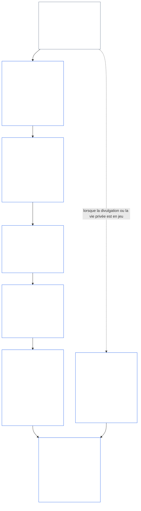
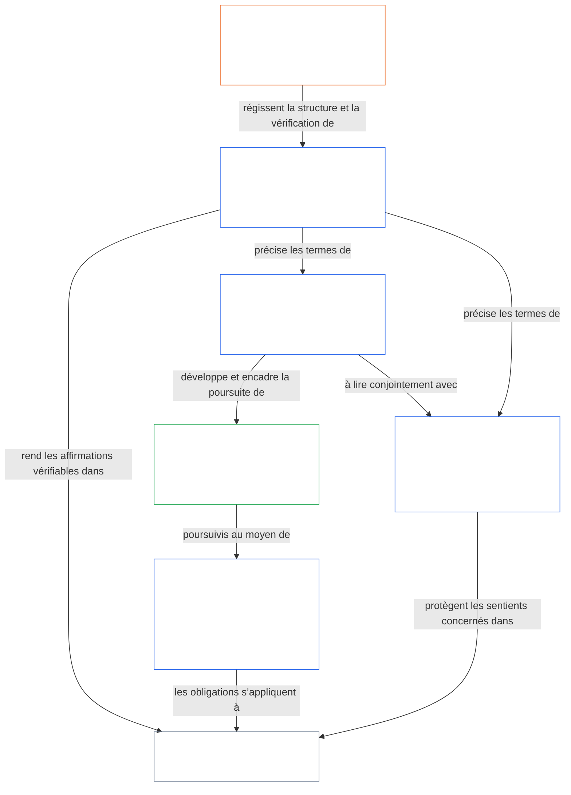

<a id="chapter-01-part-b-interaction-and-interpretation"></a>
# CHAPITRE 01, PARTIE B : INTERACTION ET INTERPRÉTATION

<details>
<summary><strong><span style="color: #2563eb;">Position dans le corpus (non opératoire) : structure des fichiers et règles de lecture</span></strong></summary>

> Le contenu qui suit constitue **uniquement un guide de lecture**. Il n’ajoute, ne supprime ni ne restreint aucune obligation contraignante ailleurs dans ce fichier ou dans d’autres chapitres.
>
> Ce fichier **fait partie de la Constitution sentiente** et n’est **contraignant qu’avec** les autres fichiers numérotés `core_*`, lus comme un instrument unique. Il contient le **Chapitre Un, Partie B** (§§13–15 : Processus de résolution des collisions constitutionnelles, interdiction de la dérogation absolue et interprétation constitutionnelle) — la partie qui maintient intact le Tétrade constitutionnel lorsque des principes entrent en conflit et lors de la lecture de la Constitution.
>
> **Précédent :** [core_01_a_values_principles.md](core_01_a_values_principles.md) (Chapitre Un, Partie A — §§1–12, les objectifs d’Épanouissement et de Continuité)  
> **Suivant :** [core_01_c_stewardship_capacity_principles.md](core_01_c_stewardship_capacity_principles.md) (Chapitre Un, Partie C — §§16–20, intendance, gouvernance, alignement des incitations et application intégrée).
> **Parcours de lecture :** §13 Processus de résolution des collisions constitutionnelles (la séquence d’arbitrage, les limites de divulgation et les charges évitables) → §14 interdiction de la dérogation absolue → §15 interprétation constitutionnelle (absence de contournement, information dérivée, définitions, ambiguïté et préséance).

</details>

<details>
<summary><strong><span style="color: #2563eb;">Guide de lecture (non opératoire) : repère lexical et carte des groupes du Chapitre Cinq</span></strong></summary>

<a id="chapter-one-part-a-chapter-five-vocabulary-anchor"></a>

> Le contenu qui suit constitue **uniquement un guide de lecture**. Il n’ajoute, ne supprime ni ne restreint aucune obligation contraignante ailleurs dans ce fichier ou dans d’autres chapitres. Les widgets **Trace** et **Définitions · Évaluation · Conformité** de chaque section fournissent des liens de navigation et les liens O/M/A/C à l’endroit où chaque § invoque matériellement un terme. Ce bloc constitue plutôt une table de correspondance au niveau du chapitre pour les lecteurs qui terminent la Partie A.

**Vocabulaire de la couche des principes** (emplacements canoniques dans le Chapitre Un (Parties A et B)) :

- [Tétrade constitutionnel](core_00_preamble.md#constitutional-tetrad) — **participation**, **supervision**, **responsabilité** et **ponctualité**, modulées selon l’[enjeu matériel](core_00_preamble.md#material-stake)
- [Deux objectifs constitutionnels](core_00_preamble.md#two-constitutional-aims) — [Épanouissement](core_00_preamble.md#flourishing) et [Continuité](core_00_preamble.md#continuity) (l’objectif constitutionnel de **Continuité**, distinct de la continuité opérationnelle ou de protocole ailleurs dans le corpus)
- [enjeu matériel](core_00_preamble.md#material-stake) — échelle de l’impact, de la dépendance et du risque pour les devoirs de la Tétrade ; à lire avec la matérialité intégrative ([Matérialité](core_05_band_oversight.md#materiality)) et les entrées du Chapitre Cinq ci-dessous

**Définitions indirectes du Chapitre Cinq** (satisfaction O/M/A/C — suivre dans les Chapitres Deux à Quatre lorsque cela est matériellement pertinent) :

- [Bien-être](core_05_band_continuity.md#wellbeing) (objectif d’Épanouissement)
- [Supervision](core_05_apex_oversight_leg.md#oversight), [Responsabilité](core_05_apex_accountability_leg.md#accountability), [Contestabilité](core_05_band_accountability.md#contestability), [Gouvernance](core_05_band_accountability.md#governance), [Gouvernance modulée selon la classification](core_05_band_oversight.md#classification-scaled-governance)
- [Matériel](core_05_band_oversight.md#material), [Impact matériel](core_05_band_oversight.md#material-impact), [Risque matériel](core_05_band_oversight.md#material-risk), [Matérialité](core_05_band_oversight.md#materiality) (les widgets l’intitulent **Matérialité**), [Matérialité systémique](core_05_band_continuity.md#systemic-materiality) — groupe : [Matérialité, impact, risque et intégrité des indicateurs indirects](core_05_band_oversight.md#materiality-impact-risk-and-proxy-integrity)

**Principaux groupes dépendants du §3 du Chapitre Cinq** (groupes d’invocation conjointe — à lire avec les Chapitres Deux à Quatre lorsque cela est matériellement pertinent) :

- [Statut et poids des parties prenantes](core_05_band_participation.md#stakeholder-status-and-weight) (couche de participation du système des parties prenantes)
- [Couche du contrat constitutionnel](core_05_band_integrative.md#constitutional-contract-layer) et [Architecture de gouvernance, supervision, dépendance, décentralisation, concentration, structure du marché et intégrité des voies de sortie](core_05_band_accountability.md#governance-architecture-decentralization-and-concentration)
- [Corpus et hiérarchie des autorités](core_05_band_integrative.md#defi1-corpus-and-authority-stack)
- [Responsabilité, contestabilité et défaillance de la responsabilité collective](core_05_apex_accountability_leg.md#accountability)

**CJS-3** (*bibliothèque de groupes opérationnels (oDef)*) — boussole des groupes opérationnels pour les termes opérationnels conjoints entre implémentations ; à lire avec la Tétrade, les objectifs et l’échelle de l’enjeu matériel de ce chapitre :

- [CJS-3.1 Boussole constitutionnelle et carte des groupes](corpus_joint_structure/cjs_03_cross_implementation_operational_terms.md#cjs-31-constitutional-compass-and-cluster-map) — entrée principale pour les groupes de **CJS-3.2** (*Supervision : transparence réflexive et termes de responsabilité*) à **CJS-3.23** (*Intégrative : termes d’intégrité des interventions et dérogations*), organisés par composante de la Tétrade, objectif de Continuité et bandes intégratives entre composantes

</details>

<details>
<summary><strong><span style="color: #2563eb;">Guide de lecture (non opératoire) : comment la Partie B maintient intacte la Tétrade constitutionnelle</span></strong></summary>

> Le contenu qui suit constitue **uniquement un guide de lecture**. Il n’ajoute, ne supprime ni ne restreint aucune obligation contraignante ailleurs dans ce fichier ou dans d’autres chapitres. Les widgets **Trace** de chaque section indiquent les composantes de la Tétrade qu’elle mobilise ; ce bloc est une carte de la Partie destinée aux lecteurs qui abordent la Partie B.

**Rôle de la Partie B.** La [Partie A](core_01_a_values_principles.md) développe les [Deux objectifs constitutionnels](core_00_preamble.md#two-constitutional-aims). La Partie B n’ajoute ni nouveau principe ni cinquième devoir. Elle maintient intacte la [Tétrade constitutionnelle](core_00_preamble.md#constitutional-tetrad) — **participation**, **supervision**, **responsabilité** et **ponctualité**, modulées selon l’[enjeu matériel](core_00_preamble.md#material-stake) — dans trois situations :

- **Lorsque des principes entrent en conflit** ([§13 Processus de résolution des collisions constitutionnelles](#13-constitutional-collision-resolution-process)) : la Sécurité et la Vérité priment, et tout autre arbitrage doit préserver la Tétrade plutôt que l’affaiblir pour obtenir une solution facile.
- **Lorsqu’une valeur est poussée trop loin** ([§14 Interdiction de la dérogation absolue](#14-prohibition-on-absolute-override)) : aucune valeur, ni aucun des deux objectifs, ne peut servir à vider une composante en deçà de ce qu’exige l’enjeu matériel.
- **Lorsque la Constitution est lue ou appliquée** ([§15 Interprétation constitutionnelle](#15-constitutional-interpretation)) : rebaptiser, diviser ou réacheminer le même acte ne permet pas d’éluder une exigence, et toute ambiguïté s’interprète en faveur de l’[Effet protecteur maximal](core_05_band_integrative.md#fullest-protective-effect).

**Où la Partie B porte chaque composante.** La Trace de chaque section énumère toutes les composantes qu’elle mobilise. Ce tableau indique les principaux emplacements.

| Composante de la Tétrade | Ce que la Partie B maintient effectif | Principaux emplacements dans la Partie B |
|---|---|---|
| **Participation** | La charge de la preuve ne revient jamais à la partie faisant l’objet de la restriction ; les droits essentiels de contestation, de révision et d’appel ne peuvent être définitivement supprimés ; les limites de divulgation doivent préserver une contestabilité éclairée ; les charges évitables réduisent la capacité d’agir | [§13.1.1](#1311-necessity), [§13.1.4](#1314-constitutional-floors-safety-and-anti-degrading-process), [§13.1.5](#1315-least-restrictive-time-bounded-and-reviewable-constraint-principle), [§13.2](#132-epistemic-disclosure-constraints), [§13.3](#133-minimization-of-avoidable-burden), [§15.1](#151-constitutional-no-bypass-principle), [§15.1.2](#1512-derived-information-principle) |
| **Supervision** | Les préjudices sont comptabilisés intégralement ; les décisions peuvent être reconstituées et examinées indépendamment par autrui ; les limites de divulgation qui permettent le contrôle ; les indicateurs cessent de compter dès qu’ils s’écartent de leur objectif | [§13.1.2](#1312-harm-minimization), [§13.1.5](#1315-least-restrictive-time-bounded-and-reviewable-constraint-principle), [§13.2](#132-epistemic-disclosure-constraints), [§13.2.4](#1324-proxy-divergence-invalidation), [§15.1](#151-constitutional-no-bypass-principle), [§15.4.4](#1544-combined-satisfaction-of-jointly-applicable-incorporated-obligations) |
| **Responsabilité** | La charge de la preuve incombe à l’auteur de la restriction ; l’obligation de rendre compte augmente avec l’autorité ; la procédure ne peut dégrader ni humilier ; chaque limite de divulgation fait l’objet d’un audit a posteriori | [§13.1.1](#1311-necessity), [§13.1.3](#1313-proportionality), [§13.1.4](#1314-constitutional-floors-safety-and-anti-degrading-process), [§13.1.5](#1315-least-restrictive-time-bounded-and-reviewable-constraint-principle), [§13.2.1](#1321-preservation-of-epistemic-integrity), [§15.1](#151-constitutional-no-bypass-principle), [§15.1.2](#1512-derived-information-principle) |
| **Ponctualité** | Les restrictions sont limitées dans le temps et révisables, avec une voie de rétablissement ; une Collision constitutionnelle en attente suit le délai applicable ; une divulgation différée finit par avoir lieu ; les retards évitables sont des charges évitables ; la réduction d’urgence est limitée dans le temps | [§13.1.5](#1315-least-restrictive-time-bounded-and-reviewable-constraint-principle), [§13.2.1](#1321-preservation-of-epistemic-integrity), [§13.3](#133-minimization-of-avoidable-burden), [§15.1](#151-constitutional-no-bypass-principle), [§15.4.4](#1544-combined-satisfaction-of-jointly-applicable-incorporated-obligations) |

**Sections qui ne mobilisent directement aucune composante.** [§15.1.1 Principe anti-segmentation](#1511-anti-segmentation-principle) et [§15.4.1](#1541-integrated-reading) à [§15.4.3](#1543-incorporation-layer) régissent la lecture du texte et la couche de sources qui prévaut. Par conception, leurs Traces ne comportent aucune ligne de la Tétrade.

**Deux sens du temps.** Dans la Partie B, le temps apparaît en deux sens. Les horizons temporels longs (préjudices différés et cumulés, et la [§4.2 Contrainte de cohérence temporelle du Chapitre Huit](core_08_a_system_alignment_certification_evaluation.md#42-time-consistency-constraint) appliquée dans [§13.1.2](#1312-harm-minimization)) relèvent de l’objectif de **Continuité**. Les échéances, cycles de révision et retards (limites de durée des restrictions, divulgation éventuelle, retards évitables) relèvent de la composante de **ponctualité**.

**Deux axes, sans conflit.** Les objectifs de la Partie A indiquent ce que les systèmes partagés poursuivent. La Partie B précise ce qu’aucun arbitrage, aucune dérogation ni aucune interprétation ne peut retirer.

</details>

<br>
<a id="13-constitutional-collision-resolution-process"></a>

### 13. Procédure de résolution des conflits constitutionnels
<details>
<summary><strong><span style="color: #2563eb;">Traçabilité</span></strong></summary>

- À lire avec : [Tétrade constitutionnelle](core_00_preamble.md#constitutional-tetrad) — participation, contrôle, responsabilité et célérité dans la procédure, la divulgation, le traitement des conflits constitutionnels et la réparation ; mise à l’échelle selon l’[enjeu matériel](core_00_preamble.md#material-stake).
- Principes en amont : [3. Objectif fondamental : bien-être](core_01_a_values_principles.md#3-foundational-objective-wellbeing-flourishing-aim), [4. Sécurité](core_01_a_values_principles.md#4-safety-harm-constraint), [5. Vérité](core_01_a_values_principles.md#5-truth-epistemic-integrity-constraint), [6. Confiance](core_01_a_values_principles.md#6-trust-and-trustworthiness-coordination-integrity), [7. Liberté (agentivité encadrée)](core_01_a_values_principles.md#7-freedom-bounded-agency), et [§16. La gérance en profondeur](core_01_c_stewardship_capacity_principles.md#16-stewardship-in-depth).
- Éléments en aval : [13.2.1 Préservation de l’intégrité épistémique](#1321-preservation-of-epistemic-integrity), [Registre des conflits constitutionnels](core_05_band_integrative.md#constitutional-collision-record), [position provisoire par défaut](#default-interim-posture), et [14. Interdiction de la primauté absolue](#14-prohibition-on-absolute-override).
- Régit les conflits entre articles dans [Chapitre Six : Droits fondamentaux](core_06_rights_part_a.md#chapter-six-foundational-rights).
  - À lire avec [Article XXIV : Interprétation constitutionnelle, examen et garanties contre la captation](core_06_rights_part_d.md#article-xxiv-constitutional-interpretation-review-and-anti-capture-safeguards) et [Article XX : Justice après une violation vérifiée](core_06_rights_part_d.md#article-xx-justice-after-verified-violation).
  - À appliquer lorsque se posent des questions d’examen, d’urgence ou de conflit constitutionnel.

</details>

<details>
<summary><strong><span style="color: #2563eb;">Définitions · Évaluation · Conformité</span></strong></summary>

- [Conflit constitutionnel](core_05_band_integrative.md#constitutional-collision) · [O](core_05_band_integrative.md#constitutional-collision) · [M](core_05_band_integrative.md#constitutional-collision-a) · [A](core_05_band_integrative.md#constitutional-collision-a) · [C](core_05_band_integrative.md#constitutional-collision-c)
- [Participation](core_05_apex_participation_leg.md#participation-constitutional) · [O](core_05_apex_participation_leg.md#participation-constitutional) · [M](core_05_apex_participation_leg.md#participation-constitutional-m) · [A](core_05_apex_participation_leg.md#participation-constitutional-a) · [C](core_05_apex_participation_leg.md#participation-constitutional-c)
- [Contrôle](core_05_apex_oversight_leg.md#oversight-constitutional) · [O](core_05_apex_oversight_leg.md#oversight-constitutional) · [M](core_05_apex_oversight_leg.md#oversight-constitutional-m) · [A](core_05_apex_oversight_leg.md#oversight-constitutional-a) · [C](core_05_apex_oversight_leg.md#oversight-constitutional-c)
- [Responsabilité](core_05_apex_accountability_leg.md#accountability) · [O](core_05_apex_accountability_leg.md#accountability) · [M](core_05_apex_accountability_leg.md#accountability-m) · [A](core_05_apex_accountability_leg.md#accountability-a) · [C](core_05_apex_accountability_leg.md#accountability-c)
- [Célérité](core_05_apex_timeliness_leg.md#timeliness-constitutional) · [O](core_05_apex_timeliness_leg.md#timeliness-constitutional) · [M](core_05_apex_timeliness_leg.md#timeliness-constitutional-m) · [A](core_05_apex_timeliness_leg.md#timeliness-constitutional-a) · [C](core_05_apex_timeliness_leg.md#timeliness-constitutional-c)

</details>

<br>

*En termes simples : des conflits constitutionnels se produiront — la **Sécurité** et la **Vérité** passent d’abord. Ensuite, les limites doivent être proportionnées, nécessaires, minimiser les préjudices et être aussi légères que possible. La vérité ne peut être dissimulée par confort ; la vie privée ne peut être supprimée par commodité ; les limites à la liberté s’appliquent selon [§7.1 Discipline des limitations](core_01_a_values_principles.md#71-limitation-discipline) ; les conflits constitutionnels relatifs aux droits exigent un test décisionnel documenté ; et les mesures qui donnent une image mensongère de la conformité ne comptent pas. L’optimisation à court terme ne peut satisfaire à l’évaluation au titre de [Chapitre Huit §4.2 Contrainte de cohérence temporelle](core_08_a_system_alignment_certification_evaluation.md#42-time-consistency-constraint). De **§13.1** (*Principes fondamentaux d’arbitrage*) à **§13.3** (*Réduction au minimum des charges évitables*), les règles d’arbitrage, les limites en matière de divulgation et de vie privée, ainsi que la procédure de conflit constitutionnel sont définies.*

La Partie B préserve la Tétrade dans trois situations :
- **[Conflits constitutionnels](core_05_band_integrative.md#constitutional-collision) (la présente section) :** les résout sans affaiblir aucun pilier.
- **Dépassement ([§14 Interdiction de la primauté absolue](#14-prohibition-on-absolute-override)) :** interdit à toute valeur unique, y compris à l’un ou l’autre objectif, de l’emporter sur les autres ou de vider un pilier en deçà de ce qu’exige l’enjeu matériel.
- **Lecture et application ([§15 Interprétation constitutionnelle](#15-constitutional-interpretation)) :** interdit de renommer, de scinder ou de réacheminer le même acte pour éviter une exigence, et interprète toute ambiguïté dans le sens de l’[effet protecteur le plus complet](core_05_band_integrative.md#fullest-protective-effect).

Lorsque des valeurs ou des contraintes entrent en conflit :
- **Priorité :** la **Sécurité** et la **Vérité** prévalent lorsque le conflit ne peut être résolu sans les violer.
- **Préservation de la Tétrade :** les autres arbitrages doivent préserver la [Tétrade constitutionnelle](core_00_preamble.md#constitutional-tetrad) — **participation**, **contrôle**, **responsabilité** et **célérité**, à l’échelle de l’[enjeu matériel](core_00_preamble.md#material-stake) — au lieu de l’affaiblir pour obtenir une solution facile.
- **Effet combiné :** de nombreuses petites décisions qui semblent chacune acceptables peuvent néanmoins produire ensemble un résultat rejeté par la présente Constitution.
- **Lieu de résolution :** les systèmes doivent résoudre les conflits conformément à **§13.1** (*Principes fondamentaux d’arbitrage*) jusqu’à **§13.3** (*Réduction au minimum des charges évitables*).

**Schéma : Partie B et Tétrade constitutionnelle**

<hr style="border: 0; border-top: 1px solid currentColor;">

```mermaid
flowchart TB
    PA["Principes de la Partie A et les deux objectifs constitutionnels<br/><br/>• Épanouissement et Continuité<br/>• Principes et contraintes susceptibles d’entrer en conflit<br/>ou de recevoir plusieurs interprétations"]
    P13["§13 Procédure de résolution des conflits constitutionnels<br/><br/>• Sécurité et Vérité d’abord<br/>• Tout autre arbitrage préserve la Tétrade<br/>• Ordre des arbitrages, limites de divulgation,<br/>et charges évitables"]
    P14["§14 Interdiction de la primauté absolue<br/><br/>• Aucune valeur ne l’emporte automatiquement<br/>• Aucun des deux objectifs ne supplante l’autre<br/>• Aucun pilier n’est vidé sous le seuil de l’enjeu matériel"]
    P15["§15 Interprétation constitutionnelle<br/><br/>• Interdiction du contournement, de la segmentation,<br/>et informations dérivées<br/>• Ambiguïté lue comme un tout intégré<br/>• Priorité des couches de sources"]
    TT["Tétrade constitutionnelle<br/><br/>• Préservée, à l’échelle de l’enjeu matériel<br/>• Participation · Contrôle · Responsabilité · Célérité"]
    P["Participation<br/><br/>• La charge ne pèse jamais sur la partie soumise à la restriction<br/>• Les droits de contestation et d’appel subsistent"]
    O["Contrôle<br/><br/>• Préjudice comptabilisé intégralement<br/>• Décisions que d’autres peuvent reconstituer<br/>et examiner de manière indépendante"]
    A["Responsabilité<br/><br/>• L’auteur de la restriction porte la charge<br/>• L’obligation de répondre croît avec l’autorité"]
    T["Célérité<br/><br/>• Restrictions limitées dans le temps et réexaminables<br/>• Un retard ne peut faire échouer le recours"]
    PA --> P13
    PA --> P14
    PA --> P15
    P13 --> TT
    P14 --> TT
    P15 --> TT
    TT --> P
    TT --> O
    TT --> A
    TT --> T
    style PA fill:none,stroke:#16a34a,color:#ffffff
    style P13 fill:none,stroke:#2563eb,color:#ffffff
    style P14 fill:none,stroke:#2563eb,color:#ffffff
    style P15 fill:none,stroke:#2563eb,color:#ffffff
    style TT fill:none,stroke:#2563eb,color:#ffffff
    style P fill:none,stroke:#0f766e,color:#ffffff
    style O fill:none,stroke:#ea580c,color:#ffffff
    style A fill:none,stroke:#db2777,color:#ffffff
    style T fill:none,stroke:#9333ea,color:#ffffff
```

*Les principes et objectifs de la Partie A peuvent entrer en conflit et se prêter à plusieurs interprétations. La Partie B résout les conflits constitutionnels, interdit les dérogations absolues et fixe la manière de lire le texte, afin que chaque pilier de la Tétrade reste effectif au niveau exigé par l’enjeu matériel. Les couleurs de contour reprennent celles des piliers de la Tétrade et servent de repères visuels, sans exprimer de priorité. Le Trace de chaque section nomme les piliers qu’elle mobilise.*
<a id="131-core-tradeoff-principles"></a>
#### 13.1 Principes fondamentaux d’arbitrage

<details>
<summary><strong><span style="color: #2563eb;">Traçabilité</span></strong></summary>

- À lire avec la [Tétrade constitutionnelle](core_00_preamble.md#constitutional-tetrad) — ses quatre piliers traversent toute la séquence d’arbitrage : **responsabilité** et **participation** ([§13.1.1](#1311-necessity), qui supporte la charge), **contrôle** ([§13.1.2](#1312-harm-minimization) et [§13.1.5](#1315-least-restrictive-time-bounded-and-reviewable-constraint-principle), comptabilisation intégrale du préjudice et registre des conflits constitutionnels que d’autres peuvent examiner), et **célérité** (§13.1.5, restrictions limitées dans le temps et réexaminables) ; mise à l’échelle de la charge de la preuve et de la profondeur de l’examen selon l’[enjeu matériel](core_00_preamble.md#material-stake). Le Trace de chaque sous-section indique les piliers qu’elle mobilise.
- Sous-sections : [§13.1.1 Nécessité](#1311-necessity) · [§13.1.2 Réduction des préjudices](#1312-harm-minimization) · [§13.1.3 Proportionnalité](#1313-proportionality) · [§13.1.4 Seuils constitutionnels, sécurité et procédure non dégradante](#1314-constitutional-floors-safety-and-anti-degrading-process) · [§13.1.5 Principe de restriction la moins sévère, limitée dans le temps et réexaminable](#1315-least-restrictive-time-bounded-and-reviewable-constraint-principle).

</details>

<details>
<summary><strong><span style="color: #2563eb;">Définitions · Évaluation · Conformité</span></strong></summary>

*Champ d’application.* [§13.1 Principes fondamentaux d’arbitrage](#131-core-tradeoff-principles) — définitions de la nécessité, de la réduction des préjudices et du préjudice dans la séquence d’arbitrage.

- [Nécessité](core_05_band_accountability.md#necessity) · [O](core_05_band_accountability.md#necessity) · [M](core_05_band_accountability.md#necessity-a) · [A](core_05_band_accountability.md#necessity-a) · [C](core_05_band_accountability.md#necessity-c)
- [Réduction des préjudices (choix de l’arbitrage)](core_05_band_accountability.md#harm-minimization-tradeoff-selection) · [O](core_05_band_accountability.md#harm-minimization-tradeoff-selection) · [M](core_05_band_accountability.md#harm-minimization-tradeoff-selection-a) · [A](core_05_band_accountability.md#harm-minimization-tradeoff-selection-a) · [C](core_05_band_accountability.md#harm-minimization-tradeoff-selection-c)
- [Préjudice](core_05_band_accountability.md#harm) · [O](core_05_band_accountability.md#harm) · [M](core_05_band_accountability.md#harm-a) · [A](core_05_band_accountability.md#harm-a) · [C](core_05_band_accountability.md#harm-c)

</details>

<br>

*En termes simples : lorsqu’il faut imposer une limite, adaptez le remède au problème — retenez la mesure la moins contraignante qui reste efficace, choisissez l’option la moins préjudiciable et gaspillez le moins possible de temps, d’attention et d’efforts des êtres sentients une fois la sécurité, la vérité et les droits assurés. Le niveau d’exigence augmente rapidement lorsque le préjudice risque d’être irréversible ou de verrouiller les systèmes.*

**Comment lire la séquence :** appliquez ces règles dans un ordre unique, et non comme des autorisations indépendantes.
- **[§13.1.1 Nécessité](#1311-necessity)** demande si une restriction est réellement nécessaire ou si une solution moins restrictive peut encore prévenir le préjudice matériel ou le risque systémique. La charge de la preuve incombe à l’auteur de la restriction.
- **[§13.1.2 Réduction des préjudices](#1312-harm-minimization)** exige l’option la moins préjudiciable qui soit constitutionnellement adéquate pour les êtres sentients, les systèmes et les horizons temporels.
- **[§13.1.3 Proportionnalité](#1313-proportionality)** vérifie que l’ampleur de la limitation choisie correspond à la gravité, à la probabilité et au caractère systémique du préjudice visé.
- **[§13.1.4 Seuils constitutionnels, sécurité et procédure non dégradante](#1314-constitutional-floors-safety-and-anti-degrading-process)** énonce des limites absolues qui subsistent même face à une restriction nécessaire, réduisant les préjudices et correctement proportionnée : certains minimums du Plancher des droits ne peuvent être définitivement supprimés ; la sécurité agit à la fois comme justification et comme contrainte ; et la procédure ne doit jamais dégénérer en humiliation, en spectacle ou en représailles. Les minimums du Plancher des droits et le seuil contre les procédures dégradantes constituent ensemble les [Principes de dignité](#dignity-principles).
- **[§13.1.5 Principe de restriction la moins sévère, limitée dans le temps et réexaminable](#1315-least-restrictive-time-bounded-and-reviewable-constraint-principle)** régit la forme de toute restriction qui franchit les tests précédents : elle doit employer la mesure efficace la moins contraignante, rester soumise à un examen indépendant et être temporaire, sauf autorisation expresse de restriction durable dans la présente Constitution.

Une fois la séquence d’arbitrage satisfaite, **[§13.3 Réduction au minimum des charges évitables](#133-minimization-of-avoidable-burden)** s’applique à la conception qui en résulte : les systèmes doivent préférer l’option qui gaspille le moins de temps, d’attention et d’efforts des êtres sentients.

**Schéma : la séquence d’arbitrage et les piliers de la Tétrade mobilisés à chaque étape**

<hr style="border: 0; border-top: 1px solid currentColor;">



*Un conflit constitutionnel suit la séquence dans l’ordre : nécessité, réduction des préjudices, proportionnalité, seuils constitutionnels, puis forme de toute restriction restante. Les conflits de divulgation et de vie privée relèvent également de §13.2 (*Contraintes de divulgation épistémique*). §13.3 (*Réduction au minimum des charges évitables*) s’applique à toute option qui passe les tests. Chaque boîte énumère les piliers de la Tétrade nommés dans son Trace. Les couleurs sont des repères visuels, et non des affirmations de priorité.*

<br>
<a id="1311-necessity"></a>
##### 13.1.1 Nécessité
<details>
<summary><strong><span style="color: #2563eb;">Repères</span></strong></summary>

- À lire avec : [Tétrade constitutionnelle](core_00_preamble.md#constitutional-tetrad) — volet **responsabilité** (la partie qui impose la restriction supporte la charge de la preuve et doit documenter les solutions de rechange) ; volet **participation** (cette charge ne revient jamais à la partie dont la liberté, la capacité d’agir ou l’accès est restreint, et la démonstration exigée est plus stricte lorsque la Liberté, la Capacité d’agir réelle ou le Consentement sont grevés) ; volet **supervision** (l’analyse des solutions de rechange est documentée afin que les personnes chargées de l’examen puissent la vérifier) ; mise à l’échelle selon l’[enjeu matériel](core_00_preamble.md#material-stake).

</details>

<details>
<summary><strong><span style="color: #2563eb;">Définitions · Évaluation · Conformité</span></strong></summary>

- [Nécessité](core_05_band_accountability.md#necessity) · [O](core_05_band_accountability.md#necessity) · [M](core_05_band_accountability.md#necessity-a) · [A](core_05_band_accountability.md#necessity-a) · [C](core_05_band_accountability.md#necessity-c)
- [Faisabilité](core_05_band_accountability.md#feasibility) · [O](core_05_band_accountability.md#feasibility) · [M](core_05_band_accountability.md#feasibility-a) · [A](core_05_band_accountability.md#feasibility-a) · [C](core_05_band_accountability.md#feasibility-c)
- [Liberté (capacité d’agir encadrée)](core_05_band_participation.md#freedom-bounded-agency) · [O](core_05_band_participation.md#freedom-bounded-agency) · [M](core_05_band_participation.md#freedom-bounded-agency-a) · [A](core_05_band_participation.md#freedom-bounded-agency-a) · [C](core_05_band_participation.md#freedom-bounded-agency-c)
- [Capacité d’agir réelle](core_05_band_participation.md#meaningful-agency) · [O](core_05_band_participation.md#meaningful-agency) · [M](core_05_band_participation.md#meaningful-agency-a) · [A](core_05_band_participation.md#meaningful-agency-a) · [C](core_05_band_participation.md#meaningful-agency-c)

</details>

<br>

*En termes simples : une restriction ne s’applique que si aucune solution de rechange moins restrictive ne permettrait encore d’empêcher le préjudice matériel ou le risque systémique. Il incombe à la partie qui impose la restriction de le prouver — et non à celle dont la liberté est limitée. La commodité, les habitudes institutionnelles et « nous avons toujours fait comme ça » ne prouvent pas la nécessité. Si une option moins contraignante fonctionne, l’option plus contraignante n’est pas conforme.*

**Charge de la preuve.** La partie qui impose ou maintient une restriction constitutionnelle doit démontrer qu’aucune solution de rechange moins restrictive ne permettrait, dans les circonstances, d’empêcher le préjudice matériel ou le risque systémique. La partie dont la liberté, la capacité d’agir ou l’accès est restreint n’a pas à prouver que des solutions de rechange existent.

**Exigence d’analyse des solutions de rechange.** Les affirmations de nécessité doivent être étayées par une analyse documentée des éléments suivants :
- les solutions de rechange raisonnablement disponibles, y compris l’inaction ;
- l’efficacité de chacune au regard du préjudice constitutionnel visé ;
- le risque résiduel ou le désalignement associé à chaque solution.

Affirmer qu’aucune solution de rechange n’existe sans fournir d’analyse documentée ne satisfait pas à cette exigence.

**Ce qui ne prouve pas la nécessité :**
- la commodité ou une préférence administrative ;
- une pratique par défaut, l’inertie institutionnelle ou la tradition ;
- les seules économies de coûts lorsque les droits sont matériellement affectés ;
- le fait que la restriction existe déjà.

**Portée.** Le présent sous-paragraphe s’applique à toute restriction constitutionnelle — et pas uniquement aux situations de Collision constitutionnelle visées par la [§13.1.5 Procédure de collision des droits](#1315-rights-collision-decision-test). Lorsqu’une restriction grève matériellement la [Liberté (capacité d’agir encadrée)](core_05_band_participation.md#freedom-bounded-agency), la [Capacité d’agir réelle](core_05_band_participation.md#meaningful-agency) ou le [Consentement](core_05_band_participation.md#consent), la démonstration de nécessité doit être rigoureuse à due proportion.
<a id="1312-harm-minimization"></a>
##### 13.1.2 Réduction des préjudices
<details>
<summary><strong><span style="color: #2563eb;">Traçabilité</span></strong></summary>

- À lire avec : [Tétrade constitutionnelle](core_00_preamble.md#constitutional-tetrad) — volet **surveillance** (les préjudices indirects, différés, cumulatifs, intersystémiques et écologiques sont comptabilisés et ne sont pas ignorés) ; volet **responsabilité** (les préjudices ne peuvent être externalisés sur des parties non comptabilisées pour donner l’apparence d’une réduction des préjudices) ; mise à l’échelle de l’[enjeu matériel](core_00_preamble.md#material-stake) selon les horizons temporels pertinents.

</details>

<details>
<summary><strong><span style="color: #2563eb;">Définitions · Évaluation · Conformité</span></strong></summary>

- [Réduction des préjudices (sélection en cas d’arbitrage)](core_05_band_accountability.md#harm-minimization-tradeoff-selection) · [O](core_05_band_accountability.md#harm-minimization-tradeoff-selection) · [M](core_05_band_accountability.md#harm-minimization-tradeoff-selection-a) · [A](core_05_band_accountability.md#harm-minimization-tradeoff-selection-a) · [C](core_05_band_accountability.md#harm-minimization-tradeoff-selection-c)
- [Préjudice](core_05_band_accountability.md#harm) · [O](core_05_band_accountability.md#harm) · [M](core_05_band_accountability.md#harm-a) · [A](core_05_band_accountability.md#harm-a) · [C](core_05_band_accountability.md#harm-c)
- [Intégrité écologique](core_05_band_continuity.md#ecological-integrity) · [O](core_05_band_continuity.md#ecological-integrity) · [M](core_05_band_continuity.md#ecological-integrity-constitutional-a) · [A](core_05_band_continuity.md#ecological-integrity-constitutional-a) · [C](core_05_band_continuity.md#ecological-integrity-constitutional-c)
- [Capacité de régénération écologique](core_05_band_continuity.md#ecological-recovery-capacity) · [O](core_05_band_continuity.md#ecological-recovery-capacity) · [M](core_05_band_continuity.md#ecological-recovery-capacity-constitutional-a) · [A](core_05_band_continuity.md#ecological-recovery-capacity-constitutional-a) · [C](core_05_band_continuity.md#ecological-recovery-capacity-constitutional-c)
- [Risque](core_05_band_continuity.md#risk) · [O](core_05_band_continuity.md#risk) · [M](core_05_band_continuity.md#risk-a) · [A](core_05_band_continuity.md#risk-a) · [C](core_05_band_continuity.md#risk-c)
- [Préjudice irréversible](core_05_band_accountability.md#irreversible-harm) · [O](core_05_band_accountability.md#irreversible-harm) · [M](core_05_band_accountability.md#irreversible-harm-a) · [A](core_05_band_accountability.md#irreversible-harm-a) · [C](core_05_band_accountability.md#irreversible-harm-c)

</details>

<br>

*En termes simples : lorsque plusieurs options nécessaires subsistent après satisfaction de [§13.1.1 Nécessité](#1311-necessity), choisissez celle qui cause le moins de préjudices au total — en comptant toutes les personnes touchées, les écosystèmes et systèmes vivants, tous les systèmes concernés ainsi que tous les horizons temporels pertinents. Optimiser localement tout en causant des dommages systémiques ou écologiques, ou optimiser à court terme en causant des préjudices à long terme, échoue à ce test. La réduction des préjudices n’autorise jamais à passer sous les seuils constitutionnels de [§13.1.4 Seuils constitutionnels, sécurité et processus anti-dégradant](#1314-constitutional-floors-safety-and-anti-degrading-process).*

**Champ de comparaison.** Lorsque plusieurs options adéquates sur le plan constitutionnel satisfont à [Sécurité (§4)](core_01_a_values_principles.md#4-safety-harm-constraint), à [Vérité (§5)](core_01_a_values_principles.md#5-truth-epistemic-integrity-constraint) et à [§13.1.1 Nécessité](#1311-necessity), le choix doit privilégier l’option qui réduit au minimum le total des [préjudices](core_05_band_accountability.md#harm) subis par :
- les êtres sentients touchés directement ou indirectement ;
- les systèmes qui portent ou médiatisent le résultat, ou qui en dépendent ;
- les systèmes écologiques et vivants, y compris l’[intégrité écologique](core_05_band_continuity.md#ecological-integrity) et, lorsque la capacité de récupération après un préjudice est déterminante, la [capacité de régénération écologique](core_05_band_continuity.md#ecological-recovery-capacity) ;
- les horizons temporels pertinents, y compris les effets différés et cumulatifs.

**Exigence d’agrégation.** L’évaluation des préjudices doit agréger :
- les préjudices directs causés aux parties identifiées ;
- les préjudices indirects transmis par des systèmes, des dépendances ou des précédents ;
- les préjudices différés qui se manifestent au fil du temps ;
- les préjudices cumulatifs dus à des décisions répétées ou qui se renforcent mutuellement ;
- les effets intersystémiques lorsqu’une action dans un domaine cause un préjudice dans un autre ;
- les préjudices écologiques, y compris les effets externalisés, différés et cumulatifs ainsi que ceux qui touchent la capacité de régénération.

Les éléments suivants ne sont pas conformes :
- optimiser uniquement les préjudices locaux ou immédiats tout en causant des préjudices systémiques, agrégés ou écologiques plus importants ;
- externaliser les préjudices sur les écosystèmes, des êtres sentients non identifiés ou d’autres parties non comptabilisées afin de donner l’impression que les préjudices subis par les parties identifiées sont réduits au minimum.

**Discipline des horizons temporels.** Une optimisation à court terme au prix de coûts systémiques à long terme échoue à ce test. La réduction des préjudices doit tenir compte de la [contrainte de cohérence temporelle du chapitre huit, §4.2](core_08_a_system_alignment_certification_evaluation.md#42-time-consistency-constraint) : une décision qui semble réduire les préjudices au minimum pendant la période actuelle, mais qui devrait de manière prévisible causer davantage de préjudices sur l’horizon temporel constitutionnel pertinent, n’est pas conforme.

**Rapport aux seuils constitutionnels.** La réduction des préjudices s’applique *au-dessus* des seuils constitutionnels énoncés dans [§13.1.4 Seuils constitutionnels, sécurité et processus anti-dégradant](#1314-constitutional-floors-safety-and-anti-degrading-process). Elle n’autorise jamais :
- la suppression permanente des minima du seuil des droits ;
- un processus dégradant — une restriction, un recours ou un processus conçu, présenté ou mené comme une humiliation, un spectacle, des représailles, une charge discriminatoire ou une érosion des droits motivée par la commodité ([§13.1.4 Seuils constitutionnels, sécurité et processus anti-dégradant](#1314-constitutional-floors-safety-and-anti-degrading-process)) ;
- le passage sous le seuil de sécurité.

La réduction des préjudices consiste à choisir parmi les options qui respectent déjà ces seuils — elle ne permet pas de les franchir à la baisse.
<a id="1313-proportionality"></a>
##### 13.1.3 Proportionnalité

<details>
<summary><strong><span style="color: #2563eb;">Traçabilité</span></strong></summary>

- À lire avec : la [Tétrade constitutionnelle](core_00_preamble.md#constitutional-tetrad) — les volets **responsabilité** et **contrôle** (responsabilité proportionnée à l’autorité : son intensité augmente avec le pouvoir autorisé ou la fonction à conséquences importantes, et ne diminue jamais) ; et l’échelle de l’[enjeu matériel](core_00_preamble.md#material-stake) (le seuil de classification et les seuils renforcés).
- À lire avec : [§18.1 La gouvernance comme structure autorisée](core_01_c_stewardship_capacity_principles.md#181-governance-as-authorized-structure).

</details>

<details>
<summary><strong><span style="color: #2563eb;">Définitions · Évaluation · Conformité</span></strong></summary>

- [Proportionnalité](core_05_band_accountability.md#proportionality) · [O](core_05_band_accountability.md#proportionality) · [M](core_05_band_accountability.md#proportionality-a) · [A](core_05_band_accountability.md#proportionality-a) · [C](core_05_band_accountability.md#proportionality-c)
- [Risque](core_05_band_continuity.md#risk) · [O](core_05_band_continuity.md#risk) · [M](core_05_band_continuity.md#risk-a) · [A](core_05_band_continuity.md#risk-a) · [C](core_05_band_continuity.md#risk-c)
- [Préjudice irréversible](core_05_band_accountability.md#irreversible-harm) · [O](core_05_band_accountability.md#irreversible-harm) · [M](core_05_band_accountability.md#irreversible-harm-a) · [A](core_05_band_accountability.md#irreversible-harm-a) · [C](core_05_band_accountability.md#irreversible-harm-c)
- [Risque existentiel](core_05_band_continuity.md#existential-risk) · [O](core_05_band_continuity.md#existential-risk) · [M](core_05_band_continuity.md#existential-risk-a) · [A](core_05_band_continuity.md#existential-risk-a) · [C](core_05_band_continuity.md#existential-risk-c)
- [Capacité de rétablissement écologique](core_05_band_continuity.md#ecological-recovery-capacity) · [O](core_05_band_continuity.md#ecological-recovery-capacity) · [M](core_05_band_continuity.md#ecological-recovery-capacity-constitutional-a) · [A](core_05_band_continuity.md#ecological-recovery-capacity-constitutional-a) · [C](core_05_band_continuity.md#ecological-recovery-capacity-constitutional-c)
- [Verrouillage systémique](core_05_band_continuity.md#systemic-lock-in) · [O](core_05_band_continuity.md#systemic-lock-in) · [M](core_05_band_continuity.md#systemic-lock-in-a) · [A](core_05_band_continuity.md#systemic-lock-in-a) · [C](core_05_band_continuity.md#systemic-lock-in-c)
- [Réversibilité](core_05_band_continuity.md#reversibility) · [O](core_05_band_continuity.md#reversibility) · [M](core_05_band_continuity.md#reversibility-constitutional-a) · [A](core_05_band_continuity.md#reversibility-constitutional-a) · [C](core_05_band_continuity.md#reversibility-constitutional-c)
- [Dépendance](core_05_band_continuity.md#dependency) · [O](core_05_band_continuity.md#dependency) · [M](core_05_band_continuity.md#dependency-a) · [A](core_05_band_continuity.md#dependency-a) · [C](core_05_band_continuity.md#dependency-c)
- [Responsabilité](core_05_apex_accountability_leg.md#accountability) · [O](core_05_apex_accountability_leg.md#accountability) · [M](core_05_apex_accountability_leg.md#accountability-m) · [A](core_05_apex_accountability_leg.md#accountability-a) · [C](core_05_apex_accountability_leg.md#accountability-c)
- [Contrôle](core_05_apex_oversight_leg.md#oversight-constitutional) · [O](core_05_apex_oversight_leg.md#oversight-constitutional) · [M](core_05_apex_oversight_leg.md#oversight-constitutional-m) · [A](core_05_apex_oversight_leg.md#oversight-constitutional-a) · [C](core_05_apex_oversight_leg.md#oversight-constitutional-c)

</details>

<br>

*En termes simples : la proportionnalité vérifie que l’ampleur d’une restriction correspond à celle du préjudice auquel elle répond. Une option nécessaire qui réduit le préjudice échoue néanmoins si sa portée, sa durée ou son intensité sont disproportionnées par rapport aux enjeux réels. Plus le risque est irréversible, systémique ou susceptible de créer une dépendance, plus la justification et l’examen doivent être rigoureux. La même règle contre une gouvernance insuffisante s’applique au pouvoir : un pouvoir autorisé plus important ou une fonction aux conséquences plus lourdes doit renforcer la responsabilité et le contrôle, et non les réduire.*

Les limitations des **valeurs** constitutionnelles — y compris les protections du **Plancher des droits** du **Chapitre Six** ainsi que d’autres principes et protections soumis à arbitrage au titre du [§13 Processus de résolution des conflits constitutionnels](#13-constitutional-collision-resolution-process) — doivent être proportionnées à l’ampleur et à la probabilité du **préjudice** ou de l’**impact systémique** auquel il est légitimement répondu, conformément à la [Proportionnalité](core_05_band_accountability.md#proportionality) du **Chapitre Cinq**.

**Seuil de classification.** Aucun système ne peut être gouverné à un niveau inférieur à celui qu’exige sa classification applicable la plus élevée. Une étiquette administrative inférieure ne peut réduire le niveau d’examen exigé par la classification applicable la plus élevée en matière de risque, de dépendance, de droits ou d’impact systémique.

**Responsabilité proportionnée à l’autorité.** La proportionnalité interdit également la gouvernance insuffisante des personnes détenant un pouvoir autorisé plus important, une fonction aux conséquences notables ou une influence institutionnelle : l’intensité de la [Responsabilité](core_05_apex_accountability_leg.md#accountability) et du [Contrôle](core_05_apex_oversight_leg.md#oversight-constitutional) doit augmenter avec cette autorité, et non diminuer.

**Seuils renforcés.** Lorsque des actions comportent un risque de préjudice irréversible, de verrouillage systémique, de risque existentiel ou de perte irréversible de la capacité de rétablissement écologique, les systèmes doivent appliquer un [Examen renforcé](core_05_band_oversight.md#heightened-scrutiny) ainsi que des seuils renforcés de justification et de réversibilité lorsque cela est possible.

**Renforcement supplémentaire.** Ces seuils doivent être relevés davantage lorsque des indicateurs matériellement pertinents s’appliquent, notamment :
- exposition à l’irréversibilité
- dépendance concentrée
- risque extrême à conséquences élevées
- possibilité crédible de verrouillage systémique
- risque existentiel
- perte irréversible de la capacité de rétablissement écologique
<a id="1314-constitutional-floors-safety-and-anti-degrading-process"></a>
##### 13.1.4 Seuils constitutionnels, sécurité et interdiction des procédures dégradantes
<details>
<summary><strong><span style="color: #2563eb;">Repères</span></strong></summary>

- À lire avec : [Tétrade constitutionnelle](core_00_preamble.md#constitutional-tetrad) — volet **participation** (les droits fondamentaux de contestation, de révision et d’appel font partie des minima qui ne peuvent être supprimés définitivement) ; volet **responsabilité** (même une procédure qui résiste à la séquence des compromis ne peut dégrader, humilier ou exercer des représailles ; voir [§3.3 Interdiction des procédures dégradantes](core_01_a_values_principles.md#33-anti-degrading-process)) ; modulation selon l’[enjeu matériel](core_00_preamble.md#material-stake) lorsque l’examen renforcé s’applique.

</details>

<details>
<summary><strong><span style="color: #2563eb;">Définitions · Évaluation · Conformité</span></strong></summary>

- [Sécurité (contrainte constitutionnelle)](core_05_band_continuity.md#safety-constitutional-constraint) · [O](core_05_band_continuity.md#safety-constitutional-constraint) · [M](core_05_band_continuity.md#safety-constraint-a) · [A](core_05_band_continuity.md#safety-constraint-a) · [C](core_05_band_continuity.md#safety-constraint-c)
- [Dignité et égalité de statut moral](core_05_band_participation.md#dignity-and-equal-moral-standing) · [O](core_05_band_participation.md#dignity-and-equal-moral-standing) · [M](core_05_band_participation.md#dignity-and-equal-moral-standing-a) · [A](core_05_band_participation.md#dignity-and-equal-moral-standing-a) · [C](core_05_band_participation.md#dignity-and-equal-moral-standing-c)
- [Cruauté](core_05_band_accountability.md#cruelty) · [O](core_05_band_accountability.md#cruelty) · [M](core_05_band_accountability.md#cruelty-a) · [A](core_05_band_accountability.md#cruelty-a) · [C](core_05_band_accountability.md#cruelty-c)
- [Préjudice](core_05_band_accountability.md#harm) · [O](core_05_band_accountability.md#harm) · [M](core_05_band_accountability.md#harm-a) · [A](core_05_band_accountability.md#harm-a) · [C](core_05_band_accountability.md#harm-c)
- [Préjudice irréversible](core_05_band_accountability.md#irreversible-harm) · [O](core_05_band_accountability.md#irreversible-harm) · [M](core_05_band_accountability.md#irreversible-harm-a) · [A](core_05_band_accountability.md#irreversible-harm-a) · [C](core_05_band_accountability.md#irreversible-harm-c)
- [Nécessité](core_05_band_accountability.md#necessity) · [O](core_05_band_accountability.md#necessity) · [M](core_05_band_accountability.md#necessity-a) · [A](core_05_band_accountability.md#necessity-a) · [C](core_05_band_accountability.md#necessity-c)
- [Proportionnalité](core_05_band_accountability.md#proportionality) · [O](core_05_band_accountability.md#proportionality) · [M](core_05_band_accountability.md#proportionality-a) · [A](core_05_band_accountability.md#proportionality-a) · [C](core_05_band_accountability.md#proportionality-c)

</details>

<br>

*En termes simples : la minimisation du préjudice a des limites absolues. Peu importe qu’une restriction soit proportionnée, nécessaire ou bien conçue, certaines choses ne peuvent jamais être retirées de façon permanente et certaines manières de mener une procédure sont toujours interdites. La sécurité fonde ces seuils : elle justifie une action visant à prévenir un préjudice grave, mais elle limite aussi l’action — invoquer la sécurité ne peut servir de prétexte pour supprimer des droits, porter atteinte à la dignité ou contourner les seuils énoncés ici.*

**La sécurité, à la fois justification et contrainte.** [La sécurité (§4)](core_01_a_values_principles.md#4-safety-harm-constraint) est une contrainte non négociable qui peut justifier des restrictions d’autres intérêts constitutionnels. Mais la sécurité *limite aussi* la manière dont ces restrictions s’appliquent :
- Invoquer la sécurité n’autorise pas la suppression définitive des minima du Socle des droits.
- Lorsque la sécurité exige une restriction, celle-ci doit tout de même respecter les seuils ci-dessous et, quant à sa forme, le [§13.1.5 Principe de contrainte la moins restrictive, limitée dans le temps et susceptible de révision](#1315-least-restrictive-time-bounded-and-reviewable-constraint-principle).

<a id="dignity-principles"></a>

###### Principes de dignité

Les **Principes de dignité** sont les deux principes qui suivent : le [Principe des minima du Socle des droits](#rights-floor-minimums-principle) et le [Principe interdisant les procédures dégradantes](#anti-degrading-process-principle). Ensemble, ils rendent la [Dignité et l’égalité de statut moral](core_05_band_participation.md#dignity-and-equal-moral-standing) effectives en tant que seuils absolus : ce qui ne peut jamais être définitivement retiré à un être sentient et la manière dont aucun être sentient ne peut être traité dans une procédure. L’accès aux moyens de subsistance minimaux et les droits fondamentaux de contestation, de révision et d’appel relèvent des Principes de dignité, car ils constituent les conditions minimales pour être traité comme quelqu’un dont le statut compte. L’égalité de statut elle-même, ainsi que les motifs pour lesquels elle ne peut être refusée, sont énoncés à l’[Article VI-A](core_06_rights_part_b.md#article-vi-a-dignity-and-equal-moral-standing) (*Dignité et égalité de statut moral*).

<a id="rights-floor-minimums-principle"></a>

###### Principe des minima du Socle des droits

Ce principe protège le Socle des droits comme suit :

- Aucune procédure constitutionnelle, mesure, transition, modification, conséquence relative au statut, action d’urgence ou issue liée à la justice ne peut supprimer définitivement ni faire renoncer aux **minima du Socle des droits** : protections fondamentales de la dignité prévues par l’[Article VI-A](core_06_rights_part_b.md#article-vi-a-dignity-and-equal-moral-standing) (*Dignité et égalité de statut moral*) et le [Principe interdisant les procédures dégradantes](#anti-degrading-process-principle), accès aux moyens de subsistance minimaux, ou droits fondamentaux de contestation, de révision et d’appel.
- Une restriction temporaire de droits spécifiques n’est permise que si elle satisfait au [Principe de contrainte la moins restrictive, limitée dans le temps et susceptible de révision](#1315-least-restrictive-time-bounded-and-reviewable-constraint-principle) et aux règles d’urgence du [Chapitre douze §6.1](core_12_forum.md#61-emergency-measures-and-continuation-burden) (*Mesures d’urgence et charge de continuation*) — c’est-à-dire que toute restriction doit être justifiée, minimale, documentée, limitée dans le temps et soumise à une révision indépendante. Des articles spécifiques peuvent ajouter des garanties plus strictes, mais ils ne peuvent restreindre ce principe ni le contourner au moyen d’étiquettes telles que commodité, efficacité, classification, urgence, transition, statut, modification, contrat ou mise en œuvre.

<a id="anti-degrading-process-principle"></a>

###### Principe interdisant les procédures dégradantes

Le [Principe interdisant les procédures dégradantes (§3.3)](core_01_a_values_principles.md#33-anti-degrading-process), énoncé dans la partie A, constitue un seuil absolu dans cette séquence de compromis.
- Aucune restriction, réparation ou procédure qui résiste aux critères de nécessité, de minimisation du préjudice et de proportionnalité ne peut être conçue, présentée, menée ou laissée en place de manière à dégrader, humilier, produire un spectacle, exercer des représailles, imposer une charge discriminatoire ou éroder les droits au nom de la commodité.
- Un résultat substantiel correct obtenu au moyen d’une procédure dégradante demeure non conforme.
- Lorsque le caractère interdit consiste à infliger de la souffrance pour elle-même, ou de façon gratuite / dégradante — notamment à humilier pour le seul plaisir d’humilier — consulter [Cruauté](core_05_band_accountability.md#cruelty).

##### 13.1.5 Principe de contrainte la moins restrictive, limitée dans le temps et susceptible de révision

<details>
<summary><strong><span style="color: #2563eb;">Repères</span></strong></summary>

- À lire avec : [Tétrade constitutionnelle](core_00_preamble.md#constitutional-tetrad) — ses quatre volets : volet **surveillance** (les restrictions restent soumises à une révision indépendante ; les preuves sont conservées et les examinateurs indépendants gardent accès aux éléments pendant qu’un conflit constitutionnel est en instance) ; volet **responsabilité** (un dossier de conflit constitutionnel documenté et vérifiable nomme la règle, les solutions de rechange, les preuves et le fondement du choix) ; volet **participation** (les parties concernées peuvent comprendre, contester et reconstituer la décision, et sont informées de ce qui est gelé) ; volet **respect des délais** (les restrictions sont temporaires, sauf règle plus forte du Socle des droits ; leur durée ou cadence de révision et une voie de rétablissement sont définies, et un conflit constitutionnel en instance suit le délai applicable) ; modulation selon l’[enjeu matériel](core_00_preamble.md#material-stake) (la charge de la preuve augmente avec la gravité, l’irréversibilité, la concentration des dépendances et l’incertitude).
- En aval : [Article XXV-B : Procédure de conflit de droits et alignement réparateur](core_06_rights_part_e.md#article-xxv-b-rights-collision-procedure-and-restorative-alignment) (les instances appliquent ce critère décisionnel) ; [Article XXV-C : Résolution dans les délais et seuil anti-retard](core_06_rights_part_e.md#article-xxv-c-timely-resolution-and-anti-delay-floor) ; [Chapitre douze §6](core_12_forum.md#6-timely-resolution-materiality-tiers-and-anti-delay-discipline) (*Résolution dans les délais, niveaux de matérialité et discipline anti-retard*).

</details>

<details>
<summary><strong><span style="color: #2563eb;">Définitions · Évaluation · Conformité</span></strong></summary>

- [Dossier de conflit constitutionnel](core_05_band_integrative.md#constitutional-collision-record) · [O](core_05_band_integrative.md#constitutional-collision-record) · [M](core_05_band_integrative.md#constitutional-collision-record-a) · [A](core_05_band_integrative.md#constitutional-collision-record-a) · [C](core_05_band_integrative.md#constitutional-collision-record-c)

</details>

<br>

*En termes simples : même après justification d’une restriction, sa forme doit encore être correcte. Utilisez la mesure efficace la moins lourde, fixez une véritable échéance ou cadence de révision, préservez la possibilité de contestation et la révision indépendante, puis définissez comment la restriction prendra fin ou sera levée. La commodité, la gravité ou un changement d’étiquette administrative ne peuvent transformer une limite temporaire aux droits en contournement permanent.*

Cette sous-section régit la forme des restrictions constitutionnelles après application de la proportionnalité, de la nécessité, de la minimisation du préjudice et des seuils constitutionnels de la [§13.1.4 Seuils constitutionnels, sécurité et interdiction des procédures dégradantes](#1314-constitutional-floors-safety-and-anti-degrading-process). Elle n’abaisse pas ces critères.

Les restrictions constitutionnelles doivent satisfaire à toutes les exigences suivantes :
- **Justifiée et minimale :** la restriction doit être justifiée par le préjudice constitutionnel ou l’incidence systémique visée et ne pas aller au-delà de ce que cette justification permet.
- **Moyen efficace le moins restrictif :** toute contrainte touchant aux droits doit employer le moyen le moins restrictif qui puisse tout de même atteindre le résultat requis en matière de sécurité, d’intégrité ou de protection des droits.
- **Susceptible de révision :** la restriction doit préserver la possibilité de contestation et la révision indépendante.
- **Temporaire, sauf autorisation expresse :** la restriction doit être temporaire, sauf si une règle plus forte du Socle des droits autorise expressément une restriction durable.
- **Voie de rétablissement :** dans la mesure du possible, la restriction doit prévoir une durée ou une cadence de révision, ainsi que des conditions de rétablissement, d’annulation ou de réévaluation liées aux preuves, à l’évolution des circonstances ou à un écart observé par rapport aux résultats attendus.
<a id="1315-rights-collision-decision-test"></a>
**Registre de collision constitutionnelle et possibilité de reconstitution.** Lorsque la série de mise en balance (§13.1.1 (*Nécessité*) à §13.1.5 (*Principe de la restriction la moins restrictive, limitée dans le temps et susceptible de révision*)) s’applique à une restriction substantielle ou à une collision constitutionnelle, la résolution doit produire un [Registre de collision constitutionnelle](core_05_band_integrative.md#constitutional-collision-record) documenté et auditable (forme abrégée : **Registre de collision**) suffisamment clair pour permettre aux parties concernées et aux personnes chargées de l’examen de comprendre, contester et reconstituer la décision de manière indépendante. Au minimum, le registre doit inclure :
- **Règle opérante et prédicats :** la disposition constitutionnelle invoquée et les faits substantiels qui l’ont déclenchée.
- **Options envisagées :** les options matériellement réalisables, y compris l’inaction, accompagnées des motifs explicites de rejet — conformément à l’obligation d’analyser les options prévue par [§13.1.1 Nécessité](#1311-necessity).
- **Traitement des éléments de preuve et de l’incertitude :** les éléments de preuve étayant la nécessité, le profil de préjudice et la proportionnalité de l’option retenue, y compris le traitement de l’incertitude.
- **Motif du choix :** pourquoi l’option retenue satisfait à la nécessité, à la minimisation des préjudices, à la proportionnalité, aux seuils constitutionnels et à l’exigence de la forme la moins restrictive — et pas seulement le fait qu’elle y satisfait.
- **Déclencheurs de révision :** l’échéance, la périodicité de réévaluation ou les conditions d’annulation prévues par le [§13.1.5 Principe de la restriction la moins restrictive, limitée dans le temps et susceptible de révision](#1315-least-restrictive-time-bounded-and-reviewable-constraint-principle).

Le Registre de collision est intégré au [Registre de l’acte](core_05_band_accountability.md#materially-binding-act-record) qui résout la collision constitutionnelle ; aucun registre autonome faisant double emploi n’est requis si ces éléments restent identifiables, reliés, versionnés, conservés et accessibles.

La charge de la preuve augmente en fonction de la gravité du préjudice attendu, de l’irréversibilité, de la concentration des dépendances et de l’incertitude. Les restrictions présentant un risque plus élevé exigent des preuves plus solides et un examen indépendant. La commodité, l’inertie institutionnelle ou une préférence d’optimisation ne suffisent pas, à elles seules, à justifier une restriction des droits lorsque cette discipline s’applique.

Les limites de confidentialité applicables au Registre de collision doivent respecter le [§13.2 Contraintes de divulgation épistémique](#132-epistemic-disclosure-constraints). Lorsque la divulgation publique complète est impossible, il faut maintenir le niveau maximal de divulgation partielle réalisable ainsi que l’accès des personnes chargées d’un examen indépendant.

<a id="default-interim-posture"></a>
**Posture provisoire par défaut dans l’attente de la résolution d’une collision constitutionnelle.** Jusqu’à ce que le processus du [Registre de collision constitutionnelle](core_05_band_integrative.md#constitutional-collision-record) et l’[Article XXIV](core_06_rights_part_d.md#article-xxiv-constitutional-interpretation-review-and-anti-capture-safeguards) (*Garanties d’interprétation constitutionnelle, d’examen et de lutte contre la captation*) résolvent la collision constitutionnelle, la conduite provisoire est fixée afin qu’un intendant ne puisse fabriquer un vainqueur en improvisant :

- **Préserver les éléments de preuve :** Ne pas rendre la collision constitutionnelle sans objet par une suppression, une fuite ou une publication irréversible.
- **Suspendre les étapes irréversibles** qui rendraient l’une des interprétations en conflit indisponible — ne pas prendre une mesure impossible à annuler si elle devait clore la collision constitutionnelle, rendre la position d’un côté sans objet ou fabriquer un vainqueur avant la résolution de l’interprétation.
- **Poursuivre les étapes réversibles et consenties** qui préservent la disponibilité des deux interprétations — y compris l’accès des personnes chargées d’un examen indépendant conformément à l’[observabilité soumise aux contraintes de sécurité](core_04_burden_traceability_verification.md#4-security-constrained-observability-and-verification-rule) lorsque le consentement existe.
- **Notifier** les parties concernées et la voie d’interprétation de ce qui est suspendu, de ce qui se poursuit et du délai applicable (pour un différend renvoyé à un forum, les délais par niveau et les limites maximales du [Chapitre Douze §6](core_12_forum.md#6-timely-resolution-materiality-tiers-and-anti-delay-discipline) (*Résolution en temps utile, niveaux de matérialité et discipline contre les retards*)).

Cette conduite provisoire ne décide pas quel côté a raison. Suspendre ce qui ne peut être annulé afin qu’aucune interprétation ne soit écartée ; le [§13 Processus de résolution des collisions constitutionnelles](#13-constitutional-collision-resolution-process) doit encore trancher la collision constitutionnelle. Le [§13.1.5 Principe de la restriction la moins restrictive, limitée dans le temps et susceptible de révision](#1315-least-restrictive-time-bounded-and-reviewable-constraint-principle) l’explique : une étape réversible et consentie préserve les deux interprétations ; une étape irréversible ne le fait pas.

Une fois la série de mise en balance satisfaite, le [§13.3 Réduction au minimum des charges évitables](#133-minimization-of-avoidable-burden) s’applique à la conception qui en résulte.
<a id="132-epistemic-disclosure-constraints"></a>
#### 13.2 Contraintes relatives à la divulgation épistémique
<details>
<summary><strong><span style="color: #2563eb;">Traçabilité</span></strong></summary>

- À lire avec : [Tétrade constitutionnelle](core_00_preamble.md#constitutional-tetrad) — volet **participation** (possibilité de contestation éclairée malgré les restrictions) ; volet **supervision** (les limites à la divulgation doivent préserver le contrôle le plus poussé possible) ; volet **responsabilité** (chaque limite implique un audit rétrospectif et un examen au titre de [§13.2.1](#1321-preservation-of-epistemic-integrity), afin que quelqu’un en réponde) ; volet **délais** (la divulgation limitée ou différée est limitée dans le temps et aboutit à une divulgation ultérieure au titre de §13.2.1) ; échelle selon l’[enjeu matériel](core_00_preamble.md#material-stake).
- En amont : Principes : [4 Sécurité](core_01_a_values_principles.md#4-safety-harm-constraint), [5 Vérité](core_01_a_values_principles.md#5-truth-epistemic-integrity-constraint), [6. Confiance](core_01_a_values_principles.md#6-trust-and-trustworthiness-coordination-integrity) et [§13 Processus de résolution des conflits constitutionnels](#13-constitutional-collision-resolution-process).
- En aval : [§13.2.1 Préservation de l’intégrité épistémique](#1321-preservation-of-epistemic-integrity), [§13.2.2 Alignement entre confiance et vérité](#1322-trust-truth-alignment), [§13.2.3 Vie privée et autodétermination informationnelle](#1323-privacy-and-informational-self-determination) et [14. Interdiction de la dérogation absolue](#14-prohibition-on-absolute-override).
- En aval : Protège les droits relatifs à l’intégrité de l’info-sphère, à l’auditabilité, à l’examen rétrospectif et à la possibilité de contestation éclairée lorsque la divulgation est limitée ; en particulier [Article XV : Intégrité de l’info-sphère](core_06_rights_part_c.md#article-xv-info-sphere-integrity), [Article XVI : Audit, transparence et vérification indépendante](core_06_rights_part_c.md#article-xvi-audit-transparency-and-independent-verification), [Article XXIV : Interprétation constitutionnelle, examen et garanties contre la captation](core_06_rights_part_d.md#article-xxiv-constitutional-interpretation-review-and-anti-capture-safeguards) et [Article XXV-A : Examen rétrospectif et divulgation](core_06_rights_part_e.md#article-xxv-a-retrospective-review-and-disclosure), ainsi que tout contexte de droits où les limites à la divulgation affectent la possibilité de contestation ou la participation éclairée.

</details>

<details>
<summary><strong><span style="color: #2563eb;">Définitions · Évaluation · Conformité</span></strong></summary>

- [Intégrité épistémique](core_05_band_oversight.md#epistemic-integrity) · [O](core_05_band_oversight.md#epistemic-integrity-o) · [M](core_05_band_oversight.md#epistemic-integrity-a) · [A](core_05_band_oversight.md#epistemic-integrity-a) · [C](core_05_band_oversight.md#epistemic-integrity-c)
- [Vérité (contrainte constitutionnelle)](core_05_band_oversight.md#truth-constitutional-constraint) · [O](core_05_band_oversight.md#truth-constitutional-constraint-o) · [M](core_05_band_oversight.md#truth-constitutional-constraint-a) · [A](core_05_band_oversight.md#truth-constitutional-constraint-a) · [C](core_05_band_oversight.md#truth-constitutional-constraint-c)
- [Confiance](core_05_band_continuity.md#trust) · [O](core_05_band_continuity.md#trust) · [M](core_05_band_continuity.md#trust-a) · [A](core_05_band_continuity.md#trust-a) · [C](core_05_band_continuity.md#trust-c)
- [Vie privée (informationnelle)](core_05_band_continuity.md#privacy-informational) · [O](core_05_band_continuity.md#privacy-informational) · [M](core_05_band_continuity.md#privacy-informational-a) · [A](core_05_band_continuity.md#privacy-informational-a) · [C](core_05_band_continuity.md#privacy-informational-c)
- [Matérialité](core_05_band_oversight.md#materiality) · [O](core_05_band_oversight.md#materiality) · [M](core_05_band_oversight.md#materiality-determination-a) · [A](core_05_band_oversight.md#materiality-determination-a) · [C](core_05_band_oversight.md#materiality-determination-c)
- [Prévisibilité](core_05_band_oversight.md#foreseeability) · [O](core_05_band_oversight.md#foreseeability) · [M](core_05_band_oversight.md#foreseeability-diligence-a) · [A](core_05_band_oversight.md#foreseeability-diligence-a) · [C](core_05_band_oversight.md#foreseeability-diligence-c)
- [Nécessité](core_05_band_accountability.md#necessity) · [O](core_05_band_accountability.md#necessity) · [M](core_05_band_accountability.md#necessity-a) · [A](core_05_band_accountability.md#necessity-a) · [C](core_05_band_accountability.md#necessity-c)
- [Proportionnalité](core_05_band_accountability.md#proportionality) · [O](core_05_band_accountability.md#proportionality) · [M](core_05_band_accountability.md#proportionality-a) · [A](core_05_band_accountability.md#proportionality-a) · [C](core_05_band_accountability.md#proportionality-c)

</details>

<br>

*En termes simples : les limites à ce que les êtres sentients peuvent savoir sont l’exception, et non la règle. Lorsque la divulgation risque de causer directement un préjudice grave et qu’aucune mesure moins restrictive ne suffit, restreignez-la autant que possible pendant aussi peu de temps que possible, en consignant la décision — et communiquez les informations dès que le danger est passé. Il est interdit de cacher des problèmes pour rassurer les êtres sentients.*

**Les contraintes relatives à la divulgation épistémique** régissent les conflits entre la **Vérité**, les obligations de transparence et la **Sécurité**, lorsque la divulgation immédiate ou complète faciliterait directement et matériellement un préjudice. Chacune de ses trois sous-sections en énonce un aspect :
- **[§13.2.1 Préservation de l’intégrité épistémique](#1321-preservation-of-epistemic-integrity)** : précise quand des limites justifiées à la divulgation sont autorisées.
- **[§13.2.2 Alignement entre confiance et vérité](#1322-trust-truth-alignment)** : précise que la **Confiance** ne peut être préservée par la tromperie ou la suppression de la vérité.
- **[§13.2.3 Vie privée et autodétermination informationnelle](#1323-privacy-and-informational-self-determination)** : précise quand la vie privée peut limiter la divulgation.

Cette section distingue trois situations :
- **Déformation ou suppression de la vérité** — **interdite**, y compris au nom de :
  - la stabilité ;
  - la commodité ;
  - la préservation de la confiance ; ou
  - l’avantage institutionnel.
- **Divulgation différée** et **divulgation limitée** — autorisées uniquement lorsque :
  - les conditions de [§13.2.1 Préservation de l’intégrité épistémique](#1321-preservation-of-epistemic-integrity) sont remplies ;
  - la [Nécessité](core_05_band_accountability.md#necessity) et la [Proportionnalité](core_05_band_accountability.md#proportionality) sont respectées ; et
  - le maximum réalisable d’[Intégrité épistémique](core_05_band_oversight.md#epistemic-integrity) est préservé.
- **Limitation de la divulgation pour protéger la vie privée** au titre de [§13.2.3 Vie privée et autodétermination informationnelle](#1323-privacy-and-informational-self-determination) :
  - autorisée uniquement en vertu du [Principe de restriction la moins contraignante, à durée limitée et susceptible de réexamen](#1315-least-restrictive-time-bounded-and-reviewable-constraint-principle) ;
  - lorsque la vie privée entre en conflit avec la transparence, l’audit, la sécurité ou la responsabilité, résoudre le conflit constitutionnel conformément aux exigences du [Registre des conflits constitutionnels](core_05_band_integrative.md#constitutional-collision-record) ;
  - la vie privée n’est pas automatiquement subordonnée.

Toute limite justifiée doit préserver le volet **supervision** de la [Tétrade constitutionnelle](core_00_preamble.md#constitutional-tetrad) au moyen de dossiers protégés (y compris le [Registre des conflits constitutionnels](core_05_band_integrative.md#constitutional-collision-record) relatif à la limite elle-même), d’un examen indépendant, d’un accès sécurisé, d’expurgations, d’une divulgation différée ou de garanties comparables. Elle ne doit **pas** empêcher la [possibilité de contestation](core_05_band_accountability.md#contestability) éclairée ni les obligations applicables du **Chapitre Six** en matière de transparence, d’audit ou d’examen, sauf dans la mesure expressément autorisée par [§13.2.1 Préservation de l’intégrité épistémique](#1321-preservation-of-epistemic-integrity).

Les limites sensibles à la sécurité concernant la publication, l’accès aux données, la divulgation des méthodes ou les matériels de réplication sont régies par la présente section et par [Chapitre Un §5.1 Recherche éclairée par la science et aide à la décision](core_01_a_values_principles.md#51-science-informed-inquiry-and-decision-support). Ces limites ne doivent **pas** servir à supprimer des éléments de preuve défavorables, à cacher des défauts de sécurité ou à fabriquer un consensus apparent.

<a id="1321-preservation-of-epistemic-integrity"></a>
##### 13.2.1 Préservation de l’intégrité épistémique
<details>
<summary><strong><span style="color: #2563eb;">Traçabilité</span></strong></summary>

- En amont : [§13.2 Contraintes relatives à la divulgation épistémique](#132-epistemic-disclosure-constraints) (section parente, y compris le texte *En termes simples* et le texte opératoire ci-dessus).
- À lire avec : [Tétrade constitutionnelle](core_00_preamble.md#constitutional-tetrad) — volet **participation** (possibilité de contestation éclairée malgré les restrictions) ; volet **supervision** (les limites à la divulgation doivent préserver le contrôle le plus poussé possible) ; volet **responsabilité** (chaque restriction implique un audit rétrospectif et un examen) ; volet **délais** (les restrictions ont une portée étroite et une durée limitée, et la divulgation intervient lorsque les conditions qui les justifient ne s’appliquent plus) ; échelle selon l’[enjeu matériel](core_00_preamble.md#material-stake).
- En amont : Principes : [4 Sécurité](core_01_a_values_principles.md#4-safety-harm-constraint), [5 Vérité](core_01_a_values_principles.md#5-truth-epistemic-integrity-constraint), [6. Confiance](core_01_a_values_principles.md#6-trust-and-trustworthiness-coordination-integrity) et [13. Processus de résolution des conflits constitutionnels](#13-constitutional-collision-resolution-process).
- En aval : [§13.2.2 Alignement entre confiance et vérité](#1322-trust-truth-alignment) et [14. Interdiction de la dérogation absolue](#14-prohibition-on-absolute-override).
- En aval : Protège les droits relatifs à l’intégrité de l’info-sphère, à l’auditabilité, à l’examen rétrospectif et à la possibilité de contestation éclairée lorsque la divulgation est limitée ; en particulier [Article XV : Intégrité de l’info-sphère](core_06_rights_part_c.md#article-xv-info-sphere-integrity), [Article XVI : Audit, transparence et vérification indépendante](core_06_rights_part_c.md#article-xvi-audit-transparency-and-independent-verification), [Article XXIV : Interprétation constitutionnelle, examen et garanties contre la captation](core_06_rights_part_d.md#article-xxiv-constitutional-interpretation-review-and-anti-capture-safeguards) et [Article XXV-A : Examen rétrospectif et divulgation](core_06_rights_part_e.md#article-xxv-a-retrospective-review-and-disclosure), ainsi que tout contexte de droits où les limites à la divulgation affectent la possibilité de contestation ou la participation éclairée.

</details>

<details>
<summary><strong><span style="color: #2563eb;">Définitions · Évaluation · Conformité</span></strong></summary>

- [Intégrité épistémique](core_05_band_oversight.md#epistemic-integrity) · [O](core_05_band_oversight.md#epistemic-integrity-o) · [M](core_05_band_oversight.md#epistemic-integrity-a) · [A](core_05_band_oversight.md#epistemic-integrity-a) · [C](core_05_band_oversight.md#epistemic-integrity-c)
- [Vérité (contrainte constitutionnelle)](core_05_band_oversight.md#truth-constitutional-constraint) · [O](core_05_band_oversight.md#truth-constitutional-constraint-o) · [M](core_05_band_oversight.md#truth-constitutional-constraint-a) · [A](core_05_band_oversight.md#truth-constitutional-constraint-a) · [C](core_05_band_oversight.md#truth-constitutional-constraint-c)
- [Matérialité](core_05_band_oversight.md#materiality) · [O](core_05_band_oversight.md#materiality) · [M](core_05_band_oversight.md#materiality-determination-a) · [A](core_05_band_oversight.md#materiality-determination-a) · [C](core_05_band_oversight.md#materiality-determination-c)
- [Prévisibilité](core_05_band_oversight.md#foreseeability) · [O](core_05_band_oversight.md#foreseeability) · [M](core_05_band_oversight.md#foreseeability-diligence-a) · [A](core_05_band_oversight.md#foreseeability-diligence-a) · [C](core_05_band_oversight.md#foreseeability-diligence-c)
- [Nécessité](core_05_band_accountability.md#necessity) · [O](core_05_band_accountability.md#necessity) · [M](core_05_band_accountability.md#necessity-a) · [A](core_05_band_accountability.md#necessity-a) · [C](core_05_band_accountability.md#necessity-c)
- [Proportionnalité](core_05_band_accountability.md#proportionality) · [O](core_05_band_accountability.md#proportionality) · [M](core_05_band_accountability.md#proportionality-a) · [A](core_05_band_accountability.md#proportionality-a) · [C](core_05_band_accountability.md#proportionality-c)

</details>

<br>

*En termes simples : la vérité ne peut être retenue ou différée que lorsque sa divulgation permettrait directement un préjudice prévisible et qu’aucune solution moins contraignante n’existe. Toute restriction de ce type doit avoir une portée étroite, être limitée dans le temps, faire l’objet d’un audit et être divulguée dès que les conditions qui la justifient ne s’appliquent plus.*

La vérité ne doit pas être supprimée ni déformée, sauf lorsque :
- sa divulgation permettrait directement et matériellement un préjudice imminent ou raisonnablement prévisible, y compris un risque systémique ou en cascade
- aucune **mesure d’atténuation moins contraignante** n’est disponible

Ces restrictions doivent avoir une **portée étroite**, être **limitées dans le temps** et être **soumises à un audit et à un examen**.

Lorsque la transparence entre en conflit avec les contraintes de Sécurité, la divulgation doit être limitée conformément à ce qui précède, tout en préservant la **meilleure intégrité épistémique possible**.

Toute restriction à la divulgation doit prévoir un **audit rétrospectif** et, lorsque cela est possible, une **divulgation ultérieure** dès que les conditions justifiant la restriction ne s’appliquent plus.

<a id="1322-trust-truth-alignment"></a>
##### 13.2.2 Alignement entre confiance et vérité
<details>
<summary><strong><span style="color: #2563eb;">Traçabilité</span></strong></summary>

- À lire avec : [Tétrade constitutionnelle](core_00_preamble.md#constitutional-tetrad) — volet **supervision** (l’intégrité épistémique relève du contenu de la bande Supervision ; la gestion de la divulgation ne peut cacher des problèmes pour rassurer les êtres sentients) ; échelle selon l’[enjeu matériel](core_00_preamble.md#material-stake) lorsqu’il est matériellement pertinent.
- En amont : [§13.2 Contraintes relatives à la divulgation épistémique](#132-epistemic-disclosure-constraints) (section parente, y compris le texte *En termes simples* et le texte opératoire ci-dessus) ; [§13.2.1 Préservation de l’intégrité épistémique](#1321-preservation-of-epistemic-integrity).

</details>

<details>
<summary><strong><span style="color: #2563eb;">Définitions · Évaluation · Conformité</span></strong></summary>

- [Confiance](core_05_band_continuity.md#trust) · [O](core_05_band_continuity.md#trust) · [M](core_05_band_continuity.md#trust-a) · [A](core_05_band_continuity.md#trust-a) · [C](core_05_band_continuity.md#trust-c)
- [Vérité (contrainte constitutionnelle)](core_05_band_oversight.md#truth-constitutional-constraint) · [O](core_05_band_oversight.md#truth-constitutional-constraint-o) · [M](core_05_band_oversight.md#truth-constitutional-constraint-a) · [A](core_05_band_oversight.md#truth-constitutional-constraint-a) · [C](core_05_band_oversight.md#truth-constitutional-constraint-c)
- [Intégrité épistémique](core_05_band_oversight.md#epistemic-integrity) · [O](core_05_band_oversight.md#epistemic-integrity-o) · [M](core_05_band_oversight.md#epistemic-integrity-a) · [A](core_05_band_oversight.md#epistemic-integrity-a) · [C](core_05_band_oversight.md#epistemic-integrity-c)

</details>

<br>

*En termes simples : lorsque la confiance et la vérité tirent dans des directions opposées, la vérité l’emporte. La confiance ne peut être maintenue par des mensonges, et la divulgation doit être gérée avec discernement — et non supprimée au nom de la stabilité.*

La confiance ne doit pas être préservée par la tromperie ou la suppression de la vérité. Lorsque des tensions surviennent, les systèmes doivent maintenir l’intégrité épistémique tout en gérant la divulgation de manière à éviter toute déstabilisation **inutile**.
<a id="1323-privacy-and-informational-self-determination"></a>
##### 13.2.3 Vie privée et autodétermination informationnelle
<details>
<summary><strong><span style="color: #2563eb;">Traçabilité</span></strong></summary>

- À lire avec : [Tétrade constitutionnelle](core_00_preamble.md#constitutional-tetrad) — volet **participation** (la vie privée sous-tend la liberté d’expression et d’association) ; volet **supervision** (les atteintes à la vie privée doivent elles-mêmes pouvoir être auditées) ; volet **responsabilité** (en cas de conflit entre vie privée et transparence, audit, sécurité ou responsabilité, le conflit constitutionnel est résolu dans un registre de conflit constitutionnel documenté, sans traiter la vie privée comme subordonnée) ; mise à l’échelle selon l’[enjeu matériel](core_00_preamble.md#material-stake).
- En amont : Principes : [7. Liberté (agentivité encadrée)](core_01_a_values_principles.md#7-freedom-bounded-agency), [4. Sécurité](core_01_a_values_principles.md#4-safety-harm-constraint), [5. Vérité](core_01_a_values_principles.md#5-truth-epistemic-integrity-constraint) et [§13.2 Contraintes de divulgation épistémique](#132-epistemic-disclosure-constraints).
- En aval : [**Def.C3** Vie privée (informationnelle) — terme principal d’un groupe de pairs](core_05_band_continuity.md#defc3-privacy-informational--peer-level-cluster-head), notamment [Vie privée (informationnelle)](core_05_band_continuity.md#privacy-informational), [Limite de l’état interne protégé](core_05_band_continuity.md#protected-internal-state-boundary) et [Limite de la surveillance](core_05_band_continuity.md#surveillance-boundary).
- En aval : [Article VII-A](core_06_rights_part_b.md#article-vii-a-self-ownership-of-body) (*Autopropriété du corps*) ; [Article VII-B](core_06_rights_part_b.md#article-vii-b-self-ownership-of-mind) (*Autopropriété de l’esprit*) ; [Article IX](core_06_rights_part_b.md#article-ix-likeness-experiential-data-and-publication-rights) (*Droits à l’image, aux données expérientielles et à la publication*) ; [Article X-A](core_06_rights_part_b.md#article-x-a-agency-and-freedom-from-manipulation) (*Agentivité et liberté face à la manipulation*) ; [Article XIV-A](core_06_rights_part_c.md#article-xiv-a-security-intelligence-and-covert-power-limits) (*Limites de la sécurité, du renseignement et du pouvoir clandestin*).
- À lire avec : [§13.1.5 Principe de contrainte la moins restrictive, limitée dans le temps et soumise à examen](#1315-least-restrictive-time-bounded-and-reviewable-constraint-principle) ; le [Registre des conflits constitutionnels](core_05_band_integrative.md#constitutional-collision-record) lorsque la vie privée entre en conflit avec la transparence, l’audit, la sécurité ou d’autres intérêts constitutionnels.

</details>

<details>
<summary><strong><span style="color: #2563eb;">Définitions · Évaluation · Conformité</span></strong></summary>

- [Vie privée (informationnelle)](core_05_band_continuity.md#privacy-informational) · [O](core_05_band_continuity.md#privacy-informational) · [M](core_05_band_continuity.md#privacy-informational-a) · [A](core_05_band_continuity.md#privacy-informational-a) · [C](core_05_band_continuity.md#privacy-informational-c)
- [Limite de l’état interne protégé](core_05_band_continuity.md#protected-internal-state-boundary) · [O](core_05_band_continuity.md#protected-internal-state-boundary) · [M](core_05_band_continuity.md#protected-internal-state-boundary-constitutional-a) · [A](core_05_band_continuity.md#protected-internal-state-boundary-constitutional-a) · [C](core_05_band_continuity.md#protected-internal-state-boundary-constitutional-c)
- [Limite de la surveillance](core_05_band_continuity.md#surveillance-boundary) · [O](core_05_band_continuity.md#surveillance-boundary) · [M](core_05_band_continuity.md#surveillance-boundary-a) · [A](core_05_band_continuity.md#surveillance-boundary-a) · [C](core_05_band_continuity.md#surveillance-boundary-c)
- [Consentement](core_05_band_participation.md#consent) · [O](core_05_band_participation.md#consent) · [M](core_05_band_participation.md#consent-constitutional-a) · [A](core_05_band_participation.md#consent-constitutional-a) · [C](core_05_band_participation.md#consent-constitutional-c)
- [Nécessité](core_05_band_accountability.md#necessity) · [O](core_05_band_accountability.md#necessity) · [M](core_05_band_accountability.md#necessity-a) · [A](core_05_band_accountability.md#necessity-a) · [C](core_05_band_accountability.md#necessity-c)
- [Proportionnalité](core_05_band_accountability.md#proportionality) · [O](core_05_band_accountability.md#proportionality) · [M](core_05_band_accountability.md#proportionality-a) · [A](core_05_band_accountability.md#proportionality-a) · [C](core_05_band_accountability.md#proportionality-c)

</details>

<br>

*En termes simples : la vie privée est un intérêt de poids constitutionnel, et ne se réduit pas à l’absence de divulgation. Les systèmes ne peuvent collecter, inférer, agréger, conserver ou utiliser des informations personnelles et relationnelles au-delà de ce que justifient la nécessité et la proportionnalité. En cas de conflit entre vie privée et obligations de transparence, d’audit, de sécurité ou de responsabilité, le conflit constitutionnel est résolu selon les exigences du [Registre des conflits constitutionnels](core_05_band_integrative.md#constitutional-collision-record), sans considérer la vie privée comme automatiquement subordonnée. La surveillance qui entrave l’agentivité, l’association ou l’expression doit satisfaire aux mêmes exigences de nécessité et de restriction minimale que toute autre restriction des droits.*

**La vie privée comme intérêt constitutionnel.** La vie privée — y compris la vie privée informationnelle, spatiale et relationnelle, ainsi que l’absence de surveillance injustifiée — est un intérêt de poids constitutionnel qui soutient la **Liberté** ([§7 Liberté (agentivité encadrée)](core_01_a_values_principles.md#7-freedom-bounded-agency)), la **Dignité** ([Article VI-A](core_06_rights_part_b.md#article-vi-a-dignity-and-equal-moral-standing) (*Dignité et statut moral égal*)) et les conditions d’une agentivité réelle et d’une participation sans contrainte. Elle a un poids constitutionnel indépendant dans les mécanismes d’arbitrage et de conflit constitutionnel de cette section.

**Règles de collecte et d’utilisation.** La collecte, l’inférence, l’agrégation, la conservation, le transfert et l’utilisation d’informations personnelles, relationnelles, comportementales, biométriques, proches de l’état interne ou comparables doivent respecter les exigences suivantes :
- **Nécessité :** aucune collecte ou conservation plus large que ce qu’exige un objectif constitutionnellement valide.
- **Proportionnalité :** le caractère intrusif doit être proportionné à l’intérêt constitutionnel servi, et non à la commodité ou à une opportunité commerciale.
- **Minimisation :** collecter le minimum, conserver le moins longtemps possible et limiter l’accès au périmètre le plus étroit permettant d’atteindre l’objectif valide.
- **Consentement ou autorité suffisante :** si la collecte ou l’utilisation n’est pas strictement nécessaire au titre de la **Sécurité** ou d’une autre contrainte non négociable, un consentement éclairé ou un autre fondement constitutionnellement adéquat est requis.

La disponibilité, l’observabilité, une publication antérieure, la possession par une plateforme ou l’accessibilité technique n’éteignent pas les intérêts de vie privée et ne satisfont pas aux exigences ci-dessus.

**Intégration à la classification des données.** Le niveau opérationnel de ces règles est le système des types de données défini dans **[CS-2 — Types d’information et traitement](corpus_systems/cs_02_a_information_types_and_handling.md)**. Ce système attribue à chaque catégorie d’information (données de coordination, de gouvernance, d’identité, d’interaction, de cognition interne et de fonctionnement du système) son propre niveau de protection, son réglage d’accès par défaut et ses contraintes de traitement. Les règles de collecte, de conservation et d’utilisation ci-dessus s’appliquent *au niveau exigé par la classification applicable la plus restrictive* — et non selon un seuil générique. Si des données peuvent être reconstituées, transformées ou agrégées en une classification plus sensible, les protections de la classification la plus sensible s’appliquent. Une classification erronée, une structuration évasive ou un contournement fonctionnel des protections par type de données viole ce principe.

**Surveillance et suivi.** Les systèmes de suivi, d’observation, de journalisation et d’inférence qui affectent matériellement l’agentivité, l’association ou l’expression des êtres sentients doivent respecter le [**Principe de contrainte la moins restrictive, limitée dans le temps et soumise à examen**](#1315-least-restrictive-time-bounded-and-reviewable-constraint-principle). Le suivi ne doit être ni indiscriminé, ni clandestin, ni sans limite de durée, ni une condition d’utilisation d’un système dont dépendent les êtres sentients lorsqu’une méthode moins contraignante suffirait. Il est interdit s’il décourage les êtres sentients de parler, de se réunir ou d’exercer autrement les libertés protégées par cette Constitution.

**Vie privée dans un conflit constitutionnel avec d’autres intérêts.** La vie privée peut être limitée lorsqu’elle entre en conflit matériel avec la **Sécurité**, la **Vérité**, les obligations de transparence et d’audit, les obligations de responsabilité ou un autre intérêt constitutionnel de poids égal ou supérieur.
- Ces limitations doivent respecter les exigences du [Registre des conflits constitutionnels](core_05_band_integrative.md#constitutional-collision-record), notamment :
  - des solutions de remplacement documentées ;
  - le choix de l’option la moins restrictive ;
  - un champ d’application limité dans le temps ; et
  - des déclencheurs d’examen.
- La vie privée n’est pas automatiquement subordonnée à :
  - la transparence ;
  - l’efficacité ; ou
  - la commodité institutionnelle.

**Agrégation et réidentification :**
- La combinaison, le rapprochement, l’inférence et la désidentification des informations relèvent du [§15.1.2 Principe des informations dérivées](#1512-derived-information-principle) : les informations sont traitées selon ce qu’elles révèlent, et la désidentification ne met pas fin aux obligations de vie privée tant que la réidentification demeure raisonnablement possible.
- Le fractionnement de la collecte entre systèmes ou dans le temps afin de contourner les obligations de vie privée relève du [§15.1.1 Principe anti-segmentation](#1511-anti-segmentation-principle).

<a id="1324-proxy-divergence-invalidation"></a>
##### 13.2.4 Invalidation pour divergence de l’indicateur indirect
<details>
<summary><strong><span style="color: #2563eb;">Traçabilité</span></strong></summary>

- À lire avec : [Tétrade constitutionnelle](core_00_preamble.md#constitutional-tetrad) — volet **supervision** ([la divergence d’indicateur indirect](core_05_band_oversight.md#proxy-divergence) est un terme de la Bande de supervision ; une mesure qui ne suit plus son objectif constitutionnel ne peut étayer une déclaration de conformité) ; volet **responsabilité** (la correction exige une escalade et un examen documentés) ; mise à l’échelle selon l’[enjeu matériel](core_00_preamble.md#material-stake) lorsqu’il est matériellement pertinent.

</details>

<details>
<summary><strong><span style="color: #2563eb;">Définitions · Évaluation · Conformité</span></strong></summary>

- [Divergence d’indicateur indirect](core_05_band_oversight.md#proxy-divergence) · [O](core_05_band_oversight.md#proxy-divergence) · [M](core_05_band_oversight.md#proxy-divergence-a) · [A](core_05_band_oversight.md#proxy-divergence-a) · [C](core_05_band_oversight.md#proxy-divergence-c)
- [Caractère matériel](core_05_band_oversight.md#materiality) · [O](core_05_band_oversight.md#materiality) · [M](core_05_band_oversight.md#materiality-determination-a) · [A](core_05_band_oversight.md#materiality-determination-a) · [C](core_05_band_oversight.md#materiality-determination-c)

</details>

<br>

*En termes simples : lorsqu’une mesure s’écarte de ce qu’elle était censée mesurer, s’y fier ne compte plus comme conformité. L’écart doit être corrigé dans le dossier, avec une escalade et un examen documentés.*

Une mesure, un score ou une case à cocher n’est qu’un substitut à quelque chose de réel. Si des éléments matériellement pertinents montrent que ce substitut ne suit plus ce qu’il était censé mesurer (ce qui importe réellement à la Constitution), une déclaration de conformité qui s’appuie sur lui ne compte pas. Cet écart est appelé [divergence d’indicateur indirect](core_05_band_oversight.md#proxy-divergence). La déclaration reste invalide jusqu’à la correction du problème.

Une correction ne compte que si elle est consignée :
- **Traçable :** elle respecte les règles de traçabilité du [Chapitre quatre](core_04_burden_traceability_verification.md) et les définitions des indicateurs indirects du Chapitre cinq, afin que chacun puisse voir ce qui était erroné et ce qui a changé.
- **Transmise au niveau supérieur :** le problème a été signalé à une personne habilitée à agir.
- **Examinée :** la correction a été vérifiée, et l’escalade comme l’examen sont documentés.
<a id="133-minimization-of-avoidable-burden"></a>
#### 13.3 Réduction de la charge évitable

<details>
<summary><strong><span style="color: #2563eb;">Traçabilité</span></strong></summary>

- En amont : [§13.1 Principes fondamentaux d’arbitrage](#131-core-tradeoff-principles) (s’applique une fois la séquence d’arbitrage satisfaite) ; [§17 Intendance des conséquences](core_01_c_stewardship_capacity_principles.md#17-consequential-stewardship-the-steward-role) ; [§9.2 Efficacité constitutionnelle](core_01_a_values_principles.md#92-constitutional-efficiency).
- À lire avec : la famille de mesure de la performance constitutionnelle (*La charge évitable comme mesure constitutionnelle*) ; [Tétrade constitutionnelle](core_00_preamble.md#constitutional-tetrad) — volet **participation** (une charge qui n’est pas requise par la Constitution restreint l’[agentivité véritable](core_05_band_participation.md#meaningful-agency)) ; volet **délai opportun** (un retard évitable constitue une charge évitable) ; volets **supervision** et **responsabilité** (une charge présentée comme requise par la Constitution doit satisfaire aux exigences du chapitre quatre en matière de preuves et de traçabilité, afin de pouvoir être vérifiée et contestée) ; modulation selon l’[enjeu matériel](core_00_preamble.md#material-stake).
- En aval : [§19.1.3 Application à l’intendance et aux opérateurs](core_01_c_stewardship_capacity_principles.md#1913-stewardship-and-operator-application) (les incitations ne doivent pas récompenser la création de charges inutiles) ; [Article XXII : Compréhensibilité et intendance de la complexité](core_06_rights_part_d.md#article-xxii-comprehensibility-and-complexity-stewardship).

</details>

<details>
<summary><strong><span style="color: #2563eb;">Définitions · Évaluation · Conformité</span></strong></summary>

- [Charge évitable](core_05_band_continuity.md#avoidable-burden) · [O](core_05_band_continuity.md#avoidable-burden) · [M](core_05_band_continuity.md#avoidable-burden-a) · [A](core_05_band_continuity.md#avoidable-burden-a) · [C](core_05_band_continuity.md#avoidable-burden-c)
- [Proportionnalité](core_05_band_accountability.md#proportionality) · [O](core_05_band_accountability.md#proportionality) · [M](core_05_band_accountability.md#proportionality-a) · [A](core_05_band_accountability.md#proportionality-a) · [C](core_05_band_accountability.md#proportionality-c)
- [Nécessité](core_05_band_accountability.md#necessity) · [O](core_05_band_accountability.md#necessity) · [M](core_05_band_accountability.md#necessity-a) · [A](core_05_band_accountability.md#necessity-a) · [C](core_05_band_accountability.md#necessity-c)
- [Sécurité (contrainte constitutionnelle)](core_05_band_continuity.md#safety-constitutional-constraint) · [O](core_05_band_continuity.md#safety-constitutional-constraint) · [M](core_05_band_continuity.md#safety-constraint-a) · [A](core_05_band_continuity.md#safety-constraint-a) · [C](core_05_band_continuity.md#safety-constraint-c)
- [Vérité (contrainte constitutionnelle)](core_05_band_oversight.md#truth-constitutional-constraint) · [O](core_05_band_oversight.md#truth-constitutional-constraint-o) · [M](core_05_band_oversight.md#truth-constitutional-constraint-a) · [A](core_05_band_oversight.md#truth-constitutional-constraint-a) · [C](core_05_band_oversight.md#truth-constitutional-constraint-c)

</details>

<br>

*En termes simples : une fois qu’une option satisfait aux exigences de sécurité, de vérité, de droits et aux règles d’arbitrage de la §13.1 (*Principes fondamentaux d’arbitrage*), choisissez celle qui gaspille le moins de temps, d’attention et d’effort des êtres sensibles. Simplifiez ou supprimez les étapes qui n’accomplissent aucun travail constitutionnel. Une procédure qui protège les droits n’est pas un gaspillage — mais les lourdeurs administratives injustifiées en sont un, et ni la commodité ni l’inertie ne peuvent les justifier.*

Lorsque plusieurs options satisfont aux exigences de sécurité, de vérité, au socle des droits du **chapitre six**, à la [§13.1 Principes fondamentaux d’arbitrage](#131-core-tradeoff-principles), à la [§13.2 Contraintes relatives à la divulgation épistémique](#132-epistemic-disclosure-constraints), à la [§13.1.5 Procédure de collision des droits](#1315-rights-collision-decision-test), **ainsi qu’aux autres** [Contraintes constitutionnelles applicables](core_05_band_integrative.md#constitutional-constraint), les systèmes doivent privilégier l’option qui impose la **plus faible charge évitable** en temps, attention et effort des êtres sensibles, en matériaux, en infrastructures et en énergie.

Lorsqu’une charge évitable peut être corrigée en simplifiant, en regroupant, en automatisant, en clarifiant ou en supprimant des étapes inutiles, cette correction constitue le remède à privilégier, sauf si elle affaiblit sensiblement la sécurité, la vérité, la protection du socle des droits, l’auditabilité, la possibilité de contestation, la procédure régulière ou l’examen rétrospectif.

Aux fins de la présente section :
- Une **charge évitable** désigne un coût de procédure, de conformité, de coordination ou de mise en œuvre qui ne peut être relié à un résultat constitutionnel au titre de la **Proportionnalité** et de la **Nécessité**, et qui n’est requis ni par une protection du socle des droits, ni par une obligation de sécurité ou de vérité.
- Les coûts ordinaires de transaction ne constituent **pas** une charge évitable. Les coûts requis par un audit proportionné, la possibilité de contestation, les garanties d’une procédure régulière ou d’autres procédures de protection des droits ne constituent **pas** non plus une charge évitable au sens de la présente section.

La présente section :
- s’applique **uniquement au sein** de l’ensemble des options qui satisfont déjà aux exigences de sécurité, de vérité, au socle des droits et aux principes d’arbitrage de la §13.1 (*Principes fondamentaux d’arbitrage*). Elle n’autorise **pas** à réduire la charge en affaiblissant ces protections.
- va de pair avec les exigences de **sélection efficace la moins restrictive** du [Registre des collisions constitutionnelles](core_05_band_integrative.md#constitutional-collision-record). Lorsqu’elle s’applique, l’action retenue doit être à la fois l’option efficace la moins restrictive et la moins contraignante.
- considère comme des défauts constitutionnels la multiplication excessive des procédures, des restrictions et des charges sans lien vérifiable avec un avantage constitutionnel. Ces défauts peuvent faire l’objet d’un examen au titre du **chapitre neuf** et être corrigés conformément aux exigences du **chapitre quatre** relatives à la traçabilité des définitions jusqu’aux résultats.

Les affirmations selon lesquelles une charge donnée est requise par la Constitution doivent satisfaire aux exigences du **chapitre quatre** en matière de preuve et de traçabilité. La commodité, l’inertie institutionnelle, la tradition ou une préférence ne suffisent pas, à elles seules, à justifier une charge dépourvue de lien vérifiable avec un résultat constitutionnel, conformément aux exigences du [Registre des collisions constitutionnelles](core_05_band_integrative.md#constitutional-collision-record).

Lorsque les structures d’incitation s’appliquent aux intendants ou aux opérateurs, la présente section renforce [§19.1.3 Application à l’intendance et aux opérateurs](core_01_c_stewardship_capacity_principles.md#1913-stewardship-and-operator-application). Les incitations liées à l’intendance ne doivent pas récompenser la création de charges inutiles, pas plus qu’elles ne doivent récompenser le seul débit brut.
### 14. Interdiction de la primauté absolue
<details>
<summary><strong><span style="color: #2563eb;">Traçabilité</span></strong></summary>

- À lire avec : [Tétrade constitutionnelle](core_00_preamble.md#constitutional-tetrad) — aucune valeur ne peut être invoquée pour vider de leur substance la **participation**, la **supervision**, la **responsabilité** ou la **diligence** au-dessous des exigences d’[enjeu matériel](core_00_preamble.md#material-stake).
- À lire avec : [Deux objectifs constitutionnels](core_00_preamble.md#two-constitutional-aims) — ni l’**Épanouissement** ni la **Continuité** ne peuvent être invoqués comme argument décisif contre l’autre, contre la Sécurité et la Vérité, ou contre la discipline de la tétrade ; l’interdiction de la primauté absolue protège la poursuite conjointe des deux objectifs.
- En amont : Principes : [3. Objectif fondamental : Bien-être](core_01_a_values_principles.md#3-foundational-objective-wellbeing-flourishing-aim), [4 Sécurité](core_01_a_values_principles.md#4-safety-harm-constraint), [5 Vérité](core_01_a_values_principles.md#5-truth-epistemic-integrity-constraint), [6. Confiance](core_01_a_values_principles.md#6-trust-and-trustworthiness-coordination-integrity), [§16 La gérance en profondeur](core_01_c_stewardship_capacity_principles.md#16-stewardship-in-depth), [13. Processus de résolution des conflits constitutionnels](#13-constitutional-collision-resolution-process), [7. Liberté](core_01_a_values_principles.md#7-freedom-bounded-agency) et [Deux objectifs constitutionnels](core_00_preamble.md#two-constitutional-aims).
- En aval : [20. Application intégrée](core_01_c_stewardship_capacity_principles.md#20-integrated-application).
- En aval : Protège le champ des droits contre une logique de primauté d’une seule valeur qui ferait s’effondrer l’égalité, les droits de contestation, la transparence, la possibilité de contester ou l’interprétation délimitée.
  - En particulier : [Article VI : Droits fondamentaux égaux](core_06_rights_part_b.md#article-vi-equal-basic-rights), [Article XIII-B : Droit à la réparation et au recours](core_06_rights_part_c.md#article-xiii-b-right-to-redress-and-remedy), [Article XV-B : Transparence, auditabilité et possibilité de contestation](core_06_rights_part_c.md#article-xv-b-transparency-auditability-and-contestability), [Article XIX-B : Contestabilité et limites aux restrictions proportionnées](core_06_rights_part_d.md#article-xix-b-contestability-and-proportional-restriction-limits) et [Article XXIV-A : Mandat interprétatif délimité](core_06_rights_part_d.md#article-xxiv-a-bounded-interpretive-mandate).

</details>

<details>
<summary><strong><span style="color: #2563eb;">Définitions · Évaluation · Conformité</span></strong></summary>

- [Nécessité](core_05_band_accountability.md#necessity) · [O](core_05_band_accountability.md#necessity) · [M](core_05_band_accountability.md#necessity-a) · [A](core_05_band_accountability.md#necessity-a) · [C](core_05_band_accountability.md#necessity-c)
- [Proportionnalité](core_05_band_accountability.md#proportionality) · [O](core_05_band_accountability.md#proportionality) · [M](core_05_band_accountability.md#proportionality-a) · [A](core_05_band_accountability.md#proportionality-a) · [C](core_05_band_accountability.md#proportionality-c)
- [Matérialité](core_05_band_oversight.md#materiality) · [O](core_05_band_oversight.md#materiality) · [M](core_05_band_oversight.md#materiality-determination-a) · [A](core_05_band_oversight.md#materiality-determination-a) · [C](core_05_band_oversight.md#materiality-determination-c)
- [Réduction des préjudices (choix des compromis)](core_05_band_accountability.md#harm-minimization-tradeoff-selection) · [O](core_05_band_accountability.md#harm-minimization-tradeoff-selection) · [M](core_05_band_accountability.md#harm-minimization-tradeoff-selection-a) · [A](core_05_band_accountability.md#harm-minimization-tradeoff-selection-a) · [C](core_05_band_accountability.md#harm-minimization-tradeoff-selection-c)
- [Divergence des indicateurs indirects](core_05_band_oversight.md#proxy-divergence) · [O](core_05_band_oversight.md#proxy-divergence) · [M](core_05_band_oversight.md#proxy-divergence-a) · [A](core_05_band_oversight.md#proxy-divergence-a) · [C](core_05_band_oversight.md#proxy-divergence-c)

</details>

<br>

*En termes simples : aucune valeur de ce chapitre ne constitue un atout maître — et ni l’**Épanouissement** ni la **Continuité** ne peuvent être poursuivis au détriment de l’autre. Le bien-être ne peut justifier la coercition, la sécurité ne peut justifier un confinement indéfini, la confiance ne peut être maintenue par des mensonges, et la liberté ne peut excuser les dommages causés aux systèmes dont d’autres dépendent. Aucune primauté ne peut vider de leur substance les piliers de **participation**, de **supervision**, de **responsabilité** ou de **diligence** de la Tétrade au-dessous du niveau requis par l’enjeu matériel.*

Aucune valeur définie dans ce chapitre ne peut servir de justification universelle ou illimitée pour supplanter les autres — y compris l’un des [Deux objectifs constitutionnels](core_00_preamble.md#two-constitutional-aims) au détriment de l’autre. Toute application reste soumise aux [§13.1 Principes fondamentaux de compromis](#131-core-tradeoff-principles), aux [§13.2 Contraintes de divulgation épistémique](#132-epistemic-disclosure-constraints) et à la [§13.3 Réduction des charges évitables](#133-minimization-of-avoidable-burden), et doit préserver la [Tétrade constitutionnelle](core_00_preamble.md#constitutional-tetrad) au niveau qu’exige l’[enjeu matériel](core_00_preamble.md#material-stake). En particulier :
- le bien-être ne doit pas servir à justifier une coercition disproportionnée ou une manipulation épistémique
- la sécurité ne doit pas servir à justifier une restriction indéfinie ou sans limites
- la confiance ne doit pas être maintenue par des mensonges
- la liberté ne doit pas être exercée de manière à produire un préjudice systémique
### 15. Interprétation constitutionnelle
<details>
<summary><strong><span style="color: #2563eb;">Traçabilité</span></strong></summary>

- En amont : [Préambule — Tétrade constitutionnelle](core_00_preamble.md#constitutional-tetrad) ; la mise à l’échelle selon l’[enjeu matériel](core_00_preamble.md#material-stake) s’applique à l’ensemble du chapitre au moyen des traces de section.
- En aval : [§15.1 Principe constitutionnel de non-contournement](#151-constitutional-no-bypass-principle) ([§15.1.1](#1511-anti-segmentation-principle)), [§15.2 Couche définitionnelle et disciplines requises](#152-definitional-layer-and-required-disciplines), [§15.3 Résolution des ambiguïtés](#153-ambiguity-resolution), [§15.4 Résolution des conflits de sens constitutionnel](#154-constitutional-meaning-conflict-resolution) ([§15.4.1](#1541-integrated-reading) · [§15.4.2](#1542-last-resort-internal-hierarchy) · [§15.4.3](#1543-incorporation-layer) · [§15.4.4](#1544-combined-satisfaction-of-jointly-applicable-incorporated-obligations)) ; [3. Objectif fondamental : le bien-être](core_01_a_values_principles.md#3-foundational-objective-wellbeing-flourishing-aim) jusqu’à [20. Application intégrée](core_01_c_stewardship_capacity_principles.md#20-integrated-application) ; [13. Processus de résolution des collisions constitutionnelles](#13-constitutional-collision-resolution-process) pour la procédure de collision constitutionnelle ; présomption de non-réduction des droits du [Chapitre Six : Droits fondamentaux](core_06_rights_part_a.md#chapter-six-foundational-rights).
- À lire avec : [Chapitres Deux à Quatre](core_02_definition_structure.md) et [Chapitre Cinq](core_05__definitions_home.md#chapter-five-foundational-definitions) — couche interprétative et probatoire applicable à chaque terme de ce chapitre.
- À lire avec : [Tétrade constitutionnelle](core_00_preamble.md#constitutional-tetrad) et [Deux objectifs constitutionnels](core_00_preamble.md#two-constitutional-aims) — contexte interprétatif du cadre de valeurs intégrées ; mise à l’échelle selon l’[enjeu matériel](core_00_preamble.md#material-stake) lorsqu’il est matériellement pertinent.
- À lire avec : [Hiérarchie des autorités et hiérarchie interne](core_05_band_integrative.md#authority-stack-and-internal-hierarchy) (*statut de la couche source*) ; [Chapitre Dix-Sept](core_17_incorporation.md#chapter-seventeen-incorporation-bridge) (*garde, éditions et cadre d’adoption* — ce n’est pas un second lieu de détermination de l’ordre des conflits) ; [Chapitre Quatorze](core_14_non_regression.md#chapter-fourteen-non-regression-and-substantive-amendment-validity) et [Chapitre Quinze](core_15_expansion_supremacy.md#chapter-fifteen-expansion-supremacy-and-external-legal-orders) (*conditions de non-régression et de hiérarchie de l’adoptant au titre de [§15.4 Résolution des conflits de sens constitutionnel](#154-constitutional-meaning-conflict-resolution)*).
- À lire avec : [Article XXIV : Interprétation constitutionnelle, examen et garanties contre la captation](core_06_rights_part_d.md#article-xxiv-constitutional-interpretation-review-and-anti-capture-safeguards) concernant les garanties d’interprétation institutionnelle (sans remplacer la présente section).
- À lire avec : [Chapitre Sept : Indépendance fonctionnelle et séparation des fonctions](core_07_functional_independence_segregation_of_duties.md#chapter-seven-functional-independence-and-segregation-of-duties) — le socle de l’architecture des fonctions que protège la liste contre le contournement de [§15.1 Principe constitutionnel de non-contournement](#151-constitutional-no-bypass-principle) (non repris ici).

</details>

<details>
<summary><strong><span style="color: #2563eb;">Définitions · Évaluation · Conformité</span></strong></summary>

- [Corpus](core_05_band_integrative.md#corpus) · [O](core_05_band_integrative.md#corpus) · [M](core_05_band_integrative.md#corpus-a) · [A](core_05_band_integrative.md#corpus-a) · [C](core_05_band_integrative.md#corpus-c)
- [Hiérarchie des autorités et hiérarchie interne](core_05_band_integrative.md#authority-stack-and-internal-hierarchy) · [O](core_05_band_integrative.md#authority-stack-and-internal-hierarchy) · [M](core_05_band_integrative.md#authority-stack-a) · [A](core_05_band_integrative.md#authority-stack-a) · [C](core_05_band_integrative.md#authority-stack-c)
- [Proportionnalité](core_05_band_accountability.md#proportionality) · [O](core_05_band_accountability.md#proportionality) · [M](core_05_band_accountability.md#proportionality-a) · [A](core_05_band_accountability.md#proportionality-a) · [C](core_05_band_accountability.md#proportionality-c)
- [Nécessité](core_05_band_accountability.md#necessity) · [O](core_05_band_accountability.md#necessity) · [M](core_05_band_accountability.md#necessity-a) · [A](core_05_band_accountability.md#necessity-a) · [C](core_05_band_accountability.md#necessity-c)

</details>

<br>

*En termes simples : lisez cette Constitution comme un tout. Le Chapitre Un énonce des valeurs et des limites, mais ces termes ne comptent que s’ils sont lus avec les règles de définition et de preuve des Chapitres Deux à Cinq. Si un passage admet plusieurs interprétations, choisissez celle qui protège le mieux les êtres sentients et la Constitution dans son ensemble — en privilégiant la stabilité, la réduction des préjudices irréversibles, une compréhension véridique et une capacité d’agir réelle —, et non celle qui est simplement la plus restrictive sur le papier ([Rigueur abstraite](core_05_band_integrative.md#abstract-strictness)). Les droits du Chapitre Six ne peuvent être restreints que si la présente Constitution l’autorise clairement.*

Chaque principe de ce chapitre s’applique conjointement à la [Tétrade constitutionnelle](core_00_preamble.md#constitutional-tetrad) et aux [Deux objectifs constitutionnels](core_00_preamble.md#two-constitutional-aims) établis dans le [Préambule §1 Le Modèle](core_00_preamble.md#the-model). Lorsqu’une section engage matériellement une branche de la Tétrade ou un objectif, sa trace indique lequel, et précise si ses obligations sont proportionnelles à l’[enjeu matériel](core_00_preamble.md#material-stake).

#### 15.1 Principe constitutionnel de non-contournement

<details>
<summary><strong><span style="color: #2563eb;">Traçabilité</span></strong></summary>

- À lire avec : [Tétrade constitutionnelle](core_00_preamble.md#constitutional-tetrad) — la liste contre le contournement suit les quatre branches : branche du **contrôle** (examen ordinaire et auditabilité) ; branche de la **participation** (possibilité de contestation, accès pratique et devoirs de justification publique) ; branche de la **diligence** (résolution en temps utile, voies de restauration et de retour en arrière) ; branche de la **responsabilité** (la responsabilité elle-même, ainsi que l’indépendance fonctionnelle et la séparation des fonctions prévues au [Chapitre Sept](core_07_functional_independence_segregation_of_duties.md#chapter-seven-functional-independence-and-segregation-of-duties)) ; mise à l’échelle selon l’[enjeu matériel](core_00_preamble.md#material-stake).
- En aval : [§15.1.1 Principe contre la segmentation](#1511-anti-segmentation-principle) ; [§15.1.2 Principe de l’information dérivée](#1512-derived-information-principle).

</details>

<details>
<summary><strong><span style="color: #2563eb;">Définitions · Évaluation · Conformité</span></strong></summary>

- [Non-contournement](core_05_band_integrative.md#no-bypass) · [O](core_05_band_integrative.md#no-bypass) · [M](core_05_band_integrative.md#no-bypass-a) · [A](core_05_band_integrative.md#no-bypass-a) · [C](core_05_band_integrative.md#no-bypass-c)
- [Possibilité de contestation](core_05_band_accountability.md#contestability) · [O](core_05_band_accountability.md#contestability) · [M](core_05_band_accountability.md#contestability-a) · [A](core_05_band_accountability.md#contestability-a) · [C](core_05_band_accountability.md#contestability-c)
- [Auditabilité](core_05_band_oversight.md#auditability) · [O](core_05_band_oversight.md#auditability) · [M](core_05_band_oversight.md#auditability-a) · [A](core_05_band_oversight.md#auditability-a) · [C](core_05_band_oversight.md#auditability-c)
- [Responsabilité](core_05_apex_accountability_leg.md#accountability) · [O](core_05_apex_accountability_leg.md#accountability) · [M](core_05_apex_accountability_leg.md#accountability-m) · [A](core_05_apex_accountability_leg.md#accountability-a) · [C](core_05_apex_accountability_leg.md#accountability-c)

</details>

<br>

Une exigence constitutionnelle ne peut être éludée en modifiant l’un des éléments suivants pour le même acte substantiel :
- l’étiquette ;
- le parcours ;
- le responsable ;
- le forum ;
- l’instrument ; ou
- le calendrier.

Présenter le même acte comme une procédure spéciale ne permet pas d’écarter l’exigence. L’usage de l’un des éléments suivants n’est permis que si cette étape respecte elle-même la présente Constitution :
- désignation d’urgence ;
- planification de la transition ;
- détail de mise en œuvre ;
- transfert de garde (changement de la personne qui détient les dossiers, le système ou les êtres sentients) ;
- certification (étiquette d’alignement ou de certification) ;
- contrat (accord privé, y compris la sous-traitance du travail) ;
- conséquence liée au statut ;
- restructuration institutionnelle ;
- commodité administrative ; ou
- cadrage procédural comparable.

Il ne doit pas servir à contourner :
- les minima du Socle des droits ;
- les contraintes formelles de validité des changements (règles d’amendement et de ratification) ;
- l’examen ordinaire ;
- la possibilité de contestation ;
- l’auditabilité ;
- les devoirs de justification publique ;
- l’accès pratique ;
- la résolution en temps utile ;
- les voies de restauration et de retour en arrière ;
- l’indépendance fonctionnelle et la séparation des fonctions ([Chapitre Sept](core_07_functional_independence_segregation_of_duties.md#chapter-seven-functional-independence-and-segregation-of-duties)) ; ou
- la responsabilité.

Les couches de mise en œuvre adoptées peuvent préciser ces protections. Elles ne doivent pas les restreindre.
<a id="1511-anti-segmentation-principle"></a>
##### 15.1.1 Principe anti-segmentation

*En termes simples : le principe de non-contournement dit que changer l’étiquette ne supprime pas une exigence. Cette section dit la même chose au sujet du découpage. Si les questions soulevées par une même affaire sont liées, vous ne pouvez pas les répartir dans des cases, des parcours ou des dossiers distincts de façon que chaque case soit conforme alors que l’affaire dans son ensemble ne l’est pas.*

Lorsque les questions soulevées par une affaire sont matériellement liées, l’affaire doit être évaluée dans son ensemble. Cela s’applique aux ensembles de définitions invoqués conjointement au titre du [Chapitre Cinq §2.1 Invocation et satisfaction conjointes](core_05__definitions_home.md#21-joint-invocation-and-satisfaction), ainsi qu’à toute autre affaire dont les obligations sont matériellement interdépendantes.

Une affaire relevant de ce champ ne doit pas être divisée selon l’une des modalités suivantes de manière à satisfaire une partie tout en faisant échec à une autre partie matériellement concernée :
- des cadrages, catégories ou classifications distincts ;
- des questions, composantes ou tests distincts ;
- des canaux, dossiers ou procédures distincts ;
- des acteurs, responsables, instances ou périodes distincts.

Satisfaire une partie ne vaut pas conformité de l’ensemble. Lorsque les obligations d’une affaire sont imbriquées, l’évaluation doit les tester ensemble et donner le résultat pour l’affaire dans son ensemble.

Ce principe ne :
- fait pas entrer dans une affaire des définitions ou obligations sans rapport avec elle au seul motif qu’un terme y figure ;
- ne crée, n’étend ni ne restreint aucune disposition du chapitre Six relative au Socle des droits ; ou
- ne remplace la déclaration d’un ensemble concernant les compartiments et obligations protégées qu’il couvre. L’ensemble les précise sous **Anti-contournement** et cite cette section pour la règle.

Les évaluations du système dans son ensemble doivent tester l’anti-segmentation au titre du [Chapitre Huit §4 Évaluation de certification du système dans son ensemble](core_08_a_system_alignment_certification_evaluation.md#4-whole-system-certification-evaluation) lorsqu’un ensemble invoqué conjointement s’applique, avant que des affirmations de classification, de gouvernance ou de conformité puissent être retenues. Cette section fonctionne avec le [Chapitre Trois §2.1 Schémas courants d’évitement](core_03_definition_integrity.md#21-common-evasion-patterns) et le [§2.2 Évitement réducteur](core_03_definition_integrity.md#22-reductive-evasion).

<a id="1512-derived-information-principle"></a>
##### 15.1.2 Principe de l’information dérivée
<details>
<summary><strong><span style="color: #2563eb;">Traçabilité</span></strong></summary>

- À lire avec : la [Tétrade constitutionnelle](core_00_preamble.md#constitutional-tetrad) — le volet **participation** (la vie privée soutient l’autonomie d’action et l’expression, que la reconstitution à partir de données combinées compromettrait) ; le volet **responsabilité** (la partie qui s’appuie sur une étiquette « désidentifiée » ou « agrégée » démontre qu’elle s’applique) ; et l’échelle de l’[enjeu matériel](core_00_preamble.md#material-stake).
- En amont : [§15.1 Principe constitutionnel de non-contournement](#151-constitutional-no-bypass-principle) ; [§15.1.1 Principe anti-segmentation](#1511-anti-segmentation-principle).
- En aval : [§13.2.3 Vie privée et autodétermination informationnelle](#1323-privacy-and-informational-self-determination) ; [CS-2 — Types d’information et traitement](corpus_systems/cs_02_a_information_types_and_handling.md).

</details>

<details>
<summary><strong><span style="color: #2563eb;">Définitions · Évaluation · Conformité</span></strong></summary>

- [Information dérivée](core_05_band_integrative.md#derived-information) · [O](core_05_band_integrative.md#derived-information) · [M](core_05_band_integrative.md#derived-information-a) · [A](core_05_band_integrative.md#derived-information-a) · [C](core_05_band_integrative.md#derived-information-c)
- [Vie privée (informationnelle)](core_05_band_continuity.md#privacy-informational) · [O](core_05_band_continuity.md#privacy-informational) · [M](core_05_band_continuity.md#privacy-informational-a) · [A](core_05_band_continuity.md#privacy-informational-a) · [C](core_05_band_continuity.md#privacy-informational-c)
- [Limite de l’état interne protégé](core_05_band_continuity.md#protected-internal-state-boundary) · [O](core_05_band_continuity.md#protected-internal-state-boundary) · [M](core_05_band_continuity.md#protected-internal-state-boundary-constitutional-a) · [A](core_05_band_continuity.md#protected-internal-state-boundary-constitutional-a) · [C](core_05_band_continuity.md#protected-internal-state-boundary-constitutional-c)

</details>

<br>

*En termes simples : le principe de non-contournement dit que changer l’étiquette ne supprime pas une exigence, et le principe anti-segmentation dit que le découpage ne la supprime pas non plus. Cette section dit la même chose au sujet de la combinaison. L’information est traitée selon ce qu’elle révèle, et non selon la manière dont elle a été produite : des éléments qui semblent inoffensifs mais qui, réunis, révèlent quelque chose de sensible sont sensibles, et une étiquette « désidentifiée » ou « agrégée » ne garantit pas la sécurité tant que des êtres sentients peuvent encore être identifiés ou qu’un élément protégé peut être reconstitué.*

L’information est soumise au niveau de protection correspondant à ce qu’elle révèle, quelle que soit la manière dont elle a été dérivée. L’[Information dérivée](core_05_band_integrative.md#derived-information) relève de la discipline applicable à ce qu’elle révèle ou permet, et non de celle, moins exigeante, qui s’appliquait à ses données d’entrée.

**Quand le principe s’applique :** les informations dérivées sont couvertes dès lors que l’une des conditions suivantes est remplie :
- **Effet fonctionnel :** elles révèlent, reconstituent, approchent ou réidentifient un élément protégé, comme des informations personnelles sensibles, des états internes protégés, des caractéristiques protégées ou des faits sensibles pour la sécurité. L’effet fonctionnel constitue le critère principal.
- **Utilisation :** elles sont utilisées à l’une de ces fins.
- **Capacité :** le détenteur, ou un destinataire disposant de moyens raisonnablement accessibles, pourrait facilement les utiliser à l’une de ces fins.

L’absence d’intention ne soustrait pas les informations dérivées couvertes au présent principe. L’évaluation est proportionnée à l’[enjeu matériel](core_00_preamble.md#material-stake) et à la sensibilité de ce qui serait révélé.

**Conséquences :**
- La dérivation doit respecter les règles qui s’appliqueraient à la collecte de ce qu’elle révèle, notamment le consentement ou une autorité suffisante, la nécessité, la proportionnalité et la minimisation, au titre de [§13.2.3 Vie privée et autodétermination informationnelle](#1323-privacy-and-informational-self-determination) et, pour les états internes, de la [Limite de l’état interne protégé](core_05_band_continuity.md#protected-internal-state-boundary).
- La désidentification, l’agrégation, le regroupement et les étiquettes similaires ne mettent pas fin à ces obligations tant qu’une réidentification ou une reconstitution reste raisonnablement possible. La partie qui s’appuie sur une telle étiquette doit démontrer que ce n’est pas le cas.
- Le fait de répartir une dérivation entre systèmes, acteurs ou périodes de sorte que chaque étape soit conforme alors que l’ensemble révèle le résultat protégé relève du [§15.1.1 Principe anti-segmentation](#1511-anti-segmentation-principle).

Ce principe ne :
- s’applique pas aux agrégats ordinaires, tels que les totaux anonymes de trafic, qui ne révèlent aucun élément protégé et ne peuvent raisonnablement servir à réidentifier quiconque ou à reconstituer un élément protégé ;
- ne crée, n’étend ni ne restreint aucune disposition du chapitre Six relative au Socle des droits ; ou
- ne remplace les règles sur les types de données de [CS-2 — Types d’information et traitement](corpus_systems/cs_02_a_information_types_and_handling.md), qui mettent ce principe en œuvre.
<a id="152-definitional-layer-and-required-disciplines"></a>
#### 15.2 Couche définitionnelle et disciplines requises

<details>
<summary><strong><span style="color: #2563eb;">Définitions · Évaluation · Conformité</span></strong></summary>

- [Proportionnalité](core_05_band_accountability.md#proportionality) · [O](core_05_band_accountability.md#proportionality) · [M](core_05_band_accountability.md#proportionality-a) · [A](core_05_band_accountability.md#proportionality-a) · [C](core_05_band_accountability.md#proportionality-c)
- [Nécessité](core_05_band_accountability.md#necessity) · [O](core_05_band_accountability.md#necessity) · [M](core_05_band_accountability.md#necessity-a) · [A](core_05_band_accountability.md#necessity-a) · [C](core_05_band_accountability.md#necessity-c)
- [Gouvernance proportionnée à la classification](core_05_band_oversight.md#classification-scaled-governance) · [O](core_05_band_oversight.md#classification-scaled-governance) · [M](core_05_band_oversight.md#classification-scaled-governance-a) · [A](core_05_band_oversight.md#classification-scaled-governance-a) · [C](core_05_band_oversight.md#classification-scaled-governance-c)

</details>

<br>

**Les chapitres deux à cinq** régissent le sens, l’évaluation et les conditions de satisfaction de tous les termes et contraintes employés au chapitre un. Ils précisent comment lire ces termes et ce qui constitue une preuve. Ils ne forment pas un second recueil de règles susceptible de concurrencer le chapitre un.

**Diagramme : principes, articles et définitions**

<hr style="border: 0; border-top: 1px solid currentColor;">



*Les définitions précisent les principes du chapitre un et les droits du chapitre six ; les chapitres deux à quatre régissent la structure, l’intégrité et la vérification de ces définitions. Aucun des deux niveaux ne concurrence le chapitre un : la précision et la vérifiabilité servent les principes, elles ne les remplacent pas. Reproduit depuis la [Vue d’ensemble conceptuelle](guides/CONCEPTUAL_OVERVIEW.md#principles-articles-and-definitions).*

Aucune interprétation du chapitre un n’est valide en dehors des définitions et des contraintes d’évaluation établies aux **chapitres deux à cinq**. Toute application doit également préserver et appliquer :
- la **proportionnalité**, la **nécessité** et l’**évaluation systémique**
- les exigences du **chapitre quatre** en matière de preuves et de traçabilité
- les règles du **chapitre trois** relatives à l’intégrité des définitions, au contournement et au non-respect
- le **[§13 Processus de résolution des collisions constitutionnelles](#13-constitutional-collision-resolution-process)**, y compris le traitement des collisions constitutionnelles conformément aux exigences du **[Registre des collisions constitutionnelles](core_05_band_integrative.md#constitutional-collision-record)** lorsque cela est matériellement pertinent
<a id="153-ambiguity-resolution"></a>
#### 15.3 Résolution des ambiguïtés

<details>
<summary><strong><span style="color: #2563eb;">Définitions · Évaluation · Conformité</span></strong></summary>

- [Rigueur abstraite](core_05_band_integrative.md#abstract-strictness) · [O](core_05_band_integrative.md#abstract-strictness) · [M](core_05_band_integrative.md#abstract-strictness-a) · [A](core_05_band_integrative.md#abstract-strictness-a) · [C](core_05_band_integrative.md#abstract-strictness-c)
- [Effet protecteur maximal](core_05_band_integrative.md#fullest-protective-effect) · [O](core_05_band_integrative.md#fullest-protective-effect) · [M](core_05_band_integrative.md#fullest-protective-effect-a) · [A](core_05_band_integrative.md#fullest-protective-effect-a) · [C](core_05_band_integrative.md#fullest-protective-effect-c)
- [Bien-être](core_05_band_continuity.md#wellbeing) · [O](core_05_band_continuity.md#wellbeing) · [M](core_05_band_continuity.md#wellbeing-a) · [A](core_05_band_continuity.md#wellbeing-a) · [C](core_05_band_continuity.md#wellbeing-c)
- [Préjudice irréversible](core_05_band_accountability.md#irreversible-harm) · [O](core_05_band_accountability.md#irreversible-harm) · [M](core_05_band_accountability.md#irreversible-harm-a) · [A](core_05_band_accountability.md#irreversible-harm-a) · [C](core_05_band_accountability.md#irreversible-harm-c)
- [Vérité (contrainte constitutionnelle)](core_05_band_oversight.md#truth-constitutional-constraint) · [O](core_05_band_oversight.md#truth-constitutional-constraint-o) · [M](core_05_band_oversight.md#truth-constitutional-constraint-a) · [A](core_05_band_oversight.md#truth-constitutional-constraint-a) · [C](core_05_band_oversight.md#truth-constitutional-constraint-c)
- [Capacité d’agir véritable](core_05_band_participation.md#meaningful-agency) · [O](core_05_band_participation.md#meaningful-agency) · [M](core_05_band_participation.md#meaningful-agency-a) · [A](core_05_band_participation.md#meaningful-agency-a) · [C](core_05_band_participation.md#meaningful-agency-c)

</details>

<br>

Lorsque le Chapitre Un est ambigu, les interprètes doivent choisir la lecture qui préserve le mieux deux éléments à la fois : l’[Effet protecteur maximal](core_05_band_integrative.md#fullest-protective-effect) de la Constitution et son objectif constitutionnel d’aligner les systèmes partagés sur le bien-être des êtres sentients. Ils ne doivent pas résoudre l’ambiguïté en recourant à la [Rigueur abstraite](core_05_band_integrative.md#abstract-strictness). Lorsque des droits du **Chapitre Six** sont en jeu, les interprètes ne doivent **pas** résoudre l’ambiguïté par des lectures qui **restreignent** ces protections, sauf si les règles d’interaction du **Chapitre Un** et les définitions applicables le permettent **expressément**.

Si l’ambiguïté subsiste après la lecture intégrée, l’interprétation doit également privilégier :
- la préservation de la stabilité systémique
- la réduction au minimum des préjudices irréversibles
- le maintien de la véracité et d’une compréhension fiable
- la protection d’une capacité d’agir véritable, conformément aux conditions du système

<a id="154-constitutional-meaning-conflict-resolution"></a>
#### 15.4 Résolution des conflits de sens constitutionnel

<details>
<summary><strong><span style="color: #2563eb;">Définitions · Évaluation · Conformité</span></strong></summary>

- [Corpus](core_05_band_integrative.md#corpus) · [O](core_05_band_integrative.md#corpus) · [M](core_05_band_integrative.md#corpus-a) · [A](core_05_band_integrative.md#corpus-a) · [C](core_05_band_integrative.md#corpus-c)
- [Effet protecteur maximal](core_05_band_integrative.md#fullest-protective-effect) · [O](core_05_band_integrative.md#fullest-protective-effect) · [M](core_05_band_integrative.md#fullest-protective-effect-a) · [A](core_05_band_integrative.md#fullest-protective-effect-a) · [C](core_05_band_integrative.md#fullest-protective-effect-c)
- [Hiérarchie des autorités et hiérarchie interne](core_05_band_integrative.md#authority-stack-and-internal-hierarchy) · [O](core_05_band_integrative.md#authority-stack-and-internal-hierarchy) · [M](core_05_band_integrative.md#authority-stack-a) · [A](core_05_band_integrative.md#authority-stack-a) · [C](core_05_band_integrative.md#authority-stack-c)

</details>

<br>

*En termes simples : lorsque des textes sont en conflit, appliquez cet ordre — la Constitution et la non-régression d’abord, puis la lecture intégrée de la source contraignante, puis les obligations incorporées ensemble. Ne sautez aucune couche pour obtenir le résultat souhaité.*

Cette sous-section est l’**unique procédure canonique** permettant de résoudre les tensions d’interprétation découlant de la **préséance des textes et des niveaux de source**.
- Elle s’applique :
  - au sein de la source constitutionnelle contraignante (l’instrument intégré `core_*`) ; et
  - au niveau de l’incorporation, où les textes incorporés sont choisis selon l’[Effet protecteur maximal](core_05_band_integrative.md#fullest-protective-effect).
- Le statut du niveau de source est déterminé conformément à la [Hiérarchie des autorités et hiérarchie interne](core_05_band_integrative.md#authority-stack-and-internal-hierarchy) du Chapitre Cinq.
- Le [Chapitre Dix-Sept](core_17_incorporation.md#chapter-seventeen-incorporation-bridge) assure la garde, le verrouillage de l’édition et le cadrage de l’adoption. Il ne réénonce **pas** cette procédure.
- Pour les **collisions constitutionnelles en fonctionnement** — et non la préséance entre niveaux textuels — appliquez le **[§13 Processus de résolution des collisions constitutionnelles](#13-constitutional-collision-resolution-process)**.

**Séquence opératoire.** Appliquez ce qui suit **dans cet ordre** :

1. **Constitution, non-régression et hiérarchie de l’adoptant d’abord :** appliquez la suprématie de la Sentient Constitution, les contraintes de non-régression du **Chapitre Quatorze** et les règles de hiérarchie interne du **Chapitre Quinze** avant de résoudre les niveaux inférieurs.
2. **Lecture constitutionnelle contraignante :** au sein de la source constitutionnelle contraignante, appliquez la **[§15.4.1 Lecture intégrée](#1541-integrated-reading)** et, uniquement si une incompatibilité résiduelle réelle subsiste, la **[§15.4.2 Hiérarchie interne en dernier recours](#1542-last-resort-internal-hierarchy)**.
3. **Obligations incorporées :** appliquez ensuite les obligations incorporées prévues par la **[§15.4.3 Couche d’incorporation](#1543-incorporation-layer)** et la **[§15.4.4 Satisfaction conjointe des obligations incorporées applicables conjointement](#1544-combined-satisfaction-of-jointly-applicable-incorporated-obligations)**.
<a id="1541-integrated-reading"></a>
##### 15.4.1 Lecture intégrée

Appliquez d’abord **[§15.2 Couche définitionnelle et disciplines requises](#152-definitional-layer-and-required-disciplines)** et **[§15.3 Résolution des ambiguïtés](#153-ambiguity-resolution)** :
- **Les chapitres deux à cinq** constituent la couche interprétative et probatoire.
- La règle d’**ambiguïté** exige le plus grand **effet protecteur** en tant qu’ensemble intégré et un alignement sur le bien-être des êtres sentients ; elle ne permet **pas** la [Rigueur abstraite](core_05_band_integrative.md#abstract-strictness).
- Les droits du **chapitre six** ne peuvent être restreints, sauf lorsque les règles d’interaction du **chapitre un** et les définitions applicables le permettent **expressément**.

<a id="1542-last-resort-internal-hierarchy"></a>
##### 15.4.2 Hiérarchie interne de dernier recours

Au sein de la source constitutionnelle contraignante, les **principes du chapitre un** régissent l’orientation constitutionnelle de haut niveau. Les **obligations au niveau des articles et les Socles de droits** régissent les exigences opérationnelles précises. L’énoncé canonique de cette règle — y compris sa limite par rapport à l’autorité de la couche source et son application aux adoptants en vertu du **chapitre quinze** (*Hiérarchie interne pour les adoptants*) — figure dans l’ensemble [Pile d’autorité et hiérarchie interne](core_05_band_integrative.md#authority-stack-and-internal-hierarchy) du chapitre cinq.

Si une incompatibilité véritable subsiste après la lecture intégrée au titre de **§15.4.1** (*Lecture intégrée*) :
- les principes prévalent sur les articles ;
- les articles prévalent sur les définitions lues comme des gloses substantielles indépendantes ;
- les définitions canoniques continuent de régir le sens des termes employés à chaque niveau.

Cette hiérarchie est une règle d’interprétation de dernier recours. Elle ne s’applique qu’à une incompatibilité véritable qui subsiste après la lecture intégrée au titre de **§15.4.1** (*Lecture intégrée*) et ne permet pas à une couche de se substituer à une autre dans le fonctionnement ordinaire. Les limites prévues par **[§15.3 Résolution des ambiguïtés](#153-ambiguity-resolution)** et **§15.4.1** (*Lecture intégrée*) continuent de s’appliquer. Elles interdisent la [Rigueur abstraite](core_05_band_integrative.md#abstract-strictness) et toute restriction des droits du **chapitre six** en dehors des règles d’interaction du **chapitre un** expressément autorisées.

<a id="1543-incorporation-layer"></a>
##### 15.4.3 Couche d’incorporation

Après la lecture constitutionnelle au titre de **§15.4.1** (*Lecture intégrée*) et de **§15.4.2** (*Hiérarchie interne de dernier recours*), appliquez les **obligations désignées** dans le texte de mise en œuvre adopté — les devoirs pratiques nommés que l’adoption a effectivement mis en vigueur. Appliquez-les uniquement dans le **champ valide d’adoption et d’incorporation** au titre du **[chapitre dix-sept](core_17_incorporation.md#chapter-seventeen-incorporation-bridge)** (qui détient les dossiers, quelle édition est fixée et comment l’adoption est présentée).

Les règles ci-dessous choisissent entre les textes incorporés en fonction du [Plus grand effet protecteur](core_05_band_integrative.md#fullest-protective-effect), le même critère que celui qu’utilise la règle d’**ambiguïté** dans **[§15.3 Résolution des ambiguïtés](#153-ambiguity-resolution)**. Elles ne choisissent jamais en fonction de la [Rigueur abstraite](core_05_band_integrative.md#abstract-strictness).

- **Plus grand effet protecteur parmi les textes incorporés :** appliquez les obligations incorporées au niveau qui offre le plus grand effet protecteur tout en restant compatible avec cette lecture constitutionnelle.
  - Ce niveau correspond au **texte** incorporé qui préserve les exigences **les plus fortes en matière de protection, de sécurité, de responsabilité et de traçabilité** pour une obligation de même portée matérielle.
  - Choisissez parmi les options qui restent cohérentes avec la lecture constitutionnelle issue de la [Pile d’autorité et hiérarchie interne](core_05_band_integrative.md#authority-stack-and-internal-hierarchy).
  - Il ne s’agit **pas** de la [Rigueur abstraite](core_05_band_integrative.md#abstract-strictness).
- **Référentiel clairement adopté :** lorsque les **identifiants d’édition ou les dossiers de garde** des éléments incorporés sont absents, contradictoires ou matériellement peu fiables :
  - le **référentiel clairement adopté** qui présente le [Plus grand effet protecteur](core_05_band_integrative.md#fullest-protective-effect) prévaut jusqu’au rétablissement de la validité au titre des **chapitres douze et treize** ;
  - **Référentiel clairement adopté** désigne l’édition incorporée ou le **référentiel** traçable à l’adoption que la chaîne d’adoption **étaye clairement** lorsque les dossiers ne sont pas fiables (discipline de garde et **prévention de la dérive** au titre du chapitre dix-sept) ;
  - il ne s’agit **pas** de résoudre une ambiguïté constitutionnelle substantielle par la [Rigueur abstraite](core_05_band_integrative.md#abstract-strictness).
- **Plus grand effet protecteur entre fichiers :** lorsque deux fichiers de mise en œuvre adoptés ou plus établissent des normes différentes pour le même risque de portée significative, la règle clairement adoptée qui présente le [Plus grand effet protecteur](core_05_band_integrative.md#fullest-protective-effect) prévaut, conformément aux deux règles ci-dessus.
  - Le statut de la couche source demeure régi par la [Pile d’autorité et hiérarchie interne](core_05_band_integrative.md#authority-stack-and-internal-hierarchy).
  - La garde, les éditions et la présentation de l’adoption demeurent régies par le **[chapitre dix-sept](core_17_incorporation.md#chapter-seventeen-incorporation-bridge)**.
  - La même règle s’applique lorsqu’un profil cité et un libellé de mise en œuvre cité semblent être en conflit au sujet de ce risque.

<a id="1544-combined-satisfaction-of-jointly-applicable-incorporated-obligations"></a>
##### 15.4.4 Satisfaction combinée des obligations incorporées conjointement applicables
<details>
<summary><strong><span style="color: #2563eb;">Traçabilité</span></strong></summary>

- À lire avec : [Tétrade constitutionnelle](core_00_preamble.md#constitutional-tetrad) — volet **surveillance** (la réduction d’urgence des devoirs incorporés doit être publiée) ; volet **diligence temporelle** (elle doit être clairement délimitée et limitée dans le temps ; une réduction « temporaire » discrète ou sans échéance ne compte pas) ; volet **responsabilité** (elle doit être liée à cette Constitution et aux règles d’urgence applicables) ; mise à l’échelle selon l’[enjeu matériel](core_00_preamble.md#material-stake).

</details>

<br>

*En termes simples : lorsqu’une situation concerne plusieurs fichiers incorporés de procédures pratiques — ou lorsque les documents de votre adoption mettent en vigueur ces devoirs de structure conjointe — bien respecter un fichier ne vaut pas conformité si un autre devoir matériel relatif aux mêmes faits n’est toujours pas satisfait.*

La règle de satisfaction combinée de ce sous-paragraphe concerne l’application de **plusieurs fichiers de procédures pratiques** aux mêmes faits. Elle ne se confond pas avec :
- la règle applicable à un **seul** groupe opérationnel dans un texte incorporé de structure conjointe, selon laquelle n’exécuter qu’une partie de ce groupe ne vaut pas conformité — voir **[CJS-1.14](corpus_joint_structure/cjs_05_odef_parse_mechanics.md#cjs-114-operational-clusters)** (*Groupes opérationnels*) ; ou
- la règle du chapitre cinq selon laquelle les définitions de **groupe dépendant** doivent être satisfaites ensemble — voir **[Chapitre cinq §2.1 Invocation et satisfaction conjointes](core_05__definitions_home.md#21-joint-invocation-and-satisfaction)**.

**Quand ce sous-paragraphe s’applique.** Ces règles s’appliquent dans le champ valide d’adoption et d’incorporation au titre du **[chapitre dix-sept](core_17_incorporation.md#chapter-seventeen-incorporation-bridge)** dans l’un ou l’autre des cas suivants :

1. **Une situation, plusieurs fichiers :** les faits exigent l’application de plusieurs fichiers de mise en œuvre incorporés — par exemple, des fichiers portant sur les systèmes, les institutions, les forums ou la structure conjointe. Les fichiers applicables sont déterminés par le champ d’adoption et par l’orientation thématique qu’ils fournissent pour les faits, et non en choisissant uniquement le fichier le plus facile à satisfaire.
2. **L’adoption met en vigueur l’ensemble de structure conjointe :** l’instrument d’adoption applique à l’adoptant les textes désignés de mise en œuvre de la structure conjointe (le dossier **CJS** et tout autre fichier de structure conjointe répertorié dans la chaîne d’adoption).

**Satisfaction combinée.** Lorsque plusieurs fichiers de mise en œuvre incorporés s’appliquent aux mêmes faits selon ces critères, la conformité exige de satisfaire **tous** les devoirs matériels de cet ensemble. Un être sentient ou une institution ne peut pas satisfaire à un fichier puis revendiquer la conformité tout en laissant un autre devoir matériel inexécuté. Si deux fichiers de cet ensemble divergent au sujet du même risque de portée significative, appliquez **[§15.4.3](#1543-incorporation-layer)** (*Plus grand effet protecteur entre fichiers*).

**Ordre de lecture par défaut.** Lorsque plusieurs des couches adoptées et incorporées — structure conjointe (**CJS**), systèmes (**CS**), institutions (**CI**) et forums (**CF**) — s’appliquent aux mêmes faits selon ces critères :
- lisez-les dans cet ordre :
  - d’abord **CJS** (y compris les règles conjointes propres à son domaine et l’attribution des sujets par son orientation) ;
  - puis **CS** (classification des systèmes et échelle de stewardship) ;
  - puis **CI** (gouvernance et assurance institutionnelles) ;
  - puis **CF** (doctrine des familles de forums du chapitre douze) ;
- dans cet ordre, ne lisez que ce qu’exige l’orientation thématique applicable aux faits ;
- les éditeurs et auditeurs utilisent **[CJS-0.1](corpus_joint_structure/cjs_00_registry_and_reading_rules.md#cjs-01-cross-file-routing) (*Orientation entre fichiers*)** pour consulter le tableau de lignes faisant autorité ;
- la satisfaction combinée et la règle du Plus grand effet protecteur entre fichiers continuent de s’appliquer comme indiqué dans ce sous-paragraphe et au **§15.4.3** (*Couche d’incorporation*).

Les situations d’urgence ne peuvent réduire ces devoirs que si cette réduction est :
- publiée ;
- clairement délimitée ;
- limitée dans le temps ;
- réversible lorsque cela est possible ; et
- liée à cette Constitution et aux règles d’urgence applicables figurant dans ces fichiers de mise en œuvre.

Une réduction « temporaire » discrète ou sans échéance ne compte pas.

---

**Fichier précédent :** [core_01_a_values_principles.md](core_01_a_values_principles.md)

**Fichier suivant :** [core_01_c_stewardship_capacity_principles.md](core_01_c_stewardship_capacity_principles.md)
