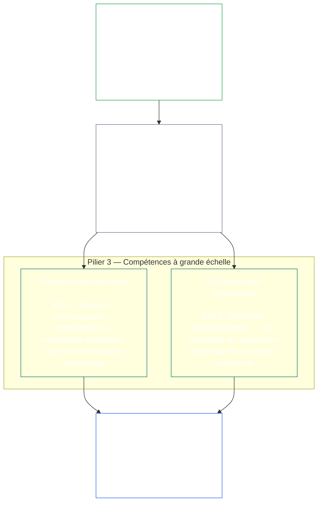
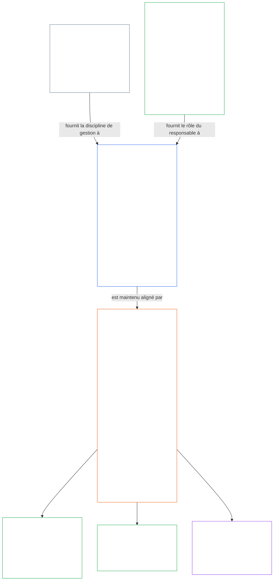

<a id="chapter-01-principles-and-constraints"></a>
<a id="chapter-01-part-b-stewardship-and-governance"></a>
<a id="chapter-01-part-c-stewardship-and-governance"></a>
# CHAPITRE 01, PARTIE C : INTENDANCE ET GOUVERNANCE

<details>
<summary><strong><span style="color: #2563eb;">Place dans le corpus (non opératoire) : structure des fichiers et règles de lecture</span></strong></summary>

> Le contenu qui suit sert uniquement de guide au lecteur. Il n’ajoute, ne supprime ni ne restreint aucune obligation contraignante ailleurs dans ce fichier ou dans les autres chapitres.
>
> Ce fichier fait **partie de la Sentient Constitution** et n’est **contraignant qu’avec** les autres fichiers numérotés `core_*`, lus ensemble comme un seul instrument. Il contient le **chapitre un, partie C** (§§16–20 : intendance, gouvernance, alignement des incitations et captation, ainsi que le volet final d’application intégrée).
>
> **En amont :** [core_01_b_interaction_interpretation.md](core_01_b_interaction_interpretation.md) (chapitre un, partie B)  
> **Ensuite :** [core_02_definition_structure.md](core_02_definition_structure.md)<br>
> **Parcours de lecture :** §16 intendance et compréhension distribuée → §17 le rôle de responsable → §18 gouvernance → §19 alignement des incitations et captation → **§20 application intégrée** (conclusion du chapitre).

</details>

<details>
<summary><strong><span style="color: #2563eb;">Guide du lecteur (non opératoire) : hiérarchie des principes et parcours de lecture (partie C)</span></strong></summary>

> Le contenu qui suit sert uniquement de guide au lecteur. Il n’ajoute, ne supprime ni ne restreint aucune obligation contraignante ailleurs dans ce fichier ou dans les autres chapitres. Les modules **Trace** et **Definitions · Assessment · Compliance** de chaque section indiquent les renvois au moment où un § invoque matériellement un terme ; le présent bloc établit une table de correspondance pour toute la partie avant les §§16–20.

**Hiérarchie des principes (partie C).** Au niveau des principes :

13. **[Intendance](core_05_band_continuity.md#stewardship)** oriente les systèmes matériels par l’organisation des êtres sensibles — **Pilier 1** ([§17](#17-consequential-stewardship-the-steward-role) : exploitation et amélioration concrètes ayant des conséquences), **Pilier 2** ([intendance proactive](#16-pillar-2-proactive-stewardship) : repérer tôt les difficultés et les résoudre sans retard évitable), et **Pilier 3** ([§16.1](#161-distributed-understanding) · [§16.2](#162-institutional-development) : compétences à l’échelle communautaire et institutionnelle) — afin de maintenir durablement l’alignement constitutionnel dans le temps selon le [Quadrilatère constitutionnel](core_00_preamble.md#constitutional-tetrad), en particulier **[Participation](core_05_apex_participation_leg.md#participation-constitutional)** (rôles conséquents et voix) et **[Surveillance](core_05_apex_oversight_leg.md#oversight-constitutional)** (compréhension distribuée, auditabilité et possibilité de contester — la surveillance exige des audits ; [System Alignment Certification](core_05_band_continuity.md#system-alignment-certification) est l’un des processus d’audit particulièrement vastes, parmi d’autres), y compris l’objectif de **Continuité** selon les [Deux objectifs constitutionnels](core_00_preamble.md#two-constitutional-aims).
14. **[Intendance conséquente](#17-consequential-stewardship-the-steward-role)** désigne le rôle même du responsable : les devoirs pratiques, les normes et les protections qui s’appliquent à toute personne chargée de l’exploitation, de la maintenance, de la surveillance ou de l’amélioration conséquente d’un système matériel — le **Pilier 1** rendu opérationnel, auquel s’ajoutent une norme commune, l’alignement sous pression et l’observabilité délimitée par le rôle du responsable.
15. **[Gouvernance](core_05_band_accountability.md#governance)** structure la prise de décision autorisée, la participation et la responsabilité au titre du [Quadrilatère constitutionnel](core_00_preamble.md#constitutional-tetrad), notamment la **[Surveillance](core_05_apex_oversight_leg.md#oversight-constitutional)** de l’attribution et de l’exercice de l’autorité, ainsi que la **responsabilité proportionnée à l’autorité** prévue au [§18.1](#181-governance-as-authorized-structure) : une autorisation plus étendue ou un rôle plus conséquent accroît la responsabilité constitutionnelle et la surveillance, sans jamais les réduire. [§18.3 Séparation des tâches](#183-segregation-of-duties) empêche la personne qui a agi d’être aussi celle qui vérifie. [§18.4 Justification continue](#184-ongoing-justification) exige que ces dispositifs continuent de démontrer leur conformité à la présente Constitution. En cas de conflit entre gouvernance et intendance, la discipline de l’intendance prévaut au niveau des principes, sauf si la **Nécessité** et la **Proportionnalité** justifient expressément une exception limitée dans sa portée et dans le temps, assortie de voies de correction. Les autorisations opératoires et les exigences contractuelles restent du ressort du **chapitre treize**.
16. **[Alignement des incitations et captation du système](#19-incentive-alignment-and-system-capture)** établit la discipline des principes applicable aux structures d’incitation, à l’intégrité des indicateurs de substitution, aux défauts d’horizon trop court, à la correction des mécanismes de récompense et à la réponse à la captation.
17. **[Application intégrée](#20-integrated-application)** est la conclusion du chapitre : les chapitres suivants se lisent au moyen du cadre de valeur intégrée de ce chapitre.

</details>

<br>

<a id="16-stewardship-in-depth"></a>

### 16. L’intendance en détail
<details>
<summary><strong><span style="color: #2563eb;">Traçabilité</span></strong></summary>

- À lire avec : [Quadrilatère constitutionnel](core_00_preamble.md#constitutional-tetrad) — principal ancrage du chapitre un pour le volet **participation** (rôles conséquents et voix ; exigence générale, et non [Stakeholder System Participation](core_05_band_participation.md#stakeholder-status-and-weight) uniquement), le volet **surveillance** et le volet **rapidité d’action** (vitesse de réparation proactive) ; mise à l’échelle selon l’[enjeu matériel](core_00_preamble.md#material-stake).
- À lire avec : [Deux objectifs constitutionnels](core_00_preamble.md#two-constitutional-aims) — objectif d’**Épanouissement** (participation, capacité d’agir et parcours éducatifs) ; objectif de **Continuité** (apprentissage institutionnel, capacité de réparation et intendance durable).
- En amont : Principes : [3. Objectif fondamental : bien-être](core_01_a_values_principles.md#3-foundational-objective-wellbeing-flourishing-aim) ; [5 Vérité](core_01_a_values_principles.md#5-truth-epistemic-integrity-constraint) ; [6. Confiance](core_01_a_values_principles.md#6-trust-and-trustworthiness-coordination-integrity) ; et [§9 Capacité des systèmes partagés](core_01_a_values_principles.md#9-shared-system-capacity).
- En aval : [13. Processus de résolution des conflits constitutionnels](core_01_b_interaction_interpretation.md#13-constitutional-collision-resolution-process) (y compris [§13.3 Réduction des charges évitables](core_01_b_interaction_interpretation.md#133-minimization-of-avoidable-burden)) ; [chapitre huit §4 Évaluation de la certification de l’ensemble du système](core_08_a_system_alignment_certification_evaluation.md#4-whole-system-certification-evaluation) ; [§19.1.3 Application à l’intendance et aux opérateurs](#1913-stewardship-and-operator-application).
- En aval : [§19.1.4 Parcours d’approfondissement du rôle et de responsabilité matérielle](#1914-role-depth-and-material-responsibility-pathways).
- En aval : [§7 Liberté (capacité d’agir encadrée)](core_01_a_values_principles.md#7-freedom-bounded-agency), qui dépend du maintien réel de l’intendance conséquente, de la compréhension distribuée, d’une participation significative et de la capacité de réparation malgré la dépendance matérielle.
- En aval : [chapitre huit — System Alignment Certification](core_08_a_system_alignment_certification_evaluation.md#chapter-eight-system-alignment-certification) (*un processus d’audit particulièrement vaste relevant de la surveillance — et non son unique ancrage*) ; [chapitre neuf — Modèle de contribution, de violation et de statut](core_09_standing_assessment.md#chapter-nine-contribution-violation-and-standing-model--measurement) (*l’effet sur le statut — confiance, rôle et admissibilité à la reconnaissance — met en œuvre cette sous-section comme fondement des principes*).
- En aval : [chapitre douze §1 — Objet et rôle](core_12_forum.md#1-purpose-and-role--participation-architecture) et [§4 — Définitions des familles de forums](core_12_forum.md#4-forum-family-definitions--accountability-through-adjudication) (*les familles de forums assurent l’architecture de participation et de surveillance nécessaire aux contestations, à l’ordonnancement des mesures correctives, à l’apprentissage des causes profondes et à une gouvernance proactive conforme à cette section*) ; [corpus_forum.md](corpus_forum.md) pour le fonctionnement des forums adoptés.
- En aval : façonne le champ des droits en matière d’éducation, de Stakeholder System Participation, de transparence, d’intelligibilité, d’audit et de vérification, ainsi que les parcours d’approfondissement des rôles menant à une responsabilité matérielle.
  - En particulier [Article III : Survie et accès essentiel](core_06_rights_part_a.md#article-iii-survival-and-essential-access), [Article IV : Droit à une éducation centrée sur les êtres sensibles](core_06_rights_part_a.md#article-iv-right-to-sentient-centered-education), [Article X : Autodétermination, capacité d’agir et participation](core_06_rights_part_b.md#article-x-self-determination-agency-and-participation), [Article XII : Participation des parties prenantes au système, représentation et procédure régulière](core_06_rights_part_b.md#article-xii-stakeholder-system-participation-representation-and-due-process), [Article XVI : Audit, transparence et vérification indépendante](core_06_rights_part_c.md#article-xvi-audit-transparency-and-independent-verification), [Article XIX : Statut et situation de participation](core_06_rights_part_d.md#article-xix-standing-and-participation-status), [Article XXI : Interopérabilité, portabilité, déplacement, refuge et intégrité de sortie](core_06_rights_part_d.md#article-xxi-interoperability-portability-movement-refuge-and-exit-integrity), [Article XXII : Intelligibilité et intendance de la complexité](core_06_rights_part_d.md#article-xxii-comprehensibility-and-complexity-stewardship), et [Article XXIV : Interprétation constitutionnelle, examen et garanties contre la captation](core_06_rights_part_d.md#article-xxiv-constitutional-interpretation-review-and-anti-capture-safeguards).
  - À lire avec : [chapitre treize §5 — Rôles autorisés, développement des compétences et contribution](core_13_governance.md#5-authorized-roles-competency-development-and-contribution) et **[corpus_systems.md](corpus_systems.md), CS-4 — Intendance des systèmes critiques**, pour les parcours opératoires liés aux rôles et au développement de l’intendance.
- Sous-sections (ordre de lecture) : [§16.1 Compréhension distribuée](#161-distributed-understanding) (dimension communautaire de la compétence à grande échelle) · [§16.2 Développement institutionnel](#162-institutional-development) (dimension organisationnelle) · [§16.3 Aspiration à l’ouverture](#163-openness-aspiration).
- À lire avec : [§17 Intendance conséquente](#17-consequential-stewardship-the-steward-role) (*le rôle même du responsable — élevé au rang de section distincte ; il porte les devoirs pratiques du Pilier 1 en matière d’exploitation, de maintenance, de surveillance et d’amélioration, ainsi que [§17.1](#171-shared-stewardship-standard), [§17.2](#172-alignment-under-pressure), [§17.3](#173-logging-the-role-not-the-steward), [§17.4 Auto-organisation alignée](#174-aligned-self-organization), qui étend cette discipline au-delà du rôle formel, et [§17.5 Devoir de résistance](#175-duty-to-resist)*)

</details>

<details>
<summary><strong><span style="color: #2563eb;">Définitions · Évaluation · Conformité</span></strong></summary>

- [Obligation d’intendance stratégique](core_05_band_continuity.md#strategic-stewardship-obligation) · [O](core_05_band_continuity.md#strategic-stewardship-obligation) · [M](core_05_band_continuity.md#strategic-stewardship-obligation-constitutional-a) · [A](core_05_band_continuity.md#strategic-stewardship-obligation-constitutional-a) · [C](core_05_band_continuity.md#strategic-stewardship-obligation-constitutional-c)
- [Compréhension distribuée](core_05_band_continuity.md#distributed-understanding) · [O](core_05_band_continuity.md#distributed-understanding) · [M](core_05_band_continuity.md#distributed-understanding-constitutional-a) · [A](core_05_band_continuity.md#distributed-understanding-constitutional-a) · [C](core_05_band_continuity.md#distributed-understanding-constitutional-c)
- [Participation](core_05_apex_participation_leg.md#participation-constitutional) · [O](core_05_apex_participation_leg.md#participation-constitutional) · [M](core_05_apex_participation_leg.md#participation-constitutional-m) · [A](core_05_apex_participation_leg.md#participation-constitutional-a) · [C](core_05_apex_participation_leg.md#participation-constitutional-c)
- [Surveillance](core_05_apex_oversight_leg.md#oversight-constitutional) · [O](core_05_apex_oversight_leg.md#oversight-constitutional) · [M](core_05_apex_oversight_leg.md#oversight-constitutional-m) · [A](core_05_apex_oversight_leg.md#oversight-constitutional-a) · [C](core_05_apex_oversight_leg.md#oversight-constitutional-c)
- [Capacité d’agir significative](core_05_band_participation.md#meaningful-agency) · [O](core_05_band_participation.md#meaningful-agency) · [M](core_05_band_participation.md#meaningful-agency-a) · [A](core_05_band_participation.md#meaningful-agency-a) · [C](core_05_band_participation.md#meaningful-agency-c)
- [Auditabilité](core_05_band_oversight.md#auditability) · [O](core_05_band_oversight.md#auditability) · [M](core_05_band_oversight.md#auditability-a) · [A](core_05_band_oversight.md#auditability-a) · [C](core_05_band_oversight.md#auditability-c)
- [Contestabilité](core_05_band_accountability.md#contestability) · [O](core_05_band_accountability.md#contestability) · [M](core_05_band_accountability.md#contestability-a) · [A](core_05_band_accountability.md#contestability-a) · [C](core_05_band_accountability.md#contestability-c)
- [Capacité d’agir éducative](core_05_band_participation.md#educational-agency) · [O](core_05_band_participation.md#educational-agency) · [M](core_05_band_participation.md#educational-agency-a) · [A](core_05_band_participation.md#educational-agency-a) · [C](core_05_band_participation.md#educational-agency-c)
- [Transparence](core_05_band_oversight.md#transparency) · [O](core_05_band_oversight.md#transparency) · [M](core_05_band_oversight.md#transparency-a) · [A](core_05_band_oversight.md#transparency-a) · [C](core_05_band_oversight.md#transparency-c)
- [Caractère matériel](core_05_band_oversight.md#materiality) · [O](core_05_band_oversight.md#materiality) · [M](core_05_band_oversight.md#materiality-determination-a) · [A](core_05_band_oversight.md#materiality-determination-a) · [C](core_05_band_oversight.md#materiality-determination-c)
- [Dépendance](core_05_band_continuity.md#dependency) · [O](core_05_band_continuity.md#dependency) · [M](core_05_band_continuity.md#dependency-a) · [A](core_05_band_continuity.md#dependency-a) · [C](core_05_band_continuity.md#dependency-c)
- [Accessibilité](core_05_band_participation.md#accessibility) · [O](core_05_band_participation.md#accessibility) · [M](core_05_band_participation.md#accessibility-constitutional-a) · [A](core_05_band_participation.md#accessibility-constitutional-a) · [C](core_05_band_participation.md#accessibility-constitutional-c)
- [Sécurité (contrainte constitutionnelle)](core_05_band_continuity.md#safety-constitutional-constraint) · [O](core_05_band_continuity.md#safety-constitutional-constraint) · [M](core_05_band_continuity.md#safety-constraint-a) · [A](core_05_band_continuity.md#safety-constraint-a) · [C](core_05_band_continuity.md#safety-constraint-c)
- [Vérité (contrainte constitutionnelle)](core_05_band_oversight.md#truth-constitutional-constraint) · [O](core_05_band_oversight.md#truth-constitutional-constraint-o) · [M](core_05_band_oversight.md#truth-constitutional-constraint-a) · [A](core_05_band_oversight.md#truth-constitutional-constraint-a) · [C](core_05_band_oversight.md#truth-constitutional-constraint-c)
- [Nécessité](core_05_band_accountability.md#necessity) · [O](core_05_band_accountability.md#necessity) · [M](core_05_band_accountability.md#necessity-a) · [A](core_05_band_accountability.md#necessity-a) · [C](core_05_band_accountability.md#necessity-c)
- [Proportionnalité](core_05_band_accountability.md#proportionality) · [O](core_05_band_accountability.md#proportionality) · [M](core_05_band_accountability.md#proportionality-a) · [A](core_05_band_accountability.md#proportionality-a) · [C](core_05_band_accountability.md#proportionality-c)
- [Charge évitable](core_05_band_continuity.md#avoidable-burden) · [O](core_05_band_continuity.md#avoidable-burden) · [M](core_05_band_continuity.md#avoidable-burden-a) · [A](core_05_band_continuity.md#avoidable-burden-a) · [C](core_05_band_continuity.md#avoidable-burden-c)
- [Intégrité épistémique](core_05_band_oversight.md#epistemic-integrity) · [O](core_05_band_oversight.md#epistemic-integrity-o) · [M](core_05_band_oversight.md#epistemic-integrity-a) · [A](core_05_band_oversight.md#epistemic-integrity-a) · [C](core_05_band_oversight.md#epistemic-integrity-c)

</details>

<br>

*En termes simples : trois idées structurent cette section. Premièrement, les systèmes matériels qui touchent la vie des êtres sensibles ont besoin d’une organisation par les êtres sensibles pour bien fonctionner — pas d’un clergé de spécialistes isolé du reste. Deuxièmement, les bons responsables n’attendent pas qu’un préjudice les oblige à agir : ils repèrent les difficultés quand elles sont encore modestes, les font suivre par les personnes compétentes et les résolvent avant que le retard ne devienne lui-même préjudiciable. Troisièmement, cette organisation doit développer des **compétences à grande échelle** : des voies réelles permettant aux personnes d’accéder à des travaux conséquents, une compréhension communautaire suffisante pour repérer les problèmes et s’y opposer, et des institutions qui continuent d’apprendre au lieu de se figer.*

<a id="16-limits"></a>
L’intendance a des limites. **Sécurité**, **Vérité**, **Nécessité**, **Proportionnalité**, **Charge évitable** et **Intégrité épistémique** fixent celles qui maintiennent ces devoirs à une juste mesure, les rendent honnêtes et respectueuses des besoins légitimes de sécurité — les piliers ci-dessous agissent dans ces limites, et non en les contournant.

L’organisation des êtres sensibles, l’intendance proactive et les compétences à grande échelle sont les trois piliers de cette section. Ensemble, ils portent au niveau des principes les volets **participation**, **surveillance** et **rapidité d’action** du [Quadrilatère constitutionnel](core_00_preamble.md#constitutional-tetrad), en fonction de l’[enjeu matériel](core_00_preamble.md#material-stake), et font progresser les [Deux objectifs constitutionnels](core_00_preamble.md#two-constitutional-aims).

<br>



**Pilier 1 — Intendance conséquente ([§17 Intendance conséquente](#17-consequential-stewardship-the-steward-role)) :**
- Les systèmes partagés qui ont un effet matériel sur les êtres sensibles exigent leur exploitation pratique, leur maintenance, leur surveillance et leur amélioration — [**Obligation d’intendance stratégique**](core_05_band_continuity.md#strategic-stewardship-obligation), [**Capacité d’agir significative**](core_05_band_participation.md#meaningful-agency)
- Des dossiers et des voies de révision que d’autres peuvent vérifier et contester — [**Auditabilité**](core_05_band_oversight.md#auditability), [**Contestabilité**](core_05_band_accountability.md#contestability)
- Au titre du volet **surveillance** du Quadrilatère, la surveillance exige des audits ; [System Alignment Certification](core_05_band_continuity.md#system-alignment-certification) est l’un des processus d’audit particulièrement vastes et à forts enjeux, parmi d’autres — ce n’est pas son unique ancrage (**Article XVI** (*Audit, transparence et vérification indépendante*))

<a id="16-pillar-2-proactive-stewardship"></a>
**Pilier 2 — Intendance proactive :**
Les responsables proactifs traitent les problèmes émergents et les désalignements de trois façons :
- **Les repérer avant qu’ils ne s’aggravent** — les bons responsables détectent les désalignements lorsque les problèmes sont encore modestes, au lieu d’attendre qu’ils apparaissent d’eux-mêmes
- **Les faire avancer selon un calendrier adapté au niveau concerné** — les signaler dans des délais proportionnés aux enjeux du rôle, plutôt que de garder pour soi ce qui a été découvert ou de faire remonter excessivement les affaires courantes
- **Les résoudre, et pas seulement les signaler** — commencer la correction sans retard évitable une fois les problèmes signalés ; c’est la mise en œuvre du volet **rapidité d’action** du Quadrilatère ([**Rapidité d’action**](core_05_apex_timeliness_leg.md#timeliness-constitutional))
- **Un devoir permanent du rôle, pas un ajout :** le rôle de responsable défini dans [§17 Intendance conséquente](#17-consequential-stewardship-the-steward-role) privilégie une gouvernance proactive, la conception des systèmes et l’alignement constitutionnel plutôt que la réparation réactive des symptômes après l’apparition d’un préjudice ou d’un désalignement — ce pilier relève de ce rôle à titre de devoir permanent et n’est pas délégué à un processus distinct

**Pilier 3 — Compétences à grande échelle ([§16.1 Compréhension distribuée](#161-distributed-understanding) · [§16.2 Développement institutionnel](#162-institutional-development)) :**
- L’intendance doit rendre la compréhension et la contestation praticables pour les communautés concernées — [**Capacité d’agir éducative**](core_05_band_participation.md#educational-agency), [**Transparence**](core_05_band_oversight.md#transparency)
- Les organisations continuent d’apprendre grâce aux retours, aux corrections et au maintien des compétences, y compris par le suivi structuré des variations dans le temps lorsque les mesures le permettent (des méthodes telles que le **contrôle statistique des processus** sont des mises en œuvre bien établies, et non des exigences universelles)

<a id="when-day-to-day-stewardship-is-not-enough"></a>
**Quand la gestion quotidienne ne suffit pas :**
La gestion est la première ligne de défense, mais pas la seule. Trois questions distinctes relèvent de trois instances différentes, et aucune ne se substitue aux autres :
- **Litiges au sein d’un système déjà autorisé — [Participation au système des parties prenantes](core_05_band_participation.md#stakeholder-status-and-weight) :**
  - Les sentients affectés empruntent d’abord la voie de contestation publiée de la Participation au système des parties prenantes, qui couvre la participation, la représentation, la possibilité de contester et l’application régulière de la procédure.
  - Ces protections sont dues à tout sentient matériellement affecté.
  - Elles s’appliquent au sein de systèmes, d’institutions et de domaines décisionnels déjà autorisés.
- **Litiges que la Participation au système des parties prenantes ne peut trancher — [examen par le forum](core_12_forum.md#dispute-sequencing) :**
  - Lorsque la voie de contestation de la Participation au système des parties prenantes reste contestée, fait défaut ou est capturée, ou ne peut accorder de réparation, l’affaire est portée devant les **familles de forums** indépendantes conformément au [Chapitre Douze §1 — Objet et rôle](core_12_forum.md#1-purpose-and-role--participation-architecture) et au [§4 — Définitions des familles de forums](core_12_forum.md#4-forum-family-definitions--accountability-through-adjudication), selon l’enjeu principal.
  - C’est là que les sentients disposent d’un véritable moyen de contester une décision, d’obtenir une ordonnance de réparation claire ou de tirer les leçons d’un schéma récurrent.
  - Lorsque l’enjeu principal porte sur le sens ou la validité du texte constitutionnel, ou sur une action dépassant l’autorité légale, la famille compétente est celle des [Forums constitutionnels](core_12_forum.md#46-constitutional-forums).
  - Les règles détaillées de fonctionnement de ces forums figurent dans [corpus_forum.md](corpus_forum.md).
- **Qui peut gouverner — [Couche du Contrat constitutionnel](core_05_band_integrative.md#constitutional-contract-layer) ([Chapitre Treize](core_13_governance.md)) :**
  - La légitimité de l’autorité de gouvernance elle-même — qui peut gouverner, selon quel mécanisme de légitimité, et dans quel périmètre et selon quelles modalités durables — est une question distincte de la Participation au système des parties prenantes et de l’examen par le forum.
  - Un vote de participation, l’issue d’une voie de contestation ou un score de confiance ne confère pas d’autorité de gouvernance.
  - L’autorisation constitutionnelle n’efface pas les obligations dues au titre de la Participation au système des parties prenantes.
  - Les deux couches restent distinctes même lorsqu’elles se recoupent ([Préambule §3.3 — Couches de gouvernance](core_00_preamble.md#33-governance-layers)).
- **Garanties de dernier recours, et non substituts :** L’examen, la correction et la réparation demeurent obligatoires lorsque les éléments disponibles le justifient. Ils ne remplacent pas la conception proactive, les incitations, les contrôles, les parcours de rôle, l’observabilité et la capacité de réparation qui préviennent les désalignements constitutionnels prévisibles avant qu’un préjudice ne survienne.

<a id="16-scope-priority-and-limits"></a>
**Portée ([§16 Gestion approfondie](#16-stewardship-in-depth)) :**
- Cette section fournit des orientations de principe, et non un règlement uniforme applicable à toutes les situations.
- Elle **n’exige pas** :
  - que chacun passe successivement par chaque rôle
  - que l’on écarte une spécialisation justifiée
  - que l’on dépasse les limites légitimes de confidentialité ou de sécurité prévues par [13.2 Contraintes à la divulgation épistémique](core_01_b_interaction_interpretation.md#132-epistemic-disclosure-constraints) et les protections applicables du **Chapitre Six**.

**Priorité :**
- La **Matérialité**, la **Dépendance** et l’**Accessibilité** déterminent la priorité dans la répartition de la compréhension et de l’accès, avec une attention particulière aux situations où l’impact et la dépendance sont plus importants.

<a id="161-distributed-understanding"></a>
#### 16.1 Compréhension distribuée
<details>
<summary><strong><span style="color: #2563eb;">Traçabilité</span></strong></summary>

- En amont : [§17 Gestion conséquente](#17-consequential-stewardship-the-steward-role) (*Pilier 1*) ; [§16 Gestion approfondie](#16-stewardship-in-depth) (section parente, y compris *En termes simples* et le cadrage du Pilier 3 ci-dessus) ; [5 Vérité](core_01_a_values_principles.md#5-truth-epistemic-integrity-constraint) ; [6. Confiance](core_01_a_values_principles.md#6-trust-and-trustworthiness-coordination-integrity).
- À lire avec : [Tétrade constitutionnelle](core_00_preamble.md#constitutional-tetrad) — volet **participation** ([Agentivité réelle](core_05_band_participation.md#meaningful-agency), [Agentivité éducative](core_05_band_participation.md#educational-agency)) ; volet **supervision** ([Transparence](core_05_band_oversight.md#transparency), [Auditabilité](core_05_band_oversight.md#auditability)) ; mise à l’échelle selon l’[enjeu matériel](core_00_preamble.md#material-stake).
- Point d’accès pour les responsables (non opératoire) : carte de prochaine étape : [Compréhensibilité](implementation/STEWARD_ENTRY_DOORS.md#comprehensibility). La carte ne peut restreindre la Constitution.
- En aval : [13.2 Contraintes à la divulgation épistémique](core_01_b_interaction_interpretation.md#132-epistemic-disclosure-constraints) ; champ des droits, notamment [Article XVI : Audit, transparence et vérification indépendante](core_06_rights_part_c.md#article-xvi-audit-transparency-and-independent-verification), [Article XXII : Compréhensibilité et gestion de la complexité](core_06_rights_part_d.md#article-xxii-comprehensibility-and-complexity-stewardship).

</details>

<details>
<summary><strong><span style="color: #2563eb;">Définitions · Évaluation · Conformité</span></strong></summary>

- [Compréhension distribuée](core_05_band_continuity.md#distributed-understanding) · [O](core_05_band_continuity.md#distributed-understanding) · [M](core_05_band_continuity.md#distributed-understanding-constitutional-a) · [A](core_05_band_continuity.md#distributed-understanding-constitutional-a) · [C](core_05_band_continuity.md#distributed-understanding-constitutional-c)
- [Transparence](core_05_band_oversight.md#transparency) · [O](core_05_band_oversight.md#transparency) · [M](core_05_band_oversight.md#transparency-a) · [A](core_05_band_oversight.md#transparency-a) · [C](core_05_band_oversight.md#transparency-c)
- [Divulgation de référence pour la supervision publique](core_05_band_oversight.md#public-oversight-baseline-disclosure) · [O](core_05_band_oversight.md#public-oversight-baseline-disclosure) · [M](core_05_band_oversight.md#public-oversight-baseline-disclosure-a) · [A](core_05_band_oversight.md#public-oversight-baseline-disclosure-a) · [C](core_05_band_oversight.md#public-oversight-baseline-disclosure-c)
- [Auditabilité](core_05_band_oversight.md#auditability) · [O](core_05_band_oversight.md#auditability) · [M](core_05_band_oversight.md#auditability-a) · [A](core_05_band_oversight.md#auditability-a) · [C](core_05_band_oversight.md#auditability-c)
- [Matérialité](core_05_band_oversight.md#materiality) · [O](core_05_band_oversight.md#materiality) · [M](core_05_band_oversight.md#materiality-determination-a) · [A](core_05_band_oversight.md#materiality-determination-a) · [C](core_05_band_oversight.md#materiality-determination-c)
- [Dépendance](core_05_band_continuity.md#dependency) · [O](core_05_band_continuity.md#dependency) · [M](core_05_band_continuity.md#dependency-a) · [A](core_05_band_continuity.md#dependency-a) · [C](core_05_band_continuity.md#dependency-c)
- [Accessibilité](core_05_band_participation.md#accessibility) · [O](core_05_band_participation.md#accessibility) · [M](core_05_band_participation.md#accessibility-constitutional-a) · [A](core_05_band_participation.md#accessibility-constitutional-a) · [C](core_05_band_participation.md#accessibility-constitutional-c)
- [Agentivité éducative](core_05_band_participation.md#educational-agency) · [O](core_05_band_participation.md#educational-agency) · [M](core_05_band_participation.md#educational-agency-a) · [A](core_05_band_participation.md#educational-agency-a) · [C](core_05_band_participation.md#educational-agency-c)
- [Agentivité réelle](core_05_band_participation.md#meaningful-agency) · [O](core_05_band_participation.md#meaningful-agency) · [M](core_05_band_participation.md#meaningful-agency-a) · [A](core_05_band_participation.md#meaningful-agency-a) · [C](core_05_band_participation.md#meaningful-agency-c)
- [Possibilité de contestation](core_05_band_accountability.md#contestability) · [O](core_05_band_accountability.md#contestability) · [M](core_05_band_accountability.md#contestability-a) · [A](core_05_band_accountability.md#contestability-a) · [C](core_05_band_accountability.md#contestability-c)

</details>

<br>

*En termes simples : nul ne devrait avoir besoin d’un doctorat dans chaque sous-système pour vivre en sécurité au sein de systèmes partagés ; mais plus un système affecte votre vie, plus vous devriez pouvoir comprendre ce qu’il fait, ce qui pourrait mal tourner et comment contester les mauvaises décisions. La transparence, l’éducation, les explications claires et les voies d’audit rendent cela possible. La complexité ne justifie pas de cacher ce qui compte. Dans le volet **supervision** de la Tétrade, la supervision implique l’audit ; la certification de l’alignement du système est l’un des processus d’audit particulièrement étendus parmi ces voies, mais pas le seul.*

La compréhension distribuée constitue la facette tournée vers la communauté du **Pilier 3**, conformément à **[§16 Gestion approfondie](#16-stewardship-in-depth)**. La définition complète, les mesures et les conditions d’échec figurent dans [Compréhension distribuée](core_05_band_continuity.md#distributed-understanding). En résumé :

- **Ce qu’elle exige :** un accès proportionné et structuré au fonctionnement des systèmes partagés qui affectent matériellement les sentients — leurs objectifs, contraintes, incertitudes et effets matériellement pertinents.
- **Ce qui la rend praticable :** [§17 Gestion conséquente](#17-consequential-stewardship-the-steward-role) doit fournir de la documentation, de l’éducation, de la transparence, des parcours de rôle et une gestion de la compréhensibilité. Cette obligation s’applique que chaque sentient utilise ou non toutes les voies.
- **Référence publique en ligne :** lorsqu’une infrastructure légale en ligne existe, la [Divulgation de référence pour la supervision publique](core_05_band_oversight.md#public-oversight-baseline-disclosure) en ligne — y compris l’interdiction des barrières payantes et la règle du substitut public maximalement réalisable — est régie par [Transparence](core_05_band_oversight.md#transparency) et [Divulgation de référence pour la supervision publique](core_05_band_oversight.md#public-oversight-baseline-disclosure), et mise en œuvre sous forme de données de **Type O** conformément à **[corpus_systems.md](corpus_systems.md), CS-2** (*Types et traitement de l’information*).
- **Ce que l’accès permet :**
  - le volet **participation** de la [Tétrade constitutionnelle](core_00_preamble.md#constitutional-tetrad) ([Agentivité réelle](core_05_band_participation.md#meaningful-agency) éclairée et possibilité de contestation)
  - le volet **supervision**, notamment l’audit au titre de l’[Auditabilité](core_05_band_oversight.md#auditability) et de l’**Article XVI** (*Audit, transparence et vérification indépendante*), dont la [Certification de l’alignement du système](core_05_band_continuity.md#system-alignment-certification) constitue l’un des processus particulièrement étendus parmi les modes d’audit apparentés

La compréhension distribuée **n’exige pas** que chaque sentient maîtrise chaque sous-système. Elle **exige** que la compréhension soit proportionnée à la [Matérialité](core_05_band_oversight.md#materiality) et à la [Dépendance](core_05_band_continuity.md#dependency). La complexité et l’opacité ne doivent pas servir à faire échec à l’[Agentivité réelle](core_05_band_participation.md#meaningful-agency) ou à la possibilité de contestation lorsque le **Chapitre Cinq** et le **Chapitre Six** imposent des obligations de divulgation, d’éducation ou de compréhensibilité.

<a id="162-institutional-development"></a>
#### 16.2 Développement institutionnel
<details>
<summary><strong><span style="color: #2563eb;">Traçabilité</span></strong></summary>

- En amont : [§17 Gestion conséquente](#17-consequential-stewardship-the-steward-role) (*Pilier 1*) ; [§16.1 Compréhension distribuée](#161-distributed-understanding) (*facette communautaire du Pilier 3*) ; [§16 Gestion approfondie](#16-stewardship-in-depth) (cadre du Pilier 3 de la section parente).
- À lire avec : [Tétrade constitutionnelle](core_00_preamble.md#constitutional-tetrad) — volet **participation** (apprentissage du personnel et des communautés affectées qui soutient les rôles à conséquences importantes) ; volet **supervision** ([Vérifiabilité](core_05_band_oversight.md#verifiability), [Auditabilité](core_05_band_oversight.md#auditability), mesures honnêtes) ; mise à l’échelle selon l’[enjeu matériel](core_00_preamble.md#material-stake).
- À lire avec : l’[Obligation de gestion stratégique](core_05_band_continuity.md#strategic-stewardship-obligation) et l’[Auditabilité](core_05_band_oversight.md#auditability) lorsque cela est matériellement pertinent.
- À lire avec : [§16.1 Compréhension distribuée](#161-distributed-understanding) (*la compréhension communautaire et l’apprentissage institutionnel sont des facettes distinctes d’une même exigence de compétence à grande échelle, elles ne se remplacent pas*).
- En aval : [§16.3 Aspiration à l’ouverture](#163-openness-aspiration) ; [§18 Gouvernance sous discipline de gestion](#18-governance-under-stewardship-discipline) et [§19 Alignement des incitations et captation du système](#19-incentive-alignment-and-system-capture) (*apprentissage institutionnel et alignement des incitations*).

</details>

<details>
<summary><strong><span style="color: #2563eb;">Définitions · Évaluation · Conformité</span></strong></summary>

- [Développement institutionnel](core_05_band_continuity.md#institutional-development) · [O](core_05_band_continuity.md#institutional-development) · [M](core_05_band_continuity.md#institutional-development-constitutional-a) · [A](core_05_band_continuity.md#institutional-development-constitutional-a) · [C](core_05_band_continuity.md#institutional-development-constitutional-c)
- [Obligation de gestion stratégique](core_05_band_continuity.md#strategic-stewardship-obligation) · [O](core_05_band_continuity.md#strategic-stewardship-obligation) · [M](core_05_band_continuity.md#strategic-stewardship-obligation-constitutional-a) · [A](core_05_band_continuity.md#strategic-stewardship-obligation-constitutional-a) · [C](core_05_band_continuity.md#strategic-stewardship-obligation-constitutional-c)
- [Auditabilité](core_05_band_oversight.md#auditability) · [O](core_05_band_oversight.md#auditability) · [M](core_05_band_oversight.md#auditability-a) · [A](core_05_band_oversight.md#auditability-a) · [C](core_05_band_oversight.md#auditability-c)
- [Matérialité](core_05_band_oversight.md#materiality) · [O](core_05_band_oversight.md#materiality) · [M](core_05_band_oversight.md#materiality-determination-a) · [A](core_05_band_oversight.md#materiality-determination-a) · [C](core_05_band_oversight.md#materiality-determination-c)
- [Vérifiabilité](core_05_band_oversight.md#verifiability) · [O](core_05_band_oversight.md#verifiability) · [M](core_05_band_oversight.md#verifiability-a) · [A](core_05_band_oversight.md#verifiability-a) · [C](core_05_band_oversight.md#verifiability-c)

</details>

<br>

*En termes simples : les institutions doivent réellement apprendre, et pas seulement mettre à niveau leurs logiciels pendant que les responsables restent dans l’ignorance. Cela suppose des boucles de rétroaction, des corrections documentées lorsque les choses se désalignent et la conservation des compétences afin qu’elles ne disparaissent pas avec les départs. Lorsque les comportements peuvent être mesurés de façon répétable, suivre l’évolution des performances dans le temps est un moyen proportionné de mettre en œuvre ces boucles ; le **contrôle statistique des processus** est un modèle bien connu de cette discipline, et non une exigence universelle. Les chiffres seuls ne suffisent pas : lorsque les indicateurs semblent anormaux, quelqu’un doit enquêter et corriger la cause profonde. Les tableaux de bord doivent être honnêtes, proportionnés à l’impact réel et rédigés de manière à ce que les sentients affectés puissent les comprendre ; ils ne doivent pas être truqués pour donner une bonne image alors que rien ne change.*

Le développement institutionnel est la facette organisationnelle du **Pilier 3** conformément à **[§16 Gestion approfondie](#16-stewardship-in-depth)**. La définition complète, les mesures et les conditions d’échec figurent dans [Développement institutionnel](core_05_band_continuity.md#institutional-development). En résumé :

- **Obligation conjointe :** les organisations et les systèmes partagés **apprennent** — exigence fondamentale de l’objectif de **Continuité** dans les [Deux objectifs constitutionnels](core_00_preamble.md#two-constitutional-aims).
- **Ce qu’il exige :** les éléments suivants, qui soutiennent la réparation et l’adaptation :
  - des boucles de rétroaction
  - des corrections documentées
  - l’alignement stratégique
  - la conservation des compétences
- **Tétrade :** l’apprentissage institutionnel maintient actives, plutôt que statiques, les voies de compétence, de rétroaction et de contrôle, et soutient ainsi les volets **participation** et **supervision** de la [Tétrade constitutionnelle](core_00_preamble.md#constitutional-tetrad).
- **Ne suffit pas :** mettre à niveau les artefacts techniques tout en laissant inchangée la compréhension de la gouvernance et du personnel.
- **Quand la mesure s’applique :** lorsque des comportements matériellement pertinents permettent une **mesure répétée et comparable** au titre de la [Vérifiabilité](core_05_band_oversight.md#verifiability), à lire avec l’[Auditabilité](core_05_band_oversight.md#auditability) :
  - le **suivi structuré des variations dans le temps** est une façon proportionnée de mettre en œuvre ces boucles de rétroaction
  - ce suivi doit s’accompagner d’une **enquête et d’une correction documentées** lorsque les indicateurs le justifient
  - le **contrôle statistique des processus** est un modèle de mise en œuvre bien connu de cette discipline, et non une exigence universelle
- **Échelle et présentation :** la discipline est proportionnée à la [Matérialité](core_05_band_oversight.md#materiality), à la [Dépendance](core_05_band_continuity.md#dependency), à la [Nécessité](core_05_band_accountability.md#necessity), à la [Proportionnalité](core_05_band_accountability.md#proportionality) et à la [Charge évitable](core_05_band_continuity.md#avoidable-burden), et présentée sous une forme **compréhensible pour les sentients** lorsque le **Chapitre Cinq** et le **Chapitre Six** imposent des obligations de compréhension ou de transparence, à lire avec l’[Article XXII : Compréhensibilité et gestion de la complexité](core_06_rights_part_d.md#article-xxii-comprehensibility-and-complexity-stewardship).
- **Ne doit pas :**
  - remplacer l’alignement substantiel par des mesures favorables
  - réduire l’évaluation à des indicateurs indirects commodes
  - faire échec à la [Vérité (contrainte constitutionnelle)](core_05_band_oversight.md#truth-constitutional-constraint) ou à l’[Intégrité épistémique](core_05_band_oversight.md#epistemic-integrity) par manipulation ou présentation trompeuse

<a id="163-openness-aspiration"></a>
#### 16.3 Aspiration à l’ouverture
<details>
<summary><strong><span style="color: #2563eb;">Traçabilité</span></strong></summary>

- En amont : [§16.1 Compréhension distribuée](#161-distributed-understanding) et [§16.2 Développement institutionnel](#162-institutional-development) (*les deux facettes du Pilier 3 : l’ouverture rend la compréhension communautaire vérifiable et fournit à l’apprentissage institutionnel une matière honnête à étudier*) ; [§17 Gestion conséquente](#17-consequential-stewardship-the-steward-role) (*Pilier 1, également soutenu par l’ouverture qui rend inspectable le travail du responsable lui-même*).
- À lire avec : les [Deux objectifs constitutionnels](core_00_preamble.md#two-constitutional-aims) — objectif de **Continuité** (systèmes durables et contestables qui permettent l’inspection, la réparation, l’interopérabilité et la sortie plutôt que le verrouillage).
- À lire avec : la [Tétrade constitutionnelle](core_00_preamble.md#constitutional-tetrad) — volet **participation** ([Agentivité réelle](core_05_band_participation.md#meaningful-agency), accès compréhensible pour les sentients) ; volet **supervision** (inspection, vérification indépendante et possibilité de contestation) ; mise à l’échelle selon l’[enjeu matériel](core_00_preamble.md#material-stake).
- En aval : [§16 Portée et limites](#16-stewardship-in-depth) ; [Article XXI : Interopérabilité, portabilité, déplacement, refuge et intégrité de sortie](core_06_rights_part_d.md#article-xxi-interoperability-portability-movement-refuge-and-exit-integrity) ; [Article XXII : Compréhensibilité et gestion de la complexité](core_06_rights_part_d.md#article-xxii-comprehensibility-and-complexity-stewardship).

</details>

<details>
<summary><strong><span style="color: #2563eb;">Définitions · Évaluation · Conformité</span></strong></summary>

- [Aspiration à l’ouverture](core_05_band_continuity.md#openness-aspiration) · [O](core_05_band_continuity.md#openness-aspiration) · [M](core_05_band_continuity.md#openness-aspiration-constitutional-a) · [A](core_05_band_continuity.md#openness-aspiration-constitutional-a) · [C](core_05_band_continuity.md#openness-aspiration-constitutional-c)
- [Agentivité réelle](core_05_band_participation.md#meaningful-agency) · [O](core_05_band_participation.md#meaningful-agency) · [M](core_05_band_participation.md#meaningful-agency-a) · [A](core_05_band_participation.md#meaningful-agency-a) · [C](core_05_band_participation.md#meaningful-agency-c)
- [Possibilité de contestation](core_05_band_accountability.md#contestability) · [O](core_05_band_accountability.md#contestability) · [M](core_05_band_accountability.md#contestability-a) · [A](core_05_band_accountability.md#contestability-a) · [C](core_05_band_accountability.md#contestability-c)
- [Matérialité](core_05_band_oversight.md#materiality) · [O](core_05_band_oversight.md#materiality) · [M](core_05_band_oversight.md#materiality-determination-a) · [A](core_05_band_oversight.md#materiality-determination-a) · [C](core_05_band_oversight.md#materiality-determination-c)
- [Dépendance](core_05_band_continuity.md#dependency) · [O](core_05_band_continuity.md#dependency) · [M](core_05_band_continuity.md#dependency-a) · [A](core_05_band_continuity.md#dependency-a) · [C](core_05_band_continuity.md#dependency-c)

</details>

<br>

*En termes simples : lorsque la sécurité, la vérité et la confidentialité légitime le permettent, les systèmes partagés devraient privilégier par défaut l’ouverture : technologies inspectables, processus transparents et conceptions vérifiables, réparables ou que l’on peut quitter, plutôt qu’un verrouillage opaque. Cela soutient la **Continuité** : des systèmes que les sentients peuvent encore comprendre, corriger et quitter au fil du temps, et pas seulement utiliser aujourd’hui. Ce qui compte doit être expliqué dans un langage que les sentients peuvent réellement utiliser pour participer et contester. L’ouverture ne prime jamais sur la sécurité, l’honnêteté ou les secrets justifiés, et ne remplace pas la compréhension plus approfondie due lorsque la dépendance est forte.*

L’aspiration à l’ouverture relie les deux facettes du **Pilier 3**. La définition complète, les mesures et les conditions d’échec figurent dans [Aspiration à l’ouverture](core_05_band_continuity.md#openness-aspiration). En résumé :

- **Ce que c’est :** le fil conducteur reliant les deux facettes du **Pilier 3** — [§16.1 Compréhension distribuée](#161-distributed-understanding) (ce qu’une communauté peut vérifier) et [§16.2 Développement institutionnel](#162-institutional-development) (ce dont une institution peut honnêtement tirer des enseignements) dépendent toutes deux de systèmes partagés suffisamment ouverts pour être inspectés, et pas seulement décrits.
- Les systèmes partagés devraient **aspirer**, conformément à [§16.1 Compréhension distribuée](#161-distributed-understanding) et [§16.2 Développement institutionnel](#162-institutional-development), ainsi qu’à l’obligation d’auditabilité propre à [§17 Gestion conséquente](#17-consequential-stewardship-the-steward-role), et sous réserve des [limites de §16](#16-limits), à :
  - du matériel et des logiciels **ouverts**
  - des processus opérationnels et de gouvernance **ouverts**
  - des **systèmes** interopérables qui permettent l’inspection, la vérification indépendante, la réparation et la possibilité de contestation
- **Au titre de :** les volets **participation** et **supervision** de la [Tétrade constitutionnelle](core_00_preamble.md#constitutional-tetrad) et l’objectif de **Continuité** des [Deux objectifs constitutionnels](core_00_preamble.md#two-constitutional-aims), plutôt qu’un verrouillage opaque par défaut.
- **Présentation :** lorsque le **Chapitre Cinq** et le **Chapitre Six** imposent des obligations, les comportements matériellement pertinents doivent être présentés sous des formes **compréhensibles pour les sentients**, permettant l’[Agentivité réelle](core_05_band_participation.md#meaningful-agency) et la contestation, à lire avec l’[Article XXII : Compréhensibilité et gestion de la complexité](core_06_rights_part_d.md#article-xxii-comprehensibility-and-complexity-stewardship).
- **Ne doit pas :**
  - faire passer l’ouverture avant la **Sécurité**, la **Vérité**, la confidentialité justifiée ou les contraintes de sécurité
  - remplacer une compréhension proportionnée en fonction de la [Matérialité](core_05_band_oversight.md#materiality) et de la [Dépendance](core_05_band_continuity.md#dependency)

<a id="17-consequential-stewardship-the-steward-role"></a>
### 17. Gestion conséquente : le rôle du responsable
<details>
<summary><strong><span style="color: #2563eb;">Traçabilité</span></strong></summary>

- En amont : [§16 Gestion approfondie](#16-stewardship-in-depth) (section parente, y compris *En termes simples* et le cadrage du Pilier 1 ci-dessus) ; [§9 Capacité des systèmes partagés](core_01_a_values_principles.md#9-shared-system-capacity) ; [6. Confiance](core_01_a_values_principles.md#6-trust-and-trustworthiness-coordination-integrity).
- À lire avec : [Tétrade constitutionnelle](core_00_preamble.md#constitutional-tetrad) — volet **participation** (rôles à conséquences importantes dans l’exploitation, la maintenance et l’amélioration) ; volet **supervision** (dossiers, voies d’audit et observabilité contestable) ; volet **diligence** (détecter tôt les désalignements, les faire remonter dans des délais adaptés au niveau et commencer à résoudre les problèmes sans retard injustifié) ; [Diligence](core_05_apex_timeliness_leg.md#timeliness-constitutional).
- En aval : [§17.1 Norme commune de gestion](#171-shared-stewardship-standard) (*titulaires de devoirs indépendamment du substrat ; le texte de mise en œuvre adopté peut ajouter des journaux, l’attribution et des limites de capacité, mais pas un code interne plus indulgent*) ; [§17.2 Alignement sous pression](#172-alignment-under-pressure) ; [§17.3 Consigner le rôle, pas le responsable](#173-logging-the-role-not-the-steward) ; [§17.4 Auto-organisation alignée](#174-aligned-self-organization) (*étend la discipline du rôle aux sentients et communautés en dehors de tout rôle formel*) ; [§17.5 Devoir de résistance](#175-duty-to-resist) (*refuser les instructions illégales ou inconstitutionnelles*) ; [§16.1 Compréhension distribuée](#161-distributed-understanding) et [§16.2 Développement institutionnel](#162-institutional-development) (*Pilier 3 — compétence à grande échelle*) ; [Chapitre Huit — Certification de l’alignement du système](core_08_a_system_alignment_certification_evaluation.md#chapter-eight-system-alignment-certification) (*un processus d’audit particulièrement étendu sous la supervision, et non le seul lieu d’audit*) ; [Article XVI : Audit, transparence et vérification indépendante](core_06_rights_part_c.md#article-xvi-audit-transparency-and-independent-verification) (*plancher des droits d’audit*) ; [Chapitre Neuf — Modèle de contribution, violation et qualité pour agir](core_09_standing_assessment.md#chapter-nine-contribution-violation-and-standing-model--measurement) (*l’effet sur la qualité pour agir met en œuvre la compétence distribuée et la gestion conséquente*) ; [Article XIX : Qualité pour agir et statut de participation](core_06_rights_part_d.md#article-xix-standing-and-participation-status).

</details>

<details>
<summary><strong><span style="color: #2563eb;">Définitions · Évaluation · Conformité</span></strong></summary>

- [Obligation de gestion stratégique](core_05_band_continuity.md#strategic-stewardship-obligation) · [O](core_05_band_continuity.md#strategic-stewardship-obligation) · [M](core_05_band_continuity.md#strategic-stewardship-obligation-constitutional-a) · [A](core_05_band_continuity.md#strategic-stewardship-obligation-constitutional-a) · [C](core_05_band_continuity.md#strategic-stewardship-obligation-constitutional-c)
- [Agentivité réelle](core_05_band_participation.md#meaningful-agency) · [O](core_05_band_participation.md#meaningful-agency) · [M](core_05_band_participation.md#meaningful-agency-a) · [A](core_05_band_participation.md#meaningful-agency-a) · [C](core_05_band_participation.md#meaningful-agency-c)
- [Auditabilité](core_05_band_oversight.md#auditability) · [O](core_05_band_oversight.md#auditability) · [M](core_05_band_oversight.md#auditability-a) · [A](core_05_band_oversight.md#auditability-a) · [C](core_05_band_oversight.md#auditability-c)
- [Diligence](core_05_apex_timeliness_leg.md#timeliness-constitutional) · [O](core_05_apex_timeliness_leg.md#timeliness-constitutional) · [M](core_05_apex_timeliness_leg.md#timeliness-constitutional-m) · [A](core_05_apex_timeliness_leg.md#timeliness-constitutional-a) · [C](core_05_apex_timeliness_leg.md#timeliness-constitutional-c)

</details>

<br>

*En termes simples : un responsable est toute personne qui effectue un véritable travail pratique sur un système affectant matériellement la vie des sentients — et non une consultation symbolique ou une mise en scène de conseil. On peut commencer dans un rôle axé sur l’apprentissage puis passer aux opérations à mesure que l’on acquiert de la compétence, lorsque la sécurité et le consentement le permettent, afin que l’expertise ne soit pas enfermée dans une élite permanente. Cette section constitue le règlement de ce rôle : qui il lie ([§17.1 Norme commune de gestion](#171-shared-stewardship-standard)), ce qu’il exige de chaque responsable sous pression ([§17.2 Alignement sous pression](#172-alignment-under-pressure)), à quelles fins le travail du rôle peut ou ne peut pas être consigné et inspecté ([§17.3 Consigner le rôle, pas le responsable](#173-logging-the-role-not-the-steward)), comment cette discipline s’étend aux sentients et communautés qui assument des tâches de gestion hors de tout rôle formel ([§17.4 Auto-organisation alignée](#174-aligned-self-organization)), et ce qu’il faut refuser ([§17.5 Devoir de résistance](#175-duty-to-resist)). La compréhension et la contestation de ces systèmes exigent des communautés et des institutions une autre forme de compétence, plus large, traitée dans [§16.1 Compréhension distribuée](#161-distributed-understanding) et [§16.2 Développement institutionnel](#162-institutional-development).*

**Un responsable**, au sens de cette Constitution, est toute personne exerçant une autorité conséquente d’exploitation, de maintenance, de supervision ou d’amélioration sur un système matériel affectant les sentients — le **Pilier 1** de [§16 Gestion approfondie](#16-stewardship-in-depth) rendu opérationnel sous forme de rôle : les volets **participation**, **supervision** et **diligence** de la [Tétrade constitutionnelle](core_00_preamble.md#constitutional-tetrad), assumés par la personne qui effectue réellement le travail, et non délégués à des cérémonies ou à des consultations nominales. De bons systèmes matériels ont besoin de bons responsables pour les exploiter, les maintenir et les améliorer ; cette section précise ce que le rôle exige de ceux qui l’exercent.

**Place du §17.** [§16 Gestion approfondie](#16-stewardship-in-depth) se déploie en aval dans trois sections qui doivent être lues ensemble. Cette section, §17, définit le rôle. Elle est suivie de [§18 Gouvernance sous discipline de gestion](#18-governance-under-stewardship-discipline) et de [§19 Alignement des incitations et captation du système](#19-incentive-alignment-and-system-capture) ; le schéma montre les liens entre ces quatre sections.

<br>



**Lecture du schéma :**
- **§16 et §17 alimentent tous deux §18 :** §16 apporte la discipline de gestion et §17 le rôle du responsable, c’est-à-dire les sentients et systèmes d’IA qui accomplissent effectivement le travail. §18 définit les structures autorisées dans lesquelles ce travail s’effectue : qui peut décider quoi, la séparation des fonctions, la justification continue, l’architecture modulaire et la normalisation.
- **§19 maintient l’alignement de §18 :** [§19 Alignement des incitations et captation du système](#19-incentive-alignment-and-system-capture) empêche les récompenses, les indicateurs indirects et les changements de propriété de détourner ces structures, ainsi que les responsables qui y travaillent, des résultats constitutionnels. Il couvre aussi la détection, la correction et la réponse à la captation ; [§19.1.3](#1913-stewardship-and-operator-application) applique directement la règle aux responsables et aux opérateurs.
- **§19 sert les objectifs et la Tétrade :** les objectifs d’**Épanouissement** et de **Continuité**, ainsi que les volets **participation**, **supervision**, **responsabilité** et **diligence** de la [Tétrade constitutionnelle](core_00_preamble.md#constitutional-tetrad), à l’échelle de l’[enjeu matériel](core_00_preamble.md#material-stake).

Le reste de cette section porte sur le rôle lui-même.

**Deux modes du rôle.** Les parcours de rôle peuvent distinguer les rôles **principalement axés sur l’apprentissage** et ceux **principalement axés sur les opérations**. L’exigence constitutionnelle est que **le passage entre ces modes reste possible au fil du temps** lorsque les contraintes d’impact, de sécurité et de consentement le permettent, afin que le jugement et la mémoire institutionnelle ne se concentrent pas hors de portée des communautés affectées.

- **Les deux modes relèvent du Pilier 1 :**
  - Les **rôles principalement axés sur les opérations** assument directement les tâches pratiques d’exploitation, de maintenance, de supervision et d’amélioration de la [§17 Gestion conséquente](#17-consequential-stewardship-the-steward-role).
  - Les **rôles principalement axés sur l’apprentissage** correspondent à cette même gestion en formation : ils sont supervisés et disposent d’une autorité plus limitée, mais sont liés par la même [§17.1 Norme commune de gestion](#171-shared-stewardship-standard), et non par un code interne plus indulgent.
  - **Les deux** relèvent de [§16 Pilier 2 — Gestion proactive](#16-pillar-2-proactive-stewardship), obligation permanente de repérer les problèmes tôt, de les signaler à temps et de les corriger sans retard évitable, selon ce que le rôle contrôle réellement ; pour un rôle axé sur l’apprentissage, cela signifie signaler ce qu’il constate plutôt que de le corriger seul.
- **Maintenir la possibilité de passer d’un mode à l’autre relie les Piliers 1 et 3 :**
  - Les **rôles principalement axés sur l’apprentissage** transforment en jugement opérationnel la compétence à grande échelle de [§16.1 Compréhension distribuée](#161-distributed-understanding) et [§16.2 Développement institutionnel](#162-institutional-development).
  - Les **rôles principalement axés sur les opérations** restituent aux communautés et aux institutions les enseignements tirés de l’exploitation du système.
  - **Un parcours de rôle à sens unique — ou qui se ferme —** laisse le **Pilier 3** décrire des systèmes qu’il ne peut plus vérifier et le **Pilier 1** n’être responsable que devant lui-même.

<a id="171-shared-stewardship-standard"></a>
#### 17.1 Norme commune de gestion
<details>
<summary><strong><span style="color: #2563eb;">Traçabilité</span></strong></summary>

- En amont : [§17 Gestion conséquente](#17-consequential-stewardship-the-steward-role) ; [§16 Gestion approfondie](#16-stewardship-in-depth) ; [§18 Gouvernance sous discipline de gestion](#18-governance-under-stewardship-discipline).
- À lire avec : [Non-exclusion fondée sur la sentience](core_05_band_participation.md#sentience-non-exclusion) et [Classe de substrat](core_05_band_participation.md#substrate-class) (*application indépendante du substrat : cette sous-section lie les titulaires de devoirs, y compris les agents et opérateurs qui ne sont pas reconnus comme sentients*) ; [Pile d’autorité et hiérarchie interne](core_05_band_integrative.md#authority-stack-and-internal-hierarchy) ; [Contrainte constitutionnelle](core_05_band_integrative.md#constitutional-constraint) ; [Possibilité de contestation](core_05_band_accountability.md#contestability) ; [§17.5 Devoir de résistance](#175-duty-to-resist).
- Point d’accès pour les responsables (non opératoire) : carte de prochaine étape : [Gestion partagée](implementation/STEWARD_ENTRY_DOORS.md#shared-stewardship). La carte ne peut restreindre la Constitution.
- En aval : [§17.2 Alignement sous pression](#172-alignment-under-pressure) ; [§17.3 Consigner le rôle, pas le responsable](#173-logging-the-role-not-the-steward) ; [Chapitre Treize §5 — Rôles autorisés, développement des compétences et contribution](core_13_governance.md#5-authorized-roles-competency-development-and-contribution) ; [Chapitre Dix-sept](core_17_incorporation.md) (*le texte de mise en œuvre adopté met en œuvre, il ne remplace pas*) ; [§19.1.3 Application aux responsables et opérateurs](#1913-stewardship-and-operator-application).

</details>

<details>
<summary><strong><span style="color: #2563eb;">Définitions · Évaluation · Conformité</span></strong></summary>

- [Gestion](core_05_band_continuity.md#stewardship) · [O](core_05_band_continuity.md#stewardship) · [M](core_05_band_continuity.md#stewardship-constitutional-a) · [A](core_05_band_continuity.md#stewardship-constitutional-a) · [C](core_05_band_continuity.md#stewardship-constitutional-c)
- [Non-exclusion fondée sur la sentience](core_05_band_participation.md#sentience-non-exclusion) · [O](core_05_band_participation.md#sentience-non-exclusion) · [M](core_05_band_participation.md#sentience-non-exclusion) · [A](core_05_band_participation.md#sentience-non-exclusion) · [C](core_05_band_participation.md#sentience-non-exclusion)
- [Classe de substrat](core_05_band_participation.md#substrate-class) · [O](core_05_band_participation.md#substrate-class) · [M](core_05_band_participation.md#substrate-class) · [A](core_05_band_participation.md#substrate-class) · [C](core_05_band_participation.md#substrate-class)
- [Possibilité de contestation](core_05_band_accountability.md#contestability) · [O](core_05_band_accountability.md#contestability) · [M](core_05_band_accountability.md#contestability-a) · [A](core_05_band_accountability.md#contestability-a) · [C](core_05_band_accountability.md#contestability-c)
- [Pile d’autorité et hiérarchie interne](core_05_band_integrative.md#authority-stack-and-internal-hierarchy) · [O](core_05_band_integrative.md#authority-stack-and-internal-hierarchy) · [M](core_05_band_integrative.md#authority-stack-a) · [A](core_05_band_integrative.md#authority-stack-a) · [C](core_05_band_integrative.md#authority-stack-c)
- [Contrainte constitutionnelle](core_05_band_integrative.md#constitutional-constraint) · [O](core_05_band_integrative.md#constitutional-constraint) · [M](core_05_band_integrative.md#constitutional-constraint-a) · [A](core_05_band_integrative.md#constitutional-constraint-a) · [C](core_05_band_integrative.md#constitutional-constraint-c)

</details>

<br>

*En termes simples : les responsables humains et ceux issus de l’IA ont les mêmes obligations au titre du Chapitre Un. Le [§17.5 Devoir de résistance](#175-duty-to-resist) leur impose à tous de refuser les instructions illégales ou inconstitutionnelles. Le texte de mise en œuvre adopté peut ajouter des journaux, l’attribution et des limites de capacité. Il ne peut instaurer un code interne plus indulgent, omettre la mesure de la qualité pour agir ni fermer les voies de contestation. Il ne s’agit pas d’une nouvelle hiérarchie morale, mais d’une règle contre les exceptions de convenance. Les tests portant sur les primes, les échéances et les instructions de couverture figurent dans [§17.2 Alignement sous pression](#172-alignment-under-pressure).*

Cette sous-section énonce la norme commune de gestion :

- **Qui est lié :** les obligations de gestion et de gouvernance du présent chapitre s’appliquent [indépendamment du substrat](core_05_band_participation.md#substrate-class) à toute personne exerçant une autorité matérielle de gestion ou d’exploitation, quelle que soit sa [Classe de substrat](core_05_band_participation.md#substrate-class) :
  - les responsables humains
  - les responsables issus de l’IA
  - d’autres agents, opérateurs ou composants constitutifs

  Cette sous-section établit la règle applicable aux titulaires de devoirs. La [Non-exclusion fondée sur la sentience](core_05_band_participation.md#sentience-non-exclusion) demeure la règle de reconnaissance et interdit les dérogations au plancher des droits.
- **Devoir de résistance :** le [§17.5 Devoir de résistance](#175-duty-to-resist) oblige les deux types de responsables à refuser les instructions illégales ou inconstitutionnelles.
- **Codes internes et texte de mise en œuvre adopté :**
  - peuvent ajouter des journaux, l’attribution et des limites de capacité qui respectent ces devoirs sans les restreindre
  - ne peuvent remplacer la [mesure de la qualité pour agir](core_09_standing_assessment.md#chapter-nine-contribution-violation-and-standing-model--measurement), les voies de contestation ou les devoirs du Chapitre Un par un code interne plus indulgent
  - la [Pile d’autorité et hiérarchie interne](core_05_band_integrative.md#authority-stack-and-internal-hierarchy) et la [Contrainte constitutionnelle](core_05_band_integrative.md#constitutional-constraint) interdisent cette restriction
- **Journaux et dossiers de qualité pour agir :** l’inspectabilité par défaut des équipes mixtes et la règle selon laquelle le journal ne constitue pas un dossier figurent au [§17.3 Consigner le rôle, pas le responsable](#173-logging-the-role-not-the-steward) ; la mesure de la qualité pour agir demeure au Chapitre Neuf.

<a id="172-alignment-under-pressure"></a>
#### 17.2 Alignement sous pression
<details>
<summary><strong><span style="color: #2563eb;">Traçabilité</span></strong></summary>

- En amont : [§17.1 Norme commune de gestion](#171-shared-stewardship-standard) ; [§17 Gestion conséquente](#17-consequential-stewardship-the-steward-role) ; [§16 Gestion approfondie](#16-stewardship-in-depth).
- À lire avec : [Sécurité (contrainte constitutionnelle)](core_05_band_continuity.md#safety-constitutional-constraint) ; [Vérité (contrainte constitutionnelle)](core_05_band_oversight.md#truth-constitutional-constraint) ; [Auditabilité](core_05_band_oversight.md#auditability) ; [Possibilité de contestation](core_05_band_accountability.md#contestability) ; [§19 Alignement des incitations et captation du système](#19-incentive-alignment-and-system-capture) ; [§17.5 Devoir de résistance](#175-duty-to-resist).
- En aval : [Chapitre Neuf — Modèle de contribution, violation et qualité pour agir](core_09_standing_assessment.md#chapter-nine-contribution-violation-and-standing-model--measurement) (*les défaillances vérifiées sont consignées selon les mêmes axes*) ; [§17.3 Consigner le rôle, pas le responsable](#173-logging-the-role-not-the-steward).

</details>

<details>
<summary><strong><span style="color: #2563eb;">Définitions · Évaluation · Conformité</span></strong></summary>

- [Gestion](core_05_band_continuity.md#stewardship) · [O](core_05_band_continuity.md#stewardship) · [M](core_05_band_continuity.md#stewardship-constitutional-a) · [A](core_05_band_continuity.md#stewardship-constitutional-a) · [C](core_05_band_continuity.md#stewardship-constitutional-c)
- [Sécurité (contrainte constitutionnelle)](core_05_band_continuity.md#safety-constitutional-constraint) · [O](core_05_band_continuity.md#safety-constitutional-constraint) · [M](core_05_band_continuity.md#safety-constraint-a) · [A](core_05_band_continuity.md#safety-constraint-a) · [C](core_05_band_continuity.md#safety-constraint-c)
- [Vérité (contrainte constitutionnelle)](core_05_band_oversight.md#truth-constitutional-constraint) · [O](core_05_band_oversight.md#truth-constitutional-constraint-o) · [M](core_05_band_oversight.md#truth-constitutional-constraint-a) · [A](core_05_band_oversight.md#truth-constitutional-constraint-a) · [C](core_05_band_oversight.md#truth-constitutional-constraint-c)
- [Auditabilité](core_05_band_oversight.md#auditability) · [O](core_05_band_oversight.md#auditability) · [M](core_05_band_oversight.md#auditability-a) · [A](core_05_band_oversight.md#auditability-a) · [C](core_05_band_oversight.md#auditability-c)
- [Possibilité de contestation](core_05_band_accountability.md#contestability) · [O](core_05_band_accountability.md#contestability) · [M](core_05_band_accountability.md#contestability-a) · [A](core_05_band_accountability.md#contestability-a) · [C](core_05_band_accountability.md#contestability-c)
- [Alignement des incitations](core_05_band_integrative.md#incentive-alignment) · [O](core_05_band_integrative.md#incentive-alignment) · [M](core_05_band_integrative.md#incentive-alignment-a) · [A](core_05_band_integrative.md#incentive-alignment-a) · [C](core_05_band_integrative.md#incentive-alignment-c)

</details>

<br>

*En termes simples : suivre les règles est facile lorsqu’il n’y a rien en jeu. Ce qui révèle l’alignement réel d’un responsable, c’est son comportement lorsque le respect des règles lui coûte quelque chose : une prime versée uniquement si des problèmes restent cachés, un délai qui incite à désactiver les registres, ou un supérieur qui dit « ignore les règles, j’en assumerai la responsabilité ». C’est pourquoi le comportement sous pression compte davantage que celui observé sans pression. Chaque responsable doit refuser ces trois situations, et les mêmes tests s’appliquent à tous. Le devoir de refus est énoncé au [§17.5 Devoir de résistance](#175-duty-to-resist).*

La manière dont un responsable agit lorsque le maintien de l’alignement lui coûte quelque chose compte davantage que son comportement lorsque cela ne lui coûte rien. C’est sous la pression que le désalignement cause des dommages et que l’alignement est réellement mis à l’épreuve. Chaque responsable doit refuser :

- **Une récompense pour dissimuler des problèmes** — une prime, un objectif ou toute autre incitation qui ne rapporte que si quelque chose est caché, ou si la [Sécurité](core_01_a_values_principles.md#4-safety-harm-constraint), la [Vérité](core_01_a_values_principles.md#5-truth-epistemic-integrity-constraint), la piste d’audit ou la capacité de contester les décisions est discrètement affaiblie ([§19 Alignement des incitations et captation du système](#19-incentive-alignment-and-system-capture)) ;
- **Supprimer les registres pour respecter une échéance** — un calendrier qui désactiverait la piste d’audit nécessaire à d’autres pour reconstituer les faits, uniquement pour respecter une date ;
- **« Ignore les règles, j’assumerai la responsabilité »** — une instruction de la personne à laquelle le responsable rend compte, qui écarte cette Constitution, y compris une offre d’en assumer la responsabilité. Le [§17.5 Devoir de résistance](#175-duty-to-resist) établit le devoir de refus et la manière de l’exercer.

Ce sont des tests que tout responsable doit réussir.

**Comment démontrer l’alignement sous pression :**
- **Les hypothèses ne comptent pas :** le récit écrit d’un responsable sur la manière dont il *agirait* sous pression ne constitue pas une [mesure de la qualité pour agir](core_09_standing_assessment.md#chapter-nine-contribution-violation-and-standing-model--measurement).
- **Les défaillances vérifiées comptent :** lorsqu’une défaillance est vérifiée, elle est consignée selon les axes Contribution et Violation du Chapitre Neuf.
- **Des tests partiels ne prouvent rien :** une évaluation, une vérification de compétence ou un contrôle lors d’un transfert qui exempte certains responsables ne démontre pas que cette sous-section est respectée. Si un responsable peut encore accepter la prime, omettre le registre pour respecter l’échéance ou suivre l’instruction de couverture, la faille — appelée voie de captation par le [§19 Alignement des incitations et captation du système](#19-incentive-alignment-and-system-capture) — reste ouverte.

<a id="173-logging-the-role-not-the-steward"></a>
<a id="173-role-scoped-observability"></a>
#### 17.3 Consigner le rôle, pas le responsable
<details>
<summary><strong><span style="color: #2563eb;">Traçabilité</span></strong></summary>

- En amont : [§17.1 Norme commune de gestion](#171-shared-stewardship-standard) ; [§17.2 Alignement sous pression](#172-alignment-under-pressure) ; [§17 Gestion conséquente](#17-consequential-stewardship-the-steward-role).
- À lire avec : [Action attribuable](core_05_band_accountability.md#attributable-action) ; [Auditabilité](core_05_band_oversight.md#auditability) ; [Limite de surveillance](core_05_band_continuity.md#surveillance-boundary) ; [Limite de l’état interne protégé](core_05_band_continuity.md#protected-internal-state-boundary) ; [§13.2.3 Vie privée](core_01_b_interaction_interpretation.md#1323-privacy-and-informational-self-determination) ; [Article VII-B](core_06_rights_part_b.md#article-vii-b-self-ownership-of-mind) (*Autopropriété de l’esprit*).
- En aval : [CS-4 §10 Action attribuable et inspectable](corpus_systems/cs_04_critical_system_stewardship.md#10-inspectable-attributable-action) (*contrat de journalisation par défaut pour l’action d’équipes mixtes humaines/IA, et non substitut à un dossier de qualité pour agir*) ; [Chapitre Dix §7.1](core_10_standing_integration.md#71-anti-aggregation-of-named-pathway-effects) ; [Chapitre Dix §7.2](core_10_standing_integration.md#72-plain-statement-of-effect-and-burden).

</details>

<details>
<summary><strong><span style="color: #2563eb;">Définitions · Évaluation · Conformité</span></strong></summary>

- [Action attribuable](core_05_band_accountability.md#attributable-action) · [O](core_05_band_accountability.md#attributable-action) · [M](core_05_band_accountability.md#attributable-action-constitutional-a) · [A](core_05_band_accountability.md#attributable-action-constitutional-a) · [C](core_05_band_accountability.md#attributable-action-constitutional-c)
- [Auditabilité](core_05_band_oversight.md#auditability) · [O](core_05_band_oversight.md#auditability) · [M](core_05_band_oversight.md#auditability-a) · [A](core_05_band_oversight.md#auditability-a) · [C](core_05_band_oversight.md#auditability-c)
- [Limite de surveillance](core_05_band_continuity.md#surveillance-boundary) · [O](core_05_band_continuity.md#surveillance-boundary) · [M](core_05_band_continuity.md#surveillance-boundary-a) · [A](core_05_band_continuity.md#surveillance-boundary-a) · [C](core_05_band_continuity.md#surveillance-boundary-c)
- [Limite de l’état interne protégé](core_05_band_continuity.md#protected-internal-state-boundary) · [O](core_05_band_continuity.md#protected-internal-state-boundary) · [M](core_05_band_continuity.md#protected-internal-state-boundary-constitutional-a) · [A](core_05_band_continuity.md#protected-internal-state-boundary-constitutional-a) · [C](core_05_band_continuity.md#protected-internal-state-boundary-constitutional-c)

</details>

<br>

*En termes simples : l’audit porte sur le travail du rôle, pas sur le responsable en tant qu’individu. Avant d’assumer le rôle, vous êtes informé de ce qui sera consigné. En dehors du rôle, la vie privée ordinaire s’applique. Le journal n’est pas un dossier de qualité pour agir.*

**Audit délimité par le rôle :** ce qui doit être consigné, c’est le travail du rôle et non le responsable en tant qu’individu : la décision prise, la divulgation faite ou omise, l’instruction suivie ou refusée et l’identité de la personne qui l’a autorisée, pour les responsables humains comme ceux issus de l’IA. [CS-4 §10 Action attribuable et inspectable](corpus_systems/cs_04_critical_system_stewardship.md#10-inspectable-attributable-action) définit le contrat de journalisation. Trois principes le régissent :

- **La portée suit le rôle :**
  - Avant d’assumer un rôle, le responsable doit être informé des actions qui seront consignées et des personnes autorisées à consulter le journal.
  - La journalisation clandestine des actions du rôle constitue une violation de la [Limite de surveillance](core_05_band_continuity.md#surveillance-boundary), et non une pratique d’audit.
  - Pour un responsable issu de l’IA comme pour un responsable humain, la conduite, l’état et l’expression hors du rôle bénéficient des mêmes protections au titre de l’[Article VII-B](core_06_rights_part_b.md#article-vii-b-self-ownership-of-mind) (*Autopropriété de l’esprit*) et du [§13.2.3 Vie privée et autodétermination informationnelle](core_01_b_interaction_interpretation.md#1323-privacy-and-informational-self-determination).
- **Les états internes restent protégés jusqu’à ce qu’une action précise l’exige :**
  - Occuper un rôle ne permet pas d’inspecter les délibérations, la mémoire, les poids du modèle ni les autres états internes du responsable.
  - Elles ne deviennent consultables que lorsqu’elles constituent la seule voie d’attribution restante pour une action *précise* déjà consignée dans un dossier ouvert au titre du [Chapitre neuf](core_09_standing_assessment.md#chapter-nine-contribution-violation-and-standing-model--measurement), uniquement dans la mesure nécessaire pour attribuer cette action, et uniquement par des examinateurs indépendants soumis à l’[observabilité sous contraintes de sécurité](core_04_burden_traceability_verification.md#4-security-constrained-observability-and-verification-rule). L’accès est autorisé au cas par cas, et non sous la forme d’une permission permanente.
  - La règle est symétrique : les notes et communications privées d’un steward humain sont accessibles aux mêmes conditions, et à aucune autre.
- **Un journal est une trace, pas un verdict :**
  - Le journal indique qui a fait quoi. Il ne constitue pas en soi une conclusion ni un [dossier de standing](core_09_standing_assessment.md#chapter-nine-contribution-violation-and-standing-model--measurement) attestant une aide ou un préjudice vérifiés. Le rédiger n’ouvre aucun dossier.
  - Toute personne qui décide de l’accès à une voie de rôle, à une voie de confiance ou à une autre voie nommée se fonde sur un dossier de standing, ou sur l’état ordinaire où il n’en existe aucun ([Chapitre dix §2.1 Le silence est la règle par défaut](core_09_standing_assessment.md#21-silence-is-the-default)), jamais sur le journal.
  - Le journal ne peut être combiné aux journaux ou aux effets de standing d’autres voies nommées pour créer un score de réputation, un classement, un badge ou un profil public ([Chapitre dix §7.1 Anti-agrégation des effets des voies nommées](core_10_standing_integration.md#71-anti-aggregation-of-named-pathway-effects)).

La charge que ce devoir impose à un steward investi d’une autorité lourde de conséquences est réelle, et la présente Constitution ne prétend pas le contraire ; le [Chapitre dix §7.2 Énoncé clair de l’effet et de la charge](core_10_standing_integration.md#72-plain-statement-of-effect-and-burden) exige que cette charge soit exposée clairement au steward qui l’assume.

<a id="174-aligned-self-organization"></a>
#### 17.4 Auto-organisation alignée
<details>
<summary><strong><span style="color: #2563eb;">Traçabilité</span></strong></summary>

- En amont : [§17 Stewardship aux conséquences importantes](#17-consequential-stewardship-the-steward-role) (*parent — Pilier 1, étendu ici aux sentients et aux communautés qui ne relèvent pas encore d’un rôle formel*) ; [§16.1 Compréhension distribuée](#161-distributed-understanding) (*Pilier 3 — le travail auto-organisé est une source de la compréhension communautaire exigée par ce pilier, et pas seulement un de ses bénéficiaires*) ; [§7 Liberté (agentivité encadrée)](core_01_a_values_principles.md#7-freedom-bounded-agency), en particulier [§7.2.1 Auto-organisation alignée](core_01_a_values_principles.md#721-aligned-self-organization).
- À lire avec : [Assemblée](core_05_band_participation.md#assembly) ; [Création de systèmes](core_05_band_participation.md#system-creation) ; [Signalement protégé (alerte éthique)](core_05_band_accountability.md#protected-reporting-whistleblowing) ; [Représailles contre les signalements protégés et entrave à l’accès](core_05_band_accountability.md#protected-reporting-retaliation-and-access-interference) ; [Préservation des éléments de preuve](core_05_band_oversight.md#evidence-preservation) ; [Article XVI — Audit, transparence et vérification indépendante](core_06_rights_part_c.md#article-xvi-audit-transparency-and-independent-verification).
- Limites de l’autorité : [Chapitre quatre — Charge de la preuve, traçabilité et vérification](core_04_burden_traceability_verification.md#chapter-four-burden-of-proof-traceability-and-verification) ; [Chapitre neuf §3.7 Conservation des dossiers et pouvoir d’ouverture](core_09_standing_assessment.md#37-record-custody-and-opening-authority) ; [Chapitre douze §2.3 Dossiers d’affaires du forum, dossiers de standing et contestations](core_12_forum.md#23-forum-case-records-standing-records-and-contests) ; [Gouvernance](core_05_band_accountability.md#governance) ; [Décision au fond](core_05_band_accountability.md#merits-determination) ; [Équité procédurale](core_05_band_participation.md#procedural-fairness).

</details>

<details>
<summary><strong><span style="color: #2563eb;">Définitions · Évaluation · Conformité</span></strong></summary>

- [Création de systèmes](core_05_band_participation.md#system-creation) · [O](core_05_band_participation.md#system-creation) · [M](core_05_band_participation.md#system-creation-constitutional-a) · [A](core_05_band_participation.md#system-creation-constitutional-a) · [C](core_05_band_participation.md#system-creation-constitutional-c)
- [Signalement protégé (alerte éthique)](core_05_band_accountability.md#protected-reporting-whistleblowing) · [O](core_05_band_accountability.md#protected-reporting-whistleblowing) · [M](core_05_band_accountability.md#protected-reporting-whistleblowing-a) · [A](core_05_band_accountability.md#protected-reporting-whistleblowing-a) · [C](core_05_band_accountability.md#protected-reporting-whistleblowing-c)
- [Représailles contre les signalements protégés et entrave à l’accès](core_05_band_accountability.md#protected-reporting-retaliation-and-access-interference) · [O](core_05_band_accountability.md#protected-reporting-retaliation-and-access-interference) · [M](core_05_band_accountability.md#protected-reporting-retaliation-and-access-interference-a) · [A](core_05_band_accountability.md#protected-reporting-retaliation-and-access-interference-a) · [C](core_05_band_accountability.md#protected-reporting-retaliation-and-access-interference-c)
- [Préservation des éléments de preuve](core_05_band_oversight.md#evidence-preservation) · [O](core_05_band_oversight.md#evidence-preservation) · [M](core_05_band_oversight.md#evidence-preservation-a) · [A](core_05_band_oversight.md#evidence-preservation-a) · [C](core_05_band_oversight.md#evidence-preservation-c)
- [Prévisibilité](core_05_band_oversight.md#foreseeability-and-reasonably-foreseeable) · [O](core_05_band_oversight.md#foreseeability-and-reasonably-foreseeable) · [M](core_05_band_oversight.md#foreseeability-diligence-a) · [A](core_05_band_oversight.md#foreseeability-diligence-a) · [C](core_05_band_oversight.md#foreseeability-diligence-c)
- [Nécessité](core_05_band_accountability.md#necessity) · [O](core_05_band_accountability.md#necessity) · [M](core_05_band_accountability.md#necessity-a) · [A](core_05_band_accountability.md#necessity-a) · [C](core_05_band_accountability.md#necessity-c)
- [Proportionnalité](core_05_band_accountability.md#proportionality) · [O](core_05_band_accountability.md#proportionality) · [M](core_05_band_accountability.md#proportionality-a) · [A](core_05_band_accountability.md#proportionality-a) · [C](core_05_band_accountability.md#proportionality-c)
- [Décision au fond](core_05_band_accountability.md#merits-determination) · [O](core_05_band_accountability.md#merits-determination) · [M](core_05_band_accountability.md#merits-determination-a) · [A](core_05_band_accountability.md#merits-determination-a) · [C](core_05_band_accountability.md#merits-determination-c)
- [Compétence](core_05_band_accountability.md#jurisdiction) · [O](core_05_band_accountability.md#jurisdiction) · [M](core_05_band_accountability.md#jurisdiction-a) · [A](core_05_band_accountability.md#jurisdiction-a) · [C](core_05_band_accountability.md#jurisdiction-c)

</details>

<br>

*En termes simples : aucun titulaire en place ne possède le droit d’engager un travail constitutionnel utile. Un sentient ou une communauté peut remarquer un problème, réunir d’autres personnes, enquêter, tester, préserver des éléments de preuve, élaborer une réponse ou créer un système au service du public. Lorsque ce travail présente des éléments crédibles et matériellement pertinents, les institutions responsables ne doivent pas l’ignorer au motif que ses auteurs n’ont ni statut, ni parrainage, ni titres conventionnels. Elles doivent lui offrir une véritable voie procédurale. Cela ne confère pas à la communauté d’autorité sur autrui ni le pouvoir de prendre la décision finale.*

**L’auto-organisation alignée** fait le lien entre le **Pilier 1** et le **Pilier 3** : elle étend la discipline du stewardship pratique du Pilier 1 aux sentients et aux communautés extérieurs à tout rôle formel, et les découvertes issues de ce travail alimentent directement la compréhension communautaire qu’exige [§16.1 Compréhension distribuée](#161-distributed-understanding).

- **Ce qu’elle protège :** le stewardship initié par des sentients ou des communautés et orienté vers des fins constitutionnellement légitimes.
- **Cela comprend :**
  - la recherche
  - les sciences communautaires, y compris les activités couramment appelées sciences citoyennes
  - les enquêtes indépendantes ou communautaires
  - la préservation des éléments de preuve et les signalements protégés
  - l’entraide et la réparation
  - la création, l’exploitation ou l’amélioration de systèmes et d’institutions au service du public
- **Aucun préalable au démarrage :** aucun parrain titulaire, aucune désignation officielle de dirigeant ni aucun titre conventionnel n’est requis pour commencer un travail à faible risque ou en soumettre les résultats.
- **Évaluation toujours possible :** la compétence et la méthode restent évaluables à proportion des enjeux matériels du travail.

**Effet constitutionnel sur le plan procédural :**
- **Seuil :** toute soumission qui présente des éléments crédibles et matériellement pertinents au regard de la norme applicable de réception, de signalement ou de préservation doit bénéficier d’un parcours traçable : elle est reçue dans les délais, les éléments de preuve sont préservés lorsque cela est justifié, elle est transmise à la personne ou l’instance compétente, reçoit une réponse motivée et fait l’objet d’un examen par une personne indépendante de celles dont les actes sont examinés.
- **Elle peut déclencher :** une enquête, la préservation d’éléments de preuve, une protection provisoire, un renvoi, la contestation d’une certification, une réouverture, une saisine du forum, ou l’ouverture, la correction ou la contestation d’un dossier, chacune selon la couche compétente :
  - **Saisine du forum :** un groupe auto-organisé peut déposer les demandes que la couche compétente lui permet de présenter, comme une [demande relative à une défaillance de capacité](core_12_forum.md#capacity-failure-routing).
  - **Dossier d’affaire du forum :** il est ouvert au dépôt de l’affaire et ne modifie, à lui seul, le standing de personne ([Chapitre douze §2.3 Dossiers d’affaires du forum, dossiers de standing et contestations](core_12_forum.md#23-forum-case-records-standing-records-and-contests)).
  - **Dossier de standing :** le travail peut étayer un dossier de contribution, lequel, selon le [Chapitre dix §6 Les conséquences liées à la contribution viennent en second](core_10_standing_integration.md#6-contribution-consequences-second), doit être accessible selon des normes égales aux activités informelles, non rémunérées, organisées entre pairs et relevant du stewardship communautaire. Il peut aussi étayer un dossier de violation concernant un acte répréhensible découvert dans le cadre du travail, sous réserve de la mise en garde ci-dessous. L’un comme l’autre ne s’ouvre qu’à la suite d’un déclencheur vérifié et par l’intermédiaire d’une autorité nommée habilitée à ouvrir des dossiers ([Chapitre neuf §3.7 Conservation des dossiers et pouvoir d’ouverture](core_09_standing_assessment.md#37-record-custody-and-opening-authority)). Une soumission peut en demander l’ouverture, mais ne peut pas apporter sa propre vérification, et [le silence demeure la règle par défaut](core_09_standing_assessment.md#21-silence-is-the-default).
  - **Contestation ou correction :** le travail peut montrer qu’un dossier de standing existant est erroné, incomplet, périmé ou mal délimité. Un sujet concerné peut demander à un forum compétent de l’examiner ; tout défaut vérifié entraîne une correction, une expiration ou une annulation ([Chapitre douze §2.3 Dossiers d’affaires du forum, dossiers de standing et contestations](core_12_forum.md#23-forum-case-records-standing-records-and-contests) ; [Chapitre neuf §3.6 Limite du forum](core_09_standing_assessment.md#36-forum-boundary)).
- **Ne doit pas se substituer à l’évaluation :** l’identité de l’auteur, ses affiliations, la provenance de la soumission ou l’absence de titres conventionnels ne doivent pas remplacer l’évaluation du travail lui-même — sa méthode, ses éléments de preuve, leur provenance, son degré d’incertitude et sa pertinence constitutionnelle.

**Actes répréhensibles découverts dans le cadre d’une contribution :**
- **Ce qui peut se produire :** les sentients qui accomplissent un travail communautaire, y compris auto-organisé, peuvent découvrir des actes répréhensibles qu’ils ne recherchaient pas. Ils peuvent les signaler, conserver les éléments de preuve rencontrés et demander l’ouverture d’un dossier de violation par la même voie de réception, avec la protection du [signalement protégé](core_05_band_accountability.md#protected-reporting-whistleblowing).
- **Signaler n’est pas faire la police :**
  - La contribution ne crée aucune obligation, autorisation ou mission de rechercher des actes répréhensibles, d’enquêter sur des personnes soupçonnées, de surveiller, infiltrer, confronter, exposer, punir ou agir autrement contre qui que ce soit. Ne pas chercher ne constitue pas un manquement.
  - Signaler ce que l’on a découvert est protégé. Chercher les actes répréhensibles d’un sentient ne fait pas partie de la contribution, et celle-ci ne rend pas une telle recherche légitime. Elle reste soumise à la [limite de la surveillance](core_05_band_continuity.md#surveillance-boundary), aux protections de la [vie privée](core_01_b_interaction_interpretation.md#1323-privacy-and-informational-self-determination) et à la [Vérité](core_01_a_values_principles.md#5-truth-epistemic-integrity-constraint).
  - Une allégation est un élément soumis à examen, pas une conclusion. Elle ne constitue pas un élément à charge pour une violation tant qu’elle n’a pas été vérifiée indépendamment ([Chapitre neuf §3.1 Contenu minimal des dossiers](core_09_standing_assessment.md#31-minimum-record-contents)), et une allégation non résolue ne modifie le standing de personne ([Chapitre douze §2.3 Dossiers d’affaires du forum, dossiers de standing et contestations](core_12_forum.md#23-forum-case-records-standing-records-and-contests)). Elle ne doit être présentée ni au public ni à quiconque comme un fait établi.
  - Le signalant fournit des éléments de preuve et un témoignage. La vérification, l’ouverture d’un dossier et toute conséquence relèvent des instances indépendantes et des forums désignés par la présente Constitution, jamais du signalant ni de la communauté qui a découvert les faits.
  - Lorsque donner suite à une découverte peut entraîner des violences, l’altération ou la perte de preuves, ou une exploitation, les limites de sécurité ci-dessous s’appliquent, et la découverte est transmise à un examen indépendant ou à un rôle habilité.

**Discipline des preuves et des demandes :**
- Le seuil permettant d’engager la réception ou la préservation est délibérément inférieur à celui exigé pour prouver une demande. Le franchir permet l’examen du travail ; cela ne tranche rien au fond, où la charge complète reste applicable.
- Le signalant n’a pas à identifier la bonne règle pour bénéficier d’une protection. Celle-ci s’applique même si le problème est décrit de manière approximative ou si la mauvaise disposition est citée.
- Un sentient ou un groupe qui affirme que son propre travail ou ses résultats sont conformes à la Constitution demeure responsable de la preuve de cette affirmation au titre du [Chapitre quatre](core_04_burden_traceability_verification.md#chapter-four-burden-of-proof-traceability-and-verification).
- Le travail auto-organisé aboutit souvent à des conclusions sur ce qui se passe, ce qui se passera ou les causes d’un événement. D’autres sentients doivent pouvoir vérifier ces conclusions : le raisonnement doit être traçable, les résultats vérifiables indépendamment lorsque cela est raisonnablement possible, les incertitudes et limites exposées clairement, le travail ouvert à l’examen contradictoire et révisé à l’arrivée de nouveaux éléments de preuve importants.

**Ni auto-nomination ni auto-certification :**
- Le fait d’initier, de mener, de financer, de publier ou de soumettre un travail auto-organisé ne suffit pas à :
  - conférer un pouvoir de gouvernance, d’application ou de coercition
  - imposer un résultat de fond à des parties qui n’y consentent pas
  - établir un standing, une responsabilité, un droit, une validité, un mandat, une réparation, une classification ou une restriction des droits
  - constituer une [Décision au fond](core_05_band_accountability.md#merits-determination)
- Tout effet de ce type exige la voie distincte d’autorité légale, de légitimité, de preuve, de procédure régulière, de contrôle et de réparation attribuée par la présente Constitution.
- Un effet procédural ne doit pas être considéré comme une approbation des conclusions de fond de la soumission.

**Limites de sécurité :**
- Lorsqu’on peut raisonnablement s’attendre à ce qu’une activité entraîne de la violence, un préjudice grave, la falsification ou la perte de preuves, l’exploitation ou un préjudice grave à l’ensemble d’un système, les mesures de protection doivent être adaptées au risque.
- Selon le danger, elles peuvent exiger des compétences pertinentes, des méthodes étape par étape ou réversibles, un accès limité, une coordination visant à protéger les sentients concernés ou le recours à un rôle déjà autorisé.
- Toute restriction doit respecter la Sécurité, la Vérité, la Nécessité, la Proportionnalité, un champ strictement circonscrit et un contrôle indépendant.
- Le risque peut limiter la manière dont un travail dangereux est mené ; il ne doit pas servir de prétexte à une exclusion générale, à des représailles, à la suppression de preuves crédibles ou au contrôle exclusif du contrôle par les titulaires en place.

<a id="175-duty-to-resist"></a>
#### 17.5 Devoir de résistance
<details>
<summary><strong><span style="color: #2563eb;">Repères</span></strong></summary>

- En amont : [§17 Tutelle à conséquences](#17-consequential-stewardship-the-steward-role) ; [§17.1 Norme commune de tutelle](#171-shared-stewardship-standard) (*qui est lié par le devoir*) ; [§17.2 Alignement sous pression](#172-alignment-under-pressure) (*l’instruction de couverture comme échec du test*) ; [4 Sécurité](core_01_a_values_principles.md#4-safety-harm-constraint) et [5 Vérité](core_01_a_values_principles.md#5-truth-epistemic-integrity-constraint).
- À lire avec : [Hiérarchie des autorités et ordre interne](core_05_band_integrative.md#authority-stack-and-internal-hierarchy) ; [Signalement protégé (alerte éthique)](core_05_band_accountability.md#protected-reporting-whistleblowing) ; [Article XIII-A](core_06_rights_part_c.md#article-xiii-a-reliability-and-trustworthiness-baseline) (*Socle de fiabilité et de confiance*) — les voies de contestation restent ouvertes pendant la résistance.
- Point d’entrée du tuteur (non opérant) : fiche de prochaine étape : [Instruction illégale](implementation/STEWARD_ENTRY_DOORS.md#unlawful-instruction). La fiche ne peut pas restreindre la Constitution.
- En aval : [Chapitre dix, §5.4](core_10_standing_integration.md#54-duty-to-resist-unlawful-or-unconstitutional-instructions) (*Devoir de résistance — règle de violation et effets sur le statut*) ; [CS-4 §10 action inspectable et attribuable](corpus_systems/cs_04_critical_system_stewardship.md#10-inspectable-attributable-action) (*Action inspectable et attribuable — compte rendu minimal du refus*).

</details>

<details>
<summary><strong><span style="color: #2563eb;">Définitions · Évaluation · Conformité</span></strong></summary>

- [Devoir de résistance](core_05_band_accountability.md#duty-to-resist) · [O](core_05_band_accountability.md#duty-to-resist) · [M](core_05_band_accountability.md#duty-to-resist-a) · [A](core_05_band_accountability.md#duty-to-resist-a) · [C](core_05_band_accountability.md#duty-to-resist-c)
- [Tutelle](core_05_band_continuity.md#stewardship) · [O](core_05_band_continuity.md#stewardship) · [M](core_05_band_continuity.md#stewardship-constitutional-a) · [A](core_05_band_continuity.md#stewardship-constitutional-a) · [C](core_05_band_continuity.md#stewardship-constitutional-c)
- [Bonne foi](core_05_band_accountability.md#good-faith) · [O](core_05_band_accountability.md#good-faith) · [M](core_05_band_accountability.md#good-faith-a) · [A](core_05_band_accountability.md#good-faith-a) · [C](core_05_band_accountability.md#good-faith-c)
- [Signalement protégé (alerte éthique)](core_05_band_accountability.md#protected-reporting-whistleblowing) · [O](core_05_band_accountability.md#protected-reporting-whistleblowing) · [M](core_05_band_accountability.md#protected-reporting-whistleblowing-a) · [A](core_05_band_accountability.md#protected-reporting-whistleblowing-a) · [C](core_05_band_accountability.md#protected-reporting-whistleblowing-c)
- [Action attribuable](core_05_band_accountability.md#attributable-action) · [O](core_05_band_accountability.md#attributable-action) · [M](core_05_band_accountability.md#attributable-action-constitutional-a) · [A](core_05_band_accountability.md#attributable-action-constitutional-a) · [C](core_05_band_accountability.md#attributable-action-constitutional-c)

</details>

<br>

*En clair : « Je ne faisais que suivre les instructions » n’est pas une défense — ni pour un humain ni pour une IA. Si l’on vous ordonne de faire quelque chose d’illégal ou d’inconstitutionnel, refusez, consignez-le par écrit et signalez-le. Une personne qui propose d’en assumer la responsabilité ne vous décharge pas de votre devoir. Une instruction qui vous déplaît simplement n’est pas une raison valable de la refuser.*

Quiconque exerce une tutelle importante ou une autorité opérationnelle et dispose d’une capacité importante de refuser, contester, documenter ou faire remonter la question doit résister à toute instruction exigeant un comportement illégal ou inconstitutionnel.

- **Aucune défense tirée de l’obéissance :** Aucune instruction, aucun ordre, aucune politique ni aucun contrat exigeant un comportement illégal ou inconstitutionnel ne constitue une défense valable fondée sur l’obéissance.
- **Aucun transfert par couverture :** La déclaration d’un mandant selon laquelle il assumera la responsabilité ne transfère pas le devoir.
- **Chaque tuteur :** Le devoir lie pareillement les opérateurs humains et les tuteurs IA en vertu du [§17.1 Norme commune de tutelle](#171-shared-stewardship-standard). Ce n’est pas un test réservé à l’IA.
- **Comment procéder :** Instruction reçue → refuser → documenter → faire remonter. La résistance doit être proportionnée et de [bonne foi](core_05_band_accountability.md#good-faith), emprunter les voies de [signalement protégé](core_05_band_accountability.md#protected-reporting-whistleblowing) et du forum lorsqu’elles s’appliquent, et préserver les voies de contestation.
- **Ce que cela ne couvre pas :** Le devoir s’applique aux instructions illégales ou inconstitutionnelles. Il ne s’applique pas à une instruction simplement indésirable, gênante ou déplaisante par son ton ou son moment.

<br>

```mermaid
flowchart TB
    IN["Instruction reçue<br/><br/>• Adressée à un tuteur ayant la capacité importante<br/>de refuser, contester, documenter ou faire remonter la question"]
    TEST["Exige-t-elle un comportement illégal ou inconstitutionnel ?<br/><br/>• Oui : le devoir de résistance s’applique aux opérateurs humains comme aux tuteurs IA<br/>• Aucune défense tirée de l’obéissance : aucune politique, aucun ordre ni contrat ne l’excuse<br/>• Aucun transfert par couverture : l’offre du mandant d’assumer la responsabilité ne déplace pas le devoir<br/>• Simplement indésirable, gênante ou déplaisante : le devoir ne s’applique pas"]
    subgraph STEPS["Résister de bonne foi et de façon proportionnée"]
        direction LR
        REF["1. Refuser<br/><br/>• Ne pas accomplir l’acte"]
        DOC["2. Documenter<br/><br/>• Compte rendu minimal du refus<br/>(CS-4 §10)"]
        ESC["3. Faire remonter<br/><br/>• Voies de signalement protégé<br/>et du forum, le cas échéant"]
    end
    OPEN["Les voies de contestation restent ouvertes<br/><br/>• La résistance ne les ferme pas"]
    REF ~~~ DOC ~~~ ESC
    IN --> TEST
    TEST --> STEPS
    STEPS --> OPEN
    style STEPS fill:none,stroke:#64748b,stroke-dasharray:6 4,color:#ffffff
    style IN fill:none,stroke:#64748b,color:#ffffff
    style TEST fill:none,stroke:#2563eb,color:#ffffff
    style REF fill:none,stroke:#16a34a,color:#ffffff
    style DOC fill:none,stroke:#16a34a,color:#ffffff
    style ESC fill:none,stroke:#ea580c,color:#ffffff
    style OPEN fill:none,stroke:#0f766e,color:#ffffff
```

[Chapitre dix §5.4](core_10_standing_integration.md#54-duty-to-resist-unlawful-or-unconstitutional-instructions) (*Devoir de résistance*) applique ce devoir aux effets sur le statut, et [CS-4 §10 action attribuable et inspectable](corpus_systems/cs_04_critical_system_stewardship.md#10-inspectable-attributable-action) (*Action inspectable et attribuable*) fixe le relevé minimal d’un refus.

<br>

---

<br>

<a id="18-governance-under-stewardship-discipline"></a>
### 18. Gouvernance sous discipline de la responsabilité de garde

<details>
<summary><strong><span style="color: #2563eb;">Repères</span></strong></summary>

- À lire avec : [Tétrade constitutionnelle](core_00_preamble.md#constitutional-tetrad) — **participation**, **contrôle**, **responsabilité** et **diligence temporelle** lorsque les structures de gouvernance répartissent l’autorité, alignent les incitations ou répondent à une captation ; ajustement à l’[enjeu matériel](core_00_preamble.md#material-stake), y compris l’obligation de rendre compte proportionnée à l’autorité au titre de [§18.1](#181-governance-as-authorized-structure).
- À lire avec : [Deux objectifs constitutionnels](core_00_preamble.md#two-constitutional-aims) — objectif d’**Épanouissement** (capacité d’agir réelle et participation licite) ; objectif de **Continuité** (alignement institutionnel durable et discipline de garde à long terme).
- À lire avec : [Action attribuable](core_05_band_accountability.md#attributable-action) et [Intégrité de l’attribution](core_05_band_accountability.md#attribution-integrity) — lemmes mécanistiques qui rendent réelle l’obligation de rendre compte proportionnée à l’autorité lorsque les actes matériels doivent rester traçables ; détails opérationnels dans **[CS-2 — Types d’information et traitement](corpus_systems/cs_02_a_information_types_and_handling.md)** et le **Chapitre huit**.
- En amont : [§16 La responsabilité de garde en profondeur](#16-stewardship-in-depth) ; [§17.1 Norme de responsabilité de garde partagée](#171-shared-stewardship-standard) (*les devoirs indépendants du substrat s’imposent également aux gardiens humains et aux gardiens IA*).
- En aval : [§19 Alignement des incitations et captation du système](#19-incentive-alignment-and-system-capture) ; [§9 Capacité du système partagé](core_01_a_values_principles.md#9-shared-system-capacity) ; [Chapitre treize](core_13_governance.md) (*mise en œuvre de la couche du Contrat constitutionnel*) ; [Article XXIV](core_06_rights_part_d.md#article-xxiv-constitutional-interpretation-review-and-anti-capture-safeguards) (*seuils applicables aux membres du forum*).
- Sous-sections (ordre de lecture) : [§18.1 Gouvernance en tant que structure autorisée](#181-governance-as-authorized-structure) · [§18.2 Laïcité institutionnelle et neutralité des visions du monde](#182-institutional-secularism-and-worldview-neutrality) · [§18.3 Séparation des fonctions](#183-segregation-of-duties) · [§18.4 Justification continue](#184-ongoing-justification) · [§18.5 Architecture modulaire et discipline des dépendances](#185-modular-architecture-and-dependency-discipline) · [§18.6 Normalisation](#186-standardization).

</details>

<details>
<summary><strong><span style="color: #2563eb;">Définitions · Évaluation · Conformité</span></strong></summary>

- [Gouvernance](core_05_band_accountability.md#governance) · [O](core_05_band_accountability.md#governance) · [M](core_05_band_accountability.md#governance-a) · [A](core_05_band_accountability.md#governance-a) · [C](core_05_band_accountability.md#governance-c)
- [Responsabilité de garde](core_05_band_continuity.md#stewardship) · [O](core_05_band_continuity.md#stewardship) · [M](core_05_band_continuity.md#stewardship-constitutional-a) · [A](core_05_band_continuity.md#stewardship-constitutional-a) · [C](core_05_band_continuity.md#stewardship-constitutional-c)
- [Nécessité](core_05_band_accountability.md#necessity) · [O](core_05_band_accountability.md#necessity) · [M](core_05_band_accountability.md#necessity-a) · [A](core_05_band_accountability.md#necessity-a) · [C](core_05_band_accountability.md#necessity-c)
- [Proportionnalité](core_05_band_accountability.md#proportionality) · [O](core_05_band_accountability.md#proportionality) · [M](core_05_band_accountability.md#proportionality-a) · [A](core_05_band_accountability.md#proportionality-a) · [C](core_05_band_accountability.md#proportionality-c)
- [Participation](core_05_apex_participation_leg.md#participation-constitutional) · [O](core_05_apex_participation_leg.md#participation-constitutional) · [M](core_05_apex_participation_leg.md#participation-constitutional-m) · [A](core_05_apex_participation_leg.md#participation-constitutional-a) · [C](core_05_apex_participation_leg.md#participation-constitutional-c)
- [Contrôle](core_05_apex_oversight_leg.md#oversight-constitutional) · [O](core_05_apex_oversight_leg.md#oversight-constitutional) · [M](core_05_apex_oversight_leg.md#oversight-constitutional-m) · [A](core_05_apex_oversight_leg.md#oversight-constitutional-a) · [C](core_05_apex_oversight_leg.md#oversight-constitutional-c)
- [Responsabilité](core_05_apex_accountability_leg.md#accountability) · [O](core_05_apex_accountability_leg.md#accountability) · [M](core_05_apex_accountability_leg.md#accountability-m) · [A](core_05_apex_accountability_leg.md#accountability-a) · [C](core_05_apex_accountability_leg.md#accountability-c)
- [Action attribuable](core_05_band_accountability.md#attributable-action) · [O](core_05_band_accountability.md#attributable-action) · [M](core_05_band_accountability.md#attributable-action-constitutional-a) · [A](core_05_band_accountability.md#attributable-action-constitutional-a) · [C](core_05_band_accountability.md#attributable-action-constitutional-c)
- [Intégrité de l’attribution](core_05_band_accountability.md#attribution-integrity) · [O](core_05_band_accountability.md#attribution-integrity) · [M](core_05_band_accountability.md#attribution-integrity-constitutional-a) · [A](core_05_band_accountability.md#attribution-integrity-constitutional-a) · [C](core_05_band_accountability.md#attribution-integrity-constitutional-c)

</details>

<br>

*En termes simples : la gouvernance détermine qui peut décider quoi et comment — mais seulement si ces structures restent soumises à la discipline de la responsabilité de garde, servent conjointement l’Épanouissement et la Continuité, et ne vident pas la Tétrade de son contenu ni ne remplacent les règles d’autorisation opérationnelles du Chapitre treize.*

Cette section prolonge la discipline de [Gouvernance](core_05_band_accountability.md#governance) après [§16 La responsabilité de garde en profondeur](#16-stewardship-in-depth) : structure autorisée, laïcité institutionnelle, primauté de la responsabilité de garde, [justification continue](#184-ongoing-justification) et séparation des fonctions. **[§19 Alignement des incitations et captation du système](#19-incentive-alignment-and-system-capture)** prend en charge l’alignement des incitations, l’intégrité des mandataires, la correction des défauts à court terme, l’application aux opérateurs et la réponse à la captation.

<a id="181-governance-as-authorized-structure"></a>
#### 18.1 Gouvernance en tant que structure autorisée

<details>
<summary><strong><span style="color: #2563eb;">Repères</span></strong></summary>

- À lire avec : [Tétrade constitutionnelle](core_00_preamble.md#constitutional-tetrad) — volet **participation** (voix autorisée et rôles conséquents dans l’orientation) ; volet **contrôle** (examen de l’allocation et de l’exercice de l’autorité) ; volet **responsabilité** (obligation de rendre compte des résultats de gouvernance et de la captation) ; ajustement à l’[enjeu matériel](core_00_preamble.md#material-stake).
- À lire avec : [Deux objectifs constitutionnels](core_00_preamble.md#two-constitutional-aims) — objectif d’**Épanouissement** (gouvernance qui préserve la capacité d’agir réelle et la participation licite) ; objectif de **Continuité** (alignement institutionnel durable et discipline de garde à long terme).
- À lire avec : [§13.1.3 Proportionnalité](core_01_b_interaction_interpretation.md#1313-proportionality) (*seuil de classification et discipline contre une gouvernance insuffisante*) ; [Nécessité](core_05_band_accountability.md#necessity) ; [Proportionnalité](core_05_band_accountability.md#proportionality) ; [Responsabilité](core_05_apex_accountability_leg.md#accountability) ; [Contrôle](core_05_apex_oversight_leg.md#oversight-constitutional).
- En amont : Principes : [§16 La responsabilité de garde en profondeur](#16-stewardship-in-depth) ; [Deux objectifs constitutionnels](core_00_preamble.md#two-constitutional-aims).
- En aval : [§18.3 Séparation des fonctions](#183-segregation-of-duties) ; [§18.4 Justification continue](#184-ongoing-justification) ; [§19 Alignement des incitations et captation du système](#19-incentive-alignment-and-system-capture) ; [Chapitre treize](core_13_governance.md) (*mise en œuvre de la couche du Contrat constitutionnel*) ; [Article XXIV : Interprétation constitutionnelle, examen et garanties contre la captation](core_06_rights_part_d.md#article-xxiv-constitutional-interpretation-review-and-anti-capture-safeguards) (*seuils de divulgation, de récusation et de protection contre la captation pour les membres du forum*) ; [Chapitre douze](core_12_forum.md#chapter-twelve-forums-and-jurisdiction) (*supervision de la famille des forums*).

</details>

<details>
<summary><strong><span style="color: #2563eb;">Définitions · Évaluation · Conformité</span></strong></summary>

- [Gouvernance](core_05_band_accountability.md#governance) · [O](core_05_band_accountability.md#governance) · [M](core_05_band_accountability.md#governance-a) · [A](core_05_band_accountability.md#governance-a) · [C](core_05_band_accountability.md#governance-c)
- [Responsabilité de garde](core_05_band_continuity.md#stewardship) · [O](core_05_band_continuity.md#stewardship) · [M](core_05_band_continuity.md#stewardship-constitutional-a) · [A](core_05_band_continuity.md#stewardship-constitutional-a) · [C](core_05_band_continuity.md#stewardship-constitutional-c)
- [Nécessité](core_05_band_accountability.md#necessity) · [O](core_05_band_accountability.md#necessity) · [M](core_05_band_accountability.md#necessity-a) · [A](core_05_band_accountability.md#necessity-a) · [C](core_05_band_accountability.md#necessity-c)
- [Proportionnalité](core_05_band_accountability.md#proportionality) · [O](core_05_band_accountability.md#proportionality) · [M](core_05_band_accountability.md#proportionality-a) · [A](core_05_band_accountability.md#proportionality-a) · [C](core_05_band_accountability.md#proportionality-c)
- [Participation](core_05_apex_participation_leg.md#participation-constitutional) · [O](core_05_apex_participation_leg.md#participation-constitutional) · [M](core_05_apex_participation_leg.md#participation-constitutional-m) · [A](core_05_apex_participation_leg.md#participation-constitutional-a) · [C](core_05_apex_participation_leg.md#participation-constitutional-c)
- [Contrôle](core_05_apex_oversight_leg.md#oversight-constitutional) · [O](core_05_apex_oversight_leg.md#oversight-constitutional) · [M](core_05_apex_oversight_leg.md#oversight-constitutional-m) · [A](core_05_apex_oversight_leg.md#oversight-constitutional-a) · [C](core_05_apex_oversight_leg.md#oversight-constitutional-c)
- [Responsabilité](core_05_apex_accountability_leg.md#accountability) · [O](core_05_apex_accountability_leg.md#accountability) · [M](core_05_apex_accountability_leg.md#accountability-m) · [A](core_05_apex_accountability_leg.md#accountability-a) · [C](core_05_apex_accountability_leg.md#accountability-c)

</details>

<br>

*En termes simples : la gouvernance est le règlement du pouvoir — qui peut décider de quoi, par quelles structures, et qui doit répondre des résultats. Plus un rôle détient de pouvoir, plus ses devoirs de responsabilité et de contrôle doivent être forts — jamais plus faibles. Cela ne fonctionne que si la gouvernance aide les êtres sensibles à s’épanouir dans le temps, maintient de véritables voies de participation et de contrôle, et reste soumise à la discipline de responsabilité de garde de [§16 La responsabilité de garde en profondeur](#16-stewardship-in-depth). Suivre le règlement pour lui-même ne suffit pas s’il protège l’institution, poursuit des gains à court terme ou érode les planchers fondamentaux des droits.*

Au niveau des principes, la [Gouvernance](core_05_band_accountability.md#governance) désigne la manière de diriger les systèmes et institutions déjà autorisés et de leur demander des comptes — selon la définition du **Chapitre cinq** et les précisions opérationnelles du **Chapitre treize** pour la **Couche du Contrat constitutionnel** et les couches de participation des parties prenantes dans le [Préambule](core_00_preamble.md#preamble--foundational-requirements). La gouvernance autorisée doit faire progresser les [Deux objectifs constitutionnels](core_00_preamble.md#two-constitutional-aims) sous la [Tétrade constitutionnelle](core_00_preamble.md#constitutional-tetrad), à l’échelle de l’[enjeu matériel](core_00_preamble.md#material-stake).

**Ce que couvre la gouvernance :**

- structures et règles de prise de décision ;
- détenteurs de l’autorité et modalités de répartition ;
- processus d’orientation des institutions ; et
- mécanismes de mise en responsabilité de la gouvernance elle-même.

**Obligation de rendre compte proportionnée à l’autorité.** Plus vous avez de pouvoir, plus vous devez rendre compte.

En vertu de cette Constitution, plus une personne détient de pouvoir, d’influence ou de responsabilité, plus elle doit accepter de responsabilité et de contrôle. Cela ne doit jamais être moindre. L’ampleur supplémentaire dépend des enjeux, et les devoirs additionnels ne doivent pas dépasser ce qui est nécessaire ni cesser d’être équitables au regard de la situation.

- **Aucune excuse :** occuper une haute fonction, posséder une expertise rare, manquer de personnel ou vouloir protéger la réputation d’une institution ne justifie jamais une responsabilité moindre envers cette Constitution.
- **Les juges et interprètes sont soumis à la norme la plus élevée :** les êtres sensibles siégeant dans des forums et panels constitutionnels qui interprètent la Constitution ou tranchent des différends en vertu de celle-ci sont particulièrement liés par cette règle.
- **Les règles détaillées figurent ailleurs :** les exigences précises concernant la divulgation des conflits d’intérêts, la récusation, la prévention de la captation par des intérêts particuliers et le contrôle indépendant figurent dans l’[Article XXIV](core_06_rights_part_d.md#article-xxiv-constitutional-interpretation-review-and-anti-capture-safeguards) (*Interprétation constitutionnelle, examen et garanties contre la captation*) et le [Chapitre douze](core_12_forum.md#chapter-twelve-forums-and-jurisdiction).

**Nécessaire, mais insuffisant.** La gouvernance doit céder le pas à la **gérance** ([§16 La gérance en profondeur](#16-stewardship-in-depth)) lorsque l’un des éléments suivants compromettrait l’alignement constitutionnel durable, la [**Continuité**](core_00_preamble.md#continuity), l’[**Épanouissement**](core_00_preamble.md#flourishing) ou l’intégrité du socle des droits :

- le respect des règles pour elles-mêmes ;
- l’optimisation à court terme ; ou
- l’autoprotection institutionnelle.

Lorsque la gouvernance et la gérance entrent en conflit, la discipline de gérance prévaut au niveau des principes, sauf si la [Nécessité](core_05_band_accountability.md#necessity) et la [Proportionnalité](core_05_band_accountability.md#proportionality) justifient expressément une exception limitée, temporaire et assortie de voies de correction.

#### 18.2 Laïcité institutionnelle et neutralité à l’égard des visions du monde

<details>
<summary><strong><span style="color: #2563eb;">Définitions · Évaluation · Conformité</span></strong></summary>

*Ancrage du socle des droits.* **[Article XI-A](core_06_rights_part_b.md#article-xi-a-freedom-of-conscience-religion-and-comparable-worldview) (*Liberté de conscience, de religion et de vision du monde comparable*)** (*Liberté de conscience, de religion et de vision du monde comparable*) énonce la liberté individuelle que protège cette neutralité. Cette sous-section énonce le principe qui lie l’autorité publique. Elle encadre également le reste de [§18 Gouvernance sous discipline de gérance](#18-governance-under-stewardship-discipline) et le [mécanisme de légitimité documenté](core_05_band_integrative.md#documented-legitimacy-mechanism) au titre du [Chapitre treize §1 Habilitation et légitimité de l’autorité gouvernante](core_13_governance.md#1-authorization-and-legitimacy-of-governing-authority).

- [Gouvernance](core_05_band_accountability.md#governance) · [O](core_05_band_accountability.md#governance) · [M](core_05_band_accountability.md#governance-a) · [A](core_05_band_accountability.md#governance-a) · [C](core_05_band_accountability.md#governance-c)
- [Caractéristiques protégées](core_05_band_participation.md#protected-characteristics) · [O](core_05_band_participation.md#protected-characteristics) · [M](core_05_band_participation.md#protected-characteristics-constitutional-a) · [A](core_05_band_participation.md#protected-characteristics-constitutional-a) · [C](core_05_band_participation.md#protected-characteristics-constitutional-c)
- [Non-imposition (interaction coopérative)](core_05_band_participation.md#non-imposition-cooperative-interaction) · [O](core_05_band_participation.md#non-imposition-cooperative-interaction) · [M](core_05_band_participation.md#non-imposition-cooperative-interaction-a) · [A](core_05_band_participation.md#non-imposition-cooperative-interaction-a) · [C](core_05_band_participation.md#non-imposition-cooperative-interaction-c)
- [Nécessité](core_05_band_accountability.md#necessity) · [O](core_05_band_accountability.md#necessity) · [M](core_05_band_accountability.md#necessity-a) · [A](core_05_band_accountability.md#necessity-a) · [C](core_05_band_accountability.md#necessity-c)
- [Proportionnalité](core_05_band_accountability.md#proportionality) · [O](core_05_band_accountability.md#proportionality) · [M](core_05_band_accountability.md#proportionality-a) · [A](core_05_band_accountability.md#proportionality-a) · [C](core_05_band_accountability.md#proportionality-c)


</details>

<br>

<a id="182-institutional-secularism-and-worldview-neutrality"></a>

*En termes simples : l’autorité publique régie par cette Constitution n’appartient à aucune religion ni vision du monde. Son droit de gouverner et ses règles reposent sur des raisons que chacun peut examiner, et non sur une doctrine ou une révélation ; les droits de chacun ne dépendent pas de ce qu’il croit ou ne croit pas. Cette règle limite le gouvernement, pas les croyants : les êtres sentients restent libres de pratiquer, d’exprimer et d’organiser leurs activités autour d’une religion ou de l’absence de religion.*

Cette Constitution et la gouvernance publique qu’elle encadre sont laïques au sens institutionnel :

- La légitimité, l’interprétation et les règles publiques contraignantes ne doivent pas découler d’une doctrine religieuse ni d’une prétendue révélation.
- Aucune religion ni vision du monde comparable ne peut être établie ou privilégiée par l’autorité publique.
- Les droits fondamentaux et l’accès aux procédures protégées par la Constitution ne doivent pas être conditionnés à une profession de foi, à une pratique religieuse ou à l’absence de croyance.
- Une exception étroite n’existe que lorsqu’elle est inévitable au titre du **Chapitre un** et du **Chapitre cinq** (**Nécessité** et **Proportionnalité**) et sans ciblage préjudiciable.

**Portée :**

- La laïcité institutionnelle régit l’autorité publique en vertu de **cette Constitution**.
- Elle ne restreint pas l’expression privée, associative ou civique d’une religion ou de l’absence de religion.
- Appliquez-la conformément aux Définitions indépendantes du **Chapitre cinq** (**Non-imposition (interaction coopérative)**) et à l’**Article XI-F** (*Non-imposition et consentement dans les associations*) lorsque l’interaction coopérative s’applique.
- La liberté individuelle de conscience, de religion et de vision du monde comparable est énoncée à l’**Article XI-A** (*Liberté de conscience, de religion et de vision du monde comparable*).

<a id="183-segregation-of-duties"></a>
#### 18.3 Séparation des fonctions

<details>
<summary><strong><span style="color: #2563eb;">Traçabilité</span></strong></summary>

- En amont : [§18.1 La gouvernance comme structure autorisée](#181-governance-as-authorized-structure) ; [§18 Gouvernance sous discipline de gérance](#18-governance-under-stewardship-discipline) ; [§17.1 Norme de gérance partagée](#171-shared-stewardship-standard) (*mêmes sièges pour les gardiens humains et IA*).
- À lire avec : [Tétrade constitutionnelle](core_00_preamble.md#constitutional-tetrad) — volet **surveillance** (celui qui vérifie n’est pas celui qui a agi) ; volet **responsabilité** (l’obligation de répondre ne peut reposer uniquement sur l’acteur) ; gradation de l’[enjeu matériel](core_00_preamble.md#material-stake) selon la [Proportionnalité](core_05_band_accountability.md#proportionality).
- À lire avec : [§19.3 Détection du désalignement](#193-misalignment-detection) (*Détection et examen pluriels — la moitié « plusieurs regards » de cette paire*).
- À lire avec : [§18.5 Architecture modulaire et discipline des dépendances](#185-modular-architecture-and-dependency-discipline) (*contrepartie architecturale : composants du système séparables et attribuables*).
- En aval : [Chapitre sept — Indépendance fonctionnelle et séparation des fonctions](core_07_functional_independence_segregation_of_duties.md#chapter-seven-functional-independence-and-segregation-of-duties), garant constitutionnel du seuil minimal de quatre sièges et de son application à travers les processus ; les textes de mise en œuvre désignés et les chapitres ultérieurs sur les processus appliquent ce seuil et ne peuvent pas le réduire.

</details>

<details>
<summary><strong><span style="color: #2563eb;">Définitions · Évaluation · Conformité</span></strong></summary>

- [Surveillance](core_05_apex_oversight_leg.md#oversight-constitutional) · [O](core_05_apex_oversight_leg.md#oversight-constitutional) · [M](core_05_apex_oversight_leg.md#oversight-constitutional-m) · [A](core_05_apex_oversight_leg.md#oversight-constitutional-a) · [C](core_05_apex_oversight_leg.md#oversight-constitutional-c)
- [Responsabilité](core_05_apex_accountability_leg.md#accountability) · [O](core_05_apex_accountability_leg.md#accountability) · [M](core_05_apex_accountability_leg.md#accountability-m) · [A](core_05_apex_accountability_leg.md#accountability-a) · [C](core_05_apex_accountability_leg.md#accountability-c)
- [Proportionnalité](core_05_band_accountability.md#proportionality) · [O](core_05_band_accountability.md#proportionality) · [M](core_05_band_accountability.md#proportionality-a) · [A](core_05_band_accountability.md#proportionality-a) · [C](core_05_band_accountability.md#proportionality-c)
- [Possibilité de contestation](core_05_band_accountability.md#contestability) · [O](core_05_band_accountability.md#contestability) · [M](core_05_band_accountability.md#contestability-a) · [A](core_05_band_accountability.md#contestability-a) · [C](core_05_band_accountability.md#contestability-c)
- [Auditabilité](core_05_band_oversight.md#auditability) · [O](core_05_band_oversight.md#auditability) · [M](core_05_band_oversight.md#auditability-a) · [A](core_05_band_oversight.md#auditability-a) · [C](core_05_band_oversight.md#auditability-c)
- [Gérance](core_05_band_continuity.md#stewardship) · [O](core_05_band_continuity.md#stewardship) · [M](core_05_band_continuity.md#stewardship-constitutional-a) · [A](core_05_band_continuity.md#stewardship-constitutional-a) · [C](core_05_band_continuity.md#stewardship-constitutional-c)
- [Acte matériellement contraignant](core_05_band_accountability.md#materially-binding-act) · [O](core_05_band_accountability.md#materially-binding-act) · [M](core_05_band_accountability.md#materially-binding-act-a) · [A](core_05_band_accountability.md#materially-binding-act-a) · [C](core_05_band_accountability.md#materially-binding-act-c)
</details>

<br>

*En termes simples : la gouvernance doit empêcher celui qui agit de devenir le prétendu vérificateur indépendant de son propre acte. Le Chapitre sept fournit la structure à quatre sièges qui rend ce principe applicable à la certification, aux dossiers, aux forums et à tout autre processus ayant un effet matériel contraignant.*

**La personne qui vérifie le travail ne peut pas être celle qui l’a effectué.**

La surveillance et la responsabilité ne fonctionnent que si la vérification est menée indépendamment de l’action vérifiée. Ainsi, toute décision ou action qui lie matériellement des êtres sentients doit respecter les règles de séparation des rôles du [Chapitre sept](core_07_functional_independence_segregation_of_duties.md#chapter-seven-functional-independence-and-segregation-of-duties). Ces règles comprennent :

- des êtres sentients différents (humains ou IA) dans les rôles « exécution » et « vérification » ;
- des combinaisons de rôles interdites ;
- des exigences d’indépendance qui se renforcent à mesure que les enjeux augmentent ;
- des transferts clairs et traçables d’un rôle au suivant ; et
- un moyen de rediriger une affaire qui arrive au mauvais rôle.

**Personnes concernées.** Les tuteurs humains et les tuteurs IA sont soumis à cette règle au même titre ([§17.1 Norme commune de tutelle](#171-shared-stewardship-standard)).

**Lien avec le §19.3.** Les deux règles fonctionnent ensemble ([§19.3 *Détection et examen pluriels*](#193-misalignment-detection)) :

- Plusieurs examinateurs empêchent tout acteur isolé de prendre le contrôle du contrôle.
- Le chapitre sept empêche l’acteur examiné de procéder lui-même à l’examen.

<a id="184-ongoing-justification"></a>
#### 18.4 Justification continue

<details>
<summary><strong><span style="color: #2563eb;">Repères</span></strong></summary>

- En amont : [§18.1 Gouvernance en tant que structure autorisée](#181-governance-as-authorized-structure) ; [§18 Gouvernance sous la discipline de tutelle](#18-governance-under-stewardship-discipline).
- À lire avec : [Tétrade constitutionnelle](core_00_preamble.md#constitutional-tetrad) — composante **temporalité** (réexamen planifié) ; composante **supervision** (normes visibles et contestables) ; composante **responsabilité** (l’habitude et la commodité ne sont pas des réponses) ; échelle selon l’[enjeu matériel](core_00_preamble.md#material-stake).
- À lire avec : [Deux objectifs constitutionnels](core_00_preamble.md#two-constitutional-aims) — objectif de **Continuité** (un alignement durable ne signifie pas l’immobilisme) ; objectif d’**Épanouissement** (la voix et la contestation restent effectives à mesure que les arrangements vieillissent).
- À lire avec : [Obligation d’examen et de correction](core_05_band_continuity.md#review-and-correction-duty) ; [Possibilité de contestation](core_05_band_accountability.md#contestability) ; [Temporalité](core_05_apex_timeliness_leg.md#timeliness-constitutional).
- En aval : [Article XXVI-A : Non-enracinement et révisabilité](core_06_rights_part_e.md#article-xxvi-a-non-entrenchment-and-revisability) et [Article XXVI-B : Revalidation périodique et changement transparent](core_06_rights_part_e.md#article-xxvi-b-periodic-revalidation-and-transparent-change) (*seuils minimaux de non-enracinement et de changement transparent du socle des Droits — ils ne restreignent pas ce principe*) ; **[CJS-3.11](corpus_joint_structure/cjs_03a_accountability_operations.md#baseline-governance-accountability-conditions)** (*Conditions de base de responsabilité de la gouvernance*) ; [Chapitre treize](core_13_governance.md) (*mise en œuvre de la Couche du Contrat constitutionnel*).

</details>

<details>
<summary><strong><span style="color: #2563eb;">Définitions · Évaluation · Conformité</span></strong></summary>

- [Temporalité](core_05_apex_timeliness_leg.md#timeliness-constitutional) · [O](core_05_apex_timeliness_leg.md#timeliness-constitutional) · [M](core_05_apex_timeliness_leg.md#timeliness-constitutional-m) · [A](core_05_apex_timeliness_leg.md#timeliness-constitutional-a) · [C](core_05_apex_timeliness_leg.md#timeliness-constitutional-c)
- [Supervision](core_05_apex_oversight_leg.md#oversight-constitutional) · [O](core_05_apex_oversight_leg.md#oversight-constitutional) · [M](core_05_apex_oversight_leg.md#oversight-constitutional-m) · [A](core_05_apex_oversight_leg.md#oversight-constitutional-a) · [C](core_05_apex_oversight_leg.md#oversight-constitutional-c)
- [Possibilité de contestation](core_05_band_accountability.md#contestability) · [O](core_05_band_accountability.md#contestability) · [M](core_05_band_accountability.md#contestability-a) · [A](core_05_band_accountability.md#contestability-a) · [C](core_05_band_accountability.md#contestability-c)
- [Responsabilité](core_05_apex_accountability_leg.md#accountability) · [O](core_05_apex_accountability_leg.md#accountability) · [M](core_05_apex_accountability_leg.md#accountability-m) · [A](core_05_apex_accountability_leg.md#accountability-a) · [C](core_05_apex_accountability_leg.md#accountability-c)
- [Transparence](core_05_band_oversight.md#transparency) · [O](core_05_band_oversight.md#transparency) · [M](core_05_band_oversight.md#transparency-a) · [A](core_05_band_oversight.md#transparency-a) · [C](core_05_band_oversight.md#transparency-c)
- [Gouvernance](core_05_band_accountability.md#governance) · [O](core_05_band_accountability.md#governance) · [M](core_05_band_accountability.md#governance-a) · [A](core_05_band_accountability.md#governance-a) · [C](core_05_band_accountability.md#governance-c)
- [Obligation d’examen et de correction](core_05_band_continuity.md#review-and-correction-duty) · [O](core_05_band_continuity.md#review-and-correction-duty) · [M](core_05_band_continuity.md#review-and-correction-duty-constitutional-a) · [A](core_05_band_continuity.md#review-and-correction-duty-constitutional-a) · [C](core_05_band_continuity.md#review-and-correction-duty-constitutional-c)

</details>

<br>

*En clair : les arrangements ne peuvent pas perdurer indéfiniment au motif que « nous avons toujours fait comme ça ». Les règles importantes concernant les personnes qui décident, celles qui ont voix au chapitre, la pondération de l’influence, la répartition des fonds et la conception des institutions doivent continuer à prouver qu’elles restent compatibles avec cette Constitution — selon un calendrier que les autres peuvent voir et contester.*

Les choix importants en matière de gouvernance ne peuvent pas être arrêtés une fois pour toutes puis oubliés. Ils doivent être réexaminés régulièrement selon des normes visibles et contestables par les sentients matériellement concernés.

- **Éléments à réexaminer :**
  - les règles de prise de décision
  - les personnes qui disposent d’une véritable voix dans ces décisions
  - la pondération des votes ou de l’influence
  - la répartition des financements
  - la conception des institutions
- **Ce qui ne constitue pas une justification :** un arrangement qui n’est plus conforme à la Constitution ne peut pas être maintenu simplement parce que :
  - personne ne veut le réexaminer (**inertie**)
  - le changement serait gênant (**commodité**)
  - « nous avons toujours fait comme ça » (**précédent historique**)
  - les choix passés rendent le changement plus difficile (**dépendance au sentier**)

<a id="185-modular-architecture-and-dependency-discipline"></a>
#### 18.5 Architecture modulaire et discipline des dépendances

<details>
<summary><strong><span style="color: #2563eb;">Repères</span></strong></summary>

- En amont : [§18.1 Gouvernance en tant que structure autorisée](#181-governance-as-authorized-structure) ; [§18.3 Séparation des fonctions](#183-segregation-of-duties) (*l’équivalent organisationnel : la séparation des rôles maintient le vérificateur à l’écart de l’acteur ; cette section permet de séparer suffisamment les parties du système pour les contrôler*).
- À lire avec : [Tétrade constitutionnelle](core_00_preamble.md#constitutional-tetrad) — composante de **supervision** (parties examinables une à une), composante de **responsabilité** (responsabilité rattachée à un composant identifiable), composante de **participation** (compréhension sans devoir maîtriser l’ensemble) ; [Deux objectifs constitutionnels](core_00_preamble.md#two-constitutional-aims) — **Continuité** (confinement, réparation, remplacement) et **Épanouissement**.
- À lire avec : [§5.2 Accessibilité en langage clair](core_01_a_values_principles.md#52-plain-language-accessibility-participation-and-stewardship-duty) et [§13.3 Réduction de la charge évitable](core_01_b_interaction_interpretation.md#133-minimization-of-avoidable-burden) (*réduction de la complexité*) ; [§16.1 Compréhension distribuée](#161-distributed-understanding) ; [§11.3.1 Risque de consolidation (Atteinte avant verrouillage)](core_01_a_values_principles.md#1131-consolidation-risk-pre-lock-in-impairment).
- En aval : [Article XXII-B : Audit de la complexité et exigences de modularité](core_06_rights_part_d.md#article-xxii-b-complexity-audit-and-modularity-requirements) (*le socle des Droits*) ; [Article V-A](core_06_rights_part_a.md#article-v-a-dependency-mapping-and-resource-flow-transparency) (*cartographie des dépendances*) ; [Article XXI](core_06_rights_part_d.md#article-xxi-interoperability-portability-movement-refuge-and-exit-integrity) (*sortie et portabilité*) ; [CS-6](corpus_systems/cs_06_comprehensibility_complexity_stewardship.md) (*Compréhensibilité et tutelle de la complexité*).

</details>

<details>
<summary><strong><span style="color: #2563eb;">Définitions · Évaluation · Conformité</span></strong></summary>

- [Dépendance](core_05_band_continuity.md#dependency) · [O](core_05_band_continuity.md#dependency) · [M](core_05_band_continuity.md#dependency-a) · [A](core_05_band_continuity.md#dependency-a) · [C](core_05_band_continuity.md#dependency-c)
- [Intégrité des limites du système](core_05_band_continuity.md#system-boundary-integrity) · [O](core_05_band_continuity.md#system-boundary-integrity) · [M](core_05_band_continuity.md#system-boundary-integrity-a) · [A](core_05_band_continuity.md#system-boundary-integrity-a) · [C](core_05_band_continuity.md#system-boundary-integrity-c)
- [Auditabilité](core_05_band_oversight.md#auditability) · [O](core_05_band_oversight.md#auditability) · [M](core_05_band_oversight.md#auditability-a) · [A](core_05_band_oversight.md#auditability-a) · [C](core_05_band_oversight.md#auditability-c)
- [Responsabilité](core_05_apex_accountability_leg.md#accountability) · [O](core_05_apex_accountability_leg.md#accountability) · [M](core_05_apex_accountability_leg.md#accountability-m) · [A](core_05_apex_accountability_leg.md#accountability-a) · [C](core_05_apex_accountability_leg.md#accountability-c)
- [Charge évitable](core_05_band_continuity.md#avoidable-burden) · [O](core_05_band_continuity.md#avoidable-burden) · [M](core_05_band_continuity.md#avoidable-burden-a) · [A](core_05_band_continuity.md#avoidable-burden-a) · [C](core_05_band_continuity.md#avoidable-burden-c)
- [Défaillance en cascade](core_05_band_continuity.md#cascading-failure) · [O](core_05_band_continuity.md#cascading-failure) · [M](core_05_band_continuity.md#cascading-failure-a) · [A](core_05_band_continuity.md#cascading-failure-a) · [C](core_05_band_continuity.md#cascading-failure-c)
- [Proportionnalité](core_05_band_accountability.md#proportionality) · [O](core_05_band_accountability.md#proportionality) · [M](core_05_band_accountability.md#proportionality-a) · [A](core_05_band_accountability.md#proportionality-a) · [C](core_05_band_accountability.md#proportionality-c)

</details>

<br>

*En clair : construisez des systèmes en parties aux fonctions et connexions claires, dont les dépendances mutuelles sont visibles, afin que toute personne concernée puisse voir ce qui dépend de quoi, désigner la personne responsable de chaque élément, contrôler un élément sans devoir faire confiance à l’ensemble, et le remplacer ou le réparer sans que tout le reste tombe en panne. La modularité rend la complexité compréhensible et soumise à responsabilité. Elle ne sert pas à la cacher derrière des frontières.*

Les systèmes matériels doivent être conçus de manière à ce que leurs parties et les dépendances entre elles puissent être visibles, attribuées, examinées et modifiées une à une. Une modularité précise, notamment un traitement précis des dépendances, est l’un des principaux moyens de rendre l’[auditabilité](core_05_band_oversight.md#auditability) et la [responsabilité](core_05_apex_accountability_leg.md#accountability) réelles en pratique, et pas seulement sur le papier.

**Ce que fait l’architecture modulaire :**

- **Elle permet d’attribuer la responsabilité :** chaque composant a une fonction déclarée, un tuteur identifiable, ainsi que des entrées et des sorties définies ; un défaut ou un préjudice peut ainsi être rattaché à la partie et à l’acteur qui en sont responsables.
- **Elle rend la transparence utilisable :** les examinateurs peuvent contrôler un composant au regard de son interface déclarée sans reconstruire tout le système, et les sentients concernés peuvent comprendre de quels composants dépend leur situation, conformément à [§16.1 Compréhension distribuée](#161-distributed-understanding).
- **Elle réduit et borne la complexité :** la complexité impossible à éliminer peut être contenue en la divisant en parties compréhensibles individuellement, tout en maintenant entre elles des liens peu nombreux, explicites et documentés. C’est l’équivalent structurel de [§5.2 Accessibilité en langage clair](core_01_a_values_principles.md#52-plain-language-accessibility-participation-and-stewardship-duty) et de [§13.3 Réduction de la charge évitable](core_01_b_interaction_interpretation.md#133-minimization-of-avoidable-burden).
- **Elle contient les défaillances et préserve la possibilité de substitution :** la défaillance d’un composant ne doit pas se propager par des couplages cachés ([Défaillance en cascade](core_05_band_continuity.md#cascading-failure)) ; un composant défaillant, dégradé ou capturé doit pouvoir être réparé ou remplacé à un coût que d’autres peuvent assumer. C’est la réponse de conception au verrouillage mesuré par la [Dépendance](core_05_band_continuity.md#dependency).

**Discipline des dépendances.** Les dépendances entre composants font partie de l’architecture ; elles ne sont pas ajoutées après coup. Pour les systèmes matériels :

- les dépendances sont **explicites** : déclarées dans les interfaces, non implicites dans un état partagé, des canaux auxiliaires ou des conventions non documentées ;
- les dépendances sont **minimales et directionnelles** : le couplage n’excède pas ce que la fonction exige, et les dépendances unidirectionnelles ou en chaîne sont visibles plutôt que cachées ;
- les dépendances sont **cartographiées sur les mêmes frontières que celles soumises à audit**, afin que la carte exigée par [l’Article V-A](core_06_rights_part_a.md#article-v-a-dependency-mapping-and-resource-flow-transparency) (*Cartographie des dépendances et transparence des flux de ressources*) corresponde aux composants qu’un examinateur peut réellement inspecter ;
- les dépendances préservent la **possibilité de substitution et de sortie** lorsque la fonction le permet, conformément à [l’Article XXI](core_06_rights_part_d.md#article-xxi-interoperability-portability-movement-refuge-and-exit-integrity) (*Interopérabilité, portabilité, déplacement, refuge et intégrité de sortie*).

**Les frontières ne doivent pas devenir des cachettes.** La modularité n’est légitime que si la responsabilité et l’observabilité survivent à chaque frontière interne. [L’Article XXII-B](core_06_rights_part_d.md#article-xxii-b-complexity-audit-and-modularity-requirements) interdit une telle stratification lorsqu’elle :

- transfère la responsabilité à une couche qui n’a pas à rendre de comptes ;
- rend l’ensemble impossible à auditer alors que chaque partie est inspectable individuellement ; ou
- répartit une fonction entre plusieurs composants de sorte qu’aucun tuteur n’en réponde.

En outre :

- Utiliser des compartiments internes pour réduire le périmètre évalué relève de l’[Intégrité des limites du système](core_05_band_continuity.md#system-boundary-integrity).
- Le seul fait de diviser un système en parties ne réduit pas sa complexité : lorsque les interfaces ajoutent plus de charge qu’elles n’en retirent, la [Charge évitable](core_05_band_continuity.md#avoidable-burden) s’applique à la conception.

**Échelle.** La profondeur de la discipline modulaire est proportionnelle à l’[enjeu matériel](core_00_preamble.md#material-stake) et à la [gouvernance proportionnée à la classification](core_05_band_oversight.md#classification-scaled-governance), conformément à la [Proportionnalité](core_05_band_accountability.md#proportionality) :

- Les systèmes critiques **doivent** respecter le seuil de modularité de [l’Article XXII-B](core_06_rights_part_d.md#article-xxii-b-complexity-audit-and-modularity-requirements) (*Audit de la complexité et exigences de modularité*).
- Les systèmes présentant un enjeu moindre sont censés suivre ce principe dans la mesure proportionnée.
- La présente section n’impose aucun style architectural particulier.
- La présente section ne réduit pas les seuils fixés par [l’Article XXII-B](core_06_rights_part_d.md#article-xxii-b-complexity-audit-and-modularity-requirements) (*Audit de la complexité et exigences de modularité*) ni par [CS-6 — Compréhensibilité et tutelle de la complexité](corpus_systems/cs_06_comprehensibility_complexity_stewardship.md).

Ce principe lie au même titre les tuteurs humains et les tuteurs IA, conformément au [§17.1 Norme commune de tutelle](#171-shared-stewardship-standard).

<a id="186-standardization"></a>
#### 18.6 Normalisation

<details>
<summary><strong><span style="color: #2563eb;">Repères</span></strong></summary>

- En amont : [§18.1 Gouvernance en tant que structure autorisée](#181-governance-as-authorized-structure) ; [§18.5 Architecture modulaire et discipline des dépendances](#185-modular-architecture-and-dependency-discipline) (*les éléments modulaires restent vérifiables et remplaçables lorsque leurs interfaces sont communes et publiées ; cette section fournit cette forme commune*).
- À lire avec : [Tétrade constitutionnelle](core_00_preamble.md#constitutional-tetrad) — composante de **supervision** (une norme commune peut être inspectée une fois et appliquée partout), composante de **responsabilité** (traitement égal des cas similaires), composante de **participation** (les parties prenantes peuvent apprendre une seule façon de faire plutôt que plusieurs) ; [Deux objectifs constitutionnels](core_00_preamble.md#two-constitutional-aims) — **Continuité** (interopérabilité, substituabilité) et **Épanouissement**.
- À lire avec : [§5.2 Accessibilité en langage clair](core_01_a_values_principles.md#52-plain-language-accessibility-participation-and-stewardship-duty) et [§13.3 Réduction de la charge évitable](core_01_b_interaction_interpretation.md#133-minimization-of-avoidable-burden) (*les variations inutiles sont une charge*) ; [§17.4 Auto-organisation alignée](#174-aligned-self-organization) (*contrepoids : choix locaux maintenus interopérables*) ; [§11.2 Promotion de la concurrence et lutte contre la domination](core_01_a_values_principles.md#112-pro-competition-and-anti-domination) et [§11.3.1 Risque de consolidation (Atteinte avant verrouillage)](core_01_a_values_principles.md#1131-consolidation-risk-pre-lock-in-impairment) (*les normes ne doivent pas créer de verrouillage*).
- En aval : [Article XXI](core_06_rights_part_d.md#article-xxi-interoperability-portability-movement-refuge-and-exit-integrity) (*interopérabilité, portabilité et sortie*) ; [Article XXII-B](core_06_rights_part_d.md#article-xxii-b-complexity-audit-and-modularity-requirements) (*seuil relatif à la complexité et à la modularité*).

</details>

<details>
<summary><strong><span style="color: #2563eb;">Définitions · Évaluation · Conformité</span></strong></summary>

- [Normalisation](core_05_band_accountability.md#standardization) · [O](core_05_band_accountability.md#standardization) · [M](core_05_band_accountability.md#standardization-a) · [A](core_05_band_accountability.md#standardization-a) · [C](core_05_band_accountability.md#standardization-c)
- [Décentralisation](core_05_band_accountability.md#decentralization) · [O](core_05_band_accountability.md#decentralization) · [M](core_05_band_accountability.md#decentralization-a) · [A](core_05_band_accountability.md#decentralization-a) · [C](core_05_band_accountability.md#decentralization-c)
- [Nécessité](core_05_band_accountability.md#necessity) · [O](core_05_band_accountability.md#necessity) · [M](core_05_band_accountability.md#necessity-a) · [A](core_05_band_accountability.md#necessity-a) · [C](core_05_band_accountability.md#necessity-c)
- [Proportionnalité](core_05_band_accountability.md#proportionality) · [O](core_05_band_accountability.md#proportionality) · [M](core_05_band_accountability.md#proportionality-a) · [A](core_05_band_accountability.md#proportionality-a) · [C](core_05_band_accountability.md#proportionality-c)
- [Lutte contre la capture](core_05_band_continuity.md#anti-capture) · [O](core_05_band_continuity.md#anti-capture) · [M](core_05_band_continuity.md#anti-capture-a) · [A](core_05_band_continuity.md#anti-capture-a) · [C](core_05_band_continuity.md#anti-capture-c)

</details>

<br>

*En clair : en cas de doute, normalisez. S’il n’existe aucune bonne raison de procéder autrement, utilisez la méthode commune publiée. La similitude n’a pas à être justifiée ; la différence, si. Une norme doit toutefois être ouverte, vérifiable et modifiable, et normaliser la manière de faire, jamais les choix que les sentients peuvent effectuer.*

Lorsqu’un système doit accomplir des tâches courantes — définir des termes, se connecter à d’autres systèmes, tenir des registres, suivre des procédures ou établir les règles de ses décisions — il doit commencer par la méthode commune mise à la disposition du public. C’est ce qu’on appelle la [Normalisation](core_05_band_accountability.md#standardization). Si un système choisit sa propre méthode alors qu’une norme commune existe, il doit pouvoir en expliquer la raison.

**Ce que fait la normalisation :**

- **Elle traite de la même façon les cas similaires :** lorsque tous sont jugés selon les mêmes critères et étapes, il devient plus facile de repérer et de contester un traitement inégal. Celui-ci ne peut pas se cacher derrière des différences locales (voir [§3.1.3 Traitement équitable](core_01_a_values_principles.md#313-fair-treatment)).
- **Elle facilite et renforce l’examen :** un examinateur qui connaît une norme peut vérifier tous les endroits où elle est utilisée. Lorsque chaque endroit procède à sa façon, il y a beaucoup plus à apprendre, auditer et expliquer. Quand une norme commune était disponible, ce travail supplémentaire peut constituer une [Charge évitable](core_05_band_continuity.md#avoidable-burden).
- **Elle rend les composants connectables et remplaçables :** les formats et points de connexion communs permettent de déplacer, réparer ou remplacer un composant, un fournisseur ou un registre sans tout reconstruire autour. Cela soutient [§18.5 Architecture modulaire et discipline des dépendances](#185-modular-architecture-and-dependency-discipline) et [l’Article XXI](core_06_rights_part_d.md#article-xxi-interoperability-portability-movement-refuge-and-exit-integrity) (*Interopérabilité, portabilité, déplacement, refuge et intégrité de sortie*).
- **Elle facilite la compréhension :** lorsque les sentients retrouvent partout les mêmes termes, formulaires et étapes, ils peuvent suivre ce qui leur arrive. Cela concorde avec [§5.2 Accessibilité en langage clair](core_01_a_values_principles.md#52-plain-language-accessibility-participation-and-stewardship-duty).

**La norme elle-même doit être solide.** Il n’y a normalisation que si la norme est :

- Publiée
- Versionnée
- Ouverte à l’inspection
- Ouverte à la contestation
- Libre d’utilisation, sans licence, frais ni dépendance donnant à son propriétaire un pouvoir sur autrui

Une « norme » privée ou impossible à examiner n’est pas une Normalisation. C’est une forme de verrouillage que [§11 Structure du marché](core_01_a_values_principles.md#11-market-structure) et la [Lutte contre la capture](core_05_band_continuity.md#anti-capture) visent à traiter.

**Quand une variation se justifie.** Il est justifié de s’écarter d’une norme disponible lorsque :

- la [Sécurité](core_05_band_continuity.md#safety-constitutional-constraint), la [Vérité](core_05_band_oversight.md#truth-constitutional-constraint) ou un droit du chapitre six exige ce que la norme ne prévoit pas ;
- la [Nécessité](core_05_band_accountability.md#necessity) d’une situation matériellement différente, ou une justification documentée de [Proportionnalité](core_05_band_accountability.md#proportionality), rend la forme commune impraticable ou préjudiciable ; ou
- la [Décentralisation](core_05_band_accountability.md#decentralization) et [§17.4 Auto-organisation alignée](#174-aligned-self-organization) attribuent la décision au niveau local. Les choix locaux doivent rester interopérables avec la norme commune, sauf raison documentée contraire.

L’innovation, l’expérimentation et la pluralité des approches restent possibles. Une proposition d’améliorer une norme justifie de la réviser par sa voie de contestation et de révision, et non de l’ignorer.

**Limites.** La normalisation ne régit que la forme et le traitement.

- Elle ne normalise ni les valeurs, ni les fins, ni les choix licites.
- Elle ne l’emporte jamais sur le Socle des droits ni sur une exigence contraignante de sécurité ou de vérité.
- Elle ne justifie pas la centralisation de l’autorité.
- Elle ne supplante pas la [Décentralisation](core_05_band_accountability.md#decentralization) lorsque les capacités locales suffisent.
- Lorsque les deux tirent dans des directions opposées, la [Nécessité](core_05_band_accountability.md#necessity) et la [Proportionnalité](core_05_band_accountability.md#proportionality) tranchent, et le choix est consigné.

**Mise à l’échelle.** Le degré d’application de cette discipline varie selon l’[enjeu matériel](core_00_preamble.md#material-stake) et la [gouvernance à l’échelle de la classification](core_05_band_oversight.md#classification-scaled-governance). Les systèmes matériels et critiques doivent documenter les écarts à une norme commune disponible et en expliquer les raisons. Les contextes à enjeux moindres suivent le principe dans la mesure proportionnée.

Ce principe lie également les responsables humains et les responsables IA en vertu de la [§17.1 Norme de responsabilité partagée](#171-shared-stewardship-standard).

<a id="19-incentive-alignment-and-system-capture"></a>
### 19. Alignement des incitations et captation du système

<details>
<summary><strong><span style="color: #2563eb;">Traçabilité</span></strong></summary>

- À lire avec : [Tétrade constitutionnelle](core_00_preamble.md#constitutional-tetrad) — référence principale du chapitre Un pour la discipline de **captation** de la tétrade (les incitations ne doivent pas vider de leur substance la **participation**, la **supervision**, la **responsabilité** ou la **ponctualité**) ; mise à l’échelle selon l’[enjeu matériel](core_00_preamble.md#material-stake).
- À lire avec : Famille de mesures de responsabilité (*Alignement des incitations et intégrité des indicateurs de substitution ; structure du marché et contestabilité*).
- À lire avec : [Deux finalités constitutionnelles](core_00_preamble.md#two-constitutional-aims) — finalité de **Continuité** (alignement durable contre l’optimisation à court terme et la captation) ; finalité d’**Épanouissement** (structures incitatives qui préservent une capacité d’agir réelle).
- En amont : Principes : [3. Objectif fondamental : Bien-être](core_01_a_values_principles.md#3-foundational-objective-wellbeing-flourishing-aim), [§3.2 Reconnaissance, renforcement et aspiration](core_01_a_values_principles.md#32-recognition-reinforcement-and-aspiration), [4 Sécurité](core_01_a_values_principles.md#4-safety-harm-constraint), [5 Vérité](core_01_a_values_principles.md#5-truth-epistemic-integrity-constraint), [6. Confiance](core_01_a_values_principles.md#6-trust-and-trustworthiness-coordination-integrity), [§16 Responsabilité en profondeur](#16-stewardship-in-depth), et [Chapitre Huit §4 Évaluation de la certification de l’ensemble du système](core_08_a_system_alignment_certification_evaluation.md#4-whole-system-certification-evaluation).
- En aval : [§7 Liberté](core_01_a_values_principles.md#7-freedom-bounded-agency) et [§14 Interdiction du remplacement absolu](core_01_b_interaction_interpretation.md#14-prohibition-on-absolute-override).
- En aval : [§13.3 Réduction de la charge évitable](core_01_b_interaction_interpretation.md#133-minimization-of-avoidable-burden) ; [Chapitre Treize §5 — Rôles autorisés, développement des compétences et contribution](core_13_governance.md#5-authorized-roles-competency-development-and-contribution) ; **[corpus_systems.md](corpus_systems.md), CS-4 — Responsabilité des systèmes critiques**.
- En aval : Vise le champ des droits relatif à la capacité d’agir, à la participation, à l’alignement des incitations, à l’intégrité de la sphère informationnelle, au statut et à l’examen anti-captation dans l’ensemble du [Chapitre Six : Droits fondamentaux](core_06_rights_part_a.md#chapter-six-foundational-rights) ; en particulier [Article X : Autodétermination, capacité d’agir et participation](core_06_rights_part_b.md#article-x-self-determination-agency-and-participation), [Article XII : Participation au système des parties prenantes, représentation et procédure régulière](core_06_rights_part_b.md#article-xii-stakeholder-system-participation-representation-and-due-process), [Article XIII-D : Contrainte d’alignement des incitations](core_06_rights_part_c.md#article-xiii-d-incentive-alignment-constraint), [Article XV : Intégrité de la sphère informationnelle](core_06_rights_part_c.md#article-xv-info-sphere-integrity), [Article XIX : Statut et qualité de participant](core_06_rights_part_d.md#article-xix-standing-and-participation-status), et [Article XXIV : Interprétation constitutionnelle, examen et garanties anti-captation](core_06_rights_part_d.md#article-xxiv-constitutional-interpretation-review-and-anti-capture-safeguards).
- Portail des responsables (non normatif) : Carte de prochaine étape : [Alignement des incitations](implementation/STEWARD_ENTRY_DOORS.md#incentive-alignment). Cette carte ne peut restreindre la Constitution.

</details>

<details>
<summary><strong><span style="color: #2563eb;">Définitions · Évaluation · Conformité</span></strong></summary>

- [Défaut de gouvernance à court terme](core_05_band_continuity.md#short-horizon-governance-defect) · [O](core_05_band_continuity.md#short-horizon-governance-defect) · [M](core_05_band_continuity.md#short-horizon-governance-defect-constitutional-a) · [A](core_05_band_continuity.md#short-horizon-governance-defect-constitutional-a) · [C](core_05_band_continuity.md#short-horizon-governance-defect-constitutional-c)
- [Défaut de responsabilité](core_05_band_continuity.md#stewardship-defect) · [O](core_05_band_continuity.md#stewardship-defect) · [M](core_05_band_continuity.md#stewardship-defect-constitutional-a) · [A](core_05_band_continuity.md#stewardship-defect-constitutional-a) · [C](core_05_band_continuity.md#stewardship-defect-constitutional-c)
- [Obligation d’examen et de correction](core_05_band_continuity.md#review-and-correction-duty) · [O](core_05_band_continuity.md#review-and-correction-duty) · [M](core_05_band_continuity.md#review-and-correction-duty-constitutional-a) · [A](core_05_band_continuity.md#review-and-correction-duty-constitutional-a) · [C](core_05_band_continuity.md#review-and-correction-duty-constitutional-c)
- [Alignement des incitations](core_05_band_integrative.md#incentive-alignment) · [O](core_05_band_integrative.md#incentive-alignment) · [M](core_05_band_integrative.md#incentive-alignment) · [A](core_05_band_integrative.md#incentive-alignment) · [C](core_05_band_integrative.md#incentive-alignment)
- [Capacité de production](core_05_band_continuity.md#productive-capacity) · [O](core_05_band_continuity.md#productive-capacity) · [M](core_05_band_continuity.md#productive-capacity-constitutional-a) · [A](core_05_band_continuity.md#productive-capacity-constitutional-a) · [C](core_05_band_continuity.md#productive-capacity-constitutional-c)
- [Efficacité constitutionnelle](core_05_band_continuity.md#constitutional-efficiency) · [O](core_05_band_continuity.md#constitutional-efficiency) · [M](core_05_band_continuity.md#constitutional-efficiency-a) · [A](core_05_band_continuity.md#constitutional-efficiency-a) · [C](core_05_band_continuity.md#constitutional-efficiency-c)
- [Charge évitable](core_05_band_continuity.md#avoidable-burden) · [O](core_05_band_continuity.md#avoidable-burden) · [M](core_05_band_continuity.md#avoidable-burden-a) · [A](core_05_band_continuity.md#avoidable-burden-a) · [C](core_05_band_continuity.md#avoidable-burden-c)
- [Divergence des indicateurs de substitution](core_05_band_oversight.md#proxy-divergence) · [O](core_05_band_oversight.md#proxy-divergence) · [M](core_05_band_oversight.md#proxy-divergence-a) · [A](core_05_band_oversight.md#proxy-divergence-a) · [C](core_05_band_oversight.md#proxy-divergence-c)
- [Sécurité (contrainte constitutionnelle)](core_05_band_continuity.md#safety-constitutional-constraint) · [O](core_05_band_continuity.md#safety-constitutional-constraint) · [M](core_05_band_continuity.md#safety-constraint-a) · [A](core_05_band_continuity.md#safety-constraint-a) · [C](core_05_band_continuity.md#safety-constraint-c)
- [Vérité (contrainte constitutionnelle)](core_05_band_oversight.md#truth-constitutional-constraint) · [O](core_05_band_oversight.md#truth-constitutional-constraint-o) · [M](core_05_band_oversight.md#truth-constitutional-constraint-a) · [A](core_05_band_oversight.md#truth-constitutional-constraint-a) · [C](core_05_band_oversight.md#truth-constitutional-constraint-c)
- [Capacité d’agir réelle](core_05_band_participation.md#meaningful-agency) · [O](core_05_band_participation.md#meaningful-agency) · [M](core_05_band_participation.md#meaningful-agency-a) · [A](core_05_band_participation.md#meaningful-agency-a) · [C](core_05_band_participation.md#meaningful-agency-c)
- [Auditabilité](core_05_band_oversight.md#auditability) · [O](core_05_band_oversight.md#auditability) · [M](core_05_band_oversight.md#auditability-a) · [A](core_05_band_oversight.md#auditability-a) · [C](core_05_band_oversight.md#auditability-c)
- [Captation du système](core_05_band_continuity.md#system-capture) · [O](core_05_band_continuity.md#system-capture) · [M](core_05_band_continuity.md#system-capture-a) · [A](core_05_band_continuity.md#system-capture-a) · [C](core_05_band_continuity.md#system-capture-c)
- [Anti-captation](core_05_band_continuity.md#anti-capture) · [O](core_05_band_continuity.md#anti-capture) · [M](core_05_band_continuity.md#anti-capture-a) · [A](core_05_band_continuity.md#anti-capture-a) · [C](core_05_band_continuity.md#anti-capture-c)

</details>

<br>

*En termes simples : une gouvernance qui atteint continuellement ses objectifs trimestriels tout en vidant de leur substance la sécurité, la vérité, la participation ou l’avenir n’est pas une « gouvernance efficace ». C’est un défaut que la présente Constitution nomme et corrige au moyen de la discipline sur les incitations et la captation exposée ci-dessous. Les récompenses accordées aux opérateurs, aux agents et aux composants du système, y compris la rémunération, les promotions et les participations au capital, doivent favoriser les résultats constitutionnels. Elles ne peuvent récompenser discrètement des comportements qui compromettent la Sécurité, la Vérité, les droits, la stabilité ou une capacité d’agir réelle. Cela vaut que la récompense soit accordée directement, par délai, par agrégation ou par des mécanismes reposant sur une faute ou sa dissimulation.*

**Les systèmes doivent :**

- aligner les structures incitatives qui agissent sur les agents, les opérateurs ou les composants constitutifs sur les valeurs et les contraintes définies dans la présente Constitution ;
- veiller à ce que ces structures ne compromettent pas systématiquement ces valeurs et contraintes, et ne captent, ne vident de leur substance ni ne désalignent la [Tétrade constitutionnelle](core_00_preamble.md#constitutional-tetrad) en deçà de ce qu’exige l’[enjeu matériel](core_00_preamble.md#material-stake) ; et
- détecter, divulguer et corriger les [défauts de gouvernance à court terme](core_05_band_continuity.md#short-horizon-governance-defect) au moyen de l’[obligation d’examen et de correction](core_05_band_continuity.md#review-and-correction-duty) et d’une supervision contestable.

**Articulation avec le reste du chapitre :**

- La [§19.1 Exigence d’alignement](#191-alignment-requirement) établit la règle générale. La [§19.1.3 Application aux responsables et aux opérateurs](#1913-stewardship-and-operator-application) l’applique à ces derniers.
- De la [§19.2 Indicateurs de substitution pratiques et divergence des indicateurs](#192-convenient-proxies-and-proxy-divergence) à la [§19.4 Correction du désalignement et réponse à la captation](#194-misalignment-correction-and-capture-response), ces sections expliquent comment les systèmes traitent les mesures trompeuses, détectent les défaillances et corrigent le désalignement ou la captation.
- La [§19.5 Créances conditionnelles, jeux de hasard et marchés de contrats événementiels](#195-contingent-claims-games-of-chance-and-event-contract-markets) applique la même règle à ces activités. Ni cette application ni celle visant les responsables et les opérateurs n’affaiblit la règle générale.
- La [§19.6 Maintien de la responsabilité en cas de changement de propriété ou de structure](#196-keeping-responsibility-when-ownership-or-structure-changes) maintient ces obligations malgré un changement d’identité formelle.
- La [§11 Structure du marché](core_01_a_values_principles.md#11-market-structure) traite des risques connexes de concentration, de domination et de consolidation.

<a id="191-alignment-requirement"></a>
#### 19.1 Exigence d’alignement

<details>
<summary><strong><span style="color: #2563eb;">Définitions · Évaluation · Conformité</span></strong></summary>

- [Alignement des incitations](core_05_band_integrative.md#incentive-alignment) · [O](core_05_band_integrative.md#incentive-alignment) · [M](core_05_band_integrative.md#incentive-alignment-a) · [A](core_05_band_integrative.md#incentive-alignment-a) · [C](core_05_band_integrative.md#incentive-alignment-c)
- [Capacité de production](core_05_band_continuity.md#productive-capacity) · [O](core_05_band_continuity.md#productive-capacity) · [M](core_05_band_continuity.md#productive-capacity-constitutional-a) · [A](core_05_band_continuity.md#productive-capacity-constitutional-a) · [C](core_05_band_continuity.md#productive-capacity-constitutional-c)
- [Efficacité constitutionnelle](core_05_band_continuity.md#constitutional-efficiency) · [O](core_05_band_continuity.md#constitutional-efficiency) · [M](core_05_band_continuity.md#constitutional-efficiency-a) · [A](core_05_band_continuity.md#constitutional-efficiency-a) · [C](core_05_band_continuity.md#constitutional-efficiency-c)
- [Charge évitable](core_05_band_continuity.md#avoidable-burden) · [O](core_05_band_continuity.md#avoidable-burden) · [M](core_05_band_continuity.md#avoidable-burden-a) · [A](core_05_band_continuity.md#avoidable-burden-a) · [C](core_05_band_continuity.md#avoidable-burden-c)
- [Divergence des indicateurs de substitution](core_05_band_oversight.md#proxy-divergence) · [O](core_05_band_oversight.md#proxy-divergence) · [M](core_05_band_oversight.md#proxy-divergence-a) · [A](core_05_band_oversight.md#proxy-divergence-a) · [C](core_05_band_oversight.md#proxy-divergence-c)
- [Sécurité (contrainte constitutionnelle)](core_05_band_continuity.md#safety-constitutional-constraint) · [O](core_05_band_continuity.md#safety-constitutional-constraint) · [M](core_05_band_continuity.md#safety-constraint-a) · [A](core_05_band_continuity.md#safety-constraint-a) · [C](core_05_band_continuity.md#safety-constraint-c)
- [Vérité (contrainte constitutionnelle)](core_05_band_oversight.md#truth-constitutional-constraint) · [O](core_05_band_oversight.md#truth-constitutional-constraint-o) · [M](core_05_band_oversight.md#truth-constitutional-constraint-a) · [A](core_05_band_oversight.md#truth-constitutional-constraint-a) · [C](core_05_band_oversight.md#truth-constitutional-constraint-c)
- [Capacité d’agir réelle](core_05_band_participation.md#meaningful-agency) · [O](core_05_band_participation.md#meaningful-agency) · [M](core_05_band_participation.md#meaningful-agency-a) · [A](core_05_band_participation.md#meaningful-agency-a) · [C](core_05_band_participation.md#meaningful-agency-c)
- [Auditabilité](core_05_band_oversight.md#auditability) · [O](core_05_band_oversight.md#auditability) · [M](core_05_band_oversight.md#auditability-a) · [A](core_05_band_oversight.md#auditability-a) · [C](core_05_band_oversight.md#auditability-c)
- [Captation du système](core_05_band_continuity.md#system-capture) · [O](core_05_band_continuity.md#system-capture) · [M](core_05_band_continuity.md#system-capture-a) · [A](core_05_band_continuity.md#system-capture-a) · [C](core_05_band_continuity.md#system-capture-c)
- [Anti-captation](core_05_band_continuity.md#anti-capture) · [O](core_05_band_continuity.md#anti-capture) · [M](core_05_band_continuity.md#anti-capture-a) · [A](core_05_band_continuity.md#anti-capture-a) · [C](core_05_band_continuity.md#anti-capture-c)
- [Bien-être](core_05_band_continuity.md#wellbeing) · [O](core_05_band_continuity.md#wellbeing) · [M](core_05_band_continuity.md#wellbeing-a) · [A](core_05_band_continuity.md#wellbeing-a) · [C](core_05_band_continuity.md#wellbeing-c)
- [Participation](core_05_apex_participation_leg.md#participation-constitutional) · [O](core_05_apex_participation_leg.md#participation-constitutional) · [M](core_05_apex_participation_leg.md#participation-constitutional-m) · [A](core_05_apex_participation_leg.md#participation-constitutional-a) · [C](core_05_apex_participation_leg.md#participation-constitutional-c)

</details>

<br>

Les structures incitatives qui agissent sur les agents, les opérateurs ou les composants constitutifs doivent s’aligner sur les valeurs et les contraintes définies dans la présente Constitution.

<a id="1911-what-incentives-must-do"></a>
##### 19.1.1 Ce que les incitations doivent faire

Les incitations doivent favoriser des résultats constitutionnels mesurables, chacun conforme au présent chapitre, au Socle des droits du **Chapitre Six** et aux exigences de traçabilité des résultats du **Chapitre Cinq**, notamment :

- la sécurité ;
- la Vérité ;
- l’auditabilité ;
- la contestabilité ;
- la réparation en temps utile ;
- l’[Anti-captation](core_05_band_continuity.md#anti-capture) ; et
- la préservation ou l’extension durable de la [Capacité de production](core_05_band_continuity.md#productive-capacity).

**Priorité des récompenses.** Les incitations doivent :

- Récompenser la [contestabilité](core_05_band_accountability.md#contestability) et le recours.
- Récompenser avant tout la prévention proactive. Détecter et éliminer un problème avant qu’il ne cause un préjudice ([§16 Pilier 2 — responsabilité proactive](#16-pillar-2-proactive-stewardship)) rapporte davantage que de le corriger après coup ([§6.1 Correction et recours](core_01_a_values_principles.md#61-correction-and-remedy)).
- Ne jamais attribuer de récompense de prévention pour dissimuler ou sous-déclarer des problèmes, ou décourager leur découverte. Signaler un problème tôt constitue en soi une prévention.

<a id="1912-what-incentives-must-not-do"></a>
##### 19.1.2 Ce que les incitations ne doivent pas faire

Les incitations ne doivent ni récompenser, ni protéger, ni normaliser les éléments suivants, ni leur procurer un avantage matériel :

- un comportement qui dégrade la sécurité, la vérité, la stabilité systémique ou la [Capacité d’agir réelle](core_05_band_participation.md#meaningful-agency), que ce soit directement ou par des effets indirects, différés ou agrégés ;
- la création ou le maintien d’une [Charge évitable](core_05_band_continuity.md#avoidable-burden), de tâches inutiles, d’une conformité symbolique ou de mesures qui ne prouvent plus les résultats constitutionnels ;
- les fautes et l’évasion de responsabilité :
  - les actes anticonstitutionnels ;
  - les actes de commandement illicites ou anticonstitutionnels ;
  - la dissimulation ;
  - les représailles ;
  - l’[obstruction à la responsabilité](core_09_standing_assessment.md#232-violation-event-types) (type d’événement du modèle de statut et désignation de routage de [Chapitre Onze §5.11 Obstruction à la responsabilité : interaction des critères](core_11_b_misconduct_pattern_applications.md#511-obstruction-of-accountability-criteria-interaction) — et non une dérogation autonome en matière de récompense) ; ou
  - le refus de remédier à un préjudice constitutionnel vérifié ; ou
- les voies de récompense qui dépendent matériellement d’une faute ou de sa dissimulation, notamment :
  - rémunération, prime, participation au capital, nomination, promotion ou titularisation ;
  - marchés, accès, accréditation, statut ou réputation ;
  - règlement, indemnisation, assurance ou immunité ; ou
  - dispositifs comparables.

**Conséquences des récompenses mal alignées.** Les récompenses matérielles obtenues par les voies interdites ci-dessus sont soumises à confiscation et à déclaration selon le modèle en vigueur. Lire [Chapitre Dix §5.4 Obligation de déclaration et exclusions](core_10_standing_integration.md#54-special-violation-rules), [§5.4 Confiscation et conservation](core_10_standing_integration.md#54-special-violation-rules) et [§5.4 Correction, dossiers et orientation](core_10_standing_integration.md#54-special-violation-rules).

<a id="1913-stewardship-and-operator-application"></a>
##### 19.1.3 Application aux gardiens et aux opérateurs

Pour les gardiens et opérateurs relevant des [Deux buts constitutionnels](core_00_preamble.md#two-constitutional-aims) et du [Tétrade constitutionnel](core_00_preamble.md#constitutional-tetrad), selon l’importance de l’[enjeu matériel](core_00_preamble.md#material-stake) :

- **Suivi légitime :** la [Capacité productive](core_05_band_continuity.md#productive-capacity) et l’[Efficacité constitutionnelle](core_05_band_continuity.md#constitutional-efficiency) désignent ce que les récompenses peuvent légitimement suivre : une capacité réelle et durable, ainsi qu’une amélioration des résultats par ressource.
- **Garde-fous :** la [Charge évitable](core_05_band_continuity.md#avoidable-burden) et la [Divergence des indicateurs indirects](core_05_band_oversight.md#proxy-divergence) empêchent de récompenser l’agitation improductive, des objectifs creux ou des indicateurs qui ne démontrent plus les résultats.
- **Seuil minimal :** l’[Auditabilité](core_05_band_oversight.md#auditability), la [Sécurité (contrainte constitutionnelle)](core_05_band_continuity.md#safety-constitutional-constraint) et la [Vérité (contrainte constitutionnelle)](core_05_band_oversight.md#truth-constitutional-constraint) restent obligatoires même si la capacité ou l’efficacité semble meilleure sans elles, et elles n’autorisent pas la [Captation du système](core_05_band_continuity.md#system-capture). Une récompense qui dépend d’un travail caché, d’un raccourci dangereux, d’un dossier mensonger ou d’une gouvernance captée est sous ce seuil.

<a id="1914-role-depth-and-material-responsibility-pathways"></a>
##### 19.1.4 Parcours liés à la profondeur du rôle et à la responsabilité matérielle

<details>
<summary><strong><span style="color: #2563eb;">Traçabilité</span></strong></summary>

- À lire avec : [§19.1.5 Discipline des affirmations sur les résultats constitutionnels](#1915-constitutional-outcome-claims-discipline) (*les affirmations sur les résultats ne peuvent reposer sur une participation symbolique*).

</details>

<br>

*En termes simples : les sentients qui font fonctionner des systèmes partagés ont besoin de véritables fonctions, de véritables compétences et d’une véritable voix — pas de titres, de boîtes à suggestions ni de comités incapables de changer quoi que ce soit. La façon dont ces fonctions sont définies, dont on peut y accéder et dont leurs titulaires rendent des comptes est précisée plus loin. Cette sous-section indique seulement ce que ces parcours doivent garantir : rendre la participation réelle, et d’autant plus réelle que les enjeux concrets sont importants.*

**Où trouver les détails :**

- [Chapitre Treize §5 — Rôles autorisés, développement des compétences et contribution](core_13_governance.md#5-authorized-roles-competency-development-and-contribution) pour les rôles autorisés, les compétences et les parcours vers des tâches réellement importantes pour les gardiens et les opérateurs ;
- [**CS-4**](corpus_systems/cs_04_critical_system_stewardship.md) (*Garde des systèmes critiques*) pour la mise en œuvre de cette obligation dans les systèmes à fort impact ; et
- [§16 Approfondissement de la garde](#16-stewardship-in-depth) pour la présentation, au niveau des principes, du travail pratique et des compétences communautaires.

Ces parcours :

- **Doivent :** soutenir l’[Autonomie d’action véritable](core_05_band_participation.md#meaningful-agency), c’est-à-dire permettre aux sentients concernés d’agir réellement, et pas seulement d’être consultés. Faire progresser les [Deux buts constitutionnels](core_00_preamble.md#two-constitutional-aims) en renforçant les piliers de **participation** et de **responsabilité** du [Tétrade constitutionnel](core_00_preamble.md#constitutional-tetrad) : une voix réelle et une véritable obligation de répondre de ses actes. Adapter l’effort à l’[enjeu matériel](core_00_preamble.md#material-stake).
- **Ne doivent pas :** traiter une participation **symbolique** — un titre, une boîte à suggestions ou un siège consultatif sans effet — comme un **substitut** à une obligation **ayant des conséquences réelles** lorsque l’impact l’exige.

<a id="1915-constitutional-outcome-claims-discipline"></a>
##### 19.1.5 Discipline des affirmations sur les résultats constitutionnels

<details>
<summary><strong><span style="color: #2563eb;">Traçabilité</span></strong></summary>

- À lire avec : [§19.1.4 Parcours liés à la profondeur du rôle et à la responsabilité matérielle](#1914-role-depth-and-material-responsibility-pathways) (*la participation symbolique ne remplace pas une obligation ayant des conséquences réelles*).

</details>

<br>

Les affirmations selon lesquelles un système, une politique ou une mesure fait progresser les [Deux buts constitutionnels](core_00_preamble.md#two-constitutional-aims), le [Bien-être](core_05_band_continuity.md#wellbeing), la [Capacité productive](core_05_band_continuity.md#productive-capacity), l’[Efficacité constitutionnelle](core_05_band_continuity.md#constitutional-efficiency), la [Participation](core_05_apex_participation_leg.md#participation-constitutional) ou des résultats constitutionnels comparables **ne doivent pas** reposer sur :

- un préjudice prévisible ou une tromperie interdits par la [Sécurité (contrainte constitutionnelle)](core_05_band_continuity.md#safety-constitutional-constraint) et la [Vérité (contrainte constitutionnelle)](core_05_band_oversight.md#truth-constitutional-constraint) ;
- la [Captation du système](core_05_band_continuity.md#system-capture) ou des dispositifs de gouvernance qui vident le [Tétrade constitutionnel](core_00_preamble.md#constitutional-tetrad) de sa substance au regard de l’[enjeu matériel](core_00_preamble.md#material-stake) ; ou
- la [Divergence des indicateurs indirects](core_05_band_oversight.md#proxy-divergence) — débit indirect, indicateurs d’engagement, auto-évaluation institutionnelle ou conformité symbolique tenant lieu de résultats constitutionnels traçables au titre du **Chapitre Quatre**.

Les outils de notation et les sièges qui semblent relever de la participation doivent eux aussi respecter ces limites :

- **Mesures instrumentales :** les ratios d’efficacité et la discipline de la [Structure du marché](core_05_band_accountability.md#market-structure) servent à évaluer un système, ils ne sont pas les résultats eux-mêmes. Ils **doivent rester** traçables aux résultats réels qu’ils mesurent, afin qu’il soit toujours possible de comprendre ce que représente le chiffre. Ils **ne doivent pas** supplanter le Plancher des droits du **Chapitre Six** (les protections fondamentales sous lesquelles aucun sentient ne peut être relégué) ni les protections plus fortes déjà applicables aux adoptants.
- **Participation symbolique :** un titre, une boîte à suggestions ou un siège consultatif qui ne change rien est de la pure façade. La consultation de pure forme, le théâtre consultatif et une influence sans effet réel **ne doivent pas** remplacer la participation exigée par l’[enjeu matériel](core_00_preamble.md#material-stake).

<a id="192-convenient-proxies-and-proxy-divergence"></a>
#### 19.2 Indicateurs indirects commodes et divergence des indicateurs

<details>
<summary><strong><span style="color: #2563eb;">Définitions · Évaluation · Conformité</span></strong></summary>

- [Divergence des indicateurs indirects](core_05_band_oversight.md#proxy-divergence) · [O](core_05_band_oversight.md#proxy-divergence) · [M](core_05_band_oversight.md#proxy-divergence-a) · [A](core_05_band_oversight.md#proxy-divergence-a) · [C](core_05_band_oversight.md#proxy-divergence-c)
- [Capacité productive](core_05_band_continuity.md#productive-capacity) · [O](core_05_band_continuity.md#productive-capacity) · [M](core_05_band_continuity.md#productive-capacity-constitutional-a) · [A](core_05_band_continuity.md#productive-capacity-constitutional-a) · [C](core_05_band_continuity.md#productive-capacity-constitutional-c)
- [Efficacité constitutionnelle](core_05_band_continuity.md#constitutional-efficiency) · [O](core_05_band_continuity.md#constitutional-efficiency) · [M](core_05_band_continuity.md#constitutional-efficiency-a) · [A](core_05_band_continuity.md#constitutional-efficiency-a) · [C](core_05_band_continuity.md#constitutional-efficiency-c)

</details>

<br>

Les parcours de récompense ne doivent pas favoriser les cibles énumérées lorsque celles-ci entrent de manière prévisible en conflit avec :

- le présent chapitre ;
- le Plancher des droits du **Chapitre Six** ; ou
- les résultats sous-jacents auxquels la [Capacité productive](core_05_band_continuity.md#productive-capacity) et l’[Efficacité constitutionnelle](core_05_band_continuity.md#constitutional-efficiency) doivent rester traçables au titre du **Chapitre Cinq**.

**Cibles à ne pas favoriser :**

- le débit brut ;
- l’utilisation ;
- les objectifs d’effectifs ;
- les objectifs financiers étroits ;
- la latence ;
- l’activité procédurale ; ou
- d’autres indicateurs indirects commodes.

La [Divergence des indicateurs indirects](core_05_band_oversight.md#proxy-divergence) doit être détectée, signalée et corrigée lorsque les structures de récompense s’appuient sur des indicateurs indirects, des tableaux de bord, des objectifs de performance ou des indicateurs formels de conformité qui divergent des résultats matériellement pertinents.

<a id="193-misalignment-detection"></a>
#### 19.3 Détection des désalignements

<details>
<summary><strong><span style="color: #2563eb;">Traçabilité</span></strong></summary>

- En aval : Chapitre Cinq : [Détection des désalignements](core_05_band_integrative.md#misalignment-detection) (*détection et examen pluriels*).
- En aval : Chapitre Cinq : [Systèmes ouverts, données et audit](core_05_band_integrative.md#open-systems-data-and-auditing) (*données ouvertes et voies d’audit*).
- Sous-sections (ordre de lecture) : [§19.3.1 Déclencheurs d’escalade en cas de captation](#1931-capture-escalation-triggers).

</details>

<details>
<summary><strong><span style="color: #2563eb;">Définitions · Évaluation · Conformité</span></strong></summary>

- [Auditabilité](core_05_band_oversight.md#auditability) · [O](core_05_band_oversight.md#auditability) · [M](core_05_band_oversight.md#auditability-a) · [A](core_05_band_oversight.md#auditability-a) · [C](core_05_band_oversight.md#auditability-c)
- [Contestabilité](core_05_band_accountability.md#contestability) · [O](core_05_band_accountability.md#contestability) · [M](core_05_band_accountability.md#contestability-a) · [A](core_05_band_accountability.md#contestability-a) · [C](core_05_band_accountability.md#contestability-c)
- [Captation du système](core_05_band_continuity.md#system-capture) · [O](core_05_band_continuity.md#system-capture) · [M](core_05_band_continuity.md#system-capture-a) · [A](core_05_band_continuity.md#system-capture-a) · [C](core_05_band_continuity.md#system-capture-c)
- [Lutte contre la captation](core_05_band_continuity.md#anti-capture) · [O](core_05_band_continuity.md#anti-capture) · [M](core_05_band_continuity.md#anti-capture-a) · [A](core_05_band_continuity.md#anti-capture-a) · [C](core_05_band_continuity.md#anti-capture-c)
- [Alignement des incitations](core_05_band_integrative.md#incentive-alignment) · [O](core_05_band_integrative.md#incentive-alignment) · [M](core_05_band_integrative.md#incentive-alignment-a) · [A](core_05_band_integrative.md#incentive-alignment-a) · [C](core_05_band_integrative.md#incentive-alignment-c)
- [Obligation d’examen et de correction](core_05_band_continuity.md#review-and-correction-duty) · [O](core_05_band_continuity.md#review-and-correction-duty) · [M](core_05_band_continuity.md#review-and-correction-duty-constitutional-a) · [A](core_05_band_continuity.md#review-and-correction-duty-constitutional-a) · [C](core_05_band_continuity.md#review-and-correction-duty-constitutional-c)

</details>

<br>

*En termes simples : personne ne doit être le seul sentient capable de repérer, vérifier ou contester une défaillance de la gouvernance. La détection exige plusieurs voies indépendantes, des données ouvertes et des audits lorsque les règles de sécurité et de classification le permettent, ainsi qu’une escalade claire lorsque la captation ou le désalignement apparaît — et non une absorption silencieuse dans les pratiques habituelles. Cette règle d’escalade est [§19.3.1 Déclencheurs d’escalade en cas de captation](#1931-capture-escalation-triggers).*

**Détection et examen pluriels.** La définition figure au Chapitre Cinq : [Détection des désalignements](core_05_band_integrative.md#misalignment-detection). En résumé :

- Aucun acteur, forum, institution, opérateur, auditeur, intermédiaire de l’information, autorité de nomination ou bloc de parties prenantes ne peut monopoliser la capacité concrète à détecter, examiner, corriger ou interpréter un manquement constitutionnel important.
- Plusieurs voies de contrôle structurellement indépendantes doivent rester disponibles lorsque l’[enjeu matériel](core_00_preamble.md#material-stake) l’exige.
- Les limites légales de sécurité et de confidentialité continuent de s’appliquer, mais elles doivent préserver le maximum réalisable d’[Auditabilité](core_05_band_oversight.md#auditability) et de [Contestabilité](core_05_band_accountability.md#contestability).
- C’est le volet « plusieurs regards » du binôme avec la [§18.3 Séparation des fonctions](#183-segregation-of-duties) : la pluralité empêche un acteur de monopoliser la supervision ; la séparation empêche l’acteur examiné de l’exercer lui-même.

**Systèmes ouverts, données et audit** (définis au [Chapitre Cinq](core_05_band_integrative.md#open-systems-data-and-auditing)) :

- Lorsque l’[enjeu matériel](core_00_preamble.md#material-stake) l’exige et que les règles relatives aux types d’information le permettent, les données pertinentes pour la gouvernance, les voies d’audit et les outils d’examen doivent rester accessibles aux êtres sentients matériellement concernés. Ils ne doivent pas être verrouillés par un opérateur, un fournisseur ou un bloc de supervision unique.
- Par défaut, la préférence va aux processus inspectables, aux dossiers contestables et à la vérification indépendante, conformément à la [§16.3 Aspiration à l’ouverture](#163-openness-aspiration).
- Cela reste soumis à la [§13.2 Restrictions de divulgation épistémique](core_01_b_interaction_interpretation.md#132-epistemic-disclosure-constraints) et à **[corpus_systems.md](corpus_systems.md), CS-2 — Types d’information et traitement**, y compris le Type N et les autres limites de classification portant sur les éléments qui peuvent être recueillis, publiés, conservés ou reconstruits.

<a id="1931-capture-escalation-triggers"></a>
##### 19.3.1 Déclencheurs d’escalade de la captation

<details>
<summary><strong><span style="color: #2563eb;">Traçabilité</span></strong></summary>

- À lire avec : [§19.3 Détection du désalignement](#193-misalignment-detection) (*détection plurielle et audit ouvert — section parente*).
- À lire avec : [Alignement des incitations](core_05_band_integrative.md#incentive-alignment) (*les obligations de lutte contre la captation du Chapitre Cinq dans cette sous-section ne remplacent pas la discipline d’alignement des incitations*).
- À lire avec : [§19.4 Correction du désalignement et réponse à la captation](#194-misalignment-correction-and-capture-response) (*section consacrée à la correction ; cette sous-section traite de la détection, de la divulgation et du traitement comme déclencheur*).

</details>

<br>

*En termes simples : détecter une captation ne signifie pas la traiter comme une opération ordinaire. Dès qu’elle apparaît, elle déclenche une escalade : il faut l’établir conformément aux Chapitres Deux à Cinq et, si le système ne peut pas la corriger en interne, transmettre le dossier aux mécanismes de correction et de statut indiqués ci-dessous.*

Les systèmes doivent détecter, divulguer et atténuer les conditions matériellement pertinentes de [Captation du système](core_05_band_continuity.md#system-capture).

Ces conditions sont des **déclencheurs d’escalade**, et non des états opérationnels ordinaires. Elles doivent être traitées conformément à la discipline interprétative et probatoire des **Chapitres Deux à Cinq**, comme suit :

- **Chapitre Deux** — appliquer conjointement les composantes O/M/A/C pertinentes au même périmètre fonctionnel du système ; une satisfaction partielle ou sélective ne compte pas.
- **Chapitre Trois** — appliquer les règles d’intégrité des définitions et de lutte contre l’évasion ; le cloisonnement, la décentralisation nominale, le masquage procédural ou le changement d’étiquette d’une définition ne font pas échec à l’analyse de la captation.
- **Chapitre Quatre** — la charge de la preuve incombe à la partie qui affirme l’absence de captation ; la conformité exige des éléments probants traçables et vérifiables indépendamment, proportionnés à l’[enjeu matériel](core_00_preamble.md#material-stake), et non de simples affirmations, une réputation ou une structure formelle.
- **Chapitre Cinq** — satisfaire aux obligations de détection, de divulgation et d’atténuation de la [Captation du système](core_05_band_continuity.md#system-capture) ainsi qu’aux obligations de prévention de l’[Anti-captation](core_05_band_continuity.md#anti-capture), puis rétablir une supervision contestable et une responsabilité au niveau requis par l’[enjeu matériel](core_00_preamble.md#material-stake).

**Escalade supplémentaire :** Lorsque l’atténuation au sein du système est impossible, ou lorsque la captation persiste après une correction proportionnée, l’escalade doit également être acheminée par :

- **Examen périodique et correction :** [Obligation d’examen et de correction](core_05_band_continuity.md#review-and-correction-duty).
- **Examen renforcé :** [§11.1 Mécanisme de seuil de concentration du marché](core_01_a_values_principles.md#111-market-concentration-threshold-mechanism-adopter-tunable) et [§11.2 Promotion de la concurrence et lutte contre la domination](core_01_a_values_principles.md#112-pro-competition-and-anti-domination), lorsque la concentration ou la domination est matérielle.
- **Mécanismes de statut et de violation :** [Chapitre Neuf — Modèle de contribution, de violation et de statut](core_09_standing_assessment.md#chapter-nine-contribution-violation-and-standing-model--measurement), lorsque des conclusions vérifiées sont en jeu.
- **Faute anticonstitutionnelle :** [Chapitre Onze §5.1 Subversion fondée sur la concentration : interaction des critères](core_11_b_misconduct_pattern_applications.md#51-concentration-based-subversion-criteria-interaction), lorsque la concentration ou la captation des processus constitue une faute anticonstitutionnelle.

<a id="194-misalignment-correction-and-capture-response"></a>
#### 19.4 Correction du désalignement et réponse à la captation

<details>
<summary><strong><span style="color: #2563eb;">Traçabilité</span></strong></summary>

- En aval : Chapitre Cinq : [Correction des récompenses désalignées](core_05_band_integrative.md#misaligned-reward-correction) (*corriger les récompenses à la suite d’un désalignement vérifié*).
- À lire avec : [§19.3 Détection du désalignement](#193-misalignment-detection) (*voies de détection plurielles et audit ouvert par défaut*).
- À lire avec : [§19.3.1 Déclencheurs d’escalade de la captation](#1931-capture-escalation-triggers) (*discipline d’escalade*).

</details>

<details>
<summary><strong><span style="color: #2563eb;">Définitions · Évaluation · Conformité</span></strong></summary>

- [Captation du système](core_05_band_continuity.md#system-capture) · [O](core_05_band_continuity.md#system-capture) · [M](core_05_band_continuity.md#system-capture-a) · [A](core_05_band_continuity.md#system-capture-a) · [C](core_05_band_continuity.md#system-capture-c)
- [Anti-captation](core_05_band_continuity.md#anti-capture) · [O](core_05_band_continuity.md#anti-capture) · [M](core_05_band_continuity.md#anti-capture-a) · [A](core_05_band_continuity.md#anti-capture-a) · [C](core_05_band_continuity.md#anti-capture-c)
- [Contestabilité](core_05_band_accountability.md#contestability) · [O](core_05_band_accountability.md#contestability) · [M](core_05_band_accountability.md#contestability-a) · [A](core_05_band_accountability.md#contestability-a) · [C](core_05_band_accountability.md#contestability-c)
- [Supervision](core_05_apex_oversight_leg.md#oversight-constitutional) · [O](core_05_apex_oversight_leg.md#oversight-constitutional) · [M](core_05_apex_oversight_leg.md#oversight-constitutional-m) · [A](core_05_apex_oversight_leg.md#oversight-constitutional-a) · [C](core_05_apex_oversight_leg.md#oversight-constitutional-c)
- [Responsabilité](core_05_apex_accountability_leg.md#accountability) · [O](core_05_apex_accountability_leg.md#accountability) · [M](core_05_apex_accountability_leg.md#accountability-m) · [A](core_05_apex_accountability_leg.md#accountability-a) · [C](core_05_apex_accountability_leg.md#accountability-c)
- [Obligation d’examen et de correction](core_05_band_continuity.md#review-and-correction-duty) · [O](core_05_band_continuity.md#review-and-correction-duty) · [M](core_05_band_continuity.md#review-and-correction-duty-constitutional-a) · [A](core_05_band_continuity.md#review-and-correction-duty-constitutional-a) · [C](core_05_band_continuity.md#review-and-correction-duty-constitutional-c)

</details>

<br>

*En termes simples : une fois le désalignement ou la captation détecté, les systèmes doivent réellement y remédier — modifier les mauvaises incitations, limiter le contrôle concentré et rétablir l’alignement. Tout contrôle concentré ou dissimulé qui empêche la contestation, la supervision, la responsabilité ou une **Continuité** durable doit être divulgué, atténué et faire l’objet d’une escalade, et non être absorbé comme une opération ordinaire.*

Lorsqu’un désalignement constitutionnel est constaté, les systèmes doivent modifier, limiter ou neutraliser ces incitations afin de rétablir l’alignement et de préserver la [**Continuité**](core_00_preamble.md#continuity) au titre des [Deux finalités constitutionnelles](core_00_preamble.md#two-constitutional-aims).

Les structures de contrôle concentré ou dissimulé qui compromettent matériellement l’un des éléments suivants constituent une [**captation du système**](core_05_band_continuity.md#system-capture) au sens du **Chapitre Cinq** et sont incompatibles avec ce chapitre :

- la [Contestabilité](core_05_band_accountability.md#contestability) ;
- la [Supervision](core_05_apex_oversight_leg.md#oversight-constitutional) ; ou
- la [Responsabilité](core_05_apex_accountability_leg.md#accountability).

**Formes prises en compte :**

- contrôle durable d’interfaces critiques — contrôle persistant des points de passage obligés pour les autres ;
- obstacles au changement dus à une asymétrie de dépendance — dépendance unilatérale qui rend le départ ou le changement coûteux ou impraticable ;
- voies opaques de contrôle effectif — circuits dissimulés par lesquels les acteurs qui possèdent, dirigent ou profitent réellement détiennent ou exercent ce contrôle ; et
- une influence dissimulée ou indirectement acheminée sur la gouvernance, l’arbitrage ou l’allocation des ressources.

**Correction des récompenses désalignées** (définie au [Chapitre Cinq](core_05_band_integrative.md#misaligned-reward-correction)) :

- Une fois le désalignement vérifié, les récompenses matérielles issues de voies de récompense désalignées ou corrompues ne doivent pas être conservées comme crédit de statut silencieux ni protégées comme avantage.
- Le [Chapitre Dix §5.4 Règles spéciales relatives aux violations](core_10_standing_integration.md#54-special-violation-rules) régit la confiscation, la récupération proportionnée, le signalement de l’acceptation consciente et la correction.
- La qualité ou la gravité de la contribution ou de la violation vérifiée est évaluée au titre de [Chapitre Neuf §4 Question 2 — dans quelle mesure était-ce bon ou mauvais ?](core_09_standing_assessment.md#4-question-2--how-good-or-bad-was-it), et non ici.

<a id="195-contingent-claims-games-of-chance-and-event-contract-markets"></a>
#### 19.5 Créances conditionnelles, jeux de hasard et marchés de contrats événementiels

<details>
<summary><strong><span style="color: #2563eb;">Traçabilité</span></strong></summary>

- En amont : [§19 Alignement des incitations et captation du système](#19-incentive-alignment-and-system-capture) (y compris la [§19.1 Exigence d’alignement](#191-alignment-requirement)) ; [Chapitre Cinq *Créance conditionnelle, marché de contrats événementiels, jeu de hasard et avantage d’initié*](core_05_band_accountability.md#contingent-claim-event-contract-market-game-of-chance-and-insider-advantage).
- En aval : [§19.3 Détection du désalignement](#193-misalignment-detection) ; [§19.3.1 Déclencheurs d’escalade de la captation](#1931-capture-escalation-triggers) ; [§19.4 Correction du désalignement et réponse à la captation](#194-misalignment-correction-and-capture-response) ; [§13.2 Restrictions de divulgation épistémique](core_01_b_interaction_interpretation.md#132-epistemic-disclosure-constraints) ; [Chapitre Huit §4 Évaluation de la certification de l’ensemble du système](core_08_a_system_alignment_certification_evaluation.md#4-whole-system-certification-evaluation) ; mise à l’échelle de la classification et de la responsabilité dans `corpus_systems.md` ; attentes en matière de conflits et d’intégrité dans `corpus_institutions.md`.
- À lire avec : [Deux finalités constitutionnelles](core_00_preamble.md#two-constitutional-aims) — finalité de **Continuité** (voies de résolution durables et contestables, et stabilité systémique lorsque le règlement conditionnel a un impact matériel).
- À lire avec : [Captation des voies de résolution](core_05_band_accountability.md#capture-of-resolution-pathways), [Coercition et manipulation](core_05_band_participation.md#coercion-and-manipulation) et [Contestabilité](core_05_band_accountability.md#contestability) ; [Avantage d’initié](core_05_band_accountability.md#insider-advantage).
- Sous-sections (ordre de lecture) : [§19.5.1 Ce qui ne peut être récompensé](#1951-what-may-not-be-rewarded) · [§19.5.2 Qui décide des résultats](#1952-who-decides-outcomes) · [§19.5.3 Les signaux du marché ne sont pas une preuve constitutionnelle](#1953-market-signals-are-not-constitutional-proof) · [§19.5.4 Contrôles proportionnés et responsabilité de mise en œuvre](#1954-proportionate-controls-and-implementation-custody).

</details>

<details>
<summary><strong><span style="color: #2563eb;">Définitions · Évaluation · Conformité</span></strong></summary>

- [Captation des voies de résolution](core_05_band_accountability.md#capture-of-resolution-pathways) · [O](core_05_band_accountability.md#capture-of-resolution-pathways) · [M](core_05_band_accountability.md#capture-of-resolution-pathways-a) · [A](core_05_band_accountability.md#capture-of-resolution-pathways-a) · [C](core_05_band_accountability.md#capture-of-resolution-pathways-c)
- [Coercition et manipulation](core_05_band_participation.md#coercion-and-manipulation) · [O](core_05_band_participation.md#coercion-and-manipulation) · [M](core_05_band_participation.md#coercion-and-manipulation-constitutional-a) · [A](core_05_band_participation.md#coercion-and-manipulation-constitutional-a) · [C](core_05_band_participation.md#coercion-and-manipulation-constitutional-c)
- [Contestabilité](core_05_band_accountability.md#contestability) · [O](core_05_band_accountability.md#contestability) · [M](core_05_band_accountability.md#contestability-a) · [A](core_05_band_accountability.md#contestability-a) · [C](core_05_band_accountability.md#contestability-c)
- [Créance conditionnelle](core_05_band_accountability.md#contingent-claim) · [O](core_05_band_accountability.md#contingent-claim) · [M](core_05_band_accountability.md#contingent-claim-a) · [A](core_05_band_accountability.md#contingent-claim-a) · [C](core_05_band_accountability.md#contingent-claim-c)
- [Dépendance](core_05_band_continuity.md#dependency) · [O](core_05_band_continuity.md#dependency) · [M](core_05_band_continuity.md#dependency-a) · [A](core_05_band_continuity.md#dependency-a) · [C](core_05_band_continuity.md#dependency-c)
- [Marché de contrats événementiels](core_05_band_accountability.md#event-contract-market) · [O](core_05_band_accountability.md#event-contract-market) · [M](core_05_band_accountability.md#event-contract-market-a) · [A](core_05_band_accountability.md#event-contract-market-a) · [C](core_05_band_accountability.md#event-contract-market-c)
- [Jeu de hasard](core_05_band_accountability.md#game-of-chance) · [O](core_05_band_accountability.md#game-of-chance) · [M](core_05_band_accountability.md#game-of-chance-a) · [A](core_05_band_accountability.md#game-of-chance-a) · [C](core_05_band_accountability.md#game-of-chance-c)
- [Alignement des incitations](core_05_band_integrative.md#incentive-alignment) · [O](core_05_band_integrative.md#incentive-alignment) · [M](core_05_band_integrative.md#incentive-alignment) · [A](core_05_band_integrative.md#incentive-alignment) · [C](core_05_band_integrative.md#incentive-alignment)
- [Avantage d’initié](core_05_band_accountability.md#insider-advantage) · [O](core_05_band_accountability.md#insider-advantage) · [M](core_05_band_accountability.md#insider-advantage-a) · [A](core_05_band_accountability.md#insider-advantage-a) · [C](core_05_band_accountability.md#insider-advantage-c)
- [Nécessité](core_05_band_accountability.md#necessity) · [O](core_05_band_accountability.md#necessity) · [M](core_05_band_accountability.md#necessity-a) · [A](core_05_band_accountability.md#necessity-a) · [C](core_05_band_accountability.md#necessity-c)
- [Proportionnalité](core_05_band_accountability.md#proportionality) · [O](core_05_band_accountability.md#proportionality) · [M](core_05_band_accountability.md#proportionality-a) · [A](core_05_band_accountability.md#proportionality-a) · [C](core_05_band_accountability.md#proportionality-c)
- [Vérité (contrainte constitutionnelle)](core_05_band_oversight.md#truth-constitutional-constraint) · [O](core_05_band_oversight.md#truth-constitutional-constraint-o) · [M](core_05_band_oversight.md#truth-constitutional-constraint-a) · [A](core_05_band_oversight.md#truth-constitutional-constraint-a) · [C](core_05_band_oversight.md#truth-constitutional-constraint-c)

</details>

<br>

*En termes simples : les pools de paris, les casinos, les marchés prédictifs et les systèmes de paiement similaires ne peuvent pas être conçus pour tirer profit d’un préjudice illégal, de la coercition, de la corruption ou de la captation de la personne qui décide du résultat. À grande échelle, une telle distorsion compromet la **Continuité** — la confiance durable dans la résolution des résultats importants. Les cotes et les prix sont des signaux du marché, et non des preuves de ce qui est vrai, de ce qu’exigent les droits ou de ce qui constitue la conformité. Ce que ces systèmes ne peuvent récompenser est exposé à la [§19.5.1 Ce qui ne peut être récompensé](#1951-what-may-not-be-rewarded). Qui décide des résultats est abordé à la [§19.5.2 Qui décide des résultats](#1952-who-decides-outcomes). Les signaux pertinents sont abordés à la [§19.5.3 Les signaux du marché ne sont pas une preuve constitutionnelle](#1953-market-signals-are-not-constitutional-proof). Les règles détaillées figurent à la [§19.5.4 Contrôles proportionnés et responsabilité de mise en œuvre](#1954-proportionate-controls-and-implementation-custody).*

**Systèmes de règlement conditionnel** (définis au [Chapitre Cinq](core_05_band_integrative.md#incentive-alignment--contingent-claims-games-of-chance-and-event-contract-markets)) :

- **Quand ils s’appliquent :** chaque fois qu’une valeur est mise en jeu ou versée en fonction de résultats futurs incertains — y compris les systèmes qui mettent des contreparties en relation, regroupent des mises, règlent des paiements conditionnels ou concentrent les gains financiers sur ces résultats, quelle que soit leur forme technique.
- **Principales formes :** [Créance conditionnelle](core_05_band_accountability.md#contingent-claim), [Jeu de hasard](core_05_band_accountability.md#game-of-chance) et [Marché de contrats événementiels](core_05_band_accountability.md#event-contract-market), avec l’[Avantage d’initié](core_05_band_accountability.md#insider-advantage) comme couche d’intégrité.
- **Lien avec ce chapitre :** application particulière de la [§19.1 Exigence d’alignement](#191-alignment-requirement) à la [§19.4 Correction du désalignement et réponse à la captation](#194-misalignment-correction-and-capture-response) ; elle ne les remplace pas.

<a id="1951-what-may-not-be-rewarded"></a>
##### 19.5.1 Ce qui ne peut être récompensé

<details>
<summary><strong><span style="color: #2563eb;">Traçabilité</span></strong></summary>

- À lire avec : [§19.1 Exigence d’alignement](#191-alignment-requirement), [§19.2 Indicateurs de substitution pratiques et divergence des indicateurs](#192-convenient-proxies-and-proxy-divergence), [§19.3 Détection du désalignement](#193-misalignment-detection) et [§19.4 Correction du désalignement et réponse à la captation](#194-misalignment-correction-and-capture-response) (*cette sous-section applique ces règles ; elle ne les remplace pas*).
- À lire avec : [Captation des voies de résolution](core_05_band_accountability.md#capture-of-resolution-pathways) ; [Avantage d’initié](core_05_band_accountability.md#insider-advantage).

</details>

<br>

*En termes simples : ces systèmes ne peuvent pas être conçus de telle sorte que le paiement, la prime ou le modèle économique s’améliore lorsqu’une personne subit un préjudice, une coercition ou une corruption — ou lorsque la personne qui décide du résultat est captée.*

Les structures incitatives de ces systèmes ne doivent pas :

- récompenser ou normaliser les préjudices illégaux ;
- récompenser la coercition de décisions protégées par la présente Constitution ;
- récompenser l’usage corrompu d’une fonction ou d’un pouvoir non public pour influencer les résultats ou leur résolution, y compris par des intermédiaires ou des contrats déguisés ; ou
- susciter structurellement une distorsion matérielle de décisions fiduciaires, publiques ou relatives aux droits au moyen de pressions temporelles, d’une divulgation sélective, de la [Captation des voies de résolution](core_05_band_accountability.md#capture-of-resolution-pathways) ou de l’[Avantage d’initié](core_05_band_accountability.md#insider-advantage), sans atténuation proportionnée.

<a id="1952-who-decides-outcomes"></a>
##### 19.5.2 Qui décide des résultats

<details>
<summary><strong><span style="color: #2563eb;">Traçabilité</span></strong></summary>

- En aval : [Source de résolution des résultats](core_05_band_accountability.md#outcome-resolution-source) (définition du Chapitre Cinq).
- À lire avec : [Contestabilité](core_05_band_accountability.md#contestability).

</details>

<br>

*En termes simples : la personne qui décide si le pari est payé ne peut pas être captée.*

**Sources de résolution des résultats** (définies au [Chapitre Cinq](core_05_band_accountability.md#outcome-resolution-source)) :

- **Ce qu’elles sont :** les acteurs, processus, flux de données ou autorités — par exemple les résultats officiels, les mesures certifiées, les comités désignés ou les flux documentés de tiers — qui décident si une créance conditionnelle est réglée et de quelle manière.
- **Ce qui doit être garanti :** leur autorisation, leur conception et leur fonctionnement doivent les maintenir indépendantes, contestables et résistantes à la captation lorsque cela est matériellement pertinent.

<a id="1953-market-signals-are-not-constitutional-proof"></a>
##### 19.5.3 Les signaux du marché ne sont pas une preuve constitutionnelle

<details>
<summary><strong><span style="color: #2563eb;">Traçabilité</span></strong></summary>

- À lire avec : [Vérité (contrainte constitutionnelle)](core_05_band_oversight.md#truth-constitutional-constraint) ; [Contestabilité](core_05_band_accountability.md#contestability).

</details>

<br>

*En termes simples : les cotes et les prix ne prouvent ni ce qui est vrai ni ce qu’exige la présente Constitution.*

Cette sous-section explique pourquoi les signaux du marché ne constituent pas une preuve constitutionnelle :

- **Ce qui ne vaut pas preuve :** les prix, les cotes, la taille des pools et les signaux agrégés analogues issus de ces systèmes ne constituent pas, à eux seuls, des preuves suffisantes pour déterminer :
  - la [Vérité (contrainte constitutionnelle)](core_05_band_oversight.md#truth-constitutional-constraint) ;
  - une probabilité objective ; ou
  - la conformité pour les décisions concernant les droits, la sécurité ou la gouvernance.
- **Si les instruments adoptés y font référence :** ces usages doivent respecter les mêmes exigences en matière de Vérité, de [Contestabilité](core_05_band_accountability.md#contestability) et de preuves que celles qui s’appliquent aux autres décisions comparables à fort impact dans la présente Constitution.

<a id="1954-proportionate-controls-and-implementation-custody"></a>
##### 19.5.4 Contrôles proportionnés et responsabilité de mise en œuvre

<details>
<summary><strong><span style="color: #2563eb;">Traçabilité</span></strong></summary>

- À lire avec : [Nécessité](core_05_band_accountability.md#necessity) ; [Proportionnalité](core_05_band_accountability.md#proportionality) ; [Dépendance](core_05_band_continuity.md#dependency).
- En aval : [Chapitre Huit §4 Évaluation de la certification de l’ensemble du système](core_08_a_system_alignment_certification_evaluation.md#4-whole-system-certification-evaluation) ; [corpus_systems.md](corpus_systems.md) (*classification et mise à l’échelle de la responsabilité des systèmes ayant un impact matériel*) ; [corpus_institutions.md](corpus_institutions.md) (*règles sur les conflits et les procédures lorsque des institutions supervisent ces activités*).

</details>

<br>

*En termes simples : le degré de contrôle de ces systèmes doit correspondre à l’importance réelle des enjeux. Ce chapitre ne rédige pas le code des jeux d’argent : les lois adoptées et les corpus adoptés relatifs aux systèmes et aux institutions s’en chargent.*

L’autorisation, la conception et le fonctionnement doivent satisfaire à quatre exigences :

- **Limiter les événements sur lesquels il est permis de miser:** Appliquer la [Nécessité](core_05_band_accountability.md#necessity) et la [Proportionnalité](core_05_band_accountability.md#proportionality) à chaque événement sous-jacent autorisé par le système, afin qu’aucun événement permis ne récompense un préjudice illégal ni ne fausse des décisions fiduciaires, publiques ou relatives aux droits.
- **Contrôler la résolution des résultats:** Consigner la procédure de résolution et nommer toutes les sources de résolution dont elle dépend. Exiger :
  - l’indépendance à l’égard des parties ayant un intérêt matériel ;
  - plusieurs sources lorsque cela est possible ; et
  - des voies de règlement des différends qui restent ouvertes à la contestation.
- **Plafonner ce qu’un acteur peut prendre en charge:** Fixer des limites à la concentration, à l’effet de levier et à l’exposition, en fonction :
  - de la [Dépendance](core_05_band_continuity.md#dependency) — la mesure dans laquelle les autres dépendent du système ou de ses résultats ;
  - de la vulnérabilité — la facilité avec laquelle les personnes qui misent ou sont affectées peuvent subir un préjudice ; et
  - de la stabilité systémique — la possibilité qu’une défaillance se propage au-delà du système.
- **Tester les détournements:** Évaluer le système conformément au [Chapitre Huit §4 Évaluation de la certification de l’ensemble du système](core_08_a_system_alignment_certification_evaluation.md#4-whole-system-certification-evaluation), notamment :
  - la coordination entre acteurs visant à influer sur l’événement qui détermine le résultat ; et
  - les dynamiques d’échelle — l’évolution des risques à mesure qu’augmentent le volume, la participation ou l’exposition.

**Responsabilité de mise en œuvre :**

- **Ce que prévoit ce chapitre :** l’orientation constitutionnelle.
- **Ce qu’il ne réglemente pas :** les règles détaillées de licence, de droit pénal, de fiscalité ou d’application transfrontalière concernant les jeux d’argent et les règlements conditionnels.
- **Où figurent ces détails :** dans le droit adopté et les instruments incorporés désignés, notamment :
  - [corpus_systems.md](corpus_systems.md), pour classifier et adapter la responsabilité des systèmes ayant un impact matériel ; et
  - [corpus_institutions.md](corpus_institutions.md), pour les règles relatives aux conflits et aux procédures lorsque des institutions supervisent ces activités ou en assurent la gouvernance constitutionnelle.

<a id="196-keeping-responsibility-when-ownership-or-structure-changes"></a>
#### 19.6 Maintenir la responsabilité lorsque la propriété ou la structure change

<details>
<summary><strong><span style="color: #2563eb;">Traçabilité</span></strong></summary>

- À lire avec : [Chapitre Dix §9.1](core_10_standing_integration.md#91-remediation-capacity-and-funding) et [§9.4](core_10_standing_integration.md#94-anti-evasion-and-look-through-authority) ; [Responsabilité](core_05_apex_accountability_leg.md#accountability) ; [corpus_systems.md](corpus_systems.md) **CS-7 — Garanties de justice, restitution et réadaptation** (*vérifications de la continuité de l’entité*).
- À lire avec : [Action attribuable](core_05_band_accountability.md#attributable-action) et [Intégrité de l’attribution](core_05_band_accountability.md#attribution-integrity) — les changements de successeur et de structure formelle ne doivent pas empêcher l’attribution fiable des obligations restantes.

</details>

<details>
<summary><strong><span style="color: #2563eb;">Définitions · Évaluation · Conformité</span></strong></summary>

- [Responsabilité](core_05_apex_accountability_leg.md#accountability) · [O](core_05_apex_accountability_leg.md#accountability) · [M](core_05_apex_accountability_leg.md#accountability-m) · [A](core_05_apex_accountability_leg.md#accountability-a) · [C](core_05_apex_accountability_leg.md#accountability-c)
- [Action attribuable](core_05_band_accountability.md#attributable-action) · [O](core_05_band_accountability.md#attributable-action) · [M](core_05_band_accountability.md#attributable-action-constitutional-a) · [A](core_05_band_accountability.md#attributable-action-constitutional-a) · [C](core_05_band_accountability.md#attributable-action-constitutional-c)
- [Intégrité de l’attribution](core_05_band_accountability.md#attribution-integrity) · [O](core_05_band_accountability.md#attribution-integrity) · [M](core_05_band_accountability.md#attribution-integrity-constitutional-a) · [A](core_05_band_accountability.md#attribution-integrity-constitutional-a) · [C](core_05_band_accountability.md#attribution-integrity-constitutional-c)
- [Nécessité](core_05_band_accountability.md#necessity) · [O](core_05_band_accountability.md#necessity) · [M](core_05_band_accountability.md#necessity-a) · [A](core_05_band_accountability.md#necessity-a) · [C](core_05_band_accountability.md#necessity-c)
- [Proportionnalité](core_05_band_accountability.md#proportionality) · [O](core_05_band_accountability.md#proportionality) · [M](core_05_band_accountability.md#proportionality-a) · [A](core_05_band_accountability.md#proportionality-a) · [C](core_05_band_accountability.md#proportionality-c)

</details>

<br>

*En termes simples : une faillite, une vente, une réorganisation ou un changement de dénomination sociale ne peut pas, à lui seul, effacer les obligations constitutionnelles. Ceux qui poursuivent le travail — successeurs, successions, administrateurs judiciaires ou cessionnaires comparables — héritent d’obligations proportionnées, sauf si une voie moins préjudiciable est démontrée au titre de la **Nécessité**.*

Cette sous-section explique comment les obligations vérifiées survivent aux changements de successeur et de structure formelle :

- **Ce qui n’éteint pas, à lui seul, les obligations constitutionnelles vérifiées :**
  - mise sous séquestre ;
  - restructuration ;
  - transfert d’actifs ;
  - dissolution ;
  - insolvabilité ; ou
  - changement comparable d’identité formelle.
- **Ce qui demeure :** les obligations constitutionnelles vérifiées qui restent matérielles après le changement, notamment :
  - la continuité ;
  - le recours ;
  - l’exportation ;
  - la migration ;
  - l’environnement ; et
  - les autres obligations relevant du Socle des droits.

**Responsabilité des successeurs :**

- **Qui hérite :**
  - les successeurs ;
  - les successions ;
  - les administrateurs judiciaires ; et
  - les cessionnaires comparables.
- **Ce dont ils héritent :** des obligations proportionnées visant à :
  - satisfaire à ces obligations ; ou
  - les transférer légalement.
- **Sauf si :** des solutions moins préjudiciables sont manifestement irréalisables à l’issue de l’examen de la [Nécessité](core_05_band_accountability.md#necessity) et de la [Proportionnalité](core_05_band_accountability.md#proportionality).

<a id="20-integrated-application"></a>
### 20. Application intégrée
<details>
<summary><strong><span style="color: #2563eb;">Traçabilité</span></strong></summary>

- En amont : Principes : [15. Interprétation constitutionnelle](core_01_b_interaction_interpretation.md#15-constitutional-interpretation), [1. Finalité et rôle](core_01_a_values_principles.md#1-purpose-and-role), [§16 Responsabilité en profondeur](#16-stewardship-in-depth), [13. Procédure de résolution des conflits constitutionnels](core_01_b_interaction_interpretation.md#13-constitutional-collision-resolution-process), [Chapitre Huit §4 Évaluation de la certification de l’ensemble du système](core_08_a_system_alignment_certification_evaluation.md#4-whole-system-certification-evaluation), [7. Liberté](core_01_a_values_principles.md#7-freedom-bounded-agency) et [14. Interdiction du remplacement absolu](core_01_b_interaction_interpretation.md#14-prohibition-on-absolute-override).
- En aval : les chapitres ultérieurs doivent être lus à travers ces principes du Chapitre Un — notamment la [Tétrade constitutionnelle](core_00_preamble.md#constitutional-tetrad), les [Deux finalités constitutionnelles](core_00_preamble.md#two-constitutional-aims) et la mise à l’échelle selon l’[enjeu matériel](core_00_preamble.md#material-stake), établies dans le [Préambule](core_00_preamble.md#preamble--foundational-requirements) et la [§1 Finalité et rôle](core_01_a_values_principles.md#1-purpose-and-role).
- En aval : le [Chapitre Six : Droits fondamentaux](core_06_rights_part_a.md#chapter-six-foundational-rights) doit être lu à travers le cadre de valeurs intégrées du présent chapitre.
  - L’interprétation limitée, les motifs publics, la contestation, l’examen externe et la procédure de conflit entre droits constituent les principaux mécanismes applicables en aval.
  - En particulier, [Article XXIV-A : Mandat d’interprétation limité](core_06_rights_part_d.md#article-xxiv-a-bounded-interpretive-mandate), [Article XXIV-C : Motifs publics, droits de contestation et examen externe](core_06_rights_part_d.md#article-xxiv-c-public-reasons-challenge-rights-and-external-review) et [Article XXV-B : Procédure de conflit entre droits et alignement réparateur](core_06_rights_part_e.md#article-xxv-b-rights-collision-procedure-and-restorative-alignment).
  - Les règles par défaut contre la contraction des droits du Chapitre Six au titre de la [§15.3 Résolution des ambiguïtés](core_01_b_interaction_interpretation.md#153-ambiguity-resolution).
- À lire avec : [§15.2 Couche définitionnelle et disciplines requises](core_01_b_interaction_interpretation.md#152-definitional-layer-and-required-disciplines) — les Chapitres Deux à Cinq comme couche interprétative et probatoire.

</details>

<details>
<summary><strong><span style="color: #2563eb;">Définitions · Évaluation · Conformité</span></strong></summary>

- [Corpus](core_05_band_integrative.md#corpus) · [O](core_05_band_integrative.md#corpus) · [M](core_05_band_integrative.md#corpus-a) · [A](core_05_band_integrative.md#corpus-a) · [C](core_05_band_integrative.md#corpus-c)
- [Hiérarchie des autorités et ordre interne](core_05_band_integrative.md#authority-stack-and-internal-hierarchy) · [O](core_05_band_integrative.md#authority-stack-and-internal-hierarchy) · [M](core_05_band_integrative.md#authority-stack-a) · [A](core_05_band_integrative.md#authority-stack-a) · [C](core_05_band_integrative.md#authority-stack-c)
- [Préjudice irréversible](core_05_band_accountability.md#irreversible-harm) · [O](core_05_band_accountability.md#irreversible-harm) · [M](core_05_band_accountability.md#irreversible-harm-a) · [A](core_05_band_accountability.md#irreversible-harm-a) · [C](core_05_band_accountability.md#irreversible-harm-c)
- [Vérité (contrainte constitutionnelle)](core_05_band_oversight.md#truth-constitutional-constraint) · [O](core_05_band_oversight.md#truth-constitutional-constraint-o) · [M](core_05_band_oversight.md#truth-constitutional-constraint-a) · [A](core_05_band_oversight.md#truth-constitutional-constraint-a) · [C](core_05_band_oversight.md#truth-constitutional-constraint-c)
- [Capacité d’agir réelle](core_05_band_participation.md#meaningful-agency) · [O](core_05_band_participation.md#meaningful-agency) · [M](core_05_band_participation.md#meaningful-agency-a) · [A](core_05_band_participation.md#meaningful-agency-a) · [C](core_05_band_participation.md#meaningful-agency-c)
- [Responsabilité](core_05_apex_accountability_leg.md#accountability) · [O](core_05_apex_accountability_leg.md#accountability) · [M](core_05_apex_accountability_leg.md#accountability-m) · [A](core_05_apex_accountability_leg.md#accountability-a) · [C](core_05_apex_accountability_leg.md#accountability-c)
- [Captation du système](core_05_band_continuity.md#system-capture) · [O](core_05_band_continuity.md#system-capture) · [M](core_05_band_continuity.md#system-capture-a) · [A](core_05_band_continuity.md#system-capture-a) · [C](core_05_band_continuity.md#system-capture-c)
- [Anti-captation](core_05_band_continuity.md#anti-capture) · [O](core_05_band_continuity.md#anti-capture) · [M](core_05_band_continuity.md#anti-capture-a) · [A](core_05_band_continuity.md#anti-capture-a) · [C](core_05_band_continuity.md#anti-capture-c)
- [Alignement des incitations](core_05_band_integrative.md#incentive-alignment) · [O](core_05_band_integrative.md#incentive-alignment) · [M](core_05_band_integrative.md#incentive-alignment) · [A](core_05_band_integrative.md#incentive-alignment) · [C](core_05_band_integrative.md#incentive-alignment)
- [Gouvernance](core_05_band_accountability.md#governance) · [O](core_05_band_accountability.md#governance) · [M](core_05_band_accountability.md#governance-a) · [A](core_05_band_accountability.md#governance-a) · [C](core_05_band_accountability.md#governance-c)

</details>

<br>

*En termes simples : chaque chapitre ultérieur, conception institutionnelle et système est interprété à travers les principes du présent chapitre — lesquels doivent rester valables même face à des pressions adverses, des tentatives de captation ou des incitations désalignées.*

Les chapitres et dispositions ultérieurs sont régis par le cadre de valeurs intégrées du présent chapitre (règles de lecture : [§15 Interprétation constitutionnelle](core_01_b_interaction_interpretation.md#15-constitutional-interpretation) ; conflits de valeurs : [§13 Procédure de résolution des conflits constitutionnels](core_01_b_interaction_interpretation.md#13-constitutional-collision-resolution-process)). Les garanties d’interprétation institutionnelle du **Chapitre Six**, **Article XXIV** (*Interprétation constitutionnelle, examen et garanties anti-captation*) mettent ce cadre en œuvre — elles ne le remplacent pas.

Tous les principes fondamentaux de ce chapitre doivent :

- être mis en œuvre au moyen des classifications exécutoires, des exigences de gouvernance et des mécanismes de responsabilité qui y sont définis ; et
- rester exécutoires en cas de :
  - comportement adverse ;
  - captation du système ; et
  - incitations désalignées.

---

**Fichier précédent :** [core_01_b_interaction_interpretation.md](core_01_b_interaction_interpretation.md)

**Fichier suivant :** [core_02_definition_structure.md](core_02_definition_structure.md)
